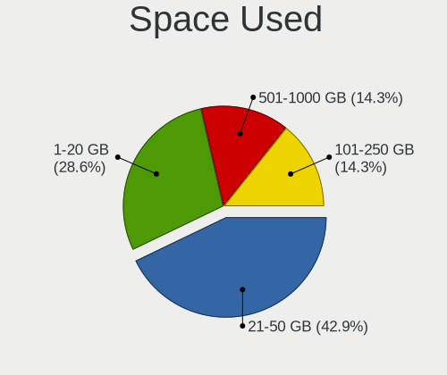
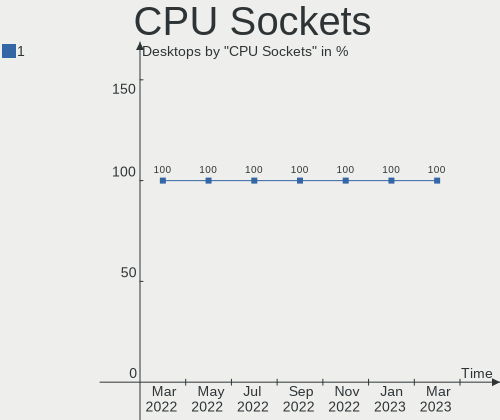
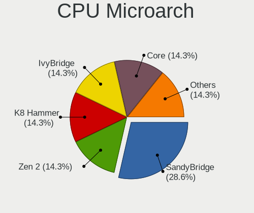
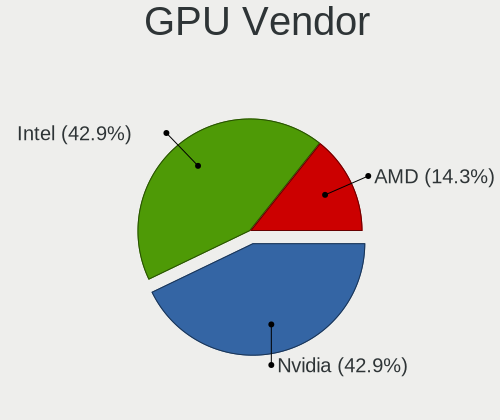
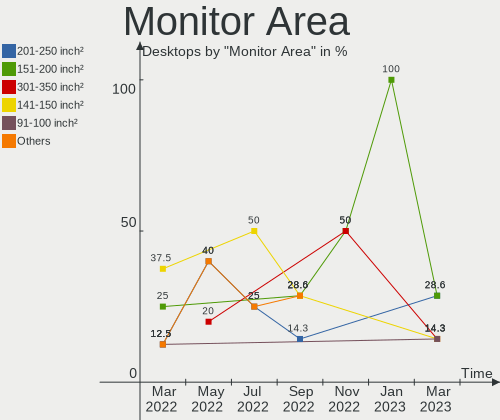
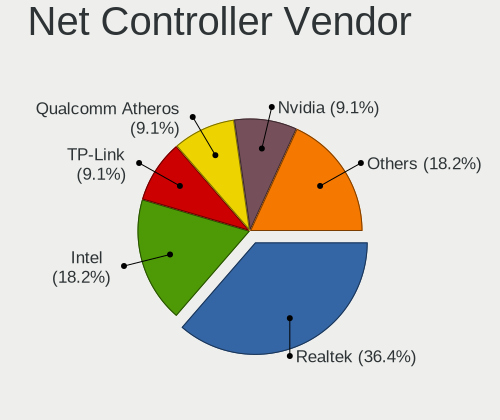

Endless Hardware Trends (Desktops)
----------------------------------

A project to identify most popular hardware characteristics and track their change
over time based on data collected by Endless users at https://Linux-Hardware.org.

Anyone can contribute to this report by the [hw-probe](https://github.com/linuxhw/hw-probe) tool:

    sudo -E hw-probe -all -upload

Full-feature report is available here: https://linux-hardware.org/?view=trends

Period: Dec, 2021.

Contents
--------

* [ System ](#system)
  - [ OS                       ](#os)
  - [ OS Family                ](#os-family)
  - [ Kernel                   ](#kernel)
  - [ Kernel Family            ](#kernel-family)
  - [ Kernel Major Ver.        ](#kernel-major-ver)
  - [ Arch                     ](#arch)
  - [ DE                       ](#de)
  - [ Display Server           ](#display-server)
  - [ Display Manager          ](#display-manager)
  - [ OS Lang                  ](#os-lang)
  - [ Boot Mode                ](#boot-mode)
  - [ Filesystem               ](#filesystem)
  - [ Part. scheme             ](#part-scheme)
  - [ Dual Boot with Linux/BSD ](#dual-boot-with-linuxbsd)
  - [ Dual Boot (Win)          ](#dual-boot-win)

* [ Board ](#board)
  - [ Vendor                   ](#vendor)
  - [ Model                    ](#model)
  - [ Model Family             ](#model-family)
  - [ MFG Year                 ](#mfg-year)
  - [ Form Factor              ](#form-factor)
  - [ Secure Boot              ](#secure-boot)
  - [ Coreboot                 ](#coreboot)
  - [ RAM Size                 ](#ram-size)
  - [ RAM Used                 ](#ram-used)
  - [ Total Drives             ](#total-drives)
  - [ Has CD-ROM               ](#has-cd-rom)
  - [ Has Ethernet             ](#has-ethernet)
  - [ Has WiFi                 ](#has-wifi)
  - [ Has Bluetooth            ](#has-bluetooth)

* [ Location ](#location)
  - [ Country                  ](#country)
  - [ City                     ](#city)

* [ Drives ](#drives)
  - [ Drive Vendor             ](#drive-vendor)
  - [ Drive Model              ](#drive-model)
  - [ HDD Vendor               ](#hdd-vendor)
  - [ SSD Vendor               ](#ssd-vendor)
  - [ Drive Kind               ](#drive-kind)
  - [ Drive Connector          ](#drive-connector)
  - [ Drive Size               ](#drive-size)
  - [ Space Total              ](#space-total)
  - [ Space Used               ](#space-used)
  - [ Malfunc. Drives          ](#malfunc-drives)
  - [ Malfunc. Drive Vendor    ](#malfunc-drive-vendor)
  - [ Malfunc. HDD Vendor      ](#malfunc-hdd-vendor)
  - [ Malfunc. Drive Kind      ](#malfunc-drive-kind)
  - [ Failed Drives            ](#failed-drives)
  - [ Failed Drive Vendor      ](#failed-drive-vendor)
  - [ Drive Status             ](#drive-status)

* [ Storage controller ](#storage-controller)
  - [ Storage Vendor           ](#storage-vendor)
  - [ Storage Model            ](#storage-model)
  - [ Storage Kind             ](#storage-kind)

* [ Processor ](#processor)
  - [ CPU Vendor               ](#cpu-vendor)
  - [ CPU Model                ](#cpu-model)
  - [ CPU Model Family         ](#cpu-model-family)
  - [ CPU Cores                ](#cpu-cores)
  - [ CPU Sockets              ](#cpu-sockets)
  - [ CPU Threads              ](#cpu-threads)
  - [ CPU Op-Modes             ](#cpu-op-modes)
  - [ CPU Microcode            ](#cpu-microcode)
  - [ CPU Microarch            ](#cpu-microarch)

* [ Graphics ](#graphics)
  - [ GPU Vendor               ](#gpu-vendor)
  - [ GPU Model                ](#gpu-model)
  - [ GPU Combo                ](#gpu-combo)
  - [ GPU Driver               ](#gpu-driver)
  - [ GPU Memory               ](#gpu-memory)

* [ Monitor ](#monitor)
  - [ Monitor Vendor           ](#monitor-vendor)
  - [ Monitor Model            ](#monitor-model)
  - [ Monitor Resolution       ](#monitor-resolution)
  - [ Monitor Diagonal         ](#monitor-diagonal)
  - [ Monitor Width            ](#monitor-width)
  - [ Aspect Ratio             ](#aspect-ratio)
  - [ Monitor Area             ](#monitor-area)
  - [ Pixel Density            ](#pixel-density)
  - [ Multiple Monitors        ](#multiple-monitors)

* [ Network ](#network)
  - [ Net Controller Vendor    ](#net-controller-vendor)
  - [ Net Controller Model     ](#net-controller-model)
  - [ Wireless Vendor          ](#wireless-vendor)
  - [ Wireless Model           ](#wireless-model)
  - [ Ethernet Vendor          ](#ethernet-vendor)
  - [ Ethernet Model           ](#ethernet-model)
  - [ Net Controller Kind      ](#net-controller-kind)
  - [ Used Controller          ](#used-controller)
  - [ NICs                     ](#nics)
  - [ IPv6                     ](#ipv6)

* [ Bluetooth ](#bluetooth)
  - [ Bluetooth Vendor         ](#bluetooth-vendor)
  - [ Bluetooth Model          ](#bluetooth-model)

* [ Sound ](#sound)
  - [ Sound Vendor             ](#sound-vendor)
  - [ Sound Model              ](#sound-model)

* [ Memory ](#memory)
  - [ Memory Vendor            ](#memory-vendor)
  - [ Memory Model             ](#memory-model)
  - [ Memory Kind              ](#memory-kind)
  - [ Memory Form Factor       ](#memory-form-factor)
  - [ Memory Size              ](#memory-size)
  - [ Memory Speed             ](#memory-speed)

* [ Printers & scanners ](#printers--scanners)
  - [ Printer Vendor           ](#printer-vendor)
  - [ Printer Model            ](#printer-model)
  - [ Scanner Vendor           ](#scanner-vendor)
  - [ Scanner Model            ](#scanner-model)

* [ Camera ](#camera)
  - [ Camera Vendor            ](#camera-vendor)
  - [ Camera Model             ](#camera-model)

* [ Security ](#security)
  - [ Fingerprint Vendor       ](#fingerprint-vendor)
  - [ Fingerprint Model        ](#fingerprint-model)
  - [ Chipcard Vendor          ](#chipcard-vendor)
  - [ Chipcard Model           ](#chipcard-model)

* [ Unsupported ](#unsupported)
  - [ Unsupported Devices      ](#unsupported-devices)
  - [ Unsupported Device Types ](#unsupported-device-types)

System
------

OS
--

Installed operating systems

| Name          | Desktops | Percent |
|---------------|----------|---------|
| Endless 4.0.2 | 5        | 38.46%  |
| Endless 4.0.1 | 2        | 15.38%  |
| Endless 4.0.0 | 2        | 15.38%  |
| Endless 3.9.6 | 2        | 15.38%  |
| Endless 5.0.0 | 1        | 7.69%   |
| Endless 3.9.5 | 1        | 7.69%   |

OS Family
---------

OS without a version

| Name    | Desktops | Percent |
|---------|----------|---------|
| Endless | 13       | 100%    |

Kernel
------

Version of the Linux kernel

| Version           | Desktops | Percent |
|-------------------|----------|---------|
| 5.11.0-35-generic | 9        | 69.23%  |
| 5.8.0-14-generic  | 3        | 23.08%  |
| 5.13.0-20-generic | 1        | 7.69%   |

Kernel Family
-------------

Linux kernel without a distro release

| Version | Desktops | Percent |
|---------|----------|---------|
| 5.11.0  | 9        | 69.23%  |
| 5.8.0   | 3        | 23.08%  |
| 5.13.0  | 1        | 7.69%   |

Kernel Major Ver.
-----------------

Linux kernel major version

| Version | Desktops | Percent |
|---------|----------|---------|
| 5.11    | 9        | 69.23%  |
| 5.8     | 3        | 23.08%  |
| 5.13    | 1        | 7.69%   |

Arch
----

OS architecture (x86_64, i586, etc.)

| Name   | Desktops | Percent |
|--------|----------|---------|
| x86_64 | 13       | 100%    |

DE
--

Desktop Environment

| Name  | Desktops | Percent |
|-------|----------|---------|
| GNOME | 13       | 100%    |

Display Server
--------------

X11 or Wayland

| Name | Desktops | Percent |
|------|----------|---------|
| X11  | 13       | 100%    |

Display Manager
---------------

SDDM, LightDM, etc.

| Name    | Desktops | Percent |
|---------|----------|---------|
| Unknown | 13       | 100%    |

OS Lang
-------

Language

| Lang  | Desktops | Percent |
|-------|----------|---------|
| en_US | 7        | 53.85%  |
| pt_BR | 2        | 15.38%  |
| ru_RU | 1        | 7.69%   |
| id_ID | 1        | 7.69%   |
| de_AT | 1        | 7.69%   |
| cs_CZ | 1        | 7.69%   |

Boot Mode
---------

EFI or BIOS

| Mode | Desktops | Percent |
|------|----------|---------|
| BIOS | 7        | 53.85%  |
| EFI  | 6        | 46.15%  |

Filesystem
----------

Type of filesystem

| Type | Desktops | Percent |
|------|----------|---------|
| Ext4 | 13       | 100%    |

Part. scheme
------------

Scheme of partitioning

| Type    | Desktops | Percent |
|---------|----------|---------|
| Unknown | 13       | 100%    |

Dual Boot with Linux/BSD
------------------------

Hosting more than one Linux/BSD

| Dual boot | Desktops | Percent |
|-----------|----------|---------|
| No        | 13       | 100%    |

Dual Boot (Win)
---------------

Hosting Linux and Windows

| Dual boot | Desktops | Percent |
|-----------|----------|---------|
| No        | 13       | 100%    |

Board
-----

Vendor
------

Motherboard manufacturer

| Name                | Desktops | Percent |
|---------------------|----------|---------|
| ASUSTek Computer    | 4        | 30.77%  |
| Acer                | 2        | 15.38%  |
| Megaware            | 1        | 7.69%   |
| Medion              | 1        | 7.69%   |
| Hewlett-Packard     | 1        | 7.69%   |
| Gigabyte Technology | 1        | 7.69%   |
| Foxconn             | 1        | 7.69%   |
| Dell                | 1        | 7.69%   |
| ASRock              | 1        | 7.69%   |

Model
-----

Motherboard model

| Name                          | Desktops | Percent |
|-------------------------------|----------|---------|
| Megaware G41T-M7              | 1        | 7.69%   |
| Medion E4110                  | 1        | 7.69%   |
| HP 550-153w                   | 1        | 7.69%   |
| Gigabyte B360M AORUS Gaming 3 | 1        | 7.69%   |
| Foxconn Pro 3330 MT           | 1        | 7.69%   |
| Dell OptiPlex 9010            | 1        | 7.69%   |
| ASUS M5A78L-M LX3             | 1        | 7.69%   |
| ASUS M5A78L-M LX PLUS         | 1        | 7.69%   |
| ASUS M4A77                    | 1        | 7.69%   |
| ASUS All Series               | 1        | 7.69%   |
| ASRock A88M-G                 | 1        | 7.69%   |
| Acer Nitro N50-600            | 1        | 7.69%   |
| Acer Aspire XC-830            | 1        | 7.69%   |

Model Family
------------

Motherboard model prefix

| Name             | Desktops | Percent |
|------------------|----------|---------|
| ASUS M5A78L-M    | 2        | 15.38%  |
| Megaware G41T-M7 | 1        | 7.69%   |
| Medion E4110     | 1        | 7.69%   |
| HP 550-153w      | 1        | 7.69%   |
| Gigabyte B360M   | 1        | 7.69%   |
| Foxconn Pro      | 1        | 7.69%   |
| Dell OptiPlex    | 1        | 7.69%   |
| ASUS M4A77       | 1        | 7.69%   |
| ASUS All         | 1        | 7.69%   |
| ASRock A88M-G    | 1        | 7.69%   |
| Acer Nitro       | 1        | 7.69%   |
| Acer Aspire      | 1        | 7.69%   |

MFG Year
--------

Motherboard manufacture year

| Year | Desktops | Percent |
|------|----------|---------|
| 2020 | 2        | 15.38%  |
| 2018 | 2        | 15.38%  |
| 2016 | 2        | 15.38%  |
| 2014 | 2        | 15.38%  |
| 2021 | 1        | 7.69%   |
| 2015 | 1        | 7.69%   |
| 2013 | 1        | 7.69%   |
| 2011 | 1        | 7.69%   |
| 2010 | 1        | 7.69%   |

Form Factor
-----------

Physical design of the computer

| Name    | Desktops | Percent |
|---------|----------|---------|
| Desktop | 13       | 100%    |

Secure Boot
-----------

Enabled or disabled

| State    | Desktops | Percent |
|----------|----------|---------|
| Disabled | 13       | 100%    |

Coreboot
--------

Have coreboot on board

| Used | Desktops | Percent |
|------|----------|---------|
| No   | 13       | 100%    |

RAM Size
--------

Total RAM memory

| Size in GB | Desktops | Percent |
|------------|----------|---------|
| 8.01-16.0  | 5        | 38.46%  |
| 3.01-4.0   | 3        | 23.08%  |
| 16.01-24.0 | 3        | 23.08%  |
| 4.01-8.0   | 2        | 15.38%  |

RAM Used
--------

Used RAM memory

| Used GB  | Desktops | Percent |
|----------|----------|---------|
| 1.01-2.0 | 9        | 69.23%  |
| 2.01-3.0 | 2        | 15.38%  |
| 4.01-8.0 | 1        | 7.69%   |
| 0.51-1.0 | 1        | 7.69%   |

Total Drives
------------

Number of drives on board

| Drives | Desktops | Percent |
|--------|----------|---------|
| 1      | 10       | 76.92%  |
| 2      | 2        | 15.38%  |
| 3      | 1        | 7.69%   |

Has CD-ROM
----------

Has CD-ROM on board

| Presented | Desktops | Percent |
|-----------|----------|---------|
| No        | 7        | 53.85%  |
| Yes       | 6        | 46.15%  |

Has Ethernet
------------

Has Ethernet on board

| Presented | Desktops | Percent |
|-----------|----------|---------|
| Yes       | 13       | 100%    |

Has WiFi
--------

Has WiFi module

| Presented | Desktops | Percent |
|-----------|----------|---------|
| No        | 7        | 53.85%  |
| Yes       | 6        | 46.15%  |

Has Bluetooth
-------------

Has Bluetooth module

| Presented | Desktops | Percent |
|-----------|----------|---------|
| No        | 10       | 76.92%  |
| Yes       | 3        | 23.08%  |

Location
--------

Country
-------

Geographic location (country)

| Country   | Desktops | Percent |
|-----------|----------|---------|
| USA       | 4        | 30.77%  |
| Russia    | 2        | 15.38%  |
| Brazil    | 2        | 15.38%  |
| Poland    | 1        | 7.69%   |
| Indonesia | 1        | 7.69%   |
| Czechia   | 1        | 7.69%   |
| Austria   | 1        | 7.69%   |
| Australia | 1        | 7.69%   |

City
----

Geographic location (city)

| City                | Desktops | Percent |
|---------------------|----------|---------|
| Bucyrus             | 3        | 23.08%  |
| Viam??o             | 1        | 7.69%   |
| Tuban               | 1        | 7.69%   |
| Teixeira de Freitas | 1        | 7.69%   |
| Sydney              | 1        | 7.69%   |
| St Petersburg       | 1        | 7.69%   |
| Moscow              | 1        | 7.69%   |
| Mason               | 1        | 7.69%   |
| Lovosice            | 1        | 7.69%   |
| Gliwice             | 1        | 7.69%   |
| Aurolzmuenster      | 1        | 7.69%   |

Drives
------

Drive Vendor
------------

Hard drive vendors

| Vendor          | Desktops | Drives | Percent |
|-----------------|----------|--------|---------|
| Kingston        | 5        | 5      | 31.25%  |
| WDC             | 1        | 1      | 6.25%   |
| TSA             | 1        | 1      | 6.25%   |
| Toshiba         | 1        | 1      | 6.25%   |
| Seagate         | 1        | 1      | 6.25%   |
| SanDisk         | 1        | 1      | 6.25%   |
| OCZ             | 1        | 1      | 6.25%   |
| LITEONIT        | 1        | 1      | 6.25%   |
| Hitachi         | 1        | 1      | 6.25%   |
| HGST            | 1        | 1      | 6.25%   |
| Hewlett-Packard | 1        | 1      | 6.25%   |
| ASMT            | 1        | 1      | 6.25%   |

Drive Model
-----------

Hard drive models

| Model                            | Desktops | Percent |
|----------------------------------|----------|---------|
| Kingston SV300S37A120G 120GB SSD | 3        | 18.75%  |
| WDC WD5000AVDS-63U7B1 500GB      | 1        | 6.25%   |
| TSA SSD 64GB                     | 1        | 6.25%   |
| Toshiba DT01ACA200 2TB           | 1        | 6.25%   |
| Seagate ST500DM002-1BD142 500GB  | 1        | 6.25%   |
| SanDisk SDSSDA240G 240GB         | 1        | 6.25%   |
| OCZ VERTEX3 120GB SSD            | 1        | 6.25%   |
| LITEONIT E200-080 80GB SSD       | 1        | 6.25%   |
| Kingston NVMe SSD Drive 512GB    | 1        | 6.25%   |
| Kingston NVMe SSD Drive 128GB    | 1        | 6.25%   |
| Hitachi HTS547550A9E384 500GB    | 1        | 6.25%   |
| HGST HTS545050A7E380 500GB       | 1        | 6.25%   |
| HP SSD S700 1TB                  | 1        | 6.25%   |
| ASMT 2115 256GB                  | 1        | 6.25%   |

HDD Vendor
----------

Hard disk drive vendors

| Vendor  | Desktops | Drives | Percent |
|---------|----------|--------|---------|
| WDC     | 1        | 1      | 20%     |
| Toshiba | 1        | 1      | 20%     |
| Seagate | 1        | 1      | 20%     |
| Hitachi | 1        | 1      | 20%     |
| HGST    | 1        | 1      | 20%     |

SSD Vendor
----------

Solid state drive vendors

| Vendor          | Desktops | Drives | Percent |
|-----------------|----------|--------|---------|
| Kingston        | 3        | 3      | 33.33%  |
| TSA             | 1        | 1      | 11.11%  |
| SanDisk         | 1        | 1      | 11.11%  |
| OCZ             | 1        | 1      | 11.11%  |
| LITEONIT        | 1        | 1      | 11.11%  |
| Hewlett-Packard | 1        | 1      | 11.11%  |
| ASMT            | 1        | 1      | 11.11%  |

Drive Kind
----------

HDD or SSD

| Kind | Desktops | Drives | Percent |
|------|----------|--------|---------|
| SSD  | 9        | 9      | 56.25%  |
| HDD  | 5        | 5      | 31.25%  |
| NVMe | 2        | 2      | 12.5%   |

Drive Connector
---------------

SATA, SAS, NVMe, etc.

| Type | Desktops | Drives | Percent |
|------|----------|--------|---------|
| SATA | 11       | 13     | 78.57%  |
| NVMe | 2        | 2      | 14.29%  |
| SAS  | 1        | 1      | 7.14%   |

Drive Size
----------

Size of hard drive

| Size in TB | Desktops | Drives | Percent |
|------------|----------|--------|---------|
| 0.01-0.5   | 10       | 12     | 83.33%  |
| 1.01-2.0   | 1        | 1      | 8.33%   |
| 0.51-1.0   | 1        | 1      | 8.33%   |

Space Total
-----------

Amount of disk space available on the file system

| Size in GB | Desktops | Percent |
|------------|----------|---------|
| 101-250    | 5        | 38.46%  |
| 251-500    | 4        | 30.77%  |
| 51-100     | 3        | 23.08%  |
| 2001-3000  | 1        | 7.69%   |

Space Used
----------

Amount of used disk space

| Used GB | Desktops | Percent |
|---------|----------|---------|
| 21-50   | 7        | 53.85%  |
| 1-20    | 3        | 23.08%  |
| 51-100  | 2        | 15.38%  |
| 101-250 | 1        | 7.69%   |

Malfunc. Drives
---------------

Drive models with a malfunction

Zero info for selected period =(

Malfunc. Drive Vendor
---------------------

Vendors of faulty drives

Zero info for selected period =(

Malfunc. HDD Vendor
-------------------

Vendors of faulty HDD drives

Zero info for selected period =(

Malfunc. Drive Kind
-------------------

Kinds of faulty drives

Zero info for selected period =(

Failed Drives
-------------

Failed drive models

Zero info for selected period =(

Failed Drive Vendor
-------------------

Failed drive vendors

Zero info for selected period =(

Drive Status
------------

Number of failed and malfunc. drives

| Status   | Desktops | Drives | Percent |
|----------|----------|--------|---------|
| Detected | 13       | 16     | 100%    |

Storage controller
------------------

Storage Vendor
--------------

Storage controller vendors

| Vendor                      | Desktops | Percent |
|-----------------------------|----------|---------|
| Intel                       | 8        | 53.33%  |
| AMD                         | 5        | 33.33%  |
| Kingston Technology Company | 2        | 13.33%  |

Storage Model
-------------

Storage controller models

| Model                                                                          | Desktops | Percent |
|--------------------------------------------------------------------------------|----------|---------|
| AMD SB7x0/SB8x0/SB9x0 IDE Controller                                           | 3        | 14.29%  |
| Kingston Company U-SNS8154P3 NVMe SSD                                          | 2        | 9.52%   |
| Intel Cannon Lake PCH SATA AHCI Controller                                     | 2        | 9.52%   |
| Intel 8 Series/C220 Series Chipset Family 6-port SATA Controller 1 [AHCI mode] | 2        | 9.52%   |
| AMD SB7x0/SB8x0/SB9x0 SATA Controller [IDE mode]                               | 2        | 9.52%   |
| AMD FCH SATA Controller [AHCI mode]                                            | 2        | 9.52%   |
| AMD FCH IDE Controller                                                         | 2        | 9.52%   |
| Intel SATA Controller [RAID mode]                                              | 1        | 4.76%   |
| Intel NM10/ICH7 Family SATA Controller [IDE mode]                              | 1        | 4.76%   |
| Intel Celeron/Pentium Silver Processor SATA Controller                         | 1        | 4.76%   |
| Intel 82801G (ICH7 Family) IDE Controller                                      | 1        | 4.76%   |
| Intel 6 Series/C200 Series Chipset Family 6 port Desktop SATA AHCI Controller  | 1        | 4.76%   |
| AMD SB7x0/SB8x0/SB9x0 SATA Controller [AHCI mode]                              | 1        | 4.76%   |

Storage Kind
------------

Kind of storage controller (IDE, SATA, NVMe, SAS, ...)

| Kind | Desktops | Percent |
|------|----------|---------|
| SATA | 11       | 55%     |
| IDE  | 6        | 30%     |
| NVMe | 2        | 10%     |
| RAID | 1        | 5%      |

Processor
---------

CPU Vendor
----------

Processor vendors

| Vendor | Desktops | Percent |
|--------|----------|---------|
| Intel  | 8        | 61.54%  |
| AMD    | 5        | 38.46%  |

CPU Model
---------

Processor models

| Model                                         | Desktops | Percent |
|-----------------------------------------------|----------|---------|
| Intel Core i3-4370 CPU @ 3.80GHz              | 2        | 15.38%  |
| Intel Core i7-2600 CPU @ 3.40GHz              | 1        | 7.69%   |
| Intel Core i5-9400F CPU @ 2.90GHz             | 1        | 7.69%   |
| Intel Core i5-2400 CPU @ 3.10GHz              | 1        | 7.69%   |
| Intel Core i3-8100 CPU @ 3.60GHz              | 1        | 7.69%   |
| Intel Celeron J4025 CPU @ 2.00GHz             | 1        | 7.69%   |
| Intel Celeron CPU E3400 @ 2.60GHz             | 1        | 7.69%   |
| AMD Phenom II X6 1100T Processor              | 1        | 7.69%   |
| AMD FX-4300 Quad-Core Processor               | 1        | 7.69%   |
| AMD Athlon II X2 270 Processor                | 1        | 7.69%   |
| AMD A8-7600 Radeon R7, 10 Compute Cores 4C+6G | 1        | 7.69%   |
| AMD A8-6500 APU with Radeon HD Graphics       | 1        | 7.69%   |

CPU Model Family
----------------

Processor model prefix

| Model            | Desktops | Percent |
|------------------|----------|---------|
| Intel Core i3    | 3        | 23.08%  |
| Intel Core i5    | 2        | 15.38%  |
| Intel Celeron    | 2        | 15.38%  |
| AMD A8           | 2        | 15.38%  |
| Intel Core i7    | 1        | 7.69%   |
| AMD Phenom II X6 | 1        | 7.69%   |
| AMD FX           | 1        | 7.69%   |
| AMD Athlon II X2 | 1        | 7.69%   |

CPU Cores
---------

Number of processor cores

| Number | Desktops | Percent |
|--------|----------|---------|
| 2      | 8        | 61.54%  |
| 4      | 3        | 23.08%  |
| 6      | 2        | 15.38%  |

CPU Sockets
-----------

Number of sockets

| Number | Desktops | Percent |
|--------|----------|---------|
| 1      | 13       | 100%    |

CPU Threads
-----------

Threads per core (Hyper-Threading)

| Number | Desktops | Percent |
|--------|----------|---------|
| 1      | 7        | 53.85%  |
| 2      | 6        | 46.15%  |

CPU Op-Modes
------------

CPU Operation Modes (32-bit, 64-bit)

| Op mode        | Desktops | Percent |
|----------------|----------|---------|
| 32-bit, 64-bit | 13       | 100%    |

CPU Microcode
-------------

Microcode number

| Number     | Desktops | Percent |
|------------|----------|---------|
| 0x306c3    | 2        | 15.38%  |
| 0x906eb    | 1        | 7.69%   |
| 0x906ea    | 1        | 7.69%   |
| 0x706a8    | 1        | 7.69%   |
| 0x206a7    | 1        | 7.69%   |
| 0x1067a    | 1        | 7.69%   |
| 0x06003104 | 1        | 7.69%   |
| 0x06001119 | 1        | 7.69%   |
| 0x06000852 | 1        | 7.69%   |
| 0x010000dc | 1        | 7.69%   |
| 0x010000c8 | 1        | 7.69%   |
| Unknown    | 1        | 7.69%   |

CPU Microarch
-------------

Microarchitecture

| Name          | Desktops | Percent |
|---------------|----------|---------|
| SandyBridge   | 2        | 15.38%  |
| Piledriver    | 2        | 15.38%  |
| KabyLake      | 2        | 15.38%  |
| K10           | 2        | 15.38%  |
| Haswell       | 2        | 15.38%  |
| Steamroller   | 1        | 7.69%   |
| Penryn        | 1        | 7.69%   |
| Goldmont plus | 1        | 7.69%   |

Graphics
--------

GPU Vendor
----------

Vendors of graphics cards

| Vendor | Desktops | Percent |
|--------|----------|---------|
| Intel  | 6        | 42.86%  |
| Nvidia | 4        | 28.57%  |
| AMD    | 4        | 28.57%  |

GPU Model
---------

Graphics card models

| Model                                                                       | Desktops | Percent |
|-----------------------------------------------------------------------------|----------|---------|
| Intel Xeon E3-1200 v3/4th Gen Core Processor Integrated Graphics Controller | 2        | 14.29%  |
| AMD Hawaii PRO [Radeon R9 290/390]                                          | 2        | 14.29%  |
| Nvidia TU117 [GeForce GTX 1650]                                             | 1        | 7.14%   |
| Nvidia GP108 [GeForce GT 1030]                                              | 1        | 7.14%   |
| Nvidia GF108 [GeForce GT 730]                                               | 1        | 7.14%   |
| Nvidia GF104 [GeForce GTX 460]                                              | 1        | 7.14%   |
| Intel GeminiLake [UHD Graphics 600]                                         | 1        | 7.14%   |
| Intel CoffeeLake-S GT2 [UHD Graphics 630]                                   | 1        | 7.14%   |
| Intel 4 Series Chipset Integrated Graphics Controller                       | 1        | 7.14%   |
| Intel 2nd Generation Core Processor Family Integrated Graphics Controller   | 1        | 7.14%   |
| AMD Pitcairn XT [Radeon HD 7870 GHz Edition]                                | 1        | 7.14%   |
| AMD Kaveri [Radeon R7 Graphics]                                             | 1        | 7.14%   |

GPU Combo
---------

Combinations of graphics cards

| Name       | Desktops | Percent |
|------------|----------|---------|
| 1 x Intel  | 6        | 46.15%  |
| 1 x AMD    | 4        | 30.77%  |
| 1 x Nvidia | 3        | 23.08%  |

GPU Driver
----------

Free vs proprietary

| Driver      | Desktops | Percent |
|-------------|----------|---------|
| Free        | 11       | 84.62%  |
| Proprietary | 2        | 15.38%  |

GPU Memory
----------

Total video memory

| Size in GB | Desktops | Percent |
|------------|----------|---------|
| Unknown    | 8        | 61.54%  |
| 7.01-8.0   | 2        | 15.38%  |
| 3.01-4.0   | 1        | 7.69%   |
| 1.01-2.0   | 1        | 7.69%   |
| 0.51-1.0   | 1        | 7.69%   |

Monitor
-------

Monitor Vendor
--------------

Monitor vendors

| Vendor              | Desktops | Percent |
|---------------------|----------|---------|
| Samsung Electronics | 3        | 25%     |
| Goldstar            | 3        | 25%     |
| HSI                 | 2        | 16.67%  |
| SGT                 | 1        | 8.33%   |
| Philips             | 1        | 8.33%   |
| Dell                | 1        | 8.33%   |
| Acer                | 1        | 8.33%   |

Monitor Model
-------------

Monitor models

| Model                                                             | Desktops | Percent |
|-------------------------------------------------------------------|----------|---------|
| HSI HiTV HSI0001 3840x2160 708x398mm 32.0-inch                    | 2        | 16.67%  |
| SGT MDS-156F13 SGT0173 3840x2160 379x213mm 17.1-inch              | 1        | 8.33%   |
| Samsung Electronics U28E570 SAM0D71 3840x2160 608x345mm 27.5-inch | 1        | 8.33%   |
| Samsung Electronics U28D590 SAM0B80 3840x2160 607x345mm 27.5-inch | 1        | 8.33%   |
| Samsung Electronics S19A10N SAM083E 1366x768 410x230mm 18.5-inch  | 1        | 8.33%   |
| Philips 190SW PHL086D 1440x900 408x255mm 18.9-inch                | 1        | 8.33%   |
| Goldstar W2243 GSM56FE 1920x1080 477x269mm 21.6-inch              | 1        | 8.33%   |
| Goldstar W1752 GSM4490 1440x900 370x232mm 17.2-inch               | 1        | 8.33%   |
| Goldstar L1953H GSM4B3D 1280x1024 338x270mm 17.0-inch             | 1        | 8.33%   |
| Dell E2011H DEL406C 1600x900 443x249mm 20.0-inch                  | 1        | 8.33%   |
| Acer RG270 ACR061E 1920x1080 598x336mm 27.0-inch                  | 1        | 8.33%   |

Monitor Resolution
------------------

Monitor screen resolution

| Resolution       | Desktops | Percent |
|------------------|----------|---------|
| 3840x2160 (4K)   | 5        | 41.67%  |
| 1920x1080 (FHD)  | 2        | 16.67%  |
| 1440x900 (WXGA+) | 2        | 16.67%  |
| 1600x900 (HD+)   | 1        | 8.33%   |
| 1366x768 (WXGA)  | 1        | 8.33%   |
| 1280x1024 (SXGA) | 1        | 8.33%   |

Monitor Diagonal
----------------

Diagonal size in inches

| Inches | Desktops | Percent |
|--------|----------|---------|
| 27     | 3        | 25%     |
| 17     | 3        | 25%     |
| 34     | 2        | 16.67%  |
| 18     | 2        | 16.67%  |
| 21     | 1        | 8.33%   |
| 20     | 1        | 8.33%   |

Monitor Width
-------------

Physical width

| Width in mm | Desktops | Percent |
|-------------|----------|---------|
| 401-500     | 4        | 33.33%  |
| 701-800     | 2        | 16.67%  |
| 601-700     | 2        | 16.67%  |
| 351-400     | 2        | 16.67%  |
| 501-600     | 1        | 8.33%   |
| 301-350     | 1        | 8.33%   |

Aspect Ratio
------------

Proportional relationship between the width and the height

| Ratio | Desktops | Percent |
|-------|----------|---------|
| 16/9  | 8        | 66.67%  |
| 21/9  | 2        | 16.67%  |
| 5/4   | 1        | 8.33%   |
| 16/10 | 1        | 8.33%   |

Monitor Area
------------

Area in inch²

| Area in inch² | Desktops | Percent |
|----------------|----------|---------|
| 301-350        | 3        | 25%     |
| 351-500        | 2        | 16.67%  |
| 151-200        | 2        | 16.67%  |
| 141-150        | 2        | 16.67%  |
| 201-250        | 1        | 8.33%   |
| 131-140        | 1        | 8.33%   |
| 121-130        | 1        | 8.33%   |

Pixel Density
-------------

Pixels per inch

| Density       | Desktops | Percent |
|---------------|----------|---------|
| 51-100        | 8        | 66.67%  |
| More than 240 | 1        | 8.33%   |
| 161-240       | 1        | 8.33%   |
| 121-160       | 1        | 8.33%   |
| 101-120       | 1        | 8.33%   |

Multiple Monitors
-----------------

Total monitors connected

| Total | Desktops | Percent |
|-------|----------|---------|
| 1     | 13       | 100%    |

Network
-------

Net Controller Vendor
---------------------

Controller vendors

| Vendor                    | Desktops | Percent |
|---------------------------|----------|---------|
| Realtek Semiconductor     | 13       | 61.9%   |
| Intel                     | 3        | 14.29%  |
| Ralink Technology         | 2        | 9.52%   |
| Spreadtrum Communications | 1        | 4.76%   |
| Qualcomm Atheros          | 1        | 4.76%   |
| Qualcomm                  | 1        | 4.76%   |

Net Controller Model
--------------------

Controller models

| Model                                                             | Desktops | Percent |
|-------------------------------------------------------------------|----------|---------|
| Realtek RTL8111/8168/8411 PCI Express Gigabit Ethernet Controller | 9        | 40.91%  |
| Ralink RT5370 Wireless Adapter                                    | 2        | 9.09%   |
| Spreadtrum Nokia C30                                              | 1        | 4.55%   |
| Realtek RTL88x2bu [AC1200 Techkey]                                | 1        | 4.55%   |
| Realtek RTL8192EU 802.11b/g/n WLAN Adapter                        | 1        | 4.55%   |
| Realtek RTL8192EE PCIe Wireless Network Adapter                   | 1        | 4.55%   |
| Realtek RTL8188CUS 802.11n WLAN Adapter                           | 1        | 4.55%   |
| Realtek Killer E2600 Gigabit Ethernet Controller                  | 1        | 4.55%   |
| Qualcomm Mobile Router                                            | 1        | 4.55%   |
| Qualcomm Atheros AR8161 Gigabit Ethernet                          | 1        | 4.55%   |
| Intel Ethernet Connection (7) I219-V                              | 1        | 4.55%   |
| Intel Cannon Lake PCH CNVi WiFi                                   | 1        | 4.55%   |
| Intel 82579LM Gigabit Network Connection (Lewisville)             | 1        | 4.55%   |

Wireless Vendor
---------------

Wireless vendors

| Vendor                | Desktops | Percent |
|-----------------------|----------|---------|
| Realtek Semiconductor | 4        | 57.14%  |
| Ralink Technology     | 2        | 28.57%  |
| Intel                 | 1        | 14.29%  |

Wireless Model
--------------

Wireless models

| Model                                           | Desktops | Percent |
|-------------------------------------------------|----------|---------|
| Ralink RT5370 Wireless Adapter                  | 2        | 28.57%  |
| Realtek RTL88x2bu [AC1200 Techkey]              | 1        | 14.29%  |
| Realtek RTL8192EU 802.11b/g/n WLAN Adapter      | 1        | 14.29%  |
| Realtek RTL8192EE PCIe Wireless Network Adapter | 1        | 14.29%  |
| Realtek RTL8188CUS 802.11n WLAN Adapter         | 1        | 14.29%  |
| Intel Cannon Lake PCH CNVi WiFi                 | 1        | 14.29%  |

Ethernet Vendor
---------------

Ethernet vendors

| Vendor                    | Desktops | Percent |
|---------------------------|----------|---------|
| Realtek Semiconductor     | 10       | 66.67%  |
| Intel                     | 2        | 13.33%  |
| Spreadtrum Communications | 1        | 6.67%   |
| Qualcomm Atheros          | 1        | 6.67%   |
| Qualcomm                  | 1        | 6.67%   |

Ethernet Model
--------------

Ethernet models

| Model                                                             | Desktops | Percent |
|-------------------------------------------------------------------|----------|---------|
| Realtek RTL8111/8168/8411 PCI Express Gigabit Ethernet Controller | 9        | 60%     |
| Spreadtrum Nokia C30                                              | 1        | 6.67%   |
| Realtek Killer E2600 Gigabit Ethernet Controller                  | 1        | 6.67%   |
| Qualcomm Mobile Router                                            | 1        | 6.67%   |
| Qualcomm Atheros AR8161 Gigabit Ethernet                          | 1        | 6.67%   |
| Intel Ethernet Connection (7) I219-V                              | 1        | 6.67%   |
| Intel 82579LM Gigabit Network Connection (Lewisville)             | 1        | 6.67%   |

Net Controller Kind
-------------------

Ethernet, WiFi or modem

| Kind     | Desktops | Percent |
|----------|----------|---------|
| Ethernet | 13       | 68.42%  |
| WiFi     | 6        | 31.58%  |

Used Controller
---------------

Currently used network controller

| Kind     | Desktops | Percent |
|----------|----------|---------|
| Ethernet | 13       | 68.42%  |
| WiFi     | 6        | 31.58%  |

NICs
----

Total network controllers on board

| Total | Desktops | Percent |
|-------|----------|---------|
| 1     | 11       | 84.62%  |
| 2     | 2        | 15.38%  |

IPv6
----

IPv6 vs IPv4

| Used | Desktops | Percent |
|------|----------|---------|
| No   | 8        | 61.54%  |
| Yes  | 5        | 38.46%  |

Bluetooth
---------

Bluetooth Vendor
----------------

Controller vendors

| Vendor                  | Desktops | Percent |
|-------------------------|----------|---------|
| Intel                   | 1        | 33.33%  |
| Cambridge Silicon Radio | 1        | 33.33%  |
| Broadcom                | 1        | 33.33%  |

Bluetooth Model
---------------

Controller models

| Model                                               | Desktops | Percent |
|-----------------------------------------------------|----------|---------|
| Intel Bluetooth Device                              | 1        | 33.33%  |
| Cambridge Silicon Radio Bluetooth Dongle (HCI mode) | 1        | 33.33%  |
| Broadcom BCM43142A0 Bluetooth Device                | 1        | 33.33%  |

Sound
-----

Sound Vendor
------------

Sound card vendors

| Vendor                 | Desktops | Percent |
|------------------------|----------|---------|
| Intel                  | 9        | 45%     |
| AMD                    | 5        | 25%     |
| Nvidia                 | 4        | 20%     |
| VIA Technologies       | 1        | 5%      |
| Generalplus Technology | 1        | 5%      |

Sound Model
-----------

Sound card models

| Model                                                                       | Desktops | Percent |
|-----------------------------------------------------------------------------|----------|---------|
| AMD SBx00 Azalia (Intel HDA)                                                | 3        | 12%     |
| Intel Xeon E3-1200 v3/4th Gen Core Processor HD Audio Controller            | 2        | 8%      |
| Intel Cannon Lake PCH cAVS                                                  | 2        | 8%      |
| AMD Hawaii HDMI Audio [Radeon R9 290/290X / 390/390X]                       | 2        | 8%      |
| AMD FCH Azalia Controller                                                   | 2        | 8%      |
| VIA Technologies VT1720/24 [Envy24PT/HT] PCI Multi-Channel Audio Controller | 1        | 4%      |
| Nvidia TU107 GeForce GTX 1650 High Definition Audio Controller              | 1        | 4%      |
| Nvidia GP108 High Definition Audio Controller                               | 1        | 4%      |
| Nvidia GF108 High Definition Audio Controller                               | 1        | 4%      |
| Nvidia GF104 High Definition Audio Controller                               | 1        | 4%      |
| Intel USB PnP Sound Device                                                  | 1        | 4%      |
| Intel NM10/ICH7 Family High Definition Audio Controller                     | 1        | 4%      |
| Intel Celeron/Pentium Silver Processor High Definition Audio                | 1        | 4%      |
| Intel 8 Series/C220 Series Chipset High Definition Audio Controller         | 1        | 4%      |
| Intel 7 Series/C216 Chipset Family High Definition Audio Controller         | 1        | 4%      |
| Intel 6 Series/C200 Series Chipset Family High Definition Audio Controller  | 1        | 4%      |
| Generalplus Technology USB Audio Device                                     | 1        | 4%      |
| AMD Oland/Hainan/Cape Verde/Pitcairn HDMI Audio [Radeon HD 7000 Series]     | 1        | 4%      |
| AMD Kaveri HDMI/DP Audio Controller                                         | 1        | 4%      |

Memory
------

Memory Vendor
-------------

Memory module vendors

Zero info for selected period =(

Memory Model
------------

Memory module models

Zero info for selected period =(

Memory Kind
-----------

Memory module kinds

Zero info for selected period =(

Memory Form Factor
------------------

Physical design of the memory module

Zero info for selected period =(

Memory Size
-----------

Memory module size

Zero info for selected period =(

Memory Speed
------------

Memory module speed

Zero info for selected period =(

Printers & scanners
-------------------

Printer Vendor
--------------

Printer device vendors

| Vendor      | Desktops | Percent |
|-------------|----------|---------|
| Seiko Epson | 1        | 100%    |

Printer Model
-------------

Printer device models

| Model                    | Desktops | Percent |
|--------------------------|----------|---------|
| Seiko Epson L3150 Series | 1        | 100%    |

Scanner Vendor
--------------

Scanner device vendors

Zero info for selected period =(

Scanner Model
-------------

Scanner device models

Zero info for selected period =(

Camera
------

Camera Vendor
-------------

Camera device vendors

| Vendor                        | Desktops | Percent |
|-------------------------------|----------|---------|
| Samsung Electronics           | 2        | 66.67%  |
| Sunplus Innovation Technology | 1        | 33.33%  |

Camera Model
------------

Camera device models

| Model                   | Desktops | Percent |
|-------------------------|----------|---------|
| Samsung Galaxy A5 (MTP) | 2        | 66.67%  |
| Sunplus Full HD webcam  | 1        | 33.33%  |

Security
--------

Fingerprint Vendor
------------------

Fingerprint sensor vendors

Zero info for selected period =(

Fingerprint Model
-----------------

Fingerprint sensor models

Zero info for selected period =(

Chipcard Vendor
---------------

Chipcard module vendors

Zero info for selected period =(

Chipcard Model
--------------

Chipcard module models

Zero info for selected period =(

Unsupported
-----------

Unsupported Devices
-------------------

Total unsupported devices on board

| Total | Desktops | Percent |
|-------|----------|---------|
| 0     | 11       | 84.62%  |
| 1     | 2        | 15.38%  |

Unsupported Device Types
------------------------

Types of unsupported devices

| Type         | Desktops | Percent |
|--------------|----------|---------|
| Sound        | 1        | 50%     |
| Net/wireless | 1        | 50%     |

