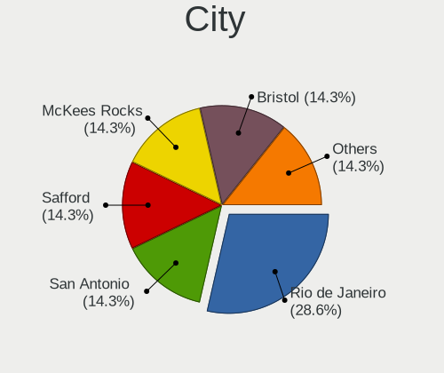
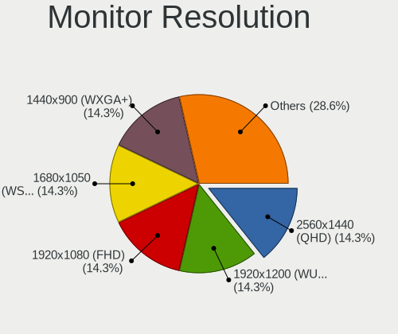
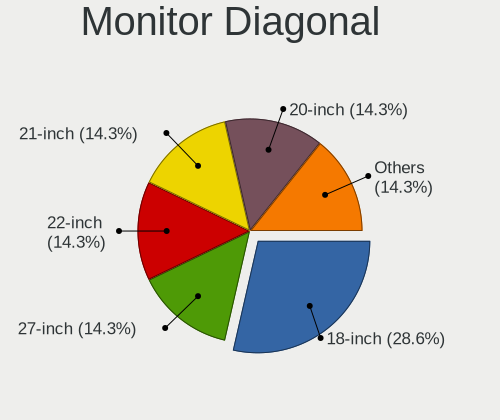
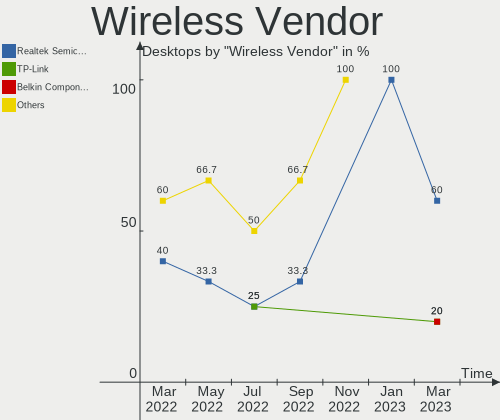

Endless - Hardware Trends (Desktops)
------------------------------------

A project to identify most popular hardware characteristics and track their change
over time based on data collected by Linux users at https://Linux-Hardware.org.

Anyone can contribute to this report by the [hw-probe](https://github.com/linuxhw/hw-probe) tool:

    sudo -E hw-probe -all -upload

This report is for one last month. Overall report since the beginning of time: [TestCoverage](https://github.com/linuxhw/TestCoverage)

Period: Jul, 2022.

Contents
--------

* [ System ](#system)
  - [ OS                       ](#os)
  - [ OS Family                ](#os-family)
  - [ Kernel                   ](#kernel)
  - [ Kernel Family            ](#kernel-family)
  - [ Kernel Major Ver.        ](#kernel-major-ver)
  - [ Arch                     ](#arch)
  - [ DE                       ](#de)
  - [ Display Server           ](#display-server)
  - [ Display Manager          ](#display-manager)
  - [ OS Lang                  ](#os-lang)
  - [ Boot Mode                ](#boot-mode)
  - [ Filesystem               ](#filesystem)
  - [ Part. scheme             ](#part-scheme)
  - [ Dual Boot with Linux/BSD ](#dual-boot-with-linuxbsd)
  - [ Dual Boot (Win)          ](#dual-boot-win)

* [ Board ](#board)
  - [ Vendor                   ](#vendor)
  - [ Model                    ](#model)
  - [ Model Family             ](#model-family)
  - [ MFG Year                 ](#mfg-year)
  - [ Form Factor              ](#form-factor)
  - [ Secure Boot              ](#secure-boot)
  - [ Coreboot                 ](#coreboot)
  - [ RAM Size                 ](#ram-size)
  - [ RAM Used                 ](#ram-used)
  - [ Total Drives             ](#total-drives)
  - [ Has CD-ROM               ](#has-cd-rom)
  - [ Has Ethernet             ](#has-ethernet)
  - [ Has WiFi                 ](#has-wifi)
  - [ Has Bluetooth            ](#has-bluetooth)

* [ Location ](#location)
  - [ Country                  ](#country)
  - [ City                     ](#city)

* [ Drives ](#drives)
  - [ Drive Vendor             ](#drive-vendor)
  - [ Drive Model              ](#drive-model)
  - [ HDD Vendor               ](#hdd-vendor)
  - [ SSD Vendor               ](#ssd-vendor)
  - [ Drive Kind               ](#drive-kind)
  - [ Drive Connector          ](#drive-connector)
  - [ Drive Size               ](#drive-size)
  - [ Space Total              ](#space-total)
  - [ Space Used               ](#space-used)
  - [ Malfunc. Drives          ](#malfunc-drives)
  - [ Malfunc. Drive Vendor    ](#malfunc-drive-vendor)
  - [ Malfunc. HDD Vendor      ](#malfunc-hdd-vendor)
  - [ Malfunc. Drive Kind      ](#malfunc-drive-kind)
  - [ Failed Drives            ](#failed-drives)
  - [ Failed Drive Vendor      ](#failed-drive-vendor)
  - [ Drive Status             ](#drive-status)

* [ Storage controller ](#storage-controller)
  - [ Storage Vendor           ](#storage-vendor)
  - [ Storage Model            ](#storage-model)
  - [ Storage Kind             ](#storage-kind)

* [ Processor ](#processor)
  - [ CPU Vendor               ](#cpu-vendor)
  - [ CPU Model                ](#cpu-model)
  - [ CPU Model Family         ](#cpu-model-family)
  - [ CPU Cores                ](#cpu-cores)
  - [ CPU Sockets              ](#cpu-sockets)
  - [ CPU Threads              ](#cpu-threads)
  - [ CPU Op-Modes             ](#cpu-op-modes)
  - [ CPU Microcode            ](#cpu-microcode)
  - [ CPU Microarch            ](#cpu-microarch)

* [ Graphics ](#graphics)
  - [ GPU Vendor               ](#gpu-vendor)
  - [ GPU Model                ](#gpu-model)
  - [ GPU Combo                ](#gpu-combo)
  - [ GPU Driver               ](#gpu-driver)
  - [ GPU Memory               ](#gpu-memory)

* [ Monitor ](#monitor)
  - [ Monitor Vendor           ](#monitor-vendor)
  - [ Monitor Model            ](#monitor-model)
  - [ Monitor Resolution       ](#monitor-resolution)
  - [ Monitor Diagonal         ](#monitor-diagonal)
  - [ Monitor Width            ](#monitor-width)
  - [ Aspect Ratio             ](#aspect-ratio)
  - [ Monitor Area             ](#monitor-area)
  - [ Pixel Density            ](#pixel-density)
  - [ Multiple Monitors        ](#multiple-monitors)

* [ Network ](#network)
  - [ Net Controller Vendor    ](#net-controller-vendor)
  - [ Net Controller Model     ](#net-controller-model)
  - [ Wireless Vendor          ](#wireless-vendor)
  - [ Wireless Model           ](#wireless-model)
  - [ Ethernet Vendor          ](#ethernet-vendor)
  - [ Ethernet Model           ](#ethernet-model)
  - [ Net Controller Kind      ](#net-controller-kind)
  - [ Used Controller          ](#used-controller)
  - [ NICs                     ](#nics)
  - [ IPv6                     ](#ipv6)

* [ Bluetooth ](#bluetooth)
  - [ Bluetooth Vendor         ](#bluetooth-vendor)
  - [ Bluetooth Model          ](#bluetooth-model)

* [ Sound ](#sound)
  - [ Sound Vendor             ](#sound-vendor)
  - [ Sound Model              ](#sound-model)

* [ Memory ](#memory)
  - [ Memory Vendor            ](#memory-vendor)
  - [ Memory Model             ](#memory-model)
  - [ Memory Kind              ](#memory-kind)
  - [ Memory Form Factor       ](#memory-form-factor)
  - [ Memory Size              ](#memory-size)
  - [ Memory Speed             ](#memory-speed)

* [ Printers & scanners ](#printers--scanners)
  - [ Printer Vendor           ](#printer-vendor)
  - [ Printer Model            ](#printer-model)
  - [ Scanner Vendor           ](#scanner-vendor)
  - [ Scanner Model            ](#scanner-model)

* [ Camera ](#camera)
  - [ Camera Vendor            ](#camera-vendor)
  - [ Camera Model             ](#camera-model)

* [ Security ](#security)
  - [ Fingerprint Vendor       ](#fingerprint-vendor)
  - [ Fingerprint Model        ](#fingerprint-model)
  - [ Chipcard Vendor          ](#chipcard-vendor)
  - [ Chipcard Model           ](#chipcard-model)

* [ Unsupported ](#unsupported)
  - [ Unsupported Devices      ](#unsupported-devices)
  - [ Unsupported Device Types ](#unsupported-device-types)

System
------

OS
--

Installed operating systems

| Name          | Desktops | Percent |
|---------------|----------|---------|
| Endless 4.0.7 | 6        | 85.71%  |
| Endless 4.0.6 | 1        | 14.29%  |

OS Family
---------

OS without a version

| Name    | Desktops | Percent |
|---------|----------|---------|
| Endless | 7        | 100%    |

Kernel
------

Version of the Linux kernel

| Version           | Desktops | Percent |
|-------------------|----------|---------|
| 5.11.0-35-generic | 7        | 100%    |

Kernel Family
-------------

Linux kernel without a distro release

| Version | Desktops | Percent |
|---------|----------|---------|
| 5.11.0  | 7        | 100%    |

Kernel Major Ver.
-----------------

Linux kernel major version

| Version | Desktops | Percent |
|---------|----------|---------|
| 5.11    | 7        | 100%    |

Arch
----

OS architecture (x86_64, i586, etc.)

| Name   | Desktops | Percent |
|--------|----------|---------|
| x86_64 | 7        | 100%    |

DE
--

Desktop Environment

| Name  | Desktops | Percent |
|-------|----------|---------|
| GNOME | 7        | 100%    |

Display Server
--------------

X11 or Wayland

| Name | Desktops | Percent |
|------|----------|---------|
| X11  | 7        | 100%    |

Display Manager
---------------

SDDM, LightDM, etc.

| Name    | Desktops | Percent |
|---------|----------|---------|
| Unknown | 7        | 100%    |

OS Lang
-------

Language

| Lang  | Desktops | Percent |
|-------|----------|---------|
| en_US | 5        | 71.43%  |
| pt_BR | 2        | 28.57%  |

Boot Mode
---------

EFI or BIOS

| Mode | Desktops | Percent |
|------|----------|---------|
| EFI  | 4        | 57.14%  |
| BIOS | 3        | 42.86%  |

Filesystem
----------

Type of filesystem

| Type | Desktops | Percent |
|------|----------|---------|
| Ext4 | 7        | 100%    |

Part. scheme
------------

Scheme of partitioning

| Type    | Desktops | Percent |
|---------|----------|---------|
| Unknown | 7        | 100%    |

Dual Boot with Linux/BSD
------------------------

Hosting more than one Linux/BSD

| Dual boot | Desktops | Percent |
|-----------|----------|---------|
| No        | 7        | 100%    |

Dual Boot (Win)
---------------

Hosting Linux and Windows

| Dual boot | Desktops | Percent |
|-----------|----------|---------|
| No        | 7        | 100%    |

Board
-----

Vendor
------

Motherboard manufacturer

| Name                | Desktops | Percent |
|---------------------|----------|---------|
| Lenovo              | 2        | 28.57%  |
| Gigabyte Technology | 2        | 28.57%  |
| ASUSTek Computer    | 2        | 28.57%  |
| Acer                | 1        | 14.29%  |

Model
-----

Motherboard model

| Name                           | Desktops | Percent |
|--------------------------------|----------|---------|
| Lenovo ThinkCentre M58 7359DHJ | 1        | 14.29%  |
| Lenovo H50-55 90BG004TUS       | 1        | 14.29%  |
| Gigabyte H97M-D3H              | 1        | 14.29%  |
| Gigabyte H61M-S2PH             | 1        | 14.29%  |
| ASUS M5A99X EVO R2.0           | 1        | 14.29%  |
| ASUS M2N68                     | 1        | 14.29%  |
| Acer Veriton S2665G            | 1        | 14.29%  |

Model Family
------------

Motherboard model prefix

| Name               | Desktops | Percent |
|--------------------|----------|---------|
| Lenovo ThinkCentre | 1        | 14.29%  |
| Lenovo H50-55      | 1        | 14.29%  |
| Gigabyte H97M-D3H  | 1        | 14.29%  |
| Gigabyte H61M-S2PH | 1        | 14.29%  |
| ASUS M5A99X        | 1        | 14.29%  |
| ASUS M2N68         | 1        | 14.29%  |
| Acer Veriton       | 1        | 14.29%  |

MFG Year
--------

Motherboard manufacture year

| Year | Desktops | Percent |
|------|----------|---------|
| 2008 | 2        | 28.57%  |
| 2019 | 1        | 14.29%  |
| 2016 | 1        | 14.29%  |
| 2014 | 1        | 14.29%  |
| 2013 | 1        | 14.29%  |
| 2012 | 1        | 14.29%  |

Form Factor
-----------

Physical design of the computer

| Name    | Desktops | Percent |
|---------|----------|---------|
| Desktop | 7        | 100%    |

Secure Boot
-----------

Enabled or disabled

| State    | Desktops | Percent |
|----------|----------|---------|
| Disabled | 6        | 85.71%  |
| Enabled  | 1        | 14.29%  |

Coreboot
--------

Have coreboot on board

| Used | Desktops | Percent |
|------|----------|---------|
| No   | 7        | 100%    |

RAM Size
--------

Total RAM memory

| Size in GB | Desktops | Percent |
|------------|----------|---------|
| 3.01-4.0   | 3        | 42.86%  |
| 4.01-8.0   | 2        | 28.57%  |
| 16.01-24.0 | 2        | 28.57%  |

RAM Used
--------

Used RAM memory

| Used GB  | Desktops | Percent |
|----------|----------|---------|
| 2.01-3.0 | 2        | 28.57%  |
| 1.01-2.0 | 2        | 28.57%  |
| 0.51-1.0 | 2        | 28.57%  |
| 4.01-8.0 | 1        | 14.29%  |

Total Drives
------------

Number of drives on board

| Drives | Desktops | Percent |
|--------|----------|---------|
| 1      | 6        | 85.71%  |
| 2      | 1        | 14.29%  |

Has CD-ROM
----------

Has CD-ROM on board

| Presented | Desktops | Percent |
|-----------|----------|---------|
| Yes       | 4        | 57.14%  |
| No        | 3        | 42.86%  |

Has Ethernet
------------

Has Ethernet on board

| Presented | Desktops | Percent |
|-----------|----------|---------|
| Yes       | 7        | 100%    |

Has WiFi
--------

Has WiFi module

| Presented | Desktops | Percent |
|-----------|----------|---------|
| No        | 4        | 57.14%  |
| Yes       | 3        | 42.86%  |

Has Bluetooth
-------------

Has Bluetooth module

| Presented | Desktops | Percent |
|-----------|----------|---------|
| No        | 5        | 71.43%  |
| Yes       | 2        | 28.57%  |

Location
--------

Country
-------

Geographic location (country)

| Country   | Desktops | Percent |
|-----------|----------|---------|
| USA       | 3        | 42.86%  |
| Brazil    | 2        | 28.57%  |
| Sri Lanka | 1        | 14.29%  |
| Malaysia  | 1        | 14.29%  |

City
----

Geographic location (city)

| City          | Desktops | Percent |
|---------------|----------|---------|
| San Francisco | 2        | 28.57%  |
| Ridgecrest    | 1        | 14.29%  |
| Kuala Lumpur  | 1        | 14.29%  |
| Itajaí       | 1        | 14.29%  |
| Guapimirim    | 1        | 14.29%  |
| Colombo       | 1        | 14.29%  |

Drives
------

Drive Vendor
------------

Hard drive vendors

| Vendor              | Desktops | Drives | Percent |
|---------------------|----------|--------|---------|
| Seagate             | 6        | 6      | 75%     |
| Samsung Electronics | 1        | 1      | 12.5%   |
| Crucial             | 1        | 1      | 12.5%   |

Drive Model
-----------

Hard drive models

| Model                               | Desktops | Percent |
|-------------------------------------|----------|---------|
| Seagate ST3000DM001-9YN166 3TB      | 2        | 25%     |
| Seagate ST500LM012 HN-M500MBB 500GB | 1        | 12.5%   |
| Seagate ST3250318AS 250GB           | 1        | 12.5%   |
| Seagate ST2000DM001-1ER164 2TB      | 1        | 12.5%   |
| Seagate ST1000DM010-2EP102 1TB      | 1        | 12.5%   |
| Samsung HD080HJ/ 80GB               | 1        | 12.5%   |
| Crucial CT512MX100SSD1 512GB        | 1        | 12.5%   |

HDD Vendor
----------

Hard disk drive vendors

| Vendor              | Desktops | Drives | Percent |
|---------------------|----------|--------|---------|
| Seagate             | 6        | 6      | 85.71%  |
| Samsung Electronics | 1        | 1      | 14.29%  |

SSD Vendor
----------

Solid state drive vendors

| Vendor  | Desktops | Drives | Percent |
|---------|----------|--------|---------|
| Crucial | 1        | 1      | 100%    |

Drive Kind
----------

HDD or SSD

| Kind | Desktops | Drives | Percent |
|------|----------|--------|---------|
| HDD  | 7        | 7      | 87.5%   |
| SSD  | 1        | 1      | 12.5%   |

Drive Connector
---------------

SATA, SAS, NVMe, etc.

| Type | Desktops | Drives | Percent |
|------|----------|--------|---------|
| SATA | 7        | 8      | 100%    |

Drive Size
----------

Size of hard drive

| Size in TB | Desktops | Drives | Percent |
|------------|----------|--------|---------|
| 0.01-0.5   | 3        | 3      | 37.5%   |
| 2.01-3.0   | 2        | 2      | 25%     |
| 0.51-1.0   | 2        | 2      | 25%     |
| 1.01-2.0   | 1        | 1      | 12.5%   |

Space Total
-----------

Amount of disk space available on the file system

| Size in GB | Desktops | Percent |
|------------|----------|---------|
| 251-500    | 2        | 28.57%  |
| 2001-3000  | 2        | 28.57%  |
| 101-250    | 2        | 28.57%  |
| 501-1000   | 1        | 14.29%  |

Space Used
----------

Amount of used disk space

| Used GB | Desktops | Percent |
|---------|----------|---------|
| 51-100  | 3        | 42.86%  |
| 21-50   | 2        | 28.57%  |
| 101-250 | 1        | 14.29%  |
| 1-20    | 1        | 14.29%  |

Malfunc. Drives
---------------

Drive models with a malfunction

Zero info for selected period =(

Malfunc. Drive Vendor
---------------------

Vendors of faulty drives

Zero info for selected period =(

Malfunc. HDD Vendor
-------------------

Vendors of faulty HDD drives

Zero info for selected period =(

Malfunc. Drive Kind
-------------------

Kinds of faulty drives

Zero info for selected period =(

Failed Drives
-------------

Failed drive models

Zero info for selected period =(

Failed Drive Vendor
-------------------

Failed drive vendors

Zero info for selected period =(

Drive Status
------------

Number of failed and malfunc. drives

| Status   | Desktops | Drives | Percent |
|----------|----------|--------|---------|
| Detected | 7        | 8      | 100%    |

Storage controller
------------------

Storage Vendor
--------------

Storage controller vendors

| Vendor             | Desktops | Percent |
|--------------------|----------|---------|
| Intel              | 4        | 50%     |
| AMD                | 2        | 25%     |
| Nvidia             | 1        | 12.5%   |
| ASMedia Technology | 1        | 12.5%   |

Storage Model
-------------

Storage controller models

| Model                                                                                   | Desktops | Percent |
|-----------------------------------------------------------------------------------------|----------|---------|
| Nvidia MCP67 IDE Controller                                                             | 1        | 9.09%   |
| Nvidia MCP67 AHCI Controller                                                            | 1        | 9.09%   |
| Intel 9 Series Chipset Family SATA Controller [AHCI Mode]                               | 1        | 9.09%   |
| Intel 82801JD/DO (ICH10 Family) SATA AHCI Controller                                    | 1        | 9.09%   |
| Intel 6 Series/C200 Series Chipset Family Desktop SATA Controller (IDE mode, ports 4-5) | 1        | 9.09%   |
| Intel 6 Series/C200 Series Chipset Family Desktop SATA Controller (IDE mode, ports 0-3) | 1        | 9.09%   |
| Intel 4 Series Chipset PT IDER Controller                                               | 1        | 9.09%   |
| Intel 200 Series PCH SATA controller [AHCI mode]                                        | 1        | 9.09%   |
| ASMedia ASM1062 Serial ATA Controller                                                   | 1        | 9.09%   |
| AMD SB7x0/SB8x0/SB9x0 SATA Controller [AHCI mode]                                       | 1        | 9.09%   |
| AMD FCH SATA Controller [AHCI mode]                                                     | 1        | 9.09%   |

Storage Kind
------------

Kind of storage controller (IDE, SATA, NVMe, SAS, ...)

| Kind | Desktops | Percent |
|------|----------|---------|
| SATA | 6        | 66.67%  |
| IDE  | 3        | 33.33%  |

Processor
---------

CPU Vendor
----------

Processor vendors

| Vendor | Desktops | Percent |
|--------|----------|---------|
| Intel  | 4        | 57.14%  |
| AMD    | 3        | 42.86%  |

CPU Model
---------

Processor models

| Model                                | Desktops | Percent |
|--------------------------------------|----------|---------|
| Intel Pentium CPU G2030 @ 3.00GHz    | 1        | 14.29%  |
| Intel Core i5-4460 CPU @ 3.20GHz     | 1        | 14.29%  |
| Intel Core i3-9100 CPU @ 3.60GHz     | 1        | 14.29%  |
| Intel Core 2 Duo CPU E7600 @ 3.06GHz | 1        | 14.29%  |
| AMD Phenom II X6 1090T Processor     | 1        | 14.29%  |
| AMD FX-870K Quad Core Processor      | 1        | 14.29%  |
| AMD FX-8150 Eight-Core Processor     | 1        | 14.29%  |

CPU Model Family
----------------

Processor model prefix

| Model            | Desktops | Percent |
|------------------|----------|---------|
| AMD FX           | 2        | 28.57%  |
| Intel Pentium    | 1        | 14.29%  |
| Intel Core i5    | 1        | 14.29%  |
| Intel Core i3    | 1        | 14.29%  |
| Intel Core 2 Duo | 1        | 14.29%  |
| AMD Phenom II X6 | 1        | 14.29%  |

CPU Cores
---------

Number of processor cores

| Number | Desktops | Percent |
|--------|----------|---------|
| 4      | 3        | 42.86%  |
| 2      | 3        | 42.86%  |
| 6      | 1        | 14.29%  |

CPU Sockets
-----------

Number of sockets

| Number | Desktops | Percent |
|--------|----------|---------|
| 1      | 7        | 100%    |

CPU Threads
-----------

Threads per core (Hyper-Threading)

| Number | Desktops | Percent |
|--------|----------|---------|
| 1      | 5        | 71.43%  |
| 2      | 2        | 28.57%  |

CPU Op-Modes
------------

CPU Operation Modes (32-bit, 64-bit)

| Op mode        | Desktops | Percent |
|----------------|----------|---------|
| 32-bit, 64-bit | 7        | 100%    |

CPU Microcode
-------------

Microcode number

| Number     | Desktops | Percent |
|------------|----------|---------|
| 0x906eb    | 1        | 14.29%  |
| 0x306c3    | 1        | 14.29%  |
| 0x306a9    | 1        | 14.29%  |
| 0x1067a    | 1        | 14.29%  |
| 0x0600063e | 1        | 14.29%  |
| 0x010000dc | 1        | 14.29%  |
| Unknown    | 1        | 14.29%  |

CPU Microarch
-------------

Microarchitecture

| Name        | Desktops | Percent |
|-------------|----------|---------|
| Steamroller | 1        | 14.29%  |
| Penryn      | 1        | 14.29%  |
| KabyLake    | 1        | 14.29%  |
| K10         | 1        | 14.29%  |
| IvyBridge   | 1        | 14.29%  |
| Haswell     | 1        | 14.29%  |
| Bulldozer   | 1        | 14.29%  |

Graphics
--------

GPU Vendor
----------

Vendors of graphics cards

| Vendor | Desktops | Percent |
|--------|----------|---------|
| Intel  | 4        | 50%     |
| AMD    | 3        | 37.5%   |
| Nvidia | 1        | 12.5%   |

GPU Model
---------

Graphics card models

| Model                                                                       | Desktops | Percent |
|-----------------------------------------------------------------------------|----------|---------|
| Nvidia G96CGL [Quadro FX 580]                                               | 1        | 12.5%   |
| Intel Xeon E3-1200 v3/4th Gen Core Processor Integrated Graphics Controller | 1        | 12.5%   |
| Intel Xeon E3-1200 v2/3rd Gen Core processor Graphics Controller            | 1        | 12.5%   |
| Intel CoffeeLake-S GT2 [UHD Graphics 630]                                   | 1        | 12.5%   |
| Intel 4 Series Chipset Integrated Graphics Controller                       | 1        | 12.5%   |
| AMD Radeon R7 240                                                           | 1        | 12.5%   |
| AMD Oland XT [Radeon HD 8670 / R5 340X OEM / R7 250/350/350X OEM]           | 1        | 12.5%   |
| AMD Cypress PRO [Radeon HD 5850]                                            | 1        | 12.5%   |

GPU Combo
---------

Combinations of graphics cards

| Name        | Desktops | Percent |
|-------------|----------|---------|
| 1 x Intel   | 3        | 42.86%  |
| 1 x AMD     | 2        | 28.57%  |
| 1 x Nvidia  | 1        | 14.29%  |
| Intel + AMD | 1        | 14.29%  |

GPU Driver
----------

Free vs proprietary

| Driver | Desktops | Percent |
|--------|----------|---------|
| Free   | 7        | 100%    |

GPU Memory
----------

Total video memory

| Size in GB | Desktops | Percent |
|------------|----------|---------|
| Unknown    | 4        | 57.14%  |
| 3.01-4.0   | 1        | 14.29%  |
| 0.51-1.0   | 1        | 14.29%  |
| 0.01-0.5   | 1        | 14.29%  |

Monitor
-------

Monitor Vendor
--------------

Monitor vendors

| Vendor       | Desktops | Percent |
|--------------|----------|---------|
| Sceptre Tech | 1        | 25%     |
| Goldstar     | 1        | 25%     |
| Dell         | 1        | 25%     |
| AOC          | 1        | 25%     |

Monitor Model
-------------

Monitor models

| Model                                                         | Desktops | Percent |
|---------------------------------------------------------------|----------|---------|
| Sceptre Tech E248W-1920 SPT099D 1920x1080 443x249mm 20.0-inch | 1        | 25%     |
| Goldstar W1642 GSM3E86 1360x768 344x194mm 15.5-inch           | 1        | 25%     |
| Dell E1914H DELD03A 1366x768 410x230mm 18.5-inch              | 1        | 25%     |
| AOC F19 AOC1900 1366x768 410x230mm 18.5-inch                  | 1        | 25%     |

Monitor Resolution
------------------

Monitor screen resolution

| Resolution      | Desktops | Percent |
|-----------------|----------|---------|
| 1366x768 (WXGA) | 2        | 50%     |
| 1920x1080 (FHD) | 1        | 25%     |
| 1360x768        | 1        | 25%     |

Monitor Diagonal
----------------

Diagonal size in inches

| Inches | Desktops | Percent |
|--------|----------|---------|
| 18     | 2        | 50%     |
| 24     | 1        | 25%     |
| 15     | 1        | 25%     |

Monitor Width
-------------

Physical width

| Width in mm | Desktops | Percent |
|-------------|----------|---------|
| 401-500     | 2        | 50%     |
| 501-600     | 1        | 25%     |
| 301-350     | 1        | 25%     |

Aspect Ratio
------------

Proportional relationship between the width and the height

| Ratio | Desktops | Percent |
|-------|----------|---------|
| 16/9  | 4        | 100%    |

Monitor Area
------------

Area in inch²

| Area in inch² | Desktops | Percent |
|----------------|----------|---------|
| 141-150        | 2        | 50%     |
| 201-250        | 1        | 25%     |
| 101-110        | 1        | 25%     |

Pixel Density
-------------

Pixels per inch

| Density | Desktops | Percent |
|---------|----------|---------|
| 51-100  | 3        | 75%     |
| 101-120 | 1        | 25%     |

Multiple Monitors
-----------------

Total monitors connected

| Total | Desktops | Percent |
|-------|----------|---------|
| 1     | 6        | 85.71%  |
| 0     | 1        | 14.29%  |

Network
-------

Net Controller Vendor
---------------------

Controller vendors

| Vendor                | Desktops | Percent |
|-----------------------|----------|---------|
| Realtek Semiconductor | 5        | 41.67%  |
| Ralink Technology     | 2        | 16.67%  |
| TP-Link               | 1        | 8.33%   |
| Nvidia                | 1        | 8.33%   |
| Intel                 | 1        | 8.33%   |
| Beceem Communications | 1        | 8.33%   |
| ASIX Electronics      | 1        | 8.33%   |

Net Controller Model
--------------------

Controller models

| Model                                                             | Desktops | Percent |
|-------------------------------------------------------------------|----------|---------|
| Realtek RTL8111/8168/8411 PCI Express Gigabit Ethernet Controller | 5        | 38.46%  |
| TP-Link TL-WN823N v2/v3 [Realtek RTL8192EU]                       | 1        | 7.69%   |
| Realtek RTL8821AE 802.11ac PCIe Wireless Network Adapter          | 1        | 7.69%   |
| Ralink RT5372 Wireless Adapter                                    | 1        | 7.69%   |
| Ralink RT2870/RT3070 Wireless Adapter                             | 1        | 7.69%   |
| Nvidia MCP67 Ethernet                                             | 1        | 7.69%   |
| Intel 82567LM-3 Gigabit Network Connection                        | 1        | 7.69%   |
| Beceem UBEE Stick                                                 | 1        | 7.69%   |
| ASIX AX88179 Gigabit Ethernet                                     | 1        | 7.69%   |

Wireless Vendor
---------------

Wireless vendors

| Vendor                | Desktops | Percent |
|-----------------------|----------|---------|
| Ralink Technology     | 2        | 50%     |
| TP-Link               | 1        | 25%     |
| Realtek Semiconductor | 1        | 25%     |

Wireless Model
--------------

Wireless models

| Model                                                    | Desktops | Percent |
|----------------------------------------------------------|----------|---------|
| TP-Link TL-WN823N v2/v3 [Realtek RTL8192EU]              | 1        | 25%     |
| Realtek RTL8821AE 802.11ac PCIe Wireless Network Adapter | 1        | 25%     |
| Ralink RT5372 Wireless Adapter                           | 1        | 25%     |
| Ralink RT2870/RT3070 Wireless Adapter                    | 1        | 25%     |

Ethernet Vendor
---------------

Ethernet vendors

| Vendor                | Desktops | Percent |
|-----------------------|----------|---------|
| Realtek Semiconductor | 5        | 55.56%  |
| Nvidia                | 1        | 11.11%  |
| Intel                 | 1        | 11.11%  |
| Beceem Communications | 1        | 11.11%  |
| ASIX Electronics      | 1        | 11.11%  |

Ethernet Model
--------------

Ethernet models

| Model                                                             | Desktops | Percent |
|-------------------------------------------------------------------|----------|---------|
| Realtek RTL8111/8168/8411 PCI Express Gigabit Ethernet Controller | 5        | 55.56%  |
| Nvidia MCP67 Ethernet                                             | 1        | 11.11%  |
| Intel 82567LM-3 Gigabit Network Connection                        | 1        | 11.11%  |
| Beceem UBEE Stick                                                 | 1        | 11.11%  |
| ASIX AX88179 Gigabit Ethernet                                     | 1        | 11.11%  |

Net Controller Kind
-------------------

Ethernet, WiFi or modem

| Kind     | Desktops | Percent |
|----------|----------|---------|
| Ethernet | 7        | 70%     |
| WiFi     | 3        | 30%     |

Used Controller
---------------

Currently used network controller

| Kind     | Desktops | Percent |
|----------|----------|---------|
| Ethernet | 5        | 62.5%   |
| WiFi     | 3        | 37.5%   |

NICs
----

Total network controllers on board

| Total | Desktops | Percent |
|-------|----------|---------|
| 1     | 6        | 85.71%  |
| 2     | 1        | 14.29%  |

IPv6
----

IPv6 vs IPv4

| Used | Desktops | Percent |
|------|----------|---------|
| Yes  | 4        | 57.14%  |
| No   | 3        | 42.86%  |

Bluetooth
---------

Bluetooth Vendor
----------------

Controller vendors

| Vendor                  | Desktops | Percent |
|-------------------------|----------|---------|
| Realtek Semiconductor   | 1        | 50%     |
| Cambridge Silicon Radio | 1        | 50%     |

Bluetooth Model
---------------

Controller models

| Model                                               | Desktops | Percent |
|-----------------------------------------------------|----------|---------|
| Realtek RTL8821A Bluetooth                          | 1        | 50%     |
| Cambridge Silicon Radio Bluetooth Dongle (HCI mode) | 1        | 50%     |

Sound
-----

Sound Vendor
------------

Sound card vendors

| Vendor | Desktops | Percent |
|--------|----------|---------|
| Intel  | 4        | 50%     |
| AMD    | 3        | 37.5%   |
| Nvidia | 1        | 12.5%   |

Sound Model
-----------

Sound card models

| Model                                                                      | Desktops | Percent |
|----------------------------------------------------------------------------|----------|---------|
| AMD Oland/Hainan/Cape Verde/Pitcairn HDMI Audio [Radeon HD 7000 Series]    | 2        | 18.18%  |
| Nvidia MCP67 High Definition Audio                                         | 1        | 9.09%   |
| Intel Xeon E3-1200 v3/4th Gen Core Processor HD Audio Controller           | 1        | 9.09%   |
| Intel 9 Series Chipset Family HD Audio Controller                          | 1        | 9.09%   |
| Intel 82801JD/DO (ICH10 Family) HD Audio Controller                        | 1        | 9.09%   |
| Intel 6 Series/C200 Series Chipset Family High Definition Audio Controller | 1        | 9.09%   |
| Intel 200 Series PCH HD Audio                                              | 1        | 9.09%   |
| AMD SBx00 Azalia (Intel HDA)                                               | 1        | 9.09%   |
| AMD FCH Azalia Controller                                                  | 1        | 9.09%   |
| AMD Cypress HDMI Audio [Radeon HD 5830/5850/5870 / 6850/6870 Rebrand]      | 1        | 9.09%   |

Memory
------

Memory Vendor
-------------

Memory module vendors

Zero info for selected period =(

Memory Model
------------

Memory module models

Zero info for selected period =(

Memory Kind
-----------

Memory module kinds

Zero info for selected period =(

Memory Form Factor
------------------

Physical design of the memory module

Zero info for selected period =(

Memory Size
-----------

Memory module size

Zero info for selected period =(

Memory Speed
------------

Memory module speed

Zero info for selected period =(

Printers & scanners
-------------------

Printer Vendor
--------------

Printer device vendors

Zero info for selected period =(

Printer Model
-------------

Printer device models

Zero info for selected period =(

Scanner Vendor
--------------

Scanner device vendors

Zero info for selected period =(

Scanner Model
-------------

Scanner device models

Zero info for selected period =(

Camera
------

Camera Vendor
-------------

Camera device vendors

Zero info for selected period =(

Camera Model
------------

Camera device models

Zero info for selected period =(

Security
--------

Fingerprint Vendor
------------------

Fingerprint sensor vendors

Zero info for selected period =(

Fingerprint Model
-----------------

Fingerprint sensor models

Zero info for selected period =(

Chipcard Vendor
---------------

Chipcard module vendors

Zero info for selected period =(

Chipcard Model
--------------

Chipcard module models

Zero info for selected period =(

Unsupported
-----------

Unsupported Devices
-------------------

Total unsupported devices on board

| Total | Desktops | Percent |
|-------|----------|---------|
| 0     | 6        | 85.71%  |
| 1     | 1        | 14.29%  |

Unsupported Device Types
------------------------

Types of unsupported devices

| Type        | Desktops | Percent |
|-------------|----------|---------|
| Storage/ide | 1        | 100%    |

