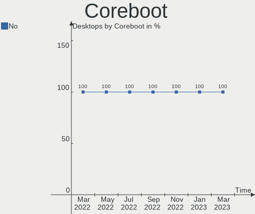
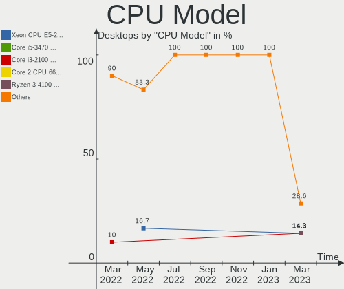
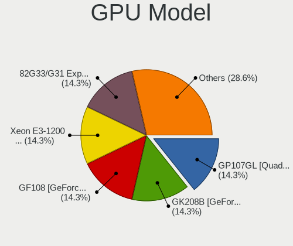
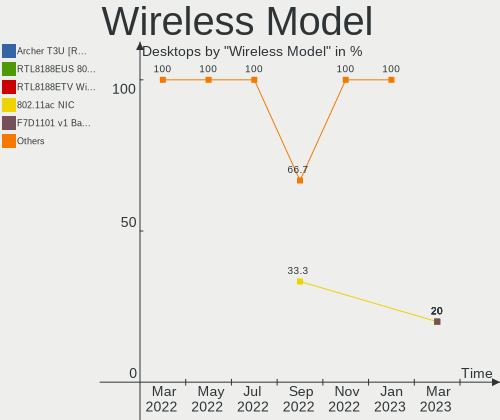
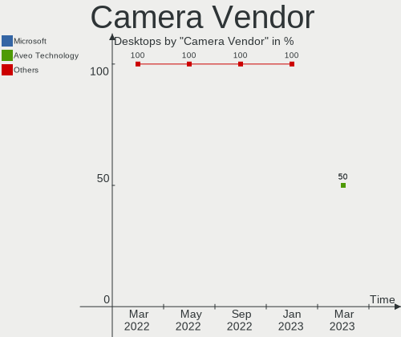

Endless Hardware Trends (Desktop)
---------------------------------

A project to identify most popular hardware characteristics and track their change
over time based on data collected by Endless users at https://Linux-Hardware.org.

Anyone can contribute to the study by uploading probes of their computers by
the [hw-probe](https://github.com/linuxhw/hw-probe) tool:

    sudo -E hw-probe -all -upload

Full-feature report is available here: https://linux-hardware.org/?view=trends&formfactor=desktop

Period: Dec, 2020.

Contents
--------

- [ OS                       ](#os)
- [ OS Family                ](#os-family)
- [ Kernel                   ](#kernel)
- [ Kernel Family            ](#kernel-family)
- [ Kernel Major Ver.        ](#kernel-major-ver)
- [ Arch                     ](#arch)
- [ DE                       ](#de)
- [ Display Server           ](#display-server)
- [ Display Manager          ](#display-manager)
- [ OS Lang                  ](#os-lang)
- [ Boot Mode                ](#boot-mode)
- [ Filesystem               ](#filesystem)
- [ Part. scheme             ](#part-scheme)
- [ Dual Boot with Linux/BSD ](#dual-boot-with-linux/bsd)
- [ Dual Boot (Win)          ](#dual-boot-win)
- [ Country                  ](#country)
- [ City                     ](#city)
- [ Vendor                   ](#vendor)
- [ Model                    ](#model)
- [ Model Family             ](#model-family)
- [ MFG Year                 ](#mfg-year)
- [ Form Factor              ](#form-factor)
- [ Secure Boot              ](#secure-boot)
- [ Coreboot                 ](#coreboot)
- [ RAM Size                 ](#ram-size)
- [ RAM Used                 ](#ram-used)
- [ Has CD-ROM               ](#has-cd-rom)
- [ Total Drives             ](#total-drives)
- [ Has Ethernet             ](#has-ethernet)
- [ Drive Vendor             ](#drive-vendor)
- [ Drive Model              ](#drive-model)
- [ HDD Vendor               ](#hdd-vendor)
- [ SSD Vendor               ](#ssd-vendor)
- [ Drive Kind               ](#drive-kind)
- [ Drive Connector          ](#drive-connector)
- [ Drive Size               ](#drive-size)
- [ Space Total              ](#space-total)
- [ Space Used               ](#space-used)
- [ Malfunc. Drives          ](#malfunc-drives)
- [ Malfunc. Drive Vendor    ](#malfunc-drive-vendor)
- [ Malfunc. HDD Vendor      ](#malfunc-hdd-vendor)
- [ Malfunc. Drive Kind      ](#malfunc-drive-kind)
- [ Failed Drives            ](#failed-drives)
- [ Failed Drive Vendor      ](#failed-drive-vendor)
- [ Drive Status             ](#drive-status)
- [ Storage Vendor           ](#storage-vendor)
- [ Storage Model            ](#storage-model)
- [ Storage Kind             ](#storage-kind)
- [ CPU Vendor               ](#cpu-vendor)
- [ CPU Model                ](#cpu-model)
- [ CPU Model Family         ](#cpu-model-family)
- [ CPU Cores                ](#cpu-cores)
- [ CPU Sockets              ](#cpu-sockets)
- [ CPU Threads              ](#cpu-threads)
- [ CPU Op-Modes             ](#cpu-op-modes)
- [ CPU Microcode            ](#cpu-microcode)
- [ CPU Microarch            ](#cpu-microarch)
- [ GPU Vendor               ](#gpu-vendor)
- [ GPU Model                ](#gpu-model)
- [ GPU Combo                ](#gpu-combo)
- [ GPU Driver               ](#gpu-driver)
- [ GPU Memory               ](#gpu-memory)
- [ Monitor Vendor           ](#monitor-vendor)
- [ Monitor Model            ](#monitor-model)
- [ Monitor Resolution       ](#monitor-resolution)
- [ Monitor Diagonal         ](#monitor-diagonal)
- [ Monitor Width            ](#monitor-width)
- [ Aspect Ratio             ](#aspect-ratio)
- [ Monitor Area             ](#monitor-area)
- [ Pixel Density            ](#pixel-density)
- [ Multiple Monitors        ](#multiple-monitors)
- [ Net Controller Vendor    ](#net-controller-vendor)
- [ Net Controller Model     ](#net-controller-model)
- [ Wireless Vendor          ](#wireless-vendor)
- [ Wireless Model           ](#wireless-model)
- [ Ethernet Vendor          ](#ethernet-vendor)
- [ Ethernet Model           ](#ethernet-model)
- [ Net Controller Kind      ](#net-controller-kind)
- [ Used Controller          ](#used-controller)
- [ NICs                     ](#nics)
- [ Memory Vendor            ](#memory-vendor)
- [ Memory Model             ](#memory-model)
- [ Memory Kind              ](#memory-kind)
- [ Memory Form Factor       ](#memory-form-factor)
- [ Memory Size              ](#memory-size)
- [ Memory Speed             ](#memory-speed)
- [ Sound Vendor             ](#sound-vendor)
- [ Sound Model              ](#sound-model)
- [ Camera Vendor            ](#camera-vendor)
- [ Camera Model             ](#camera-model)
- [ Fingerprint Vendor       ](#fingerprint-vendor)
- [ Fingerprint Model        ](#fingerprint-model)
- [ Chipcard Vendor          ](#chipcard-vendor)
- [ Chipcard Model           ](#chipcard-model)
- [ Printer Vendor           ](#printer-vendor)
- [ Printer Model            ](#printer-model)
- [ Scanner Vendor           ](#scanner-vendor)
- [ Scanner Model            ](#scanner-model)
- [ Bluetooth Vendor         ](#bluetooth-vendor)
- [ Bluetooth Model          ](#bluetooth-model)
- [ Unsupported Devices      ](#unsupported-devices)
- [ Unsupported Device Types ](#unsupported-device-types)

OS
--

Installed operating systems

| Name          | Desktops | Percent |
|---------------|----------|---------|
| Endless 3.9.1 | 14       | 60.87%  |
| Endless 3.9.0 | 4        | 17.39%  |
| Endless 3.8.3 | 2        | 8.7%    |
| Endless 3.8.0 | 1        | 4.35%   |
| Endless 3.7.8 | 1        | 4.35%   |
| Endless 3.7.3 | 1        | 4.35%   |

OS Family
---------

OS without a version

| Name    | Desktops | Percent |
|---------|----------|---------|
| Endless | 23       | 100%    |

Kernel
------

Version of the Linux kernel

| Version          | Desktops | Percent |
|------------------|----------|---------|
| 5.8.0-14-generic | 18       | 78.26%  |
| 5.4.0-19-generic | 3        | 13.04%  |
| 5.3.0-28-generic | 1        | 4.35%   |
| 5.3.0-12-generic | 1        | 4.35%   |

Kernel Family
-------------

Linux kernel without a distro release

| Version | Desktops | Percent |
|---------|----------|---------|
| 5.8.0   | 18       | 78.26%  |
| 5.4.0   | 3        | 13.04%  |
| 5.3.0   | 2        | 8.7%    |

Kernel Major Ver.
-----------------

Linux kernel major version

| Version | Desktops | Percent |
|---------|----------|---------|
| 5.8     | 18       | 78.26%  |
| 5.4     | 3        | 13.04%  |
| 5.3     | 2        | 8.7%    |

Arch
----

OS architecture (x86_64, i586, etc.)

| Name   | Desktops | Percent |
|--------|----------|---------|
| x86_64 | 23       | 100%    |

DE
--

Desktop Environment

| Name  | Desktops | Percent |
|-------|----------|---------|
| GNOME | 23       | 100%    |

Display Server
--------------

X11 or Wayland

| Name | Desktops | Percent |
|------|----------|---------|
| X11  | 23       | 100%    |

Display Manager
---------------

SDDM, LightDM, etc.

| Name    | Desktops | Percent |
|---------|----------|---------|
| Unknown | 23       | 100%    |

OS Lang
-------

Language

| Lang       | Desktops | Percent |
|------------|----------|---------|
| en_US.utf8 | 9        | 39.13%  |
| ru_RU      | 3        | 13.04%  |
| es_MX.utf8 | 3        | 13.04%  |
| pt_BR      | 2        | 8.7%    |
| ro_RO      | 1        | 4.35%   |
| pt_BR.utf8 | 1        | 4.35%   |
| fr_FR.utf8 | 1        | 4.35%   |
| en_US      | 1        | 4.35%   |
| en_GB      | 1        | 4.35%   |
| en_BW      | 1        | 4.35%   |

Boot Mode
---------

EFI or BIOS

| Mode | Desktops | Percent |
|------|----------|---------|
| BIOS | 16       | 69.57%  |
| EFI  | 7        | 30.43%  |

Filesystem
----------

Type of filesystem

| Type  | Desktops | Percent |
|-------|----------|---------|
| Ext4  | 22       | 95.65%  |
| Tmpfs | 1        | 4.35%   |

Part. scheme
------------

Scheme of partitioning

| Type    | Desktops | Percent |
|---------|----------|---------|
| Unknown | 23       | 100%    |

Dual Boot with Linux/BSD
------------------------

Hosting more than one Linux/BSD

| Dual boot | Desktops | Percent |
|-----------|----------|---------|
| No        | 23       | 100%    |

Dual Boot (Win)
---------------

Hosting Linux and Windows

| Dual boot | Desktops | Percent |
|-----------|----------|---------|
| No        | 23       | 100%    |

Country
-------

Geographic location (country)

| Country   | Desktops | Percent |
|-----------|----------|---------|
| USA       | 5        | 21.74%  |
| Russia    | 3        | 13.04%  |
| Romania   | 3        | 13.04%  |
| Mexico    | 3        | 13.04%  |
| Brazil    | 3        | 13.04%  |
| UK        | 2        | 8.7%    |
| Thailand  | 1        | 4.35%   |
| Indonesia | 1        | 4.35%   |
| France    | 1        | 4.35%   |
| Cambodia  | 1        | 4.35%   |

City
----

Geographic location (city)

| City                     | Desktops | Percent |
|--------------------------|----------|---------|
| San Bartolo Lanzados     | 2        | 8.7%    |
| York                     | 1        | 4.35%   |
| Xalapa                   | 1        | 4.35%   |
| Tucson                   | 1        | 4.35%   |
| Serpukhov                | 1        | 4.35%   |
| Santiago                 | 1        | 4.35%   |
| Redditch                 | 1        | 4.35%   |
| Porto Alegre             | 1        | 4.35%   |
| Phnom Penh               | 1        | 4.35%   |
| Petropavlovsk-Kamchatsky | 1        | 4.35%   |
| Oradea                   | 1        | 4.35%   |
| Modesto                  | 1        | 4.35%   |
| Mason                    | 1        | 4.35%   |
| La Rochelle              | 1        | 4.35%   |
| Jakarta                  | 1        | 4.35%   |
| Gubkin                   | 1        | 4.35%   |
| Galion                   | 1        | 4.35%   |
| Galati                   | 1        | 4.35%   |
| Corby                    | 1        | 4.35%   |
| Campo Mourao             | 1        | 4.35%   |
| Bucharest                | 1        | 4.35%   |
| Bangkok                  | 1        | 4.35%   |

Vendor
------

Motherboard manufacturer

| Name                | Desktops | Percent |
|---------------------|----------|---------|
| Acer                | 6        | 26.09%  |
| Gigabyte Technology | 4        | 17.39%  |
| Hewlett-Packard     | 2        | 8.7%    |
| ASUSTek Computer    | 2        | 8.7%    |
| Positivo            | 1        | 4.35%   |
| PCWare              | 1        | 4.35%   |
| OEM_MB              | 1        | 4.35%   |
| Megaware            | 1        | 4.35%   |
| LORD ELECTRONICS    | 1        | 4.35%   |
| Lenovo              | 1        | 4.35%   |
| ECS                 | 1        | 4.35%   |
| Dell                | 1        | 4.35%   |
| AMD                 | 1        | 4.35%   |

Model
-----

Motherboard model

| Name                                              | Desktops | Percent |
|---------------------------------------------------|----------|---------|
| Positivo POS-MIG31AG                              | 1        | 4.35%   |
| PCWare PW-945GCX                                  | 1        | 4.35%   |
| OEM_MB FR650AA-ABF s3642fr                        | 1        | 4.35%   |
| LORD ELECTRONICS LORD G4x 775 ICH7 8712 As Design | 1        | 4.35%   |
| Lenovo ThinkCentre M72e 35983V9                   | 1        | 4.35%   |
| HP EliteDesk 800 G1 SFF                           | 1        | 4.35%   |
| HP Compaq 6200 Pro SFF PC                         | 1        | 4.35%   |
| Gigabyte X570 AORUS ELITE                         | 1        | 4.35%   |
| Gigabyte H77M-D3H                                 | 1        | 4.35%   |
| Gigabyte H61M-S2PV                                | 1        | 4.35%   |
| Gigabyte B450M DS3H                               | 1        | 4.35%   |
| ECS A320AM4-M3D                                   | 1        | 4.35%   |
| Dell OptiPlex 9010                                | 1        | 4.35%   |
| ASUS M5A78L-M LX PLUS                             | 1        | 4.35%   |
| ASUS M5A78L-M LE/USB3                             | 1        | 4.35%   |
| AMD ITX-E21800S BIOS Revision:F1                  | 1        | 4.35%   |
| Acer Veriton X2660G                               | 1        | 4.35%   |
| Acer Nitro N50-610                                | 1        | 4.35%   |
| Acer Nitro GX50-600                               | 1        | 4.35%   |
| Acer Extensa M2610                                | 1        | 4.35%   |
| Acer C-AXC-780                                    | 1        | 4.35%   |
| Acer Aspire TC-885                                | 1        | 4.35%   |
| Unknown                                           | 1        | 4.35%   |

Model Family
------------

Motherboard model prefix

| Name                  | Desktops | Percent |
|-----------------------|----------|---------|
| ASUS M5A78L-M         | 2        | 8.7%    |
| Acer Nitro            | 2        | 8.7%    |
| Positivo POS-MIG31AG  | 1        | 4.35%   |
| PCWare PW-945GCX      | 1        | 4.35%   |
| OEM_MB FR650AA-ABF    | 1        | 4.35%   |
| LORD ELECTRONICS LORD | 1        | 4.35%   |
| Lenovo ThinkCentre    | 1        | 4.35%   |
| HP EliteDesk          | 1        | 4.35%   |
| HP Compaq             | 1        | 4.35%   |
| Gigabyte X570         | 1        | 4.35%   |
| Gigabyte H77M-D3H     | 1        | 4.35%   |
| Gigabyte H61M-S2PV    | 1        | 4.35%   |
| Gigabyte B450M        | 1        | 4.35%   |
| ECS A320AM4-M3D       | 1        | 4.35%   |
| Dell OptiPlex         | 1        | 4.35%   |
| AMD ITX-E21800S       | 1        | 4.35%   |
| Acer Veriton          | 1        | 4.35%   |
| Acer Extensa          | 1        | 4.35%   |
| Acer C-AXC-780        | 1        | 4.35%   |
| Acer Aspire           | 1        | 4.35%   |
| Unknown               | 1        | 4.35%   |

MFG Year
--------

Motherboard manufacture year

| Year | Desktops | Percent |
|------|----------|---------|
| 2018 | 4        | 17.39%  |
| 2019 | 3        | 13.04%  |
| 2017 | 3        | 13.04%  |
| 2020 | 2        | 8.7%    |
| 2016 | 2        | 8.7%    |
| 2014 | 2        | 8.7%    |
| 2009 | 2        | 8.7%    |
| 2008 | 2        | 8.7%    |
| 2015 | 1        | 4.35%   |
| 2013 | 1        | 4.35%   |
| 2011 | 1        | 4.35%   |

Form Factor
-----------

Physical design of the computer

| Name    | Desktops | Percent |
|---------|----------|---------|
| Desktop | 23       | 100%    |

Secure Boot
-----------

Enabled or disabled

| State    | Desktops | Percent |
|----------|----------|---------|
| Disabled | 23       | 100%    |

Coreboot
--------

Have coreboot on board

| Used | Desktops | Percent |
|------|----------|---------|
| No   | 23       | 100%    |

RAM Size
--------

Total RAM memory

| Size in GB | Desktops | Percent |
|------------|----------|---------|
| 3.01-4.0   | 8        | 34.78%  |
| 8.01-16.0  | 7        | 30.43%  |
| 4.01-8.0   | 3        | 13.04%  |
| 16.01-24.0 | 2        | 8.7%    |
| 1.01-2.0   | 2        | 8.7%    |
| 32.01-64.0 | 1        | 4.35%   |

RAM Used
--------

Used RAM memory

| Used GB  | Desktops | Percent |
|----------|----------|---------|
| 1.01-2.0 | 12       | 52.17%  |
| 2.01-3.0 | 5        | 21.74%  |
| 0.51-1.0 | 5        | 21.74%  |
| 3.01-4.0 | 1        | 4.35%   |

Has CD-ROM
----------

Has CD-ROM on board

| Presented | Desktops | Percent |
|-----------|----------|---------|
| Yes       | 14       | 60.87%  |
| No        | 9        | 39.13%  |

Total Drives
------------

Number of drives on board

| Drives | Desktops | Percent |
|--------|----------|---------|
| 1      | 16       | 69.57%  |
| 2      | 5        | 21.74%  |
| 6      | 1        | 4.35%   |
| 4      | 1        | 4.35%   |

Has Ethernet
------------

Has Ethernet on board

| Presented | Desktops | Percent |
|-----------|----------|---------|
| Yes       | 22       | 95.65%  |
| No        | 1        | 4.35%   |

Drive Vendor
------------

Hard drive vendors

| Vendor              | Desktops | Drives | Percent |
|---------------------|----------|--------|---------|
| Seagate             | 9        | 10     | 29.03%  |
| Unknown             | 5        | 6      | 16.13%  |
| WDC                 | 3        | 3      | 9.68%   |
| Samsung Electronics | 3        | 3      | 9.68%   |
| Sandisk             | 2        | 2      | 6.45%   |
| Kingston            | 2        | 2      | 6.45%   |
| Crucial             | 2        | 2      | 6.45%   |
| Toshiba             | 1        | 1      | 3.23%   |
| Phison              | 1        | 1      | 3.23%   |
| Hitachi             | 1        | 1      | 3.23%   |
| Hewlett-Packard     | 1        | 1      | 3.23%   |
| China               | 1        | 1      | 3.23%   |

Drive Model
-----------

Hard drive models

| Model                               | Desktops | Percent |
|-------------------------------------|----------|---------|
| Unknown SD/MMC/MS PRO 128GB         | 3        | 9.38%   |
| Seagate ST500DM002-1BD142 500GB     | 2        | 6.25%   |
| Crucial CT240BX500SSD1 240GB        | 2        | 6.25%   |
| WDC WD30EZRX-00D8PB0 3TB            | 1        | 3.13%   |
| WDC WD2503ABYX-01WERA1 256GB        | 1        | 3.13%   |
| WDC WD10EZEX-21WN4A0 1TB            | 1        | 3.13%   |
| Unknown SD/MMC 8GB                  | 1        | 3.13%   |
| Unknown EM200AA001-9VY132 200GB     | 1        | 3.13%   |
| Toshiba DT01ACA100 1TB              | 1        | 3.13%   |
| Seagate ST3808110AS 80GB            | 1        | 3.13%   |
| Seagate ST3750330SV 752GB           | 1        | 3.13%   |
| Seagate ST3250318AS 249GB           | 1        | 3.13%   |
| Seagate ST31000524AS 1TB            | 1        | 3.13%   |
| Seagate ST250DM000-1BD141 250GB     | 1        | 3.13%   |
| Seagate ST2000LM007-1R8174 2TB      | 1        | 3.13%   |
| Seagate ST2000LM003 HN-M201RAD 2TB  | 1        | 3.13%   |
| Seagate ST1000DM010-2EP102 1TB      | 1        | 3.13%   |
| SanDisk SD7TB3Q-128G-1006 128GB SSD | 1        | 3.13%   |
| Sandisk NVMe SSD Drive 512GB        | 1        | 3.13%   |
| Samsung SSD 860 QVO 1TB             | 1        | 3.13%   |
| Samsung SSD 860 EVO 500GB           | 1        | 3.13%   |
| Samsung HD161GJ 160GB               | 1        | 3.13%   |
| Phison NVMe SSD Drive 1TB           | 1        | 3.13%   |
| Kingston SV300S37A120G 120GB SSD    | 1        | 3.13%   |
| Kingston NVMe SSD Drive 256GB       | 1        | 3.13%   |
| Hitachi HUA722010CLA330 1TB         | 1        | 3.13%   |
| HP SSD S700 1TB                     | 1        | 3.13%   |
| China SSD 4G                        | 1        | 3.13%   |

HDD Vendor
----------

Hard disk drive vendors

| Vendor              | Desktops | Drives | Percent |
|---------------------|----------|--------|---------|
| Seagate             | 9        | 10     | 60%     |
| WDC                 | 3        | 3      | 20%     |
| Toshiba             | 1        | 1      | 6.67%   |
| Samsung Electronics | 1        | 1      | 6.67%   |
| Hitachi             | 1        | 1      | 6.67%   |

SSD Vendor
----------

Solid state drive vendors

| Vendor              | Desktops | Drives | Percent |
|---------------------|----------|--------|---------|
| Samsung Electronics | 2        | 2      | 25%     |
| Crucial             | 2        | 2      | 25%     |
| SanDisk             | 1        | 1      | 12.5%   |
| Kingston            | 1        | 1      | 12.5%   |
| Hewlett-Packard     | 1        | 1      | 12.5%   |
| China               | 1        | 1      | 12.5%   |

Drive Kind
----------

HDD or SSD

| Kind    | Desktops | Drives | Percent |
|---------|----------|--------|---------|
| HDD     | 14       | 16     | 48.28%  |
| SSD     | 7        | 8      | 24.14%  |
| Unknown | 5        | 6      | 17.24%  |
| NVMe    | 3        | 3      | 10.34%  |

Drive Connector
---------------

SATA, SAS, NVMe, etc.

| Type | Desktops | Drives | Percent |
|------|----------|--------|---------|
| SATA | 20       | 25     | 74.07%  |
| SAS  | 4        | 5      | 14.81%  |
| NVMe | 3        | 3      | 11.11%  |

Drive Size
----------

Size of hard drive

| Size in TB | Desktops | Drives | Percent |
|------------|----------|--------|---------|
| 0.01-0.5   | 12       | 13     | 57.14%  |
| 0.51-1.0   | 7        | 8      | 33.33%  |
| 2.01-3.0   | 1        | 1      | 4.76%   |
| 1.01-2.0   | 1        | 2      | 4.76%   |

Space Total
-----------

Amount of disk space available on the file system

| Size in GB | Desktops | Percent |
|------------|----------|---------|
| 101-250    | 6        | 26.09%  |
| 501-1000   | 6        | 26.09%  |
| 251-500    | 4        | 17.39%  |
| 21-50      | 4        | 17.39%  |
| 1001-2000  | 2        | 8.7%    |
| 51-100     | 1        | 4.35%   |

Space Used
----------

Amount of used disk space

| Used GB  | Desktops | Percent |
|----------|----------|---------|
| 21-50    | 13       | 56.52%  |
| 1-20     | 3        | 13.04%  |
| 51-100   | 3        | 13.04%  |
| 101-250  | 2        | 8.7%    |
| 251-500  | 1        | 4.35%   |
| 501-1000 | 1        | 4.35%   |

Malfunc. Drives
---------------

Drive models with a malfunction

Zero info for selected period =(

Malfunc. Drive Vendor
---------------------

Vendors of faulty drives

Zero info for selected period =(

Malfunc. HDD Vendor
-------------------

Vendors of faulty HDD drives

Zero info for selected period =(

Malfunc. Drive Kind
-------------------

Kinds of faulty drives

Zero info for selected period =(

Failed Drives
-------------

Failed drive models

Zero info for selected period =(

Failed Drive Vendor
-------------------

Failed drive vendors

Zero info for selected period =(

Drive Status
------------

Number of failed and malfunc. drives

| Status   | Desktops | Drives | Percent |
|----------|----------|--------|---------|
| Detected | 23       | 33     | 100%    |

Storage Vendor
--------------

Storage controller vendors

| Vendor                      | Desktops | Percent |
|-----------------------------|----------|---------|
| Intel                       | 16       | 61.54%  |
| AMD                         | 6        | 23.08%  |
| Sandisk                     | 1        | 3.85%   |
| Phison Electronics          | 1        | 3.85%   |
| Nvidia                      | 1        | 3.85%   |
| Kingston Technology Company | 1        | 3.85%   |

Storage Model
-------------

Storage controller models

| Model                                                                                   | Desktops | Percent |
|-----------------------------------------------------------------------------------------|----------|---------|
| Intel NM10/ICH7 Family SATA Controller [IDE mode]                                       | 4        | 10.26%  |
| Intel 82801G (ICH7 Family) IDE Controller                                               | 4        | 10.26%  |
| Intel Cannon Lake PCH SATA AHCI Controller                                              | 3        | 7.69%   |
| AMD SB7x0/SB8x0/SB9x0 IDE Controller                                                    | 3        | 7.69%   |
| AMD FCH SATA Controller [AHCI mode]                                                     | 3        | 7.69%   |
| Intel 8 Series/C220 Series Chipset Family 6-port SATA Controller 1 [AHCI mode]          | 2        | 5.13%   |
| Intel 6 Series/C200 Series Chipset Family Desktop SATA Controller (IDE mode, ports 4-5) | 2        | 5.13%   |
| Intel 6 Series/C200 Series Chipset Family Desktop SATA Controller (IDE mode, ports 0-3) | 2        | 5.13%   |
| AMD SB7x0/SB8x0/SB9x0 SATA Controller [IDE mode]                                        | 2        | 5.13%   |
| Sandisk WD Blue SN500 / PC SN520 NVMe SSD                                               | 1        | 2.56%   |
| Phison E16 PCIe4 NVMe Controller                                                        | 1        | 2.56%   |
| Nvidia MCP61 SATA Controller                                                            | 1        | 2.56%   |
| Nvidia MCP61 IDE                                                                        | 1        | 2.56%   |
| Kingston Company U-SNS8154P3 NVMe SSD                                                   | 1        | 2.56%   |
| Intel SATA Controller [RAID mode]                                                       | 1        | 2.56%   |
| Intel Q170/Q150/B150/H170/H110/Z170/CM236 Chipset SATA Controller [AHCI Mode]           | 1        | 2.56%   |
| Intel 7 Series/C210 Series Chipset Family 4-port SATA Controller [IDE mode]             | 1        | 2.56%   |
| Intel 7 Series/C210 Series Chipset Family 2-port SATA Controller [IDE mode]             | 1        | 2.56%   |
| Intel 6 Series/C200 Series Chipset Family 6 port Desktop SATA AHCI Controller           | 1        | 2.56%   |
| Intel 400 Series Chipset Family SATA AHCI Controller                                    | 1        | 2.56%   |
| AMD SB7x0/SB8x0/SB9x0 SATA Controller [AHCI mode]                                       | 1        | 2.56%   |
| AMD FCH SATA Controller D                                                               | 1        | 2.56%   |
| AMD 400 Series Chipset SATA Controller                                                  | 1        | 2.56%   |

Storage Kind
------------

Kind of storage controller (IDE, SATA, NVMe, SAS, ...)

| Kind | Desktops | Percent |
|------|----------|---------|
| SATA | 14       | 48.28%  |
| IDE  | 11       | 37.93%  |
| NVMe | 3        | 10.34%  |
| RAID | 1        | 3.45%   |

CPU Vendor
----------

Processor vendors

| Vendor | Desktops | Percent |
|--------|----------|---------|
| Intel  | 16       | 69.57%  |
| AMD    | 7        | 30.43%  |

CPU Model
---------

Processor models

| Model                                         | Desktops | Percent |
|-----------------------------------------------|----------|---------|
| Intel Core i7-2600 CPU @ 3.40GHz              | 2        | 8.7%    |
| Intel Core i5-8400 CPU @ 2.80GHz              | 2        | 8.7%    |
| Intel Pentium Dual CPU E2220 @ 2.40GHz        | 1        | 4.35%   |
| Intel Core i7-8700 CPU @ 3.20GHz              | 1        | 4.35%   |
| Intel Core i5-4590 CPU @ 3.30GHz              | 1        | 4.35%   |
| Intel Core i5-10400F CPU @ 2.90GHz            | 1        | 4.35%   |
| Intel Core i3-7100 CPU @ 3.90GHz              | 1        | 4.35%   |
| Intel Core i3-4170 CPU @ 3.70GHz              | 1        | 4.35%   |
| Intel Core i3-3240 CPU @ 3.40GHz              | 1        | 4.35%   |
| Intel Core i3-3220 CPU @ 3.30GHz              | 1        | 4.35%   |
| Intel Core i3-2100 CPU @ 3.10GHz              | 1        | 4.35%   |
| Intel Core 2 Duo CPU E8400 @ 3.00GHz          | 1        | 4.35%   |
| Intel Core 2 Duo CPU E4500 @ 2.20GHz          | 1        | 4.35%   |
| Intel Atom CPU 330 @ 1.60GHz                  | 1        | 4.35%   |
| AMD Ryzen 9 3900X 12-Core Processor           | 1        | 4.35%   |
| AMD Ryzen 5 2600 Six-Core Processor           | 1        | 4.35%   |
| AMD Phenom 8250e Triple-Core Processor        | 1        | 4.35%   |
| AMD FX-8320E Eight-Core Processor             | 1        | 4.35%   |
| AMD FX-4300 Quad-Core Processor               | 1        | 4.35%   |
| AMD E2-1800 APU with Radeon HD Graphics       | 1        | 4.35%   |
| AMD A8-9600 RADEON R7, 10 COMPUTE CORES 4C+6G | 1        | 4.35%   |

CPU Model Family
----------------

Processor model prefix

| Model              | Desktops | Percent |
|--------------------|----------|---------|
| Intel Core i3      | 5        | 21.74%  |
| Intel Core i5      | 4        | 17.39%  |
| Intel Core i7      | 3        | 13.04%  |
| Intel Core 2 Duo   | 2        | 8.7%    |
| AMD FX             | 2        | 8.7%    |
| Intel Pentium Dual | 1        | 4.35%   |
| Intel Atom         | 1        | 4.35%   |
| AMD Ryzen 9        | 1        | 4.35%   |
| AMD Ryzen 5        | 1        | 4.35%   |
| AMD Phenom         | 1        | 4.35%   |
| AMD E2             | 1        | 4.35%   |
| AMD A8             | 1        | 4.35%   |

CPU Cores
---------

Number of processor cores

| Number | Desktops | Percent |
|--------|----------|---------|
| 2      | 12       | 52.17%  |
| 6      | 5        | 21.74%  |
| 4      | 4        | 17.39%  |
| 12     | 1        | 4.35%   |
| 3      | 1        | 4.35%   |

CPU Sockets
-----------

Number of sockets

| Number | Desktops | Percent |
|--------|----------|---------|
| 1      | 23       | 100%    |

CPU Threads
-----------

Threads per core (Hyper-Threading)

| Number | Desktops | Percent |
|--------|----------|---------|
| 2      | 15       | 65.22%  |
| 1      | 8        | 34.78%  |

CPU Op-Modes
------------

CPU Operation Modes (32-bit, 64-bit)

| Op mode        | Desktops | Percent |
|----------------|----------|---------|
| 32-bit, 64-bit | 23       | 100%    |

CPU Microcode
-------------

Microcode number

| Number     | Desktops | Percent |
|------------|----------|---------|
| 0x906ea    | 3        | 13.04%  |
| 0x6fd      | 2        | 8.7%    |
| 0x306a9    | 2        | 8.7%    |
| 0x206a7    | 2        | 8.7%    |
| 0x06000852 | 2        | 8.7%    |
| Unknown    | 2        | 8.7%    |
| 0xa0653    | 1        | 4.35%   |
| 0x906e9    | 1        | 4.35%   |
| 0x306c3    | 1        | 4.35%   |
| 0x106c2    | 1        | 4.35%   |
| 0x1067a    | 1        | 4.35%   |
| 0x08701021 | 1        | 4.35%   |
| 0x0800820d | 1        | 4.35%   |
| 0x0600611a | 1        | 4.35%   |
| 0x05000119 | 1        | 4.35%   |
| 0x01000083 | 1        | 4.35%   |

CPU Microarch
-------------

Microarchitecture

| Name        | Desktops | Percent |
|-------------|----------|---------|
| KabyLake    | 4        | 17.39%  |
| SandyBridge | 3        | 13.04%  |
| Piledriver  | 2        | 8.7%    |
| IvyBridge   | 2        | 8.7%    |
| Haswell     | 2        | 8.7%    |
| Core        | 2        | 8.7%    |
| Zen+        | 1        | 4.35%   |
| Zen 2       | 1        | 4.35%   |
| Penryn      | 1        | 4.35%   |
| K10         | 1        | 4.35%   |
| Excavator   | 1        | 4.35%   |
| CometLake   | 1        | 4.35%   |
| Bonnell     | 1        | 4.35%   |
| Bobcat      | 1        | 4.35%   |

GPU Vendor
----------

Vendors of graphics cards

| Vendor | Desktops | Percent |
|--------|----------|---------|
| Nvidia | 10       | 43.48%  |
| Intel  | 7        | 30.43%  |
| AMD    | 6        | 26.09%  |

GPU Model
---------

Graphics card models

| Model                                                                       | Desktops | Percent |
|-----------------------------------------------------------------------------|----------|---------|
| Nvidia GP108 [GeForce GT 1030]                                              | 2        | 8%      |
| Intel 82945G/GZ Integrated Graphics Controller                              | 2        | 8%      |
| Nvidia TU117 [GeForce GTX 1650]                                             | 1        | 4%      |
| Nvidia GP106 [GeForce GTX 1060 6GB]                                         | 1        | 4%      |
| Nvidia GM204 [GeForce GTX 970]                                              | 1        | 4%      |
| Nvidia GK208B [GeForce GT 730]                                              | 1        | 4%      |
| Nvidia GK208B [GeForce GT 710]                                              | 1        | 4%      |
| Nvidia GK208 [GeForce GT 710]                                               | 1        | 4%      |
| Nvidia GF119 [GeForce GT 610]                                               | 1        | 4%      |
| Nvidia GF108 [GeForce GT 630]                                               | 1        | 4%      |
| Intel Xeon E3-1200 v3/4th Gen Core Processor Integrated Graphics Controller | 1        | 4%      |
| Intel Xeon E3-1200 v2/3rd Gen Core processor Graphics Controller            | 1        | 4%      |
| Intel UHD Graphics 630 (Desktop)                                            | 1        | 4%      |
| Intel 4 Series Chipset Integrated Graphics Controller                       | 1        | 4%      |
| Intel 2nd Generation Core Processor Family Integrated Graphics Controller   | 1        | 4%      |
| AMD Wrestler [Radeon HD 7340]                                               | 1        | 4%      |
| AMD Wani [Radeon R5/R6/R7 Graphics]                                         | 1        | 4%      |
| AMD RV515 [Radeon X1300/X1550]                                              | 1        | 4%      |
| AMD RV515 [Radeon X1300/X1550 Series] (Secondary)                           | 1        | 4%      |
| AMD RV505 [Radeon X1550 Series] (Secondary)                                 | 1        | 4%      |
| AMD RV505 [Radeon X1300/X1550 Series]                                       | 1        | 4%      |
| AMD Navi 10 [Radeon RX 5600 OEM/5600 XT / 5700/5700 XT]                     | 1        | 4%      |
| AMD Ellesmere [Radeon RX 470/480/570/570X/580/580X/590]                     | 1        | 4%      |

GPU Combo
---------

Combinations of graphics cards

| Name       | Desktops | Percent |
|------------|----------|---------|
| 1 x Nvidia | 10       | 43.48%  |
| 1 x Intel  | 7        | 30.43%  |
| 1 x AMD    | 4        | 17.39%  |
| 2 x AMD    | 2        | 8.7%    |

GPU Driver
----------

Free vs proprietary

| Driver      | Desktops | Percent |
|-------------|----------|---------|
| Free        | 15       | 65.22%  |
| Proprietary | 8        | 34.78%  |

GPU Memory
----------

Total video memory

| Size in GB | Desktops | Percent |
|------------|----------|---------|
| Unknown    | 15       | 65.22%  |
| 0.01-0.5   | 3        | 13.04%  |
| 7.01-8.0   | 2        | 8.7%    |
| 0.51-1.0   | 2        | 8.7%    |
| 3.01-4.0   | 1        | 4.35%   |

Monitor Vendor
--------------

Monitor vendors

| Vendor              | Desktops | Percent |
|---------------------|----------|---------|
| Samsung Electronics | 8        | 34.78%  |
| Dell                | 3        | 13.04%  |
| Hewlett-Packard     | 2        | 8.7%    |
| Vizio               | 1        | 4.35%   |
| Vestel Elektronik   | 1        | 4.35%   |
| SAC                 | 1        | 4.35%   |
| MStar               | 1        | 4.35%   |
| Lenovo              | 1        | 4.35%   |
| Goldstar            | 1        | 4.35%   |
| Gateway             | 1        | 4.35%   |
| Daewoo              | 1        | 4.35%   |
| AOC                 | 1        | 4.35%   |
| AGO                 | 1        | 4.35%   |

Monitor Model
-------------

Monitor models

| Model                                                                  | Desktops | Percent |
|------------------------------------------------------------------------|----------|---------|
| Samsung Electronics SyncMaster SAM0304 1680x1050 494x320mm 23.2-inch   | 2        | 8.7%    |
| Vizio VO370M VIZ0050 1920x1080 820x460mm 37.0-inch                     | 1        | 4.35%   |
| Vestel Elektronik 50UHD_LCD_TV VES3700 3840x2160 1872x1053mm 84.6-inch | 1        | 4.35%   |
| Samsung Electronics SyncMaster SAM04D3 1920x1080 531x298mm 24.0-inch   | 1        | 4.35%   |
| Samsung Electronics SyncMaster SAM0321 1440x900 428x255mm 19.6-inch    | 1        | 4.35%   |
| Samsung Electronics SyncMaster SAM0022 1280x1024 312x234mm 15.4-inch   | 1        | 4.35%   |
| Samsung Electronics SME2020 SAM06A0 1600x900 443x249mm 20.0-inch       | 1        | 4.35%   |
| Samsung Electronics LF24T35 SAM707D 1920x1080 528x297mm 23.9-inch      | 1        | 4.35%   |
| Samsung Electronics C24F390 SAM0D2C 1920x1080 520x290mm 23.4-inch      | 1        | 4.35%   |
| SAC LED MONITOR SAC309A 1920x1080 443x249mm 20.0-inch                  | 1        | 4.35%   |
| MStar TV_MONITOR MST0030 1440x900 1150x650mm 52.0-inch                 | 1        | 4.35%   |
| Lenovo LEN LT2452pwC LEN1144 1920x1200 518x324mm 24.1-inch             | 1        | 4.35%   |
| Hewlett-Packard P204 HPN3631 1600x900 432x240mm 19.5-inch              | 1        | 4.35%   |
| Hewlett-Packard Gaming 32 HPN3558 2560x1440 708x399mm 32.0-inch        | 1        | 4.35%   |
| Goldstar L1552S GSM3BAE 1024x768 304x228mm 15.0-inch                   | 1        | 4.35%   |
| Gateway FHX2152L GWY01DC 1920x1080 477x268mm 21.5-inch                 | 1        | 4.35%   |
| Dell E2416H DELA0CA 1920x1080 531x299mm 24.0-inch                      | 1        | 4.35%   |
| Dell E2011H DEL406C 1600x900 443x249mm 20.0-inch                       | 1        | 4.35%   |
| Dell E1911 DELF036 1440x900 408x255mm 18.9-inch                        | 1        | 4.35%   |
| Daewoo LM1610W DWE1610 1360x768 340x190mm 15.3-inch                    | 1        | 4.35%   |
| AOC 1670W AOC1670 1366x768 344x194mm 15.5-inch                         | 1        | 4.35%   |
| AGO LCD Monitor AGO6201 1920x1080 256x192mm 12.6-inch                  | 1        | 4.35%   |

Monitor Resolution
------------------

Monitor screen resolution

| Resolution         | Desktops | Percent |
|--------------------|----------|---------|
| 1920x1080 (FHD)    | 9        | 39.13%  |
| 1600x900 (HD+)     | 3        | 13.04%  |
| 3840x2160 (4K)     | 2        | 8.7%    |
| 1680x1050 (WSXGA+) | 2        | 8.7%    |
| 1440x900 (WXGA+)   | 2        | 8.7%    |
| 2560x1440 (QHD)    | 1        | 4.35%   |
| 1366x768 (WXGA)    | 1        | 4.35%   |
| 1360x768           | 1        | 4.35%   |
| 1280x1024 (SXGA)   | 1        | 4.35%   |
| 1024x768 (XGA)     | 1        | 4.35%   |

Monitor Diagonal
----------------

Diagonal size in inches

| Inches | Desktops | Percent |
|--------|----------|---------|
| 23     | 4        | 17.39%  |
| 15     | 4        | 17.39%  |
| 24     | 3        | 13.04%  |
| 20     | 3        | 13.04%  |
| 19     | 2        | 8.7%    |
| 84     | 1        | 4.35%   |
| 52     | 1        | 4.35%   |
| 41     | 1        | 4.35%   |
| 32     | 1        | 4.35%   |
| 21     | 1        | 4.35%   |
| 18     | 1        | 4.35%   |
| 12     | 1        | 4.35%   |

Monitor Width
-------------

Physical width

| Width in mm | Desktops | Percent |
|-------------|----------|---------|
| 401-500     | 9        | 39.13%  |
| 501-600     | 5        | 21.74%  |
| 301-350     | 4        | 17.39%  |
| 701-800     | 1        | 4.35%   |
| 201-300     | 1        | 4.35%   |
| 1501-2000   | 1        | 4.35%   |
| 1001-1500   | 1        | 4.35%   |
| 901-1000    | 1        | 4.35%   |

Aspect Ratio
------------

Proportional relationship between the width and the height

| Ratio | Desktops | Percent |
|-------|----------|---------|
| 16/9  | 16       | 69.57%  |
| 4/3   | 3        | 13.04%  |
| 3/2   | 2        | 8.7%    |
| 16/10 | 2        | 8.7%    |

Monitor Area
------------

Area in inch²

| Area in inch² | Desktops | Percent |
|----------------|----------|---------|
| 151-200        | 7        | 30.43%  |
| 201-250        | 6        | 26.09%  |
| More than 1000 | 2        | 8.7%    |
| 101-110        | 2        | 8.7%    |
| 71-80          | 1        | 4.35%   |
| 351-500        | 1        | 4.35%   |
| 251-300        | 1        | 4.35%   |
| 111-120        | 1        | 4.35%   |
| 501-1000       | 1        | 4.35%   |
| 91-100         | 1        | 4.35%   |

Pixel Density
-------------

Pixels per inch

| Density | Desktops | Percent |
|---------|----------|---------|
| 51-100  | 16       | 69.57%  |
| 101-120 | 5        | 21.74%  |
| 1-50    | 1        | 4.35%   |
| 161-240 | 1        | 4.35%   |

Multiple Monitors
-----------------

Total monitors connected

| Total | Desktops | Percent |
|-------|----------|---------|
| 1     | 23       | 100%    |

Net Controller Vendor
---------------------

Controller vendors

| Vendor                | Desktops | Percent |
|-----------------------|----------|---------|
| Realtek Semiconductor | 16       | 48.48%  |
| Intel                 | 7        | 21.21%  |
| Ralink Technology     | 3        | 9.09%   |
| TP-Link               | 1        | 3.03%   |
| Samsung Electronics   | 1        | 3.03%   |
| Qualcomm Atheros      | 1        | 3.03%   |
| Nvidia                | 1        | 3.03%   |
| MediaTek              | 1        | 3.03%   |
| Huawei Technologies   | 1        | 3.03%   |
| Android               | 1        | 3.03%   |

Net Controller Model
--------------------

Controller models

| Model                                                             | Desktops | Percent |
|-------------------------------------------------------------------|----------|---------|
| Realtek RTL8111/8168/8411 PCI Express Gigabit Ethernet Controller | 11       | 32.35%  |
| Realtek RTL810xE PCI Express Fast Ethernet controller             | 4        | 11.76%  |
| Ralink MT7601U Wireless Adapter                                   | 2        | 5.88%   |
| Intel Wireless-AC 9560 [Jefferson Peak]                           | 2        | 5.88%   |
| Intel 82579LM Gigabit Network Connection (Lewisville)             | 2        | 5.88%   |
| TP-Link TL-WN823N v2/v3 [Realtek RTL8192EU]                       | 1        | 2.94%   |
| Samsung Galaxy series, misc. (tethering mode)                     | 1        | 2.94%   |
| Realtek RTL88x2bu [AC1200 Techkey]                                | 1        | 2.94%   |
| Ralink RT5370 Wireless Adapter                                    | 1        | 2.94%   |
| Qualcomm Atheros AR8161 Gigabit Ethernet                          | 1        | 2.94%   |
| Nvidia MCP61 Ethernet                                             | 1        | 2.94%   |
| MediaTek WiFi                                                     | 1        | 2.94%   |
| Intel Wi-Fi 6 AX200                                               | 1        | 2.94%   |
| Intel I211 Gigabit Network Connection                             | 1        | 2.94%   |
| Intel Ethernet Connection I217-LM                                 | 1        | 2.94%   |
| Intel Comet Lake PCH CNVi WiFi                                    | 1        | 2.94%   |
| Huawei SNE-LX1                                                    | 1        | 2.94%   |
| Android Android                                                   | 1        | 2.94%   |

Wireless Vendor
---------------

Wireless vendors

| Vendor                | Desktops | Percent |
|-----------------------|----------|---------|
| Intel                 | 4        | 40%     |
| Ralink Technology     | 3        | 30%     |
| TP-Link               | 1        | 10%     |
| Realtek Semiconductor | 1        | 10%     |
| MediaTek              | 1        | 10%     |

Wireless Model
--------------

Wireless models

| Model                                       | Desktops | Percent |
|---------------------------------------------|----------|---------|
| Ralink MT7601U Wireless Adapter             | 2        | 20%     |
| Intel Wireless-AC 9560 [Jefferson Peak]     | 2        | 20%     |
| TP-Link TL-WN823N v2/v3 [Realtek RTL8192EU] | 1        | 10%     |
| Realtek RTL88x2bu [AC1200 Techkey]          | 1        | 10%     |
| Ralink RT5370 Wireless Adapter              | 1        | 10%     |
| MediaTek WiFi                               | 1        | 10%     |
| Intel Wi-Fi 6 AX200                         | 1        | 10%     |
| Intel Comet Lake PCH CNVi WiFi              | 1        | 10%     |

Ethernet Vendor
---------------

Ethernet vendors

| Vendor                | Desktops | Percent |
|-----------------------|----------|---------|
| Realtek Semiconductor | 15       | 62.5%   |
| Intel                 | 4        | 16.67%  |
| Samsung Electronics   | 1        | 4.17%   |
| Qualcomm Atheros      | 1        | 4.17%   |
| Nvidia                | 1        | 4.17%   |
| Huawei Technologies   | 1        | 4.17%   |
| Android               | 1        | 4.17%   |

Ethernet Model
--------------

Ethernet models

| Model                                                             | Desktops | Percent |
|-------------------------------------------------------------------|----------|---------|
| Realtek RTL8111/8168/8411 PCI Express Gigabit Ethernet Controller | 11       | 45.83%  |
| Realtek RTL810xE PCI Express Fast Ethernet controller             | 4        | 16.67%  |
| Intel 82579LM Gigabit Network Connection (Lewisville)             | 2        | 8.33%   |
| Samsung Galaxy series, misc. (tethering mode)                     | 1        | 4.17%   |
| Qualcomm Atheros AR8161 Gigabit Ethernet                          | 1        | 4.17%   |
| Nvidia MCP61 Ethernet                                             | 1        | 4.17%   |
| Intel I211 Gigabit Network Connection                             | 1        | 4.17%   |
| Intel Ethernet Connection I217-LM                                 | 1        | 4.17%   |
| Huawei SNE-LX1                                                    | 1        | 4.17%   |
| Android Android                                                   | 1        | 4.17%   |

Net Controller Kind
-------------------

Ethernet, WiFi or modem

| Kind     | Desktops | Percent |
|----------|----------|---------|
| Ethernet | 22       | 70.97%  |
| WiFi     | 9        | 29.03%  |

Used Controller
---------------

Currently used network controller

| Kind     | Desktops | Percent |
|----------|----------|---------|
| Ethernet | 22       | 70.97%  |
| WiFi     | 9        | 29.03%  |

NICs
----

Total network controllers on board

| Total | Desktops | Percent |
|-------|----------|---------|
| 1     | 17       | 73.91%  |
| 2     | 4        | 17.39%  |
| 0     | 2        | 8.7%    |

Memory Vendor
-------------

Memory module vendors

Zero info for selected period =(

Memory Model
------------

Memory module models

Zero info for selected period =(

Memory Kind
-----------

Memory module kinds

Zero info for selected period =(

Memory Form Factor
------------------

Physical design of the memory module

Zero info for selected period =(

Memory Size
-----------

Memory module size

Zero info for selected period =(

Memory Speed
------------

Memory module speed

Zero info for selected period =(

Sound Vendor
------------

Sound card vendors

| Vendor                 | Desktops | Percent |
|------------------------|----------|---------|
| Intel                  | 15       | 40.54%  |
| Nvidia                 | 11       | 29.73%  |
| AMD                    | 6        | 16.22%  |
| C-Media Electronics    | 2        | 5.41%   |
| Texas Instruments      | 1        | 2.7%    |
| Generalplus Technology | 1        | 2.7%    |
| Creative Labs          | 1        | 2.7%    |

Sound Model
-----------

Sound card models

| Model                                                                      | Desktops | Percent |
|----------------------------------------------------------------------------|----------|---------|
| Intel NM10/ICH7 Family High Definition Audio Controller                    | 4        | 9.52%   |
| Nvidia GK208 HDMI/DP Audio Controller                                      | 3        | 7.14%   |
| Intel Cannon Lake PCH cAVS                                                 | 3        | 7.14%   |
| Intel 6 Series/C200 Series Chipset Family High Definition Audio Controller | 3        | 7.14%   |
| AMD SBx00 Azalia (Intel HDA)                                               | 3        | 7.14%   |
| Nvidia GP108 High Definition Audio Controller                              | 2        | 4.76%   |
| Intel 7 Series/C216 Chipset Family High Definition Audio Controller        | 2        | 4.76%   |
| Texas Instruments PCM2704 16-bit stereo audio DAC                          | 1        | 2.38%   |
| Nvidia TU107 GeForce GTX 1650 High Definition Audio Controller             | 1        | 2.38%   |
| Nvidia MCP61 High Definition Audio                                         | 1        | 2.38%   |
| Nvidia GP106 High Definition Audio Controller                              | 1        | 2.38%   |
| Nvidia GM204 High Definition Audio Controller                              | 1        | 2.38%   |
| Nvidia GF119 HDMI Audio Controller                                         | 1        | 2.38%   |
| Nvidia GF108 High Definition Audio Controller                              | 1        | 2.38%   |
| Intel Xeon E3-1200 v3/4th Gen Core Processor HD Audio Controller           | 1        | 2.38%   |
| Intel Comet Lake PCH cAVS                                                  | 1        | 2.38%   |
| Intel 8 Series/C220 Series Chipset High Definition Audio Controller        | 1        | 2.38%   |
| Intel 100 Series/C230 Series Chipset Family HD Audio Controller            | 1        | 2.38%   |
| Generalplus Technology USB Audio Device                                    | 1        | 2.38%   |
| Creative Labs EMU20k1 [Sound Blaster X-Fi Series]                          | 1        | 2.38%   |
| C-Media Electronics CMI8738/CMI8768 PCI Audio                              | 1        | 2.38%   |
| C-Media Electronics Audio Adapter (Unitek Y-247A)                          | 1        | 2.38%   |
| AMD Wrestler HDMI Audio                                                    | 1        | 2.38%   |
| AMD Starship/Matisse HD Audio Controller                                   | 1        | 2.38%   |
| AMD Navi 10 HDMI Audio                                                     | 1        | 2.38%   |
| AMD Kabini HDMI/DP Audio                                                   | 1        | 2.38%   |
| AMD Family 17h (Models 00h-0fh) HD Audio Controller                        | 1        | 2.38%   |
| AMD Family 15h (Models 60h-6fh) Audio Controller                           | 1        | 2.38%   |
| AMD Ellesmere HDMI Audio [Radeon RX 470/480 / 570/580/590]                 | 1        | 2.38%   |

Camera Vendor
-------------

Camera device vendors

| Vendor                        | Desktops | Percent |
|-------------------------------|----------|---------|
| Sunplus Technology            | 1        | 33.33%  |
| Sunplus Innovation Technology | 1        | 33.33%  |
| Linux Foundation              | 1        | 33.33%  |

Camera Model
------------

Camera device models

| Model                       | Desktops | Percent |
|-----------------------------|----------|---------|
| Sunplus USB2.0 2M WebCam    | 1        | 33.33%  |
| Sunplus Full HD webcam      | 1        | 33.33%  |
| Linux Foundation EEM Gadget | 1        | 33.33%  |

Fingerprint Vendor
------------------

Fingerprint sensor vendors

Zero info for selected period =(

Fingerprint Model
-----------------

Fingerprint sensor models

Zero info for selected period =(

Chipcard Vendor
---------------

Chipcard module vendors

Zero info for selected period =(

Chipcard Model
--------------

Chipcard module models

Zero info for selected period =(

Printer Vendor
--------------

Printer device vendors

| Vendor | Desktops | Percent |
|--------|----------|---------|
| Canon  | 1        | 100%    |

Printer Model
-------------

Printer device models

| Model          | Desktops | Percent |
|----------------|----------|---------|
| Canon LiDE 400 | 1        | 100%    |

Scanner Vendor
--------------

Scanner device vendors

Zero info for selected period =(

Scanner Model
-------------

Scanner device models

Zero info for selected period =(

Bluetooth Vendor
----------------

Controller vendors

| Vendor                  | Desktops | Percent |
|-------------------------|----------|---------|
| Intel                   | 4        | 80%     |
| Cambridge Silicon Radio | 1        | 20%     |

Bluetooth Model
---------------

Controller models

| Model                                               | Desktops | Percent |
|-----------------------------------------------------|----------|---------|
| Intel Bluetooth Device                              | 2        | 40%     |
| Intel Bluetooth 9460/9560 Jefferson Peak (JfP)      | 2        | 40%     |
| Cambridge Silicon Radio Bluetooth Dongle (HCI mode) | 1        | 20%     |

Unsupported Devices
-------------------

Total unsupported devices on board

| Total | Desktops | Percent |
|-------|----------|---------|
| 0     | 22       | 95.65%  |
| 1     | 1        | 4.35%   |

Unsupported Device Types
------------------------

Types of unsupported devices

| Type         | Desktops | Percent |
|--------------|----------|---------|
| Net/wireless | 1        | 100%    |

