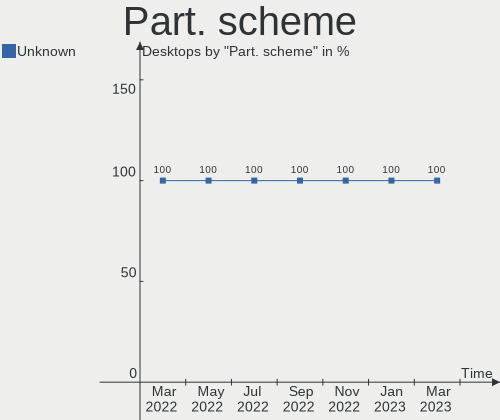
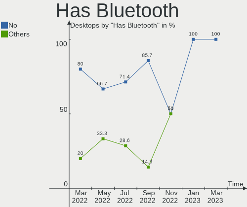
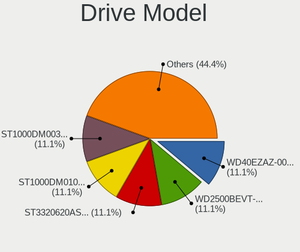
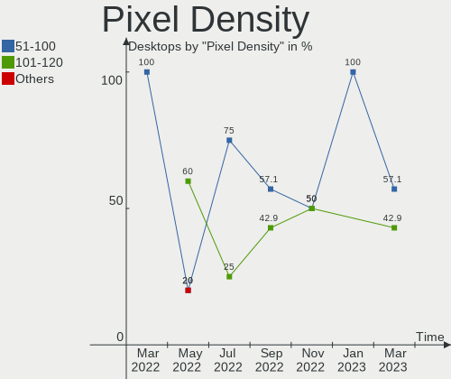
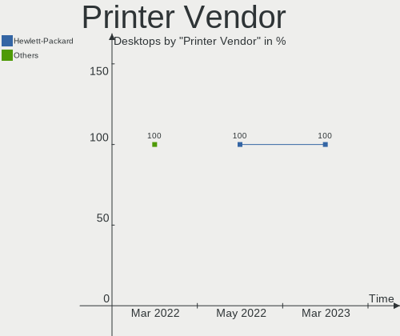

Endless Hardware Trends (Desktop)
---------------------------------

A project to identify most popular hardware characteristics and track their change
over time based on data collected by Endless users at https://Linux-Hardware.org.

Anyone can contribute to the study by uploading probes of their computers by
the [hw-probe](https://github.com/linuxhw/hw-probe) tool:

    sudo -E hw-probe -all -upload

Full-feature report is available here: https://linux-hardware.org/?view=trends&formfactor=desktop

Period: May, 2021.

Contents
--------

- [ OS                       ](#os)
- [ OS Family                ](#os-family)
- [ Kernel                   ](#kernel)
- [ Kernel Family            ](#kernel-family)
- [ Kernel Major Ver.        ](#kernel-major-ver)
- [ Arch                     ](#arch)
- [ DE                       ](#de)
- [ Display Server           ](#display-server)
- [ Display Manager          ](#display-manager)
- [ OS Lang                  ](#os-lang)
- [ Boot Mode                ](#boot-mode)
- [ Filesystem               ](#filesystem)
- [ Part. scheme             ](#part-scheme)
- [ Dual Boot with Linux/BSD ](#dual-boot-with-linux/bsd)
- [ Dual Boot (Win)          ](#dual-boot-win)
- [ Country                  ](#country)
- [ City                     ](#city)
- [ Vendor                   ](#vendor)
- [ Model                    ](#model)
- [ Model Family             ](#model-family)
- [ MFG Year                 ](#mfg-year)
- [ Form Factor              ](#form-factor)
- [ Secure Boot              ](#secure-boot)
- [ Coreboot                 ](#coreboot)
- [ RAM Size                 ](#ram-size)
- [ RAM Used                 ](#ram-used)
- [ Has CD-ROM               ](#has-cd-rom)
- [ Total Drives             ](#total-drives)
- [ Has Ethernet             ](#has-ethernet)
- [ Has WiFi                 ](#has-wifi)
- [ Has Bluetooth            ](#has-bluetooth)
- [ Drive Vendor             ](#drive-vendor)
- [ Drive Model              ](#drive-model)
- [ HDD Vendor               ](#hdd-vendor)
- [ SSD Vendor               ](#ssd-vendor)
- [ Drive Kind               ](#drive-kind)
- [ Drive Connector          ](#drive-connector)
- [ Drive Size               ](#drive-size)
- [ Space Total              ](#space-total)
- [ Space Used               ](#space-used)
- [ Malfunc. Drives          ](#malfunc-drives)
- [ Malfunc. Drive Vendor    ](#malfunc-drive-vendor)
- [ Malfunc. HDD Vendor      ](#malfunc-hdd-vendor)
- [ Malfunc. Drive Kind      ](#malfunc-drive-kind)
- [ Failed Drives            ](#failed-drives)
- [ Failed Drive Vendor      ](#failed-drive-vendor)
- [ Drive Status             ](#drive-status)
- [ Storage Vendor           ](#storage-vendor)
- [ Storage Model            ](#storage-model)
- [ Storage Kind             ](#storage-kind)
- [ CPU Vendor               ](#cpu-vendor)
- [ CPU Model                ](#cpu-model)
- [ CPU Model Family         ](#cpu-model-family)
- [ CPU Cores                ](#cpu-cores)
- [ CPU Sockets              ](#cpu-sockets)
- [ CPU Threads              ](#cpu-threads)
- [ CPU Op-Modes             ](#cpu-op-modes)
- [ CPU Microcode            ](#cpu-microcode)
- [ CPU Microarch            ](#cpu-microarch)
- [ GPU Vendor               ](#gpu-vendor)
- [ GPU Model                ](#gpu-model)
- [ GPU Combo                ](#gpu-combo)
- [ GPU Driver               ](#gpu-driver)
- [ GPU Memory               ](#gpu-memory)
- [ Monitor Vendor           ](#monitor-vendor)
- [ Monitor Model            ](#monitor-model)
- [ Monitor Resolution       ](#monitor-resolution)
- [ Monitor Diagonal         ](#monitor-diagonal)
- [ Monitor Width            ](#monitor-width)
- [ Aspect Ratio             ](#aspect-ratio)
- [ Monitor Area             ](#monitor-area)
- [ Pixel Density            ](#pixel-density)
- [ Multiple Monitors        ](#multiple-monitors)
- [ Net Controller Vendor    ](#net-controller-vendor)
- [ Net Controller Model     ](#net-controller-model)
- [ Wireless Vendor          ](#wireless-vendor)
- [ Wireless Model           ](#wireless-model)
- [ Ethernet Vendor          ](#ethernet-vendor)
- [ Ethernet Model           ](#ethernet-model)
- [ Net Controller Kind      ](#net-controller-kind)
- [ Used Controller          ](#used-controller)
- [ NICs                     ](#nics)
- [ IPv6                     ](#ipv6)
- [ Memory Vendor            ](#memory-vendor)
- [ Memory Model             ](#memory-model)
- [ Memory Kind              ](#memory-kind)
- [ Memory Form Factor       ](#memory-form-factor)
- [ Memory Size              ](#memory-size)
- [ Memory Speed             ](#memory-speed)
- [ Sound Vendor             ](#sound-vendor)
- [ Sound Model              ](#sound-model)
- [ Camera Vendor            ](#camera-vendor)
- [ Camera Model             ](#camera-model)
- [ Fingerprint Vendor       ](#fingerprint-vendor)
- [ Fingerprint Model        ](#fingerprint-model)
- [ Chipcard Vendor          ](#chipcard-vendor)
- [ Chipcard Model           ](#chipcard-model)
- [ Printer Vendor           ](#printer-vendor)
- [ Printer Model            ](#printer-model)
- [ Scanner Vendor           ](#scanner-vendor)
- [ Scanner Model            ](#scanner-model)
- [ Bluetooth Vendor         ](#bluetooth-vendor)
- [ Bluetooth Model          ](#bluetooth-model)
- [ Unsupported Devices      ](#unsupported-devices)
- [ Unsupported Device Types ](#unsupported-device-types)

OS
--

Installed operating systems

| Name          | Desktops | Percent |
|---------------|----------|---------|
| Endless 3.9.4 | 9        | 100%    |

OS Family
---------

OS without a version

| Name    | Desktops | Percent |
|---------|----------|---------|
| Endless | 9        | 100%    |

Kernel
------

Version of the Linux kernel

| Version          | Desktops | Percent |
|------------------|----------|---------|
| 5.8.0-14-generic | 9        | 100%    |

Kernel Family
-------------

Linux kernel without a distro release

| Version | Desktops | Percent |
|---------|----------|---------|
| 5.8.0   | 9        | 100%    |

Kernel Major Ver.
-----------------

Linux kernel major version

| Version | Desktops | Percent |
|---------|----------|---------|
| 5.8     | 9        | 100%    |

Arch
----

OS architecture (x86_64, i586, etc.)

| Name   | Desktops | Percent |
|--------|----------|---------|
| x86_64 | 9        | 100%    |

DE
--

Desktop Environment

| Name  | Desktops | Percent |
|-------|----------|---------|
| GNOME | 9        | 100%    |

Display Server
--------------

X11 or Wayland

| Name | Desktops | Percent |
|------|----------|---------|
| X11  | 9        | 100%    |

Display Manager
---------------

SDDM, LightDM, etc.

| Name    | Desktops | Percent |
|---------|----------|---------|
| Unknown | 9        | 100%    |

OS Lang
-------

Language

| Lang  | Desktops | Percent |
|-------|----------|---------|
| pt_BR | 2        | 22.22%  |
| es_MX | 2        | 22.22%  |
| en_US | 2        | 22.22%  |
| tr_TR | 1        | 11.11%  |
| ro_RO | 1        | 11.11%  |
| id_ID | 1        | 11.11%  |

Boot Mode
---------

EFI or BIOS

| Mode | Desktops | Percent |
|------|----------|---------|
| BIOS | 6        | 66.67%  |
| EFI  | 3        | 33.33%  |

Filesystem
----------

Type of filesystem

| Type | Desktops | Percent |
|------|----------|---------|
| Ext4 | 9        | 100%    |

Part. scheme
------------

Scheme of partitioning

| Type    | Desktops | Percent |
|---------|----------|---------|
| Unknown | 9        | 100%    |

Dual Boot with Linux/BSD
------------------------

Hosting more than one Linux/BSD

| Dual boot | Desktops | Percent |
|-----------|----------|---------|
| No        | 9        | 100%    |

Dual Boot (Win)
---------------

Hosting Linux and Windows

| Dual boot | Desktops | Percent |
|-----------|----------|---------|
| No        | 9        | 100%    |

Country
-------

Geographic location (country)

| Country     | Desktops | Percent |
|-------------|----------|---------|
| Romania     | 2        | 22.22%  |
| Mexico      | 2        | 22.22%  |
| Brazil      | 2        | 22.22%  |
| Turkey      | 1        | 11.11%  |
| Philippines | 1        | 11.11%  |
| Indonesia   | 1        | 11.11%  |

City
----

Geographic location (city)

| City        | Desktops | Percent |
|-------------|----------|---------|
| São Paulo  | 1        | 11.11%  |
| Pasig       | 1        | 11.11%  |
| Mexico City | 1        | 11.11%  |
| Istanbul    | 1        | 11.11%  |
| Imperatriz  | 1        | 11.11%  |
| Iasi        | 1        | 11.11%  |
| Guadalajara | 1        | 11.11%  |
| Brasov      | 1        | 11.11%  |
| Bekasi      | 1        | 11.11%  |

Vendor
------

Motherboard manufacturer

| Name                | Desktops | Percent |
|---------------------|----------|---------|
| Acer                | 3        | 33.33%  |
| Gigabyte Technology | 2        | 22.22%  |
| MSI                 | 1        | 11.11%  |
| Lenovo              | 1        | 11.11%  |
| ECS                 | 1        | 11.11%  |
| ASUSTek Computer    | 1        | 11.11%  |

Model
-----

Motherboard model

| Name                            | Desktops | Percent |
|---------------------------------|----------|---------|
| MSI MS-7A15                     | 1        | 11.11%  |
| Lenovo ThinkCentre M58e 7303AS6 | 1        | 11.11%  |
| Gigabyte 965GM-S2               | 1        | 11.11%  |
| Gigabyte 945GCM-S2C             | 1        | 11.11%  |
| ECS APLD-I                      | 1        | 11.11%  |
| ASUS All Series                 | 1        | 11.11%  |
| Acer Veriton M2611              | 1        | 11.11%  |
| Acer Nitro N50-610              | 1        | 11.11%  |
| Acer Aspire X1900               | 1        | 11.11%  |

Model Family
------------

Motherboard model prefix

| Name                | Desktops | Percent |
|---------------------|----------|---------|
| MSI MS-7A15         | 1        | 11.11%  |
| Lenovo ThinkCentre  | 1        | 11.11%  |
| Gigabyte 965GM-S2   | 1        | 11.11%  |
| Gigabyte 945GCM-S2C | 1        | 11.11%  |
| ECS APLD-I          | 1        | 11.11%  |
| ASUS All            | 1        | 11.11%  |
| Acer Veriton        | 1        | 11.11%  |
| Acer Nitro          | 1        | 11.11%  |
| Acer Aspire         | 1        | 11.11%  |

MFG Year
--------

Motherboard manufacture year

| Year | Desktops | Percent |
|------|----------|---------|
| 2021 | 1        | 11.11%  |
| 2020 | 1        | 11.11%  |
| 2019 | 1        | 11.11%  |
| 2018 | 1        | 11.11%  |
| 2012 | 1        | 11.11%  |
| 2011 | 1        | 11.11%  |
| 2010 | 1        | 11.11%  |
| 2009 | 1        | 11.11%  |
| 2007 | 1        | 11.11%  |

Form Factor
-----------

Physical design of the computer

| Name    | Desktops | Percent |
|---------|----------|---------|
| Desktop | 9        | 100%    |

Secure Boot
-----------

Enabled or disabled

| State    | Desktops | Percent |
|----------|----------|---------|
| Disabled | 8        | 88.89%  |
| Enabled  | 1        | 11.11%  |

Coreboot
--------

Have coreboot on board

| Used | Desktops | Percent |
|------|----------|---------|
| No   | 9        | 100%    |

RAM Size
--------

Total RAM memory

| Size in GB | Desktops | Percent |
|------------|----------|---------|
| 3.01-4.0   | 7        | 77.78%  |
| 16.01-24.0 | 1        | 11.11%  |
| 8.01-16.0  | 1        | 11.11%  |

RAM Used
--------

Used RAM memory

| Used GB  | Desktops | Percent |
|----------|----------|---------|
| 1.01-2.0 | 7        | 77.78%  |
| 2.01-3.0 | 2        | 22.22%  |

Has CD-ROM
----------

Has CD-ROM on board

| Presented | Desktops | Percent |
|-----------|----------|---------|
| No        | 5        | 55.56%  |
| Yes       | 4        | 44.44%  |

Total Drives
------------

Number of drives on board

| Drives | Desktops | Percent |
|--------|----------|---------|
| 1      | 7        | 77.78%  |
| 2      | 2        | 22.22%  |

Has Ethernet
------------

Has Ethernet on board

| Presented | Desktops | Percent |
|-----------|----------|---------|
| Yes       | 9        | 100%    |

Has WiFi
--------

Has WiFi module

| Presented | Desktops | Percent |
|-----------|----------|---------|
| No        | 8        | 88.89%  |
| Yes       | 1        | 11.11%  |

Has Bluetooth
-------------

Has Bluetooth module

| Presented | Desktops | Percent |
|-----------|----------|---------|
| No        | 8        | 88.89%  |
| Yes       | 1        | 11.11%  |

Drive Vendor
------------

Hard drive vendors

| Vendor              | Desktops | Drives | Percent |
|---------------------|----------|--------|---------|
| WDC                 | 3        | 3      | 27.27%  |
| Toshiba             | 2        | 2      | 18.18%  |
| Samsung Electronics | 2        | 2      | 18.18%  |
| Smart               | 1        | 1      | 9.09%   |
| Seagate             | 1        | 1      | 9.09%   |
| KingDian            | 1        | 1      | 9.09%   |
| A-DATA Technology   | 1        | 1      | 9.09%   |

Drive Model
-----------

Hard drive models

| Model                        | Desktops | Percent |
|------------------------------|----------|---------|
| WDC WD5000AVVS-63M8B0 500GB  | 1        | 9.09%   |
| WDC WD3200AAJS-22L7A0 320GB  | 1        | 9.09%   |
| WDC WD2500AAJS-08L7A0 250GB  | 1        | 9.09%   |
| Toshiba MQ01ABF050R 500GB    | 1        | 9.09%   |
| Toshiba MQ01ABF050 500GB     | 1        | 9.09%   |
| Smart 120GB                  | 1        | 9.09%   |
| Seagate ST3250823A 250GB     | 1        | 9.09%   |
| Samsung NVMe SSD Drive 256GB | 1        | 9.09%   |
| Samsung HM320JI 320GB        | 1        | 9.09%   |
| KingDian S280 1TB SSD        | 1        | 9.09%   |
| A-DATA SU630 960GB SSD       | 1        | 9.09%   |

HDD Vendor
----------

Hard disk drive vendors

| Vendor              | Desktops | Drives | Percent |
|---------------------|----------|--------|---------|
| WDC                 | 3        | 3      | 42.86%  |
| Toshiba             | 2        | 2      | 28.57%  |
| Seagate             | 1        | 1      | 14.29%  |
| Samsung Electronics | 1        | 1      | 14.29%  |

SSD Vendor
----------

Solid state drive vendors

| Vendor            | Desktops | Drives | Percent |
|-------------------|----------|--------|---------|
| KingDian          | 1        | 1      | 50%     |
| A-DATA Technology | 1        | 1      | 50%     |

Drive Kind
----------

HDD or SSD

| Kind    | Desktops | Drives | Percent |
|---------|----------|--------|---------|
| HDD     | 6        | 7      | 66.67%  |
| NVMe    | 1        | 1      | 11.11%  |
| SSD     | 1        | 2      | 11.11%  |
| Unknown | 1        | 1      | 11.11%  |

Drive Connector
---------------

SATA, SAS, NVMe, etc.

| Type | Desktops | Drives | Percent |
|------|----------|--------|---------|
| SATA | 8        | 10     | 88.89%  |
| NVMe | 1        | 1      | 11.11%  |

Drive Size
----------

Size of hard drive

| Size in TB | Desktops | Drives | Percent |
|------------|----------|--------|---------|
| 0.01-0.5   | 6        | 7      | 85.71%  |
| 0.51-1.0   | 1        | 2      | 14.29%  |

Space Total
-----------

Amount of disk space available on the file system

| Size in GB | Desktops | Percent |
|------------|----------|---------|
| 251-500    | 4        | 44.44%  |
| 101-250    | 4        | 44.44%  |
| 1001-2000  | 1        | 11.11%  |

Space Used
----------

Amount of used disk space

| Used GB | Desktops | Percent |
|---------|----------|---------|
| 21-50   | 6        | 66.67%  |
| 101-250 | 2        | 22.22%  |
| 1-20    | 1        | 11.11%  |

Malfunc. Drives
---------------

Drive models with a malfunction

Zero info for selected period =(

Malfunc. Drive Vendor
---------------------

Vendors of faulty drives

Zero info for selected period =(

Malfunc. HDD Vendor
-------------------

Vendors of faulty HDD drives

Zero info for selected period =(

Malfunc. Drive Kind
-------------------

Kinds of faulty drives

Zero info for selected period =(

Failed Drives
-------------

Failed drive models

Zero info for selected period =(

Failed Drive Vendor
-------------------

Failed drive vendors

Zero info for selected period =(

Drive Status
------------

Number of failed and malfunc. drives

| Status   | Desktops | Drives | Percent |
|----------|----------|--------|---------|
| Detected | 9        | 11     | 100%    |

Storage Vendor
--------------

Storage controller vendors

| Vendor              | Desktops | Percent |
|---------------------|----------|---------|
| Intel               | 9        | 81.82%  |
| Samsung Electronics | 1        | 9.09%   |
| JMicron Technology  | 1        | 9.09%   |

Storage Model
-------------

Storage controller models

| Model                                                                         | Desktops | Percent |
|-------------------------------------------------------------------------------|----------|---------|
| Intel NM10/ICH7 Family SATA Controller [IDE mode]                             | 3        | 21.43%  |
| Intel 82801G (ICH7 Family) IDE Controller                                     | 2        | 14.29%  |
| Samsung NVMe Controller                                                       | 1        | 7.14%   |
| JMicron JMB363 SATA/IDE Controller                                            | 1        | 7.14%   |
| Intel Q170/Q150/B150/H170/H110/Z170/CM236 Chipset SATA Controller [AHCI Mode] | 1        | 7.14%   |
| Intel Comet Lake SATA AHCI Controller                                         | 1        | 7.14%   |
| Intel Celeron N3350/Pentium N4200/Atom E3900 Series SATA AHCI Controller      | 1        | 7.14%   |
| Intel Atom Processor E3800 Series SATA AHCI Controller                        | 1        | 7.14%   |
| Intel 82801HR/HO/HH (ICH8R/DO/DH) 2 port SATA Controller [IDE mode]           | 1        | 7.14%   |
| Intel 82801H (ICH8 Family) 4 port SATA Controller [IDE mode]                  | 1        | 7.14%   |
| Intel 6 Series/C200 Series Chipset Family 6 port Desktop SATA AHCI Controller | 1        | 7.14%   |

Storage Kind
------------

Kind of storage controller (IDE, SATA, NVMe, SAS, ...)

| Kind | Desktops | Percent |
|------|----------|---------|
| SATA | 5        | 50%     |
| IDE  | 4        | 40%     |
| NVMe | 1        | 10%     |

CPU Vendor
----------

Processor vendors

| Vendor | Desktops | Percent |
|--------|----------|---------|
| Intel  | 9        | 100%    |

CPU Model
---------

Processor models

| Model                                       | Desktops | Percent |
|---------------------------------------------|----------|---------|
| Intel Pentium Dual-Core CPU E5700 @ 3.00GHz | 1        | 11.11%  |
| Intel Pentium CPU G4560 @ 3.50GHz           | 1        | 11.11%  |
| Intel Pentium CPU G2030 @ 3.00GHz           | 1        | 11.11%  |
| Intel Core i5-10400F CPU @ 2.90GHz          | 1        | 11.11%  |
| Intel Core 2 Duo CPU E8400 @ 3.00GHz        | 1        | 11.11%  |
| Intel Core 2 Duo CPU E7400 @ 2.80GHz        | 1        | 11.11%  |
| Intel Core 2 CPU 6600 @ 2.40GHz             | 1        | 11.11%  |
| Intel Celeron CPU J3355 @ 2.00GHz           | 1        | 11.11%  |
| Intel Celeron CPU J1800 @ 2.41GHz           | 1        | 11.11%  |

CPU Model Family
----------------

Processor model prefix

| Model                   | Desktops | Percent |
|-------------------------|----------|---------|
| Intel Pentium           | 2        | 22.22%  |
| Intel Core 2 Duo        | 2        | 22.22%  |
| Intel Celeron           | 2        | 22.22%  |
| Intel Pentium Dual-Core | 1        | 11.11%  |
| Intel Core i5           | 1        | 11.11%  |
| Intel Core 2            | 1        | 11.11%  |

CPU Cores
---------

Number of processor cores

| Number | Desktops | Percent |
|--------|----------|---------|
| 2      | 8        | 88.89%  |
| 6      | 1        | 11.11%  |

CPU Sockets
-----------

Number of sockets

| Number | Desktops | Percent |
|--------|----------|---------|
| 1      | 9        | 100%    |

CPU Threads
-----------

Threads per core (Hyper-Threading)

| Number | Desktops | Percent |
|--------|----------|---------|
| 1      | 7        | 77.78%  |
| 2      | 2        | 22.22%  |

CPU Op-Modes
------------

CPU Operation Modes (32-bit, 64-bit)

| Op mode        | Desktops | Percent |
|----------------|----------|---------|
| 32-bit, 64-bit | 9        | 100%    |

CPU Microcode
-------------

Microcode number

| Number  | Desktops | Percent |
|---------|----------|---------|
| 0x1067a | 3        | 33.33%  |
| 0xa0653 | 1        | 11.11%  |
| 0x906e9 | 1        | 11.11%  |
| 0x6f6   | 1        | 11.11%  |
| 0x506c9 | 1        | 11.11%  |
| 0x306a9 | 1        | 11.11%  |
| 0x30679 | 1        | 11.11%  |

CPU Microarch
-------------

Microarchitecture

| Name       | Desktops | Percent |
|------------|----------|---------|
| Penryn     | 3        | 33.33%  |
| Silvermont | 1        | 11.11%  |
| KabyLake   | 1        | 11.11%  |
| IvyBridge  | 1        | 11.11%  |
| Goldmont   | 1        | 11.11%  |
| Core       | 1        | 11.11%  |
| CometLake  | 1        | 11.11%  |

GPU Vendor
----------

Vendors of graphics cards

| Vendor | Desktops | Percent |
|--------|----------|---------|
| Intel  | 7        | 77.78%  |
| Nvidia | 2        | 22.22%  |

GPU Model
---------

Graphics card models

| Model                                                            | Desktops | Percent |
|------------------------------------------------------------------|----------|---------|
| Intel 4 Series Chipset Integrated Graphics Controller            | 2        | 22.22%  |
| Nvidia TU117 [GeForce GTX 1650]                                  | 1        | 11.11%  |
| Nvidia GP108 [GeForce GT 1030]                                   | 1        | 11.11%  |
| Intel Xeon E3-1200 v2/3rd Gen Core processor Graphics Controller | 1        | 11.11%  |
| Intel HD Graphics 500                                            | 1        | 11.11%  |
| Intel Atom Processor Z36xxx/Z37xxx Series Graphics & Display     | 1        | 11.11%  |
| Intel 82G965 Integrated Graphics Controller                      | 1        | 11.11%  |
| Intel 82945G/GZ Integrated Graphics Controller                   | 1        | 11.11%  |

GPU Combo
---------

Combinations of graphics cards

| Name       | Desktops | Percent |
|------------|----------|---------|
| 1 x Intel  | 7        | 77.78%  |
| 1 x Nvidia | 2        | 22.22%  |

GPU Driver
----------

Free vs proprietary

| Driver      | Desktops | Percent |
|-------------|----------|---------|
| Free        | 7        | 77.78%  |
| Proprietary | 2        | 22.22%  |

GPU Memory
----------

Total video memory

| Size in GB | Desktops | Percent |
|------------|----------|---------|
| Unknown    | 9        | 100%    |

Monitor Vendor
--------------

Monitor vendors

| Vendor              | Desktops | Percent |
|---------------------|----------|---------|
| Samsung Electronics | 3        | 42.86%  |
| Goldstar            | 2        | 28.57%  |
| eMachines           | 1        | 14.29%  |
| Dell                | 1        | 14.29%  |

Monitor Model
-------------

Monitor models

| Model                                                             | Desktops | Percent |
|-------------------------------------------------------------------|----------|---------|
| Samsung Electronics T24B350 SAM093E 1920x1080 531x299mm 24.0-inch | 1        | 14.29%  |
| Samsung Electronics T24B300 SAM092E 1920x1080 521x293mm 23.5-inch | 1        | 14.29%  |
| Samsung Electronics S22D300 SAM0B3F 1920x1080 477x268mm 21.5-inch | 1        | 14.29%  |
| Goldstar HD GSM5ACB 1366x768 410x230mm 18.5-inch                  | 1        | 14.29%  |
| Goldstar FULL HD GSM5B55 1920x1080 480x270mm 21.7-inch            | 1        | 14.29%  |
| eMachines E192HQV EMA01E9 1366x768 410x230mm 18.5-inch            | 1        | 14.29%  |
| Dell P1913S DELA084 1280x1024 376x301mm 19.0-inch                 | 1        | 14.29%  |

Monitor Resolution
------------------

Monitor screen resolution

| Resolution       | Desktops | Percent |
|------------------|----------|---------|
| 1920x1080 (FHD)  | 3        | 42.86%  |
| 1366x768 (WXGA)  | 2        | 28.57%  |
| 3840x2160 (4K)   | 1        | 14.29%  |
| 1280x1024 (SXGA) | 1        | 14.29%  |

Monitor Diagonal
----------------

Diagonal size in inches

| Inches | Desktops | Percent |
|--------|----------|---------|
| 21     | 2        | 28.57%  |
| 18     | 2        | 28.57%  |
| 24     | 1        | 14.29%  |
| 23     | 1        | 14.29%  |
| 19     | 1        | 14.29%  |

Monitor Width
-------------

Physical width

| Width in mm | Desktops | Percent |
|-------------|----------|---------|
| 401-500     | 4        | 57.14%  |
| 501-600     | 2        | 28.57%  |
| 351-400     | 1        | 14.29%  |

Aspect Ratio
------------

Proportional relationship between the width and the height

| Ratio | Desktops | Percent |
|-------|----------|---------|
| 16/9  | 6        | 85.71%  |
| 5/4   | 1        | 14.29%  |

Monitor Area
------------

Area in inch²

| Area in inch² | Desktops | Percent |
|----------------|----------|---------|
| 201-250        | 4        | 57.14%  |
| 141-150        | 2        | 28.57%  |
| 151-200        | 1        | 14.29%  |

Pixel Density
-------------

Pixels per inch

| Density | Desktops | Percent |
|---------|----------|---------|
| 51-100  | 5        | 71.43%  |
| 101-120 | 2        | 28.57%  |

Multiple Monitors
-----------------

Total monitors connected

| Total | Desktops | Percent |
|-------|----------|---------|
| 1     | 7        | 77.78%  |
| 0     | 2        | 22.22%  |

Net Controller Vendor
---------------------

Controller vendors

| Vendor                   | Desktops | Percent |
|--------------------------|----------|---------|
| Realtek Semiconductor    | 7        | 70%     |
| Marvell Technology Group | 2        | 20%     |
| Intel                    | 1        | 10%     |

Net Controller Model
--------------------

Controller models

| Model                                                             | Desktops | Percent |
|-------------------------------------------------------------------|----------|---------|
| Realtek RTL8111/8168/8411 PCI Express Gigabit Ethernet Controller | 6        | 60%     |
| Realtek RTL810xE PCI Express Fast Ethernet controller             | 1        | 10%     |
| Marvell Group 88E8057 PCI-E Gigabit Ethernet Controller           | 1        | 10%     |
| Marvell Group 88E8056 PCI-E Gigabit Ethernet Controller           | 1        | 10%     |
| Intel Comet Lake PCH CNVi WiFi                                    | 1        | 10%     |

Wireless Vendor
---------------

Wireless vendors

| Vendor | Desktops | Percent |
|--------|----------|---------|
| Intel  | 1        | 100%    |

Wireless Model
--------------

Wireless models

| Model                          | Desktops | Percent |
|--------------------------------|----------|---------|
| Intel Comet Lake PCH CNVi WiFi | 1        | 100%    |

Ethernet Vendor
---------------

Ethernet vendors

| Vendor                   | Desktops | Percent |
|--------------------------|----------|---------|
| Realtek Semiconductor    | 7        | 77.78%  |
| Marvell Technology Group | 2        | 22.22%  |

Ethernet Model
--------------

Ethernet models

| Model                                                             | Desktops | Percent |
|-------------------------------------------------------------------|----------|---------|
| Realtek RTL8111/8168/8411 PCI Express Gigabit Ethernet Controller | 6        | 66.67%  |
| Realtek RTL810xE PCI Express Fast Ethernet controller             | 1        | 11.11%  |
| Marvell Group 88E8057 PCI-E Gigabit Ethernet Controller           | 1        | 11.11%  |
| Marvell Group 88E8056 PCI-E Gigabit Ethernet Controller           | 1        | 11.11%  |

Net Controller Kind
-------------------

Ethernet, WiFi or modem

| Kind     | Desktops | Percent |
|----------|----------|---------|
| Ethernet | 9        | 90%     |
| WiFi     | 1        | 10%     |

Used Controller
---------------

Currently used network controller

| Kind     | Desktops | Percent |
|----------|----------|---------|
| Ethernet | 9        | 90%     |
| WiFi     | 1        | 10%     |

NICs
----

Total network controllers on board

| Total | Desktops | Percent |
|-------|----------|---------|
| 1     | 8        | 88.89%  |
| 2     | 1        | 11.11%  |

IPv6
----

IPv6 vs IPv4

| Used | Desktops | Percent |
|------|----------|---------|
| No   | 8        | 88.89%  |
| Yes  | 1        | 11.11%  |

Memory Vendor
-------------

Memory module vendors

Zero info for selected period =(

Memory Model
------------

Memory module models

Zero info for selected period =(

Memory Kind
-----------

Memory module kinds

Zero info for selected period =(

Memory Form Factor
------------------

Physical design of the memory module

Zero info for selected period =(

Memory Size
-----------

Memory module size

Zero info for selected period =(

Memory Speed
------------

Memory module speed

Zero info for selected period =(

Sound Vendor
------------

Sound card vendors

| Vendor | Desktops | Percent |
|--------|----------|---------|
| Intel  | 8        | 80%     |
| Nvidia | 2        | 20%     |

Sound Model
-----------

Sound card models

| Model                                                                      | Desktops | Percent |
|----------------------------------------------------------------------------|----------|---------|
| Intel NM10/ICH7 Family High Definition Audio Controller                    | 2        | 20%     |
| Nvidia TU107 GeForce GTX 1650 High Definition Audio Controller             | 1        | 10%     |
| Nvidia GP108 High Definition Audio Controller                              | 1        | 10%     |
| Intel Comet Lake PCH cAVS                                                  | 1        | 10%     |
| Intel Celeron N3350/Pentium N4200/Atom E3900 Series Audio Cluster          | 1        | 10%     |
| Intel Atom Processor Z36xxx/Z37xxx Series High Definition Audio Controller | 1        | 10%     |
| Intel 82801H (ICH8 Family) HD Audio Controller                             | 1        | 10%     |
| Intel 6 Series/C200 Series Chipset Family High Definition Audio Controller | 1        | 10%     |
| Intel 100 Series/C230 Series Chipset Family HD Audio Controller            | 1        | 10%     |

Camera Vendor
-------------

Camera device vendors

| Vendor   | Desktops | Percent |
|----------|----------|---------|
| Unknown  | 1        | 50%     |
| Logitech | 1        | 50%     |

Camera Model
------------

Camera device models

| Model                       | Desktops | Percent |
|-----------------------------|----------|---------|
| Unknown HD camera           | 1        | 50%     |
| Logitech HD Pro Webcam C920 | 1        | 50%     |

Fingerprint Vendor
------------------

Fingerprint sensor vendors

Zero info for selected period =(

Fingerprint Model
-----------------

Fingerprint sensor models

Zero info for selected period =(

Chipcard Vendor
---------------

Chipcard module vendors

Zero info for selected period =(

Chipcard Model
--------------

Chipcard module models

Zero info for selected period =(

Printer Vendor
--------------

Printer device vendors

| Vendor | Desktops | Percent |
|--------|----------|---------|
| Canon  | 1        | 100%    |

Printer Model
-------------

Printer device models

| Model        | Desktops | Percent |
|--------------|----------|---------|
| Canon MF3110 | 1        | 100%    |

Scanner Vendor
--------------

Scanner device vendors

Zero info for selected period =(

Scanner Model
-------------

Scanner device models

Zero info for selected period =(

Bluetooth Vendor
----------------

Controller vendors

| Vendor | Desktops | Percent |
|--------|----------|---------|
| Intel  | 1        | 100%    |

Bluetooth Model
---------------

Controller models

| Model                  | Desktops | Percent |
|------------------------|----------|---------|
| Intel Bluetooth Device | 1        | 100%    |

Unsupported Devices
-------------------

Total unsupported devices on board

| Total | Desktops | Percent |
|-------|----------|---------|
| 0     | 9        | 100%    |

Unsupported Device Types
------------------------

Types of unsupported devices

Zero info for selected period =(

