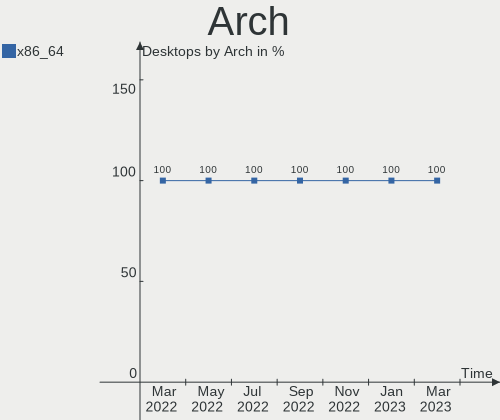
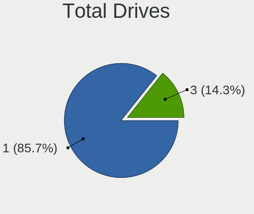
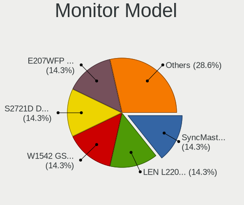
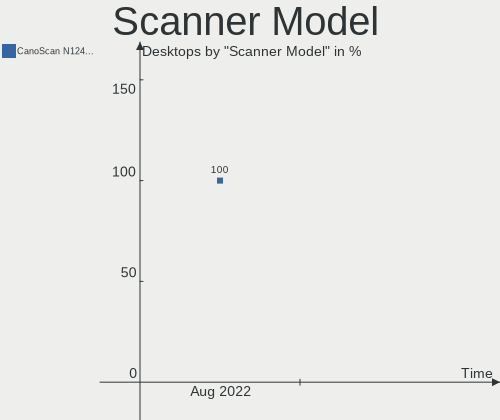
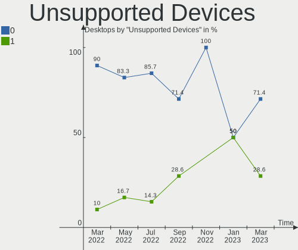

Endless Hardware Trends (Desktop)
---------------------------------

A project to identify most popular hardware characteristics and track their change
over time based on data collected by Endless users at https://Linux-Hardware.org.

Anyone can contribute to the study by uploading probes of their computers by
the [hw-probe](https://github.com/linuxhw/hw-probe) tool:

    sudo -E hw-probe -all -upload

Full-feature report is available here: https://linux-hardware.org/?view=trends&formfactor=desktop

Period: Nov, 2020.

Contents
--------

- [ OS                       ](#os)
- [ OS Family                ](#os-family)
- [ Kernel                   ](#kernel)
- [ Kernel Family            ](#kernel-family)
- [ Kernel Major Ver.        ](#kernel-major-ver)
- [ Arch                     ](#arch)
- [ DE                       ](#de)
- [ Display Server           ](#display-server)
- [ Display Manager          ](#display-manager)
- [ OS Lang                  ](#os-lang)
- [ Boot Mode                ](#boot-mode)
- [ Filesystem               ](#filesystem)
- [ Part. scheme             ](#part-scheme)
- [ Dual Boot with Linux/BSD ](#dual-boot-with-linux/bsd)
- [ Dual Boot (Win)          ](#dual-boot-win)
- [ Country                  ](#country)
- [ City                     ](#city)
- [ Vendor                   ](#vendor)
- [ Model                    ](#model)
- [ Model Family             ](#model-family)
- [ MFG Year                 ](#mfg-year)
- [ Form Factor              ](#form-factor)
- [ Secure Boot              ](#secure-boot)
- [ Coreboot                 ](#coreboot)
- [ RAM Size                 ](#ram-size)
- [ RAM Used                 ](#ram-used)
- [ Has CD-ROM               ](#has-cd-rom)
- [ Total Drives             ](#total-drives)
- [ Has Ethernet             ](#has-ethernet)
- [ Drive Vendor             ](#drive-vendor)
- [ Drive Model              ](#drive-model)
- [ HDD Vendor               ](#hdd-vendor)
- [ SSD Vendor               ](#ssd-vendor)
- [ Drive Kind               ](#drive-kind)
- [ Drive Connector          ](#drive-connector)
- [ Drive Size               ](#drive-size)
- [ Space Total              ](#space-total)
- [ Space Used               ](#space-used)
- [ Malfunc. Drives          ](#malfunc-drives)
- [ Malfunc. Drive Vendor    ](#malfunc-drive-vendor)
- [ Malfunc. HDD Vendor      ](#malfunc-hdd-vendor)
- [ Malfunc. Drive Kind      ](#malfunc-drive-kind)
- [ Failed Drives            ](#failed-drives)
- [ Failed Drive Vendor      ](#failed-drive-vendor)
- [ Drive Status             ](#drive-status)
- [ Storage Vendor           ](#storage-vendor)
- [ Storage Model            ](#storage-model)
- [ Storage Kind             ](#storage-kind)
- [ CPU Vendor               ](#cpu-vendor)
- [ CPU Model                ](#cpu-model)
- [ CPU Model Family         ](#cpu-model-family)
- [ CPU Cores                ](#cpu-cores)
- [ CPU Sockets              ](#cpu-sockets)
- [ CPU Threads              ](#cpu-threads)
- [ CPU Op-Modes             ](#cpu-op-modes)
- [ CPU Microcode            ](#cpu-microcode)
- [ CPU Microarch            ](#cpu-microarch)
- [ GPU Vendor               ](#gpu-vendor)
- [ GPU Model                ](#gpu-model)
- [ GPU Combo                ](#gpu-combo)
- [ GPU Driver               ](#gpu-driver)
- [ GPU Memory               ](#gpu-memory)
- [ Monitor Vendor           ](#monitor-vendor)
- [ Monitor Model            ](#monitor-model)
- [ Monitor Resolution       ](#monitor-resolution)
- [ Monitor Diagonal         ](#monitor-diagonal)
- [ Monitor Width            ](#monitor-width)
- [ Aspect Ratio             ](#aspect-ratio)
- [ Monitor Area             ](#monitor-area)
- [ Pixel Density            ](#pixel-density)
- [ Multiple Monitors        ](#multiple-monitors)
- [ Net Controller Vendor    ](#net-controller-vendor)
- [ Net Controller Model     ](#net-controller-model)
- [ Wireless Vendor          ](#wireless-vendor)
- [ Wireless Model           ](#wireless-model)
- [ Ethernet Vendor          ](#ethernet-vendor)
- [ Ethernet Model           ](#ethernet-model)
- [ Net Controller Kind      ](#net-controller-kind)
- [ Used Controller          ](#used-controller)
- [ NICs                     ](#nics)
- [ Memory Vendor            ](#memory-vendor)
- [ Memory Model             ](#memory-model)
- [ Memory Kind              ](#memory-kind)
- [ Memory Form Factor       ](#memory-form-factor)
- [ Memory Size              ](#memory-size)
- [ Memory Speed             ](#memory-speed)
- [ Sound Vendor             ](#sound-vendor)
- [ Sound Model              ](#sound-model)
- [ Camera Vendor            ](#camera-vendor)
- [ Camera Model             ](#camera-model)
- [ Fingerprint Vendor       ](#fingerprint-vendor)
- [ Fingerprint Model        ](#fingerprint-model)
- [ Chipcard Vendor          ](#chipcard-vendor)
- [ Chipcard Model           ](#chipcard-model)
- [ Printer Vendor           ](#printer-vendor)
- [ Printer Model            ](#printer-model)
- [ Scanner Vendor           ](#scanner-vendor)
- [ Scanner Model            ](#scanner-model)
- [ Bluetooth Vendor         ](#bluetooth-vendor)
- [ Bluetooth Model          ](#bluetooth-model)
- [ Unsupported Devices      ](#unsupported-devices)
- [ Unsupported Device Types ](#unsupported-device-types)

OS
--

Installed operating systems

| Name          | Desktops | Percent |
|---------------|----------|---------|
| Endless 3.9.0 | 16       | 72.73%  |
| Endless 3.8.7 | 6        | 27.27%  |

OS Family
---------

OS without a version

| Name    | Desktops | Percent |
|---------|----------|---------|
| Endless | 22       | 100%    |

Kernel
------

Version of the Linux kernel

| Version          | Desktops | Percent |
|------------------|----------|---------|
| 5.8.0-14-generic | 16       | 72.73%  |
| 5.4.0-42-generic | 6        | 27.27%  |

Kernel Family
-------------

Linux kernel without a distro release

| Version | Desktops | Percent |
|---------|----------|---------|
| 5.8.0   | 16       | 72.73%  |
| 5.4.0   | 6        | 27.27%  |

Kernel Major Ver.
-----------------

Linux kernel major version

| Version | Desktops | Percent |
|---------|----------|---------|
| 5.8     | 16       | 72.73%  |
| 5.4     | 6        | 27.27%  |

Arch
----

OS architecture (x86_64, i586, etc.)

| Name   | Desktops | Percent |
|--------|----------|---------|
| x86_64 | 22       | 100%    |

DE
--

Desktop Environment

| Name  | Desktops | Percent |
|-------|----------|---------|
| GNOME | 22       | 100%    |

Display Server
--------------

X11 or Wayland

| Name | Desktops | Percent |
|------|----------|---------|
| X11  | 22       | 100%    |

Display Manager
---------------

SDDM, LightDM, etc.

| Name    | Desktops | Percent |
|---------|----------|---------|
| Unknown | 22       | 100%    |

OS Lang
-------

Language

| Lang        | Desktops | Percent |
|-------------|----------|---------|
| en_US.utf8  | 4        | 18.18%  |
| pt_BR       | 3        | 13.64%  |
| uk_UA       | 2        | 9.09%   |
| pt_BR.utf8  | 2        | 9.09%   |
| es_MX.utf8  | 2        | 9.09%   |
| ar_AE       | 2        | 9.09%   |
| ru_RU.UTF_8 | 1        | 4.55%   |
| ru_RU       | 1        | 4.55%   |
| ro_RO       | 1        | 4.55%   |
| fr_FR.utf8  | 1        | 4.55%   |
| es_MX       | 1        | 4.55%   |
| en_GB       | 1        | 4.55%   |
| en_BW       | 1        | 4.55%   |

Boot Mode
---------

EFI or BIOS

| Mode | Desktops | Percent |
|------|----------|---------|
| BIOS | 17       | 77.27%  |
| EFI  | 5        | 22.73%  |

Filesystem
----------

Type of filesystem

| Type | Desktops | Percent |
|------|----------|---------|
| Ext4 | 22       | 100%    |

Part. scheme
------------

Scheme of partitioning

| Type    | Desktops | Percent |
|---------|----------|---------|
| Unknown | 22       | 100%    |

Dual Boot with Linux/BSD
------------------------

Hosting more than one Linux/BSD

| Dual boot | Desktops | Percent |
|-----------|----------|---------|
| No        | 22       | 100%    |

Dual Boot (Win)
---------------

Hosting Linux and Windows

| Dual boot | Desktops | Percent |
|-----------|----------|---------|
| No        | 22       | 100%    |

Country
-------

Geographic location (country)

| Country      | Desktops | Percent |
|--------------|----------|---------|
| Brazil       | 5        | 22.73%  |
| USA          | 4        | 18.18%  |
| Ukraine      | 3        | 13.64%  |
| Mexico       | 3        | 13.64%  |
| Saudi Arabia | 2        | 9.09%   |
| Russia       | 1        | 4.55%   |
| Romania      | 1        | 4.55%   |
| India        | 1        | 4.55%   |
| Germany      | 1        | 4.55%   |
| Canada       | 1        | 4.55%   |

City
----

Geographic location (city)

| City                  | Desktops | Percent |
|-----------------------|----------|---------|
| Jeddah                | 2        | 9.09%   |
| Brovary               | 2        | 9.09%   |
| Belo Horizonte        | 2        | 9.09%   |
| Wilkesboro            | 1        | 4.55%   |
| Thrissur              | 1        | 4.55%   |
| Sterling              | 1        | 4.55%   |
| Sherbrooke            | 1        | 4.55%   |
| Santiago              | 1        | 4.55%   |
| San Juan de los Lagos | 1        | 4.55%   |
| Ratingen              | 1        | 4.55%   |
| Puerto Vallarta       | 1        | 4.55%   |
| Porto Seguro          | 1        | 4.55%   |
| Parral                | 1        | 4.55%   |
| Omsk                  | 1        | 4.55%   |
| Modesto               | 1        | 4.55%   |
| Kharkiv               | 1        | 4.55%   |
| Galion                | 1        | 4.55%   |
| Campo Mourao          | 1        | 4.55%   |
| Alba Iulia            | 1        | 4.55%   |

Vendor
------

Motherboard manufacturer

| Name                | Desktops | Percent |
|---------------------|----------|---------|
| ASUSTek Computer    | 5        | 22.73%  |
| Hewlett-Packard     | 3        | 13.64%  |
| Gigabyte Technology | 2        | 9.09%   |
| ECS                 | 2        | 9.09%   |
| Dell                | 2        | 9.09%   |
| Acer                | 2        | 9.09%   |
| PCWare              | 1        | 4.55%   |
| OEM                 | 1        | 4.55%   |
| Megaware            | 1        | 4.55%   |
| Intel               | 1        | 4.55%   |
| Fujitsu             | 1        | 4.55%   |
| ASRock              | 1        | 4.55%   |

Model
-----

Motherboard model

| Name                              | Desktops | Percent |
|-----------------------------------|----------|---------|
| ECS A320AM4-M3D                   | 2        | 9.09%   |
| ASUS P8H61-M LX                   | 2        | 9.09%   |
| PCWare PW-945GCX                  | 1        | 4.55%   |
| OEM B250                          | 1        | 4.55%   |
| Intel HM65DESK                    | 1        | 4.55%   |
| HP EliteDesk 800 G1 SFF           | 1        | 4.55%   |
| HP Compaq Pro 6300 SFF            | 1        | 4.55%   |
| HP 290 G2 MT Business PC          | 1        | 4.55%   |
| Gigabyte X470 AORUS GAMING 5 WIFI | 1        | 4.55%   |
| Gigabyte H410M S2                 | 1        | 4.55%   |
| Fujitsu ESPRIMO E510              | 1        | 4.55%   |
| Dell OptiPlex 745                 | 1        | 4.55%   |
| Dell Inspiron 410                 | 1        | 4.55%   |
| ASUS M5A78L-M LX PLUS             | 1        | 4.55%   |
| ASUS M3A78-EM                     | 1        | 4.55%   |
| ASUS All Series                   | 1        | 4.55%   |
| ASRock 960GM/U3S3 FX              | 1        | 4.55%   |
| Acer Aspire TC-895                | 1        | 4.55%   |
| Acer Aspire AX3900                | 1        | 4.55%   |
| Unknown                           | 1        | 4.55%   |

Model Family
------------

Motherboard model prefix

| Name             | Desktops | Percent |
|------------------|----------|---------|
| ECS A320AM4-M3D  | 2        | 9.09%   |
| ASUS P8H61-M     | 2        | 9.09%   |
| Acer Aspire      | 2        | 9.09%   |
| PCWare PW-945GCX | 1        | 4.55%   |
| OEM B250         | 1        | 4.55%   |
| Intel HM65DESK   | 1        | 4.55%   |
| HP EliteDesk     | 1        | 4.55%   |
| HP Compaq        | 1        | 4.55%   |
| HP 290           | 1        | 4.55%   |
| Gigabyte X470    | 1        | 4.55%   |
| Gigabyte H410M   | 1        | 4.55%   |
| Fujitsu ESPRIMO  | 1        | 4.55%   |
| Dell OptiPlex    | 1        | 4.55%   |
| Dell Inspiron    | 1        | 4.55%   |
| ASUS M5A78L-M    | 1        | 4.55%   |
| ASUS M3A78-EM    | 1        | 4.55%   |
| ASUS All         | 1        | 4.55%   |
| ASRock 960GM     | 1        | 4.55%   |
| Unknown          | 1        | 4.55%   |

MFG Year
--------

Motherboard manufacture year

| Year | Desktops | Percent |
|------|----------|---------|
| 2020 | 4        | 18.18%  |
| 2019 | 4        | 18.18%  |
| 2013 | 4        | 18.18%  |
| 2010 | 3        | 13.64%  |
| 2018 | 1        | 4.55%   |
| 2017 | 1        | 4.55%   |
| 2014 | 1        | 4.55%   |
| 2012 | 1        | 4.55%   |
| 2009 | 1        | 4.55%   |
| 2008 | 1        | 4.55%   |
| 2007 | 1        | 4.55%   |

Form Factor
-----------

Physical design of the computer

| Name    | Desktops | Percent |
|---------|----------|---------|
| Desktop | 22       | 100%    |

Secure Boot
-----------

Enabled or disabled

| State    | Desktops | Percent |
|----------|----------|---------|
| Disabled | 22       | 100%    |

Coreboot
--------

Have coreboot on board

| Used | Desktops | Percent |
|------|----------|---------|
| No   | 22       | 100%    |

RAM Size
--------

Total RAM memory

| Size in GB | Desktops | Percent |
|------------|----------|---------|
| 4.01-8.0   | 7        | 31.82%  |
| 1.01-2.0   | 5        | 22.73%  |
| 8.01-16.0  | 4        | 18.18%  |
| 3.01-4.0   | 3        | 13.64%  |
| 16.01-24.0 | 2        | 9.09%   |
| 32.01-64.0 | 1        | 4.55%   |

RAM Used
--------

Used RAM memory

| Used GB  | Desktops | Percent |
|----------|----------|---------|
| 1.01-2.0 | 11       | 50%     |
| 0.01-1.0 | 5        | 22.73%  |
| 4.01-8.0 | 3        | 13.64%  |
| 2.01-3.0 | 3        | 13.64%  |

Has CD-ROM
----------

Has CD-ROM on board

| Presented | Desktops | Percent |
|-----------|----------|---------|
| Yes       | 12       | 54.55%  |
| No        | 10       | 45.45%  |

Total Drives
------------

Number of drives on board

| Drives | Desktops | Percent |
|--------|----------|---------|
| 1      | 17       | 77.27%  |
| 3      | 2        | 9.09%   |
| 2      | 2        | 9.09%   |
| 7      | 1        | 4.55%   |

Has Ethernet
------------

Has Ethernet on board

| Presented | Desktops | Percent |
|-----------|----------|---------|
| Yes       | 22       | 100%    |

Drive Vendor
------------

Hard drive vendors

| Vendor              | Desktops | Drives | Percent |
|---------------------|----------|--------|---------|
| WDC                 | 7        | 8      | 23.33%  |
| Seagate             | 5        | 7      | 16.67%  |
| Toshiba             | 3        | 3      | 10%     |
| Kingston            | 3        | 3      | 10%     |
| Sandisk             | 2        | 2      | 6.67%   |
| Patriot             | 2        | 2      | 6.67%   |
| XPG                 | 1        | 1      | 3.33%   |
| Unknown             | 1        | 1      | 3.33%   |
| Samsung Electronics | 1        | 1      | 3.33%   |
| Phison              | 1        | 1      | 3.33%   |
| Maxtor              | 1        | 1      | 3.33%   |
| Leven               | 1        | 1      | 3.33%   |
| Hitachi             | 1        | 1      | 3.33%   |
| Crucial             | 1        | 1      | 3.33%   |

Drive Model
-----------

Hard drive models

| Model                               | Desktops | Percent |
|-------------------------------------|----------|---------|
| Seagate ST1000DM010-2EP102 1TB      | 2        | 6.06%   |
| Patriot Burst 120GB SSD             | 2        | 6.06%   |
| XPG NVMe SSD Drive 1024GB           | 1        | 3.03%   |
| WDC WDS240G2G0A-00JH30 240GB SSD    | 1        | 3.03%   |
| WDC WDS100T2B0A-00SM50 1TB SSD      | 1        | 3.03%   |
| WDC WD7500AAKS-00RBA0 752GB         | 1        | 3.03%   |
| WDC WD5000AAKX-003CA0 500GB         | 1        | 3.03%   |
| WDC WD5000AAKS-00YGA0 500GB         | 1        | 3.03%   |
| WDC WD20EZRX-22D8PB0 2TB            | 1        | 3.03%   |
| WDC WD10EZEX-21WN4A0 1TB            | 1        | 3.03%   |
| WDC WD10EADS-00M2B0 1TB             | 1        | 3.03%   |
| Unknown EM200AA001-9VY132 200GB     | 1        | 3.03%   |
| Toshiba MK3275GSX 320GB             | 1        | 3.03%   |
| Toshiba MK1059GSM 1TB               | 1        | 3.03%   |
| Toshiba DT01ACA050 500GB            | 1        | 3.03%   |
| Seagate ST3160815AS 160GB           | 1        | 3.03%   |
| Seagate ST31000524AS 1TB            | 1        | 3.03%   |
| Seagate ST2000DM001-1ER164 2TB      | 1        | 3.03%   |
| Seagate ST1000DX001-1NS162 1TB      | 1        | 3.03%   |
| Seagate ST1000DM003-1CH162 1TB      | 1        | 3.03%   |
| SanDisk SD7TB3Q-128G-1006 128GB SSD | 1        | 3.03%   |
| Sandisk NVMe SSD Drive 1TB          | 1        | 3.03%   |
| Samsung HD161HJ 160GB               | 1        | 3.03%   |
| Phison NVMe SSD Drive 1TB           | 1        | 3.03%   |
| Maxtor 6L160M0 L307NHJH 160GB       | 1        | 3.03%   |
| Leven JAJS600M128C 128GB            | 1        | 3.03%   |
| Kingston SV300S37A120G 120GB SSD    | 1        | 3.03%   |
| Kingston SA400S37240G 240GB SSD     | 1        | 3.03%   |
| Kingston SA400S37120G 120GB SSD     | 1        | 3.03%   |
| Hitachi HCP725050GLA380 500GB       | 1        | 3.03%   |
| Crucial CT240BX500SSD1 240GB        | 1        | 3.03%   |

HDD Vendor
----------

Hard disk drive vendors

| Vendor              | Desktops | Drives | Percent |
|---------------------|----------|--------|---------|
| WDC                 | 6        | 6      | 35.29%  |
| Seagate             | 5        | 7      | 29.41%  |
| Toshiba             | 3        | 3      | 17.65%  |
| Samsung Electronics | 1        | 1      | 5.88%   |
| Maxtor              | 1        | 1      | 5.88%   |
| Hitachi             | 1        | 1      | 5.88%   |

SSD Vendor
----------

Solid state drive vendors

| Vendor   | Desktops | Drives | Percent |
|----------|----------|--------|---------|
| Kingston | 3        | 3      | 33.33%  |
| WDC      | 2        | 2      | 22.22%  |
| Patriot  | 2        | 2      | 22.22%  |
| SanDisk  | 1        | 1      | 11.11%  |
| Crucial  | 1        | 1      | 11.11%  |

Drive Kind
----------

HDD or SSD

| Kind    | Desktops | Drives | Percent |
|---------|----------|--------|---------|
| HDD     | 13       | 19     | 50%     |
| SSD     | 9        | 9      | 34.62%  |
| NVMe    | 2        | 3      | 7.69%   |
| Unknown | 2        | 2      | 7.69%   |

Drive Connector
---------------

SATA, SAS, NVMe, etc.

| Type | Desktops | Drives | Percent |
|------|----------|--------|---------|
| SATA | 22       | 30     | 91.67%  |
| NVMe | 2        | 3      | 8.33%   |

Drive Size
----------

Size of hard drive

| Size in TB | Desktops | Drives | Percent |
|------------|----------|--------|---------|
| 0.01-0.5   | 14       | 16     | 66.67%  |
| 0.51-1.0   | 6        | 10     | 28.57%  |
| 1.01-2.0   | 1        | 2      | 4.76%   |

Space Total
-----------

Amount of disk space available on the file system

| Size in GB | Desktops | Percent |
|------------|----------|---------|
| 101-250    | 12       | 54.55%  |
| 501-1000   | 6        | 27.27%  |
| 251-500    | 2        | 9.09%   |
| 21-50      | 1        | 4.55%   |
| 2001-3000  | 1        | 4.55%   |

Space Used
----------

Amount of used disk space

| Used GB  | Desktops | Percent |
|----------|----------|---------|
| 21-50    | 9        | 40.91%  |
| 1-20     | 8        | 36.36%  |
| 51-100   | 4        | 18.18%  |
| 501-1000 | 1        | 4.55%   |

Malfunc. Drives
---------------

Drive models with a malfunction

Zero info for selected period =(

Malfunc. Drive Vendor
---------------------

Vendors of faulty drives

Zero info for selected period =(

Malfunc. HDD Vendor
-------------------

Vendors of faulty HDD drives

Zero info for selected period =(

Malfunc. Drive Kind
-------------------

Kinds of faulty drives

Zero info for selected period =(

Failed Drives
-------------

Failed drive models

Zero info for selected period =(

Failed Drive Vendor
-------------------

Failed drive vendors

Zero info for selected period =(

Drive Status
------------

Number of failed and malfunc. drives

| Status   | Desktops | Drives | Percent |
|----------|----------|--------|---------|
| Detected | 22       | 33     | 100%    |

Storage Vendor
--------------

Storage controller vendors

| Vendor             | Desktops | Percent |
|--------------------|----------|---------|
| Intel              | 15       | 53.57%  |
| AMD                | 7        | 25%     |
| VIA Technologies   | 1        | 3.57%   |
| Silicon Image      | 1        | 3.57%   |
| Sandisk            | 1        | 3.57%   |
| Phison Electronics | 1        | 3.57%   |
| ASMedia Technology | 1        | 3.57%   |
| ADATA Technology   | 1        | 3.57%   |

Storage Model
-------------

Storage controller models

| Model                                                                          | Desktops | Percent |
|--------------------------------------------------------------------------------|----------|---------|
| AMD SB7x0/SB8x0/SB9x0 IDE Controller                                           | 3        | 8.11%   |
| AMD FCH SATA Controller [AHCI mode]                                            | 3        | 8.11%   |
| Intel NM10/ICH7 Family SATA Controller [IDE mode]                              | 2        | 5.41%   |
| Intel 82801G (ICH7 Family) IDE Controller                                      | 2        | 5.41%   |
| Intel 7 Series/C210 Series Chipset Family 6-port SATA Controller [AHCI mode]   | 2        | 5.41%   |
| Intel 6 Series/C200 Series Chipset Family 6 port Desktop SATA AHCI Controller  | 2        | 5.41%   |
| Intel 400 Series Chipset Family SATA AHCI Controller                           | 2        | 5.41%   |
| AMD SB7x0/SB8x0/SB9x0 SATA Controller [IDE mode]                               | 2        | 5.41%   |
| AMD SB7x0/SB8x0/SB9x0 SATA Controller [AHCI mode]                              | 2        | 5.41%   |
| AMD FCH SATA Controller D                                                      | 2        | 5.41%   |
| VIA Technologies RAID bus controller                                           | 1        | 2.7%    |
| Silicon Image SiI 3132 Serial ATA Raid II Controller                           | 1        | 2.7%    |
| Sandisk WD Blue SN550 NVMe SSD                                                 | 1        | 2.7%    |
| Phison Electronics E12 NVMe Controller                                         | 1        | 2.7%    |
| Intel Cannon Lake PCH SATA AHCI Controller                                     | 1        | 2.7%    |
| Intel Atom Processor E3800 Series SATA AHCI Controller                         | 1        | 2.7%    |
| Intel 82801HR/HO/HH (ICH8R/DO/DH) 2 port SATA Controller [IDE mode]            | 1        | 2.7%    |
| Intel 82801H (ICH8 Family) 4 port SATA Controller [IDE mode]                   | 1        | 2.7%    |
| Intel 8 Series/C220 Series Chipset Family 6-port SATA Controller 1 [AHCI mode] | 1        | 2.7%    |
| Intel 6 Series/C200 Series Chipset Family 6 port Mobile SATA AHCI Controller   | 1        | 2.7%    |
| Intel 5 Series/3400 Series Chipset 6 port SATA AHCI Controller                 | 1        | 2.7%    |
| Intel 200 Series PCH SATA controller [AHCI mode]                               | 1        | 2.7%    |
| ASMedia Technology ASM1061 SATA IDE Controller                                 | 1        | 2.7%    |
| AMD 400 Series Chipset SATA Controller                                         | 1        | 2.7%    |
| ADATA Technology XPG SX8200 Pro PCIe Gen3x4 M.2 2280 Solid State Drive         | 1        | 2.7%    |

Storage Kind
------------

Kind of storage controller (IDE, SATA, NVMe, SAS, ...)

| Kind | Desktops | Percent |
|------|----------|---------|
| SATA | 19       | 65.52%  |
| IDE  | 6        | 20.69%  |
| RAID | 2        | 6.9%    |
| NVMe | 2        | 6.9%    |

CPU Vendor
----------

Processor vendors

| Vendor | Desktops | Percent |
|--------|----------|---------|
| Intel  | 15       | 68.18%  |
| AMD    | 7        | 31.82%  |

CPU Model
---------

Processor models

| Model                                         | Desktops | Percent |
|-----------------------------------------------|----------|---------|
| Intel Core i3-2100 CPU @ 3.10GHz              | 2        | 9.09%   |
| Intel Core i3-10100 CPU @ 3.60GHz             | 2        | 9.09%   |
| AMD A8-9600 RADEON R7, 10 COMPUTE CORES 4C+6G | 2        | 9.09%   |
| Intel Pentium Dual CPU E2220 @ 2.40GHz        | 1        | 4.55%   |
| Intel Core i7-8700 CPU @ 3.20GHz              | 1        | 4.55%   |
| Intel Core i7-3770 CPU @ 3.40GHz              | 1        | 4.55%   |
| Intel Core i5-6400 CPU @ 2.70GHz              | 1        | 4.55%   |
| Intel Core i5-4590 CPU @ 3.30GHz              | 1        | 4.55%   |
| Intel Core i5-3470 CPU @ 3.20GHz              | 1        | 4.55%   |
| Intel Core i5-2410M CPU @ 2.30GHz             | 1        | 4.55%   |
| Intel Core i5 CPU 650 @ 3.20GHz               | 1        | 4.55%   |
| Intel Core 2 CPU 6300 @ 1.86GHz               | 1        | 4.55%   |
| Intel Celeron CPU J1800 @ 2.41GHz             | 1        | 4.55%   |
| Intel Atom CPU 330 @ 1.60GHz                  | 1        | 4.55%   |
| AMD V160 Processor                            | 1        | 4.55%   |
| AMD Ryzen 7 3700X 8-Core Processor            | 1        | 4.55%   |
| AMD Phenom II X4 920 Processor                | 1        | 4.55%   |
| AMD FX-6100 Six-Core Processor                | 1        | 4.55%   |
| AMD FX-4300 Quad-Core Processor               | 1        | 4.55%   |

CPU Model Family
----------------

Processor model prefix

| Model              | Desktops | Percent |
|--------------------|----------|---------|
| Intel Core i5      | 5        | 22.73%  |
| Intel Core i3      | 4        | 18.18%  |
| Intel Core i7      | 2        | 9.09%   |
| AMD FX             | 2        | 9.09%   |
| AMD A8             | 2        | 9.09%   |
| Intel Pentium Dual | 1        | 4.55%   |
| Intel Core 2       | 1        | 4.55%   |
| Intel Celeron      | 1        | 4.55%   |
| Intel Atom         | 1        | 4.55%   |
| AMD V160           | 1        | 4.55%   |
| AMD Ryzen 7        | 1        | 4.55%   |
| AMD Phenom II X4   | 1        | 4.55%   |

CPU Cores
---------

Number of processor cores

| Number | Desktops | Percent |
|--------|----------|---------|
| 2      | 11       | 50%     |
| 4      | 7        | 31.82%  |
| 8      | 1        | 4.55%   |
| 6      | 1        | 4.55%   |
| 3      | 1        | 4.55%   |
| 1      | 1        | 4.55%   |

CPU Sockets
-----------

Number of sockets

| Number | Desktops | Percent |
|--------|----------|---------|
| 1      | 22       | 100%    |

CPU Threads
-----------

Threads per core (Hyper-Threading)

| Number | Desktops | Percent |
|--------|----------|---------|
| 2      | 14       | 63.64%  |
| 1      | 8        | 36.36%  |

CPU Op-Modes
------------

CPU Operation Modes (32-bit, 64-bit)

| Op mode        | Desktops | Percent |
|----------------|----------|---------|
| 32-bit, 64-bit | 22       | 100%    |

CPU Microcode
-------------

Microcode number

| Number     | Desktops | Percent |
|------------|----------|---------|
| Unknown    | 5        | 22.73%  |
| 0xa0653    | 2        | 9.09%   |
| 0x206a7    | 2        | 9.09%   |
| 0x0600611a | 2        | 9.09%   |
| 0x6fd      | 1        | 4.55%   |
| 0x6f2      | 1        | 4.55%   |
| 0x506e3    | 1        | 4.55%   |
| 0x306a9    | 1        | 4.55%   |
| 0x20652    | 1        | 4.55%   |
| 0x106c2    | 1        | 4.55%   |
| 0x08701013 | 1        | 4.55%   |
| 0x06000852 | 1        | 4.55%   |
| 0x0600063e | 1        | 4.55%   |
| 0x010000db | 1        | 4.55%   |
| 0x010000c8 | 1        | 4.55%   |

CPU Microarch
-------------

Microarchitecture

| Name        | Desktops | Percent |
|-------------|----------|---------|
| SandyBridge | 3        | 13.64%  |
| K10         | 2        | 9.09%   |
| IvyBridge   | 2        | 9.09%   |
| Excavator   | 2        | 9.09%   |
| Core        | 2        | 9.09%   |
| CometLake   | 2        | 9.09%   |
| Zen 2       | 1        | 4.55%   |
| Westmere    | 1        | 4.55%   |
| Skylake     | 1        | 4.55%   |
| Silvermont  | 1        | 4.55%   |
| Piledriver  | 1        | 4.55%   |
| KabyLake    | 1        | 4.55%   |
| Haswell     | 1        | 4.55%   |
| Bulldozer   | 1        | 4.55%   |
| Bonnell     | 1        | 4.55%   |

GPU Vendor
----------

Vendors of graphics cards

| Vendor | Desktops | Percent |
|--------|----------|---------|
| Intel  | 10       | 45.45%  |
| Nvidia | 6        | 27.27%  |
| AMD    | 6        | 27.27%  |

GPU Model
---------

Graphics card models

| Model                                                                       | Desktops | Percent |
|-----------------------------------------------------------------------------|----------|---------|
| Intel Xeon E3-1200 v2/3rd Gen Core processor Graphics Controller            | 2        | 9.09%   |
| Intel 82945G/GZ Integrated Graphics Controller                              | 2        | 9.09%   |
| AMD Wani [Radeon R5/R6/R7 Graphics]                                         | 2        | 9.09%   |
| AMD Cedar [Radeon HD 5000/6000/7350/8350 Series]                            | 2        | 9.09%   |
| Nvidia TU117 [GeForce GTX 1650]                                             | 1        | 4.55%   |
| Nvidia GM107 [GeForce GTX 750]                                              | 1        | 4.55%   |
| Nvidia GM107 [GeForce GTX 750 Ti]                                           | 1        | 4.55%   |
| Nvidia GK208B [GeForce GT 730]                                              | 1        | 4.55%   |
| Nvidia GF119 [GeForce GT 610]                                               | 1        | 4.55%   |
| Nvidia GF108 [GeForce GT 430]                                               | 1        | 4.55%   |
| Intel Xeon E3-1200 v3/4th Gen Core Processor Integrated Graphics Controller | 1        | 4.55%   |
| Intel UHD Graphics 630                                                      | 1        | 4.55%   |
| Intel Core Processor Integrated Graphics Controller                         | 1        | 4.55%   |
| Intel Atom Processor Z36xxx/Z37xxx Series Graphics & Display                | 1        | 4.55%   |
| Intel 82Q963/Q965 Integrated Graphics Controller                            | 1        | 4.55%   |
| Intel 2nd Generation Core Processor Family Integrated Graphics Controller   | 1        | 4.55%   |
| AMD Tonga PRO [Radeon R9 285/380]                                           | 1        | 4.55%   |
| AMD RS880M [Mobility Radeon HD 4225/4250]                                   | 1        | 4.55%   |

GPU Combo
---------

Combinations of graphics cards

| Name       | Desktops | Percent |
|------------|----------|---------|
| 1 x Intel  | 10       | 45.45%  |
| 1 x Nvidia | 6        | 27.27%  |
| 1 x AMD    | 6        | 27.27%  |

GPU Driver
----------

Free vs proprietary

| Driver      | Desktops | Percent |
|-------------|----------|---------|
| Free        | 18       | 81.82%  |
| Proprietary | 4        | 18.18%  |

GPU Memory
----------

Total video memory

| Size in GB | Desktops | Percent |
|------------|----------|---------|
| Unknown    | 14       | 63.64%  |
| 0.51-1.0   | 6        | 27.27%  |
| 1.01-2.0   | 1        | 4.55%   |
| 0.01-0.5   | 1        | 4.55%   |

Monitor Vendor
--------------

Monitor vendors

| Vendor               | Desktops | Percent |
|----------------------|----------|---------|
| Samsung Electronics  | 3        | 15.79%  |
| AOC                  | 3        | 15.79%  |
| PNP                  | 2        | 10.53%  |
| Goldstar             | 2        | 10.53%  |
| VOR                  | 1        | 5.26%   |
| Vizio                | 1        | 5.26%   |
| Philips              | 1        | 5.26%   |
| ONN                  | 1        | 5.26%   |
| NEC Computers        | 1        | 5.26%   |
| Hewlett-Packard      | 1        | 5.26%   |
| Dell                 | 1        | 5.26%   |
| Daewoo               | 1        | 5.26%   |
| Ancor Communications | 1        | 5.26%   |

Monitor Model
-------------

Monitor models

| Model                                                                | Desktops | Percent |
|----------------------------------------------------------------------|----------|---------|
| PNP LCD Monitor PNP0010 1360x768                                     | 2        | 10.53%  |
| VOR LED21300 VOR2150 1920x1080 476x268mm 21.5-inch                   | 1        | 5.26%   |
| Vizio VO370M VIZ0050 1920x1080 820x460mm 37.0-inch                   | 1        | 5.26%   |
| Samsung Electronics SyncMaster SAM0564 1024x768 410x230mm 18.5-inch  | 1        | 5.26%   |
| Samsung Electronics SyncMaster SAM04D3 1920x1080 531x298mm 24.0-inch | 1        | 5.26%   |
| Samsung Electronics S24F350 SAM0D21 1680x1050 520x290mm 23.4-inch    | 1        | 5.26%   |
| Philips PHL 328E9Q PHLC180 1920x1080 698x393mm 31.5-inch             | 1        | 5.26%   |
| ONN ONA18HO015 ONN0101 1920x1080 698x393mm 31.5-inch                 | 1        | 5.26%   |
| NEC Computers LCD2060NX NEC6637 1600x1200 408x306mm 20.1-inch        | 1        | 5.26%   |
| Hewlett-Packard 20kh HPN357C 1600x900 452x263mm 20.6-inch            | 1        | 5.26%   |
| Goldstar L1552S GSM3BAE 1024x768 304x228mm 15.0-inch                 | 1        | 5.26%   |
| Goldstar 2D HD LG TV GSM59CA 1920x1080 510x290mm 23.1-inch           | 1        | 5.26%   |
| Dell P190S DEL405A 1280x1024 376x301mm 19.0-inch                     | 1        | 5.26%   |
| Daewoo LM1610W DWE1610 1360x768 340x190mm 15.3-inch                  | 1        | 5.26%   |
| AOC LM522 AOCA522 1024x768 304x228mm 15.0-inch                       | 1        | 5.26%   |
| AOC 712Sa AOC1712 1280x1024 340x270mm 17.1-inch                      | 1        | 5.26%   |
| AOC 1970W AOC1970 1366x768 410x230mm 18.5-inch                       | 1        | 5.26%   |
| Ancor Communications ASUS VS197 ACI19F2 1366x768 410x230mm 18.5-inch | 1        | 5.26%   |

Monitor Resolution
------------------

Monitor screen resolution

| Resolution       | Desktops | Percent |
|------------------|----------|---------|
| 1920x1080 (FHD)  | 7        | 36.84%  |
| 1360x768         | 4        | 21.05%  |
| 1366x768 (WXGA)  | 2        | 10.53%  |
| 1280x1024 (SXGA) | 2        | 10.53%  |
| 1024x768 (XGA)   | 2        | 10.53%  |
| 1600x900 (HD+)   | 1        | 5.26%   |
| 1600x1200        | 1        | 5.26%   |

Monitor Diagonal
----------------

Diagonal size in inches

| Inches  | Desktops | Percent |
|---------|----------|---------|
| 18      | 3        | 15.79%  |
| 15      | 3        | 15.79%  |
| 31      | 2        | 10.53%  |
| 23      | 2        | 10.53%  |
| 20      | 2        | 10.53%  |
| Unknown | 2        | 10.53%  |
| 41      | 1        | 5.26%   |
| 24      | 1        | 5.26%   |
| 21      | 1        | 5.26%   |
| 19      | 1        | 5.26%   |
| 17      | 1        | 5.26%   |

Monitor Width
-------------

Physical width

| Width in mm | Desktops | Percent |
|-------------|----------|---------|
| 401-500     | 6        | 31.58%  |
| 301-350     | 4        | 21.05%  |
| 501-600     | 3        | 15.79%  |
| 601-700     | 2        | 10.53%  |
| Unknown     | 2        | 10.53%  |
| 351-400     | 1        | 5.26%   |
| 901-1000    | 1        | 5.26%   |

Aspect Ratio
------------

Proportional relationship between the width and the height

| Ratio | Desktops | Percent |
|-------|----------|---------|
| 16/9  | 14       | 73.68%  |
| 4/3   | 3        | 15.79%  |
| 5/4   | 2        | 10.53%  |

Monitor Area
------------

Area in inch²

| Area in inch² | Desktops | Percent |
|----------------|----------|---------|
| 151-200        | 4        | 21.05%  |
| 141-150        | 4        | 21.05%  |
| 201-250        | 3        | 15.79%  |
| 351-500        | 2        | 10.53%  |
| 101-110        | 2        | 10.53%  |
| Unknown        | 2        | 10.53%  |
| 501-1000       | 1        | 5.26%   |
| 91-100         | 1        | 5.26%   |

Pixel Density
-------------

Pixels per inch

| Density | Desktops | Percent |
|---------|----------|---------|
| 51-100  | 15       | 78.95%  |
| 101-120 | 2        | 10.53%  |
| Unknown | 2        | 10.53%  |

Multiple Monitors
-----------------

Total monitors connected

| Total | Desktops | Percent |
|-------|----------|---------|
| 1     | 21       | 95.45%  |
| 0     | 1        | 4.55%   |

Net Controller Vendor
---------------------

Controller vendors

| Vendor                         | Desktops | Percent |
|--------------------------------|----------|---------|
| Realtek Semiconductor          | 16       | 64%     |
| Intel                          | 4        | 16%     |
| Ralink Technology              | 1        | 4%      |
| Ralink                         | 1        | 4%      |
| Qualcomm Atheros               | 1        | 4%      |
| IMC Networks                   | 1        | 4%      |
| Broadcom Inc. and subsidiaries | 1        | 4%      |

Net Controller Model
--------------------

Controller models

| Model                                                                         | Desktops | Percent |
|-------------------------------------------------------------------------------|----------|---------|
| Realtek RTL8111/8168/8411 PCI Express Gigabit Ethernet Controller             | 13       | 43.33%  |
| Realtek RTL810xE PCI Express Fast Ethernet controller                         | 3        | 10%     |
| Realtek RTL8188EE Wireless Network Adapter                                    | 2        | 6.67%   |
| Realtek RTL8192EE PCIe Wireless Network Adapter                               | 1        | 3.33%   |
| Realtek RTL8188EUS 802.11n Wireless Network Adapter                           | 1        | 3.33%   |
| Ralink MT7601U Wireless Adapter                                               | 1        | 3.33%   |
| Ralink RT2790 Wireless 802.11n 1T/2R PCIe                                     | 1        | 3.33%   |
| Qualcomm Atheros AR8151 v1.0 Gigabit Ethernet                                 | 1        | 3.33%   |
| Intel Wireless-AC 9260                                                        | 1        | 3.33%   |
| Intel I211 Gigabit Network Connection                                         | 1        | 3.33%   |
| Intel Ethernet Connection I217-LM                                             | 1        | 3.33%   |
| Intel 82579LM Gigabit Network Connection (Lewisville)                         | 1        | 3.33%   |
| Intel 82578DC Gigabit Network Connection                                      | 1        | 3.33%   |
| IMC Networks AW-NU222 802.11bgn Wireless Module [Ralink RT2770+RT2720]        | 1        | 3.33%   |
| Broadcom Inc. and subsidiaries NetXtreme BCM5754 Gigabit Ethernet PCI Express | 1        | 3.33%   |

Wireless Vendor
---------------

Wireless vendors

| Vendor                | Desktops | Percent |
|-----------------------|----------|---------|
| Realtek Semiconductor | 4        | 50%     |
| Ralink Technology     | 1        | 12.5%   |
| Ralink                | 1        | 12.5%   |
| Intel                 | 1        | 12.5%   |
| IMC Networks          | 1        | 12.5%   |

Wireless Model
--------------

Wireless models

| Model                                                                  | Desktops | Percent |
|------------------------------------------------------------------------|----------|---------|
| Realtek RTL8188EE Wireless Network Adapter                             | 2        | 25%     |
| Realtek RTL8192EE PCIe Wireless Network Adapter                        | 1        | 12.5%   |
| Realtek RTL8188EUS 802.11n Wireless Network Adapter                    | 1        | 12.5%   |
| Ralink MT7601U Wireless Adapter                                        | 1        | 12.5%   |
| Ralink RT2790 Wireless 802.11n 1T/2R PCIe                              | 1        | 12.5%   |
| Intel Wireless-AC 9260                                                 | 1        | 12.5%   |
| IMC Networks AW-NU222 802.11bgn Wireless Module [Ralink RT2770+RT2720] | 1        | 12.5%   |

Ethernet Vendor
---------------

Ethernet vendors

| Vendor                         | Desktops | Percent |
|--------------------------------|----------|---------|
| Realtek Semiconductor          | 16       | 72.73%  |
| Intel                          | 4        | 18.18%  |
| Qualcomm Atheros               | 1        | 4.55%   |
| Broadcom Inc. and subsidiaries | 1        | 4.55%   |

Ethernet Model
--------------

Ethernet models

| Model                                                                         | Desktops | Percent |
|-------------------------------------------------------------------------------|----------|---------|
| Realtek RTL8111/8168/8411 PCI Express Gigabit Ethernet Controller             | 13       | 59.09%  |
| Realtek RTL810xE PCI Express Fast Ethernet controller                         | 3        | 13.64%  |
| Qualcomm Atheros AR8151 v1.0 Gigabit Ethernet                                 | 1        | 4.55%   |
| Intel I211 Gigabit Network Connection                                         | 1        | 4.55%   |
| Intel Ethernet Connection I217-LM                                             | 1        | 4.55%   |
| Intel 82579LM Gigabit Network Connection (Lewisville)                         | 1        | 4.55%   |
| Intel 82578DC Gigabit Network Connection                                      | 1        | 4.55%   |
| Broadcom Inc. and subsidiaries NetXtreme BCM5754 Gigabit Ethernet PCI Express | 1        | 4.55%   |

Net Controller Kind
-------------------

Ethernet, WiFi or modem

| Kind     | Desktops | Percent |
|----------|----------|---------|
| Ethernet | 22       | 73.33%  |
| WiFi     | 8        | 26.67%  |

Used Controller
---------------

Currently used network controller

| Kind     | Desktops | Percent |
|----------|----------|---------|
| Ethernet | 22       | 73.33%  |
| WiFi     | 8        | 26.67%  |

NICs
----

Total network controllers on board

| Total | Desktops | Percent |
|-------|----------|---------|
| 1     | 17       | 77.27%  |
| 2     | 5        | 22.73%  |

Memory Vendor
-------------

Memory module vendors

Zero info for selected period =(

Memory Model
------------

Memory module models

Zero info for selected period =(

Memory Kind
-----------

Memory module kinds

Zero info for selected period =(

Memory Form Factor
------------------

Physical design of the memory module

Zero info for selected period =(

Memory Size
-----------

Memory module size

Zero info for selected period =(

Memory Speed
------------

Memory module speed

Zero info for selected period =(

Sound Vendor
------------

Sound card vendors

| Vendor              | Desktops | Percent |
|---------------------|----------|---------|
| Intel               | 15       | 45.45%  |
| AMD                 | 9        | 27.27%  |
| Nvidia              | 6        | 18.18%  |
| C-Media Electronics | 3        | 9.09%   |

Sound Model
-----------

Sound card models

| Model                                                                      | Desktops | Percent |
|----------------------------------------------------------------------------|----------|---------|
| AMD SBx00 Azalia (Intel HDA)                                               | 4        | 10.53%  |
| Intel 6 Series/C200 Series Chipset Family High Definition Audio Controller | 3        | 7.89%   |
| Nvidia GM107 High Definition Audio Controller [GeForce 940MX]              | 2        | 5.26%   |
| Intel NM10/ICH7 Family High Definition Audio Controller                    | 2        | 5.26%   |
| Intel Audio device                                                         | 2        | 5.26%   |
| Intel 7 Series/C216 Chipset Family High Definition Audio Controller        | 2        | 5.26%   |
| C-Media Electronics CM108 Audio Controller                                 | 2        | 5.26%   |
| AMD Kabini HDMI/DP Audio                                                   | 2        | 5.26%   |
| AMD Family 15h (Models 60h-6fh) Audio Controller                           | 2        | 5.26%   |
| AMD Cedar HDMI Audio [Radeon HD 5400/6300/7300 Series]                     | 2        | 5.26%   |
| Nvidia TU107 GeForce GTX 1650 High Definition Audio Controller             | 1        | 2.63%   |
| Nvidia GK208 HDMI/DP Audio Controller                                      | 1        | 2.63%   |
| Nvidia GF119 HDMI Audio Controller                                         | 1        | 2.63%   |
| Nvidia GF108 High Definition Audio Controller                              | 1        | 2.63%   |
| Intel Xeon E3-1200 v3/4th Gen Core Processor HD Audio Controller           | 1        | 2.63%   |
| Intel Cannon Lake PCH cAVS                                                 | 1        | 2.63%   |
| Intel Atom Processor Z36xxx/Z37xxx Series High Definition Audio Controller | 1        | 2.63%   |
| Intel 82801H (ICH8 Family) HD Audio Controller                             | 1        | 2.63%   |
| Intel 8 Series/C220 Series Chipset High Definition Audio Controller        | 1        | 2.63%   |
| Intel 5 Series/3400 Series Chipset High Definition Audio                   | 1        | 2.63%   |
| Intel 200 Series PCH HD Audio                                              | 1        | 2.63%   |
| C-Media Electronics Audio Adapter                                          | 1        | 2.63%   |
| AMD Tonga HDMI Audio [Radeon R9 285/380]                                   | 1        | 2.63%   |
| AMD Starship/Matisse HD Audio Controller                                   | 1        | 2.63%   |
| AMD RS880 HDMI Audio [Radeon HD 4200 Series]                               | 1        | 2.63%   |

Camera Vendor
-------------

Camera device vendors

| Vendor   | Desktops | Percent |
|----------|----------|---------|
| Logitech | 2        | 66.67%  |
| Microdia | 1        | 33.33%  |

Camera Model
------------

Camera device models

| Model                      | Desktops | Percent |
|----------------------------|----------|---------|
| Microdia Integrated Camera | 1        | 33.33%  |
| Logitech Webcam C270       | 1        | 33.33%  |
| Logitech QuickCam Pro 5000 | 1        | 33.33%  |

Fingerprint Vendor
------------------

Fingerprint sensor vendors

Zero info for selected period =(

Fingerprint Model
-----------------

Fingerprint sensor models

Zero info for selected period =(

Chipcard Vendor
---------------

Chipcard module vendors

Zero info for selected period =(

Chipcard Model
--------------

Chipcard module models

Zero info for selected period =(

Printer Vendor
--------------

Printer device vendors

| Vendor          | Desktops | Percent |
|-----------------|----------|---------|
| Hewlett-Packard | 1        | 100%    |

Printer Model
-------------

Printer device models

| Model                  | Desktops | Percent |
|------------------------|----------|---------|
| HP Deskjet 2540 series | 1        | 100%    |

Scanner Vendor
--------------

Scanner device vendors

| Vendor | Desktops | Percent |
|--------|----------|---------|
| Canon  | 1        | 100%    |

Scanner Model
-------------

Scanner device models

| Model                   | Desktops | Percent |
|-------------------------|----------|---------|
| Canon CanoScan LiDE 100 | 1        | 100%    |

Bluetooth Vendor
----------------

Controller vendors

| Vendor                  | Desktops | Percent |
|-------------------------|----------|---------|
| Cambridge Silicon Radio | 2        | 66.67%  |
| Intel                   | 1        | 33.33%  |

Bluetooth Model
---------------

Controller models

| Model                                               | Desktops | Percent |
|-----------------------------------------------------|----------|---------|
| Cambridge Silicon Radio Bluetooth Dongle (HCI mode) | 2        | 66.67%  |
| Intel Wireless-AC 9260 Bluetooth Adapter            | 1        | 33.33%  |

Unsupported Devices
-------------------

Total unsupported devices on board

| Total | Desktops | Percent |
|-------|----------|---------|
| 0     | 21       | 95.45%  |
| 1     | 1        | 4.55%   |

Unsupported Device Types
------------------------

Types of unsupported devices

| Type         | Desktops | Percent |
|--------------|----------|---------|
| Storage/raid | 1        | 100%    |

