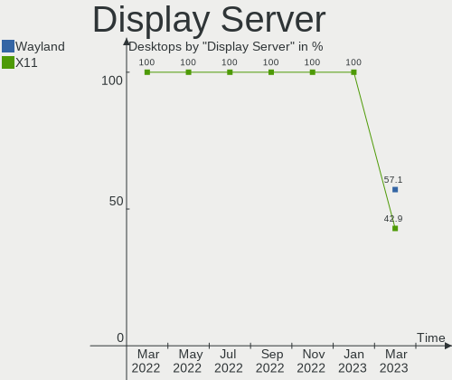
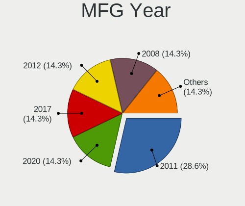
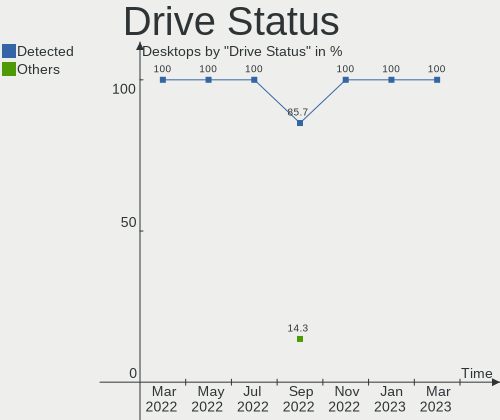
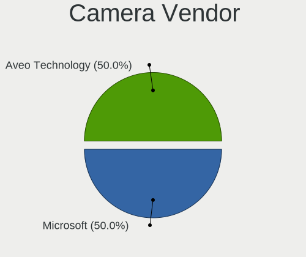
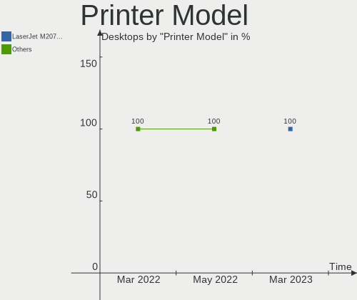

Endless Hardware Trends (Desktop)
---------------------------------

A project to identify most popular hardware characteristics and track their change
over time based on data collected by Endless users at https://Linux-Hardware.org.

Anyone can contribute to the study by uploading probes of their computers by
the [hw-probe](https://github.com/linuxhw/hw-probe) tool:

    sudo -E hw-probe -all -upload

Full-feature report is available here: https://linux-hardware.org/?view=trends&formfactor=desktop

Period: Jan, 2021.

Contents
--------

- [ OS                       ](#os)
- [ OS Family                ](#os-family)
- [ Kernel                   ](#kernel)
- [ Kernel Family            ](#kernel-family)
- [ Kernel Major Ver.        ](#kernel-major-ver)
- [ Arch                     ](#arch)
- [ DE                       ](#de)
- [ Display Server           ](#display-server)
- [ Display Manager          ](#display-manager)
- [ OS Lang                  ](#os-lang)
- [ Boot Mode                ](#boot-mode)
- [ Filesystem               ](#filesystem)
- [ Part. scheme             ](#part-scheme)
- [ Dual Boot with Linux/BSD ](#dual-boot-with-linux/bsd)
- [ Dual Boot (Win)          ](#dual-boot-win)
- [ Country                  ](#country)
- [ City                     ](#city)
- [ Vendor                   ](#vendor)
- [ Model                    ](#model)
- [ Model Family             ](#model-family)
- [ MFG Year                 ](#mfg-year)
- [ Form Factor              ](#form-factor)
- [ Secure Boot              ](#secure-boot)
- [ Coreboot                 ](#coreboot)
- [ RAM Size                 ](#ram-size)
- [ RAM Used                 ](#ram-used)
- [ Has CD-ROM               ](#has-cd-rom)
- [ Total Drives             ](#total-drives)
- [ Has Ethernet             ](#has-ethernet)
- [ Drive Vendor             ](#drive-vendor)
- [ Drive Model              ](#drive-model)
- [ HDD Vendor               ](#hdd-vendor)
- [ SSD Vendor               ](#ssd-vendor)
- [ Drive Kind               ](#drive-kind)
- [ Drive Connector          ](#drive-connector)
- [ Drive Size               ](#drive-size)
- [ Space Total              ](#space-total)
- [ Space Used               ](#space-used)
- [ Malfunc. Drives          ](#malfunc-drives)
- [ Malfunc. Drive Vendor    ](#malfunc-drive-vendor)
- [ Malfunc. HDD Vendor      ](#malfunc-hdd-vendor)
- [ Malfunc. Drive Kind      ](#malfunc-drive-kind)
- [ Failed Drives            ](#failed-drives)
- [ Failed Drive Vendor      ](#failed-drive-vendor)
- [ Drive Status             ](#drive-status)
- [ Storage Vendor           ](#storage-vendor)
- [ Storage Model            ](#storage-model)
- [ Storage Kind             ](#storage-kind)
- [ CPU Vendor               ](#cpu-vendor)
- [ CPU Model                ](#cpu-model)
- [ CPU Model Family         ](#cpu-model-family)
- [ CPU Cores                ](#cpu-cores)
- [ CPU Sockets              ](#cpu-sockets)
- [ CPU Threads              ](#cpu-threads)
- [ CPU Op-Modes             ](#cpu-op-modes)
- [ CPU Microcode            ](#cpu-microcode)
- [ CPU Microarch            ](#cpu-microarch)
- [ GPU Vendor               ](#gpu-vendor)
- [ GPU Model                ](#gpu-model)
- [ GPU Combo                ](#gpu-combo)
- [ GPU Driver               ](#gpu-driver)
- [ GPU Memory               ](#gpu-memory)
- [ Monitor Vendor           ](#monitor-vendor)
- [ Monitor Model            ](#monitor-model)
- [ Monitor Resolution       ](#monitor-resolution)
- [ Monitor Diagonal         ](#monitor-diagonal)
- [ Monitor Width            ](#monitor-width)
- [ Aspect Ratio             ](#aspect-ratio)
- [ Monitor Area             ](#monitor-area)
- [ Pixel Density            ](#pixel-density)
- [ Multiple Monitors        ](#multiple-monitors)
- [ Net Controller Vendor    ](#net-controller-vendor)
- [ Net Controller Model     ](#net-controller-model)
- [ Wireless Vendor          ](#wireless-vendor)
- [ Wireless Model           ](#wireless-model)
- [ Ethernet Vendor          ](#ethernet-vendor)
- [ Ethernet Model           ](#ethernet-model)
- [ Net Controller Kind      ](#net-controller-kind)
- [ Used Controller          ](#used-controller)
- [ NICs                     ](#nics)
- [ Memory Vendor            ](#memory-vendor)
- [ Memory Model             ](#memory-model)
- [ Memory Kind              ](#memory-kind)
- [ Memory Form Factor       ](#memory-form-factor)
- [ Memory Size              ](#memory-size)
- [ Memory Speed             ](#memory-speed)
- [ Sound Vendor             ](#sound-vendor)
- [ Sound Model              ](#sound-model)
- [ Camera Vendor            ](#camera-vendor)
- [ Camera Model             ](#camera-model)
- [ Fingerprint Vendor       ](#fingerprint-vendor)
- [ Fingerprint Model        ](#fingerprint-model)
- [ Chipcard Vendor          ](#chipcard-vendor)
- [ Chipcard Model           ](#chipcard-model)
- [ Printer Vendor           ](#printer-vendor)
- [ Printer Model            ](#printer-model)
- [ Scanner Vendor           ](#scanner-vendor)
- [ Scanner Model            ](#scanner-model)
- [ Bluetooth Vendor         ](#bluetooth-vendor)
- [ Bluetooth Model          ](#bluetooth-model)
- [ Unsupported Devices      ](#unsupported-devices)
- [ Unsupported Device Types ](#unsupported-device-types)

OS
--

Installed operating systems

| Name          | Desktops | Percent |
|---------------|----------|---------|
| Endless 3.9.1 | 15       | 78.95%  |
| Endless 3.9.2 | 2        | 10.53%  |
| Endless 3.8.4 | 1        | 5.26%   |
| Endless 3.7.7 | 1        | 5.26%   |

OS Family
---------

OS without a version

| Name    | Desktops | Percent |
|---------|----------|---------|
| Endless | 19       | 100%    |

Kernel
------

Version of the Linux kernel

| Version          | Desktops | Percent |
|------------------|----------|---------|
| 5.8.0-14-generic | 17       | 89.47%  |
| 5.4.0-19-generic | 1        | 5.26%   |
| 5.3.0-28-generic | 1        | 5.26%   |

Kernel Family
-------------

Linux kernel without a distro release

| Version | Desktops | Percent |
|---------|----------|---------|
| 5.8.0   | 17       | 89.47%  |
| 5.4.0   | 1        | 5.26%   |
| 5.3.0   | 1        | 5.26%   |

Kernel Major Ver.
-----------------

Linux kernel major version

| Version | Desktops | Percent |
|---------|----------|---------|
| 5.8     | 17       | 89.47%  |
| 5.4     | 1        | 5.26%   |
| 5.3     | 1        | 5.26%   |

Arch
----

OS architecture (x86_64, i586, etc.)

| Name   | Desktops | Percent |
|--------|----------|---------|
| x86_64 | 19       | 100%    |

DE
--

Desktop Environment

| Name  | Desktops | Percent |
|-------|----------|---------|
| GNOME | 19       | 100%    |

Display Server
--------------

X11 or Wayland

| Name | Desktops | Percent |
|------|----------|---------|
| X11  | 19       | 100%    |

Display Manager
---------------

SDDM, LightDM, etc.

| Name    | Desktops | Percent |
|---------|----------|---------|
| Unknown | 19       | 100%    |

OS Lang
-------

Language

| Lang        | Desktops | Percent |
|-------------|----------|---------|
| en_US       | 9        | 47.37%  |
| pt_BR       | 3        | 15.79%  |
| es_MX       | 2        | 10.53%  |
| ru_RU.UTF_8 | 1        | 5.26%   |
| ru_RU       | 1        | 5.26%   |
| es_ES       | 1        | 5.26%   |
| en_GB       | 1        | 5.26%   |
| de_DE       | 1        | 5.26%   |

Boot Mode
---------

EFI or BIOS

| Mode | Desktops | Percent |
|------|----------|---------|
| BIOS | 11       | 57.89%  |
| EFI  | 8        | 42.11%  |

Filesystem
----------

Type of filesystem

| Type  | Desktops | Percent |
|-------|----------|---------|
| Ext4  | 18       | 94.74%  |
| Tmpfs | 1        | 5.26%   |

Part. scheme
------------

Scheme of partitioning

| Type    | Desktops | Percent |
|---------|----------|---------|
| Unknown | 19       | 100%    |

Dual Boot with Linux/BSD
------------------------

Hosting more than one Linux/BSD

| Dual boot | Desktops | Percent |
|-----------|----------|---------|
| No        | 19       | 100%    |

Dual Boot (Win)
---------------

Hosting Linux and Windows

| Dual boot | Desktops | Percent |
|-----------|----------|---------|
| No        | 19       | 100%    |

Country
-------

Geographic location (country)

| Country     | Desktops | Percent |
|-------------|----------|---------|
| USA         | 3        | 15.79%  |
| Ukraine     | 2        | 10.53%  |
| Russia      | 2        | 10.53%  |
| Mexico      | 2        | 10.53%  |
| Brazil      | 2        | 10.53%  |
| UK          | 1        | 5.26%   |
| Spain       | 1        | 5.26%   |
| Puerto Rico | 1        | 5.26%   |
| Philippines | 1        | 5.26%   |
| Greece      | 1        | 5.26%   |
| Germany     | 1        | 5.26%   |
| Egypt       | 1        | 5.26%   |
| Unknown     | 1        | 5.26%   |

City
----

Geographic location (city)

| City             | Desktops | Percent |
|------------------|----------|---------|
| Kyiv             | 2        | 10.53%  |
| Galion           | 2        | 10.53%  |
| São Paulo       | 1        | 5.26%   |
| Stuttgart        | 1        | 5.26%   |
| St Petersburg    | 1        | 5.26%   |
| Shelbyville      | 1        | 5.26%   |
| Mérida          | 1        | 5.26%   |
| Moscow           | 1        | 5.26%   |
| Mayagüez        | 1        | 5.26%   |
| Mandaluyong City | 1        | 5.26%   |
| Kilkis           | 1        | 5.26%   |
| Guadalajara      | 1        | 5.26%   |
| Corby            | 1        | 5.26%   |
| Cairo            | 1        | 5.26%   |
| Bauru            | 1        | 5.26%   |
| Arnedo           | 1        | 5.26%   |
| Unknown          | 1        | 5.26%   |

Vendor
------

Motherboard manufacturer

| Name                | Desktops | Percent |
|---------------------|----------|---------|
| Acer                | 5        | 26.32%  |
| Gigabyte Technology | 4        | 21.05%  |
| ASUSTek Computer    | 4        | 21.05%  |
| Lenovo              | 1        | 5.26%   |
| Intel               | 1        | 5.26%   |
| ECS                 | 1        | 5.26%   |
| Biostar             | 1        | 5.26%   |
| ASRock              | 1        | 5.26%   |
| Unknown             | 1        | 5.26%   |

Model
-----

Motherboard model

| Name                                | Desktops | Percent |
|-------------------------------------|----------|---------|
| Gigabyte GA-E6010N                  | 2        | 10.53%  |
| Acer Aspire XC-830                  | 2        | 10.53%  |
| Lenovo 70A4001LUX ThinkServer TS140 | 1        | 5.26%   |
| Intel MAGNUM GX                     | 1        | 5.26%   |
| Gigabyte X570 GAMING X              | 1        | 5.26%   |
| Gigabyte H77M-D3H                   | 1        | 5.26%   |
| ECS A320AM4-M3D                     | 1        | 5.26%   |
| Biostar A55MLC2                     | 1        | 5.26%   |
| ASUS Rampage III GENE               | 1        | 5.26%   |
| ASUS M5A78L-M LX PLUS               | 1        | 5.26%   |
| ASUS M2V                            | 1        | 5.26%   |
| ASUS M2N-E SLI                      | 1        | 5.26%   |
| ASRock A88M-G                       | 1        | 5.26%   |
| Acer Veriton ES2735G                | 1        | 5.26%   |
| Acer Aspire XC-895                  | 1        | 5.26%   |
| Acer Aspire X1900                   | 1        | 5.26%   |
| Unknown                             | 1        | 5.26%   |

Model Family
------------

Motherboard model prefix

| Name               | Desktops | Percent |
|--------------------|----------|---------|
| Acer Aspire        | 4        | 21.05%  |
| Gigabyte GA-E6010N | 2        | 10.53%  |
| Lenovo 70A4001LUX  | 1        | 5.26%   |
| Intel MAGNUM       | 1        | 5.26%   |
| Gigabyte X570      | 1        | 5.26%   |
| Gigabyte H77M-D3H  | 1        | 5.26%   |
| ECS A320AM4-M3D    | 1        | 5.26%   |
| Biostar A55MLC2    | 1        | 5.26%   |
| ASUS Rampage       | 1        | 5.26%   |
| ASUS M5A78L-M      | 1        | 5.26%   |
| ASUS M2V           | 1        | 5.26%   |
| ASUS M2N-E         | 1        | 5.26%   |
| ASRock A88M-G      | 1        | 5.26%   |
| Acer Veriton       | 1        | 5.26%   |
| Unknown            | 1        | 5.26%   |

MFG Year
--------

Motherboard manufacture year

| Year | Desktops | Percent |
|------|----------|---------|
| 2020 | 4        | 21.05%  |
| 2019 | 4        | 21.05%  |
| 2014 | 3        | 15.79%  |
| 2011 | 2        | 10.53%  |
| 2010 | 2        | 10.53%  |
| 2016 | 1        | 5.26%   |
| 2013 | 1        | 5.26%   |
| 2012 | 1        | 5.26%   |
| 2007 | 1        | 5.26%   |

Form Factor
-----------

Physical design of the computer

| Name    | Desktops | Percent |
|---------|----------|---------|
| Desktop | 19       | 100%    |

Secure Boot
-----------

Enabled or disabled

| State    | Desktops | Percent |
|----------|----------|---------|
| Disabled | 19       | 100%    |

Coreboot
--------

Have coreboot on board

| Used | Desktops | Percent |
|------|----------|---------|
| No   | 19       | 100%    |

RAM Size
--------

Total RAM memory

| Size in GB | Desktops | Percent |
|------------|----------|---------|
| 4.01-8.0   | 6        | 31.58%  |
| 3.01-4.0   | 5        | 26.32%  |
| 8.01-16.0  | 5        | 26.32%  |
| 1.01-2.0   | 2        | 10.53%  |
| 16.01-24.0 | 1        | 5.26%   |

RAM Used
--------

Used RAM memory

| Used GB  | Desktops | Percent |
|----------|----------|---------|
| 1.01-2.0 | 8        | 42.11%  |
| 0.51-1.0 | 6        | 31.58%  |
| 2.01-3.0 | 3        | 15.79%  |
| 4.01-8.0 | 1        | 5.26%   |
| 3.01-4.0 | 1        | 5.26%   |

Has CD-ROM
----------

Has CD-ROM on board

| Presented | Desktops | Percent |
|-----------|----------|---------|
| No        | 10       | 52.63%  |
| Yes       | 9        | 47.37%  |

Total Drives
------------

Number of drives on board

| Drives | Desktops | Percent |
|--------|----------|---------|
| 1      | 15       | 78.95%  |
| 2      | 3        | 15.79%  |
| 4      | 1        | 5.26%   |

Has Ethernet
------------

Has Ethernet on board

| Presented | Desktops | Percent |
|-----------|----------|---------|
| Yes       | 18       | 94.74%  |
| No        | 1        | 5.26%   |

Drive Vendor
------------

Hard drive vendors

| Vendor              | Desktops | Drives | Percent |
|---------------------|----------|--------|---------|
| Kingston            | 5        | 5      | 23.81%  |
| WDC                 | 4        | 6      | 19.05%  |
| Seagate             | 4        | 6      | 19.05%  |
| Samsung Electronics | 2        | 2      | 9.52%   |
| GOODRAM             | 2        | 2      | 9.52%   |
| Toshiba             | 1        | 1      | 4.76%   |
| SK Hynix            | 1        | 1      | 4.76%   |
| Sandisk             | 1        | 1      | 4.76%   |
| A-DATA Technology   | 1        | 1      | 4.76%   |

Drive Model
-----------

Hard drive models

| Model                            | Desktops | Percent |
|----------------------------------|----------|---------|
| Kingston SV300S37A120G 120GB SSD | 3        | 12%     |
| Seagate ST500DM002-1BD142 500GB  | 2        | 8%      |
| GOODRAM SSDPR-CX400-128 128GB    | 2        | 8%      |
| WDC WDS500G2B0A-00SM50 500GB SSD | 1        | 4%      |
| WDC WDS500G2B0A 500GB SSD        | 1        | 4%      |
| WDC WDS240G2G0A-00JH30 240GB SSD | 1        | 4%      |
| WDC WD3200AAJS-22L7A0 320GB      | 1        | 4%      |
| WDC WD2002FAEX-007BA0 2TB        | 1        | 4%      |
| WDC WD10EZRZ-00HTKB0 1TB         | 1        | 4%      |
| Toshiba DT01ACA100 1TB           | 1        | 4%      |
| SK Hynix NVMe SSD Drive 256GB    | 1        | 4%      |
| Seagate ST9640320AS 640GB        | 1        | 4%      |
| Seagate ST3300822AS 304GB        | 1        | 4%      |
| Seagate ST31000524AS 1TB         | 1        | 4%      |
| Seagate ST1000DM003-1CH162 1TB   | 1        | 4%      |
| Sandisk NVMe SSD Drive 256GB     | 1        | 4%      |
| Samsung SP0411N 40GB             | 1        | 4%      |
| Samsung HD103SI 1TB              | 1        | 4%      |
| Kingston SA400S37240G 240GB SSD  | 1        | 4%      |
| Kingston NVMe SSD Drive 128GB    | 1        | 4%      |
| A-DATA SU800 1024GB SSD          | 1        | 4%      |

HDD Vendor
----------

Hard disk drive vendors

| Vendor              | Desktops | Drives | Percent |
|---------------------|----------|--------|---------|
| Seagate             | 4        | 6      | 40%     |
| WDC                 | 3        | 3      | 30%     |
| Samsung Electronics | 2        | 2      | 20%     |
| Toshiba             | 1        | 1      | 10%     |

SSD Vendor
----------

Solid state drive vendors

| Vendor            | Desktops | Drives | Percent |
|-------------------|----------|--------|---------|
| Kingston          | 4        | 4      | 40%     |
| WDC               | 3        | 3      | 30%     |
| GOODRAM           | 2        | 2      | 20%     |
| A-DATA Technology | 1        | 1      | 10%     |

Drive Kind
----------

HDD or SSD

| Kind | Desktops | Drives | Percent |
|------|----------|--------|---------|
| SSD  | 10       | 10     | 43.48%  |
| HDD  | 10       | 12     | 43.48%  |
| NVMe | 3        | 3      | 13.04%  |

Drive Connector
---------------

SATA, SAS, NVMe, etc.

| Type | Desktops | Drives | Percent |
|------|----------|--------|---------|
| SATA | 16       | 22     | 84.21%  |
| NVMe | 3        | 3      | 15.79%  |

Drive Size
----------

Size of hard drive

| Size in TB | Desktops | Drives | Percent |
|------------|----------|--------|---------|
| 0.01-0.5   | 13       | 14     | 65%     |
| 0.51-1.0   | 5        | 6      | 25%     |
| 1.01-2.0   | 2        | 2      | 10%     |

Space Total
-----------

Amount of disk space available on the file system

| Size in GB | Desktops | Percent |
|------------|----------|---------|
| 101-250    | 9        | 47.37%  |
| 251-500    | 5        | 26.32%  |
| 21-50      | 2        | 10.53%  |
| 501-1000   | 2        | 10.53%  |
| 1001-2000  | 1        | 5.26%   |

Space Used
----------

Amount of used disk space

| Used GB | Desktops | Percent |
|---------|----------|---------|
| 21-50   | 7        | 36.84%  |
| 1-20    | 7        | 36.84%  |
| 251-500 | 2        | 10.53%  |
| 51-100  | 2        | 10.53%  |
| 101-250 | 1        | 5.26%   |

Malfunc. Drives
---------------

Drive models with a malfunction

Zero info for selected period =(

Malfunc. Drive Vendor
---------------------

Vendors of faulty drives

Zero info for selected period =(

Malfunc. HDD Vendor
-------------------

Vendors of faulty HDD drives

Zero info for selected period =(

Malfunc. Drive Kind
-------------------

Kinds of faulty drives

Zero info for selected period =(

Failed Drives
-------------

Failed drive models

Zero info for selected period =(

Failed Drive Vendor
-------------------

Failed drive vendors

Zero info for selected period =(

Drive Status
------------

Number of failed and malfunc. drives

| Status   | Desktops | Drives | Percent |
|----------|----------|--------|---------|
| Detected | 19       | 25     | 100%    |

Storage Vendor
--------------

Storage controller vendors

| Vendor                      | Desktops | Percent |
|-----------------------------|----------|---------|
| Intel                       | 10       | 40%     |
| AMD                         | 7        | 28%     |
| Marvell Technology Group    | 3        | 12%     |
| VIA Technologies            | 1        | 4%      |
| SK Hynix                    | 1        | 4%      |
| Sandisk                     | 1        | 4%      |
| Nvidia                      | 1        | 4%      |
| Kingston Technology Company | 1        | 4%      |

Storage Model
-------------

Storage controller models

| Model                                                                          | Desktops | Percent |
|--------------------------------------------------------------------------------|----------|---------|
| AMD FCH SATA Controller [AHCI mode]                                            | 5        | 14.29%  |
| Marvell Group 88SE6111/6121 SATA II / PATA Controller                          | 2        | 5.71%   |
| Intel NM10/ICH7 Family SATA Controller [IDE mode]                              | 2        | 5.71%   |
| Intel Celeron/Pentium Silver Processor SATA Controller                         | 2        | 5.71%   |
| Intel 82801G (ICH7 Family) IDE Controller                                      | 2        | 5.71%   |
| AMD FCH IDE Controller                                                         | 2        | 5.71%   |
| VIA VT82C586A/B/VT82C686/A/B/VT823x/A/C PIPC Bus Master IDE                    | 1        | 2.86%   |
| VIA VT8237A SATA 2-Port Controller                                             | 1        | 2.86%   |
| SK Hynix BC501 NVMe Solid State Drive 512GB                                    | 1        | 2.86%   |
| Sandisk WD Blue SN550 NVMe SSD                                                 | 1        | 2.86%   |
| Nvidia CK804 Serial ATA Controller                                             | 1        | 2.86%   |
| Nvidia CK804 IDE                                                               | 1        | 2.86%   |
| Marvell Group 88SE9123 PCIe SATA 6.0 Gb/s controller                           | 1        | 2.86%   |
| Kingston Company U-SNS8154P3 NVMe SSD                                          | 1        | 2.86%   |
| Intel 82801JI (ICH10 Family) SATA AHCI Controller                              | 1        | 2.86%   |
| Intel 82801JI (ICH10 Family) 4 port SATA IDE Controller #1                     | 1        | 2.86%   |
| Intel 82801JI (ICH10 Family) 2 port SATA IDE Controller #2                     | 1        | 2.86%   |
| Intel 8 Series/C220 Series Chipset Family 6-port SATA Controller 1 [AHCI mode] | 1        | 2.86%   |
| Intel 7 Series/C210 Series Chipset Family 4-port SATA Controller [IDE mode]    | 1        | 2.86%   |
| Intel 7 Series/C210 Series Chipset Family 2-port SATA Controller [IDE mode]    | 1        | 2.86%   |
| Intel 400 Series Chipset Family SATA AHCI Controller                           | 1        | 2.86%   |
| Intel 200 Series PCH SATA controller [AHCI mode]                               | 1        | 2.86%   |
| AMD SB7x0/SB8x0/SB9x0 SATA Controller [AHCI mode]                              | 1        | 2.86%   |
| AMD SB7x0/SB8x0/SB9x0 IDE Controller                                           | 1        | 2.86%   |
| AMD FCH SATA Controller [IDE mode]                                             | 1        | 2.86%   |
| AMD FCH SATA Controller D                                                      | 1        | 2.86%   |

Storage Kind
------------

Kind of storage controller (IDE, SATA, NVMe, SAS, ...)

| Kind | Desktops | Percent |
|------|----------|---------|
| SATA | 13       | 50%     |
| IDE  | 9        | 34.62%  |
| NVMe | 3        | 11.54%  |
| RAID | 1        | 3.85%   |

CPU Vendor
----------

Processor vendors

| Vendor | Desktops | Percent |
|--------|----------|---------|
| Intel  | 10       | 52.63%  |
| AMD    | 9        | 47.37%  |

CPU Model
---------

Processor models

| Model                                           | Desktops | Percent |
|-------------------------------------------------|----------|---------|
| AMD E1-6010 APU with AMD Radeon R2 Graphics     | 2        | 10.53%  |
| Intel Xeon CPU E3-1225 v3 @ 3.20GHz             | 1        | 5.26%   |
| Intel Pentium Silver J5005 CPU @ 1.50GHz        | 1        | 5.26%   |
| Intel Pentium Dual-Core CPU E5700 @ 3.00GHz     | 1        | 5.26%   |
| Intel Core i7-9700 CPU @ 3.00GHz                | 1        | 5.26%   |
| Intel Core i7 CPU 950 @ 3.07GHz                 | 1        | 5.26%   |
| Intel Core i7 CPU 920 @ 2.67GHz                 | 1        | 5.26%   |
| Intel Core i5-10400 CPU @ 2.90GHz               | 1        | 5.26%   |
| Intel Core i3-3220 CPU @ 3.30GHz                | 1        | 5.26%   |
| Intel Core 2 CPU 6600 @ 2.40GHz                 | 1        | 5.26%   |
| Intel Celeron J4025 CPU @ 2.00GHz               | 1        | 5.26%   |
| AMD Ryzen 7 3700X 8-Core Processor              | 1        | 5.26%   |
| AMD FX-4300 Quad-Core Processor                 | 1        | 5.26%   |
| AMD Athlon 64 X2 Dual Core Processor 6400+      | 1        | 5.26%   |
| AMD Athlon 64 X2 Dual Core Processor 4400+      | 1        | 5.26%   |
| AMD A8-9600 RADEON R7, 10 COMPUTE CORES 4C+6G   | 1        | 5.26%   |
| AMD A8-3870 APU with Radeon HD Graphics         | 1        | 5.26%   |
| AMD A10-7850K Radeon R7, 12 Compute Cores 4C+8G | 1        | 5.26%   |

CPU Model Family
----------------

Processor model prefix

| Model                   | Desktops | Percent |
|-------------------------|----------|---------|
| Intel Core i7           | 3        | 15.79%  |
| AMD E1                  | 2        | 10.53%  |
| AMD Athlon 64 X2        | 2        | 10.53%  |
| AMD A8                  | 2        | 10.53%  |
| Intel Xeon              | 1        | 5.26%   |
| Intel Pentium Silver    | 1        | 5.26%   |
| Intel Pentium Dual-Core | 1        | 5.26%   |
| Intel Core i5           | 1        | 5.26%   |
| Intel Core i3           | 1        | 5.26%   |
| Intel Core 2            | 1        | 5.26%   |
| Intel Celeron           | 1        | 5.26%   |
| AMD Ryzen 7             | 1        | 5.26%   |
| AMD FX                  | 1        | 5.26%   |
| AMD A10                 | 1        | 5.26%   |

CPU Cores
---------

Number of processor cores

| Number | Desktops | Percent |
|--------|----------|---------|
| 2      | 11       | 57.89%  |
| 4      | 5        | 26.32%  |
| 8      | 2        | 10.53%  |
| 6      | 1        | 5.26%   |

CPU Sockets
-----------

Number of sockets

| Number | Desktops | Percent |
|--------|----------|---------|
| 1      | 19       | 100%    |

CPU Threads
-----------

Threads per core (Hyper-Threading)

| Number | Desktops | Percent |
|--------|----------|---------|
| 1      | 11       | 57.89%  |
| 2      | 8        | 42.11%  |

CPU Op-Modes
------------

CPU Operation Modes (32-bit, 64-bit)

| Op mode        | Desktops | Percent |
|----------------|----------|---------|
| 32-bit, 64-bit | 19       | 100%    |

CPU Microcode
-------------

Microcode number

| Number     | Desktops | Percent |
|------------|----------|---------|
| 0x07030106 | 2        | 10.53%  |
| Unknown    | 2        | 10.53%  |
| 0xa0653    | 1        | 5.26%   |
| 0x906ed    | 1        | 5.26%   |
| 0x706a8    | 1        | 5.26%   |
| 0x706a1    | 1        | 5.26%   |
| 0x6f6      | 1        | 5.26%   |
| 0x306c3    | 1        | 5.26%   |
| 0x306a9    | 1        | 5.26%   |
| 0x106a5    | 1        | 5.26%   |
| 0x106a4    | 1        | 5.26%   |
| 0x1067a    | 1        | 5.26%   |
| 0x08701013 | 1        | 5.26%   |
| 0x0600611a | 1        | 5.26%   |
| 0x06003106 | 1        | 5.26%   |
| 0x06000852 | 1        | 5.26%   |
| 0x03000027 | 1        | 5.26%   |

CPU Microarch
-------------

Microarchitecture

| Name          | Desktops | Percent |
|---------------|----------|---------|
| Puma          | 2        | 10.53%  |
| Nehalem       | 2        | 10.53%  |
| K8 Hammer     | 2        | 10.53%  |
| Goldmont plus | 2        | 10.53%  |
| Zen 2         | 1        | 5.26%   |
| Steamroller   | 1        | 5.26%   |
| Piledriver    | 1        | 5.26%   |
| Penryn        | 1        | 5.26%   |
| KabyLake      | 1        | 5.26%   |
| K10 Llano     | 1        | 5.26%   |
| IvyBridge     | 1        | 5.26%   |
| Haswell       | 1        | 5.26%   |
| Excavator     | 1        | 5.26%   |
| Core          | 1        | 5.26%   |
| CometLake     | 1        | 5.26%   |

GPU Vendor
----------

Vendors of graphics cards

| Vendor | Desktops | Percent |
|--------|----------|---------|
| Nvidia | 7        | 36.84%  |
| Intel  | 6        | 31.58%  |
| AMD    | 6        | 31.58%  |

GPU Model
---------

Graphics card models

| Model                                                          | Desktops | Percent |
|----------------------------------------------------------------|----------|---------|
| Nvidia GP106 [GeForce GTX 1060 3GB]                            | 2        | 10%     |
| Intel UHD Graphics 605                                         | 2        | 10%     |
| AMD Mullins [Radeon R2 Graphics]                               | 2        | 10%     |
| Nvidia NV44 [GeForce 7100 GS]                                  | 1        | 5%      |
| Nvidia GF119 [GeForce GT 610]                                  | 1        | 5%      |
| Nvidia GF114 [GeForce GTX 560 Ti]                              | 1        | 5%      |
| Nvidia G92 [GeForce 9800 GT]                                   | 1        | 5%      |
| Nvidia G86 [GeForce 8400 GS]                                   | 1        | 5%      |
| Intel Xeon E3-1200 v3 Processor Integrated Graphics Controller | 1        | 5%      |
| Intel UHD Graphics 630 (Desktop 9 Series)                      | 1        | 5%      |
| Intel CometLake-S GT2 [UHD Graphics 630]                       | 1        | 5%      |
| Intel 4 Series Chipset Integrated Graphics Controller          | 1        | 5%      |
| AMD Wani [Radeon R5/R6/R7 Graphics]                            | 1        | 5%      |
| AMD Sumo [Radeon HD 6550D]                                     | 1        | 5%      |
| AMD RV515 [Radeon X1300/X1550]                                 | 1        | 5%      |
| AMD RV515 [Radeon X1300/X1550 Series] (Secondary)              | 1        | 5%      |
| AMD Navi 10 [Radeon RX 5600 OEM/5600 XT / 5700/5700 XT]        | 1        | 5%      |

GPU Combo
---------

Combinations of graphics cards

| Name       | Desktops | Percent |
|------------|----------|---------|
| 1 x Nvidia | 7        | 36.84%  |
| 1 x Intel  | 6        | 31.58%  |
| 1 x AMD    | 5        | 26.32%  |
| 2 x AMD    | 1        | 5.26%   |

GPU Driver
----------

Free vs proprietary

| Driver      | Desktops | Percent |
|-------------|----------|---------|
| Free        | 17       | 89.47%  |
| Proprietary | 2        | 10.53%  |

GPU Memory
----------

Total video memory

| Size in GB | Desktops | Percent |
|------------|----------|---------|
| 0.01-0.5   | 8        | 42.11%  |
| Unknown    | 8        | 42.11%  |
| 0.51-1.0   | 2        | 10.53%  |
| 7.01-8.0   | 1        | 5.26%   |

Monitor Vendor
--------------

Monitor vendors

| Vendor              | Desktops | Percent |
|---------------------|----------|---------|
| Samsung Electronics | 3        | 15.79%  |
| Goldstar            | 3        | 15.79%  |
| SAC                 | 2        | 10.53%  |
| HSI                 | 2        | 10.53%  |
| AOC                 | 2        | 10.53%  |
| Vizio               | 1        | 5.26%   |
| Seiki               | 1        | 5.26%   |
| S2-Tek              | 1        | 5.26%   |
| Hewlett-Packard     | 1        | 5.26%   |
| eMachines           | 1        | 5.26%   |
| Dell                | 1        | 5.26%   |
| Acer                | 1        | 5.26%   |

Monitor Model
-------------

Monitor models

| Model                                                                | Desktops | Percent |
|----------------------------------------------------------------------|----------|---------|
| SAC LED MONITOR SAC309A 1920x1080 443x249mm 20.0-inch                | 2        | 10.53%  |
| HSI HiTV HSI0001 3840x2160 708x398mm 32.0-inch                       | 2        | 10.53%  |
| Vizio VO370M VIZ0050 1920x1080 820x460mm 37.0-inch                   | 1        | 5.26%   |
| Seiki SE241TS SEK0CF0 1920x1080 520x290mm 23.4-inch                  | 1        | 5.26%   |
| Samsung Electronics SyncMaster SAM0598 1360x768 410x230mm 18.5-inch  | 1        | 5.26%   |
| Samsung Electronics SyncMaster SAM0304 1680x1050 494x320mm 23.2-inch | 1        | 5.26%   |
| Samsung Electronics SyncMaster SAM01B7 1280x1024 338x270mm 17.0-inch | 1        | 5.26%   |
| S2-Tek TV STK531A 1920x1080 930x530mm 42.1-inch                      | 1        | 5.26%   |
| Hewlett-Packard 2009 HWP2827 1600x900 442x249mm 20.0-inch            | 1        | 5.26%   |
| Goldstar M2362D GSM5756 1680x1050 510x290mm 23.1-inch                | 1        | 5.26%   |
| Goldstar L1952HQ GSM4B09 1280x1024 376x301mm 19.0-inch               | 1        | 5.26%   |
| Goldstar HD GSM5ACB 1366x768 410x230mm 18.5-inch                     | 1        | 5.26%   |
| eMachines E192HQV EMA01E9 1366x768 410x230mm 18.5-inch               | 1        | 5.26%   |
| Dell E157FP DELA022 1024x768 304x228mm 15.0-inch                     | 1        | 5.26%   |
| AOC 24B1W AOC2401 1920x1080 521x293mm 23.5-inch                      | 1        | 5.26%   |
| AOC 2343 AOC2343 1920x1080 509x286mm 23.0-inch                       | 1        | 5.26%   |
| Acer K222HQL ACR03E1 1920x1080 477x268mm 21.5-inch                   | 1        | 5.26%   |

Monitor Resolution
------------------

Monitor screen resolution

| Resolution         | Desktops | Percent |
|--------------------|----------|---------|
| 1920x1080 (FHD)    | 9        | 47.37%  |
| 3840x2160 (4K)     | 2        | 10.53%  |
| 1366x768 (WXGA)    | 2        | 10.53%  |
| 1280x1024 (SXGA)   | 2        | 10.53%  |
| 1680x1050 (WSXGA+) | 1        | 5.26%   |
| 1600x900 (HD+)     | 1        | 5.26%   |
| 1360x768           | 1        | 5.26%   |
| 1024x768 (XGA)     | 1        | 5.26%   |

Monitor Diagonal
----------------

Diagonal size in inches

| Inches | Desktops | Percent |
|--------|----------|---------|
| 23     | 4        | 21.05%  |
| 20     | 3        | 15.79%  |
| 18     | 3        | 15.79%  |
| 34     | 2        | 10.53%  |
| 42     | 1        | 5.26%   |
| 41     | 1        | 5.26%   |
| 27     | 1        | 5.26%   |
| 21     | 1        | 5.26%   |
| 19     | 1        | 5.26%   |
| 17     | 1        | 5.26%   |
| 15     | 1        | 5.26%   |

Monitor Width
-------------

Physical width

| Width in mm | Desktops | Percent |
|-------------|----------|---------|
| 401-500     | 8        | 42.11%  |
| 501-600     | 4        | 21.05%  |
| 701-800     | 2        | 10.53%  |
| 301-350     | 2        | 10.53%  |
| 901-1000    | 2        | 10.53%  |
| 351-400     | 1        | 5.26%   |

Aspect Ratio
------------

Proportional relationship between the width and the height

| Ratio | Desktops | Percent |
|-------|----------|---------|
| 16/9  | 13       | 68.42%  |
| 5/4   | 2        | 10.53%  |
| 21/9  | 2        | 10.53%  |
| 4/3   | 1        | 5.26%   |
| 3/2   | 1        | 5.26%   |

Monitor Area
------------

Area in inch²

| Area in inch² | Desktops | Percent |
|----------------|----------|---------|
| 201-250        | 5        | 26.32%  |
| 151-200        | 4        | 21.05%  |
| 141-150        | 4        | 21.05%  |
| 351-500        | 2        | 10.53%  |
| 501-1000       | 2        | 10.53%  |
| 301-350        | 1        | 5.26%   |
| 101-110        | 1        | 5.26%   |

Pixel Density
-------------

Pixels per inch

| Density | Desktops | Percent |
|---------|----------|---------|
| 51-100  | 15       | 83.33%  |
| 101-120 | 3        | 16.67%  |

Multiple Monitors
-----------------

Total monitors connected

| Total | Desktops | Percent |
|-------|----------|---------|
| 1     | 19       | 100%    |

Net Controller Vendor
---------------------

Controller vendors

| Vendor                | Desktops | Percent |
|-----------------------|----------|---------|
| Realtek Semiconductor | 14       | 60.87%  |
| Intel                 | 3        | 13.04%  |
| Qualcomm Atheros      | 2        | 8.7%    |
| Samsung Electronics   | 1        | 4.35%   |
| Ralink Technology     | 1        | 4.35%   |
| Nvidia                | 1        | 4.35%   |
| NetGear               | 1        | 4.35%   |

Net Controller Model
--------------------

Controller models

| Model                                                             | Desktops | Percent |
|-------------------------------------------------------------------|----------|---------|
| Realtek RTL8111/8168/8411 PCI Express Gigabit Ethernet Controller | 11       | 47.83%  |
| Realtek RTL810xE PCI Express Fast Ethernet controller             | 2        | 8.7%    |
| Samsung Galaxy series, misc. (tethering mode)                     | 1        | 4.35%   |
| Realtek RTL-8100/8101L/8139 PCI Fast Ethernet Adapter             | 1        | 4.35%   |
| Ralink RT2870/RT3070 Wireless Adapter                             | 1        | 4.35%   |
| Qualcomm Atheros Attansic L1 Gigabit Ethernet                     | 1        | 4.35%   |
| Qualcomm Atheros AR8161 Gigabit Ethernet                          | 1        | 4.35%   |
| Nvidia CK804 Ethernet Controller                                  | 1        | 4.35%   |
| NetGear A6210                                                     | 1        | 4.35%   |
| Intel Dual Band Wireless-AC 3168NGW [Stone Peak]                  | 1        | 4.35%   |
| Intel 82567V-2 Gigabit Network Connection                         | 1        | 4.35%   |
| Intel 82567LM-2 Gigabit Network Connection                        | 1        | 4.35%   |

Wireless Vendor
---------------

Wireless vendors

| Vendor            | Desktops | Percent |
|-------------------|----------|---------|
| Ralink Technology | 1        | 33.33%  |
| NetGear           | 1        | 33.33%  |
| Intel             | 1        | 33.33%  |

Wireless Model
--------------

Wireless models

| Model                                            | Desktops | Percent |
|--------------------------------------------------|----------|---------|
| Ralink RT2870/RT3070 Wireless Adapter            | 1        | 33.33%  |
| NetGear A6210                                    | 1        | 33.33%  |
| Intel Dual Band Wireless-AC 3168NGW [Stone Peak] | 1        | 33.33%  |

Ethernet Vendor
---------------

Ethernet vendors

| Vendor                | Desktops | Percent |
|-----------------------|----------|---------|
| Realtek Semiconductor | 14       | 70%     |
| Qualcomm Atheros      | 2        | 10%     |
| Intel                 | 2        | 10%     |
| Samsung Electronics   | 1        | 5%      |
| Nvidia                | 1        | 5%      |

Ethernet Model
--------------

Ethernet models

| Model                                                             | Desktops | Percent |
|-------------------------------------------------------------------|----------|---------|
| Realtek RTL8111/8168/8411 PCI Express Gigabit Ethernet Controller | 11       | 55%     |
| Realtek RTL810xE PCI Express Fast Ethernet controller             | 2        | 10%     |
| Samsung Galaxy series, misc. (tethering mode)                     | 1        | 5%      |
| Realtek RTL-8100/8101L/8139 PCI Fast Ethernet Adapter             | 1        | 5%      |
| Qualcomm Atheros Attansic L1 Gigabit Ethernet                     | 1        | 5%      |
| Qualcomm Atheros AR8161 Gigabit Ethernet                          | 1        | 5%      |
| Nvidia CK804 Ethernet Controller                                  | 1        | 5%      |
| Intel 82567V-2 Gigabit Network Connection                         | 1        | 5%      |
| Intel 82567LM-2 Gigabit Network Connection                        | 1        | 5%      |

Net Controller Kind
-------------------

Ethernet, WiFi or modem

| Kind     | Desktops | Percent |
|----------|----------|---------|
| Ethernet | 18       | 85.71%  |
| WiFi     | 3        | 14.29%  |

Used Controller
---------------

Currently used network controller

| Kind     | Desktops | Percent |
|----------|----------|---------|
| Ethernet | 18       | 90%     |
| WiFi     | 2        | 10%     |

NICs
----

Total network controllers on board

| Total | Desktops | Percent |
|-------|----------|---------|
| 1     | 16       | 84.21%  |
| 2     | 2        | 10.53%  |
| 0     | 1        | 5.26%   |

Memory Vendor
-------------

Memory module vendors

Zero info for selected period =(

Memory Model
------------

Memory module models

Zero info for selected period =(

Memory Kind
-----------

Memory module kinds

Zero info for selected period =(

Memory Form Factor
------------------

Physical design of the memory module

Zero info for selected period =(

Memory Size
-----------

Memory module size

Zero info for selected period =(

Memory Speed
------------

Memory module speed

Zero info for selected period =(

Sound Vendor
------------

Sound card vendors

| Vendor              | Desktops | Percent |
|---------------------|----------|---------|
| Intel               | 10       | 40%     |
| AMD                 | 7        | 28%     |
| Nvidia              | 4        | 16%     |
| C-Media Electronics | 3        | 12%     |
| Creative Labs       | 1        | 4%      |

Sound Model
-----------

Sound card models

| Model                                                               | Desktops | Percent |
|---------------------------------------------------------------------|----------|---------|
| AMD FCH Azalia Controller                                           | 4        | 12.9%   |
| AMD Kabini HDMI/DP Audio                                            | 3        | 9.68%   |
| Nvidia GP106 High Definition Audio Controller                       | 2        | 6.45%   |
| Intel NM10/ICH7 Family High Definition Audio Controller             | 2        | 6.45%   |
| Intel Celeron/Pentium Silver Processor High Definition Audio        | 2        | 6.45%   |
| Intel 82801JI (ICH10 Family) HD Audio Controller                    | 2        | 6.45%   |
| Nvidia GF119 HDMI Audio Controller                                  | 1        | 3.23%   |
| Nvidia GF114 HDMI Audio Controller                                  | 1        | 3.23%   |
| Intel Xeon E3-1200 v3/4th Gen Core Processor HD Audio Controller    | 1        | 3.23%   |
| Intel Audio device                                                  | 1        | 3.23%   |
| Intel 8 Series/C220 Series Chipset High Definition Audio Controller | 1        | 3.23%   |
| Intel 7 Series/C216 Chipset Family High Definition Audio Controller | 1        | 3.23%   |
| Intel 200 Series PCH HD Audio                                       | 1        | 3.23%   |
| Creative Labs EMU10k1 [Sound Blaster Live! Series]                  | 1        | 3.23%   |
| C-Media Electronics TONOR TC-777 Audio Device                       | 1        | 3.23%   |
| C-Media Electronics CMI8738/CMI8768 PCI Audio                       | 1        | 3.23%   |
| C-Media Electronics CM6501                                          | 1        | 3.23%   |
| AMD Starship/Matisse HD Audio Controller                            | 1        | 3.23%   |
| AMD SBx00 Azalia (Intel HDA)                                        | 1        | 3.23%   |
| AMD Navi 10 HDMI Audio                                              | 1        | 3.23%   |
| AMD Family 15h (Models 60h-6fh) Audio Controller                    | 1        | 3.23%   |
| AMD BeaverCreek HDMI Audio [Radeon HD 6500D and 6400G-6600G series] | 1        | 3.23%   |

Camera Vendor
-------------

Camera device vendors

| Vendor              | Desktops | Percent |
|---------------------|----------|---------|
| Huawei Technologies | 1        | 100%    |

Camera Model
------------

Camera device models

| Model             | Desktops | Percent |
|-------------------|----------|---------|
| Huawei UVC Camera | 1        | 100%    |

Fingerprint Vendor
------------------

Fingerprint sensor vendors

Zero info for selected period =(

Fingerprint Model
-----------------

Fingerprint sensor models

Zero info for selected period =(

Chipcard Vendor
---------------

Chipcard module vendors

Zero info for selected period =(

Chipcard Model
--------------

Chipcard module models

Zero info for selected period =(

Printer Vendor
--------------

Printer device vendors

| Vendor                 | Desktops | Percent |
|------------------------|----------|---------|
| Pantum                 | 1        | 50%     |
| Panasonic (Matsushita) | 1        | 50%     |

Printer Model
-------------

Printer device models

| Model                              | Desktops | Percent |
|------------------------------------|----------|---------|
| Pantum P2200 series                | 1        | 50%     |
| Panasonic (Matsushita) KX-MB1500RU | 1        | 50%     |

Scanner Vendor
--------------

Scanner device vendors

Zero info for selected period =(

Scanner Model
-------------

Scanner device models

Zero info for selected period =(

Bluetooth Vendor
----------------

Controller vendors

| Vendor                  | Desktops | Percent |
|-------------------------|----------|---------|
| Intel                   | 1        | 33.33%  |
| Cambridge Silicon Radio | 1        | 33.33%  |
| Broadcom                | 1        | 33.33%  |

Bluetooth Model
---------------

Controller models

| Model                                               | Desktops | Percent |
|-----------------------------------------------------|----------|---------|
| Intel Wireless-AC 3168 Bluetooth                    | 1        | 33.33%  |
| Cambridge Silicon Radio Bluetooth Dongle (HCI mode) | 1        | 33.33%  |
| Broadcom BCM20702A0 Bluetooth 4.0                   | 1        | 33.33%  |

Unsupported Devices
-------------------

Total unsupported devices on board

| Total | Desktops | Percent |
|-------|----------|---------|
| 0     | 19       | 100%    |

Unsupported Device Types
------------------------

Types of unsupported devices

Zero info for selected period =(

