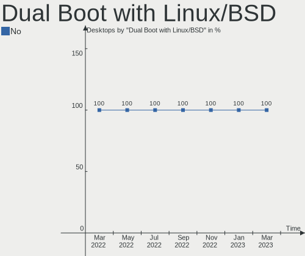
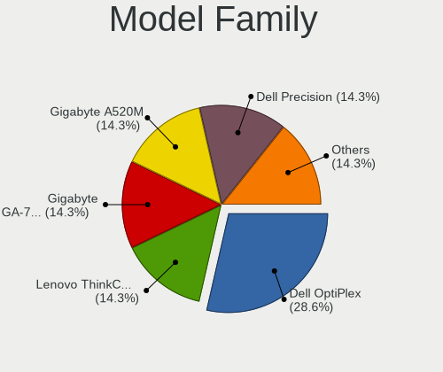
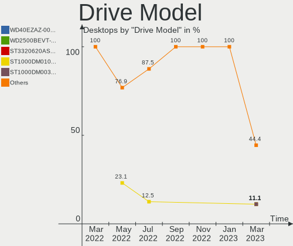
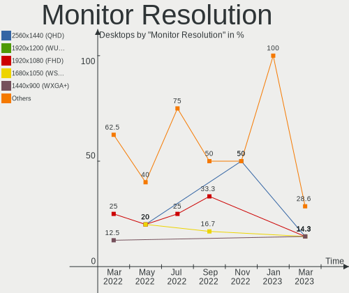
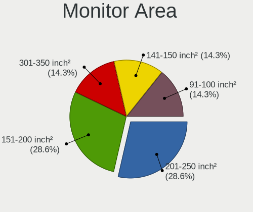
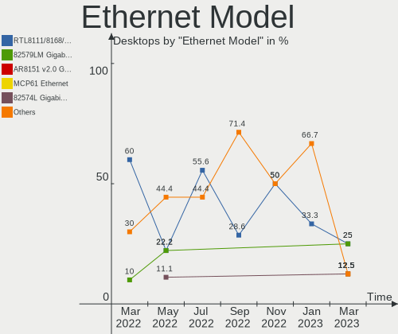
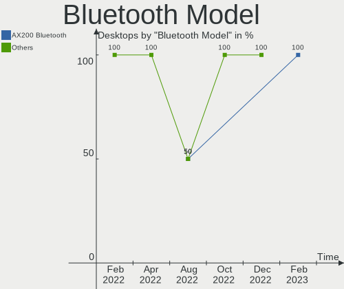
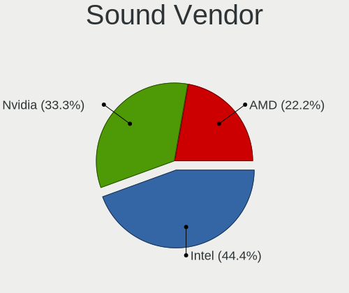
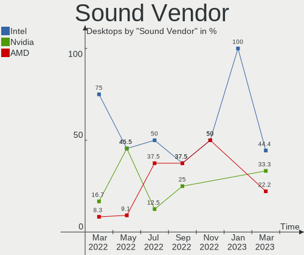

Endless Hardware Trends (Desktops)
----------------------------------

A project to identify most popular hardware characteristics and track their change
over time based on data collected by Endless users at https://Linux-Hardware.org.

Anyone can contribute to this report by the [hw-probe](https://github.com/linuxhw/hw-probe) tool:

    sudo -E hw-probe -all -upload

Full-feature report is available here: https://linux-hardware.org/?view=trends

Period: Nov, 2021.

Contents
--------

* [ System ](#system)
  - [ OS                       ](#os)
  - [ OS Family                ](#os-family)
  - [ Kernel                   ](#kernel)
  - [ Kernel Family            ](#kernel-family)
  - [ Kernel Major Ver.        ](#kernel-major-ver)
  - [ Arch                     ](#arch)
  - [ DE                       ](#de)
  - [ Display Server           ](#display-server)
  - [ Display Manager          ](#display-manager)
  - [ OS Lang                  ](#os-lang)
  - [ Boot Mode                ](#boot-mode)
  - [ Filesystem               ](#filesystem)
  - [ Part. scheme             ](#part-scheme)
  - [ Dual Boot with Linux/BSD ](#dual-boot-with-linuxbsd)
  - [ Dual Boot (Win)          ](#dual-boot-win)

* [ Board ](#board)
  - [ Vendor                   ](#vendor)
  - [ Model                    ](#model)
  - [ Model Family             ](#model-family)
  - [ MFG Year                 ](#mfg-year)
  - [ Form Factor              ](#form-factor)
  - [ Secure Boot              ](#secure-boot)
  - [ Coreboot                 ](#coreboot)
  - [ RAM Size                 ](#ram-size)
  - [ RAM Used                 ](#ram-used)
  - [ Total Drives             ](#total-drives)
  - [ Has CD-ROM               ](#has-cd-rom)
  - [ Has Ethernet             ](#has-ethernet)
  - [ Has WiFi                 ](#has-wifi)
  - [ Has Bluetooth            ](#has-bluetooth)

* [ Location ](#location)
  - [ Country                  ](#country)
  - [ City                     ](#city)

* [ Drives ](#drives)
  - [ Drive Vendor             ](#drive-vendor)
  - [ Drive Model              ](#drive-model)
  - [ HDD Vendor               ](#hdd-vendor)
  - [ SSD Vendor               ](#ssd-vendor)
  - [ Drive Kind               ](#drive-kind)
  - [ Drive Connector          ](#drive-connector)
  - [ Drive Size               ](#drive-size)
  - [ Space Total              ](#space-total)
  - [ Space Used               ](#space-used)
  - [ Malfunc. Drives          ](#malfunc-drives)
  - [ Malfunc. Drive Vendor    ](#malfunc-drive-vendor)
  - [ Malfunc. HDD Vendor      ](#malfunc-hdd-vendor)
  - [ Malfunc. Drive Kind      ](#malfunc-drive-kind)
  - [ Failed Drives            ](#failed-drives)
  - [ Failed Drive Vendor      ](#failed-drive-vendor)
  - [ Drive Status             ](#drive-status)

* [ Storage controller ](#storage-controller)
  - [ Storage Vendor           ](#storage-vendor)
  - [ Storage Model            ](#storage-model)
  - [ Storage Kind             ](#storage-kind)

* [ Processor ](#processor)
  - [ CPU Vendor               ](#cpu-vendor)
  - [ CPU Model                ](#cpu-model)
  - [ CPU Model Family         ](#cpu-model-family)
  - [ CPU Cores                ](#cpu-cores)
  - [ CPU Sockets              ](#cpu-sockets)
  - [ CPU Threads              ](#cpu-threads)
  - [ CPU Op-Modes             ](#cpu-op-modes)
  - [ CPU Microcode            ](#cpu-microcode)
  - [ CPU Microarch            ](#cpu-microarch)

* [ Graphics ](#graphics)
  - [ GPU Vendor               ](#gpu-vendor)
  - [ GPU Model                ](#gpu-model)
  - [ GPU Combo                ](#gpu-combo)
  - [ GPU Driver               ](#gpu-driver)
  - [ GPU Memory               ](#gpu-memory)

* [ Monitor ](#monitor)
  - [ Monitor Vendor           ](#monitor-vendor)
  - [ Monitor Model            ](#monitor-model)
  - [ Monitor Resolution       ](#monitor-resolution)
  - [ Monitor Diagonal         ](#monitor-diagonal)
  - [ Monitor Width            ](#monitor-width)
  - [ Aspect Ratio             ](#aspect-ratio)
  - [ Monitor Area             ](#monitor-area)
  - [ Pixel Density            ](#pixel-density)
  - [ Multiple Monitors        ](#multiple-monitors)

* [ Network ](#network)
  - [ Net Controller Vendor    ](#net-controller-vendor)
  - [ Net Controller Model     ](#net-controller-model)
  - [ Wireless Vendor          ](#wireless-vendor)
  - [ Wireless Model           ](#wireless-model)
  - [ Ethernet Vendor          ](#ethernet-vendor)
  - [ Ethernet Model           ](#ethernet-model)
  - [ Net Controller Kind      ](#net-controller-kind)
  - [ Used Controller          ](#used-controller)
  - [ NICs                     ](#nics)
  - [ IPv6                     ](#ipv6)

* [ Bluetooth ](#bluetooth)
  - [ Bluetooth Vendor         ](#bluetooth-vendor)
  - [ Bluetooth Model          ](#bluetooth-model)

* [ Sound ](#sound)
  - [ Sound Vendor             ](#sound-vendor)
  - [ Sound Model              ](#sound-model)

* [ Memory ](#memory)
  - [ Memory Vendor            ](#memory-vendor)
  - [ Memory Model             ](#memory-model)
  - [ Memory Kind              ](#memory-kind)
  - [ Memory Form Factor       ](#memory-form-factor)
  - [ Memory Size              ](#memory-size)
  - [ Memory Speed             ](#memory-speed)

* [ Printers & scanners ](#printers--scanners)
  - [ Printer Vendor           ](#printer-vendor)
  - [ Printer Model            ](#printer-model)
  - [ Scanner Vendor           ](#scanner-vendor)
  - [ Scanner Model            ](#scanner-model)

* [ Camera ](#camera)
  - [ Camera Vendor            ](#camera-vendor)
  - [ Camera Model             ](#camera-model)

* [ Security ](#security)
  - [ Fingerprint Vendor       ](#fingerprint-vendor)
  - [ Fingerprint Model        ](#fingerprint-model)
  - [ Chipcard Vendor          ](#chipcard-vendor)
  - [ Chipcard Model           ](#chipcard-model)

* [ Unsupported ](#unsupported)
  - [ Unsupported Devices      ](#unsupported-devices)
  - [ Unsupported Device Types ](#unsupported-device-types)

System
------

OS
--

Installed operating systems

| Name                  | Desktops | Percent |
|-----------------------|----------|---------|
| Endless 3.9.5         | 4        | 57.14%  |
| Endless 4.0.0         | 1        | 14.29%  |
| Endless 3.9.6         | 1        | 14.29%  |
| Endless 3.8.3-nexthw1 | 1        | 14.29%  |

OS Family
---------

OS without a version

| Name    | Desktops | Percent |
|---------|----------|---------|
| Endless | 7        | 100%    |

Kernel
------

Version of the Linux kernel

| Version           | Desktops | Percent |
|-------------------|----------|---------|
| 5.8.0-14-generic  | 5        | 71.43%  |
| 5.6.0-7-generic   | 1        | 14.29%  |
| 5.11.0-35-generic | 1        | 14.29%  |

Kernel Family
-------------

Linux kernel without a distro release

| Version | Desktops | Percent |
|---------|----------|---------|
| 5.8.0   | 5        | 71.43%  |
| 5.6.0   | 1        | 14.29%  |
| 5.11.0  | 1        | 14.29%  |

Kernel Major Ver.
-----------------

Linux kernel major version

| Version | Desktops | Percent |
|---------|----------|---------|
| 5.8     | 5        | 71.43%  |
| 5.6     | 1        | 14.29%  |
| 5.11    | 1        | 14.29%  |

Arch
----

OS architecture (x86_64, i586, etc.)

| Name   | Desktops | Percent |
|--------|----------|---------|
| x86_64 | 7        | 100%    |

DE
--

Desktop Environment

| Name  | Desktops | Percent |
|-------|----------|---------|
| GNOME | 7        | 100%    |

Display Server
--------------

X11 or Wayland

| Name | Desktops | Percent |
|------|----------|---------|
| X11  | 7        | 100%    |

Display Manager
---------------

SDDM, LightDM, etc.

| Name    | Desktops | Percent |
|---------|----------|---------|
| Unknown | 7        | 100%    |

OS Lang
-------

Language

| Lang  | Desktops | Percent |
|-------|----------|---------|
| en_US | 3        | 42.86%  |
| es_ES | 2        | 28.57%  |
| pt_BR | 1        | 14.29%  |
| id_ID | 1        | 14.29%  |

Boot Mode
---------

EFI or BIOS

| Mode | Desktops | Percent |
|------|----------|---------|
| EFI  | 4        | 57.14%  |
| BIOS | 3        | 42.86%  |

Filesystem
----------

Type of filesystem

| Type | Desktops | Percent |
|------|----------|---------|
| Ext4 | 7        | 100%    |

Part. scheme
------------

Scheme of partitioning

| Type    | Desktops | Percent |
|---------|----------|---------|
| Unknown | 7        | 100%    |

Dual Boot with Linux/BSD
------------------------

Hosting more than one Linux/BSD

| Dual boot | Desktops | Percent |
|-----------|----------|---------|
| No        | 7        | 100%    |

Dual Boot (Win)
---------------

Hosting Linux and Windows

| Dual boot | Desktops | Percent |
|-----------|----------|---------|
| No        | 7        | 100%    |

Board
-----

Vendor
------

Motherboard manufacturer

| Name             | Desktops | Percent |
|------------------|----------|---------|
| Foxconn          | 2        | 28.57%  |
| ASUSTek Computer | 2        | 28.57%  |
| MSI              | 1        | 14.29%  |
| Hewlett-Packard  | 1        | 14.29%  |
| ASRock           | 1        | 14.29%  |

Model
-----

Motherboard model

| Name                       | Desktops | Percent |
|----------------------------|----------|---------|
| MSI MS-7C89                | 1        | 14.29%  |
| HP 550-153w                | 1        | 14.29%  |
| Foxconn Pro 3330 MT        | 1        | 14.29%  |
| Foxconn G41MXE/G41MXE-K    | 1        | 14.29%  |
| ASUS PRIME H310M-E R2.0/BR | 1        | 14.29%  |
| ASUS ASUS D300TA_S300MA    | 1        | 14.29%  |
| ASRock A88M-G              | 1        | 14.29%  |

Model Family
------------

Motherboard model prefix

| Name           | Desktops | Percent |
|----------------|----------|---------|
| MSI MS-7C89    | 1        | 14.29%  |
| HP 550-153w    | 1        | 14.29%  |
| Foxconn Pro    | 1        | 14.29%  |
| Foxconn G41MXE | 1        | 14.29%  |
| ASUS PRIME     | 1        | 14.29%  |
| ASUS ASUS      | 1        | 14.29%  |
| ASRock A88M-G  | 1        | 14.29%  |

MFG Year
--------

Motherboard manufacture year

| Year | Desktops | Percent |
|------|----------|---------|
| 2020 | 3        | 42.86%  |
| 2016 | 1        | 14.29%  |
| 2015 | 1        | 14.29%  |
| 2013 | 1        | 14.29%  |
| 2010 | 1        | 14.29%  |

Form Factor
-----------

Physical design of the computer

| Name    | Desktops | Percent |
|---------|----------|---------|
| Desktop | 7        | 100%    |

Secure Boot
-----------

Enabled or disabled

| State    | Desktops | Percent |
|----------|----------|---------|
| Disabled | 7        | 100%    |

Coreboot
--------

Have coreboot on board

| Used | Desktops | Percent |
|------|----------|---------|
| No   | 7        | 100%    |

RAM Size
--------

Total RAM memory

| Size in GB | Desktops | Percent |
|------------|----------|---------|
| 3.01-4.0   | 2        | 28.57%  |
| 8.01-16.0  | 2        | 28.57%  |
| 4.01-8.0   | 1        | 14.29%  |
| 24.01-32.0 | 1        | 14.29%  |
| 1.01-2.0   | 1        | 14.29%  |

RAM Used
--------

Used RAM memory

| Used GB  | Desktops | Percent |
|----------|----------|---------|
| 1.01-2.0 | 3        | 42.86%  |
| 2.01-3.0 | 2        | 28.57%  |
| 0.51-1.0 | 2        | 28.57%  |

Total Drives
------------

Number of drives on board

| Drives | Desktops | Percent |
|--------|----------|---------|
| 1      | 6        | 85.71%  |
| 2      | 1        | 14.29%  |

Has CD-ROM
----------

Has CD-ROM on board

| Presented | Desktops | Percent |
|-----------|----------|---------|
| No        | 6        | 85.71%  |
| Yes       | 1        | 14.29%  |

Has Ethernet
------------

Has Ethernet on board

| Presented | Desktops | Percent |
|-----------|----------|---------|
| Yes       | 7        | 100%    |

Has WiFi
--------

Has WiFi module

| Presented | Desktops | Percent |
|-----------|----------|---------|
| Yes       | 4        | 57.14%  |
| No        | 3        | 42.86%  |

Has Bluetooth
-------------

Has Bluetooth module

| Presented | Desktops | Percent |
|-----------|----------|---------|
| No        | 5        | 71.43%  |
| Yes       | 2        | 28.57%  |

Location
--------

Country
-------

Geographic location (country)

| Country      | Desktops | Percent |
|--------------|----------|---------|
| USA          | 2        | 28.57%  |
| Spain        | 2        | 28.57%  |
| South Africa | 1        | 14.29%  |
| Indonesia    | 1        | 14.29%  |
| Brazil       | 1        | 14.29%  |

City
----

Geographic location (city)

| City                     | Desktops | Percent |
|--------------------------|----------|---------|
| Bucyrus                  | 2        | 28.57%  |
| Tuban                    | 1        | 14.29%  |
| Santa Cruz de Tenerife   | 1        | 14.29%  |
| Sant Carles de la Rapita | 1        | 14.29%  |
| Port Elizabeth           | 1        | 14.29%  |
| Paco do Lumiar           | 1        | 14.29%  |

Drives
------

Drive Vendor
------------

Hard drive vendors

| Vendor              | Desktops | Drives | Percent |
|---------------------|----------|--------|---------|
| Kingston            | 3        | 3      | 37.5%   |
| WDC                 | 2        | 2      | 25%     |
| Silicon Motion      | 1        | 1      | 12.5%   |
| Samsung Electronics | 1        | 1      | 12.5%   |
| Intel               | 1        | 1      | 12.5%   |

Drive Model
-----------

Hard drive models

| Model                               | Desktops | Percent |
|-------------------------------------|----------|---------|
| Kingston SV300S37A120G 120GB SSD    | 2        | 25%     |
| WDC WDS240G2G0A-00JH30 240GB SSD    | 1        | 12.5%   |
| WDC WD5000AVDS-63U7B1 500GB         | 1        | 12.5%   |
| Silicon Motion NVMe SSD Drive 256GB | 1        | 12.5%   |
| Samsung HD103SI 1TB                 | 1        | 12.5%   |
| Kingston SA400S37120G 120GB SSD     | 1        | 12.5%   |
| Intel NVMe SSD Drive 512GB          | 1        | 12.5%   |

HDD Vendor
----------

Hard disk drive vendors

| Vendor              | Desktops | Drives | Percent |
|---------------------|----------|--------|---------|
| WDC                 | 1        | 1      | 50%     |
| Samsung Electronics | 1        | 1      | 50%     |

SSD Vendor
----------

Solid state drive vendors

| Vendor   | Desktops | Drives | Percent |
|----------|----------|--------|---------|
| Kingston | 3        | 3      | 75%     |
| WDC      | 1        | 1      | 25%     |

Drive Kind
----------

HDD or SSD

| Kind | Desktops | Drives | Percent |
|------|----------|--------|---------|
| SSD  | 4        | 4      | 50%     |
| NVMe | 2        | 2      | 25%     |
| HDD  | 2        | 2      | 25%     |

Drive Connector
---------------

SATA, SAS, NVMe, etc.

| Type | Desktops | Drives | Percent |
|------|----------|--------|---------|
| SATA | 6        | 6      | 75%     |
| NVMe | 2        | 2      | 25%     |

Drive Size
----------

Size of hard drive

| Size in TB | Desktops | Drives | Percent |
|------------|----------|--------|---------|
| 0.01-0.5   | 5        | 5      | 83.33%  |
| 0.51-1.0   | 1        | 1      | 16.67%  |

Space Total
-----------

Amount of disk space available on the file system

| Size in GB | Desktops | Percent |
|------------|----------|---------|
| 101-250    | 4        | 57.14%  |
| 251-500    | 2        | 28.57%  |
| 501-1000   | 1        | 14.29%  |

Space Used
----------

Amount of used disk space

| Used GB | Desktops | Percent |
|---------|----------|---------|
| 21-50   | 5        | 71.43%  |
| 1-20    | 1        | 14.29%  |
| 51-100  | 1        | 14.29%  |

Malfunc. Drives
---------------

Drive models with a malfunction

Zero info for selected period =(

Malfunc. Drive Vendor
---------------------

Vendors of faulty drives

Zero info for selected period =(

Malfunc. HDD Vendor
-------------------

Vendors of faulty HDD drives

Zero info for selected period =(

Malfunc. Drive Kind
-------------------

Kinds of faulty drives

Zero info for selected period =(

Failed Drives
-------------

Failed drive models

Zero info for selected period =(

Failed Drive Vendor
-------------------

Failed drive vendors

Zero info for selected period =(

Drive Status
------------

Number of failed and malfunc. drives

| Status   | Desktops | Drives | Percent |
|----------|----------|--------|---------|
| Detected | 7        | 8      | 100%    |

Storage controller
------------------

Storage Vendor
--------------

Storage controller vendors

| Vendor         | Desktops | Percent |
|----------------|----------|---------|
| Intel          | 6        | 75%     |
| Silicon Motion | 1        | 12.5%   |
| AMD            | 1        | 12.5%   |

Storage Model
-------------

Storage controller models

| Model                                                                          | Desktops | Percent |
|--------------------------------------------------------------------------------|----------|---------|
| Intel 400 Series Chipset Family SATA AHCI Controller                           | 2        | 18.18%  |
| Silicon Motion SM2263EN/SM2263XT SSD Controller                                | 1        | 9.09%   |
| Intel SSD 660P Series                                                          | 1        | 9.09%   |
| Intel NM10/ICH7 Family SATA Controller [IDE mode]                              | 1        | 9.09%   |
| Intel 82801G (ICH7 Family) IDE Controller                                      | 1        | 9.09%   |
| Intel 8 Series/C220 Series Chipset Family 6-port SATA Controller 1 [AHCI mode] | 1        | 9.09%   |
| Intel 6 Series/C200 Series Chipset Family 6 port Desktop SATA AHCI Controller  | 1        | 9.09%   |
| Intel 200 Series PCH SATA controller [AHCI mode]                               | 1        | 9.09%   |
| AMD FCH SATA Controller [AHCI mode]                                            | 1        | 9.09%   |
| AMD FCH IDE Controller                                                         | 1        | 9.09%   |

Storage Kind
------------

Kind of storage controller (IDE, SATA, NVMe, SAS, ...)

| Kind | Desktops | Percent |
|------|----------|---------|
| SATA | 6        | 60%     |
| NVMe | 2        | 20%     |
| IDE  | 2        | 20%     |

Processor
---------

CPU Vendor
----------

Processor vendors

| Vendor | Desktops | Percent |
|--------|----------|---------|
| Intel  | 6        | 85.71%  |
| AMD    | 1        | 14.29%  |

CPU Model
---------

Processor models

| Model                                       | Desktops | Percent |
|---------------------------------------------|----------|---------|
| Intel Pentium Dual-Core CPU E5700 @ 3.00GHz | 1        | 14.29%  |
| Intel Core i5-2400 CPU @ 3.10GHz            | 1        | 14.29%  |
| Intel Core i3-9100F CPU @ 3.60GHz           | 1        | 14.29%  |
| Intel Core i3-4370 CPU @ 3.80GHz            | 1        | 14.29%  |
| Intel Core i3-10100 CPU @ 3.60GHz           | 1        | 14.29%  |
| Intel Celeron G5905 CPU @ 3.50GHz           | 1        | 14.29%  |
| AMD A10-5800K APU with Radeon HD Graphics   | 1        | 14.29%  |

CPU Model Family
----------------

Processor model prefix

| Model                   | Desktops | Percent |
|-------------------------|----------|---------|
| Intel Core i3           | 3        | 42.86%  |
| Intel Pentium Dual-Core | 1        | 14.29%  |
| Intel Core i5           | 1        | 14.29%  |
| Intel Celeron           | 1        | 14.29%  |
| AMD A10                 | 1        | 14.29%  |

CPU Cores
---------

Number of processor cores

| Number | Desktops | Percent |
|--------|----------|---------|
| 2      | 4        | 57.14%  |
| 4      | 3        | 42.86%  |

CPU Sockets
-----------

Number of sockets

| Number | Desktops | Percent |
|--------|----------|---------|
| 1      | 7        | 100%    |

CPU Threads
-----------

Threads per core (Hyper-Threading)

| Number | Desktops | Percent |
|--------|----------|---------|
| 1      | 4        | 57.14%  |
| 2      | 3        | 42.86%  |

CPU Op-Modes
------------

CPU Operation Modes (32-bit, 64-bit)

| Op mode        | Desktops | Percent |
|----------------|----------|---------|
| 32-bit, 64-bit | 7        | 100%    |

CPU Microcode
-------------

Microcode number

| Number     | Desktops | Percent |
|------------|----------|---------|
| 0xa0653    | 1        | 14.29%  |
| 0x906ea    | 1        | 14.29%  |
| 0x306c3    | 1        | 14.29%  |
| 0x206a7    | 1        | 14.29%  |
| 0x1067a    | 1        | 14.29%  |
| 0x06001119 | 1        | 14.29%  |
| Unknown    | 1        | 14.29%  |

CPU Microarch
-------------

Microarchitecture

| Name        | Desktops | Percent |
|-------------|----------|---------|
| CometLake   | 2        | 28.57%  |
| SandyBridge | 1        | 14.29%  |
| Piledriver  | 1        | 14.29%  |
| Penryn      | 1        | 14.29%  |
| KabyLake    | 1        | 14.29%  |
| Haswell     | 1        | 14.29%  |

Graphics
--------

GPU Vendor
----------

Vendors of graphics cards

| Vendor | Desktops | Percent |
|--------|----------|---------|
| Intel  | 4        | 57.14%  |
| AMD    | 2        | 28.57%  |
| Nvidia | 1        | 14.29%  |

GPU Model
---------

Graphics card models

| Model                                                                     | Desktops | Percent |
|---------------------------------------------------------------------------|----------|---------|
| AMD Hawaii PRO [Radeon R9 290/390]                                        | 2        | 28.57%  |
| Nvidia GK208B [GeForce GT 710]                                            | 1        | 14.29%  |
| Intel CometLake-S GT2 [UHD Graphics 630]                                  | 1        | 14.29%  |
| Intel Comet Lake UHD Graphics                                             | 1        | 14.29%  |
| Intel 4 Series Chipset Integrated Graphics Controller                     | 1        | 14.29%  |
| Intel 2nd Generation Core Processor Family Integrated Graphics Controller | 1        | 14.29%  |

GPU Combo
---------

Combinations of graphics cards

| Name       | Desktops | Percent |
|------------|----------|---------|
| 1 x Intel  | 4        | 57.14%  |
| 1 x AMD    | 2        | 28.57%  |
| 1 x Nvidia | 1        | 14.29%  |

GPU Driver
----------

Free vs proprietary

| Driver      | Desktops | Percent |
|-------------|----------|---------|
| Free        | 6        | 85.71%  |
| Proprietary | 1        | 14.29%  |

GPU Memory
----------

Total video memory

| Size in GB | Desktops | Percent |
|------------|----------|---------|
| Unknown    | 4        | 57.14%  |
| 7.01-8.0   | 2        | 28.57%  |
| 0.51-1.0   | 1        | 14.29%  |

Monitor
-------

Monitor Vendor
--------------

Monitor vendors

| Vendor              | Desktops | Percent |
|---------------------|----------|---------|
| Samsung Electronics | 4        | 57.14%  |
| HUAWEI              | 1        | 14.29%  |
| HSI                 | 1        | 14.29%  |
| AOC                 | 1        | 14.29%  |

Monitor Model
-------------

Monitor models

| Model                                                                 | Desktops | Percent |
|-----------------------------------------------------------------------|----------|---------|
| Samsung Electronics U28D590 SAM0B81 3840x2160 608x345mm 27.5-inch     | 1        | 14.29%  |
| Samsung Electronics SyncMaster SAM047D 1920x1080 410x230mm 18.5-inch  | 1        | 14.29%  |
| Samsung Electronics S19A10N SAM083E 1366x768 410x230mm 18.5-inch      | 1        | 14.29%  |
| Samsung Electronics LCD Monitor SAM0C44 3840x2160 890x500mm 40.2-inch | 1        | 14.29%  |
| HUAWEI AD80HW HWV2402 1920x1080 527x296mm 23.8-inch                   | 1        | 14.29%  |
| HSI HiTV HSI0001 3840x2160 708x398mm 32.0-inch                        | 1        | 14.29%  |
| AOC 24V2W1G5 AOC2402 1920x1080 527x296mm 23.8-inch                    | 1        | 14.29%  |

Monitor Resolution
------------------

Monitor screen resolution

| Resolution      | Desktops | Percent |
|-----------------|----------|---------|
| 3840x2160 (4K)  | 3        | 42.86%  |
| 1920x1080 (FHD) | 2        | 28.57%  |
| 1366x768 (WXGA) | 1        | 14.29%  |
| 1360x768        | 1        | 14.29%  |

Monitor Diagonal
----------------

Diagonal size in inches

| Inches | Desktops | Percent |
|--------|----------|---------|
| 18     | 2        | 28.57%  |
| 84     | 1        | 14.29%  |
| 34     | 1        | 14.29%  |
| 27     | 1        | 14.29%  |
| 24     | 1        | 14.29%  |
| 23     | 1        | 14.29%  |

Monitor Width
-------------

Physical width

| Width in mm | Desktops | Percent |
|-------------|----------|---------|
| 501-600     | 2        | 28.57%  |
| 401-500     | 2        | 28.57%  |
| 701-800     | 1        | 14.29%  |
| 601-700     | 1        | 14.29%  |
| 1501-2000   | 1        | 14.29%  |

Aspect Ratio
------------

Proportional relationship between the width and the height

| Ratio | Desktops | Percent |
|-------|----------|---------|
| 16/9  | 6        | 85.71%  |
| 21/9  | 1        | 14.29%  |

Monitor Area
------------

Area in inch²

| Area in inch² | Desktops | Percent |
|----------------|----------|---------|
| 201-250        | 2        | 28.57%  |
| 141-150        | 2        | 28.57%  |
| More than 1000 | 1        | 14.29%  |
| 351-500        | 1        | 14.29%  |
| 301-350        | 1        | 14.29%  |

Pixel Density
-------------

Pixels per inch

| Density | Desktops | Percent |
|---------|----------|---------|
| 51-100  | 6        | 85.71%  |
| 121-160 | 1        | 14.29%  |

Multiple Monitors
-----------------

Total monitors connected

| Total | Desktops | Percent |
|-------|----------|---------|
| 1     | 7        | 100%    |

Network
-------

Net Controller Vendor
---------------------

Controller vendors

| Vendor                | Desktops | Percent |
|-----------------------|----------|---------|
| Realtek Semiconductor | 6        | 66.67%  |
| Qualcomm Atheros      | 1        | 11.11%  |
| Qualcomm              | 1        | 11.11%  |
| Intel                 | 1        | 11.11%  |

Net Controller Model
--------------------

Controller models

| Model                                                             | Desktops | Percent |
|-------------------------------------------------------------------|----------|---------|
| Realtek RTL8111/8168/8411 PCI Express Gigabit Ethernet Controller | 6        | 50%     |
| Realtek RTL8821CE 802.11ac PCIe Wireless Network Adapter          | 1        | 8.33%   |
| Realtek RTL8188FTV 802.11b/g/n 1T1R 2.4G WLAN Adapter             | 1        | 8.33%   |
| Realtek RTL8188EUS 802.11n Wireless Network Adapter               | 1        | 8.33%   |
| Qualcomm BOLT!-JUNO                                               | 1        | 8.33%   |
| Qualcomm Atheros AR5212/5213/2414 Wireless Network Adapter        | 1        | 8.33%   |
| Intel Ethernet Connection (12) I219-V                             | 1        | 8.33%   |

Wireless Vendor
---------------

Wireless vendors

| Vendor                | Desktops | Percent |
|-----------------------|----------|---------|
| Realtek Semiconductor | 3        | 75%     |
| Qualcomm Atheros      | 1        | 25%     |

Wireless Model
--------------

Wireless models

| Model                                                      | Desktops | Percent |
|------------------------------------------------------------|----------|---------|
| Realtek RTL8821CE 802.11ac PCIe Wireless Network Adapter   | 1        | 25%     |
| Realtek RTL8188FTV 802.11b/g/n 1T1R 2.4G WLAN Adapter      | 1        | 25%     |
| Realtek RTL8188EUS 802.11n Wireless Network Adapter        | 1        | 25%     |
| Qualcomm Atheros AR5212/5213/2414 Wireless Network Adapter | 1        | 25%     |

Ethernet Vendor
---------------

Ethernet vendors

| Vendor                | Desktops | Percent |
|-----------------------|----------|---------|
| Realtek Semiconductor | 6        | 75%     |
| Qualcomm              | 1        | 12.5%   |
| Intel                 | 1        | 12.5%   |

Ethernet Model
--------------

Ethernet models

| Model                                                             | Desktops | Percent |
|-------------------------------------------------------------------|----------|---------|
| Realtek RTL8111/8168/8411 PCI Express Gigabit Ethernet Controller | 6        | 75%     |
| Qualcomm BOLT!-JUNO                                               | 1        | 12.5%   |
| Intel Ethernet Connection (12) I219-V                             | 1        | 12.5%   |

Net Controller Kind
-------------------

Ethernet, WiFi or modem

| Kind     | Desktops | Percent |
|----------|----------|---------|
| Ethernet | 7        | 63.64%  |
| WiFi     | 4        | 36.36%  |

Used Controller
---------------

Currently used network controller

| Kind     | Desktops | Percent |
|----------|----------|---------|
| Ethernet | 7        | 70%     |
| WiFi     | 3        | 30%     |

NICs
----

Total network controllers on board

| Total | Desktops | Percent |
|-------|----------|---------|
| 1     | 6        | 85.71%  |
| 2     | 1        | 14.29%  |

IPv6
----

IPv6 vs IPv4

| Used | Desktops | Percent |
|------|----------|---------|
| No   | 4        | 57.14%  |
| Yes  | 3        | 42.86%  |

Bluetooth
---------

Bluetooth Vendor
----------------

Controller vendors

| Vendor       | Desktops | Percent |
|--------------|----------|---------|
| IMC Networks | 1        | 50%     |
| Broadcom     | 1        | 50%     |

Bluetooth Model
---------------

Controller models

| Model                                | Desktops | Percent |
|--------------------------------------|----------|---------|
| IMC Networks Bluetooth Radio         | 1        | 50%     |
| Broadcom BCM43142A0 Bluetooth Device | 1        | 50%     |

Sound
-----

Sound Vendor
------------

Sound card vendors

| Vendor | Desktops | Percent |
|--------|----------|---------|
| Intel  | 6        | 66.67%  |
| AMD    | 2        | 22.22%  |
| Nvidia | 1        | 11.11%  |

Sound Model
-----------

Sound card models

| Model                                                                      | Desktops | Percent |
|----------------------------------------------------------------------------|----------|---------|
| Intel Comet Lake PCH-V cAVS                                                | 2        | 20%     |
| AMD Hawaii HDMI Audio [Radeon R9 290/290X / 390/390X]                      | 2        | 20%     |
| Nvidia GK208 HDMI/DP Audio Controller                                      | 1        | 10%     |
| Intel NM10/ICH7 Family High Definition Audio Controller                    | 1        | 10%     |
| Intel 8 Series/C220 Series Chipset High Definition Audio Controller        | 1        | 10%     |
| Intel 6 Series/C200 Series Chipset Family High Definition Audio Controller | 1        | 10%     |
| Intel 200 Series PCH HD Audio                                              | 1        | 10%     |
| AMD FCH Azalia Controller                                                  | 1        | 10%     |

Memory
------

Memory Vendor
-------------

Memory module vendors

Zero info for selected period =(

Memory Model
------------

Memory module models

Zero info for selected period =(

Memory Kind
-----------

Memory module kinds

Zero info for selected period =(

Memory Form Factor
------------------

Physical design of the memory module

Zero info for selected period =(

Memory Size
-----------

Memory module size

Zero info for selected period =(

Memory Speed
------------

Memory module speed

Zero info for selected period =(

Printers & scanners
-------------------

Printer Vendor
--------------

Printer device vendors

Zero info for selected period =(

Printer Model
-------------

Printer device models

Zero info for selected period =(

Scanner Vendor
--------------

Scanner device vendors

Zero info for selected period =(

Scanner Model
-------------

Scanner device models

Zero info for selected period =(

Camera
------

Camera Vendor
-------------

Camera device vendors

| Vendor              | Desktops | Percent |
|---------------------|----------|---------|
| Samsung Electronics | 1        | 100%    |

Camera Model
------------

Camera device models

| Model                   | Desktops | Percent |
|-------------------------|----------|---------|
| Samsung Galaxy A5 (MTP) | 1        | 100%    |

Security
--------

Fingerprint Vendor
------------------

Fingerprint sensor vendors

Zero info for selected period =(

Fingerprint Model
-----------------

Fingerprint sensor models

Zero info for selected period =(

Chipcard Vendor
---------------

Chipcard module vendors

Zero info for selected period =(

Chipcard Model
--------------

Chipcard module models

Zero info for selected period =(

Unsupported
-----------

Unsupported Devices
-------------------

Total unsupported devices on board

| Total | Desktops | Percent |
|-------|----------|---------|
| 0     | 6        | 85.71%  |
| 1     | 1        | 14.29%  |

Unsupported Device Types
------------------------

Types of unsupported devices

| Type         | Desktops | Percent |
|--------------|----------|---------|
| Net/wireless | 1        | 100%    |

