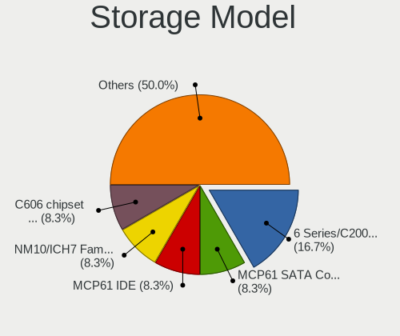

Endless Hardware Trends (Desktop)
---------------------------------

A project to identify most popular hardware characteristics and track their change
over time based on data collected by Endless users at https://Linux-Hardware.org.

Anyone can contribute to the study by uploading probes of their computers by
the [hw-probe](https://github.com/linuxhw/hw-probe) tool:

    sudo -E hw-probe -all -upload

Full-feature report is available here: https://linux-hardware.org/?view=trends&formfactor=desktop

Period: Mar, 2021.

Contents
--------

- [ OS                       ](#os)
- [ OS Family                ](#os-family)
- [ Kernel                   ](#kernel)
- [ Kernel Family            ](#kernel-family)
- [ Kernel Major Ver.        ](#kernel-major-ver)
- [ Arch                     ](#arch)
- [ DE                       ](#de)
- [ Display Server           ](#display-server)
- [ Display Manager          ](#display-manager)
- [ OS Lang                  ](#os-lang)
- [ Boot Mode                ](#boot-mode)
- [ Filesystem               ](#filesystem)
- [ Part. scheme             ](#part-scheme)
- [ Dual Boot with Linux/BSD ](#dual-boot-with-linux/bsd)
- [ Dual Boot (Win)          ](#dual-boot-win)
- [ Country                  ](#country)
- [ City                     ](#city)
- [ Vendor                   ](#vendor)
- [ Model                    ](#model)
- [ Model Family             ](#model-family)
- [ MFG Year                 ](#mfg-year)
- [ Form Factor              ](#form-factor)
- [ Secure Boot              ](#secure-boot)
- [ Coreboot                 ](#coreboot)
- [ RAM Size                 ](#ram-size)
- [ RAM Used                 ](#ram-used)
- [ Has CD-ROM               ](#has-cd-rom)
- [ Total Drives             ](#total-drives)
- [ Has Ethernet             ](#has-ethernet)
- [ Has WiFi                 ](#has-wifi)
- [ Has Bluetooth            ](#has-bluetooth)
- [ Drive Vendor             ](#drive-vendor)
- [ Drive Model              ](#drive-model)
- [ HDD Vendor               ](#hdd-vendor)
- [ SSD Vendor               ](#ssd-vendor)
- [ Drive Kind               ](#drive-kind)
- [ Drive Connector          ](#drive-connector)
- [ Drive Size               ](#drive-size)
- [ Space Total              ](#space-total)
- [ Space Used               ](#space-used)
- [ Malfunc. Drives          ](#malfunc-drives)
- [ Malfunc. Drive Vendor    ](#malfunc-drive-vendor)
- [ Malfunc. HDD Vendor      ](#malfunc-hdd-vendor)
- [ Malfunc. Drive Kind      ](#malfunc-drive-kind)
- [ Failed Drives            ](#failed-drives)
- [ Failed Drive Vendor      ](#failed-drive-vendor)
- [ Drive Status             ](#drive-status)
- [ Storage Vendor           ](#storage-vendor)
- [ Storage Model            ](#storage-model)
- [ Storage Kind             ](#storage-kind)
- [ CPU Vendor               ](#cpu-vendor)
- [ CPU Model                ](#cpu-model)
- [ CPU Model Family         ](#cpu-model-family)
- [ CPU Cores                ](#cpu-cores)
- [ CPU Sockets              ](#cpu-sockets)
- [ CPU Threads              ](#cpu-threads)
- [ CPU Op-Modes             ](#cpu-op-modes)
- [ CPU Microcode            ](#cpu-microcode)
- [ CPU Microarch            ](#cpu-microarch)
- [ GPU Vendor               ](#gpu-vendor)
- [ GPU Model                ](#gpu-model)
- [ GPU Combo                ](#gpu-combo)
- [ GPU Driver               ](#gpu-driver)
- [ GPU Memory               ](#gpu-memory)
- [ Monitor Vendor           ](#monitor-vendor)
- [ Monitor Model            ](#monitor-model)
- [ Monitor Resolution       ](#monitor-resolution)
- [ Monitor Diagonal         ](#monitor-diagonal)
- [ Monitor Width            ](#monitor-width)
- [ Aspect Ratio             ](#aspect-ratio)
- [ Monitor Area             ](#monitor-area)
- [ Pixel Density            ](#pixel-density)
- [ Multiple Monitors        ](#multiple-monitors)
- [ Net Controller Vendor    ](#net-controller-vendor)
- [ Net Controller Model     ](#net-controller-model)
- [ Wireless Vendor          ](#wireless-vendor)
- [ Wireless Model           ](#wireless-model)
- [ Ethernet Vendor          ](#ethernet-vendor)
- [ Ethernet Model           ](#ethernet-model)
- [ Net Controller Kind      ](#net-controller-kind)
- [ Used Controller          ](#used-controller)
- [ NICs                     ](#nics)
- [ IPv6                     ](#ipv6)
- [ Memory Vendor            ](#memory-vendor)
- [ Memory Model             ](#memory-model)
- [ Memory Kind              ](#memory-kind)
- [ Memory Form Factor       ](#memory-form-factor)
- [ Memory Size              ](#memory-size)
- [ Memory Speed             ](#memory-speed)
- [ Sound Vendor             ](#sound-vendor)
- [ Sound Model              ](#sound-model)
- [ Camera Vendor            ](#camera-vendor)
- [ Camera Model             ](#camera-model)
- [ Fingerprint Vendor       ](#fingerprint-vendor)
- [ Fingerprint Model        ](#fingerprint-model)
- [ Chipcard Vendor          ](#chipcard-vendor)
- [ Chipcard Model           ](#chipcard-model)
- [ Printer Vendor           ](#printer-vendor)
- [ Printer Model            ](#printer-model)
- [ Scanner Vendor           ](#scanner-vendor)
- [ Scanner Model            ](#scanner-model)
- [ Bluetooth Vendor         ](#bluetooth-vendor)
- [ Bluetooth Model          ](#bluetooth-model)
- [ Unsupported Devices      ](#unsupported-devices)
- [ Unsupported Device Types ](#unsupported-device-types)

OS
--

Installed operating systems

| Name          | Desktops | Percent |
|---------------|----------|---------|
| Endless 3.9.3 | 20       | 95.24%  |
| Endless 3.9.1 | 1        | 4.76%   |

OS Family
---------

OS without a version

| Name    | Desktops | Percent |
|---------|----------|---------|
| Endless | 21       | 100%    |

Kernel
------

Version of the Linux kernel

| Version          | Desktops | Percent |
|------------------|----------|---------|
| 5.8.0-14-generic | 21       | 100%    |

Kernel Family
-------------

Linux kernel without a distro release

| Version | Desktops | Percent |
|---------|----------|---------|
| 5.8.0   | 21       | 100%    |

Kernel Major Ver.
-----------------

Linux kernel major version

| Version | Desktops | Percent |
|---------|----------|---------|
| 5.8     | 21       | 100%    |

Arch
----

OS architecture (x86_64, i586, etc.)

| Name   | Desktops | Percent |
|--------|----------|---------|
| x86_64 | 21       | 100%    |

DE
--

Desktop Environment

| Name  | Desktops | Percent |
|-------|----------|---------|
| GNOME | 21       | 100%    |

Display Server
--------------

X11 or Wayland

| Name | Desktops | Percent |
|------|----------|---------|
| X11  | 21       | 100%    |

Display Manager
---------------

SDDM, LightDM, etc.

| Name    | Desktops | Percent |
|---------|----------|---------|
| Unknown | 21       | 100%    |

OS Lang
-------

Language

| Lang        | Desktops | Percent |
|-------------|----------|---------|
| pt_BR       | 4        | 19.05%  |
| en_US       | 4        | 19.05%  |
| de_DE       | 3        | 14.29%  |
| pl_PL       | 2        | 9.52%   |
| fr_FR       | 2        | 9.52%   |
| sk_SK       | 1        | 4.76%   |
| ru_RU.UTF_8 | 1        | 4.76%   |
| ru_RU       | 1        | 4.76%   |
| fr_CH       | 1        | 4.76%   |
| fr_CA       | 1        | 4.76%   |
| en_GB       | 1        | 4.76%   |

Boot Mode
---------

EFI or BIOS

| Mode | Desktops | Percent |
|------|----------|---------|
| BIOS | 12       | 57.14%  |
| EFI  | 9        | 42.86%  |

Filesystem
----------

Type of filesystem

| Type  | Desktops | Percent |
|-------|----------|---------|
| Ext4  | 19       | 90.48%  |
| Tmpfs | 2        | 9.52%   |

Part. scheme
------------

Scheme of partitioning

| Type    | Desktops | Percent |
|---------|----------|---------|
| Unknown | 21       | 100%    |

Dual Boot with Linux/BSD
------------------------

Hosting more than one Linux/BSD

| Dual boot | Desktops | Percent |
|-----------|----------|---------|
| No        | 21       | 100%    |

Dual Boot (Win)
---------------

Hosting Linux and Windows

| Dual boot | Desktops | Percent |
|-----------|----------|---------|
| No        | 21       | 100%    |

Country
-------

Geographic location (country)

| Country     | Desktops | Percent |
|-------------|----------|---------|
| Germany     | 4        | 19.05%  |
| Brazil      | 3        | 14.29%  |
| USA         | 2        | 9.52%   |
| Russia      | 2        | 9.52%   |
| Poland      | 2        | 9.52%   |
| France      | 2        | 9.52%   |
| Switzerland | 1        | 4.76%   |
| Slovakia    | 1        | 4.76%   |
| New Zealand | 1        | 4.76%   |
| Lebanon     | 1        | 4.76%   |
| Japan       | 1        | 4.76%   |
| Canada      | 1        | 4.76%   |

City
----

Geographic location (city)

| City           | Desktops | Percent |
|----------------|----------|---------|
| Moscow         | 2        | 9.52%   |
| Weinsberg      | 1        | 4.76%   |
| Weiden         | 1        | 4.76%   |
| Warsaw         | 1        | 4.76%   |
| São Paulo     | 1        | 4.76%   |
| Sumaré        | 1        | 4.76%   |
| Sosnowiec      | 1        | 4.76%   |
| Sidon          | 1        | 4.76%   |
| Montes Claros  | 1        | 4.76%   |
| Miami          | 1        | 4.76%   |
| Marshall       | 1        | 4.76%   |
| Lyon           | 1        | 4.76%   |
| Lausanne       | 1        | 4.76%   |
| La Baie        | 1        | 4.76%   |
| Fuji           | 1        | 4.76%   |
| Essen          | 1        | 4.76%   |
| Christchurch   | 1        | 4.76%   |
| Bratislava     | 1        | 4.76%   |
| Bad Liebenzell | 1        | 4.76%   |
| Aubervilliers  | 1        | 4.76%   |

Vendor
------

Motherboard manufacturer

| Name                | Desktops | Percent |
|---------------------|----------|---------|
| ASUSTek Computer    | 6        | 28.57%  |
| MSI                 | 3        | 14.29%  |
| Gigabyte Technology | 3        | 14.29%  |
| Dell                | 3        | 14.29%  |
| Pegatron            | 2        | 9.52%   |
| Lenovo              | 1        | 4.76%   |
| Hewlett-Packard     | 1        | 4.76%   |
| Fujitsu             | 1        | 4.76%   |
| Unknown             | 1        | 4.76%   |

Model
-----

Motherboard model

| Name                            | Desktops | Percent |
|---------------------------------|----------|---------|
| ASUS P7H55-M                    | 2        | 9.52%   |
| Pegatron FZ083AA-ABF a6643fr    | 1        | 4.76%   |
| Pegatron 20-b014                | 1        | 4.76%   |
| MSI MS-7B86                     | 1        | 4.76%   |
| MSI MS-7392                     | 1        | 4.76%   |
| MSI MS-7267                     | 1        | 4.76%   |
| Lenovo ThinkCentre M91p 7033AP1 | 1        | 4.76%   |
| HP EliteDesk 800 G1 SFF         | 1        | 4.76%   |
| Gigabyte G31M-S2L               | 1        | 4.76%   |
| Gigabyte B75M-D3H               | 1        | 4.76%   |
| Gigabyte B550 AORUS ELITE V2    | 1        | 4.76%   |
| Fujitsu ESPRIMO Q556/2          | 1        | 4.76%   |
| Dell OptiPlex 760               | 1        | 4.76%   |
| Dell OptiPlex 7010              | 1        | 4.76%   |
| Dell OptiPlex 360               | 1        | 4.76%   |
| ASUS ROG STRIX B360-I GAMING    | 1        | 4.76%   |
| ASUS P8H77-M                    | 1        | 4.76%   |
| ASUS M32CD4-K                   | 1        | 4.76%   |
| ASUS All Series                 | 1        | 4.76%   |
| Unknown                         | 1        | 4.76%   |

Model Family
------------

Motherboard model prefix

| Name                 | Desktops | Percent |
|----------------------|----------|---------|
| Dell OptiPlex        | 3        | 14.29%  |
| ASUS P7H55-M         | 2        | 9.52%   |
| Pegatron FZ083AA-ABF | 1        | 4.76%   |
| Pegatron 20-b014     | 1        | 4.76%   |
| MSI MS-7B86          | 1        | 4.76%   |
| MSI MS-7392          | 1        | 4.76%   |
| MSI MS-7267          | 1        | 4.76%   |
| Lenovo ThinkCentre   | 1        | 4.76%   |
| HP EliteDesk         | 1        | 4.76%   |
| Gigabyte G31M-S2L    | 1        | 4.76%   |
| Gigabyte B75M-D3H    | 1        | 4.76%   |
| Gigabyte B550        | 1        | 4.76%   |
| Fujitsu ESPRIMO      | 1        | 4.76%   |
| ASUS ROG             | 1        | 4.76%   |
| ASUS P8H77-M         | 1        | 4.76%   |
| ASUS M32CD4-K        | 1        | 4.76%   |
| ASUS All             | 1        | 4.76%   |
| Unknown              | 1        | 4.76%   |

MFG Year
--------

Motherboard manufacture year

| Year | Desktops | Percent |
|------|----------|---------|
| 2012 | 4        | 19.05%  |
| 2010 | 3        | 14.29%  |
| 2020 | 2        | 9.52%   |
| 2014 | 2        | 9.52%   |
| 2013 | 2        | 9.52%   |
| 2008 | 2        | 9.52%   |
| 2021 | 1        | 4.76%   |
| 2018 | 1        | 4.76%   |
| 2017 | 1        | 4.76%   |
| 2016 | 1        | 4.76%   |
| 2011 | 1        | 4.76%   |
| 2007 | 1        | 4.76%   |

Form Factor
-----------

Physical design of the computer

| Name    | Desktops | Percent |
|---------|----------|---------|
| Desktop | 21       | 100%    |

Secure Boot
-----------

Enabled or disabled

| State    | Desktops | Percent |
|----------|----------|---------|
| Disabled | 19       | 90.48%  |
| Enabled  | 2        | 9.52%   |

Coreboot
--------

Have coreboot on board

| Used | Desktops | Percent |
|------|----------|---------|
| No   | 21       | 100%    |

RAM Size
--------

Total RAM memory

| Size in GB | Desktops | Percent |
|------------|----------|---------|
| 3.01-4.0   | 5        | 23.81%  |
| 8.01-16.0  | 5        | 23.81%  |
| 16.01-24.0 | 4        | 19.05%  |
| 4.01-8.0   | 3        | 14.29%  |
| 1.01-2.0   | 2        | 9.52%   |
| 32.01-64.0 | 1        | 4.76%   |
| 24.01-32.0 | 1        | 4.76%   |

RAM Used
--------

Used RAM memory

| Used GB  | Desktops | Percent |
|----------|----------|---------|
| 1.01-2.0 | 12       | 57.14%  |
| 2.01-3.0 | 7        | 33.33%  |
| 0.51-1.0 | 2        | 9.52%   |

Has CD-ROM
----------

Has CD-ROM on board

| Presented | Desktops | Percent |
|-----------|----------|---------|
| Yes       | 13       | 61.9%   |
| No        | 8        | 38.1%   |

Total Drives
------------

Number of drives on board

| Drives | Desktops | Percent |
|--------|----------|---------|
| 1      | 13       | 61.9%   |
| 2      | 5        | 23.81%  |
| 3      | 2        | 9.52%   |
| 4      | 1        | 4.76%   |

Has Ethernet
------------

Has Ethernet on board

| Presented | Desktops | Percent |
|-----------|----------|---------|
| Yes       | 21       | 100%    |

Has WiFi
--------

Has WiFi module

| Presented | Desktops | Percent |
|-----------|----------|---------|
| No        | 11       | 52.38%  |
| Yes       | 10       | 47.62%  |

Has Bluetooth
-------------

Has Bluetooth module

| Presented | Desktops | Percent |
|-----------|----------|---------|
| No        | 18       | 85.71%  |
| Yes       | 3        | 14.29%  |

Drive Vendor
------------

Hard drive vendors

| Vendor              | Desktops | Drives | Percent |
|---------------------|----------|--------|---------|
| Seagate             | 7        | 7      | 21.88%  |
| Samsung Electronics | 5        | 5      | 15.63%  |
| WDC                 | 4        | 4      | 12.5%   |
| SanDisk             | 3        | 4      | 9.38%   |
| Crucial             | 3        | 3      | 9.38%   |
| Toshiba             | 2        | 2      | 6.25%   |
| SK Hynix            | 1        | 1      | 3.13%   |
| Phison              | 1        | 1      | 3.13%   |
| Patriot             | 1        | 1      | 3.13%   |
| Kingston            | 1        | 1      | 3.13%   |
| Hitachi             | 1        | 1      | 3.13%   |
| HGST                | 1        | 1      | 3.13%   |
| Corsair             | 1        | 2      | 3.13%   |
| A-DATA Technology   | 1        | 1      | 3.13%   |

Drive Model
-----------

Hard drive models

| Model                                 | Desktops | Percent |
|---------------------------------------|----------|---------|
| Seagate ST1000DM010-2EP102 1TB        | 2        | 6.06%   |
| Sandisk NVMe SSD Drive 500GB          | 2        | 6.06%   |
| Crucial CT240BX500SSD1 240GB          | 2        | 6.06%   |
| WDC WD800JD-08LSA0 80GB               | 1        | 3.03%   |
| WDC WD7500AADS-00M2B0 752GB           | 1        | 3.03%   |
| WDC WD3200BPVT-24ZEST0 320GB          | 1        | 3.03%   |
| WDC WD10EZEX-21M2NA0 1TB              | 1        | 3.03%   |
| Toshiba TR200 240GB SSD               | 1        | 3.03%   |
| Toshiba THNS128GG4BBAA 128GB SSD      | 1        | 3.03%   |
| SK Hynix HFS128G32TND-N210A 128GB SSD | 1        | 3.03%   |
| Seagate ST3500413AS 500GB             | 1        | 3.03%   |
| Seagate ST3320311CS 320GB             | 1        | 3.03%   |
| Seagate ST3160318AS 160GB             | 1        | 3.03%   |
| Seagate ST31000528AS 1TB              | 1        | 3.03%   |
| Seagate ST1000DM003-9YN162 1TB        | 1        | 3.03%   |
| SanDisk SSD PLUS 120 GB               | 1        | 3.03%   |
| SanDisk SD8SBAT-064G-1006 64GB SSD    | 1        | 3.03%   |
| Samsung SSD 850 EVO mSATA 120GB       | 1        | 3.03%   |
| Samsung SSD 850 EVO 500GB             | 1        | 3.03%   |
| Samsung SSD 830 Series 256GB          | 1        | 3.03%   |
| Samsung NVMe SSD Drive 250GB          | 1        | 3.03%   |
| Samsung HD502HJ 500GB                 | 1        | 3.03%   |
| Phison NVMe SSD Drive 1024GB          | 1        | 3.03%   |
| Patriot Burst 120GB SSD               | 1        | 3.03%   |
| Kingston SA400S37120G 120GB SSD       | 1        | 3.03%   |
| Hitachi HDS728080PLA380 82GB          | 1        | 3.03%   |
| HGST HTS725050A7E630 500GB            | 1        | 3.03%   |
| Crucial CT512M550SSD1 512GB           | 1        | 3.03%   |
| Corsair Force GT 240GB SSD            | 1        | 3.03%   |
| A-DATA SP900 128GB SSD                | 1        | 3.03%   |

HDD Vendor
----------

Hard disk drive vendors

| Vendor              | Desktops | Drives | Percent |
|---------------------|----------|--------|---------|
| Seagate             | 7        | 7      | 50%     |
| WDC                 | 4        | 4      | 28.57%  |
| Samsung Electronics | 1        | 1      | 7.14%   |
| Hitachi             | 1        | 1      | 7.14%   |
| HGST                | 1        | 1      | 7.14%   |

SSD Vendor
----------

Solid state drive vendors

| Vendor              | Desktops | Drives | Percent |
|---------------------|----------|--------|---------|
| Samsung Electronics | 3        | 3      | 20%     |
| Crucial             | 3        | 3      | 20%     |
| Toshiba             | 2        | 2      | 13.33%  |
| SanDisk             | 2        | 2      | 13.33%  |
| SK Hynix            | 1        | 1      | 6.67%   |
| Patriot             | 1        | 1      | 6.67%   |
| Kingston            | 1        | 1      | 6.67%   |
| Corsair             | 1        | 2      | 6.67%   |
| A-DATA Technology   | 1        | 1      | 6.67%   |

Drive Kind
----------

HDD or SSD

| Kind | Desktops | Drives | Percent |
|------|----------|--------|---------|
| SSD  | 13       | 16     | 44.83%  |
| HDD  | 12       | 14     | 41.38%  |
| NVMe | 4        | 4      | 13.79%  |

Drive Connector
---------------

SATA, SAS, NVMe, etc.

| Type | Desktops | Drives | Percent |
|------|----------|--------|---------|
| SATA | 21       | 30     | 84%     |
| NVMe | 4        | 4      | 16%     |

Drive Size
----------

Size of hard drive

| Size in TB | Desktops | Drives | Percent |
|------------|----------|--------|---------|
| 0.01-0.5   | 18       | 23     | 72%     |
| 0.51-1.0   | 7        | 7      | 28%     |

Space Total
-----------

Amount of disk space available on the file system

| Size in GB | Desktops | Percent |
|------------|----------|---------|
| 101-250    | 9        | 42.86%  |
| 251-500    | 4        | 19.05%  |
| 501-1000   | 3        | 14.29%  |
| 51-100     | 3        | 14.29%  |
| 21-50      | 2        | 9.52%   |

Space Used
----------

Amount of used disk space

| Used GB | Desktops | Percent |
|---------|----------|---------|
| 21-50   | 10       | 47.62%  |
| 1-20    | 8        | 38.1%   |
| 101-250 | 2        | 9.52%   |
| 51-100  | 1        | 4.76%   |

Malfunc. Drives
---------------

Drive models with a malfunction

Zero info for selected period =(

Malfunc. Drive Vendor
---------------------

Vendors of faulty drives

Zero info for selected period =(

Malfunc. HDD Vendor
-------------------

Vendors of faulty HDD drives

Zero info for selected period =(

Malfunc. Drive Kind
-------------------

Kinds of faulty drives

Zero info for selected period =(

Failed Drives
-------------

Failed drive models

Zero info for selected period =(

Failed Drive Vendor
-------------------

Failed drive vendors

Zero info for selected period =(

Drive Status
------------

Number of failed and malfunc. drives

| Status   | Desktops | Drives | Percent |
|----------|----------|--------|---------|
| Detected | 22       | 34     | 100%    |

Storage Vendor
--------------

Storage controller vendors

| Vendor              | Desktops | Percent |
|---------------------|----------|---------|
| Intel               | 17       | 65.38%  |
| AMD                 | 4        | 15.38%  |
| Sandisk             | 2        | 7.69%   |
| VIA Technologies    | 1        | 3.85%   |
| Samsung Electronics | 1        | 3.85%   |
| Phison Electronics  | 1        | 3.85%   |

Storage Model
-------------

Storage controller models

| Model                                                                                   | Desktops | Percent |
|-----------------------------------------------------------------------------------------|----------|---------|
| Intel NM10/ICH7 Family SATA Controller [IDE mode]                                       | 5        | 14.29%  |
| Intel 82801G (ICH7 Family) IDE Controller                                               | 4        | 11.43%  |
| AMD FCH SATA Controller [AHCI mode]                                                     | 3        | 8.57%   |
| Intel Q170/Q150/B150/H170/H110/Z170/CM236 Chipset SATA Controller [AHCI Mode]           | 2        | 5.71%   |
| Intel 7 Series/C210 Series Chipset Family 6-port SATA Controller [AHCI mode]            | 2        | 5.71%   |
| VIA VT6415 PATA IDE Host Controller                                                     | 1        | 2.86%   |
| Sandisk WD Blue SN550 NVMe SSD                                                          | 1        | 2.86%   |
| Sandisk WD Black SN750 / PC SN730 NVMe SSD                                              | 1        | 2.86%   |
| Samsung NVMe SSD Controller SM981/PM981/PM983                                           | 1        | 2.86%   |
| Phison E12 NVMe Controller                                                              | 1        | 2.86%   |
| Intel Cannon Lake PCH SATA AHCI Controller                                              | 1        | 2.86%   |
| Intel 82801JD/DO (ICH10 Family) SATA AHCI Controller                                    | 1        | 2.86%   |
| Intel 82801IR/IO/IH (ICH9R/DO/DH) 6 port SATA Controller [AHCI mode]                    | 1        | 2.86%   |
| Intel 8 Series/C220 Series Chipset Family 6-port SATA Controller 1 [AHCI mode]          | 1        | 2.86%   |
| Intel 7 Series/C210 Series Chipset Family 4-port SATA Controller [IDE mode]             | 1        | 2.86%   |
| Intel 7 Series/C210 Series Chipset Family 2-port SATA Controller [IDE mode]             | 1        | 2.86%   |
| Intel 6 Series/C200 Series Chipset Family Desktop SATA Controller (IDE mode, ports 4-5) | 1        | 2.86%   |
| Intel 6 Series/C200 Series Chipset Family Desktop SATA Controller (IDE mode, ports 0-3) | 1        | 2.86%   |
| Intel 5 Series/3400 Series Chipset 6 port SATA AHCI Controller                          | 1        | 2.86%   |
| Intel 5 Series/3400 Series Chipset 4 port SATA IDE Controller                           | 1        | 2.86%   |
| Intel 5 Series/3400 Series Chipset 2 port SATA IDE Controller                           | 1        | 2.86%   |
| Intel 4 Series Chipset PT IDER Controller                                               | 1        | 2.86%   |
| AMD Starship/Matisse Chipset SATA Controller [AHCI mode]                                | 1        | 2.86%   |
| AMD 400 Series Chipset SATA Controller                                                  | 1        | 2.86%   |

Storage Kind
------------

Kind of storage controller (IDE, SATA, NVMe, SAS, ...)

| Kind | Desktops | Percent |
|------|----------|---------|
| SATA | 13       | 50%     |
| IDE  | 9        | 34.62%  |
| NVMe | 4        | 15.38%  |

CPU Vendor
----------

Processor vendors

| Vendor | Desktops | Percent |
|--------|----------|---------|
| Intel  | 17       | 80.95%  |
| AMD    | 4        | 19.05%  |

CPU Model
---------

Processor models

| Model                                       | Desktops | Percent |
|---------------------------------------------|----------|---------|
| Intel Pentium Gold G5420 CPU @ 3.80GHz      | 1        | 4.76%   |
| Intel Pentium Dual-Core CPU E5700 @ 3.00GHz | 1        | 4.76%   |
| Intel Core i5-7400T CPU @ 2.40GHz           | 1        | 4.76%   |
| Intel Core i5-7400 CPU @ 3.00GHz            | 1        | 4.76%   |
| Intel Core i5-4570 CPU @ 3.20GHz            | 1        | 4.76%   |
| Intel Core i5-3350P CPU @ 3.10GHz           | 1        | 4.76%   |
| Intel Core i5-3330 CPU @ 3.00GHz            | 1        | 4.76%   |
| Intel Core i5-2400 CPU @ 3.10GHz            | 1        | 4.76%   |
| Intel Core i5 CPU 750 @ 2.67GHz             | 1        | 4.76%   |
| Intel Core i3-3240 CPU @ 3.40GHz            | 1        | 4.76%   |
| Intel Core i3 CPU 540 @ 3.07GHz             | 1        | 4.76%   |
| Intel Core 2 Quad CPU Q9400 @ 2.66GHz       | 1        | 4.76%   |
| Intel Core 2 Quad CPU Q6600 @ 2.40GHz       | 1        | 4.76%   |
| Intel Core 2 Duo CPU E8400 @ 3.00GHz        | 1        | 4.76%   |
| Intel Core 2 Duo CPU E7400 @ 2.80GHz        | 1        | 4.76%   |
| Intel Core 2 Duo CPU E7200 @ 2.53GHz        | 1        | 4.76%   |
| Intel Core 2 CPU 4300 @ 1.80GHz             | 1        | 4.76%   |
| AMD Sempron 3850 APU with Radeon R3         | 1        | 4.76%   |
| AMD Ryzen 5 3400G with Radeon Vega Graphics | 1        | 4.76%   |
| AMD Ryzen 3 3100 4-Core Processor           | 1        | 4.76%   |
| AMD E1-1200 APU with Radeon HD Graphics     | 1        | 4.76%   |

CPU Model Family
----------------

Processor model prefix

| Model                   | Desktops | Percent |
|-------------------------|----------|---------|
| Intel Core i5           | 7        | 33.33%  |
| Intel Core 2 Duo        | 3        | 14.29%  |
| Intel Core i3           | 2        | 9.52%   |
| Intel Core 2 Quad       | 2        | 9.52%   |
| Intel Pentium Gold      | 1        | 4.76%   |
| Intel Pentium Dual-Core | 1        | 4.76%   |
| Intel Core 2            | 1        | 4.76%   |
| AMD Sempron             | 1        | 4.76%   |
| AMD Ryzen 5             | 1        | 4.76%   |
| AMD Ryzen 3             | 1        | 4.76%   |
| AMD E1                  | 1        | 4.76%   |

CPU Cores
---------

Number of processor cores

| Number | Desktops | Percent |
|--------|----------|---------|
| 4      | 12       | 57.14%  |
| 2      | 9        | 42.86%  |

CPU Sockets
-----------

Number of sockets

| Number | Desktops | Percent |
|--------|----------|---------|
| 1      | 21       | 100%    |

CPU Threads
-----------

Threads per core (Hyper-Threading)

| Number | Desktops | Percent |
|--------|----------|---------|
| 1      | 16       | 76.19%  |
| 2      | 5        | 23.81%  |

CPU Op-Modes
------------

CPU Operation Modes (32-bit, 64-bit)

| Op mode        | Desktops | Percent |
|----------------|----------|---------|
| 32-bit, 64-bit | 21       | 100%    |

CPU Microcode
-------------

Microcode number

| Number     | Desktops | Percent |
|------------|----------|---------|
| 0x1067a    | 4        | 19.05%  |
| 0x306a9    | 3        | 14.29%  |
| 0x906e9    | 2        | 9.52%   |
| 0x906ea    | 1        | 4.76%   |
| 0x6fb      | 1        | 4.76%   |
| 0x6f2      | 1        | 4.76%   |
| 0x306c3    | 1        | 4.76%   |
| 0x206a7    | 1        | 4.76%   |
| 0x20655    | 1        | 4.76%   |
| 0x106e5    | 1        | 4.76%   |
| 0x10676    | 1        | 4.76%   |
| 0x08701021 | 1        | 4.76%   |
| 0x08108109 | 1        | 4.76%   |
| 0x0700010f | 1        | 4.76%   |
| 0x05000119 | 1        | 4.76%   |

CPU Microarch
-------------

Microarchitecture

| Name        | Desktops | Percent |
|-------------|----------|---------|
| Penryn      | 5        | 23.81%  |
| KabyLake    | 3        | 14.29%  |
| IvyBridge   | 3        | 14.29%  |
| Core        | 2        | 9.52%   |
| Zen+        | 1        | 4.76%   |
| Zen 2       | 1        | 4.76%   |
| Westmere    | 1        | 4.76%   |
| SandyBridge | 1        | 4.76%   |
| Nehalem     | 1        | 4.76%   |
| Jaguar      | 1        | 4.76%   |
| Haswell     | 1        | 4.76%   |
| Bobcat      | 1        | 4.76%   |

GPU Vendor
----------

Vendors of graphics cards

| Vendor | Desktops | Percent |
|--------|----------|---------|
| Nvidia | 11       | 52.38%  |
| Intel  | 6        | 28.57%  |
| AMD    | 4        | 19.05%  |

GPU Model
---------

Graphics card models

| Model                                                                       | Desktops | Percent |
|-----------------------------------------------------------------------------|----------|---------|
| Nvidia GF119 [GeForce GT 610]                                               | 2        | 9.52%   |
| Nvidia TU117 [GeForce GTX 1650]                                             | 1        | 4.76%   |
| Nvidia TU116 [GeForce GTX 1650]                                             | 1        | 4.76%   |
| Nvidia GT218 [NVS 300]                                                      | 1        | 4.76%   |
| Nvidia GT218 [GeForce 210]                                                  | 1        | 4.76%   |
| Nvidia GT200b [GeForce GTX 275]                                             | 1        | 4.76%   |
| Nvidia GP107 [GeForce GTX 1050]                                             | 1        | 4.76%   |
| Nvidia GP106 [GeForce GTX 1060 6GB]                                         | 1        | 4.76%   |
| Nvidia GK106 [GeForce GTX 650 OEM]                                          | 1        | 4.76%   |
| Nvidia G98 [GeForce 9300 GE]                                                | 1        | 4.76%   |
| Intel Xeon E3-1200 v3/4th Gen Core Processor Integrated Graphics Controller | 1        | 4.76%   |
| Intel Xeon E3-1200 v2/3rd Gen Core processor Graphics Controller            | 1        | 4.76%   |
| Intel HD Graphics 630                                                       | 1        | 4.76%   |
| Intel 82945G/GZ Integrated Graphics Controller                              | 1        | 4.76%   |
| Intel 4 Series Chipset Integrated Graphics Controller                       | 1        | 4.76%   |
| Intel 2nd Generation Core Processor Family Integrated Graphics Controller   | 1        | 4.76%   |
| AMD Wrestler [Radeon HD 7310]                                               | 1        | 4.76%   |
| AMD Park [Mobility Radeon HD 5430]                                          | 1        | 4.76%   |
| AMD Navi 14 [Radeon RX 5500/5500M / Pro 5500M]                              | 1        | 4.76%   |
| AMD Kabini [Radeon HD 8280 / R3 Series]                                     | 1        | 4.76%   |

GPU Combo
---------

Combinations of graphics cards

| Name       | Desktops | Percent |
|------------|----------|---------|
| 1 x Nvidia | 11       | 52.38%  |
| 1 x Intel  | 6        | 28.57%  |
| 1 x AMD    | 4        | 19.05%  |

GPU Driver
----------

Free vs proprietary

| Driver      | Desktops | Percent |
|-------------|----------|---------|
| Free        | 16       | 76.19%  |
| Proprietary | 5        | 23.81%  |

GPU Memory
----------

Total video memory

| Size in GB | Desktops | Percent |
|------------|----------|---------|
| Unknown    | 10       | 47.62%  |
| 0.01-0.5   | 5        | 23.81%  |
| 0.51-1.0   | 3        | 14.29%  |
| 7.01-8.0   | 1        | 4.76%   |
| 3.01-4.0   | 1        | 4.76%   |
| 1.01-2.0   | 1        | 4.76%   |

Monitor Vendor
--------------

Monitor vendors

| Vendor              | Desktops | Percent |
|---------------------|----------|---------|
| Samsung Electronics | 3        | 15%     |
| Hewlett-Packard     | 3        | 15%     |
| BenQ                | 3        | 15%     |
| Lenovo              | 2        | 10%     |
| Toshiba             | 1        | 5%      |
| TCL                 | 1        | 5%      |
| Sony                | 1        | 5%      |
| Plain Tree Systems  | 1        | 5%      |
| NEC Computers       | 1        | 5%      |
| Goldstar            | 1        | 5%      |
| Eizo                | 1        | 5%      |
| Denver              | 1        | 5%      |
| Dell                | 1        | 5%      |

Monitor Model
-------------

Monitor models

| Model                                                                | Desktops | Percent |
|----------------------------------------------------------------------|----------|---------|
| Toshiba LCD-MONITOR LCDE780 1280x1024 340x270mm 17.1-inch            | 1        | 5%      |
| TCL SMART TV TCL6586 3840x2160 1209x680mm 54.6-inch                  | 1        | 5%      |
| Sony TV SNYFD00 1360x768 1600x900mm 72.3-inch                        | 1        | 5%      |
| Samsung Electronics SyncMaster SAM01B7 1280x1024 338x270mm 17.0-inch | 1        | 5%      |
| Samsung Electronics SMB2230 SAM063E 1920x1080 477x268mm 21.5-inch    | 1        | 5%      |
| Samsung Electronics C27F390 SAM0D32 1920x1080 600x340mm 27.2-inch    | 1        | 5%      |
| Plain Tree Systems FLW-1920B PTS077F 1440x900 410x256mm 19.0-inch    | 1        | 5%      |
| NEC Computers EA190M NEC67BE 1280x1024 376x301mm 19.0-inch           | 1        | 5%      |
| Lenovo LEN T2424pA LEN60C8 1920x1080 527x296mm 23.8-inch             | 1        | 5%      |
| Lenovo LEN L152 LEN24C7 1024x768 304x228mm 15.0-inch                 | 1        | 5%      |
| Hewlett-Packard S2231 HWP2905 1920x1080 477x268mm 21.5-inch          | 1        | 5%      |
| Hewlett-Packard LP2065 HWP0A72 1600x1200 408x306mm 20.1-inch         | 1        | 5%      |
| Hewlett-Packard All-in-One HWP4218 1600x900 443x249mm 20.0-inch      | 1        | 5%      |
| Goldstar E2060 GSM4EC0 1600x900 443x249mm 20.0-inch                  | 1        | 5%      |
| Eizo M1950 ENC1811 1280x1024 377x302mm 19.0-inch                     | 1        | 5%      |
| Denver N27QW LHC2700 2560x1440 597x336mm 27.0-inch                   | 1        | 5%      |
| Dell U2211H DEL405D 1920x1080 475x267mm 21.5-inch                    | 1        | 5%      |
| BenQ GW2450H BNQ78C1 1920x1080 530x300mm 24.0-inch                   | 1        | 5%      |
| BenQ GL2240 BNQ7887 1920x1080 480x270mm 21.7-inch                    | 1        | 5%      |
| BenQ BL2700 BNQ8018 1920x1080 600x340mm 27.2-inch                    | 1        | 5%      |

Monitor Resolution
------------------

Monitor screen resolution

| Resolution       | Desktops | Percent |
|------------------|----------|---------|
| 1920x1080 (FHD)  | 7        | 35%     |
| 1280x1024 (SXGA) | 4        | 20%     |
| 3840x2160 (4K)   | 2        | 10%     |
| 1600x900 (HD+)   | 2        | 10%     |
| 2560x1440 (QHD)  | 1        | 5%      |
| 1600x1200        | 1        | 5%      |
| 1440x900 (WXGA+) | 1        | 5%      |
| 1360x768         | 1        | 5%      |
| 1024x768 (XGA)   | 1        | 5%      |

Monitor Diagonal
----------------

Diagonal size in inches

| Inches | Desktops | Percent |
|--------|----------|---------|
| 21     | 4        | 20%     |
| 20     | 3        | 15%     |
| 19     | 3        | 15%     |
| 27     | 2        | 10%     |
| 17     | 2        | 10%     |
| 72     | 1        | 5%      |
| 54     | 1        | 5%      |
| 32     | 1        | 5%      |
| 24     | 1        | 5%      |
| 23     | 1        | 5%      |
| 15     | 1        | 5%      |

Monitor Width
-------------

Physical width

| Width in mm | Desktops | Percent |
|-------------|----------|---------|
| 401-500     | 8        | 40%     |
| 501-600     | 4        | 20%     |
| 301-350     | 3        | 15%     |
| 351-400     | 2        | 10%     |
| 701-800     | 1        | 5%      |
| 1501-2000   | 1        | 5%      |
| 1001-1500   | 1        | 5%      |

Aspect Ratio
------------

Proportional relationship between the width and the height

| Ratio | Desktops | Percent |
|-------|----------|---------|
| 16/9  | 13       | 65%     |
| 5/4   | 4        | 20%     |
| 4/3   | 2        | 10%     |
| 16/10 | 1        | 5%      |

Monitor Area
------------

Area in inch²

| Area in inch² | Desktops | Percent |
|----------------|----------|---------|
| 151-200        | 9        | 45%     |
| 201-250        | 3        | 15%     |
| More than 1000 | 2        | 10%     |
| 301-350        | 2        | 10%     |
| 141-150        | 2        | 10%     |
| 351-500        | 1        | 5%      |
| 101-110        | 1        | 5%      |

Pixel Density
-------------

Pixels per inch

| Density | Desktops | Percent |
|---------|----------|---------|
| 51-100  | 13       | 65%     |
| 101-120 | 5        | 25%     |
| 1-50    | 1        | 5%      |
| 121-160 | 1        | 5%      |

Multiple Monitors
-----------------

Total monitors connected

| Total | Desktops | Percent |
|-------|----------|---------|
| 1     | 21       | 100%    |

Net Controller Vendor
---------------------

Controller vendors

| Vendor                | Desktops | Percent |
|-----------------------|----------|---------|
| Realtek Semiconductor | 16       | 51.61%  |
| Intel                 | 5        | 16.13%  |
| Ralink                | 3        | 9.68%   |
| VIA Technologies      | 1        | 3.23%   |
| Qualcomm Atheros      | 1        | 3.23%   |
| LG Electronics        | 1        | 3.23%   |
| Huawei Technologies   | 1        | 3.23%   |
| Elecom                | 1        | 3.23%   |
| Broadcom              | 1        | 3.23%   |
| ASUSTek Computer      | 1        | 3.23%   |

Net Controller Model
--------------------

Controller models

| Model                                                             | Desktops | Percent |
|-------------------------------------------------------------------|----------|---------|
| Realtek RTL8111/8168/8411 PCI Express Gigabit Ethernet Controller | 11       | 32.35%  |
| Realtek RTL88x2bu [AC1200 Techkey]                                | 2        | 5.88%   |
| Realtek RTL810xE PCI Express Fast Ethernet controller             | 2        | 5.88%   |
| Intel 82579LM Gigabit Network Connection (Lewisville)             | 2        | 5.88%   |
| VIA VT6105/VT6106S [Rhine-III]                                    | 1        | 2.94%   |
| Realtek RTL8188FTV 802.11b/g/n 1T1R 2.4G WLAN Adapter             | 1        | 2.94%   |
| Realtek RTL8125 2.5GbE Controller                                 | 1        | 2.94%   |
| Realtek RTL-8100/8101L/8139 PCI Fast Ethernet Adapter             | 1        | 2.94%   |
| Ralink RT5390R 802.11bgn PCIe Wireless Network Adapter            | 1        | 2.94%   |
| Ralink RT3060 Wireless 802.11n 1T/1R                              | 1        | 2.94%   |
| Ralink RT2800 802.11n PCI                                         | 1        | 2.94%   |
| Qualcomm Atheros QCA9377 802.11ac Wireless Network Adapter        | 1        | 2.94%   |
| LG G2 Android Phone [tethering mode]                              | 1        | 2.94%   |
| Intel Wireless-AC 9560 [Jefferson Peak]                           | 1        | 2.94%   |
| Intel Ethernet Connection I217-LM                                 | 1        | 2.94%   |
| Intel Ethernet Connection (7) I219-V                              | 1        | 2.94%   |
| Intel 82567LM-3 Gigabit Network Connection                        | 1        | 2.94%   |
| Huawei FLA-LX3                                                    | 1        | 2.94%   |
| Elecom 802.11ac WLAN                                              | 1        | 2.94%   |
| Broadcom NetLink BCM5784M Gigabit Ethernet PCIe                   | 1        | 2.94%   |
| ASUS 802.11ac NIC                                                 | 1        | 2.94%   |

Wireless Vendor
---------------

Wireless vendors

| Vendor                | Desktops | Percent |
|-----------------------|----------|---------|
| Realtek Semiconductor | 3        | 30%     |
| Ralink                | 3        | 30%     |
| Qualcomm Atheros      | 1        | 10%     |
| Intel                 | 1        | 10%     |
| Elecom                | 1        | 10%     |
| ASUSTek Computer      | 1        | 10%     |

Wireless Model
--------------

Wireless models

| Model                                                      | Desktops | Percent |
|------------------------------------------------------------|----------|---------|
| Realtek RTL88x2bu [AC1200 Techkey]                         | 2        | 20%     |
| Realtek RTL8188FTV 802.11b/g/n 1T1R 2.4G WLAN Adapter      | 1        | 10%     |
| Ralink RT5390R 802.11bgn PCIe Wireless Network Adapter     | 1        | 10%     |
| Ralink RT3060 Wireless 802.11n 1T/1R                       | 1        | 10%     |
| Ralink RT2800 802.11n PCI                                  | 1        | 10%     |
| Qualcomm Atheros QCA9377 802.11ac Wireless Network Adapter | 1        | 10%     |
| Intel Wireless-AC 9560 [Jefferson Peak]                    | 1        | 10%     |
| Elecom 802.11ac WLAN                                       | 1        | 10%     |
| ASUS 802.11ac NIC                                          | 1        | 10%     |

Ethernet Vendor
---------------

Ethernet vendors

| Vendor                | Desktops | Percent |
|-----------------------|----------|---------|
| Realtek Semiconductor | 15       | 62.5%   |
| Intel                 | 5        | 20.83%  |
| VIA Technologies      | 1        | 4.17%   |
| LG Electronics        | 1        | 4.17%   |
| Huawei Technologies   | 1        | 4.17%   |
| Broadcom              | 1        | 4.17%   |

Ethernet Model
--------------

Ethernet models

| Model                                                             | Desktops | Percent |
|-------------------------------------------------------------------|----------|---------|
| Realtek RTL8111/8168/8411 PCI Express Gigabit Ethernet Controller | 11       | 45.83%  |
| Realtek RTL810xE PCI Express Fast Ethernet controller             | 2        | 8.33%   |
| Intel 82579LM Gigabit Network Connection (Lewisville)             | 2        | 8.33%   |
| VIA VT6105/VT6106S [Rhine-III]                                    | 1        | 4.17%   |
| Realtek RTL8125 2.5GbE Controller                                 | 1        | 4.17%   |
| Realtek RTL-8100/8101L/8139 PCI Fast Ethernet Adapter             | 1        | 4.17%   |
| LG G2 Android Phone [tethering mode]                              | 1        | 4.17%   |
| Intel Ethernet Connection I217-LM                                 | 1        | 4.17%   |
| Intel Ethernet Connection (7) I219-V                              | 1        | 4.17%   |
| Intel 82567LM-3 Gigabit Network Connection                        | 1        | 4.17%   |
| Huawei FLA-LX3                                                    | 1        | 4.17%   |
| Broadcom NetLink BCM5784M Gigabit Ethernet PCIe                   | 1        | 4.17%   |

Net Controller Kind
-------------------

Ethernet, WiFi or modem

| Kind     | Desktops | Percent |
|----------|----------|---------|
| Ethernet | 21       | 67.74%  |
| WiFi     | 10       | 32.26%  |

Used Controller
---------------

Currently used network controller

| Kind     | Desktops | Percent |
|----------|----------|---------|
| Ethernet | 21       | 80.77%  |
| WiFi     | 5        | 19.23%  |

NICs
----

Total network controllers on board

| Total | Desktops | Percent |
|-------|----------|---------|
| 1     | 15       | 71.43%  |
| 2     | 5        | 23.81%  |
| 3     | 1        | 4.76%   |

IPv6
----

IPv6 vs IPv4

| Used | Desktops | Percent |
|------|----------|---------|
| No   | 16       | 76.19%  |
| Yes  | 5        | 23.81%  |

Memory Vendor
-------------

Memory module vendors

Zero info for selected period =(

Memory Model
------------

Memory module models

Zero info for selected period =(

Memory Kind
-----------

Memory module kinds

Zero info for selected period =(

Memory Form Factor
------------------

Physical design of the memory module

Zero info for selected period =(

Memory Size
-----------

Memory module size

Zero info for selected period =(

Memory Speed
------------

Memory module speed

Zero info for selected period =(

Sound Vendor
------------

Sound card vendors

| Vendor | Desktops | Percent |
|--------|----------|---------|
| Intel  | 17       | 54.84%  |
| Nvidia | 9        | 29.03%  |
| AMD    | 5        | 16.13%  |

Sound Model
-----------

Sound card models

| Model                                                                      | Desktops | Percent |
|----------------------------------------------------------------------------|----------|---------|
| Intel NM10/ICH7 Family High Definition Audio Controller                    | 5        | 14.71%  |
| Intel 7 Series/C216 Chipset Family High Definition Audio Controller        | 3        | 8.82%   |
| Nvidia High Definition Audio Controller                                    | 2        | 5.88%   |
| Nvidia GF119 HDMI Audio Controller                                         | 2        | 5.88%   |
| Intel 5 Series/3400 Series Chipset High Definition Audio                   | 2        | 5.88%   |
| Intel 100 Series/C230 Series Chipset Family HD Audio Controller            | 2        | 5.88%   |
| AMD FCH Azalia Controller                                                  | 2        | 5.88%   |
| Nvidia TU116 High Definition Audio Controller                              | 1        | 2.94%   |
| Nvidia TU107 GeForce GTX 1650 High Definition Audio Controller             | 1        | 2.94%   |
| Nvidia GP107GL High Definition Audio Controller                            | 1        | 2.94%   |
| Nvidia GP106 High Definition Audio Controller                              | 1        | 2.94%   |
| Nvidia GK106 HDMI Audio Controller                                         | 1        | 2.94%   |
| Intel Xeon E3-1200 v3/4th Gen Core Processor HD Audio Controller           | 1        | 2.94%   |
| Intel Cannon Lake PCH cAVS                                                 | 1        | 2.94%   |
| Intel 82801JD/DO (ICH10 Family) HD Audio Controller                        | 1        | 2.94%   |
| Intel 82801I (ICH9 Family) HD Audio Controller                             | 1        | 2.94%   |
| Intel 8 Series/C220 Series Chipset High Definition Audio Controller        | 1        | 2.94%   |
| Intel 6 Series/C200 Series Chipset Family High Definition Audio Controller | 1        | 2.94%   |
| AMD Starship/Matisse HD Audio Controller                                   | 1        | 2.94%   |
| AMD Navi 10 HDMI Audio                                                     | 1        | 2.94%   |
| AMD Kabini HDMI/DP Audio                                                   | 1        | 2.94%   |
| AMD Family 17h (Models 10h-1fh) HD Audio Controller                        | 1        | 2.94%   |
| AMD Cedar HDMI Audio [Radeon HD 5400/6300/7300 Series]                     | 1        | 2.94%   |

Camera Vendor
-------------

Camera device vendors

| Vendor                | Desktops | Percent |
|-----------------------|----------|---------|
| Realtek Semiconductor | 1        | 50%     |
| Microsoft             | 1        | 50%     |

Camera Model
------------

Camera device models

| Model                                   | Desktops | Percent |
|-----------------------------------------|----------|---------|
| Realtek HP 1.0MP High Definition Webcam | 1        | 50%     |
| Microsoft LifeCam HD-3000               | 1        | 50%     |

Fingerprint Vendor
------------------

Fingerprint sensor vendors

Zero info for selected period =(

Fingerprint Model
-----------------

Fingerprint sensor models

Zero info for selected period =(

Chipcard Vendor
---------------

Chipcard module vendors

Zero info for selected period =(

Chipcard Model
--------------

Chipcard module models

Zero info for selected period =(

Printer Vendor
--------------

Printer device vendors

| Vendor          | Desktops | Percent |
|-----------------|----------|---------|
| Hewlett-Packard | 1        | 100%    |

Printer Model
-------------

Printer device models

| Model               | Desktops | Percent |
|---------------------|----------|---------|
| HP ENVY 4520 series | 1        | 100%    |

Scanner Vendor
--------------

Scanner device vendors

Zero info for selected period =(

Scanner Model
-------------

Scanner device models

Zero info for selected period =(

Bluetooth Vendor
----------------

Controller vendors

| Vendor           | Desktops | Percent |
|------------------|----------|---------|
| Intel            | 1        | 33.33%  |
| IMC Networks     | 1        | 33.33%  |
| ASUSTek Computer | 1        | 33.33%  |

Bluetooth Model
---------------

Controller models

| Model                                          | Desktops | Percent |
|------------------------------------------------|----------|---------|
| Intel Bluetooth 9460/9560 Jefferson Peak (JfP) | 1        | 33.33%  |
| IMC Networks Bluetooth Device                  | 1        | 33.33%  |
| ASUS Broadcom BCM20702A0 Bluetooth             | 1        | 33.33%  |

Unsupported Devices
-------------------

Total unsupported devices on board

| Total | Desktops | Percent |
|-------|----------|---------|
| 0     | 15       | 71.43%  |
| 1     | 6        | 28.57%  |

Unsupported Device Types
------------------------

Types of unsupported devices

| Type         | Desktops | Percent |
|--------------|----------|---------|
| Net/wireless | 5        | 83.33%  |
| Network      | 1        | 16.67%  |

