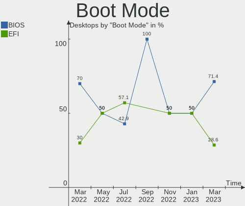
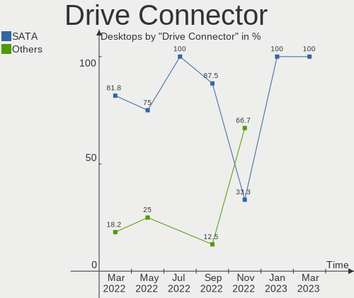
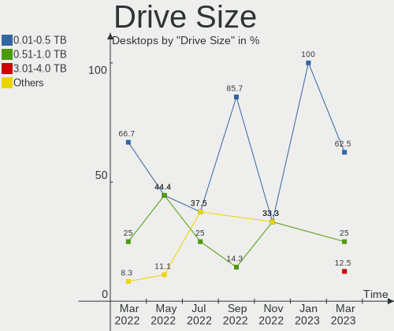
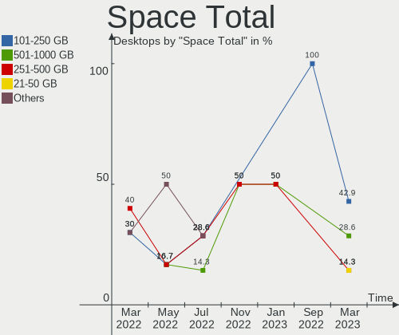
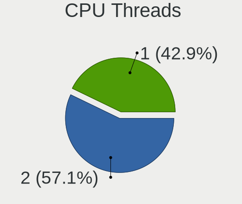
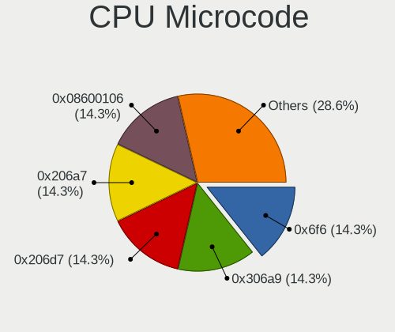

Endless Hardware Trends (Desktop)
---------------------------------

A project to identify most popular hardware characteristics and track their change
over time based on data collected by Endless users at https://Linux-Hardware.org.

Anyone can contribute to the study by uploading probes of their computers by
the [hw-probe](https://github.com/linuxhw/hw-probe) tool:

    sudo hw-probe -all -upload

Full-feature report is available here: https://linux-hardware.org/?view=trends&formfactor=desktop

Period: Mar, 2020.

Contents
--------

- [ OS                       ](#os)
- [ OS Family                ](#os-family)
- [ Kernel                   ](#kernel)
- [ Kernel Family            ](#kernel-family)
- [ Kernel Major Ver.        ](#kernel-major-ver)
- [ Arch                     ](#arch)
- [ DE                       ](#de)
- [ Display Server           ](#display-server)
- [ OS Lang                  ](#os-lang)
- [ Boot Mode                ](#boot-mode)
- [ Filesystem               ](#filesystem)
- [ Dual Boot with Linux     ](#dual-boot-with-linux)
- [ Dual Boot (Win)          ](#dual-boot-win)
- [ Country                  ](#country)
- [ City                     ](#city)
- [ Vendor                   ](#vendor)
- [ Model                    ](#model)
- [ Model Family             ](#model-family)
- [ MFG Year                 ](#mfg-year)
- [ Form Factor              ](#form-factor)
- [ Secure Boot              ](#secure-boot)
- [ Coreboot                 ](#coreboot)
- [ RAM Size                 ](#ram-size)
- [ RAM Used                 ](#ram-used)
- [ Drive Vendor             ](#drive-vendor)
- [ Drive Model              ](#drive-model)
- [ Drive Kind               ](#drive-kind)
- [ Drive Connector          ](#drive-connector)
- [ Drive Size               ](#drive-size)
- [ Space Total              ](#space-total)
- [ Space Used               ](#space-used)
- [ Malfunc. Drives          ](#malfunc-drives)
- [ Malfunc. Drive Vendor    ](#malfunc-drive-vendor)
- [ Malfunc. Drive Kind      ](#malfunc-drive-kind)
- [ Failed Drives            ](#failed-drives)
- [ Failed Drive Vendor      ](#failed-drive-vendor)
- [ Drive Status             ](#drive-status)
- [ Storage Vendor           ](#storage-vendor)
- [ Storage Model            ](#storage-model)
- [ Storage Kind             ](#storage-kind)
- [ CPU Vendor               ](#cpu-vendor)
- [ CPU Model                ](#cpu-model)
- [ CPU Model Family         ](#cpu-model-family)
- [ CPU Cores                ](#cpu-cores)
- [ CPU Sockets              ](#cpu-sockets)
- [ CPU Threads              ](#cpu-threads)
- [ CPU Op-Modes             ](#cpu-op-modes)
- [ CPU Microarch            ](#cpu-microarch)
- [ CPU Microcode            ](#cpu-microcode)
- [ GPU Vendor               ](#gpu-vendor)
- [ GPU Model                ](#gpu-model)
- [ GPU Combo                ](#gpu-combo)
- [ GPU Driver               ](#gpu-driver)
- [ GPU Memory               ](#gpu-memory)
- [ Monitor Vendor           ](#monitor-vendor)
- [ Monitor Model            ](#monitor-model)
- [ Monitor Resolution       ](#monitor-resolution)
- [ Monitor Diagonal         ](#monitor-diagonal)
- [ Monitor Width            ](#monitor-width)
- [ Aspect Ratio             ](#aspect-ratio)
- [ Monitor Area             ](#monitor-area)
- [ Pixel Density            ](#pixel-density)
- [ Multiple Monitors        ](#multiple-monitors)
- [ Net Controller Vendor    ](#net-controller-vendor)
- [ Net Controller Model     ](#net-controller-model)
- [ Net Controller Kind      ](#net-controller-kind)
- [ Used Controller          ](#used-controller)
- [ NICs                     ](#nics)
- [ Unsupported Devices      ](#unsupported-devices)
- [ Unsupported Device Types ](#unsupported-device-types)

OS
--

Installed operating systems

| Name           | Computers | Percent |
|----------------|-----------|---------|
| Endless 3.7.8  | 43        | 79.63%  |
| Endless 3.7.7  | 5         | 9.26%   |
| Endless 3.7.6  | 2         | 3.7%    |
| Endless 3.3.20 | 2         | 3.7%    |
| Endless 3.5.2  | 1         | 1.85%   |
| Endless 3.4.7  | 1         | 1.85%   |

OS Family
---------

OS without a version

| Name    | Computers | Percent |
|---------|-----------|---------|
| Endless | 54        | 100%    |

Kernel
------

Version of the Linux kernel

| Version           | Computers | Percent |
|-------------------|-----------|---------|
| 5.3.0-28-generic  | 48        | 88.89%  |
| 5.3.0-23-generic  | 2         | 3.7%    |
| 4.13.0-32-generic | 2         | 3.7%    |
| 4.18.0-11-generic | 1         | 1.85%   |
| 4.15.0-33-generic | 1         | 1.85%   |

Kernel Family
-------------

Linux kernel without a distro release

| Version | Computers | Percent |
|---------|-----------|---------|
| 5.3.0   | 50        | 92.59%  |
| 4.13.0  | 2         | 3.7%    |
| 4.18.0  | 1         | 1.85%   |
| 4.15.0  | 1         | 1.85%   |

Kernel Major Ver.
-----------------

Linux kernel major version

| Version | Computers | Percent |
|---------|-----------|---------|
| 5.3     | 50        | 92.59%  |
| 4.13    | 2         | 3.7%    |
| 4.18    | 1         | 1.85%   |
| 4.15    | 1         | 1.85%   |

Arch
----

OS architecture (x86_64, i586, etc.)

| Name   | Computers | Percent |
|--------|-----------|---------|
| x86_64 | 54        | 100%    |

DE
--

Desktop Environment

| Name  | Computers | Percent |
|-------|-----------|---------|
| GNOME | 54        | 100%    |

Display Server
--------------

X11 or Wayland

| Name | Computers | Percent |
|------|-----------|---------|
| X11  | 54        | 100%    |

OS Lang
-------

Language

| Lang        | Computers | Percent |
|-------------|-----------|---------|
| en_US.utf8  | 29        | 53.7%   |
| en_GB       | 5         | 9.26%   |
| ru_RU       | 3         | 5.56%   |
| pt_BR       | 3         | 5.56%   |
| en_PH       | 3         | 5.56%   |
| de_DE       | 3         | 5.56%   |
| ru_UA       | 1         | 1.85%   |
| ru_RU.UTF_8 | 1         | 1.85%   |
| ro_RO       | 1         | 1.85%   |
| pt_BR.utf8  | 1         | 1.85%   |
| nl_BE       | 1         | 1.85%   |
| fr_FR.utf8  | 1         | 1.85%   |
| en_US       | 1         | 1.85%   |
| en_IL       | 1         | 1.85%   |

Boot Mode
---------

EFI or BIOS

| Mode | Computers | Percent |
|------|-----------|---------|
| BIOS | 34        | 62.96%  |
| EFI  | 20        | 37.04%  |

Filesystem
----------

Type of filesystem

| Type  | Computers | Percent |
|-------|-----------|---------|
| Ext4  | 48        | 88.89%  |
| Tmpfs | 6         | 11.11%  |

Dual Boot with Linux
--------------------

Hosting more than one Linux

| Dual boot | Computers | Percent |
|-----------|-----------|---------|
| No        | 54        | 100%    |

Dual Boot (Win)
---------------

Hosting Linux and Windows

| Dual boot | Computers | Percent |
|-----------|-----------|---------|
| No        | 53        | 98.15%  |
| Yes       | 1         | 1.85%   |

Country
-------

Geographic location (country)

| Country                | Computers | Percent |
|------------------------|-----------|---------|
| USA                    | 18        | 33.33%  |
| UK                     | 7         | 12.96%  |
| Philippines            | 4         | 7.41%   |
| Canada                 | 4         | 7.41%   |
| Brazil                 | 4         | 7.41%   |
| Russia                 | 3         | 5.56%   |
| Germany                | 3         | 5.56%   |
| Romania                | 2         | 3.7%    |
| Ireland                | 2         | 3.7%    |
| Ukraine                | 1         | 1.85%   |
| Latvia                 | 1         | 1.85%   |
| Jamaica                | 1         | 1.85%   |
| Israel                 | 1         | 1.85%   |
| Bosnia and Herzegovina | 1         | 1.85%   |
| Belgium                | 1         | 1.85%   |
| Australia              | 1         | 1.85%   |

City
----

Geographic location (city)

| City             | Computers | Percent |
|------------------|-----------|---------|
| Taguig           | 3         | 5.56%   |
| Yuma             | 1         | 1.85%   |
| Wittighausen     | 1         | 1.85%   |
| Winston-Salem    | 1         | 1.85%   |
| Wichita          | 1         | 1.85%   |
| Tel Aviv         | 1         | 1.85%   |
| Taguatinga       | 1         | 1.85%   |
| Surprise         | 1         | 1.85%   |
| Supply           | 1         | 1.85%   |
| Sunderland       | 1         | 1.85%   |
| Stockton-on-Tees | 1         | 1.85%   |
| St Petersburg    | 1         | 1.85%   |
| Shelbyville      | 1         | 1.85%   |
| Shallotte        | 1         | 1.85%   |
| Sayreville       | 1         | 1.85%   |
| San Carlos       | 1         | 1.85%   |
| Saint-Constant   | 1         | 1.85%   |
| Riga             | 1         | 1.85%   |
| Richmond         | 1         | 1.85%   |
| Raleigh          | 1         | 1.85%   |
| Offenbach        | 1         | 1.85%   |
| Moscow           | 1         | 1.85%   |
| Montreal         | 1         | 1.85%   |
| Milton Keynes    | 1         | 1.85%   |
| Middletown       | 1         | 1.85%   |
| Melsele          | 1         | 1.85%   |
| Manchester       | 1         | 1.85%   |
| London           | 1         | 1.85%   |
| Limerick         | 1         | 1.85%   |
| Lenoir           | 1         | 1.85%   |
| Laguna Niguel    | 1         | 1.85%   |
| Kingston         | 1         | 1.85%   |
| Khimki           | 1         | 1.85%   |
| Kerrville        | 1         | 1.85%   |
| Juiz de Fora     | 1         | 1.85%   |
| Jaraguá do Sul  | 1         | 1.85%   |
| Illarionovo      | 1         | 1.85%   |
| Idaho Falls      | 1         | 1.85%   |
| Hamilton         | 1         | 1.85%   |
| Gracanica        | 1         | 1.85%   |
| Galion           | 1         | 1.85%   |
| Fayetteville     | 1         | 1.85%   |
| Curitiba         | 1         | 1.85%   |
| Craiova          | 1         | 1.85%   |
| Columbus         | 1         | 1.85%   |
| Cluj-Napoca      | 1         | 1.85%   |
| Cavan            | 1         | 1.85%   |
| Brighton         | 1         | 1.85%   |
| Brampton         | 1         | 1.85%   |
| Bradford         | 1         | 1.85%   |
| Berlin           | 1         | 1.85%   |
| Abilene          | 1         | 1.85%   |

Vendor
------

Motherboard manufacturer

| Name                | Computers | Percent |
|---------------------|-----------|---------|
| Gigabyte Technology | 11        | 20.37%  |
| ASUSTek Computer    | 10        | 18.52%  |
| MSI                 | 6         | 11.11%  |
| Dell                | 5         | 9.26%   |
| ASRock              | 5         | 9.26%   |
| AAEON               | 3         | 5.56%   |
| Hewlett-Packard     | 2         | 3.7%    |
| Acer                | 2         | 3.7%    |
| ZOTAC               | 1         | 1.85%   |
| Packard Bell        | 1         | 1.85%   |
| Intel               | 1         | 1.85%   |
| IBM                 | 1         | 1.85%   |
| Fujitsu             | 1         | 1.85%   |
| Foxconn             | 1         | 1.85%   |
| ECS                 | 1         | 1.85%   |
| Biostar             | 1         | 1.85%   |
| AMI                 | 1         | 1.85%   |
| Unknown             | 1         | 1.85%   |

Model
-----

Motherboard model

| Name                             | Computers | Percent |
|----------------------------------|-----------|---------|
| MSI MS-7309                      | 3         | 5.56%   |
| AAEON MF-001                     | 3         | 5.56%   |
| ZOTAC AMD M1                     | 1         | 1.85%   |
| Packard Bell iMedia S3730        | 1         | 1.85%   |
| MSI MS-7913                      | 1         | 1.85%   |
| MSI MS-7877                      | 1         | 1.85%   |
| MSI MS-7846                      | 1         | 1.85%   |
| Intel H61                        | 1         | 1.85%   |
| IBM 8215ZCL                      | 1         | 1.85%   |
| HP Compaq Pro 6305 SFF           | 1         | 1.85%   |
| HP Compaq Pro 4300 SFF PC        | 1         | 1.85%   |
| Gigabyte MZGLKAP-00              | 1         | 1.85%   |
| Gigabyte H61M-S1                 | 1         | 1.85%   |
| Gigabyte H310M DS2               | 1         | 1.85%   |
| Gigabyte GA-MA770-UD3            | 1         | 1.85%   |
| Gigabyte GA-880GM-USB3           | 1         | 1.85%   |
| Gigabyte G31M-ES2L               | 1         | 1.85%   |
| Gigabyte F2A58M-DS2              | 1         | 1.85%   |
| Gigabyte B450M DS3H              | 1         | 1.85%   |
| Gigabyte B150N Phoenix-WIFI      | 1         | 1.85%   |
| Gigabyte B150M-D3H-CF            | 1         | 1.85%   |
| Gigabyte A320M-S2H               | 1         | 1.85%   |
| Fujitsu ESPRIMO E520             | 1         | 1.85%   |
| Foxconn p6540f                   | 1         | 1.85%   |
| ECS FQ582AA-ABA SR5710F          | 1         | 1.85%   |
| Dell Precision WorkStation T3500 | 1         | 1.85%   |
| Dell OptiPlex 960                | 1         | 1.85%   |
| Dell OptiPlex 790                | 1         | 1.85%   |
| Dell OptiPlex 780                | 1         | 1.85%   |
| Dell Inspiron 530                | 1         | 1.85%   |
| Biostar N61PB-M2S                | 1         | 1.85%   |
| ASUS PRIME B450M-A               | 1         | 1.85%   |
| ASUS PRIME B350M-A               | 1         | 1.85%   |
| ASUS P8H61-M LX2 R2.0            | 1         | 1.85%   |
| ASUS P5ND2-SLI                   | 1         | 1.85%   |
| ASUS P5G41T-M LX2/GB             | 1         | 1.85%   |
| ASUS M5A99FX PRO R2.0            | 1         | 1.85%   |
| ASUS F1A55-M LE                  | 1         | 1.85%   |
| ASUS All Series                  | 1         | 1.85%   |
| ASUS A88XM-A/USB                 | 1         | 1.85%   |
| ASUS A88XM-A                     | 1         | 1.85%   |
| ASRock Z370 Pro4                 | 1         | 1.85%   |
| ASRock H81M-HDS R2.0             | 1         | 1.85%   |
| ASRock H61M-DGS                  | 1         | 1.85%   |
| ASRock G41M-VS3                  | 1         | 1.85%   |
| ASRock A88M-G                    | 1         | 1.85%   |
| AMI Cherry Trail FFD             | 1         | 1.85%   |
| Acer Veriton EX2620G             | 1         | 1.85%   |
| Acer Aspire X3910                | 1         | 1.85%   |
| Unknown                          | 1         | 1.85%   |

Model Family
------------

Motherboard model prefix

| Name                   | Computers | Percent |
|------------------------|-----------|---------|
| MSI MS-7309            | 3         | 5.56%   |
| Dell OptiPlex          | 3         | 5.56%   |
| AAEON MF-001           | 3         | 5.56%   |
| HP Compaq              | 2         | 3.7%    |
| ASUS PRIME             | 2         | 3.7%    |
| ASUS A88XM-A           | 2         | 3.7%    |
| ZOTAC AMD              | 1         | 1.85%   |
| Packard Bell iMedia    | 1         | 1.85%   |
| MSI MS-7913            | 1         | 1.85%   |
| MSI MS-7877            | 1         | 1.85%   |
| MSI MS-7846            | 1         | 1.85%   |
| Intel H61              | 1         | 1.85%   |
| IBM 8215ZCL            | 1         | 1.85%   |
| Gigabyte MZGLKAP-00    | 1         | 1.85%   |
| Gigabyte H61M-S1       | 1         | 1.85%   |
| Gigabyte H310M         | 1         | 1.85%   |
| Gigabyte GA-MA770-UD3  | 1         | 1.85%   |
| Gigabyte GA-880GM-USB3 | 1         | 1.85%   |
| Gigabyte G31M-ES2L     | 1         | 1.85%   |
| Gigabyte F2A58M-DS2    | 1         | 1.85%   |
| Gigabyte B450M         | 1         | 1.85%   |
| Gigabyte B150N         | 1         | 1.85%   |
| Gigabyte B150M-D3H-CF  | 1         | 1.85%   |
| Gigabyte A320M-S2H     | 1         | 1.85%   |
| Fujitsu ESPRIMO        | 1         | 1.85%   |
| Foxconn p6540f         | 1         | 1.85%   |
| ECS FQ582AA-ABA        | 1         | 1.85%   |
| Dell Precision         | 1         | 1.85%   |
| Dell Inspiron          | 1         | 1.85%   |
| Biostar N61PB-M2S      | 1         | 1.85%   |
| ASUS P8H61-M           | 1         | 1.85%   |
| ASUS P5ND2-SLI         | 1         | 1.85%   |
| ASUS P5G41T-M          | 1         | 1.85%   |
| ASUS M5A99FX           | 1         | 1.85%   |
| ASUS F1A55-M           | 1         | 1.85%   |
| ASUS All               | 1         | 1.85%   |
| ASRock Z370            | 1         | 1.85%   |
| ASRock H81M-HDS        | 1         | 1.85%   |
| ASRock H61M-DGS        | 1         | 1.85%   |
| ASRock G41M-VS3        | 1         | 1.85%   |
| ASRock A88M-G          | 1         | 1.85%   |
| AMI Cherry             | 1         | 1.85%   |
| Acer Veriton           | 1         | 1.85%   |
| Acer Aspire            | 1         | 1.85%   |
| Unknown                | 1         | 1.85%   |

MFG Year
--------

Motherboard manufacture year

| Year | Computers | Percent |
|------|-----------|---------|
| 2019 | 7         | 12.96%  |
| 2016 | 7         | 12.96%  |
| 2013 | 7         | 12.96%  |
| 2010 | 6         | 11.11%  |
| 2018 | 4         | 7.41%   |
| 2014 | 4         | 7.41%   |
| 2009 | 4         | 7.41%   |
| 2008 | 4         | 7.41%   |
| 2017 | 3         | 5.56%   |
| 2011 | 3         | 5.56%   |
| 2015 | 2         | 3.7%    |
| 2012 | 2         | 3.7%    |
| 2007 | 1         | 1.85%   |

Form Factor
-----------

Physical design of the computer

| Name    | Computers | Percent |
|---------|-----------|---------|
| Desktop | 54        | 100%    |

Secure Boot
-----------

Enabled or disabled

| State    | Computers | Percent |
|----------|-----------|---------|
| Disabled | 51        | 94.44%  |
| Enabled  | 3         | 5.56%   |

Coreboot
--------

Have coreboot on board

| Used | Computers | Percent |
|------|-----------|---------|
| No   | 54        | 100%    |

RAM Size
--------

Total RAM memory

| Size in GB | Computers | Percent |
|------------|-----------|---------|
| 3.01-4.0   | 19        | 35.19%  |
| 16.01-24.0 | 11        | 20.37%  |
| 8.01-16.0  | 10        | 18.52%  |
| 1.01-2.0   | 7         | 12.96%  |
| 4.01-8.0   | 6         | 11.11%  |
| 24.01-32.0 | 1         | 1.85%   |

RAM Used
--------

Used RAM memory

| Used GB  | Computers | Percent |
|----------|-----------|---------|
| 1.01-2.0 | 30        | 55.56%  |
| 2.01-3.0 | 14        | 25.93%  |
| 0.01-1.0 | 8         | 14.81%  |
| 3.01-4.0 | 2         | 3.7%    |

Drive Vendor
------------

Hard drive vendors

| Vendor              | Computers | Drives | Percent |
|---------------------|-----------|--------|---------|
| WDC                 | 14        | 15     | 18.42%  |
| Seagate             | 14        | 18     | 18.42%  |
| Toshiba             | 7         | 7      | 9.21%   |
| Hitachi             | 7         | 7      | 9.21%   |
| Samsung Electronics | 6         | 6      | 7.89%   |
| Unknown             | 4         | 5      | 5.26%   |
| Kingston            | 4         | 5      | 5.26%   |
| SanDisk             | 3         | 3      | 3.95%   |
| Transcend           | 2         | 3      | 2.63%   |
| SPCC                | 2         | 2      | 2.63%   |
| Intel               | 2         | 2      | 2.63%   |
| Crucial             | 2         | 4      | 2.63%   |
| SABRENT             | 1         | 1      | 1.32%   |
| Patriot             | 1         | 1      | 1.32%   |
| OCZ                 | 1         | 1      | 1.32%   |
| LONDISK             | 1         | 1      | 1.32%   |
| GOODRAM             | 1         | 1      | 1.32%   |
| Fujitsu             | 1         | 1      | 1.32%   |
| Emtec               | 1         | 1      | 1.32%   |
| Dogfish             | 1         | 1      | 1.32%   |
| A-DATA Technology   | 1         | 1      | 1.32%   |

Drive Model
-----------

Hard drive models

| Model                       | Computers | Percent |
|-----------------------------|-----------|---------|
| SV300S37A120G 120GB SSD     | 4         | 4.82%   |
| MMC Card  16GB              | 3         | 3.61%   |
| HDS721616PLA380 164GB       | 3         | 3.61%   |
| WD10EZEX-08WN4A0 1TB        | 2         | 2.41%   |
| ST2000DM001-1ER164 2TB      | 2         | 2.41%   |
| SDSSDA240G 240GB            | 2         | 2.41%   |
| HDWD130 3TB                 | 2         | 2.41%   |
| DT01ACA050 500GB            | 2         | 2.41%   |
| X150 480GB                  | 1         | 1.2%    |
| WD5000AAKX-22ERMA0 500GB    | 1         | 1.2%    |
| WD3200AVVS-63L2B0 320GB     | 1         | 1.2%    |
| WD3200AAKS-00L9A0 320GB     | 1         | 1.2%    |
| WD2500AAKX-083CA1 250GB     | 1         | 1.2%    |
| WD1600AVVS-63L2B0 160GB     | 1         | 1.2%    |
| WD1600AVBS-63SVA0 160GB     | 1         | 1.2%    |
| WD1600AAJS-08L7A0 160GB     | 1         | 1.2%    |
| WD10JPVX-22JC3T0 1TB        | 1         | 1.2%    |
| WD10EZEX-22MFCA0 1TB        | 1         | 1.2%    |
| WD10EZEX-08M2NA0 1TB        | 1         | 1.2%    |
| WD10EZEX-00ZF5A0 1TB        | 1         | 1.2%    |
| WD10EURX-63C57Y0 1TB        | 1         | 1.2%    |
| WD10EARX-00N0YB0 1TB        | 1         | 1.2%    |
| VERTEX4 64GB SSD            | 1         | 1.2%    |
| TS32GSSD370S 32GB           | 1         | 1.2%    |
| TS128GSSD420I 128GB         | 1         | 1.2%    |
| TS120GSSD220S 120GB         | 1         | 1.2%    |
| SV300S37A240G 240GB SSD     | 1         | 1.2%    |
| SU800 1024GB SSD            | 1         | 1.2%    |
| ST500LM012 HN-M500MBB 500GB | 1         | 1.2%    |
| ST3640330AS 640GB           | 1         | 1.2%    |
| ST3500414CS 500GB           | 1         | 1.2%    |
| ST3500312CS 500GB           | 1         | 1.2%    |
| ST3320813AS 320GB           | 1         | 1.2%    |
| ST3320418AS 320GB           | 1         | 1.2%    |
| ST3250318AS 250GB           | 1         | 1.2%    |
| ST250DM000-1BD141 250GB     | 1         | 1.2%    |
| ST2000DM001-1CH164 2TB      | 1         | 1.2%    |
| ST1000VM002-1ET162 1TB      | 1         | 1.2%    |
| ST1000DM010-2EP102 1TB      | 1         | 1.2%    |
| SSDSC2KW256G8 256GB         | 1         | 1.2%    |
| SSDSC2BF180A4H 180GB        | 1         | 1.2%    |
| SSDPR-CL100-240-G2 240GB    | 1         | 1.2%    |
| SSD 850 EVO 250GB           | 1         | 1.2%    |
| SSD 840 PRO Series 256GB    | 1         | 1.2%    |
| SSD 840 EVO 120GB           | 1         | 1.2%    |
| SSD 128GB                   | 1         | 1.2%    |
| SSD 120GB                   | 1         | 1.2%    |
| Solid State Disk 240GB      | 1         | 1.2%    |
| Solid State Disk 128GB      | 1         | 1.2%    |
| SD7TB3Q-256G-1006 256GB SSD | 1         | 1.2%    |
| PowerSSD 64GB               | 1         | 1.2%    |
| MMC Card  64GB              | 1         | 1.2%    |
| MHW2120BH 120GB             | 1         | 1.2%    |
| M4-CT128M4SSD1 128GB        | 1         | 1.2%    |
| HDWD120 2TB                 | 1         | 1.2%    |
| HDT721064SLA360 640GB       | 1         | 1.2%    |
| HDS722516VLAT20 164GB       | 1         | 1.2%    |
| HDS721050CLA360 500GB       | 1         | 1.2%    |
| HD642JJ 640GB               | 1         | 1.2%    |
| HD161JJ 160GB               | 1         | 1.2%    |

Drive Kind
----------

HDD or SSD

| Kind    | Computers | Drives | Percent |
|---------|-----------|--------|---------|
| HDD     | 36        | 47     | 55.38%  |
| SSD     | 23        | 30     | 35.38%  |
| MMC     | 4         | 4      | 6.15%   |
| Unknown | 2         | 5      | 3.08%   |

Drive Connector
---------------

SATA, SAS, NVMe, etc.

| Type | Computers | Drives | Percent |
|------|-----------|--------|---------|
| SATA | 50        | 76     | 87.72%  |
| MMC  | 4         | 4      | 7.02%   |
| SAS  | 3         | 6      | 5.26%   |

Drive Size
----------

Size of hard drive

| Size in TB | Computers | Drives | Percent |
|------------|-----------|--------|---------|
| 0.01-0.5   | 45        | 58     | 65.22%  |
| 0.51-1.0   | 14        | 15     | 20.29%  |
| 1.01-2.0   | 6         | 6      | 8.7%    |
| 2.01-3.0   | 2         | 2      | 2.9%    |
| 3.01-4.0   | 1         | 1      | 1.45%   |
| 4.01-10.0  | 1         | 4      | 1.45%   |

Space Total
-----------

Amount of disk space available on the file system

| Size in GB     | Computers | Percent |
|----------------|-----------|---------|
| 101-250        | 22        | 40.74%  |
| 251-500        | 9         | 16.67%  |
| 501-1000       | 8         | 14.81%  |
| 21-50          | 5         | 9.26%   |
| 1-20           | 3         | 5.56%   |
| 51-100         | 3         | 5.56%   |
| More than 3000 | 2         | 3.7%    |
| 2001-3000      | 1         | 1.85%   |
| 1001-2000      | 1         | 1.85%   |

Space Used
----------

Amount of used disk space

| Used GB        | Computers | Percent |
|----------------|-----------|---------|
| 21-50          | 23        | 42.59%  |
| 1-20           | 20        | 37.04%  |
| 101-250        | 3         | 5.56%   |
| 51-100         | 3         | 5.56%   |
| 251-500        | 2         | 3.7%    |
| 1001-2000      | 2         | 3.7%    |
| More than 3000 | 1         | 1.85%   |

Malfunc. Drives
---------------

Drive models with a malfunction

Zero info for selected period =(

Malfunc. Drive Vendor
---------------------

Vendors of faulty drives

Zero info for selected period =(

Malfunc. Drive Kind
-------------------

Kinds of faulty drives

Zero info for selected period =(

Failed Drives
-------------

Failed drive models

Zero info for selected period =(

Failed Drive Vendor
-------------------

Failed drive vendors

Zero info for selected period =(

Drive Status
------------

Number of failed and malfunc. drives

| Status   | Computers | Drives | Percent |
|----------|-----------|--------|---------|
| Detected | 53        | 86     | 100%    |

Storage Vendor
--------------

Storage controller vendors

| Vendor                       | Computers | Percent |
|------------------------------|-----------|---------|
| Intel                        | 28        | 47.46%  |
| AMD                          | 17        | 28.81%  |
| Nvidia                       | 6         | 10.17%  |
| ASMedia Technology           | 3         | 5.08%   |
| Toshiba America Info Systems | 1         | 1.69%   |
| Silicon Motion               | 1         | 1.69%   |
| Sandisk                      | 1         | 1.69%   |
| Realtek Semiconductor        | 1         | 1.69%   |
| Kingston Technology Company  | 1         | 1.69%   |

Storage Model
-------------

Storage controller models

| Model                                                                             | Computers | Percent |
|-----------------------------------------------------------------------------------|-----------|---------|
| FCH SATA Controller [AHCI mode]                                                   | 9         | 10.84%  |
| SB7x0/SB8x0/SB9x0 SATA Controller [AHCI mode]                                     | 5         | 6.02%   |
| MCP61 SATA Controller                                                             | 5         | 6.02%   |
| MCP61 IDE                                                                         | 5         | 6.02%   |
| SB7x0/SB8x0/SB9x0 IDE Controller                                                  | 4         | 4.82%   |
| NM10/ICH7 Family SATA Controller [IDE mode]                                       | 4         | 4.82%   |
| 6 Series/C200 Series Chipset Family 6 port Desktop SATA AHCI Controller           | 4         | 4.82%   |
| FCH IDE Controller                                                                | 3         | 3.61%   |
| ASM1062 Serial ATA Controller                                                     | 3         | 3.61%   |
| 8 Series/C220 Series Chipset Family 6-port SATA Controller 1 [AHCI mode]          | 3         | 3.61%   |
| SATA controller                                                                   | 2         | 2.41%   |
| Q170/Q150/B150/H170/H110/Z170/CM236 Chipset SATA Controller [AHCI Mode]           | 2         | 2.41%   |
| Non-Volatile memory controller                                                    | 2         | 2.41%   |
| FCH SATA Controller [IDE mode]                                                    | 2         | 2.41%   |
| 82801G (ICH7 Family) IDE Controller                                               | 2         | 2.41%   |
| 6 Series/C200 Series Chipset Family Desktop SATA Controller (IDE mode, ports 4-5) | 2         | 2.41%   |
| 6 Series/C200 Series Chipset Family Desktop SATA Controller (IDE mode, ports 0-3) | 2         | 2.41%   |
| 400 Series Chipset SATA Controller                                                | 2         | 2.41%   |
| WD Black NVMe SSD                                                                 | 1         | 1.2%    |
| Toshiba America Info Non-Volatile memory controller                               | 1         | 1.2%    |
| SSD 660P Series                                                                   | 1         | 1.2%    |
| SB7x0/SB8x0/SB9x0 SATA Controller [Non-RAID5 mode]                                | 1         | 1.2%    |
| SATA Controller [RAID mode]                                                       | 1         | 1.2%    |
| Realtek Non-Volatile memory controller                                            | 1         | 1.2%    |
| MCP04 Serial ATA Controller                                                       | 1         | 1.2%    |
| MCP04 IDE                                                                         | 1         | 1.2%    |
| FCH SATA Controller D                                                             | 1         | 1.2%    |
| Celeron N3350/Pentium N4200/Atom E3900 Series SATA AHCI Controller                | 1         | 1.2%    |
| Cannon Lake PCH SATA AHCI Controller                                              | 1         | 1.2%    |
| Atom Processor E3800 Series SATA AHCI Controller                                  | 1         | 1.2%    |
| 9 Series Chipset Family SATA Controller [AHCI Mode]                               | 1         | 1.2%    |
| 82801JI (ICH10 Family) SATA AHCI Controller                                       | 1         | 1.2%    |
| 82801JI (ICH10 Family) 4 port SATA IDE Controller #1                              | 1         | 1.2%    |
| 82801JI (ICH10 Family) 2 port SATA IDE Controller #2                              | 1         | 1.2%    |
| 82801JD/DO (ICH10 Family) SATA AHCI Controller                                    | 1         | 1.2%    |
| 82801IR/IO/IH (ICH9R/DO/DH) 4 port SATA Controller [IDE mode]                     | 1         | 1.2%    |
| 82801I (ICH9 Family) 2 port SATA Controller [IDE mode]                            | 1         | 1.2%    |
| 4 Series Chipset PT IDER Controller                                               | 1         | 1.2%    |
| 300 Series Chipset SATA Controller                                                | 1         | 1.2%    |
| 200 Series PCH SATA controller [AHCI mode]                                        | 1         | 1.2%    |

Storage Kind
------------

Kind of storage controller (IDE, SATA, NVMe, SAS, ...)

| Kind | Computers | Percent |
|------|-----------|---------|
| SATA | 35        | 53.85%  |
| IDE  | 22        | 33.85%  |
| NVMe | 6         | 9.23%   |
| RAID | 2         | 3.08%   |

CPU Vendor
----------

Processor vendors

| Vendor | Computers | Percent |
|--------|-----------|---------|
| Intel  | 32        | 59.26%  |
| AMD    | 22        | 40.74%  |

CPU Model
---------

Processor models

| Model                                           | Computers | Percent |
|-------------------------------------------------|-----------|---------|
| Intel Atom x5-Z8350 CPU @ 1.44GHz               | 3         | 5.56%   |
| AMD Sempron Processor LE-1100                   | 3         | 5.56%   |
| Intel Core i3-3220 CPU @ 3.30GHz                | 2         | 3.7%    |
| AMD Ryzen 5 2600 Six-Core Processor             | 2         | 3.7%    |
| AMD A10-7850K Radeon R7, 12 Compute Cores 4C+8G | 2         | 3.7%    |
| Intel Xeon CPU X5670 @ 2.93GHz                  | 1         | 1.85%   |
| Intel Pentium Dual-Core CPU E5700 @ 3.00GHz     | 1         | 1.85%   |
| Intel Pentium Dual-Core CPU E5500 @ 2.80GHz     | 1         | 1.85%   |
| Intel Pentium D CPU 3.40GHz                     | 1         | 1.85%   |
| Intel Pentium 4 CPU 3.00GHz                     | 1         | 1.85%   |
| Intel Core i7-6700T CPU @ 2.80GHz               | 1         | 1.85%   |
| Intel Core i7-6700 CPU @ 3.40GHz                | 1         | 1.85%   |
| Intel Core i7-4790 CPU @ 3.60GHz                | 1         | 1.85%   |
| Intel Core i5-8500 CPU @ 3.00GHz                | 1         | 1.85%   |
| Intel Core i5-8400 CPU @ 2.80GHz                | 1         | 1.85%   |
| Intel Core i5-4670K CPU @ 3.40GHz               | 1         | 1.85%   |
| Intel Core i5-4570 CPU @ 3.20GHz                | 1         | 1.85%   |
| Intel Core i5-4460 CPU @ 3.20GHz                | 1         | 1.85%   |
| Intel Core i5-2500 CPU @ 3.30GHz                | 1         | 1.85%   |
| Intel Core i5-2400 CPU @ 3.10GHz                | 1         | 1.85%   |
| Intel Core i3-3240 CPU @ 3.40GHz                | 1         | 1.85%   |
| Intel Core 2 Quad CPU Q9400 @ 2.66GHz           | 1         | 1.85%   |
| Intel Core 2 Duo CPU E8400 @ 3.00GHz            | 1         | 1.85%   |
| Intel Core 2 Duo CPU E7500 @ 2.93GHz            | 1         | 1.85%   |
| Intel Core 2 Duo CPU E7400 @ 2.80GHz            | 1         | 1.85%   |
| Intel Core 2 Duo CPU E7300 @ 2.66GHz            | 1         | 1.85%   |
| Intel Celeron J4105 CPU @ 1.50GHz               | 1         | 1.85%   |
| Intel Celeron J4005 CPU @ 2.00GHz               | 1         | 1.85%   |
| Intel Celeron CPU J3355 @ 2.00GHz               | 1         | 1.85%   |
| Intel Celeron CPU J1800 @ 2.41GHz               | 1         | 1.85%   |
| Intel Celeron CPU G550 @ 2.60GHz                | 1         | 1.85%   |
| Intel Atom x7-Z8700 CPU @ 1.60GHz               | 1         | 1.85%   |
| AMD Sempron Processor LE-1300                   | 1         | 1.85%   |
| AMD Sempron 140 Processor                       | 1         | 1.85%   |
| AMD Ryzen 5 2400G with Radeon Vega Graphics     | 1         | 1.85%   |
| AMD Ryzen 5 1600 Six-Core Processor             | 1         | 1.85%   |
| AMD Phenom II X4 945 Processor                  | 1         | 1.85%   |
| AMD Phenom II X4 940 Processor                  | 1         | 1.85%   |
| AMD Phenom II X4 830 Processor                  | 1         | 1.85%   |
| AMD Phenom II X2 550 Processor                  | 1         | 1.85%   |
| AMD FX-8370 Eight-Core Processor                | 1         | 1.85%   |
| AMD E-350 Processor                             | 1         | 1.85%   |
| AMD A6-7400K Radeon R5, 6 Compute Cores 2C+4G   | 1         | 1.85%   |
| AMD A6-5400B APU with Radeon HD Graphics        | 1         | 1.85%   |
| AMD A6-3670 APU with Radeon HD Graphics         | 1         | 1.85%   |
| AMD A10-7700K Radeon R7, 10 Compute Cores 4C+6G | 1         | 1.85%   |
| AMD A10-5800K APU with Radeon HD Graphics       | 1         | 1.85%   |

CPU Model Family
----------------

Processor model prefix

| Model                   | Computers | Percent |
|-------------------------|-----------|---------|
| Intel Core i5           | 7         | 12.96%  |
| Intel Celeron           | 5         | 9.26%   |
| AMD Sempron             | 5         | 9.26%   |
| Intel Core 2 Duo        | 4         | 7.41%   |
| Intel Atom              | 4         | 7.41%   |
| AMD Ryzen 5             | 4         | 7.41%   |
| AMD A10                 | 4         | 7.41%   |
| Intel Core i7           | 3         | 5.56%   |
| Intel Core i3           | 3         | 5.56%   |
| AMD Phenom II X4        | 3         | 5.56%   |
| AMD A6                  | 3         | 5.56%   |
| Intel Pentium Dual-Core | 2         | 3.7%    |
| Intel Xeon              | 1         | 1.85%   |
| Intel Pentium D         | 1         | 1.85%   |
| Intel Pentium 4         | 1         | 1.85%   |
| Intel Core 2 Quad       | 1         | 1.85%   |
| AMD Phenom II X2        | 1         | 1.85%   |
| AMD FX                  | 1         | 1.85%   |
| AMD E                   | 1         | 1.85%   |

CPU Cores
---------

Number of processor cores

| Number | Computers | Percent |
|--------|-----------|---------|
| 4      | 20        | 37.04%  |
| 2      | 19        | 35.19%  |
| 1      | 9         | 16.67%  |
| 6      | 6         | 11.11%  |

CPU Sockets
-----------

Number of sockets

| Number | Computers | Percent |
|--------|-----------|---------|
| 1      | 54        | 100%    |

CPU Threads
-----------

Threads per core (Hyper-Threading)

| Number | Computers | Percent |
|--------|-----------|---------|
| 1      | 35        | 64.81%  |
| 2      | 19        | 35.19%  |

CPU Op-Modes
------------

CPU Operation Modes (32-bit, 64-bit)

| Op mode        | Computers | Percent |
|----------------|-----------|---------|
| 32-bit, 64-bit | 54        | 100%    |

CPU Microarch
-------------

Microarchitecture

| Name          | Computers | Percent |
|---------------|-----------|---------|
| Core          | 7         | 12.96%  |
| Silvermont    | 5         | 9.26%   |
| K10           | 5         | 9.26%   |
| Steamroller   | 4         | 7.41%   |
| K8 Hammer     | 4         | 7.41%   |
| Haswell       | 4         | 7.41%   |
| Skylake       | 3         | 5.56%   |
| SandyBridge   | 3         | 5.56%   |
| Piledriver    | 3         | 5.56%   |
| IvyBridge     | 3         | 5.56%   |
| Zen+          | 2         | 3.7%    |
| Zen           | 2         | 3.7%    |
| NetBurst      | 2         | 3.7%    |
| Goldmont plus | 2         | 3.7%    |
| Westmere      | 1         | 1.85%   |
| KabyLake      | 1         | 1.85%   |
| K10 Llano     | 1         | 1.85%   |
| Goldmont      | 1         | 1.85%   |
| Bobcat        | 1         | 1.85%   |

CPU Microcode
-------------

Microcode number

| Number     | Computers | Percent |
|------------|-----------|---------|
| Unknown    | 7         | 12.96%  |
| 0x1067a    | 6         | 11.11%  |
| 0x306c3    | 4         | 7.41%   |
| 0x306a9    | 3         | 5.56%   |
| 0x206a7    | 3         | 5.56%   |
| 0x06003106 | 3         | 5.56%   |
| 0xf65      | 2         | 3.7%    |
| 0x706a1    | 2         | 3.7%    |
| 0x506e3    | 2         | 3.7%    |
| 0x406c4    | 2         | 3.7%    |
| 0x0800820d | 2         | 3.7%    |
| 0x06001119 | 2         | 3.7%    |
| 0x010000db | 2         | 3.7%    |
| 0x010000c8 | 2         | 3.7%    |
| 0x906ea    | 1         | 1.85%   |
| 0x506c9    | 1         | 1.85%   |
| 0x406c3    | 1         | 1.85%   |
| 0x30678    | 1         | 1.85%   |
| 0x206c2    | 1         | 1.85%   |
| 0x10676    | 1         | 1.85%   |
| 0x08101016 | 1         | 1.85%   |
| 0x08001138 | 1         | 1.85%   |
| 0x06003104 | 1         | 1.85%   |
| 0x06000852 | 1         | 1.85%   |
| 0x05000029 | 1         | 1.85%   |
| 0x03000027 | 1         | 1.85%   |

GPU Vendor
----------

Vendors of graphics cards

| Vendor | Computers | Percent |
|--------|-----------|---------|
| Nvidia | 25        | 44.64%  |
| Intel  | 17        | 30.36%  |
| AMD    | 14        | 25%     |

GPU Model
---------

Graphics card models

| Model                                                                              | Computers | Percent |
|------------------------------------------------------------------------------------|-----------|---------|
| G72 [GeForce 7200 GS / 7300 SE]                                                    | 4         | 7.02%   |
| Ellesmere [Radeon RX 470/480/570/570X/580/580X/590]                                | 4         | 7.02%   |
| Atom/Celeron/Pentium Processor x5-E8000/J3xxx/N3xxx Integrated Graphics Controller | 4         | 7.02%   |
| GP106 [GeForce GTX 1060 6GB]                                                       | 3         | 5.26%   |
| C61 [GeForce 6150SE nForce 430]                                                    | 3         | 5.26%   |
| 4 Series Chipset Integrated Graphics Controller                                    | 3         | 5.26%   |
| Xeon E3-1200 v2/3rd Gen Core processor Graphics Controller                         | 2         | 3.51%   |
| UHD Graphics 605                                                                   | 2         | 3.51%   |
| Turks [Radeon HD 7600 Series]                                                      | 2         | 3.51%   |
| GK208B [GeForce GT 710]                                                            | 2         | 3.51%   |
| Cedar [Radeon HD 5000/6000/7350/8350 Series]                                       | 2         | 3.51%   |
| 2nd Generation Core Processor Family Integrated Graphics Controller                | 2         | 3.51%   |
| Xeon E3-1200 v3/4th Gen Core Processor Integrated Graphics Controller              | 1         | 1.75%   |
| Wrestler [Radeon HD 6310]                                                          | 1         | 1.75%   |
| TU106 [GeForce RTX 2060 SUPER]                                                     | 1         | 1.75%   |
| RS880 [Radeon HD 4250]                                                             | 1         | 1.75%   |
| RS880 [Radeon HD 4200]                                                             | 1         | 1.75%   |
| Kaveri [Radeon R7 Graphics]                                                        | 1         | 1.75%   |
| Kaveri [Radeon R5 Graphics]                                                        | 1         | 1.75%   |
| Juniper XT [Radeon HD 6770]                                                        | 1         | 1.75%   |
| HD Graphics 500                                                                    | 1         | 1.75%   |
| GT218 [GeForce 210]                                                                | 1         | 1.75%   |
| GT216 [GeForce 210]                                                                | 1         | 1.75%   |
| GP107 [GeForce GTX 1050]                                                           | 1         | 1.75%   |
| GP107 [GeForce GTX 1050 Ti]                                                        | 1         | 1.75%   |
| GM206 [GeForce GTX 960]                                                            | 1         | 1.75%   |
| GM206 [GeForce GTX 950]                                                            | 1         | 1.75%   |
| GM204 [GeForce GTX 970]                                                            | 1         | 1.75%   |
| GM107 [GeForce GTX 750 Ti]                                                         | 1         | 1.75%   |
| GF119 [GeForce GT 610]                                                             | 1         | 1.75%   |
| GF108 [GeForce GT 630]                                                             | 1         | 1.75%   |
| GF108 [GeForce GT 530]                                                             | 1         | 1.75%   |
| G96C [GeForce 9500 GT]                                                             | 1         | 1.75%   |
| G92 [GeForce 9800 GT]                                                              | 1         | 1.75%   |
| Atom Processor Z36xxx/Z37xxx Series Graphics & Display                             | 1         | 1.75%   |
| 82945G/GZ Integrated Graphics Controller                                           | 1         | 1.75%   |

GPU Combo
---------

Combinations of graphics cards

| Name         | Computers | Percent |
|--------------|-----------|---------|
| 1 x Nvidia   | 23        | 42.59%  |
| 1 x Intel    | 17        | 31.48%  |
| 1 x AMD      | 12        | 22.22%  |
| 2 x Nvidia   | 1         | 1.85%   |
| AMD + Nvidia | 1         | 1.85%   |

GPU Driver
----------

Free vs proprietary

| Driver      | Computers | Percent |
|-------------|-----------|---------|
| Free        | 40        | 74.07%  |
| Proprietary | 12        | 22.22%  |
| Unknown     | 2         | 3.7%    |

GPU Memory
----------

Total video memory

| Size in GB | Computers | Percent |
|------------|-----------|---------|
| Unknown    | 28        | 51.85%  |
| 0.51-1.0   | 9         | 16.67%  |
| 0.01-0.5   | 9         | 16.67%  |
| 7.01-8.0   | 3         | 5.56%   |
| 3.01-4.0   | 3         | 5.56%   |
| 1.01-2.0   | 2         | 3.7%    |

Monitor Vendor
--------------

Monitor vendors

| Vendor               | Computers | Percent |
|----------------------|-----------|---------|
| Samsung Electronics  | 15        | 31.91%  |
| Dell                 | 6         | 12.77%  |
| Goldstar             | 4         | 8.51%   |
| Vestel Elektronik    | 3         | 6.38%   |
| AOC                  | 3         | 6.38%   |
| Philips              | 2         | 4.26%   |
| Eizo                 | 2         | 4.26%   |
| Toshiba              | 1         | 2.13%   |
| Sun                  | 1         | 2.13%   |
| Sony                 | 1         | 2.13%   |
| RTK                  | 1         | 2.13%   |
| Planar               | 1         | 2.13%   |
| Panasonic            | 1         | 2.13%   |
| Mitac                | 1         | 2.13%   |
| Lenovo               | 1         | 2.13%   |
| Hewlett-Packard      | 1         | 2.13%   |
| GBT                  | 1         | 2.13%   |
| Ancor Communications | 1         | 2.13%   |
| Acer                 | 1         | 2.13%   |

Monitor Model
-------------

Monitor models

| Model                                                | Computers | Percent |
|------------------------------------------------------|-----------|---------|
| 50UHD_LCD_TV VES3700 3840x2160 1872x1053mm 84.6-inch | 3         | 6.38%   |
| SE177FP DELF001 1280x1024 338x270mm 17.0-inch        | 2         | 4.26%   |
| LCD Monitor SAM0C44 3840x2160 890x500mm 40.2-inch    | 2         | 4.26%   |
| W2243 GSM56FE 1920x1080 477x269mm 21.6-inch          | 1         | 2.13%   |
| W1642 GSM3E86 1360x768 344x194mm 15.5-inch           | 1         | 2.13%   |
| VG270 ACR06C0 1920x1080 598x336mm 27.0-inch          | 1         | 2.13%   |
| U2412M DELA07A 1920x1200 518x324mm 24.1-inch         | 1         | 2.13%   |
| TV TSB0110 1920x1080 1103x623mm 49.9-inch            | 1         | 2.13%   |
| TV SNYFF00 1360x768 1600x900mm 72.3-inch             | 1         | 2.13%   |
| TV MEIC303 1920x1080 698x392mm 31.5-inch             | 1         | 2.13%   |
| T27B550 SAM095C 1920x1080 598x336mm 27.0-inch        | 1         | 2.13%   |
| SyncMaster SAM0589 1920x1080 521x293mm 23.5-inch     | 1         | 2.13%   |
| SyncMaster SAM026E 1280x1024 376x301mm 19.0-inch     | 1         | 2.13%   |
| SyncMaster SAM021B 1400x1050 408x300mm 19.9-inch     | 1         | 2.13%   |
| SyncMaster SAM01B9 1280x1024 338x270mm 17.0-inch     | 1         | 2.13%   |
| SyncMaster SAM01AB 1280x1024 312x234mm 15.4-inch     | 1         | 2.13%   |
| SCEI MONITOR SCE0301 1920x1080 522x294mm 23.6-inch   | 1         | 2.13%   |
| S24E390 SAM0C1A 1920x1080 520x290mm 23.4-inch        | 1         | 2.13%   |
| PORPOISE RTKBC32 1920x1080 344x195mm 15.6-inch       | 1         | 2.13%   |
| PLL2410W PLN2410 1920x1080 521x293mm 23.5-inch       | 1         | 2.13%   |
| PHL 276E8V PHLC18F 3840x2160 597x336mm 27.0-inch     | 1         | 2.13%   |
| PHL 224E5 PHLC0C6 1920x1080 480x270mm 21.7-inch      | 1         | 2.13%   |
| P221 HWP3058 1920x1080 476x268mm 21.5-inch           | 1         | 2.13%   |
| LG ULTRAWIDE GSM59F1 1920x1080 580x240mm 24.7-inch   | 1         | 2.13%   |
| LEDTV SZM0001 1920x1080 1150x650mm 52.0-inch         | 1         | 2.13%   |
| LCD Monitor SAM0F14 3840x2160 1872x1053mm 84.6-inch  | 1         | 2.13%   |
| LCD Monitor SAM0F09 3840x2160 1872x1053mm 84.6-inch  | 1         | 2.13%   |
| LCD Monitor SAM0B54 1366x768 609x347mm 27.6-inch     | 1         | 2.13%   |
| LCD Monitor GSM580D 1920x1080 510x290mm 23.1-inch    | 1         | 2.13%   |
| L768 ENC1729 1280x1024 376x301mm 19.0-inch           | 1         | 2.13%   |
| L767 ENC1688 1280x1024 376x301mm 19.0-inch           | 1         | 2.13%   |
| L2251p Wide LEN0A0C 1680x1050 474x296mm 22.0-inch    | 1         | 2.13%   |
| IN1910N DELA04C 1366x768 410x230mm 18.5-inch         | 1         | 2.13%   |
| E2418HN DELA105 1920x1080 527x296mm 23.8-inch        | 1         | 2.13%   |
| E172FP DELA00A 1280x1024 338x270mm 17.0-inch         | 1         | 2.13%   |
| D2367 AOC2367 1920x1080 509x286mm 23.0-inch          | 1         | 2.13%   |
| C32F39M SAM100B 1920x1080 698x393mm 31.5-inch        | 1         | 2.13%   |
| C27F390 SAM0D33 1920x1080 598x336mm 27.0-inch        | 1         | 2.13%   |
| C24F390 SAM0D2C 1920x1080 520x290mm 23.4-inch        | 1         | 2.13%   |
| ASUS VW193D ACI19D5 1440x900 408x255mm 18.9-inch     | 1         | 2.13%   |
| AORUS CV27Q GBT2704 2560x1440 596x335mm 26.9-inch    | 1         | 2.13%   |
| 712Sa AOC1712 1280x1024 340x270mm 17.1-inch          | 1         | 2.13%   |
| 2070W AOC2070 1600x900 434x236mm 19.4-inch           | 1         | 2.13%   |

Monitor Resolution
------------------

Monitor screen resolution

| Resolution         | Computers | Percent |
|--------------------|-----------|---------|
| 1920x1080 (FHD)    | 20        | 43.48%  |
| 1280x1024 (SXGA)   | 9         | 19.57%  |
| 3840x2160 (4K)     | 5         | 10.87%  |
| 1366x768 (WXGA)    | 4         | 8.7%    |
| 1360x768           | 2         | 4.35%   |
| 2560x1440 (QHD)    | 1         | 2.17%   |
| 2560x1080          | 1         | 2.17%   |
| 1920x1200 (WUXGA)  | 1         | 2.17%   |
| 1680x1050 (WSXGA+) | 1         | 2.17%   |
| 1440x900 (WXGA+)   | 1         | 2.17%   |
| 1400x1050          | 1         | 2.17%   |

Monitor Diagonal
----------------

Diagonal size in inches

| Inches | Computers | Percent |
|--------|-----------|---------|
| 23     | 8         | 17.02%  |
| 27     | 6         | 12.77%  |
| 19     | 5         | 10.64%  |
| 17     | 5         | 10.64%  |
| 84     | 4         | 8.51%   |
| 57     | 3         | 6.38%   |
| 21     | 3         | 6.38%   |
| 31     | 2         | 4.26%   |
| 18     | 2         | 4.26%   |
| 15     | 2         | 4.26%   |
| 72     | 1         | 2.13%   |
| 52     | 1         | 2.13%   |
| 39     | 1         | 2.13%   |
| 28     | 1         | 2.13%   |
| 26     | 1         | 2.13%   |
| 24     | 1         | 2.13%   |
| 22     | 1         | 2.13%   |

Monitor Width
-------------

Physical width

| Width in mm | Computers | Percent |
|-------------|-----------|---------|
| 501-600     | 15        | 31.91%  |
| 401-500     | 8         | 17.02%  |
| 301-350     | 7         | 14.89%  |
| 1501-2000   | 5         | 10.64%  |
| 601-700     | 4         | 8.51%   |
| 1001-1500   | 4         | 8.51%   |
| 351-400     | 3         | 6.38%   |
| 801-900     | 1         | 2.13%   |

Aspect Ratio
------------

Proportional relationship between the width and the height

| Ratio | Computers | Percent |
|-------|-----------|---------|
| 16/9  | 32        | 69.57%  |
| 5/4   | 8         | 17.39%  |
| 16/10 | 3         | 6.52%   |
| 4/3   | 2         | 4.35%   |
| 21/9  | 1         | 2.17%   |

Monitor Area
------------

Area in inch²

| Area in inch² | Computers | Percent |
|----------------|-----------|---------|
| More than 1000 | 9         | 19.15%  |
| 201-250        | 9         | 19.15%  |
| 151-200        | 9         | 19.15%  |
| 301-350        | 7         | 14.89%  |
| 141-150        | 6         | 12.77%  |
| 351-500        | 2         | 4.26%   |
| 251-300        | 2         | 4.26%   |
| 111-120        | 1         | 2.13%   |
| 101-110        | 1         | 2.13%   |
| 501-1000       | 1         | 2.13%   |

Pixel Density
-------------

Pixels per inch

| Density | Computers | Percent |
|---------|-----------|---------|
| 51-100  | 34        | 73.91%  |
| 101-120 | 6         | 13.04%  |
| 1-50    | 5         | 10.87%  |
| 161-240 | 1         | 2.17%   |

Multiple Monitors
-----------------

Total monitors connected

| Total | Computers | Percent |
|-------|-----------|---------|
| 1     | 45        | 83.33%  |
| 0     | 6         | 11.11%  |
| 2     | 3         | 5.56%   |

Net Controller Vendor
---------------------

Controller vendors

| Vendor | Computers | Percent |
|--------|-----------|---------|
| Intel  | 6         | 54.55%  |
| Nvidia | 5         | 45.45%  |

Net Controller Model
--------------------

Controller models

| Model                                           | Computers | Percent |
|-------------------------------------------------|-----------|---------|
| MCP61 Ethernet                                  | 5         | 45.45%  |
| 82567LM-3 Gigabit Network Connection            | 2         | 18.18%  |
| Wireless 8265 / 8275                            | 1         | 9.09%   |
| 82579LM Gigabit Network Connection (Lewisville) | 1         | 9.09%   |
| 82567V-2 Gigabit Network Connection             | 1         | 9.09%   |
| 82562V-2 10/100 Network Connection              | 1         | 9.09%   |

Net Controller Kind
-------------------

Ethernet, WiFi or modem

| Kind     | Computers | Percent |
|----------|-----------|---------|
| Ethernet | 10        | 90.91%  |
| WiFi     | 1         | 9.09%   |

Used Controller
---------------

Currently used network controller

| Kind     | Computers | Percent |
|----------|-----------|---------|
| Ethernet | 8         | 88.89%  |
| WiFi     | 1         | 11.11%  |

NICs
----

Total network controllers on board

| Total | Computers | Percent |
|-------|-----------|---------|
| 1     | 45        | 83.33%  |
| 2     | 9         | 16.67%  |

Unsupported Devices
-------------------

Total unsupported devices on board

| Total | Computers | Percent |
|-------|-----------|---------|
| 0     | 49        | 90.74%  |
| 1     | 4         | 7.41%   |
| 2     | 1         | 1.85%   |

Unsupported Device Types
------------------------

Types of unsupported devices

| Type                     | Computers | Percent |
|--------------------------|-----------|---------|
| Graphics card            | 2         | 40%     |
| Communication controller | 2         | 40%     |
| Net/wireless             | 1         | 20%     |

