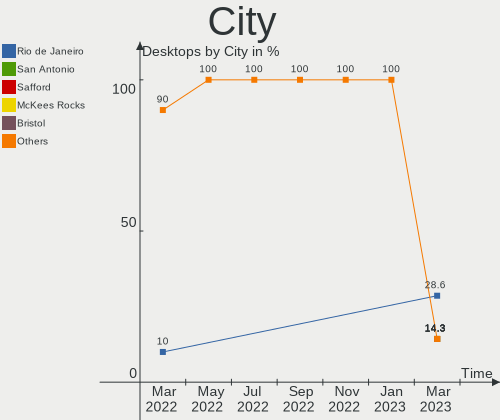
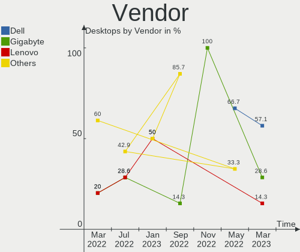
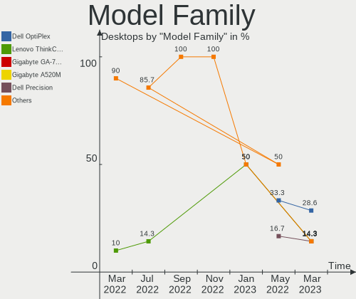
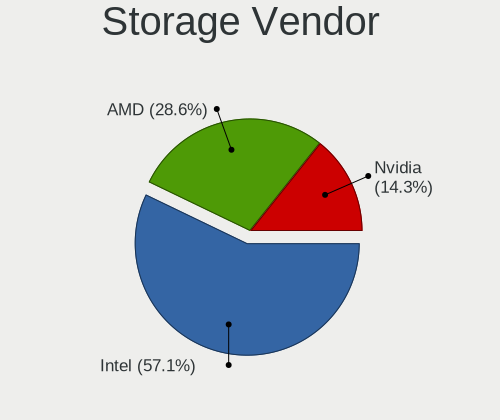
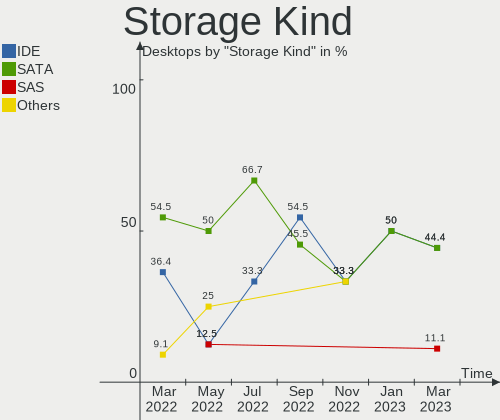

Endless Hardware Trends (Desktop)
---------------------------------

A project to identify most popular hardware characteristics and track their change
over time based on data collected by Endless users at https://Linux-Hardware.org.

Anyone can contribute to the study by uploading probes of their computers by
the [hw-probe](https://github.com/linuxhw/hw-probe) tool:

    sudo hw-probe -all -upload

Full-feature report is available here: https://linux-hardware.org/?view=trends&formfactor=desktop

Period: Apr, 2020.

Contents
--------

- [ OS                       ](#os)
- [ OS Family                ](#os-family)
- [ Kernel                   ](#kernel)
- [ Kernel Family            ](#kernel-family)
- [ Kernel Major Ver.        ](#kernel-major-ver)
- [ Arch                     ](#arch)
- [ DE                       ](#de)
- [ Display Server           ](#display-server)
- [ Display Manager          ](#display-manager)
- [ OS Lang                  ](#os-lang)
- [ Boot Mode                ](#boot-mode)
- [ Filesystem               ](#filesystem)
- [ Dual Boot with Linux/BSD ](#dual-boot-with-linux/bsd)
- [ Dual Boot (Win)          ](#dual-boot-win)
- [ Country                  ](#country)
- [ City                     ](#city)
- [ Vendor                   ](#vendor)
- [ Model                    ](#model)
- [ Model Family             ](#model-family)
- [ MFG Year                 ](#mfg-year)
- [ Form Factor              ](#form-factor)
- [ Secure Boot              ](#secure-boot)
- [ Coreboot                 ](#coreboot)
- [ RAM Size                 ](#ram-size)
- [ RAM Used                 ](#ram-used)
- [ Drive Vendor             ](#drive-vendor)
- [ Drive Model              ](#drive-model)
- [ Drive Kind               ](#drive-kind)
- [ Drive Connector          ](#drive-connector)
- [ Drive Size               ](#drive-size)
- [ Space Total              ](#space-total)
- [ Space Used               ](#space-used)
- [ Malfunc. Drives          ](#malfunc-drives)
- [ Malfunc. Drive Vendor    ](#malfunc-drive-vendor)
- [ Malfunc. Drive Kind      ](#malfunc-drive-kind)
- [ Failed Drives            ](#failed-drives)
- [ Failed Drive Vendor      ](#failed-drive-vendor)
- [ Drive Status             ](#drive-status)
- [ Storage Vendor           ](#storage-vendor)
- [ Storage Model            ](#storage-model)
- [ Storage Kind             ](#storage-kind)
- [ CPU Vendor               ](#cpu-vendor)
- [ CPU Model                ](#cpu-model)
- [ CPU Model Family         ](#cpu-model-family)
- [ CPU Cores                ](#cpu-cores)
- [ CPU Sockets              ](#cpu-sockets)
- [ CPU Threads              ](#cpu-threads)
- [ CPU Op-Modes             ](#cpu-op-modes)
- [ CPU Microarch            ](#cpu-microarch)
- [ CPU Microcode            ](#cpu-microcode)
- [ GPU Vendor               ](#gpu-vendor)
- [ GPU Model                ](#gpu-model)
- [ GPU Combo                ](#gpu-combo)
- [ GPU Driver               ](#gpu-driver)
- [ GPU Memory               ](#gpu-memory)
- [ Monitor Vendor           ](#monitor-vendor)
- [ Monitor Model            ](#monitor-model)
- [ Monitor Resolution       ](#monitor-resolution)
- [ Monitor Diagonal         ](#monitor-diagonal)
- [ Monitor Width            ](#monitor-width)
- [ Aspect Ratio             ](#aspect-ratio)
- [ Monitor Area             ](#monitor-area)
- [ Pixel Density            ](#pixel-density)
- [ Multiple Monitors        ](#multiple-monitors)
- [ Net Controller Vendor    ](#net-controller-vendor)
- [ Net Controller Model     ](#net-controller-model)
- [ Net Controller Kind      ](#net-controller-kind)
- [ Used Controller          ](#used-controller)
- [ NICs                     ](#nics)
- [ Unsupported Devices      ](#unsupported-devices)
- [ Unsupported Device Types ](#unsupported-device-types)

OS
--

Installed operating systems

| Name          | Computers | Percent |
|---------------|-----------|---------|
| Endless 3.7.8 | 35        | 79.55%  |
| Endless 3.7.6 | 3         | 6.82%   |
| Endless 3.5.8 | 2         | 4.55%   |
| Endless 3.8.0 | 1         | 2.27%   |
| Endless 3.7.7 | 1         | 2.27%   |
| Endless 3.4.6 | 1         | 2.27%   |
| Endless       | 1         | 2.27%   |

OS Family
---------

OS without a version

| Name    | Computers | Percent |
|---------|-----------|---------|
| Endless | 44        | 100%    |

Kernel
------

Version of the Linux kernel

| Version           | Computers | Percent |
|-------------------|-----------|---------|
| 5.3.0-28-generic  | 37        | 84.09%  |
| 5.3.0-23-generic  | 3         | 6.82%   |
| 4.18.0-15-generic | 2         | 4.55%   |
| 5.4.0-19-generic  | 1         | 2.27%   |
| 4.15.0-23-generic | 1         | 2.27%   |

Kernel Family
-------------

Linux kernel without a distro release

| Version | Computers | Percent |
|---------|-----------|---------|
| 5.3.0   | 40        | 90.91%  |
| 4.18.0  | 2         | 4.55%   |
| 5.4.0   | 1         | 2.27%   |
| 4.15.0  | 1         | 2.27%   |

Kernel Major Ver.
-----------------

Linux kernel major version

| Version | Computers | Percent |
|---------|-----------|---------|
| 5.3     | 40        | 90.91%  |
| 4.18    | 2         | 4.55%   |
| 5.4     | 1         | 2.27%   |
| 4.15    | 1         | 2.27%   |

Arch
----

OS architecture (x86_64, i586, etc.)

| Name   | Computers | Percent |
|--------|-----------|---------|
| x86_64 | 44        | 100%    |

DE
--

Desktop Environment

| Name  | Computers | Percent |
|-------|-----------|---------|
| GNOME | 44        | 100%    |

Display Server
--------------

X11 or Wayland

| Name | Computers | Percent |
|------|-----------|---------|
| X11  | 44        | 100%    |

Display Manager
---------------

SDDM, LightDM, etc.

| Name    | Computers | Percent |
|---------|-----------|---------|
| Unknown | 44        | 100%    |

OS Lang
-------

Language

| Lang        | Computers | Percent |
|-------------|-----------|---------|
| en_US.utf8  | 24        | 54.55%  |
| pt_BR.utf8  | 4         | 9.09%   |
| pt_BR       | 4         | 9.09%   |
| ru_RU       | 2         | 4.55%   |
| en_GB       | 2         | 4.55%   |
| ru_RU.UTF_8 | 1         | 2.27%   |
| es_MX       | 1         | 2.27%   |
| es_ES       | 1         | 2.27%   |
| en_IN       | 1         | 2.27%   |
| en_BW       | 1         | 2.27%   |
| en_AU       | 1         | 2.27%   |
| de_DE       | 1         | 2.27%   |
| cs_CZ       | 1         | 2.27%   |

Boot Mode
---------

EFI or BIOS

| Mode | Computers | Percent |
|------|-----------|---------|
| BIOS | 34        | 77.27%  |
| EFI  | 10        | 22.73%  |

Filesystem
----------

Type of filesystem

| Type  | Computers | Percent |
|-------|-----------|---------|
| Ext4  | 41        | 93.18%  |
| Tmpfs | 3         | 6.82%   |

Dual Boot with Linux/BSD
------------------------

Hosting more than one Linux/BSD

| Dual boot | Computers | Percent |
|-----------|-----------|---------|
| No        | 44        | 100%    |

Dual Boot (Win)
---------------

Hosting Linux and Windows

| Dual boot | Computers | Percent |
|-----------|-----------|---------|
| No        | 44        | 100%    |

Country
-------

Geographic location (country)

| Country        | Computers | Percent |
|----------------|-----------|---------|
| USA            | 18        | 40.91%  |
| Brazil         | 6         | 13.64%  |
| Russia         | 3         | 6.82%   |
| UK             | 2         | 4.55%   |
| Romania        | 2         | 4.55%   |
| Philippines    | 2         | 4.55%   |
| India          | 2         | 4.55%   |
| Spain          | 1         | 2.27%   |
| Portugal       | 1         | 2.27%   |
| Poland         | 1         | 2.27%   |
| Japan          | 1         | 2.27%   |
| Germany        | 1         | 2.27%   |
| Denmark        | 1         | 2.27%   |
| Czech Republic | 1         | 2.27%   |
| Croatia        | 1         | 2.27%   |
| Australia      | 1         | 2.27%   |

City
----

Geographic location (city)

| City              | Computers | Percent |
|-------------------|-----------|---------|
| Zagreb            | 1         | 2.27%   |
| Winter Garden     | 1         | 2.27%   |
| Uji               | 1         | 2.27%   |
| Turre             | 1         | 2.27%   |
| Tempe             | 1         | 2.27%   |
| Sydney            | 1         | 2.27%   |
| Suzano            | 1         | 2.27%   |
| Studley           | 1         | 2.27%   |
| Spring            | 1         | 2.27%   |
| Sobradinho        | 1         | 2.27%   |
| Sergiyev Posad    | 1         | 2.27%   |
| Portland          | 1         | 2.27%   |
| Parsons           | 1         | 2.27%   |
| Mumbai            | 1         | 2.27%   |
| Moscow            | 1         | 2.27%   |
| Modesto           | 1         | 2.27%   |
| Milwaukee         | 1         | 2.27%   |
| Makati City       | 1         | 2.27%   |
| Luton             | 1         | 2.27%   |
| Lowell            | 1         | 2.27%   |
| Lisbon            | 1         | 2.27%   |
| Lemberg           | 1         | 2.27%   |
| Kraslice          | 1         | 2.27%   |
| Galion            | 1         | 2.27%   |
| Franklin          | 1         | 2.27%   |
| Fairfax           | 1         | 2.27%   |
| Eureka Springs    | 1         | 2.27%   |
| El Dorado Springs | 1         | 2.27%   |
| Durham            | 1         | 2.27%   |
| Crato             | 1         | 2.27%   |
| Craiova           | 1         | 2.27%   |
| Chennai           | 1         | 2.27%   |
| Cebu City         | 1         | 2.27%   |
| Caraguatatuba     | 1         | 2.27%   |
| Campina Grande    | 1         | 2.27%   |
| Bucharest         | 1         | 2.27%   |
| Brasília         | 1         | 2.27%   |
| Blue Springs      | 1         | 2.27%   |
| Biskupiec         | 1         | 2.27%   |
| Baytown           | 1         | 2.27%   |
| Barrington        | 1         | 2.27%   |
| Balashikha        | 1         | 2.27%   |
| Abilene           | 1         | 2.27%   |
| Aalborg           | 1         | 2.27%   |

Vendor
------

Motherboard manufacturer

| Name                | Computers | Percent |
|---------------------|-----------|---------|
| Gigabyte Technology | 6         | 13.64%  |
| Dell                | 6         | 13.64%  |
| ASUSTek Computer    | 6         | 13.64%  |
| Hewlett-Packard     | 5         | 11.36%  |
| MSI                 | 3         | 6.82%   |
| ASRock              | 3         | 6.82%   |
| Lenovo              | 2         | 4.55%   |
| Intel               | 2         | 4.55%   |
| eMachines           | 2         | 4.55%   |
| Acer                | 2         | 4.55%   |
| TriGem Computer     | 1         | 2.27%   |
| Shuttle             | 1         | 2.27%   |
| Pegatron Computer   | 1         | 2.27%   |
| Megaware            | 1         | 2.27%   |
| HARDKERNEL          | 1         | 2.27%   |
| ECS                 | 1         | 2.27%   |
| Unknown             | 1         | 2.27%   |

Model
-----

Motherboard model

| Name                               | Computers | Percent |
|------------------------------------|-----------|---------|
| Gigabyte Z68X-UD3H-B3              | 2         | 4.55%   |
| Dell OptiPlex 390                  | 2         | 4.55%   |
| Acer Veriton EX2620G               | 2         | 4.55%   |
| TriGem Computer DreamSys           | 1         | 2.27%   |
| Shuttle SG41                       | 1         | 2.27%   |
| Pegatron Computer RM ASCEND 2040A  | 1         | 2.27%   |
| MSI MS-7593                        | 1         | 2.27%   |
| MSI MS-7309                        | 1         | 2.27%   |
| MSI MS-7267                        | 1         | 2.27%   |
| Megaware MW-H61H2-M2               | 1         | 2.27%   |
| Lenovo ThinkCentre M57p 6073BA4    | 1         | 2.27%   |
| Lenovo ThinkCentre A62 9625A71     | 1         | 2.27%   |
| Intel P61A-D3                      | 1         | 2.27%   |
| Intel DH77EB AAG39073-304          | 1         | 2.27%   |
| HP ProDesk 600 G2 DM               | 1         | 2.27%   |
| HP EliteDesk 800 G1 SFF            | 1         | 2.27%   |
| HP Compaq Pro 4300 SFF PC          | 1         | 2.27%   |
| HP Compaq dc7900 Small Form Factor | 1         | 2.27%   |
| HP 610-1050f                       | 1         | 2.27%   |
| HARDKERNEL ODROID-H2               | 1         | 2.27%   |
| Gigabyte J3455N-D3H                | 1         | 2.27%   |
| Gigabyte GA-78LMT-USB3 6.0         | 1         | 2.27%   |
| Gigabyte F2A88XM-D3H               | 1         | 2.27%   |
| Gigabyte B450 I AORUS PRO WIFI     | 1         | 2.27%   |
| eMachines ET1331G                  | 1         | 2.27%   |
| eMachines EL1358                   | 1         | 2.27%   |
| ECS LIVA-XBAT2NBW-400              | 1         | 2.27%   |
| Dell OptiPlex 9020                 | 1         | 2.27%   |
| Dell OptiPlex 790                  | 1         | 2.27%   |
| Dell OptiPlex 320                  | 1         | 2.27%   |
| Dell OptiPlex 3020                 | 1         | 2.27%   |
| ASUS PRIME A320M-A                 | 1         | 2.27%   |
| ASUS P8Z77-V LE PLUS               | 1         | 2.27%   |
| ASUS Maximus IV GENE-Z/GEN3        | 1         | 2.27%   |
| ASUS M5A78L-M LX                   | 1         | 2.27%   |
| ASUS M4A87TD/USB3                  | 1         | 2.27%   |
| ASUS F1A75-V PRO                   | 1         | 2.27%   |
| ASRock H310CM-HG4                  | 1         | 2.27%   |
| ASRock AD525PV3                    | 1         | 2.27%   |
| ASRock A88M-G                      | 1         | 2.27%   |
| Unknown                            | 1         | 2.27%   |

Model Family
------------

Motherboard model prefix

| Name                     | Computers | Percent |
|--------------------------|-----------|---------|
| Dell OptiPlex            | 6         | 13.64%  |
| Lenovo ThinkCentre       | 2         | 4.55%   |
| HP Compaq                | 2         | 4.55%   |
| Gigabyte Z68X-UD3H-B3    | 2         | 4.55%   |
| Acer Veriton             | 2         | 4.55%   |
| TriGem Computer DreamSys | 1         | 2.27%   |
| Shuttle SG41             | 1         | 2.27%   |
| Pegatron Computer RM     | 1         | 2.27%   |
| MSI MS-7593              | 1         | 2.27%   |
| MSI MS-7309              | 1         | 2.27%   |
| MSI MS-7267              | 1         | 2.27%   |
| Megaware MW-H61H2-M2     | 1         | 2.27%   |
| Intel P61A-D3            | 1         | 2.27%   |
| Intel DH77EB             | 1         | 2.27%   |
| HP ProDesk               | 1         | 2.27%   |
| HP EliteDesk             | 1         | 2.27%   |
| HP 610-1050f             | 1         | 2.27%   |
| HARDKERNEL ODROID-H2     | 1         | 2.27%   |
| Gigabyte J3455N-D3H      | 1         | 2.27%   |
| Gigabyte GA-78LMT-USB3   | 1         | 2.27%   |
| Gigabyte F2A88XM-D3H     | 1         | 2.27%   |
| Gigabyte B450            | 1         | 2.27%   |
| eMachines ET1331G        | 1         | 2.27%   |
| eMachines EL1358         | 1         | 2.27%   |
| ECS LIVA-XBAT2NBW-400    | 1         | 2.27%   |
| ASUS PRIME               | 1         | 2.27%   |
| ASUS P8Z77-V             | 1         | 2.27%   |
| ASUS Maximus             | 1         | 2.27%   |
| ASUS M5A78L-M            | 1         | 2.27%   |
| ASUS M4A87TD             | 1         | 2.27%   |
| ASUS F1A75-V             | 1         | 2.27%   |
| ASRock H310CM-HG4        | 1         | 2.27%   |
| ASRock AD525PV3          | 1         | 2.27%   |
| ASRock A88M-G            | 1         | 2.27%   |
| Unknown                  | 1         | 2.27%   |

MFG Year
--------

Motherboard manufacture year

| Year | Computers | Percent |
|------|-----------|---------|
| 2012 | 6         | 13.64%  |
| 2011 | 6         | 13.64%  |
| 2019 | 4         | 9.09%   |
| 2018 | 4         | 9.09%   |
| 2014 | 4         | 9.09%   |
| 2009 | 4         | 9.09%   |
| 2015 | 3         | 6.82%   |
| 2013 | 3         | 6.82%   |
| 2010 | 3         | 6.82%   |
| 2008 | 3         | 6.82%   |
| 2017 | 2         | 4.55%   |
| 2016 | 1         | 2.27%   |
| 2007 | 1         | 2.27%   |

Form Factor
-----------

Physical design of the computer

| Name    | Computers | Percent |
|---------|-----------|---------|
| Desktop | 44        | 100%    |

Secure Boot
-----------

Enabled or disabled

| State    | Computers | Percent |
|----------|-----------|---------|
| Disabled | 44        | 100%    |

Coreboot
--------

Have coreboot on board

| Used | Computers | Percent |
|------|-----------|---------|
| No   | 44        | 100%    |

RAM Size
--------

Total RAM memory

| Size in GB | Computers | Percent |
|------------|-----------|---------|
| 3.01-4.0   | 13        | 29.55%  |
| 4.01-8.0   | 9         | 20.45%  |
| 8.01-16.0  | 8         | 18.18%  |
| 16.01-24.0 | 5         | 11.36%  |
| 1.01-2.0   | 5         | 11.36%  |
| 32.01-64.0 | 2         | 4.55%   |
| 24.01-32.0 | 1         | 2.27%   |
| 2.01-3.0   | 1         | 2.27%   |

RAM Used
--------

Used RAM memory

| Used GB  | Computers | Percent |
|----------|-----------|---------|
| 1.01-2.0 | 27        | 61.36%  |
| 0.01-1.0 | 9         | 20.45%  |
| 2.01-3.0 | 7         | 15.91%  |
| 3.01-4.0 | 1         | 2.27%   |

Drive Vendor
------------

Hard drive vendors

| Vendor              | Computers | Drives | Percent |
|---------------------|-----------|--------|---------|
| WDC                 | 18        | 18     | 31.58%  |
| Seagate             | 11        | 12     | 19.3%   |
| Hitachi             | 6         | 6      | 10.53%  |
| Toshiba             | 3         | 3      | 5.26%   |
| SPCC                | 2         | 2      | 3.51%   |
| Samsung Electronics | 2         | 2      | 3.51%   |
| Crucial             | 2         | 3      | 3.51%   |
| ASMT                | 2         | 2      | 3.51%   |
| Unknown             | 1         | 1      | 1.75%   |
| TCSUNBOW            | 1         | 1      | 1.75%   |
| SanDisk             | 1         | 1      | 1.75%   |
| OCZ                 | 1         | 1      | 1.75%   |
| Kingston            | 1         | 1      | 1.75%   |
| KINGMAX             | 1         | 1      | 1.75%   |
| KingDian            | 1         | 1      | 1.75%   |
| Intel               | 1         | 1      | 1.75%   |
| Hewlett-Packard     | 1         | 1      | 1.75%   |
| DREVO               | 1         | 1      | 1.75%   |
| AS25                | 1         | 1      | 1.75%   |

Drive Model
-----------

Hard drive models

| Model                        | Computers | Percent |
|------------------------------|-----------|---------|
| WDBNCE5000PNC 500GB SSD      | 2         | 3.39%   |
| WD10EZEX-08WN4A0 1TB         | 2         | 3.39%   |
| ST500DM002-1BD142 500GB      | 2         | 3.39%   |
| ST3160318AS 160GB            | 2         | 3.39%   |
| Solid State Disk 64GB        | 2         | 3.39%   |
| X3 240GB                     | 1         | 1.69%   |
| X1 SSD 120GB                 | 1         | 1.69%   |
| WDS240G2G0B-00EPW0 240GB SSD | 1         | 1.69%   |
| WDS240G2G0A-00JH30 240GB SSD | 1         | 1.69%   |
| WD800JD-08MSA1 80GB          | 1         | 1.69%   |
| WD6401AALS-00L3B2 640GB      | 1         | 1.69%   |
| WD6400AAKS-40H2B0 640GB      | 1         | 1.69%   |
| WD5000AURX-63UY4Y0 500GB     | 1         | 1.69%   |
| WD5000AAKS-00V0A0 500GB      | 1         | 1.69%   |
| WD3200BPVT-00JJ5T0 320GB     | 1         | 1.69%   |
| WD3200AAJS-65B4A0 320GB      | 1         | 1.69%   |
| WD2500LPCX-24C6HT0 250GB     | 1         | 1.69%   |
| WD1600HLFS-75G6U1 160GB      | 1         | 1.69%   |
| WD10EZEX-22BN5A0 1TB         | 1         | 1.69%   |
| WD1002FAEX-00Z3A0 1TB        | 1         | 1.69%   |
| WD Elements 1TB              | 1         | 1.69%   |
| VERTEX3 120GB SSD            | 1         | 1.69%   |
| SV300S37A120G 120GB SSD      | 1         | 1.69%   |
| ST3750330SV 752GB            | 1         | 1.69%   |
| ST3640330AS 640GB            | 1         | 1.69%   |
| ST3500413AS 500GB            | 1         | 1.69%   |
| ST3160815AS 160GB            | 1         | 1.69%   |
| ST2000LX001-1RG174 2TB       | 1         | 1.69%   |
| ST2000DL001-9VT156 2TB       | 1         | 1.69%   |
| ST1000DM010-2EP102 1TB       | 1         | 1.69%   |
| SSDSC2BF180A4H 180GB         | 1         | 1.69%   |
| SSD 120GB                    | 1         | 1.69%   |
| SD7TB3Q-128G-1006 128GB SSD  | 1         | 1.69%   |
| S200 60GB                    | 1         | 1.69%   |
| OOS500G 500GB                | 1         | 1.69%   |
| MZNTY256HDHP-000H1 256GB SSD | 1         | 1.69%   |
| MV-32 32GB                   | 1         | 1.69%   |
| MK1646GSX 160GB              | 1         | 1.69%   |
| MB2000EBUCF 2TB              | 1         | 1.69%   |
| HTS543225L9A300 250GB        | 1         | 1.69%   |
| HTS543225A7A384 250GB        | 1         | 1.69%   |
| HDS721616PLA380 164GB        | 1         | 1.69%   |
| HDS721064CLA332 640GB        | 1         | 1.69%   |
| HDS721032CLA362 320GB        | 1         | 1.69%   |
| HDS721010CLA332 1TB          | 1         | 1.69%   |
| HD161GJ 160GB                | 1         | 1.69%   |
| DT01ACA300 3TB               | 1         | 1.69%   |
| DT01ACA050 500GB             | 1         | 1.69%   |
| CT275MX300SSD1 275GB         | 1         | 1.69%   |
| CT250MX500SSD1 250GB         | 1         | 1.69%   |
| CT240BX500SSD1 240GB         | 1         | 1.69%   |
| ASMT105 500GB                | 1         | 1.69%   |
| 2105 4TB                     | 1         | 1.69%   |
| 120GB                        | 1         | 1.69%   |

Drive Kind
----------

HDD or SSD

| Kind    | Computers | Drives | Percent |
|---------|-----------|--------|---------|
| HDD     | 32        | 36     | 64%     |
| SSD     | 14        | 18     | 28%     |
| Unknown | 4         | 5      | 8%      |

Drive Connector
---------------

SATA, SAS, NVMe, etc.

| Type | Computers | Drives | Percent |
|------|-----------|--------|---------|
| SATA | 42        | 56     | 93.33%  |
| SAS  | 3         | 3      | 6.67%   |

Drive Size
----------

Size of hard drive

| Size in TB | Computers | Drives | Percent |
|------------|-----------|--------|---------|
| 0.01-0.5   | 36        | 42     | 69.23%  |
| 0.51-1.0   | 11        | 12     | 21.15%  |
| 1.01-2.0   | 3         | 3      | 5.77%   |
| 3.01-4.0   | 1         | 1      | 1.92%   |
| 2.01-3.0   | 1         | 1      | 1.92%   |

Space Total
-----------

Amount of disk space available on the file system

| Size in GB | Computers | Percent |
|------------|-----------|---------|
| 101-250    | 14        | 31.82%  |
| 251-500    | 8         | 18.18%  |
| 501-1000   | 7         | 15.91%  |
| 21-50      | 6         | 13.64%  |
| 51-100     | 5         | 11.36%  |
| 1001-2000  | 3         | 6.82%   |
| 2001-3000  | 1         | 2.27%   |

Space Used
----------

Amount of used disk space

| Used GB   | Computers | Percent |
|-----------|-----------|---------|
| 21-50     | 25        | 56.82%  |
| 1-20      | 7         | 15.91%  |
| 51-100    | 7         | 15.91%  |
| 251-500   | 2         | 4.55%   |
| 101-250   | 1         | 2.27%   |
| 1001-2000 | 1         | 2.27%   |
| 501-1000  | 1         | 2.27%   |

Malfunc. Drives
---------------

Drive models with a malfunction

Zero info for selected period =(

Malfunc. Drive Vendor
---------------------

Vendors of faulty drives

Zero info for selected period =(

Malfunc. Drive Kind
-------------------

Kinds of faulty drives

Zero info for selected period =(

Failed Drives
-------------

Failed drive models

Zero info for selected period =(

Failed Drive Vendor
-------------------

Failed drive vendors

Zero info for selected period =(

Drive Status
------------

Number of failed and malfunc. drives

| Status   | Computers | Drives | Percent |
|----------|-----------|--------|---------|
| Detected | 42        | 59     | 100%    |

Storage Vendor
--------------

Storage controller vendors

| Vendor                      | Computers | Percent |
|-----------------------------|-----------|---------|
| Intel                       | 30        | 52.63%  |
| AMD                         | 10        | 17.54%  |
| Nvidia                      | 4         | 7.02%   |
| Marvell Technology Group    | 4         | 7.02%   |
| JMicron Technology          | 3         | 5.26%   |
| ASMedia Technology          | 2         | 3.51%   |
| Realtek Semiconductor       | 1         | 1.75%   |
| Phison Electronics          | 1         | 1.75%   |
| Kingston Technology Company | 1         | 1.75%   |
| Adaptec                     | 1         | 1.75%   |

Storage Model
-------------

Storage controller models

| Model                                                                             | Computers | Percent |
|-----------------------------------------------------------------------------------|-----------|---------|
| 6 Series/C200 Series Chipset Family 6 port Desktop SATA AHCI Controller           | 6         | 7.41%   |
| NM10/ICH7 Family SATA Controller [IDE mode]                                       | 5         | 6.17%   |
| SB7x0/SB8x0/SB9x0 IDE Controller                                                  | 4         | 4.94%   |
| FCH SATA Controller [AHCI mode]                                                   | 4         | 4.94%   |
| 82801G (ICH7 Family) IDE Controller                                               | 4         | 4.94%   |
| SB7x0/SB8x0/SB9x0 SATA Controller [IDE mode]                                      | 3         | 3.7%    |
| SATA controller                                                                   | 3         | 3.7%    |
| MCP61 SATA Controller                                                             | 3         | 3.7%    |
| 6 Series/C200 Series Chipset Family Desktop SATA Controller (IDE mode, ports 4-5) | 3         | 3.7%    |
| 6 Series/C200 Series Chipset Family Desktop SATA Controller (IDE mode, ports 0-3) | 3         | 3.7%    |
| Non-Volatile memory controller                                                    | 2         | 2.47%   |
| MCP61 IDE                                                                         | 2         | 2.47%   |
| FCH IDE Controller                                                                | 2         | 2.47%   |
| 88SE9172 SATA III 6Gb/s RAID Controller                                           | 2         | 2.47%   |
| 8 Series/C220 Series Chipset Family 6-port SATA Controller 1 [AHCI mode]          | 2         | 2.47%   |
| 7 Series/C210 Series Chipset Family 6-port SATA Controller [AHCI mode]            | 2         | 2.47%   |
| SB7x0/SB8x0/SB9x0 SATA Controller [AHCI mode]                                     | 1         | 1.23%   |
| SB600 Non-Raid-5 SATA                                                             | 1         | 1.23%   |
| SB600 IDE                                                                         | 1         | 1.23%   |
| SATA Controller [RAID mode]                                                       | 1         | 1.23%   |
| Realtek Non-Volatile memory controller                                            | 1         | 1.23%   |
| Q170/Q150/B150/H170/H110/Z170/CM236 Chipset SATA Controller [AHCI Mode]           | 1         | 1.23%   |
| MCP67 IDE Controller                                                              | 1         | 1.23%   |
| MCP67 AHCI Controller                                                             | 1         | 1.23%   |
| JMB368 IDE controller                                                             | 1         | 1.23%   |
| JMB363 SATA/IDE Controller                                                        | 1         | 1.23%   |
| JMB362 SATA Controller                                                            | 1         | 1.23%   |
| FCH SATA Controller [IDE mode]                                                    | 1         | 1.23%   |
| FCH SATA Controller D                                                             | 1         | 1.23%   |
| Celeron N3350/Pentium N4200/Atom E3900 Series SATA AHCI Controller                | 1         | 1.23%   |
| Atom Processor E3800 Series SATA IDE Controller                                   | 1         | 1.23%   |
| ASM1062 Serial ATA Controller                                                     | 1         | 1.23%   |
| ASM1061 SATA IDE Controller                                                       | 1         | 1.23%   |
| AAC-RAID                                                                          | 1         | 1.23%   |
| 88SE9172 SATA 6Gb/s Controller                                                    | 1         | 1.23%   |
| 88SE9120 SATA 6Gb/s Controller                                                    | 1         | 1.23%   |
| 82Q35 Express PT IDER Controller                                                  | 1         | 1.23%   |
| 82801JI (ICH10 Family) 4 port SATA IDE Controller #1                              | 1         | 1.23%   |
| 82801JI (ICH10 Family) 2 port SATA IDE Controller #2                              | 1         | 1.23%   |
| 82801JD/DO (ICH10 Family) 4-port SATA IDE Controller                              | 1         | 1.23%   |
| 82801JD/DO (ICH10 Family) 2-port SATA IDE Controller                              | 1         | 1.23%   |
| 82801IR/IO/IH (ICH9R/DO/DH) 4 port SATA Controller [IDE mode]                     | 1         | 1.23%   |
| 82801I (ICH9 Family) 2 port SATA Controller [IDE mode]                            | 1         | 1.23%   |
| 5 Series/3400 Series Chipset 6 port SATA AHCI Controller                          | 1         | 1.23%   |
| 400 Series Chipset SATA Controller                                                | 1         | 1.23%   |
| 4 Series Chipset PT IDER Controller                                               | 1         | 1.23%   |
| 200 Series PCH SATA controller [AHCI mode]                                        | 1         | 1.23%   |

Storage Kind
------------

Kind of storage controller (IDE, SATA, NVMe, SAS, ...)

| Kind | Computers | Percent |
|------|-----------|---------|
| SATA | 27        | 48.21%  |
| IDE  | 24        | 42.86%  |
| NVMe | 3         | 5.36%   |
| RAID | 2         | 3.57%   |

CPU Vendor
----------

Processor vendors

| Vendor | Computers | Percent |
|--------|-----------|---------|
| Intel  | 31        | 70.45%  |
| AMD    | 13        | 29.55%  |

CPU Model
---------

Processor models

| Model                                           | Computers | Percent |
|-------------------------------------------------|-----------|---------|
| Intel Core i3-2100 CPU @ 3.10GHz                | 3         | 6.82%   |
| Intel Core i7-2600K CPU @ 3.40GHz               | 2         | 4.55%   |
| Intel Core i5-4590 CPU @ 3.30GHz                | 2         | 4.55%   |
| Intel Core i5-2500K CPU @ 3.30GHz               | 2         | 4.55%   |
| Intel Core 2 Duo CPU E8400 @ 3.00GHz            | 2         | 4.55%   |
| Intel Celeron J4005 CPU @ 2.00GHz               | 2         | 4.55%   |
| Intel Pentium Dual-Core CPU E6500 @ 2.93GHz     | 1         | 2.27%   |
| Intel Pentium Dual CPU E2180 @ 2.00GHz          | 1         | 2.27%   |
| Intel Genuine CPU 2140 @ 1.60GHz                | 1         | 2.27%   |
| Intel Core i7-9700KF CPU @ 3.60GHz              | 1         | 2.27%   |
| Intel Core i7-6700 CPU @ 3.40GHz                | 1         | 2.27%   |
| Intel Core i7 CPU 920 @ 2.67GHz                 | 1         | 2.27%   |
| Intel Core i5-3330 CPU @ 3.00GHz                | 1         | 2.27%   |
| Intel Core i5 CPU 650 @ 3.20GHz                 | 1         | 2.27%   |
| Intel Core i3-4150 CPU @ 3.50GHz                | 1         | 2.27%   |
| Intel Core i3-3220 CPU @ 3.30GHz                | 1         | 2.27%   |
| Intel Core i3-2130 CPU @ 3.40GHz                | 1         | 2.27%   |
| Intel Core i3-2120 CPU @ 3.30GHz                | 1         | 2.27%   |
| Intel Core 2 Duo CPU E7200 @ 2.53GHz            | 1         | 2.27%   |
| Intel Core 2 Duo CPU E6850 @ 3.00GHz            | 1         | 2.27%   |
| Intel Celeron J4105 CPU @ 1.50GHz               | 1         | 2.27%   |
| Intel Celeron CPU N2808 @ 1.58GHz               | 1         | 2.27%   |
| Intel Celeron CPU J3455 @ 1.50GHz               | 1         | 2.27%   |
| Intel Atom CPU D525 @ 1.80GHz                   | 1         | 2.27%   |
| AMD Ryzen 5 1500X Quad-Core Processor           | 1         | 2.27%   |
| AMD Ryzen 3 2200G with Radeon Vega Graphics     | 1         | 2.27%   |
| AMD Phenom II X6 1055T Processor                | 1         | 2.27%   |
| AMD Phenom II X4 840 Processor                  | 1         | 2.27%   |
| AMD Phenom II X2 555 Processor                  | 1         | 2.27%   |
| AMD FX-8150 Eight-Core Processor                | 1         | 2.27%   |
| AMD Athlon II X2 250u Processor                 | 1         | 2.27%   |
| AMD Athlon II X2 245 Processor                  | 1         | 2.27%   |
| AMD Athlon II 170u Processor                    | 1         | 2.27%   |
| AMD Athlon Dual Core Processor 5400B            | 1         | 2.27%   |
| AMD A6-3650 APU with Radeon HD Graphics         | 1         | 2.27%   |
| AMD A10-7870K Radeon R7, 12 Compute Cores 4C+8G | 1         | 2.27%   |
| AMD A10-7850K Radeon R7, 12 Compute Cores 4C+8G | 1         | 2.27%   |

CPU Model Family
----------------

Processor model prefix

| Model                   | Computers | Percent |
|-------------------------|-----------|---------|
| Intel Core i3           | 7         | 15.91%  |
| Intel Core i5           | 6         | 13.64%  |
| Intel Core i7           | 5         | 11.36%  |
| Intel Celeron           | 5         | 11.36%  |
| Intel Core 2 Duo        | 4         | 9.09%   |
| AMD Athlon II X2        | 2         | 4.55%   |
| AMD A10                 | 2         | 4.55%   |
| Intel Pentium Dual-Core | 1         | 2.27%   |
| Intel Pentium Dual      | 1         | 2.27%   |
| Intel Genuine           | 1         | 2.27%   |
| Intel Atom              | 1         | 2.27%   |
| AMD Ryzen 5             | 1         | 2.27%   |
| AMD Ryzen 3             | 1         | 2.27%   |
| AMD Phenom II X6        | 1         | 2.27%   |
| AMD Phenom II X4        | 1         | 2.27%   |
| AMD Phenom II X2        | 1         | 2.27%   |
| AMD FX                  | 1         | 2.27%   |
| AMD Athlon II           | 1         | 2.27%   |
| AMD Athlon Dual Core    | 1         | 2.27%   |
| AMD A6                  | 1         | 2.27%   |

CPU Cores
---------

Number of processor cores

| Number | Computers | Percent |
|--------|-----------|---------|
| 2      | 25        | 56.82%  |
| 4      | 16        | 36.36%  |
| 8      | 1         | 2.27%   |
| 6      | 1         | 2.27%   |
| 1      | 1         | 2.27%   |

CPU Sockets
-----------

Number of sockets

| Number | Computers | Percent |
|--------|-----------|---------|
| 1      | 44        | 100%    |

CPU Threads
-----------

Threads per core (Hyper-Threading)

| Number | Computers | Percent |
|--------|-----------|---------|
| 1      | 27        | 61.36%  |
| 2      | 17        | 38.64%  |

CPU Op-Modes
------------

CPU Operation Modes (32-bit, 64-bit)

| Op mode        | Computers | Percent |
|----------------|-----------|---------|
| 32-bit, 64-bit | 44        | 100%    |

CPU Microarch
-------------

Microarchitecture

| Name          | Computers | Percent |
|---------------|-----------|---------|
| SandyBridge   | 9         | 20.45%  |
| K10           | 6         | 13.64%  |
| Core          | 6         | 13.64%  |
| Haswell       | 3         | 6.82%   |
| Goldmont plus | 3         | 6.82%   |
| Zen           | 2         | 4.55%   |
| Steamroller   | 2         | 4.55%   |
| Skylake       | 2         | 4.55%   |
| IvyBridge     | 2         | 4.55%   |
| Westmere      | 1         | 2.27%   |
| Silvermont    | 1         | 2.27%   |
| Penryn        | 1         | 2.27%   |
| Nehalem       | 1         | 2.27%   |
| K8 Hammer     | 1         | 2.27%   |
| K10 Llano     | 1         | 2.27%   |
| Goldmont      | 1         | 2.27%   |
| Bulldozer     | 1         | 2.27%   |
| Bonnell       | 1         | 2.27%   |

CPU Microcode
-------------

Microcode number

| Number     | Computers | Percent |
|------------|-----------|---------|
| 0x206a7    | 8         | 18.18%  |
| Unknown    | 8         | 18.18%  |
| 0x706a1    | 3         | 6.82%   |
| 0x010000c8 | 3         | 6.82%   |
| 0x306c3    | 2         | 4.55%   |
| 0x306a9    | 2         | 4.55%   |
| 0x10676    | 2         | 4.55%   |
| 0x06003106 | 2         | 4.55%   |
| 0x906ed    | 1         | 2.27%   |
| 0x6fd      | 1         | 2.27%   |
| 0x6fb      | 1         | 2.27%   |
| 0x506c9    | 1         | 2.27%   |
| 0x30678    | 1         | 2.27%   |
| 0x20655    | 1         | 2.27%   |
| 0x106ca    | 1         | 2.27%   |
| 0x106a5    | 1         | 2.27%   |
| 0x1067a    | 1         | 2.27%   |
| 0x0810100b | 1         | 2.27%   |
| 0x0600063e | 1         | 2.27%   |
| 0x03000027 | 1         | 2.27%   |
| 0x010000dc | 1         | 2.27%   |
| 0x010000c7 | 1         | 2.27%   |

GPU Vendor
----------

Vendors of graphics cards

| Vendor | Computers | Percent |
|--------|-----------|---------|
| Intel  | 21        | 44.68%  |
| Nvidia | 14        | 29.79%  |
| AMD    | 12        | 25.53%  |

GPU Model
---------

Graphics card models

| Model                                                                 | Computers | Percent |
|-----------------------------------------------------------------------|-----------|---------|
| 2nd Generation Core Processor Family Integrated Graphics Controller   | 7         | 14%     |
| UHD Graphics 605                                                      | 3         | 6%      |
| C61 [GeForce 6150SE nForce 430]                                       | 3         | 6%      |
| Xeon E3-1200 v3/4th Gen Core Processor Integrated Graphics Controller | 2         | 4%      |
| GK208B [GeForce GT 710]                                               | 2         | 4%      |
| GF119 [GeForce GT 610]                                                | 2         | 4%      |
| 4 Series Chipset Integrated Graphics Controller                       | 2         | 4%      |
| Sumo [Radeon HD 6530D]                                                | 1         | 2%      |
| RV620 PRO [Radeon HD 3470]                                            | 1         | 2%      |
| RV530 [Radeon X1600] (Secondary)                                      | 1         | 2%      |
| RV530 [Radeon X1600 PRO]                                              | 1         | 2%      |
| RS780L [Radeon 3000]                                                  | 1         | 2%      |
| Raven Ridge [Radeon Vega Series / Radeon Vega Mobile Series]          | 1         | 2%      |
| Park [Mobility Radeon HD 5430]                                        | 1         | 2%      |
| Oland XT [Radeon HD 8670 / R7 250/350]                                | 1         | 2%      |
| Kaveri [Radeon R7 Graphics]                                           | 1         | 2%      |
| Juniper XT [Radeon HD 5770]                                           | 1         | 2%      |
| HD Graphics 530                                                       | 1         | 2%      |
| HD Graphics 500                                                       | 1         | 2%      |
| GT218 [GeForce 210]                                                   | 1         | 2%      |
| GT216 [GeForce GT 220]                                                | 1         | 2%      |
| GT215 [GeForce GT 240]                                                | 1         | 2%      |
| GM204 [GeForce GTX 970]                                               | 1         | 2%      |
| GM107 [GeForce GTX 750 Ti]                                            | 1         | 2%      |
| GK104 [GeForce GTX 770]                                               | 1         | 2%      |
| GF108 [GeForce GT 630]                                                | 1         | 2%      |
| G72 [GeForce 7200 GS / 7300 SE]                                       | 1         | 2%      |
| Ellesmere [Radeon RX 470/480/570/570X/580/580X/590]                   | 1         | 2%      |
| Cypress XT [Radeon HD 5870]                                           | 1         | 2%      |
| Core Processor Integrated Graphics Controller                         | 1         | 2%      |
| Cape Verde XT [Radeon HD 7770/8760 / R7 250X]                         | 1         | 2%      |
| Barts PRO [Radeon HD 6850]                                            | 1         | 2%      |
| Atom Processor Z36xxx/Z37xxx Series Graphics & Display                | 1         | 2%      |
| Atom Processor D4xx/D5xx/N4xx/N5xx Integrated Graphics Controller     | 1         | 2%      |
| 82Q35 Express Integrated Graphics Controller                          | 1         | 2%      |
| 4th Generation Core Processor Family Integrated Graphics Controller   | 1         | 2%      |

GPU Combo
---------

Combinations of graphics cards

| Name       | Computers | Percent |
|------------|-----------|---------|
| 1 x Intel  | 20        | 45.45%  |
| 1 x Nvidia | 13        | 29.55%  |
| 1 x AMD    | 10        | 22.73%  |
| 2 x AMD    | 1         | 2.27%   |

GPU Driver
----------

Free vs proprietary

| Driver      | Computers | Percent |
|-------------|-----------|---------|
| Free        | 40        | 90.91%  |
| Proprietary | 4         | 9.09%   |

GPU Memory
----------

Total video memory

| Size in GB | Computers | Percent |
|------------|-----------|---------|
| Unknown    | 24        | 54.55%  |
| 0.51-1.0   | 10        | 22.73%  |
| 0.01-0.5   | 5         | 11.36%  |
| 1.01-2.0   | 4         | 9.09%   |
| 3.01-4.0   | 1         | 2.27%   |

Monitor Vendor
--------------

Monitor vendors

| Vendor              | Computers | Percent |
|---------------------|-----------|---------|
| Samsung Electronics | 6         | 13.33%  |
| Goldstar            | 6         | 13.33%  |
| AOC                 | 5         | 11.11%  |
| Hewlett-Packard     | 4         | 8.89%   |
| Dell                | 4         | 8.89%   |
| Acer                | 4         | 8.89%   |
| NEC Computers       | 3         | 6.67%   |
| Sony                | 2         | 4.44%   |
| Lenovo              | 2         | 4.44%   |
| HannStar            | 2         | 4.44%   |
| Toshiba             | 1         | 2.22%   |
| ONN                 | 1         | 2.22%   |
| Insignia            | 1         | 2.22%   |
| Iiyama              | 1         | 2.22%   |
| IBM                 | 1         | 2.22%   |
| eMachines           | 1         | 2.22%   |
| BenQ                | 1         | 2.22%   |

Monitor Model
-------------

Monitor models

| Model                                              | Computers | Percent |
|----------------------------------------------------|-----------|---------|
| TV SNYEE01 1920x1080 1600x900mm 72.3-inch          | 2         | 4.35%   |
| X203H ACR009D 1600x900 443x249mm 20.0-inch         | 1         | 2.17%   |
| w2216 HWP280C 1680x1050 465x291mm 21.6-inch        | 1         | 2.17%   |
| V223W ACR001B 1680x1050 474x296mm 22.0-inch        | 1         | 2.17%   |
| V221W NEC6771 1920x1080 477x268mm 21.5-inch        | 1         | 2.17%   |
| ULTRAWIDE GSM76F9 2560x1080 531x298mm 24.0-inch    | 1         | 2.17%   |
| TV TSB0206 1920x1080 886x498mm 40.0-inch           | 1         | 2.17%   |
| TouchSmart HWP4204 1920x1080 510x287mm 23.0-inch   | 1         | 2.17%   |
| SyncMaster SAM0598 1360x768 410x230mm 18.5-inch    | 1         | 2.17%   |
| SyncMaster SAM027E 1680x1050 474x296mm 22.0-inch   | 1         | 2.17%   |
| ST2310 DELF01B 1920x1080 510x290mm 23.1-inch       | 1         | 2.17%   |
| SE2419HR DELF113 1920x1080 527x296mm 23.8-inch     | 1         | 2.17%   |
| S24E390 SAM0C19 1920x1080 521x293mm 23.5-inch      | 1         | 2.17%   |
| PL2377 IVM561D 1920x1080 510x287mm 23.0-inch       | 1         | 2.17%   |
| ONA18HO015 ONN0101 1920x1080 698x393mm 31.5-inch   | 1         | 2.17%   |
| NS-32D310NA17 BBY0050 1360x768 760x450mm 34.8-inch | 1         | 2.17%   |
| M2794S GSM5795 1920x1080 598x336mm 27.0-inch       | 1         | 2.17%   |
| LM522 AOCA522 1024x768 304x228mm 15.0-inch         | 1         | 2.17%   |
| LG ULTRAWIDE GSM59F1 1920x1080 580x240mm 24.7-inch | 1         | 2.17%   |
| LEN P27h-10 LEN61AF 2560x1440 597x336mm 27.0-inch  | 1         | 2.17%   |
| LEN L172 LEN114C 1280x1024 338x270mm 17.0-inch     | 1         | 2.17%   |
| LCD Monitor SAM0E33 1920x1080 1210x680mm 54.6-inch | 1         | 2.17%   |
| LCD Monitor SAM0C39 1920x1080 1050x590mm 47.4-inch | 1         | 2.17%   |
| L1920P GSM4A7B 1280x1024 380x300mm 19.1-inch       | 1         | 2.17%   |
| L1908w HWP26F0 1440x900 410x256mm 19.0-inch        | 1         | 2.17%   |
| K272HL ACR0523 1920x1080 600x340mm 27.2-inch       | 1         | 2.17%   |
| HSG1074 HSP0019 1920x1080 543x305mm 24.5-inch      | 1         | 2.17%   |
| HD GSM5ACB 1366x768 410x230mm 18.5-inch            | 1         | 2.17%   |
| Hanns.G HW173 HSD5A47 1440x900 408x255mm 18.9-inch | 1         | 2.17%   |
| G235H ACR0113 1920x1080 510x287mm 23.0-inch        | 1         | 2.17%   |
| FP 767 BNQ7638 1280x1024 304x228mm 15.0-inch       | 1         | 2.17%   |
| EX231W NEC680A 1920x1080 510x287mm 23.0-inch       | 1         | 2.17%   |
| EA191M NEC673E 1280x1024 376x301mm 19.0-inch       | 1         | 2.17%   |
| E231 HWP3064 1920x1080 510x287mm 23.0-inch         | 1         | 2.17%   |
| E2242 GSM58BE 1680x1050 480x270mm 21.7-inch        | 1         | 2.17%   |
| E202H EMA00B5 1600x900 443x249mm 20.0-inch         | 1         | 2.17%   |
| E1709W DELD022 1440x900 370x230mm 17.2-inch        | 1         | 2.17%   |
| C32F39M SAM100B 1920x1080 698x393mm 31.5-inch      | 1         | 2.17%   |
| C190 CRT IBM1A53 1600x1200 360x256mm 17.4-inch     | 1         | 2.17%   |
| 566LM GSM3B5D 1024x768 304x228mm 15.0-inch         | 1         | 2.17%   |
| 2461W AOC2461 1920x1080 521x293mm 23.5-inch        | 1         | 2.17%   |
| 2200W AOC2200 1920x1080 476x268mm 21.5-inch        | 1         | 2.17%   |
| 1970W AOC1970 1366x768 410x230mm 18.5-inch         | 1         | 2.17%   |
| 1950w AOC1950 1366x768 410x230mm 18.5-inch         | 1         | 2.17%   |
| 1908FP DEL4025 1280x1024 380x300mm 19.1-inch       | 1         | 2.17%   |

Monitor Resolution
------------------

Monitor screen resolution

| Resolution         | Computers | Percent |
|--------------------|-----------|---------|
| 1920x1080 (FHD)    | 21        | 45.65%  |
| 1280x1024 (SXGA)   | 6         | 13.04%  |
| 1680x1050 (WSXGA+) | 3         | 6.52%   |
| 1440x900 (WXGA+)   | 3         | 6.52%   |
| 1366x768 (WXGA)    | 3         | 6.52%   |
| 1360x768           | 3         | 6.52%   |
| 2560x1080          | 2         | 4.35%   |
| 1600x900 (HD+)     | 2         | 4.35%   |
| 1024x768 (XGA)     | 2         | 4.35%   |
| 2560x1440 (QHD)    | 1         | 2.17%   |

Monitor Diagonal
----------------

Diagonal size in inches

| Inches | Computers | Percent |
|--------|-----------|---------|
| 23     | 9         | 19.57%  |
| 18     | 5         | 10.87%  |
| 21     | 4         | 8.7%    |
| 19     | 4         | 8.7%    |
| 27     | 3         | 6.52%   |
| 24     | 3         | 6.52%   |
| 17     | 3         | 6.52%   |
| 15     | 3         | 6.52%   |
| 72     | 2         | 4.35%   |
| 22     | 2         | 4.35%   |
| 20     | 2         | 4.35%   |
| 74     | 1         | 2.17%   |
| 54     | 1         | 2.17%   |
| 40     | 1         | 2.17%   |
| 32     | 1         | 2.17%   |
| 31     | 1         | 2.17%   |
| 28     | 1         | 2.17%   |

Monitor Width
-------------

Physical width

| Width in mm | Computers | Percent |
|-------------|-----------|---------|
| 501-600     | 15        | 32.61%  |
| 401-500     | 14        | 30.43%  |
| 351-400     | 5         | 10.87%  |
| 301-350     | 4         | 8.7%    |
| 1501-2000   | 3         | 6.52%   |
| 601-700     | 2         | 4.35%   |
| 801-900     | 1         | 2.17%   |
| 701-800     | 1         | 2.17%   |
| 1001-1500   | 1         | 2.17%   |

Aspect Ratio
------------

Proportional relationship between the width and the height

| Ratio | Computers | Percent |
|-------|-----------|---------|
| 16/9  | 29        | 63.04%  |
| 16/10 | 8         | 17.39%  |
| 5/4   | 4         | 8.7%    |
| 4/3   | 4         | 8.7%    |
| 21/9  | 1         | 2.17%   |

Monitor Area
------------

Area in inch²

| Area in inch² | Computers | Percent |
|----------------|-----------|---------|
| 201-250        | 13        | 28.26%  |
| 151-200        | 10        | 21.74%  |
| 141-150        | 6         | 13.04%  |
| More than 1000 | 4         | 8.7%    |
| 301-350        | 3         | 6.52%   |
| 251-300        | 3         | 6.52%   |
| 101-110        | 3         | 6.52%   |
| 351-500        | 2         | 4.35%   |
| 131-140        | 1         | 2.17%   |
| 501-1000       | 1         | 2.17%   |

Pixel Density
-------------

Pixels per inch

| Density | Computers | Percent |
|---------|-----------|---------|
| 51-100  | 33        | 75%     |
| 101-120 | 6         | 13.64%  |
| 1-50    | 5         | 11.36%  |

Multiple Monitors
-----------------

Total monitors connected

| Total | Computers | Percent |
|-------|-----------|---------|
| 1     | 42        | 95.45%  |
| 3     | 1         | 2.27%   |
| 2     | 1         | 2.27%   |

Net Controller Vendor
---------------------

Controller vendors

| Vendor              | Computers | Percent |
|---------------------|-----------|---------|
| Intel               | 6         | 46.15%  |
| Nvidia              | 3         | 23.08%  |
| Huawei Technologies | 1         | 7.69%   |
| Broadcom Limited    | 1         | 7.69%   |
| Apple               | 1         | 7.69%   |
| ADMtek              | 1         | 7.69%   |

Net Controller Model
--------------------

Controller models

| Model                                           | Computers | Percent |
|-------------------------------------------------|-----------|---------|
| MCP61 Ethernet                                  | 3         | 23.08%  |
| 82579V Gigabit Network Connection               | 2         | 15.38%  |
| iPad                                            | 1         | 7.69%   |
| I211 Gigabit Network Connection                 | 1         | 7.69%   |
| E398 LTE/UMTS/GSM Modem/Networkcard             | 1         | 7.69%   |
| BCM4401-B0 100Base-TX                           | 1         | 7.69%   |
| AN986 Pegasus Ethernet                          | 1         | 7.69%   |
| 82579LM Gigabit Network Connection (Lewisville) | 1         | 7.69%   |
| 82567LM-3 Gigabit Network Connection            | 1         | 7.69%   |
| 82566DM-2 Gigabit Network Connection            | 1         | 7.69%   |

Net Controller Kind
-------------------

Ethernet, WiFi or modem

| Kind     | Computers | Percent |
|----------|-----------|---------|
| Ethernet | 12        | 92.31%  |
| Modem    | 1         | 7.69%   |

Used Controller
---------------

Currently used network controller

| Kind     | Computers | Percent |
|----------|-----------|---------|
| Ethernet | 9         | 100%    |

NICs
----

Total network controllers on board

| Total | Computers | Percent |
|-------|-----------|---------|
| 1     | 34        | 77.27%  |
| 2     | 10        | 22.73%  |

Unsupported Devices
-------------------

Total unsupported devices on board

| Total | Computers | Percent |
|-------|-----------|---------|
| 0     | 40        | 90.91%  |
| 1     | 4         | 9.09%   |

Unsupported Device Types
------------------------

Types of unsupported devices

| Type          | Computers | Percent |
|---------------|-----------|---------|
| Net/wireless  | 2         | 50%     |
| Storage/ide   | 1         | 25%     |
| Graphics card | 1         | 25%     |

