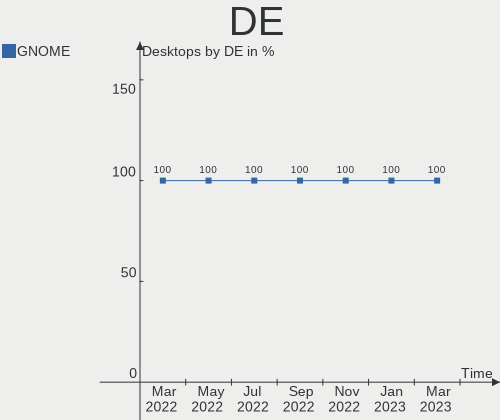
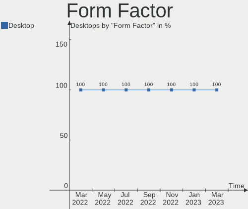
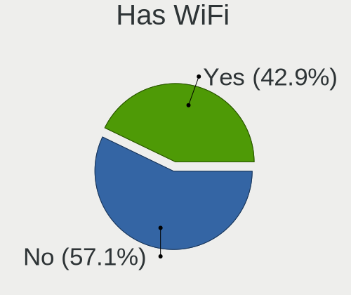
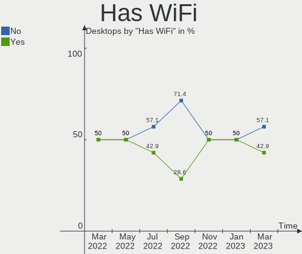
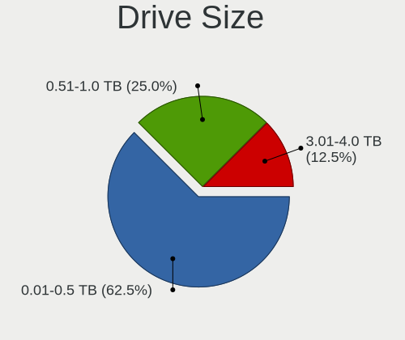
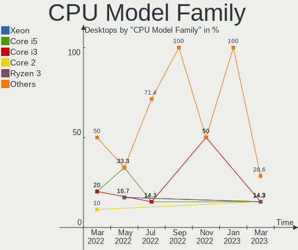
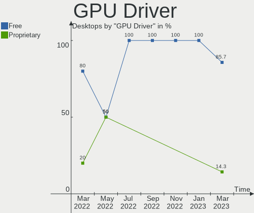
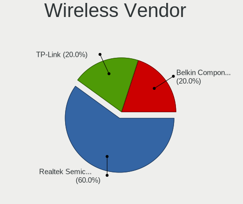
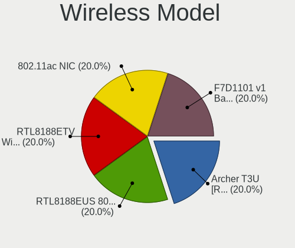
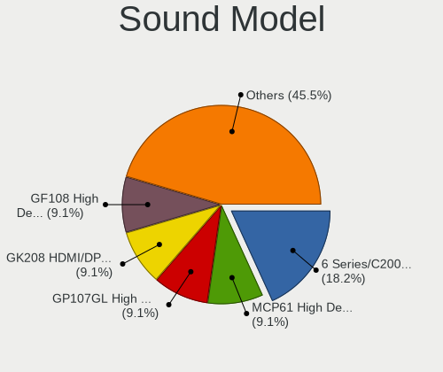

Endless - Hardware Trends (Desktops)
------------------------------------

A project to identify most popular hardware characteristics and track their change
over time based on data collected by Linux users at https://Linux-Hardware.org.

Anyone can contribute to this report by the [hw-probe](https://github.com/linuxhw/hw-probe) tool:

    sudo -E hw-probe -all -upload

This report is for one last month. Overall report since the beginning of time: [TestCoverage](https://github.com/linuxhw/TestCoverage)

Period: Dec, 2022.

Contents
--------

* [ System ](#system)
  - [ OS                       ](#os)
  - [ OS Family                ](#os-family)
  - [ Kernel                   ](#kernel)
  - [ Kernel Family            ](#kernel-family)
  - [ Kernel Major Ver.        ](#kernel-major-ver)
  - [ Arch                     ](#arch)
  - [ DE                       ](#de)
  - [ Display Server           ](#display-server)
  - [ Display Manager          ](#display-manager)
  - [ OS Lang                  ](#os-lang)
  - [ Boot Mode                ](#boot-mode)
  - [ Filesystem               ](#filesystem)
  - [ Part. scheme             ](#part-scheme)
  - [ Dual Boot with Linux/BSD ](#dual-boot-with-linuxbsd)
  - [ Dual Boot (Win)          ](#dual-boot-win)

* [ Board ](#board)
  - [ Vendor                   ](#vendor)
  - [ Model                    ](#model)
  - [ Model Family             ](#model-family)
  - [ MFG Year                 ](#mfg-year)
  - [ Form Factor              ](#form-factor)
  - [ Secure Boot              ](#secure-boot)
  - [ Coreboot                 ](#coreboot)
  - [ RAM Size                 ](#ram-size)
  - [ RAM Used                 ](#ram-used)
  - [ Total Drives             ](#total-drives)
  - [ Has CD-ROM               ](#has-cd-rom)
  - [ Has Ethernet             ](#has-ethernet)
  - [ Has WiFi                 ](#has-wifi)
  - [ Has Bluetooth            ](#has-bluetooth)

* [ Location ](#location)
  - [ Country                  ](#country)
  - [ City                     ](#city)

* [ Drives ](#drives)
  - [ Drive Vendor             ](#drive-vendor)
  - [ Drive Model              ](#drive-model)
  - [ HDD Vendor               ](#hdd-vendor)
  - [ SSD Vendor               ](#ssd-vendor)
  - [ Drive Kind               ](#drive-kind)
  - [ Drive Connector          ](#drive-connector)
  - [ Drive Size               ](#drive-size)
  - [ Space Total              ](#space-total)
  - [ Space Used               ](#space-used)
  - [ Malfunc. Drives          ](#malfunc-drives)
  - [ Malfunc. Drive Vendor    ](#malfunc-drive-vendor)
  - [ Malfunc. HDD Vendor      ](#malfunc-hdd-vendor)
  - [ Malfunc. Drive Kind      ](#malfunc-drive-kind)
  - [ Failed Drives            ](#failed-drives)
  - [ Failed Drive Vendor      ](#failed-drive-vendor)
  - [ Drive Status             ](#drive-status)

* [ Storage controller ](#storage-controller)
  - [ Storage Vendor           ](#storage-vendor)
  - [ Storage Model            ](#storage-model)
  - [ Storage Kind             ](#storage-kind)

* [ Processor ](#processor)
  - [ CPU Vendor               ](#cpu-vendor)
  - [ CPU Model                ](#cpu-model)
  - [ CPU Model Family         ](#cpu-model-family)
  - [ CPU Cores                ](#cpu-cores)
  - [ CPU Sockets              ](#cpu-sockets)
  - [ CPU Threads              ](#cpu-threads)
  - [ CPU Op-Modes             ](#cpu-op-modes)
  - [ CPU Microcode            ](#cpu-microcode)
  - [ CPU Microarch            ](#cpu-microarch)

* [ Graphics ](#graphics)
  - [ GPU Vendor               ](#gpu-vendor)
  - [ GPU Model                ](#gpu-model)
  - [ GPU Combo                ](#gpu-combo)
  - [ GPU Driver               ](#gpu-driver)
  - [ GPU Memory               ](#gpu-memory)

* [ Monitor ](#monitor)
  - [ Monitor Vendor           ](#monitor-vendor)
  - [ Monitor Model            ](#monitor-model)
  - [ Monitor Resolution       ](#monitor-resolution)
  - [ Monitor Diagonal         ](#monitor-diagonal)
  - [ Monitor Width            ](#monitor-width)
  - [ Aspect Ratio             ](#aspect-ratio)
  - [ Monitor Area             ](#monitor-area)
  - [ Pixel Density            ](#pixel-density)
  - [ Multiple Monitors        ](#multiple-monitors)

* [ Network ](#network)
  - [ Net Controller Vendor    ](#net-controller-vendor)
  - [ Net Controller Model     ](#net-controller-model)
  - [ Wireless Vendor          ](#wireless-vendor)
  - [ Wireless Model           ](#wireless-model)
  - [ Ethernet Vendor          ](#ethernet-vendor)
  - [ Ethernet Model           ](#ethernet-model)
  - [ Net Controller Kind      ](#net-controller-kind)
  - [ Used Controller          ](#used-controller)
  - [ NICs                     ](#nics)
  - [ IPv6                     ](#ipv6)

* [ Bluetooth ](#bluetooth)
  - [ Bluetooth Vendor         ](#bluetooth-vendor)
  - [ Bluetooth Model          ](#bluetooth-model)

* [ Sound ](#sound)
  - [ Sound Vendor             ](#sound-vendor)
  - [ Sound Model              ](#sound-model)

* [ Memory ](#memory)
  - [ Memory Vendor            ](#memory-vendor)
  - [ Memory Model             ](#memory-model)
  - [ Memory Kind              ](#memory-kind)
  - [ Memory Form Factor       ](#memory-form-factor)
  - [ Memory Size              ](#memory-size)
  - [ Memory Speed             ](#memory-speed)

* [ Printers & scanners ](#printers--scanners)
  - [ Printer Vendor           ](#printer-vendor)
  - [ Printer Model            ](#printer-model)
  - [ Scanner Vendor           ](#scanner-vendor)
  - [ Scanner Model            ](#scanner-model)

* [ Camera ](#camera)
  - [ Camera Vendor            ](#camera-vendor)
  - [ Camera Model             ](#camera-model)

* [ Security ](#security)
  - [ Fingerprint Vendor       ](#fingerprint-vendor)
  - [ Fingerprint Model        ](#fingerprint-model)
  - [ Chipcard Vendor          ](#chipcard-vendor)
  - [ Chipcard Model           ](#chipcard-model)

* [ Unsupported ](#unsupported)
  - [ Unsupported Devices      ](#unsupported-devices)
  - [ Unsupported Device Types ](#unsupported-device-types)

System
------

OS
--

Installed operating systems

| Name           | Desktops | Percent |
|----------------|----------|---------|
| Endless 4.0.13 | 4        | 80%     |
| Endless 4.0.10 | 1        | 20%     |

OS Family
---------

OS without a version

| Name    | Desktops | Percent |
|---------|----------|---------|
| Endless | 5        | 100%    |

Kernel
------

Version of the Linux kernel

| Version           | Desktops | Percent |
|-------------------|----------|---------|
| 5.11.0-35-generic | 5        | 100%    |

Kernel Family
-------------

Linux kernel without a distro release

| Version | Desktops | Percent |
|---------|----------|---------|
| 5.11.0  | 5        | 100%    |

Kernel Major Ver.
-----------------

Linux kernel major version

| Version | Desktops | Percent |
|---------|----------|---------|
| 5.11    | 5        | 100%    |

Arch
----

OS architecture (x86_64, i586, etc.)

| Name   | Desktops | Percent |
|--------|----------|---------|
| x86_64 | 5        | 100%    |

DE
--

Desktop Environment

| Name  | Desktops | Percent |
|-------|----------|---------|
| GNOME | 5        | 100%    |

Display Server
--------------

X11 or Wayland

| Name | Desktops | Percent |
|------|----------|---------|
| X11  | 5        | 100%    |

Display Manager
---------------

SDDM, LightDM, etc.

| Name    | Desktops | Percent |
|---------|----------|---------|
| Unknown | 5        | 100%    |

OS Lang
-------

Language

| Lang  | Desktops | Percent |
|-------|----------|---------|
| en_US | 2        | 40%     |
| pl_PL | 1        | 20%     |
| nl_NL | 1        | 20%     |
| de_DE | 1        | 20%     |

Boot Mode
---------

EFI or BIOS

| Mode | Desktops | Percent |
|------|----------|---------|
| EFI  | 3        | 60%     |
| BIOS | 2        | 40%     |

Filesystem
----------

Type of filesystem

| Type | Desktops | Percent |
|------|----------|---------|
| Ext4 | 5        | 100%    |

Part. scheme
------------

Scheme of partitioning

| Type    | Desktops | Percent |
|---------|----------|---------|
| Unknown | 5        | 100%    |

Dual Boot with Linux/BSD
------------------------

Hosting more than one Linux/BSD

| Dual boot | Desktops | Percent |
|-----------|----------|---------|
| No        | 5        | 100%    |

Dual Boot (Win)
---------------

Hosting Linux and Windows

| Dual boot | Desktops | Percent |
|-----------|----------|---------|
| No        | 5        | 100%    |

Board
-----

Vendor
------

Motherboard manufacturer

| Name             | Desktops | Percent |
|------------------|----------|---------|
| Hewlett-Packard  | 2        | 40%     |
| Acer             | 2        | 40%     |
| ASUSTek Computer | 1        | 20%     |

Model
-----

Motherboard model

| Name                         | Desktops | Percent |
|------------------------------|----------|---------|
| HP EliteDesk 800 G1 SFF      | 1        | 20%     |
| HP Compaq 8000 Elite USDT PC | 1        | 20%     |
| ASUS M5A97 R2.0              | 1        | 20%     |
| Acer Nitro N50-610           | 1        | 20%     |
| Acer Aspire XC-704           | 1        | 20%     |

Model Family
------------

Motherboard model prefix

| Name         | Desktops | Percent |
|--------------|----------|---------|
| HP EliteDesk | 1        | 20%     |
| HP Compaq    | 1        | 20%     |
| ASUS M5A97   | 1        | 20%     |
| Acer Nitro   | 1        | 20%     |
| Acer Aspire  | 1        | 20%     |

MFG Year
--------

Motherboard manufacture year

| Year | Desktops | Percent |
|------|----------|---------|
| 2020 | 1        | 20%     |
| 2015 | 1        | 20%     |
| 2013 | 1        | 20%     |
| 2012 | 1        | 20%     |
| 2009 | 1        | 20%     |

Form Factor
-----------

Physical design of the computer

| Name    | Desktops | Percent |
|---------|----------|---------|
| Desktop | 5        | 100%    |

Secure Boot
-----------

Enabled or disabled

| State    | Desktops | Percent |
|----------|----------|---------|
| Disabled | 5        | 100%    |

Coreboot
--------

Have coreboot on board

| Used | Desktops | Percent |
|------|----------|---------|
| No   | 5        | 100%    |

RAM Size
--------

Total RAM memory

| Size in GB | Desktops | Percent |
|------------|----------|---------|
| 4.01-8.0   | 3        | 60%     |
| 3.01-4.0   | 1        | 20%     |
| 16.01-24.0 | 1        | 20%     |

RAM Used
--------

Used RAM memory

| Used GB  | Desktops | Percent |
|----------|----------|---------|
| 1.01-2.0 | 4        | 80%     |
| 0.51-1.0 | 1        | 20%     |

Total Drives
------------

Number of drives on board

| Drives | Desktops | Percent |
|--------|----------|---------|
| 2      | 3        | 60%     |
| 1      | 2        | 40%     |

Has CD-ROM
----------

Has CD-ROM on board

| Presented | Desktops | Percent |
|-----------|----------|---------|
| Yes       | 4        | 80%     |
| No        | 1        | 20%     |

Has Ethernet
------------

Has Ethernet on board

| Presented | Desktops | Percent |
|-----------|----------|---------|
| Yes       | 5        | 100%    |

Has WiFi
--------

Has WiFi module

| Presented | Desktops | Percent |
|-----------|----------|---------|
| Yes       | 4        | 80%     |
| No        | 1        | 20%     |

Has Bluetooth
-------------

Has Bluetooth module

| Presented | Desktops | Percent |
|-----------|----------|---------|
| No        | 4        | 80%     |
| Yes       | 1        | 20%     |

Location
--------

Country
-------

Geographic location (country)

| Country     | Desktops | Percent |
|-------------|----------|---------|
| USA         | 1        | 20%     |
| Poland      | 1        | 20%     |
| New Zealand | 1        | 20%     |
| Netherlands | 1        | 20%     |
| Germany     | 1        | 20%     |

City
----

Geographic location (city)

| City          | Desktops | Percent |
|---------------|----------|---------|
| Whangarei     | 1        | 20%     |
| Maastricht    | 1        | 20%     |
| Gora Kalwaria | 1        | 20%     |
| Goldsboro     | 1        | 20%     |
| Bochum        | 1        | 20%     |

Drives
------

Drive Vendor
------------

Hard drive vendors

| Vendor              | Desktops | Drives | Percent |
|---------------------|----------|--------|---------|
| Seagate             | 3        | 3      | 37.5%   |
| WDC                 | 1        | 1      | 12.5%   |
| Unknown             | 1        | 1      | 12.5%   |
| Sandisk             | 1        | 1      | 12.5%   |
| Samsung Electronics | 1        | 1      | 12.5%   |
| Kingston            | 1        | 1      | 12.5%   |

Drive Model
-----------

Hard drive models

| Model                                           | Desktops | Percent |
|-------------------------------------------------|----------|---------|
| WDC WD10EZEX-21WN4A0 1TB                        | 1        | 12.5%   |
| Unknown SD/MMC/MS PRO 64GB                      | 1        | 12.5%   |
| Seagate ST9250410AS 250GB                       | 1        | 12.5%   |
| Seagate ST500DM002-1BD142 500GB                 | 1        | 12.5%   |
| Seagate ST1000DM003-1CH162 1TB                  | 1        | 12.5%   |
| Sandisk WD Blue SN500 / PC SN520 NVMe SSD 256GB | 1        | 12.5%   |
| Samsung HD103SI 1TB                             | 1        | 12.5%   |
| Kingston SUV400S37120G 120GB SSD                | 1        | 12.5%   |

HDD Vendor
----------

Hard disk drive vendors

| Vendor              | Desktops | Drives | Percent |
|---------------------|----------|--------|---------|
| Seagate             | 3        | 3      | 50%     |
| WDC                 | 1        | 1      | 16.67%  |
| Unknown             | 1        | 1      | 16.67%  |
| Samsung Electronics | 1        | 1      | 16.67%  |

SSD Vendor
----------

Solid state drive vendors

| Vendor   | Desktops | Drives | Percent |
|----------|----------|--------|---------|
| Kingston | 1        | 1      | 100%    |

Drive Kind
----------

HDD or SSD

| Kind | Desktops | Drives | Percent |
|------|----------|--------|---------|
| HDD  | 5        | 6      | 71.43%  |
| NVMe | 1        | 1      | 14.29%  |
| SSD  | 1        | 1      | 14.29%  |

Drive Connector
---------------

SATA, SAS, NVMe, etc.

| Type | Desktops | Drives | Percent |
|------|----------|--------|---------|
| SATA | 5        | 6      | 71.43%  |
| SAS  | 1        | 1      | 14.29%  |
| NVMe | 1        | 1      | 14.29%  |

Drive Size
----------

Size of hard drive

| Size in TB | Desktops | Drives | Percent |
|------------|----------|--------|---------|
| 0.01-0.5   | 3        | 4      | 60%     |
| 0.51-1.0   | 2        | 3      | 40%     |

Space Total
-----------

Amount of disk space available on the file system

| Size in GB | Desktops | Percent |
|------------|----------|---------|
| 251-500    | 2        | 40%     |
| 101-250    | 1        | 20%     |
| 501-1000   | 1        | 20%     |
| Unknown    | 1        | 20%     |

Space Used
----------

Amount of used disk space

| Used GB | Desktops | Percent |
|---------|----------|---------|
| 21-50   | 2        | 40%     |
| 101-250 | 2        | 40%     |
| Unknown | 1        | 20%     |

Malfunc. Drives
---------------

Drive models with a malfunction

Zero info for selected period =(

Malfunc. Drive Vendor
---------------------

Vendors of faulty drives

Zero info for selected period =(

Malfunc. HDD Vendor
-------------------

Vendors of faulty HDD drives

Zero info for selected period =(

Malfunc. Drive Kind
-------------------

Kinds of faulty drives

Zero info for selected period =(

Failed Drives
-------------

Failed drive models

Zero info for selected period =(

Failed Drive Vendor
-------------------

Failed drive vendors

Zero info for selected period =(

Drive Status
------------

Number of failed and malfunc. drives

| Status   | Desktops | Drives | Percent |
|----------|----------|--------|---------|
| Detected | 5        | 8      | 100%    |

Storage controller
------------------

Storage Vendor
--------------

Storage controller vendors

| Vendor  | Desktops | Percent |
|---------|----------|---------|
| Intel   | 4        | 66.67%  |
| SanDisk | 1        | 16.67%  |
| AMD     | 1        | 16.67%  |

Storage Model
-------------

Storage controller models

| Model                                                                            | Desktops | Percent |
|----------------------------------------------------------------------------------|----------|---------|
| SanDisk WD Blue SN500 / PC SN520 NVMe SSD                                        | 1        | 14.29%  |
| Intel Comet Lake SATA AHCI Controller                                            | 1        | 14.29%  |
| Intel Atom/Celeron/Pentium Processor x5-E8000/J3xxx/N3xxx Series SATA Controller | 1        | 14.29%  |
| Intel 82801JD/DO (ICH10 Family) SATA AHCI Controller                             | 1        | 14.29%  |
| Intel 8 Series/C220 Series Chipset Family 6-port SATA Controller 1 [AHCI mode]   | 1        | 14.29%  |
| Intel 4 Series Chipset PT IDER Controller                                        | 1        | 14.29%  |
| AMD SB7x0/SB8x0/SB9x0 SATA Controller [AHCI mode]                                | 1        | 14.29%  |

Storage Kind
------------

Kind of storage controller (IDE, SATA, NVMe, SAS, ...)

| Kind | Desktops | Percent |
|------|----------|---------|
| SATA | 5        | 71.43%  |
| NVMe | 1        | 14.29%  |
| IDE  | 1        | 14.29%  |

Processor
---------

CPU Vendor
----------

Processor vendors

| Vendor | Desktops | Percent |
|--------|----------|---------|
| Intel  | 4        | 80%     |
| AMD    | 1        | 20%     |

CPU Model
---------

Processor models

| Model                                 | Desktops | Percent |
|---------------------------------------|----------|---------|
| Intel Pentium CPU J3710 @ 1.60GHz     | 1        | 20%     |
| Intel Core i5-4590 CPU @ 3.30GHz      | 1        | 20%     |
| Intel Core i5-10400F CPU @ 2.90GHz    | 1        | 20%     |
| Intel Core 2 Quad CPU Q9505 @ 2.83GHz | 1        | 20%     |
| AMD FX-4350 Quad-Core Processor       | 1        | 20%     |

CPU Model Family
----------------

Processor model prefix

| Model             | Desktops | Percent |
|-------------------|----------|---------|
| Intel Core i5     | 2        | 40%     |
| Intel Pentium     | 1        | 20%     |
| Intel Core 2 Quad | 1        | 20%     |
| AMD FX            | 1        | 20%     |

CPU Cores
---------

Number of processor cores

| Number | Desktops | Percent |
|--------|----------|---------|
| 4      | 3        | 60%     |
| 6      | 1        | 20%     |
| 2      | 1        | 20%     |

CPU Sockets
-----------

Number of sockets

| Number | Desktops | Percent |
|--------|----------|---------|
| 1      | 5        | 100%    |

CPU Threads
-----------

Threads per core (Hyper-Threading)

| Number | Desktops | Percent |
|--------|----------|---------|
| 1      | 3        | 60%     |
| 2      | 2        | 40%     |

CPU Op-Modes
------------

CPU Operation Modes (32-bit, 64-bit)

| Op mode        | Desktops | Percent |
|----------------|----------|---------|
| 32-bit, 64-bit | 5        | 100%    |

CPU Microcode
-------------

Microcode number

| Number     | Desktops | Percent |
|------------|----------|---------|
| 0xa0653    | 1        | 20%     |
| 0x406c4    | 1        | 20%     |
| 0x306c3    | 1        | 20%     |
| 0x1067a    | 1        | 20%     |
| 0x06000852 | 1        | 20%     |

CPU Microarch
-------------

Microarchitecture

| Name       | Desktops | Percent |
|------------|----------|---------|
| Silvermont | 1        | 20%     |
| Piledriver | 1        | 20%     |
| Penryn     | 1        | 20%     |
| Haswell    | 1        | 20%     |
| CometLake  | 1        | 20%     |

Graphics
--------

GPU Vendor
----------

Vendors of graphics cards

| Vendor | Desktops | Percent |
|--------|----------|---------|
| Intel  | 3        | 60%     |
| Nvidia | 1        | 20%     |
| AMD    | 1        | 20%     |

GPU Model
---------

Graphics card models

| Model                                                                                    | Desktops | Percent |
|------------------------------------------------------------------------------------------|----------|---------|
| Nvidia TU106 [GeForce RTX 2060 Rev. A]                                                   | 1        | 20%     |
| Intel Xeon E3-1200 v3/4th Gen Core Processor Integrated Graphics Controller              | 1        | 20%     |
| Intel Atom/Celeron/Pentium Processor x5-E8000/J3xxx/N3xxx Integrated Graphics Controller | 1        | 20%     |
| Intel 4 Series Chipset Integrated Graphics Controller                                    | 1        | 20%     |
| AMD Turks PRO [Radeon HD 6570/7570/8550 / R5 230]                                        | 1        | 20%     |

GPU Combo
---------

Combinations of graphics cards

| Name       | Desktops | Percent |
|------------|----------|---------|
| 1 x Intel  | 3        | 60%     |
| 1 x Nvidia | 1        | 20%     |
| 1 x AMD    | 1        | 20%     |

GPU Driver
----------

Free vs proprietary

| Driver      | Desktops | Percent |
|-------------|----------|---------|
| Free        | 4        | 80%     |
| Proprietary | 1        | 20%     |

GPU Memory
----------

Total video memory

| Size in GB | Desktops | Percent |
|------------|----------|---------|
| Unknown    | 4        | 80%     |
| 1.01-2.0   | 1        | 20%     |

Monitor
-------

Monitor Vendor
--------------

Monitor vendors

| Vendor               | Desktops | Percent |
|----------------------|----------|---------|
| Philips              | 1        | 25%     |
| NEC Computers        | 1        | 25%     |
| AOC                  | 1        | 25%     |
| Ancor Communications | 1        | 25%     |

Monitor Model
-------------

Monitor models

| Model                                                                 | Desktops | Percent |
|-----------------------------------------------------------------------|----------|---------|
| Philips FTV PHL04C3 1920x1080 1440x810mm 65.0-inch                    | 1        | 25%     |
| NEC Computers EA223WM NEC688F 1680x1050 474x296mm 22.0-inch           | 1        | 25%     |
| AOC 32G2WG3 AOC3202 1920x1080 698x393mm 31.5-inch                     | 1        | 25%     |
| Ancor Communications ASUS VS229 ACI22C2 1920x1080 477x268mm 21.5-inch | 1        | 25%     |

Monitor Resolution
------------------

Monitor screen resolution

| Resolution         | Desktops | Percent |
|--------------------|----------|---------|
| 3840x2160 (4K)     | 2        | 50%     |
| 1920x1080 (FHD)    | 1        | 25%     |
| 1680x1050 (WSXGA+) | 1        | 25%     |

Monitor Diagonal
----------------

Diagonal size in inches

| Inches | Desktops | Percent |
|--------|----------|---------|
| 65     | 1        | 25%     |
| 31     | 1        | 25%     |
| 22     | 1        | 25%     |
| 21     | 1        | 25%     |

Monitor Width
-------------

Physical width

| Width in mm | Desktops | Percent |
|-------------|----------|---------|
| 401-500     | 2        | 50%     |
| 601-700     | 1        | 25%     |
| 1001-1500   | 1        | 25%     |

Aspect Ratio
------------

Proportional relationship between the width and the height

| Ratio | Desktops | Percent |
|-------|----------|---------|
| 16/9  | 3        | 75%     |
| 16/10 | 1        | 25%     |

Monitor Area
------------

Area in inch²

| Area in inch² | Desktops | Percent |
|----------------|----------|---------|
| 201-250        | 2        | 50%     |
| More than 1000 | 1        | 25%     |
| 351-500        | 1        | 25%     |

Pixel Density
-------------

Pixels per inch

| Density | Desktops | Percent |
|---------|----------|---------|
| 51-100  | 2        | 50%     |
| 1-50    | 1        | 25%     |
| 101-120 | 1        | 25%     |

Multiple Monitors
-----------------

Total monitors connected

| Total | Desktops | Percent |
|-------|----------|---------|
| 1     | 5        | 100%    |

Network
-------

Net Controller Vendor
---------------------

Controller vendors

| Vendor                | Desktops | Percent |
|-----------------------|----------|---------|
| Realtek Semiconductor | 4        | 44.44%  |
| Intel                 | 4        | 44.44%  |
| Microsoft             | 1        | 11.11%  |

Net Controller Model
--------------------

Controller models

| Model                                                             | Desktops | Percent |
|-------------------------------------------------------------------|----------|---------|
| Realtek RTL8111/8168/8411 PCI Express Gigabit Ethernet Controller | 3        | 33.33%  |
| Realtek RTL8188EUS 802.11n Wireless Network Adapter               | 1        | 11.11%  |
| Microsoft XBOX ACC                                                | 1        | 11.11%  |
| Intel Ethernet Connection I217-LM                                 | 1        | 11.11%  |
| Intel Dual Band Wireless-AC 3168NGW [Stone Peak]                  | 1        | 11.11%  |
| Intel Comet Lake PCH CNVi WiFi                                    | 1        | 11.11%  |
| Intel 82567LM-3 Gigabit Network Connection                        | 1        | 11.11%  |

Wireless Vendor
---------------

Wireless vendors

| Vendor                | Desktops | Percent |
|-----------------------|----------|---------|
| Intel                 | 2        | 50%     |
| Realtek Semiconductor | 1        | 25%     |
| Microsoft             | 1        | 25%     |

Wireless Model
--------------

Wireless models

| Model                                               | Desktops | Percent |
|-----------------------------------------------------|----------|---------|
| Realtek RTL8188EUS 802.11n Wireless Network Adapter | 1        | 25%     |
| Microsoft XBOX ACC                                  | 1        | 25%     |
| Intel Dual Band Wireless-AC 3168NGW [Stone Peak]    | 1        | 25%     |
| Intel Comet Lake PCH CNVi WiFi                      | 1        | 25%     |

Ethernet Vendor
---------------

Ethernet vendors

| Vendor                | Desktops | Percent |
|-----------------------|----------|---------|
| Realtek Semiconductor | 3        | 60%     |
| Intel                 | 2        | 40%     |

Ethernet Model
--------------

Ethernet models

| Model                                                             | Desktops | Percent |
|-------------------------------------------------------------------|----------|---------|
| Realtek RTL8111/8168/8411 PCI Express Gigabit Ethernet Controller | 3        | 60%     |
| Intel Ethernet Connection I217-LM                                 | 1        | 20%     |
| Intel 82567LM-3 Gigabit Network Connection                        | 1        | 20%     |

Net Controller Kind
-------------------

Ethernet, WiFi or modem

| Kind     | Desktops | Percent |
|----------|----------|---------|
| Ethernet | 5        | 55.56%  |
| WiFi     | 4        | 44.44%  |

Used Controller
---------------

Currently used network controller

| Kind     | Desktops | Percent |
|----------|----------|---------|
| WiFi     | 3        | 60%     |
| Ethernet | 2        | 40%     |

NICs
----

Total network controllers on board

| Total | Desktops | Percent |
|-------|----------|---------|
| 1     | 3        | 60%     |
| 2     | 2        | 40%     |

IPv6
----

IPv6 vs IPv4

| Used | Desktops | Percent |
|------|----------|---------|
| No   | 4        | 80%     |
| Yes  | 1        | 20%     |

Bluetooth
---------

Bluetooth Vendor
----------------

Controller vendors

| Vendor | Desktops | Percent |
|--------|----------|---------|
| Intel  | 1        | 100%    |

Bluetooth Model
---------------

Controller models

| Model                 | Desktops | Percent |
|-----------------------|----------|---------|
| Intel AX201 Bluetooth | 1        | 100%    |

Sound
-----

Sound Vendor
------------

Sound card vendors

| Vendor | Desktops | Percent |
|--------|----------|---------|
| Intel  | 4        | 66.67%  |
| Nvidia | 1        | 16.67%  |
| AMD    | 1        | 16.67%  |

Sound Model
-----------

Sound card models

| Model                                                                                             | Desktops | Percent |
|---------------------------------------------------------------------------------------------------|----------|---------|
| Nvidia TU106 High Definition Audio Controller                                                     | 1        | 12.5%   |
| Intel Xeon E3-1200 v3/4th Gen Core Processor HD Audio Controller                                  | 1        | 12.5%   |
| Intel Comet Lake PCH cAVS                                                                         | 1        | 12.5%   |
| Intel Atom/Celeron/Pentium Processor x5-E8000/J3xxx/N3xxx Series High Definition Audio Controller | 1        | 12.5%   |
| Intel 82801JD/DO (ICH10 Family) HD Audio Controller                                               | 1        | 12.5%   |
| Intel 8 Series/C220 Series Chipset High Definition Audio Controller                               | 1        | 12.5%   |
| AMD Turks HDMI Audio [Radeon HD 6500/6600 / 6700M Series]                                         | 1        | 12.5%   |
| AMD SBx00 Azalia (Intel HDA)                                                                      | 1        | 12.5%   |

Memory
------

Memory Vendor
-------------

Memory module vendors

Zero info for selected period =(

Memory Model
------------

Memory module models

Zero info for selected period =(

Memory Kind
-----------

Memory module kinds

Zero info for selected period =(

Memory Form Factor
------------------

Physical design of the memory module

Zero info for selected period =(

Memory Size
-----------

Memory module size

Zero info for selected period =(

Memory Speed
------------

Memory module speed

Zero info for selected period =(

Printers & scanners
-------------------

Printer Vendor
--------------

Printer device vendors

Zero info for selected period =(

Printer Model
-------------

Printer device models

Zero info for selected period =(

Scanner Vendor
--------------

Scanner device vendors

Zero info for selected period =(

Scanner Model
-------------

Scanner device models

Zero info for selected period =(

Camera
------

Camera Vendor
-------------

Camera device vendors

| Vendor   | Desktops | Percent |
|----------|----------|---------|
| Microdia | 1        | 50%     |
| Apple    | 1        | 50%     |

Camera Model
------------

Camera device models

| Model                      | Desktops | Percent |
|----------------------------|----------|---------|
| Microdia Integrated Camera | 1        | 50%     |
| Apple iPhone5/5C/5S/6      | 1        | 50%     |

Security
--------

Fingerprint Vendor
------------------

Fingerprint sensor vendors

Zero info for selected period =(

Fingerprint Model
-----------------

Fingerprint sensor models

Zero info for selected period =(

Chipcard Vendor
---------------

Chipcard module vendors

Zero info for selected period =(

Chipcard Model
--------------

Chipcard module models

Zero info for selected period =(

Unsupported
-----------

Unsupported Devices
-------------------

Total unsupported devices on board

| Total | Desktops | Percent |
|-------|----------|---------|
| 0     | 4        | 80%     |
| 1     | 1        | 20%     |

Unsupported Device Types
------------------------

Types of unsupported devices

| Type         | Desktops | Percent |
|--------------|----------|---------|
| Net/wireless | 1        | 100%    |

