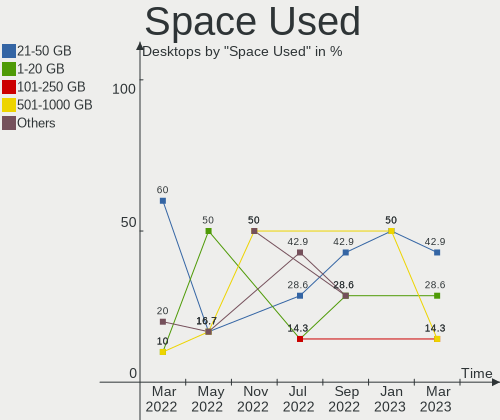
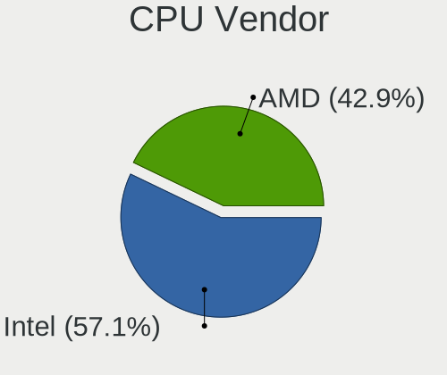
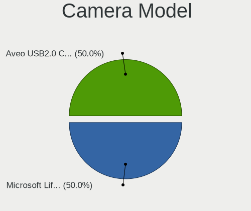

Endless - Hardware Trends (Desktops)
------------------------------------

A project to identify most popular hardware characteristics and track their change
over time based on data collected by Linux users at https://Linux-Hardware.org.

Anyone can contribute to this report by the [hw-probe](https://github.com/linuxhw/hw-probe) tool:

    sudo -E hw-probe -all -upload

This report is for one last month. Overall report since the beginning of time: [TestCoverage](https://github.com/linuxhw/TestCoverage)

Period: Aug, 2022.

Contents
--------

* [ System ](#system)
  - [ OS                       ](#os)
  - [ OS Family                ](#os-family)
  - [ Kernel                   ](#kernel)
  - [ Kernel Family            ](#kernel-family)
  - [ Kernel Major Ver.        ](#kernel-major-ver)
  - [ Arch                     ](#arch)
  - [ DE                       ](#de)
  - [ Display Server           ](#display-server)
  - [ Display Manager          ](#display-manager)
  - [ OS Lang                  ](#os-lang)
  - [ Boot Mode                ](#boot-mode)
  - [ Filesystem               ](#filesystem)
  - [ Part. scheme             ](#part-scheme)
  - [ Dual Boot with Linux/BSD ](#dual-boot-with-linuxbsd)
  - [ Dual Boot (Win)          ](#dual-boot-win)

* [ Board ](#board)
  - [ Vendor                   ](#vendor)
  - [ Model                    ](#model)
  - [ Model Family             ](#model-family)
  - [ MFG Year                 ](#mfg-year)
  - [ Form Factor              ](#form-factor)
  - [ Secure Boot              ](#secure-boot)
  - [ Coreboot                 ](#coreboot)
  - [ RAM Size                 ](#ram-size)
  - [ RAM Used                 ](#ram-used)
  - [ Total Drives             ](#total-drives)
  - [ Has CD-ROM               ](#has-cd-rom)
  - [ Has Ethernet             ](#has-ethernet)
  - [ Has WiFi                 ](#has-wifi)
  - [ Has Bluetooth            ](#has-bluetooth)

* [ Location ](#location)
  - [ Country                  ](#country)
  - [ City                     ](#city)

* [ Drives ](#drives)
  - [ Drive Vendor             ](#drive-vendor)
  - [ Drive Model              ](#drive-model)
  - [ HDD Vendor               ](#hdd-vendor)
  - [ SSD Vendor               ](#ssd-vendor)
  - [ Drive Kind               ](#drive-kind)
  - [ Drive Connector          ](#drive-connector)
  - [ Drive Size               ](#drive-size)
  - [ Space Total              ](#space-total)
  - [ Space Used               ](#space-used)
  - [ Malfunc. Drives          ](#malfunc-drives)
  - [ Malfunc. Drive Vendor    ](#malfunc-drive-vendor)
  - [ Malfunc. HDD Vendor      ](#malfunc-hdd-vendor)
  - [ Malfunc. Drive Kind      ](#malfunc-drive-kind)
  - [ Failed Drives            ](#failed-drives)
  - [ Failed Drive Vendor      ](#failed-drive-vendor)
  - [ Drive Status             ](#drive-status)

* [ Storage controller ](#storage-controller)
  - [ Storage Vendor           ](#storage-vendor)
  - [ Storage Model            ](#storage-model)
  - [ Storage Kind             ](#storage-kind)

* [ Processor ](#processor)
  - [ CPU Vendor               ](#cpu-vendor)
  - [ CPU Model                ](#cpu-model)
  - [ CPU Model Family         ](#cpu-model-family)
  - [ CPU Cores                ](#cpu-cores)
  - [ CPU Sockets              ](#cpu-sockets)
  - [ CPU Threads              ](#cpu-threads)
  - [ CPU Op-Modes             ](#cpu-op-modes)
  - [ CPU Microcode            ](#cpu-microcode)
  - [ CPU Microarch            ](#cpu-microarch)

* [ Graphics ](#graphics)
  - [ GPU Vendor               ](#gpu-vendor)
  - [ GPU Model                ](#gpu-model)
  - [ GPU Combo                ](#gpu-combo)
  - [ GPU Driver               ](#gpu-driver)
  - [ GPU Memory               ](#gpu-memory)

* [ Monitor ](#monitor)
  - [ Monitor Vendor           ](#monitor-vendor)
  - [ Monitor Model            ](#monitor-model)
  - [ Monitor Resolution       ](#monitor-resolution)
  - [ Monitor Diagonal         ](#monitor-diagonal)
  - [ Monitor Width            ](#monitor-width)
  - [ Aspect Ratio             ](#aspect-ratio)
  - [ Monitor Area             ](#monitor-area)
  - [ Pixel Density            ](#pixel-density)
  - [ Multiple Monitors        ](#multiple-monitors)

* [ Network ](#network)
  - [ Net Controller Vendor    ](#net-controller-vendor)
  - [ Net Controller Model     ](#net-controller-model)
  - [ Wireless Vendor          ](#wireless-vendor)
  - [ Wireless Model           ](#wireless-model)
  - [ Ethernet Vendor          ](#ethernet-vendor)
  - [ Ethernet Model           ](#ethernet-model)
  - [ Net Controller Kind      ](#net-controller-kind)
  - [ Used Controller          ](#used-controller)
  - [ NICs                     ](#nics)
  - [ IPv6                     ](#ipv6)

* [ Bluetooth ](#bluetooth)
  - [ Bluetooth Vendor         ](#bluetooth-vendor)
  - [ Bluetooth Model          ](#bluetooth-model)

* [ Sound ](#sound)
  - [ Sound Vendor             ](#sound-vendor)
  - [ Sound Model              ](#sound-model)

* [ Memory ](#memory)
  - [ Memory Vendor            ](#memory-vendor)
  - [ Memory Model             ](#memory-model)
  - [ Memory Kind              ](#memory-kind)
  - [ Memory Form Factor       ](#memory-form-factor)
  - [ Memory Size              ](#memory-size)
  - [ Memory Speed             ](#memory-speed)

* [ Printers & scanners ](#printers--scanners)
  - [ Printer Vendor           ](#printer-vendor)
  - [ Printer Model            ](#printer-model)
  - [ Scanner Vendor           ](#scanner-vendor)
  - [ Scanner Model            ](#scanner-model)

* [ Camera ](#camera)
  - [ Camera Vendor            ](#camera-vendor)
  - [ Camera Model             ](#camera-model)

* [ Security ](#security)
  - [ Fingerprint Vendor       ](#fingerprint-vendor)
  - [ Fingerprint Model        ](#fingerprint-model)
  - [ Chipcard Vendor          ](#chipcard-vendor)
  - [ Chipcard Model           ](#chipcard-model)

* [ Unsupported ](#unsupported)
  - [ Unsupported Devices      ](#unsupported-devices)
  - [ Unsupported Device Types ](#unsupported-device-types)

System
------

OS
--

Installed operating systems

| Name                   | Desktops | Percent |
|------------------------|----------|---------|
| Endless 4.0.4          | 3        | 37.5%   |
| Endless 4.0.7          | 2        | 25%     |
| Endless 4.0.8          | 1        | 12.5%   |
| Endless 4.0.3          | 1        | 12.5%   |
| Endless 3.3.16-nexthw1 | 1        | 12.5%   |

OS Family
---------

OS without a version

| Name    | Desktops | Percent |
|---------|----------|---------|
| Endless | 8        | 100%    |

Kernel
------

Version of the Linux kernel

| Version           | Desktops | Percent |
|-------------------|----------|---------|
| 5.11.0-35-generic | 7        | 87.5%   |
| 4.15.0-12-generic | 1        | 12.5%   |

Kernel Family
-------------

Linux kernel without a distro release

| Version | Desktops | Percent |
|---------|----------|---------|
| 5.11.0  | 7        | 87.5%   |
| 4.15.0  | 1        | 12.5%   |

Kernel Major Ver.
-----------------

Linux kernel major version

| Version | Desktops | Percent |
|---------|----------|---------|
| 5.11    | 7        | 87.5%   |
| 4.15    | 1        | 12.5%   |

Arch
----

OS architecture (x86_64, i586, etc.)

| Name   | Desktops | Percent |
|--------|----------|---------|
| x86_64 | 8        | 100%    |

DE
--

Desktop Environment

| Name  | Desktops | Percent |
|-------|----------|---------|
| GNOME | 8        | 100%    |

Display Server
--------------

X11 or Wayland

| Name | Desktops | Percent |
|------|----------|---------|
| X11  | 8        | 100%    |

Display Manager
---------------

SDDM, LightDM, etc.

| Name    | Desktops | Percent |
|---------|----------|---------|
| Unknown | 8        | 100%    |

OS Lang
-------

Language

| Lang  | Desktops | Percent |
|-------|----------|---------|
| en_US | 3        | 37.5%   |
| sr_RS | 1        | 12.5%   |
| ro_RO | 1        | 12.5%   |
| pt_BR | 1        | 12.5%   |
| es_MX | 1        | 12.5%   |
| en_GB | 1        | 12.5%   |

Boot Mode
---------

EFI or BIOS

| Mode | Desktops | Percent |
|------|----------|---------|
| BIOS | 5        | 62.5%   |
| EFI  | 3        | 37.5%   |

Filesystem
----------

Type of filesystem

| Type  | Desktops | Percent |
|-------|----------|---------|
| Ext4  | 6        | 75%     |
| Tmpfs | 2        | 25%     |

Part. scheme
------------

Scheme of partitioning

| Type    | Desktops | Percent |
|---------|----------|---------|
| Unknown | 8        | 100%    |

Dual Boot with Linux/BSD
------------------------

Hosting more than one Linux/BSD

| Dual boot | Desktops | Percent |
|-----------|----------|---------|
| No        | 8        | 100%    |

Dual Boot (Win)
---------------

Hosting Linux and Windows

| Dual boot | Desktops | Percent |
|-----------|----------|---------|
| No        | 8        | 100%    |

Board
-----

Vendor
------

Motherboard manufacturer

| Name                | Desktops | Percent |
|---------------------|----------|---------|
| ASUSTek Computer    | 3        | 37.5%   |
| Hewlett-Packard     | 2        | 25%     |
| Gigabyte Technology | 1        | 12.5%   |
| Fujitsu             | 1        | 12.5%   |
| ECS                 | 1        | 12.5%   |

Model
-----

Motherboard model

| Name                           | Desktops | Percent |
|--------------------------------|----------|---------|
| HP EliteDesk 705 G2 MINI       | 1        | 12.5%   |
| HP Compaq dc7100 USDT(EC932ES) | 1        | 12.5%   |
| Gigabyte X570 I AORUS PRO WIFI | 1        | 12.5%   |
| Fujitsu ESPRIMO P2560          | 1        | 12.5%   |
| ECS A320AM4-M3D                | 1        | 12.5%   |
| ASUS ROG Maximus X CODE        | 1        | 12.5%   |
| ASUS M5A78L-M/USB3             | 1        | 12.5%   |
| ASUS ASUSPRO D340MC-C_D340MC   | 1        | 12.5%   |

Model Family
------------

Motherboard model prefix

| Name            | Desktops | Percent |
|-----------------|----------|---------|
| HP EliteDesk    | 1        | 12.5%   |
| HP Compaq       | 1        | 12.5%   |
| Gigabyte X570   | 1        | 12.5%   |
| Fujitsu ESPRIMO | 1        | 12.5%   |
| ECS A320AM4-M3D | 1        | 12.5%   |
| ASUS ROG        | 1        | 12.5%   |
| ASUS M5A78L-M   | 1        | 12.5%   |
| ASUS ASUSPRO    | 1        | 12.5%   |

MFG Year
--------

Motherboard manufacture year

| Year | Desktops | Percent |
|------|----------|---------|
| 2019 | 2        | 25%     |
| 2021 | 1        | 12.5%   |
| 2018 | 1        | 12.5%   |
| 2017 | 1        | 12.5%   |
| 2011 | 1        | 12.5%   |
| 2010 | 1        | 12.5%   |
| 2004 | 1        | 12.5%   |

Form Factor
-----------

Physical design of the computer

| Name    | Desktops | Percent |
|---------|----------|---------|
| Desktop | 8        | 100%    |

Secure Boot
-----------

Enabled or disabled

| State    | Desktops | Percent |
|----------|----------|---------|
| Disabled | 8        | 100%    |

Coreboot
--------

Have coreboot on board

| Used | Desktops | Percent |
|------|----------|---------|
| No   | 8        | 100%    |

RAM Size
--------

Total RAM memory

| Size in GB | Desktops | Percent |
|------------|----------|---------|
| 4.01-8.0   | 2        | 25%     |
| 3.01-4.0   | 2        | 25%     |
| 32.01-64.0 | 1        | 12.5%   |
| 16.01-24.0 | 1        | 12.5%   |
| 1.01-2.0   | 1        | 12.5%   |
| 8.01-16.0  | 1        | 12.5%   |

RAM Used
--------

Used RAM memory

| Used GB  | Desktops | Percent |
|----------|----------|---------|
| 1.01-2.0 | 6        | 75%     |
| 2.01-3.0 | 1        | 12.5%   |
| 0.51-1.0 | 1        | 12.5%   |

Total Drives
------------

Number of drives on board

| Drives | Desktops | Percent |
|--------|----------|---------|
| 1      | 5        | 62.5%   |
| 2      | 3        | 37.5%   |

Has CD-ROM
----------

Has CD-ROM on board

| Presented | Desktops | Percent |
|-----------|----------|---------|
| Yes       | 4        | 50%     |
| No        | 4        | 50%     |

Has Ethernet
------------

Has Ethernet on board

| Presented | Desktops | Percent |
|-----------|----------|---------|
| Yes       | 8        | 100%    |

Has WiFi
--------

Has WiFi module

| Presented | Desktops | Percent |
|-----------|----------|---------|
| Yes       | 6        | 75%     |
| No        | 2        | 25%     |

Has Bluetooth
-------------

Has Bluetooth module

| Presented | Desktops | Percent |
|-----------|----------|---------|
| No        | 6        | 75%     |
| Yes       | 2        | 25%     |

Location
--------

Country
-------

Geographic location (country)

| Country | Desktops | Percent |
|---------|----------|---------|
| UK      | 2        | 25%     |
| USA     | 1        | 12.5%   |
| Serbia  | 1        | 12.5%   |
| Romania | 1        | 12.5%   |
| Mexico  | 1        | 12.5%   |
| India   | 1        | 12.5%   |
| Brazil  | 1        | 12.5%   |

City
----

Geographic location (city)

| City                | Desktops | Percent |
|---------------------|----------|---------|
| Vijayawada          | 1        | 12.5%   |
| Valparaiso de Goias | 1        | 12.5%   |
| Urziceni            | 1        | 12.5%   |
| Redditch            | 1        | 12.5%   |
| Poole               | 1        | 12.5%   |
| Laguna Beach        | 1        | 12.5%   |
| Lagos de Moreno     | 1        | 12.5%   |
| Belgrade            | 1        | 12.5%   |

Drives
------

Drive Vendor
------------

Hard drive vendors

| Vendor              | Desktops | Drives | Percent |
|---------------------|----------|--------|---------|
| Seagate             | 4        | 4      | 40%     |
| SanDisk             | 1        | 1      | 10%     |
| Samsung Electronics | 1        | 2      | 10%     |
| Phison              | 1        | 1      | 10%     |
| Maxtor              | 1        | 1      | 10%     |
| China               | 1        | 1      | 10%     |
| ASMedia             | 1        | 1      | 10%     |

Drive Model
-----------

Hard drive models

| Model                               | Desktops | Percent |
|-------------------------------------|----------|---------|
| Seagate ST1000DM010-2EP102 1TB      | 2        | 20%     |
| Seagate ST500DM002-1BD142 500GB     | 1        | 10%     |
| Seagate ST3500312CS 500GB           | 1        | 10%     |
| SanDisk SD7SB6S-128G-1006 128GB SSD | 1        | 10%     |
| Samsung NVMe SSD Drive 500GB        | 1        | 10%     |
| Phison NVMe SSD Drive 1024GB        | 1        | 10%     |
| Maxtor 6Y080M0 81GB                 | 1        | 10%     |
| China SSD 240GB                     | 1        | 10%     |
| ASMedia ASM105x 240GB               | 1        | 10%     |

HDD Vendor
----------

Hard disk drive vendors

| Vendor  | Desktops | Drives | Percent |
|---------|----------|--------|---------|
| Seagate | 4        | 4      | 80%     |
| Maxtor  | 1        | 1      | 20%     |

SSD Vendor
----------

Solid state drive vendors

| Vendor  | Desktops | Drives | Percent |
|---------|----------|--------|---------|
| SanDisk | 1        | 1      | 33.33%  |
| China   | 1        | 1      | 33.33%  |
| ASMedia | 1        | 1      | 33.33%  |

Drive Kind
----------

HDD or SSD

| Kind | Desktops | Drives | Percent |
|------|----------|--------|---------|
| HDD  | 5        | 5      | 50%     |
| SSD  | 3        | 3      | 30%     |
| NVMe | 2        | 3      | 20%     |

Drive Connector
---------------

SATA, SAS, NVMe, etc.

| Type | Desktops | Drives | Percent |
|------|----------|--------|---------|
| SATA | 6        | 7      | 66.67%  |
| NVMe | 2        | 3      | 22.22%  |
| SAS  | 1        | 1      | 11.11%  |

Drive Size
----------

Size of hard drive

| Size in TB | Desktops | Drives | Percent |
|------------|----------|--------|---------|
| 0.01-0.5   | 5        | 6      | 71.43%  |
| 0.51-1.0   | 2        | 2      | 28.57%  |

Space Total
-----------

Amount of disk space available on the file system

| Size in GB | Desktops | Percent |
|------------|----------|---------|
| 251-500    | 2        | 25%     |
| 101-250    | 2        | 25%     |
| 501-1000   | 2        | 25%     |
| 2001-3000  | 1        | 12.5%   |
| 51-100     | 1        | 12.5%   |

Space Used
----------

Amount of used disk space

| Used GB  | Desktops | Percent |
|----------|----------|---------|
| 21-50    | 5        | 62.5%   |
| 251-500  | 1        | 12.5%   |
| 501-1000 | 1        | 12.5%   |
| 51-100   | 1        | 12.5%   |

Malfunc. Drives
---------------

Drive models with a malfunction

Zero info for selected period =(

Malfunc. Drive Vendor
---------------------

Vendors of faulty drives

Zero info for selected period =(

Malfunc. HDD Vendor
-------------------

Vendors of faulty HDD drives

Zero info for selected period =(

Malfunc. Drive Kind
-------------------

Kinds of faulty drives

Zero info for selected period =(

Failed Drives
-------------

Failed drive models

Zero info for selected period =(

Failed Drive Vendor
-------------------

Failed drive vendors

Zero info for selected period =(

Drive Status
------------

Number of failed and malfunc. drives

| Status   | Desktops | Drives | Percent |
|----------|----------|--------|---------|
| Detected | 8        | 11     | 100%    |

Storage controller
------------------

Storage Vendor
--------------

Storage controller vendors

| Vendor              | Desktops | Percent |
|---------------------|----------|---------|
| Intel               | 4        | 40%     |
| AMD                 | 4        | 40%     |
| Samsung Electronics | 1        | 10%     |
| Phison Electronics  | 1        | 10%     |

Storage Model
-------------

Storage controller models

| Model                                                    | Desktops | Percent |
|----------------------------------------------------------|----------|---------|
| AMD FCH SATA Controller [AHCI mode]                      | 3        | 23.08%  |
| Intel 200 Series PCH SATA controller [AHCI mode]         | 2        | 15.38%  |
| Samsung NVMe SSD Controller SM981/PM981/PM983            | 1        | 7.69%   |
| Phison E12 NVMe Controller                               | 1        | 7.69%   |
| Intel NM10/ICH7 Family SATA Controller [IDE mode]        | 1        | 7.69%   |
| Intel 82801FB/FW (ICH6/ICH6W) SATA Controller            | 1        | 7.69%   |
| Intel 82801FB/FBM/FR/FW/FRW (ICH6 Family) IDE Controller | 1        | 7.69%   |
| AMD SB7x0/SB8x0/SB9x0 SATA Controller [IDE mode]         | 1        | 7.69%   |
| AMD SB7x0/SB8x0/SB9x0 IDE Controller                     | 1        | 7.69%   |
| AMD FCH SATA Controller D                                | 1        | 7.69%   |

Storage Kind
------------

Kind of storage controller (IDE, SATA, NVMe, SAS, ...)

| Kind | Desktops | Percent |
|------|----------|---------|
| SATA | 6        | 54.55%  |
| IDE  | 3        | 27.27%  |
| NVMe | 2        | 18.18%  |

Processor
---------

CPU Vendor
----------

Processor vendors

| Vendor | Desktops | Percent |
|--------|----------|---------|
| Intel  | 4        | 50%     |
| AMD    | 4        | 50%     |

CPU Model
---------

Processor models

| Model                                         | Desktops | Percent |
|-----------------------------------------------|----------|---------|
| Intel Pentium 4 CPU 3.20GHz                   | 1        | 12.5%   |
| Intel Core i7-8700K CPU @ 3.70GHz             | 1        | 12.5%   |
| Intel Core i3-9100 CPU @ 3.60GHz              | 1        | 12.5%   |
| Intel Core 2 Duo CPU E7300 @ 2.66GHz          | 1        | 12.5%   |
| AMD Ryzen 5 3600X 6-Core Processor            | 1        | 12.5%   |
| AMD PRO A8-8600B R6, 10 Compute Cores 4C+6G   | 1        | 12.5%   |
| AMD Phenom II X6 1055T Processor              | 1        | 12.5%   |
| AMD A8-9600 RADEON R7, 10 COMPUTE CORES 4C+6G | 1        | 12.5%   |

CPU Model Family
----------------

Processor model prefix

| Model            | Desktops | Percent |
|------------------|----------|---------|
| Intel Pentium 4  | 1        | 12.5%   |
| Intel Core i7    | 1        | 12.5%   |
| Intel Core i3    | 1        | 12.5%   |
| Intel Core 2 Duo | 1        | 12.5%   |
| AMD Ryzen 5      | 1        | 12.5%   |
| AMD PRO A8       | 1        | 12.5%   |
| AMD Phenom II X6 | 1        | 12.5%   |
| AMD A8           | 1        | 12.5%   |

CPU Cores
---------

Number of processor cores

| Number | Desktops | Percent |
|--------|----------|---------|
| 6      | 3        | 37.5%   |
| 2      | 3        | 37.5%   |
| 4      | 1        | 12.5%   |
| 1      | 1        | 12.5%   |

CPU Sockets
-----------

Number of sockets

| Number | Desktops | Percent |
|--------|----------|---------|
| 1      | 8        | 100%    |

CPU Threads
-----------

Threads per core (Hyper-Threading)

| Number | Desktops | Percent |
|--------|----------|---------|
| 2      | 5        | 62.5%   |
| 1      | 3        | 37.5%   |

CPU Op-Modes
------------

CPU Operation Modes (32-bit, 64-bit)

| Op mode        | Desktops | Percent |
|----------------|----------|---------|
| 32-bit, 64-bit | 8        | 100%    |

CPU Microcode
-------------

Microcode number

| Number     | Desktops | Percent |
|------------|----------|---------|
| 0x0600611a | 2        | 25%     |
| 0xf41      | 1        | 12.5%   |
| 0x906eb    | 1        | 12.5%   |
| 0x906ea    | 1        | 12.5%   |
| 0x10676    | 1        | 12.5%   |
| 0x08701021 | 1        | 12.5%   |
| 0x010000dc | 1        | 12.5%   |

CPU Microarch
-------------

Microarchitecture

| Name      | Desktops | Percent |
|-----------|----------|---------|
| KabyLake  | 2        | 25%     |
| Excavator | 2        | 25%     |
| Zen 2     | 1        | 12.5%   |
| Penryn    | 1        | 12.5%   |
| NetBurst  | 1        | 12.5%   |
| K10       | 1        | 12.5%   |

Graphics
--------

GPU Vendor
----------

Vendors of graphics cards

| Vendor | Desktops | Percent |
|--------|----------|---------|
| Intel  | 3        | 37.5%   |
| AMD    | 3        | 37.5%   |
| Nvidia | 2        | 25%     |

GPU Model
---------

Graphics card models

| Model                                                 | Desktops | Percent |
|-------------------------------------------------------|----------|---------|
| AMD Wani [Radeon R5/R6/R7 Graphics]                   | 2        | 25%     |
| Nvidia GP102 [GeForce GTX 1080 Ti]                    | 1        | 12.5%   |
| Nvidia G92 [GeForce 9800 GT]                          | 1        | 12.5%   |
| Intel CoffeeLake-S GT2 [UHD Graphics 630]             | 1        | 12.5%   |
| Intel 82915G/GV/910GL Integrated Graphics Controller  | 1        | 12.5%   |
| Intel 4 Series Chipset Integrated Graphics Controller | 1        | 12.5%   |
| AMD Navi 21 [Radeon RX 6800/6800 XT / 6900 XT]        | 1        | 12.5%   |

GPU Combo
---------

Combinations of graphics cards

| Name       | Desktops | Percent |
|------------|----------|---------|
| 1 x Intel  | 3        | 37.5%   |
| 1 x AMD    | 3        | 37.5%   |
| 1 x Nvidia | 2        | 25%     |

GPU Driver
----------

Free vs proprietary

| Driver      | Desktops | Percent |
|-------------|----------|---------|
| Free        | 7        | 87.5%   |
| Proprietary | 1        | 12.5%   |

GPU Memory
----------

Total video memory

| Size in GB | Desktops | Percent |
|------------|----------|---------|
| Unknown    | 3        | 37.5%   |
| 0.51-1.0   | 2        | 25%     |
| 3.01-4.0   | 1        | 12.5%   |
| 8.01-16.0  | 1        | 12.5%   |
| 0.01-0.5   | 1        | 12.5%   |

Monitor
-------

Monitor Vendor
--------------

Monitor vendors

| Vendor               | Desktops | Percent |
|----------------------|----------|---------|
| Samsung Electronics  | 2        | 22.22%  |
| VOR                  | 1        | 11.11%  |
| ViewSonic            | 1        | 11.11%  |
| Philips              | 1        | 11.11%  |
| Goldstar             | 1        | 11.11%  |
| Dell                 | 1        | 11.11%  |
| Ancor Communications | 1        | 11.11%  |
| Acer                 | 1        | 11.11%  |

Monitor Model
-------------

Monitor models

| Model                                                                | Desktops | Percent |
|----------------------------------------------------------------------|----------|---------|
| VOR LED21300 VOR2150 1920x1080 476x268mm 21.5-inch                   | 1        | 11.11%  |
| ViewSonic VA2407 Series VSC8C31 1920x1080 521x293mm 23.5-inch        | 1        | 11.11%  |
| Samsung Electronics SyncMaster SAM011E 1280x1024 338x270mm 17.0-inch | 1        | 11.11%  |
| Samsung Electronics SMB2230 SAM063F 1920x1080 477x268mm 21.5-inch    | 1        | 11.11%  |
| Philips 215Vw PHL2151 1920x1080 476x268mm 21.5-inch                  | 1        | 11.11%  |
| Goldstar ULTRAGEAR GSM7766 2560x1440 697x392mm 31.5-inch             | 1        | 11.11%  |
| Dell 1707FP DEL4012 1280x1024 338x270mm 17.0-inch                    | 1        | 11.11%  |
| Ancor Communications VC279 ACI27C4 1920x1080 598x336mm 27.0-inch     | 1        | 11.11%  |
| Acer HA240Y ACR0583 1920x1080 527x296mm 23.8-inch                    | 1        | 11.11%  |

Monitor Resolution
------------------

Monitor screen resolution

| Resolution       | Desktops | Percent |
|------------------|----------|---------|
| 1920x1080 (FHD)  | 5        | 62.5%   |
| 1280x1024 (SXGA) | 2        | 25%     |
| 2560x1440 (QHD)  | 1        | 12.5%   |

Monitor Diagonal
----------------

Diagonal size in inches

| Inches | Desktops | Percent |
|--------|----------|---------|
| 21     | 2        | 25%     |
| 17     | 2        | 25%     |
| 31     | 1        | 12.5%   |
| 27     | 1        | 12.5%   |
| 24     | 1        | 12.5%   |
| 23     | 1        | 12.5%   |

Monitor Width
-------------

Physical width

| Width in mm | Desktops | Percent |
|-------------|----------|---------|
| 501-600     | 3        | 37.5%   |
| 401-500     | 2        | 25%     |
| 301-350     | 2        | 25%     |
| 601-700     | 1        | 12.5%   |

Aspect Ratio
------------

Proportional relationship between the width and the height

| Ratio | Desktops | Percent |
|-------|----------|---------|
| 16/9  | 6        | 75%     |
| 5/4   | 2        | 25%     |

Monitor Area
------------

Area in inch²

| Area in inch² | Desktops | Percent |
|----------------|----------|---------|
| 201-250        | 2        | 25%     |
| 151-200        | 2        | 25%     |
| 141-150        | 2        | 25%     |
| 351-500        | 1        | 12.5%   |
| 301-350        | 1        | 12.5%   |

Pixel Density
-------------

Pixels per inch

| Density | Desktops | Percent |
|---------|----------|---------|
| 51-100  | 6        | 75%     |
| 101-120 | 2        | 25%     |

Multiple Monitors
-----------------

Total monitors connected

| Total | Desktops | Percent |
|-------|----------|---------|
| 1     | 7        | 87.5%   |
| 2     | 1        | 12.5%   |

Network
-------

Net Controller Vendor
---------------------

Controller vendors

| Vendor                          | Desktops | Percent |
|---------------------------------|----------|---------|
| Realtek Semiconductor           | 6        | 46.15%  |
| Intel                           | 2        | 15.38%  |
| Broadcom                        | 2        | 15.38%  |
| Ralink Technology               | 1        | 7.69%   |
| Qualcomm Atheros Communications | 1        | 7.69%   |
| Microsoft                       | 1        | 7.69%   |

Net Controller Model
--------------------

Controller models

| Model                                                                         | Desktops | Percent |
|-------------------------------------------------------------------------------|----------|---------|
| Realtek RTL8111/8168/8411 PCI Express Gigabit Ethernet Controller             | 4        | 22.22%  |
| Realtek RTL8822BE 802.11a/b/g/n/ac WiFi adapter                               | 1        | 5.56%   |
| Realtek RTL8188EUS 802.11n Wireless Network Adapter                           | 1        | 5.56%   |
| Realtek RTL8188EE Wireless Network Adapter                                    | 1        | 5.56%   |
| Realtek RTL8125 2.5GbE Controller                                             | 1        | 5.56%   |
| Realtek 802.11ac NIC                                                          | 1        | 5.56%   |
| Ralink MT7601U Wireless Adapter                                               | 1        | 5.56%   |
| Qualcomm Atheros TP-Link TL-WN322G v3 / TL-WN422G v2 802.11g [Atheros AR9271] | 1        | 5.56%   |
| Microsoft XBOX ACC                                                            | 1        | 5.56%   |
| Intel Wi-Fi 6 AX210/AX211/AX411 160MHz                                        | 1        | 5.56%   |
| Intel Wi-Fi 6 AX200                                                           | 1        | 5.56%   |
| Intel I211 Gigabit Network Connection                                         | 1        | 5.56%   |
| Intel Ethernet Connection (2) I219-V                                          | 1        | 5.56%   |
| Broadcom NetXtreme BCM5762 Gigabit Ethernet PCIe                              | 1        | 5.56%   |
| Broadcom NetXtreme BCM5751 Gigabit Ethernet PCI Express                       | 1        | 5.56%   |

Wireless Vendor
---------------

Wireless vendors

| Vendor                          | Desktops | Percent |
|---------------------------------|----------|---------|
| Realtek Semiconductor           | 4        | 44.44%  |
| Intel                           | 2        | 22.22%  |
| Ralink Technology               | 1        | 11.11%  |
| Qualcomm Atheros Communications | 1        | 11.11%  |
| Microsoft                       | 1        | 11.11%  |

Wireless Model
--------------

Wireless models

| Model                                                                         | Desktops | Percent |
|-------------------------------------------------------------------------------|----------|---------|
| Realtek RTL8822BE 802.11a/b/g/n/ac WiFi adapter                               | 1        | 11.11%  |
| Realtek RTL8188EUS 802.11n Wireless Network Adapter                           | 1        | 11.11%  |
| Realtek RTL8188EE Wireless Network Adapter                                    | 1        | 11.11%  |
| Realtek 802.11ac NIC                                                          | 1        | 11.11%  |
| Ralink MT7601U Wireless Adapter                                               | 1        | 11.11%  |
| Qualcomm Atheros TP-Link TL-WN322G v3 / TL-WN422G v2 802.11g [Atheros AR9271] | 1        | 11.11%  |
| Microsoft XBOX ACC                                                            | 1        | 11.11%  |
| Intel Wi-Fi 6 AX210/AX211/AX411 160MHz                                        | 1        | 11.11%  |
| Intel Wi-Fi 6 AX200                                                           | 1        | 11.11%  |

Ethernet Vendor
---------------

Ethernet vendors

| Vendor                | Desktops | Percent |
|-----------------------|----------|---------|
| Realtek Semiconductor | 5        | 55.56%  |
| Intel                 | 2        | 22.22%  |
| Broadcom              | 2        | 22.22%  |

Ethernet Model
--------------

Ethernet models

| Model                                                             | Desktops | Percent |
|-------------------------------------------------------------------|----------|---------|
| Realtek RTL8111/8168/8411 PCI Express Gigabit Ethernet Controller | 4        | 44.44%  |
| Realtek RTL8125 2.5GbE Controller                                 | 1        | 11.11%  |
| Intel I211 Gigabit Network Connection                             | 1        | 11.11%  |
| Intel Ethernet Connection (2) I219-V                              | 1        | 11.11%  |
| Broadcom NetXtreme BCM5762 Gigabit Ethernet PCIe                  | 1        | 11.11%  |
| Broadcom NetXtreme BCM5751 Gigabit Ethernet PCI Express           | 1        | 11.11%  |

Net Controller Kind
-------------------

Ethernet, WiFi or modem

| Kind     | Desktops | Percent |
|----------|----------|---------|
| Ethernet | 8        | 57.14%  |
| WiFi     | 6        | 42.86%  |

Used Controller
---------------

Currently used network controller

| Kind     | Desktops | Percent |
|----------|----------|---------|
| WiFi     | 4        | 50%     |
| Ethernet | 4        | 50%     |

NICs
----

Total network controllers on board

| Total | Desktops | Percent |
|-------|----------|---------|
| 1     | 5        | 62.5%   |
| 2     | 2        | 25%     |
| 4     | 1        | 12.5%   |

IPv6
----

IPv6 vs IPv4

| Used | Desktops | Percent |
|------|----------|---------|
| No   | 5        | 62.5%   |
| Yes  | 3        | 37.5%   |

Bluetooth
---------

Bluetooth Vendor
----------------

Controller vendors

| Vendor           | Desktops | Percent |
|------------------|----------|---------|
| Intel            | 1        | 50%     |
| ASUSTek Computer | 1        | 50%     |

Bluetooth Model
---------------

Controller models

| Model                 | Desktops | Percent |
|-----------------------|----------|---------|
| Intel AX200 Bluetooth | 1        | 50%     |
| ASUS Bluetooth Radio  | 1        | 50%     |

Sound
-----

Sound Vendor
------------

Sound card vendors

| Vendor              | Desktops | Percent |
|---------------------|----------|---------|
| Intel               | 4        | 40%     |
| AMD                 | 4        | 40%     |
| Nvidia              | 1        | 10%     |
| Creative Technology | 1        | 10%     |

Sound Model
-----------

Sound card models

| Model                                                            | Desktops | Percent |
|------------------------------------------------------------------|----------|---------|
| Intel 200 Series PCH HD Audio                                    | 2        | 15.38%  |
| AMD Kabini HDMI/DP Audio                                         | 2        | 15.38%  |
| AMD Family 15h (Models 60h-6fh) Audio Controller                 | 2        | 15.38%  |
| Nvidia GP102 HDMI Audio Controller                               | 1        | 7.69%   |
| Intel NM10/ICH7 Family High Definition Audio Controller          | 1        | 7.69%   |
| Intel 82801FB/FBM/FR/FW/FRW (ICH6 Family) AC'97 Audio Controller | 1        | 7.69%   |
| Creative Technology Sound Blaster Play! 3                        | 1        | 7.69%   |
| AMD Starship/Matisse HD Audio Controller                         | 1        | 7.69%   |
| AMD SBx00 Azalia (Intel HDA)                                     | 1        | 7.69%   |
| AMD Navi 21/23 HDMI/DP Audio Controller                          | 1        | 7.69%   |

Memory
------

Memory Vendor
-------------

Memory module vendors

Zero info for selected period =(

Memory Model
------------

Memory module models

Zero info for selected period =(

Memory Kind
-----------

Memory module kinds

Zero info for selected period =(

Memory Form Factor
------------------

Physical design of the memory module

Zero info for selected period =(

Memory Size
-----------

Memory module size

Zero info for selected period =(

Memory Speed
------------

Memory module speed

Zero info for selected period =(

Printers & scanners
-------------------

Printer Vendor
--------------

Printer device vendors

| Vendor      | Desktops | Percent |
|-------------|----------|---------|
| Seiko Epson | 1        | 100%    |

Printer Model
-------------

Printer device models

| Model                    | Desktops | Percent |
|--------------------------|----------|---------|
| Seiko Epson L3200 Series | 1        | 100%    |

Scanner Vendor
--------------

Scanner device vendors

| Vendor | Desktops | Percent |
|--------|----------|---------|
| Canon  | 1        | 100%    |

Scanner Model
-------------

Scanner device models

| Model                         | Desktops | Percent |
|-------------------------------|----------|---------|
| Canon CanoScan N1240U/LiDE 30 | 1        | 100%    |

Camera
------

Camera Vendor
-------------

Camera device vendors

| Vendor   | Desktops | Percent |
|----------|----------|---------|
| Microdia | 1        | 100%    |

Camera Model
------------

Camera device models

| Model                      | Desktops | Percent |
|----------------------------|----------|---------|
| Microdia Integrated Camera | 1        | 100%    |

Security
--------

Fingerprint Vendor
------------------

Fingerprint sensor vendors

Zero info for selected period =(

Fingerprint Model
-----------------

Fingerprint sensor models

Zero info for selected period =(

Chipcard Vendor
---------------

Chipcard module vendors

Zero info for selected period =(

Chipcard Model
--------------

Chipcard module models

Zero info for selected period =(

Unsupported
-----------

Unsupported Devices
-------------------

Total unsupported devices on board

| Total | Desktops | Percent |
|-------|----------|---------|
| 0     | 7        | 87.5%   |
| 1     | 1        | 12.5%   |

Unsupported Device Types
------------------------

Types of unsupported devices

| Type         | Desktops | Percent |
|--------------|----------|---------|
| Net/wireless | 1        | 100%    |

