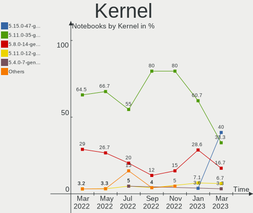

Endless - Hardware Trends (Notebooks)
-------------------------------------

A project to identify most popular hardware characteristics and track their change
over time based on data collected by Linux users at https://Linux-Hardware.org.

Anyone can contribute to this report by the [hw-probe](https://github.com/linuxhw/hw-probe) tool:

    sudo -E hw-probe -all -upload

This report is for one last month. Overall report since the beginning of time: [TestCoverage](https://github.com/linuxhw/TestCoverage)

Period: Jun, 2022.

Contents
--------

* [ System ](#system)
  - [ OS                       ](#os)
  - [ OS Family                ](#os-family)
  - [ Kernel                   ](#kernel)
  - [ Kernel Family            ](#kernel-family)
  - [ Kernel Major Ver.        ](#kernel-major-ver)
  - [ Arch                     ](#arch)
  - [ DE                       ](#de)
  - [ Display Server           ](#display-server)
  - [ Display Manager          ](#display-manager)
  - [ OS Lang                  ](#os-lang)
  - [ Boot Mode                ](#boot-mode)
  - [ Filesystem               ](#filesystem)
  - [ Part. scheme             ](#part-scheme)
  - [ Dual Boot with Linux/BSD ](#dual-boot-with-linuxbsd)
  - [ Dual Boot (Win)          ](#dual-boot-win)

* [ Board ](#board)
  - [ Vendor                   ](#vendor)
  - [ Model                    ](#model)
  - [ Model Family             ](#model-family)
  - [ MFG Year                 ](#mfg-year)
  - [ Form Factor              ](#form-factor)
  - [ Secure Boot              ](#secure-boot)
  - [ Coreboot                 ](#coreboot)
  - [ RAM Size                 ](#ram-size)
  - [ RAM Used                 ](#ram-used)
  - [ Total Drives             ](#total-drives)
  - [ Has CD-ROM               ](#has-cd-rom)
  - [ Has Ethernet             ](#has-ethernet)
  - [ Has WiFi                 ](#has-wifi)
  - [ Has Bluetooth            ](#has-bluetooth)

* [ Location ](#location)
  - [ Country                  ](#country)
  - [ City                     ](#city)

* [ Drives ](#drives)
  - [ Drive Vendor             ](#drive-vendor)
  - [ Drive Model              ](#drive-model)
  - [ HDD Vendor               ](#hdd-vendor)
  - [ SSD Vendor               ](#ssd-vendor)
  - [ Drive Kind               ](#drive-kind)
  - [ Drive Connector          ](#drive-connector)
  - [ Drive Size               ](#drive-size)
  - [ Space Total              ](#space-total)
  - [ Space Used               ](#space-used)
  - [ Malfunc. Drives          ](#malfunc-drives)
  - [ Malfunc. Drive Vendor    ](#malfunc-drive-vendor)
  - [ Malfunc. HDD Vendor      ](#malfunc-hdd-vendor)
  - [ Malfunc. Drive Kind      ](#malfunc-drive-kind)
  - [ Failed Drives            ](#failed-drives)
  - [ Failed Drive Vendor      ](#failed-drive-vendor)
  - [ Drive Status             ](#drive-status)

* [ Storage controller ](#storage-controller)
  - [ Storage Vendor           ](#storage-vendor)
  - [ Storage Model            ](#storage-model)
  - [ Storage Kind             ](#storage-kind)

* [ Processor ](#processor)
  - [ CPU Vendor               ](#cpu-vendor)
  - [ CPU Model                ](#cpu-model)
  - [ CPU Model Family         ](#cpu-model-family)
  - [ CPU Cores                ](#cpu-cores)
  - [ CPU Sockets              ](#cpu-sockets)
  - [ CPU Threads              ](#cpu-threads)
  - [ CPU Op-Modes             ](#cpu-op-modes)
  - [ CPU Microcode            ](#cpu-microcode)
  - [ CPU Microarch            ](#cpu-microarch)

* [ Graphics ](#graphics)
  - [ GPU Vendor               ](#gpu-vendor)
  - [ GPU Model                ](#gpu-model)
  - [ GPU Combo                ](#gpu-combo)
  - [ GPU Driver               ](#gpu-driver)
  - [ GPU Memory               ](#gpu-memory)

* [ Monitor ](#monitor)
  - [ Monitor Vendor           ](#monitor-vendor)
  - [ Monitor Model            ](#monitor-model)
  - [ Monitor Resolution       ](#monitor-resolution)
  - [ Monitor Diagonal         ](#monitor-diagonal)
  - [ Monitor Width            ](#monitor-width)
  - [ Aspect Ratio             ](#aspect-ratio)
  - [ Monitor Area             ](#monitor-area)
  - [ Pixel Density            ](#pixel-density)
  - [ Multiple Monitors        ](#multiple-monitors)

* [ Network ](#network)
  - [ Net Controller Vendor    ](#net-controller-vendor)
  - [ Net Controller Model     ](#net-controller-model)
  - [ Wireless Vendor          ](#wireless-vendor)
  - [ Wireless Model           ](#wireless-model)
  - [ Ethernet Vendor          ](#ethernet-vendor)
  - [ Ethernet Model           ](#ethernet-model)
  - [ Net Controller Kind      ](#net-controller-kind)
  - [ Used Controller          ](#used-controller)
  - [ NICs                     ](#nics)
  - [ IPv6                     ](#ipv6)

* [ Bluetooth ](#bluetooth)
  - [ Bluetooth Vendor         ](#bluetooth-vendor)
  - [ Bluetooth Model          ](#bluetooth-model)

* [ Sound ](#sound)
  - [ Sound Vendor             ](#sound-vendor)
  - [ Sound Model              ](#sound-model)

* [ Memory ](#memory)
  - [ Memory Vendor            ](#memory-vendor)
  - [ Memory Model             ](#memory-model)
  - [ Memory Kind              ](#memory-kind)
  - [ Memory Form Factor       ](#memory-form-factor)
  - [ Memory Size              ](#memory-size)
  - [ Memory Speed             ](#memory-speed)

* [ Printers & scanners ](#printers--scanners)
  - [ Printer Vendor           ](#printer-vendor)
  - [ Printer Model            ](#printer-model)
  - [ Scanner Vendor           ](#scanner-vendor)
  - [ Scanner Model            ](#scanner-model)

* [ Camera ](#camera)
  - [ Camera Vendor            ](#camera-vendor)
  - [ Camera Model             ](#camera-model)

* [ Security ](#security)
  - [ Fingerprint Vendor       ](#fingerprint-vendor)
  - [ Fingerprint Model        ](#fingerprint-model)
  - [ Chipcard Vendor          ](#chipcard-vendor)
  - [ Chipcard Model           ](#chipcard-model)

* [ Unsupported ](#unsupported)
  - [ Unsupported Devices      ](#unsupported-devices)
  - [ Unsupported Device Types ](#unsupported-device-types)

System
------

OS
--

Installed operating systems

| Name                  | Notebooks | Percent |
|-----------------------|-----------|---------|
| Endless 4.0.6         | 16        | 61.54%  |
| Endless 4.0.7         | 2         | 7.69%   |
| Endless 4.0.4         | 2         | 7.69%   |
| Endless 3.9.7         | 2         | 7.69%   |
| Endless 3.9.3-nexthw1 | 1         | 3.85%   |
| Endless 3.9.1         | 1         | 3.85%   |
| Endless 3.8.3-nexthw1 | 1         | 3.85%   |
| Endless 3.7.8         | 1         | 3.85%   |

OS Family
---------

OS without a version

| Name    | Notebooks | Percent |
|---------|-----------|---------|
| Endless | 26        | 100%    |

Kernel
------

Version of the Linux kernel

| Version           | Notebooks | Percent |
|-------------------|-----------|---------|
| 5.11.0-35-generic | 20        | 76.92%  |
| 5.8.0-14-generic  | 3         | 11.54%  |
| 5.6.0-7-generic   | 1         | 3.85%   |
| 5.3.0-28-generic  | 1         | 3.85%   |
| 5.11.0-12-generic | 1         | 3.85%   |

Kernel Family
-------------

Linux kernel without a distro release

| Version | Notebooks | Percent |
|---------|-----------|---------|
| 5.11.0  | 21        | 80.77%  |
| 5.8.0   | 3         | 11.54%  |
| 5.6.0   | 1         | 3.85%   |
| 5.3.0   | 1         | 3.85%   |

Kernel Major Ver.
-----------------

Linux kernel major version

| Version | Notebooks | Percent |
|---------|-----------|---------|
| 5.11    | 21        | 80.77%  |
| 5.8     | 3         | 11.54%  |
| 5.6     | 1         | 3.85%   |
| 5.3     | 1         | 3.85%   |

Arch
----

OS architecture (x86_64, i586, etc.)

| Name   | Notebooks | Percent |
|--------|-----------|---------|
| x86_64 | 26        | 100%    |

DE
--

Desktop Environment

| Name  | Notebooks | Percent |
|-------|-----------|---------|
| GNOME | 26        | 100%    |

Display Server
--------------

X11 or Wayland

| Name | Notebooks | Percent |
|------|-----------|---------|
| X11  | 26        | 100%    |

Display Manager
---------------

SDDM, LightDM, etc.

| Name    | Notebooks | Percent |
|---------|-----------|---------|
| Unknown | 26        | 100%    |

OS Lang
-------

Language

| Lang  | Notebooks | Percent |
|-------|-----------|---------|
| pt_BR | 13        | 50%     |
| en_US | 7         | 26.92%  |
| ru_RU | 1         | 3.85%   |
| ro_RO | 1         | 3.85%   |
| pt_PT | 1         | 3.85%   |
| it_IT | 1         | 3.85%   |
| es_CL | 1         | 3.85%   |
| es_BO | 1         | 3.85%   |

Boot Mode
---------

EFI or BIOS

| Mode | Notebooks | Percent |
|------|-----------|---------|
| EFI  | 19        | 73.08%  |
| BIOS | 7         | 26.92%  |

Filesystem
----------

Type of filesystem

| Type  | Notebooks | Percent |
|-------|-----------|---------|
| Ext4  | 25        | 96.15%  |
| Tmpfs | 1         | 3.85%   |

Part. scheme
------------

Scheme of partitioning

| Type    | Notebooks | Percent |
|---------|-----------|---------|
| Unknown | 26        | 100%    |

Dual Boot with Linux/BSD
------------------------

Hosting more than one Linux/BSD

| Dual boot | Notebooks | Percent |
|-----------|-----------|---------|
| No        | 26        | 100%    |

Dual Boot (Win)
---------------

Hosting Linux and Windows

| Dual boot | Notebooks | Percent |
|-----------|-----------|---------|
| No        | 26        | 100%    |

Board
-----

Vendor
------

Motherboard manufacturer

| Name             | Notebooks | Percent |
|------------------|-----------|---------|
| ASUSTek Computer | 9         | 34.62%  |
| Acer             | 7         | 26.92%  |
| Dell             | 5         | 19.23%  |
| Hewlett-Packard  | 2         | 7.69%   |
| Positivo         | 1         | 3.85%   |
| Packard Bell     | 1         | 3.85%   |
| AMI              | 1         | 3.85%   |

Model
-----

Motherboard model

| Name                                       | Notebooks | Percent |
|--------------------------------------------|-----------|---------|
| Acer Nitro AN515-44                        | 4         | 15.38%  |
| Dell Latitude E6530                        | 2         | 7.69%   |
| Dell Inspiron 1525                         | 2         | 7.69%   |
| ASUS VivoBook_ASUSLaptop X515JA_X515JA     | 2         | 7.69%   |
| Positivo J14GL11                           | 1         | 3.85%   |
| Packard Bell EasyNote MH36                 | 1         | 3.85%   |
| HP Pavilion dv7                            | 1         | 3.85%   |
| HP Laptop 17z-ca100                        | 1         | 3.85%   |
| Dell Latitude E6330                        | 1         | 3.85%   |
| ASUS Z550SA                                | 1         | 3.85%   |
| ASUS X542UN                                | 1         | 3.85%   |
| ASUS X541UAK                               | 1         | 3.85%   |
| ASUS VivoBook_ASUSLaptop X513EA_X513EA     | 1         | 3.85%   |
| ASUS VivoBook_ASUSLaptop X513EA_K513EA     | 1         | 3.85%   |
| ASUS VivoBook 15_ASUS Laptop X507LA        | 1         | 3.85%   |
| ASUS VivoBook 14_ASUS Laptop X407MA_X407MA | 1         | 3.85%   |
| AMI F3C                                    | 1         | 3.85%   |
| Acer Nitro AN515-54                        | 1         | 3.85%   |
| Acer Aspire E1-421                         | 1         | 3.85%   |
| Acer Aspire A514-54G                       | 1         | 3.85%   |

Model Family
------------

Motherboard model prefix

| Name                  | Notebooks | Percent |
|-----------------------|-----------|---------|
| ASUS VivoBook         | 6         | 23.08%  |
| Acer Nitro            | 5         | 19.23%  |
| Dell Latitude         | 3         | 11.54%  |
| Dell Inspiron         | 2         | 7.69%   |
| Acer Aspire           | 2         | 7.69%   |
| Positivo J14GL11      | 1         | 3.85%   |
| Packard Bell EasyNote | 1         | 3.85%   |
| HP Pavilion           | 1         | 3.85%   |
| HP Laptop             | 1         | 3.85%   |
| ASUS Z550SA           | 1         | 3.85%   |
| ASUS X542UN           | 1         | 3.85%   |
| ASUS X541UAK          | 1         | 3.85%   |
| AMI F3C               | 1         | 3.85%   |

MFG Year
--------

Motherboard manufacture year

| Year | Notebooks | Percent |
|------|-----------|---------|
| 2020 | 7         | 26.92%  |
| 2012 | 4         | 15.38%  |
| 2008 | 4         | 15.38%  |
| 2021 | 3         | 11.54%  |
| 2018 | 3         | 11.54%  |
| 2017 | 2         | 7.69%   |
| 2016 | 2         | 7.69%   |
| 2019 | 1         | 3.85%   |

Form Factor
-----------

Physical design of the computer

| Name     | Notebooks | Percent |
|----------|-----------|---------|
| Notebook | 26        | 100%    |

Secure Boot
-----------

Enabled or disabled

| State    | Notebooks | Percent |
|----------|-----------|---------|
| Disabled | 20        | 76.92%  |
| Enabled  | 6         | 23.08%  |

Coreboot
--------

Have coreboot on board

| Used | Notebooks | Percent |
|------|-----------|---------|
| No   | 26        | 100%    |

RAM Size
--------

Total RAM memory

| Size in GB | Notebooks | Percent |
|------------|-----------|---------|
| 3.01-4.0   | 9         | 34.62%  |
| 4.01-8.0   | 8         | 30.77%  |
| 8.01-16.0  | 5         | 19.23%  |
| 1.01-2.0   | 4         | 15.38%  |

RAM Used
--------

Used RAM memory

| Used GB  | Notebooks | Percent |
|----------|-----------|---------|
| 1.01-2.0 | 11        | 42.31%  |
| 2.01-3.0 | 6         | 23.08%  |
| 3.01-4.0 | 4         | 15.38%  |
| 0.51-1.0 | 4         | 15.38%  |
| 4.01-8.0 | 1         | 3.85%   |

Total Drives
------------

Number of drives on board

| Drives | Notebooks | Percent |
|--------|-----------|---------|
| 1      | 19        | 73.08%  |
| 2      | 7         | 26.92%  |

Has CD-ROM
----------

Has CD-ROM on board

| Presented | Notebooks | Percent |
|-----------|-----------|---------|
| No        | 16        | 61.54%  |
| Yes       | 10        | 38.46%  |

Has Ethernet
------------

Has Ethernet on board

| Presented | Notebooks | Percent |
|-----------|-----------|---------|
| Yes       | 19        | 73.08%  |
| No        | 7         | 26.92%  |

Has WiFi
--------

Has WiFi module

| Presented | Notebooks | Percent |
|-----------|-----------|---------|
| Yes       | 25        | 96.15%  |
| No        | 1         | 3.85%   |

Has Bluetooth
-------------

Has Bluetooth module

| Presented | Notebooks | Percent |
|-----------|-----------|---------|
| Yes       | 21        | 80.77%  |
| No        | 5         | 19.23%  |

Location
--------

Country
-------

Geographic location (country)

| Country      | Notebooks | Percent |
|--------------|-----------|---------|
| Brazil       | 13        | 50%     |
| USA          | 3         | 11.54%  |
| Chile        | 2         | 7.69%   |
| Uzbekistan   | 1         | 3.85%   |
| South Africa | 1         | 3.85%   |
| Portugal     | 1         | 3.85%   |
| Nigeria      | 1         | 3.85%   |
| Italy        | 1         | 3.85%   |
| Iran         | 1         | 3.85%   |
| Indonesia    | 1         | 3.85%   |
| Canada       | 1         | 3.85%   |

City
----

Geographic location (city)

| City                | Notebooks | Percent |
|---------------------|-----------|---------|
| Dallas              | 2         | 7.69%   |
| Witbank             | 1         | 3.85%   |
| Villa Alegre        | 1         | 3.85%   |
| Valparaíso         | 1         | 3.85%   |
| Uba                 | 1         | 3.85%   |
| Tucson              | 1         | 3.85%   |
| Tres Rios           | 1         | 3.85%   |
| Tashkent            | 1         | 3.85%   |
| Serramanna          | 1         | 3.85%   |
| Sao Paulo           | 1         | 3.85%   |
| Sao Carlos          | 1         | 3.85%   |
| Santa Cruz do Sul   | 1         | 3.85%   |
| Povoa de Santa Iria | 1         | 3.85%   |
| Oakville            | 1         | 3.85%   |
| Nova Iguaçu        | 1         | 3.85%   |
| Langarūd           | 1         | 3.85%   |
| Kano                | 1         | 3.85%   |
| Itabira             | 1         | 3.85%   |
| Cruz Machado        | 1         | 3.85%   |
| Criciúma           | 1         | 3.85%   |
| Colombo             | 1         | 3.85%   |
| Caiaponia           | 1         | 3.85%   |
| Brasília           | 1         | 3.85%   |
| Banda Aceh          | 1         | 3.85%   |
| Amparo              | 1         | 3.85%   |

Drives
------

Drive Vendor
------------

Hard drive vendors

| Vendor              | Notebooks | Drives | Percent |
|---------------------|-----------|--------|---------|
| WDC                 | 5         | 5      | 16.13%  |
| Unknown             | 3         | 3      | 9.68%   |
| Seagate             | 3         | 3      | 9.68%   |
| Toshiba             | 2         | 2      | 6.45%   |
| SanDisk             | 2         | 2      | 6.45%   |
| Samsung Electronics | 2         | 2      | 6.45%   |
| Phison              | 2         | 2      | 6.45%   |
| ADATA Technology    | 2         | 2      | 6.45%   |
| Silicon Motion      | 1         | 1      | 3.23%   |
| MidasForce          | 1         | 1      | 3.23%   |
| LITEONIT            | 1         | 1      | 3.23%   |
| Kingston            | 1         | 1      | 3.23%   |
| Intel               | 1         | 1      | 3.23%   |
| HS-SSD-C100         | 1         | 1      | 3.23%   |
| Hitachi             | 1         | 1      | 3.23%   |
| HGST                | 1         | 1      | 3.23%   |
| Fujitsu             | 1         | 1      | 3.23%   |
| Corsair             | 1         | 1      | 3.23%   |

Drive Model
-----------

Hard drive models

| Model                                 | Notebooks | Percent |
|---------------------------------------|-----------|---------|
| WDC WD10SPZX-21Z10T0 1TB              | 3         | 9.68%   |
| Toshiba MQ01ABF050 500GB              | 2         | 6.45%   |
| SanDisk NVMe SSD Drive 512GB          | 2         | 6.45%   |
| Phison NVMe SSD Drive 256GB           | 2         | 6.45%   |
| ADATA NVMe SSD Drive 256GB            | 2         | 6.45%   |
| WDC WD5000LPCX-80VHAT0 500GB          | 1         | 3.23%   |
| WDC WD3200BPVT-22JJ5T0 320GB          | 1         | 3.23%   |
| Unknown MMC Card  942MB               | 1         | 3.23%   |
| Unknown MMC Card  32GB                | 1         | 3.23%   |
| Unknown MMC Card  2GB                 | 1         | 3.23%   |
| Silicon Motion NVMe SSD Drive 256GB   | 1         | 3.23%   |
| Seagate ST9160314AS 160GB             | 1         | 3.23%   |
| Seagate ST500LT012-1DG142 500GB       | 1         | 3.23%   |
| Seagate ST500LM030-1RK17D 500GB       | 1         | 3.23%   |
| Samsung SSD 750 EVO 250GB             | 1         | 3.23%   |
| Samsung NVMe SSD Drive 256GB          | 1         | 3.23%   |
| MidasForce SSD 256GB                  | 1         | 3.23%   |
| LITEONIT LCM-128M3S 2.5 7mm 128GB SSD | 1         | 3.23%   |
| Kingston NVMe SSD Drive 256GB         | 1         | 3.23%   |
| Intel NVMe SSD Drive 128GB            | 1         | 3.23%   |
| HS-SSD-C100 480G                      | 1         | 3.23%   |
| Hitachi HTS543216L9A300 160GB         | 1         | 3.23%   |
| HGST HTS541010B7E610 1TB              | 1         | 3.23%   |
| Fujitsu MHZ2080BH G2 80GB             | 1         | 3.23%   |
| Corsair Force GT 120GB SSD            | 1         | 3.23%   |

HDD Vendor
----------

Hard disk drive vendors

| Vendor  | Notebooks | Drives | Percent |
|---------|-----------|--------|---------|
| WDC     | 5         | 5      | 38.46%  |
| Seagate | 3         | 3      | 23.08%  |
| Toshiba | 2         | 2      | 15.38%  |
| Hitachi | 1         | 1      | 7.69%   |
| HGST    | 1         | 1      | 7.69%   |
| Fujitsu | 1         | 1      | 7.69%   |

SSD Vendor
----------

Solid state drive vendors

| Vendor              | Notebooks | Drives | Percent |
|---------------------|-----------|--------|---------|
| Samsung Electronics | 1         | 1      | 25%     |
| MidasForce          | 1         | 1      | 25%     |
| LITEONIT            | 1         | 1      | 25%     |
| Corsair             | 1         | 1      | 25%     |

Drive Kind
----------

HDD or SSD

| Kind    | Notebooks | Drives | Percent |
|---------|-----------|--------|---------|
| HDD     | 13        | 13     | 41.94%  |
| NVMe    | 10        | 10     | 32.26%  |
| SSD     | 4         | 4      | 12.9%   |
| MMC     | 3         | 3      | 9.68%   |
| Unknown | 1         | 1      | 3.23%   |

Drive Connector
---------------

SATA, SAS, NVMe, etc.

| Type | Notebooks | Drives | Percent |
|------|-----------|--------|---------|
| SATA | 18        | 18     | 58.06%  |
| NVMe | 10        | 10     | 32.26%  |
| MMC  | 3         | 3      | 9.68%   |

Drive Size
----------

Size of hard drive

| Size in TB | Notebooks | Drives | Percent |
|------------|-----------|--------|---------|
| 0.01-0.5   | 13        | 13     | 76.47%  |
| 0.51-1.0   | 4         | 4      | 23.53%  |

Space Total
-----------

Amount of disk space available on the file system

| Size in GB | Notebooks | Percent |
|------------|-----------|---------|
| 101-250    | 10        | 38.46%  |
| 251-500    | 8         | 30.77%  |
| 501-1000   | 4         | 15.38%  |
| 51-100     | 3         | 11.54%  |
| 21-50      | 1         | 3.85%   |

Space Used
----------

Amount of used disk space

| Used GB  | Notebooks | Percent |
|----------|-----------|---------|
| 21-50    | 14        | 53.85%  |
| 51-100   | 6         | 23.08%  |
| 251-500  | 2         | 7.69%   |
| 101-250  | 2         | 7.69%   |
| 1-20     | 1         | 3.85%   |
| 501-1000 | 1         | 3.85%   |

Malfunc. Drives
---------------

Drive models with a malfunction

Zero info for selected period =(

Malfunc. Drive Vendor
---------------------

Vendors of faulty drives

Zero info for selected period =(

Malfunc. HDD Vendor
-------------------

Vendors of faulty HDD drives

Zero info for selected period =(

Malfunc. Drive Kind
-------------------

Kinds of faulty drives

Zero info for selected period =(

Failed Drives
-------------

Failed drive models

Zero info for selected period =(

Failed Drive Vendor
-------------------

Failed drive vendors

Zero info for selected period =(

Drive Status
------------

Number of failed and malfunc. drives

| Status   | Notebooks | Drives | Percent |
|----------|-----------|--------|---------|
| Detected | 26        | 31     | 100%    |

Storage controller
------------------

Storage Vendor
--------------

Storage controller vendors

| Vendor                      | Notebooks | Percent |
|-----------------------------|-----------|---------|
| Intel                       | 19        | 57.58%  |
| AMD                         | 5         | 15.15%  |
| SanDisk                     | 2         | 6.06%   |
| Phison Electronics          | 2         | 6.06%   |
| ADATA Technology            | 2         | 6.06%   |
| Silicon Motion              | 1         | 3.03%   |
| Samsung Electronics         | 1         | 3.03%   |
| Kingston Technology Company | 1         | 3.03%   |

Storage Model
-------------

Storage controller models

| Model                                                                            | Notebooks | Percent |
|----------------------------------------------------------------------------------|-----------|---------|
| Intel 82801 Mobile SATA Controller [RAID mode]                                   | 5         | 12.82%  |
| AMD FCH SATA Controller [AHCI mode]                                              | 5         | 12.82%  |
| Intel Volume Management Device NVMe RAID Controller                              | 3         | 7.69%   |
| Intel Tiger Lake-LP SATA Controller [AHCI mode]                                  | 3         | 7.69%   |
| SanDisk WD Blue SN550 NVMe SSD                                                   | 2         | 5.13%   |
| Phison PS5013 E13 NVMe Controller                                                | 2         | 5.13%   |
| Intel Sunrise Point-LP SATA Controller [AHCI mode]                               | 2         | 5.13%   |
| Intel Celeron/Pentium Silver Processor SATA Controller                           | 2         | 5.13%   |
| Intel 82801HM/HEM (ICH8M/ICH8M-E) SATA Controller [AHCI mode]                    | 2         | 5.13%   |
| Intel 82801HM/HEM (ICH8M/ICH8M-E) IDE Controller                                 | 2         | 5.13%   |
| ADATA Non-Volatile memory controller                                             | 2         | 5.13%   |
| Silicon Motion SM2263EN/SM2263XT SSD Controller                                  | 1         | 2.56%   |
| Samsung NVMe SSD Controller 980                                                  | 1         | 2.56%   |
| Kingston Company OM3PDP3 NVMe SSD                                                | 1         | 2.56%   |
| Intel Wildcat Point-LP SATA Controller [AHCI Mode]                               | 1         | 2.56%   |
| Intel PROSet/Wireless WiFi Software extension                                    | 1         | 2.56%   |
| Intel Atom/Celeron/Pentium Processor x5-E8000/J3xxx/N3xxx Series SATA Controller | 1         | 2.56%   |
| Intel 82801IBM/IEM (ICH9M/ICH9M-E) 2 port SATA Controller [IDE mode]             | 1         | 2.56%   |
| Intel 7 Series Chipset Family 6-port SATA Controller [AHCI mode]                 | 1         | 2.56%   |
| Intel 6 Series/C200 Series Chipset Family 6 port Mobile SATA AHCI Controller     | 1         | 2.56%   |

Storage Kind
------------

Kind of storage controller (IDE, SATA, NVMe, SAS, ...)

| Kind | Notebooks | Percent |
|------|-----------|---------|
| SATA | 19        | 48.72%  |
| NVMe | 10        | 25.64%  |
| RAID | 7         | 17.95%  |
| IDE  | 3         | 7.69%   |

Processor
---------

CPU Vendor
----------

Processor vendors

| Vendor | Notebooks | Percent |
|--------|-----------|---------|
| Intel  | 20        | 76.92%  |
| AMD    | 6         | 23.08%  |

CPU Model
---------

Processor models

| Model                                         | Notebooks | Percent |
|-----------------------------------------------|-----------|---------|
| AMD Ryzen 7 4800H with Radeon Graphics        | 4         | 15.38%  |
| Intel Core i7-3520M CPU @ 2.90GHz             | 2         | 7.69%   |
| Intel Core i3-1005G1 CPU @ 1.20GHz            | 2         | 7.69%   |
| Intel Pentium Silver N5000 CPU @ 1.10GHz      | 1         | 3.85%   |
| Intel Pentium Dual-Core CPU T4200 @ 2.00GHz   | 1         | 3.85%   |
| Intel Pentium Dual CPU T2390 @ 1.86GHz        | 1         | 3.85%   |
| Intel Core i7-8550U CPU @ 1.80GHz             | 1         | 3.85%   |
| Intel Core i7-2670QM CPU @ 2.20GHz            | 1         | 3.85%   |
| Intel Core i5-9300H CPU @ 2.40GHz             | 1         | 3.85%   |
| Intel Core i5-3360M CPU @ 2.80GHz             | 1         | 3.85%   |
| Intel Core i3-6006U CPU @ 2.00GHz             | 1         | 3.85%   |
| Intel Core i3-5005U CPU @ 2.00GHz             | 1         | 3.85%   |
| Intel Core 2 Duo CPU T7250 @ 2.00GHz          | 1         | 3.85%   |
| Intel Celeron N4000 CPU @ 1.10GHz             | 1         | 3.85%   |
| Intel Celeron CPU N3160 @ 1.60GHz             | 1         | 3.85%   |
| Intel Atom x5-Z8350 CPU @ 1.44GHz             | 1         | 3.85%   |
| Intel 11th Gen Core i7-1165G7 @ 2.80GHz       | 1         | 3.85%   |
| Intel 11th Gen Core i5-1135G7 @ 2.40GHz       | 1         | 3.85%   |
| Intel 11th Gen Core i3-1115G4 @ 3.00GHz       | 1         | 3.85%   |
| AMD Ryzen 5 3500U with Radeon Vega Mobile Gfx | 1         | 3.85%   |
| AMD E1-1200 APU with Radeon HD Graphics       | 1         | 3.85%   |

CPU Model Family
----------------

Processor model prefix

| Model                   | Notebooks | Percent |
|-------------------------|-----------|---------|
| Intel Core i7           | 4         | 15.38%  |
| Intel Core i3           | 4         | 15.38%  |
| AMD Ryzen 7             | 4         | 15.38%  |
| Other                   | 3         | 11.54%  |
| Intel Core i5           | 2         | 7.69%   |
| Intel Celeron           | 2         | 7.69%   |
| Intel Pentium Silver    | 1         | 3.85%   |
| Intel Pentium Dual-Core | 1         | 3.85%   |
| Intel Pentium Dual      | 1         | 3.85%   |
| Intel Core 2 Duo        | 1         | 3.85%   |
| Intel Atom              | 1         | 3.85%   |
| AMD Ryzen 5             | 1         | 3.85%   |
| AMD E1                  | 1         | 3.85%   |

CPU Cores
---------

Number of processor cores

| Number | Notebooks | Percent |
|--------|-----------|---------|
| 2      | 13        | 50%     |
| 4      | 9         | 34.62%  |
| 8      | 4         | 15.38%  |

CPU Sockets
-----------

Number of sockets

| Number | Notebooks | Percent |
|--------|-----------|---------|
| 1      | 26        | 100%    |

CPU Threads
-----------

Threads per core (Hyper-Threading)

| Number | Notebooks | Percent |
|--------|-----------|---------|
| 2      | 18        | 69.23%  |
| 1      | 8         | 30.77%  |

CPU Op-Modes
------------

CPU Operation Modes (32-bit, 64-bit)

| Op mode        | Notebooks | Percent |
|----------------|-----------|---------|
| 32-bit, 64-bit | 26        | 100%    |

CPU Microcode
-------------

Microcode number

| Number     | Notebooks | Percent |
|------------|-----------|---------|
| 0x08600103 | 4         | 15.38%  |
| 0x806c1    | 3         | 11.54%  |
| 0x306a9    | 3         | 11.54%  |
| 0x706e5    | 2         | 7.69%   |
| 0x706a1    | 2         | 7.69%   |
| 0x6fd      | 2         | 7.69%   |
| 0x406c4    | 2         | 7.69%   |
| 0x906ed    | 1         | 3.85%   |
| 0x806ea    | 1         | 3.85%   |
| 0x406e3    | 1         | 3.85%   |
| 0x306d4    | 1         | 3.85%   |
| 0x206a7    | 1         | 3.85%   |
| 0x1067a    | 1         | 3.85%   |
| 0x08108109 | 1         | 3.85%   |
| 0x05000119 | 1         | 3.85%   |

CPU Microarch
-------------

Microarchitecture

| Name          | Notebooks | Percent |
|---------------|-----------|---------|
| Zen 2         | 4         | 15.38%  |
| TigerLake     | 3         | 11.54%  |
| IvyBridge     | 3         | 11.54%  |
| Silvermont    | 2         | 7.69%   |
| KabyLake      | 2         | 7.69%   |
| IceLake       | 2         | 7.69%   |
| Goldmont plus | 2         | 7.69%   |
| Core          | 2         | 7.69%   |
| Zen+          | 1         | 3.85%   |
| Skylake       | 1         | 3.85%   |
| SandyBridge   | 1         | 3.85%   |
| Penryn        | 1         | 3.85%   |
| Broadwell     | 1         | 3.85%   |
| Bobcat        | 1         | 3.85%   |

Graphics
--------

GPU Vendor
----------

Vendors of graphics cards

| Vendor | Notebooks | Percent |
|--------|-----------|---------|
| Intel  | 20        | 57.14%  |
| Nvidia | 8         | 22.86%  |
| AMD    | 7         | 20%     |

GPU Model
---------

Graphics card models

| Model                                                                                    | Notebooks | Percent |
|------------------------------------------------------------------------------------------|-----------|---------|
| Nvidia TU117M                                                                            | 4         | 10.81%  |
| AMD Renoir                                                                               | 4         | 10.81%  |
| Intel 3rd Gen Core processor Graphics Controller                                         | 3         | 8.11%   |
| Intel TigerLake-LP GT2 [Iris Xe Graphics]                                                | 2         | 5.41%   |
| Intel Mobile GM965/GL960 Integrated Graphics Controller (secondary)                      | 2         | 5.41%   |
| Intel Mobile GM965/GL960 Integrated Graphics Controller (primary)                        | 2         | 5.41%   |
| Intel Iris Plus Graphics G1 (Ice Lake)                                                   | 2         | 5.41%   |
| Intel Atom/Celeron/Pentium Processor x5-E8000/J3xxx/N3xxx Integrated Graphics Controller | 2         | 5.41%   |
| Nvidia TU117M [GeForce GTX 1650 Mobile / Max-Q]                                          | 1         | 2.7%    |
| Nvidia GP108M [GeForce MX150]                                                            | 1         | 2.7%    |
| Nvidia GP107M [GeForce MX350]                                                            | 1         | 2.7%    |
| Nvidia GF108GLM [NVS 5200M]                                                              | 1         | 2.7%    |
| Intel UHD Graphics 620                                                                   | 1         | 2.7%    |
| Intel Tiger Lake UHD Graphics                                                            | 1         | 2.7%    |
| Intel Skylake GT2 [HD Graphics 520]                                                      | 1         | 2.7%    |
| Intel Mobile 4 Series Chipset Integrated Graphics Controller                             | 1         | 2.7%    |
| Intel HD Graphics 5500                                                                   | 1         | 2.7%    |
| Intel GeminiLake [UHD Graphics 605]                                                      | 1         | 2.7%    |
| Intel GeminiLake [UHD Graphics 600]                                                      | 1         | 2.7%    |
| Intel CoffeeLake-H GT2 [UHD Graphics 630]                                                | 1         | 2.7%    |
| Intel 2nd Generation Core Processor Family Integrated Graphics Controller                | 1         | 2.7%    |
| AMD Wrestler [Radeon HD 7310]                                                            | 1         | 2.7%    |
| AMD Whistler [Radeon HD 6730M/6770M/7690M XT]                                            | 1         | 2.7%    |
| AMD Picasso/Raven 2 [Radeon Vega Series / Radeon Vega Mobile Series]                     | 1         | 2.7%    |

GPU Combo
---------

Combinations of graphics cards

| Name           | Notebooks | Percent |
|----------------|-----------|---------|
| 1 x Intel      | 15        | 57.69%  |
| Intel + Nvidia | 4         | 15.38%  |
| AMD + Nvidia   | 4         | 15.38%  |
| 1 x AMD        | 2         | 7.69%   |
| Intel + AMD    | 1         | 3.85%   |

GPU Driver
----------

Free vs proprietary

| Driver      | Notebooks | Percent |
|-------------|-----------|---------|
| Free        | 19        | 73.08%  |
| Proprietary | 7         | 26.92%  |

GPU Memory
----------

Total video memory

| Size in GB | Notebooks | Percent |
|------------|-----------|---------|
| Unknown    | 17        | 65.38%  |
| 0.01-0.5   | 4         | 15.38%  |
| 3.01-4.0   | 2         | 7.69%   |
| 1.01-2.0   | 2         | 7.69%   |
| 0.51-1.0   | 1         | 3.85%   |

Monitor
-------

Monitor Vendor
--------------

Monitor vendors

| Vendor              | Notebooks | Percent |
|---------------------|-----------|---------|
| Chimei Innolux      | 6         | 23.08%  |
| LG Display          | 5         | 19.23%  |
| PANDA               | 4         | 15.38%  |
| BOE                 | 4         | 15.38%  |
| Samsung Electronics | 2         | 7.69%   |
| AU Optronics        | 2         | 7.69%   |
| Optoma              | 1         | 3.85%   |
| LG Philips          | 1         | 3.85%   |
| KDC                 | 1         | 3.85%   |

Monitor Model
-------------

Monitor models

| Model                                                                | Notebooks | Percent |
|----------------------------------------------------------------------|-----------|---------|
| PANDA LCD Monitor NCP004D 1920x1080 344x194mm 15.5-inch              | 4         | 15.38%  |
| LG Display LCD Monitor LGD032C 1920x1080 344x194mm 15.5-inch         | 2         | 7.69%   |
| Chimei Innolux LCD Monitor CMN15CA 1366x768 344x193mm 15.5-inch      | 2         | 7.69%   |
| BOE LCD Monitor BOE07AA 1366x768 344x194mm 15.5-inch                 | 2         | 7.69%   |
| Samsung Electronics LCD Monitor SEC3358 1280x800 330x210mm 15.4-inch | 1         | 3.85%   |
| Samsung Electronics LCD Monitor SEC3157 1280x800 261x163mm 12.1-inch | 1         | 3.85%   |
| Optoma SVGA OTM0321 1280x1024                                        | 1         | 3.85%   |
| LG Philips LCD Monitor LPLB900 1280x800 330x210mm 15.4-inch          | 1         | 3.85%   |
| LG Display LCD Monitor LGD065A 1920x1080 344x194mm 15.5-inch         | 1         | 3.85%   |
| LG Display LCD Monitor LGD059E 1920x1080 382x215mm 17.3-inch         | 1         | 3.85%   |
| LG Display LCD Monitor LGD034C 1366x768 293x165mm 13.2-inch          | 1         | 3.85%   |
| KDC LCD Monitor KDC0830 1920x1080 344x193mm 15.5-inch                | 1         | 3.85%   |
| Chimei Innolux LCD Monitor CMN15F5 1920x1080 344x193mm 15.5-inch     | 1         | 3.85%   |
| Chimei Innolux LCD Monitor CMN15D5 1920x1080 344x193mm 15.5-inch     | 1         | 3.85%   |
| Chimei Innolux LCD Monitor CMN14D6 1366x768 309x173mm 13.9-inch      | 1         | 3.85%   |
| Chimei Innolux LCD Monitor CMN142E 1366x768 309x173mm 13.9-inch      | 1         | 3.85%   |
| BOE LCD Monitor BOE0704 1366x768 344x194mm 15.5-inch                 | 1         | 3.85%   |
| BOE LCD Monitor BOE06BD 1366x768 309x173mm 13.9-inch                 | 1         | 3.85%   |
| AU Optronics LCD Monitor AUO183C 1366x768 310x170mm 13.9-inch        | 1         | 3.85%   |
| AU Optronics LCD Monitor AUO139E 1600x900 382x214mm 17.2-inch        | 1         | 3.85%   |

Monitor Resolution
------------------

Monitor screen resolution

| Resolution       | Notebooks | Percent |
|------------------|-----------|---------|
| 1920x1080 (FHD)  | 11        | 42.31%  |
| 1366x768 (WXGA)  | 10        | 38.46%  |
| 1280x800 (WXGA)  | 2         | 7.69%   |
| 1600x900 (HD+)   | 1         | 3.85%   |
| 1440x900 (WXGA+) | 1         | 3.85%   |
| 1280x1024 (SXGA) | 1         | 3.85%   |

Monitor Diagonal
----------------

Diagonal size in inches

| Inches  | Notebooks | Percent |
|---------|-----------|---------|
| 15      | 17        | 65.38%  |
| 13      | 5         | 19.23%  |
| 17      | 2         | 7.69%   |
| 14      | 1         | 3.85%   |
| Unknown | 1         | 3.85%   |

Monitor Width
-------------

Physical width

| Width in mm | Notebooks | Percent |
|-------------|-----------|---------|
| 301-350     | 22        | 84.62%  |
| 351-400     | 2         | 7.69%   |
| 201-300     | 1         | 3.85%   |
| Unknown     | 1         | 3.85%   |

Aspect Ratio
------------

Proportional relationship between the width and the height

| Ratio | Notebooks | Percent |
|-------|-----------|---------|
| 16/9  | 22        | 84.62%  |
| 16/10 | 3         | 11.54%  |
| 5/4   | 1         | 3.85%   |

Monitor Area
------------

Area in inch²

| Area in inch² | Notebooks | Percent |
|----------------|-----------|---------|
| 101-110        | 17        | 65.38%  |
| 81-90          | 5         | 19.23%  |
| 121-130        | 2         | 7.69%   |
| 71-80          | 1         | 3.85%   |
| Unknown        | 1         | 3.85%   |

Pixel Density
-------------

Pixels per inch

| Density | Notebooks | Percent |
|---------|-----------|---------|
| 101-120 | 12        | 46.15%  |
| 121-160 | 11        | 42.31%  |
| 51-100  | 2         | 7.69%   |
| Unknown | 1         | 3.85%   |

Multiple Monitors
-----------------

Total monitors connected

| Total | Notebooks | Percent |
|-------|-----------|---------|
| 1     | 26        | 100%    |

Network
-------

Net Controller Vendor
---------------------

Controller vendors

| Vendor                   | Notebooks | Percent |
|--------------------------|-----------|---------|
| Realtek Semiconductor    | 15        | 34.09%  |
| Intel                    | 15        | 34.09%  |
| Qualcomm Atheros         | 4         | 9.09%   |
| Marvell Technology Group | 2         | 4.55%   |
| Broadcom                 | 2         | 4.55%   |
| Texas Instruments        | 1         | 2.27%   |
| Samsung Electronics      | 1         | 2.27%   |
| Ralink                   | 1         | 2.27%   |
| MediaTek                 | 1         | 2.27%   |
| Huawei Technologies      | 1         | 2.27%   |
| Dell                     | 1         | 2.27%   |

Net Controller Model
--------------------

Controller models

| Model                                                             | Notebooks | Percent |
|-------------------------------------------------------------------|-----------|---------|
| Realtek RTL8111/8168/8411 PCI Express Gigabit Ethernet Controller | 5         | 9.8%    |
| Intel Wi-Fi 6 AX200                                               | 5         | 9.8%    |
| Realtek Killer E2600 Gigabit Ethernet Controller                  | 4         | 7.84%   |
| Realtek RTL810xE PCI Express Fast Ethernet controller             | 3         | 5.88%   |
| Intel 82579LM Gigabit Network Connection (Lewisville)             | 3         | 5.88%   |
| Realtek RTL8723BE PCIe Wireless Network Adapter                   | 2         | 3.92%   |
| Qualcomm Atheros QCA9565 / AR9565 Wireless Network Adapter        | 2         | 3.92%   |
| Marvell Group 88E8040 PCI-E Fast Ethernet Controller              | 2         | 3.92%   |
| Intel Wi-Fi 6 AX201                                               | 2         | 3.92%   |
| Intel Ice Lake-LP PCH CNVi WiFi                                   | 2         | 3.92%   |
| Intel Centrino Ultimate-N 6300                                    | 2         | 3.92%   |
| Broadcom BCM4312 802.11b/g LP-PHY                                 | 2         | 3.92%   |
| Texas Instruments CC2531 ZigBee                                   | 1         | 1.96%   |
| Samsung Galaxy series, misc. (tethering mode)                     | 1         | 1.96%   |
| Realtek RTL8821CE 802.11ac PCIe Wireless Network Adapter          | 1         | 1.96%   |
| Realtek RTL8811AU 802.11a/b/g/n/ac WLAN Adapter                   | 1         | 1.96%   |
| Realtek RTL8188SU 802.11n WLAN Adapter                            | 1         | 1.96%   |
| Realtek RTL8152 Fast Ethernet Adapter                             | 1         | 1.96%   |
| Ralink RT2790 Wireless 802.11n 1T/2R PCIe                         | 1         | 1.96%   |
| Qualcomm Atheros QCA9377 802.11ac Wireless Network Adapter        | 1         | 1.96%   |
| Qualcomm Atheros AR9485 Wireless Network Adapter                  | 1         | 1.96%   |
| Qualcomm Atheros AR8151 v2.0 Gigabit Ethernet                     | 1         | 1.96%   |
| MediaTek MT7921 802.11ax PCI Express Wireless Network Adapter     | 1         | 1.96%   |
| Intel Wireless 3165                                               | 1         | 1.96%   |
| Intel PRO/Wireless 4965 AG or AGN [Kedron] Network Connection     | 1         | 1.96%   |
| Intel Centrino Wireless-N 1030 [Rainbow Peak]                     | 1         | 1.96%   |
| Intel Centrino Advanced-N 6205 [Taylor Peak]                      | 1         | 1.96%   |
| Huawei E353/E3131                                                 | 1         | 1.96%   |
| Dell Wireless 5630 (EVDO-HSPA) Mobile Broadband Mini-Card         | 1         | 1.96%   |

Wireless Vendor
---------------

Wireless vendors

| Vendor                | Notebooks | Percent |
|-----------------------|-----------|---------|
| Intel                 | 15        | 51.72%  |
| Realtek Semiconductor | 5         | 17.24%  |
| Qualcomm Atheros      | 4         | 13.79%  |
| Broadcom              | 2         | 6.9%    |
| Ralink                | 1         | 3.45%   |
| MediaTek              | 1         | 3.45%   |
| Dell                  | 1         | 3.45%   |

Wireless Model
--------------

Wireless models

| Model                                                         | Notebooks | Percent |
|---------------------------------------------------------------|-----------|---------|
| Intel Wi-Fi 6 AX200                                           | 5         | 17.24%  |
| Realtek RTL8723BE PCIe Wireless Network Adapter               | 2         | 6.9%    |
| Qualcomm Atheros QCA9565 / AR9565 Wireless Network Adapter    | 2         | 6.9%    |
| Intel Wi-Fi 6 AX201                                           | 2         | 6.9%    |
| Intel Ice Lake-LP PCH CNVi WiFi                               | 2         | 6.9%    |
| Intel Centrino Ultimate-N 6300                                | 2         | 6.9%    |
| Broadcom BCM4312 802.11b/g LP-PHY                             | 2         | 6.9%    |
| Realtek RTL8821CE 802.11ac PCIe Wireless Network Adapter      | 1         | 3.45%   |
| Realtek RTL8811AU 802.11a/b/g/n/ac WLAN Adapter               | 1         | 3.45%   |
| Realtek RTL8188SU 802.11n WLAN Adapter                        | 1         | 3.45%   |
| Ralink RT2790 Wireless 802.11n 1T/2R PCIe                     | 1         | 3.45%   |
| Qualcomm Atheros QCA9377 802.11ac Wireless Network Adapter    | 1         | 3.45%   |
| Qualcomm Atheros AR9485 Wireless Network Adapter              | 1         | 3.45%   |
| MediaTek MT7921 802.11ax PCI Express Wireless Network Adapter | 1         | 3.45%   |
| Intel Wireless 3165                                           | 1         | 3.45%   |
| Intel PRO/Wireless 4965 AG or AGN [Kedron] Network Connection | 1         | 3.45%   |
| Intel Centrino Wireless-N 1030 [Rainbow Peak]                 | 1         | 3.45%   |
| Intel Centrino Advanced-N 6205 [Taylor Peak]                  | 1         | 3.45%   |
| Dell Wireless 5630 (EVDO-HSPA) Mobile Broadband Mini-Card     | 1         | 3.45%   |

Ethernet Vendor
---------------

Ethernet vendors

| Vendor                   | Notebooks | Percent |
|--------------------------|-----------|---------|
| Realtek Semiconductor    | 13        | 61.9%   |
| Intel                    | 3         | 14.29%  |
| Marvell Technology Group | 2         | 9.52%   |
| Samsung Electronics      | 1         | 4.76%   |
| Qualcomm Atheros         | 1         | 4.76%   |
| Huawei Technologies      | 1         | 4.76%   |

Ethernet Model
--------------

Ethernet models

| Model                                                             | Notebooks | Percent |
|-------------------------------------------------------------------|-----------|---------|
| Realtek RTL8111/8168/8411 PCI Express Gigabit Ethernet Controller | 5         | 23.81%  |
| Realtek Killer E2600 Gigabit Ethernet Controller                  | 4         | 19.05%  |
| Realtek RTL810xE PCI Express Fast Ethernet controller             | 3         | 14.29%  |
| Intel 82579LM Gigabit Network Connection (Lewisville)             | 3         | 14.29%  |
| Marvell Group 88E8040 PCI-E Fast Ethernet Controller              | 2         | 9.52%   |
| Samsung Galaxy series, misc. (tethering mode)                     | 1         | 4.76%   |
| Realtek RTL8152 Fast Ethernet Adapter                             | 1         | 4.76%   |
| Qualcomm Atheros AR8151 v2.0 Gigabit Ethernet                     | 1         | 4.76%   |
| Huawei E353/E3131                                                 | 1         | 4.76%   |

Net Controller Kind
-------------------

Ethernet, WiFi or modem

| Kind     | Notebooks | Percent |
|----------|-----------|---------|
| WiFi     | 25        | 55.56%  |
| Ethernet | 19        | 42.22%  |
| Modem    | 1         | 2.22%   |

Used Controller
---------------

Currently used network controller

| Kind     | Notebooks | Percent |
|----------|-----------|---------|
| WiFi     | 23        | 92%     |
| Ethernet | 2         | 8%      |

NICs
----

Total network controllers on board

| Total | Notebooks | Percent |
|-------|-----------|---------|
| 2     | 17        | 65.38%  |
| 1     | 7         | 26.92%  |
| 3     | 1         | 3.85%   |
| 0     | 1         | 3.85%   |

IPv6
----

IPv6 vs IPv4

| Used | Notebooks | Percent |
|------|-----------|---------|
| No   | 22        | 84.62%  |
| Yes  | 4         | 15.38%  |

Bluetooth
---------

Bluetooth Vendor
----------------

Controller vendors

| Vendor                | Notebooks | Percent |
|-----------------------|-----------|---------|
| Intel                 | 11        | 52.38%  |
| Realtek Semiconductor | 3         | 14.29%  |
| IMC Networks          | 3         | 14.29%  |
| Dell                  | 3         | 14.29%  |
| Lite-On Technology    | 1         | 4.76%   |

Bluetooth Model
---------------

Controller models

| Model                                            | Notebooks | Percent |
|--------------------------------------------------|-----------|---------|
| Intel AX200 Bluetooth                            | 5         | 23.81%  |
| Intel Bluetooth 9460/9560 Jefferson Peak (JfP)   | 3         | 14.29%  |
| IMC Networks Bluetooth Device                    | 3         | 14.29%  |
| Realtek Bluetooth Radio                          | 2         | 9.52%   |
| Dell BCM20702A0 Bluetooth Module                 | 2         | 9.52%   |
| Realtek  Bluetooth 4.2 Adapter                   | 1         | 4.76%   |
| Lite-On Wireless_Device                          | 1         | 4.76%   |
| Intel Centrino Advanced-N 6230 Bluetooth adapter | 1         | 4.76%   |
| Intel Bluetooth wireless interface               | 1         | 4.76%   |
| Intel Bluetooth Device                           | 1         | 4.76%   |
| Dell Wireless 355 Bluetooth                      | 1         | 4.76%   |

Sound
-----

Sound Vendor
------------

Sound card vendors

| Vendor | Notebooks | Percent |
|--------|-----------|---------|
| Intel  | 19        | 61.29%  |
| Nvidia | 6         | 19.35%  |
| AMD    | 6         | 19.35%  |

Sound Model
-----------

Sound card models

| Model                                                                                             | Notebooks | Percent |
|---------------------------------------------------------------------------------------------------|-----------|---------|
| Nvidia TU107 GeForce GTX 1650 High Definition Audio Controller                                    | 5         | 14.71%  |
| AMD Family 17h/19h HD Audio Controller                                                            | 5         | 14.71%  |
| Intel Tiger Lake-LP Smart Sound Technology Audio Controller                                       | 3         | 8.82%   |
| Intel 7 Series/C216 Chipset Family High Definition Audio Controller                               | 3         | 8.82%   |
| Intel Sunrise Point-LP HD Audio                                                                   | 2         | 5.88%   |
| Intel Ice Lake-LP Smart Sound Technology Audio Controller                                         | 2         | 5.88%   |
| Intel Celeron/Pentium Silver Processor High Definition Audio                                      | 2         | 5.88%   |
| Intel 82801H (ICH8 Family) HD Audio Controller                                                    | 2         | 5.88%   |
| Nvidia GF108 High Definition Audio Controller                                                     | 1         | 2.94%   |
| Intel Wildcat Point-LP High Definition Audio Controller                                           | 1         | 2.94%   |
| Intel Cannon Lake PCH cAVS                                                                        | 1         | 2.94%   |
| Intel Broadwell-U Audio Controller                                                                | 1         | 2.94%   |
| Intel Atom/Celeron/Pentium Processor x5-E8000/J3xxx/N3xxx Series High Definition Audio Controller | 1         | 2.94%   |
| Intel 82801I (ICH9 Family) HD Audio Controller                                                    | 1         | 2.94%   |
| Intel 6 Series/C200 Series Chipset Family High Definition Audio Controller                        | 1         | 2.94%   |
| AMD Wrestler HDMI Audio                                                                           | 1         | 2.94%   |
| AMD Raven/Raven2/Fenghuang HDMI/DP Audio Controller                                               | 1         | 2.94%   |
| AMD FCH Azalia Controller                                                                         | 1         | 2.94%   |

Memory
------

Memory Vendor
-------------

Memory module vendors

Zero info for selected period =(

Memory Model
------------

Memory module models

Zero info for selected period =(

Memory Kind
-----------

Memory module kinds

Zero info for selected period =(

Memory Form Factor
------------------

Physical design of the memory module

Zero info for selected period =(

Memory Size
-----------

Memory module size

Zero info for selected period =(

Memory Speed
------------

Memory module speed

Zero info for selected period =(

Printers & scanners
-------------------

Printer Vendor
--------------

Printer device vendors

Zero info for selected period =(

Printer Model
-------------

Printer device models

Zero info for selected period =(

Scanner Vendor
--------------

Scanner device vendors

Zero info for selected period =(

Scanner Model
-------------

Scanner device models

Zero info for selected period =(

Camera
------

Camera Vendor
-------------

Camera device vendors

| Vendor                                 | Notebooks | Percent |
|----------------------------------------|-----------|---------|
| Quanta                                 | 6         | 26.09%  |
| IMC Networks                           | 4         | 17.39%  |
| Chicony Electronics                    | 4         | 17.39%  |
| Sonix Technology                       | 2         | 8.7%    |
| Microdia                               | 2         | 8.7%    |
| Sunplus Innovation Technology          | 1         | 4.35%   |
| OmniVision Technologies                | 1         | 4.35%   |
| GEMBIRD                                | 1         | 4.35%   |
| Cheng Uei Precision Industry (Foxlink) | 1         | 4.35%   |
| Acer                                   | 1         | 4.35%   |

Camera Model
------------

Camera device models

| Model                                             | Notebooks | Percent |
|---------------------------------------------------|-----------|---------|
| Quanta HD User Facing                             | 5         | 21.74%  |
| IMC Networks USB2.0 VGA UVC WebCam                | 3         | 13.04%  |
| Sonix USB2.0 HD UVC WebCam                        | 2         | 8.7%    |
| Microdia Dell Integrated HD Webcam                | 2         | 8.7%    |
| Chicony USB2.0 VGA UVC WebCam                     | 2         | 8.7%    |
| Sunplus HD WebCam                                 | 1         | 4.35%   |
| Quanta USB2.0 HD UVC WebCam                       | 1         | 4.35%   |
| OmniVision OV2640 Webcam                          | 1         | 4.35%   |
| IMC Networks USB2.0 HD UVC WebCam                 | 1         | 4.35%   |
| GEMBIRD Generic UVC 1.00 camera [AppoTech AX2311] | 1         | 4.35%   |
| Chicony HP TrueVision HD Camera                   | 1         | 4.35%   |
| Chicony HD User Facing                            | 1         | 4.35%   |
| Cheng Uei Precision Industry (Foxlink) FE03FF-99  | 1         | 4.35%   |
| Acer HP TrueVision HD Webcam                      | 1         | 4.35%   |

Security
--------

Fingerprint Vendor
------------------

Fingerprint sensor vendors

Zero info for selected period =(

Fingerprint Model
-----------------

Fingerprint sensor models

Zero info for selected period =(

Chipcard Vendor
---------------

Chipcard module vendors

| Vendor   | Notebooks | Percent |
|----------|-----------|---------|
| Broadcom | 2         | 100%    |

Chipcard Model
--------------

Chipcard module models

| Model                                                                        | Notebooks | Percent |
|------------------------------------------------------------------------------|-----------|---------|
| Broadcom BCM5880 Secure Applications Processor with fingerprint swipe sensor | 2         | 100%    |

Unsupported
-----------

Unsupported Devices
-------------------

Total unsupported devices on board

| Total | Notebooks | Percent |
|-------|-----------|---------|
| 0     | 18        | 69.23%  |
| 1     | 7         | 26.92%  |
| 2     | 1         | 3.85%   |

Unsupported Device Types
------------------------

Types of unsupported devices

| Type                  | Notebooks | Percent |
|-----------------------|-----------|---------|
| Multimedia controller | 5         | 55.56%  |
| Net/wireless          | 2         | 22.22%  |
| Chipcard              | 2         | 22.22%  |

