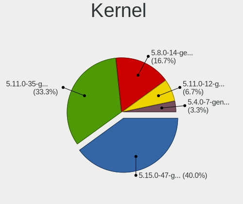
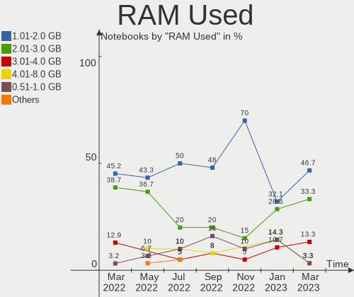
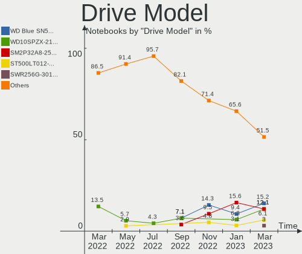
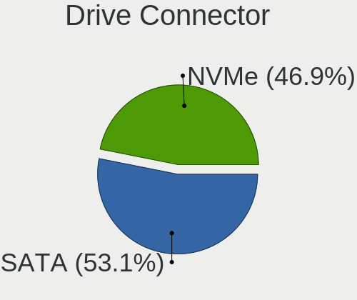
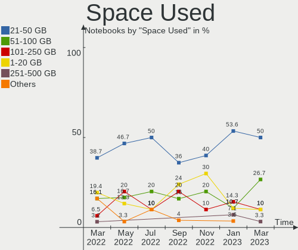
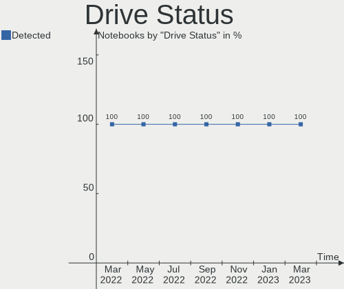
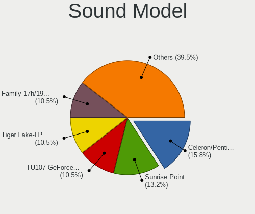

Endless Hardware Trends (Notebooks)
-----------------------------------

A project to identify most popular hardware characteristics and track their change
over time based on data collected by Endless users at https://Linux-Hardware.org.

Anyone can contribute to this report by the [hw-probe](https://github.com/linuxhw/hw-probe) tool:

    sudo -E hw-probe -all -upload

Full-feature report is available here: https://linux-hardware.org/?view=trends

Period: Jan, 2022.

Contents
--------

* [ System ](#system)
  - [ OS                       ](#os)
  - [ OS Family                ](#os-family)
  - [ Kernel                   ](#kernel)
  - [ Kernel Family            ](#kernel-family)
  - [ Kernel Major Ver.        ](#kernel-major-ver)
  - [ Arch                     ](#arch)
  - [ DE                       ](#de)
  - [ Display Server           ](#display-server)
  - [ Display Manager          ](#display-manager)
  - [ OS Lang                  ](#os-lang)
  - [ Boot Mode                ](#boot-mode)
  - [ Filesystem               ](#filesystem)
  - [ Part. scheme             ](#part-scheme)
  - [ Dual Boot with Linux/BSD ](#dual-boot-with-linuxbsd)
  - [ Dual Boot (Win)          ](#dual-boot-win)

* [ Board ](#board)
  - [ Vendor                   ](#vendor)
  - [ Model                    ](#model)
  - [ Model Family             ](#model-family)
  - [ MFG Year                 ](#mfg-year)
  - [ Form Factor              ](#form-factor)
  - [ Secure Boot              ](#secure-boot)
  - [ Coreboot                 ](#coreboot)
  - [ RAM Size                 ](#ram-size)
  - [ RAM Used                 ](#ram-used)
  - [ Total Drives             ](#total-drives)
  - [ Has CD-ROM               ](#has-cd-rom)
  - [ Has Ethernet             ](#has-ethernet)
  - [ Has WiFi                 ](#has-wifi)
  - [ Has Bluetooth            ](#has-bluetooth)

* [ Location ](#location)
  - [ Country                  ](#country)
  - [ City                     ](#city)

* [ Drives ](#drives)
  - [ Drive Vendor             ](#drive-vendor)
  - [ Drive Model              ](#drive-model)
  - [ HDD Vendor               ](#hdd-vendor)
  - [ SSD Vendor               ](#ssd-vendor)
  - [ Drive Kind               ](#drive-kind)
  - [ Drive Connector          ](#drive-connector)
  - [ Drive Size               ](#drive-size)
  - [ Space Total              ](#space-total)
  - [ Space Used               ](#space-used)
  - [ Malfunc. Drives          ](#malfunc-drives)
  - [ Malfunc. Drive Vendor    ](#malfunc-drive-vendor)
  - [ Malfunc. HDD Vendor      ](#malfunc-hdd-vendor)
  - [ Malfunc. Drive Kind      ](#malfunc-drive-kind)
  - [ Failed Drives            ](#failed-drives)
  - [ Failed Drive Vendor      ](#failed-drive-vendor)
  - [ Drive Status             ](#drive-status)

* [ Storage controller ](#storage-controller)
  - [ Storage Vendor           ](#storage-vendor)
  - [ Storage Model            ](#storage-model)
  - [ Storage Kind             ](#storage-kind)

* [ Processor ](#processor)
  - [ CPU Vendor               ](#cpu-vendor)
  - [ CPU Model                ](#cpu-model)
  - [ CPU Model Family         ](#cpu-model-family)
  - [ CPU Cores                ](#cpu-cores)
  - [ CPU Sockets              ](#cpu-sockets)
  - [ CPU Threads              ](#cpu-threads)
  - [ CPU Op-Modes             ](#cpu-op-modes)
  - [ CPU Microcode            ](#cpu-microcode)
  - [ CPU Microarch            ](#cpu-microarch)

* [ Graphics ](#graphics)
  - [ GPU Vendor               ](#gpu-vendor)
  - [ GPU Model                ](#gpu-model)
  - [ GPU Combo                ](#gpu-combo)
  - [ GPU Driver               ](#gpu-driver)
  - [ GPU Memory               ](#gpu-memory)

* [ Monitor ](#monitor)
  - [ Monitor Vendor           ](#monitor-vendor)
  - [ Monitor Model            ](#monitor-model)
  - [ Monitor Resolution       ](#monitor-resolution)
  - [ Monitor Diagonal         ](#monitor-diagonal)
  - [ Monitor Width            ](#monitor-width)
  - [ Aspect Ratio             ](#aspect-ratio)
  - [ Monitor Area             ](#monitor-area)
  - [ Pixel Density            ](#pixel-density)
  - [ Multiple Monitors        ](#multiple-monitors)

* [ Network ](#network)
  - [ Net Controller Vendor    ](#net-controller-vendor)
  - [ Net Controller Model     ](#net-controller-model)
  - [ Wireless Vendor          ](#wireless-vendor)
  - [ Wireless Model           ](#wireless-model)
  - [ Ethernet Vendor          ](#ethernet-vendor)
  - [ Ethernet Model           ](#ethernet-model)
  - [ Net Controller Kind      ](#net-controller-kind)
  - [ Used Controller          ](#used-controller)
  - [ NICs                     ](#nics)
  - [ IPv6                     ](#ipv6)

* [ Bluetooth ](#bluetooth)
  - [ Bluetooth Vendor         ](#bluetooth-vendor)
  - [ Bluetooth Model          ](#bluetooth-model)

* [ Sound ](#sound)
  - [ Sound Vendor             ](#sound-vendor)
  - [ Sound Model              ](#sound-model)

* [ Memory ](#memory)
  - [ Memory Vendor            ](#memory-vendor)
  - [ Memory Model             ](#memory-model)
  - [ Memory Kind              ](#memory-kind)
  - [ Memory Form Factor       ](#memory-form-factor)
  - [ Memory Size              ](#memory-size)
  - [ Memory Speed             ](#memory-speed)

* [ Printers & scanners ](#printers--scanners)
  - [ Printer Vendor           ](#printer-vendor)
  - [ Printer Model            ](#printer-model)
  - [ Scanner Vendor           ](#scanner-vendor)
  - [ Scanner Model            ](#scanner-model)

* [ Camera ](#camera)
  - [ Camera Vendor            ](#camera-vendor)
  - [ Camera Model             ](#camera-model)

* [ Security ](#security)
  - [ Fingerprint Vendor       ](#fingerprint-vendor)
  - [ Fingerprint Model        ](#fingerprint-model)
  - [ Chipcard Vendor          ](#chipcard-vendor)
  - [ Chipcard Model           ](#chipcard-model)

* [ Unsupported ](#unsupported)
  - [ Unsupported Devices      ](#unsupported-devices)
  - [ Unsupported Device Types ](#unsupported-device-types)

System
------

OS
--

Installed operating systems

| Name                  | Notebooks | Percent |
|-----------------------|-----------|---------|
| Endless 4.0.2         | 25        | 67.57%  |
| Endless 4.0.0         | 2         | 5.41%   |
| Endless 3.9.5         | 2         | 5.41%   |
| Endless 3.9.3-nexthw1 | 2         | 5.41%   |
| Endless 4.0.1         | 1         | 2.7%    |
| Endless 3.9.6         | 1         | 2.7%    |
| Endless 3.9.0         | 1         | 2.7%    |
| Endless 3.8.0         | 1         | 2.7%    |
| Endless 3.7.8         | 1         | 2.7%    |
| Endless 3.6.3-nexthw1 | 1         | 2.7%    |

OS Family
---------

OS without a version

| Name    | Notebooks | Percent |
|---------|-----------|---------|
| Endless | 37        | 100%    |

Kernel
------

Version of the Linux kernel

| Version           | Notebooks | Percent |
|-------------------|-----------|---------|
| 5.11.0-35-generic | 28        | 75.68%  |
| 5.8.0-14-generic  | 4         | 10.81%  |
| 5.11.0-12-generic | 2         | 5.41%   |
| 5.4.0-19-generic  | 1         | 2.7%    |
| 5.3.0-28-generic  | 1         | 2.7%    |
| 5.3.0-12-generic  | 1         | 2.7%    |

Kernel Family
-------------

Linux kernel without a distro release

| Version | Notebooks | Percent |
|---------|-----------|---------|
| 5.11.0  | 30        | 81.08%  |
| 5.8.0   | 4         | 10.81%  |
| 5.3.0   | 2         | 5.41%   |
| 5.4.0   | 1         | 2.7%    |

Kernel Major Ver.
-----------------

Linux kernel major version

| Version | Notebooks | Percent |
|---------|-----------|---------|
| 5.11    | 30        | 81.08%  |
| 5.8     | 4         | 10.81%  |
| 5.3     | 2         | 5.41%   |
| 5.4     | 1         | 2.7%    |

Arch
----

OS architecture (x86_64, i586, etc.)

| Name   | Notebooks | Percent |
|--------|-----------|---------|
| x86_64 | 37        | 100%    |

DE
--

Desktop Environment

| Name  | Notebooks | Percent |
|-------|-----------|---------|
| GNOME | 37        | 100%    |

Display Server
--------------

X11 or Wayland

| Name | Notebooks | Percent |
|------|-----------|---------|
| X11  | 37        | 100%    |

Display Manager
---------------

SDDM, LightDM, etc.

| Name    | Notebooks | Percent |
|---------|-----------|---------|
| Unknown | 37        | 100%    |

OS Lang
-------

Language

| Lang        | Notebooks | Percent |
|-------------|-----------|---------|
| pt_BR       | 11        | 29.73%  |
| en_US       | 9         | 24.32%  |
| ro_RO       | 4         | 10.81%  |
| ru_RU.UTF_8 | 2         | 5.41%   |
| fr_FR       | 2         | 5.41%   |
| es_MX       | 2         | 5.41%   |
| de_DE       | 2         | 5.41%   |
| ru_RU       | 1         | 2.7%    |
| hu_HU       | 1         | 2.7%    |
| hr_HR       | 1         | 2.7%    |
| es_ES       | 1         | 2.7%    |
| el_GR       | 1         | 2.7%    |

Boot Mode
---------

EFI or BIOS

| Mode | Notebooks | Percent |
|------|-----------|---------|
| EFI  | 31        | 83.78%  |
| BIOS | 6         | 16.22%  |

Filesystem
----------

Type of filesystem

| Type | Notebooks | Percent |
|------|-----------|---------|
| Ext4 | 37        | 100%    |

Part. scheme
------------

Scheme of partitioning

| Type    | Notebooks | Percent |
|---------|-----------|---------|
| Unknown | 37        | 100%    |

Dual Boot with Linux/BSD
------------------------

Hosting more than one Linux/BSD

| Dual boot | Notebooks | Percent |
|-----------|-----------|---------|
| No        | 37        | 100%    |

Dual Boot (Win)
---------------

Hosting Linux and Windows

| Dual boot | Notebooks | Percent |
|-----------|-----------|---------|
| No        | 37        | 100%    |

Board
-----

Vendor
------

Motherboard manufacturer

| Name             | Notebooks | Percent |
|------------------|-----------|---------|
| ASUSTek Computer | 20        | 54.05%  |
| Acer             | 12        | 32.43%  |
| Hewlett-Packard  | 2         | 5.41%   |
| Dell             | 2         | 5.41%   |
| eMachines        | 1         | 2.7%    |

Model
-----

Motherboard model

| Name                                       | Notebooks | Percent |
|--------------------------------------------|-----------|---------|
| ASUS X541UAK                               | 2         | 5.41%   |
| ASUS VivoBook_ASUSLaptop X513EA_K513EA     | 2         | 5.41%   |
| ASUS VivoBook_ASUSLaptop X513EAN_K513EA    | 2         | 5.41%   |
| ASUS VivoBook 15_ASUS Laptop X540UAR       | 2         | 5.41%   |
| ASUS VivoBook 15_ASUS Laptop X540MA_X540MA | 2         | 5.41%   |
| ASUS ASUS EXPERTBOOK B1400CEAEY_B1400CEAE  | 2         | 5.41%   |
| Acer Nitro AN515-44                        | 2         | 5.41%   |
| Acer Aspire A315-34                        | 2         | 5.41%   |
| HP EliteBook 1040 G2                       | 1         | 2.7%    |
| HP Compaq Mini CQ10-400                    | 1         | 2.7%    |
| eMachines G640                             | 1         | 2.7%    |
| Dell Vostro 2520                           | 1         | 2.7%    |
| Dell Inspiron 1525                         | 1         | 2.7%    |
| ASUS ZenBook UX431DA_UM431DA               | 1         | 2.7%    |
| ASUS Z550SA                                | 1         | 2.7%    |
| ASUS VivoBook_ASUSLaptop X509JA_P1510CJA   | 1         | 2.7%    |
| ASUS VivoBook_ASUSLaptop X509FA_X509FA     | 1         | 2.7%    |
| ASUS VivoBook_ASUSLaptop X409DA_M409DA     | 1         | 2.7%    |
| ASUS VivoBook 15_ASUS Laptop X540MA_X543MA | 1         | 2.7%    |
| ASUS VivoBook 12_ASUS Laptop E203MA_E203MA | 1         | 2.7%    |
| ASUS N55SF                                 | 1         | 2.7%    |
| Acer Swift SF113-31                        | 1         | 2.7%    |
| Acer Nitro AN517-51                        | 1         | 2.7%    |
| Acer Nitro AN515-54                        | 1         | 2.7%    |
| Acer Aspire A517-51                        | 1         | 2.7%    |
| Acer Aspire A515-54                        | 1         | 2.7%    |
| Acer Aspire A315-53                        | 1         | 2.7%    |
| Acer Aspire A315-51                        | 1         | 2.7%    |
| Acer Aspire A315-21                        | 1         | 2.7%    |

Model Family
------------

Motherboard model prefix

| Name           | Notebooks | Percent |
|----------------|-----------|---------|
| ASUS VivoBook  | 13        | 35.14%  |
| Acer Aspire    | 7         | 18.92%  |
| Acer Nitro     | 4         | 10.81%  |
| ASUS X541UAK   | 2         | 5.41%   |
| ASUS ASUS      | 2         | 5.41%   |
| HP EliteBook   | 1         | 2.7%    |
| HP Compaq      | 1         | 2.7%    |
| eMachines G640 | 1         | 2.7%    |
| Dell Vostro    | 1         | 2.7%    |
| Dell Inspiron  | 1         | 2.7%    |
| ASUS ZenBook   | 1         | 2.7%    |
| ASUS Z550SA    | 1         | 2.7%    |
| ASUS N55SF     | 1         | 2.7%    |
| Acer Swift     | 1         | 2.7%    |

MFG Year
--------

Motherboard manufacture year

| Year | Notebooks | Percent |
|------|-----------|---------|
| 2019 | 9         | 24.32%  |
| 2018 | 7         | 18.92%  |
| 2020 | 5         | 13.51%  |
| 2021 | 4         | 10.81%  |
| 2017 | 4         | 10.81%  |
| 2016 | 3         | 8.11%   |
| 2010 | 2         | 5.41%   |
| 2012 | 1         | 2.7%    |
| 2011 | 1         | 2.7%    |
| 2008 | 1         | 2.7%    |

Form Factor
-----------

Physical design of the computer

| Name     | Notebooks | Percent |
|----------|-----------|---------|
| Notebook | 37        | 100%    |

Secure Boot
-----------

Enabled or disabled

| State    | Notebooks | Percent |
|----------|-----------|---------|
| Disabled | 29        | 78.38%  |
| Enabled  | 8         | 21.62%  |

Coreboot
--------

Have coreboot on board

| Used | Notebooks | Percent |
|------|-----------|---------|
| No   | 37        | 100%    |

RAM Size
--------

Total RAM memory

| Size in GB | Notebooks | Percent |
|------------|-----------|---------|
| 3.01-4.0   | 18        | 48.65%  |
| 4.01-8.0   | 13        | 35.14%  |
| 16.01-24.0 | 2         | 5.41%   |
| 1.01-2.0   | 2         | 5.41%   |
| 24.01-32.0 | 1         | 2.7%    |
| 8.01-16.0  | 1         | 2.7%    |

RAM Used
--------

Used RAM memory

| Used GB  | Notebooks | Percent |
|----------|-----------|---------|
| 1.01-2.0 | 19        | 51.35%  |
| 2.01-3.0 | 9         | 24.32%  |
| 0.51-1.0 | 4         | 10.81%  |
| 4.01-8.0 | 3         | 8.11%   |
| 3.01-4.0 | 2         | 5.41%   |

Total Drives
------------

Number of drives on board

| Drives | Notebooks | Percent |
|--------|-----------|---------|
| 1      | 34        | 91.89%  |
| 2      | 3         | 8.11%   |

Has CD-ROM
----------

Has CD-ROM on board

| Presented | Notebooks | Percent |
|-----------|-----------|---------|
| No        | 28        | 75.68%  |
| Yes       | 9         | 24.32%  |

Has Ethernet
------------

Has Ethernet on board

| Presented | Notebooks | Percent |
|-----------|-----------|---------|
| Yes       | 24        | 64.86%  |
| No        | 13        | 35.14%  |

Has WiFi
--------

Has WiFi module

| Presented | Notebooks | Percent |
|-----------|-----------|---------|
| Yes       | 36        | 97.3%   |
| No        | 1         | 2.7%    |

Has Bluetooth
-------------

Has Bluetooth module

| Presented | Notebooks | Percent |
|-----------|-----------|---------|
| Yes       | 32        | 86.49%  |
| No        | 5         | 13.51%  |

Location
--------

Country
-------

Geographic location (country)

| Country    | Notebooks | Percent |
|------------|-----------|---------|
| Brazil     | 12        | 32.43%  |
| Romania    | 3         | 8.11%   |
| Germany    | 3         | 8.11%   |
| Spain      | 2         | 5.41%   |
| Hungary    | 2         | 5.41%   |
| France     | 2         | 5.41%   |
| Croatia    | 2         | 5.41%   |
| Uzbekistan | 1         | 2.7%    |
| Ukraine    | 1         | 2.7%    |
| Sweden     | 1         | 2.7%    |
| Russia     | 1         | 2.7%    |
| Poland     | 1         | 2.7%    |
| Mexico     | 1         | 2.7%    |
| Latvia     | 1         | 2.7%    |
| Iran       | 1         | 2.7%    |
| India      | 1         | 2.7%    |
| Greece     | 1         | 2.7%    |
| Costa Rica | 1         | 2.7%    |

City
----

Geographic location (city)

| City                       | Notebooks | Percent |
|----------------------------|-----------|---------|
| S??o Paulo                 | 2         | 5.41%   |
| Zagreb                     | 1         | 2.7%    |
| Xaxim                      | 1         | 2.7%    |
| Warsaw                     | 1         | 2.7%    |
| Ufa                        | 1         | 2.7%    |
| Uda                        | 1         | 2.7%    |
| Tlaquepaque                | 1         | 2.7%    |
| Tiruchi                    | 1         | 2.7%    |
| Tehran                     | 1         | 2.7%    |
| T??rgu Mure??              | 1         | 2.7%    |
| Szombathely                | 1         | 2.7%    |
| San Jos?©                  | 1         | 2.7%    |
| Rueil-Malmaison            | 1         | 2.7%    |
| Rijeka                     | 1         | 2.7%    |
| Radolfzell                 | 1         | 2.7%    |
| Presidente Prudente        | 1         | 2.7%    |
| Nyk?¶ping                  | 1         | 2.7%    |
| Nukus                      | 1         | 2.7%    |
| Mutuipe                    | 1         | 2.7%    |
| Maua                       | 1         | 2.7%    |
| Maring??                   | 1         | 2.7%    |
| Liep??ja                   | 1         | 2.7%    |
| Las Palmas de Gran Canaria | 1         | 2.7%    |
| Konigsbach-Stein           | 1         | 2.7%    |
| Jo??o Pessoa               | 1         | 2.7%    |
| Guanambi                   | 1         | 2.7%    |
| Embu                       | 1         | 2.7%    |
| Duna??jv??ros              | 1         | 2.7%    |
| Coburg                     | 1         | 2.7%    |
| Chernihiv                  | 1         | 2.7%    |
| Chaumont-en-Vexin          | 1         | 2.7%    |
| Caiaponia                  | 1         | 2.7%    |
| Bucharest                  | 1         | 2.7%    |
| Barcelona                  | 1         | 2.7%    |
| Athens                     | 1         | 2.7%    |
| Apiai                      | 1         | 2.7%    |

Drives
------

Drive Vendor
------------

Hard drive vendors

| Vendor              | Notebooks | Drives | Percent |
|---------------------|-----------|--------|---------|
| Sandisk             | 6         | 6      | 15.79%  |
| Intel               | 6         | 6      | 15.79%  |
| WDC                 | 5         | 5      | 13.16%  |
| Toshiba             | 4         | 4      | 10.53%  |
| Seagate             | 4         | 4      | 10.53%  |
| Unknown             | 3         | 3      | 7.89%   |
| SK Hynix            | 3         | 3      | 7.89%   |
| Samsung Electronics | 3         | 4      | 7.89%   |
| Kingston            | 2         | 2      | 5.26%   |
| Micron Technology   | 1         | 1      | 2.63%   |
| Crucial             | 1         | 1      | 2.63%   |

Drive Model
-----------

Hard drive models

| Model                                    | Notebooks | Percent |
|------------------------------------------|-----------|---------|
| Intel NVMe SSD Drive 512GB               | 4         | 10.26%  |
| WDC WD10SPZX-21Z10T0 1TB                 | 3         | 7.69%   |
| Toshiba MQ01ABF050 500GB                 | 3         | 7.69%   |
| Sandisk NVMe SSD Drive 512GB             | 3         | 7.69%   |
| Unknown SWR256G-301II 256GB              | 2         | 5.13%   |
| Sandisk NVMe SSD Drive 256GB             | 2         | 5.13%   |
| Intel SSDPEKKW256G7 256GB                | 2         | 5.13%   |
| WDC WD5000LPCX-80VHAT0 500GB             | 1         | 2.56%   |
| WDC WD1200BEVS-75UST0 120GB              | 1         | 2.56%   |
| Unknown MMC Card  64GB                   | 1         | 2.56%   |
| Toshiba MQ04ABF100 1TB                   | 1         | 2.56%   |
| SK Hynix NVMe SSD Drive 512GB            | 1         | 2.56%   |
| SK Hynix HFS256G39TND-N210A 256GB SSD    | 1         | 2.56%   |
| SK Hynix HFS128G39TND-N210A 128GB SSD    | 1         | 2.56%   |
| Seagate ST9750420AS 752GB                | 1         | 2.56%   |
| Seagate ST9160314AS 160GB                | 1         | 2.56%   |
| Seagate ST500LT012-1DG142 500GB          | 1         | 2.56%   |
| Seagate ST1000LM035-1RK172 1TB           | 1         | 2.56%   |
| SanDisk SD9SN8W256G1014 256GB SSD        | 1         | 2.56%   |
| Samsung SSD 860 EVO 500GB                | 1         | 2.56%   |
| Samsung Portable SSD T5 1TB              | 1         | 2.56%   |
| Samsung NVMe SSD Drive 256GB             | 1         | 2.56%   |
| Samsung MZNLN256HCHP-000H1 256GB SSD     | 1         | 2.56%   |
| Micron MTFDDAK256MAY-1AH12ABHA 256GB SSD | 1         | 2.56%   |
| Kingston RBUSC180DS37256GJ 256GB SSD     | 1         | 2.56%   |
| Kingston NVMe SSD Drive 256GB            | 1         | 2.56%   |
| Crucial CT120BX500SSD1 120GB             | 1         | 2.56%   |

HDD Vendor
----------

Hard disk drive vendors

| Vendor  | Notebooks | Drives | Percent |
|---------|-----------|--------|---------|
| WDC     | 5         | 5      | 38.46%  |
| Toshiba | 4         | 4      | 30.77%  |
| Seagate | 4         | 4      | 30.77%  |

SSD Vendor
----------

Solid state drive vendors

| Vendor              | Notebooks | Drives | Percent |
|---------------------|-----------|--------|---------|
| Unknown             | 2         | 2      | 20%     |
| SK Hynix            | 2         | 2      | 20%     |
| Samsung Electronics | 2         | 3      | 20%     |
| SanDisk             | 1         | 1      | 10%     |
| Micron Technology   | 1         | 1      | 10%     |
| Kingston            | 1         | 1      | 10%     |
| Crucial             | 1         | 1      | 10%     |

Drive Kind
----------

HDD or SSD

| Kind | Notebooks | Drives | Percent |
|------|-----------|--------|---------|
| NVMe | 14        | 14     | 36.84%  |
| HDD  | 13        | 13     | 34.21%  |
| SSD  | 10        | 11     | 26.32%  |
| MMC  | 1         | 1      | 2.63%   |

Drive Connector
---------------

SATA, SAS, NVMe, etc.

| Type | Notebooks | Drives | Percent |
|------|-----------|--------|---------|
| SATA | 22        | 23     | 57.89%  |
| NVMe | 14        | 14     | 36.84%  |
| SAS  | 1         | 1      | 2.63%   |
| MMC  | 1         | 1      | 2.63%   |

Drive Size
----------

Size of hard drive

| Size in TB | Notebooks | Drives | Percent |
|------------|-----------|--------|---------|
| 0.01-0.5   | 17        | 17     | 70.83%  |
| 0.51-1.0   | 7         | 7      | 29.17%  |

Space Total
-----------

Amount of disk space available on the file system

| Size in GB | Notebooks | Percent |
|------------|-----------|---------|
| 101-250    | 17        | 45.95%  |
| 251-500    | 12        | 32.43%  |
| 501-1000   | 4         | 10.81%  |
| 21-50      | 2         | 5.41%   |
| 1-20       | 1         | 2.7%    |
| 51-100     | 1         | 2.7%    |

Space Used
----------

Amount of used disk space

| Used GB | Notebooks | Percent |
|---------|-----------|---------|
| 21-50   | 20        | 54.05%  |
| 51-100  | 8         | 21.62%  |
| 1-20    | 4         | 10.81%  |
| 101-250 | 3         | 8.11%   |
| 251-500 | 2         | 5.41%   |

Malfunc. Drives
---------------

Drive models with a malfunction

Zero info for selected period =(

Malfunc. Drive Vendor
---------------------

Vendors of faulty drives

Zero info for selected period =(

Malfunc. HDD Vendor
-------------------

Vendors of faulty HDD drives

Zero info for selected period =(

Malfunc. Drive Kind
-------------------

Kinds of faulty drives

Zero info for selected period =(

Failed Drives
-------------

Failed drive models

Zero info for selected period =(

Failed Drive Vendor
-------------------

Failed drive vendors

Zero info for selected period =(

Drive Status
------------

Number of failed and malfunc. drives

| Status   | Notebooks | Drives | Percent |
|----------|-----------|--------|---------|
| Detected | 37        | 39     | 100%    |

Storage controller
------------------

Storage Vendor
--------------

Storage controller vendors

| Vendor                      | Notebooks | Percent |
|-----------------------------|-----------|---------|
| Intel                       | 30        | 68.18%  |
| AMD                         | 6         | 13.64%  |
| Sandisk                     | 5         | 11.36%  |
| SK Hynix                    | 1         | 2.27%   |
| Samsung Electronics         | 1         | 2.27%   |
| Kingston Technology Company | 1         | 2.27%   |

Storage Model
-------------

Storage controller models

| Model                                                                            | Notebooks | Percent |
|----------------------------------------------------------------------------------|-----------|---------|
| Intel Sunrise Point-LP SATA Controller [AHCI mode]                               | 7         | 12.5%   |
| Intel Tiger Lake-LP SATA Controller [AHCI mode]                                  | 6         | 10.71%  |
| Sandisk WD Blue SN550 NVMe SSD                                                   | 5         | 8.93%   |
| Intel Volume Management Device NVMe RAID Controller                              | 5         | 8.93%   |
| Intel Celeron/Pentium Silver Processor SATA Controller                           | 5         | 8.93%   |
| Intel 82801 Mobile SATA Controller [RAID mode]                                   | 5         | 8.93%   |
| AMD FCH SATA Controller [AHCI mode]                                              | 5         | 8.93%   |
| Intel PROSet/Wireless WiFi Software extension                                    | 4         | 7.14%   |
| Intel SSD 660P Series                                                            | 2         | 3.57%   |
| SK Hynix BC501 NVMe Solid State Drive                                            | 1         | 1.79%   |
| Samsung NVMe SSD Controller 980                                                  | 1         | 1.79%   |
| Kingston Company OM3PDP3 NVMe SSD                                                | 1         | 1.79%   |
| Intel Wildcat Point-LP SATA Controller [AHCI Mode]                               | 1         | 1.79%   |
| Intel NM10/ICH7 Family SATA Controller [AHCI mode]                               | 1         | 1.79%   |
| Intel Celeron N3350/Pentium N4200/Atom E3900 Series SATA AHCI Controller         | 1         | 1.79%   |
| Intel Atom/Celeron/Pentium Processor x5-E8000/J3xxx/N3xxx Series SATA Controller | 1         | 1.79%   |
| Intel 82801HM/HEM (ICH8M/ICH8M-E) SATA Controller [IDE mode]                     | 1         | 1.79%   |
| Intel 82801HM/HEM (ICH8M/ICH8M-E) IDE Controller                                 | 1         | 1.79%   |
| Intel 7 Series Chipset Family 6-port SATA Controller [AHCI mode]                 | 1         | 1.79%   |
| Intel 6 Series/C200 Series Chipset Family 6 port Mobile SATA AHCI Controller     | 1         | 1.79%   |
| AMD SB7x0/SB8x0/SB9x0 SATA Controller [AHCI mode]                                | 1         | 1.79%   |

Storage Kind
------------

Kind of storage controller (IDE, SATA, NVMe, SAS, ...)

| Kind | Notebooks | Percent |
|------|-----------|---------|
| SATA | 33        | 60%     |
| NVMe | 14        | 25.45%  |
| RAID | 7         | 12.73%  |
| IDE  | 1         | 1.82%   |

Processor
---------

CPU Vendor
----------

Processor vendors

| Vendor | Notebooks | Percent |
|--------|-----------|---------|
| Intel  | 31        | 83.78%  |
| AMD    | 6         | 16.22%  |

CPU Model
---------

Processor models

| Model                                         | Notebooks | Percent |
|-----------------------------------------------|-----------|---------|
| Intel Core i3-7020U CPU @ 2.30GHz             | 3         | 8.11%   |
| Intel Celeron N4000 CPU @ 1.10GHz             | 3         | 8.11%   |
| Intel 11th Gen Core i3-1115G4 @ 3.00GHz       | 3         | 8.11%   |
| Intel Core i5-9300H CPU @ 2.40GHz             | 2         | 5.41%   |
| Intel Celeron N4020 CPU @ 1.10GHz             | 2         | 5.41%   |
| Intel 11th Gen Core i5-1135G7 @ 2.40GHz       | 2         | 5.41%   |
| AMD Ryzen 7 4800H with Radeon Graphics        | 2         | 5.41%   |
| Intel Pentium CPU N4200 @ 1.10GHz             | 1         | 2.7%    |
| Intel Pentium CPU 4415U @ 2.30GHz             | 1         | 2.7%    |
| Intel Core i7-2630QM CPU @ 2.00GHz            | 1         | 2.7%    |
| Intel Core i5-8250U CPU @ 1.60GHz             | 1         | 2.7%    |
| Intel Core i5-7200U CPU @ 2.50GHz             | 1         | 2.7%    |
| Intel Core i5-5200U CPU @ 2.20GHz             | 1         | 2.7%    |
| Intel Core i5-10210U CPU @ 1.60GHz            | 1         | 2.7%    |
| Intel Core i3-8145U CPU @ 2.10GHz             | 1         | 2.7%    |
| Intel Core i3-6006U CPU @ 2.00GHz             | 1         | 2.7%    |
| Intel Core i3-3110M CPU @ 2.40GHz             | 1         | 2.7%    |
| Intel Core i3-1005G1 CPU @ 1.20GHz            | 1         | 2.7%    |
| Intel Core 2 Duo CPU T5550 @ 1.83GHz          | 1         | 2.7%    |
| Intel Celeron N4000C CPU @ 1.10GHz            | 1         | 2.7%    |
| Intel Celeron CPU N3160 @ 1.60GHz             | 1         | 2.7%    |
| Intel Atom CPU N450 @ 1.66GHz                 | 1         | 2.7%    |
| Intel 11th Gen Core i7-1165G7 @ 2.80GHz       | 1         | 2.7%    |
| AMD Ryzen 7 3700U with Radeon Vega Mobile Gfx | 1         | 2.7%    |
| AMD Ryzen 5 3500U with Radeon Vega Mobile Gfx | 1         | 2.7%    |
| AMD Athlon II P320 Dual-Core Processor        | 1         | 2.7%    |
| AMD A9-9420 RADEON R5, 5 COMPUTE CORES 2C+3G  | 1         | 2.7%    |

CPU Model Family
----------------

Processor model prefix

| Model            | Notebooks | Percent |
|------------------|-----------|---------|
| Other            | 7         | 18.92%  |
| Intel Core i3    | 7         | 18.92%  |
| Intel Celeron    | 7         | 18.92%  |
| Intel Core i5    | 6         | 16.22%  |
| AMD Ryzen 7      | 3         | 8.11%   |
| Intel Pentium    | 2         | 5.41%   |
| Intel Core i7    | 1         | 2.7%    |
| Intel Core 2 Duo | 1         | 2.7%    |
| Intel Atom       | 1         | 2.7%    |
| AMD Ryzen 5      | 1         | 2.7%    |
| AMD Athlon II    | 1         | 2.7%    |

CPU Cores
---------

Number of processor cores

| Number | Notebooks | Percent |
|--------|-----------|---------|
| 2      | 22        | 59.46%  |
| 4      | 12        | 32.43%  |
| 8      | 2         | 5.41%   |
| 1      | 1         | 2.7%    |

CPU Sockets
-----------

Number of sockets

| Number | Notebooks | Percent |
|--------|-----------|---------|
| 1      | 37        | 100%    |

CPU Threads
-----------

Threads per core (Hyper-Threading)

| Number | Notebooks | Percent |
|--------|-----------|---------|
| 2      | 26        | 70.27%  |
| 1      | 11        | 29.73%  |

CPU Op-Modes
------------

CPU Operation Modes (32-bit, 64-bit)

| Op mode        | Notebooks | Percent |
|----------------|-----------|---------|
| 32-bit, 64-bit | 37        | 100%    |

CPU Microcode
-------------

Microcode number

| Number     | Notebooks | Percent |
|------------|-----------|---------|
| 0x806c1    | 6         | 16.22%  |
| 0x806e9    | 5         | 13.51%  |
| 0x706a1    | 4         | 10.81%  |
| 0x906ed    | 2         | 5.41%   |
| 0x806ec    | 2         | 5.41%   |
| 0x706a8    | 2         | 5.41%   |
| 0x08600103 | 2         | 5.41%   |
| 0x806ea    | 1         | 2.7%    |
| 0x706e5    | 1         | 2.7%    |
| 0x6fd      | 1         | 2.7%    |
| 0x506c9    | 1         | 2.7%    |
| 0x406e3    | 1         | 2.7%    |
| 0x406c4    | 1         | 2.7%    |
| 0x306d4    | 1         | 2.7%    |
| 0x306a9    | 1         | 2.7%    |
| 0x206a7    | 1         | 2.7%    |
| 0x106ca    | 1         | 2.7%    |
| 0x08108109 | 1         | 2.7%    |
| 0x08108102 | 1         | 2.7%    |
| 0x06006705 | 1         | 2.7%    |
| 0x010000c8 | 1         | 2.7%    |

CPU Microarch
-------------

Microarchitecture

| Name          | Notebooks | Percent |
|---------------|-----------|---------|
| KabyLake      | 10        | 27.03%  |
| TigerLake     | 6         | 16.22%  |
| Goldmont plus | 6         | 16.22%  |
| Zen+          | 2         | 5.41%   |
| Zen 2         | 2         | 5.41%   |
| Skylake       | 1         | 2.7%    |
| Silvermont    | 1         | 2.7%    |
| SandyBridge   | 1         | 2.7%    |
| K10           | 1         | 2.7%    |
| IvyBridge     | 1         | 2.7%    |
| IceLake       | 1         | 2.7%    |
| Goldmont      | 1         | 2.7%    |
| Excavator     | 1         | 2.7%    |
| Core          | 1         | 2.7%    |
| Broadwell     | 1         | 2.7%    |
| Bonnell       | 1         | 2.7%    |

Graphics
--------

GPU Vendor
----------

Vendors of graphics cards

| Vendor | Notebooks | Percent |
|--------|-----------|---------|
| Intel  | 31        | 75.61%  |
| AMD    | 6         | 14.63%  |
| Nvidia | 4         | 9.76%   |

GPU Model
---------

Graphics card models

| Model                                                                                    | Notebooks | Percent |
|------------------------------------------------------------------------------------------|-----------|---------|
| Intel GeminiLake [UHD Graphics 600]                                                      | 6         | 14.29%  |
| Intel TigerLake-LP GT2 [Iris Xe Graphics]                                                | 3         | 7.14%   |
| Intel Tiger Lake UHD Graphics                                                            | 3         | 7.14%   |
| Intel HD Graphics 620                                                                    | 3         | 7.14%   |
| Nvidia TU117M                                                                            | 2         | 4.76%   |
| Intel CoffeeLake-H GT2 [UHD Graphics 630]                                                | 2         | 4.76%   |
| AMD Renoir                                                                               | 2         | 4.76%   |
| AMD Picasso/Raven 2 [Radeon Vega Series / Radeon Vega Mobile Series]                     | 2         | 4.76%   |
| Nvidia TU117M [GeForce GTX 1650 Mobile / Max-Q]                                          | 1         | 2.38%   |
| Nvidia GF116M [GeForce GT 555M/635M]                                                     | 1         | 2.38%   |
| Intel WhiskeyLake-U GT2 [UHD Graphics 620]                                               | 1         | 2.38%   |
| Intel UHD Graphics 620                                                                   | 1         | 2.38%   |
| Intel Skylake GT2 [HD Graphics 520]                                                      | 1         | 2.38%   |
| Intel Mobile GM965/GL960 Integrated Graphics Controller (secondary)                      | 1         | 2.38%   |
| Intel Mobile GM965/GL960 Integrated Graphics Controller (primary)                        | 1         | 2.38%   |
| Intel Kaby Lake-U GT2f HD 620 Graphics Controller                                        | 1         | 2.38%   |
| Intel Kaby Lake-U GT1 Integrated Graphics Controller                                     | 1         | 2.38%   |
| Intel Iris Plus Graphics G1 (Ice Lake)                                                   | 1         | 2.38%   |
| Intel HD Graphics 5500                                                                   | 1         | 2.38%   |
| Intel CometLake-U GT2 [UHD Graphics]                                                     | 1         | 2.38%   |
| Intel Celeron N3350/Pentium N4200/Atom E3900 Series Integrated Graphics Controller       | 1         | 2.38%   |
| Intel Atom/Celeron/Pentium Processor x5-E8000/J3xxx/N3xxx Integrated Graphics Controller | 1         | 2.38%   |
| Intel Atom Processor D4xx/D5xx/N4xx/N5xx Integrated Graphics Controller                  | 1         | 2.38%   |
| Intel 3rd Gen Core processor Graphics Controller                                         | 1         | 2.38%   |
| Intel 2nd Generation Core Processor Family Integrated Graphics Controller                | 1         | 2.38%   |
| AMD Stoney [Radeon R2/R3/R4/R5 Graphics]                                                 | 1         | 2.38%   |
| AMD Park [Mobility Radeon HD 5430/5450/5470]                                             | 1         | 2.38%   |

GPU Combo
---------

Combinations of graphics cards

| Name           | Notebooks | Percent |
|----------------|-----------|---------|
| 1 x Intel      | 29        | 78.38%  |
| 1 x AMD        | 4         | 10.81%  |
| Intel + Nvidia | 2         | 5.41%   |
| AMD + Nvidia   | 2         | 5.41%   |

GPU Driver
----------

Free vs proprietary

| Driver      | Notebooks | Percent |
|-------------|-----------|---------|
| Free        | 34        | 91.89%  |
| Proprietary | 3         | 8.11%   |

GPU Memory
----------

Total video memory

| Size in GB | Notebooks | Percent |
|------------|-----------|---------|
| Unknown    | 31        | 83.78%  |
| 1.01-2.0   | 3         | 8.11%   |
| 0.01-0.5   | 2         | 5.41%   |
| 3.01-4.0   | 1         | 2.7%    |

Monitor
-------

Monitor Vendor
--------------

Monitor vendors

| Vendor              | Notebooks | Percent |
|---------------------|-----------|---------|
| AU Optronics        | 13        | 34.21%  |
| Chimei Innolux      | 10        | 26.32%  |
| PANDA               | 4         | 10.53%  |
| BOE                 | 4         | 10.53%  |
| Samsung Electronics | 2         | 5.26%   |
| Sony                | 1         | 2.63%   |
| LG Display          | 1         | 2.63%   |
| KDC                 | 1         | 2.63%   |
| HannStar            | 1         | 2.63%   |
| ASUSTek Computer    | 1         | 2.63%   |

Monitor Model
-------------

Monitor models

| Model                                                                | Notebooks | Percent |
|----------------------------------------------------------------------|-----------|---------|
| AU Optronics LCD Monitor AUO38ED 1920x1080 344x193mm 15.5-inch       | 5         | 13.16%  |
| Chimei Innolux LCD Monitor CMN15F5 1920x1080 344x193mm 15.5-inch     | 2         | 5.26%   |
| Chimei Innolux LCD Monitor CMN15CA 1366x768 344x193mm 15.5-inch      | 2         | 5.26%   |
| Sony TV SNYD301 1360x768                                             | 1         | 2.63%   |
| Samsung Electronics LCD Monitor SEC3358 1280x800 331x207mm 15.4-inch | 1         | 2.63%   |
| Samsung Electronics LCD Monitor SEC314B 1600x900 344x194mm 15.5-inch | 1         | 2.63%   |
| PANDA LM133LF5L01 NCP0020 1920x1080 294x165mm 13.3-inch              | 1         | 2.63%   |
| PANDA LCD Monitor NCP004D 1920x1080 344x194mm 15.5-inch              | 1         | 2.63%   |
| PANDA LCD Monitor NCP0046 1920x1080 344x194mm 15.5-inch              | 1         | 2.63%   |
| PANDA LCD Monitor NCP0035 1920x1080 309x174mm 14.0-inch              | 1         | 2.63%   |
| LG Display LCD Monitor LGD065A 1920x1080 344x194mm 15.5-inch         | 1         | 2.63%   |
| KDC LCD Monitor KDC0830 1920x1080 344x193mm 15.5-inch                | 1         | 2.63%   |
| HannStar HSD101PFW2A HSD03E9 1024x600 222x125mm 10.0-inch            | 1         | 2.63%   |
| Chimei Innolux LCD Monitor CMN15E7 1920x1080 344x193mm 15.5-inch     | 1         | 2.63%   |
| Chimei Innolux LCD Monitor CMN15E6 1366x768 344x193mm 15.5-inch      | 1         | 2.63%   |
| Chimei Innolux LCD Monitor CMN15DB 1366x768 344x193mm 15.5-inch      | 1         | 2.63%   |
| Chimei Innolux LCD Monitor CMN14E5 1920x1080 309x173mm 13.9-inch     | 1         | 2.63%   |
| Chimei Innolux LCD Monitor CMN14D6 1366x768 309x173mm 13.9-inch      | 1         | 2.63%   |
| Chimei Innolux LCD Monitor CMN1130 1366x768 256x144mm 11.6-inch      | 1         | 2.63%   |
| BOE LCD Monitor BOE0839 1920x1080 382x215mm 17.3-inch                | 1         | 2.63%   |
| BOE LCD Monitor BOE06BA 1920x1080 344x193mm 15.5-inch                | 1         | 2.63%   |
| BOE LCD Monitor BOE06A4 1366x768 344x194mm 15.5-inch                 | 1         | 2.63%   |
| BOE LCD Monitor BOE0672 1366x768 344x194mm 15.5-inch                 | 1         | 2.63%   |
| AU Optronics LCD Monitor AUOAF90 1920x1080 344x193mm 15.5-inch       | 1         | 2.63%   |
| AU Optronics LCD Monitor AUO81EC 1366x768 344x193mm 15.5-inch        | 1         | 2.63%   |
| AU Optronics LCD Monitor AUO723C 1366x768 309x173mm 13.9-inch        | 1         | 2.63%   |
| AU Optronics LCD Monitor AUO61ED 1920x1080 344x194mm 15.5-inch       | 1         | 2.63%   |
| AU Optronics LCD Monitor AUO21ED 1920x1080 344x193mm 15.5-inch       | 1         | 2.63%   |
| AU Optronics LCD Monitor AUO21EC 1366x768 344x193mm 15.5-inch        | 1         | 2.63%   |
| AU Optronics LCD Monitor AUO139D 1920x1080 381x214mm 17.2-inch       | 1         | 2.63%   |
| AU Optronics LCD Monitor AUO133D 1920x1080 309x173mm 13.9-inch       | 1         | 2.63%   |
| ASUSTek Computer VG27AQ1A AUS2707 2560x1440 597x336mm 27.0-inch      | 1         | 2.63%   |

Monitor Resolution
------------------

Monitor screen resolution

| Resolution      | Notebooks | Percent |
|-----------------|-----------|---------|
| 1920x1080 (FHD) | 22        | 57.89%  |
| 1366x768 (WXGA) | 11        | 28.95%  |
| 2560x1440 (QHD) | 1         | 2.63%   |
| 1680x945        | 1         | 2.63%   |
| 1360x768        | 1         | 2.63%   |
| 1280x800 (WXGA) | 1         | 2.63%   |
| 1024x600        | 1         | 2.63%   |

Monitor Diagonal
----------------

Diagonal size in inches

| Inches | Notebooks | Percent |
|--------|-----------|---------|
| 15     | 26        | 68.42%  |
| 13     | 4         | 10.53%  |
| 17     | 2         | 5.26%   |
| 72     | 1         | 2.63%   |
| 27     | 1         | 2.63%   |
| 18     | 1         | 2.63%   |
| 14     | 1         | 2.63%   |
| 11     | 1         | 2.63%   |
| 10     | 1         | 2.63%   |

Monitor Width
-------------

Physical width

| Width in mm | Notebooks | Percent |
|-------------|-----------|---------|
| 301-350     | 30        | 78.95%  |
| 201-300     | 3         | 7.89%   |
| 351-400     | 2         | 5.26%   |
| 501-600     | 1         | 2.63%   |
| 401-500     | 1         | 2.63%   |
| 1501-2000   | 1         | 2.63%   |

Aspect Ratio
------------

Proportional relationship between the width and the height

| Ratio | Notebooks | Percent |
|-------|-----------|---------|
| 16/9  | 35        | 97.22%  |
| 16/10 | 1         | 2.78%   |

Monitor Area
------------

Area in inch²

| Area in inch² | Notebooks | Percent |
|----------------|-----------|---------|
| 101-110        | 26        | 68.42%  |
| 81-90          | 4         | 10.53%  |
| 121-130        | 2         | 5.26%   |
| More than 1000 | 1         | 2.63%   |
| 71-80          | 1         | 2.63%   |
| 51-60          | 1         | 2.63%   |
| 41-50          | 1         | 2.63%   |
| 301-350        | 1         | 2.63%   |
| 141-150        | 1         | 2.63%   |

Pixel Density
-------------

Pixels per inch

| Density | Notebooks | Percent |
|---------|-----------|---------|
| 121-160 | 22        | 57.89%  |
| 101-120 | 13        | 34.21%  |
| 1-50    | 1         | 2.63%   |
| 161-240 | 1         | 2.63%   |
| 51-100  | 1         | 2.63%   |

Multiple Monitors
-----------------

Total monitors connected

| Total | Notebooks | Percent |
|-------|-----------|---------|
| 1     | 35        | 94.59%  |
| 2     | 1         | 2.7%    |
| 0     | 1         | 2.7%    |

Network
-------

Net Controller Vendor
---------------------

Controller vendors

| Vendor                   | Notebooks | Percent |
|--------------------------|-----------|---------|
| Realtek Semiconductor    | 24        | 43.64%  |
| Intel                    | 14        | 25.45%  |
| Qualcomm Atheros         | 8         | 14.55%  |
| Broadcom                 | 3         | 5.45%   |
| MEDIATEK                 | 2         | 3.64%   |
| TP-Link                  | 1         | 1.82%   |
| Ralink Technology        | 1         | 1.82%   |
| Ralink                   | 1         | 1.82%   |
| Marvell Technology Group | 1         | 1.82%   |

Net Controller Model
--------------------

Controller models

| Model                                                             | Notebooks | Percent |
|-------------------------------------------------------------------|-----------|---------|
| Realtek RTL8111/8168/8411 PCI Express Gigabit Ethernet Controller | 10        | 16.13%  |
| Qualcomm Atheros QCA9377 802.11ac Wireless Network Adapter        | 6         | 9.68%   |
| Realtek RTL8821CE 802.11ac PCIe Wireless Network Adapter          | 5         | 8.06%   |
| Realtek RTL810xE PCI Express Fast Ethernet controller             | 4         | 6.45%   |
| Intel Wi-Fi 6 AX201                                               | 4         | 6.45%   |
| Realtek RTL8723BE PCIe Wireless Network Adapter                   | 3         | 4.84%   |
| Intel Wi-Fi 6 AX200                                               | 3         | 4.84%   |
| Realtek Killer E2600 Gigabit Ethernet Controller                  | 2         | 3.23%   |
| MEDIATEK MT7921 802.11ax PCI Express Wireless Network Adapter     | 2         | 3.23%   |
| Intel Wireless 7265                                               | 2         | 3.23%   |
| Intel Gemini Lake PCH CNVi WiFi                                   | 2         | 3.23%   |
| Intel Ethernet Connection (13) I219-V                             | 2         | 3.23%   |
| TP-Link TL-WN722N v2/v3 [Realtek RTL8188EUS]                      | 1         | 1.61%   |
| Realtek RTL8822BE 802.11a/b/g/n/ac WiFi adapter                   | 1         | 1.61%   |
| Realtek RTL8153 Gigabit Ethernet Adapter                          | 1         | 1.61%   |
| Realtek RTL8152 Fast Ethernet Adapter                             | 1         | 1.61%   |
| Ralink MT7601U Wireless Adapter                                   | 1         | 1.61%   |
| Ralink RT3090 Wireless 802.11n 1T/1R PCIe                         | 1         | 1.61%   |
| Qualcomm Atheros AR928X Wireless Network Adapter (PCI-Express)    | 1         | 1.61%   |
| Qualcomm Atheros AR9285 Wireless Network Adapter (PCI-Express)    | 1         | 1.61%   |
| Qualcomm Atheros AR8151 v2.0 Gigabit Ethernet                     | 1         | 1.61%   |
| Marvell Group 88E8040 PCI-E Fast Ethernet Controller              | 1         | 1.61%   |
| Intel Wireless 8265 / 8275                                        | 1         | 1.61%   |
| Intel Ice Lake-LP PCH CNVi WiFi                                   | 1         | 1.61%   |
| Intel Ethernet Connection (3) I218-LM                             | 1         | 1.61%   |
| Intel Dual Band Wireless-AC 3168NGW [Stone Peak]                  | 1         | 1.61%   |
| Broadcom NetLink BCM57780 Gigabit Ethernet PCIe                   | 1         | 1.61%   |
| Broadcom BCM43142 802.11b/g/n                                     | 1         | 1.61%   |
| Broadcom BCM4312 802.11b/g LP-PHY                                 | 1         | 1.61%   |

Wireless Vendor
---------------

Wireless vendors

| Vendor                | Notebooks | Percent |
|-----------------------|-----------|---------|
| Intel                 | 14        | 36.84%  |
| Realtek Semiconductor | 9         | 23.68%  |
| Qualcomm Atheros      | 8         | 21.05%  |
| MEDIATEK              | 2         | 5.26%   |
| Broadcom              | 2         | 5.26%   |
| TP-Link               | 1         | 2.63%   |
| Ralink Technology     | 1         | 2.63%   |
| Ralink                | 1         | 2.63%   |

Wireless Model
--------------

Wireless models

| Model                                                          | Notebooks | Percent |
|----------------------------------------------------------------|-----------|---------|
| Qualcomm Atheros QCA9377 802.11ac Wireless Network Adapter     | 6         | 15.79%  |
| Realtek RTL8821CE 802.11ac PCIe Wireless Network Adapter       | 5         | 13.16%  |
| Intel Wi-Fi 6 AX201                                            | 4         | 10.53%  |
| Realtek RTL8723BE PCIe Wireless Network Adapter                | 3         | 7.89%   |
| Intel Wi-Fi 6 AX200                                            | 3         | 7.89%   |
| MEDIATEK MT7921 802.11ax PCI Express Wireless Network Adapter  | 2         | 5.26%   |
| Intel Wireless 7265                                            | 2         | 5.26%   |
| Intel Gemini Lake PCH CNVi WiFi                                | 2         | 5.26%   |
| TP-Link TL-WN722N v2/v3 [Realtek RTL8188EUS]                   | 1         | 2.63%   |
| Realtek RTL8822BE 802.11a/b/g/n/ac WiFi adapter                | 1         | 2.63%   |
| Ralink MT7601U Wireless Adapter                                | 1         | 2.63%   |
| Ralink RT3090 Wireless 802.11n 1T/1R PCIe                      | 1         | 2.63%   |
| Qualcomm Atheros AR928X Wireless Network Adapter (PCI-Express) | 1         | 2.63%   |
| Qualcomm Atheros AR9285 Wireless Network Adapter (PCI-Express) | 1         | 2.63%   |
| Intel Wireless 8265 / 8275                                     | 1         | 2.63%   |
| Intel Ice Lake-LP PCH CNVi WiFi                                | 1         | 2.63%   |
| Intel Dual Band Wireless-AC 3168NGW [Stone Peak]               | 1         | 2.63%   |
| Broadcom BCM43142 802.11b/g/n                                  | 1         | 2.63%   |
| Broadcom BCM4312 802.11b/g LP-PHY                              | 1         | 2.63%   |

Ethernet Vendor
---------------

Ethernet vendors

| Vendor                   | Notebooks | Percent |
|--------------------------|-----------|---------|
| Realtek Semiconductor    | 18        | 75%     |
| Intel                    | 3         | 12.5%   |
| Qualcomm Atheros         | 1         | 4.17%   |
| Marvell Technology Group | 1         | 4.17%   |
| Broadcom                 | 1         | 4.17%   |

Ethernet Model
--------------

Ethernet models

| Model                                                             | Notebooks | Percent |
|-------------------------------------------------------------------|-----------|---------|
| Realtek RTL8111/8168/8411 PCI Express Gigabit Ethernet Controller | 10        | 41.67%  |
| Realtek RTL810xE PCI Express Fast Ethernet controller             | 4         | 16.67%  |
| Realtek Killer E2600 Gigabit Ethernet Controller                  | 2         | 8.33%   |
| Intel Ethernet Connection (13) I219-V                             | 2         | 8.33%   |
| Realtek RTL8153 Gigabit Ethernet Adapter                          | 1         | 4.17%   |
| Realtek RTL8152 Fast Ethernet Adapter                             | 1         | 4.17%   |
| Qualcomm Atheros AR8151 v2.0 Gigabit Ethernet                     | 1         | 4.17%   |
| Marvell Group 88E8040 PCI-E Fast Ethernet Controller              | 1         | 4.17%   |
| Intel Ethernet Connection (3) I218-LM                             | 1         | 4.17%   |
| Broadcom NetLink BCM57780 Gigabit Ethernet PCIe                   | 1         | 4.17%   |

Net Controller Kind
-------------------

Ethernet, WiFi or modem

| Kind     | Notebooks | Percent |
|----------|-----------|---------|
| WiFi     | 36        | 61.02%  |
| Ethernet | 23        | 38.98%  |

Used Controller
---------------

Currently used network controller

| Kind     | Notebooks | Percent |
|----------|-----------|---------|
| WiFi     | 34        | 59.65%  |
| Ethernet | 23        | 40.35%  |

NICs
----

Total network controllers on board

| Total | Notebooks | Percent |
|-------|-----------|---------|
| 2     | 21        | 56.76%  |
| 1     | 16        | 43.24%  |

IPv6
----

IPv6 vs IPv4

| Used | Notebooks | Percent |
|------|-----------|---------|
| No   | 28        | 75.68%  |
| Yes  | 9         | 24.32%  |

Bluetooth
---------

Bluetooth Vendor
----------------

Controller vendors

| Vendor                          | Notebooks | Percent |
|---------------------------------|-----------|---------|
| Intel                           | 14        | 43.75%  |
| IMC Networks                    | 8         | 25%     |
| Lite-On Technology              | 5         | 15.63%  |
| Realtek Semiconductor           | 3         | 9.38%   |
| Qualcomm Atheros Communications | 1         | 3.13%   |
| Broadcom                        | 1         | 3.13%   |

Bluetooth Model
---------------

Controller models

| Model                                          | Notebooks | Percent |
|------------------------------------------------|-----------|---------|
| Intel Bluetooth Device                         | 9         | 28.13%  |
| IMC Networks Bluetooth Radio                   | 6         | 18.75%  |
| Lite-On Qualcomm Atheros QCA9377 Bluetooth     | 5         | 15.63%  |
| Realtek Bluetooth Radio                        | 3         | 9.38%   |
| Intel Bluetooth 9460/9560 Jefferson Peak (JfP) | 3         | 9.38%   |
| IMC Networks Wireless_Device                   | 2         | 6.25%   |
| Qualcomm Atheros AR3011 Bluetooth              | 1         | 3.13%   |
| Intel Wireless-AC 3168 Bluetooth               | 1         | 3.13%   |
| Intel Bluetooth wireless interface             | 1         | 3.13%   |
| Broadcom BCM43142 Bluetooth 4.0                | 1         | 3.13%   |

Sound
-----

Sound Vendor
------------

Sound card vendors

| Vendor   | Notebooks | Percent |
|----------|-----------|---------|
| Intel    | 31        | 73.81%  |
| AMD      | 6         | 14.29%  |
| Nvidia   | 4         | 9.52%   |
| Logitech | 1         | 2.38%   |

Sound Model
-----------

Sound card models

| Model                                                                                             | Notebooks | Percent |
|---------------------------------------------------------------------------------------------------|-----------|---------|
| Intel Sunrise Point-LP HD Audio                                                                   | 7         | 14.89%  |
| Intel Tiger Lake-LP Smart Sound Technology Audio Controller                                       | 6         | 12.77%  |
| Intel Celeron/Pentium Silver Processor High Definition Audio                                      | 6         | 12.77%  |
| AMD Family 17h (Models 10h-1fh) HD Audio Controller                                               | 4         | 8.51%   |
| Nvidia TU107 GeForce GTX 1650 High Definition Audio Controller                                    | 3         | 6.38%   |
| Intel Cannon Lake PCH cAVS                                                                        | 2         | 4.26%   |
| AMD Raven/Raven2/Fenghuang HDMI/DP Audio Controller                                               | 2         | 4.26%   |
| Nvidia GF116 High Definition Audio Controller                                                     | 1         | 2.13%   |
| Logitech H390 headset with microphone                                                             | 1         | 2.13%   |
| Intel Wildcat Point-LP High Definition Audio Controller                                           | 1         | 2.13%   |
| Intel NM10/ICH7 Family High Definition Audio Controller                                           | 1         | 2.13%   |
| Intel Ice Lake-LP Smart Sound Technology Audio Controller                                         | 1         | 2.13%   |
| Intel Comet Lake PCH-LP cAVS                                                                      | 1         | 2.13%   |
| Intel Celeron N3350/Pentium N4200/Atom E3900 Series Audio Cluster                                 | 1         | 2.13%   |
| Intel Cannon Point-LP High Definition Audio Controller                                            | 1         | 2.13%   |
| Intel Broadwell-U Audio Controller                                                                | 1         | 2.13%   |
| Intel Atom/Celeron/Pentium Processor x5-E8000/J3xxx/N3xxx Series High Definition Audio Controller | 1         | 2.13%   |
| Intel 82801H (ICH8 Family) HD Audio Controller                                                    | 1         | 2.13%   |
| Intel 7 Series/C216 Chipset Family High Definition Audio Controller                               | 1         | 2.13%   |
| Intel 6 Series/C200 Series Chipset Family High Definition Audio Controller                        | 1         | 2.13%   |
| AMD SBx00 Azalia (Intel HDA)                                                                      | 1         | 2.13%   |
| AMD High Definition Audio Controller                                                              | 1         | 2.13%   |
| AMD Family 15h (Models 60h-6fh) Audio Controller                                                  | 1         | 2.13%   |
| AMD Cedar HDMI Audio [Radeon HD 5400/6300/7300 Series]                                            | 1         | 2.13%   |

Memory
------

Memory Vendor
-------------

Memory module vendors

Zero info for selected period =(

Memory Model
------------

Memory module models

Zero info for selected period =(

Memory Kind
-----------

Memory module kinds

Zero info for selected period =(

Memory Form Factor
------------------

Physical design of the memory module

Zero info for selected period =(

Memory Size
-----------

Memory module size

Zero info for selected period =(

Memory Speed
------------

Memory module speed

Zero info for selected period =(

Printers & scanners
-------------------

Printer Vendor
--------------

Printer device vendors

Zero info for selected period =(

Printer Model
-------------

Printer device models

Zero info for selected period =(

Scanner Vendor
--------------

Scanner device vendors

Zero info for selected period =(

Scanner Model
-------------

Scanner device models

Zero info for selected period =(

Camera
------

Camera Vendor
-------------

Camera device vendors

| Vendor                  | Notebooks | Percent |
|-------------------------|-----------|---------|
| IMC Networks            | 19        | 51.35%  |
| Quanta                  | 9         | 24.32%  |
| Chicony Electronics     | 6         | 16.22%  |
| Suyin                   | 1         | 2.7%    |
| OmniVision Technologies | 1         | 2.7%    |
| Microdia                | 1         | 2.7%    |

Camera Model
------------

Camera device models

| Model                                                       | Notebooks | Percent |
|-------------------------------------------------------------|-----------|---------|
| IMC Networks USB2.0 VGA UVC WebCam                          | 11        | 29.73%  |
| IMC Networks USB2.0 HD UVC WebCam                           | 7         | 18.92%  |
| Quanta VGA WebCam                                           | 4         | 10.81%  |
| Quanta HD User Facing                                       | 4         | 10.81%  |
| Suyin 1.3M WebCam (notebook emachines E730, Acer sub-brand) | 1         | 2.7%    |
| Quanta HD Webcam                                            | 1         | 2.7%    |
| OmniVision OV2640 Webcam                                    | 1         | 2.7%    |
| Microdia Laptop_Integrated_Webcam_HD                        | 1         | 2.7%    |
| IMC Networks Integrated Webcam                              | 1         | 2.7%    |
| Chicony VGA WebCam                                          | 1         | 2.7%    |
| Chicony USB2.0 VGA UVC WebCam                               | 1         | 2.7%    |
| Chicony HP Webcam                                           | 1         | 2.7%    |
| Chicony HP HD Webcam                                        | 1         | 2.7%    |
| Chicony HD WebCam                                           | 1         | 2.7%    |
| Chicony HD User Facing                                      | 1         | 2.7%    |

Security
--------

Fingerprint Vendor
------------------

Fingerprint sensor vendors

| Vendor                | Notebooks | Percent |
|-----------------------|-----------|---------|
| Validity Sensors      | 1         | 33.33%  |
| LighTuning Technology | 1         | 33.33%  |
| Elan Microelectronics | 1         | 33.33%  |

Fingerprint Model
-----------------

Fingerprint sensor models

| Model                                       | Notebooks | Percent |
|---------------------------------------------|-----------|---------|
| Validity Sensors VFS495 Fingerprint Reader  | 1         | 33.33%  |
| LighTuning EgisTec Touch Fingerprint Sensor | 1         | 33.33%  |
| Elan ELAN:Fingerprint                       | 1         | 33.33%  |

Chipcard Vendor
---------------

Chipcard module vendors

| Vendor      | Notebooks | Percent |
|-------------|-----------|---------|
| Alcor Micro | 1         | 100%    |

Chipcard Model
--------------

Chipcard module models

| Model                               | Notebooks | Percent |
|-------------------------------------|-----------|---------|
| Alcor Micro AU9540 Smartcard Reader | 1         | 100%    |

Unsupported
-----------

Unsupported Devices
-------------------

Total unsupported devices on board

| Total | Notebooks | Percent |
|-------|-----------|---------|
| 0     | 29        | 78.38%  |
| 1     | 7         | 18.92%  |
| 2     | 1         | 2.7%    |

Unsupported Device Types
------------------------

Types of unsupported devices

| Type                  | Notebooks | Percent |
|-----------------------|-----------|---------|
| Net/wireless          | 4         | 40%     |
| Fingerprint reader    | 3         | 30%     |
| Multimedia controller | 2         | 20%     |
| Chipcard              | 1         | 10%     |

