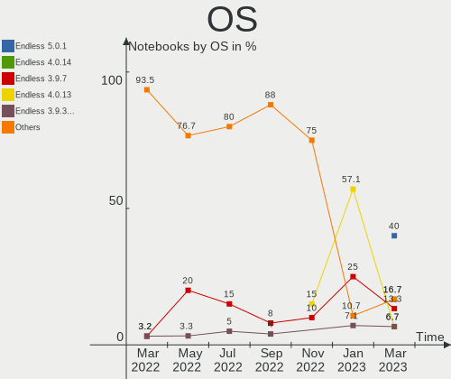
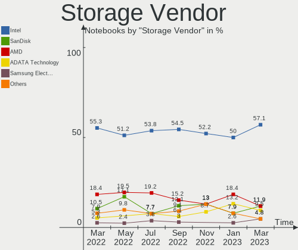

Endless Hardware Trends (Notebook)
----------------------------------

A project to identify most popular hardware characteristics and track their change
over time based on data collected by Endless users at https://Linux-Hardware.org.

Anyone can contribute to the study by uploading probes of their computers by
the [hw-probe](https://github.com/linuxhw/hw-probe) tool:

    sudo -E hw-probe -all -upload

Full-feature report is available here: https://linux-hardware.org/?view=trends&formfactor=notebook

Period: Nov, 2020.

Contents
--------

- [ OS                       ](#os)
- [ OS Family                ](#os-family)
- [ Kernel                   ](#kernel)
- [ Kernel Family            ](#kernel-family)
- [ Kernel Major Ver.        ](#kernel-major-ver)
- [ Arch                     ](#arch)
- [ DE                       ](#de)
- [ Display Server           ](#display-server)
- [ Display Manager          ](#display-manager)
- [ OS Lang                  ](#os-lang)
- [ Boot Mode                ](#boot-mode)
- [ Filesystem               ](#filesystem)
- [ Part. scheme             ](#part-scheme)
- [ Dual Boot with Linux/BSD ](#dual-boot-with-linux/bsd)
- [ Dual Boot (Win)          ](#dual-boot-win)
- [ Country                  ](#country)
- [ City                     ](#city)
- [ Vendor                   ](#vendor)
- [ Model                    ](#model)
- [ Model Family             ](#model-family)
- [ MFG Year                 ](#mfg-year)
- [ Form Factor              ](#form-factor)
- [ Secure Boot              ](#secure-boot)
- [ Coreboot                 ](#coreboot)
- [ RAM Size                 ](#ram-size)
- [ RAM Used                 ](#ram-used)
- [ Has CD-ROM               ](#has-cd-rom)
- [ Total Drives             ](#total-drives)
- [ Has Ethernet             ](#has-ethernet)
- [ Drive Vendor             ](#drive-vendor)
- [ Drive Model              ](#drive-model)
- [ HDD Vendor               ](#hdd-vendor)
- [ SSD Vendor               ](#ssd-vendor)
- [ Drive Kind               ](#drive-kind)
- [ Drive Connector          ](#drive-connector)
- [ Drive Size               ](#drive-size)
- [ Space Total              ](#space-total)
- [ Space Used               ](#space-used)
- [ Malfunc. Drives          ](#malfunc-drives)
- [ Malfunc. Drive Vendor    ](#malfunc-drive-vendor)
- [ Malfunc. HDD Vendor      ](#malfunc-hdd-vendor)
- [ Malfunc. Drive Kind      ](#malfunc-drive-kind)
- [ Failed Drives            ](#failed-drives)
- [ Failed Drive Vendor      ](#failed-drive-vendor)
- [ Drive Status             ](#drive-status)
- [ Storage Vendor           ](#storage-vendor)
- [ Storage Model            ](#storage-model)
- [ Storage Kind             ](#storage-kind)
- [ CPU Vendor               ](#cpu-vendor)
- [ CPU Model                ](#cpu-model)
- [ CPU Model Family         ](#cpu-model-family)
- [ CPU Cores                ](#cpu-cores)
- [ CPU Sockets              ](#cpu-sockets)
- [ CPU Threads              ](#cpu-threads)
- [ CPU Op-Modes             ](#cpu-op-modes)
- [ CPU Microcode            ](#cpu-microcode)
- [ CPU Microarch            ](#cpu-microarch)
- [ GPU Vendor               ](#gpu-vendor)
- [ GPU Model                ](#gpu-model)
- [ GPU Combo                ](#gpu-combo)
- [ GPU Driver               ](#gpu-driver)
- [ GPU Memory               ](#gpu-memory)
- [ Monitor Vendor           ](#monitor-vendor)
- [ Monitor Model            ](#monitor-model)
- [ Monitor Resolution       ](#monitor-resolution)
- [ Monitor Diagonal         ](#monitor-diagonal)
- [ Monitor Width            ](#monitor-width)
- [ Aspect Ratio             ](#aspect-ratio)
- [ Monitor Area             ](#monitor-area)
- [ Pixel Density            ](#pixel-density)
- [ Multiple Monitors        ](#multiple-monitors)
- [ Net Controller Vendor    ](#net-controller-vendor)
- [ Net Controller Model     ](#net-controller-model)
- [ Wireless Vendor          ](#wireless-vendor)
- [ Wireless Model           ](#wireless-model)
- [ Ethernet Vendor          ](#ethernet-vendor)
- [ Ethernet Model           ](#ethernet-model)
- [ Net Controller Kind      ](#net-controller-kind)
- [ Used Controller          ](#used-controller)
- [ NICs                     ](#nics)
- [ Memory Vendor            ](#memory-vendor)
- [ Memory Model             ](#memory-model)
- [ Memory Kind              ](#memory-kind)
- [ Memory Form Factor       ](#memory-form-factor)
- [ Memory Size              ](#memory-size)
- [ Memory Speed             ](#memory-speed)
- [ Sound Vendor             ](#sound-vendor)
- [ Sound Model              ](#sound-model)
- [ Camera Vendor            ](#camera-vendor)
- [ Camera Model             ](#camera-model)
- [ Fingerprint Vendor       ](#fingerprint-vendor)
- [ Fingerprint Model        ](#fingerprint-model)
- [ Chipcard Vendor          ](#chipcard-vendor)
- [ Chipcard Model           ](#chipcard-model)
- [ Printer Vendor           ](#printer-vendor)
- [ Printer Model            ](#printer-model)
- [ Scanner Vendor           ](#scanner-vendor)
- [ Scanner Model            ](#scanner-model)
- [ Bluetooth Vendor         ](#bluetooth-vendor)
- [ Bluetooth Model          ](#bluetooth-model)
- [ Unsupported Devices      ](#unsupported-devices)
- [ Unsupported Device Types ](#unsupported-device-types)

OS
--

Installed operating systems

| Name                  | Notebooks | Percent |
|-----------------------|-----------|---------|
| Endless 3.9.0         | 50        | 47.62%  |
| Endless 3.8.7         | 44        | 41.9%   |
| Endless 3.8.6         | 2         | 1.9%    |
| Endless 3.8.7-nexthw2 | 1         | 0.95%   |
| Endless 3.8.7-nexthw1 | 1         | 0.95%   |
| Endless 3.8.4         | 1         | 0.95%   |
| Endless 3.7.8         | 1         | 0.95%   |
| Endless 3.7.4         | 1         | 0.95%   |
| Endless 3.6.0-nexthw1 | 1         | 0.95%   |
| Endless 3.4.8         | 1         | 0.95%   |
| Endless 3.4.6-nexthw2 | 1         | 0.95%   |
| Endless 3.4.3-nexthw1 | 1         | 0.95%   |

OS Family
---------

OS without a version

| Name    | Notebooks | Percent |
|---------|-----------|---------|
| Endless | 105       | 100%    |

Kernel
------

Version of the Linux kernel

| Version           | Notebooks | Percent |
|-------------------|-----------|---------|
| 5.8.0-14-generic  | 52        | 49.52%  |
| 5.4.0-42-generic  | 46        | 43.81%  |
| 5.4.0-19-generic  | 1         | 0.95%   |
| 5.3.0-28-generic  | 1         | 0.95%   |
| 5.3.0-19-generic  | 1         | 0.95%   |
| 5.1.0-2-generic   | 1         | 0.95%   |
| 4.18.0-7-generic  | 1         | 0.95%   |
| 4.16.0-4-generic  | 1         | 0.95%   |
| 4.15.0-34-generic | 1         | 0.95%   |

Kernel Family
-------------

Linux kernel without a distro release

| Version | Notebooks | Percent |
|---------|-----------|---------|
| 5.8.0   | 52        | 49.52%  |
| 5.4.0   | 47        | 44.76%  |
| 5.3.0   | 2         | 1.9%    |
| 5.1.0   | 1         | 0.95%   |
| 4.18.0  | 1         | 0.95%   |
| 4.16.0  | 1         | 0.95%   |
| 4.15.0  | 1         | 0.95%   |

Kernel Major Ver.
-----------------

Linux kernel major version

| Version | Notebooks | Percent |
|---------|-----------|---------|
| 5.8     | 52        | 49.52%  |
| 5.4     | 47        | 44.76%  |
| 5.3     | 2         | 1.9%    |
| 5.1     | 1         | 0.95%   |
| 4.18    | 1         | 0.95%   |
| 4.16    | 1         | 0.95%   |
| 4.15    | 1         | 0.95%   |

Arch
----

OS architecture (x86_64, i586, etc.)

| Name   | Notebooks | Percent |
|--------|-----------|---------|
| x86_64 | 105       | 100%    |

DE
--

Desktop Environment

| Name    | Notebooks | Percent |
|---------|-----------|---------|
| GNOME   | 104       | 99.05%  |
| Unknown | 1         | 0.95%   |

Display Server
--------------

X11 or Wayland

| Name    | Notebooks | Percent |
|---------|-----------|---------|
| X11     | 104       | 99.05%  |
| Unknown | 1         | 0.95%   |

Display Manager
---------------

SDDM, LightDM, etc.

| Name    | Notebooks | Percent |
|---------|-----------|---------|
| Unknown | 105       | 100%    |

OS Lang
-------

Language

| Lang        | Notebooks | Percent |
|-------------|-----------|---------|
| pt_BR.utf8  | 23        | 21.9%   |
| en_US.utf8  | 18        | 17.14%  |
| ro_RO       | 11        | 10.48%  |
| pt_BR       | 9         | 8.57%   |
| ru_RU       | 7         | 6.67%   |
| es_ES       | 4         | 3.81%   |
| en_US       | 4         | 3.81%   |
| de_DE       | 4         | 3.81%   |
| ru_UA       | 3         | 2.86%   |
| hu_HU       | 3         | 2.86%   |
| uk_UA       | 2         | 1.9%    |
| sr_RS@latin | 2         | 1.9%    |
| pl_PL       | 2         | 1.9%    |
| it_IT       | 2         | 1.9%    |
| es_MX       | 2         | 1.9%    |
| zh_CN       | 1         | 0.95%   |
| tr_TR       | 1         | 0.95%   |
| sl_SI       | 1         | 0.95%   |
| fr_FR       | 1         | 0.95%   |
| es_CO       | 1         | 0.95%   |
| es_AR       | 1         | 0.95%   |
| de_AT       | 1         | 0.95%   |
| bg_BG       | 1         | 0.95%   |
| Unknown     | 1         | 0.95%   |

Boot Mode
---------

EFI or BIOS

| Mode | Notebooks | Percent |
|------|-----------|---------|
| EFI  | 68        | 64.76%  |
| BIOS | 37        | 35.24%  |

Filesystem
----------

Type of filesystem

| Type  | Notebooks | Percent |
|-------|-----------|---------|
| Ext4  | 101       | 96.19%  |
| Tmpfs | 4         | 3.81%   |

Part. scheme
------------

Scheme of partitioning

| Type    | Notebooks | Percent |
|---------|-----------|---------|
| Unknown | 105       | 100%    |

Dual Boot with Linux/BSD
------------------------

Hosting more than one Linux/BSD

| Dual boot | Notebooks | Percent |
|-----------|-----------|---------|
| No        | 105       | 100%    |

Dual Boot (Win)
---------------

Hosting Linux and Windows

| Dual boot | Notebooks | Percent |
|-----------|-----------|---------|
| No        | 105       | 100%    |

Country
-------

Geographic location (country)

| Country      | Notebooks | Percent |
|--------------|-----------|---------|
| Brazil       | 34        | 32.38%  |
| Romania      | 15        | 14.29%  |
| Spain        | 5         | 4.76%   |
| Russia       | 5         | 4.76%   |
| Ukraine      | 4         | 3.81%   |
| Hungary      | 4         | 3.81%   |
| Germany      | 4         | 3.81%   |
| USA          | 3         | 2.86%   |
| Colombia     | 3         | 2.86%   |
| Poland       | 2         | 1.9%    |
| Macedonia    | 2         | 1.9%    |
| Italy        | 2         | 1.9%    |
| France       | 2         | 1.9%    |
| Canada       | 2         | 1.9%    |
| Belarus      | 2         | 1.9%    |
| Turkey       | 1         | 0.95%   |
| Slovenia     | 1         | 0.95%   |
| Serbia       | 1         | 0.95%   |
| Saudi Arabia | 1         | 0.95%   |
| Philippines  | 1         | 0.95%   |
| Nepal        | 1         | 0.95%   |
| Luxembourg   | 1         | 0.95%   |
| Lithuania    | 1         | 0.95%   |
| Kenya        | 1         | 0.95%   |
| India        | 1         | 0.95%   |
| Georgia      | 1         | 0.95%   |
| Egypt        | 1         | 0.95%   |
| China        | 1         | 0.95%   |
| Bulgaria     | 1         | 0.95%   |
| Austria      | 1         | 0.95%   |
| Argentina    | 1         | 0.95%   |

City
----

Geographic location (city)

| City                   | Notebooks | Percent |
|------------------------|-----------|---------|
| São Paulo             | 3         | 2.86%   |
| Bucharest              | 3         | 2.86%   |
| Rio de Janeiro         | 2         | 1.9%    |
| Ribeirão Preto        | 2         | 1.9%    |
| Moscow                 | 2         | 1.9%    |
| Florianópolis         | 2         | 1.9%    |
| Ekaterinburg           | 2         | 1.9%    |
| Cluj-Napoca            | 2         | 1.9%    |
| Budapest               | 2         | 1.9%    |
| Žetale                | 1         | 0.95%   |
| Zarnesti               | 1         | 0.95%   |
| Wachtberg              | 1         | 0.95%   |
| Useldange              | 1         | 0.95%   |
| Urussanga              | 1         | 0.95%   |
| União da Vitória     | 1         | 0.95%   |
| Târgu Jiu             | 1         | 0.95%   |
| Torrelavega            | 1         | 0.95%   |
| Tbilisi                | 1         | 0.95%   |
| Taboao da Serra        | 1         | 0.95%   |
| São Carlos            | 1         | 0.95%   |
| Szeged                 | 1         | 0.95%   |
| Swift Current          | 1         | 0.95%   |
| Strasbourg             | 1         | 0.95%   |
| St Petersburg          | 1         | 0.95%   |
| Sofia                  | 1         | 0.95%   |
| Skopje                 | 1         | 0.95%   |
| Sincelejo              | 1         | 0.95%   |
| Shostka                | 1         | 0.95%   |
| Shanghai               | 1         | 0.95%   |
| Sao Pedro da Aldeia    | 1         | 0.95%   |
| Santa Fe               | 1         | 0.95%   |
| Santa Cruz de La Palma | 1         | 0.95%   |
| Salzburg               | 1         | 0.95%   |
| Ruda Śląska          | 1         | 0.95%   |
| Roznov                 | 1         | 0.95%   |
| Rostock                | 1         | 0.95%   |
| Rio Grande             | 1         | 0.95%   |
| Ribeirao Pires         | 1         | 0.95%   |
| Praia Grande           | 1         | 0.95%   |
| Pontevedra             | 1         | 0.95%   |
| Ploieşti              | 1         | 0.95%   |
| Ploen                  | 1         | 0.95%   |
| Piteşti               | 1         | 0.95%   |
| Pinhais                | 1         | 0.95%   |
| Ovidiu                 | 1         | 0.95%   |
| Ostrów Wielkopolski   | 1         | 0.95%   |
| Nairobi                | 1         | 0.95%   |
| Minsk                  | 1         | 0.95%   |
| Medellín              | 1         | 0.95%   |
| Mandaguacu             | 1         | 0.95%   |
| Madrid                 | 1         | 0.95%   |
| Lannion                | 1         | 0.95%   |
| Langenfeld             | 1         | 0.95%   |
| Lake Mary              | 1         | 0.95%   |
| Kyiv                   | 1         | 0.95%   |
| Kumanovo               | 1         | 0.95%   |
| Klaipėda              | 1         | 0.95%   |
| Kharkiv                | 1         | 0.95%   |
| Kathmandu              | 1         | 0.95%   |
| Jeddah                 | 1         | 0.95%   |

Vendor
------

Motherboard manufacturer

| Name             | Notebooks | Percent |
|------------------|-----------|---------|
| ASUSTek Computer | 48        | 45.71%  |
| Acer             | 33        | 31.43%  |
| Hewlett-Packard  | 8         | 7.62%   |
| Lenovo           | 5         | 4.76%   |
| Dell             | 5         | 4.76%   |
| Sony             | 2         | 1.9%    |
| Toshiba          | 1         | 0.95%   |
| Notebook         | 1         | 0.95%   |
| IPRODA           | 1         | 0.95%   |
| eMachines        | 1         | 0.95%   |

Model
-----

Motherboard model

| Name                                       | Notebooks | Percent |
|--------------------------------------------|-----------|---------|
| ASUS VivoBook 15_ASUS Laptop X540MA_X543MA | 6         | 5.71%   |
| ASUS X541UAK                               | 5         | 4.76%   |
| Acer Aspire A315-34                        | 5         | 4.76%   |
| ASUS ZenBook UX431DA_UM431DA               | 4         | 3.81%   |
| Acer Nitro AN515-54                        | 4         | 3.81%   |
| Acer Nitro AN515-43                        | 4         | 3.81%   |
| Acer Nitro AN517-51                        | 3         | 2.86%   |
| Acer Aspire A315-54K                       | 3         | 2.86%   |
| ASUS VivoBook_ASUSLaptop X509FA_X509FA     | 2         | 1.9%    |
| ASUS VivoBook_ASUSLaptop X403JA_X403JA     | 2         | 1.9%    |
| ASUS VivoBook 15_ASUS Laptop X540UAR       | 2         | 1.9%    |
| ASUS VivoBook 14_ASUS Laptop X441MA_X441MA | 2         | 1.9%    |
| Acer Aspire A515-41G                       | 2         | 1.9%    |
| Acer Aspire A315-53                        | 2         | 1.9%    |
| Toshiba Satellite P855                     | 1         | 0.95%   |
| Sony VPCZ115FC                             | 1         | 0.95%   |
| Sony VGN-CR320E                            | 1         | 0.95%   |
| Notebook NB50TJ1_TK1                       | 1         | 0.95%   |
| Lenovo ThinkPad S3-S440 20AYCTO1WW         | 1         | 0.95%   |
| Lenovo IdeaPad Slim 1-11AST-05 81VR        | 1         | 0.95%   |
| Lenovo IdeaPad 5 14IIL05 81YH              | 1         | 0.95%   |
| Lenovo IdeaPad 330-15IKB 81DE              | 1         | 0.95%   |
| Lenovo IdeaPad 3 15ADA05 81W1              | 1         | 0.95%   |
| IPRODA M1499C                              | 1         | 0.95%   |
| HP ProBook 6450b                           | 1         | 0.95%   |
| HP Pavilion dv4                            | 1         | 0.95%   |
| HP ENVY Laptop 13-ah0xxx                   | 1         | 0.95%   |
| HP EliteBook 8440p                         | 1         | 0.95%   |
| HP Compaq 6735s                            | 1         | 0.95%   |
| HP 255 G7 Notebook PC                      | 1         | 0.95%   |
| HP 250 G6 Notebook PC                      | 1         | 0.95%   |
| eMachines E725                             | 1         | 0.95%   |
| Dell Vostro 1000                           | 1         | 0.95%   |
| Dell Latitude E6430                        | 1         | 0.95%   |
| Dell Latitude D430                         | 1         | 0.95%   |
| Dell Inspiron 3542                         | 1         | 0.95%   |
| Dell Inspiron 3442                         | 1         | 0.95%   |
| ASUS Z550SA                                | 1         | 0.95%   |
| ASUS X541UJ                                | 1         | 0.95%   |
| ASUS X541NA                                | 1         | 0.95%   |
| ASUS X540NA                                | 1         | 0.95%   |
| ASUS X441NA                                | 1         | 0.95%   |
| ASUS VivoBook_ASUSLaptop X712FA_X712FA     | 1         | 0.95%   |
| ASUS VivoBook_ASUSLaptop X512DA_A512DA     | 1         | 0.95%   |
| ASUS VivoBook_ASUSLaptop X509FB_F509FB     | 1         | 0.95%   |
| ASUS VivoBook_ASUSLaptop X430FA_S430FA     | 1         | 0.95%   |
| ASUS VivoBook_ASUSLaptop X403FA_S403FA     | 1         | 0.95%   |
| ASUS VivoBook_ASUS Laptop X505ZA_X505ZA    | 1         | 0.95%   |
| ASUS VivoBook_ASUS Laptop X505ZA_A505ZA    | 1         | 0.95%   |
| ASUS VivoBook 17_ASUS Laptop X705MA_X705MA | 1         | 0.95%   |
| ASUS VivoBook 15_ASUS Laptop X540MA_X540MA | 1         | 0.95%   |
| ASUS VivoBook 15_ASUS Laptop X540MA_R540MA | 1         | 0.95%   |
| ASUS VivoBook 15_ASUS Laptop X540MA_F543MA | 1         | 0.95%   |
| ASUS VivoBook 15_ASUS Laptop X507UAR       | 1         | 0.95%   |
| ASUS VivoBook 15_ASUS Laptop X507MA_X507MA | 1         | 0.95%   |
| ASUS UX410UAK                              | 1         | 0.95%   |
| ASUS Strix GL703GM_GL703GM                 | 1         | 0.95%   |
| ASUS K45A                                  | 1         | 0.95%   |
| ASUS GL553VD                               | 1         | 0.95%   |
| ASUS E402NA                                | 1         | 0.95%   |

Model Family
------------

Motherboard model prefix

| Name              | Notebooks | Percent |
|-------------------|-----------|---------|
| ASUS VivoBook     | 27        | 25.71%  |
| Acer Aspire       | 21        | 20%     |
| Acer Nitro        | 11        | 10.48%  |
| ASUS X541UAK      | 5         | 4.76%   |
| Lenovo IdeaPad    | 4         | 3.81%   |
| ASUS ZenBook      | 4         | 3.81%   |
| Dell Latitude     | 2         | 1.9%    |
| Dell Inspiron     | 2         | 1.9%    |
| Toshiba Satellite | 1         | 0.95%   |
| Sony VPCZ115FC    | 1         | 0.95%   |
| Sony VGN-CR320E   | 1         | 0.95%   |
| Notebook NB50TJ1  | 1         | 0.95%   |
| Lenovo ThinkPad   | 1         | 0.95%   |
| IPRODA M1499C     | 1         | 0.95%   |
| HP ProBook        | 1         | 0.95%   |
| HP Pavilion       | 1         | 0.95%   |
| HP ENVY           | 1         | 0.95%   |
| HP EliteBook      | 1         | 0.95%   |
| HP Compaq         | 1         | 0.95%   |
| HP 255            | 1         | 0.95%   |
| HP 250            | 1         | 0.95%   |
| eMachines E725    | 1         | 0.95%   |
| Dell Vostro       | 1         | 0.95%   |
| ASUS Z550SA       | 1         | 0.95%   |
| ASUS X541UJ       | 1         | 0.95%   |
| ASUS X541NA       | 1         | 0.95%   |
| ASUS X540NA       | 1         | 0.95%   |
| ASUS X441NA       | 1         | 0.95%   |
| ASUS UX410UAK     | 1         | 0.95%   |
| ASUS Strix        | 1         | 0.95%   |
| ASUS K45A         | 1         | 0.95%   |
| ASUS GL553VD      | 1         | 0.95%   |
| ASUS E402NA       | 1         | 0.95%   |
| ASUS B121         | 1         | 0.95%   |
| ASUS 1015PE       | 1         | 0.95%   |
| Acer AO722        | 1         | 0.95%   |
| Unknown           | 1         | 0.95%   |

MFG Year
--------

Motherboard manufacture year

| Year | Notebooks | Percent |
|------|-----------|---------|
| 2019 | 35        | 33.33%  |
| 2020 | 25        | 23.81%  |
| 2017 | 12        | 11.43%  |
| 2018 | 11        | 10.48%  |
| 2011 | 7         | 6.67%   |
| 2010 | 4         | 3.81%   |
| 2008 | 4         | 3.81%   |
| 2016 | 1         | 0.95%   |
| 2015 | 1         | 0.95%   |
| 2014 | 1         | 0.95%   |
| 2013 | 1         | 0.95%   |
| 2012 | 1         | 0.95%   |
| 2009 | 1         | 0.95%   |
| 2006 | 1         | 0.95%   |

Form Factor
-----------

Physical design of the computer

| Name     | Notebooks | Percent |
|----------|-----------|---------|
| Notebook | 105       | 100%    |

Secure Boot
-----------

Enabled or disabled

| State    | Notebooks | Percent |
|----------|-----------|---------|
| Disabled | 80        | 76.19%  |
| Enabled  | 25        | 23.81%  |

Coreboot
--------

Have coreboot on board

| Used | Notebooks | Percent |
|------|-----------|---------|
| No   | 105       | 100%    |

RAM Size
--------

Total RAM memory

| Size in GB | Notebooks | Percent |
|------------|-----------|---------|
| 3.01-4.0   | 55        | 52.38%  |
| 4.01-8.0   | 33        | 31.43%  |
| 16.01-24.0 | 6         | 5.71%   |
| 1.01-2.0   | 5         | 4.76%   |
| 8.01-16.0  | 4         | 3.81%   |
| 2.01-3.0   | 2         | 1.9%    |

RAM Used
--------

Used RAM memory

| Used GB  | Notebooks | Percent |
|----------|-----------|---------|
| 1.01-2.0 | 56        | 53.33%  |
| 2.01-3.0 | 23        | 21.9%   |
| 0.01-1.0 | 15        | 14.29%  |
| 3.01-4.0 | 6         | 5.71%   |
| 4.01-8.0 | 5         | 4.76%   |

Has CD-ROM
----------

Has CD-ROM on board

| Presented | Notebooks | Percent |
|-----------|-----------|---------|
| No        | 75        | 71.43%  |
| Yes       | 30        | 28.57%  |

Total Drives
------------

Number of drives on board

| Drives | Notebooks | Percent |
|--------|-----------|---------|
| 1      | 90        | 85.71%  |
| 2      | 15        | 14.29%  |

Has Ethernet
------------

Has Ethernet on board

| Presented | Notebooks | Percent |
|-----------|-----------|---------|
| Yes       | 73        | 69.52%  |
| No        | 32        | 30.48%  |

Drive Vendor
------------

Hard drive vendors

| Vendor                | Notebooks | Drives | Percent |
|-----------------------|-----------|--------|---------|
| WDC                   | 24        | 25     | 20.34%  |
| Seagate               | 18        | 18     | 15.25%  |
| Kingston              | 18        | 19     | 15.25%  |
| Intel                 | 13        | 13     | 11.02%  |
| Toshiba               | 10        | 10     | 8.47%   |
| SanDisk               | 7         | 7      | 5.93%   |
| SK Hynix              | 5         | 5      | 4.24%   |
| Samsung Electronics   | 5         | 5      | 4.24%   |
| Unknown               | 3         | 3      | 2.54%   |
| ADATA Technology      | 3         | 3      | 2.54%   |
| Hitachi               | 2         | 2      | 1.69%   |
| Zheino                | 1         | 1      | 0.85%   |
| USB3.0                | 1         | 1      | 0.85%   |
| Realtek Semiconductor | 1         | 1      | 0.85%   |
| Netac                 | 1         | 1      | 0.85%   |
| LITEONIT              | 1         | 1      | 0.85%   |
| HGST                  | 1         | 1      | 0.85%   |
| EMTEC                 | 1         | 1      | 0.85%   |
| Dogfish               | 1         | 1      | 0.85%   |
| China                 | 1         | 1      | 0.85%   |
| A-DATA Technology     | 1         | 1      | 0.85%   |

Drive Model
-----------

Hard drive models

| Model                                    | Notebooks | Percent |
|------------------------------------------|-----------|---------|
| WDC WD10SPZX-21Z10T0 1TB                 | 17        | 14.17%  |
| Kingston RBUSC180DS37256GJ 256GB SSD     | 8         | 6.67%   |
| Seagate ST1000LM035-1RK172 1TB           | 7         | 5.83%   |
| Intel NVMe SSD Drive 512GB               | 6         | 5%      |
| Intel NVMe SSD Drive 256GB               | 5         | 4.17%   |
| Toshiba MQ04ABF100 1TB                   | 4         | 3.33%   |
| Seagate ST500LM030-1RK17D 500GB          | 4         | 3.33%   |
| SK Hynix NVMe SSD Drive 512GB            | 3         | 2.5%    |
| SanDisk SD8SB8U128G1002 128GB SSD        | 3         | 2.5%    |
| Kingston SA400S37240G 240GB SSD          | 3         | 2.5%    |
| ADATA NVMe SSD Drive 128GB               | 3         | 2.5%    |
| WDC WD5000LPCX-21VHAT0 500GB             | 2         | 1.67%   |
| Toshiba MQ01ABF050 500GB                 | 2         | 1.67%   |
| SK Hynix NVMe SSD Drive 256GB            | 2         | 1.67%   |
| Kingston SA400S37120G 120GB SSD          | 2         | 1.67%   |
| Kingston NVMe SSD Drive 256GB            | 2         | 1.67%   |
| Zheino CHN-mSATAM3-256 256GB             | 1         | 0.83%   |
| WDC WDS240G2G0B-00EPW0 240GB SSD         | 1         | 0.83%   |
| WDC WD7500BPVT-80HXZT3 752GB             | 1         | 0.83%   |
| WDC WD5000LPCX-80VHAT0 500GB             | 1         | 0.83%   |
| WDC WD3200BEVT-60ZCT1 320GB              | 1         | 0.83%   |
| WDC WD10JPVX-75JC3T0 1TB                 | 1         | 0.83%   |
| WDC WD10JPVX-60JC3T1 1TB                 | 1         | 0.83%   |
| USB3.0 Super Speed 500GB                 | 1         | 0.83%   |
| Unknown MMC Card  64GB                   | 1         | 0.83%   |
| Unknown MMC Card  32GB                   | 1         | 0.83%   |
| Unknown MMC Card  256GB                  | 1         | 0.83%   |
| Toshiba NVMe SSD Drive 256GB             | 1         | 0.83%   |
| Toshiba MQ01ABD100 1TB                   | 1         | 0.83%   |
| Toshiba MK3252GSX 320GB                  | 1         | 0.83%   |
| Toshiba MK2555GSX 250GB                  | 1         | 0.83%   |
| Seagate ST980811AS 80GB                  | 1         | 0.83%   |
| Seagate ST95005620AS 500GB               | 1         | 0.83%   |
| Seagate ST9320423AS 320GB                | 1         | 0.83%   |
| Seagate ST9250410AS 250GB                | 1         | 0.83%   |
| Seagate ST500LT012-1DG142 500GB          | 1         | 0.83%   |
| Seagate ST2000LM007-1R8174 2TB           | 1         | 0.83%   |
| Seagate ST1000LX015-1U7172 1TB           | 1         | 0.83%   |
| SanDisk SSD PLUS 240GB                   | 1         | 0.83%   |
| SanDisk SD9SN8W256G1102 256GB SSD        | 1         | 0.83%   |
| SanDisk SD9SB8W256G1002 256GB SSD        | 1         | 0.83%   |
| Sandisk NVMe SSD Drive 256GB             | 1         | 0.83%   |
| Samsung SSD 860 EVO 250GB                | 1         | 0.83%   |
| Samsung NVMe SSD Drive 512GB             | 1         | 0.83%   |
| Samsung NVMe SSD Drive 256GB             | 1         | 0.83%   |
| Samsung MZNLN256HAJQ-000H1 256GB SSD     | 1         | 0.83%   |
| Samsung HN-M320MBB 320GB                 | 1         | 0.83%   |
| Realtek NVMe SSD Drive 512GB             | 1         | 0.83%   |
| Netac SSD 512GB                          | 1         | 0.83%   |
| LITEONIT LCS-256L9S-11 2.5 7mm 256GB SSD | 1         | 0.83%   |
| Kingston SNVP325S2256GB SSD              | 1         | 0.83%   |
| Kingston SA400M8240G 240GB SSD           | 1         | 0.83%   |
| Kingston RBUSNS8180S3128GI1 128GB SSD    | 1         | 0.83%   |
| Kingston RBUSNS8180DS3256GJ 256GB SSD    | 1         | 0.83%   |
| Intel SSDSCKKW256G8 256GB                | 1         | 0.83%   |
| Intel NVMe SSD Drive 128GB               | 1         | 0.83%   |
| Hitachi HTS545016B9A300 160GB            | 1         | 0.83%   |
| Hitachi HTS541616J9SA00 160GB            | 1         | 0.83%   |
| HGST HTS721010A9E630 1TB                 | 1         | 0.83%   |
| EMTEC X150 240GB                         | 1         | 0.83%   |

HDD Vendor
----------

Hard disk drive vendors

| Vendor              | Notebooks | Drives | Percent |
|---------------------|-----------|--------|---------|
| WDC                 | 24        | 24     | 42.86%  |
| Seagate             | 18        | 18     | 32.14%  |
| Toshiba             | 9         | 9      | 16.07%  |
| Hitachi             | 2         | 2      | 3.57%   |
| USB3.0              | 1         | 1      | 1.79%   |
| Samsung Electronics | 1         | 1      | 1.79%   |
| HGST                | 1         | 1      | 1.79%   |

SSD Vendor
----------

Solid state drive vendors

| Vendor              | Notebooks | Drives | Percent |
|---------------------|-----------|--------|---------|
| Kingston            | 16        | 17     | 51.61%  |
| SanDisk             | 6         | 6      | 19.35%  |
| Samsung Electronics | 2         | 2      | 6.45%   |
| WDC                 | 1         | 1      | 3.23%   |
| Netac               | 1         | 1      | 3.23%   |
| LITEONIT            | 1         | 1      | 3.23%   |
| Intel               | 1         | 1      | 3.23%   |
| Dogfish             | 1         | 1      | 3.23%   |
| China               | 1         | 1      | 3.23%   |
| A-DATA Technology   | 1         | 1      | 3.23%   |

Drive Kind
----------

HDD or SSD

| Kind    | Notebooks | Drives | Percent |
|---------|-----------|--------|---------|
| HDD     | 56        | 56     | 47.46%  |
| SSD     | 30        | 32     | 25.42%  |
| NVMe    | 27        | 27     | 22.88%  |
| MMC     | 3         | 3      | 2.54%   |
| Unknown | 2         | 2      | 1.69%   |

Drive Connector
---------------

SATA, SAS, NVMe, etc.

| Type | Notebooks | Drives | Percent |
|------|-----------|--------|---------|
| SATA | 83        | 89     | 72.81%  |
| NVMe | 27        | 27     | 23.68%  |
| MMC  | 3         | 3      | 2.63%   |
| SAS  | 1         | 1      | 0.88%   |

Drive Size
----------

Size of hard drive

| Size in TB | Notebooks | Drives | Percent |
|------------|-----------|--------|---------|
| 0.01-0.5   | 49        | 52     | 57.65%  |
| 0.51-1.0   | 35        | 35     | 41.18%  |
| 1.01-2.0   | 1         | 1      | 1.18%   |

Space Total
-----------

Amount of disk space available on the file system

| Size in GB | Notebooks | Percent |
|------------|-----------|---------|
| 101-250    | 35        | 33.33%  |
| 501-1000   | 31        | 29.52%  |
| 251-500    | 25        | 23.81%  |
| 1-20       | 6         | 5.71%   |
| 51-100     | 4         | 3.81%   |
| 21-50      | 3         | 2.86%   |
| 1001-2000  | 1         | 0.95%   |

Space Used
----------

Amount of used disk space

| Used GB | Notebooks | Percent |
|---------|-----------|---------|
| 21-50   | 47        | 44.76%  |
| 1-20    | 22        | 20.95%  |
| 51-100  | 19        | 18.1%   |
| 101-250 | 16        | 15.24%  |
| 251-500 | 1         | 0.95%   |

Malfunc. Drives
---------------

Drive models with a malfunction

Zero info for selected period =(

Malfunc. Drive Vendor
---------------------

Vendors of faulty drives

Zero info for selected period =(

Malfunc. HDD Vendor
-------------------

Vendors of faulty HDD drives

Zero info for selected period =(

Malfunc. Drive Kind
-------------------

Kinds of faulty drives

Zero info for selected period =(

Failed Drives
-------------

Failed drive models

Zero info for selected period =(

Failed Drive Vendor
-------------------

Failed drive vendors

Zero info for selected period =(

Drive Status
------------

Number of failed and malfunc. drives

| Status   | Notebooks | Drives | Percent |
|----------|-----------|--------|---------|
| Detected | 105       | 120    | 100%    |

Storage Vendor
--------------

Storage controller vendors

| Vendor                       | Notebooks | Percent |
|------------------------------|-----------|---------|
| Intel                        | 83        | 69.75%  |
| AMD                          | 20        | 16.81%  |
| SK Hynix                     | 5         | 4.2%    |
| ADATA Technology             | 3         | 2.52%   |
| Samsung Electronics          | 2         | 1.68%   |
| Kingston Technology Company  | 2         | 1.68%   |
| Toshiba America Info Systems | 1         | 0.84%   |
| Sandisk                      | 1         | 0.84%   |
| Realtek Semiconductor        | 1         | 0.84%   |
| Nvidia                       | 1         | 0.84%   |

Storage Model
-------------

Storage controller models

| Model                                                                            | Notebooks | Percent |
|----------------------------------------------------------------------------------|-----------|---------|
| Intel 82801 Mobile SATA Controller [RAID mode]                                   | 21        | 15.56%  |
| Intel SATA controller                                                            | 18        | 13.33%  |
| Intel Sunrise Point-LP SATA Controller [AHCI mode]                               | 16        | 11.85%  |
| AMD FCH SATA Controller [AHCI mode]                                              | 16        | 11.85%  |
| Intel PROSet/Wireless WiFi Software extension                                    | 12        | 8.89%   |
| Intel Celeron N3350/Pentium N4200/Atom E3900 Series SATA AHCI Controller         | 6         | 4.44%   |
| SK Hynix BC501 NVMe Solid State Drive 512GB                                      | 5         | 3.7%    |
| Intel 82801IBM/IEM (ICH9M/ICH9M-E) 4 port SATA Controller [AHCI mode]            | 3         | 2.22%   |
| Intel 8 Series SATA Controller 1 [AHCI mode]                                     | 3         | 2.22%   |
| Intel 7 Series Chipset Family 6-port SATA Controller [AHCI mode]                 | 3         | 2.22%   |
| AMD SB7x0/SB8x0/SB9x0 SATA Controller [AHCI mode]                                | 3         | 2.22%   |
| ADATA Technology Non-Volatile memory controller                                  | 3         | 2.22%   |
| Kingston Technology Company Non-Volatile memory controller                       | 2         | 1.48%   |
| Intel Atom/Celeron/Pentium Processor x5-E8000/J3xxx/N3xxx Series SATA Controller | 2         | 1.48%   |
| Toshiba America Info Systems Toshiba America Info Non-Volatile memory controller | 1         | 0.74%   |
| Sandisk WD Black 2018 / PC SN520 NVMe SSD                                        | 1         | 0.74%   |
| Samsung Electronics NVMe SSD Controller SM961/PM961                              | 1         | 0.74%   |
| Samsung Electronics Electronics Non-Volatile memory controller                   | 1         | 0.74%   |
| Realtek Semiconductor Realtek Non-Volatile memory controller                     | 1         | 0.74%   |
| Nvidia MCP65 SATA Controller                                                     | 1         | 0.74%   |
| Nvidia MCP65 IDE                                                                 | 1         | 0.74%   |
| Intel NM10/ICH7 Family SATA Controller [AHCI mode]                               | 1         | 0.74%   |
| Intel HM170/QM170 Chipset SATA Controller [AHCI Mode]                            | 1         | 0.74%   |
| Intel Cannon Lake PCH SATA AHCI Controller                                       | 1         | 0.74%   |
| Intel Cannon Lake Mobile PCH SATA AHCI Controller                                | 1         | 0.74%   |
| Intel 82801HM/HEM (ICH8M/ICH8M-E) SATA Controller [IDE mode]                     | 1         | 0.74%   |
| Intel 82801HM/HEM (ICH8M/ICH8M-E) SATA Controller [AHCI mode]                    | 1         | 0.74%   |
| Intel 82801HM/HEM (ICH8M/ICH8M-E) IDE Controller                                 | 1         | 0.74%   |
| Intel 82801G (ICH7 Family) IDE Controller                                        | 1         | 0.74%   |
| Intel 6 Series/C200 Series Chipset Family 6 port Mobile SATA AHCI Controller     | 1         | 0.74%   |
| Intel 5 Series/3400 Series Chipset 6 port SATA AHCI Controller                   | 1         | 0.74%   |
| Intel 5 Series/3400 Series Chipset 4 port SATA IDE Controller                    | 1         | 0.74%   |
| Intel 5 Series/3400 Series Chipset 4 port SATA AHCI Controller                   | 1         | 0.74%   |
| Intel 5 Series/3400 Series Chipset 2 port SATA IDE Controller                    | 1         | 0.74%   |
| AMD SB600 Non-Raid-5 SATA                                                        | 1         | 0.74%   |
| AMD SB600 IDE                                                                    | 1         | 0.74%   |

Storage Kind
------------

Kind of storage controller (IDE, SATA, NVMe, SAS, ...)

| Kind | Notebooks | Percent |
|------|-----------|---------|
| SATA | 89        | 66.92%  |
| NVMe | 27        | 20.3%   |
| RAID | 11        | 8.27%   |
| IDE  | 6         | 4.51%   |

CPU Vendor
----------

Processor vendors

| Vendor | Notebooks | Percent |
|--------|-----------|---------|
| Intel  | 84        | 80%     |
| AMD    | 21        | 20%     |

CPU Model
---------

Processor models

| Model                                           | Notebooks | Percent |
|-------------------------------------------------|-----------|---------|
| Intel Celeron N4000 CPU @ 1.10GHz               | 10        | 9.52%   |
| Intel Core i3-6006U CPU @ 2.00GHz               | 6         | 5.71%   |
| Intel Celeron N4000C CPU @ 1.10GHz              | 6         | 5.71%   |
| Intel Core i7-9750H CPU @ 2.60GHz               | 5         | 4.76%   |
| Intel Celeron CPU N3350 @ 1.10GHz               | 5         | 4.76%   |
| Intel Core i3-8145U CPU @ 2.10GHz               | 4         | 3.81%   |
| Intel Core i3-7020U CPU @ 2.30GHz               | 4         | 3.81%   |
| AMD Ryzen 7 3750H with Radeon Vega Mobile Gfx   | 4         | 3.81%   |
| Intel Core i5-7200U CPU @ 2.50GHz               | 3         | 2.86%   |
| Intel Core i5-1035G1 CPU @ 1.00GHz              | 3         | 2.86%   |
| Intel Core i5 CPU M 520 @ 2.40GHz               | 3         | 2.86%   |
| Intel Core i3-8130U CPU @ 2.20GHz               | 3         | 2.86%   |
| Intel Pentium Dual-Core CPU T4300 @ 2.10GHz     | 2         | 1.9%    |
| Intel Core i5-9300H CPU @ 2.40GHz               | 2         | 1.9%    |
| Intel Core i3-4005U CPU @ 1.70GHz               | 2         | 1.9%    |
| AMD Ryzen 7 3700U with Radeon Vega Mobile Gfx   | 2         | 1.9%    |
| AMD Ryzen 5 3500U with Radeon Vega Mobile Gfx   | 2         | 1.9%    |
| Intel Pentium Silver N5000 CPU @ 1.10GHz        | 1         | 0.95%   |
| Intel Pentium CPU N4200 @ 1.10GHz               | 1         | 0.95%   |
| Intel Genuine CPU U4100 @ 1.30GHz               | 1         | 0.95%   |
| Intel Core i7-8750H CPU @ 2.20GHz               | 1         | 0.95%   |
| Intel Core i7-8565U CPU @ 1.80GHz               | 1         | 0.95%   |
| Intel Core i7-8550U CPU @ 1.80GHz               | 1         | 0.95%   |
| Intel Core i7-7500U CPU @ 2.70GHz               | 1         | 0.95%   |
| Intel Core i7-3720QM CPU @ 2.60GHz              | 1         | 0.95%   |
| Intel Core i7-3610QM CPU @ 2.30GHz              | 1         | 0.95%   |
| Intel Core i5-9400 CPU @ 2.90GHz                | 1         | 0.95%   |
| Intel Core i5-8265U CPU @ 1.60GHz               | 1         | 0.95%   |
| Intel Core i5-7300HQ CPU @ 2.50GHz              | 1         | 0.95%   |
| Intel Core i5-3210M CPU @ 2.50GHz               | 1         | 0.95%   |
| Intel Core i5-2410M CPU @ 2.30GHz               | 1         | 0.95%   |
| Intel Core i5-10210U CPU @ 1.60GHz              | 1         | 0.95%   |
| Intel Core i5 CPU U 470 @ 1.33GHz               | 1         | 0.95%   |
| Intel Core i3-7100U CPU @ 2.40GHz               | 1         | 0.95%   |
| Intel Core i3-4030U CPU @ 1.90GHz               | 1         | 0.95%   |
| Intel Core 2 Duo CPU T7300 @ 2.00GHz            | 1         | 0.95%   |
| Intel Core 2 Duo CPU T7250 @ 2.00GHz            | 1         | 0.95%   |
| Intel Core 2 CPU U7600 @ 1.20GHz                | 1         | 0.95%   |
| Intel Celeron N4020 CPU @ 1.10GHz               | 1         | 0.95%   |
| Intel Celeron CPU N3160 @ 1.60GHz               | 1         | 0.95%   |
| Intel Celeron CPU N3060 @ 1.60GHz               | 1         | 0.95%   |
| Intel Celeron CPU 3867U @ 1.80GHz               | 1         | 0.95%   |
| Intel Atom CPU N450 @ 1.66GHz                   | 1         | 0.95%   |
| AMD Turion X2 Dual Core Mobile RM-74            | 1         | 0.95%   |
| AMD Turion 64 X2 Mobile Technology TL-64        | 1         | 0.95%   |
| AMD Ryzen 5 2500U with Radeon Vega Mobile Gfx   | 1         | 0.95%   |
| AMD Ryzen 3 3250U with Radeon Graphics          | 1         | 0.95%   |
| AMD Ryzen 3 3200U with Radeon Vega Mobile Gfx   | 1         | 0.95%   |
| AMD Ryzen 3 2200U with Radeon Vega Mobile Gfx   | 1         | 0.95%   |
| AMD Mobile Sempron Processor 3600+              | 1         | 0.95%   |
| AMD FX-9800P RADEON R7, 12 COMPUTE CORES 4C+8G  | 1         | 0.95%   |
| AMD C-60 APU with Radeon HD Graphics            | 1         | 0.95%   |
| AMD Athlon II P320 Dual-Core Processor          | 1         | 0.95%   |
| AMD A6-9225 RADEON R4, 5 COMPUTE CORES 2C+3G    | 1         | 0.95%   |
| AMD A6-9220e RADEON R4, 5 COMPUTE CORES 2C+3G   | 1         | 0.95%   |
| AMD A12-9720P RADEON R7, 12 COMPUTE CORES 4C+8G | 1         | 0.95%   |

CPU Model Family
----------------

Processor model prefix

| Model                   | Notebooks | Percent |
|-------------------------|-----------|---------|
| Intel Celeron           | 25        | 23.81%  |
| Intel Core i3           | 21        | 20%     |
| Intel Core i5           | 18        | 17.14%  |
| Intel Core i7           | 11        | 10.48%  |
| AMD Ryzen 7             | 6         | 5.71%   |
| AMD Ryzen 5             | 3         | 2.86%   |
| AMD Ryzen 3             | 3         | 2.86%   |
| Intel Pentium Dual-Core | 2         | 1.9%    |
| Intel Core 2 Duo        | 2         | 1.9%    |
| AMD A6                  | 2         | 1.9%    |
| Intel Pentium Silver    | 1         | 0.95%   |
| Intel Pentium           | 1         | 0.95%   |
| Intel Genuine           | 1         | 0.95%   |
| Intel Core 2            | 1         | 0.95%   |
| Intel Atom              | 1         | 0.95%   |
| AMD Turion 64 X2 Mobile | 1         | 0.95%   |
| AMD Turion              | 1         | 0.95%   |
| AMD Mobile Sempron      | 1         | 0.95%   |
| AMD FX                  | 1         | 0.95%   |
| AMD C-60                | 1         | 0.95%   |
| AMD Athlon II           | 1         | 0.95%   |
| AMD A12                 | 1         | 0.95%   |

CPU Cores
---------

Number of processor cores

| Number | Notebooks | Percent |
|--------|-----------|---------|
| 2      | 72        | 68.57%  |
| 4      | 24        | 22.86%  |
| 6      | 7         | 6.67%   |
| 1      | 2         | 1.9%    |

CPU Sockets
-----------

Number of sockets

| Number | Notebooks | Percent |
|--------|-----------|---------|
| 1      | 105       | 100%    |

CPU Threads
-----------

Threads per core (Hyper-Threading)

| Number | Notebooks | Percent |
|--------|-----------|---------|
| 2      | 63        | 60%     |
| 1      | 42        | 40%     |

CPU Op-Modes
------------

CPU Operation Modes (32-bit, 64-bit)

| Op mode        | Notebooks | Percent |
|----------------|-----------|---------|
| 32-bit, 64-bit | 104       | 99.05%  |
| Unknown        | 1         | 0.95%   |

CPU Microcode
-------------

Microcode number

| Number     | Notebooks | Percent |
|------------|-----------|---------|
| Unknown    | 15        | 14.29%  |
| 0x706a1    | 12        | 11.43%  |
| 0x906ea    | 9         | 8.57%   |
| 0x806e9    | 8         | 7.62%   |
| 0x806ea    | 6         | 5.71%   |
| 0x506c9    | 5         | 4.76%   |
| 0x406e3    | 5         | 4.76%   |
| 0x08108109 | 5         | 4.76%   |
| 0x08108102 | 4         | 3.81%   |
| 0x806ec    | 3         | 2.86%   |
| 0x706e5    | 3         | 2.86%   |
| 0x40651    | 3         | 2.86%   |
| 0x806eb    | 2         | 1.9%    |
| 0x406c4    | 2         | 1.9%    |
| 0x306a9    | 2         | 1.9%    |
| 0x20655    | 2         | 1.9%    |
| 0x20652    | 2         | 1.9%    |
| 0x1067a    | 2         | 1.9%    |
| 0x08101007 | 2         | 1.9%    |
| 0x906e9    | 1         | 0.95%   |
| 0x706a8    | 1         | 0.95%   |
| 0x6fd      | 1         | 0.95%   |
| 0x6fa      | 1         | 0.95%   |
| 0x6f2      | 1         | 0.95%   |
| 0x206a7    | 1         | 0.95%   |
| 0x106ca    | 1         | 0.95%   |
| 0x06006705 | 1         | 0.95%   |
| 0x0600611a | 1         | 0.95%   |
| 0x06006118 | 1         | 0.95%   |
| 0x05000119 | 1         | 0.95%   |
| 0x02000032 | 1         | 0.95%   |
| 0x010000c8 | 1         | 0.95%   |

CPU Microarch
-------------

Microarchitecture

| Name            | Notebooks | Percent |
|-----------------|-----------|---------|
| KabyLake        | 31        | 29.52%  |
| Goldmont plus   | 18        | 17.14%  |
| Zen+            | 10        | 9.52%   |
| Skylake         | 6         | 5.71%   |
| Goldmont        | 6         | 5.71%   |
| Westmere        | 4         | 3.81%   |
| Excavator       | 4         | 3.81%   |
| Penryn          | 3         | 2.86%   |
| IvyBridge       | 3         | 2.86%   |
| IceLake         | 3         | 2.86%   |
| Haswell         | 3         | 2.86%   |
| Core            | 3         | 2.86%   |
| Zen             | 2         | 1.9%    |
| Silvermont      | 2         | 1.9%    |
| K8 Hammer       | 2         | 1.9%    |
| SandyBridge     | 1         | 0.95%   |
| K8 & K10 hybrid | 1         | 0.95%   |
| K10             | 1         | 0.95%   |
| Bonnell         | 1         | 0.95%   |
| Bobcat          | 1         | 0.95%   |

GPU Vendor
----------

Vendors of graphics cards

| Vendor | Notebooks | Percent |
|--------|-----------|---------|
| Intel  | 82        | 64.57%  |
| AMD    | 23        | 18.11%  |
| Nvidia | 22        | 17.32%  |

GPU Model
---------

Graphics card models

| Model                                                                                    | Notebooks | Percent |
|------------------------------------------------------------------------------------------|-----------|---------|
| Intel UHD Graphics 605                                                                   | 18        | 13.74%  |
| Nvidia TU117M [GeForce GTX 1650 Mobile / Max-Q]                                          | 11        | 8.4%    |
| AMD Picasso                                                                              | 10        | 7.63%   |
| Intel UHD Graphics 630 (Mobile)                                                          | 7         | 5.34%   |
| Intel UHD Graphics 620 (Whiskey Lake)                                                    | 6         | 4.58%   |
| Intel Skylake GT2 [HD Graphics 520]                                                      | 6         | 4.58%   |
| Intel HD Graphics 620                                                                    | 6         | 4.58%   |
| Intel HD Graphics 500                                                                    | 5         | 3.82%   |
| Intel UHD Graphics 620                                                                   | 4         | 3.05%   |
| Intel Core Processor Integrated Graphics Controller                                      | 4         | 3.05%   |
| Intel Mobile 4 Series Chipset Integrated Graphics Controller                             | 3         | 2.29%   |
| Intel Kaby Lake-U GT2f Integrated Graphics Controller                                    | 3         | 2.29%   |
| Intel Iris Plus Graphics G1 (Ice Lake)                                                   | 3         | 2.29%   |
| Intel Haswell-ULT Integrated Graphics Controller                                         | 3         | 2.29%   |
| Intel 3rd Gen Core processor Graphics Controller                                         | 3         | 2.29%   |
| Nvidia GP107M [GeForce GTX 1050 Mobile]                                                  | 2         | 1.53%   |
| Nvidia GK208BM [GeForce 920M]                                                            | 2         | 1.53%   |
| Intel Atom/Celeron/Pentium Processor x5-E8000/J3xxx/N3xxx Integrated Graphics Controller | 2         | 1.53%   |
| AMD Wani [Radeon R5/R6/R7 Graphics]                                                      | 2         | 1.53%   |
| AMD Stoney [Radeon R2/R3/R4/R5 Graphics]                                                 | 2         | 1.53%   |
| AMD Raven Ridge [Radeon Vega Series / Radeon Vega Mobile Series]                         | 2         | 1.53%   |
| AMD Lexa PRO [Radeon 540/540X/550/550X / RX 540X/550/550X]                               | 2         | 1.53%   |
| Nvidia GT216M [GeForce GT 330M]                                                          | 1         | 0.76%   |
| Nvidia GP106M [GeForce GTX 1060 Mobile]                                                  | 1         | 0.76%   |
| Nvidia GM108M [GeForce MX110]                                                            | 1         | 0.76%   |
| Nvidia GM108M [GeForce 940MX]                                                            | 1         | 0.76%   |
| Nvidia GF108M [GeForce GT 620M/630M/635M/640M LE]                                        | 1         | 0.76%   |
| Nvidia GF108GLM [NVS 5200M]                                                              | 1         | 0.76%   |
| Nvidia G86M [GeForce 8400M GS]                                                           | 1         | 0.76%   |
| Intel UHD Graphics 630 (Desktop)                                                         | 1         | 0.76%   |
| Intel UHD Graphics                                                                       | 1         | 0.76%   |
| Intel Mobile GM965/GL960 Integrated Graphics Controller (secondary)                      | 1         | 0.76%   |
| Intel Mobile GM965/GL960 Integrated Graphics Controller (primary)                        | 1         | 0.76%   |
| Intel Mobile 945GM/GMS/GME, 943/940GML Express Integrated Graphics Controller            | 1         | 0.76%   |
| Intel Mobile 945GM/GMS, 943/940GML Express Integrated Graphics Controller                | 1         | 0.76%   |
| Intel Kaby Lake-U GT1 Integrated Graphics Controller                                     | 1         | 0.76%   |
| Intel HD Graphics 630                                                                    | 1         | 0.76%   |
| Intel Celeron N3350/Pentium N4200/Atom E3900 Series Integrated Graphics Controller       | 1         | 0.76%   |
| Intel Atom Processor D4xx/D5xx/N4xx/N5xx Integrated Graphics Controller                  | 1         | 0.76%   |
| Intel 2nd Generation Core Processor Family Integrated Graphics Controller                | 1         | 0.76%   |
| AMD Wrestler [Radeon HD 6290]                                                            | 1         | 0.76%   |
| AMD Sun XT [Radeon HD 8670A/8670M/8690M / R5 M330 / M430 / Radeon 520 Mobile]            | 1         | 0.76%   |
| AMD RV710/M92 [Mobility Radeon HD 4330/4350/4550]                                        | 1         | 0.76%   |
| AMD RV550/M71 [Mobility Radeon HD 2300]                                                  | 1         | 0.76%   |
| AMD RS880M [Mobility Radeon HD 4225/4250]                                                | 1         | 0.76%   |
| AMD RS780M [Mobility Radeon HD 3200]                                                     | 1         | 0.76%   |
| AMD RS482M [Mobility Radeon Xpress 200]                                                  | 1         | 0.76%   |

GPU Combo
---------

Combinations of graphics cards

| Name           | Notebooks | Percent |
|----------------|-----------|---------|
| 1 x Intel      | 64        | 60.95%  |
| Intel + Nvidia | 16        | 15.24%  |
| 1 x AMD        | 15        | 14.29%  |
| AMD + Nvidia   | 4         | 3.81%   |
| 2 x AMD        | 2         | 1.9%    |
| 1 x Nvidia     | 2         | 1.9%    |
| Intel + AMD    | 2         | 1.9%    |

GPU Driver
----------

Free vs proprietary

| Driver      | Notebooks | Percent |
|-------------|-----------|---------|
| Free        | 87        | 82.86%  |
| Proprietary | 18        | 17.14%  |

GPU Memory
----------

Total video memory

| Size in GB | Notebooks | Percent |
|------------|-----------|---------|
| Unknown    | 80        | 76.19%  |
| 1.01-2.0   | 10        | 9.52%   |
| 0.01-0.5   | 10        | 9.52%   |
| 0.51-1.0   | 4         | 3.81%   |
| 3.01-4.0   | 1         | 0.95%   |

Monitor Vendor
--------------

Monitor vendors

| Vendor                  | Notebooks | Percent |
|-------------------------|-----------|---------|
| BOE                     | 40        | 36.7%   |
| Chimei Innolux          | 25        | 22.94%  |
| AU Optronics            | 15        | 13.76%  |
| Samsung Electronics     | 10        | 9.17%   |
| PANDA                   | 5         | 4.59%   |
| LG Display              | 3         | 2.75%   |
| LG Philips              | 2         | 1.83%   |
| InfoVision              | 2         | 1.83%   |
| Chi Mei Optoelectronics | 2         | 1.83%   |
| Sony                    | 1         | 0.92%   |
| Hewlett-Packard         | 1         | 0.92%   |
| HannStar                | 1         | 0.92%   |
| Goldstar                | 1         | 0.92%   |
| DTV                     | 1         | 0.92%   |

Monitor Model
-------------

Monitor models

| Model                                                                    | Notebooks | Percent |
|--------------------------------------------------------------------------|-----------|---------|
| BOE LCD Monitor BOE06A5 1366x768 344x194mm 15.5-inch                     | 8         | 7.34%   |
| BOE LCD Monitor BOE07CE 1366x768 344x193mm 15.5-inch                     | 7         | 6.42%   |
| Chimei Innolux LCD Monitor CMN15DB 1366x768 344x193mm 15.5-inch          | 5         | 4.59%   |
| BOE LCD Monitor BOE0818 1920x1080 344x194mm 15.5-inch                    | 5         | 4.59%   |
| BOE LCD Monitor BOE069C 1920x1080 344x193mm 15.5-inch                    | 5         | 4.59%   |
| PANDA LCD Monitor NCP0035 1920x1080 309x174mm 14.0-inch                  | 4         | 3.67%   |
| AU Optronics LCD Monitor AUO21ED 1920x1080 344x194mm 15.5-inch           | 4         | 3.67%   |
| Chimei Innolux LCD Monitor CMN15F5 1920x1080 344x193mm 15.5-inch         | 3         | 2.75%   |
| Chimei Innolux LCD Monitor CMN15E6 1366x768 344x193mm 15.5-inch          | 3         | 2.75%   |
| Chimei Innolux LCD Monitor CMN14C4 1366x768 309x173mm 13.9-inch          | 3         | 2.75%   |
| BOE LCD Monitor BOE0839 1920x1080 382x215mm 17.3-inch                    | 3         | 2.75%   |
| AU Optronics LCD Monitor AUO61ED 1920x1080 340x190mm 15.3-inch           | 3         | 2.75%   |
| Chimei Innolux LCD Monitor CMN15DC 1366x768 344x193mm 15.5-inch          | 2         | 1.83%   |
| Chimei Innolux LCD Monitor CMN14D5 1920x1080 309x173mm 13.9-inch         | 2         | 1.83%   |
| BOE LCD Monitor BOE06A4 1366x768 344x194mm 15.5-inch                     | 2         | 1.83%   |
| AU Optronics LCD Monitor AUO22EC 1366x768 344x193mm 15.5-inch            | 2         | 1.83%   |
| Sony Nvidia Defaul t Flat Panel SNY06FA 1600x900 360x200mm 16.2-inch     | 1         | 0.92%   |
| Samsung Electronics S24E650 SAM0CB8 1920x1080 521x293mm 23.5-inch        | 1         | 0.92%   |
| Samsung Electronics LCD Monitor SEC5842 1366x768 309x174mm 14.0-inch     | 1         | 0.92%   |
| Samsung Electronics LCD Monitor SEC5441 1366x768 344x194mm 15.5-inch     | 1         | 0.92%   |
| Samsung Electronics LCD Monitor SEC5142 1280x800 303x190mm 14.1-inch     | 1         | 0.92%   |
| Samsung Electronics LCD Monitor SEC4E45 1280x800 331x207mm 15.4-inch     | 1         | 0.92%   |
| Samsung Electronics LCD Monitor SEC3358 1280x800 331x207mm 15.4-inch     | 1         | 0.92%   |
| Samsung Electronics LCD Monitor SEC3150 1366x768 344x193mm 15.5-inch     | 1         | 0.92%   |
| Samsung Electronics LCD Monitor SAM0AC6 1920x1080 700x390mm 31.5-inch    | 1         | 0.92%   |
| Samsung Electronics LCD Monitor SAM090B 1920x1080 1020x570mm 46.0-inch   | 1         | 0.92%   |
| Samsung Electronics LCD Monitor SAM07C0 1920x1080 700x390mm 31.5-inch    | 1         | 0.92%   |
| PANDA LM156LF1L03 NCP001C 1920x1080 344x194mm 15.5-inch                  | 1         | 0.92%   |
| LG Philips LP154WX4-TLC8 LPL0120 1280x800 331x207mm 15.4-inch            | 1         | 0.92%   |
| LG Philips LCD Monitor LPLA002 1440x900 367x230mm 17.1-inch              | 1         | 0.92%   |
| LG Display LP156WH1-TLA3 LGD01C2 1366x768 344x194mm 15.5-inch            | 1         | 0.92%   |
| LG Display LCD Monitor LGD033E 1366x768 309x174mm 14.0-inch              | 1         | 0.92%   |
| LG Display LCD Monitor LGD02F8 1366x768 309x174mm 14.0-inch              | 1         | 0.92%   |
| InfoVision LCD Monitor IVO0535 1920x1080 294x165mm 13.3-inch             | 1         | 0.92%   |
| InfoVision LCD Monitor IVO048E 1366x768 256x144mm 11.6-inch              | 1         | 0.92%   |
| Hewlett-Packard 27wm HWP3355 1920x1080 598x336mm 27.0-inch               | 1         | 0.92%   |
| HannStar LCD Monitor HSD03E9 1024x600 220x129mm 10.0-inch                | 1         | 0.92%   |
| Goldstar 22MP55PJ GSM5B79 1920x1080 480x270mm 21.7-inch                  | 1         | 0.92%   |
| DTV STI DTV0030 1600x1200 708x398mm 32.0-inch                            | 1         | 0.92%   |
| Chimei Innolux LCD Monitor CMN1745 1600x900 380x210mm 17.1-inch          | 1         | 0.92%   |
| Chimei Innolux LCD Monitor CMN15D5 1920x1080 340x190mm 15.3-inch         | 1         | 0.92%   |
| Chimei Innolux LCD Monitor CMN15D2 1920x1080 340x190mm 15.3-inch         | 1         | 0.92%   |
| Chimei Innolux LCD Monitor CMN15CA 1366x768 340x190mm 15.3-inch          | 1         | 0.92%   |
| Chimei Innolux LCD Monitor CMN14D4 1920x1080 309x173mm 13.9-inch         | 1         | 0.92%   |
| Chimei Innolux LCD Monitor CMN14D2 1920x1080 309x173mm 13.9-inch         | 1         | 0.92%   |
| Chimei Innolux LCD Monitor CMN1482 1600x900 309x174mm 14.0-inch          | 1         | 0.92%   |
| Chi Mei Optoelectronics LCD Monitor CMO1463 1366x768 309x174mm 14.0-inch | 1         | 0.92%   |
| Chi Mei Optoelectronics LCD Monitor CMO1113 1366x768 256x144mm 11.6-inch | 1         | 0.92%   |
| BOE LCD Monitor BOE4011 1280x800 261x163mm 12.1-inch                     | 1         | 0.92%   |
| BOE LCD Monitor BOE0868 1920x1080 309x174mm 14.0-inch                    | 1         | 0.92%   |
| BOE LCD Monitor BOE084E 1920x1080 382x215mm 17.3-inch                    | 1         | 0.92%   |
| BOE LCD Monitor BOE07F7 1920x1080 309x174mm 14.0-inch                    | 1         | 0.92%   |
| BOE LCD Monitor BOE06BD 1366x768 309x173mm 13.9-inch                     | 1         | 0.92%   |
| BOE LCD Monitor BOE0687 1920x1080 344x193mm 15.5-inch                    | 1         | 0.92%   |
| BOE LCD Monitor BOE0675 1366x768 344x194mm 15.5-inch                     | 1         | 0.92%   |
| BOE LCD Monitor BOE0672 1366x768 344x194mm 15.5-inch                     | 1         | 0.92%   |
| BOE LCD Monitor BOE0615 1366x768 309x173mm 13.9-inch                     | 1         | 0.92%   |
| BOE LCD Monitor BOE05EF 1366x768 309x173mm 13.9-inch                     | 1         | 0.92%   |
| AU Optronics LCD Monitor AUO81EC 1366x768 344x193mm 15.5-inch            | 1         | 0.92%   |
| AU Optronics LCD Monitor AUO70EC 1366x768 340x190mm 15.3-inch            | 1         | 0.92%   |

Monitor Resolution
------------------

Monitor screen resolution

| Resolution       | Notebooks | Percent |
|------------------|-----------|---------|
| 1366x768 (WXGA)  | 51        | 48.11%  |
| 1920x1080 (FHD)  | 44        | 41.51%  |
| 1280x800 (WXGA)  | 5         | 4.72%   |
| 1600x900 (HD+)   | 3         | 2.83%   |
| 1440x900 (WXGA+) | 1         | 0.94%   |
| 1280x1024 (SXGA) | 1         | 0.94%   |
| 1024x600         | 1         | 0.94%   |

Monitor Diagonal
----------------

Diagonal size in inches

| Inches | Notebooks | Percent |
|--------|-----------|---------|
| 15     | 68        | 62.39%  |
| 13     | 12        | 11.01%  |
| 14     | 10        | 9.17%   |
| 17     | 8         | 7.34%   |
| 40     | 2         | 1.83%   |
| 11     | 2         | 1.83%   |
| 54     | 1         | 0.92%   |
| 32     | 1         | 0.92%   |
| 27     | 1         | 0.92%   |
| 23     | 1         | 0.92%   |
| 21     | 1         | 0.92%   |
| 12     | 1         | 0.92%   |
| 10     | 1         | 0.92%   |

Monitor Width
-------------

Physical width

| Width in mm | Notebooks | Percent |
|-------------|-----------|---------|
| 301-350     | 88        | 80.73%  |
| 351-400     | 9         | 8.26%   |
| 201-300     | 5         | 4.59%   |
| 801-900     | 2         | 1.83%   |
| 501-600     | 2         | 1.83%   |
| 701-800     | 1         | 0.92%   |
| 401-500     | 1         | 0.92%   |
| 1001-1500   | 1         | 0.92%   |

Aspect Ratio
------------

Proportional relationship between the width and the height

| Ratio | Notebooks | Percent |
|-------|-----------|---------|
| 16/9  | 97        | 94.17%  |
| 16/10 | 6         | 5.83%   |

Monitor Area
------------

Area in inch²

| Area in inch² | Notebooks | Percent |
|----------------|-----------|---------|
| 101-110        | 68        | 62.39%  |
| 81-90          | 21        | 19.27%  |
| 121-130        | 7         | 6.42%   |
| 51-60          | 2         | 1.83%   |
| 201-250        | 2         | 1.83%   |
| 501-1000       | 2         | 1.83%   |
| More than 1000 | 1         | 0.92%   |
| 71-80          | 1         | 0.92%   |
| 61-70          | 1         | 0.92%   |
| 351-500        | 1         | 0.92%   |
| 41-50          | 1         | 0.92%   |
| 301-350        | 1         | 0.92%   |
| 131-140        | 1         | 0.92%   |

Pixel Density
-------------

Pixels per inch

| Density | Notebooks | Percent |
|---------|-----------|---------|
| 101-120 | 52        | 48.15%  |
| 121-160 | 44        | 40.74%  |
| 51-100  | 10        | 9.26%   |
| 1-50    | 1         | 0.93%   |
| 161-240 | 1         | 0.93%   |

Multiple Monitors
-----------------

Total monitors connected

| Total | Notebooks | Percent |
|-------|-----------|---------|
| 1     | 96        | 91.43%  |
| 2     | 7         | 6.67%   |
| 0     | 2         | 1.9%    |

Net Controller Vendor
---------------------

Controller vendors

| Vendor                          | Notebooks | Percent |
|---------------------------------|-----------|---------|
| Realtek Semiconductor           | 71        | 42.01%  |
| Intel                           | 41        | 24.26%  |
| Qualcomm Atheros                | 36        | 21.3%   |
| Broadcom Inc. and subsidiaries  | 8         | 4.73%   |
| Broadcom Limited                | 3         | 1.78%   |
| Broadcom                        | 2         | 1.18%   |
| Xiaomi                          | 1         | 0.59%   |
| U.S. Robotics                   | 1         | 0.59%   |
| TP-Link                         | 1         | 0.59%   |
| Ralink Technology               | 1         | 0.59%   |
| Qualcomm Atheros Communications | 1         | 0.59%   |
| Nvidia                          | 1         | 0.59%   |
| Marvell Technology Group        | 1         | 0.59%   |
| ASUSTek Computer                | 1         | 0.59%   |

Net Controller Model
--------------------

Controller models

| Model                                                                        | Notebooks | Percent |
|------------------------------------------------------------------------------|-----------|---------|
| Realtek RTL8111/8168/8411 PCI Express Gigabit Ethernet Controller            | 40        | 21.86%  |
| Qualcomm Atheros QCA9377 802.11ac Wireless Network Adapter                   | 18        | 9.84%   |
| Realtek RTL810xE PCI Express Fast Ethernet controller                        | 16        | 8.74%   |
| Intel Wireless 8265 / 8275                                                   | 9         | 4.92%   |
| Realtek RTL8822BE 802.11a/b/g/n/ac WiFi adapter                              | 8         | 4.37%   |
| Realtek RTL8723BE PCIe Wireless Network Adapter                              | 7         | 3.83%   |
| Qualcomm Atheros QCA9565 / AR9565 Wireless Network Adapter                   | 7         | 3.83%   |
| Intel Wi-Fi 6 AX200                                                          | 7         | 3.83%   |
| Realtek RTL8821CE 802.11ac PCIe Wireless Network Adapter                     | 5         | 2.73%   |
| Qualcomm Atheros QCA6174 802.11ac Wireless Network Adapter                   | 4         | 2.19%   |
| Intel Dual Band Wireless-AC 3168NGW [Stone Peak]                             | 4         | 2.19%   |
| Intel Killer Wi-Fi 6 AX1650i 160MHz Wireless Network Adapter (201NGW)        | 3         | 1.64%   |
| Realtek RTL8822CE 802.11ac PCIe Wireless Network Adapter                     | 2         | 1.09%   |
| Qualcomm Atheros AR9485 Wireless Network Adapter                             | 2         | 1.09%   |
| Qualcomm Atheros AR9285 Wireless Network Adapter (PCI-Express)               | 2         | 1.09%   |
| Qualcomm Atheros AR8132 Fast Ethernet                                        | 2         | 1.09%   |
| Intel Wireless-AC 9560 [Jefferson Peak]                                      | 2         | 1.09%   |
| Intel Wireless 7265                                                          | 2         | 1.09%   |
| Intel PRO/Wireless 4965 AG or AGN [Kedron] Network Connection                | 2         | 1.09%   |
| Intel Centrino Advanced-N 6200                                               | 2         | 1.09%   |
| Intel Cannon Point-LP CNVi [Wireless-AC]                                     | 2         | 1.09%   |
| Intel 82577LC Gigabit Network Connection                                     | 2         | 1.09%   |
| Broadcom Inc. and subsidiaries BCM4312 802.11b/g LP-PHY                      | 2         | 1.09%   |
| Xiaomi Mi/Redmi series (RNDIS + ADB)                                         | 1         | 0.55%   |
| U.S. Robotics USR5423 802.11bg Wireless Adapter [ZyDAS ZD1211B]              | 1         | 0.55%   |
| TP-Link UE300 10/100/1000 LAN (ethernet mode) [Realtek RTL8153]              | 1         | 0.55%   |
| Realtek RTL8821AE 802.11ac PCIe Wireless Network Adapter                     | 1         | 0.55%   |
| Realtek RTL8152 Fast Ethernet Adapter                                        | 1         | 0.55%   |
| Ralink MT7601U Wireless Adapter                                              | 1         | 0.55%   |
| Qualcomm Atheros AR9271 802.11n                                              | 1         | 0.55%   |
| Qualcomm Atheros AR9287 Wireless Network Adapter (PCI-Express)               | 1         | 0.55%   |
| Qualcomm Atheros AR8152 v2.0 Fast Ethernet                                   | 1         | 0.55%   |
| Qualcomm Atheros AR8131 Gigabit Ethernet                                     | 1         | 0.55%   |
| Nvidia MCP65 Ethernet                                                        | 1         | 0.55%   |
| Marvell Group 88E8042 PCI-E Fast Ethernet Controller                         | 1         | 0.55%   |
| Intel Wireless 8260                                                          | 1         | 0.55%   |
| Intel Wireless 7260                                                          | 1         | 0.55%   |
| Intel Wireless 3165                                                          | 1         | 0.55%   |
| Intel PRO/Wireless 3945ABG [Golan] Network Connection                        | 1         | 0.55%   |
| Intel Centrino Wireless-N 2230                                               | 1         | 0.55%   |
| Intel Centrino Wireless-N 1000 [Condor Peak]                                 | 1         | 0.55%   |
| Intel Centrino Ultimate-N 6300                                               | 1         | 0.55%   |
| Intel 82579LM Gigabit Network Connection (Lewisville)                        | 1         | 0.55%   |
| Intel 82577LM Gigabit Network Connection                                     | 1         | 0.55%   |
| Broadcom NetXtreme BCM5752 Gigabit Ethernet PCI Express                      | 1         | 0.55%   |
| Broadcom Limited NetLink BCM57780 Gigabit Ethernet PCIe                      | 1         | 0.55%   |
| Broadcom Limited BCM4401-B0 100Base-TX                                       | 1         | 0.55%   |
| Broadcom Limited BCM4312 802.11b/g LP-PHY                                    | 1         | 0.55%   |
| Broadcom Inc. and subsidiaries NetLink BCM5787M Gigabit Ethernet PCI Express | 1         | 0.55%   |
| Broadcom Inc. and subsidiaries NetLink BCM57785 Gigabit Ethernet PCIe        | 1         | 0.55%   |
| Broadcom Inc. and subsidiaries BCM43225 802.11b/g/n                          | 1         | 0.55%   |
| Broadcom Inc. and subsidiaries BCM43142 802.11b/g/n                          | 1         | 0.55%   |
| Broadcom Inc. and subsidiaries BCM4313 802.11bgn Wireless Network Adapter    | 1         | 0.55%   |
| Broadcom Inc. and subsidiaries BCM4311 802.11b/g WLAN                        | 1         | 0.55%   |
| Broadcom BCM4321 802.11a/b/g/n                                               | 1         | 0.55%   |
| ASUS 802.11n NIC                                                             | 1         | 0.55%   |

Wireless Vendor
---------------

Wireless vendors

| Vendor                          | Notebooks | Percent |
|---------------------------------|-----------|---------|
| Intel                           | 40        | 36.7%   |
| Qualcomm Atheros                | 34        | 31.19%  |
| Realtek Semiconductor           | 23        | 21.1%   |
| Broadcom Inc. and subsidiaries  | 6         | 5.5%    |
| U.S. Robotics                   | 1         | 0.92%   |
| Ralink Technology               | 1         | 0.92%   |
| Qualcomm Atheros Communications | 1         | 0.92%   |
| Broadcom Limited                | 1         | 0.92%   |
| Broadcom                        | 1         | 0.92%   |
| ASUSTek Computer                | 1         | 0.92%   |

Wireless Model
--------------

Wireless models

| Model                                                                     | Notebooks | Percent |
|---------------------------------------------------------------------------|-----------|---------|
| Qualcomm Atheros QCA9377 802.11ac Wireless Network Adapter                | 18        | 16.51%  |
| Intel Wireless 8265 / 8275                                                | 9         | 8.26%   |
| Realtek RTL8822BE 802.11a/b/g/n/ac WiFi adapter                           | 8         | 7.34%   |
| Realtek RTL8723BE PCIe Wireless Network Adapter                           | 7         | 6.42%   |
| Qualcomm Atheros QCA9565 / AR9565 Wireless Network Adapter                | 7         | 6.42%   |
| Intel Wi-Fi 6 AX200                                                       | 7         | 6.42%   |
| Realtek RTL8821CE 802.11ac PCIe Wireless Network Adapter                  | 5         | 4.59%   |
| Qualcomm Atheros QCA6174 802.11ac Wireless Network Adapter                | 4         | 3.67%   |
| Intel Dual Band Wireless-AC 3168NGW [Stone Peak]                          | 4         | 3.67%   |
| Intel Killer Wi-Fi 6 AX1650i 160MHz Wireless Network Adapter (201NGW)     | 3         | 2.75%   |
| Realtek RTL8822CE 802.11ac PCIe Wireless Network Adapter                  | 2         | 1.83%   |
| Qualcomm Atheros AR9485 Wireless Network Adapter                          | 2         | 1.83%   |
| Qualcomm Atheros AR9285 Wireless Network Adapter (PCI-Express)            | 2         | 1.83%   |
| Intel Wireless-AC 9560 [Jefferson Peak]                                   | 2         | 1.83%   |
| Intel Wireless 7265                                                       | 2         | 1.83%   |
| Intel PRO/Wireless 4965 AG or AGN [Kedron] Network Connection             | 2         | 1.83%   |
| Intel Centrino Advanced-N 6200                                            | 2         | 1.83%   |
| Intel Cannon Point-LP CNVi [Wireless-AC]                                  | 2         | 1.83%   |
| Broadcom Inc. and subsidiaries BCM4312 802.11b/g LP-PHY                   | 2         | 1.83%   |
| U.S. Robotics USR5423 802.11bg Wireless Adapter [ZyDAS ZD1211B]           | 1         | 0.92%   |
| Realtek RTL8821AE 802.11ac PCIe Wireless Network Adapter                  | 1         | 0.92%   |
| Ralink MT7601U Wireless Adapter                                           | 1         | 0.92%   |
| Qualcomm Atheros AR9271 802.11n                                           | 1         | 0.92%   |
| Qualcomm Atheros AR9287 Wireless Network Adapter (PCI-Express)            | 1         | 0.92%   |
| Intel Wireless 8260                                                       | 1         | 0.92%   |
| Intel Wireless 7260                                                       | 1         | 0.92%   |
| Intel Wireless 3165                                                       | 1         | 0.92%   |
| Intel PRO/Wireless 3945ABG [Golan] Network Connection                     | 1         | 0.92%   |
| Intel Centrino Wireless-N 2230                                            | 1         | 0.92%   |
| Intel Centrino Wireless-N 1000 [Condor Peak]                              | 1         | 0.92%   |
| Intel Centrino Ultimate-N 6300                                            | 1         | 0.92%   |
| Broadcom Limited BCM4312 802.11b/g LP-PHY                                 | 1         | 0.92%   |
| Broadcom Inc. and subsidiaries BCM43225 802.11b/g/n                       | 1         | 0.92%   |
| Broadcom Inc. and subsidiaries BCM43142 802.11b/g/n                       | 1         | 0.92%   |
| Broadcom Inc. and subsidiaries BCM4313 802.11bgn Wireless Network Adapter | 1         | 0.92%   |
| Broadcom Inc. and subsidiaries BCM4311 802.11b/g WLAN                     | 1         | 0.92%   |
| Broadcom BCM4321 802.11a/b/g/n                                            | 1         | 0.92%   |
| ASUS 802.11n NIC                                                          | 1         | 0.92%   |

Ethernet Vendor
---------------

Ethernet vendors

| Vendor                         | Notebooks | Percent |
|--------------------------------|-----------|---------|
| Realtek Semiconductor          | 57        | 77.03%  |
| Qualcomm Atheros               | 4         | 5.41%   |
| Intel                          | 4         | 5.41%   |
| Broadcom Limited               | 2         | 2.7%    |
| Broadcom Inc. and subsidiaries | 2         | 2.7%    |
| Xiaomi                         | 1         | 1.35%   |
| TP-Link                        | 1         | 1.35%   |
| Nvidia                         | 1         | 1.35%   |
| Marvell Technology Group       | 1         | 1.35%   |
| Broadcom                       | 1         | 1.35%   |

Ethernet Model
--------------

Ethernet models

| Model                                                                        | Notebooks | Percent |
|------------------------------------------------------------------------------|-----------|---------|
| Realtek RTL8111/8168/8411 PCI Express Gigabit Ethernet Controller            | 40        | 54.05%  |
| Realtek RTL810xE PCI Express Fast Ethernet controller                        | 16        | 21.62%  |
| Qualcomm Atheros AR8132 Fast Ethernet                                        | 2         | 2.7%    |
| Intel 82577LC Gigabit Network Connection                                     | 2         | 2.7%    |
| Xiaomi Mi/Redmi series (RNDIS + ADB)                                         | 1         | 1.35%   |
| TP-Link UE300 10/100/1000 LAN (ethernet mode) [Realtek RTL8153]              | 1         | 1.35%   |
| Realtek RTL8152 Fast Ethernet Adapter                                        | 1         | 1.35%   |
| Qualcomm Atheros AR8152 v2.0 Fast Ethernet                                   | 1         | 1.35%   |
| Qualcomm Atheros AR8131 Gigabit Ethernet                                     | 1         | 1.35%   |
| Nvidia MCP65 Ethernet                                                        | 1         | 1.35%   |
| Marvell Group 88E8042 PCI-E Fast Ethernet Controller                         | 1         | 1.35%   |
| Intel 82579LM Gigabit Network Connection (Lewisville)                        | 1         | 1.35%   |
| Intel 82577LM Gigabit Network Connection                                     | 1         | 1.35%   |
| Broadcom NetXtreme BCM5752 Gigabit Ethernet PCI Express                      | 1         | 1.35%   |
| Broadcom Limited NetLink BCM57780 Gigabit Ethernet PCIe                      | 1         | 1.35%   |
| Broadcom Limited BCM4401-B0 100Base-TX                                       | 1         | 1.35%   |
| Broadcom Inc. and subsidiaries NetLink BCM5787M Gigabit Ethernet PCI Express | 1         | 1.35%   |
| Broadcom Inc. and subsidiaries NetLink BCM57785 Gigabit Ethernet PCIe        | 1         | 1.35%   |

Net Controller Kind
-------------------

Ethernet, WiFi or modem

| Kind     | Notebooks | Percent |
|----------|-----------|---------|
| WiFi     | 105       | 58.99%  |
| Ethernet | 73        | 41.01%  |

Used Controller
---------------

Currently used network controller

| Kind     | Notebooks | Percent |
|----------|-----------|---------|
| WiFi     | 104       | 58.76%  |
| Ethernet | 73        | 41.24%  |

NICs
----

Total network controllers on board

| Total | Notebooks | Percent |
|-------|-----------|---------|
| 2     | 71        | 67.62%  |
| 1     | 34        | 32.38%  |

Memory Vendor
-------------

Memory module vendors

Zero info for selected period =(

Memory Model
------------

Memory module models

Zero info for selected period =(

Memory Kind
-----------

Memory module kinds

Zero info for selected period =(

Memory Form Factor
------------------

Physical design of the memory module

Zero info for selected period =(

Memory Size
-----------

Memory module size

Zero info for selected period =(

Memory Speed
------------

Memory module speed

Zero info for selected period =(

Sound Vendor
------------

Sound card vendors

| Vendor      | Notebooks | Percent |
|-------------|-----------|---------|
| Intel       | 84        | 70%     |
| AMD         | 21        | 17.5%   |
| Nvidia      | 14        | 11.67%  |
| Plantronics | 1         | 0.83%   |

Sound Model
-----------

Sound card models

| Model                                                                                             | Notebooks | Percent |
|---------------------------------------------------------------------------------------------------|-----------|---------|
| Intel Sunrise Point-LP HD Audio                                                                   | 20        | 14.08%  |
| Intel Celeron/Pentium Silver Processor High Definition Audio                                      | 18        | 12.68%  |
| AMD Raven/Raven2/Fenghuang HDMI/DP Audio Controller                                               | 12        | 8.45%   |
| AMD Family 17h (Models 10h-1fh) HD Audio Controller                                               | 12        | 8.45%   |
| Intel Cannon Lake PCH cAVS                                                                        | 9         | 6.34%   |
| Nvidia TU107 GeForce GTX 1650 High Definition Audio Controller                                    | 7         | 4.93%   |
| Intel Celeron N3350/Pentium N4200/Atom E3900 Series Audio Cluster                                 | 6         | 4.23%   |
| Intel Cannon Point-LP High Definition Audio Controller                                            | 6         | 4.23%   |
| Intel 5 Series/3400 Series Chipset High Definition Audio                                          | 4         | 2.82%   |
| AMD SBx00 Azalia (Intel HDA)                                                                      | 4         | 2.82%   |
| AMD Family 15h (Models 60h-6fh) Audio Controller                                                  | 4         | 2.82%   |
| Intel Smart Sound Technology Audio Controller                                                     | 3         | 2.11%   |
| Intel Haswell-ULT HD Audio Controller                                                             | 3         | 2.11%   |
| Intel 82801I (ICH9 Family) HD Audio Controller                                                    | 3         | 2.11%   |
| Intel 8 Series HD Audio Controller                                                                | 3         | 2.11%   |
| Intel 7 Series/C216 Chipset Family High Definition Audio Controller                               | 3         | 2.11%   |
| Nvidia GK208 HDMI/DP Audio Controller                                                             | 2         | 1.41%   |
| Nvidia GF108 High Definition Audio Controller                                                     | 2         | 1.41%   |
| Intel NM10/ICH7 Family High Definition Audio Controller                                           | 2         | 1.41%   |
| Intel Atom/Celeron/Pentium Processor x5-E8000/J3xxx/N3xxx Series High Definition Audio Controller | 2         | 1.41%   |
| Intel 82801H (ICH8 Family) HD Audio Controller                                                    | 2         | 1.41%   |
| AMD Kabini HDMI/DP Audio                                                                          | 2         | 1.41%   |
| AMD High Definition Audio Controller                                                              | 2         | 1.41%   |
| Plantronics C320-M                                                                                | 1         | 0.7%    |
| Nvidia MCP65 High Definition Audio                                                                | 1         | 0.7%    |
| Nvidia GT216 HDMI Audio Controller                                                                | 1         | 0.7%    |
| Nvidia GP107GL High Definition Audio Controller                                                   | 1         | 0.7%    |
| Intel USB PnP Sound Device                                                                        | 1         | 0.7%    |
| Intel Comet Lake PCH-LP cAVS                                                                      | 1         | 0.7%    |
| Intel CM238 HD Audio Controller                                                                   | 1         | 0.7%    |
| Intel 6 Series/C200 Series Chipset Family High Definition Audio Controller                        | 1         | 0.7%    |
| AMD Wrestler HDMI Audio                                                                           | 1         | 0.7%    |
| AMD RV710/730 HDMI Audio [Radeon HD 4000 series]                                                  | 1         | 0.7%    |
| AMD RS880 HDMI Audio [Radeon HD 4200 Series]                                                      | 1         | 0.7%    |

Camera Vendor
-------------

Camera device vendors

| Vendor                                 | Notebooks | Percent |
|----------------------------------------|-----------|---------|
| IMC Networks                           | 40        | 40%     |
| Chicony Electronics                    | 24        | 24%     |
| Quanta                                 | 18        | 18%     |
| Suyin                                  | 5         | 5%      |
| Realtek Semiconductor                  | 4         | 4%      |
| Ricoh                                  | 2         | 2%      |
| Syntek                                 | 1         | 1%      |
| Microsoft                              | 1         | 1%      |
| Microdia                               | 1         | 1%      |
| GEMBIRD                                | 1         | 1%      |
| Cheng Uei Precision Industry (Foxlink) | 1         | 1%      |
| Alcor Micro                            | 1         | 1%      |
| Acer                                   | 1         | 1%      |

Camera Model
------------

Camera device models

| Model                                                       | Notebooks | Percent |
|-------------------------------------------------------------|-----------|---------|
| IMC Networks USB2.0 VGA UVC WebCam                          | 25        | 25%     |
| IMC Networks USB2.0 HD UVC WebCam                           | 11        | 11%     |
| Quanta VGA WebCam                                           | 10        | 10%     |
| Chicony HD User Facing                                      | 9         | 9%      |
| Chicony USB2.0 VGA UVC WebCam                               | 5         | 5%      |
| Chicony VGA WebCam                                          | 4         | 4%      |
| Quanta HD Webcam                                            | 3         | 3%      |
| Quanta HD User Facing                                       | 2         | 2%      |
| IMC Networks UVC VGA Webcam                                 | 2         | 2%      |
| Syntek EasyCamera                                           | 1         | 1%      |
| Suyin WebCam                                                | 1         | 1%      |
| Suyin Integrated_Webcam_HD                                  | 1         | 1%      |
| Suyin HP Webcam                                             | 1         | 1%      |
| Suyin Acer/HP Integrated Webcam [CN0314]                    | 1         | 1%      |
| Suyin 1.3M WebCam (notebook emachines E730, Acer sub-brand) | 1         | 1%      |
| Ricoh Visual Communication Camera VGP-VCC6 [R5U870]         | 1         | 1%      |
| Ricoh Sony Visual Communication Camera                      | 1         | 1%      |
| Realtek USB2.0 VGA UVC WebCam                               | 1         | 1%      |
| Realtek USB2.0 HD UVC WebCam                                | 1         | 1%      |
| Realtek Integrated Camera                                   | 1         | 1%      |
| Realtek EasyCamera                                          | 1         | 1%      |
| Quanta USB2.0 VGA UVC WebCam                                | 1         | 1%      |
| Quanta HP Webcam                                            | 1         | 1%      |
| Quanta HP TrueVision HD Camera                              | 1         | 1%      |
| Microsoft LifeCam HD-3000                                   | 1         | 1%      |
| Microdia Integrated_Webcam_HD                               | 1         | 1%      |
| IMC Networks USB2.0 UVC 2M WebCam                           | 1         | 1%      |
| IMC Networks Integrated Camera                              | 1         | 1%      |
| GEMBIRD USB2.0 PC CAMERA                                    | 1         | 1%      |
| Chicony USB2.0 HD UVC WebCam                                | 1         | 1%      |
| Chicony USB2.0 Camera                                       | 1         | 1%      |
| Chicony TOSHIBA Web Camera - FHD                            | 1         | 1%      |
| Chicony HP Wide Vision HD Camera                            | 1         | 1%      |
| Chicony CNF9113                                             | 1         | 1%      |
| Chicony CKF7063 Webcam (HP)                                 | 1         | 1%      |
| Cheng Uei Precision Industry (Foxlink) HP Webcam            | 1         | 1%      |
| Alcor Micro Acer Integrated Webcam                          | 1         | 1%      |
| Acer Integrated Camera                                      | 1         | 1%      |

Fingerprint Vendor
------------------

Fingerprint sensor vendors

| Vendor                | Notebooks | Percent |
|-----------------------|-----------|---------|
| Validity Sensors      | 3         | 42.86%  |
| Elan Microelectronics | 2         | 28.57%  |
| Upek                  | 1         | 14.29%  |
| AuthenTec             | 1         | 14.29%  |

Fingerprint Model
-----------------

Fingerprint sensor models

| Model                                       | Notebooks | Percent |
|---------------------------------------------|-----------|---------|
| Elan ELAN:Fingerprint                       | 2         | 28.57%  |
| Validity Sensors VFS5011 Fingerprint Reader | 1         | 14.29%  |
| Validity Sensors VFS451 Fingerprint Reader  | 1         | 14.29%  |
| Validity Sensors VFS101 Fingerprint Reader  | 1         | 14.29%  |
| Upek TCS5B Fingerprint sensor               | 1         | 14.29%  |
| AuthenTec AES2501 Fingerprint Sensor        | 1         | 14.29%  |

Chipcard Vendor
---------------

Chipcard module vendors

| Vendor   | Notebooks | Percent |
|----------|-----------|---------|
| O2 Micro | 1         | 100%    |

Chipcard Model
--------------

Chipcard module models

| Model                           | Notebooks | Percent |
|---------------------------------|-----------|---------|
| O2 Micro Oz776 SmartCard Reader | 1         | 100%    |

Printer Vendor
--------------

Printer device vendors

| Vendor          | Notebooks | Percent |
|-----------------|-----------|---------|
| Hewlett-Packard | 4         | 66.67%  |
| Canon           | 2         | 33.33%  |

Printer Model
-------------

Printer device models

| Model                       | Notebooks | Percent |
|-----------------------------|-----------|---------|
| HP LaserJet 1018            | 1         | 16.67%  |
| HP Laser 107a               | 1         | 16.67%  |
| HP Deskjet 3050 J610 series | 1         | 16.67%  |
| HP Deskjet 1510             | 1         | 16.67%  |
| Canon PIXMA MP240           | 1         | 16.67%  |
| Canon G3000 series          | 1         | 16.67%  |

Scanner Vendor
--------------

Scanner device vendors

Zero info for selected period =(

Scanner Model
-------------

Scanner device models

Zero info for selected period =(

Bluetooth Vendor
----------------

Controller vendors

| Vendor                          | Notebooks | Percent |
|---------------------------------|-----------|---------|
| Intel                           | 32        | 35.56%  |
| IMC Networks                    | 21        | 23.33%  |
| Lite-On Technology              | 19        | 21.11%  |
| Realtek Semiconductor           | 10        | 11.11%  |
| Qualcomm Atheros Communications | 3         | 3.33%   |
| Broadcom                        | 2         | 2.22%   |
| Hewlett-Packard                 | 1         | 1.11%   |
| Dell                            | 1         | 1.11%   |
| Alps Electric                   | 1         | 1.11%   |

Bluetooth Model
---------------

Controller models

| Model                                          | Notebooks | Percent |
|------------------------------------------------|-----------|---------|
| Lite-On Bluetooth Device                       | 19        | 21.11%  |
| Intel Bluetooth wireless interface             | 14        | 15.56%  |
| IMC Networks Bluetooth Radio                   | 13        | 14.44%  |
| Realtek Bluetooth Radio                        | 9         | 10%     |
| IMC Networks Bluetooth Device                  | 8         | 8.89%   |
| Intel AX200 Bluetooth                          | 7         | 7.78%   |
| Intel Wireless-AC 3168 Bluetooth               | 4         | 4.44%   |
| Intel Bluetooth 9460/9560 Jefferson Peak (JfP) | 4         | 4.44%   |
| Intel Bluetooth Device                         | 3         | 3.33%   |
| Realtek  Bluetooth 4.2 Adapter                 | 1         | 1.11%   |
| Qualcomm Atheros  Bluetooth Device             | 1         | 1.11%   |
| Qualcomm Atheros AR9462 Bluetooth              | 1         | 1.11%   |
| Qualcomm Atheros AR3011 Bluetooth              | 1         | 1.11%   |
| HP Bluetooth 2.0 Interface [Broadcom BCM2045]  | 1         | 1.11%   |
| Dell BCM20702A0 Bluetooth Module               | 1         | 1.11%   |
| Broadcom BCM43142 Bluetooth 4.0                | 1         | 1.11%   |
| Broadcom BCM2045 Bluetooth                     | 1         | 1.11%   |
| Alps Electric Bluetooth Adapter                | 1         | 1.11%   |

Unsupported Devices
-------------------

Total unsupported devices on board

| Total | Notebooks | Percent |
|-------|-----------|---------|
| 0     | 94        | 89.52%  |
| 1     | 11        | 10.48%  |

Unsupported Device Types
------------------------

Types of unsupported devices

| Type                  | Notebooks | Percent |
|-----------------------|-----------|---------|
| Fingerprint reader    | 7         | 63.64%  |
| Net/wireless          | 1         | 9.09%   |
| Multimedia controller | 1         | 9.09%   |
| Chipcard              | 1         | 9.09%   |
| Camera                | 1         | 9.09%   |

