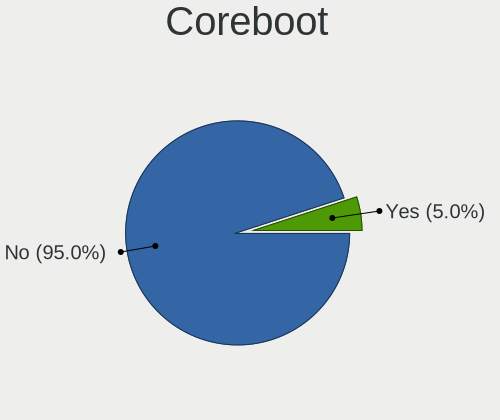
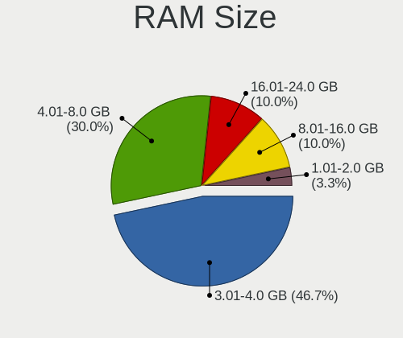
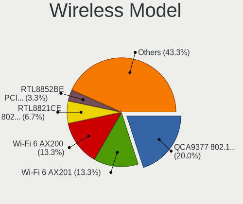
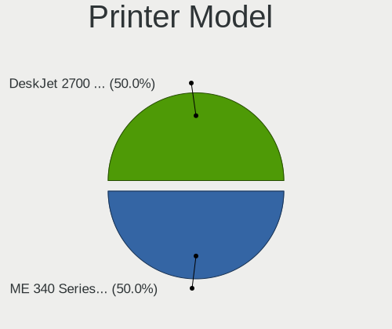

Endless Hardware Trends (Notebooks)
-----------------------------------

A project to identify most popular hardware characteristics and track their change
over time based on data collected by Endless users at https://Linux-Hardware.org.

Anyone can contribute to this report by the [hw-probe](https://github.com/linuxhw/hw-probe) tool:

    sudo -E hw-probe -all -upload

Full-feature report is available here: https://linux-hardware.org/?view=trends

Period: Nov, 2021.

Contents
--------

* [ System ](#system)
  - [ OS                       ](#os)
  - [ OS Family                ](#os-family)
  - [ Kernel                   ](#kernel)
  - [ Kernel Family            ](#kernel-family)
  - [ Kernel Major Ver.        ](#kernel-major-ver)
  - [ Arch                     ](#arch)
  - [ DE                       ](#de)
  - [ Display Server           ](#display-server)
  - [ Display Manager          ](#display-manager)
  - [ OS Lang                  ](#os-lang)
  - [ Boot Mode                ](#boot-mode)
  - [ Filesystem               ](#filesystem)
  - [ Part. scheme             ](#part-scheme)
  - [ Dual Boot with Linux/BSD ](#dual-boot-with-linuxbsd)
  - [ Dual Boot (Win)          ](#dual-boot-win)

* [ Board ](#board)
  - [ Vendor                   ](#vendor)
  - [ Model                    ](#model)
  - [ Model Family             ](#model-family)
  - [ MFG Year                 ](#mfg-year)
  - [ Form Factor              ](#form-factor)
  - [ Secure Boot              ](#secure-boot)
  - [ Coreboot                 ](#coreboot)
  - [ RAM Size                 ](#ram-size)
  - [ RAM Used                 ](#ram-used)
  - [ Total Drives             ](#total-drives)
  - [ Has CD-ROM               ](#has-cd-rom)
  - [ Has Ethernet             ](#has-ethernet)
  - [ Has WiFi                 ](#has-wifi)
  - [ Has Bluetooth            ](#has-bluetooth)

* [ Location ](#location)
  - [ Country                  ](#country)
  - [ City                     ](#city)

* [ Drives ](#drives)
  - [ Drive Vendor             ](#drive-vendor)
  - [ Drive Model              ](#drive-model)
  - [ HDD Vendor               ](#hdd-vendor)
  - [ SSD Vendor               ](#ssd-vendor)
  - [ Drive Kind               ](#drive-kind)
  - [ Drive Connector          ](#drive-connector)
  - [ Drive Size               ](#drive-size)
  - [ Space Total              ](#space-total)
  - [ Space Used               ](#space-used)
  - [ Malfunc. Drives          ](#malfunc-drives)
  - [ Malfunc. Drive Vendor    ](#malfunc-drive-vendor)
  - [ Malfunc. HDD Vendor      ](#malfunc-hdd-vendor)
  - [ Malfunc. Drive Kind      ](#malfunc-drive-kind)
  - [ Failed Drives            ](#failed-drives)
  - [ Failed Drive Vendor      ](#failed-drive-vendor)
  - [ Drive Status             ](#drive-status)

* [ Storage controller ](#storage-controller)
  - [ Storage Vendor           ](#storage-vendor)
  - [ Storage Model            ](#storage-model)
  - [ Storage Kind             ](#storage-kind)

* [ Processor ](#processor)
  - [ CPU Vendor               ](#cpu-vendor)
  - [ CPU Model                ](#cpu-model)
  - [ CPU Model Family         ](#cpu-model-family)
  - [ CPU Cores                ](#cpu-cores)
  - [ CPU Sockets              ](#cpu-sockets)
  - [ CPU Threads              ](#cpu-threads)
  - [ CPU Op-Modes             ](#cpu-op-modes)
  - [ CPU Microcode            ](#cpu-microcode)
  - [ CPU Microarch            ](#cpu-microarch)

* [ Graphics ](#graphics)
  - [ GPU Vendor               ](#gpu-vendor)
  - [ GPU Model                ](#gpu-model)
  - [ GPU Combo                ](#gpu-combo)
  - [ GPU Driver               ](#gpu-driver)
  - [ GPU Memory               ](#gpu-memory)

* [ Monitor ](#monitor)
  - [ Monitor Vendor           ](#monitor-vendor)
  - [ Monitor Model            ](#monitor-model)
  - [ Monitor Resolution       ](#monitor-resolution)
  - [ Monitor Diagonal         ](#monitor-diagonal)
  - [ Monitor Width            ](#monitor-width)
  - [ Aspect Ratio             ](#aspect-ratio)
  - [ Monitor Area             ](#monitor-area)
  - [ Pixel Density            ](#pixel-density)
  - [ Multiple Monitors        ](#multiple-monitors)

* [ Network ](#network)
  - [ Net Controller Vendor    ](#net-controller-vendor)
  - [ Net Controller Model     ](#net-controller-model)
  - [ Wireless Vendor          ](#wireless-vendor)
  - [ Wireless Model           ](#wireless-model)
  - [ Ethernet Vendor          ](#ethernet-vendor)
  - [ Ethernet Model           ](#ethernet-model)
  - [ Net Controller Kind      ](#net-controller-kind)
  - [ Used Controller          ](#used-controller)
  - [ NICs                     ](#nics)
  - [ IPv6                     ](#ipv6)

* [ Bluetooth ](#bluetooth)
  - [ Bluetooth Vendor         ](#bluetooth-vendor)
  - [ Bluetooth Model          ](#bluetooth-model)

* [ Sound ](#sound)
  - [ Sound Vendor             ](#sound-vendor)
  - [ Sound Model              ](#sound-model)

* [ Memory ](#memory)
  - [ Memory Vendor            ](#memory-vendor)
  - [ Memory Model             ](#memory-model)
  - [ Memory Kind              ](#memory-kind)
  - [ Memory Form Factor       ](#memory-form-factor)
  - [ Memory Size              ](#memory-size)
  - [ Memory Speed             ](#memory-speed)

* [ Printers & scanners ](#printers--scanners)
  - [ Printer Vendor           ](#printer-vendor)
  - [ Printer Model            ](#printer-model)
  - [ Scanner Vendor           ](#scanner-vendor)
  - [ Scanner Model            ](#scanner-model)

* [ Camera ](#camera)
  - [ Camera Vendor            ](#camera-vendor)
  - [ Camera Model             ](#camera-model)

* [ Security ](#security)
  - [ Fingerprint Vendor       ](#fingerprint-vendor)
  - [ Fingerprint Model        ](#fingerprint-model)
  - [ Chipcard Vendor          ](#chipcard-vendor)
  - [ Chipcard Model           ](#chipcard-model)

* [ Unsupported ](#unsupported)
  - [ Unsupported Devices      ](#unsupported-devices)
  - [ Unsupported Device Types ](#unsupported-device-types)

System
------

OS
--

Installed operating systems

| Name                  | Notebooks | Percent |
|-----------------------|-----------|---------|
| Endless 3.9.5         | 25        | 56.82%  |
| Endless 4.0.0         | 5         | 11.36%  |
| Endless 3.9.6         | 4         | 9.09%   |
| Endless 3.9.1         | 3         | 6.82%   |
| Endless 3.9.4         | 2         | 4.55%   |
| Endless 3.8.0         | 2         | 4.55%   |
| Endless 3.9.3-nexthw1 | 1         | 2.27%   |
| Endless 3.7.6         | 1         | 2.27%   |
| Endless 3.7.4         | 1         | 2.27%   |

OS Family
---------

OS without a version

| Name    | Notebooks | Percent |
|---------|-----------|---------|
| Endless | 44        | 100%    |

Kernel
------

Version of the Linux kernel

| Version           | Notebooks | Percent |
|-------------------|-----------|---------|
| 5.8.0-14-generic  | 34        | 77.27%  |
| 5.11.0-35-generic | 5         | 11.36%  |
| 5.4.0-19-generic  | 2         | 4.55%   |
| 5.3.0-23-generic  | 1         | 2.27%   |
| 5.3.0-19-generic  | 1         | 2.27%   |
| 5.11.0-12-generic | 1         | 2.27%   |

Kernel Family
-------------

Linux kernel without a distro release

| Version | Notebooks | Percent |
|---------|-----------|---------|
| 5.8.0   | 34        | 77.27%  |
| 5.11.0  | 6         | 13.64%  |
| 5.4.0   | 2         | 4.55%   |
| 5.3.0   | 2         | 4.55%   |

Kernel Major Ver.
-----------------

Linux kernel major version

| Version | Notebooks | Percent |
|---------|-----------|---------|
| 5.8     | 34        | 77.27%  |
| 5.11    | 6         | 13.64%  |
| 5.4     | 2         | 4.55%   |
| 5.3     | 2         | 4.55%   |

Arch
----

OS architecture (x86_64, i586, etc.)

| Name   | Notebooks | Percent |
|--------|-----------|---------|
| x86_64 | 44        | 100%    |

DE
--

Desktop Environment

| Name  | Notebooks | Percent |
|-------|-----------|---------|
| GNOME | 44        | 100%    |

Display Server
--------------

X11 or Wayland

| Name | Notebooks | Percent |
|------|-----------|---------|
| X11  | 44        | 100%    |

Display Manager
---------------

SDDM, LightDM, etc.

| Name    | Notebooks | Percent |
|---------|-----------|---------|
| Unknown | 44        | 100%    |

OS Lang
-------

Language

| Lang        | Notebooks | Percent |
|-------------|-----------|---------|
| pt_BR       | 17        | 38.64%  |
| en_US       | 10        | 22.73%  |
| ru_RU.UTF_8 | 3         | 6.82%   |
| ro_RO       | 2         | 4.55%   |
| it_IT       | 2         | 4.55%   |
| fr_FR       | 2         | 4.55%   |
| sr_RS@latin | 1         | 2.27%   |
| sl_SI       | 1         | 2.27%   |
| sk_SK       | 1         | 2.27%   |
| ru_RU       | 1         | 2.27%   |
| pt_PT       | 1         | 2.27%   |
| hu_HU       | 1         | 2.27%   |
| en_IE       | 1         | 2.27%   |
| de_DE       | 1         | 2.27%   |

Boot Mode
---------

EFI or BIOS

| Mode | Notebooks | Percent |
|------|-----------|---------|
| EFI  | 34        | 77.27%  |
| BIOS | 10        | 22.73%  |

Filesystem
----------

Type of filesystem

| Type  | Notebooks | Percent |
|-------|-----------|---------|
| Ext4  | 43        | 97.73%  |
| Tmpfs | 1         | 2.27%   |

Part. scheme
------------

Scheme of partitioning

| Type    | Notebooks | Percent |
|---------|-----------|---------|
| Unknown | 44        | 100%    |

Dual Boot with Linux/BSD
------------------------

Hosting more than one Linux/BSD

| Dual boot | Notebooks | Percent |
|-----------|-----------|---------|
| No        | 44        | 100%    |

Dual Boot (Win)
---------------

Hosting Linux and Windows

| Dual boot | Notebooks | Percent |
|-----------|-----------|---------|
| No        | 44        | 100%    |

Board
-----

Vendor
------

Motherboard manufacturer

| Name             | Notebooks | Percent |
|------------------|-----------|---------|
| Acer             | 20        | 45.45%  |
| ASUSTek Computer | 13        | 29.55%  |
| Hewlett-Packard  | 3         | 6.82%   |
| Sony             | 2         | 4.55%   |
| Dell             | 2         | 4.55%   |
| Toshiba          | 1         | 2.27%   |
| Semp Toshiba     | 1         | 2.27%   |
| Packard Bell     | 1         | 2.27%   |
| MSI              | 1         | 2.27%   |

Model
-----

Motherboard model

| Name                                      | Notebooks | Percent |
|-------------------------------------------|-----------|---------|
| Acer Nitro AN515-44                       | 6         | 13.64%  |
| Acer Nitro AN515-54                       | 4         | 9.09%   |
| Acer Aspire A315-53                       | 2         | 4.55%   |
| Toshiba Satellite Pro C850-1D5            | 1         | 2.27%   |
| Sony VPCYB1S1E                            | 1         | 2.27%   |
| Sony VPCCB35FG                            | 1         | 2.27%   |
| Semp Toshiba IS 1462B                     | 1         | 2.27%   |
| Packard Bell EasyNote TN36                | 1         | 2.27%   |
| MSI VR610                                 | 1         | 2.27%   |
| HP Pavilion dv7                           | 1         | 2.27%   |
| HP ENVY 15                                | 1         | 2.27%   |
| HP 255 G8 Notebook PC                     | 1         | 2.27%   |
| Dell Latitude E7440                       | 1         | 2.27%   |
| Dell Inspiron N5110                       | 1         | 2.27%   |
| ASUS X541UAK                              | 1         | 2.27%   |
| ASUS X540NA                               | 1         | 2.27%   |
| ASUS X450CP                               | 1         | 2.27%   |
| ASUS X442UAR                              | 1         | 2.27%   |
| ASUS VivoBook_ASUSLaptop X712FA_X712FA    | 1         | 2.27%   |
| ASUS VivoBook_ASUSLaptop X513EA_K513EA    | 1         | 2.27%   |
| ASUS VivoBook_ASUSLaptop X513EAN_X513EA   | 1         | 2.27%   |
| ASUS VivoBook_ASUSLaptop X509JA_X509JA    | 1         | 2.27%   |
| ASUS VivoBook_ASUS Laptop E406MA_E406MA   | 1         | 2.27%   |
| ASUS VivoBook E14 E402YA_E402YA           | 1         | 2.27%   |
| ASUS VivoBook 15_ASUS Laptop X540UAR      | 1         | 2.27%   |
| ASUS VivoBook 15_ASUS Laptop X540BA       | 1         | 2.27%   |
| ASUS ASUS EXPERTBOOK B1400CEPEY_B1400CEPE | 1         | 2.27%   |
| Acer TravelMate P253                      | 1         | 2.27%   |
| Acer Nitro AN517-51                       | 1         | 2.27%   |
| Acer Nitro AN515-43                       | 1         | 2.27%   |
| Acer Aspire ES1-533                       | 1         | 2.27%   |
| Acer Aspire A515-54G                      | 1         | 2.27%   |
| Acer Aspire A515-54                       | 1         | 2.27%   |
| Acer Aspire A315-34                       | 1         | 2.27%   |
| Acer Aspire 4745                          | 1         | 2.27%   |

Model Family
------------

Motherboard model prefix

| Name                  | Notebooks | Percent |
|-----------------------|-----------|---------|
| Acer Nitro            | 12        | 27.27%  |
| ASUS VivoBook         | 8         | 18.18%  |
| Acer Aspire           | 7         | 15.91%  |
| Toshiba Satellite     | 1         | 2.27%   |
| Sony VPCYB1S1E        | 1         | 2.27%   |
| Sony VPCCB35FG        | 1         | 2.27%   |
| Semp Toshiba IS       | 1         | 2.27%   |
| Packard Bell EasyNote | 1         | 2.27%   |
| MSI VR610             | 1         | 2.27%   |
| HP Pavilion           | 1         | 2.27%   |
| HP ENVY               | 1         | 2.27%   |
| HP 255                | 1         | 2.27%   |
| Dell Latitude         | 1         | 2.27%   |
| Dell Inspiron         | 1         | 2.27%   |
| ASUS X541UAK          | 1         | 2.27%   |
| ASUS X540NA           | 1         | 2.27%   |
| ASUS X450CP           | 1         | 2.27%   |
| ASUS X442UAR          | 1         | 2.27%   |
| ASUS ASUS             | 1         | 2.27%   |
| Acer TravelMate       | 1         | 2.27%   |

MFG Year
--------

Motherboard manufacture year

| Year | Notebooks | Percent |
|------|-----------|---------|
| 2020 | 11        | 25%     |
| 2021 | 9         | 20.45%  |
| 2019 | 8         | 18.18%  |
| 2018 | 3         | 6.82%   |
| 2011 | 3         | 6.82%   |
| 2017 | 2         | 4.55%   |
| 2012 | 2         | 4.55%   |
| 2009 | 2         | 4.55%   |
| 2014 | 1         | 2.27%   |
| 2013 | 1         | 2.27%   |
| 2010 | 1         | 2.27%   |
| 2007 | 1         | 2.27%   |

Form Factor
-----------

Physical design of the computer

| Name     | Notebooks | Percent |
|----------|-----------|---------|
| Notebook | 44        | 100%    |

Secure Boot
-----------

Enabled or disabled

| State    | Notebooks | Percent |
|----------|-----------|---------|
| Disabled | 29        | 65.91%  |
| Enabled  | 15        | 34.09%  |

Coreboot
--------

Have coreboot on board

| Used | Notebooks | Percent |
|------|-----------|---------|
| No   | 44        | 100%    |

RAM Size
--------

Total RAM memory

| Size in GB | Notebooks | Percent |
|------------|-----------|---------|
| 4.01-8.0   | 19        | 43.18%  |
| 3.01-4.0   | 15        | 34.09%  |
| 8.01-16.0  | 6         | 13.64%  |
| 16.01-24.0 | 2         | 4.55%   |
| 1.01-2.0   | 2         | 4.55%   |

RAM Used
--------

Used RAM memory

| Used GB  | Notebooks | Percent |
|----------|-----------|---------|
| 1.01-2.0 | 21        | 47.73%  |
| 2.01-3.0 | 11        | 25%     |
| 0.51-1.0 | 6         | 13.64%  |
| 3.01-4.0 | 5         | 11.36%  |
| 4.01-8.0 | 1         | 2.27%   |

Total Drives
------------

Number of drives on board

| Drives | Notebooks | Percent |
|--------|-----------|---------|
| 1      | 33        | 75%     |
| 2      | 11        | 25%     |

Has CD-ROM
----------

Has CD-ROM on board

| Presented | Notebooks | Percent |
|-----------|-----------|---------|
| No        | 34        | 77.27%  |
| Yes       | 10        | 22.73%  |

Has Ethernet
------------

Has Ethernet on board

| Presented | Notebooks | Percent |
|-----------|-----------|---------|
| Yes       | 36        | 81.82%  |
| No        | 8         | 18.18%  |

Has WiFi
--------

Has WiFi module

| Presented | Notebooks | Percent |
|-----------|-----------|---------|
| Yes       | 44        | 100%    |

Has Bluetooth
-------------

Has Bluetooth module

| Presented | Notebooks | Percent |
|-----------|-----------|---------|
| Yes       | 38        | 86.36%  |
| No        | 6         | 13.64%  |

Location
--------

Country
-------

Geographic location (country)

| Country      | Notebooks | Percent |
|--------------|-----------|---------|
| Brazil       | 19        | 43.18%  |
| Romania      | 4         | 9.09%   |
| Russia       | 3         | 6.82%   |
| USA          | 2         | 4.55%   |
| Italy        | 2         | 4.55%   |
| UK           | 1         | 2.27%   |
| Tunisia      | 1         | 2.27%   |
| South Africa | 1         | 2.27%   |
| Slovenia     | 1         | 2.27%   |
| Slovakia     | 1         | 2.27%   |
| Serbia       | 1         | 2.27%   |
| Portugal     | 1         | 2.27%   |
| Ireland      | 1         | 2.27%   |
| Hungary      | 1         | 2.27%   |
| Guadeloupe   | 1         | 2.27%   |
| Germany      | 1         | 2.27%   |
| Egypt        | 1         | 2.27%   |
| Belarus      | 1         | 2.27%   |
| Bangladesh   | 1         | 2.27%   |

City
----

Geographic location (city)

| City               | Notebooks | Percent |
|--------------------|-----------|---------|
| S??o Paulo         | 3         | 6.82%   |
| Moscow             | 3         | 6.82%   |
| Bucharest          | 3         | 6.82%   |
| Florian??polis     | 2         | 4.55%   |
| Blumenau           | 2         | 4.55%   |
| Tunis              | 1         | 2.27%   |
| Shannon            | 1         | 2.27%   |
| Sao Jose           | 1         | 2.27%   |
| Sao Joao de Meriti | 1         | 2.27%   |
| Rostock            | 1         | 2.27%   |
| Rio de Janeiro     | 1         | 2.27%   |
| Porto Velho        | 1         | 2.27%   |
| Nitra              | 1         | 2.27%   |
| Niles              | 1         | 2.27%   |
| Nagykallo          | 1         | 2.27%   |
| Mogilev            | 1         | 2.27%   |
| Ljubljana          | 1         | 2.27%   |
| Lisbon             | 1         | 2.27%   |
| Les Abymes         | 1         | 2.27%   |
| Lauria             | 1         | 2.27%   |
| Lagoa Santa        | 1         | 2.27%   |
| Johannesburg       | 1         | 2.27%   |
| Jessore            | 1         | 2.27%   |
| Hackney            | 1         | 2.27%   |
| Faenza             | 1         | 2.27%   |
| Embu               | 1         | 2.27%   |
| Duque de Caxias    | 1         | 2.27%   |
| Divin??polis       | 1         | 2.27%   |
| Denver             | 1         | 2.27%   |
| Curitiba           | 1         | 2.27%   |
| Crici??ma          | 1         | 2.27%   |
| Canoas             | 1         | 2.27%   |
| Cairo              | 1         | 2.27%   |
| Boninal            | 1         | 2.27%   |
| Bocsa              | 1         | 2.27%   |
| Belgrade           | 1         | 2.27%   |

Drives
------

Drive Vendor
------------

Hard drive vendors

| Vendor              | Notebooks | Drives | Percent |
|---------------------|-----------|--------|---------|
| WDC                 | 11        | 11     | 22%     |
| Intel               | 9         | 9      | 18%     |
| Sandisk             | 8         | 8      | 16%     |
| Toshiba             | 4         | 4      | 8%      |
| Seagate             | 4         | 4      | 8%      |
| Samsung Electronics | 3         | 3      | 6%      |
| Unknown             | 2         | 2      | 4%      |
| Kingston            | 2         | 2      | 4%      |
| Hitachi             | 2         | 2      | 4%      |
| Crucial             | 2         | 2      | 4%      |
| HGST HTS            | 1         | 1      | 2%      |
| HGST                | 1         | 1      | 2%      |
| ADATA Technology    | 1         | 1      | 2%      |

Drive Model
-----------

Hard drive models

| Model                                | Notebooks | Percent |
|--------------------------------------|-----------|---------|
| Sandisk NVMe SSD Drive 512GB         | 8         | 16%     |
| WDC WD10SPZX-21Z10T0 1TB             | 6         | 12%     |
| Intel NVMe SSD Drive 512GB           | 5         | 10%     |
| Toshiba MQ04ABF100 1TB               | 2         | 4%      |
| Intel NVMe SSD Drive 256GB           | 2         | 4%      |
| Intel NVMe SSD Drive 128GB           | 2         | 4%      |
| WDC WDS120G2G0A-00JH30 120GB SSD     | 1         | 2%      |
| WDC WD5000LPCX-21VHAT0 500GB         | 1         | 2%      |
| WDC WD3200BEVT-22ZCT0 320GB          | 1         | 2%      |
| WDC WD2500BEVS-75UST0 250GB          | 1         | 2%      |
| WDC WD1600BEVS-22RST0 160GB          | 1         | 2%      |
| Unknown MMC Card  64GB               | 1         | 2%      |
| Unknown MMC Card  16GB               | 1         | 2%      |
| Toshiba THNSFJ256GCSU 256GB SSD      | 1         | 2%      |
| Toshiba MQ01ABF050 500GB             | 1         | 2%      |
| Seagate ST2000LX001-1RG174 2TB       | 1         | 2%      |
| Seagate ST2000LM007-1R8174 2TB       | 1         | 2%      |
| Seagate ST1000LM035-1RK172 1TB       | 1         | 2%      |
| Seagate ST1000LM024 HN-M101MBB 1TB   | 1         | 2%      |
| Samsung NVMe SSD Drive 256GB         | 1         | 2%      |
| Samsung HM321HI 320GB                | 1         | 2%      |
| Samsung HM160HI 160GB                | 1         | 2%      |
| Kingston SA400S37120G 120GB SSD      | 1         | 2%      |
| Kingston RBUSC180DS37256GJ 256GB SSD | 1         | 2%      |
| Hitachi HTS545050B9A300 500GB        | 1         | 2%      |
| Hitachi HTS545050A7E380 500GB        | 1         | 2%      |
| HGST HTS541010B7E610 1TB             | 1         | 2%      |
| HGST HTS 541075A9E680 752GB          | 1         | 2%      |
| Crucial CT240BX500SSD1 240GB         | 1         | 2%      |
| Crucial CT120BX500SSD1 120GB         | 1         | 2%      |
| ADATA NVMe SSD Drive 128GB           | 1         | 2%      |

HDD Vendor
----------

Hard disk drive vendors

| Vendor              | Notebooks | Drives | Percent |
|---------------------|-----------|--------|---------|
| WDC                 | 10        | 10     | 43.48%  |
| Seagate             | 4         | 4      | 17.39%  |
| Toshiba             | 3         | 3      | 13.04%  |
| Samsung Electronics | 2         | 2      | 8.7%    |
| Hitachi             | 2         | 2      | 8.7%    |
| HGST HTS            | 1         | 1      | 4.35%   |
| HGST                | 1         | 1      | 4.35%   |

SSD Vendor
----------

Solid state drive vendors

| Vendor   | Notebooks | Drives | Percent |
|----------|-----------|--------|---------|
| Kingston | 2         | 2      | 33.33%  |
| Crucial  | 2         | 2      | 33.33%  |
| WDC      | 1         | 1      | 16.67%  |
| Toshiba  | 1         | 1      | 16.67%  |

Drive Kind
----------

HDD or SSD

| Kind | Notebooks | Drives | Percent |
|------|-----------|--------|---------|
| HDD  | 22        | 23     | 44.9%   |
| NVMe | 19        | 19     | 38.78%  |
| SSD  | 6         | 6      | 12.24%  |
| MMC  | 2         | 2      | 4.08%   |

Drive Connector
---------------

SATA, SAS, NVMe, etc.

| Type | Notebooks | Drives | Percent |
|------|-----------|--------|---------|
| SATA | 27        | 28     | 55.1%   |
| NVMe | 19        | 19     | 38.78%  |
| MMC  | 2         | 2      | 4.08%   |
| SAS  | 1         | 1      | 2.04%   |

Drive Size
----------

Size of hard drive

| Size in TB | Notebooks | Drives | Percent |
|------------|-----------|--------|---------|
| 0.01-0.5   | 14        | 15     | 50%     |
| 0.51-1.0   | 12        | 12     | 42.86%  |
| 1.01-2.0   | 2         | 2      | 7.14%   |

Space Total
-----------

Amount of disk space available on the file system

| Size in GB | Notebooks | Percent |
|------------|-----------|---------|
| 251-500    | 15        | 34.09%  |
| 101-250    | 13        | 29.55%  |
| 501-1000   | 11        | 25%     |
| 1001-2000  | 2         | 4.55%   |
| 1-20       | 2         | 4.55%   |
| 51-100     | 1         | 2.27%   |

Space Used
----------

Amount of used disk space

| Used GB  | Notebooks | Percent |
|----------|-----------|---------|
| 21-50    | 17        | 38.64%  |
| 1-20     | 14        | 31.82%  |
| 51-100   | 6         | 13.64%  |
| 101-250  | 4         | 9.09%   |
| 251-500  | 2         | 4.55%   |
| 501-1000 | 1         | 2.27%   |

Malfunc. Drives
---------------

Drive models with a malfunction

Zero info for selected period =(

Malfunc. Drive Vendor
---------------------

Vendors of faulty drives

Zero info for selected period =(

Malfunc. HDD Vendor
-------------------

Vendors of faulty HDD drives

Zero info for selected period =(

Malfunc. Drive Kind
-------------------

Kinds of faulty drives

Zero info for selected period =(

Failed Drives
-------------

Failed drive models

Zero info for selected period =(

Failed Drive Vendor
-------------------

Failed drive vendors

Zero info for selected period =(

Drive Status
------------

Number of failed and malfunc. drives

| Status   | Notebooks | Drives | Percent |
|----------|-----------|--------|---------|
| Detected | 44        | 50     | 100%    |

Storage controller
------------------

Storage Vendor
--------------

Storage controller vendors

| Vendor              | Notebooks | Percent |
|---------------------|-----------|---------|
| Intel               | 32        | 60.38%  |
| AMD                 | 11        | 20.75%  |
| Sandisk             | 8         | 15.09%  |
| Samsung Electronics | 1         | 1.89%   |
| ADATA Technology    | 1         | 1.89%   |

Storage Model
-------------

Storage controller models

| Model                                                                        | Notebooks | Percent |
|------------------------------------------------------------------------------|-----------|---------|
| Intel 82801 Mobile SATA Controller [RAID mode]                               | 9         | 13.64%  |
| AMD FCH SATA Controller [AHCI mode]                                          | 9         | 13.64%  |
| Sandisk WD Blue SN550 NVMe SSD                                               | 7         | 10.61%  |
| Intel PROSet/Wireless WiFi Software extension                                | 7         | 10.61%  |
| Intel Sunrise Point-LP SATA Controller [AHCI mode]                           | 5         | 7.58%   |
| Intel 7 Series Chipset Family 6-port SATA Controller [AHCI mode]             | 4         | 6.06%   |
| Intel Volume Management Device NVMe RAID Controller                          | 3         | 4.55%   |
| Intel Tiger Lake-LP SATA Controller [AHCI mode]                              | 3         | 4.55%   |
| Intel SSD 660P Series                                                        | 2         | 3.03%   |
| Intel Celeron/Pentium Silver Processor SATA Controller                       | 2         | 3.03%   |
| Intel Celeron N3350/Pentium N4200/Atom E3900 Series SATA AHCI Controller     | 2         | 3.03%   |
| Intel 6 Series/C200 Series Chipset Family 6 port Mobile SATA AHCI Controller | 2         | 3.03%   |
| Intel 5 Series/3400 Series Chipset 4 port SATA AHCI Controller               | 2         | 3.03%   |
| Sandisk WD Blue SN500 / PC SN520 NVMe SSD                                    | 1         | 1.52%   |
| Samsung NVMe SSD Controller 980                                              | 1         | 1.52%   |
| Intel Cannon Lake Mobile PCH SATA AHCI Controller                            | 1         | 1.52%   |
| Intel 82801IBM/IEM (ICH9M/ICH9M-E) 4 port SATA Controller [AHCI mode]        | 1         | 1.52%   |
| Intel 82801IBM/IEM (ICH9M/ICH9M-E) 2 port SATA Controller [IDE mode]         | 1         | 1.52%   |
| AMD SB7x0/SB8x0/SB9x0 SATA Controller [AHCI mode]                            | 1         | 1.52%   |
| AMD SB600 Non-Raid-5 SATA                                                    | 1         | 1.52%   |
| AMD SB600 IDE                                                                | 1         | 1.52%   |
| ADATA Non-Volatile memory controller                                         | 1         | 1.52%   |

Storage Kind
------------

Kind of storage controller (IDE, SATA, NVMe, SAS, ...)

| Kind | Notebooks | Percent |
|------|-----------|---------|
| SATA | 40        | 60.61%  |
| NVMe | 19        | 28.79%  |
| RAID | 5         | 7.58%   |
| IDE  | 2         | 3.03%   |

Processor
---------

CPU Vendor
----------

Processor vendors

| Vendor | Notebooks | Percent |
|--------|-----------|---------|
| Intel  | 32        | 72.73%  |
| AMD    | 12        | 27.27%  |

CPU Model
---------

Processor models

| Model                                         | Notebooks | Percent |
|-----------------------------------------------|-----------|---------|
| AMD Ryzen 5 4600H with Radeon Graphics        | 4         | 9.09%   |
| Intel Core i5-9300H CPU @ 2.40GHz             | 3         | 6.82%   |
| Intel 11th Gen Core i5-1135G7 @ 2.40GHz       | 3         | 6.82%   |
| Intel Pentium CPU N4200 @ 1.10GHz             | 2         | 4.55%   |
| Intel Core i7-9750H CPU @ 2.60GHz             | 2         | 4.55%   |
| Intel Core i3-3110M CPU @ 2.40GHz             | 2         | 4.55%   |
| AMD Ryzen 7 4800H with Radeon Graphics        | 2         | 4.55%   |
| Intel Pentium Silver N5000 CPU @ 1.10GHz      | 1         | 2.27%   |
| Intel Pentium Dual-Core CPU T4200 @ 2.00GHz   | 1         | 2.27%   |
| Intel Pentium Dual CPU T3400 @ 2.16GHz        | 1         | 2.27%   |
| Intel Pentium CPU 4417U @ 2.30GHz             | 1         | 2.27%   |
| Intel Core i7-8565U CPU @ 1.80GHz             | 1         | 2.27%   |
| Intel Core i7-10510U CPU @ 1.80GHz            | 1         | 2.27%   |
| Intel Core i7 CPU Q 720 @ 1.60GHz             | 1         | 2.27%   |
| Intel Core i5-7200U CPU @ 2.50GHz             | 1         | 2.27%   |
| Intel Core i5-4310U CPU @ 2.00GHz             | 1         | 2.27%   |
| Intel Core i5-3337U CPU @ 1.80GHz             | 1         | 2.27%   |
| Intel Core i5-3230M CPU @ 2.60GHz             | 1         | 2.27%   |
| Intel Core i5-2430M CPU @ 2.40GHz             | 1         | 2.27%   |
| Intel Core i5-2410M CPU @ 2.30GHz             | 1         | 2.27%   |
| Intel Core i5-1035G1 CPU @ 1.00GHz            | 1         | 2.27%   |
| Intel Core i5-10210U CPU @ 1.60GHz            | 1         | 2.27%   |
| Intel Core i5 CPU M 460 @ 2.53GHz             | 1         | 2.27%   |
| Intel Core i3-8130U CPU @ 2.20GHz             | 1         | 2.27%   |
| Intel Core i3-7020U CPU @ 2.30GHz             | 1         | 2.27%   |
| Intel Core i3-6006U CPU @ 2.00GHz             | 1         | 2.27%   |
| Intel Celeron N4000C CPU @ 1.10GHz            | 1         | 2.27%   |
| AMD Ryzen 7 3750H with Radeon Vega Mobile Gfx | 1         | 2.27%   |
| AMD E2-7015 APU with AMD Radeon R2 Graphics   | 1         | 2.27%   |
| AMD E-350 Processor                           | 1         | 2.27%   |
| AMD Athlon Silver 3050U with Radeon Graphics  | 1         | 2.27%   |
| AMD Athlon 64 X2 Dual-Core Processor TK-55    | 1         | 2.27%   |
| AMD A4-9125 RADEON R3, 4 COMPUTE CORES 2C+2G  | 1         | 2.27%   |

CPU Model Family
----------------

Processor model prefix

| Model                   | Notebooks | Percent |
|-------------------------|-----------|---------|
| Intel Core i5           | 12        | 27.27%  |
| Intel Core i7           | 5         | 11.36%  |
| Intel Core i3           | 5         | 11.36%  |
| AMD Ryzen 5             | 4         | 9.09%   |
| Other                   | 3         | 6.82%   |
| Intel Pentium           | 3         | 6.82%   |
| AMD Ryzen 7             | 3         | 6.82%   |
| Intel Pentium Silver    | 1         | 2.27%   |
| Intel Pentium Dual-Core | 1         | 2.27%   |
| Intel Pentium Dual      | 1         | 2.27%   |
| Intel Celeron           | 1         | 2.27%   |
| AMD E2                  | 1         | 2.27%   |
| AMD E                   | 1         | 2.27%   |
| AMD Athlon 64 X2        | 1         | 2.27%   |
| AMD Athlon              | 1         | 2.27%   |
| AMD A4                  | 1         | 2.27%   |

CPU Cores
---------

Number of processor cores

| Number | Notebooks | Percent |
|--------|-----------|---------|
| 2      | 21        | 47.73%  |
| 4      | 15        | 34.09%  |
| 6      | 6         | 13.64%  |
| 8      | 2         | 4.55%   |

CPU Sockets
-----------

Number of sockets

| Number | Notebooks | Percent |
|--------|-----------|---------|
| 1      | 44        | 100%    |

CPU Threads
-----------

Threads per core (Hyper-Threading)

| Number | Notebooks | Percent |
|--------|-----------|---------|
| 2      | 33        | 75%     |
| 1      | 11        | 25%     |

CPU Op-Modes
------------

CPU Operation Modes (32-bit, 64-bit)

| Op mode        | Notebooks | Percent |
|----------------|-----------|---------|
| 32-bit, 64-bit | 44        | 100%    |

CPU Microcode
-------------

Microcode number

| Number     | Notebooks | Percent |
|------------|-----------|---------|
| 0x08600103 | 6         | 13.64%  |
| 0x306a9    | 4         | 9.09%   |
| 0x906ed    | 3         | 6.82%   |
| 0x806c1    | 3         | 6.82%   |
| 0x906ea    | 2         | 4.55%   |
| 0x806ec    | 2         | 4.55%   |
| 0x806e9    | 2         | 4.55%   |
| 0x706a1    | 2         | 4.55%   |
| 0x506c9    | 2         | 4.55%   |
| 0x206a7    | 2         | 4.55%   |
| 0x08108109 | 2         | 4.55%   |
| Unknown    | 2         | 4.55%   |
| 0x806eb    | 1         | 2.27%   |
| 0x806ea    | 1         | 2.27%   |
| 0x706e5    | 1         | 2.27%   |
| 0x6fd      | 1         | 2.27%   |
| 0x406e3    | 1         | 2.27%   |
| 0x40651    | 1         | 2.27%   |
| 0x20655    | 1         | 2.27%   |
| 0x106e5    | 1         | 2.27%   |
| 0x1067a    | 1         | 2.27%   |
| 0x07030106 | 1         | 2.27%   |
| 0x06006705 | 1         | 2.27%   |
| 0x05000029 | 1         | 2.27%   |

CPU Microarch
-------------

Microarchitecture

| Name          | Notebooks | Percent |
|---------------|-----------|---------|
| KabyLake      | 12        | 27.27%  |
| Zen 2         | 6         | 13.64%  |
| IvyBridge     | 4         | 9.09%   |
| TigerLake     | 3         | 6.82%   |
| Zen+          | 2         | 4.55%   |
| SandyBridge   | 2         | 4.55%   |
| Goldmont plus | 2         | 4.55%   |
| Goldmont      | 2         | 4.55%   |
| Westmere      | 1         | 2.27%   |
| Skylake       | 1         | 2.27%   |
| Puma          | 1         | 2.27%   |
| Penryn        | 1         | 2.27%   |
| Nehalem       | 1         | 2.27%   |
| K8 Hammer     | 1         | 2.27%   |
| IceLake       | 1         | 2.27%   |
| Haswell       | 1         | 2.27%   |
| Excavator     | 1         | 2.27%   |
| Core          | 1         | 2.27%   |
| Bobcat        | 1         | 2.27%   |

Graphics
--------

GPU Vendor
----------

Vendors of graphics cards

| Vendor | Notebooks | Percent |
|--------|-----------|---------|
| Intel  | 31        | 50.82%  |
| AMD    | 16        | 26.23%  |
| Nvidia | 14        | 22.95%  |

GPU Model
---------

Graphics card models

| Model                                                                              | Notebooks | Percent |
|------------------------------------------------------------------------------------|-----------|---------|
| Nvidia TU117M [GeForce GTX 1650 Mobile / Max-Q]                                    | 6         | 9.84%   |
| Nvidia TU117M                                                                      | 6         | 9.84%   |
| AMD Renoir                                                                         | 6         | 9.84%   |
| Intel CoffeeLake-H GT2 [UHD Graphics 630]                                          | 5         | 8.2%    |
| Intel 3rd Gen Core processor Graphics Controller                                   | 4         | 6.56%   |
| Intel TigerLake-LP GT2 [Iris Xe Graphics]                                          | 3         | 4.92%   |
| Intel Mobile 4 Series Chipset Integrated Graphics Controller                       | 2         | 3.28%   |
| Intel CometLake-U GT2 [UHD Graphics]                                               | 2         | 3.28%   |
| Intel Celeron N3350/Pentium N4200/Atom E3900 Series Integrated Graphics Controller | 2         | 3.28%   |
| Intel 2nd Generation Core Processor Family Integrated Graphics Controller          | 2         | 3.28%   |
| AMD Picasso/Raven 2 [Radeon Vega Series / Radeon Vega Mobile Series]               | 2         | 3.28%   |
| Nvidia GP108M [GeForce MX330]                                                      | 1         | 1.64%   |
| Nvidia GP108M [GeForce MX250]                                                      | 1         | 1.64%   |
| Intel WhiskeyLake-U GT2 [UHD Graphics 620]                                         | 1         | 1.64%   |
| Intel UHD Graphics 620                                                             | 1         | 1.64%   |
| Intel Skylake GT2 [HD Graphics 520]                                                | 1         | 1.64%   |
| Intel Kaby Lake-U GT2f HD 620 Graphics Controller                                  | 1         | 1.64%   |
| Intel Kaby Lake-U GT1 Integrated Graphics Controller                               | 1         | 1.64%   |
| Intel Iris Plus Graphics G1 (Ice Lake)                                             | 1         | 1.64%   |
| Intel HD Graphics 620                                                              | 1         | 1.64%   |
| Intel Haswell-ULT Integrated Graphics Controller                                   | 1         | 1.64%   |
| Intel GeminiLake [UHD Graphics 605]                                                | 1         | 1.64%   |
| Intel GeminiLake [UHD Graphics 600]                                                | 1         | 1.64%   |
| Intel Core Processor Integrated Graphics Controller                                | 1         | 1.64%   |
| AMD Wrestler [Radeon HD 6310]                                                      | 1         | 1.64%   |
| AMD Whistler [Radeon HD 6630M/6650M/6750M/7670M/7690M]                             | 1         | 1.64%   |
| AMD Stoney [Radeon R2/R3/R4/R5 Graphics]                                           | 1         | 1.64%   |
| AMD Seymour [Radeon HD 6400M/7400M Series]                                         | 1         | 1.64%   |
| AMD RS690M [Radeon Xpress 1200/1250/1270]                                          | 1         | 1.64%   |
| AMD Mullins [Radeon R2 Graphics]                                                   | 1         | 1.64%   |
| AMD Mars LE [Radeon HD 8530M / R5 M240]                                            | 1         | 1.64%   |
| AMD Madison [Mobility Radeon HD 5650/5750 / 6530M/6550M]                           | 1         | 1.64%   |

GPU Combo
---------

Combinations of graphics cards

| Name           | Notebooks | Percent |
|----------------|-----------|---------|
| 1 x Intel      | 21        | 47.73%  |
| Intel + Nvidia | 7         | 15.91%  |
| AMD + Nvidia   | 7         | 15.91%  |
| 1 x AMD        | 6         | 13.64%  |
| Intel + AMD    | 3         | 6.82%   |

GPU Driver
----------

Free vs proprietary

| Driver      | Notebooks | Percent |
|-------------|-----------|---------|
| Free        | 30        | 68.18%  |
| Proprietary | 14        | 31.82%  |

GPU Memory
----------

Total video memory

| Size in GB | Notebooks | Percent |
|------------|-----------|---------|
| Unknown    | 28        | 63.64%  |
| 0.01-0.5   | 11        | 25%     |
| 0.51-1.0   | 3         | 6.82%   |
| 3.01-4.0   | 1         | 2.27%   |
| 1.01-2.0   | 1         | 2.27%   |

Monitor
-------

Monitor Vendor
--------------

Monitor vendors

| Vendor                  | Notebooks | Percent |
|-------------------------|-----------|---------|
| BOE                     | 10        | 22.73%  |
| Chimei Innolux          | 7         | 15.91%  |
| AU Optronics            | 7         | 15.91%  |
| PANDA                   | 6         | 13.64%  |
| LG Display              | 5         | 11.36%  |
| Samsung Electronics     | 4         | 9.09%   |
| Chi Mei Optoelectronics | 2         | 4.55%   |
| MTD                     | 1         | 2.27%   |
| KDC                     | 1         | 2.27%   |
| Dell                    | 1         | 2.27%   |

Monitor Model
-------------

Monitor models

| Model                                                                    | Notebooks | Percent |
|--------------------------------------------------------------------------|-----------|---------|
| PANDA LCD Monitor NCP004D 1920x1080 344x194mm 15.5-inch                  | 5         | 11.36%  |
| BOE LCD Monitor BOE0818 1920x1080 344x194mm 15.5-inch                    | 3         | 6.82%   |
| Chimei Innolux LCD Monitor CMN15DB 1366x768 344x193mm 15.5-inch          | 2         | 4.55%   |
| BOE LCD Monitor BOE069C 1920x1080 344x193mm 15.5-inch                    | 2         | 4.55%   |
| BOE LCD Monitor BOE0696 1366x768 309x173mm 13.9-inch                     | 2         | 4.55%   |
| Samsung Electronics S22B300 SAM08AC 1680x1050 480x270mm 21.7-inch        | 1         | 2.27%   |
| Samsung Electronics LCD Monitor SEC3959 1366x768 344x194mm 15.5-inch     | 1         | 2.27%   |
| Samsung Electronics LCD Monitor SEC3142 1366x768 256x144mm 11.6-inch     | 1         | 2.27%   |
| Samsung Electronics LCD Monitor SAM0900 1920x1080 700x390mm 31.5-inch    | 1         | 2.27%   |
| PANDA LCD Monitor NCP0046 1920x1080 344x194mm 15.5-inch                  | 1         | 2.27%   |
| MTD LCD Monitor MTD0001 1280x800 303x190mm 14.1-inch                     | 1         | 2.27%   |
| LG Display LP156WH1-TLA3 LGD01C2 1366x768 344x194mm 15.5-inch            | 1         | 2.27%   |
| LG Display LCD Monitor LGD065A 1920x1080 344x194mm 15.5-inch             | 1         | 2.27%   |
| LG Display LCD Monitor LGD0621 1920x1080 382x215mm 17.3-inch             | 1         | 2.27%   |
| LG Display LCD Monitor LGD028D 1366x768 310x174mm 14.0-inch              | 1         | 2.27%   |
| LG Display LCD Monitor LGD01E9 1920x1080 345x194mm 15.6-inch             | 1         | 2.27%   |
| KDC LCD Monitor KDC0830 1920x1080 344x193mm 15.5-inch                    | 1         | 2.27%   |
| Dell S2319NX DELD0DC 1920x1080 509x286mm 23.0-inch                       | 1         | 2.27%   |
| Chimei Innolux LCD Monitor CMN15F5 1920x1080 344x193mm 15.5-inch         | 1         | 2.27%   |
| Chimei Innolux LCD Monitor CMN15DC 1366x768 344x193mm 15.5-inch          | 1         | 2.27%   |
| Chimei Innolux LCD Monitor CMN1535 1366x768 344x193mm 15.5-inch          | 1         | 2.27%   |
| Chimei Innolux LCD Monitor CMN14E5 1920x1080 309x173mm 13.9-inch         | 1         | 2.27%   |
| Chimei Innolux LCD Monitor CMN1480 1366x768 310x170mm 13.9-inch          | 1         | 2.27%   |
| Chi Mei Optoelectronics LCD Monitor CMO15A3 1366x768 344x193mm 15.5-inch | 1         | 2.27%   |
| Chi Mei Optoelectronics LCD Monitor CMO1526 1280x800 331x207mm 15.4-inch | 1         | 2.27%   |
| BOE LCD Monitor BOE084E 1920x1080 382x215mm 17.3-inch                    | 1         | 2.27%   |
| BOE LCD Monitor BOE07CB 1920x1080 344x193mm 15.5-inch                    | 1         | 2.27%   |
| BOE LCD Monitor BOE0672 1366x768 344x194mm 15.5-inch                     | 1         | 2.27%   |
| AU Optronics LCD Monitor AUOAF90 1920x1080 344x193mm 15.5-inch           | 1         | 2.27%   |
| AU Optronics LCD Monitor AUO81EC 1366x768 344x193mm 15.5-inch            | 1         | 2.27%   |
| AU Optronics LCD Monitor AUO71EC 1366x768 340x190mm 15.3-inch            | 1         | 2.27%   |
| AU Optronics LCD Monitor AUO61ED 1920x1080 340x190mm 15.3-inch           | 1         | 2.27%   |
| AU Optronics LCD Monitor AUO22EC 1366x768 344x193mm 15.5-inch            | 1         | 2.27%   |
| AU Optronics LCD Monitor AUO21ED 1920x1080 344x194mm 15.5-inch           | 1         | 2.27%   |
| AU Optronics LCD Monitor AUO133D 1920x1080 309x173mm 13.9-inch           | 1         | 2.27%   |

Monitor Resolution
------------------

Monitor screen resolution

| Resolution      | Notebooks | Percent |
|-----------------|-----------|---------|
| 1920x1080 (FHD) | 24        | 55.81%  |
| 1366x768 (WXGA) | 17        | 39.53%  |
| 1280x800 (WXGA) | 2         | 4.65%   |

Monitor Diagonal
----------------

Diagonal size in inches

| Inches | Notebooks | Percent |
|--------|-----------|---------|
| 15     | 31        | 70.45%  |
| 14     | 4         | 9.09%   |
| 13     | 4         | 9.09%   |
| 17     | 2         | 4.55%   |
| 31     | 1         | 2.27%   |
| 23     | 1         | 2.27%   |
| 21     | 1         | 2.27%   |

Monitor Width
-------------

Physical width

| Width in mm | Notebooks | Percent |
|-------------|-----------|---------|
| 301-350     | 39        | 88.64%  |
| 351-400     | 2         | 4.55%   |
| 601-700     | 1         | 2.27%   |
| 501-600     | 1         | 2.27%   |
| 401-500     | 1         | 2.27%   |

Aspect Ratio
------------

Proportional relationship between the width and the height

| Ratio | Notebooks | Percent |
|-------|-----------|---------|
| 16/9  | 41        | 95.35%  |
| 16/10 | 2         | 4.65%   |

Monitor Area
------------

Area in inch

| Area in inch | Notebooks | Percent |
|----------------|-----------|---------|
| 101-110        | 31        | 70.45%  |
| 81-90          | 8         | 18.18%  |
| 201-250        | 2         | 4.55%   |
| 121-130        | 2         | 4.55%   |
| 351-500        | 1         | 2.27%   |

Pixel Density
-------------

Pixels per inch

| Density | Notebooks | Percent |
|---------|-----------|---------|
| 121-160 | 23        | 52.27%  |
| 101-120 | 17        | 38.64%  |
| 51-100  | 3         | 6.82%   |
| 1-50    | 1         | 2.27%   |

Multiple Monitors
-----------------

Total monitors connected

| Total | Notebooks | Percent |
|-------|-----------|---------|
| 1     | 42        | 95.45%  |
| 2     | 1         | 2.27%   |
| 0     | 1         | 2.27%   |

Network
-------

Net Controller Vendor
---------------------

Controller vendors

| Vendor                   | Notebooks | Percent |
|--------------------------|-----------|---------|
| Realtek Semiconductor    | 31        | 43.06%  |
| Intel                    | 19        | 26.39%  |
| Qualcomm Atheros         | 16        | 22.22%  |
| Broadcom                 | 2         | 2.78%   |
| Ralink                   | 1         | 1.39%   |
| MEDIATEK                 | 1         | 1.39%   |
| Marvell Technology Group | 1         | 1.39%   |
| Dell                     | 1         | 1.39%   |

Net Controller Model
--------------------

Controller models

| Model                                                                   | Notebooks | Percent |
|-------------------------------------------------------------------------|-----------|---------|
| Realtek RTL8111/8168/8411 PCI Express Gigabit Ethernet Controller       | 18        | 22.5%   |
| Intel Wi-Fi 6 AX200                                                     | 11        | 13.75%  |
| Realtek Killer E2600 Gigabit Ethernet Controller                        | 6         | 7.5%    |
| Qualcomm Atheros QCA9377 802.11ac Wireless Network Adapter              | 6         | 7.5%    |
| Realtek RTL810xE PCI Express Fast Ethernet controller                   | 4         | 5%      |
| Realtek RTL8821CE 802.11ac PCIe Wireless Network Adapter                | 3         | 3.75%   |
| Qualcomm Atheros QCA9565 / AR9565 Wireless Network Adapter              | 3         | 3.75%   |
| Qualcomm Atheros AR9285 Wireless Network Adapter (PCI-Express)          | 2         | 2.5%    |
| Intel Wi-Fi 6 AX201                                                     | 2         | 2.5%    |
| Realtek RTL8822CE 802.11ac PCIe Wireless Network Adapter                | 1         | 1.25%   |
| Realtek RTL8723AE PCIe Wireless Network Adapter                         | 1         | 1.25%   |
| Realtek RTL8188EE Wireless Network Adapter                              | 1         | 1.25%   |
| Realtek RTL8187B Wireless 802.11g 54Mbps Network Adapter                | 1         | 1.25%   |
| Ralink RT3290 Wireless 802.11n 1T/1R PCIe                               | 1         | 1.25%   |
| Qualcomm Atheros QCA6174 802.11ac Wireless Network Adapter              | 1         | 1.25%   |
| Qualcomm Atheros AR9485 Wireless Network Adapter                        | 1         | 1.25%   |
| Qualcomm Atheros AR928X Wireless Network Adapter (PCI-Express)          | 1         | 1.25%   |
| Qualcomm Atheros AR8151 v2.0 Gigabit Ethernet                           | 1         | 1.25%   |
| Qualcomm Atheros AR8151 v1.0 Gigabit Ethernet                           | 1         | 1.25%   |
| Qualcomm Atheros AR8131 Gigabit Ethernet                                | 1         | 1.25%   |
| Qualcomm Atheros AR242x / AR542x Wireless Network Adapter (PCI-Express) | 1         | 1.25%   |
| MEDIATEK Network controller                                             | 1         | 1.25%   |
| Marvell Group 88E8055 PCI-E Gigabit Ethernet Controller                 | 1         | 1.25%   |
| Intel Wireless 7260                                                     | 1         | 1.25%   |
| Intel Ice Lake-LP PCH CNVi WiFi                                         | 1         | 1.25%   |
| Intel Gemini Lake PCH CNVi WiFi                                         | 1         | 1.25%   |
| Intel Ethernet Connection I218-LM                                       | 1         | 1.25%   |
| Intel Ethernet Connection (13) I219-V                                   | 1         | 1.25%   |
| Intel Dual Band Wireless-AC 3168NGW [Stone Peak]                        | 1         | 1.25%   |
| Intel Centrino Wireless-N 1030 [Rainbow Peak]                           | 1         | 1.25%   |
| Intel Cannon Point-LP CNVi [Wireless-AC]                                | 1         | 1.25%   |
| Dell Hub of E-Port Replicator                                           | 1         | 1.25%   |
| Broadcom NetLink BCM57785 Gigabit Ethernet PCIe                         | 1         | 1.25%   |
| Broadcom BCM43225 802.11b/g/n                                           | 1         | 1.25%   |

Wireless Vendor
---------------

Wireless vendors

| Vendor                | Notebooks | Percent |
|-----------------------|-----------|---------|
| Intel                 | 19        | 42.22%  |
| Qualcomm Atheros      | 15        | 33.33%  |
| Realtek Semiconductor | 7         | 15.56%  |
| Ralink                | 1         | 2.22%   |
| MEDIATEK              | 1         | 2.22%   |
| Dell                  | 1         | 2.22%   |
| Broadcom              | 1         | 2.22%   |

Wireless Model
--------------

Wireless models

| Model                                                                   | Notebooks | Percent |
|-------------------------------------------------------------------------|-----------|---------|
| Intel Wi-Fi 6 AX200                                                     | 11        | 24.44%  |
| Qualcomm Atheros QCA9377 802.11ac Wireless Network Adapter              | 6         | 13.33%  |
| Realtek RTL8821CE 802.11ac PCIe Wireless Network Adapter                | 3         | 6.67%   |
| Qualcomm Atheros QCA9565 / AR9565 Wireless Network Adapter              | 3         | 6.67%   |
| Qualcomm Atheros AR9285 Wireless Network Adapter (PCI-Express)          | 2         | 4.44%   |
| Intel Wi-Fi 6 AX201                                                     | 2         | 4.44%   |
| Realtek RTL8822CE 802.11ac PCIe Wireless Network Adapter                | 1         | 2.22%   |
| Realtek RTL8723AE PCIe Wireless Network Adapter                         | 1         | 2.22%   |
| Realtek RTL8188EE Wireless Network Adapter                              | 1         | 2.22%   |
| Realtek RTL8187B Wireless 802.11g 54Mbps Network Adapter                | 1         | 2.22%   |
| Ralink RT3290 Wireless 802.11n 1T/1R PCIe                               | 1         | 2.22%   |
| Qualcomm Atheros QCA6174 802.11ac Wireless Network Adapter              | 1         | 2.22%   |
| Qualcomm Atheros AR9485 Wireless Network Adapter                        | 1         | 2.22%   |
| Qualcomm Atheros AR928X Wireless Network Adapter (PCI-Express)          | 1         | 2.22%   |
| Qualcomm Atheros AR242x / AR542x Wireless Network Adapter (PCI-Express) | 1         | 2.22%   |
| MEDIATEK Network controller                                             | 1         | 2.22%   |
| Intel Wireless 7260                                                     | 1         | 2.22%   |
| Intel Ice Lake-LP PCH CNVi WiFi                                         | 1         | 2.22%   |
| Intel Gemini Lake PCH CNVi WiFi                                         | 1         | 2.22%   |
| Intel Dual Band Wireless-AC 3168NGW [Stone Peak]                        | 1         | 2.22%   |
| Intel Centrino Wireless-N 1030 [Rainbow Peak]                           | 1         | 2.22%   |
| Intel Cannon Point-LP CNVi [Wireless-AC]                                | 1         | 2.22%   |
| Dell Hub of E-Port Replicator                                           | 1         | 2.22%   |
| Broadcom BCM43225 802.11b/g/n                                           | 1         | 2.22%   |

Ethernet Vendor
---------------

Ethernet vendors

| Vendor                   | Notebooks | Percent |
|--------------------------|-----------|---------|
| Realtek Semiconductor    | 28        | 80%     |
| Qualcomm Atheros         | 3         | 8.57%   |
| Intel                    | 2         | 5.71%   |
| Marvell Technology Group | 1         | 2.86%   |
| Broadcom                 | 1         | 2.86%   |

Ethernet Model
--------------

Ethernet models

| Model                                                             | Notebooks | Percent |
|-------------------------------------------------------------------|-----------|---------|
| Realtek RTL8111/8168/8411 PCI Express Gigabit Ethernet Controller | 18        | 51.43%  |
| Realtek Killer E2600 Gigabit Ethernet Controller                  | 6         | 17.14%  |
| Realtek RTL810xE PCI Express Fast Ethernet controller             | 4         | 11.43%  |
| Qualcomm Atheros AR8151 v2.0 Gigabit Ethernet                     | 1         | 2.86%   |
| Qualcomm Atheros AR8151 v1.0 Gigabit Ethernet                     | 1         | 2.86%   |
| Qualcomm Atheros AR8131 Gigabit Ethernet                          | 1         | 2.86%   |
| Marvell Group 88E8055 PCI-E Gigabit Ethernet Controller           | 1         | 2.86%   |
| Intel Ethernet Connection I218-LM                                 | 1         | 2.86%   |
| Intel Ethernet Connection (13) I219-V                             | 1         | 2.86%   |
| Broadcom NetLink BCM57785 Gigabit Ethernet PCIe                   | 1         | 2.86%   |

Net Controller Kind
-------------------

Ethernet, WiFi or modem

| Kind     | Notebooks | Percent |
|----------|-----------|---------|
| WiFi     | 44        | 55.7%   |
| Ethernet | 35        | 44.3%   |

Used Controller
---------------

Currently used network controller

| Kind     | Notebooks | Percent |
|----------|-----------|---------|
| WiFi     | 42        | 54.55%  |
| Ethernet | 35        | 45.45%  |

NICs
----

Total network controllers on board

| Total | Notebooks | Percent |
|-------|-----------|---------|
| 2     | 34        | 77.27%  |
| 1     | 10        | 22.73%  |

IPv6
----

IPv6 vs IPv4

| Used | Notebooks | Percent |
|------|-----------|---------|
| No   | 28        | 63.64%  |
| Yes  | 16        | 36.36%  |

Bluetooth
---------

Bluetooth Vendor
----------------

Controller vendors

| Vendor                  | Notebooks | Percent |
|-------------------------|-----------|---------|
| Intel                   | 18        | 47.37%  |
| Lite-On Technology      | 8         | 21.05%  |
| IMC Networks            | 6         | 15.79%  |
| Foxconn / Hon Hai       | 2         | 5.26%   |
| Realtek Semiconductor   | 1         | 2.63%   |
| Ralink                  | 1         | 2.63%   |
| Hewlett-Packard         | 1         | 2.63%   |
| Cambridge Silicon Radio | 1         | 2.63%   |

Bluetooth Model
---------------

Controller models

| Model                                                                               | Notebooks | Percent |
|-------------------------------------------------------------------------------------|-----------|---------|
| Intel AX200 Bluetooth                                                               | 11        | 28.95%  |
| Lite-On Qualcomm Atheros QCA9377 Bluetooth                                          | 5         | 13.16%  |
| Intel Bluetooth 9460/9560 Jefferson Peak (JfP)                                      | 3         | 7.89%   |
| IMC Networks Bluetooth Radio                                                        | 3         | 7.89%   |
| Lite-On Bluetooth Device                                                            | 2         | 5.26%   |
| Intel Bluetooth Device                                                              | 2         | 5.26%   |
| IMC Networks Bluetooth Device                                                       | 2         | 5.26%   |
| Realtek Bluetooth Radio                                                             | 1         | 2.63%   |
| Ralink RT3290 Bluetooth                                                             | 1         | 2.63%   |
| Lite-On Atheros AR3012 Bluetooth                                                    | 1         | 2.63%   |
| Intel Wireless-AC 3168 Bluetooth                                                    | 1         | 2.63%   |
| Intel Centrino Advanced-N 6230 Bluetooth adapter                                    | 1         | 2.63%   |
| IMC Networks Wireless_Device                                                        | 1         | 2.63%   |
| HP Broadcom 2070 Bluetooth Combo                                                    | 1         | 2.63%   |
| Foxconn / Hon Hai Foxconn T77H114 BCM2070 [Single-Chip Bluetooth 2.1 + EDR Adapter] | 1         | 2.63%   |
| Foxconn / Hon Hai Acer Module                                                       | 1         | 2.63%   |
| Cambridge Silicon Radio Bluetooth Dongle (HCI mode)                                 | 1         | 2.63%   |

Sound
-----

Sound Vendor
------------

Sound card vendors

| Vendor      | Notebooks | Percent |
|-------------|-----------|---------|
| Intel       | 32        | 55.17%  |
| AMD         | 13        | 22.41%  |
| Nvidia      | 11        | 18.97%  |
| Plantronics | 1         | 1.72%   |
| Corsair     | 1         | 1.72%   |

Sound Model
-----------

Sound card models

| Model                                                                      | Notebooks | Percent |
|----------------------------------------------------------------------------|-----------|---------|
| Nvidia TU107 GeForce GTX 1650 High Definition Audio Controller             | 11        | 17.19%  |
| AMD Family 17h (Models 10h-1fh) HD Audio Controller                        | 8         | 12.5%   |
| Intel Sunrise Point-LP HD Audio                                            | 5         | 7.81%   |
| Intel Cannon Lake PCH cAVS                                                 | 5         | 7.81%   |
| Intel 7 Series/C216 Chipset Family High Definition Audio Controller        | 4         | 6.25%   |
| Intel Tiger Lake-LP Smart Sound Technology Audio Controller                | 3         | 4.69%   |
| Intel Comet Lake PCH-LP cAVS                                               | 2         | 3.13%   |
| Intel Celeron/Pentium Silver Processor High Definition Audio               | 2         | 3.13%   |
| Intel Celeron N3350/Pentium N4200/Atom E3900 Series Audio Cluster          | 2         | 3.13%   |
| Intel 82801I (ICH9 Family) HD Audio Controller                             | 2         | 3.13%   |
| Intel 6 Series/C200 Series Chipset Family High Definition Audio Controller | 2         | 3.13%   |
| Intel 5 Series/3400 Series Chipset High Definition Audio                   | 2         | 3.13%   |
| AMD SBx00 Azalia (Intel HDA)                                               | 2         | 3.13%   |
| AMD Raven/Raven2/Fenghuang HDMI/DP Audio Controller                        | 2         | 3.13%   |
| Plantronics Blackwire 3225 Series                                          | 1         | 1.56%   |
| Intel Ice Lake-LP Smart Sound Technology Audio Controller                  | 1         | 1.56%   |
| Intel Haswell-ULT HD Audio Controller                                      | 1         | 1.56%   |
| Intel Cannon Point-LP High Definition Audio Controller                     | 1         | 1.56%   |
| Intel 8 Series HD Audio Controller                                         | 1         | 1.56%   |
| Corsair VOID ELITE Wireless Gaming Dongle                                  | 1         | 1.56%   |
| AMD Wrestler HDMI Audio                                                    | 1         | 1.56%   |
| AMD Redwood HDMI Audio [Radeon HD 5000 Series]                             | 1         | 1.56%   |
| AMD Kabini HDMI/DP Audio                                                   | 1         | 1.56%   |
| AMD High Definition Audio Controller                                       | 1         | 1.56%   |
| AMD FCH Azalia Controller                                                  | 1         | 1.56%   |
| AMD Family 15h (Models 60h-6fh) Audio Controller                           | 1         | 1.56%   |

Memory
------

Memory Vendor
-------------

Memory module vendors

Zero info for selected period =(

Memory Model
------------

Memory module models

Zero info for selected period =(

Memory Kind
-----------

Memory module kinds

Zero info for selected period =(

Memory Form Factor
------------------

Physical design of the memory module

Zero info for selected period =(

Memory Size
-----------

Memory module size

Zero info for selected period =(

Memory Speed
------------

Memory module speed

Zero info for selected period =(

Printers & scanners
-------------------

Printer Vendor
--------------

Printer device vendors

| Vendor          | Notebooks | Percent |
|-----------------|-----------|---------|
| Seiko Epson     | 1         | 50%     |
| Hewlett-Packard | 1         | 50%     |

Printer Model
-------------

Printer device models

| Model                              | Notebooks | Percent |
|------------------------------------|-----------|---------|
| Seiko Epson L3150 Series           | 1         | 50%     |
| HP DeskJet 2620 All-in-One Printer | 1         | 50%     |

Scanner Vendor
--------------

Scanner device vendors

Zero info for selected period =(

Scanner Model
-------------

Scanner device models

Zero info for selected period =(

Camera
------

Camera Vendor
-------------

Camera device vendors

| Vendor                                 | Notebooks | Percent |
|----------------------------------------|-----------|---------|
| Quanta                                 | 13        | 30.95%  |
| IMC Networks                           | 12        | 28.57%  |
| Chicony Electronics                    | 10        | 23.81%  |
| Sunplus Innovation Technology          | 1         | 2.38%   |
| Ricoh                                  | 1         | 2.38%   |
| Microdia                               | 1         | 2.38%   |
| Luxvisions Innotech Limited            | 1         | 2.38%   |
| Cheng Uei Precision Industry (Foxlink) | 1         | 2.38%   |
| ALi                                    | 1         | 2.38%   |
| Acer                                   | 1         | 2.38%   |

Camera Model
------------

Camera device models

| Model                                                                         | Notebooks | Percent |
|-------------------------------------------------------------------------------|-----------|---------|
| Quanta HD User Facing                                                         | 11        | 26.19%  |
| IMC Networks USB2.0 VGA UVC WebCam                                            | 7         | 16.67%  |
| IMC Networks USB2.0 HD UVC WebCam                                             | 4         | 9.52%   |
| Chicony VGA WebCam                                                            | 3         | 7.14%   |
| Chicony HD User Facing                                                        | 3         | 7.14%   |
| Sunplus HD WebCam                                                             | 1         | 2.38%   |
| Ricoh USB2.0 Camera                                                           | 1         | 2.38%   |
| Quanta VGA WebCam                                                             | 1         | 2.38%   |
| Quanta HP Webcam                                                              | 1         | 2.38%   |
| Microdia Integrated Webcam                                                    | 1         | 2.38%   |
| Luxvisions Innotech Limited HP TrueVision HD Camera                           | 1         | 2.38%   |
| IMC Networks USB2.0 UVC HD Webcam                                             | 1         | 2.38%   |
| Chicony USB2.0 VGA UVC WebCam                                                 | 1         | 2.38%   |
| Chicony TOSHIBA Web Camera - HD                                               | 1         | 2.38%   |
| Chicony Sony Visual Communication Camera                                      | 1         | 2.38%   |
| Chicony CNF8015                                                               | 1         | 2.38%   |
| Cheng Uei Precision Industry (Foxlink) SunplusIT INC. HP Truevision HD Webcam | 1         | 2.38%   |
| ALi Gateway Webcam                                                            | 1         | 2.38%   |
| Acer BisonCam, NB Pro                                                         | 1         | 2.38%   |

Security
--------

Fingerprint Vendor
------------------

Fingerprint sensor vendors

| Vendor           | Notebooks | Percent |
|------------------|-----------|---------|
| Validity Sensors | 2         | 100%    |

Fingerprint Model
-----------------

Fingerprint sensor models

| Model                                      | Notebooks | Percent |
|--------------------------------------------|-----------|---------|
| Validity Sensors VFS301 Fingerprint Reader | 1         | 50%     |
| Validity Sensors Swipe Fingerprint Sensor  | 1         | 50%     |

Chipcard Vendor
---------------

Chipcard module vendors

| Vendor   | Notebooks | Percent |
|----------|-----------|---------|
| Broadcom | 1         | 100%    |

Chipcard Model
--------------

Chipcard module models

| Model                                          | Notebooks | Percent |
|------------------------------------------------|-----------|---------|
| Broadcom BCM5880 Secure Applications Processor | 1         | 100%    |

Unsupported
-----------

Unsupported Devices
-------------------

Total unsupported devices on board

| Total | Notebooks | Percent |
|-------|-----------|---------|
| 0     | 30        | 68.18%  |
| 1     | 14        | 31.82%  |

Unsupported Device Types
------------------------

Types of unsupported devices

| Type                  | Notebooks | Percent |
|-----------------------|-----------|---------|
| Multimedia controller | 7         | 50%     |
| Net/wireless          | 2         | 14.29%  |
| Fingerprint reader    | 2         | 14.29%  |
| Graphics card         | 1         | 7.14%   |
| Chipcard              | 1         | 7.14%   |
| Bluetooth             | 1         | 7.14%   |

