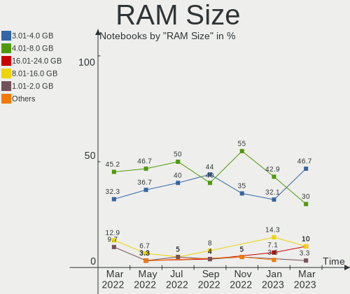
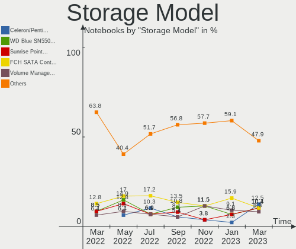
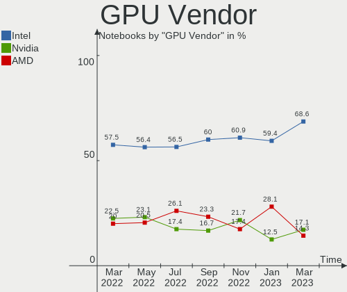
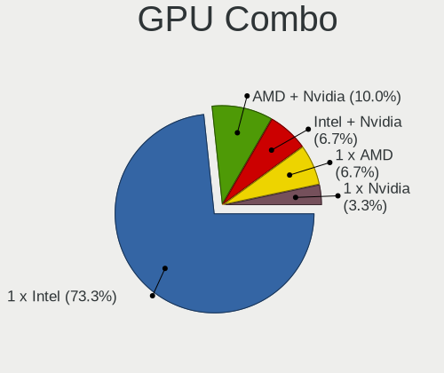

Endless Hardware Trends (Notebook)
----------------------------------

A project to identify most popular hardware characteristics and track their change
over time based on data collected by Endless users at https://Linux-Hardware.org.

Anyone can contribute to the study by uploading probes of their computers by
the [hw-probe](https://github.com/linuxhw/hw-probe) tool:

    sudo hw-probe -all -upload

Full-feature report is available here: https://linux-hardware.org/?view=trends&formfactor=notebook

Period: Mar, 2020.

Contents
--------

- [ OS                       ](#os)
- [ OS Family                ](#os-family)
- [ Kernel                   ](#kernel)
- [ Kernel Family            ](#kernel-family)
- [ Kernel Major Ver.        ](#kernel-major-ver)
- [ Arch                     ](#arch)
- [ DE                       ](#de)
- [ Display Server           ](#display-server)
- [ OS Lang                  ](#os-lang)
- [ Boot Mode                ](#boot-mode)
- [ Filesystem               ](#filesystem)
- [ Dual Boot with Linux     ](#dual-boot-with-linux)
- [ Dual Boot (Win)          ](#dual-boot-win)
- [ Country                  ](#country)
- [ City                     ](#city)
- [ Vendor                   ](#vendor)
- [ Model                    ](#model)
- [ Model Family             ](#model-family)
- [ MFG Year                 ](#mfg-year)
- [ Form Factor              ](#form-factor)
- [ Secure Boot              ](#secure-boot)
- [ Coreboot                 ](#coreboot)
- [ RAM Size                 ](#ram-size)
- [ RAM Used                 ](#ram-used)
- [ Drive Vendor             ](#drive-vendor)
- [ Drive Model              ](#drive-model)
- [ Drive Kind               ](#drive-kind)
- [ Drive Connector          ](#drive-connector)
- [ Drive Size               ](#drive-size)
- [ Space Total              ](#space-total)
- [ Space Used               ](#space-used)
- [ Malfunc. Drives          ](#malfunc-drives)
- [ Malfunc. Drive Vendor    ](#malfunc-drive-vendor)
- [ Malfunc. Drive Kind      ](#malfunc-drive-kind)
- [ Failed Drives            ](#failed-drives)
- [ Failed Drive Vendor      ](#failed-drive-vendor)
- [ Drive Status             ](#drive-status)
- [ Storage Vendor           ](#storage-vendor)
- [ Storage Model            ](#storage-model)
- [ Storage Kind             ](#storage-kind)
- [ CPU Vendor               ](#cpu-vendor)
- [ CPU Model                ](#cpu-model)
- [ CPU Model Family         ](#cpu-model-family)
- [ CPU Cores                ](#cpu-cores)
- [ CPU Sockets              ](#cpu-sockets)
- [ CPU Threads              ](#cpu-threads)
- [ CPU Op-Modes             ](#cpu-op-modes)
- [ CPU Microarch            ](#cpu-microarch)
- [ CPU Microcode            ](#cpu-microcode)
- [ GPU Vendor               ](#gpu-vendor)
- [ GPU Model                ](#gpu-model)
- [ GPU Combo                ](#gpu-combo)
- [ GPU Driver               ](#gpu-driver)
- [ GPU Memory               ](#gpu-memory)
- [ Monitor Vendor           ](#monitor-vendor)
- [ Monitor Model            ](#monitor-model)
- [ Monitor Resolution       ](#monitor-resolution)
- [ Monitor Diagonal         ](#monitor-diagonal)
- [ Monitor Width            ](#monitor-width)
- [ Aspect Ratio             ](#aspect-ratio)
- [ Monitor Area             ](#monitor-area)
- [ Pixel Density            ](#pixel-density)
- [ Multiple Monitors        ](#multiple-monitors)
- [ Net Controller Vendor    ](#net-controller-vendor)
- [ Net Controller Model     ](#net-controller-model)
- [ Net Controller Kind      ](#net-controller-kind)
- [ Used Controller          ](#used-controller)
- [ NICs                     ](#nics)
- [ Unsupported Devices      ](#unsupported-devices)
- [ Unsupported Device Types ](#unsupported-device-types)

OS
--

Installed operating systems

| Name                   | Computers | Percent |
|------------------------|-----------|---------|
| Endless 3.7.8          | 97        | 69.29%  |
| Endless 3.7.7          | 24        | 17.14%  |
| Endless 3.3.20-nexthw1 | 3         | 2.14%   |
| Endless 3.7.6          | 2         | 1.43%   |
| Endless 3.3.20         | 2         | 1.43%   |
| Endless 3.3.16-nexthw1 | 2         | 1.43%   |
| Endless 3.7.5          | 1         | 0.71%   |
| Endless 3.6.4          | 1         | 0.71%   |
| Endless 3.6.1-nexthw1  | 1         | 0.71%   |
| Endless 3.6.0-nexthw1  | 1         | 0.71%   |
| Endless 3.6.0          | 1         | 0.71%   |
| Endless 3.5.6          | 1         | 0.71%   |
| Endless 3.4.6-nexthw2  | 1         | 0.71%   |
| Endless 3.4.3-nexthw1  | 1         | 0.71%   |
| Endless 3.4.2-nexthw1  | 1         | 0.71%   |
| Endless 3.3.7          | 1         | 0.71%   |

OS Family
---------

OS without a version

| Name    | Computers | Percent |
|---------|-----------|---------|
| Endless | 140       | 100%    |

Kernel
------

Version of the Linux kernel

| Version           | Computers | Percent |
|-------------------|-----------|---------|
| 5.3.0-28-generic  | 121       | 86.43%  |
| 5.3.0-23-generic  | 3         | 2.14%   |
| 4.15.0-15-generic | 3         | 2.14%   |
| 5.1.0-2-generic   | 2         | 1.43%   |
| 4.16.0-4-generic  | 2         | 1.43%   |
| 4.15.0-12-generic | 2         | 1.43%   |
| 4.13.0-32-generic | 2         | 1.43%   |
| 5.0.0-25-generic  | 1         | 0.71%   |
| 5.0.0-15-generic  | 1         | 0.71%   |
| 4.18.0-7-generic  | 1         | 0.71%   |
| 4.18.0-12-generic | 1         | 0.71%   |
| 4.13.0-19-generic | 1         | 0.71%   |

Kernel Family
-------------

Linux kernel without a distro release

| Version | Computers | Percent |
|---------|-----------|---------|
| 5.3.0   | 124       | 88.57%  |
| 4.15.0  | 5         | 3.57%   |
| 4.13.0  | 3         | 2.14%   |
| 5.1.0   | 2         | 1.43%   |
| 5.0.0   | 2         | 1.43%   |
| 4.18.0  | 2         | 1.43%   |
| 4.16.0  | 2         | 1.43%   |

Kernel Major Ver.
-----------------

Linux kernel major version

| Version | Computers | Percent |
|---------|-----------|---------|
| 5.3     | 124       | 88.57%  |
| 4.15    | 5         | 3.57%   |
| 4.13    | 3         | 2.14%   |
| 5.1     | 2         | 1.43%   |
| 5.0     | 2         | 1.43%   |
| 4.18    | 2         | 1.43%   |
| 4.16    | 2         | 1.43%   |

Arch
----

OS architecture (x86_64, i586, etc.)

| Name   | Computers | Percent |
|--------|-----------|---------|
| x86_64 | 140       | 100%    |

DE
--

Desktop Environment

| Name    | Computers | Percent |
|---------|-----------|---------|
| GNOME   | 139       | 99.29%  |
| Unknown | 1         | 0.71%   |

Display Server
--------------

X11 or Wayland

| Name    | Computers | Percent |
|---------|-----------|---------|
| X11     | 139       | 99.29%  |
| Unknown | 1         | 0.71%   |

OS Lang
-------

Language

| Lang        | Computers | Percent |
|-------------|-----------|---------|
| en_US.utf8  | 59        | 42.14%  |
| ru_RU       | 14        | 10%     |
| pt_BR       | 10        | 7.14%   |
| pt_BR.utf8  | 9         | 6.43%   |
| de_DE       | 8         | 5.71%   |
| ro_RO       | 5         | 3.57%   |
| es_ES       | 5         | 3.57%   |
| en_GB       | 5         | 3.57%   |
| hu_HU       | 4         | 2.86%   |
| en_US       | 4         | 2.86%   |
| ru_UA       | 2         | 1.43%   |
| pt_PT       | 2         | 1.43%   |
| fr_FR       | 2         | 1.43%   |
| uk_UA       | 1         | 0.71%   |
| sv_SE       | 1         | 0.71%   |
| sk_SK       | 1         | 0.71%   |
| ru_RU.UTF_8 | 1         | 0.71%   |
| hr_HR       | 1         | 0.71%   |
| es_AR       | 1         | 0.71%   |
| en_CA       | 1         | 0.71%   |
| de_LU       | 1         | 0.71%   |
| cs_CZ       | 1         | 0.71%   |
| ca_ES       | 1         | 0.71%   |
| bg_BG       | 1         | 0.71%   |

Boot Mode
---------

EFI or BIOS

| Mode | Computers | Percent |
|------|-----------|---------|
| EFI  | 79        | 56.43%  |
| BIOS | 61        | 43.57%  |

Filesystem
----------

Type of filesystem

| Type  | Computers | Percent |
|-------|-----------|---------|
| Ext4  | 130       | 92.86%  |
| Tmpfs | 10        | 7.14%   |

Dual Boot with Linux
--------------------

Hosting more than one Linux

| Dual boot | Computers | Percent |
|-----------|-----------|---------|
| No        | 140       | 100%    |

Dual Boot (Win)
---------------

Hosting Linux and Windows

| Dual boot | Computers | Percent |
|-----------|-----------|---------|
| No        | 139       | 99.29%  |
| Yes       | 1         | 0.71%   |

Country
-------

Geographic location (country)

| Country                | Computers | Percent |
|------------------------|-----------|---------|
| USA                    | 27        | 19.29%  |
| Brazil                 | 19        | 13.57%  |
| Russia                 | 12        | 8.57%   |
| Romania                | 11        | 7.86%   |
| Germany                | 8         | 5.71%   |
| Spain                  | 6         | 4.29%   |
| UK                     | 5         | 3.57%   |
| Portugal               | 4         | 2.86%   |
| Hungary                | 4         | 2.86%   |
| Australia              | 4         | 2.86%   |
| Ukraine                | 3         | 2.14%   |
| Kazakhstan             | 3         | 2.14%   |
| India                  | 3         | 2.14%   |
| Croatia                | 3         | 2.14%   |
| Thailand               | 2         | 1.43%   |
| Georgia                | 2         | 1.43%   |
| France                 | 2         | 1.43%   |
| Canada                 | 2         | 1.43%   |
| Belarus                | 2         | 1.43%   |
| Argentina              | 2         | 1.43%   |
| Vietnam                | 1         | 0.71%   |
| Tunisia                | 1         | 0.71%   |
| Sweden                 | 1         | 0.71%   |
| Slovakia               | 1         | 0.71%   |
| Philippines            | 1         | 0.71%   |
| New Zealand            | 1         | 0.71%   |
| Montenegro             | 1         | 0.71%   |
| Luxembourg             | 1         | 0.71%   |
| Israel                 | 1         | 0.71%   |
| Iran                   | 1         | 0.71%   |
| Denmark                | 1         | 0.71%   |
| Czech Republic         | 1         | 0.71%   |
| Cyprus                 | 1         | 0.71%   |
| Costa Rica             | 1         | 0.71%   |
| Bulgaria               | 1         | 0.71%   |
| Bosnia and Herzegovina | 1         | 0.71%   |

City
----

Geographic location (city)

| City                     | Computers | Percent |
|--------------------------|-----------|---------|
| Budapest                 | 4         | 2.86%   |
| Bucharest                | 4         | 2.86%   |
| Brisbane                 | 4         | 2.86%   |
| Moscow                   | 3         | 2.14%   |
| Kyiv                     | 3         | 2.14%   |
| Vila Velha               | 2         | 1.43%   |
| São Paulo               | 2         | 1.43%   |
| St Petersburg            | 2         | 1.43%   |
| Sacramento               | 2         | 1.43%   |
| Londrina                 | 2         | 1.43%   |
| Lisbon                   | 2         | 1.43%   |
| Columbia                 | 2         | 1.43%   |
| Zugdidi                  | 1         | 0.71%   |
| Zagreb                   | 1         | 0.71%   |
| West Nyack               | 1         | 0.71%   |
| West Chicago             | 1         | 0.71%   |
| West Babylon             | 1         | 0.71%   |
| Waterlooville            | 1         | 0.71%   |
| Waldesch                 | 1         | 0.71%   |
| Volgodonsk               | 1         | 0.71%   |
| Visakhapatnam            | 1         | 0.71%   |
| Virmond                  | 1         | 0.71%   |
| Valencia                 | 1         | 0.71%   |
| Ust-Kamenogorsk          | 1         | 0.71%   |
| Upper Marlboro           | 1         | 0.71%   |
| Tunis                    | 1         | 0.71%   |
| Toronto                  | 1         | 0.71%   |
| Toledo                   | 1         | 0.71%   |
| Thrissur                 | 1         | 0.71%   |
| Terrassa                 | 1         | 0.71%   |
| Tehran                   | 1         | 0.71%   |
| Tbilisi                  | 1         | 0.71%   |
| São Luís               | 1         | 0.71%   |
| São Bernardo do Campo   | 1         | 0.71%   |
| Surrey                   | 1         | 0.71%   |
| Sunderland               | 1         | 0.71%   |
| Sofia                    | 1         | 0.71%   |
| Sfantu Gheorghe          | 1         | 0.71%   |
| Sarajevo                 | 1         | 0.71%   |
| San José                | 1         | 0.71%   |
| San Antonio              | 1         | 0.71%   |
| Saint Paul               | 1         | 0.71%   |
| Rio de Janeiro           | 1         | 0.71%   |
| Rijeka                   | 1         | 0.71%   |
| Reşiţa                 | 1         | 0.71%   |
| Ramenskoye               | 1         | 0.71%   |
| Ramat HaSharon           | 1         | 0.71%   |
| Quezon City              | 1         | 0.71%   |
| Punta Alta               | 1         | 0.71%   |
| Prundu Bargaului         | 1         | 0.71%   |
| Považská Bystrica      | 1         | 0.71%   |
| Porter                   | 1         | 0.71%   |
| Petropavlovsk-Kamchatsky | 1         | 0.71%   |
| Passo Fundo              | 1         | 0.71%   |
| Paris                    | 1         | 0.71%   |
| Paphos                   | 1         | 0.71%   |
| Ourense                  | 1         | 0.71%   |
| Orange Park              | 1         | 0.71%   |
| Northampton              | 1         | 0.71%   |
| Navalcarnero             | 1         | 0.71%   |

Vendor
------

Motherboard manufacturer

| Name                | Computers | Percent |
|---------------------|-----------|---------|
| ASUSTek Computer    | 47        | 33.57%  |
| Acer                | 24        | 17.14%  |
| Hewlett-Packard     | 16        | 11.43%  |
| Lenovo              | 14        | 10%     |
| Dell                | 12        | 8.57%   |
| Toshiba             | 8         | 5.71%   |
| Sony                | 3         | 2.14%   |
| Positivo            | 3         | 2.14%   |
| Samsung Electronics | 2         | 1.43%   |
| Packard Bell        | 2         | 1.43%   |
| Unknown             | 2         | 1.43%   |
| Phoenix/SiS         | 1         | 0.71%   |
| OEM                 | 1         | 0.71%   |
| Notebook            | 1         | 0.71%   |
| Medion              | 1         | 0.71%   |
| LIVEFAN             | 1         | 0.71%   |
| HUAWEI              | 1         | 0.71%   |
| Fujitsu Siemens     | 1         | 0.71%   |

Model
-----

Motherboard model

| Name                                                | Computers | Percent |
|-----------------------------------------------------|-----------|---------|
| ASUS VivoBook 15_ASUS Laptop X540UAR                | 3         | 2.14%   |
| ASUS VivoBook 15_ASUS Laptop X540MA_X540MA          | 3         | 2.14%   |
| ASUS VivoBook 15_ASUS Laptop X540MA_R540MA          | 3         | 2.14%   |
| Unknown                                             | 3         | 2.14%   |
| HP Laptop 15-da0xxx                                 | 2         | 1.43%   |
| ASUS ZenBook UX431DA_UM431DA                        | 2         | 1.43%   |
| ASUS VivoBook_ASUSLaptop X509DA_M509DA              | 2         | 1.43%   |
| ASUS GL553VE                                        | 2         | 1.43%   |
| Acer Nitro AN515-52                                 | 2         | 1.43%   |
| Acer Nitro AN515-51                                 | 2         | 1.43%   |
| Acer Aspire A515-51                                 | 2         | 1.43%   |
| Acer Aspire A315-53                                 | 2         | 1.43%   |
| Acer Aspire A315-51                                 | 2         | 1.43%   |
| Toshiba Satellite L850                              | 1         | 0.71%   |
| Toshiba Satellite L755D                             | 1         | 0.71%   |
| Toshiba Satellite L305                              | 1         | 0.71%   |
| Toshiba Satellite C855D                             | 1         | 0.71%   |
| Toshiba Satellite C650D                             | 1         | 0.71%   |
| Toshiba Satellite C55-C                             | 1         | 0.71%   |
| Toshiba Satellite C55-B                             | 1         | 0.71%   |
| Toshiba NB510                                       | 1         | 0.71%   |
| Sony VPCEH35FM                                      | 1         | 0.71%   |
| Sony VPCEH1AFX                                      | 1         | 0.71%   |
| Sony SVT1311M1RS                                    | 1         | 0.71%   |
| Samsung Electronics NC208/NC108                     | 1         | 0.71%   |
| Samsung Electronics 300E5EV/300E4EV/270E5EV/270E4EV | 1         | 0.71%   |
| Positivo S14CT01                                    | 1         | 0.71%   |
| Positivo S14BW01                                    | 1         | 0.71%   |
| Positivo C14CR21                                    | 1         | 0.71%   |
| Phoenix/SiS M7x0S                                   | 1         | 0.71%   |
| Packard Bell EasyNote TS44HR                        | 1         | 0.71%   |
| Packard Bell EasyNote ML65                          | 1         | 0.71%   |
| Notebook W65_W67RB                                  | 1         | 0.71%   |
| Medion P6618                                        | 1         | 0.71%   |
| LIVEFAN C116B                                       | 1         | 0.71%   |
| Lenovo Yoga 3 Pro-1370 80HE                         | 1         | 0.71%   |
| Lenovo ThinkPad X1 Carbon 3rd 20BTS0H200            | 1         | 0.71%   |
| Lenovo ThinkPad T61 765912G                         | 1         | 0.71%   |
| Lenovo ThinkPad T480 20L5S1S100                     | 1         | 0.71%   |
| Lenovo ThinkPad T420 4180JH1                        | 1         | 0.71%   |
| Lenovo S21e-20 80M4                                 | 1         | 0.71%   |
| Lenovo IdeaPad Z510 20287                           | 1         | 0.71%   |
| Lenovo IdeaPad S145-15IWL 81MV                      | 1         | 0.71%   |
| Lenovo IdeaPad S145-14AST 81ST                      | 1         | 0.71%   |
| Lenovo IdeaPad 330-15IKB 81DE                       | 1         | 0.71%   |
| Lenovo IdeaPad 330-15ARR 81D2                       | 1         | 0.71%   |
| Lenovo G550 20023                                   | 1         | 0.71%   |
| Lenovo B570 1068A8U                                 | 1         | 0.71%   |
| Lenovo 100-14IBY 80R7                               | 1         | 0.71%   |
| HUAWEI KPL-W0X                                      | 1         | 0.71%   |
| HP Stream Notebook                                  | 1         | 0.71%   |
| HP Stream Laptop 14-cb1xxx                          | 1         | 0.71%   |
| HP Stream Laptop 14-ax0XX                           | 1         | 0.71%   |
| HP ProBook 4530s                                    | 1         | 0.71%   |
| HP Pavilion tx2000                                  | 1         | 0.71%   |
| HP Pavilion dv7                                     | 1         | 0.71%   |
| HP Pavilion dv6                                     | 1         | 0.71%   |
| HP Pavilion dv2700                                  | 1         | 0.71%   |
| HP Pavilion dm3                                     | 1         | 0.71%   |
| HP Laptop 17-ca0xxx                                 | 1         | 0.71%   |

Model Family
------------

Motherboard model prefix

| Name                        | Computers | Percent |
|-----------------------------|-----------|---------|
| ASUS VivoBook               | 32        | 22.86%  |
| Acer Aspire                 | 16        | 11.43%  |
| Toshiba Satellite           | 7         | 5%      |
| Dell Inspiron               | 6         | 4.29%   |
| Lenovo IdeaPad              | 5         | 3.57%   |
| HP Pavilion                 | 5         | 3.57%   |
| Dell Latitude               | 5         | 3.57%   |
| Lenovo ThinkPad             | 4         | 2.86%   |
| HP Laptop                   | 4         | 2.86%   |
| ASUS ZenBook                | 4         | 2.86%   |
| Acer Nitro                  | 4         | 2.86%   |
| HP Stream                   | 3         | 2.14%   |
| Unknown                     | 3         | 2.14%   |
| Packard Bell EasyNote       | 2         | 1.43%   |
| ASUS GL553VE                | 2         | 1.43%   |
| Acer TravelMate             | 2         | 1.43%   |
| Acer Swift                  | 2         | 1.43%   |
| Toshiba NB510               | 1         | 0.71%   |
| Sony VPCEH35FM              | 1         | 0.71%   |
| Sony VPCEH1AFX              | 1         | 0.71%   |
| Sony SVT1311M1RS            | 1         | 0.71%   |
| Samsung Electronics NC208   | 1         | 0.71%   |
| Samsung Electronics 300E5EV | 1         | 0.71%   |
| Positivo S14CT01            | 1         | 0.71%   |
| Positivo S14BW01            | 1         | 0.71%   |
| Positivo C14CR21            | 1         | 0.71%   |
| Phoenix/SiS M7x0S           | 1         | 0.71%   |
| Notebook W65                | 1         | 0.71%   |
| Medion P6618                | 1         | 0.71%   |
| LIVEFAN C116B               | 1         | 0.71%   |
| Lenovo Yoga                 | 1         | 0.71%   |
| Lenovo S21e-20              | 1         | 0.71%   |
| Lenovo G550                 | 1         | 0.71%   |
| Lenovo B570                 | 1         | 0.71%   |
| Lenovo 100-14IBY            | 1         | 0.71%   |
| HUAWEI KPL-W0X              | 1         | 0.71%   |
| HP ProBook                  | 1         | 0.71%   |
| HP G71                      | 1         | 0.71%   |
| HP 255                      | 1         | 0.71%   |
| HP 2000                     | 1         | 0.71%   |
| Fujitsu Siemens ESPRIMO     | 1         | 0.71%   |
| Dell Vostro                 | 1         | 0.71%   |
| ASUS X705UAR                | 1         | 0.71%   |
| ASUS X550JX                 | 1         | 0.71%   |
| ASUS X541NA                 | 1         | 0.71%   |
| ASUS X540NV                 | 1         | 0.71%   |
| ASUS X540NA                 | 1         | 0.71%   |
| ASUS S451LA                 | 1         | 0.71%   |
| ASUS Q502LA                 | 1         | 0.71%   |
| ASUS N76VB                  | 1         | 0.71%   |
| ASUS N45SF                  | 1         | 0.71%   |

MFG Year
--------

Motherboard manufacture year

| Year    | Computers | Percent |
|---------|-----------|---------|
| 2019    | 57        | 40.71%  |
| 2018    | 20        | 14.29%  |
| 2013    | 11        | 7.86%   |
| 2017    | 8         | 5.71%   |
| 2015    | 7         | 5%      |
| 2012    | 7         | 5%      |
| 2014    | 5         | 3.57%   |
| 2009    | 5         | 3.57%   |
| 2016    | 4         | 2.86%   |
| 2011    | 4         | 2.86%   |
| 2007    | 4         | 2.86%   |
| 2010    | 3         | 2.14%   |
| 2008    | 3         | 2.14%   |
| 2020    | 1         | 0.71%   |
| Unknown | 1         | 0.71%   |

Form Factor
-----------

Physical design of the computer

| Name     | Computers | Percent |
|----------|-----------|---------|
| Notebook | 140       | 100%    |

Secure Boot
-----------

Enabled or disabled

| State    | Computers | Percent |
|----------|-----------|---------|
| Disabled | 116       | 82.86%  |
| Enabled  | 24        | 17.14%  |

Coreboot
--------

Have coreboot on board

| Used | Computers | Percent |
|------|-----------|---------|
| No   | 140       | 100%    |

RAM Size
--------

Total RAM memory

| Size in GB | Computers | Percent |
|------------|-----------|---------|
| 3.01-4.0   | 56        | 40%     |
| 4.01-8.0   | 54        | 38.57%  |
| 1.01-2.0   | 11        | 7.86%   |
| 8.01-16.0  | 11        | 7.86%   |
| 16.01-24.0 | 7         | 5%      |
| 2.01-3.0   | 1         | 0.71%   |

RAM Used
--------

Used RAM memory

| Used GB  | Computers | Percent |
|----------|-----------|---------|
| 1.01-2.0 | 72        | 51.43%  |
| 2.01-3.0 | 28        | 20%     |
| 0.01-1.0 | 23        | 16.43%  |
| 3.01-4.0 | 13        | 9.29%   |
| 4.01-8.0 | 4         | 2.86%   |

Drive Vendor
------------

Hard drive vendors

| Vendor              | Computers | Drives  | Percent |
|---------------------|-----------|---------|---------|
| Seagate             | 25        | 25      | 17.24%  |
| WDC                 | 21        | 22      | 14.48%  |
| Toshiba             | 17        | 17      | 11.72%  |
| Kingston            | 11        | 11      | 7.59%   |
| Samsung Electronics | 10        | 10      | 6.9%    |
| Unknown             | 9         | 10      | 6.21%   |
| Hitachi             | 8         | 8       | 5.52%   |
| HGST                | 7         | 7       | 4.83%   |
| SanDisk             | 6         | 6       | 4.14%   |
| HL-DT-ST            | 6         | Unknown | 4.14%   |
| Micron Technology   | 5         | 5       | 3.45%   |
| A-DATA Technology   | 4         | 4       | 2.76%   |
| SK Hynix            | 3         | 3       | 2.07%   |
| Crucial             | 2         | 2       | 1.38%   |
| Team                | 1         | 1       | 0.69%   |
| lntenso             | 1         | 1       | 0.69%   |
| LITEON              | 1         | 1       | 0.69%   |
| KingFast            | 1         | 1       | 0.69%   |
| Intel               | 1         | 1       | 0.69%   |
| Integral            | 1         | 1       | 0.69%   |
| Gigabyte Technology | 1         | 1       | 0.69%   |
| Generic             | 1         | 1       | 0.69%   |
| Fujitsu             | 1         | 1       | 0.69%   |
| Apacer              | 1         | 1       | 0.69%   |
| AMD                 | 1         | 1       | 0.69%   |

Drive Model
-----------

Hard drive models

| Model                        | Computers | Percent |
|------------------------------|-----------|---------|
| WD10SPZX-21Z10T0 1TB         | 8         | 5.48%   |
| ST1000LM035-1RK172 1TB       | 8         | 5.48%   |
| RBUSC180DS37256GJ 256GB SSD  | 6         | 4.11%   |
| MMC Card  32GB               | 6         | 4.11%   |
| DVDRAM GUE1N 3GB             | 6         | 4.11%   |
| MQ04ABF100 1TB               | 5         | 3.42%   |
| MQ01ABF050 500GB             | 5         | 3.42%   |
| ST500LT012-1DG142 500GB      | 4         | 2.74%   |
| 1100_MTFDDAV256TBN 256GB SSD | 4         | 2.74%   |
| SD9SN8W256G1102 256GB SSD    | 3         | 2.05%   |
| MQ01ABD100 1TB               | 3         | 2.05%   |
| IM2S3338-128GD2 128GB SSD    | 3         | 2.05%   |
| ST500LM012 HN-M500MBB 500GB  | 2         | 1.37%   |
| ST2000LM007-1R8174 2TB       | 2         | 1.37%   |
| ST1000LM024 HN-M101MBB 1TB   | 2         | 1.37%   |
| ST1000LM014-1EJ164 1TB       | 2         | 1.37%   |
| SSD 840 EVO 120GB            | 2         | 1.37%   |
| SD9SN8W256G1014 256GB SSD    | 2         | 1.37%   |
| MMC Card  64GB               | 2         | 1.37%   |
| HTS721010A9E630 1TB          | 2         | 1.37%   |
| HTS545050A7E380 500GB        | 2         | 1.37%   |
| HTS543232A7A384 320GB        | 2         | 1.37%   |
| HFS256G39TND-N210A 256GB SSD | 2         | 1.37%   |
| WDS240G2G0B-00EPW0 240GB SSD | 1         | 0.68%   |
| WDS120G2G0B-00EPW0 120GB SSD | 1         | 0.68%   |
| WD7500BPKX-00HPJT0 752GB     | 1         | 0.68%   |
| WD5000LPVX-80V0TT0 500GB     | 1         | 0.68%   |
| WD5000LPVX-22V0TT0 500GB     | 1         | 0.68%   |
| WD5000LPCX-60VHAT1 500GB     | 1         | 0.68%   |
| WD5000LPCX-21VHAT0 500GB     | 1         | 0.68%   |
| WD5000BPVT-75HXZT3 500GB     | 1         | 0.68%   |
| WD5000BPVT-24HXZT3 500GB     | 1         | 0.68%   |
| WD3200BEVT-22ZCT0 320GB      | 1         | 0.68%   |
| WD2500BEVS-26VAT0 250GB      | 1         | 0.68%   |
| WD1200BEVS-00UST0 120GB      | 1         | 0.68%   |
| WD10SPZX-60Z10T0 1TB         | 1         | 0.68%   |
| WD10JPVX-11JC3T0 1TB         | 1         | 0.68%   |
| V Series SATA SSD 240GB      | 1         | 0.68%   |
| T253LE240G 240GB SSD         | 1         | 0.68%   |
| SU630 240GB SSD              | 1         | 0.68%   |
| ST9640320AS 640GB            | 1         | 0.68%   |
| ST9500325AS 500GB            | 1         | 0.68%   |
| ST9320325AS 320GB            | 1         | 0.68%   |
| ST9160310AS 160GB            | 1         | 0.68%   |
| ST500LM030-1RK17D 500GB      | 1         | 0.68%   |
| SSDSA2M040G2GC 40GB          | 1         | 0.68%   |
| SSD Sata lll 120GB           | 1         | 0.68%   |
| SSD PM871b M.2 2280 256GB    | 1         | 0.68%   |
| SSD PM841 2.5 7mm 256GB      | 1         | 0.68%   |
| SSD 860 EVO 1TB              | 1         | 0.68%   |
| SSD 850 EVO 250GB            | 1         | 0.68%   |
| SD9SB8W256G1002 256GB SSD    | 1         | 0.68%   |
| SD/MMC/MS PRO 16GB           | 1         | 0.68%   |
| SA400S37240G 240GB SSD       | 1         | 0.68%   |
| RTOTJ128VGD2EYX 128GB SSD    | 1         | 0.68%   |
| RBUSNS8180S3128GI1 128GB SSD | 1         | 0.68%   |
| RBUSNS8180DS3512GJ 512GB SSD | 1         | 0.68%   |
| RBUSNS8180DS3256GJ 256GB SSD | 1         | 0.68%   |
| RBUSNS8180DS3128GJ 128GB SSD | 1         | 0.68%   |
| R5SL240G 240GB SSD           | 1         | 0.68%   |

Drive Kind
----------

HDD or SSD

| Kind    | Computers | Drives | Percent |
|---------|-----------|--------|---------|
| HDD     | 78        | 78     | 53.42%  |
| SSD     | 51        | 51     | 34.93%  |
| MMC     | 8         | 9      | 5.48%   |
| Unknown | 8         | 2      | 5.48%   |
| NVMe    | 1         | 1      | 0.68%   |

Drive Connector
---------------

SATA, SAS, NVMe, etc.

| Type | Computers | Drives | Percent |
|------|-----------|--------|---------|
| SATA | 118       | 130    | 88.06%  |
| MMC  | 8         | 9      | 5.97%   |
| SAS  | 7         | 1      | 5.22%   |
| NVMe | 1         | 1      | 0.75%   |

Drive Size
----------

Size of hard drive

| Size in TB | Computers | Drives | Percent |
|------------|-----------|--------|---------|
| 0.01-0.5   | 100       | 101    | 71.43%  |
| 0.51-1.0   | 38        | 38     | 27.14%  |
| 1.01-2.0   | 2         | 2      | 1.43%   |

Space Total
-----------

Amount of disk space available on the file system

| Size in GB | Computers | Percent |
|------------|-----------|---------|
| 101-250    | 37        | 26.43%  |
| 251-500    | 34        | 24.29%  |
| 501-1000   | 22        | 15.71%  |
| 21-50      | 21        | 15%     |
| 1-20       | 10        | 7.14%   |
| 51-100     | 10        | 7.14%   |
| 1001-2000  | 6         | 4.29%   |

Space Used
----------

Amount of used disk space

| Used GB   | Computers | Percent |
|-----------|-----------|---------|
| 21-50     | 66        | 47.14%  |
| 1-20      | 40        | 28.57%  |
| 51-100    | 18        | 12.86%  |
| 101-250   | 10        | 7.14%   |
| 501-1000  | 4         | 2.86%   |
| 251-500   | 1         | 0.71%   |
| 1001-2000 | 1         | 0.71%   |

Malfunc. Drives
---------------

Drive models with a malfunction

| Model                    | Computers | Drives | Percent |
|--------------------------|-----------|--------|---------|
| MZVPW128HEGM-00000 128GB | 1         | 1      | 100%    |

Malfunc. Drive Vendor
---------------------

Vendors of faulty drives

| Vendor              | Computers | Drives | Percent |
|---------------------|-----------|--------|---------|
| Samsung Electronics | 1         | 1      | 100%    |

Malfunc. Drive Kind
-------------------

Kinds of faulty drives

| Kind | Computers | Drives | Percent |
|------|-----------|--------|---------|
| NVMe | 1         | 1      | 100%    |

Failed Drives
-------------

Failed drive models

Zero info for selected period =(

Failed Drive Vendor
-------------------

Failed drive vendors

Zero info for selected period =(

Drive Status
------------

Number of failed and malfunc. drives

| Status   | Computers | Drives | Percent |
|----------|-----------|--------|---------|
| Detected | 126       | 139    | 98.44%  |
| Malfunc  | 1         | 1      | 0.78%   |
| Works    | 1         | 1      | 0.78%   |

Storage Vendor
--------------

Storage controller vendors

| Vendor                           | Computers | Percent |
|----------------------------------|-----------|---------|
| Intel                            | 103       | 73.05%  |
| AMD                              | 23        | 16.31%  |
| SK Hynix                         | 3         | 2.13%   |
| Sandisk                          | 3         | 2.13%   |
| Nvidia                           | 3         | 2.13%   |
| Samsung Electronics              | 2         | 1.42%   |
| Kingston Technology Company      | 2         | 1.42%   |
| Silicon Integrated Systems [SiS] | 1         | 0.71%   |
| Lite-On Technology               | 1         | 0.71%   |

Storage Model
-------------

Storage controller models

| Model                                                                      | Computers | Percent |
|----------------------------------------------------------------------------|-----------|---------|
| Sunrise Point-LP SATA Controller [AHCI mode]                               | 21        | 13.73%  |
| FCH SATA Controller [AHCI mode]                                            | 18        | 11.76%  |
| 82801 Mobile SATA Controller [RAID mode]                                   | 15        | 9.8%    |
| SATA controller                                                            | 13        | 8.5%    |
| 6 Series/C200 Series Chipset Family 6 port Mobile SATA AHCI Controller     | 8         | 5.23%   |
| 8 Series SATA Controller 1 [AHCI mode]                                     | 6         | 3.92%   |
| SB7x0/SB8x0/SB9x0 SATA Controller [AHCI mode]                              | 5         | 3.27%   |
| HM170/QM170 Chipset SATA Controller [AHCI Mode]                            | 5         | 3.27%   |
| Celeron N3350/Pentium N4200/Atom E3900 Series SATA AHCI Controller         | 5         | 3.27%   |
| 82801IBM/IEM (ICH9M/ICH9M-E) 4 port SATA Controller [AHCI mode]            | 5         | 3.27%   |
| 7 Series Chipset Family 6-port SATA Controller [AHCI mode]                 | 5         | 3.27%   |
| Wildcat Point-LP SATA Controller [AHCI Mode]                               | 4         | 2.61%   |
| WD Black 2018/PC SN520 NVMe SSD                                            | 3         | 1.96%   |
| Non-Volatile memory controller                                             | 3         | 1.96%   |
| BC501 NVMe Solid State Drive 512GB                                         | 3         | 1.96%   |
| Atom/Celeron/Pentium Processor x5-E8000/J3xxx/N3xxx Series SATA Controller | 3         | 1.96%   |
| 82801HM/HEM (ICH8M/ICH8M-E) IDE Controller                                 | 3         | 1.96%   |
| PROSet/Wireless WiFi Software extension                                    | 2         | 1.31%   |
| NM10/ICH7 Family SATA Controller [AHCI mode]                               | 2         | 1.31%   |
| MCP51 Serial ATA Controller                                                | 2         | 1.31%   |
| MCP51 IDE                                                                  | 2         | 1.31%   |
| Cannon Point-LP SATA Controller [AHCI Mode]                                | 2         | 1.31%   |
| Atom Processor E3800 Series SATA AHCI Controller                           | 2         | 1.31%   |
| 82801HM/HEM (ICH8M/ICH8M-E) SATA Controller [IDE mode]                     | 2         | 1.31%   |
| 82801HM/HEM (ICH8M/ICH8M-E) SATA Controller [AHCI mode]                    | 2         | 1.31%   |
| 8 Series/C220 Series Chipset Family 6-port SATA Controller 1 [AHCI mode]   | 2         | 1.31%   |
| SSD 660P Series                                                            | 1         | 0.65%   |
| SATA Controller / IDE mode                                                 | 1         | 0.65%   |
| NVMe SSD Controller SM981/PM981/PM983                                      | 1         | 0.65%   |
| NVMe SSD Controller SM961/PM961                                            | 1         | 0.65%   |
| Mobile PM965/GM965 PT IDER Controller                                      | 1         | 0.65%   |
| Mobile 4 Series Chipset PT IDER Controller                                 | 1         | 0.65%   |
| MCP67 SATA Controller                                                      | 1         | 0.65%   |
| MCP67 IDE Controller                                                       | 1         | 0.65%   |
| Cannon Lake Mobile PCH SATA AHCI Controller                                | 1         | 0.65%   |
| 5513 IDE Controller                                                        | 1         | 0.65%   |

Storage Kind
------------

Kind of storage controller (IDE, SATA, NVMe, SAS, ...)

| Kind | Computers | Percent |
|------|-----------|---------|
| SATA | 111       | 75%     |
| RAID | 14        | 9.46%   |
| NVMe | 14        | 9.46%   |
| IDE  | 9         | 6.08%   |

CPU Vendor
----------

Processor vendors

| Vendor | Computers | Percent |
|--------|-----------|---------|
| Intel  | 114       | 81.43%  |
| AMD    | 26        | 18.57%  |

CPU Model
---------

Processor models

| Model                                         | Computers | Percent |
|-----------------------------------------------|-----------|---------|
| Intel Celeron N4000 CPU @ 1.10GHz             | 10        | 7.14%   |
| Intel Core i5-8250U CPU @ 1.60GHz             | 7         | 5%      |
| Intel Core i7-7700HQ CPU @ 2.80GHz            | 4         | 2.86%   |
| Intel Core i5-8265U CPU @ 1.60GHz             | 4         | 2.86%   |
| Intel Core i5-7200U CPU @ 2.50GHz             | 4         | 2.86%   |
| Intel Core i3-8145U CPU @ 2.10GHz             | 4         | 2.86%   |
| Intel Core i3-6006U CPU @ 2.00GHz             | 4         | 2.86%   |
| Intel Pentium Silver N5000 CPU @ 1.10GHz      | 3         | 2.14%   |
| Intel Core i3-7020U CPU @ 2.30GHz             | 3         | 2.14%   |
| Intel Core 2 Duo CPU T6600 @ 2.20GHz          | 3         | 2.14%   |
| Intel Celeron CPU N2840 @ 2.16GHz             | 3         | 2.14%   |
| AMD Ryzen 7 3700U with Radeon Vega Mobile Gfx | 3         | 2.14%   |
| AMD Ryzen 5 3500U with Radeon Vega Mobile Gfx | 3         | 2.14%   |
| Intel Pentium Dual CPU T3400 @ 2.16GHz        | 2         | 1.43%   |
| Intel Pentium CPU N4200 @ 1.10GHz             | 2         | 1.43%   |
| Intel Pentium CPU B940 @ 2.00GHz              | 2         | 1.43%   |
| Intel Pentium CPU 4417U @ 2.30GHz             | 2         | 1.43%   |
| Intel Core i7-8550U CPU @ 1.80GHz             | 2         | 1.43%   |
| Intel Core i7-7500U CPU @ 2.70GHz             | 2         | 1.43%   |
| Intel Core i7-4500U CPU @ 1.80GHz             | 2         | 1.43%   |
| Intel Core i5-5200U CPU @ 2.20GHz             | 2         | 1.43%   |
| Intel Core i5-4210U CPU @ 1.70GHz             | 2         | 1.43%   |
| Intel Celeron CPU N3350 @ 1.10GHz             | 2         | 1.43%   |
| Intel Celeron CPU N3060 @ 1.60GHz             | 2         | 1.43%   |
| AMD Ryzen 5 2500U with Radeon Vega Mobile Gfx | 2         | 1.43%   |
| AMD A6-9225 RADEON R4, 5 COMPUTE CORES 2C+3G  | 2         | 1.43%   |
| Intel Pentium Dual CPU T2410 @ 2.00GHz        | 1         | 0.71%   |
| Intel Pentium CPU N3710 @ 1.60GHz             | 1         | 0.71%   |
| Intel Pentium CPU N3700 @ 1.60GHz             | 1         | 0.71%   |
| Intel Pentium CPU B960 @ 2.20GHz              | 1         | 0.71%   |
| Intel Core M-5Y71 CPU @ 1.20GHz               | 1         | 0.71%   |
| Intel Core i7-8750H CPU @ 2.20GHz             | 1         | 0.71%   |
| Intel Core i7-8565U CPU @ 1.80GHz             | 1         | 0.71%   |
| Intel Core i7-5500U CPU @ 2.40GHz             | 1         | 0.71%   |
| Intel Core i7-4720HQ CPU @ 2.60GHz            | 1         | 0.71%   |
| Intel Core i7-4702MQ CPU @ 2.20GHz            | 1         | 0.71%   |
| Intel Core i7-4600U CPU @ 2.10GHz             | 1         | 0.71%   |
| Intel Core i7-3630QM CPU @ 2.40GHz            | 1         | 0.71%   |
| Intel Core i7-2760QM CPU @ 2.40GHz            | 1         | 0.71%   |
| Intel Core i7-2640M CPU @ 2.80GHz             | 1         | 0.71%   |
| Intel Core i7-2630QM CPU @ 2.00GHz            | 1         | 0.71%   |
| Intel Core i5-8300H CPU @ 2.30GHz             | 1         | 0.71%   |
| Intel Core i5-7300U CPU @ 2.60GHz             | 1         | 0.71%   |
| Intel Core i5-6300HQ CPU @ 2.30GHz            | 1         | 0.71%   |
| Intel Core i5-3210M CPU @ 2.50GHz             | 1         | 0.71%   |
| Intel Core i5-2520M CPU @ 2.50GHz             | 1         | 0.71%   |
| Intel Core i5-2450M CPU @ 2.50GHz             | 1         | 0.71%   |
| Intel Core i5-2430M CPU @ 2.40GHz             | 1         | 0.71%   |
| Intel Core i3-8130U CPU @ 2.20GHz             | 1         | 0.71%   |
| Intel Core i3-4005U CPU @ 1.70GHz             | 1         | 0.71%   |
| Intel Core i3-3227U CPU @ 1.90GHz             | 1         | 0.71%   |
| Intel Core i3-3120M CPU @ 2.50GHz             | 1         | 0.71%   |
| Intel Core i3-2367M CPU @ 1.40GHz             | 1         | 0.71%   |
| Intel Core i3-2310M CPU @ 2.10GHz             | 1         | 0.71%   |
| Intel Core 2 Duo CPU T7300 @ 2.00GHz          | 1         | 0.71%   |
| Intel Core 2 Duo CPU T5550 @ 1.83GHz          | 1         | 0.71%   |
| Intel Core 2 Duo CPU T5450 @ 1.66GHz          | 1         | 0.71%   |
| Intel Core 2 Duo CPU T5250 @ 1.50GHz          | 1         | 0.71%   |
| Intel Core 2 Duo CPU P9700 @ 2.80GHz          | 1         | 0.71%   |
| Intel Celeron N4100 CPU @ 1.10GHz             | 1         | 0.71%   |

CPU Model Family
----------------

Processor model prefix

| Model                                | Computers | Percent |
|--------------------------------------|-----------|---------|
| Intel Core i5                        | 26        | 18.57%  |
| Intel Celeron                        | 23        | 16.43%  |
| Intel Core i7                        | 20        | 14.29%  |
| Intel Core i3                        | 17        | 12.14%  |
| Intel Pentium                        | 9         | 6.43%   |
| Intel Core 2 Duo                     | 8         | 5.71%   |
| AMD Ryzen 5                          | 5         | 3.57%   |
| Intel Atom                           | 4         | 2.86%   |
| Intel Pentium Silver                 | 3         | 2.14%   |
| Intel Pentium Dual                   | 3         | 2.14%   |
| AMD Ryzen 7                          | 3         | 2.14%   |
| AMD Ryzen 3                          | 3         | 2.14%   |
| AMD A6                               | 3         | 2.14%   |
| AMD Turion 64 X2 Mobile              | 2         | 1.43%   |
| AMD E1                               | 2         | 1.43%   |
| Intel Core M                         | 1         | 0.71%   |
| AMD V120                             | 1         | 0.71%   |
| AMD Turion II Ultra Dual-Core Mobile | 1         | 0.71%   |
| AMD Turion 64 Mobile                 | 1         | 0.71%   |
| AMD Phenom II                        | 1         | 0.71%   |
| AMD E                                | 1         | 0.71%   |
| AMD Athlon II Neo                    | 1         | 0.71%   |
| AMD A4                               | 1         | 0.71%   |
| AMD A12                              | 1         | 0.71%   |

CPU Cores
---------

Number of processor cores

| Number | Computers | Percent |
|--------|-----------|---------|
| 2      | 90        | 64.29%  |
| 4      | 47        | 33.57%  |
| 1      | 2         | 1.43%   |
| 6      | 1         | 0.71%   |

CPU Sockets
-----------

Number of sockets

| Number | Computers | Percent |
|--------|-----------|---------|
| 1      | 140       | 100%    |

CPU Threads
-----------

Threads per core (Hyper-Threading)

| Number | Computers | Percent |
|--------|-----------|---------|
| 2      | 77        | 55%     |
| 1      | 63        | 45%     |

CPU Op-Modes
------------

CPU Operation Modes (32-bit, 64-bit)

| Op mode        | Computers | Percent |
|----------------|-----------|---------|
| 32-bit, 64-bit | 140       | 100%    |

CPU Microarch
-------------

Microarchitecture

| Name          | Computers | Percent |
|---------------|-----------|---------|
| Skylake       | 39        | 27.86%  |
| Goldmont plus | 14        | 10%     |
| SandyBridge   | 12        | 8.57%   |
| Silvermont    | 11        | 7.86%   |
| Core          | 11        | 7.86%   |
| Haswell       | 8         | 5.71%   |
| Zen+          | 7         | 5%      |
| Goldmont      | 5         | 3.57%   |
| Zen           | 4         | 2.86%   |
| KabyLake      | 4         | 2.86%   |
| K10           | 4         | 2.86%   |
| IvyBridge     | 4         | 2.86%   |
| Excavator     | 4         | 2.86%   |
| Broadwell     | 4         | 2.86%   |
| K8 Hammer     | 3         | 2.14%   |
| Bobcat        | 3         | 2.14%   |
| Bonnell       | 2         | 1.43%   |
| K10 Llano     | 1         | 0.71%   |

CPU Microcode
-------------

Microcode number

| Number     | Computers | Percent |
|------------|-----------|---------|
| Unknown    | 17        | 12.14%  |
| 0x706a1    | 11        | 7.86%   |
| 0x206a7    | 11        | 7.86%   |
| 0x806e9    | 10        | 7.14%   |
| 0x806ea    | 9         | 6.43%   |
| 0x806ec    | 6         | 4.29%   |
| 0x40651    | 6         | 4.29%   |
| 0x506c9    | 5         | 3.57%   |
| 0x406c4    | 5         | 3.57%   |
| 0x906e9    | 4         | 2.86%   |
| 0x6fd      | 4         | 2.86%   |
| 0x406e3    | 4         | 2.86%   |
| 0x306d4    | 4         | 2.86%   |
| 0x306a9    | 4         | 2.86%   |
| 0x1067a    | 4         | 2.86%   |
| 0x08108102 | 4         | 2.86%   |
| 0x806eb    | 3         | 2.14%   |
| 0x406c3    | 3         | 2.14%   |
| 0x30678    | 3         | 2.14%   |
| 0x06006705 | 3         | 2.14%   |
| 0x010000c8 | 3         | 2.14%   |
| 0x906ea    | 2         | 1.43%   |
| 0x306c3    | 2         | 1.43%   |
| 0x08108109 | 2         | 1.43%   |
| 0x0810100b | 2         | 1.43%   |
| 0x05000119 | 2         | 1.43%   |
| 0x6fb      | 1         | 0.71%   |
| 0x506e3    | 1         | 0.71%   |
| 0x30661    | 1         | 0.71%   |
| 0x106ca    | 1         | 0.71%   |
| 0x08101007 | 1         | 0.71%   |
| 0x05000029 | 1         | 0.71%   |
| 0x03000027 | 1         | 0.71%   |

GPU Vendor
----------

Vendors of graphics cards

| Vendor                           | Computers | Percent |
|----------------------------------|-----------|---------|
| Intel                            | 109       | 63.01%  |
| Nvidia                           | 37        | 21.39%  |
| AMD                              | 26        | 15.03%  |
| Silicon Integrated Systems [SiS] | 1         | 0.58%   |

GPU Model
---------

Graphics card models

| Model                                                                              | Computers | Percent |
|------------------------------------------------------------------------------------|-----------|---------|
| UHD Graphics 605                                                                   | 14        | 7.69%   |
| 2nd Generation Core Processor Family Integrated Graphics Controller                | 12        | 6.59%   |
| UHD Graphics 620                                                                   | 10        | 5.49%   |
| UHD Graphics 620 (Whiskey Lake)                                                    | 9         | 4.95%   |
| HD Graphics 620                                                                    | 8         | 4.4%    |
| Atom/Celeron/Pentium Processor x5-E8000/J3xxx/N3xxx Integrated Graphics Controller | 8         | 4.4%    |
| Picasso                                                                            | 7         | 3.85%   |
| GM108M [GeForce MX110]                                                             | 7         | 3.85%   |
| Haswell-ULT Integrated Graphics Controller                                         | 6         | 3.3%    |
| Skylake GT2 [HD Graphics 520]                                                      | 4         | 2.2%    |
| Raven Ridge [Radeon Vega Series / Radeon Vega Mobile Series]                       | 4         | 2.2%    |
| Mobile GM965/GL960 Integrated Graphics Controller (secondary)                      | 4         | 2.2%    |
| Mobile GM965/GL960 Integrated Graphics Controller (primary)                        | 4         | 2.2%    |
| HD Graphics 630                                                                    | 4         | 2.2%    |
| GP107M [GeForce GTX 1050 Ti Mobile]                                                | 4         | 2.2%    |
| GP107M [GeForce GTX 1050 Mobile]                                                   | 4         | 2.2%    |
| 3rd Gen Core processor Graphics Controller                                         | 4         | 2.2%    |
| Stoney [Radeon R2/R3/R4/R5 Graphics]                                               | 3         | 1.65%   |
| RS880M [Mobility Radeon HD 4225/4250]                                              | 3         | 1.65%   |
| HD Graphics 5500                                                                   | 3         | 1.65%   |
| HD Graphics 500                                                                    | 3         | 1.65%   |
| Atom Processor Z36xxx/Z37xxx Series Graphics & Display                             | 3         | 1.65%   |
| Wrestler [Radeon HD 7310]                                                          | 2         | 1.1%    |
| UHD Graphics 630 (Mobile)                                                          | 2         | 1.1%    |
| Topaz XT [Radeon R7 M260/M265 / M340/M360 / M440/M445 / 530/535 / 620/625 Mobile]  | 2         | 1.1%    |
| Mobile 4 Series Chipset Integrated Graphics Controller                             | 2         | 1.1%    |
| Lexa PRO [Radeon 540/540X/550/550X / RX 540X/550/550X]                             | 2         | 1.1%    |
| Kaby Lake-U GT2f Integrated Graphics Controller                                    | 2         | 1.1%    |
| Kaby Lake-U GT1 Integrated Graphics Controller                                     | 2         | 1.1%    |
| GP108M [GeForce MX150]                                                             | 2         | 1.1%    |
| GF119M [NVS 4200M]                                                                 | 2         | 1.1%    |
| GF117M [GeForce 610M/710M/810M/820M / GT 620M/625M/630M/720M]                      | 2         | 1.1%    |
| Celeron N3350/Pentium N4200/Atom E3900 Series Integrated Graphics Controller       | 2         | 1.1%    |
| 4th Gen Core Processor Integrated Graphics Controller                              | 2         | 1.1%    |
| Wrestler [Radeon HD 6310]                                                          | 1         | 0.55%   |
| Wani [Radeon R5/R6/R7 Graphics]                                                    | 1         | 0.55%   |
| Venus PRO [Radeon HD 8850M / R9 M265X]                                             | 1         | 0.55%   |
| Sun LE [Radeon HD 8550M / R5 M230]                                                 | 1         | 0.55%   |
| Sumo [Radeon HD 6520G]                                                             | 1         | 0.55%   |
| RV730/M96 [Mobility Radeon HD 4650/5165]                                           | 1         | 0.55%   |
| RV620/M82 [Mobility Radeon HD 3410/3430]                                           | 1         | 0.55%   |
| Madison [Mobility Radeon HD 5650/5750 / 6530M/6550M]                               | 1         | 0.55%   |
| HD Graphics 5300                                                                   | 1         | 0.55%   |
| HD Graphics 530                                                                    | 1         | 0.55%   |
| GT218M [GeForce G210M]                                                             | 1         | 0.55%   |
| GM108M [GeForce 940M]                                                              | 1         | 0.55%   |
| GM108M [GeForce 940MX]                                                             | 1         | 0.55%   |
| GM108M [GeForce 920MX]                                                             | 1         | 0.55%   |
| GM107M [GeForce GTX 950M]                                                          | 1         | 0.55%   |
| GK208M [GeForce GT 740M]                                                           | 1         | 0.55%   |
| GK107M [GeForce GT 740M]                                                           | 1         | 0.55%   |
| GK107M [GeForce GT 730M]                                                           | 1         | 0.55%   |
| GF119M [Quadro NVS 4200M]                                                          | 1         | 0.55%   |
| GF116M [GeForce GT 555M/635M]                                                      | 1         | 0.55%   |
| GF108M [GeForce GT 525M]                                                           | 1         | 0.55%   |
| G98M [Quadro NVS 160M]                                                             | 1         | 0.55%   |
| G96CM [GeForce 9600M GS]                                                           | 1         | 0.55%   |
| Coffee Lake UHD Graphics                                                           | 1         | 0.55%   |
| C67 [GeForce 7000M / nForce 610M]                                                  | 1         | 0.55%   |
| C51 [GeForce Go 6150]                                                              | 1         | 0.55%   |

GPU Combo
---------

Combinations of graphics cards

| Name           | Computers | Percent |
|----------------|-----------|---------|
| 1 x Intel      | 77        | 55%     |
| Intel + Nvidia | 30        | 21.43%  |
| 1 x AMD        | 18        | 12.86%  |
| 1 x Nvidia     | 6         | 4.29%   |
| 2 x AMD        | 5         | 3.57%   |
| Intel + AMD    | 2         | 1.43%   |
| 1 x SiS        | 1         | 0.71%   |
| AMD + Nvidia   | 1         | 0.71%   |

GPU Driver
----------

Free vs proprietary

| Driver      | Computers | Percent |
|-------------|-----------|---------|
| Free        | 123       | 87.86%  |
| Proprietary | 16        | 11.43%  |
| Unknown     | 1         | 0.71%   |

GPU Memory
----------

Total video memory

| Size in GB | Computers | Percent |
|------------|-----------|---------|
| Unknown    | 96        | 68.57%  |
| 0.01-0.5   | 17        | 12.14%  |
| 1.01-2.0   | 14        | 10%     |
| 3.01-4.0   | 7         | 5%      |
| 0.51-1.0   | 6         | 4.29%   |

Monitor Vendor
--------------

Monitor vendors

| Vendor                  | Computers | Percent |
|-------------------------|-----------|---------|
| AU Optronics            | 35        | 24.31%  |
| BOE                     | 34        | 23.61%  |
| Chimei Innolux          | 22        | 15.28%  |
| LG Display              | 17        | 11.81%  |
| Samsung Electronics     | 11        | 7.64%   |
| PANDA                   | 6         | 4.17%   |
| LG Philips              | 5         | 3.47%   |
| Lenovo                  | 3         | 2.08%   |
| InfoVision              | 2         | 1.39%   |
| Chi Mei Optoelectronics | 2         | 1.39%   |
| BenQ                    | 2         | 1.39%   |
| Sony                    | 1         | 0.69%   |
| Goldstar                | 1         | 0.69%   |
| Dell                    | 1         | 0.69%   |
| CPT                     | 1         | 0.69%   |
| AOC                     | 1         | 0.69%   |

Monitor Model
-------------

Monitor models

| Model                                              | Computers | Percent |
|----------------------------------------------------|-----------|---------|
| LCD Monitor AUO61ED 1920x1080 340x190mm 15.3-inch  | 6         | 4.17%   |
| LCD Monitor BOE069C 1920x1080 344x193mm 15.5-inch  | 5         | 3.47%   |
| LCD Monitor AUO38ED 1920x1080 340x190mm 15.3-inch  | 5         | 3.47%   |
| LCD Monitor CMN15D5 1920x1080 340x190mm 15.3-inch  | 4         | 2.78%   |
| LCD Monitor BOE06A5 1366x768 344x194mm 15.5-inch   | 4         | 2.78%   |
| LCD Monitor BOE06A4 1366x768 344x194mm 15.5-inch   | 4         | 2.78%   |
| LCD Monitor AUO21ED 1920x1080 344x194mm 15.5-inch  | 4         | 2.78%   |
| LCD Monitor NCP0035 1920x1080 309x174mm 14.0-inch  | 3         | 2.08%   |
| LCD Monitor CMN15F5 1920x1080 344x193mm 15.5-inch  | 3         | 2.08%   |
| LCD Monitor CMN15DB 1366x768 344x193mm 15.5-inch   | 3         | 2.08%   |
| LCD Monitor BOE0672 1366x768 344x194mm 15.5-inch   | 3         | 2.08%   |
| LM156LF1L03 NCP001C 1920x1080 344x194mm 15.5-inch  | 2         | 1.39%   |
| LCD Monitor LEN40B0 1366x768 344x194mm 15.5-inch   | 2         | 1.39%   |
| LCD Monitor CMN1745 1600x900 380x210mm 17.1-inch   | 2         | 1.39%   |
| LCD Monitor CMN14D4 1920x1080 309x173mm 13.9-inch  | 2         | 1.39%   |
| LCD Monitor BOE084E 1920x1080 382x215mm 17.3-inch  | 2         | 1.39%   |
| LCD Monitor BOE07F1 1920x1080 344x193mm 15.5-inch  | 2         | 1.39%   |
| LCD Monitor BOE07E9 1920x1080 309x174mm 14.0-inch  | 2         | 1.39%   |
| LCD Monitor BOE0696 1366x768 309x173mm 13.9-inch   | 2         | 1.39%   |
| LCD Monitor AUO70EC 1366x768 340x190mm 15.3-inch   | 2         | 1.39%   |
| LCD Monitor AUO40EC 1366x768 340x190mm 15.3-inch   | 2         | 1.39%   |
| U2414H DELA0A3 1920x1080 530x300mm 24.0-inch       | 1         | 0.69%   |
| PANASONIC-TV SNY6B03 1280x720 1434x806mm 64.8-inch | 1         | 0.69%   |
| ML2441 BNQ7588 1920x1080 521x293mm 23.5-inch       | 1         | 0.69%   |
| M140NWR2 R1 IVO057A 1366x768 309x174mm 14.0-inch   | 1         | 0.69%   |
| LP156WH2-TLAA LGD0230 1366x768 344x194mm 15.5-inch | 1         | 0.69%   |
| LP154WX4-TLC8 LPL0120 1280x800 331x207mm 15.4-inch | 1         | 0.69%   |
| LM133LF5L01 NCP0020 1920x1080 294x165mm 13.3-inch  | 1         | 0.69%   |
| LCD Monitor SEC4D42 1280x800 303x190mm 14.1-inch   | 1         | 0.69%   |
| LCD Monitor SEC374E 1024x600 223x125mm 10.1-inch   | 1         | 0.69%   |
| LCD Monitor SEC3651 1366x768 344x194mm 15.5-inch   | 1         | 0.69%   |
| LCD Monitor SEC3242 1920x1080 230x130mm 10.4-inch  | 1         | 0.69%   |
| LCD Monitor SEC3154 1366x768 293x165mm 13.2-inch   | 1         | 0.69%   |
| LCD Monitor SEC3150 1366x768 344x193mm 15.5-inch   | 1         | 0.69%   |
| LCD Monitor SEC304C 1920x1080 353x198mm 15.9-inch  | 1         | 0.69%   |
| LCD Monitor SDC4C48 1920x1080 409x230mm 18.5-inch  | 1         | 0.69%   |
| LCD Monitor SDC434A 3200x1800 293x165mm 13.2-inch  | 1         | 0.69%   |
| LCD Monitor SDC4347 1366x768 340x190mm 15.3-inch   | 1         | 0.69%   |
| LCD Monitor SAM0B7C 1920x1080 886x498mm 40.0-inch  | 1         | 0.69%   |
| LCD Monitor LPLE600 1280x800 330x210mm 15.4-inch   | 1         | 0.69%   |
| LCD Monitor LPLA002 1440x900 367x230mm 17.1-inch   | 1         | 0.69%   |
| LCD Monitor LPL3B01 1280x800 330x210mm 15.4-inch   | 1         | 0.69%   |
| LCD Monitor LPL0140 1440x900 304x190mm 14.1-inch   | 1         | 0.69%   |
| LCD Monitor LGD40A0 1366x768 310x174mm 14.0-inch   | 1         | 0.69%   |
| LCD Monitor LGD05AB 1920x1080 309x174mm 14.0-inch  | 1         | 0.69%   |
| LCD Monitor LGD0590 1920x1080 344x194mm 15.5-inch  | 1         | 0.69%   |
| LCD Monitor LGD056D 1920x1080 380x210mm 17.1-inch  | 1         | 0.69%   |
| LCD Monitor LGD0557 1920x1080 309x174mm 14.0-inch  | 1         | 0.69%   |
| LCD Monitor LGD04E8 1920x1080 382x215mm 17.3-inch  | 1         | 0.69%   |
| LCD Monitor LGD04D0 1366x768 344x194mm 15.5-inch   | 1         | 0.69%   |
| LCD Monitor LGD046F 1920x1080 344x194mm 15.5-inch  | 1         | 0.69%   |
| LCD Monitor LGD0457 1920x1080 345x194mm 15.6-inch  | 1         | 0.69%   |
| LCD Monitor LGD03AB 1366x768 344x194mm 15.5-inch   | 1         | 0.69%   |
| LCD Monitor LGD0395 1366x768 344x194mm 15.5-inch   | 1         | 0.69%   |
| LCD Monitor LGD033A 1366x768 340x190mm 15.3-inch   | 1         | 0.69%   |
| LCD Monitor LGD02F2 1366x768 344x194mm 15.5-inch   | 1         | 0.69%   |
| LCD Monitor LGD02F1 1366x768 344x194mm 15.5-inch   | 1         | 0.69%   |
| LCD Monitor LGD02DC 1366x768 344x194mm 15.5-inch   | 1         | 0.69%   |
| LCD Monitor LGD0226 1600x900 382x215mm 17.3-inch   | 1         | 0.69%   |
| LCD Monitor LEN4031 1280x800 303x190mm 14.1-inch   | 1         | 0.69%   |

Monitor Resolution
------------------

Monitor screen resolution

| Resolution       | Computers | Percent |
|------------------|-----------|---------|
| 1920x1080 (FHD)  | 64        | 44.76%  |
| 1366x768 (WXGA)  | 62        | 43.36%  |
| 1280x800 (WXGA)  | 7         | 4.9%    |
| 1600x900 (HD+)   | 6         | 4.2%    |
| 1440x900 (WXGA+) | 2         | 1.4%    |
| 3200x1800 (QHD+) | 1         | 0.7%    |
| 1024x600         | 1         | 0.7%    |

Monitor Diagonal
----------------

Diagonal size in inches

| Inches | Computers | Percent |
|--------|-----------|---------|
| 15     | 85        | 59.03%  |
| 14     | 18        | 12.5%   |
| 13     | 16        | 11.11%  |
| 17     | 12        | 8.33%   |
| 11     | 4         | 2.78%   |
| 23     | 3         | 2.08%   |
| 10     | 2         | 1.39%   |
| 84     | 1         | 0.69%   |
| 40     | 1         | 0.69%   |
| 24     | 1         | 0.69%   |
| 21     | 1         | 0.69%   |

Monitor Width
-------------

Physical width

| Width in mm | Computers | Percent |
|-------------|-----------|---------|
| 301-350     | 114       | 79.17%  |
| 351-400     | 12        | 8.33%   |
| 201-300     | 11        | 7.64%   |
| 501-600     | 4         | 2.78%   |
| 801-900     | 1         | 0.69%   |
| 401-500     | 1         | 0.69%   |
| 1501-2000   | 1         | 0.69%   |

Aspect Ratio
------------

Proportional relationship between the width and the height

| Ratio | Computers | Percent |
|-------|-----------|---------|
| 16/9  | 129       | 93.48%  |
| 16/10 | 9         | 6.52%   |

Monitor Area
------------

Area in inch²

| Area in inch² | Computers | Percent |
|----------------|-----------|---------|
| 101-110        | 84        | 58.33%  |
| 81-90          | 29        | 20.14%  |
| 121-130        | 11        | 7.64%   |
| 71-80          | 5         | 3.47%   |
| 51-60          | 4         | 2.78%   |
| 201-250        | 4         | 2.78%   |
| 41-50          | 2         | 1.39%   |
| More than 1000 | 1         | 0.69%   |
| 151-200        | 1         | 0.69%   |
| 131-140        | 1         | 0.69%   |
| 501-1000       | 1         | 0.69%   |
| 91-100         | 1         | 0.69%   |

Pixel Density
-------------

Pixels per inch

| Density       | Computers | Percent |
|---------------|-----------|---------|
| 101-120       | 69        | 48.25%  |
| 121-160       | 60        | 41.96%  |
| 51-100        | 9         | 6.29%   |
| 161-240       | 3         | 2.1%    |
| More than 240 | 1         | 0.7%    |
| 1-50          | 1         | 0.7%    |

Multiple Monitors
-----------------

Total monitors connected

| Total | Computers | Percent |
|-------|-----------|---------|
| 1     | 131       | 93.57%  |
| 2     | 7         | 5%      |
| 0     | 2         | 1.43%   |

Net Controller Vendor
---------------------

Controller vendors

| Vendor                            | Computers | Percent |
|-----------------------------------|-----------|---------|
| Realtek Semiconductor             | 6         | 33.33%  |
| Intel                             | 5         | 27.78%  |
| Nvidia                            | 2         | 11.11%  |
| NetGear                           | 1         | 5.56%   |
| MediaTek                          | 1         | 5.56%   |
| Lenovo                            | 1         | 5.56%   |
| Ericsson Business Mobile Networks | 1         | 5.56%   |
| D-Link                            | 1         | 5.56%   |

Net Controller Model
--------------------

Controller models

| Model                                           | Computers | Percent |
|-------------------------------------------------|-----------|---------|
| RTL8723DE Wireless Network Adapter              | 3         | 15%     |
| 82579LM Gigabit Network Connection (Lewisville) | 3         | 15%     |
| MCP51 Ethernet Controller                       | 2         | 10%     |
| Centrino Advanced-N 6205 [Taylor Peak]          | 2         | 10%     |
| ThinkPad Dock Giga                              | 1         | 5%      |
| RTL8187 Wireless LAN Adapter                    | 1         | 5%      |
| RTL8153 Gigabit Ethernet Adapter                | 1         | 5%      |
| RTL8152 Fast Ethernet Adapter                   | 1         | 5%      |
| F5521gw                                         | 1         | 5%      |
| DWA-123 11n Adapter                             | 1         | 5%      |
| CPH1717                                         | 1         | 5%      |
| A6210                                           | 1         | 5%      |
| 82567LM Gigabit Network Connection              | 1         | 5%      |
| 82566MM Gigabit Network Connection              | 1         | 5%      |

Net Controller Kind
-------------------

Ethernet, WiFi or modem

| Kind     | Computers | Percent |
|----------|-----------|---------|
| Ethernet | 11        | 55%     |
| WiFi     | 8         | 40%     |
| Modem    | 1         | 5%      |

Used Controller
---------------

Currently used network controller

| Kind     | Computers | Percent |
|----------|-----------|---------|
| Ethernet | 7         | 58.33%  |
| WiFi     | 5         | 41.67%  |

NICs
----

Total network controllers on board

| Total | Computers | Percent |
|-------|-----------|---------|
| 2     | 86        | 61.43%  |
| 1     | 52        | 37.14%  |
| 0     | 2         | 1.43%   |

Unsupported Devices
-------------------

Total unsupported devices on board

| Total | Computers | Percent |
|-------|-----------|---------|
| 0     | 103       | 73.57%  |
| 1     | 28        | 20%     |
| 2     | 8         | 5.71%   |
| 3     | 1         | 0.71%   |

Unsupported Device Types
------------------------

Types of unsupported devices

| Type                  | Computers | Percent |
|-----------------------|-----------|---------|
| Fingerprint reader    | 14        | 29.17%  |
| Multimedia controller | 9         | 18.75%  |
| Net/wireless          | 7         | 14.58%  |
| Graphics card         | 6         | 12.5%   |
| Chipcard              | 6         | 12.5%   |
| Storage               | 3         | 6.25%   |
| Storage/ide           | 1         | 2.08%   |
| Flash memory          | 1         | 2.08%   |
| Bluetooth             | 1         | 2.08%   |

