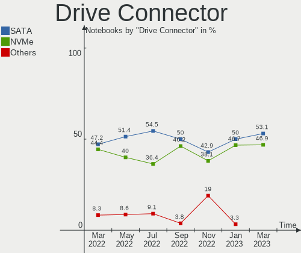
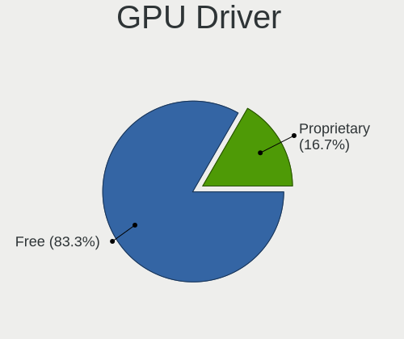
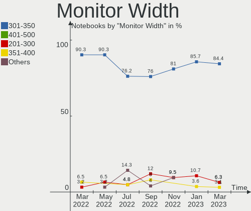

Endless Hardware Trends (Notebook)
----------------------------------

A project to identify most popular hardware characteristics and track their change
over time based on data collected by Endless users at https://Linux-Hardware.org.

Anyone can contribute to the study by uploading probes of their computers by
the [hw-probe](https://github.com/linuxhw/hw-probe) tool:

    sudo hw-probe -all -upload

Full-feature report is available here: https://linux-hardware.org/?view=trends&formfactor=notebook

Period: Jan, 2020.

Contents
--------

- [ OS                       ](#os)
- [ OS Family                ](#os-family)
- [ Kernel                   ](#kernel)
- [ Kernel Family            ](#kernel-family)
- [ Kernel Major Ver.        ](#kernel-major-ver)
- [ Arch                     ](#arch)
- [ DE                       ](#de)
- [ Display Server           ](#display-server)
- [ OS Lang                  ](#os-lang)
- [ Boot Mode                ](#boot-mode)
- [ Filesystem               ](#filesystem)
- [ Dual Boot with Linux     ](#dual-boot-with-linux)
- [ Dual Boot (Win)          ](#dual-boot-win)
- [ Country                  ](#country)
- [ City                     ](#city)
- [ Vendor                   ](#vendor)
- [ Model                    ](#model)
- [ Model Family             ](#model-family)
- [ MFG Year                 ](#mfg-year)
- [ Form Factor              ](#form-factor)
- [ Secure Boot              ](#secure-boot)
- [ Coreboot                 ](#coreboot)
- [ RAM Size                 ](#ram-size)
- [ RAM Used                 ](#ram-used)
- [ Drive Vendor             ](#drive-vendor)
- [ Drive Model              ](#drive-model)
- [ Drive Kind               ](#drive-kind)
- [ Drive Connector          ](#drive-connector)
- [ Drive Size               ](#drive-size)
- [ Space Total              ](#space-total)
- [ Space Used               ](#space-used)
- [ Malfunc. Drives          ](#malfunc-drives)
- [ Malfunc. Drive Vendor    ](#malfunc-drive-vendor)
- [ Malfunc. Drive Kind      ](#malfunc-drive-kind)
- [ Failed Drives            ](#failed-drives)
- [ Failed Drive Vendor      ](#failed-drive-vendor)
- [ Drive Status             ](#drive-status)
- [ Storage Vendor           ](#storage-vendor)
- [ Storage Model            ](#storage-model)
- [ Storage Kind             ](#storage-kind)
- [ CPU Vendor               ](#cpu-vendor)
- [ CPU Model                ](#cpu-model)
- [ CPU Model Family         ](#cpu-model-family)
- [ CPU Cores                ](#cpu-cores)
- [ CPU Sockets              ](#cpu-sockets)
- [ CPU Threads              ](#cpu-threads)
- [ CPU Op-Modes             ](#cpu-op-modes)
- [ CPU Microarch            ](#cpu-microarch)
- [ CPU Microcode            ](#cpu-microcode)
- [ GPU Vendor               ](#gpu-vendor)
- [ GPU Model                ](#gpu-model)
- [ GPU Combo                ](#gpu-combo)
- [ GPU Driver               ](#gpu-driver)
- [ GPU Memory               ](#gpu-memory)
- [ Monitor Vendor           ](#monitor-vendor)
- [ Monitor Model            ](#monitor-model)
- [ Monitor Resolution       ](#monitor-resolution)
- [ Monitor Diagonal         ](#monitor-diagonal)
- [ Monitor Width            ](#monitor-width)
- [ Aspect Ratio             ](#aspect-ratio)
- [ Monitor Area             ](#monitor-area)
- [ Pixel Density            ](#pixel-density)
- [ Multiple Monitors        ](#multiple-monitors)
- [ Net Controller Vendor    ](#net-controller-vendor)
- [ Net Controller Model     ](#net-controller-model)
- [ Net Controller Kind      ](#net-controller-kind)
- [ Used Controller          ](#used-controller)
- [ NICs                     ](#nics)
- [ Unsupported Devices      ](#unsupported-devices)
- [ Unsupported Device Types ](#unsupported-device-types)

OS
--

Installed operating systems

| Name                   | Computers | Percent |
|------------------------|-----------|---------|
| Endless 3.7.6          | 26        | 44.07%  |
| Endless 3.7.5          | 9         | 15.25%  |
| Endless 3.3.19-nexthw1 | 6         | 10.17%  |
| Endless 3.3.20-nexthw1 | 4         | 6.78%   |
| Endless 3.7.3          | 2         | 3.39%   |
| Endless 3.6.1-nexthw1  | 2         | 3.39%   |
| Endless 3.5.8          | 2         | 3.39%   |
| Endless 3.3.16-nexthw1 | 2         | 3.39%   |
| Endless 3.6.3          | 1         | 1.69%   |
| Endless 3.5.7-nexthw1  | 1         | 1.69%   |
| Endless 3.5.7          | 1         | 1.69%   |
| Endless 3.4.4-nexthw1  | 1         | 1.69%   |
| Endless 3.4.3-nexthw1  | 1         | 1.69%   |
| Endless 3.3.20         | 1         | 1.69%   |

OS Family
---------

OS without a version

| Name    | Computers | Percent |
|---------|-----------|---------|
| Endless | 59        | 100%    |

Kernel
------

Version of the Linux kernel

| Version           | Computers | Percent |
|-------------------|-----------|---------|
| 5.3.0-23-generic  | 35        | 59.32%  |
| 4.15.0-15-generic | 10        | 16.95%  |
| 4.18.0-15-generic | 3         | 5.08%   |
| 5.3.0-12-generic  | 2         | 3.39%   |
| 5.1.0-2-generic   | 2         | 3.39%   |
| 4.15.0-12-generic | 2         | 3.39%   |
| 5.0.0-7-generic   | 1         | 1.69%   |
| 5.0.0-25-generic  | 1         | 1.69%   |
| 4.17.0-4-generic  | 1         | 1.69%   |
| 4.16.0-4-generic  | 1         | 1.69%   |
| 4.13.0-32-generic | 1         | 1.69%   |

Kernel Family
-------------

Linux kernel without a distro release

| Version | Computers | Percent |
|---------|-----------|---------|
| 5.3.0   | 37        | 62.71%  |
| 4.15.0  | 12        | 20.34%  |
| 4.18.0  | 3         | 5.08%   |
| 5.1.0   | 2         | 3.39%   |
| 5.0.0   | 2         | 3.39%   |
| 4.17.0  | 1         | 1.69%   |
| 4.16.0  | 1         | 1.69%   |
| 4.13.0  | 1         | 1.69%   |

Kernel Major Ver.
-----------------

Linux kernel major version

| Version | Computers | Percent |
|---------|-----------|---------|
| 5.3     | 37        | 62.71%  |
| 4.15    | 12        | 20.34%  |
| 4.18    | 3         | 5.08%   |
| 5.1     | 2         | 3.39%   |
| 5.0     | 2         | 3.39%   |
| 4.17    | 1         | 1.69%   |
| 4.16    | 1         | 1.69%   |
| 4.13    | 1         | 1.69%   |

Arch
----

OS architecture (x86_64, i586, etc.)

| Name   | Computers | Percent |
|--------|-----------|---------|
| x86_64 | 59        | 100%    |

DE
--

Desktop Environment

| Name    | Computers | Percent |
|---------|-----------|---------|
| GNOME   | 57        | 96.61%  |
| Unknown | 2         | 3.39%   |

Display Server
--------------

X11 or Wayland

| Name    | Computers | Percent |
|---------|-----------|---------|
| X11     | 57        | 96.61%  |
| Unknown | 2         | 3.39%   |

OS Lang
-------

Language

| Lang        | Computers | Percent |
|-------------|-----------|---------|
| ru_RU       | 9         | 15.25%  |
| pt_BR.utf8  | 8         | 13.56%  |
| en_US.utf8  | 7         | 11.86%  |
| pt_BR       | 6         | 10.17%  |
| ru_UA       | 4         | 6.78%   |
| ro_RO       | 4         | 6.78%   |
| es_ES       | 3         | 5.08%   |
| de_DE       | 3         | 5.08%   |
| uk_UA       | 2         | 3.39%   |
| it_IT       | 2         | 3.39%   |
| en_US       | 2         | 3.39%   |
| Unknown     | 2         | 3.39%   |
| zh_TW       | 1         | 1.69%   |
| sr_RS@latin | 1         | 1.69%   |
| lt_LT       | 1         | 1.69%   |
| hu_HU       | 1         | 1.69%   |
| es_CO       | 1         | 1.69%   |
| en_IN       | 1         | 1.69%   |
| bg_BG       | 1         | 1.69%   |

Boot Mode
---------

EFI or BIOS

| Mode | Computers | Percent |
|------|-----------|---------|
| EFI  | 41        | 69.49%  |
| BIOS | 18        | 30.51%  |

Filesystem
----------

Type of filesystem

| Type | Computers | Percent |
|------|-----------|---------|
| Ext4 | 59        | 100%    |

Dual Boot with Linux
--------------------

Hosting more than one Linux

| Dual boot | Computers | Percent |
|-----------|-----------|---------|
| No        | 59        | 100%    |

Dual Boot (Win)
---------------

Hosting Linux and Windows

| Dual boot | Computers | Percent |
|-----------|-----------|---------|
| No        | 59        | 100%    |

Country
-------

Geographic location (country)

| Country         | Computers | Percent |
|-----------------|-----------|---------|
| Brazil          | 14        | 23.73%  |
| Ukraine         | 8         | 13.56%  |
| Romania         | 8         | 13.56%  |
| Russia          | 7         | 11.86%  |
| Spain           | 3         | 5.08%   |
| Serbia          | 3         | 5.08%   |
| Germany         | 3         | 5.08%   |
| Italy           | 2         | 3.39%   |
| India           | 2         | 3.39%   |
| Belarus         | 2         | 3.39%   |
| USA             | 1         | 1.69%   |
| Taiwan          | 1         | 1.69%   |
| North Macedonia | 1         | 1.69%   |
| Lithuania       | 1         | 1.69%   |
| Hungary         | 1         | 1.69%   |
| Colombia        | 1         | 1.69%   |
| Bulgaria        | 1         | 1.69%   |

City
----

Geographic location (city)

| City                | Computers | Percent |
|---------------------|-----------|---------|
| Kyiv                | 5         | 8.47%   |
| Bucharest           | 4         | 6.78%   |
| Moscow              | 3         | 5.08%   |
| Belgrade            | 3         | 5.08%   |
| Curitiba            | 2         | 3.39%   |
| Vladivostok         | 1         | 1.69%   |
| Vijayawada          | 1         | 1.69%   |
| Vidra               | 1         | 1.69%   |
| Vespasiano          | 1         | 1.69%   |
| Torrelavega         | 1         | 1.69%   |
| Torre del Greco     | 1         | 1.69%   |
| Taipei              | 1         | 1.69%   |
| São Caetano do Sul | 1         | 1.69%   |
| Skopje              | 1         | 1.69%   |
| Salto               | 1         | 1.69%   |
| Ribeirão das Neves | 1         | 1.69%   |
| Plungė             | 1         | 1.69%   |
| Offenbach           | 1         | 1.69%   |
| Norden              | 1         | 1.69%   |
| Murmansk            | 1         | 1.69%   |
| Mozaceni            | 1         | 1.69%   |
| Minsk               | 1         | 1.69%   |
| Milan               | 1         | 1.69%   |
| Maceió             | 1         | 1.69%   |
| Lviv                | 1         | 1.69%   |
| Lida                | 1         | 1.69%   |
| Kstovo              | 1         | 1.69%   |
| Korostyshiv         | 1         | 1.69%   |
| João Pessoa        | 1         | 1.69%   |
| Gaesti              | 1         | 1.69%   |
| Fryazino            | 1         | 1.69%   |
| Fazenda Rio Grande  | 1         | 1.69%   |
| Elhovo              | 1         | 1.69%   |
| Criciúma           | 1         | 1.69%   |
| Concord             | 1         | 1.69%   |
| Cologne             | 1         | 1.69%   |
| Budapest            | 1         | 1.69%   |
| Brasília           | 1         | 1.69%   |
| Bogotá             | 1         | 1.69%   |
| Bilbao              | 1         | 1.69%   |
| Berdyans'k          | 1         | 1.69%   |
| Belém              | 1         | 1.69%   |
| Belo Horizonte      | 1         | 1.69%   |
| Barcelona           | 1         | 1.69%   |
| Atid                | 1         | 1.69%   |
| Aracaju             | 1         | 1.69%   |
| Allahabad           | 1         | 1.69%   |

Vendor
------

Motherboard manufacturer

| Name             | Computers | Percent |
|------------------|-----------|---------|
| ASUSTek Computer | 26        | 44.07%  |
| Acer             | 16        | 27.12%  |
| Lenovo           | 4         | 6.78%   |
| Toshiba          | 3         | 5.08%   |
| Hewlett-Packard  | 3         | 5.08%   |
| Dell             | 2         | 3.39%   |
| Semp Toshiba     | 1         | 1.69%   |
| Positivo         | 1         | 1.69%   |
| nJoy Romania     | 1         | 1.69%   |
| Google           | 1         | 1.69%   |
| Unknown          | 1         | 1.69%   |

Model
-----

Motherboard model

| Name                                       | Computers | Percent |
|--------------------------------------------|-----------|---------|
| ASUS VivoBook 15_ASUS Laptop X540UBR       | 3         | 5.08%   |
| ASUS VivoBook 15_ASUS Laptop X540UAR       | 3         | 5.08%   |
| Acer Nitro AN515-52                        | 3         | 5.08%   |
| ASUS VivoBook 15_ASUS Laptop X540MA_X543MA | 2         | 3.39%   |
| ASUS VivoBook 15_ASUS Laptop X540MA_X540MA | 2         | 3.39%   |
| ASUS GL553VD                               | 2         | 3.39%   |
| Acer Aspire A315-31                        | 2         | 3.39%   |
| Toshiba Satellite P855                     | 1         | 1.69%   |
| Toshiba Satellite P75-A                    | 1         | 1.69%   |
| Toshiba Satellite C870-1GU                 | 1         | 1.69%   |
| Semp Toshiba IS 1414                       | 1         | 1.69%   |
| Positivo S14CT01                           | 1         | 1.69%   |
| nJoy Romania Aerial                        | 1         | 1.69%   |
| Lenovo Legion Y540-15IRH 81SX              | 1         | 1.69%   |
| Lenovo IdeaPad 520-15IKB 80YL              | 1         | 1.69%   |
| Lenovo IdeaPad 330-15ARR 81D2              | 1         | 1.69%   |
| Lenovo ACLU12                              | 1         | 1.69%   |
| HP ProBook 455 G1                          | 1         | 1.69%   |
| HP Notebook                                | 1         | 1.69%   |
| HP ENVY m4                                 | 1         | 1.69%   |
| Google Parrot                              | 1         | 1.69%   |
| Dell Latitude E6440                        | 1         | 1.69%   |
| Dell Latitude E6420                        | 1         | 1.69%   |
| ASUS X705UQR                               | 1         | 1.69%   |
| ASUS X705UAR                               | 1         | 1.69%   |
| ASUS X541NA                                | 1         | 1.69%   |
| ASUS X540NV                                | 1         | 1.69%   |
| ASUS X540NA                                | 1         | 1.69%   |
| ASUS X510UN                                | 1         | 1.69%   |
| ASUS X451CAP                               | 1         | 1.69%   |
| ASUS VivoBook_ASUSLaptop X570ZD_X570ZD     | 1         | 1.69%   |
| ASUS VivoBook_ASUSLaptop X509FB_X509FB     | 1         | 1.69%   |
| ASUS VivoBook_ASUSLaptop X509FA_X509FA     | 1         | 1.69%   |
| ASUS VivoBook_ASUSLaptop X430FA_S430FA     | 1         | 1.69%   |
| ASUS VivoBook 15_ASUS Laptop X540MA_R540MA | 1         | 1.69%   |
| ASUS VivoBook 15_ASUS Laptop X507UAR       | 1         | 1.69%   |
| ASUS VivoBook 15_ASUS Laptop X507MA_X507MA | 1         | 1.69%   |
| Acer TravelMate P259-MG                    | 1         | 1.69%   |
| Acer Predator PH317-53                     | 1         | 1.69%   |
| Acer Nitro AN515-51                        | 1         | 1.69%   |
| Acer Nitro AN515-31                        | 1         | 1.69%   |
| Acer Extensa 2540                          | 1         | 1.69%   |
| Acer Aspire A715-72G                       | 1         | 1.69%   |
| Acer Aspire A517-51                        | 1         | 1.69%   |
| Acer Aspire A515-52                        | 1         | 1.69%   |
| Acer Aspire A515-51                        | 1         | 1.69%   |
| Acer Aspire 5742                           | 1         | 1.69%   |
| Acer Aspire 4752                           | 1         | 1.69%   |
| Unknown                                    | 1         | 1.69%   |

Model Family
------------

Motherboard model prefix

| Name                | Computers | Percent |
|---------------------|-----------|---------|
| ASUS VivoBook       | 17        | 28.81%  |
| Acer Aspire         | 8         | 13.56%  |
| Acer Nitro          | 5         | 8.47%   |
| Toshiba Satellite   | 3         | 5.08%   |
| Lenovo IdeaPad      | 2         | 3.39%   |
| Dell Latitude       | 2         | 3.39%   |
| ASUS GL553VD        | 2         | 3.39%   |
| Semp Toshiba IS     | 1         | 1.69%   |
| Positivo S14CT01    | 1         | 1.69%   |
| nJoy Romania Aerial | 1         | 1.69%   |
| Lenovo Legion       | 1         | 1.69%   |
| Lenovo ACLU12       | 1         | 1.69%   |
| HP ProBook          | 1         | 1.69%   |
| HP Notebook         | 1         | 1.69%   |
| HP ENVY             | 1         | 1.69%   |
| Google Parrot       | 1         | 1.69%   |
| ASUS X705UQR        | 1         | 1.69%   |
| ASUS X705UAR        | 1         | 1.69%   |
| ASUS X541NA         | 1         | 1.69%   |
| ASUS X540NV         | 1         | 1.69%   |
| ASUS X540NA         | 1         | 1.69%   |
| ASUS X510UN         | 1         | 1.69%   |
| ASUS X451CAP        | 1         | 1.69%   |
| Acer TravelMate     | 1         | 1.69%   |
| Acer Predator       | 1         | 1.69%   |
| Acer Extensa        | 1         | 1.69%   |
| Unknown             | 1         | 1.69%   |

MFG Year
--------

Motherboard manufacture year

| Year | Computers | Percent |
|------|-----------|---------|
| 2019 | 26        | 44.07%  |
| 2018 | 13        | 22.03%  |
| 2017 | 7         | 11.86%  |
| 2015 | 4         | 6.78%   |
| 2014 | 3         | 5.08%   |
| 2012 | 2         | 3.39%   |
| 2011 | 2         | 3.39%   |
| 2010 | 2         | 3.39%   |

Form Factor
-----------

Physical design of the computer

| Name     | Computers | Percent |
|----------|-----------|---------|
| Notebook | 59        | 100%    |

Secure Boot
-----------

Enabled or disabled

| State    | Computers | Percent |
|----------|-----------|---------|
| Disabled | 45        | 76.27%  |
| Enabled  | 14        | 23.73%  |

Coreboot
--------

Have coreboot on board

| Used | Computers | Percent |
|------|-----------|---------|
| No   | 58        | 98.31%  |
| Yes  | 1         | 1.69%   |

RAM Size
--------

Total RAM memory

| Size in GB | Computers | Percent |
|------------|-----------|---------|
| 4.01-8.0   | 27        | 45.76%  |
| 3.01-4.0   | 25        | 42.37%  |
| 1.01-2.0   | 3         | 5.08%   |
| 8.01-16.0  | 3         | 5.08%   |
| 16.01-24.0 | 1         | 1.69%   |

RAM Used
--------

Used RAM memory

| Used GB  | Computers | Percent |
|----------|-----------|---------|
| 1.01-2.0 | 32        | 54.24%  |
| 2.01-3.0 | 15        | 25.42%  |
| 0.01-1.0 | 6         | 10.17%  |
| 3.01-4.0 | 5         | 8.47%   |
| 4.01-8.0 | 1         | 1.69%   |

Drive Vendor
------------

Hard drive vendors

| Vendor              | Computers | Drives | Percent |
|---------------------|-----------|--------|---------|
| WDC                 | 13        | 13     | 18.31%  |
| Seagate             | 11        | 11     | 15.49%  |
| Toshiba             | 9         | 9      | 12.68%  |
| Kingston            | 9         | 9      | 12.68%  |
| SanDisk             | 6         | 6      | 8.45%   |
| HGST                | 5         | 5      | 7.04%   |
| A-DATA Technology   | 4         | 4      | 5.63%   |
| Unknown             | 3         | 4      | 4.23%   |
| Samsung Electronics | 3         | 3      | 4.23%   |
| SK Hynix            | 2         | 2      | 2.82%   |
| Micron Technology   | 2         | 2      | 2.82%   |
| Intel               | 1         | 1      | 1.41%   |
| Hitachi             | 1         | 1      | 1.41%   |
| Hewlett-Packard     | 1         | 1      | 1.41%   |
| FORESEE             | 1         | 1      | 1.41%   |

Drive Model
-----------

Hard drive models

| Model                        | Computers | Percent |
|------------------------------|-----------|---------|
| WD10SPZX-21Z10T0 1TB         | 7         | 9.86%   |
| ST1000LM035-1RK172 1TB       | 7         | 9.86%   |
| RBUSC180DS37256GJ 256GB SSD  | 5         | 7.04%   |
| MQ04ABF100 1TB               | 5         | 7.04%   |
| IM2S3338-128GD2 128GB SSD    | 4         | 5.63%   |
| WD5000LPCX-80VHAT1 500GB     | 2         | 2.82%   |
| SD8SN8U128G1002 128GB SSD    | 2         | 2.82%   |
| MQ01ABF050 500GB             | 2         | 2.82%   |
| MMC Card  32GB               | 2         | 2.82%   |
| WDS120G2G0B-00EPW0 120GB SSD | 1         | 1.41%   |
| WD5000BEVT-22A0RT0 500GB     | 1         | 1.41%   |
| WD3200BEKX-75B7WT0 320GB     | 1         | 1.41%   |
| WD10JPVX-75JC3T0 1TB         | 1         | 1.41%   |
| SUV500240G 240GB SSD         | 1         | 1.41%   |
| SUV400S37120G 120GB SSD      | 1         | 1.41%   |
| ST500LM030-1RK17D 500GB      | 1         | 1.41%   |
| ST500LM012 HN-M500MBB 500GB  | 1         | 1.41%   |
| ST320LT012-9WS14C 320GB      | 1         | 1.41%   |
| ST2000LM007-1R8174 2TB       | 1         | 1.41%   |
| SSDSCKKW256G8 256GB          | 1         | 1.41%   |
| SSD S700 120GB               | 1         | 1.41%   |
| SSD PLUS 240GB               | 1         | 1.41%   |
| SD9SN8W256G1102 256GB SSD    | 1         | 1.41%   |
| SD9SB8W256G1014 256GB SSD    | 1         | 1.41%   |
| SD8SNAT128G1002 128GB SSD    | 1         | 1.41%   |
| SA400S37240G 240GB SSD       | 1         | 1.41%   |
| RBUSNS8180DS3256GJ 256GB SSD | 1         | 1.41%   |
| MZYTN512HDJH-000L2 512GB SSD | 1         | 1.41%   |
| MZNTY128HDHP-00007 128GB SSD | 1         | 1.41%   |
| MQ01ABD100 1TB               | 1         | 1.41%   |
| MQ01ABD075 752GB             | 1         | 1.41%   |
| MMC Card  2GB                | 1         | 1.41%   |
| HTS721010A9E630 1TB          | 1         | 1.41%   |
| HTS547550A9E384 500GB        | 1         | 1.41%   |
| HTS545050B7E660 500GB        | 1         | 1.41%   |
| HTS545050A7E680 500GB        | 1         | 1.41%   |
| HTS541075A9E680 752GB        | 1         | 1.41%   |
| HTS541010A9E680 1TB          | 1         | 1.41%   |
| HM251HX 250GB                | 1         | 1.41%   |
| HFS128G39TND-N210A 128GB SSD | 1         | 1.41%   |
| HFS128G32TNF-N3A0A 128GB SSD | 1         | 1.41%   |
| 1300_MTFDDAK512TDL 512GB SSD | 1         | 1.41%   |
| 128GB SSD                    | 1         | 1.41%   |
| 1100_MTFDDAV256TBN 256GB SSD | 1         | 1.41%   |

Drive Kind
----------

HDD or SSD

| Kind | Computers | Drives | Percent |
|------|-----------|--------|---------|
| HDD  | 39        | 39     | 54.93%  |
| SSD  | 29        | 29     | 40.85%  |
| MMC  | 3         | 4      | 4.23%   |

Drive Connector
---------------

SATA, SAS, NVMe, etc.

| Type | Computers | Drives | Percent |
|------|-----------|--------|---------|
| SATA | 56        | 68     | 94.92%  |
| MMC  | 3         | 4      | 5.08%   |

Drive Size
----------

Size of hard drive

| Size in TB | Computers | Drives | Percent |
|------------|-----------|--------|---------|
| 0.01-0.5   | 40        | 44     | 58.82%  |
| 0.51-1.0   | 27        | 27     | 39.71%  |
| 1.01-2.0   | 1         | 1      | 1.47%   |

Space Total
-----------

Amount of disk space available on the file system

| Size in GB | Computers | Percent |
|------------|-----------|---------|
| 101-250    | 24        | 40.68%  |
| 501-1000   | 13        | 22.03%  |
| 251-500    | 10        | 16.95%  |
| 51-100     | 4         | 6.78%   |
| 21-50      | 3         | 5.08%   |
| 1-20       | 3         | 5.08%   |
| 1001-2000  | 2         | 3.39%   |

Space Used
----------

Amount of used disk space

| Used GB  | Computers | Percent |
|----------|-----------|---------|
| 21-50    | 30        | 50.85%  |
| 1-20     | 16        | 27.12%  |
| 51-100   | 9         | 15.25%  |
| 101-250  | 2         | 3.39%   |
| 501-1000 | 2         | 3.39%   |

Malfunc. Drives
---------------

Drive models with a malfunction

Zero info for selected period =(

Malfunc. Drive Vendor
---------------------

Vendors of faulty drives

Zero info for selected period =(

Malfunc. Drive Kind
-------------------

Kinds of faulty drives

Zero info for selected period =(

Failed Drives
-------------

Failed drive models

Zero info for selected period =(

Failed Drive Vendor
-------------------

Failed drive vendors

Zero info for selected period =(

Drive Status
------------

Number of failed and malfunc. drives

| Status   | Computers | Drives | Percent |
|----------|-----------|--------|---------|
| Detected | 57        | 72     | 100%    |

Storage Vendor
--------------

Storage controller vendors

| Vendor              | Computers | Percent |
|---------------------|-----------|---------|
| Intel               | 54        | 90%     |
| AMD                 | 4         | 6.67%   |
| Sandisk             | 1         | 1.67%   |
| Samsung Electronics | 1         | 1.67%   |

Storage Model
-------------

Storage controller models

| Model                                                                    | Computers | Percent |
|--------------------------------------------------------------------------|-----------|---------|
| Sunrise Point-LP SATA Controller [AHCI mode]                             | 15        | 25%     |
| 82801 Mobile SATA Controller [RAID mode]                                 | 11        | 18.33%  |
| SATA controller                                                          | 6         | 10%     |
| Celeron N3350/Pentium N4200/Atom E3900 Series SATA AHCI Controller       | 6         | 10%     |
| FCH SATA Controller [AHCI mode]                                          | 4         | 6.67%   |
| 7 Series Chipset Family 6-port SATA Controller [AHCI mode]               | 4         | 6.67%   |
| HM170/QM170 Chipset SATA Controller [AHCI Mode]                          | 3         | 5%      |
| Cannon Lake Mobile PCH SATA AHCI Controller                              | 3         | 5%      |
| WD Black 2018/PC SN520 NVMe SSD                                          | 1         | 1.67%   |
| NVMe SSD Controller SM981/PM981/PM983                                    | 1         | 1.67%   |
| NM10/ICH7 Family SATA Controller [IDE mode]                              | 1         | 1.67%   |
| 82801IBM/IEM (ICH9M/ICH9M-E) 2 port SATA Controller [IDE mode]           | 1         | 1.67%   |
| 8 Series/C220 Series Chipset Family 6-port SATA Controller 1 [AHCI mode] | 1         | 1.67%   |
| 8 Series SATA Controller 1 [AHCI mode]                                   | 1         | 1.67%   |
| 6 Series/C200 Series Chipset Family 6 port Mobile SATA AHCI Controller   | 1         | 1.67%   |
| 5 Series/3400 Series Chipset 4 port SATA AHCI Controller                 | 1         | 1.67%   |

Storage Kind
------------

Kind of storage controller (IDE, SATA, NVMe, SAS, ...)

| Kind | Computers | Percent |
|------|-----------|---------|
| SATA | 45        | 75%     |
| RAID | 11        | 18.33%  |
| NVMe | 2         | 3.33%   |
| IDE  | 2         | 3.33%   |

CPU Vendor
----------

Processor vendors

| Vendor | Computers | Percent |
|--------|-----------|---------|
| Intel  | 55        | 93.22%  |
| AMD    | 4         | 6.78%   |

CPU Model
---------

Processor models

| Model                                         | Computers | Percent |
|-----------------------------------------------|-----------|---------|
| Intel Pentium CPU 4417U @ 2.30GHz             | 6         | 10.17%  |
| Intel Celeron N4000 CPU @ 1.10GHz             | 6         | 10.17%  |
| Intel Core i5-8300H CPU @ 2.30GHz             | 4         | 6.78%   |
| Intel Core i5-8250U CPU @ 1.60GHz             | 4         | 6.78%   |
| Intel Celeron CPU N3350 @ 1.10GHz             | 4         | 6.78%   |
| Intel Pentium CPU N4200 @ 1.10GHz             | 2         | 3.39%   |
| Intel Pentium CPU B960 @ 2.20GHz              | 2         | 3.39%   |
| Intel Core i7-7700HQ CPU @ 2.80GHz            | 2         | 3.39%   |
| Intel Core i5-7200U CPU @ 2.50GHz             | 2         | 3.39%   |
| Intel Core i3-8145U CPU @ 2.10GHz             | 2         | 3.39%   |
| Intel Core i3-6006U CPU @ 2.00GHz             | 2         | 3.39%   |
| Intel Pentium 3558U @ 1.70GHz                 | 1         | 1.69%   |
| Intel Core i7-8750H CPU @ 2.20GHz             | 1         | 1.69%   |
| Intel Core i7-8565U CPU @ 1.80GHz             | 1         | 1.69%   |
| Intel Core i7-4700MQ CPU @ 2.40GHz            | 1         | 1.69%   |
| Intel Core i7-4610M CPU @ 3.00GHz             | 1         | 1.69%   |
| Intel Core i7-3632QM CPU @ 2.20GHz            | 1         | 1.69%   |
| Intel Core i7-3610QM CPU @ 2.30GHz            | 1         | 1.69%   |
| Intel Core i5-9300H CPU @ 2.40GHz             | 1         | 1.69%   |
| Intel Core i5-8265U CPU @ 1.60GHz             | 1         | 1.69%   |
| Intel Core i5-7300HQ CPU @ 2.50GHz            | 1         | 1.69%   |
| Intel Core i5-2520M CPU @ 2.50GHz             | 1         | 1.69%   |
| Intel Core i3-7100U CPU @ 2.40GHz             | 1         | 1.69%   |
| Intel Core i3-7020U CPU @ 2.30GHz             | 1         | 1.69%   |
| Intel Core i3-2375M CPU @ 1.50GHz             | 1         | 1.69%   |
| Intel Core i3 CPU M 370 @ 2.40GHz             | 1         | 1.69%   |
| Intel Core 2 Duo CPU T5800 @ 2.00GHz          | 1         | 1.69%   |
| Intel Celeron CPU 847 @ 1.10GHz               | 1         | 1.69%   |
| Intel Atom x5-Z8300 CPU @ 1.44GHz             | 1         | 1.69%   |
| Intel Atom CPU N450 @ 1.66GHz                 | 1         | 1.69%   |
| AMD Ryzen 5 2500U with Radeon Vega Mobile Gfx | 1         | 1.69%   |
| AMD Ryzen 3 2200U with Radeon Vega Mobile Gfx | 1         | 1.69%   |
| AMD A8-7410 APU with AMD Radeon R5 Graphics   | 1         | 1.69%   |
| AMD A4-4300M APU with Radeon HD Graphics      | 1         | 1.69%   |

CPU Model Family
----------------

Processor model prefix

| Model            | Computers | Percent |
|------------------|-----------|---------|
| Intel Core i5    | 14        | 23.73%  |
| Intel Pentium    | 11        | 18.64%  |
| Intel Celeron    | 11        | 18.64%  |
| Intel Core i7    | 8         | 13.56%  |
| Intel Core i3    | 8         | 13.56%  |
| Intel Atom       | 2         | 3.39%   |
| Intel Core 2 Duo | 1         | 1.69%   |
| AMD Ryzen 5      | 1         | 1.69%   |
| AMD Ryzen 3      | 1         | 1.69%   |
| AMD A8           | 1         | 1.69%   |
| AMD A4           | 1         | 1.69%   |

CPU Cores
---------

Number of processor cores

| Number | Computers | Percent |
|--------|-----------|---------|
| 2      | 34        | 57.63%  |
| 4      | 22        | 37.29%  |
| 1      | 2         | 3.39%   |
| 6      | 1         | 1.69%   |

CPU Sockets
-----------

Number of sockets

| Number | Computers | Percent |
|--------|-----------|---------|
| 1      | 59        | 100%    |

CPU Threads
-----------

Threads per core (Hyper-Threading)

| Number | Computers | Percent |
|--------|-----------|---------|
| 2      | 39        | 66.1%   |
| 1      | 20        | 33.9%   |

CPU Op-Modes
------------

CPU Operation Modes (32-bit, 64-bit)

| Op mode        | Computers | Percent |
|----------------|-----------|---------|
| 32-bit, 64-bit | 57        | 96.61%  |
| Unknown        | 2         | 3.39%   |

CPU Microarch
-------------

Microarchitecture

| Name          | Computers | Percent |
|---------------|-----------|---------|
| Skylake       | 25        | 42.37%  |
| Goldmont plus | 6         | 10.17%  |
| Goldmont      | 6         | 10.17%  |
| SandyBridge   | 5         | 8.47%   |
| KabyLake      | 4         | 6.78%   |
| Haswell       | 3         | 5.08%   |
| Zen           | 2         | 3.39%   |
| IvyBridge     | 2         | 3.39%   |
| Westmere      | 1         | 1.69%   |
| Silvermont    | 1         | 1.69%   |
| Puma          | 1         | 1.69%   |
| Piledriver    | 1         | 1.69%   |
| Core          | 1         | 1.69%   |
| Bonnell       | 1         | 1.69%   |

CPU Microcode
-------------

Microcode number

| Number     | Computers | Percent |
|------------|-----------|---------|
| 0x806ea    | 9         | 15.25%  |
| Unknown    | 8         | 13.56%  |
| 0x906ea    | 5         | 8.47%   |
| 0x506c9    | 5         | 8.47%   |
| 0x206a7    | 5         | 8.47%   |
| 0x706a1    | 4         | 6.78%   |
| 0x906e9    | 3         | 5.08%   |
| 0x806e9    | 3         | 5.08%   |
| 0x806ec    | 2         | 3.39%   |
| 0x406e3    | 2         | 3.39%   |
| 0x306c3    | 2         | 3.39%   |
| 0x306a9    | 2         | 3.39%   |
| 0x806eb    | 1         | 1.69%   |
| 0x6fd      | 1         | 1.69%   |
| 0x406c3    | 1         | 1.69%   |
| 0x40651    | 1         | 1.69%   |
| 0x20655    | 1         | 1.69%   |
| 0x106ca    | 1         | 1.69%   |
| 0x0810100b | 1         | 1.69%   |
| 0x07030105 | 1         | 1.69%   |
| 0x0600111f | 1         | 1.69%   |

GPU Vendor
----------

Vendors of graphics cards

| Vendor | Computers | Percent |
|--------|-----------|---------|
| Intel  | 54        | 67.5%   |
| Nvidia | 21        | 26.25%  |
| AMD    | 5         | 6.25%   |

GPU Model
---------

Graphics card models

| Model                                                                              | Computers | Percent |
|------------------------------------------------------------------------------------|-----------|---------|
| GP107M [GeForce GTX 1050 Mobile]                                                   | 7         | 8.64%   |
| UHD Graphics 605                                                                   | 6         | 7.41%   |
| Kaby Lake-U GT1 Integrated Graphics Controller                                     | 6         | 7.41%   |
| UHD Graphics 630 (Mobile)                                                          | 5         | 6.17%   |
| 2nd Generation Core Processor Family Integrated Graphics Controller                | 5         | 6.17%   |
| UHD Graphics 620 (Whiskey Lake)                                                    | 4         | 4.94%   |
| UHD Graphics 620                                                                   | 4         | 4.94%   |
| HD Graphics 500                                                                    | 4         | 4.94%   |
| GM108M [GeForce MX110]                                                             | 4         | 4.94%   |
| HD Graphics 630                                                                    | 3         | 3.7%    |
| HD Graphics 620                                                                    | 3         | 3.7%    |
| GM108M [GeForce 940MX]                                                             | 3         | 3.7%    |
| TU116M [GeForce GTX 1660 Ti Mobile]                                                | 2         | 2.47%   |
| Skylake GT2 [HD Graphics 520]                                                      | 2         | 2.47%   |
| Raven Ridge [Radeon Vega Series / Radeon Vega Mobile Series]                       | 2         | 2.47%   |
| GP108M [GeForce MX150]                                                             | 2         | 2.47%   |
| Celeron N3350/Pentium N4200/Atom E3900 Series Integrated Graphics Controller       | 2         | 2.47%   |
| 4th Gen Core Processor Integrated Graphics Controller                              | 2         | 2.47%   |
| 3rd Gen Core processor Graphics Controller                                         | 2         | 2.47%   |
| Trinity 2 [Radeon HD 7420G]                                                        | 1         | 1.23%   |
| Sun XT [Radeon HD 8670A/8670M/8690M / R5 M330 / M430 / Radeon 520 Mobile]          | 1         | 1.23%   |
| Mullins [Radeon R4/R5 Graphics]                                                    | 1         | 1.23%   |
| Mobile 4 Series Chipset Integrated Graphics Controller                             | 1         | 1.23%   |
| Mars [Radeon HD 8670A/8670M/8750M]                                                 | 1         | 1.23%   |
| Kaby Lake-U GT2f Integrated Graphics Controller                                    | 1         | 1.23%   |
| Haswell-ULT Integrated Graphics Controller                                         | 1         | 1.23%   |
| GP107M [GeForce GTX 1050 Ti Mobile]                                                | 1         | 1.23%   |
| GM108M [GeForce 920MX]                                                             | 1         | 1.23%   |
| GF108M [GeForce GT 620M/630M/635M/640M LE]                                         | 1         | 1.23%   |
| Core Processor Integrated Graphics Controller                                      | 1         | 1.23%   |
| Atom/Celeron/Pentium Processor x5-E8000/J3xxx/N3xxx Integrated Graphics Controller | 1         | 1.23%   |
| Atom Processor D4xx/D5xx/N4xx/N5xx Integrated Graphics Controller                  | 1         | 1.23%   |

GPU Combo
---------

Combinations of graphics cards

| Name           | Computers | Percent |
|----------------|-----------|---------|
| 1 x Intel      | 34        | 57.63%  |
| Intel + Nvidia | 19        | 32.2%   |
| 1 x AMD        | 2         | 3.39%   |
| 2 x AMD        | 1         | 1.69%   |
| 1 x Nvidia     | 1         | 1.69%   |
| Intel + AMD    | 1         | 1.69%   |
| AMD + Nvidia   | 1         | 1.69%   |

GPU Driver
----------

Free vs proprietary

| Driver      | Computers | Percent |
|-------------|-----------|---------|
| Free        | 44        | 74.58%  |
| Proprietary | 15        | 25.42%  |

GPU Memory
----------

Total video memory

| Size in GB | Computers | Percent |
|------------|-----------|---------|
| Unknown    | 45        | 76.27%  |
| 3.01-4.0   | 9         | 15.25%  |
| 1.01-2.0   | 2         | 3.39%   |
| 0.51-1.0   | 2         | 3.39%   |
| 0.01-0.5   | 1         | 1.69%   |

Monitor Vendor
--------------

Monitor vendors

| Vendor                  | Computers | Percent |
|-------------------------|-----------|---------|
| AU Optronics            | 21        | 34.43%  |
| BOE                     | 16        | 26.23%  |
| LG Display              | 8         | 13.11%  |
| Chimei Innolux          | 8         | 13.11%  |
| Samsung Electronics     | 3         | 4.92%   |
| Sony                    | 1         | 1.64%   |
| PANDA                   | 1         | 1.64%   |
| InfoVision              | 1         | 1.64%   |
| Goldstar                | 1         | 1.64%   |
| Chi Mei Optoelectronics | 1         | 1.64%   |

Monitor Model
-------------

Monitor models

| Model                                             | Computers | Percent |
|---------------------------------------------------|-----------|---------|
| LCD Monitor AUO38ED 1920x1080 340x190mm 15.3-inch | 9         | 14.75%  |
| LCD Monitor AUO61ED 1920x1080 340x190mm 15.3-inch | 7         | 11.48%  |
| LCD Monitor CMN15DB 1366x768 344x193mm 15.5-inch  | 3         | 4.92%   |
| LCD Monitor BOE06A5 1366x768 344x194mm 15.5-inch  | 3         | 4.92%   |
| LCD Monitor BOE06A4 1366x768 344x194mm 15.5-inch  | 3         | 4.92%   |
| LCD Monitor LGD0590 1920x1080 344x194mm 15.5-inch | 2         | 3.28%   |
| LCD Monitor BOE069C 1920x1080 344x193mm 15.5-inch | 2         | 3.28%   |
| TV SNYF600 1360x768 1600x900mm 72.3-inch          | 1         | 1.64%   |
| M140NWR2 R1 IVO057A 1366x768 309x174mm 14.0-inch  | 1         | 1.64%   |
| LCD Monitor SEC5441 1366x768 344x194mm 15.5-inch  | 1         | 1.64%   |
| LCD Monitor SEC3150 1366x768 344x193mm 15.5-inch  | 1         | 1.64%   |
| LCD Monitor SDC4E51 1366x768 340x190mm 15.3-inch  | 1         | 1.64%   |
| LCD Monitor LGD056D 1920x1080 380x210mm 17.1-inch | 1         | 1.64%   |
| LCD Monitor LGD04E8 1920x1080 382x215mm 17.3-inch | 1         | 1.64%   |
| LCD Monitor LGD047C 1366x768 310x174mm 14.0-inch  | 1         | 1.64%   |
| LCD Monitor LGD044B 1366x768 340x190mm 15.3-inch  | 1         | 1.64%   |
| LCD Monitor LGD033F 1366x768 309x174mm 14.0-inch  | 1         | 1.64%   |
| LCD Monitor LGD023F 1366x768 293x165mm 13.2-inch  | 1         | 1.64%   |
| LCD Monitor CMO1711 1600x900 382x215mm 17.3-inch  | 1         | 1.64%   |
| LCD Monitor CMN1745 1600x900 380x210mm 17.1-inch  | 1         | 1.64%   |
| LCD Monitor CMN15F5 1920x1080 344x193mm 15.5-inch | 1         | 1.64%   |
| LCD Monitor CMN15BC 1366x768 350x190mm 15.7-inch  | 1         | 1.64%   |
| LCD Monitor CMN1470 1366x768 309x174mm 14.0-inch  | 1         | 1.64%   |
| LCD Monitor CMN1119 1366x768 260x140mm 11.6-inch  | 1         | 1.64%   |
| LCD Monitor BOE0818 1920x1080 344x194mm 15.5-inch | 1         | 1.64%   |
| LCD Monitor BOE07F7 1920x1080 309x174mm 14.0-inch | 1         | 1.64%   |
| LCD Monitor BOE07CE 1366x768 344x193mm 15.5-inch  | 1         | 1.64%   |
| LCD Monitor BOE0739 1920x1080 344x193mm 15.5-inch | 1         | 1.64%   |
| LCD Monitor BOE06FB 1920x1080 344x194mm 15.5-inch | 1         | 1.64%   |
| LCD Monitor BOE06BA 1920x1080 344x193mm 15.5-inch | 1         | 1.64%   |
| LCD Monitor BOE0672 1366x768 344x194mm 15.5-inch  | 1         | 1.64%   |
| LCD Monitor BOE05F3 1366x768 309x173mm 13.9-inch  | 1         | 1.64%   |
| LCD Monitor AUO71EC 1366x768 340x190mm 15.3-inch  | 1         | 1.64%   |
| LCD Monitor AUO26EC 1366x768 344x193mm 15.5-inch  | 1         | 1.64%   |
| LCD Monitor AUO21ED 1920x1080 344x194mm 15.5-inch | 1         | 1.64%   |
| LCD Monitor AUO209D 1920x1080 380x210mm 17.1-inch | 1         | 1.64%   |
| LCD Monitor AUO183C 1366x768 309x173mm 13.9-inch  | 1         | 1.64%   |
| LC133LF2L03 NCP0015 1920x1080 294x165mm 13.3-inch | 1         | 1.64%   |
| L226W GSM566A 1680x1050 474x296mm 22.0-inch       | 1         | 1.64%   |

Monitor Resolution
------------------

Monitor screen resolution

| Resolution         | Computers | Percent |
|--------------------|-----------|---------|
| 1920x1080 (FHD)    | 31        | 50.82%  |
| 1366x768 (WXGA)    | 26        | 42.62%  |
| 1600x900 (HD+)     | 2         | 3.28%   |
| 1680x1050 (WSXGA+) | 1         | 1.64%   |
| 1360x768           | 1         | 1.64%   |

Monitor Diagonal
----------------

Diagonal size in inches

| Inches | Computers | Percent |
|--------|-----------|---------|
| 15     | 43        | 70.49%  |
| 14     | 6         | 9.84%   |
| 17     | 5         | 8.2%    |
| 13     | 4         | 6.56%   |
| 72     | 1         | 1.64%   |
| 22     | 1         | 1.64%   |
| 11     | 1         | 1.64%   |

Monitor Width
-------------

Physical width

| Width in mm | Computers | Percent |
|-------------|-----------|---------|
| 301-350     | 51        | 83.61%  |
| 351-400     | 5         | 8.2%    |
| 201-300     | 3         | 4.92%   |
| 401-500     | 1         | 1.64%   |
| 1501-2000   | 1         | 1.64%   |

Aspect Ratio
------------

Proportional relationship between the width and the height

| Ratio | Computers | Percent |
|-------|-----------|---------|
| 16/9  | 59        | 98.33%  |
| 16/10 | 1         | 1.67%   |

Monitor Area
------------

Area in inch²

| Area in inch² | Computers | Percent |
|----------------|-----------|---------|
| 101-110        | 43        | 70.49%  |
| 81-90          | 8         | 13.11%  |
| 121-130        | 5         | 8.2%    |
| 71-80          | 2         | 3.28%   |
| More than 1000 | 1         | 1.64%   |
| 51-60          | 1         | 1.64%   |
| 201-250        | 1         | 1.64%   |

Pixel Density
-------------

Pixels per inch

| Density | Computers | Percent |
|---------|-----------|---------|
| 121-160 | 31        | 50.82%  |
| 101-120 | 27        | 44.26%  |
| 1-50    | 1         | 1.64%   |
| 161-240 | 1         | 1.64%   |
| 51-100  | 1         | 1.64%   |

Multiple Monitors
-----------------

Total monitors connected

| Total | Computers | Percent |
|-------|-----------|---------|
| 1     | 56        | 94.92%  |
| 2     | 3         | 5.08%   |

Net Controller Vendor
---------------------

Controller vendors

| Vendor                | Computers | Percent |
|-----------------------|-----------|---------|
| Intel                 | 2         | 66.67%  |
| Realtek Semiconductor | 1         | 33.33%  |

Net Controller Model
--------------------

Controller models

| Model                                           | Computers | Percent |
|-------------------------------------------------|-----------|---------|
| Centrino Ultimate-N 6300                        | 2         | 50%     |
| RTL8723BU 802.11n WLAN Adapter                  | 1         | 25%     |
| 82579LM Gigabit Network Connection (Lewisville) | 1         | 25%     |

Net Controller Kind
-------------------

Ethernet, WiFi or modem

| Kind     | Computers | Percent |
|----------|-----------|---------|
| WiFi     | 3         | 75%     |
| Ethernet | 1         | 25%     |

Used Controller
---------------

Currently used network controller

| Kind | Computers | Percent |
|------|-----------|---------|
| WiFi | 3         | 100%    |

NICs
----

Total network controllers on board

| Total | Computers | Percent |
|-------|-----------|---------|
| 2     | 38        | 64.41%  |
| 1     | 19        | 32.2%   |
| 0     | 2         | 3.39%   |

Unsupported Devices
-------------------

Total unsupported devices on board

| Total | Computers | Percent |
|-------|-----------|---------|
| 0     | 54        | 91.53%  |
| 1     | 4         | 6.78%   |
| 2     | 1         | 1.69%   |

Unsupported Device Types
------------------------

Types of unsupported devices

| Type               | Computers | Percent |
|--------------------|-----------|---------|
| Fingerprint reader | 2         | 33.33%  |
| Storage            | 1         | 16.67%  |
| Graphics card      | 1         | 16.67%  |
| Chipcard           | 1         | 16.67%  |
| Bluetooth          | 1         | 16.67%  |

