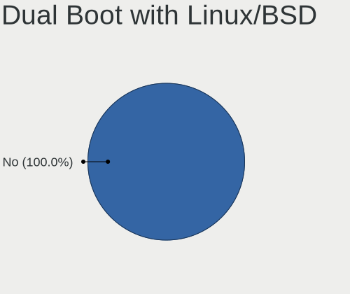
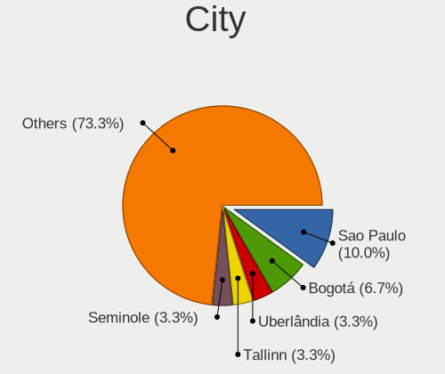
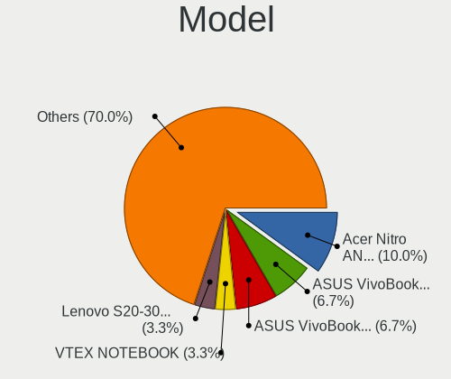
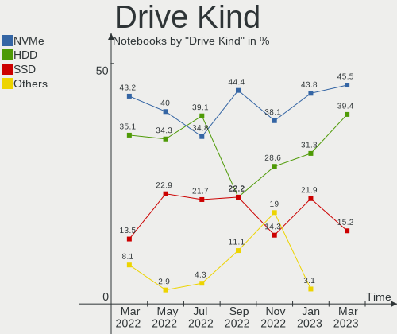
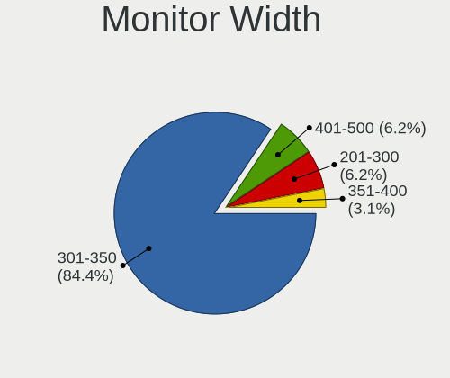

Endless Hardware Trends (Notebook)
----------------------------------

A project to identify most popular hardware characteristics and track their change
over time based on data collected by Endless users at https://Linux-Hardware.org.

Anyone can contribute to the study by uploading probes of their computers by
the [hw-probe](https://github.com/linuxhw/hw-probe) tool:

    sudo -E hw-probe -all -upload

Full-feature report is available here: https://linux-hardware.org/?view=trends&formfactor=notebook

Period: Oct, 2020.

Contents
--------

- [ OS                       ](#os)
- [ OS Family                ](#os-family)
- [ Kernel                   ](#kernel)
- [ Kernel Family            ](#kernel-family)
- [ Kernel Major Ver.        ](#kernel-major-ver)
- [ Arch                     ](#arch)
- [ DE                       ](#de)
- [ Display Server           ](#display-server)
- [ Display Manager          ](#display-manager)
- [ OS Lang                  ](#os-lang)
- [ Boot Mode                ](#boot-mode)
- [ Filesystem               ](#filesystem)
- [ Part. scheme             ](#part-scheme)
- [ Dual Boot with Linux/BSD ](#dual-boot-with-linux/bsd)
- [ Dual Boot (Win)          ](#dual-boot-win)
- [ Country                  ](#country)
- [ City                     ](#city)
- [ Vendor                   ](#vendor)
- [ Model                    ](#model)
- [ Model Family             ](#model-family)
- [ MFG Year                 ](#mfg-year)
- [ Form Factor              ](#form-factor)
- [ Secure Boot              ](#secure-boot)
- [ Coreboot                 ](#coreboot)
- [ RAM Size                 ](#ram-size)
- [ RAM Used                 ](#ram-used)
- [ Has CD-ROM               ](#has-cd-rom)
- [ Total Drives             ](#total-drives)
- [ Has Ethernet             ](#has-ethernet)
- [ Drive Vendor             ](#drive-vendor)
- [ HDD Vendor               ](#hdd-vendor)
- [ SSD Vendor               ](#ssd-vendor)
- [ Drive Model              ](#drive-model)
- [ Drive Kind               ](#drive-kind)
- [ Drive Connector          ](#drive-connector)
- [ Drive Size               ](#drive-size)
- [ Space Total              ](#space-total)
- [ Space Used               ](#space-used)
- [ Malfunc. Drives          ](#malfunc-drives)
- [ Malfunc. Drive Vendor    ](#malfunc-drive-vendor)
- [ Malfunc. HDD Vendor      ](#malfunc-hdd-vendor)
- [ Malfunc. Drive Kind      ](#malfunc-drive-kind)
- [ Failed Drives            ](#failed-drives)
- [ Failed Drive Vendor      ](#failed-drive-vendor)
- [ Drive Status             ](#drive-status)
- [ Storage Vendor           ](#storage-vendor)
- [ Storage Model            ](#storage-model)
- [ Storage Kind             ](#storage-kind)
- [ CPU Vendor               ](#cpu-vendor)
- [ CPU Model                ](#cpu-model)
- [ CPU Model Family         ](#cpu-model-family)
- [ CPU Cores                ](#cpu-cores)
- [ CPU Sockets              ](#cpu-sockets)
- [ CPU Threads              ](#cpu-threads)
- [ CPU Op-Modes             ](#cpu-op-modes)
- [ CPU Microcode            ](#cpu-microcode)
- [ CPU Microarch            ](#cpu-microarch)
- [ GPU Vendor               ](#gpu-vendor)
- [ GPU Model                ](#gpu-model)
- [ GPU Combo                ](#gpu-combo)
- [ GPU Driver               ](#gpu-driver)
- [ GPU Memory               ](#gpu-memory)
- [ Monitor Vendor           ](#monitor-vendor)
- [ Monitor Model            ](#monitor-model)
- [ Monitor Resolution       ](#monitor-resolution)
- [ Monitor Diagonal         ](#monitor-diagonal)
- [ Monitor Width            ](#monitor-width)
- [ Aspect Ratio             ](#aspect-ratio)
- [ Monitor Area             ](#monitor-area)
- [ Pixel Density            ](#pixel-density)
- [ Multiple Monitors        ](#multiple-monitors)
- [ Net Controller Vendor    ](#net-controller-vendor)
- [ Net Controller Model     ](#net-controller-model)
- [ Wireless Vendor          ](#wireless-vendor)
- [ Wireless Model           ](#wireless-model)
- [ Ethernet Vendor          ](#ethernet-vendor)
- [ Ethernet Model           ](#ethernet-model)
- [ Net Controller Kind      ](#net-controller-kind)
- [ Used Controller          ](#used-controller)
- [ NICs                     ](#nics)
- [ Memory Vendor            ](#memory-vendor)
- [ Memory Model             ](#memory-model)
- [ Memory Kind              ](#memory-kind)
- [ Memory Form Factor       ](#memory-form-factor)
- [ Memory Size              ](#memory-size)
- [ Memory Speed             ](#memory-speed)
- [ Sound Vendor             ](#sound-vendor)
- [ Sound Model              ](#sound-model)
- [ Camera Vendor            ](#camera-vendor)
- [ Camera Model             ](#camera-model)
- [ Fingerprint Vendor       ](#fingerprint-vendor)
- [ Fingerprint Model        ](#fingerprint-model)
- [ Chipcard Vendor          ](#chipcard-vendor)
- [ Chipcard Model           ](#chipcard-model)
- [ Printer Vendor           ](#printer-vendor)
- [ Printer Model            ](#printer-model)
- [ Scanner Vendor           ](#scanner-vendor)
- [ Scanner Model            ](#scanner-model)
- [ Bluetooth Vendor         ](#bluetooth-vendor)
- [ Bluetooth Model          ](#bluetooth-model)
- [ Unsupported Devices      ](#unsupported-devices)
- [ Unsupported Device Types ](#unsupported-device-types)

OS
--

Installed operating systems

| Name                   | Notebooks | Percent |
|------------------------|-----------|---------|
| Endless 3.8.7          | 65        | 59.63%  |
| Endless 3.8.6          | 21        | 19.27%  |
| Endless 3.7.8          | 7         | 6.42%   |
| Endless 3.8.5          | 3         | 2.75%   |
| Endless 3.6.4          | 2         | 1.83%   |
| Endless 3.9.0          | 1         | 0.92%   |
| Endless 3.8.3          | 1         | 0.92%   |
| Endless 3.8.0          | 1         | 0.92%   |
| Endless 3.7.7-nexthw1  | 1         | 0.92%   |
| Endless 3.7.6          | 1         | 0.92%   |
| Endless 3.7.5-nexthw1  | 1         | 0.92%   |
| Endless 3.6.3-nexthw1  | 1         | 0.92%   |
| Endless 3.6.0-nexthw1  | 1         | 0.92%   |
| Endless 3.4.3-nexthw1  | 1         | 0.92%   |
| Endless 3.3.20-nexthw1 | 1         | 0.92%   |
| Endless 3.3.14         | 1         | 0.92%   |

OS Family
---------

OS without a version

| Name    | Notebooks | Percent |
|---------|-----------|---------|
| Endless | 109       | 100%    |

Kernel
------

Version of the Linux kernel

| Version           | Notebooks | Percent |
|-------------------|-----------|---------|
| 5.4.0-42-generic  | 86        | 78.9%   |
| 5.3.0-28-generic  | 7         | 6.42%   |
| 5.4.0-39-generic  | 3         | 2.75%   |
| 5.4.0-19-generic  | 2         | 1.83%   |
| 5.3.0-23-generic  | 2         | 1.83%   |
| 5.0.0-25-generic  | 2         | 1.83%   |
| 5.8.0-14-generic  | 1         | 0.92%   |
| 5.4.0-7-generic   | 1         | 0.92%   |
| 5.3.0-12-generic  | 1         | 0.92%   |
| 5.1.0-2-generic   | 1         | 0.92%   |
| 4.16.0-4-generic  | 1         | 0.92%   |
| 4.15.0-15-generic | 1         | 0.92%   |
| 4.13.0-32-generic | 1         | 0.92%   |

Kernel Family
-------------

Linux kernel without a distro release

| Version | Notebooks | Percent |
|---------|-----------|---------|
| 5.4.0   | 92        | 84.4%   |
| 5.3.0   | 10        | 9.17%   |
| 5.0.0   | 2         | 1.83%   |
| 5.8.0   | 1         | 0.92%   |
| 5.1.0   | 1         | 0.92%   |
| 4.16.0  | 1         | 0.92%   |
| 4.15.0  | 1         | 0.92%   |
| 4.13.0  | 1         | 0.92%   |

Kernel Major Ver.
-----------------

Linux kernel major version

| Version | Notebooks | Percent |
|---------|-----------|---------|
| 5.4     | 92        | 84.4%   |
| 5.3     | 10        | 9.17%   |
| 5.0     | 2         | 1.83%   |
| 5.8     | 1         | 0.92%   |
| 5.1     | 1         | 0.92%   |
| 4.16    | 1         | 0.92%   |
| 4.15    | 1         | 0.92%   |
| 4.13    | 1         | 0.92%   |

Arch
----

OS architecture (x86_64, i586, etc.)

| Name   | Notebooks | Percent |
|--------|-----------|---------|
| x86_64 | 109       | 100%    |

DE
--

Desktop Environment

| Name    | Notebooks | Percent |
|---------|-----------|---------|
| GNOME   | 108       | 99.08%  |
| Unknown | 1         | 0.92%   |

Display Server
--------------

X11 or Wayland

| Name    | Notebooks | Percent |
|---------|-----------|---------|
| X11     | 108       | 99.08%  |
| Unknown | 1         | 0.92%   |

Display Manager
---------------

SDDM, LightDM, etc.

| Name    | Notebooks | Percent |
|---------|-----------|---------|
| Unknown | 109       | 100%    |

OS Lang
-------

Language

| Lang        | Notebooks | Percent |
|-------------|-----------|---------|
| pt_BR.utf8  | 37        | 33.94%  |
| en_US.utf8  | 14        | 12.84%  |
| ru_RU       | 9         | 8.26%   |
| pt_BR       | 9         | 8.26%   |
| ro_RO       | 8         | 7.34%   |
| en_US       | 5         | 4.59%   |
| tr_TR       | 2         | 1.83%   |
| ru_RU.UTF_8 | 2         | 1.83%   |
| fr_FR.utf8  | 2         | 1.83%   |
| es_MX       | 2         | 1.83%   |
| es_ES       | 2         | 1.83%   |
| es_AR       | 2         | 1.83%   |
| de_DE       | 2         | 1.83%   |
| vi_VN       | 1         | 0.92%   |
| sr_RS@latin | 1         | 0.92%   |
| pl_PL       | 1         | 0.92%   |
| nl_NL       | 1         | 0.92%   |
| ko_KR       | 1         | 0.92%   |
| it_IT       | 1         | 0.92%   |
| hu_HU       | 1         | 0.92%   |
| hr_HR       | 1         | 0.92%   |
| fr_BE       | 1         | 0.92%   |
| fi_FI       | 1         | 0.92%   |
| es_UY       | 1         | 0.92%   |
| es_CO       | 1         | 0.92%   |
| Unknown     | 1         | 0.92%   |

Boot Mode
---------

EFI or BIOS

| Mode | Notebooks | Percent |
|------|-----------|---------|
| EFI  | 75        | 68.81%  |
| BIOS | 34        | 31.19%  |

Filesystem
----------

Type of filesystem

| Type  | Notebooks | Percent |
|-------|-----------|---------|
| Ext4  | 108       | 99.08%  |
| Tmpfs | 1         | 0.92%   |

Part. scheme
------------

Scheme of partitioning

| Type    | Notebooks | Percent |
|---------|-----------|---------|
| Unknown | 109       | 100%    |

Dual Boot with Linux/BSD
------------------------

Hosting more than one Linux/BSD

| Dual boot | Notebooks | Percent |
|-----------|-----------|---------|
| No        | 109       | 100%    |

Dual Boot (Win)
---------------

Hosting Linux and Windows

| Dual boot | Notebooks | Percent |
|-----------|-----------|---------|
| No        | 109       | 100%    |

Country
-------

Geographic location (country)

| Country            | Notebooks | Percent |
|--------------------|-----------|---------|
| Brazil             | 48        | 44.04%  |
| Russia             | 11        | 10.09%  |
| Romania            | 10        | 9.17%   |
| USA                | 4         | 3.67%   |
| Spain              | 3         | 2.75%   |
| Serbia             | 3         | 2.75%   |
| India              | 3         | 2.75%   |
| Germany            | 3         | 2.75%   |
| Colombia           | 3         | 2.75%   |
| Philippines        | 2         | 1.83%   |
| Italy              | 2         | 1.83%   |
| France             | 2         | 1.83%   |
| Bulgaria           | 2         | 1.83%   |
| Vietnam            | 1         | 0.92%   |
| Uruguay            | 1         | 0.92%   |
| Turkey             | 1         | 0.92%   |
| Portugal           | 1         | 0.92%   |
| Poland             | 1         | 0.92%   |
| Netherlands        | 1         | 0.92%   |
| Korea, Republic of | 1         | 0.92%   |
| Hungary            | 1         | 0.92%   |
| Georgia            | 1         | 0.92%   |
| Finland            | 1         | 0.92%   |
| Croatia            | 1         | 0.92%   |
| Belgium            | 1         | 0.92%   |
| Belarus            | 1         | 0.92%   |

City
----

Geographic location (city)

| City               | Notebooks | Percent |
|--------------------|-----------|---------|
| São Paulo         | 6         | 5.5%    |
| Bucharest          | 4         | 3.67%   |
| Rio de Janeiro     | 3         | 2.75%   |
| Guarulhos          | 3         | 2.75%   |
| Sofia              | 2         | 1.83%   |
| Recife             | 2         | 1.83%   |
| Porto Alegre       | 2         | 1.83%   |
| Moscow             | 2         | 1.83%   |
| Krasnodar          | 2         | 1.83%   |
| Fortaleza          | 2         | 1.83%   |
| Cluj-Napoca        | 2         | 1.83%   |
| Brasília          | 2         | 1.83%   |
| Zonguldak          | 1         | 0.92%   |
| Zagreb             | 1         | 0.92%   |
| Warsaw             | 1         | 0.92%   |
| Wachtberg          | 1         | 0.92%   |
| Vitória           | 1         | 0.92%   |
| Valencia           | 1         | 0.92%   |
| Teófilo Otoni     | 1         | 0.92%   |
| Tbilisi            | 1         | 0.92%   |
| Taboao da Serra    | 1         | 0.92%   |
| São Carlos        | 1         | 0.92%   |
| St Petersburg      | 1         | 0.92%   |
| Smolensk           | 1         | 0.92%   |
| Sao Goncalo        | 1         | 0.92%   |
| Santiago de Cali   | 1         | 0.92%   |
| Santa Marta        | 1         | 0.92%   |
| Samara             | 1         | 0.92%   |
| Roznov             | 1         | 0.92%   |
| Rionegro           | 1         | 0.92%   |
| Rio Tinto          | 1         | 0.92%   |
| Pune               | 1         | 0.92%   |
| Puerto Real        | 1         | 0.92%   |
| Pinhais            | 1         | 0.92%   |
| Petrópolis        | 1         | 0.92%   |
| Pedreiras          | 1         | 0.92%   |
| Pasig              | 1         | 0.92%   |
| Paris              | 1         | 0.92%   |
| Pando              | 1         | 0.92%   |
| Palanka            | 1         | 0.92%   |
| Noblesville        | 1         | 0.92%   |
| Nizhniy Novgorod   | 1         | 0.92%   |
| Niterói           | 1         | 0.92%   |
| Naunhof            | 1         | 0.92%   |
| Muhlhausen-Ehingen | 1         | 0.92%   |
| Montes Claros      | 1         | 0.92%   |
| Minsk              | 1         | 0.92%   |
| Manila             | 1         | 0.92%   |
| Manaus             | 1         | 0.92%   |
| Maceió            | 1         | 0.92%   |
| Liège             | 1         | 0.92%   |
| Lisbon             | 1         | 0.92%   |
| Leopoldina         | 1         | 0.92%   |
| Kolomna            | 1         | 0.92%   |
| Kolkata            | 1         | 0.92%   |
| Joinville          | 1         | 0.92%   |
| Jagodina           | 1         | 0.92%   |
| Itajuba            | 1         | 0.92%   |
| Indaial            | 1         | 0.92%   |
| Ho Chi Minh City   | 1         | 0.92%   |

Vendor
------

Motherboard manufacturer

| Name                         | Notebooks | Percent |
|------------------------------|-----------|---------|
| Acer                         | 44        | 40.37%  |
| ASUSTek Computer             | 43        | 39.45%  |
| Hewlett-Packard              | 6         | 5.5%    |
| Positivo                     | 4         | 3.67%   |
| Lenovo                       | 3         | 2.75%   |
| Fujitsu Siemens              | 2         | 1.83%   |
| Dell                         | 2         | 1.83%   |
| Semp Toshiba                 | 1         | 0.92%   |
| Samsung Electronics          | 1         | 0.92%   |
| Pegatron                     | 1         | 0.92%   |
| MPS Mayorista de Colombia SA | 1         | 0.92%   |
| Digibras                     | 1         | 0.92%   |

Model
-----

Motherboard model

| Name                                            | Notebooks | Percent |
|-------------------------------------------------|-----------|---------|
| Acer Nitro AN515-43                             | 15        | 13.76%  |
| ASUS X541NA                                     | 5         | 4.59%   |
| Acer Nitro AN517-51                             | 5         | 4.59%   |
| Acer Nitro AN515-54                             | 5         | 4.59%   |
| Acer Aspire A515-54G                            | 4         | 3.67%   |
| Acer Aspire A315-34                             | 4         | 3.67%   |
| Positivo MOBILE                                 | 3         | 2.75%   |
| ASUS X540NA                                     | 3         | 2.75%   |
| ASUS VivoBook 15_ASUS Laptop X540MA_X543MA      | 3         | 2.75%   |
| ASUS VivoBook 15_ASUS Laptop X540MA_X540MA      | 3         | 2.75%   |
| ASUS ZenBook UX431DA_UM431DA                    | 2         | 1.83%   |
| ASUS Z550SA                                     | 2         | 1.83%   |
| ASUS X541UAK                                    | 2         | 1.83%   |
| ASUS VivoBook_ASUSLaptop X512DA_X512DA          | 2         | 1.83%   |
| ASUS VivoBook_ASUSLaptop X509MA                 | 2         | 1.83%   |
| ASUS VivoBook_ASUSLaptop X509FA_X509FA          | 2         | 1.83%   |
| Acer Aspire A315-31                             | 2         | 1.83%   |
| Semp Toshiba IS 1462B                           | 1         | 0.92%   |
| Samsung Electronics 400B4B/400B5B/200B4B/200B5B | 1         | 0.92%   |
| Positivo A14CR6A                                | 1         | 0.92%   |
| Pegatron C15A                                   | 1         | 0.92%   |
| MPS Mayorista de Colombia SA COIN ST800EDU      | 1         | 0.92%   |
| Lenovo ThinkPad X230 2325KZ5                    | 1         | 0.92%   |
| Lenovo ThinkPad X201 4492W3C                    | 1         | 0.92%   |
| Lenovo IdeaPad 100S-14IBR 80R9                  | 1         | 0.92%   |
| HP TouchSmart tx2                               | 1         | 0.92%   |
| HP Pavilion TS Sleekbook 15                     | 1         | 0.92%   |
| HP EliteBook 8440p                              | 1         | 0.92%   |
| HP EliteBook 840 G1                             | 1         | 0.92%   |
| HP Compaq 6735s                                 | 1         | 0.92%   |
| HP 635                                          | 1         | 0.92%   |
| Fujitsu Siemens ESPRIMO Mobile V5535            | 1         | 0.92%   |
| Fujitsu Siemens ESPRIMO Mobile D9510            | 1         | 0.92%   |
| Digibras NH4CU53                                | 1         | 0.92%   |
| Dell Vostro 3350                                | 1         | 0.92%   |
| Dell Inspiron 1545                              | 1         | 0.92%   |
| ASUS X550LN                                     | 1         | 0.92%   |
| ASUS X540LA                                     | 1         | 0.92%   |
| ASUS VivoBook_ASUSLaptop X512DA_A512DA          | 1         | 0.92%   |
| ASUS VivoBook_ASUSLaptop X509JB_X509JB          | 1         | 0.92%   |
| ASUS VivoBook_ASUSLaptop X509JA_X509JA          | 1         | 0.92%   |
| ASUS VivoBook_ASUSLaptop X409DA_M409DA          | 1         | 0.92%   |
| ASUS VivoBook_ASUSLaptop X403JA_X403JA          | 1         | 0.92%   |
| ASUS VivoBook 15_ASUS Laptop X540UBR            | 1         | 0.92%   |
| ASUS VivoBook 15_ASUS Laptop X540MA_R540MA      | 1         | 0.92%   |
| ASUS VivoBook 15_ASUS Laptop X540MA_D540MA      | 1         | 0.92%   |
| ASUS VivoBook 15_ASUS Laptop X540MA_A540MA      | 1         | 0.92%   |
| ASUS VivoBook 15_ASUS Laptop X540BA             | 1         | 0.92%   |
| ASUS VivoBook 15_ASUS Laptop X507UAR            | 1         | 0.92%   |
| ASUS U31SD                                      | 1         | 0.92%   |
| ASUS S551LN                                     | 1         | 0.92%   |
| ASUS GL552JX                                    | 1         | 0.92%   |
| ASUS ASUSPRO P1440UA                            | 1         | 0.92%   |
| Acer TravelMate P259-M                          | 1         | 0.92%   |
| Acer Swift SF314-58                             | 1         | 0.92%   |
| Acer Swift SF314-52                             | 1         | 0.92%   |
| Acer Extensa 2540                               | 1         | 0.92%   |
| Acer Aspire ES1-132                             | 1         | 0.92%   |
| Acer Aspire A315-53                             | 1         | 0.92%   |
| Acer Aspire A315-33                             | 1         | 0.92%   |

Model Family
------------

Motherboard model prefix

| Name                              | Notebooks | Percent |
|-----------------------------------|-----------|---------|
| Acer Nitro                        | 25        | 22.94%  |
| ASUS VivoBook                     | 23        | 21.1%   |
| Acer Aspire                       | 14        | 12.84%  |
| ASUS X541NA                       | 5         | 4.59%   |
| Positivo MOBILE                   | 3         | 2.75%   |
| ASUS X540NA                       | 3         | 2.75%   |
| Lenovo ThinkPad                   | 2         | 1.83%   |
| HP EliteBook                      | 2         | 1.83%   |
| Fujitsu Siemens ESPRIMO           | 2         | 1.83%   |
| ASUS ZenBook                      | 2         | 1.83%   |
| ASUS Z550SA                       | 2         | 1.83%   |
| ASUS X541UAK                      | 2         | 1.83%   |
| Acer Swift                        | 2         | 1.83%   |
| Semp Toshiba IS                   | 1         | 0.92%   |
| Samsung Electronics 400B4B        | 1         | 0.92%   |
| Positivo A14CR6A                  | 1         | 0.92%   |
| Pegatron C15A                     | 1         | 0.92%   |
| MPS Mayorista de Colombia SA COIN | 1         | 0.92%   |
| Lenovo IdeaPad                    | 1         | 0.92%   |
| HP TouchSmart                     | 1         | 0.92%   |
| HP Pavilion                       | 1         | 0.92%   |
| HP Compaq                         | 1         | 0.92%   |
| HP 635                            | 1         | 0.92%   |
| Digibras NH4CU53                  | 1         | 0.92%   |
| Dell Vostro                       | 1         | 0.92%   |
| Dell Inspiron                     | 1         | 0.92%   |
| ASUS X550LN                       | 1         | 0.92%   |
| ASUS X540LA                       | 1         | 0.92%   |
| ASUS U31SD                        | 1         | 0.92%   |
| ASUS S551LN                       | 1         | 0.92%   |
| ASUS GL552JX                      | 1         | 0.92%   |
| ASUS ASUSPRO                      | 1         | 0.92%   |
| Acer TravelMate                   | 1         | 0.92%   |
| Acer Extensa                      | 1         | 0.92%   |
| Acer A315-53                      | 1         | 0.92%   |

MFG Year
--------

Motherboard manufacture year

| Year | Notebooks | Percent |
|------|-----------|---------|
| 2020 | 36        | 33.03%  |
| 2019 | 26        | 23.85%  |
| 2017 | 11        | 10.09%  |
| 2018 | 8         | 7.34%   |
| 2013 | 5         | 4.59%   |
| 2009 | 5         | 4.59%   |
| 2016 | 4         | 3.67%   |
| 2011 | 4         | 3.67%   |
| 2014 | 3         | 2.75%   |
| 2015 | 2         | 1.83%   |
| 2010 | 2         | 1.83%   |
| 2012 | 1         | 0.92%   |
| 2008 | 1         | 0.92%   |
| 2007 | 1         | 0.92%   |

Form Factor
-----------

Physical design of the computer

| Name     | Notebooks | Percent |
|----------|-----------|---------|
| Notebook | 109       | 100%    |

Secure Boot
-----------

Enabled or disabled

| State    | Notebooks | Percent |
|----------|-----------|---------|
| Disabled | 70        | 64.22%  |
| Enabled  | 39        | 35.78%  |

Coreboot
--------

Have coreboot on board

| Used | Notebooks | Percent |
|------|-----------|---------|
| No   | 109       | 100%    |

RAM Size
--------

Total RAM memory

| Size in GB | Notebooks | Percent |
|------------|-----------|---------|
| 4.01-8.0   | 50        | 45.87%  |
| 3.01-4.0   | 49        | 44.95%  |
| 1.01-2.0   | 6         | 5.5%    |
| 2.01-3.0   | 2         | 1.83%   |
| 8.01-16.0  | 1         | 0.92%   |
| 0.01-1.0   | 1         | 0.92%   |

RAM Used
--------

Used RAM memory

| Used GB  | Notebooks | Percent |
|----------|-----------|---------|
| 1.01-2.0 | 45        | 41.28%  |
| 2.01-3.0 | 31        | 28.44%  |
| 0.01-1.0 | 21        | 19.27%  |
| 3.01-4.0 | 7         | 6.42%   |
| 4.01-8.0 | 5         | 4.59%   |

Has CD-ROM
----------

Has CD-ROM on board

| Presented | Notebooks | Percent |
|-----------|-----------|---------|
| No        | 78        | 71.56%  |
| Yes       | 31        | 28.44%  |

Total Drives
------------

Number of drives on board

| Drives | Notebooks | Percent |
|--------|-----------|---------|
| 1      | 80        | 73.39%  |
| 2      | 25        | 22.94%  |
| 3      | 3         | 2.75%   |
| 0      | 1         | 0.92%   |

Has Ethernet
------------

Has Ethernet on board

| Presented | Notebooks | Percent |
|-----------|-----------|---------|
| Yes       | 80        | 73.39%  |
| No        | 29        | 26.61%  |

Drive Vendor
------------

Hard drive vendors

| Vendor              | Notebooks | Drives | Percent |
|---------------------|-----------|--------|---------|
| WDC                 | 33        | 33     | 24.26%  |
| Intel               | 17        | 17     | 12.5%   |
| Seagate             | 14        | 14     | 10.29%  |
| Toshiba             | 10        | 10     | 7.35%   |
| SK Hynix            | 10        | 10     | 7.35%   |
| Kingston            | 9         | 9      | 6.62%   |
| Sandisk             | 8         | 8      | 5.88%   |
| A-DATA Technology   | 8         | 8      | 5.88%   |
| Unknown             | 6         | 6      | 4.41%   |
| Samsung Electronics | 6         | 6      | 4.41%   |
| HGST                | 6         | 6      | 4.41%   |
| Hitachi             | 3         | 3      | 2.21%   |
| Micron Technology   | 1         | 1      | 0.74%   |
| KingDian            | 1         | 1      | 0.74%   |
| GOODRAM             | 1         | 1      | 0.74%   |
| China               | 1         | 1      | 0.74%   |
| Apple               | 1         | 1      | 0.74%   |
| ADATA Technology    | 1         | 1      | 0.74%   |

HDD Vendor
----------

Hard disk drive vendors

| Vendor              | Notebooks | Drives | Percent |
|---------------------|-----------|--------|---------|
| WDC                 | 33        | 33     | 48.53%  |
| Seagate             | 14        | 14     | 20.59%  |
| Toshiba             | 10        | 10     | 14.71%  |
| HGST                | 6         | 6      | 8.82%   |
| Hitachi             | 3         | 3      | 4.41%   |
| Samsung Electronics | 2         | 2      | 2.94%   |

SSD Vendor
----------

Solid state drive vendors

| Vendor              | Notebooks | Drives | Percent |
|---------------------|-----------|--------|---------|
| A-DATA Technology   | 8         | 8      | 28.57%  |
| Kingston            | 7         | 7      | 25%     |
| SanDisk             | 4         | 4      | 14.29%  |
| Samsung Electronics | 3         | 3      | 10.71%  |
| SK Hynix            | 1         | 1      | 3.57%   |
| Micron Technology   | 1         | 1      | 3.57%   |
| KingDian            | 1         | 1      | 3.57%   |
| GOODRAM             | 1         | 1      | 3.57%   |
| China               | 1         | 1      | 3.57%   |
| Apple               | 1         | 1      | 3.57%   |

Drive Model
-----------

Hard drive models

| Model                        | Notebooks | Percent |
|------------------------------|-----------|---------|
| WD10SPZX-21Z10T0 1TB         | 26        | 19.12%  |
| NVMe SSD Drive 256GB         | 15        | 11.03%  |
| NVMe SSD Drive 512GB         | 13        | 9.56%   |
| NVMe SSD Drive 128GB         | 8         | 5.88%   |
| MQ01ABF050 500GB             | 7         | 5.15%   |
| IM2S3338-128GD2 128GB SSD    | 7         | 5.15%   |
| ST1000LM035-1RK172 1TB       | 5         | 3.68%   |
| HTS545050B7E660 500GB        | 3         | 2.21%   |
| WD5000LPCX-80VHAT0 500GB     | 2         | 1.47%   |
| WD5000LPCX-21VHAT0 500GB     | 2         | 1.47%   |
| ST500LT012-1DG142 500GB      | 2         | 1.47%   |
| SD9SB8W256G1002 256GB SSD    | 2         | 1.47%   |
| RBUSC180DS37256GJ 256GB SSD  | 2         | 1.47%   |
| MMC Card  32GB               | 2         | 1.47%   |
| WD5000LPCX-80VHAT1 500GB     | 1         | 0.74%   |
| WD5000BPVT-22HXZT3 500GB     | 1         | 0.74%   |
| WD3200BEVT-75ZCT2 320GB      | 1         | 0.74%   |
| SU650 240GB SSD              | 1         | 0.74%   |
| ST9320325AS 320GB            | 1         | 0.74%   |
| ST9250410AS 250GB            | 1         | 0.74%   |
| ST9160821AS 160GB            | 1         | 0.74%   |
| ST750LM022 HN-M750MBB 752GB  | 1         | 0.74%   |
| ST500LM030-1RK17D 500GB      | 1         | 0.74%   |
| ST500LM012 HN-M500MBB 500GB  | 1         | 0.74%   |
| ST1000LM048-2E7172 1TB       | 1         | 0.74%   |
| SSDPR-CX400-256 256GB        | 1         | 0.74%   |
| SSD U100 24GB                | 1         | 0.74%   |
| SSD SM128E 121GB             | 1         | 0.74%   |
| SSD PM810 2.5 7mm 128GB      | 1         | 0.74%   |
| SSD 860 EVO 250GB            | 1         | 0.74%   |
| SHFS37A120G 120GB SSD        | 1         | 0.74%   |
| SD9SN8W256G1102 256GB SSD    | 1         | 0.74%   |
| SC311 SATA 128GB SSD         | 1         | 0.74%   |
| SA400S37120G 120GB SSD       | 1         | 0.74%   |
| S280 480GB SSD               | 1         | 0.74%   |
| RBUSNS8180S3128GI1 128GB SSD | 1         | 0.74%   |
| RBUSNS8180DS3128GJ 128GB SSD | 1         | 0.74%   |
| RBUSC180DS37128GJ 128GB SSD  | 1         | 0.74%   |
| NVMe SSD Drive 500GB         | 1         | 0.74%   |
| NVMe SSD Drive 1TB           | 1         | 0.74%   |
| MZNLF128HCHP-00004 128GB SSD | 1         | 0.74%   |
| MQ01ABD100 1TB               | 1         | 0.74%   |
| MK5065GSXF 500GB             | 1         | 0.74%   |
| MK3252GSX 320GB              | 1         | 0.74%   |
| HTS727550A9E364 500GB        | 1         | 0.74%   |
| HTS725050A7E630 500GB        | 1         | 0.74%   |
| HTS725016A9A364 160GB        | 1         | 0.74%   |
| HTS723216A7A364 160GB        | 1         | 0.74%   |
| HTS545050A7E380 500GB        | 1         | 0.74%   |
| HTS541010A9E680 1TB          | 1         | 0.74%   |
| HN-M500MBB 500GB             | 1         | 0.74%   |
| HM160HI 160GB                | 1         | 0.74%   |
| 120GB SSD                    | 1         | 0.74%   |
| 1100_MTFD 256GB SSD          | 1         | 0.74%   |

Drive Kind
----------

HDD or SSD

| Kind | Notebooks | Drives | Percent |
|------|-----------|--------|---------|
| HDD  | 68        | 68     | 50.37%  |
| NVMe | 38        | 38     | 28.15%  |
| SSD  | 27        | 28     | 20%     |
| MMC  | 2         | 2      | 1.48%   |

Drive Connector
---------------

SATA, SAS, NVMe, etc.

| Type | Notebooks | Drives | Percent |
|------|-----------|--------|---------|
| SATA | 86        | 96     | 68.25%  |
| NVMe | 38        | 38     | 30.16%  |
| MMC  | 2         | 2      | 1.59%   |

Drive Size
----------

Size of hard drive

| Size in TB | Notebooks | Drives | Percent |
|------------|-----------|--------|---------|
| 0.01-0.5   | 60        | 61     | 63.16%  |
| 0.51-1.0   | 35        | 35     | 36.84%  |

Space Total
-----------

Amount of disk space available on the file system

| Size in GB | Notebooks | Percent |
|------------|-----------|---------|
| 251-500    | 38        | 34.86%  |
| 101-250    | 31        | 28.44%  |
| 501-1000   | 31        | 28.44%  |
| 21-50      | 6         | 5.5%    |
| 1-20       | 2         | 1.83%   |
| 2001-3000  | 1         | 0.92%   |

Space Used
----------

Amount of used disk space

| Used GB   | Notebooks | Percent |
|-----------|-----------|---------|
| 21-50     | 63        | 57.8%   |
| 1-20      | 17        | 15.6%   |
| 51-100    | 17        | 15.6%   |
| 101-250   | 6         | 5.5%    |
| 251-500   | 4         | 3.67%   |
| 2001-3000 | 1         | 0.92%   |
| 501-1000  | 1         | 0.92%   |

Malfunc. Drives
---------------

Drive models with a malfunction

Zero info for selected period =(

Malfunc. Drive Vendor
---------------------

Vendors of faulty drives

Zero info for selected period =(

Malfunc. HDD Vendor
-------------------

Vendors of faulty HDD drives

Zero info for selected period =(

Malfunc. Drive Kind
-------------------

Kinds of faulty drives

Zero info for selected period =(

Failed Drives
-------------

Failed drive models

Zero info for selected period =(

Failed Drive Vendor
-------------------

Failed drive vendors

Zero info for selected period =(

Drive Status
------------

Number of failed and malfunc. drives

| Status   | Notebooks | Drives | Percent |
|----------|-----------|--------|---------|
| Detected | 109       | 136    | 100%    |

Storage Vendor
--------------

Storage controller vendors

| Vendor                           | Notebooks | Percent |
|----------------------------------|-----------|---------|
| Intel                            | 80        | 61.54%  |
| AMD                              | 26        | 20%     |
| SK Hynix                         | 9         | 6.92%   |
| ADATA Technology                 | 5         | 3.85%   |
| Sandisk                          | 4         | 3.08%   |
| Silicon Integrated Systems [SiS] | 3         | 2.31%   |
| Kingston Technology Company      | 2         | 1.54%   |
| Samsung Electronics              | 1         | 0.77%   |

Storage Model
-------------

Storage controller models

| Model                                                                      | Notebooks | Percent |
|----------------------------------------------------------------------------|-----------|---------|
| FCH SATA Controller [AHCI mode]                                            | 23        | 15.23%  |
| 82801 Mobile SATA Controller [RAID mode]                                   | 18        | 11.92%  |
| SATA controller                                                            | 16        | 10.6%   |
| PROSet/Wireless WiFi Software extension                                    | 16        | 10.6%   |
| Celeron N3350/Pentium N4200/Atom E3900 Series SATA AHCI Controller         | 11        | 7.28%   |
| Sunrise Point-LP SATA Controller [AHCI mode]                               | 9         | 5.96%   |
| BC501 NVMe Solid State Drive 512GB                                         | 9         | 5.96%   |
| Non-Volatile memory controller                                             | 7         | 4.64%   |
| Atom/Celeron/Pentium Processor x5-E8000/J3xxx/N3xxx Series SATA Controller | 4         | 2.65%   |
| 7 Series Chipset Family 6-port SATA Controller [AHCI mode]                 | 4         | 2.65%   |
| SB7x0/SB8x0/SB9x0 SATA Controller [AHCI mode]                              | 3         | 1.99%   |
| 82801IBM/IEM (ICH9M/ICH9M-E) 4 port SATA Controller [AHCI mode]            | 3         | 1.99%   |
| 8 Series SATA Controller 1 [AHCI mode]                                     | 3         | 1.99%   |
| 6 Series/C200 Series Chipset Family 6 port Mobile SATA AHCI Controller     | 3         | 1.99%   |
| 5513 IDE Controller                                                        | 3         | 1.99%   |
| WD Black 2018 / PC SN520 NVMe SSD                                          | 2         | 1.32%   |
| SATA Controller / IDE mode                                                 | 2         | 1.32%   |
| Cannon Lake Mobile PCH SATA AHCI Controller                                | 2         | 1.32%   |
| Wildcat Point-LP SATA Controller [AHCI Mode]                               | 1         | 0.66%   |
| WD Blue SN550 NVMe SSD                                                     | 1         | 0.66%   |
| WD Black 2018 / PC SN720 NVMe SSD                                          | 1         | 0.66%   |
| SSD 660P Series                                                            | 1         | 0.66%   |
| SB7x0/SB8x0/SB9x0 IDE Controller                                           | 1         | 0.66%   |
| Electronics Non-Volatile memory controller                                 | 1         | 0.66%   |
| Comet Lake PCH-LP SATA RAID Premium Controller                             | 1         | 0.66%   |
| AHCI IDE Controller (0106)                                                 | 1         | 0.66%   |
| 82801IBM/IEM (ICH9M/ICH9M-E) 2 port SATA Controller [IDE mode]             | 1         | 0.66%   |
| 8 Series/C220 Series Chipset Family 6-port SATA Controller 1 [AHCI mode]   | 1         | 0.66%   |
| 5 Series/3400 Series Chipset 6 port SATA AHCI Controller                   | 1         | 0.66%   |
| 5 Series/3400 Series Chipset 4 port SATA IDE Controller                    | 1         | 0.66%   |
| 5 Series/3400 Series Chipset 2 port SATA IDE Controller                    | 1         | 0.66%   |

Storage Kind
------------

Kind of storage controller (IDE, SATA, NVMe, SAS, ...)

| Kind | Notebooks | Percent |
|------|-----------|---------|
| SATA | 102       | 68.92%  |
| NVMe | 38        | 25.68%  |
| IDE  | 6         | 4.05%   |
| RAID | 2         | 1.35%   |

CPU Vendor
----------

Processor vendors

| Vendor | Notebooks | Percent |
|--------|-----------|---------|
| Intel  | 83        | 76.15%  |
| AMD    | 26        | 23.85%  |

CPU Model
---------

Processor models

| Model                                         | Notebooks | Percent |
|-----------------------------------------------|-----------|---------|
| AMD Ryzen 7 3750H with Radeon Vega Mobile Gfx | 9         | 8.26%   |
| Intel Celeron N4000 CPU @ 1.10GHz             | 8         | 7.34%   |
| Intel Core i5-9300H CPU @ 2.40GHz             | 7         | 6.42%   |
| Intel Celeron CPU N3350 @ 1.10GHz             | 7         | 6.42%   |
| AMD Ryzen 5 3550H with Radeon Vega Mobile Gfx | 6         | 5.5%    |
| Intel Core i7-10510U CPU @ 1.80GHz            | 4         | 3.67%   |
| Intel Celeron N4000C CPU @ 1.10GHz            | 4         | 3.67%   |
| Intel Core i7-9750H CPU @ 2.60GHz             | 3         | 2.75%   |
| Intel Celeron CPU N3450 @ 1.10GHz             | 3         | 2.75%   |
| AMD Ryzen 5 3500U with Radeon Vega Mobile Gfx | 3         | 2.75%   |
| AMD Ryzen 3 3200U with Radeon Vega Mobile Gfx | 3         | 2.75%   |
| Intel Pentium Silver N5000 CPU @ 1.10GHz      | 2         | 1.83%   |
| Intel Pentium Dual-Core CPU T4500 @ 2.30GHz   | 2         | 1.83%   |
| Intel Pentium Dual CPU T3400 @ 2.16GHz        | 2         | 1.83%   |
| Intel Core i5-7200U CPU @ 2.50GHz             | 2         | 1.83%   |
| Intel Core i5 CPU M 520 @ 2.40GHz             | 2         | 1.83%   |
| Intel Core i3-8145U CPU @ 2.10GHz             | 2         | 1.83%   |
| Intel Core i3-7100U CPU @ 2.40GHz             | 2         | 1.83%   |
| Intel Core i3-6006U CPU @ 2.00GHz             | 2         | 1.83%   |
| Intel Celeron CPU N3160 @ 1.60GHz             | 2         | 1.83%   |
| Intel Celeron CPU N3060 @ 1.60GHz             | 2         | 1.83%   |
| Intel Pentium CPU N4200 @ 1.10GHz             | 1         | 0.92%   |
| Intel Pentium CPU 4417U @ 2.30GHz             | 1         | 0.92%   |
| Intel Core i7-4750HQ CPU @ 2.00GHz            | 1         | 0.92%   |
| Intel Core i7-2640M CPU @ 2.80GHz             | 1         | 0.92%   |
| Intel Core i7-1065G7 CPU @ 1.30GHz            | 1         | 0.92%   |
| Intel Core i5-8250U CPU @ 1.60GHz             | 1         | 0.92%   |
| Intel Core i5-4300U CPU @ 1.90GHz             | 1         | 0.92%   |
| Intel Core i5-4210U CPU @ 1.70GHz             | 1         | 0.92%   |
| Intel Core i5-3320M CPU @ 2.60GHz             | 1         | 0.92%   |
| Intel Core i5-2410M CPU @ 2.30GHz             | 1         | 0.92%   |
| Intel Core i5-1035G1 CPU @ 1.00GHz            | 1         | 0.92%   |
| Intel Core i3-8130U CPU @ 2.20GHz             | 1         | 0.92%   |
| Intel Core i3-7020U CPU @ 2.30GHz             | 1         | 0.92%   |
| Intel Core i3-5005U CPU @ 2.00GHz             | 1         | 0.92%   |
| Intel Core i3-4010U CPU @ 1.70GHz             | 1         | 0.92%   |
| Intel Core i3-3110M CPU @ 2.40GHz             | 1         | 0.92%   |
| Intel Core i3-2370M CPU @ 2.40GHz             | 1         | 0.92%   |
| Intel Core i3-2310M CPU @ 2.10GHz             | 1         | 0.92%   |
| Intel Core i3-10110U CPU @ 2.10GHz            | 1         | 0.92%   |
| Intel Core i3-1005G1 CPU @ 1.20GHz            | 1         | 0.92%   |
| Intel Core 2 Duo CPU T6600 @ 2.20GHz          | 1         | 0.92%   |
| Intel Core 2 Duo CPU T5550 @ 1.83GHz          | 1         | 0.92%   |
| Intel Core 2 Duo CPU P8700 @ 2.53GHz          | 1         | 0.92%   |
| Intel Celeron N4100 CPU @ 1.10GHz             | 1         | 0.92%   |
| Intel Celeron N4020 CPU @ 1.10GHz             | 1         | 0.92%   |
| Intel Celeron CPU 1037U @ 1.80GHz             | 1         | 0.92%   |
| Intel Atom CPU Z3735F @ 1.33GHz               | 1         | 0.92%   |
| AMD Turion X2 Dual-Core Mobile RM-75          | 1         | 0.92%   |
| AMD Turion X2 Dual Core Mobile RM-74          | 1         | 0.92%   |
| AMD E-350 Processor                           | 1         | 0.92%   |
| AMD A6-9225 RADEON R4, 5 COMPUTE CORES 2C+3G  | 1         | 0.92%   |
| AMD A4-4355M APU with Radeon HD Graphics      | 1         | 0.92%   |

CPU Model Family
----------------

Processor model prefix

| Model                          | Notebooks | Percent |
|--------------------------------|-----------|---------|
| Intel Celeron                  | 29        | 26.61%  |
| Intel Core i5                  | 17        | 15.6%   |
| Intel Core i3                  | 15        | 13.76%  |
| Intel Core i7                  | 10        | 9.17%   |
| AMD Ryzen 7                    | 9         | 8.26%   |
| AMD Ryzen 5                    | 9         | 8.26%   |
| Intel Core 2 Duo               | 3         | 2.75%   |
| AMD Ryzen 3                    | 3         | 2.75%   |
| Intel Pentium Silver           | 2         | 1.83%   |
| Intel Pentium Dual-Core        | 2         | 1.83%   |
| Intel Pentium Dual             | 2         | 1.83%   |
| Intel Pentium                  | 2         | 1.83%   |
| Intel Atom                     | 1         | 0.92%   |
| AMD Turion X2 Dual-Core Mobile | 1         | 0.92%   |
| AMD Turion                     | 1         | 0.92%   |
| AMD E                          | 1         | 0.92%   |
| AMD A6                         | 1         | 0.92%   |
| AMD A4                         | 1         | 0.92%   |

CPU Cores
---------

Number of processor cores

| Number | Notebooks | Percent |
|--------|-----------|---------|
| 2      | 62        | 56.88%  |
| 4      | 43        | 39.45%  |
| 6      | 3         | 2.75%   |
| 1      | 1         | 0.92%   |

CPU Sockets
-----------

Number of sockets

| Number | Notebooks | Percent |
|--------|-----------|---------|
| 1      | 109       | 100%    |

CPU Threads
-----------

Threads per core (Hyper-Threading)

| Number | Notebooks | Percent |
|--------|-----------|---------|
| 2      | 65        | 59.63%  |
| 1      | 44        | 40.37%  |

CPU Op-Modes
------------

CPU Operation Modes (32-bit, 64-bit)

| Op mode        | Notebooks | Percent |
|----------------|-----------|---------|
| 32-bit, 64-bit | 108       | 99.08%  |
| Unknown        | 1         | 0.92%   |

CPU Microcode
-------------

Microcode number

| Number     | Notebooks | Percent |
|------------|-----------|---------|
| Unknown    | 21        | 19.27%  |
| 0x08108109 | 16        | 14.68%  |
| 0x706a1    | 13        | 11.93%  |
| 0x906ea    | 10        | 9.17%   |
| 0x506c9    | 9         | 8.26%   |
| 0x806ec    | 7         | 6.42%   |
| 0x08108102 | 5         | 4.59%   |
| 0x406c4    | 4         | 3.67%   |
| 0x806ea    | 3         | 2.75%   |
| 0x806e9    | 3         | 2.75%   |
| 0x706e5    | 3         | 2.75%   |
| 0x206a7    | 3         | 2.75%   |
| 0x406e3    | 2         | 1.83%   |
| 0x40651    | 2         | 1.83%   |
| 0x706a8    | 1         | 0.92%   |
| 0x6fd      | 1         | 0.92%   |
| 0x306d4    | 1         | 0.92%   |
| 0x306a9    | 1         | 0.92%   |
| 0x30678    | 1         | 0.92%   |
| 0x20655    | 1         | 0.92%   |
| 0x20652    | 1         | 0.92%   |
| 0x06001119 | 1         | 0.92%   |

CPU Microarch
-------------

Microarchitecture

| Name            | Notebooks | Percent |
|-----------------|-----------|---------|
| KabyLake        | 25        | 22.94%  |
| Zen+            | 21        | 19.27%  |
| Goldmont plus   | 16        | 14.68%  |
| Goldmont        | 11        | 10.09%  |
| Silvermont      | 5         | 4.59%   |
| SandyBridge     | 4         | 3.67%   |
| Penryn          | 4         | 3.67%   |
| Haswell         | 4         | 3.67%   |
| IvyBridge       | 3         | 2.75%   |
| IceLake         | 3         | 2.75%   |
| Core            | 3         | 2.75%   |
| Westmere        | 2         | 1.83%   |
| Skylake         | 2         | 1.83%   |
| K8 & K10 hybrid | 2         | 1.83%   |
| Piledriver      | 1         | 0.92%   |
| Excavator       | 1         | 0.92%   |
| Broadwell       | 1         | 0.92%   |
| Bobcat          | 1         | 0.92%   |

GPU Vendor
----------

Vendors of graphics cards

| Vendor                           | Notebooks | Percent |
|----------------------------------|-----------|---------|
| Intel                            | 80        | 54.42%  |
| Nvidia                           | 37        | 25.17%  |
| AMD                              | 27        | 18.37%  |
| Silicon Integrated Systems [SiS] | 3         | 2.04%   |

GPU Model
---------

Graphics card models

| Model                                                                              | Notebooks | Percent |
|------------------------------------------------------------------------------------|-----------|---------|
| TU117M [GeForce GTX 1650 Mobile / Max-Q]                                           | 25        | 17.01%  |
| Picasso                                                                            | 21        | 14.29%  |
| UHD Graphics 605                                                                   | 16        | 10.88%  |
| UHD Graphics 630 (Mobile)                                                          | 10        | 6.8%    |
| HD Graphics 500                                                                    | 10        | 6.8%    |
| UHD Graphics                                                                       | 5         | 3.4%    |
| Mobile 4 Series Chipset Integrated Graphics Controller                             | 4         | 2.72%   |
| HD Graphics 620                                                                    | 4         | 2.72%   |
| GP108M [GeForce MX250]                                                             | 4         | 2.72%   |
| Atom/Celeron/Pentium Processor x5-E8000/J3xxx/N3xxx Integrated Graphics Controller | 4         | 2.72%   |
| 2nd Generation Core Processor Family Integrated Graphics Controller                | 4         | 2.72%   |
| Haswell-ULT Integrated Graphics Controller                                         | 3         | 2.04%   |
| 771/671 PCIE VGA Display Adapter                                                   | 3         | 2.04%   |
| 3rd Gen Core processor Graphics Controller                                         | 3         | 2.04%   |
| UHD Graphics 620 (Whiskey Lake)                                                    | 2         | 1.36%   |
| UHD Graphics 620                                                                   | 2         | 1.36%   |
| Skylake GT2 [HD Graphics 520]                                                      | 2         | 1.36%   |
| RS780M [Mobility Radeon HD 3200]                                                   | 2         | 1.36%   |
| Iris Plus Graphics G1 (Ice Lake)                                                   | 2         | 1.36%   |
| GM108M [GeForce MX110]                                                             | 2         | 1.36%   |
| GM108M [GeForce 840M]                                                              | 2         | 1.36%   |
| Core Processor Integrated Graphics Controller                                      | 2         | 1.36%   |
| Wrestler [Radeon HD 6310]                                                          | 1         | 0.68%   |
| Trinity 2 [Radeon HD 7400G]                                                        | 1         | 0.68%   |
| Stoney [Radeon R2/R3/R4/R5 Graphics]                                               | 1         | 0.68%   |
| Seymour [Radeon HD 6400M/7400M Series]                                             | 1         | 0.68%   |
| Kaby Lake-U GT2f Integrated Graphics Controller                                    | 1         | 0.68%   |
| Kaby Lake-U GT1 Integrated Graphics Controller                                     | 1         | 0.68%   |
| Iris Plus Graphics G7                                                              | 1         | 0.68%   |
| HD Graphics 5500                                                                   | 1         | 0.68%   |
| GM107M [GeForce GTX 950M]                                                          | 1         | 0.68%   |
| GK208M [GeForce GT 740M]                                                           | 1         | 0.68%   |
| GF119M [Quadro NVS 4200M]                                                          | 1         | 0.68%   |
| GF119M [GeForce GT 520M]                                                           | 1         | 0.68%   |
| Crystal Well Integrated Graphics Controller                                        | 1         | 0.68%   |
| Celeron N3350/Pentium N4200/Atom E3900 Series Integrated Graphics Controller       | 1         | 0.68%   |
| Atom Processor Z36xxx/Z37xxx Series Graphics & Display                             | 1         | 0.68%   |

GPU Combo
---------

Combinations of graphics cards

| Name           | Notebooks | Percent |
|----------------|-----------|---------|
| 1 x Intel      | 57        | 52.29%  |
| Intel + Nvidia | 22        | 20.18%  |
| AMD + Nvidia   | 15        | 13.76%  |
| 1 x AMD        | 11        | 10.09%  |
| 1 x SiS        | 3         | 2.75%   |
| Intel + AMD    | 1         | 0.92%   |

GPU Driver
----------

Free vs proprietary

| Driver      | Notebooks | Percent |
|-------------|-----------|---------|
| Free        | 71        | 65.14%  |
| Proprietary | 35        | 32.11%  |
| Unknown     | 3         | 2.75%   |

GPU Memory
----------

Total video memory

| Size in GB | Notebooks | Percent |
|------------|-----------|---------|
| Unknown    | 83        | 76.15%  |
| 1.01-2.0   | 20        | 18.35%  |
| 0.01-0.5   | 3         | 2.75%   |
| 3.01-4.0   | 2         | 1.83%   |
| 0.51-1.0   | 1         | 0.92%   |

Monitor Vendor
--------------

Monitor vendors

| Vendor                  | Notebooks | Percent |
|-------------------------|-----------|---------|
| BOE                     | 35        | 31.53%  |
| AU Optronics            | 29        | 26.13%  |
| Chimei Innolux          | 24        | 21.62%  |
| LG Display              | 7         | 6.31%   |
| Samsung Electronics     | 6         | 5.41%   |
| PANDA                   | 3         | 2.7%    |
| Sony                    | 1         | 0.9%    |
| MTD                     | 1         | 0.9%    |
| Lenovo                  | 1         | 0.9%    |
| Goldstar                | 1         | 0.9%    |
| CHO                     | 1         | 0.9%    |
| Chi Mei Optoelectronics | 1         | 0.9%    |
| AOC                     | 1         | 0.9%    |

Monitor Model
-------------

Monitor models

| Model                                               | Notebooks | Percent |
|-----------------------------------------------------|-----------|---------|
| LCD Monitor BOE0818 1920x1080 344x194mm 15.5-inch   | 15        | 13.51%  |
| LCD Monitor AUO21ED 1920x1080 344x194mm 15.5-inch   | 7         | 6.31%   |
| LCD Monitor CMN15DB 1366x768 344x193mm 15.5-inch    | 6         | 5.41%   |
| LCD Monitor AUO81EC 1366x768 344x193mm 15.5-inch    | 6         | 5.41%   |
| LCD Monitor AUO70EC 1366x768 340x190mm 15.3-inch    | 6         | 5.41%   |
| LCD Monitor BOE0839 1920x1080 382x215mm 17.3-inch   | 5         | 4.5%    |
| LCD Monitor CMN15DC 1366x768 344x193mm 15.5-inch    | 4         | 3.6%    |
| LCD Monitor BOE06A4 1366x768 344x194mm 15.5-inch    | 4         | 3.6%    |
| LCD Monitor CMN15F5 1920x1080 344x193mm 15.5-inch   | 3         | 2.7%    |
| LCD Monitor BOE07CE 1366x768 344x193mm 15.5-inch    | 3         | 2.7%    |
| LCD Monitor NCP0035 1920x1080 309x174mm 14.0-inch   | 2         | 1.8%    |
| LCD Monitor LGD0385 1366x768 309x174mm 14.0-inch    | 2         | 1.8%    |
| LCD Monitor CMN15CA 1366x768 340x190mm 15.3-inch    | 2         | 1.8%    |
| LCD Monitor BOE06A5 1366x768 344x194mm 15.5-inch    | 2         | 1.8%    |
| LCD Monitor BOE069C 1920x1080 344x193mm 15.5-inch   | 2         | 1.8%    |
| LCD Monitor AUO61ED 1920x1080 340x190mm 15.3-inch   | 2         | 1.8%    |
| TV SNYA301 1920x1080 1600x900mm 72.3-inch           | 1         | 0.9%    |
| Smart TV CHO0030 1920x1080 708x398mm 32.0-inch      | 1         | 0.9%    |
| LCD Monitor SEC4E45 1280x800 331x207mm 15.4-inch    | 1         | 0.9%    |
| LCD Monitor SEC4945 1280x800 330x210mm 15.4-inch    | 1         | 0.9%    |
| LCD Monitor SEC4351 1366x768 344x194mm 15.5-inch    | 1         | 0.9%    |
| LCD Monitor SEC3149 1600x900 309x174mm 14.0-inch    | 1         | 0.9%    |
| LCD Monitor SAM0FF0 3840x2160 1872x1053mm 84.6-inch | 1         | 0.9%    |
| LCD Monitor SAM090B 1920x1080 1020x570mm 46.0-inch  | 1         | 0.9%    |
| LCD Monitor NCP0046 1920x1080 344x194mm 15.5-inch   | 1         | 0.9%    |
| LCD Monitor MTD0001 1280x800 303x190mm 14.1-inch    | 1         | 0.9%    |
| LCD Monitor LGD7001 1366x768 344x194mm 15.5-inch    | 1         | 0.9%    |
| LCD Monitor LGD05F6 1920x1080 309x174mm 14.0-inch   | 1         | 0.9%    |
| LCD Monitor LGD039F 1366x768 345x194mm 15.6-inch    | 1         | 0.9%    |
| LCD Monitor LGD02E9 1366x768 309x174mm 14.0-inch    | 1         | 0.9%    |
| LCD Monitor LGD02D8 1366x768 277x156mm 12.5-inch    | 1         | 0.9%    |
| LCD Monitor LEN4011 1280x800 261x163mm 12.1-inch    | 1         | 0.9%    |
| LCD Monitor CMO1463 1366x768 309x174mm 14.0-inch    | 1         | 0.9%    |
| LCD Monitor CMN15E6 1366x768 344x193mm 15.5-inch    | 1         | 0.9%    |
| LCD Monitor CMN15D5 1920x1080 340x190mm 15.3-inch   | 1         | 0.9%    |
| LCD Monitor CMN15D2 1920x1080 340x190mm 15.3-inch   | 1         | 0.9%    |
| LCD Monitor CMN15C4 1920x1080 344x193mm 15.5-inch   | 1         | 0.9%    |
| LCD Monitor CMN15AB 1366x768 350x190mm 15.7-inch    | 1         | 0.9%    |
| LCD Monitor CMN14D6 1366x768 309x173mm 13.9-inch    | 1         | 0.9%    |
| LCD Monitor CMN14D5 1920x1080 309x173mm 13.9-inch   | 1         | 0.9%    |
| LCD Monitor CMN14C9 1920x1080 309x173mm 13.9-inch   | 1         | 0.9%    |
| LCD Monitor CMN1132 1366x768 260x140mm 11.6-inch    | 1         | 0.9%    |
| LCD Monitor BOE07F1 1920x1080 344x193mm 15.5-inch   | 1         | 0.9%    |
| LCD Monitor BOE0698 1366x768 309x173mm 13.9-inch    | 1         | 0.9%    |
| LCD Monitor BOE0675 1366x768 344x194mm 15.5-inch    | 1         | 0.9%    |
| LCD Monitor BOE0672 1366x768 344x194mm 15.5-inch    | 1         | 0.9%    |
| LCD Monitor AUO9214 1280x800 261x163mm 12.1-inch    | 1         | 0.9%    |
| LCD Monitor AUO47EC 1366x768 344x193mm 15.5-inch    | 1         | 0.9%    |
| LCD Monitor AUO38ED 1920x1080 340x190mm 15.3-inch   | 1         | 0.9%    |
| LCD Monitor AUO36ED 1920x1080 340x190mm 15.3-inch   | 1         | 0.9%    |
| LCD Monitor AUO342C 1366x768 293x164mm 13.2-inch    | 1         | 0.9%    |
| LCD Monitor AUO333C 1366x768 309x173mm 13.9-inch    | 1         | 0.9%    |
| LCD Monitor AUO312C 1366x768 293x164mm 13.2-inch    | 1         | 0.9%    |
| LCD Monitor AUO2E3C 1366x768 309x173mm 13.9-inch    | 1         | 0.9%    |
| L1753T GSM4477 1280x1024 338x270mm 17.0-inch        | 1         | 0.9%    |
| AG323FWG3R3 AOC3230 1920x1080 698x393mm 31.5-inch   | 1         | 0.9%    |

Monitor Resolution
------------------

Monitor screen resolution

| Resolution       | Notebooks | Percent |
|------------------|-----------|---------|
| 1366x768 (WXGA)  | 53        | 48.62%  |
| 1920x1080 (FHD)  | 47        | 43.12%  |
| 1280x800 (WXGA)  | 5         | 4.59%   |
| 3840x2160 (4K)   | 2         | 1.83%   |
| 1600x900 (HD+)   | 1         | 0.92%   |
| 1280x1024 (SXGA) | 1         | 0.92%   |

Monitor Diagonal
----------------

Diagonal size in inches

| Inches | Notebooks | Percent |
|--------|-----------|---------|
| 15     | 81        | 72.97%  |
| 13     | 8         | 7.21%   |
| 14     | 7         | 6.31%   |
| 17     | 6         | 5.41%   |
| 12     | 3         | 2.7%    |
| 84     | 1         | 0.9%    |
| 72     | 1         | 0.9%    |
| 54     | 1         | 0.9%    |
| 32     | 1         | 0.9%    |
| 31     | 1         | 0.9%    |
| 11     | 1         | 0.9%    |

Monitor Width
-------------

Physical width

| Width in mm | Notebooks | Percent |
|-------------|-----------|---------|
| 301-350     | 94        | 85.45%  |
| 201-300     | 6         | 5.45%   |
| 351-400     | 5         | 4.55%   |
| 1501-2000   | 2         | 1.82%   |
| 701-800     | 1         | 0.91%   |
| 601-700     | 1         | 0.91%   |
| 1001-1500   | 1         | 0.91%   |

Aspect Ratio
------------

Proportional relationship between the width and the height

| Ratio | Notebooks | Percent |
|-------|-----------|---------|
| 16/9  | 100       | 94.34%  |
| 16/10 | 4         | 3.77%   |
| 5/4   | 1         | 0.94%   |
| 3/2   | 1         | 0.94%   |

Monitor Area
------------

Area in inch²

| Area in inch² | Notebooks | Percent |
|----------------|-----------|---------|
| 101-110        | 81        | 72.97%  |
| 81-90          | 13        | 11.71%  |
| 121-130        | 5         | 4.5%    |
| More than 1000 | 3         | 2.7%    |
| 61-70          | 3         | 2.7%    |
| 71-80          | 2         | 1.8%    |
| 351-500        | 2         | 1.8%    |
| 51-60          | 1         | 0.9%    |
| 141-150        | 1         | 0.9%    |

Pixel Density
-------------

Pixels per inch

| Density | Notebooks | Percent |
|---------|-----------|---------|
| 121-160 | 51        | 45.95%  |
| 101-120 | 50        | 45.05%  |
| 51-100  | 8         | 7.21%   |
| 1-50    | 2         | 1.8%    |

Multiple Monitors
-----------------

Total monitors connected

| Total | Notebooks | Percent |
|-------|-----------|---------|
| 1     | 99        | 90.83%  |
| 2     | 6         | 5.5%    |
| 0     | 4         | 3.67%   |

Net Controller Vendor
---------------------

Controller vendors

| Vendor                           | Notebooks | Percent |
|----------------------------------|-----------|---------|
| Realtek Semiconductor            | 77        | 45.03%  |
| Qualcomm Atheros                 | 46        | 26.9%   |
| Intel                            | 32        | 18.71%  |
| Silicon Integrated Systems [SiS] | 3         | 1.75%   |
| Marvell Technology Group         | 3         | 1.75%   |
| JMicron Technology               | 2         | 1.17%   |
| Broadcom Inc. and subsidiaries   | 2         | 1.17%   |
| Samsung Electronics              | 1         | 0.58%   |
| Ralink Technology                | 1         | 0.58%   |
| Ralink                           | 1         | 0.58%   |
| MEDIATEK                         | 1         | 0.58%   |
| Broadcom Limited                 | 1         | 0.58%   |
| Broadcom                         | 1         | 0.58%   |

Net Controller Model
--------------------

Controller models

| Model                                                           | Notebooks | Percent |
|-----------------------------------------------------------------|-----------|---------|
| RTL8111/8168/8411 PCI Express Gigabit Ethernet Controller       | 50        | 26.88%  |
| QCA9377 802.11ac Wireless Network Adapter                       | 23        | 12.37%  |
| QCA6174 802.11ac Wireless Network Adapter                       | 15        | 8.06%   |
| RTL810xE PCI Express Fast Ethernet controller                   | 12        | 6.45%   |
| Wi-Fi 6 AX200                                                   | 10        | 5.38%   |
| RTL8723BE PCIe Wireless Network Adapter                         | 8         | 4.3%    |
| Wireless 8265 / 8275                                            | 5         | 2.69%   |
| RTL8822BE 802.11a/b/g/n/ac WiFi adapter                         | 5         | 2.69%   |
| QCA9565 / AR9565 Wireless Network Adapter                       | 4         | 2.15%   |
| Wireless 7265                                                   | 3         | 1.61%   |
| RTL8821CE 802.11ac PCIe Wireless Network Adapter                | 3         | 1.61%   |
| RTL8187B Wireless 802.11g 54Mbps Network Adapter                | 3         | 1.61%   |
| Killer Wi-Fi 6 AX1650i 160MHz Wireless Network Adapter (201NGW) | 3         | 1.61%   |
| 191 Gigabit Ethernet Adapter                                    | 3         | 1.61%   |
| Wireless 7260                                                   | 2         | 1.08%   |
| RTL8723AE PCIe Wireless Network Adapter                         | 2         | 1.08%   |
| RTL8188CE 802.11b/g/n WiFi Adapter                              | 2         | 1.08%   |
| Dual Band Wireless-AC 3168NGW [Stone Peak]                      | 2         | 1.08%   |
| BCM4312 802.11b/g LP-PHY                                        | 2         | 1.08%   |
| AR242x / AR542x Wireless Network Adapter (PCI-Express)          | 2         | 1.08%   |
| 82577LM Gigabit Network Connection                              | 2         | 1.08%   |
| Wireless 3160                                                   | 1         | 0.54%   |
| RTL8822CE 802.11ac PCIe Wireless Network Adapter                | 1         | 0.54%   |
| RTL8191SEvA Wireless LAN Controller                             | 1         | 0.54%   |
| RTL8153 Gigabit Ethernet Adapter                                | 1         | 0.54%   |
| RT3290 Wireless 802.11n 1T/1R PCIe                              | 1         | 0.54%   |
| RT2870/RT3070 Wireless Adapter                                  | 1         | 0.54%   |
| MT7630e 802.11bgn Wireless Network Adapter                      | 1         | 0.54%   |
| Kiera                                                           | 1         | 0.54%   |
| JMC260 PCI Express Fast Ethernet Controller                     | 1         | 0.54%   |
| JMC250 PCI Express Gigabit Ethernet Controller                  | 1         | 0.54%   |
| Ethernet Connection I218-LM                                     | 1         | 0.54%   |
| Comet Lake PCH-LP CNVi WiFi                                     | 1         | 0.54%   |
| Centrino Wireless-N 1030 [Rainbow Peak]                         | 1         | 0.54%   |
| Centrino Ultimate-N 6300                                        | 1         | 0.54%   |
| Centrino Advanced-N 6205 [Taylor Peak]                          | 1         | 0.54%   |
| Centrino Advanced-N 6200                                        | 1         | 0.54%   |
| BCM4322 802.11a/b/g/n Wireless LAN Controller                   | 1         | 0.54%   |
| BCM4313 802.11bgn Wireless Network Adapter                      | 1         | 0.54%   |
| AR9485 Wireless Network Adapter                                 | 1         | 0.54%   |
| AR8151 v2.0 Gigabit Ethernet                                    | 1         | 0.54%   |
| 88E8055 PCI-E Gigabit Ethernet Controller                       | 1         | 0.54%   |
| 88E8042 PCI-E Fast Ethernet Controller                          | 1         | 0.54%   |
| 88E8040 PCI-E Fast Ethernet Controller                          | 1         | 0.54%   |
| 82579LM Gigabit Network Connection (Lewisville)                 | 1         | 0.54%   |
| 82567LF Gigabit Network Connection                              | 1         | 0.54%   |

Wireless Vendor
---------------

Wireless vendors

| Vendor                         | Notebooks | Percent |
|--------------------------------|-----------|---------|
| Qualcomm Atheros               | 45        | 41.67%  |
| Intel                          | 31        | 28.7%   |
| Realtek Semiconductor          | 25        | 23.15%  |
| Broadcom Inc. and subsidiaries | 2         | 1.85%   |
| Ralink Technology              | 1         | 0.93%   |
| Ralink                         | 1         | 0.93%   |
| MEDIATEK                       | 1         | 0.93%   |
| Broadcom Limited               | 1         | 0.93%   |
| Broadcom                       | 1         | 0.93%   |

Wireless Model
--------------

Wireless models

| Model                                                           | Notebooks | Percent |
|-----------------------------------------------------------------|-----------|---------|
| QCA9377 802.11ac Wireless Network Adapter                       | 23        | 21.3%   |
| QCA6174 802.11ac Wireless Network Adapter                       | 15        | 13.89%  |
| Wi-Fi 6 AX200                                                   | 10        | 9.26%   |
| RTL8723BE PCIe Wireless Network Adapter                         | 8         | 7.41%   |
| Wireless 8265 / 8275                                            | 5         | 4.63%   |
| RTL8822BE 802.11a/b/g/n/ac WiFi adapter                         | 5         | 4.63%   |
| QCA9565 / AR9565 Wireless Network Adapter                       | 4         | 3.7%    |
| Wireless 7265                                                   | 3         | 2.78%   |
| RTL8821CE 802.11ac PCIe Wireless Network Adapter                | 3         | 2.78%   |
| RTL8187B Wireless 802.11g 54Mbps Network Adapter                | 3         | 2.78%   |
| Killer Wi-Fi 6 AX1650i 160MHz Wireless Network Adapter (201NGW) | 3         | 2.78%   |
| Wireless 7260                                                   | 2         | 1.85%   |
| RTL8723AE PCIe Wireless Network Adapter                         | 2         | 1.85%   |
| RTL8188CE 802.11b/g/n WiFi Adapter                              | 2         | 1.85%   |
| Dual Band Wireless-AC 3168NGW [Stone Peak]                      | 2         | 1.85%   |
| BCM4312 802.11b/g LP-PHY                                        | 2         | 1.85%   |
| AR242x / AR542x Wireless Network Adapter (PCI-Express)          | 2         | 1.85%   |
| Wireless 3160                                                   | 1         | 0.93%   |
| RTL8822CE 802.11ac PCIe Wireless Network Adapter                | 1         | 0.93%   |
| RTL8191SEvA Wireless LAN Controller                             | 1         | 0.93%   |
| RT3290 Wireless 802.11n 1T/1R PCIe                              | 1         | 0.93%   |
| RT2870/RT3070 Wireless Adapter                                  | 1         | 0.93%   |
| MT7630e 802.11bgn Wireless Network Adapter                      | 1         | 0.93%   |
| Comet Lake PCH-LP CNVi WiFi                                     | 1         | 0.93%   |
| Centrino Wireless-N 1030 [Rainbow Peak]                         | 1         | 0.93%   |
| Centrino Ultimate-N 6300                                        | 1         | 0.93%   |
| Centrino Advanced-N 6205 [Taylor Peak]                          | 1         | 0.93%   |
| Centrino Advanced-N 6200                                        | 1         | 0.93%   |
| BCM4322 802.11a/b/g/n Wireless LAN Controller                   | 1         | 0.93%   |
| BCM4313 802.11bgn Wireless Network Adapter                      | 1         | 0.93%   |
| AR9485 Wireless Network Adapter                                 | 1         | 0.93%   |

Ethernet Vendor
---------------

Ethernet vendors

| Vendor                           | Notebooks | Percent |
|----------------------------------|-----------|---------|
| Realtek Semiconductor            | 63        | 80.77%  |
| Intel                            | 5         | 6.41%   |
| Silicon Integrated Systems [SiS] | 3         | 3.85%   |
| Marvell Technology Group         | 3         | 3.85%   |
| JMicron Technology               | 2         | 2.56%   |
| Samsung Electronics              | 1         | 1.28%   |
| Qualcomm Atheros                 | 1         | 1.28%   |

Ethernet Model
--------------

Ethernet models

| Model                                                     | Notebooks | Percent |
|-----------------------------------------------------------|-----------|---------|
| RTL8111/8168/8411 PCI Express Gigabit Ethernet Controller | 50        | 64.1%   |
| RTL810xE PCI Express Fast Ethernet controller             | 12        | 15.38%  |
| 191 Gigabit Ethernet Adapter                              | 3         | 3.85%   |
| 82577LM Gigabit Network Connection                        | 2         | 2.56%   |
| RTL8153 Gigabit Ethernet Adapter                          | 1         | 1.28%   |
| Kiera                                                     | 1         | 1.28%   |
| JMC260 PCI Express Fast Ethernet Controller               | 1         | 1.28%   |
| JMC250 PCI Express Gigabit Ethernet Controller            | 1         | 1.28%   |
| Ethernet Connection I218-LM                               | 1         | 1.28%   |
| AR8151 v2.0 Gigabit Ethernet                              | 1         | 1.28%   |
| 88E8055 PCI-E Gigabit Ethernet Controller                 | 1         | 1.28%   |
| 88E8042 PCI-E Fast Ethernet Controller                    | 1         | 1.28%   |
| 88E8040 PCI-E Fast Ethernet Controller                    | 1         | 1.28%   |
| 82579LM Gigabit Network Connection (Lewisville)           | 1         | 1.28%   |
| 82567LF Gigabit Network Connection                        | 1         | 1.28%   |

Net Controller Kind
-------------------

Ethernet, WiFi or modem

| Kind     | Notebooks | Percent |
|----------|-----------|---------|
| WiFi     | 108       | 58.06%  |
| Ethernet | 78        | 41.94%  |

Used Controller
---------------

Currently used network controller

| Kind     | Notebooks | Percent |
|----------|-----------|---------|
| WiFi     | 108       | 58.38%  |
| Ethernet | 77        | 41.62%  |

NICs
----

Total network controllers on board

| Total | Notebooks | Percent |
|-------|-----------|---------|
| 2     | 73        | 66.97%  |
| 1     | 34        | 31.19%  |
| 0     | 2         | 1.83%   |

Memory Vendor
-------------

Memory module vendors

Zero info for selected period =(

Memory Model
------------

Memory module models

Zero info for selected period =(

Memory Kind
-----------

Memory module kinds

Zero info for selected period =(

Memory Form Factor
------------------

Physical design of the memory module

Zero info for selected period =(

Memory Size
-----------

Memory module size

Zero info for selected period =(

Memory Speed
------------

Memory module speed

Zero info for selected period =(

Sound Vendor
------------

Sound card vendors

| Vendor                                          | Notebooks | Percent |
|-------------------------------------------------|-----------|---------|
| Intel                                           | 79        | 65.29%  |
| AMD                                             | 25        | 20.66%  |
| Nvidia                                          | 12        | 9.92%   |
| Silicon Integrated Systems [SiS]                | 3         | 2.48%   |
| Licensed by Sony Computer Entertainment America | 1         | 0.83%   |
| Corsair                                         | 1         | 0.83%   |

Sound Model
-----------

Sound card models

| Model                                                                                       | Notebooks | Percent |
|---------------------------------------------------------------------------------------------|-----------|---------|
| Raven/Raven2/Fenghuang HDMI/DP Audio Controller                                             | 20        | 13.42%  |
| Family 17h (Models 10h-1fh) HD Audio Controller                                             | 20        | 13.42%  |
| Celeron/Pentium Silver Processor High Definition Audio                                      | 16        | 10.74%  |
| Celeron N3350/Pentium N4200/Atom E3900 Series Audio Cluster                                 | 11        | 7.38%   |
| TU107 GeForce GTX 1650 High Definition Audio Controller                                     | 10        | 6.71%   |
| Sunrise Point-LP HD Audio                                                                   | 10        | 6.71%   |
| Cannon Lake PCH cAVS                                                                        | 10        | 6.71%   |
| Comet Lake PCH-LP cAVS                                                                      | 5         | 3.36%   |
| Atom/Celeron/Pentium Processor x5-E8000/J3xxx/N3xxx Series High Definition Audio Controller | 4         | 2.68%   |
| 82801I (ICH9 Family) HD Audio Controller                                                    | 4         | 2.68%   |
| 7 Series/C216 Chipset Family High Definition Audio Controller                               | 4         | 2.68%   |
| Smart Sound Technology Audio Controller                                                     | 3         | 2.01%   |
| SBx00 Azalia (Intel HDA)                                                                    | 3         | 2.01%   |
| Haswell-ULT HD Audio Controller                                                             | 3         | 2.01%   |
| Azalia Audio Controller                                                                     | 3         | 2.01%   |
| 8 Series HD Audio Controller                                                                | 3         | 2.01%   |
| 6 Series/C200 Series Chipset Family High Definition Audio Controller                        | 3         | 2.01%   |
| GF119 HDMI Audio Controller                                                                 | 2         | 1.34%   |
| Cannon Point-LP High Definition Audio Controller                                            | 2         | 1.34%   |
| 5 Series/3400 Series Chipset High Definition Audio                                          | 2         | 1.34%   |
| Wrestler HDMI Audio                                                                         | 1         | 0.67%   |
| Wireless Stereo Headset                                                                     | 1         | 0.67%   |
| Wildcat Point-LP High Definition Audio Controller                                           | 1         | 0.67%   |
| VOID PRO Wireless Gaming Headset                                                            | 1         | 0.67%   |
| Trinity HDMI Audio Controller                                                               | 1         | 0.67%   |
| High Definition Audio Controller                                                            | 1         | 0.67%   |
| FCH Azalia Controller                                                                       | 1         | 0.67%   |
| Family 15h (Models 60h-6fh) Audio Controller                                                | 1         | 0.67%   |
| Crystal Well HD Audio Controller                                                            | 1         | 0.67%   |
| Broadwell-U Audio Controller                                                                | 1         | 0.67%   |
| 8 Series/C220 Series Chipset High Definition Audio Controller                               | 1         | 0.67%   |

Camera Vendor
-------------

Camera device vendors

| Vendor                                 | Notebooks | Percent |
|----------------------------------------|-----------|---------|
| Chicony Electronics                    | 38        | 37.62%  |
| IMC Networks                           | 31        | 30.69%  |
| Quanta                                 | 19        | 18.81%  |
| Realtek Semiconductor                  | 3         | 2.97%   |
| Microdia                               | 2         | 1.98%   |
| Apple                                  | 2         | 1.98%   |
| Suyin                                  | 1         | 0.99%   |
| Silicon Motion                         | 1         | 0.99%   |
| Lenovo                                 | 1         | 0.99%   |
| Cheng Uei Precision Industry (Foxlink) | 1         | 0.99%   |
| ALi                                    | 1         | 0.99%   |
| Acer                                   | 1         | 0.99%   |

Camera Model
------------

Camera device models

| Model                               | Notebooks | Percent |
|-------------------------------------|-----------|---------|
| USB2.0 VGA UVC WebCam               | 32        | 31.68%  |
| HD User Facing                      | 29        | 28.71%  |
| VGA WebCam                          | 8         | 7.92%   |
| USB2.0 HD UVC WebCam                | 6         | 5.94%   |
| HD WebCam                           | 6         | 5.94%   |
| USB Camera                          | 2         | 1.98%   |
| iPhone 5/5C/5S/6/SE                 | 2         | 1.98%   |
| WebCam SC-13HDN10939N               | 1         | 0.99%   |
| UVC VGA Webcam                      | 1         | 0.99%   |
| USB2.0 UVC HD Webcam                | 1         | 0.99%   |
| M5606 Video Camera Controller [UVC] | 1         | 0.99%   |
| Lenovo EasyCamera                   | 1         | 0.99%   |
| Laptop_Integrated_Webcam_HD         | 1         | 0.99%   |
| Integrated_Webcam_1.3M              | 1         | 0.99%   |
| Integrated Webcam                   | 1         | 0.99%   |
| HP Webcam-101                       | 1         | 0.99%   |
| HP Webcam                           | 1         | 0.99%   |
| HP Truevision HD                    | 1         | 0.99%   |
| HP HD Webcam                        | 1         | 0.99%   |
| Full HD Webcam                      | 1         | 0.99%   |
| CKF7063 Webcam (HP)                 | 1         | 0.99%   |
| BisonCam, NB Pro                    | 1         | 0.99%   |
| Acer 640 x 480 laptop camera        | 1         | 0.99%   |

Fingerprint Vendor
------------------

Fingerprint sensor vendors

| Vendor                | Notebooks | Percent |
|-----------------------|-----------|---------|
| Validity Sensors      | 4         | 40%     |
| LighTuning Technology | 3         | 30%     |
| Upek                  | 1         | 10%     |
| Elan Microelectronics | 1         | 10%     |
| AuthenTec             | 1         | 10%     |

Fingerprint Model
-----------------

Fingerprint sensor models

| Model                                             | Notebooks | Percent |
|---------------------------------------------------|-----------|---------|
| EgisTec Touch Fingerprint Sensor                  | 2         | 20%     |
| VFS5011 Fingerprint Reader                        | 1         | 10%     |
| VFS495 Fingerprint Reader                         | 1         | 10%     |
| VFS451 Fingerprint Reader                         | 1         | 10%     |
| VFS Fingerprint sensor                            | 1         | 10%     |
| Fingerprint Sensor                                | 1         | 10%     |
| ES603 Swipe Fingerprint Sensor                    | 1         | 10%     |
| ELAN:Fingerprint                                  | 1         | 10%     |
| Biometric Touchchip/Touchstrip Fingerprint Sensor | 1         | 10%     |

Chipcard Vendor
---------------

Chipcard module vendors

| Vendor      | Notebooks | Percent |
|-------------|-----------|---------|
| O2 Micro    | 1         | 50%     |
| Alcor Micro | 1         | 50%     |

Chipcard Model
--------------

Chipcard module models

| Model                       | Notebooks | Percent |
|-----------------------------|-----------|---------|
| OZ776 CCID Smartcard Reader | 1         | 50%     |
| AU9540 Smartcard Reader     | 1         | 50%     |

Printer Vendor
--------------

Printer device vendors

| Vendor          | Notebooks | Percent |
|-----------------|-----------|---------|
| Canon           | 3         | 60%     |
| Seiko Epson     | 1         | 20%     |
| Hewlett-Packard | 1         | 20%     |

Printer Model
-------------

Printer device models

| Model               | Notebooks | Percent |
|---------------------|-----------|---------|
| TS3100 series       | 1         | 20%     |
| PIXMA MG2500 Series | 1         | 20%     |
| LBP6030/6030B/6018L | 1         | 20%     |
| LaserJet 1018       | 1         | 20%     |
| ET-2710 Series      | 1         | 20%     |

Scanner Vendor
--------------

Scanner device vendors

Zero info for selected period =(

Scanner Model
-------------

Scanner device models

Zero info for selected period =(

Bluetooth Vendor
----------------

Controller vendors

| Vendor                | Notebooks | Percent |
|-----------------------|-----------|---------|
| Lite-On Technology    | 35        | 38.46%  |
| Intel                 | 28        | 30.77%  |
| IMC Networks          | 14        | 15.38%  |
| Realtek Semiconductor | 9         | 9.89%   |
| Broadcom              | 2         | 2.2%    |
| Ralink                | 1         | 1.1%    |
| Hewlett-Packard       | 1         | 1.1%    |
| Foxconn / Hon Hai     | 1         | 1.1%    |

Bluetooth Model
---------------

Controller models

| Model                                      | Notebooks | Percent |
|--------------------------------------------|-----------|---------|
| Bluetooth Device                           | 28        | 30.77%  |
| Bluetooth Radio                            | 15        | 16.48%  |
| Qualcomm Atheros QCA9377 Bluetooth         | 14        | 15.38%  |
| Bluetooth wireless interface               | 11        | 12.09%  |
| AX200 Bluetooth                            | 10        | 10.99%  |
| Wireless-AC 3168 Bluetooth                 | 2         | 2.2%    |
| Bluetooth 9460/9560 Jefferson Peak (JfP)   | 2         | 2.2%    |
| RTL8723A Bluetooth                         | 1         | 1.1%    |
| RT3290 Bluetooth                           | 1         | 1.1%    |
| Centrino Advanced-N 6230 Bluetooth adapter | 1         | 1.1%    |
| BT                                         | 1         | 1.1%    |
| Bluetooth 2.0 Interface [Broadcom BCM2045] | 1         | 1.1%    |
| Bluetooth                                  | 1         | 1.1%    |
| BCM20702 Bluetooth 4.0 [ThinkPad]          | 1         | 1.1%    |
| BCM2045B (BDC-2.1)                         | 1         | 1.1%    |
| Atheros Bluetooth                          | 1         | 1.1%    |

Unsupported Devices
-------------------

Total unsupported devices on board

| Total | Notebooks | Percent |
|-------|-----------|---------|
| 0     | 90        | 82.57%  |
| 1     | 17        | 15.6%   |
| 2     | 2         | 1.83%   |

Unsupported Device Types
------------------------

Types of unsupported devices

| Type                  | Notebooks | Percent |
|-----------------------|-----------|---------|
| Fingerprint reader    | 10        | 47.62%  |
| Graphics card         | 4         | 19.05%  |
| Multimedia controller | 3         | 14.29%  |
| Chipcard              | 2         | 9.52%   |
| Bluetooth             | 2         | 9.52%   |

