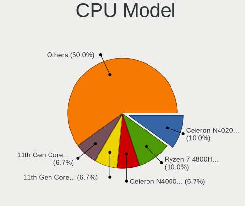
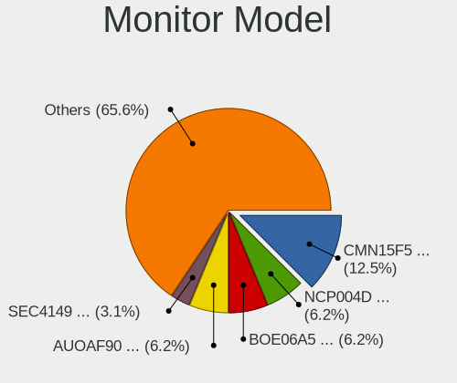
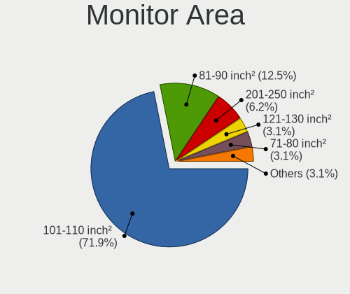

Endless Hardware Trends (Notebook)
----------------------------------

A project to identify most popular hardware characteristics and track their change
over time based on data collected by Endless users at https://Linux-Hardware.org.

Anyone can contribute to the study by uploading probes of their computers by
the [hw-probe](https://github.com/linuxhw/hw-probe) tool:

    sudo hw-probe -all -upload

Full-feature report is available here: https://linux-hardware.org/?view=trends&formfactor=notebook

Period: Apr, 2020.

Contents
--------

- [ OS                       ](#os)
- [ OS Family                ](#os-family)
- [ Kernel                   ](#kernel)
- [ Kernel Family            ](#kernel-family)
- [ Kernel Major Ver.        ](#kernel-major-ver)
- [ Arch                     ](#arch)
- [ DE                       ](#de)
- [ Display Server           ](#display-server)
- [ Display Manager          ](#display-manager)
- [ OS Lang                  ](#os-lang)
- [ Boot Mode                ](#boot-mode)
- [ Filesystem               ](#filesystem)
- [ Dual Boot with Linux/BSD ](#dual-boot-with-linux/bsd)
- [ Dual Boot (Win)          ](#dual-boot-win)
- [ Country                  ](#country)
- [ City                     ](#city)
- [ Vendor                   ](#vendor)
- [ Model                    ](#model)
- [ Model Family             ](#model-family)
- [ MFG Year                 ](#mfg-year)
- [ Form Factor              ](#form-factor)
- [ Secure Boot              ](#secure-boot)
- [ Coreboot                 ](#coreboot)
- [ RAM Size                 ](#ram-size)
- [ RAM Used                 ](#ram-used)
- [ Drive Vendor             ](#drive-vendor)
- [ Drive Model              ](#drive-model)
- [ Drive Kind               ](#drive-kind)
- [ Drive Connector          ](#drive-connector)
- [ Drive Size               ](#drive-size)
- [ Space Total              ](#space-total)
- [ Space Used               ](#space-used)
- [ Malfunc. Drives          ](#malfunc-drives)
- [ Malfunc. Drive Vendor    ](#malfunc-drive-vendor)
- [ Malfunc. Drive Kind      ](#malfunc-drive-kind)
- [ Failed Drives            ](#failed-drives)
- [ Failed Drive Vendor      ](#failed-drive-vendor)
- [ Drive Status             ](#drive-status)
- [ Storage Vendor           ](#storage-vendor)
- [ Storage Model            ](#storage-model)
- [ Storage Kind             ](#storage-kind)
- [ CPU Vendor               ](#cpu-vendor)
- [ CPU Model                ](#cpu-model)
- [ CPU Model Family         ](#cpu-model-family)
- [ CPU Cores                ](#cpu-cores)
- [ CPU Sockets              ](#cpu-sockets)
- [ CPU Threads              ](#cpu-threads)
- [ CPU Op-Modes             ](#cpu-op-modes)
- [ CPU Microarch            ](#cpu-microarch)
- [ CPU Microcode            ](#cpu-microcode)
- [ GPU Vendor               ](#gpu-vendor)
- [ GPU Model                ](#gpu-model)
- [ GPU Combo                ](#gpu-combo)
- [ GPU Driver               ](#gpu-driver)
- [ GPU Memory               ](#gpu-memory)
- [ Monitor Vendor           ](#monitor-vendor)
- [ Monitor Model            ](#monitor-model)
- [ Monitor Resolution       ](#monitor-resolution)
- [ Monitor Diagonal         ](#monitor-diagonal)
- [ Monitor Width            ](#monitor-width)
- [ Aspect Ratio             ](#aspect-ratio)
- [ Monitor Area             ](#monitor-area)
- [ Pixel Density            ](#pixel-density)
- [ Multiple Monitors        ](#multiple-monitors)
- [ Net Controller Vendor    ](#net-controller-vendor)
- [ Net Controller Model     ](#net-controller-model)
- [ Net Controller Kind      ](#net-controller-kind)
- [ Used Controller          ](#used-controller)
- [ NICs                     ](#nics)
- [ Unsupported Devices      ](#unsupported-devices)
- [ Unsupported Device Types ](#unsupported-device-types)

OS
--

Installed operating systems

| Name                   | Computers | Percent |
|------------------------|-----------|---------|
| Endless 3.7.8          | 116       | 76.32%  |
| Endless 3.8.0          | 8         | 5.26%   |
| Endless 3.4.2-nexthw1  | 5         | 3.29%   |
| Endless 3.3.20-nexthw1 | 5         | 3.29%   |
| Endless                | 4         | 2.63%   |
| Endless 3.7.6          | 2         | 1.32%   |
| Endless 3.6.1-nexthw1  | 2         | 1.32%   |
| Endless 3.4.3-nexthw1  | 2         | 1.32%   |
| Endless 3.3.20         | 2         | 1.32%   |
| Endless 3.7.7-nexthw1  | 1         | 0.66%   |
| Endless 3.7.5          | 1         | 0.66%   |
| Endless 3.7.4          | 1         | 0.66%   |
| Endless 3.6.1          | 1         | 0.66%   |
| Endless 3.6.0-nexthw1  | 1         | 0.66%   |
| Endless 3.3.7          | 1         | 0.66%   |

OS Family
---------

OS without a version

| Name    | Computers | Percent |
|---------|-----------|---------|
| Endless | 152       | 100%    |

Kernel
------

Version of the Linux kernel

| Version           | Computers | Percent |
|-------------------|-----------|---------|
| 5.3.0-28-generic  | 117       | 76.97%  |
| 5.4.0-19-generic  | 8         | 5.26%   |
| 4.16.0-4-generic  | 8         | 5.26%   |
| 4.15.0-15-generic | 7         | 4.61%   |
| 5.3.0-23-generic  | 3         | 1.97%   |
| 5.1.0-2-generic   | 3         | 1.97%   |
| 4.13.0-32-generic | 2         | 1.32%   |
| 5.4.0-7-generic   | 1         | 0.66%   |
| 5.3.0-19-generic  | 1         | 0.66%   |
| 5.0.0-17-generic  | 1         | 0.66%   |
| 4.13.0-19-generic | 1         | 0.66%   |

Kernel Family
-------------

Linux kernel without a distro release

| Version | Computers | Percent |
|---------|-----------|---------|
| 5.3.0   | 121       | 79.61%  |
| 5.4.0   | 9         | 5.92%   |
| 4.16.0  | 8         | 5.26%   |
| 4.15.0  | 7         | 4.61%   |
| 5.1.0   | 3         | 1.97%   |
| 4.13.0  | 3         | 1.97%   |
| 5.0.0   | 1         | 0.66%   |

Kernel Major Ver.
-----------------

Linux kernel major version

| Version | Computers | Percent |
|---------|-----------|---------|
| 5.3     | 121       | 79.61%  |
| 5.4     | 9         | 5.92%   |
| 4.16    | 8         | 5.26%   |
| 4.15    | 7         | 4.61%   |
| 5.1     | 3         | 1.97%   |
| 4.13    | 3         | 1.97%   |
| 5.0     | 1         | 0.66%   |

Arch
----

OS architecture (x86_64, i586, etc.)

| Name   | Computers | Percent |
|--------|-----------|---------|
| x86_64 | 152       | 100%    |

DE
--

Desktop Environment

| Name  | Computers | Percent |
|-------|-----------|---------|
| GNOME | 152       | 100%    |

Display Server
--------------

X11 or Wayland

| Name | Computers | Percent |
|------|-----------|---------|
| X11  | 152       | 100%    |

Display Manager
---------------

SDDM, LightDM, etc.

| Name    | Computers | Percent |
|---------|-----------|---------|
| Unknown | 152       | 100%    |

OS Lang
-------

Language

| Lang        | Computers | Percent |
|-------------|-----------|---------|
| en_US.utf8  | 51        | 33.55%  |
| ru_RU       | 15        | 9.87%   |
| pt_BR.utf8  | 15        | 9.87%   |
| pt_BR       | 9         | 5.92%   |
| es_ES       | 8         | 5.26%   |
| ro_RO       | 7         | 4.61%   |
| de_DE       | 7         | 4.61%   |
| en_US       | 5         | 3.29%   |
| it_IT       | 4         | 2.63%   |
| en_GB       | 4         | 2.63%   |
| hu_HU       | 3         | 1.97%   |
| fr_FR       | 3         | 1.97%   |
| es_MX       | 3         | 1.97%   |
| ru_UA       | 2         | 1.32%   |
| ru_RU.UTF_8 | 2         | 1.32%   |
| es_AR       | 2         | 1.32%   |
| ar_EG       | 2         | 1.32%   |
| pt_PT       | 1         | 0.66%   |
| pl_PL       | 1         | 0.66%   |
| lt_LT       | 1         | 0.66%   |
| es_CO       | 1         | 0.66%   |
| en_PH       | 1         | 0.66%   |
| en_IN       | 1         | 0.66%   |
| en_IE       | 1         | 0.66%   |
| cs_CZ       | 1         | 0.66%   |
| ca_ES       | 1         | 0.66%   |
| ar_AE       | 1         | 0.66%   |

Boot Mode
---------

EFI or BIOS

| Mode | Computers | Percent |
|------|-----------|---------|
| EFI  | 94        | 61.84%  |
| BIOS | 58        | 38.16%  |

Filesystem
----------

Type of filesystem

| Type  | Computers | Percent |
|-------|-----------|---------|
| Ext4  | 144       | 94.74%  |
| Tmpfs | 8         | 5.26%   |

Dual Boot with Linux/BSD
------------------------

Hosting more than one Linux/BSD

| Dual boot | Computers | Percent |
|-----------|-----------|---------|
| No        | 152       | 100%    |

Dual Boot (Win)
---------------

Hosting Linux and Windows

| Dual boot | Computers | Percent |
|-----------|-----------|---------|
| No        | 152       | 100%    |

Country
-------

Geographic location (country)

| Country        | Computers | Percent |
|----------------|-----------|---------|
| USA            | 27        | 17.76%  |
| Brazil         | 23        | 15.13%  |
| Russia         | 18        | 11.84%  |
| Romania        | 12        | 7.89%   |
| Spain          | 10        | 6.58%   |
| Germany        | 9         | 5.92%   |
| Ukraine        | 4         | 2.63%   |
| UK             | 4         | 2.63%   |
| Saudi Arabia   | 4         | 2.63%   |
| Italy          | 4         | 2.63%   |
| India          | 4         | 2.63%   |
| Hungary        | 3         | 1.97%   |
| France         | 2         | 1.32%   |
| Croatia        | 2         | 1.32%   |
| Australia      | 2         | 1.32%   |
| Argentina      | 2         | 1.32%   |
| Uruguay        | 1         | 0.66%   |
| South Africa   | 1         | 0.66%   |
| Puerto Rico    | 1         | 0.66%   |
| Portugal       | 1         | 0.66%   |
| Poland         | 1         | 0.66%   |
| Philippines    | 1         | 0.66%   |
| Pakistan       | 1         | 0.66%   |
| Nigeria        | 1         | 0.66%   |
| New Zealand    | 1         | 0.66%   |
| Morocco        | 1         | 0.66%   |
| Lithuania      | 1         | 0.66%   |
| Japan          | 1         | 0.66%   |
| Israel         | 1         | 0.66%   |
| Ireland        | 1         | 0.66%   |
| Iran           | 1         | 0.66%   |
| Georgia        | 1         | 0.66%   |
| Estonia        | 1         | 0.66%   |
| Czech Republic | 1         | 0.66%   |
| Colombia       | 1         | 0.66%   |
| Canada         | 1         | 0.66%   |
| Angola         | 1         | 0.66%   |
| Albania        | 1         | 0.66%   |

City
----

Geographic location (city)

| City                        | Computers | Percent |
|-----------------------------|-----------|---------|
| Moscow                      | 7         | 4.61%   |
| Sacramento                  | 6         | 3.95%   |
| Rio de Janeiro              | 4         | 2.63%   |
| Madrid                      | 3         | 1.97%   |
| Kyiv                        | 3         | 1.97%   |
| São Paulo                  | 2         | 1.32%   |
| Krasnodar                   | 2         | 1.32%   |
| Jundiaí                    | 2         | 1.32%   |
| Jeddah                      | 2         | 1.32%   |
| Chicago                     | 2         | 1.32%   |
| Budapest                    | 2         | 1.32%   |
| Bucharest                   | 2         | 1.32%   |
| Birmingham                  | 2         | 1.32%   |
| Zaporizhia                  | 1         | 0.66%   |
| Zabrze                      | 1         | 0.66%   |
| Wassenberg                  | 1         | 0.66%   |
| Vologda                     | 1         | 0.66%   |
| Visakhapatnam               | 1         | 0.66%   |
| Victoria                    | 1         | 0.66%   |
| Viana                       | 1         | 0.66%   |
| Vegreville                  | 1         | 0.66%   |
| Vaslui                      | 1         | 0.66%   |
| Utica                       | 1         | 0.66%   |
| Urlati                      | 1         | 0.66%   |
| União da Vitória          | 1         | 0.66%   |
| Târgu Mureş               | 1         | 0.66%   |
| Tver                        | 1         | 0.66%   |
| Turin                       | 1         | 0.66%   |
| Tulsa                       | 1         | 0.66%   |
| Tula                        | 1         | 0.66%   |
| Torre de Benagalbon         | 1         | 0.66%   |
| Tehran                      | 1         | 0.66%   |
| Tbilisi                     | 1         | 0.66%   |
| Talmont-Saint-Hilaire       | 1         | 0.66%   |
| Tallinn                     | 1         | 0.66%   |
| Ta'if                       | 1         | 0.66%   |
| Székesfehérvár           | 1         | 0.66%   |
| Stafford                    | 1         | 0.66%   |
| Sergach                     | 1         | 0.66%   |
| Sao Roque                   | 1         | 0.66%   |
| Sao Miguel dos Campos       | 1         | 0.66%   |
| Santos                      | 1         | 0.66%   |
| San Sebastián de los Reyes | 1         | 0.66%   |
| Romans-sur-Isère           | 1         | 0.66%   |
| Rijeka                      | 1         | 0.66%   |
| Rayleigh                    | 1         | 0.66%   |
| Ramat HaSharon              | 1         | 0.66%   |
| Quilmes                     | 1         | 0.66%   |
| Prague                      | 1         | 0.66%   |
| Portland                    | 1         | 0.66%   |
| Ploieşti                   | 1         | 0.66%   |
| Piteşti                    | 1         | 0.66%   |
| Peschiera del Garda         | 1         | 0.66%   |
| Pamplona                    | 1         | 0.66%   |
| Pagėgiai                   | 1         | 0.66%   |
| Padova                      | 1         | 0.66%   |
| Otopeni                     | 1         | 0.66%   |
| Orange                      | 1         | 0.66%   |
| Obninsk                     | 1         | 0.66%   |
| Obernkirchen                | 1         | 0.66%   |

Vendor
------

Motherboard manufacturer

| Name                | Computers | Percent |
|---------------------|-----------|---------|
| ASUSTek Computer    | 66        | 43.42%  |
| Acer                | 25        | 16.45%  |
| Hewlett-Packard     | 15        | 9.87%   |
| Dell                | 14        | 9.21%   |
| Toshiba             | 8         | 5.26%   |
| Lenovo              | 8         | 5.26%   |
| Samsung Electronics | 2         | 1.32%   |
| Positivo            | 2         | 1.32%   |
| Apple               | 2         | 1.32%   |
| Unknown             | 2         | 1.32%   |
| Sony                | 1         | 0.66%   |
| Philco              | 1         | 0.66%   |
| Packard Bell        | 1         | 0.66%   |
| Itautec             | 1         | 0.66%   |
| eMachines           | 1         | 0.66%   |
| Cube                | 1         | 0.66%   |
| Clevo               | 1         | 0.66%   |
| BESSTAR Tech        | 1         | 0.66%   |

Model
-----

Motherboard model

| Name                                                          | Computers | Percent |
|---------------------------------------------------------------|-----------|---------|
| ASUS VivoBook 15_ASUS Laptop X540BA                           | 6         | 3.95%   |
| ASUS VivoBook 15_ASUS Laptop X540MA_X540MA                    | 5         | 3.29%   |
| ASUS ZenBook UX431DA_UM431DA                                  | 4         | 2.63%   |
| ASUS VivoBook 15_ASUS Laptop X540UAR                          | 4         | 2.63%   |
| ASUS VivoBook 15_ASUS Laptop X540MA_X543MA                    | 4         | 2.63%   |
| Acer Nitro AN515-52                                           | 4         | 2.63%   |
| Dell Inspiron 11-3168                                         | 3         | 1.97%   |
| Acer Aspire A315-53                                           | 3         | 1.97%   |
| ASUS X541NA                                                   | 2         | 1.32%   |
| ASUS VivoBook_ASUS Laptop X509UA                              | 2         | 1.32%   |
| ASUS VivoBook_ASUS Laptop E406MA_E406MA                       | 2         | 1.32%   |
| ASUS VivoBook 15_ASUS Laptop X507UF                           | 2         | 1.32%   |
| ASUS VivoBook 14_ASUS Laptop X441MA_X441MA                    | 2         | 1.32%   |
| Acer Aspire A515-51                                           | 2         | 1.32%   |
| Unknown                                                       | 2         | 1.32%   |
| Toshiba Satellite P870                                        | 1         | 0.66%   |
| Toshiba Satellite P75-A                                       | 1         | 0.66%   |
| Toshiba Satellite P70-A                                       | 1         | 0.66%   |
| Toshiba Satellite L750                                        | 1         | 0.66%   |
| Toshiba Satellite L40                                         | 1         | 0.66%   |
| Toshiba Satellite L300                                        | 1         | 0.66%   |
| Toshiba Satellite C855D                                       | 1         | 0.66%   |
| Toshiba NB255                                                 | 1         | 0.66%   |
| Sony VGN-CR320E                                               | 1         | 0.66%   |
| Samsung Electronics RV420/RV520/RV720/E3530/S3530/E3420/E3520 | 1         | 0.66%   |
| Samsung Electronics 300E5K/300E5Q                             | 1         | 0.66%   |
| Positivo Mobile                                               | 1         | 0.66%   |
| Positivo C14CU51                                              | 1         | 0.66%   |
| Philco 14M-W549                                               | 1         | 0.66%   |
| Packard Bell EasyNote TS44HR                                  | 1         | 0.66%   |
| Lenovo ThinkPad X220 42914CG                                  | 1         | 0.66%   |
| Lenovo ThinkPad T500 2055RU3                                  | 1         | 0.66%   |
| Lenovo ThinkPad T410 2516CTO                                  | 1         | 0.66%   |
| Lenovo ThinkPad SL410 2842A67                                 | 1         | 0.66%   |
| Lenovo ThinkPad E420 114157U                                  | 1         | 0.66%   |
| Lenovo IdeaPad FLEX-14API 81SS                                | 1         | 0.66%   |
| Lenovo G405                                                   | 1         | 0.66%   |
| Lenovo G40-45 80E1                                            | 1         | 0.66%   |
| Itautec Infoway                                               | 1         | 0.66%   |
| HP Pavilion Notebook                                          | 1         | 0.66%   |
| HP Pavilion dv6                                               | 1         | 0.66%   |
| HP Pavilion dv2700                                            | 1         | 0.66%   |
| HP OMEN X by HP Laptop                                        | 1         | 0.66%   |
| HP Laptop 15-db0xxx                                           | 1         | 0.66%   |
| HP Laptop 15-da0xxx                                           | 1         | 0.66%   |
| HP Laptop 15-bs1xx                                            | 1         | 0.66%   |
| HP EliteBook 8560p                                            | 1         | 0.66%   |
| HP EliteBook 8460p                                            | 1         | 0.66%   |
| HP Compaq 6730s                                               | 1         | 0.66%   |
| HP 620                                                        | 1         | 0.66%   |
| HP 250 G7 Notebook PC                                         | 1         | 0.66%   |
| HP 250 G6 Notebook PC                                         | 1         | 0.66%   |
| HP 2000                                                       | 1         | 0.66%   |
| HP 14                                                         | 1         | 0.66%   |
| eMachines E725                                                | 1         | 0.66%   |
| Dell XPS M1530                                                | 1         | 0.66%   |
| Dell Latitude E6540                                           | 1         | 0.66%   |
| Dell Latitude E6430                                           | 1         | 0.66%   |
| Dell Latitude E6420                                           | 1         | 0.66%   |
| Dell Latitude E6320                                           | 1         | 0.66%   |

Model Family
------------

Motherboard model prefix

| Name                       | Computers | Percent |
|----------------------------|-----------|---------|
| ASUS VivoBook              | 42        | 27.63%  |
| Acer Aspire                | 16        | 10.53%  |
| Toshiba Satellite          | 7         | 4.61%   |
| Dell Inspiron              | 7         | 4.61%   |
| Dell Latitude              | 6         | 3.95%   |
| ASUS ZenBook               | 6         | 3.95%   |
| Lenovo ThinkPad            | 5         | 3.29%   |
| Acer Nitro                 | 4         | 2.63%   |
| HP Pavilion                | 3         | 1.97%   |
| HP Laptop                  | 3         | 1.97%   |
| Acer Swift                 | 3         | 1.97%   |
| HP EliteBook               | 2         | 1.32%   |
| HP 250                     | 2         | 1.32%   |
| ASUS X541NA                | 2         | 1.32%   |
| Unknown                    | 2         | 1.32%   |
| Toshiba NB255              | 1         | 0.66%   |
| Sony VGN-CR320E            | 1         | 0.66%   |
| Samsung Electronics RV420  | 1         | 0.66%   |
| Samsung Electronics 300E5K | 1         | 0.66%   |
| Positivo Mobile            | 1         | 0.66%   |
| Positivo C14CU51           | 1         | 0.66%   |
| Philco 14M-W549            | 1         | 0.66%   |
| Packard Bell EasyNote      | 1         | 0.66%   |
| Lenovo IdeaPad             | 1         | 0.66%   |
| Lenovo G405                | 1         | 0.66%   |
| Lenovo G40-45              | 1         | 0.66%   |
| Itautec Infoway            | 1         | 0.66%   |
| HP OMEN                    | 1         | 0.66%   |
| HP Compaq                  | 1         | 0.66%   |
| HP 620                     | 1         | 0.66%   |
| HP 2000                    | 1         | 0.66%   |
| HP 14                      | 1         | 0.66%   |
| eMachines E725             | 1         | 0.66%   |
| Dell XPS                   | 1         | 0.66%   |
| Cube i18-B                 | 1         | 0.66%   |
| Clevo E412X                | 1         | 0.66%   |
| BESSTAR Tech Z83-F         | 1         | 0.66%   |
| ASUS X705UAR               | 1         | 0.66%   |
| ASUS X555QA                | 1         | 0.66%   |
| ASUS X542UN                | 1         | 0.66%   |
| ASUS X542UAR               | 1         | 0.66%   |
| ASUS X540SAA               | 1         | 0.66%   |
| ASUS X540NA                | 1         | 0.66%   |
| ASUS X502CA                | 1         | 0.66%   |
| ASUS X451CA                | 1         | 0.66%   |
| ASUS X401U                 | 1         | 0.66%   |
| ASUS X205TA                | 1         | 0.66%   |
| ASUS TUF                   | 1         | 0.66%   |
| ASUS T100TAF               | 1         | 0.66%   |
| ASUS M50SA                 | 1         | 0.66%   |
| ASUS GL753VD               | 1         | 0.66%   |
| ASUS GL553VD               | 1         | 0.66%   |
| ASUS ASUSPRO               | 1         | 0.66%   |
| Apple MacBookPro3          | 1         | 0.66%   |
| Apple MacBook4             | 1         | 0.66%   |
| Acer TravelMate            | 1         | 0.66%   |
| Acer Ferrari               | 1         | 0.66%   |

MFG Year
--------

Motherboard manufacture year

| Year | Computers | Percent |
|------|-----------|---------|
| 2019 | 65        | 42.76%  |
| 2018 | 21        | 13.82%  |
| 2013 | 11        | 7.24%   |
| 2008 | 11        | 7.24%   |
| 2017 | 9         | 5.92%   |
| 2010 | 7         | 4.61%   |
| 2011 | 5         | 3.29%   |
| 2009 | 5         | 3.29%   |
| 2016 | 4         | 2.63%   |
| 2015 | 4         | 2.63%   |
| 2014 | 4         | 2.63%   |
| 2012 | 4         | 2.63%   |
| 2020 | 1         | 0.66%   |
| 2007 | 1         | 0.66%   |

Form Factor
-----------

Physical design of the computer

| Name     | Computers | Percent |
|----------|-----------|---------|
| Notebook | 152       | 100%    |

Secure Boot
-----------

Enabled or disabled

| State    | Computers | Percent |
|----------|-----------|---------|
| Disabled | 125       | 82.24%  |
| Enabled  | 27        | 17.76%  |

Coreboot
--------

Have coreboot on board

| Used | Computers | Percent |
|------|-----------|---------|
| No   | 152       | 100%    |

RAM Size
--------

Total RAM memory

| Size in GB | Computers | Percent |
|------------|-----------|---------|
| 3.01-4.0   | 69        | 45.39%  |
| 4.01-8.0   | 43        | 28.29%  |
| 1.01-2.0   | 14        | 9.21%   |
| 8.01-16.0  | 14        | 9.21%   |
| 2.01-3.0   | 5         | 3.29%   |
| 16.01-24.0 | 5         | 3.29%   |
| 24.01-32.0 | 1         | 0.66%   |
| Unknown    | 1         | 0.66%   |

RAM Used
--------

Used RAM memory

| Used GB  | Computers | Percent |
|----------|-----------|---------|
| 1.01-2.0 | 80        | 52.63%  |
| 0.01-1.0 | 31        | 20.39%  |
| 2.01-3.0 | 25        | 16.45%  |
| 3.01-4.0 | 12        | 7.89%   |
| 4.01-8.0 | 3         | 1.97%   |
| Unknown  | 1         | 0.66%   |

Drive Vendor
------------

Hard drive vendors

| Vendor              | Computers | Drives  | Percent |
|---------------------|-----------|---------|---------|
| Seagate             | 31        | 32      | 19.02%  |
| Toshiba             | 27        | 27      | 16.56%  |
| WDC                 | 25        | 25      | 15.34%  |
| HL-DT-ST            | 13        | Unknown | 7.98%   |
| SanDisk             | 10        | 10      | 6.13%   |
| Kingston            | 10        | 10      | 6.13%   |
| Unknown             | 8         | 8       | 4.91%   |
| Micron Technology   | 6         | 6       | 3.68%   |
| HGST                | 6         | 6       | 3.68%   |
| Samsung Electronics | 5         | 5       | 3.07%   |
| Fujitsu             | 3         | 3       | 1.84%   |
| A-DATA Technology   | 3         | 3       | 1.84%   |
| OCZ                 | 2         | 2       | 1.23%   |
| Hitachi             | 2         | 2       | 1.23%   |
| Crucial             | 2         | 2       | 1.23%   |
| SK Hynix            | 1         | 1       | 0.61%   |
| KingFast            | 1         | 1       | 0.61%   |
| Intel               | 1         | 1       | 0.61%   |
| HUAWEI              | 1         | 1       | 0.61%   |
| Hewlett-Packard     | 1         | 1       | 0.61%   |
| Golden              | 1         | 1       | 0.61%   |
| Generic             | 1         | 1       | 0.61%   |
| FORESEE             | 1         | 1       | 0.61%   |
| China               | 1         | 1       | 0.61%   |
| Apacer              | 1         | 1       | 0.61%   |

Drive Model
-----------

Hard drive models

| Model                        | Computers | Percent |
|------------------------------|-----------|---------|
| ST1000LM035-1RK172 1TB       | 16        | 9.76%   |
| MQ01ABF050 500GB             | 16        | 9.76%   |
| DVDRAM GUE1N 3GB             | 12        | 7.32%   |
| WD10SPZX-21Z10T0 1TB         | 7         | 4.27%   |
| RBUSC180DS37256GJ 256GB SSD  | 4         | 2.44%   |
| MQ04ABF100 1TB               | 4         | 2.44%   |
| SD9SN8W256G1102 256GB SSD    | 3         | 1.83%   |
| MMC Card  64GB               | 3         | 1.83%   |
| IM2S3338-128GD2 128GB SSD    | 3         | 1.83%   |
| 1100_MTFDDAV256TBN 256GB SSD | 3         | 1.83%   |
| WD6400BEVT-22A0RT0 640GB     | 2         | 1.22%   |
| ST9500325AS 500GB            | 2         | 1.22%   |
| ST9250315AS 250GB            | 2         | 1.22%   |
| SSD PLUS 240GB               | 2         | 1.22%   |
| SD9SB8W256G1102 256GB SSD    | 2         | 1.22%   |
| RBUSNS8180DS3256GJ 256GB SSD | 2         | 1.22%   |
| MQ01ABD100 1TB               | 2         | 1.22%   |
| MMC Card  32GB               | 2         | 1.22%   |
| MMC Card  16GB               | 2         | 1.22%   |
| HTS721010A9E630 1TB          | 2         | 1.22%   |
| WDS240G2G0B-00EPW0 240GB SSD | 1         | 0.61%   |
| WD5000LUCT-61C26Y0 500GB     | 1         | 0.61%   |
| WD5000LPVX-80V0TT0 500GB     | 1         | 0.61%   |
| WD5000LPVX-60V0TT0 500GB     | 1         | 0.61%   |
| WD5000LPVX-28V0TT0 500GB     | 1         | 0.61%   |
| WD5000LPVX-22V0TT0 500GB     | 1         | 0.61%   |
| WD5000LPCX-60VHAT1 500GB     | 1         | 0.61%   |
| WD5000BPVT-22HXZT3 500GB     | 1         | 0.61%   |
| WD5000BEVT-22A0RT0 500GB     | 1         | 0.61%   |
| WD3200BPVT-22JJ5T0 320GB     | 1         | 0.61%   |
| WD3200BEVT-22ZCT0 320GB      | 1         | 0.61%   |
| WD2500BEVT-75ZCT2 250GB      | 1         | 0.61%   |
| WD1600BEVT-08A23T1 160GB     | 1         | 0.61%   |
| WD1600BEVS-08VAT2 160GB      | 1         | 0.61%   |
| WD10SPZX-60Z10T0 1TB         | 1         | 0.61%   |
| WD10JPVX-60JC3T1 1TB         | 1         | 0.61%   |
| VERTEX4 256GB SSD            | 1         | 0.61%   |
| VERTEX2 160GB SSD            | 1         | 0.61%   |
| SV300S37A120G 120GB SSD      | 1         | 0.61%   |
| ST9500423AS 500GB            | 1         | 0.61%   |
| ST9500420AS 500GB            | 1         | 0.61%   |
| ST9120817AS 120GB            | 1         | 0.61%   |
| ST500LT012-9WS142 500GB      | 1         | 0.61%   |
| ST500LT012-1DG142 500GB      | 1         | 0.61%   |
| ST500LM000-1EJ162 500GB      | 1         | 0.61%   |
| ST320LT012-9WS14C 320GB      | 1         | 0.61%   |
| ST2000LX001-1RG174 2TB       | 1         | 0.61%   |
| ST2000LM007-1R8174 2TB       | 1         | 0.61%   |
| ST1000LM024 HN-M101MBB 1TB   | 1         | 0.61%   |
| SSDSC2BW120A4 120GB          | 1         | 0.61%   |
| SSD S700 120GB               | 1         | 0.61%   |
| SSD PM830 2.5 7mm 128GB      | 1         | 0.61%   |
| SSD 860 EVO 1TB              | 1         | 0.61%   |
| SSD 840 EVO 120GB            | 1         | 0.61%   |
| SSD 120GB                    | 1         | 0.61%   |
| SD9SN8W128G1102 128GB SSD    | 1         | 0.61%   |
| SD9SB8W256G1002 256GB SSD    | 1         | 0.61%   |
| SD8SN8U-128G-1006 128GB SSD  | 1         | 0.61%   |
| SD/MMC/MS PRO 64GB           | 1         | 0.61%   |
| SD Storage 16GB              | 1         | 0.61%   |

Drive Kind
----------

HDD or SSD

| Kind    | Computers | Drives | Percent |
|---------|-----------|--------|---------|
| HDD     | 93        | 96     | 57.76%  |
| SSD     | 44        | 44     | 27.33%  |
| Unknown | 17        | 4      | 10.56%  |
| MMC     | 7         | 7      | 4.35%   |

Drive Connector
---------------

SATA, SAS, NVMe, etc.

| Type | Computers | Drives | Percent |
|------|-----------|--------|---------|
| SATA | 130       | 140    | 84.42%  |
| SAS  | 17        | 4      | 11.04%  |
| MMC  | 7         | 7      | 4.55%   |

Drive Size
----------

Size of hard drive

| Size in TB | Computers | Drives | Percent |
|------------|-----------|--------|---------|
| 0.01-0.5   | 106       | 106    | 70.67%  |
| 0.51-1.0   | 42        | 43     | 28%     |
| 1.01-2.0   | 2         | 2      | 1.33%   |

Space Total
-----------

Amount of disk space available on the file system

| Size in GB | Computers | Percent |
|------------|-----------|---------|
| 101-250    | 54        | 35.53%  |
| 251-500    | 35        | 23.03%  |
| 501-1000   | 26        | 17.11%  |
| 21-50      | 12        | 7.89%   |
| 51-100     | 11        | 7.24%   |
| 1-20       | 7         | 4.61%   |
| 1001-2000  | 4         | 2.63%   |
| 2001-3000  | 3         | 1.97%   |

Space Used
----------

Amount of used disk space

| Used GB   | Computers | Percent |
|-----------|-----------|---------|
| 21-50     | 84        | 55.26%  |
| 1-20      | 38        | 25%     |
| 51-100    | 19        | 12.5%   |
| 101-250   | 5         | 3.29%   |
| 251-500   | 2         | 1.32%   |
| 1001-2000 | 2         | 1.32%   |
| 501-1000  | 2         | 1.32%   |

Malfunc. Drives
---------------

Drive models with a malfunction

Zero info for selected period =(

Malfunc. Drive Vendor
---------------------

Vendors of faulty drives

Zero info for selected period =(

Malfunc. Drive Kind
-------------------

Kinds of faulty drives

Zero info for selected period =(

Failed Drives
-------------

Failed drive models

Zero info for selected period =(

Failed Drive Vendor
-------------------

Failed drive vendors

Zero info for selected period =(

Drive Status
------------

Number of failed and malfunc. drives

| Status   | Computers | Drives | Percent |
|----------|-----------|--------|---------|
| Detected | 135       | 151    | 100%    |

Storage Vendor
--------------

Storage controller vendors

| Vendor                           | Computers | Percent |
|----------------------------------|-----------|---------|
| Intel                            | 118       | 73.29%  |
| AMD                              | 28        | 17.39%  |
| SK Hynix                         | 6         | 3.73%   |
| Kingston Technology Company      | 3         | 1.86%   |
| Toshiba America Info Systems     | 1         | 0.62%   |
| Silicon Integrated Systems [SiS] | 1         | 0.62%   |
| Sandisk                          | 1         | 0.62%   |
| Samsung Electronics              | 1         | 0.62%   |
| Nvidia                           | 1         | 0.62%   |
| JMicron Technology               | 1         | 0.62%   |

Storage Model
-------------

Storage controller models

| Model                                                                            | Computers | Percent |
|----------------------------------------------------------------------------------|-----------|---------|
| FCH SATA Controller [AHCI mode]                                                  | 26        | 14.21%  |
| Sunrise Point-LP SATA Controller [AHCI mode]                                     | 23        | 12.57%  |
| SATA controller                                                                  | 19        | 10.38%  |
| 82801 Mobile SATA Controller [RAID mode]                                         | 18        | 9.84%   |
| 82801HM/HEM (ICH8M/ICH8M-E) IDE Controller                                       | 9         | 4.92%   |
| 82801IBM/IEM (ICH9M/ICH9M-E) 4 port SATA Controller [AHCI mode]                  | 8         | 4.37%   |
| 82801HM/HEM (ICH8M/ICH8M-E) SATA Controller [AHCI mode]                          | 7         | 3.83%   |
| PROSet/Wireless WiFi Software extension                                          | 6         | 3.28%   |
| 6 Series/C200 Series Chipset Family 6 port Mobile SATA AHCI Controller           | 6         | 3.28%   |
| Celeron N3350/Pentium N4200/Atom E3900 Series SATA AHCI Controller               | 5         | 2.73%   |
| BC501 NVMe Solid State Drive 512GB                                               | 5         | 2.73%   |
| Non-Volatile memory controller                                                   | 4         | 2.19%   |
| Atom/Celeron/Pentium Processor x5-E8000/J3xxx/N3xxx Series SATA Controller       | 4         | 2.19%   |
| 7 Series Chipset Family 6-port SATA Controller [AHCI mode]                       | 4         | 2.19%   |
| HM170/QM170 Chipset SATA Controller [AHCI Mode]                                  | 3         | 1.64%   |
| 82801HM/HEM (ICH8M/ICH8M-E) SATA Controller [IDE mode]                           | 3         | 1.64%   |
| SB7x0/SB8x0/SB9x0 SATA Controller [AHCI mode]                                    | 2         | 1.09%   |
| FCH IDE Controller                                                               | 2         | 1.09%   |
| Cannon Point-LP SATA Controller [AHCI Mode]                                      | 2         | 1.09%   |
| Cannon Lake Mobile PCH SATA AHCI Controller                                      | 2         | 1.09%   |
| Atom Processor E3800 Series SATA AHCI Controller                                 | 2         | 1.09%   |
| 8 Series/C220 Series Chipset Family 6-port SATA Controller 1 [AHCI mode]         | 2         | 1.09%   |
| 5 Series/3400 Series Chipset 4 port SATA AHCI Controller                         | 2         | 1.09%   |
| Wildcat Point-LP SATA Controller [AHCI Mode]                                     | 1         | 0.55%   |
| WD Black 2018/PC SN520 NVMe SSD                                                  | 1         | 0.55%   |
| Toshiba America Info Non-Volatile memory controller                              | 1         | 0.55%   |
| SATA Controller / IDE mode                                                       | 1         | 0.55%   |
| Q170/Q150/B150/H170/H110/Z170/CM236 Chipset SATA Controller [AHCI Mode]          | 1         | 0.55%   |
| NVMe SSD Controller SM981/PM981/PM983                                            | 1         | 0.55%   |
| NM10/ICH7 Family SATA Controller [AHCI mode]                                     | 1         | 0.55%   |
| MCP67 SATA Controller                                                            | 1         | 0.55%   |
| MCP67 IDE Controller                                                             | 1         | 0.55%   |
| JMB360 AHCI Controller                                                           | 1         | 0.55%   |
| 82801IBM/IEM (ICH9M/ICH9M-E) 2 port SATA Controller [IDE mode]                   | 1         | 0.55%   |
| 7 Series Chipset Family 4-port SATA Controller [IDE mode]                        | 1         | 0.55%   |
| 7 Series Chipset Family 2-port SATA Controller [IDE mode]                        | 1         | 0.55%   |
| 6 Series/C200 Series Chipset Family Mobile SATA Controller (IDE mode, ports 4-5) | 1         | 0.55%   |
| 6 Series/C200 Series Chipset Family Mobile SATA Controller (IDE mode, ports 0-3) | 1         | 0.55%   |
| 5513 IDE Controller                                                              | 1         | 0.55%   |
| 5 Series/3400 Series Chipset 6 port SATA AHCI Controller                         | 1         | 0.55%   |
| 5 Series/3400 Series Chipset 4 port SATA IDE Controller                          | 1         | 0.55%   |
| 5 Series/3400 Series Chipset 2 port SATA IDE Controller                          | 1         | 0.55%   |

Storage Kind
------------

Kind of storage controller (IDE, SATA, NVMe, SAS, ...)

| Kind | Computers | Percent |
|------|-----------|---------|
| SATA | 125       | 71.02%  |
| NVMe | 18        | 10.23%  |
| IDE  | 18        | 10.23%  |
| RAID | 15        | 8.52%   |

CPU Vendor
----------

Processor vendors

| Vendor | Computers | Percent |
|--------|-----------|---------|
| Intel  | 122       | 80.26%  |
| AMD    | 30        | 19.74%  |

CPU Model
---------

Processor models

| Model                                         | Computers | Percent |
|-----------------------------------------------|-----------|---------|
| Intel Celeron N4000 CPU @ 1.10GHz             | 15        | 9.87%   |
| Intel Core i5-8250U CPU @ 1.60GHz             | 7         | 4.61%   |
| Intel Core i3-7020U CPU @ 2.30GHz             | 6         | 3.95%   |
| Intel Pentium CPU 4417U @ 2.30GHz             | 5         | 3.29%   |
| Intel Celeron CPU N3350 @ 1.10GHz             | 5         | 3.29%   |
| Intel Pentium Silver N5000 CPU @ 1.10GHz      | 4         | 2.63%   |
| Intel Core i3-8145U CPU @ 2.10GHz             | 4         | 2.63%   |
| Intel Core i3-6006U CPU @ 2.00GHz             | 4         | 2.63%   |
| AMD Ryzen 7 3700U with Radeon Vega Mobile Gfx | 4         | 2.63%   |
| AMD A6-9225 RADEON R4, 5 COMPUTE CORES 2C+3G  | 4         | 2.63%   |
| Intel Pentium CPU N3710 @ 1.60GHz             | 3         | 1.97%   |
| Intel Core i7-8750H CPU @ 2.20GHz             | 3         | 1.97%   |
| AMD Ryzen 5 3500U with Radeon Vega Mobile Gfx | 3         | 1.97%   |
| Intel Pentium Dual-Core CPU T4400 @ 2.20GHz   | 2         | 1.32%   |
| Intel Pentium Dual-Core CPU T4300 @ 2.10GHz   | 2         | 1.32%   |
| Intel Core i7-7500U CPU @ 2.70GHz             | 2         | 1.32%   |
| Intel Core i7-4700MQ CPU @ 2.40GHz            | 2         | 1.32%   |
| Intel Core i5-8300H CPU @ 2.30GHz             | 2         | 1.32%   |
| Intel Core i5-8265U CPU @ 1.60GHz             | 2         | 1.32%   |
| Intel Core i5-7300HQ CPU @ 2.50GHz            | 2         | 1.32%   |
| Intel Core i5-2450M CPU @ 2.50GHz             | 2         | 1.32%   |
| Intel Core i3-6100U CPU @ 2.30GHz             | 2         | 1.32%   |
| Intel Core 2 Duo CPU T7700 @ 2.40GHz          | 2         | 1.32%   |
| Intel Celeron CPU 1007U @ 1.50GHz             | 2         | 1.32%   |
| Intel Atom CPU Z3735F @ 1.33GHz               | 2         | 1.32%   |
| AMD C-70 APU with Radeon HD Graphics          | 2         | 1.32%   |
| AMD A4-9125 RADEON R3, 4 COMPUTE CORES 2C+2G  | 2         | 1.32%   |
| Intel Pentium Dual-Core CPU T4200 @ 2.00GHz   | 1         | 0.66%   |
| Intel Pentium Dual CPU T2310 @ 1.46GHz        | 1         | 0.66%   |
| Intel Pentium CPU P6200 @ 2.13GHz             | 1         | 0.66%   |
| Intel Pentium CPU B960 @ 2.20GHz              | 1         | 0.66%   |
| Intel Pentium CPU B940 @ 2.00GHz              | 1         | 0.66%   |
| Intel Core m3-7Y30 CPU @ 1.00GHz              | 1         | 0.66%   |
| Intel Core i7-7820HK CPU @ 2.90GHz            | 1         | 0.66%   |
| Intel Core i7-7700HQ CPU @ 2.80GHz            | 1         | 0.66%   |
| Intel Core i7-4800MQ CPU @ 2.70GHz            | 1         | 0.66%   |
| Intel Core i7-3610QM CPU @ 2.30GHz            | 1         | 0.66%   |
| Intel Core i7-2640M CPU @ 2.80GHz             | 1         | 0.66%   |
| Intel Core i7-2620M CPU @ 2.70GHz             | 1         | 0.66%   |
| Intel Core i7-10510U CPU @ 1.80GHz            | 1         | 0.66%   |
| Intel Core i7 CPU M 620 @ 2.67GHz             | 1         | 0.66%   |
| Intel Core i5-7300U CPU @ 2.60GHz             | 1         | 0.66%   |
| Intel Core i5-3230M CPU @ 2.60GHz             | 1         | 0.66%   |
| Intel Core i5-2520M CPU @ 2.50GHz             | 1         | 0.66%   |
| Intel Core i5-2410M CPU @ 2.30GHz             | 1         | 0.66%   |
| Intel Core i5-1035G1 CPU @ 1.00GHz            | 1         | 0.66%   |
| Intel Core i5 CPU M 460 @ 2.53GHz             | 1         | 0.66%   |
| Intel Core i3-5005U CPU @ 2.00GHz             | 1         | 0.66%   |
| Intel Core i3-3217U CPU @ 1.80GHz             | 1         | 0.66%   |
| Intel Core i3-2330M CPU @ 2.20GHz             | 1         | 0.66%   |
| Intel Core i3-2310M CPU @ 2.10GHz             | 1         | 0.66%   |
| Intel Core i3 CPU M 350 @ 2.27GHz             | 1         | 0.66%   |
| Intel Core 2 Duo CPU T9400 @ 2.53GHz          | 1         | 0.66%   |
| Intel Core 2 Duo CPU T9300 @ 2.50GHz          | 1         | 0.66%   |
| Intel Core 2 Duo CPU T8300 @ 2.40GHz          | 1         | 0.66%   |
| Intel Core 2 Duo CPU T8100 @ 2.10GHz          | 1         | 0.66%   |
| Intel Core 2 Duo CPU T7500 @ 2.20GHz          | 1         | 0.66%   |
| Intel Core 2 Duo CPU T7250 @ 2.00GHz          | 1         | 0.66%   |
| Intel Core 2 Duo CPU T6670 @ 2.20GHz          | 1         | 0.66%   |
| Intel Core 2 Duo CPU T6570 @ 2.10GHz          | 1         | 0.66%   |

CPU Model Family
----------------

Processor model prefix

| Model                   | Computers | Percent |
|-------------------------|-----------|---------|
| Intel Celeron           | 26        | 17.11%  |
| Intel Core i5           | 21        | 13.82%  |
| Intel Core i3           | 21        | 13.82%  |
| Intel Core i7           | 15        | 9.87%   |
| Intel Core 2 Duo        | 13        | 8.55%   |
| Intel Pentium           | 11        | 7.24%   |
| AMD A6                  | 6         | 3.95%   |
| Intel Pentium Dual-Core | 5         | 3.29%   |
| Intel Pentium Silver    | 4         | 2.63%   |
| Intel Atom              | 4         | 2.63%   |
| AMD Ryzen 7             | 4         | 2.63%   |
| AMD Ryzen 5             | 4         | 2.63%   |
| AMD A4                  | 3         | 1.97%   |
| AMD Ryzen 3             | 2         | 1.32%   |
| AMD C-70                | 2         | 1.32%   |
| Other                   | 1         | 0.66%   |
| Intel Pentium Dual      | 1         | 0.66%   |
| Intel Core m3           | 1         | 0.66%   |
| AMD Turion 64 X2 Mobile | 1         | 0.66%   |
| AMD Phenom II           | 1         | 0.66%   |
| AMD E2                  | 1         | 0.66%   |
| AMD E1                  | 1         | 0.66%   |
| AMD E                   | 1         | 0.66%   |
| AMD Athlon X2           | 1         | 0.66%   |
| AMD A8                  | 1         | 0.66%   |
| AMD A12                 | 1         | 0.66%   |

CPU Cores
---------

Number of processor cores

| Number | Computers | Percent |
|--------|-----------|---------|
| 2      | 104       | 68.42%  |
| 4      | 42        | 27.63%  |
| 6      | 3         | 1.97%   |
| 1      | 3         | 1.97%   |

CPU Sockets
-----------

Number of sockets

| Number | Computers | Percent |
|--------|-----------|---------|
| 1      | 152       | 100%    |

CPU Threads
-----------

Threads per core (Hyper-Threading)

| Number | Computers | Percent |
|--------|-----------|---------|
| 1      | 79        | 51.97%  |
| 2      | 73        | 48.03%  |

CPU Op-Modes
------------

CPU Operation Modes (32-bit, 64-bit)

| Op mode        | Computers | Percent |
|----------------|-----------|---------|
| 32-bit, 64-bit | 152       | 100%    |

CPU Microarch
-------------

Microarchitecture

| Name          | Computers | Percent |
|---------------|-----------|---------|
| Skylake       | 42        | 27.63%  |
| Goldmont plus | 19        | 12.5%   |
| Core          | 18        | 11.84%  |
| SandyBridge   | 10        | 6.58%   |
| Excavator     | 10        | 6.58%   |
| Silvermont    | 9         | 5.92%   |
| Zen+          | 8         | 5.26%   |
| IvyBridge     | 5         | 3.29%   |
| Goldmont      | 5         | 3.29%   |
| Westmere      | 4         | 2.63%   |
| Haswell       | 3         | 1.97%   |
| Bobcat        | 3         | 1.97%   |
| Zen           | 2         | 1.32%   |
| Puma          | 2         | 1.32%   |
| Penryn        | 2         | 1.32%   |
| KabyLake      | 2         | 1.32%   |
| K8 Hammer     | 2         | 1.32%   |
| Piledriver    | 1         | 0.66%   |
| K10           | 1         | 0.66%   |
| Jaguar        | 1         | 0.66%   |
| Icelake       | 1         | 0.66%   |
| Broadwell     | 1         | 0.66%   |
| Bonnell       | 1         | 0.66%   |

CPU Microcode
-------------

Microcode number

| Number     | Computers | Percent |
|------------|-----------|---------|
| 0x706a1    | 16        | 10.53%  |
| Unknown    | 14        | 9.21%   |
| 0x806ea    | 11        | 7.24%   |
| 0x806e9    | 10        | 6.58%   |
| 0x206a7    | 10        | 6.58%   |
| 0x1067a    | 7         | 4.61%   |
| 0x08108102 | 7         | 4.61%   |
| 0x806ec    | 6         | 3.95%   |
| 0x06006705 | 6         | 3.95%   |
| 0x906ea    | 5         | 3.29%   |
| 0x506c9    | 5         | 3.29%   |
| 0x306a9    | 5         | 3.29%   |
| 0x6fd      | 4         | 2.63%   |
| 0x406e3    | 4         | 2.63%   |
| 0x406c4    | 4         | 2.63%   |
| 0x30678    | 4         | 2.63%   |
| 0x10676    | 4         | 2.63%   |
| 0x906e9    | 3         | 1.97%   |
| 0x6fb      | 3         | 1.97%   |
| 0x306c3    | 3         | 1.97%   |
| 0x05000119 | 3         | 1.97%   |
| 0x20655    | 2         | 1.32%   |
| 0x08101007 | 2         | 1.32%   |
| 0x07030105 | 2         | 1.32%   |
| 0x806eb    | 1         | 0.66%   |
| 0x706e5    | 1         | 0.66%   |
| 0x406c3    | 1         | 0.66%   |
| 0x306d4    | 1         | 0.66%   |
| 0x20652    | 1         | 0.66%   |
| 0x106ca    | 1         | 0.66%   |
| 0x08108109 | 1         | 0.66%   |
| 0x0700010f | 1         | 0.66%   |
| 0x06006704 | 1         | 0.66%   |
| 0x0600611a | 1         | 0.66%   |
| 0x06001119 | 1         | 0.66%   |
| 0x010000c8 | 1         | 0.66%   |

GPU Vendor
----------

Vendors of graphics cards

| Vendor                           | Computers | Percent |
|----------------------------------|-----------|---------|
| Intel                            | 112       | 64%     |
| AMD                              | 37        | 21.14%  |
| Nvidia                           | 25        | 14.29%  |
| Silicon Integrated Systems [SiS] | 1         | 0.57%   |

GPU Model
---------

Graphics card models

| Model                                                                              | Computers | Percent |
|------------------------------------------------------------------------------------|-----------|---------|
| UHD Graphics 605                                                                   | 19        | 10.27%  |
| Stoney [Radeon R2/R3/R4/R5 Graphics]                                               | 9         | 4.86%   |
| Picasso                                                                            | 8         | 4.32%   |
| Mobile 4 Series Chipset Integrated Graphics Controller                             | 8         | 4.32%   |
| 2nd Generation Core Processor Family Integrated Graphics Controller                | 8         | 4.32%   |
| UHD Graphics 620                                                                   | 7         | 3.78%   |
| UHD Graphics 620 (Whiskey Lake)                                                    | 6         | 3.24%   |
| Skylake GT2 [HD Graphics 520]                                                      | 6         | 3.24%   |
| Kaby Lake-U GT2f Integrated Graphics Controller                                    | 6         | 3.24%   |
| UHD Graphics 630 (Mobile)                                                          | 5         | 2.7%    |
| Mobile GM965/GL960 Integrated Graphics Controller (secondary)                      | 5         | 2.7%    |
| Mobile GM965/GL960 Integrated Graphics Controller (primary)                        | 5         | 2.7%    |
| Kaby Lake-U GT1 Integrated Graphics Controller                                     | 5         | 2.7%    |
| HD Graphics 500                                                                    | 5         | 2.7%    |
| GM108M [GeForce MX110]                                                             | 5         | 2.7%    |
| Atom/Celeron/Pentium Processor x5-E8000/J3xxx/N3xxx Integrated Graphics Controller | 5         | 2.7%    |
| 3rd Gen Core processor Graphics Controller                                         | 5         | 2.7%    |
| GP107M [GeForce GTX 1050 Mobile]                                                   | 4         | 2.16%   |
| Core Processor Integrated Graphics Controller                                      | 4         | 2.16%   |
| Atom Processor Z36xxx/Z37xxx Series Graphics & Display                             | 4         | 2.16%   |
| HD Graphics 630                                                                    | 3         | 1.62%   |
| HD Graphics 620                                                                    | 3         | 1.62%   |
| 4th Gen Core Processor Integrated Graphics Controller                              | 3         | 1.62%   |
| Wrestler [Radeon HD 7290]                                                          | 2         | 1.08%   |
| Sun XT [Radeon HD 8670A/8670M/8690M / R5 M330 / M430 / Radeon 520 Mobile]          | 2         | 1.08%   |
| Seymour [Radeon HD 6400M/7400M Series]                                             | 2         | 1.08%   |
| RV635/M86 [Mobility Radeon HD 3650]                                                | 2         | 1.08%   |
| Raven Ridge [Radeon Vega Series / Radeon Vega Mobile Series]                       | 2         | 1.08%   |
| Mullins [Radeon R4/R5 Graphics]                                                    | 2         | 1.08%   |
| GP108M [GeForce MX150]                                                             | 2         | 1.08%   |
| GP107M [GeForce GTX 1050 Ti Mobile]                                                | 2         | 1.08%   |
| GM108M [GeForce MX130]                                                             | 2         | 1.08%   |
| Wrestler [Radeon HD 6310]                                                          | 1         | 0.54%   |
| Wani [Radeon R5/R6/R7 Graphics]                                                    | 1         | 0.54%   |
| UHD Graphics                                                                       | 1         | 0.54%   |
| TU117M [GeForce GTX 1650 Mobile / Max-Q]                                           | 1         | 0.54%   |
| Trinity 2 [Radeon HD 7520G]                                                        | 1         | 0.54%   |
| Sun LE [Radeon HD 8550M / R5 M230]                                                 | 1         | 0.54%   |
| RV630/M76 [Mobility Radeon HD 2600]                                                | 1         | 0.54%   |
| RV620/M82 [Mobility Radeon HD 3410/3430]                                           | 1         | 0.54%   |
| RS880M [Mobility Radeon HD 4225/4250]                                              | 1         | 0.54%   |
| RS780M [Mobility Radeon HD 3200]                                                   | 1         | 0.54%   |
| Mars XTX [Radeon HD 8790M]                                                         | 1         | 0.54%   |
| Madison [Mobility Radeon HD 5650/5750 / 6530M/6550M]                               | 1         | 0.54%   |
| Lexa PRO [Radeon 540/540X/550/550X / RX 540X/550/550X]                             | 1         | 0.54%   |
| Kabini [Radeon HD 8210]                                                            | 1         | 0.54%   |
| Jet PRO [Radeon R5 M230 / R7 M260DX / Radeon 520 Mobile]                           | 1         | 0.54%   |
| Iris Plus Graphics G1 (Ice Lake)                                                   | 1         | 0.54%   |
| HD Graphics 615                                                                    | 1         | 0.54%   |
| HD Graphics 5500                                                                   | 1         | 0.54%   |
| GP106M [GeForce GTX 1060 Mobile]                                                   | 1         | 0.54%   |
| GP106M [GeForce GTX 1050 Ti Mobile]                                                | 1         | 0.54%   |
| GP104BM [GeForce GTX 1080 Mobile]                                                  | 1         | 0.54%   |
| GK208M [GeForce GT 740M]                                                           | 1         | 0.54%   |
| GF108M [GeForce GT 620M/630M/635M/640M LE]                                         | 1         | 0.54%   |
| G86M [Quadro NVS 140M]                                                             | 1         | 0.54%   |
| G86M [GeForce 8400M GS]                                                            | 1         | 0.54%   |
| G84M [GeForce 8600M GT]                                                            | 1         | 0.54%   |
| C67 [GeForce 7000M / nForce 610M]                                                  | 1         | 0.54%   |
| Atom Processor D4xx/D5xx/N4xx/N5xx Integrated Graphics Controller                  | 1         | 0.54%   |

GPU Combo
---------

Combinations of graphics cards

| Name           | Computers | Percent |
|----------------|-----------|---------|
| 1 x Intel      | 89        | 58.55%  |
| 1 x AMD        | 29        | 19.08%  |
| Intel + Nvidia | 20        | 13.16%  |
| 2 x AMD        | 5         | 3.29%   |
| 1 x Nvidia     | 5         | 3.29%   |
| Intel + AMD    | 3         | 1.97%   |
| 1 x SiS        | 1         | 0.66%   |

GPU Driver
----------

Free vs proprietary

| Driver      | Computers | Percent |
|-------------|-----------|---------|
| Free        | 133       | 87.5%   |
| Proprietary | 17        | 11.18%  |
| Unknown     | 2         | 1.32%   |

GPU Memory
----------

Total video memory

| Size in GB | Computers | Percent |
|------------|-----------|---------|
| Unknown    | 106       | 69.74%  |
| 0.01-0.5   | 19        | 12.5%   |
| 1.01-2.0   | 13        | 8.55%   |
| 3.01-4.0   | 8         | 5.26%   |
| 0.51-1.0   | 6         | 3.95%   |

Monitor Vendor
--------------

Monitor vendors

| Vendor                  | Computers | Percent |
|-------------------------|-----------|---------|
| AU Optronics            | 36        | 23.84%  |
| Chimei Innolux          | 34        | 22.52%  |
| BOE                     | 27        | 17.88%  |
| LG Display              | 17        | 11.26%  |
| Samsung Electronics     | 12        | 7.95%   |
| Chi Mei Optoelectronics | 5         | 3.31%   |
| PANDA                   | 4         | 2.65%   |
| LG Philips              | 3         | 1.99%   |
| Lenovo                  | 2         | 1.32%   |
| InfoVision              | 2         | 1.32%   |
| Dell                    | 2         | 1.32%   |
| Apple                   | 2         | 1.32%   |
| Toshiba                 | 1         | 0.66%   |
| OEM                     | 1         | 0.66%   |
| IBM                     | 1         | 0.66%   |
| Hitachi                 | 1         | 0.66%   |
| Goldstar                | 1         | 0.66%   |

Monitor Model
-------------

Monitor models

| Model                                              | Computers | Percent |
|----------------------------------------------------|-----------|---------|
| LCD Monitor AUO61ED 1920x1080 340x190mm 15.3-inch  | 8         | 5.3%    |
| LCD Monitor CMN15DC 1366x768 344x193mm 15.5-inch   | 7         | 4.64%   |
| LCD Monitor CMN15DB 1366x768 344x193mm 15.5-inch   | 5         | 3.31%   |
| LCD Monitor BOE06A5 1366x768 344x194mm 15.5-inch   | 5         | 3.31%   |
| LCD Monitor BOE069C 1920x1080 344x193mm 15.5-inch  | 5         | 3.31%   |
| LCD Monitor NCP0035 1920x1080 309x174mm 14.0-inch  | 4         | 2.65%   |
| LCD Monitor CMN15E6 1366x768 344x193mm 15.5-inch   | 4         | 2.65%   |
| LCD Monitor BOE0672 1366x768 344x194mm 15.5-inch   | 4         | 2.65%   |
| LCD Monitor AUO70EC 1366x768 340x190mm 15.3-inch   | 4         | 2.65%   |
| LCD Monitor CMN15D5 1920x1080 340x190mm 15.3-inch  | 3         | 1.99%   |
| LCD Monitor CMN14D4 1920x1080 309x173mm 13.9-inch  | 3         | 1.99%   |
| LCD Monitor BOE06AB 1366x768 256x144mm 11.6-inch   | 3         | 1.99%   |
| LCD Monitor BOE06A4 1366x768 344x194mm 15.5-inch   | 3         | 1.99%   |
| LCD Monitor AUO71EC 1366x768 340x190mm 15.3-inch   | 3         | 1.99%   |
| LCD Monitor AUO38ED 1920x1080 340x190mm 15.3-inch  | 3         | 1.99%   |
| LCD Monitor AUO21ED 1920x1080 344x194mm 15.5-inch  | 3         | 1.99%   |
| M140NWR2 R1 IVO057A 1366x768 309x174mm 14.0-inch   | 2         | 1.32%   |
| LCD Monitor SEC5441 1366x768 344x194mm 15.5-inch   | 2         | 1.32%   |
| LCD Monitor LGD05AB 1920x1080 309x174mm 14.0-inch  | 2         | 1.32%   |
| LCD Monitor LGD04E8 1920x1080 382x215mm 17.3-inch  | 2         | 1.32%   |
| LCD Monitor LGD02DC 1366x768 344x194mm 15.5-inch   | 2         | 1.32%   |
| LCD Monitor CMN15F5 1920x1080 344x193mm 15.5-inch  | 2         | 1.32%   |
| LCD Monitor AUO193C 1366x768 309x173mm 13.9-inch   | 2         | 1.32%   |
| ScreenXpert TSB8888 1080x2160                      | 1         | 0.66%   |
| P2317H DEL40F2 1920x1080 509x286mm 23.0-inch       | 1         | 0.66%   |
| LP154WX4-TLC8 LPL0120 1280x800 331x207mm 15.4-inch | 1         | 0.66%   |
| LCD Monitor SEC544E 1024x600 223x125mm 10.1-inch   | 1         | 0.66%   |
| LCD Monitor SEC4D42 1280x800 303x190mm 14.1-inch   | 1         | 0.66%   |
| LCD Monitor SEC3945 1280x800 331x207mm 15.4-inch   | 1         | 0.66%   |
| LCD Monitor SEC3842 1366x768 309x174mm 14.0-inch   | 1         | 0.66%   |
| LCD Monitor SEC3651 1366x768 344x194mm 15.5-inch   | 1         | 0.66%   |
| LCD Monitor SEC3358 1280x800 331x207mm 15.4-inch   | 1         | 0.66%   |
| LCD Monitor SEC3242 1920x1080 230x130mm 10.4-inch  | 1         | 0.66%   |
| LCD Monitor SEC315A 1366x768 344x194mm 15.5-inch   | 1         | 0.66%   |
| LCD Monitor SDC414D 1366x768 309x174mm 14.0-inch   | 1         | 0.66%   |
| LCD Monitor LPLDD00 1280x800 331x207mm 15.4-inch   | 1         | 0.66%   |
| LCD Monitor LPL0201 1280x800 331x207mm 15.4-inch   | 1         | 0.66%   |
| LCD Monitor LGD056D 1920x1080 380x210mm 17.1-inch  | 1         | 0.66%   |
| LCD Monitor LGD0557 1920x1080 309x174mm 14.0-inch  | 1         | 0.66%   |
| LCD Monitor LGD0493 1366x768 344x194mm 15.5-inch   | 1         | 0.66%   |
| LCD Monitor LGD0456 1366x768 344x194mm 15.5-inch   | 1         | 0.66%   |
| LCD Monitor LGD0396 1600x900 382x215mm 17.3-inch   | 1         | 0.66%   |
| LCD Monitor LGD033F 1366x768 309x174mm 14.0-inch   | 1         | 0.66%   |
| LCD Monitor LGD033A 1366x768 340x190mm 15.3-inch   | 1         | 0.66%   |
| LCD Monitor LGD0306 1600x900 310x174mm 14.0-inch   | 1         | 0.66%   |
| LCD Monitor LGD02F1 1366x768 344x194mm 15.5-inch   | 1         | 0.66%   |
| LCD Monitor LGD02D8 1366x768 277x156mm 12.5-inch   | 1         | 0.66%   |
| LCD Monitor LGD0289 1600x900 382x215mm 17.3-inch   | 1         | 0.66%   |
| LCD Monitor LEN40A0 1366x768 309x174mm 14.0-inch   | 1         | 0.66%   |
| LCD Monitor LEN4035 1280x800 304x190mm 14.1-inch   | 1         | 0.66%   |
| LCD Monitor IBM2887 1680x1050 331x207mm 15.4-inch  | 1         | 0.66%   |
| LCD Monitor CMO15A7 1366x768 350x190mm 15.7-inch   | 1         | 0.66%   |
| LCD Monitor CMO15A3 1366x768 344x193mm 15.5-inch   | 1         | 0.66%   |
| LCD Monitor CMO1592 1366x768 344x193mm 15.5-inch   | 1         | 0.66%   |
| LCD Monitor CMO1332 1366x768 293x164mm 13.2-inch   | 1         | 0.66%   |
| LCD Monitor CMO1100 1366x768 256x144mm 11.6-inch   | 1         | 0.66%   |
| LCD Monitor CMN1745 1600x900 380x210mm 17.1-inch   | 1         | 0.66%   |
| LCD Monitor CMN15E2 1920x1080 344x193mm 15.5-inch  | 1         | 0.66%   |
| LCD Monitor CMN15CA 1366x768 340x190mm 15.3-inch   | 1         | 0.66%   |
| LCD Monitor CMN15C4 1920x1080 344x193mm 15.5-inch  | 1         | 0.66%   |

Monitor Resolution
------------------

Monitor screen resolution

| Resolution         | Computers | Percent |
|--------------------|-----------|---------|
| 1366x768 (WXGA)    | 76        | 50.33%  |
| 1920x1080 (FHD)    | 52        | 34.44%  |
| 1280x800 (WXGA)    | 11        | 7.28%   |
| 1600x900 (HD+)     | 5         | 3.31%   |
| 1680x1050 (WSXGA+) | 2         | 1.32%   |
| 1920x540           | 1         | 0.66%   |
| 1440x900 (WXGA+)   | 1         | 0.66%   |
| 1080x2160          | 1         | 0.66%   |
| 1024x768 (XGA)     | 1         | 0.66%   |
| 1024x600           | 1         | 0.66%   |

Monitor Diagonal
----------------

Diagonal size in inches

| Inches  | Computers | Percent |
|---------|-----------|---------|
| 15      | 88        | 58.28%  |
| 14      | 22        | 14.57%  |
| 13      | 15        | 9.93%   |
| 17      | 11        | 7.28%   |
| 11      | 6         | 3.97%   |
| 23      | 2         | 1.32%   |
| 10      | 2         | 1.32%   |
| 32      | 1         | 0.66%   |
| 22      | 1         | 0.66%   |
| 12      | 1         | 0.66%   |
| 5       | 1         | 0.66%   |
| Unknown | 1         | 0.66%   |

Monitor Width
-------------

Physical width

| Width in mm | Computers | Percent |
|-------------|-----------|---------|
| 301-350     | 121       | 80.13%  |
| 201-300     | 13        | 8.61%   |
| 351-400     | 11        | 7.28%   |
| 501-600     | 2         | 1.32%   |
| 701-800     | 1         | 0.66%   |
| 401-500     | 1         | 0.66%   |
| 1-100       | 1         | 0.66%   |
| Unknown     | 1         | 0.66%   |

Aspect Ratio
------------

Proportional relationship between the width and the height

| Ratio | Computers | Percent |
|-------|-----------|---------|
| 16/9  | 132       | 88.59%  |
| 16/10 | 14        | 9.4%    |
| 4/3   | 1         | 0.67%   |
| 32/9  | 1         | 0.67%   |
| 0.50  | 1         | 0.67%   |

Monitor Area
------------

Area in inch²

| Area in inch² | Computers | Percent |
|----------------|-----------|---------|
| 101-110        | 88        | 58.28%  |
| 81-90          | 34        | 22.52%  |
| 121-130        | 11        | 7.28%   |
| 51-60          | 6         | 3.97%   |
| 71-80          | 3         | 1.99%   |
| 201-250        | 3         | 1.99%   |
| 41-50          | 2         | 1.32%   |
| 61-70          | 1         | 0.66%   |
| 351-500        | 1         | 0.66%   |
| 1-40           | 1         | 0.66%   |
| Unknown        | 1         | 0.66%   |

Pixel Density
-------------

Pixels per inch

| Density       | Computers | Percent |
|---------------|-----------|---------|
| 101-120       | 81        | 53.64%  |
| 121-160       | 57        | 37.75%  |
| 51-100        | 10        | 6.62%   |
| More than 240 | 1         | 0.66%   |
| 161-240       | 1         | 0.66%   |
| Unknown       | 1         | 0.66%   |

Multiple Monitors
-----------------

Total monitors connected

| Total | Computers | Percent |
|-------|-----------|---------|
| 1     | 142       | 93.42%  |
| 2     | 5         | 3.29%   |
| 0     | 5         | 3.29%   |

Net Controller Vendor
---------------------

Controller vendors

| Vendor                                            | Computers | Percent |
|---------------------------------------------------|-----------|---------|
| Intel                                             | 10        | 47.62%  |
| Realtek Semiconductor                             | 3         | 14.29%  |
| NetGear                                           | 3         | 14.29%  |
| Kontron (Industrial Computer Source / ICS Advent) | 1         | 4.76%   |
| Huawei Technologies                               | 1         | 4.76%   |
| Ericsson Business Mobile Networks                 | 1         | 4.76%   |
| Dell                                              | 1         | 4.76%   |
| ASIX Electronics                                  | 1         | 4.76%   |

Net Controller Model
--------------------

Controller models

| Model                                           | Computers | Percent |
|-------------------------------------------------|-----------|---------|
| 82579LM Gigabit Network Connection (Lewisville) | 6         | 24%     |
| Centrino Advanced-N 6205 [Taylor Peak]          | 4         | 16%     |
| A6210                                           | 3         | 12%     |
| RTL8723DE Wireless Network Adapter              | 2         | 8%      |
| RTL8153 Gigabit Ethernet Adapter                | 1         | 4%      |
| F5521gw                                         | 1         | 4%      |
| E173 3G Modem (modem-mode)                      | 1         | 4%      |
| DW5550                                          | 1         | 4%      |
| DM9601 Fast Ethernet Adapter                    | 1         | 4%      |
| Centrino Advanced-N 6235                        | 1         | 4%      |
| Centrino Advanced-N + WiMAX 6250 [Kilmer Peak]  | 1         | 4%      |
| AX88179 Gigabit Ethernet                        | 1         | 4%      |
| 82577LM Gigabit Network Connection              | 1         | 4%      |
| 82567LM Gigabit Network Connection              | 1         | 4%      |

Net Controller Kind
-------------------

Ethernet, WiFi or modem

| Kind     | Computers | Percent |
|----------|-----------|---------|
| WiFi     | 11        | 44%     |
| Ethernet | 11        | 44%     |
| Modem    | 3         | 12%     |

Used Controller
---------------

Currently used network controller

| Kind     | Computers | Percent |
|----------|-----------|---------|
| WiFi     | 8         | 61.54%  |
| Ethernet | 5         | 38.46%  |

NICs
----

Total network controllers on board

| Total | Computers | Percent |
|-------|-----------|---------|
| 2     | 93        | 61.18%  |
| 1     | 55        | 36.18%  |
| 0     | 4         | 2.63%   |

Unsupported Devices
-------------------

Total unsupported devices on board

| Total | Computers | Percent |
|-------|-----------|---------|
| 0     | 123       | 80.92%  |
| 1     | 22        | 14.47%  |
| 2     | 7         | 4.61%   |

Unsupported Device Types
------------------------

Types of unsupported devices

| Type                     | Computers | Percent |
|--------------------------|-----------|---------|
| Fingerprint reader       | 17        | 47.22%  |
| Multimedia controller    | 8         | 22.22%  |
| Chipcard                 | 5         | 13.89%  |
| Graphics card            | 2         | 5.56%   |
| Camera                   | 2         | 5.56%   |
| Storage                  | 1         | 2.78%   |
| Communication controller | 1         | 2.78%   |

