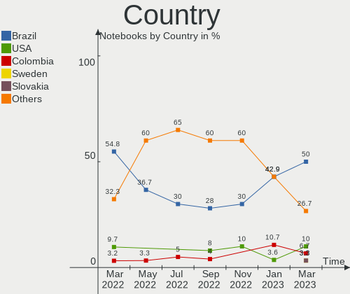
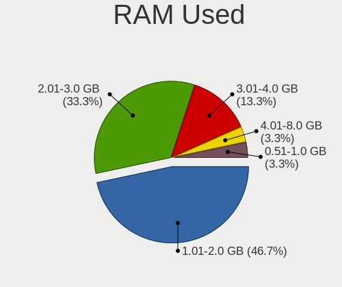
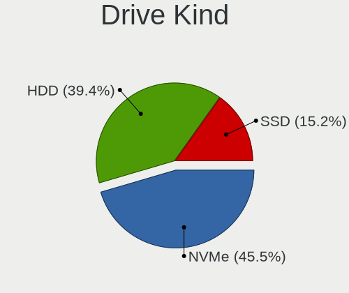
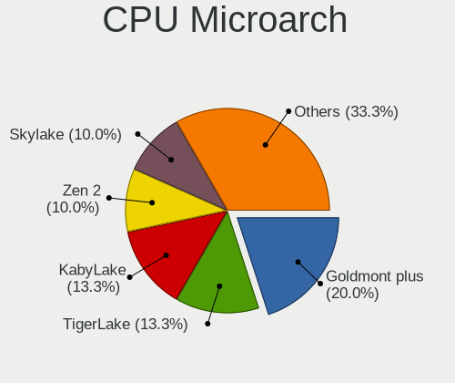
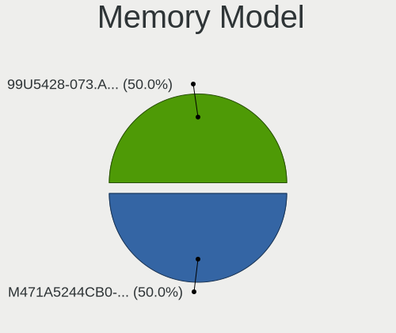

Endless Hardware Trends (Notebook)
----------------------------------

A project to identify most popular hardware characteristics and track their change
over time based on data collected by Endless users at https://Linux-Hardware.org.

Anyone can contribute to the study by uploading probes of their computers by
the [hw-probe](https://github.com/linuxhw/hw-probe) tool:

    sudo -E hw-probe -all -upload

Full-feature report is available here: https://linux-hardware.org/?view=trends&formfactor=notebook

Period: Sep, 2020.

Contents
--------

- [ OS                       ](#os)
- [ OS Family                ](#os-family)
- [ Kernel                   ](#kernel)
- [ Kernel Family            ](#kernel-family)
- [ Kernel Major Ver.        ](#kernel-major-ver)
- [ Arch                     ](#arch)
- [ DE                       ](#de)
- [ Display Server           ](#display-server)
- [ Display Manager          ](#display-manager)
- [ OS Lang                  ](#os-lang)
- [ Boot Mode                ](#boot-mode)
- [ Filesystem               ](#filesystem)
- [ Part. scheme             ](#part-scheme)
- [ Dual Boot with Linux/BSD ](#dual-boot-with-linux/bsd)
- [ Dual Boot (Win)          ](#dual-boot-win)
- [ Country                  ](#country)
- [ City                     ](#city)
- [ Vendor                   ](#vendor)
- [ Model                    ](#model)
- [ Model Family             ](#model-family)
- [ MFG Year                 ](#mfg-year)
- [ Form Factor              ](#form-factor)
- [ Secure Boot              ](#secure-boot)
- [ Coreboot                 ](#coreboot)
- [ RAM Size                 ](#ram-size)
- [ RAM Used                 ](#ram-used)
- [ Has CD-ROM               ](#has-cd-rom)
- [ Total Drives             ](#total-drives)
- [ Has Ethernet             ](#has-ethernet)
- [ Drive Vendor             ](#drive-vendor)
- [ HDD Vendor               ](#hdd-vendor)
- [ SSD Vendor               ](#ssd-vendor)
- [ Drive Model              ](#drive-model)
- [ Drive Kind               ](#drive-kind)
- [ Drive Connector          ](#drive-connector)
- [ Drive Size               ](#drive-size)
- [ Space Total              ](#space-total)
- [ Space Used               ](#space-used)
- [ Malfunc. Drives          ](#malfunc-drives)
- [ Malfunc. Drive Vendor    ](#malfunc-drive-vendor)
- [ Malfunc. HDD Vendor      ](#malfunc-hdd-vendor)
- [ Malfunc. Drive Kind      ](#malfunc-drive-kind)
- [ Failed Drives            ](#failed-drives)
- [ Failed Drive Vendor      ](#failed-drive-vendor)
- [ Drive Status             ](#drive-status)
- [ Storage Vendor           ](#storage-vendor)
- [ Storage Model            ](#storage-model)
- [ Storage Kind             ](#storage-kind)
- [ CPU Vendor               ](#cpu-vendor)
- [ CPU Model                ](#cpu-model)
- [ CPU Model Family         ](#cpu-model-family)
- [ CPU Cores                ](#cpu-cores)
- [ CPU Sockets              ](#cpu-sockets)
- [ CPU Threads              ](#cpu-threads)
- [ CPU Op-Modes             ](#cpu-op-modes)
- [ CPU Microcode            ](#cpu-microcode)
- [ CPU Microarch            ](#cpu-microarch)
- [ GPU Vendor               ](#gpu-vendor)
- [ GPU Model                ](#gpu-model)
- [ GPU Combo                ](#gpu-combo)
- [ GPU Driver               ](#gpu-driver)
- [ GPU Memory               ](#gpu-memory)
- [ Monitor Vendor           ](#monitor-vendor)
- [ Monitor Model            ](#monitor-model)
- [ Monitor Resolution       ](#monitor-resolution)
- [ Monitor Diagonal         ](#monitor-diagonal)
- [ Monitor Width            ](#monitor-width)
- [ Aspect Ratio             ](#aspect-ratio)
- [ Monitor Area             ](#monitor-area)
- [ Pixel Density            ](#pixel-density)
- [ Multiple Monitors        ](#multiple-monitors)
- [ Net Controller Vendor    ](#net-controller-vendor)
- [ Net Controller Model     ](#net-controller-model)
- [ Wireless Vendor          ](#wireless-vendor)
- [ Wireless Model           ](#wireless-model)
- [ Ethernet Vendor          ](#ethernet-vendor)
- [ Ethernet Model           ](#ethernet-model)
- [ Net Controller Kind      ](#net-controller-kind)
- [ Used Controller          ](#used-controller)
- [ NICs                     ](#nics)
- [ Memory Vendor            ](#memory-vendor)
- [ Memory Model             ](#memory-model)
- [ Memory Kind              ](#memory-kind)
- [ Memory Form Factor       ](#memory-form-factor)
- [ Memory Size              ](#memory-size)
- [ Memory Speed             ](#memory-speed)
- [ Sound Vendor             ](#sound-vendor)
- [ Sound Model              ](#sound-model)
- [ Camera Vendor            ](#camera-vendor)
- [ Camera Model             ](#camera-model)
- [ Fingerprint Vendor       ](#fingerprint-vendor)
- [ Fingerprint Model        ](#fingerprint-model)
- [ Chipcard Vendor          ](#chipcard-vendor)
- [ Chipcard Model           ](#chipcard-model)
- [ Printer Vendor           ](#printer-vendor)
- [ Printer Model            ](#printer-model)
- [ Scanner Vendor           ](#scanner-vendor)
- [ Scanner Model            ](#scanner-model)
- [ Bluetooth Vendor         ](#bluetooth-vendor)
- [ Bluetooth Model          ](#bluetooth-model)
- [ Unsupported Devices      ](#unsupported-devices)
- [ Unsupported Device Types ](#unsupported-device-types)

OS
--

Installed operating systems

| Name                  | Notebooks | Percent |
|-----------------------|-----------|---------|
| Endless 3.8.6         | 85        | 75.89%  |
| Endless 3.8.5         | 12        | 10.71%  |
| Endless 3.7.4         | 3         | 2.68%   |
| Endless 3.8.4         | 2         | 1.79%   |
| Endless 3.7.7-nexthw1 | 2         | 1.79%   |
| Endless 3.7.5-nexthw1 | 2         | 1.79%   |
| Endless 3.7.8         | 1         | 0.89%   |
| Endless 3.7.3         | 1         | 0.89%   |
| Endless 3.6.4         | 1         | 0.89%   |
| Endless 3.6.3-nexthw1 | 1         | 0.89%   |
| Endless 3.6.0-nexthw1 | 1         | 0.89%   |
| Endless 3.4.2-nexthw1 | 1         | 0.89%   |

OS Family
---------

OS without a version

| Name    | Notebooks | Percent |
|---------|-----------|---------|
| Endless | 112       | 100%    |

Kernel
------

Version of the Linux kernel

| Version          | Notebooks | Percent |
|------------------|-----------|---------|
| 5.4.0-42-generic | 85        | 75.89%  |
| 5.4.0-39-generic | 12        | 10.71%  |
| 5.3.0-19-generic | 3         | 2.68%   |
| 5.4.0-7-generic  | 2         | 1.79%   |
| 5.4.0-19-generic | 2         | 1.79%   |
| 5.3.0-23-generic | 2         | 1.79%   |
| 5.3.0-12-generic | 2         | 1.79%   |
| 5.3.0-28-generic | 1         | 0.89%   |
| 5.1.0-2-generic  | 1         | 0.89%   |
| 5.0.0-25-generic | 1         | 0.89%   |
| 4.16.0-4-generic | 1         | 0.89%   |

Kernel Family
-------------

Linux kernel without a distro release

| Version | Notebooks | Percent |
|---------|-----------|---------|
| 5.4.0   | 101       | 90.18%  |
| 5.3.0   | 8         | 7.14%   |
| 5.1.0   | 1         | 0.89%   |
| 5.0.0   | 1         | 0.89%   |
| 4.16.0  | 1         | 0.89%   |

Kernel Major Ver.
-----------------

Linux kernel major version

| Version | Notebooks | Percent |
|---------|-----------|---------|
| 5.4     | 101       | 90.18%  |
| 5.3     | 8         | 7.14%   |
| 5.1     | 1         | 0.89%   |
| 5.0     | 1         | 0.89%   |
| 4.16    | 1         | 0.89%   |

Arch
----

OS architecture (x86_64, i586, etc.)

| Name   | Notebooks | Percent |
|--------|-----------|---------|
| x86_64 | 112       | 100%    |

DE
--

Desktop Environment

| Name    | Notebooks | Percent |
|---------|-----------|---------|
| GNOME   | 111       | 99.11%  |
| Unknown | 1         | 0.89%   |

Display Server
--------------

X11 or Wayland

| Name    | Notebooks | Percent |
|---------|-----------|---------|
| X11     | 111       | 99.11%  |
| Unknown | 1         | 0.89%   |

Display Manager
---------------

SDDM, LightDM, etc.

| Name    | Notebooks | Percent |
|---------|-----------|---------|
| Unknown | 112       | 100%    |

OS Lang
-------

Language

| Lang       | Notebooks | Percent |
|------------|-----------|---------|
| pt_BR.utf8 | 29        | 25.89%  |
| en_US.utf8 | 18        | 16.07%  |
| pt_BR      | 16        | 14.29%  |
| ro_RO      | 6         | 5.36%   |
| es_ES      | 6         | 5.36%   |
| ru_UA      | 4         | 3.57%   |
| ru_RU      | 4         | 3.57%   |
| hu_HU      | 4         | 3.57%   |
| en_US      | 3         | 2.68%   |
| pt_PT      | 2         | 1.79%   |
| it_IT      | 2         | 1.79%   |
| fr_FR      | 2         | 1.79%   |
| es_CO      | 2         | 1.79%   |
| es_AR      | 2         | 1.79%   |
| en_IN      | 2         | 1.79%   |
| de_DE      | 2         | 1.79%   |
| vi_VN      | 1         | 0.89%   |
| uk_UA      | 1         | 0.89%   |
| pl_PL      | 1         | 0.89%   |
| nl_NL      | 1         | 0.89%   |
| id_ID      | 1         | 0.89%   |
| et_EE      | 1         | 0.89%   |
| bg_BG      | 1         | 0.89%   |
| anp_IN     | 1         | 0.89%   |

Boot Mode
---------

EFI or BIOS

| Mode | Notebooks | Percent |
|------|-----------|---------|
| EFI  | 75        | 66.96%  |
| BIOS | 37        | 33.04%  |

Filesystem
----------

Type of filesystem

| Type  | Notebooks | Percent |
|-------|-----------|---------|
| Ext4  | 111       | 99.11%  |
| Tmpfs | 1         | 0.89%   |

Part. scheme
------------

Scheme of partitioning

| Type    | Notebooks | Percent |
|---------|-----------|---------|
| Unknown | 111       | 99.11%  |
| GPT     | 1         | 0.89%   |

Dual Boot with Linux/BSD
------------------------

Hosting more than one Linux/BSD

| Dual boot | Notebooks | Percent |
|-----------|-----------|---------|
| No        | 112       | 100%    |

Dual Boot (Win)
---------------

Hosting Linux and Windows

| Dual boot | Notebooks | Percent |
|-----------|-----------|---------|
| No        | 111       | 99.11%  |
| Yes       | 1         | 0.89%   |

Country
-------

Geographic location (country)

| Country      | Notebooks | Percent |
|--------------|-----------|---------|
| Brazil       | 44        | 39.29%  |
| Romania      | 12        | 10.71%  |
| USA          | 5         | 4.46%   |
| Ukraine      | 5         | 4.46%   |
| Spain        | 5         | 4.46%   |
| Hungary      | 4         | 3.57%   |
| Russia       | 3         | 2.68%   |
| Germany      | 3         | 2.68%   |
| Portugal     | 2         | 1.79%   |
| Italy        | 2         | 1.79%   |
| India        | 2         | 1.79%   |
| Colombia     | 2         | 1.79%   |
| UK           | 1         | 0.89%   |
| Switzerland  | 1         | 0.89%   |
| South Korea  | 1         | 0.89%   |
| South Africa | 1         | 0.89%   |
| Serbia       | 1         | 0.89%   |
| Poland       | 1         | 0.89%   |
| Netherlands  | 1         | 0.89%   |
| Macedonia    | 1         | 0.89%   |
| Liberia      | 1         | 0.89%   |
| Kosovo       | 1         | 0.89%   |
| Japan        | 1         | 0.89%   |
| Indonesia    | 1         | 0.89%   |
| Greece       | 1         | 0.89%   |
| Georgia      | 1         | 0.89%   |
| France       | 1         | 0.89%   |
| Estonia      | 1         | 0.89%   |
| Croatia      | 1         | 0.89%   |
| Canada       | 1         | 0.89%   |
| Bulgaria     | 1         | 0.89%   |
| Belarus      | 1         | 0.89%   |
| Australia    | 1         | 0.89%   |
| Argentina    | 1         | 0.89%   |
| Unknown      | 1         | 0.89%   |

City
----

Geographic location (city)

| City                    | Notebooks | Percent |
|-------------------------|-----------|---------|
| São Paulo              | 4         | 3.57%   |
| Curitiba                | 4         | 3.57%   |
| Rio de Janeiro          | 2         | 1.79%   |
| Porto Alegre            | 2         | 1.79%   |
| Niterói                | 2         | 1.79%   |
| Kyiv                    | 2         | 1.79%   |
| Chaves                  | 2         | 1.79%   |
| Budapest                | 2         | 1.79%   |
| Bucharest               | 2         | 1.79%   |
| Bacau                   | 2         | 1.79%   |
| Vijayawada              | 1         | 0.89%   |
| Vargem Grande do Sul    | 1         | 0.89%   |
| Valencia                | 1         | 0.89%   |
| Ufa                     | 1         | 0.89%   |
| Uberlândia             | 1         | 0.89%   |
| Târgu Jiu              | 1         | 0.89%   |
| Tucurui                 | 1         | 0.89%   |
| Toronto                 | 1         | 0.89%   |
| Ternopil                | 1         | 0.89%   |
| Teodoro Sampaio         | 1         | 0.89%   |
| Tbilisi                 | 1         | 0.89%   |
| Tallinn                 | 1         | 0.89%   |
| São José dos Campos   | 1         | 0.89%   |
| Szombathely             | 1         | 0.89%   |
| Szolnok                 | 1         | 0.89%   |
| Split                   | 1         | 0.89%   |
| Sofia                   | 1         | 0.89%   |
| Sincelejo               | 1         | 0.89%   |
| Sibiu                   | 1         | 0.89%   |
| Shtip                   | 1         | 0.89%   |
| Sector 3                | 1         | 0.89%   |
| Schaffhausen            | 1         | 0.89%   |
| Sao Pedro da Aldeia     | 1         | 0.89%   |
| Sao Joao da Boa Vista   | 1         | 0.89%   |
| Santa Cruz do Sul       | 1         | 0.89%   |
| Santa Cruz do Rio Pardo | 1         | 0.89%   |
| Roznov                  | 1         | 0.89%   |
| Rome                    | 1         | 0.89%   |
| Pristina                | 1         | 0.89%   |
| Pozzo d'Adda            | 1         | 0.89%   |
| Portao                  | 1         | 0.89%   |
| Port de Sagunt          | 1         | 0.89%   |
| Popesti-Leordeni        | 1         | 0.89%   |
| Pohang                  | 1         | 0.89%   |
| Plaintel                | 1         | 0.89%   |
| Piteşti                | 1         | 0.89%   |
| Paulinia                | 1         | 0.89%   |
| Pasto                   | 1         | 0.89%   |
| Novorossiysk            | 1         | 0.89%   |
| Novi Sad                | 1         | 0.89%   |
| Nova Santa Rosa         | 1         | 0.89%   |
| Natal                   | 1         | 0.89%   |
| Mutxamel                | 1         | 0.89%   |
| Monteros                | 1         | 0.89%   |
| Monrovia                | 1         | 0.89%   |
| Moncofa                 | 1         | 0.89%   |
| Mishima                 | 1         | 0.89%   |
| Melbourne               | 1         | 0.89%   |
| Mazyr                   | 1         | 0.89%   |
| Maracanau               | 1         | 0.89%   |

Vendor
------

Motherboard manufacturer

| Name                | Notebooks | Percent |
|---------------------|-----------|---------|
| Acer                | 43        | 38.39%  |
| ASUSTek Computer    | 36        | 32.14%  |
| Lenovo              | 7         | 6.25%   |
| Hewlett-Packard     | 7         | 6.25%   |
| Dell                | 5         | 4.46%   |
| Toshiba             | 2         | 1.79%   |
| Sony                | 2         | 1.79%   |
| Positivo            | 2         | 1.79%   |
| Semp Toshiba        | 1         | 0.89%   |
| Samsung Electronics | 1         | 0.89%   |
| LG Electronics      | 1         | 0.89%   |
| Itautec             | 1         | 0.89%   |
| Fujitsu Siemens     | 1         | 0.89%   |
| Digibras            | 1         | 0.89%   |
| Compal              | 1         | 0.89%   |
| Apple               | 1         | 0.89%   |

Model
-----

Motherboard model

| Name                                       | Notebooks | Percent |
|--------------------------------------------|-----------|---------|
| Acer Nitro AN515-54                        | 9         | 8.04%   |
| Acer Aspire A315-54                        | 7         | 6.25%   |
| Acer Nitro AN517-51                        | 5         | 4.46%   |
| Acer Aspire A315-53                        | 5         | 4.46%   |
| ASUS VivoBook 15_ASUS Laptop X540MA_X543MA | 3         | 2.68%   |
| ASUS VivoBook 15_ASUS Laptop X540MA_R540MA | 3         | 2.68%   |
| Acer Aspire A315-34                        | 3         | 2.68%   |
| HP 2000                                    | 2         | 1.79%   |
| ASUS VivoBook_ASUSLaptop X512DA_A512DA     | 2         | 1.79%   |
| ASUS VivoBook_ASUSLaptop X509JA_X509JA     | 2         | 1.79%   |
| ASUS VivoBook_ASUSLaptop X409DA_M409DA     | 2         | 1.79%   |
| Acer Nitro AN515-43                        | 2         | 1.79%   |
| Toshiba Satellite L730                     | 1         | 0.89%   |
| Toshiba Satellite C55-C                    | 1         | 0.89%   |
| Sony VPCSB2L1E                             | 1         | 0.89%   |
| Sony VGN-Z570AN                            | 1         | 0.89%   |
| Semp Toshiba IS 1462B                      | 1         | 0.89%   |
| Samsung Electronics R519/R719              | 1         | 0.89%   |
| Positivo S14CT01                           | 1         | 0.89%   |
| Positivo C14CU51                           | 1         | 0.89%   |
| LG Electronics A410-G.BC48P1               | 1         | 0.89%   |
| Lenovo ThinkPad S3-S440 20AYCTO1WW         | 1         | 0.89%   |
| Lenovo IdeaPad Z570 HuronRiver Platform    | 1         | 0.89%   |
| Lenovo IdeaPad S400 Touch VIUS3            | 1         | 0.89%   |
| Lenovo IdeaPad S340-14API 81NB             | 1         | 0.89%   |
| Lenovo IdeaPad L340-15IRH Gaming 81TR      | 1         | 0.89%   |
| Lenovo IdeaPad G485 QAWGE                  | 1         | 0.89%   |
| Lenovo B50-30 20382                        | 1         | 0.89%   |
| Itautec Infoway                            | 1         | 0.89%   |
| HP ProBook 6570b                           | 1         | 0.89%   |
| HP ProBook 440 G3                          | 1         | 0.89%   |
| HP Pavilion g6                             | 1         | 0.89%   |
| HP Pavilion dm1                            | 1         | 0.89%   |
| HP Notebook                                | 1         | 0.89%   |
| Fujitsu Siemens ESPRIMO Mobile V5535       | 1         | 0.89%   |
| Digibras NH4CU53                           | 1         | 0.89%   |
| Dell Latitude E5520                        | 1         | 0.89%   |
| Dell Latitude E4300                        | 1         | 0.89%   |
| Dell Latitude 3550                         | 1         | 0.89%   |
| Dell Inspiron 5555                         | 1         | 0.89%   |
| Dell Inspiron 14-3452                      | 1         | 0.89%   |
| Compal PBL0001                             | 1         | 0.89%   |
| ASUS ZenBook UX431DA_UM431DA               | 1         | 0.89%   |
| ASUS Z550SA                                | 1         | 0.89%   |
| ASUS X542UQR                               | 1         | 0.89%   |
| ASUS X541UAK                               | 1         | 0.89%   |
| ASUS X541NA                                | 1         | 0.89%   |
| ASUS X540LA                                | 1         | 0.89%   |
| ASUS VivoBook_ASUSLaptop X712FA_X712FA     | 1         | 0.89%   |
| ASUS VivoBook_ASUSLaptop X570ZD_X570ZD     | 1         | 0.89%   |
| ASUS VivoBook_ASUSLaptop X509FA_X509FA     | 1         | 0.89%   |
| ASUS VivoBook_ASUSLaptop X509FA_A509FA     | 1         | 0.89%   |
| ASUS VivoBook_ASUSLaptop X509DA_D509DA     | 1         | 0.89%   |
| ASUS VivoBook_ASUSLaptop X421FPY_X413FP    | 1         | 0.89%   |
| ASUS VivoBook_ASUSLaptop X421FAY_X413FA    | 1         | 0.89%   |
| ASUS VivoBook_ASUSLaptop X409MA            | 1         | 0.89%   |
| ASUS VivoBook_ASUSLaptop X403JA_X403JA     | 1         | 0.89%   |
| ASUS VivoBook_ASUSLaptop X403FA_S403FA     | 1         | 0.89%   |
| ASUS VivoBook 17_ASUS Laptop X705MA_X705MA | 1         | 0.89%   |
| ASUS VivoBook 15_ASUS Laptop X540MB_X540MB | 1         | 0.89%   |

Model Family
------------

Motherboard model prefix

| Name                         | Notebooks | Percent |
|------------------------------|-----------|---------|
| ASUS VivoBook                | 27        | 24.11%  |
| Acer Aspire                  | 22        | 19.64%  |
| Acer Nitro                   | 17        | 15.18%  |
| Lenovo IdeaPad               | 5         | 4.46%   |
| Dell Latitude                | 3         | 2.68%   |
| Toshiba Satellite            | 2         | 1.79%   |
| HP ProBook                   | 2         | 1.79%   |
| HP Pavilion                  | 2         | 1.79%   |
| HP 2000                      | 2         | 1.79%   |
| Dell Inspiron                | 2         | 1.79%   |
| Acer TravelMate              | 2         | 1.79%   |
| Sony VPCSB2L1E               | 1         | 0.89%   |
| Sony VGN-Z570AN              | 1         | 0.89%   |
| Semp Toshiba IS              | 1         | 0.89%   |
| Samsung Electronics R519     | 1         | 0.89%   |
| Positivo S14CT01             | 1         | 0.89%   |
| Positivo C14CU51             | 1         | 0.89%   |
| LG Electronics A410-G.BC48P1 | 1         | 0.89%   |
| Lenovo ThinkPad              | 1         | 0.89%   |
| Lenovo B50-30                | 1         | 0.89%   |
| Itautec Infoway              | 1         | 0.89%   |
| HP Notebook                  | 1         | 0.89%   |
| Fujitsu Siemens ESPRIMO      | 1         | 0.89%   |
| Digibras NH4CU53             | 1         | 0.89%   |
| Compal PBL0001               | 1         | 0.89%   |
| ASUS ZenBook                 | 1         | 0.89%   |
| ASUS Z550SA                  | 1         | 0.89%   |
| ASUS X542UQR                 | 1         | 0.89%   |
| ASUS X541UAK                 | 1         | 0.89%   |
| ASUS X541NA                  | 1         | 0.89%   |
| ASUS X540LA                  | 1         | 0.89%   |
| ASUS K52JU                   | 1         | 0.89%   |
| ASUS K50AB                   | 1         | 0.89%   |
| ASUS GL753VD                 | 1         | 0.89%   |
| Apple MacBook2               | 1         | 0.89%   |
| Acer Swift                   | 1         | 0.89%   |
| Unknown                      | 1         | 0.89%   |

MFG Year
--------

Motherboard manufacture year

| Year | Notebooks | Percent |
|------|-----------|---------|
| 2020 | 35        | 31.25%  |
| 2019 | 26        | 23.21%  |
| 2017 | 8         | 7.14%   |
| 2018 | 7         | 6.25%   |
| 2016 | 7         | 6.25%   |
| 2013 | 7         | 6.25%   |
| 2011 | 5         | 4.46%   |
| 2015 | 3         | 2.68%   |
| 2014 | 3         | 2.68%   |
| 2010 | 3         | 2.68%   |
| 2009 | 3         | 2.68%   |
| 2007 | 3         | 2.68%   |
| 2012 | 1         | 0.89%   |
| 2008 | 1         | 0.89%   |

Form Factor
-----------

Physical design of the computer

| Name     | Notebooks | Percent |
|----------|-----------|---------|
| Notebook | 112       | 100%    |

Secure Boot
-----------

Enabled or disabled

| State    | Notebooks | Percent |
|----------|-----------|---------|
| Disabled | 76        | 67.86%  |
| Enabled  | 36        | 32.14%  |

Coreboot
--------

Have coreboot on board

| Used | Notebooks | Percent |
|------|-----------|---------|
| No   | 112       | 100%    |

RAM Size
--------

Total RAM memory

| Size in GB | Notebooks | Percent |
|------------|-----------|---------|
| 4.01-8.0   | 49        | 43.75%  |
| 3.01-4.0   | 44        | 39.29%  |
| 1.01-2.0   | 7         | 6.25%   |
| 8.01-16.0  | 6         | 5.36%   |
| 2.01-3.0   | 3         | 2.68%   |
| 16.01-24.0 | 3         | 2.68%   |

RAM Used
--------

Used RAM memory

| Used GB  | Notebooks | Percent |
|----------|-----------|---------|
| 1.01-2.0 | 68        | 60.71%  |
| 2.01-3.0 | 24        | 21.43%  |
| 0.01-1.0 | 14        | 12.5%   |
| 4.01-8.0 | 3         | 2.68%   |
| 3.01-4.0 | 3         | 2.68%   |

Has CD-ROM
----------

Has CD-ROM on board

| Presented | Notebooks | Percent |
|-----------|-----------|---------|
| No        | 83        | 74.11%  |
| Yes       | 29        | 25.89%  |

Total Drives
------------

Number of drives on board

| Drives | Notebooks | Percent |
|--------|-----------|---------|
| 1      | 82        | 73.21%  |
| 2      | 30        | 26.79%  |

Has Ethernet
------------

Has Ethernet on board

| Presented | Notebooks | Percent |
|-----------|-----------|---------|
| Yes       | 82        | 73.21%  |
| No        | 30        | 26.79%  |

Drive Vendor
------------

Hard drive vendors

| Vendor              | Notebooks | Drives  | Percent |
|---------------------|-----------|---------|---------|
| WDC                 | 34        | 34      | 23.78%  |
| Intel               | 23        | 23      | 16.08%  |
| Seagate             | 19        | 19      | 13.29%  |
| Toshiba             | 14        | 14      | 9.79%   |
| Kingston            | 14        | 14      | 9.79%   |
| Unknown             | 7         | 8       | 4.9%    |
| Samsung Electronics | 7         | 7       | 4.9%    |
| SanDisk             | 6         | 7       | 4.2%    |
| HL-DT-ST            | 4         | Unknown | 2.8%    |
| A-DATA Technology   | 4         | 4       | 2.8%    |
| SK Hynix            | 3         | 3       | 2.1%    |
| HGST                | 2         | 2       | 1.4%    |
| PNY                 | 1         | 1       | 0.7%    |
| LITEON              | 1         | 1       | 0.7%    |
| Hitachi             | 1         | 1       | 0.7%    |
| Hewlett-Packard     | 1         | 1       | 0.7%    |
| GOODRAM             | 1         | 1       | 0.7%    |
| Crucial             | 1         | 1       | 0.7%    |

HDD Vendor
----------

Hard disk drive vendors

| Vendor              | Notebooks | Drives | Percent |
|---------------------|-----------|--------|---------|
| WDC                 | 33        | 33     | 47.14%  |
| Seagate             | 19        | 19     | 27.14%  |
| Toshiba             | 12        | 12     | 17.14%  |
| Samsung Electronics | 3         | 3      | 4.29%   |
| HGST                | 2         | 2      | 2.86%   |
| Hitachi             | 1         | 1      | 1.43%   |

SSD Vendor
----------

Solid state drive vendors

| Vendor              | Notebooks | Drives | Percent |
|---------------------|-----------|--------|---------|
| Kingston            | 11        | 11     | 37.93%  |
| SanDisk             | 4         | 5      | 13.79%  |
| A-DATA Technology   | 4         | 4      | 13.79%  |
| Toshiba             | 2         | 2      | 6.9%    |
| Samsung Electronics | 2         | 2      | 6.9%    |
| SK Hynix            | 1         | 1      | 3.45%   |
| PNY                 | 1         | 1      | 3.45%   |
| LITEON              | 1         | 1      | 3.45%   |
| Hewlett-Packard     | 1         | 1      | 3.45%   |
| GOODRAM             | 1         | 1      | 3.45%   |
| Crucial             | 1         | 1      | 3.45%   |

Drive Model
-----------

Hard drive models

| Model                            | Notebooks | Percent |
|----------------------------------|-----------|---------|
| WD10SPZX-21Z10T0 1TB             | 26        | 18.06%  |
| NVMe SSD Drive 128GB             | 12        | 8.33%   |
| NVMe SSD Drive 512GB             | 11        | 7.64%   |
| NVMe SSD Drive 256GB             | 9         | 6.25%   |
| ST1000LM035-1RK172 1TB           | 5         | 3.47%   |
| RBUSC180DS37256GJ 256GB SSD      | 5         | 3.47%   |
| MQ01ABF050 500GB                 | 5         | 3.47%   |
| IM2S3338-128GD2 128GB SSD        | 4         | 2.78%   |
| MQ04ABF100 1TB                   | 3         | 2.08%   |
| MMC Card  32GB                   | 3         | 2.08%   |
| DVDRAM GUE1N 3GB                 | 3         | 2.08%   |
| SUV400S37120G 120GB SSD          | 2         | 1.39%   |
| ST500LT012-1DG142 500GB          | 2         | 1.39%   |
| ST500LM012 HN-M500MBB 500GB      | 2         | 1.39%   |
| MQ01ABD100 1TB                   | 2         | 1.39%   |
| WD7500BPVT-24HXZT3 752GB         | 1         | 0.69%   |
| WD5000LPVT-08G33T1 500GB         | 1         | 0.69%   |
| WD5000LPCX-80VHAT0 500GB         | 1         | 0.69%   |
| WD3200BPVT-60JJ5T0 320GB         | 1         | 0.69%   |
| WD2500BEKT-60PVMT0 250GB         | 1         | 0.69%   |
| WD1600BEVT-22ZCT0 160GB          | 1         | 0.69%   |
| WD10SPZX-24Z10 1TB               | 1         | 0.69%   |
| THNSNK128GVN8 128GB SSD          | 1         | 0.69%   |
| THNSNJ128GCST 128GB SSD          | 1         | 0.69%   |
| SVP200S3120G 120GB SSD           | 1         | 0.69%   |
| SV300S37A60G 64GB SSD            | 1         | 0.69%   |
| ST9500325AS 500GB                | 1         | 0.69%   |
| ST9250410AS 250GB                | 1         | 0.69%   |
| ST9250315AS 250GB                | 1         | 0.69%   |
| ST9200420AS 200GB                | 1         | 0.69%   |
| ST9160821AS 160GB                | 1         | 0.69%   |
| ST500LM021-1KJ152 500GB          | 1         | 0.69%   |
| ST320LT007-9ZV142 320GB          | 1         | 0.69%   |
| ST2000LM007-1R8174 2TB           | 1         | 0.69%   |
| ST1000LM024 HN-M101MBB 1TB       | 1         | 0.69%   |
| SSDPR-CL100-240 240GB            | 1         | 0.69%   |
| SSD U100 64GB                    | 1         | 0.69%   |
| SSD S700 500GB                   | 1         | 0.69%   |
| SSD 860 QVO 1TB                  | 1         | 0.69%   |
| SSD 860 EVO 250GB                | 1         | 0.69%   |
| SD9SN8W128G1102 128GB SSD        | 1         | 0.69%   |
| SD9SB8W256G1102 256GB SSD        | 1         | 0.69%   |
| SD8SN8U128G1002 128GB SSD        | 1         | 0.69%   |
| SD6SB1M064G1022I 64GB SSD        | 1         | 0.69%   |
| SA400S37240G 240GB SSD           | 1         | 0.69%   |
| RBUSNS8180DS3256GJ 256GB SSD     | 1         | 0.69%   |
| PC SN530 SDBPNPZ-512G-1014 512GB | 1         | 0.69%   |
| NVMe SSD Drive 1024GB            | 1         | 0.69%   |
| MQ01ABD032 320GB                 | 1         | 0.69%   |
| MMC Card  968MB                  | 1         | 0.69%   |
| MMC Card  7GB                    | 1         | 0.69%   |
| MMC Card  64GB                   | 1         | 0.69%   |
| MK6476GSXN 640GB                 | 1         | 0.69%   |
| L8H-256V2G-HP 256GB SSD          | 1         | 0.69%   |
| HTS725050A7E630 500GB            | 1         | 0.69%   |
| HTS545032B9A300 320GB            | 1         | 0.69%   |
| HTS545032A7E660 320GB            | 1         | 0.69%   |
| HN-M500MBB 500GB                 | 1         | 0.69%   |
| HM500JI 500GB                    | 1         | 0.69%   |
| HM160HI 160GB                    | 1         | 0.69%   |

Drive Kind
----------

HDD or SSD

| Kind    | Notebooks | Drives  | Percent |
|---------|-----------|---------|---------|
| HDD     | 70        | 70      | 49.65%  |
| NVMe    | 34        | 35      | 24.11%  |
| SSD     | 28        | 30      | 19.86%  |
| MMC     | 5         | 6       | 3.55%   |
| Unknown | 4         | Unknown | 2.84%   |

Drive Connector
---------------

SATA, SAS, NVMe, etc.

| Type | Notebooks | Drives | Percent |
|------|-----------|--------|---------|
| SATA | 89        | 99     | 66.92%  |
| NVMe | 34        | 35     | 25.56%  |
| SAS  | 5         | 1      | 3.76%   |
| MMC  | 5         | 6      | 3.76%   |

Drive Size
----------

Size of hard drive

| Size in TB | Notebooks | Drives | Percent |
|------------|-----------|--------|---------|
| 0.01-0.5   | 79        | 85     | 58.52%  |
| 0.51-1.0   | 54        | 54     | 40%     |
| 1.01-2.0   | 2         | 2      | 1.48%   |

Space Total
-----------

Amount of disk space available on the file system

| Size in GB | Notebooks | Percent |
|------------|-----------|---------|
| 101-250    | 33        | 29.46%  |
| 501-1000   | 31        | 27.68%  |
| 251-500    | 30        | 26.79%  |
| 21-50      | 7         | 6.25%   |
| 51-100     | 5         | 4.46%   |
| 1001-2000  | 4         | 3.57%   |
| 1-20       | 2         | 1.79%   |

Space Used
----------

Amount of used disk space

| Used GB  | Notebooks | Percent |
|----------|-----------|---------|
| 21-50    | 67        | 59.82%  |
| 1-20     | 23        | 20.54%  |
| 51-100   | 12        | 10.71%  |
| 101-250  | 6         | 5.36%   |
| 251-500  | 2         | 1.79%   |
| 501-1000 | 2         | 1.79%   |

Malfunc. Drives
---------------

Drive models with a malfunction

Zero info for selected period =(

Malfunc. Drive Vendor
---------------------

Vendors of faulty drives

Zero info for selected period =(

Malfunc. HDD Vendor
-------------------

Vendors of faulty HDD drives

Zero info for selected period =(

Malfunc. Drive Kind
-------------------

Kinds of faulty drives

Zero info for selected period =(

Failed Drives
-------------

Failed drive models

Zero info for selected period =(

Failed Drive Vendor
-------------------

Failed drive vendors

Zero info for selected period =(

Drive Status
------------

Number of failed and malfunc. drives

| Status   | Notebooks | Drives | Percent |
|----------|-----------|--------|---------|
| Detected | 111       | 140    | 99.11%  |
| Works    | 1         | 1      | 0.89%   |

Storage Vendor
--------------

Storage controller vendors

| Vendor                           | Notebooks | Percent |
|----------------------------------|-----------|---------|
| Intel                            | 87        | 72.5%   |
| AMD                              | 19        | 15.83%  |
| Sandisk                          | 3         | 2.5%    |
| Kingston Technology Company      | 3         | 2.5%    |
| SK Hynix                         | 2         | 1.67%   |
| Samsung Electronics              | 2         | 1.67%   |
| ADATA Technology                 | 2         | 1.67%   |
| VIA Technologies                 | 1         | 0.83%   |
| Silicon Integrated Systems [SiS] | 1         | 0.83%   |

Storage Model
-------------

Storage controller models

| Model                                                                      | Notebooks | Percent |
|----------------------------------------------------------------------------|-----------|---------|
| 82801 Mobile SATA Controller [RAID mode]                                   | 30        | 20.41%  |
| PROSet/Wireless WiFi Software extension                                    | 22        | 14.97%  |
| FCH SATA Controller [AHCI mode]                                            | 16        | 10.88%  |
| SATA controller                                                            | 13        | 8.84%   |
| Sunrise Point-LP SATA Controller [AHCI mode]                               | 9         | 6.12%   |
| 6 Series/C200 Series Chipset Family 6 port Mobile SATA AHCI Controller     | 6         | 4.08%   |
| Non-Volatile memory controller                                             | 5         | 3.4%    |
| Wildcat Point-LP SATA Controller [AHCI Mode]                               | 4         | 2.72%   |
| Celeron N3350/Pentium N4200/Atom E3900 Series SATA AHCI Controller         | 4         | 2.72%   |
| 7 Series Chipset Family 6-port SATA Controller [AHCI mode]                 | 4         | 2.72%   |
| SB7x0/SB8x0/SB9x0 SATA Controller [AHCI mode]                              | 3         | 2.04%   |
| Cannon Lake Mobile PCH SATA AHCI Controller                                | 3         | 2.04%   |
| Atom/Celeron/Pentium Processor x5-E8000/J3xxx/N3xxx Series SATA Controller | 3         | 2.04%   |
| 82801IBM/IEM (ICH9M/ICH9M-E) 4 port SATA Controller [AHCI mode]            | 3         | 2.04%   |
| WD Black 2018/PC SN520 NVMe SSD                                            | 2         | 1.36%   |
| BC501 NVMe Solid State Drive 512GB                                         | 2         | 1.36%   |
| 5 Series/3400 Series Chipset 4 port SATA AHCI Controller                   | 2         | 1.36%   |
| VT82C586A/B/VT82C686/A/B/VT823x/A/C PIPC Bus Master IDE                    | 1         | 0.68%   |
| VT8237A SATA 2-Port Controller                                             | 1         | 0.68%   |
| Technology Company Non-Volatile memory controller                          | 1         | 0.68%   |
| SSD 660P Series                                                            | 1         | 0.68%   |
| SATA Controller / IDE mode                                                 | 1         | 0.68%   |
| NVMe SSD Controller SM981/PM981/PM983                                      | 1         | 0.68%   |
| Mobile 4 Series Chipset PT IDER Controller                                 | 1         | 0.68%   |
| HM170/QM170 Chipset SATA Controller [AHCI Mode]                            | 1         | 0.68%   |
| Electronics Non-Volatile memory controller                                 | 1         | 0.68%   |
| Comet Lake PCH-LP SATA RAID Premium Controller                             | 1         | 0.68%   |
| Atom Processor E3800 Series SATA AHCI Controller                           | 1         | 0.68%   |
| 82801IBM/IEM (ICH9M/ICH9M-E) 2 port SATA Controller [IDE mode]             | 1         | 0.68%   |
| 82801GBM/GHM (ICH7-M Family) SATA Controller [AHCI mode]                   | 1         | 0.68%   |
| 82801G (ICH7 Family) IDE Controller                                        | 1         | 0.68%   |
| 8 Series SATA Controller 1 [AHCI mode]                                     | 1         | 0.68%   |
| 5513 IDE Controller                                                        | 1         | 0.68%   |

Storage Kind
------------

Kind of storage controller (IDE, SATA, NVMe, SAS, ...)

| Kind | Notebooks | Percent |
|------|-----------|---------|
| SATA | 85        | 59.44%  |
| NVMe | 34        | 23.78%  |
| RAID | 19        | 13.29%  |
| IDE  | 5         | 3.5%    |

CPU Vendor
----------

Processor vendors

| Vendor | Notebooks | Percent |
|--------|-----------|---------|
| Intel  | 92        | 82.14%  |
| AMD    | 20        | 17.86%  |

CPU Model
---------

Processor models

| Model                                         | Notebooks | Percent |
|-----------------------------------------------|-----------|---------|
| Intel Celeron N4000 CPU @ 1.10GHz             | 13        | 11.61%  |
| Intel Core i5-9300H CPU @ 2.40GHz             | 9         | 8.04%   |
| Intel Core i5-10210U CPU @ 1.60GHz            | 8         | 7.14%   |
| Intel Core i7-9750H CPU @ 2.60GHz             | 6         | 5.36%   |
| AMD Ryzen 5 3500U with Radeon Vega Mobile Gfx | 5         | 4.46%   |
| Intel Core i5-7200U CPU @ 2.50GHz             | 3         | 2.68%   |
| Intel Core i3-8145U CPU @ 2.10GHz             | 3         | 2.68%   |
| Intel Core i3-5005U CPU @ 2.00GHz             | 3         | 2.68%   |
| Intel Celeron CPU N3350 @ 1.10GHz             | 3         | 2.68%   |
| Intel Core i5-2410M CPU @ 2.30GHz             | 2         | 1.79%   |
| Intel Core i3-8130U CPU @ 2.20GHz             | 2         | 1.79%   |
| Intel Core i3-2310M CPU @ 2.10GHz             | 2         | 1.79%   |
| Intel Core i3-1005G1 CPU @ 1.20GHz            | 2         | 1.79%   |
| Intel Celeron CPU 1007U @ 1.50GHz             | 2         | 1.79%   |
| Intel Pentium Dual-Core CPU T4300 @ 2.10GHz   | 1         | 0.89%   |
| Intel Pentium Dual CPU T3400 @ 2.16GHz        | 1         | 0.89%   |
| Intel Pentium CPU N3700 @ 1.60GHz             | 1         | 0.89%   |
| Intel Core i7-8565U CPU @ 1.80GHz             | 1         | 0.89%   |
| Intel Core i7-8550U CPU @ 1.80GHz             | 1         | 0.89%   |
| Intel Core i7-10510U CPU @ 1.80GHz            | 1         | 0.89%   |
| Intel Core i5-8250U CPU @ 1.60GHz             | 1         | 0.89%   |
| Intel Core i5-7300HQ CPU @ 2.50GHz            | 1         | 0.89%   |
| Intel Core i5-6300U CPU @ 2.40GHz             | 1         | 0.89%   |
| Intel Core i5-5200U CPU @ 2.20GHz             | 1         | 0.89%   |
| Intel Core i5-3210M CPU @ 2.50GHz             | 1         | 0.89%   |
| Intel Core i5-1035G1 CPU @ 1.00GHz            | 1         | 0.89%   |
| Intel Core i5 CPU M 480 @ 2.67GHz             | 1         | 0.89%   |
| Intel Core i3-7020U CPU @ 2.30GHz             | 1         | 0.89%   |
| Intel Core i3-6006U CPU @ 2.00GHz             | 1         | 0.89%   |
| Intel Core i3-4030U CPU @ 1.90GHz             | 1         | 0.89%   |
| Intel Core i3-2350M CPU @ 2.30GHz             | 1         | 0.89%   |
| Intel Core i3-2330M CPU @ 2.20GHz             | 1         | 0.89%   |
| Intel Core i3-10110U CPU @ 2.10GHz            | 1         | 0.89%   |
| Intel Core i3 CPU M 390 @ 2.67GHz             | 1         | 0.89%   |
| Intel Core 2 Duo CPU T6670 @ 2.20GHz          | 1         | 0.89%   |
| Intel Core 2 Duo CPU T5550 @ 1.83GHz          | 1         | 0.89%   |
| Intel Core 2 Duo CPU P9400 @ 2.40GHz          | 1         | 0.89%   |
| Intel Core 2 Duo CPU P8600 @ 2.40GHz          | 1         | 0.89%   |
| Intel Core 2 CPU T7400 @ 2.16GHz              | 1         | 0.89%   |
| Intel Core 2 CPU T5500 @ 1.66GHz              | 1         | 0.89%   |
| Intel Celeron N4000C CPU @ 1.10GHz            | 1         | 0.89%   |
| Intel Celeron CPU N3450 @ 1.10GHz             | 1         | 0.89%   |
| Intel Celeron CPU N3160 @ 1.60GHz             | 1         | 0.89%   |
| Intel Celeron CPU N3060 @ 1.60GHz             | 1         | 0.89%   |
| Intel Celeron CPU N3050 @ 1.60GHz             | 1         | 0.89%   |
| Intel Celeron CPU N2830 @ 2.16GHz             | 1         | 0.89%   |
| Intel Celeron CPU 847 @ 1.10GHz               | 1         | 0.89%   |
| Intel Atom x5-Z8300 CPU @ 1.44GHz             | 1         | 0.89%   |
| AMD V120 Processor                            | 1         | 0.89%   |
| AMD Turion X2 Dual-Core Mobile RM-74          | 1         | 0.89%   |
| AMD Ryzen 7 4800H with Radeon Graphics        | 1         | 0.89%   |
| AMD Ryzen 7 3750H with Radeon Vega Mobile Gfx | 1         | 0.89%   |
| AMD Ryzen 7 3700U with Radeon Vega Mobile Gfx | 1         | 0.89%   |
| AMD Ryzen 5 3550H with Radeon Vega Mobile Gfx | 1         | 0.89%   |
| AMD Ryzen 5 2500U with Radeon Vega Mobile Gfx | 1         | 0.89%   |
| AMD Ryzen 3 3200U with Radeon Vega Mobile Gfx | 1         | 0.89%   |
| AMD E2-1800 APU with Radeon HD Graphics       | 1         | 0.89%   |
| AMD E-450 APU with Radeon HD Graphics         | 1         | 0.89%   |
| AMD E-300 APU with Radeon HD Graphics         | 1         | 0.89%   |
| AMD C-70 APU with Radeon HD Graphics          | 1         | 0.89%   |

CPU Model Family
----------------

Processor model prefix

| Model                          | Notebooks | Percent |
|--------------------------------|-----------|---------|
| Intel Core i5                  | 29        | 25.89%  |
| Intel Celeron                  | 25        | 22.32%  |
| Intel Core i3                  | 19        | 16.96%  |
| Intel Core i7                  | 9         | 8.04%   |
| AMD Ryzen 5                    | 7         | 6.25%   |
| Intel Core 2 Duo               | 4         | 3.57%   |
| AMD Ryzen 7                    | 3         | 2.68%   |
| Intel Core 2                   | 2         | 1.79%   |
| AMD E                          | 2         | 1.79%   |
| Other                          | 1         | 0.89%   |
| Intel Pentium Dual-Core        | 1         | 0.89%   |
| Intel Pentium Dual             | 1         | 0.89%   |
| Intel Pentium                  | 1         | 0.89%   |
| Intel Atom                     | 1         | 0.89%   |
| AMD V120                       | 1         | 0.89%   |
| AMD Turion X2 Dual-Core Mobile | 1         | 0.89%   |
| AMD Ryzen 3                    | 1         | 0.89%   |
| AMD E2                         | 1         | 0.89%   |
| AMD C-70                       | 1         | 0.89%   |
| AMD A8                         | 1         | 0.89%   |
| AMD A10                        | 1         | 0.89%   |

CPU Cores
---------

Number of processor cores

| Number | Notebooks | Percent |
|--------|-----------|---------|
| 2      | 67        | 59.82%  |
| 4      | 37        | 33.04%  |
| 6      | 6         | 5.36%   |
| 8      | 1         | 0.89%   |
| 1      | 1         | 0.89%   |

CPU Sockets
-----------

Number of sockets

| Number | Notebooks | Percent |
|--------|-----------|---------|
| 1      | 112       | 100%    |

CPU Threads
-----------

Threads per core (Hyper-Threading)

| Number | Notebooks | Percent |
|--------|-----------|---------|
| 2      | 68        | 60.71%  |
| 1      | 44        | 39.29%  |

CPU Op-Modes
------------

CPU Operation Modes (32-bit, 64-bit)

| Op mode        | Notebooks | Percent |
|----------------|-----------|---------|
| 32-bit, 64-bit | 112       | 100%    |

CPU Microcode
-------------

Microcode number

| Number     | Notebooks | Percent |
|------------|-----------|---------|
| Unknown    | 18        | 16.07%  |
| 0x906ea    | 15        | 13.39%  |
| 0x706a1    | 13        | 11.61%  |
| 0x806ec    | 12        | 10.71%  |
| 0x806ea    | 5         | 4.46%   |
| 0x08108109 | 5         | 4.46%   |
| 0x506c9    | 4         | 3.57%   |
| 0x08108102 | 4         | 3.57%   |
| 0x706e5    | 3         | 2.68%   |
| 0x406c3    | 3         | 2.68%   |
| 0x306d4    | 3         | 2.68%   |
| 0x306a9    | 3         | 2.68%   |
| 0x206a7    | 3         | 2.68%   |
| 0x05000119 | 3         | 2.68%   |
| 0x806eb    | 2         | 1.79%   |
| 0x806e9    | 2         | 1.79%   |
| 0x6fd      | 2         | 1.79%   |
| 0x406e3    | 2         | 1.79%   |
| 0x906e9    | 1         | 0.89%   |
| 0x6f6      | 1         | 0.89%   |
| 0x40651    | 1         | 0.89%   |
| 0x20655    | 1         | 0.89%   |
| 0x1067a    | 1         | 0.89%   |
| 0x10676    | 1         | 0.89%   |
| 0x08600103 | 1         | 0.89%   |
| 0x0810100b | 1         | 0.89%   |
| 0x06006705 | 1         | 0.89%   |
| 0x010000c8 | 1         | 0.89%   |

CPU Microarch
-------------

Microarchitecture

| Name            | Notebooks | Percent |
|-----------------|-----------|---------|
| Skylake         | 38        | 33.93%  |
| Goldmont plus   | 14        | 12.5%   |
| Zen+            | 9         | 8.04%   |
| SandyBridge     | 7         | 6.25%   |
| Silvermont      | 6         | 5.36%   |
| Core            | 6         | 5.36%   |
| Goldmont        | 4         | 3.57%   |
| Broadwell       | 4         | 3.57%   |
| Bobcat          | 4         | 3.57%   |
| IvyBridge       | 3         | 2.68%   |
| Icelake         | 3         | 2.68%   |
| Westmere        | 2         | 1.79%   |
| Penryn          | 2         | 1.79%   |
| KabyLake        | 2         | 1.79%   |
| Excavator       | 2         | 1.79%   |
| Zen 2           | 1         | 0.89%   |
| Zen             | 1         | 0.89%   |
| Puma            | 1         | 0.89%   |
| K8 & K10 hybrid | 1         | 0.89%   |
| K10             | 1         | 0.89%   |
| Haswell         | 1         | 0.89%   |

GPU Vendor
----------

Vendors of graphics cards

| Vendor                           | Notebooks | Percent |
|----------------------------------|-----------|---------|
| Intel                            | 89        | 63.57%  |
| Nvidia                           | 27        | 19.29%  |
| AMD                              | 22        | 15.71%  |
| VIA Technologies                 | 1         | 0.71%   |
| Silicon Integrated Systems [SiS] | 1         | 0.71%   |

GPU Model
---------

Graphics card models

| Model                                                                              | Notebooks | Percent |
|------------------------------------------------------------------------------------|-----------|---------|
| UHD Graphics 630 (Mobile)                                                          | 15        | 10.49%  |
| TU117M [GeForce GTX 1650 Mobile / Max-Q]                                           | 15        | 10.49%  |
| UHD Graphics 605                                                                   | 14        | 9.79%   |
| UHD Graphics                                                                       | 10        | 6.99%   |
| Picasso                                                                            | 9         | 6.29%   |
| 2nd Generation Core Processor Family Integrated Graphics Controller                | 7         | 4.9%    |
| Mobile 4 Series Chipset Integrated Graphics Controller                             | 5         | 3.5%    |
| Atom/Celeron/Pentium Processor x5-E8000/J3xxx/N3xxx Integrated Graphics Controller | 5         | 3.5%    |
| UHD Graphics 620 (Whiskey Lake)                                                    | 4         | 2.8%    |
| UHD Graphics 620                                                                   | 4         | 2.8%    |
| HD Graphics 620                                                                    | 4         | 2.8%    |
| HD Graphics 5500                                                                   | 4         | 2.8%    |
| HD Graphics 500                                                                    | 4         | 2.8%    |
| Iris Plus Graphics G1 (Ice Lake)                                                   | 3         | 2.1%    |
| 3rd Gen Core processor Graphics Controller                                         | 3         | 2.1%    |
| Skylake GT2 [HD Graphics 520]                                                      | 2         | 1.4%    |
| GP107M [GeForce GTX 1050 Mobile]                                                   | 2         | 1.4%    |
| GP107M [GeForce GTX 1050 3 GB Max-Q]                                               | 2         | 1.4%    |
| Wrestler [Radeon HD 7340]                                                          | 1         | 0.7%    |
| Wrestler [Radeon HD 7290]                                                          | 1         | 0.7%    |
| Wrestler [Radeon HD 6320]                                                          | 1         | 0.7%    |
| Wrestler [Radeon HD 6310]                                                          | 1         | 0.7%    |
| Wani [Radeon R5/R6/R7 Graphics]                                                    | 1         | 0.7%    |
| VGA compatible controller                                                          | 1         | 0.7%    |
| TU117M [GeForce GTX 1650 Ti Mobile]                                                | 1         | 0.7%    |
| Sun XT [Radeon HD 8670A/8670M/8690M / R5 M330 / M430 / Radeon 520 Mobile]          | 1         | 0.7%    |
| Stoney [Radeon R2/R3/R4/R5 Graphics]                                               | 1         | 0.7%    |
| Seymour [Radeon HD 6400M/7400M Series]                                             | 1         | 0.7%    |
| RS880M [Mobility Radeon HD 4225/4250]                                              | 1         | 0.7%    |
| RS780M [Mobility Radeon HD 3200]                                                   | 1         | 0.7%    |
| Robson CE [Radeon HD 6370M/7370M]                                                  | 1         | 0.7%    |
| Renoir                                                                             | 1         | 0.7%    |
| Raven Ridge [Radeon Vega Series / Radeon Vega Mobile Series]                       | 1         | 0.7%    |
| Mullins [Radeon R4/R5 Graphics]                                                    | 1         | 0.7%    |
| Mobile 945GM/GMS/GME, 943/940GML Express Integrated Graphics Controller            | 1         | 0.7%    |
| Mobile 945GM/GMS, 943/940GML Express Integrated Graphics Controller                | 1         | 0.7%    |
| HD Graphics 630                                                                    | 1         | 0.7%    |
| Haswell-ULT Integrated Graphics Controller                                         | 1         | 0.7%    |
| GP108M [GeForce MX330]                                                             | 1         | 0.7%    |
| GP108M [GeForce MX250]                                                             | 1         | 0.7%    |
| GP108M [GeForce MX150]                                                             | 1         | 0.7%    |
| GM108M [GeForce MX110]                                                             | 1         | 0.7%    |
| GM108M [GeForce 940MX]                                                             | 1         | 0.7%    |
| GF119M [GeForce GT 520M]                                                           | 1         | 0.7%    |
| G98M [GeForce 9300M GS]                                                            | 1         | 0.7%    |
| Core Processor Integrated Graphics Controller                                      | 1         | 0.7%    |
| CN896/VN896/P4M900 [Chrome 9 HC]                                                   | 1         | 0.7%    |
| Atom Processor Z36xxx/Z37xxx Series Graphics & Display                             | 1         | 0.7%    |
| 771/671 PCIE VGA Display Adapter                                                   | 1         | 0.7%    |

GPU Combo
---------

Combinations of graphics cards

| Name           | Notebooks | Percent |
|----------------|-----------|---------|
| 1 x Intel      | 65        | 58.04%  |
| Intel + Nvidia | 23        | 20.54%  |
| 1 x AMD        | 15        | 13.39%  |
| AMD + Nvidia   | 4         | 3.57%   |
| 2 x AMD        | 2         | 1.79%   |
| 1 x VIA        | 1         | 0.89%   |
| 1 x SiS        | 1         | 0.89%   |
| Intel + AMD    | 1         | 0.89%   |

GPU Driver
----------

Free vs proprietary

| Driver      | Notebooks | Percent |
|-------------|-----------|---------|
| Free        | 86        | 76.79%  |
| Proprietary | 24        | 21.43%  |
| Unknown     | 2         | 1.79%   |

GPU Memory
----------

Total video memory

| Size in GB | Notebooks | Percent |
|------------|-----------|---------|
| Unknown    | 95        | 84.82%  |
| 1.01-2.0   | 8         | 7.14%   |
| 0.01-0.5   | 7         | 6.25%   |
| 0.51-1.0   | 2         | 1.79%   |

Monitor Vendor
--------------

Monitor vendors

| Vendor                  | Notebooks | Percent |
|-------------------------|-----------|---------|
| AU Optronics            | 28        | 25%     |
| BOE                     | 26        | 23.21%  |
| Chimei Innolux          | 25        | 22.32%  |
| LG Display              | 10        | 8.93%   |
| PANDA                   | 6         | 5.36%   |
| Samsung Electronics     | 5         | 4.46%   |
| Chi Mei Optoelectronics | 3         | 2.68%   |
| SKY                     | 1         | 0.89%   |
| MTD                     | 1         | 0.89%   |
| LOE                     | 1         | 0.89%   |
| Insignia                | 1         | 0.89%   |
| InfoVision              | 1         | 0.89%   |
| Goldstar                | 1         | 0.89%   |
| Dell                    | 1         | 0.89%   |
| Apple                   | 1         | 0.89%   |
| Ancor Communications    | 1         | 0.89%   |

Monitor Model
-------------

Monitor models

| Model                                               | Notebooks | Percent |
|-----------------------------------------------------|-----------|---------|
| LCD Monitor BOE07CE 1366x768 344x193mm 15.5-inch    | 9         | 7.96%   |
| LCD Monitor AUO21ED 1920x1080 344x194mm 15.5-inch   | 9         | 7.96%   |
| LCD Monitor CMN15DB 1366x768 344x193mm 15.5-inch    | 6         | 5.31%   |
| LCD Monitor BOE0839 1920x1080 382x215mm 17.3-inch   | 5         | 4.42%   |
| LCD Monitor CMN15E6 1366x768 344x193mm 15.5-inch    | 3         | 2.65%   |
| LCD Monitor BOE0672 1366x768 344x194mm 15.5-inch    | 3         | 2.65%   |
| LCD Monitor AUO70EC 1366x768 340x190mm 15.3-inch    | 3         | 2.65%   |
| LCD Monitor AUO38ED 1920x1080 340x190mm 15.3-inch   | 3         | 2.65%   |
| LCD Monitor NCP0046 1920x1080 344x194mm 15.5-inch   | 2         | 1.77%   |
| LCD Monitor LGD033C 1366x768 309x174mm 14.0-inch    | 2         | 1.77%   |
| LCD Monitor CMN15F5 1920x1080 344x193mm 15.5-inch   | 2         | 1.77%   |
| LCD Monitor CMN15DC 1366x768 344x193mm 15.5-inch    | 2         | 1.77%   |
| LCD Monitor CMN14E5 1920x1080 309x173mm 13.9-inch   | 2         | 1.77%   |
| LCD Monitor CMN14D6 1366x768 309x173mm 13.9-inch    | 2         | 1.77%   |
| LCD Monitor CMN14D4 1920x1080 309x173mm 13.9-inch   | 2         | 1.77%   |
| LCD Monitor BOE0818 1920x1080 344x194mm 15.5-inch   | 2         | 1.77%   |
| LCD Monitor BOE06A5 1366x768 344x194mm 15.5-inch    | 2         | 1.77%   |
| LCD Monitor AUO333C 1366x768 309x173mm 13.9-inch    | 2         | 1.77%   |
| W1943 GSM4BAD 1024x768 410x230mm 18.5-inch          | 1         | 0.88%   |
| TV-monitor SKY0001 1920x1080 697x392mm 31.5-inch    | 1         | 0.88%   |
| NS-39D310NA15 BBY3533 1680x1050 708x398mm 32.0-inch | 1         | 0.88%   |
| M140NWR2 R1 IVO057A 1366x768 309x174mm 14.0-inch    | 1         | 0.88%   |
| LOEWE HDMI TV LOEF411 1920x540 700x394mm 31.6-inch  | 1         | 0.88%   |
| LM156LF1L03 NCP001C 1920x1080 344x194mm 15.5-inch   | 1         | 0.88%   |
| LM133LF5L01 NCP0020 1920x1080 294x165mm 13.3-inch   | 1         | 0.88%   |
| LCD Monitor SEC325A 1366x768 344x194mm 15.5-inch    | 1         | 0.88%   |
| LCD Monitor SEC3254 1600x900 367x230mm 17.1-inch    | 1         | 0.88%   |
| LCD Monitor SEC3245 1366x768 344x194mm 15.5-inch    | 1         | 0.88%   |
| LCD Monitor SEC315A 1366x768 344x194mm 15.5-inch    | 1         | 0.88%   |
| LCD Monitor SDC280F 1366x768 344x193mm 15.5-inch    | 1         | 0.88%   |
| LCD Monitor NCP004D 1920x1080 344x194mm 15.5-inch   | 1         | 0.88%   |
| LCD Monitor NCP0035 1920x1080 309x174mm 14.0-inch   | 1         | 0.88%   |
| LCD Monitor MTD0001 1280x800 303x190mm 14.1-inch    | 1         | 0.88%   |
| LCD Monitor LGD4601 1280x800 286x179mm 13.3-inch    | 1         | 0.88%   |
| LCD Monitor LGD11F9 1280x800 290x180mm 13.4-inch    | 1         | 0.88%   |
| LCD Monitor LGD04E8 1920x1080 382x215mm 17.3-inch   | 1         | 0.88%   |
| LCD Monitor LGD04D0 1366x768 344x194mm 15.5-inch    | 1         | 0.88%   |
| LCD Monitor LGD0439 1366x768 340x190mm 15.3-inch    | 1         | 0.88%   |
| LCD Monitor LGD033A 1366x768 340x190mm 15.3-inch    | 1         | 0.88%   |
| LCD Monitor LGD02F2 1366x768 344x194mm 15.5-inch    | 1         | 0.88%   |
| LCD Monitor LGD02E9 1366x768 309x174mm 14.0-inch    | 1         | 0.88%   |
| LCD Monitor LGD01DA 1366x768 294x166mm 13.3-inch    | 1         | 0.88%   |
| LCD Monitor CMO15A3 1366x768 344x193mm 15.5-inch    | 1         | 0.88%   |
| LCD Monitor CMO1592 1366x768 344x193mm 15.5-inch    | 1         | 0.88%   |
| LCD Monitor CMO1107 1366x768 256x144mm 11.6-inch    | 1         | 0.88%   |
| LCD Monitor CMN15D5 1920x1080 340x190mm 15.3-inch   | 1         | 0.88%   |
| LCD Monitor CMN15CA 1366x768 340x190mm 15.3-inch    | 1         | 0.88%   |
| LCD Monitor CMN15C5 1366x768 344x193mm 15.5-inch    | 1         | 0.88%   |
| LCD Monitor CMN14D5 1920x1080 309x173mm 13.9-inch   | 1         | 0.88%   |
| LCD Monitor CMN1482 1600x900 309x174mm 14.0-inch    | 1         | 0.88%   |
| LCD Monitor CMN1130 1366x768 256x144mm 11.6-inch    | 1         | 0.88%   |
| LCD Monitor BOE084E 1920x1080 382x215mm 17.3-inch   | 1         | 0.88%   |
| LCD Monitor BOE07F7 1920x1080 309x174mm 14.0-inch   | 1         | 0.88%   |
| LCD Monitor BOE0700 1920x1080 344x194mm 15.5-inch   | 1         | 0.88%   |
| LCD Monitor BOE063B 1366x768 344x194mm 15.5-inch    | 1         | 0.88%   |
| LCD Monitor BOE05F0 1366x768 309x173mm 13.9-inch    | 1         | 0.88%   |
| LCD Monitor AUO81EC 1366x768 344x193mm 15.5-inch    | 1         | 0.88%   |
| LCD Monitor AUO8174 1280x800 331x207mm 15.4-inch    | 1         | 0.88%   |
| LCD Monitor AUO71EC 1366x768 340x190mm 15.3-inch    | 1         | 0.88%   |
| LCD Monitor AUO61ED 1920x1080 340x190mm 15.3-inch   | 1         | 0.88%   |

Monitor Resolution
------------------

Monitor screen resolution

| Resolution      | Notebooks | Percent |
|-----------------|-----------|---------|
| 1366x768 (WXGA) | 61        | 54.95%  |
| 1920x1080 (FHD) | 40        | 36.04%  |
| 1280x800 (WXGA) | 4         | 3.6%    |
| 1360x768        | 3         | 2.7%    |
| 1600x900 (HD+)  | 2         | 1.8%    |
| 1920x540        | 1         | 0.9%    |

Monitor Diagonal
----------------

Diagonal size in inches

| Inches | Notebooks | Percent |
|--------|-----------|---------|
| 15     | 69        | 61.61%  |
| 13     | 18        | 16.07%  |
| 17     | 8         | 7.14%   |
| 14     | 8         | 7.14%   |
| 11     | 3         | 2.68%   |
| 18     | 2         | 1.79%   |
| 40     | 1         | 0.89%   |
| 32     | 1         | 0.89%   |
| 31     | 1         | 0.89%   |
| 21     | 1         | 0.89%   |

Monitor Width
-------------

Physical width

| Width in mm | Notebooks | Percent |
|-------------|-----------|---------|
| 301-350     | 90        | 80.36%  |
| 351-400     | 8         | 7.14%   |
| 201-300     | 8         | 7.14%   |
| 401-500     | 3         | 2.68%   |
| 801-900     | 1         | 0.89%   |
| 701-800     | 1         | 0.89%   |
| 601-700     | 1         | 0.89%   |

Aspect Ratio
------------

Proportional relationship between the width and the height

| Ratio | Notebooks | Percent |
|-------|-----------|---------|
| 16/9  | 103       | 96.26%  |
| 16/10 | 4         | 3.74%   |

Monitor Area
------------

Area in inch²

| Area in inch² | Notebooks | Percent |
|----------------|-----------|---------|
| 101-110        | 69        | 61.06%  |
| 81-90          | 22        | 19.47%  |
| 121-130        | 8         | 7.08%   |
| 71-80          | 5         | 4.42%   |
| 51-60          | 3         | 2.65%   |
| 351-500        | 2         | 1.77%   |
| 141-150        | 2         | 1.77%   |
| 151-200        | 1         | 0.88%   |
| 501-1000       | 1         | 0.88%   |

Pixel Density
-------------

Pixels per inch

| Density | Notebooks | Percent |
|---------|-----------|---------|
| 101-120 | 62        | 55.86%  |
| 121-160 | 42        | 37.84%  |
| 51-100  | 4         | 3.6%    |
| 1-50    | 2         | 1.8%    |
| 161-240 | 1         | 0.9%    |

Multiple Monitors
-----------------

Total monitors connected

| Total | Notebooks | Percent |
|-------|-----------|---------|
| 1     | 101       | 90.18%  |
| 2     | 6         | 5.36%   |
| 0     | 5         | 4.46%   |

Net Controller Vendor
---------------------

Controller vendors

| Vendor                           | Notebooks | Percent |
|----------------------------------|-----------|---------|
| Realtek Semiconductor            | 79        | 42.93%  |
| Qualcomm Atheros                 | 47        | 25.54%  |
| Intel                            | 39        | 21.2%   |
| Broadcom Inc. and subsidiaries   | 7         | 3.8%    |
| Marvell Technology Group         | 2         | 1.09%   |
| Broadcom Limited                 | 2         | 1.09%   |
| VIA Technologies                 | 1         | 0.54%   |
| TP-Link                          | 1         | 0.54%   |
| Silicon Integrated Systems [SiS] | 1         | 0.54%   |
| Samsung Electronics              | 1         | 0.54%   |
| Ralink                           | 1         | 0.54%   |
| JMicron Technology               | 1         | 0.54%   |
| Broadcom                         | 1         | 0.54%   |
| ASIX Electronics                 | 1         | 0.54%   |

Net Controller Model
--------------------

Controller models

| Model                                                                | Notebooks | Percent |
|----------------------------------------------------------------------|-----------|---------|
| RTL8111/8168/8411 PCI Express Gigabit Ethernet Controller            | 54        | 27.69%  |
| QCA9377 802.11ac Wireless Network Adapter                            | 29        | 14.87%  |
| Wi-Fi 6 AX200                                                        | 15        | 7.69%   |
| RTL810xE PCI Express Fast Ethernet controller                        | 14        | 7.18%   |
| RTL8723BE PCIe Wireless Network Adapter                              | 6         | 3.08%   |
| QCA9565 / AR9565 Wireless Network Adapter                            | 5         | 2.56%   |
| AR9285 Wireless Network Adapter (PCI-Express)                        | 5         | 2.56%   |
| RTL8821CE 802.11ac PCIe Wireless Network Adapter                     | 4         | 2.05%   |
| BCM4313 802.11bgn Wireless Network Adapter                           | 4         | 2.05%   |
| WiFi Link 5100                                                       | 3         | 1.54%   |
| RTL8822BE 802.11a/b/g/n/ac WiFi adapter                              | 3         | 1.54%   |
| Killer Wi-Fi 6 AX1650i 160MHz Wireless Network Adapter (201NGW)      | 3         | 1.54%   |
| AR9485 Wireless Network Adapter                                      | 3         | 1.54%   |
| Wireless 7265                                                        | 2         | 1.03%   |
| RTL8822CE 802.11ac PCIe Wireless Network Adapter                     | 2         | 1.03%   |
| QCA6174 802.11ac Wireless Network Adapter                            | 2         | 1.03%   |
| Dual Band Wireless-AC 3168NGW [Stone Peak]                           | 2         | 1.03%   |
| Comet Lake PCH-LP CNVi WiFi                                          | 2         | 1.03%   |
| Cannon Point-LP CNVi [Wireless-AC]                                   | 2         | 1.03%   |
| AC 1550i Wireless                                                    | 2         | 1.03%   |
| 82567LM Gigabit Network Connection                                   | 2         | 1.03%   |
| Wireless 8265 / 8275                                                 | 1         | 0.51%   |
| Wireless 7260                                                        | 1         | 0.51%   |
| Wireless 3165                                                        | 1         | 0.51%   |
| Wireless 3160                                                        | 1         | 0.51%   |
| VT6102/VT6103 [Rhine-II]                                             | 1         | 0.51%   |
| UE300 10/100/1000 LAN (ethernet mode) [Realtek RTL8153]              | 1         | 0.51%   |
| RTL8188EE Wireless Network Adapter                                   | 1         | 0.51%   |
| RTL8188CE 802.11b/g/n WiFi Adapter                                   | 1         | 0.51%   |
| RTL8187B Wireless 802.11g 54Mbps Network Adapter                     | 1         | 0.51%   |
| RT3090 Wireless 802.11n 1T/1R PCIe                                   | 1         | 0.51%   |
| NetXtreme BCM5764M Gigabit Ethernet PCIe                             | 1         | 0.51%   |
| NetXtreme BCM5761 Gigabit Ethernet PCIe                              | 1         | 0.51%   |
| NetLink BCM57780 Gigabit Ethernet PCIe                               | 1         | 0.51%   |
| Killer E2600 Gigabit Ethernet Controller                             | 1         | 0.51%   |
| JMC250 PCI Express Gigabit Ethernet Controller                       | 1         | 0.51%   |
| Galaxy series, misc. (tethering mode)                                | 1         | 0.51%   |
| Dual Band Wireless-AC 3165 Plus Bluetooth                            | 1         | 0.51%   |
| Centrino Wireless-N 1000 [Condor Peak]                               | 1         | 0.51%   |
| Centrino Advanced-N 6205 [Taylor Peak]                               | 1         | 0.51%   |
| BCM43228 802.11a/b/g/n                                               | 1         | 0.51%   |
| BCM43225 802.11b/g/n                                                 | 1         | 0.51%   |
| BCM43142 802.11b/g/n                                                 | 1         | 0.51%   |
| AX88179 Gigabit Ethernet                                             | 1         | 0.51%   |
| AR8151 v2.0 Gigabit Ethernet                                         | 1         | 0.51%   |
| AR5418 Wireless Network Adapter [AR5008E 802.11(a)bgn] (PCI-Express) | 1         | 0.51%   |
| AR242x / AR542x Wireless Network Adapter (PCI-Express)               | 1         | 0.51%   |
| AR2413/AR2414 Wireless Network Adapter [AR5005G(S) 802.11bg]         | 1         | 0.51%   |
| 88E8055 PCI-E Gigabit Ethernet Controller                            | 1         | 0.51%   |
| 88E8053 PCI-E Gigabit Ethernet Controller                            | 1         | 0.51%   |
| 82579V Gigabit Network Connection                                    | 1         | 0.51%   |
| 191 Gigabit Ethernet Adapter                                         | 1         | 0.51%   |

Wireless Vendor
---------------

Wireless vendors

| Vendor                         | Notebooks | Percent |
|--------------------------------|-----------|---------|
| Qualcomm Atheros               | 47        | 42.34%  |
| Intel                          | 38        | 34.23%  |
| Realtek Semiconductor          | 18        | 16.22%  |
| Broadcom Inc. and subsidiaries | 5         | 4.5%    |
| Ralink                         | 1         | 0.9%    |
| Broadcom Limited               | 1         | 0.9%    |
| Broadcom                       | 1         | 0.9%    |

Wireless Model
--------------

Wireless models

| Model                                                                | Notebooks | Percent |
|----------------------------------------------------------------------|-----------|---------|
| QCA9377 802.11ac Wireless Network Adapter                            | 29        | 26.13%  |
| Wi-Fi 6 AX200                                                        | 15        | 13.51%  |
| RTL8723BE PCIe Wireless Network Adapter                              | 6         | 5.41%   |
| QCA9565 / AR9565 Wireless Network Adapter                            | 5         | 4.5%    |
| AR9285 Wireless Network Adapter (PCI-Express)                        | 5         | 4.5%    |
| RTL8821CE 802.11ac PCIe Wireless Network Adapter                     | 4         | 3.6%    |
| BCM4313 802.11bgn Wireless Network Adapter                           | 4         | 3.6%    |
| WiFi Link 5100                                                       | 3         | 2.7%    |
| RTL8822BE 802.11a/b/g/n/ac WiFi adapter                              | 3         | 2.7%    |
| Killer Wi-Fi 6 AX1650i 160MHz Wireless Network Adapter (201NGW)      | 3         | 2.7%    |
| AR9485 Wireless Network Adapter                                      | 3         | 2.7%    |
| Wireless 7265                                                        | 2         | 1.8%    |
| RTL8822CE 802.11ac PCIe Wireless Network Adapter                     | 2         | 1.8%    |
| QCA6174 802.11ac Wireless Network Adapter                            | 2         | 1.8%    |
| Dual Band Wireless-AC 3168NGW [Stone Peak]                           | 2         | 1.8%    |
| Comet Lake PCH-LP CNVi WiFi                                          | 2         | 1.8%    |
| Cannon Point-LP CNVi [Wireless-AC]                                   | 2         | 1.8%    |
| AC 1550i Wireless                                                    | 2         | 1.8%    |
| Wireless 8265 / 8275                                                 | 1         | 0.9%    |
| Wireless 7260                                                        | 1         | 0.9%    |
| Wireless 3165                                                        | 1         | 0.9%    |
| Wireless 3160                                                        | 1         | 0.9%    |
| RTL8188EE Wireless Network Adapter                                   | 1         | 0.9%    |
| RTL8188CE 802.11b/g/n WiFi Adapter                                   | 1         | 0.9%    |
| RTL8187B Wireless 802.11g 54Mbps Network Adapter                     | 1         | 0.9%    |
| RT3090 Wireless 802.11n 1T/1R PCIe                                   | 1         | 0.9%    |
| Dual Band Wireless-AC 3165 Plus Bluetooth                            | 1         | 0.9%    |
| Centrino Wireless-N 1000 [Condor Peak]                               | 1         | 0.9%    |
| Centrino Advanced-N 6205 [Taylor Peak]                               | 1         | 0.9%    |
| BCM43228 802.11a/b/g/n                                               | 1         | 0.9%    |
| BCM43225 802.11b/g/n                                                 | 1         | 0.9%    |
| BCM43142 802.11b/g/n                                                 | 1         | 0.9%    |
| AR5418 Wireless Network Adapter [AR5008E 802.11(a)bgn] (PCI-Express) | 1         | 0.9%    |
| AR242x / AR542x Wireless Network Adapter (PCI-Express)               | 1         | 0.9%    |
| AR2413/AR2414 Wireless Network Adapter [AR5005G(S) 802.11bg]         | 1         | 0.9%    |

Ethernet Vendor
---------------

Ethernet vendors

| Vendor                           | Notebooks | Percent |
|----------------------------------|-----------|---------|
| Realtek Semiconductor            | 69        | 82.14%  |
| Intel                            | 3         | 3.57%   |
| Marvell Technology Group         | 2         | 2.38%   |
| Broadcom Inc. and subsidiaries   | 2         | 2.38%   |
| VIA Technologies                 | 1         | 1.19%   |
| TP-Link                          | 1         | 1.19%   |
| Silicon Integrated Systems [SiS] | 1         | 1.19%   |
| Samsung Electronics              | 1         | 1.19%   |
| Qualcomm Atheros                 | 1         | 1.19%   |
| JMicron Technology               | 1         | 1.19%   |
| Broadcom Limited                 | 1         | 1.19%   |
| ASIX Electronics                 | 1         | 1.19%   |

Ethernet Model
--------------

Ethernet models

| Model                                                     | Notebooks | Percent |
|-----------------------------------------------------------|-----------|---------|
| RTL8111/8168/8411 PCI Express Gigabit Ethernet Controller | 54        | 64.29%  |
| RTL810xE PCI Express Fast Ethernet controller             | 14        | 16.67%  |
| 82567LM Gigabit Network Connection                        | 2         | 2.38%   |
| VT6102/VT6103 [Rhine-II]                                  | 1         | 1.19%   |
| UE300 10/100/1000 LAN (ethernet mode) [Realtek RTL8153]   | 1         | 1.19%   |
| NetXtreme BCM5764M Gigabit Ethernet PCIe                  | 1         | 1.19%   |
| NetXtreme BCM5761 Gigabit Ethernet PCIe                   | 1         | 1.19%   |
| NetLink BCM57780 Gigabit Ethernet PCIe                    | 1         | 1.19%   |
| Killer E2600 Gigabit Ethernet Controller                  | 1         | 1.19%   |
| JMC250 PCI Express Gigabit Ethernet Controller            | 1         | 1.19%   |
| Galaxy series, misc. (tethering mode)                     | 1         | 1.19%   |
| AX88179 Gigabit Ethernet                                  | 1         | 1.19%   |
| AR8151 v2.0 Gigabit Ethernet                              | 1         | 1.19%   |
| 88E8055 PCI-E Gigabit Ethernet Controller                 | 1         | 1.19%   |
| 88E8053 PCI-E Gigabit Ethernet Controller                 | 1         | 1.19%   |
| 82579V Gigabit Network Connection                         | 1         | 1.19%   |
| 191 Gigabit Ethernet Adapter                              | 1         | 1.19%   |

Net Controller Kind
-------------------

Ethernet, WiFi or modem

| Kind     | Notebooks | Percent |
|----------|-----------|---------|
| WiFi     | 111       | 57.51%  |
| Ethernet | 82        | 42.49%  |

Used Controller
---------------

Currently used network controller

| Kind     | Notebooks | Percent |
|----------|-----------|---------|
| WiFi     | 109       | 57.07%  |
| Ethernet | 82        | 42.93%  |

NICs
----

Total network controllers on board

| Total | Notebooks | Percent |
|-------|-----------|---------|
| 2     | 80        | 71.43%  |
| 1     | 31        | 27.68%  |
| 0     | 1         | 0.89%   |

Memory Vendor
-------------

Memory module vendors

| Vendor   | Notebooks | Percent |
|----------|-----------|---------|
| SK Hynix | 1         | 100%    |

Memory Model
------------

Memory module models

| Model                                             | Notebooks | Percent |
|---------------------------------------------------|-----------|---------|
| RAM HMAA2GS6AJR8N-XN 16384MB SODIMM DDR4 3200MT/s | 1         | 100%    |

Memory Kind
-----------

Memory module kinds

| Kind | Notebooks | Percent |
|------|-----------|---------|
| DDR4 | 1         | 100%    |

Memory Form Factor
------------------

Physical design of the memory module

| Name   | Notebooks | Percent |
|--------|-----------|---------|
| SODIMM | 1         | 100%    |

Memory Size
-----------

Memory module size

| Size  | Notebooks | Percent |
|-------|-----------|---------|
| 16384 | 1         | 100%    |

Memory Speed
------------

Memory module speed

| Speed | Notebooks | Percent |
|-------|-----------|---------|
| 3200  | 1         | 100%    |

Sound Vendor
------------

Sound card vendors

| Vendor                           | Notebooks | Percent |
|----------------------------------|-----------|---------|
| Intel                            | 89        | 69.53%  |
| AMD                              | 21        | 16.41%  |
| Nvidia                           | 16        | 12.5%   |
| VIA Technologies                 | 1         | 0.78%   |
| Silicon Integrated Systems [SiS] | 1         | 0.78%   |

Sound Model
-----------

Sound card models

| Model                                                                                       | Notebooks | Percent |
|---------------------------------------------------------------------------------------------|-----------|---------|
| Cannon Lake PCH cAVS                                                                        | 15        | 9.93%   |
| TU107 GeForce GTX 1650 High Definition Audio Controller                                     | 14        | 9.27%   |
| Celeron/Pentium Silver Processor High Definition Audio                                      | 14        | 9.27%   |
| Family 17h (Models 10h-1fh) HD Audio Controller                                             | 11        | 7.28%   |
| Sunrise Point-LP HD Audio                                                                   | 10        | 6.62%   |
| Raven/Raven2/Fenghuang HDMI/DP Audio Controller                                             | 10        | 6.62%   |
| Comet Lake PCH-LP cAVS                                                                      | 10        | 6.62%   |
| 6 Series/C200 Series Chipset Family High Definition Audio Controller                        | 6         | 3.97%   |
| 82801I (ICH9 Family) HD Audio Controller                                                    | 5         | 3.31%   |
| Wrestler HDMI Audio                                                                         | 4         | 2.65%   |
| Wildcat Point-LP High Definition Audio Controller                                           | 4         | 2.65%   |
| FCH Azalia Controller                                                                       | 4         | 2.65%   |
| Celeron N3350/Pentium N4200/Atom E3900 Series Audio Cluster                                 | 4         | 2.65%   |
| Cannon Point-LP High Definition Audio Controller                                            | 4         | 2.65%   |
| Broadwell-U Audio Controller                                                                | 4         | 2.65%   |
| Atom/Celeron/Pentium Processor x5-E8000/J3xxx/N3xxx Series High Definition Audio Controller | 4         | 2.65%   |
| 7 Series/C216 Chipset Family High Definition Audio Controller                               | 4         | 2.65%   |
| Smart Sound Technology Audio Controller                                                     | 3         | 1.99%   |
| SBx00 Azalia (Intel HDA)                                                                    | 3         | 1.99%   |
| Kabini HDMI/DP Audio                                                                        | 2         | 1.32%   |
| GP107GL High Definition Audio Controller                                                    | 2         | 1.32%   |
| Family 15h (Models 60h-6fh) Audio Controller                                                | 2         | 1.32%   |
| 5 Series/3400 Series Chipset High Definition Audio                                          | 2         | 1.32%   |
| VT8237A/VT8251 HDA Controller                                                               | 1         | 0.66%   |
| RS880 HDMI Audio [Radeon HD 4200 Series]                                                    | 1         | 0.66%   |
| NM10/ICH7 Family High Definition Audio Controller                                           | 1         | 0.66%   |
| High Definition Audio Controller                                                            | 1         | 0.66%   |
| Haswell-ULT HD Audio Controller                                                             | 1         | 0.66%   |
| CM238 HD Audio Controller                                                                   | 1         | 0.66%   |
| Cedar HDMI Audio [Radeon HD 5400/6300/7300 Series]                                          | 1         | 0.66%   |
| Azalia Audio Controller                                                                     | 1         | 0.66%   |
| Atom Processor Z36xxx/Z37xxx Series High Definition Audio Controller                        | 1         | 0.66%   |
| 8 Series HD Audio Controller                                                                | 1         | 0.66%   |

Camera Vendor
-------------

Camera device vendors

| Vendor                                 | Notebooks | Percent |
|----------------------------------------|-----------|---------|
| Chicony Electronics                    | 37        | 34.91%  |
| IMC Networks                           | 26        | 24.53%  |
| Quanta                                 | 20        | 18.87%  |
| Realtek Semiconductor                  | 5         | 4.72%   |
| Acer                                   | 5         | 4.72%   |
| Suyin                                  | 4         | 3.77%   |
| Sunplus Innovation Technology          | 2         | 1.89%   |
| Z-Star Microelectronics                | 1         | 0.94%   |
| Ricoh                                  | 1         | 0.94%   |
| Microsoft                              | 1         | 0.94%   |
| Microdia                               | 1         | 0.94%   |
| Logitech                               | 1         | 0.94%   |
| Cheng Uei Precision Industry (Foxlink) | 1         | 0.94%   |
| ALi                                    | 1         | 0.94%   |

Camera Model
------------

Camera device models

| Model                              | Notebooks | Percent |
|------------------------------------|-----------|---------|
| USB2.0 VGA UVC WebCam              | 24        | 22.64%  |
| VGA WebCam                         | 20        | 18.87%  |
| HD User Facing                     | 18        | 16.98%  |
| USB2.0 HD UVC WebCam               | 9         | 8.49%   |
| Lenovo EasyCamera                  | 4         | 3.77%   |
| Integrated_Webcam_HD               | 3         | 2.83%   |
| HD Webcam                          | 3         | 2.83%   |
| Integrated Camera                  | 2         | 1.89%   |
| HP TrueVision HD Integrated Webcam | 2         | 1.89%   |
| HP TrueVision HD                   | 2         | 1.89%   |
| WebCam SCB-0320N                   | 1         | 0.94%   |
| Webcam C270                        | 1         | 0.94%   |
| USB2.0 Camera                      | 1         | 0.94%   |
| USB Live camera                    | 1         | 0.94%   |
| USB Camera                         | 1         | 0.94%   |
| TOSHIBA Web Camera - HD            | 1         | 0.94%   |
| Sony Vaio Integrated Webcam        | 1         | 0.94%   |
| LifeCam HD-3000                    | 1         | 0.94%   |
| Laptop_Integrated_Webcam_FHD       | 1         | 0.94%   |
| Integrated Webcam                  | 1         | 0.94%   |
| Integrated HP HD Webcam            | 1         | 0.94%   |
| HP Webcam-101                      | 1         | 0.94%   |
| HP HD Camera                       | 1         | 0.94%   |
| Gateway Webcam                     | 1         | 0.94%   |
| CNF9055 Toshiba Webcam             | 1         | 0.94%   |
| BisonCam, NB Pro                   | 1         | 0.94%   |
| Acer/HP Integrated Webcam [CN0314] | 1         | 0.94%   |
| Acer 640 x 480 laptop camera       | 1         | 0.94%   |
| 2.0M UVC Webcam / CNF7129          | 1         | 0.94%   |

Fingerprint Vendor
------------------

Fingerprint sensor vendors

| Vendor                | Notebooks | Percent |
|-----------------------|-----------|---------|
| Validity Sensors      | 2         | 33.33%  |
| Upek                  | 2         | 33.33%  |
| LighTuning Technology | 1         | 16.67%  |
| Elan Microelectronics | 1         | 16.67%  |

Fingerprint Model
-----------------

Fingerprint sensor models

| Model                                             | Notebooks | Percent |
|---------------------------------------------------|-----------|---------|
| Biometric Touchchip/Touchstrip Fingerprint Sensor | 2         | 33.33%  |
| VFS5011 Fingerprint Reader                        | 1         | 16.67%  |
| VFS491                                            | 1         | 16.67%  |
| ELAN:Fingerprint                                  | 1         | 16.67%  |
| EgisTec Touch Fingerprint Sensor                  | 1         | 16.67%  |

Chipcard Vendor
---------------

Chipcard module vendors

| Vendor   | Notebooks | Percent |
|----------|-----------|---------|
| Broadcom | 1         | 100%    |

Chipcard Model
--------------

Chipcard module models

| Model                                                               | Notebooks | Percent |
|---------------------------------------------------------------------|-----------|---------|
| BCM5880 Secure Applications Processor with fingerprint swipe sensor | 1         | 100%    |

Printer Vendor
--------------

Printer device vendors

| Vendor          | Notebooks | Percent |
|-----------------|-----------|---------|
| Hewlett-Packard | 3         | 75%     |
| Canon           | 1         | 25%     |

Printer Model
-------------

Printer device models

| Model               | Notebooks | Percent |
|---------------------|-----------|---------|
| PIXMA MG5600 Series | 1         | 25%     |
| DeskJet F300 series | 1         | 25%     |
| DeskJet 2130 series | 1         | 25%     |
| Deskjet 1510        | 1         | 25%     |

Scanner Vendor
--------------

Scanner device vendors

Zero info for selected period =(

Scanner Model
-------------

Scanner device models

Zero info for selected period =(

Bluetooth Vendor
----------------

Controller vendors

| Vendor                          | Notebooks | Percent |
|---------------------------------|-----------|---------|
| Intel                           | 32        | 35.56%  |
| Lite-On Technology              | 22        | 24.44%  |
| IMC Networks                    | 18        | 20%     |
| Realtek Semiconductor           | 6         | 6.67%   |
| Qualcomm Atheros Communications | 5         | 5.56%   |
| Broadcom                        | 4         | 4.44%   |
| Toshiba                         | 1         | 1.11%   |
| Apple                           | 1         | 1.11%   |
| Alps Electric                   | 1         | 1.11%   |

Bluetooth Model
---------------

Controller models

| Model                             | Notebooks | Percent |
|-----------------------------------|-----------|---------|
| Bluetooth Device                  | 61        | 67.78%  |
| Bluetooth Radio                   | 14        | 15.56%  |
| Qualcomm Atheros Bluetooth Device | 4         | 4.44%   |
| Wireless-AC 3168 Bluetooth        | 2         | 2.22%   |
| HP Portable Valentine             | 2         | 2.22%   |
| Qualcomm Atheros Bluetooth        | 1         | 1.11%   |
| HP Portable SoftSailing           | 1         | 1.11%   |
| Bluetooth HCI                     | 1         | 1.11%   |
| BCM43142A0                        | 1         | 1.11%   |
| BCM2070 Bluetooth Device          | 1         | 1.11%   |
| BCM2046 Bluetooth Device          | 1         | 1.11%   |
| AR3011 Bluetooth                  | 1         | 1.11%   |

Unsupported Devices
-------------------

Total unsupported devices on board

| Total | Notebooks | Percent |
|-------|-----------|---------|
| 0     | 95        | 84.82%  |
| 1     | 15        | 13.39%  |
| 2     | 2         | 1.79%   |

Unsupported Device Types
------------------------

Types of unsupported devices

| Type                     | Notebooks | Percent |
|--------------------------|-----------|---------|
| Fingerprint reader       | 5         | 26.32%  |
| Graphics card            | 4         | 21.05%  |
| Multimedia controller    | 3         | 15.79%  |
| Storage                  | 2         | 10.53%  |
| Net/wireless             | 2         | 10.53%  |
| Communication controller | 2         | 10.53%  |
| Chipcard                 | 1         | 5.26%   |

