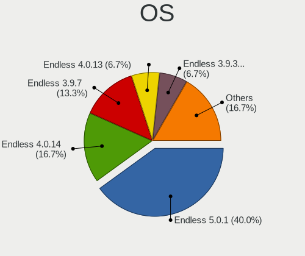
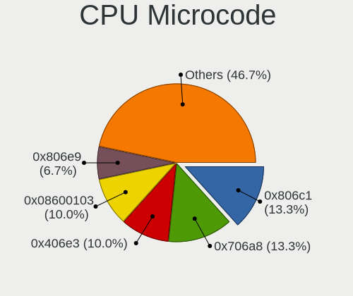

Endless Hardware Trends (Notebook)
----------------------------------

A project to identify most popular hardware characteristics and track their change
over time based on data collected by Endless users at https://Linux-Hardware.org.

Anyone can contribute to the study by uploading probes of their computers by
the [hw-probe](https://github.com/linuxhw/hw-probe) tool:

    sudo hw-probe -all -upload

Full-feature report is available here: https://linux-hardware.org/?view=trends&formfactor=notebook

Period: Feb, 2020.

Contents
--------

- [ OS                       ](#os)
- [ OS Family                ](#os-family)
- [ Kernel                   ](#kernel)
- [ Kernel Family            ](#kernel-family)
- [ Kernel Major Ver.        ](#kernel-major-ver)
- [ Arch                     ](#arch)
- [ DE                       ](#de)
- [ Display Server           ](#display-server)
- [ OS Lang                  ](#os-lang)
- [ Boot Mode                ](#boot-mode)
- [ Filesystem               ](#filesystem)
- [ Dual Boot with Linux     ](#dual-boot-with-linux)
- [ Dual Boot (Win)          ](#dual-boot-win)
- [ Country                  ](#country)
- [ City                     ](#city)
- [ Vendor                   ](#vendor)
- [ Model                    ](#model)
- [ Model Family             ](#model-family)
- [ MFG Year                 ](#mfg-year)
- [ Form Factor              ](#form-factor)
- [ Secure Boot              ](#secure-boot)
- [ Coreboot                 ](#coreboot)
- [ RAM Size                 ](#ram-size)
- [ RAM Used                 ](#ram-used)
- [ Drive Vendor             ](#drive-vendor)
- [ Drive Model              ](#drive-model)
- [ Drive Kind               ](#drive-kind)
- [ Drive Connector          ](#drive-connector)
- [ Drive Size               ](#drive-size)
- [ Space Total              ](#space-total)
- [ Space Used               ](#space-used)
- [ Malfunc. Drives          ](#malfunc-drives)
- [ Malfunc. Drive Vendor    ](#malfunc-drive-vendor)
- [ Malfunc. Drive Kind      ](#malfunc-drive-kind)
- [ Failed Drives            ](#failed-drives)
- [ Failed Drive Vendor      ](#failed-drive-vendor)
- [ Drive Status             ](#drive-status)
- [ Storage Vendor           ](#storage-vendor)
- [ Storage Model            ](#storage-model)
- [ Storage Kind             ](#storage-kind)
- [ CPU Vendor               ](#cpu-vendor)
- [ CPU Model                ](#cpu-model)
- [ CPU Model Family         ](#cpu-model-family)
- [ CPU Cores                ](#cpu-cores)
- [ CPU Sockets              ](#cpu-sockets)
- [ CPU Threads              ](#cpu-threads)
- [ CPU Op-Modes             ](#cpu-op-modes)
- [ CPU Microarch            ](#cpu-microarch)
- [ CPU Microcode            ](#cpu-microcode)
- [ GPU Vendor               ](#gpu-vendor)
- [ GPU Model                ](#gpu-model)
- [ GPU Combo                ](#gpu-combo)
- [ GPU Driver               ](#gpu-driver)
- [ GPU Memory               ](#gpu-memory)
- [ Monitor Vendor           ](#monitor-vendor)
- [ Monitor Model            ](#monitor-model)
- [ Monitor Resolution       ](#monitor-resolution)
- [ Monitor Diagonal         ](#monitor-diagonal)
- [ Monitor Width            ](#monitor-width)
- [ Aspect Ratio             ](#aspect-ratio)
- [ Monitor Area             ](#monitor-area)
- [ Pixel Density            ](#pixel-density)
- [ Multiple Monitors        ](#multiple-monitors)
- [ Net Controller Vendor    ](#net-controller-vendor)
- [ Net Controller Model     ](#net-controller-model)
- [ Net Controller Kind      ](#net-controller-kind)
- [ Used Controller          ](#used-controller)
- [ NICs                     ](#nics)
- [ Unsupported Devices      ](#unsupported-devices)
- [ Unsupported Device Types ](#unsupported-device-types)

OS
--

Installed operating systems

| Name                   | Computers | Percent |
|------------------------|-----------|---------|
| Endless 3.7.7          | 34        | 41.98%  |
| Endless 3.7.6          | 26        | 32.1%   |
| Endless 3.3.20-nexthw1 | 5         | 6.17%   |
| Endless 3.4.8-nexthw1  | 3         | 3.7%    |
| Endless 3.4.6          | 2         | 2.47%   |
| Endless 3.3.20         | 2         | 2.47%   |
| Endless 3.3.15         | 2         | 2.47%   |
| Endless 3.8.0          | 1         | 1.23%   |
| Endless 3.6.3-nexthw1  | 1         | 1.23%   |
| Endless 3.6.0-nexthw1  | 1         | 1.23%   |
| Endless 3.6.0          | 1         | 1.23%   |
| Endless 3.5.7-nexthw1  | 1         | 1.23%   |
| Endless 3.4.6-nexthw2  | 1         | 1.23%   |
| Endless 3.4.2-nexthw1  | 1         | 1.23%   |

OS Family
---------

OS without a version

| Name    | Computers | Percent |
|---------|-----------|---------|
| Endless | 81        | 100%    |

Kernel
------

Version of the Linux kernel

| Version           | Computers | Percent |
|-------------------|-----------|---------|
| 5.3.0-28-generic  | 34        | 41.98%  |
| 5.3.0-23-generic  | 26        | 32.1%   |
| 4.15.0-15-generic | 5         | 6.17%   |
| 4.13.0-32-generic | 4         | 4.94%   |
| 4.18.0-10-generic | 3         | 3.7%    |
| 4.15.0-23-generic | 2         | 2.47%   |
| 5.4.0-7-generic   | 1         | 1.23%   |
| 5.3.0-12-generic  | 1         | 1.23%   |
| 5.1.0-2-generic   | 1         | 1.23%   |
| 5.0.0-7-generic   | 1         | 1.23%   |
| 5.0.0-15-generic  | 1         | 1.23%   |
| 4.18.0-7-generic  | 1         | 1.23%   |
| 4.16.0-4-generic  | 1         | 1.23%   |

Kernel Family
-------------

Linux kernel without a distro release

| Version | Computers | Percent |
|---------|-----------|---------|
| 5.3.0   | 61        | 75.31%  |
| 4.15.0  | 7         | 8.64%   |
| 4.18.0  | 4         | 4.94%   |
| 4.13.0  | 4         | 4.94%   |
| 5.0.0   | 2         | 2.47%   |
| 5.4.0   | 1         | 1.23%   |
| 5.1.0   | 1         | 1.23%   |
| 4.16.0  | 1         | 1.23%   |

Kernel Major Ver.
-----------------

Linux kernel major version

| Version | Computers | Percent |
|---------|-----------|---------|
| 5.3     | 61        | 75.31%  |
| 4.15    | 7         | 8.64%   |
| 4.18    | 4         | 4.94%   |
| 4.13    | 4         | 4.94%   |
| 5.0     | 2         | 2.47%   |
| 5.4     | 1         | 1.23%   |
| 5.1     | 1         | 1.23%   |
| 4.16    | 1         | 1.23%   |

Arch
----

OS architecture (x86_64, i586, etc.)

| Name   | Computers | Percent |
|--------|-----------|---------|
| x86_64 | 81        | 100%    |

DE
--

Desktop Environment

| Name  | Computers | Percent |
|-------|-----------|---------|
| GNOME | 81        | 100%    |

Display Server
--------------

X11 or Wayland

| Name | Computers | Percent |
|------|-----------|---------|
| X11  | 81        | 100%    |

OS Lang
-------

Language

| Lang        | Computers | Percent |
|-------------|-----------|---------|
| ru_RU       | 14        | 17.28%  |
| pt_BR.utf8  | 11        | 13.58%  |
| pt_BR       | 8         | 9.88%   |
| en_US.utf8  | 7         | 8.64%   |
| ru_UA       | 5         | 6.17%   |
| en_US       | 5         | 6.17%   |
| ro_RO       | 4         | 4.94%   |
| fr_FR       | 4         | 4.94%   |
| es_ES       | 4         | 4.94%   |
| de_DE       | 4         | 4.94%   |
| hu_HU       | 3         | 3.7%    |
| it_IT       | 2         | 2.47%   |
| bg_BG       | 2         | 2.47%   |
| tr_TR       | 1         | 1.23%   |
| sr_RS@latin | 1         | 1.23%   |
| es_MX       | 1         | 1.23%   |
| es_AR       | 1         | 1.23%   |
| en_GB       | 1         | 1.23%   |
| en_CA       | 1         | 1.23%   |
| el_GR       | 1         | 1.23%   |
| ca_ES       | 1         | 1.23%   |

Boot Mode
---------

EFI or BIOS

| Mode | Computers | Percent |
|------|-----------|---------|
| EFI  | 58        | 71.6%   |
| BIOS | 23        | 28.4%   |

Filesystem
----------

Type of filesystem

| Type | Computers | Percent |
|------|-----------|---------|
| Ext4 | 81        | 100%    |

Dual Boot with Linux
--------------------

Hosting more than one Linux

| Dual boot | Computers | Percent |
|-----------|-----------|---------|
| No        | 81        | 100%    |

Dual Boot (Win)
---------------

Hosting Linux and Windows

| Dual boot | Computers | Percent |
|-----------|-----------|---------|
| No        | 81        | 100%    |

Country
-------

Geographic location (country)

| Country      | Computers | Percent |
|--------------|-----------|---------|
| Brazil       | 19        | 23.46%  |
| Russia       | 12        | 14.81%  |
| Romania      | 6         | 7.41%   |
| Ukraine      | 5         | 6.17%   |
| Spain        | 5         | 6.17%   |
| Germany      | 5         | 6.17%   |
| USA          | 3         | 3.7%    |
| Hungary      | 3         | 3.7%    |
| Belarus      | 3         | 3.7%    |
| UK           | 2         | 2.47%   |
| Italy        | 2         | 2.47%   |
| France       | 2         | 2.47%   |
| Bulgaria     | 2         | 2.47%   |
| Vietnam      | 1         | 1.23%   |
| Turkey       | 1         | 1.23%   |
| Thailand     | 1         | 1.23%   |
| Serbia       | 1         | 1.23%   |
| Saudi Arabia | 1         | 1.23%   |
| Philippines  | 1         | 1.23%   |
| Malaysia     | 1         | 1.23%   |
| Greece       | 1         | 1.23%   |
| Cyprus       | 1         | 1.23%   |
| Colombia     | 1         | 1.23%   |
| Canada       | 1         | 1.23%   |
| Argentina    | 1         | 1.23%   |

City
----

Geographic location (city)

| City                    | Computers | Percent |
|-------------------------|-----------|---------|
| Moscow                  | 4         | 4.94%   |
| São Paulo              | 3         | 3.7%    |
| St Petersburg           | 3         | 3.7%    |
| Minsk                   | 3         | 3.7%    |
| Zaporizhia              | 1         | 1.23%   |
| Yelizovo                | 1         | 1.23%   |
| Voluntari               | 1         | 1.23%   |
| Volta Redonda           | 1         | 1.23%   |
| Vinnytsia               | 1         | 1.23%   |
| Villar del Arzobispo    | 1         | 1.23%   |
| Varna                   | 1         | 1.23%   |
| Tolyatti                | 1         | 1.23%   |
| Toledo                  | 1         | 1.23%   |
| Tokat Province          | 1         | 1.23%   |
| Timișoara              | 1         | 1.23%   |
| Tenente Ananias         | 1         | 1.23%   |
| Teixeira de Freitas     | 1         | 1.23%   |
| Surrey                  | 1         | 1.23%   |
| Stara Zagora            | 1         | 1.23%   |
| Santo André            | 1         | 1.23%   |
| Santana de Parnaiba     | 1         | 1.23%   |
| Salvador                | 1         | 1.23%   |
| Salem                   | 1         | 1.23%   |
| Riyadh                  | 1         | 1.23%   |
| Polgardi                | 1         | 1.23%   |
| Pisa                    | 1         | 1.23%   |
| Petrozavodsk            | 1         | 1.23%   |
| Petaling Jaya           | 1         | 1.23%   |
| Pedro Leopoldo          | 1         | 1.23%   |
| Pattaya                 | 1         | 1.23%   |
| Palermo                 | 1         | 1.23%   |
| Paderborn               | 1         | 1.23%   |
| Oroshaza                | 1         | 1.23%   |
| Orenburg                | 1         | 1.23%   |
| Oldbury                 | 1         | 1.23%   |
| Nicosia                 | 1         | 1.23%   |
| Markt Erlbach           | 1         | 1.23%   |
| Mariupol                | 1         | 1.23%   |
| Makati City             | 1         | 1.23%   |
| London                  | 1         | 1.23%   |
| Larissa                 | 1         | 1.23%   |
| Lafrancaise             | 1         | 1.23%   |
| Kyiv                    | 1         | 1.23%   |
| Korostyshiv             | 1         | 1.23%   |
| Joinville               | 1         | 1.23%   |
| Jackson                 | 1         | 1.23%   |
| Jaboatao dos Guararapes | 1         | 1.23%   |
| Itaperuna               | 1         | 1.23%   |
| Illescas                | 1         | 1.23%   |
| Iasi                    | 1         | 1.23%   |
| Ho Chi Minh City        | 1         | 1.23%   |
| Hattenhofen             | 1         | 1.23%   |
| Fryazino                | 1         | 1.23%   |
| Flines-lez-Raches       | 1         | 1.23%   |
| Erfurt                  | 1         | 1.23%   |
| Embu                    | 1         | 1.23%   |
| Durango                 | 1         | 1.23%   |
| Drobeta-Turnu Severin   | 1         | 1.23%   |
| Cuiabá                 | 1         | 1.23%   |
| Crevillent              | 1         | 1.23%   |

Vendor
------

Motherboard manufacturer

| Name                | Computers | Percent |
|---------------------|-----------|---------|
| ASUSTek Computer    | 33        | 40.74%  |
| Acer                | 25        | 30.86%  |
| Lenovo              | 7         | 8.64%   |
| Hewlett-Packard     | 7         | 8.64%   |
| Samsung Electronics | 4         | 4.94%   |
| Toshiba             | 1         | 1.23%   |
| Positivo            | 1         | 1.23%   |
| eMachines           | 1         | 1.23%   |
| Digibras            | 1         | 1.23%   |
| Dell                | 1         | 1.23%   |

Model
-----

Motherboard model

| Name                                            | Computers | Percent |
|-------------------------------------------------|-----------|---------|
| Acer Aspire A315-53                             | 4         | 4.94%   |
| ASUS VivoBook 15_ASUS Laptop X540UAR            | 3         | 3.7%    |
| ASUS VivoBook 15_ASUS Laptop X540MA_R540MA      | 3         | 3.7%    |
| Acer Nitro AN515-52                             | 3         | 3.7%    |
| Acer Aspire A315-51                             | 3         | 3.7%    |
| ASUS X541NA                                     | 2         | 2.47%   |
| ASUS VivoBook 15_ASUS Laptop X540MA_X540MA      | 2         | 2.47%   |
| ASUS VivoBook 15_ASUS Laptop X540BA             | 2         | 2.47%   |
| ASUS VivoBook 15_ASUS Laptop X507MA_X507MA      | 2         | 2.47%   |
| Toshiba PORTEGE R700                            | 1         | 1.23%   |
| Samsung Electronics RV415                       | 1         | 1.23%   |
| Samsung Electronics RV409/RV509/RV709           | 1         | 1.23%   |
| Samsung Electronics NC208/NC108                 | 1         | 1.23%   |
| Samsung Electronics 700Z3A/700Z4A/700Z5A/700Z5B | 1         | 1.23%   |
| Positivo Mobile                                 | 1         | 1.23%   |
| Lenovo Z50-75 80EC                              | 1         | 1.23%   |
| Lenovo ThinkPad X220 Tablet 4299D67             | 1         | 1.23%   |
| Lenovo ThinkPad Twist 33474HU                   | 1         | 1.23%   |
| Lenovo Legion Y540-15IRH 81SX                   | 1         | 1.23%   |
| Lenovo IdeaPad Y510P 20217                      | 1         | 1.23%   |
| Lenovo IdeaPad 120S-11IAP 81A4                  | 1         | 1.23%   |
| Lenovo G405                                     | 1         | 1.23%   |
| HP x2 210                                       | 1         | 1.23%   |
| HP ProBook 645 G1                               | 1         | 1.23%   |
| HP Pavilion Laptop 14-ce0xxx                    | 1         | 1.23%   |
| HP Pavilion g6                                  | 1         | 1.23%   |
| HP Pavilion dm1                                 | 1         | 1.23%   |
| HP Laptop 14-bs0xx                              | 1         | 1.23%   |
| HP 14                                           | 1         | 1.23%   |
| eMachines D525                                  | 1         | 1.23%   |
| Digibras NH4CU53                                | 1         | 1.23%   |
| Dell XPS 13 9380                                | 1         | 1.23%   |
| ASUS ZenBook UX431DA_UM431DA                    | 1         | 1.23%   |
| ASUS X705UQR                                    | 1         | 1.23%   |
| ASUS X705UAR                                    | 1         | 1.23%   |
| ASUS X580VN                                     | 1         | 1.23%   |
| ASUS X555QA                                     | 1         | 1.23%   |
| ASUS X541UVK                                    | 1         | 1.23%   |
| ASUS X406UAR                                    | 1         | 1.23%   |
| ASUS VivoBook_ASUSLaptop X570ZD_X570ZD          | 1         | 1.23%   |
| ASUS VivoBook_ASUSLaptop X512DA_A512DA          | 1         | 1.23%   |
| ASUS VivoBook_ASUSLaptop X509FL_X509FL          | 1         | 1.23%   |
| ASUS VivoBook_ASUSLaptop X509FA_X509FA          | 1         | 1.23%   |
| ASUS VivoBook_ASUSLaptop X509FA_A509FA          | 1         | 1.23%   |
| ASUS VivoBook_ASUS Laptop X505ZA_X505ZA         | 1         | 1.23%   |
| ASUS VivoBook_ASUS Laptop X505ZA_A505ZA         | 1         | 1.23%   |
| ASUS VivoBook 15_ASUS Laptop X540UBR            | 1         | 1.23%   |
| ASUS VivoBook 15_ASUS Laptop X540MA_X543MA      | 1         | 1.23%   |
| ASUS VivoBook 15_ASUS Laptop X540MA_A540MA      | 1         | 1.23%   |
| ASUS TUF Gaming FX505DU_FX505DU                 | 1         | 1.23%   |
| ASUS GL553VD                                    | 1         | 1.23%   |
| Acer TravelMate P259-MG                         | 1         | 1.23%   |
| Acer Nitro AN515-51                             | 1         | 1.23%   |
| Acer Nitro AN515-31                             | 1         | 1.23%   |
| Acer Aspire M5-481T                             | 1         | 1.23%   |
| Acer Aspire ES1-572                             | 1         | 1.23%   |
| Acer Aspire ES1-132                             | 1         | 1.23%   |
| Acer Aspire E1-522                              | 1         | 1.23%   |
| Acer Aspire A717-71G                            | 1         | 1.23%   |
| Acer Aspire A517-51G                            | 1         | 1.23%   |

Model Family
------------

Motherboard model prefix

| Name                       | Computers | Percent |
|----------------------------|-----------|---------|
| ASUS VivoBook              | 22        | 27.16%  |
| Acer Aspire                | 19        | 23.46%  |
| Acer Nitro                 | 5         | 6.17%   |
| HP Pavilion                | 3         | 3.7%    |
| Lenovo ThinkPad            | 2         | 2.47%   |
| Lenovo IdeaPad             | 2         | 2.47%   |
| ASUS X541NA                | 2         | 2.47%   |
| Toshiba PORTEGE            | 1         | 1.23%   |
| Samsung Electronics RV415  | 1         | 1.23%   |
| Samsung Electronics RV409  | 1         | 1.23%   |
| Samsung Electronics NC208  | 1         | 1.23%   |
| Samsung Electronics 700Z3A | 1         | 1.23%   |
| Positivo Mobile            | 1         | 1.23%   |
| Lenovo Z50-75              | 1         | 1.23%   |
| Lenovo Legion              | 1         | 1.23%   |
| Lenovo G405                | 1         | 1.23%   |
| HP x2                      | 1         | 1.23%   |
| HP ProBook                 | 1         | 1.23%   |
| HP Laptop                  | 1         | 1.23%   |
| HP 14                      | 1         | 1.23%   |
| eMachines D525             | 1         | 1.23%   |
| Digibras NH4CU53           | 1         | 1.23%   |
| Dell XPS                   | 1         | 1.23%   |
| ASUS ZenBook               | 1         | 1.23%   |
| ASUS X705UQR               | 1         | 1.23%   |
| ASUS X705UAR               | 1         | 1.23%   |
| ASUS X580VN                | 1         | 1.23%   |
| ASUS X555QA                | 1         | 1.23%   |
| ASUS X541UVK               | 1         | 1.23%   |
| ASUS X406UAR               | 1         | 1.23%   |
| ASUS TUF                   | 1         | 1.23%   |
| ASUS GL553VD               | 1         | 1.23%   |
| Acer TravelMate            | 1         | 1.23%   |

MFG Year
--------

Motherboard manufacture year

| Year | Computers | Percent |
|------|-----------|---------|
| 2019 | 32        | 39.51%  |
| 2018 | 18        | 22.22%  |
| 2017 | 13        | 16.05%  |
| 2013 | 4         | 4.94%   |
| 2012 | 4         | 4.94%   |
| 2015 | 3         | 3.7%    |
| 2011 | 2         | 2.47%   |
| 2010 | 2         | 2.47%   |
| 2009 | 2         | 2.47%   |
| 2016 | 1         | 1.23%   |

Form Factor
-----------

Physical design of the computer

| Name     | Computers | Percent |
|----------|-----------|---------|
| Notebook | 81        | 100%    |

Secure Boot
-----------

Enabled or disabled

| State    | Computers | Percent |
|----------|-----------|---------|
| Disabled | 57        | 70.37%  |
| Enabled  | 24        | 29.63%  |

Coreboot
--------

Have coreboot on board

| Used | Computers | Percent |
|------|-----------|---------|
| No   | 81        | 100%    |

RAM Size
--------

Total RAM memory

| Size in GB | Computers | Percent |
|------------|-----------|---------|
| 3.01-4.0   | 36        | 44.44%  |
| 4.01-8.0   | 35        | 43.21%  |
| 1.01-2.0   | 5         | 6.17%   |
| 8.01-16.0  | 3         | 3.7%    |
| 16.01-24.0 | 2         | 2.47%   |

RAM Used
--------

Used RAM memory

| Used GB  | Computers | Percent |
|----------|-----------|---------|
| 1.01-2.0 | 48        | 59.26%  |
| 2.01-3.0 | 15        | 18.52%  |
| 0.01-1.0 | 12        | 14.81%  |
| 3.01-4.0 | 4         | 4.94%   |
| 4.01-8.0 | 2         | 2.47%   |

Drive Vendor
------------

Hard drive vendors

| Vendor              | Computers | Drives | Percent |
|---------------------|-----------|--------|---------|
| WDC                 | 18        | 19     | 21.18%  |
| Seagate             | 18        | 18     | 21.18%  |
| Toshiba             | 17        | 17     | 20%     |
| Kingston            | 9         | 9      | 10.59%  |
| SanDisk             | 4         | 4      | 4.71%   |
| SK Hynix            | 3         | 3      | 3.53%   |
| Micron Technology   | 3         | 3      | 3.53%   |
| A-DATA Technology   | 3         | 3      | 3.53%   |
| Unknown             | 2         | 3      | 2.35%   |
| Samsung Electronics | 2         | 2      | 2.35%   |
| Hitachi             | 2         | 2      | 2.35%   |
| Crucial             | 2         | 2      | 2.35%   |
| China               | 2         | 2      | 2.35%   |

Drive Model
-----------

Hard drive models

| Model                        | Computers | Percent |
|------------------------------|-----------|---------|
| WD10SPZX-21Z10T0 1TB         | 11        | 12.64%  |
| ST1000LM035-1RK172 1TB       | 8         | 9.2%    |
| MQ01ABF050 500GB             | 7         | 8.05%   |
| MQ04ABF100 1TB               | 6         | 6.9%    |
| RBUSC180DS37256GJ 256GB SSD  | 5         | 5.75%   |
| WD5000LPCX-21VHAT0 500GB     | 3         | 3.45%   |
| ST500LM012 HN-M500MBB 500GB  | 3         | 3.45%   |
| IM2S3338-128GD2 128GB SSD    | 3         | 3.45%   |
| SD8SN8U128G1002 128GB SSD    | 2         | 2.3%    |
| MMC Card  32GB               | 2         | 2.3%    |
| HTS543232A7A384 320GB        | 2         | 2.3%    |
| HFS256G39TND-N210A 256GB SSD | 2         | 2.3%    |
| WDS480G2G0B-00EPW0 480GB SSD | 1         | 1.15%   |
| WD5000LPVX-60V0TT0 500GB     | 1         | 1.15%   |
| WD5000LPCX-80VHAT1 500GB     | 1         | 1.15%   |
| WD5000BPVT-22HXZT3 500GB     | 1         | 1.15%   |
| WD10JPCX-24UE4T0 1TB         | 1         | 1.15%   |
| TR150 480GB SSD              | 1         | 1.15%   |
| ST91603110CS 160GB           | 1         | 1.15%   |
| ST9120822AS 120GB            | 1         | 1.15%   |
| ST500VT000-1DK142 500GB      | 1         | 1.15%   |
| ST500LT012-9WS142 500GB      | 1         | 1.15%   |
| ST500LT012-1DG142 500GB      | 1         | 1.15%   |
| ST2000LM007-1R8174 2TB       | 1         | 1.15%   |
| ST1000LM024 HN-M101MBB 1TB   | 1         | 1.15%   |
| SSD 120GB                    | 1         | 1.15%   |
| SD9SN8W256G1102 256GB SSD    | 1         | 1.15%   |
| SD9SN8W128G1102 128GB SSD    | 1         | 1.15%   |
| SATA SSD 20GB                | 1         | 1.15%   |
| RBUSNS8180S3128GI1 128GB SSD | 1         | 1.15%   |
| RBUSNS8180S3128GI 128GB SSD  | 1         | 1.15%   |
| RBUSNS8180DS3256GJ 256GB SSD | 1         | 1.15%   |
| RBUSC180DS37128GH 128GB SSD  | 1         | 1.15%   |
| MZNLN128HAHQ-000H1 128GB SSD | 1         | 1.15%   |
| MQ01ABD100 1TB               | 1         | 1.15%   |
| MMC Card  64GB               | 1         | 1.15%   |
| MK6475GSX 640GB              | 1         | 1.15%   |
| MK1032GSX 100GB              | 1         | 1.15%   |
| HM320II 320GB                | 1         | 1.15%   |
| HFS128G32TND-N210A 128GB SSD | 1         | 1.15%   |
| CT500MX500SSD1 500GB         | 1         | 1.15%   |
| CT275MX300SSD1 275GB         | 1         | 1.15%   |
| 1300_MTFDDAK512TDL 512GB SSD | 1         | 1.15%   |
| 1100_MTFDDAV256TBN 256GB SSD | 1         | 1.15%   |
| 1100_MTFDDAK256TBN 256GB SSD | 1         | 1.15%   |

Drive Kind
----------

HDD or SSD

| Kind | Computers | Drives | Percent |
|------|-----------|--------|---------|
| HDD  | 55        | 55     | 63.95%  |
| SSD  | 29        | 29     | 33.72%  |
| MMC  | 2         | 3      | 2.33%   |

Drive Connector
---------------

SATA, SAS, NVMe, etc.

| Type | Computers | Drives | Percent |
|------|-----------|--------|---------|
| SATA | 73        | 84     | 97.33%  |
| MMC  | 2         | 3      | 2.67%   |

Drive Size
----------

Size of hard drive

| Size in TB | Computers | Drives | Percent |
|------------|-----------|--------|---------|
| 0.01-0.5   | 54        | 56     | 63.53%  |
| 0.51-1.0   | 30        | 30     | 35.29%  |
| 1.01-2.0   | 1         | 1      | 1.18%   |

Space Total
-----------

Amount of disk space available on the file system

| Size in GB | Computers | Percent |
|------------|-----------|---------|
| 251-500    | 23        | 28.4%   |
| 101-250    | 22        | 27.16%  |
| 501-1000   | 20        | 24.69%  |
| 21-50      | 6         | 7.41%   |
| 1001-2000  | 4         | 4.94%   |
| 1-20       | 4         | 4.94%   |
| 51-100     | 2         | 2.47%   |

Space Used
----------

Amount of used disk space

| Used GB  | Computers | Percent |
|----------|-----------|---------|
| 21-50    | 36        | 44.44%  |
| 1-20     | 18        | 22.22%  |
| 51-100   | 13        | 16.05%  |
| 101-250  | 7         | 8.64%   |
| 251-500  | 4         | 4.94%   |
| 501-1000 | 3         | 3.7%    |

Malfunc. Drives
---------------

Drive models with a malfunction

Zero info for selected period =(

Malfunc. Drive Vendor
---------------------

Vendors of faulty drives

Zero info for selected period =(

Malfunc. Drive Kind
-------------------

Kinds of faulty drives

Zero info for selected period =(

Failed Drives
-------------

Failed drive models

Zero info for selected period =(

Failed Drive Vendor
-------------------

Failed drive vendors

Zero info for selected period =(

Drive Status
------------

Number of failed and malfunc. drives

| Status   | Computers | Drives | Percent |
|----------|-----------|--------|---------|
| Detected | 75        | 87     | 100%    |

Storage Vendor
--------------

Storage controller vendors

| Vendor                           | Computers | Percent |
|----------------------------------|-----------|---------|
| Intel                            | 60        | 71.43%  |
| AMD                              | 18        | 21.43%  |
| Samsung Electronics              | 2         | 2.38%   |
| SK Hynix                         | 1         | 1.19%   |
| Silicon Integrated Systems [SiS] | 1         | 1.19%   |
| Realtek Semiconductor            | 1         | 1.19%   |
| Kingston Technology Company      | 1         | 1.19%   |

Storage Model
-------------

Storage controller models

| Model                                                                      | Computers | Percent |
|----------------------------------------------------------------------------|-----------|---------|
| Sunrise Point-LP SATA Controller [AHCI mode]                               | 24        | 27.91%  |
| FCH SATA Controller [AHCI mode]                                            | 14        | 16.28%  |
| SATA controller                                                            | 9         | 10.47%  |
| 82801 Mobile SATA Controller [RAID mode]                                   | 5         | 5.81%   |
| HM170/QM170 Chipset SATA Controller [AHCI Mode]                            | 4         | 4.65%   |
| Celeron N3350/Pentium N4200/Atom E3900 Series SATA AHCI Controller         | 4         | 4.65%   |
| SB7x0/SB8x0/SB9x0 SATA Controller [AHCI mode]                              | 3         | 3.49%   |
| 7 Series Chipset Family 6-port SATA Controller [AHCI mode]                 | 3         | 3.49%   |
| NVMe SSD Controller SM981/PM981/PM983                                      | 2         | 2.33%   |
| Non-Volatile memory controller                                             | 2         | 2.33%   |
| Cannon Lake Mobile PCH SATA AHCI Controller                                | 2         | 2.33%   |
| 6 Series/C200 Series Chipset Family 6 port Mobile SATA AHCI Controller     | 2         | 2.33%   |
| SATA Controller / IDE mode                                                 | 1         | 1.16%   |
| Realtek Non-Volatile memory controller                                     | 1         | 1.16%   |
| PROSet/Wireless WiFi Software extension                                    | 1         | 1.16%   |
| NM10/ICH7 Family SATA Controller [AHCI mode]                               | 1         | 1.16%   |
| FCH SATA Controller [IDE mode]                                             | 1         | 1.16%   |
| Atom/Celeron/Pentium Processor x5-E8000/J3xxx/N3xxx Series SATA Controller | 1         | 1.16%   |
| Atom Processor E3800 Series SATA AHCI Controller                           | 1         | 1.16%   |
| 82801IBM/IEM (ICH9M/ICH9M-E) 4 port SATA Controller [AHCI mode]            | 1         | 1.16%   |
| 8 Series/C220 Series Chipset Family 2-port SATA Controller 2 [IDE mode]    | 1         | 1.16%   |
| 5513 IDE Controller                                                        | 1         | 1.16%   |
| 5 Series/3400 Series Chipset 6 port SATA AHCI Controller                   | 1         | 1.16%   |
| 5 Series/3400 Series Chipset 4 port SATA AHCI Controller                   | 1         | 1.16%   |

Storage Kind
------------

Kind of storage controller (IDE, SATA, NVMe, SAS, ...)

| Kind | Computers | Percent |
|------|-----------|---------|
| SATA | 72        | 84.71%  |
| NVMe | 6         | 7.06%   |
| RAID | 5         | 5.88%   |
| IDE  | 2         | 2.35%   |

CPU Vendor
----------

Processor vendors

| Vendor | Computers | Percent |
|--------|-----------|---------|
| Intel  | 63        | 77.78%  |
| AMD    | 18        | 22.22%  |

CPU Model
---------

Processor models

| Model                                           | Computers | Percent |
|-------------------------------------------------|-----------|---------|
| Intel Celeron N4000 CPU @ 1.10GHz               | 9         | 11.11%  |
| Intel Core i5-8250U CPU @ 1.60GHz               | 6         | 7.41%   |
| Intel Core i3-6006U CPU @ 2.00GHz               | 6         | 7.41%   |
| Intel Core i5-7200U CPU @ 2.50GHz               | 4         | 4.94%   |
| Intel Core i5-8300H CPU @ 2.30GHz               | 3         | 3.7%    |
| Intel Core i3-7020U CPU @ 2.30GHz               | 3         | 3.7%    |
| Intel Celeron CPU N3350 @ 1.10GHz               | 3         | 3.7%    |
| Intel Core i7-7700HQ CPU @ 2.80GHz              | 2         | 2.47%   |
| Intel Core i5-7300HQ CPU @ 2.50GHz              | 2         | 2.47%   |
| Intel Core i3-8145U CPU @ 2.10GHz               | 2         | 2.47%   |
| Intel Core i3-8130U CPU @ 2.20GHz               | 2         | 2.47%   |
| AMD Ryzen 5 2500U with Radeon Vega Mobile Gfx   | 2         | 2.47%   |
| Intel Pentium CPU 4417U @ 2.30GHz               | 1         | 1.23%   |
| Intel Pentium CPU 4405U @ 2.10GHz               | 1         | 1.23%   |
| Intel Core i7-8565U CPU @ 1.80GHz               | 1         | 1.23%   |
| Intel Core i7-7500U CPU @ 2.70GHz               | 1         | 1.23%   |
| Intel Core i7-4700MQ CPU @ 2.40GHz              | 1         | 1.23%   |
| Intel Core i5-9300H CPU @ 2.40GHz               | 1         | 1.23%   |
| Intel Core i5-8265U CPU @ 1.60GHz               | 1         | 1.23%   |
| Intel Core i5-3317U CPU @ 1.70GHz               | 1         | 1.23%   |
| Intel Core i5-2520M CPU @ 2.50GHz               | 1         | 1.23%   |
| Intel Core i5-2450M CPU @ 2.50GHz               | 1         | 1.23%   |
| Intel Core i5 CPU M 520 @ 2.40GHz               | 1         | 1.23%   |
| Intel Core i3-3227U CPU @ 1.90GHz               | 1         | 1.23%   |
| Intel Core i3 CPU M 380 @ 2.53GHz               | 1         | 1.23%   |
| Intel Core 2 Duo CPU T6500 @ 2.10GHz            | 1         | 1.23%   |
| Intel Celeron CPU N3450 @ 1.10GHz               | 1         | 1.23%   |
| Intel Celeron CPU N3060 @ 1.60GHz               | 1         | 1.23%   |
| Intel Celeron CPU N2830 @ 2.16GHz               | 1         | 1.23%   |
| Intel Celeron CPU 900 @ 2.20GHz                 | 1         | 1.23%   |
| Intel Celeron CPU 847 @ 1.10GHz                 | 1         | 1.23%   |
| Intel Atom x5-Z8300 CPU @ 1.44GHz               | 1         | 1.23%   |
| Intel Atom CPU N570 @ 1.66GHz                   | 1         | 1.23%   |
| AMD Ryzen 7 3750H with Radeon Vega Mobile Gfx   | 1         | 1.23%   |
| AMD Ryzen 5 3500U with Radeon Vega Mobile Gfx   | 1         | 1.23%   |
| AMD Ryzen 3 3200U with Radeon Vega Mobile Gfx   | 1         | 1.23%   |
| AMD Ryzen 3 2200U with Radeon Vega Mobile Gfx   | 1         | 1.23%   |
| AMD FX-7500 Radeon R7, 10 Compute Cores 4C+6G   | 1         | 1.23%   |
| AMD E1-2500 APU with Radeon HD Graphics         | 1         | 1.23%   |
| AMD E1-2100 APU with Radeon HD Graphics         | 1         | 1.23%   |
| AMD E-450 APU with Radeon HD Graphics           | 1         | 1.23%   |
| AMD E-300 APU with Radeon HD Graphics           | 1         | 1.23%   |
| AMD Athlon II Dual-Core M320                    | 1         | 1.23%   |
| AMD A9-9420e RADEON R5, 5 COMPUTE CORES 2C+3G   | 1         | 1.23%   |
| AMD A6-9225 RADEON R4, 5 COMPUTE CORES 2C+3G    | 1         | 1.23%   |
| AMD A6-5350M APU with Radeon HD Graphics        | 1         | 1.23%   |
| AMD A6-4400M APU with Radeon HD Graphics        | 1         | 1.23%   |
| AMD A4-9125 RADEON R3, 4 COMPUTE CORES 2C+2G    | 1         | 1.23%   |
| AMD A12-9720P RADEON R7, 12 COMPUTE CORES 4C+8G | 1         | 1.23%   |

CPU Model Family
----------------

Processor model prefix

| Model                   | Computers | Percent |
|-------------------------|-----------|---------|
| Intel Core i5           | 21        | 25.93%  |
| Intel Celeron           | 17        | 20.99%  |
| Intel Core i3           | 15        | 18.52%  |
| Intel Core i7           | 5         | 6.17%   |
| AMD Ryzen 5             | 3         | 3.7%    |
| AMD A6                  | 3         | 3.7%    |
| Intel Pentium           | 2         | 2.47%   |
| Intel Atom              | 2         | 2.47%   |
| AMD Ryzen 3             | 2         | 2.47%   |
| AMD E1                  | 2         | 2.47%   |
| AMD E                   | 2         | 2.47%   |
| Other                   | 1         | 1.23%   |
| Intel Core 2 Duo        | 1         | 1.23%   |
| AMD Ryzen 7             | 1         | 1.23%   |
| AMD FX                  | 1         | 1.23%   |
| AMD Athlon II Dual-Core | 1         | 1.23%   |
| AMD A4                  | 1         | 1.23%   |
| AMD A12                 | 1         | 1.23%   |

CPU Cores
---------

Number of processor cores

| Number | Computers | Percent |
|--------|-----------|---------|
| 2      | 55        | 67.9%   |
| 4      | 23        | 28.4%   |
| 1      | 3         | 3.7%    |

CPU Sockets
-----------

Number of sockets

| Number | Computers | Percent |
|--------|-----------|---------|
| 1      | 81        | 100%    |

CPU Threads
-----------

Threads per core (Hyper-Threading)

| Number | Computers | Percent |
|--------|-----------|---------|
| 2      | 52        | 64.2%   |
| 1      | 29        | 35.8%   |

CPU Op-Modes
------------

CPU Operation Modes (32-bit, 64-bit)

| Op mode        | Computers | Percent |
|----------------|-----------|---------|
| 32-bit, 64-bit | 81        | 100%    |

CPU Microarch
-------------

Microarchitecture

| Name          | Computers | Percent |
|---------------|-----------|---------|
| Skylake       | 32        | 39.51%  |
| Goldmont plus | 9         | 11.11%  |
| KabyLake      | 4         | 4.94%   |
| Goldmont      | 4         | 4.94%   |
| Excavator     | 4         | 4.94%   |
| Zen+          | 3         | 3.7%    |
| Zen           | 3         | 3.7%    |
| Silvermont    | 3         | 3.7%    |
| SandyBridge   | 3         | 3.7%    |
| Westmere      | 2         | 2.47%   |
| Piledriver    | 2         | 2.47%   |
| Jaguar        | 2         | 2.47%   |
| IvyBridge     | 2         | 2.47%   |
| Core          | 2         | 2.47%   |
| Bobcat        | 2         | 2.47%   |
| Steamroller   | 1         | 1.23%   |
| K10           | 1         | 1.23%   |
| Haswell       | 1         | 1.23%   |
| Bonnell       | 1         | 1.23%   |

CPU Microcode
-------------

Microcode number

| Number     | Computers | Percent |
|------------|-----------|---------|
| 0x806ea    | 9         | 11.11%  |
| 0x706a1    | 8         | 9.88%   |
| Unknown    | 7         | 8.64%   |
| 0x806e9    | 6         | 7.41%   |
| 0x406e3    | 6         | 7.41%   |
| 0x906ea    | 4         | 4.94%   |
| 0x906e9    | 4         | 4.94%   |
| 0x806ec    | 3         | 3.7%    |
| 0x506c9    | 3         | 3.7%    |
| 0x206a7    | 3         | 3.7%    |
| 0x06006705 | 3         | 3.7%    |
| 0x306a9    | 2         | 2.47%   |
| 0x20655    | 2         | 2.47%   |
| 0x1067a    | 2         | 2.47%   |
| 0x08108102 | 2         | 2.47%   |
| 0x08101007 | 2         | 2.47%   |
| 0x0700010f | 2         | 2.47%   |
| 0x06001119 | 2         | 2.47%   |
| 0x05000119 | 2         | 2.47%   |
| 0x406c4    | 1         | 1.23%   |
| 0x406c3    | 1         | 1.23%   |
| 0x306c3    | 1         | 1.23%   |
| 0x30678    | 1         | 1.23%   |
| 0x106ca    | 1         | 1.23%   |
| 0x08108109 | 1         | 1.23%   |
| 0x0810100b | 1         | 1.23%   |
| 0x0600611a | 1         | 1.23%   |
| 0x06003106 | 1         | 1.23%   |

GPU Vendor
----------

Vendors of graphics cards

| Vendor                           | Computers | Percent |
|----------------------------------|-----------|---------|
| Intel                            | 59        | 59.6%   |
| Nvidia                           | 20        | 20.2%   |
| AMD                              | 19        | 19.19%  |
| Silicon Integrated Systems [SiS] | 1         | 1.01%   |

GPU Model
---------

Graphics card models

| Model                                                                              | Computers | Percent |
|------------------------------------------------------------------------------------|-----------|---------|
| UHD Graphics 605                                                                   | 9         | 9.09%   |
| UHD Graphics 620                                                                   | 8         | 8.08%   |
| Skylake GT2 [HD Graphics 520]                                                      | 6         | 6.06%   |
| GP107M [GeForce GTX 1050 Mobile]                                                   | 6         | 6.06%   |
| HD Graphics 620                                                                    | 5         | 5.05%   |
| UHD Graphics 620 (Whiskey Lake)                                                    | 4         | 4.04%   |
| HD Graphics 630                                                                    | 4         | 4.04%   |
| HD Graphics 500                                                                    | 4         | 4.04%   |
| UHD Graphics 630 (Mobile)                                                          | 3         | 3.03%   |
| Stoney [Radeon R2/R3/R4/R5 Graphics]                                               | 3         | 3.03%   |
| Raven Ridge [Radeon Vega Series / Radeon Vega Mobile Series]                       | 3         | 3.03%   |
| Picasso                                                                            | 3         | 3.03%   |
| Kaby Lake-U GT2f Integrated Graphics Controller                                    | 3         | 3.03%   |
| GM108M [GeForce 940MX]                                                             | 3         | 3.03%   |
| 2nd Generation Core Processor Family Integrated Graphics Controller                | 3         | 3.03%   |
| TU116M [GeForce GTX 1660 Ti Mobile]                                                | 2         | 2.02%   |
| GP108M [GeForce MX150]                                                             | 2         | 2.02%   |
| Atom/Celeron/Pentium Processor x5-E8000/J3xxx/N3xxx Integrated Graphics Controller | 2         | 2.02%   |
| 3rd Gen Core processor Graphics Controller                                         | 2         | 2.02%   |
| Wrestler [Radeon HD 6320]                                                          | 1         | 1.01%   |
| Wrestler [Radeon HD 6310]                                                          | 1         | 1.01%   |
| Whistler [Radeon HD 6630M/6650M/6750M/7670M/7690M]                                 | 1         | 1.01%   |
| Wani [Radeon R5/R6/R7 Graphics]                                                    | 1         | 1.01%   |
| Trinity 2 [Radeon HD 7520G]                                                        | 1         | 1.01%   |
| RV710/M92 [Mobility Radeon HD 4530/4570/545v]                                      | 1         | 1.01%   |
| Richland [Radeon HD 8450G]                                                         | 1         | 1.01%   |
| Mobile 4 Series Chipset Integrated Graphics Controller                             | 1         | 1.01%   |
| Kaveri [Radeon R6/R7 Graphics]                                                     | 1         | 1.01%   |
| Kaby Lake-U GT1 Integrated Graphics Controller                                     | 1         | 1.01%   |
| Kabini [Radeon HD 8240 / R3 Series]                                                | 1         | 1.01%   |
| Kabini [Radeon HD 8210]                                                            | 1         | 1.01%   |
| HD Graphics 510                                                                    | 1         | 1.01%   |
| GT218M [GeForce 315M]                                                              | 1         | 1.01%   |
| GP108M [GeForce MX250]                                                             | 1         | 1.01%   |
| GP107M [GeForce GTX 1050 Ti Mobile]                                                | 1         | 1.01%   |
| GM108M [GeForce MX130]                                                             | 1         | 1.01%   |
| GM108M [GeForce MX110]                                                             | 1         | 1.01%   |
| GM108M [GeForce 920MX]                                                             | 1         | 1.01%   |
| GK107M [GeForce GT 755M]                                                           | 1         | 1.01%   |
| Core Processor Integrated Graphics Controller                                      | 1         | 1.01%   |
| Atom Processor Z36xxx/Z37xxx Series Graphics & Display                             | 1         | 1.01%   |
| Atom Processor D4xx/D5xx/N4xx/N5xx Integrated Graphics Controller                  | 1         | 1.01%   |
| 771/671 PCIE VGA Display Adapter                                                   | 1         | 1.01%   |

GPU Combo
---------

Combinations of graphics cards

| Name           | Computers | Percent |
|----------------|-----------|---------|
| 1 x Intel      | 43        | 53.09%  |
| 1 x AMD        | 16        | 19.75%  |
| Intel + Nvidia | 15        | 18.52%  |
| 1 x Nvidia     | 3         | 3.7%    |
| AMD + Nvidia   | 2         | 2.47%   |
| 1 x SiS        | 1         | 1.23%   |
| Intel + AMD    | 1         | 1.23%   |

GPU Driver
----------

Free vs proprietary

| Driver      | Computers | Percent |
|-------------|-----------|---------|
| Free        | 70        | 86.42%  |
| Proprietary | 9         | 11.11%  |
| Unknown     | 2         | 2.47%   |

GPU Memory
----------

Total video memory

| Size in GB | Computers | Percent |
|------------|-----------|---------|
| Unknown    | 46        | 56.79%  |
| 3.01-4.0   | 13        | 16.05%  |
| 0.01-0.5   | 11        | 13.58%  |
| 0.51-1.0   | 6         | 7.41%   |
| 1.01-2.0   | 5         | 6.17%   |

Monitor Vendor
--------------

Monitor vendors

| Vendor                  | Computers | Percent |
|-------------------------|-----------|---------|
| Chimei Innolux          | 19        | 23.75%  |
| AU Optronics            | 19        | 23.75%  |
| BOE                     | 18        | 22.5%   |
| LG Display              | 13        | 16.25%  |
| Samsung Electronics     | 5         | 6.25%   |
| PANDA                   | 2         | 2.5%    |
| Sharp                   | 1         | 1.25%   |
| InfoVision              | 1         | 1.25%   |
| DENON                   | 1         | 1.25%   |
| Chi Mei Optoelectronics | 1         | 1.25%   |

Monitor Model
-------------

Monitor models

| Model                                              | Computers | Percent |
|----------------------------------------------------|-----------|---------|
| LCD Monitor CMN15DB 1366x768 344x193mm 15.5-inch   | 10        | 12.5%   |
| LCD Monitor BOE0672 1366x768 344x194mm 15.5-inch   | 5         | 6.25%   |
| LCD Monitor AUO38ED 1920x1080 340x190mm 15.3-inch  | 5         | 6.25%   |
| LCD Monitor AUO61ED 1920x1080 340x190mm 15.3-inch  | 4         | 5%      |
| LCD Monitor CMN15F5 1920x1080 344x193mm 15.5-inch  | 3         | 3.75%   |
| LCD Monitor CMN15D5 1920x1080 340x190mm 15.3-inch  | 3         | 3.75%   |
| LCD Monitor LGD056D 1920x1080 380x210mm 17.1-inch  | 2         | 2.5%    |
| LCD Monitor BOE06A5 1366x768 344x194mm 15.5-inch   | 2         | 2.5%    |
| LCD Monitor BOE06A4 1366x768 344x194mm 15.5-inch   | 2         | 2.5%    |
| LCD Monitor BOE0675 1366x768 344x194mm 15.5-inch   | 2         | 2.5%    |
| LCD Monitor AUO21ED 1920x1080 344x194mm 15.5-inch  | 2         | 2.5%    |
| M140NWR2 R1 IVO057A 1366x768 309x174mm 14.0-inch   | 1         | 1.25%   |
| LCD Monitor SHP14AD 3840x2160 294x165mm 13.3-inch  | 1         | 1.25%   |
| LCD Monitor SEC4249 1366x768 309x174mm 14.0-inch   | 1         | 1.25%   |
| LCD Monitor SEC3242 1920x1080 230x130mm 10.4-inch  | 1         | 1.25%   |
| LCD Monitor SEC3147 1600x900 332x187mm 15.0-inch   | 1         | 1.25%   |
| LCD Monitor SEC3050 1366x768 309x174mm 14.0-inch   | 1         | 1.25%   |
| LCD Monitor SAM0A7A 1920x1080 1060x626mm 48.5-inch | 1         | 1.25%   |
| LCD Monitor NCP0035 1920x1080 309x174mm 14.0-inch  | 1         | 1.25%   |
| LCD Monitor NCP002D 1920x1080 344x194mm 15.5-inch  | 1         | 1.25%   |
| LCD Monitor LGD05D8 1920x1080 344x194mm 15.5-inch  | 1         | 1.25%   |
| LCD Monitor LGD0590 1920x1080 344x194mm 15.5-inch  | 1         | 1.25%   |
| LCD Monitor LGD0570 1920x1080 344x194mm 15.5-inch  | 1         | 1.25%   |
| LCD Monitor LGD04E8 1920x1080 382x215mm 17.3-inch  | 1         | 1.25%   |
| LCD Monitor LGD03F8 1366x768 345x194mm 15.6-inch   | 1         | 1.25%   |
| LCD Monitor LGD0385 1366x768 309x174mm 14.0-inch   | 1         | 1.25%   |
| LCD Monitor LGD037A 1366x768 277x156mm 12.5-inch   | 1         | 1.25%   |
| LCD Monitor LGD0375 1366x768 309x174mm 14.0-inch   | 1         | 1.25%   |
| LCD Monitor LGD02F2 1366x768 344x194mm 15.5-inch   | 1         | 1.25%   |
| LCD Monitor LGD02D9 1920x1080 350x190mm 15.7-inch  | 1         | 1.25%   |
| LCD Monitor LGD02D8 1366x768 277x156mm 12.5-inch   | 1         | 1.25%   |
| LCD Monitor CMO15A7 1366x768 350x190mm 15.7-inch   | 1         | 1.25%   |
| LCD Monitor CMN1745 1600x900 380x210mm 17.1-inch   | 1         | 1.25%   |
| LCD Monitor CMN15E6 1366x768 344x193mm 15.5-inch   | 1         | 1.25%   |
| LCD Monitor CMN1495 1366x768 309x174mm 14.0-inch   | 1         | 1.25%   |
| LCD Monitor BOE0718 1920x1080 309x173mm 13.9-inch  | 1         | 1.25%   |
| LCD Monitor BOE06FB 1920x1080 344x194mm 15.5-inch  | 1         | 1.25%   |
| LCD Monitor BOE06BA 1920x1080 344x193mm 15.5-inch  | 1         | 1.25%   |
| LCD Monitor BOE069C 1920x1080 344x193mm 15.5-inch  | 1         | 1.25%   |
| LCD Monitor BOE0696 1366x768 309x173mm 13.9-inch   | 1         | 1.25%   |
| LCD Monitor BOE061D 1366x768 309x173mm 13.9-inch   | 1         | 1.25%   |
| LCD Monitor BOE0602 1366x768 344x193mm 15.5-inch   | 1         | 1.25%   |
| LCD Monitor AUO71EC 1366x768 340x190mm 15.3-inch   | 1         | 1.25%   |
| LCD Monitor AUO403D 1920x1080 309x173mm 13.9-inch  | 1         | 1.25%   |
| LCD Monitor AUO305C 1366x768 256x144mm 11.6-inch   | 1         | 1.25%   |
| LCD Monitor AUO255C 1366x768 256x144mm 11.6-inch   | 1         | 1.25%   |
| LCD Monitor AUO235C 1366x768 260x140mm 11.6-inch   | 1         | 1.25%   |
| LCD Monitor AUO18D4 1280x800 216x135mm 10.0-inch   | 1         | 1.25%   |
| LCD Monitor AUO10EC 1366x768 340x190mm 15.3-inch   | 1         | 1.25%   |
| LCD Monitor AUO109D 1920x1080 381x214mm 17.2-inch  | 1         | 1.25%   |
| AVR DON0064 1920x540                               | 1         | 1.25%   |

Monitor Resolution
------------------

Monitor screen resolution

| Resolution      | Computers | Percent |
|-----------------|-----------|---------|
| 1366x768 (WXGA) | 41        | 51.9%   |
| 1920x1080 (FHD) | 32        | 40.51%  |
| 1600x900 (HD+)  | 2         | 2.53%   |
| 3840x2160 (4K)  | 1         | 1.27%   |
| 1920x540        | 1         | 1.27%   |
| 1280x800 (WXGA) | 1         | 1.27%   |
| 1024x600        | 1         | 1.27%   |

Monitor Diagonal
----------------

Diagonal size in inches

| Inches  | Computers | Percent |
|---------|-----------|---------|
| 15      | 54        | 67.5%   |
| 14      | 6         | 7.5%    |
| 13      | 6         | 7.5%    |
| 17      | 5         | 6.25%   |
| 11      | 3         | 3.75%   |
| 12      | 2         | 2.5%    |
| 10      | 2         | 2.5%    |
| 18      | 1         | 1.25%   |
| Unknown | 1         | 1.25%   |

Monitor Width
-------------

Physical width

| Width in mm | Computers | Percent |
|-------------|-----------|---------|
| 301-350     | 65        | 81.25%  |
| 201-300     | 8         | 10%     |
| 351-400     | 5         | 6.25%   |
| 401-500     | 1         | 1.25%   |
| Unknown     | 1         | 1.25%   |

Aspect Ratio
------------

Proportional relationship between the width and the height

| Ratio | Computers | Percent |
|-------|-----------|---------|
| 16/9  | 77        | 97.47%  |
| 32/9  | 1         | 1.27%   |
| 16/10 | 1         | 1.27%   |

Monitor Area
------------

Area in inch²

| Area in inch² | Computers | Percent |
|----------------|-----------|---------|
| 101-110        | 53        | 66.25%  |
| 81-90          | 11        | 13.75%  |
| 121-130        | 5         | 6.25%   |
| 51-60          | 3         | 3.75%   |
| 61-70          | 2         | 2.5%    |
| 41-50          | 2         | 2.5%    |
| 71-80          | 1         | 1.25%   |
| 141-150        | 1         | 1.25%   |
| 91-100         | 1         | 1.25%   |
| Unknown        | 1         | 1.25%   |

Pixel Density
-------------

Pixels per inch

| Density       | Computers | Percent |
|---------------|-----------|---------|
| 121-160       | 39        | 48.75%  |
| 101-120       | 39        | 48.75%  |
| More than 240 | 1         | 1.25%   |
| Unknown       | 1         | 1.25%   |

Multiple Monitors
-----------------

Total monitors connected

| Total | Computers | Percent |
|-------|-----------|---------|
| 1     | 76        | 93.83%  |
| 0     | 3         | 3.7%    |
| 2     | 2         | 2.47%   |

Net Controller Vendor
---------------------

Controller vendors

| Vendor                            | Computers | Percent |
|-----------------------------------|-----------|---------|
| Intel                             | 3         | 33.33%  |
| Realtek Semiconductor             | 2         | 22.22%  |
| ASIX Electronics                  | 2         | 22.22%  |
| LG Electronics                    | 1         | 11.11%  |
| Ericsson Business Mobile Networks | 1         | 11.11%  |

Net Controller Model
--------------------

Controller models

| Model                                            | Computers | Percent |
|--------------------------------------------------|-----------|---------|
| RTL8822CE 802.11ac PCIe Wireless Network Adapter | 1         | 9.09%   |
| RTL8723DE Wireless Network Adapter               | 1         | 9.09%   |
| G2 Android Phone [tethering mode]                | 1         | 9.09%   |
| F5521gw                                          | 1         | 9.09%   |
| Centrino Advanced-N 6230 [Rainbow Peak]          | 1         | 9.09%   |
| Centrino Advanced-N 6205 [Taylor Peak]           | 1         | 9.09%   |
| Centrino Advanced-N 6200                         | 1         | 9.09%   |
| AX88772A Fast Ethernet                           | 1         | 9.09%   |
| AX88179 Gigabit Ethernet                         | 1         | 9.09%   |
| 82579LM Gigabit Network Connection (Lewisville)  | 1         | 9.09%   |
| 82577LM Gigabit Network Connection               | 1         | 9.09%   |

Net Controller Kind
-------------------

Ethernet, WiFi or modem

| Kind     | Computers | Percent |
|----------|-----------|---------|
| WiFi     | 5         | 45.45%  |
| Ethernet | 5         | 45.45%  |
| Modem    | 1         | 9.09%   |

Used Controller
---------------

Currently used network controller

| Kind     | Computers | Percent |
|----------|-----------|---------|
| WiFi     | 4         | 66.67%  |
| Ethernet | 2         | 33.33%  |

NICs
----

Total network controllers on board

| Total | Computers | Percent |
|-------|-----------|---------|
| 2     | 54        | 66.67%  |
| 1     | 27        | 33.33%  |

Unsupported Devices
-------------------

Total unsupported devices on board

| Total | Computers | Percent |
|-------|-----------|---------|
| 0     | 70        | 86.42%  |
| 1     | 8         | 9.88%   |
| 2     | 2         | 2.47%   |
| 4     | 1         | 1.23%   |

Unsupported Device Types
------------------------

Types of unsupported devices

| Type                  | Computers | Percent |
|-----------------------|-----------|---------|
| Graphics card         | 7         | 46.67%  |
| Fingerprint reader    | 3         | 20%     |
| Multimedia controller | 2         | 13.33%  |
| Network               | 1         | 6.67%   |
| Camera                | 1         | 6.67%   |
| Bluetooth             | 1         | 6.67%   |

