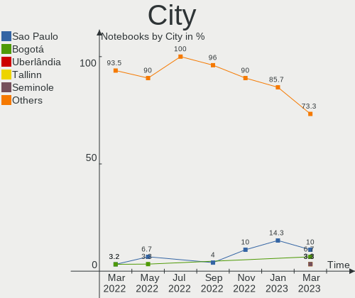
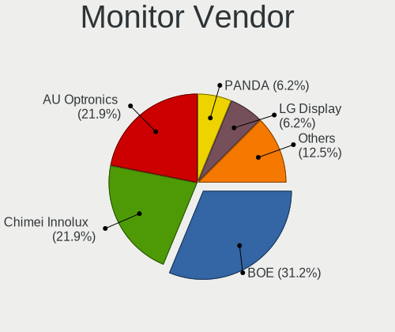
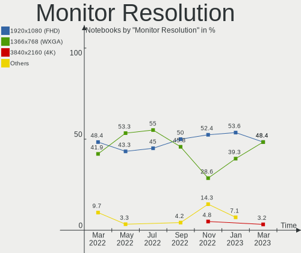
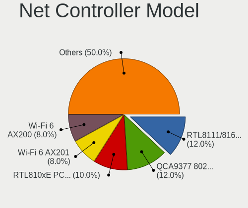
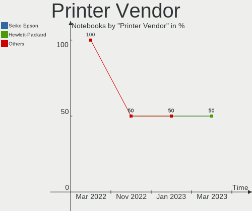

Endless Hardware Trends (Notebook)
----------------------------------

A project to identify most popular hardware characteristics and track their change
over time based on data collected by Endless users at https://Linux-Hardware.org.

Anyone can contribute to the study by uploading probes of their computers by
the [hw-probe](https://github.com/linuxhw/hw-probe) tool:

    sudo -E hw-probe -all -upload

Full-feature report is available here: https://linux-hardware.org/?view=trends&formfactor=notebook

Period: Jan, 2021.

Contents
--------

- [ OS                       ](#os)
- [ OS Family                ](#os-family)
- [ Kernel                   ](#kernel)
- [ Kernel Family            ](#kernel-family)
- [ Kernel Major Ver.        ](#kernel-major-ver)
- [ Arch                     ](#arch)
- [ DE                       ](#de)
- [ Display Server           ](#display-server)
- [ Display Manager          ](#display-manager)
- [ OS Lang                  ](#os-lang)
- [ Boot Mode                ](#boot-mode)
- [ Filesystem               ](#filesystem)
- [ Part. scheme             ](#part-scheme)
- [ Dual Boot with Linux/BSD ](#dual-boot-with-linux/bsd)
- [ Dual Boot (Win)          ](#dual-boot-win)
- [ Country                  ](#country)
- [ City                     ](#city)
- [ Vendor                   ](#vendor)
- [ Model                    ](#model)
- [ Model Family             ](#model-family)
- [ MFG Year                 ](#mfg-year)
- [ Form Factor              ](#form-factor)
- [ Secure Boot              ](#secure-boot)
- [ Coreboot                 ](#coreboot)
- [ RAM Size                 ](#ram-size)
- [ RAM Used                 ](#ram-used)
- [ Has CD-ROM               ](#has-cd-rom)
- [ Total Drives             ](#total-drives)
- [ Has Ethernet             ](#has-ethernet)
- [ Drive Vendor             ](#drive-vendor)
- [ Drive Model              ](#drive-model)
- [ HDD Vendor               ](#hdd-vendor)
- [ SSD Vendor               ](#ssd-vendor)
- [ Drive Kind               ](#drive-kind)
- [ Drive Connector          ](#drive-connector)
- [ Drive Size               ](#drive-size)
- [ Space Total              ](#space-total)
- [ Space Used               ](#space-used)
- [ Malfunc. Drives          ](#malfunc-drives)
- [ Malfunc. Drive Vendor    ](#malfunc-drive-vendor)
- [ Malfunc. HDD Vendor      ](#malfunc-hdd-vendor)
- [ Malfunc. Drive Kind      ](#malfunc-drive-kind)
- [ Failed Drives            ](#failed-drives)
- [ Failed Drive Vendor      ](#failed-drive-vendor)
- [ Drive Status             ](#drive-status)
- [ Storage Vendor           ](#storage-vendor)
- [ Storage Model            ](#storage-model)
- [ Storage Kind             ](#storage-kind)
- [ CPU Vendor               ](#cpu-vendor)
- [ CPU Model                ](#cpu-model)
- [ CPU Model Family         ](#cpu-model-family)
- [ CPU Cores                ](#cpu-cores)
- [ CPU Sockets              ](#cpu-sockets)
- [ CPU Threads              ](#cpu-threads)
- [ CPU Op-Modes             ](#cpu-op-modes)
- [ CPU Microcode            ](#cpu-microcode)
- [ CPU Microarch            ](#cpu-microarch)
- [ GPU Vendor               ](#gpu-vendor)
- [ GPU Model                ](#gpu-model)
- [ GPU Combo                ](#gpu-combo)
- [ GPU Driver               ](#gpu-driver)
- [ GPU Memory               ](#gpu-memory)
- [ Monitor Vendor           ](#monitor-vendor)
- [ Monitor Model            ](#monitor-model)
- [ Monitor Resolution       ](#monitor-resolution)
- [ Monitor Diagonal         ](#monitor-diagonal)
- [ Monitor Width            ](#monitor-width)
- [ Aspect Ratio             ](#aspect-ratio)
- [ Monitor Area             ](#monitor-area)
- [ Pixel Density            ](#pixel-density)
- [ Multiple Monitors        ](#multiple-monitors)
- [ Net Controller Vendor    ](#net-controller-vendor)
- [ Net Controller Model     ](#net-controller-model)
- [ Wireless Vendor          ](#wireless-vendor)
- [ Wireless Model           ](#wireless-model)
- [ Ethernet Vendor          ](#ethernet-vendor)
- [ Ethernet Model           ](#ethernet-model)
- [ Net Controller Kind      ](#net-controller-kind)
- [ Used Controller          ](#used-controller)
- [ NICs                     ](#nics)
- [ Memory Vendor            ](#memory-vendor)
- [ Memory Model             ](#memory-model)
- [ Memory Kind              ](#memory-kind)
- [ Memory Form Factor       ](#memory-form-factor)
- [ Memory Size              ](#memory-size)
- [ Memory Speed             ](#memory-speed)
- [ Sound Vendor             ](#sound-vendor)
- [ Sound Model              ](#sound-model)
- [ Camera Vendor            ](#camera-vendor)
- [ Camera Model             ](#camera-model)
- [ Fingerprint Vendor       ](#fingerprint-vendor)
- [ Fingerprint Model        ](#fingerprint-model)
- [ Chipcard Vendor          ](#chipcard-vendor)
- [ Chipcard Model           ](#chipcard-model)
- [ Printer Vendor           ](#printer-vendor)
- [ Printer Model            ](#printer-model)
- [ Scanner Vendor           ](#scanner-vendor)
- [ Scanner Model            ](#scanner-model)
- [ Bluetooth Vendor         ](#bluetooth-vendor)
- [ Bluetooth Model          ](#bluetooth-model)
- [ Unsupported Devices      ](#unsupported-devices)
- [ Unsupported Device Types ](#unsupported-device-types)

OS
--

Installed operating systems

| Name                  | Notebooks | Percent |
|-----------------------|-----------|---------|
| Endless 3.9.1         | 61        | 70.11%  |
| Endless 3.9.2         | 12        | 13.79%  |
| Endless 3.7.8         | 5         | 5.75%   |
| Endless 3.7.4         | 2         | 2.3%    |
| Endless 3.9.0         | 1         | 1.15%   |
| Endless 3.8.7         | 1         | 1.15%   |
| Endless 3.8.6         | 1         | 1.15%   |
| Endless 3.8.5         | 1         | 1.15%   |
| Endless 3.7.7         | 1         | 1.15%   |
| Endless 3.6.3-nexthw1 | 1         | 1.15%   |
| Endless 3.4.2-nexthw1 | 1         | 1.15%   |

OS Family
---------

OS without a version

| Name    | Notebooks | Percent |
|---------|-----------|---------|
| Endless | 87        | 100%    |

Kernel
------

Version of the Linux kernel

| Version          | Notebooks | Percent |
|------------------|-----------|---------|
| 5.8.0-14-generic | 74        | 85.06%  |
| 5.3.0-28-generic | 6         | 6.9%    |
| 5.4.0-42-generic | 2         | 2.3%    |
| 5.3.0-19-generic | 2         | 2.3%    |
| 5.4.0-39-generic | 1         | 1.15%   |
| 5.3.0-12-generic | 1         | 1.15%   |
| 4.16.0-4-generic | 1         | 1.15%   |

Kernel Family
-------------

Linux kernel without a distro release

| Version | Notebooks | Percent |
|---------|-----------|---------|
| 5.8.0   | 74        | 85.06%  |
| 5.3.0   | 9         | 10.34%  |
| 5.4.0   | 3         | 3.45%   |
| 4.16.0  | 1         | 1.15%   |

Kernel Major Ver.
-----------------

Linux kernel major version

| Version | Notebooks | Percent |
|---------|-----------|---------|
| 5.8     | 74        | 85.06%  |
| 5.3     | 9         | 10.34%  |
| 5.4     | 3         | 3.45%   |
| 4.16    | 1         | 1.15%   |

Arch
----

OS architecture (x86_64, i586, etc.)

| Name   | Notebooks | Percent |
|--------|-----------|---------|
| x86_64 | 87        | 100%    |

DE
--

Desktop Environment

| Name  | Notebooks | Percent |
|-------|-----------|---------|
| GNOME | 87        | 100%    |

Display Server
--------------

X11 or Wayland

| Name | Notebooks | Percent |
|------|-----------|---------|
| X11  | 87        | 100%    |

Display Manager
---------------

SDDM, LightDM, etc.

| Name    | Notebooks | Percent |
|---------|-----------|---------|
| Unknown | 87        | 100%    |

OS Lang
-------

Language

| Lang  | Notebooks | Percent |
|-------|-----------|---------|
| pt_BR | 33        | 37.93%  |
| en_US | 16        | 18.39%  |
| ro_RO | 7         | 8.05%   |
| hu_HU | 6         | 6.9%    |
| es_ES | 5         | 5.75%   |
| de_DE | 4         | 4.6%    |
| ru_RU | 3         | 3.45%   |
| tr_TR | 2         | 2.3%    |
| pl_PL | 2         | 2.3%    |
| es_MX | 2         | 2.3%    |
| sl_SI | 1         | 1.15%   |
| fr_FR | 1         | 1.15%   |
| fi_FI | 1         | 1.15%   |
| es_CO | 1         | 1.15%   |
| es_AR | 1         | 1.15%   |
| el_GR | 1         | 1.15%   |
| de_AT | 1         | 1.15%   |

Boot Mode
---------

EFI or BIOS

| Mode | Notebooks | Percent |
|------|-----------|---------|
| EFI  | 65        | 74.71%  |
| BIOS | 22        | 25.29%  |

Filesystem
----------

Type of filesystem

| Type  | Notebooks | Percent |
|-------|-----------|---------|
| Ext4  | 85        | 97.7%   |
| Tmpfs | 2         | 2.3%    |

Part. scheme
------------

Scheme of partitioning

| Type    | Notebooks | Percent |
|---------|-----------|---------|
| Unknown | 87        | 100%    |

Dual Boot with Linux/BSD
------------------------

Hosting more than one Linux/BSD

| Dual boot | Notebooks | Percent |
|-----------|-----------|---------|
| No        | 87        | 100%    |

Dual Boot (Win)
---------------

Hosting Linux and Windows

| Dual boot | Notebooks | Percent |
|-----------|-----------|---------|
| No        | 87        | 100%    |

Country
-------

Geographic location (country)

| Country     | Notebooks | Percent |
|-------------|-----------|---------|
| Brazil      | 33        | 37.93%  |
| Romania     | 12        | 13.79%  |
| USA         | 6         | 6.9%    |
| Spain       | 6         | 6.9%    |
| Hungary     | 6         | 6.9%    |
| Germany     | 3         | 3.45%   |
| Turkey      | 2         | 2.3%    |
| Russia      | 2         | 2.3%    |
| Poland      | 2         | 2.3%    |
| Colombia    | 2         | 2.3%    |
| Slovenia    | 1         | 1.15%   |
| Philippines | 1         | 1.15%   |
| Mexico      | 1         | 1.15%   |
| Kenya       | 1         | 1.15%   |
| Iran        | 1         | 1.15%   |
| Greece      | 1         | 1.15%   |
| France      | 1         | 1.15%   |
| Finland     | 1         | 1.15%   |
| Bulgaria    | 1         | 1.15%   |
| Belarus     | 1         | 1.15%   |
| Austria     | 1         | 1.15%   |
| Argentina   | 1         | 1.15%   |
| Unknown     | 1         | 1.15%   |

City
----

Geographic location (city)

| City                  | Notebooks | Percent |
|-----------------------|-----------|---------|
| Budapest              | 5         | 5.75%   |
| Rio de Janeiro        | 3         | 3.45%   |
| Guarulhos             | 2         | 2.3%    |
| Belo Horizonte        | 2         | 2.3%    |
| Americana             | 2         | 2.3%    |
| Zarnesti              | 1         | 1.15%   |
| Zapopan               | 1         | 1.15%   |
| Weston                | 1         | 1.15%   |
| Vitebsk               | 1         | 1.15%   |
| Vienna                | 1         | 1.15%   |
| Valcea                | 1         | 1.15%   |
| Urussanga             | 1         | 1.15%   |
| Ufa                   | 1         | 1.15%   |
| Trzebownisko          | 1         | 1.15%   |
| Thessaloniki          | 1         | 1.15%   |
| Suceava               | 1         | 1.15%   |
| Sector 3              | 1         | 1.15%   |
| Sao Jose do Rio Preto | 1         | 1.15%   |
| Sao Jose              | 1         | 1.15%   |
| Santiago de Cali      | 1         | 1.15%   |
| Santa Luzia           | 1         | 1.15%   |
| Rueil-Malmaison       | 1         | 1.15%   |
| Roznov                | 1         | 1.15%   |
| Resende               | 1         | 1.15%   |
| Rasht                 | 1         | 1.15%   |
| Posadas               | 1         | 1.15%   |
| Porto Velho           | 1         | 1.15%   |
| Porto Alegre          | 1         | 1.15%   |
| Pittsburgh            | 1         | 1.15%   |
| Piracicaba            | 1         | 1.15%   |
| Pilis                 | 1         | 1.15%   |
| Perdigao              | 1         | 1.15%   |
| Oulu                  | 1         | 1.15%   |
| Nairobi               | 1         | 1.15%   |
| Murcia                | 1         | 1.15%   |
| Moscow                | 1         | 1.15%   |
| Makati City           | 1         | 1.15%   |
| Londrina              | 1         | 1.15%   |
| Limoeiro do Norte     | 1         | 1.15%   |
| Lichtenstein          | 1         | 1.15%   |
| Kütahya              | 1         | 1.15%   |
| Koper                 | 1         | 1.15%   |
| Izmir                 | 1         | 1.15%   |
| Iorcani               | 1         | 1.15%   |
| Iasi                  | 1         | 1.15%   |
| House Springs         | 1         | 1.15%   |
| Hisarya               | 1         | 1.15%   |
| Hamburg               | 1         | 1.15%   |
| Guarroman             | 1         | 1.15%   |
| Goias                 | 1         | 1.15%   |
| Ferrol                | 1         | 1.15%   |
| Everett               | 1         | 1.15%   |
| Düsseldorf           | 1         | 1.15%   |
| Dumbravita            | 1         | 1.15%   |
| Diadema               | 1         | 1.15%   |
| Deva                  | 1         | 1.15%   |
| Criciúma             | 1         | 1.15%   |
| Concord               | 1         | 1.15%   |
| Choroszcz             | 1         | 1.15%   |
| Charlotte             | 1         | 1.15%   |

Vendor
------

Motherboard manufacturer

| Name             | Notebooks | Percent |
|------------------|-----------|---------|
| Acer             | 32        | 36.78%  |
| ASUSTek Computer | 29        | 33.33%  |
| Lenovo           | 7         | 8.05%   |
| Hewlett-Packard  | 6         | 6.9%    |
| Dell             | 5         | 5.75%   |
| Toshiba          | 2         | 2.3%    |
| Positivo         | 2         | 2.3%    |
| MSI              | 2         | 2.3%    |
| eMachines        | 1         | 1.15%   |
| Apple            | 1         | 1.15%   |

Model
-----

Motherboard model

| Name                                       | Notebooks | Percent |
|--------------------------------------------|-----------|---------|
| Acer Nitro AN515-54                        | 8         | 9.2%    |
| Acer Nitro AN517-51                        | 6         | 6.9%    |
| Acer Aspire A315-34                        | 5         | 5.75%   |
| ASUS X540NA                                | 3         | 3.45%   |
| ASUS VivoBook 15_ASUS Laptop X540UAR       | 3         | 3.45%   |
| Acer Aspire A515-54G                       | 3         | 3.45%   |
| ASUS X541NA                                | 2         | 2.3%    |
| ASUS VivoBook_ASUSLaptop X509FA_X509FA     | 2         | 2.3%    |
| ASUS VivoBook_ASUSLaptop X430FA_S430FA     | 2         | 2.3%    |
| ASUS VivoBook 15_ASUS Laptop X540MA_R540MA | 2         | 2.3%    |
| Toshiba Satellite P75-A                    | 1         | 1.15%   |
| Toshiba Satellite A300                     | 1         | 1.15%   |
| Positivo CHT12CP                           | 1         | 1.15%   |
| Positivo C14CU51                           | 1         | 1.15%   |
| MSI GP60 2PE                               | 1         | 1.15%   |
| MSI FX610                                  | 1         | 1.15%   |
| Lenovo ThinkPad X250 20CLS78300            | 1         | 1.15%   |
| Lenovo ThinkPad T420 4180GC6               | 1         | 1.15%   |
| Lenovo ThinkPad SL410 28423UG              | 1         | 1.15%   |
| Lenovo IdeaPad 330-15IKB 81DE              | 1         | 1.15%   |
| Lenovo G70-35 80Q5                         | 1         | 1.15%   |
| Lenovo G480 20149                          | 1         | 1.15%   |
| HP ProBook 450 G2                          | 1         | 1.15%   |
| HP Pavilion dv2700                         | 1         | 1.15%   |
| HP 635                                     | 1         | 1.15%   |
| HP 620                                     | 1         | 1.15%   |
| HP 250 G7 Notebook PC                      | 1         | 1.15%   |
| HP 2000                                    | 1         | 1.15%   |
| eMachines G640                             | 1         | 1.15%   |
| Dell Studio 1450                           | 1         | 1.15%   |
| Dell Latitude E6400                        | 1         | 1.15%   |
| Dell Inspiron N5110                        | 1         | 1.15%   |
| Dell Inspiron 3593                         | 1         | 1.15%   |
| Dell Inspiron 1545                         | 1         | 1.15%   |
| ASUS ZenBook UX431DA_UM431DA               | 1         | 1.15%   |
| ASUS X705UAR                               | 1         | 1.15%   |
| ASUS X542UN                                | 1         | 1.15%   |
| ASUS X541UAK                               | 1         | 1.15%   |
| ASUS VivoBook_ASUSLaptop X712FA_X712FA     | 1         | 1.15%   |
| ASUS VivoBook_ASUSLaptop X509JP_X509JP     | 1         | 1.15%   |
| ASUS VivoBook_ASUSLaptop X509JA_X509JA     | 1         | 1.15%   |
| ASUS VivoBook_ASUSLaptop X509FA_A509FA     | 1         | 1.15%   |
| ASUS VivoBook 17_ASUS Laptop X705MA_X705MA | 1         | 1.15%   |
| ASUS VivoBook 15_ASUS Laptop X540MA_X540MA | 1         | 1.15%   |
| ASUS VivoBook 15_ASUS Laptop X540MA_A540MA | 1         | 1.15%   |
| ASUS VivoBook 15_ASUS Laptop X540BA        | 1         | 1.15%   |
| ASUS VivoBook 12_ASUS Laptop E203MA_E203MA | 1         | 1.15%   |
| ASUS E502SA                                | 1         | 1.15%   |
| ASUS ASUS TUF Gaming A17 FA706II_FX706II   | 1         | 1.15%   |
| Apple MacBookAir7,2                        | 1         | 1.15%   |
| Acer Nitro AN515-43                        | 1         | 1.15%   |
| Acer Extensa 2540                          | 1         | 1.15%   |
| Acer Aspire ES1-132                        | 1         | 1.15%   |
| Acer Aspire E3-112M                        | 1         | 1.15%   |
| Acer Aspire A517-51G                       | 1         | 1.15%   |
| Acer Aspire A515-51G                       | 1         | 1.15%   |
| Acer Aspire A317-51G                       | 1         | 1.15%   |
| Acer Aspire A315-56                        | 1         | 1.15%   |
| Acer Aspire A315-53                        | 1         | 1.15%   |
| Acer Aspire A315-21                        | 1         | 1.15%   |

Model Family
------------

Motherboard model prefix

| Name              | Notebooks | Percent |
|-------------------|-----------|---------|
| ASUS VivoBook     | 18        | 20.69%  |
| Acer Aspire       | 16        | 18.39%  |
| Acer Nitro        | 15        | 17.24%  |
| Lenovo ThinkPad   | 3         | 3.45%   |
| Dell Inspiron     | 3         | 3.45%   |
| ASUS X540NA       | 3         | 3.45%   |
| Toshiba Satellite | 2         | 2.3%    |
| ASUS X541NA       | 2         | 2.3%    |
| Positivo CHT12CP  | 1         | 1.15%   |
| Positivo C14CU51  | 1         | 1.15%   |
| MSI GP60          | 1         | 1.15%   |
| MSI FX610         | 1         | 1.15%   |
| Lenovo IdeaPad    | 1         | 1.15%   |
| Lenovo G70-35     | 1         | 1.15%   |
| Lenovo G480       | 1         | 1.15%   |
| HP ProBook        | 1         | 1.15%   |
| HP Pavilion       | 1         | 1.15%   |
| HP 635            | 1         | 1.15%   |
| HP 620            | 1         | 1.15%   |
| HP 250            | 1         | 1.15%   |
| HP 2000           | 1         | 1.15%   |
| eMachines G640    | 1         | 1.15%   |
| Dell Studio       | 1         | 1.15%   |
| Dell Latitude     | 1         | 1.15%   |
| ASUS ZenBook      | 1         | 1.15%   |
| ASUS X705UAR      | 1         | 1.15%   |
| ASUS X542UN       | 1         | 1.15%   |
| ASUS X541UAK      | 1         | 1.15%   |
| ASUS E502SA       | 1         | 1.15%   |
| ASUS ASUS         | 1         | 1.15%   |
| Apple MacBookAir7 | 1         | 1.15%   |
| Acer Extensa      | 1         | 1.15%   |
| Unknown           | 1         | 1.15%   |

MFG Year
--------

Motherboard manufacture year

| Year | Notebooks | Percent |
|------|-----------|---------|
| 2020 | 26        | 29.89%  |
| 2019 | 23        | 26.44%  |
| 2018 | 11        | 12.64%  |
| 2017 | 8         | 9.2%    |
| 2011 | 4         | 4.6%    |
| 2013 | 3         | 3.45%   |
| 2016 | 2         | 2.3%    |
| 2014 | 2         | 2.3%    |
| 2012 | 2         | 2.3%    |
| 2010 | 2         | 2.3%    |
| 2008 | 2         | 2.3%    |
| 2015 | 1         | 1.15%   |
| 2009 | 1         | 1.15%   |

Form Factor
-----------

Physical design of the computer

| Name     | Notebooks | Percent |
|----------|-----------|---------|
| Notebook | 87        | 100%    |

Secure Boot
-----------

Enabled or disabled

| State    | Notebooks | Percent |
|----------|-----------|---------|
| Disabled | 54        | 62.07%  |
| Enabled  | 33        | 37.93%  |

Coreboot
--------

Have coreboot on board

| Used | Notebooks | Percent |
|------|-----------|---------|
| No   | 87        | 100%    |

RAM Size
--------

Total RAM memory

| Size in GB | Notebooks | Percent |
|------------|-----------|---------|
| 3.01-4.0   | 40        | 45.98%  |
| 4.01-8.0   | 29        | 33.33%  |
| 8.01-16.0  | 10        | 11.49%  |
| 16.01-24.0 | 4         | 4.6%    |
| 1.01-2.0   | 3         | 3.45%   |
| 2.01-3.0   | 1         | 1.15%   |

RAM Used
--------

Used RAM memory

| Used GB  | Notebooks | Percent |
|----------|-----------|---------|
| 1.01-2.0 | 42        | 48.28%  |
| 2.01-3.0 | 18        | 20.69%  |
| 0.51-1.0 | 18        | 20.69%  |
| 3.01-4.0 | 7         | 8.05%   |
| 4.01-8.0 | 2         | 2.3%    |

Has CD-ROM
----------

Has CD-ROM on board

| Presented | Notebooks | Percent |
|-----------|-----------|---------|
| No        | 62        | 71.26%  |
| Yes       | 25        | 28.74%  |

Total Drives
------------

Number of drives on board

| Drives | Notebooks | Percent |
|--------|-----------|---------|
| 1      | 71        | 81.61%  |
| 2      | 15        | 17.24%  |
| 3      | 1         | 1.15%   |

Has Ethernet
------------

Has Ethernet on board

| Presented | Notebooks | Percent |
|-----------|-----------|---------|
| Yes       | 65        | 74.71%  |
| No        | 22        | 25.29%  |

Drive Vendor
------------

Hard drive vendors

| Vendor              | Notebooks | Drives | Percent |
|---------------------|-----------|--------|---------|
| Intel               | 21        | 21     | 20.79%  |
| WDC                 | 18        | 18     | 17.82%  |
| Seagate             | 13        | 13     | 12.87%  |
| Kingston            | 12        | 12     | 11.88%  |
| Toshiba             | 8         | 9      | 7.92%   |
| SanDisk             | 8         | 8      | 7.92%   |
| Unknown             | 4         | 4      | 3.96%   |
| Samsung Electronics | 3         | 3      | 2.97%   |
| SK Hynix            | 2         | 2      | 1.98%   |
| Hitachi             | 2         | 2      | 1.98%   |
| HGST                | 2         | 2      | 1.98%   |
| Patriot             | 1         | 1      | 0.99%   |
| Micron Technology   | 1         | 1      | 0.99%   |
| Kingmax             | 1         | 1      | 0.99%   |
| Hewlett-Packard     | 1         | 1      | 0.99%   |
| ASMT                | 1         | 1      | 0.99%   |
| Apple               | 1         | 1      | 0.99%   |
| ADATA Technology    | 1         | 1      | 0.99%   |
| A-DATA Technology   | 1         | 1      | 0.99%   |

Drive Model
-----------

Hard drive models

| Model                                 | Notebooks | Percent |
|---------------------------------------|-----------|---------|
| WDC WD10SPZX-21Z10T0 1TB              | 13        | 12.75%  |
| Intel NVMe SSD Drive 512GB            | 10        | 9.8%    |
| Seagate ST1000LM035-1RK172 1TB        | 7         | 6.86%   |
| Intel NVMe SSD Drive 256GB            | 7         | 6.86%   |
| Kingston RBUSC180DS37256GJ 256GB SSD  | 4         | 3.92%   |
| Unknown MMC Card  32GB                | 3         | 2.94%   |
| Toshiba MQ01ABF050 500GB              | 3         | 2.94%   |
| Intel NVMe SSD Drive 128GB            | 3         | 2.94%   |
| Toshiba MQ04ABF100 1TB                | 2         | 1.96%   |
| SK Hynix NVMe SSD Drive 256GB         | 2         | 1.96%   |
| Seagate ST2000LM007-1R8174 2TB        | 2         | 1.96%   |
| Kingston SA400S37240G 240GB SSD       | 2         | 1.96%   |
| Kingston NVMe SSD Drive 512GB         | 2         | 1.96%   |
| WDC WD6400BPVT-75HXZT1 640GB          | 1         | 0.98%   |
| WDC WD5000LPCX-24VHAT0 500GB          | 1         | 0.98%   |
| WDC WD5000LPCX-21VHAT0 500GB          | 1         | 0.98%   |
| WDC WD10SPZX-80Z10T2 1TB              | 1         | 0.98%   |
| WDC WD10JPCX-24UE4T0 1TB              | 1         | 0.98%   |
| Unknown MMC Card  64GB                | 1         | 0.98%   |
| Toshiba TR200 240GB SSD               | 1         | 0.98%   |
| Toshiba MQ01ABD050 500GB              | 1         | 0.98%   |
| Toshiba MK3263GSX 320GB               | 1         | 0.98%   |
| Toshiba MK2552GSX 250GB               | 1         | 0.98%   |
| Seagate ST500LM030-1RK17D 500GB       | 1         | 0.98%   |
| Seagate ST500LM000-1EJ162-SSHD 500GB  | 1         | 0.98%   |
| Seagate ST320LT020-9YG142 320GB       | 1         | 0.98%   |
| Seagate ST320LM001 HN-M320MBB 320GB   | 1         | 0.98%   |
| SanDisk Ultra II 240GB SSD            | 1         | 0.98%   |
| SanDisk SSD PLUS 240GB                | 1         | 0.98%   |
| SanDisk SD9SN8W256G1102 256GB SSD     | 1         | 0.98%   |
| SanDisk SD9SN8W256G1014 256GB SSD     | 1         | 0.98%   |
| SanDisk SD9SN8W128G1102 128GB SSD     | 1         | 0.98%   |
| SanDisk SD9SB8W256G1002 256GB SSD     | 1         | 0.98%   |
| SanDisk SD8SBAT128G1002 128GB SSD     | 1         | 0.98%   |
| Sandisk NVMe SSD Drive 512GB          | 1         | 0.98%   |
| Samsung SSD 860 EVO 500GB             | 1         | 0.98%   |
| Samsung SSD 850 PRO 256GB             | 1         | 0.98%   |
| Samsung HM320JI 320GB                 | 1         | 0.98%   |
| Patriot Burst 120GB SSD               | 1         | 0.98%   |
| Micron 1300_MTFDDAK256TDL 256GB SSD   | 1         | 0.98%   |
| Kingston SUV400S37120G 120GB SSD      | 1         | 0.98%   |
| Kingston SA400S37120G 120GB SSD       | 1         | 0.98%   |
| Kingston RBUSNS8180DS3256GJ 256GB SSD | 1         | 0.98%   |
| Kingston RBUSC180DS37128GH 128GB SSD  | 1         | 0.98%   |
| Kingmax SSD 256GB                     | 1         | 0.98%   |
| Intel SSDSCKKW256G8 256GB             | 1         | 0.98%   |
| Hitachi HTS725016A9A364 160GB         | 1         | 0.98%   |
| Hitachi HTS545032B9A300 320GB         | 1         | 0.98%   |
| HGST HTS545050B7E660 500GB            | 1         | 0.98%   |
| HGST HTS541010B7E610 1TB              | 1         | 0.98%   |
| HP SSD S700 120GB                     | 1         | 0.98%   |
| ASMT 2115 1050GB                      | 1         | 0.98%   |
| Apple SSD SM0128G 121GB               | 1         | 0.98%   |
| ADATA NVMe SSD Drive 128GB            | 1         | 0.98%   |
| A-DATA SP610 128GB SSD                | 1         | 0.98%   |

HDD Vendor
----------

Hard disk drive vendors

| Vendor              | Notebooks | Drives | Percent |
|---------------------|-----------|--------|---------|
| WDC                 | 18        | 18     | 40%     |
| Seagate             | 13        | 13     | 28.89%  |
| Toshiba             | 8         | 8      | 17.78%  |
| Hitachi             | 2         | 2      | 4.44%   |
| HGST                | 2         | 2      | 4.44%   |
| Samsung Electronics | 1         | 1      | 2.22%   |
| ASMT                | 1         | 1      | 2.22%   |

SSD Vendor
----------

Solid state drive vendors

| Vendor              | Notebooks | Drives | Percent |
|---------------------|-----------|--------|---------|
| Kingston            | 10        | 10     | 37.04%  |
| SanDisk             | 7         | 7      | 25.93%  |
| Samsung Electronics | 2         | 2      | 7.41%   |
| Toshiba             | 1         | 1      | 3.7%    |
| Patriot             | 1         | 1      | 3.7%    |
| Micron Technology   | 1         | 1      | 3.7%    |
| Kingmax             | 1         | 1      | 3.7%    |
| Intel               | 1         | 1      | 3.7%    |
| Hewlett-Packard     | 1         | 1      | 3.7%    |
| Apple               | 1         | 1      | 3.7%    |
| A-DATA Technology   | 1         | 1      | 3.7%    |

Drive Kind
----------

HDD or SSD

| Kind | Notebooks | Drives | Percent |
|------|-----------|--------|---------|
| HDD  | 44        | 45     | 43.56%  |
| SSD  | 27        | 27     | 26.73%  |
| NVMe | 26        | 26     | 25.74%  |
| MMC  | 4         | 4      | 3.96%   |

Drive Connector
---------------

SATA, SAS, NVMe, etc.

| Type | Notebooks | Drives | Percent |
|------|-----------|--------|---------|
| SATA | 67        | 71     | 68.37%  |
| NVMe | 26        | 26     | 26.53%  |
| MMC  | 4         | 4      | 4.08%   |
| SAS  | 1         | 1      | 1.02%   |

Drive Size
----------

Size of hard drive

| Size in TB | Notebooks | Drives | Percent |
|------------|-----------|--------|---------|
| 0.01-0.5   | 42        | 43     | 59.15%  |
| 0.51-1.0   | 26        | 26     | 36.62%  |
| 1.01-2.0   | 3         | 3      | 4.23%   |

Space Total
-----------

Amount of disk space available on the file system

| Size in GB     | Notebooks | Percent |
|----------------|-----------|---------|
| 101-250        | 27        | 31.03%  |
| 251-500        | 23        | 26.44%  |
| 501-1000       | 21        | 24.14%  |
| 21-50          | 4         | 4.6%    |
| 51-100         | 4         | 4.6%    |
| 1001-2000      | 3         | 3.45%   |
| 1-20           | 3         | 3.45%   |
| More than 3000 | 1         | 1.15%   |
| 2001-3000      | 1         | 1.15%   |

Space Used
----------

Amount of used disk space

| Used GB   | Notebooks | Percent |
|-----------|-----------|---------|
| 21-50     | 47        | 54.02%  |
| 1-20      | 17        | 19.54%  |
| 51-100    | 12        | 13.79%  |
| 101-250   | 7         | 8.05%   |
| 251-500   | 2         | 2.3%    |
| 2001-3000 | 1         | 1.15%   |
| 1001-2000 | 1         | 1.15%   |

Malfunc. Drives
---------------

Drive models with a malfunction

Zero info for selected period =(

Malfunc. Drive Vendor
---------------------

Vendors of faulty drives

Zero info for selected period =(

Malfunc. HDD Vendor
-------------------

Vendors of faulty HDD drives

Zero info for selected period =(

Malfunc. Drive Kind
-------------------

Kinds of faulty drives

Zero info for selected period =(

Failed Drives
-------------

Failed drive models

Zero info for selected period =(

Failed Drive Vendor
-------------------

Failed drive vendors

Zero info for selected period =(

Drive Status
------------

Number of failed and malfunc. drives

| Status   | Notebooks | Drives | Percent |
|----------|-----------|--------|---------|
| Detected | 87        | 102    | 100%    |

Storage Vendor
--------------

Storage controller vendors

| Vendor                      | Notebooks | Percent |
|-----------------------------|-----------|---------|
| Intel                       | 74        | 81.32%  |
| AMD                         | 10        | 10.99%  |
| SK Hynix                    | 2         | 2.2%    |
| Kingston Technology Company | 2         | 2.2%    |
| Sandisk                     | 1         | 1.1%    |
| Samsung Electronics         | 1         | 1.1%    |
| ADATA Technology            | 1         | 1.1%    |

Storage Model
-------------

Storage controller models

| Model                                                                            | Notebooks | Percent |
|----------------------------------------------------------------------------------|-----------|---------|
| Intel 82801 Mobile SATA Controller [RAID mode]                                   | 26        | 22.81%  |
| Intel PROSet/Wireless WiFi Software extension                                    | 20        | 17.54%  |
| Intel Sunrise Point-LP SATA Controller [AHCI mode]                               | 11        | 9.65%   |
| Intel Celeron/Pentium Silver Processor SATA Controller                           | 10        | 8.77%   |
| AMD FCH SATA Controller [AHCI mode]                                              | 7         | 6.14%   |
| Intel Celeron N3350/Pentium N4200/Atom E3900 Series SATA AHCI Controller         | 6         | 5.26%   |
| Intel 82801IBM/IEM (ICH9M/ICH9M-E) 4 port SATA Controller [AHCI mode]            | 6         | 5.26%   |
| SK Hynix BC501 NVMe Solid State Drive 512GB                                      | 2         | 1.75%   |
| Intel Wildcat Point-LP SATA Controller [AHCI Mode]                               | 2         | 1.75%   |
| Intel Cannon Lake Mobile PCH SATA AHCI Controller                                | 2         | 1.75%   |
| Intel 8 Series/C220 Series Chipset Family 6-port SATA Controller 1 [AHCI mode]   | 2         | 1.75%   |
| Intel 7 Series Chipset Family 6-port SATA Controller [AHCI mode]                 | 2         | 1.75%   |
| Intel 6 Series/C200 Series Chipset Family 6 port Mobile SATA AHCI Controller     | 2         | 1.75%   |
| AMD SB7x0/SB8x0/SB9x0 SATA Controller [AHCI mode]                                | 2         | 1.75%   |
| Sandisk WD Blue SN500 / PC SN520 NVMe SSD                                        | 1         | 0.88%   |
| Samsung Electronics SATA controller                                              | 1         | 0.88%   |
| Kingston Company U-SNS8154P3 NVMe SSD                                            | 1         | 0.88%   |
| Kingston Company Company Non-Volatile memory controller                          | 1         | 0.88%   |
| Intel Mobile 4 Series Chipset PT IDER Controller                                 | 1         | 0.88%   |
| Intel Ice Lake-LP SATA Controller [AHCI mode]                                    | 1         | 0.88%   |
| Intel Atom/Celeron/Pentium Processor x5-E8000/J3xxx/N3xxx Series SATA Controller | 1         | 0.88%   |
| Intel Atom Processor E3800 Series SATA AHCI Controller                           | 1         | 0.88%   |
| Intel 82801HM/HEM (ICH8M/ICH8M-E) SATA Controller [AHCI mode]                    | 1         | 0.88%   |
| Intel 82801HM/HEM (ICH8M/ICH8M-E) IDE Controller                                 | 1         | 0.88%   |
| Intel 8 Series SATA Controller 1 [AHCI mode]                                     | 1         | 0.88%   |
| AMD SB7x0/SB8x0/SB9x0 SATA Controller [IDE mode]                                 | 1         | 0.88%   |
| AMD SB7x0/SB8x0/SB9x0 IDE Controller                                             | 1         | 0.88%   |
| ADATA Non-Volatile memory controller                                             | 1         | 0.88%   |

Storage Kind
------------

Kind of storage controller (IDE, SATA, NVMe, SAS, ...)

| Kind | Notebooks | Percent |
|------|-----------|---------|
| SATA | 80        | 70.18%  |
| NVMe | 26        | 22.81%  |
| RAID | 5         | 4.39%   |
| IDE  | 3         | 2.63%   |

CPU Vendor
----------

Processor vendors

| Vendor | Notebooks | Percent |
|--------|-----------|---------|
| Intel  | 77        | 88.51%  |
| AMD    | 10        | 11.49%  |

CPU Model
---------

Processor models

| Model                                         | Notebooks | Percent |
|-----------------------------------------------|-----------|---------|
| Intel Core i5-9300H CPU @ 2.40GHz             | 10        | 11.49%  |
| Intel Celeron N4000 CPU @ 1.10GHz             | 6         | 6.9%    |
| Intel Celeron CPU N3350 @ 1.10GHz             | 5         | 5.75%   |
| Intel Core i7-9750H CPU @ 2.60GHz             | 4         | 4.6%    |
| Intel Core i3-8145U CPU @ 2.10GHz             | 4         | 4.6%    |
| Intel Core i7-10510U CPU @ 1.80GHz            | 3         | 3.45%   |
| Intel Core i5-1035G1 CPU @ 1.00GHz            | 3         | 3.45%   |
| Intel Celeron N4020 CPU @ 1.10GHz             | 3         | 3.45%   |
| Intel Pentium CPU 4417U @ 2.30GHz             | 2         | 2.3%    |
| Intel Core i5-7200U CPU @ 2.50GHz             | 2         | 2.3%    |
| Intel Core i3-7020U CPU @ 2.30GHz             | 2         | 2.3%    |
| Intel Core i3-1005G1 CPU @ 1.20GHz            | 2         | 2.3%    |
| Intel Core 2 Duo CPU T6600 @ 2.20GHz          | 2         | 2.3%    |
| Intel Celeron N4000C CPU @ 1.10GHz            | 2         | 2.3%    |
| Intel Pentium CPU N3700 @ 1.60GHz             | 1         | 1.15%   |
| Intel Core i7-8565U CPU @ 1.80GHz             | 1         | 1.15%   |
| Intel Core i7-8550U CPU @ 1.80GHz             | 1         | 1.15%   |
| Intel Core i7-5500U CPU @ 2.40GHz             | 1         | 1.15%   |
| Intel Core i7-4710HQ CPU @ 2.50GHz            | 1         | 1.15%   |
| Intel Core i7-4700MQ CPU @ 2.40GHz            | 1         | 1.15%   |
| Intel Core i7-2630QM CPU @ 2.00GHz            | 1         | 1.15%   |
| Intel Core i5-8265U CPU @ 1.60GHz             | 1         | 1.15%   |
| Intel Core i5-8250U CPU @ 1.60GHz             | 1         | 1.15%   |
| Intel Core i5-5350U CPU @ 1.80GHz             | 1         | 1.15%   |
| Intel Core i5-5200U CPU @ 2.20GHz             | 1         | 1.15%   |
| Intel Core i5-4300U CPU @ 1.90GHz             | 1         | 1.15%   |
| Intel Core i5-2520M CPU @ 2.50GHz             | 1         | 1.15%   |
| Intel Core i5-10210U CPU @ 1.60GHz            | 1         | 1.15%   |
| Intel Core i3-7130U CPU @ 2.70GHz             | 1         | 1.15%   |
| Intel Core i3-6100U CPU @ 2.30GHz             | 1         | 1.15%   |
| Intel Core i3-6006U CPU @ 2.00GHz             | 1         | 1.15%   |
| Intel Core i3-2328M CPU @ 2.20GHz             | 1         | 1.15%   |
| Intel Core 2 Duo CPU T9600 @ 2.80GHz          | 1         | 1.15%   |
| Intel Core 2 Duo CPU T5870 @ 2.00GHz          | 1         | 1.15%   |
| Intel Core 2 Duo CPU T5750 @ 2.00GHz          | 1         | 1.15%   |
| Intel Core 2 Duo CPU P8400 @ 2.26GHz          | 1         | 1.15%   |
| Intel Celeron Dual-Core CPU T3100 @ 1.90GHz   | 1         | 1.15%   |
| Intel Celeron CPU N3450 @ 1.10GHz             | 1         | 1.15%   |
| Intel Celeron CPU N2840 @ 2.16GHz             | 1         | 1.15%   |
| Intel Celeron CPU 1007U @ 1.50GHz             | 1         | 1.15%   |
| Intel Atom x5-Z8350 CPU @ 1.44GHz             | 1         | 1.15%   |
| AMD Ryzen 7 4800H with Radeon Graphics        | 1         | 1.15%   |
| AMD Ryzen 7 3750H with Radeon Vega Mobile Gfx | 1         | 1.15%   |
| AMD Ryzen 5 3500U with Radeon Vega Mobile Gfx | 1         | 1.15%   |
| AMD Phenom II P840 Triple-Core Processor      | 1         | 1.15%   |
| AMD E-350 Processor                           | 1         | 1.15%   |
| AMD E-300 APU with Radeon HD Graphics         | 1         | 1.15%   |
| AMD Athlon II P320 Dual-Core Processor        | 1         | 1.15%   |
| AMD A9-9420e RADEON R5, 5 COMPUTE CORES 2C+3G | 1         | 1.15%   |
| AMD A4-9125 RADEON R3, 4 COMPUTE CORES 2C+2G  | 1         | 1.15%   |
| AMD A4-6210 APU with AMD Radeon R3 Graphics   | 1         | 1.15%   |

CPU Model Family
----------------

Processor model prefix

| Model                   | Notebooks | Percent |
|-------------------------|-----------|---------|
| Intel Core i5           | 22        | 25.29%  |
| Intel Celeron           | 19        | 21.84%  |
| Intel Core i7           | 13        | 14.94%  |
| Intel Core i3           | 12        | 13.79%  |
| Intel Core 2 Duo        | 6         | 6.9%    |
| Intel Pentium           | 3         | 3.45%   |
| AMD Ryzen 7             | 2         | 2.3%    |
| AMD E                   | 2         | 2.3%    |
| AMD A4                  | 2         | 2.3%    |
| Other                   | 1         | 1.15%   |
| Intel Celeron Dual-Core | 1         | 1.15%   |
| Intel Atom              | 1         | 1.15%   |
| AMD Ryzen 5             | 1         | 1.15%   |
| AMD Phenom II           | 1         | 1.15%   |
| AMD Athlon II           | 1         | 1.15%   |

CPU Cores
---------

Number of processor cores

| Number | Notebooks | Percent |
|--------|-----------|---------|
| 2      | 50        | 57.47%  |
| 4      | 30        | 34.48%  |
| 6      | 4         | 4.6%    |
| 8      | 1         | 1.15%   |
| 3      | 1         | 1.15%   |
| 1      | 1         | 1.15%   |

CPU Sockets
-----------

Number of sockets

| Number | Notebooks | Percent |
|--------|-----------|---------|
| 1      | 87        | 100%    |

CPU Threads
-----------

Threads per core (Hyper-Threading)

| Number | Notebooks | Percent |
|--------|-----------|---------|
| 2      | 52        | 59.77%  |
| 1      | 35        | 40.23%  |

CPU Op-Modes
------------

CPU Operation Modes (32-bit, 64-bit)

| Op mode        | Notebooks | Percent |
|----------------|-----------|---------|
| 32-bit, 64-bit | 87        | 100%    |

CPU Microcode
-------------

Microcode number

| Number     | Notebooks | Percent |
|------------|-----------|---------|
| 0x906ea    | 14        | 16.09%  |
| 0x706a1    | 8         | 9.2%    |
| 0x806ec    | 6         | 6.9%    |
| 0x506c9    | 6         | 6.9%    |
| 0x806e9    | 5         | 5.75%   |
| 0x806eb    | 4         | 4.6%    |
| 0x806ea    | 4         | 4.6%    |
| 0x706e5    | 4         | 4.6%    |
| 0x1067a    | 4         | 4.6%    |
| 0x706a8    | 3         | 3.45%   |
| 0x306d4    | 3         | 3.45%   |
| 0x206a7    | 3         | 3.45%   |
| 0x6fd      | 2         | 2.3%    |
| 0x406e3    | 2         | 2.3%    |
| 0x306c3    | 2         | 2.3%    |
| 0x06006705 | 2         | 2.3%    |
| 0x010000c8 | 2         | 2.3%    |
| Unknown    | 2         | 2.3%    |
| 0x406c4    | 1         | 1.15%   |
| 0x406c3    | 1         | 1.15%   |
| 0x40651    | 1         | 1.15%   |
| 0x306a9    | 1         | 1.15%   |
| 0x30678    | 1         | 1.15%   |
| 0x08600104 | 1         | 1.15%   |
| 0x08108109 | 1         | 1.15%   |
| 0x08108102 | 1         | 1.15%   |
| 0x07030105 | 1         | 1.15%   |
| 0x05000119 | 1         | 1.15%   |
| 0x05000029 | 1         | 1.15%   |

CPU Microarch
-------------

Microarchitecture

| Name          | Notebooks | Percent |
|---------------|-----------|---------|
| KabyLake      | 33        | 37.93%  |
| Goldmont plus | 11        | 12.64%  |
| Goldmont      | 6         | 6.9%    |
| Penryn        | 5         | 5.75%   |
| IceLake       | 5         | 5.75%   |
| Silvermont    | 3         | 3.45%   |
| SandyBridge   | 3         | 3.45%   |
| Haswell       | 3         | 3.45%   |
| Broadwell     | 3         | 3.45%   |
| Zen+          | 2         | 2.3%    |
| Skylake       | 2         | 2.3%    |
| K10           | 2         | 2.3%    |
| Excavator     | 2         | 2.3%    |
| Core          | 2         | 2.3%    |
| Bobcat        | 2         | 2.3%    |
| Zen 2         | 1         | 1.15%   |
| Puma          | 1         | 1.15%   |
| IvyBridge     | 1         | 1.15%   |

GPU Vendor
----------

Vendors of graphics cards

| Vendor | Notebooks | Percent |
|--------|-----------|---------|
| Intel  | 75        | 65.22%  |
| Nvidia | 28        | 24.35%  |
| AMD    | 12        | 10.43%  |

GPU Model
---------

Graphics card models

| Model                                                                                    | Notebooks | Percent |
|------------------------------------------------------------------------------------------|-----------|---------|
| Nvidia TU117M [GeForce GTX 1650 Mobile / Max-Q]                                          | 15        | 12.82%  |
| Intel UHD Graphics 630 (Mobile)                                                          | 14        | 11.97%  |
| Intel UHD Graphics 605                                                                   | 11        | 9.4%    |
| Intel UHD Graphics 620 (Whiskey Lake)                                                    | 6         | 5.13%   |
| Intel HD Graphics 500                                                                    | 6         | 5.13%   |
| Intel Iris Plus Graphics G1 (Ice Lake)                                                   | 5         | 4.27%   |
| Intel Mobile 4 Series Chipset Integrated Graphics Controller                             | 4         | 3.42%   |
| Intel CometLake-U GT2 [UHD Graphics]                                                     | 4         | 3.42%   |
| Nvidia GP108M [GeForce MX250]                                                            | 3         | 2.56%   |
| Intel HD Graphics 620                                                                    | 3         | 2.56%   |
| Intel 2nd Generation Core Processor Family Integrated Graphics Controller                | 3         | 2.56%   |
| Nvidia GM108M [GeForce MX130]                                                            | 2         | 1.71%   |
| Intel UHD Graphics 620                                                                   | 2         | 1.71%   |
| Intel Skylake GT2 [HD Graphics 520]                                                      | 2         | 1.71%   |
| Intel Kaby Lake-U GT2f Integrated Graphics Controller                                    | 2         | 1.71%   |
| Intel Kaby Lake-U GT1 Integrated Graphics Controller                                     | 2         | 1.71%   |
| Intel HD Graphics 5500                                                                   | 2         | 1.71%   |
| Intel Atom/Celeron/Pentium Processor x5-E8000/J3xxx/N3xxx Integrated Graphics Controller | 2         | 1.71%   |
| Intel 4th Gen Core Processor Integrated Graphics Controller                              | 2         | 1.71%   |
| AMD Wrestler [Radeon HD 6310]                                                            | 2         | 1.71%   |
| AMD Stoney [Radeon R2/R3/R4/R5 Graphics]                                                 | 2         | 1.71%   |
| AMD Picasso                                                                              | 2         | 1.71%   |
| AMD Park [Mobility Radeon HD 5430/5450/5470]                                             | 2         | 1.71%   |
| Nvidia TU117M [GeForce GTX 1650 Ti Mobile]                                               | 1         | 0.85%   |
| Nvidia GP108M [GeForce MX330]                                                            | 1         | 0.85%   |
| Nvidia GP108M [GeForce MX230]                                                            | 1         | 0.85%   |
| Nvidia GP108M [GeForce MX150]                                                            | 1         | 0.85%   |
| Nvidia GM108M [GeForce 840M]                                                             | 1         | 0.85%   |
| Nvidia GK208BM [GeForce 920M]                                                            | 1         | 0.85%   |
| Nvidia GF108M [GeForce GT 525M]                                                          | 1         | 0.85%   |
| Nvidia G98M [Quadro NVS 160M]                                                            | 1         | 0.85%   |
| Intel Mobile GM965/GL960 Integrated Graphics Controller (secondary)                      | 1         | 0.85%   |
| Intel Mobile GM965/GL960 Integrated Graphics Controller (primary)                        | 1         | 0.85%   |
| Intel HD Graphics 6000                                                                   | 1         | 0.85%   |
| Intel Haswell-ULT Integrated Graphics Controller                                         | 1         | 0.85%   |
| Intel Atom Processor Z36xxx/Z37xxx Series Graphics & Display                             | 1         | 0.85%   |
| Intel 3rd Gen Core processor Graphics Controller                                         | 1         | 0.85%   |
| AMD Topaz XT [Radeon R7 M260/M265 / M340/M360 / M440/M445 / 530/535 / 620/625 Mobile]    | 1         | 0.85%   |
| AMD RV710/M92 [Mobility Radeon HD 4530/4570/545v]                                        | 1         | 0.85%   |
| AMD RS880M [Mobility Radeon HD 4225/4250]                                                | 1         | 0.85%   |
| AMD Renoir                                                                               | 1         | 0.85%   |
| AMD Mullins [Radeon R3 Graphics]                                                         | 1         | 0.85%   |

GPU Combo
---------

Combinations of graphics cards

| Name           | Notebooks | Percent |
|----------------|-----------|---------|
| 1 x Intel      | 50        | 57.47%  |
| Intel + Nvidia | 24        | 27.59%  |
| 1 x AMD        | 8         | 9.2%    |
| AMD + Nvidia   | 2         | 2.3%    |
| 2 x AMD        | 1         | 1.15%   |
| 1 x Nvidia     | 1         | 1.15%   |
| Intel + AMD    | 1         | 1.15%   |

GPU Driver
----------

Free vs proprietary

| Driver      | Notebooks | Percent |
|-------------|-----------|---------|
| Free        | 61        | 70.11%  |
| Proprietary | 26        | 29.89%  |

GPU Memory
----------

Total video memory

| Size in GB | Notebooks | Percent |
|------------|-----------|---------|
| Unknown    | 71        | 81.61%  |
| 0.01-0.5   | 9         | 10.34%  |
| 1.01-2.0   | 4         | 4.6%    |
| 0.51-1.0   | 2         | 2.3%    |
| 3.01-4.0   | 1         | 1.15%   |

Monitor Vendor
--------------

Monitor vendors

| Vendor                  | Notebooks | Percent |
|-------------------------|-----------|---------|
| AU Optronics            | 27        | 29.67%  |
| Chimei Innolux          | 20        | 21.98%  |
| BOE                     | 18        | 19.78%  |
| LG Display              | 12        | 13.19%  |
| Samsung Electronics     | 6         | 6.59%   |
| Goldstar                | 2         | 2.2%    |
| PANDA                   | 1         | 1.1%    |
| MUL                     | 1         | 1.1%    |
| LG Philips              | 1         | 1.1%    |
| Lenovo                  | 1         | 1.1%    |
| Chi Mei Optoelectronics | 1         | 1.1%    |
| Apple                   | 1         | 1.1%    |

Monitor Model
-------------

Monitor models

| Model                                                                    | Notebooks | Percent |
|--------------------------------------------------------------------------|-----------|---------|
| AU Optronics LCD Monitor AUO81EC 1366x768 344x193mm 15.5-inch            | 6         | 6.59%   |
| Chimei Innolux LCD Monitor CMN15DB 1366x768 344x193mm 15.5-inch          | 5         | 5.49%   |
| LG Display LCD Monitor LGD065A 1920x1080 344x194mm 15.5-inch             | 4         | 4.4%    |
| LG Display LCD Monitor LGD0621 1920x1080 382x215mm 17.3-inch             | 4         | 4.4%    |
| Chimei Innolux LCD Monitor CMN15F5 1920x1080 344x193mm 15.5-inch         | 3         | 3.3%    |
| Chimei Innolux LCD Monitor CMN15E6 1366x768 344x193mm 15.5-inch          | 3         | 3.3%    |
| BOE LCD Monitor BOE0818 1920x1080 344x194mm 15.5-inch                    | 3         | 3.3%    |
| BOE LCD Monitor BOE06A4 1366x768 344x194mm 15.5-inch                     | 3         | 3.3%    |
| AU Optronics LCD Monitor AUO71EC 1366x768 340x190mm 15.3-inch            | 3         | 3.3%    |
| Samsung Electronics LCD Monitor SEC5441 1366x768 344x194mm 15.5-inch     | 2         | 2.2%    |
| Chimei Innolux LCD Monitor CMN1745 1600x900 380x210mm 17.1-inch          | 2         | 2.2%    |
| Chimei Innolux LCD Monitor CMN15D5 1920x1080 340x190mm 15.3-inch         | 2         | 2.2%    |
| BOE LCD Monitor BOE0839 1920x1080 382x215mm 17.3-inch                    | 2         | 2.2%    |
| BOE LCD Monitor BOE07F7 1920x1080 309x174mm 14.0-inch                    | 2         | 2.2%    |
| BOE LCD Monitor BOE06BA 1920x1080 344x193mm 15.5-inch                    | 2         | 2.2%    |
| AU Optronics LCD Monitor AUO61ED 1920x1080 340x190mm 15.3-inch           | 2         | 2.2%    |
| AU Optronics LCD Monitor AUO21ED 1920x1080 344x194mm 15.5-inch           | 2         | 2.2%    |
| Samsung Electronics LCD Monitor SEC3651 1366x768 344x194mm 15.5-inch     | 1         | 1.1%    |
| Samsung Electronics LCD Monitor SEC315A 1366x768 344x194mm 15.5-inch     | 1         | 1.1%    |
| Samsung Electronics LCD Monitor SAM0D4F 1920x1080 1210x680mm 54.6-inch   | 1         | 1.1%    |
| Samsung Electronics LCD Monitor SAM029D 1360x768                         | 1         | 1.1%    |
| PANDA LCD Monitor NCP0035 1920x1080 309x174mm 14.0-inch                  | 1         | 1.1%    |
| MUL Multilaser MUL3000 1366x768 530x290mm 23.8-inch                      | 1         | 1.1%    |
| LG Philips LP154WX4-TLC8 LPL0120 1280x800 331x207mm 15.4-inch            | 1         | 1.1%    |
| LG Display LCD Monitor LGD0385 1366x768 309x174mm 14.0-inch              | 1         | 1.1%    |
| LG Display LCD Monitor LGD02AD 1366x768 344x194mm 15.5-inch              | 1         | 1.1%    |
| LG Display LCD Monitor LGD0259 1920x1080 350x190mm 15.7-inch             | 1         | 1.1%    |
| LG Display LCD Monitor LGD01F5 1280x800 304x190mm 14.1-inch              | 1         | 1.1%    |
| Lenovo LCD Monitor LEN40A0 1366x768 309x174mm 14.0-inch                  | 1         | 1.1%    |
| Goldstar SIGNAGE GSM9E77 1920x1080 1215x686mm 54.9-inch                  | 1         | 1.1%    |
| Goldstar L226W GSM566A 1680x1050 474x296mm 22.0-inch                     | 1         | 1.1%    |
| Chimei Innolux LCD Monitor CMN15DC 1366x768 344x193mm 15.5-inch          | 1         | 1.1%    |
| Chimei Innolux LCD Monitor CMN15D2 1920x1080 340x190mm 15.3-inch         | 1         | 1.1%    |
| Chimei Innolux LCD Monitor CMN15C2 1920x1080 344x194mm 15.5-inch         | 1         | 1.1%    |
| Chimei Innolux LCD Monitor CMN1132 1366x768 260x140mm 11.6-inch          | 1         | 1.1%    |
| Chimei Innolux LCD Monitor CMN1130 1366x768 256x144mm 11.6-inch          | 1         | 1.1%    |
| Chi Mei Optoelectronics LCD Monitor CMO15A1 1366x768 344x193mm 15.5-inch | 1         | 1.1%    |
| BOE LCD Monitor BOE084E 1920x1080 382x215mm 17.3-inch                    | 1         | 1.1%    |
| BOE LCD Monitor BOE07A3 1920x1080 344x193mm 15.5-inch                    | 1         | 1.1%    |
| BOE LCD Monitor BOE0788 1920x1080 381x214mm 17.2-inch                    | 1         | 1.1%    |
| BOE LCD Monitor BOE0675 1366x768 344x194mm 15.5-inch                     | 1         | 1.1%    |
| BOE LCD Monitor BOE0672 1366x768 344x194mm 15.5-inch                     | 1         | 1.1%    |
| BOE LCD Monitor BOE05B1 1366x768 309x173mm 13.9-inch                     | 1         | 1.1%    |
| AU Optronics LCD Monitor AUO70EC 1366x768 340x190mm 15.3-inch            | 1         | 1.1%    |
| AU Optronics LCD Monitor AUO479D 1920x1080 382x215mm 17.3-inch           | 1         | 1.1%    |
| AU Optronics LCD Monitor AUO4444 1280x800 304x190mm 14.1-inch            | 1         | 1.1%    |
| AU Optronics LCD Monitor AUO405C 1366x768 256x144mm 11.6-inch            | 1         | 1.1%    |
| AU Optronics LCD Monitor AUO38ED 1920x1080 340x190mm 15.3-inch           | 1         | 1.1%    |
| AU Optronics LCD Monitor AUO313C 1366x768 310x170mm 13.9-inch            | 1         | 1.1%    |
| AU Optronics LCD Monitor AUO235C 1366x768 260x140mm 11.6-inch            | 1         | 1.1%    |
| AU Optronics LCD Monitor AUO209D 1920x1080 380x210mm 17.1-inch           | 1         | 1.1%    |
| AU Optronics LCD Monitor AUO139E 1600x900 382x214mm 17.2-inch            | 1         | 1.1%    |
| AU Optronics LCD Monitor AUO119E 1600x900 382x214mm 17.2-inch            | 1         | 1.1%    |
| AU Optronics LCD Monitor AUO119D 1920x1080 381x214mm 17.2-inch           | 1         | 1.1%    |
| AU Optronics LCD Monitor AUO10ED 1920x1080 344x193mm 15.5-inch           | 1         | 1.1%    |
| AU Optronics LCD Monitor AUO106C 1366x768 277x156mm 12.5-inch            | 1         | 1.1%    |
| AU Optronics LCD Monitor AUO103C 1366x768 310x170mm 13.9-inch            | 1         | 1.1%    |
| Apple Color LCD APPA01B 1440x900 286x179mm 13.3-inch                     | 1         | 1.1%    |

Monitor Resolution
------------------

Monitor screen resolution

| Resolution         | Notebooks | Percent |
|--------------------|-----------|---------|
| 1366x768 (WXGA)    | 41        | 45.05%  |
| 1920x1080 (FHD)    | 40        | 43.96%  |
| 1600x900 (HD+)     | 4         | 4.4%    |
| 1280x800 (WXGA)    | 3         | 3.3%    |
| 1680x1050 (WSXGA+) | 1         | 1.1%    |
| 1440x900 (WXGA+)   | 1         | 1.1%    |
| 1360x768           | 1         | 1.1%    |

Monitor Diagonal
----------------

Diagonal size in inches

| Inches  | Notebooks | Percent |
|---------|-----------|---------|
| 15      | 56        | 61.54%  |
| 17      | 15        | 16.48%  |
| 14      | 6         | 6.59%   |
| 13      | 4         | 4.4%    |
| 11      | 4         | 4.4%    |
| 54      | 2         | 2.2%    |
| 23      | 1         | 1.1%    |
| 22      | 1         | 1.1%    |
| 12      | 1         | 1.1%    |
| Unknown | 1         | 1.1%    |

Monitor Width
-------------

Physical width

| Width in mm | Notebooks | Percent |
|-------------|-----------|---------|
| 301-350     | 63        | 69.23%  |
| 351-400     | 17        | 18.68%  |
| 201-300     | 6         | 6.59%   |
| 1001-1500   | 2         | 2.2%    |
| 501-600     | 1         | 1.1%    |
| 401-500     | 1         | 1.1%    |
| Unknown     | 1         | 1.1%    |

Aspect Ratio
------------

Proportional relationship between the width and the height

| Ratio | Notebooks | Percent |
|-------|-----------|---------|
| 16/9  | 83        | 94.32%  |
| 16/10 | 5         | 5.68%   |

Monitor Area
------------

Area in inch²

| Area in inch² | Notebooks | Percent |
|----------------|-----------|---------|
| 101-110        | 56        | 61.54%  |
| 121-130        | 15        | 16.48%  |
| 81-90          | 10        | 10.99%  |
| 51-60          | 4         | 4.4%    |
| More than 1000 | 2         | 2.2%    |
| 201-250        | 2         | 2.2%    |
| 61-70          | 1         | 1.1%    |
| Unknown        | 1         | 1.1%    |

Pixel Density
-------------

Pixels per inch

| Density | Notebooks | Percent |
|---------|-----------|---------|
| 121-160 | 44        | 48.35%  |
| 101-120 | 39        | 42.86%  |
| 51-100  | 5         | 5.49%   |
| 1-50    | 2         | 2.2%    |
| Unknown | 1         | 1.1%    |

Multiple Monitors
-----------------

Total monitors connected

| Total | Notebooks | Percent |
|-------|-----------|---------|
| 1     | 82        | 94.25%  |
| 2     | 4         | 4.6%    |
| 0     | 1         | 1.15%   |

Net Controller Vendor
---------------------

Controller vendors

| Vendor                         | Notebooks | Percent |
|--------------------------------|-----------|---------|
| Realtek Semiconductor          | 64        | 46.04%  |
| Intel                          | 33        | 23.74%  |
| Qualcomm Atheros               | 30        | 21.58%  |
| Broadcom Limited               | 3         | 2.16%   |
| Broadcom Inc. and subsidiaries | 3         | 2.16%   |
| Ralink                         | 2         | 1.44%   |
| Marvell Technology Group       | 2         | 1.44%   |
| TP-Link                        | 1         | 0.72%   |
| Dell                           | 1         | 0.72%   |

Net Controller Model
--------------------

Controller models

| Model                                                                 | Notebooks | Percent |
|-----------------------------------------------------------------------|-----------|---------|
| Realtek RTL8111/8168/8411 PCI Express Gigabit Ethernet Controller     | 44        | 28.95%  |
| Qualcomm Atheros QCA9377 802.11ac Wireless Network Adapter            | 21        | 13.82%  |
| Intel Wi-Fi 6 AX200                                                   | 14        | 9.21%   |
| Realtek RTL810xE PCI Express Fast Ethernet controller                 | 10        | 6.58%   |
| Realtek RTL8821CE 802.11ac PCIe Wireless Network Adapter              | 8         | 5.26%   |
| Realtek RTL8822BE 802.11a/b/g/n/ac WiFi adapter                       | 4         | 2.63%   |
| Realtek RTL8723BE PCIe Wireless Network Adapter                       | 4         | 2.63%   |
| Qualcomm Atheros QCA9565 / AR9565 Wireless Network Adapter            | 3         | 1.97%   |
| Intel Wireless 8265 / 8275                                            | 3         | 1.97%   |
| Intel Wireless 3160                                                   | 3         | 1.97%   |
| Ralink RT3090 Wireless 802.11n 1T/1R PCIe                             | 2         | 1.32%   |
| Intel Killer Wi-Fi 6 AX1650i 160MHz Wireless Network Adapter (201NGW) | 2         | 1.32%   |
| Intel Dual Band Wireless-AC 3168NGW [Stone Peak]                      | 2         | 1.32%   |
| Broadcom Limited BCM4312 802.11b/g LP-PHY                             | 2         | 1.32%   |
| TP-Link UE300 10/100/1000 LAN (ethernet mode) [Realtek RTL8153]       | 1         | 0.66%   |
| Realtek RTL8822CE 802.11ac PCIe Wireless Network Adapter              | 1         | 0.66%   |
| Realtek RTL8188EE Wireless Network Adapter                            | 1         | 0.66%   |
| Realtek RTL8188CE 802.11b/g/n WiFi Adapter                            | 1         | 0.66%   |
| Qualcomm Atheros QCA6174 802.11ac Wireless Network Adapter            | 1         | 0.66%   |
| Qualcomm Atheros Killer E220x Gigabit Ethernet Controller             | 1         | 0.66%   |
| Qualcomm Atheros AR9485 Wireless Network Adapter                      | 1         | 0.66%   |
| Qualcomm Atheros AR928X Wireless Network Adapter (PCI-Express)        | 1         | 0.66%   |
| Qualcomm Atheros AR9285 Wireless Network Adapter (PCI-Express)        | 1         | 0.66%   |
| Qualcomm Atheros AR8162 Fast Ethernet                                 | 1         | 0.66%   |
| Qualcomm Atheros AR8161 Gigabit Ethernet                              | 1         | 0.66%   |
| Marvell Group 88E8040 PCI-E Fast Ethernet Controller                  | 1         | 0.66%   |
| Marvell Group 88E8039 PCI-E Fast Ethernet Controller                  | 1         | 0.66%   |
| Intel Wireless 7265                                                   | 1         | 0.66%   |
| Intel WiFi Link 5100                                                  | 1         | 0.66%   |
| Intel Ultimate N WiFi Link 5300                                       | 1         | 0.66%   |
| Intel PRO/Wireless 5100 AGN [Shiloh] Network Connection               | 1         | 0.66%   |
| Intel Ethernet Connection I218-LM                                     | 1         | 0.66%   |
| Intel Centrino Wireless-N 2230                                        | 1         | 0.66%   |
| Intel Centrino Wireless-N 1030 [Rainbow Peak]                         | 1         | 0.66%   |
| Intel Centrino Advanced-N 6205 [Taylor Peak]                          | 1         | 0.66%   |
| Intel Cannon Point-LP CNVi [Wireless-AC]                              | 1         | 0.66%   |
| Intel AC 1550i Wireless                                               | 1         | 0.66%   |
| Intel 82579LM Gigabit Network Connection (Lewisville)                 | 1         | 0.66%   |
| Intel 82567LM Gigabit Network Connection                              | 1         | 0.66%   |
| Dell F3507g Mobile Broadband Module                                   | 1         | 0.66%   |
| Broadcom Limited BCM4360 802.11ac Wireless Network Adapter            | 1         | 0.66%   |
| Broadcom Inc. and subsidiaries NetLink BCM5784M Gigabit Ethernet PCIe | 1         | 0.66%   |
| Broadcom Inc. and subsidiaries NetLink BCM57780 Gigabit Ethernet PCIe | 1         | 0.66%   |
| Broadcom Inc. and subsidiaries BCM4312 802.11b/g LP-PHY               | 1         | 0.66%   |

Wireless Vendor
---------------

Wireless vendors

| Vendor                         | Notebooks | Percent |
|--------------------------------|-----------|---------|
| Intel                          | 33        | 38.37%  |
| Qualcomm Atheros               | 28        | 32.56%  |
| Realtek Semiconductor          | 19        | 22.09%  |
| Broadcom Limited               | 3         | 3.49%   |
| Ralink                         | 2         | 2.33%   |
| Broadcom Inc. and subsidiaries | 1         | 1.16%   |

Wireless Model
--------------

Wireless models

| Model                                                                 | Notebooks | Percent |
|-----------------------------------------------------------------------|-----------|---------|
| Qualcomm Atheros QCA9377 802.11ac Wireless Network Adapter            | 21        | 24.42%  |
| Intel Wi-Fi 6 AX200                                                   | 14        | 16.28%  |
| Realtek RTL8821CE 802.11ac PCIe Wireless Network Adapter              | 8         | 9.3%    |
| Realtek RTL8822BE 802.11a/b/g/n/ac WiFi adapter                       | 4         | 4.65%   |
| Realtek RTL8723BE PCIe Wireless Network Adapter                       | 4         | 4.65%   |
| Qualcomm Atheros QCA9565 / AR9565 Wireless Network Adapter            | 3         | 3.49%   |
| Intel Wireless 8265 / 8275                                            | 3         | 3.49%   |
| Intel Wireless 3160                                                   | 3         | 3.49%   |
| Ralink RT3090 Wireless 802.11n 1T/1R PCIe                             | 2         | 2.33%   |
| Intel Killer Wi-Fi 6 AX1650i 160MHz Wireless Network Adapter (201NGW) | 2         | 2.33%   |
| Intel Dual Band Wireless-AC 3168NGW [Stone Peak]                      | 2         | 2.33%   |
| Broadcom Limited BCM4312 802.11b/g LP-PHY                             | 2         | 2.33%   |
| Realtek RTL8822CE 802.11ac PCIe Wireless Network Adapter              | 1         | 1.16%   |
| Realtek RTL8188EE Wireless Network Adapter                            | 1         | 1.16%   |
| Realtek RTL8188CE 802.11b/g/n WiFi Adapter                            | 1         | 1.16%   |
| Qualcomm Atheros QCA6174 802.11ac Wireless Network Adapter            | 1         | 1.16%   |
| Qualcomm Atheros AR9485 Wireless Network Adapter                      | 1         | 1.16%   |
| Qualcomm Atheros AR928X Wireless Network Adapter (PCI-Express)        | 1         | 1.16%   |
| Qualcomm Atheros AR9285 Wireless Network Adapter (PCI-Express)        | 1         | 1.16%   |
| Intel Wireless 7265                                                   | 1         | 1.16%   |
| Intel WiFi Link 5100                                                  | 1         | 1.16%   |
| Intel Ultimate N WiFi Link 5300                                       | 1         | 1.16%   |
| Intel PRO/Wireless 5100 AGN [Shiloh] Network Connection               | 1         | 1.16%   |
| Intel Centrino Wireless-N 2230                                        | 1         | 1.16%   |
| Intel Centrino Wireless-N 1030 [Rainbow Peak]                         | 1         | 1.16%   |
| Intel Centrino Advanced-N 6205 [Taylor Peak]                          | 1         | 1.16%   |
| Intel Cannon Point-LP CNVi [Wireless-AC]                              | 1         | 1.16%   |
| Intel AC 1550i Wireless                                               | 1         | 1.16%   |
| Broadcom Limited BCM4360 802.11ac Wireless Network Adapter            | 1         | 1.16%   |
| Broadcom Inc. and subsidiaries BCM4312 802.11b/g LP-PHY               | 1         | 1.16%   |

Ethernet Vendor
---------------

Ethernet vendors

| Vendor                         | Notebooks | Percent |
|--------------------------------|-----------|---------|
| Realtek Semiconductor          | 54        | 83.08%  |
| Qualcomm Atheros               | 3         | 4.62%   |
| Intel                          | 3         | 4.62%   |
| Marvell Technology Group       | 2         | 3.08%   |
| Broadcom Inc. and subsidiaries | 2         | 3.08%   |
| TP-Link                        | 1         | 1.54%   |

Ethernet Model
--------------

Ethernet models

| Model                                                                 | Notebooks | Percent |
|-----------------------------------------------------------------------|-----------|---------|
| Realtek RTL8111/8168/8411 PCI Express Gigabit Ethernet Controller     | 44        | 67.69%  |
| Realtek RTL810xE PCI Express Fast Ethernet controller                 | 10        | 15.38%  |
| TP-Link UE300 10/100/1000 LAN (ethernet mode) [Realtek RTL8153]       | 1         | 1.54%   |
| Qualcomm Atheros Killer E220x Gigabit Ethernet Controller             | 1         | 1.54%   |
| Qualcomm Atheros AR8162 Fast Ethernet                                 | 1         | 1.54%   |
| Qualcomm Atheros AR8161 Gigabit Ethernet                              | 1         | 1.54%   |
| Marvell Group 88E8040 PCI-E Fast Ethernet Controller                  | 1         | 1.54%   |
| Marvell Group 88E8039 PCI-E Fast Ethernet Controller                  | 1         | 1.54%   |
| Intel Ethernet Connection I218-LM                                     | 1         | 1.54%   |
| Intel 82579LM Gigabit Network Connection (Lewisville)                 | 1         | 1.54%   |
| Intel 82567LM Gigabit Network Connection                              | 1         | 1.54%   |
| Broadcom Inc. and subsidiaries NetLink BCM5784M Gigabit Ethernet PCIe | 1         | 1.54%   |
| Broadcom Inc. and subsidiaries NetLink BCM57780 Gigabit Ethernet PCIe | 1         | 1.54%   |

Net Controller Kind
-------------------

Ethernet, WiFi or modem

| Kind     | Notebooks | Percent |
|----------|-----------|---------|
| WiFi     | 86        | 56.58%  |
| Ethernet | 65        | 42.76%  |
| Modem    | 1         | 0.66%   |

Used Controller
---------------

Currently used network controller

| Kind     | Notebooks | Percent |
|----------|-----------|---------|
| WiFi     | 86        | 56.58%  |
| Ethernet | 65        | 42.76%  |
| Modem    | 1         | 0.66%   |

NICs
----

Total network controllers on board

| Total | Notebooks | Percent |
|-------|-----------|---------|
| 2     | 64        | 73.56%  |
| 1     | 22        | 25.29%  |
| 0     | 1         | 1.15%   |

Memory Vendor
-------------

Memory module vendors

Zero info for selected period =(

Memory Model
------------

Memory module models

Zero info for selected period =(

Memory Kind
-----------

Memory module kinds

Zero info for selected period =(

Memory Form Factor
------------------

Physical design of the memory module

Zero info for selected period =(

Memory Size
-----------

Memory module size

Zero info for selected period =(

Memory Speed
------------

Memory module speed

Zero info for selected period =(

Sound Vendor
------------

Sound card vendors

| Vendor            | Notebooks | Percent |
|-------------------|-----------|---------|
| Intel             | 76        | 72.38%  |
| Nvidia            | 17        | 16.19%  |
| AMD               | 11        | 10.48%  |
| Texas Instruments | 1         | 0.95%   |

Sound Model
-----------

Sound card models

| Model                                                                                             | Notebooks | Percent |
|---------------------------------------------------------------------------------------------------|-----------|---------|
| Nvidia TU107 GeForce GTX 1650 High Definition Audio Controller                                    | 15        | 12.4%   |
| Intel Cannon Lake PCH cAVS                                                                        | 14        | 11.57%  |
| Intel Sunrise Point-LP HD Audio                                                                   | 11        | 9.09%   |
| Intel Celeron/Pentium Silver Processor High Definition Audio                                      | 11        | 9.09%   |
| Intel Celeron N3350/Pentium N4200/Atom E3900 Series Audio Cluster                                 | 6         | 4.96%   |
| Intel Cannon Point-LP High Definition Audio Controller                                            | 6         | 4.96%   |
| Intel 82801I (ICH9 Family) HD Audio Controller                                                    | 6         | 4.96%   |
| Intel Ice Lake-LP Smart Sound Technology Audio Controller                                         | 5         | 4.13%   |
| Intel Comet Lake PCH-LP cAVS                                                                      | 4         | 3.31%   |
| Intel Wildcat Point-LP High Definition Audio Controller                                           | 3         | 2.48%   |
| Intel Broadwell-U Audio Controller                                                                | 3         | 2.48%   |
| AMD SBx00 Azalia (Intel HDA)                                                                      | 3         | 2.48%   |
| AMD Family 17h (Models 10h-1fh) HD Audio Controller                                               | 3         | 2.48%   |
| Intel Xeon E3-1200 v3/4th Gen Core Processor HD Audio Controller                                  | 2         | 1.65%   |
| Intel 8 Series/C220 Series Chipset High Definition Audio Controller                               | 2         | 1.65%   |
| Intel 7 Series/C216 Chipset Family High Definition Audio Controller                               | 2         | 1.65%   |
| Intel 6 Series/C200 Series Chipset Family High Definition Audio Controller                        | 2         | 1.65%   |
| AMD Wrestler HDMI Audio                                                                           | 2         | 1.65%   |
| AMD Raven/Raven2/Fenghuang HDMI/DP Audio Controller                                               | 2         | 1.65%   |
| AMD High Definition Audio Controller                                                              | 2         | 1.65%   |
| AMD FCH Azalia Controller                                                                         | 2         | 1.65%   |
| AMD Family 15h (Models 60h-6fh) Audio Controller                                                  | 2         | 1.65%   |
| Texas Instruments PCM2900 Audio Codec                                                             | 1         | 0.83%   |
| Nvidia GK208 HDMI/DP Audio Controller                                                             | 1         | 0.83%   |
| Nvidia GF108 High Definition Audio Controller                                                     | 1         | 0.83%   |
| Intel Haswell-ULT HD Audio Controller                                                             | 1         | 0.83%   |
| Intel Atom/Celeron/Pentium Processor x5-E8000/J3xxx/N3xxx Series High Definition Audio Controller | 1         | 0.83%   |
| Intel Atom Processor Z36xxx/Z37xxx Series High Definition Audio Controller                        | 1         | 0.83%   |
| Intel 82801H (ICH8 Family) HD Audio Controller                                                    | 1         | 0.83%   |
| Intel 8 Series HD Audio Controller                                                                | 1         | 0.83%   |
| AMD RV710/730 HDMI Audio [Radeon HD 4000 series]                                                  | 1         | 0.83%   |
| AMD RS880 HDMI Audio [Radeon HD 4200 Series]                                                      | 1         | 0.83%   |
| AMD Renoir Radeon High Definition Audio Controller                                                | 1         | 0.83%   |
| AMD Kabini HDMI/DP Audio                                                                          | 1         | 0.83%   |
| AMD Cedar HDMI Audio [Radeon HD 5400/6300/7300 Series]                                            | 1         | 0.83%   |

Camera Vendor
-------------

Camera device vendors

| Vendor                                 | Notebooks | Percent |
|----------------------------------------|-----------|---------|
| Chicony Electronics                    | 26        | 30.95%  |
| IMC Networks                           | 25        | 29.76%  |
| Quanta                                 | 13        | 15.48%  |
| Acer                                   | 5         | 5.95%   |
| Cheng Uei Precision Industry (Foxlink) | 4         | 4.76%   |
| Microdia                               | 3         | 3.57%   |
| Sunplus Innovation Technology          | 2         | 2.38%   |
| Realtek Semiconductor                  | 2         | 2.38%   |
| Suyin                                  | 1         | 1.19%   |
| Lite-On Technology                     | 1         | 1.19%   |
| Lenovo                                 | 1         | 1.19%   |
| Alcor Micro                            | 1         | 1.19%   |

Camera Model
------------

Camera device models

| Model                                                          | Notebooks | Percent |
|----------------------------------------------------------------|-----------|---------|
| IMC Networks USB2.0 VGA UVC WebCam                             | 19        | 22.62%  |
| Chicony HD User Facing                                         | 12        | 14.29%  |
| Quanta VGA WebCam                                              | 7         | 8.33%   |
| Quanta HD User Facing                                          | 6         | 7.14%   |
| IMC Networks USB2.0 HD UVC WebCam                              | 5         | 5.95%   |
| Chicony USB2.0 VGA UVC WebCam                                  | 5         | 5.95%   |
| Realtek Acer 640 x 480 laptop camera                           | 2         | 2.38%   |
| Chicony VGA WebCam                                             | 2         | 2.38%   |
| Chicony Integrated Camera                                      | 2         | 2.38%   |
| Chicony HD WebCam                                              | 2         | 2.38%   |
| Acer Lenovo EasyCamera                                         | 2         | 2.38%   |
| Suyin 1.3M WebCam (notebook emachines E730, Acer sub-brand)    | 1         | 1.19%   |
| Sunplus HD WebCam                                              | 1         | 1.19%   |
| Sunplus Dell HD Webcam                                         | 1         | 1.19%   |
| Microdia Lenovo EasyCamera                                     | 1         | 1.19%   |
| Microdia Integrated_Webcam_HD                                  | 1         | 1.19%   |
| Microdia Integrated_Webcam_1.3M                                | 1         | 1.19%   |
| Lite-On TOSHIBA Web Camera - HD                                | 1         | 1.19%   |
| Lenovo Integrated Webcam [R5U877]                              | 1         | 1.19%   |
| IMC Networks EasyCamera                                        | 1         | 1.19%   |
| Chicony VGA 30fps UVC Webcam                                   | 1         | 1.19%   |
| Chicony USB 2.0 Camera                                         | 1         | 1.19%   |
| Chicony HP Webcam-101                                          | 1         | 1.19%   |
| Cheng Uei Precision Industry (Foxlink) Webcam                  | 1         | 1.19%   |
| Cheng Uei Precision Industry (Foxlink) HP TrueVision HD Camera | 1         | 1.19%   |
| Cheng Uei Precision Industry (Foxlink) HP Truevision HD        | 1         | 1.19%   |
| Cheng Uei Precision Industry (Foxlink) HP HD Webcam            | 1         | 1.19%   |
| Alcor Micro USB Camera                                         | 1         | 1.19%   |
| Acer MSI Integrated Webcam                                     | 1         | 1.19%   |
| Acer HD Webcam                                                 | 1         | 1.19%   |
| Acer BisonCam, NB Pro                                          | 1         | 1.19%   |

Fingerprint Vendor
------------------

Fingerprint sensor vendors

Zero info for selected period =(

Fingerprint Model
-----------------

Fingerprint sensor models

Zero info for selected period =(

Chipcard Vendor
---------------

Chipcard module vendors

| Vendor   | Notebooks | Percent |
|----------|-----------|---------|
| Broadcom | 1         | 100%    |

Chipcard Model
--------------

Chipcard module models

| Model                                          | Notebooks | Percent |
|------------------------------------------------|-----------|---------|
| Broadcom BCM5880 Secure Applications Processor | 1         | 100%    |

Printer Vendor
--------------

Printer device vendors

| Vendor          | Notebooks | Percent |
|-----------------|-----------|---------|
| Hewlett-Packard | 1         | 100%    |

Printer Model
-------------

Printer device models

| Model            | Notebooks | Percent |
|------------------|-----------|---------|
| HP LaserJet 1018 | 1         | 100%    |

Scanner Vendor
--------------

Scanner device vendors

Zero info for selected period =(

Scanner Model
-------------

Scanner device models

Zero info for selected period =(

Bluetooth Vendor
----------------

Controller vendors

| Vendor                          | Notebooks | Percent |
|---------------------------------|-----------|---------|
| Intel                           | 27        | 36.49%  |
| Lite-On Technology              | 18        | 24.32%  |
| IMC Networks                    | 16        | 21.62%  |
| Realtek Semiconductor           | 5         | 6.76%   |
| Qualcomm Atheros Communications | 2         | 2.7%    |
| Ralink Technology               | 1         | 1.35%   |
| Hewlett-Packard                 | 1         | 1.35%   |
| Dell                            | 1         | 1.35%   |
| Cambridge Silicon Radio         | 1         | 1.35%   |
| Broadcom                        | 1         | 1.35%   |
| Apple                           | 1         | 1.35%   |

Bluetooth Model
---------------

Controller models

| Model                                               | Notebooks | Percent |
|-----------------------------------------------------|-----------|---------|
| Lite-On Qualcomm Atheros QCA9377 Bluetooth          | 14        | 18.92%  |
| Intel AX200 Bluetooth                               | 14        | 18.92%  |
| IMC Networks Bluetooth Radio                        | 12        | 16.22%  |
| Intel Bluetooth wireless interface                  | 7         | 9.46%   |
| Lite-On Bluetooth Device                            | 4         | 5.41%   |
| Intel Bluetooth 9460/9560 Jefferson Peak (JfP)      | 4         | 5.41%   |
| IMC Networks Bluetooth Device                       | 4         | 5.41%   |
| Realtek Bluetooth Radio                             | 3         | 4.05%   |
| Qualcomm Atheros  Bluetooth Device                  | 2         | 2.7%    |
| Realtek RTL8723B Bluetooth                          | 1         | 1.35%   |
| Realtek  Bluetooth 4.2 Adapter                      | 1         | 1.35%   |
| Ralink Motorola BC4 Bluetooth 3.0+HS Adapter        | 1         | 1.35%   |
| Intel Wireless-AC 3168 Bluetooth                    | 1         | 1.35%   |
| Intel Centrino Advanced-N 6230 Bluetooth adapter    | 1         | 1.35%   |
| HP Bluetooth 2.0 Interface [Broadcom BCM2045]       | 1         | 1.35%   |
| Dell Wireless 370 Bluetooth Mini-card               | 1         | 1.35%   |
| Cambridge Silicon Radio Bluetooth Dongle (HCI mode) | 1         | 1.35%   |
| Broadcom BCM2045B (BDC-2.1)                         | 1         | 1.35%   |
| Apple Bluetooth USB Host Controller                 | 1         | 1.35%   |

Unsupported Devices
-------------------

Total unsupported devices on board

| Total | Notebooks | Percent |
|-------|-----------|---------|
| 0     | 83        | 95.4%   |
| 1     | 4         | 4.6%    |

Unsupported Device Types
------------------------

Types of unsupported devices

| Type                  | Notebooks | Percent |
|-----------------------|-----------|---------|
| Multimedia controller | 3         | 75%     |
| Chipcard              | 1         | 25%     |

