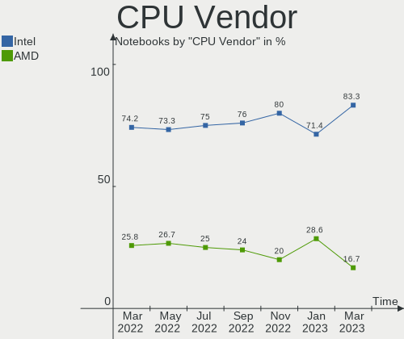
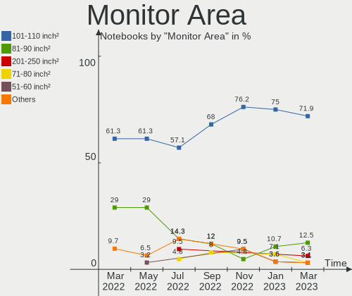
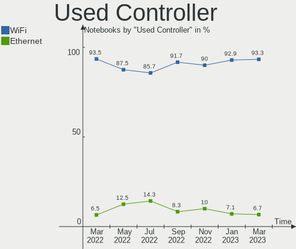
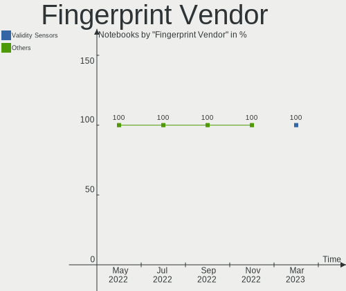

Endless - Hardware Trends (Notebooks)
-------------------------------------

A project to identify most popular hardware characteristics and track their change
over time based on data collected by Linux users at https://Linux-Hardware.org.

Anyone can contribute to this report by the [hw-probe](https://github.com/linuxhw/hw-probe) tool:

    sudo -E hw-probe -all -upload

This report is for one last month. Overall report since the beginning of time: [TestDays](https://github.com/linuxhw/TestDays)

Period: Mar, 2023.

Contents
--------

* [ System ](#system)
  - [ OS                       ](#os)
  - [ OS Family                ](#os-family)
  - [ Kernel                   ](#kernel)
  - [ Kernel Family            ](#kernel-family)
  - [ Kernel Major Ver.        ](#kernel-major-ver)
  - [ Arch                     ](#arch)
  - [ DE                       ](#de)
  - [ Display Server           ](#display-server)
  - [ Display Manager          ](#display-manager)
  - [ OS Lang                  ](#os-lang)
  - [ Boot Mode                ](#boot-mode)
  - [ Filesystem               ](#filesystem)
  - [ Part. scheme             ](#part-scheme)
  - [ Dual Boot with Linux/BSD ](#dual-boot-with-linuxbsd)
  - [ Dual Boot (Win)          ](#dual-boot-win)

* [ Board ](#board)
  - [ Vendor                   ](#vendor)
  - [ Model                    ](#model)
  - [ Model Family             ](#model-family)
  - [ MFG Year                 ](#mfg-year)
  - [ Form Factor              ](#form-factor)
  - [ Secure Boot              ](#secure-boot)
  - [ Coreboot                 ](#coreboot)
  - [ RAM Size                 ](#ram-size)
  - [ RAM Used                 ](#ram-used)
  - [ Total Drives             ](#total-drives)
  - [ Has CD-ROM               ](#has-cd-rom)
  - [ Has Ethernet             ](#has-ethernet)
  - [ Has WiFi                 ](#has-wifi)
  - [ Has Bluetooth            ](#has-bluetooth)

* [ Location ](#location)
  - [ Country                  ](#country)
  - [ City                     ](#city)

* [ Drives ](#drives)
  - [ Drive Vendor             ](#drive-vendor)
  - [ Drive Model              ](#drive-model)
  - [ HDD Vendor               ](#hdd-vendor)
  - [ SSD Vendor               ](#ssd-vendor)
  - [ Drive Kind               ](#drive-kind)
  - [ Drive Connector          ](#drive-connector)
  - [ Drive Size               ](#drive-size)
  - [ Space Total              ](#space-total)
  - [ Space Used               ](#space-used)
  - [ Malfunc. Drives          ](#malfunc-drives)
  - [ Malfunc. Drive Vendor    ](#malfunc-drive-vendor)
  - [ Malfunc. HDD Vendor      ](#malfunc-hdd-vendor)
  - [ Malfunc. Drive Kind      ](#malfunc-drive-kind)
  - [ Failed Drives            ](#failed-drives)
  - [ Failed Drive Vendor      ](#failed-drive-vendor)
  - [ Drive Status             ](#drive-status)

* [ Storage controller ](#storage-controller)
  - [ Storage Vendor           ](#storage-vendor)
  - [ Storage Model            ](#storage-model)
  - [ Storage Kind             ](#storage-kind)

* [ Processor ](#processor)
  - [ CPU Vendor               ](#cpu-vendor)
  - [ CPU Model                ](#cpu-model)
  - [ CPU Model Family         ](#cpu-model-family)
  - [ CPU Cores                ](#cpu-cores)
  - [ CPU Sockets              ](#cpu-sockets)
  - [ CPU Threads              ](#cpu-threads)
  - [ CPU Op-Modes             ](#cpu-op-modes)
  - [ CPU Microcode            ](#cpu-microcode)
  - [ CPU Microarch            ](#cpu-microarch)

* [ Graphics ](#graphics)
  - [ GPU Vendor               ](#gpu-vendor)
  - [ GPU Model                ](#gpu-model)
  - [ GPU Combo                ](#gpu-combo)
  - [ GPU Driver               ](#gpu-driver)
  - [ GPU Memory               ](#gpu-memory)

* [ Monitor ](#monitor)
  - [ Monitor Vendor           ](#monitor-vendor)
  - [ Monitor Model            ](#monitor-model)
  - [ Monitor Resolution       ](#monitor-resolution)
  - [ Monitor Diagonal         ](#monitor-diagonal)
  - [ Monitor Width            ](#monitor-width)
  - [ Aspect Ratio             ](#aspect-ratio)
  - [ Monitor Area             ](#monitor-area)
  - [ Pixel Density            ](#pixel-density)
  - [ Multiple Monitors        ](#multiple-monitors)

* [ Network ](#network)
  - [ Net Controller Vendor    ](#net-controller-vendor)
  - [ Net Controller Model     ](#net-controller-model)
  - [ Wireless Vendor          ](#wireless-vendor)
  - [ Wireless Model           ](#wireless-model)
  - [ Ethernet Vendor          ](#ethernet-vendor)
  - [ Ethernet Model           ](#ethernet-model)
  - [ Net Controller Kind      ](#net-controller-kind)
  - [ Used Controller          ](#used-controller)
  - [ NICs                     ](#nics)
  - [ IPv6                     ](#ipv6)

* [ Bluetooth ](#bluetooth)
  - [ Bluetooth Vendor         ](#bluetooth-vendor)
  - [ Bluetooth Model          ](#bluetooth-model)

* [ Sound ](#sound)
  - [ Sound Vendor             ](#sound-vendor)
  - [ Sound Model              ](#sound-model)

* [ Memory ](#memory)
  - [ Memory Vendor            ](#memory-vendor)
  - [ Memory Model             ](#memory-model)
  - [ Memory Kind              ](#memory-kind)
  - [ Memory Form Factor       ](#memory-form-factor)
  - [ Memory Size              ](#memory-size)
  - [ Memory Speed             ](#memory-speed)

* [ Printers & scanners ](#printers--scanners)
  - [ Printer Vendor           ](#printer-vendor)
  - [ Printer Model            ](#printer-model)
  - [ Scanner Vendor           ](#scanner-vendor)
  - [ Scanner Model            ](#scanner-model)

* [ Camera ](#camera)
  - [ Camera Vendor            ](#camera-vendor)
  - [ Camera Model             ](#camera-model)

* [ Security ](#security)
  - [ Fingerprint Vendor       ](#fingerprint-vendor)
  - [ Fingerprint Model        ](#fingerprint-model)
  - [ Chipcard Vendor          ](#chipcard-vendor)
  - [ Chipcard Model           ](#chipcard-model)

* [ Unsupported ](#unsupported)
  - [ Unsupported Devices      ](#unsupported-devices)
  - [ Unsupported Device Types ](#unsupported-device-types)

System
------

OS
--

Installed operating systems

| Name                  | Notebooks | Percent |
|-----------------------|-----------|---------|
| Endless 5.0.1         | 12        | 40%     |
| Endless 4.0.14        | 5         | 16.67%  |
| Endless 3.9.7         | 4         | 13.33%  |
| Endless 4.0.13        | 2         | 6.67%   |
| Endless 3.9.3-nexthw1 | 2         | 6.67%   |
| Endless 4.0.9         | 1         | 3.33%   |
| Endless 4.0.4         | 1         | 3.33%   |
| Endless 4.0.10        | 1         | 3.33%   |
| Endless 3.9.4         | 1         | 3.33%   |
| Endless 3.7.7-nexthw1 | 1         | 3.33%   |

OS Family
---------

OS without a version

| Name    | Notebooks | Percent |
|---------|-----------|---------|
| Endless | 30        | 100%    |

Kernel
------

Version of the Linux kernel

| Version           | Notebooks | Percent |
|-------------------|-----------|---------|
| 5.15.0-47-generic | 12        | 40%     |
| 5.11.0-35-generic | 10        | 33.33%  |
| 5.8.0-14-generic  | 5         | 16.67%  |
| 5.11.0-12-generic | 2         | 6.67%   |
| 5.4.0-7-generic   | 1         | 3.33%   |

Kernel Family
-------------

Linux kernel without a distro release

| Version | Notebooks | Percent |
|---------|-----------|---------|
| 5.15.0  | 12        | 40%     |
| 5.11.0  | 12        | 40%     |
| 5.8.0   | 5         | 16.67%  |
| 5.4.0   | 1         | 3.33%   |

Kernel Major Ver.
-----------------

Linux kernel major version

| Version | Notebooks | Percent |
|---------|-----------|---------|
| 5.15    | 12        | 40%     |
| 5.11    | 12        | 40%     |
| 5.8     | 5         | 16.67%  |
| 5.4     | 1         | 3.33%   |

Arch
----

OS architecture (x86_64, i586, etc.)

| Name   | Notebooks | Percent |
|--------|-----------|---------|
| x86_64 | 30        | 100%    |

DE
--

Desktop Environment

| Name  | Notebooks | Percent |
|-------|-----------|---------|
| GNOME | 30        | 100%    |

Display Server
--------------

X11 or Wayland

| Name    | Notebooks | Percent |
|---------|-----------|---------|
| X11     | 18        | 60%     |
| Wayland | 12        | 40%     |

Display Manager
---------------

SDDM, LightDM, etc.

| Name    | Notebooks | Percent |
|---------|-----------|---------|
| Unknown | 30        | 100%    |

OS Lang
-------

Language

| Lang        | Notebooks | Percent |
|-------------|-----------|---------|
| pt_BR       | 14        | 46.67%  |
| en_US       | 8         | 26.67%  |
| sr_RS@latin | 1         | 3.33%   |
| sk_SK       | 1         | 3.33%   |
| ru_RU       | 1         | 3.33%   |
| is_IS       | 1         | 3.33%   |
| hu_HU       | 1         | 3.33%   |
| es_MX       | 1         | 3.33%   |
| es_DO       | 1         | 3.33%   |
| es_CO       | 1         | 3.33%   |

Boot Mode
---------

EFI or BIOS

| Mode | Notebooks | Percent |
|------|-----------|---------|
| EFI  | 27        | 90%     |
| BIOS | 3         | 10%     |

Filesystem
----------

Type of filesystem

| Type | Notebooks | Percent |
|------|-----------|---------|
| Ext4 | 30        | 100%    |

Part. scheme
------------

Scheme of partitioning

| Type    | Notebooks | Percent |
|---------|-----------|---------|
| Unknown | 30        | 100%    |

Dual Boot with Linux/BSD
------------------------

Hosting more than one Linux/BSD

| Dual boot | Notebooks | Percent |
|-----------|-----------|---------|
| No        | 30        | 100%    |

Dual Boot (Win)
---------------

Hosting Linux and Windows

| Dual boot | Notebooks | Percent |
|-----------|-----------|---------|
| No        | 30        | 100%    |

Board
-----

Vendor
------

Motherboard manufacturer

| Name                | Notebooks | Percent |
|---------------------|-----------|---------|
| ASUSTek Computer    | 12        | 40%     |
| Acer                | 8         | 26.67%  |
| Hewlett-Packard     | 4         | 13.33%  |
| Lenovo              | 3         | 10%     |
| VTEX                | 1         | 3.33%   |
| Gigabyte Technology | 1         | 3.33%   |
| Dell                | 1         | 3.33%   |

Model
-----

Motherboard model

| Name                                       | Notebooks | Percent |
|--------------------------------------------|-----------|---------|
| Acer Nitro AN515-44                        | 3         | 10%     |
| ASUS VivoBook_ASUSLaptop X513EAN_X513EAN   | 2         | 6.67%   |
| ASUS VivoBook 15_ASUS Laptop X540UAR       | 2         | 6.67%   |
| VTEX NOTEBOOK                              | 1         | 3.33%   |
| Lenovo S20-30 20421                        | 1         | 3.33%   |
| Lenovo IdeaPad 110-14IBR 80T6              | 1         | 3.33%   |
| Lenovo G550 20023                          | 1         | 3.33%   |
| HP ProBook 450 15.6 inch G9 Notebook PC    | 1         | 3.33%   |
| HP Pavilion 17                             | 1         | 3.33%   |
| HP EliteBook 840 G3                        | 1         | 3.33%   |
| HP EliteBook 2560p                         | 1         | 3.33%   |
| Gigabyte G5 KD                             | 1         | 3.33%   |
| Dell Inspiron 5523                         | 1         | 3.33%   |
| ASUS X541SA                                | 1         | 3.33%   |
| ASUS VivoBook_ASUSLaptop X515MA_X515MA     | 1         | 3.33%   |
| ASUS VivoBook_ASUSLaptop X515EA_X515EA     | 1         | 3.33%   |
| ASUS VivoBook_ASUSLaptop X515DA_X515DA     | 1         | 3.33%   |
| ASUS VivoBook_ASUSLaptop E410MAB_E410MA    | 1         | 3.33%   |
| ASUS VivoBook 15_ASUS Laptop X540MA_X540MA | 1         | 3.33%   |
| ASUS VivoBook 14_ASUS Laptop X441MA_X441MA | 1         | 3.33%   |
| ASUS ASUS EXPERTBOOK B1500CEAEY_B1500CEAE  | 1         | 3.33%   |
| Acer Nitro AN515-54                        | 1         | 3.33%   |
| Acer Aspire A515-54                        | 1         | 3.33%   |
| Acer Aspire A515-51                        | 1         | 3.33%   |
| Acer Aspire A315-53                        | 1         | 3.33%   |
| Acer Aspire A315-34                        | 1         | 3.33%   |

Model Family
------------

Motherboard model prefix

| Name           | Notebooks | Percent |
|----------------|-----------|---------|
| ASUS VivoBook  | 10        | 33.33%  |
| Acer Nitro     | 4         | 13.33%  |
| Acer Aspire    | 4         | 13.33%  |
| HP EliteBook   | 2         | 6.67%   |
| VTEX NOTEBOOK  | 1         | 3.33%   |
| Lenovo S20-30  | 1         | 3.33%   |
| Lenovo IdeaPad | 1         | 3.33%   |
| Lenovo G550    | 1         | 3.33%   |
| HP ProBook     | 1         | 3.33%   |
| HP Pavilion    | 1         | 3.33%   |
| Gigabyte G5    | 1         | 3.33%   |
| Dell Inspiron  | 1         | 3.33%   |
| ASUS X541SA    | 1         | 3.33%   |
| ASUS ASUS      | 1         | 3.33%   |

MFG Year
--------

Motherboard manufacture year

| Year | Notebooks | Percent |
|------|-----------|---------|
| 2021 | 6         | 20%     |
| 2020 | 5         | 16.67%  |
| 2018 | 5         | 16.67%  |
| 2019 | 3         | 10%     |
| 2016 | 3         | 10%     |
| 2022 | 2         | 6.67%   |
| 2017 | 1         | 3.33%   |
| 2014 | 1         | 3.33%   |
| 2013 | 1         | 3.33%   |
| 2012 | 1         | 3.33%   |
| 2011 | 1         | 3.33%   |
| 2009 | 1         | 3.33%   |

Form Factor
-----------

Physical design of the computer

| Name     | Notebooks | Percent |
|----------|-----------|---------|
| Notebook | 30        | 100%    |

Secure Boot
-----------

Enabled or disabled

| State    | Notebooks | Percent |
|----------|-----------|---------|
| Disabled | 20        | 66.67%  |
| Enabled  | 10        | 33.33%  |

Coreboot
--------

Have coreboot on board

| Used | Notebooks | Percent |
|------|-----------|---------|
| No   | 30        | 100%    |

RAM Size
--------

Total RAM memory

| Size in GB | Notebooks | Percent |
|------------|-----------|---------|
| 3.01-4.0   | 14        | 46.67%  |
| 4.01-8.0   | 9         | 30%     |
| 16.01-24.0 | 3         | 10%     |
| 8.01-16.0  | 3         | 10%     |
| 1.01-2.0   | 1         | 3.33%   |

RAM Used
--------

Used RAM memory

| Used GB  | Notebooks | Percent |
|----------|-----------|---------|
| 1.01-2.0 | 14        | 46.67%  |
| 2.01-3.0 | 10        | 33.33%  |
| 3.01-4.0 | 4         | 13.33%  |
| 4.01-8.0 | 1         | 3.33%   |
| 0.51-1.0 | 1         | 3.33%   |

Total Drives
------------

Number of drives on board

| Drives | Notebooks | Percent |
|--------|-----------|---------|
| 1      | 27        | 90%     |
| 2      | 3         | 10%     |

Has CD-ROM
----------

Has CD-ROM on board

| Presented | Notebooks | Percent |
|-----------|-----------|---------|
| No        | 25        | 83.33%  |
| Yes       | 5         | 16.67%  |

Has Ethernet
------------

Has Ethernet on board

| Presented | Notebooks | Percent |
|-----------|-----------|---------|
| Yes       | 20        | 66.67%  |
| No        | 10        | 33.33%  |

Has WiFi
--------

Has WiFi module

| Presented | Notebooks | Percent |
|-----------|-----------|---------|
| Yes       | 30        | 100%    |

Has Bluetooth
-------------

Has Bluetooth module

| Presented | Notebooks | Percent |
|-----------|-----------|---------|
| Yes       | 29        | 96.67%  |
| No        | 1         | 3.33%   |

Location
--------

Country
-------

Geographic location (country)

| Country            | Notebooks | Percent |
|--------------------|-----------|---------|
| Brazil             | 15        | 50%     |
| USA                | 3         | 10%     |
| Colombia           | 2         | 6.67%   |
| Sweden             | 1         | 3.33%   |
| Slovakia           | 1         | 3.33%   |
| Serbia             | 1         | 3.33%   |
| Russia             | 1         | 3.33%   |
| Kenya              | 1         | 3.33%   |
| Iceland            | 1         | 3.33%   |
| Hungary            | 1         | 3.33%   |
| Estonia            | 1         | 3.33%   |
| Egypt              | 1         | 3.33%   |
| Dominican Republic | 1         | 3.33%   |

City
----

Geographic location (city)

| City               | Notebooks | Percent |
|--------------------|-----------|---------|
| Sao Paulo          | 3         | 10%     |
| Bogotá            | 2         | 6.67%   |
| Uberlândia        | 1         | 3.33%   |
| Tallinn            | 1         | 3.33%   |
| Seminole           | 1         | 3.33%   |
| Santo Domingo Este | 1         | 3.33%   |
| Salvador           | 1         | 3.33%   |
| Rio de Janeiro     | 1         | 3.33%   |
| Reykjavik          | 1         | 3.33%   |
| Recife             | 1         | 3.33%   |
| Nairobi            | 1         | 3.33%   |
| Monte Santo        | 1         | 3.33%   |
| Maracaju           | 1         | 3.33%   |
| Košice            | 1         | 3.33%   |
| Guarulhos          | 1         | 3.33%   |
| Gilbert            | 1         | 3.33%   |
| Curitiba           | 1         | 3.33%   |
| Cuiabá            | 1         | 3.33%   |
| Cherdakly          | 1         | 3.33%   |
| Cascavel           | 1         | 3.33%   |
| Cairo              | 1         | 3.33%   |
| Buffalo            | 1         | 3.33%   |
| Budapest           | 1         | 3.33%   |
| Bollnaes           | 1         | 3.33%   |
| Belo Horizonte     | 1         | 3.33%   |
| Arinos             | 1         | 3.33%   |
| Alakince           | 1         | 3.33%   |

Drives
------

Drive Vendor
------------

Hard drive vendors

| Vendor                      | Notebooks | Drives | Percent |
|-----------------------------|-----------|--------|---------|
| WDC                         | 6         | 6      | 18.18%  |
| Seagate                     | 5         | 5      | 15.15%  |
| Sandisk                     | 5         | 5      | 15.15%  |
| ADATA Technology            | 4         | 4      | 12.12%  |
| Samsung Electronics         | 2         | 2      | 6.06%   |
| Kingston                    | 2         | 2      | 6.06%   |
| Intel                       | 2         | 2      | 6.06%   |
| Win Memory                  | 1         | 1      | 3.03%   |
| Toshiba                     | 1         | 1      | 3.03%   |
| Phison Electronics          | 1         | 1      | 3.03%   |
| LITEONIT                    | 1         | 1      | 3.03%   |
| Kingston Technology Company | 1         | 1      | 3.03%   |
| Hitachi                     | 1         | 1      | 3.03%   |
| China                       | 1         | 1      | 3.03%   |

Drive Model
-----------

Hard drive models

| Model                                               | Notebooks | Percent |
|-----------------------------------------------------|-----------|---------|
| Sandisk WD Blue SN550 NVMe SSD 256GB                | 5         | 15.15%  |
| WDC WD10SPZX-21Z10T0 1TB                            | 4         | 12.12%  |
| ADATA SM2P32A8-256GC1 256GB                         | 4         | 12.12%  |
| Seagate ST500LT012-1DG142 500GB                     | 2         | 6.06%   |
| Win Memory SWR256G-301II 256GB                      | 1         | 3.03%   |
| WDC WD3200BEVT-22ZCT0 320GB                         | 1         | 3.03%   |
| WDC WD10SPZX-80Z10T2 1TB                            | 1         | 3.03%   |
| Toshiba MQ01ABF050 500GB                            | 1         | 3.03%   |
| Seagate ST500LT012-9WS142 500GB                     | 1         | 3.03%   |
| Seagate ST500LM030-1RK17D 500GB                     | 1         | 3.03%   |
| Seagate ST1000LM035-1RK172 1TB                      | 1         | 3.03%   |
| Samsung NVMe SSD Controller SM981/PM981/PM983 250GB | 1         | 3.03%   |
| Samsung MZVL4512HBLU-00BH1 512GB                    | 1         | 3.03%   |
| Phison E16 PCIe4 NVMe Controller 1TB                | 1         | 3.03%   |
| LITEONIT LMT-32L3M mSATA 32GB SSD                   | 1         | 3.03%   |
| Kingston Company OM3PDP3 NVMe SSD 256GB             | 1         | 3.03%   |
| Kingston SV300S37A480G 480GB SSD                    | 1         | 3.03%   |
| Kingston SA400S37240G 240GB SSD                     | 1         | 3.03%   |
| Intel IM2P33F8BR2-256GB                             | 1         | 3.03%   |
| Intel IM2P33F8BR1-128GB                             | 1         | 3.03%   |
| Hitachi HTS727550A9E364 500GB                       | 1         | 3.03%   |
| China SSD 128GB                                     | 1         | 3.03%   |

HDD Vendor
----------

Hard disk drive vendors

| Vendor  | Notebooks | Drives | Percent |
|---------|-----------|--------|---------|
| WDC     | 6         | 6      | 46.15%  |
| Seagate | 5         | 5      | 38.46%  |
| Toshiba | 1         | 1      | 7.69%   |
| Hitachi | 1         | 1      | 7.69%   |

SSD Vendor
----------

Solid state drive vendors

| Vendor     | Notebooks | Drives | Percent |
|------------|-----------|--------|---------|
| Kingston   | 2         | 2      | 40%     |
| Win Memory | 1         | 1      | 20%     |
| LITEONIT   | 1         | 1      | 20%     |
| China      | 1         | 1      | 20%     |

Drive Kind
----------

HDD or SSD

| Kind | Notebooks | Drives | Percent |
|------|-----------|--------|---------|
| NVMe | 15        | 15     | 45.45%  |
| HDD  | 13        | 13     | 39.39%  |
| SSD  | 5         | 5      | 15.15%  |

Drive Connector
---------------

SATA, SAS, NVMe, etc.

| Type | Notebooks | Drives | Percent |
|------|-----------|--------|---------|
| SATA | 17        | 18     | 53.13%  |
| NVMe | 15        | 15     | 46.88%  |

Drive Size
----------

Size of hard drive

| Size in TB | Notebooks | Drives | Percent |
|------------|-----------|--------|---------|
| 0.01-0.5   | 11        | 12     | 64.71%  |
| 0.51-1.0   | 6         | 6      | 35.29%  |

Space Total
-----------

Amount of disk space available on the file system

| Size in GB | Notebooks | Percent |
|------------|-----------|---------|
| 251-500    | 12        | 40%     |
| 101-250    | 12        | 40%     |
| 501-1000   | 6         | 20%     |

Space Used
----------

Amount of used disk space

| Used GB | Notebooks | Percent |
|---------|-----------|---------|
| 21-50   | 15        | 50%     |
| 51-100  | 8         | 26.67%  |
| 101-250 | 3         | 10%     |
| 1-20    | 3         | 10%     |
| 251-500 | 1         | 3.33%   |

Malfunc. Drives
---------------

Drive models with a malfunction

Zero info for selected period =(

Malfunc. Drive Vendor
---------------------

Vendors of faulty drives

Zero info for selected period =(

Malfunc. HDD Vendor
-------------------

Vendors of faulty HDD drives

Zero info for selected period =(

Malfunc. Drive Kind
-------------------

Kinds of faulty drives

Zero info for selected period =(

Failed Drives
-------------

Failed drive models

Zero info for selected period =(

Failed Drive Vendor
-------------------

Failed drive vendors

Zero info for selected period =(

Drive Status
------------

Number of failed and malfunc. drives

| Status   | Notebooks | Drives | Percent |
|----------|-----------|--------|---------|
| Detected | 30        | 33     | 100%    |

Storage controller
------------------

Storage Vendor
--------------

Storage controller vendors

| Vendor                      | Notebooks | Percent |
|-----------------------------|-----------|---------|
| Intel                       | 24        | 57.14%  |
| SanDisk                     | 5         | 11.9%   |
| AMD                         | 5         | 11.9%   |
| ADATA Technology            | 4         | 9.52%   |
| Samsung Electronics         | 2         | 4.76%   |
| Phison Electronics          | 1         | 2.38%   |
| Kingston Technology Company | 1         | 2.38%   |

Storage Model
-------------

Storage controller models

| Model                                                                            | Notebooks | Percent |
|----------------------------------------------------------------------------------|-----------|---------|
| Intel Celeron/Pentium Silver Processor SATA Controller                           | 6         | 12.5%   |
| SanDisk WD Blue SN550 NVMe SSD                                                   | 5         | 10.42%  |
| Intel Sunrise Point-LP SATA Controller [AHCI mode]                               | 5         | 10.42%  |
| AMD FCH SATA Controller [AHCI mode]                                              | 5         | 10.42%  |
| Intel Volume Management Device NVMe RAID Controller                              | 4         | 8.33%   |
| Intel Tiger Lake-LP SATA Controller                                              | 4         | 8.33%   |
| ADATA A Non-Volatile memory controller                                           | 4         | 8.33%   |
| Intel 82801 Mobile SATA Controller [RAID mode]                                   | 3         | 6.25%   |
| Intel PROSet/Wireless WiFi Software extension                                    | 2         | 4.17%   |
| Intel Atom/Celeron/Pentium Processor x5-E8000/J3xxx/N3xxx Series SATA Controller | 2         | 4.17%   |
| Samsung NVMe SSD Controller SM981/PM981/PM983                                    | 1         | 2.08%   |
| Samsung NVMe SSD Controller PM9B1                                                | 1         | 2.08%   |
| Phison E16 PCIe4 NVMe Controller                                                 | 1         | 2.08%   |
| Kingston Company OM3PDP3 NVMe SSD                                                | 1         | 2.08%   |
| Intel Atom Processor E3800 Series SATA AHCI Controller                           | 1         | 2.08%   |
| Intel 82801IBM/IEM (ICH9M/ICH9M-E) 4 port SATA Controller [AHCI mode]            | 1         | 2.08%   |
| Intel 6 Series/C200 Series Chipset Family 6 port Mobile SATA AHCI Controller     | 1         | 2.08%   |
| Intel 500 Series Chipset Family SATA AHCI Controller                             | 1         | 2.08%   |

Storage Kind
------------

Kind of storage controller (IDE, SATA, NVMe, SAS, ...)

| Kind | Notebooks | Percent |
|------|-----------|---------|
| SATA | 27        | 56.25%  |
| NVMe | 15        | 31.25%  |
| RAID | 6         | 12.5%   |

Processor
---------

CPU Vendor
----------

Processor vendors

| Vendor | Notebooks | Percent |
|--------|-----------|---------|
| Intel  | 25        | 83.33%  |
| AMD    | 5         | 16.67%  |

CPU Model
---------

Processor models

| Model                                         | Notebooks | Percent |
|-----------------------------------------------|-----------|---------|
| Intel Celeron N4020 CPU @ 1.10GHz             | 3         | 10%     |
| AMD Ryzen 7 4800H with Radeon Graphics        | 3         | 10%     |
| Intel Celeron N4000 CPU @ 1.10GHz             | 2         | 6.67%   |
| Intel 11th Gen Core i7-1165G7 @ 2.80GHz       | 2         | 6.67%   |
| Intel 11th Gen Core i3-1115G4 @ 3.00GHz       | 2         | 6.67%   |
| Intel Pentium CPU N3700 @ 1.60GHz             | 1         | 3.33%   |
| Intel Core i7-3537U CPU @ 2.00GHz             | 1         | 3.33%   |
| Intel Core i7-2620M CPU @ 2.70GHz             | 1         | 3.33%   |
| Intel Core i5-9300H CPU @ 2.40GHz             | 1         | 3.33%   |
| Intel Core i5-7200U CPU @ 2.50GHz             | 1         | 3.33%   |
| Intel Core i5-6200U CPU @ 2.30GHz             | 1         | 3.33%   |
| Intel Core i5-10210U CPU @ 1.60GHz            | 1         | 3.33%   |
| Intel Core i3-7020U CPU @ 2.30GHz             | 1         | 3.33%   |
| Intel Core i3-6100U CPU @ 2.30GHz             | 1         | 3.33%   |
| Intel Core i3-6006U CPU @ 2.00GHz             | 1         | 3.33%   |
| Intel Core 2 Duo CPU T6600 @ 2.20GHz          | 1         | 3.33%   |
| Intel Celeron N4120 CPU @ 1.10GHz             | 1         | 3.33%   |
| Intel Celeron CPU N3060 @ 1.60GHz             | 1         | 3.33%   |
| Intel Celeron CPU N2830 @ 2.16GHz             | 1         | 3.33%   |
| Intel 12th Gen Core i5-1235U                  | 1         | 3.33%   |
| Intel 11th Gen Core i5-11400H @ 2.70GHz       | 1         | 3.33%   |
| AMD Ryzen 5 3500U with Radeon Vega Mobile Gfx | 1         | 3.33%   |
| AMD A8-6410 APU with AMD Radeon R5 Graphics   | 1         | 3.33%   |

CPU Model Family
----------------

Processor model prefix

| Model            | Notebooks | Percent |
|------------------|-----------|---------|
| Intel Celeron    | 8         | 26.67%  |
| Other            | 6         | 20%     |
| Intel Core i5    | 4         | 13.33%  |
| Intel Core i3    | 3         | 10%     |
| AMD Ryzen 7      | 3         | 10%     |
| Intel Core i7    | 2         | 6.67%   |
| Intel Pentium    | 1         | 3.33%   |
| Intel Core 2 Duo | 1         | 3.33%   |
| AMD Ryzen 5      | 1         | 3.33%   |
| AMD A8           | 1         | 3.33%   |

CPU Cores
---------

Number of processor cores

| Number | Notebooks | Percent |
|--------|-----------|---------|
| 2      | 17        | 56.67%  |
| 4      | 8         | 26.67%  |
| 8      | 3         | 10%     |
| 10     | 1         | 3.33%   |
| 6      | 1         | 3.33%   |

CPU Sockets
-----------

Number of sockets

| Number | Notebooks | Percent |
|--------|-----------|---------|
| 1      | 30        | 100%    |

CPU Threads
-----------

Threads per core (Hyper-Threading)

| Number | Notebooks | Percent |
|--------|-----------|---------|
| 2      | 19        | 63.33%  |
| 1      | 11        | 36.67%  |

CPU Op-Modes
------------

CPU Operation Modes (32-bit, 64-bit)

| Op mode        | Notebooks | Percent |
|----------------|-----------|---------|
| 32-bit, 64-bit | 30        | 100%    |

CPU Microcode
-------------

Microcode number

| Number     | Notebooks | Percent |
|------------|-----------|---------|
| 0x806c1    | 4         | 13.33%  |
| 0x706a8    | 4         | 13.33%  |
| 0x406e3    | 3         | 10%     |
| 0x08600103 | 3         | 10%     |
| 0x806e9    | 2         | 6.67%   |
| 0x706a1    | 2         | 6.67%   |
| 0x906ea    | 1         | 3.33%   |
| 0x906a4    | 1         | 3.33%   |
| 0x806ec    | 1         | 3.33%   |
| 0x806d1    | 1         | 3.33%   |
| 0x406c4    | 1         | 3.33%   |
| 0x406c3    | 1         | 3.33%   |
| 0x306a9    | 1         | 3.33%   |
| 0x30678    | 1         | 3.33%   |
| 0x206a7    | 1         | 3.33%   |
| 0x1067a    | 1         | 3.33%   |
| 0x08108109 | 1         | 3.33%   |
| 0x07030105 | 1         | 3.33%   |

CPU Microarch
-------------

Microarchitecture

| Name             | Notebooks | Percent |
|------------------|-----------|---------|
| Goldmont plus    | 6         | 20%     |
| TigerLake        | 4         | 13.33%  |
| KabyLake         | 4         | 13.33%  |
| Zen 2            | 3         | 10%     |
| Skylake          | 3         | 10%     |
| Silvermont       | 3         | 10%     |
| Zen+             | 1         | 3.33%   |
| SandyBridge      | 1         | 3.33%   |
| Puma             | 1         | 3.33%   |
| Penryn           | 1         | 3.33%   |
| IvyBridge        | 1         | 3.33%   |
| Icelake          | 1         | 3.33%   |
| Alderlake Hybrid | 1         | 3.33%   |

Graphics
--------

GPU Vendor
----------

Vendors of graphics cards

| Vendor | Notebooks | Percent |
|--------|-----------|---------|
| Intel  | 24        | 68.57%  |
| Nvidia | 6         | 17.14%  |
| AMD    | 5         | 14.29%  |

GPU Model
---------

Graphics card models

| Model                                                                                    | Notebooks | Percent |
|------------------------------------------------------------------------------------------|-----------|---------|
| Intel GeminiLake [UHD Graphics 600]                                                      | 6         | 17.14%  |
| Nvidia TU117M                                                                            | 3         | 8.57%   |
| Intel Skylake GT2 [HD Graphics 520]                                                      | 3         | 8.57%   |
| AMD Renoir                                                                               | 3         | 8.57%   |
| Intel TigerLake-LP GT2 [Iris Xe Graphics]                                                | 2         | 5.71%   |
| Intel Tiger Lake-LP GT2 [UHD Graphics G4]                                                | 2         | 5.71%   |
| Intel HD Graphics 620                                                                    | 2         | 5.71%   |
| Intel Atom/Celeron/Pentium Processor x5-E8000/J3xxx/N3xxx Integrated Graphics Controller | 2         | 5.71%   |
| Nvidia TU117M [GeForce GTX 1650 Mobile / Max-Q]                                          | 1         | 2.86%   |
| Nvidia GT218M [GeForce G210M]                                                            | 1         | 2.86%   |
| Nvidia GA106M [GeForce RTX 3060 Mobile / Max-Q]                                          | 1         | 2.86%   |
| Intel TigerLake-H GT1 [UHD Graphics]                                                     | 1         | 2.86%   |
| Intel CometLake-U GT2 [UHD Graphics]                                                     | 1         | 2.86%   |
| Intel CoffeeLake-H GT2 [UHD Graphics 630]                                                | 1         | 2.86%   |
| Intel Atom Processor Z36xxx/Z37xxx Series Graphics & Display                             | 1         | 2.86%   |
| Intel Alder Lake-UP3 GT2 [UHD Graphics]                                                  | 1         | 2.86%   |
| Intel 3rd Gen Core processor Graphics Controller                                         | 1         | 2.86%   |
| Intel 2nd Generation Core Processor Family Integrated Graphics Controller                | 1         | 2.86%   |
| AMD Picasso/Raven 2 [Radeon Vega Series / Radeon Vega Mobile Series]                     | 1         | 2.86%   |
| AMD Mullins [Radeon R4/R5 Graphics]                                                      | 1         | 2.86%   |

GPU Combo
---------

Combinations of graphics cards

| Name           | Notebooks | Percent |
|----------------|-----------|---------|
| 1 x Intel      | 22        | 73.33%  |
| AMD + Nvidia   | 3         | 10%     |
| Intel + Nvidia | 2         | 6.67%   |
| 1 x AMD        | 2         | 6.67%   |
| 1 x Nvidia     | 1         | 3.33%   |

GPU Driver
----------

Free vs proprietary

| Driver      | Notebooks | Percent |
|-------------|-----------|---------|
| Free        | 25        | 83.33%  |
| Proprietary | 5         | 16.67%  |

GPU Memory
----------

Total video memory

| Size in GB | Notebooks | Percent |
|------------|-----------|---------|
| Unknown    | 24        | 80%     |
| 0.01-0.5   | 4         | 13.33%  |
| 1.01-2.0   | 1         | 3.33%   |
| 0.51-1.0   | 1         | 3.33%   |

Monitor
-------

Monitor Vendor
--------------

Monitor vendors

| Vendor              | Notebooks | Percent |
|---------------------|-----------|---------|
| BOE                 | 10        | 31.25%  |
| Chimei Innolux      | 7         | 21.88%  |
| AU Optronics        | 7         | 21.88%  |
| PANDA               | 2         | 6.25%   |
| LG Display          | 2         | 6.25%   |
| Goldstar            | 2         | 6.25%   |
| Samsung Electronics | 1         | 3.13%   |
| InfoVision          | 1         | 3.13%   |

Monitor Model
-------------

Monitor models

| Model                                                                | Notebooks | Percent |
|----------------------------------------------------------------------|-----------|---------|
| Chimei Innolux LCD Monitor CMN15F5 1920x1080 344x193mm 15.5-inch     | 4         | 12.5%   |
| PANDA LCD Monitor NCP004D 1920x1080 344x194mm 15.5-inch              | 2         | 6.25%   |
| BOE LCD Monitor BOE06A5 1366x768 344x194mm 15.5-inch                 | 2         | 6.25%   |
| AU Optronics LCD Monitor AUOAF90 1920x1080 344x193mm 15.5-inch       | 2         | 6.25%   |
| Samsung Electronics LCD Monitor SEC4149 1366x768 292x174mm 13.4-inch | 1         | 3.13%   |
| LG Display LCD Monitor LGD065A 1920x1080 344x194mm 15.5-inch         | 1         | 3.13%   |
| LG Display LCD Monitor LGD03FB 1920x1080 382x215mm 17.3-inch         | 1         | 3.13%   |
| InfoVision LCD Monitor IVO0489 1366x768 256x144mm 11.6-inch          | 1         | 3.13%   |
| Goldstar FULL HD GSM5B55 1920x1080 480x270mm 21.7-inch               | 1         | 3.13%   |
| Goldstar 24BL550J GSM5B76 1920x1080 480x270mm 21.7-inch              | 1         | 3.13%   |
| Chimei Innolux LCD Monitor CMN15E6 1366x768 344x193mm 15.5-inch      | 1         | 3.13%   |
| Chimei Innolux LCD Monitor CMN15DC 1366x768 344x193mm 15.5-inch      | 1         | 3.13%   |
| Chimei Innolux LCD Monitor CMN15B6 1366x768 344x193mm 15.5-inch      | 1         | 3.13%   |
| BOE LCD Monitor BOE08B2 1366x768 309x174mm 14.0-inch                 | 1         | 3.13%   |
| BOE LCD Monitor BOE07CE 1366x768 344x193mm 15.5-inch                 | 1         | 3.13%   |
| BOE LCD Monitor BOE07CB 1920x1080 344x193mm 15.5-inch                | 1         | 3.13%   |
| BOE LCD Monitor BOE07AA 1366x768 344x194mm 15.5-inch                 | 1         | 3.13%   |
| BOE LCD Monitor BOE0715 1366x768 256x144mm 11.6-inch                 | 1         | 3.13%   |
| BOE LCD Monitor BOE069C 1920x1080 344x193mm 15.5-inch                | 1         | 3.13%   |
| BOE LCD Monitor BOE0698 1366x768 309x173mm 13.9-inch                 | 1         | 3.13%   |
| BOE LCD Monitor BOE0672 1366x768 344x194mm 15.5-inch                 | 1         | 3.13%   |
| AU Optronics LCD Monitor AUO3DA3 1920x1080 344x194mm 15.5-inch       | 1         | 3.13%   |
| AU Optronics LCD Monitor AUO38ED 1920x1080 344x193mm 15.5-inch       | 1         | 3.13%   |
| AU Optronics LCD Monitor AUO2D3C 1366x768 309x173mm 13.9-inch        | 1         | 3.13%   |
| AU Optronics LCD Monitor AUO22EC 1366x768 344x193mm 15.5-inch        | 1         | 3.13%   |
| AU Optronics LCD Monitor AUO123D 1920x1080 309x173mm 13.9-inch       | 1         | 3.13%   |

Monitor Resolution
------------------

Monitor screen resolution

| Resolution      | Notebooks | Percent |
|-----------------|-----------|---------|
| 1920x1080 (FHD) | 15        | 48.39%  |
| 1366x768 (WXGA) | 15        | 48.39%  |
| 3840x2160 (4K)  | 1         | 3.23%   |

Monitor Diagonal
----------------

Diagonal size in inches

| Inches | Notebooks | Percent |
|--------|-----------|---------|
| 15     | 23        | 71.88%  |
| 13     | 4         | 12.5%   |
| 21     | 2         | 6.25%   |
| 17     | 1         | 3.13%   |
| 14     | 1         | 3.13%   |
| 11     | 1         | 3.13%   |

Monitor Width
-------------

Physical width

| Width in mm | Notebooks | Percent |
|-------------|-----------|---------|
| 301-350     | 27        | 84.38%  |
| 401-500     | 2         | 6.25%   |
| 201-300     | 2         | 6.25%   |
| 351-400     | 1         | 3.13%   |

Aspect Ratio
------------

Proportional relationship between the width and the height

| Ratio | Notebooks | Percent |
|-------|-----------|---------|
| 16/9  | 30        | 100%    |

Monitor Area
------------

Area in inch²

| Area in inch² | Notebooks | Percent |
|----------------|-----------|---------|
| 101-110        | 23        | 71.88%  |
| 81-90          | 4         | 12.5%   |
| 201-250        | 2         | 6.25%   |
| 71-80          | 1         | 3.13%   |
| 51-60          | 1         | 3.13%   |
| 121-130        | 1         | 3.13%   |

Pixel Density
-------------

Pixels per inch

| Density | Notebooks | Percent |
|---------|-----------|---------|
| 121-160 | 16        | 50%     |
| 101-120 | 16        | 50%     |

Multiple Monitors
-----------------

Total monitors connected

| Total | Notebooks | Percent |
|-------|-----------|---------|
| 1     | 28        | 93.33%  |
| 2     | 2         | 6.67%   |

Network
-------

Net Controller Vendor
---------------------

Controller vendors

| Vendor                | Notebooks | Percent |
|-----------------------|-----------|---------|
| Realtek Semiconductor | 17        | 40.48%  |
| Intel                 | 15        | 35.71%  |
| Qualcomm Atheros      | 8         | 19.05%  |
| Broadcom              | 2         | 4.76%   |

Net Controller Model
--------------------

Controller models

| Model                                                             | Notebooks | Percent |
|-------------------------------------------------------------------|-----------|---------|
| Realtek RTL8111/8168/8411 PCI Express Gigabit Ethernet Controller | 6         | 12%     |
| Qualcomm Atheros QCA9377 802.11ac Wireless Network Adapter        | 6         | 12%     |
| Realtek RTL810xE PCI Express Fast Ethernet controller             | 5         | 10%     |
| Intel Wi-Fi 6 AX201                                               | 4         | 8%      |
| Intel Wi-Fi 6 AX200                                               | 4         | 8%      |
| Realtek Killer E2600 Gigabit Ethernet Controller                  | 3         | 6%      |
| Realtek RTL8821CE 802.11ac PCIe Wireless Network Adapter          | 2         | 4%      |
| Realtek RTL8852BE PCIe 802.11ax Wireless Network Controller       | 1         | 2%      |
| Realtek RTL8822BE 802.11a/b/g/n/ac WiFi adapter                   | 1         | 2%      |
| Realtek RTL8821AE 802.11ac PCIe Wireless Network Adapter          | 1         | 2%      |
| Realtek RTL8723BE PCIe Wireless Network Adapter                   | 1         | 2%      |
| Realtek RTL8188EE Wireless Network Adapter                        | 1         | 2%      |
| Qualcomm Atheros QCA9565 / AR9565 Wireless Network Adapter        | 1         | 2%      |
| Qualcomm Atheros AR8161 Gigabit Ethernet                          | 1         | 2%      |
| Intel Wireless 8260                                               | 1         | 2%      |
| Intel Wireless 7265                                               | 1         | 2%      |
| Intel Tiger Lake PCH CNVi WiFi                                    | 1         | 2%      |
| Intel PRO/Wireless 5100 AGN [Shiloh] Network Connection           | 1         | 2%      |
| Intel Gemini Lake PCH CNVi WiFi                                   | 1         | 2%      |
| Intel Ethernet Connection I219-V                                  | 1         | 2%      |
| Intel Ethernet Connection (14) I219-V                             | 1         | 2%      |
| Intel Ethernet Connection (13) I219-V                             | 1         | 2%      |
| Intel Centrino Wireless-N 2230                                    | 1         | 2%      |
| Intel Centrino Ultimate-N 6300                                    | 1         | 2%      |
| Intel 82579LM Gigabit Network Connection (Lewisville)             | 1         | 2%      |
| Broadcom NetLink BCM5906M Fast Ethernet PCI Express               | 1         | 2%      |
| Broadcom BCM43142 802.11b/g/n                                     | 1         | 2%      |

Wireless Vendor
---------------

Wireless vendors

| Vendor                | Notebooks | Percent |
|-----------------------|-----------|---------|
| Intel                 | 15        | 50%     |
| Realtek Semiconductor | 7         | 23.33%  |
| Qualcomm Atheros      | 7         | 23.33%  |
| Broadcom              | 1         | 3.33%   |

Wireless Model
--------------

Wireless models

| Model                                                       | Notebooks | Percent |
|-------------------------------------------------------------|-----------|---------|
| Qualcomm Atheros QCA9377 802.11ac Wireless Network Adapter  | 6         | 20%     |
| Intel Wi-Fi 6 AX201                                         | 4         | 13.33%  |
| Intel Wi-Fi 6 AX200                                         | 4         | 13.33%  |
| Realtek RTL8821CE 802.11ac PCIe Wireless Network Adapter    | 2         | 6.67%   |
| Realtek RTL8852BE PCIe 802.11ax Wireless Network Controller | 1         | 3.33%   |
| Realtek RTL8822BE 802.11a/b/g/n/ac WiFi adapter             | 1         | 3.33%   |
| Realtek RTL8821AE 802.11ac PCIe Wireless Network Adapter    | 1         | 3.33%   |
| Realtek RTL8723BE PCIe Wireless Network Adapter             | 1         | 3.33%   |
| Realtek RTL8188EE Wireless Network Adapter                  | 1         | 3.33%   |
| Qualcomm Atheros QCA9565 / AR9565 Wireless Network Adapter  | 1         | 3.33%   |
| Intel Wireless 8260                                         | 1         | 3.33%   |
| Intel Wireless 7265                                         | 1         | 3.33%   |
| Intel Tiger Lake PCH CNVi WiFi                              | 1         | 3.33%   |
| Intel PRO/Wireless 5100 AGN [Shiloh] Network Connection     | 1         | 3.33%   |
| Intel Gemini Lake PCH CNVi WiFi                             | 1         | 3.33%   |
| Intel Centrino Wireless-N 2230                              | 1         | 3.33%   |
| Intel Centrino Ultimate-N 6300                              | 1         | 3.33%   |
| Broadcom BCM43142 802.11b/g/n                               | 1         | 3.33%   |

Ethernet Vendor
---------------

Ethernet vendors

| Vendor                | Notebooks | Percent |
|-----------------------|-----------|---------|
| Realtek Semiconductor | 14        | 70%     |
| Intel                 | 4         | 20%     |
| Qualcomm Atheros      | 1         | 5%      |
| Broadcom              | 1         | 5%      |

Ethernet Model
--------------

Ethernet models

| Model                                                             | Notebooks | Percent |
|-------------------------------------------------------------------|-----------|---------|
| Realtek RTL8111/8168/8411 PCI Express Gigabit Ethernet Controller | 6         | 30%     |
| Realtek RTL810xE PCI Express Fast Ethernet controller             | 5         | 25%     |
| Realtek Killer E2600 Gigabit Ethernet Controller                  | 3         | 15%     |
| Qualcomm Atheros AR8161 Gigabit Ethernet                          | 1         | 5%      |
| Intel Ethernet Connection I219-V                                  | 1         | 5%      |
| Intel Ethernet Connection (14) I219-V                             | 1         | 5%      |
| Intel Ethernet Connection (13) I219-V                             | 1         | 5%      |
| Intel 82579LM Gigabit Network Connection (Lewisville)             | 1         | 5%      |
| Broadcom NetLink BCM5906M Fast Ethernet PCI Express               | 1         | 5%      |

Net Controller Kind
-------------------

Ethernet, WiFi or modem

| Kind     | Notebooks | Percent |
|----------|-----------|---------|
| WiFi     | 30        | 60%     |
| Ethernet | 20        | 40%     |

Used Controller
---------------

Currently used network controller

| Kind     | Notebooks | Percent |
|----------|-----------|---------|
| WiFi     | 28        | 93.33%  |
| Ethernet | 2         | 6.67%   |

NICs
----

Total network controllers on board

| Total | Notebooks | Percent |
|-------|-----------|---------|
| 2     | 20        | 66.67%  |
| 1     | 10        | 33.33%  |

IPv6
----

IPv6 vs IPv4

| Used | Notebooks | Percent |
|------|-----------|---------|
| No   | 21        | 70%     |
| Yes  | 9         | 30%     |

Bluetooth
---------

Bluetooth Vendor
----------------

Controller vendors

| Vendor                | Notebooks | Percent |
|-----------------------|-----------|---------|
| Intel                 | 13        | 44.83%  |
| Lite-On Technology    | 6         | 20.69%  |
| IMC Networks          | 4         | 13.79%  |
| Realtek Semiconductor | 3         | 10.34%  |
| Hewlett-Packard       | 1         | 3.45%   |
| Foxconn International | 1         | 3.45%   |
| Broadcom              | 1         | 3.45%   |

Bluetooth Model
---------------

Controller models

| Model                                             | Notebooks | Percent |
|---------------------------------------------------|-----------|---------|
| Lite-On Qualcomm Atheros QCA9377 Bluetooth        | 4         | 13.79%  |
| Intel Bluetooth 9460/9560 Jefferson Peak (JfP)    | 4         | 13.79%  |
| Intel AX200 Bluetooth                             | 4         | 13.79%  |
| IMC Networks Bluetooth Radio                      | 3         | 10.34%  |
| Realtek Bluetooth Radio                           | 2         | 6.9%    |
| Lite-On Bluetooth Device                          | 2         | 6.9%    |
| Intel Bluetooth wireless interface                | 2         | 6.9%    |
| Intel AX201 Bluetooth                             | 2         | 6.9%    |
| Realtek RTL8821A Bluetooth                        | 1         | 3.45%   |
| Intel Centrino Bluetooth Wireless Transceiver     | 1         | 3.45%   |
| IMC Networks Bluetooth Device                     | 1         | 3.45%   |
| HP Broadcom 2070 Bluetooth Combo                  | 1         | 3.45%   |
| Foxconn International BCM43142A0 Bluetooth module | 1         | 3.45%   |
| Broadcom BCM2046 Bluetooth Device                 | 1         | 3.45%   |

Sound
-----

Sound Vendor
------------

Sound card vendors

| Vendor | Notebooks | Percent |
|--------|-----------|---------|
| Intel  | 25        | 69.44%  |
| Nvidia | 6         | 16.67%  |
| AMD    | 5         | 13.89%  |

Sound Model
-----------

Sound card models

| Model                                                                                             | Notebooks | Percent |
|---------------------------------------------------------------------------------------------------|-----------|---------|
| Intel Celeron/Pentium Silver Processor High Definition Audio                                      | 6         | 15.79%  |
| Intel Sunrise Point-LP HD Audio                                                                   | 5         | 13.16%  |
| Nvidia TU107 GeForce GTX 1650 High Definition Audio Controller                                    | 4         | 10.53%  |
| Intel Tiger Lake-LP Smart Sound Technology Audio Controller                                       | 4         | 10.53%  |
| AMD Family 17h/19h HD Audio Controller                                                            | 4         | 10.53%  |
| Intel Atom/Celeron/Pentium Processor x5-E8000/J3xxx/N3xxx Series High Definition Audio Controller | 2         | 5.26%   |
| Nvidia High Definition Audio Controller                                                           | 1         | 2.63%   |
| Nvidia GA106 High Definition Audio Controller                                                     | 1         | 2.63%   |
| Intel Tiger Lake-H HD Audio Controller                                                            | 1         | 2.63%   |
| Intel Comet Lake PCH-LP cAVS                                                                      | 1         | 2.63%   |
| Intel Cannon Lake PCH cAVS                                                                        | 1         | 2.63%   |
| Intel Atom Processor Z36xxx/Z37xxx Series High Definition Audio Controller                        | 1         | 2.63%   |
| Intel Alder Lake PCH-P High Definition Audio Controller                                           | 1         | 2.63%   |
| Intel 82801I (ICH9 Family) HD Audio Controller                                                    | 1         | 2.63%   |
| Intel 7 Series/C216 Chipset Family High Definition Audio Controller                               | 1         | 2.63%   |
| Intel 6 Series/C200 Series Chipset Family High Definition Audio Controller                        | 1         | 2.63%   |
| AMD Raven/Raven2/Fenghuang HDMI/DP Audio Controller                                               | 1         | 2.63%   |
| AMD Kabini HDMI/DP Audio                                                                          | 1         | 2.63%   |
| AMD FCH Azalia Controller                                                                         | 1         | 2.63%   |

Memory
------

Memory Vendor
-------------

Memory module vendors

Zero info for selected period =(

Memory Model
------------

Memory module models

Zero info for selected period =(

Memory Kind
-----------

Memory module kinds

Zero info for selected period =(

Memory Form Factor
------------------

Physical design of the memory module

Zero info for selected period =(

Memory Size
-----------

Memory module size

Zero info for selected period =(

Memory Speed
------------

Memory module speed

Zero info for selected period =(

Printers & scanners
-------------------

Printer Vendor
--------------

Printer device vendors

| Vendor          | Notebooks | Percent |
|-----------------|-----------|---------|
| Seiko Epson     | 1         | 50%     |
| Hewlett-Packard | 1         | 50%     |

Printer Model
-------------

Printer device models

| Model                                         | Notebooks | Percent |
|-----------------------------------------------|-----------|---------|
| Seiko Epson ME 340 Series/Stylus NX130 Series | 1         | 50%     |
| HP DeskJet 2700 series                        | 1         | 50%     |

Scanner Vendor
--------------

Scanner device vendors

Zero info for selected period =(

Scanner Model
-------------

Scanner device models

Zero info for selected period =(

Camera
------

Camera Vendor
-------------

Camera device vendors

| Vendor                      | Notebooks | Percent |
|-----------------------------|-----------|---------|
| IMC Networks                | 9         | 31.03%  |
| Chicony Electronics         | 8         | 27.59%  |
| Quanta                      | 6         | 20.69%  |
| Sonix Technology            | 2         | 6.9%    |
| Microdia                    | 2         | 6.9%    |
| Silicon Motion              | 1         | 3.45%   |
| Luxvisions Innotech Limited | 1         | 3.45%   |

Camera Model
------------

Camera device models

| Model                                    | Notebooks | Percent |
|------------------------------------------|-----------|---------|
| IMC Networks USB2.0 VGA UVC WebCam       | 5         | 17.24%  |
| Quanta HD User Facing                    | 3         | 10.34%  |
| IMC Networks USB2.0 HD UVC WebCam        | 3         | 10.34%  |
| Chicony HD User Facing                   | 2         | 6.9%    |
| Sonix USB2.0 VGAUVC WebCam               | 1         | 3.45%   |
| Sonix USB2.0 HD UVC WebCam               | 1         | 3.45%   |
| Silicon Motion Lenovo EasyCamera         | 1         | 3.45%   |
| Quanta VGA WebCam                        | 1         | 3.45%   |
| Quanta USB2.0 HD UVC WebCam              | 1         | 3.45%   |
| Quanta HD Webcam                         | 1         | 3.45%   |
| Microdia Laptop_Integrated_Webcam_HD     | 1         | 3.45%   |
| Microdia HP Integrated Webcam            | 1         | 3.45%   |
| Luxvisions Innotech Limited HP HD Camera | 1         | 3.45%   |
| IMC Networks Lenovo EasyCamera           | 1         | 3.45%   |
| Chicony VGA WebCam                       | 1         | 3.45%   |
| Chicony USB2.0 Camera                    | 1         | 3.45%   |
| Chicony Integrated HP HD Webcam          | 1         | 3.45%   |
| Chicony HP Truevision HD camera          | 1         | 3.45%   |
| Chicony HP HD Camera                     | 1         | 3.45%   |
| Chicony EasyCamera                       | 1         | 3.45%   |

Security
--------

Fingerprint Vendor
------------------

Fingerprint sensor vendors

| Vendor           | Notebooks | Percent |
|------------------|-----------|---------|
| Validity Sensors | 1         | 100%    |

Fingerprint Model
-----------------

Fingerprint sensor models

| Model                                      | Notebooks | Percent |
|--------------------------------------------|-----------|---------|
| Validity Sensors VFS471 Fingerprint Reader | 1         | 100%    |

Chipcard Vendor
---------------

Chipcard module vendors

Zero info for selected period =(

Chipcard Model
--------------

Chipcard module models

Zero info for selected period =(

Unsupported
-----------

Unsupported Devices
-------------------

Total unsupported devices on board

| Total | Notebooks | Percent |
|-------|-----------|---------|
| 0     | 23        | 76.67%  |
| 1     | 7         | 23.33%  |

Unsupported Device Types
------------------------

Types of unsupported devices

| Type                  | Notebooks | Percent |
|-----------------------|-----------|---------|
| Multimedia controller | 4         | 57.14%  |
| Net/wireless          | 2         | 28.57%  |
| Fingerprint reader    | 1         | 14.29%  |

