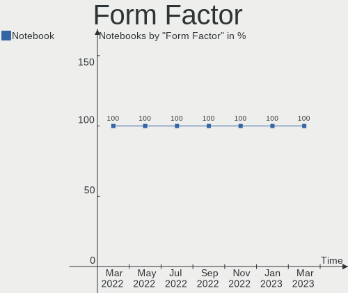
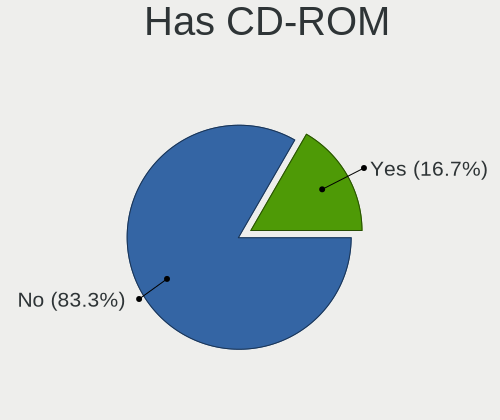
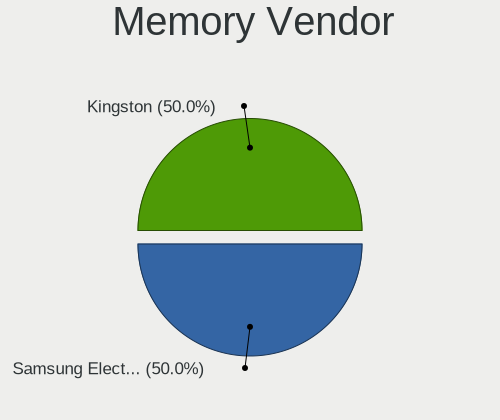
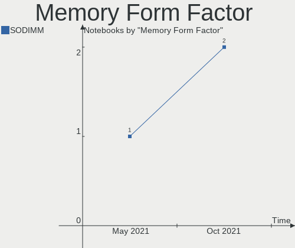

Endless Hardware Trends (Notebooks)
-----------------------------------

A project to identify most popular hardware characteristics and track their change
over time based on data collected by Endless users at https://Linux-Hardware.org.

Anyone can contribute to this report by the [hw-probe](https://github.com/linuxhw/hw-probe) tool:

    sudo -E hw-probe -all -upload

Full-feature report is available here: https://linux-hardware.org/?view=trends&formfactor=notebook

Period: Oct, 2021.

Contents
--------

* [ System ](#system)
  - [ OS                       ](#os)
  - [ OS Family                ](#os-family)
  - [ Kernel                   ](#kernel)
  - [ Kernel Family            ](#kernel-family)
  - [ Kernel Major Ver.        ](#kernel-major-ver)
  - [ Arch                     ](#arch)
  - [ DE                       ](#de)
  - [ Display Server           ](#display-server)
  - [ Display Manager          ](#display-manager)
  - [ OS Lang                  ](#os-lang)
  - [ Boot Mode                ](#boot-mode)
  - [ Filesystem               ](#filesystem)
  - [ Part. scheme             ](#part-scheme)
  - [ Dual Boot with Linux/BSD ](#dual-boot-with-linuxbsd)
  - [ Dual Boot (Win)          ](#dual-boot-win)

* [ Board ](#board)
  - [ Vendor                   ](#vendor)
  - [ Model                    ](#model)
  - [ Model Family             ](#model-family)
  - [ MFG Year                 ](#mfg-year)
  - [ Form Factor              ](#form-factor)
  - [ Secure Boot              ](#secure-boot)
  - [ Coreboot                 ](#coreboot)
  - [ RAM Size                 ](#ram-size)
  - [ RAM Used                 ](#ram-used)
  - [ Total Drives             ](#total-drives)
  - [ Has CD-ROM               ](#has-cd-rom)
  - [ Has Ethernet             ](#has-ethernet)
  - [ Has WiFi                 ](#has-wifi)
  - [ Has Bluetooth            ](#has-bluetooth)

* [ Location ](#location)
  - [ Country                  ](#country)
  - [ City                     ](#city)

* [ Drives ](#drives)
  - [ Drive Vendor             ](#drive-vendor)
  - [ Drive Model              ](#drive-model)
  - [ HDD Vendor               ](#hdd-vendor)
  - [ SSD Vendor               ](#ssd-vendor)
  - [ Drive Kind               ](#drive-kind)
  - [ Drive Connector          ](#drive-connector)
  - [ Drive Size               ](#drive-size)
  - [ Space Total              ](#space-total)
  - [ Space Used               ](#space-used)
  - [ Malfunc. Drives          ](#malfunc-drives)
  - [ Malfunc. Drive Vendor    ](#malfunc-drive-vendor)
  - [ Malfunc. HDD Vendor      ](#malfunc-hdd-vendor)
  - [ Malfunc. Drive Kind      ](#malfunc-drive-kind)
  - [ Failed Drives            ](#failed-drives)
  - [ Failed Drive Vendor      ](#failed-drive-vendor)
  - [ Drive Status             ](#drive-status)

* [ Storage controller ](#storage-controller)
  - [ Storage Vendor           ](#storage-vendor)
  - [ Storage Model            ](#storage-model)
  - [ Storage Kind             ](#storage-kind)

* [ Processor ](#processor)
  - [ CPU Vendor               ](#cpu-vendor)
  - [ CPU Model                ](#cpu-model)
  - [ CPU Model Family         ](#cpu-model-family)
  - [ CPU Cores                ](#cpu-cores)
  - [ CPU Sockets              ](#cpu-sockets)
  - [ CPU Threads              ](#cpu-threads)
  - [ CPU Op-Modes             ](#cpu-op-modes)
  - [ CPU Microcode            ](#cpu-microcode)
  - [ CPU Microarch            ](#cpu-microarch)

* [ Graphics ](#graphics)
  - [ GPU Vendor               ](#gpu-vendor)
  - [ GPU Model                ](#gpu-model)
  - [ GPU Combo                ](#gpu-combo)
  - [ GPU Driver               ](#gpu-driver)
  - [ GPU Memory               ](#gpu-memory)

* [ Monitor ](#monitor)
  - [ Monitor Vendor           ](#monitor-vendor)
  - [ Monitor Model            ](#monitor-model)
  - [ Monitor Resolution       ](#monitor-resolution)
  - [ Monitor Diagonal         ](#monitor-diagonal)
  - [ Monitor Width            ](#monitor-width)
  - [ Aspect Ratio             ](#aspect-ratio)
  - [ Monitor Area             ](#monitor-area)
  - [ Pixel Density            ](#pixel-density)
  - [ Multiple Monitors        ](#multiple-monitors)

* [ Network ](#network)
  - [ Net Controller Vendor    ](#net-controller-vendor)
  - [ Net Controller Model     ](#net-controller-model)
  - [ Wireless Vendor          ](#wireless-vendor)
  - [ Wireless Model           ](#wireless-model)
  - [ Ethernet Vendor          ](#ethernet-vendor)
  - [ Ethernet Model           ](#ethernet-model)
  - [ Net Controller Kind      ](#net-controller-kind)
  - [ Used Controller          ](#used-controller)
  - [ NICs                     ](#nics)
  - [ IPv6                     ](#ipv6)

* [ Bluetooth ](#bluetooth)
  - [ Bluetooth Vendor         ](#bluetooth-vendor)
  - [ Bluetooth Model          ](#bluetooth-model)

* [ Sound ](#sound)
  - [ Sound Vendor             ](#sound-vendor)
  - [ Sound Model              ](#sound-model)

* [ Memory ](#memory)
  - [ Memory Vendor            ](#memory-vendor)
  - [ Memory Model             ](#memory-model)
  - [ Memory Kind              ](#memory-kind)
  - [ Memory Form Factor       ](#memory-form-factor)
  - [ Memory Size              ](#memory-size)
  - [ Memory Speed             ](#memory-speed)

* [ Printers & scanners ](#printers--scanners)
  - [ Printer Vendor           ](#printer-vendor)
  - [ Printer Model            ](#printer-model)
  - [ Scanner Vendor           ](#scanner-vendor)
  - [ Scanner Model            ](#scanner-model)

* [ Camera ](#camera)
  - [ Camera Vendor            ](#camera-vendor)
  - [ Camera Model             ](#camera-model)

* [ Security ](#security)
  - [ Fingerprint Vendor       ](#fingerprint-vendor)
  - [ Fingerprint Model        ](#fingerprint-model)
  - [ Chipcard Vendor          ](#chipcard-vendor)
  - [ Chipcard Model           ](#chipcard-model)

* [ Unsupported ](#unsupported)
  - [ Unsupported Devices      ](#unsupported-devices)
  - [ Unsupported Device Types ](#unsupported-device-types)

System
------

OS
--

Installed operating systems

| Name                  | Notebooks | Percent |
|-----------------------|-----------|---------|
| Endless 3.9.5         | 31        | 67.39%  |
| Endless 3.7.4         | 3         | 6.52%   |
| Endless 3.9.1-nexthw2 | 2         | 4.35%   |
| Endless 3.8.0         | 2         | 4.35%   |
| Endless 4.0.0         | 1         | 2.17%   |
| Endless 3.9.3-nexthw1 | 1         | 2.17%   |
| Endless 3.9.2         | 1         | 2.17%   |
| Endless 3.8.7         | 1         | 2.17%   |
| Endless 3.8.5         | 1         | 2.17%   |
| Endless 3.7.8         | 1         | 2.17%   |
| Endless 3.4.3-nexthw1 | 1         | 2.17%   |
| Endless 3.4.2-nexthw1 | 1         | 2.17%   |

OS Family
---------

OS without a version

| Name    | Notebooks | Percent |
|---------|-----------|---------|
| Endless | 46        | 100%    |

Kernel
------

Version of the Linux kernel

| Version           | Notebooks | Percent |
|-------------------|-----------|---------|
| 5.8.0-14-generic  | 32        | 69.57%  |
| 5.3.0-19-generic  | 3         | 6.52%   |
| 5.4.0-19-generic  | 2         | 4.35%   |
| 5.10.0-10-generic | 2         | 4.35%   |
| 4.16.0-4-generic  | 2         | 4.35%   |
| 5.4.0-42-generic  | 1         | 2.17%   |
| 5.4.0-39-generic  | 1         | 2.17%   |
| 5.3.0-28-generic  | 1         | 2.17%   |
| 5.11.0-35-generic | 1         | 2.17%   |
| 5.11.0-12-generic | 1         | 2.17%   |

Kernel Family
-------------

Linux kernel without a distro release

| Version | Notebooks | Percent |
|---------|-----------|---------|
| 5.8.0   | 32        | 69.57%  |
| 5.4.0   | 4         | 8.7%    |
| 5.3.0   | 4         | 8.7%    |
| 5.11.0  | 2         | 4.35%   |
| 5.10.0  | 2         | 4.35%   |
| 4.16.0  | 2         | 4.35%   |

Kernel Major Ver.
-----------------

Linux kernel major version

| Version | Notebooks | Percent |
|---------|-----------|---------|
| 5.8     | 32        | 69.57%  |
| 5.4     | 4         | 8.7%    |
| 5.3     | 4         | 8.7%    |
| 5.11    | 2         | 4.35%   |
| 5.10    | 2         | 4.35%   |
| 4.16    | 2         | 4.35%   |

Arch
----

OS architecture (x86_64, i586, etc.)

| Name   | Notebooks | Percent |
|--------|-----------|---------|
| x86_64 | 46        | 100%    |

DE
--

Desktop Environment

| Name  | Notebooks | Percent |
|-------|-----------|---------|
| GNOME | 46        | 100%    |

Display Server
--------------

X11 or Wayland

| Name | Notebooks | Percent |
|------|-----------|---------|
| X11  | 46        | 100%    |

Display Manager
---------------

SDDM, LightDM, etc.

| Name    | Notebooks | Percent |
|---------|-----------|---------|
| Unknown | 46        | 100%    |

OS Lang
-------

Language

| Lang        | Notebooks | Percent |
|-------------|-----------|---------|
| pt_BR       | 20        | 43.48%  |
| ru_RU.UTF_8 | 5         | 10.87%  |
| ro_RO       | 4         | 8.7%    |
| ru_RU       | 2         | 4.35%   |
| hu_HU       | 2         | 4.35%   |
| fr_FR       | 2         | 4.35%   |
| es_ES       | 2         | 4.35%   |
| en_US       | 2         | 4.35%   |
| pt_PT       | 1         | 2.17%   |
| pl_PL       | 1         | 2.17%   |
| it_IT       | 1         | 2.17%   |
| id_ID       | 1         | 2.17%   |
| es_CO       | 1         | 2.17%   |
| en_GB       | 1         | 2.17%   |
| cs_CZ       | 1         | 2.17%   |

Boot Mode
---------

EFI or BIOS

| Mode | Notebooks | Percent |
|------|-----------|---------|
| EFI  | 40        | 86.96%  |
| BIOS | 6         | 13.04%  |

Filesystem
----------

Type of filesystem

| Type  | Notebooks | Percent |
|-------|-----------|---------|
| Ext4  | 43        | 93.48%  |
| Tmpfs | 3         | 6.52%   |

Part. scheme
------------

Scheme of partitioning

| Type    | Notebooks | Percent |
|---------|-----------|---------|
| Unknown | 45        | 97.83%  |
| GPT     | 1         | 2.17%   |

Dual Boot with Linux/BSD
------------------------

Hosting more than one Linux/BSD

| Dual boot | Notebooks | Percent |
|-----------|-----------|---------|
| No        | 45        | 97.83%  |
| Yes       | 1         | 2.17%   |

Dual Boot (Win)
---------------

Hosting Linux and Windows

| Dual boot | Notebooks | Percent |
|-----------|-----------|---------|
| No        | 46        | 100%    |

Board
-----

Vendor
------

Motherboard manufacturer

| Name             | Notebooks | Percent |
|------------------|-----------|---------|
| Acer             | 20        | 43.48%  |
| ASUSTek Computer | 17        | 36.96%  |
| Hewlett-Packard  | 2         | 4.35%   |
| Standard         | 1         | 2.17%   |
| Notebook         | 1         | 2.17%   |
| LG Electronics   | 1         | 2.17%   |
| Lenovo           | 1         | 2.17%   |
| Intel            | 1         | 2.17%   |
| Dell             | 1         | 2.17%   |
| Chuwi            | 1         | 2.17%   |

Model
-----

Motherboard model

| Name                                       | Notebooks | Percent |
|--------------------------------------------|-----------|---------|
| Acer Nitro AN515-54                        | 6         | 13.04%  |
| ASUS VivoBook_ASUSLaptop X415JA_X415JA     | 2         | 4.35%   |
| Acer Nitro AN517-51                        | 2         | 4.35%   |
| Acer Nitro AN515-43                        | 2         | 4.35%   |
| Acer Aspire A515-54G                       | 2         | 4.35%   |
| Acer Aspire A315-34                        | 2         | 4.35%   |
| Standard AHV                               | 1         | 2.17%   |
| Notebook W840SN Series                     | 1         | 2.17%   |
| LG U460-G.BG31P1                           | 1         | 2.17%   |
| Lenovo IdeaPad L340-17API 81LY             | 1         | 2.17%   |
| HP 650                                     | 1         | 2.17%   |
| HP 2000                                    | 1         | 2.17%   |
| Dell Latitude E7240                        | 1         | 2.17%   |
| Chuwi GemiBook                             | 1         | 2.17%   |
| ASUS ZenBook UX431DA_UM431DA               | 1         | 2.17%   |
| ASUS Z550SA                                | 1         | 2.17%   |
| ASUS X540NV                                | 1         | 2.17%   |
| ASUS X540LA                                | 1         | 2.17%   |
| ASUS VivoBook_ASUSLaptop X513EAN_X513EA    | 1         | 2.17%   |
| ASUS VivoBook_ASUSLaptop X509JA_X509JA     | 1         | 2.17%   |
| ASUS VivoBook_ASUSLaptop X509JA            | 1         | 2.17%   |
| ASUS VivoBook_ASUSLaptop X509DA_M509DA     | 1         | 2.17%   |
| ASUS VivoBook_ASUSLaptop X430FA_S430FA     | 1         | 2.17%   |
| ASUS VivoBook_ASUSLaptop X415EA_X415EA     | 1         | 2.17%   |
| ASUS VivoBook_ASUSLaptop X415EA_P1411CEA   | 1         | 2.17%   |
| ASUS VivoBook_ASUSLaptop E510MAB_E510MA    | 1         | 2.17%   |
| ASUS VivoBook 15_ASUS Laptop X540MA_X540MA | 1         | 2.17%   |
| ASUS VivoBook 15_ASUS Laptop X540BA        | 1         | 2.17%   |
| ASUS VivoBook 15_ASUS Laptop X507UAR       | 1         | 2.17%   |
| Acer Nitro AN515-55                        | 1         | 2.17%   |
| Acer Nitro AN515-44                        | 1         | 2.17%   |
| Acer Aspire A515-54                        | 1         | 2.17%   |
| Acer Aspire A315-53                        | 1         | 2.17%   |
| Acer Aspire A315-51                        | 1         | 2.17%   |
| Acer Aspire A315-42G                       | 1         | 2.17%   |
| Unknown                                    | 1         | 2.17%   |

Model Family
------------

Motherboard model prefix

| Name             | Notebooks | Percent |
|------------------|-----------|---------|
| ASUS VivoBook    | 13        | 28.26%  |
| Acer Nitro       | 12        | 26.09%  |
| Acer Aspire      | 8         | 17.39%  |
| Standard AHV     | 1         | 2.17%   |
| Notebook W840SN  | 1         | 2.17%   |
| LG U460-G.BG31P1 | 1         | 2.17%   |
| Lenovo IdeaPad   | 1         | 2.17%   |
| HP 650           | 1         | 2.17%   |
| HP 2000          | 1         | 2.17%   |
| Dell Latitude    | 1         | 2.17%   |
| Chuwi GemiBook   | 1         | 2.17%   |
| ASUS ZenBook     | 1         | 2.17%   |
| ASUS Z550SA      | 1         | 2.17%   |
| ASUS X540NV      | 1         | 2.17%   |
| ASUS X540LA      | 1         | 2.17%   |
| Unknown          | 1         | 2.17%   |

MFG Year
--------

Motherboard manufacture year

| Year | Notebooks | Percent |
|------|-----------|---------|
| 2020 | 19        | 41.3%   |
| 2019 | 9         | 19.57%  |
| 2021 | 7         | 15.22%  |
| 2018 | 4         | 8.7%    |
| 2013 | 4         | 8.7%    |
| 2017 | 1         | 2.17%   |
| 2016 | 1         | 2.17%   |
| 2011 | 1         | 2.17%   |

Form Factor
-----------

Physical design of the computer

| Name     | Notebooks | Percent |
|----------|-----------|---------|
| Notebook | 46        | 100%    |

Secure Boot
-----------

Enabled or disabled

| State    | Notebooks | Percent |
|----------|-----------|---------|
| Disabled | 27        | 58.7%   |
| Enabled  | 19        | 41.3%   |

Coreboot
--------

Have coreboot on board

| Used | Notebooks | Percent |
|------|-----------|---------|
| No   | 46        | 100%    |

RAM Size
--------

Total RAM memory

| Size in GB | Notebooks | Percent |
|------------|-----------|---------|
| 4.01-8.0   | 24        | 52.17%  |
| 3.01-4.0   | 13        | 28.26%  |
| 8.01-16.0  | 7         | 15.22%  |
| 16.01-24.0 | 2         | 4.35%   |

RAM Used
--------

Used RAM memory

| Used GB  | Notebooks | Percent |
|----------|-----------|---------|
| 1.01-2.0 | 25        | 54.35%  |
| 2.01-3.0 | 14        | 30.43%  |
| 4.01-8.0 | 4         | 8.7%    |
| 3.01-4.0 | 2         | 4.35%   |
| 0.51-1.0 | 1         | 2.17%   |

Total Drives
------------

Number of drives on board

| Drives | Notebooks | Percent |
|--------|-----------|---------|
| 1      | 35        | 76.09%  |
| 2      | 10        | 21.74%  |
| 0      | 1         | 2.17%   |

Has CD-ROM
----------

Has CD-ROM on board

| Presented | Notebooks | Percent |
|-----------|-----------|---------|
| No        | 38        | 82.61%  |
| Yes       | 8         | 17.39%  |

Has Ethernet
------------

Has Ethernet on board

| Presented | Notebooks | Percent |
|-----------|-----------|---------|
| Yes       | 30        | 65.22%  |
| No        | 16        | 34.78%  |

Has WiFi
--------

Has WiFi module

| Presented | Notebooks | Percent |
|-----------|-----------|---------|
| Yes       | 45        | 97.83%  |
| No        | 1         | 2.17%   |

Has Bluetooth
-------------

Has Bluetooth module

| Presented | Notebooks | Percent |
|-----------|-----------|---------|
| Yes       | 43        | 93.48%  |
| No        | 3         | 6.52%   |

Location
--------

Country
-------

Geographic location (country)

| Country     | Notebooks | Percent |
|-------------|-----------|---------|
| Brazil      | 21        | 45.65%  |
| Romania     | 4         | 8.7%    |
| Russia      | 3         | 6.52%   |
| Kazakhstan  | 3         | 6.52%   |
| Spain       | 2         | 4.35%   |
| Hungary     | 2         | 4.35%   |
| USA         | 1         | 2.17%   |
| Ukraine     | 1         | 2.17%   |
| South Korea | 1         | 2.17%   |
| Poland      | 1         | 2.17%   |
| Morocco     | 1         | 2.17%   |
| Kenya       | 1         | 2.17%   |
| Italy       | 1         | 2.17%   |
| France      | 1         | 2.17%   |
| El Salvador | 1         | 2.17%   |
| Czechia     | 1         | 2.17%   |
| Australia   | 1         | 2.17%   |

City
----

Geographic location (city)

| City                 | Notebooks | Percent |
|----------------------|-----------|---------|
| Rio de Janeiro       | 2         | 4.35%   |
| Porto Alegre         | 2         | 4.35%   |
| Almaty               | 2         | 4.35%   |
| Tulle                | 1         | 2.17%   |
| Sydney               | 1         | 2.17%   |
| St Petersburg        | 1         | 2.17%   |
| Songpa-dong          | 1         | 2.17%   |
| Sinop                | 1         | 2.17%   |
| Selenginsk           | 1         | 2.17%   |
| S??o Paulo           | 1         | 2.17%   |
| S??o Carlos          | 1         | 2.17%   |
| San Salvador         | 1         | 2.17%   |
| Roque Gonzales       | 1         | 2.17%   |
| Rio Verde            | 1         | 2.17%   |
| Pontevedra           | 1         | 2.17%   |
| Ploie??ti            | 1         | 2.17%   |
| Ostr??w Wielkopolski | 1         | 2.17%   |
| Novo Hamburgo        | 1         | 2.17%   |
| Niter??i             | 1         | 2.17%   |
| Newnan               | 1         | 2.17%   |
| Nairobi              | 1         | 2.17%   |
| Moscow               | 1         | 2.17%   |
| Moh??cs              | 1         | 2.17%   |
| Mar?­lia             | 1         | 2.17%   |
| Manaus               | 1         | 2.17%   |
| Karaganda            | 1         | 2.17%   |
| Itu                  | 1         | 2.17%   |
| Itabira              | 1         | 2.17%   |
| Iasi                 | 1         | 2.17%   |
| Fortaleza            | 1         | 2.17%   |
| Florian??polis       | 1         | 2.17%   |
| Duque de Caxias      | 1         | 2.17%   |
| Dnipro               | 1         | 2.17%   |
| Cocal do Sul         | 1         | 2.17%   |
| Cluj-Napoca          | 1         | 2.17%   |
| Cerreto Guidi        | 1         | 2.17%   |
| Casablanca           | 1         | 2.17%   |
| Campo Grande         | 1         | 2.17%   |
| Budapest             | 1         | 2.17%   |
| Bucharest            | 1         | 2.17%   |
| Brno                 | 1         | 2.17%   |
| Belo Horizonte       | 1         | 2.17%   |
| Barcelona            | 1         | 2.17%   |

Drives
------

Drive Vendor
------------

Hard drive vendors

| Vendor                | Notebooks | Drives | Percent |
|-----------------------|-----------|--------|---------|
| Intel                 | 16        | 16     | 28.07%  |
| WDC                   | 15        | 15     | 26.32%  |
| SanDisk               | 7         | 7      | 12.28%  |
| Unknown               | 3         | 3      | 5.26%   |
| Seagate               | 3         | 3      | 5.26%   |
| HGST                  | 3         | 3      | 5.26%   |
| SK Hynix              | 2         | 2      | 3.51%   |
| A-DATA Technology     | 2         | 2      | 3.51%   |
| Toshiba               | 1         | 1      | 1.75%   |
| StoreJet              | 1         | 1      | 1.75%   |
| Realtek Semiconductor | 1         | 1      | 1.75%   |
| PLEXTOR               | 1         | 1      | 1.75%   |
| Kingston              | 1         | 1      | 1.75%   |
| ADATA Technology      | 1         | 1      | 1.75%   |

Drive Model
-----------

Hard drive models

| Model                                | Notebooks | Percent |
|--------------------------------------|-----------|---------|
| Intel NVMe SSD Drive 512GB           | 11        | 19.3%   |
| WDC WD10SPZX-21Z10T0 1TB             | 10        | 17.54%  |
| Sandisk NVMe SSD Drive 256GB         | 3         | 5.26%   |
| Unknown MMC Card  16GB               | 2         | 3.51%   |
| Seagate ST1000LM035-1RK172 1TB       | 2         | 3.51%   |
| Intel SSDPEKKW256G7 256GB            | 2         | 3.51%   |
| Intel NVMe SSD Drive 128GB           | 2         | 3.51%   |
| WDC WD5000LPCX-80VHAT1 500GB         | 1         | 1.75%   |
| WDC WD5000LPCX-80VHAT0 500GB         | 1         | 1.75%   |
| WDC WD20SPZX-08UA7 2TB               | 1         | 1.75%   |
| WDC WD10JPVX-22JC3T0 1TB             | 1         | 1.75%   |
| WDC PC SN520 SDAPNUW-256G-1202 256GB | 1         | 1.75%   |
| Unknown MMC Card  64GB               | 1         | 1.75%   |
| Toshiba MQ01ABF050 500GB             | 1         | 1.75%   |
| StoreJet Transcend 240GB             | 1         | 1.75%   |
| SK Hynix NVMe SSD Drive 512GB        | 1         | 1.75%   |
| SK Hynix NVMe SSD Drive 256GB        | 1         | 1.75%   |
| Seagate ST320LT012-9WS14C 320GB      | 1         | 1.75%   |
| SanDisk SD9SN8W256G1102 256GB SSD    | 1         | 1.75%   |
| SanDisk SD9SB8W256G1102 256GB SSD    | 1         | 1.75%   |
| SanDisk SD8SN8U-512G-1006 512GB SSD  | 1         | 1.75%   |
| Sandisk NVMe SSD Drive 128GB         | 1         | 1.75%   |
| Realtek NVMe SSD Drive 128GB         | 1         | 1.75%   |
| PLEXTOR PX-256M5M 256GB SSD          | 1         | 1.75%   |
| Kingston NVMe SSD Drive 256GB        | 1         | 1.75%   |
| Intel SSDSCKKW256G8 256GB            | 1         | 1.75%   |
| HGST HTS725050A7E630 500GB           | 1         | 1.75%   |
| HGST HTS545050B7E660 500GB           | 1         | 1.75%   |
| HGST HTS545050A7E380 500GB           | 1         | 1.75%   |
| ADATA NVMe SSD Drive 128GB           | 1         | 1.75%   |
| A-DATA SU650NS38 120GB SSD           | 1         | 1.75%   |
| A-DATA IM2S3338-128GD2 128GB SSD     | 1         | 1.75%   |

HDD Vendor
----------

Hard disk drive vendors

| Vendor  | Notebooks | Drives | Percent |
|---------|-----------|--------|---------|
| WDC     | 14        | 14     | 66.67%  |
| Seagate | 3         | 3      | 14.29%  |
| HGST    | 3         | 3      | 14.29%  |
| Toshiba | 1         | 1      | 4.76%   |

SSD Vendor
----------

Solid state drive vendors

| Vendor            | Notebooks | Drives | Percent |
|-------------------|-----------|--------|---------|
| SanDisk           | 3         | 3      | 37.5%   |
| A-DATA Technology | 2         | 2      | 25%     |
| StoreJet          | 1         | 1      | 12.5%   |
| PLEXTOR           | 1         | 1      | 12.5%   |
| Intel             | 1         | 1      | 12.5%   |

Drive Kind
----------

HDD or SSD

| Kind | Notebooks | Drives | Percent |
|------|-----------|--------|---------|
| NVMe | 24        | 25     | 42.86%  |
| HDD  | 21        | 21     | 37.5%   |
| SSD  | 8         | 8      | 14.29%  |
| MMC  | 3         | 3      | 5.36%   |

Drive Connector
---------------

SATA, SAS, NVMe, etc.

| Type | Notebooks | Drives | Percent |
|------|-----------|--------|---------|
| SATA | 25        | 28     | 47.17%  |
| NVMe | 24        | 25     | 45.28%  |
| MMC  | 3         | 3      | 5.66%   |
| SAS  | 1         | 1      | 1.89%   |

Drive Size
----------

Size of hard drive

| Size in TB | Notebooks | Drives | Percent |
|------------|-----------|--------|---------|
| 0.51-1.0   | 14        | 14     | 50%     |
| 0.01-0.5   | 13        | 14     | 46.43%  |
| 1.01-2.0   | 1         | 1      | 3.57%   |

Space Total
-----------

Amount of disk space available on the file system

| Size in GB | Notebooks | Percent |
|------------|-----------|---------|
| 251-500    | 18        | 39.13%  |
| 101-250    | 13        | 28.26%  |
| 501-1000   | 9         | 19.57%  |
| 21-50      | 3         | 6.52%   |
| 1001-2000  | 1         | 2.17%   |
| 1-20       | 1         | 2.17%   |
| 51-100     | 1         | 2.17%   |

Space Used
----------

Amount of used disk space

| Used GB | Notebooks | Percent |
|---------|-----------|---------|
| 21-50   | 20        | 43.48%  |
| 101-250 | 9         | 19.57%  |
| 51-100  | 7         | 15.22%  |
| 1-20    | 6         | 13.04%  |
| 251-500 | 4         | 8.7%    |

Malfunc. Drives
---------------

Drive models with a malfunction

Zero info for selected period =(

Malfunc. Drive Vendor
---------------------

Vendors of faulty drives

Zero info for selected period =(

Malfunc. HDD Vendor
-------------------

Vendors of faulty HDD drives

Zero info for selected period =(

Malfunc. Drive Kind
-------------------

Kinds of faulty drives

Zero info for selected period =(

Failed Drives
-------------

Failed drive models

Zero info for selected period =(

Failed Drive Vendor
-------------------

Failed drive vendors

Zero info for selected period =(

Drive Status
------------

Number of failed and malfunc. drives

| Status   | Notebooks | Drives | Percent |
|----------|-----------|--------|---------|
| Detected | 45        | 54     | 95.74%  |
| Works    | 2         | 3      | 4.26%   |

Storage controller
------------------

Storage Vendor
--------------

Storage controller vendors

| Vendor                      | Notebooks | Percent |
|-----------------------------|-----------|---------|
| Intel                       | 36        | 66.67%  |
| AMD                         | 9         | 16.67%  |
| Sandisk                     | 4         | 7.41%   |
| SK Hynix                    | 2         | 3.7%    |
| Realtek Semiconductor       | 1         | 1.85%   |
| Kingston Technology Company | 1         | 1.85%   |
| ADATA Technology            | 1         | 1.85%   |

Storage Model
-------------

Storage controller models

| Model                                                                            | Notebooks | Percent |
|----------------------------------------------------------------------------------|-----------|---------|
| Intel 82801 Mobile SATA Controller [RAID mode]                                   | 18        | 25%     |
| Intel PROSet/Wireless WiFi Software extension                                    | 14        | 19.44%  |
| AMD FCH SATA Controller [AHCI mode]                                              | 9         | 12.5%   |
| Intel Celeron/Pentium Silver Processor SATA Controller                           | 5         | 6.94%   |
| Sandisk WD Blue SN550 NVMe SSD                                                   | 3         | 4.17%   |
| Intel Volume Management Device NVMe RAID Controller                              | 3         | 4.17%   |
| Intel Tiger Lake-LP SATA Controller [AHCI mode]                                  | 3         | 4.17%   |
| Intel Sunrise Point-LP SATA Controller [AHCI mode]                               | 2         | 2.78%   |
| Intel Celeron N3350/Pentium N4200/Atom E3900 Series SATA AHCI Controller         | 2         | 2.78%   |
| Intel 7 Series Chipset Family 6-port SATA Controller [AHCI mode]                 | 2         | 2.78%   |
| SK Hynix BC511                                                                   | 1         | 1.39%   |
| SK Hynix BC501 NVMe Solid State Drive                                            | 1         | 1.39%   |
| Sandisk WD Blue SN500 / PC SN520 NVMe SSD                                        | 1         | 1.39%   |
| Realtek RTS5763DL NVMe SSD Controller                                            | 1         | 1.39%   |
| Kingston Company OM3PDP3 NVMe SSD                                                | 1         | 1.39%   |
| Intel Wildcat Point-LP SATA Controller [AHCI Mode]                               | 1         | 1.39%   |
| Intel SSD 660P Series                                                            | 1         | 1.39%   |
| Intel Atom/Celeron/Pentium Processor x5-E8000/J3xxx/N3xxx Series SATA Controller | 1         | 1.39%   |
| Intel 8 Series SATA Controller 1 [AHCI mode]                                     | 1         | 1.39%   |
| Intel 6 Series/C200 Series Chipset Family 6 port Mobile SATA AHCI Controller     | 1         | 1.39%   |
| ADATA Non-Volatile memory controller                                             | 1         | 1.39%   |

Storage Kind
------------

Kind of storage controller (IDE, SATA, NVMe, SAS, ...)

| Kind | Notebooks | Percent |
|------|-----------|---------|
| SATA | 41        | 56.94%  |
| NVMe | 24        | 33.33%  |
| RAID | 7         | 9.72%   |

Processor
---------

CPU Vendor
----------

Processor vendors

| Vendor | Notebooks | Percent |
|--------|-----------|---------|
| Intel  | 37        | 80.43%  |
| AMD    | 9         | 19.57%  |

CPU Model
---------

Processor models

| Model                                         | Notebooks | Percent |
|-----------------------------------------------|-----------|---------|
| Intel Core i5-9300H CPU @ 2.40GHz             | 6         | 13.04%  |
| Intel Core i7-10510U CPU @ 1.80GHz            | 3         | 6.52%   |
| Intel Celeron N4020 CPU @ 1.10GHz             | 3         | 6.52%   |
| AMD Ryzen 5 3500U with Radeon Vega Mobile Gfx | 3         | 6.52%   |
| Intel Core i7-9750H CPU @ 2.60GHz             | 2         | 4.35%   |
| Intel Core i5-1035G1 CPU @ 1.00GHz            | 2         | 4.35%   |
| Intel Core i3-1005G1 CPU @ 1.20GHz            | 2         | 4.35%   |
| Intel 11th Gen Core i3-1115G4 @ 3.00GHz       | 2         | 4.35%   |
| AMD Ryzen 7 3750H with Radeon Vega Mobile Gfx | 2         | 4.35%   |
| Intel Pentium Gold 7505 @ 2.00GHz             | 1         | 2.17%   |
| Intel Pentium CPU N4200 @ 1.10GHz             | 1         | 2.17%   |
| Intel Core i7-4600U CPU @ 2.10GHz             | 1         | 2.17%   |
| Intel Core i7-4500U CPU @ 1.80GHz             | 1         | 2.17%   |
| Intel Core i5-8265U CPU @ 1.60GHz             | 1         | 2.17%   |
| Intel Core i5-8250U CPU @ 1.60GHz             | 1         | 2.17%   |
| Intel Core i5-2410M CPU @ 2.30GHz             | 1         | 2.17%   |
| Intel Core i5-10300H CPU @ 2.50GHz            | 1         | 2.17%   |
| Intel Core i3-8130U CPU @ 2.20GHz             | 1         | 2.17%   |
| Intel Core i3-6006U CPU @ 2.00GHz             | 1         | 2.17%   |
| Intel Core i3-5005U CPU @ 2.00GHz             | 1         | 2.17%   |
| Intel Core i3-3227U CPU @ 1.90GHz             | 1         | 2.17%   |
| Intel Celeron N4000 CPU @ 1.10GHz             | 1         | 2.17%   |
| Intel Celeron J4115 CPU @ 1.80GHz             | 1         | 2.17%   |
| Intel Celeron CPU N3350 @ 1.10GHz             | 1         | 2.17%   |
| Intel Celeron CPU N3160 @ 1.60GHz             | 1         | 2.17%   |
| Intel Celeron CPU 1000M @ 1.80GHz             | 1         | 2.17%   |
| AMD Ryzen 7 4800H with Radeon Graphics        | 1         | 2.17%   |
| AMD Ryzen 7 3700U with Radeon Vega Mobile Gfx | 1         | 2.17%   |
| AMD E-300 APU with Radeon HD Graphics         | 1         | 2.17%   |
| AMD A6-9225 RADEON R4, 5 COMPUTE CORES 2C+3G  | 1         | 2.17%   |

CPU Model Family
----------------

Processor model prefix

| Model              | Notebooks | Percent |
|--------------------|-----------|---------|
| Intel Core i5      | 12        | 26.09%  |
| Intel Celeron      | 8         | 17.39%  |
| Intel Core i7      | 7         | 15.22%  |
| Intel Core i3      | 6         | 13.04%  |
| AMD Ryzen 7        | 4         | 8.7%    |
| AMD Ryzen 5        | 3         | 6.52%   |
| Other              | 2         | 4.35%   |
| Intel Pentium Gold | 1         | 2.17%   |
| Intel Pentium      | 1         | 2.17%   |
| AMD E              | 1         | 2.17%   |
| AMD A6             | 1         | 2.17%   |

CPU Cores
---------

Number of processor cores

| Number | Notebooks | Percent |
|--------|-----------|---------|
| 4      | 23        | 50%     |
| 2      | 20        | 43.48%  |
| 6      | 2         | 4.35%   |
| 8      | 1         | 2.17%   |

CPU Sockets
-----------

Number of sockets

| Number | Notebooks | Percent |
|--------|-----------|---------|
| 1      | 46        | 100%    |

CPU Threads
-----------

Threads per core (Hyper-Threading)

| Number | Notebooks | Percent |
|--------|-----------|---------|
| 2      | 35        | 76.09%  |
| 1      | 11        | 23.91%  |

CPU Op-Modes
------------

CPU Operation Modes (32-bit, 64-bit)

| Op mode        | Notebooks | Percent |
|----------------|-----------|---------|
| 32-bit, 64-bit | 46        | 100%    |

CPU Microcode
-------------

Microcode number

| Number     | Notebooks | Percent |
|------------|-----------|---------|
| 0x906ea    | 5         | 10.87%  |
| 0x08108109 | 4         | 8.7%    |
| Unknown    | 4         | 8.7%    |
| 0x906ed    | 3         | 6.52%   |
| 0x806ec    | 3         | 6.52%   |
| 0x806c1    | 3         | 6.52%   |
| 0x706a8    | 3         | 6.52%   |
| 0x806ea    | 2         | 4.35%   |
| 0x706e5    | 2         | 4.35%   |
| 0x706a1    | 2         | 4.35%   |
| 0x506c9    | 2         | 4.35%   |
| 0x40651    | 2         | 4.35%   |
| 0x306a9    | 2         | 4.35%   |
| 0xa0652    | 1         | 2.17%   |
| 0x806eb    | 1         | 2.17%   |
| 0x406e3    | 1         | 2.17%   |
| 0x406c4    | 1         | 2.17%   |
| 0x306d4    | 1         | 2.17%   |
| 0x206a7    | 1         | 2.17%   |
| 0x08600103 | 1         | 2.17%   |
| 0x08108102 | 1         | 2.17%   |
| 0x06006705 | 1         | 2.17%   |

CPU Microarch
-------------

Microarchitecture

| Name          | Notebooks | Percent |
|---------------|-----------|---------|
| KabyLake      | 14        | 30.43%  |
| Zen+          | 6         | 13.04%  |
| Goldmont plus | 5         | 10.87%  |
| IceLake       | 4         | 8.7%    |
| TigerLake     | 3         | 6.52%   |
| IvyBridge     | 2         | 4.35%   |
| Haswell       | 2         | 4.35%   |
| Goldmont      | 2         | 4.35%   |
| Zen 2         | 1         | 2.17%   |
| Skylake       | 1         | 2.17%   |
| Silvermont    | 1         | 2.17%   |
| SandyBridge   | 1         | 2.17%   |
| Excavator     | 1         | 2.17%   |
| CometLake     | 1         | 2.17%   |
| Broadwell     | 1         | 2.17%   |
| Bobcat        | 1         | 2.17%   |

Graphics
--------

GPU Vendor
----------

Vendors of graphics cards

| Vendor | Notebooks | Percent |
|--------|-----------|---------|
| Intel  | 37        | 59.68%  |
| Nvidia | 16        | 25.81%  |
| AMD    | 9         | 14.52%  |

GPU Model
---------

Graphics card models

| Model                                                                                    | Notebooks | Percent |
|------------------------------------------------------------------------------------------|-----------|---------|
| Nvidia TU117M [GeForce GTX 1650 Mobile / Max-Q]                                          | 10        | 16.13%  |
| Intel CoffeeLake-H GT2 [UHD Graphics 630]                                                | 8         | 12.9%   |
| AMD Picasso                                                                              | 6         | 9.68%   |
| Intel GeminiLake [UHD Graphics 600]                                                      | 5         | 8.06%   |
| Intel Iris Plus Graphics G1 (Ice Lake)                                                   | 4         | 6.45%   |
| Intel Tiger Lake UHD Graphics                                                            | 3         | 4.84%   |
| Intel CometLake-U GT2 [UHD Graphics]                                                     | 3         | 4.84%   |
| Nvidia GP108M [GeForce MX250]                                                            | 2         | 3.23%   |
| Intel UHD Graphics 620                                                                   | 2         | 3.23%   |
| Intel Haswell-ULT Integrated Graphics Controller                                         | 2         | 3.23%   |
| Intel 3rd Gen Core processor Graphics Controller                                         | 2         | 3.23%   |
| Nvidia TU117M                                                                            | 1         | 1.61%   |
| Nvidia GM108M [GeForce 920MX]                                                            | 1         | 1.61%   |
| Nvidia GK107M [GeForce GT 745M]                                                          | 1         | 1.61%   |
| Nvidia GA107M [GeForce RTX 3050 Mobile]                                                  | 1         | 1.61%   |
| Intel WhiskeyLake-U GT2 [UHD Graphics 620]                                               | 1         | 1.61%   |
| Intel Skylake GT2 [HD Graphics 520]                                                      | 1         | 1.61%   |
| Intel HD Graphics 5500                                                                   | 1         | 1.61%   |
| Intel HD Graphics 500                                                                    | 1         | 1.61%   |
| Intel CometLake-H GT2 [UHD Graphics]                                                     | 1         | 1.61%   |
| Intel Celeron N3350/Pentium N4200/Atom E3900 Series Integrated Graphics Controller       | 1         | 1.61%   |
| Intel Atom/Celeron/Pentium Processor x5-E8000/J3xxx/N3xxx Integrated Graphics Controller | 1         | 1.61%   |
| Intel 2nd Generation Core Processor Family Integrated Graphics Controller                | 1         | 1.61%   |
| AMD Wrestler [Radeon HD 6310]                                                            | 1         | 1.61%   |
| AMD Stoney [Radeon R2/R3/R4/R5 Graphics]                                                 | 1         | 1.61%   |
| AMD Renoir                                                                               | 1         | 1.61%   |

GPU Combo
---------

Combinations of graphics cards

| Name           | Notebooks | Percent |
|----------------|-----------|---------|
| 1 x Intel      | 24        | 52.17%  |
| Intel + Nvidia | 13        | 28.26%  |
| 1 x AMD        | 6         | 13.04%  |
| AMD + Nvidia   | 3         | 6.52%   |

GPU Driver
----------

Free vs proprietary

| Driver      | Notebooks | Percent |
|-------------|-----------|---------|
| Free        | 32        | 69.57%  |
| Proprietary | 14        | 30.43%  |

GPU Memory
----------

Total video memory

| Size in GB | Notebooks | Percent |
|------------|-----------|---------|
| Unknown    | 36        | 78.26%  |
| 1.01-2.0   | 8         | 17.39%  |
| 0.01-0.5   | 2         | 4.35%   |

Monitor
-------

Monitor Vendor
--------------

Monitor vendors

| Vendor              | Notebooks | Percent |
|---------------------|-----------|---------|
| BOE                 | 16        | 34.78%  |
| Chimei Innolux      | 10        | 21.74%  |
| AU Optronics        | 10        | 21.74%  |
| LG Display          | 5         | 10.87%  |
| PANDA               | 3         | 6.52%   |
| Samsung Electronics | 1         | 2.17%   |
| AOC                 | 1         | 2.17%   |

Monitor Model
-------------

Monitor models

| Model                                                                | Notebooks | Percent |
|----------------------------------------------------------------------|-----------|---------|
| LG Display LCD Monitor LGD065A 1920x1080 344x194mm 15.5-inch         | 4         | 8.7%    |
| Chimei Innolux LCD Monitor CMN15F5 1920x1080 344x193mm 15.5-inch     | 3         | 6.52%   |
| PANDA LCD Monitor NCP004D 1920x1080 344x194mm 15.5-inch              | 2         | 4.35%   |
| Chimei Innolux LCD Monitor CMN15E6 1366x768 344x193mm 15.5-inch      | 2         | 4.35%   |
| BOE LCD Monitor BOE0839 1920x1080 382x215mm 17.3-inch                | 2         | 4.35%   |
| BOE LCD Monitor BOE0818 1920x1080 344x194mm 15.5-inch                | 2         | 4.35%   |
| BOE LCD Monitor BOE07AA 1366x768 344x194mm 15.5-inch                 | 2         | 4.35%   |
| BOE LCD Monitor BOE06A5 1366x768 344x194mm 15.5-inch                 | 2         | 4.35%   |
| AU Optronics LCD Monitor AUO81EC 1366x768 344x193mm 15.5-inch        | 2         | 4.35%   |
| AU Optronics LCD Monitor AUO61ED 1920x1080 340x190mm 15.3-inch       | 2         | 4.35%   |
| AU Optronics LCD Monitor AUO21ED 1920x1080 344x194mm 15.5-inch       | 2         | 4.35%   |
| Samsung Electronics LCD Monitor SEC315A 1366x768 344x194mm 15.5-inch | 1         | 2.17%   |
| PANDA LCD Monitor NCP0035 1920x1080 309x174mm 14.0-inch              | 1         | 2.17%   |
| LG Display LCD Monitor LGD0395 1366x768 344x194mm 15.5-inch          | 1         | 2.17%   |
| Chimei Innolux P130ZDZ-EF1 CMN8201 2160x1440 275x183mm 13.0-inch     | 1         | 2.17%   |
| Chimei Innolux LCD Monitor CMN15DC 1366x768 344x193mm 15.5-inch      | 1         | 2.17%   |
| Chimei Innolux LCD Monitor CMN15CA 1366x768 340x190mm 15.3-inch      | 1         | 2.17%   |
| Chimei Innolux LCD Monitor CMN14D6 1366x768 309x173mm 13.9-inch      | 1         | 2.17%   |
| Chimei Innolux LCD Monitor CMN14D4 1920x1080 309x173mm 13.9-inch     | 1         | 2.17%   |
| BOE LCD Monitor BOE07F7 1920x1080 309x174mm 14.0-inch                | 1         | 2.17%   |
| BOE LCD Monitor BOE07F6 1920x1080 309x174mm 14.0-inch                | 1         | 2.17%   |
| BOE LCD Monitor BOE07CE 1366x768 344x193mm 15.5-inch                 | 1         | 2.17%   |
| BOE LCD Monitor BOE0718 1920x1080 309x173mm 13.9-inch                | 1         | 2.17%   |
| BOE LCD Monitor BOE069C 1920x1080 344x193mm 15.5-inch                | 1         | 2.17%   |
| BOE LCD Monitor BOE0685 1600x900 382x215mm 17.3-inch                 | 1         | 2.17%   |
| BOE LCD Monitor BOE0672 1366x768 344x194mm 15.5-inch                 | 1         | 2.17%   |
| BOE LCD Monitor BOE05DA 1366x768 277x156mm 12.5-inch                 | 1         | 2.17%   |
| AU Optronics LCD Monitor AUO723C 1366x768 309x173mm 13.9-inch        | 1         | 2.17%   |
| AU Optronics LCD Monitor AUO38ED 1920x1080 340x190mm 15.3-inch       | 1         | 2.17%   |
| AU Optronics LCD Monitor AUO113D 1920x1080 309x173mm 13.9-inch       | 1         | 2.17%   |
| AU Optronics LCD Monitor AUO103C 1366x768 310x170mm 13.9-inch        | 1         | 2.17%   |
| AOC 2200W AOC2200 1920x1080 476x268mm 21.5-inch                      | 1         | 2.17%   |

Monitor Resolution
------------------

Monitor screen resolution

| Resolution      | Notebooks | Percent |
|-----------------|-----------|---------|
| 1920x1080 (FHD) | 26        | 56.52%  |
| 1366x768 (WXGA) | 18        | 39.13%  |
| 2160x1440       | 1         | 2.17%   |
| 1600x900 (HD+)  | 1         | 2.17%   |

Monitor Diagonal
----------------

Diagonal size in inches

| Inches | Notebooks | Percent |
|--------|-----------|---------|
| 15     | 32        | 69.57%  |
| 13     | 6         | 13.04%  |
| 17     | 3         | 6.52%   |
| 14     | 3         | 6.52%   |
| 23     | 1         | 2.17%   |
| 12     | 1         | 2.17%   |

Monitor Width
-------------

Physical width

| Width in mm | Notebooks | Percent |
|-------------|-----------|---------|
| 301-350     | 40        | 86.96%  |
| 351-400     | 3         | 6.52%   |
| 201-300     | 2         | 4.35%   |
| 501-600     | 1         | 2.17%   |

Aspect Ratio
------------

Proportional relationship between the width and the height

| Ratio | Notebooks | Percent |
|-------|-----------|---------|
| 16/9  | 45        | 97.83%  |
| 3/2   | 1         | 2.17%   |

Monitor Area
------------

Area in inch²

| Area in inch² | Notebooks | Percent |
|----------------|-----------|---------|
| 101-110        | 32        | 69.57%  |
| 81-90          | 8         | 17.39%  |
| 121-130        | 3         | 6.52%   |
| 71-80          | 1         | 2.17%   |
| 61-70          | 1         | 2.17%   |
| 201-250        | 1         | 2.17%   |

Pixel Density
-------------

Pixels per inch

| Density | Notebooks | Percent |
|---------|-----------|---------|
| 121-160 | 26        | 56.52%  |
| 101-120 | 18        | 39.13%  |
| 161-240 | 1         | 2.17%   |
| 51-100  | 1         | 2.17%   |

Multiple Monitors
-----------------

Total monitors connected

| Total | Notebooks | Percent |
|-------|-----------|---------|
| 1     | 46        | 100%    |

Network
-------

Net Controller Vendor
---------------------

Controller vendors

| Vendor                | Notebooks | Percent |
|-----------------------|-----------|---------|
| Realtek Semiconductor | 36        | 49.32%  |
| Intel                 | 20        | 27.4%   |
| Qualcomm Atheros      | 11        | 15.07%  |
| MediaTek              | 2         | 2.74%   |
| Xiaomi                | 1         | 1.37%   |
| Samsung Electronics   | 1         | 1.37%   |
| Ralink                | 1         | 1.37%   |
| JMicron Technology    | 1         | 1.37%   |

Net Controller Model
--------------------

Controller models

| Model                                                             | Notebooks | Percent |
|-------------------------------------------------------------------|-----------|---------|
| Realtek RTL8111/8168/8411 PCI Express Gigabit Ethernet Controller | 22        | 28.57%  |
| Intel Wi-Fi 6 AX200                                               | 9         | 11.69%  |
| Qualcomm Atheros QCA9377 802.11ac Wireless Network Adapter        | 8         | 10.39%  |
| Realtek RTL8821CE 802.11ac PCIe Wireless Network Adapter          | 5         | 6.49%   |
| Realtek RTL810xE PCI Express Fast Ethernet controller             | 3         | 3.9%    |
| Intel Wireless 8265 / 8275                                        | 3         | 3.9%    |
| Realtek RTL8723BE PCIe Wireless Network Adapter                   | 2         | 2.6%    |
| Realtek Killer E2600 Gigabit Ethernet Controller                  | 2         | 2.6%    |
| Qualcomm Atheros QCA6174 802.11ac Wireless Network Adapter        | 2         | 2.6%    |
| Intel Wireless 7260                                               | 2         | 2.6%    |
| Intel Wi-Fi 6 AX201                                               | 2         | 2.6%    |
| Intel Ice Lake-LP PCH CNVi WiFi                                   | 2         | 2.6%    |
| Xiaomi Mi/Redmi series (RNDIS)                                    | 1         | 1.3%    |
| Samsung Galaxy series, misc. (tethering mode)                     | 1         | 1.3%    |
| Realtek RTL8822CE 802.11ac PCIe Wireless Network Adapter          | 1         | 1.3%    |
| Realtek RTL8822BE 802.11a/b/g/n/ac WiFi adapter                   | 1         | 1.3%    |
| Realtek RTL8723BU 802.11b/g/n WLAN Adapter                        | 1         | 1.3%    |
| Realtek RTL8723AE PCIe Wireless Network Adapter                   | 1         | 1.3%    |
| Realtek RTL8188EUS 802.11n Wireless Network Adapter               | 1         | 1.3%    |
| Realtek RTL8188CE 802.11b/g/n WiFi Adapter                        | 1         | 1.3%    |
| Ralink RT3290 Wireless 802.11n 1T/1R PCIe                         | 1         | 1.3%    |
| Qualcomm Atheros AR9485 Wireless Network Adapter                  | 1         | 1.3%    |
| MEDIATEK Network controller                                       | 1         | 1.3%    |
| MediaTek moto g(8) power lite                                     | 1         | 1.3%    |
| JMicron JMC250 PCI Express Gigabit Ethernet Controller            | 1         | 1.3%    |
| Intel Gemini Lake PCH CNVi WiFi                                   | 1         | 1.3%    |
| Intel Comet Lake PCH CNVi WiFi                                    | 1         | 1.3%    |

Wireless Vendor
---------------

Wireless vendors

| Vendor                | Notebooks | Percent |
|-----------------------|-----------|---------|
| Intel                 | 20        | 43.48%  |
| Realtek Semiconductor | 13        | 28.26%  |
| Qualcomm Atheros      | 11        | 23.91%  |
| Ralink                | 1         | 2.17%   |
| MEDIATEK              | 1         | 2.17%   |

Wireless Model
--------------

Wireless models

| Model                                                      | Notebooks | Percent |
|------------------------------------------------------------|-----------|---------|
| Intel Wi-Fi 6 AX200                                        | 9         | 19.57%  |
| Qualcomm Atheros QCA9377 802.11ac Wireless Network Adapter | 8         | 17.39%  |
| Realtek RTL8821CE 802.11ac PCIe Wireless Network Adapter   | 5         | 10.87%  |
| Intel Wireless 8265 / 8275                                 | 3         | 6.52%   |
| Realtek RTL8723BE PCIe Wireless Network Adapter            | 2         | 4.35%   |
| Qualcomm Atheros QCA6174 802.11ac Wireless Network Adapter | 2         | 4.35%   |
| Intel Wireless 7260                                        | 2         | 4.35%   |
| Intel Wi-Fi 6 AX201                                        | 2         | 4.35%   |
| Intel Ice Lake-LP PCH CNVi WiFi                            | 2         | 4.35%   |
| Realtek RTL8822CE 802.11ac PCIe Wireless Network Adapter   | 1         | 2.17%   |
| Realtek RTL8822BE 802.11a/b/g/n/ac WiFi adapter            | 1         | 2.17%   |
| Realtek RTL8723BU 802.11b/g/n WLAN Adapter                 | 1         | 2.17%   |
| Realtek RTL8723AE PCIe Wireless Network Adapter            | 1         | 2.17%   |
| Realtek RTL8188EUS 802.11n Wireless Network Adapter        | 1         | 2.17%   |
| Realtek RTL8188CE 802.11b/g/n WiFi Adapter                 | 1         | 2.17%   |
| Ralink RT3290 Wireless 802.11n 1T/1R PCIe                  | 1         | 2.17%   |
| Qualcomm Atheros AR9485 Wireless Network Adapter           | 1         | 2.17%   |
| MEDIATEK Network controller                                | 1         | 2.17%   |
| Intel Gemini Lake PCH CNVi WiFi                            | 1         | 2.17%   |
| Intel Comet Lake PCH CNVi WiFi                             | 1         | 2.17%   |

Ethernet Vendor
---------------

Ethernet vendors

| Vendor                | Notebooks | Percent |
|-----------------------|-----------|---------|
| Realtek Semiconductor | 27        | 87.1%   |
| Xiaomi                | 1         | 3.23%   |
| Samsung Electronics   | 1         | 3.23%   |
| MediaTek              | 1         | 3.23%   |
| JMicron Technology    | 1         | 3.23%   |

Ethernet Model
--------------

Ethernet models

| Model                                                             | Notebooks | Percent |
|-------------------------------------------------------------------|-----------|---------|
| Realtek RTL8111/8168/8411 PCI Express Gigabit Ethernet Controller | 22        | 70.97%  |
| Realtek RTL810xE PCI Express Fast Ethernet controller             | 3         | 9.68%   |
| Realtek Killer E2600 Gigabit Ethernet Controller                  | 2         | 6.45%   |
| Xiaomi Mi/Redmi series (RNDIS)                                    | 1         | 3.23%   |
| Samsung Galaxy series, misc. (tethering mode)                     | 1         | 3.23%   |
| MediaTek moto g(8) power lite                                     | 1         | 3.23%   |
| JMicron JMC250 PCI Express Gigabit Ethernet Controller            | 1         | 3.23%   |

Net Controller Kind
-------------------

Ethernet, WiFi or modem

| Kind     | Notebooks | Percent |
|----------|-----------|---------|
| WiFi     | 45        | 60%     |
| Ethernet | 30        | 40%     |

Used Controller
---------------

Currently used network controller

| Kind     | Notebooks | Percent |
|----------|-----------|---------|
| WiFi     | 45        | 60.81%  |
| Ethernet | 29        | 39.19%  |

NICs
----

Total network controllers on board

| Total | Notebooks | Percent |
|-------|-----------|---------|
| 2     | 28        | 60.87%  |
| 1     | 16        | 34.78%  |
| 0     | 2         | 4.35%   |

IPv6
----

IPv6 vs IPv4

| Used | Notebooks | Percent |
|------|-----------|---------|
| No   | 31        | 67.39%  |
| Yes  | 15        | 32.61%  |

Bluetooth
---------

Bluetooth Vendor
----------------

Controller vendors

| Vendor                | Notebooks | Percent |
|-----------------------|-----------|---------|
| Intel                 | 20        | 46.51%  |
| Lite-On Technology    | 11        | 25.58%  |
| IMC Networks          | 7         | 16.28%  |
| Realtek Semiconductor | 4         | 9.3%    |
| Ralink                | 1         | 2.33%   |

Bluetooth Model
---------------

Controller models

| Model                                          | Notebooks | Percent |
|------------------------------------------------|-----------|---------|
| Lite-On Bluetooth Device                       | 10        | 23.26%  |
| Intel AX200 Bluetooth                          | 9         | 20.93%  |
| IMC Networks Bluetooth Radio                   | 6         | 13.95%  |
| Intel Bluetooth 9460/9560 Jefferson Peak (JfP) | 5         | 11.63%  |
| Realtek Bluetooth Radio                        | 3         | 6.98%   |
| Intel Bluetooth Device                         | 3         | 6.98%   |
| Intel Bluetooth wireless interface             | 2         | 4.65%   |
| Realtek RTL8723A Bluetooth                     | 1         | 2.33%   |
| Ralink RT3290 Bluetooth                        | 1         | 2.33%   |
| Lite-On Bluetooth Radio                        | 1         | 2.33%   |
| Intel AX201 Bluetooth                          | 1         | 2.33%   |
| IMC Networks Wireless_Device                   | 1         | 2.33%   |

Sound
-----

Sound Vendor
------------

Sound card vendors

| Vendor | Notebooks | Percent |
|--------|-----------|---------|
| Intel  | 37        | 66.07%  |
| Nvidia | 10        | 17.86%  |
| AMD    | 9         | 16.07%  |

Sound Model
-----------

Sound card models

| Model                                                                                             | Notebooks | Percent |
|---------------------------------------------------------------------------------------------------|-----------|---------|
| Nvidia TU107 GeForce GTX 1650 High Definition Audio Controller                                    | 9         | 13.43%  |
| Intel Cannon Lake PCH cAVS                                                                        | 8         | 11.94%  |
| AMD Family 17h (Models 10h-1fh) HD Audio Controller                                               | 7         | 10.45%  |
| AMD Raven/Raven2/Fenghuang HDMI/DP Audio Controller                                               | 6         | 8.96%   |
| Intel Celeron/Pentium Silver Processor High Definition Audio                                      | 5         | 7.46%   |
| Intel Ice Lake-LP Smart Sound Technology Audio Controller                                         | 4         | 5.97%   |
| Intel Tiger Lake-LP Smart Sound Technology Audio Controller                                       | 3         | 4.48%   |
| Intel Sunrise Point-LP HD Audio                                                                   | 3         | 4.48%   |
| Intel Comet Lake PCH-LP cAVS                                                                      | 3         | 4.48%   |
| Intel Haswell-ULT HD Audio Controller                                                             | 2         | 2.99%   |
| Intel Celeron N3350/Pentium N4200/Atom E3900 Series Audio Cluster                                 | 2         | 2.99%   |
| Intel 8 Series HD Audio Controller                                                                | 2         | 2.99%   |
| Intel 7 Series/C216 Chipset Family High Definition Audio Controller                               | 2         | 2.99%   |
| Nvidia Audio device                                                                               | 1         | 1.49%   |
| Intel Wildcat Point-LP High Definition Audio Controller                                           | 1         | 1.49%   |
| Intel Comet Lake PCH cAVS                                                                         | 1         | 1.49%   |
| Intel Cannon Point-LP High Definition Audio Controller                                            | 1         | 1.49%   |
| Intel Broadwell-U Audio Controller                                                                | 1         | 1.49%   |
| Intel Atom/Celeron/Pentium Processor x5-E8000/J3xxx/N3xxx Series High Definition Audio Controller | 1         | 1.49%   |
| Intel 6 Series/C200 Series Chipset Family High Definition Audio Controller                        | 1         | 1.49%   |
| AMD Wrestler HDMI Audio                                                                           | 1         | 1.49%   |
| AMD High Definition Audio Controller                                                              | 1         | 1.49%   |
| AMD FCH Azalia Controller                                                                         | 1         | 1.49%   |
| AMD Family 15h (Models 60h-6fh) Audio Controller                                                  | 1         | 1.49%   |

Memory
------

Memory Vendor
-------------

Memory module vendors

| Vendor              | Notebooks | Percent |
|---------------------|-----------|---------|
| Samsung Electronics | 1         | 50%     |
| Kingston            | 1         | 50%     |

Memory Model
------------

Memory module models

| Model                                                  | Notebooks | Percent |
|--------------------------------------------------------|-----------|---------|
| Samsung RAM M471A5244CB0-CTD 4GB SODIMM DDR4 3266MT/s  | 1         | 50%     |
| Kingston RAM 99U5428-073.A00G 8GB SODIMM DDR3 1600MT/s | 1         | 50%     |

Memory Kind
-----------

Memory module kinds

| Kind | Notebooks | Percent |
|------|-----------|---------|
| DDR4 | 1         | 50%     |
| DDR3 | 1         | 50%     |

Memory Form Factor
------------------

Physical design of the memory module

| Name   | Notebooks | Percent |
|--------|-----------|---------|
| SODIMM | 2         | 100%    |

Memory Size
-----------

Memory module size

| Size | Notebooks | Percent |
|------|-----------|---------|
| 8192 | 1         | 50%     |
| 4096 | 1         | 50%     |

Memory Speed
------------

Memory module speed

| Speed | Notebooks | Percent |
|-------|-----------|---------|
| 3266  | 1         | 50%     |
| 1600  | 1         | 50%     |

Printers & scanners
-------------------

Printer Vendor
--------------

Printer device vendors

| Vendor          | Notebooks | Percent |
|-----------------|-----------|---------|
| Hewlett-Packard | 1         | 100%    |

Printer Model
-------------

Printer device models

| Model                | Notebooks | Percent |
|----------------------|-----------|---------|
| HP Deskjet 2050 J510 | 1         | 100%    |

Scanner Vendor
--------------

Scanner device vendors

Zero info for selected period =(

Scanner Model
-------------

Scanner device models

Zero info for selected period =(

Camera
------

Camera Vendor
-------------

Camera device vendors

| Vendor                        | Notebooks | Percent |
|-------------------------------|-----------|---------|
| IMC Networks                  | 15        | 34.09%  |
| Quanta                        | 14        | 31.82%  |
| Chicony Electronics           | 9         | 20.45%  |
| Sunplus Innovation Technology | 2         | 4.55%   |
| Samsung Electronics           | 1         | 2.27%   |
| Realtek Semiconductor         | 1         | 2.27%   |
| Nebraska Furniture Mart       | 1         | 2.27%   |
| Microdia                      | 1         | 2.27%   |

Camera Model
------------

Camera device models

| Model                                  | Notebooks | Percent |
|----------------------------------------|-----------|---------|
| IMC Networks USB2.0 VGA UVC WebCam     | 11        | 25%     |
| Quanta HD User Facing                  | 10        | 22.73%  |
| Chicony HD User Facing                 | 5         | 11.36%  |
| Quanta VGA WebCam                      | 3         | 6.82%   |
| IMC Networks USB2.0 HD UVC WebCam      | 3         | 6.82%   |
| Chicony VGA WebCam                     | 2         | 4.55%   |
| Chicony USB2.0 VGA UVC WebCam          | 2         | 4.55%   |
| Sunplus Laptop Integrated Webcam HD    | 1         | 2.27%   |
| Sunplus HP Truevision HD               | 1         | 2.27%   |
| Samsung Galaxy A5 (MTP)                | 1         | 2.27%   |
| Realtek HP Truevision HD               | 1         | 2.27%   |
| Quanta USB2.0 VGA UVC WebCam           | 1         | 2.27%   |
| Nebraska Furniture Mart USB 2.0 PC cam | 1         | 2.27%   |
| Microdia Webcam Vitade AF              | 1         | 2.27%   |
| IMC Networks Integrated Camera         | 1         | 2.27%   |

Security
--------

Fingerprint Vendor
------------------

Fingerprint sensor vendors

| Vendor                | Notebooks | Percent |
|-----------------------|-----------|---------|
| Elan Microelectronics | 1         | 100%    |

Fingerprint Model
-----------------

Fingerprint sensor models

| Model                 | Notebooks | Percent |
|-----------------------|-----------|---------|
| Elan ELAN:Fingerprint | 1         | 100%    |

Chipcard Vendor
---------------

Chipcard module vendors

Zero info for selected period =(

Chipcard Model
--------------

Chipcard module models

Zero info for selected period =(

Unsupported
-----------

Unsupported Devices
-------------------

Total unsupported devices on board

| Total | Notebooks | Percent |
|-------|-----------|---------|
| 0     | 39        | 84.78%  |
| 1     | 6         | 13.04%  |
| 2     | 1         | 2.17%   |

Unsupported Device Types
------------------------

Types of unsupported devices

| Type                  | Notebooks | Percent |
|-----------------------|-----------|---------|
| Multimedia controller | 5         | 62.5%   |
| Net/wireless          | 1         | 12.5%   |
| Fingerprint reader    | 1         | 12.5%   |
| Bluetooth             | 1         | 12.5%   |

