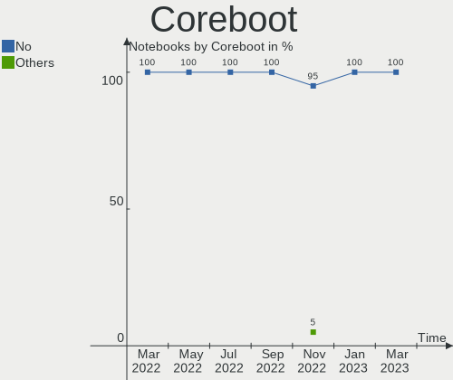
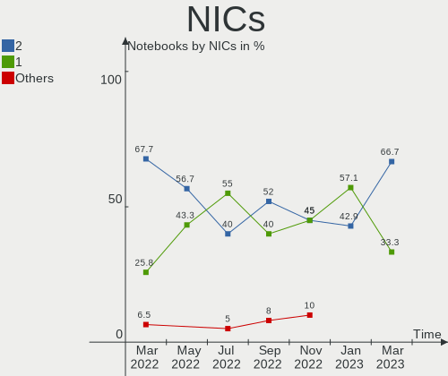
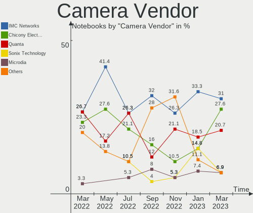
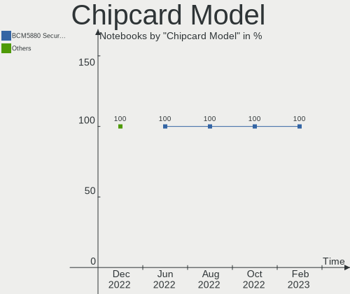

Endless - Hardware Trends (Notebooks)
-------------------------------------

A project to identify most popular hardware characteristics and track their change
over time based on data collected by Linux users at https://Linux-Hardware.org.

Anyone can contribute to this report by the [hw-probe](https://github.com/linuxhw/hw-probe) tool:

    sudo -E hw-probe -all -upload

This report is for one last month. Overall report since the beginning of time: [TestCoverage](https://github.com/linuxhw/TestCoverage)

Period: Dec, 2022.

Contents
--------

* [ System ](#system)
  - [ OS                       ](#os)
  - [ OS Family                ](#os-family)
  - [ Kernel                   ](#kernel)
  - [ Kernel Family            ](#kernel-family)
  - [ Kernel Major Ver.        ](#kernel-major-ver)
  - [ Arch                     ](#arch)
  - [ DE                       ](#de)
  - [ Display Server           ](#display-server)
  - [ Display Manager          ](#display-manager)
  - [ OS Lang                  ](#os-lang)
  - [ Boot Mode                ](#boot-mode)
  - [ Filesystem               ](#filesystem)
  - [ Part. scheme             ](#part-scheme)
  - [ Dual Boot with Linux/BSD ](#dual-boot-with-linuxbsd)
  - [ Dual Boot (Win)          ](#dual-boot-win)

* [ Board ](#board)
  - [ Vendor                   ](#vendor)
  - [ Model                    ](#model)
  - [ Model Family             ](#model-family)
  - [ MFG Year                 ](#mfg-year)
  - [ Form Factor              ](#form-factor)
  - [ Secure Boot              ](#secure-boot)
  - [ Coreboot                 ](#coreboot)
  - [ RAM Size                 ](#ram-size)
  - [ RAM Used                 ](#ram-used)
  - [ Total Drives             ](#total-drives)
  - [ Has CD-ROM               ](#has-cd-rom)
  - [ Has Ethernet             ](#has-ethernet)
  - [ Has WiFi                 ](#has-wifi)
  - [ Has Bluetooth            ](#has-bluetooth)

* [ Location ](#location)
  - [ Country                  ](#country)
  - [ City                     ](#city)

* [ Drives ](#drives)
  - [ Drive Vendor             ](#drive-vendor)
  - [ Drive Model              ](#drive-model)
  - [ HDD Vendor               ](#hdd-vendor)
  - [ SSD Vendor               ](#ssd-vendor)
  - [ Drive Kind               ](#drive-kind)
  - [ Drive Connector          ](#drive-connector)
  - [ Drive Size               ](#drive-size)
  - [ Space Total              ](#space-total)
  - [ Space Used               ](#space-used)
  - [ Malfunc. Drives          ](#malfunc-drives)
  - [ Malfunc. Drive Vendor    ](#malfunc-drive-vendor)
  - [ Malfunc. HDD Vendor      ](#malfunc-hdd-vendor)
  - [ Malfunc. Drive Kind      ](#malfunc-drive-kind)
  - [ Failed Drives            ](#failed-drives)
  - [ Failed Drive Vendor      ](#failed-drive-vendor)
  - [ Drive Status             ](#drive-status)

* [ Storage controller ](#storage-controller)
  - [ Storage Vendor           ](#storage-vendor)
  - [ Storage Model            ](#storage-model)
  - [ Storage Kind             ](#storage-kind)

* [ Processor ](#processor)
  - [ CPU Vendor               ](#cpu-vendor)
  - [ CPU Model                ](#cpu-model)
  - [ CPU Model Family         ](#cpu-model-family)
  - [ CPU Cores                ](#cpu-cores)
  - [ CPU Sockets              ](#cpu-sockets)
  - [ CPU Threads              ](#cpu-threads)
  - [ CPU Op-Modes             ](#cpu-op-modes)
  - [ CPU Microcode            ](#cpu-microcode)
  - [ CPU Microarch            ](#cpu-microarch)

* [ Graphics ](#graphics)
  - [ GPU Vendor               ](#gpu-vendor)
  - [ GPU Model                ](#gpu-model)
  - [ GPU Combo                ](#gpu-combo)
  - [ GPU Driver               ](#gpu-driver)
  - [ GPU Memory               ](#gpu-memory)

* [ Monitor ](#monitor)
  - [ Monitor Vendor           ](#monitor-vendor)
  - [ Monitor Model            ](#monitor-model)
  - [ Monitor Resolution       ](#monitor-resolution)
  - [ Monitor Diagonal         ](#monitor-diagonal)
  - [ Monitor Width            ](#monitor-width)
  - [ Aspect Ratio             ](#aspect-ratio)
  - [ Monitor Area             ](#monitor-area)
  - [ Pixel Density            ](#pixel-density)
  - [ Multiple Monitors        ](#multiple-monitors)

* [ Network ](#network)
  - [ Net Controller Vendor    ](#net-controller-vendor)
  - [ Net Controller Model     ](#net-controller-model)
  - [ Wireless Vendor          ](#wireless-vendor)
  - [ Wireless Model           ](#wireless-model)
  - [ Ethernet Vendor          ](#ethernet-vendor)
  - [ Ethernet Model           ](#ethernet-model)
  - [ Net Controller Kind      ](#net-controller-kind)
  - [ Used Controller          ](#used-controller)
  - [ NICs                     ](#nics)
  - [ IPv6                     ](#ipv6)

* [ Bluetooth ](#bluetooth)
  - [ Bluetooth Vendor         ](#bluetooth-vendor)
  - [ Bluetooth Model          ](#bluetooth-model)

* [ Sound ](#sound)
  - [ Sound Vendor             ](#sound-vendor)
  - [ Sound Model              ](#sound-model)

* [ Memory ](#memory)
  - [ Memory Vendor            ](#memory-vendor)
  - [ Memory Model             ](#memory-model)
  - [ Memory Kind              ](#memory-kind)
  - [ Memory Form Factor       ](#memory-form-factor)
  - [ Memory Size              ](#memory-size)
  - [ Memory Speed             ](#memory-speed)

* [ Printers & scanners ](#printers--scanners)
  - [ Printer Vendor           ](#printer-vendor)
  - [ Printer Model            ](#printer-model)
  - [ Scanner Vendor           ](#scanner-vendor)
  - [ Scanner Model            ](#scanner-model)

* [ Camera ](#camera)
  - [ Camera Vendor            ](#camera-vendor)
  - [ Camera Model             ](#camera-model)

* [ Security ](#security)
  - [ Fingerprint Vendor       ](#fingerprint-vendor)
  - [ Fingerprint Model        ](#fingerprint-model)
  - [ Chipcard Vendor          ](#chipcard-vendor)
  - [ Chipcard Model           ](#chipcard-model)

* [ Unsupported ](#unsupported)
  - [ Unsupported Devices      ](#unsupported-devices)
  - [ Unsupported Device Types ](#unsupported-device-types)

System
------

OS
--

Installed operating systems

| Name                  | Notebooks | Percent |
|-----------------------|-----------|---------|
| Endless 4.0.13        | 12        | 48%     |
| Endless 3.9.7         | 4         | 16%     |
| Endless 4.0.10        | 2         | 8%      |
| Endless 3.9.3-nexthw1 | 2         | 8%      |
| Endless 4.0.9         | 1         | 4%      |
| Endless 4.0.4         | 1         | 4%      |
| Endless 4.0.11        | 1         | 4%      |
| Endless 3.7.8         | 1         | 4%      |
| Endless 3.4.3-nexthw1 | 1         | 4%      |

OS Family
---------

OS without a version

| Name    | Notebooks | Percent |
|---------|-----------|---------|
| Endless | 25        | 100%    |

Kernel
------

Version of the Linux kernel

| Version           | Notebooks | Percent |
|-------------------|-----------|---------|
| 5.11.0-35-generic | 17        | 68%     |
| 5.8.0-14-generic  | 4         | 16%     |
| 5.11.0-12-generic | 2         | 8%      |
| 5.3.0-28-generic  | 1         | 4%      |
| 4.16.0-4-generic  | 1         | 4%      |

Kernel Family
-------------

Linux kernel without a distro release

| Version | Notebooks | Percent |
|---------|-----------|---------|
| 5.11.0  | 19        | 76%     |
| 5.8.0   | 4         | 16%     |
| 5.3.0   | 1         | 4%      |
| 4.16.0  | 1         | 4%      |

Kernel Major Ver.
-----------------

Linux kernel major version

| Version | Notebooks | Percent |
|---------|-----------|---------|
| 5.11    | 19        | 76%     |
| 5.8     | 4         | 16%     |
| 5.3     | 1         | 4%      |
| 4.16    | 1         | 4%      |

Arch
----

OS architecture (x86_64, i586, etc.)

| Name   | Notebooks | Percent |
|--------|-----------|---------|
| x86_64 | 25        | 100%    |

DE
--

Desktop Environment

| Name  | Notebooks | Percent |
|-------|-----------|---------|
| GNOME | 25        | 100%    |

Display Server
--------------

X11 or Wayland

| Name | Notebooks | Percent |
|------|-----------|---------|
| X11  | 25        | 100%    |

Display Manager
---------------

SDDM, LightDM, etc.

| Name    | Notebooks | Percent |
|---------|-----------|---------|
| Unknown | 25        | 100%    |

OS Lang
-------

Language

| Lang  | Notebooks | Percent |
|-------|-----------|---------|
| pt_BR | 12        | 48%     |
| en_US | 4         | 16%     |
| es_ES | 2         | 8%      |
| de_DE | 2         | 8%      |
| ru_RU | 1         | 4%      |
| ro_RO | 1         | 4%      |
| hu_HU | 1         | 4%      |
| fr_FR | 1         | 4%      |
| es_MX | 1         | 4%      |

Boot Mode
---------

EFI or BIOS

| Mode | Notebooks | Percent |
|------|-----------|---------|
| EFI  | 20        | 80%     |
| BIOS | 5         | 20%     |

Filesystem
----------

Type of filesystem

| Type  | Notebooks | Percent |
|-------|-----------|---------|
| Ext4  | 23        | 92%     |
| Tmpfs | 2         | 8%      |

Part. scheme
------------

Scheme of partitioning

| Type    | Notebooks | Percent |
|---------|-----------|---------|
| Unknown | 25        | 100%    |

Dual Boot with Linux/BSD
------------------------

Hosting more than one Linux/BSD

| Dual boot | Notebooks | Percent |
|-----------|-----------|---------|
| No        | 25        | 100%    |

Dual Boot (Win)
---------------

Hosting Linux and Windows

| Dual boot | Notebooks | Percent |
|-----------|-----------|---------|
| No        | 25        | 100%    |

Board
-----

Vendor
------

Motherboard manufacturer

| Name                | Notebooks | Percent |
|---------------------|-----------|---------|
| ASUSTek Computer    | 15        | 60%     |
| Acer                | 4         | 16%     |
| Lenovo              | 2         | 8%      |
| Dell                | 2         | 8%      |
| Samsung Electronics | 1         | 4%      |
| Hewlett-Packard     | 1         | 4%      |

Model
-----

Motherboard model

| Name                                              | Notebooks | Percent |
|---------------------------------------------------|-----------|---------|
| ASUS VivoBook_ASUSLaptop X515DA_X515DA            | 5         | 20%     |
| ASUS VivoBook_ASUSLaptop X515EA_X515EA            | 2         | 8%      |
| Samsung RV420/RV520/RV720/E3530/S3530/E3420/E3520 | 1         | 4%      |
| Lenovo Y520-15IKBN 80WK                           | 1         | 4%      |
| Lenovo IdeaPad 110-14IBR 80T6                     | 1         | 4%      |
| HP Pavilion 17                                    | 1         | 4%      |
| Dell Latitude E6520                               | 1         | 4%      |
| Dell Inspiron 3542                                | 1         | 4%      |
| ASUS X451CAP                                      | 1         | 4%      |
| ASUS VivoBook_ASUSLaptop X515MA_X515MA            | 1         | 4%      |
| ASUS VivoBook_ASUSLaptop X409DA_M409DA            | 1         | 4%      |
| ASUS VivoBook_ASUSLaptop E410MAB_E410MA           | 1         | 4%      |
| ASUS VivoBook 15_ASUS Laptop X540BA               | 1         | 4%      |
| ASUS VivoBook 15_ASUS Laptop X507UAR              | 1         | 4%      |
| ASUS VivoBook 15_ASUS Laptop X507MA_X507MA        | 1         | 4%      |
| ASUS N71Vn                                        | 1         | 4%      |
| Acer Nitro AN517-51                               | 1         | 4%      |
| Acer Nitro AN515-54                               | 1         | 4%      |
| Acer Aspire A515-54G                              | 1         | 4%      |
| Acer Aspire 5735                                  | 1         | 4%      |

Model Family
------------

Motherboard model prefix

| Name               | Notebooks | Percent |
|--------------------|-----------|---------|
| ASUS VivoBook      | 13        | 52%     |
| Acer Nitro         | 2         | 8%      |
| Acer Aspire        | 2         | 8%      |
| Samsung RV420      | 1         | 4%      |
| Lenovo Y520-15IKBN | 1         | 4%      |
| Lenovo IdeaPad     | 1         | 4%      |
| HP Pavilion        | 1         | 4%      |
| Dell Latitude      | 1         | 4%      |
| Dell Inspiron      | 1         | 4%      |
| ASUS X451CAP       | 1         | 4%      |
| ASUS N71Vn         | 1         | 4%      |

MFG Year
--------

Motherboard manufacture year

| Year | Notebooks | Percent |
|------|-----------|---------|
| 2020 | 6         | 24%     |
| 2019 | 4         | 16%     |
| 2021 | 3         | 12%     |
| 2018 | 3         | 12%     |
| 2013 | 2         | 8%      |
| 2011 | 2         | 8%      |
| 2017 | 1         | 4%      |
| 2016 | 1         | 4%      |
| 2014 | 1         | 4%      |
| 2009 | 1         | 4%      |
| 2008 | 1         | 4%      |

Form Factor
-----------

Physical design of the computer

| Name     | Notebooks | Percent |
|----------|-----------|---------|
| Notebook | 25        | 100%    |

Secure Boot
-----------

Enabled or disabled

| State    | Notebooks | Percent |
|----------|-----------|---------|
| Disabled | 20        | 80%     |
| Enabled  | 5         | 20%     |

Coreboot
--------

Have coreboot on board

| Used | Notebooks | Percent |
|------|-----------|---------|
| No   | 25        | 100%    |

RAM Size
--------

Total RAM memory

| Size in GB | Notebooks | Percent |
|------------|-----------|---------|
| 4.01-8.0   | 13        | 52%     |
| 3.01-4.0   | 8         | 32%     |
| 8.01-16.0  | 3         | 12%     |
| 16.01-24.0 | 1         | 4%      |

RAM Used
--------

Used RAM memory

| Used GB  | Notebooks | Percent |
|----------|-----------|---------|
| 1.01-2.0 | 11        | 44%     |
| 2.01-3.0 | 7         | 28%     |
| 0.51-1.0 | 3         | 12%     |
| 4.01-8.0 | 2         | 8%      |
| 3.01-4.0 | 2         | 8%      |

Total Drives
------------

Number of drives on board

| Drives | Notebooks | Percent |
|--------|-----------|---------|
| 1      | 21        | 84%     |
| 2      | 4         | 16%     |

Has CD-ROM
----------

Has CD-ROM on board

| Presented | Notebooks | Percent |
|-----------|-----------|---------|
| No        | 19        | 76%     |
| Yes       | 6         | 24%     |

Has Ethernet
------------

Has Ethernet on board

| Presented | Notebooks | Percent |
|-----------|-----------|---------|
| No        | 13        | 52%     |
| Yes       | 12        | 48%     |

Has WiFi
--------

Has WiFi module

| Presented | Notebooks | Percent |
|-----------|-----------|---------|
| Yes       | 25        | 100%    |

Has Bluetooth
-------------

Has Bluetooth module

| Presented | Notebooks | Percent |
|-----------|-----------|---------|
| Yes       | 21        | 84%     |
| No        | 4         | 16%     |

Location
--------

Country
-------

Geographic location (country)

| Country  | Notebooks | Percent |
|----------|-----------|---------|
| Brazil   | 12        | 48%     |
| Romania  | 3         | 12%     |
| Spain    | 2         | 8%      |
| Germany  | 2         | 8%      |
| USA      | 1         | 4%      |
| UK       | 1         | 4%      |
| Russia   | 1         | 4%      |
| Hungary  | 1         | 4%      |
| France   | 1         | 4%      |
| Colombia | 1         | 4%      |

City
----

Geographic location (city)

| City                  | Notebooks | Percent |
|-----------------------|-----------|---------|
| Sao Paulo             | 2         | 8%      |
| Veszprém             | 1         | 4%      |
| Uruacu                | 1         | 4%      |
| Templin               | 1         | 4%      |
| Sao José dos Pinhais | 1         | 4%      |
| Santos                | 1         | 4%      |
| Salamanca             | 1         | 4%      |
| Quijas                | 1         | 4%      |
| Porto Alegre          | 1         | 4%      |
| Popesti-Leordeni      | 1         | 4%      |
| Pelotas               | 1         | 4%      |
| Mons-en-Baroeul       | 1         | 4%      |
| Manaus                | 1         | 4%      |
| Leipzig               | 1         | 4%      |
| Kolpino               | 1         | 4%      |
| Itabirito             | 1         | 4%      |
| Iasi                  | 1         | 4%      |
| Goiânia              | 1         | 4%      |
| Gilbert               | 1         | 4%      |
| Formosa               | 1         | 4%      |
| Curitiba              | 1         | 4%      |
| Campina               | 1         | 4%      |
| Bogotá               | 1         | 4%      |
| Barnsley              | 1         | 4%      |

Drives
------

Drive Vendor
------------

Hard drive vendors

| Vendor                      | Notebooks | Drives | Percent |
|-----------------------------|-----------|--------|---------|
| ADATA Technology            | 5         | 5      | 17.86%  |
| Samsung Electronics         | 4         | 4      | 14.29%  |
| WDC                         | 3         | 3      | 10.71%  |
| Intel                       | 3         | 3      | 10.71%  |
| Seagate                     | 2         | 2      | 7.14%   |
| SanDisk                     | 2         | 2      | 7.14%   |
| Phison Electronics          | 2         | 2      | 7.14%   |
| Kingston                    | 2         | 2      | 7.14%   |
| V7                          | 1         | 1      | 3.57%   |
| Toshiba                     | 1         | 1      | 3.57%   |
| Micron Technology           | 1         | 1      | 3.57%   |
| Kingston Technology Company | 1         | 1      | 3.57%   |
| Hitachi                     | 1         | 1      | 3.57%   |

Drive Model
-----------

Hard drive models

| Model                                               | Notebooks | Percent |
|-----------------------------------------------------|-----------|---------|
| ADATA SM2P32A8-256GC1 256GB                         | 5         | 17.86%  |
| Phison PS5013 E13 NVMe Controller 512GB             | 2         | 7.14%   |
| Intel KINGSTON RBUSNS8154P3512GJ1 512GB             | 2         | 7.14%   |
| WDC WD3200BEKT-08PVMT1 320GB                        | 1         | 3.57%   |
| WDC WD10SPZX-24Z10T0 1TB                            | 1         | 3.57%   |
| WDC WD10SPZX-21Z10T0 1TB                            | 1         | 3.57%   |
| V7 SSD 512GB                                        | 1         | 3.57%   |
| Toshiba MQ04ABF100 1TB                              | 1         | 3.57%   |
| Seagate ST500LT012-1DG142 500GB                     | 1         | 3.57%   |
| Seagate ST1000LM024 HN-M101MBB 1TB                  | 1         | 3.57%   |
| Sandisk WD Blue SN550 NVMe SSD 500GB                | 1         | 3.57%   |
| SanDisk SD9SN8W256G1102 256GB SSD                   | 1         | 3.57%   |
| Samsung SSD 870 EVO 250GB                           | 1         | 3.57%   |
| Samsung NVMe SSD Controller SM961/PM961/SM963 256GB | 1         | 3.57%   |
| Samsung MZVLQ256HAJD-00000 256GB                    | 1         | 3.57%   |
| Samsung HM160HI 160GB                               | 1         | 3.57%   |
| Micron 1300_MTFDDAK256TDL 256GB SSD                 | 1         | 3.57%   |
| Kingston Company OM3PDP3 NVMe SSD 512GB             | 1         | 3.57%   |
| Kingston SA400S37480G 480GB SSD                     | 1         | 3.57%   |
| Kingston SA400S37240G 240GB SSD                     | 1         | 3.57%   |
| Intel IM2P33F8BR1-128GB                             | 1         | 3.57%   |
| Hitachi HTS543225L9A300 250GB                       | 1         | 3.57%   |

HDD Vendor
----------

Hard disk drive vendors

| Vendor              | Notebooks | Drives | Percent |
|---------------------|-----------|--------|---------|
| WDC                 | 3         | 3      | 37.5%   |
| Seagate             | 2         | 2      | 25%     |
| Toshiba             | 1         | 1      | 12.5%   |
| Samsung Electronics | 1         | 1      | 12.5%   |
| Hitachi             | 1         | 1      | 12.5%   |

SSD Vendor
----------

Solid state drive vendors

| Vendor              | Notebooks | Drives | Percent |
|---------------------|-----------|--------|---------|
| Kingston            | 2         | 2      | 33.33%  |
| V7                  | 1         | 1      | 16.67%  |
| SanDisk             | 1         | 1      | 16.67%  |
| Samsung Electronics | 1         | 1      | 16.67%  |
| Micron Technology   | 1         | 1      | 16.67%  |

Drive Kind
----------

HDD or SSD

| Kind | Notebooks | Drives | Percent |
|------|-----------|--------|---------|
| NVMe | 14        | 14     | 50%     |
| HDD  | 8         | 8      | 28.57%  |
| SSD  | 6         | 6      | 21.43%  |

Drive Connector
---------------

SATA, SAS, NVMe, etc.

| Type | Notebooks | Drives | Percent |
|------|-----------|--------|---------|
| NVMe | 14        | 14     | 51.85%  |
| SATA | 13        | 14     | 48.15%  |

Drive Size
----------

Size of hard drive

| Size in TB | Notebooks | Drives | Percent |
|------------|-----------|--------|---------|
| 0.01-0.5   | 9         | 9      | 64.29%  |
| 0.51-1.0   | 5         | 5      | 35.71%  |

Space Total
-----------

Amount of disk space available on the file system

| Size in GB | Notebooks | Percent |
|------------|-----------|---------|
| 101-250    | 14        | 56%     |
| 251-500    | 4         | 16%     |
| 501-1000   | 4         | 16%     |
| 21-50      | 1         | 4%      |
| 1001-2000  | 1         | 4%      |
| 1-20       | 1         | 4%      |

Space Used
----------

Amount of used disk space

| Used GB  | Notebooks | Percent |
|----------|-----------|---------|
| 21-50    | 14        | 56%     |
| 1-20     | 4         | 16%     |
| 251-500  | 3         | 12%     |
| 51-100   | 3         | 12%     |
| 501-1000 | 1         | 4%      |

Malfunc. Drives
---------------

Drive models with a malfunction

Zero info for selected period =(

Malfunc. Drive Vendor
---------------------

Vendors of faulty drives

Zero info for selected period =(

Malfunc. HDD Vendor
-------------------

Vendors of faulty HDD drives

Zero info for selected period =(

Malfunc. Drive Kind
-------------------

Kinds of faulty drives

Zero info for selected period =(

Failed Drives
-------------

Failed drive models

Zero info for selected period =(

Failed Drive Vendor
-------------------

Failed drive vendors

Zero info for selected period =(

Drive Status
------------

Number of failed and malfunc. drives

| Status   | Notebooks | Drives | Percent |
|----------|-----------|--------|---------|
| Detected | 25        | 28     | 100%    |

Storage controller
------------------

Storage Vendor
--------------

Storage controller vendors

| Vendor                      | Notebooks | Percent |
|-----------------------------|-----------|---------|
| Intel                       | 17        | 47.22%  |
| AMD                         | 8         | 22.22%  |
| ADATA Technology            | 5         | 13.89%  |
| Samsung Electronics         | 2         | 5.56%   |
| Phison Electronics          | 2         | 5.56%   |
| SanDisk                     | 1         | 2.78%   |
| Kingston Technology Company | 1         | 2.78%   |

Storage Model
-------------

Storage controller models

| Model                                                                            | Notebooks | Percent |
|----------------------------------------------------------------------------------|-----------|---------|
| AMD FCH SATA Controller [AHCI mode]                                              | 8         | 19.51%  |
| ADATA A Non-Volatile memory controller                                           | 5         | 12.2%   |
| Intel 82801 Mobile SATA Controller [RAID mode]                                   | 4         | 9.76%   |
| Intel PROSet/Wireless WiFi Software extension                                    | 3         | 7.32%   |
| Intel Celeron/Pentium Silver Processor SATA Controller                           | 3         | 7.32%   |
| Phison PS5013 E13 NVMe Controller                                                | 2         | 4.88%   |
| Intel Volume Management Device NVMe RAID Controller                              | 2         | 4.88%   |
| Intel Tiger Lake-LP SATA Controller                                              | 2         | 4.88%   |
| Intel 6 Series/C200 Series Chipset Family 6 port Mobile SATA AHCI Controller     | 2         | 4.88%   |
| SanDisk WD Blue SN550 NVMe SSD                                                   | 1         | 2.44%   |
| Samsung NVMe SSD Controller SM961/PM961/SM963                                    | 1         | 2.44%   |
| Samsung NVMe SSD Controller 980                                                  | 1         | 2.44%   |
| Kingston Company OM3PDP3 NVMe SSD                                                | 1         | 2.44%   |
| Intel HM170/QM170 Chipset SATA Controller [AHCI Mode]                            | 1         | 2.44%   |
| Intel Atom/Celeron/Pentium Processor x5-E8000/J3xxx/N3xxx Series SATA Controller | 1         | 2.44%   |
| Intel 82801IBM/IEM (ICH9M/ICH9M-E) 4 port SATA Controller [AHCI mode]            | 1         | 2.44%   |
| Intel 82801IBM/IEM (ICH9M/ICH9M-E) 2 port SATA Controller [IDE mode]             | 1         | 2.44%   |
| Intel 8 Series SATA Controller 1 [AHCI mode]                                     | 1         | 2.44%   |
| Intel 7 Series Chipset Family 6-port SATA Controller [AHCI mode]                 | 1         | 2.44%   |

Storage Kind
------------

Kind of storage controller (IDE, SATA, NVMe, SAS, ...)

| Kind | Notebooks | Percent |
|------|-----------|---------|
| SATA | 22        | 53.66%  |
| NVMe | 14        | 34.15%  |
| RAID | 4         | 9.76%   |
| IDE  | 1         | 2.44%   |

Processor
---------

CPU Vendor
----------

Processor vendors

| Vendor | Notebooks | Percent |
|--------|-----------|---------|
| Intel  | 17        | 68%     |
| AMD    | 8         | 32%     |

CPU Model
---------

Processor models

| Model                                         | Notebooks | Percent |
|-----------------------------------------------|-----------|---------|
| AMD Ryzen 5 3500U with Radeon Vega Mobile Gfx | 6         | 24%     |
| Intel Celeron N4020 CPU @ 1.10GHz             | 2         | 8%      |
| Intel 11th Gen Core i3-1115G4 @ 3.00GHz       | 2         | 8%      |
| Intel Pentium Silver N5000 CPU @ 1.10GHz      | 1         | 4%      |
| Intel Pentium Dual CPU T3400 @ 2.16GHz        | 1         | 4%      |
| Intel Core i7-9750H CPU @ 2.60GHz             | 1         | 4%      |
| Intel Core i7-10510U CPU @ 1.80GHz            | 1         | 4%      |
| Intel Core i5-9300H CPU @ 2.40GHz             | 1         | 4%      |
| Intel Core i5-8250U CPU @ 1.60GHz             | 1         | 4%      |
| Intel Core i5-7300HQ CPU @ 2.50GHz            | 1         | 4%      |
| Intel Core i5-2430M CPU @ 2.40GHz             | 1         | 4%      |
| Intel Core i5-2410M CPU @ 2.30GHz             | 1         | 4%      |
| Intel Core i3-4030U CPU @ 1.90GHz             | 1         | 4%      |
| Intel Core i3-2375M CPU @ 1.50GHz             | 1         | 4%      |
| Intel Core 2 Duo CPU P8700 @ 2.53GHz          | 1         | 4%      |
| Intel Celeron CPU N3060 @ 1.60GHz             | 1         | 4%      |
| AMD A9-9425 RADEON R5, 5 COMPUTE CORES 2C+3G  | 1         | 4%      |
| AMD A8-6410 APU with AMD Radeon R5 Graphics   | 1         | 4%      |

CPU Model Family
----------------

Processor model prefix

| Model                | Notebooks | Percent |
|----------------------|-----------|---------|
| AMD Ryzen 5          | 6         | 24%     |
| Intel Core i5        | 5         | 20%     |
| Other                | 3         | 12%     |
| Intel Celeron        | 3         | 12%     |
| Intel Core i7        | 2         | 8%      |
| Intel Core i3        | 2         | 8%      |
| Intel Pentium Silver | 1         | 4%      |
| Intel Pentium Dual   | 1         | 4%      |
| Intel Core 2 Duo     | 1         | 4%      |
| AMD A8               | 1         | 4%      |

CPU Cores
---------

Number of processor cores

| Number | Notebooks | Percent |
|--------|-----------|---------|
| 4      | 12        | 48%     |
| 2      | 12        | 48%     |
| 6      | 1         | 4%      |

CPU Sockets
-----------

Number of sockets

| Number | Notebooks | Percent |
|--------|-----------|---------|
| 1      | 25        | 100%    |

CPU Threads
-----------

Threads per core (Hyper-Threading)

| Number | Notebooks | Percent |
|--------|-----------|---------|
| 2      | 16        | 64%     |
| 1      | 9         | 36%     |

CPU Op-Modes
------------

CPU Operation Modes (32-bit, 64-bit)

| Op mode        | Notebooks | Percent |
|----------------|-----------|---------|
| 32-bit, 64-bit | 25        | 100%    |

CPU Microcode
-------------

Microcode number

| Number     | Notebooks | Percent |
|------------|-----------|---------|
| 0x08108109 | 5         | 20%     |
| 0x206a7    | 3         | 12%     |
| 0x906ed    | 2         | 8%      |
| 0x806c1    | 2         | 8%      |
| 0x706a8    | 2         | 8%      |
| 0x906e9    | 1         | 4%      |
| 0x806ec    | 1         | 4%      |
| 0x806ea    | 1         | 4%      |
| 0x706a1    | 1         | 4%      |
| 0x6fd      | 1         | 4%      |
| 0x406c4    | 1         | 4%      |
| 0x40651    | 1         | 4%      |
| 0x1067a    | 1         | 4%      |
| 0x07030105 | 1         | 4%      |
| 0x06006705 | 1         | 4%      |
| Unknown    | 1         | 4%      |

CPU Microarch
-------------

Microarchitecture

| Name          | Notebooks | Percent |
|---------------|-----------|---------|
| Zen+          | 6         | 24%     |
| KabyLake      | 5         | 20%     |
| SandyBridge   | 3         | 12%     |
| Goldmont plus | 3         | 12%     |
| TigerLake     | 2         | 8%      |
| Silvermont    | 1         | 4%      |
| Puma          | 1         | 4%      |
| Penryn        | 1         | 4%      |
| Haswell       | 1         | 4%      |
| Excavator     | 1         | 4%      |
| Core          | 1         | 4%      |

Graphics
--------

GPU Vendor
----------

Vendors of graphics cards

| Vendor | Notebooks | Percent |
|--------|-----------|---------|
| Intel  | 15        | 51.72%  |
| AMD    | 8         | 27.59%  |
| Nvidia | 6         | 20.69%  |

GPU Model
---------

Graphics card models

| Model                                                                                    | Notebooks | Percent |
|------------------------------------------------------------------------------------------|-----------|---------|
| AMD Picasso/Raven 2 [Radeon Vega Series / Radeon Vega Mobile Series]                     | 6         | 20.69%  |
| Nvidia TU117M [GeForce GTX 1650 Mobile / Max-Q]                                          | 2         | 6.9%    |
| Intel Tiger Lake-LP GT2 [UHD Graphics G4]                                                | 2         | 6.9%    |
| Intel GeminiLake [UHD Graphics 600]                                                      | 2         | 6.9%    |
| Intel CoffeeLake-H GT2 [UHD Graphics 630]                                                | 2         | 6.9%    |
| Intel 2nd Generation Core Processor Family Integrated Graphics Controller                | 2         | 6.9%    |
| Nvidia GT216M [GeForce GT 240M]                                                          | 1         | 3.45%   |
| Nvidia GP108M [GeForce MX250]                                                            | 1         | 3.45%   |
| Nvidia GP107M [GeForce GTX 1050 Mobile]                                                  | 1         | 3.45%   |
| Nvidia GF119M [GeForce GT 520M]                                                          | 1         | 3.45%   |
| Intel UHD Graphics 620                                                                   | 1         | 3.45%   |
| Intel Mobile 4 Series Chipset Integrated Graphics Controller                             | 1         | 3.45%   |
| Intel HD Graphics 630                                                                    | 1         | 3.45%   |
| Intel Haswell-ULT Integrated Graphics Controller                                         | 1         | 3.45%   |
| Intel GeminiLake [UHD Graphics 605]                                                      | 1         | 3.45%   |
| Intel CometLake-U GT2 [UHD Graphics]                                                     | 1         | 3.45%   |
| Intel Atom/Celeron/Pentium Processor x5-E8000/J3xxx/N3xxx Integrated Graphics Controller | 1         | 3.45%   |
| AMD Stoney [Radeon R2/R3/R4/R5 Graphics]                                                 | 1         | 3.45%   |
| AMD Mullins [Radeon R4/R5 Graphics]                                                      | 1         | 3.45%   |

GPU Combo
---------

Combinations of graphics cards

| Name           | Notebooks | Percent |
|----------------|-----------|---------|
| 1 x Intel      | 11        | 44%     |
| 1 x AMD        | 8         | 32%     |
| Intel + Nvidia | 4         | 16%     |
| 1 x Nvidia     | 2         | 8%      |

GPU Driver
----------

Free vs proprietary

| Driver      | Notebooks | Percent |
|-------------|-----------|---------|
| Free        | 21        | 84%     |
| Proprietary | 4         | 16%     |

GPU Memory
----------

Total video memory

| Size in GB | Notebooks | Percent |
|------------|-----------|---------|
| Unknown    | 16        | 64%     |
| 1.01-2.0   | 5         | 20%     |
| 0.51-1.0   | 3         | 12%     |
| 0.01-0.5   | 1         | 4%      |

Monitor
-------

Monitor Vendor
--------------

Monitor vendors

| Vendor              | Notebooks | Percent |
|---------------------|-----------|---------|
| BOE                 | 9         | 34.62%  |
| Chimei Innolux      | 6         | 23.08%  |
| LG Display          | 4         | 15.38%  |
| AU Optronics        | 4         | 15.38%  |
| Samsung Electronics | 2         | 7.69%   |
| Goldstar            | 1         | 3.85%   |

Monitor Model
-------------

Monitor models

| Model                                                                | Notebooks | Percent |
|----------------------------------------------------------------------|-----------|---------|
| BOE LCD Monitor BOE07AA 1366x768 344x194mm 15.5-inch                 | 6         | 23.08%  |
| Chimei Innolux LCD Monitor CMN15F5 1920x1080 344x193mm 15.5-inch     | 3         | 11.54%  |
| Samsung Electronics LCD Monitor SEC5441 1366x768 344x194mm 15.5-inch | 2         | 7.69%   |
| LG Display LCD Monitor LGD065A 1920x1080 344x194mm 15.5-inch         | 1         | 3.85%   |
| LG Display LCD Monitor LGD0590 1920x1080 344x194mm 15.5-inch         | 1         | 3.85%   |
| LG Display LCD Monitor LGD0456 1366x768 344x194mm 15.5-inch          | 1         | 3.85%   |
| LG Display LCD Monitor LGD03FB 1920x1080 382x215mm 17.3-inch         | 1         | 3.85%   |
| Goldstar D2342P GSM5842 1920x1080 510x290mm 23.1-inch                | 1         | 3.85%   |
| Chimei Innolux LCD Monitor CMN15E6 1366x768 344x193mm 15.5-inch      | 1         | 3.85%   |
| Chimei Innolux LCD Monitor CMN14D6 1366x768 309x173mm 13.9-inch      | 1         | 3.85%   |
| Chimei Innolux LCD Monitor CMN1470 1366x768 309x174mm 14.0-inch      | 1         | 3.85%   |
| BOE LCD Monitor BOE0839 1920x1080 382x215mm 17.3-inch                | 1         | 3.85%   |
| BOE LCD Monitor BOE06A5 1366x768 344x194mm 15.5-inch                 | 1         | 3.85%   |
| BOE LCD Monitor BOE0698 1366x768 309x173mm 13.9-inch                 | 1         | 3.85%   |
| AU Optronics LCD Monitor AUO723C 1366x768 309x173mm 13.9-inch        | 1         | 3.85%   |
| AU Optronics LCD Monitor AUO21ED 1920x1080 344x193mm 15.5-inch       | 1         | 3.85%   |
| AU Optronics LCD Monitor AUO10EC 1366x768 344x193mm 15.5-inch        | 1         | 3.85%   |
| AU Optronics LCD Monitor AUO109E 1600x900 382x214mm 17.2-inch        | 1         | 3.85%   |

Monitor Resolution
------------------

Monitor screen resolution

| Resolution      | Notebooks | Percent |
|-----------------|-----------|---------|
| 1366x768 (WXGA) | 16        | 64%     |
| 1920x1080 (FHD) | 8         | 32%     |
| 1600x900 (HD+)  | 1         | 4%      |

Monitor Diagonal
----------------

Diagonal size in inches

| Inches | Notebooks | Percent |
|--------|-----------|---------|
| 15     | 18        | 69.23%  |
| 17     | 3         | 11.54%  |
| 14     | 2         | 7.69%   |
| 13     | 2         | 7.69%   |
| 23     | 1         | 3.85%   |

Monitor Width
-------------

Physical width

| Width in mm | Notebooks | Percent |
|-------------|-----------|---------|
| 301-350     | 20        | 76.92%  |
| 351-400     | 5         | 19.23%  |
| 501-600     | 1         | 3.85%   |

Aspect Ratio
------------

Proportional relationship between the width and the height

| Ratio | Notebooks | Percent |
|-------|-----------|---------|
| 16/9  | 25        | 100%    |

Monitor Area
------------

Area in inch²

| Area in inch² | Notebooks | Percent |
|----------------|-----------|---------|
| 101-110        | 18        | 69.23%  |
| 81-90          | 4         | 15.38%  |
| 121-130        | 3         | 11.54%  |
| 201-250        | 1         | 3.85%   |

Pixel Density
-------------

Pixels per inch

| Density | Notebooks | Percent |
|---------|-----------|---------|
| 101-120 | 15        | 57.69%  |
| 121-160 | 8         | 30.77%  |
| 51-100  | 3         | 11.54%  |

Multiple Monitors
-----------------

Total monitors connected

| Total | Notebooks | Percent |
|-------|-----------|---------|
| 1     | 24        | 96%     |
| 2     | 1         | 4%      |

Network
-------

Net Controller Vendor
---------------------

Controller vendors

| Vendor                   | Notebooks | Percent |
|--------------------------|-----------|---------|
| Realtek Semiconductor    | 18        | 56.25%  |
| Intel                    | 7         | 21.88%  |
| Qualcomm Atheros         | 5         | 15.63%  |
| Marvell Technology Group | 1         | 3.13%   |
| Broadcom                 | 1         | 3.13%   |

Net Controller Model
--------------------

Controller models

| Model                                                             | Notebooks | Percent |
|-------------------------------------------------------------------|-----------|---------|
| Realtek RTL8821CE 802.11ac PCIe Wireless Network Adapter          | 9         | 24.32%  |
| Realtek RTL8111/8168/8411 PCI Express Gigabit Ethernet Controller | 5         | 13.51%  |
| Realtek RTL810xE PCI Express Fast Ethernet controller             | 4         | 10.81%  |
| Realtek RTL8821AE 802.11ac PCIe Wireless Network Adapter          | 2         | 5.41%   |
| Qualcomm Atheros QCA9565 / AR9565 Wireless Network Adapter        | 2         | 5.41%   |
| Intel Wi-Fi 6 AX201                                               | 2         | 5.41%   |
| Intel Wi-Fi 6 AX200                                               | 2         | 5.41%   |
| Realtek RTL8188EE Wireless Network Adapter                        | 1         | 2.7%    |
| Qualcomm Atheros QCA9377 802.11ac Wireless Network Adapter        | 1         | 2.7%    |
| Qualcomm Atheros AR9485 Wireless Network Adapter                  | 1         | 2.7%    |
| Qualcomm Atheros AR9285 Wireless Network Adapter (PCI-Express)    | 1         | 2.7%    |
| Qualcomm Atheros AR8131 Gigabit Ethernet                          | 1         | 2.7%    |
| Marvell Group 88E8071 PCI-E Gigabit Ethernet Controller           | 1         | 2.7%    |
| Intel Wireless 8265 / 8275                                        | 1         | 2.7%    |
| Intel PRO/Wireless 4965 AG or AGN [Kedron] Network Connection     | 1         | 2.7%    |
| Intel Centrino Advanced-N 6205 [Taylor Peak]                      | 1         | 2.7%    |
| Intel 82579LM Gigabit Network Connection (Lewisville)             | 1         | 2.7%    |
| Broadcom BCM4313 802.11bgn Wireless Network Adapter               | 1         | 2.7%    |

Wireless Vendor
---------------

Wireless vendors

| Vendor                | Notebooks | Percent |
|-----------------------|-----------|---------|
| Realtek Semiconductor | 12        | 48%     |
| Intel                 | 7         | 28%     |
| Qualcomm Atheros      | 5         | 20%     |
| Broadcom              | 1         | 4%      |

Wireless Model
--------------

Wireless models

| Model                                                          | Notebooks | Percent |
|----------------------------------------------------------------|-----------|---------|
| Realtek RTL8821CE 802.11ac PCIe Wireless Network Adapter       | 9         | 36%     |
| Realtek RTL8821AE 802.11ac PCIe Wireless Network Adapter       | 2         | 8%      |
| Qualcomm Atheros QCA9565 / AR9565 Wireless Network Adapter     | 2         | 8%      |
| Intel Wi-Fi 6 AX201                                            | 2         | 8%      |
| Intel Wi-Fi 6 AX200                                            | 2         | 8%      |
| Realtek RTL8188EE Wireless Network Adapter                     | 1         | 4%      |
| Qualcomm Atheros QCA9377 802.11ac Wireless Network Adapter     | 1         | 4%      |
| Qualcomm Atheros AR9485 Wireless Network Adapter               | 1         | 4%      |
| Qualcomm Atheros AR9285 Wireless Network Adapter (PCI-Express) | 1         | 4%      |
| Intel Wireless 8265 / 8275                                     | 1         | 4%      |
| Intel PRO/Wireless 4965 AG or AGN [Kedron] Network Connection  | 1         | 4%      |
| Intel Centrino Advanced-N 6205 [Taylor Peak]                   | 1         | 4%      |
| Broadcom BCM4313 802.11bgn Wireless Network Adapter            | 1         | 4%      |

Ethernet Vendor
---------------

Ethernet vendors

| Vendor                   | Notebooks | Percent |
|--------------------------|-----------|---------|
| Realtek Semiconductor    | 9         | 75%     |
| Qualcomm Atheros         | 1         | 8.33%   |
| Marvell Technology Group | 1         | 8.33%   |
| Intel                    | 1         | 8.33%   |

Ethernet Model
--------------

Ethernet models

| Model                                                             | Notebooks | Percent |
|-------------------------------------------------------------------|-----------|---------|
| Realtek RTL8111/8168/8411 PCI Express Gigabit Ethernet Controller | 5         | 41.67%  |
| Realtek RTL810xE PCI Express Fast Ethernet controller             | 4         | 33.33%  |
| Qualcomm Atheros AR8131 Gigabit Ethernet                          | 1         | 8.33%   |
| Marvell Group 88E8071 PCI-E Gigabit Ethernet Controller           | 1         | 8.33%   |
| Intel 82579LM Gigabit Network Connection (Lewisville)             | 1         | 8.33%   |

Net Controller Kind
-------------------

Ethernet, WiFi or modem

| Kind     | Notebooks | Percent |
|----------|-----------|---------|
| WiFi     | 25        | 67.57%  |
| Ethernet | 12        | 32.43%  |

Used Controller
---------------

Currently used network controller

| Kind     | Notebooks | Percent |
|----------|-----------|---------|
| WiFi     | 25        | 96.15%  |
| Ethernet | 1         | 3.85%   |

NICs
----

Total network controllers on board

| Total | Notebooks | Percent |
|-------|-----------|---------|
| 1     | 13        | 52%     |
| 2     | 12        | 48%     |

IPv6
----

IPv6 vs IPv4

| Used | Notebooks | Percent |
|------|-----------|---------|
| No   | 13        | 52%     |
| Yes  | 12        | 48%     |

Bluetooth
---------

Bluetooth Vendor
----------------

Controller vendors

| Vendor                          | Notebooks | Percent |
|---------------------------------|-----------|---------|
| IMC Networks                    | 9         | 42.86%  |
| Intel                           | 5         | 23.81%  |
| Realtek Semiconductor           | 2         | 9.52%   |
| Qualcomm Atheros Communications | 1         | 4.76%   |
| Lite-On Technology              | 1         | 4.76%   |
| Dell                            | 1         | 4.76%   |
| Cambridge Silicon Radio         | 1         | 4.76%   |
| Broadcom                        | 1         | 4.76%   |

Bluetooth Model
---------------

Controller models

| Model                                               | Notebooks | Percent |
|-----------------------------------------------------|-----------|---------|
| IMC Networks Bluetooth Radio                        | 8         | 38.1%   |
| Realtek RTL8821A Bluetooth                          | 2         | 9.52%   |
| Intel Bluetooth 9460/9560 Jefferson Peak (JfP)      | 2         | 9.52%   |
| Intel AX200 Bluetooth                               | 2         | 9.52%   |
| Qualcomm Atheros AR9462 Bluetooth                   | 1         | 4.76%   |
| Lite-On Qualcomm Atheros QCA9377 Bluetooth          | 1         | 4.76%   |
| Intel Bluetooth wireless interface                  | 1         | 4.76%   |
| IMC Networks Bluetooth Device                       | 1         | 4.76%   |
| Dell DW375 Bluetooth Module                         | 1         | 4.76%   |
| Cambridge Silicon Radio Bluetooth Dongle (HCI mode) | 1         | 4.76%   |
| Broadcom BCM2070 Bluetooth Device                   | 1         | 4.76%   |

Sound
-----

Sound Vendor
------------

Sound card vendors

| Vendor | Notebooks | Percent |
|--------|-----------|---------|
| Intel  | 17        | 58.62%  |
| AMD    | 8         | 27.59%  |
| Nvidia | 4         | 13.79%  |

Sound Model
-----------

Sound card models

| Model                                                                                             | Notebooks | Percent |
|---------------------------------------------------------------------------------------------------|-----------|---------|
| AMD Raven/Raven2/Fenghuang HDMI/DP Audio Controller                                               | 6         | 15.79%  |
| AMD Family 17h/19h HD Audio Controller                                                            | 6         | 15.79%  |
| Intel Celeron/Pentium Silver Processor High Definition Audio                                      | 3         | 7.89%   |
| Nvidia TU107 GeForce GTX 1650 High Definition Audio Controller                                    | 2         | 5.26%   |
| Intel Tiger Lake-LP Smart Sound Technology Audio Controller                                       | 2         | 5.26%   |
| Intel Cannon Lake PCH cAVS                                                                        | 2         | 5.26%   |
| Intel 82801I (ICH9 Family) HD Audio Controller                                                    | 2         | 5.26%   |
| Intel 6 Series/C200 Series Chipset Family High Definition Audio Controller                        | 2         | 5.26%   |
| Nvidia GT216 HDMI Audio Controller                                                                | 1         | 2.63%   |
| Nvidia GF119 HDMI Audio Controller                                                                | 1         | 2.63%   |
| Intel Sunrise Point-LP HD Audio                                                                   | 1         | 2.63%   |
| Intel Haswell-ULT HD Audio Controller                                                             | 1         | 2.63%   |
| Intel Comet Lake PCH-LP cAVS                                                                      | 1         | 2.63%   |
| Intel CM238 HD Audio Controller                                                                   | 1         | 2.63%   |
| Intel Atom/Celeron/Pentium Processor x5-E8000/J3xxx/N3xxx Series High Definition Audio Controller | 1         | 2.63%   |
| Intel 8 Series HD Audio Controller                                                                | 1         | 2.63%   |
| Intel 7 Series/C216 Chipset Family High Definition Audio Controller                               | 1         | 2.63%   |
| AMD Kabini HDMI/DP Audio                                                                          | 1         | 2.63%   |
| AMD High Definition Audio Controller                                                              | 1         | 2.63%   |
| AMD FCH Azalia Controller                                                                         | 1         | 2.63%   |
| AMD Family 15h (Models 60h-6fh) Audio Controller                                                  | 1         | 2.63%   |

Memory
------

Memory Vendor
-------------

Memory module vendors

Zero info for selected period =(

Memory Model
------------

Memory module models

Zero info for selected period =(

Memory Kind
-----------

Memory module kinds

Zero info for selected period =(

Memory Form Factor
------------------

Physical design of the memory module

Zero info for selected period =(

Memory Size
-----------

Memory module size

Zero info for selected period =(

Memory Speed
------------

Memory module speed

Zero info for selected period =(

Printers & scanners
-------------------

Printer Vendor
--------------

Printer device vendors

Zero info for selected period =(

Printer Model
-------------

Printer device models

Zero info for selected period =(

Scanner Vendor
--------------

Scanner device vendors

Zero info for selected period =(

Scanner Model
-------------

Scanner device models

Zero info for selected period =(

Camera
------

Camera Vendor
-------------

Camera device vendors

| Vendor                        | Notebooks | Percent |
|-------------------------------|-----------|---------|
| Sonix Technology              | 7         | 29.17%  |
| IMC Networks                  | 6         | 25%     |
| Chicony Electronics           | 5         | 20.83%  |
| Suyin                         | 1         | 4.17%   |
| Sunplus Innovation Technology | 1         | 4.17%   |
| Silicon Motion                | 1         | 4.17%   |
| Quanta                        | 1         | 4.17%   |
| Microdia                      | 1         | 4.17%   |
| Acer                          | 1         | 4.17%   |

Camera Model
------------

Camera device models

| Model                                | Notebooks | Percent |
|--------------------------------------|-----------|---------|
| Sonix USB2.0 HD UVC WebCam           | 6         | 25%     |
| IMC Networks USB2.0 VGA UVC WebCam   | 5         | 20.83%  |
| Chicony HD User Facing               | 2         | 8.33%   |
| Suyin UVC 1.3MPixel WebCam           | 1         | 4.17%   |
| Sunplus Laptop_Integrated_Webcam_FHD | 1         | 4.17%   |
| Sonix USB2.0 VGAUVC WebCam           | 1         | 4.17%   |
| Silicon Motion WebCam SC-0311139N    | 1         | 4.17%   |
| Quanta HD User Facing                | 1         | 4.17%   |
| Microdia Integrated_Webcam_HD        | 1         | 4.17%   |
| IMC Networks USB2.0 HD UVC WebCam    | 1         | 4.17%   |
| Chicony USB2.0 HD UVC WebCam         | 1         | 4.17%   |
| Chicony HP Truevision HD camera      | 1         | 4.17%   |
| Chicony EasyCamera                   | 1         | 4.17%   |
| Acer EasyCamera                      | 1         | 4.17%   |

Security
--------

Fingerprint Vendor
------------------

Fingerprint sensor vendors

Zero info for selected period =(

Fingerprint Model
-----------------

Fingerprint sensor models

Zero info for selected period =(

Chipcard Vendor
---------------

Chipcard module vendors

| Vendor   | Notebooks | Percent |
|----------|-----------|---------|
| Broadcom | 1         | 100%    |

Chipcard Model
--------------

Chipcard module models

| Model                                          | Notebooks | Percent |
|------------------------------------------------|-----------|---------|
| Broadcom BCM5880 Secure Applications Processor | 1         | 100%    |

Unsupported
-----------

Unsupported Devices
-------------------

Total unsupported devices on board

| Total | Notebooks | Percent |
|-------|-----------|---------|
| 0     | 20        | 80%     |
| 1     | 4         | 16%     |
| 2     | 1         | 4%      |

Unsupported Device Types
------------------------

Types of unsupported devices

| Type                  | Notebooks | Percent |
|-----------------------|-----------|---------|
| Multimedia controller | 4         | 66.67%  |
| Storage               | 1         | 16.67%  |
| Chipcard              | 1         | 16.67%  |

