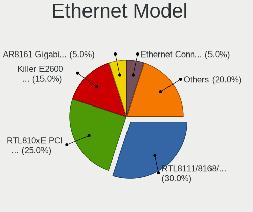

Endless - Hardware Trends (Notebooks)
-------------------------------------

A project to identify most popular hardware characteristics and track their change
over time based on data collected by Linux users at https://Linux-Hardware.org.

Anyone can contribute to this report by the [hw-probe](https://github.com/linuxhw/hw-probe) tool:

    sudo -E hw-probe -all -upload

This report is for one last month. Overall report since the beginning of time: [TestCoverage](https://github.com/linuxhw/TestCoverage)

Period: Jan, 2023.

Contents
--------

* [ System ](#system)
  - [ OS                       ](#os)
  - [ OS Family                ](#os-family)
  - [ Kernel                   ](#kernel)
  - [ Kernel Family            ](#kernel-family)
  - [ Kernel Major Ver.        ](#kernel-major-ver)
  - [ Arch                     ](#arch)
  - [ DE                       ](#de)
  - [ Display Server           ](#display-server)
  - [ Display Manager          ](#display-manager)
  - [ OS Lang                  ](#os-lang)
  - [ Boot Mode                ](#boot-mode)
  - [ Filesystem               ](#filesystem)
  - [ Part. scheme             ](#part-scheme)
  - [ Dual Boot with Linux/BSD ](#dual-boot-with-linuxbsd)
  - [ Dual Boot (Win)          ](#dual-boot-win)

* [ Board ](#board)
  - [ Vendor                   ](#vendor)
  - [ Model                    ](#model)
  - [ Model Family             ](#model-family)
  - [ MFG Year                 ](#mfg-year)
  - [ Form Factor              ](#form-factor)
  - [ Secure Boot              ](#secure-boot)
  - [ Coreboot                 ](#coreboot)
  - [ RAM Size                 ](#ram-size)
  - [ RAM Used                 ](#ram-used)
  - [ Total Drives             ](#total-drives)
  - [ Has CD-ROM               ](#has-cd-rom)
  - [ Has Ethernet             ](#has-ethernet)
  - [ Has WiFi                 ](#has-wifi)
  - [ Has Bluetooth            ](#has-bluetooth)

* [ Location ](#location)
  - [ Country                  ](#country)
  - [ City                     ](#city)

* [ Drives ](#drives)
  - [ Drive Vendor             ](#drive-vendor)
  - [ Drive Model              ](#drive-model)
  - [ HDD Vendor               ](#hdd-vendor)
  - [ SSD Vendor               ](#ssd-vendor)
  - [ Drive Kind               ](#drive-kind)
  - [ Drive Connector          ](#drive-connector)
  - [ Drive Size               ](#drive-size)
  - [ Space Total              ](#space-total)
  - [ Space Used               ](#space-used)
  - [ Malfunc. Drives          ](#malfunc-drives)
  - [ Malfunc. Drive Vendor    ](#malfunc-drive-vendor)
  - [ Malfunc. HDD Vendor      ](#malfunc-hdd-vendor)
  - [ Malfunc. Drive Kind      ](#malfunc-drive-kind)
  - [ Failed Drives            ](#failed-drives)
  - [ Failed Drive Vendor      ](#failed-drive-vendor)
  - [ Drive Status             ](#drive-status)

* [ Storage controller ](#storage-controller)
  - [ Storage Vendor           ](#storage-vendor)
  - [ Storage Model            ](#storage-model)
  - [ Storage Kind             ](#storage-kind)

* [ Processor ](#processor)
  - [ CPU Vendor               ](#cpu-vendor)
  - [ CPU Model                ](#cpu-model)
  - [ CPU Model Family         ](#cpu-model-family)
  - [ CPU Cores                ](#cpu-cores)
  - [ CPU Sockets              ](#cpu-sockets)
  - [ CPU Threads              ](#cpu-threads)
  - [ CPU Op-Modes             ](#cpu-op-modes)
  - [ CPU Microcode            ](#cpu-microcode)
  - [ CPU Microarch            ](#cpu-microarch)

* [ Graphics ](#graphics)
  - [ GPU Vendor               ](#gpu-vendor)
  - [ GPU Model                ](#gpu-model)
  - [ GPU Combo                ](#gpu-combo)
  - [ GPU Driver               ](#gpu-driver)
  - [ GPU Memory               ](#gpu-memory)

* [ Monitor ](#monitor)
  - [ Monitor Vendor           ](#monitor-vendor)
  - [ Monitor Model            ](#monitor-model)
  - [ Monitor Resolution       ](#monitor-resolution)
  - [ Monitor Diagonal         ](#monitor-diagonal)
  - [ Monitor Width            ](#monitor-width)
  - [ Aspect Ratio             ](#aspect-ratio)
  - [ Monitor Area             ](#monitor-area)
  - [ Pixel Density            ](#pixel-density)
  - [ Multiple Monitors        ](#multiple-monitors)

* [ Network ](#network)
  - [ Net Controller Vendor    ](#net-controller-vendor)
  - [ Net Controller Model     ](#net-controller-model)
  - [ Wireless Vendor          ](#wireless-vendor)
  - [ Wireless Model           ](#wireless-model)
  - [ Ethernet Vendor          ](#ethernet-vendor)
  - [ Ethernet Model           ](#ethernet-model)
  - [ Net Controller Kind      ](#net-controller-kind)
  - [ Used Controller          ](#used-controller)
  - [ NICs                     ](#nics)
  - [ IPv6                     ](#ipv6)

* [ Bluetooth ](#bluetooth)
  - [ Bluetooth Vendor         ](#bluetooth-vendor)
  - [ Bluetooth Model          ](#bluetooth-model)

* [ Sound ](#sound)
  - [ Sound Vendor             ](#sound-vendor)
  - [ Sound Model              ](#sound-model)

* [ Memory ](#memory)
  - [ Memory Vendor            ](#memory-vendor)
  - [ Memory Model             ](#memory-model)
  - [ Memory Kind              ](#memory-kind)
  - [ Memory Form Factor       ](#memory-form-factor)
  - [ Memory Size              ](#memory-size)
  - [ Memory Speed             ](#memory-speed)

* [ Printers & scanners ](#printers--scanners)
  - [ Printer Vendor           ](#printer-vendor)
  - [ Printer Model            ](#printer-model)
  - [ Scanner Vendor           ](#scanner-vendor)
  - [ Scanner Model            ](#scanner-model)

* [ Camera ](#camera)
  - [ Camera Vendor            ](#camera-vendor)
  - [ Camera Model             ](#camera-model)

* [ Security ](#security)
  - [ Fingerprint Vendor       ](#fingerprint-vendor)
  - [ Fingerprint Model        ](#fingerprint-model)
  - [ Chipcard Vendor          ](#chipcard-vendor)
  - [ Chipcard Model           ](#chipcard-model)

* [ Unsupported ](#unsupported)
  - [ Unsupported Devices      ](#unsupported-devices)
  - [ Unsupported Device Types ](#unsupported-device-types)

System
------

OS
--

Installed operating systems

| Name                  | Notebooks | Percent |
|-----------------------|-----------|---------|
| Endless 4.0.13        | 16        | 57.14%  |
| Endless 3.9.7         | 7         | 25%     |
| Endless 3.9.3-nexthw1 | 2         | 7.14%   |
| Endless 5.0.0         | 1         | 3.57%   |
| Endless 4.0.10        | 1         | 3.57%   |
| Endless 3.8.7-nexthw2 | 1         | 3.57%   |

OS Family
---------

OS without a version

| Name    | Notebooks | Percent |
|---------|-----------|---------|
| Endless | 28        | 100%    |

Kernel
------

Version of the Linux kernel

| Version           | Notebooks | Percent |
|-------------------|-----------|---------|
| 5.11.0-35-generic | 17        | 60.71%  |
| 5.8.0-14-generic  | 8         | 28.57%  |
| 5.11.0-12-generic | 2         | 7.14%   |
| 5.15.0-47-generic | 1         | 3.57%   |

Kernel Family
-------------

Linux kernel without a distro release

| Version | Notebooks | Percent |
|---------|-----------|---------|
| 5.11.0  | 19        | 67.86%  |
| 5.8.0   | 8         | 28.57%  |
| 5.15.0  | 1         | 3.57%   |

Kernel Major Ver.
-----------------

Linux kernel major version

| Version | Notebooks | Percent |
|---------|-----------|---------|
| 5.11    | 19        | 67.86%  |
| 5.8     | 8         | 28.57%  |
| 5.15    | 1         | 3.57%   |

Arch
----

OS architecture (x86_64, i586, etc.)

| Name   | Notebooks | Percent |
|--------|-----------|---------|
| x86_64 | 28        | 100%    |

DE
--

Desktop Environment

| Name  | Notebooks | Percent |
|-------|-----------|---------|
| GNOME | 28        | 100%    |

Display Server
--------------

X11 or Wayland

| Name    | Notebooks | Percent |
|---------|-----------|---------|
| X11     | 27        | 96.43%  |
| Wayland | 1         | 3.57%   |

Display Manager
---------------

SDDM, LightDM, etc.

| Name    | Notebooks | Percent |
|---------|-----------|---------|
| Unknown | 28        | 100%    |

OS Lang
-------

Language

| Lang  | Notebooks | Percent |
|-------|-----------|---------|
| pt_BR | 12        | 42.86%  |
| en_US | 5         | 17.86%  |
| fr_FR | 2         | 7.14%   |
| es_CO | 2         | 7.14%   |
| ru_RU | 1         | 3.57%   |
| ro_RO | 1         | 3.57%   |
| hu_HU | 1         | 3.57%   |
| hr_HR | 1         | 3.57%   |
| es_MX | 1         | 3.57%   |
| es_ES | 1         | 3.57%   |
| de_DE | 1         | 3.57%   |

Boot Mode
---------

EFI or BIOS

| Mode | Notebooks | Percent |
|------|-----------|---------|
| EFI  | 22        | 78.57%  |
| BIOS | 6         | 21.43%  |

Filesystem
----------

Type of filesystem

| Type | Notebooks | Percent |
|------|-----------|---------|
| Ext4 | 28        | 100%    |

Part. scheme
------------

Scheme of partitioning

| Type    | Notebooks | Percent |
|---------|-----------|---------|
| Unknown | 28        | 100%    |

Dual Boot with Linux/BSD
------------------------

Hosting more than one Linux/BSD

| Dual boot | Notebooks | Percent |
|-----------|-----------|---------|
| No        | 28        | 100%    |

Dual Boot (Win)
---------------

Hosting Linux and Windows

| Dual boot | Notebooks | Percent |
|-----------|-----------|---------|
| No        | 28        | 100%    |

Board
-----

Vendor
------

Motherboard manufacturer

| Name             | Notebooks | Percent |
|------------------|-----------|---------|
| ASUSTek Computer | 16        | 57.14%  |
| Acer             | 6         | 21.43%  |
| Lenovo           | 4         | 14.29%  |
| Packard Bell     | 1         | 3.57%   |
| Dell             | 1         | 3.57%   |

Model
-----

Motherboard model

| Name                                       | Notebooks | Percent |
|--------------------------------------------|-----------|---------|
| ASUS VivoBook_ASUSLaptop X515DA_X515DA     | 3         | 10.71%  |
| Acer Nitro AN515-44                        | 2         | 7.14%   |
| Packard Bell EasyNote ML65                 | 1         | 3.57%   |
| Lenovo ThinkPad W520 4284Y54               | 1         | 3.57%   |
| Lenovo IdeaPad S145-14IWL 81MU             | 1         | 3.57%   |
| Lenovo IdeaPad 320-15IKB 80YH              | 1         | 3.57%   |
| Lenovo G450 2949                           | 1         | 3.57%   |
| Dell XPS 13 9360                           | 1         | 3.57%   |
| ASUS ZenBook UX425UA_UM425UA               | 1         | 3.57%   |
| ASUS Z550SA                                | 1         | 3.57%   |
| ASUS X510UNR                               | 1         | 3.57%   |
| ASUS VivoBook_ASUSLaptop X515JA_X515JA     | 1         | 3.57%   |
| ASUS VivoBook_ASUSLaptop X515EA_X515EA     | 1         | 3.57%   |
| ASUS VivoBook_ASUSLaptop X513EAN_X513EAN   | 1         | 3.57%   |
| ASUS VivoBook_ASUSLaptop X513EAN_K513EA    | 1         | 3.57%   |
| ASUS VivoBook_ASUSLaptop X415JA_X415JA     | 1         | 3.57%   |
| ASUS VivoBook 15_ASUS Laptop X540MA_X540MA | 1         | 3.57%   |
| ASUS VivoBook 15_ASUS Laptop X540BA        | 1         | 3.57%   |
| ASUS VivoBook 12_ASUS Laptop E203MA_E203MA | 1         | 3.57%   |
| ASUS S301LA                                | 1         | 3.57%   |
| ASUS ASUS EXPERTBOOK B1500CEAE_B1500CEAE   | 1         | 3.57%   |
| Acer Nitro AN515-54                        | 1         | 3.57%   |
| Acer Aspire A517-51                        | 1         | 3.57%   |
| Acer Aspire A315-54                        | 1         | 3.57%   |
| Acer Aspire A315-21                        | 1         | 3.57%   |

Model Family
------------

Motherboard model prefix

| Name                  | Notebooks | Percent |
|-----------------------|-----------|---------|
| ASUS VivoBook         | 11        | 39.29%  |
| Acer Nitro            | 3         | 10.71%  |
| Acer Aspire           | 3         | 10.71%  |
| Lenovo IdeaPad        | 2         | 7.14%   |
| Packard Bell EasyNote | 1         | 3.57%   |
| Lenovo ThinkPad       | 1         | 3.57%   |
| Lenovo G450           | 1         | 3.57%   |
| Dell XPS              | 1         | 3.57%   |
| ASUS ZenBook          | 1         | 3.57%   |
| ASUS Z550SA           | 1         | 3.57%   |
| ASUS X510UNR          | 1         | 3.57%   |
| ASUS S301LA           | 1         | 3.57%   |
| ASUS ASUS             | 1         | 3.57%   |

MFG Year
--------

Motherboard manufacture year

| Year | Notebooks | Percent |
|------|-----------|---------|
| 2021 | 6         | 21.43%  |
| 2020 | 6         | 21.43%  |
| 2017 | 4         | 14.29%  |
| 2019 | 3         | 10.71%  |
| 2018 | 3         | 10.71%  |
| 2016 | 2         | 7.14%   |
| 2013 | 1         | 3.57%   |
| 2011 | 1         | 3.57%   |
| 2010 | 1         | 3.57%   |
| 2008 | 1         | 3.57%   |

Form Factor
-----------

Physical design of the computer

| Name     | Notebooks | Percent |
|----------|-----------|---------|
| Notebook | 28        | 100%    |

Secure Boot
-----------

Enabled or disabled

| State    | Notebooks | Percent |
|----------|-----------|---------|
| Disabled | 24        | 85.71%  |
| Enabled  | 4         | 14.29%  |

Coreboot
--------

Have coreboot on board

| Used | Notebooks | Percent |
|------|-----------|---------|
| No   | 28        | 100%    |

RAM Size
--------

Total RAM memory

| Size in GB | Notebooks | Percent |
|------------|-----------|---------|
| 4.01-8.0   | 12        | 42.86%  |
| 3.01-4.0   | 9         | 32.14%  |
| 8.01-16.0  | 4         | 14.29%  |
| 16.01-24.0 | 2         | 7.14%   |
| 2.01-3.0   | 1         | 3.57%   |

RAM Used
--------

Used RAM memory

| Used GB  | Notebooks | Percent |
|----------|-----------|---------|
| 1.01-2.0 | 9         | 32.14%  |
| 2.01-3.0 | 8         | 28.57%  |
| 4.01-8.0 | 4         | 14.29%  |
| 0.51-1.0 | 4         | 14.29%  |
| 3.01-4.0 | 3         | 10.71%  |

Total Drives
------------

Number of drives on board

| Drives | Notebooks | Percent |
|--------|-----------|---------|
| 1      | 24        | 85.71%  |
| 2      | 4         | 14.29%  |

Has CD-ROM
----------

Has CD-ROM on board

| Presented | Notebooks | Percent |
|-----------|-----------|---------|
| No        | 24        | 85.71%  |
| Yes       | 4         | 14.29%  |

Has Ethernet
------------

Has Ethernet on board

| Presented | Notebooks | Percent |
|-----------|-----------|---------|
| No        | 15        | 53.57%  |
| Yes       | 13        | 46.43%  |

Has WiFi
--------

Has WiFi module

| Presented | Notebooks | Percent |
|-----------|-----------|---------|
| Yes       | 28        | 100%    |

Has Bluetooth
-------------

Has Bluetooth module

| Presented | Notebooks | Percent |
|-----------|-----------|---------|
| Yes       | 25        | 89.29%  |
| No        | 3         | 10.71%  |

Location
--------

Country
-------

Geographic location (country)

| Country   | Notebooks | Percent |
|-----------|-----------|---------|
| Brazil    | 12        | 42.86%  |
| Colombia  | 3         | 10.71%  |
| Russia    | 2         | 7.14%   |
| Romania   | 2         | 7.14%   |
| Germany   | 2         | 7.14%   |
| France    | 2         | 7.14%   |
| USA       | 1         | 3.57%   |
| Spain     | 1         | 3.57%   |
| Indonesia | 1         | 3.57%   |
| Hungary   | 1         | 3.57%   |
| Croatia   | 1         | 3.57%   |

City
----

Geographic location (city)

| City                 | Notebooks | Percent |
|----------------------|-----------|---------|
| Sao Paulo            | 4         | 14.29%  |
| Campo Grande         | 2         | 7.14%   |
| Zheleznodorozhnyy    | 1         | 3.57%   |
| Vélizy-Villacoublay | 1         | 3.57%   |
| Tunja                | 1         | 3.57%   |
| Szombathely          | 1         | 3.57%   |
| Stolberg             | 1         | 3.57%   |
| Sighetu Marmaţiei   | 1         | 3.57%   |
| Rosenheim            | 1         | 3.57%   |
| Recife               | 1         | 3.57%   |
| Quijas               | 1         | 3.57%   |
| Popesti-Leordeni     | 1         | 3.57%   |
| Osijek               | 1         | 3.57%   |
| Moscow               | 1         | 3.57%   |
| Lorica               | 1         | 3.57%   |
| Fortaleza            | 1         | 3.57%   |
| Fameck               | 1         | 3.57%   |
| Depok                | 1         | 3.57%   |
| Dallas               | 1         | 3.57%   |
| Campina Grande       | 1         | 3.57%   |
| Camaçari            | 1         | 3.57%   |
| Birigui              | 1         | 3.57%   |
| Barranquilla         | 1         | 3.57%   |
| Barra Do Garcas      | 1         | 3.57%   |

Drives
------

Drive Vendor
------------

Hard drive vendors

| Vendor              | Notebooks | Drives | Percent |
|---------------------|-----------|--------|---------|
| ADATA Technology    | 5         | 5      | 15.63%  |
| Seagate             | 4         | 4      | 12.5%   |
| Sandisk             | 4         | 4      | 12.5%   |
| WDC                 | 3         | 3      | 9.38%   |
| Micron Technology   | 3         | 3      | 9.38%   |
| Toshiba             | 2         | 2      | 6.25%   |
| Samsung Electronics | 2         | 2      | 6.25%   |
| Intel               | 2         | 2      | 6.25%   |
| China               | 2         | 2      | 6.25%   |
| XrayDisk            | 1         | 1      | 3.13%   |
| Unknown             | 1         | 1      | 3.13%   |
| SK hynix            | 1         | 1      | 3.13%   |
| Phison Electronics  | 1         | 1      | 3.13%   |
| Hitachi             | 1         | 1      | 3.13%   |

Drive Model
-----------

Hard drive models

| Model                                               | Notebooks | Percent |
|-----------------------------------------------------|-----------|---------|
| ADATA SM2P32A8-256GC1 256GB                         | 5         | 15.63%  |
| Sandisk WD Blue SN550 NVMe SSD 1TB                  | 3         | 9.38%   |
| WDC WD10SPZX-21Z10T0 1TB                            | 2         | 6.25%   |
| Seagate ST1000LM035-1RK172 1TB                      | 2         | 6.25%   |
| XrayDisk 480GB SSD                                  | 1         | 3.13%   |
| WDC WD5000LPCX-80VHAT0 500GB                        | 1         | 3.13%   |
| Unknown MMC Card  64GB                              | 1         | 3.13%   |
| Toshiba MQ04ABF100 1TB                              | 1         | 3.13%   |
| Toshiba MQ01ABF050 500GB                            | 1         | 3.13%   |
| SK hynix HFM512GD3JX013N 512GB                      | 1         | 3.13%   |
| Seagate ST9250827AS 250GB                           | 1         | 3.13%   |
| Seagate ST500LT012-1DG142 500GB                     | 1         | 3.13%   |
| SanDisk SD9SN8W128G1002 128GB SSD                   | 1         | 3.13%   |
| Samsung SSD 870 EVO 500GB                           | 1         | 3.13%   |
| Samsung NVMe SSD Controller SM961/PM961/SM963 256GB | 1         | 3.13%   |
| Phison PS5013 E13 NVMe Controller 256GB             | 1         | 3.13%   |
| Micron 2210_MTFDHBA512QFD 512GB                     | 1         | 3.13%   |
| Micron 1300_MTFDDAK256TDL 256GB SSD                 | 1         | 3.13%   |
| Micron 1100_MTFDDAV256TBN 256GB SSD                 | 1         | 3.13%   |
| Intel WDC PC SN520 SDAPNUW-512G-1014 512GB          | 1         | 3.13%   |
| Intel IM2P33F8BR1-128GB                             | 1         | 3.13%   |
| Hitachi HTS543225A7A384 250GB                       | 1         | 3.13%   |
| China SSD 480GB                                     | 1         | 3.13%   |
| China SSD 128GB                                     | 1         | 3.13%   |

HDD Vendor
----------

Hard disk drive vendors

| Vendor  | Notebooks | Drives | Percent |
|---------|-----------|--------|---------|
| Seagate | 4         | 4      | 40%     |
| WDC     | 3         | 3      | 30%     |
| Toshiba | 2         | 2      | 20%     |
| Hitachi | 1         | 1      | 10%     |

SSD Vendor
----------

Solid state drive vendors

| Vendor              | Notebooks | Drives | Percent |
|---------------------|-----------|--------|---------|
| Micron Technology   | 2         | 2      | 28.57%  |
| China               | 2         | 2      | 28.57%  |
| XrayDisk            | 1         | 1      | 14.29%  |
| SanDisk             | 1         | 1      | 14.29%  |
| Samsung Electronics | 1         | 1      | 14.29%  |

Drive Kind
----------

HDD or SSD

| Kind | Notebooks | Drives | Percent |
|------|-----------|--------|---------|
| NVMe | 14        | 14     | 43.75%  |
| HDD  | 10        | 10     | 31.25%  |
| SSD  | 7         | 7      | 21.88%  |
| MMC  | 1         | 1      | 3.13%   |

Drive Connector
---------------

SATA, SAS, NVMe, etc.

| Type | Notebooks | Drives | Percent |
|------|-----------|--------|---------|
| SATA | 15        | 17     | 50%     |
| NVMe | 14        | 14     | 46.67%  |
| MMC  | 1         | 1      | 3.33%   |

Drive Size
----------

Size of hard drive

| Size in TB | Notebooks | Drives | Percent |
|------------|-----------|--------|---------|
| 0.01-0.5   | 12        | 12     | 70.59%  |
| 0.51-1.0   | 5         | 5      | 29.41%  |

Space Total
-----------

Amount of disk space available on the file system

| Size in GB | Notebooks | Percent |
|------------|-----------|---------|
| 101-250    | 11        | 39.29%  |
| 251-500    | 9         | 32.14%  |
| 501-1000   | 4         | 14.29%  |
| 1-20       | 2         | 7.14%   |
| 1001-2000  | 1         | 3.57%   |
| 51-100     | 1         | 3.57%   |

Space Used
----------

Amount of used disk space

| Used GB  | Notebooks | Percent |
|----------|-----------|---------|
| 21-50    | 15        | 53.57%  |
| 101-250  | 4         | 14.29%  |
| 1-20     | 3         | 10.71%  |
| 51-100   | 3         | 10.71%  |
| 251-500  | 2         | 7.14%   |
| 501-1000 | 1         | 3.57%   |

Malfunc. Drives
---------------

Drive models with a malfunction

Zero info for selected period =(

Malfunc. Drive Vendor
---------------------

Vendors of faulty drives

Zero info for selected period =(

Malfunc. HDD Vendor
-------------------

Vendors of faulty HDD drives

Zero info for selected period =(

Malfunc. Drive Kind
-------------------

Kinds of faulty drives

Zero info for selected period =(

Failed Drives
-------------

Failed drive models

Zero info for selected period =(

Failed Drive Vendor
-------------------

Failed drive vendors

Zero info for selected period =(

Drive Status
------------

Number of failed and malfunc. drives

| Status   | Notebooks | Drives | Percent |
|----------|-----------|--------|---------|
| Detected | 28        | 32     | 100%    |

Storage controller
------------------

Storage Vendor
--------------

Storage controller vendors

| Vendor              | Notebooks | Percent |
|---------------------|-----------|---------|
| Intel               | 19        | 50%     |
| AMD                 | 7         | 18.42%  |
| ADATA Technology    | 5         | 13.16%  |
| SanDisk             | 3         | 7.89%   |
| SK hynix            | 1         | 2.63%   |
| Samsung Electronics | 1         | 2.63%   |
| Phison Electronics  | 1         | 2.63%   |
| Micron Technology   | 1         | 2.63%   |

Storage Model
-------------

Storage controller models

| Model                                                                            | Notebooks | Percent |
|----------------------------------------------------------------------------------|-----------|---------|
| AMD FCH SATA Controller [AHCI mode]                                              | 7         | 15.91%  |
| Intel 82801 Mobile SATA Controller [RAID mode]                                   | 5         | 11.36%  |
| ADATA A Non-Volatile memory controller                                           | 5         | 11.36%  |
| Intel Volume Management Device NVMe RAID Controller                              | 4         | 9.09%   |
| Intel Tiger Lake-LP SATA Controller                                              | 4         | 9.09%   |
| SanDisk WD Blue SN550 NVMe SSD                                                   | 3         | 6.82%   |
| Intel Sunrise Point-LP SATA Controller [AHCI mode]                               | 3         | 6.82%   |
| Intel PROSet/Wireless WiFi Software extension                                    | 2         | 4.55%   |
| Intel 82801IBM/IEM (ICH9M/ICH9M-E) 4 port SATA Controller [AHCI mode]            | 2         | 4.55%   |
| SK hynix Gold P31/PC711 NVMe Solid State Drive                                   | 1         | 2.27%   |
| Samsung NVMe SSD Controller SM961/PM961/SM963                                    | 1         | 2.27%   |
| Phison PS5013 E13 NVMe Controller                                                | 1         | 2.27%   |
| Micron Non-Volatile memory controller                                            | 1         | 2.27%   |
| Intel Celeron/Pentium Silver Processor SATA Controller                           | 1         | 2.27%   |
| Intel Cannon Point-LP SATA Controller [AHCI Mode]                                | 1         | 2.27%   |
| Intel Atom/Celeron/Pentium Processor x5-E8000/J3xxx/N3xxx Series SATA Controller | 1         | 2.27%   |
| Intel 8 Series SATA Controller 1 [AHCI mode]                                     | 1         | 2.27%   |
| Intel 6 Series/C200 Series Chipset Family 6 port Mobile SATA AHCI Controller     | 1         | 2.27%   |

Storage Kind
------------

Kind of storage controller (IDE, SATA, NVMe, SAS, ...)

| Kind | Notebooks | Percent |
|------|-----------|---------|
| SATA | 23        | 52.27%  |
| NVMe | 14        | 31.82%  |
| RAID | 7         | 15.91%  |

Processor
---------

CPU Vendor
----------

Processor vendors

| Vendor | Notebooks | Percent |
|--------|-----------|---------|
| Intel  | 20        | 71.43%  |
| AMD    | 8         | 28.57%  |

CPU Model
---------

Processor models

| Model                                         | Notebooks | Percent |
|-----------------------------------------------|-----------|---------|
| AMD Ryzen 5 3500U with Radeon Vega Mobile Gfx | 3         | 10.71%  |
| Intel Core i5-8250U CPU @ 1.60GHz             | 2         | 7.14%   |
| Intel Celeron N4000 CPU @ 1.10GHz             | 2         | 7.14%   |
| Intel 11th Gen Core i7-1165G7 @ 2.80GHz       | 2         | 7.14%   |
| Intel 11th Gen Core i3-1115G4 @ 3.00GHz       | 2         | 7.14%   |
| AMD Ryzen 5 4600H with Radeon Graphics        | 2         | 7.14%   |
| Intel Pentium Dual-Core CPU T4400 @ 2.20GHz   | 1         | 3.57%   |
| Intel Core i7-7500U CPU @ 2.70GHz             | 1         | 3.57%   |
| Intel Core i5-9300H CPU @ 2.40GHz             | 1         | 3.57%   |
| Intel Core i5-4200U CPU @ 1.60GHz             | 1         | 3.57%   |
| Intel Core i5-1035G1 CPU @ 1.00GHz            | 1         | 3.57%   |
| Intel Core i5-10210U CPU @ 1.60GHz            | 1         | 3.57%   |
| Intel Core i3-6006U CPU @ 2.00GHz             | 1         | 3.57%   |
| Intel Core i3-1005G1 CPU @ 1.20GHz            | 1         | 3.57%   |
| Intel Core 2 Duo CPU T6400 @ 2.00GHz          | 1         | 3.57%   |
| Intel Celeron CPU N3160 @ 1.60GHz             | 1         | 3.57%   |
| Intel Celeron CPU B810 @ 1.60GHz              | 1         | 3.57%   |
| Intel Celeron CPU 4205U @ 1.80GHz             | 1         | 3.57%   |
| AMD Ryzen 7 5700U with Radeon Graphics        | 1         | 3.57%   |
| AMD A9-9425 RADEON R5, 5 COMPUTE CORES 2C+3G  | 1         | 3.57%   |
| AMD A9-9420 RADEON R5, 5 COMPUTE CORES 2C+3G  | 1         | 3.57%   |

CPU Model Family
----------------

Processor model prefix

| Model                   | Notebooks | Percent |
|-------------------------|-----------|---------|
| Other                   | 6         | 21.43%  |
| Intel Core i5           | 6         | 21.43%  |
| Intel Celeron           | 5         | 17.86%  |
| AMD Ryzen 5             | 5         | 17.86%  |
| Intel Core i3           | 2         | 7.14%   |
| Intel Pentium Dual-Core | 1         | 3.57%   |
| Intel Core i7           | 1         | 3.57%   |
| Intel Core 2 Duo        | 1         | 3.57%   |
| AMD Ryzen 7             | 1         | 3.57%   |

CPU Cores
---------

Number of processor cores

| Number | Notebooks | Percent |
|--------|-----------|---------|
| 2      | 14        | 50%     |
| 4      | 11        | 39.29%  |
| 6      | 2         | 7.14%   |
| 8      | 1         | 3.57%   |

CPU Sockets
-----------

Number of sockets

| Number | Notebooks | Percent |
|--------|-----------|---------|
| 1      | 28        | 100%    |

CPU Threads
-----------

Threads per core (Hyper-Threading)

| Number | Notebooks | Percent |
|--------|-----------|---------|
| 2      | 19        | 67.86%  |
| 1      | 9         | 32.14%  |

CPU Op-Modes
------------

CPU Operation Modes (32-bit, 64-bit)

| Op mode        | Notebooks | Percent |
|----------------|-----------|---------|
| 32-bit, 64-bit | 28        | 100%    |

CPU Microcode
-------------

Microcode number

| Number     | Notebooks | Percent |
|------------|-----------|---------|
| 0x806c1    | 4         | 14.29%  |
| 0x08108109 | 3         | 10.71%  |
| 0x806ea    | 2         | 7.14%   |
| 0x706e5    | 2         | 7.14%   |
| 0x706a1    | 2         | 7.14%   |
| 0x1067a    | 2         | 7.14%   |
| 0x08600103 | 2         | 7.14%   |
| 0x906ea    | 1         | 3.57%   |
| 0x806eb    | 1         | 3.57%   |
| 0x806e9    | 1         | 3.57%   |
| 0x406e3    | 1         | 3.57%   |
| 0x406c4    | 1         | 3.57%   |
| 0x40651    | 1         | 3.57%   |
| 0x206a7    | 1         | 3.57%   |
| 0x08608103 | 1         | 3.57%   |
| 0x06006705 | 1         | 3.57%   |
| 0x06006704 | 1         | 3.57%   |
| Unknown    | 1         | 3.57%   |

CPU Microarch
-------------

Microarchitecture

| Name          | Notebooks | Percent |
|---------------|-----------|---------|
| KabyLake      | 6         | 21.43%  |
| TigerLake     | 4         | 14.29%  |
| Zen+          | 3         | 10.71%  |
| Zen 2         | 2         | 7.14%   |
| Penryn        | 2         | 7.14%   |
| IceLake       | 2         | 7.14%   |
| Goldmont plus | 2         | 7.14%   |
| Excavator     | 2         | 7.14%   |
| Skylake       | 1         | 3.57%   |
| Silvermont    | 1         | 3.57%   |
| SandyBridge   | 1         | 3.57%   |
| Haswell       | 1         | 3.57%   |
| Unknown       | 1         | 3.57%   |

Graphics
--------

GPU Vendor
----------

Vendors of graphics cards

| Vendor | Notebooks | Percent |
|--------|-----------|---------|
| Intel  | 19        | 59.38%  |
| AMD    | 9         | 28.13%  |
| Nvidia | 4         | 12.5%   |

GPU Model
---------

Graphics card models

| Model                                                                                    | Notebooks | Percent |
|------------------------------------------------------------------------------------------|-----------|---------|
| AMD Picasso/Raven 2 [Radeon Vega Series / Radeon Vega Mobile Series]                     | 3         | 9.38%   |
| Nvidia TU117M                                                                            | 2         | 6.25%   |
| Intel UHD Graphics 620                                                                   | 2         | 6.25%   |
| Intel TigerLake-LP GT2 [Iris Xe Graphics]                                                | 2         | 6.25%   |
| Intel Tiger Lake-LP GT2 [UHD Graphics G4]                                                | 2         | 6.25%   |
| Intel Iris Plus Graphics G1 (Ice Lake)                                                   | 2         | 6.25%   |
| Intel GeminiLake [UHD Graphics 600]                                                      | 2         | 6.25%   |
| AMD Stoney [Radeon R2/R3/R4/R5 Graphics]                                                 | 2         | 6.25%   |
| AMD Renoir                                                                               | 2         | 6.25%   |
| Nvidia GP108M [GeForce MX150]                                                            | 1         | 3.13%   |
| Nvidia GF108GLM [Quadro 1000M]                                                           | 1         | 3.13%   |
| Intel Whiskey Lake-U GT1 [UHD Graphics 610]                                              | 1         | 3.13%   |
| Intel Mobile 4 Series Chipset Integrated Graphics Controller                             | 1         | 3.13%   |
| Intel HD Graphics 620                                                                    | 1         | 3.13%   |
| Intel HD Graphics 520                                                                    | 1         | 3.13%   |
| Intel Haswell-ULT Integrated Graphics Controller                                         | 1         | 3.13%   |
| Intel CometLake-U GT2 [UHD Graphics]                                                     | 1         | 3.13%   |
| Intel CoffeeLake-H GT2 [UHD Graphics 630]                                                | 1         | 3.13%   |
| Intel Atom/Celeron/Pentium Processor x5-E8000/J3xxx/N3xxx Integrated Graphics Controller | 1         | 3.13%   |
| Intel 2nd Generation Core Processor Family Integrated Graphics Controller                | 1         | 3.13%   |
| AMD RV620/M82 [Mobility Radeon HD 3410/3430]                                             | 1         | 3.13%   |
| AMD Lucienne                                                                             | 1         | 3.13%   |

GPU Combo
---------

Combinations of graphics cards

| Name           | Notebooks | Percent |
|----------------|-----------|---------|
| 1 x Intel      | 17        | 60.71%  |
| 1 x AMD        | 7         | 25%     |
| Intel + Nvidia | 2         | 7.14%   |
| AMD + Nvidia   | 2         | 7.14%   |

GPU Driver
----------

Free vs proprietary

| Driver      | Notebooks | Percent |
|-------------|-----------|---------|
| Free        | 25        | 89.29%  |
| Proprietary | 3         | 10.71%  |

GPU Memory
----------

Total video memory

| Size in GB | Notebooks | Percent |
|------------|-----------|---------|
| Unknown    | 19        | 67.86%  |
| 0.01-0.5   | 6         | 21.43%  |
| 1.01-2.0   | 3         | 10.71%  |

Monitor
-------

Monitor Vendor
--------------

Monitor vendors

| Vendor                  | Notebooks | Percent |
|-------------------------|-----------|---------|
| Chimei Innolux          | 11        | 39.29%  |
| BOE                     | 5         | 17.86%  |
| AU Optronics            | 4         | 14.29%  |
| PANDA                   | 3         | 10.71%  |
| Sharp                   | 1         | 3.57%   |
| LG Philips              | 1         | 3.57%   |
| LG Display              | 1         | 3.57%   |
| Lenovo                  | 1         | 3.57%   |
| Chi Mei Optoelectronics | 1         | 3.57%   |

Monitor Model
-------------

Monitor models

| Model                                                                    | Notebooks | Percent |
|--------------------------------------------------------------------------|-----------|---------|
| Chimei Innolux LCD Monitor CMN15F5 1920x1080 344x193mm 15.5-inch         | 3         | 10.71%  |
| PANDA LCD Monitor NCP0046 1920x1080 344x194mm 15.5-inch                  | 2         | 7.14%   |
| Chimei Innolux LCD Monitor CMN15E6 1366x768 344x193mm 15.5-inch          | 2         | 7.14%   |
| Chimei Innolux LCD Monitor CMN15D5 1920x1080 344x193mm 15.5-inch         | 2         | 7.14%   |
| BOE LCD Monitor BOE07AA 1366x768 344x194mm 15.5-inch                     | 2         | 7.14%   |
| BOE LCD Monitor BOE06A5 1366x768 344x194mm 15.5-inch                     | 2         | 7.14%   |
| AU Optronics LCD Monitor AUO21ED 1920x1080 344x194mm 15.5-inch           | 2         | 7.14%   |
| Sharp LCD Monitor SHP1449 1920x1080 294x165mm 13.3-inch                  | 1         | 3.57%   |
| PANDA LCD Monitor NCP004D 1920x1080 344x194mm 15.5-inch                  | 1         | 3.57%   |
| LG Philips LCD Monitor LPL3B01 1280x800 331x207mm 15.4-inch              | 1         | 3.57%   |
| LG Display LCD Monitor LGD056D 1920x1080 382x215mm 17.3-inch             | 1         | 3.57%   |
| Lenovo LCD Monitor LEN40B1 1600x900 344x193mm 15.5-inch                  | 1         | 3.57%   |
| Chimei Innolux LCD Monitor CMN15CA 1366x768 344x193mm 15.5-inch          | 1         | 3.57%   |
| Chimei Innolux LCD Monitor CMN14D5 1920x1080 309x173mm 13.9-inch         | 1         | 3.57%   |
| Chimei Innolux LCD Monitor CMN1476 1366x768 309x174mm 14.0-inch          | 1         | 3.57%   |
| Chimei Innolux LCD Monitor CMN1130 1366x768 256x144mm 11.6-inch          | 1         | 3.57%   |
| Chi Mei Optoelectronics LCD Monitor CMO1333 1366x768 293x164mm 13.2-inch | 1         | 3.57%   |
| BOE LCD Monitor BOE0757 1366x768 344x194mm 15.5-inch                     | 1         | 3.57%   |
| AU Optronics LCD Monitor AUOAF90 1920x1080 344x193mm 15.5-inch           | 1         | 3.57%   |
| AU Optronics LCD Monitor AUO8098 1920x1080 309x174mm 14.0-inch           | 1         | 3.57%   |

Monitor Resolution
------------------

Monitor screen resolution

| Resolution      | Notebooks | Percent |
|-----------------|-----------|---------|
| 1920x1080 (FHD) | 15        | 53.57%  |
| 1366x768 (WXGA) | 11        | 39.29%  |
| 1600x900 (HD+)  | 1         | 3.57%   |
| 1280x800 (WXGA) | 1         | 3.57%   |

Monitor Diagonal
----------------

Diagonal size in inches

| Inches | Notebooks | Percent |
|--------|-----------|---------|
| 15     | 21        | 75%     |
| 13     | 3         | 10.71%  |
| 14     | 2         | 7.14%   |
| 17     | 1         | 3.57%   |
| 11     | 1         | 3.57%   |

Monitor Width
-------------

Physical width

| Width in mm | Notebooks | Percent |
|-------------|-----------|---------|
| 301-350     | 24        | 85.71%  |
| 201-300     | 3         | 10.71%  |
| 351-400     | 1         | 3.57%   |

Aspect Ratio
------------

Proportional relationship between the width and the height

| Ratio | Notebooks | Percent |
|-------|-----------|---------|
| 16/9  | 27        | 96.43%  |
| 16/10 | 1         | 3.57%   |

Monitor Area
------------

Area in inch²

| Area in inch² | Notebooks | Percent |
|----------------|-----------|---------|
| 101-110        | 21        | 75%     |
| 81-90          | 3         | 10.71%  |
| 71-80          | 2         | 7.14%   |
| 51-60          | 1         | 3.57%   |
| 121-130        | 1         | 3.57%   |

Pixel Density
-------------

Pixels per inch

| Density | Notebooks | Percent |
|---------|-----------|---------|
| 121-160 | 15        | 53.57%  |
| 101-120 | 11        | 39.29%  |
| 161-240 | 1         | 3.57%   |
| 51-100  | 1         | 3.57%   |

Multiple Monitors
-----------------

Total monitors connected

| Total | Notebooks | Percent |
|-------|-----------|---------|
| 1     | 28        | 100%    |

Network
-------

Net Controller Vendor
---------------------

Controller vendors

| Vendor                            | Notebooks | Percent |
|-----------------------------------|-----------|---------|
| Realtek Semiconductor             | 17        | 45.95%  |
| Intel                             | 13        | 35.14%  |
| Qualcomm Atheros                  | 4         | 10.81%  |
| MediaTek                          | 1         | 2.7%    |
| Ericsson Business Mobile Networks | 1         | 2.7%    |
| Broadcom                          | 1         | 2.7%    |

Net Controller Model
--------------------

Controller models

| Model                                                             | Notebooks | Percent |
|-------------------------------------------------------------------|-----------|---------|
| Realtek RTL8821CE 802.11ac PCIe Wireless Network Adapter          | 6         | 14.29%  |
| Realtek RTL8111/8168/8411 PCI Express Gigabit Ethernet Controller | 6         | 14.29%  |
| Intel Wi-Fi 6 AX201                                               | 4         | 9.52%   |
| Qualcomm Atheros QCA9377 802.11ac Wireless Network Adapter        | 3         | 7.14%   |
| Intel Wi-Fi 6 AX200                                               | 3         | 7.14%   |
| Realtek RTL810xE PCI Express Fast Ethernet controller             | 2         | 4.76%   |
| Realtek Killer E2600 Gigabit Ethernet Controller                  | 2         | 4.76%   |
| Intel Wireless 8265 / 8275                                        | 2         | 4.76%   |
| Realtek RTL8822BE 802.11a/b/g/n/ac WiFi adapter                   | 1         | 2.38%   |
| Realtek RTL8723BE PCIe Wireless Network Adapter                   | 1         | 2.38%   |
| Realtek RTL8187B Wireless 802.11g 54Mbps Network Adapter          | 1         | 2.38%   |
| Qualcomm Atheros QCA6174 802.11ac Wireless Network Adapter        | 1         | 2.38%   |
| MediaTek MT7630e 802.11bgn Wireless Network Adapter               | 1         | 2.38%   |
| Intel Gemini Lake PCH CNVi WiFi                                   | 1         | 2.38%   |
| Intel Ethernet Connection (13) I219-V                             | 1         | 2.38%   |
| Intel Dual Band Wireless-AC 3165 Plus Bluetooth                   | 1         | 2.38%   |
| Intel Centrino Advanced-N 6205 [Taylor Peak]                      | 1         | 2.38%   |
| Intel Cannon Point-LP CNVi [Wireless-AC]                          | 1         | 2.38%   |
| Intel 82579LM Gigabit Network Connection (Lewisville)             | 1         | 2.38%   |
| Ericsson Business Mobile Networks F5521gw                         | 1         | 2.38%   |
| Broadcom NetLink BCM5906M Fast Ethernet PCI Express               | 1         | 2.38%   |
| Broadcom BCM4312 802.11b/g LP-PHY                                 | 1         | 2.38%   |

Wireless Vendor
---------------

Wireless vendors

| Vendor                | Notebooks | Percent |
|-----------------------|-----------|---------|
| Intel                 | 13        | 46.43%  |
| Realtek Semiconductor | 9         | 32.14%  |
| Qualcomm Atheros      | 4         | 14.29%  |
| MediaTek              | 1         | 3.57%   |
| Broadcom              | 1         | 3.57%   |

Wireless Model
--------------

Wireless models

| Model                                                      | Notebooks | Percent |
|------------------------------------------------------------|-----------|---------|
| Realtek RTL8821CE 802.11ac PCIe Wireless Network Adapter   | 6         | 21.43%  |
| Intel Wi-Fi 6 AX201                                        | 4         | 14.29%  |
| Qualcomm Atheros QCA9377 802.11ac Wireless Network Adapter | 3         | 10.71%  |
| Intel Wi-Fi 6 AX200                                        | 3         | 10.71%  |
| Intel Wireless 8265 / 8275                                 | 2         | 7.14%   |
| Realtek RTL8822BE 802.11a/b/g/n/ac WiFi adapter            | 1         | 3.57%   |
| Realtek RTL8723BE PCIe Wireless Network Adapter            | 1         | 3.57%   |
| Realtek RTL8187B Wireless 802.11g 54Mbps Network Adapter   | 1         | 3.57%   |
| Qualcomm Atheros QCA6174 802.11ac Wireless Network Adapter | 1         | 3.57%   |
| MediaTek MT7630e 802.11bgn Wireless Network Adapter        | 1         | 3.57%   |
| Intel Gemini Lake PCH CNVi WiFi                            | 1         | 3.57%   |
| Intel Dual Band Wireless-AC 3165 Plus Bluetooth            | 1         | 3.57%   |
| Intel Centrino Advanced-N 6205 [Taylor Peak]               | 1         | 3.57%   |
| Intel Cannon Point-LP CNVi [Wireless-AC]                   | 1         | 3.57%   |
| Broadcom BCM4312 802.11b/g LP-PHY                          | 1         | 3.57%   |

Ethernet Vendor
---------------

Ethernet vendors

| Vendor                | Notebooks | Percent |
|-----------------------|-----------|---------|
| Realtek Semiconductor | 10        | 76.92%  |
| Intel                 | 2         | 15.38%  |
| Broadcom              | 1         | 7.69%   |

Ethernet Model
--------------

Ethernet models

| Model                                                             | Notebooks | Percent |
|-------------------------------------------------------------------|-----------|---------|
| Realtek RTL8111/8168/8411 PCI Express Gigabit Ethernet Controller | 6         | 46.15%  |
| Realtek RTL810xE PCI Express Fast Ethernet controller             | 2         | 15.38%  |
| Realtek Killer E2600 Gigabit Ethernet Controller                  | 2         | 15.38%  |
| Intel Ethernet Connection (13) I219-V                             | 1         | 7.69%   |
| Intel 82579LM Gigabit Network Connection (Lewisville)             | 1         | 7.69%   |
| Broadcom NetLink BCM5906M Fast Ethernet PCI Express               | 1         | 7.69%   |

Net Controller Kind
-------------------

Ethernet, WiFi or modem

| Kind     | Notebooks | Percent |
|----------|-----------|---------|
| WiFi     | 28        | 66.67%  |
| Ethernet | 13        | 30.95%  |
| Modem    | 1         | 2.38%   |

Used Controller
---------------

Currently used network controller

| Kind     | Notebooks | Percent |
|----------|-----------|---------|
| WiFi     | 26        | 92.86%  |
| Ethernet | 2         | 7.14%   |

NICs
----

Total network controllers on board

| Total | Notebooks | Percent |
|-------|-----------|---------|
| 1     | 16        | 57.14%  |
| 2     | 12        | 42.86%  |

IPv6
----

IPv6 vs IPv4

| Used | Notebooks | Percent |
|------|-----------|---------|
| Yes  | 18        | 64.29%  |
| No   | 10        | 35.71%  |

Bluetooth
---------

Bluetooth Vendor
----------------

Controller vendors

| Vendor                          | Notebooks | Percent |
|---------------------------------|-----------|---------|
| Intel                           | 12        | 48%     |
| IMC Networks                    | 7         | 28%     |
| Lite-On Technology              | 3         | 12%     |
| Realtek Semiconductor           | 1         | 4%      |
| Qualcomm Atheros Communications | 1         | 4%      |
| Foxconn / Hon Hai               | 1         | 4%      |

Bluetooth Model
---------------

Controller models

| Model                                          | Notebooks | Percent |
|------------------------------------------------|-----------|---------|
| IMC Networks Bluetooth Radio                   | 7         | 28%     |
| Intel Bluetooth 9460/9560 Jefferson Peak (JfP) | 4         | 16%     |
| Lite-On Bluetooth Device                       | 3         | 12%     |
| Intel Bluetooth wireless interface             | 3         | 12%     |
| Intel AX200 Bluetooth                          | 3         | 12%     |
| Intel Bluetooth Device                         | 2         | 8%      |
| Realtek Bluetooth Radio                        | 1         | 4%      |
| Qualcomm Atheros  Bluetooth Device             | 1         | 4%      |
| Foxconn / Hon Hai BT                           | 1         | 4%      |

Sound
-----

Sound Vendor
------------

Sound card vendors

| Vendor | Notebooks | Percent |
|--------|-----------|---------|
| Intel  | 20        | 62.5%   |
| AMD    | 9         | 28.13%  |
| Nvidia | 3         | 9.38%   |

Sound Model
-----------

Sound card models

| Model                                                                                             | Notebooks | Percent |
|---------------------------------------------------------------------------------------------------|-----------|---------|
| AMD Family 17h/19h HD Audio Controller                                                            | 6         | 15.38%  |
| Intel Tiger Lake-LP Smart Sound Technology Audio Controller                                       | 4         | 10.26%  |
| Intel Sunrise Point-LP HD Audio                                                                   | 4         | 10.26%  |
| AMD Raven/Raven2/Fenghuang HDMI/DP Audio Controller                                               | 3         | 7.69%   |
| Nvidia TU107 GeForce GTX 1650 High Definition Audio Controller                                    | 2         | 5.13%   |
| Intel Ice Lake-LP Smart Sound Technology Audio Controller                                         | 2         | 5.13%   |
| Intel Celeron/Pentium Silver Processor High Definition Audio                                      | 2         | 5.13%   |
| Intel 82801I (ICH9 Family) HD Audio Controller                                                    | 2         | 5.13%   |
| AMD High Definition Audio Controller                                                              | 2         | 5.13%   |
| AMD Family 15h (Models 60h-6fh) Audio Controller                                                  | 2         | 5.13%   |
| Nvidia GF108 High Definition Audio Controller                                                     | 1         | 2.56%   |
| Intel Haswell-ULT HD Audio Controller                                                             | 1         | 2.56%   |
| Intel Comet Lake PCH-LP cAVS                                                                      | 1         | 2.56%   |
| Intel Cannon Point-LP High Definition Audio Controller                                            | 1         | 2.56%   |
| Intel Cannon Lake PCH cAVS                                                                        | 1         | 2.56%   |
| Intel Atom/Celeron/Pentium Processor x5-E8000/J3xxx/N3xxx Series High Definition Audio Controller | 1         | 2.56%   |
| Intel 8 Series HD Audio Controller                                                                | 1         | 2.56%   |
| Intel 6 Series/C200 Series Chipset Family High Definition Audio Controller                        | 1         | 2.56%   |
| AMD RV620 HDMI Audio [Radeon HD 3450/3470/3550/3570]                                              | 1         | 2.56%   |
| AMD Renoir Radeon High Definition Audio Controller                                                | 1         | 2.56%   |

Memory
------

Memory Vendor
-------------

Memory module vendors

Zero info for selected period =(

Memory Model
------------

Memory module models

Zero info for selected period =(

Memory Kind
-----------

Memory module kinds

Zero info for selected period =(

Memory Form Factor
------------------

Physical design of the memory module

Zero info for selected period =(

Memory Size
-----------

Memory module size

Zero info for selected period =(

Memory Speed
------------

Memory module speed

Zero info for selected period =(

Printers & scanners
-------------------

Printer Vendor
--------------

Printer device vendors

| Vendor              | Notebooks | Percent |
|---------------------|-----------|---------|
| Seiko Epson         | 1         | 50%     |
| Samsung Electronics | 1         | 50%     |

Printer Model
-------------

Printer device models

| Model                   | Notebooks | Percent |
|-------------------------|-----------|---------|
| Seiko Epson L220 Series | 1         | 50%     |
| Samsung M2020 Series    | 1         | 50%     |

Scanner Vendor
--------------

Scanner device vendors

Zero info for selected period =(

Scanner Model
-------------

Scanner device models

Zero info for selected period =(

Camera
------

Camera Vendor
-------------

Camera device vendors

| Vendor              | Notebooks | Percent |
|---------------------|-----------|---------|
| IMC Networks        | 9         | 33.33%  |
| Quanta              | 5         | 18.52%  |
| Sonix Technology    | 4         | 14.81%  |
| Chicony Electronics | 4         | 14.81%  |
| Microdia            | 2         | 7.41%   |
| Syntek              | 1         | 3.7%    |
| Silicon Motion      | 1         | 3.7%    |
| Acer                | 1         | 3.7%    |

Camera Model
------------

Camera device models

| Model                                    | Notebooks | Percent |
|------------------------------------------|-----------|---------|
| IMC Networks USB2.0 VGA UVC WebCam       | 5         | 18.52%  |
| Sonix USB2.0 HD UVC WebCam               | 4         | 14.81%  |
| Chicony HD User Facing                   | 3         | 11.11%  |
| Quanta VGA WebCam                        | 2         | 7.41%   |
| Quanta USB2.0 HD UVC WebCam              | 2         | 7.41%   |
| IMC Networks USB2.0 HD UVC WebCam        | 2         | 7.41%   |
| Syntek EasyCamera                        | 1         | 3.7%    |
| Silicon Motion Lenovo EasyCamera         | 1         | 3.7%    |
| Quanta HD Webcam                         | 1         | 3.7%    |
| Microdia Sonix USB 2.0 Camera            | 1         | 3.7%    |
| Microdia Integrated Webcam HD            | 1         | 3.7%    |
| IMC Networks VGA UVC WebCam              | 1         | 3.7%    |
| IMC Networks USB2.0 UVC HD Webcam        | 1         | 3.7%    |
| Chicony Lenovo Integrated Camera (0.3MP) | 1         | 3.7%    |
| Acer Integrated Camera                   | 1         | 3.7%    |

Security
--------

Fingerprint Vendor
------------------

Fingerprint sensor vendors

Zero info for selected period =(

Fingerprint Model
-----------------

Fingerprint sensor models

Zero info for selected period =(

Chipcard Vendor
---------------

Chipcard module vendors

Zero info for selected period =(

Chipcard Model
--------------

Chipcard module models

Zero info for selected period =(

Unsupported
-----------

Unsupported Devices
-------------------

Total unsupported devices on board

| Total | Notebooks | Percent |
|-------|-----------|---------|
| 0     | 22        | 78.57%  |
| 1     | 4         | 14.29%  |
| 2     | 2         | 7.14%   |

Unsupported Device Types
------------------------

Types of unsupported devices

| Type                  | Notebooks | Percent |
|-----------------------|-----------|---------|
| Multimedia controller | 4         | 50%     |
| Storage               | 1         | 12.5%   |
| Net/wireless          | 1         | 12.5%   |
| Camera                | 1         | 12.5%   |
| Bluetooth             | 1         | 12.5%   |

