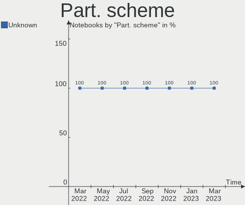
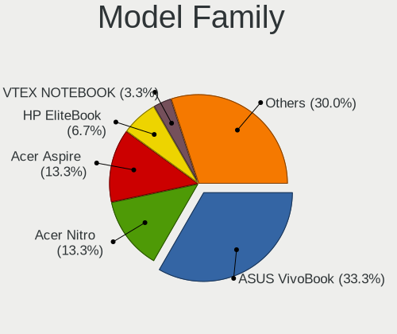
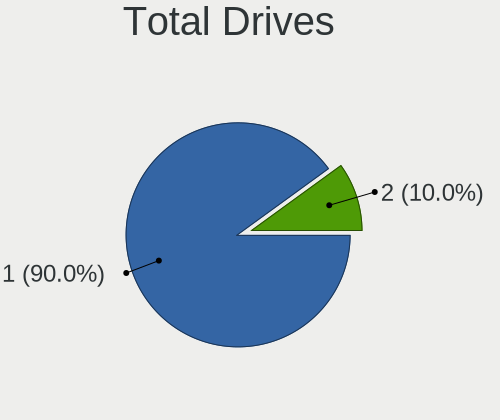

Endless Hardware Trends (Notebook)
----------------------------------

A project to identify most popular hardware characteristics and track their change
over time based on data collected by Endless users at https://Linux-Hardware.org.

Anyone can contribute to the study by uploading probes of their computers by
the [hw-probe](https://github.com/linuxhw/hw-probe) tool:

    sudo -E hw-probe -all -upload

Full-feature report is available here: https://linux-hardware.org/?view=trends&formfactor=notebook

Period: Jun, 2021.

Contents
--------

- [ OS                       ](#os)
- [ OS Family                ](#os-family)
- [ Kernel                   ](#kernel)
- [ Kernel Family            ](#kernel-family)
- [ Kernel Major Ver.        ](#kernel-major-ver)
- [ Arch                     ](#arch)
- [ DE                       ](#de)
- [ Display Server           ](#display-server)
- [ Display Manager          ](#display-manager)
- [ OS Lang                  ](#os-lang)
- [ Boot Mode                ](#boot-mode)
- [ Filesystem               ](#filesystem)
- [ Part. scheme             ](#part-scheme)
- [ Dual Boot with Linux/BSD ](#dual-boot-with-linux/bsd)
- [ Dual Boot (Win)          ](#dual-boot-win)
- [ Country                  ](#country)
- [ City                     ](#city)
- [ Vendor                   ](#vendor)
- [ Model                    ](#model)
- [ Model Family             ](#model-family)
- [ MFG Year                 ](#mfg-year)
- [ Form Factor              ](#form-factor)
- [ Secure Boot              ](#secure-boot)
- [ Coreboot                 ](#coreboot)
- [ RAM Size                 ](#ram-size)
- [ RAM Used                 ](#ram-used)
- [ Has CD-ROM               ](#has-cd-rom)
- [ Total Drives             ](#total-drives)
- [ Has Ethernet             ](#has-ethernet)
- [ Has WiFi                 ](#has-wifi)
- [ Has Bluetooth            ](#has-bluetooth)
- [ Drive Vendor             ](#drive-vendor)
- [ Drive Model              ](#drive-model)
- [ HDD Vendor               ](#hdd-vendor)
- [ SSD Vendor               ](#ssd-vendor)
- [ Drive Kind               ](#drive-kind)
- [ Drive Connector          ](#drive-connector)
- [ Drive Size               ](#drive-size)
- [ Space Total              ](#space-total)
- [ Space Used               ](#space-used)
- [ Malfunc. Drives          ](#malfunc-drives)
- [ Malfunc. Drive Vendor    ](#malfunc-drive-vendor)
- [ Malfunc. HDD Vendor      ](#malfunc-hdd-vendor)
- [ Malfunc. Drive Kind      ](#malfunc-drive-kind)
- [ Failed Drives            ](#failed-drives)
- [ Failed Drive Vendor      ](#failed-drive-vendor)
- [ Drive Status             ](#drive-status)
- [ Storage Vendor           ](#storage-vendor)
- [ Storage Model            ](#storage-model)
- [ Storage Kind             ](#storage-kind)
- [ CPU Vendor               ](#cpu-vendor)
- [ CPU Model                ](#cpu-model)
- [ CPU Model Family         ](#cpu-model-family)
- [ CPU Cores                ](#cpu-cores)
- [ CPU Sockets              ](#cpu-sockets)
- [ CPU Threads              ](#cpu-threads)
- [ CPU Op-Modes             ](#cpu-op-modes)
- [ CPU Microcode            ](#cpu-microcode)
- [ CPU Microarch            ](#cpu-microarch)
- [ GPU Vendor               ](#gpu-vendor)
- [ GPU Model                ](#gpu-model)
- [ GPU Combo                ](#gpu-combo)
- [ GPU Driver               ](#gpu-driver)
- [ GPU Memory               ](#gpu-memory)
- [ Monitor Vendor           ](#monitor-vendor)
- [ Monitor Model            ](#monitor-model)
- [ Monitor Resolution       ](#monitor-resolution)
- [ Monitor Diagonal         ](#monitor-diagonal)
- [ Monitor Width            ](#monitor-width)
- [ Aspect Ratio             ](#aspect-ratio)
- [ Monitor Area             ](#monitor-area)
- [ Pixel Density            ](#pixel-density)
- [ Multiple Monitors        ](#multiple-monitors)
- [ Net Controller Vendor    ](#net-controller-vendor)
- [ Net Controller Model     ](#net-controller-model)
- [ Wireless Vendor          ](#wireless-vendor)
- [ Wireless Model           ](#wireless-model)
- [ Ethernet Vendor          ](#ethernet-vendor)
- [ Ethernet Model           ](#ethernet-model)
- [ Net Controller Kind      ](#net-controller-kind)
- [ Used Controller          ](#used-controller)
- [ NICs                     ](#nics)
- [ IPv6                     ](#ipv6)
- [ Memory Vendor            ](#memory-vendor)
- [ Memory Model             ](#memory-model)
- [ Memory Kind              ](#memory-kind)
- [ Memory Form Factor       ](#memory-form-factor)
- [ Memory Size              ](#memory-size)
- [ Memory Speed             ](#memory-speed)
- [ Sound Vendor             ](#sound-vendor)
- [ Sound Model              ](#sound-model)
- [ Camera Vendor            ](#camera-vendor)
- [ Camera Model             ](#camera-model)
- [ Fingerprint Vendor       ](#fingerprint-vendor)
- [ Fingerprint Model        ](#fingerprint-model)
- [ Chipcard Vendor          ](#chipcard-vendor)
- [ Chipcard Model           ](#chipcard-model)
- [ Printer Vendor           ](#printer-vendor)
- [ Printer Model            ](#printer-model)
- [ Scanner Vendor           ](#scanner-vendor)
- [ Scanner Model            ](#scanner-model)
- [ Bluetooth Vendor         ](#bluetooth-vendor)
- [ Bluetooth Model          ](#bluetooth-model)
- [ Unsupported Devices      ](#unsupported-devices)
- [ Unsupported Device Types ](#unsupported-device-types)

OS
--

Installed operating systems

| Name                  | Notebooks | Percent |
|-----------------------|-----------|---------|
| Endless 3.9.4         | 48        | 78.69%  |
| Endless 3.7.4         | 4         | 6.56%   |
| Endless 3.7.8         | 3         | 4.92%   |
| Endless 3.9.3         | 1         | 1.64%   |
| Endless 3.9.1         | 1         | 1.64%   |
| Endless 3.8.6         | 1         | 1.64%   |
| Endless 3.8.0         | 1         | 1.64%   |
| Endless 3.4.3-nexthw1 | 1         | 1.64%   |
| Endless 3.3.15        | 1         | 1.64%   |

OS Family
---------

OS without a version

| Name    | Notebooks | Percent |
|---------|-----------|---------|
| Endless | 61        | 100%    |

Kernel
------

Version of the Linux kernel

| Version           | Notebooks | Percent |
|-------------------|-----------|---------|
| 5.8.0-14-generic  | 50        | 81.97%  |
| 5.3.0-19-generic  | 4         | 6.56%   |
| 5.3.0-28-generic  | 3         | 4.92%   |
| 5.4.0-42-generic  | 1         | 1.64%   |
| 5.4.0-19-generic  | 1         | 1.64%   |
| 4.16.0-4-generic  | 1         | 1.64%   |
| 4.13.0-32-generic | 1         | 1.64%   |

Kernel Family
-------------

Linux kernel without a distro release

| Version | Notebooks | Percent |
|---------|-----------|---------|
| 5.8.0   | 50        | 81.97%  |
| 5.3.0   | 7         | 11.48%  |
| 5.4.0   | 2         | 3.28%   |
| 4.16.0  | 1         | 1.64%   |
| 4.13.0  | 1         | 1.64%   |

Kernel Major Ver.
-----------------

Linux kernel major version

| Version | Notebooks | Percent |
|---------|-----------|---------|
| 5.8     | 50        | 81.97%  |
| 5.3     | 7         | 11.48%  |
| 5.4     | 2         | 3.28%   |
| 4.16    | 1         | 1.64%   |
| 4.13    | 1         | 1.64%   |

Arch
----

OS architecture (x86_64, i586, etc.)

| Name   | Notebooks | Percent |
|--------|-----------|---------|
| x86_64 | 61        | 100%    |

DE
--

Desktop Environment

| Name  | Notebooks | Percent |
|-------|-----------|---------|
| GNOME | 61        | 100%    |

Display Server
--------------

X11 or Wayland

| Name | Notebooks | Percent |
|------|-----------|---------|
| X11  | 61        | 100%    |

Display Manager
---------------

SDDM, LightDM, etc.

| Name    | Notebooks | Percent |
|---------|-----------|---------|
| Unknown | 61        | 100%    |

OS Lang
-------

Language

| Lang        | Notebooks | Percent |
|-------------|-----------|---------|
| pt_BR       | 32        | 52.46%  |
| en_US       | 10        | 16.39%  |
| ru_RU       | 4         | 6.56%   |
| ru_UA       | 2         | 3.28%   |
| es_CO       | 2         | 3.28%   |
| de_DE       | 2         | 3.28%   |
| tr_TR       | 1         | 1.64%   |
| sv_SE       | 1         | 1.64%   |
| ru_RU.UTF_8 | 1         | 1.64%   |
| pt_PT       | 1         | 1.64%   |
| hu_HU       | 1         | 1.64%   |
| hr_HR       | 1         | 1.64%   |
| fr_FR       | 1         | 1.64%   |
| es_MX       | 1         | 1.64%   |
| en_GB       | 1         | 1.64%   |

Boot Mode
---------

EFI or BIOS

| Mode | Notebooks | Percent |
|------|-----------|---------|
| EFI  | 46        | 75.41%  |
| BIOS | 15        | 24.59%  |

Filesystem
----------

Type of filesystem

| Type  | Notebooks | Percent |
|-------|-----------|---------|
| Ext4  | 59        | 96.72%  |
| Tmpfs | 2         | 3.28%   |

Part. scheme
------------

Scheme of partitioning

| Type    | Notebooks | Percent |
|---------|-----------|---------|
| Unknown | 61        | 100%    |

Dual Boot with Linux/BSD
------------------------

Hosting more than one Linux/BSD

| Dual boot | Notebooks | Percent |
|-----------|-----------|---------|
| No        | 61        | 100%    |

Dual Boot (Win)
---------------

Hosting Linux and Windows

| Dual boot | Notebooks | Percent |
|-----------|-----------|---------|
| No        | 61        | 100%    |

Country
-------

Geographic location (country)

| Country     | Notebooks | Percent |
|-------------|-----------|---------|
| Brazil      | 33        | 54.1%   |
| Russia      | 5         | 8.2%    |
| USA         | 3         | 4.92%   |
| Romania     | 3         | 4.92%   |
| Croatia     | 3         | 4.92%   |
| Ukraine     | 2         | 3.28%   |
| Serbia      | 2         | 3.28%   |
| Germany     | 2         | 3.28%   |
| Turkey      | 1         | 1.64%   |
| Sweden      | 1         | 1.64%   |
| Spain       | 1         | 1.64%   |
| Portugal    | 1         | 1.64%   |
| Hungary     | 1         | 1.64%   |
| France      | 1         | 1.64%   |
| El Salvador | 1         | 1.64%   |
| Colombia    | 1         | 1.64%   |

City
----

Geographic location (city)

| City              | Notebooks | Percent |
|-------------------|-----------|---------|
| São Paulo        | 10        | 16.39%  |
| Zagreb            | 2         | 3.28%   |
| Wake Forest       | 2         | 3.28%   |
| Belgrade          | 2         | 3.28%   |
| Vladivostok       | 1         | 1.64%   |
| Vaslui            | 1         | 1.64%   |
| Ulyanovsk         | 1         | 1.64%   |
| Ukhta             | 1         | 1.64%   |
| São Bento do Sul | 1         | 1.64%   |
| Sorocaba          | 1         | 1.64%   |
| Sao Joao          | 1         | 1.64%   |
| Santiago de Cali  | 1         | 1.64%   |
| San Salvador      | 1         | 1.64%   |
| Salvador          | 1         | 1.64%   |
| Rio de Janeiro    | 1         | 1.64%   |
| Rijeka            | 1         | 1.64%   |
| Pelotas           | 1         | 1.64%   |
| Paulista          | 1         | 1.64%   |
| Parobe            | 1         | 1.64%   |
| Osasco            | 1         | 1.64%   |
| Orikhiv           | 1         | 1.64%   |
| Oradea            | 1         | 1.64%   |
| Omsk              | 1         | 1.64%   |
| Olinda            | 1         | 1.64%   |
| Niterói          | 1         | 1.64%   |
| Nagyigmand        | 1         | 1.64%   |
| Motala            | 1         | 1.64%   |
| Moscow            | 1         | 1.64%   |
| Miramas           | 1         | 1.64%   |
| Maua              | 1         | 1.64%   |
| Maracanau         | 1         | 1.64%   |
| Madrid            | 1         | 1.64%   |
| Istanbul          | 1         | 1.64%   |
| Irpin             | 1         | 1.64%   |
| Guaratuba         | 1         | 1.64%   |
| Guarapari         | 1         | 1.64%   |
| Friedrichshafen   | 1         | 1.64%   |
| Fortaleza         | 1         | 1.64%   |
| Eldorado          | 1         | 1.64%   |
| Danville          | 1         | 1.64%   |
| Curitiba          | 1         | 1.64%   |
| Criciúma         | 1         | 1.64%   |
| Constantina       | 1         | 1.64%   |
| Cocal do Sul      | 1         | 1.64%   |
| Campo Grande      | 1         | 1.64%   |
| Bucharest         | 1         | 1.64%   |
| Bielefeld         | 1         | 1.64%   |
| Anitapolis        | 1         | 1.64%   |
| Amadora           | 1         | 1.64%   |

Vendor
------

Motherboard manufacturer

| Name             | Notebooks | Percent |
|------------------|-----------|---------|
| Acer             | 29        | 47.54%  |
| ASUSTek Computer | 12        | 19.67%  |
| Lenovo           | 8         | 13.11%  |
| Hewlett-Packard  | 4         | 6.56%   |
| Dell             | 3         | 4.92%   |
| Positivo         | 2         | 3.28%   |
| Toshiba          | 1         | 1.64%   |
| LG Electronics   | 1         | 1.64%   |
| Intel            | 1         | 1.64%   |

Model
-----

Motherboard model

| Name                                       | Notebooks | Percent |
|--------------------------------------------|-----------|---------|
| Acer Nitro AN515-54                        | 10        | 16.39%  |
| Acer Nitro AN517-51                        | 7         | 11.48%  |
| Acer Extensa 2540                          | 2         | 3.28%   |
| Acer Aspire A315-53                        | 2         | 3.28%   |
| Acer Aspire A315-34                        | 2         | 3.28%   |
| Toshiba Satellite L750                     | 1         | 1.64%   |
| Positivo WCBT1013                          | 1         | 1.64%   |
| Positivo Smash                             | 1         | 1.64%   |
| LG N450-P.BE55P1                           | 1         | 1.64%   |
| Lenovo ThinkPad T440p 20AWS1TP00           | 1         | 1.64%   |
| Lenovo ThinkPad T440p 20AN00DEUS           | 1         | 1.64%   |
| Lenovo Legion 5 15ARH05H 82B1              | 1         | 1.64%   |
| Lenovo IdeaPad S400 Touch VIUS3            | 1         | 1.64%   |
| Lenovo IdeaPad Gaming 3 15IMH05 81Y4       | 1         | 1.64%   |
| Lenovo IdeaPad 3 17ADA05 81W2              | 1         | 1.64%   |
| Lenovo IdeaPad 3 15IML05 81WB              | 1         | 1.64%   |
| Lenovo B50-30 80ES                         | 1         | 1.64%   |
| Intel Infoway                              | 1         | 1.64%   |
| HP ProBook 4730s                           | 1         | 1.64%   |
| HP Presario CQ56                           | 1         | 1.64%   |
| HP Pavilion dv6                            | 1         | 1.64%   |
| HP 255 G8 Notebook PC                      | 1         | 1.64%   |
| Dell Vostro 1000                           | 1         | 1.64%   |
| Dell Inspiron N5110                        | 1         | 1.64%   |
| Dell Inspiron 3501                         | 1         | 1.64%   |
| ASUS X441UA                                | 1         | 1.64%   |
| ASUS X441NA                                | 1         | 1.64%   |
| ASUS VivoBook_ASUSLaptop X705FD_N705FD     | 1         | 1.64%   |
| ASUS VivoBook_ASUSLaptop X509FB_F509FB     | 1         | 1.64%   |
| ASUS VivoBook_ASUSLaptop X509DA_M509DA     | 1         | 1.64%   |
| ASUS VivoBook 15_ASUS Laptop X540UAR       | 1         | 1.64%   |
| ASUS VivoBook 15_ASUS Laptop X540MA_R540MA | 1         | 1.64%   |
| ASUS VivoBook 15_ASUS Laptop X540MA_A543MA | 1         | 1.64%   |
| ASUS VivoBook 15_ASUS Laptop X507UF        | 1         | 1.64%   |
| ASUS K73SV                                 | 1         | 1.64%   |
| ASUS G551JK                                | 1         | 1.64%   |
| ASUS 1015PE                                | 1         | 1.64%   |
| Acer Swift SF314-51                        | 1         | 1.64%   |
| Acer Predator PH315-52                     | 1         | 1.64%   |
| Acer Aspire E5-473                         | 1         | 1.64%   |
| Acer Aspire A517-51                        | 1         | 1.64%   |
| Acer Aspire A515-54G                       | 1         | 1.64%   |
| Acer Aspire A315-54K                       | 1         | 1.64%   |

Model Family
------------

Motherboard model prefix

| Name              | Notebooks | Percent |
|-------------------|-----------|---------|
| Acer Nitro        | 17        | 27.87%  |
| Acer Aspire       | 8         | 13.11%  |
| ASUS VivoBook     | 7         | 11.48%  |
| Lenovo IdeaPad    | 4         | 6.56%   |
| Lenovo ThinkPad   | 2         | 3.28%   |
| Dell Inspiron     | 2         | 3.28%   |
| Acer Extensa      | 2         | 3.28%   |
| Toshiba Satellite | 1         | 1.64%   |
| Positivo WCBT1013 | 1         | 1.64%   |
| Positivo Smash    | 1         | 1.64%   |
| LG N450-P.BE55P1  | 1         | 1.64%   |
| Lenovo Legion     | 1         | 1.64%   |
| Lenovo B50-30     | 1         | 1.64%   |
| Intel Infoway     | 1         | 1.64%   |
| HP ProBook        | 1         | 1.64%   |
| HP Presario       | 1         | 1.64%   |
| HP Pavilion       | 1         | 1.64%   |
| HP 255            | 1         | 1.64%   |
| Dell Vostro       | 1         | 1.64%   |
| ASUS X441UA       | 1         | 1.64%   |
| ASUS X441NA       | 1         | 1.64%   |
| ASUS K73SV        | 1         | 1.64%   |
| ASUS G551JK       | 1         | 1.64%   |
| ASUS 1015PE       | 1         | 1.64%   |
| Acer Swift        | 1         | 1.64%   |
| Acer Predator     | 1         | 1.64%   |

MFG Year
--------

Motherboard manufacture year

| Year | Notebooks | Percent |
|------|-----------|---------|
| 2020 | 25        | 40.98%  |
| 2019 | 13        | 21.31%  |
| 2015 | 4         | 6.56%   |
| 2017 | 3         | 4.92%   |
| 2021 | 2         | 3.28%   |
| 2018 | 2         | 3.28%   |
| 2012 | 2         | 3.28%   |
| 2011 | 2         | 3.28%   |
| 2010 | 2         | 3.28%   |
| 2016 | 1         | 1.64%   |
| 2014 | 1         | 1.64%   |
| 2013 | 1         | 1.64%   |
| 2009 | 1         | 1.64%   |
| 2008 | 1         | 1.64%   |
| 2007 | 1         | 1.64%   |

Form Factor
-----------

Physical design of the computer

| Name     | Notebooks | Percent |
|----------|-----------|---------|
| Notebook | 61        | 100%    |

Secure Boot
-----------

Enabled or disabled

| State    | Notebooks | Percent |
|----------|-----------|---------|
| Disabled | 31        | 50.82%  |
| Enabled  | 30        | 49.18%  |

Coreboot
--------

Have coreboot on board

| Used | Notebooks | Percent |
|------|-----------|---------|
| No   | 61        | 100%    |

RAM Size
--------

Total RAM memory

| Size in GB | Notebooks | Percent |
|------------|-----------|---------|
| 4.01-8.0   | 26        | 42.62%  |
| 3.01-4.0   | 22        | 36.07%  |
| 16.01-24.0 | 5         | 8.2%    |
| 8.01-16.0  | 5         | 8.2%    |
| 1.01-2.0   | 2         | 3.28%   |
| 0.51-1.0   | 1         | 1.64%   |

RAM Used
--------

Used RAM memory

| Used GB  | Notebooks | Percent |
|----------|-----------|---------|
| 1.01-2.0 | 25        | 40.98%  |
| 2.01-3.0 | 17        | 27.87%  |
| 3.01-4.0 | 11        | 18.03%  |
| 0.51-1.0 | 5         | 8.2%    |
| 4.01-8.0 | 3         | 4.92%   |

Has CD-ROM
----------

Has CD-ROM on board

| Presented | Notebooks | Percent |
|-----------|-----------|---------|
| No        | 46        | 75.41%  |
| Yes       | 15        | 24.59%  |

Total Drives
------------

Number of drives on board

| Drives | Notebooks | Percent |
|--------|-----------|---------|
| 1      | 46        | 75.41%  |
| 2      | 15        | 24.59%  |

Has Ethernet
------------

Has Ethernet on board

| Presented | Notebooks | Percent |
|-----------|-----------|---------|
| Yes       | 50        | 81.97%  |
| No        | 11        | 18.03%  |

Has WiFi
--------

Has WiFi module

| Presented | Notebooks | Percent |
|-----------|-----------|---------|
| Yes       | 59        | 96.72%  |
| No        | 2         | 3.28%   |

Has Bluetooth
-------------

Has Bluetooth module

| Presented | Notebooks | Percent |
|-----------|-----------|---------|
| Yes       | 51        | 83.61%  |
| No        | 10        | 16.39%  |

Drive Vendor
------------

Hard drive vendors

| Vendor              | Notebooks | Drives | Percent |
|---------------------|-----------|--------|---------|
| Intel               | 20        | 21     | 28.17%  |
| Seagate             | 11        | 11     | 15.49%  |
| WDC                 | 8         | 8      | 11.27%  |
| Kingston            | 7         | 7      | 9.86%   |
| SanDisk             | 6         | 6      | 8.45%   |
| Unknown             | 3         | 3      | 4.23%   |
| Toshiba             | 3         | 3      | 4.23%   |
| Samsung Electronics | 3         | 3      | 4.23%   |
| PNY                 | 2         | 2      | 2.82%   |
| SK Hynix            | 1         | 1      | 1.41%   |
| S3+                 | 1         | 2      | 1.41%   |
| Micron Technology   | 1         | 1      | 1.41%   |
| Lexar               | 1         | 1      | 1.41%   |
| Intenso             | 1         | 1      | 1.41%   |
| HGST                | 1         | 1      | 1.41%   |
| ADATA Technology    | 1         | 1      | 1.41%   |
| A-DATA Technology   | 1         | 1      | 1.41%   |

Drive Model
-----------

Hard drive models

| Model                                 | Notebooks | Percent |
|---------------------------------------|-----------|---------|
| Intel NVMe SSD Drive 512GB            | 15        | 21.13%  |
| WDC WD10SPZX-21Z10T0 1TB              | 7         | 9.86%   |
| Seagate ST1000LM035-1RK172 1TB        | 4         | 5.63%   |
| Kingston RBUSC180DS37256GJ 256GB SSD  | 3         | 4.23%   |
| Seagate ST2000LM007-1R8174 2TB        | 2         | 2.82%   |
| Sandisk NVMe SSD Drive 512GB          | 2         | 2.82%   |
| Samsung NVMe SSD Drive 256GB          | 2         | 2.82%   |
| PNY CS900 120GB SSD                   | 2         | 2.82%   |
| Kingston NVMe SSD Drive 256GB         | 2         | 2.82%   |
| Intel NVMe SSD Drive 256GB            | 2         | 2.82%   |
| Intel NVMe SSD Drive 128GB            | 2         | 2.82%   |
| WDC WD5000LPVT-08G33T1 500GB          | 1         | 1.41%   |
| Unknown MMC Card  64GB                | 1         | 1.41%   |
| Unknown MMC Card  32GB                | 1         | 1.41%   |
| Unknown MMC Card  16GB                | 1         | 1.41%   |
| Toshiba MQ01ABD050 500GB              | 1         | 1.41%   |
| Toshiba MK5075GSX 500GB               | 1         | 1.41%   |
| Toshiba MK2555GSX 250GB               | 1         | 1.41%   |
| SK Hynix HFS128G32TND-N210A 128GB SSD | 1         | 1.41%   |
| Seagate ST9640423AS 640GB             | 1         | 1.41%   |
| Seagate ST9250410AS 250GB             | 1         | 1.41%   |
| Seagate ST500LM012 HN-M500MBB 500GB   | 1         | 1.41%   |
| Seagate ST320LM001 HN-M320MBB 320GB   | 1         | 1.41%   |
| Seagate ST1000LM024 HN-M101MBB 1TB    | 1         | 1.41%   |
| SanDisk SSD PLUS 240GB                | 1         | 1.41%   |
| SanDisk SSD PLUS 120GB                | 1         | 1.41%   |
| SanDisk SD9SN8W512G1102 512GB SSD     | 1         | 1.41%   |
| SanDisk SD9SN8W256G1014 256GB SSD     | 1         | 1.41%   |
| Samsung NVMe SSD Drive 512GB          | 1         | 1.41%   |
| S3+ S3SSDC240 240GB                   | 1         | 1.41%   |
| Micron NVMe SSD Drive 512GB           | 1         | 1.41%   |
| Lexar 256GB SSD                       | 1         | 1.41%   |
| Kingston SV300S37A60G 64GB SSD        | 1         | 1.41%   |
| Kingston RBUSNS8180DS3128GH 128GB SSD | 1         | 1.41%   |
| Intenso External USB 3.0 2TB          | 1         | 1.41%   |
| Intel SSDSC2BW180A4 180GB             | 1         | 1.41%   |
| HGST HTS541010A9E680 1TB              | 1         | 1.41%   |
| ADATA NVMe SSD Drive 256GB            | 1         | 1.41%   |
| A-DATA SU650NS38 120GB SSD            | 1         | 1.41%   |

HDD Vendor
----------

Hard disk drive vendors

| Vendor  | Notebooks | Drives | Percent |
|---------|-----------|--------|---------|
| Seagate | 11        | 11     | 45.83%  |
| WDC     | 8         | 8      | 33.33%  |
| Toshiba | 3         | 3      | 12.5%   |
| Intenso | 1         | 1      | 4.17%   |
| HGST    | 1         | 1      | 4.17%   |

SSD Vendor
----------

Solid state drive vendors

| Vendor            | Notebooks | Drives | Percent |
|-------------------|-----------|--------|---------|
| Kingston          | 5         | 5      | 31.25%  |
| SanDisk           | 4         | 4      | 25%     |
| PNY               | 2         | 2      | 12.5%   |
| SK Hynix          | 1         | 1      | 6.25%   |
| S3+               | 1         | 2      | 6.25%   |
| Lexar             | 1         | 1      | 6.25%   |
| Intel             | 1         | 1      | 6.25%   |
| A-DATA Technology | 1         | 1      | 6.25%   |

Drive Kind
----------

HDD or SSD

| Kind | Notebooks | Drives | Percent |
|------|-----------|--------|---------|
| NVMe | 28        | 29     | 39.44%  |
| HDD  | 24        | 24     | 33.8%   |
| SSD  | 16        | 17     | 22.54%  |
| MMC  | 3         | 3      | 4.23%   |

Drive Connector
---------------

SATA, SAS, NVMe, etc.

| Type | Notebooks | Drives | Percent |
|------|-----------|--------|---------|
| SATA | 36        | 40     | 52.94%  |
| NVMe | 28        | 29     | 41.18%  |
| MMC  | 3         | 3      | 4.41%   |
| SAS  | 1         | 1      | 1.47%   |

Drive Size
----------

Size of hard drive

| Size in TB | Notebooks | Drives | Percent |
|------------|-----------|--------|---------|
| 0.01-0.5   | 21        | 23     | 55.26%  |
| 0.51-1.0   | 14        | 15     | 36.84%  |
| 1.01-2.0   | 3         | 3      | 7.89%   |

Space Total
-----------

Amount of disk space available on the file system

| Size in GB | Notebooks | Percent |
|------------|-----------|---------|
| 251-500    | 23        | 37.7%   |
| 101-250    | 13        | 21.31%  |
| 501-1000   | 13        | 21.31%  |
| 51-100     | 4         | 6.56%   |
| 21-50      | 2         | 3.28%   |
| 2001-3000  | 2         | 3.28%   |
| 1001-2000  | 2         | 3.28%   |
| 1-20       | 2         | 3.28%   |

Space Used
----------

Amount of used disk space

| Used GB   | Notebooks | Percent |
|-----------|-----------|---------|
| 21-50     | 24        | 39.34%  |
| 51-100    | 13        | 21.31%  |
| 1-20      | 12        | 19.67%  |
| 251-500   | 6         | 9.84%   |
| 101-250   | 5         | 8.2%    |
| 1001-2000 | 1         | 1.64%   |

Malfunc. Drives
---------------

Drive models with a malfunction

Zero info for selected period =(

Malfunc. Drive Vendor
---------------------

Vendors of faulty drives

Zero info for selected period =(

Malfunc. HDD Vendor
-------------------

Vendors of faulty HDD drives

Zero info for selected period =(

Malfunc. Drive Kind
-------------------

Kinds of faulty drives

Zero info for selected period =(

Failed Drives
-------------

Failed drive models

Zero info for selected period =(

Failed Drive Vendor
-------------------

Failed drive vendors

Zero info for selected period =(

Drive Status
------------

Number of failed and malfunc. drives

| Status   | Notebooks | Drives | Percent |
|----------|-----------|--------|---------|
| Detected | 61        | 73     | 100%    |

Storage Vendor
--------------

Storage controller vendors

| Vendor                      | Notebooks | Percent |
|-----------------------------|-----------|---------|
| Intel                       | 54        | 81.82%  |
| Samsung Electronics         | 3         | 4.55%   |
| AMD                         | 3         | 4.55%   |
| Sandisk                     | 2         | 3.03%   |
| Kingston Technology Company | 2         | 3.03%   |
| Micron Technology           | 1         | 1.52%   |
| ADATA Technology            | 1         | 1.52%   |

Storage Model
-------------

Storage controller models

| Model                                                                                  | Notebooks | Percent |
|----------------------------------------------------------------------------------------|-----------|---------|
| Intel 82801 Mobile SATA Controller [RAID mode]                                         | 21        | 23.33%  |
| Intel PROSet/Wireless WiFi Software extension                                          | 19        | 21.11%  |
| Intel Sunrise Point-LP SATA Controller [AHCI mode]                                     | 8         | 8.89%   |
| Intel Celeron/Pentium Silver Processor SATA Controller                                 | 4         | 4.44%   |
| Samsung NVMe Controller                                                                | 3         | 3.33%   |
| Intel 8 Series/C220 Series Chipset Family 6-port SATA Controller 1 [AHCI mode]         | 3         | 3.33%   |
| Intel 6 Series/C200 Series Chipset Family 6 port Mobile SATA AHCI Controller           | 3         | 3.33%   |
| Kingston Company U-SNS8154P3 NVMe SSD                                                  | 2         | 2.22%   |
| Intel Cannon Point-LP SATA Controller [AHCI Mode]                                      | 2         | 2.22%   |
| Intel 82801IBM/IEM (ICH9M/ICH9M-E) 4 port SATA Controller [AHCI mode]                  | 2         | 2.22%   |
| AMD FCH SATA Controller [AHCI mode]                                                    | 2         | 2.22%   |
| Sandisk WD Blue SN500 / PC SN520 NVMe SSD                                              | 1         | 1.11%   |
| Sandisk Non-Volatile memory controller                                                 | 1         | 1.11%   |
| Micron Non-Volatile memory controller                                                  | 1         | 1.11%   |
| Intel Wildcat Point-LP SATA Controller [AHCI Mode]                                     | 1         | 1.11%   |
| Intel Volume Management Device NVMe RAID Controller                                    | 1         | 1.11%   |
| Intel Tiger Lake-LP SATA Controller [AHCI mode]                                        | 1         | 1.11%   |
| Intel NM10/ICH7 Family SATA Controller [AHCI mode]                                     | 1         | 1.11%   |
| Intel Comet Lake SATA AHCI Controller                                                  | 1         | 1.11%   |
| Intel Celeron N3350/Pentium N4200/Atom E3900 Series SATA AHCI Controller               | 1         | 1.11%   |
| Intel Atom Processor E3800 Series SATA IDE Controller                                  | 1         | 1.11%   |
| Intel 82801HM/HEM (ICH8M/ICH8M-E) SATA Controller [AHCI mode]                          | 1         | 1.11%   |
| Intel 82801HM/HEM (ICH8M/ICH8M-E) IDE Controller                                       | 1         | 1.11%   |
| Intel 7 Series Chipset Family 6-port SATA Controller [AHCI mode]                       | 1         | 1.11%   |
| Intel 7 Series Chipset Family 4-port SATA Controller [IDE mode]                        | 1         | 1.11%   |
| Intel 7 Series Chipset Family 2-port SATA Controller [IDE mode]                        | 1         | 1.11%   |
| Intel 6 Series/C200 Series Chipset Family Mobile SATA Controller (IDE mode, ports 4-5) | 1         | 1.11%   |
| Intel 6 Series/C200 Series Chipset Family Mobile SATA Controller (IDE mode, ports 0-3) | 1         | 1.11%   |
| Intel 400 Series Chipset Family SATA AHCI Controller                                   | 1         | 1.11%   |
| AMD SB600 Non-Raid-5 SATA                                                              | 1         | 1.11%   |
| AMD SB600 IDE                                                                          | 1         | 1.11%   |
| ADATA Non-Volatile memory controller                                                   | 1         | 1.11%   |

Storage Kind
------------

Kind of storage controller (IDE, SATA, NVMe, SAS, ...)

| Kind | Notebooks | Percent |
|------|-----------|---------|
| SATA | 52        | 59.09%  |
| NVMe | 28        | 31.82%  |
| IDE  | 5         | 5.68%   |
| RAID | 3         | 3.41%   |

CPU Vendor
----------

Processor vendors

| Vendor | Notebooks | Percent |
|--------|-----------|---------|
| Intel  | 56        | 91.8%   |
| AMD    | 5         | 8.2%    |

CPU Model
---------

Processor models

| Model                                         | Notebooks | Percent |
|-----------------------------------------------|-----------|---------|
| Intel Core i5-9300H CPU @ 2.40GHz             | 14        | 22.95%  |
| Intel Core i7-9750H CPU @ 2.60GHz             | 4         | 6.56%   |
| Intel Core i3-6006U CPU @ 2.00GHz             | 4         | 6.56%   |
| Intel Core i3-7020U CPU @ 2.30GHz             | 3         | 4.92%   |
| Intel Pentium Silver N5000 CPU @ 1.10GHz      | 2         | 3.28%   |
| Intel Core i5-8250U CPU @ 1.60GHz             | 2         | 3.28%   |
| Intel Core i5-2410M CPU @ 2.30GHz             | 2         | 3.28%   |
| AMD Ryzen 5 3500U with Radeon Vega Mobile Gfx | 2         | 3.28%   |
| Intel Pentium Dual-Core CPU T4200 @ 2.00GHz   | 1         | 1.64%   |
| Intel Pentium CPU 6405U @ 2.40GHz             | 1         | 1.64%   |
| Intel Pentium CPU 5405U @ 2.30GHz             | 1         | 1.64%   |
| Intel Pentium CPU 4405U @ 2.10GHz             | 1         | 1.64%   |
| Intel Core i7-8565U CPU @ 1.80GHz             | 1         | 1.64%   |
| Intel Core i7-10750H CPU @ 2.60GHz            | 1         | 1.64%   |
| Intel Core i7-10510U CPU @ 1.80GHz            | 1         | 1.64%   |
| Intel Core i5-4300M CPU @ 2.60GHz             | 1         | 1.64%   |
| Intel Core i5-4210M CPU @ 2.60GHz             | 1         | 1.64%   |
| Intel Core i5-4200H CPU @ 2.80GHz             | 1         | 1.64%   |
| Intel Core i5-3210M CPU @ 2.50GHz             | 1         | 1.64%   |
| Intel Core i5-2430M CPU @ 2.40GHz             | 1         | 1.64%   |
| Intel Core i3-5015U CPU @ 2.10GHz             | 1         | 1.64%   |
| Intel Core i3-2330M CPU @ 2.20GHz             | 1         | 1.64%   |
| Intel Core 2 Duo CPU T5750 @ 2.00GHz          | 1         | 1.64%   |
| Intel Celeron N4020 CPU @ 1.10GHz             | 1         | 1.64%   |
| Intel Celeron N4000 CPU @ 1.10GHz             | 1         | 1.64%   |
| Intel Celeron CPU N3450 @ 1.10GHz             | 1         | 1.64%   |
| Intel Celeron CPU N2840 @ 2.16GHz             | 1         | 1.64%   |
| Intel Celeron CPU 900 @ 2.20GHz               | 1         | 1.64%   |
| Intel Celeron CPU 1007U @ 1.50GHz             | 1         | 1.64%   |
| Intel Atom x5-Z8350 CPU @ 1.44GHz             | 1         | 1.64%   |
| Intel Atom CPU Z3735G @ 1.33GHz               | 1         | 1.64%   |
| Intel Atom CPU N550 @ 1.50GHz                 | 1         | 1.64%   |
| Intel 11th Gen Core i7-1165G7 @ 2.80GHz       | 1         | 1.64%   |
| AMD Ryzen 7 4800H with Radeon Graphics        | 1         | 1.64%   |
| AMD Mobile Sempron Processor 3600+            | 1         | 1.64%   |
| AMD Athlon Silver 3050U with Radeon Graphics  | 1         | 1.64%   |

CPU Model Family
----------------

Processor model prefix

| Model                   | Notebooks | Percent |
|-------------------------|-----------|---------|
| Intel Core i5           | 23        | 37.7%   |
| Intel Core i3           | 9         | 14.75%  |
| Intel Core i7           | 7         | 11.48%  |
| Intel Celeron           | 6         | 9.84%   |
| Intel Pentium           | 3         | 4.92%   |
| Intel Atom              | 3         | 4.92%   |
| Intel Pentium Silver    | 2         | 3.28%   |
| AMD Ryzen 5             | 2         | 3.28%   |
| Other                   | 1         | 1.64%   |
| Intel Pentium Dual-Core | 1         | 1.64%   |
| Intel Core 2 Duo        | 1         | 1.64%   |
| AMD Ryzen 7             | 1         | 1.64%   |
| AMD Mobile Sempron      | 1         | 1.64%   |
| AMD Athlon              | 1         | 1.64%   |

CPU Cores
---------

Number of processor cores

| Number | Notebooks | Percent |
|--------|-----------|---------|
| 2      | 27        | 44.26%  |
| 4      | 26        | 42.62%  |
| 6      | 5         | 8.2%    |
| 1      | 2         | 3.28%   |
| 8      | 1         | 1.64%   |

CPU Sockets
-----------

Number of sockets

| Number | Notebooks | Percent |
|--------|-----------|---------|
| 1      | 61        | 100%    |

CPU Threads
-----------

Threads per core (Hyper-Threading)

| Number | Notebooks | Percent |
|--------|-----------|---------|
| 2      | 47        | 77.05%  |
| 1      | 14        | 22.95%  |

CPU Op-Modes
------------

CPU Operation Modes (32-bit, 64-bit)

| Op mode        | Notebooks | Percent |
|----------------|-----------|---------|
| 32-bit, 64-bit | 61        | 100%    |

CPU Microcode
-------------

Microcode number

| Number     | Notebooks | Percent |
|------------|-----------|---------|
| 0x906ed    | 12        | 19.67%  |
| 0x906ea    | 6         | 9.84%   |
| 0x406e3    | 4         | 6.56%   |
| 0x206a7    | 4         | 6.56%   |
| Unknown    | 4         | 6.56%   |
| 0x806e9    | 3         | 4.92%   |
| 0x306c3    | 3         | 4.92%   |
| 0x08108109 | 3         | 4.92%   |
| 0x806ec    | 2         | 3.28%   |
| 0x806ea    | 2         | 3.28%   |
| 0x706a1    | 2         | 3.28%   |
| 0x306a9    | 2         | 3.28%   |
| 0x30678    | 2         | 3.28%   |
| 0x1067a    | 2         | 3.28%   |
| 0xa0652    | 1         | 1.64%   |
| 0x806eb    | 1         | 1.64%   |
| 0x806c1    | 1         | 1.64%   |
| 0x706a8    | 1         | 1.64%   |
| 0x6fd      | 1         | 1.64%   |
| 0x506c9    | 1         | 1.64%   |
| 0x406c4    | 1         | 1.64%   |
| 0x306d4    | 1         | 1.64%   |
| 0x106ca    | 1         | 1.64%   |
| 0x08600104 | 1         | 1.64%   |

CPU Microarch
-------------

Microarchitecture

| Name          | Notebooks | Percent |
|---------------|-----------|---------|
| KabyLake      | 27        | 44.26%  |
| Skylake       | 5         | 8.2%    |
| SandyBridge   | 4         | 6.56%   |
| Goldmont plus | 4         | 6.56%   |
| Zen+          | 3         | 4.92%   |
| Silvermont    | 3         | 4.92%   |
| Haswell       | 3         | 4.92%   |
| Penryn        | 2         | 3.28%   |
| IvyBridge     | 2         | 3.28%   |
| Zen 2         | 1         | 1.64%   |
| TigerLake     | 1         | 1.64%   |
| K8 Hammer     | 1         | 1.64%   |
| Goldmont      | 1         | 1.64%   |
| Core          | 1         | 1.64%   |
| CometLake     | 1         | 1.64%   |
| Broadwell     | 1         | 1.64%   |
| Bonnell       | 1         | 1.64%   |

GPU Vendor
----------

Vendors of graphics cards

| Vendor | Notebooks | Percent |
|--------|-----------|---------|
| Intel  | 55        | 61.11%  |
| Nvidia | 27        | 30%     |
| AMD    | 8         | 8.89%   |

GPU Model
---------

Graphics card models

| Model                                                                                    | Notebooks | Percent |
|------------------------------------------------------------------------------------------|-----------|---------|
| Intel CoffeeLake-H GT2 [UHD Graphics 630]                                                | 18        | 19.78%  |
| Nvidia TU117M [GeForce GTX 1650 Mobile / Max-Q]                                          | 17        | 18.68%  |
| Intel Skylake GT2 [HD Graphics 520]                                                      | 4         | 4.4%    |
| Intel 2nd Generation Core Processor Family Integrated Graphics Controller                | 4         | 4.4%    |
| Intel Kaby Lake-U GT2f HD 620 Graphics Controller                                        | 3         | 3.3%    |
| Intel 4th Gen Core Processor Integrated Graphics Controller                              | 3         | 3.3%    |
| AMD Picasso                                                                              | 3         | 3.3%    |
| Nvidia TU106M [GeForce RTX 2060 Mobile]                                                  | 2         | 2.2%    |
| Intel UHD Graphics 620                                                                   | 2         | 2.2%    |
| Intel GeminiLake [UHD Graphics 605]                                                      | 2         | 2.2%    |
| Intel GeminiLake [UHD Graphics 600]                                                      | 2         | 2.2%    |
| Intel Atom Processor Z36xxx/Z37xxx Series Graphics & Display                             | 2         | 2.2%    |
| Intel 3rd Gen Core processor Graphics Controller                                         | 2         | 2.2%    |
| AMD Seymour [Radeon HD 6400M/7400M Series]                                               | 2         | 2.2%    |
| Nvidia TU117M [GeForce GTX 1650 Ti Mobile]                                               | 1         | 1.1%    |
| Nvidia GP108M [GeForce MX330]                                                            | 1         | 1.1%    |
| Nvidia GP108M [GeForce MX250]                                                            | 1         | 1.1%    |
| Nvidia GP107M [GeForce GTX 1050 Mobile]                                                  | 1         | 1.1%    |
| Nvidia GM108M [GeForce MX130]                                                            | 1         | 1.1%    |
| Nvidia GM108M [GeForce MX110]                                                            | 1         | 1.1%    |
| Nvidia GM107M [GeForce GTX 850M]                                                         | 1         | 1.1%    |
| Nvidia GF108M [GeForce GT 540M]                                                          | 1         | 1.1%    |
| Intel WhiskeyLake-U GT2 [UHD Graphics 620]                                               | 1         | 1.1%    |
| Intel TigerLake-LP GT2 [Iris Xe Graphics]                                                | 1         | 1.1%    |
| Intel Mobile GM965/GL960 Integrated Graphics Controller (secondary)                      | 1         | 1.1%    |
| Intel Mobile GM965/GL960 Integrated Graphics Controller (primary)                        | 1         | 1.1%    |
| Intel Mobile 4 Series Chipset Integrated Graphics Controller                             | 1         | 1.1%    |
| Intel HD Graphics 5500                                                                   | 1         | 1.1%    |
| Intel HD Graphics 510                                                                    | 1         | 1.1%    |
| Intel HD Graphics 500                                                                    | 1         | 1.1%    |
| Intel CometLake-U GT2 [UHD Graphics]                                                     | 1         | 1.1%    |
| Intel CometLake-H GT2 [UHD Graphics]                                                     | 1         | 1.1%    |
| Intel Comet Lake UHD Graphics                                                            | 1         | 1.1%    |
| Intel Coffee Lake UHD 610 Graphics Controller                                            | 1         | 1.1%    |
| Intel Atom/Celeron/Pentium Processor x5-E8000/J3xxx/N3xxx Integrated Graphics Controller | 1         | 1.1%    |
| Intel Atom Processor D4xx/D5xx/N4xx/N5xx Integrated Graphics Controller                  | 1         | 1.1%    |
| AMD Thames [Radeon HD 7550M/7570M/7650M]                                                 | 1         | 1.1%    |
| AMD RV710/M92 [Mobility Radeon HD 4530/4570/545v]                                        | 1         | 1.1%    |
| AMD RS482M [Mobility Radeon Xpress 200]                                                  | 1         | 1.1%    |

GPU Combo
---------

Combinations of graphics cards

| Name           | Notebooks | Percent |
|----------------|-----------|---------|
| Intel + Nvidia | 26        | 42.62%  |
| 1 x Intel      | 26        | 42.62%  |
| 1 x AMD        | 5         | 8.2%    |
| Intel + AMD    | 3         | 4.92%   |
| 1 x Nvidia     | 1         | 1.64%   |

GPU Driver
----------

Free vs proprietary

| Driver      | Notebooks | Percent |
|-------------|-----------|---------|
| Free        | 36        | 59.02%  |
| Proprietary | 25        | 40.98%  |

GPU Memory
----------

Total video memory

| Size in GB | Notebooks | Percent |
|------------|-----------|---------|
| Unknown    | 51        | 83.61%  |
| 1.01-2.0   | 3         | 4.92%   |
| 0.51-1.0   | 3         | 4.92%   |
| 0.01-0.5   | 3         | 4.92%   |
| 3.01-4.0   | 1         | 1.64%   |

Monitor Vendor
--------------

Monitor vendors

| Vendor              | Notebooks | Percent |
|---------------------|-----------|---------|
| Chimei Innolux      | 16        | 26.23%  |
| LG Display          | 13        | 21.31%  |
| BOE                 | 13        | 21.31%  |
| AU Optronics        | 9         | 14.75%  |
| Samsung Electronics | 6         | 9.84%   |
| Sony                | 1         | 1.64%   |
| RTK                 | 1         | 1.64%   |
| HannStar            | 1         | 1.64%   |
| CPT                 | 1         | 1.64%   |

Monitor Model
-------------

Monitor models

| Model                                                                 | Notebooks | Percent |
|-----------------------------------------------------------------------|-----------|---------|
| LG Display LCD Monitor LGD065A 1920x1080 344x194mm 15.5-inch          | 6         | 9.84%   |
| Chimei Innolux LCD Monitor CMN15E6 1366x768 344x193mm 15.5-inch       | 5         | 8.2%    |
| BOE LCD Monitor BOE0839 1920x1080 382x215mm 17.3-inch                 | 5         | 8.2%    |
| AU Optronics LCD Monitor AUO21ED 1920x1080 344x194mm 15.5-inch        | 3         | 4.92%   |
| LG Display LCD Monitor LGD0621 1920x1080 382x215mm 17.3-inch          | 2         | 3.28%   |
| Chimei Innolux LCD Monitor CMN15DC 1366x768 344x193mm 15.5-inch       | 2         | 3.28%   |
| Chimei Innolux LCD Monitor CMN1493 1366x768 310x170mm 13.9-inch       | 2         | 3.28%   |
| BOE LCD Monitor BOE0818 1920x1080 344x194mm 15.5-inch                 | 2         | 3.28%   |
| AU Optronics LCD Monitor AUO61ED 1920x1080 340x190mm 15.3-inch        | 2         | 3.28%   |
| Sony TV SNY7702 1920x1080 886x498mm 40.0-inch                         | 1         | 1.64%   |
| Samsung Electronics LCD Monitor SEC544B 1600x900 382x214mm 17.2-inch  | 1         | 1.64%   |
| Samsung Electronics LCD Monitor SEC5441 1366x768 344x194mm 15.5-inch  | 1         | 1.64%   |
| Samsung Electronics LCD Monitor SEC4151 1366x768 344x194mm 15.5-inch  | 1         | 1.64%   |
| Samsung Electronics LCD Monitor SEC3358 1280x800 331x207mm 15.4-inch  | 1         | 1.64%   |
| Samsung Electronics LCD Monitor SDC3652 1366x768 340x190mm 15.3-inch  | 1         | 1.64%   |
| Samsung Electronics LCD Monitor SDC324C 1920x1080 344x194mm 15.5-inch | 1         | 1.64%   |
| RTK LCD Monitor RTK2136 1280x800 473x296mm 22.0-inch                  | 1         | 1.64%   |
| LG Display LCD Monitor LGD04E8 1920x1080 382x215mm 17.3-inch          | 1         | 1.64%   |
| LG Display LCD Monitor LGD03FC 1600x900 309x174mm 14.0-inch           | 1         | 1.64%   |
| LG Display LCD Monitor LGD03D7 1366x768 309x174mm 14.0-inch           | 1         | 1.64%   |
| LG Display LCD Monitor LGD033C 1366x768 309x174mm 14.0-inch           | 1         | 1.64%   |
| LG Display LCD Monitor LGD02DC 1366x768 344x194mm 15.5-inch           | 1         | 1.64%   |
| HannStar HSD100IFW4A HSD03EE 1024x600 220x129mm 10.0-inch             | 1         | 1.64%   |
| CPT LCD Monitor CPT1401 1280x800 331x207mm 15.4-inch                  | 1         | 1.64%   |
| Chimei Innolux LCD Monitor CMN1728 1600x900 382x215mm 17.3-inch       | 1         | 1.64%   |
| Chimei Innolux LCD Monitor CMN15E8 1920x1080 344x193mm 15.5-inch      | 1         | 1.64%   |
| Chimei Innolux LCD Monitor CMN15E7 1920x1080 344x193mm 15.5-inch      | 1         | 1.64%   |
| Chimei Innolux LCD Monitor CMN15DB 1366x768 344x193mm 15.5-inch       | 1         | 1.64%   |
| Chimei Innolux LCD Monitor CMN1535 1366x768 344x193mm 15.5-inch       | 1         | 1.64%   |
| Chimei Innolux LCD Monitor CMN14D6 1366x768 309x173mm 13.9-inch       | 1         | 1.64%   |
| Chimei Innolux LCD Monitor CMN14C9 1920x1080 309x173mm 13.9-inch      | 1         | 1.64%   |
| BOE LCD Monitor BOE08E8 1920x1080 344x194mm 15.5-inch                 | 1         | 1.64%   |
| BOE LCD Monitor BOE07AA 1366x768 344x194mm 15.5-inch                  | 1         | 1.64%   |
| BOE LCD Monitor BOE06BA 1920x1080 344x193mm 15.5-inch                 | 1         | 1.64%   |
| BOE LCD Monitor BOE06A4 1366x768 344x194mm 15.5-inch                  | 1         | 1.64%   |
| BOE LCD Monitor BOE069C 1920x1080 344x193mm 15.5-inch                 | 1         | 1.64%   |
| BOE LCD Monitor BOE0630 1920x1080 344x194mm 15.5-inch                 | 1         | 1.64%   |
| AU Optronics LCD Monitor AUO439D 1920x1080 382x215mm 17.3-inch        | 1         | 1.64%   |
| AU Optronics LCD Monitor AUO2D3C 1366x768 310x170mm 13.9-inch         | 1         | 1.64%   |
| AU Optronics LCD Monitor AUO139D 1920x1080 381x214mm 17.2-inch        | 1         | 1.64%   |
| AU Optronics LCD Monitor AUO103C 1366x768 310x170mm 13.9-inch         | 1         | 1.64%   |

Monitor Resolution
------------------

Monitor screen resolution

| Resolution      | Notebooks | Percent |
|-----------------|-----------|---------|
| 1920x1080 (FHD) | 32        | 53.33%  |
| 1366x768 (WXGA) | 22        | 36.67%  |
| 1600x900 (HD+)  | 3         | 5%      |
| 1280x800 (WXGA) | 2         | 3.33%   |
| 1024x600        | 1         | 1.67%   |

Monitor Diagonal
----------------

Diagonal size in inches

| Inches | Notebooks | Percent |
|--------|-----------|---------|
| 15     | 37        | 60.66%  |
| 17     | 12        | 19.67%  |
| 14     | 5         | 8.2%    |
| 13     | 4         | 6.56%   |
| 46     | 1         | 1.64%   |
| 23     | 1         | 1.64%   |
| 10     | 1         | 1.64%   |

Monitor Width
-------------

Physical width

| Width in mm | Notebooks | Percent |
|-------------|-----------|---------|
| 301-350     | 45        | 73.77%  |
| 351-400     | 13        | 21.31%  |
| 501-600     | 1         | 1.64%   |
| 201-300     | 1         | 1.64%   |
| 1001-1500   | 1         | 1.64%   |

Aspect Ratio
------------

Proportional relationship between the width and the height

| Ratio | Notebooks | Percent |
|-------|-----------|---------|
| 16/9  | 58        | 96.67%  |
| 16/10 | 2         | 3.33%   |

Monitor Area
------------

Area in inch²

| Area in inch² | Notebooks | Percent |
|----------------|-----------|---------|
| 101-110        | 37        | 60.66%  |
| 121-130        | 11        | 18.03%  |
| 81-90          | 9         | 14.75%  |
| 41-50          | 1         | 1.64%   |
| 201-250        | 1         | 1.64%   |
| 131-140        | 1         | 1.64%   |
| 501-1000       | 1         | 1.64%   |

Pixel Density
-------------

Pixels per inch

| Density | Notebooks | Percent |
|---------|-----------|---------|
| 121-160 | 32        | 52.46%  |
| 101-120 | 24        | 39.34%  |
| 51-100  | 4         | 6.56%   |
| 1-50    | 1         | 1.64%   |

Multiple Monitors
-----------------

Total monitors connected

| Total | Notebooks | Percent |
|-------|-----------|---------|
| 1     | 59        | 96.72%  |
| 2     | 1         | 1.64%   |
| 0     | 1         | 1.64%   |

Net Controller Vendor
---------------------

Controller vendors

| Vendor                   | Notebooks | Percent |
|--------------------------|-----------|---------|
| Realtek Semiconductor    | 49        | 48.51%  |
| Intel                    | 30        | 29.7%   |
| Qualcomm Atheros         | 18        | 17.82%  |
| Broadcom                 | 2         | 1.98%   |
| Marvell Technology Group | 1         | 0.99%   |
| Broadcom Limited         | 1         | 0.99%   |

Net Controller Model
--------------------

Controller models

| Model                                                             | Notebooks | Percent |
|-------------------------------------------------------------------|-----------|---------|
| Realtek RTL8111/8168/8411 PCI Express Gigabit Ethernet Controller | 36        | 33.03%  |
| Intel Wi-Fi 6 AX200                                               | 18        | 16.51%  |
| Qualcomm Atheros QCA9377 802.11ac Wireless Network Adapter        | 7         | 6.42%   |
| Realtek RTL810xE PCI Express Fast Ethernet controller             | 5         | 4.59%   |
| Realtek RTL8821CE 802.11ac PCIe Wireless Network Adapter          | 4         | 3.67%   |
| Qualcomm Atheros AR9285 Wireless Network Adapter (PCI-Express)    | 4         | 3.67%   |
| Qualcomm Atheros QCA9565 / AR9565 Wireless Network Adapter        | 3         | 2.75%   |
| Intel Wireless 7260                                               | 3         | 2.75%   |
| Intel Dual Band Wireless-AC 3168NGW [Stone Peak]                  | 3         | 2.75%   |
| Realtek RTL8822CE 802.11ac PCIe Wireless Network Adapter          | 2         | 1.83%   |
| Realtek RTL8821AE 802.11ac PCIe Wireless Network Adapter          | 2         | 1.83%   |
| Intel Ethernet Connection I217-LM                                 | 2         | 1.83%   |
| Realtek RTL8822BE 802.11a/b/g/n/ac WiFi adapter                   | 1         | 0.92%   |
| Realtek RTL8188CE 802.11b/g/n WiFi Adapter                        | 1         | 0.92%   |
| Realtek RTL8187B Wireless 802.11g 54Mbps Network Adapter          | 1         | 0.92%   |
| Qualcomm Atheros QCA6174 802.11ac Wireless Network Adapter        | 1         | 0.92%   |
| Qualcomm Atheros Killer E2500 Gigabit Ethernet Controller         | 1         | 0.92%   |
| Qualcomm Atheros AR9485 Wireless Network Adapter                  | 1         | 0.92%   |
| Qualcomm Atheros AR8161 Gigabit Ethernet                          | 1         | 0.92%   |
| Qualcomm Atheros AR8152 v2.0 Fast Ethernet                        | 1         | 0.92%   |
| Qualcomm Atheros AR8151 v2.0 Gigabit Ethernet                     | 1         | 0.92%   |
| Qualcomm Atheros AR8132 Fast Ethernet                             | 1         | 0.92%   |
| Marvell Group 88E8055 PCI-E Gigabit Ethernet Controller           | 1         | 0.92%   |
| Intel Wi-Fi 6 AX201                                               | 1         | 0.92%   |
| Intel Comet Lake PCH-LP CNVi WiFi                                 | 1         | 0.92%   |
| Intel Comet Lake PCH CNVi WiFi                                    | 1         | 0.92%   |
| Intel Centrino Wireless-N 1030 [Rainbow Peak]                     | 1         | 0.92%   |
| Intel Cannon Point-LP CNVi [Wireless-AC]                          | 1         | 0.92%   |
| Intel Cannon Lake PCH CNVi WiFi                                   | 1         | 0.92%   |
| Broadcom Limited BCM4401-B0 100Base-TX                            | 1         | 0.92%   |
| Broadcom BCM4312 802.11b/g LP-PHY                                 | 1         | 0.92%   |
| Broadcom BCM4311 802.11b/g WLAN                                   | 1         | 0.92%   |

Wireless Vendor
---------------

Wireless vendors

| Vendor                | Notebooks | Percent |
|-----------------------|-----------|---------|
| Intel                 | 30        | 50.85%  |
| Qualcomm Atheros      | 16        | 27.12%  |
| Realtek Semiconductor | 11        | 18.64%  |
| Broadcom              | 2         | 3.39%   |

Wireless Model
--------------

Wireless models

| Model                                                          | Notebooks | Percent |
|----------------------------------------------------------------|-----------|---------|
| Intel Wi-Fi 6 AX200                                            | 18        | 30.51%  |
| Qualcomm Atheros QCA9377 802.11ac Wireless Network Adapter     | 7         | 11.86%  |
| Realtek RTL8821CE 802.11ac PCIe Wireless Network Adapter       | 4         | 6.78%   |
| Qualcomm Atheros AR9285 Wireless Network Adapter (PCI-Express) | 4         | 6.78%   |
| Qualcomm Atheros QCA9565 / AR9565 Wireless Network Adapter     | 3         | 5.08%   |
| Intel Wireless 7260                                            | 3         | 5.08%   |
| Intel Dual Band Wireless-AC 3168NGW [Stone Peak]               | 3         | 5.08%   |
| Realtek RTL8822CE 802.11ac PCIe Wireless Network Adapter       | 2         | 3.39%   |
| Realtek RTL8821AE 802.11ac PCIe Wireless Network Adapter       | 2         | 3.39%   |
| Realtek RTL8822BE 802.11a/b/g/n/ac WiFi adapter                | 1         | 1.69%   |
| Realtek RTL8188CE 802.11b/g/n WiFi Adapter                     | 1         | 1.69%   |
| Realtek RTL8187B Wireless 802.11g 54Mbps Network Adapter       | 1         | 1.69%   |
| Qualcomm Atheros QCA6174 802.11ac Wireless Network Adapter     | 1         | 1.69%   |
| Qualcomm Atheros AR9485 Wireless Network Adapter               | 1         | 1.69%   |
| Intel Wi-Fi 6 AX201                                            | 1         | 1.69%   |
| Intel Comet Lake PCH-LP CNVi WiFi                              | 1         | 1.69%   |
| Intel Comet Lake PCH CNVi WiFi                                 | 1         | 1.69%   |
| Intel Centrino Wireless-N 1030 [Rainbow Peak]                  | 1         | 1.69%   |
| Intel Cannon Point-LP CNVi [Wireless-AC]                       | 1         | 1.69%   |
| Intel Cannon Lake PCH CNVi WiFi                                | 1         | 1.69%   |
| Broadcom BCM4312 802.11b/g LP-PHY                              | 1         | 1.69%   |
| Broadcom BCM4311 802.11b/g WLAN                                | 1         | 1.69%   |

Ethernet Vendor
---------------

Ethernet vendors

| Vendor                   | Notebooks | Percent |
|--------------------------|-----------|---------|
| Realtek Semiconductor    | 41        | 82%     |
| Qualcomm Atheros         | 5         | 10%     |
| Intel                    | 2         | 4%      |
| Marvell Technology Group | 1         | 2%      |
| Broadcom Limited         | 1         | 2%      |

Ethernet Model
--------------

Ethernet models

| Model                                                             | Notebooks | Percent |
|-------------------------------------------------------------------|-----------|---------|
| Realtek RTL8111/8168/8411 PCI Express Gigabit Ethernet Controller | 36        | 72%     |
| Realtek RTL810xE PCI Express Fast Ethernet controller             | 5         | 10%     |
| Intel Ethernet Connection I217-LM                                 | 2         | 4%      |
| Qualcomm Atheros Killer E2500 Gigabit Ethernet Controller         | 1         | 2%      |
| Qualcomm Atheros AR8161 Gigabit Ethernet                          | 1         | 2%      |
| Qualcomm Atheros AR8152 v2.0 Fast Ethernet                        | 1         | 2%      |
| Qualcomm Atheros AR8151 v2.0 Gigabit Ethernet                     | 1         | 2%      |
| Qualcomm Atheros AR8132 Fast Ethernet                             | 1         | 2%      |
| Marvell Group 88E8055 PCI-E Gigabit Ethernet Controller           | 1         | 2%      |
| Broadcom Limited BCM4401-B0 100Base-TX                            | 1         | 2%      |

Net Controller Kind
-------------------

Ethernet, WiFi or modem

| Kind     | Notebooks | Percent |
|----------|-----------|---------|
| WiFi     | 59        | 54.13%  |
| Ethernet | 50        | 45.87%  |

Used Controller
---------------

Currently used network controller

| Kind     | Notebooks | Percent |
|----------|-----------|---------|
| WiFi     | 59        | 54.13%  |
| Ethernet | 50        | 45.87%  |

NICs
----

Total network controllers on board

| Total | Notebooks | Percent |
|-------|-----------|---------|
| 2     | 49        | 80.33%  |
| 1     | 10        | 16.39%  |
| 0     | 2         | 3.28%   |

IPv6
----

IPv6 vs IPv4

| Used | Notebooks | Percent |
|------|-----------|---------|
| No   | 43        | 70.49%  |
| Yes  | 18        | 29.51%  |

Memory Vendor
-------------

Memory module vendors

Zero info for selected period =(

Memory Model
------------

Memory module models

Zero info for selected period =(

Memory Kind
-----------

Memory module kinds

Zero info for selected period =(

Memory Form Factor
------------------

Physical design of the memory module

Zero info for selected period =(

Memory Size
-----------

Memory module size

Zero info for selected period =(

Memory Speed
------------

Memory module speed

Zero info for selected period =(

Sound Vendor
------------

Sound card vendors

| Vendor                 | Notebooks | Percent |
|------------------------|-----------|---------|
| Intel                  | 55        | 63.22%  |
| Nvidia                 | 21        | 24.14%  |
| AMD                    | 6         | 6.9%    |
| Generalplus Technology | 2         | 2.3%    |
| Sony                   | 1         | 1.15%   |
| Logitech               | 1         | 1.15%   |
| JMTek                  | 1         | 1.15%   |

Sound Model
-----------

Sound card models

| Model                                                                      | Notebooks | Percent |
|----------------------------------------------------------------------------|-----------|---------|
| Nvidia TU107 GeForce GTX 1650 High Definition Audio Controller             | 18        | 19.15%  |
| Intel Cannon Lake PCH cAVS                                                 | 18        | 19.15%  |
| Intel Sunrise Point-LP HD Audio                                            | 10        | 10.64%  |
| Intel Celeron/Pentium Silver Processor High Definition Audio               | 4         | 4.26%   |
| Intel 6 Series/C200 Series Chipset Family High Definition Audio Controller | 4         | 4.26%   |
| AMD Family 17h (Models 10h-1fh) HD Audio Controller                        | 4         | 4.26%   |
| Intel Xeon E3-1200 v3/4th Gen Core Processor HD Audio Controller           | 3         | 3.19%   |
| Intel 8 Series/C220 Series Chipset High Definition Audio Controller        | 3         | 3.19%   |
| AMD Raven/Raven2/Fenghuang HDMI/DP Audio Controller                        | 3         | 3.19%   |
| Nvidia TU106 High Definition Audio Controller                              | 2         | 2.13%   |
| Intel Comet Lake PCH-LP cAVS                                               | 2         | 2.13%   |
| Intel Cannon Point-LP High Definition Audio Controller                     | 2         | 2.13%   |
| Intel 82801I (ICH9 Family) HD Audio Controller                             | 2         | 2.13%   |
| Intel 7 Series/C216 Chipset Family High Definition Audio Controller        | 2         | 2.13%   |
| Generalplus Technology USB Audio Device                                    | 2         | 2.13%   |
| Sony DualShock 4 [CUH-ZCT2x]                                               | 1         | 1.06%   |
| Nvidia GF108 High Definition Audio Controller                              | 1         | 1.06%   |
| Logitech H390 headset with microphone                                      | 1         | 1.06%   |
| JMTek USB PnP Audio Device                                                 | 1         | 1.06%   |
| Intel Wildcat Point-LP High Definition Audio Controller                    | 1         | 1.06%   |
| Intel USB PnP Sound Device                                                 | 1         | 1.06%   |
| Intel Tiger Lake-LP Smart Sound Technology Audio Controller                | 1         | 1.06%   |
| Intel NM10/ICH7 Family High Definition Audio Controller                    | 1         | 1.06%   |
| Intel Comet Lake PCH cAVS                                                  | 1         | 1.06%   |
| Intel Celeron N3350/Pentium N4200/Atom E3900 Series Audio Cluster          | 1         | 1.06%   |
| Intel Broadwell-U Audio Controller                                         | 1         | 1.06%   |
| Intel Atom Processor Z36xxx/Z37xxx Series High Definition Audio Controller | 1         | 1.06%   |
| Intel 82801H (ICH8 Family) HD Audio Controller                             | 1         | 1.06%   |
| AMD SBx00 Azalia (Intel HDA)                                               | 1         | 1.06%   |
| AMD RV710/730 HDMI Audio [Radeon HD 4000 series]                           | 1         | 1.06%   |

Camera Vendor
-------------

Camera device vendors

| Vendor                                 | Notebooks | Percent |
|----------------------------------------|-----------|---------|
| Quanta                                 | 15        | 26.79%  |
| Chicony Electronics                    | 15        | 26.79%  |
| IMC Networks                           | 12        | 21.43%  |
| Realtek Semiconductor                  | 4         | 7.14%   |
| Acer                                   | 3         | 5.36%   |
| Alcor Micro                            | 2         | 3.57%   |
| Syntek                                 | 1         | 1.79%   |
| Sunplus Innovation Technology          | 1         | 1.79%   |
| Microdia                               | 1         | 1.79%   |
| DJKCVA1BIDP2RA                         | 1         | 1.79%   |
| Cheng Uei Precision Industry (Foxlink) | 1         | 1.79%   |

Camera Model
------------

Camera device models

| Model                                            | Notebooks | Percent |
|--------------------------------------------------|-----------|---------|
| Quanta HD User Facing                            | 10        | 17.86%  |
| Chicony HD User Facing                           | 9         | 16.07%  |
| IMC Networks USB2.0 VGA UVC WebCam               | 6         | 10.71%  |
| Quanta VGA WebCam                                | 4         | 7.14%   |
| IMC Networks Integrated Camera                   | 3         | 5.36%   |
| Chicony USB2.0 VGA UVC WebCam                    | 3         | 5.36%   |
| Chicony VGA WebCam                               | 2         | 3.57%   |
| Acer SunplusIT INC. Integrated Camera            | 2         | 3.57%   |
| Syntek Integrated Camera                         | 1         | 1.79%   |
| Sunplus Laptop_Integrated_Webcam_HD              | 1         | 1.79%   |
| Realtek USB2.0-Camera                            | 1         | 1.79%   |
| Realtek HD Webcam - Realtek                      | 1         | 1.79%   |
| Realtek HD WebCam                                | 1         | 1.79%   |
| Realtek Acer 640 x 480 laptop camera             | 1         | 1.79%   |
| Quanta HD Webcam                                 | 1         | 1.79%   |
| Microdia Integrated_Webcam_HD                    | 1         | 1.79%   |
| IMC Networks USB2.0 UVC HD Webcam                | 1         | 1.79%   |
| IMC Networks PC Cam                              | 1         | 1.79%   |
| IMC Networks Lenovo EasyCamera                   | 1         | 1.79%   |
| DJKCVA1BIDP2RA HP TrueVision HD Camera           | 1         | 1.79%   |
| Chicony Integrated HP HD Webcam                  | 1         | 1.79%   |
| Cheng Uei Precision Industry (Foxlink) HP Webcam | 1         | 1.79%   |
| Alcor Micro USB 2.0 Camera                       | 1         | 1.79%   |
| Alcor Micro Asus Integrated Webcam               | 1         | 1.79%   |
| Acer Lenovo EasyCamera                           | 1         | 1.79%   |

Fingerprint Vendor
------------------

Fingerprint sensor vendors

| Vendor                | Notebooks | Percent |
|-----------------------|-----------|---------|
| Validity Sensors      | 1         | 33.33%  |
| LighTuning Technology | 1         | 33.33%  |
| Elan Microelectronics | 1         | 33.33%  |

Fingerprint Model
-----------------

Fingerprint sensor models

| Model                                        | Notebooks | Percent |
|----------------------------------------------|-----------|---------|
| Validity Sensors VFS 5011 fingerprint sensor | 1         | 33.33%  |
| LighTuning EgisTec Touch Fingerprint Sensor  | 1         | 33.33%  |
| Elan ELAN:Fingerprint                        | 1         | 33.33%  |

Chipcard Vendor
---------------

Chipcard module vendors

Zero info for selected period =(

Chipcard Model
--------------

Chipcard module models

Zero info for selected period =(

Printer Vendor
--------------

Printer device vendors

| Vendor      | Notebooks | Percent |
|-------------|-----------|---------|
| Seiko Epson | 1         | 100%    |

Printer Model
-------------

Printer device models

| Model                   | Notebooks | Percent |
|-------------------------|-----------|---------|
| Seiko Epson L210 Series | 1         | 100%    |

Scanner Vendor
--------------

Scanner device vendors

Zero info for selected period =(

Scanner Model
-------------

Scanner device models

Zero info for selected period =(

Bluetooth Vendor
----------------

Controller vendors

| Vendor                          | Notebooks | Percent |
|---------------------------------|-----------|---------|
| Intel                           | 28        | 54.9%   |
| Lite-On Technology              | 9         | 17.65%  |
| IMC Networks                    | 8         | 15.69%  |
| Qualcomm Atheros Communications | 3         | 5.88%   |
| Realtek Semiconductor           | 2         | 3.92%   |
| Cambridge Silicon Radio         | 1         | 1.96%   |

Bluetooth Model
---------------

Controller models

| Model                                               | Notebooks | Percent |
|-----------------------------------------------------|-----------|---------|
| Intel AX200 Bluetooth                               | 18        | 35.29%  |
| IMC Networks Bluetooth Radio                        | 7         | 13.73%  |
| Lite-On Qualcomm Atheros QCA9377 Bluetooth          | 6         | 11.76%  |
| Intel Bluetooth 9460/9560 Jefferson Peak (JfP)      | 4         | 7.84%   |
| Intel Wireless-AC 3168 Bluetooth                    | 3         | 5.88%   |
| Realtek Bluetooth Radio                             | 2         | 3.92%   |
| Qualcomm Atheros AR3011 Bluetooth                   | 2         | 3.92%   |
| Lite-On Bluetooth Device                            | 2         | 3.92%   |
| Intel Bluetooth wireless interface                  | 2         | 3.92%   |
| Qualcomm Atheros AR3012 Bluetooth 4.0               | 1         | 1.96%   |
| Lite-On Qualcomm Atheros Bluetooth                  | 1         | 1.96%   |
| Intel Centrino Advanced-N 6230 Bluetooth adapter    | 1         | 1.96%   |
| IMC Networks Bluetooth Device                       | 1         | 1.96%   |
| Cambridge Silicon Radio Bluetooth Dongle (HCI mode) | 1         | 1.96%   |

Unsupported Devices
-------------------

Total unsupported devices on board

| Total | Notebooks | Percent |
|-------|-----------|---------|
| 0     | 54        | 88.52%  |
| 1     | 6         | 9.84%   |
| 2     | 1         | 1.64%   |

Unsupported Device Types
------------------------

Types of unsupported devices

| Type                  | Notebooks | Percent |
|-----------------------|-----------|---------|
| Multimedia controller | 5         | 62.5%   |
| Fingerprint reader    | 3         | 37.5%   |

