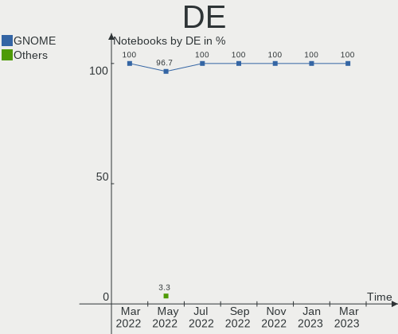
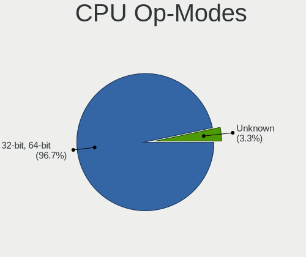
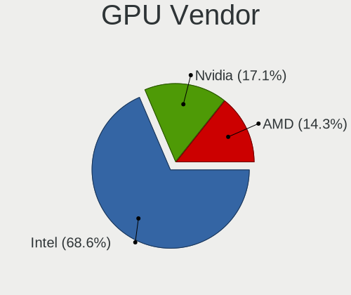
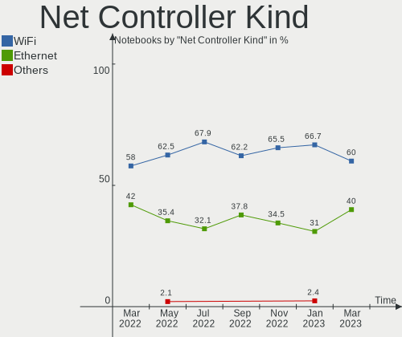
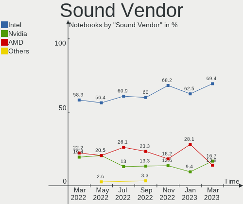

Endless - Hardware Trends (Notebooks)
-------------------------------------

A project to identify most popular hardware characteristics and track their change
over time based on data collected by Linux users at https://Linux-Hardware.org.

Anyone can contribute to this report by the [hw-probe](https://github.com/linuxhw/hw-probe) tool:

    sudo -E hw-probe -all -upload

This report is for one last month. Overall report since the beginning of time: [TestDays](https://github.com/linuxhw/TestDays)

Period: Feb, 2023.

Contents
--------

* [ System ](#system)
  - [ OS                       ](#os)
  - [ OS Family                ](#os-family)
  - [ Kernel                   ](#kernel)
  - [ Kernel Family            ](#kernel-family)
  - [ Kernel Major Ver.        ](#kernel-major-ver)
  - [ Arch                     ](#arch)
  - [ DE                       ](#de)
  - [ Display Server           ](#display-server)
  - [ Display Manager          ](#display-manager)
  - [ OS Lang                  ](#os-lang)
  - [ Boot Mode                ](#boot-mode)
  - [ Filesystem               ](#filesystem)
  - [ Part. scheme             ](#part-scheme)
  - [ Dual Boot with Linux/BSD ](#dual-boot-with-linuxbsd)
  - [ Dual Boot (Win)          ](#dual-boot-win)

* [ Board ](#board)
  - [ Vendor                   ](#vendor)
  - [ Model                    ](#model)
  - [ Model Family             ](#model-family)
  - [ MFG Year                 ](#mfg-year)
  - [ Form Factor              ](#form-factor)
  - [ Secure Boot              ](#secure-boot)
  - [ Coreboot                 ](#coreboot)
  - [ RAM Size                 ](#ram-size)
  - [ RAM Used                 ](#ram-used)
  - [ Total Drives             ](#total-drives)
  - [ Has CD-ROM               ](#has-cd-rom)
  - [ Has Ethernet             ](#has-ethernet)
  - [ Has WiFi                 ](#has-wifi)
  - [ Has Bluetooth            ](#has-bluetooth)

* [ Location ](#location)
  - [ Country                  ](#country)
  - [ City                     ](#city)

* [ Drives ](#drives)
  - [ Drive Vendor             ](#drive-vendor)
  - [ Drive Model              ](#drive-model)
  - [ HDD Vendor               ](#hdd-vendor)
  - [ SSD Vendor               ](#ssd-vendor)
  - [ Drive Kind               ](#drive-kind)
  - [ Drive Connector          ](#drive-connector)
  - [ Drive Size               ](#drive-size)
  - [ Space Total              ](#space-total)
  - [ Space Used               ](#space-used)
  - [ Malfunc. Drives          ](#malfunc-drives)
  - [ Malfunc. Drive Vendor    ](#malfunc-drive-vendor)
  - [ Malfunc. HDD Vendor      ](#malfunc-hdd-vendor)
  - [ Malfunc. Drive Kind      ](#malfunc-drive-kind)
  - [ Failed Drives            ](#failed-drives)
  - [ Failed Drive Vendor      ](#failed-drive-vendor)
  - [ Drive Status             ](#drive-status)

* [ Storage controller ](#storage-controller)
  - [ Storage Vendor           ](#storage-vendor)
  - [ Storage Model            ](#storage-model)
  - [ Storage Kind             ](#storage-kind)

* [ Processor ](#processor)
  - [ CPU Vendor               ](#cpu-vendor)
  - [ CPU Model                ](#cpu-model)
  - [ CPU Model Family         ](#cpu-model-family)
  - [ CPU Cores                ](#cpu-cores)
  - [ CPU Sockets              ](#cpu-sockets)
  - [ CPU Threads              ](#cpu-threads)
  - [ CPU Op-Modes             ](#cpu-op-modes)
  - [ CPU Microcode            ](#cpu-microcode)
  - [ CPU Microarch            ](#cpu-microarch)

* [ Graphics ](#graphics)
  - [ GPU Vendor               ](#gpu-vendor)
  - [ GPU Model                ](#gpu-model)
  - [ GPU Combo                ](#gpu-combo)
  - [ GPU Driver               ](#gpu-driver)
  - [ GPU Memory               ](#gpu-memory)

* [ Monitor ](#monitor)
  - [ Monitor Vendor           ](#monitor-vendor)
  - [ Monitor Model            ](#monitor-model)
  - [ Monitor Resolution       ](#monitor-resolution)
  - [ Monitor Diagonal         ](#monitor-diagonal)
  - [ Monitor Width            ](#monitor-width)
  - [ Aspect Ratio             ](#aspect-ratio)
  - [ Monitor Area             ](#monitor-area)
  - [ Pixel Density            ](#pixel-density)
  - [ Multiple Monitors        ](#multiple-monitors)

* [ Network ](#network)
  - [ Net Controller Vendor    ](#net-controller-vendor)
  - [ Net Controller Model     ](#net-controller-model)
  - [ Wireless Vendor          ](#wireless-vendor)
  - [ Wireless Model           ](#wireless-model)
  - [ Ethernet Vendor          ](#ethernet-vendor)
  - [ Ethernet Model           ](#ethernet-model)
  - [ Net Controller Kind      ](#net-controller-kind)
  - [ Used Controller          ](#used-controller)
  - [ NICs                     ](#nics)
  - [ IPv6                     ](#ipv6)

* [ Bluetooth ](#bluetooth)
  - [ Bluetooth Vendor         ](#bluetooth-vendor)
  - [ Bluetooth Model          ](#bluetooth-model)

* [ Sound ](#sound)
  - [ Sound Vendor             ](#sound-vendor)
  - [ Sound Model              ](#sound-model)

* [ Memory ](#memory)
  - [ Memory Vendor            ](#memory-vendor)
  - [ Memory Model             ](#memory-model)
  - [ Memory Kind              ](#memory-kind)
  - [ Memory Form Factor       ](#memory-form-factor)
  - [ Memory Size              ](#memory-size)
  - [ Memory Speed             ](#memory-speed)

* [ Printers & scanners ](#printers--scanners)
  - [ Printer Vendor           ](#printer-vendor)
  - [ Printer Model            ](#printer-model)
  - [ Scanner Vendor           ](#scanner-vendor)
  - [ Scanner Model            ](#scanner-model)

* [ Camera ](#camera)
  - [ Camera Vendor            ](#camera-vendor)
  - [ Camera Model             ](#camera-model)

* [ Security ](#security)
  - [ Fingerprint Vendor       ](#fingerprint-vendor)
  - [ Fingerprint Model        ](#fingerprint-model)
  - [ Chipcard Vendor          ](#chipcard-vendor)
  - [ Chipcard Model           ](#chipcard-model)

* [ Unsupported ](#unsupported)
  - [ Unsupported Devices      ](#unsupported-devices)
  - [ Unsupported Device Types ](#unsupported-device-types)

System
------

OS
--

Installed operating systems

| Name                  | Notebooks | Percent |
|-----------------------|-----------|---------|
| Endless 5.0.0         | 15        | 44.12%  |
| Endless 4.0.13        | 8         | 23.53%  |
| Endless 3.9.7         | 4         | 11.76%  |
| Endless 4.0.14        | 2         | 5.88%   |
| Endless 5.0.1         | 1         | 2.94%   |
| Endless 4.0.10        | 1         | 2.94%   |
| Endless 3.9.3-nexthw1 | 1         | 2.94%   |
| Endless 3.8.7-nexthw2 | 1         | 2.94%   |
| Endless 3.4.0         | 1         | 2.94%   |

OS Family
---------

OS without a version

| Name    | Notebooks | Percent |
|---------|-----------|---------|
| Endless | 34        | 100%    |

Kernel
------

Version of the Linux kernel

| Version           | Notebooks | Percent |
|-------------------|-----------|---------|
| 5.15.0-47-generic | 16        | 47.06%  |
| 5.11.0-35-generic | 11        | 32.35%  |
| 5.8.0-14-generic  | 5         | 14.71%  |
| 5.11.0-12-generic | 1         | 2.94%   |
| 4.15.0-15-generic | 1         | 2.94%   |

Kernel Family
-------------

Linux kernel without a distro release

| Version | Notebooks | Percent |
|---------|-----------|---------|
| 5.15.0  | 16        | 47.06%  |
| 5.11.0  | 12        | 35.29%  |
| 5.8.0   | 5         | 14.71%  |
| 4.15.0  | 1         | 2.94%   |

Kernel Major Ver.
-----------------

Linux kernel major version

| Version | Notebooks | Percent |
|---------|-----------|---------|
| 5.15    | 16        | 47.06%  |
| 5.11    | 12        | 35.29%  |
| 5.8     | 5         | 14.71%  |
| 4.15    | 1         | 2.94%   |

Arch
----

OS architecture (x86_64, i586, etc.)

| Name   | Notebooks | Percent |
|--------|-----------|---------|
| x86_64 | 34        | 100%    |

DE
--

Desktop Environment

| Name  | Notebooks | Percent |
|-------|-----------|---------|
| GNOME | 34        | 100%    |

Display Server
--------------

X11 or Wayland

| Name    | Notebooks | Percent |
|---------|-----------|---------|
| X11     | 18        | 52.94%  |
| Wayland | 16        | 47.06%  |

Display Manager
---------------

SDDM, LightDM, etc.

| Name    | Notebooks | Percent |
|---------|-----------|---------|
| Unknown | 34        | 100%    |

OS Lang
-------

Language

| Lang  | Notebooks | Percent |
|-------|-----------|---------|
| en_US | 14        | 41.18%  |
| pt_BR | 9         | 26.47%  |
| de_DE | 3         | 8.82%   |
| hu_HU | 2         | 5.88%   |
| ru_UA | 1         | 2.94%   |
| ru_RU | 1         | 2.94%   |
| it_IT | 1         | 2.94%   |
| es_CO | 1         | 2.94%   |
| da_DK | 1         | 2.94%   |
| cs_CZ | 1         | 2.94%   |

Boot Mode
---------

EFI or BIOS

| Mode | Notebooks | Percent |
|------|-----------|---------|
| EFI  | 26        | 76.47%  |
| BIOS | 8         | 23.53%  |

Filesystem
----------

Type of filesystem

| Type | Notebooks | Percent |
|------|-----------|---------|
| Ext4 | 34        | 100%    |

Part. scheme
------------

Scheme of partitioning

| Type    | Notebooks | Percent |
|---------|-----------|---------|
| Unknown | 34        | 100%    |

Dual Boot with Linux/BSD
------------------------

Hosting more than one Linux/BSD

| Dual boot | Notebooks | Percent |
|-----------|-----------|---------|
| No        | 34        | 100%    |

Dual Boot (Win)
---------------

Hosting Linux and Windows

| Dual boot | Notebooks | Percent |
|-----------|-----------|---------|
| No        | 34        | 100%    |

Board
-----

Vendor
------

Motherboard manufacturer

| Name             | Notebooks | Percent |
|------------------|-----------|---------|
| ASUSTek Computer | 13        | 38.24%  |
| Acer             | 7         | 20.59%  |
| Lenovo           | 6         | 17.65%  |
| Hewlett-Packard  | 3         | 8.82%   |
| Dell             | 3         | 8.82%   |
| Toshiba          | 1         | 2.94%   |
| Microtech        | 1         | 2.94%   |

Model
-----

Motherboard model

| Name                                       | Notebooks | Percent |
|--------------------------------------------|-----------|---------|
| ASUS VivoBook_ASUSLaptop X515JA_X515JA     | 3         | 8.82%   |
| Lenovo IdeaPad 1 15ADA7 82R1               | 2         | 5.88%   |
| ASUS VivoBook_ASUSLaptop X515DA_X515DA     | 2         | 5.88%   |
| Acer Nitro AN515-54                        | 2         | 5.88%   |
| Toshiba Satellite L450                     | 1         | 2.94%   |
| Microtech CoreBook                         | 1         | 2.94%   |
| Lenovo ThinkPad W520 4284Y54               | 1         | 2.94%   |
| Lenovo ThinkPad T430 2347BS4               | 1         | 2.94%   |
| Lenovo IdeaPad L340-15IRH Gaming 81LK      | 1         | 2.94%   |
| Lenovo IdeaPad 110-14AST 80TQ              | 1         | 2.94%   |
| HP Stream Notebook PC 14                   | 1         | 2.94%   |
| HP Notebook                                | 1         | 2.94%   |
| HP 250 G5 Notebook PC                      | 1         | 2.94%   |
| Dell Vostro 3446                           | 1         | 2.94%   |
| Dell Latitude E6440                        | 1         | 2.94%   |
| Dell Inspiron 5523                         | 1         | 2.94%   |
| ASUS ZenBook UX431DA_UM431DA               | 1         | 2.94%   |
| ASUS X541UAK                               | 1         | 2.94%   |
| ASUS X540NA                                | 1         | 2.94%   |
| ASUS X200MA                                | 1         | 2.94%   |
| ASUS VivoBook_ASUSLaptop X515MA_X515MA     | 1         | 2.94%   |
| ASUS VivoBook_ASUSLaptop X515EA_X515EA     | 1         | 2.94%   |
| ASUS VivoBook_ASUSLaptop E410MAB_E410MA    | 1         | 2.94%   |
| ASUS VivoBook 12_ASUS Laptop E203MA_E203MA | 1         | 2.94%   |
| Acer Aspire ES1-572                        | 1         | 2.94%   |
| Acer Aspire E5-476G                        | 1         | 2.94%   |
| Acer Aspire A517-51                        | 1         | 2.94%   |
| Acer Aspire A515-51G                       | 1         | 2.94%   |
| Acer Aspire A315-21                        | 1         | 2.94%   |

Model Family
------------

Motherboard model prefix

| Name               | Notebooks | Percent |
|--------------------|-----------|---------|
| ASUS VivoBook      | 9         | 26.47%  |
| Acer Aspire        | 5         | 14.71%  |
| Lenovo IdeaPad     | 4         | 11.76%  |
| Lenovo ThinkPad    | 2         | 5.88%   |
| Acer Nitro         | 2         | 5.88%   |
| Toshiba Satellite  | 1         | 2.94%   |
| Microtech CoreBook | 1         | 2.94%   |
| HP Stream          | 1         | 2.94%   |
| HP Notebook        | 1         | 2.94%   |
| HP 250             | 1         | 2.94%   |
| Dell Vostro        | 1         | 2.94%   |
| Dell Latitude      | 1         | 2.94%   |
| Dell Inspiron      | 1         | 2.94%   |
| ASUS ZenBook       | 1         | 2.94%   |
| ASUS X541UAK       | 1         | 2.94%   |
| ASUS X540NA        | 1         | 2.94%   |
| ASUS X200MA        | 1         | 2.94%   |

MFG Year
--------

Motherboard manufacture year

| Year | Notebooks | Percent |
|------|-----------|---------|
| 2021 | 6         | 17.65%  |
| 2017 | 5         | 14.71%  |
| 2019 | 4         | 11.76%  |
| 2020 | 3         | 8.82%   |
| 2016 | 3         | 8.82%   |
| 2014 | 3         | 8.82%   |
| 2022 | 2         | 5.88%   |
| 2018 | 2         | 5.88%   |
| 2012 | 2         | 5.88%   |
| 2015 | 1         | 2.94%   |
| 2013 | 1         | 2.94%   |
| 2011 | 1         | 2.94%   |
| 2009 | 1         | 2.94%   |

Form Factor
-----------

Physical design of the computer

| Name     | Notebooks | Percent |
|----------|-----------|---------|
| Notebook | 34        | 100%    |

Secure Boot
-----------

Enabled or disabled

| State    | Notebooks | Percent |
|----------|-----------|---------|
| Disabled | 26        | 76.47%  |
| Enabled  | 8         | 23.53%  |

Coreboot
--------

Have coreboot on board

| Used | Notebooks | Percent |
|------|-----------|---------|
| No   | 34        | 100%    |

RAM Size
--------

Total RAM memory

| Size in GB | Notebooks | Percent |
|------------|-----------|---------|
| 4.01-8.0   | 14        | 41.18%  |
| 3.01-4.0   | 13        | 38.24%  |
| 16.01-24.0 | 3         | 8.82%   |
| 1.01-2.0   | 2         | 5.88%   |
| 8.01-16.0  | 2         | 5.88%   |

RAM Used
--------

Used RAM memory

| Used GB  | Notebooks | Percent |
|----------|-----------|---------|
| 1.01-2.0 | 15        | 44.12%  |
| 2.01-3.0 | 9         | 26.47%  |
| 0.51-1.0 | 8         | 23.53%  |
| 4.01-8.0 | 2         | 5.88%   |

Total Drives
------------

Number of drives on board

| Drives | Notebooks | Percent |
|--------|-----------|---------|
| 1      | 24        | 70.59%  |
| 2      | 10        | 29.41%  |

Has CD-ROM
----------

Has CD-ROM on board

| Presented | Notebooks | Percent |
|-----------|-----------|---------|
| No        | 25        | 73.53%  |
| Yes       | 9         | 26.47%  |

Has Ethernet
------------

Has Ethernet on board

| Presented | Notebooks | Percent |
|-----------|-----------|---------|
| Yes       | 21        | 61.76%  |
| No        | 13        | 38.24%  |

Has WiFi
--------

Has WiFi module

| Presented | Notebooks | Percent |
|-----------|-----------|---------|
| Yes       | 34        | 100%    |

Has Bluetooth
-------------

Has Bluetooth module

| Presented | Notebooks | Percent |
|-----------|-----------|---------|
| Yes       | 30        | 88.24%  |
| No        | 4         | 11.76%  |

Location
--------

Country
-------

Geographic location (country)

| Country     | Notebooks | Percent |
|-------------|-----------|---------|
| Brazil      | 9         | 26.47%  |
| Indonesia   | 4         | 11.76%  |
| USA         | 3         | 8.82%   |
| Russia      | 3         | 8.82%   |
| Hungary     | 3         | 8.82%   |
| Germany     | 3         | 8.82%   |
| Poland      | 1         | 2.94%   |
| Philippines | 1         | 2.94%   |
| Italy       | 1         | 2.94%   |
| India       | 1         | 2.94%   |
| Denmark     | 1         | 2.94%   |
| Czechia     | 1         | 2.94%   |
| Colombia    | 1         | 2.94%   |
| Azerbaijan  | 1         | 2.94%   |
| Australia   | 1         | 2.94%   |

City
----

Geographic location (city)

| City               | Notebooks | Percent |
|--------------------|-----------|---------|
| Depok              | 3         | 8.82%   |
| Moscow             | 2         | 5.88%   |
| Daytona Beach      | 2         | 5.88%   |
| Wuppertal          | 1         | 2.94%   |
| Warsaw             | 1         | 2.94%   |
| Volta Redonda      | 1         | 2.94%   |
| Szombathely        | 1         | 2.94%   |
| Straubing          | 1         | 2.94%   |
| Seminole           | 1         | 2.94%   |
| Sao Paulo          | 1         | 2.94%   |
| Rokan              | 1         | 2.94%   |
| Ribeirao das Neves | 1         | 2.94%   |
| Porto Xavier       | 1         | 2.94%   |
| Porto Alegre       | 1         | 2.94%   |
| Paranavai          | 1         | 2.94%   |
| Hueckelhoven       | 1         | 2.94%   |
| Guaruja            | 1         | 2.94%   |
| Gaglianico         | 1         | 2.94%   |
| Francisco Morato   | 1         | 2.94%   |
| Elista             | 1         | 2.94%   |
| Dunaújváros      | 1         | 2.94%   |
| Dianalund          | 1         | 2.94%   |
| Cesky Brod         | 1         | 2.94%   |
| Cegled             | 1         | 2.94%   |
| Brisbane           | 1         | 2.94%   |
| Bogotá            | 1         | 2.94%   |
| Belo Horizonte     | 1         | 2.94%   |
| Bareilly           | 1         | 2.94%   |
| Baku               | 1         | 2.94%   |
| Antipolo City      | 1         | 2.94%   |

Drives
------

Drive Vendor
------------

Hard drive vendors

| Vendor                      | Notebooks | Drives | Percent |
|-----------------------------|-----------|--------|---------|
| WDC                         | 8         | 8      | 18.18%  |
| ADATA Technology            | 6         | 6      | 13.64%  |
| SK hynix                    | 5         | 5      | 11.36%  |
| Unknown                     | 4         | 4      | 9.09%   |
| Seagate                     | 4         | 4      | 9.09%   |
| Toshiba                     | 3         | 3      | 6.82%   |
| Sandisk                     | 3         | 3      | 6.82%   |
| Intel                       | 2         | 2      | 4.55%   |
| Wellcomm                    | 1         | 1      | 2.27%   |
| Phison Electronics          | 1         | 1      | 2.27%   |
| Micron Technology           | 1         | 1      | 2.27%   |
| LITEONIT                    | 1         | 1      | 2.27%   |
| Kingston Technology Company | 1         | 1      | 2.27%   |
| Hitachi                     | 1         | 1      | 2.27%   |
| China                       | 1         | 1      | 2.27%   |
| BHT                         | 1         | 1      | 2.27%   |
| Unknown                     | 1         | 1      | 2.27%   |

Drive Model
-----------

Hard drive models

| Model                                       | Notebooks | Percent |
|---------------------------------------------|-----------|---------|
| ADATA SM2P32A8-256GC1 256GB                 | 6         | 13.64%  |
| WDC WD10SPZX-21Z10T0 1TB                    | 3         | 6.82%   |
| Unknown MMC Card  128GB                     | 2         | 4.55%   |
| SK hynix HFM128GD3JX016N 128GB              | 2         | 4.55%   |
| Seagate ST500LT012-9WS142 500GB             | 2         | 4.55%   |
| Wellcomm Master 128GB SSD                   | 1         | 2.27%   |
| WDC WDS240G1G0A-00SS50 240GB SSD            | 1         | 2.27%   |
| WDC WD3200BPVT-00HXZT3 320GB                | 1         | 2.27%   |
| WDC WD10SPZX-24Z10 1TB                      | 1         | 2.27%   |
| WDC WD10JPVX-75JC3T0 1TB                    | 1         | 2.27%   |
| WDC WD Green M.2 2280 480GB                 | 1         | 2.27%   |
| Unknown MMC Card  64GB                      | 1         | 2.27%   |
| Unknown MMC Card  134GB                     | 1         | 2.27%   |
| Toshiba MQ04ABF100 1TB                      | 1         | 2.27%   |
| Toshiba MQ01ABF050 500GB                    | 1         | 2.27%   |
| Toshiba MQ01ABD100 1TB                      | 1         | 2.27%   |
| SK hynix SH920 2.5 7MM 256GB SSD            | 1         | 2.27%   |
| SK hynix HFS128G39TND-N210A 128GB SSD       | 1         | 2.27%   |
| SK hynix BC501 NVMe Solid State Drive 512GB | 1         | 2.27%   |
| Seagate ST500LM030-1RK17D 500GB             | 1         | 2.27%   |
| Seagate ST1000LM035-1RK172 1TB              | 1         | 2.27%   |
| Sandisk WD Blue SN550 NVMe SSD 1TB          | 1         | 2.27%   |
| SanDisk SDSSDH3500G 500GB                   | 1         | 2.27%   |
| Sandisk PC SN520 NVMe SSD 512GB             | 1         | 2.27%   |
| Phison PS5013 E13 NVMe Controller 500GB     | 1         | 2.27%   |
| Micron 1100_MTFDDAV256TBN 256GB SSD         | 1         | 2.27%   |
| LITEONIT LMT-32L3M mSATA 32GB SSD           | 1         | 2.27%   |
| Kingston Company OM3PDP3 NVMe SSD 512GB     | 1         | 2.27%   |
| Intel XPG GAMMIX S11 Pro 512GB              | 1         | 2.27%   |
| Intel WDC PC SN520 SDAPNUW-512G-1014 512GB  | 1         | 2.27%   |
| Hitachi HTS543225A7A384 250GB               | 1         | 2.27%   |
| China M.2 SSD 256GB                         | 1         | 2.27%   |
| BHT WR202A1064G 670215F5 64GB               | 1         | 2.27%   |
| Unknown                                     | 1         | 2.27%   |

HDD Vendor
----------

Hard disk drive vendors

| Vendor  | Notebooks | Drives | Percent |
|---------|-----------|--------|---------|
| WDC     | 6         | 6      | 42.86%  |
| Seagate | 4         | 4      | 28.57%  |
| Toshiba | 3         | 3      | 21.43%  |
| Hitachi | 1         | 1      | 7.14%   |

SSD Vendor
----------

Solid state drive vendors

| Vendor            | Notebooks | Drives | Percent |
|-------------------|-----------|--------|---------|
| SK hynix          | 2         | 2      | 25%     |
| Wellcomm          | 1         | 1      | 12.5%   |
| WDC               | 1         | 1      | 12.5%   |
| SanDisk           | 1         | 1      | 12.5%   |
| Micron Technology | 1         | 1      | 12.5%   |
| LITEONIT          | 1         | 1      | 12.5%   |
| China             | 1         | 1      | 12.5%   |

Drive Kind
----------

HDD or SSD

| Kind    | Notebooks | Drives | Percent |
|---------|-----------|--------|---------|
| NVMe    | 15        | 15     | 34.09%  |
| HDD     | 14        | 14     | 31.82%  |
| SSD     | 8         | 8      | 18.18%  |
| MMC     | 4         | 4      | 9.09%   |
| Unknown | 3         | 3      | 6.82%   |

Drive Connector
---------------

SATA, SAS, NVMe, etc.

| Type | Notebooks | Drives | Percent |
|------|-----------|--------|---------|
| SATA | 21        | 25     | 52.5%   |
| NVMe | 15        | 15     | 37.5%   |
| MMC  | 4         | 4      | 10%     |

Drive Size
----------

Size of hard drive

| Size in TB | Notebooks | Drives | Percent |
|------------|-----------|--------|---------|
| 0.01-0.5   | 13        | 14     | 61.9%   |
| 0.51-1.0   | 8         | 8      | 38.1%   |

Space Total
-----------

Amount of disk space available on the file system

| Size in GB | Notebooks | Percent |
|------------|-----------|---------|
| 101-250    | 15        | 44.12%  |
| 251-500    | 8         | 23.53%  |
| 501-1000   | 4         | 11.76%  |
| 21-50      | 2         | 5.88%   |
| 1-20       | 2         | 5.88%   |
| 1001-2000  | 1         | 2.94%   |
| 51-100     | 1         | 2.94%   |
| Unknown    | 1         | 2.94%   |

Space Used
----------

Amount of used disk space

| Used GB  | Notebooks | Percent |
|----------|-----------|---------|
| 21-50    | 14        | 41.18%  |
| 1-20     | 9         | 26.47%  |
| 251-500  | 3         | 8.82%   |
| 101-250  | 3         | 8.82%   |
| 51-100   | 3         | 8.82%   |
| 501-1000 | 1         | 2.94%   |
| Unknown  | 1         | 2.94%   |

Malfunc. Drives
---------------

Drive models with a malfunction

Zero info for selected period =(

Malfunc. Drive Vendor
---------------------

Vendors of faulty drives

Zero info for selected period =(

Malfunc. HDD Vendor
-------------------

Vendors of faulty HDD drives

Zero info for selected period =(

Malfunc. Drive Kind
-------------------

Kinds of faulty drives

Zero info for selected period =(

Failed Drives
-------------

Failed drive models

Zero info for selected period =(

Failed Drive Vendor
-------------------

Failed drive vendors

Zero info for selected period =(

Drive Status
------------

Number of failed and malfunc. drives

| Status   | Notebooks | Drives | Percent |
|----------|-----------|--------|---------|
| Detected | 34        | 44     | 100%    |

Storage controller
------------------

Storage Vendor
--------------

Storage controller vendors

| Vendor                      | Notebooks | Percent |
|-----------------------------|-----------|---------|
| Intel                       | 24        | 54.55%  |
| AMD                         | 7         | 15.91%  |
| ADATA Technology            | 6         | 13.64%  |
| SK hynix                    | 3         | 6.82%   |
| SanDisk                     | 2         | 4.55%   |
| Phison Electronics          | 1         | 2.27%   |
| Kingston Technology Company | 1         | 2.27%   |

Storage Model
-------------

Storage controller models

| Model                                                                        | Notebooks | Percent |
|------------------------------------------------------------------------------|-----------|---------|
| Intel 82801 Mobile SATA Controller [RAID mode]                               | 7         | 14.89%  |
| AMD FCH SATA Controller [AHCI mode]                                          | 7         | 14.89%  |
| Intel Sunrise Point-LP SATA Controller [AHCI mode]                           | 6         | 12.77%  |
| ADATA A Non-Volatile memory controller                                       | 6         | 12.77%  |
| SK hynix Gold P31/PC711 NVMe Solid State Drive                               | 2         | 4.26%   |
| Intel PROSet/Wireless WiFi Software extension                                | 2         | 4.26%   |
| Intel Celeron/Pentium Silver Processor SATA Controller                       | 2         | 4.26%   |
| SK hynix BC501 NVMe Solid State Drive                                        | 1         | 2.13%   |
| SanDisk WD Blue SN550 NVMe SSD                                               | 1         | 2.13%   |
| SanDisk PC SN520 NVMe SSD                                                    | 1         | 2.13%   |
| Phison PS5013 E13 NVMe Controller                                            | 1         | 2.13%   |
| Kingston Company OM3PDP3 NVMe SSD                                            | 1         | 2.13%   |
| Intel Volume Management Device NVMe RAID Controller                          | 1         | 2.13%   |
| Intel Tiger Lake-LP SATA Controller                                          | 1         | 2.13%   |
| Intel Comet Lake SATA AHCI Controller                                        | 1         | 2.13%   |
| Intel Celeron N3350/Pentium N4200/Atom E3900 Series SATA AHCI Controller     | 1         | 2.13%   |
| Intel Cannon Lake Mobile PCH SATA AHCI Controller                            | 1         | 2.13%   |
| Intel Atom Processor E3800 Series SATA AHCI Controller                       | 1         | 2.13%   |
| Intel 82801IBM/IEM (ICH9M/ICH9M-E) 4 port SATA Controller [AHCI mode]        | 1         | 2.13%   |
| Intel 8 Series SATA Controller 1 [AHCI mode]                                 | 1         | 2.13%   |
| Intel 7 Series Chipset Family 6-port SATA Controller [AHCI mode]             | 1         | 2.13%   |
| Intel 6 Series/C200 Series Chipset Family 6 port Mobile SATA AHCI Controller | 1         | 2.13%   |

Storage Kind
------------

Kind of storage controller (IDE, SATA, NVMe, SAS, ...)

| Kind | Notebooks | Percent |
|------|-----------|---------|
| SATA | 26        | 55.32%  |
| NVMe | 15        | 31.91%  |
| RAID | 6         | 12.77%  |

Processor
---------

CPU Vendor
----------

Processor vendors

| Vendor | Notebooks | Percent |
|--------|-----------|---------|
| Intel  | 25        | 73.53%  |
| AMD    | 9         | 26.47%  |

CPU Model
---------

Processor models

| Model                                           | Notebooks | Percent |
|-------------------------------------------------|-----------|---------|
| AMD Ryzen 5 3500U with Radeon Vega Mobile Gfx   | 3         | 8.82%   |
| Intel Core i5-9300H CPU @ 2.40GHz               | 2         | 5.88%   |
| Intel Core i5-8250U CPU @ 1.60GHz               | 2         | 5.88%   |
| Intel Core i5-1035G1 CPU @ 1.00GHz              | 2         | 5.88%   |
| Intel Celeron N4020 CPU @ 1.10GHz               | 2         | 5.88%   |
| AMD Athlon Silver 3050U with Radeon Graphics    | 2         | 5.88%   |
| Intel Core i7-9750H CPU @ 2.60GHz               | 1         | 2.94%   |
| Intel Core i7-3612QM CPU @ 2.10GHz              | 1         | 2.94%   |
| Intel Core i7-3537U CPU @ 2.00GHz               | 1         | 2.94%   |
| Intel Core i5-7200U CPU @ 2.50GHz               | 1         | 2.94%   |
| Intel Core i5-6200U CPU @ 2.30GHz               | 1         | 2.94%   |
| Intel Core i5-4310M CPU @ 2.70GHz               | 1         | 2.94%   |
| Intel Core i3-7130U CPU @ 2.70GHz               | 1         | 2.94%   |
| Intel Core i3-6006U CPU @ 2.00GHz               | 1         | 2.94%   |
| Intel Core i3-4005U CPU @ 1.70GHz               | 1         | 2.94%   |
| Intel Core i3-10110U CPU @ 2.10GHz              | 1         | 2.94%   |
| Intel Core i3-1005G1 CPU @ 1.20GHz              | 1         | 2.94%   |
| Intel Celeron N4000 CPU @ 1.10GHz               | 1         | 2.94%   |
| Intel Celeron CPU N3350 @ 1.10GHz               | 1         | 2.94%   |
| Intel Celeron CPU N2840 @ 2.16GHz               | 1         | 2.94%   |
| Intel Celeron CPU B810 @ 1.60GHz                | 1         | 2.94%   |
| Intel Celeron CPU 900 @ 2.20GHz                 | 1         | 2.94%   |
| Intel 11th Gen Core i3-1115G4 @ 3.00GHz         | 1         | 2.94%   |
| AMD E1-6010 APU with AMD Radeon R2 Graphics     | 1         | 2.94%   |
| AMD A9-9400 RADEON R5, 5 COMPUTE CORES 2C+3G    | 1         | 2.94%   |
| AMD A6-9220e RADEON R4, 5 COMPUTE CORES 2C+3G   | 1         | 2.94%   |
| AMD A4 Micro-6400T APU + AMD Radeon R3 Graphics | 1         | 2.94%   |

CPU Model Family
----------------

Processor model prefix

| Model         | Notebooks | Percent |
|---------------|-----------|---------|
| Intel Core i5 | 9         | 26.47%  |
| Intel Celeron | 7         | 20.59%  |
| Intel Core i3 | 5         | 14.71%  |
| Intel Core i7 | 3         | 8.82%   |
| AMD Ryzen 5   | 3         | 8.82%   |
| Other         | 2         | 5.88%   |
| AMD Athlon    | 2         | 5.88%   |
| AMD E1        | 1         | 2.94%   |
| AMD A6        | 1         | 2.94%   |
| AMD A4        | 1         | 2.94%   |

CPU Cores
---------

Number of processor cores

| Number | Notebooks | Percent |
|--------|-----------|---------|
| 2      | 21        | 61.76%  |
| 4      | 11        | 32.35%  |
| 6      | 1         | 2.94%   |
| 1      | 1         | 2.94%   |

CPU Sockets
-----------

Number of sockets

| Number | Notebooks | Percent |
|--------|-----------|---------|
| 1      | 34        | 100%    |

CPU Threads
-----------

Threads per core (Hyper-Threading)

| Number | Notebooks | Percent |
|--------|-----------|---------|
| 2      | 21        | 61.76%  |
| 1      | 13        | 38.24%  |

CPU Op-Modes
------------

CPU Operation Modes (32-bit, 64-bit)

| Op mode        | Notebooks | Percent |
|----------------|-----------|---------|
| 32-bit, 64-bit | 34        | 100%    |

CPU Microcode
-------------

Microcode number

| Number     | Notebooks | Percent |
|------------|-----------|---------|
| 0x08108109 | 4         | 11.76%  |
| 0x706e5    | 3         | 8.82%   |
| 0x906ea    | 2         | 5.88%   |
| 0x806ea    | 2         | 5.88%   |
| 0x806e9    | 2         | 5.88%   |
| 0x706a8    | 2         | 5.88%   |
| 0x406e3    | 2         | 5.88%   |
| 0x306a9    | 2         | 5.88%   |
| 0x07030105 | 2         | 5.88%   |
| 0xa0660    | 1         | 2.94%   |
| 0x906ed    | 1         | 2.94%   |
| 0x806c1    | 1         | 2.94%   |
| 0x706a1    | 1         | 2.94%   |
| 0x506c9    | 1         | 2.94%   |
| 0x40651    | 1         | 2.94%   |
| 0x306c3    | 1         | 2.94%   |
| 0x30678    | 1         | 2.94%   |
| 0x206a7    | 1         | 2.94%   |
| 0x1067a    | 1         | 2.94%   |
| 0x08108102 | 1         | 2.94%   |
| 0x06006705 | 1         | 2.94%   |
| 0x06006704 | 1         | 2.94%   |

CPU Microarch
-------------

Microarchitecture

| Name          | Notebooks | Percent |
|---------------|-----------|---------|
| KabyLake      | 7         | 20.59%  |
| Zen+          | 5         | 14.71%  |
| IceLake       | 3         | 8.82%   |
| Goldmont plus | 3         | 8.82%   |
| Skylake       | 2         | 5.88%   |
| Puma          | 2         | 5.88%   |
| IvyBridge     | 2         | 5.88%   |
| Haswell       | 2         | 5.88%   |
| Excavator     | 2         | 5.88%   |
| TigerLake     | 1         | 2.94%   |
| Silvermont    | 1         | 2.94%   |
| SandyBridge   | 1         | 2.94%   |
| Penryn        | 1         | 2.94%   |
| Goldmont      | 1         | 2.94%   |
| CometLake     | 1         | 2.94%   |

Graphics
--------

GPU Vendor
----------

Vendors of graphics cards

| Vendor | Notebooks | Percent |
|--------|-----------|---------|
| Intel  | 25        | 60.98%  |
| AMD    | 9         | 21.95%  |
| Nvidia | 7         | 17.07%  |

GPU Model
---------

Graphics card models

| Model                                                                     | Notebooks | Percent |
|---------------------------------------------------------------------------|-----------|---------|
| AMD Picasso/Raven 2 [Radeon Vega Series / Radeon Vega Mobile Series]      | 5         | 12.2%   |
| Nvidia TU117M [GeForce GTX 1650 Mobile / Max-Q]                           | 3         | 7.32%   |
| Intel Iris Plus Graphics G1 (Ice Lake)                                    | 3         | 7.32%   |
| Intel GeminiLake [UHD Graphics 600]                                       | 3         | 7.32%   |
| Intel CoffeeLake-H GT2 [UHD Graphics 630]                                 | 3         | 7.32%   |
| Intel UHD Graphics 620                                                    | 2         | 4.88%   |
| Intel Skylake GT2 [HD Graphics 520]                                       | 2         | 4.88%   |
| Intel HD Graphics 620                                                     | 2         | 4.88%   |
| Intel 3rd Gen Core processor Graphics Controller                          | 2         | 4.88%   |
| AMD Stoney [Radeon R2/R3/R4/R5 Graphics]                                  | 2         | 4.88%   |
| Nvidia GP108M [GeForce MX150]                                             | 1         | 2.44%   |
| Nvidia GM108M [GeForce MX130]                                             | 1         | 2.44%   |
| Nvidia GF117M [GeForce 610M/710M/810M/820M / GT 620M/625M/630M/720M]      | 1         | 2.44%   |
| Nvidia GF108GLM [Quadro 1000M]                                            | 1         | 2.44%   |
| Intel Tiger Lake-LP GT2 [UHD Graphics G4]                                 | 1         | 2.44%   |
| Intel Mobile 4 Series Chipset Integrated Graphics Controller              | 1         | 2.44%   |
| Intel HD Graphics 500                                                     | 1         | 2.44%   |
| Intel Haswell-ULT Integrated Graphics Controller                          | 1         | 2.44%   |
| Intel Comet Lake UHD Graphics                                             | 1         | 2.44%   |
| Intel Atom Processor Z36xxx/Z37xxx Series Graphics & Display              | 1         | 2.44%   |
| Intel 4th Gen Core Processor Integrated Graphics Controller               | 1         | 2.44%   |
| Intel 2nd Generation Core Processor Family Integrated Graphics Controller | 1         | 2.44%   |
| AMD Mullins [Radeon R3E Graphics]                                         | 1         | 2.44%   |
| AMD Mullins [Radeon R2 Graphics]                                          | 1         | 2.44%   |

GPU Combo
---------

Combinations of graphics cards

| Name           | Notebooks | Percent |
|----------------|-----------|---------|
| 1 x Intel      | 18        | 52.94%  |
| 1 x AMD        | 9         | 26.47%  |
| Intel + Nvidia | 7         | 20.59%  |

GPU Driver
----------

Free vs proprietary

| Driver      | Notebooks | Percent |
|-------------|-----------|---------|
| Free        | 29        | 85.29%  |
| Proprietary | 5         | 14.71%  |

GPU Memory
----------

Total video memory

| Size in GB | Notebooks | Percent |
|------------|-----------|---------|
| Unknown    | 23        | 67.65%  |
| 1.01-2.0   | 6         | 17.65%  |
| 0.01-0.5   | 4         | 11.76%  |
| 3.01-4.0   | 1         | 2.94%   |

Monitor
-------

Monitor Vendor
--------------

Monitor vendors

| Vendor              | Notebooks | Percent |
|---------------------|-----------|---------|
| BOE                 | 17        | 47.22%  |
| LG Display          | 6         | 16.67%  |
| Chimei Innolux      | 6         | 16.67%  |
| AU Optronics        | 2         | 5.56%   |
| Samsung Electronics | 1         | 2.78%   |
| Philips             | 1         | 2.78%   |
| PANDA               | 1         | 2.78%   |
| Lenovo              | 1         | 2.78%   |
| Acer                | 1         | 2.78%   |

Monitor Model
-------------

Monitor models

| Model                                                                | Notebooks | Percent |
|----------------------------------------------------------------------|-----------|---------|
| BOE LCD Monitor BOE07AA 1366x768 344x194mm 15.5-inch                 | 4         | 11.11%  |
| Chimei Innolux LCD Monitor CMN15F5 1920x1080 344x193mm 15.5-inch     | 3         | 8.33%   |
| BOE LCD Monitor BOE08E5 1366x768 344x194mm 15.5-inch                 | 2         | 5.56%   |
| BOE LCD Monitor BOE0698 1366x768 309x173mm 13.9-inch                 | 2         | 5.56%   |
| Samsung Electronics LCD Monitor SDC3654 1600x900 382x215mm 17.3-inch | 1         | 2.78%   |
| Philips PHL 241V8 PHLC212 1920x1080 527x296mm 23.8-inch              | 1         | 2.78%   |
| PANDA LCD Monitor NCP0035 1920x1080 344x194mm 15.5-inch              | 1         | 2.78%   |
| LG Display LCD Monitor LGD6302 1366x768 344x194mm 15.5-inch          | 1         | 2.78%   |
| LG Display LCD Monitor LGD065A 1920x1080 344x194mm 15.5-inch         | 1         | 2.78%   |
| LG Display LCD Monitor LGD056D 1920x1080 382x215mm 17.3-inch         | 1         | 2.78%   |
| LG Display LCD Monitor LGD046D 1920x1080 309x174mm 14.0-inch         | 1         | 2.78%   |
| LG Display LCD Monitor LGD0466 1366x768 309x174mm 14.0-inch          | 1         | 2.78%   |
| LG Display LCD Monitor LGD0335 1366x768 310x174mm 14.0-inch          | 1         | 2.78%   |
| Lenovo LCD Monitor LEN40B1 1600x900 344x194mm 15.5-inch              | 1         | 2.78%   |
| Chimei Innolux LCD Monitor CMN15C5 1366x768 344x193mm 15.5-inch      | 1         | 2.78%   |
| Chimei Innolux LCD Monitor CMN15B6 1366x768 344x194mm 15.5-inch      | 1         | 2.78%   |
| Chimei Innolux LCD Monitor CMN1130 1366x768 256x144mm 11.6-inch      | 1         | 2.78%   |
| BOE LCD Monitor BOE08E2 1920x1080 344x194mm 15.5-inch                | 1         | 2.78%   |
| BOE LCD Monitor BOE08B2 1366x768 309x174mm 14.0-inch                 | 1         | 2.78%   |
| BOE LCD Monitor BOE0818 1920x1080 344x194mm 15.5-inch                | 1         | 2.78%   |
| BOE LCD Monitor BOE0700 1920x1080 344x194mm 15.5-inch                | 1         | 2.78%   |
| BOE LCD Monitor BOE06BA 1920x1080 344x193mm 15.5-inch                | 1         | 2.78%   |
| BOE LCD Monitor BOE06A5 1366x768 344x194mm 15.5-inch                 | 1         | 2.78%   |
| BOE LCD Monitor BOE0675 1366x768 344x194mm 15.5-inch                 | 1         | 2.78%   |
| BOE LCD Monitor BOE0672 1366x768 344x194mm 15.5-inch                 | 1         | 2.78%   |
| BOE LCD Monitor BOE05F3 1366x768 309x173mm 13.9-inch                 | 1         | 2.78%   |
| AU Optronics LCD Monitor AUO38ED 1920x1080 344x193mm 15.5-inch       | 1         | 2.78%   |
| AU Optronics LCD Monitor AUO305C 1366x768 256x144mm 11.6-inch        | 1         | 2.78%   |
| Acer QG241Y ACR06F9 1920x1080 527x296mm 23.8-inch                    | 1         | 2.78%   |

Monitor Resolution
------------------

Monitor screen resolution

| Resolution      | Notebooks | Percent |
|-----------------|-----------|---------|
| 1366x768 (WXGA) | 20        | 57.14%  |
| 1920x1080 (FHD) | 13        | 37.14%  |
| 1600x900 (HD+)  | 2         | 5.71%   |

Monitor Diagonal
----------------

Diagonal size in inches

| Inches | Notebooks | Percent |
|--------|-----------|---------|
| 15     | 23        | 63.89%  |
| 14     | 4         | 11.11%  |
| 13     | 3         | 8.33%   |
| 24     | 2         | 5.56%   |
| 17     | 2         | 5.56%   |
| 11     | 2         | 5.56%   |

Monitor Width
-------------

Physical width

| Width in mm | Notebooks | Percent |
|-------------|-----------|---------|
| 301-350     | 30        | 83.33%  |
| 501-600     | 2         | 5.56%   |
| 351-400     | 2         | 5.56%   |
| 201-300     | 2         | 5.56%   |

Aspect Ratio
------------

Proportional relationship between the width and the height

| Ratio | Notebooks | Percent |
|-------|-----------|---------|
| 16/9  | 34        | 100%    |

Monitor Area
------------

Area in inch²

| Area in inch² | Notebooks | Percent |
|----------------|-----------|---------|
| 101-110        | 23        | 63.89%  |
| 81-90          | 7         | 19.44%  |
| 51-60          | 2         | 5.56%   |
| 201-250        | 2         | 5.56%   |
| 121-130        | 2         | 5.56%   |

Pixel Density
-------------

Pixels per inch

| Density | Notebooks | Percent |
|---------|-----------|---------|
| 101-120 | 20        | 55.56%  |
| 121-160 | 14        | 38.89%  |
| 51-100  | 2         | 5.56%   |

Multiple Monitors
-----------------

Total monitors connected

| Total | Notebooks | Percent |
|-------|-----------|---------|
| 1     | 32        | 94.12%  |
| 2     | 2         | 5.88%   |

Network
-------

Net Controller Vendor
---------------------

Controller vendors

| Vendor                            | Notebooks | Percent |
|-----------------------------------|-----------|---------|
| Realtek Semiconductor             | 24        | 48%     |
| Intel                             | 13        | 26%     |
| Qualcomm Atheros                  | 7         | 14%     |
| Samsung Electronics               | 2         | 4%      |
| T & A Mobile Phones               | 1         | 2%      |
| Ericsson Business Mobile Networks | 1         | 2%      |
| Dell                              | 1         | 2%      |
| Broadcom                          | 1         | 2%      |

Net Controller Model
--------------------

Controller models

| Model                                                             | Notebooks | Percent |
|-------------------------------------------------------------------|-----------|---------|
| Realtek RTL8111/8168/8411 PCI Express Gigabit Ethernet Controller | 10        | 17.24%  |
| Realtek RTL8821CE 802.11ac PCIe Wireless Network Adapter          | 7         | 12.07%  |
| Realtek RTL810xE PCI Express Fast Ethernet controller             | 5         | 8.62%   |
| Qualcomm Atheros QCA9377 802.11ac Wireless Network Adapter        | 3         | 5.17%   |
| Realtek RTL8723BE PCIe Wireless Network Adapter                   | 2         | 3.45%   |
| Realtek Realtek Network controller                                | 2         | 3.45%   |
| Qualcomm Atheros QCA9565 / AR9565 Wireless Network Adapter        | 2         | 3.45%   |
| Intel Wi-Fi 6 AX200                                               | 2         | 3.45%   |
| Intel Dual Band Wireless-AC 3168NGW [Stone Peak]                  | 2         | 3.45%   |
| Intel Centrino Advanced-N 6205 [Taylor Peak]                      | 2         | 3.45%   |
| Intel 82579LM Gigabit Network Connection (Lewisville)             | 2         | 3.45%   |
| T & A Mobile Phones Alcatel JOY TAB 2                             | 1         | 1.72%   |
| Samsung GT-I9070 (network tethering, USB debugging enabled)       | 1         | 1.72%   |
| Samsung Galaxy series, misc. (tethering mode)                     | 1         | 1.72%   |
| Realtek RTL8822CE 802.11ac PCIe Wireless Network Adapter          | 1         | 1.72%   |
| Realtek RTL8821AE 802.11ac PCIe Wireless Network Adapter          | 1         | 1.72%   |
| Realtek RTL8187B Wireless Adapter                                 | 1         | 1.72%   |
| Qualcomm Atheros AR9485 Wireless Network Adapter                  | 1         | 1.72%   |
| Qualcomm Atheros AR8161 Gigabit Ethernet                          | 1         | 1.72%   |
| Intel Wireless 8265 / 8275                                        | 1         | 1.72%   |
| Intel Wireless 3165                                               | 1         | 1.72%   |
| Intel Wi-Fi 6 AX201                                               | 1         | 1.72%   |
| Intel Ice Lake-LP PCH CNVi WiFi                                   | 1         | 1.72%   |
| Intel Gemini Lake PCH CNVi WiFi                                   | 1         | 1.72%   |
| Intel Ethernet Connection I217-LM                                 | 1         | 1.72%   |
| Intel Centrino Wireless-N 2230                                    | 1         | 1.72%   |
| Intel Centrino Advanced-N 6235                                    | 1         | 1.72%   |
| Ericsson Business Mobile Networks F5521gw                         | 1         | 1.72%   |
| Dell Hub of E-Port Replicator                                     | 1         | 1.72%   |
| Broadcom BCM43142 802.11b/g/n                                     | 1         | 1.72%   |

Wireless Vendor
---------------

Wireless vendors

| Vendor                | Notebooks | Percent |
|-----------------------|-----------|---------|
| Realtek Semiconductor | 14        | 40%     |
| Intel                 | 13        | 37.14%  |
| Qualcomm Atheros      | 6         | 17.14%  |
| Dell                  | 1         | 2.86%   |
| Broadcom              | 1         | 2.86%   |

Wireless Model
--------------

Wireless models

| Model                                                      | Notebooks | Percent |
|------------------------------------------------------------|-----------|---------|
| Realtek RTL8821CE 802.11ac PCIe Wireless Network Adapter   | 7         | 20%     |
| Qualcomm Atheros QCA9377 802.11ac Wireless Network Adapter | 3         | 8.57%   |
| Realtek RTL8723BE PCIe Wireless Network Adapter            | 2         | 5.71%   |
| Realtek Realtek Network controller                         | 2         | 5.71%   |
| Qualcomm Atheros QCA9565 / AR9565 Wireless Network Adapter | 2         | 5.71%   |
| Intel Wi-Fi 6 AX200                                        | 2         | 5.71%   |
| Intel Dual Band Wireless-AC 3168NGW [Stone Peak]           | 2         | 5.71%   |
| Intel Centrino Advanced-N 6205 [Taylor Peak]               | 2         | 5.71%   |
| Realtek RTL8822CE 802.11ac PCIe Wireless Network Adapter   | 1         | 2.86%   |
| Realtek RTL8821AE 802.11ac PCIe Wireless Network Adapter   | 1         | 2.86%   |
| Realtek RTL8187B Wireless Adapter                          | 1         | 2.86%   |
| Qualcomm Atheros AR9485 Wireless Network Adapter           | 1         | 2.86%   |
| Intel Wireless 8265 / 8275                                 | 1         | 2.86%   |
| Intel Wireless 3165                                        | 1         | 2.86%   |
| Intel Wi-Fi 6 AX201                                        | 1         | 2.86%   |
| Intel Ice Lake-LP PCH CNVi WiFi                            | 1         | 2.86%   |
| Intel Gemini Lake PCH CNVi WiFi                            | 1         | 2.86%   |
| Intel Centrino Wireless-N 2230                             | 1         | 2.86%   |
| Intel Centrino Advanced-N 6235                             | 1         | 2.86%   |
| Dell Hub of E-Port Replicator                              | 1         | 2.86%   |
| Broadcom BCM43142 802.11b/g/n                              | 1         | 2.86%   |

Ethernet Vendor
---------------

Ethernet vendors

| Vendor                | Notebooks | Percent |
|-----------------------|-----------|---------|
| Realtek Semiconductor | 15        | 71.43%  |
| Intel                 | 3         | 14.29%  |
| Samsung Electronics   | 2         | 9.52%   |
| Qualcomm Atheros      | 1         | 4.76%   |

Ethernet Model
--------------

Ethernet models

| Model                                                             | Notebooks | Percent |
|-------------------------------------------------------------------|-----------|---------|
| Realtek RTL8111/8168/8411 PCI Express Gigabit Ethernet Controller | 10        | 47.62%  |
| Realtek RTL810xE PCI Express Fast Ethernet controller             | 5         | 23.81%  |
| Intel 82579LM Gigabit Network Connection (Lewisville)             | 2         | 9.52%   |
| Samsung GT-I9070 (network tethering, USB debugging enabled)       | 1         | 4.76%   |
| Samsung Galaxy series, misc. (tethering mode)                     | 1         | 4.76%   |
| Qualcomm Atheros AR8161 Gigabit Ethernet                          | 1         | 4.76%   |
| Intel Ethernet Connection I217-LM                                 | 1         | 4.76%   |

Net Controller Kind
-------------------

Ethernet, WiFi or modem

| Kind     | Notebooks | Percent |
|----------|-----------|---------|
| WiFi     | 34        | 59.65%  |
| Ethernet | 21        | 36.84%  |
| Modem    | 1         | 1.75%   |
| Unknown  | 1         | 1.75%   |

Used Controller
---------------

Currently used network controller

| Kind     | Notebooks | Percent |
|----------|-----------|---------|
| WiFi     | 31        | 91.18%  |
| Ethernet | 3         | 8.82%   |

NICs
----

Total network controllers on board

| Total | Notebooks | Percent |
|-------|-----------|---------|
| 2     | 18        | 52.94%  |
| 1     | 16        | 47.06%  |

IPv6
----

IPv6 vs IPv4

| Used | Notebooks | Percent |
|------|-----------|---------|
| No   | 22        | 64.71%  |
| Yes  | 12        | 35.29%  |

Bluetooth
---------

Bluetooth Vendor
----------------

Controller vendors

| Vendor                          | Notebooks | Percent |
|---------------------------------|-----------|---------|
| Intel                           | 10        | 33.33%  |
| IMC Networks                    | 8         | 26.67%  |
| Realtek Semiconductor           | 6         | 20%     |
| Lite-On Technology              | 3         | 10%     |
| Qualcomm Atheros Communications | 1         | 3.33%   |
| Cambridge Silicon Radio         | 1         | 3.33%   |
| Broadcom                        | 1         | 3.33%   |

Bluetooth Model
---------------

Controller models

| Model                                               | Notebooks | Percent |
|-----------------------------------------------------|-----------|---------|
| IMC Networks Bluetooth Radio                        | 7         | 23.33%  |
| Realtek Bluetooth Radio                             | 5         | 16.67%  |
| Lite-On Qualcomm Atheros QCA9377 Bluetooth          | 3         | 10%     |
| Intel Bluetooth 9460/9560 Jefferson Peak (JfP)      | 3         | 10%     |
| Intel Centrino Bluetooth Wireless Transceiver       | 2         | 6.67%   |
| Intel Bluetooth wireless interface                  | 2         | 6.67%   |
| Intel AX200 Bluetooth                               | 2         | 6.67%   |
| Realtek RTL8821A Bluetooth                          | 1         | 3.33%   |
| Qualcomm Atheros AR9462 Bluetooth                   | 1         | 3.33%   |
| Intel Wireless-AC 3168 Bluetooth                    | 1         | 3.33%   |
| IMC Networks Bluetooth Device                       | 1         | 3.33%   |
| Cambridge Silicon Radio Bluetooth Dongle (HCI mode) | 1         | 3.33%   |
| Broadcom BCM43142A0 Bluetooth 4.0                   | 1         | 3.33%   |

Sound
-----

Sound Vendor
------------

Sound card vendors

| Vendor                 | Notebooks | Percent |
|------------------------|-----------|---------|
| Intel                  | 25        | 64.1%   |
| AMD                    | 9         | 23.08%  |
| Nvidia                 | 4         | 10.26%  |
| Generalplus Technology | 1         | 2.56%   |

Sound Model
-----------

Sound card models

| Model                                                                      | Notebooks | Percent |
|----------------------------------------------------------------------------|-----------|---------|
| Intel Sunrise Point-LP HD Audio                                            | 6         | 12%     |
| AMD Raven/Raven2/Fenghuang HDMI/DP Audio Controller                        | 5         | 10%     |
| AMD Family 17h/19h HD Audio Controller                                     | 5         | 10%     |
| Nvidia TU107 GeForce GTX 1650 High Definition Audio Controller             | 3         | 6%      |
| Intel Ice Lake-LP Smart Sound Technology Audio Controller                  | 3         | 6%      |
| Intel Celeron/Pentium Silver Processor High Definition Audio               | 3         | 6%      |
| Intel Cannon Lake PCH cAVS                                                 | 3         | 6%      |
| Intel 7 Series/C216 Chipset Family High Definition Audio Controller        | 2         | 4%      |
| AMD Kabini HDMI/DP Audio                                                   | 2         | 4%      |
| AMD High Definition Audio Controller                                       | 2         | 4%      |
| AMD FCH Azalia Controller                                                  | 2         | 4%      |
| AMD Family 15h (Models 60h-6fh) Audio Controller                           | 2         | 4%      |
| Nvidia GF108 High Definition Audio Controller                              | 1         | 2%      |
| Intel Xeon E3-1200 v3/4th Gen Core Processor HD Audio Controller           | 1         | 2%      |
| Intel Tiger Lake-LP Smart Sound Technology Audio Controller                | 1         | 2%      |
| Intel Haswell-ULT HD Audio Controller                                      | 1         | 2%      |
| Intel Comet Lake PCH-LP cAVS                                               | 1         | 2%      |
| Intel Celeron N3350/Pentium N4200/Atom E3900 Series Audio Cluster          | 1         | 2%      |
| Intel Atom Processor Z36xxx/Z37xxx Series High Definition Audio Controller | 1         | 2%      |
| Intel 82801I (ICH9 Family) HD Audio Controller                             | 1         | 2%      |
| Intel 8 Series/C220 Series Chipset High Definition Audio Controller        | 1         | 2%      |
| Intel 8 Series HD Audio Controller                                         | 1         | 2%      |
| Intel 6 Series/C200 Series Chipset Family High Definition Audio Controller | 1         | 2%      |
| Generalplus Technology USB Audio Device                                    | 1         | 2%      |

Memory
------

Memory Vendor
-------------

Memory module vendors

Zero info for selected period =(

Memory Model
------------

Memory module models

Zero info for selected period =(

Memory Kind
-----------

Memory module kinds

Zero info for selected period =(

Memory Form Factor
------------------

Physical design of the memory module

Zero info for selected period =(

Memory Size
-----------

Memory module size

Zero info for selected period =(

Memory Speed
------------

Memory module speed

Zero info for selected period =(

Printers & scanners
-------------------

Printer Vendor
--------------

Printer device vendors

Zero info for selected period =(

Printer Model
-------------

Printer device models

Zero info for selected period =(

Scanner Vendor
--------------

Scanner device vendors

Zero info for selected period =(

Scanner Model
-------------

Scanner device models

Zero info for selected period =(

Camera
------

Camera Vendor
-------------

Camera device vendors

| Vendor                | Notebooks | Percent |
|-----------------------|-----------|---------|
| Chicony Electronics   | 9         | 27.27%  |
| IMC Networks          | 7         | 21.21%  |
| Sonix Technology      | 6         | 18.18%  |
| Quanta                | 5         | 15.15%  |
| Microdia              | 3         | 9.09%   |
| Suyin                 | 1         | 3.03%   |
| Realtek Semiconductor | 1         | 3.03%   |
| Acer                  | 1         | 3.03%   |

Camera Model
------------

Camera device models

| Model                                    | Notebooks | Percent |
|------------------------------------------|-----------|---------|
| Sonix USB2.0 HD UVC WebCam               | 5         | 15.15%  |
| IMC Networks USB2.0 VGA UVC WebCam       | 4         | 12.12%  |
| Quanta HD Webcam                         | 3         | 9.09%   |
| IMC Networks USB2.0 HD UVC WebCam        | 2         | 6.06%   |
| Chicony Integrated Camera                | 2         | 6.06%   |
| Chicony HP Webcam                        | 2         | 6.06%   |
| Suyin HP Truevision HD                   | 1         | 3.03%   |
| Sonix USB2.0 VGAUVC WebCam               | 1         | 3.03%   |
| Realtek MTD camera                       | 1         | 3.03%   |
| Quanta VGA WebCam                        | 1         | 3.03%   |
| Quanta HD User Facing                    | 1         | 3.03%   |
| Microdia Laptop_Integrated_Webcam_HD     | 1         | 3.03%   |
| Microdia Integrated_Webcam_HD            | 1         | 3.03%   |
| Microdia Integrated Webcam               | 1         | 3.03%   |
| IMC Networks EasyCamera                  | 1         | 3.03%   |
| Chicony VGA Webcam                       | 1         | 3.03%   |
| Chicony USB2.0 HD UVC WebCam             | 1         | 3.03%   |
| Chicony Lenovo Integrated Camera (0.3MP) | 1         | 3.03%   |
| Chicony HD User Facing                   | 1         | 3.03%   |
| Chicony Camera                           | 1         | 3.03%   |
| Acer Integrated Camera                   | 1         | 3.03%   |

Security
--------

Fingerprint Vendor
------------------

Fingerprint sensor vendors

| Vendor                | Notebooks | Percent |
|-----------------------|-----------|---------|
| Elan Microelectronics | 1         | 100%    |

Fingerprint Model
-----------------

Fingerprint sensor models

| Model                 | Notebooks | Percent |
|-----------------------|-----------|---------|
| Elan ELAN:Fingerprint | 1         | 100%    |

Chipcard Vendor
---------------

Chipcard module vendors

| Vendor   | Notebooks | Percent |
|----------|-----------|---------|
| Broadcom | 1         | 100%    |

Chipcard Model
--------------

Chipcard module models

| Model                                                                        | Notebooks | Percent |
|------------------------------------------------------------------------------|-----------|---------|
| Broadcom BCM5880 Secure Applications Processor with fingerprint swipe sensor | 1         | 100%    |

Unsupported
-----------

Unsupported Devices
-------------------

Total unsupported devices on board

| Total | Notebooks | Percent |
|-------|-----------|---------|
| 0     | 26        | 76.47%  |
| 1     | 8         | 23.53%  |

Unsupported Device Types
------------------------

Types of unsupported devices

| Type                  | Notebooks | Percent |
|-----------------------|-----------|---------|
| Net/wireless          | 2         | 25%     |
| Multimedia controller | 2         | 25%     |
| Storage/nvme          | 1         | 12.5%   |
| Graphics card         | 1         | 12.5%   |
| Fingerprint reader    | 1         | 12.5%   |
| Chipcard              | 1         | 12.5%   |

