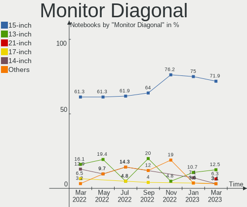
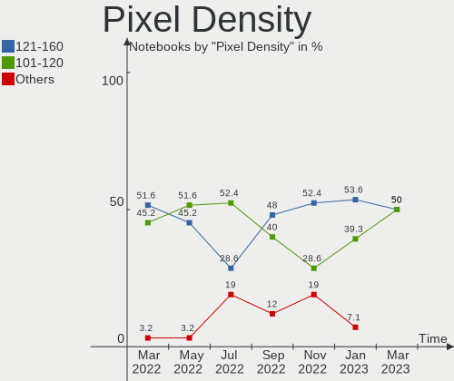

Endless - Hardware Trends (Notebooks)
-------------------------------------

A project to identify most popular hardware characteristics and track their change
over time based on data collected by Linux users at https://Linux-Hardware.org.

Anyone can contribute to this report by the [hw-probe](https://github.com/linuxhw/hw-probe) tool:

    sudo -E hw-probe -all -upload

This report is for one last month. Overall report since the beginning of time: [TestCoverage](https://github.com/linuxhw/TestCoverage)

Period: Sep, 2022.

Contents
--------

* [ System ](#system)
  - [ OS                       ](#os)
  - [ OS Family                ](#os-family)
  - [ Kernel                   ](#kernel)
  - [ Kernel Family            ](#kernel-family)
  - [ Kernel Major Ver.        ](#kernel-major-ver)
  - [ Arch                     ](#arch)
  - [ DE                       ](#de)
  - [ Display Server           ](#display-server)
  - [ Display Manager          ](#display-manager)
  - [ OS Lang                  ](#os-lang)
  - [ Boot Mode                ](#boot-mode)
  - [ Filesystem               ](#filesystem)
  - [ Part. scheme             ](#part-scheme)
  - [ Dual Boot with Linux/BSD ](#dual-boot-with-linuxbsd)
  - [ Dual Boot (Win)          ](#dual-boot-win)

* [ Board ](#board)
  - [ Vendor                   ](#vendor)
  - [ Model                    ](#model)
  - [ Model Family             ](#model-family)
  - [ MFG Year                 ](#mfg-year)
  - [ Form Factor              ](#form-factor)
  - [ Secure Boot              ](#secure-boot)
  - [ Coreboot                 ](#coreboot)
  - [ RAM Size                 ](#ram-size)
  - [ RAM Used                 ](#ram-used)
  - [ Total Drives             ](#total-drives)
  - [ Has CD-ROM               ](#has-cd-rom)
  - [ Has Ethernet             ](#has-ethernet)
  - [ Has WiFi                 ](#has-wifi)
  - [ Has Bluetooth            ](#has-bluetooth)

* [ Location ](#location)
  - [ Country                  ](#country)
  - [ City                     ](#city)

* [ Drives ](#drives)
  - [ Drive Vendor             ](#drive-vendor)
  - [ Drive Model              ](#drive-model)
  - [ HDD Vendor               ](#hdd-vendor)
  - [ SSD Vendor               ](#ssd-vendor)
  - [ Drive Kind               ](#drive-kind)
  - [ Drive Connector          ](#drive-connector)
  - [ Drive Size               ](#drive-size)
  - [ Space Total              ](#space-total)
  - [ Space Used               ](#space-used)
  - [ Malfunc. Drives          ](#malfunc-drives)
  - [ Malfunc. Drive Vendor    ](#malfunc-drive-vendor)
  - [ Malfunc. HDD Vendor      ](#malfunc-hdd-vendor)
  - [ Malfunc. Drive Kind      ](#malfunc-drive-kind)
  - [ Failed Drives            ](#failed-drives)
  - [ Failed Drive Vendor      ](#failed-drive-vendor)
  - [ Drive Status             ](#drive-status)

* [ Storage controller ](#storage-controller)
  - [ Storage Vendor           ](#storage-vendor)
  - [ Storage Model            ](#storage-model)
  - [ Storage Kind             ](#storage-kind)

* [ Processor ](#processor)
  - [ CPU Vendor               ](#cpu-vendor)
  - [ CPU Model                ](#cpu-model)
  - [ CPU Model Family         ](#cpu-model-family)
  - [ CPU Cores                ](#cpu-cores)
  - [ CPU Sockets              ](#cpu-sockets)
  - [ CPU Threads              ](#cpu-threads)
  - [ CPU Op-Modes             ](#cpu-op-modes)
  - [ CPU Microcode            ](#cpu-microcode)
  - [ CPU Microarch            ](#cpu-microarch)

* [ Graphics ](#graphics)
  - [ GPU Vendor               ](#gpu-vendor)
  - [ GPU Model                ](#gpu-model)
  - [ GPU Combo                ](#gpu-combo)
  - [ GPU Driver               ](#gpu-driver)
  - [ GPU Memory               ](#gpu-memory)

* [ Monitor ](#monitor)
  - [ Monitor Vendor           ](#monitor-vendor)
  - [ Monitor Model            ](#monitor-model)
  - [ Monitor Resolution       ](#monitor-resolution)
  - [ Monitor Diagonal         ](#monitor-diagonal)
  - [ Monitor Width            ](#monitor-width)
  - [ Aspect Ratio             ](#aspect-ratio)
  - [ Monitor Area             ](#monitor-area)
  - [ Pixel Density            ](#pixel-density)
  - [ Multiple Monitors        ](#multiple-monitors)

* [ Network ](#network)
  - [ Net Controller Vendor    ](#net-controller-vendor)
  - [ Net Controller Model     ](#net-controller-model)
  - [ Wireless Vendor          ](#wireless-vendor)
  - [ Wireless Model           ](#wireless-model)
  - [ Ethernet Vendor          ](#ethernet-vendor)
  - [ Ethernet Model           ](#ethernet-model)
  - [ Net Controller Kind      ](#net-controller-kind)
  - [ Used Controller          ](#used-controller)
  - [ NICs                     ](#nics)
  - [ IPv6                     ](#ipv6)

* [ Bluetooth ](#bluetooth)
  - [ Bluetooth Vendor         ](#bluetooth-vendor)
  - [ Bluetooth Model          ](#bluetooth-model)

* [ Sound ](#sound)
  - [ Sound Vendor             ](#sound-vendor)
  - [ Sound Model              ](#sound-model)

* [ Memory ](#memory)
  - [ Memory Vendor            ](#memory-vendor)
  - [ Memory Model             ](#memory-model)
  - [ Memory Kind              ](#memory-kind)
  - [ Memory Form Factor       ](#memory-form-factor)
  - [ Memory Size              ](#memory-size)
  - [ Memory Speed             ](#memory-speed)

* [ Printers & scanners ](#printers--scanners)
  - [ Printer Vendor           ](#printer-vendor)
  - [ Printer Model            ](#printer-model)
  - [ Scanner Vendor           ](#scanner-vendor)
  - [ Scanner Model            ](#scanner-model)

* [ Camera ](#camera)
  - [ Camera Vendor            ](#camera-vendor)
  - [ Camera Model             ](#camera-model)

* [ Security ](#security)
  - [ Fingerprint Vendor       ](#fingerprint-vendor)
  - [ Fingerprint Model        ](#fingerprint-model)
  - [ Chipcard Vendor          ](#chipcard-vendor)
  - [ Chipcard Model           ](#chipcard-model)

* [ Unsupported ](#unsupported)
  - [ Unsupported Devices      ](#unsupported-devices)
  - [ Unsupported Device Types ](#unsupported-device-types)

System
------

OS
--

Installed operating systems

| Name                  | Notebooks | Percent |
|-----------------------|-----------|---------|
| Endless 4.0.9         | 12        | 48%     |
| Endless 4.0.8         | 3         | 12%     |
| Endless 4.0.4         | 2         | 8%      |
| Endless 3.9.7         | 2         | 8%      |
| Endless 4.0.7         | 1         | 4%      |
| Endless 4.0.3         | 1         | 4%      |
| Endless 4.0.0         | 1         | 4%      |
| Endless 3.9.6         | 1         | 4%      |
| Endless 3.9.3-nexthw1 | 1         | 4%      |
| Endless 3.8.0         | 1         | 4%      |

OS Family
---------

OS without a version

| Name    | Notebooks | Percent |
|---------|-----------|---------|
| Endless | 25        | 100%    |

Kernel
------

Version of the Linux kernel

| Version           | Notebooks | Percent |
|-------------------|-----------|---------|
| 5.11.0-35-generic | 20        | 80%     |
| 5.8.0-14-generic  | 3         | 12%     |
| 5.4.0-19-generic  | 1         | 4%      |
| 5.11.0-12-generic | 1         | 4%      |

Kernel Family
-------------

Linux kernel without a distro release

| Version | Notebooks | Percent |
|---------|-----------|---------|
| 5.11.0  | 21        | 84%     |
| 5.8.0   | 3         | 12%     |
| 5.4.0   | 1         | 4%      |

Kernel Major Ver.
-----------------

Linux kernel major version

| Version | Notebooks | Percent |
|---------|-----------|---------|
| 5.11    | 21        | 84%     |
| 5.8     | 3         | 12%     |
| 5.4     | 1         | 4%      |

Arch
----

OS architecture (x86_64, i586, etc.)

| Name   | Notebooks | Percent |
|--------|-----------|---------|
| x86_64 | 25        | 100%    |

DE
--

Desktop Environment

| Name  | Notebooks | Percent |
|-------|-----------|---------|
| GNOME | 25        | 100%    |

Display Server
--------------

X11 or Wayland

| Name | Notebooks | Percent |
|------|-----------|---------|
| X11  | 25        | 100%    |

Display Manager
---------------

SDDM, LightDM, etc.

| Name    | Notebooks | Percent |
|---------|-----------|---------|
| Unknown | 25        | 100%    |

OS Lang
-------

Language

| Lang  | Notebooks | Percent |
|-------|-----------|---------|
| pt_BR | 7         | 28%     |
| en_US | 6         | 24%     |
| de_DE | 2         | 8%      |
| uk_UA | 1         | 4%      |
| ru_RU | 1         | 4%      |
| it_IT | 1         | 4%      |
| fr_FR | 1         | 4%      |
| es_MX | 1         | 4%      |
| es_ES | 1         | 4%      |
| es_CO | 1         | 4%      |
| es_AR | 1         | 4%      |
| en_GB | 1         | 4%      |
| az_AZ | 1         | 4%      |

Boot Mode
---------

EFI or BIOS

| Mode | Notebooks | Percent |
|------|-----------|---------|
| EFI  | 18        | 72%     |
| BIOS | 7         | 28%     |

Filesystem
----------

Type of filesystem

| Type  | Notebooks | Percent |
|-------|-----------|---------|
| Ext4  | 24        | 96%     |
| Tmpfs | 1         | 4%      |

Part. scheme
------------

Scheme of partitioning

| Type    | Notebooks | Percent |
|---------|-----------|---------|
| Unknown | 25        | 100%    |

Dual Boot with Linux/BSD
------------------------

Hosting more than one Linux/BSD

| Dual boot | Notebooks | Percent |
|-----------|-----------|---------|
| No        | 25        | 100%    |

Dual Boot (Win)
---------------

Hosting Linux and Windows

| Dual boot | Notebooks | Percent |
|-----------|-----------|---------|
| No        | 25        | 100%    |

Board
-----

Vendor
------

Motherboard manufacturer

| Name             | Notebooks | Percent |
|------------------|-----------|---------|
| ASUSTek Computer | 10        | 40%     |
| Acer             | 7         | 28%     |
| Dell             | 3         | 12%     |
| Hewlett-Packard  | 2         | 8%      |
| Sony             | 1         | 4%      |
| Positivo         | 1         | 4%      |
| Lenovo           | 1         | 4%      |

Model
-----

Motherboard model

| Name                                       | Notebooks | Percent |
|--------------------------------------------|-----------|---------|
| Acer Nitro AN515-44                        | 3         | 12%     |
| ASUS VivoBook 15_ASUS Laptop X540MA_R540MA | 2         | 8%      |
| Sony SVE1712L1EW                           | 1         | 4%      |
| Positivo S14CT01                           | 1         | 4%      |
| Lenovo Yoga 3 Pro-1370 80HE                | 1         | 4%      |
| HP Pavilion Gaming Laptop 16-a0xxx         | 1         | 4%      |
| HP 255 G8 Notebook PC                      | 1         | 4%      |
| Dell XPS 13 9360                           | 1         | 4%      |
| Dell Latitude E7240                        | 1         | 4%      |
| Dell Inspiron 1545                         | 1         | 4%      |
| ASUS X541UAK                               | 1         | 4%      |
| ASUS X441NA                                | 1         | 4%      |
| ASUS VivoBook_ASUSLaptop X515JA_X515JA     | 1         | 4%      |
| ASUS VivoBook_ASUSLaptop X515DAP_M515DA    | 1         | 4%      |
| ASUS VivoBook_ASUSLaptop X513EA_K513EA     | 1         | 4%      |
| ASUS VivoBook_ASUSLaptop X513EAN_X513EAN   | 1         | 4%      |
| ASUS VivoBook 15_ASUS Laptop X540UAR       | 1         | 4%      |
| ASUS VivoBook 15_ASUS Laptop X540BP        | 1         | 4%      |
| Acer TravelMate P449-G3-MG                 | 1         | 4%      |
| Acer TravelMate 8572T                      | 1         | 4%      |
| Acer Aspire A515-54                        | 1         | 4%      |
| Acer Aspire A317-52                        | 1         | 4%      |

Model Family
------------

Motherboard model prefix

| Name             | Notebooks | Percent |
|------------------|-----------|---------|
| ASUS VivoBook    | 8         | 32%     |
| Acer Nitro       | 3         | 12%     |
| Acer TravelMate  | 2         | 8%      |
| Acer Aspire      | 2         | 8%      |
| Sony SVE1712L1EW | 1         | 4%      |
| Positivo S14CT01 | 1         | 4%      |
| Lenovo Yoga      | 1         | 4%      |
| HP Pavilion      | 1         | 4%      |
| HP 255           | 1         | 4%      |
| Dell XPS         | 1         | 4%      |
| Dell Latitude    | 1         | 4%      |
| Dell Inspiron    | 1         | 4%      |
| ASUS X541UAK     | 1         | 4%      |
| ASUS X441NA      | 1         | 4%      |

MFG Year
--------

Motherboard manufacture year

| Year | Notebooks | Percent |
|------|-----------|---------|
| 2020 | 7         | 28%     |
| 2018 | 5         | 20%     |
| 2021 | 3         | 12%     |
| 2016 | 3         | 12%     |
| 2019 | 1         | 4%      |
| 2017 | 1         | 4%      |
| 2014 | 1         | 4%      |
| 2013 | 1         | 4%      |
| 2012 | 1         | 4%      |
| 2010 | 1         | 4%      |
| 2008 | 1         | 4%      |

Form Factor
-----------

Physical design of the computer

| Name     | Notebooks | Percent |
|----------|-----------|---------|
| Notebook | 25        | 100%    |

Secure Boot
-----------

Enabled or disabled

| State    | Notebooks | Percent |
|----------|-----------|---------|
| Disabled | 22        | 88%     |
| Enabled  | 3         | 12%     |

Coreboot
--------

Have coreboot on board

| Used | Notebooks | Percent |
|------|-----------|---------|
| No   | 25        | 100%    |

RAM Size
--------

Total RAM memory

| Size in GB | Notebooks | Percent |
|------------|-----------|---------|
| 3.01-4.0   | 11        | 44%     |
| 4.01-8.0   | 10        | 40%     |
| 8.01-16.0  | 2         | 8%      |
| 16.01-24.0 | 1         | 4%      |
| 1.01-2.0   | 1         | 4%      |

RAM Used
--------

Used RAM memory

| Used GB  | Notebooks | Percent |
|----------|-----------|---------|
| 1.01-2.0 | 12        | 48%     |
| 2.01-3.0 | 5         | 20%     |
| 0.51-1.0 | 4         | 16%     |
| 4.01-8.0 | 2         | 8%      |
| 3.01-4.0 | 2         | 8%      |

Total Drives
------------

Number of drives on board

| Drives | Notebooks | Percent |
|--------|-----------|---------|
| 1      | 22        | 88%     |
| 2      | 3         | 12%     |

Has CD-ROM
----------

Has CD-ROM on board

| Presented | Notebooks | Percent |
|-----------|-----------|---------|
| No        | 19        | 76%     |
| Yes       | 6         | 24%     |

Has Ethernet
------------

Has Ethernet on board

| Presented | Notebooks | Percent |
|-----------|-----------|---------|
| Yes       | 14        | 56%     |
| No        | 11        | 44%     |

Has WiFi
--------

Has WiFi module

| Presented | Notebooks | Percent |
|-----------|-----------|---------|
| Yes       | 23        | 92%     |
| No        | 2         | 8%      |

Has Bluetooth
-------------

Has Bluetooth module

| Presented | Notebooks | Percent |
|-----------|-----------|---------|
| Yes       | 21        | 84%     |
| No        | 4         | 16%     |

Location
--------

Country
-------

Geographic location (country)

| Country    | Notebooks | Percent |
|------------|-----------|---------|
| Brazil     | 7         | 28%     |
| Germany    | 3         | 12%     |
| USA        | 2         | 8%      |
| Spain      | 2         | 8%      |
| Ukraine    | 1         | 4%      |
| Russia     | 1         | 4%      |
| Malta      | 1         | 4%      |
| Italy      | 1         | 4%      |
| Georgia    | 1         | 4%      |
| Egypt      | 1         | 4%      |
| Ecuador    | 1         | 4%      |
| Colombia   | 1         | 4%      |
| Belgium    | 1         | 4%      |
| Azerbaijan | 1         | 4%      |
| Australia  | 1         | 4%      |

City
----

Geographic location (city)

| City                      | Notebooks | Percent |
|---------------------------|-----------|---------|
| Três Lagoas              | 1         | 4%      |
| Taquaritinga              | 1         | 4%      |
| Tambau                    | 1         | 4%      |
| Sao Paulo                 | 1         | 4%      |
| Sant Ferran de ses Roques | 1         | 4%      |
| Rathenow                  | 1         | 4%      |
| Potsdam                   | 1         | 4%      |
| Moscow                    | 1         | 4%      |
| Matao                     | 1         | 4%      |
| Maringá                  | 1         | 4%      |
| Malyn                     | 1         | 4%      |
| Londrina                  | 1         | 4%      |
| K'alak'i T'bilisi         | 1         | 4%      |
| Guayaquil                 | 1         | 4%      |
| Goose Creek               | 1         | 4%      |
| Faenza                    | 1         | 4%      |
| El Carmen de Viboral      | 1         | 4%      |
| Dallas                    | 1         | 4%      |
| Brisbane                  | 1         | 4%      |
| Barcelona                 | 1         | 4%      |
| Baku                      | 1         | 4%      |
| Bad Kreuznach             | 1         | 4%      |
| Attard                    | 1         | 4%      |
| Ans                       | 1         | 4%      |
| Alexandria                | 1         | 4%      |

Drives
------

Drive Vendor
------------

Hard drive vendors

| Vendor                      | Notebooks | Drives | Percent |
|-----------------------------|-----------|--------|---------|
| Sandisk                     | 4         | 4      | 14.81%  |
| Seagate                     | 3         | 3      | 11.11%  |
| WDC                         | 2         | 2      | 7.41%   |
| SK hynix                    | 2         | 2      | 7.41%   |
| Samsung Electronics         | 2         | 3      | 7.41%   |
| Kingston                    | 2         | 2      | 7.41%   |
| Intel                       | 2         | 2      | 7.41%   |
| ADATA Technology            | 2         | 2      | 7.41%   |
| Unknown                     | 1         | 1      | 3.7%    |
| Toshiba                     | 1         | 1      | 3.7%    |
| Timetec                     | 1         | 1      | 3.7%    |
| Phison                      | 1         | 1      | 3.7%    |
| OWC                         | 1         | 1      | 3.7%    |
| LITEONIT                    | 1         | 1      | 3.7%    |
| Kingston Technology Company | 1         | 1      | 3.7%    |
| KingFast                    | 1         | 1      | 3.7%    |

Drive Model
-----------

Hard drive models

| Model                                               | Notebooks | Percent |
|-----------------------------------------------------|-----------|---------|
| WDC WD10SPZX-21Z10T0 1TB                            | 2         | 7.14%   |
| Sandisk WD Blue SN550 NVMe SSD 1024GB               | 2         | 7.14%   |
| SanDisk NVMe SSD Drive 256GB                        | 2         | 7.14%   |
| Kingston RBUSC180DS37256GJ 256GB SSD                | 2         | 7.14%   |
| Unknown MMC Card  32GB                              | 1         | 3.57%   |
| Toshiba MQ01ABF050 500GB                            | 1         | 3.57%   |
| Timetec 30TT253X2-512G                              | 1         | 3.57%   |
| SK hynix HFS128G39TND-N210A 128GB SSD               | 1         | 3.57%   |
| SK hynix BC511 512GB                                | 1         | 3.57%   |
| Seagate ST640LM001 HN-M640MBB 640GB                 | 1         | 3.57%   |
| Seagate ST500LM030-1RK17D 500GB                     | 1         | 3.57%   |
| Seagate ST1000LM035-1RK172 1TB                      | 1         | 3.57%   |
| Samsung NVMe SSD Drive 256GB                        | 1         | 3.57%   |
| Samsung NVMe SSD Controller SM961/PM961/SM963 256GB | 1         | 3.57%   |
| Samsung MZNTE256HMHP-000L2 256GB SSD                | 1         | 3.57%   |
| Phison NVMe SSD Drive 256GB                         | 1         | 3.57%   |
| OWC Mercury Electra 3G SSD                          | 1         | 3.57%   |
| LITEONIT LMT-128M6M-HP 128GB SSD                    | 1         | 3.57%   |
| Kingston Company OM3PDP3 NVMe SSD 512GB             | 1         | 3.57%   |
| KingFast 256GB                                      | 1         | 3.57%   |
| Intel NVMe SSD Drive 256GB                          | 1         | 3.57%   |
| Intel Micron_2210_MTFDHBA1T0QFD 1024GB              | 1         | 3.57%   |
| ADATA SM2P32A8-256GC1 256GB                         | 1         | 3.57%   |
| ADATA NVMe SSD Drive 256GB                          | 1         | 3.57%   |

HDD Vendor
----------

Hard disk drive vendors

| Vendor  | Notebooks | Drives | Percent |
|---------|-----------|--------|---------|
| Seagate | 3         | 3      | 50%     |
| WDC     | 2         | 2      | 33.33%  |
| Toshiba | 1         | 1      | 16.67%  |

SSD Vendor
----------

Solid state drive vendors

| Vendor              | Notebooks | Drives | Percent |
|---------------------|-----------|--------|---------|
| Kingston            | 2         | 2      | 33.33%  |
| SK hynix            | 1         | 1      | 16.67%  |
| Samsung Electronics | 1         | 1      | 16.67%  |
| OWC                 | 1         | 1      | 16.67%  |
| LITEONIT            | 1         | 1      | 16.67%  |

Drive Kind
----------

HDD or SSD

| Kind    | Notebooks | Drives | Percent |
|---------|-----------|--------|---------|
| NVMe    | 12        | 13     | 44.44%  |
| SSD     | 6         | 6      | 22.22%  |
| HDD     | 6         | 6      | 22.22%  |
| Unknown | 2         | 2      | 7.41%   |
| MMC     | 1         | 1      | 3.7%    |

Drive Connector
---------------

SATA, SAS, NVMe, etc.

| Type | Notebooks | Drives | Percent |
|------|-----------|--------|---------|
| SATA | 13        | 14     | 50%     |
| NVMe | 12        | 13     | 46.15%  |
| MMC  | 1         | 1      | 3.85%   |

Drive Size
----------

Size of hard drive

| Size in TB | Notebooks | Drives | Percent |
|------------|-----------|--------|---------|
| 0.01-0.5   | 7         | 7      | 58.33%  |
| 0.51-1.0   | 5         | 5      | 41.67%  |

Space Total
-----------

Amount of disk space available on the file system

| Size in GB | Notebooks | Percent |
|------------|-----------|---------|
| 101-250    | 12        | 48%     |
| 251-500    | 6         | 24%     |
| 501-1000   | 5         | 20%     |
| 21-50      | 1         | 4%      |
| 1-20       | 1         | 4%      |

Space Used
----------

Amount of used disk space

| Used GB  | Notebooks | Percent |
|----------|-----------|---------|
| 21-50    | 9         | 36%     |
| 1-20     | 6         | 24%     |
| 101-250  | 5         | 20%     |
| 51-100   | 4         | 16%     |
| 501-1000 | 1         | 4%      |

Malfunc. Drives
---------------

Drive models with a malfunction

Zero info for selected period =(

Malfunc. Drive Vendor
---------------------

Vendors of faulty drives

Zero info for selected period =(

Malfunc. HDD Vendor
-------------------

Vendors of faulty HDD drives

Zero info for selected period =(

Malfunc. Drive Kind
-------------------

Kinds of faulty drives

Zero info for selected period =(

Failed Drives
-------------

Failed drive models

Zero info for selected period =(

Failed Drive Vendor
-------------------

Failed drive vendors

Zero info for selected period =(

Drive Status
------------

Number of failed and malfunc. drives

| Status   | Notebooks | Drives | Percent |
|----------|-----------|--------|---------|
| Detected | 25        | 28     | 100%    |

Storage controller
------------------

Storage Vendor
--------------

Storage controller vendors

| Vendor                      | Notebooks | Percent |
|-----------------------------|-----------|---------|
| Intel                       | 18        | 54.55%  |
| AMD                         | 5         | 15.15%  |
| SanDisk                     | 4         | 12.12%  |
| ADATA Technology            | 2         | 6.06%   |
| SK hynix                    | 1         | 3.03%   |
| Samsung Electronics         | 1         | 3.03%   |
| Phison Electronics          | 1         | 3.03%   |
| Kingston Technology Company | 1         | 3.03%   |

Storage Model
-------------

Storage controller models

| Model                                                                    | Notebooks | Percent |
|--------------------------------------------------------------------------|-----------|---------|
| Intel 82801 Mobile SATA Controller [RAID mode]                           | 5         | 13.51%  |
| AMD FCH SATA Controller [AHCI mode]                                      | 5         | 13.51%  |
| SanDisk WD Blue SN550 NVMe SSD                                           | 4         | 10.81%  |
| Intel Sunrise Point-LP SATA Controller [AHCI mode]                       | 3         | 8.11%   |
| Intel Volume Management Device NVMe RAID Controller                      | 2         | 5.41%   |
| Intel Tiger Lake-LP SATA Controller                                      | 2         | 5.41%   |
| Intel PROSet/Wireless WiFi Software extension                            | 2         | 5.41%   |
| Intel Celeron/Pentium Silver Processor SATA Controller                   | 2         | 5.41%   |
| SK hynix BC511                                                           | 1         | 2.7%    |
| Samsung NVMe SSD Controller SM961/PM961/SM963                            | 1         | 2.7%    |
| Phison PS5013 E13 NVMe Controller                                        | 1         | 2.7%    |
| Kingston Company OM3PDP3 NVMe SSD                                        | 1         | 2.7%    |
| Intel Wildcat Point-LP SATA Controller [AHCI Mode]                       | 1         | 2.7%    |
| Intel Celeron N3350/Pentium N4200/Atom E3900 Series SATA AHCI Controller | 1         | 2.7%    |
| Intel 82801IBM/IEM (ICH9M/ICH9M-E) 4 port SATA Controller [AHCI mode]    | 1         | 2.7%    |
| Intel 8 Series SATA Controller 1 [AHCI mode]                             | 1         | 2.7%    |
| Intel 7 Series Chipset Family 6-port SATA Controller [AHCI mode]         | 1         | 2.7%    |
| Intel 5 Series/3400 Series Chipset 4 port SATA AHCI Controller           | 1         | 2.7%    |
| ADATA Non-Volatile memory controller                                     | 1         | 2.7%    |
| ADATA A Non-Volatile memory controller                                   | 1         | 2.7%    |

Storage Kind
------------

Kind of storage controller (IDE, SATA, NVMe, SAS, ...)

| Kind | Notebooks | Percent |
|------|-----------|---------|
| SATA | 19        | 51.35%  |
| NVMe | 12        | 32.43%  |
| RAID | 6         | 16.22%  |

Processor
---------

CPU Vendor
----------

Processor vendors

| Vendor | Notebooks | Percent |
|--------|-----------|---------|
| Intel  | 19        | 76%     |
| AMD    | 6         | 24%     |

CPU Model
---------

Processor models

| Model                                        | Notebooks | Percent |
|----------------------------------------------|-----------|---------|
| AMD Ryzen 7 4800H with Radeon Graphics       | 3         | 12%     |
| Intel Core i5-1035G1 CPU @ 1.00GHz           | 2         | 8%      |
| Intel Celeron N4000 CPU @ 1.10GHz            | 2         | 8%      |
| Intel Pentium Dual-Core CPU T4400 @ 2.20GHz  | 1         | 4%      |
| Intel Core M-5Y71 CPU @ 1.20GHz              | 1         | 4%      |
| Intel Core i7-7500U CPU @ 2.70GHz            | 1         | 4%      |
| Intel Core i5-8250U CPU @ 1.60GHz            | 1         | 4%      |
| Intel Core i5-7200U CPU @ 2.50GHz            | 1         | 4%      |
| Intel Core i5-4210U CPU @ 1.70GHz            | 1         | 4%      |
| Intel Core i5-10300H CPU @ 2.50GHz           | 1         | 4%      |
| Intel Core i5-10210U CPU @ 1.60GHz           | 1         | 4%      |
| Intel Core i5 CPU M 540 @ 2.53GHz            | 1         | 4%      |
| Intel Core i3-7020U CPU @ 2.30GHz            | 1         | 4%      |
| Intel Core i3-3110M CPU @ 2.40GHz            | 1         | 4%      |
| Intel Celeron CPU N3350 @ 1.10GHz            | 1         | 4%      |
| Intel Atom x5-Z8350 CPU @ 1.44GHz            | 1         | 4%      |
| Intel 11th Gen Core i7-1165G7 @ 2.80GHz      | 1         | 4%      |
| Intel 11th Gen Core i3-1115G4 @ 3.00GHz      | 1         | 4%      |
| AMD Ryzen 3 3250U with Radeon Graphics       | 1         | 4%      |
| AMD A6-9225 RADEON R4, 5 COMPUTE CORES 2C+3G | 1         | 4%      |
| AMD 3020e with Radeon Graphics               | 1         | 4%      |

CPU Model Family
----------------

Processor model prefix

| Model                   | Notebooks | Percent |
|-------------------------|-----------|---------|
| Intel Core i5           | 8         | 32%     |
| Other                   | 3         | 12%     |
| Intel Celeron           | 3         | 12%     |
| AMD Ryzen 7             | 3         | 12%     |
| Intel Core i3           | 2         | 8%      |
| Intel Pentium Dual-Core | 1         | 4%      |
| Intel Core M            | 1         | 4%      |
| Intel Core i7           | 1         | 4%      |
| Intel Atom              | 1         | 4%      |
| AMD Ryzen 3             | 1         | 4%      |
| AMD A6                  | 1         | 4%      |

CPU Cores
---------

Number of processor cores

| Number | Notebooks | Percent |
|--------|-----------|---------|
| 2      | 15        | 60%     |
| 4      | 7         | 28%     |
| 8      | 3         | 12%     |

CPU Sockets
-----------

Number of sockets

| Number | Notebooks | Percent |
|--------|-----------|---------|
| 1      | 25        | 100%    |

CPU Threads
-----------

Threads per core (Hyper-Threading)

| Number | Notebooks | Percent |
|--------|-----------|---------|
| 2      | 18        | 72%     |
| 1      | 7         | 28%     |

CPU Op-Modes
------------

CPU Operation Modes (32-bit, 64-bit)

| Op mode        | Notebooks | Percent |
|----------------|-----------|---------|
| 32-bit, 64-bit | 25        | 100%    |

CPU Microcode
-------------

Microcode number

| Number     | Notebooks | Percent |
|------------|-----------|---------|
| 0x806e9    | 3         | 12%     |
| 0x08600103 | 3         | 12%     |
| 0x806c1    | 2         | 8%      |
| 0x706e5    | 2         | 8%      |
| 0x706a1    | 2         | 8%      |
| Unknown    | 2         | 8%      |
| 0xa0652    | 1         | 4%      |
| 0x806ea    | 1         | 4%      |
| 0x506c9    | 1         | 4%      |
| 0x406c4    | 1         | 4%      |
| 0x40651    | 1         | 4%      |
| 0x306d4    | 1         | 4%      |
| 0x306a9    | 1         | 4%      |
| 0x20652    | 1         | 4%      |
| 0x1067a    | 1         | 4%      |
| 0x08200103 | 1         | 4%      |
| 0x06006705 | 1         | 4%      |

CPU Microarch
-------------

Microarchitecture

| Name          | Notebooks | Percent |
|---------------|-----------|---------|
| KabyLake      | 5         | 20%     |
| Zen 2         | 3         | 12%     |
| TigerLake     | 2         | 8%      |
| IceLake       | 2         | 8%      |
| Goldmont plus | 2         | 8%      |
| Zen+          | 1         | 4%      |
| Zen           | 1         | 4%      |
| Westmere      | 1         | 4%      |
| Silvermont    | 1         | 4%      |
| Penryn        | 1         | 4%      |
| IvyBridge     | 1         | 4%      |
| Haswell       | 1         | 4%      |
| Goldmont      | 1         | 4%      |
| Excavator     | 1         | 4%      |
| CometLake     | 1         | 4%      |
| Broadwell     | 1         | 4%      |

Graphics
--------

GPU Vendor
----------

Vendors of graphics cards

| Vendor | Notebooks | Percent |
|--------|-----------|---------|
| Intel  | 18        | 60%     |
| AMD    | 7         | 23.33%  |
| Nvidia | 5         | 16.67%  |

GPU Model
---------

Graphics card models

| Model                                                                                    | Notebooks | Percent |
|------------------------------------------------------------------------------------------|-----------|---------|
| Nvidia TU117M                                                                            | 3         | 9.68%   |
| AMD Renoir                                                                               | 3         | 9.68%   |
| Intel Iris Plus Graphics G1 (Ice Lake)                                                   | 2         | 6.45%   |
| Intel HD Graphics 620                                                                    | 2         | 6.45%   |
| Intel GeminiLake [UHD Graphics 600]                                                      | 2         | 6.45%   |
| AMD Picasso/Raven 2 [Radeon Vega Series / Radeon Vega Mobile Series]                     | 2         | 6.45%   |
| Nvidia TU117M [GeForce GTX 1650 Ti Mobile]                                               | 1         | 3.23%   |
| Nvidia GM108M [GeForce MX130]                                                            | 1         | 3.23%   |
| Intel UHD Graphics 620                                                                   | 1         | 3.23%   |
| Intel TigerLake-LP GT2 [Iris Xe Graphics]                                                | 1         | 3.23%   |
| Intel Tiger Lake UHD Graphics                                                            | 1         | 3.23%   |
| Intel Mobile 4 Series Chipset Integrated Graphics Controller                             | 1         | 3.23%   |
| Intel Kaby Lake-U GT2f HD 620 Graphics Controller                                        | 1         | 3.23%   |
| Intel HD Graphics 5300                                                                   | 1         | 3.23%   |
| Intel HD Graphics 500                                                                    | 1         | 3.23%   |
| Intel Haswell-ULT Integrated Graphics Controller                                         | 1         | 3.23%   |
| Intel Core Processor Integrated Graphics Controller                                      | 1         | 3.23%   |
| Intel CometLake-U GT2 [UHD Graphics]                                                     | 1         | 3.23%   |
| Intel CometLake-H GT2 [UHD Graphics]                                                     | 1         | 3.23%   |
| Intel Atom/Celeron/Pentium Processor x5-E8000/J3xxx/N3xxx Integrated Graphics Controller | 1         | 3.23%   |
| AMD Thames [Radeon HD 7550M/7570M/7650M]                                                 | 1         | 3.23%   |
| AMD Sun LE [Radeon HD 8550M / R5 M230]                                                   | 1         | 3.23%   |
| AMD Stoney [Radeon R2/R3/R4/R5 Graphics]                                                 | 1         | 3.23%   |

GPU Combo
---------

Combinations of graphics cards

| Name           | Notebooks | Percent |
|----------------|-----------|---------|
| 1 x Intel      | 16        | 64%     |
| AMD + Nvidia   | 3         | 12%     |
| 1 x AMD        | 3         | 12%     |
| Intel + Nvidia | 2         | 8%      |
| 2 x AMD        | 1         | 4%      |

GPU Driver
----------

Free vs proprietary

| Driver      | Notebooks | Percent |
|-------------|-----------|---------|
| Free        | 20        | 80%     |
| Proprietary | 5         | 20%     |

GPU Memory
----------

Total video memory

| Size in GB | Notebooks | Percent |
|------------|-----------|---------|
| Unknown    | 19        | 76%     |
| 0.01-0.5   | 4         | 16%     |
| 1.01-2.0   | 1         | 4%      |
| 0.51-1.0   | 1         | 4%      |

Monitor
-------

Monitor Vendor
--------------

Monitor vendors

| Vendor              | Notebooks | Percent |
|---------------------|-----------|---------|
| Chimei Innolux      | 9         | 36%     |
| BOE                 | 5         | 20%     |
| AU Optronics        | 4         | 16%     |
| LG Display          | 2         | 8%      |
| Sharp               | 1         | 4%      |
| Samsung Electronics | 1         | 4%      |
| PANDA               | 1         | 4%      |
| KDC                 | 1         | 4%      |
| Dell                | 1         | 4%      |

Monitor Model
-------------

Monitor models

| Model                                                                 | Notebooks | Percent |
|-----------------------------------------------------------------------|-----------|---------|
| Chimei Innolux LCD Monitor CMN15F5 1920x1080 344x193mm 15.5-inch      | 3         | 12%     |
| Chimei Innolux LCD Monitor CMN15DB 1366x768 344x193mm 15.5-inch       | 3         | 12%     |
| BOE LCD Monitor BOE06A5 1366x768 344x194mm 15.5-inch                  | 2         | 8%      |
| AU Optronics LCD Monitor AUOAF90 1920x1080 344x193mm 15.5-inch        | 2         | 8%      |
| Sharp LCD Monitor SHP1449 1920x1080 294x165mm 13.3-inch               | 1         | 4%      |
| Samsung Electronics LCD Monitor SDC434A 3200x1800 293x165mm 13.2-inch | 1         | 4%      |
| PANDA LCD Monitor NCP004D 1920x1080 344x194mm 15.5-inch               | 1         | 4%      |
| LG Display LCD Monitor LGD03DC 1366x768 277x156mm 12.5-inch           | 1         | 4%      |
| LG Display LCD Monitor LGD0266 1366x768 344x194mm 15.5-inch           | 1         | 4%      |
| KDC LCD Monitor KDC0830 1920x1080 344x193mm 15.5-inch                 | 1         | 4%      |
| Dell U2415 DELA0BA 1920x1200 518x324mm 24.1-inch                      | 1         | 4%      |
| Chimei Innolux LCD Monitor CMN15E6 1366x768 344x193mm 15.5-inch       | 1         | 4%      |
| Chimei Innolux LCD Monitor CMN14C9 1920x1080 309x173mm 13.9-inch      | 1         | 4%      |
| Chimei Innolux LCD Monitor CMN14C4 1366x768 309x173mm 13.9-inch       | 1         | 4%      |
| BOE LCD Monitor BOE08F6 1920x1080 355x200mm 16.0-inch                 | 1         | 4%      |
| BOE LCD Monitor BOE0788 1920x1080 381x214mm 17.2-inch                 | 1         | 4%      |
| BOE LCD Monitor BOE0696 1366x768 309x173mm 13.9-inch                  | 1         | 4%      |
| AU Optronics LCD Monitor AUO499F 1920x1080 344x194mm 15.5-inch        | 1         | 4%      |
| AU Optronics LCD Monitor AUO41EC 1366x768 344x193mm 15.5-inch         | 1         | 4%      |

Monitor Resolution
------------------

Monitor screen resolution

| Resolution       | Notebooks | Percent |
|------------------|-----------|---------|
| 1920x1080 (FHD)  | 12        | 50%     |
| 1366x768 (WXGA)  | 11        | 45.83%  |
| 3200x1800 (QHD+) | 1         | 4.17%   |

Monitor Diagonal
----------------

Diagonal size in inches

| Inches | Notebooks | Percent |
|--------|-----------|---------|
| 15     | 16        | 64%     |
| 13     | 5         | 20%     |
| 24     | 1         | 4%      |
| 17     | 1         | 4%      |
| 16     | 1         | 4%      |
| 12     | 1         | 4%      |

Monitor Width
-------------

Physical width

| Width in mm | Notebooks | Percent |
|-------------|-----------|---------|
| 301-350     | 19        | 76%     |
| 201-300     | 3         | 12%     |
| 351-400     | 2         | 8%      |
| 501-600     | 1         | 4%      |

Aspect Ratio
------------

Proportional relationship between the width and the height

| Ratio | Notebooks | Percent |
|-------|-----------|---------|
| 16/9  | 24        | 96%     |
| 16/10 | 1         | 4%      |

Monitor Area
------------

Area in inch²

| Area in inch² | Notebooks | Percent |
|----------------|-----------|---------|
| 101-110        | 17        | 68%     |
| 81-90          | 3         | 12%     |
| 71-80          | 2         | 8%      |
| 61-70          | 1         | 4%      |
| 251-300        | 1         | 4%      |
| 121-130        | 1         | 4%      |

Pixel Density
-------------

Pixels per inch

| Density       | Notebooks | Percent |
|---------------|-----------|---------|
| 121-160       | 12        | 48%     |
| 101-120       | 10        | 40%     |
| More than 240 | 1         | 4%      |
| 161-240       | 1         | 4%      |
| 51-100        | 1         | 4%      |

Multiple Monitors
-----------------

Total monitors connected

| Total | Notebooks | Percent |
|-------|-----------|---------|
| 1     | 23        | 92%     |
| 2     | 1         | 4%      |
| 0     | 1         | 4%      |

Network
-------

Net Controller Vendor
---------------------

Controller vendors

| Vendor                          | Notebooks | Percent |
|---------------------------------|-----------|---------|
| Realtek Semiconductor           | 14        | 38.89%  |
| Intel                           | 10        | 27.78%  |
| Qualcomm Atheros                | 5         | 13.89%  |
| Broadcom Limited                | 3         | 8.33%   |
| TP-Link                         | 1         | 2.78%   |
| Qualcomm Atheros Communications | 1         | 2.78%   |
| OnePlus Technology (Shenzhen)   | 1         | 2.78%   |
| Marvell Technology Group        | 1         | 2.78%   |

Net Controller Model
--------------------

Controller models

| Model                                                             | Notebooks | Percent |
|-------------------------------------------------------------------|-----------|---------|
| Realtek RTL8111/8168/8411 PCI Express Gigabit Ethernet Controller | 5         | 12.5%   |
| Realtek RTL8821CE 802.11ac PCIe Wireless Network Adapter          | 4         | 10%     |
| Realtek Killer E2600 Gigabit Ethernet Controller                  | 3         | 7.5%    |
| Intel Wi-Fi 6 AX200                                               | 3         | 7.5%    |
| Realtek RTL810xE PCI Express Fast Ethernet controller             | 2         | 5%      |
| Qualcomm Atheros QCA9377 802.11ac Wireless Network Adapter        | 2         | 5%      |
| Intel Wi-Fi 6 AX201                                               | 2         | 5%      |
| TP-Link TL-WN821N v5/v6 [RTL8192EU]                               | 1         | 2.5%    |
| Realtek RTL8822CE 802.11ac PCIe Wireless Network Adapter          | 1         | 2.5%    |
| Realtek RTL8821AE 802.11ac PCIe Wireless Network Adapter          | 1         | 2.5%    |
| Realtek RTL8188EUS 802.11n Wireless Network Adapter               | 1         | 2.5%    |
| Qualcomm Atheros QCA6174 802.11ac Wireless Network Adapter        | 1         | 2.5%    |
| Qualcomm Atheros AR9271 802.11n                                   | 1         | 2.5%    |
| Qualcomm Atheros AR9485 Wireless Network Adapter                  | 1         | 2.5%    |
| Qualcomm Atheros AR9462 Wireless Network Adapter                  | 1         | 2.5%    |
| OnePlus (Shenzhen) OnePlus                                        | 1         | 2.5%    |
| Marvell Group 88E8040 PCI-E Fast Ethernet Controller              | 1         | 2.5%    |
| Intel Wireless 8265 / 8275                                        | 1         | 2.5%    |
| Intel Wireless 7265                                               | 1         | 2.5%    |
| Intel Ice Lake-LP PCH CNVi WiFi                                   | 1         | 2.5%    |
| Intel Ethernet Connection I219-LM                                 | 1         | 2.5%    |
| Intel Ethernet Connection I218-LM                                 | 1         | 2.5%    |
| Intel Centrino Advanced-N 6200                                    | 1         | 2.5%    |
| Broadcom Limited NetXtreme BCM57760 Gigabit Ethernet PCIe         | 1         | 2.5%    |
| Broadcom Limited BCM4352 802.11ac Wireless Network Adapter        | 1         | 2.5%    |
| Broadcom Limited BCM4312 802.11b/g LP-PHY                         | 1         | 2.5%    |

Wireless Vendor
---------------

Wireless vendors

| Vendor                          | Notebooks | Percent |
|---------------------------------|-----------|---------|
| Intel                           | 9         | 36%     |
| Realtek Semiconductor           | 7         | 28%     |
| Qualcomm Atheros                | 5         | 20%     |
| Broadcom Limited                | 2         | 8%      |
| TP-Link                         | 1         | 4%      |
| Qualcomm Atheros Communications | 1         | 4%      |

Wireless Model
--------------

Wireless models

| Model                                                      | Notebooks | Percent |
|------------------------------------------------------------|-----------|---------|
| Realtek RTL8821CE 802.11ac PCIe Wireless Network Adapter   | 4         | 16%     |
| Intel Wi-Fi 6 AX200                                        | 3         | 12%     |
| Qualcomm Atheros QCA9377 802.11ac Wireless Network Adapter | 2         | 8%      |
| Intel Wi-Fi 6 AX201                                        | 2         | 8%      |
| TP-Link TL-WN821N v5/v6 [RTL8192EU]                        | 1         | 4%      |
| Realtek RTL8822CE 802.11ac PCIe Wireless Network Adapter   | 1         | 4%      |
| Realtek RTL8821AE 802.11ac PCIe Wireless Network Adapter   | 1         | 4%      |
| Realtek RTL8188EUS 802.11n Wireless Network Adapter        | 1         | 4%      |
| Qualcomm Atheros QCA6174 802.11ac Wireless Network Adapter | 1         | 4%      |
| Qualcomm Atheros AR9271 802.11n                            | 1         | 4%      |
| Qualcomm Atheros AR9485 Wireless Network Adapter           | 1         | 4%      |
| Qualcomm Atheros AR9462 Wireless Network Adapter           | 1         | 4%      |
| Intel Wireless 8265 / 8275                                 | 1         | 4%      |
| Intel Wireless 7265                                        | 1         | 4%      |
| Intel Ice Lake-LP PCH CNVi WiFi                            | 1         | 4%      |
| Intel Centrino Advanced-N 6200                             | 1         | 4%      |
| Broadcom Limited BCM4352 802.11ac Wireless Network Adapter | 1         | 4%      |
| Broadcom Limited BCM4312 802.11b/g LP-PHY                  | 1         | 4%      |

Ethernet Vendor
---------------

Ethernet vendors

| Vendor                        | Notebooks | Percent |
|-------------------------------|-----------|---------|
| Realtek Semiconductor         | 10        | 66.67%  |
| Intel                         | 2         | 13.33%  |
| OnePlus Technology (Shenzhen) | 1         | 6.67%   |
| Marvell Technology Group      | 1         | 6.67%   |
| Broadcom Limited              | 1         | 6.67%   |

Ethernet Model
--------------

Ethernet models

| Model                                                             | Notebooks | Percent |
|-------------------------------------------------------------------|-----------|---------|
| Realtek RTL8111/8168/8411 PCI Express Gigabit Ethernet Controller | 5         | 33.33%  |
| Realtek Killer E2600 Gigabit Ethernet Controller                  | 3         | 20%     |
| Realtek RTL810xE PCI Express Fast Ethernet controller             | 2         | 13.33%  |
| OnePlus (Shenzhen) OnePlus                                        | 1         | 6.67%   |
| Marvell Group 88E8040 PCI-E Fast Ethernet Controller              | 1         | 6.67%   |
| Intel Ethernet Connection I219-LM                                 | 1         | 6.67%   |
| Intel Ethernet Connection I218-LM                                 | 1         | 6.67%   |
| Broadcom Limited NetXtreme BCM57760 Gigabit Ethernet PCIe         | 1         | 6.67%   |

Net Controller Kind
-------------------

Ethernet, WiFi or modem

| Kind     | Notebooks | Percent |
|----------|-----------|---------|
| WiFi     | 23        | 62.16%  |
| Ethernet | 14        | 37.84%  |

Used Controller
---------------

Currently used network controller

| Kind     | Notebooks | Percent |
|----------|-----------|---------|
| WiFi     | 22        | 91.67%  |
| Ethernet | 2         | 8.33%   |

NICs
----

Total network controllers on board

| Total | Notebooks | Percent |
|-------|-----------|---------|
| 2     | 13        | 52%     |
| 1     | 10        | 40%     |
| 0     | 2         | 8%      |

IPv6
----

IPv6 vs IPv4

| Used | Notebooks | Percent |
|------|-----------|---------|
| Yes  | 14        | 56%     |
| No   | 11        | 44%     |

Bluetooth
---------

Bluetooth Vendor
----------------

Controller vendors

| Vendor                          | Notebooks | Percent |
|---------------------------------|-----------|---------|
| Intel                           | 8         | 38.1%   |
| IMC Networks                    | 4         | 19.05%  |
| Lite-On Technology              | 3         | 14.29%  |
| Realtek Semiconductor           | 2         | 9.52%   |
| Qualcomm Atheros Communications | 2         | 9.52%   |
| Foxconn / Hon Hai               | 2         | 9.52%   |

Bluetooth Model
---------------

Controller models

| Model                                          | Notebooks | Percent |
|------------------------------------------------|-----------|---------|
| IMC Networks Bluetooth Radio                   | 4         | 19.05%  |
| Intel AX200 Bluetooth                          | 3         | 14.29%  |
| Qualcomm Atheros  Bluetooth Device             | 2         | 9.52%   |
| Lite-On Qualcomm Atheros QCA9377 Bluetooth     | 2         | 9.52%   |
| Intel Bluetooth wireless interface             | 2         | 9.52%   |
| Intel Bluetooth 9460/9560 Jefferson Peak (JfP) | 2         | 9.52%   |
| Realtek  Bluetooth 4.2 Adapter                 | 1         | 4.76%   |
| Realtek Bluetooth Radio                        | 1         | 4.76%   |
| Lite-On Bluetooth Device                       | 1         | 4.76%   |
| Intel AX201 Bluetooth                          | 1         | 4.76%   |
| Foxconn / Hon Hai BCM20702A0                   | 1         | 4.76%   |
| Foxconn / Hon Hai Acer Bluetooth module        | 1         | 4.76%   |

Sound
-----

Sound Vendor
------------

Sound card vendors

| Vendor              | Notebooks | Percent |
|---------------------|-----------|---------|
| Intel               | 18        | 60%     |
| AMD                 | 7         | 23.33%  |
| Nvidia              | 4         | 13.33%  |
| C-Media Electronics | 1         | 3.33%   |

Sound Model
-----------

Sound card models

| Model                                                               | Notebooks | Percent |
|---------------------------------------------------------------------|-----------|---------|
| AMD Family 17h/19h HD Audio Controller                              | 5         | 14.29%  |
| Nvidia TU107 GeForce GTX 1650 High Definition Audio Controller      | 4         | 11.43%  |
| Intel Sunrise Point-LP HD Audio                                     | 4         | 11.43%  |
| Intel Tiger Lake-LP Smart Sound Technology Audio Controller         | 2         | 5.71%   |
| Intel Ice Lake-LP Smart Sound Technology Audio Controller           | 2         | 5.71%   |
| Intel Celeron/Pentium Silver Processor High Definition Audio        | 2         | 5.71%   |
| AMD Raven/Raven2/Fenghuang HDMI/DP Audio Controller                 | 2         | 5.71%   |
| Intel Wildcat Point-LP High Definition Audio Controller             | 1         | 2.86%   |
| Intel Haswell-ULT HD Audio Controller                               | 1         | 2.86%   |
| Intel Comet Lake PCH-LP cAVS                                        | 1         | 2.86%   |
| Intel Comet Lake PCH cAVS                                           | 1         | 2.86%   |
| Intel Celeron N3350/Pentium N4200/Atom E3900 Series Audio Cluster   | 1         | 2.86%   |
| Intel Broadwell-U Audio Controller                                  | 1         | 2.86%   |
| Intel 82801I (ICH9 Family) HD Audio Controller                      | 1         | 2.86%   |
| Intel 8 Series HD Audio Controller                                  | 1         | 2.86%   |
| Intel 7 Series/C216 Chipset Family High Definition Audio Controller | 1         | 2.86%   |
| Intel 5 Series/3400 Series Chipset High Definition Audio            | 1         | 2.86%   |
| C-Media Electronics Audio Adapter                                   | 1         | 2.86%   |
| AMD Turks HDMI Audio [Radeon HD 6500/6600 / 6700M Series]           | 1         | 2.86%   |
| AMD High Definition Audio Controller                                | 1         | 2.86%   |
| AMD Family 15h (Models 60h-6fh) Audio Controller                    | 1         | 2.86%   |

Memory
------

Memory Vendor
-------------

Memory module vendors

Zero info for selected period =(

Memory Model
------------

Memory module models

Zero info for selected period =(

Memory Kind
-----------

Memory module kinds

Zero info for selected period =(

Memory Form Factor
------------------

Physical design of the memory module

Zero info for selected period =(

Memory Size
-----------

Memory module size

Zero info for selected period =(

Memory Speed
------------

Memory module speed

Zero info for selected period =(

Printers & scanners
-------------------

Printer Vendor
--------------

Printer device vendors

Zero info for selected period =(

Printer Model
-------------

Printer device models

Zero info for selected period =(

Scanner Vendor
--------------

Scanner device vendors

Zero info for selected period =(

Scanner Model
-------------

Scanner device models

Zero info for selected period =(

Camera
------

Camera Vendor
-------------

Camera device vendors

| Vendor                        | Notebooks | Percent |
|-------------------------------|-----------|---------|
| IMC Networks                  | 8         | 32%     |
| Chicony Electronics           | 4         | 16%     |
| Quanta                        | 3         | 12%     |
| Microdia                      | 2         | 8%      |
| Luxvisions Innotech Limited   | 2         | 8%      |
| Acer                          | 2         | 8%      |
| Sunplus Innovation Technology | 1         | 4%      |
| Sonix Technology              | 1         | 4%      |
| Ricoh                         | 1         | 4%      |
| Realtek Semiconductor         | 1         | 4%      |

Camera Model
------------

Camera device models

| Model                                               | Notebooks | Percent |
|-----------------------------------------------------|-----------|---------|
| IMC Networks USB2.0 VGA UVC WebCam                  | 7         | 28%     |
| Quanta HD User Facing                               | 2         | 8%      |
| Luxvisions Innotech Limited HP TrueVision HD Camera | 2         | 8%      |
| Chicony HD User Facing                              | 2         | 8%      |
| Sunplus Lenovo EasyCamera                           | 1         | 4%      |
| Sonix USB2.0 HD UVC WebCam                          | 1         | 4%      |
| Ricoh Integrated Webcam                             | 1         | 4%      |
| Realtek HD WebCam                                   | 1         | 4%      |
| Quanta USB2.0 HD UVC WebCam                         | 1         | 4%      |
| Microdia Integrated Webcam HD                       | 1         | 4%      |
| Microdia Integrated Webcam                          | 1         | 4%      |
| IMC Networks USB2.0 HD UVC WebCam                   | 1         | 4%      |
| Chicony VGA WebCam                                  | 1         | 4%      |
| Chicony 1.3M Webcam                                 | 1         | 4%      |
| Acer VGA WebCam                                     | 1         | 4%      |
| Acer USB2.0 Camera                                  | 1         | 4%      |

Security
--------

Fingerprint Vendor
------------------

Fingerprint sensor vendors

| Vendor                | Notebooks | Percent |
|-----------------------|-----------|---------|
| LighTuning Technology | 2         | 100%    |

Fingerprint Model
-----------------

Fingerprint sensor models

| Model                                       | Notebooks | Percent |
|---------------------------------------------|-----------|---------|
| LighTuning Fingerprint Reader               | 1         | 50%     |
| LighTuning EgisTec Touch Fingerprint Sensor | 1         | 50%     |

Chipcard Vendor
---------------

Chipcard module vendors

| Vendor      | Notebooks | Percent |
|-------------|-----------|---------|
| Broadcom    | 1         | 50%     |
| Alcor Micro | 1         | 50%     |

Chipcard Model
--------------

Chipcard module models

| Model                                                                        | Notebooks | Percent |
|------------------------------------------------------------------------------|-----------|---------|
| Broadcom BCM5880 Secure Applications Processor with fingerprint swipe sensor | 1         | 50%     |
| Alcor Micro AU9540 Smartcard Reader                                          | 1         | 50%     |

Unsupported
-----------

Unsupported Devices
-------------------

Total unsupported devices on board

| Total | Notebooks | Percent |
|-------|-----------|---------|
| 0     | 17        | 68%     |
| 1     | 7         | 28%     |
| 2     | 1         | 4%      |

Unsupported Device Types
------------------------

Types of unsupported devices

| Type                  | Notebooks | Percent |
|-----------------------|-----------|---------|
| Multimedia controller | 5         | 55.56%  |
| Fingerprint reader    | 2         | 22.22%  |
| Chipcard              | 2         | 22.22%  |

