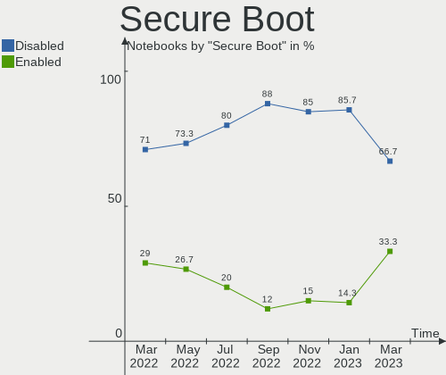
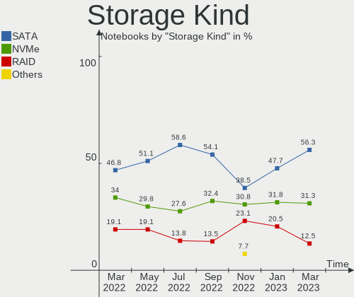
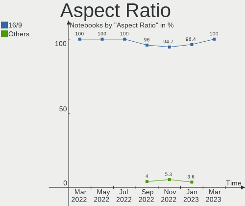
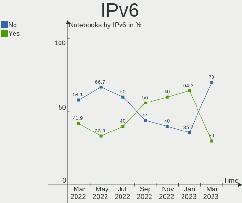
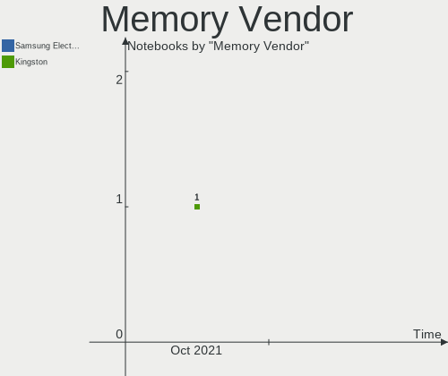
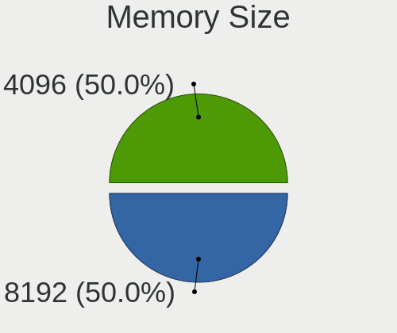
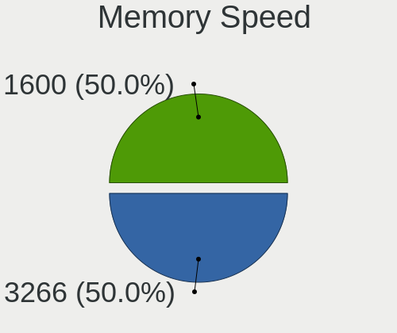
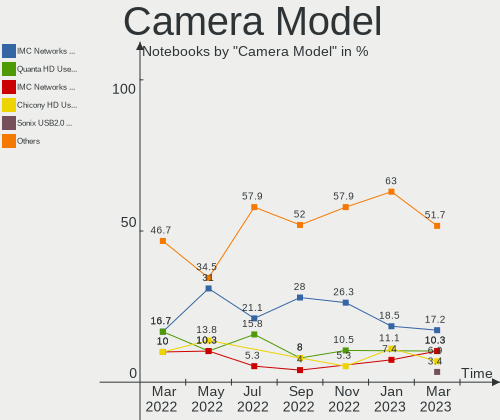

Endless Hardware Trends (Notebook)
----------------------------------

A project to identify most popular hardware characteristics and track their change
over time based on data collected by Endless users at https://Linux-Hardware.org.

Anyone can contribute to the study by uploading probes of their computers by
the [hw-probe](https://github.com/linuxhw/hw-probe) tool:

    sudo -E hw-probe -all -upload

Full-feature report is available here: https://linux-hardware.org/?view=trends&formfactor=notebook

Period: Mar, 2021.

Contents
--------

- [ OS                       ](#os)
- [ OS Family                ](#os-family)
- [ Kernel                   ](#kernel)
- [ Kernel Family            ](#kernel-family)
- [ Kernel Major Ver.        ](#kernel-major-ver)
- [ Arch                     ](#arch)
- [ DE                       ](#de)
- [ Display Server           ](#display-server)
- [ Display Manager          ](#display-manager)
- [ OS Lang                  ](#os-lang)
- [ Boot Mode                ](#boot-mode)
- [ Filesystem               ](#filesystem)
- [ Part. scheme             ](#part-scheme)
- [ Dual Boot with Linux/BSD ](#dual-boot-with-linux/bsd)
- [ Dual Boot (Win)          ](#dual-boot-win)
- [ Country                  ](#country)
- [ City                     ](#city)
- [ Vendor                   ](#vendor)
- [ Model                    ](#model)
- [ Model Family             ](#model-family)
- [ MFG Year                 ](#mfg-year)
- [ Form Factor              ](#form-factor)
- [ Secure Boot              ](#secure-boot)
- [ Coreboot                 ](#coreboot)
- [ RAM Size                 ](#ram-size)
- [ RAM Used                 ](#ram-used)
- [ Has CD-ROM               ](#has-cd-rom)
- [ Total Drives             ](#total-drives)
- [ Has Ethernet             ](#has-ethernet)
- [ Has WiFi                 ](#has-wifi)
- [ Has Bluetooth            ](#has-bluetooth)
- [ Drive Vendor             ](#drive-vendor)
- [ Drive Model              ](#drive-model)
- [ HDD Vendor               ](#hdd-vendor)
- [ SSD Vendor               ](#ssd-vendor)
- [ Drive Kind               ](#drive-kind)
- [ Drive Connector          ](#drive-connector)
- [ Drive Size               ](#drive-size)
- [ Space Total              ](#space-total)
- [ Space Used               ](#space-used)
- [ Malfunc. Drives          ](#malfunc-drives)
- [ Malfunc. Drive Vendor    ](#malfunc-drive-vendor)
- [ Malfunc. HDD Vendor      ](#malfunc-hdd-vendor)
- [ Malfunc. Drive Kind      ](#malfunc-drive-kind)
- [ Failed Drives            ](#failed-drives)
- [ Failed Drive Vendor      ](#failed-drive-vendor)
- [ Drive Status             ](#drive-status)
- [ Storage Vendor           ](#storage-vendor)
- [ Storage Model            ](#storage-model)
- [ Storage Kind             ](#storage-kind)
- [ CPU Vendor               ](#cpu-vendor)
- [ CPU Model                ](#cpu-model)
- [ CPU Model Family         ](#cpu-model-family)
- [ CPU Cores                ](#cpu-cores)
- [ CPU Sockets              ](#cpu-sockets)
- [ CPU Threads              ](#cpu-threads)
- [ CPU Op-Modes             ](#cpu-op-modes)
- [ CPU Microcode            ](#cpu-microcode)
- [ CPU Microarch            ](#cpu-microarch)
- [ GPU Vendor               ](#gpu-vendor)
- [ GPU Model                ](#gpu-model)
- [ GPU Combo                ](#gpu-combo)
- [ GPU Driver               ](#gpu-driver)
- [ GPU Memory               ](#gpu-memory)
- [ Monitor Vendor           ](#monitor-vendor)
- [ Monitor Model            ](#monitor-model)
- [ Monitor Resolution       ](#monitor-resolution)
- [ Monitor Diagonal         ](#monitor-diagonal)
- [ Monitor Width            ](#monitor-width)
- [ Aspect Ratio             ](#aspect-ratio)
- [ Monitor Area             ](#monitor-area)
- [ Pixel Density            ](#pixel-density)
- [ Multiple Monitors        ](#multiple-monitors)
- [ Net Controller Vendor    ](#net-controller-vendor)
- [ Net Controller Model     ](#net-controller-model)
- [ Wireless Vendor          ](#wireless-vendor)
- [ Wireless Model           ](#wireless-model)
- [ Ethernet Vendor          ](#ethernet-vendor)
- [ Ethernet Model           ](#ethernet-model)
- [ Net Controller Kind      ](#net-controller-kind)
- [ Used Controller          ](#used-controller)
- [ NICs                     ](#nics)
- [ IPv6                     ](#ipv6)
- [ Memory Vendor            ](#memory-vendor)
- [ Memory Model             ](#memory-model)
- [ Memory Kind              ](#memory-kind)
- [ Memory Form Factor       ](#memory-form-factor)
- [ Memory Size              ](#memory-size)
- [ Memory Speed             ](#memory-speed)
- [ Sound Vendor             ](#sound-vendor)
- [ Sound Model              ](#sound-model)
- [ Camera Vendor            ](#camera-vendor)
- [ Camera Model             ](#camera-model)
- [ Fingerprint Vendor       ](#fingerprint-vendor)
- [ Fingerprint Model        ](#fingerprint-model)
- [ Chipcard Vendor          ](#chipcard-vendor)
- [ Chipcard Model           ](#chipcard-model)
- [ Printer Vendor           ](#printer-vendor)
- [ Printer Model            ](#printer-model)
- [ Scanner Vendor           ](#scanner-vendor)
- [ Scanner Model            ](#scanner-model)
- [ Bluetooth Vendor         ](#bluetooth-vendor)
- [ Bluetooth Model          ](#bluetooth-model)
- [ Unsupported Devices      ](#unsupported-devices)
- [ Unsupported Device Types ](#unsupported-device-types)

OS
--

Installed operating systems

| Name                  | Notebooks | Percent |
|-----------------------|-----------|---------|
| Endless 3.9.3         | 55        | 80.88%  |
| Endless 3.7.8         | 7         | 10.29%  |
| Endless 3.9.2         | 1         | 1.47%   |
| Endless 3.9.1         | 1         | 1.47%   |
| Endless 3.8.4         | 1         | 1.47%   |
| Endless 3.7.4         | 1         | 1.47%   |
| Endless 3.6.3-nexthw1 | 1         | 1.47%   |
| Endless 3.4.2-nexthw1 | 1         | 1.47%   |

OS Family
---------

OS without a version

| Name    | Notebooks | Percent |
|---------|-----------|---------|
| Endless | 68        | 100%    |

Kernel
------

Version of the Linux kernel

| Version          | Notebooks | Percent |
|------------------|-----------|---------|
| 5.8.0-14-generic | 57        | 83.82%  |
| 5.3.0-28-generic | 7         | 10.29%  |
| 5.4.0-19-generic | 1         | 1.47%   |
| 5.3.0-19-generic | 1         | 1.47%   |
| 5.3.0-12-generic | 1         | 1.47%   |
| 4.16.0-4-generic | 1         | 1.47%   |

Kernel Family
-------------

Linux kernel without a distro release

| Version | Notebooks | Percent |
|---------|-----------|---------|
| 5.8.0   | 57        | 83.82%  |
| 5.3.0   | 9         | 13.24%  |
| 5.4.0   | 1         | 1.47%   |
| 4.16.0  | 1         | 1.47%   |

Kernel Major Ver.
-----------------

Linux kernel major version

| Version | Notebooks | Percent |
|---------|-----------|---------|
| 5.8     | 57        | 83.82%  |
| 5.3     | 9         | 13.24%  |
| 5.4     | 1         | 1.47%   |
| 4.16    | 1         | 1.47%   |

Arch
----

OS architecture (x86_64, i586, etc.)

| Name   | Notebooks | Percent |
|--------|-----------|---------|
| x86_64 | 68        | 100%    |

DE
--

Desktop Environment

| Name  | Notebooks | Percent |
|-------|-----------|---------|
| GNOME | 68        | 100%    |

Display Server
--------------

X11 or Wayland

| Name | Notebooks | Percent |
|------|-----------|---------|
| X11  | 68        | 100%    |

Display Manager
---------------

SDDM, LightDM, etc.

| Name    | Notebooks | Percent |
|---------|-----------|---------|
| Unknown | 68        | 100%    |

OS Lang
-------

Language

| Lang        | Notebooks | Percent |
|-------------|-----------|---------|
| pt_BR       | 29        | 42.65%  |
| en_US       | 11        | 16.18%  |
| ro_RO       | 4         | 5.88%   |
| ru_RU.UTF_8 | 2         | 2.94%   |
| ru_RU       | 2         | 2.94%   |
| it_IT       | 2         | 2.94%   |
| hu_HU       | 2         | 2.94%   |
| fr_FR       | 2         | 2.94%   |
| es_ES       | 2         | 2.94%   |
| es_AR       | 2         | 2.94%   |
| de_DE       | 2         | 2.94%   |
| tr_TR       | 1         | 1.47%   |
| pt_PT       | 1         | 1.47%   |
| es_MX       | 1         | 1.47%   |
| es_CO       | 1         | 1.47%   |
| en_CA       | 1         | 1.47%   |
| de_BE       | 1         | 1.47%   |
| ca_ES       | 1         | 1.47%   |
| bg_BG       | 1         | 1.47%   |

Boot Mode
---------

EFI or BIOS

| Mode | Notebooks | Percent |
|------|-----------|---------|
| EFI  | 53        | 77.94%  |
| BIOS | 15        | 22.06%  |

Filesystem
----------

Type of filesystem

| Type  | Notebooks | Percent |
|-------|-----------|---------|
| Ext4  | 65        | 95.59%  |
| Tmpfs | 3         | 4.41%   |

Part. scheme
------------

Scheme of partitioning

| Type    | Notebooks | Percent |
|---------|-----------|---------|
| Unknown | 68        | 100%    |

Dual Boot with Linux/BSD
------------------------

Hosting more than one Linux/BSD

| Dual boot | Notebooks | Percent |
|-----------|-----------|---------|
| No        | 68        | 100%    |

Dual Boot (Win)
---------------

Hosting Linux and Windows

| Dual boot | Notebooks | Percent |
|-----------|-----------|---------|
| No        | 68        | 100%    |

Country
-------

Geographic location (country)

| Country     | Notebooks | Percent |
|-------------|-----------|---------|
| Brazil      | 29        | 42.65%  |
| USA         | 4         | 5.88%   |
| Spain       | 4         | 5.88%   |
| Russia      | 4         | 5.88%   |
| Romania     | 4         | 5.88%   |
| Germany     | 3         | 4.41%   |
| Turkey      | 2         | 2.94%   |
| Italy       | 2         | 2.94%   |
| Hungary     | 2         | 2.94%   |
| France      | 2         | 2.94%   |
| Canada      | 2         | 2.94%   |
| UK          | 1         | 1.47%   |
| Portugal    | 1         | 1.47%   |
| Philippines | 1         | 1.47%   |
| Mexico      | 1         | 1.47%   |
| Kenya       | 1         | 1.47%   |
| Kazakhstan  | 1         | 1.47%   |
| Indonesia   | 1         | 1.47%   |
| Colombia    | 1         | 1.47%   |
| Bulgaria    | 1         | 1.47%   |
| Argentina   | 1         | 1.47%   |

City
----

Geographic location (city)

| City                       | Notebooks | Percent |
|----------------------------|-----------|---------|
| Brasília                  | 3         | 4.41%   |
| São Paulo                 | 2         | 2.94%   |
| Érd                       | 1         | 1.47%   |
| Zalău                     | 1         | 1.47%   |
| Waterford                  | 1         | 1.47%   |
| Vitória                   | 1         | 1.47%   |
| Viamão                    | 1         | 1.47%   |
| Uberlândia                | 1         | 1.47%   |
| Tarragona                  | 1         | 1.47%   |
| Taraz                      | 1         | 1.47%   |
| São Luís                 | 1         | 1.47%   |
| São Carlos                | 1         | 1.47%   |
| Surrey                     | 1         | 1.47%   |
| St Petersburg              | 1         | 1.47%   |
| Sofia                      | 1         | 1.47%   |
| Sisli                      | 1         | 1.47%   |
| Seyssuel                   | 1         | 1.47%   |
| Santo André               | 1         | 1.47%   |
| San Lorenzo de la Parrilla | 1         | 1.47%   |
| Salvador                   | 1         | 1.47%   |
| Rome                       | 1         | 1.47%   |
| Porto Velho                | 1         | 1.47%   |
| Omsk                       | 1         | 1.47%   |
| Nantes                     | 1         | 1.47%   |
| Nairobi                    | 1         | 1.47%   |
| Moscow                     | 1         | 1.47%   |
| Medianeira                 | 1         | 1.47%   |
| Lisbon                     | 1         | 1.47%   |
| Leopoldina                 | 1         | 1.47%   |
| Lanus                      | 1         | 1.47%   |
| Jundiaí                   | 1         | 1.47%   |
| João Pessoa               | 1         | 1.47%   |
| Istanbul                   | 1         | 1.47%   |
| Iasi                       | 1         | 1.47%   |
| Goioere                    | 1         | 1.47%   |
| Fürth                     | 1         | 1.47%   |
| Frankfurt am Main          | 1         | 1.47%   |
| Essen                      | 1         | 1.47%   |
| Elche                      | 1         | 1.47%   |
| Dzerzhinsk                 | 1         | 1.47%   |
| Dyersburg                  | 1         | 1.47%   |
| Duque de Caxias            | 1         | 1.47%   |
| Dunaújváros              | 1         | 1.47%   |
| Diamantina                 | 1         | 1.47%   |
| Dallas                     | 1         | 1.47%   |
| Curitiba                   | 1         | 1.47%   |
| Concord                    | 1         | 1.47%   |
| Colima                     | 1         | 1.47%   |
| Cocal do Sul               | 1         | 1.47%   |
| Cluj-Napoca                | 1         | 1.47%   |
| Cascavel                   | 1         | 1.47%   |
| Canoas                     | 1         | 1.47%   |
| Campinas                   | 1         | 1.47%   |
| Campina Grande             | 1         | 1.47%   |
| Caico                      | 1         | 1.47%   |
| Cagliari                   | 1         | 1.47%   |
| Cagayan de Oro             | 1         | 1.47%   |
| Bridgend                   | 1         | 1.47%   |
| Bom Jesus do Norte         | 1         | 1.47%   |
| Bogotá                    | 1         | 1.47%   |

Vendor
------

Motherboard manufacturer

| Name                | Notebooks | Percent |
|---------------------|-----------|---------|
| ASUSTek Computer    | 26        | 38.24%  |
| Acer                | 25        | 36.76%  |
| Dell                | 8         | 11.76%  |
| Lenovo              | 5         | 7.35%   |
| Toshiba             | 1         | 1.47%   |
| Samsung Electronics | 1         | 1.47%   |
| Hewlett-Packard     | 1         | 1.47%   |
| Compal              | 1         | 1.47%   |

Model
-----

Motherboard model

| Name                                       | Notebooks | Percent |
|--------------------------------------------|-----------|---------|
| Acer Nitro AN515-43                        | 8         | 11.76%  |
| Acer Nitro AN515-54                        | 5         | 7.35%   |
| ASUS ZenBook UX431DA_UM431DA               | 3         | 4.41%   |
| ASUS VivoBook_ASUSLaptop X509JA_X509JA     | 3         | 4.41%   |
| ASUS VivoBook 15_ASUS Laptop X540UAR       | 3         | 4.41%   |
| Acer Predator PH315-52                     | 3         | 4.41%   |
| Dell Inspiron 5548                         | 2         | 2.94%   |
| Acer Nitro AN517-51                        | 2         | 2.94%   |
| Toshiba Satellite P75-A                    | 1         | 1.47%   |
| Samsung 550P5C/550P7C                      | 1         | 1.47%   |
| Lenovo ThinkPad X220 4286A35               | 1         | 1.47%   |
| Lenovo ThinkPad L390 20NSS1JP00            | 1         | 1.47%   |
| Lenovo IdeaPad 330-15IKB 81DE              | 1         | 1.47%   |
| Lenovo IdeaPad 320-15IKB 81G3              | 1         | 1.47%   |
| Lenovo G500 20236                          | 1         | 1.47%   |
| HP Pavilion 15                             | 1         | 1.47%   |
| Dell Vostro 1015                           | 1         | 1.47%   |
| Dell Latitude E6420                        | 1         | 1.47%   |
| Dell Inspiron N5030                        | 1         | 1.47%   |
| Dell Inspiron 7520                         | 1         | 1.47%   |
| Dell Inspiron 11-3162                      | 1         | 1.47%   |
| Dell Inspiron 11 - 3147                    | 1         | 1.47%   |
| Compal NCL60/61                            | 1         | 1.47%   |
| ASUS ZenBook UX431DA_UX431DA               | 1         | 1.47%   |
| ASUS X751SA                                | 1         | 1.47%   |
| ASUS X510UN                                | 1         | 1.47%   |
| ASUS X442URR                               | 1         | 1.47%   |
| ASUS VivoBook_ASUSLaptop X712FA_X712FA     | 1         | 1.47%   |
| ASUS VivoBook_ASUSLaptop X705MAR_X705MA    | 1         | 1.47%   |
| ASUS VivoBook_ASUSLaptop X515MA_X515MA     | 1         | 1.47%   |
| ASUS VivoBook_ASUSLaptop X512FJC_X512FJC   | 1         | 1.47%   |
| ASUS VivoBook_ASUSLaptop X512DA_X512DA     | 1         | 1.47%   |
| ASUS VivoBook_ASUSLaptop X509JA_P1510CJA   | 1         | 1.47%   |
| ASUS VivoBook_ASUSLaptop X509DA_M509DA     | 1         | 1.47%   |
| ASUS VivoBook_ASUSLaptop X430FA_S430FA     | 1         | 1.47%   |
| ASUS VivoBook 15_ASUS Laptop X540MA_R540MA | 1         | 1.47%   |
| ASUS VivoBook 15_ASUS Laptop X540BA        | 1         | 1.47%   |
| ASUS VivoBook 15_ASUS Laptop X507MA_X507MA | 1         | 1.47%   |
| ASUS VivoBook 15_ASUS Laptop X507LA        | 1         | 1.47%   |
| ASUS VivoBook 14_ASUS Laptop X441MA_X441MA | 1         | 1.47%   |
| Acer TravelMate B117-M                     | 1         | 1.47%   |
| Acer TravelMate 8571                       | 1         | 1.47%   |
| Acer Aspire E3-112M                        | 1         | 1.47%   |
| Acer Aspire A315-56                        | 1         | 1.47%   |
| Acer Aspire A315-53                        | 1         | 1.47%   |
| Acer Aspire A315-34                        | 1         | 1.47%   |
| Acer Aspire A315-23G                       | 1         | 1.47%   |

Model Family
------------

Motherboard model prefix

| Name              | Notebooks | Percent |
|-------------------|-----------|---------|
| ASUS VivoBook     | 19        | 27.94%  |
| Acer Nitro        | 15        | 22.06%  |
| Dell Inspiron     | 6         | 8.82%   |
| Acer Aspire       | 5         | 7.35%   |
| ASUS ZenBook      | 4         | 5.88%   |
| Acer Predator     | 3         | 4.41%   |
| Lenovo ThinkPad   | 2         | 2.94%   |
| Lenovo IdeaPad    | 2         | 2.94%   |
| Acer TravelMate   | 2         | 2.94%   |
| Toshiba Satellite | 1         | 1.47%   |
| Samsung 550P5C    | 1         | 1.47%   |
| Lenovo G500       | 1         | 1.47%   |
| HP Pavilion       | 1         | 1.47%   |
| Dell Vostro       | 1         | 1.47%   |
| Dell Latitude     | 1         | 1.47%   |
| Compal NCL60      | 1         | 1.47%   |
| ASUS X751SA       | 1         | 1.47%   |
| ASUS X510UN       | 1         | 1.47%   |
| ASUS X442URR      | 1         | 1.47%   |

MFG Year
--------

Motherboard manufacture year

| Year | Notebooks | Percent |
|------|-----------|---------|
| 2020 | 30        | 44.12%  |
| 2019 | 16        | 23.53%  |
| 2018 | 7         | 10.29%  |
| 2010 | 3         | 4.41%   |
| 2021 | 2         | 2.94%   |
| 2015 | 2         | 2.94%   |
| 2014 | 2         | 2.94%   |
| 2013 | 2         | 2.94%   |
| 2011 | 2         | 2.94%   |
| 2017 | 1         | 1.47%   |
| 2009 | 1         | 1.47%   |

Form Factor
-----------

Physical design of the computer

| Name     | Notebooks | Percent |
|----------|-----------|---------|
| Notebook | 68        | 100%    |

Secure Boot
-----------

Enabled or disabled

| State    | Notebooks | Percent |
|----------|-----------|---------|
| Disabled | 46        | 67.65%  |
| Enabled  | 22        | 32.35%  |

Coreboot
--------

Have coreboot on board

| Used | Notebooks | Percent |
|------|-----------|---------|
| No   | 68        | 100%    |

RAM Size
--------

Total RAM memory

| Size in GB | Notebooks | Percent |
|------------|-----------|---------|
| 4.01-8.0   | 32        | 47.06%  |
| 3.01-4.0   | 16        | 23.53%  |
| 16.01-24.0 | 8         | 11.76%  |
| 8.01-16.0  | 8         | 11.76%  |
| 1.01-2.0   | 3         | 4.41%   |
| 2.01-3.0   | 1         | 1.47%   |

RAM Used
--------

Used RAM memory

| Used GB  | Notebooks | Percent |
|----------|-----------|---------|
| 1.01-2.0 | 35        | 51.47%  |
| 2.01-3.0 | 22        | 32.35%  |
| 3.01-4.0 | 5         | 7.35%   |
| 4.01-8.0 | 4         | 5.88%   |
| 0.51-1.0 | 2         | 2.94%   |

Has CD-ROM
----------

Has CD-ROM on board

| Presented | Notebooks | Percent |
|-----------|-----------|---------|
| No        | 57        | 83.82%  |
| Yes       | 11        | 16.18%  |

Total Drives
------------

Number of drives on board

| Drives | Notebooks | Percent |
|--------|-----------|---------|
| 1      | 42        | 61.76%  |
| 2      | 24        | 35.29%  |
| 3      | 1         | 1.47%   |
| 0      | 1         | 1.47%   |

Has Ethernet
------------

Has Ethernet on board

| Presented | Notebooks | Percent |
|-----------|-----------|---------|
| Yes       | 45        | 66.18%  |
| No        | 23        | 33.82%  |

Has WiFi
--------

Has WiFi module

| Presented | Notebooks | Percent |
|-----------|-----------|---------|
| Yes       | 66        | 97.06%  |
| No        | 2         | 2.94%   |

Has Bluetooth
-------------

Has Bluetooth module

| Presented | Notebooks | Percent |
|-----------|-----------|---------|
| Yes       | 59        | 86.76%  |
| No        | 9         | 13.24%  |

Drive Vendor
------------

Hard drive vendors

| Vendor              | Notebooks | Drives | Percent |
|---------------------|-----------|--------|---------|
| WDC                 | 22        | 22     | 24.18%  |
| Intel               | 14        | 14     | 15.38%  |
| Seagate             | 11        | 11     | 12.09%  |
| ADATA Technology    | 10        | 10     | 10.99%  |
| Toshiba             | 7         | 7      | 7.69%   |
| Samsung Electronics | 5         | 5      | 5.49%   |
| Kingston            | 5         | 5      | 5.49%   |
| SanDisk             | 3         | 3      | 3.3%    |
| A-DATA Technology   | 3         | 3      | 3.3%    |
| Unknown             | 2         | 2      | 2.2%    |
| SK Hynix            | 2         | 2      | 2.2%    |
| XPG                 | 1         | 1      | 1.1%    |
| SPCC                | 1         | 1      | 1.1%    |
| Silicon Motion      | 1         | 1      | 1.1%    |
| Micron Technology   | 1         | 1      | 1.1%    |
| Hitachi             | 1         | 1      | 1.1%    |
| Hewlett-Packard     | 1         | 1      | 1.1%    |
| Crucial             | 1         | 1      | 1.1%    |

Drive Model
-----------

Hard drive models

| Model                                | Notebooks | Percent |
|--------------------------------------|-----------|---------|
| WDC WD10SPZX-21Z10T0 1TB             | 16        | 17.58%  |
| ADATA NVMe SSD Drive 128GB           | 9         | 9.89%   |
| Intel NVMe SSD Drive 256GB           | 7         | 7.69%   |
| Toshiba MQ04ABF100 1TB               | 5         | 5.49%   |
| Seagate ST1000LM035-1RK172 1TB       | 5         | 5.49%   |
| Intel NVMe SSD Drive 512GB           | 5         | 5.49%   |
| Kingston RBUSC180DS37256GJ 256GB SSD | 3         | 3.3%    |
| Toshiba MQ01ABF050 500GB             | 2         | 2.2%    |
| SK Hynix NVMe SSD Drive 512GB        | 2         | 2.2%    |
| Samsung NVMe SSD Drive 512GB         | 2         | 2.2%    |
| XPG NVMe SSD Drive 256GB             | 1         | 1.1%    |
| WDC WDS500G2B0A 500GB SSD            | 1         | 1.1%    |
| WDC WDS120G2G0A-00JH30 120GB SSD     | 1         | 1.1%    |
| WDC WD5000LPCX-21VHAT0 500GB         | 1         | 1.1%    |
| WDC WD5000BEVT-75A0RT0 500GB         | 1         | 1.1%    |
| WDC WD3200BEKT-75PVMT0 320GB         | 1         | 1.1%    |
| WDC WD10SPZX-80Z10T2 1TB             | 1         | 1.1%    |
| Unknown Trust HDD 2.5" 120GB         | 1         | 1.1%    |
| Unknown MMC Card  32GB               | 1         | 1.1%    |
| SPCC Solid State Disk 128GB          | 1         | 1.1%    |
| Silicon Motion NVMe SSD Drive 512GB  | 1         | 1.1%    |
| Seagate ST9500325AS 500GB            | 1         | 1.1%    |
| Seagate ST500LT012-9WS142 500GB      | 1         | 1.1%    |
| Seagate ST500LM030-1RK17D 500GB      | 1         | 1.1%    |
| Seagate ST2000LM007-1R8174 2TB       | 1         | 1.1%    |
| Seagate ST1000LM024 HN-M101MBB 1TB   | 1         | 1.1%    |
| Seagate ST1000LM014-1EJ164 1TB       | 1         | 1.1%    |
| SanDisk SSD PLUS 240GB               | 1         | 1.1%    |
| SanDisk SD9SN8W128G1102 128GB SSD    | 1         | 1.1%    |
| SanDisk SD9SB8W256G1002 256GB SSD    | 1         | 1.1%    |
| Samsung SSD 860 EVO 250GB            | 1         | 1.1%    |
| Samsung MZMPC032HBCD-000D1 32GB SSD  | 1         | 1.1%    |
| Samsung HM321HI 320GB                | 1         | 1.1%    |
| Micron 1100_MTFDDAV256TBN 256GB SSD  | 1         | 1.1%    |
| Kingston SA400S37480G 480GB SSD      | 1         | 1.1%    |
| Kingston SA400S37240G 240GB SSD      | 1         | 1.1%    |
| Intel NVMe SSD Drive 500GB           | 1         | 1.1%    |
| Intel NVMe SSD Drive 128GB           | 1         | 1.1%    |
| Hitachi HTS542525K9SA00 250GB        | 1         | 1.1%    |
| HP SSD S700 120GB                    | 1         | 1.1%    |
| Crucial CT480BX500SSD1 480GB         | 1         | 1.1%    |
| ADATA NVMe SSD Drive 256GB           | 1         | 1.1%    |
| A-DATA SU630 240GB SSD               | 1         | 1.1%    |
| A-DATA SP610 128GB SSD               | 1         | 1.1%    |
| A-DATA IM2S3338-128GD2 128GB SSD     | 1         | 1.1%    |

HDD Vendor
----------

Hard disk drive vendors

| Vendor              | Notebooks | Drives | Percent |
|---------------------|-----------|--------|---------|
| WDC                 | 20        | 20     | 48.78%  |
| Seagate             | 11        | 11     | 26.83%  |
| Toshiba             | 7         | 7      | 17.07%  |
| Unknown             | 1         | 1      | 2.44%   |
| Samsung Electronics | 1         | 1      | 2.44%   |
| Hitachi             | 1         | 1      | 2.44%   |

SSD Vendor
----------

Solid state drive vendors

| Vendor              | Notebooks | Drives | Percent |
|---------------------|-----------|--------|---------|
| Kingston            | 5         | 5      | 26.32%  |
| SanDisk             | 3         | 3      | 15.79%  |
| A-DATA Technology   | 3         | 3      | 15.79%  |
| WDC                 | 2         | 2      | 10.53%  |
| Samsung Electronics | 2         | 2      | 10.53%  |
| SPCC                | 1         | 1      | 5.26%   |
| Micron Technology   | 1         | 1      | 5.26%   |
| Hewlett-Packard     | 1         | 1      | 5.26%   |
| Crucial             | 1         | 1      | 5.26%   |

Drive Kind
----------

HDD or SSD

| Kind | Notebooks | Drives | Percent |
|------|-----------|--------|---------|
| HDD  | 41        | 41     | 45.56%  |
| NVMe | 30        | 30     | 33.33%  |
| SSD  | 18        | 19     | 20%     |
| MMC  | 1         | 1      | 1.11%   |

Drive Connector
---------------

SATA, SAS, NVMe, etc.

| Type | Notebooks | Drives | Percent |
|------|-----------|--------|---------|
| SATA | 53        | 59     | 62.35%  |
| NVMe | 30        | 30     | 35.29%  |
| SAS  | 1         | 1      | 1.18%   |
| MMC  | 1         | 1      | 1.18%   |

Drive Size
----------

Size of hard drive

| Size in TB | Notebooks | Drives | Percent |
|------------|-----------|--------|---------|
| 0.51-1.0   | 29        | 29     | 50%     |
| 0.01-0.5   | 28        | 30     | 48.28%  |
| 1.01-2.0   | 1         | 1      | 1.72%   |

Space Total
-----------

Amount of disk space available on the file system

| Size in GB | Notebooks | Percent |
|------------|-----------|---------|
| 501-1000   | 23        | 33.82%  |
| 101-250    | 18        | 26.47%  |
| 251-500    | 16        | 23.53%  |
| 21-50      | 5         | 7.35%   |
| 1001-2000  | 2         | 2.94%   |
| 1-20       | 2         | 2.94%   |
| 51-100     | 1         | 1.47%   |
| Unknown    | 1         | 1.47%   |

Space Used
----------

Amount of used disk space

| Used GB | Notebooks | Percent |
|---------|-----------|---------|
| 21-50   | 38        | 55.88%  |
| 51-100  | 16        | 23.53%  |
| 1-20    | 9         | 13.24%  |
| 101-250 | 3         | 4.41%   |
| 251-500 | 1         | 1.47%   |
| Unknown | 1         | 1.47%   |

Malfunc. Drives
---------------

Drive models with a malfunction

Zero info for selected period =(

Malfunc. Drive Vendor
---------------------

Vendors of faulty drives

Zero info for selected period =(

Malfunc. HDD Vendor
-------------------

Vendors of faulty HDD drives

Zero info for selected period =(

Malfunc. Drive Kind
-------------------

Kinds of faulty drives

Zero info for selected period =(

Failed Drives
-------------

Failed drive models

Zero info for selected period =(

Failed Drive Vendor
-------------------

Failed drive vendors

Zero info for selected period =(

Drive Status
------------

Number of failed and malfunc. drives

| Status   | Notebooks | Drives | Percent |
|----------|-----------|--------|---------|
| Detected | 67        | 91     | 100%    |

Storage Vendor
--------------

Storage controller vendors

| Vendor              | Notebooks | Percent |
|---------------------|-----------|---------|
| Intel               | 51        | 61.45%  |
| AMD                 | 16        | 19.28%  |
| ADATA Technology    | 11        | 13.25%  |
| SK Hynix            | 2         | 2.41%   |
| Samsung Electronics | 2         | 2.41%   |
| Silicon Motion      | 1         | 1.2%    |

Storage Model
-------------

Storage controller models

| Model                                                                                  | Notebooks | Percent |
|----------------------------------------------------------------------------------------|-----------|---------|
| Intel 82801 Mobile SATA Controller [RAID mode]                                         | 18        | 18.75%  |
| AMD FCH SATA Controller [AHCI mode]                                                    | 16        | 16.67%  |
| Intel PROSet/Wireless WiFi Software extension                                          | 12        | 12.5%   |
| ADATA Non-Volatile memory controller                                                   | 10        | 10.42%  |
| Intel Sunrise Point-LP SATA Controller [AHCI mode]                                     | 7         | 7.29%   |
| Intel Celeron/Pentium Silver Processor SATA Controller                                 | 6         | 6.25%   |
| Intel 82801IBM/IEM (ICH9M/ICH9M-E) 4 port SATA Controller [AHCI mode]                  | 3         | 3.13%   |
| SK Hynix BC501 NVMe Solid State Drive 512GB                                            | 2         | 2.08%   |
| Samsung NVMe Controller                                                                | 2         | 2.08%   |
| Intel Wildcat Point-LP SATA Controller [AHCI Mode]                                     | 2         | 2.08%   |
| Intel Atom/Celeron/Pentium Processor x5-E8000/J3xxx/N3xxx Series SATA Controller       | 2         | 2.08%   |
| Intel Atom Processor E3800 Series SATA AHCI Controller                                 | 2         | 2.08%   |
| Intel 7 Series Chipset Family 6-port SATA Controller [AHCI mode]                       | 2         | 2.08%   |
| Silicon Motion SM2263EN/SM2263XT SSD Controller                                        | 1         | 1.04%   |
| Intel SSD Pro 7600p/760p/E 6100p Series                                                | 1         | 1.04%   |
| Intel SSD 660P Series                                                                  | 1         | 1.04%   |
| Intel Comet Lake PCH-LP SATA RAID Premium Controller                                   | 1         | 1.04%   |
| Intel Cannon Lake Mobile PCH SATA AHCI Controller                                      | 1         | 1.04%   |
| Intel 8 Series/C220 Series Chipset Family 6-port SATA Controller 1 [AHCI mode]         | 1         | 1.04%   |
| Intel 8 Series SATA Controller 1 [AHCI mode]                                           | 1         | 1.04%   |
| Intel 6 Series/C200 Series Chipset Family Mobile SATA Controller (IDE mode, ports 4-5) | 1         | 1.04%   |
| Intel 6 Series/C200 Series Chipset Family Mobile SATA Controller (IDE mode, ports 0-3) | 1         | 1.04%   |
| Intel 6 Series/C200 Series Chipset Family 6 port Mobile SATA AHCI Controller           | 1         | 1.04%   |
| Intel 5 Series/3400 Series Chipset 4 port SATA IDE Controller                          | 1         | 1.04%   |
| ADATA XPG SX8200 Pro PCIe Gen3x4 M.2 2280 Solid State Drive                            | 1         | 1.04%   |

Storage Kind
------------

Kind of storage controller (IDE, SATA, NVMe, SAS, ...)

| Kind | Notebooks | Percent |
|------|-----------|---------|
| SATA | 58        | 61.05%  |
| NVMe | 30        | 31.58%  |
| RAID | 5         | 5.26%   |
| IDE  | 2         | 2.11%   |

CPU Vendor
----------

Processor vendors

| Vendor | Notebooks | Percent |
|--------|-----------|---------|
| Intel  | 52        | 76.47%  |
| AMD    | 16        | 23.53%  |

CPU Model
---------

Processor models

| Model                                         | Notebooks | Percent |
|-----------------------------------------------|-----------|---------|
| AMD Ryzen 7 3750H with Radeon Vega Mobile Gfx | 8         | 11.76%  |
| Intel Core i7-9750H CPU @ 2.60GHz             | 6         | 8.82%   |
| Intel Core i5-9300H CPU @ 2.40GHz             | 4         | 5.88%   |
| AMD Ryzen 5 3500U with Radeon Vega Mobile Gfx | 4         | 5.88%   |
| Intel Core i5-8250U CPU @ 1.60GHz             | 3         | 4.41%   |
| Intel Celeron N4000 CPU @ 1.10GHz             | 3         | 4.41%   |
| Intel Core i7-5500U CPU @ 2.40GHz             | 2         | 2.94%   |
| Intel Core i5-1035G1 CPU @ 1.00GHz            | 2         | 2.94%   |
| Intel Core i3-7020U CPU @ 2.30GHz             | 2         | 2.94%   |
| Intel Core i3-1005G1 CPU @ 1.20GHz            | 2         | 2.94%   |
| Intel Celeron N4020 CPU @ 1.10GHz             | 2         | 2.94%   |
| AMD Ryzen 7 3700U with Radeon Vega Mobile Gfx | 2         | 2.94%   |
| Intel Pentium Dual-Core CPU T4500 @ 2.30GHz   | 1         | 1.47%   |
| Intel Pentium CPU N3700 @ 1.60GHz             | 1         | 1.47%   |
| Intel Pentium CPU N3530 @ 2.16GHz             | 1         | 1.47%   |
| Intel Pentium CPU 4417U @ 2.30GHz             | 1         | 1.47%   |
| Intel Core i7-8565U CPU @ 1.80GHz             | 1         | 1.47%   |
| Intel Core i7-4700MQ CPU @ 2.40GHz            | 1         | 1.47%   |
| Intel Core i7-4510U CPU @ 2.00GHz             | 1         | 1.47%   |
| Intel Core i7-3632QM CPU @ 2.20GHz            | 1         | 1.47%   |
| Intel Core i7-2620M CPU @ 2.70GHz             | 1         | 1.47%   |
| Intel Core i7-1065G7 CPU @ 1.30GHz            | 1         | 1.47%   |
| Intel Core i7-10510U CPU @ 1.80GHz            | 1         | 1.47%   |
| Intel Core i5-8265U CPU @ 1.60GHz             | 1         | 1.47%   |
| Intel Core i5-3210M CPU @ 2.50GHz             | 1         | 1.47%   |
| Intel Core i5 CPU M 480 @ 2.67GHz             | 1         | 1.47%   |
| Intel Core i3-8145U CPU @ 2.10GHz             | 1         | 1.47%   |
| Intel Core i3-8130U CPU @ 2.20GHz             | 1         | 1.47%   |
| Intel Core i3-7100U CPU @ 2.40GHz             | 1         | 1.47%   |
| Intel Core i3-5005U CPU @ 2.00GHz             | 1         | 1.47%   |
| Intel Core i3-3120M CPU @ 2.50GHz             | 1         | 1.47%   |
| Intel Core i3-2310M CPU @ 2.10GHz             | 1         | 1.47%   |
| Intel Core 2 Solo CPU U3500 @ 1.40GHz         | 1         | 1.47%   |
| Intel Core 2 Duo CPU T6670 @ 2.20GHz          | 1         | 1.47%   |
| Intel Celeron N4120 CPU @ 1.10GHz             | 1         | 1.47%   |
| Intel Celeron CPU N3160 @ 1.60GHz             | 1         | 1.47%   |
| Intel Celeron CPU N3060 @ 1.60GHz             | 1         | 1.47%   |
| Intel Celeron CPU N2840 @ 2.16GHz             | 1         | 1.47%   |
| AMD Ryzen 3 3200U with Radeon Vega Mobile Gfx | 1         | 1.47%   |
| AMD A4-9125 RADEON R3, 4 COMPUTE CORES 2C+2G  | 1         | 1.47%   |

CPU Model Family
----------------

Processor model prefix

| Model                   | Notebooks | Percent |
|-------------------------|-----------|---------|
| Intel Core i7           | 15        | 22.06%  |
| Intel Core i5           | 12        | 17.65%  |
| Intel Core i3           | 10        | 14.71%  |
| AMD Ryzen 7             | 10        | 14.71%  |
| Intel Celeron           | 9         | 13.24%  |
| AMD Ryzen 5             | 4         | 5.88%   |
| Intel Pentium           | 3         | 4.41%   |
| Intel Pentium Dual-Core | 1         | 1.47%   |
| Intel Core 2 Solo       | 1         | 1.47%   |
| Intel Core 2 Duo        | 1         | 1.47%   |
| AMD Ryzen 3             | 1         | 1.47%   |
| AMD A4                  | 1         | 1.47%   |

CPU Cores
---------

Number of processor cores

| Number | Notebooks | Percent |
|--------|-----------|---------|
| 4      | 33        | 48.53%  |
| 2      | 28        | 41.18%  |
| 6      | 6         | 8.82%   |
| 1      | 1         | 1.47%   |

CPU Sockets
-----------

Number of sockets

| Number | Notebooks | Percent |
|--------|-----------|---------|
| 1      | 68        | 100%    |

CPU Threads
-----------

Threads per core (Hyper-Threading)

| Number | Notebooks | Percent |
|--------|-----------|---------|
| 2      | 53        | 77.94%  |
| 1      | 15        | 22.06%  |

CPU Op-Modes
------------

CPU Operation Modes (32-bit, 64-bit)

| Op mode        | Notebooks | Percent |
|----------------|-----------|---------|
| 32-bit, 64-bit | 68        | 100%    |

CPU Microcode
-------------

Microcode number

| Number     | Notebooks | Percent |
|------------|-----------|---------|
| 0x08108109 | 10        | 14.71%  |
| 0x906ea    | 9         | 13.24%  |
| 0x806ea    | 5         | 7.35%   |
| 0x706e5    | 5         | 7.35%   |
| 0x08108102 | 4         | 5.88%   |
| 0x706a1    | 3         | 4.41%   |
| 0x306d4    | 3         | 4.41%   |
| 0x306a9    | 3         | 4.41%   |
| 0x1067a    | 3         | 4.41%   |
| Unknown    | 3         | 4.41%   |
| 0x806ec    | 2         | 2.94%   |
| 0x806eb    | 2         | 2.94%   |
| 0x806e9    | 2         | 2.94%   |
| 0x706a8    | 2         | 2.94%   |
| 0x406c4    | 2         | 2.94%   |
| 0x30678    | 2         | 2.94%   |
| 0x206a7    | 2         | 2.94%   |
| 0x906ed    | 1         | 1.47%   |
| 0x406c3    | 1         | 1.47%   |
| 0x40651    | 1         | 1.47%   |
| 0x306c3    | 1         | 1.47%   |
| 0x20655    | 1         | 1.47%   |
| 0x06006705 | 1         | 1.47%   |

CPU Microarch
-------------

Microarchitecture

| Name          | Notebooks | Percent |
|---------------|-----------|---------|
| KabyLake      | 22        | 32.35%  |
| Zen+          | 15        | 22.06%  |
| Goldmont plus | 6         | 8.82%   |
| Silvermont    | 5         | 7.35%   |
| IceLake       | 5         | 7.35%   |
| Penryn        | 3         | 4.41%   |
| IvyBridge     | 3         | 4.41%   |
| Broadwell     | 3         | 4.41%   |
| SandyBridge   | 2         | 2.94%   |
| Haswell       | 2         | 2.94%   |
| Westmere      | 1         | 1.47%   |
| Excavator     | 1         | 1.47%   |

GPU Vendor
----------

Vendors of graphics cards

| Vendor | Notebooks | Percent |
|--------|-----------|---------|
| Intel  | 52        | 54.74%  |
| Nvidia | 24        | 25.26%  |
| AMD    | 19        | 20%     |

GPU Model
---------

Graphics card models

| Model                                                                                    | Notebooks | Percent |
|------------------------------------------------------------------------------------------|-----------|---------|
| Nvidia TU117M [GeForce GTX 1650 Mobile / Max-Q]                                          | 15        | 15.63%  |
| AMD Picasso                                                                              | 15        | 15.63%  |
| Intel CoffeeLake-H GT2 [UHD Graphics 630]                                                | 10        | 10.42%  |
| Intel GeminiLake [UHD Graphics 600]                                                      | 6         | 6.25%   |
| Intel UHD Graphics 620                                                                   | 4         | 4.17%   |
| Intel Iris Plus Graphics G1 (Ice Lake)                                                   | 4         | 4.17%   |
| Nvidia TU106M [GeForce RTX 2060 Mobile]                                                  | 3         | 3.13%   |
| Intel WhiskeyLake-U GT2 [UHD Graphics 620]                                               | 3         | 3.13%   |
| Intel Mobile 4 Series Chipset Integrated Graphics Controller                             | 3         | 3.13%   |
| Intel HD Graphics 5500                                                                   | 3         | 3.13%   |
| Intel Atom/Celeron/Pentium Processor x5-E8000/J3xxx/N3xxx Integrated Graphics Controller | 3         | 3.13%   |
| Intel 3rd Gen Core processor Graphics Controller                                         | 3         | 3.13%   |
| AMD Topaz XT [Radeon R7 M260/M265 / M340/M360 / M440/M445 / 530/535 / 620/625 Mobile]    | 3         | 3.13%   |
| Nvidia GP108M [GeForce MX150]                                                            | 2         | 2.08%   |
| Intel Kaby Lake-U GT2f HD 620 Graphics Controller                                        | 2         | 2.08%   |
| Intel Atom Processor Z36xxx/Z37xxx Series Graphics & Display                             | 2         | 2.08%   |
| Intel 2nd Generation Core Processor Family Integrated Graphics Controller                | 2         | 2.08%   |
| Nvidia GP108M [GeForce MX230]                                                            | 1         | 1.04%   |
| Nvidia GM108M [GeForce 930MX]                                                            | 1         | 1.04%   |
| Nvidia GM108M [GeForce 840M]                                                             | 1         | 1.04%   |
| Nvidia GF108M [GeForce GT 620M/630M/635M/640M LE]                                        | 1         | 1.04%   |
| Intel Kaby Lake-U GT1 Integrated Graphics Controller                                     | 1         | 1.04%   |
| Intel Iris Plus Graphics G7                                                              | 1         | 1.04%   |
| Intel HD Graphics 620                                                                    | 1         | 1.04%   |
| Intel Haswell-ULT Integrated Graphics Controller                                         | 1         | 1.04%   |
| Intel Core Processor Integrated Graphics Controller                                      | 1         | 1.04%   |
| Intel CometLake-U GT2 [UHD Graphics]                                                     | 1         | 1.04%   |
| Intel 4th Gen Core Processor Integrated Graphics Controller                              | 1         | 1.04%   |
| AMD Stoney [Radeon R2/R3/R4/R5 Graphics]                                                 | 1         | 1.04%   |
| AMD Chelsea LP [Radeon HD 7730M]                                                         | 1         | 1.04%   |

GPU Combo
---------

Combinations of graphics cards

| Name           | Notebooks | Percent |
|----------------|-----------|---------|
| 1 x Intel      | 33        | 48.53%  |
| Intel + Nvidia | 16        | 23.53%  |
| AMD + Nvidia   | 8         | 11.76%  |
| 1 x AMD        | 7         | 10.29%  |
| Intel + AMD    | 3         | 4.41%   |
| 2 x AMD        | 1         | 1.47%   |

GPU Driver
----------

Free vs proprietary

| Driver      | Notebooks | Percent |
|-------------|-----------|---------|
| Free        | 45        | 66.18%  |
| Proprietary | 23        | 33.82%  |

GPU Memory
----------

Total video memory

| Size in GB | Notebooks | Percent |
|------------|-----------|---------|
| Unknown    | 50        | 73.53%  |
| 1.01-2.0   | 18        | 26.47%  |

Monitor Vendor
--------------

Monitor vendors

| Vendor              | Notebooks | Percent |
|---------------------|-----------|---------|
| BOE                 | 18        | 24.32%  |
| AU Optronics        | 17        | 22.97%  |
| Chimei Innolux      | 12        | 16.22%  |
| LG Display          | 11        | 14.86%  |
| Samsung Electronics | 6         | 8.11%   |
| PANDA               | 4         | 5.41%   |
| Goldstar            | 2         | 2.7%    |
| Vizio               | 1         | 1.35%   |
| LED                 | 1         | 1.35%   |
| Dell                | 1         | 1.35%   |
| AOC                 | 1         | 1.35%   |

Monitor Model
-------------

Monitor models

| Model                                                                | Notebooks | Percent |
|----------------------------------------------------------------------|-----------|---------|
| AU Optronics LCD Monitor AUO21ED 1920x1080 344x194mm 15.5-inch       | 7         | 9.46%   |
| LG Display LCD Monitor LGD065A 1920x1080 344x194mm 15.5-inch         | 5         | 6.76%   |
| PANDA LCD Monitor NCP0035 1920x1080 309x174mm 14.0-inch              | 4         | 5.41%   |
| Chimei Innolux LCD Monitor CMN15E6 1366x768 344x193mm 15.5-inch      | 4         | 5.41%   |
| BOE LCD Monitor BOE0818 1920x1080 344x194mm 15.5-inch                | 4         | 5.41%   |
| Chimei Innolux LCD Monitor CMN15E8 1920x1080 344x193mm 15.5-inch     | 3         | 4.05%   |
| Samsung Electronics LCD Monitor SEC5441 1366x768 344x194mm 15.5-inch | 2         | 2.7%    |
| Chimei Innolux LCD Monitor CMN15F5 1920x1080 344x193mm 15.5-inch     | 2         | 2.7%    |
| BOE LCD Monitor BOE0903 1920x1080 344x194mm 15.5-inch                | 2         | 2.7%    |
| BOE LCD Monitor BOE0704 1366x768 344x194mm 15.5-inch                 | 2         | 2.7%    |
| AU Optronics LCD Monitor AUO38ED 1920x1080 340x190mm 15.3-inch       | 2         | 2.7%    |
| AU Optronics LCD Monitor AUO10ED 1920x1080 344x193mm 15.5-inch       | 2         | 2.7%    |
| Vizio VX37L HDTV VIZ2200 1280x720 700x390mm 31.5-inch                | 1         | 1.35%   |
| Samsung Electronics LCD Monitor SEC324A 1366x768 344x194mm 15.5-inch | 1         | 1.35%   |
| Samsung Electronics LCD Monitor SEC3047 1366x768 277x156mm 12.5-inch | 1         | 1.35%   |
| Samsung Electronics LCD Monitor SDC4752 1366x768 340x190mm 15.3-inch | 1         | 1.35%   |
| Samsung Electronics C24F390 SAM0D2C 1920x1080 520x290mm 23.4-inch    | 1         | 1.35%   |
| LG Display LCD Monitor LGD0621 1920x1080 382x215mm 17.3-inch         | 1         | 1.35%   |
| LG Display LCD Monitor LGD053B 1920x1080 294x165mm 13.3-inch         | 1         | 1.35%   |
| LG Display LCD Monitor LGD046A 1366x768 344x194mm 15.5-inch          | 1         | 1.35%   |
| LG Display LCD Monitor LGD044F 1920x1080 350x190mm 15.7-inch         | 1         | 1.35%   |
| LG Display LCD Monitor LGD028A 1366x768 344x194mm 15.5-inch          | 1         | 1.35%   |
| LG Display LCD Monitor LGD0251 1366x768 310x174mm 14.0-inch          | 1         | 1.35%   |
| LED Crystal View LED0001 1920x1080 408x255mm 18.9-inch               | 1         | 1.35%   |
| Goldstar W1752 GSM4491 1440x900 370x232mm 17.2-inch                  | 1         | 1.35%   |
| Goldstar FULL HD GSM5B54 1920x1080 480x270mm 21.7-inch               | 1         | 1.35%   |
| Dell AW2720HF DELA14A 1920x1080 597x336mm 27.0-inch                  | 1         | 1.35%   |
| Chimei Innolux LCD Monitor CMN1734 1600x900 382x214mm 17.2-inch      | 1         | 1.35%   |
| Chimei Innolux LCD Monitor CMN15DB 1366x768 344x193mm 15.5-inch      | 1         | 1.35%   |
| Chimei Innolux LCD Monitor CMN1132 1366x768 260x140mm 11.6-inch      | 1         | 1.35%   |
| BOE LCD Monitor BOE084E 1920x1080 382x215mm 17.3-inch                | 1         | 1.35%   |
| BOE LCD Monitor BOE0839 1920x1080 382x215mm 17.3-inch                | 1         | 1.35%   |
| BOE LCD Monitor BOE07F7 1920x1080 309x174mm 14.0-inch                | 1         | 1.35%   |
| BOE LCD Monitor BOE06A5 1366x768 344x194mm 15.5-inch                 | 1         | 1.35%   |
| BOE LCD Monitor BOE06A4 1366x768 344x194mm 15.5-inch                 | 1         | 1.35%   |
| BOE LCD Monitor BOE0696 1366x768 309x173mm 13.9-inch                 | 1         | 1.35%   |
| BOE LCD Monitor BOE0685 1600x900 382x215mm 17.3-inch                 | 1         | 1.35%   |
| BOE LCD Monitor BOE0675 1366x768 344x194mm 15.5-inch                 | 1         | 1.35%   |
| BOE LCD Monitor BOE0672 1366x768 344x194mm 15.5-inch                 | 1         | 1.35%   |
| BOE LCD Monitor BOE0623 1366x768 256x144mm 11.6-inch                 | 1         | 1.35%   |
| AU Optronics LCD Monitor AUO81EC 1366x768 344x193mm 15.5-inch        | 1         | 1.35%   |
| AU Optronics LCD Monitor AUO61ED 1920x1080 340x190mm 15.3-inch       | 1         | 1.35%   |
| AU Optronics LCD Monitor AUO32EC 1366x768 344x193mm 15.5-inch        | 1         | 1.35%   |
| AU Optronics LCD Monitor AUO2D3C 1366x768 310x170mm 13.9-inch        | 1         | 1.35%   |
| AU Optronics LCD Monitor AUO235C 1366x768 260x140mm 11.6-inch        | 1         | 1.35%   |
| AU Optronics LCD Monitor AUO209D 1920x1080 380x210mm 17.1-inch       | 1         | 1.35%   |
| AOC T2255we AOC2255 1920x1080 476x268mm 21.5-inch                    | 1         | 1.35%   |

Monitor Resolution
------------------

Monitor screen resolution

| Resolution       | Notebooks | Percent |
|------------------|-----------|---------|
| 1920x1080 (FHD)  | 42        | 58.33%  |
| 1366x768 (WXGA)  | 26        | 36.11%  |
| 1600x900 (HD+)   | 2         | 2.78%   |
| 1440x900 (WXGA+) | 1         | 1.39%   |
| 1280x720 (HD)    | 1         | 1.39%   |

Monitor Diagonal
----------------

Diagonal size in inches

| Inches | Notebooks | Percent |
|--------|-----------|---------|
| 15     | 52        | 70.27%  |
| 17     | 7         | 9.46%   |
| 13     | 3         | 4.05%   |
| 11     | 3         | 4.05%   |
| 21     | 2         | 2.7%    |
| 14     | 2         | 2.7%    |
| 72     | 1         | 1.35%   |
| 31     | 1         | 1.35%   |
| 27     | 1         | 1.35%   |
| 23     | 1         | 1.35%   |
| 12     | 1         | 1.35%   |

Monitor Width
-------------

Physical width

| Width in mm | Notebooks | Percent |
|-------------|-----------|---------|
| 301-350     | 54        | 72.97%  |
| 351-400     | 9         | 12.16%  |
| 201-300     | 5         | 6.76%   |
| 501-600     | 2         | 2.7%    |
| 401-500     | 2         | 2.7%    |
| 601-700     | 1         | 1.35%   |
| 1501-2000   | 1         | 1.35%   |

Aspect Ratio
------------

Proportional relationship between the width and the height

| Ratio | Notebooks | Percent |
|-------|-----------|---------|
| 16/9  | 68        | 100%    |

Monitor Area
------------

Area in inch²

| Area in inch² | Notebooks | Percent |
|----------------|-----------|---------|
| 101-110        | 52        | 70.27%  |
| 121-130        | 6         | 8.11%   |
| 81-90          | 4         | 5.41%   |
| 51-60          | 3         | 4.05%   |
| 201-250        | 2         | 2.7%    |
| More than 1000 | 1         | 1.35%   |
| 71-80          | 1         | 1.35%   |
| 61-70          | 1         | 1.35%   |
| 351-500        | 1         | 1.35%   |
| 301-350        | 1         | 1.35%   |
| 151-200        | 1         | 1.35%   |
| 131-140        | 1         | 1.35%   |

Pixel Density
-------------

Pixels per inch

| Density | Notebooks | Percent |
|---------|-----------|---------|
| 121-160 | 42        | 57.53%  |
| 101-120 | 23        | 31.51%  |
| 51-100  | 5         | 6.85%   |
| 1-50    | 2         | 2.74%   |
| 161-240 | 1         | 1.37%   |

Multiple Monitors
-----------------

Total monitors connected

| Total | Notebooks | Percent |
|-------|-----------|---------|
| 1     | 61        | 89.71%  |
| 2     | 7         | 10.29%  |

Net Controller Vendor
---------------------

Controller vendors

| Vendor                         | Notebooks | Percent |
|--------------------------------|-----------|---------|
| Realtek Semiconductor          | 40        | 36.7%   |
| Intel                          | 33        | 30.28%  |
| Qualcomm Atheros               | 30        | 27.52%  |
| Broadcom Inc. and subsidiaries | 3         | 2.75%   |
| TP-Link                        | 1         | 0.92%   |
| Samsung Electronics            | 1         | 0.92%   |
| Huawei Technologies            | 1         | 0.92%   |

Net Controller Model
--------------------

Controller models

| Model                                                                        | Notebooks | Percent |
|------------------------------------------------------------------------------|-----------|---------|
| Realtek RTL8111/8168/8411 PCI Express Gigabit Ethernet Controller            | 30        | 25.86%  |
| Qualcomm Atheros QCA9377 802.11ac Wireless Network Adapter                   | 8         | 6.9%    |
| Qualcomm Atheros QCA6174 802.11ac Wireless Network Adapter                   | 8         | 6.9%    |
| Intel Wireless 8265 / 8275                                                   | 7         | 6.03%   |
| Intel Wi-Fi 6 AX200                                                          | 7         | 6.03%   |
| Realtek RTL8821CE 802.11ac PCIe Wireless Network Adapter                     | 5         | 4.31%   |
| Qualcomm Atheros QCA9565 / AR9565 Wireless Network Adapter                   | 5         | 4.31%   |
| Realtek RTL810xE PCI Express Fast Ethernet controller                        | 4         | 3.45%   |
| Intel Killer Wi-Fi 6 AX1650i 160MHz Wireless Network Adapter (201NGW)        | 4         | 3.45%   |
| Qualcomm Atheros Killer E2500 Gigabit Ethernet Controller                    | 3         | 2.59%   |
| Intel Wireless-AC 9560 [Jefferson Peak]                                      | 3         | 2.59%   |
| Intel Wireless 7265                                                          | 3         | 2.59%   |
| Intel Cannon Point-LP CNVi [Wireless-AC]                                     | 2         | 1.72%   |
| Intel 82579LM Gigabit Network Connection (Lewisville)                        | 2         | 1.72%   |
| TP-Link UE300 10/100/1000 LAN (ethernet mode) [Realtek RTL8153]              | 1         | 0.86%   |
| Samsung GT-I9070 (network tethering, USB debugging enabled)                  | 1         | 0.86%   |
| Realtek RTL8822BE 802.11a/b/g/n/ac WiFi adapter                              | 1         | 0.86%   |
| Realtek RTL8192CU 802.11n WLAN Adapter                                       | 1         | 0.86%   |
| Realtek RTL8188CE 802.11b/g/n WiFi Adapter                                   | 1         | 0.86%   |
| Realtek RTL8153 Gigabit Ethernet Adapter                                     | 1         | 0.86%   |
| Qualcomm Atheros QCA8172 Fast Ethernet                                       | 1         | 0.86%   |
| Qualcomm Atheros Osprey Emulation Wireless Network Adapter                   | 1         | 0.86%   |
| Qualcomm Atheros AR9485 Wireless Network Adapter                             | 1         | 0.86%   |
| Qualcomm Atheros AR9287 Wireless Network Adapter (PCI-Express)               | 1         | 0.86%   |
| Qualcomm Atheros AR9285 Wireless Network Adapter (PCI-Express)               | 1         | 0.86%   |
| Qualcomm Atheros AR8161 Gigabit Ethernet                                     | 1         | 0.86%   |
| Qualcomm Atheros AR8152 v2.0 Fast Ethernet                                   | 1         | 0.86%   |
| Intel WiMAX Connection 2400m                                                 | 1         | 0.86%   |
| Intel WiFi Link 5100                                                         | 1         | 0.86%   |
| Intel Ethernet Connection (6) I219-V                                         | 1         | 0.86%   |
| Intel Comet Lake PCH-LP CNVi WiFi                                            | 1         | 0.86%   |
| Intel Centrino Wireless-N 2230                                               | 1         | 0.86%   |
| Intel Centrino Advanced-N 6235                                               | 1         | 0.86%   |
| Intel Centrino Advanced-N + WiMAX 6250 [Kilmer Peak]                         | 1         | 0.86%   |
| Intel AC 1550i Wireless                                                      | 1         | 0.86%   |
| Huawei FLA-LX3                                                               | 1         | 0.86%   |
| Broadcom Inc. and subsidiaries BCM4322 802.11a/b/g/n Wireless LAN Controller | 1         | 0.86%   |
| Broadcom Inc. and subsidiaries BCM43142 802.11b/g/n                          | 1         | 0.86%   |
| Broadcom Inc. and subsidiaries BCM4313 802.11bgn Wireless Network Adapter    | 1         | 0.86%   |

Wireless Vendor
---------------

Wireless vendors

| Vendor                         | Notebooks | Percent |
|--------------------------------|-----------|---------|
| Intel                          | 32        | 48.48%  |
| Qualcomm Atheros               | 24        | 36.36%  |
| Realtek Semiconductor          | 7         | 10.61%  |
| Broadcom Inc. and subsidiaries | 3         | 4.55%   |

Wireless Model
--------------

Wireless models

| Model                                                                        | Notebooks | Percent |
|------------------------------------------------------------------------------|-----------|---------|
| Qualcomm Atheros QCA9377 802.11ac Wireless Network Adapter                   | 8         | 11.94%  |
| Qualcomm Atheros QCA6174 802.11ac Wireless Network Adapter                   | 8         | 11.94%  |
| Intel Wireless 8265 / 8275                                                   | 7         | 10.45%  |
| Intel Wi-Fi 6 AX200                                                          | 7         | 10.45%  |
| Realtek RTL8821CE 802.11ac PCIe Wireless Network Adapter                     | 5         | 7.46%   |
| Qualcomm Atheros QCA9565 / AR9565 Wireless Network Adapter                   | 5         | 7.46%   |
| Intel Killer Wi-Fi 6 AX1650i 160MHz Wireless Network Adapter (201NGW)        | 4         | 5.97%   |
| Intel Wireless-AC 9560 [Jefferson Peak]                                      | 3         | 4.48%   |
| Intel Wireless 7265                                                          | 3         | 4.48%   |
| Intel Cannon Point-LP CNVi [Wireless-AC]                                     | 2         | 2.99%   |
| Realtek RTL8822BE 802.11a/b/g/n/ac WiFi adapter                              | 1         | 1.49%   |
| Realtek RTL8192CU 802.11n WLAN Adapter                                       | 1         | 1.49%   |
| Realtek RTL8188CE 802.11b/g/n WiFi Adapter                                   | 1         | 1.49%   |
| Qualcomm Atheros AR9485 Wireless Network Adapter                             | 1         | 1.49%   |
| Qualcomm Atheros AR9287 Wireless Network Adapter (PCI-Express)               | 1         | 1.49%   |
| Qualcomm Atheros AR9285 Wireless Network Adapter (PCI-Express)               | 1         | 1.49%   |
| Intel WiFi Link 5100                                                         | 1         | 1.49%   |
| Intel Comet Lake PCH-LP CNVi WiFi                                            | 1         | 1.49%   |
| Intel Centrino Wireless-N 2230                                               | 1         | 1.49%   |
| Intel Centrino Advanced-N 6235                                               | 1         | 1.49%   |
| Intel Centrino Advanced-N + WiMAX 6250 [Kilmer Peak]                         | 1         | 1.49%   |
| Intel AC 1550i Wireless                                                      | 1         | 1.49%   |
| Broadcom Inc. and subsidiaries BCM4322 802.11a/b/g/n Wireless LAN Controller | 1         | 1.49%   |
| Broadcom Inc. and subsidiaries BCM43142 802.11b/g/n                          | 1         | 1.49%   |
| Broadcom Inc. and subsidiaries BCM4313 802.11bgn Wireless Network Adapter    | 1         | 1.49%   |

Ethernet Vendor
---------------

Ethernet vendors

| Vendor                | Notebooks | Percent |
|-----------------------|-----------|---------|
| Realtek Semiconductor | 35        | 72.92%  |
| Qualcomm Atheros      | 7         | 14.58%  |
| Intel                 | 3         | 6.25%   |
| TP-Link               | 1         | 2.08%   |
| Samsung Electronics   | 1         | 2.08%   |
| Huawei Technologies   | 1         | 2.08%   |

Ethernet Model
--------------

Ethernet models

| Model                                                             | Notebooks | Percent |
|-------------------------------------------------------------------|-----------|---------|
| Realtek RTL8111/8168/8411 PCI Express Gigabit Ethernet Controller | 30        | 61.22%  |
| Realtek RTL810xE PCI Express Fast Ethernet controller             | 4         | 8.16%   |
| Qualcomm Atheros Killer E2500 Gigabit Ethernet Controller         | 3         | 6.12%   |
| Intel 82579LM Gigabit Network Connection (Lewisville)             | 2         | 4.08%   |
| TP-Link UE300 10/100/1000 LAN (ethernet mode) [Realtek RTL8153]   | 1         | 2.04%   |
| Samsung GT-I9070 (network tethering, USB debugging enabled)       | 1         | 2.04%   |
| Realtek RTL8153 Gigabit Ethernet Adapter                          | 1         | 2.04%   |
| Qualcomm Atheros QCA8172 Fast Ethernet                            | 1         | 2.04%   |
| Qualcomm Atheros Osprey Emulation Wireless Network Adapter        | 1         | 2.04%   |
| Qualcomm Atheros AR8161 Gigabit Ethernet                          | 1         | 2.04%   |
| Qualcomm Atheros AR8152 v2.0 Fast Ethernet                        | 1         | 2.04%   |
| Intel WiMAX Connection 2400m                                      | 1         | 2.04%   |
| Intel Ethernet Connection (6) I219-V                              | 1         | 2.04%   |
| Huawei FLA-LX3                                                    | 1         | 2.04%   |

Net Controller Kind
-------------------

Ethernet, WiFi or modem

| Kind     | Notebooks | Percent |
|----------|-----------|---------|
| WiFi     | 66        | 59.46%  |
| Ethernet | 45        | 40.54%  |

Used Controller
---------------

Currently used network controller

| Kind     | Notebooks | Percent |
|----------|-----------|---------|
| WiFi     | 65        | 59.09%  |
| Ethernet | 45        | 40.91%  |

NICs
----

Total network controllers on board

| Total | Notebooks | Percent |
|-------|-----------|---------|
| 2     | 42        | 61.76%  |
| 1     | 26        | 38.24%  |

IPv6
----

IPv6 vs IPv4

| Used | Notebooks | Percent |
|------|-----------|---------|
| No   | 52        | 76.47%  |
| Yes  | 16        | 23.53%  |

Memory Vendor
-------------

Memory module vendors

| Vendor  | Notebooks | Percent |
|---------|-----------|---------|
| Patriot | 1         | 100%    |

Memory Model
------------

Memory module models

| Model                                              | Notebooks | Percent |
|----------------------------------------------------|-----------|---------|
| Patriot RAM PSD38G1600L2S 8GB SODIMM DDR3 1600MT/s | 1         | 100%    |

Memory Kind
-----------

Memory module kinds

| Kind | Notebooks | Percent |
|------|-----------|---------|
| DDR3 | 1         | 100%    |

Memory Form Factor
------------------

Physical design of the memory module

| Name   | Notebooks | Percent |
|--------|-----------|---------|
| SODIMM | 1         | 100%    |

Memory Size
-----------

Memory module size

| Size | Notebooks | Percent |
|------|-----------|---------|
| 8192 | 1         | 100%    |

Memory Speed
------------

Memory module speed

| Speed | Notebooks | Percent |
|-------|-----------|---------|
| 1600  | 1         | 100%    |

Sound Vendor
------------

Sound card vendors

| Vendor | Notebooks | Percent |
|--------|-----------|---------|
| Intel  | 52        | 65.82%  |
| AMD    | 16        | 20.25%  |
| Nvidia | 11        | 13.92%  |

Sound Model
-----------

Sound card models

| Model                                                                                             | Notebooks | Percent |
|---------------------------------------------------------------------------------------------------|-----------|---------|
| AMD Raven/Raven2/Fenghuang HDMI/DP Audio Controller                                               | 15        | 14.85%  |
| AMD Family 17h (Models 10h-1fh) HD Audio Controller                                               | 15        | 14.85%  |
| Intel Cannon Lake PCH cAVS                                                                        | 10        | 9.9%    |
| Intel Sunrise Point-LP HD Audio                                                                   | 8         | 7.92%   |
| Nvidia TU107 GeForce GTX 1650 High Definition Audio Controller                                    | 7         | 6.93%   |
| Intel Celeron/Pentium Silver Processor High Definition Audio                                      | 6         | 5.94%   |
| Intel Ice Lake-LP Smart Sound Technology Audio Controller                                         | 5         | 4.95%   |
| Nvidia TU106 High Definition Audio Controller                                                     | 3         | 2.97%   |
| Intel Wildcat Point-LP High Definition Audio Controller                                           | 3         | 2.97%   |
| Intel Cannon Point-LP High Definition Audio Controller                                            | 3         | 2.97%   |
| Intel Broadwell-U Audio Controller                                                                | 3         | 2.97%   |
| Intel Atom/Celeron/Pentium Processor x5-E8000/J3xxx/N3xxx Series High Definition Audio Controller | 3         | 2.97%   |
| Intel 82801I (ICH9 Family) HD Audio Controller                                                    | 3         | 2.97%   |
| Intel 7 Series/C216 Chipset Family High Definition Audio Controller                               | 3         | 2.97%   |
| Intel Atom Processor Z36xxx/Z37xxx Series High Definition Audio Controller                        | 2         | 1.98%   |
| Intel 6 Series/C200 Series Chipset Family High Definition Audio Controller                        | 2         | 1.98%   |
| Nvidia GF108 High Definition Audio Controller                                                     | 1         | 0.99%   |
| Intel Xeon E3-1200 v3/4th Gen Core Processor HD Audio Controller                                  | 1         | 0.99%   |
| Intel USB PnP Sound Device                                                                        | 1         | 0.99%   |
| Intel Haswell-ULT HD Audio Controller                                                             | 1         | 0.99%   |
| Intel Comet Lake PCH-LP cAVS                                                                      | 1         | 0.99%   |
| Intel 8 Series/C220 Series Chipset High Definition Audio Controller                               | 1         | 0.99%   |
| Intel 8 Series HD Audio Controller                                                                | 1         | 0.99%   |
| Intel 5 Series/3400 Series Chipset High Definition Audio                                          | 1         | 0.99%   |
| AMD High Definition Audio Controller                                                              | 1         | 0.99%   |
| AMD Family 15h (Models 60h-6fh) Audio Controller                                                  | 1         | 0.99%   |

Camera Vendor
-------------

Camera device vendors

| Vendor                        | Notebooks | Percent |
|-------------------------------|-----------|---------|
| IMC Networks                  | 22        | 31.88%  |
| Chicony Electronics           | 16        | 23.19%  |
| Quanta                        | 15        | 21.74%  |
| Suyin                         | 3         | 4.35%   |
| Syntek                        | 2         | 2.9%    |
| Sunplus Innovation Technology | 2         | 2.9%    |
| Realtek Semiconductor         | 2         | 2.9%    |
| Microdia                      | 2         | 2.9%    |
| Lite-On Technology            | 2         | 2.9%    |
| Silicon Motion                | 1         | 1.45%   |
| Ricoh                         | 1         | 1.45%   |
| Apple                         | 1         | 1.45%   |

Camera Model
------------

Camera device models

| Model                                    | Notebooks | Percent |
|------------------------------------------|-----------|---------|
| IMC Networks USB2.0 VGA UVC WebCam       | 14        | 20.29%  |
| Quanta HD User Facing                    | 11        | 15.94%  |
| IMC Networks USB2.0 HD UVC WebCam        | 8         | 11.59%  |
| Chicony HD User Facing                   | 7         | 10.14%  |
| Quanta VGA WebCam                        | 3         | 4.35%   |
| Chicony USB2.0 VGA UVC WebCam            | 3         | 4.35%   |
| Sunplus Integrated_Webcam_HD             | 2         | 2.9%    |
| Chicony HD WebCam                        | 2         | 2.9%    |
| Syntek USB Video Device                  | 1         | 1.45%   |
| Syntek EasyCamera                        | 1         | 1.45%   |
| Suyin Integrated_Webcam_2M               | 1         | 1.45%   |
| Suyin HP Truevision HD                   | 1         | 1.45%   |
| Suyin HD Video WebCam                    | 1         | 1.45%   |
| Silicon Motion WebCam SC-13HDL11939N     | 1         | 1.45%   |
| Ricoh Laptop_Integrated_Webcam_FHD       | 1         | 1.45%   |
| Realtek Integrated_Webcam_HD             | 1         | 1.45%   |
| Realtek Integrated Webcam                | 1         | 1.45%   |
| Quanta USB2.0 VGA UVC WebCam             | 1         | 1.45%   |
| Microdia Laptop_Integrated_Webcam_HD     | 1         | 1.45%   |
| Microdia Laptop_Integrated_Webcam_0.3M   | 1         | 1.45%   |
| Lite-On TOSHIBA Web Camera - HD          | 1         | 1.45%   |
| Lite-On Integrated Camera                | 1         | 1.45%   |
| Chicony VGA WebCam                       | 1         | 1.45%   |
| Chicony Lenovo Integrated Camera (0.3MP) | 1         | 1.45%   |
| Chicony Lenovo EasyCamera                | 1         | 1.45%   |
| Chicony EasyCamera                       | 1         | 1.45%   |
| Apple iPhone 5/5C/5S/6/SE                | 1         | 1.45%   |

Fingerprint Vendor
------------------

Fingerprint sensor vendors

| Vendor                | Notebooks | Percent |
|-----------------------|-----------|---------|
| Elan Microelectronics | 2         | 50%     |
| Synaptics             | 1         | 25%     |
| LighTuning Technology | 1         | 25%     |

Fingerprint Model
-----------------

Fingerprint sensor models

| Model                         | Notebooks | Percent |
|-------------------------------|-----------|---------|
| Elan ELAN:Fingerprint         | 2         | 50%     |
| Synaptics  WBDI               | 1         | 25%     |
| LighTuning Fingerprint Reader | 1         | 25%     |

Chipcard Vendor
---------------

Chipcard module vendors

| Vendor   | Notebooks | Percent |
|----------|-----------|---------|
| Broadcom | 1         | 100%    |

Chipcard Model
--------------

Chipcard module models

| Model                                                                        | Notebooks | Percent |
|------------------------------------------------------------------------------|-----------|---------|
| Broadcom BCM5880 Secure Applications Processor with fingerprint swipe sensor | 1         | 100%    |

Printer Vendor
--------------

Printer device vendors

Zero info for selected period =(

Printer Model
-------------

Printer device models

Zero info for selected period =(

Scanner Vendor
--------------

Scanner device vendors

Zero info for selected period =(

Scanner Model
-------------

Scanner device models

Zero info for selected period =(

Bluetooth Vendor
----------------

Controller vendors

| Vendor                          | Notebooks | Percent |
|---------------------------------|-----------|---------|
| Intel                           | 27        | 45.76%  |
| Lite-On Technology              | 12        | 20.34%  |
| IMC Networks                    | 11        | 18.64%  |
| Qualcomm Atheros Communications | 4         | 6.78%   |
| Dell                            | 2         | 3.39%   |
| Unknown                         | 1         | 1.69%   |
| Broadcom                        | 1         | 1.69%   |
| Apple                           | 1         | 1.69%   |

Bluetooth Model
---------------

Controller models

| Model                                          | Notebooks | Percent |
|------------------------------------------------|-----------|---------|
| Intel Bluetooth wireless interface             | 10        | 16.95%  |
| Intel Bluetooth 9460/9560 Jefferson Peak (JfP) | 9         | 15.25%  |
| Lite-On Bluetooth Device                       | 8         | 13.56%  |
| Intel AX200 Bluetooth                          | 7         | 11.86%  |
| IMC Networks Bluetooth Radio                   | 6         | 10.17%  |
| IMC Networks Bluetooth Device                  | 5         | 8.47%   |
| Lite-On Qualcomm Atheros QCA9377 Bluetooth     | 4         | 6.78%   |
| Qualcomm Atheros  Bluetooth Device             | 2         | 3.39%   |
| Unknown Bluetooth Device                       | 1         | 1.69%   |
| Qualcomm Atheros Bluetooth USB Host Controller | 1         | 1.69%   |
| Qualcomm Atheros Bluetooth                     | 1         | 1.69%   |
| Intel Centrino Bluetooth Wireless Transceiver  | 1         | 1.69%   |
| Dell Wireless 360 Bluetooth                    | 1         | 1.69%   |
| Dell DW375 Bluetooth Module                    | 1         | 1.69%   |
| Broadcom BCM43142A0 Bluetooth Device           | 1         | 1.69%   |
| Apple Bluetooth USB Host Controller            | 1         | 1.69%   |

Unsupported Devices
-------------------

Total unsupported devices on board

| Total | Notebooks | Percent |
|-------|-----------|---------|
| 0     | 56        | 82.35%  |
| 1     | 9         | 13.24%  |
| 2     | 3         | 4.41%   |

Unsupported Device Types
------------------------

Types of unsupported devices

| Type                  | Notebooks | Percent |
|-----------------------|-----------|---------|
| Multimedia controller | 7         | 46.67%  |
| Fingerprint reader    | 4         | 26.67%  |
| Storage               | 1         | 6.67%   |
| Net/wireless          | 1         | 6.67%   |
| Net/ethernet          | 1         | 6.67%   |
| Chipcard              | 1         | 6.67%   |

