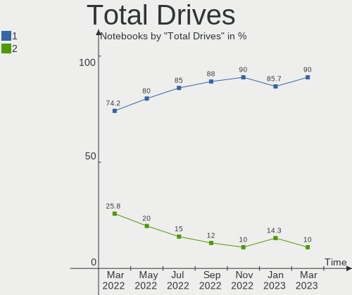
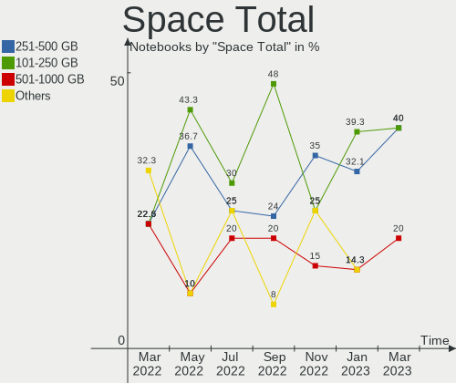
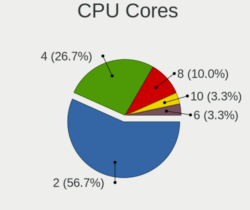
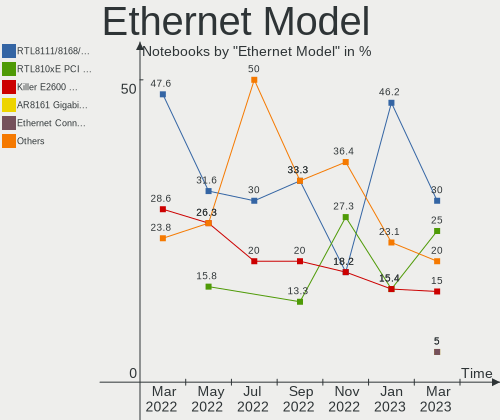
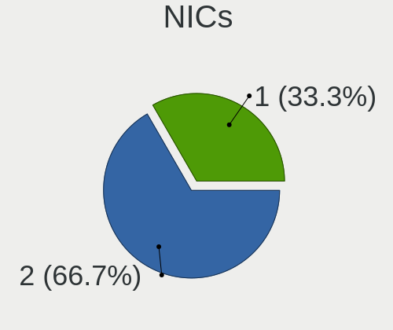
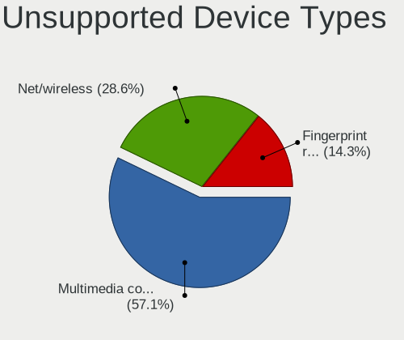

Endless - Hardware Trends (Notebooks)
-------------------------------------

A project to identify most popular hardware characteristics and track their change
over time based on data collected by Linux users at https://Linux-Hardware.org.

Anyone can contribute to this report by the [hw-probe](https://github.com/linuxhw/hw-probe) tool:

    sudo -E hw-probe -all -upload

This report is for one last month. Overall report since the beginning of time: [TestCoverage](https://github.com/linuxhw/TestCoverage)

Period: Oct, 2022.

Contents
--------

* [ System ](#system)
  - [ OS                       ](#os)
  - [ OS Family                ](#os-family)
  - [ Kernel                   ](#kernel)
  - [ Kernel Family            ](#kernel-family)
  - [ Kernel Major Ver.        ](#kernel-major-ver)
  - [ Arch                     ](#arch)
  - [ DE                       ](#de)
  - [ Display Server           ](#display-server)
  - [ Display Manager          ](#display-manager)
  - [ OS Lang                  ](#os-lang)
  - [ Boot Mode                ](#boot-mode)
  - [ Filesystem               ](#filesystem)
  - [ Part. scheme             ](#part-scheme)
  - [ Dual Boot with Linux/BSD ](#dual-boot-with-linuxbsd)
  - [ Dual Boot (Win)          ](#dual-boot-win)

* [ Board ](#board)
  - [ Vendor                   ](#vendor)
  - [ Model                    ](#model)
  - [ Model Family             ](#model-family)
  - [ MFG Year                 ](#mfg-year)
  - [ Form Factor              ](#form-factor)
  - [ Secure Boot              ](#secure-boot)
  - [ Coreboot                 ](#coreboot)
  - [ RAM Size                 ](#ram-size)
  - [ RAM Used                 ](#ram-used)
  - [ Total Drives             ](#total-drives)
  - [ Has CD-ROM               ](#has-cd-rom)
  - [ Has Ethernet             ](#has-ethernet)
  - [ Has WiFi                 ](#has-wifi)
  - [ Has Bluetooth            ](#has-bluetooth)

* [ Location ](#location)
  - [ Country                  ](#country)
  - [ City                     ](#city)

* [ Drives ](#drives)
  - [ Drive Vendor             ](#drive-vendor)
  - [ Drive Model              ](#drive-model)
  - [ HDD Vendor               ](#hdd-vendor)
  - [ SSD Vendor               ](#ssd-vendor)
  - [ Drive Kind               ](#drive-kind)
  - [ Drive Connector          ](#drive-connector)
  - [ Drive Size               ](#drive-size)
  - [ Space Total              ](#space-total)
  - [ Space Used               ](#space-used)
  - [ Malfunc. Drives          ](#malfunc-drives)
  - [ Malfunc. Drive Vendor    ](#malfunc-drive-vendor)
  - [ Malfunc. HDD Vendor      ](#malfunc-hdd-vendor)
  - [ Malfunc. Drive Kind      ](#malfunc-drive-kind)
  - [ Failed Drives            ](#failed-drives)
  - [ Failed Drive Vendor      ](#failed-drive-vendor)
  - [ Drive Status             ](#drive-status)

* [ Storage controller ](#storage-controller)
  - [ Storage Vendor           ](#storage-vendor)
  - [ Storage Model            ](#storage-model)
  - [ Storage Kind             ](#storage-kind)

* [ Processor ](#processor)
  - [ CPU Vendor               ](#cpu-vendor)
  - [ CPU Model                ](#cpu-model)
  - [ CPU Model Family         ](#cpu-model-family)
  - [ CPU Cores                ](#cpu-cores)
  - [ CPU Sockets              ](#cpu-sockets)
  - [ CPU Threads              ](#cpu-threads)
  - [ CPU Op-Modes             ](#cpu-op-modes)
  - [ CPU Microcode            ](#cpu-microcode)
  - [ CPU Microarch            ](#cpu-microarch)

* [ Graphics ](#graphics)
  - [ GPU Vendor               ](#gpu-vendor)
  - [ GPU Model                ](#gpu-model)
  - [ GPU Combo                ](#gpu-combo)
  - [ GPU Driver               ](#gpu-driver)
  - [ GPU Memory               ](#gpu-memory)

* [ Monitor ](#monitor)
  - [ Monitor Vendor           ](#monitor-vendor)
  - [ Monitor Model            ](#monitor-model)
  - [ Monitor Resolution       ](#monitor-resolution)
  - [ Monitor Diagonal         ](#monitor-diagonal)
  - [ Monitor Width            ](#monitor-width)
  - [ Aspect Ratio             ](#aspect-ratio)
  - [ Monitor Area             ](#monitor-area)
  - [ Pixel Density            ](#pixel-density)
  - [ Multiple Monitors        ](#multiple-monitors)

* [ Network ](#network)
  - [ Net Controller Vendor    ](#net-controller-vendor)
  - [ Net Controller Model     ](#net-controller-model)
  - [ Wireless Vendor          ](#wireless-vendor)
  - [ Wireless Model           ](#wireless-model)
  - [ Ethernet Vendor          ](#ethernet-vendor)
  - [ Ethernet Model           ](#ethernet-model)
  - [ Net Controller Kind      ](#net-controller-kind)
  - [ Used Controller          ](#used-controller)
  - [ NICs                     ](#nics)
  - [ IPv6                     ](#ipv6)

* [ Bluetooth ](#bluetooth)
  - [ Bluetooth Vendor         ](#bluetooth-vendor)
  - [ Bluetooth Model          ](#bluetooth-model)

* [ Sound ](#sound)
  - [ Sound Vendor             ](#sound-vendor)
  - [ Sound Model              ](#sound-model)

* [ Memory ](#memory)
  - [ Memory Vendor            ](#memory-vendor)
  - [ Memory Model             ](#memory-model)
  - [ Memory Kind              ](#memory-kind)
  - [ Memory Form Factor       ](#memory-form-factor)
  - [ Memory Size              ](#memory-size)
  - [ Memory Speed             ](#memory-speed)

* [ Printers & scanners ](#printers--scanners)
  - [ Printer Vendor           ](#printer-vendor)
  - [ Printer Model            ](#printer-model)
  - [ Scanner Vendor           ](#scanner-vendor)
  - [ Scanner Model            ](#scanner-model)

* [ Camera ](#camera)
  - [ Camera Vendor            ](#camera-vendor)
  - [ Camera Model             ](#camera-model)

* [ Security ](#security)
  - [ Fingerprint Vendor       ](#fingerprint-vendor)
  - [ Fingerprint Model        ](#fingerprint-model)
  - [ Chipcard Vendor          ](#chipcard-vendor)
  - [ Chipcard Model           ](#chipcard-model)

* [ Unsupported ](#unsupported)
  - [ Unsupported Devices      ](#unsupported-devices)
  - [ Unsupported Device Types ](#unsupported-device-types)

System
------

OS
--

Installed operating systems

| Name                  | Notebooks | Percent |
|-----------------------|-----------|---------|
| Endless 4.0.10        | 11        | 47.83%  |
| Endless 4.0.9         | 8         | 34.78%  |
| Endless 4.0.8         | 1         | 4.35%   |
| Endless 3.9.3-nexthw1 | 1         | 4.35%   |
| Endless 3.7.8         | 1         | 4.35%   |
| Endless 3.7.7-nexthw1 | 1         | 4.35%   |

OS Family
---------

OS without a version

| Name    | Notebooks | Percent |
|---------|-----------|---------|
| Endless | 23        | 100%    |

Kernel
------

Version of the Linux kernel

| Version           | Notebooks | Percent |
|-------------------|-----------|---------|
| 5.11.0-35-generic | 20        | 86.96%  |
| 5.4.0-7-generic   | 1         | 4.35%   |
| 5.3.0-28-generic  | 1         | 4.35%   |
| 5.11.0-12-generic | 1         | 4.35%   |

Kernel Family
-------------

Linux kernel without a distro release

| Version | Notebooks | Percent |
|---------|-----------|---------|
| 5.11.0  | 21        | 91.3%   |
| 5.4.0   | 1         | 4.35%   |
| 5.3.0   | 1         | 4.35%   |

Kernel Major Ver.
-----------------

Linux kernel major version

| Version | Notebooks | Percent |
|---------|-----------|---------|
| 5.11    | 21        | 91.3%   |
| 5.4     | 1         | 4.35%   |
| 5.3     | 1         | 4.35%   |

Arch
----

OS architecture (x86_64, i586, etc.)

| Name   | Notebooks | Percent |
|--------|-----------|---------|
| x86_64 | 23        | 100%    |

DE
--

Desktop Environment

| Name  | Notebooks | Percent |
|-------|-----------|---------|
| GNOME | 23        | 100%    |

Display Server
--------------

X11 or Wayland

| Name | Notebooks | Percent |
|------|-----------|---------|
| X11  | 23        | 100%    |

Display Manager
---------------

SDDM, LightDM, etc.

| Name    | Notebooks | Percent |
|---------|-----------|---------|
| Unknown | 23        | 100%    |

OS Lang
-------

Language

| Lang  | Notebooks | Percent |
|-------|-----------|---------|
| pt_BR | 7         | 30.43%  |
| en_US | 7         | 30.43%  |
| de_DE | 3         | 13.04%  |
| sl_SI | 1         | 4.35%   |
| pt_PT | 1         | 4.35%   |
| es_MX | 1         | 4.35%   |
| es_ES | 1         | 4.35%   |
| es_CO | 1         | 4.35%   |
| bs_BA | 1         | 4.35%   |

Boot Mode
---------

EFI or BIOS

| Mode | Notebooks | Percent |
|------|-----------|---------|
| EFI  | 16        | 69.57%  |
| BIOS | 7         | 30.43%  |

Filesystem
----------

Type of filesystem

| Type | Notebooks | Percent |
|------|-----------|---------|
| Ext4 | 23        | 100%    |

Part. scheme
------------

Scheme of partitioning

| Type    | Notebooks | Percent |
|---------|-----------|---------|
| Unknown | 23        | 100%    |

Dual Boot with Linux/BSD
------------------------

Hosting more than one Linux/BSD

| Dual boot | Notebooks | Percent |
|-----------|-----------|---------|
| No        | 23        | 100%    |

Dual Boot (Win)
---------------

Hosting Linux and Windows

| Dual boot | Notebooks | Percent |
|-----------|-----------|---------|
| No        | 23        | 100%    |

Board
-----

Vendor
------

Motherboard manufacturer

| Name             | Notebooks | Percent |
|------------------|-----------|---------|
| Acer             | 9         | 39.13%  |
| ASUSTek Computer | 8         | 34.78%  |
| Dell             | 3         | 13.04%  |
| Toshiba          | 1         | 4.35%   |
| Lenovo           | 1         | 4.35%   |
| Hewlett-Packard  | 1         | 4.35%   |

Model
-----

Motherboard model

| Name                                       | Notebooks | Percent |
|--------------------------------------------|-----------|---------|
| Acer Nitro AN515-44                        | 3         | 13.04%  |
| ASUS VivoBook 15_ASUS Laptop X540UAR       | 2         | 8.7%    |
| Toshiba NB300                              | 1         | 4.35%   |
| Lenovo G500 20236                          | 1         | 4.35%   |
| HP G71                                     | 1         | 4.35%   |
| Dell XPS 13 9360                           | 1         | 4.35%   |
| Dell Latitude E6530                        | 1         | 4.35%   |
| Dell Inspiron 3542                         | 1         | 4.35%   |
| ASUS X540NA                                | 1         | 4.35%   |
| ASUS X505BP                                | 1         | 4.35%   |
| ASUS VivoBook_ASUSLaptop X513EAN_F513EA    | 1         | 4.35%   |
| ASUS VivoBook_ASUSLaptop X415MA_X415MA     | 1         | 4.35%   |
| ASUS VivoBook_ASUSLaptop E510MAB_E510MA    | 1         | 4.35%   |
| ASUS VivoBook 15_ASUS Laptop X540MA_X543MA | 1         | 4.35%   |
| Acer Swift SF314-511                       | 1         | 4.35%   |
| Acer Swift SF113-31                        | 1         | 4.35%   |
| Acer Predator G3-571                       | 1         | 4.35%   |
| Acer Aspire A317-52                        | 1         | 4.35%   |
| Acer Aspire A315-34                        | 1         | 4.35%   |
| Acer Aspire 5750                           | 1         | 4.35%   |

Model Family
------------

Motherboard model prefix

| Name          | Notebooks | Percent |
|---------------|-----------|---------|
| ASUS VivoBook | 6         | 26.09%  |
| Acer Nitro    | 3         | 13.04%  |
| Acer Aspire   | 3         | 13.04%  |
| Acer Swift    | 2         | 8.7%    |
| Toshiba NB300 | 1         | 4.35%   |
| Lenovo G500   | 1         | 4.35%   |
| HP G71        | 1         | 4.35%   |
| Dell XPS      | 1         | 4.35%   |
| Dell Latitude | 1         | 4.35%   |
| Dell Inspiron | 1         | 4.35%   |
| ASUS X540NA   | 1         | 4.35%   |
| ASUS X505BP   | 1         | 4.35%   |
| Acer Predator | 1         | 4.35%   |

MFG Year
--------

Motherboard manufacture year

| Year | Notebooks | Percent |
|------|-----------|---------|
| 2020 | 5         | 21.74%  |
| 2017 | 4         | 17.39%  |
| 2021 | 3         | 13.04%  |
| 2019 | 2         | 8.7%    |
| 2018 | 2         | 8.7%    |
| 2009 | 2         | 8.7%    |
| 2016 | 1         | 4.35%   |
| 2014 | 1         | 4.35%   |
| 2013 | 1         | 4.35%   |
| 2012 | 1         | 4.35%   |
| 2011 | 1         | 4.35%   |

Form Factor
-----------

Physical design of the computer

| Name     | Notebooks | Percent |
|----------|-----------|---------|
| Notebook | 23        | 100%    |

Secure Boot
-----------

Enabled or disabled

| State    | Notebooks | Percent |
|----------|-----------|---------|
| Disabled | 17        | 73.91%  |
| Enabled  | 6         | 26.09%  |

Coreboot
--------

Have coreboot on board

| Used | Notebooks | Percent |
|------|-----------|---------|
| No   | 23        | 100%    |

RAM Size
--------

Total RAM memory

| Size in GB | Notebooks | Percent |
|------------|-----------|---------|
| 3.01-4.0   | 10        | 43.48%  |
| 4.01-8.0   | 8         | 34.78%  |
| 16.01-24.0 | 3         | 13.04%  |
| 1.01-2.0   | 1         | 4.35%   |
| 8.01-16.0  | 1         | 4.35%   |

RAM Used
--------

Used RAM memory

| Used GB  | Notebooks | Percent |
|----------|-----------|---------|
| 1.01-2.0 | 13        | 56.52%  |
| 2.01-3.0 | 6         | 26.09%  |
| 0.51-1.0 | 3         | 13.04%  |
| 3.01-4.0 | 1         | 4.35%   |

Total Drives
------------

Number of drives on board

| Drives | Notebooks | Percent |
|--------|-----------|---------|
| 1      | 21        | 91.3%   |
| 2      | 2         | 8.7%    |

Has CD-ROM
----------

Has CD-ROM on board

| Presented | Notebooks | Percent |
|-----------|-----------|---------|
| No        | 18        | 78.26%  |
| Yes       | 5         | 21.74%  |

Has Ethernet
------------

Has Ethernet on board

| Presented | Notebooks | Percent |
|-----------|-----------|---------|
| Yes       | 14        | 60.87%  |
| No        | 9         | 39.13%  |

Has WiFi
--------

Has WiFi module

| Presented | Notebooks | Percent |
|-----------|-----------|---------|
| Yes       | 22        | 95.65%  |
| No        | 1         | 4.35%   |

Has Bluetooth
-------------

Has Bluetooth module

| Presented | Notebooks | Percent |
|-----------|-----------|---------|
| Yes       | 20        | 86.96%  |
| No        | 3         | 13.04%  |

Location
--------

Country
-------

Geographic location (country)

| Country                | Notebooks | Percent |
|------------------------|-----------|---------|
| Brazil                 | 7         | 30.43%  |
| USA                    | 3         | 13.04%  |
| Germany                | 3         | 13.04%  |
| Spain                  | 1         | 4.35%   |
| Slovenia               | 1         | 4.35%   |
| Romania                | 1         | 4.35%   |
| Portugal               | 1         | 4.35%   |
| Kazakhstan             | 1         | 4.35%   |
| Georgia                | 1         | 4.35%   |
| Colombia               | 1         | 4.35%   |
| Bosnia and Herzegovina | 1         | 4.35%   |
| Australia              | 1         | 4.35%   |
| Argentina              | 1         | 4.35%   |

City
----

Geographic location (city)

| City              | Notebooks | Percent |
|-------------------|-----------|---------|
| Goiânia          | 2         | 8.7%    |
| Fortaleza         | 2         | 8.7%    |
| Dallas            | 2         | 8.7%    |
| Salvador          | 1         | 4.35%   |
| Rio de Janeiro    | 1         | 4.35%   |
| Recife            | 1         | 4.35%   |
| Rathenow          | 1         | 4.35%   |
| Port Townsend     | 1         | 4.35%   |
| Mula              | 1         | 4.35%   |
| Lukavica          | 1         | 4.35%   |
| Ljubljana         | 1         | 4.35%   |
| Lisbon            | 1         | 4.35%   |
| K'alak'i T'bilisi | 1         | 4.35%   |
| Hanover           | 1         | 4.35%   |
| Göttingen        | 1         | 4.35%   |
| Córdoba          | 1         | 4.35%   |
| Brisbane          | 1         | 4.35%   |
| Branesti          | 1         | 4.35%   |
| Bogotá           | 1         | 4.35%   |
| Aktau             | 1         | 4.35%   |

Drives
------

Drive Vendor
------------

Hard drive vendors

| Vendor                      | Notebooks | Drives | Percent |
|-----------------------------|-----------|--------|---------|
| Sandisk                     | 4         | 4      | 16.67%  |
| Samsung Electronics         | 3         | 3      | 12.5%   |
| Kingston                    | 3         | 3      | 12.5%   |
| WDC                         | 2         | 2      | 8.33%   |
| Toshiba                     | 2         | 2      | 8.33%   |
| Seagate                     | 2         | 2      | 8.33%   |
| Micron Technology           | 2         | 2      | 8.33%   |
| Win Memory                  | 1         | 1      | 4.17%   |
| Kingston Technology Company | 1         | 1      | 4.17%   |
| Intel                       | 1         | 1      | 4.17%   |
| Crucial                     | 1         | 1      | 4.17%   |
| China                       | 1         | 1      | 4.17%   |
| Apple                       | 1         | 1      | 4.17%   |

Drive Model
-----------

Hard drive models

| Model                                               | Notebooks | Percent |
|-----------------------------------------------------|-----------|---------|
| Sandisk WD Blue SN550 NVMe SSD 1TB                  | 4         | 16.67%  |
| Micron 2210_MTFDHBA512QFD 512GB                     | 2         | 8.33%   |
| Win Memory SWR256G-301II 256GB                      | 1         | 4.17%   |
| WDC WD10SPZX-21Z10T0 1TB                            | 1         | 4.17%   |
| WDC WD10JPVX-75JC3T0 1TB                            | 1         | 4.17%   |
| Toshiba MQ04ABF100 1TB                              | 1         | 4.17%   |
| Toshiba MK2555GSX 250GB                             | 1         | 4.17%   |
| Seagate ST9320325AS 320GB                           | 1         | 4.17%   |
| Seagate ST500LM030-1RK17D 500GB                     | 1         | 4.17%   |
| Samsung SSD 860 EVO M.2 500GB                       | 1         | 4.17%   |
| Samsung SSD 750 EVO 250GB                           | 1         | 4.17%   |
| Samsung NVMe SSD Controller SM961/PM961/SM963 250GB | 1         | 4.17%   |
| Kingston Company OM3PDP3 NVMe SSD 512GB             | 1         | 4.17%   |
| Kingston RBUSNS8180DS3128GH 128GB SSD               | 1         | 4.17%   |
| Kingston RBUSC180DS37256GJ 256GB SSD                | 1         | 4.17%   |
| Kingston RBUSC180DS37128GJ 128GB SSD                | 1         | 4.17%   |
| Intel Micron_2210_MTFDHBA1T0QFD 1024GB              | 1         | 4.17%   |
| Crucial CT500MX500SSD1 500GB                        | 1         | 4.17%   |
| China SSD 240GB                                     | 1         | 4.17%   |
| Apple HDD HTS545050A7E362 500GB                     | 1         | 4.17%   |

HDD Vendor
----------

Hard disk drive vendors

| Vendor  | Notebooks | Drives | Percent |
|---------|-----------|--------|---------|
| WDC     | 2         | 2      | 28.57%  |
| Toshiba | 2         | 2      | 28.57%  |
| Seagate | 2         | 2      | 28.57%  |
| Apple   | 1         | 1      | 14.29%  |

SSD Vendor
----------

Solid state drive vendors

| Vendor              | Notebooks | Drives | Percent |
|---------------------|-----------|--------|---------|
| Kingston            | 3         | 3      | 37.5%   |
| Samsung Electronics | 2         | 2      | 25%     |
| Win Memory          | 1         | 1      | 12.5%   |
| Crucial             | 1         | 1      | 12.5%   |
| China               | 1         | 1      | 12.5%   |

Drive Kind
----------

HDD or SSD

| Kind | Notebooks | Drives | Percent |
|------|-----------|--------|---------|
| NVMe | 9         | 9      | 37.5%   |
| SSD  | 8         | 8      | 33.33%  |
| HDD  | 7         | 7      | 29.17%  |

Drive Connector
---------------

SATA, SAS, NVMe, etc.

| Type | Notebooks | Drives | Percent |
|------|-----------|--------|---------|
| SATA | 15        | 15     | 62.5%   |
| NVMe | 9         | 9      | 37.5%   |

Drive Size
----------

Size of hard drive

| Size in TB | Notebooks | Drives | Percent |
|------------|-----------|--------|---------|
| 0.01-0.5   | 12        | 12     | 80%     |
| 0.51-1.0   | 3         | 3      | 20%     |

Space Total
-----------

Amount of disk space available on the file system

| Size in GB | Notebooks | Percent |
|------------|-----------|---------|
| 251-500    | 9         | 39.13%  |
| 101-250    | 9         | 39.13%  |
| 501-1000   | 4         | 17.39%  |
| Unknown    | 1         | 4.35%   |

Space Used
----------

Amount of used disk space

| Used GB | Notebooks | Percent |
|---------|-----------|---------|
| 21-50   | 11        | 47.83%  |
| 51-100  | 5         | 21.74%  |
| 101-250 | 4         | 17.39%  |
| 251-500 | 1         | 4.35%   |
| 1-20    | 1         | 4.35%   |
| Unknown | 1         | 4.35%   |

Malfunc. Drives
---------------

Drive models with a malfunction

Zero info for selected period =(

Malfunc. Drive Vendor
---------------------

Vendors of faulty drives

Zero info for selected period =(

Malfunc. HDD Vendor
-------------------

Vendors of faulty HDD drives

Zero info for selected period =(

Malfunc. Drive Kind
-------------------

Kinds of faulty drives

Zero info for selected period =(

Failed Drives
-------------

Failed drive models

Zero info for selected period =(

Failed Drive Vendor
-------------------

Failed drive vendors

Zero info for selected period =(

Drive Status
------------

Number of failed and malfunc. drives

| Status   | Notebooks | Drives | Percent |
|----------|-----------|--------|---------|
| Detected | 23        | 24     | 100%    |

Storage controller
------------------

Storage Vendor
--------------

Storage controller vendors

| Vendor                      | Notebooks | Percent |
|-----------------------------|-----------|---------|
| Intel                       | 19        | 61.29%  |
| SanDisk                     | 4         | 12.9%   |
| AMD                         | 4         | 12.9%   |
| Micron Technology           | 2         | 6.45%   |
| Samsung Electronics         | 1         | 3.23%   |
| Kingston Technology Company | 1         | 3.23%   |

Storage Model
-------------

Storage controller models

| Model                                                                        | Notebooks | Percent |
|------------------------------------------------------------------------------|-----------|---------|
| SanDisk WD Blue SN550 NVMe SSD                                               | 4         | 12.12%  |
| Intel Celeron/Pentium Silver Processor SATA Controller                       | 4         | 12.12%  |
| AMD FCH SATA Controller [AHCI mode]                                          | 4         | 12.12%  |
| Intel 82801 Mobile SATA Controller [RAID mode]                               | 3         | 9.09%   |
| Micron Non-Volatile memory controller                                        | 2         | 6.06%   |
| Intel Volume Management Device NVMe RAID Controller                          | 2         | 6.06%   |
| Intel Sunrise Point-LP SATA Controller [AHCI mode]                           | 2         | 6.06%   |
| Intel Celeron N3350/Pentium N4200/Atom E3900 Series SATA AHCI Controller     | 2         | 6.06%   |
| Samsung NVMe SSD Controller SM961/PM961/SM963                                | 1         | 3.03%   |
| Kingston Company OM3PDP3 NVMe SSD                                            | 1         | 3.03%   |
| Intel Tiger Lake-LP SATA Controller                                          | 1         | 3.03%   |
| Intel PROSet/Wireless WiFi Software extension                                | 1         | 3.03%   |
| Intel NM10/ICH7 Family SATA Controller [AHCI mode]                           | 1         | 3.03%   |
| Intel HM170/QM170 Chipset SATA Controller [AHCI Mode]                        | 1         | 3.03%   |
| Intel 82801IBM/IEM (ICH9M/ICH9M-E) 4 port SATA Controller [AHCI mode]        | 1         | 3.03%   |
| Intel 8 Series SATA Controller 1 [AHCI mode]                                 | 1         | 3.03%   |
| Intel 7 Series Chipset Family 6-port SATA Controller [AHCI mode]             | 1         | 3.03%   |
| Intel 6 Series/C200 Series Chipset Family 6 port Mobile SATA AHCI Controller | 1         | 3.03%   |

Storage Kind
------------

Kind of storage controller (IDE, SATA, NVMe, SAS, ...)

| Kind | Notebooks | Percent |
|------|-----------|---------|
| SATA | 20        | 60.61%  |
| NVMe | 9         | 27.27%  |
| RAID | 4         | 12.12%  |

Processor
---------

CPU Vendor
----------

Processor vendors

| Vendor | Notebooks | Percent |
|--------|-----------|---------|
| Intel  | 19        | 82.61%  |
| AMD    | 4         | 17.39%  |

CPU Model
---------

Processor models

| Model                                        | Notebooks | Percent |
|----------------------------------------------|-----------|---------|
| Intel Celeron N4020 CPU @ 1.10GHz            | 2         | 8.7%    |
| AMD Ryzen 7 4800H with Radeon Graphics       | 2         | 8.7%    |
| Intel Pentium Silver N5030 CPU @ 1.10GHz     | 1         | 4.35%   |
| Intel Pentium CPU N4200 @ 1.10GHz            | 1         | 4.35%   |
| Intel Core i7-7700HQ CPU @ 2.80GHz           | 1         | 4.35%   |
| Intel Core i7-7500U CPU @ 2.70GHz            | 1         | 4.35%   |
| Intel Core i7-3520M CPU @ 2.90GHz            | 1         | 4.35%   |
| Intel Core i5-4210U CPU @ 1.70GHz            | 1         | 4.35%   |
| Intel Core i5-1035G1 CPU @ 1.00GHz           | 1         | 4.35%   |
| Intel Core i3-7100U CPU @ 2.40GHz            | 1         | 4.35%   |
| Intel Core i3-7020U CPU @ 2.30GHz            | 1         | 4.35%   |
| Intel Core i3-3110M CPU @ 2.40GHz            | 1         | 4.35%   |
| Intel Core i3-2350M CPU @ 2.30GHz            | 1         | 4.35%   |
| Intel Core 2 Duo CPU T6600 @ 2.20GHz         | 1         | 4.35%   |
| Intel Celeron N4000 CPU @ 1.10GHz            | 1         | 4.35%   |
| Intel Celeron CPU N3350 @ 1.10GHz            | 1         | 4.35%   |
| Intel Atom CPU N450 @ 1.66GHz                | 1         | 4.35%   |
| Intel 11th Gen Core i7-1165G7 @ 2.80GHz      | 1         | 4.35%   |
| Intel 11th Gen Core i5-1135G7 @ 2.40GHz      | 1         | 4.35%   |
| AMD Ryzen 5 4600H with Radeon Graphics       | 1         | 4.35%   |
| AMD A9-9425 RADEON R5, 5 COMPUTE CORES 2C+3G | 1         | 4.35%   |

CPU Model Family
----------------

Processor model prefix

| Model                | Notebooks | Percent |
|----------------------|-----------|---------|
| Intel Core i3        | 4         | 17.39%  |
| Intel Celeron        | 4         | 17.39%  |
| Other                | 3         | 13.04%  |
| Intel Core i7        | 3         | 13.04%  |
| Intel Core i5        | 2         | 8.7%    |
| AMD Ryzen 7          | 2         | 8.7%    |
| Intel Pentium Silver | 1         | 4.35%   |
| Intel Pentium        | 1         | 4.35%   |
| Intel Core 2 Duo     | 1         | 4.35%   |
| Intel Atom           | 1         | 4.35%   |
| AMD Ryzen 5          | 1         | 4.35%   |

CPU Cores
---------

Number of processor cores

| Number | Notebooks | Percent |
|--------|-----------|---------|
| 2      | 13        | 56.52%  |
| 4      | 6         | 26.09%  |
| 8      | 2         | 8.7%    |
| 6      | 1         | 4.35%   |
| 1      | 1         | 4.35%   |

CPU Sockets
-----------

Number of sockets

| Number | Notebooks | Percent |
|--------|-----------|---------|
| 1      | 23        | 100%    |

CPU Threads
-----------

Threads per core (Hyper-Threading)

| Number | Notebooks | Percent |
|--------|-----------|---------|
| 2      | 15        | 65.22%  |
| 1      | 8         | 34.78%  |

CPU Op-Modes
------------

CPU Operation Modes (32-bit, 64-bit)

| Op mode        | Notebooks | Percent |
|----------------|-----------|---------|
| 32-bit, 64-bit | 23        | 100%    |

CPU Microcode
-------------

Microcode number

| Number     | Notebooks | Percent |
|------------|-----------|---------|
| 0x806e9    | 3         | 13.04%  |
| 0x706a8    | 3         | 13.04%  |
| 0x08600103 | 3         | 13.04%  |
| 0x806c1    | 2         | 8.7%    |
| 0x506c9    | 2         | 8.7%    |
| 0x306a9    | 2         | 8.7%    |
| 0x906e9    | 1         | 4.35%   |
| 0x706e5    | 1         | 4.35%   |
| 0x706a1    | 1         | 4.35%   |
| 0x40651    | 1         | 4.35%   |
| 0x206a7    | 1         | 4.35%   |
| 0x106ca    | 1         | 4.35%   |
| 0x1067a    | 1         | 4.35%   |
| 0x06006705 | 1         | 4.35%   |

CPU Microarch
-------------

Microarchitecture

| Name          | Notebooks | Percent |
|---------------|-----------|---------|
| KabyLake      | 4         | 17.39%  |
| Goldmont plus | 4         | 17.39%  |
| Zen 2         | 3         | 13.04%  |
| TigerLake     | 2         | 8.7%    |
| IvyBridge     | 2         | 8.7%    |
| Goldmont      | 2         | 8.7%    |
| SandyBridge   | 1         | 4.35%   |
| Penryn        | 1         | 4.35%   |
| IceLake       | 1         | 4.35%   |
| Haswell       | 1         | 4.35%   |
| Excavator     | 1         | 4.35%   |
| Bonnell       | 1         | 4.35%   |

Graphics
--------

GPU Vendor
----------

Vendors of graphics cards

| Vendor | Notebooks | Percent |
|--------|-----------|---------|
| Intel  | 19        | 65.52%  |
| Nvidia | 6         | 20.69%  |
| AMD    | 4         | 13.79%  |

GPU Model
---------

Graphics card models

| Model                                                                              | Notebooks | Percent |
|------------------------------------------------------------------------------------|-----------|---------|
| Nvidia TU117M                                                                      | 3         | 10%     |
| Intel HD Graphics 620                                                              | 3         | 10%     |
| Intel GeminiLake [UHD Graphics 600]                                                | 3         | 10%     |
| AMD Renoir                                                                         | 3         | 10%     |
| Intel TigerLake-LP GT2 [Iris Xe Graphics]                                          | 2         | 6.67%   |
| Intel 3rd Gen Core processor Graphics Controller                                   | 2         | 6.67%   |
| Nvidia GP106M [GeForce GTX 1060 Mobile]                                            | 1         | 3.33%   |
| Nvidia GF117M [GeForce 610M/710M/810M/820M / GT 620M/625M/630M/720M]               | 1         | 3.33%   |
| Nvidia GF108GLM [NVS 5200M]                                                        | 1         | 3.33%   |
| Intel Mobile 4 Series Chipset Integrated Graphics Controller                       | 1         | 3.33%   |
| Intel Iris Plus Graphics G1 (Ice Lake)                                             | 1         | 3.33%   |
| Intel HD Graphics 630                                                              | 1         | 3.33%   |
| Intel HD Graphics 500                                                              | 1         | 3.33%   |
| Intel Haswell-ULT Integrated Graphics Controller                                   | 1         | 3.33%   |
| Intel GeminiLake [UHD Graphics 605]                                                | 1         | 3.33%   |
| Intel Celeron N3350/Pentium N4200/Atom E3900 Series Integrated Graphics Controller | 1         | 3.33%   |
| Intel Atom Processor D4xx/D5xx/N4xx/N5xx Integrated Graphics Controller            | 1         | 3.33%   |
| Intel 2nd Generation Core Processor Family Integrated Graphics Controller          | 1         | 3.33%   |
| AMD Sun LE [Radeon HD 8550M / R5 M230]                                             | 1         | 3.33%   |
| AMD Stoney [Radeon R2/R3/R4/R5 Graphics]                                           | 1         | 3.33%   |

GPU Combo
---------

Combinations of graphics cards

| Name           | Notebooks | Percent |
|----------------|-----------|---------|
| 1 x Intel      | 16        | 69.57%  |
| Intel + Nvidia | 3         | 13.04%  |
| AMD + Nvidia   | 3         | 13.04%  |
| 2 x AMD        | 1         | 4.35%   |

GPU Driver
----------

Free vs proprietary

| Driver      | Notebooks | Percent |
|-------------|-----------|---------|
| Free        | 19        | 82.61%  |
| Proprietary | 4         | 17.39%  |

GPU Memory
----------

Total video memory

| Size in GB | Notebooks | Percent |
|------------|-----------|---------|
| Unknown    | 18        | 78.26%  |
| 0.01-0.5   | 3         | 13.04%  |
| 1.01-2.0   | 1         | 4.35%   |
| 0.51-1.0   | 1         | 4.35%   |

Monitor
-------

Monitor Vendor
--------------

Monitor vendors

| Vendor              | Notebooks | Percent |
|---------------------|-----------|---------|
| BOE                 | 7         | 30.43%  |
| PANDA               | 5         | 21.74%  |
| LG Display          | 5         | 21.74%  |
| Chimei Innolux      | 2         | 8.7%    |
| AU Optronics        | 2         | 8.7%    |
| Sharp               | 1         | 4.35%   |
| Samsung Electronics | 1         | 4.35%   |

Monitor Model
-------------

Monitor models

| Model                                                                | Notebooks | Percent |
|----------------------------------------------------------------------|-----------|---------|
| PANDA LCD Monitor NCP004D 1920x1080 344x194mm 15.5-inch              | 3         | 13.04%  |
| BOE LCD Monitor BOE06A5 1366x768 344x194mm 15.5-inch                 | 2         | 8.7%    |
| Sharp LCD Monitor SHP1449 1920x1080 294x165mm 13.3-inch              | 1         | 4.35%   |
| Samsung Electronics LCD Monitor SEC544E 1024x600 223x125mm 10.1-inch | 1         | 4.35%   |
| PANDA LM133LF5L01 NCP0020 1920x1080 294x165mm 13.3-inch              | 1         | 4.35%   |
| PANDA LCD Monitor NCP0046 1920x1080 344x194mm 15.5-inch              | 1         | 4.35%   |
| LG Display LCD Monitor LGD0456 1366x768 344x194mm 15.5-inch          | 1         | 4.35%   |
| LG Display LCD Monitor LGD033A 1366x768 344x194mm 15.5-inch          | 1         | 4.35%   |
| LG Display LCD Monitor LGD032C 1920x1080 344x194mm 15.5-inch         | 1         | 4.35%   |
| LG Display LCD Monitor LGD02DC 1366x768 344x194mm 15.5-inch          | 1         | 4.35%   |
| LG Display LCD Monitor LGD0226 1600x900 382x215mm 17.3-inch          | 1         | 4.35%   |
| Chimei Innolux LCD Monitor CMN15F5 1920x1080 344x193mm 15.5-inch     | 1         | 4.35%   |
| Chimei Innolux LCD Monitor CMN14D4 1920x1080 309x173mm 13.9-inch     | 1         | 4.35%   |
| BOE LCD Monitor BOE07F6 1920x1080 309x174mm 14.0-inch                | 1         | 4.35%   |
| BOE LCD Monitor BOE07CE 1366x768 344x193mm 15.5-inch                 | 1         | 4.35%   |
| BOE LCD Monitor BOE0788 1920x1080 381x214mm 17.2-inch                | 1         | 4.35%   |
| BOE LCD Monitor BOE0704 1366x768 344x194mm 15.5-inch                 | 1         | 4.35%   |
| BOE LCD Monitor BOE069C 1920x1080 344x193mm 15.5-inch                | 1         | 4.35%   |
| AU Optronics LCD Monitor AUO71EC 1366x768 344x193mm 15.5-inch        | 1         | 4.35%   |
| AU Optronics LCD Monitor AUO61ED 1920x1080 344x194mm 15.5-inch       | 1         | 4.35%   |

Monitor Resolution
------------------

Monitor screen resolution

| Resolution      | Notebooks | Percent |
|-----------------|-----------|---------|
| 1920x1080 (FHD) | 13        | 56.52%  |
| 1366x768 (WXGA) | 8         | 34.78%  |
| 1600x900 (HD+)  | 1         | 4.35%   |
| 1024x600        | 1         | 4.35%   |

Monitor Diagonal
----------------

Diagonal size in inches

| Inches | Notebooks | Percent |
|--------|-----------|---------|
| 15     | 16        | 69.57%  |
| 13     | 3         | 13.04%  |
| 17     | 2         | 8.7%    |
| 14     | 1         | 4.35%   |
| 10     | 1         | 4.35%   |

Monitor Width
-------------

Physical width

| Width in mm | Notebooks | Percent |
|-------------|-----------|---------|
| 301-350     | 18        | 78.26%  |
| 201-300     | 3         | 13.04%  |
| 351-400     | 2         | 8.7%    |

Aspect Ratio
------------

Proportional relationship between the width and the height

| Ratio | Notebooks | Percent |
|-------|-----------|---------|
| 16/9  | 23        | 100%    |

Monitor Area
------------

Area in inch²

| Area in inch² | Notebooks | Percent |
|----------------|-----------|---------|
| 101-110        | 16        | 69.57%  |
| 81-90          | 2         | 8.7%    |
| 71-80          | 2         | 8.7%    |
| 121-130        | 2         | 8.7%    |
| 41-50          | 1         | 4.35%   |

Pixel Density
-------------

Pixels per inch

| Density | Notebooks | Percent |
|---------|-----------|---------|
| 121-160 | 11        | 47.83%  |
| 101-120 | 10        | 43.48%  |
| 161-240 | 2         | 8.7%    |

Multiple Monitors
-----------------

Total monitors connected

| Total | Notebooks | Percent |
|-------|-----------|---------|
| 1     | 22        | 95.65%  |
| 2     | 1         | 4.35%   |

Network
-------

Net Controller Vendor
---------------------

Controller vendors

| Vendor                | Notebooks | Percent |
|-----------------------|-----------|---------|
| Realtek Semiconductor | 14        | 38.89%  |
| Intel                 | 11        | 30.56%  |
| Qualcomm Atheros      | 7         | 19.44%  |
| Broadcom              | 2         | 5.56%   |
| Samsung Electronics   | 1         | 2.78%   |
| Ralink Technology     | 1         | 2.78%   |

Net Controller Model
--------------------

Controller models

| Model                                                             | Notebooks | Percent |
|-------------------------------------------------------------------|-----------|---------|
| Realtek RTL8111/8168/8411 PCI Express Gigabit Ethernet Controller | 4         | 10.81%  |
| Realtek RTL810xE PCI Express Fast Ethernet controller             | 3         | 8.11%   |
| Realtek Killer E2600 Gigabit Ethernet Controller                  | 3         | 8.11%   |
| Intel Wi-Fi 6 AX200                                               | 3         | 8.11%   |
| Realtek RTL8821CE 802.11ac PCIe Wireless Network Adapter          | 2         | 5.41%   |
| Qualcomm Atheros QCA9377 802.11ac Wireless Network Adapter        | 2         | 5.41%   |
| Intel Wireless 8265 / 8275                                        | 2         | 5.41%   |
| Intel Wi-Fi 6 AX201                                               | 2         | 5.41%   |
| Samsung GT-I9070 (network tethering, USB debugging enabled)       | 1         | 2.7%    |
| Realtek RTL8822BE 802.11a/b/g/n/ac WiFi adapter                   | 1         | 2.7%    |
| Realtek RTL8188CE 802.11b/g/n WiFi Adapter                        | 1         | 2.7%    |
| Ralink RT5370 Wireless Adapter                                    | 1         | 2.7%    |
| Qualcomm Atheros QCA9565 / AR9565 Wireless Network Adapter        | 1         | 2.7%    |
| Qualcomm Atheros QCA8172 Fast Ethernet                            | 1         | 2.7%    |
| Qualcomm Atheros QCA6174 802.11ac Wireless Network Adapter        | 1         | 2.7%    |
| Qualcomm Atheros AR9287 Wireless Network Adapter (PCI-Express)    | 1         | 2.7%    |
| Qualcomm Atheros AR9285 Wireless Network Adapter (PCI-Express)    | 1         | 2.7%    |
| Intel Wireless 7265                                               | 1         | 2.7%    |
| Intel Gemini Lake PCH CNVi WiFi                                   | 1         | 2.7%    |
| Intel Centrino Wireless-N 1000 [Condor Peak]                      | 1         | 2.7%    |
| Intel Centrino Ultimate-N 6300                                    | 1         | 2.7%    |
| Intel 82579LM Gigabit Network Connection (Lewisville)             | 1         | 2.7%    |
| Broadcom NetLink BCM57785 Gigabit Ethernet PCIe                   | 1         | 2.7%    |
| Broadcom BCM43142 802.11b/g/n                                     | 1         | 2.7%    |

Wireless Vendor
---------------

Wireless vendors

| Vendor                | Notebooks | Percent |
|-----------------------|-----------|---------|
| Intel                 | 11        | 47.83%  |
| Qualcomm Atheros      | 6         | 26.09%  |
| Realtek Semiconductor | 4         | 17.39%  |
| Ralink Technology     | 1         | 4.35%   |
| Broadcom              | 1         | 4.35%   |

Wireless Model
--------------

Wireless models

| Model                                                          | Notebooks | Percent |
|----------------------------------------------------------------|-----------|---------|
| Intel Wi-Fi 6 AX200                                            | 3         | 13.04%  |
| Realtek RTL8821CE 802.11ac PCIe Wireless Network Adapter       | 2         | 8.7%    |
| Qualcomm Atheros QCA9377 802.11ac Wireless Network Adapter     | 2         | 8.7%    |
| Intel Wireless 8265 / 8275                                     | 2         | 8.7%    |
| Intel Wi-Fi 6 AX201                                            | 2         | 8.7%    |
| Realtek RTL8822BE 802.11a/b/g/n/ac WiFi adapter                | 1         | 4.35%   |
| Realtek RTL8188CE 802.11b/g/n WiFi Adapter                     | 1         | 4.35%   |
| Ralink RT5370 Wireless Adapter                                 | 1         | 4.35%   |
| Qualcomm Atheros QCA9565 / AR9565 Wireless Network Adapter     | 1         | 4.35%   |
| Qualcomm Atheros QCA6174 802.11ac Wireless Network Adapter     | 1         | 4.35%   |
| Qualcomm Atheros AR9287 Wireless Network Adapter (PCI-Express) | 1         | 4.35%   |
| Qualcomm Atheros AR9285 Wireless Network Adapter (PCI-Express) | 1         | 4.35%   |
| Intel Wireless 7265                                            | 1         | 4.35%   |
| Intel Gemini Lake PCH CNVi WiFi                                | 1         | 4.35%   |
| Intel Centrino Wireless-N 1000 [Condor Peak]                   | 1         | 4.35%   |
| Intel Centrino Ultimate-N 6300                                 | 1         | 4.35%   |
| Broadcom BCM43142 802.11b/g/n                                  | 1         | 4.35%   |

Ethernet Vendor
---------------

Ethernet vendors

| Vendor                | Notebooks | Percent |
|-----------------------|-----------|---------|
| Realtek Semiconductor | 10        | 71.43%  |
| Samsung Electronics   | 1         | 7.14%   |
| Qualcomm Atheros      | 1         | 7.14%   |
| Intel                 | 1         | 7.14%   |
| Broadcom              | 1         | 7.14%   |

Ethernet Model
--------------

Ethernet models

| Model                                                             | Notebooks | Percent |
|-------------------------------------------------------------------|-----------|---------|
| Realtek RTL8111/8168/8411 PCI Express Gigabit Ethernet Controller | 4         | 28.57%  |
| Realtek RTL810xE PCI Express Fast Ethernet controller             | 3         | 21.43%  |
| Realtek Killer E2600 Gigabit Ethernet Controller                  | 3         | 21.43%  |
| Samsung GT-I9070 (network tethering, USB debugging enabled)       | 1         | 7.14%   |
| Qualcomm Atheros QCA8172 Fast Ethernet                            | 1         | 7.14%   |
| Intel 82579LM Gigabit Network Connection (Lewisville)             | 1         | 7.14%   |
| Broadcom NetLink BCM57785 Gigabit Ethernet PCIe                   | 1         | 7.14%   |

Net Controller Kind
-------------------

Ethernet, WiFi or modem

| Kind     | Notebooks | Percent |
|----------|-----------|---------|
| WiFi     | 22        | 61.11%  |
| Ethernet | 14        | 38.89%  |

Used Controller
---------------

Currently used network controller

| Kind     | Notebooks | Percent |
|----------|-----------|---------|
| WiFi     | 21        | 95.45%  |
| Ethernet | 1         | 4.55%   |

NICs
----

Total network controllers on board

| Total | Notebooks | Percent |
|-------|-----------|---------|
| 2     | 11        | 47.83%  |
| 1     | 10        | 43.48%  |
| 3     | 1         | 4.35%   |
| 0     | 1         | 4.35%   |

IPv6
----

IPv6 vs IPv4

| Used | Notebooks | Percent |
|------|-----------|---------|
| No   | 14        | 60.87%  |
| Yes  | 9         | 39.13%  |

Bluetooth
---------

Bluetooth Vendor
----------------

Controller vendors

| Vendor                          | Notebooks | Percent |
|---------------------------------|-----------|---------|
| Intel                           | 10        | 50%     |
| IMC Networks                    | 3         | 15%     |
| Qualcomm Atheros Communications | 2         | 10%     |
| Lite-On Technology              | 2         | 10%     |
| Toshiba                         | 1         | 5%      |
| Foxconn International           | 1         | 5%      |
| Dell                            | 1         | 5%      |

Bluetooth Model
---------------

Controller models

| Model                                             | Notebooks | Percent |
|---------------------------------------------------|-----------|---------|
| Intel Bluetooth wireless interface                | 4         | 20%     |
| Intel AX200 Bluetooth                             | 3         | 15%     |
| IMC Networks Bluetooth Radio                      | 3         | 15%     |
| Lite-On Qualcomm Atheros QCA9377 Bluetooth        | 2         | 10%     |
| Intel AX201 Bluetooth                             | 2         | 10%     |
| Toshiba Integrated Bluetooth HCI                  | 1         | 5%      |
| Qualcomm Atheros  Bluetooth Device                | 1         | 5%      |
| Qualcomm Atheros AR9462 Bluetooth                 | 1         | 5%      |
| Intel Bluetooth 9460/9560 Jefferson Peak (JfP)    | 1         | 5%      |
| Foxconn International BCM43142A0 Bluetooth module | 1         | 5%      |
| Dell BCM20702A0 Bluetooth Module                  | 1         | 5%      |

Sound
-----

Sound Vendor
------------

Sound card vendors

| Vendor | Notebooks | Percent |
|--------|-----------|---------|
| Intel  | 19        | 67.86%  |
| Nvidia | 5         | 17.86%  |
| AMD    | 4         | 14.29%  |

Sound Model
-----------

Sound card models

| Model                                                                      | Notebooks | Percent |
|----------------------------------------------------------------------------|-----------|---------|
| Intel Celeron/Pentium Silver Processor High Definition Audio               | 4         | 13.33%  |
| Nvidia TU107 GeForce GTX 1650 High Definition Audio Controller             | 3         | 10%     |
| Intel Sunrise Point-LP HD Audio                                            | 3         | 10%     |
| AMD Family 17h/19h HD Audio Controller                                     | 3         | 10%     |
| Intel Tiger Lake-LP Smart Sound Technology Audio Controller                | 2         | 6.67%   |
| Intel Celeron N3350/Pentium N4200/Atom E3900 Series Audio Cluster          | 2         | 6.67%   |
| Intel 7 Series/C216 Chipset Family High Definition Audio Controller        | 2         | 6.67%   |
| Nvidia GP106 High Definition Audio Controller                              | 1         | 3.33%   |
| Nvidia GF108 High Definition Audio Controller                              | 1         | 3.33%   |
| Intel NM10/ICH7 Family High Definition Audio Controller                    | 1         | 3.33%   |
| Intel Ice Lake-LP Smart Sound Technology Audio Controller                  | 1         | 3.33%   |
| Intel Haswell-ULT HD Audio Controller                                      | 1         | 3.33%   |
| Intel CM238 HD Audio Controller                                            | 1         | 3.33%   |
| Intel 82801I (ICH9 Family) HD Audio Controller                             | 1         | 3.33%   |
| Intel 8 Series HD Audio Controller                                         | 1         | 3.33%   |
| Intel 6 Series/C200 Series Chipset Family High Definition Audio Controller | 1         | 3.33%   |
| AMD High Definition Audio Controller                                       | 1         | 3.33%   |
| AMD Family 15h (Models 60h-6fh) Audio Controller                           | 1         | 3.33%   |

Memory
------

Memory Vendor
-------------

Memory module vendors

Zero info for selected period =(

Memory Model
------------

Memory module models

Zero info for selected period =(

Memory Kind
-----------

Memory module kinds

Zero info for selected period =(

Memory Form Factor
------------------

Physical design of the memory module

Zero info for selected period =(

Memory Size
-----------

Memory module size

Zero info for selected period =(

Memory Speed
------------

Memory module speed

Zero info for selected period =(

Printers & scanners
-------------------

Printer Vendor
--------------

Printer device vendors

| Vendor      | Notebooks | Percent |
|-------------|-----------|---------|
| Seiko Epson | 1         | 100%    |

Printer Model
-------------

Printer device models

| Model                   | Notebooks | Percent |
|-------------------------|-----------|---------|
| Seiko Epson L355 Series | 1         | 100%    |

Scanner Vendor
--------------

Scanner device vendors

Zero info for selected period =(

Scanner Model
-------------

Scanner device models

Zero info for selected period =(

Camera
------

Camera Vendor
-------------

Camera device vendors

| Vendor                | Notebooks | Percent |
|-----------------------|-----------|---------|
| Quanta                | 8         | 34.78%  |
| IMC Networks          | 6         | 26.09%  |
| Chicony Electronics   | 4         | 17.39%  |
| Microdia              | 3         | 13.04%  |
| Suyin                 | 1         | 4.35%   |
| Realtek Semiconductor | 1         | 4.35%   |

Camera Model
------------

Camera device models

| Model                              | Notebooks | Percent |
|------------------------------------|-----------|---------|
| IMC Networks USB2.0 VGA UVC WebCam | 6         | 26.09%  |
| Quanta HD User Facing              | 3         | 13.04%  |
| Suyin USB 2.0 Camera               | 1         | 4.35%   |
| Realtek Lenovo EasyCamera          | 1         | 4.35%   |
| Quanta VGA WebCam                  | 1         | 4.35%   |
| Quanta USB2.0 VGA UVC WebCam       | 1         | 4.35%   |
| Quanta USB2.0 HD UVC WebCam        | 1         | 4.35%   |
| Quanta HP Webcam-101               | 1         | 4.35%   |
| Quanta HD Webcam                   | 1         | 4.35%   |
| Microdia Integrated_Webcam_HD      | 1         | 4.35%   |
| Microdia Integrated Webcam HD      | 1         | 4.35%   |
| Microdia Dell Integrated HD Webcam | 1         | 4.35%   |
| Chicony VGA WebCam                 | 1         | 4.35%   |
| Chicony HD WebCam                  | 1         | 4.35%   |
| Chicony HD User Facing             | 1         | 4.35%   |
| Chicony 1.3M HD WebCam             | 1         | 4.35%   |

Security
--------

Fingerprint Vendor
------------------

Fingerprint sensor vendors

| Vendor                | Notebooks | Percent |
|-----------------------|-----------|---------|
| LighTuning Technology | 1         | 100%    |

Fingerprint Model
-----------------

Fingerprint sensor models

| Model                                       | Notebooks | Percent |
|---------------------------------------------|-----------|---------|
| LighTuning EgisTec Touch Fingerprint Sensor | 1         | 100%    |

Chipcard Vendor
---------------

Chipcard module vendors

| Vendor   | Notebooks | Percent |
|----------|-----------|---------|
| Broadcom | 1         | 100%    |

Chipcard Model
--------------

Chipcard module models

| Model                                                                        | Notebooks | Percent |
|------------------------------------------------------------------------------|-----------|---------|
| Broadcom BCM5880 Secure Applications Processor with fingerprint swipe sensor | 1         | 100%    |

Unsupported
-----------

Unsupported Devices
-------------------

Total unsupported devices on board

| Total | Notebooks | Percent |
|-------|-----------|---------|
| 0     | 17        | 73.91%  |
| 1     | 6         | 26.09%  |

Unsupported Device Types
------------------------

Types of unsupported devices

| Type                  | Notebooks | Percent |
|-----------------------|-----------|---------|
| Multimedia controller | 3         | 50%     |
| Net/wireless          | 1         | 16.67%  |
| Fingerprint reader    | 1         | 16.67%  |
| Chipcard              | 1         | 16.67%  |

