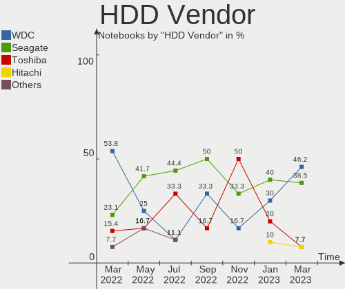
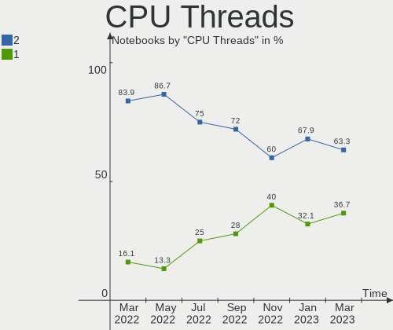
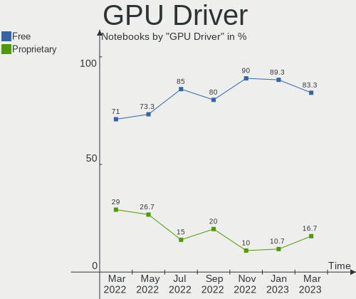
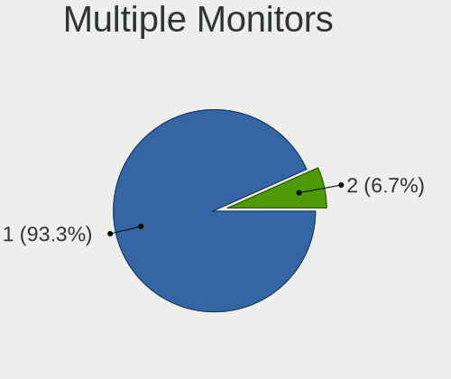
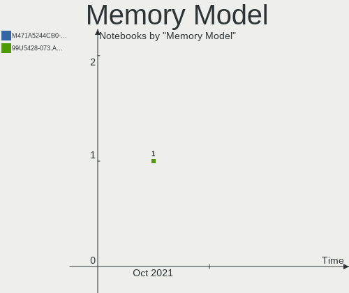
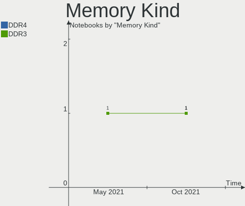
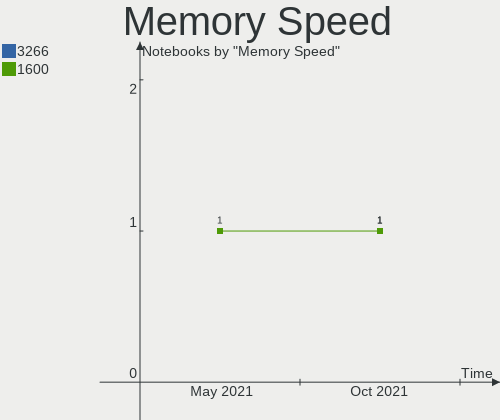
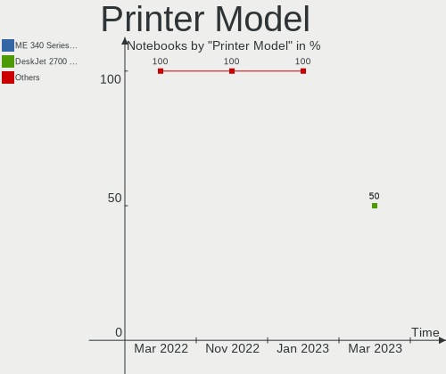

Endless Hardware Trends (Notebook)
----------------------------------

A project to identify most popular hardware characteristics and track their change
over time based on data collected by Endless users at https://Linux-Hardware.org.

Anyone can contribute to the study by uploading probes of their computers by
the [hw-probe](https://github.com/linuxhw/hw-probe) tool:

    sudo -E hw-probe -all -upload

Full-feature report is available here: https://linux-hardware.org/?view=trends&formfactor=notebook

Period: May, 2021.

Contents
--------

- [ OS                       ](#os)
- [ OS Family                ](#os-family)
- [ Kernel                   ](#kernel)
- [ Kernel Family            ](#kernel-family)
- [ Kernel Major Ver.        ](#kernel-major-ver)
- [ Arch                     ](#arch)
- [ DE                       ](#de)
- [ Display Server           ](#display-server)
- [ Display Manager          ](#display-manager)
- [ OS Lang                  ](#os-lang)
- [ Boot Mode                ](#boot-mode)
- [ Filesystem               ](#filesystem)
- [ Part. scheme             ](#part-scheme)
- [ Dual Boot with Linux/BSD ](#dual-boot-with-linux/bsd)
- [ Dual Boot (Win)          ](#dual-boot-win)
- [ Country                  ](#country)
- [ City                     ](#city)
- [ Vendor                   ](#vendor)
- [ Model                    ](#model)
- [ Model Family             ](#model-family)
- [ MFG Year                 ](#mfg-year)
- [ Form Factor              ](#form-factor)
- [ Secure Boot              ](#secure-boot)
- [ Coreboot                 ](#coreboot)
- [ RAM Size                 ](#ram-size)
- [ RAM Used                 ](#ram-used)
- [ Has CD-ROM               ](#has-cd-rom)
- [ Total Drives             ](#total-drives)
- [ Has Ethernet             ](#has-ethernet)
- [ Has WiFi                 ](#has-wifi)
- [ Has Bluetooth            ](#has-bluetooth)
- [ Drive Vendor             ](#drive-vendor)
- [ Drive Model              ](#drive-model)
- [ HDD Vendor               ](#hdd-vendor)
- [ SSD Vendor               ](#ssd-vendor)
- [ Drive Kind               ](#drive-kind)
- [ Drive Connector          ](#drive-connector)
- [ Drive Size               ](#drive-size)
- [ Space Total              ](#space-total)
- [ Space Used               ](#space-used)
- [ Malfunc. Drives          ](#malfunc-drives)
- [ Malfunc. Drive Vendor    ](#malfunc-drive-vendor)
- [ Malfunc. HDD Vendor      ](#malfunc-hdd-vendor)
- [ Malfunc. Drive Kind      ](#malfunc-drive-kind)
- [ Failed Drives            ](#failed-drives)
- [ Failed Drive Vendor      ](#failed-drive-vendor)
- [ Drive Status             ](#drive-status)
- [ Storage Vendor           ](#storage-vendor)
- [ Storage Model            ](#storage-model)
- [ Storage Kind             ](#storage-kind)
- [ CPU Vendor               ](#cpu-vendor)
- [ CPU Model                ](#cpu-model)
- [ CPU Model Family         ](#cpu-model-family)
- [ CPU Cores                ](#cpu-cores)
- [ CPU Sockets              ](#cpu-sockets)
- [ CPU Threads              ](#cpu-threads)
- [ CPU Op-Modes             ](#cpu-op-modes)
- [ CPU Microcode            ](#cpu-microcode)
- [ CPU Microarch            ](#cpu-microarch)
- [ GPU Vendor               ](#gpu-vendor)
- [ GPU Model                ](#gpu-model)
- [ GPU Combo                ](#gpu-combo)
- [ GPU Driver               ](#gpu-driver)
- [ GPU Memory               ](#gpu-memory)
- [ Monitor Vendor           ](#monitor-vendor)
- [ Monitor Model            ](#monitor-model)
- [ Monitor Resolution       ](#monitor-resolution)
- [ Monitor Diagonal         ](#monitor-diagonal)
- [ Monitor Width            ](#monitor-width)
- [ Aspect Ratio             ](#aspect-ratio)
- [ Monitor Area             ](#monitor-area)
- [ Pixel Density            ](#pixel-density)
- [ Multiple Monitors        ](#multiple-monitors)
- [ Net Controller Vendor    ](#net-controller-vendor)
- [ Net Controller Model     ](#net-controller-model)
- [ Wireless Vendor          ](#wireless-vendor)
- [ Wireless Model           ](#wireless-model)
- [ Ethernet Vendor          ](#ethernet-vendor)
- [ Ethernet Model           ](#ethernet-model)
- [ Net Controller Kind      ](#net-controller-kind)
- [ Used Controller          ](#used-controller)
- [ NICs                     ](#nics)
- [ IPv6                     ](#ipv6)
- [ Memory Vendor            ](#memory-vendor)
- [ Memory Model             ](#memory-model)
- [ Memory Kind              ](#memory-kind)
- [ Memory Form Factor       ](#memory-form-factor)
- [ Memory Size              ](#memory-size)
- [ Memory Speed             ](#memory-speed)
- [ Sound Vendor             ](#sound-vendor)
- [ Sound Model              ](#sound-model)
- [ Camera Vendor            ](#camera-vendor)
- [ Camera Model             ](#camera-model)
- [ Fingerprint Vendor       ](#fingerprint-vendor)
- [ Fingerprint Model        ](#fingerprint-model)
- [ Chipcard Vendor          ](#chipcard-vendor)
- [ Chipcard Model           ](#chipcard-model)
- [ Printer Vendor           ](#printer-vendor)
- [ Printer Model            ](#printer-model)
- [ Scanner Vendor           ](#scanner-vendor)
- [ Scanner Model            ](#scanner-model)
- [ Bluetooth Vendor         ](#bluetooth-vendor)
- [ Bluetooth Model          ](#bluetooth-model)
- [ Unsupported Devices      ](#unsupported-devices)
- [ Unsupported Device Types ](#unsupported-device-types)

OS
--

Installed operating systems

| Name                  | Notebooks | Percent |
|-----------------------|-----------|---------|
| Endless 3.9.4         | 41        | 74.55%  |
| Endless 3.9.3         | 6         | 10.91%  |
| Endless 3.7.8         | 3         | 5.45%   |
| Endless 3.9.0         | 1         | 1.82%   |
| Endless 3.8.7         | 1         | 1.82%   |
| Endless 3.8.6         | 1         | 1.82%   |
| Endless 3.4.3-nexthw1 | 1         | 1.82%   |
| Endless 3.4.3         | 1         | 1.82%   |

OS Family
---------

OS without a version

| Name    | Notebooks | Percent |
|---------|-----------|---------|
| Endless | 55        | 100%    |

Kernel
------

Version of the Linux kernel

| Version           | Notebooks | Percent |
|-------------------|-----------|---------|
| 5.8.0-14-generic  | 48        | 87.27%  |
| 5.3.0-28-generic  | 3         | 5.45%   |
| 5.4.0-42-generic  | 2         | 3.64%   |
| 4.16.0-4-generic  | 1         | 1.82%   |
| 4.15.0-22-generic | 1         | 1.82%   |

Kernel Family
-------------

Linux kernel without a distro release

| Version | Notebooks | Percent |
|---------|-----------|---------|
| 5.8.0   | 48        | 87.27%  |
| 5.3.0   | 3         | 5.45%   |
| 5.4.0   | 2         | 3.64%   |
| 4.16.0  | 1         | 1.82%   |
| 4.15.0  | 1         | 1.82%   |

Kernel Major Ver.
-----------------

Linux kernel major version

| Version | Notebooks | Percent |
|---------|-----------|---------|
| 5.8     | 48        | 87.27%  |
| 5.3     | 3         | 5.45%   |
| 5.4     | 2         | 3.64%   |
| 4.16    | 1         | 1.82%   |
| 4.15    | 1         | 1.82%   |

Arch
----

OS architecture (x86_64, i586, etc.)

| Name   | Notebooks | Percent |
|--------|-----------|---------|
| x86_64 | 55        | 100%    |

DE
--

Desktop Environment

| Name  | Notebooks | Percent |
|-------|-----------|---------|
| GNOME | 55        | 100%    |

Display Server
--------------

X11 or Wayland

| Name | Notebooks | Percent |
|------|-----------|---------|
| X11  | 55        | 100%    |

Display Manager
---------------

SDDM, LightDM, etc.

| Name    | Notebooks | Percent |
|---------|-----------|---------|
| Unknown | 55        | 100%    |

OS Lang
-------

Language

| Lang   | Notebooks | Percent |
|--------|-----------|---------|
| pt_BR  | 23        | 41.82%  |
| en_US  | 6         | 10.91%  |
| ru_RU  | 3         | 5.45%   |
| ro_RO  | 3         | 5.45%   |
| it_IT  | 3         | 5.45%   |
| id_ID  | 2         | 3.64%   |
| hu_HU  | 2         | 3.64%   |
| es_AR  | 2         | 3.64%   |
| de_DE  | 2         | 3.64%   |
| uk_UA  | 1         | 1.82%   |
| tr_TR  | 1         | 1.82%   |
| ru_UA  | 1         | 1.82%   |
| nds_DE | 1         | 1.82%   |
| es_MX  | 1         | 1.82%   |
| es_EC  | 1         | 1.82%   |
| es_CL  | 1         | 1.82%   |
| en_GB  | 1         | 1.82%   |
| bg_BG  | 1         | 1.82%   |

Boot Mode
---------

EFI or BIOS

| Mode | Notebooks | Percent |
|------|-----------|---------|
| EFI  | 45        | 81.82%  |
| BIOS | 10        | 18.18%  |

Filesystem
----------

Type of filesystem

| Type | Notebooks | Percent |
|------|-----------|---------|
| Ext4 | 55        | 100%    |

Part. scheme
------------

Scheme of partitioning

| Type    | Notebooks | Percent |
|---------|-----------|---------|
| Unknown | 55        | 100%    |

Dual Boot with Linux/BSD
------------------------

Hosting more than one Linux/BSD

| Dual boot | Notebooks | Percent |
|-----------|-----------|---------|
| No        | 55        | 100%    |

Dual Boot (Win)
---------------

Hosting Linux and Windows

| Dual boot | Notebooks | Percent |
|-----------|-----------|---------|
| No        | 55        | 100%    |

Country
-------

Geographic location (country)

| Country     | Notebooks | Percent |
|-------------|-----------|---------|
| Brazil      | 24        | 43.64%  |
| Russia      | 4         | 7.27%   |
| Romania     | 3         | 5.45%   |
| Italy       | 3         | 5.45%   |
| Germany     | 3         | 5.45%   |
| Ukraine     | 2         | 3.64%   |
| Indonesia   | 2         | 3.64%   |
| Hungary     | 2         | 3.64%   |
| Georgia     | 2         | 3.64%   |
| Argentina   | 2         | 3.64%   |
| USA         | 1         | 1.82%   |
| Turkey      | 1         | 1.82%   |
| South Korea | 1         | 1.82%   |
| Serbia      | 1         | 1.82%   |
| Ecuador     | 1         | 1.82%   |
| Chile       | 1         | 1.82%   |
| Bulgaria    | 1         | 1.82%   |
| Belarus     | 1         | 1.82%   |

City
----

Geographic location (city)

| City                   | Notebooks | Percent |
|------------------------|-----------|---------|
| Tbilisi                | 2         | 3.64%   |
| São Paulo             | 2         | 3.64%   |
| Santo André           | 2         | 3.64%   |
| Rio de Janeiro         | 2         | 3.64%   |
| Brasília              | 2         | 3.64%   |
| Vladimir               | 1         | 1.82%   |
| Vera Cruz              | 1         | 1.82%   |
| Urlati                 | 1         | 1.82%   |
| Ulyanovsk              | 1         | 1.82%   |
| Ubatuba                | 1         | 1.82%   |
| Trento                 | 1         | 1.82%   |
| São José dos Pinhais | 1         | 1.82%   |
| Sofia                  | 1         | 1.82%   |
| Sao Carlos             | 1         | 1.82%   |
| Rosario                | 1         | 1.82%   |
| Rome                   | 1         | 1.82%   |
| Porto Alegre           | 1         | 1.82%   |
| Pelotas                | 1         | 1.82%   |
| Orikhiv                | 1         | 1.82%   |
| Oelsberg               | 1         | 1.82%   |
| New York               | 1         | 1.82%   |
| Natal                  | 1         | 1.82%   |
| Nagykovacsi            | 1         | 1.82%   |
| Moscow                 | 1         | 1.82%   |
| Minsk                  | 1         | 1.82%   |
| Marília               | 1         | 1.82%   |
| Lübeck                | 1         | 1.82%   |
| Lanus                  | 1         | 1.82%   |
| La Serena              | 1         | 1.82%   |
| Kyiv                   | 1         | 1.82%   |
| Kineshma               | 1         | 1.82%   |
| Jakarta                | 1         | 1.82%   |
| Itarare                | 1         | 1.82%   |
| Itaqui                 | 1         | 1.82%   |
| Istanbul               | 1         | 1.82%   |
| Guayaquil              | 1         | 1.82%   |
| Garut                  | 1         | 1.82%   |
| Fazenda Rio Grande     | 1         | 1.82%   |
| Curitiba               | 1         | 1.82%   |
| Crato                  | 1         | 1.82%   |
| Coburg                 | 1         | 1.82%   |
| Cidade Ocidental       | 1         | 1.82%   |
| Chapecó               | 1         | 1.82%   |
| Caransebes             | 1         | 1.82%   |
| Cacoal                 | 1         | 1.82%   |
| Budapest               | 1         | 1.82%   |
| Bucharest              | 1         | 1.82%   |
| Belgrade               | 1         | 1.82%   |
| Aprilia                | 1         | 1.82%   |
| Anyang-si              | 1         | 1.82%   |

Vendor
------

Motherboard manufacturer

| Name                | Notebooks | Percent |
|---------------------|-----------|---------|
| Acer                | 26        | 47.27%  |
| ASUSTek Computer    | 18        | 32.73%  |
| Hewlett-Packard     | 3         | 5.45%   |
| Samsung Electronics | 2         | 3.64%   |
| Positivo            | 2         | 3.64%   |
| Dell                | 2         | 3.64%   |
| Toshiba             | 1         | 1.82%   |
| Lenovo              | 1         | 1.82%   |

Model
-----

Motherboard model

| Name                                       | Notebooks | Percent |
|--------------------------------------------|-----------|---------|
| Acer Nitro AN517-51                        | 8         | 14.55%  |
| Acer Nitro AN515-54                        | 3         | 5.45%   |
| Acer Aspire A315-56                        | 3         | 5.45%   |
| ASUS X541NA                                | 2         | 3.64%   |
| ASUS VivoBook_ASUSLaptop X509JA_X509JA     | 2         | 3.64%   |
| ASUS VivoBook 15_ASUS Laptop X540MA_X543MA | 2         | 3.64%   |
| Acer Aspire A315-34                        | 2         | 3.64%   |
| Toshiba Satellite P855                     | 1         | 1.82%   |
| Samsung RV415                              | 1         | 1.82%   |
| Samsung 340XAA/350XAA/550XAA               | 1         | 1.82%   |
| Positivo Smash                             | 1         | 1.82%   |
| Positivo CHT14B                            | 1         | 1.82%   |
| Lenovo 720-15IKB 81CQ                      | 1         | 1.82%   |
| HP ProBook 445 G7                          | 1         | 1.82%   |
| HP Pavilion dv5                            | 1         | 1.82%   |
| HP 255 G7 Notebook PC                      | 1         | 1.82%   |
| Dell Latitude E7450                        | 1         | 1.82%   |
| Dell Latitude E6400                        | 1         | 1.82%   |
| ASUS X550JX                                | 1         | 1.82%   |
| ASUS X541UJ                                | 1         | 1.82%   |
| ASUS X441NA                                | 1         | 1.82%   |
| ASUS VivoBook_ASUSLaptop X712FA_X712FA     | 1         | 1.82%   |
| ASUS VivoBook_ASUSLaptop X705FD            | 1         | 1.82%   |
| ASUS VivoBook 15_ASUS Laptop X540UAR       | 1         | 1.82%   |
| ASUS VivoBook 15_ASUS Laptop X540MA_R540MA | 1         | 1.82%   |
| ASUS VivoBook 15_ASUS Laptop X540MA_F543MA | 1         | 1.82%   |
| ASUS VivoBook 15_ASUS Laptop X540BA        | 1         | 1.82%   |
| ASUS VivoBook 15_ASUS Laptop X507UF        | 1         | 1.82%   |
| ASUS VivoBook 14_ASUS Laptop X407UAR       | 1         | 1.82%   |
| ASUS GL553VE                               | 1         | 1.82%   |
| Acer TravelMate B117-M                     | 1         | 1.82%   |
| Acer Switch One SW1-011                    | 1         | 1.82%   |
| Acer Nitro AN515-52                        | 1         | 1.82%   |
| Acer Extensa 2519                          | 1         | 1.82%   |
| Acer Aspire V5-121                         | 1         | 1.82%   |
| Acer Aspire ES1-332                        | 1         | 1.82%   |
| Acer Aspire A517-51                        | 1         | 1.82%   |
| Acer Aspire A317-51G                       | 1         | 1.82%   |
| Acer Aspire A315-53                        | 1         | 1.82%   |
| Acer Aspire A315-33                        | 1         | 1.82%   |

Model Family
------------

Motherboard model prefix

| Name              | Notebooks | Percent |
|-------------------|-----------|---------|
| ASUS VivoBook     | 12        | 21.82%  |
| Acer Nitro        | 12        | 21.82%  |
| Acer Aspire       | 11        | 20%     |
| Dell Latitude     | 2         | 3.64%   |
| ASUS X541NA       | 2         | 3.64%   |
| Toshiba Satellite | 1         | 1.82%   |
| Samsung RV415     | 1         | 1.82%   |
| Samsung 340XAA    | 1         | 1.82%   |
| Positivo Smash    | 1         | 1.82%   |
| Positivo CHT14B   | 1         | 1.82%   |
| Lenovo 720-15IKB  | 1         | 1.82%   |
| HP ProBook        | 1         | 1.82%   |
| HP Pavilion       | 1         | 1.82%   |
| HP 255            | 1         | 1.82%   |
| ASUS X550JX       | 1         | 1.82%   |
| ASUS X541UJ       | 1         | 1.82%   |
| ASUS X441NA       | 1         | 1.82%   |
| ASUS GL553VE      | 1         | 1.82%   |
| Acer TravelMate   | 1         | 1.82%   |
| Acer Switch       | 1         | 1.82%   |
| Acer Extensa      | 1         | 1.82%   |

MFG Year
--------

Motherboard manufacture year

| Year | Notebooks | Percent |
|------|-----------|---------|
| 2020 | 18        | 32.73%  |
| 2019 | 17        | 30.91%  |
| 2017 | 7         | 12.73%  |
| 2018 | 6         | 10.91%  |
| 2015 | 2         | 3.64%   |
| 2013 | 2         | 3.64%   |
| 2016 | 1         | 1.82%   |
| 2009 | 1         | 1.82%   |
| 2008 | 1         | 1.82%   |

Form Factor
-----------

Physical design of the computer

| Name     | Notebooks | Percent |
|----------|-----------|---------|
| Notebook | 55        | 100%    |

Secure Boot
-----------

Enabled or disabled

| State    | Notebooks | Percent |
|----------|-----------|---------|
| Disabled | 33        | 60%     |
| Enabled  | 22        | 40%     |

Coreboot
--------

Have coreboot on board

| Used | Notebooks | Percent |
|------|-----------|---------|
| No   | 55        | 100%    |

RAM Size
--------

Total RAM memory

| Size in GB | Notebooks | Percent |
|------------|-----------|---------|
| 3.01-4.0   | 24        | 43.64%  |
| 4.01-8.0   | 22        | 40%     |
| 1.01-2.0   | 4         | 7.27%   |
| 8.01-16.0  | 3         | 5.45%   |
| 24.01-32.0 | 1         | 1.82%   |
| 16.01-24.0 | 1         | 1.82%   |

RAM Used
--------

Used RAM memory

| Used GB  | Notebooks | Percent |
|----------|-----------|---------|
| 1.01-2.0 | 33        | 60%     |
| 2.01-3.0 | 10        | 18.18%  |
| 0.51-1.0 | 5         | 9.09%   |
| 3.01-4.0 | 4         | 7.27%   |
| 4.01-8.0 | 3         | 5.45%   |

Has CD-ROM
----------

Has CD-ROM on board

| Presented | Notebooks | Percent |
|-----------|-----------|---------|
| No        | 48        | 87.27%  |
| Yes       | 7         | 12.73%  |

Total Drives
------------

Number of drives on board

| Drives | Notebooks | Percent |
|--------|-----------|---------|
| 1      | 41        | 74.55%  |
| 2      | 13        | 23.64%  |
| 3      | 1         | 1.82%   |

Has Ethernet
------------

Has Ethernet on board

| Presented | Notebooks | Percent |
|-----------|-----------|---------|
| Yes       | 41        | 74.55%  |
| No        | 14        | 25.45%  |

Has WiFi
--------

Has WiFi module

| Presented | Notebooks | Percent |
|-----------|-----------|---------|
| Yes       | 52        | 94.55%  |
| No        | 3         | 5.45%   |

Has Bluetooth
-------------

Has Bluetooth module

| Presented | Notebooks | Percent |
|-----------|-----------|---------|
| Yes       | 47        | 85.45%  |
| No        | 8         | 14.55%  |

Drive Vendor
------------

Hard drive vendors

| Vendor              | Notebooks | Drives | Percent |
|---------------------|-----------|--------|---------|
| Intel               | 16        | 16     | 23.53%  |
| WDC                 | 15        | 16     | 22.06%  |
| Seagate             | 10        | 10     | 14.71%  |
| Kingston            | 7         | 7      | 10.29%  |
| Toshiba             | 5         | 5      | 7.35%   |
| SanDisk             | 4         | 4      | 5.88%   |
| Unknown             | 3         | 5      | 4.41%   |
| Samsung Electronics | 3         | 3      | 4.41%   |
| SK Hynix            | 1         | 1      | 1.47%   |
| LITEON              | 1         | 1      | 1.47%   |
| Hitachi             | 1         | 1      | 1.47%   |
| Crucial             | 1         | 1      | 1.47%   |
| A-DATA Technology   | 1         | 1      | 1.47%   |

Drive Model
-----------

Hard drive models

| Model                                 | Notebooks | Percent |
|---------------------------------------|-----------|---------|
| WDC WD10SPZX-21Z10T0 1TB              | 11        | 15.71%  |
| Intel NVMe SSD Drive 128GB            | 8         | 11.43%  |
| Seagate ST1000LM035-1RK172 1TB        | 7         | 10%     |
| Kingston RBUSC180DS37256GJ 256GB SSD  | 5         | 7.14%   |
| Intel NVMe SSD Drive 256GB            | 5         | 7.14%   |
| Unknown MMC Card  32GB                | 3         | 4.29%   |
| Toshiba MQ04ABF100 1TB                | 3         | 4.29%   |
| Intel NVMe SSD Drive 512GB            | 3         | 4.29%   |
| Toshiba MQ01ABF050 500GB              | 2         | 2.86%   |
| WDC WD5000LPZX-60Z10T0 500GB          | 1         | 1.43%   |
| WDC WD5000LPVX-22V0TT0 500GB          | 1         | 1.43%   |
| WDC WD5000LPCX-21VHAT0 500GB          | 1         | 1.43%   |
| WDC WD10JPVX-75JC3T0 1TB              | 1         | 1.43%   |
| WDC WD Elements 2TB                   | 1         | 1.43%   |
| Unknown MMC Card  7GB                 | 1         | 1.43%   |
| SK Hynix HFS128G32TND-N210A 128GB SSD | 1         | 1.43%   |
| Seagate ST320LM001 HN-M320MBB 320GB   | 1         | 1.43%   |
| Seagate ST2000LM007-1R8174 2TB        | 1         | 1.43%   |
| Seagate ST1000LM048-2E7172 1TB        | 1         | 1.43%   |
| SanDisk SD9SN8W256G1014 256GB SSD     | 1         | 1.43%   |
| SanDisk SD9SB8W128G1014 128GB SSD     | 1         | 1.43%   |
| SanDisk SD8SBAT128G1002 128GB SSD     | 1         | 1.43%   |
| Sandisk NVMe SSD Drive 512GB          | 1         | 1.43%   |
| Samsung SSD 860 QVO 2TB               | 1         | 1.43%   |
| Samsung NVMe SSD Drive 256GB          | 1         | 1.43%   |
| Samsung NVMe SSD Drive 250GB          | 1         | 1.43%   |
| LITEON CV3-8D128 128GB SSD            | 1         | 1.43%   |
| Kingston SV300S37A120G 120GB SSD      | 1         | 1.43%   |
| Kingston SA400S37480G 480GB SSD       | 1         | 1.43%   |
| Hitachi HTS543225L9A300 250GB         | 1         | 1.43%   |
| Crucial CT500MX500SSD1 500GB          | 1         | 1.43%   |
| A-DATA IM2S3338-128GD2 128GB SSD      | 1         | 1.43%   |

HDD Vendor
----------

Hard disk drive vendors

| Vendor  | Notebooks | Drives | Percent |
|---------|-----------|--------|---------|
| WDC     | 15        | 15     | 48.39%  |
| Seagate | 10        | 10     | 32.26%  |
| Toshiba | 5         | 5      | 16.13%  |
| Hitachi | 1         | 1      | 3.23%   |

SSD Vendor
----------

Solid state drive vendors

| Vendor              | Notebooks | Drives | Percent |
|---------------------|-----------|--------|---------|
| Kingston            | 7         | 7      | 46.67%  |
| SanDisk             | 3         | 3      | 20%     |
| SK Hynix            | 1         | 1      | 6.67%   |
| Samsung Electronics | 1         | 1      | 6.67%   |
| LITEON              | 1         | 1      | 6.67%   |
| Crucial             | 1         | 1      | 6.67%   |
| A-DATA Technology   | 1         | 1      | 6.67%   |

Drive Kind
----------

HDD or SSD

| Kind    | Notebooks | Drives | Percent |
|---------|-----------|--------|---------|
| HDD     | 31        | 31     | 45.59%  |
| NVMe    | 18        | 19     | 26.47%  |
| SSD     | 15        | 15     | 22.06%  |
| MMC     | 3         | 5      | 4.41%   |
| Unknown | 1         | 1      | 1.47%   |

Drive Connector
---------------

SATA, SAS, NVMe, etc.

| Type | Notebooks | Drives | Percent |
|------|-----------|--------|---------|
| SATA | 44        | 46     | 66.67%  |
| NVMe | 18        | 19     | 27.27%  |
| MMC  | 3         | 5      | 4.55%   |
| SAS  | 1         | 1      | 1.52%   |

Drive Size
----------

Size of hard drive

| Size in TB | Notebooks | Drives | Percent |
|------------|-----------|--------|---------|
| 0.51-1.0   | 23        | 23     | 50%     |
| 0.01-0.5   | 21        | 21     | 45.65%  |
| 1.01-2.0   | 2         | 2      | 4.35%   |

Space Total
-----------

Amount of disk space available on the file system

| Size in GB | Notebooks | Percent |
|------------|-----------|---------|
| 501-1000   | 20        | 36.36%  |
| 101-250    | 16        | 29.09%  |
| 251-500    | 9         | 16.36%  |
| 21-50      | 4         | 7.27%   |
| 51-100     | 2         | 3.64%   |
| 2001-3000  | 1         | 1.82%   |
| 1001-2000  | 1         | 1.82%   |
| 1-20       | 1         | 1.82%   |
| Unknown    | 1         | 1.82%   |

Space Used
----------

Amount of used disk space

| Used GB   | Notebooks | Percent |
|-----------|-----------|---------|
| 21-50     | 25        | 45.45%  |
| 51-100    | 14        | 25.45%  |
| 1-20      | 8         | 14.55%  |
| 101-250   | 4         | 7.27%   |
| 251-500   | 1         | 1.82%   |
| 1001-2000 | 1         | 1.82%   |
| 501-1000  | 1         | 1.82%   |
| Unknown   | 1         | 1.82%   |

Malfunc. Drives
---------------

Drive models with a malfunction

Zero info for selected period =(

Malfunc. Drive Vendor
---------------------

Vendors of faulty drives

Zero info for selected period =(

Malfunc. HDD Vendor
-------------------

Vendors of faulty HDD drives

Zero info for selected period =(

Malfunc. Drive Kind
-------------------

Kinds of faulty drives

Zero info for selected period =(

Failed Drives
-------------

Failed drive models

Zero info for selected period =(

Failed Drive Vendor
-------------------

Failed drive vendors

Zero info for selected period =(

Drive Status
------------

Number of failed and malfunc. drives

| Status   | Notebooks | Drives | Percent |
|----------|-----------|--------|---------|
| Detected | 55        | 71     | 100%    |

Storage Vendor
--------------

Storage controller vendors

| Vendor              | Notebooks | Percent |
|---------------------|-----------|---------|
| Intel               | 47        | 85.45%  |
| AMD                 | 5         | 9.09%   |
| Samsung Electronics | 2         | 3.64%   |
| Sandisk             | 1         | 1.82%   |

Storage Model
-------------

Storage controller models

| Model                                                                            | Notebooks | Percent |
|----------------------------------------------------------------------------------|-----------|---------|
| Intel 82801 Mobile SATA Controller [RAID mode]                                   | 22        | 30.56%  |
| Intel PROSet/Wireless WiFi Software extension                                    | 16        | 22.22%  |
| Intel Sunrise Point-LP SATA Controller [AHCI mode]                               | 6         | 8.33%   |
| Intel Celeron/Pentium Silver Processor SATA Controller                           | 6         | 8.33%   |
| Intel Celeron N3350/Pentium N4200/Atom E3900 Series SATA AHCI Controller         | 4         | 5.56%   |
| AMD FCH SATA Controller [AHCI mode]                                              | 4         | 5.56%   |
| Intel Atom/Celeron/Pentium Processor x5-E8000/J3xxx/N3xxx Series SATA Controller | 3         | 4.17%   |
| Intel HM170/QM170 Chipset SATA Controller [AHCI Mode]                            | 2         | 2.78%   |
| Intel Cannon Lake Mobile PCH SATA AHCI Controller                                | 2         | 2.78%   |
| Sandisk WD Blue SN500 / PC SN520 NVMe SSD                                        | 1         | 1.39%   |
| Samsung NVMe SSD Controller SM981/PM981/PM983                                    | 1         | 1.39%   |
| Samsung NVMe Controller                                                          | 1         | 1.39%   |
| Intel 82801IBM/IEM (ICH9M/ICH9M-E) 4 port SATA Controller [AHCI mode]            | 1         | 1.39%   |
| Intel 8 Series/C220 Series Chipset Family 6-port SATA Controller 1 [AHCI mode]   | 1         | 1.39%   |
| Intel 7 Series Chipset Family 6-port SATA Controller [AHCI mode]                 | 1         | 1.39%   |
| AMD SB7x0/SB8x0/SB9x0 SATA Controller [IDE mode]                                 | 1         | 1.39%   |

Storage Kind
------------

Kind of storage controller (IDE, SATA, NVMe, SAS, ...)

| Kind | Notebooks | Percent |
|------|-----------|---------|
| SATA | 47        | 67.14%  |
| NVMe | 18        | 25.71%  |
| RAID | 5         | 7.14%   |

CPU Vendor
----------

Processor vendors

| Vendor | Notebooks | Percent |
|--------|-----------|---------|
| Intel  | 50        | 90.91%  |
| AMD    | 5         | 9.09%   |

CPU Model
---------

Processor models

| Model                                        | Notebooks | Percent |
|----------------------------------------------|-----------|---------|
| Intel Core i5-9300H CPU @ 2.40GHz            | 11        | 20%     |
| Intel Core i5-1035G1 CPU @ 1.00GHz           | 4         | 7.27%   |
| Intel Celeron N4000 CPU @ 1.10GHz            | 4         | 7.27%   |
| Intel Core i3-7020U CPU @ 2.30GHz            | 3         | 5.45%   |
| Intel Core i7-8565U CPU @ 1.80GHz            | 2         | 3.64%   |
| Intel Core i7-7700HQ CPU @ 2.80GHz           | 2         | 3.64%   |
| Intel Core i3-8130U CPU @ 2.20GHz            | 2         | 3.64%   |
| Intel Celeron N4000C CPU @ 1.10GHz           | 2         | 3.64%   |
| Intel Celeron CPU N3450 @ 1.10GHz            | 2         | 3.64%   |
| Intel Atom x5-Z8350 CPU @ 1.44GHz            | 2         | 3.64%   |
| Intel Pentium CPU N4200 @ 1.10GHz            | 1         | 1.82%   |
| Intel Core i7-5600U CPU @ 2.60GHz            | 1         | 1.82%   |
| Intel Core i7-4720HQ CPU @ 2.60GHz           | 1         | 1.82%   |
| Intel Core i7-3610QM CPU @ 2.30GHz           | 1         | 1.82%   |
| Intel Core i5-8300H CPU @ 2.30GHz            | 1         | 1.82%   |
| Intel Core i5-8250U CPU @ 1.60GHz            | 1         | 1.82%   |
| Intel Core i5-10210U CPU @ 1.60GHz           | 1         | 1.82%   |
| Intel Core i3-6006U CPU @ 2.00GHz            | 1         | 1.82%   |
| Intel Core i3-1005G1 CPU @ 1.20GHz           | 1         | 1.82%   |
| Intel Core 2 Duo CPU T5800 @ 2.00GHz         | 1         | 1.82%   |
| Intel Core 2 Duo CPU P8700 @ 2.53GHz         | 1         | 1.82%   |
| Intel Celeron CPU N3350 @ 1.10GHz            | 1         | 1.82%   |
| Intel Celeron CPU N3160 @ 1.60GHz            | 1         | 1.82%   |
| Intel Celeron CPU N3060 @ 1.60GHz            | 1         | 1.82%   |
| Intel Atom x5-Z8330 CPU @ 1.44GHz            | 1         | 1.82%   |
| Intel Atom x5-E8000 CPU @ 1.04GHz            | 1         | 1.82%   |
| AMD Ryzen 5 4500U with Radeon Graphics       | 1         | 1.82%   |
| AMD E-300 APU with Radeon HD Graphics        | 1         | 1.82%   |
| AMD C-70 APU with Radeon HD Graphics         | 1         | 1.82%   |
| AMD Athlon Silver 3050U with Radeon Graphics | 1         | 1.82%   |
| AMD A6-9225 RADEON R4, 5 COMPUTE CORES 2C+3G | 1         | 1.82%   |

CPU Model Family
----------------

Processor model prefix

| Model            | Notebooks | Percent |
|------------------|-----------|---------|
| Intel Core i5    | 18        | 32.73%  |
| Intel Celeron    | 11        | 20%     |
| Intel Core i7    | 7         | 12.73%  |
| Intel Core i3    | 7         | 12.73%  |
| Intel Atom       | 4         | 7.27%   |
| Intel Core 2 Duo | 2         | 3.64%   |
| Intel Pentium    | 1         | 1.82%   |
| AMD Ryzen 5      | 1         | 1.82%   |
| AMD E            | 1         | 1.82%   |
| AMD C-70         | 1         | 1.82%   |
| AMD Athlon       | 1         | 1.82%   |
| AMD A6           | 1         | 1.82%   |

CPU Cores
---------

Number of processor cores

| Number | Notebooks | Percent |
|--------|-----------|---------|
| 4      | 32        | 58.18%  |
| 2      | 22        | 40%     |
| 6      | 1         | 1.82%   |

CPU Sockets
-----------

Number of sockets

| Number | Notebooks | Percent |
|--------|-----------|---------|
| 1      | 55        | 100%    |

CPU Threads
-----------

Threads per core (Hyper-Threading)

| Number | Notebooks | Percent |
|--------|-----------|---------|
| 2      | 32        | 58.18%  |
| 1      | 23        | 41.82%  |

CPU Op-Modes
------------

CPU Operation Modes (32-bit, 64-bit)

| Op mode        | Notebooks | Percent |
|----------------|-----------|---------|
| 32-bit, 64-bit | 55        | 100%    |

CPU Microcode
-------------

Microcode number

| Number     | Notebooks | Percent |
|------------|-----------|---------|
| 0x906ed    | 8         | 14.55%  |
| 0x406c4    | 6         | 10.91%  |
| 0x706e5    | 5         | 9.09%   |
| 0x706a1    | 5         | 9.09%   |
| 0x906ea    | 4         | 7.27%   |
| 0x806ea    | 4         | 7.27%   |
| 0x506c9    | 4         | 7.27%   |
| 0x906e9    | 2         | 3.64%   |
| 0x806eb    | 2         | 3.64%   |
| 0x05000119 | 2         | 3.64%   |
| Unknown    | 2         | 3.64%   |
| 0x806ec    | 1         | 1.82%   |
| 0x806e9    | 1         | 1.82%   |
| 0x6fd      | 1         | 1.82%   |
| 0x406e3    | 1         | 1.82%   |
| 0x306d4    | 1         | 1.82%   |
| 0x306c3    | 1         | 1.82%   |
| 0x306a9    | 1         | 1.82%   |
| 0x1067a    | 1         | 1.82%   |
| 0x08600106 | 1         | 1.82%   |
| 0x08108109 | 1         | 1.82%   |
| 0x06006705 | 1         | 1.82%   |

CPU Microarch
-------------

Microarchitecture

| Name          | Notebooks | Percent |
|---------------|-----------|---------|
| KabyLake      | 23        | 41.82%  |
| Silvermont    | 6         | 10.91%  |
| Goldmont plus | 6         | 10.91%  |
| IceLake       | 5         | 9.09%   |
| Goldmont      | 4         | 7.27%   |
| Bobcat        | 2         | 3.64%   |
| Zen+          | 1         | 1.82%   |
| Zen 2         | 1         | 1.82%   |
| Skylake       | 1         | 1.82%   |
| Penryn        | 1         | 1.82%   |
| IvyBridge     | 1         | 1.82%   |
| Haswell       | 1         | 1.82%   |
| Excavator     | 1         | 1.82%   |
| Core          | 1         | 1.82%   |
| Broadwell     | 1         | 1.82%   |

GPU Vendor
----------

Vendors of graphics cards

| Vendor | Notebooks | Percent |
|--------|-----------|---------|
| Intel  | 49        | 65.33%  |
| Nvidia | 21        | 28%     |
| AMD    | 5         | 6.67%   |

GPU Model
---------

Graphics card models

| Model                                                                                    | Notebooks | Percent |
|------------------------------------------------------------------------------------------|-----------|---------|
| Intel CoffeeLake-H GT2 [UHD Graphics 630]                                                | 12        | 16%     |
| Nvidia TU117M [GeForce GTX 1650 Mobile / Max-Q]                                          | 11        | 14.67%  |
| Intel GeminiLake [UHD Graphics 600]                                                      | 6         | 8%      |
| Intel Atom/Celeron/Pentium Processor x5-E8000/J3xxx/N3xxx Integrated Graphics Controller | 6         | 8%      |
| Intel Iris Plus Graphics G1 (Ice Lake)                                                   | 5         | 6.67%   |
| Intel UHD Graphics 620                                                                   | 3         | 4%      |
| Intel HD Graphics 500                                                                    | 3         | 4%      |
| Nvidia GP107M [GeForce GTX 1050 Mobile]                                                  | 2         | 2.67%   |
| Intel WhiskeyLake-U GT2 [UHD Graphics 620]                                               | 2         | 2.67%   |
| Intel Kaby Lake-U GT2f HD 620 Graphics Controller                                        | 2         | 2.67%   |
| Intel HD Graphics 630                                                                    | 2         | 2.67%   |
| Nvidia GP108M [GeForce MX230]                                                            | 1         | 1.33%   |
| Nvidia GP107M [GeForce GTX 1050 Ti Mobile]                                               | 1         | 1.33%   |
| Nvidia GP106M [GeForce GTX 1060 Mobile]                                                  | 1         | 1.33%   |
| Nvidia GM108M [GeForce MX130]                                                            | 1         | 1.33%   |
| Nvidia GM107M [GeForce GTX 950M]                                                         | 1         | 1.33%   |
| Nvidia GK208BM [GeForce 920M]                                                            | 1         | 1.33%   |
| Nvidia GF108M [GeForce GT 620M/630M/635M/640M LE]                                        | 1         | 1.33%   |
| Nvidia G98M [GeForce 9200M GS]                                                           | 1         | 1.33%   |
| Intel Skylake GT2 [HD Graphics 520]                                                      | 1         | 1.33%   |
| Intel Mobile 4 Series Chipset Integrated Graphics Controller                             | 1         | 1.33%   |
| Intel HD Graphics 620                                                                    | 1         | 1.33%   |
| Intel HD Graphics 5500                                                                   | 1         | 1.33%   |
| Intel CometLake-U GT2 [UHD Graphics]                                                     | 1         | 1.33%   |
| Intel Celeron N3350/Pentium N4200/Atom E3900 Series Integrated Graphics Controller       | 1         | 1.33%   |
| Intel 4th Gen Core Processor Integrated Graphics Controller                              | 1         | 1.33%   |
| Intel 3rd Gen Core processor Graphics Controller                                         | 1         | 1.33%   |
| AMD Wrestler [Radeon HD 7290]                                                            | 1         | 1.33%   |
| AMD Wrestler [Radeon HD 6310]                                                            | 1         | 1.33%   |
| AMD Stoney [Radeon R2/R3/R4/R5 Graphics]                                                 | 1         | 1.33%   |
| AMD Renoir                                                                               | 1         | 1.33%   |
| AMD Picasso                                                                              | 1         | 1.33%   |

GPU Combo
---------

Combinations of graphics cards

| Name           | Notebooks | Percent |
|----------------|-----------|---------|
| 1 x Intel      | 29        | 52.73%  |
| Intel + Nvidia | 20        | 36.36%  |
| 1 x AMD        | 5         | 9.09%   |
| 1 x Nvidia     | 1         | 1.82%   |

GPU Driver
----------

Free vs proprietary

| Driver      | Notebooks | Percent |
|-------------|-----------|---------|
| Free        | 37        | 67.27%  |
| Proprietary | 18        | 32.73%  |

GPU Memory
----------

Total video memory

| Size in GB | Notebooks | Percent |
|------------|-----------|---------|
| Unknown    | 45        | 81.82%  |
| 0.01-0.5   | 5         | 9.09%   |
| 1.01-2.0   | 3         | 5.45%   |
| 3.01-4.0   | 2         | 3.64%   |

Monitor Vendor
--------------

Monitor vendors

| Vendor              | Notebooks | Percent |
|---------------------|-----------|---------|
| BOE                 | 21        | 38.18%  |
| Chimei Innolux      | 13        | 23.64%  |
| AU Optronics        | 9         | 16.36%  |
| LG Display          | 5         | 9.09%   |
| Samsung Electronics | 3         | 5.45%   |
| SLD                 | 1         | 1.82%   |
| PANDA               | 1         | 1.82%   |
| LG Philips          | 1         | 1.82%   |
| Hewlett-Packard     | 1         | 1.82%   |

Monitor Model
-------------

Monitor models

| Model                                                                | Notebooks | Percent |
|----------------------------------------------------------------------|-----------|---------|
| BOE LCD Monitor BOE0839 1920x1080 382x215mm 17.3-inch                | 6         | 10.91%  |
| BOE LCD Monitor BOE07CE 1366x768 344x193mm 15.5-inch                 | 4         | 7.27%   |
| Chimei Innolux LCD Monitor CMN15DB 1366x768 344x193mm 15.5-inch      | 3         | 5.45%   |
| BOE LCD Monitor BOE0818 1920x1080 344x194mm 15.5-inch                | 3         | 5.45%   |
| LG Display LCD Monitor LGD0621 1920x1080 382x215mm 17.3-inch         | 2         | 3.64%   |
| Chimei Innolux LCD Monitor CMN15E6 1366x768 344x193mm 15.5-inch      | 2         | 3.64%   |
| BOE LCD Monitor BOE06A5 1366x768 344x194mm 15.5-inch                 | 2         | 3.64%   |
| AU Optronics LCD Monitor AUO70EC 1366x768 340x190mm 15.3-inch        | 2         | 3.64%   |
| AU Optronics LCD Monitor AUO61ED 1920x1080 340x190mm 15.3-inch       | 2         | 3.64%   |
| AU Optronics LCD Monitor AUO38ED 1920x1080 340x190mm 15.3-inch       | 2         | 3.64%   |
| SLD LCD Monitor SLD003C 1366x768 309x173mm 13.9-inch                 | 1         | 1.82%   |
| Samsung Electronics LCD Monitor SEC5441 1366x768 344x194mm 15.5-inch | 1         | 1.82%   |
| Samsung Electronics LCD Monitor SEC4249 1366x768 309x174mm 14.0-inch | 1         | 1.82%   |
| Samsung Electronics LCD Monitor SEC3150 1366x768 344x193mm 15.5-inch | 1         | 1.82%   |
| PANDA LCD Monitor NCP004F 1920x1080 309x174mm 14.0-inch              | 1         | 1.82%   |
| LG Philips LP154WX4-TLCB LPL3101 1280x800 331x207mm 15.4-inch        | 1         | 1.82%   |
| LG Display LCD Monitor LGD04E8 1920x1080 382x215mm 17.3-inch         | 1         | 1.82%   |
| LG Display LCD Monitor LGD0486 1920x1080 309x174mm 14.0-inch         | 1         | 1.82%   |
| LG Display LCD Monitor LGD046F 1920x1080 344x194mm 15.5-inch         | 1         | 1.82%   |
| Hewlett-Packard 23xi HWP3032 1920x1080 510x290mm 23.1-inch           | 1         | 1.82%   |
| Chimei Innolux LCD Monitor CMN15F5 1920x1080 344x193mm 15.5-inch     | 1         | 1.82%   |
| Chimei Innolux LCD Monitor CMN15DC 1366x768 344x193mm 15.5-inch      | 1         | 1.82%   |
| Chimei Innolux LCD Monitor CMN15D3 1920x1080 344x193mm 15.5-inch     | 1         | 1.82%   |
| Chimei Innolux LCD Monitor CMN15CA 1366x768 340x190mm 15.3-inch      | 1         | 1.82%   |
| Chimei Innolux LCD Monitor CMN14D6 1366x768 309x173mm 13.9-inch      | 1         | 1.82%   |
| Chimei Innolux LCD Monitor CMN1493 1366x768 310x170mm 13.9-inch      | 1         | 1.82%   |
| Chimei Innolux LCD Monitor CMN1362 1366x768 290x160mm 13.0-inch      | 1         | 1.82%   |
| Chimei Innolux LCD Monitor CMN1132 1366x768 260x140mm 11.6-inch      | 1         | 1.82%   |
| BOE LCD Monitor BOE084E 1920x1080 382x215mm 17.3-inch                | 1         | 1.82%   |
| BOE LCD Monitor BOE0788 1920x1080 381x214mm 17.2-inch                | 1         | 1.82%   |
| BOE LCD Monitor BOE072A 1366x768 309x173mm 13.9-inch                 | 1         | 1.82%   |
| BOE LCD Monitor BOE06A4 1366x768 344x194mm 15.5-inch                 | 1         | 1.82%   |
| BOE LCD Monitor BOE0687 1920x1080 344x193mm 15.5-inch                | 1         | 1.82%   |
| BOE LCD Monitor BOE0675 1366x768 344x194mm 15.5-inch                 | 1         | 1.82%   |
| AU Optronics LCD Monitor AUO46EC 1366x768 344x193mm 15.5-inch        | 1         | 1.82%   |
| AU Optronics LCD Monitor AUO325C 1366x768 256x144mm 11.6-inch        | 1         | 1.82%   |
| AU Optronics LCD Monitor AUO139D 1920x1080 381x214mm 17.2-inch       | 1         | 1.82%   |

Monitor Resolution
------------------

Monitor screen resolution

| Resolution      | Notebooks | Percent |
|-----------------|-----------|---------|
| 1366x768 (WXGA) | 28        | 51.85%  |
| 1920x1080 (FHD) | 25        | 46.3%   |
| 1280x800 (WXGA) | 1         | 1.85%   |

Monitor Diagonal
----------------

Diagonal size in inches

| Inches | Notebooks | Percent |
|--------|-----------|---------|
| 15     | 32        | 58.18%  |
| 17     | 12        | 21.82%  |
| 14     | 4         | 7.27%   |
| 13     | 4         | 7.27%   |
| 11     | 2         | 3.64%   |
| 23     | 1         | 1.82%   |

Monitor Width
-------------

Physical width

| Width in mm | Notebooks | Percent |
|-------------|-----------|---------|
| 301-350     | 38        | 69.09%  |
| 351-400     | 13        | 23.64%  |
| 201-300     | 3         | 5.45%   |
| 501-600     | 1         | 1.82%   |

Aspect Ratio
------------

Proportional relationship between the width and the height

| Ratio | Notebooks | Percent |
|-------|-----------|---------|
| 16/9  | 53        | 98.15%  |
| 16/10 | 1         | 1.85%   |

Monitor Area
------------

Area in inch²

| Area in inch² | Notebooks | Percent |
|----------------|-----------|---------|
| 101-110        | 32        | 58.18%  |
| 121-130        | 12        | 21.82%  |
| 81-90          | 7         | 12.73%  |
| 51-60          | 2         | 3.64%   |
| 71-80          | 1         | 1.82%   |
| 201-250        | 1         | 1.82%   |

Pixel Density
-------------

Pixels per inch

| Density | Notebooks | Percent |
|---------|-----------|---------|
| 121-160 | 27        | 49.09%  |
| 101-120 | 25        | 45.45%  |
| 51-100  | 3         | 5.45%   |

Multiple Monitors
-----------------

Total monitors connected

| Total | Notebooks | Percent |
|-------|-----------|---------|
| 1     | 52        | 94.55%  |
| 2     | 2         | 3.64%   |
| 0     | 1         | 1.82%   |

Net Controller Vendor
---------------------

Controller vendors

| Vendor                | Notebooks | Percent |
|-----------------------|-----------|---------|
| Realtek Semiconductor | 43        | 48.31%  |
| Intel                 | 24        | 26.97%  |
| Qualcomm Atheros      | 19        | 21.35%  |
| Xiaomi                | 1         | 1.12%   |
| Motorola PCS          | 1         | 1.12%   |
| Broadcom              | 1         | 1.12%   |

Net Controller Model
--------------------

Controller models

| Model                                                             | Notebooks | Percent |
|-------------------------------------------------------------------|-----------|---------|
| Realtek RTL8111/8168/8411 PCI Express Gigabit Ethernet Controller | 31        | 32.98%  |
| Intel Wi-Fi 6 AX200                                               | 12        | 12.77%  |
| Qualcomm Atheros QCA9377 802.11ac Wireless Network Adapter        | 10        | 10.64%  |
| Realtek RTL810xE PCI Express Fast Ethernet controller             | 7         | 7.45%   |
| Qualcomm Atheros QCA9565 / AR9565 Wireless Network Adapter        | 5         | 5.32%   |
| Realtek RTL8821CE 802.11ac PCIe Wireless Network Adapter          | 3         | 3.19%   |
| Intel Wireless 7265                                               | 3         | 3.19%   |
| Intel Ice Lake-LP PCH CNVi WiFi                                   | 3         | 3.19%   |
| Realtek RTL8822BE 802.11a/b/g/n/ac WiFi adapter                   | 2         | 2.13%   |
| Realtek RTL8723BE PCIe Wireless Network Adapter                   | 2         | 2.13%   |
| Intel Cannon Point-LP CNVi [Wireless-AC]                          | 2         | 2.13%   |
| Xiaomi Mi/Redmi series (RNDIS)                                    | 1         | 1.06%   |
| Realtek RTL8822CE 802.11ac PCIe Wireless Network Adapter          | 1         | 1.06%   |
| Realtek RTL8821AE 802.11ac PCIe Wireless Network Adapter          | 1         | 1.06%   |
| Qualcomm Atheros QCA6174 802.11ac Wireless Network Adapter        | 1         | 1.06%   |
| Qualcomm Atheros AR9485 Wireless Network Adapter                  | 1         | 1.06%   |
| Qualcomm Atheros AR928X Wireless Network Adapter (PCI-Express)    | 1         | 1.06%   |
| Qualcomm Atheros AR9285 Wireless Network Adapter (PCI-Express)    | 1         | 1.06%   |
| Motorola PCS W180 Mobile                                          | 1         | 1.06%   |
| Intel Ethernet Connection (3) I218-LM                             | 1         | 1.06%   |
| Intel Dual Band Wireless-AC 3168NGW [Stone Peak]                  | 1         | 1.06%   |
| Intel Centrino Wireless-N 2230                                    | 1         | 1.06%   |
| Intel Cannon Lake PCH CNVi WiFi                                   | 1         | 1.06%   |
| Intel 82567LM Gigabit Network Connection                          | 1         | 1.06%   |
| Broadcom BCM4312 802.11b/g LP-PHY                                 | 1         | 1.06%   |

Wireless Vendor
---------------

Wireless vendors

| Vendor                | Notebooks | Percent |
|-----------------------|-----------|---------|
| Intel                 | 23        | 44.23%  |
| Qualcomm Atheros      | 19        | 36.54%  |
| Realtek Semiconductor | 9         | 17.31%  |
| Broadcom              | 1         | 1.92%   |

Wireless Model
--------------

Wireless models

| Model                                                          | Notebooks | Percent |
|----------------------------------------------------------------|-----------|---------|
| Intel Wi-Fi 6 AX200                                            | 12        | 23.08%  |
| Qualcomm Atheros QCA9377 802.11ac Wireless Network Adapter     | 10        | 19.23%  |
| Qualcomm Atheros QCA9565 / AR9565 Wireless Network Adapter     | 5         | 9.62%   |
| Realtek RTL8821CE 802.11ac PCIe Wireless Network Adapter       | 3         | 5.77%   |
| Intel Wireless 7265                                            | 3         | 5.77%   |
| Intel Ice Lake-LP PCH CNVi WiFi                                | 3         | 5.77%   |
| Realtek RTL8822BE 802.11a/b/g/n/ac WiFi adapter                | 2         | 3.85%   |
| Realtek RTL8723BE PCIe Wireless Network Adapter                | 2         | 3.85%   |
| Intel Cannon Point-LP CNVi [Wireless-AC]                       | 2         | 3.85%   |
| Realtek RTL8822CE 802.11ac PCIe Wireless Network Adapter       | 1         | 1.92%   |
| Realtek RTL8821AE 802.11ac PCIe Wireless Network Adapter       | 1         | 1.92%   |
| Qualcomm Atheros QCA6174 802.11ac Wireless Network Adapter     | 1         | 1.92%   |
| Qualcomm Atheros AR9485 Wireless Network Adapter               | 1         | 1.92%   |
| Qualcomm Atheros AR928X Wireless Network Adapter (PCI-Express) | 1         | 1.92%   |
| Qualcomm Atheros AR9285 Wireless Network Adapter (PCI-Express) | 1         | 1.92%   |
| Intel Dual Band Wireless-AC 3168NGW [Stone Peak]               | 1         | 1.92%   |
| Intel Centrino Wireless-N 2230                                 | 1         | 1.92%   |
| Intel Cannon Lake PCH CNVi WiFi                                | 1         | 1.92%   |
| Broadcom BCM4312 802.11b/g LP-PHY                              | 1         | 1.92%   |

Ethernet Vendor
---------------

Ethernet vendors

| Vendor                | Notebooks | Percent |
|-----------------------|-----------|---------|
| Realtek Semiconductor | 38        | 92.68%  |
| Intel                 | 2         | 4.88%   |
| Xiaomi                | 1         | 2.44%   |

Ethernet Model
--------------

Ethernet models

| Model                                                             | Notebooks | Percent |
|-------------------------------------------------------------------|-----------|---------|
| Realtek RTL8111/8168/8411 PCI Express Gigabit Ethernet Controller | 31        | 75.61%  |
| Realtek RTL810xE PCI Express Fast Ethernet controller             | 7         | 17.07%  |
| Xiaomi Mi/Redmi series (RNDIS)                                    | 1         | 2.44%   |
| Intel Ethernet Connection (3) I218-LM                             | 1         | 2.44%   |
| Intel 82567LM Gigabit Network Connection                          | 1         | 2.44%   |

Net Controller Kind
-------------------

Ethernet, WiFi or modem

| Kind     | Notebooks | Percent |
|----------|-----------|---------|
| WiFi     | 52        | 55.32%  |
| Ethernet | 41        | 43.62%  |
| Modem    | 1         | 1.06%   |

Used Controller
---------------

Currently used network controller

| Kind     | Notebooks | Percent |
|----------|-----------|---------|
| WiFi     | 52        | 56.52%  |
| Ethernet | 40        | 43.48%  |

NICs
----

Total network controllers on board

| Total | Notebooks | Percent |
|-------|-----------|---------|
| 2     | 40        | 72.73%  |
| 1     | 12        | 21.82%  |
| 0     | 3         | 5.45%   |

IPv6
----

IPv6 vs IPv4

| Used | Notebooks | Percent |
|------|-----------|---------|
| No   | 39        | 70.91%  |
| Yes  | 16        | 29.09%  |

Memory Vendor
-------------

Memory module vendors

| Vendor  | Notebooks | Percent |
|---------|-----------|---------|
| Unknown | 1         | 100%    |

Memory Model
------------

Memory module models

| Model                                       | Notebooks | Percent |
|---------------------------------------------|-----------|---------|
| Unknown RAM Module 4GB SODIMM DDR3 1600MT/s | 1         | 100%    |

Memory Kind
-----------

Memory module kinds

| Kind | Notebooks | Percent |
|------|-----------|---------|
| DDR3 | 1         | 100%    |

Memory Form Factor
------------------

Physical design of the memory module

| Name   | Notebooks | Percent |
|--------|-----------|---------|
| SODIMM | 1         | 100%    |

Memory Size
-----------

Memory module size

| Size | Notebooks | Percent |
|------|-----------|---------|
| 4096 | 1         | 100%    |

Memory Speed
------------

Memory module speed

| Speed | Notebooks | Percent |
|-------|-----------|---------|
| 1600  | 1         | 100%    |

Sound Vendor
------------

Sound card vendors

| Vendor              | Notebooks | Percent |
|---------------------|-----------|---------|
| Intel               | 47        | 67.14%  |
| Nvidia              | 15        | 21.43%  |
| AMD                 | 5         | 7.14%   |
| Tdlasunnic          | 1         | 1.43%   |
| Kingston Technology | 1         | 1.43%   |
| EasyPass Industrial | 1         | 1.43%   |

Sound Model
-----------

Sound card models

| Model                                                                                             | Notebooks | Percent |
|---------------------------------------------------------------------------------------------------|-----------|---------|
| Intel Cannon Lake PCH cAVS                                                                        | 12        | 15.58%  |
| Nvidia TU107 GeForce GTX 1650 High Definition Audio Controller                                    | 11        | 14.29%  |
| Intel Sunrise Point-LP HD Audio                                                                   | 7         | 9.09%   |
| Intel Celeron/Pentium Silver Processor High Definition Audio                                      | 6         | 7.79%   |
| Intel Ice Lake-LP Smart Sound Technology Audio Controller                                         | 5         | 6.49%   |
| Intel Celeron N3350/Pentium N4200/Atom E3900 Series Audio Cluster                                 | 4         | 5.19%   |
| Intel Atom/Celeron/Pentium Processor x5-E8000/J3xxx/N3xxx Series High Definition Audio Controller | 3         | 3.9%    |
| Intel CM238 HD Audio Controller                                                                   | 2         | 2.6%    |
| Intel Cannon Point-LP High Definition Audio Controller                                            | 2         | 2.6%    |
| Intel 82801I (ICH9 Family) HD Audio Controller                                                    | 2         | 2.6%    |
| AMD Wrestler HDMI Audio                                                                           | 2         | 2.6%    |
| AMD Family 17h (Models 10h-1fh) HD Audio Controller                                               | 2         | 2.6%    |
| Tdlasunnic Sharkoon Gaming DAC Pro S                                                              | 1         | 1.3%    |
| Nvidia GP107GL High Definition Audio Controller                                                   | 1         | 1.3%    |
| Nvidia GP106 High Definition Audio Controller                                                     | 1         | 1.3%    |
| Nvidia GK208 HDMI/DP Audio Controller                                                             | 1         | 1.3%    |
| Nvidia GF108 High Definition Audio Controller                                                     | 1         | 1.3%    |
| Kingston Technology HyperX QuadCast                                                               | 1         | 1.3%    |
| Intel Xeon E3-1200 v3/4th Gen Core Processor HD Audio Controller                                  | 1         | 1.3%    |
| Intel Wildcat Point-LP High Definition Audio Controller                                           | 1         | 1.3%    |
| Intel Comet Lake PCH-LP cAVS                                                                      | 1         | 1.3%    |
| Intel Broadwell-U Audio Controller                                                                | 1         | 1.3%    |
| Intel 8 Series/C220 Series Chipset High Definition Audio Controller                               | 1         | 1.3%    |
| Intel 7 Series/C216 Chipset Family High Definition Audio Controller                               | 1         | 1.3%    |
| EasyPass Industrial Audioengine D1                                                                | 1         | 1.3%    |
| AMD SBx00 Azalia (Intel HDA)                                                                      | 1         | 1.3%    |
| AMD Renoir Radeon High Definition Audio Controller                                                | 1         | 1.3%    |
| AMD Raven/Raven2/Fenghuang HDMI/DP Audio Controller                                               | 1         | 1.3%    |
| AMD High Definition Audio Controller                                                              | 1         | 1.3%    |
| AMD FCH Azalia Controller                                                                         | 1         | 1.3%    |
| AMD Family 15h (Models 60h-6fh) Audio Controller                                                  | 1         | 1.3%    |

Camera Vendor
-------------

Camera device vendors

| Vendor                        | Notebooks | Percent |
|-------------------------------|-----------|---------|
| Chicony Electronics           | 15        | 27.27%  |
| Quanta                        | 14        | 25.45%  |
| IMC Networks                  | 12        | 21.82%  |
| Realtek Semiconductor         | 4         | 7.27%   |
| Silicon Motion                | 2         | 3.64%   |
| Alcor Micro                   | 2         | 3.64%   |
| Suyin                         | 1         | 1.82%   |
| Sunplus Innovation Technology | 1         | 1.82%   |
| Samsung Electronics           | 1         | 1.82%   |
| Logitech                      | 1         | 1.82%   |
| Lite-On Technology            | 1         | 1.82%   |
| Acer                          | 1         | 1.82%   |

Camera Model
------------

Camera device models

| Model                                | Notebooks | Percent |
|--------------------------------------|-----------|---------|
| IMC Networks USB2.0 VGA UVC WebCam   | 11        | 20%     |
| Chicony HD User Facing               | 7         | 12.73%  |
| Quanta VGA WebCam                    | 6         | 10.91%  |
| Quanta HD User Facing                | 5         | 9.09%   |
| Chicony USB2.0 VGA UVC WebCam        | 4         | 7.27%   |
| Chicony VGA WebCam                   | 3         | 5.45%   |
| Alcor Micro USB 2.0 WebCamera        | 2         | 3.64%   |
| Suyin HD WebCam                      | 1         | 1.82%   |
| Sunplus Integrated_Webcam_HD         | 1         | 1.82%   |
| Silicon Motion WebCam SCB-1100N      | 1         | 1.82%   |
| Silicon Motion Web Camera            | 1         | 1.82%   |
| Samsung Galaxy A5 (MTP)              | 1         | 1.82%   |
| Realtek USB2.0 HD UVC WebCam         | 1         | 1.82%   |
| Realtek USB Camera                   | 1         | 1.82%   |
| Realtek HD WebCam                    | 1         | 1.82%   |
| Realtek Acer 640 x 480 laptop camera | 1         | 1.82%   |
| Quanta HP Webcam                     | 1         | 1.82%   |
| Quanta HP TrueVision HD Camera       | 1         | 1.82%   |
| Quanta HD Webcam                     | 1         | 1.82%   |
| Logitech C922 Pro Stream Webcam      | 1         | 1.82%   |
| Lite-On HP HD Camera                 | 1         | 1.82%   |
| IMC Networks USB2.0 HD UVC WebCam    | 1         | 1.82%   |
| Chicony TOSHIBA Web Camera - FHD     | 1         | 1.82%   |
| Acer EasyCamera                      | 1         | 1.82%   |

Fingerprint Vendor
------------------

Fingerprint sensor vendors

Zero info for selected period =(

Fingerprint Model
-----------------

Fingerprint sensor models

Zero info for selected period =(

Chipcard Vendor
---------------

Chipcard module vendors

| Vendor   | Notebooks | Percent |
|----------|-----------|---------|
| Broadcom | 1         | 100%    |

Chipcard Model
--------------

Chipcard module models

| Model                                                                        | Notebooks | Percent |
|------------------------------------------------------------------------------|-----------|---------|
| Broadcom BCM5880 Secure Applications Processor with fingerprint swipe sensor | 1         | 100%    |

Printer Vendor
--------------

Printer device vendors

| Vendor              | Notebooks | Percent |
|---------------------|-----------|---------|
| Samsung Electronics | 1         | 25%     |
| Pantum              | 1         | 25%     |
| Hewlett-Packard     | 1         | 25%     |
| Brother Industries  | 1         | 25%     |

Printer Model
-------------

Printer device models

| Model                    | Notebooks | Percent |
|--------------------------|-----------|---------|
| Samsung M2070 Series     | 1         | 25%     |
| Pantum M6500W series     | 1         | 25%     |
| HP OfficeJet 4650 series | 1         | 25%     |
| Brother HL-3140CW series | 1         | 25%     |

Scanner Vendor
--------------

Scanner device vendors

Zero info for selected period =(

Scanner Model
-------------

Scanner device models

Zero info for selected period =(

Bluetooth Vendor
----------------

Controller vendors

| Vendor                          | Notebooks | Percent |
|---------------------------------|-----------|---------|
| Intel                           | 22        | 46.81%  |
| Lite-On Technology              | 11        | 23.4%   |
| IMC Networks                    | 9         | 19.15%  |
| Realtek Semiconductor           | 3         | 6.38%   |
| Qualcomm Atheros Communications | 2         | 4.26%   |

Bluetooth Model
---------------

Controller models

| Model                                          | Notebooks | Percent |
|------------------------------------------------|-----------|---------|
| Intel AX200 Bluetooth                          | 12        | 25.53%  |
| Lite-On Qualcomm Atheros QCA9377 Bluetooth     | 8         | 17.02%  |
| Intel Bluetooth 9460/9560 Jefferson Peak (JfP) | 6         | 12.77%  |
| IMC Networks Bluetooth Radio                   | 6         | 12.77%  |
| Realtek Bluetooth Radio                        | 3         | 6.38%   |
| Intel Bluetooth Device                         | 3         | 6.38%   |
| IMC Networks Bluetooth Device                  | 3         | 6.38%   |
| Qualcomm Atheros  Bluetooth Device             | 2         | 4.26%   |
| Lite-On Bluetooth Device                       | 2         | 4.26%   |
| Lite-On Atheros AR3012 Bluetooth               | 1         | 2.13%   |
| Intel Wireless-AC 3168 Bluetooth               | 1         | 2.13%   |

Unsupported Devices
-------------------

Total unsupported devices on board

| Total | Notebooks | Percent |
|-------|-----------|---------|
| 0     | 48        | 87.27%  |
| 1     | 7         | 12.73%  |

Unsupported Device Types
------------------------

Types of unsupported devices

| Type                  | Notebooks | Percent |
|-----------------------|-----------|---------|
| Multimedia controller | 4         | 57.14%  |
| Net/wireless          | 1         | 14.29%  |
| Modem                 | 1         | 14.29%  |
| Chipcard              | 1         | 14.29%  |

