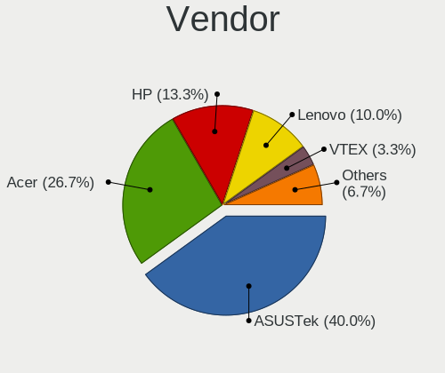
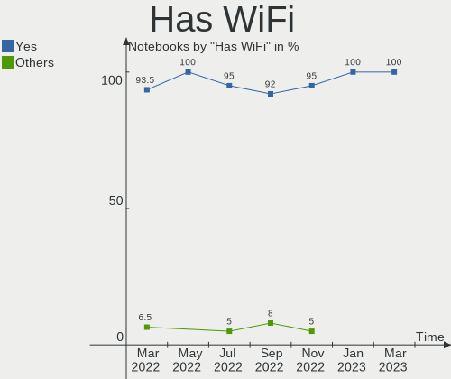
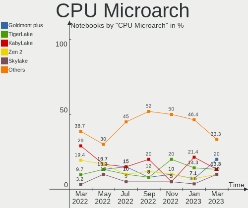
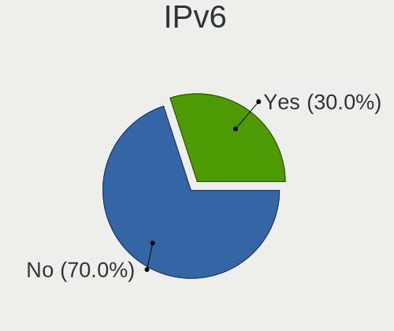
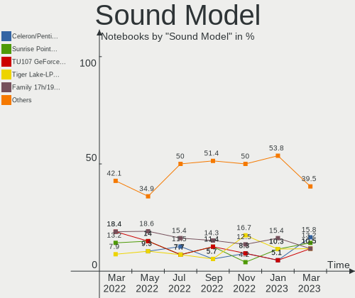

Endless Hardware Trends (Notebooks)
-----------------------------------

A project to identify most popular hardware characteristics and track their change
over time based on data collected by Endless users at https://Linux-Hardware.org.

Anyone can contribute to this report by the [hw-probe](https://github.com/linuxhw/hw-probe) tool:

    sudo -E hw-probe -all -upload

This report is for one last month. Overall report since the beginning of time: [TestCoverage](https://github.com/linuxhw/TestCoverage)

Period: Apr, 2022.

Contents
--------

* [ System ](#system)
  - [ OS                       ](#os)
  - [ OS Family                ](#os-family)
  - [ Kernel                   ](#kernel)
  - [ Kernel Family            ](#kernel-family)
  - [ Kernel Major Ver.        ](#kernel-major-ver)
  - [ Arch                     ](#arch)
  - [ DE                       ](#de)
  - [ Display Server           ](#display-server)
  - [ Display Manager          ](#display-manager)
  - [ OS Lang                  ](#os-lang)
  - [ Boot Mode                ](#boot-mode)
  - [ Filesystem               ](#filesystem)
  - [ Part. scheme             ](#part-scheme)
  - [ Dual Boot with Linux/BSD ](#dual-boot-with-linuxbsd)
  - [ Dual Boot (Win)          ](#dual-boot-win)

* [ Board ](#board)
  - [ Vendor                   ](#vendor)
  - [ Model                    ](#model)
  - [ Model Family             ](#model-family)
  - [ MFG Year                 ](#mfg-year)
  - [ Form Factor              ](#form-factor)
  - [ Secure Boot              ](#secure-boot)
  - [ Coreboot                 ](#coreboot)
  - [ RAM Size                 ](#ram-size)
  - [ RAM Used                 ](#ram-used)
  - [ Total Drives             ](#total-drives)
  - [ Has CD-ROM               ](#has-cd-rom)
  - [ Has Ethernet             ](#has-ethernet)
  - [ Has WiFi                 ](#has-wifi)
  - [ Has Bluetooth            ](#has-bluetooth)

* [ Location ](#location)
  - [ Country                  ](#country)
  - [ City                     ](#city)

* [ Drives ](#drives)
  - [ Drive Vendor             ](#drive-vendor)
  - [ Drive Model              ](#drive-model)
  - [ HDD Vendor               ](#hdd-vendor)
  - [ SSD Vendor               ](#ssd-vendor)
  - [ Drive Kind               ](#drive-kind)
  - [ Drive Connector          ](#drive-connector)
  - [ Drive Size               ](#drive-size)
  - [ Space Total              ](#space-total)
  - [ Space Used               ](#space-used)
  - [ Malfunc. Drives          ](#malfunc-drives)
  - [ Malfunc. Drive Vendor    ](#malfunc-drive-vendor)
  - [ Malfunc. HDD Vendor      ](#malfunc-hdd-vendor)
  - [ Malfunc. Drive Kind      ](#malfunc-drive-kind)
  - [ Failed Drives            ](#failed-drives)
  - [ Failed Drive Vendor      ](#failed-drive-vendor)
  - [ Drive Status             ](#drive-status)

* [ Storage controller ](#storage-controller)
  - [ Storage Vendor           ](#storage-vendor)
  - [ Storage Model            ](#storage-model)
  - [ Storage Kind             ](#storage-kind)

* [ Processor ](#processor)
  - [ CPU Vendor               ](#cpu-vendor)
  - [ CPU Model                ](#cpu-model)
  - [ CPU Model Family         ](#cpu-model-family)
  - [ CPU Cores                ](#cpu-cores)
  - [ CPU Sockets              ](#cpu-sockets)
  - [ CPU Threads              ](#cpu-threads)
  - [ CPU Op-Modes             ](#cpu-op-modes)
  - [ CPU Microcode            ](#cpu-microcode)
  - [ CPU Microarch            ](#cpu-microarch)

* [ Graphics ](#graphics)
  - [ GPU Vendor               ](#gpu-vendor)
  - [ GPU Model                ](#gpu-model)
  - [ GPU Combo                ](#gpu-combo)
  - [ GPU Driver               ](#gpu-driver)
  - [ GPU Memory               ](#gpu-memory)

* [ Monitor ](#monitor)
  - [ Monitor Vendor           ](#monitor-vendor)
  - [ Monitor Model            ](#monitor-model)
  - [ Monitor Resolution       ](#monitor-resolution)
  - [ Monitor Diagonal         ](#monitor-diagonal)
  - [ Monitor Width            ](#monitor-width)
  - [ Aspect Ratio             ](#aspect-ratio)
  - [ Monitor Area             ](#monitor-area)
  - [ Pixel Density            ](#pixel-density)
  - [ Multiple Monitors        ](#multiple-monitors)

* [ Network ](#network)
  - [ Net Controller Vendor    ](#net-controller-vendor)
  - [ Net Controller Model     ](#net-controller-model)
  - [ Wireless Vendor          ](#wireless-vendor)
  - [ Wireless Model           ](#wireless-model)
  - [ Ethernet Vendor          ](#ethernet-vendor)
  - [ Ethernet Model           ](#ethernet-model)
  - [ Net Controller Kind      ](#net-controller-kind)
  - [ Used Controller          ](#used-controller)
  - [ NICs                     ](#nics)
  - [ IPv6                     ](#ipv6)

* [ Bluetooth ](#bluetooth)
  - [ Bluetooth Vendor         ](#bluetooth-vendor)
  - [ Bluetooth Model          ](#bluetooth-model)

* [ Sound ](#sound)
  - [ Sound Vendor             ](#sound-vendor)
  - [ Sound Model              ](#sound-model)

* [ Memory ](#memory)
  - [ Memory Vendor            ](#memory-vendor)
  - [ Memory Model             ](#memory-model)
  - [ Memory Kind              ](#memory-kind)
  - [ Memory Form Factor       ](#memory-form-factor)
  - [ Memory Size              ](#memory-size)
  - [ Memory Speed             ](#memory-speed)

* [ Printers & scanners ](#printers--scanners)
  - [ Printer Vendor           ](#printer-vendor)
  - [ Printer Model            ](#printer-model)
  - [ Scanner Vendor           ](#scanner-vendor)
  - [ Scanner Model            ](#scanner-model)

* [ Camera ](#camera)
  - [ Camera Vendor            ](#camera-vendor)
  - [ Camera Model             ](#camera-model)

* [ Security ](#security)
  - [ Fingerprint Vendor       ](#fingerprint-vendor)
  - [ Fingerprint Model        ](#fingerprint-model)
  - [ Chipcard Vendor          ](#chipcard-vendor)
  - [ Chipcard Model           ](#chipcard-model)

* [ Unsupported ](#unsupported)
  - [ Unsupported Devices      ](#unsupported-devices)
  - [ Unsupported Device Types ](#unsupported-device-types)

System
------

OS
--

Installed operating systems

| Name                  | Notebooks | Percent |
|-----------------------|-----------|---------|
| Endless 4.0.4         | 13        | 36.11%  |
| Endless 3.9.7         | 6         | 16.67%  |
| Endless 4.0.6         | 5         | 13.89%  |
| Endless 4.0.3         | 5         | 13.89%  |
| Endless 4.0.2         | 1         | 2.78%   |
| Endless 3.9.6         | 1         | 2.78%   |
| Endless 3.9.5         | 1         | 2.78%   |
| Endless 3.9.3-nexthw1 | 1         | 2.78%   |
| Endless 3.9.1         | 1         | 2.78%   |
| Endless 3.8.3-nexthw1 | 1         | 2.78%   |
| Endless 3.7.8         | 1         | 2.78%   |

OS Family
---------

OS without a version

| Name    | Notebooks | Percent |
|---------|-----------|---------|
| Endless | 36        | 100%    |

Kernel
------

Version of the Linux kernel

| Version           | Notebooks | Percent |
|-------------------|-----------|---------|
| 5.11.0-35-generic | 24        | 66.67%  |
| 5.8.0-14-generic  | 9         | 25%     |
| 5.6.0-7-generic   | 1         | 2.78%   |
| 5.3.0-28-generic  | 1         | 2.78%   |
| 5.11.0-12-generic | 1         | 2.78%   |

Kernel Family
-------------

Linux kernel without a distro release

| Version | Notebooks | Percent |
|---------|-----------|---------|
| 5.11.0  | 25        | 69.44%  |
| 5.8.0   | 9         | 25%     |
| 5.6.0   | 1         | 2.78%   |
| 5.3.0   | 1         | 2.78%   |

Kernel Major Ver.
-----------------

Linux kernel major version

| Version | Notebooks | Percent |
|---------|-----------|---------|
| 5.11    | 25        | 69.44%  |
| 5.8     | 9         | 25%     |
| 5.6     | 1         | 2.78%   |
| 5.3     | 1         | 2.78%   |

Arch
----

OS architecture (x86_64, i586, etc.)

| Name   | Notebooks | Percent |
|--------|-----------|---------|
| x86_64 | 36        | 100%    |

DE
--

Desktop Environment

| Name  | Notebooks | Percent |
|-------|-----------|---------|
| GNOME | 36        | 100%    |

Display Server
--------------

X11 or Wayland

| Name | Notebooks | Percent |
|------|-----------|---------|
| X11  | 36        | 100%    |

Display Manager
---------------

SDDM, LightDM, etc.

| Name    | Notebooks | Percent |
|---------|-----------|---------|
| Unknown | 36        | 100%    |

OS Lang
-------

Language

| Lang  | Notebooks | Percent |
|-------|-----------|---------|
| pt_BR | 15        | 41.67%  |
| en_US | 8         | 22.22%  |
| ro_RO | 2         | 5.56%   |
| es_MX | 2         | 5.56%   |
| tr_TR | 1         | 2.78%   |
| sv_SE | 1         | 2.78%   |
| ru_RU | 1         | 2.78%   |
| it_IT | 1         | 2.78%   |
| es_CO | 1         | 2.78%   |
| es_CL | 1         | 2.78%   |
| es_BO | 1         | 2.78%   |
| el_GR | 1         | 2.78%   |
| de_DE | 1         | 2.78%   |

Boot Mode
---------

EFI or BIOS

| Mode | Notebooks | Percent |
|------|-----------|---------|
| EFI  | 29        | 80.56%  |
| BIOS | 7         | 19.44%  |

Filesystem
----------

Type of filesystem

| Type | Notebooks | Percent |
|------|-----------|---------|
| Ext4 | 36        | 100%    |

Part. scheme
------------

Scheme of partitioning

| Type    | Notebooks | Percent |
|---------|-----------|---------|
| Unknown | 36        | 100%    |

Dual Boot with Linux/BSD
------------------------

Hosting more than one Linux/BSD

| Dual boot | Notebooks | Percent |
|-----------|-----------|---------|
| No        | 36        | 100%    |

Dual Boot (Win)
---------------

Hosting Linux and Windows

| Dual boot | Notebooks | Percent |
|-----------|-----------|---------|
| No        | 36        | 100%    |

Board
-----

Vendor
------

Motherboard manufacturer

| Name                | Notebooks | Percent |
|---------------------|-----------|---------|
| ASUSTek Computer    | 14        | 38.89%  |
| Acer                | 9         | 25%     |
| Hewlett-Packard     | 4         | 11.11%  |
| Lenovo              | 3         | 8.33%   |
| Samsung Electronics | 2         | 5.56%   |
| Multilaser          | 1         | 2.78%   |
| Google              | 1         | 2.78%   |
| Fujitsu             | 1         | 2.78%   |
| Dell                | 1         | 2.78%   |

Model
-----

Motherboard model

| Name                                           | Notebooks | Percent |
|------------------------------------------------|-----------|---------|
| Acer Nitro AN515-44                            | 7         | 19.44%  |
| ASUS X541UAK                                   | 2         | 5.56%   |
| Samsung 300V3A/300V4A/300V5A/200A4B/200A5B     | 1         | 2.78%   |
| Samsung 300E5EV/300E4EV/270E5EV/270E4EV/2470EV | 1         | 2.78%   |
| Multilaser PC13X                               | 1         | 2.78%   |
| Lenovo ThinkPad X131e 33683YG                  | 1         | 2.78%   |
| Lenovo S10-3                                   | 1         | 2.78%   |
| Lenovo IdeaPad 3 14ALC6 82KT                   | 1         | 2.78%   |
| HP Pavilion dv7                                | 1         | 2.78%   |
| HP Pavilion 14                                 | 1         | 2.78%   |
| HP Notebook                                    | 1         | 2.78%   |
| HP 250 G5 Notebook PC                          | 1         | 2.78%   |
| Google Fleex                                   | 1         | 2.78%   |
| Fujitsu LIFEBOOK A512                          | 1         | 2.78%   |
| Dell Inspiron 1525                             | 1         | 2.78%   |
| ASUS X540LJ                                    | 1         | 2.78%   |
| ASUS X451CA                                    | 1         | 2.78%   |
| ASUS X450CP                                    | 1         | 2.78%   |
| ASUS VivoBook_ASUSLaptop X515JA_X515JA         | 1         | 2.78%   |
| ASUS VivoBook_ASUSLaptop X513EA_K513EA         | 1         | 2.78%   |
| ASUS VivoBook_ASUSLaptop E410MAB_E410MA        | 1         | 2.78%   |
| ASUS VivoBook_ASUS Laptop E406MA_E406MA        | 1         | 2.78%   |
| ASUS VivoBook 15_ASUS Laptop X540UAR           | 1         | 2.78%   |
| ASUS VivoBook 15_ASUS Laptop X540MA_X543MA     | 1         | 2.78%   |
| ASUS VivoBook 14_ASUS Laptop X407MA_X407MA     | 1         | 2.78%   |
| ASUS ASUSPRO P1440FAC_P1440FA                  | 1         | 2.78%   |
| ASUS 1015PE                                    | 1         | 2.78%   |
| Acer Aspire E1-572                             | 1         | 2.78%   |
| Acer Aspire A315-34                            | 1         | 2.78%   |

Model Family
------------

Motherboard model prefix

| Name             | Notebooks | Percent |
|------------------|-----------|---------|
| ASUS VivoBook    | 7         | 19.44%  |
| Acer Nitro       | 7         | 19.44%  |
| HP Pavilion      | 2         | 5.56%   |
| ASUS X541UAK     | 2         | 5.56%   |
| Acer Aspire      | 2         | 5.56%   |
| Samsung 300V3A   | 1         | 2.78%   |
| Samsung 300E5EV  | 1         | 2.78%   |
| Multilaser PC13X | 1         | 2.78%   |
| Lenovo ThinkPad  | 1         | 2.78%   |
| Lenovo S10-3     | 1         | 2.78%   |
| Lenovo IdeaPad   | 1         | 2.78%   |
| HP Notebook      | 1         | 2.78%   |
| HP 250           | 1         | 2.78%   |
| Google Fleex     | 1         | 2.78%   |
| Fujitsu LIFEBOOK | 1         | 2.78%   |
| Dell Inspiron    | 1         | 2.78%   |
| ASUS X540LJ      | 1         | 2.78%   |
| ASUS X451CA      | 1         | 2.78%   |
| ASUS X450CP      | 1         | 2.78%   |
| ASUS ASUSPRO     | 1         | 2.78%   |
| ASUS 1015PE      | 1         | 2.78%   |

MFG Year
--------

Motherboard manufacture year

| Year | Notebooks | Percent |
|------|-----------|---------|
| 2020 | 9         | 25%     |
| 2013 | 6         | 16.67%  |
| 2021 | 4         | 11.11%  |
| 2018 | 3         | 8.33%   |
| 2016 | 3         | 8.33%   |
| 2019 | 2         | 5.56%   |
| 2015 | 2         | 5.56%   |
| 2010 | 2         | 5.56%   |
| 2008 | 2         | 5.56%   |
| 2022 | 1         | 2.78%   |
| 2012 | 1         | 2.78%   |
| 2011 | 1         | 2.78%   |

Form Factor
-----------

Physical design of the computer

| Name     | Notebooks | Percent |
|----------|-----------|---------|
| Notebook | 36        | 100%    |

Secure Boot
-----------

Enabled or disabled

| State    | Notebooks | Percent |
|----------|-----------|---------|
| Disabled | 27        | 75%     |
| Enabled  | 9         | 25%     |

Coreboot
--------

Have coreboot on board

| Used | Notebooks | Percent |
|------|-----------|---------|
| No   | 35        | 97.22%  |
| Yes  | 1         | 2.78%   |

RAM Size
--------

Total RAM memory

| Size in GB | Notebooks | Percent |
|------------|-----------|---------|
| 3.01-4.0   | 13        | 36.11%  |
| 4.01-8.0   | 12        | 33.33%  |
| 1.01-2.0   | 5         | 13.89%  |
| 8.01-16.0  | 5         | 13.89%  |
| 16.01-24.0 | 1         | 2.78%   |

RAM Used
--------

Used RAM memory

| Used GB  | Notebooks | Percent |
|----------|-----------|---------|
| 1.01-2.0 | 17        | 47.22%  |
| 2.01-3.0 | 11        | 30.56%  |
| 0.51-1.0 | 7         | 19.44%  |
| 3.01-4.0 | 1         | 2.78%   |

Total Drives
------------

Number of drives on board

| Drives | Notebooks | Percent |
|--------|-----------|---------|
| 1      | 30        | 83.33%  |
| 2      | 6         | 16.67%  |

Has CD-ROM
----------

Has CD-ROM on board

| Presented | Notebooks | Percent |
|-----------|-----------|---------|
| No        | 22        | 61.11%  |
| Yes       | 14        | 38.89%  |

Has Ethernet
------------

Has Ethernet on board

| Presented | Notebooks | Percent |
|-----------|-----------|---------|
| Yes       | 26        | 72.22%  |
| No        | 10        | 27.78%  |

Has WiFi
--------

Has WiFi module

| Presented | Notebooks | Percent |
|-----------|-----------|---------|
| Yes       | 35        | 97.22%  |
| No        | 1         | 2.78%   |

Has Bluetooth
-------------

Has Bluetooth module

| Presented | Notebooks | Percent |
|-----------|-----------|---------|
| Yes       | 31        | 86.11%  |
| No        | 5         | 13.89%  |

Location
--------

Country
-------

Geographic location (country)

| Country      | Notebooks | Percent |
|--------------|-----------|---------|
| Brazil       | 16        | 44.44%  |
| USA          | 2         | 5.56%   |
| Romania      | 2         | 5.56%   |
| Chile        | 2         | 5.56%   |
| Uzbekistan   | 1         | 2.78%   |
| Turkey       | 1         | 2.78%   |
| Sweden       | 1         | 2.78%   |
| Spain        | 1         | 2.78%   |
| South Africa | 1         | 2.78%   |
| Serbia       | 1         | 2.78%   |
| Mexico       | 1         | 2.78%   |
| Italy        | 1         | 2.78%   |
| Iran         | 1         | 2.78%   |
| Greece       | 1         | 2.78%   |
| Germany      | 1         | 2.78%   |
| Colombia     | 1         | 2.78%   |
| Canada       | 1         | 2.78%   |
| Australia    | 1         | 2.78%   |

City
----

Geographic location (city)

| City                       | Notebooks | Percent |
|----------------------------|-----------|---------|
| Viña del Mar              | 1         | 2.78%   |
| Tehran                     | 1         | 2.78%   |
| Skogas                     | 1         | 2.78%   |
| Sertaozinho                | 1         | 2.78%   |
| Sector 4                   | 1         | 2.78%   |
| Schenectady                | 1         | 2.78%   |
| Sao Paulo                  | 1         | 2.78%   |
| Sao José dos Campos       | 1         | 2.78%   |
| Sao Jose do Rio Preto      | 1         | 2.78%   |
| Santiago                   | 1         | 2.78%   |
| Santa Rita do Sapucai      | 1         | 2.78%   |
| San Nicolás de los Garza  | 1         | 2.78%   |
| Samarkand                  | 1         | 2.78%   |
| Rio de Janeiro             | 1         | 2.78%   |
| Ribeirao Preto             | 1         | 2.78%   |
| Pretoria                   | 1         | 2.78%   |
| Porto Alegre               | 1         | 2.78%   |
| Oakville                   | 1         | 2.78%   |
| Nova Santa Rosa            | 1         | 2.78%   |
| Nova Iguaçu               | 1         | 2.78%   |
| Norden                     | 1         | 2.78%   |
| Las Palmas de Gran Canaria | 1         | 2.78%   |
| Itatiba                    | 1         | 2.78%   |
| Istanbul                   | 1         | 2.78%   |
| Fortaleza                  | 1         | 2.78%   |
| Forlì                     | 1         | 2.78%   |
| Caxias do Sul              | 1         | 2.78%   |
| Bucharest                  | 1         | 2.78%   |
| Brodosqui                  | 1         | 2.78%   |
| Brisbane                   | 1         | 2.78%   |
| Bogotá                    | 1         | 2.78%   |
| Beverly                    | 1         | 2.78%   |
| Belgrade                   | 1         | 2.78%   |
| Ano Liosia                 | 1         | 2.78%   |
| Anitapolis                 | 1         | 2.78%   |
| Alfenas                    | 1         | 2.78%   |

Drives
------

Drive Vendor
------------

Hard drive vendors

| Vendor              | Notebooks | Drives | Percent |
|---------------------|-----------|--------|---------|
| Sandisk             | 8         | 8      | 20.51%  |
| Seagate             | 6         | 6      | 15.38%  |
| WDC                 | 5         | 5      | 12.82%  |
| Toshiba             | 5         | 5      | 12.82%  |
| Unknown             | 4         | 5      | 10.26%  |
| Kingston            | 3         | 3      | 7.69%   |
| Samsung Electronics | 2         | 2      | 5.13%   |
| Crucial             | 2         | 2      | 5.13%   |
| Phison              | 1         | 1      | 2.56%   |
| HS-SSD-C100         | 1         | 1      | 2.56%   |
| Hitachi             | 1         | 1      | 2.56%   |
| HGST                | 1         | 1      | 2.56%   |

Drive Model
-----------

Hard drive models

| Model                                | Notebooks | Percent |
|--------------------------------------|-----------|---------|
| Sandisk NVMe SSD Drive 512GB         | 7         | 17.5%   |
| Toshiba MQ04ABF100 1TB               | 3         | 7.5%    |
| WDC WD10SPZX-21Z10T0 1TB             | 2         | 5%      |
| Unknown MMC Card  64GB               | 2         | 5%      |
| Seagate ST500LT012-1DG142 500GB      | 2         | 5%      |
| Kingston NVMe SSD Drive 256GB        | 2         | 5%      |
| WDC WDS240G1G0A-00SS50 240GB SSD     | 1         | 2.5%    |
| WDC WD5000LPVX-80V0TT0 500GB         | 1         | 2.5%    |
| WDC WD2500BEVS-75UST0 250GB          | 1         | 2.5%    |
| Unknown MMC Card  2GB                | 1         | 2.5%    |
| Unknown MMC Card  16GB               | 1         | 2.5%    |
| Unknown MMC Card  128GB              | 1         | 2.5%    |
| Toshiba MQ01ABF050 500GB             | 1         | 2.5%    |
| Toshiba MQ01ABF032 320GB             | 1         | 2.5%    |
| Seagate ST9160314AS 160GB            | 1         | 2.5%    |
| Seagate ST9160310AS 160GB            | 1         | 2.5%    |
| Seagate ST500LM030-1RK17D 500GB      | 1         | 2.5%    |
| Seagate ST500LM012 HN-M500MBB 500GB  | 1         | 2.5%    |
| SanDisk SSD PLUS 120GB               | 1         | 2.5%    |
| Samsung NVMe SSD Drive 512GB         | 1         | 2.5%    |
| Samsung MZNLF128HCHP-000H1 128GB SSD | 1         | 2.5%    |
| Phison NVMe SSD Drive 256GB          | 1         | 2.5%    |
| Kingston SA400S37120G 120GB SSD      | 1         | 2.5%    |
| HS-SSD-C100 480G                     | 1         | 2.5%    |
| Hitachi HTS547550A9E384 500GB        | 1         | 2.5%    |
| HGST HTS725032A7E630 320GB           | 1         | 2.5%    |
| Crucial CT480BX500SSD1 480GB         | 1         | 2.5%    |
| Crucial CT240BX500SSD1 240GB         | 1         | 2.5%    |

HDD Vendor
----------

Hard disk drive vendors

| Vendor  | Notebooks | Drives | Percent |
|---------|-----------|--------|---------|
| Seagate | 6         | 6      | 35.29%  |
| Toshiba | 5         | 5      | 29.41%  |
| WDC     | 4         | 4      | 23.53%  |
| Hitachi | 1         | 1      | 5.88%   |
| HGST    | 1         | 1      | 5.88%   |

SSD Vendor
----------

Solid state drive vendors

| Vendor              | Notebooks | Drives | Percent |
|---------------------|-----------|--------|---------|
| Crucial             | 2         | 2      | 33.33%  |
| WDC                 | 1         | 1      | 16.67%  |
| SanDisk             | 1         | 1      | 16.67%  |
| Samsung Electronics | 1         | 1      | 16.67%  |
| Kingston            | 1         | 1      | 16.67%  |

Drive Kind
----------

HDD or SSD

| Kind    | Notebooks | Drives | Percent |
|---------|-----------|--------|---------|
| HDD     | 17        | 17     | 43.59%  |
| NVMe    | 11        | 11     | 28.21%  |
| SSD     | 6         | 6      | 15.38%  |
| MMC     | 4         | 5      | 10.26%  |
| Unknown | 1         | 1      | 2.56%   |

Drive Connector
---------------

SATA, SAS, NVMe, etc.

| Type | Notebooks | Drives | Percent |
|------|-----------|--------|---------|
| SATA | 24        | 24     | 61.54%  |
| NVMe | 11        | 11     | 28.21%  |
| MMC  | 4         | 5      | 10.26%  |

Drive Size
----------

Size of hard drive

| Size in TB | Notebooks | Drives | Percent |
|------------|-----------|--------|---------|
| 0.01-0.5   | 18        | 18     | 78.26%  |
| 0.51-1.0   | 5         | 5      | 21.74%  |

Space Total
-----------

Amount of disk space available on the file system

| Size in GB | Notebooks | Percent |
|------------|-----------|---------|
| 251-500    | 12        | 33.33%  |
| 101-250    | 12        | 33.33%  |
| 501-1000   | 6         | 16.67%  |
| 1-20       | 3         | 8.33%   |
| 51-100     | 3         | 8.33%   |

Space Used
----------

Amount of used disk space

| Used GB | Notebooks | Percent |
|---------|-----------|---------|
| 21-50   | 16        | 44.44%  |
| 1-20    | 9         | 25%     |
| 51-100  | 8         | 22.22%  |
| 101-250 | 3         | 8.33%   |

Malfunc. Drives
---------------

Drive models with a malfunction

Zero info for selected period =(

Malfunc. Drive Vendor
---------------------

Vendors of faulty drives

Zero info for selected period =(

Malfunc. HDD Vendor
-------------------

Vendors of faulty HDD drives

Zero info for selected period =(

Malfunc. Drive Kind
-------------------

Kinds of faulty drives

Zero info for selected period =(

Failed Drives
-------------

Failed drive models

Zero info for selected period =(

Failed Drive Vendor
-------------------

Failed drive vendors

Zero info for selected period =(

Drive Status
------------

Number of failed and malfunc. drives

| Status   | Notebooks | Drives | Percent |
|----------|-----------|--------|---------|
| Detected | 36        | 40     | 100%    |

Storage controller
------------------

Storage Vendor
--------------

Storage controller vendors

| Vendor                      | Notebooks | Percent |
|-----------------------------|-----------|---------|
| Intel                       | 26        | 57.78%  |
| AMD                         | 8         | 17.78%  |
| Sandisk                     | 7         | 15.56%  |
| Kingston Technology Company | 2         | 4.44%   |
| Samsung Electronics         | 1         | 2.22%   |
| Phison Electronics          | 1         | 2.22%   |

Storage Model
-------------

Storage controller models

| Model                                                                            | Notebooks | Percent |
|----------------------------------------------------------------------------------|-----------|---------|
| AMD FCH SATA Controller [AHCI mode]                                              | 8         | 17.02%  |
| Sandisk WD Blue SN550 NVMe SSD                                                   | 7         | 14.89%  |
| Intel Celeron/Pentium Silver Processor SATA Controller                           | 5         | 10.64%  |
| Intel 7 Series Chipset Family 6-port SATA Controller [AHCI mode]                 | 5         | 10.64%  |
| Intel Sunrise Point-LP SATA Controller [AHCI mode]                               | 4         | 8.51%   |
| Kingston Company OM3PDP3 NVMe SSD                                                | 2         | 4.26%   |
| Intel NM10/ICH7 Family SATA Controller [AHCI mode]                               | 2         | 4.26%   |
| Intel 8 Series SATA Controller 1 [AHCI mode]                                     | 2         | 4.26%   |
| Intel 6 Series/C200 Series Chipset Family 6 port Mobile SATA AHCI Controller     | 2         | 4.26%   |
| Samsung NVMe SSD Controller 980                                                  | 1         | 2.13%   |
| Phison PS5013 E13 NVMe Controller                                                | 1         | 2.13%   |
| Intel Wildcat Point-LP SATA Controller [AHCI Mode]                               | 1         | 2.13%   |
| Intel Volume Management Device NVMe RAID Controller                              | 1         | 2.13%   |
| Intel Tiger Lake-LP SATA Controller [AHCI mode]                                  | 1         | 2.13%   |
| Intel Comet Lake SATA AHCI Controller                                            | 1         | 2.13%   |
| Intel Atom/Celeron/Pentium Processor x5-E8000/J3xxx/N3xxx Series SATA Controller | 1         | 2.13%   |
| Intel 82801HM/HEM (ICH8M/ICH8M-E) SATA Controller [AHCI mode]                    | 1         | 2.13%   |
| Intel 82801HM/HEM (ICH8M/ICH8M-E) IDE Controller                                 | 1         | 2.13%   |
| Intel 82801 Mobile SATA Controller [RAID mode]                                   | 1         | 2.13%   |

Storage Kind
------------

Kind of storage controller (IDE, SATA, NVMe, SAS, ...)

| Kind | Notebooks | Percent |
|------|-----------|---------|
| SATA | 33        | 70.21%  |
| NVMe | 11        | 23.4%   |
| RAID | 2         | 4.26%   |
| IDE  | 1         | 2.13%   |

Processor
---------

CPU Vendor
----------

Processor vendors

| Vendor | Notebooks | Percent |
|--------|-----------|---------|
| Intel  | 28        | 77.78%  |
| AMD    | 8         | 22.22%  |

CPU Model
---------

Processor models

| Model                                    | Notebooks | Percent |
|------------------------------------------|-----------|---------|
| AMD Ryzen 7 4800H with Radeon Graphics   | 5         | 13.89%  |
| Intel Celeron N4020 CPU @ 1.10GHz        | 3         | 8.33%   |
| Intel Pentium Silver N5000 CPU @ 1.10GHz | 2         | 5.56%   |
| AMD Ryzen 5 4600H with Radeon Graphics   | 2         | 5.56%   |
| Intel Core i7-4510U CPU @ 2.00GHz        | 1         | 2.78%   |
| Intel Core i7-2670QM CPU @ 2.20GHz       | 1         | 2.78%   |
| Intel Core i5-7200U CPU @ 2.50GHz        | 1         | 2.78%   |
| Intel Core i5-6200U CPU @ 2.30GHz        | 1         | 2.78%   |
| Intel Core i5-4200U CPU @ 1.60GHz        | 1         | 2.78%   |
| Intel Core i5-3337U CPU @ 1.80GHz        | 1         | 2.78%   |
| Intel Core i5-1035G1 CPU @ 1.00GHz       | 1         | 2.78%   |
| Intel Core i3-7020U CPU @ 2.30GHz        | 1         | 2.78%   |
| Intel Core i3-6006U CPU @ 2.00GHz        | 1         | 2.78%   |
| Intel Core i3-5005U CPU @ 2.00GHz        | 1         | 2.78%   |
| Intel Core i3-3227U CPU @ 1.90GHz        | 1         | 2.78%   |
| Intel Core i3-3110M CPU @ 2.40GHz        | 1         | 2.78%   |
| Intel Core i3-2375M CPU @ 1.50GHz        | 1         | 2.78%   |
| Intel Core i3-2350M CPU @ 2.30GHz        | 1         | 2.78%   |
| Intel Core i3-10110U CPU @ 2.10GHz       | 1         | 2.78%   |
| Intel Core 2 Duo CPU T7250 @ 2.00GHz     | 1         | 2.78%   |
| Intel Celeron N4000C CPU @ 1.10GHz       | 1         | 2.78%   |
| Intel Celeron CPU N3050 @ 1.60GHz        | 1         | 2.78%   |
| Intel Celeron CPU 1007U @ 1.50GHz        | 1         | 2.78%   |
| Intel Atom x5-Z8350 CPU @ 1.44GHz        | 1         | 2.78%   |
| Intel Atom CPU N550 @ 1.50GHz            | 1         | 2.78%   |
| Intel Atom CPU N450 @ 1.66GHz            | 1         | 2.78%   |
| Intel 11th Gen Core i3-1115G4 @ 3.00GHz  | 1         | 2.78%   |
| AMD Ryzen 7 5700U with Radeon Graphics   | 1         | 2.78%   |

CPU Model Family
----------------

Processor model prefix

| Model                | Notebooks | Percent |
|----------------------|-----------|---------|
| Intel Core i3        | 8         | 22.22%  |
| Intel Celeron        | 6         | 16.67%  |
| AMD Ryzen 7          | 6         | 16.67%  |
| Intel Core i5        | 5         | 13.89%  |
| Intel Atom           | 3         | 8.33%   |
| Intel Pentium Silver | 2         | 5.56%   |
| Intel Core i7        | 2         | 5.56%   |
| AMD Ryzen 5          | 2         | 5.56%   |
| Other                | 1         | 2.78%   |
| Intel Core 2 Duo     | 1         | 2.78%   |

CPU Cores
---------

Number of processor cores

| Number | Notebooks | Percent |
|--------|-----------|---------|
| 2      | 22        | 61.11%  |
| 8      | 6         | 16.67%  |
| 4      | 5         | 13.89%  |
| 6      | 2         | 5.56%   |
| 1      | 1         | 2.78%   |

CPU Sockets
-----------

Number of sockets

| Number | Notebooks | Percent |
|--------|-----------|---------|
| 1      | 36        | 100%    |

CPU Threads
-----------

Threads per core (Hyper-Threading)

| Number | Notebooks | Percent |
|--------|-----------|---------|
| 2      | 26        | 72.22%  |
| 1      | 10        | 27.78%  |

CPU Op-Modes
------------

CPU Operation Modes (32-bit, 64-bit)

| Op mode        | Notebooks | Percent |
|----------------|-----------|---------|
| 32-bit, 64-bit | 36        | 100%    |

CPU Microcode
-------------

Microcode number

| Number     | Notebooks | Percent |
|------------|-----------|---------|
| 0x08600103 | 7         | 19.44%  |
| 0x306a9    | 4         | 11.11%  |
| 0x706a8    | 3         | 8.33%   |
| 0x706a1    | 3         | 8.33%   |
| 0x806e9    | 2         | 5.56%   |
| 0x406e3    | 2         | 5.56%   |
| 0x40651    | 2         | 5.56%   |
| 0x206a7    | 2         | 5.56%   |
| 0x106ca    | 2         | 5.56%   |
| 0x806ec    | 1         | 2.78%   |
| 0x806c1    | 1         | 2.78%   |
| 0x706e5    | 1         | 2.78%   |
| 0x6fd      | 1         | 2.78%   |
| 0x406c4    | 1         | 2.78%   |
| 0x406c3    | 1         | 2.78%   |
| 0x306d4    | 1         | 2.78%   |
| 0x08608102 | 1         | 2.78%   |
| Unknown    | 1         | 2.78%   |

CPU Microarch
-------------

Microarchitecture

| Name          | Notebooks | Percent |
|---------------|-----------|---------|
| Zen 2         | 7         | 19.44%  |
| Goldmont plus | 6         | 16.67%  |
| IvyBridge     | 4         | 11.11%  |
| SandyBridge   | 3         | 8.33%   |
| KabyLake      | 3         | 8.33%   |
| Skylake       | 2         | 5.56%   |
| Silvermont    | 2         | 5.56%   |
| Haswell       | 2         | 5.56%   |
| Bonnell       | 2         | 5.56%   |
| TigerLake     | 1         | 2.78%   |
| IceLake       | 1         | 2.78%   |
| Core          | 1         | 2.78%   |
| Broadwell     | 1         | 2.78%   |
| Unknown       | 1         | 2.78%   |

Graphics
--------

GPU Vendor
----------

Vendors of graphics cards

| Vendor | Notebooks | Percent |
|--------|-----------|---------|
| Intel  | 28        | 60.87%  |
| AMD    | 10        | 21.74%  |
| Nvidia | 8         | 17.39%  |

GPU Model
---------

Graphics card models

| Model                                                                                    | Notebooks | Percent |
|------------------------------------------------------------------------------------------|-----------|---------|
| Nvidia TU117M                                                                            | 7         | 14.89%  |
| AMD Renoir                                                                               | 7         | 14.89%  |
| Intel GeminiLake [UHD Graphics 600]                                                      | 4         | 8.51%   |
| Intel 3rd Gen Core processor Graphics Controller                                         | 4         | 8.51%   |
| Intel 2nd Generation Core Processor Family Integrated Graphics Controller                | 3         | 6.38%   |
| Intel Skylake GT2 [HD Graphics 520]                                                      | 2         | 4.26%   |
| Intel HD Graphics 620                                                                    | 2         | 4.26%   |
| Intel Haswell-ULT Integrated Graphics Controller                                         | 2         | 4.26%   |
| Intel GeminiLake [UHD Graphics 605]                                                      | 2         | 4.26%   |
| Intel Atom/Celeron/Pentium Processor x5-E8000/J3xxx/N3xxx Integrated Graphics Controller | 2         | 4.26%   |
| Intel Atom Processor D4xx/D5xx/N4xx/N5xx Integrated Graphics Controller                  | 2         | 4.26%   |
| Nvidia GK208BM [GeForce 920M]                                                            | 1         | 2.13%   |
| Intel Tiger Lake UHD Graphics                                                            | 1         | 2.13%   |
| Intel Mobile GM965/GL960 Integrated Graphics Controller (secondary)                      | 1         | 2.13%   |
| Intel Mobile GM965/GL960 Integrated Graphics Controller (primary)                        | 1         | 2.13%   |
| Intel Iris Plus Graphics G1 (Ice Lake)                                                   | 1         | 2.13%   |
| Intel HD Graphics 5500                                                                   | 1         | 2.13%   |
| Intel CometLake-U GT2 [UHD Graphics]                                                     | 1         | 2.13%   |
| AMD Whistler [Radeon HD 6730M/6770M/7690M XT]                                            | 1         | 2.13%   |
| AMD Mars LE [Radeon HD 8530M / R5 M240]                                                  | 1         | 2.13%   |
| AMD Lucienne                                                                             | 1         | 2.13%   |

GPU Combo
---------

Combinations of graphics cards

| Name           | Notebooks | Percent |
|----------------|-----------|---------|
| 1 x Intel      | 24        | 66.67%  |
| AMD + Nvidia   | 7         | 19.44%  |
| Intel + AMD    | 2         | 5.56%   |
| Other          | 1         | 2.78%   |
| Intel + Nvidia | 1         | 2.78%   |
| 1 x AMD        | 1         | 2.78%   |

GPU Driver
----------

Free vs proprietary

| Driver      | Notebooks | Percent |
|-------------|-----------|---------|
| Free        | 28        | 77.78%  |
| Proprietary | 8         | 22.22%  |

GPU Memory
----------

Total video memory

| Size in GB | Notebooks | Percent |
|------------|-----------|---------|
| Unknown    | 27        | 75%     |
| 0.01-0.5   | 7         | 19.44%  |
| 1.01-2.0   | 1         | 2.78%   |
| 0.51-1.0   | 1         | 2.78%   |

Monitor
-------

Monitor Vendor
--------------

Monitor vendors

| Vendor                  | Notebooks | Percent |
|-------------------------|-----------|---------|
| Chimei Innolux          | 12        | 31.58%  |
| AU Optronics            | 8         | 21.05%  |
| BOE                     | 4         | 10.53%  |
| Samsung Electronics     | 3         | 7.89%   |
| PANDA                   | 3         | 7.89%   |
| LG Display              | 2         | 5.26%   |
| SLD                     | 1         | 2.63%   |
| KDC                     | 1         | 2.63%   |
| HannStar                | 1         | 2.63%   |
| Dell                    | 1         | 2.63%   |
| Chi Mei Optoelectronics | 1         | 2.63%   |
| Acer                    | 1         | 2.63%   |

Monitor Model
-------------

Monitor models

| Model                                                                    | Notebooks | Percent |
|--------------------------------------------------------------------------|-----------|---------|
| AU Optronics LCD Monitor AUOAF90 1920x1080 344x193mm 15.5-inch           | 4         | 10.53%  |
| PANDA LCD Monitor NCP004D 1920x1080 344x194mm 15.5-inch                  | 3         | 7.89%   |
| Chimei Innolux LCD Monitor CMN15CA 1366x768 344x193mm 15.5-inch          | 2         | 5.26%   |
| SLD LCD Monitor SLD003C 1366x768 309x173mm 13.9-inch                     | 1         | 2.63%   |
| Samsung Electronics LCD Monitor SEC3649 1366x768 309x174mm 14.0-inch     | 1         | 2.63%   |
| Samsung Electronics LCD Monitor SEC3157 1440x900 303x190mm 14.1-inch     | 1         | 2.63%   |
| Samsung Electronics LCD Monitor SDC4E51 1366x768 344x194mm 15.5-inch     | 1         | 2.63%   |
| LG Display LCD Monitor LGD05AB 1920x1080 309x174mm 14.0-inch             | 1         | 2.63%   |
| LG Display LCD Monitor LGD033B 1366x768 344x194mm 15.5-inch              | 1         | 2.63%   |
| KDC LCD Monitor KDC0830 1920x1080 344x193mm 15.5-inch                    | 1         | 2.63%   |
| HannStar HSD100IFW4A HSD03EE 1024x600 220x129mm 10.0-inch                | 1         | 2.63%   |
| Dell P190S DEL405A 1280x1024 376x301mm 19.0-inch                         | 1         | 2.63%   |
| Chimei Innolux LCD Monitor CMN15F5 1920x1080 344x193mm 15.5-inch         | 1         | 2.63%   |
| Chimei Innolux LCD Monitor CMN15DB 1366x768 344x193mm 15.5-inch          | 1         | 2.63%   |
| Chimei Innolux LCD Monitor CMN15C5 1366x768 344x193mm 15.5-inch          | 1         | 2.63%   |
| Chimei Innolux LCD Monitor CMN1533 1366x768 344x193mm 15.5-inch          | 1         | 2.63%   |
| Chimei Innolux LCD Monitor CMN14D6 1366x768 309x173mm 13.9-inch          | 1         | 2.63%   |
| Chimei Innolux LCD Monitor CMN14A1 1366x768 309x174mm 14.0-inch          | 1         | 2.63%   |
| Chimei Innolux LCD Monitor CMN1480 1366x768 309x174mm 14.0-inch          | 1         | 2.63%   |
| Chimei Innolux LCD Monitor CMN1470 1366x768 309x174mm 14.0-inch          | 1         | 2.63%   |
| Chimei Innolux LCD Monitor CMN140A 1920x1080 309x173mm 13.9-inch         | 1         | 2.63%   |
| Chimei Innolux LCD Monitor CMN1118 1366x768 256x144mm 11.6-inch          | 1         | 2.63%   |
| Chi Mei Optoelectronics LCD Monitor CMO1018 1024x600 222x125mm 10.0-inch | 1         | 2.63%   |
| BOE LCD Monitor BOE08B2 1366x768 309x174mm 14.0-inch                     | 1         | 2.63%   |
| BOE LCD Monitor BOE07A8 1366x768 256x144mm 11.6-inch                     | 1         | 2.63%   |
| BOE LCD Monitor BOE06A5 1366x768 344x194mm 15.5-inch                     | 1         | 2.63%   |
| BOE LCD Monitor BOE05BA 1366x768 309x173mm 13.9-inch                     | 1         | 2.63%   |
| AU Optronics LCD Monitor AUO723C 1366x768 309x173mm 13.9-inch            | 1         | 2.63%   |
| AU Optronics LCD Monitor AUO48EC 1366x768 344x193mm 15.5-inch            | 1         | 2.63%   |
| AU Optronics LCD Monitor AUO38ED 1920x1080 344x193mm 15.5-inch           | 1         | 2.63%   |
| AU Optronics LCD Monitor AUO139E 1600x900 382x214mm 17.2-inch            | 1         | 2.63%   |
| Acer V246HL ACR032E 1920x1080 531x299mm 24.0-inch                        | 1         | 2.63%   |

Monitor Resolution
------------------

Monitor screen resolution

| Resolution       | Notebooks | Percent |
|------------------|-----------|---------|
| 1366x768 (WXGA)  | 20        | 54.05%  |
| 1920x1080 (FHD)  | 12        | 32.43%  |
| 1024x600         | 2         | 5.41%   |
| 2288x1287        | 1         | 2.7%    |
| 1600x900 (HD+)   | 1         | 2.7%    |
| 1440x900 (WXGA+) | 1         | 2.7%    |

Monitor Diagonal
----------------

Diagonal size in inches

| Inches | Notebooks | Percent |
|--------|-----------|---------|
| 15     | 19        | 50%     |
| 14     | 8         | 21.05%  |
| 13     | 4         | 10.53%  |
| 11     | 2         | 5.26%   |
| 10     | 2         | 5.26%   |
| 24     | 1         | 2.63%   |
| 19     | 1         | 2.63%   |
| 17     | 1         | 2.63%   |

Monitor Width
-------------

Physical width

| Width in mm | Notebooks | Percent |
|-------------|-----------|---------|
| 301-350     | 31        | 81.58%  |
| 201-300     | 4         | 10.53%  |
| 351-400     | 2         | 5.26%   |
| 501-600     | 1         | 2.63%   |

Aspect Ratio
------------

Proportional relationship between the width and the height

| Ratio | Notebooks | Percent |
|-------|-----------|---------|
| 16/9  | 35        | 94.59%  |
| 5/4   | 1         | 2.7%    |
| 16/10 | 1         | 2.7%    |

Monitor Area
------------

Area in inch²

| Area in inch² | Notebooks | Percent |
|----------------|-----------|---------|
| 101-110        | 19        | 50%     |
| 81-90          | 12        | 31.58%  |
| 51-60          | 2         | 5.26%   |
| 41-50          | 2         | 5.26%   |
| 201-250        | 1         | 2.63%   |
| 151-200        | 1         | 2.63%   |
| 121-130        | 1         | 2.63%   |

Pixel Density
-------------

Pixels per inch

| Density | Notebooks | Percent |
|---------|-----------|---------|
| 101-120 | 22        | 57.89%  |
| 121-160 | 14        | 36.84%  |
| 51-100  | 2         | 5.26%   |

Multiple Monitors
-----------------

Total monitors connected

| Total | Notebooks | Percent |
|-------|-----------|---------|
| 1     | 34        | 94.44%  |
| 2     | 2         | 5.56%   |

Network
-------

Net Controller Vendor
---------------------

Controller vendors

| Vendor                   | Notebooks | Percent |
|--------------------------|-----------|---------|
| Realtek Semiconductor    | 25        | 40.98%  |
| Intel                    | 17        | 27.87%  |
| Qualcomm Atheros         | 9         | 14.75%  |
| Broadcom                 | 4         | 6.56%   |
| Xiaomi                   | 1         | 1.64%   |
| TP-Link                  | 1         | 1.64%   |
| Ralink                   | 1         | 1.64%   |
| Marvell Technology Group | 1         | 1.64%   |
| Huawei Technologies      | 1         | 1.64%   |
| Broadcom Limited         | 1         | 1.64%   |

Net Controller Model
--------------------

Controller models

| Model                                                             | Notebooks | Percent |
|-------------------------------------------------------------------|-----------|---------|
| Realtek RTL810xE PCI Express Fast Ethernet controller             | 8         | 12.5%   |
| Realtek RTL8111/8168/8411 PCI Express Gigabit Ethernet Controller | 7         | 10.94%  |
| Realtek Killer E2600 Gigabit Ethernet Controller                  | 7         | 10.94%  |
| Intel Wi-Fi 6 AX200                                               | 7         | 10.94%  |
| Qualcomm Atheros QCA9565 / AR9565 Wireless Network Adapter        | 4         | 6.25%   |
| Realtek RTL8821CE 802.11ac PCIe Wireless Network Adapter          | 2         | 3.13%   |
| Realtek RTL8723BE PCIe Wireless Network Adapter                   | 2         | 3.13%   |
| Qualcomm Atheros AR9485 Wireless Network Adapter                  | 2         | 3.13%   |
| Intel Gemini Lake PCH CNVi WiFi                                   | 2         | 3.13%   |
| Xiaomi Mi/Redmi series (RNDIS)                                    | 1         | 1.56%   |
| TP-Link TL-WN823N v2/v3 [Realtek RTL8192EU]                       | 1         | 1.56%   |
| Realtek RTL8822BE 802.11a/b/g/n/ac WiFi adapter                   | 1         | 1.56%   |
| Ralink RT3290 Wireless 802.11n 1T/1R PCIe                         | 1         | 1.56%   |
| Qualcomm Atheros QCA9377 802.11ac Wireless Network Adapter        | 1         | 1.56%   |
| Qualcomm Atheros QCA6174 802.11ac Wireless Network Adapter        | 1         | 1.56%   |
| Qualcomm Atheros AR9285 Wireless Network Adapter (PCI-Express)    | 1         | 1.56%   |
| Qualcomm Atheros AR8132 Fast Ethernet                             | 1         | 1.56%   |
| Marvell Group 88E8040 PCI-E Fast Ethernet Controller              | 1         | 1.56%   |
| Intel Wireless 3165                                               | 1         | 1.56%   |
| Intel Wi-Fi 6 AX201                                               | 1         | 1.56%   |
| Intel PRO/Wireless 4965 AG or AGN [Kedron] Network Connection     | 1         | 1.56%   |
| Intel Ice Lake-LP PCH CNVi WiFi                                   | 1         | 1.56%   |
| Intel Comet Lake PCH-LP CNVi WiFi                                 | 1         | 1.56%   |
| Intel Centrino Wireless-N 2230                                    | 1         | 1.56%   |
| Intel Centrino Wireless-N 130                                     | 1         | 1.56%   |
| Intel Centrino Wireless-N 1030 [Rainbow Peak]                     | 1         | 1.56%   |
| Huawei JNY-LX1                                                    | 1         | 1.56%   |
| Broadcom NetXtreme BCM57786 Gigabit Ethernet PCIe                 | 1         | 1.56%   |
| Broadcom Limited BCM43228 802.11a/b/g/n                           | 1         | 1.56%   |
| Broadcom BCM43142 802.11b/g/n                                     | 1         | 1.56%   |
| Broadcom BCM4313 802.11bgn Wireless Network Adapter               | 1         | 1.56%   |
| Broadcom BCM4312 802.11b/g LP-PHY                                 | 1         | 1.56%   |

Wireless Vendor
---------------

Wireless vendors

| Vendor                | Notebooks | Percent |
|-----------------------|-----------|---------|
| Intel                 | 17        | 45.95%  |
| Qualcomm Atheros      | 9         | 24.32%  |
| Realtek Semiconductor | 5         | 13.51%  |
| Broadcom              | 3         | 8.11%   |
| TP-Link               | 1         | 2.7%    |
| Ralink                | 1         | 2.7%    |
| Broadcom Limited      | 1         | 2.7%    |

Wireless Model
--------------

Wireless models

| Model                                                          | Notebooks | Percent |
|----------------------------------------------------------------|-----------|---------|
| Intel Wi-Fi 6 AX200                                            | 7         | 18.92%  |
| Qualcomm Atheros QCA9565 / AR9565 Wireless Network Adapter     | 4         | 10.81%  |
| Realtek RTL8821CE 802.11ac PCIe Wireless Network Adapter       | 2         | 5.41%   |
| Realtek RTL8723BE PCIe Wireless Network Adapter                | 2         | 5.41%   |
| Qualcomm Atheros AR9485 Wireless Network Adapter               | 2         | 5.41%   |
| Intel Gemini Lake PCH CNVi WiFi                                | 2         | 5.41%   |
| TP-Link TL-WN823N v2/v3 [Realtek RTL8192EU]                    | 1         | 2.7%    |
| Realtek RTL8822BE 802.11a/b/g/n/ac WiFi adapter                | 1         | 2.7%    |
| Ralink RT3290 Wireless 802.11n 1T/1R PCIe                      | 1         | 2.7%    |
| Qualcomm Atheros QCA9377 802.11ac Wireless Network Adapter     | 1         | 2.7%    |
| Qualcomm Atheros QCA6174 802.11ac Wireless Network Adapter     | 1         | 2.7%    |
| Qualcomm Atheros AR9285 Wireless Network Adapter (PCI-Express) | 1         | 2.7%    |
| Intel Wireless 3165                                            | 1         | 2.7%    |
| Intel Wi-Fi 6 AX201                                            | 1         | 2.7%    |
| Intel PRO/Wireless 4965 AG or AGN [Kedron] Network Connection  | 1         | 2.7%    |
| Intel Ice Lake-LP PCH CNVi WiFi                                | 1         | 2.7%    |
| Intel Comet Lake PCH-LP CNVi WiFi                              | 1         | 2.7%    |
| Intel Centrino Wireless-N 2230                                 | 1         | 2.7%    |
| Intel Centrino Wireless-N 130                                  | 1         | 2.7%    |
| Intel Centrino Wireless-N 1030 [Rainbow Peak]                  | 1         | 2.7%    |
| Broadcom Limited BCM43228 802.11a/b/g/n                        | 1         | 2.7%    |
| Broadcom BCM43142 802.11b/g/n                                  | 1         | 2.7%    |
| Broadcom BCM4313 802.11bgn Wireless Network Adapter            | 1         | 2.7%    |
| Broadcom BCM4312 802.11b/g LP-PHY                              | 1         | 2.7%    |

Ethernet Vendor
---------------

Ethernet vendors

| Vendor                   | Notebooks | Percent |
|--------------------------|-----------|---------|
| Realtek Semiconductor    | 22        | 81.48%  |
| Xiaomi                   | 1         | 3.7%    |
| Qualcomm Atheros         | 1         | 3.7%    |
| Marvell Technology Group | 1         | 3.7%    |
| Huawei Technologies      | 1         | 3.7%    |
| Broadcom                 | 1         | 3.7%    |

Ethernet Model
--------------

Ethernet models

| Model                                                             | Notebooks | Percent |
|-------------------------------------------------------------------|-----------|---------|
| Realtek RTL810xE PCI Express Fast Ethernet controller             | 8         | 29.63%  |
| Realtek RTL8111/8168/8411 PCI Express Gigabit Ethernet Controller | 7         | 25.93%  |
| Realtek Killer E2600 Gigabit Ethernet Controller                  | 7         | 25.93%  |
| Xiaomi Mi/Redmi series (RNDIS)                                    | 1         | 3.7%    |
| Qualcomm Atheros AR8132 Fast Ethernet                             | 1         | 3.7%    |
| Marvell Group 88E8040 PCI-E Fast Ethernet Controller              | 1         | 3.7%    |
| Huawei JNY-LX1                                                    | 1         | 3.7%    |
| Broadcom NetXtreme BCM57786 Gigabit Ethernet PCIe                 | 1         | 3.7%    |

Net Controller Kind
-------------------

Ethernet, WiFi or modem

| Kind     | Notebooks | Percent |
|----------|-----------|---------|
| WiFi     | 35        | 57.38%  |
| Ethernet | 26        | 42.62%  |

Used Controller
---------------

Currently used network controller

| Kind     | Notebooks | Percent |
|----------|-----------|---------|
| WiFi     | 32        | 88.89%  |
| Ethernet | 4         | 11.11%  |

NICs
----

Total network controllers on board

| Total | Notebooks | Percent |
|-------|-----------|---------|
| 2     | 24        | 66.67%  |
| 1     | 10        | 27.78%  |
| 3     | 1         | 2.78%   |
| 0     | 1         | 2.78%   |

IPv6
----

IPv6 vs IPv4

| Used | Notebooks | Percent |
|------|-----------|---------|
| No   | 22        | 61.11%  |
| Yes  | 14        | 38.89%  |

Bluetooth
---------

Bluetooth Vendor
----------------

Controller vendors

| Vendor                          | Notebooks | Percent |
|---------------------------------|-----------|---------|
| Intel                           | 16        | 51.61%  |
| IMC Networks                    | 6         | 19.35%  |
| Realtek Semiconductor           | 2         | 6.45%   |
| Qualcomm Atheros Communications | 2         | 6.45%   |
| Lite-On Technology              | 2         | 6.45%   |
| Broadcom                        | 2         | 6.45%   |
| Ralink                          | 1         | 3.23%   |

Bluetooth Model
---------------

Controller models

| Model                                            | Notebooks | Percent |
|--------------------------------------------------|-----------|---------|
| Intel AX200 Bluetooth                            | 7         | 22.58%  |
| Intel Bluetooth 9460/9560 Jefferson Peak (JfP)   | 4         | 12.9%   |
| IMC Networks Bluetooth Radio                     | 3         | 9.68%   |
| IMC Networks Bluetooth Device                    | 3         | 9.68%   |
| Realtek Bluetooth Radio                          | 2         | 6.45%   |
| Intel Centrino Advanced-N 6230 Bluetooth adapter | 2         | 6.45%   |
| Ralink RT3290 Bluetooth                          | 1         | 3.23%   |
| Qualcomm Atheros QCA61x4 Bluetooth 4.0           | 1         | 3.23%   |
| Qualcomm Atheros AR3012 Bluetooth 4.0            | 1         | 3.23%   |
| Lite-On Bluetooth Device                         | 1         | 3.23%   |
| Lite-On Atheros AR3012 Bluetooth                 | 1         | 3.23%   |
| Intel Centrino Bluetooth Wireless Transceiver    | 1         | 3.23%   |
| Intel Bluetooth wireless interface               | 1         | 3.23%   |
| Intel Bluetooth Device                           | 1         | 3.23%   |
| Broadcom BCM43142A0 Bluetooth Device             | 1         | 3.23%   |
| Broadcom BCM20702A0                              | 1         | 3.23%   |

Sound
-----

Sound Vendor
------------

Sound card vendors

| Vendor                 | Notebooks | Percent |
|------------------------|-----------|---------|
| Intel                  | 27        | 61.36%  |
| Nvidia                 | 8         | 18.18%  |
| AMD                    | 8         | 18.18%  |
| Generalplus Technology | 1         | 2.27%   |

Sound Model
-----------

Sound card models

| Model                                                                                             | Notebooks | Percent |
|---------------------------------------------------------------------------------------------------|-----------|---------|
| AMD Family 17h/19h HD Audio Controller                                                            | 8         | 16.67%  |
| Nvidia TU107 GeForce GTX 1650 High Definition Audio Controller                                    | 7         | 14.58%  |
| Intel Celeron/Pentium Silver Processor High Definition Audio                                      | 6         | 12.5%   |
| Intel 7 Series/C216 Chipset Family High Definition Audio Controller                               | 5         | 10.42%  |
| Intel Sunrise Point-LP HD Audio                                                                   | 4         | 8.33%   |
| Intel NM10/ICH7 Family High Definition Audio Controller                                           | 2         | 4.17%   |
| Intel Haswell-ULT HD Audio Controller                                                             | 2         | 4.17%   |
| Intel 8 Series HD Audio Controller                                                                | 2         | 4.17%   |
| Intel 6 Series/C200 Series Chipset Family High Definition Audio Controller                        | 2         | 4.17%   |
| Nvidia GK208 HDMI/DP Audio Controller                                                             | 1         | 2.08%   |
| Intel Wildcat Point-LP High Definition Audio Controller                                           | 1         | 2.08%   |
| Intel Tiger Lake-LP Smart Sound Technology Audio Controller                                       | 1         | 2.08%   |
| Intel Ice Lake-LP Smart Sound Technology Audio Controller                                         | 1         | 2.08%   |
| Intel Comet Lake PCH-LP cAVS                                                                      | 1         | 2.08%   |
| Intel Broadwell-U Audio Controller                                                                | 1         | 2.08%   |
| Intel Atom/Celeron/Pentium Processor x5-E8000/J3xxx/N3xxx Series High Definition Audio Controller | 1         | 2.08%   |
| Intel 82801H (ICH8 Family) HD Audio Controller                                                    | 1         | 2.08%   |
| Generalplus Technology USB Audio Device                                                           | 1         | 2.08%   |
| AMD Renoir Radeon High Definition Audio Controller                                                | 1         | 2.08%   |

Memory
------

Memory Vendor
-------------

Memory module vendors

Zero info for selected period =(

Memory Model
------------

Memory module models

Zero info for selected period =(

Memory Kind
-----------

Memory module kinds

Zero info for selected period =(

Memory Form Factor
------------------

Physical design of the memory module

Zero info for selected period =(

Memory Size
-----------

Memory module size

Zero info for selected period =(

Memory Speed
------------

Memory module speed

Zero info for selected period =(

Printers & scanners
-------------------

Printer Vendor
--------------

Printer device vendors

| Vendor | Notebooks | Percent |
|--------|-----------|---------|
| Xerox  | 1         | 100%    |

Printer Model
-------------

Printer device models

| Model             | Notebooks | Percent |
|-------------------|-----------|---------|
| Xerox Phaser 3020 | 1         | 100%    |

Scanner Vendor
--------------

Scanner device vendors

Zero info for selected period =(

Scanner Model
-------------

Scanner device models

Zero info for selected period =(

Camera
------

Camera Vendor
-------------

Camera device vendors

| Vendor                                 | Notebooks | Percent |
|----------------------------------------|-----------|---------|
| Chicony Electronics                    | 13        | 37.14%  |
| IMC Networks                           | 10        | 28.57%  |
| Quanta                                 | 4         | 11.43%  |
| Silicon Motion                         | 2         | 5.71%   |
| Acer                                   | 2         | 5.71%   |
| Sonix Technology                       | 1         | 2.86%   |
| Realtek Semiconductor                  | 1         | 2.86%   |
| Cheng Uei Precision Industry (Foxlink) | 1         | 2.86%   |
| Alcor Micro                            | 1         | 2.86%   |

Camera Model
------------

Camera device models

| Model                                         | Notebooks | Percent |
|-----------------------------------------------|-----------|---------|
| IMC Networks USB2.0 VGA UVC WebCam            | 6         | 17.14%  |
| Chicony HD User Facing                        | 4         | 11.43%  |
| Quanta HD User Facing                         | 3         | 8.57%   |
| Chicony USB2.0 VGA UVC WebCam                 | 2         | 5.71%   |
| Sonix USB2.0 VGAUVC WebCam                    | 1         | 2.86%   |
| Silicon Motion WebCam SCB-1100N               | 1         | 2.86%   |
| Silicon Motion WebCam SC-10HDD12636N          | 1         | 2.86%   |
| Realtek Integrated_Webcam_HD                  | 1         | 2.86%   |
| Quanta VGA WebCam                             | 1         | 2.86%   |
| IMC Networks VGA UVC WebCam                   | 1         | 2.86%   |
| IMC Networks USB2.0 UVC HD Webcam             | 1         | 2.86%   |
| IMC Networks USB2.0 HD UVC WebCam             | 1         | 2.86%   |
| IMC Networks PC Cam                           | 1         | 2.86%   |
| Chicony USB2.0 HD UVC WebCam                  | 1         | 2.86%   |
| Chicony Lenovo EasyCamera                     | 1         | 2.86%   |
| Chicony Integrated Camera                     | 1         | 2.86%   |
| Chicony HP Webcam                             | 1         | 2.86%   |
| Chicony HP Truevision HD                      | 1         | 2.86%   |
| Chicony HD WebCam (Acer)                      | 1         | 2.86%   |
| Chicony FJ Camera                             | 1         | 2.86%   |
| Cheng Uei Precision Industry (Foxlink) Webcam | 1         | 2.86%   |
| Alcor Micro USB 2.0 Web Camera                | 1         | 2.86%   |
| Acer Lenovo Integrated Webcam                 | 1         | 2.86%   |
| Acer HP TrueVision HD Webcam                  | 1         | 2.86%   |

Security
--------

Fingerprint Vendor
------------------

Fingerprint sensor vendors

Zero info for selected period =(

Fingerprint Model
-----------------

Fingerprint sensor models

Zero info for selected period =(

Chipcard Vendor
---------------

Chipcard module vendors

Zero info for selected period =(

Chipcard Model
--------------

Chipcard module models

Zero info for selected period =(

Unsupported
-----------

Unsupported Devices
-------------------

Total unsupported devices on board

| Total | Notebooks | Percent |
|-------|-----------|---------|
| 0     | 25        | 69.44%  |
| 1     | 11        | 30.56%  |

Unsupported Device Types
------------------------

Types of unsupported devices

| Type                  | Notebooks | Percent |
|-----------------------|-----------|---------|
| Multimedia controller | 9         | 81.82%  |
| Net/wireless          | 1         | 9.09%   |
| Bluetooth             | 1         | 9.09%   |

