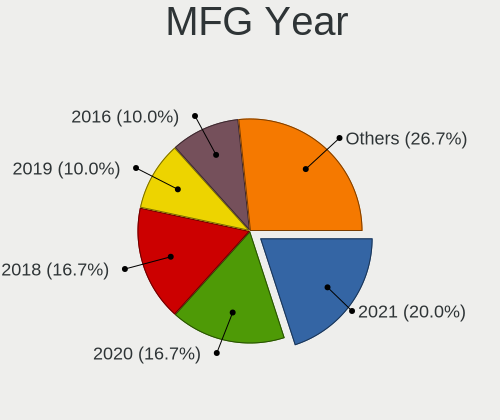
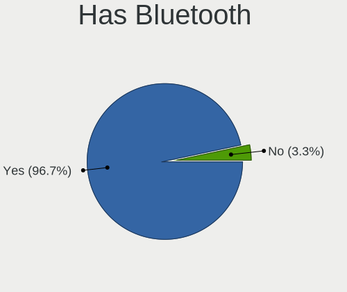
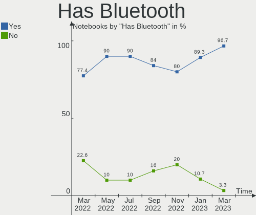
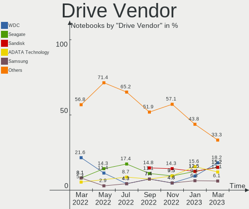
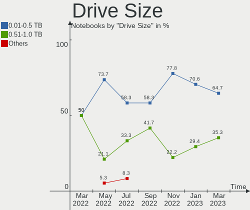
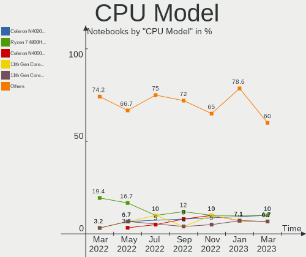
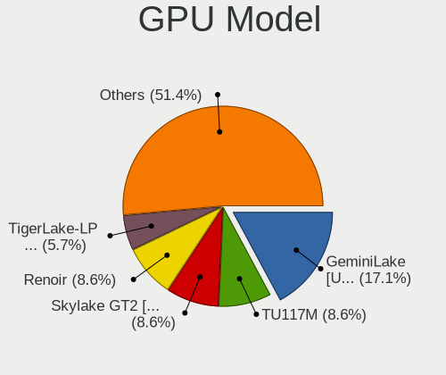
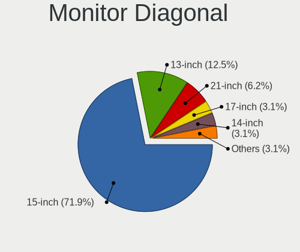

Endless Hardware Trends (Notebooks)
-----------------------------------

A project to identify most popular hardware characteristics and track their change
over time based on data collected by Endless users at https://Linux-Hardware.org.

Anyone can contribute to this report by the [hw-probe](https://github.com/linuxhw/hw-probe) tool:

    sudo -E hw-probe -all -upload

Full-feature report is available here: https://linux-hardware.org/?view=trends&formfactor=notebook

Period: Aug, 2021.

Contents
--------

* [ System ](#system)
  - [ OS                       ](#os)
  - [ OS Family                ](#os-family)
  - [ Kernel                   ](#kernel)
  - [ Kernel Family            ](#kernel-family)
  - [ Kernel Major Ver.        ](#kernel-major-ver)
  - [ Arch                     ](#arch)
  - [ DE                       ](#de)
  - [ Display Server           ](#display-server)
  - [ Display Manager          ](#display-manager)
  - [ OS Lang                  ](#os-lang)
  - [ Boot Mode                ](#boot-mode)
  - [ Filesystem               ](#filesystem)
  - [ Part. scheme             ](#part-scheme)
  - [ Dual Boot with Linux/BSD ](#dual-boot-with-linuxbsd)
  - [ Dual Boot (Win)          ](#dual-boot-win)

* [ Board ](#board)
  - [ Vendor                   ](#vendor)
  - [ Model                    ](#model)
  - [ Model Family             ](#model-family)
  - [ MFG Year                 ](#mfg-year)
  - [ Form Factor              ](#form-factor)
  - [ Secure Boot              ](#secure-boot)
  - [ Coreboot                 ](#coreboot)
  - [ RAM Size                 ](#ram-size)
  - [ RAM Used                 ](#ram-used)
  - [ Total Drives             ](#total-drives)
  - [ Has CD-ROM               ](#has-cd-rom)
  - [ Has Ethernet             ](#has-ethernet)
  - [ Has WiFi                 ](#has-wifi)
  - [ Has Bluetooth            ](#has-bluetooth)

* [ Location ](#location)
  - [ Country                  ](#country)
  - [ City                     ](#city)

* [ Drives ](#drives)
  - [ Drive Vendor             ](#drive-vendor)
  - [ Drive Model              ](#drive-model)
  - [ HDD Vendor               ](#hdd-vendor)
  - [ SSD Vendor               ](#ssd-vendor)
  - [ Drive Kind               ](#drive-kind)
  - [ Drive Connector          ](#drive-connector)
  - [ Drive Size               ](#drive-size)
  - [ Space Total              ](#space-total)
  - [ Space Used               ](#space-used)
  - [ Malfunc. Drives          ](#malfunc-drives)
  - [ Malfunc. Drive Vendor    ](#malfunc-drive-vendor)
  - [ Malfunc. HDD Vendor      ](#malfunc-hdd-vendor)
  - [ Malfunc. Drive Kind      ](#malfunc-drive-kind)
  - [ Failed Drives            ](#failed-drives)
  - [ Failed Drive Vendor      ](#failed-drive-vendor)
  - [ Drive Status             ](#drive-status)

* [ Storage controller ](#storage-controller)
  - [ Storage Vendor           ](#storage-vendor)
  - [ Storage Model            ](#storage-model)
  - [ Storage Kind             ](#storage-kind)

* [ Processor ](#processor)
  - [ CPU Vendor               ](#cpu-vendor)
  - [ CPU Model                ](#cpu-model)
  - [ CPU Model Family         ](#cpu-model-family)
  - [ CPU Cores                ](#cpu-cores)
  - [ CPU Sockets              ](#cpu-sockets)
  - [ CPU Threads              ](#cpu-threads)
  - [ CPU Op-Modes             ](#cpu-op-modes)
  - [ CPU Microcode            ](#cpu-microcode)
  - [ CPU Microarch            ](#cpu-microarch)

* [ Graphics ](#graphics)
  - [ GPU Vendor               ](#gpu-vendor)
  - [ GPU Model                ](#gpu-model)
  - [ GPU Combo                ](#gpu-combo)
  - [ GPU Driver               ](#gpu-driver)
  - [ GPU Memory               ](#gpu-memory)

* [ Monitor ](#monitor)
  - [ Monitor Vendor           ](#monitor-vendor)
  - [ Monitor Model            ](#monitor-model)
  - [ Monitor Resolution       ](#monitor-resolution)
  - [ Monitor Diagonal         ](#monitor-diagonal)
  - [ Monitor Width            ](#monitor-width)
  - [ Aspect Ratio             ](#aspect-ratio)
  - [ Monitor Area             ](#monitor-area)
  - [ Pixel Density            ](#pixel-density)
  - [ Multiple Monitors        ](#multiple-monitors)

* [ Network ](#network)
  - [ Net Controller Vendor    ](#net-controller-vendor)
  - [ Net Controller Model     ](#net-controller-model)
  - [ Wireless Vendor          ](#wireless-vendor)
  - [ Wireless Model           ](#wireless-model)
  - [ Ethernet Vendor          ](#ethernet-vendor)
  - [ Ethernet Model           ](#ethernet-model)
  - [ Net Controller Kind      ](#net-controller-kind)
  - [ Used Controller          ](#used-controller)
  - [ NICs                     ](#nics)
  - [ IPv6                     ](#ipv6)

* [ Bluetooth ](#bluetooth)
  - [ Bluetooth Vendor         ](#bluetooth-vendor)
  - [ Bluetooth Model          ](#bluetooth-model)

* [ Sound ](#sound)
  - [ Sound Vendor             ](#sound-vendor)
  - [ Sound Model              ](#sound-model)

* [ Memory ](#memory)
  - [ Memory Vendor            ](#memory-vendor)
  - [ Memory Model             ](#memory-model)
  - [ Memory Kind              ](#memory-kind)
  - [ Memory Form Factor       ](#memory-form-factor)
  - [ Memory Size              ](#memory-size)
  - [ Memory Speed             ](#memory-speed)

* [ Printers & scanners ](#printers--scanners)
  - [ Printer Vendor           ](#printer-vendor)
  - [ Printer Model            ](#printer-model)
  - [ Scanner Vendor           ](#scanner-vendor)
  - [ Scanner Model            ](#scanner-model)

* [ Camera ](#camera)
  - [ Camera Vendor            ](#camera-vendor)
  - [ Camera Model             ](#camera-model)

* [ Security ](#security)
  - [ Fingerprint Vendor       ](#fingerprint-vendor)
  - [ Fingerprint Model        ](#fingerprint-model)
  - [ Chipcard Vendor          ](#chipcard-vendor)
  - [ Chipcard Model           ](#chipcard-model)

* [ Unsupported ](#unsupported)
  - [ Unsupported Devices      ](#unsupported-devices)
  - [ Unsupported Device Types ](#unsupported-device-types)

System
------

OS
--

Installed operating systems

| Name                  | Notebooks | Percent |
|-----------------------|-----------|---------|
| Endless 3.9.5         | 39        | 79.59%  |
| Endless 3.8.7         | 2         | 4.08%   |
| Endless 3.9.3         | 1         | 2.04%   |
| Endless 3.9.2         | 1         | 2.04%   |
| Endless 3.9.1-nexthw2 | 1         | 2.04%   |
| Endless 3.9.1         | 1         | 2.04%   |
| Endless 3.8.7-nexthw2 | 1         | 2.04%   |
| Endless 3.7.7-nexthw1 | 1         | 2.04%   |
| Endless 3.7.4         | 1         | 2.04%   |
| Endless 3.4.2-nexthw1 | 1         | 2.04%   |

OS Family
---------

OS without a version

| Name    | Notebooks | Percent |
|---------|-----------|---------|
| Endless | 49        | 100%    |

Kernel
------

Version of the Linux kernel

| Version           | Notebooks | Percent |
|-------------------|-----------|---------|
| 5.8.0-14-generic  | 43        | 87.76%  |
| 5.4.0-42-generic  | 2         | 4.08%   |
| 5.4.0-7-generic   | 1         | 2.04%   |
| 5.3.0-19-generic  | 1         | 2.04%   |
| 5.10.0-10-generic | 1         | 2.04%   |
| 4.16.0-4-generic  | 1         | 2.04%   |

Kernel Family
-------------

Linux kernel without a distro release

| Version | Notebooks | Percent |
|---------|-----------|---------|
| 5.8.0   | 43        | 87.76%  |
| 5.4.0   | 3         | 6.12%   |
| 5.3.0   | 1         | 2.04%   |
| 5.10.0  | 1         | 2.04%   |
| 4.16.0  | 1         | 2.04%   |

Kernel Major Ver.
-----------------

Linux kernel major version

| Version | Notebooks | Percent |
|---------|-----------|---------|
| 5.8     | 43        | 87.76%  |
| 5.4     | 3         | 6.12%   |
| 5.3     | 1         | 2.04%   |
| 5.10    | 1         | 2.04%   |
| 4.16    | 1         | 2.04%   |

Arch
----

OS architecture (x86_64, i586, etc.)

| Name   | Notebooks | Percent |
|--------|-----------|---------|
| x86_64 | 49        | 100%    |

DE
--

Desktop Environment

| Name  | Notebooks | Percent |
|-------|-----------|---------|
| GNOME | 49        | 100%    |

Display Server
--------------

X11 or Wayland

| Name | Notebooks | Percent |
|------|-----------|---------|
| X11  | 49        | 100%    |

Display Manager
---------------

SDDM, LightDM, etc.

| Name    | Notebooks | Percent |
|---------|-----------|---------|
| Unknown | 49        | 100%    |

OS Lang
-------

Language

| Lang  | Notebooks | Percent |
|-------|-----------|---------|
| pt_BR | 27        | 55.1%   |
| en_US | 9         | 18.37%  |
| ro_RO | 2         | 4.08%   |
| hr_HR | 2         | 4.08%   |
| tr_TR | 1         | 2.04%   |
| ru_UA | 1         | 2.04%   |
| ru_RU | 1         | 2.04%   |
| hu_HU | 1         | 2.04%   |
| es_MX | 1         | 2.04%   |
| es_ES | 1         | 2.04%   |
| en_IE | 1         | 2.04%   |
| el_GR | 1         | 2.04%   |
| de_DE | 1         | 2.04%   |

Boot Mode
---------

EFI or BIOS

| Mode | Notebooks | Percent |
|------|-----------|---------|
| EFI  | 38        | 77.55%  |
| BIOS | 11        | 22.45%  |

Filesystem
----------

Type of filesystem

| Type | Notebooks | Percent |
|------|-----------|---------|
| Ext4 | 49        | 100%    |

Part. scheme
------------

Scheme of partitioning

| Type    | Notebooks | Percent |
|---------|-----------|---------|
| Unknown | 49        | 100%    |

Dual Boot with Linux/BSD
------------------------

Hosting more than one Linux/BSD

| Dual boot | Notebooks | Percent |
|-----------|-----------|---------|
| No        | 49        | 100%    |

Dual Boot (Win)
---------------

Hosting Linux and Windows

| Dual boot | Notebooks | Percent |
|-----------|-----------|---------|
| No        | 49        | 100%    |

Board
-----

Vendor
------

Motherboard manufacturer

| Name                  | Notebooks | Percent |
|-----------------------|-----------|---------|
| Acer                  | 22        | 44.9%   |
| ASUSTek Computer      | 13        | 26.53%  |
| Hewlett-Packard       | 3         | 6.12%   |
| Toshiba               | 2         | 4.08%   |
| Fujitsu Siemens       | 2         | 4.08%   |
| Sony                  | 1         | 2.04%   |
| Samsung Electronics   | 1         | 2.04%   |
| Positivo Bahia - VAIO | 1         | 2.04%   |
| Positivo              | 1         | 2.04%   |
| LG Electronics        | 1         | 2.04%   |
| Lenovo                | 1         | 2.04%   |
| Unknown               | 1         | 2.04%   |

Model
-----

Motherboard model

| Name                                    | Notebooks | Percent |
|-----------------------------------------|-----------|---------|
| Acer Nitro AN515-44                     | 6         | 12.24%  |
| Acer Nitro AN515-54                     | 4         | 8.16%   |
| ASUS VivoBook 15_ASUS Laptop X540UAR    | 3         | 6.12%   |
| Acer Nitro AN515-43                     | 2         | 4.08%   |
| Acer Aspire A515-54G                    | 2         | 4.08%   |
| Acer Aspire A315-34                     | 2         | 4.08%   |
| Toshiba Satellite L850-B4S              | 1         | 2.04%   |
| Toshiba Satellite C55-C                 | 1         | 2.04%   |
| Sony VPCCB35FG                          | 1         | 2.04%   |
| Samsung 800G5M/800G5W                   | 1         | 2.04%   |
| Positivo WCBT1013                       | 1         | 2.04%   |
| Positivo Bahia - VAIO VJFE41F11X        | 1         | 2.04%   |
| LG N450-P.BE55P1                        | 1         | 2.04%   |
| Lenovo IdeaPad 330-15IGM 81D1           | 1         | 2.04%   |
| HP Pavilion x2 Detachable               | 1         | 2.04%   |
| HP Pavilion Gaming Laptop 15-dk1xxx     | 1         | 2.04%   |
| HP 2000                                 | 1         | 2.04%   |
| Fujitsu Siemens ESPRIMO Mobile V5535    | 1         | 2.04%   |
| Fujitsu Siemens ESPRIMO Mobile M9410    | 1         | 2.04%   |
| ASUS X450CP                             | 1         | 2.04%   |
| ASUS VivoBook_ASUSLaptop X712FA_X712FA  | 1         | 2.04%   |
| ASUS VivoBook_ASUSLaptop X513EP_X513EP  | 1         | 2.04%   |
| ASUS VivoBook_ASUSLaptop X509JA_X509JA  | 1         | 2.04%   |
| ASUS VivoBook_ASUSLaptop X509FA_X509FA  | 1         | 2.04%   |
| ASUS VivoBook_ASUSLaptop X415EA_X415EA  | 1         | 2.04%   |
| ASUS VivoBook_ASUS Laptop E410MA_E410MA | 1         | 2.04%   |
| ASUS VivoBook 15_ASUS Laptop X540UBR    | 1         | 2.04%   |
| ASUS VivoBook 15_ASUS Laptop X540BA     | 1         | 2.04%   |
| ASUS TUF Gaming FX505DT_FX505DT         | 1         | 2.04%   |
| Acer Predator G3-571                    | 1         | 2.04%   |
| Acer Nitro AN517-51                     | 1         | 2.04%   |
| Acer Aspire A517-51G                    | 1         | 2.04%   |
| Acer Aspire A515-54                     | 1         | 2.04%   |
| Acer Aspire A315-54K                    | 1         | 2.04%   |
| Acer Aspire A315-33                     | 1         | 2.04%   |
| Unknown                                 | 1         | 2.04%   |

Model Family
------------

Motherboard model prefix

| Name                             | Notebooks | Percent |
|----------------------------------|-----------|---------|
| Acer Nitro                       | 13        | 26.53%  |
| ASUS VivoBook                    | 11        | 22.45%  |
| Acer Aspire                      | 8         | 16.33%  |
| Toshiba Satellite                | 2         | 4.08%   |
| HP Pavilion                      | 2         | 4.08%   |
| Fujitsu Siemens ESPRIMO          | 2         | 4.08%   |
| Sony VPCCB35FG                   | 1         | 2.04%   |
| Samsung 800G5M                   | 1         | 2.04%   |
| Positivo WCBT1013                | 1         | 2.04%   |
| Positivo Bahia - VAIO VJFE41F11X | 1         | 2.04%   |
| LG N450-P.BE55P1                 | 1         | 2.04%   |
| Lenovo IdeaPad                   | 1         | 2.04%   |
| HP 2000                          | 1         | 2.04%   |
| ASUS X450CP                      | 1         | 2.04%   |
| ASUS TUF                         | 1         | 2.04%   |
| Acer Predator                    | 1         | 2.04%   |
| Unknown                          | 1         | 2.04%   |

MFG Year
--------

Motherboard manufacture year

| Year | Notebooks | Percent |
|------|-----------|---------|
| 2020 | 15        | 30.61%  |
| 2019 | 11        | 22.45%  |
| 2021 | 9         | 18.37%  |
| 2018 | 3         | 6.12%   |
| 2015 | 3         | 6.12%   |
| 2012 | 2         | 4.08%   |
| 2014 | 1         | 2.04%   |
| 2013 | 1         | 2.04%   |
| 2011 | 1         | 2.04%   |
| 2010 | 1         | 2.04%   |
| 2009 | 1         | 2.04%   |
| 2007 | 1         | 2.04%   |

Form Factor
-----------

Physical design of the computer

| Name     | Notebooks | Percent |
|----------|-----------|---------|
| Notebook | 49        | 100%    |

Secure Boot
-----------

Enabled or disabled

| State    | Notebooks | Percent |
|----------|-----------|---------|
| Disabled | 28        | 57.14%  |
| Enabled  | 21        | 42.86%  |

Coreboot
--------

Have coreboot on board

| Used | Notebooks | Percent |
|------|-----------|---------|
| No   | 49        | 100%    |

RAM Size
--------

Total RAM memory

| Size in GB | Notebooks | Percent |
|------------|-----------|---------|
| 4.01-8.0   | 19        | 38.78%  |
| 3.01-4.0   | 14        | 28.57%  |
| 8.01-16.0  | 10        | 20.41%  |
| 1.01-2.0   | 3         | 6.12%   |
| 16.01-24.0 | 2         | 4.08%   |
| 0.51-1.0   | 1         | 2.04%   |

RAM Used
--------

Used RAM memory

| Used GB  | Notebooks | Percent |
|----------|-----------|---------|
| 1.01-2.0 | 27        | 55.1%   |
| 2.01-3.0 | 11        | 22.45%  |
| 0.51-1.0 | 6         | 12.24%  |
| 4.01-8.0 | 4         | 8.16%   |
| 3.01-4.0 | 1         | 2.04%   |

Total Drives
------------

Number of drives on board

| Drives | Notebooks | Percent |
|--------|-----------|---------|
| 1      | 41        | 83.67%  |
| 2      | 7         | 14.29%  |
| 3      | 1         | 2.04%   |

Has CD-ROM
----------

Has CD-ROM on board

| Presented | Notebooks | Percent |
|-----------|-----------|---------|
| No        | 42        | 85.71%  |
| Yes       | 7         | 14.29%  |

Has Ethernet
------------

Has Ethernet on board

| Presented | Notebooks | Percent |
|-----------|-----------|---------|
| Yes       | 34        | 69.39%  |
| No        | 15        | 30.61%  |

Has WiFi
--------

Has WiFi module

| Presented | Notebooks | Percent |
|-----------|-----------|---------|
| Yes       | 47        | 95.92%  |
| No        | 2         | 4.08%   |

Has Bluetooth
-------------

Has Bluetooth module

| Presented | Notebooks | Percent |
|-----------|-----------|---------|
| Yes       | 44        | 89.8%   |
| No        | 5         | 10.2%   |

Location
--------

Country
-------

Geographic location (country)

| Country  | Notebooks | Percent |
|----------|-----------|---------|
| Brazil   | 27        | 55.1%   |
| Romania  | 6         | 12.24%  |
| USA      | 4         | 8.16%   |
| Russia   | 2         | 4.08%   |
| Croatia  | 2         | 4.08%   |
| Ukraine  | 1         | 2.04%   |
| Turkey   | 1         | 2.04%   |
| Spain    | 1         | 2.04%   |
| Ireland  | 1         | 2.04%   |
| Hungary  | 1         | 2.04%   |
| Greece   | 1         | 2.04%   |
| Germany  | 1         | 2.04%   |
| Colombia | 1         | 2.04%   |

City
----

Geographic location (city)

| City                   | Notebooks | Percent |
|------------------------|-----------|---------|
| S??o Paulo             | 2         | 4.08%   |
| Popesti-Leordeni       | 2         | 4.08%   |
| Zagreb                 | 1         | 2.04%   |
| Voskresenske           | 1         | 2.04%   |
| Varginha               | 1         | 2.04%   |
| Van                    | 1         | 2.04%   |
| Thessaloniki           | 1         | 2.04%   |
| Teresina               | 1         | 2.04%   |
| St Petersburg          | 1         | 2.04%   |
| Shannon                | 1         | 2.04%   |
| S??o Mateus            | 1         | 2.04%   |
| S??o Jos?© dos Pinhais | 1         | 2.04%   |
| Sao Jose               | 1         | 2.04%   |
| Santo ?‚ngelo          | 1         | 2.04%   |
| Santo Andr?©           | 1         | 2.04%   |
| Santa Rosa             | 1         | 2.04%   |
| Salvador               | 1         | 2.04%   |
| Rolandia               | 1         | 2.04%   |
| Rio de Janeiro         | 1         | 2.04%   |
| Presidente Figueiredo  | 1         | 2.04%   |
| Porto Velho            | 1         | 2.04%   |
| Port Townsend          | 1         | 2.04%   |
| Passos                 | 1         | 2.04%   |
| Paranagu??             | 1         | 2.04%   |
| Osasco                 | 1         | 2.04%   |
| Newnan                 | 1         | 2.04%   |
| Moscow                 | 1         | 2.04%   |
| Media??                | 1         | 2.04%   |
| Madrid                 | 1         | 2.04%   |
| Londrina               | 1         | 2.04%   |
| Labin                  | 1         | 2.04%   |
| Johnstown              | 1         | 2.04%   |
| Hamburg                | 1         | 2.04%   |
| Fortaleza              | 1         | 2.04%   |
| Florian??polis         | 1         | 2.04%   |
| Eldorado               | 1         | 2.04%   |
| Divin??polis           | 1         | 2.04%   |
| Dacula                 | 1         | 2.04%   |
| Contagem               | 1         | 2.04%   |
| Chitila                | 1         | 2.04%   |
| Caransebes             | 1         | 2.04%   |
| Campo Grande           | 1         | 2.04%   |
| Campinas               | 1         | 2.04%   |
| Budapest               | 1         | 2.04%   |
| Bucharest              | 1         | 2.04%   |
| Bogot??                | 1         | 2.04%   |
| Avare                  | 1         | 2.04%   |

Drives
------

Drive Vendor
------------

Hard drive vendors

| Vendor            | Notebooks | Drives | Percent |
|-------------------|-----------|--------|---------|
| WDC               | 12        | 12     | 21.05%  |
| Intel             | 10        | 10     | 17.54%  |
| SanDisk           | 9         | 9      | 15.79%  |
| Kingston          | 6         | 6      | 10.53%  |
| Seagate           | 4         | 4      | 7.02%   |
| Unknown           | 3         | 3      | 5.26%   |
| SK Hynix          | 2         | 2      | 3.51%   |
| Micron Technology | 2         | 2      | 3.51%   |
| ADATA Technology  | 2         | 2      | 3.51%   |
| Toshiba           | 1         | 1      | 1.75%   |
| Silicon Motion    | 1         | 1      | 1.75%   |
| PNY               | 1         | 1      | 1.75%   |
| Lite-On           | 1         | 1      | 1.75%   |
| KIOXIA            | 1         | 1      | 1.75%   |
| Hitachi           | 1         | 1      | 1.75%   |
| Crucial           | 1         | 1      | 1.75%   |

Drive Model
-----------

Hard drive models

| Model                                 | Notebooks | Percent |
|---------------------------------------|-----------|---------|
| Intel NVMe SSD Drive 512GB            | 7         | 12.28%  |
| WDC WD10SPZX-21Z10T0 1TB              | 6         | 10.53%  |
| Sandisk NVMe SSD Drive 512GB          | 5         | 8.77%   |
| Kingston RBUSC180DS37256GJ 256GB SSD  | 3         | 5.26%   |
| Intel NVMe SSD Drive 256GB            | 2         | 3.51%   |
| ADATA NVMe SSD Drive 128GB            | 2         | 3.51%   |
| WDC WD5000LPZX-08Z10 500GB            | 1         | 1.75%   |
| WDC WD5000LPCX-21VHAT0 500GB          | 1         | 1.75%   |
| WDC WD5000BPVT-00HXZT1 500GB          | 1         | 1.75%   |
| WDC WD2500BEVS-75UST0 250GB           | 1         | 1.75%   |
| WDC WD10SPZX-80Z10T2 1TB              | 1         | 1.75%   |
| WDC WD10JPVX-75JC3T0 1TB              | 1         | 1.75%   |
| Unknown MMC Card  32GB                | 1         | 1.75%   |
| Unknown MMC Card  16GB                | 1         | 1.75%   |
| Unknown MMC Card  128GB               | 1         | 1.75%   |
| Toshiba MQ01ABD100 1TB                | 1         | 1.75%   |
| SK Hynix NVMe SSD Drive 256GB         | 1         | 1.75%   |
| SK Hynix HFS256G39TND-N210A 256GB SSD | 1         | 1.75%   |
| Silicon Motion NVMe SSD Drive 256GB   | 1         | 1.75%   |
| Seagate ST9160821AS 160GB             | 1         | 1.75%   |
| Seagate ST320LT012-9WS14C 320GB       | 1         | 1.75%   |
| Seagate ST2000LM007-1R8174 2TB        | 1         | 1.75%   |
| Seagate ST1000LM035-1RK172 1TB        | 1         | 1.75%   |
| SanDisk SD9SN8W256G1014 256GB SSD     | 1         | 1.75%   |
| SanDisk SD9SB8W256G1102 256GB SSD     | 1         | 1.75%   |
| Sandisk NVMe SSD Drive 500GB          | 1         | 1.75%   |
| Sandisk NVMe SSD Drive 256GB          | 1         | 1.75%   |
| PNY CS900 240GB SSD                   | 1         | 1.75%   |
| Micron NVMe SSD Drive 512GB           | 1         | 1.75%   |
| Micron 1300_MTFDDAK256TDL 256GB SSD   | 1         | 1.75%   |
| Lite-On NVMe SSD Drive 256GB          | 1         | 1.75%   |
| KIOXIA NVMe SSD Drive 256GB           | 1         | 1.75%   |
| Kingston SV300S37A60G 64GB SSD        | 1         | 1.75%   |
| Kingston SA400S37240G 240GB SSD       | 1         | 1.75%   |
| Kingston NVMe SSD Drive 256GB         | 1         | 1.75%   |
| Intel NVMe SSD Drive 128GB            | 1         | 1.75%   |
| Hitachi HTS545050A7E380 500GB         | 1         | 1.75%   |
| Crucial CT120BX500SSD1 120GB          | 1         | 1.75%   |

HDD Vendor
----------

Hard disk drive vendors

| Vendor  | Notebooks | Drives | Percent |
|---------|-----------|--------|---------|
| WDC     | 12        | 12     | 66.67%  |
| Seagate | 4         | 4      | 22.22%  |
| Toshiba | 1         | 1      | 5.56%   |
| Hitachi | 1         | 1      | 5.56%   |

SSD Vendor
----------

Solid state drive vendors

| Vendor            | Notebooks | Drives | Percent |
|-------------------|-----------|--------|---------|
| Kingston          | 5         | 5      | 45.45%  |
| SanDisk           | 2         | 2      | 18.18%  |
| SK Hynix          | 1         | 1      | 9.09%   |
| PNY               | 1         | 1      | 9.09%   |
| Micron Technology | 1         | 1      | 9.09%   |
| Crucial           | 1         | 1      | 9.09%   |

Drive Kind
----------

HDD or SSD

| Kind | Notebooks | Drives | Percent |
|------|-----------|--------|---------|
| NVMe | 25        | 25     | 43.86%  |
| HDD  | 18        | 18     | 31.58%  |
| SSD  | 11        | 11     | 19.3%   |
| MMC  | 3         | 3      | 5.26%   |

Drive Connector
---------------

SATA, SAS, NVMe, etc.

| Type | Notebooks | Drives | Percent |
|------|-----------|--------|---------|
| SATA | 27        | 29     | 49.09%  |
| NVMe | 25        | 25     | 45.45%  |
| MMC  | 3         | 3      | 5.45%   |

Drive Size
----------

Size of hard drive

| Size in TB | Notebooks | Drives | Percent |
|------------|-----------|--------|---------|
| 0.01-0.5   | 18        | 18     | 62.07%  |
| 0.51-1.0   | 10        | 10     | 34.48%  |
| 1.01-2.0   | 1         | 1      | 3.45%   |

Space Total
-----------

Amount of disk space available on the file system

| Size in GB | Notebooks | Percent |
|------------|-----------|---------|
| 101-250    | 17        | 34.69%  |
| 251-500    | 15        | 30.61%  |
| 501-1000   | 6         | 12.24%  |
| 51-100     | 3         | 6.12%   |
| 21-50      | 2         | 4.08%   |
| 1001-2000  | 2         | 4.08%   |
| 1-20       | 2         | 4.08%   |
| 2001-3000  | 1         | 2.04%   |
| Unknown    | 1         | 2.04%   |

Space Used
----------

Amount of used disk space

| Used GB   | Notebooks | Percent |
|-----------|-----------|---------|
| 21-50     | 25        | 51.02%  |
| 51-100    | 9         | 18.37%  |
| 1-20      | 7         | 14.29%  |
| 101-250   | 6         | 12.24%  |
| 2001-3000 | 1         | 2.04%   |
| Unknown   | 1         | 2.04%   |

Malfunc. Drives
---------------

Drive models with a malfunction

Zero info for selected period =(

Malfunc. Drive Vendor
---------------------

Vendors of faulty drives

Zero info for selected period =(

Malfunc. HDD Vendor
-------------------

Vendors of faulty HDD drives

Zero info for selected period =(

Malfunc. Drive Kind
-------------------

Kinds of faulty drives

Zero info for selected period =(

Failed Drives
-------------

Failed drive models

Zero info for selected period =(

Failed Drive Vendor
-------------------

Failed drive vendors

Zero info for selected period =(

Drive Status
------------

Number of failed and malfunc. drives

| Status   | Notebooks | Drives | Percent |
|----------|-----------|--------|---------|
| Detected | 49        | 57     | 100%    |

Storage controller
------------------

Storage Vendor
--------------

Storage controller vendors

| Vendor                           | Notebooks | Percent |
|----------------------------------|-----------|---------|
| Intel                            | 35        | 57.38%  |
| AMD                              | 10        | 16.39%  |
| Sandisk                          | 7         | 11.48%  |
| ADATA Technology                 | 2         | 3.28%   |
| SK Hynix                         | 1         | 1.64%   |
| Silicon Motion                   | 1         | 1.64%   |
| Silicon Integrated Systems [SiS] | 1         | 1.64%   |
| Micron Technology                | 1         | 1.64%   |
| Lite-On Technology               | 1         | 1.64%   |
| KIOXIA                           | 1         | 1.64%   |
| Kingston Technology Company      | 1         | 1.64%   |

Storage Model
-------------

Storage controller models

| Model                                                                            | Notebooks | Percent |
|----------------------------------------------------------------------------------|-----------|---------|
| Intel 82801 Mobile SATA Controller [RAID mode]                                   | 13        | 17.33%  |
| Intel PROSet/Wireless WiFi Software extension                                    | 10        | 13.33%  |
| AMD FCH SATA Controller [AHCI mode]                                              | 10        | 13.33%  |
| Sandisk WD Blue SN550 NVMe SSD                                                   | 7         | 9.33%   |
| Intel Sunrise Point-LP SATA Controller [AHCI mode]                               | 6         | 8%      |
| Intel Celeron/Pentium Silver Processor SATA Controller                           | 4         | 5.33%   |
| Intel Volume Management Device NVMe RAID Controller                              | 2         | 2.67%   |
| Intel Tiger Lake-LP SATA Controller [AHCI mode]                                  | 2         | 2.67%   |
| Intel HM170/QM170 Chipset SATA Controller [AHCI Mode]                            | 2         | 2.67%   |
| Intel 7 Series Chipset Family 6-port SATA Controller [AHCI mode]                 | 2         | 2.67%   |
| ADATA Non-Volatile memory controller                                             | 2         | 2.67%   |
| SK Hynix BC511                                                                   | 1         | 1.33%   |
| Silicon Motion SM2263EN/SM2263XT SSD Controller                                  | 1         | 1.33%   |
| Silicon Integrated Systems [SiS] SATA Controller / IDE mode                      | 1         | 1.33%   |
| Silicon Integrated Systems [SiS] 5513 IDE Controller                             | 1         | 1.33%   |
| Micron Non-Volatile memory controller                                            | 1         | 1.33%   |
| Lite-On NVMe Controller                                                          | 1         | 1.33%   |
| KIOXIA Non-Volatile memory controller                                            | 1         | 1.33%   |
| Kingston Company U-SNS8154P3 NVMe SSD                                            | 1         | 1.33%   |
| Intel Wildcat Point-LP SATA Controller [AHCI Mode]                               | 1         | 1.33%   |
| Intel Atom/Celeron/Pentium Processor x5-E8000/J3xxx/N3xxx Series SATA Controller | 1         | 1.33%   |
| Intel 82801IBM/IEM (ICH9M/ICH9M-E) 4 port SATA Controller [AHCI mode]            | 1         | 1.33%   |
| Intel 7 Series Chipset Family 4-port SATA Controller [IDE mode]                  | 1         | 1.33%   |
| Intel 7 Series Chipset Family 2-port SATA Controller [IDE mode]                  | 1         | 1.33%   |
| Intel 6 Series/C200 Series Chipset Family 6 port Mobile SATA AHCI Controller     | 1         | 1.33%   |
| Intel 5 Series/3400 Series Chipset 4 port SATA AHCI Controller                   | 1         | 1.33%   |

Storage Kind
------------

Kind of storage controller (IDE, SATA, NVMe, SAS, ...)

| Kind | Notebooks | Percent |
|------|-----------|---------|
| SATA | 41        | 56.16%  |
| NVMe | 25        | 34.25%  |
| RAID | 5         | 6.85%   |
| IDE  | 2         | 2.74%   |

Processor
---------

CPU Vendor
----------

Processor vendors

| Vendor | Notebooks | Percent |
|--------|-----------|---------|
| Intel  | 38        | 77.55%  |
| AMD    | 11        | 22.45%  |

CPU Model
---------

Processor models

| Model                                         | Notebooks | Percent |
|-----------------------------------------------|-----------|---------|
| Intel Core i5-9300H CPU @ 2.40GHz             | 5         | 10.2%   |
| AMD Ryzen 5 4600H with Radeon Graphics        | 4         | 8.16%   |
| Intel Core i3-7020U CPU @ 2.30GHz             | 3         | 6.12%   |
| Intel Core i7-10510U CPU @ 1.80GHz            | 2         | 4.08%   |
| AMD Ryzen 7 4800H with Radeon Graphics        | 2         | 4.08%   |
| AMD Ryzen 7 3750H with Radeon Vega Mobile Gfx | 2         | 4.08%   |
| Intel Pentium Silver N5030 CPU @ 1.10GHz      | 1         | 2.04%   |
| Intel Pentium Silver N5000 CPU @ 1.10GHz      | 1         | 2.04%   |
| Intel Pentium CPU 4417U @ 2.30GHz             | 1         | 2.04%   |
| Intel Core i7-8565U CPU @ 1.80GHz             | 1         | 2.04%   |
| Intel Core i7-7700HQ CPU @ 2.80GHz            | 1         | 2.04%   |
| Intel Core i7-3610QM CPU @ 2.30GHz            | 1         | 2.04%   |
| Intel Core i5-7300HQ CPU @ 2.50GHz            | 1         | 2.04%   |
| Intel Core i5-5200U CPU @ 2.20GHz             | 1         | 2.04%   |
| Intel Core i5-3337U CPU @ 1.80GHz             | 1         | 2.04%   |
| Intel Core i5-3210M CPU @ 2.50GHz             | 1         | 2.04%   |
| Intel Core i5-2430M CPU @ 2.40GHz             | 1         | 2.04%   |
| Intel Core i5-1035G1 CPU @ 1.00GHz            | 1         | 2.04%   |
| Intel Core i5-10300H CPU @ 2.50GHz            | 1         | 2.04%   |
| Intel Core i5-10210U CPU @ 1.60GHz            | 1         | 2.04%   |
| Intel Core i5 CPU M 450 @ 2.40GHz             | 1         | 2.04%   |
| Intel Core i3-8145U CPU @ 2.10GHz             | 1         | 2.04%   |
| Intel Core i3-8130U CPU @ 2.20GHz             | 1         | 2.04%   |
| Intel Core i3-6100U CPU @ 2.30GHz             | 1         | 2.04%   |
| Intel Core i3-6006U CPU @ 2.00GHz             | 1         | 2.04%   |
| Intel Core 2 Duo CPU T5550 @ 1.83GHz          | 1         | 2.04%   |
| Intel Core 2 Duo CPU P8700 @ 2.53GHz          | 1         | 2.04%   |
| Intel Celeron N4020 CPU @ 1.10GHz             | 1         | 2.04%   |
| Intel Celeron N4000 CPU @ 1.10GHz             | 1         | 2.04%   |
| Intel Celeron CPU N3060 @ 1.60GHz             | 1         | 2.04%   |
| Intel Atom x5-Z8300 CPU @ 1.44GHz             | 1         | 2.04%   |
| Intel Atom CPU Z3735G @ 1.33GHz               | 1         | 2.04%   |
| Intel 11th Gen Core i7-1165G7 @ 2.80GHz       | 1         | 2.04%   |
| Intel 11th Gen Core i3-1115G4 @ 3.00GHz       | 1         | 2.04%   |
| AMD Ryzen 5 3550H with Radeon Vega Mobile Gfx | 1         | 2.04%   |
| AMD E-300 APU with Radeon HD Graphics         | 1         | 2.04%   |
| AMD A6-9225 RADEON R4, 5 COMPUTE CORES 2C+3G  | 1         | 2.04%   |

CPU Model Family
----------------

Processor model prefix

| Model                | Notebooks | Percent |
|----------------------|-----------|---------|
| Intel Core i5        | 14        | 28.57%  |
| Intel Core i3        | 7         | 14.29%  |
| Intel Core i7        | 5         | 10.2%   |
| AMD Ryzen 5          | 5         | 10.2%   |
| AMD Ryzen 7          | 4         | 8.16%   |
| Intel Celeron        | 3         | 6.12%   |
| Other                | 2         | 4.08%   |
| Intel Pentium Silver | 2         | 4.08%   |
| Intel Core 2 Duo     | 2         | 4.08%   |
| Intel Atom           | 2         | 4.08%   |
| Intel Pentium        | 1         | 2.04%   |
| AMD E                | 1         | 2.04%   |
| AMD A6               | 1         | 2.04%   |

CPU Cores
---------

Number of processor cores

| Number | Notebooks | Percent |
|--------|-----------|---------|
| 4      | 22        | 44.9%   |
| 2      | 21        | 42.86%  |
| 6      | 4         | 8.16%   |
| 8      | 2         | 4.08%   |

CPU Sockets
-----------

Number of sockets

| Number | Notebooks | Percent |
|--------|-----------|---------|
| 1      | 49        | 100%    |

CPU Threads
-----------

Threads per core (Hyper-Threading)

| Number | Notebooks | Percent |
|--------|-----------|---------|
| 2      | 37        | 75.51%  |
| 1      | 12        | 24.49%  |

CPU Op-Modes
------------

CPU Operation Modes (32-bit, 64-bit)

| Op mode        | Notebooks | Percent |
|----------------|-----------|---------|
| 32-bit, 64-bit | 49        | 100%    |

CPU Microcode
-------------

Microcode number

| Number     | Notebooks | Percent |
|------------|-----------|---------|
| 0x08600103 | 6         | 12.24%  |
| 0x906ea    | 4         | 8.16%   |
| 0x806ec    | 3         | 6.12%   |
| 0x306a9    | 3         | 6.12%   |
| Unknown    | 3         | 6.12%   |
| 0x906e9    | 2         | 4.08%   |
| 0x806ea    | 2         | 4.08%   |
| 0x806e9    | 2         | 4.08%   |
| 0x806c1    | 2         | 4.08%   |
| 0x706a8    | 2         | 4.08%   |
| 0x706a1    | 2         | 4.08%   |
| 0x406e3    | 2         | 4.08%   |
| 0x08108109 | 2         | 4.08%   |
| 0xa0652    | 1         | 2.04%   |
| 0x906ed    | 1         | 2.04%   |
| 0x806eb    | 1         | 2.04%   |
| 0x706e5    | 1         | 2.04%   |
| 0x406c4    | 1         | 2.04%   |
| 0x406c3    | 1         | 2.04%   |
| 0x306d4    | 1         | 2.04%   |
| 0x30678    | 1         | 2.04%   |
| 0x206a7    | 1         | 2.04%   |
| 0x20655    | 1         | 2.04%   |
| 0x1067a    | 1         | 2.04%   |
| 0x08108102 | 1         | 2.04%   |
| 0x06006705 | 1         | 2.04%   |
| 0x05000119 | 1         | 2.04%   |

CPU Microarch
-------------

Microarchitecture

| Name          | Notebooks | Percent |
|---------------|-----------|---------|
| KabyLake      | 17        | 34.69%  |
| Zen 2         | 6         | 12.24%  |
| Goldmont plus | 4         | 8.16%   |
| Zen+          | 3         | 6.12%   |
| Silvermont    | 3         | 6.12%   |
| IvyBridge     | 3         | 6.12%   |
| TigerLake     | 2         | 4.08%   |
| Skylake       | 2         | 4.08%   |
| Westmere      | 1         | 2.04%   |
| SandyBridge   | 1         | 2.04%   |
| Penryn        | 1         | 2.04%   |
| IceLake       | 1         | 2.04%   |
| Excavator     | 1         | 2.04%   |
| Core          | 1         | 2.04%   |
| CometLake     | 1         | 2.04%   |
| Broadwell     | 1         | 2.04%   |
| Bobcat        | 1         | 2.04%   |

Graphics
--------

GPU Vendor
----------

Vendors of graphics cards

| Vendor                           | Notebooks | Percent |
|----------------------------------|-----------|---------|
| Intel                            | 37        | 50%     |
| Nvidia                           | 22        | 29.73%  |
| AMD                              | 14        | 18.92%  |
| Silicon Integrated Systems [SiS] | 1         | 1.35%   |

GPU Model
---------

Graphics card models

| Model                                                                                    | Notebooks | Percent |
|------------------------------------------------------------------------------------------|-----------|---------|
| Nvidia TU117M [GeForce GTX 1650 Mobile / Max-Q]                                          | 8         | 10.81%  |
| Nvidia TU117M                                                                            | 7         | 9.46%   |
| AMD Renoir                                                                               | 6         | 8.11%   |
| Intel CoffeeLake-H GT2 [UHD Graphics 630]                                                | 5         | 6.76%   |
| Intel CometLake-U GT2 [UHD Graphics]                                                     | 3         | 4.05%   |
| Intel 3rd Gen Core processor Graphics Controller                                         | 3         | 4.05%   |
| AMD Picasso                                                                              | 3         | 4.05%   |
| Nvidia GP108M [GeForce MX250]                                                            | 2         | 2.7%    |
| Intel WhiskeyLake-U GT2 [UHD Graphics 620]                                               | 2         | 2.7%    |
| Intel Skylake GT2 [HD Graphics 520]                                                      | 2         | 2.7%    |
| Intel Kaby Lake-U GT2f HD 620 Graphics Controller                                        | 2         | 2.7%    |
| Intel HD Graphics 630                                                                    | 2         | 2.7%    |
| Intel GeminiLake [UHD Graphics 605]                                                      | 2         | 2.7%    |
| Intel GeminiLake [UHD Graphics 600]                                                      | 2         | 2.7%    |
| Intel Atom/Celeron/Pentium Processor x5-E8000/J3xxx/N3xxx Integrated Graphics Controller | 2         | 2.7%    |
| Silicon Integrated Systems [SiS] 771/671 PCIE VGA Display Adapter                        | 1         | 1.35%   |
| Nvidia GP108M [GeForce MX330]                                                            | 1         | 1.35%   |
| Nvidia GP107M [GeForce GTX 1050 Mobile]                                                  | 1         | 1.35%   |
| Nvidia GP106M [GeForce GTX 1060 Mobile]                                                  | 1         | 1.35%   |
| Nvidia GM108M [GeForce MX130]                                                            | 1         | 1.35%   |
| Nvidia GM108M [GeForce MX110]                                                            | 1         | 1.35%   |
| Intel UHD Graphics 620                                                                   | 1         | 1.35%   |
| Intel TigerLake-LP GT2 [Iris Xe Graphics]                                                | 1         | 1.35%   |
| Intel Tiger Lake UHD Graphics                                                            | 1         | 1.35%   |
| Intel Mobile 4 Series Chipset Integrated Graphics Controller                             | 1         | 1.35%   |
| Intel Kaby Lake-U GT1 Integrated Graphics Controller                                     | 1         | 1.35%   |
| Intel Iris Plus Graphics G1 (Ice Lake)                                                   | 1         | 1.35%   |
| Intel HD Graphics 620                                                                    | 1         | 1.35%   |
| Intel HD Graphics 5500                                                                   | 1         | 1.35%   |
| Intel Core Processor Integrated Graphics Controller                                      | 1         | 1.35%   |
| Intel CometLake-H GT2 [UHD Graphics]                                                     | 1         | 1.35%   |
| Intel Atom Processor Z36xxx/Z37xxx Series Graphics & Display                             | 1         | 1.35%   |
| Intel 2nd Generation Core Processor Family Integrated Graphics Controller                | 1         | 1.35%   |
| AMD Wrestler [Radeon HD 6310]                                                            | 1         | 1.35%   |
| AMD Whistler [Radeon HD 6630M/6650M/6750M/7670M/7690M]                                   | 1         | 1.35%   |
| AMD Thames [Radeon HD 7550M/7570M/7650M]                                                 | 1         | 1.35%   |
| AMD Stoney [Radeon R2/R3/R4/R5 Graphics]                                                 | 1         | 1.35%   |
| AMD Mars LE [Radeon HD 8530M / R5 M240]                                                  | 1         | 1.35%   |

GPU Combo
---------

Combinations of graphics cards

| Name           | Notebooks | Percent |
|----------------|-----------|---------|
| 1 x Intel      | 21        | 42.86%  |
| Intel + Nvidia | 13        | 26.53%  |
| AMD + Nvidia   | 9         | 18.37%  |
| Intel + AMD    | 3         | 6.12%   |
| 1 x AMD        | 2         | 4.08%   |
| 1 x SiS        | 1         | 2.04%   |

GPU Driver
----------

Free vs proprietary

| Driver      | Notebooks | Percent |
|-------------|-----------|---------|
| Free        | 26        | 53.06%  |
| Proprietary | 22        | 44.9%   |
| Unknown     | 1         | 2.04%   |

GPU Memory
----------

Total video memory

| Size in GB | Notebooks | Percent |
|------------|-----------|---------|
| Unknown    | 34        | 69.39%  |
| 0.01-0.5   | 8         | 16.33%  |
| 1.01-2.0   | 3         | 6.12%   |
| 0.51-1.0   | 3         | 6.12%   |
| 3.01-4.0   | 1         | 2.04%   |

Monitor
-------

Monitor Vendor
--------------

Monitor vendors

| Vendor               | Notebooks | Percent |
|----------------------|-----------|---------|
| BOE                  | 12        | 23.53%  |
| Chimei Innolux       | 10        | 19.61%  |
| AU Optronics         | 9         | 17.65%  |
| LG Display           | 8         | 15.69%  |
| PANDA                | 5         | 9.8%    |
| Samsung Electronics  | 3         | 5.88%   |
| Vestel Elektronik    | 1         | 1.96%   |
| RTK                  | 1         | 1.96%   |
| Panasonic            | 1         | 1.96%   |
| Ancor Communications | 1         | 1.96%   |

Monitor Model
-------------

Monitor models

| Model                                                                  | Notebooks | Percent |
|------------------------------------------------------------------------|-----------|---------|
| PANDA LCD Monitor NCP004D 1920x1080 344x194mm 15.5-inch                | 4         | 7.84%   |
| LG Display LCD Monitor LGD065A 1920x1080 344x194mm 15.5-inch           | 3         | 5.88%   |
| Chimei Innolux LCD Monitor CMN15E6 1366x768 344x193mm 15.5-inch        | 3         | 5.88%   |
| BOE LCD Monitor BOE0818 1920x1080 344x194mm 15.5-inch                  | 3         | 5.88%   |
| AU Optronics LCD Monitor AUO61ED 1920x1080 340x190mm 15.3-inch         | 3         | 5.88%   |
| Chimei Innolux LCD Monitor CMN15F5 1920x1080 344x193mm 15.5-inch       | 2         | 3.92%   |
| Chimei Innolux LCD Monitor CMN15D5 1920x1080 340x190mm 15.3-inch       | 2         | 3.92%   |
| Chimei Innolux LCD Monitor CMN14E5 1920x1080 309x173mm 13.9-inch       | 2         | 3.92%   |
| AU Optronics LCD Monitor AUOAF90 1920x1080 344x193mm 15.5-inch         | 2         | 3.92%   |
| AU Optronics LCD Monitor AUO71EC 1366x768 340x190mm 15.3-inch          | 2         | 3.92%   |
| Vestel Elektronik 50UHD_LCD_TV VES3700 3840x2160 1872x1053mm 84.6-inch | 1         | 1.96%   |
| Samsung Electronics LCD Monitor SEC5244 1600x900 360x210mm 16.4-inch   | 1         | 1.96%   |
| Samsung Electronics LCD Monitor SEC4742 1280x800 303x190mm 14.1-inch   | 1         | 1.96%   |
| Samsung Electronics LCD Monitor SEC315A 1366x768 344x194mm 15.5-inch   | 1         | 1.96%   |
| RTK LCD Monitor RTK2136 1280x800 473x296mm 22.0-inch                   | 1         | 1.96%   |
| PANDA LCD Monitor NCP0036 1920x1080 344x194mm 15.5-inch                | 1         | 1.96%   |
| Panasonic TV MEIC30C 1920x540 698x392mm 31.5-inch                      | 1         | 1.96%   |
| LG Display LCD Monitor LGD062E 1920x1080 344x194mm 15.5-inch           | 1         | 1.96%   |
| LG Display LCD Monitor LGD04D0 1366x768 344x194mm 15.5-inch            | 1         | 1.96%   |
| LG Display LCD Monitor LGD033C 1366x768 309x174mm 14.0-inch            | 1         | 1.96%   |
| LG Display LCD Monitor LGD01E9 1920x1080 345x194mm 15.6-inch           | 1         | 1.96%   |
| LG Display LCD Monitor LGD018B 1366x768 310x174mm 14.0-inch            | 1         | 1.96%   |
| Chimei Innolux LCD Monitor CMN1480 1366x768 310x170mm 13.9-inch        | 1         | 1.96%   |
| BOE LCD Monitor BOE084E 1920x1080 382x215mm 17.3-inch                  | 1         | 1.96%   |
| BOE LCD Monitor BOE0839 1920x1080 382x215mm 17.3-inch                  | 1         | 1.96%   |
| BOE LCD Monitor BOE07F6 1920x1080 309x174mm 14.0-inch                  | 1         | 1.96%   |
| BOE LCD Monitor BOE07CE 1366x768 344x193mm 15.5-inch                   | 1         | 1.96%   |
| BOE LCD Monitor BOE06B9 1920x1080 344x194mm 15.5-inch                  | 1         | 1.96%   |
| BOE LCD Monitor BOE06A4 1366x768 344x194mm 15.5-inch                   | 1         | 1.96%   |
| BOE LCD Monitor BOE069C 1920x1080 344x193mm 15.5-inch                  | 1         | 1.96%   |
| BOE LCD Monitor BOE0675 1366x768 344x194mm 15.5-inch                   | 1         | 1.96%   |
| BOE LCD Monitor BOE03F2 1280x800 217x136mm 10.1-inch                   | 1         | 1.96%   |
| AU Optronics LCD Monitor AUO81EC 1366x768 344x193mm 15.5-inch          | 1         | 1.96%   |
| AU Optronics LCD Monitor AUO119D 1920x1080 381x214mm 17.2-inch         | 1         | 1.96%   |
| Ancor Communications VX238 ACI23C1 1920x1080 510x290mm 23.1-inch       | 1         | 1.96%   |

Monitor Resolution
------------------

Monitor screen resolution

| Resolution      | Notebooks | Percent |
|-----------------|-----------|---------|
| 1920x1080 (FHD) | 31        | 62%     |
| 1366x768 (WXGA) | 14        | 28%     |
| 1280x800 (WXGA) | 2         | 4%      |
| 3840x2160 (4K)  | 1         | 2%      |
| 1920x540        | 1         | 2%      |
| 1600x900 (HD+)  | 1         | 2%      |

Monitor Diagonal
----------------

Diagonal size in inches

| Inches | Notebooks | Percent |
|--------|-----------|---------|
| 15     | 35        | 68.63%  |
| 14     | 5         | 9.8%    |
| 17     | 3         | 5.88%   |
| 23     | 2         | 3.92%   |
| 13     | 2         | 3.92%   |
| 84     | 1         | 1.96%   |
| 31     | 1         | 1.96%   |
| 16     | 1         | 1.96%   |
| 10     | 1         | 1.96%   |

Monitor Width
-------------

Physical width

| Width in mm | Notebooks | Percent |
|-------------|-----------|---------|
| 301-350     | 42        | 82.35%  |
| 351-400     | 4         | 7.84%   |
| 501-600     | 2         | 3.92%   |
| 601-700     | 1         | 1.96%   |
| 201-300     | 1         | 1.96%   |
| 1501-2000   | 1         | 1.96%   |

Aspect Ratio
------------

Proportional relationship between the width and the height

| Ratio | Notebooks | Percent |
|-------|-----------|---------|
| 16/9  | 46        | 95.83%  |
| 16/10 | 2         | 4.17%   |

Monitor Area
------------

Area in inch²

| Area in inch² | Notebooks | Percent |
|----------------|-----------|---------|
| 101-110        | 35        | 68.63%  |
| 81-90          | 7         | 13.73%  |
| 121-130        | 3         | 5.88%   |
| 201-250        | 2         | 3.92%   |
| More than 1000 | 1         | 1.96%   |
| 351-500        | 1         | 1.96%   |
| 41-50          | 1         | 1.96%   |
| 111-120        | 1         | 1.96%   |

Pixel Density
-------------

Pixels per inch

| Density | Notebooks | Percent |
|---------|-----------|---------|
| 121-160 | 31        | 60.78%  |
| 101-120 | 16        | 31.37%  |
| 51-100  | 4         | 7.84%   |

Multiple Monitors
-----------------

Total monitors connected

| Total | Notebooks | Percent |
|-------|-----------|---------|
| 1     | 45        | 91.84%  |
| 2     | 3         | 6.12%   |
| 0     | 1         | 2.04%   |

Network
-------

Net Controller Vendor
---------------------

Controller vendors

| Vendor                           | Notebooks | Percent |
|----------------------------------|-----------|---------|
| Realtek Semiconductor            | 36        | 45.57%  |
| Intel                            | 20        | 25.32%  |
| Qualcomm Atheros                 | 17        | 21.52%  |
| Broadcom                         | 2         | 2.53%   |
| Xiaomi                           | 1         | 1.27%   |
| Silicon Integrated Systems [SiS] | 1         | 1.27%   |
| Ralink Technology                | 1         | 1.27%   |
| Ralink                           | 1         | 1.27%   |

Net Controller Model
--------------------

Controller models

| Model                                                                   | Notebooks | Percent |
|-------------------------------------------------------------------------|-----------|---------|
| Realtek RTL8111/8168/8411 PCI Express Gigabit Ethernet Controller       | 21        | 25.3%   |
| Intel Wi-Fi 6 AX200                                                     | 11        | 13.25%  |
| Qualcomm Atheros QCA9377 802.11ac Wireless Network Adapter              | 10        | 12.05%  |
| Realtek RTL8821CE 802.11ac PCIe Wireless Network Adapter                | 6         | 7.23%   |
| Realtek Killer E2600 Gigabit Ethernet Controller                        | 6         | 7.23%   |
| Realtek RTL810xE PCI Express Fast Ethernet controller                   | 3         | 3.61%   |
| Qualcomm Atheros QCA6174 802.11ac Wireless Network Adapter              | 3         | 3.61%   |
| Qualcomm Atheros AR9485 Wireless Network Adapter                        | 2         | 2.41%   |
| Intel Wi-Fi 6 AX201                                                     | 2         | 2.41%   |
| Intel Dual Band Wireless-AC 3168NGW [Stone Peak]                        | 2         | 2.41%   |
| Xiaomi Mi/Redmi series (RNDIS + ADB)                                    | 1         | 1.2%    |
| Silicon Integrated Systems [SiS] 191 Gigabit Ethernet Adapter           | 1         | 1.2%    |
| Realtek RTL8822CE 802.11ac PCIe Wireless Network Adapter                | 1         | 1.2%    |
| Realtek RTL8723AE PCIe Wireless Network Adapter                         | 1         | 1.2%    |
| Realtek RTL8188CE 802.11b/g/n WiFi Adapter                              | 1         | 1.2%    |
| Ralink MT7601U Wireless Adapter                                         | 1         | 1.2%    |
| Ralink RT3290 Wireless 802.11n 1T/1R PCIe                               | 1         | 1.2%    |
| Qualcomm Atheros AR8161 Gigabit Ethernet                                | 1         | 1.2%    |
| Qualcomm Atheros AR8151 v2.0 Gigabit Ethernet                           | 1         | 1.2%    |
| Qualcomm Atheros AR242x / AR542x Wireless Network Adapter (PCI-Express) | 1         | 1.2%    |
| Intel Wireless 7260                                                     | 1         | 1.2%    |
| Intel Ice Lake-LP PCH CNVi WiFi                                         | 1         | 1.2%    |
| Intel Gemini Lake PCH CNVi WiFi                                         | 1         | 1.2%    |
| Intel Cannon Point-LP CNVi [Wireless-AC]                                | 1         | 1.2%    |
| Intel 82567LF Gigabit Network Connection                                | 1         | 1.2%    |
| Broadcom BCM4322 802.11a/b/g/n Wireless LAN Controller                  | 1         | 1.2%    |
| Broadcom BCM43142 802.11b/g/n                                           | 1         | 1.2%    |

Wireless Vendor
---------------

Wireless vendors

| Vendor                | Notebooks | Percent |
|-----------------------|-----------|---------|
| Intel                 | 19        | 40.43%  |
| Qualcomm Atheros      | 16        | 34.04%  |
| Realtek Semiconductor | 8         | 17.02%  |
| Broadcom              | 2         | 4.26%   |
| Ralink Technology     | 1         | 2.13%   |
| Ralink                | 1         | 2.13%   |

Wireless Model
--------------

Wireless models

| Model                                                                   | Notebooks | Percent |
|-------------------------------------------------------------------------|-----------|---------|
| Intel Wi-Fi 6 AX200                                                     | 11        | 23.4%   |
| Qualcomm Atheros QCA9377 802.11ac Wireless Network Adapter              | 10        | 21.28%  |
| Realtek RTL8821CE 802.11ac PCIe Wireless Network Adapter                | 6         | 12.77%  |
| Qualcomm Atheros QCA6174 802.11ac Wireless Network Adapter              | 3         | 6.38%   |
| Qualcomm Atheros AR9485 Wireless Network Adapter                        | 2         | 4.26%   |
| Intel Wi-Fi 6 AX201                                                     | 2         | 4.26%   |
| Intel Dual Band Wireless-AC 3168NGW [Stone Peak]                        | 2         | 4.26%   |
| Realtek RTL8723AE PCIe Wireless Network Adapter                         | 1         | 2.13%   |
| Realtek RTL8188CE 802.11b/g/n WiFi Adapter                              | 1         | 2.13%   |
| Ralink MT7601U Wireless Adapter                                         | 1         | 2.13%   |
| Ralink RT3290 Wireless 802.11n 1T/1R PCIe                               | 1         | 2.13%   |
| Qualcomm Atheros AR242x / AR542x Wireless Network Adapter (PCI-Express) | 1         | 2.13%   |
| Intel Wireless 7260                                                     | 1         | 2.13%   |
| Intel Ice Lake-LP PCH CNVi WiFi                                         | 1         | 2.13%   |
| Intel Gemini Lake PCH CNVi WiFi                                         | 1         | 2.13%   |
| Intel Cannon Point-LP CNVi [Wireless-AC]                                | 1         | 2.13%   |
| Broadcom BCM4322 802.11a/b/g/n Wireless LAN Controller                  | 1         | 2.13%   |
| Broadcom BCM43142 802.11b/g/n                                           | 1         | 2.13%   |

Ethernet Vendor
---------------

Ethernet vendors

| Vendor                           | Notebooks | Percent |
|----------------------------------|-----------|---------|
| Realtek Semiconductor            | 30        | 85.71%  |
| Qualcomm Atheros                 | 2         | 5.71%   |
| Xiaomi                           | 1         | 2.86%   |
| Silicon Integrated Systems [SiS] | 1         | 2.86%   |
| Intel                            | 1         | 2.86%   |

Ethernet Model
--------------

Ethernet models

| Model                                                             | Notebooks | Percent |
|-------------------------------------------------------------------|-----------|---------|
| Realtek RTL8111/8168/8411 PCI Express Gigabit Ethernet Controller | 21        | 58.33%  |
| Realtek Killer E2600 Gigabit Ethernet Controller                  | 6         | 16.67%  |
| Realtek RTL810xE PCI Express Fast Ethernet controller             | 3         | 8.33%   |
| Xiaomi Mi/Redmi series (RNDIS + ADB)                              | 1         | 2.78%   |
| Silicon Integrated Systems [SiS] 191 Gigabit Ethernet Adapter     | 1         | 2.78%   |
| Realtek RTL8822CE 802.11ac PCIe Wireless Network Adapter          | 1         | 2.78%   |
| Qualcomm Atheros AR8161 Gigabit Ethernet                          | 1         | 2.78%   |
| Qualcomm Atheros AR8151 v2.0 Gigabit Ethernet                     | 1         | 2.78%   |
| Intel 82567LF Gigabit Network Connection                          | 1         | 2.78%   |

Net Controller Kind
-------------------

Ethernet, WiFi or modem

| Kind     | Notebooks | Percent |
|----------|-----------|---------|
| WiFi     | 47        | 58.02%  |
| Ethernet | 34        | 41.98%  |

Used Controller
---------------

Currently used network controller

| Kind     | Notebooks | Percent |
|----------|-----------|---------|
| WiFi     | 46        | 57.5%   |
| Ethernet | 34        | 42.5%   |

NICs
----

Total network controllers on board

| Total | Notebooks | Percent |
|-------|-----------|---------|
| 2     | 34        | 69.39%  |
| 1     | 13        | 26.53%  |
| 0     | 2         | 4.08%   |

IPv6
----

IPv6 vs IPv4

| Used | Notebooks | Percent |
|------|-----------|---------|
| No   | 35        | 71.43%  |
| Yes  | 14        | 28.57%  |

Bluetooth
---------

Bluetooth Vendor
----------------

Controller vendors

| Vendor                          | Notebooks | Percent |
|---------------------------------|-----------|---------|
| Intel                           | 19        | 43.18%  |
| Lite-On Technology              | 11        | 25%     |
| IMC Networks                    | 6         | 13.64%  |
| Toshiba                         | 2         | 4.55%   |
| Qualcomm Atheros Communications | 2         | 4.55%   |
| Cambridge Silicon Radio         | 2         | 4.55%   |
| Realtek Semiconductor           | 1         | 2.27%   |
| Ralink                          | 1         | 2.27%   |

Bluetooth Model
---------------

Controller models

| Model                                               | Notebooks | Percent |
|-----------------------------------------------------|-----------|---------|
| Intel AX200 Bluetooth                               | 11        | 25%     |
| Lite-On Qualcomm Atheros QCA9377 Bluetooth          | 7         | 15.91%  |
| IMC Networks Bluetooth Radio                        | 6         | 13.64%  |
| Intel Bluetooth 9460/9560 Jefferson Peak (JfP)      | 5         | 11.36%  |
| Lite-On Bluetooth Device                            | 4         | 9.09%   |
| Qualcomm Atheros  Bluetooth Device                  | 2         | 4.55%   |
| Intel Wireless-AC 3168 Bluetooth                    | 2         | 4.55%   |
| Cambridge Silicon Radio Bluetooth Dongle (HCI mode) | 2         | 4.55%   |
| Toshiba RT Bluetooth Radio                          | 1         | 2.27%   |
| Toshiba BCM43142A0                                  | 1         | 2.27%   |
| Realtek Bluetooth Radio                             | 1         | 2.27%   |
| Ralink RT3290 Bluetooth                             | 1         | 2.27%   |
| Intel Bluetooth wireless interface                  | 1         | 2.27%   |

Sound
-----

Sound Vendor
------------

Sound card vendors

| Vendor                           | Notebooks | Percent |
|----------------------------------|-----------|---------|
| Intel                            | 35        | 56.45%  |
| Nvidia                           | 14        | 22.58%  |
| AMD                              | 11        | 17.74%  |
| Silicon Integrated Systems [SiS] | 1         | 1.61%   |
| Samsung Electronics              | 1         | 1.61%   |

Sound Model
-----------

Sound card models

| Model                                                                                             | Notebooks | Percent |
|---------------------------------------------------------------------------------------------------|-----------|---------|
| Nvidia TU107 GeForce GTX 1650 High Definition Audio Controller                                    | 13        | 19.4%   |
| AMD Family 17h (Models 10h-1fh) HD Audio Controller                                               | 9         | 13.43%  |
| Intel Sunrise Point-LP HD Audio                                                                   | 7         | 10.45%  |
| Intel Cannon Lake PCH cAVS                                                                        | 5         | 7.46%   |
| Intel Celeron/Pentium Silver Processor High Definition Audio                                      | 4         | 5.97%   |
| Intel Comet Lake PCH-LP cAVS                                                                      | 3         | 4.48%   |
| Intel 7 Series/C216 Chipset Family High Definition Audio Controller                               | 3         | 4.48%   |
| Intel Tiger Lake-LP Smart Sound Technology Audio Controller                                       | 2         | 2.99%   |
| Intel CM238 HD Audio Controller                                                                   | 2         | 2.99%   |
| Intel Cannon Point-LP High Definition Audio Controller                                            | 2         | 2.99%   |
| AMD Raven/Raven2/Fenghuang HDMI/DP Audio Controller                                               | 2         | 2.99%   |
| Silicon Integrated Systems [SiS] Azalia Audio Controller                                          | 1         | 1.49%   |
| Samsung Electronics USBC Headset                                                                  | 1         | 1.49%   |
| Nvidia GP106 High Definition Audio Controller                                                     | 1         | 1.49%   |
| Intel Wildcat Point-LP High Definition Audio Controller                                           | 1         | 1.49%   |
| Intel Ice Lake-LP Smart Sound Technology Audio Controller                                         | 1         | 1.49%   |
| Intel Comet Lake PCH cAVS                                                                         | 1         | 1.49%   |
| Intel Broadwell-U Audio Controller                                                                | 1         | 1.49%   |
| Intel Atom/Celeron/Pentium Processor x5-E8000/J3xxx/N3xxx Series High Definition Audio Controller | 1         | 1.49%   |
| Intel 82801I (ICH9 Family) HD Audio Controller                                                    | 1         | 1.49%   |
| Intel 6 Series/C200 Series Chipset Family High Definition Audio Controller                        | 1         | 1.49%   |
| Intel 5 Series/3400 Series Chipset High Definition Audio                                          | 1         | 1.49%   |
| AMD Wrestler HDMI Audio                                                                           | 1         | 1.49%   |
| AMD High Definition Audio Controller                                                              | 1         | 1.49%   |
| AMD FCH Azalia Controller                                                                         | 1         | 1.49%   |
| AMD Family 15h (Models 60h-6fh) Audio Controller                                                  | 1         | 1.49%   |

Memory
------

Memory Vendor
-------------

Memory module vendors

Zero info for selected period =(

Memory Model
------------

Memory module models

Zero info for selected period =(

Memory Kind
-----------

Memory module kinds

Zero info for selected period =(

Memory Form Factor
------------------

Physical design of the memory module

Zero info for selected period =(

Memory Size
-----------

Memory module size

Zero info for selected period =(

Memory Speed
------------

Memory module speed

Zero info for selected period =(

Printers & scanners
-------------------

Printer Vendor
--------------

Printer device vendors

Zero info for selected period =(

Printer Model
-------------

Printer device models

Zero info for selected period =(

Scanner Vendor
--------------

Scanner device vendors

Zero info for selected period =(

Scanner Model
-------------

Scanner device models

Zero info for selected period =(

Camera
------

Camera Vendor
-------------

Camera device vendors

| Vendor                        | Notebooks | Percent |
|-------------------------------|-----------|---------|
| Quanta                        | 18        | 42.86%  |
| IMC Networks                  | 14        | 33.33%  |
| Chicony Electronics           | 5         | 11.9%   |
| Sunplus Innovation Technology | 2         | 4.76%   |
| Silicon Motion                | 1         | 2.38%   |
| Ricoh                         | 1         | 2.38%   |
| Microdia                      | 1         | 2.38%   |

Camera Model
------------

Camera device models

| Model                                | Notebooks | Percent |
|--------------------------------------|-----------|---------|
| Quanta HD User Facing                | 13        | 30.95%  |
| IMC Networks USB2.0 VGA UVC WebCam   | 8         | 19.05%  |
| Quanta VGA WebCam                    | 3         | 7.14%   |
| IMC Networks USB2.0 HD UVC WebCam    | 3         | 7.14%   |
| Chicony HD User Facing               | 3         | 7.14%   |
| Sunplus HP Truevision HD             | 1         | 2.38%   |
| Sunplus HD WebCam                    | 1         | 2.38%   |
| Silicon Motion Web Camera            | 1         | 2.38%   |
| Ricoh USB2.0 Camera                  | 1         | 2.38%   |
| Quanta USB2.0 VGA UVC WebCam         | 1         | 2.38%   |
| Quanta HD Webcam                     | 1         | 2.38%   |
| Microdia USB 2.0 Camera              | 1         | 2.38%   |
| IMC Networks USB2.0 UVC HD Webcam    | 1         | 2.38%   |
| IMC Networks TOSHIBA Web Camera - HD | 1         | 2.38%   |
| IMC Networks EasyCamera              | 1         | 2.38%   |
| Chicony VGA WebCam                   | 1         | 2.38%   |
| Chicony HP Wide Vision HD Camera     | 1         | 2.38%   |

Security
--------

Fingerprint Vendor
------------------

Fingerprint sensor vendors

Zero info for selected period =(

Fingerprint Model
-----------------

Fingerprint sensor models

Zero info for selected period =(

Chipcard Vendor
---------------

Chipcard module vendors

| Vendor   | Notebooks | Percent |
|----------|-----------|---------|
| O2 Micro | 1         | 100%    |

Chipcard Model
--------------

Chipcard module models

| Model                                | Notebooks | Percent |
|--------------------------------------|-----------|---------|
| O2 Micro OZ776 CCID Smartcard Reader | 1         | 100%    |

Unsupported
-----------

Unsupported Devices
-------------------

Total unsupported devices on board

| Total | Notebooks | Percent |
|-------|-----------|---------|
| 0     | 38        | 77.55%  |
| 1     | 11        | 22.45%  |

Unsupported Device Types
------------------------

Types of unsupported devices

| Type                  | Notebooks | Percent |
|-----------------------|-----------|---------|
| Multimedia controller | 7         | 63.64%  |
| Net/wireless          | 1         | 9.09%   |
| Graphics card         | 1         | 9.09%   |
| Chipcard              | 1         | 9.09%   |
| Bluetooth             | 1         | 9.09%   |

