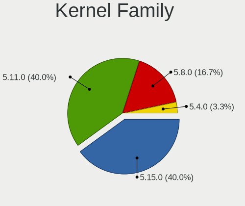
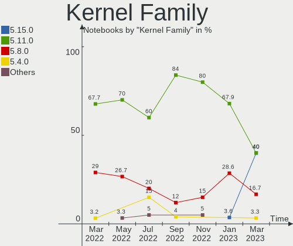
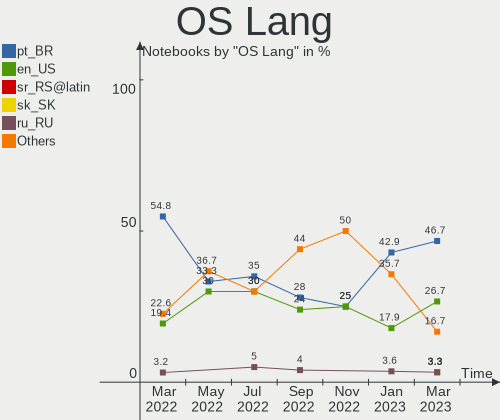
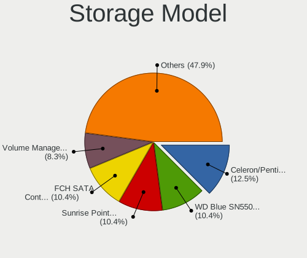
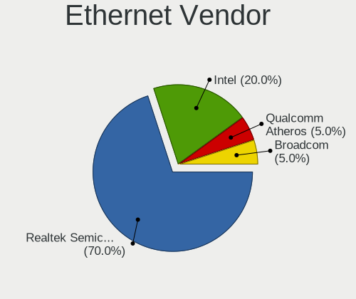

Endless Hardware Trends (Notebook)
----------------------------------

A project to identify most popular hardware characteristics and track their change
over time based on data collected by Endless users at https://Linux-Hardware.org.

Anyone can contribute to the study by uploading probes of their computers by
the [hw-probe](https://github.com/linuxhw/hw-probe) tool:

    sudo -E hw-probe -all -upload

Full-feature report is available here: https://linux-hardware.org/?view=trends&formfactor=notebook

Period: Feb, 2021.

Contents
--------

- [ OS                       ](#os)
- [ OS Family                ](#os-family)
- [ Kernel                   ](#kernel)
- [ Kernel Family            ](#kernel-family)
- [ Kernel Major Ver.        ](#kernel-major-ver)
- [ Arch                     ](#arch)
- [ DE                       ](#de)
- [ Display Server           ](#display-server)
- [ Display Manager          ](#display-manager)
- [ OS Lang                  ](#os-lang)
- [ Boot Mode                ](#boot-mode)
- [ Filesystem               ](#filesystem)
- [ Part. scheme             ](#part-scheme)
- [ Dual Boot with Linux/BSD ](#dual-boot-with-linux/bsd)
- [ Dual Boot (Win)          ](#dual-boot-win)
- [ Country                  ](#country)
- [ City                     ](#city)
- [ Vendor                   ](#vendor)
- [ Model                    ](#model)
- [ Model Family             ](#model-family)
- [ MFG Year                 ](#mfg-year)
- [ Form Factor              ](#form-factor)
- [ Secure Boot              ](#secure-boot)
- [ Coreboot                 ](#coreboot)
- [ RAM Size                 ](#ram-size)
- [ RAM Used                 ](#ram-used)
- [ Has CD-ROM               ](#has-cd-rom)
- [ Total Drives             ](#total-drives)
- [ Has Ethernet             ](#has-ethernet)
- [ Drive Vendor             ](#drive-vendor)
- [ Drive Model              ](#drive-model)
- [ HDD Vendor               ](#hdd-vendor)
- [ SSD Vendor               ](#ssd-vendor)
- [ Drive Kind               ](#drive-kind)
- [ Drive Connector          ](#drive-connector)
- [ Drive Size               ](#drive-size)
- [ Space Total              ](#space-total)
- [ Space Used               ](#space-used)
- [ Malfunc. Drives          ](#malfunc-drives)
- [ Malfunc. Drive Vendor    ](#malfunc-drive-vendor)
- [ Malfunc. HDD Vendor      ](#malfunc-hdd-vendor)
- [ Malfunc. Drive Kind      ](#malfunc-drive-kind)
- [ Failed Drives            ](#failed-drives)
- [ Failed Drive Vendor      ](#failed-drive-vendor)
- [ Drive Status             ](#drive-status)
- [ Storage Vendor           ](#storage-vendor)
- [ Storage Model            ](#storage-model)
- [ Storage Kind             ](#storage-kind)
- [ CPU Vendor               ](#cpu-vendor)
- [ CPU Model                ](#cpu-model)
- [ CPU Model Family         ](#cpu-model-family)
- [ CPU Cores                ](#cpu-cores)
- [ CPU Sockets              ](#cpu-sockets)
- [ CPU Threads              ](#cpu-threads)
- [ CPU Op-Modes             ](#cpu-op-modes)
- [ CPU Microcode            ](#cpu-microcode)
- [ CPU Microarch            ](#cpu-microarch)
- [ GPU Vendor               ](#gpu-vendor)
- [ GPU Model                ](#gpu-model)
- [ GPU Combo                ](#gpu-combo)
- [ GPU Driver               ](#gpu-driver)
- [ GPU Memory               ](#gpu-memory)
- [ Monitor Vendor           ](#monitor-vendor)
- [ Monitor Model            ](#monitor-model)
- [ Monitor Resolution       ](#monitor-resolution)
- [ Monitor Diagonal         ](#monitor-diagonal)
- [ Monitor Width            ](#monitor-width)
- [ Aspect Ratio             ](#aspect-ratio)
- [ Monitor Area             ](#monitor-area)
- [ Pixel Density            ](#pixel-density)
- [ Multiple Monitors        ](#multiple-monitors)
- [ Net Controller Vendor    ](#net-controller-vendor)
- [ Net Controller Model     ](#net-controller-model)
- [ Wireless Vendor          ](#wireless-vendor)
- [ Wireless Model           ](#wireless-model)
- [ Ethernet Vendor          ](#ethernet-vendor)
- [ Ethernet Model           ](#ethernet-model)
- [ Net Controller Kind      ](#net-controller-kind)
- [ Used Controller          ](#used-controller)
- [ NICs                     ](#nics)
- [ Memory Vendor            ](#memory-vendor)
- [ Memory Model             ](#memory-model)
- [ Memory Kind              ](#memory-kind)
- [ Memory Form Factor       ](#memory-form-factor)
- [ Memory Size              ](#memory-size)
- [ Memory Speed             ](#memory-speed)
- [ Sound Vendor             ](#sound-vendor)
- [ Sound Model              ](#sound-model)
- [ Camera Vendor            ](#camera-vendor)
- [ Camera Model             ](#camera-model)
- [ Fingerprint Vendor       ](#fingerprint-vendor)
- [ Fingerprint Model        ](#fingerprint-model)
- [ Chipcard Vendor          ](#chipcard-vendor)
- [ Chipcard Model           ](#chipcard-model)
- [ Printer Vendor           ](#printer-vendor)
- [ Printer Model            ](#printer-model)
- [ Scanner Vendor           ](#scanner-vendor)
- [ Scanner Model            ](#scanner-model)
- [ Bluetooth Vendor         ](#bluetooth-vendor)
- [ Bluetooth Model          ](#bluetooth-model)
- [ Unsupported Devices      ](#unsupported-devices)
- [ Unsupported Device Types ](#unsupported-device-types)

OS
--

Installed operating systems

| Name                   | Notebooks | Percent |
|------------------------|-----------|---------|
| Endless 3.9.2          | 39        | 52%     |
| Endless 3.9.3          | 14        | 18.67%  |
| Endless 3.9.1          | 5         | 6.67%   |
| Endless 3.7.4          | 5         | 6.67%   |
| Endless 3.8.3          | 2         | 2.67%   |
| Endless 3.7.8          | 2         | 2.67%   |
| Endless 3.7.6          | 2         | 2.67%   |
| Endless 3.8.7-nexthw2  | 1         | 1.33%   |
| Endless 3.8.7          | 1         | 1.33%   |
| Endless 3.8.3-nexthw1  | 1         | 1.33%   |
| Endless 3.8.0          | 1         | 1.33%   |
| Endless 3.7.3          | 1         | 1.33%   |
| Endless 3.3.20-nexthw1 | 1         | 1.33%   |

OS Family
---------

OS without a version

| Name    | Notebooks | Percent |
|---------|-----------|---------|
| Endless | 75        | 100%    |

Kernel
------

Version of the Linux kernel

| Version           | Notebooks | Percent |
|-------------------|-----------|---------|
| 5.8.0-14-generic  | 58        | 77.33%  |
| 5.3.0-19-generic  | 5         | 6.67%   |
| 5.4.0-19-generic  | 3         | 4%      |
| 5.3.0-28-generic  | 2         | 2.67%   |
| 5.3.0-23-generic  | 2         | 2.67%   |
| 5.6.0-7-generic   | 1         | 1.33%   |
| 5.4.0-42-generic  | 1         | 1.33%   |
| 5.3.0-12-generic  | 1         | 1.33%   |
| 4.15.0-15-generic | 1         | 1.33%   |
| Unknown           | 1         | 1.33%   |

Kernel Family
-------------

Linux kernel without a distro release

| Version | Notebooks | Percent |
|---------|-----------|---------|
| 5.8.0   | 58        | 77.33%  |
| 5.3.0   | 10        | 13.33%  |
| 5.4.0   | 4         | 5.33%   |
| 5.6.0   | 1         | 1.33%   |
| 4.15.0  | 1         | 1.33%   |
| Unknown | 1         | 1.33%   |

Kernel Major Ver.
-----------------

Linux kernel major version

| Version | Notebooks | Percent |
|---------|-----------|---------|
| 5.8     | 58        | 77.33%  |
| 5.3     | 10        | 13.33%  |
| 5.4     | 4         | 5.33%   |
| 5.6     | 1         | 1.33%   |
| 4.15    | 1         | 1.33%   |
| Unknown | 1         | 1.33%   |

Arch
----

OS architecture (x86_64, i586, etc.)

| Name   | Notebooks | Percent |
|--------|-----------|---------|
| x86_64 | 75        | 100%    |

DE
--

Desktop Environment

| Name    | Notebooks | Percent |
|---------|-----------|---------|
| GNOME   | 74        | 98.67%  |
| Unknown | 1         | 1.33%   |

Display Server
--------------

X11 or Wayland

| Name | Notebooks | Percent |
|------|-----------|---------|
| X11  | 75        | 100%    |

Display Manager
---------------

SDDM, LightDM, etc.

| Name    | Notebooks | Percent |
|---------|-----------|---------|
| Unknown | 75        | 100%    |

OS Lang
-------

Language

| Lang    | Notebooks | Percent |
|---------|-----------|---------|
| pt_BR   | 30        | 40%     |
| en_US   | 17        | 22.67%  |
| ro_RO   | 5         | 6.67%   |
| tr_TR   | 4         | 5.33%   |
| ru_RU   | 4         | 5.33%   |
| es_AR   | 3         | 4%      |
| hu_HU   | 2         | 2.67%   |
| uk_UA   | 1         | 1.33%   |
| ru_UA   | 1         | 1.33%   |
| pl_PL   | 1         | 1.33%   |
| nl_BE   | 1         | 1.33%   |
| es_MX   | 1         | 1.33%   |
| es_CO   | 1         | 1.33%   |
| en_GB   | 1         | 1.33%   |
| de_AT   | 1         | 1.33%   |
| bg_BG   | 1         | 1.33%   |
| Unknown | 1         | 1.33%   |

Boot Mode
---------

EFI or BIOS

| Mode | Notebooks | Percent |
|------|-----------|---------|
| EFI  | 54        | 72%     |
| BIOS | 21        | 28%     |

Filesystem
----------

Type of filesystem

| Type  | Notebooks | Percent |
|-------|-----------|---------|
| Ext4  | 73        | 97.33%  |
| Tmpfs | 2         | 2.67%   |

Part. scheme
------------

Scheme of partitioning

| Type    | Notebooks | Percent |
|---------|-----------|---------|
| Unknown | 75        | 100%    |

Dual Boot with Linux/BSD
------------------------

Hosting more than one Linux/BSD

| Dual boot | Notebooks | Percent |
|-----------|-----------|---------|
| No        | 75        | 100%    |

Dual Boot (Win)
---------------

Hosting Linux and Windows

| Dual boot | Notebooks | Percent |
|-----------|-----------|---------|
| No        | 75        | 100%    |

Country
-------

Geographic location (country)

| Country   | Notebooks | Percent |
|-----------|-----------|---------|
| Brazil    | 30        | 40%     |
| Romania   | 11        | 14.67%  |
| USA       | 7         | 9.33%   |
| Turkey    | 4         | 5.33%   |
| Russia    | 3         | 4%      |
| Ukraine   | 2         | 2.67%   |
| UK        | 2         | 2.67%   |
| Kenya     | 2         | 2.67%   |
| Hungary   | 2         | 2.67%   |
| Argentina | 2         | 2.67%   |
| Spain     | 1         | 1.33%   |
| Poland    | 1         | 1.33%   |
| Mexico    | 1         | 1.33%   |
| Iran      | 1         | 1.33%   |
| Colombia  | 1         | 1.33%   |
| Bulgaria  | 1         | 1.33%   |
| Belgium   | 1         | 1.33%   |
| Belarus   | 1         | 1.33%   |
| Austria   | 1         | 1.33%   |
| Angola    | 1         | 1.33%   |

City
----

Geographic location (city)

| City                  | Notebooks | Percent |
|-----------------------|-----------|---------|
| Bucharest             | 5         | 6.67%   |
| Rio de Janeiro        | 3         | 4%      |
| Nairobi               | 2         | 2.67%   |
| Moscow                | 2         | 2.67%   |
| Brasov                | 2         | 2.67%   |
| Zonguldak             | 1         | 1.33%   |
| Wilde                 | 1         | 1.33%   |
| Weston                | 1         | 1.33%   |
| West Jordan           | 1         | 1.33%   |
| Vitória              | 1         | 1.33%   |
| UEbelbach             | 1         | 1.33%   |
| Tehran                | 1         | 1.33%   |
| São Paulo            | 1         | 1.33%   |
| São José dos Campos | 1         | 1.33%   |
| St Petersburg         | 1         | 1.33%   |
| Sofia                 | 1         | 1.33%   |
| Smyrna                | 1         | 1.33%   |
| Sao Jose do Rio Preto | 1         | 1.33%   |
| Sao Jose do Alegre    | 1         | 1.33%   |
| Sao Joao da Barra     | 1         | 1.33%   |
| Roy                   | 1         | 1.33%   |
| Recife                | 1         | 1.33%   |
| Presidente Prudente   | 1         | 1.33%   |
| Ploieşti             | 1         | 1.33%   |
| Palma Sola            | 1         | 1.33%   |
| Ourinhos              | 1         | 1.33%   |
| Onda Verde            | 1         | 1.33%   |
| Odesa                 | 1         | 1.33%   |
| Milisauti             | 1         | 1.33%   |
| Mediaş               | 1         | 1.33%   |
| Medellín             | 1         | 1.33%   |
| Lutsk                 | 1         | 1.33%   |
| Luanda                | 1         | 1.33%   |
| Lida                  | 1         | 1.33%   |
| Lagoa dos Tres Cantos | 1         | 1.33%   |
| Kütahya              | 1         | 1.33%   |
| Knoxville             | 1         | 1.33%   |
| Jundiaí              | 1         | 1.33%   |
| Jaragua               | 1         | 1.33%   |
| Itapira               | 1         | 1.33%   |
| Istanbul              | 1         | 1.33%   |
| Ibirama               | 1         | 1.33%   |
| Gödöllő            | 1         | 1.33%   |
| Guarulhos             | 1         | 1.33%   |
| Glasgow               | 1         | 1.33%   |
| Everett               | 1         | 1.33%   |
| Duque de Caxias       | 1         | 1.33%   |
| Deva                  | 1         | 1.33%   |
| Debrecen              | 1         | 1.33%   |
| Curitiba              | 1         | 1.33%   |
| Criciúma             | 1         | 1.33%   |
| Concord               | 1         | 1.33%   |
| Conceicao do Coite    | 1         | 1.33%   |
| Choroszcz             | 1         | 1.33%   |
| Chocaman              | 1         | 1.33%   |
| Ceilandia             | 1         | 1.33%   |
| Buenos Aires          | 1         | 1.33%   |
| Bridgend              | 1         | 1.33%   |
| Brasília             | 1         | 1.33%   |
| Blumenau              | 1         | 1.33%   |

Vendor
------

Motherboard manufacturer

| Name                | Notebooks | Percent |
|---------------------|-----------|---------|
| ASUSTek Computer    | 28        | 37.33%  |
| Acer                | 27        | 36%     |
| Lenovo              | 5         | 6.67%   |
| Dell                | 4         | 5.33%   |
| Hewlett-Packard     | 3         | 4%      |
| Toshiba             | 2         | 2.67%   |
| Positivo            | 2         | 2.67%   |
| Sony                | 1         | 1.33%   |
| Samsung Electronics | 1         | 1.33%   |
| MSI                 | 1         | 1.33%   |
| Compal              | 1         | 1.33%   |

Model
-----

Motherboard model

| Name                                       | Notebooks | Percent |
|--------------------------------------------|-----------|---------|
| Acer Nitro AN515-54                        | 10        | 13.33%  |
| ASUS VivoBook 15_ASUS Laptop X540MA_X543MA | 5         | 6.67%   |
| ASUS VivoBook 15_ASUS Laptop X540UAR       | 4         | 5.33%   |
| Acer Aspire A315-34                        | 4         | 5.33%   |
| Acer Aspire A315-53                        | 2         | 2.67%   |
| Toshiba Satellite P75-A                    | 1         | 1.33%   |
| Toshiba Satellite L755                     | 1         | 1.33%   |
| Sony VGN-CR41Z_R                           | 1         | 1.33%   |
| Samsung 300E5EV/300E4EV/270E5EV/270E4EV    | 1         | 1.33%   |
| Positivo EC10IS1                           | 1         | 1.33%   |
| Positivo A14CR6A                           | 1         | 1.33%   |
| MSI FX610                                  | 1         | 1.33%   |
| Lenovo ThinkPad X200 Tablet 7453BA3        | 1         | 1.33%   |
| Lenovo IdeaPad 5 15IIL05 81YK              | 1         | 1.33%   |
| Lenovo IdeaPad 330-15IKB 81DE              | 1         | 1.33%   |
| Lenovo IdeaPad 320-15IKB 80YH              | 1         | 1.33%   |
| Lenovo IdeaPad 320-14IAP 80XQ              | 1         | 1.33%   |
| HP ProBook 4730s                           | 1         | 1.33%   |
| HP ProBook 450 G2                          | 1         | 1.33%   |
| HP EliteBook 8470p                         | 1         | 1.33%   |
| Dell Latitude E6420                        | 1         | 1.33%   |
| Dell Latitude E6400                        | 1         | 1.33%   |
| Dell Latitude E5540                        | 1         | 1.33%   |
| Dell Inspiron 3593                         | 1         | 1.33%   |
| Compal NCL60/61                            | 1         | 1.33%   |
| ASUS X751SA                                | 1         | 1.33%   |
| ASUS X541UAK                               | 1         | 1.33%   |
| ASUS X541UA                                | 1         | 1.33%   |
| ASUS X540NV                                | 1         | 1.33%   |
| ASUS X540NA                                | 1         | 1.33%   |
| ASUS X505BA                                | 1         | 1.33%   |
| ASUS VivoBook_ASUSLaptop X712FA_X712FA     | 1         | 1.33%   |
| ASUS VivoBook_ASUSLaptop X540MAR_X543MA    | 1         | 1.33%   |
| ASUS VivoBook_ASUSLaptop X513EA_K513EA     | 1         | 1.33%   |
| ASUS VivoBook_ASUSLaptop X509JB_X509JB     | 1         | 1.33%   |
| ASUS VivoBook_ASUSLaptop X509JA_X509JA     | 1         | 1.33%   |
| ASUS VivoBook_ASUSLaptop X509JA_F509JA     | 1         | 1.33%   |
| ASUS VivoBook_ASUS Laptop E406MA_E406MA    | 1         | 1.33%   |
| ASUS VivoBook_ASUS Laptop E210MA_E210MA    | 1         | 1.33%   |
| ASUS VivoBook 15_ASUS Laptop X540MA_R540MA | 1         | 1.33%   |
| ASUS UX310UAK                              | 1         | 1.33%   |
| ASUS GL553VE                               | 1         | 1.33%   |
| ASUS ASUSPRO P2540FAC_P2540FA              | 1         | 1.33%   |
| ASUS 1015PN                                | 1         | 1.33%   |
| Acer Swift SF113-31                        | 1         | 1.33%   |
| Acer Predator PH315-52                     | 1         | 1.33%   |
| Acer Predator G3-571                       | 1         | 1.33%   |
| Acer Nitro AN517-51                        | 1         | 1.33%   |
| Acer Nitro AN515-43                        | 1         | 1.33%   |
| Acer Extensa 2540                          | 1         | 1.33%   |
| Acer Extensa 215-21G                       | 1         | 1.33%   |
| Acer Aspire E5-553G                        | 1         | 1.33%   |
| Acer Aspire A517-51G                       | 1         | 1.33%   |
| Acer Aspire A515-54G                       | 1         | 1.33%   |
| Acer Aspire A315-54                        | 1         | 1.33%   |

Model Family
------------

Motherboard model prefix

| Name              | Notebooks | Percent |
|-------------------|-----------|---------|
| ASUS VivoBook     | 18        | 24%     |
| Acer Nitro        | 12        | 16%     |
| Acer Aspire       | 10        | 13.33%  |
| Lenovo IdeaPad    | 4         | 5.33%   |
| Dell Latitude     | 3         | 4%      |
| Toshiba Satellite | 2         | 2.67%   |
| HP ProBook        | 2         | 2.67%   |
| Acer Predator     | 2         | 2.67%   |
| Acer Extensa      | 2         | 2.67%   |
| Sony VGN-CR41Z    | 1         | 1.33%   |
| Samsung 300E5EV   | 1         | 1.33%   |
| Positivo EC10IS1  | 1         | 1.33%   |
| Positivo A14CR6A  | 1         | 1.33%   |
| MSI FX610         | 1         | 1.33%   |
| Lenovo ThinkPad   | 1         | 1.33%   |
| HP EliteBook      | 1         | 1.33%   |
| Dell Inspiron     | 1         | 1.33%   |
| Compal NCL60      | 1         | 1.33%   |
| ASUS X751SA       | 1         | 1.33%   |
| ASUS X541UAK      | 1         | 1.33%   |
| ASUS X541UA       | 1         | 1.33%   |
| ASUS X540NV       | 1         | 1.33%   |
| ASUS X540NA       | 1         | 1.33%   |
| ASUS X505BA       | 1         | 1.33%   |
| ASUS UX310UAK     | 1         | 1.33%   |
| ASUS GL553VE      | 1         | 1.33%   |
| ASUS ASUSPRO      | 1         | 1.33%   |
| ASUS 1015PN       | 1         | 1.33%   |
| Acer Swift        | 1         | 1.33%   |

MFG Year
--------

Motherboard manufacture year

| Year | Notebooks | Percent |
|------|-----------|---------|
| 2020 | 28        | 37.33%  |
| 2019 | 19        | 25.33%  |
| 2017 | 7         | 9.33%   |
| 2018 | 4         | 5.33%   |
| 2013 | 4         | 5.33%   |
| 2016 | 3         | 4%      |
| 2014 | 3         | 4%      |
| 2010 | 3         | 4%      |
| 2012 | 2         | 2.67%   |
| 2009 | 1         | 1.33%   |
| 2008 | 1         | 1.33%   |

Form Factor
-----------

Physical design of the computer

| Name     | Notebooks | Percent |
|----------|-----------|---------|
| Notebook | 75        | 100%    |

Secure Boot
-----------

Enabled or disabled

| State    | Notebooks | Percent |
|----------|-----------|---------|
| Disabled | 50        | 66.67%  |
| Enabled  | 25        | 33.33%  |

Coreboot
--------

Have coreboot on board

| Used | Notebooks | Percent |
|------|-----------|---------|
| No   | 75        | 100%    |

RAM Size
--------

Total RAM memory

| Size in GB | Notebooks | Percent |
|------------|-----------|---------|
| 4.01-8.0   | 30        | 40%     |
| 3.01-4.0   | 30        | 40%     |
| 16.01-24.0 | 6         | 8%      |
| 8.01-16.0  | 5         | 6.67%   |
| 1.01-2.0   | 4         | 5.33%   |

RAM Used
--------

Used RAM memory

| Used GB  | Notebooks | Percent |
|----------|-----------|---------|
| 1.01-2.0 | 35        | 46.67%  |
| 2.01-3.0 | 22        | 29.33%  |
| 0.51-1.0 | 8         | 10.67%  |
| 3.01-4.0 | 6         | 8%      |
| 4.01-8.0 | 4         | 5.33%   |

Has CD-ROM
----------

Has CD-ROM on board

| Presented | Notebooks | Percent |
|-----------|-----------|---------|
| No        | 55        | 73.33%  |
| Yes       | 20        | 26.67%  |

Total Drives
------------

Number of drives on board

| Drives | Notebooks | Percent |
|--------|-----------|---------|
| 1      | 59        | 78.67%  |
| 2      | 15        | 20%     |
| 3      | 1         | 1.33%   |

Has Ethernet
------------

Has Ethernet on board

| Presented | Notebooks | Percent |
|-----------|-----------|---------|
| Yes       | 52        | 69.33%  |
| No        | 23        | 30.67%  |

Drive Vendor
------------

Hard drive vendors

| Vendor            | Notebooks | Drives | Percent |
|-------------------|-----------|--------|---------|
| WDC               | 21        | 21     | 23.08%  |
| Intel             | 17        | 17     | 18.68%  |
| Seagate           | 14        | 14     | 15.38%  |
| Toshiba           | 9         | 9      | 9.89%   |
| Kingston          | 7         | 7      | 7.69%   |
| HGST              | 5         | 5      | 5.49%   |
| Unknown           | 4         | 5      | 4.4%    |
| SK Hynix          | 3         | 3      | 3.3%    |
| Sandisk           | 2         | 2      | 2.2%    |
| Hitachi           | 2         | 2      | 2.2%    |
| Transcend         | 1         | 1      | 1.1%    |
| Micron Technology | 1         | 1      | 1.1%    |
| KIOXIA            | 1         | 1      | 1.1%    |
| Hewlett-Packard   | 1         | 1      | 1.1%    |
| Crucial           | 1         | 1      | 1.1%    |
| ADATA Technology  | 1         | 1      | 1.1%    |
| A-DATA Technology | 1         | 1      | 1.1%    |

Drive Model
-----------

Hard drive models

| Model                                 | Notebooks | Percent |
|---------------------------------------|-----------|---------|
| WDC WD10SPZX-21Z10T0 1TB              | 14        | 15.22%  |
| Intel NVMe SSD Drive 512GB            | 11        | 11.96%  |
| Seagate ST1000LM035-1RK172 1TB        | 7         | 7.61%   |
| Toshiba MQ01ABF050 500GB              | 3         | 3.26%   |
| Kingston RBUSC180DS37256GJ 256GB SSD  | 3         | 3.26%   |
| Intel NVMe SSD Drive 256GB            | 3         | 3.26%   |
| Intel NVMe SSD Drive 128GB            | 3         | 3.26%   |
| WDC WD10SPZX-80Z10T2 1TB              | 2         | 2.17%   |
| Unknown MMC Card  64GB                | 2         | 2.17%   |
| Toshiba MQ04ABF100 1TB                | 2         | 2.17%   |
| Seagate ST2000LM007-1R8174 2TB        | 2         | 2.17%   |
| Sandisk NVMe SSD Drive 256GB          | 2         | 2.17%   |
| WDC WDS500G2B0A 500GB SSD             | 1         | 1.09%   |
| WDC WD5000LPCX-80VHAT1 500GB          | 1         | 1.09%   |
| WDC WD3200BUCT-63TWBY0 320GB          | 1         | 1.09%   |
| WDC WD2500BEVT-80A23T0 250GB          | 1         | 1.09%   |
| WDC WD10SPZX-08Z10 1TB                | 1         | 1.09%   |
| Unknown MMC Card  971MB               | 1         | 1.09%   |
| Unknown MMC Card  8GB                 | 1         | 1.09%   |
| Unknown MMC Card  128GB               | 1         | 1.09%   |
| Transcend TS240GSSD220S 240GB         | 1         | 1.09%   |
| Toshiba MQ01ABF0 500GB                | 1         | 1.09%   |
| Toshiba MQ01ABD050V 500GB             | 1         | 1.09%   |
| Toshiba MQ01ABD032 320GB              | 1         | 1.09%   |
| Toshiba MK6475GSX 640GB               | 1         | 1.09%   |
| SK Hynix HFS256G39TND-N210A 256GB SSD | 1         | 1.09%   |
| SK Hynix HFS256G32TND-N210A 256GB SSD | 1         | 1.09%   |
| SK Hynix HFS128G39TND-N210A 128GB SSD | 1         | 1.09%   |
| Seagate ST750LM022 HN-M750MBB 752GB   | 1         | 1.09%   |
| Seagate ST500LT012-9WS142 500GB       | 1         | 1.09%   |
| Seagate ST500LM000-1EJ162-SSHD 500GB  | 1         | 1.09%   |
| Seagate ST2000LM003 HN-M201RAD 2TB    | 1         | 1.09%   |
| Seagate Expansion 500GB               | 1         | 1.09%   |
| Micron 1100_MTFDDAV256TBN 256GB SSD   | 1         | 1.09%   |
| KIOXIA NVMe SSD Drive 128GB           | 1         | 1.09%   |
| Kingston SA400S37120G 120GB SSD       | 1         | 1.09%   |
| Kingston RBUSNS8180S3128GI1 128GB SSD | 1         | 1.09%   |
| Kingston RBUSC180DS37128GJ 128GB SSD  | 1         | 1.09%   |
| Kingston NVMe SSD Drive 500GB         | 1         | 1.09%   |
| Hitachi HTS545032B9A300 320GB         | 1         | 1.09%   |
| Hitachi HTS541680J9SA00 80GB          | 1         | 1.09%   |
| HGST HTS725050A7E630 500GB            | 1         | 1.09%   |
| HGST HTS725032A7E630 320GB            | 1         | 1.09%   |
| HGST HTS545050B7E660 500GB            | 1         | 1.09%   |
| HGST HTS541075A9E680 752GB            | 1         | 1.09%   |
| HGST HTS541010B7E610 1TB              | 1         | 1.09%   |
| HP SSD S700 120GB                     | 1         | 1.09%   |
| Crucial C300-CTFDDAC256MAG 256GB SSD  | 1         | 1.09%   |
| ADATA NVMe SSD Drive 128GB            | 1         | 1.09%   |
| A-DATA IM2S3338-128GD2 128GB SSD      | 1         | 1.09%   |

HDD Vendor
----------

Hard disk drive vendors

| Vendor  | Notebooks | Drives | Percent |
|---------|-----------|--------|---------|
| WDC     | 20        | 20     | 40%     |
| Seagate | 14        | 14     | 28%     |
| Toshiba | 9         | 9      | 18%     |
| HGST    | 5         | 5      | 10%     |
| Hitachi | 2         | 2      | 4%      |

SSD Vendor
----------

Solid state drive vendors

| Vendor            | Notebooks | Drives | Percent |
|-------------------|-----------|--------|---------|
| Kingston          | 6         | 6      | 40%     |
| SK Hynix          | 3         | 3      | 20%     |
| WDC               | 1         | 1      | 6.67%   |
| Transcend         | 1         | 1      | 6.67%   |
| Micron Technology | 1         | 1      | 6.67%   |
| Hewlett-Packard   | 1         | 1      | 6.67%   |
| Crucial           | 1         | 1      | 6.67%   |
| A-DATA Technology | 1         | 1      | 6.67%   |

Drive Kind
----------

HDD or SSD

| Kind | Notebooks | Drives | Percent |
|------|-----------|--------|---------|
| HDD  | 50        | 50     | 54.95%  |
| NVMe | 22        | 22     | 24.18%  |
| SSD  | 15        | 15     | 16.48%  |
| MMC  | 4         | 5      | 4.4%    |

Drive Connector
---------------

SATA, SAS, NVMe, etc.

| Type | Notebooks | Drives | Percent |
|------|-----------|--------|---------|
| SATA | 59        | 64     | 68.6%   |
| NVMe | 22        | 22     | 25.58%  |
| MMC  | 4         | 5      | 4.65%   |
| SAS  | 1         | 1      | 1.16%   |

Drive Size
----------

Size of hard drive

| Size in TB | Notebooks | Drives | Percent |
|------------|-----------|--------|---------|
| 0.01-0.5   | 31        | 32     | 48.44%  |
| 0.51-1.0   | 30        | 30     | 46.88%  |
| 1.01-2.0   | 3         | 3      | 4.69%   |

Space Total
-----------

Amount of disk space available on the file system

| Size in GB | Notebooks | Percent |
|------------|-----------|---------|
| 501-1000   | 24        | 32%     |
| 251-500    | 21        | 28%     |
| 101-250    | 15        | 20%     |
| 51-100     | 5         | 6.67%   |
| 2001-3000  | 4         | 5.33%   |
| 21-50      | 3         | 4%      |
| 1-20       | 2         | 2.67%   |
| 1001-2000  | 1         | 1.33%   |

Space Used
----------

Amount of used disk space

| Used GB   | Notebooks | Percent |
|-----------|-----------|---------|
| 21-50     | 37        | 49.33%  |
| 1-20      | 16        | 21.33%  |
| 51-100    | 8         | 10.67%  |
| 251-500   | 5         | 6.67%   |
| 101-250   | 4         | 5.33%   |
| 1001-2000 | 3         | 4%      |
| 501-1000  | 2         | 2.67%   |

Malfunc. Drives
---------------

Drive models with a malfunction

Zero info for selected period =(

Malfunc. Drive Vendor
---------------------

Vendors of faulty drives

Zero info for selected period =(

Malfunc. HDD Vendor
-------------------

Vendors of faulty HDD drives

Zero info for selected period =(

Malfunc. Drive Kind
-------------------

Kinds of faulty drives

Zero info for selected period =(

Failed Drives
-------------

Failed drive models

Zero info for selected period =(

Failed Drive Vendor
-------------------

Failed drive vendors

Zero info for selected period =(

Drive Status
------------

Number of failed and malfunc. drives

| Status   | Notebooks | Drives | Percent |
|----------|-----------|--------|---------|
| Detected | 75        | 92     | 100%    |

Storage Vendor
--------------

Storage controller vendors

| Vendor                      | Notebooks | Percent |
|-----------------------------|-----------|---------|
| Intel                       | 70        | 87.5%   |
| AMD                         | 5         | 6.25%   |
| Sandisk                     | 2         | 2.5%    |
| KIOXIA                      | 1         | 1.25%   |
| Kingston Technology Company | 1         | 1.25%   |
| ADATA Technology            | 1         | 1.25%   |

Storage Model
-------------

Storage controller models

| Model                                                                            | Notebooks | Percent |
|----------------------------------------------------------------------------------|-----------|---------|
| Intel 82801 Mobile SATA Controller [RAID mode]                                   | 20        | 19.8%   |
| Intel PROSet/Wireless WiFi Software extension                                    | 16        | 15.84%  |
| Intel Sunrise Point-LP SATA Controller [AHCI mode]                               | 13        | 12.87%  |
| Intel Celeron/Pentium Silver Processor SATA Controller                           | 13        | 12.87%  |
| Intel Celeron N3350/Pentium N4200/Atom E3900 Series SATA AHCI Controller         | 4         | 3.96%   |
| AMD FCH SATA Controller [AHCI mode]                                              | 4         | 3.96%   |
| Intel 7 Series Chipset Family 6-port SATA Controller [AHCI mode]                 | 3         | 2.97%   |
| Intel 6 Series/C200 Series Chipset Family 6 port Mobile SATA AHCI Controller     | 3         | 2.97%   |
| Intel Mobile 4 Series Chipset PT IDER Controller                                 | 2         | 1.98%   |
| Intel HM170/QM170 Chipset SATA Controller [AHCI Mode]                            | 2         | 1.98%   |
| Intel 82801IBM/IEM (ICH9M/ICH9M-E) 4 port SATA Controller [AHCI mode]            | 2         | 1.98%   |
| Sandisk WD Blue SN550 NVMe SSD                                                   | 1         | 0.99%   |
| Sandisk WD Blue SN500 / PC SN520 NVMe SSD                                        | 1         | 0.99%   |
| KIOXIA Non-Volatile memory controller                                            | 1         | 0.99%   |
| Kingston Company A2000 NVMe SSD                                                  | 1         | 0.99%   |
| Intel Wildcat Point-LP SATA Controller [AHCI Mode]                               | 1         | 0.99%   |
| Intel Volume Management Device NVMe RAID Controller                              | 1         | 0.99%   |
| Intel SSD 660P Series                                                            | 1         | 0.99%   |
| Intel SATA controller                                                            | 1         | 0.99%   |
| Intel NM10/ICH7 Family SATA Controller [IDE mode]                                | 1         | 0.99%   |
| Intel NM10/ICH7 Family SATA Controller [AHCI mode]                               | 1         | 0.99%   |
| Intel Ice Lake-LP SATA Controller [AHCI mode]                                    | 1         | 0.99%   |
| Intel Comet Lake SATA AHCI Controller                                            | 1         | 0.99%   |
| Intel Atom/Celeron/Pentium Processor x5-E8000/J3xxx/N3xxx Series SATA Controller | 1         | 0.99%   |
| Intel 82801HM/HEM (ICH8M/ICH8M-E) SATA Controller [IDE mode]                     | 1         | 0.99%   |
| Intel 8 Series/C220 Series Chipset Family 6-port SATA Controller 1 [AHCI mode]   | 1         | 0.99%   |
| Intel 5 Series/3400 Series Chipset 4 port SATA IDE Controller                    | 1         | 0.99%   |
| AMD SB7x0/SB8x0/SB9x0 SATA Controller [IDE mode]                                 | 1         | 0.99%   |
| AMD SB7x0/SB8x0/SB9x0 IDE Controller                                             | 1         | 0.99%   |
| ADATA Non-Volatile memory controller                                             | 1         | 0.99%   |

Storage Kind
------------

Kind of storage controller (IDE, SATA, NVMe, SAS, ...)

| Kind | Notebooks | Percent |
|------|-----------|---------|
| SATA | 69        | 68.32%  |
| NVMe | 22        | 21.78%  |
| IDE  | 6         | 5.94%   |
| RAID | 4         | 3.96%   |

CPU Vendor
----------

Processor vendors

| Vendor | Notebooks | Percent |
|--------|-----------|---------|
| Intel  | 70        | 93.33%  |
| AMD    | 5         | 6.67%   |

CPU Model
---------

Processor models

| Model                                          | Notebooks | Percent |
|------------------------------------------------|-----------|---------|
| Intel Core i5-9300H CPU @ 2.40GHz              | 9         | 12%     |
| Intel Celeron N4020 CPU @ 1.10GHz              | 6         | 8%      |
| Intel Core i7-9750H CPU @ 2.60GHz              | 3         | 4%      |
| Intel Core i5-7200U CPU @ 2.50GHz              | 3         | 4%      |
| Intel Core i5-1035G1 CPU @ 1.00GHz             | 3         | 4%      |
| Intel Celeron N4000C CPU @ 1.10GHz             | 3         | 4%      |
| Intel Celeron N4000 CPU @ 1.10GHz              | 3         | 4%      |
| Intel Pentium CPU N4200 @ 1.10GHz              | 2         | 2.67%   |
| Intel Core i7-7700HQ CPU @ 2.80GHz             | 2         | 2.67%   |
| Intel Core i7-10510U CPU @ 1.80GHz             | 2         | 2.67%   |
| Intel Core i3-7020U CPU @ 2.30GHz              | 2         | 2.67%   |
| Intel Core i3-6100U CPU @ 2.30GHz              | 2         | 2.67%   |
| Intel Core i3-1005G1 CPU @ 1.20GHz             | 2         | 2.67%   |
| Intel Celeron CPU N3350 @ 1.10GHz              | 2         | 2.67%   |
| Intel Pentium Silver N5000 CPU @ 1.10GHz       | 1         | 1.33%   |
| Intel Pentium CPU N3700 @ 1.60GHz              | 1         | 1.33%   |
| Intel Pentium CPU 2117U @ 1.80GHz              | 1         | 1.33%   |
| Intel Core i7-8565U CPU @ 1.80GHz              | 1         | 1.33%   |
| Intel Core i7-7500U CPU @ 2.70GHz              | 1         | 1.33%   |
| Intel Core i7-4700MQ CPU @ 2.40GHz             | 1         | 1.33%   |
| Intel Core i7-2640M CPU @ 2.80GHz              | 1         | 1.33%   |
| Intel Core i5-6200U CPU @ 2.30GHz              | 1         | 1.33%   |
| Intel Core i5-5200U CPU @ 2.20GHz              | 1         | 1.33%   |
| Intel Core i5-4210U CPU @ 1.70GHz              | 1         | 1.33%   |
| Intel Core i5-3340M CPU @ 2.70GHz              | 1         | 1.33%   |
| Intel Core i5-3210M CPU @ 2.50GHz              | 1         | 1.33%   |
| Intel Core i5-10210U CPU @ 1.60GHz             | 1         | 1.33%   |
| Intel Core i5 CPU M 480 @ 2.67GHz              | 1         | 1.33%   |
| Intel Core i3-8130U CPU @ 2.20GHz              | 1         | 1.33%   |
| Intel Core i3-7100U CPU @ 2.40GHz              | 1         | 1.33%   |
| Intel Core i3-6006U CPU @ 2.00GHz              | 1         | 1.33%   |
| Intel Core i3-2330M CPU @ 2.20GHz              | 1         | 1.33%   |
| Intel Core i3-2310M CPU @ 2.10GHz              | 1         | 1.33%   |
| Intel Core 2 Duo CPU T9600 @ 2.80GHz           | 1         | 1.33%   |
| Intel Core 2 Duo CPU T8300 @ 2.40GHz           | 1         | 1.33%   |
| Intel Core 2 Duo CPU L9300 @ 1.60GHz           | 1         | 1.33%   |
| Intel Celeron CPU 3867U @ 1.80GHz              | 1         | 1.33%   |
| Intel Atom CPU N550 @ 1.50GHz                  | 1         | 1.33%   |
| Intel Atom CPU N2600 @ 1.60GHz                 | 1         | 1.33%   |
| Intel 11th Gen Core i3-1115G4 @ 3.00GHz        | 1         | 1.33%   |
| AMD Ryzen 7 3750H with Radeon Vega Mobile Gfx  | 1         | 1.33%   |
| AMD Phenom II P840 Triple-Core Processor       | 1         | 1.33%   |
| AMD FX-9800P RADEON R7, 12 COMPUTE CORES 4C+8G | 1         | 1.33%   |
| AMD A9-9420e RADEON R5, 5 COMPUTE CORES 2C+3G  | 1         | 1.33%   |
| AMD A9-9420 RADEON R5, 5 COMPUTE CORES 2C+3G   | 1         | 1.33%   |

CPU Model Family
----------------

Processor model prefix

| Model                | Notebooks | Percent |
|----------------------|-----------|---------|
| Intel Core i5        | 22        | 29.33%  |
| Intel Celeron        | 15        | 20%     |
| Intel Core i7        | 11        | 14.67%  |
| Intel Core i3        | 11        | 14.67%  |
| Intel Pentium        | 4         | 5.33%   |
| Other                | 3         | 4%      |
| Intel Core 2 Duo     | 3         | 4%      |
| Intel Atom           | 2         | 2.67%   |
| Intel Pentium Silver | 1         | 1.33%   |
| AMD Ryzen 7          | 1         | 1.33%   |
| AMD Phenom II        | 1         | 1.33%   |
| AMD FX               | 1         | 1.33%   |

CPU Cores
---------

Number of processor cores

| Number | Notebooks | Percent |
|--------|-----------|---------|
| 2      | 47        | 62.67%  |
| 4      | 24        | 32%     |
| 6      | 3         | 4%      |
| 3      | 1         | 1.33%   |

CPU Sockets
-----------

Number of sockets

| Number | Notebooks | Percent |
|--------|-----------|---------|
| 1      | 75        | 100%    |

CPU Threads
-----------

Threads per core (Hyper-Threading)

| Number | Notebooks | Percent |
|--------|-----------|---------|
| 2      | 48        | 64%     |
| 1      | 27        | 36%     |

CPU Op-Modes
------------

CPU Operation Modes (32-bit, 64-bit)

| Op mode        | Notebooks | Percent |
|----------------|-----------|---------|
| 32-bit, 64-bit | 75        | 100%    |

CPU Microcode
-------------

Microcode number

| Number     | Notebooks | Percent |
|------------|-----------|---------|
| 0x906ea    | 10        | 13.33%  |
| 0x706a8    | 6         | 8%      |
| 0x706a1    | 6         | 8%      |
| Unknown    | 6         | 8%      |
| 0x806e9    | 5         | 6.67%   |
| 0x706e5    | 5         | 6.67%   |
| 0x506c9    | 4         | 5.33%   |
| 0x406e3    | 4         | 5.33%   |
| 0x806ec    | 3         | 4%      |
| 0x306a9    | 3         | 4%      |
| 0x206a7    | 3         | 4%      |
| 0x906ed    | 2         | 2.67%   |
| 0x906e9    | 2         | 2.67%   |
| 0x806ea    | 2         | 2.67%   |
| 0x06006705 | 2         | 2.67%   |
| 0x806eb    | 1         | 1.33%   |
| 0x806c1    | 1         | 1.33%   |
| 0x406c3    | 1         | 1.33%   |
| 0x40651    | 1         | 1.33%   |
| 0x306d4    | 1         | 1.33%   |
| 0x306c3    | 1         | 1.33%   |
| 0x20655    | 1         | 1.33%   |
| 0x106ca    | 1         | 1.33%   |
| 0x1067a    | 1         | 1.33%   |
| 0x10676    | 1         | 1.33%   |
| 0x0600611a | 1         | 1.33%   |
| 0x010000c8 | 1         | 1.33%   |

CPU Microarch
-------------

Microarchitecture

| Name          | Notebooks | Percent |
|---------------|-----------|---------|
| KabyLake      | 27        | 36%     |
| Goldmont plus | 13        | 17.33%  |
| IceLake       | 5         | 6.67%   |
| Skylake       | 4         | 5.33%   |
| Goldmont      | 4         | 5.33%   |
| SandyBridge   | 3         | 4%      |
| Penryn        | 3         | 4%      |
| IvyBridge     | 3         | 4%      |
| Excavator     | 3         | 4%      |
| Haswell       | 2         | 2.67%   |
| Bonnell       | 2         | 2.67%   |
| Zen+          | 1         | 1.33%   |
| Westmere      | 1         | 1.33%   |
| TigerLake     | 1         | 1.33%   |
| Silvermont    | 1         | 1.33%   |
| K10           | 1         | 1.33%   |
| Broadwell     | 1         | 1.33%   |

GPU Vendor
----------

Vendors of graphics cards

| Vendor | Notebooks | Percent |
|--------|-----------|---------|
| Intel  | 65        | 67.71%  |
| Nvidia | 23        | 23.96%  |
| AMD    | 8         | 8.33%   |

GPU Model
---------

Graphics card models

| Model                                                                                    | Notebooks | Percent |
|------------------------------------------------------------------------------------------|-----------|---------|
| Nvidia TU117M [GeForce GTX 1650 Mobile / Max-Q]                                          | 12        | 12.12%  |
| Intel GeminiLake [UHD Graphics 600]                                                      | 12        | 12.12%  |
| Intel CoffeeLake-H GT2 [UHD Graphics 630]                                                | 12        | 12.12%  |
| Intel Iris Plus Graphics G1 (Ice Lake)                                                   | 5         | 5.05%   |
| Intel HD Graphics 620                                                                    | 5         | 5.05%   |
| Intel Skylake GT2 [HD Graphics 520]                                                      | 4         | 4.04%   |
| Intel CometLake-U GT2 [UHD Graphics]                                                     | 3         | 3.03%   |
| Nvidia GM108M [GeForce 940MX]                                                            | 2         | 2.02%   |
| Intel Kaby Lake-U GT2f Integrated Graphics Controller                                    | 2         | 2.02%   |
| Intel HD Graphics 630                                                                    | 2         | 2.02%   |
| Intel HD Graphics 500                                                                    | 2         | 2.02%   |
| Intel Celeron N3350/Pentium N4200/Atom E3900 Series Integrated Graphics Controller       | 2         | 2.02%   |
| Intel 3rd Gen Core processor Graphics Controller                                         | 2         | 2.02%   |
| Intel 2nd Generation Core Processor Family Integrated Graphics Controller                | 2         | 2.02%   |
| AMD Topaz XT [Radeon R7 M260/M265 / M340/M360 / M440/M445 / 530/535 / 620/625 Mobile]    | 2         | 2.02%   |
| AMD Stoney [Radeon R2/R3/R4/R5 Graphics]                                                 | 2         | 2.02%   |
| Nvidia TU106M [GeForce RTX 2060 Mobile]                                                  | 1         | 1.01%   |
| Nvidia GT218M [ION]                                                                      | 1         | 1.01%   |
| Nvidia GP108M [GeForce MX250]                                                            | 1         | 1.01%   |
| Nvidia GP107M [GeForce MX350]                                                            | 1         | 1.01%   |
| Nvidia GP107M [GeForce GTX 1050 Ti Mobile]                                               | 1         | 1.01%   |
| Nvidia GM108M [GeForce MX110]                                                            | 1         | 1.01%   |
| Nvidia GM108M [GeForce 920MX]                                                            | 1         | 1.01%   |
| Nvidia GF119M [NVS 4200M]                                                                | 1         | 1.01%   |
| Nvidia G98M [Quadro NVS 160M]                                                            | 1         | 1.01%   |
| Intel WhiskeyLake-U GT2 [UHD Graphics 620]                                               | 1         | 1.01%   |
| Intel VGA compatible controller                                                          | 1         | 1.01%   |
| Intel UHD Graphics 620                                                                   | 1         | 1.01%   |
| Intel Mobile 4 Series Chipset Integrated Graphics Controller                             | 1         | 1.01%   |
| Intel Kaby Lake-U GT1 Integrated Graphics Controller                                     | 1         | 1.01%   |
| Intel HD Graphics 5500                                                                   | 1         | 1.01%   |
| Intel Haswell-ULT Integrated Graphics Controller                                         | 1         | 1.01%   |
| Intel GeminiLake [UHD Graphics 605]                                                      | 1         | 1.01%   |
| Intel Core Processor Integrated Graphics Controller                                      | 1         | 1.01%   |
| Intel Atom/Celeron/Pentium Processor x5-E8000/J3xxx/N3xxx Integrated Graphics Controller | 1         | 1.01%   |
| Intel Atom Processor D2xxx/N2xxx Integrated Graphics Controller                          | 1         | 1.01%   |
| Intel 4th Gen Core Processor Integrated Graphics Controller                              | 1         | 1.01%   |
| AMD Wani [Radeon R5/R6/R7 Graphics]                                                      | 1         | 1.01%   |
| AMD Thames [Radeon HD 7550M/7570M/7650M]                                                 | 1         | 1.01%   |
| AMD Seymour [Radeon HD 6400M/7400M Series]                                               | 1         | 1.01%   |
| AMD RV516/M64 [Mobility Radeon X2300]                                                    | 1         | 1.01%   |
| AMD RS880M [Mobility Radeon HD 4225/4250]                                                | 1         | 1.01%   |
| AMD Picasso                                                                              | 1         | 1.01%   |
| AMD Park [Mobility Radeon HD 5430/5450/5470]                                             | 1         | 1.01%   |

GPU Combo
---------

Combinations of graphics cards

| Name           | Notebooks | Percent |
|----------------|-----------|---------|
| 1 x Intel      | 45        | 60%     |
| Intel + Nvidia | 19        | 25.33%  |
| 2 x AMD        | 3         | 4%      |
| 1 x Nvidia     | 3         | 4%      |
| 1 x AMD        | 3         | 4%      |
| Intel + AMD    | 1         | 1.33%   |
| AMD + Nvidia   | 1         | 1.33%   |

GPU Driver
----------

Free vs proprietary

| Driver      | Notebooks | Percent |
|-------------|-----------|---------|
| Free        | 55        | 73.33%  |
| Proprietary | 20        | 26.67%  |

GPU Memory
----------

Total video memory

| Size in GB | Notebooks | Percent |
|------------|-----------|---------|
| Unknown    | 63        | 84%     |
| 0.01-0.5   | 9         | 12%     |
| 3.01-4.0   | 2         | 2.67%   |
| 0.51-1.0   | 1         | 1.33%   |

Monitor Vendor
--------------

Monitor vendors

| Vendor                  | Notebooks | Percent |
|-------------------------|-----------|---------|
| BOE                     | 22        | 28.57%  |
| Chimei Innolux          | 17        | 22.08%  |
| AU Optronics            | 17        | 22.08%  |
| LG Display              | 12        | 15.58%  |
| Samsung Electronics     | 2         | 2.6%    |
| PANDA                   | 1         | 1.3%    |
| Lenovo                  | 1         | 1.3%    |
| InfoVision              | 1         | 1.3%    |
| HannStar                | 1         | 1.3%    |
| Goldstar                | 1         | 1.3%    |
| Chi Mei Optoelectronics | 1         | 1.3%    |
| Ancor Communications    | 1         | 1.3%    |

Monitor Model
-------------

Monitor models

| Model                                                                    | Notebooks | Percent |
|--------------------------------------------------------------------------|-----------|---------|
| BOE LCD Monitor BOE0818 1920x1080 344x194mm 15.5-inch                    | 5         | 6.49%   |
| BOE LCD Monitor BOE06A5 1366x768 344x194mm 15.5-inch                     | 5         | 6.49%   |
| LG Display LCD Monitor LGD065A 1920x1080 344x194mm 15.5-inch             | 4         | 5.19%   |
| Chimei Innolux LCD Monitor CMN15DB 1366x768 344x193mm 15.5-inch          | 4         | 5.19%   |
| Chimei Innolux LCD Monitor CMN15E6 1366x768 344x193mm 15.5-inch          | 3         | 3.9%    |
| AU Optronics LCD Monitor AUO61ED 1920x1080 340x190mm 15.3-inch           | 3         | 3.9%    |
| BOE LCD Monitor BOE07CE 1366x768 344x193mm 15.5-inch                     | 2         | 2.6%    |
| BOE LCD Monitor BOE06A4 1366x768 344x194mm 15.5-inch                     | 2         | 2.6%    |
| BOE LCD Monitor BOE069C 1920x1080 344x193mm 15.5-inch                    | 2         | 2.6%    |
| BOE LCD Monitor BOE0672 1366x768 344x194mm 15.5-inch                     | 2         | 2.6%    |
| AU Optronics LCD Monitor AUO81EC 1366x768 344x193mm 15.5-inch            | 2         | 2.6%    |
| AU Optronics LCD Monitor AUO38ED 1920x1080 340x190mm 15.3-inch           | 2         | 2.6%    |
| AU Optronics LCD Monitor AUO21ED 1920x1080 344x194mm 15.5-inch           | 2         | 2.6%    |
| Samsung Electronics SyncMaster SAM0161 1280x1024 338x270mm 17.0-inch     | 1         | 1.3%    |
| Samsung Electronics LCD Monitor SEC3651 1366x768 344x194mm 15.5-inch     | 1         | 1.3%    |
| PANDA LM133LF5L01 NCP0020 1920x1080 294x165mm 13.3-inch                  | 1         | 1.3%    |
| LG Display LCD Monitor LGD0621 1920x1080 382x215mm 17.3-inch             | 1         | 1.3%    |
| LG Display LCD Monitor LGD05AB 1920x1080 309x174mm 14.0-inch             | 1         | 1.3%    |
| LG Display LCD Monitor LGD046F 1920x1080 344x194mm 15.5-inch             | 1         | 1.3%    |
| LG Display LCD Monitor LGD02EB 1366x768 309x174mm 14.0-inch              | 1         | 1.3%    |
| LG Display LCD Monitor LGD02DC 1366x768 344x194mm 15.5-inch              | 1         | 1.3%    |
| LG Display LCD Monitor LGD027B 1600x900 382x215mm 17.3-inch              | 1         | 1.3%    |
| LG Display LCD Monitor LGD0251 1366x768 310x174mm 14.0-inch              | 1         | 1.3%    |
| LG Display LCD Monitor LGD01F5 1280x800 304x190mm 14.1-inch              | 1         | 1.3%    |
| Lenovo LCD Monitor LEN4011 1280x800 261x163mm 12.1-inch                  | 1         | 1.3%    |
| InfoVision LCD Monitor IVO03F4 1920x1200 263x164mm 12.2-inch             | 1         | 1.3%    |
| HannStar LCD Monitor HSD03E9 1024x600 220x129mm 10.0-inch                | 1         | 1.3%    |
| Goldstar W1752 GSM4491 1440x900 370x232mm 17.2-inch                      | 1         | 1.3%    |
| Chimei Innolux LCD Monitor CMN1734 1600x900 382x214mm 17.2-inch          | 1         | 1.3%    |
| Chimei Innolux LCD Monitor CMN15E8 1920x1080 344x193mm 15.5-inch         | 1         | 1.3%    |
| Chimei Innolux LCD Monitor CMN15E7 1920x1080 344x193mm 15.5-inch         | 1         | 1.3%    |
| Chimei Innolux LCD Monitor CMN15DC 1366x768 344x193mm 15.5-inch          | 1         | 1.3%    |
| Chimei Innolux LCD Monitor CMN15D5 1920x1080 340x190mm 15.3-inch         | 1         | 1.3%    |
| Chimei Innolux LCD Monitor CMN15D3 1920x1080 344x193mm 15.5-inch         | 1         | 1.3%    |
| Chimei Innolux LCD Monitor CMN15D2 1920x1080 340x190mm 15.3-inch         | 1         | 1.3%    |
| Chimei Innolux LCD Monitor CMN15C4 1920x1080 344x193mm 15.5-inch         | 1         | 1.3%    |
| Chimei Innolux LCD Monitor CMN15C2 1920x1080 344x194mm 15.5-inch         | 1         | 1.3%    |
| Chimei Innolux LCD Monitor CMN1132 1366x768 260x140mm 11.6-inch          | 1         | 1.3%    |
| Chi Mei Optoelectronics LCD Monitor CMO15A3 1366x768 344x193mm 15.5-inch | 1         | 1.3%    |
| BOE LCD Monitor BOE084E 1920x1080 382x215mm 17.3-inch                    | 1         | 1.3%    |
| BOE LCD Monitor BOE0704 1366x768 344x194mm 15.5-inch                     | 1         | 1.3%    |
| BOE LCD Monitor BOE06BD 1366x768 309x173mm 13.9-inch                     | 1         | 1.3%    |
| BOE LCD Monitor BOE05B1 1366x768 309x173mm 13.9-inch                     | 1         | 1.3%    |
| AU Optronics LCD Monitor AUOE48D 1920x1080 344x194mm 15.5-inch           | 1         | 1.3%    |
| AU Optronics LCD Monitor AUO71EC 1366x768 340x190mm 15.3-inch            | 1         | 1.3%    |
| AU Optronics LCD Monitor AUO33ED 1920x1080 344x193mm 15.5-inch           | 1         | 1.3%    |
| AU Optronics LCD Monitor AUO272D 1920x1080 293x165mm 13.2-inch           | 1         | 1.3%    |
| AU Optronics LCD Monitor AUO223E 1600x900 309x174mm 14.0-inch            | 1         | 1.3%    |
| AU Optronics LCD Monitor AUO209D 1920x1080 380x210mm 17.1-inch           | 1         | 1.3%    |
| AU Optronics LCD Monitor AUO10ED 1920x1080 344x193mm 15.5-inch           | 1         | 1.3%    |
| AU Optronics LCD Monitor AUO109D 1920x1080 381x214mm 17.2-inch           | 1         | 1.3%    |
| Ancor Communications VG248 ACI24A5 1920x1080 531x299mm 24.0-inch         | 1         | 1.3%    |

Monitor Resolution
------------------

Monitor screen resolution

| Resolution        | Notebooks | Percent |
|-------------------|-----------|---------|
| 1920x1080 (FHD)   | 37        | 48.05%  |
| 1366x768 (WXGA)   | 31        | 40.26%  |
| 1600x900 (HD+)    | 3         | 3.9%    |
| 1280x800 (WXGA)   | 2         | 2.6%    |
| 1920x1200 (WUXGA) | 1         | 1.3%    |
| 1440x900 (WXGA+)  | 1         | 1.3%    |
| 1280x1024 (SXGA)  | 1         | 1.3%    |
| 1024x600          | 1         | 1.3%    |

Monitor Diagonal
----------------

Diagonal size in inches

| Inches | Notebooks | Percent |
|--------|-----------|---------|
| 15     | 56        | 72.73%  |
| 17     | 8         | 10.39%  |
| 14     | 5         | 6.49%   |
| 13     | 4         | 5.19%   |
| 24     | 1         | 1.3%    |
| 12     | 1         | 1.3%    |
| 11     | 1         | 1.3%    |
| 10     | 1         | 1.3%    |

Monitor Width
-------------

Physical width

| Width in mm | Notebooks | Percent |
|-------------|-----------|---------|
| 301-350     | 63        | 82.89%  |
| 351-400     | 7         | 9.21%   |
| 201-300     | 5         | 6.58%   |
| 501-600     | 1         | 1.32%   |

Aspect Ratio
------------

Proportional relationship between the width and the height

| Ratio | Notebooks | Percent |
|-------|-----------|---------|
| 16/9  | 72        | 96%     |
| 5/4   | 1         | 1.33%   |
| 3/2   | 1         | 1.33%   |
| 16/10 | 1         | 1.33%   |

Monitor Area
------------

Area in inch²

| Area in inch² | Notebooks | Percent |
|----------------|-----------|---------|
| 101-110        | 56        | 72.73%  |
| 81-90          | 7         | 9.09%   |
| 121-130        | 6         | 7.79%   |
| 71-80          | 2         | 2.6%    |
| 61-70          | 1         | 1.3%    |
| 51-60          | 1         | 1.3%    |
| 41-50          | 1         | 1.3%    |
| 201-250        | 1         | 1.3%    |
| 141-150        | 1         | 1.3%    |
| 131-140        | 1         | 1.3%    |

Pixel Density
-------------

Pixels per inch

| Density | Notebooks | Percent |
|---------|-----------|---------|
| 121-160 | 37        | 48.05%  |
| 101-120 | 34        | 44.16%  |
| 51-100  | 4         | 5.19%   |
| 161-240 | 2         | 2.6%    |

Multiple Monitors
-----------------

Total monitors connected

| Total | Notebooks | Percent |
|-------|-----------|---------|
| 1     | 71        | 94.67%  |
| 2     | 3         | 4%      |
| 0     | 1         | 1.33%   |

Net Controller Vendor
---------------------

Controller vendors

| Vendor                          | Notebooks | Percent |
|---------------------------------|-----------|---------|
| Realtek Semiconductor           | 51        | 41.46%  |
| Intel                           | 33        | 26.83%  |
| Qualcomm Atheros                | 32        | 26.02%  |
| Broadcom Inc. and subsidiaries  | 2         | 1.63%   |
| Ralink                          | 1         | 0.81%   |
| Qualcomm Atheros Communications | 1         | 0.81%   |
| JMicron Technology              | 1         | 0.81%   |
| Huawei Technologies             | 1         | 0.81%   |
| Dell                            | 1         | 0.81%   |

Net Controller Model
--------------------

Controller models

| Model                                                                     | Notebooks | Percent |
|---------------------------------------------------------------------------|-----------|---------|
| Realtek RTL8111/8168/8411 PCI Express Gigabit Ethernet Controller         | 35        | 26.92%  |
| Qualcomm Atheros QCA9377 802.11ac Wireless Network Adapter                | 20        | 15.38%  |
| Intel Wi-Fi 6 AX200                                                       | 11        | 8.46%   |
| Realtek RTL810xE PCI Express Fast Ethernet controller                     | 7         | 5.38%   |
| Realtek RTL8821CE 802.11ac PCIe Wireless Network Adapter                  | 4         | 3.08%   |
| Intel Killer Wi-Fi 6 AX1650i 160MHz Wireless Network Adapter (201NGW)     | 4         | 3.08%   |
| Realtek RTL8822BE 802.11a/b/g/n/ac WiFi adapter                           | 3         | 2.31%   |
| Qualcomm Atheros QCA9565 / AR9565 Wireless Network Adapter                | 2         | 1.54%   |
| Qualcomm Atheros QCA6174 802.11ac Wireless Network Adapter                | 2         | 1.54%   |
| Intel Wireless 8265 / 8275                                                | 2         | 1.54%   |
| Intel Wireless 7265                                                       | 2         | 1.54%   |
| Intel 82579LM Gigabit Network Connection (Lewisville)                     | 2         | 1.54%   |
| Intel 82567LM Gigabit Network Connection                                  | 2         | 1.54%   |
| Broadcom Inc. and subsidiaries BCM4313 802.11bgn Wireless Network Adapter | 2         | 1.54%   |
| Realtek RTL8821AE 802.11ac PCIe Wireless Network Adapter                  | 1         | 0.77%   |
| Realtek RTL8723BE PCIe Wireless Network Adapter                           | 1         | 0.77%   |
| Realtek RTL8723AE PCIe Wireless Network Adapter                           | 1         | 0.77%   |
| Realtek RTL8188EE Wireless Network Adapter                                | 1         | 0.77%   |
| Realtek RTL8188CE 802.11b/g/n WiFi Adapter                                | 1         | 0.77%   |
| Ralink RT3090 Wireless 802.11n 1T/1R PCIe                                 | 1         | 0.77%   |
| Qualcomm Atheros Osprey Emulation Wireless Network Adapter                | 1         | 0.77%   |
| Qualcomm Atheros Killer E2500 Gigabit Ethernet Controller                 | 1         | 0.77%   |
| Qualcomm Atheros AR9271 802.11n                                           | 1         | 0.77%   |
| Qualcomm Atheros AR9485 Wireless Network Adapter                          | 1         | 0.77%   |
| Qualcomm Atheros AR9287 Wireless Network Adapter (PCI-Express)            | 1         | 0.77%   |
| Qualcomm Atheros AR9285 Wireless Network Adapter (PCI-Express)            | 1         | 0.77%   |
| Qualcomm Atheros AR8161 Gigabit Ethernet                                  | 1         | 0.77%   |
| Qualcomm Atheros AR8152 v2.0 Fast Ethernet                                | 1         | 0.77%   |
| Qualcomm Atheros AR8132 Fast Ethernet                                     | 1         | 0.77%   |
| JMicron JMC250 PCI Express Gigabit Ethernet Controller                    | 1         | 0.77%   |
| Intel Wireless-AC 9560 [Jefferson Peak]                                   | 1         | 0.77%   |
| Intel Wireless 8260                                                       | 1         | 0.77%   |
| Intel Wireless 7260                                                       | 1         | 0.77%   |
| Intel Wireless 3160                                                       | 1         | 0.77%   |
| Intel Wi-Fi 6 AX201                                                       | 1         | 0.77%   |
| Intel Ultimate N WiFi Link 5300                                           | 1         | 0.77%   |
| Intel PRO/Wireless 5100 AGN [Shiloh] Network Connection                   | 1         | 0.77%   |
| Intel PRO/Wireless 4965 AG or AGN [Kedron] Network Connection             | 1         | 0.77%   |
| Intel Ethernet Connection I218-LM                                         | 1         | 0.77%   |
| Intel Dual Band Wireless-AC 3168NGW [Stone Peak]                          | 1         | 0.77%   |
| Intel Comet Lake PCH-LP CNVi WiFi                                         | 1         | 0.77%   |
| Intel Centrino Wireless-N 2230                                            | 1         | 0.77%   |
| Intel Centrino Advanced-N 6205 [Taylor Peak]                              | 1         | 0.77%   |
| Intel Cannon Point-LP CNVi [Wireless-AC]                                  | 1         | 0.77%   |
| Huawei JNY-LX1                                                            | 1         | 0.77%   |
| Dell F3507g Mobile Broadband Module                                       | 1         | 0.77%   |

Wireless Vendor
---------------

Wireless vendors

| Vendor                          | Notebooks | Percent |
|---------------------------------|-----------|---------|
| Intel                           | 32        | 42.67%  |
| Qualcomm Atheros                | 27        | 36%     |
| Realtek Semiconductor           | 12        | 16%     |
| Broadcom Inc. and subsidiaries  | 2         | 2.67%   |
| Ralink                          | 1         | 1.33%   |
| Qualcomm Atheros Communications | 1         | 1.33%   |

Wireless Model
--------------

Wireless models

| Model                                                                     | Notebooks | Percent |
|---------------------------------------------------------------------------|-----------|---------|
| Qualcomm Atheros QCA9377 802.11ac Wireless Network Adapter                | 20        | 26.67%  |
| Intel Wi-Fi 6 AX200                                                       | 11        | 14.67%  |
| Realtek RTL8821CE 802.11ac PCIe Wireless Network Adapter                  | 4         | 5.33%   |
| Intel Killer Wi-Fi 6 AX1650i 160MHz Wireless Network Adapter (201NGW)     | 4         | 5.33%   |
| Realtek RTL8822BE 802.11a/b/g/n/ac WiFi adapter                           | 3         | 4%      |
| Qualcomm Atheros QCA9565 / AR9565 Wireless Network Adapter                | 2         | 2.67%   |
| Qualcomm Atheros QCA6174 802.11ac Wireless Network Adapter                | 2         | 2.67%   |
| Intel Wireless 8265 / 8275                                                | 2         | 2.67%   |
| Intel Wireless 7265                                                       | 2         | 2.67%   |
| Broadcom Inc. and subsidiaries BCM4313 802.11bgn Wireless Network Adapter | 2         | 2.67%   |
| Realtek RTL8821AE 802.11ac PCIe Wireless Network Adapter                  | 1         | 1.33%   |
| Realtek RTL8723BE PCIe Wireless Network Adapter                           | 1         | 1.33%   |
| Realtek RTL8723AE PCIe Wireless Network Adapter                           | 1         | 1.33%   |
| Realtek RTL8188EE Wireless Network Adapter                                | 1         | 1.33%   |
| Realtek RTL8188CE 802.11b/g/n WiFi Adapter                                | 1         | 1.33%   |
| Ralink RT3090 Wireless 802.11n 1T/1R PCIe                                 | 1         | 1.33%   |
| Qualcomm Atheros AR9271 802.11n                                           | 1         | 1.33%   |
| Qualcomm Atheros AR9485 Wireless Network Adapter                          | 1         | 1.33%   |
| Qualcomm Atheros AR9287 Wireless Network Adapter (PCI-Express)            | 1         | 1.33%   |
| Qualcomm Atheros AR9285 Wireless Network Adapter (PCI-Express)            | 1         | 1.33%   |
| Intel Wireless-AC 9560 [Jefferson Peak]                                   | 1         | 1.33%   |
| Intel Wireless 8260                                                       | 1         | 1.33%   |
| Intel Wireless 7260                                                       | 1         | 1.33%   |
| Intel Wireless 3160                                                       | 1         | 1.33%   |
| Intel Wi-Fi 6 AX201                                                       | 1         | 1.33%   |
| Intel Ultimate N WiFi Link 5300                                           | 1         | 1.33%   |
| Intel PRO/Wireless 5100 AGN [Shiloh] Network Connection                   | 1         | 1.33%   |
| Intel PRO/Wireless 4965 AG or AGN [Kedron] Network Connection             | 1         | 1.33%   |
| Intel Dual Band Wireless-AC 3168NGW [Stone Peak]                          | 1         | 1.33%   |
| Intel Comet Lake PCH-LP CNVi WiFi                                         | 1         | 1.33%   |
| Intel Centrino Wireless-N 2230                                            | 1         | 1.33%   |
| Intel Centrino Advanced-N 6205 [Taylor Peak]                              | 1         | 1.33%   |
| Intel Cannon Point-LP CNVi [Wireless-AC]                                  | 1         | 1.33%   |

Ethernet Vendor
---------------

Ethernet vendors

| Vendor                | Notebooks | Percent |
|-----------------------|-----------|---------|
| Realtek Semiconductor | 42        | 77.78%  |
| Qualcomm Atheros      | 5         | 9.26%   |
| Intel                 | 5         | 9.26%   |
| JMicron Technology    | 1         | 1.85%   |
| Huawei Technologies   | 1         | 1.85%   |

Ethernet Model
--------------

Ethernet models

| Model                                                             | Notebooks | Percent |
|-------------------------------------------------------------------|-----------|---------|
| Realtek RTL8111/8168/8411 PCI Express Gigabit Ethernet Controller | 35        | 64.81%  |
| Realtek RTL810xE PCI Express Fast Ethernet controller             | 7         | 12.96%  |
| Intel 82579LM Gigabit Network Connection (Lewisville)             | 2         | 3.7%    |
| Intel 82567LM Gigabit Network Connection                          | 2         | 3.7%    |
| Qualcomm Atheros Osprey Emulation Wireless Network Adapter        | 1         | 1.85%   |
| Qualcomm Atheros Killer E2500 Gigabit Ethernet Controller         | 1         | 1.85%   |
| Qualcomm Atheros AR8161 Gigabit Ethernet                          | 1         | 1.85%   |
| Qualcomm Atheros AR8152 v2.0 Fast Ethernet                        | 1         | 1.85%   |
| Qualcomm Atheros AR8132 Fast Ethernet                             | 1         | 1.85%   |
| JMicron JMC250 PCI Express Gigabit Ethernet Controller            | 1         | 1.85%   |
| Intel Ethernet Connection I218-LM                                 | 1         | 1.85%   |
| Huawei JNY-LX1                                                    | 1         | 1.85%   |

Net Controller Kind
-------------------

Ethernet, WiFi or modem

| Kind     | Notebooks | Percent |
|----------|-----------|---------|
| WiFi     | 74        | 58.27%  |
| Ethernet | 52        | 40.94%  |
| Modem    | 1         | 0.79%   |

Used Controller
---------------

Currently used network controller

| Kind     | Notebooks | Percent |
|----------|-----------|---------|
| WiFi     | 74        | 58.27%  |
| Ethernet | 52        | 40.94%  |
| Modem    | 1         | 0.79%   |

NICs
----

Total network controllers on board

| Total | Notebooks | Percent |
|-------|-----------|---------|
| 2     | 52        | 69.33%  |
| 1     | 23        | 30.67%  |

Memory Vendor
-------------

Memory module vendors

Zero info for selected period =(

Memory Model
------------

Memory module models

Zero info for selected period =(

Memory Kind
-----------

Memory module kinds

Zero info for selected period =(

Memory Form Factor
------------------

Physical design of the memory module

Zero info for selected period =(

Memory Size
-----------

Memory module size

Zero info for selected period =(

Memory Speed
------------

Memory module speed

Zero info for selected period =(

Sound Vendor
------------

Sound card vendors

| Vendor | Notebooks | Percent |
|--------|-----------|---------|
| Intel  | 70        | 77.78%  |
| Nvidia | 14        | 15.56%  |
| AMD    | 6         | 6.67%   |

Sound Model
-----------

Sound card models

| Model                                                                                             | Notebooks | Percent |
|---------------------------------------------------------------------------------------------------|-----------|---------|
| Intel Sunrise Point-LP HD Audio                                                                   | 13        | 13.27%  |
| Intel Celeron/Pentium Silver Processor High Definition Audio                                      | 13        | 13.27%  |
| Intel Cannon Lake PCH cAVS                                                                        | 12        | 12.24%  |
| Nvidia TU107 GeForce GTX 1650 High Definition Audio Controller                                    | 11        | 11.22%  |
| Intel Ice Lake-LP Smart Sound Technology Audio Controller                                         | 5         | 5.1%    |
| Intel Celeron N3350/Pentium N4200/Atom E3900 Series Audio Cluster                                 | 4         | 4.08%   |
| Intel Comet Lake PCH-LP cAVS                                                                      | 3         | 3.06%   |
| Intel 7 Series/C216 Chipset Family High Definition Audio Controller                               | 3         | 3.06%   |
| Intel 6 Series/C200 Series Chipset Family High Definition Audio Controller                        | 3         | 3.06%   |
| AMD Family 15h (Models 60h-6fh) Audio Controller                                                  | 3         | 3.06%   |
| Intel NM10/ICH7 Family High Definition Audio Controller                                           | 2         | 2.04%   |
| Intel CM238 HD Audio Controller                                                                   | 2         | 2.04%   |
| Intel 82801I (ICH9 Family) HD Audio Controller                                                    | 2         | 2.04%   |
| AMD High Definition Audio Controller                                                              | 2         | 2.04%   |
| Nvidia TU106 High Definition Audio Controller                                                     | 1         | 1.02%   |
| Nvidia High Definition Audio Controller                                                           | 1         | 1.02%   |
| Nvidia GF119 HDMI Audio Controller                                                                | 1         | 1.02%   |
| Intel Xeon E3-1200 v3/4th Gen Core Processor HD Audio Controller                                  | 1         | 1.02%   |
| Intel Wildcat Point-LP High Definition Audio Controller                                           | 1         | 1.02%   |
| Intel Tiger Lake-LP Smart Sound Technology Audio Controller                                       | 1         | 1.02%   |
| Intel Haswell-ULT HD Audio Controller                                                             | 1         | 1.02%   |
| Intel Cannon Point-LP High Definition Audio Controller                                            | 1         | 1.02%   |
| Intel Broadwell-U Audio Controller                                                                | 1         | 1.02%   |
| Intel Atom/Celeron/Pentium Processor x5-E8000/J3xxx/N3xxx Series High Definition Audio Controller | 1         | 1.02%   |
| Intel 82801H (ICH8 Family) HD Audio Controller                                                    | 1         | 1.02%   |
| Intel 8 Series/C220 Series Chipset High Definition Audio Controller                               | 1         | 1.02%   |
| Intel 8 Series HD Audio Controller                                                                | 1         | 1.02%   |
| Intel 5 Series/3400 Series Chipset High Definition Audio                                          | 1         | 1.02%   |
| AMD Turks HDMI Audio [Radeon HD 6500/6600 / 6700M Series]                                         | 1         | 1.02%   |
| AMD SBx00 Azalia (Intel HDA)                                                                      | 1         | 1.02%   |
| AMD RS880 HDMI Audio [Radeon HD 4200 Series]                                                      | 1         | 1.02%   |
| AMD Raven/Raven2/Fenghuang HDMI/DP Audio Controller                                               | 1         | 1.02%   |
| AMD Kabini HDMI/DP Audio                                                                          | 1         | 1.02%   |
| AMD Family 17h (Models 10h-1fh) HD Audio Controller                                               | 1         | 1.02%   |

Camera Vendor
-------------

Camera device vendors

| Vendor                                 | Notebooks | Percent |
|----------------------------------------|-----------|---------|
| IMC Networks                           | 22        | 30.99%  |
| Chicony Electronics                    | 19        | 26.76%  |
| Quanta                                 | 11        | 15.49%  |
| Acer                                   | 4         | 5.63%   |
| Syntek                                 | 3         | 4.23%   |
| Realtek Semiconductor                  | 3         | 4.23%   |
| Microdia                               | 2         | 2.82%   |
| Suyin                                  | 1         | 1.41%   |
| Sunplus Innovation Technology          | 1         | 1.41%   |
| Silicon Motion                         | 1         | 1.41%   |
| Ricoh                                  | 1         | 1.41%   |
| Logitech                               | 1         | 1.41%   |
| Lite-On Technology                     | 1         | 1.41%   |
| Cheng Uei Precision Industry (Foxlink) | 1         | 1.41%   |

Camera Model
------------

Camera device models

| Model                                                                    | Notebooks | Percent |
|--------------------------------------------------------------------------|-----------|---------|
| IMC Networks USB2.0 VGA UVC WebCam                                       | 17        | 23.94%  |
| Chicony HD User Facing                                                   | 9         | 12.68%  |
| Quanta VGA WebCam                                                        | 5         | 7.04%   |
| Quanta HD User Facing                                                    | 5         | 7.04%   |
| IMC Networks USB2.0 HD UVC WebCam                                        | 3         | 4.23%   |
| Chicony VGA WebCam                                                       | 3         | 4.23%   |
| Chicony USB2.0 VGA UVC WebCam                                            | 3         | 4.23%   |
| Syntek EasyCamera                                                        | 2         | 2.82%   |
| Chicony HD WebCam                                                        | 2         | 2.82%   |
| Syntek USB Video Device                                                  | 1         | 1.41%   |
| Suyin Full HD Webcam                                                     | 1         | 1.41%   |
| Sunplus HP HD Webcam [Fixed]                                             | 1         | 1.41%   |
| Silicon Motion WebCam SC-10HDD12636N                                     | 1         | 1.41%   |
| Ricoh Visual Communication Camera VGP-VCC6 [R5U870]                      | 1         | 1.41%   |
| Realtek USB2.0 VGA UVC WebCam                                            | 1         | 1.41%   |
| Realtek USB2.0 HD UVC WebCam                                             | 1         | 1.41%   |
| Realtek USB Boot                                                         | 1         | 1.41%   |
| Quanta HD Webcam                                                         | 1         | 1.41%   |
| Microdia Integrated_Webcam_HD                                            | 1         | 1.41%   |
| Microdia Integrated Webcam                                               | 1         | 1.41%   |
| Logitech Webcam C270                                                     | 1         | 1.41%   |
| Lite-On TOSHIBA Web Camera - HD                                          | 1         | 1.41%   |
| IMC Networks VGA UVC WebCam                                              | 1         | 1.41%   |
| IMC Networks UVC VGA Webcam                                              | 1         | 1.41%   |
| Chicony USB2.0 HD UVC WebCam                                             | 1         | 1.41%   |
| Chicony TOSHIBA Web Camera - MP                                          | 1         | 1.41%   |
| Cheng Uei Precision Industry (Foxlink) HP EliteBook integrated HD Webcam | 1         | 1.41%   |
| Acer USB Camera                                                          | 1         | 1.41%   |
| Acer Integrated Camera                                                   | 1         | 1.41%   |
| Acer EasyCamera                                                          | 1         | 1.41%   |
| Acer BisonCam, NB Pro                                                    | 1         | 1.41%   |

Fingerprint Vendor
------------------

Fingerprint sensor vendors

| Vendor                | Notebooks | Percent |
|-----------------------|-----------|---------|
| Validity Sensors      | 2         | 40%     |
| LighTuning Technology | 2         | 40%     |
| AuthenTec             | 1         | 20%     |

Fingerprint Model
-----------------

Fingerprint sensor models

| Model                                       | Notebooks | Percent |
|---------------------------------------------|-----------|---------|
| Validity Sensors VFS495 Fingerprint Reader  | 1         | 20%     |
| Validity Sensors VFS471 Fingerprint Reader  | 1         | 20%     |
| LighTuning ES603 Swipe Fingerprint Sensor   | 1         | 20%     |
| LighTuning EgisTec Touch Fingerprint Sensor | 1         | 20%     |
| AuthenTec AES2810                           | 1         | 20%     |

Chipcard Vendor
---------------

Chipcard module vendors

| Vendor   | Notebooks | Percent |
|----------|-----------|---------|
| Broadcom | 2         | 100%    |

Chipcard Model
--------------

Chipcard module models

| Model                                          | Notebooks | Percent |
|------------------------------------------------|-----------|---------|
| Broadcom BCM5880 Secure Applications Processor | 2         | 100%    |

Printer Vendor
--------------

Printer device vendors

| Vendor             | Notebooks | Percent |
|--------------------|-----------|---------|
| Seiko Epson        | 1         | 33.33%  |
| Hewlett-Packard    | 1         | 33.33%  |
| Brother Industries | 1         | 33.33%  |

Printer Model
-------------

Printer device models

| Model                                        | Notebooks | Percent |
|----------------------------------------------|-----------|---------|
| Seiko Epson ME 320/330 Series [Stylus SX125] | 1         | 33.33%  |
| HP ENVY Pro 6400 series                      | 1         | 33.33%  |
| Brother HL-1200 series                       | 1         | 33.33%  |

Scanner Vendor
--------------

Scanner device vendors

Zero info for selected period =(

Scanner Model
-------------

Scanner device models

Zero info for selected period =(

Bluetooth Vendor
----------------

Controller vendors

| Vendor                          | Notebooks | Percent |
|---------------------------------|-----------|---------|
| Intel                           | 27        | 40.3%   |
| Lite-On Technology              | 16        | 23.88%  |
| IMC Networks                    | 13        | 19.4%   |
| Qualcomm Atheros Communications | 6         | 8.96%   |
| Realtek Semiconductor           | 3         | 4.48%   |
| Dell                            | 1         | 1.49%   |
| Alps Electric                   | 1         | 1.49%   |

Bluetooth Model
---------------

Controller models

| Model                                          | Notebooks | Percent |
|------------------------------------------------|-----------|---------|
| Lite-On Qualcomm Atheros QCA9377 Bluetooth     | 11        | 16.42%  |
| Intel AX200 Bluetooth                          | 11        | 16.42%  |
| Intel Bluetooth wireless interface             | 7         | 10.45%  |
| IMC Networks Bluetooth Radio                   | 7         | 10.45%  |
| Intel Bluetooth 9460/9560 Jefferson Peak (JfP) | 6         | 8.96%   |
| Lite-On Bluetooth Device                       | 5         | 7.46%   |
| IMC Networks Bluetooth Device                  | 5         | 7.46%   |
| Qualcomm Atheros  Bluetooth Device             | 3         | 4.48%   |
| Realtek Bluetooth Radio                        | 2         | 2.99%   |
| Intel Bluetooth Device                         | 2         | 2.99%   |
| Realtek RTL8723A Bluetooth                     | 1         | 1.49%   |
| Qualcomm Atheros Bluetooth                     | 1         | 1.49%   |
| Qualcomm Atheros AR3012 Bluetooth 4.0          | 1         | 1.49%   |
| Qualcomm Atheros AR3011 Bluetooth              | 1         | 1.49%   |
| Intel Wireless-AC 3168 Bluetooth               | 1         | 1.49%   |
| IMC Networks Bluetooth module                  | 1         | 1.49%   |
| Dell Wireless 370 Bluetooth Mini-card          | 1         | 1.49%   |
| Alps Electric Bluetooth Adapter                | 1         | 1.49%   |

Unsupported Devices
-------------------

Total unsupported devices on board

| Total | Notebooks | Percent |
|-------|-----------|---------|
| 0     | 64        | 85.33%  |
| 1     | 10        | 13.33%  |
| 2     | 1         | 1.33%   |

Unsupported Device Types
------------------------

Types of unsupported devices

| Type                     | Notebooks | Percent |
|--------------------------|-----------|---------|
| Fingerprint reader       | 5         | 41.67%  |
| Chipcard                 | 2         | 16.67%  |
| Camera                   | 2         | 16.67%  |
| Storage                  | 1         | 8.33%   |
| Net/ethernet             | 1         | 8.33%   |
| Communication controller | 1         | 8.33%   |

