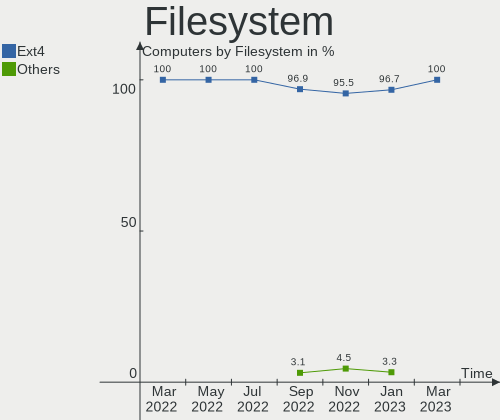
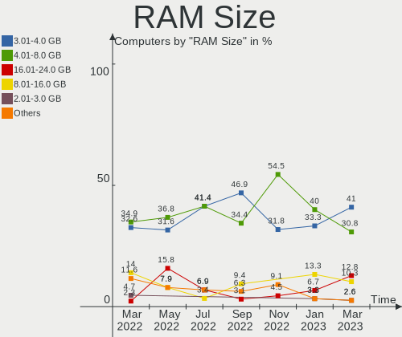
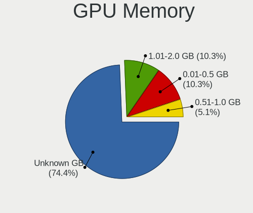
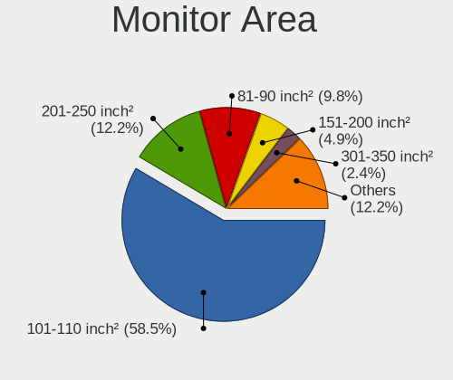
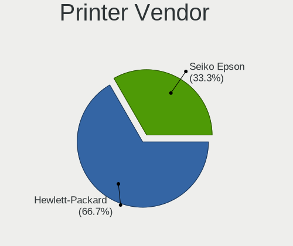

Endless Hardware Trends
-----------------------

A project to identify most popular hardware characteristics and track their change
over time based on data collected by Endless users at https://Linux-Hardware.org.

Anyone can contribute to this report by the [hw-probe](https://github.com/linuxhw/hw-probe) tool:

    sudo -E hw-probe -all -upload

This is a report for all computer types. See also reports for [desktops](/Dist/Endless/Desktop/README.md) and [notebooks](/Dist/Endless/Notebook/README.md).

This report is for one last month. Overall report since the beginning of time: [TestCoverage](https://github.com/linuxhw/TestCoverage)

Period: Apr, 2022.

Contents
--------

* [ System ](#system)
  - [ OS                       ](#os)
  - [ OS Family                ](#os-family)
  - [ Kernel                   ](#kernel)
  - [ Kernel Family            ](#kernel-family)
  - [ Kernel Major Ver.        ](#kernel-major-ver)
  - [ Arch                     ](#arch)
  - [ DE                       ](#de)
  - [ Display Server           ](#display-server)
  - [ Display Manager          ](#display-manager)
  - [ OS Lang                  ](#os-lang)
  - [ Boot Mode                ](#boot-mode)
  - [ Filesystem               ](#filesystem)
  - [ Part. scheme             ](#part-scheme)
  - [ Dual Boot with Linux/BSD ](#dual-boot-with-linuxbsd)
  - [ Dual Boot (Win)          ](#dual-boot-win)

* [ Board ](#board)
  - [ Vendor                   ](#vendor)
  - [ Model                    ](#model)
  - [ Model Family             ](#model-family)
  - [ MFG Year                 ](#mfg-year)
  - [ Form Factor              ](#form-factor)
  - [ Secure Boot              ](#secure-boot)
  - [ Coreboot                 ](#coreboot)
  - [ RAM Size                 ](#ram-size)
  - [ RAM Used                 ](#ram-used)
  - [ Total Drives             ](#total-drives)
  - [ Has CD-ROM               ](#has-cd-rom)
  - [ Has Ethernet             ](#has-ethernet)
  - [ Has WiFi                 ](#has-wifi)
  - [ Has Bluetooth            ](#has-bluetooth)

* [ Location ](#location)
  - [ Country                  ](#country)
  - [ City                     ](#city)

* [ Drives ](#drives)
  - [ Drive Vendor             ](#drive-vendor)
  - [ Drive Model              ](#drive-model)
  - [ HDD Vendor               ](#hdd-vendor)
  - [ SSD Vendor               ](#ssd-vendor)
  - [ Drive Kind               ](#drive-kind)
  - [ Drive Connector          ](#drive-connector)
  - [ Drive Size               ](#drive-size)
  - [ Space Total              ](#space-total)
  - [ Space Used               ](#space-used)
  - [ Malfunc. Drives          ](#malfunc-drives)
  - [ Malfunc. Drive Vendor    ](#malfunc-drive-vendor)
  - [ Malfunc. HDD Vendor      ](#malfunc-hdd-vendor)
  - [ Malfunc. Drive Kind      ](#malfunc-drive-kind)
  - [ Failed Drives            ](#failed-drives)
  - [ Failed Drive Vendor      ](#failed-drive-vendor)
  - [ Drive Status             ](#drive-status)

* [ Storage controller ](#storage-controller)
  - [ Storage Vendor           ](#storage-vendor)
  - [ Storage Model            ](#storage-model)
  - [ Storage Kind             ](#storage-kind)

* [ Processor ](#processor)
  - [ CPU Vendor               ](#cpu-vendor)
  - [ CPU Model                ](#cpu-model)
  - [ CPU Model Family         ](#cpu-model-family)
  - [ CPU Cores                ](#cpu-cores)
  - [ CPU Sockets              ](#cpu-sockets)
  - [ CPU Threads              ](#cpu-threads)
  - [ CPU Op-Modes             ](#cpu-op-modes)
  - [ CPU Microcode            ](#cpu-microcode)
  - [ CPU Microarch            ](#cpu-microarch)

* [ Graphics ](#graphics)
  - [ GPU Vendor               ](#gpu-vendor)
  - [ GPU Model                ](#gpu-model)
  - [ GPU Combo                ](#gpu-combo)
  - [ GPU Driver               ](#gpu-driver)
  - [ GPU Memory               ](#gpu-memory)

* [ Monitor ](#monitor)
  - [ Monitor Vendor           ](#monitor-vendor)
  - [ Monitor Model            ](#monitor-model)
  - [ Monitor Resolution       ](#monitor-resolution)
  - [ Monitor Diagonal         ](#monitor-diagonal)
  - [ Monitor Width            ](#monitor-width)
  - [ Aspect Ratio             ](#aspect-ratio)
  - [ Monitor Area             ](#monitor-area)
  - [ Pixel Density            ](#pixel-density)
  - [ Multiple Monitors        ](#multiple-monitors)

* [ Network ](#network)
  - [ Net Controller Vendor    ](#net-controller-vendor)
  - [ Net Controller Model     ](#net-controller-model)
  - [ Wireless Vendor          ](#wireless-vendor)
  - [ Wireless Model           ](#wireless-model)
  - [ Ethernet Vendor          ](#ethernet-vendor)
  - [ Ethernet Model           ](#ethernet-model)
  - [ Net Controller Kind      ](#net-controller-kind)
  - [ Used Controller          ](#used-controller)
  - [ NICs                     ](#nics)
  - [ IPv6                     ](#ipv6)

* [ Bluetooth ](#bluetooth)
  - [ Bluetooth Vendor         ](#bluetooth-vendor)
  - [ Bluetooth Model          ](#bluetooth-model)

* [ Sound ](#sound)
  - [ Sound Vendor             ](#sound-vendor)
  - [ Sound Model              ](#sound-model)

* [ Memory ](#memory)
  - [ Memory Vendor            ](#memory-vendor)
  - [ Memory Model             ](#memory-model)
  - [ Memory Kind              ](#memory-kind)
  - [ Memory Form Factor       ](#memory-form-factor)
  - [ Memory Size              ](#memory-size)
  - [ Memory Speed             ](#memory-speed)

* [ Printers & scanners ](#printers--scanners)
  - [ Printer Vendor           ](#printer-vendor)
  - [ Printer Model            ](#printer-model)
  - [ Scanner Vendor           ](#scanner-vendor)
  - [ Scanner Model            ](#scanner-model)

* [ Camera ](#camera)
  - [ Camera Vendor            ](#camera-vendor)
  - [ Camera Model             ](#camera-model)

* [ Security ](#security)
  - [ Fingerprint Vendor       ](#fingerprint-vendor)
  - [ Fingerprint Model        ](#fingerprint-model)
  - [ Chipcard Vendor          ](#chipcard-vendor)
  - [ Chipcard Model           ](#chipcard-model)

* [ Unsupported ](#unsupported)
  - [ Unsupported Devices      ](#unsupported-devices)
  - [ Unsupported Device Types ](#unsupported-device-types)

System
------

OS
--

Installed operating systems

| Name                  | Computers | Percent |
|-----------------------|-----------|---------|
| Endless 4.0.4         | 18        | 40%     |
| Endless 4.0.6         | 7         | 15.56%  |
| Endless 4.0.3         | 6         | 13.33%  |
| Endless 3.9.7         | 6         | 13.33%  |
| Endless 4.0.5         | 1         | 2.22%   |
| Endless 4.0.2         | 1         | 2.22%   |
| Endless 3.9.6         | 1         | 2.22%   |
| Endless 3.9.5         | 1         | 2.22%   |
| Endless 3.9.3-nexthw1 | 1         | 2.22%   |
| Endless 3.9.1         | 1         | 2.22%   |
| Endless 3.8.3-nexthw1 | 1         | 2.22%   |
| Endless 3.7.8         | 1         | 2.22%   |

OS Family
---------

OS without a version

| Name    | Computers | Percent |
|---------|-----------|---------|
| Endless | 45        | 100%    |

Kernel
------

Version of the Linux kernel

| Version           | Computers | Percent |
|-------------------|-----------|---------|
| 5.11.0-35-generic | 33        | 73.33%  |
| 5.8.0-14-generic  | 9         | 20%     |
| 5.6.0-7-generic   | 1         | 2.22%   |
| 5.3.0-28-generic  | 1         | 2.22%   |
| 5.11.0-12-generic | 1         | 2.22%   |

Kernel Family
-------------

Linux kernel without a distro release

| Version | Computers | Percent |
|---------|-----------|---------|
| 5.11.0  | 34        | 75.56%  |
| 5.8.0   | 9         | 20%     |
| 5.6.0   | 1         | 2.22%   |
| 5.3.0   | 1         | 2.22%   |

Kernel Major Ver.
-----------------

Linux kernel major version

| Version | Computers | Percent |
|---------|-----------|---------|
| 5.11    | 34        | 75.56%  |
| 5.8     | 9         | 20%     |
| 5.6     | 1         | 2.22%   |
| 5.3     | 1         | 2.22%   |

Arch
----

OS architecture (x86_64, i586, etc.)

| Name   | Computers | Percent |
|--------|-----------|---------|
| x86_64 | 45        | 100%    |

DE
--

Desktop Environment

| Name  | Computers | Percent |
|-------|-----------|---------|
| GNOME | 45        | 100%    |

Display Server
--------------

X11 or Wayland

| Name | Computers | Percent |
|------|-----------|---------|
| X11  | 45        | 100%    |

Display Manager
---------------

SDDM, LightDM, etc.

| Name    | Computers | Percent |
|---------|-----------|---------|
| Unknown | 45        | 100%    |

OS Lang
-------

Language

| Lang  | Computers | Percent |
|-------|-----------|---------|
| pt_BR | 17        | 37.78%  |
| en_US | 11        | 24.44%  |
| de_DE | 3         | 6.67%   |
| tr_TR | 2         | 4.44%   |
| ro_RO | 2         | 4.44%   |
| it_IT | 2         | 4.44%   |
| es_MX | 2         | 4.44%   |
| sv_SE | 1         | 2.22%   |
| ru_RU | 1         | 2.22%   |
| es_CO | 1         | 2.22%   |
| es_CL | 1         | 2.22%   |
| es_BO | 1         | 2.22%   |
| el_GR | 1         | 2.22%   |

Boot Mode
---------

EFI or BIOS

| Mode | Computers | Percent |
|------|-----------|---------|
| EFI  | 35        | 77.78%  |
| BIOS | 10        | 22.22%  |

Filesystem
----------

Type of filesystem

| Type  | Computers | Percent |
|-------|-----------|---------|
| Ext4  | 44        | 97.78%  |
| Tmpfs | 1         | 2.22%   |

Part. scheme
------------

Scheme of partitioning

| Type    | Computers | Percent |
|---------|-----------|---------|
| Unknown | 45        | 100%    |

Dual Boot with Linux/BSD
------------------------

Hosting more than one Linux/BSD

| Dual boot | Computers | Percent |
|-----------|-----------|---------|
| No        | 45        | 100%    |

Dual Boot (Win)
---------------

Hosting Linux and Windows

| Dual boot | Computers | Percent |
|-----------|-----------|---------|
| No        | 45        | 100%    |

Board
-----

Vendor
------

Motherboard manufacturer

| Name                | Computers | Percent |
|---------------------|-----------|---------|
| ASUSTek Computer    | 16        | 35.56%  |
| Acer                | 9         | 20%     |
| Lenovo              | 5         | 11.11%  |
| Hewlett-Packard     | 5         | 11.11%  |
| Dell                | 3         | 6.67%   |
| Samsung Electronics | 2         | 4.44%   |
| Multilaser          | 1         | 2.22%   |
| Google              | 1         | 2.22%   |
| Gigabyte Technology | 1         | 2.22%   |
| Fujitsu             | 1         | 2.22%   |
| Unknown             | 1         | 2.22%   |

Model
-----

Motherboard model

| Name                                           | Computers | Percent |
|------------------------------------------------|-----------|---------|
| Acer Nitro AN515-44                            | 7         | 15.56%  |
| ASUS X541UAK                                   | 2         | 4.44%   |
| Samsung 300V3A/300V4A/300V5A/200A4B/200A5B     | 1         | 2.22%   |
| Samsung 300E5EV/300E4EV/270E5EV/270E4EV/2470EV | 1         | 2.22%   |
| Multilaser PC13X                               | 1         | 2.22%   |
| Lenovo ThinkPad X131e 33683YG                  | 1         | 2.22%   |
| Lenovo ThinkCentre M93p 10A8S0E800             | 1         | 2.22%   |
| Lenovo S10-3                                   | 1         | 2.22%   |
| Lenovo IdeaPad 3 14ALC6 82KT                   | 1         | 2.22%   |
| Lenovo H50-50 90B60081IX                       | 1         | 2.22%   |
| HP ProDesk 490 G2 MT                           | 1         | 2.22%   |
| HP Pavilion dv7                                | 1         | 2.22%   |
| HP Pavilion 14                                 | 1         | 2.22%   |
| HP Notebook                                    | 1         | 2.22%   |
| HP 250 G5 Notebook PC                          | 1         | 2.22%   |
| Google Fleex                                   | 1         | 2.22%   |
| Gigabyte B360M AORUS Gaming 3                  | 1         | 2.22%   |
| Fujitsu LIFEBOOK A512                          | 1         | 2.22%   |
| Dell XPS 8950                                  | 1         | 2.22%   |
| Dell Precision T1600                           | 1         | 2.22%   |
| Dell Inspiron 1525                             | 1         | 2.22%   |
| ASUS X540LJ                                    | 1         | 2.22%   |
| ASUS X451CA                                    | 1         | 2.22%   |
| ASUS X450CP                                    | 1         | 2.22%   |
| ASUS VivoBook_ASUSLaptop X515JA_X515JA         | 1         | 2.22%   |
| ASUS VivoBook_ASUSLaptop X513EA_K513EA         | 1         | 2.22%   |
| ASUS VivoBook_ASUSLaptop E410MAB_E410MA        | 1         | 2.22%   |
| ASUS VivoBook_ASUS Laptop E406MA_E406MA        | 1         | 2.22%   |
| ASUS VivoBook 15_ASUS Laptop X540UAR           | 1         | 2.22%   |
| ASUS VivoBook 15_ASUS Laptop X540MA_X543MA     | 1         | 2.22%   |
| ASUS VivoBook 14_ASUS Laptop X407MA_X407MA     | 1         | 2.22%   |
| ASUS H61M-PRO                                  | 1         | 2.22%   |
| ASUS ASUSPRO P1440FAC_P1440FA                  | 1         | 2.22%   |
| ASUS A0000001                                  | 1         | 2.22%   |
| ASUS 1015PE                                    | 1         | 2.22%   |
| Acer Aspire E1-572                             | 1         | 2.22%   |
| Acer Aspire A315-34                            | 1         | 2.22%   |
| Unknown                                        | 1         | 2.22%   |

Model Family
------------

Motherboard model prefix

| Name               | Computers | Percent |
|--------------------|-----------|---------|
| ASUS VivoBook      | 7         | 15.56%  |
| Acer Nitro         | 7         | 15.56%  |
| HP Pavilion        | 2         | 4.44%   |
| ASUS X541UAK       | 2         | 4.44%   |
| Acer Aspire        | 2         | 4.44%   |
| Samsung 300V3A     | 1         | 2.22%   |
| Samsung 300E5EV    | 1         | 2.22%   |
| Multilaser PC13X   | 1         | 2.22%   |
| Lenovo ThinkPad    | 1         | 2.22%   |
| Lenovo ThinkCentre | 1         | 2.22%   |
| Lenovo S10-3       | 1         | 2.22%   |
| Lenovo IdeaPad     | 1         | 2.22%   |
| Lenovo H50-50      | 1         | 2.22%   |
| HP ProDesk         | 1         | 2.22%   |
| HP Notebook        | 1         | 2.22%   |
| HP 250             | 1         | 2.22%   |
| Google Fleex       | 1         | 2.22%   |
| Gigabyte B360M     | 1         | 2.22%   |
| Fujitsu LIFEBOOK   | 1         | 2.22%   |
| Dell XPS           | 1         | 2.22%   |
| Dell Precision     | 1         | 2.22%   |
| Dell Inspiron      | 1         | 2.22%   |
| ASUS X540LJ        | 1         | 2.22%   |
| ASUS X451CA        | 1         | 2.22%   |
| ASUS X450CP        | 1         | 2.22%   |
| ASUS H61M-PRO      | 1         | 2.22%   |
| ASUS ASUSPRO       | 1         | 2.22%   |
| ASUS A0000001      | 1         | 2.22%   |
| ASUS 1015PE        | 1         | 2.22%   |
| Unknown            | 1         | 2.22%   |

MFG Year
--------

Motherboard manufacture year

| Year | Computers | Percent |
|------|-----------|---------|
| 2020 | 9         | 20%     |
| 2013 | 7         | 15.56%  |
| 2021 | 5         | 11.11%  |
| 2018 | 5         | 11.11%  |
| 2016 | 3         | 6.67%   |
| 2014 | 3         | 6.67%   |
| 2011 | 3         | 6.67%   |
| 2019 | 2         | 4.44%   |
| 2015 | 2         | 4.44%   |
| 2010 | 2         | 4.44%   |
| 2008 | 2         | 4.44%   |
| 2022 | 1         | 2.22%   |
| 2012 | 1         | 2.22%   |

Form Factor
-----------

Physical design of the computer

| Name     | Computers | Percent |
|----------|-----------|---------|
| Notebook | 36        | 80%     |
| Desktop  | 9         | 20%     |

Secure Boot
-----------

Enabled or disabled

| State    | Computers | Percent |
|----------|-----------|---------|
| Disabled | 34        | 75.56%  |
| Enabled  | 11        | 24.44%  |

Coreboot
--------

Have coreboot on board

| Used | Computers | Percent |
|------|-----------|---------|
| No   | 44        | 97.78%  |
| Yes  | 1         | 2.22%   |

RAM Size
--------

Total RAM memory

| Size in GB | Computers | Percent |
|------------|-----------|---------|
| 3.01-4.0   | 15        | 33.33%  |
| 4.01-8.0   | 14        | 31.11%  |
| 8.01-16.0  | 6         | 13.33%  |
| 1.01-2.0   | 5         | 11.11%  |
| 16.01-24.0 | 4         | 8.89%   |
| 32.01-64.0 | 1         | 2.22%   |

RAM Used
--------

Used RAM memory

| Used GB  | Computers | Percent |
|----------|-----------|---------|
| 1.01-2.0 | 21        | 46.67%  |
| 2.01-3.0 | 16        | 35.56%  |
| 0.51-1.0 | 7         | 15.56%  |
| 3.01-4.0 | 1         | 2.22%   |

Total Drives
------------

Number of drives on board

| Drives | Computers | Percent |
|--------|-----------|---------|
| 1      | 34        | 75.56%  |
| 2      | 8         | 17.78%  |
| 3      | 2         | 4.44%   |
| 0      | 1         | 2.22%   |

Has CD-ROM
----------

Has CD-ROM on board

| Presented | Computers | Percent |
|-----------|-----------|---------|
| No        | 24        | 53.33%  |
| Yes       | 21        | 46.67%  |

Has Ethernet
------------

Has Ethernet on board

| Presented | Computers | Percent |
|-----------|-----------|---------|
| Yes       | 35        | 77.78%  |
| No        | 10        | 22.22%  |

Has WiFi
--------

Has WiFi module

| Presented | Computers | Percent |
|-----------|-----------|---------|
| Yes       | 39        | 86.67%  |
| No        | 6         | 13.33%  |

Has Bluetooth
-------------

Has Bluetooth module

| Presented | Computers | Percent |
|-----------|-----------|---------|
| Yes       | 33        | 73.33%  |
| No        | 12        | 26.67%  |

Location
--------

Country
-------

Geographic location (country)

| Country      | Computers | Percent |
|--------------|-----------|---------|
| Brazil       | 18        | 40%     |
| USA          | 4         | 8.89%   |
| Germany      | 3         | 6.67%   |
| Turkey       | 2         | 4.44%   |
| Romania      | 2         | 4.44%   |
| Italy        | 2         | 4.44%   |
| Chile        | 2         | 4.44%   |
| Uzbekistan   | 1         | 2.22%   |
| Sweden       | 1         | 2.22%   |
| Spain        | 1         | 2.22%   |
| South Africa | 1         | 2.22%   |
| Serbia       | 1         | 2.22%   |
| Netherlands  | 1         | 2.22%   |
| Mexico       | 1         | 2.22%   |
| Iran         | 1         | 2.22%   |
| Greece       | 1         | 2.22%   |
| Colombia     | 1         | 2.22%   |
| Canada       | 1         | 2.22%   |
| Australia    | 1         | 2.22%   |

City
----

Geographic location (city)

| City                       | Computers | Percent |
|----------------------------|-----------|---------|
| Vught                      | 1         | 2.22%   |
| Viña del Mar              | 1         | 2.22%   |
| Teixeira de Freitas        | 1         | 2.22%   |
| Tehran                     | 1         | 2.22%   |
| Skogas                     | 1         | 2.22%   |
| Sertaozinho                | 1         | 2.22%   |
| Sector 4                   | 1         | 2.22%   |
| Schenectady                | 1         | 2.22%   |
| Sao Paulo                  | 1         | 2.22%   |
| Sao José dos Campos       | 1         | 2.22%   |
| Sao Jose do Rio Preto      | 1         | 2.22%   |
| Santiago                   | 1         | 2.22%   |
| Santa Rita do Sapucai      | 1         | 2.22%   |
| San Nicolás de los Garza  | 1         | 2.22%   |
| Samarkand                  | 1         | 2.22%   |
| Rio de Janeiro             | 1         | 2.22%   |
| Ribeirao Preto             | 1         | 2.22%   |
| Pretoria                   | 1         | 2.22%   |
| Porto Alegre               | 1         | 2.22%   |
| Oakville                   | 1         | 2.22%   |
| Nova Santa Rosa            | 1         | 2.22%   |
| Nova Iguaçu               | 1         | 2.22%   |
| Norden                     | 1         | 2.22%   |
| Louisville                 | 1         | 2.22%   |
| Las Palmas de Gran Canaria | 1         | 2.22%   |
| Itatiba                    | 1         | 2.22%   |
| Istanbul                   | 1         | 2.22%   |
| Fortaleza                  | 1         | 2.22%   |
| Forlì                     | 1         | 2.22%   |
| Durham                     | 1         | 2.22%   |
| Duque de Caxias            | 1         | 2.22%   |
| Cupello                    | 1         | 2.22%   |
| Caxias do Sul              | 1         | 2.22%   |
| Bucharest                  | 1         | 2.22%   |
| Brodosqui                  | 1         | 2.22%   |
| Brisbane                   | 1         | 2.22%   |
| Bogotá                    | 1         | 2.22%   |
| Beverly                    | 1         | 2.22%   |
| Berlin                     | 1         | 2.22%   |
| Belgrade                   | 1         | 2.22%   |
| Ano Liosia                 | 1         | 2.22%   |
| Anitapolis                 | 1         | 2.22%   |
| Altentreptow               | 1         | 2.22%   |
| Alfenas                    | 1         | 2.22%   |
| Adana                      | 1         | 2.22%   |

Drives
------

Drive Vendor
------------

Hard drive vendors

| Vendor              | Computers | Drives | Percent |
|---------------------|-----------|--------|---------|
| Seagate             | 10        | 10     | 19.61%  |
| Sandisk             | 9         | 9      | 17.65%  |
| Toshiba             | 6         | 6      | 11.76%  |
| WDC                 | 5         | 5      | 9.8%    |
| Samsung Electronics | 5         | 7      | 9.8%    |
| Unknown             | 4         | 5      | 7.84%   |
| Kingston            | 4         | 4      | 7.84%   |
| Crucial             | 2         | 2      | 3.92%   |
| Team                | 1         | 1      | 1.96%   |
| Phison              | 1         | 1      | 1.96%   |
| MAXTOR              | 1         | 1      | 1.96%   |
| HS-SSD-C100         | 1         | 1      | 1.96%   |
| Hitachi             | 1         | 1      | 1.96%   |
| HGST                | 1         | 1      | 1.96%   |

Drive Model
-----------

Hard drive models

| Model                                | Computers | Percent |
|--------------------------------------|-----------|---------|
| Sandisk NVMe SSD Drive 512GB         | 7         | 12.96%  |
| Toshiba MQ04ABF100 1TB               | 3         | 5.56%   |
| WDC WD10SPZX-21Z10T0 1TB             | 2         | 3.7%    |
| Unknown MMC Card  64GB               | 2         | 3.7%    |
| Seagate ST500LT012-1DG142 500GB      | 2         | 3.7%    |
| Seagate ST500DM002-1BD142 500GB      | 2         | 3.7%    |
| Samsung NVMe SSD Drive 512GB         | 2         | 3.7%    |
| Kingston NVMe SSD Drive 256GB        | 2         | 3.7%    |
| WDC WDS240G1G0A-00SS50 240GB SSD     | 1         | 1.85%   |
| WDC WD5000LPVX-80V0TT0 500GB         | 1         | 1.85%   |
| WDC WD2500BEVS-75UST0 250GB          | 1         | 1.85%   |
| Unknown MMC Card  2GB                | 1         | 1.85%   |
| Unknown MMC Card  16GB               | 1         | 1.85%   |
| Unknown MMC Card  128GB              | 1         | 1.85%   |
| Toshiba MQ01ABF050 500GB             | 1         | 1.85%   |
| Toshiba MQ01ABF032 320GB             | 1         | 1.85%   |
| Toshiba MK3265GSX 320GB              | 1         | 1.85%   |
| Team TEAML5Lite3D120G 120GB SSD      | 1         | 1.85%   |
| Seagate ST9160314AS 160GB            | 1         | 1.85%   |
| Seagate ST9160310AS 160GB            | 1         | 1.85%   |
| Seagate ST500LM030-1RK17D 500GB      | 1         | 1.85%   |
| Seagate ST500LM012 HN-M500MBB 500GB  | 1         | 1.85%   |
| Seagate ST2000DM008-2FR102 2TB       | 1         | 1.85%   |
| Seagate ST1000DM003-1SB10C 1TB       | 1         | 1.85%   |
| SanDisk SSD PLUS 120GB               | 1         | 1.85%   |
| SanDisk SDSSDA240G 240GB             | 1         | 1.85%   |
| Samsung SSD 860 QVO 1TB              | 1         | 1.85%   |
| Samsung SSD 860 EVO 250GB            | 1         | 1.85%   |
| Samsung NVMe SSD Drive 2TB           | 1         | 1.85%   |
| Samsung MZNLF128HCHP-000H1 128GB SSD | 1         | 1.85%   |
| Samsung HD502HJ 500GB                | 1         | 1.85%   |
| Phison NVMe SSD Drive 256GB          | 1         | 1.85%   |
| MAXTOR STM380815AS 80GB              | 1         | 1.85%   |
| Kingston SA400S37240G 240GB SSD      | 1         | 1.85%   |
| Kingston SA400S37120G 120GB SSD      | 1         | 1.85%   |
| HS-SSD-C100 480G                     | 1         | 1.85%   |
| Hitachi HTS547550A9E384 500GB        | 1         | 1.85%   |
| HGST HTS725032A7E630 320GB           | 1         | 1.85%   |
| Crucial CT480BX500SSD1 480GB         | 1         | 1.85%   |
| Crucial CT240BX500SSD1 240GB         | 1         | 1.85%   |

HDD Vendor
----------

Hard disk drive vendors

| Vendor              | Computers | Drives | Percent |
|---------------------|-----------|--------|---------|
| Seagate             | 10        | 10     | 41.67%  |
| Toshiba             | 6         | 6      | 25%     |
| WDC                 | 4         | 4      | 16.67%  |
| Samsung Electronics | 1         | 1      | 4.17%   |
| MAXTOR              | 1         | 1      | 4.17%   |
| Hitachi             | 1         | 1      | 4.17%   |
| HGST                | 1         | 1      | 4.17%   |

SSD Vendor
----------

Solid state drive vendors

| Vendor              | Computers | Drives | Percent |
|---------------------|-----------|--------|---------|
| Samsung Electronics | 3         | 3      | 27.27%  |
| SanDisk             | 2         | 2      | 18.18%  |
| Kingston            | 2         | 2      | 18.18%  |
| Crucial             | 2         | 2      | 18.18%  |
| WDC                 | 1         | 1      | 9.09%   |
| Team                | 1         | 1      | 9.09%   |

Drive Kind
----------

HDD or SSD

| Kind    | Computers | Drives | Percent |
|---------|-----------|--------|---------|
| HDD     | 23        | 24     | 45.1%   |
| NVMe    | 12        | 13     | 23.53%  |
| SSD     | 11        | 11     | 21.57%  |
| MMC     | 4         | 5      | 7.84%   |
| Unknown | 1         | 1      | 1.96%   |

Drive Connector
---------------

SATA, SAS, NVMe, etc.

| Type | Computers | Drives | Percent |
|------|-----------|--------|---------|
| SATA | 32        | 36     | 66.67%  |
| NVMe | 12        | 13     | 25%     |
| MMC  | 4         | 5      | 8.33%   |

Drive Size
----------

Size of hard drive

| Size in TB | Computers | Drives | Percent |
|------------|-----------|--------|---------|
| 0.01-0.5   | 24        | 27     | 77.42%  |
| 0.51-1.0   | 6         | 7      | 19.35%  |
| 1.01-2.0   | 1         | 1      | 3.23%   |

Space Total
-----------

Amount of disk space available on the file system

| Size in GB | Computers | Percent |
|------------|-----------|---------|
| 101-250    | 15        | 33.33%  |
| 251-500    | 14        | 31.11%  |
| 501-1000   | 6         | 13.33%  |
| 51-100     | 5         | 11.11%  |
| 1-20       | 3         | 6.67%   |
| 1001-2000  | 1         | 2.22%   |
| Unknown    | 1         | 2.22%   |

Space Used
----------

Amount of used disk space

| Used GB | Computers | Percent |
|---------|-----------|---------|
| 21-50   | 19        | 42.22%  |
| 51-100  | 11        | 24.44%  |
| 1-20    | 10        | 22.22%  |
| 101-250 | 4         | 8.89%   |
| Unknown | 1         | 2.22%   |

Malfunc. Drives
---------------

Drive models with a malfunction

Zero info for selected period =(

Malfunc. Drive Vendor
---------------------

Vendors of faulty drives

Zero info for selected period =(

Malfunc. HDD Vendor
-------------------

Vendors of faulty HDD drives

Zero info for selected period =(

Malfunc. Drive Kind
-------------------

Kinds of faulty drives

Zero info for selected period =(

Failed Drives
-------------

Failed drive models

Zero info for selected period =(

Failed Drive Vendor
-------------------

Failed drive vendors

Zero info for selected period =(

Drive Status
------------

Number of failed and malfunc. drives

| Status   | Computers | Drives | Percent |
|----------|-----------|--------|---------|
| Detected | 44        | 54     | 100%    |

Storage controller
------------------

Storage Vendor
--------------

Storage controller vendors

| Vendor                      | Computers | Percent |
|-----------------------------|-----------|---------|
| Intel                       | 34        | 61.82%  |
| AMD                         | 9         | 16.36%  |
| Sandisk                     | 7         | 12.73%  |
| Samsung Electronics         | 2         | 3.64%   |
| Kingston Technology Company | 2         | 3.64%   |
| Phison Electronics          | 1         | 1.82%   |

Storage Model
-------------

Storage controller models

| Model                                                                            | Computers | Percent |
|----------------------------------------------------------------------------------|-----------|---------|
| AMD FCH SATA Controller [AHCI mode]                                              | 9         | 15%     |
| Sandisk WD Blue SN550 NVMe SSD                                                   | 7         | 11.67%  |
| Intel Celeron/Pentium Silver Processor SATA Controller                           | 5         | 8.33%   |
| Intel 7 Series Chipset Family 6-port SATA Controller [AHCI mode]                 | 5         | 8.33%   |
| Intel Sunrise Point-LP SATA Controller [AHCI mode]                               | 4         | 6.67%   |
| Kingston Company OM3PDP3 NVMe SSD                                                | 2         | 3.33%   |
| Intel NM10/ICH7 Family SATA Controller [AHCI mode]                               | 2         | 3.33%   |
| Intel 8 Series SATA Controller 1 [AHCI mode]                                     | 2         | 3.33%   |
| Intel 6 Series/C200 Series Chipset Family 6 port Mobile SATA AHCI Controller     | 2         | 3.33%   |
| Intel 6 Series/C200 Series Chipset Family 6 port Desktop SATA AHCI Controller    | 2         | 3.33%   |
| Samsung NVMe SSD Controller SM981/PM981/PM983                                    | 1         | 1.67%   |
| Samsung NVMe SSD Controller PM9A1/PM9A3/980PRO                                   | 1         | 1.67%   |
| Samsung NVMe SSD Controller 980                                                  | 1         | 1.67%   |
| Phison PS5013 E13 NVMe Controller                                                | 1         | 1.67%   |
| Intel Wildcat Point-LP SATA Controller [AHCI Mode]                               | 1         | 1.67%   |
| Intel Volume Management Device NVMe RAID Controller                              | 1         | 1.67%   |
| Intel Tiger Lake-LP SATA Controller [AHCI mode]                                  | 1         | 1.67%   |
| Intel NM10/ICH7 Family SATA Controller [IDE mode]                                | 1         | 1.67%   |
| Intel Comet Lake SATA AHCI Controller                                            | 1         | 1.67%   |
| Intel Cannon Lake PCH SATA AHCI Controller                                       | 1         | 1.67%   |
| Intel Atom/Celeron/Pentium Processor x5-E8000/J3xxx/N3xxx Series SATA Controller | 1         | 1.67%   |
| Intel Alder Lake-S PCH SATA Controller [AHCI Mode]                               | 1         | 1.67%   |
| Intel 9 Series Chipset Family SATA Controller [AHCI Mode]                        | 1         | 1.67%   |
| Intel 82801HM/HEM (ICH8M/ICH8M-E) SATA Controller [AHCI mode]                    | 1         | 1.67%   |
| Intel 82801HM/HEM (ICH8M/ICH8M-E) IDE Controller                                 | 1         | 1.67%   |
| Intel 82801 Mobile SATA Controller [RAID mode]                                   | 1         | 1.67%   |
| Intel 8 Series/C220 Series Chipset Family 6-port SATA Controller 1 [AHCI mode]   | 1         | 1.67%   |
| Intel 8 Series/C220 Series Chipset Family 4-port SATA Controller 1 [IDE mode]    | 1         | 1.67%   |
| Intel 8 Series/C220 Series Chipset Family 2-port SATA Controller 2 [IDE mode]    | 1         | 1.67%   |
| AMD FCH SATA Controller D                                                        | 1         | 1.67%   |

Storage Kind
------------

Kind of storage controller (IDE, SATA, NVMe, SAS, ...)

| Kind | Computers | Percent |
|------|-----------|---------|
| SATA | 40        | 70.18%  |
| NVMe | 12        | 21.05%  |
| IDE  | 3         | 5.26%   |
| RAID | 2         | 3.51%   |

Processor
---------

CPU Vendor
----------

Processor vendors

| Vendor | Computers | Percent |
|--------|-----------|---------|
| Intel  | 36        | 80%     |
| AMD    | 9         | 20%     |

CPU Model
---------

Processor models

| Model                                         | Computers | Percent |
|-----------------------------------------------|-----------|---------|
| AMD Ryzen 7 4800H with Radeon Graphics        | 5         | 11.11%  |
| Intel Celeron N4020 CPU @ 1.10GHz             | 3         | 6.67%   |
| Intel Pentium Silver N5000 CPU @ 1.10GHz      | 2         | 4.44%   |
| AMD Ryzen 5 4600H with Radeon Graphics        | 2         | 4.44%   |
| Intel Core i7-4790 CPU @ 3.60GHz              | 1         | 2.22%   |
| Intel Core i7-4510U CPU @ 2.00GHz             | 1         | 2.22%   |
| Intel Core i7-2670QM CPU @ 2.20GHz            | 1         | 2.22%   |
| Intel Core i7-2600 CPU @ 3.40GHz              | 1         | 2.22%   |
| Intel Core i5-7200U CPU @ 2.50GHz             | 1         | 2.22%   |
| Intel Core i5-6200U CPU @ 2.30GHz             | 1         | 2.22%   |
| Intel Core i5-4570 CPU @ 3.20GHz              | 1         | 2.22%   |
| Intel Core i5-4200U CPU @ 1.60GHz             | 1         | 2.22%   |
| Intel Core i5-3570 CPU @ 3.40GHz              | 1         | 2.22%   |
| Intel Core i5-3337U CPU @ 1.80GHz             | 1         | 2.22%   |
| Intel Core i5-1035G1 CPU @ 1.00GHz            | 1         | 2.22%   |
| Intel Core i3-8100 CPU @ 3.60GHz              | 1         | 2.22%   |
| Intel Core i3-7020U CPU @ 2.30GHz             | 1         | 2.22%   |
| Intel Core i3-6006U CPU @ 2.00GHz             | 1         | 2.22%   |
| Intel Core i3-5005U CPU @ 2.00GHz             | 1         | 2.22%   |
| Intel Core i3-4160 CPU @ 3.60GHz              | 1         | 2.22%   |
| Intel Core i3-3227U CPU @ 1.90GHz             | 1         | 2.22%   |
| Intel Core i3-3110M CPU @ 2.40GHz             | 1         | 2.22%   |
| Intel Core i3-2375M CPU @ 1.50GHz             | 1         | 2.22%   |
| Intel Core i3-2350M CPU @ 2.30GHz             | 1         | 2.22%   |
| Intel Core i3-10110U CPU @ 2.10GHz            | 1         | 2.22%   |
| Intel Core 2 Duo CPU T7250 @ 2.00GHz          | 1         | 2.22%   |
| Intel Celeron N4000C CPU @ 1.10GHz            | 1         | 2.22%   |
| Intel Celeron CPU N3050 @ 1.60GHz             | 1         | 2.22%   |
| Intel Celeron CPU 1007U @ 1.50GHz             | 1         | 2.22%   |
| Intel Atom x5-Z8350 CPU @ 1.44GHz             | 1         | 2.22%   |
| Intel Atom CPU N550 @ 1.50GHz                 | 1         | 2.22%   |
| Intel Atom CPU N450 @ 1.66GHz                 | 1         | 2.22%   |
| Intel Atom CPU D425 @ 1.80GHz                 | 1         | 2.22%   |
| Intel 12th Gen Core i7-12700K                 | 1         | 2.22%   |
| Intel 11th Gen Core i3-1115G4 @ 3.00GHz       | 1         | 2.22%   |
| AMD Ryzen 7 5700U with Radeon Graphics        | 1         | 2.22%   |
| AMD A8-9600 RADEON R7, 10 COMPUTE CORES 4C+6G | 1         | 2.22%   |

CPU Model Family
----------------

Processor model prefix

| Model                | Computers | Percent |
|----------------------|-----------|---------|
| Intel Core i3        | 10        | 22.22%  |
| Intel Core i5        | 7         | 15.56%  |
| Intel Celeron        | 6         | 13.33%  |
| AMD Ryzen 7          | 6         | 13.33%  |
| Intel Core i7        | 4         | 8.89%   |
| Intel Atom           | 4         | 8.89%   |
| Other                | 2         | 4.44%   |
| Intel Pentium Silver | 2         | 4.44%   |
| AMD Ryzen 5          | 2         | 4.44%   |
| Intel Core 2 Duo     | 1         | 2.22%   |
| AMD A8               | 1         | 2.22%   |

CPU Cores
---------

Number of processor cores

| Number | Computers | Percent |
|--------|-----------|---------|
| 2      | 24        | 53.33%  |
| 4      | 10        | 22.22%  |
| 8      | 6         | 13.33%  |
| 6      | 2         | 4.44%   |
| 1      | 2         | 4.44%   |
| 12     | 1         | 2.22%   |

CPU Sockets
-----------

Number of sockets

| Number | Computers | Percent |
|--------|-----------|---------|
| 1      | 45        | 100%    |

CPU Threads
-----------

Threads per core (Hyper-Threading)

| Number | Computers | Percent |
|--------|-----------|---------|
| 2      | 31        | 68.89%  |
| 1      | 14        | 31.11%  |

CPU Op-Modes
------------

CPU Operation Modes (32-bit, 64-bit)

| Op mode        | Computers | Percent |
|----------------|-----------|---------|
| 32-bit, 64-bit | 45        | 100%    |

CPU Microcode
-------------

Microcode number

| Number     | Computers | Percent |
|------------|-----------|---------|
| 0x08600103 | 7         | 15.56%  |
| 0x306a9    | 5         | 11.11%  |
| 0x706a8    | 3         | 6.67%   |
| 0x706a1    | 3         | 6.67%   |
| 0x306c3    | 3         | 6.67%   |
| 0x206a7    | 3         | 6.67%   |
| 0x106ca    | 3         | 6.67%   |
| 0x806e9    | 2         | 4.44%   |
| 0x406e3    | 2         | 4.44%   |
| 0x40651    | 2         | 4.44%   |
| 0x906eb    | 1         | 2.22%   |
| 0x90672    | 1         | 2.22%   |
| 0x806ec    | 1         | 2.22%   |
| 0x806c1    | 1         | 2.22%   |
| 0x706e5    | 1         | 2.22%   |
| 0x6fd      | 1         | 2.22%   |
| 0x406c4    | 1         | 2.22%   |
| 0x406c3    | 1         | 2.22%   |
| 0x306d4    | 1         | 2.22%   |
| 0x08608102 | 1         | 2.22%   |
| 0x0600611a | 1         | 2.22%   |
| Unknown    | 1         | 2.22%   |

CPU Microarch
-------------

Microarchitecture

| Name          | Computers | Percent |
|---------------|-----------|---------|
| Zen 2         | 7         | 15.56%  |
| Goldmont plus | 6         | 13.33%  |
| IvyBridge     | 5         | 11.11%  |
| Haswell       | 5         | 11.11%  |
| SandyBridge   | 4         | 8.89%   |
| KabyLake      | 4         | 8.89%   |
| Bonnell       | 3         | 6.67%   |
| Skylake       | 2         | 4.44%   |
| Silvermont    | 2         | 4.44%   |
| Unknown       | 2         | 4.44%   |
| TigerLake     | 1         | 2.22%   |
| IceLake       | 1         | 2.22%   |
| Excavator     | 1         | 2.22%   |
| Core          | 1         | 2.22%   |
| Broadwell     | 1         | 2.22%   |

Graphics
--------

GPU Vendor
----------

Vendors of graphics cards

| Vendor | Computers | Percent |
|--------|-----------|---------|
| Intel  | 31        | 56.36%  |
| Nvidia | 14        | 25.45%  |
| AMD    | 10        | 18.18%  |

GPU Model
---------

Graphics card models

| Model                                                                                    | Computers | Percent |
|------------------------------------------------------------------------------------------|-----------|---------|
| Nvidia TU117M                                                                            | 7         | 12.5%   |
| AMD Renoir                                                                               | 7         | 12.5%   |
| Intel GeminiLake [UHD Graphics 600]                                                      | 4         | 7.14%   |
| Intel 3rd Gen Core processor Graphics Controller                                         | 4         | 7.14%   |
| Intel Atom Processor D4xx/D5xx/N4xx/N5xx Integrated Graphics Controller                  | 3         | 5.36%   |
| Intel 2nd Generation Core Processor Family Integrated Graphics Controller                | 3         | 5.36%   |
| Intel Skylake GT2 [HD Graphics 520]                                                      | 2         | 3.57%   |
| Intel HD Graphics 620                                                                    | 2         | 3.57%   |
| Intel Haswell-ULT Integrated Graphics Controller                                         | 2         | 3.57%   |
| Intel GeminiLake [UHD Graphics 605]                                                      | 2         | 3.57%   |
| Intel Atom/Celeron/Pentium Processor x5-E8000/J3xxx/N3xxx Integrated Graphics Controller | 2         | 3.57%   |
| Nvidia GM107 [GeForce GTX 750 Ti]                                                        | 1         | 1.79%   |
| Nvidia GK208BM [GeForce 920M]                                                            | 1         | 1.79%   |
| Nvidia GK107 [GeForce GT 640 OEM]                                                        | 1         | 1.79%   |
| Nvidia GK107 [GeForce GT 630 OEM]                                                        | 1         | 1.79%   |
| Nvidia GK104 [GeForce GTX 660 Ti]                                                        | 1         | 1.79%   |
| Nvidia GF108 [GeForce GT 730]                                                            | 1         | 1.79%   |
| Nvidia GA104 [GeForce RTX 3060 Ti Lite Hash Rate]                                        | 1         | 1.79%   |
| Intel Xeon E3-1200 v3/4th Gen Core Processor Integrated Graphics Controller              | 1         | 1.79%   |
| Intel Tiger Lake UHD Graphics                                                            | 1         | 1.79%   |
| Intel Mobile GM965/GL960 Integrated Graphics Controller (secondary)                      | 1         | 1.79%   |
| Intel Mobile GM965/GL960 Integrated Graphics Controller (primary)                        | 1         | 1.79%   |
| Intel Iris Plus Graphics G1 (Ice Lake)                                                   | 1         | 1.79%   |
| Intel HD Graphics 5500                                                                   | 1         | 1.79%   |
| Intel CometLake-U GT2 [UHD Graphics]                                                     | 1         | 1.79%   |
| Intel CoffeeLake-S GT2 [UHD Graphics 630]                                                | 1         | 1.79%   |
| AMD Whistler [Radeon HD 6730M/6770M/7690M XT]                                            | 1         | 1.79%   |
| AMD Mars LE [Radeon HD 8530M / R5 M240]                                                  | 1         | 1.79%   |
| AMD Lucienne                                                                             | 1         | 1.79%   |

GPU Combo
---------

Combinations of graphics cards

| Name           | Computers | Percent |
|----------------|-----------|---------|
| 1 x Intel      | 27        | 60%     |
| AMD + Nvidia   | 7         | 15.56%  |
| 1 x Nvidia     | 6         | 13.33%  |
| Intel + AMD    | 2         | 4.44%   |
| Other          | 1         | 2.22%   |
| Intel + Nvidia | 1         | 2.22%   |
| 1 x AMD        | 1         | 2.22%   |

GPU Driver
----------

Free vs proprietary

| Driver      | Computers | Percent |
|-------------|-----------|---------|
| Free        | 32        | 71.11%  |
| Proprietary | 13        | 28.89%  |

GPU Memory
----------

Total video memory

| Size in GB | Computers | Percent |
|------------|-----------|---------|
| Unknown    | 35        | 77.78%  |
| 0.01-0.5   | 7         | 15.56%  |
| 3.01-4.0   | 1         | 2.22%   |
| 1.01-2.0   | 1         | 2.22%   |
| 0.51-1.0   | 1         | 2.22%   |

Monitor
-------

Monitor Vendor
--------------

Monitor vendors

| Vendor                  | Computers | Percent |
|-------------------------|-----------|---------|
| Chimei Innolux          | 12        | 25.53%  |
| AU Optronics            | 8         | 17.02%  |
| BOE                     | 4         | 8.51%   |
| Samsung Electronics     | 3         | 6.38%   |
| PANDA                   | 3         | 6.38%   |
| Dell                    | 3         | 6.38%   |
| LG Display              | 2         | 4.26%   |
| SLD                     | 1         | 2.13%   |
| Philips                 | 1         | 2.13%   |
| MiTAC                   | 1         | 2.13%   |
| KDC                     | 1         | 2.13%   |
| HannStar                | 1         | 2.13%   |
| Goldstar                | 1         | 2.13%   |
| Eizo                    | 1         | 2.13%   |
| Chi Mei Optoelectronics | 1         | 2.13%   |
| ASUSTek Computer        | 1         | 2.13%   |
| AOC                     | 1         | 2.13%   |
| Ancor Communications    | 1         | 2.13%   |
| Acer                    | 1         | 2.13%   |

Monitor Model
-------------

Monitor models

| Model                                                                    | Computers | Percent |
|--------------------------------------------------------------------------|-----------|---------|
| AU Optronics LCD Monitor AUOAF90 1920x1080 344x193mm 15.5-inch           | 4         | 8.51%   |
| PANDA LCD Monitor NCP004D 1920x1080 344x194mm 15.5-inch                  | 3         | 6.38%   |
| Chimei Innolux LCD Monitor CMN15CA 1366x768 344x193mm 15.5-inch          | 2         | 4.26%   |
| SLD LCD Monitor SLD003C 1366x768 309x173mm 13.9-inch                     | 1         | 2.13%   |
| Samsung Electronics LCD Monitor SEC3649 1366x768 309x174mm 14.0-inch     | 1         | 2.13%   |
| Samsung Electronics LCD Monitor SEC3157 1440x900 303x190mm 14.1-inch     | 1         | 2.13%   |
| Samsung Electronics LCD Monitor SDC4E51 1366x768 344x194mm 15.5-inch     | 1         | 2.13%   |
| Philips PHL 272B8Q PHL0918 2560x1440 597x336mm 27.0-inch                 | 1         | 2.13%   |
| MiTAC MON-SIS289 MTC0289 1920x1080 930x530mm 42.1-inch                   | 1         | 2.13%   |
| LG Display LCD Monitor LGD05AB 1920x1080 309x174mm 14.0-inch             | 1         | 2.13%   |
| LG Display LCD Monitor LGD033B 1366x768 344x194mm 15.5-inch              | 1         | 2.13%   |
| KDC LCD Monitor KDC0830 1920x1080 344x193mm 15.5-inch                    | 1         | 2.13%   |
| HannStar HSD100IFW4A HSD03EE 1024x600 220x129mm 10.0-inch                | 1         | 2.13%   |
| Goldstar L1953H GSM4B3D 1280x1024 338x270mm 17.0-inch                    | 1         | 2.13%   |
| Eizo S2202W ENC1975 1680x1050 474x297mm 22.0-inch                        | 1         | 2.13%   |
| Dell P2014H DEL4097 1600x900 434x236mm 19.4-inch                         | 1         | 2.13%   |
| Dell P190S DEL405A 1280x1024 376x301mm 19.0-inch                         | 1         | 2.13%   |
| Dell E176FP DELA014 1280x1024 338x270mm 17.0-inch                        | 1         | 2.13%   |
| Chimei Innolux LCD Monitor CMN15F5 1920x1080 344x193mm 15.5-inch         | 1         | 2.13%   |
| Chimei Innolux LCD Monitor CMN15DB 1366x768 344x193mm 15.5-inch          | 1         | 2.13%   |
| Chimei Innolux LCD Monitor CMN15C5 1366x768 344x193mm 15.5-inch          | 1         | 2.13%   |
| Chimei Innolux LCD Monitor CMN1533 1366x768 344x193mm 15.5-inch          | 1         | 2.13%   |
| Chimei Innolux LCD Monitor CMN14D6 1366x768 309x173mm 13.9-inch          | 1         | 2.13%   |
| Chimei Innolux LCD Monitor CMN14A1 1366x768 309x174mm 14.0-inch          | 1         | 2.13%   |
| Chimei Innolux LCD Monitor CMN1480 1366x768 309x174mm 14.0-inch          | 1         | 2.13%   |
| Chimei Innolux LCD Monitor CMN1470 1366x768 309x174mm 14.0-inch          | 1         | 2.13%   |
| Chimei Innolux LCD Monitor CMN140A 1920x1080 309x173mm 13.9-inch         | 1         | 2.13%   |
| Chimei Innolux LCD Monitor CMN1118 1366x768 256x144mm 11.6-inch          | 1         | 2.13%   |
| Chi Mei Optoelectronics LCD Monitor CMO1018 1024x600 222x125mm 10.0-inch | 1         | 2.13%   |
| BOE LCD Monitor BOE08B2 1366x768 309x174mm 14.0-inch                     | 1         | 2.13%   |
| BOE LCD Monitor BOE07A8 1366x768 256x144mm 11.6-inch                     | 1         | 2.13%   |
| BOE LCD Monitor BOE06A5 1366x768 344x194mm 15.5-inch                     | 1         | 2.13%   |
| BOE LCD Monitor BOE05BA 1366x768 309x173mm 13.9-inch                     | 1         | 2.13%   |
| AU Optronics LCD Monitor AUO723C 1366x768 309x173mm 13.9-inch            | 1         | 2.13%   |
| AU Optronics LCD Monitor AUO48EC 1366x768 344x193mm 15.5-inch            | 1         | 2.13%   |
| AU Optronics LCD Monitor AUO38ED 1920x1080 344x193mm 15.5-inch           | 1         | 2.13%   |
| AU Optronics LCD Monitor AUO139E 1600x900 382x214mm 17.2-inch            | 1         | 2.13%   |
| ASUSTek Computer VA27EHE AUS27D2 1920x1080 598x336mm 27.0-inch           | 1         | 2.13%   |
| AOC 1950w AOC1950 1366x768 410x230mm 18.5-inch                           | 1         | 2.13%   |
| Ancor Communications ASUS VS208 ACI20D9 1600x900 443x249mm 20.0-inch     | 1         | 2.13%   |
| Acer V246HL ACR032E 1920x1080 531x299mm 24.0-inch                        | 1         | 2.13%   |

Monitor Resolution
------------------

Monitor screen resolution

| Resolution         | Computers | Percent |
|--------------------|-----------|---------|
| 1366x768 (WXGA)    | 21        | 45.65%  |
| 1920x1080 (FHD)    | 14        | 30.43%  |
| 1600x900 (HD+)     | 3         | 6.52%   |
| 1280x1024 (SXGA)   | 2         | 4.35%   |
| 1024x600           | 2         | 4.35%   |
| 2560x1440 (QHD)    | 1         | 2.17%   |
| 2288x1287          | 1         | 2.17%   |
| 1680x1050 (WSXGA+) | 1         | 2.17%   |
| 1440x900 (WXGA+)   | 1         | 2.17%   |

Monitor Diagonal
----------------

Diagonal size in inches

| Inches | Computers | Percent |
|--------|-----------|---------|
| 15     | 19        | 40.43%  |
| 14     | 8         | 17.02%  |
| 13     | 4         | 8.51%   |
| 17     | 3         | 6.38%   |
| 27     | 2         | 4.26%   |
| 19     | 2         | 4.26%   |
| 11     | 2         | 4.26%   |
| 10     | 2         | 4.26%   |
| 42     | 1         | 2.13%   |
| 24     | 1         | 2.13%   |
| 22     | 1         | 2.13%   |
| 20     | 1         | 2.13%   |
| 18     | 1         | 2.13%   |

Monitor Width
-------------

Physical width

| Width in mm | Computers | Percent |
|-------------|-----------|---------|
| 301-350     | 33        | 70.21%  |
| 401-500     | 4         | 8.51%   |
| 201-300     | 4         | 8.51%   |
| 501-600     | 3         | 6.38%   |
| 351-400     | 2         | 4.26%   |
| 901-1000    | 1         | 2.13%   |

Aspect Ratio
------------

Proportional relationship between the width and the height

| Ratio | Computers | Percent |
|-------|-----------|---------|
| 16/9  | 41        | 89.13%  |
| 5/4   | 3         | 6.52%   |
| 16/10 | 2         | 4.35%   |

Monitor Area
------------

Area in inch²

| Area in inch² | Computers | Percent |
|----------------|-----------|---------|
| 101-110        | 19        | 40.43%  |
| 81-90          | 12        | 25.53%  |
| 151-200        | 3         | 6.38%   |
| 141-150        | 3         | 6.38%   |
| 51-60          | 2         | 4.26%   |
| 41-50          | 2         | 4.26%   |
| 301-350        | 2         | 4.26%   |
| 201-250        | 2         | 4.26%   |
| 121-130        | 1         | 2.13%   |
| 501-1000       | 1         | 2.13%   |

Pixel Density
-------------

Pixels per inch

| Density | Computers | Percent |
|---------|-----------|---------|
| 101-120 | 23        | 48.94%  |
| 121-160 | 14        | 29.79%  |
| 51-100  | 10        | 21.28%  |

Multiple Monitors
-----------------

Total monitors connected

| Total | Computers | Percent |
|-------|-----------|---------|
| 1     | 43        | 95.56%  |
| 2     | 2         | 4.44%   |

Network
-------

Net Controller Vendor
---------------------

Controller vendors

| Vendor                   | Computers | Percent |
|--------------------------|-----------|---------|
| Realtek Semiconductor    | 32        | 43.84%  |
| Intel                    | 21        | 28.77%  |
| Qualcomm Atheros         | 9         | 12.33%  |
| Broadcom                 | 4         | 5.48%   |
| TP-Link                  | 2         | 2.74%   |
| Xiaomi                   | 1         | 1.37%   |
| Ralink                   | 1         | 1.37%   |
| Marvell Technology Group | 1         | 1.37%   |
| Huawei Technologies      | 1         | 1.37%   |
| Broadcom Limited         | 1         | 1.37%   |

Net Controller Model
--------------------

Controller models

| Model                                                             | Computers | Percent |
|-------------------------------------------------------------------|-----------|---------|
| Realtek RTL8111/8168/8411 PCI Express Gigabit Ethernet Controller | 11        | 14.29%  |
| Realtek RTL810xE PCI Express Fast Ethernet controller             | 9         | 11.69%  |
| Realtek Killer E2600 Gigabit Ethernet Controller                  | 7         | 9.09%   |
| Intel Wi-Fi 6 AX200                                               | 7         | 9.09%   |
| Qualcomm Atheros QCA9565 / AR9565 Wireless Network Adapter        | 4         | 5.19%   |
| Realtek RTL8821CE 802.11ac PCIe Wireless Network Adapter          | 2         | 2.6%    |
| Realtek RTL8723BE PCIe Wireless Network Adapter                   | 2         | 2.6%    |
| Qualcomm Atheros AR9485 Wireless Network Adapter                  | 2         | 2.6%    |
| Intel Gemini Lake PCH CNVi WiFi                                   | 2         | 2.6%    |
| Xiaomi Mi/Redmi series (RNDIS)                                    | 1         | 1.3%    |
| TP-Link TL-WN823N v2/v3 [Realtek RTL8192EU]                       | 1         | 1.3%    |
| TP-Link AC600 wireless Realtek RTL8811AU [Archer T2U Nano]        | 1         | 1.3%    |
| Realtek RTL8822BE 802.11a/b/g/n/ac WiFi adapter                   | 1         | 1.3%    |
| Realtek RTL8192EU 802.11b/g/n WLAN Adapter                        | 1         | 1.3%    |
| Realtek Killer E3000 2.5GbE Controller                            | 1         | 1.3%    |
| Ralink RT3290 Wireless 802.11n 1T/1R PCIe                         | 1         | 1.3%    |
| Qualcomm Atheros QCA9377 802.11ac Wireless Network Adapter        | 1         | 1.3%    |
| Qualcomm Atheros QCA6174 802.11ac Wireless Network Adapter        | 1         | 1.3%    |
| Qualcomm Atheros AR9285 Wireless Network Adapter (PCI-Express)    | 1         | 1.3%    |
| Qualcomm Atheros AR8132 Fast Ethernet                             | 1         | 1.3%    |
| Marvell Group 88E8040 PCI-E Fast Ethernet Controller              | 1         | 1.3%    |
| Intel Wireless 7260                                               | 1         | 1.3%    |
| Intel Wireless 3165                                               | 1         | 1.3%    |
| Intel Wi-Fi 6 AX210/AX211/AX411 160MHz                            | 1         | 1.3%    |
| Intel Wi-Fi 6 AX201                                               | 1         | 1.3%    |
| Intel PRO/Wireless 4965 AG or AGN [Kedron] Network Connection     | 1         | 1.3%    |
| Intel Ice Lake-LP PCH CNVi WiFi                                   | 1         | 1.3%    |
| Intel Ethernet Connection I217-LM                                 | 1         | 1.3%    |
| Intel Ethernet Connection (7) I219-V                              | 1         | 1.3%    |
| Intel Comet Lake PCH-LP CNVi WiFi                                 | 1         | 1.3%    |
| Intel Centrino Wireless-N 2230                                    | 1         | 1.3%    |
| Intel Centrino Wireless-N 130                                     | 1         | 1.3%    |
| Intel Centrino Wireless-N 1030 [Rainbow Peak]                     | 1         | 1.3%    |
| Intel 82579LM Gigabit Network Connection (Lewisville)             | 1         | 1.3%    |
| Huawei JNY-LX1                                                    | 1         | 1.3%    |
| Broadcom NetXtreme BCM57786 Gigabit Ethernet PCIe                 | 1         | 1.3%    |
| Broadcom Limited BCM43228 802.11a/b/g/n                           | 1         | 1.3%    |
| Broadcom BCM43142 802.11b/g/n                                     | 1         | 1.3%    |
| Broadcom BCM4313 802.11bgn Wireless Network Adapter               | 1         | 1.3%    |
| Broadcom BCM4312 802.11b/g LP-PHY                                 | 1         | 1.3%    |

Wireless Vendor
---------------

Wireless vendors

| Vendor                | Computers | Percent |
|-----------------------|-----------|---------|
| Intel                 | 19        | 46.34%  |
| Qualcomm Atheros      | 9         | 21.95%  |
| Realtek Semiconductor | 6         | 14.63%  |
| Broadcom              | 3         | 7.32%   |
| TP-Link               | 2         | 4.88%   |
| Ralink                | 1         | 2.44%   |
| Broadcom Limited      | 1         | 2.44%   |

Wireless Model
--------------

Wireless models

| Model                                                          | Computers | Percent |
|----------------------------------------------------------------|-----------|---------|
| Intel Wi-Fi 6 AX200                                            | 7         | 17.07%  |
| Qualcomm Atheros QCA9565 / AR9565 Wireless Network Adapter     | 4         | 9.76%   |
| Realtek RTL8821CE 802.11ac PCIe Wireless Network Adapter       | 2         | 4.88%   |
| Realtek RTL8723BE PCIe Wireless Network Adapter                | 2         | 4.88%   |
| Qualcomm Atheros AR9485 Wireless Network Adapter               | 2         | 4.88%   |
| Intel Gemini Lake PCH CNVi WiFi                                | 2         | 4.88%   |
| TP-Link TL-WN823N v2/v3 [Realtek RTL8192EU]                    | 1         | 2.44%   |
| TP-Link AC600 wireless Realtek RTL8811AU [Archer T2U Nano]     | 1         | 2.44%   |
| Realtek RTL8822BE 802.11a/b/g/n/ac WiFi adapter                | 1         | 2.44%   |
| Realtek RTL8192EU 802.11b/g/n WLAN Adapter                     | 1         | 2.44%   |
| Ralink RT3290 Wireless 802.11n 1T/1R PCIe                      | 1         | 2.44%   |
| Qualcomm Atheros QCA9377 802.11ac Wireless Network Adapter     | 1         | 2.44%   |
| Qualcomm Atheros QCA6174 802.11ac Wireless Network Adapter     | 1         | 2.44%   |
| Qualcomm Atheros AR9285 Wireless Network Adapter (PCI-Express) | 1         | 2.44%   |
| Intel Wireless 7260                                            | 1         | 2.44%   |
| Intel Wireless 3165                                            | 1         | 2.44%   |
| Intel Wi-Fi 6 AX210/AX211/AX411 160MHz                         | 1         | 2.44%   |
| Intel Wi-Fi 6 AX201                                            | 1         | 2.44%   |
| Intel PRO/Wireless 4965 AG or AGN [Kedron] Network Connection  | 1         | 2.44%   |
| Intel Ice Lake-LP PCH CNVi WiFi                                | 1         | 2.44%   |
| Intel Comet Lake PCH-LP CNVi WiFi                              | 1         | 2.44%   |
| Intel Centrino Wireless-N 2230                                 | 1         | 2.44%   |
| Intel Centrino Wireless-N 130                                  | 1         | 2.44%   |
| Intel Centrino Wireless-N 1030 [Rainbow Peak]                  | 1         | 2.44%   |
| Broadcom Limited BCM43228 802.11a/b/g/n                        | 1         | 2.44%   |
| Broadcom BCM43142 802.11b/g/n                                  | 1         | 2.44%   |
| Broadcom BCM4313 802.11bgn Wireless Network Adapter            | 1         | 2.44%   |
| Broadcom BCM4312 802.11b/g LP-PHY                              | 1         | 2.44%   |

Ethernet Vendor
---------------

Ethernet vendors

| Vendor                   | Computers | Percent |
|--------------------------|-----------|---------|
| Realtek Semiconductor    | 28        | 77.78%  |
| Intel                    | 3         | 8.33%   |
| Xiaomi                   | 1         | 2.78%   |
| Qualcomm Atheros         | 1         | 2.78%   |
| Marvell Technology Group | 1         | 2.78%   |
| Huawei Technologies      | 1         | 2.78%   |
| Broadcom                 | 1         | 2.78%   |

Ethernet Model
--------------

Ethernet models

| Model                                                             | Computers | Percent |
|-------------------------------------------------------------------|-----------|---------|
| Realtek RTL8111/8168/8411 PCI Express Gigabit Ethernet Controller | 11        | 30.56%  |
| Realtek RTL810xE PCI Express Fast Ethernet controller             | 9         | 25%     |
| Realtek Killer E2600 Gigabit Ethernet Controller                  | 7         | 19.44%  |
| Xiaomi Mi/Redmi series (RNDIS)                                    | 1         | 2.78%   |
| Realtek Killer E3000 2.5GbE Controller                            | 1         | 2.78%   |
| Qualcomm Atheros AR8132 Fast Ethernet                             | 1         | 2.78%   |
| Marvell Group 88E8040 PCI-E Fast Ethernet Controller              | 1         | 2.78%   |
| Intel Ethernet Connection I217-LM                                 | 1         | 2.78%   |
| Intel Ethernet Connection (7) I219-V                              | 1         | 2.78%   |
| Intel 82579LM Gigabit Network Connection (Lewisville)             | 1         | 2.78%   |
| Huawei JNY-LX1                                                    | 1         | 2.78%   |
| Broadcom NetXtreme BCM57786 Gigabit Ethernet PCIe                 | 1         | 2.78%   |

Net Controller Kind
-------------------

Ethernet, WiFi or modem

| Kind     | Computers | Percent |
|----------|-----------|---------|
| WiFi     | 39        | 52.7%   |
| Ethernet | 35        | 47.3%   |

Used Controller
---------------

Currently used network controller

| Kind     | Computers | Percent |
|----------|-----------|---------|
| WiFi     | 33        | 73.33%  |
| Ethernet | 12        | 26.67%  |

NICs
----

Total network controllers on board

| Total | Computers | Percent |
|-------|-----------|---------|
| 2     | 26        | 57.78%  |
| 1     | 17        | 37.78%  |
| 3     | 1         | 2.22%   |
| 0     | 1         | 2.22%   |

IPv6
----

IPv6 vs IPv4

| Used | Computers | Percent |
|------|-----------|---------|
| No   | 27        | 60%     |
| Yes  | 18        | 40%     |

Bluetooth
---------

Bluetooth Vendor
----------------

Controller vendors

| Vendor                          | Computers | Percent |
|---------------------------------|-----------|---------|
| Intel                           | 17        | 51.52%  |
| IMC Networks                    | 6         | 18.18%  |
| Realtek Semiconductor           | 2         | 6.06%   |
| Qualcomm Atheros Communications | 2         | 6.06%   |
| Lite-On Technology              | 2         | 6.06%   |
| Broadcom                        | 2         | 6.06%   |
| Ralink                          | 1         | 3.03%   |
| Cambridge Silicon Radio         | 1         | 3.03%   |

Bluetooth Model
---------------

Controller models

| Model                                               | Computers | Percent |
|-----------------------------------------------------|-----------|---------|
| Intel AX200 Bluetooth                               | 7         | 21.21%  |
| Intel Bluetooth 9460/9560 Jefferson Peak (JfP)      | 4         | 12.12%  |
| IMC Networks Bluetooth Radio                        | 3         | 9.09%   |
| IMC Networks Bluetooth Device                       | 3         | 9.09%   |
| Realtek Bluetooth Radio                             | 2         | 6.06%   |
| Intel Centrino Advanced-N 6230 Bluetooth adapter    | 2         | 6.06%   |
| Ralink RT3290 Bluetooth                             | 1         | 3.03%   |
| Qualcomm Atheros QCA61x4 Bluetooth 4.0              | 1         | 3.03%   |
| Qualcomm Atheros AR3012 Bluetooth 4.0               | 1         | 3.03%   |
| Lite-On Bluetooth Device                            | 1         | 3.03%   |
| Lite-On Atheros AR3012 Bluetooth                    | 1         | 3.03%   |
| Intel Centrino Bluetooth Wireless Transceiver       | 1         | 3.03%   |
| Intel Bluetooth wireless interface                  | 1         | 3.03%   |
| Intel Bluetooth Device                              | 1         | 3.03%   |
| Intel AX210 Bluetooth                               | 1         | 3.03%   |
| Cambridge Silicon Radio Bluetooth Dongle (HCI mode) | 1         | 3.03%   |
| Broadcom BCM43142A0 Bluetooth Device                | 1         | 3.03%   |
| Broadcom BCM20702A0                                 | 1         | 3.03%   |

Sound
-----

Sound Vendor
------------

Sound card vendors

| Vendor                 | Computers | Percent |
|------------------------|-----------|---------|
| Intel                  | 35        | 57.38%  |
| Nvidia                 | 14        | 22.95%  |
| AMD                    | 9         | 14.75%  |
| Logitech               | 1         | 1.64%   |
| Generalplus Technology | 1         | 1.64%   |
| C-Media Electronics    | 1         | 1.64%   |

Sound Model
-----------

Sound card models

| Model                                                                                             | Computers | Percent |
|---------------------------------------------------------------------------------------------------|-----------|---------|
| AMD Family 17h/19h HD Audio Controller                                                            | 8         | 12.12%  |
| Nvidia TU107 GeForce GTX 1650 High Definition Audio Controller                                    | 7         | 10.61%  |
| Intel Celeron/Pentium Silver Processor High Definition Audio                                      | 6         | 9.09%   |
| Intel 7 Series/C216 Chipset Family High Definition Audio Controller                               | 5         | 7.58%   |
| Intel Sunrise Point-LP HD Audio                                                                   | 4         | 6.06%   |
| Intel 6 Series/C200 Series Chipset Family High Definition Audio Controller                        | 4         | 6.06%   |
| Intel NM10/ICH7 Family High Definition Audio Controller                                           | 3         | 4.55%   |
| Nvidia GK107 HDMI Audio Controller                                                                | 2         | 3.03%   |
| Intel Haswell-ULT HD Audio Controller                                                             | 2         | 3.03%   |
| Intel 8 Series/C220 Series Chipset High Definition Audio Controller                               | 2         | 3.03%   |
| Intel 8 Series HD Audio Controller                                                                | 2         | 3.03%   |
| Nvidia GM107 High Definition Audio Controller [GeForce 940MX]                                     | 1         | 1.52%   |
| Nvidia GK208 HDMI/DP Audio Controller                                                             | 1         | 1.52%   |
| Nvidia GK104 HDMI Audio Controller                                                                | 1         | 1.52%   |
| Nvidia GF108 High Definition Audio Controller                                                     | 1         | 1.52%   |
| Nvidia GA104 High Definition Audio Controller                                                     | 1         | 1.52%   |
| Logitech Headset H390                                                                             | 1         | 1.52%   |
| Intel Xeon E3-1200 v3/4th Gen Core Processor HD Audio Controller                                  | 1         | 1.52%   |
| Intel Wildcat Point-LP High Definition Audio Controller                                           | 1         | 1.52%   |
| Intel Tiger Lake-LP Smart Sound Technology Audio Controller                                       | 1         | 1.52%   |
| Intel Ice Lake-LP Smart Sound Technology Audio Controller                                         | 1         | 1.52%   |
| Intel Comet Lake PCH-LP cAVS                                                                      | 1         | 1.52%   |
| Intel Cannon Lake PCH cAVS                                                                        | 1         | 1.52%   |
| Intel Broadwell-U Audio Controller                                                                | 1         | 1.52%   |
| Intel Atom/Celeron/Pentium Processor x5-E8000/J3xxx/N3xxx Series High Definition Audio Controller | 1         | 1.52%   |
| Intel Alder Lake-S HD Audio Controller                                                            | 1         | 1.52%   |
| Intel 9 Series Chipset Family HD Audio Controller                                                 | 1         | 1.52%   |
| Intel 82801H (ICH8 Family) HD Audio Controller                                                    | 1         | 1.52%   |
| Generalplus Technology USB Audio Device                                                           | 1         | 1.52%   |
| C-Media Electronics CMI8788 [Oxygen HD Audio]                                                     | 1         | 1.52%   |
| AMD Renoir Radeon High Definition Audio Controller                                                | 1         | 1.52%   |
| AMD Family 15h (Models 60h-6fh) Audio Controller                                                  | 1         | 1.52%   |

Memory
------

Memory Vendor
-------------

Memory module vendors

Zero info for selected period =(

Memory Model
------------

Memory module models

Zero info for selected period =(

Memory Kind
-----------

Memory module kinds

Zero info for selected period =(

Memory Form Factor
------------------

Physical design of the memory module

Zero info for selected period =(

Memory Size
-----------

Memory module size

Zero info for selected period =(

Memory Speed
------------

Memory module speed

Zero info for selected period =(

Printers & scanners
-------------------

Printer Vendor
--------------

Printer device vendors

| Vendor | Computers | Percent |
|--------|-----------|---------|
| Xerox  | 1         | 100%    |

Printer Model
-------------

Printer device models

| Model             | Computers | Percent |
|-------------------|-----------|---------|
| Xerox Phaser 3020 | 1         | 100%    |

Scanner Vendor
--------------

Scanner device vendors

Zero info for selected period =(

Scanner Model
-------------

Scanner device models

Zero info for selected period =(

Camera
------

Camera Vendor
-------------

Camera device vendors

| Vendor                                 | Computers | Percent |
|----------------------------------------|-----------|---------|
| Chicony Electronics                    | 13        | 34.21%  |
| IMC Networks                           | 10        | 26.32%  |
| Quanta                                 | 4         | 10.53%  |
| Silicon Motion                         | 2         | 5.26%   |
| Microdia                               | 2         | 5.26%   |
| Acer                                   | 2         | 5.26%   |
| Sonix Technology                       | 1         | 2.63%   |
| Realtek Semiconductor                  | 1         | 2.63%   |
| Logitech                               | 1         | 2.63%   |
| Cheng Uei Precision Industry (Foxlink) | 1         | 2.63%   |
| Alcor Micro                            | 1         | 2.63%   |

Camera Model
------------

Camera device models

| Model                                         | Computers | Percent |
|-----------------------------------------------|-----------|---------|
| IMC Networks USB2.0 VGA UVC WebCam            | 6         | 15.79%  |
| Chicony HD User Facing                        | 4         | 10.53%  |
| Quanta HD User Facing                         | 3         | 7.89%   |
| Chicony USB2.0 VGA UVC WebCam                 | 2         | 5.26%   |
| Sonix USB2.0 VGAUVC WebCam                    | 1         | 2.63%   |
| Silicon Motion WebCam SCB-1100N               | 1         | 2.63%   |
| Silicon Motion WebCam SC-10HDD12636N          | 1         | 2.63%   |
| Realtek Integrated_Webcam_HD                  | 1         | 2.63%   |
| Quanta VGA WebCam                             | 1         | 2.63%   |
| Microdia Webcam Vitade AF                     | 1         | 2.63%   |
| Microdia Laptop_Integrated_Webcam_FHD         | 1         | 2.63%   |
| Logitech QuickCam Pro for Notebooks           | 1         | 2.63%   |
| IMC Networks VGA UVC WebCam                   | 1         | 2.63%   |
| IMC Networks USB2.0 UVC HD Webcam             | 1         | 2.63%   |
| IMC Networks USB2.0 HD UVC WebCam             | 1         | 2.63%   |
| IMC Networks PC Cam                           | 1         | 2.63%   |
| Chicony USB2.0 HD UVC WebCam                  | 1         | 2.63%   |
| Chicony Lenovo EasyCamera                     | 1         | 2.63%   |
| Chicony Integrated Camera                     | 1         | 2.63%   |
| Chicony HP Webcam                             | 1         | 2.63%   |
| Chicony HP Truevision HD                      | 1         | 2.63%   |
| Chicony HD WebCam (Acer)                      | 1         | 2.63%   |
| Chicony FJ Camera                             | 1         | 2.63%   |
| Cheng Uei Precision Industry (Foxlink) Webcam | 1         | 2.63%   |
| Alcor Micro USB 2.0 Web Camera                | 1         | 2.63%   |
| Acer Lenovo Integrated Webcam                 | 1         | 2.63%   |
| Acer HP TrueVision HD Webcam                  | 1         | 2.63%   |

Security
--------

Fingerprint Vendor
------------------

Fingerprint sensor vendors

Zero info for selected period =(

Fingerprint Model
-----------------

Fingerprint sensor models

Zero info for selected period =(

Chipcard Vendor
---------------

Chipcard module vendors

| Vendor              | Computers | Percent |
|---------------------|-----------|---------|
| Chicony Electronics | 1         | 100%    |

Chipcard Model
--------------

Chipcard module models

| Model                                                | Computers | Percent |
|------------------------------------------------------|-----------|---------|
| Chicony Electronics HP Skylab USB Smartcard Keyboard | 1         | 100%    |

Unsupported
-----------

Unsupported Devices
-------------------

Total unsupported devices on board

| Total | Computers | Percent |
|-------|-----------|---------|
| 0     | 32        | 71.11%  |
| 1     | 12        | 26.67%  |
| 2     | 1         | 2.22%   |

Unsupported Device Types
------------------------

Types of unsupported devices

| Type                     | Computers | Percent |
|--------------------------|-----------|---------|
| Multimedia controller    | 9         | 64.29%  |
| Net/wireless             | 3         | 21.43%  |
| Communication controller | 1         | 7.14%   |
| Bluetooth                | 1         | 7.14%   |

