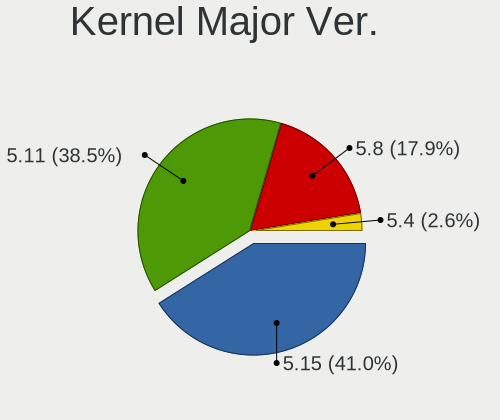
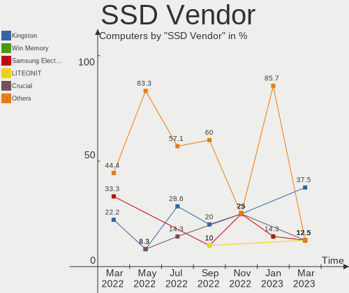
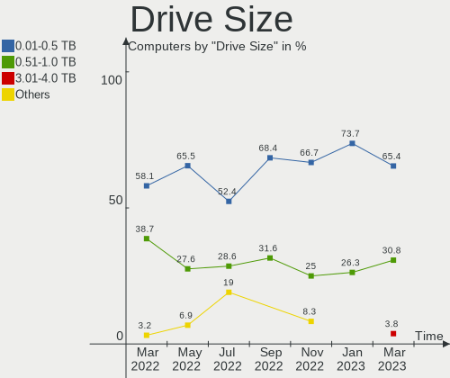
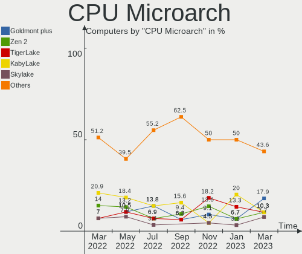
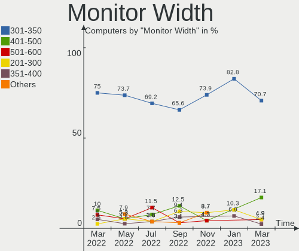
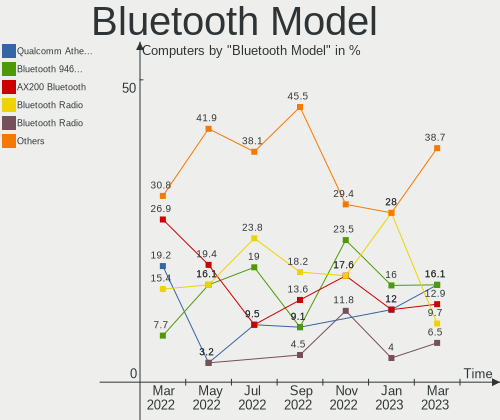
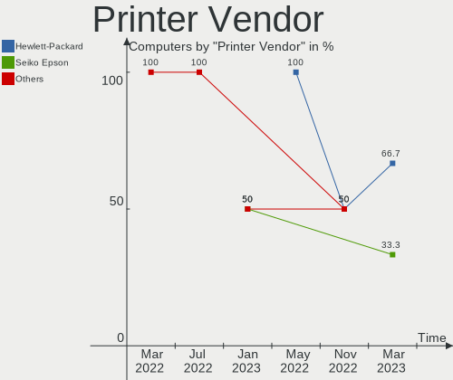
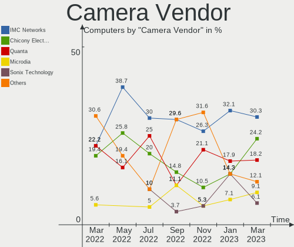

Endless - Hardware Trends
-------------------------

A project to identify most popular hardware characteristics and track their change
over time based on data collected by Linux users at https://Linux-Hardware.org.

Anyone can contribute to this report by the [hw-probe](https://github.com/linuxhw/hw-probe) tool:

    sudo -E hw-probe -all -upload

This is a report for all computer types. See also reports for [desktops](/Dist/Endless/Desktop/README.md) and [notebooks](/Dist/Endless/Notebook/README.md).

This report is for one last month. Overall report since the beginning of time: [TestCoverage](https://github.com/linuxhw/TestCoverage)

Period: Jul, 2022.

Contents
--------

* [ System ](#system)
  - [ OS                       ](#os)
  - [ OS Family                ](#os-family)
  - [ Kernel                   ](#kernel)
  - [ Kernel Family            ](#kernel-family)
  - [ Kernel Major Ver.        ](#kernel-major-ver)
  - [ Arch                     ](#arch)
  - [ DE                       ](#de)
  - [ Display Server           ](#display-server)
  - [ Display Manager          ](#display-manager)
  - [ OS Lang                  ](#os-lang)
  - [ Boot Mode                ](#boot-mode)
  - [ Filesystem               ](#filesystem)
  - [ Part. scheme             ](#part-scheme)
  - [ Dual Boot with Linux/BSD ](#dual-boot-with-linuxbsd)
  - [ Dual Boot (Win)          ](#dual-boot-win)

* [ Board ](#board)
  - [ Vendor                   ](#vendor)
  - [ Model                    ](#model)
  - [ Model Family             ](#model-family)
  - [ MFG Year                 ](#mfg-year)
  - [ Form Factor              ](#form-factor)
  - [ Secure Boot              ](#secure-boot)
  - [ Coreboot                 ](#coreboot)
  - [ RAM Size                 ](#ram-size)
  - [ RAM Used                 ](#ram-used)
  - [ Total Drives             ](#total-drives)
  - [ Has CD-ROM               ](#has-cd-rom)
  - [ Has Ethernet             ](#has-ethernet)
  - [ Has WiFi                 ](#has-wifi)
  - [ Has Bluetooth            ](#has-bluetooth)

* [ Location ](#location)
  - [ Country                  ](#country)
  - [ City                     ](#city)

* [ Drives ](#drives)
  - [ Drive Vendor             ](#drive-vendor)
  - [ Drive Model              ](#drive-model)
  - [ HDD Vendor               ](#hdd-vendor)
  - [ SSD Vendor               ](#ssd-vendor)
  - [ Drive Kind               ](#drive-kind)
  - [ Drive Connector          ](#drive-connector)
  - [ Drive Size               ](#drive-size)
  - [ Space Total              ](#space-total)
  - [ Space Used               ](#space-used)
  - [ Malfunc. Drives          ](#malfunc-drives)
  - [ Malfunc. Drive Vendor    ](#malfunc-drive-vendor)
  - [ Malfunc. HDD Vendor      ](#malfunc-hdd-vendor)
  - [ Malfunc. Drive Kind      ](#malfunc-drive-kind)
  - [ Failed Drives            ](#failed-drives)
  - [ Failed Drive Vendor      ](#failed-drive-vendor)
  - [ Drive Status             ](#drive-status)

* [ Storage controller ](#storage-controller)
  - [ Storage Vendor           ](#storage-vendor)
  - [ Storage Model            ](#storage-model)
  - [ Storage Kind             ](#storage-kind)

* [ Processor ](#processor)
  - [ CPU Vendor               ](#cpu-vendor)
  - [ CPU Model                ](#cpu-model)
  - [ CPU Model Family         ](#cpu-model-family)
  - [ CPU Cores                ](#cpu-cores)
  - [ CPU Sockets              ](#cpu-sockets)
  - [ CPU Threads              ](#cpu-threads)
  - [ CPU Op-Modes             ](#cpu-op-modes)
  - [ CPU Microcode            ](#cpu-microcode)
  - [ CPU Microarch            ](#cpu-microarch)

* [ Graphics ](#graphics)
  - [ GPU Vendor               ](#gpu-vendor)
  - [ GPU Model                ](#gpu-model)
  - [ GPU Combo                ](#gpu-combo)
  - [ GPU Driver               ](#gpu-driver)
  - [ GPU Memory               ](#gpu-memory)

* [ Monitor ](#monitor)
  - [ Monitor Vendor           ](#monitor-vendor)
  - [ Monitor Model            ](#monitor-model)
  - [ Monitor Resolution       ](#monitor-resolution)
  - [ Monitor Diagonal         ](#monitor-diagonal)
  - [ Monitor Width            ](#monitor-width)
  - [ Aspect Ratio             ](#aspect-ratio)
  - [ Monitor Area             ](#monitor-area)
  - [ Pixel Density            ](#pixel-density)
  - [ Multiple Monitors        ](#multiple-monitors)

* [ Network ](#network)
  - [ Net Controller Vendor    ](#net-controller-vendor)
  - [ Net Controller Model     ](#net-controller-model)
  - [ Wireless Vendor          ](#wireless-vendor)
  - [ Wireless Model           ](#wireless-model)
  - [ Ethernet Vendor          ](#ethernet-vendor)
  - [ Ethernet Model           ](#ethernet-model)
  - [ Net Controller Kind      ](#net-controller-kind)
  - [ Used Controller          ](#used-controller)
  - [ NICs                     ](#nics)
  - [ IPv6                     ](#ipv6)

* [ Bluetooth ](#bluetooth)
  - [ Bluetooth Vendor         ](#bluetooth-vendor)
  - [ Bluetooth Model          ](#bluetooth-model)

* [ Sound ](#sound)
  - [ Sound Vendor             ](#sound-vendor)
  - [ Sound Model              ](#sound-model)

* [ Memory ](#memory)
  - [ Memory Vendor            ](#memory-vendor)
  - [ Memory Model             ](#memory-model)
  - [ Memory Kind              ](#memory-kind)
  - [ Memory Form Factor       ](#memory-form-factor)
  - [ Memory Size              ](#memory-size)
  - [ Memory Speed             ](#memory-speed)

* [ Printers & scanners ](#printers--scanners)
  - [ Printer Vendor           ](#printer-vendor)
  - [ Printer Model            ](#printer-model)
  - [ Scanner Vendor           ](#scanner-vendor)
  - [ Scanner Model            ](#scanner-model)

* [ Camera ](#camera)
  - [ Camera Vendor            ](#camera-vendor)
  - [ Camera Model             ](#camera-model)

* [ Security ](#security)
  - [ Fingerprint Vendor       ](#fingerprint-vendor)
  - [ Fingerprint Model        ](#fingerprint-model)
  - [ Chipcard Vendor          ](#chipcard-vendor)
  - [ Chipcard Model           ](#chipcard-model)

* [ Unsupported ](#unsupported)
  - [ Unsupported Devices      ](#unsupported-devices)
  - [ Unsupported Device Types ](#unsupported-device-types)

System
------

OS
--

Installed operating systems

| Name                  | Computers | Percent |
|-----------------------|-----------|---------|
| Endless 4.0.7         | 18        | 62.07%  |
| Endless 3.9.7         | 4         | 13.79%  |
| Endless 4.0.6         | 1         | 3.45%   |
| Endless 3.9.3-nexthw1 | 1         | 3.45%   |
| Endless 3.8.7-nexthw2 | 1         | 3.45%   |
| Endless 3.8.7         | 1         | 3.45%   |
| Endless 3.8.1         | 1         | 3.45%   |
| Endless 3.7.7-nexthw1 | 1         | 3.45%   |
| Endless 3.4.0         | 1         | 3.45%   |

OS Family
---------

OS without a version

| Name    | Computers | Percent |
|---------|-----------|---------|
| Endless | 29        | 100%    |

Kernel
------

Version of the Linux kernel

| Version           | Computers | Percent |
|-------------------|-----------|---------|
| 5.11.0-35-generic | 19        | 65.52%  |
| 5.8.0-14-generic  | 5         | 17.24%  |
| 5.4.0-7-generic   | 1         | 3.45%   |
| 5.4.0-42-generic  | 1         | 3.45%   |
| 5.4.0-19-generic  | 1         | 3.45%   |
| 5.11.0-12-generic | 1         | 3.45%   |
| 4.15.0-15-generic | 1         | 3.45%   |

Kernel Family
-------------

Linux kernel without a distro release

| Version | Computers | Percent |
|---------|-----------|---------|
| 5.11.0  | 20        | 68.97%  |
| 5.8.0   | 5         | 17.24%  |
| 5.4.0   | 3         | 10.34%  |
| 4.15.0  | 1         | 3.45%   |

Kernel Major Ver.
-----------------

Linux kernel major version

| Version | Computers | Percent |
|---------|-----------|---------|
| 5.11    | 20        | 68.97%  |
| 5.8     | 5         | 17.24%  |
| 5.4     | 3         | 10.34%  |
| 4.15    | 1         | 3.45%   |

Arch
----

OS architecture (x86_64, i586, etc.)

| Name   | Computers | Percent |
|--------|-----------|---------|
| x86_64 | 29        | 100%    |

DE
--

Desktop Environment

| Name  | Computers | Percent |
|-------|-----------|---------|
| GNOME | 29        | 100%    |

Display Server
--------------

X11 or Wayland

| Name | Computers | Percent |
|------|-----------|---------|
| X11  | 29        | 100%    |

Display Manager
---------------

SDDM, LightDM, etc.

| Name    | Computers | Percent |
|---------|-----------|---------|
| Unknown | 29        | 100%    |

OS Lang
-------

Language

| Lang  | Computers | Percent |
|-------|-----------|---------|
| en_US | 12        | 41.38%  |
| pt_BR | 9         | 31.03%  |
| fr_FR | 2         | 6.9%    |
| es_ES | 2         | 6.9%    |
| tr_TR | 1         | 3.45%   |
| ru_RU | 1         | 3.45%   |
| ro_RO | 1         | 3.45%   |
| cs_CZ | 1         | 3.45%   |

Boot Mode
---------

EFI or BIOS

| Mode | Computers | Percent |
|------|-----------|---------|
| EFI  | 19        | 65.52%  |
| BIOS | 10        | 34.48%  |

Filesystem
----------

Type of filesystem

| Type | Computers | Percent |
|------|-----------|---------|
| Ext4 | 29        | 100%    |

Part. scheme
------------

Scheme of partitioning

| Type    | Computers | Percent |
|---------|-----------|---------|
| Unknown | 29        | 100%    |

Dual Boot with Linux/BSD
------------------------

Hosting more than one Linux/BSD

| Dual boot | Computers | Percent |
|-----------|-----------|---------|
| No        | 29        | 100%    |

Dual Boot (Win)
---------------

Hosting Linux and Windows

| Dual boot | Computers | Percent |
|-----------|-----------|---------|
| No        | 29        | 100%    |

Board
-----

Vendor
------

Motherboard manufacturer

| Name                | Computers | Percent |
|---------------------|-----------|---------|
| ASUSTek Computer    | 13        | 44.83%  |
| Acer                | 6         | 20.69%  |
| Lenovo              | 3         | 10.34%  |
| Sony                | 2         | 6.9%    |
| Gigabyte Technology | 2         | 6.9%    |
| Samsung Electronics | 1         | 3.45%   |
| Chuwi               | 1         | 3.45%   |
| AMI                 | 1         | 3.45%   |

Model
-----

Motherboard model

| Name                                        | Computers | Percent |
|---------------------------------------------|-----------|---------|
| ASUS VivoBook_ASUSLaptop X513EAN_X513EAN    | 2         | 6.9%    |
| Acer Nitro AN515-44                         | 2         | 6.9%    |
| Sony VPCEG33FL                              | 1         | 3.45%   |
| Sony VPCEA26FG                              | 1         | 3.45%   |
| Samsung RV411/RV511/E3511/S3511/RV711/E3411 | 1         | 3.45%   |
| Lenovo ThinkCentre M58 7359DHJ              | 1         | 3.45%   |
| Lenovo MIIX 2 8 20326                       | 1         | 3.45%   |
| Lenovo H50-55 90BG004TUS                    | 1         | 3.45%   |
| Gigabyte H97M-D3H                           | 1         | 3.45%   |
| Gigabyte H61M-S2PH                          | 1         | 3.45%   |
| Chuwi LarkBook                              | 1         | 3.45%   |
| ASUS VivoBook_ASUSLaptop X712FA_X712FA      | 1         | 3.45%   |
| ASUS VivoBook_ASUSLaptop X515JAB_F515JA     | 1         | 3.45%   |
| ASUS VivoBook_ASUSLaptop X515DA_X515DA      | 1         | 3.45%   |
| ASUS VivoBook_ASUSLaptop X409DAP_D409DA     | 1         | 3.45%   |
| ASUS VivoBook 15_ASUS Laptop X540UAR        | 1         | 3.45%   |
| ASUS VivoBook 15_ASUS Laptop X540MA_X543MA  | 1         | 3.45%   |
| ASUS VivoBook 15_ASUS Laptop X540MA_X540MA  | 1         | 3.45%   |
| ASUS VivoBook 15_ASUS Laptop X540BA         | 1         | 3.45%   |
| ASUS Vivo AIO 16 V161GAR_V161GAR            | 1         | 3.45%   |
| ASUS M5A99X EVO R2.0                        | 1         | 3.45%   |
| ASUS M2N68                                  | 1         | 3.45%   |
| AMI F3C                                     | 1         | 3.45%   |
| Acer Veriton S2665G                         | 1         | 3.45%   |
| Acer TravelMate 8572T                       | 1         | 3.45%   |
| Acer Aspire F5-573G                         | 1         | 3.45%   |
| Acer Aspire A515-54                         | 1         | 3.45%   |

Model Family
------------

Motherboard model prefix

| Name               | Computers | Percent |
|--------------------|-----------|---------|
| ASUS VivoBook      | 10        | 34.48%  |
| Acer Nitro         | 2         | 6.9%    |
| Acer Aspire        | 2         | 6.9%    |
| Sony VPCEG33FL     | 1         | 3.45%   |
| Sony VPCEA26FG     | 1         | 3.45%   |
| Samsung RV411      | 1         | 3.45%   |
| Lenovo ThinkCentre | 1         | 3.45%   |
| Lenovo MIIX        | 1         | 3.45%   |
| Lenovo H50-55      | 1         | 3.45%   |
| Gigabyte H97M-D3H  | 1         | 3.45%   |
| Gigabyte H61M-S2PH | 1         | 3.45%   |
| Chuwi LarkBook     | 1         | 3.45%   |
| ASUS Vivo          | 1         | 3.45%   |
| ASUS M5A99X        | 1         | 3.45%   |
| ASUS M2N68         | 1         | 3.45%   |
| AMI F3C            | 1         | 3.45%   |
| Acer Veriton       | 1         | 3.45%   |
| Acer TravelMate    | 1         | 3.45%   |

MFG Year
--------

Motherboard manufacture year

| Year | Computers | Percent |
|------|-----------|---------|
| 2020 | 5         | 17.24%  |
| 2019 | 4         | 13.79%  |
| 2021 | 3         | 10.34%  |
| 2018 | 3         | 10.34%  |
| 2016 | 2         | 6.9%    |
| 2011 | 2         | 6.9%    |
| 2010 | 2         | 6.9%    |
| 2008 | 2         | 6.9%    |
| 2022 | 1         | 3.45%   |
| 2017 | 1         | 3.45%   |
| 2015 | 1         | 3.45%   |
| 2014 | 1         | 3.45%   |
| 2013 | 1         | 3.45%   |
| 2012 | 1         | 3.45%   |

Form Factor
-----------

Physical design of the computer

| Name       | Computers | Percent |
|------------|-----------|---------|
| Notebook   | 20        | 68.97%  |
| Desktop    | 7         | 24.14%  |
| Tablet     | 1         | 3.45%   |
| All in one | 1         | 3.45%   |

Secure Boot
-----------

Enabled or disabled

| State    | Computers | Percent |
|----------|-----------|---------|
| Disabled | 24        | 82.76%  |
| Enabled  | 5         | 17.24%  |

Coreboot
--------

Have coreboot on board

| Used | Computers | Percent |
|------|-----------|---------|
| No   | 29        | 100%    |

RAM Size
--------

Total RAM memory

| Size in GB | Computers | Percent |
|------------|-----------|---------|
| 4.01-8.0   | 12        | 41.38%  |
| 3.01-4.0   | 12        | 41.38%  |
| 16.01-24.0 | 2         | 6.9%    |
| 1.01-2.0   | 2         | 6.9%    |
| 8.01-16.0  | 1         | 3.45%   |

RAM Used
--------

Used RAM memory

| Used GB   | Computers | Percent |
|-----------|-----------|---------|
| 1.01-2.0  | 14        | 48.28%  |
| 2.01-3.0  | 6         | 20.69%  |
| 0.51-1.0  | 4         | 13.79%  |
| 4.01-8.0  | 3         | 10.34%  |
| 3.01-4.0  | 1         | 3.45%   |
| 8.01-16.0 | 1         | 3.45%   |

Total Drives
------------

Number of drives on board

| Drives | Computers | Percent |
|--------|-----------|---------|
| 1      | 25        | 86.21%  |
| 2      | 4         | 13.79%  |

Has CD-ROM
----------

Has CD-ROM on board

| Presented | Computers | Percent |
|-----------|-----------|---------|
| No        | 21        | 72.41%  |
| Yes       | 8         | 27.59%  |

Has Ethernet
------------

Has Ethernet on board

| Presented | Computers | Percent |
|-----------|-----------|---------|
| Yes       | 17        | 58.62%  |
| No        | 12        | 41.38%  |

Has WiFi
--------

Has WiFi module

| Presented | Computers | Percent |
|-----------|-----------|---------|
| Yes       | 23        | 79.31%  |
| No        | 6         | 20.69%  |

Has Bluetooth
-------------

Has Bluetooth module

| Presented | Computers | Percent |
|-----------|-----------|---------|
| Yes       | 21        | 72.41%  |
| No        | 8         | 27.59%  |

Location
--------

Country
-------

Geographic location (country)

| Country   | Computers | Percent |
|-----------|-----------|---------|
| Brazil    | 8         | 27.59%  |
| USA       | 4         | 13.79%  |
| Spain     | 2         | 6.9%    |
| Romania   | 2         | 6.9%    |
| France    | 2         | 6.9%    |
| Turkey    | 1         | 3.45%   |
| Sri Lanka | 1         | 3.45%   |
| Russia    | 1         | 3.45%   |
| Pakistan  | 1         | 3.45%   |
| Nigeria   | 1         | 3.45%   |
| Malaysia  | 1         | 3.45%   |
| Egypt     | 1         | 3.45%   |
| Czechia   | 1         | 3.45%   |
| Colombia  | 1         | 3.45%   |
| Belgium   | 1         | 3.45%   |
| Australia | 1         | 3.45%   |

City
----

Geographic location (city)

| City            | Computers | Percent |
|-----------------|-----------|---------|
| San Francisco   | 2         | 6.9%    |
| Viseu de Sus    | 1         | 3.45%   |
| Vigo            | 1         | 3.45%   |
| Vehari          | 1         | 3.45%   |
| Tours           | 1         | 3.45%   |
| Sector 5        | 1         | 3.45%   |
| Sao Carlos      | 1         | 3.45%   |
| Ridgecrest      | 1         | 3.45%   |
| Prague          | 1         | 3.45%   |
| Port Huron      | 1         | 3.45%   |
| Patrocinio      | 1         | 3.45%   |
| Montblanc       | 1         | 3.45%   |
| Mol             | 1         | 3.45%   |
| Maua            | 1         | 3.45%   |
| Manizales       | 1         | 3.45%   |
| Maceió         | 1         | 3.45%   |
| Kuala Lumpur    | 1         | 3.45%   |
| Kano            | 1         | 3.45%   |
| Jaraguá do Sul | 1         | 3.45%   |
| Izmir           | 1         | 3.45%   |
| Itajaí         | 1         | 3.45%   |
| Guapimirim      | 1         | 3.45%   |
| Dimitrovgrad    | 1         | 3.45%   |
| Creil           | 1         | 3.45%   |
| Colombo         | 1         | 3.45%   |
| Brisbane        | 1         | 3.45%   |
| Belo Horizonte  | 1         | 3.45%   |
| Alexandria      | 1         | 3.45%   |

Drives
------

Drive Vendor
------------

Hard drive vendors

| Vendor              | Computers | Drives | Percent |
|---------------------|-----------|--------|---------|
| Seagate             | 10        | 10     | 30.3%   |
| Toshiba             | 3         | 3      | 9.09%   |
| SanDisk             | 3         | 3      | 9.09%   |
| Unknown             | 2         | 2      | 6.06%   |
| Samsung Electronics | 2         | 2      | 6.06%   |
| Kingston            | 2         | 2      | 6.06%   |
| ADATA Technology    | 2         | 2      | 6.06%   |
| WDC                 | 1         | 1      | 3.03%   |
| Silicon Motion      | 1         | 1      | 3.03%   |
| Phison              | 1         | 1      | 3.03%   |
| OWC                 | 1         | 1      | 3.03%   |
| KingSpec            | 1         | 1      | 3.03%   |
| JMicron Technology  | 1         | 1      | 3.03%   |
| Intel               | 1         | 1      | 3.03%   |
| Fujitsu             | 1         | 1      | 3.03%   |
| Crucial             | 1         | 1      | 3.03%   |

Drive Model
-----------

Hard drive models

| Model                               | Computers | Percent |
|-------------------------------------|-----------|---------|
| Unknown MMC Card  32GB              | 2         | 6.06%   |
| Toshiba MQ01ABF050 500GB            | 2         | 6.06%   |
| Seagate ST3000DM001-9YN166 3TB      | 2         | 6.06%   |
| ADATA NVMe SSD Drive 256GB          | 2         | 6.06%   |
| WDC WD10SPZX-21Z10T0 1TB            | 1         | 3.03%   |
| Toshiba MQ01ABD100 1TB              | 1         | 3.03%   |
| Silicon Motion NVMe SSD Drive 256GB | 1         | 3.03%   |
| Seagate ST500VT000-1DK142 500GB     | 1         | 3.03%   |
| Seagate ST500LM030-2E717D 500GB     | 1         | 3.03%   |
| Seagate ST500LM012 HN-M500MBB 500GB | 1         | 3.03%   |
| Seagate ST3250318AS 250GB           | 1         | 3.03%   |
| Seagate ST2000LM007-1R8174 2TB      | 1         | 3.03%   |
| Seagate ST2000DM001-1ER164 2TB      | 1         | 3.03%   |
| Seagate ST1000LM035-1RK172 1TB      | 1         | 3.03%   |
| Seagate ST1000DM010-2EP102 1TB      | 1         | 3.03%   |
| SanDisk SD9SB8W256G1102 256GB SSD   | 1         | 3.03%   |
| SanDisk NVMe SSD Drive 512GB        | 1         | 3.03%   |
| SanDisk NVMe SSD Drive 256GB        | 1         | 3.03%   |
| Samsung NVMe SSD Drive 256GB        | 1         | 3.03%   |
| Samsung HD080HJ/ 80GB               | 1         | 3.03%   |
| Phison NVMe SSD Drive 256GB         | 1         | 3.03%   |
| OWC Mercury Electra 3G SSD          | 1         | 3.03%   |
| Kingston OM8P0S3256B-A0 256GB SSD   | 1         | 3.03%   |
| Kingston OCP0S3128B-AB 128GB SSD    | 1         | 3.03%   |
| KingSpec P4-120 120GB               | 1         | 3.03%   |
| JMicron Generic 2TB                 | 1         | 3.03%   |
| Intel NVMe SSD Drive 256GB          | 1         | 3.03%   |
| Fujitsu MHV2120BH PL 120GB          | 1         | 3.03%   |
| Crucial CT512MX100SSD1 512GB        | 1         | 3.03%   |

HDD Vendor
----------

Hard disk drive vendors

| Vendor              | Computers | Drives | Percent |
|---------------------|-----------|--------|---------|
| Seagate             | 10        | 10     | 62.5%   |
| Toshiba             | 3         | 3      | 18.75%  |
| WDC                 | 1         | 1      | 6.25%   |
| Samsung Electronics | 1         | 1      | 6.25%   |
| Fujitsu             | 1         | 1      | 6.25%   |

SSD Vendor
----------

Solid state drive vendors

| Vendor   | Computers | Drives | Percent |
|----------|-----------|--------|---------|
| Kingston | 2         | 2      | 33.33%  |
| SanDisk  | 1         | 1      | 16.67%  |
| OWC      | 1         | 1      | 16.67%  |
| KingSpec | 1         | 1      | 16.67%  |
| Crucial  | 1         | 1      | 16.67%  |

Drive Kind
----------

HDD or SSD

| Kind | Computers | Drives | Percent |
|------|-----------|--------|---------|
| HDD  | 16        | 16     | 48.48%  |
| NVMe | 9         | 9      | 27.27%  |
| SSD  | 6         | 6      | 18.18%  |
| MMC  | 2         | 2      | 6.06%   |

Drive Connector
---------------

SATA, SAS, NVMe, etc.

| Type | Computers | Drives | Percent |
|------|-----------|--------|---------|
| SATA | 20        | 22     | 64.52%  |
| NVMe | 8         | 8      | 25.81%  |
| MMC  | 2         | 2      | 6.45%   |
| SAS  | 1         | 1      | 3.23%   |

Drive Size
----------

Size of hard drive

| Size in TB | Computers | Drives | Percent |
|------------|-----------|--------|---------|
| 0.01-0.5   | 12        | 13     | 57.14%  |
| 0.51-1.0   | 5         | 5      | 23.81%  |
| 2.01-3.0   | 2         | 2      | 9.52%   |
| 1.01-2.0   | 2         | 2      | 9.52%   |

Space Total
-----------

Amount of disk space available on the file system

| Size in GB | Computers | Percent |
|------------|-----------|---------|
| 101-250    | 9         | 31.03%  |
| 251-500    | 7         | 24.14%  |
| 501-1000   | 5         | 17.24%  |
| 21-50      | 4         | 13.79%  |
| 2001-3000  | 2         | 6.9%    |
| 1001-2000  | 2         | 6.9%    |

Space Used
----------

Amount of used disk space

| Used GB  | Computers | Percent |
|----------|-----------|---------|
| 21-50    | 12        | 41.38%  |
| 51-100   | 7         | 24.14%  |
| 1-20     | 5         | 17.24%  |
| 101-250  | 3         | 10.34%  |
| 501-1000 | 2         | 6.9%    |

Malfunc. Drives
---------------

Drive models with a malfunction

Zero info for selected period =(

Malfunc. Drive Vendor
---------------------

Vendors of faulty drives

Zero info for selected period =(

Malfunc. HDD Vendor
-------------------

Vendors of faulty HDD drives

Zero info for selected period =(

Malfunc. Drive Kind
-------------------

Kinds of faulty drives

Zero info for selected period =(

Failed Drives
-------------

Failed drive models

Zero info for selected period =(

Failed Drive Vendor
-------------------

Failed drive vendors

Zero info for selected period =(

Drive Status
------------

Number of failed and malfunc. drives

| Status   | Computers | Drives | Percent |
|----------|-----------|--------|---------|
| Detected | 29        | 33     | 100%    |

Storage controller
------------------

Storage Vendor
--------------

Storage controller vendors

| Vendor              | Computers | Percent |
|---------------------|-----------|---------|
| Intel               | 19        | 54.29%  |
| AMD                 | 7         | 20%     |
| SanDisk             | 2         | 5.71%   |
| ADATA Technology    | 2         | 5.71%   |
| Silicon Motion      | 1         | 2.86%   |
| Samsung Electronics | 1         | 2.86%   |
| Phison Electronics  | 1         | 2.86%   |
| Nvidia              | 1         | 2.86%   |
| ASMedia Technology  | 1         | 2.86%   |

Storage Model
-------------

Storage controller models

| Model                                                                                   | Computers | Percent |
|-----------------------------------------------------------------------------------------|-----------|---------|
| AMD FCH SATA Controller [AHCI mode]                                                     | 6         | 14.63%  |
| Intel Celeron/Pentium Silver Processor SATA Controller                                  | 4         | 9.76%   |
| Intel 82801 Mobile SATA Controller [RAID mode]                                          | 3         | 7.32%   |
| Intel 5 Series/3400 Series Chipset 4 port SATA AHCI Controller                          | 3         | 7.32%   |
| SanDisk WD Blue SN550 NVMe SSD                                                          | 2         | 4.88%   |
| Intel Volume Management Device NVMe RAID Controller                                     | 2         | 4.88%   |
| Intel Tiger Lake-LP SATA Controller                                                     | 2         | 4.88%   |
| Intel Sunrise Point-LP SATA Controller [AHCI mode]                                      | 2         | 4.88%   |
| Silicon Motion SM2263EN/SM2263XT SSD Controller                                         | 1         | 2.44%   |
| Samsung NVMe SSD Controller 980                                                         | 1         | 2.44%   |
| Phison PS5013 E13 NVMe Controller                                                       | 1         | 2.44%   |
| Nvidia MCP67 IDE Controller                                                             | 1         | 2.44%   |
| Nvidia MCP67 AHCI Controller                                                            | 1         | 2.44%   |
| Intel PROSet/Wireless WiFi Software extension                                           | 1         | 2.44%   |
| Intel 9 Series Chipset Family SATA Controller [AHCI Mode]                               | 1         | 2.44%   |
| Intel 82801JD/DO (ICH10 Family) SATA AHCI Controller                                    | 1         | 2.44%   |
| Intel 6 Series/C200 Series Chipset Family Desktop SATA Controller (IDE mode, ports 4-5) | 1         | 2.44%   |
| Intel 6 Series/C200 Series Chipset Family Desktop SATA Controller (IDE mode, ports 0-3) | 1         | 2.44%   |
| Intel 6 Series/C200 Series Chipset Family 6 port Mobile SATA AHCI Controller            | 1         | 2.44%   |
| Intel 4 Series Chipset PT IDER Controller                                               | 1         | 2.44%   |
| Intel 200 Series PCH SATA controller [AHCI mode]                                        | 1         | 2.44%   |
| ASMedia ASM1062 Serial ATA Controller                                                   | 1         | 2.44%   |
| AMD SB7x0/SB8x0/SB9x0 SATA Controller [AHCI mode]                                       | 1         | 2.44%   |
| ADATA Non-Volatile memory controller                                                    | 1         | 2.44%   |
| ADATA A Non-Volatile memory controller                                                  | 1         | 2.44%   |

Storage Kind
------------

Kind of storage controller (IDE, SATA, NVMe, SAS, ...)

| Kind | Computers | Percent |
|------|-----------|---------|
| SATA | 24        | 61.54%  |
| NVMe | 8         | 20.51%  |
| RAID | 4         | 10.26%  |
| IDE  | 3         | 7.69%   |

Processor
---------

CPU Vendor
----------

Processor vendors

| Vendor | Computers | Percent |
|--------|-----------|---------|
| Intel  | 21        | 72.41%  |
| AMD    | 8         | 27.59%  |

CPU Model
---------

Processor models

| Model                                         | Computers | Percent |
|-----------------------------------------------|-----------|---------|
| Intel 11th Gen Core i7-1165G7 @ 2.80GHz       | 2         | 6.9%    |
| AMD Ryzen 7 4800H with Radeon Graphics        | 2         | 6.9%    |
| Intel Pentium CPU G2030 @ 3.00GHz             | 1         | 3.45%   |
| Intel Core i7-8565U CPU @ 1.80GHz             | 1         | 3.45%   |
| Intel Core i5-4460 CPU @ 3.20GHz              | 1         | 3.45%   |
| Intel Core i5-2450M CPU @ 2.50GHz             | 1         | 3.45%   |
| Intel Core i5-10210U CPU @ 1.60GHz            | 1         | 3.45%   |
| Intel Core i5 CPU M 540 @ 2.53GHz             | 1         | 3.45%   |
| Intel Core i5 CPU M 520 @ 2.40GHz             | 1         | 3.45%   |
| Intel Core i5 CPU M 480 @ 2.67GHz             | 1         | 3.45%   |
| Intel Core i3-9100 CPU @ 3.60GHz              | 1         | 3.45%   |
| Intel Core i3-7020U CPU @ 2.30GHz             | 1         | 3.45%   |
| Intel Core i3-6006U CPU @ 2.00GHz             | 1         | 3.45%   |
| Intel Core i3-1005G1 CPU @ 1.20GHz            | 1         | 3.45%   |
| Intel Core 2 Duo CPU E7600 @ 3.06GHz          | 1         | 3.45%   |
| Intel Celeron N4120 CPU @ 1.10GHz             | 1         | 3.45%   |
| Intel Celeron N4020 CPU @ 1.10GHz             | 1         | 3.45%   |
| Intel Celeron N4000C CPU @ 1.10GHz            | 1         | 3.45%   |
| Intel Celeron N4000 CPU @ 1.10GHz             | 1         | 3.45%   |
| Intel Atom x5-Z8350 CPU @ 1.44GHz             | 1         | 3.45%   |
| Intel Atom CPU Z3740 @ 1.33GHz                | 1         | 3.45%   |
| AMD Ryzen 5 3500U with Radeon Vega Mobile Gfx | 1         | 3.45%   |
| AMD Ryzen 3 3250U with Radeon Graphics        | 1         | 3.45%   |
| AMD Phenom II X6 1090T Processor              | 1         | 3.45%   |
| AMD FX-870K Quad Core Processor               | 1         | 3.45%   |
| AMD FX-8150 Eight-Core Processor              | 1         | 3.45%   |
| AMD A9-9425 RADEON R5, 5 COMPUTE CORES 2C+3G  | 1         | 3.45%   |

CPU Model Family
----------------

Processor model prefix

| Model            | Computers | Percent |
|------------------|-----------|---------|
| Intel Core i5    | 6         | 20.69%  |
| Intel Core i3    | 4         | 13.79%  |
| Intel Celeron    | 4         | 13.79%  |
| Other            | 3         | 10.34%  |
| Intel Atom       | 2         | 6.9%    |
| AMD Ryzen 7      | 2         | 6.9%    |
| AMD FX           | 2         | 6.9%    |
| Intel Pentium    | 1         | 3.45%   |
| Intel Core i7    | 1         | 3.45%   |
| Intel Core 2 Duo | 1         | 3.45%   |
| AMD Ryzen 5      | 1         | 3.45%   |
| AMD Ryzen 3      | 1         | 3.45%   |
| AMD Phenom II X6 | 1         | 3.45%   |

CPU Cores
---------

Number of processor cores

| Number | Computers | Percent |
|--------|-----------|---------|
| 2      | 15        | 51.72%  |
| 4      | 11        | 37.93%  |
| 8      | 2         | 6.9%    |
| 6      | 1         | 3.45%   |

CPU Sockets
-----------

Number of sockets

| Number | Computers | Percent |
|--------|-----------|---------|
| 1      | 29        | 100%    |

CPU Threads
-----------

Threads per core (Hyper-Threading)

| Number | Computers | Percent |
|--------|-----------|---------|
| 2      | 17        | 58.62%  |
| 1      | 12        | 41.38%  |

CPU Op-Modes
------------

CPU Operation Modes (32-bit, 64-bit)

| Op mode        | Computers | Percent |
|----------------|-----------|---------|
| 32-bit, 64-bit | 29        | 100%    |

CPU Microcode
-------------

Microcode number

| Number     | Computers | Percent |
|------------|-----------|---------|
| 0x806c1    | 2         | 6.9%    |
| 0x706a8    | 2         | 6.9%    |
| 0x706a1    | 2         | 6.9%    |
| 0x20655    | 2         | 6.9%    |
| 0x08600103 | 2         | 6.9%    |
| Unknown    | 2         | 6.9%    |
| 0x906eb    | 1         | 3.45%   |
| 0x806ec    | 1         | 3.45%   |
| 0x806eb    | 1         | 3.45%   |
| 0x806e9    | 1         | 3.45%   |
| 0x706e5    | 1         | 3.45%   |
| 0x406e3    | 1         | 3.45%   |
| 0x406c4    | 1         | 3.45%   |
| 0x306c3    | 1         | 3.45%   |
| 0x306a9    | 1         | 3.45%   |
| 0x30673    | 1         | 3.45%   |
| 0x206a7    | 1         | 3.45%   |
| 0x20652    | 1         | 3.45%   |
| 0x1067a    | 1         | 3.45%   |
| 0x08108109 | 1         | 3.45%   |
| 0x06006705 | 1         | 3.45%   |
| 0x0600063e | 1         | 3.45%   |
| 0x010000dc | 1         | 3.45%   |

CPU Microarch
-------------

Microarchitecture

| Name          | Computers | Percent |
|---------------|-----------|---------|
| KabyLake      | 4         | 13.79%  |
| Goldmont plus | 4         | 13.79%  |
| Westmere      | 3         | 10.34%  |
| Zen+          | 2         | 6.9%    |
| Zen 2         | 2         | 6.9%    |
| TigerLake     | 2         | 6.9%    |
| Silvermont    | 2         | 6.9%    |
| Steamroller   | 1         | 3.45%   |
| Skylake       | 1         | 3.45%   |
| SandyBridge   | 1         | 3.45%   |
| Penryn        | 1         | 3.45%   |
| K10           | 1         | 3.45%   |
| IvyBridge     | 1         | 3.45%   |
| IceLake       | 1         | 3.45%   |
| Haswell       | 1         | 3.45%   |
| Excavator     | 1         | 3.45%   |
| Bulldozer     | 1         | 3.45%   |

Graphics
--------

GPU Vendor
----------

Vendors of graphics cards

| Vendor | Computers | Percent |
|--------|-----------|---------|
| Intel  | 19        | 57.58%  |
| AMD    | 9         | 27.27%  |
| Nvidia | 5         | 15.15%  |

GPU Model
---------

Graphics card models

| Model                                                                                    | Computers | Percent |
|------------------------------------------------------------------------------------------|-----------|---------|
| Intel GeminiLake [UHD Graphics 600]                                                      | 4         | 12.12%  |
| Nvidia TU117M                                                                            | 2         | 6.06%   |
| Intel TigerLake-LP GT2 [Iris Xe Graphics]                                                | 2         | 6.06%   |
| Intel Core Processor Integrated Graphics Controller                                      | 2         | 6.06%   |
| AMD Renoir                                                                               | 2         | 6.06%   |
| AMD Picasso/Raven 2 [Radeon Vega Series / Radeon Vega Mobile Series]                     | 2         | 6.06%   |
| Nvidia GM108M [GeForce 940MX]                                                            | 1         | 3.03%   |
| Nvidia GF119M [GeForce 410M]                                                             | 1         | 3.03%   |
| Nvidia G96CGL [Quadro FX 580]                                                            | 1         | 3.03%   |
| Intel Xeon E3-1200 v3/4th Gen Core Processor Integrated Graphics Controller              | 1         | 3.03%   |
| Intel Xeon E3-1200 v2/3rd Gen Core processor Graphics Controller                         | 1         | 3.03%   |
| Intel WhiskeyLake-U GT2 [UHD Graphics 620]                                               | 1         | 3.03%   |
| Intel Skylake GT2 [HD Graphics 520]                                                      | 1         | 3.03%   |
| Intel Kaby Lake-U GT2f HD 620 Graphics Controller                                        | 1         | 3.03%   |
| Intel Iris Plus Graphics G1 (Ice Lake)                                                   | 1         | 3.03%   |
| Intel CometLake-U GT2 [UHD Graphics]                                                     | 1         | 3.03%   |
| Intel CoffeeLake-S GT2 [UHD Graphics 630]                                                | 1         | 3.03%   |
| Intel Atom/Celeron/Pentium Processor x5-E8000/J3xxx/N3xxx Integrated Graphics Controller | 1         | 3.03%   |
| Intel Atom Processor Z36xxx/Z37xxx Series Graphics & Display                             | 1         | 3.03%   |
| Intel 4 Series Chipset Integrated Graphics Controller                                    | 1         | 3.03%   |
| AMD Stoney [Radeon R2/R3/R4/R5 Graphics]                                                 | 1         | 3.03%   |
| AMD Radeon R7 240                                                                        | 1         | 3.03%   |
| AMD Oland XT [Radeon HD 8670 / R5 340X OEM / R7 250/350/350X OEM]                        | 1         | 3.03%   |
| AMD Madison [Mobility Radeon HD 5650/5750 / 6530M/6550M]                                 | 1         | 3.03%   |
| AMD Cypress PRO [Radeon HD 5850]                                                         | 1         | 3.03%   |

GPU Combo
---------

Combinations of graphics cards

| Name           | Computers | Percent |
|----------------|-----------|---------|
| 1 x Intel      | 17        | 58.62%  |
| 1 x AMD        | 6         | 20.69%  |
| 1 x Nvidia     | 2         | 6.9%    |
| AMD + Nvidia   | 2         | 6.9%    |
| Intel + Nvidia | 1         | 3.45%   |
| Intel + AMD    | 1         | 3.45%   |

GPU Driver
----------

Free vs proprietary

| Driver      | Computers | Percent |
|-------------|-----------|---------|
| Free        | 26        | 89.66%  |
| Proprietary | 3         | 10.34%  |

GPU Memory
----------

Total video memory

| Size in GB | Computers | Percent |
|------------|-----------|---------|
| Unknown    | 19        | 65.52%  |
| 0.01-0.5   | 4         | 13.79%  |
| 3.01-4.0   | 2         | 6.9%    |
| 1.01-2.0   | 2         | 6.9%    |
| 0.51-1.0   | 2         | 6.9%    |

Monitor
-------

Monitor Vendor
--------------

Monitor vendors

| Vendor                  | Computers | Percent |
|-------------------------|-----------|---------|
| Chimei Innolux          | 6         | 23.08%  |
| BOE                     | 6         | 23.08%  |
| AU Optronics            | 4         | 15.38%  |
| Dell                    | 2         | 7.69%   |
| Sony                    | 1         | 3.85%   |
| Sceptre Tech            | 1         | 3.85%   |
| Samsung Electronics     | 1         | 3.85%   |
| Philips                 | 1         | 3.85%   |
| PANDA                   | 1         | 3.85%   |
| Goldstar                | 1         | 3.85%   |
| Chi Mei Optoelectronics | 1         | 3.85%   |
| AOC                     | 1         | 3.85%   |

Monitor Model
-------------

Monitor models

| Model                                                                    | Computers | Percent |
|--------------------------------------------------------------------------|-----------|---------|
| Chimei Innolux LCD Monitor CMN15DB 1366x768 344x193mm 15.5-inch          | 3         | 11.11%  |
| Chimei Innolux LCD Monitor CMN15F5 1920x1080 344x193mm 15.5-inch         | 2         | 7.41%   |
| BOE LCD Monitor BOE06A5 1366x768 344x194mm 15.5-inch                     | 2         | 7.41%   |
| Sony LCD Monitor SNY05FA 1366x768 310x170mm 13.9-inch                    | 1         | 3.7%    |
| Sceptre Tech E248W-1920 SPT099D 1920x1080 443x249mm 20.0-inch            | 1         | 3.7%    |
| Samsung Electronics LCD Monitor SEC3142 1366x768 309x174mm 14.0-inch     | 1         | 3.7%    |
| Samsung Electronics LCD Monitor SAM0D4F 1920x1080 1210x680mm 54.6-inch   | 1         | 3.7%    |
| Philips PHL 242V8 PHLC219 1920x1080 527x296mm 23.8-inch                  | 1         | 3.7%    |
| PANDA LCD Monitor NCP004D 1920x1080 344x194mm 15.5-inch                  | 1         | 3.7%    |
| Goldstar W1642 GSM3E86 1360x768 344x194mm 15.5-inch                      | 1         | 3.7%    |
| Dell P2319H DELD0D7 1920x1080 509x286mm 23.0-inch                        | 1         | 3.7%    |
| Dell E1914H DELD03A 1366x768 410x230mm 18.5-inch                         | 1         | 3.7%    |
| Chimei Innolux LCD Monitor CMN15E6 1366x768 344x193mm 15.5-inch          | 1         | 3.7%    |
| Chi Mei Optoelectronics LCD Monitor CMO1465 1366x768 309x174mm 14.0-inch | 1         | 3.7%    |
| BOE LCD Monitor BOE084E 1920x1080 382x215mm 17.3-inch                    | 1         | 3.7%    |
| BOE LCD Monitor BOE07F6 1920x1080 309x174mm 14.0-inch                    | 1         | 3.7%    |
| BOE LCD Monitor BOE07AA 1366x768 344x194mm 15.5-inch                     | 1         | 3.7%    |
| BOE LCD BOE07E7 1920x1080 294x165mm 13.3-inch                            | 1         | 3.7%    |
| AU Optronics LCD Monitor AUOAF90 1920x1080 344x193mm 15.5-inch           | 1         | 3.7%    |
| AU Optronics LCD Monitor AUO70EC 1366x768 344x193mm 15.5-inch            | 1         | 3.7%    |
| AU Optronics LCD Monitor AUO61ED 1920x1080 344x193mm 15.5-inch           | 1         | 3.7%    |
| AU Optronics LCD Monitor AUO41EC 1366x768 344x193mm 15.5-inch            | 1         | 3.7%    |
| AOC F19 AOC1900 1366x768 410x230mm 18.5-inch                             | 1         | 3.7%    |

Monitor Resolution
------------------

Monitor screen resolution

| Resolution      | Computers | Percent |
|-----------------|-----------|---------|
| 1366x768 (WXGA) | 14        | 53.85%  |
| 1920x1080 (FHD) | 11        | 42.31%  |
| 1360x768        | 1         | 3.85%   |

Monitor Diagonal
----------------

Diagonal size in inches

| Inches | Computers | Percent |
|--------|-----------|---------|
| 15     | 16        | 59.26%  |
| 14     | 3         | 11.11%  |
| 24     | 2         | 7.41%   |
| 18     | 2         | 7.41%   |
| 54     | 1         | 3.7%    |
| 23     | 1         | 3.7%    |
| 17     | 1         | 3.7%    |
| 13     | 1         | 3.7%    |

Monitor Width
-------------

Physical width

| Width in mm | Computers | Percent |
|-------------|-----------|---------|
| 301-350     | 19        | 70.37%  |
| 501-600     | 3         | 11.11%  |
| 401-500     | 2         | 7.41%   |
| 351-400     | 1         | 3.7%    |
| 201-300     | 1         | 3.7%    |
| 1001-1500   | 1         | 3.7%    |

Aspect Ratio
------------

Proportional relationship between the width and the height

| Ratio | Computers | Percent |
|-------|-----------|---------|
| 16/9  | 24        | 100%    |

Monitor Area
------------

Area in inch²

| Area in inch² | Computers | Percent |
|----------------|-----------|---------|
| 101-110        | 15        | 55.56%  |
| 81-90          | 3         | 11.11%  |
| 201-250        | 3         | 11.11%  |
| 141-150        | 2         | 7.41%   |
| More than 1000 | 1         | 3.7%    |
| 71-80          | 1         | 3.7%    |
| 121-130        | 1         | 3.7%    |
| 91-100         | 1         | 3.7%    |

Pixel Density
-------------

Pixels per inch

| Density | Computers | Percent |
|---------|-----------|---------|
| 101-120 | 13        | 48.15%  |
| 121-160 | 7         | 25.93%  |
| 51-100  | 5         | 18.52%  |
| 1-50    | 1         | 3.7%    |
| 161-240 | 1         | 3.7%    |

Multiple Monitors
-----------------

Total monitors connected

| Total | Computers | Percent |
|-------|-----------|---------|
| 1     | 24        | 82.76%  |
| 2     | 3         | 10.34%  |
| 0     | 2         | 6.9%    |

Network
-------

Net Controller Vendor
---------------------

Controller vendors

| Vendor                   | Computers | Percent |
|--------------------------|-----------|---------|
| Realtek Semiconductor    | 17        | 41.46%  |
| Intel                    | 10        | 24.39%  |
| Qualcomm Atheros         | 5         | 12.2%   |
| Ralink Technology        | 2         | 4.88%   |
| ASIX Electronics         | 2         | 4.88%   |
| TP-Link                  | 1         | 2.44%   |
| Nvidia                   | 1         | 2.44%   |
| Marvell Technology Group | 1         | 2.44%   |
| Broadcom Limited         | 1         | 2.44%   |
| Beceem Communications    | 1         | 2.44%   |

Net Controller Model
--------------------

Controller models

| Model                                                                          | Computers | Percent |
|--------------------------------------------------------------------------------|-----------|---------|
| Realtek RTL8111/8168/8411 PCI Express Gigabit Ethernet Controller              | 9         | 20.45%  |
| Realtek RTL8821CE 802.11ac PCIe Wireless Network Adapter                       | 4         | 9.09%   |
| Qualcomm Atheros QCA9377 802.11ac Wireless Network Adapter                     | 3         | 6.82%   |
| Realtek RTL8822BE 802.11a/b/g/n/ac WiFi adapter                                | 2         | 4.55%   |
| Realtek Killer E2600 Gigabit Ethernet Controller                               | 2         | 4.55%   |
| Qualcomm Atheros AR9285 Wireless Network Adapter (PCI-Express)                 | 2         | 4.55%   |
| Intel Wi-Fi 6 AX201                                                            | 2         | 4.55%   |
| Intel Wi-Fi 6 AX200                                                            | 2         | 4.55%   |
| Intel Centrino Advanced-N 6200                                                 | 2         | 4.55%   |
| ASIX AX88179 Gigabit Ethernet                                                  | 2         | 4.55%   |
| TP-Link TL-WN823N v2/v3 [Realtek RTL8192EU]                                    | 1         | 2.27%   |
| Realtek RTL8821AE 802.11ac PCIe Wireless Network Adapter                       | 1         | 2.27%   |
| Realtek RTL8152 Fast Ethernet Adapter                                          | 1         | 2.27%   |
| Ralink RT5372 Wireless Adapter                                                 | 1         | 2.27%   |
| Ralink RT2870/RT3070 Wireless Adapter                                          | 1         | 2.27%   |
| Qualcomm Atheros AR8151 v2.0 Gigabit Ethernet                                  | 1         | 2.27%   |
| Nvidia MCP67 Ethernet                                                          | 1         | 2.27%   |
| Marvell Group Yukon Optima 88E8059 [PCIe Gigabit Ethernet Controller with AVB] | 1         | 2.27%   |
| Intel Wireless 8265 / 8275                                                     | 1         | 2.27%   |
| Intel Ice Lake-LP PCH CNVi WiFi                                                | 1         | 2.27%   |
| Intel Cannon Point-LP CNVi [Wireless-AC]                                       | 1         | 2.27%   |
| Intel 82567LM-3 Gigabit Network Connection                                     | 1         | 2.27%   |
| Broadcom Limited NetXtreme BCM57760 Gigabit Ethernet PCIe                      | 1         | 2.27%   |
| Beceem UBEE Stick                                                              | 1         | 2.27%   |

Wireless Vendor
---------------

Wireless vendors

| Vendor                | Computers | Percent |
|-----------------------|-----------|---------|
| Intel                 | 9         | 37.5%   |
| Realtek Semiconductor | 7         | 29.17%  |
| Qualcomm Atheros      | 5         | 20.83%  |
| Ralink Technology     | 2         | 8.33%   |
| TP-Link               | 1         | 4.17%   |

Wireless Model
--------------

Wireless models

| Model                                                          | Computers | Percent |
|----------------------------------------------------------------|-----------|---------|
| Realtek RTL8821CE 802.11ac PCIe Wireless Network Adapter       | 4         | 16.67%  |
| Qualcomm Atheros QCA9377 802.11ac Wireless Network Adapter     | 3         | 12.5%   |
| Realtek RTL8822BE 802.11a/b/g/n/ac WiFi adapter                | 2         | 8.33%   |
| Qualcomm Atheros AR9285 Wireless Network Adapter (PCI-Express) | 2         | 8.33%   |
| Intel Wi-Fi 6 AX201                                            | 2         | 8.33%   |
| Intel Wi-Fi 6 AX200                                            | 2         | 8.33%   |
| Intel Centrino Advanced-N 6200                                 | 2         | 8.33%   |
| TP-Link TL-WN823N v2/v3 [Realtek RTL8192EU]                    | 1         | 4.17%   |
| Realtek RTL8821AE 802.11ac PCIe Wireless Network Adapter       | 1         | 4.17%   |
| Ralink RT5372 Wireless Adapter                                 | 1         | 4.17%   |
| Ralink RT2870/RT3070 Wireless Adapter                          | 1         | 4.17%   |
| Intel Wireless 8265 / 8275                                     | 1         | 4.17%   |
| Intel Ice Lake-LP PCH CNVi WiFi                                | 1         | 4.17%   |
| Intel Cannon Point-LP CNVi [Wireless-AC]                       | 1         | 4.17%   |

Ethernet Vendor
---------------

Ethernet vendors

| Vendor                   | Computers | Percent |
|--------------------------|-----------|---------|
| Realtek Semiconductor    | 12        | 60%     |
| ASIX Electronics         | 2         | 10%     |
| Qualcomm Atheros         | 1         | 5%      |
| Nvidia                   | 1         | 5%      |
| Marvell Technology Group | 1         | 5%      |
| Intel                    | 1         | 5%      |
| Broadcom Limited         | 1         | 5%      |
| Beceem Communications    | 1         | 5%      |

Ethernet Model
--------------

Ethernet models

| Model                                                                          | Computers | Percent |
|--------------------------------------------------------------------------------|-----------|---------|
| Realtek RTL8111/8168/8411 PCI Express Gigabit Ethernet Controller              | 9         | 45%     |
| Realtek Killer E2600 Gigabit Ethernet Controller                               | 2         | 10%     |
| ASIX AX88179 Gigabit Ethernet                                                  | 2         | 10%     |
| Realtek RTL8152 Fast Ethernet Adapter                                          | 1         | 5%      |
| Qualcomm Atheros AR8151 v2.0 Gigabit Ethernet                                  | 1         | 5%      |
| Nvidia MCP67 Ethernet                                                          | 1         | 5%      |
| Marvell Group Yukon Optima 88E8059 [PCIe Gigabit Ethernet Controller with AVB] | 1         | 5%      |
| Intel 82567LM-3 Gigabit Network Connection                                     | 1         | 5%      |
| Broadcom Limited NetXtreme BCM57760 Gigabit Ethernet PCIe                      | 1         | 5%      |
| Beceem UBEE Stick                                                              | 1         | 5%      |

Net Controller Kind
-------------------

Ethernet, WiFi or modem

| Kind     | Computers | Percent |
|----------|-----------|---------|
| WiFi     | 23        | 57.5%   |
| Ethernet | 17        | 42.5%   |

Used Controller
---------------

Currently used network controller

| Kind     | Computers | Percent |
|----------|-----------|---------|
| WiFi     | 22        | 73.33%  |
| Ethernet | 8         | 26.67%  |

NICs
----

Total network controllers on board

| Total | Computers | Percent |
|-------|-----------|---------|
| 1     | 17        | 58.62%  |
| 2     | 10        | 34.48%  |
| 0     | 2         | 6.9%    |

IPv6
----

IPv6 vs IPv4

| Used | Computers | Percent |
|------|-----------|---------|
| No   | 16        | 55.17%  |
| Yes  | 13        | 44.83%  |

Bluetooth
---------

Bluetooth Vendor
----------------

Controller vendors

| Vendor                          | Computers | Percent |
|---------------------------------|-----------|---------|
| Intel                           | 7         | 33.33%  |
| IMC Networks                    | 6         | 28.57%  |
| Lite-On Technology              | 2         | 9.52%   |
| Foxconn / Hon Hai               | 2         | 9.52%   |
| Realtek Semiconductor           | 1         | 4.76%   |
| Qualcomm Atheros Communications | 1         | 4.76%   |
| Hewlett-Packard                 | 1         | 4.76%   |
| Cambridge Silicon Radio         | 1         | 4.76%   |

Bluetooth Model
---------------

Controller models

| Model                                                                               | Computers | Percent |
|-------------------------------------------------------------------------------------|-----------|---------|
| IMC Networks Bluetooth Radio                                                        | 5         | 23.81%  |
| Intel Bluetooth 9460/9560 Jefferson Peak (JfP)                                      | 4         | 19.05%  |
| Lite-On Qualcomm Atheros QCA9377 Bluetooth                                          | 2         | 9.52%   |
| Intel AX200 Bluetooth                                                               | 2         | 9.52%   |
| Realtek RTL8821A Bluetooth                                                          | 1         | 4.76%   |
| Qualcomm Atheros AR3011 Bluetooth                                                   | 1         | 4.76%   |
| Intel Bluetooth wireless interface                                                  | 1         | 4.76%   |
| IMC Networks Bluetooth Device                                                       | 1         | 4.76%   |
| HP Atheros AR9285 Malbec Bluetooth Adapter                                          | 1         | 4.76%   |
| Foxconn / Hon Hai Foxconn T77H114 BCM2070 [Single-Chip Bluetooth 2.1 + EDR Adapter] | 1         | 4.76%   |
| Foxconn / Hon Hai Acer Bluetooth module                                             | 1         | 4.76%   |
| Cambridge Silicon Radio Bluetooth Dongle (HCI mode)                                 | 1         | 4.76%   |

Sound
-----

Sound Vendor
------------

Sound card vendors

| Vendor | Computers | Percent |
|--------|-----------|---------|
| Intel  | 19        | 59.38%  |
| AMD    | 9         | 28.13%  |
| Nvidia | 4         | 12.5%   |

Sound Model
-----------

Sound card models

| Model                                                                      | Computers | Percent |
|----------------------------------------------------------------------------|-----------|---------|
| Intel Celeron/Pentium Silver Processor High Definition Audio               | 4         | 10.53%  |
| AMD Family 17h/19h HD Audio Controller                                     | 4         | 10.53%  |
| Intel 5 Series/3400 Series Chipset High Definition Audio                   | 3         | 7.89%   |
| Nvidia TU107 GeForce GTX 1650 High Definition Audio Controller             | 2         | 5.26%   |
| Intel Tiger Lake-LP Smart Sound Technology Audio Controller                | 2         | 5.26%   |
| Intel Sunrise Point-LP HD Audio                                            | 2         | 5.26%   |
| Intel 6 Series/C200 Series Chipset Family High Definition Audio Controller | 2         | 5.26%   |
| AMD Raven/Raven2/Fenghuang HDMI/DP Audio Controller                        | 2         | 5.26%   |
| AMD Oland/Hainan/Cape Verde/Pitcairn HDMI Audio [Radeon HD 7000 Series]    | 2         | 5.26%   |
| Nvidia MCP67 High Definition Audio                                         | 1         | 2.63%   |
| Nvidia GF119 HDMI Audio Controller                                         | 1         | 2.63%   |
| Intel Xeon E3-1200 v3/4th Gen Core Processor HD Audio Controller           | 1         | 2.63%   |
| Intel Ice Lake-LP Smart Sound Technology Audio Controller                  | 1         | 2.63%   |
| Intel Comet Lake PCH-LP cAVS                                               | 1         | 2.63%   |
| Intel Cannon Point-LP High Definition Audio Controller                     | 1         | 2.63%   |
| Intel 9 Series Chipset Family HD Audio Controller                          | 1         | 2.63%   |
| Intel 82801JD/DO (ICH10 Family) HD Audio Controller                        | 1         | 2.63%   |
| Intel 200 Series PCH HD Audio                                              | 1         | 2.63%   |
| AMD SBx00 Azalia (Intel HDA)                                               | 1         | 2.63%   |
| AMD Redwood HDMI Audio [Radeon HD 5000 Series]                             | 1         | 2.63%   |
| AMD High Definition Audio Controller                                       | 1         | 2.63%   |
| AMD FCH Azalia Controller                                                  | 1         | 2.63%   |
| AMD Family 15h (Models 60h-6fh) Audio Controller                           | 1         | 2.63%   |
| AMD Cypress HDMI Audio [Radeon HD 5830/5850/5870 / 6850/6870 Rebrand]      | 1         | 2.63%   |

Memory
------

Memory Vendor
-------------

Memory module vendors

Zero info for selected period =(

Memory Model
------------

Memory module models

Zero info for selected period =(

Memory Kind
-----------

Memory module kinds

Zero info for selected period =(

Memory Form Factor
------------------

Physical design of the memory module

Zero info for selected period =(

Memory Size
-----------

Memory module size

Zero info for selected period =(

Memory Speed
------------

Memory module speed

Zero info for selected period =(

Printers & scanners
-------------------

Printer Vendor
--------------

Printer device vendors

| Vendor     | Computers | Percent |
|------------|-----------|---------|
| ICS Advent | 1         | 100%    |

Printer Model
-------------

Printer device models

| Model                       | Computers | Percent |
|-----------------------------|-----------|---------|
| ICS Advent Parallel Adapter | 1         | 100%    |

Scanner Vendor
--------------

Scanner device vendors

Zero info for selected period =(

Scanner Model
-------------

Scanner device models

Zero info for selected period =(

Camera
------

Camera Vendor
-------------

Camera device vendors

| Vendor                | Computers | Percent |
|-----------------------|-----------|---------|
| IMC Networks          | 6         | 30%     |
| Quanta                | 5         | 25%     |
| Chicony Electronics   | 4         | 20%     |
| Sonix Technology      | 2         | 10%     |
| Silicon Motion        | 1         | 5%      |
| Realtek Semiconductor | 1         | 5%      |
| Microdia              | 1         | 5%      |

Camera Model
------------

Camera device models

| Model                                    | Computers | Percent |
|------------------------------------------|-----------|---------|
| IMC Networks USB2.0 VGA UVC WebCam       | 4         | 20%     |
| Quanta HD User Facing                    | 3         | 15%     |
| Sonix USB2.0 HD UVC WebCam               | 2         | 10%     |
| Quanta USB2.0 HD UVC WebCam              | 2         | 10%     |
| IMC Networks USB2.0 HD UVC WebCam        | 2         | 10%     |
| Silicon Motion WebCam SCB-0385N          | 1         | 5%      |
| Realtek MTD Camera                       | 1         | 5%      |
| Microdia Webcam                          | 1         | 5%      |
| Chicony USB2.0 VGA UVC WebCam            | 1         | 5%      |
| Chicony Sony Visual Communication Camera | 1         | 5%      |
| Chicony HD WebCam                        | 1         | 5%      |
| Chicony 1.3M Webcam                      | 1         | 5%      |

Security
--------

Fingerprint Vendor
------------------

Fingerprint sensor vendors

| Vendor                | Computers | Percent |
|-----------------------|-----------|---------|
| LighTuning Technology | 1         | 100%    |

Fingerprint Model
-----------------

Fingerprint sensor models

| Model                         | Computers | Percent |
|-------------------------------|-----------|---------|
| LighTuning Fingerprint Reader | 1         | 100%    |

Chipcard Vendor
---------------

Chipcard module vendors

Zero info for selected period =(

Chipcard Model
--------------

Chipcard module models

Zero info for selected period =(

Unsupported
-----------

Unsupported Devices
-------------------

Total unsupported devices on board

| Total | Computers | Percent |
|-------|-----------|---------|
| 0     | 21        | 72.41%  |
| 1     | 8         | 27.59%  |

Unsupported Device Types
------------------------

Types of unsupported devices

| Type                  | Computers | Percent |
|-----------------------|-----------|---------|
| Multimedia controller | 5         | 62.5%   |
| Storage/ide           | 1         | 12.5%   |
| Fingerprint reader    | 1         | 12.5%   |
| Bluetooth             | 1         | 12.5%   |

