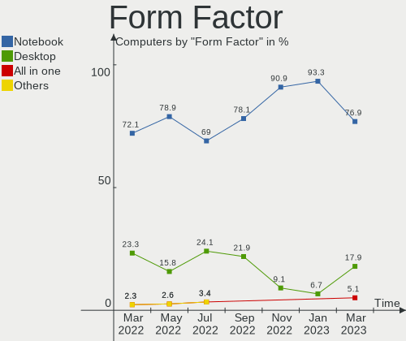

Endless Hardware Trends
-----------------------

A project to identify most popular hardware characteristics and track their change
over time based on data collected by Endless users at https://Linux-Hardware.org.

Anyone can contribute to the study by uploading probes of their computers by
the [hw-probe](https://github.com/linuxhw/hw-probe) tool:

    sudo -E hw-probe -all -upload

This is a report for all computer types. See also reports for [desktops](/Dist/Endless/Desktop/README.md) and [notebooks](/Dist/Endless/Notebook/README.md).

Full-feature report is available here: https://linux-hardware.org/?view=trends

Period: May, 2020.

Contents
--------

- [ OS                       ](#os)
- [ OS Family                ](#os-family)
- [ Kernel                   ](#kernel)
- [ Kernel Family            ](#kernel-family)
- [ Kernel Major Ver.        ](#kernel-major-ver)
- [ Arch                     ](#arch)
- [ DE                       ](#de)
- [ Display Server           ](#display-server)
- [ Display Manager          ](#display-manager)
- [ OS Lang                  ](#os-lang)
- [ Boot Mode                ](#boot-mode)
- [ Filesystem               ](#filesystem)
- [ Part. scheme             ](#part-scheme)
- [ Dual Boot with Linux/BSD ](#dual-boot-with-linux/bsd)
- [ Dual Boot (Win)          ](#dual-boot-win)
- [ Country                  ](#country)
- [ City                     ](#city)
- [ Vendor                   ](#vendor)
- [ Model                    ](#model)
- [ Model Family             ](#model-family)
- [ MFG Year                 ](#mfg-year)
- [ Form Factor              ](#form-factor)
- [ Secure Boot              ](#secure-boot)
- [ Coreboot                 ](#coreboot)
- [ RAM Size                 ](#ram-size)
- [ RAM Used                 ](#ram-used)
- [ Drive Vendor             ](#drive-vendor)
- [ Drive Model              ](#drive-model)
- [ Drive Kind               ](#drive-kind)
- [ Drive Connector          ](#drive-connector)
- [ Drive Size               ](#drive-size)
- [ Space Total              ](#space-total)
- [ Space Used               ](#space-used)
- [ Malfunc. Drives          ](#malfunc-drives)
- [ Malfunc. Drive Vendor    ](#malfunc-drive-vendor)
- [ Malfunc. Drive Kind      ](#malfunc-drive-kind)
- [ Failed Drives            ](#failed-drives)
- [ Failed Drive Vendor      ](#failed-drive-vendor)
- [ Drive Status             ](#drive-status)
- [ Storage Vendor           ](#storage-vendor)
- [ Storage Model            ](#storage-model)
- [ Storage Kind             ](#storage-kind)
- [ CPU Vendor               ](#cpu-vendor)
- [ CPU Model                ](#cpu-model)
- [ CPU Model Family         ](#cpu-model-family)
- [ CPU Cores                ](#cpu-cores)
- [ CPU Sockets              ](#cpu-sockets)
- [ CPU Threads              ](#cpu-threads)
- [ CPU Op-Modes             ](#cpu-op-modes)
- [ CPU Microcode            ](#cpu-microcode)
- [ CPU Microarch            ](#cpu-microarch)
- [ GPU Vendor               ](#gpu-vendor)
- [ GPU Model                ](#gpu-model)
- [ GPU Combo                ](#gpu-combo)
- [ GPU Driver               ](#gpu-driver)
- [ GPU Memory               ](#gpu-memory)
- [ Monitor Vendor           ](#monitor-vendor)
- [ Monitor Model            ](#monitor-model)
- [ Monitor Resolution       ](#monitor-resolution)
- [ Monitor Diagonal         ](#monitor-diagonal)
- [ Monitor Width            ](#monitor-width)
- [ Aspect Ratio             ](#aspect-ratio)
- [ Monitor Area             ](#monitor-area)
- [ Pixel Density            ](#pixel-density)
- [ Multiple Monitors        ](#multiple-monitors)
- [ Net Controller Vendor    ](#net-controller-vendor)
- [ Net Controller Model     ](#net-controller-model)
- [ Net Controller Kind      ](#net-controller-kind)
- [ Used Controller          ](#used-controller)
- [ NICs                     ](#nics)
- [ Unsupported Devices      ](#unsupported-devices)
- [ Unsupported Device Types ](#unsupported-device-types)

OS
--

Installed operating systems

| Name                   | Computers | Percent |
|------------------------|-----------|---------|
| Endless 3.8.0          | 112       | 64.37%  |
| Endless 3.8.1          | 35        | 20.11%  |
| Endless 3.7.8          | 19        | 10.92%  |
| Endless 3.3.20-nexthw1 | 4         | 2.3%    |
| Endless 3.4.2-nexthw1  | 2         | 1.15%   |
| Endless 3.3.16-nexthw1 | 1         | 0.57%   |
| Endless                | 1         | 0.57%   |

OS Family
---------

OS without a version

| Name    | Computers | Percent |
|---------|-----------|---------|
| Endless | 174       | 100%    |

Kernel
------

Version of the Linux kernel

| Version           | Computers | Percent |
|-------------------|-----------|---------|
| 5.4.0-19-generic  | 148       | 85.06%  |
| 5.3.0-28-generic  | 19        | 10.92%  |
| 4.15.0-15-generic | 4         | 2.3%    |
| 4.16.0-4-generic  | 2         | 1.15%   |
| 4.15.0-12-generic | 1         | 0.57%   |

Kernel Family
-------------

Linux kernel without a distro release

| Version | Computers | Percent |
|---------|-----------|---------|
| 5.4.0   | 148       | 85.06%  |
| 5.3.0   | 19        | 10.92%  |
| 4.15.0  | 5         | 2.87%   |
| 4.16.0  | 2         | 1.15%   |

Kernel Major Ver.
-----------------

Linux kernel major version

| Version | Computers | Percent |
|---------|-----------|---------|
| 5.4     | 148       | 85.06%  |
| 5.3     | 19        | 10.92%  |
| 4.15    | 5         | 2.87%   |
| 4.16    | 2         | 1.15%   |

Arch
----

OS architecture (x86_64, i586, etc.)

| Name    | Computers | Percent |
|---------|-----------|---------|
| x86_64  | 173       | 99.43%  |
| aarch64 | 1         | 0.57%   |

DE
--

Desktop Environment

| Name    | Computers | Percent |
|---------|-----------|---------|
| GNOME   | 173       | 99.43%  |
| Unknown | 1         | 0.57%   |

Display Server
--------------

X11 or Wayland

| Name    | Computers | Percent |
|---------|-----------|---------|
| X11     | 173       | 99.43%  |
| Unknown | 1         | 0.57%   |

Display Manager
---------------

SDDM, LightDM, etc.

| Name    | Computers | Percent |
|---------|-----------|---------|
| Unknown | 174       | 100%    |

OS Lang
-------

Language

| Lang        | Computers | Percent |
|-------------|-----------|---------|
| en_US.utf8  | 50        | 28.74%  |
| pt_BR.utf8  | 20        | 11.49%  |
| pt_BR       | 16        | 9.2%    |
| ru_RU       | 11        | 6.32%   |
| en_US       | 8         | 4.6%    |
| de_DE       | 7         | 4.02%   |
| es_ES       | 6         | 3.45%   |
| en_GB       | 6         | 3.45%   |
| fr_FR       | 5         | 2.87%   |
| ro_RO       | 4         | 2.3%    |
| hu_HU       | 4         | 2.3%    |
| es_AR       | 4         | 2.3%    |
| ru_RU.UTF_8 | 3         | 1.72%   |
| pt_PT       | 3         | 1.72%   |
| es_MX       | 3         | 1.72%   |
| ru_UA       | 2         | 1.15%   |
| nl_BE       | 2         | 1.15%   |
| it_IT       | 2         | 1.15%   |
| fr_FR.utf8  | 2         | 1.15%   |
| en_IN       | 2         | 1.15%   |
| vi_VN       | 1         | 0.57%   |
| uk_UA       | 1         | 0.57%   |
| pl_PL       | 1         | 0.57%   |
| nl_NL       | 1         | 0.57%   |
| hr_HR       | 1         | 0.57%   |
| es_VE       | 1         | 0.57%   |
| es_MX.utf8  | 1         | 0.57%   |
| es_CO       | 1         | 0.57%   |
| en_BW       | 1         | 0.57%   |
| en_AU       | 1         | 0.57%   |
| de_CH       | 1         | 0.57%   |
| cs_CZ       | 1         | 0.57%   |
| bg_BG       | 1         | 0.57%   |
| Unknown     | 1         | 0.57%   |

Boot Mode
---------

EFI or BIOS

| Mode | Computers | Percent |
|------|-----------|---------|
| EFI  | 89        | 51.15%  |
| BIOS | 85        | 48.85%  |

Filesystem
----------

Type of filesystem

| Type  | Computers | Percent |
|-------|-----------|---------|
| Ext4  | 167       | 95.98%  |
| Tmpfs | 7         | 4.02%   |

Part. scheme
------------

Scheme of partitioning

| Type    | Computers | Percent |
|---------|-----------|---------|
| Unknown | 174       | 100%    |

Dual Boot with Linux/BSD
------------------------

Hosting more than one Linux/BSD

| Dual boot | Computers | Percent |
|-----------|-----------|---------|
| No        | 174       | 100%    |

Dual Boot (Win)
---------------

Hosting Linux and Windows

| Dual boot | Computers | Percent |
|-----------|-----------|---------|
| No        | 174       | 100%    |

Country
-------

Geographic location (country)

| Country            | Computers | Percent |
|--------------------|-----------|---------|
| Brazil             | 35        | 20.11%  |
| USA                | 25        | 14.37%  |
| Romania            | 15        | 8.62%   |
| Russia             | 12        | 6.9%    |
| Spain              | 8         | 4.6%    |
| Germany            | 8         | 4.6%    |
| France             | 7         | 4.02%   |
| UK                 | 6         | 3.45%   |
| Hungary            | 6         | 3.45%   |
| Argentina          | 6         | 3.45%   |
| Ukraine            | 5         | 2.87%   |
| India              | 5         | 2.87%   |
| Portugal           | 4         | 2.3%    |
| Saudi Arabia       | 3         | 1.72%   |
| Vietnam            | 2         | 1.15%   |
| Sweden             | 2         | 1.15%   |
| Serbia             | 2         | 1.15%   |
| Italy              | 2         | 1.15%   |
| Georgia            | 2         | 1.15%   |
| Colombia           | 2         | 1.15%   |
| Bulgaria           | 2         | 1.15%   |
| Belgium            | 2         | 1.15%   |
| Switzerland        | 1         | 0.57%   |
| South Africa       | 1         | 0.57%   |
| Poland             | 1         | 0.57%   |
| Philippines        | 1         | 0.57%   |
| Pakistan           | 1         | 0.57%   |
| Netherlands        | 1         | 0.57%   |
| Mexico             | 1         | 0.57%   |
| Korea, Republic of | 1         | 0.57%   |
| Iran               | 1         | 0.57%   |
| Czech Republic     | 1         | 0.57%   |
| Croatia            | 1         | 0.57%   |
| Belarus            | 1         | 0.57%   |
| Australia          | 1         | 0.57%   |

City
----

Geographic location (city)

| City                        | Computers | Percent |
|-----------------------------|-----------|---------|
| São Paulo                  | 6         | 3.45%   |
| Moscow                      | 6         | 3.45%   |
| Rio de Janeiro              | 4         | 2.3%    |
| Bucharest                   | 3         | 1.72%   |
| Tbilisi                     | 2         | 1.15%   |
| St Petersburg               | 2         | 1.15%   |
| Sofia                       | 2         | 1.15%   |
| Orpington                   | 2         | 1.15%   |
| Madrid                      | 2         | 1.15%   |
| Kyiv                        | 2         | 1.15%   |
| Iasi                        | 2         | 1.15%   |
| Galion                      | 2         | 1.15%   |
| Dunaújváros               | 2         | 1.15%   |
| Dallas                      | 2         | 1.15%   |
| Curitiba                    | 2         | 1.15%   |
| Coimbra                     | 2         | 1.15%   |
| Chennai                     | 2         | 1.15%   |
| Brasov                      | 2         | 1.15%   |
| Belo Horizonte              | 2         | 1.15%   |
| Aartrijke                   | 2         | 1.15%   |
| Yoshkar-Ola                 | 1         | 0.57%   |
| Windsor                     | 1         | 0.57%   |
| Waynesboro                  | 1         | 0.57%   |
| Warsaw                      | 1         | 0.57%   |
| Wallenstein                 | 1         | 0.57%   |
| Villingen-Schwenningen      | 1         | 0.57%   |
| Varanasi                    | 1         | 0.57%   |
| Valladolid                  | 1         | 0.57%   |
| Urlati                      | 1         | 0.57%   |
| Uberlândia                 | 1         | 0.57%   |
| Tlalnepantla                | 1         | 0.57%   |
| Tempe                       | 1         | 0.57%   |
| Tehran                      | 1         | 0.57%   |
| Tacoma                      | 1         | 0.57%   |
| Taboao da Serra             | 1         | 0.57%   |
| Szolnok                     | 1         | 0.57%   |
| Strejnicu                   | 1         | 0.57%   |
| Starcevo                    | 1         | 0.57%   |
| Spring                      | 1         | 0.57%   |
| Solin                       | 1         | 0.57%   |
| Socorro                     | 1         | 0.57%   |
| Smyrna                      | 1         | 0.57%   |
| Sibiu                       | 1         | 0.57%   |
| Seville                     | 1         | 0.57%   |
| Seattle                     | 1         | 0.57%   |
| Sao Francisco de Itabapoana | 1         | 0.57%   |
| Santana do Livramento       | 1         | 0.57%   |
| Râşnov                    | 1         | 0.57%   |
| Rincon de la Victoria       | 1         | 0.57%   |
| Reutov                      | 1         | 0.57%   |
| Póvoa de Varzim            | 1         | 0.57%   |
| Puerto Iguazú              | 1         | 0.57%   |
| Pretoria                    | 1         | 0.57%   |
| Posadas                     | 1         | 0.57%   |
| Ploubalay                   | 1         | 0.57%   |
| Piteşti                    | 1         | 0.57%   |
| Pilisvorosvar               | 1         | 0.57%   |
| Paris                       | 1         | 0.57%   |
| Paderborn                   | 1         | 0.57%   |
| Oradea                      | 1         | 0.57%   |

Vendor
------

Motherboard manufacturer

| Name                    | Computers | Percent |
|-------------------------|-----------|---------|
| ASUSTek Computer        | 47        | 27.01%  |
| Acer                    | 37        | 21.26%  |
| Hewlett-Packard         | 19        | 10.92%  |
| Lenovo                  | 16        | 9.2%    |
| Toshiba                 | 8         | 4.6%    |
| Dell                    | 8         | 4.6%    |
| Unknown                 | 7         | 4.02%   |
| Positivo                | 3         | 1.72%   |
| MSI                     | 3         | 1.72%   |
| Intel                   | 3         | 1.72%   |
| ASRock                  | 3         | 1.72%   |
| Samsung Electronics     | 2         | 1.15%   |
| Packard Bell            | 2         | 1.15%   |
| Gigabyte Technology     | 2         | 1.15%   |
| Gateway                 | 2         | 1.15%   |
| Apple                   | 2         | 1.15%   |
| TrekStor                | 1         | 0.57%   |
| Raspberry Pi Foundation | 1         | 0.57%   |
| Pegatron                | 1         | 0.57%   |
| OEM_MB                  | 1         | 0.57%   |
| Medion                  | 1         | 0.57%   |
| Fujitsu                 | 1         | 0.57%   |
| eMachines               | 1         | 0.57%   |
| AMI                     | 1         | 0.57%   |
| AMD                     | 1         | 0.57%   |
| ALIBABA                 | 1         | 0.57%   |

Model
-----

Motherboard model

| Name                                              | Computers | Percent |
|---------------------------------------------------|-----------|---------|
| Acer Aspire A315-53                               | 8         | 4.6%    |
| Unknown                                           | 7         | 4.02%   |
| HP Notebook                                       | 4         | 2.3%    |
| ASUS VivoBook 15_ASUS Laptop X540UAR              | 4         | 2.3%    |
| Acer Aspire A315-51                               | 4         | 2.3%    |
| ASUS X541NA                                       | 3         | 1.72%   |
| ASUS VivoBook_ASUS Laptop E406MA_E406MA           | 3         | 1.72%   |
| ASUS VivoBook 15_ASUS Laptop X540MA_X540MA        | 3         | 1.72%   |
| Acer Nitro AN515-52                               | 3         | 1.72%   |
| HP 250 G6 Notebook PC                             | 2         | 1.15%   |
| ASUS VivoBook_ASUSLaptop X509JA_X509JA            | 2         | 1.15%   |
| ASUS VivoBook_ASUSLaptop X403FA_X403FA            | 2         | 1.15%   |
| ASUS VivoBook 15_ASUS Laptop X540UBR              | 2         | 1.15%   |
| ASUS VivoBook 15_ASUS Laptop X540MA_X543MA        | 2         | 1.15%   |
| ASUS VivoBook 15_ASUS Laptop X540BA               | 2         | 1.15%   |
| Acer Swift SF113-31                               | 2         | 1.15%   |
| TrekStor PRIMEBOOK C11B                           | 1         | 0.57%   |
| Toshiba Satellite P300                            | 1         | 0.57%   |
| Toshiba Satellite L875D                           | 1         | 0.57%   |
| Toshiba Satellite L755                            | 1         | 0.57%   |
| Toshiba Satellite C75D-B                          | 1         | 0.57%   |
| Toshiba Satellite C70D-B                          | 1         | 0.57%   |
| Toshiba Satellite C70D-A                          | 1         | 0.57%   |
| Toshiba PORTEGE T110                              | 1         | 0.57%   |
| Toshiba PORTEGE R835                              | 1         | 0.57%   |
| Samsung Electronics RV411/RV511/E3511/S3511/RV711 | 1         | 0.57%   |
| Samsung Electronics 300E5K/300E5Q                 | 1         | 0.57%   |
| RPi Raspberry Pi 4 Model B                        | 1         | 0.57%   |
| Positivo S14CT01                                  | 1         | 0.57%   |
| Positivo MOBILE                                   | 1         | 0.57%   |
| Positivo C14CU41TV                                | 1         | 0.57%   |
| Pegatron FL449AA-ACB IQ512ru                      | 1         | 0.57%   |
| Packard Bell EasyNote TS44HR                      | 1         | 0.57%   |
| Packard Bell EasyNote TE69KB                      | 1         | 0.57%   |
| OEM_MB FR650AA-ABF s3642fr                        | 1         | 0.57%   |
| MSI MS-7A71                                       | 1         | 0.57%   |
| MSI MS-7A69                                       | 1         | 0.57%   |
| MSI MS-7593                                       | 1         | 0.57%   |
| Medion MS-7748                                    | 1         | 0.57%   |
| Lenovo Yoga 530-14IKB 81EK                        | 1         | 0.57%   |
| Lenovo Y520-15IKBN 80WK                           | 1         | 0.57%   |
| Lenovo ThinkPad W510 4389AC1                      | 1         | 0.57%   |
| Lenovo ThinkPad T470 W10DG 20JM0009US             | 1         | 0.57%   |
| Lenovo ThinkPad T430 23474C3                      | 1         | 0.57%   |
| Lenovo ThinkPad E585 20KVCTO1WW                   | 1         | 0.57%   |
| Lenovo ThinkPad 8 20BNA00GKR                      | 1         | 0.57%   |
| Lenovo ThinkCentre M92 3235H3G                    | 1         | 0.57%   |
| Lenovo ThinkCentre M58 7359WK5                    | 1         | 0.57%   |
| Lenovo IdeaPad Y530                               | 1         | 0.57%   |
| Lenovo IdeaPad L340-17API 81LY                    | 1         | 0.57%   |
| Lenovo IdeaPad C340-14IWL 81RL                    | 1         | 0.57%   |
| Lenovo IdeaPad 330-15IKB 81DE                     | 1         | 0.57%   |
| Lenovo IdeaPad 110-15IBR 80T7                     | 1         | 0.57%   |
| Lenovo G475 20080                                 | 1         | 0.57%   |
| Lenovo B50-10 80QR                                | 1         | 0.57%   |
| Intel MAHOBAY                                     | 1         | 0.57%   |
| Intel Infoway                                     | 1         | 0.57%   |
| Intel DG41RQ AAE54511-203                         | 1         | 0.57%   |
| HP ProBook 4330s                                  | 1         | 0.57%   |
| HP Pavilion dv6                                   | 1         | 0.57%   |

Model Family
------------

Motherboard model prefix

| Name                       | Computers | Percent |
|----------------------------|-----------|---------|
| ASUS VivoBook              | 29        | 16.67%  |
| Acer Aspire                | 27        | 15.52%  |
| Unknown                    | 7         | 4.02%   |
| Toshiba Satellite          | 6         | 3.45%   |
| Lenovo ThinkPad            | 5         | 2.87%   |
| Lenovo IdeaPad             | 5         | 2.87%   |
| Acer Nitro                 | 5         | 2.87%   |
| HP Notebook                | 4         | 2.3%    |
| ASUS X541NA                | 3         | 1.72%   |
| Toshiba PORTEGE            | 2         | 1.15%   |
| Packard Bell EasyNote      | 2         | 1.15%   |
| Lenovo ThinkCentre         | 2         | 1.15%   |
| HP Laptop                  | 2         | 1.15%   |
| HP Compaq                  | 2         | 1.15%   |
| HP 250                     | 2         | 1.15%   |
| Dell OptiPlex              | 2         | 1.15%   |
| Dell Latitude              | 2         | 1.15%   |
| Dell Inspiron              | 2         | 1.15%   |
| Acer TravelMate            | 2         | 1.15%   |
| Acer Swift                 | 2         | 1.15%   |
| TrekStor PRIMEBOOK         | 1         | 0.57%   |
| Samsung Electronics RV411  | 1         | 0.57%   |
| Samsung Electronics 300E5K | 1         | 0.57%   |
| RPi Raspberry              | 1         | 0.57%   |
| Positivo S14CT01           | 1         | 0.57%   |
| Positivo MOBILE            | 1         | 0.57%   |
| Positivo C14CU41TV         | 1         | 0.57%   |
| Pegatron FL449AA-ACB       | 1         | 0.57%   |
| OEM_MB FR650AA-ABF         | 1         | 0.57%   |
| MSI MS-7A71                | 1         | 0.57%   |
| MSI MS-7A69                | 1         | 0.57%   |
| MSI MS-7593                | 1         | 0.57%   |
| Medion MS-7748             | 1         | 0.57%   |
| Lenovo Yoga                | 1         | 0.57%   |
| Lenovo Y520-15IKBN         | 1         | 0.57%   |
| Lenovo G475                | 1         | 0.57%   |
| Lenovo B50-10              | 1         | 0.57%   |
| Intel MAHOBAY              | 1         | 0.57%   |
| Intel Infoway              | 1         | 0.57%   |
| Intel DG41RQ               | 1         | 0.57%   |
| HP ProBook                 | 1         | 0.57%   |
| HP Pavilion                | 1         | 0.57%   |
| HP Mini                    | 1         | 0.57%   |
| HP EliteDesk               | 1         | 0.57%   |
| HP EliteBook               | 1         | 0.57%   |
| HP All-in-One              | 1         | 0.57%   |
| HP 510-a010                | 1         | 0.57%   |
| HP 24-g018                 | 1         | 0.57%   |
| HP 2000                    | 1         | 0.57%   |
| Gigabyte H61M-S2P          | 1         | 0.57%   |
| Gigabyte GA-78LMT-USB3     | 1         | 0.57%   |
| Gateway N-10               | 1         | 0.57%   |
| Gateway LT31               | 1         | 0.57%   |
| Fujitsu ESPRIMO            | 1         | 0.57%   |
| eMachines ET1331G          | 1         | 0.57%   |
| Dell Precision             | 1         | 0.57%   |
| Dell PowerEdge             | 1         | 0.57%   |
| ASUS ZenBook               | 1         | 0.57%   |
| ASUS X705UNR               | 1         | 0.57%   |
| ASUS X541UJ                | 1         | 0.57%   |

MFG Year
--------

Motherboard manufacture year

| Year    | Computers | Percent |
|---------|-----------|---------|
| 2019    | 57        | 32.76%  |
| 2018    | 26        | 14.94%  |
| 2017    | 19        | 10.92%  |
| 2011    | 11        | 6.32%   |
| 2012    | 10        | 5.75%   |
| 2016    | 7         | 4.02%   |
| 2014    | 7         | 4.02%   |
| 2013    | 7         | 4.02%   |
| 2010    | 6         | 3.45%   |
| 2009    | 6         | 3.45%   |
| 2015    | 5         | 2.87%   |
| 2008    | 5         | 2.87%   |
| 2020    | 4         | 2.3%    |
| 2007    | 2         | 1.15%   |
| 2006    | 1         | 0.57%   |
| Unknown | 1         | 0.57%   |

Form Factor
-----------

Physical design of the computer

| Name           | Computers | Percent |
|----------------|-----------|---------|
| Notebook       | 136       | 78.16%  |
| Desktop        | 29        | 16.67%  |
| Convertible    | 3         | 1.72%   |
| All in one     | 3         | 1.72%   |
| System on chip | 1         | 0.57%   |
| Tablet         | 1         | 0.57%   |
| Mini pc        | 1         | 0.57%   |

Secure Boot
-----------

Enabled or disabled

| State    | Computers | Percent |
|----------|-----------|---------|
| Disabled | 144       | 82.76%  |
| Enabled  | 30        | 17.24%  |

Coreboot
--------

Have coreboot on board

| Used | Computers | Percent |
|------|-----------|---------|
| No   | 174       | 100%    |

RAM Size
--------

Total RAM memory

| Size in GB | Computers | Percent |
|------------|-----------|---------|
| 3.01-4.0   | 75        | 43.1%   |
| 4.01-8.0   | 52        | 29.89%  |
| 1.01-2.0   | 19        | 10.92%  |
| 8.01-16.0  | 13        | 7.47%   |
| 16.01-24.0 | 10        | 5.75%   |
| 2.01-3.0   | 2         | 1.15%   |
| 32.01-64.0 | 1         | 0.57%   |
| 24.01-32.0 | 1         | 0.57%   |
| 0.01-1.0   | 1         | 0.57%   |

RAM Used
--------

Used RAM memory

| Used GB  | Computers | Percent |
|----------|-----------|---------|
| 1.01-2.0 | 86        | 49.43%  |
| 0.01-1.0 | 40        | 22.99%  |
| 2.01-3.0 | 37        | 21.26%  |
| 3.01-4.0 | 10        | 5.75%   |
| 4.01-8.0 | 1         | 0.57%   |

Drive Vendor
------------

Hard drive vendors

| Vendor              | Computers | Drives  | Percent |
|---------------------|-----------|---------|---------|
| WDC                 | 39        | 42      | 19.9%   |
| Seagate             | 36        | 39      | 18.37%  |
| Toshiba             | 18        | 18      | 9.18%   |
| Kingston            | 17        | 17      | 8.67%   |
| Unknown             | 15        | 17      | 7.65%   |
| SanDisk             | 13        | 13      | 6.63%   |
| HL-DT-ST            | 12        | Unknown | 6.12%   |
| Samsung Electronics | 11        | 11      | 5.61%   |
| Hitachi             | 9         | 9       | 4.59%   |
| HGST                | 5         | 5       | 2.55%   |
| A-DATA Technology   | 4         | 4       | 2.04%   |
| OCZ                 | 3         | 3       | 1.53%   |
| Crucial             | 3         | 5       | 1.53%   |
| SK Hynix            | 2         | 2       | 1.02%   |
| Generic             | 2         | 2       | 1.02%   |
| Transcend           | 1         | 1       | 0.51%   |
| Micron Technology   | 1         | 1       | 0.51%   |
| LITEON              | 1         | 1       | 0.51%   |
| Intel               | 1         | 1       | 0.51%   |
| Fujitsu             | 1         | 1       | 0.51%   |
| Apple               | 1         | 1       | 0.51%   |
| Apacer              | 1         | 1       | 0.51%   |

Drive Model
-----------

Hard drive models

| Model                        | Computers | Percent |
|------------------------------|-----------|---------|
| WD10SPZX-21Z10T0 1TB         | 20        | 9.76%   |
| DVDRAM GUE1N 3GB             | 12        | 5.85%   |
| ST1000LM035-1RK172 1TB       | 9         | 4.39%   |
| MQ01ABF050 500GB             | 8         | 3.9%    |
| RBUSC180DS37256GJ 256GB SSD  | 6         | 2.93%   |
| MMC Card  64GB               | 6         | 2.93%   |
| SD9SB8W256G1002 256GB SSD    | 5         | 2.44%   |
| MMC Card  32GB               | 5         | 2.44%   |
| ST500LT012-1DG142 500GB      | 4         | 1.95%   |
| RBUSNS8180DS3128GJ 128GB SSD | 4         | 1.95%   |
| IM2S3338-128GD2 128GB SSD    | 4         | 1.95%   |
| SV300S37A120G 120GB SSD      | 3         | 1.46%   |
| MQ04ABF100 1TB               | 3         | 1.46%   |
| MMC Card  16GB               | 3         | 1.46%   |
| HTS541010A9E680 1TB          | 3         | 1.46%   |
| WD2500LPCX-24C6HT0 250GB     | 2         | 0.98%   |
| WD10JPVX-60JC3T1 1TB         | 2         | 0.98%   |
| VERTEX 32GB SSD              | 2         | 0.98%   |
| ST9500325AS 500GB            | 2         | 0.98%   |
| ST9320325AS 320GB            | 2         | 0.98%   |
| ST500LM012 HN-M500MBB 500GB  | 2         | 0.98%   |
| ST1000DM003-1SB102 1TB       | 2         | 0.98%   |
| SSD 850 EVO 500GB            | 2         | 0.98%   |
| SD9SN8W128G1102 128GB SSD    | 2         | 0.98%   |
| SD/MMC/MS PRO 4GB            | 2         | 0.98%   |
| SD/MMC/MS PRO 128GB          | 2         | 0.98%   |
| MQ01ABD100 1TB               | 2         | 0.98%   |
| MK2555GSX 250GB              | 2         | 0.98%   |
| HN-M500MBB 500GB             | 2         | 0.98%   |
| HM250HI 250GB                | 2         | 0.98%   |
| HFS128G39TND-N210A 128GB SSD | 2         | 0.98%   |
| CT240BX500SSD1 240GB         | 2         | 0.98%   |
| WDS240G2G0A-00JH30 240GB SSD | 1         | 0.49%   |
| WDS120G2G0A-00JH30 120GB SSD | 1         | 0.49%   |
| WDBNCE5000PNC 500GB SSD      | 1         | 0.49%   |
| WD5000LPVX-28V0TT0 500GB     | 1         | 0.49%   |
| WD5000LPCX-80VHAT1 500GB     | 1         | 0.49%   |
| WD5000LPCX-21VHAT0 500GB     | 1         | 0.49%   |
| WD5000AAKX-001CA0 500GB      | 1         | 0.49%   |
| WD3200BPVT-24JJ5T0 320GB     | 1         | 0.49%   |
| WD3200BEKT-60PVMT0 320GB     | 1         | 0.49%   |
| WD3200AAKS-61L9A0 320GB      | 1         | 0.49%   |
| WD3200AAJS-56B4A0 320GB      | 1         | 0.49%   |
| WD30EZRZ-00Z5HB0 3TB         | 1         | 0.49%   |
| WD20SPZX-08UA7 2TB           | 1         | 0.49%   |
| WD1600BEVS-22RST0 160GB      | 1         | 0.49%   |
| WD1600BEKT-08PVMT1 160GB     | 1         | 0.49%   |
| WD10JPVT-75A1YT0 1TB         | 1         | 0.49%   |
| WD10EZEX-75WN4A0 1TB         | 1         | 0.49%   |
| WD10EARX-00N0YB0 1TB         | 1         | 0.49%   |
| VERTEX4 512GB SSD            | 1         | 0.49%   |
| TS120GMTS420S 120GB SSD      | 1         | 0.49%   |
| ST9250320AS 250GB            | 1         | 0.49%   |
| ST9250315AS 250GB            | 1         | 0.49%   |
| ST500LM030-1RK17D 500GB      | 1         | 0.49%   |
| ST500DM002-1BD142 500GB      | 1         | 0.49%   |
| ST3808110AS 80GB             | 1         | 0.49%   |
| ST3750528AS 752GB            | 1         | 0.49%   |
| ST3640330AS 640GB            | 1         | 0.49%   |
| ST3500418AS 500GB            | 1         | 0.49%   |

Drive Kind
----------

HDD or SSD

| Kind    | Computers | Drives | Percent |
|---------|-----------|--------|---------|
| HDD     | 110       | 118    | 56.7%   |
| SSD     | 55        | 57     | 28.35%  |
| Unknown | 16        | 4      | 8.25%   |
| MMC     | 13        | 15     | 6.7%    |

Drive Connector
---------------

SATA, SAS, NVMe, etc.

| Type | Computers | Drives | Percent |
|------|-----------|--------|---------|
| SATA | 149       | 173    | 82.78%  |
| SAS  | 18        | 6      | 10%     |
| MMC  | 13        | 15     | 7.22%   |

Drive Size
----------

Size of hard drive

| Size in TB | Computers | Drives | Percent |
|------------|-----------|--------|---------|
| 0.01-0.5   | 125       | 132    | 67.57%  |
| 0.51-1.0   | 55        | 57     | 29.73%  |
| 1.01-2.0   | 4         | 4      | 2.16%   |
| 2.01-3.0   | 1         | 1      | 0.54%   |

Space Total
-----------

Amount of disk space available on the file system

| Size in GB     | Computers | Percent |
|----------------|-----------|---------|
| 101-250        | 51        | 29.31%  |
| 501-1000       | 39        | 22.41%  |
| 251-500        | 33        | 18.97%  |
| 21-50          | 19        | 10.92%  |
| 51-100         | 15        | 8.62%   |
| 1001-2000      | 8         | 4.6%    |
| 1-20           | 8         | 4.6%    |
| More than 3000 | 1         | 0.57%   |

Space Used
----------

Amount of used disk space

| Used GB        | Computers | Percent |
|----------------|-----------|---------|
| 21-50          | 85        | 48.85%  |
| 1-20           | 54        | 31.03%  |
| 51-100         | 18        | 10.34%  |
| 101-250        | 10        | 5.75%   |
| 501-1000       | 4         | 2.3%    |
| More than 3000 | 1         | 0.57%   |
| 251-500        | 1         | 0.57%   |
| 1001-2000      | 1         | 0.57%   |

Malfunc. Drives
---------------

Drive models with a malfunction

Zero info for selected period =(

Malfunc. Drive Vendor
---------------------

Vendors of faulty drives

Zero info for selected period =(

Malfunc. Drive Kind
-------------------

Kinds of faulty drives

Zero info for selected period =(

Failed Drives
-------------

Failed drive models

Zero info for selected period =(

Failed Drive Vendor
-------------------

Failed drive vendors

Zero info for selected period =(

Drive Status
------------

Number of failed and malfunc. drives

| Status   | Computers | Drives | Percent |
|----------|-----------|--------|---------|
| Detected | 161       | 194    | 100%    |

Storage Vendor
--------------

Storage controller vendors

| Vendor                           | Computers | Percent |
|----------------------------------|-----------|---------|
| Intel                            | 128       | 71.11%  |
| AMD                              | 35        | 19.44%  |
| Sandisk                          | 3         | 1.67%   |
| Samsung Electronics              | 3         | 1.67%   |
| Nvidia                           | 3         | 1.67%   |
| SK Hynix                         | 2         | 1.11%   |
| Kingston Technology Company      | 2         | 1.11%   |
| Toshiba America Info Systems     | 1         | 0.56%   |
| Silicon Integrated Systems [SiS] | 1         | 0.56%   |
| JMicron Technology               | 1         | 0.56%   |
| ASMedia Technology               | 1         | 0.56%   |

Storage Model
-------------

Storage controller models

| Model                                                                             | Computers | Percent |
|-----------------------------------------------------------------------------------|-----------|---------|
| Sunrise Point-LP SATA Controller [AHCI mode]                                      | 31        | 15.05%  |
| FCH SATA Controller [AHCI mode]                                                   | 28        | 13.59%  |
| SATA controller                                                                   | 15        | 7.28%   |
| 82801 Mobile SATA Controller [RAID mode]                                          | 14        | 6.8%    |
| Celeron N3350/Pentium N4200/Atom E3900 Series SATA AHCI Controller                | 9         | 4.37%   |
| PROSet/Wireless WiFi Software extension                                           | 6         | 2.91%   |
| 6 Series/C200 Series Chipset Family 6 port Mobile SATA AHCI Controller            | 6         | 2.91%   |
| 82801IBM/IEM (ICH9M/ICH9M-E) 4 port SATA Controller [AHCI mode]                   | 5         | 2.43%   |
| SB7x0/SB8x0/SB9x0 SATA Controller [AHCI mode]                                     | 4         | 1.94%   |
| 82801G (ICH7 Family) IDE Controller                                               | 4         | 1.94%   |
| 8 Series/C220 Series Chipset Family 6-port SATA Controller 1 [AHCI mode]          | 4         | 1.94%   |
| WD Black 2018/PC SN520 NVMe SSD                                                   | 3         | 1.46%   |
| Non-Volatile memory controller                                                    | 3         | 1.46%   |
| NM10/ICH7 Family SATA Controller [IDE mode]                                       | 3         | 1.46%   |
| Atom/Celeron/Pentium Processor x5-E8000/J3xxx/N3xxx Series SATA Controller        | 3         | 1.46%   |
| Atom Processor E3800 Series SATA AHCI Controller                                  | 3         | 1.46%   |
| 82801HM/HEM (ICH8M/ICH8M-E) SATA Controller [AHCI mode]                           | 3         | 1.46%   |
| 82801HM/HEM (ICH8M/ICH8M-E) IDE Controller                                        | 3         | 1.46%   |
| 7 Series Chipset Family 6-port SATA Controller [AHCI mode]                        | 3         | 1.46%   |
| 5 Series/3400 Series Chipset 6 port SATA AHCI Controller                          | 3         | 1.46%   |
| 5 Series/3400 Series Chipset 4 port SATA AHCI Controller                          | 3         | 1.46%   |
| Wildcat Point-LP SATA Controller [AHCI Mode]                                      | 2         | 0.97%   |
| SB7x0/SB8x0/SB9x0 IDE Controller                                                  | 2         | 0.97%   |
| SB600 Non-Raid-5 SATA                                                             | 2         | 0.97%   |
| SB600 IDE                                                                         | 2         | 0.97%   |
| NVMe SSD Controller SM981/PM981/PM983                                             | 2         | 0.97%   |
| MCP61 SATA Controller                                                             | 2         | 0.97%   |
| MCP61 IDE                                                                         | 2         | 0.97%   |
| HM170/QM170 Chipset SATA Controller [AHCI Mode]                                   | 2         | 0.97%   |
| Cannon Point-LP SATA Controller [AHCI Mode]                                       | 2         | 0.97%   |
| 7 Series/C210 Series Chipset Family 6-port SATA Controller [AHCI mode]            | 2         | 0.97%   |
| 6 Series/C200 Series Chipset Family Desktop SATA Controller (IDE mode, ports 4-5) | 2         | 0.97%   |
| 6 Series/C200 Series Chipset Family Desktop SATA Controller (IDE mode, ports 0-3) | 2         | 0.97%   |
| 6 Series/C200 Series Chipset Family 6 port Desktop SATA AHCI Controller           | 2         | 0.97%   |
| 200 Series PCH SATA controller [AHCI mode]                                        | 2         | 0.97%   |
| SSD 600P Series                                                                   | 1         | 0.49%   |
| SB7x0/SB8x0/SB9x0 SATA Controller [IDE mode]                                      | 1         | 0.49%   |
| SATA Controller [RAID mode]                                                       | 1         | 0.49%   |
| SATA Controller / IDE mode                                                        | 1         | 0.49%   |
| NM10/ICH7 Family SATA Controller [AHCI mode]                                      | 1         | 0.49%   |
| MCP51 IDE                                                                         | 1         | 0.49%   |
| JMB363 SATA/IDE Controller                                                        | 1         | 0.49%   |
| Electronics SATA controller                                                       | 1         | 0.49%   |
| Cannon Lake PCH SATA AHCI Controller                                              | 1         | 0.49%   |
| Cannon Lake Mobile PCH SATA AHCI Controller                                       | 1         | 0.49%   |
| BG3 NVMe SSD Controller                                                           | 1         | 0.49%   |
| BC501 NVMe Solid State Drive 512GB                                                | 1         | 0.49%   |
| ASM1062 Serial ATA Controller                                                     | 1         | 0.49%   |
| 82801JI (ICH10 Family) 4 port SATA IDE Controller #1                              | 1         | 0.49%   |
| 82801JI (ICH10 Family) 2 port SATA IDE Controller #2                              | 1         | 0.49%   |
| 82801JD/DO (ICH10 Family) SATA AHCI Controller                                    | 1         | 0.49%   |
| 82801GBM/GHM (ICH7-M Family) SATA Controller [AHCI mode]                          | 1         | 0.49%   |
| 6 Series/C200 Series Chipset Family Mobile SATA Controller (IDE mode, ports 4-5)  | 1         | 0.49%   |
| 6 Series/C200 Series Chipset Family Mobile SATA Controller (IDE mode, ports 0-3)  | 1         | 0.49%   |
| 5513 IDE Controller                                                               | 1         | 0.49%   |
| 400 Series Chipset SATA Controller                                                | 1         | 0.49%   |
| 4 Series Chipset PT IDER Controller                                               | 1         | 0.49%   |

Storage Kind
------------

Kind of storage controller (IDE, SATA, NVMe, SAS, ...)

| Kind | Computers | Percent |
|------|-----------|---------|
| SATA | 146       | 75.65%  |
| IDE  | 20        | 10.36%  |
| NVMe | 17        | 8.81%   |
| RAID | 10        | 5.18%   |

CPU Vendor
----------

Processor vendors

| Vendor | Computers | Percent |
|--------|-----------|---------|
| Intel  | 136       | 78.16%  |
| AMD    | 37        | 21.26%  |
| ARM    | 1         | 0.57%   |

CPU Model
---------

Processor models

| Model                                         | Computers | Percent |
|-----------------------------------------------|-----------|---------|
| Intel Core i3-6006U CPU @ 2.00GHz             | 12        | 6.9%    |
| Intel Celeron N4000 CPU @ 1.10GHz             | 7         | 4.02%   |
| Intel Core i5-8250U CPU @ 1.60GHz             | 6         | 3.45%   |
| Intel Pentium Silver N5000 CPU @ 1.10GHz      | 5         | 2.87%   |
| Intel Core i5-8265U CPU @ 1.60GHz             | 5         | 2.87%   |
| Intel Core i3-7020U CPU @ 2.30GHz             | 5         | 2.87%   |
| Intel Celeron CPU N3350 @ 1.10GHz             | 5         | 2.87%   |
| Intel Core i3-8130U CPU @ 2.20GHz             | 4         | 2.3%    |
| AMD A8-7410 APU with AMD Radeon R5 Graphics   | 4         | 2.3%    |
| Intel Pentium CPU N4200 @ 1.10GHz             | 3         | 1.72%   |
| Intel Core i5-8300H CPU @ 2.30GHz             | 3         | 1.72%   |
| Intel Core i3-8145U CPU @ 2.10GHz             | 3         | 1.72%   |
| Intel Celeron CPU N3060 @ 1.60GHz             | 3         | 1.72%   |
| Intel Pentium Silver J5005 CPU @ 1.50GHz      | 2         | 1.15%   |
| Intel Pentium CPU P6100 @ 2.00GHz             | 2         | 1.15%   |
| Intel Core i7-7700HQ CPU @ 2.80GHz            | 2         | 1.15%   |
| Intel Core i5-7200U CPU @ 2.50GHz             | 2         | 1.15%   |
| Intel Core i5-6300U CPU @ 2.40GHz             | 2         | 1.15%   |
| Intel Core i5-3470S CPU @ 2.90GHz             | 2         | 1.15%   |
| Intel Core i5-2430M CPU @ 2.40GHz             | 2         | 1.15%   |
| Intel Core i3-5005U CPU @ 2.00GHz             | 2         | 1.15%   |
| Intel Core i3-1005G1 CPU @ 1.20GHz            | 2         | 1.15%   |
| Intel Celeron CPU N2840 @ 2.16GHz             | 2         | 1.15%   |
| Intel Atom CPU Z3735F @ 1.33GHz               | 2         | 1.15%   |
| AMD Ryzen 5 3500U with Radeon Vega Mobile Gfx | 2         | 1.15%   |
| AMD Ryzen 5 2500U with Radeon Vega Mobile Gfx | 2         | 1.15%   |
| AMD E2-9000 RADEON R2, 4 COMPUTE CORES 2C+2G  | 2         | 1.15%   |
| AMD A4-9125 RADEON R3, 4 COMPUTE CORES 2C+2G  | 2         | 1.15%   |
| Intel Xeon E-2224G CPU @ 3.50GHz              | 1         | 0.57%   |
| Intel Pentium Dual-Core CPU T4300 @ 2.10GHz   | 1         | 0.57%   |
| Intel Pentium Dual-Core CPU E5500 @ 2.80GHz   | 1         | 0.57%   |
| Intel Pentium Dual CPU T2370 @ 1.73GHz        | 1         | 0.57%   |
| Intel Pentium CPU N3540 @ 2.16GHz             | 1         | 0.57%   |
| Intel Pentium CPU B960 @ 2.20GHz              | 1         | 0.57%   |
| Intel Pentium CPU 4417U @ 2.30GHz             | 1         | 0.57%   |
| Intel Genuine CPU U2700 @ 1.30GHz             | 1         | 0.57%   |
| Intel Core i7-9750H CPU @ 2.60GHz             | 1         | 0.57%   |
| Intel Core i7-8565U CPU @ 1.80GHz             | 1         | 0.57%   |
| Intel Core i7-8550U CPU @ 1.80GHz             | 1         | 0.57%   |
| Intel Core i7-4770HQ CPU @ 2.20GHz            | 1         | 0.57%   |
| Intel Core i7 CPU Q 740 @ 1.73GHz             | 1         | 0.57%   |
| Intel Core i7 CPU Q 720 @ 1.60GHz             | 1         | 0.57%   |
| Intel Core i7 CPU 920 @ 2.67GHz               | 1         | 0.57%   |
| Intel Core i5-7600 CPU @ 3.50GHz              | 1         | 0.57%   |
| Intel Core i5-7300HQ CPU @ 2.50GHz            | 1         | 0.57%   |
| Intel Core i5-6500 CPU @ 3.20GHz              | 1         | 0.57%   |
| Intel Core i5-4590 CPU @ 3.30GHz              | 1         | 0.57%   |
| Intel Core i5-4200H CPU @ 2.80GHz             | 1         | 0.57%   |
| Intel Core i5-3570K CPU @ 3.40GHz             | 1         | 0.57%   |
| Intel Core i5-3475S CPU @ 2.90GHz             | 1         | 0.57%   |
| Intel Core i5-3320M CPU @ 2.60GHz             | 1         | 0.57%   |
| Intel Core i5-3210M CPU @ 2.50GHz             | 1         | 0.57%   |
| Intel Core i5-2520M CPU @ 2.50GHz             | 1         | 0.57%   |
| Intel Core i5-2435M CPU @ 2.40GHz             | 1         | 0.57%   |
| Intel Core i5-2410M CPU @ 2.30GHz             | 1         | 0.57%   |
| Intel Core i3-4170T CPU @ 3.20GHz             | 1         | 0.57%   |
| Intel Core i3-4160 CPU @ 3.60GHz              | 1         | 0.57%   |
| Intel Core i3-3240T CPU @ 2.90GHz             | 1         | 0.57%   |
| Intel Core i3-2328M CPU @ 2.20GHz             | 1         | 0.57%   |
| Intel Core i3-2120 CPU @ 3.30GHz              | 1         | 0.57%   |

CPU Model Family
----------------

Processor model prefix

| Model                   | Computers | Percent |
|-------------------------|-----------|---------|
| Intel Core i3           | 36        | 20.69%  |
| Intel Core i5           | 34        | 19.54%  |
| Intel Celeron           | 22        | 12.64%  |
| Intel Core i7           | 9         | 5.17%   |
| Intel Pentium           | 8         | 4.6%    |
| Intel Pentium Silver    | 7         | 4.02%   |
| Intel Core 2 Duo        | 6         | 3.45%   |
| Intel Atom              | 6         | 3.45%   |
| AMD A8                  | 6         | 3.45%   |
| AMD Ryzen 5             | 5         | 2.87%   |
| AMD E2                  | 4         | 2.3%    |
| AMD A4                  | 3         | 1.72%   |
| Other                   | 2         | 1.15%   |
| Intel Pentium Dual-Core | 2         | 1.15%   |
| Intel Core 2 Quad       | 2         | 1.15%   |
| AMD FX                  | 2         | 1.15%   |
| AMD E1                  | 2         | 1.15%   |
| AMD E                   | 2         | 1.15%   |
| AMD A6                  | 2         | 1.15%   |
| Intel Xeon              | 1         | 0.57%   |
| Intel Pentium Dual      | 1         | 0.57%   |
| Intel Genuine           | 1         | 0.57%   |
| Intel Core 2            | 1         | 0.57%   |
| AMD V120                | 1         | 0.57%   |
| AMD Ryzen 3             | 1         | 0.57%   |
| AMD Phenom              | 1         | 0.57%   |
| AMD Mobile Sempron      | 1         | 0.57%   |
| AMD C-70                | 1         | 0.57%   |
| AMD C-50                | 1         | 0.57%   |
| AMD Athlon II X2        | 1         | 0.57%   |
| AMD Athlon              | 1         | 0.57%   |
| AMD A12                 | 1         | 0.57%   |
| AMD A10                 | 1         | 0.57%   |

CPU Cores
---------

Number of processor cores

| Number | Computers | Percent |
|--------|-----------|---------|
| 2      | 98        | 56.32%  |
| 4      | 65        | 37.36%  |
| 1      | 8         | 4.6%    |
| 6      | 2         | 1.15%   |
| 3      | 1         | 0.57%   |

CPU Sockets
-----------

Number of sockets

| Number | Computers | Percent |
|--------|-----------|---------|
| 1      | 174       | 100%    |

CPU Threads
-----------

Threads per core (Hyper-Threading)

| Number | Computers | Percent |
|--------|-----------|---------|
| 1      | 90        | 51.72%  |
| 2      | 84        | 48.28%  |

CPU Op-Modes
------------

CPU Operation Modes (32-bit, 64-bit)

| Op mode        | Computers | Percent |
|----------------|-----------|---------|
| 32-bit, 64-bit | 172       | 98.85%  |
| Unknown        | 2         | 1.15%   |

CPU Microcode
-------------

Microcode number

| Number     | Computers | Percent |
|------------|-----------|---------|
| Unknown    | 48        | 27.59%  |
| 0x706a1    | 13        | 7.47%   |
| 0x806ea    | 11        | 6.32%   |
| 0x406e3    | 10        | 5.75%   |
| 0x506c9    | 8         | 4.6%    |
| 0x806e9    | 6         | 3.45%   |
| 0x306a9    | 6         | 3.45%   |
| 0x906ea    | 5         | 2.87%   |
| 0x806eb    | 5         | 2.87%   |
| 0x206a7    | 5         | 2.87%   |
| 0x906e9    | 4         | 2.3%    |
| 0x806ec    | 4         | 2.3%    |
| 0x30678    | 4         | 2.3%    |
| 0x06006705 | 4         | 2.3%    |
| 0x406c4    | 3         | 1.72%   |
| 0x306c3    | 3         | 1.72%   |
| 0x1067a    | 3         | 1.72%   |
| 0x706e5    | 2         | 1.15%   |
| 0x306d4    | 2         | 1.15%   |
| 0x08108102 | 2         | 1.15%   |
| 0x0810100b | 2         | 1.15%   |
| 0x07030105 | 2         | 1.15%   |
| 0x05000119 | 2         | 1.15%   |
| 0x6fd      | 1         | 0.57%   |
| 0x6fb      | 1         | 0.57%   |
| 0x6f6      | 1         | 0.57%   |
| 0x40661    | 1         | 0.57%   |
| 0x30673    | 1         | 0.57%   |
| 0x106e5    | 1         | 0.57%   |
| 0x106ca    | 1         | 0.57%   |
| 0x106a5    | 1         | 0.57%   |
| 0x10677    | 1         | 0.57%   |
| 0x10676    | 1         | 0.57%   |
| 0x10661    | 1         | 0.57%   |
| 0x08108109 | 1         | 0.57%   |
| 0x0800820d | 1         | 0.57%   |
| 0x0700010f | 1         | 0.57%   |
| 0x06006704 | 1         | 0.57%   |
| 0x06003106 | 1         | 0.57%   |
| 0x06001119 | 1         | 0.57%   |
| 0x0600063e | 1         | 0.57%   |
| 0x03000027 | 1         | 0.57%   |
| 0x01000083 | 1         | 0.57%   |

CPU Microarch
-------------

Microarchitecture

| Name          | Computers | Percent |
|---------------|-----------|---------|
| Skylake       | 50        | 28.74%  |
| Goldmont plus | 15        | 8.62%   |
| Silvermont    | 11        | 6.32%   |
| Core          | 11        | 6.32%   |
| SandyBridge   | 9         | 5.17%   |
| Goldmont      | 9         | 5.17%   |
| IvyBridge     | 7         | 4.02%   |
| Excavator     | 7         | 4.02%   |
| Puma          | 5         | 2.87%   |
| Haswell       | 5         | 2.87%   |
| Bobcat        | 5         | 2.87%   |
| Zen+          | 4         | 2.3%    |
| Westmere      | 4         | 2.3%    |
| Penryn        | 4         | 2.3%    |
| Nehalem       | 3         | 1.72%   |
| KabyLake      | 3         | 1.72%   |
| K10           | 3         | 1.72%   |
| Jaguar        | 3         | 1.72%   |
| Zen           | 2         | 1.15%   |
| Piledriver    | 2         | 1.15%   |
| K8 Hammer     | 2         | 1.15%   |
| K10 Llano     | 2         | 1.15%   |
| Icelake       | 2         | 1.15%   |
| Broadwell     | 2         | 1.15%   |
| Steamroller   | 1         | 0.57%   |
| Bulldozer     | 1         | 0.57%   |
| Bonnell       | 1         | 0.57%   |
| Unknown       | 1         | 0.57%   |

GPU Vendor
----------

Vendors of graphics cards

| Vendor                           | Computers | Percent |
|----------------------------------|-----------|---------|
| Intel                            | 121       | 60.2%   |
| AMD                              | 46        | 22.89%  |
| Nvidia                           | 33        | 16.42%  |
| Silicon Integrated Systems [SiS] | 1         | 0.5%    |

GPU Model
---------

Graphics card models

| Model                                                                              | Computers | Percent |
|------------------------------------------------------------------------------------|-----------|---------|
| UHD Graphics 605                                                                   | 15        | 7.25%   |
| Skylake GT2 [HD Graphics 520]                                                      | 14        | 6.76%   |
| UHD Graphics 620                                                                   | 11        | 5.31%   |
| UHD Graphics 620 (Whiskey Lake)                                                    | 9         | 4.35%   |
| 2nd Generation Core Processor Family Integrated Graphics Controller                | 9         | 4.35%   |
| Atom Processor Z36xxx/Z37xxx Series Graphics & Display                             | 7         | 3.38%   |
| Stoney [Radeon R2/R3/R4/R5 Graphics]                                               | 6         | 2.9%    |
| HD Graphics 500                                                                    | 6         | 2.9%    |
| GM108M [GeForce MX110]                                                             | 6         | 2.9%    |
| Xeon E3-1200 v2/3rd Gen Core processor Graphics Controller                         | 5         | 2.42%   |
| Mullins [Radeon R4/R5 Graphics]                                                    | 5         | 2.42%   |
| GP107M [GeForce GTX 1050 Mobile]                                                   | 5         | 2.42%   |
| UHD Graphics 630 (Mobile)                                                          | 4         | 1.93%   |
| Kaby Lake-U GT2f Integrated Graphics Controller                                    | 4         | 1.93%   |
| Core Processor Integrated Graphics Controller                                      | 4         | 1.93%   |
| Atom/Celeron/Pentium Processor x5-E8000/J3xxx/N3xxx Integrated Graphics Controller | 4         | 1.93%   |
| Picasso                                                                            | 3         | 1.45%   |
| HD Graphics 630                                                                    | 3         | 1.45%   |
| HD Graphics 620                                                                    | 3         | 1.45%   |
| Celeron N3350/Pentium N4200/Atom E3900 Series Integrated Graphics Controller       | 3         | 1.45%   |
| Wrestler [Radeon HD 6310]                                                          | 2         | 0.97%   |
| Sun XT [Radeon HD 8670A/8670M/8690M / R5 M330 / M430 / Radeon 520 Mobile]          | 2         | 0.97%   |
| Raven Ridge [Radeon Vega Series / Radeon Vega Mobile Series]                       | 2         | 0.97%   |
| Mobile 4 Series Chipset Integrated Graphics Controller                             | 2         | 0.97%   |
| Iris Plus Graphics G1 (Ice Lake)                                                   | 2         | 0.97%   |
| HD Graphics 5500                                                                   | 2         | 0.97%   |
| GT216GLM [Quadro FX 880M]                                                          | 2         | 0.97%   |
| GP108M [GeForce MX150]                                                             | 2         | 0.97%   |
| GP106 [GeForce GTX 1060 3GB]                                                       | 2         | 0.97%   |
| 4th Generation Core Processor Family Integrated Graphics Controller                | 2         | 0.97%   |
| 3rd Gen Core processor Graphics Controller                                         | 2         | 0.97%   |
| Xeon E3-1200 v3/4th Gen Core Processor Integrated Graphics Controller              | 1         | 0.48%   |
| Wrestler [Radeon HD 7340]                                                          | 1         | 0.48%   |
| Wrestler [Radeon HD 7290]                                                          | 1         | 0.48%   |
| Wrestler [Radeon HD 6250]                                                          | 1         | 0.48%   |
| Wani [Radeon R5/R6/R7 Graphics]                                                    | 1         | 0.48%   |
| UHD Graphics                                                                       | 1         | 0.48%   |
| TU117M [GeForce GTX 1650 Mobile / Max-Q]                                           | 1         | 0.48%   |
| Trinity 2 [Radeon HD 7520G]                                                        | 1         | 0.48%   |
| Topaz XT [Radeon R7 M260/M265 / M340/M360 / M440/M445 / 530/535 / 620/625 Mobile]  | 1         | 0.48%   |
| Tahiti PRO [Radeon HD 7950/8950 OEM / R9 280]                                      | 1         | 0.48%   |
| Sumo [Radeon HD 6550D]                                                             | 1         | 0.48%   |
| Seymour [Radeon HD 6400M/7400M Series]                                             | 1         | 0.48%   |
| RV730/M96 [Mobility Radeon HD 4650/5165]                                           | 1         | 0.48%   |
| RV730 PRO [Radeon HD 4650]                                                         | 1         | 0.48%   |
| RV710/M92 [Mobility Radeon HD 4530/4570/545v]                                      | 1         | 0.48%   |
| RV630/M76 [Mobility Radeon HD 2600]                                                | 1         | 0.48%   |
| RV530 [Radeon X1600] (Secondary)                                                   | 1         | 0.48%   |
| RV530 [Radeon X1600 PRO]                                                           | 1         | 0.48%   |
| RV505 [Radeon X1550 Series] (Secondary)                                            | 1         | 0.48%   |
| RV505 [Radeon X1300/X1550 Series]                                                  | 1         | 0.48%   |
| RS880M [Mobility Radeon HD 4225/4250]                                              | 1         | 0.48%   |
| RS780L [Radeon 3000]                                                               | 1         | 0.48%   |
| RS690M [Radeon Xpress 1200/1250/1270]                                              | 1         | 0.48%   |
| RC410M [Mobility Radeon Xpress 200M]                                               | 1         | 0.48%   |
| Oland PRO [Radeon R7 240/340]                                                      | 1         | 0.48%   |
| Mobile GM965/GL960 Integrated Graphics Controller (secondary)                      | 1         | 0.48%   |
| Mobile GM965/GL960 Integrated Graphics Controller (primary)                        | 1         | 0.48%   |
| Mobile 945GM/GMS/GME, 943/940GML Express Integrated Graphics Controller            | 1         | 0.48%   |
| Mobile 945GM/GMS, 943/940GML Express Integrated Graphics Controller                | 1         | 0.48%   |

GPU Combo
---------

Combinations of graphics cards

| Name           | Computers | Percent |
|----------------|-----------|---------|
| 1 x Intel      | 94        | 54.02%  |
| 1 x AMD        | 37        | 21.26%  |
| Intel + Nvidia | 21        | 12.07%  |
| 1 x Nvidia     | 11        | 6.32%   |
| 2 x AMD        | 4         | 2.3%    |
| Intel + AMD    | 4         | 2.3%    |
| Other          | 1         | 0.57%   |
| 1 x SiS        | 1         | 0.57%   |
| AMD + Nvidia   | 1         | 0.57%   |

GPU Driver
----------

Free vs proprietary

| Driver      | Computers | Percent |
|-------------|-----------|---------|
| Free        | 149       | 85.63%  |
| Proprietary | 23        | 13.22%  |
| Unknown     | 2         | 1.15%   |

GPU Memory
----------

Total video memory

| Size in GB | Computers | Percent |
|------------|-----------|---------|
| Unknown    | 132       | 75.86%  |
| 0.01-0.5   | 17        | 9.77%   |
| 0.51-1.0   | 10        | 5.75%   |
| 1.01-2.0   | 7         | 4.02%   |
| 3.01-4.0   | 6         | 3.45%   |
| 7.01-8.0   | 1         | 0.57%   |
| 2.01-3.0   | 1         | 0.57%   |

Monitor Vendor
--------------

Monitor vendors

| Vendor                  | Computers | Percent |
|-------------------------|-----------|---------|
| AU Optronics            | 36        | 21.56%  |
| BOE                     | 33        | 19.76%  |
| Chimei Innolux          | 28        | 16.77%  |
| LG Display              | 15        | 8.98%   |
| Samsung Electronics     | 13        | 7.78%   |
| Sony                    | 3         | 1.8%    |
| PANDA                   | 3         | 1.8%    |
| Chi Mei Optoelectronics | 3         | 1.8%    |
| BenQ                    | 3         | 1.8%    |
| Hewlett-Packard         | 2         | 1.2%    |
| Goldstar                | 2         | 1.2%    |
| Dell                    | 2         | 1.2%    |
| Apple                   | 2         | 1.2%    |
| AOC                     | 2         | 1.2%    |
| Acer                    | 2         | 1.2%    |
| Vizio                   | 1         | 0.6%    |
| Vestel Elektronik       | 1         | 0.6%    |
| Toshiba                 | 1         | 0.6%    |
| RTK                     | 1         | 0.6%    |
| Philips                 | 1         | 0.6%    |
| MStar                   | 1         | 0.6%    |
| Mitac                   | 1         | 0.6%    |
| Lite-On                 | 1         | 0.6%    |
| LG Philips              | 1         | 0.6%    |
| Lenovo                  | 1         | 0.6%    |
| InnoLux Display         | 1         | 0.6%    |
| InfoVision              | 1         | 0.6%    |
| Iiyama                  | 1         | 0.6%    |
| HannStar                | 1         | 0.6%    |
| Gateway                 | 1         | 0.6%    |
| Fujitsu Siemens         | 1         | 0.6%    |
| CPT                     | 1         | 0.6%    |
| Ancor Communications    | 1         | 0.6%    |

Monitor Model
-------------

Monitor models

| Model                                             | Computers | Percent |
|---------------------------------------------------|-----------|---------|
| LCD Monitor BOE069C 1920x1080 344x193mm 15.5-inch | 9         | 5.36%   |
| LCD Monitor CMN15DB 1366x768 344x193mm 15.5-inch  | 8         | 4.76%   |
| LCD Monitor BOE06A5 1366x768 344x194mm 15.5-inch  | 8         | 4.76%   |
| LCD Monitor AUO61ED 1920x1080 340x190mm 15.3-inch | 7         | 4.17%   |
| LCD Monitor CMN15DC 1366x768 344x193mm 15.5-inch  | 6         | 3.57%   |
| LCD Monitor BOE0672 1366x768 344x194mm 15.5-inch  | 4         | 2.38%   |
| LCD Monitor AUO38ED 1920x1080 340x190mm 15.3-inch | 4         | 2.38%   |
| LCD Monitor LGD05AB 1920x1080 309x174mm 14.0-inch | 3         | 1.79%   |
| LCD Monitor CMN14D4 1920x1080 309x173mm 13.9-inch | 3         | 1.79%   |
| LCD Monitor AUO71EC 1366x768 340x190mm 15.3-inch  | 3         | 1.79%   |
| LCD Monitor AUO70EC 1366x768 340x190mm 15.3-inch  | 3         | 1.79%   |
| LCD Monitor AUO21ED 1920x1080 344x194mm 15.5-inch | 3         | 1.79%   |
| TV SNYEE01 1920x1080 1600x900mm 72.3-inch         | 2         | 1.19%   |
| LM133LF5L01 NCP0020 1920x1080 294x165mm 13.3-inch | 2         | 1.19%   |
| LCD Monitor LGD04E8 1920x1080 382x215mm 17.3-inch | 2         | 1.19%   |
| LCD Monitor CMN15F5 1920x1080 344x193mm 15.5-inch | 2         | 1.19%   |
| LCD Monitor BOE06A4 1366x768 344x194mm 15.5-inch  | 2         | 1.19%   |
| LCD Monitor AUO20EC 1366x768 344x193mm 15.5-inch  | 2         | 1.19%   |
| C32F39M SAM100B 1920x1080 698x393mm 31.5-inch     | 2         | 1.19%   |
| VS278 ACI27A1 1920x1080 598x336mm 27.0-inch       | 1         | 0.6%    |
| TV_MONITOR MST0030 1440x900 1150x650mm 52.0-inch  | 1         | 0.6%    |
| TV TSB0206 1920x1080 886x498mm 40.0-inch          | 1         | 0.6%    |
| TV SNYEF03 1680x1050 1600x900mm 72.3-inch         | 1         | 0.6%    |
| T954we AOC1954 1360x768 409x230mm 18.5-inch       | 1         | 0.6%    |
| SyncMaster SAM030C 1680x1050 474x296mm 22.0-inch  | 1         | 0.6%    |
| SyncMaster SAM0304 1680x1050 494x320mm 23.2-inch  | 1         | 0.6%    |
| ST2310 DELF01B 1920x1080 510x290mm 23.1-inch      | 1         | 0.6%    |
| SMS19A100 SAM0867 1366x768 410x230mm 18.5-inch    | 1         | 0.6%    |
| S22F350 SAM0D1A 1920x1080 480x270mm 21.7-inch     | 1         | 0.6%    |
| S/M 550v SAM12B6 1024x768 267x200mm 13.1-inch     | 1         | 0.6%    |
| PLE1900WS IVM482D 1440x900 410x257mm 19.1-inch    | 1         | 0.6%    |
| P22W-5 FUS07B9 1680x1050 473x296mm 22.0-inch      | 1         | 0.6%    |
| MTC26T42 MTC0B01 1920x1080 700x390mm 31.5-inch    | 1         | 0.6%    |
| M550NV VIZ0063 1920x1080 1210x680mm 54.6-inch     | 1         | 0.6%    |
| M140NWR2 R1 IVO057A 1366x768 309x174mm 14.0-inch  | 1         | 0.6%    |
| LG FULL HD GSM5ABB 1920x1080 480x270mm 21.7-inch  | 1         | 0.6%    |
| LCD Monitor SEC5643 1280x800 303x190mm 14.1-inch  | 1         | 0.6%    |
| LCD Monitor SEC5441 1366x768 344x194mm 15.5-inch  | 1         | 0.6%    |
| LCD Monitor SEC504B 1600x900 382x215mm 17.3-inch  | 1         | 0.6%    |
| LCD Monitor SEC4542 1280x800 303x190mm 14.1-inch  | 1         | 0.6%    |
| LCD Monitor SDC4E42 1366x768 309x174mm 14.0-inch  | 1         | 0.6%    |
| LCD Monitor SDC324C 1920x1080 344x194mm 15.5-inch | 1         | 0.6%    |
| LCD Monitor SAM0A7C 1920x1080 700x390mm 31.5-inch | 1         | 0.6%    |
| LCD Monitor RTK2136 1280x800 473x296mm 22.0-inch  | 1         | 0.6%    |
| LCD Monitor NCP0035 1920x1080 309x174mm 14.0-inch | 1         | 0.6%    |
| LCD Monitor LPLE300 1280x800 331x207mm 15.4-inch  | 1         | 0.6%    |
| LCD Monitor LGD04FC 1366x768 344x194mm 15.5-inch  | 1         | 0.6%    |
| LCD Monitor LGD0396 1600x900 382x215mm 17.3-inch  | 1         | 0.6%    |
| LCD Monitor LGD0385 1366x768 309x174mm 14.0-inch  | 1         | 0.6%    |
| LCD Monitor LGD02F8 1366x768 309x174mm 14.0-inch  | 1         | 0.6%    |
| LCD Monitor LGD02E9 1366x768 309x174mm 14.0-inch  | 1         | 0.6%    |
| LCD Monitor LGD02DC 1366x768 344x194mm 15.5-inch  | 1         | 0.6%    |
| LCD Monitor LGD0250 1366x768 345x194mm 15.6-inch  | 1         | 0.6%    |
| LCD Monitor LGD01E9 1920x1080 345x194mm 15.6-inch | 1         | 0.6%    |
| LCD Monitor LGD01E8 1366x768 340x190mm 15.3-inch  | 1         | 0.6%    |
| LCD Monitor LGD01DA 1366x768 294x166mm 13.3-inch  | 1         | 0.6%    |
| LCD Monitor LEN40D1 1366x768 256x144mm 11.6-inch  | 1         | 0.6%    |
| LCD Monitor INL0014 1366x768 309x174mm 14.0-inch  | 1         | 0.6%    |
| LCD Monitor CPT1401 1280x800 331x207mm 15.4-inch  | 1         | 0.6%    |
| LCD Monitor CMO1592 1366x768 344x193mm 15.5-inch  | 1         | 0.6%    |

Monitor Resolution
------------------

Monitor screen resolution

| Resolution         | Computers | Percent |
|--------------------|-----------|---------|
| 1366x768 (WXGA)    | 68        | 40.96%  |
| 1920x1080 (FHD)    | 66        | 39.76%  |
| 1600x900 (HD+)     | 10        | 6.02%   |
| 1280x800 (WXGA)    | 6         | 3.61%   |
| 1680x1050 (WSXGA+) | 4         | 2.41%   |
| 1440x900 (WXGA+)   | 3         | 1.81%   |
| 1920x540           | 2         | 1.2%    |
| 1360x768           | 2         | 1.2%    |
| 1024x768 (XGA)     | 2         | 1.2%    |
| 2880x1800          | 1         | 0.6%    |
| 2560x1440 (QHD)    | 1         | 0.6%    |
| 1024x600           | 1         | 0.6%    |

Monitor Diagonal
----------------

Diagonal size in inches

| Inches | Computers | Percent |
|--------|-----------|---------|
| 15     | 90        | 53.89%  |
| 14     | 16        | 9.58%   |
| 13     | 14        | 8.38%   |
| 17     | 11        | 6.59%   |
| 31     | 4         | 2.4%    |
| 23     | 4         | 2.4%    |
| 72     | 3         | 1.8%    |
| 27     | 3         | 1.8%    |
| 22     | 3         | 1.8%    |
| 21     | 3         | 1.8%    |
| 18     | 3         | 1.8%    |
| 32     | 2         | 1.2%    |
| 24     | 2         | 1.2%    |
| 19     | 2         | 1.2%    |
| 11     | 2         | 1.2%    |
| 74     | 1         | 0.6%    |
| 65     | 1         | 0.6%    |
| 20     | 1         | 0.6%    |
| 12     | 1         | 0.6%    |
| 10     | 1         | 0.6%    |

Monitor Width
-------------

Physical width

| Width in mm | Computers | Percent |
|-------------|-----------|---------|
| 301-350     | 114       | 68.26%  |
| 401-500     | 13        | 7.78%   |
| 351-400     | 11        | 6.59%   |
| 201-300     | 10        | 5.99%   |
| 501-600     | 8         | 4.79%   |
| 601-700     | 4         | 2.4%    |
| 1501-2000   | 4         | 2.4%    |
| 701-800     | 2         | 1.2%    |
| 1001-1500   | 1         | 0.6%    |

Aspect Ratio
------------

Proportional relationship between the width and the height

| Ratio | Computers | Percent |
|-------|-----------|---------|
| 16/9  | 147       | 89.63%  |
| 16/10 | 14        | 8.54%   |
| 4/3   | 2         | 1.22%   |
| 3/2   | 1         | 0.61%   |

Monitor Area
------------

Area in inch²

| Area in inch² | Computers | Percent |
|----------------|-----------|---------|
| 101-110        | 90        | 53.57%  |
| 81-90          | 25        | 14.88%  |
| 201-250        | 10        | 5.95%   |
| 121-130        | 10        | 5.95%   |
| 351-500        | 6         | 3.57%   |
| More than 1000 | 5         | 2.98%   |
| 71-80          | 5         | 2.98%   |
| 151-200        | 5         | 2.98%   |
| 301-350        | 3         | 1.79%   |
| 141-150        | 3         | 1.79%   |
| 51-60          | 2         | 1.19%   |
| 61-70          | 1         | 0.6%    |
| 41-50          | 1         | 0.6%    |
| 251-300        | 1         | 0.6%    |
| 131-140        | 1         | 0.6%    |

Pixel Density
-------------

Pixels per inch

| Density | Computers | Percent |
|---------|-----------|---------|
| 101-120 | 77        | 46.11%  |
| 121-160 | 53        | 31.74%  |
| 51-100  | 28        | 16.77%  |
| 1-50    | 6         | 3.59%   |
| 161-240 | 3         | 1.8%    |

Multiple Monitors
-----------------

Total monitors connected

| Total | Computers | Percent |
|-------|-----------|---------|
| 1     | 162       | 93.1%   |
| 0     | 7         | 4.02%   |
| 2     | 5         | 2.87%   |

Net Controller Vendor
---------------------

Controller vendors

| Vendor                | Computers | Percent |
|-----------------------|-----------|---------|
| Intel                 | 11        | 55%     |
| Realtek Semiconductor | 3         | 15%     |
| Nvidia                | 3         | 15%     |
| NetGear               | 1         | 5%      |
| Hewlett-Packard       | 1         | 5%      |
| ASIX Electronics      | 1         | 5%      |

Net Controller Model
--------------------

Controller models

| Model                                           | Computers | Percent |
|-------------------------------------------------|-----------|---------|
| 82579LM Gigabit Network Connection (Lewisville) | 3         | 13.04%  |
| Wi-Fi 6 AX200                                   | 2         | 8.7%    |
| RTL8723DE Wireless Network Adapter              | 2         | 8.7%    |
| MCP61 Ethernet                                  | 2         | 8.7%    |
| Centrino Advanced-N 6205 [Taylor Peak]          | 2         | 8.7%    |
| 82577LM Gigabit Network Connection              | 2         | 8.7%    |
| Wireless 8265 / 8275                            | 1         | 4.35%   |
| RTL8153 Gigabit Ethernet Adapter                | 1         | 4.35%   |
| MCP51 Ethernet Controller                       | 1         | 4.35%   |
| lt4120 Snapdragon X5 LTE                        | 1         | 4.35%   |
| Centrino Ultimate-N 6300                        | 1         | 4.35%   |
| AX88179 Gigabit Ethernet                        | 1         | 4.35%   |
| AirCard 815S                                    | 1         | 4.35%   |
| 82579V Gigabit Network Connection               | 1         | 4.35%   |
| 82567LM-3 Gigabit Network Connection            | 1         | 4.35%   |
| 82566MM Gigabit Network Connection              | 1         | 4.35%   |

Net Controller Kind
-------------------

Ethernet, WiFi or modem

| Kind     | Computers | Percent |
|----------|-----------|---------|
| Ethernet | 15        | 65.22%  |
| WiFi     | 8         | 34.78%  |

Used Controller
---------------

Currently used network controller

| Kind     | Computers | Percent |
|----------|-----------|---------|
| WiFi     | 7         | 58.33%  |
| Ethernet | 5         | 41.67%  |

NICs
----

Total network controllers on board

| Total | Computers | Percent |
|-------|-----------|---------|
| 2     | 104       | 59.77%  |
| 1     | 62        | 35.63%  |
| 0     | 7         | 4.02%   |
| 3     | 1         | 0.57%   |

Unsupported Devices
-------------------

Total unsupported devices on board

| Total | Computers | Percent |
|-------|-----------|---------|
| 0     | 153       | 87.93%  |
| 1     | 18        | 10.34%  |
| 2     | 3         | 1.72%   |

Unsupported Device Types
------------------------

Types of unsupported devices

| Type                  | Computers | Percent |
|-----------------------|-----------|---------|
| Fingerprint reader    | 8         | 32%     |
| Net/wireless          | 4         | 16%     |
| Multimedia controller | 4         | 16%     |
| Chipcard              | 4         | 16%     |
| Storage               | 2         | 8%      |
| Graphics card         | 2         | 8%      |
| Storage/ide           | 1         | 4%      |

