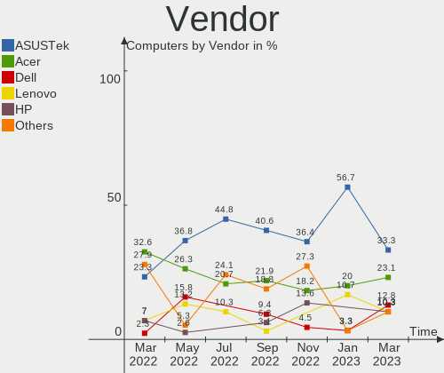
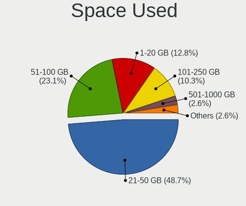
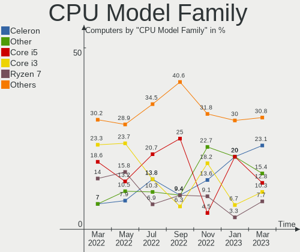
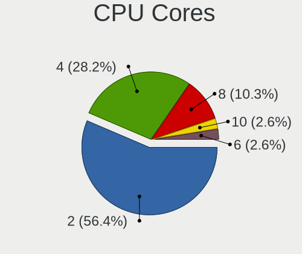
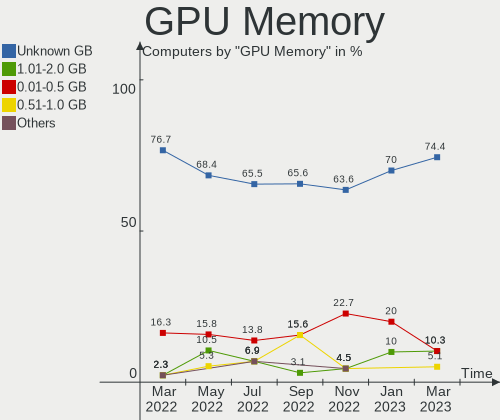
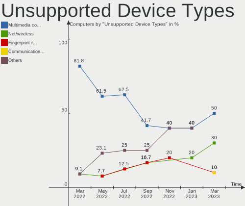

Endless Hardware Trends
-----------------------

A project to identify most popular hardware characteristics and track their change
over time based on data collected by Endless users at https://Linux-Hardware.org.

Anyone can contribute to this report by the [hw-probe](https://github.com/linuxhw/hw-probe) tool:

    sudo -E hw-probe -all -upload

This is a report for all computer types. See also reports for [desktops](/Dist/Endless/Desktop/README.md) and [notebooks](/Dist/Endless/Notebook/README.md).

Full-feature report is available here: https://linux-hardware.org/?view=trends

Period: Mar, 2022.

Contents
--------

* [ System ](#system)
  - [ OS                       ](#os)
  - [ OS Family                ](#os-family)
  - [ Kernel                   ](#kernel)
  - [ Kernel Family            ](#kernel-family)
  - [ Kernel Major Ver.        ](#kernel-major-ver)
  - [ Arch                     ](#arch)
  - [ DE                       ](#de)
  - [ Display Server           ](#display-server)
  - [ Display Manager          ](#display-manager)
  - [ OS Lang                  ](#os-lang)
  - [ Boot Mode                ](#boot-mode)
  - [ Filesystem               ](#filesystem)
  - [ Part. scheme             ](#part-scheme)
  - [ Dual Boot with Linux/BSD ](#dual-boot-with-linuxbsd)
  - [ Dual Boot (Win)          ](#dual-boot-win)

* [ Board ](#board)
  - [ Vendor                   ](#vendor)
  - [ Model                    ](#model)
  - [ Model Family             ](#model-family)
  - [ MFG Year                 ](#mfg-year)
  - [ Form Factor              ](#form-factor)
  - [ Secure Boot              ](#secure-boot)
  - [ Coreboot                 ](#coreboot)
  - [ RAM Size                 ](#ram-size)
  - [ RAM Used                 ](#ram-used)
  - [ Total Drives             ](#total-drives)
  - [ Has CD-ROM               ](#has-cd-rom)
  - [ Has Ethernet             ](#has-ethernet)
  - [ Has WiFi                 ](#has-wifi)
  - [ Has Bluetooth            ](#has-bluetooth)

* [ Location ](#location)
  - [ Country                  ](#country)
  - [ City                     ](#city)

* [ Drives ](#drives)
  - [ Drive Vendor             ](#drive-vendor)
  - [ Drive Model              ](#drive-model)
  - [ HDD Vendor               ](#hdd-vendor)
  - [ SSD Vendor               ](#ssd-vendor)
  - [ Drive Kind               ](#drive-kind)
  - [ Drive Connector          ](#drive-connector)
  - [ Drive Size               ](#drive-size)
  - [ Space Total              ](#space-total)
  - [ Space Used               ](#space-used)
  - [ Malfunc. Drives          ](#malfunc-drives)
  - [ Malfunc. Drive Vendor    ](#malfunc-drive-vendor)
  - [ Malfunc. HDD Vendor      ](#malfunc-hdd-vendor)
  - [ Malfunc. Drive Kind      ](#malfunc-drive-kind)
  - [ Failed Drives            ](#failed-drives)
  - [ Failed Drive Vendor      ](#failed-drive-vendor)
  - [ Drive Status             ](#drive-status)

* [ Storage controller ](#storage-controller)
  - [ Storage Vendor           ](#storage-vendor)
  - [ Storage Model            ](#storage-model)
  - [ Storage Kind             ](#storage-kind)

* [ Processor ](#processor)
  - [ CPU Vendor               ](#cpu-vendor)
  - [ CPU Model                ](#cpu-model)
  - [ CPU Model Family         ](#cpu-model-family)
  - [ CPU Cores                ](#cpu-cores)
  - [ CPU Sockets              ](#cpu-sockets)
  - [ CPU Threads              ](#cpu-threads)
  - [ CPU Op-Modes             ](#cpu-op-modes)
  - [ CPU Microcode            ](#cpu-microcode)
  - [ CPU Microarch            ](#cpu-microarch)

* [ Graphics ](#graphics)
  - [ GPU Vendor               ](#gpu-vendor)
  - [ GPU Model                ](#gpu-model)
  - [ GPU Combo                ](#gpu-combo)
  - [ GPU Driver               ](#gpu-driver)
  - [ GPU Memory               ](#gpu-memory)

* [ Monitor ](#monitor)
  - [ Monitor Vendor           ](#monitor-vendor)
  - [ Monitor Model            ](#monitor-model)
  - [ Monitor Resolution       ](#monitor-resolution)
  - [ Monitor Diagonal         ](#monitor-diagonal)
  - [ Monitor Width            ](#monitor-width)
  - [ Aspect Ratio             ](#aspect-ratio)
  - [ Monitor Area             ](#monitor-area)
  - [ Pixel Density            ](#pixel-density)
  - [ Multiple Monitors        ](#multiple-monitors)

* [ Network ](#network)
  - [ Net Controller Vendor    ](#net-controller-vendor)
  - [ Net Controller Model     ](#net-controller-model)
  - [ Wireless Vendor          ](#wireless-vendor)
  - [ Wireless Model           ](#wireless-model)
  - [ Ethernet Vendor          ](#ethernet-vendor)
  - [ Ethernet Model           ](#ethernet-model)
  - [ Net Controller Kind      ](#net-controller-kind)
  - [ Used Controller          ](#used-controller)
  - [ NICs                     ](#nics)
  - [ IPv6                     ](#ipv6)

* [ Bluetooth ](#bluetooth)
  - [ Bluetooth Vendor         ](#bluetooth-vendor)
  - [ Bluetooth Model          ](#bluetooth-model)

* [ Sound ](#sound)
  - [ Sound Vendor             ](#sound-vendor)
  - [ Sound Model              ](#sound-model)

* [ Memory ](#memory)
  - [ Memory Vendor            ](#memory-vendor)
  - [ Memory Model             ](#memory-model)
  - [ Memory Kind              ](#memory-kind)
  - [ Memory Form Factor       ](#memory-form-factor)
  - [ Memory Size              ](#memory-size)
  - [ Memory Speed             ](#memory-speed)

* [ Printers & scanners ](#printers--scanners)
  - [ Printer Vendor           ](#printer-vendor)
  - [ Printer Model            ](#printer-model)
  - [ Scanner Vendor           ](#scanner-vendor)
  - [ Scanner Model            ](#scanner-model)

* [ Camera ](#camera)
  - [ Camera Vendor            ](#camera-vendor)
  - [ Camera Model             ](#camera-model)

* [ Security ](#security)
  - [ Fingerprint Vendor       ](#fingerprint-vendor)
  - [ Fingerprint Model        ](#fingerprint-model)
  - [ Chipcard Vendor          ](#chipcard-vendor)
  - [ Chipcard Model           ](#chipcard-model)

* [ Unsupported ](#unsupported)
  - [ Unsupported Devices      ](#unsupported-devices)
  - [ Unsupported Device Types ](#unsupported-device-types)

System
------

OS
--

Installed operating systems

| Name                  | Computers | Percent |
|-----------------------|-----------|---------|
| Endless 4.0.3         | 25        | 58.14%  |
| Endless 3.9.6         | 7         | 16.28%  |
| Endless 4.0.2         | 5         | 11.63%  |
| Endless 3.9.7         | 1         | 2.33%   |
| Endless 3.9.3-nexthw1 | 1         | 2.33%   |
| Endless 3.9.1         | 1         | 2.33%   |
| Endless 3.8.7-nexthw2 | 1         | 2.33%   |
| Endless 3.8.0         | 1         | 2.33%   |
| Endless 3.6.4         | 1         | 2.33%   |

OS Family
---------

OS without a version

| Name    | Computers | Percent |
|---------|-----------|---------|
| Endless | 43        | 100%    |

Kernel
------

Version of the Linux kernel

| Version           | Computers | Percent |
|-------------------|-----------|---------|
| 5.11.0-35-generic | 30        | 69.77%  |
| 5.8.0-14-generic  | 10        | 23.26%  |
| 5.4.0-19-generic  | 1         | 2.33%   |
| 5.11.0-12-generic | 1         | 2.33%   |
| 5.0.0-25-generic  | 1         | 2.33%   |

Kernel Family
-------------

Linux kernel without a distro release

| Version | Computers | Percent |
|---------|-----------|---------|
| 5.11.0  | 31        | 72.09%  |
| 5.8.0   | 10        | 23.26%  |
| 5.4.0   | 1         | 2.33%   |
| 5.0.0   | 1         | 2.33%   |

Kernel Major Ver.
-----------------

Linux kernel major version

| Version | Computers | Percent |
|---------|-----------|---------|
| 5.11    | 31        | 72.09%  |
| 5.8     | 10        | 23.26%  |
| 5.4     | 1         | 2.33%   |
| 5.0     | 1         | 2.33%   |

Arch
----

OS architecture (x86_64, i586, etc.)

| Name   | Computers | Percent |
|--------|-----------|---------|
| x86_64 | 43        | 100%    |

DE
--

Desktop Environment

| Name  | Computers | Percent |
|-------|-----------|---------|
| GNOME | 43        | 100%    |

Display Server
--------------

X11 or Wayland

| Name | Computers | Percent |
|------|-----------|---------|
| X11  | 43        | 100%    |

Display Manager
---------------

SDDM, LightDM, etc.

| Name    | Computers | Percent |
|---------|-----------|---------|
| Unknown | 43        | 100%    |

OS Lang
-------

Language

| Lang        | Computers | Percent |
|-------------|-----------|---------|
| pt_BR       | 19        | 44.19%  |
| en_US       | 10        | 23.26%  |
| es_MX       | 4         | 9.3%    |
| tr_TR       | 2         | 4.65%   |
| ru_UA       | 1         | 2.33%   |
| ru_RU.UTF_8 | 1         | 2.33%   |
| ru_RU       | 1         | 2.33%   |
| ro_RO       | 1         | 2.33%   |
| it_CH       | 1         | 2.33%   |
| fr_FR       | 1         | 2.33%   |
| es_ES       | 1         | 2.33%   |
| de_DE       | 1         | 2.33%   |

Boot Mode
---------

EFI or BIOS

| Mode | Computers | Percent |
|------|-----------|---------|
| EFI  | 26        | 60.47%  |
| BIOS | 17        | 39.53%  |

Filesystem
----------

Type of filesystem

| Type | Computers | Percent |
|------|-----------|---------|
| Ext4 | 43        | 100%    |

Part. scheme
------------

Scheme of partitioning

| Type    | Computers | Percent |
|---------|-----------|---------|
| Unknown | 43        | 100%    |

Dual Boot with Linux/BSD
------------------------

Hosting more than one Linux/BSD

| Dual boot | Computers | Percent |
|-----------|-----------|---------|
| No        | 43        | 100%    |

Dual Boot (Win)
---------------

Hosting Linux and Windows

| Dual boot | Computers | Percent |
|-----------|-----------|---------|
| No        | 43        | 100%    |

Board
-----

Vendor
------

Motherboard manufacturer

| Name                | Computers | Percent |
|---------------------|-----------|---------|
| Acer                | 14        | 32.56%  |
| ASUSTek Computer    | 10        | 23.26%  |
| Lenovo              | 3         | 6.98%   |
| Intel               | 3         | 6.98%   |
| Hewlett-Packard     | 3         | 6.98%   |
| Positivo            | 2         | 4.65%   |
| Gigabyte Technology | 2         | 4.65%   |
| Toshiba             | 1         | 2.33%   |
| Philco              | 1         | 2.33%   |
| Multilaser          | 1         | 2.33%   |
| Dell                | 1         | 2.33%   |
| Compal              | 1         | 2.33%   |
| Unknown             | 1         | 2.33%   |

Model
-----

Motherboard model

| Name                                    | Computers | Percent |
|-----------------------------------------|-----------|---------|
| Acer Nitro AN515-44                     | 6         | 13.95%  |
| ASUS VivoBook 15_ASUS Laptop X540UAR    | 2         | 4.65%   |
| Toshiba Satellite L755                  | 1         | 2.33%   |
| Positivo S14CT01                        | 1         | 2.33%   |
| Positivo Q432A                          | 1         | 2.33%   |
| Philco 14I                              | 1         | 2.33%   |
| Multilaser PC13X                        | 1         | 2.33%   |
| Lenovo ThinkCentre M700 10GQCTO1WW      | 1         | 2.33%   |
| Lenovo H50-50 90B60081IX                | 1         | 2.33%   |
| Lenovo C470 10170                       | 1         | 2.33%   |
| Intel powered classmate PC              | 1         | 2.33%   |
| Intel G31                               | 1         | 2.33%   |
| Intel DG31PR AAD97573-300               | 1         | 2.33%   |
| HP Laptop 17z-ca100                     | 1         | 2.33%   |
| HP Compaq 6200 Pro SFF PC               | 1         | 2.33%   |
| HP 250 G5 Notebook PC                   | 1         | 2.33%   |
| Gigabyte Mission one                    | 1         | 2.33%   |
| Gigabyte H110M-H                        | 1         | 2.33%   |
| Dell Latitude E5430 non-vPro            | 1         | 2.33%   |
| Compal NCL60/61                         | 1         | 2.33%   |
| ASUS VivoBook_ASUSLaptop X515JA_F515JA  | 1         | 2.33%   |
| ASUS VivoBook_ASUSLaptop X513EA_K513EA  | 1         | 2.33%   |
| ASUS VivoBook_ASUSLaptop X513EAN_X513EA | 1         | 2.33%   |
| ASUS VivoBook_ASUSLaptop X512UB         | 1         | 2.33%   |
| ASUS VivoBook_ASUSLaptop X509FA_X509FA  | 1         | 2.33%   |
| ASUS VivoBook_ASUSLaptop X415EA_X415EA  | 1         | 2.33%   |
| ASUS CROSSBLADE RANGER                  | 1         | 2.33%   |
| ASUS ASUSPRO P1440FAC_P1440FA           | 1         | 2.33%   |
| Acer Nitro N50-610                      | 1         | 2.33%   |
| Acer Nitro AN515-54                     | 1         | 2.33%   |
| Acer Aspire A515-54G                    | 1         | 2.33%   |
| Acer Aspire A515-54                     | 1         | 2.33%   |
| Acer Aspire A515-51                     | 1         | 2.33%   |
| Acer Aspire A315-56                     | 1         | 2.33%   |
| Acer Aspire A114-31                     | 1         | 2.33%   |
| Acer Aspire 4745Z                       | 1         | 2.33%   |
| Unknown                                 | 1         | 2.33%   |

Model Family
------------

Motherboard model prefix

| Name               | Computers | Percent |
|--------------------|-----------|---------|
| ASUS VivoBook      | 8         | 18.6%   |
| Acer Nitro         | 8         | 18.6%   |
| Acer Aspire        | 6         | 13.95%  |
| Toshiba Satellite  | 1         | 2.33%   |
| Positivo S14CT01   | 1         | 2.33%   |
| Positivo Q432A     | 1         | 2.33%   |
| Philco 14I         | 1         | 2.33%   |
| Multilaser PC13X   | 1         | 2.33%   |
| Lenovo ThinkCentre | 1         | 2.33%   |
| Lenovo H50-50      | 1         | 2.33%   |
| Lenovo C470        | 1         | 2.33%   |
| Intel powered      | 1         | 2.33%   |
| Intel G31          | 1         | 2.33%   |
| Intel DG31PR       | 1         | 2.33%   |
| HP Laptop          | 1         | 2.33%   |
| HP Compaq          | 1         | 2.33%   |
| HP 250             | 1         | 2.33%   |
| Gigabyte Mission   | 1         | 2.33%   |
| Gigabyte H110M-H   | 1         | 2.33%   |
| Dell Latitude      | 1         | 2.33%   |
| Compal NCL60       | 1         | 2.33%   |
| ASUS CROSSBLADE    | 1         | 2.33%   |
| ASUS ASUSPRO       | 1         | 2.33%   |
| Unknown            | 1         | 2.33%   |

MFG Year
--------

Motherboard manufacture year

| Year | Computers | Percent |
|------|-----------|---------|
| 2020 | 12        | 27.91%  |
| 2019 | 6         | 13.95%  |
| 2021 | 4         | 9.3%    |
| 2014 | 4         | 9.3%    |
| 2017 | 3         | 6.98%   |
| 2016 | 3         | 6.98%   |
| 2011 | 3         | 6.98%   |
| 2018 | 2         | 4.65%   |
| 2012 | 2         | 4.65%   |
| 2010 | 2         | 4.65%   |
| 2009 | 1         | 2.33%   |
| 2008 | 1         | 2.33%   |

Form Factor
-----------

Physical design of the computer

| Name        | Computers | Percent |
|-------------|-----------|---------|
| Notebook    | 31        | 72.09%  |
| Desktop     | 10        | 23.26%  |
| Convertible | 1         | 2.33%   |
| All in one  | 1         | 2.33%   |

Secure Boot
-----------

Enabled or disabled

| State    | Computers | Percent |
|----------|-----------|---------|
| Disabled | 33        | 76.74%  |
| Enabled  | 10        | 23.26%  |

Coreboot
--------

Have coreboot on board

| Used | Computers | Percent |
|------|-----------|---------|
| No   | 43        | 100%    |

RAM Size
--------

Total RAM memory

| Size in GB | Computers | Percent |
|------------|-----------|---------|
| 4.01-8.0   | 15        | 34.88%  |
| 3.01-4.0   | 14        | 32.56%  |
| 8.01-16.0  | 6         | 13.95%  |
| 1.01-2.0   | 5         | 11.63%  |
| 2.01-3.0   | 2         | 4.65%   |
| 16.01-24.0 | 1         | 2.33%   |

RAM Used
--------

Used RAM memory

| Used GB  | Computers | Percent |
|----------|-----------|---------|
| 1.01-2.0 | 20        | 46.51%  |
| 2.01-3.0 | 18        | 41.86%  |
| 3.01-4.0 | 4         | 9.3%    |
| 0.51-1.0 | 1         | 2.33%   |

Total Drives
------------

Number of drives on board

| Drives | Computers | Percent |
|--------|-----------|---------|
| 1      | 30        | 69.77%  |
| 2      | 12        | 27.91%  |
| 3      | 1         | 2.33%   |

Has CD-ROM
----------

Has CD-ROM on board

| Presented | Computers | Percent |
|-----------|-----------|---------|
| No        | 30        | 69.77%  |
| Yes       | 13        | 30.23%  |

Has Ethernet
------------

Has Ethernet on board

| Presented | Computers | Percent |
|-----------|-----------|---------|
| Yes       | 32        | 74.42%  |
| No        | 11        | 25.58%  |

Has WiFi
--------

Has WiFi module

| Presented | Computers | Percent |
|-----------|-----------|---------|
| Yes       | 35        | 81.4%   |
| No        | 8         | 18.6%   |

Has Bluetooth
-------------

Has Bluetooth module

| Presented | Computers | Percent |
|-----------|-----------|---------|
| Yes       | 26        | 60.47%  |
| No        | 17        | 39.53%  |

Location
--------

Country
-------

Geographic location (country)

| Country    | Computers | Percent |
|------------|-----------|---------|
| Brazil     | 19        | 44.19%  |
| USA        | 3         | 6.98%   |
| Turkey     | 2         | 4.65%   |
| Russia     | 2         | 4.65%   |
| Romania    | 2         | 4.65%   |
| Mexico     | 2         | 4.65%   |
| Italy      | 2         | 4.65%   |
| Belarus    | 2         | 4.65%   |
| Spain      | 1         | 2.33%   |
| Serbia     | 1         | 2.33%   |
| Martinique | 1         | 2.33%   |
| Malaysia   | 1         | 2.33%   |
| India      | 1         | 2.33%   |
| Germany    | 1         | 2.33%   |
| Egypt      | 1         | 2.33%   |
| Colombia   | 1         | 2.33%   |
| Australia  | 1         | 2.33%   |

City
----

Geographic location (city)

| City                  | Computers | Percent |
|-----------------------|-----------|---------|
| Rio de Janeiro        | 3         | 6.98%   |
| Porto Alegre          | 2         | 4.65%   |
| Zerbst                | 1         | 2.33%   |
| Yalova                | 1         | 2.33%   |
| Voronezh              | 1         | 2.33%   |
| Viamao                | 1         | 2.33%   |
| Vasto                 | 1         | 2.33%   |
| Valladolid            | 1         | 2.33%   |
| Valenca               | 1         | 2.33%   |
| Turin                 | 1         | 2.33%   |
| Tucson                | 1         | 2.33%   |
| São Paulo            | 1         | 2.33%   |
| Sao Luís             | 1         | 2.33%   |
| Sao Jose do Rio Preto | 1         | 2.33%   |
| Queretaro             | 1         | 2.33%   |
| Peoria                | 1         | 2.33%   |
| Patiala               | 1         | 2.33%   |
| Niš                  | 1         | 2.33%   |
| Moscow                | 1         | 2.33%   |
| Minsk                 | 1         | 2.33%   |
| Mediaş               | 1         | 2.33%   |
| Le Marin              | 1         | 2.33%   |
| Lages                 | 1         | 2.33%   |
| Kuala Lumpur          | 1         | 2.33%   |
| Joinville             | 1         | 2.33%   |
| Governador Valadares  | 1         | 2.33%   |
| Gaziantep             | 1         | 2.33%   |
| Evansville            | 1         | 2.33%   |
| Curitiba              | 1         | 2.33%   |
| Coatzacoalcos         | 1         | 2.33%   |
| Cascavel              | 1         | 2.33%   |
| Camaçari             | 1         | 2.33%   |
| Cachoeirinha          | 1         | 2.33%   |
| Bucharest             | 1         | 2.33%   |
| Brisbane              | 1         | 2.33%   |
| Borisov               | 1         | 2.33%   |
| Bogotá               | 1         | 2.33%   |
| Arealva               | 1         | 2.33%   |
| Alexandria            | 1         | 2.33%   |
| Acarau                | 1         | 2.33%   |

Drives
------

Drive Vendor
------------

Hard drive vendors

| Vendor              | Computers | Drives | Percent |
|---------------------|-----------|--------|---------|
| WDC                 | 12        | 13     | 22.64%  |
| Seagate             | 7         | 8      | 13.21%  |
| Samsung Electronics | 7         | 7      | 13.21%  |
| Intel               | 6         | 6      | 11.32%  |
| Sandisk             | 5         | 5      | 9.43%   |
| Unknown             | 4         | 4      | 7.55%   |
| Kingston            | 4         | 4      | 7.55%   |
| Toshiba             | 2         | 2      | 3.77%   |
| ADATA Technology    | 2         | 2      | 3.77%   |
| SK Hynix            | 1         | 1      | 1.89%   |
| Micron Technology   | 1         | 1      | 1.89%   |
| JMicron             | 1         | 1      | 1.89%   |
| Hitachi             | 1         | 1      | 1.89%   |

Drive Model
-----------

Hard drive models

| Model                                    | Computers | Percent |
|------------------------------------------|-----------|---------|
| WDC WD10SPZX-21Z10T0 1TB                 | 5         | 9.09%   |
| Sandisk NVMe SSD Drive 512GB             | 3         | 5.45%   |
| Intel NVMe SSD Drive 256GB               | 3         | 5.45%   |
| Unknown MMC Card  64GB                   | 2         | 3.64%   |
| Unknown MMC Card  32GB                   | 2         | 3.64%   |
| Samsung NVMe SSD Drive 256GB             | 2         | 3.64%   |
| Kingston NVMe SSD Drive 256GB            | 2         | 3.64%   |
| Intel NVMe SSD Drive 512GB               | 2         | 3.64%   |
| ADATA NVMe SSD Drive 256GB               | 2         | 3.64%   |
| WDC WDS240G1G0A-00SS50 240GB SSD         | 1         | 1.82%   |
| WDC WD800BD-00MRA1 80GB                  | 1         | 1.82%   |
| WDC WD5000LPVX-22V0TT0 500GB             | 1         | 1.82%   |
| WDC WD50 00BEVT-60A0RT0 500GB            | 1         | 1.82%   |
| WDC WD3200BPVT-24JJ5T0 320GB             | 1         | 1.82%   |
| WDC WD2500AAKX-001CA0 250GB              | 1         | 1.82%   |
| WDC WD10SPZX-80Z10T2 1TB                 | 1         | 1.82%   |
| WDC WD10EZEX-08WN4A0 1TB                 | 1         | 1.82%   |
| Toshiba MQ04ABF100 1TB                   | 1         | 1.82%   |
| Toshiba MK6475GSX 640GB                  | 1         | 1.82%   |
| SK Hynix NVMe SSD Drive 256GB            | 1         | 1.82%   |
| Seagate ST9160314AS 160GB                | 1         | 1.82%   |
| Seagate ST500VT000-1DK142 500GB          | 1         | 1.82%   |
| Seagate ST500LM012 HN-M500MBB 500GB      | 1         | 1.82%   |
| Seagate ST380215AS 80GB                  | 1         | 1.82%   |
| Seagate ST3500414CS 500GB                | 1         | 1.82%   |
| Seagate ST2000DM001-1ER164 2TB           | 1         | 1.82%   |
| Seagate ST1000LM035-1RK172 1TB           | 1         | 1.82%   |
| Seagate ST1000DM003-1SB10C 1TB           | 1         | 1.82%   |
| SanDisk SD9SN8W128G1102 128GB SSD        | 1         | 1.82%   |
| Sandisk NVMe SSD Drive 256GB             | 1         | 1.82%   |
| Samsung SSD 870 EVO 500GB                | 1         | 1.82%   |
| Samsung SSD 870 EVO 1TB                  | 1         | 1.82%   |
| Samsung SSD 860 QVO 1TB                  | 1         | 1.82%   |
| Samsung HM160HI 160GB                    | 1         | 1.82%   |
| Samsung HD322HJ 320GB                    | 1         | 1.82%   |
| Micron MTFDDAK256MAY-1AH12ABHA 256GB SSD | 1         | 1.82%   |
| Kingston SA400S37480G 480GB SSD          | 1         | 1.82%   |
| Kingston RBUSC180DS37256GJ 256GB SSD     | 1         | 1.82%   |
| JMicron Generic 2TB                      | 1         | 1.82%   |
| Intel NVMe SSD Drive 128GB               | 1         | 1.82%   |
| Hitachi HDS721050CLA362 500GB            | 1         | 1.82%   |

HDD Vendor
----------

Hard disk drive vendors

| Vendor              | Computers | Drives | Percent |
|---------------------|-----------|--------|---------|
| WDC                 | 11        | 12     | 47.83%  |
| Seagate             | 7         | 8      | 30.43%  |
| Toshiba             | 2         | 2      | 8.7%    |
| Samsung Electronics | 2         | 2      | 8.7%    |
| Hitachi             | 1         | 1      | 4.35%   |

SSD Vendor
----------

Solid state drive vendors

| Vendor              | Computers | Drives | Percent |
|---------------------|-----------|--------|---------|
| Samsung Electronics | 3         | 3      | 33.33%  |
| Kingston            | 2         | 2      | 22.22%  |
| WDC                 | 1         | 1      | 11.11%  |
| SanDisk             | 1         | 1      | 11.11%  |
| Micron Technology   | 1         | 1      | 11.11%  |
| JMicron             | 1         | 1      | 11.11%  |

Drive Kind
----------

HDD or SSD

| Kind | Computers | Drives | Percent |
|------|-----------|--------|---------|
| HDD  | 22        | 25     | 43.14%  |
| NVMe | 17        | 17     | 33.33%  |
| SSD  | 8         | 9      | 15.69%  |
| MMC  | 4         | 4      | 7.84%   |

Drive Connector
---------------

SATA, SAS, NVMe, etc.

| Type | Computers | Drives | Percent |
|------|-----------|--------|---------|
| SATA | 27        | 32     | 54%     |
| NVMe | 17        | 17     | 34%     |
| MMC  | 4         | 4      | 8%      |
| SAS  | 2         | 2      | 4%      |

Drive Size
----------

Size of hard drive

| Size in TB | Computers | Drives | Percent |
|------------|-----------|--------|---------|
| 0.01-0.5   | 18        | 19     | 56.25%  |
| 0.51-1.0   | 12        | 13     | 37.5%   |
| 1.01-2.0   | 2         | 2      | 6.25%   |

Space Total
-----------

Amount of disk space available on the file system

| Size in GB | Computers | Percent |
|------------|-----------|---------|
| 251-500    | 11        | 25.58%  |
| 101-250    | 10        | 23.26%  |
| 501-1000   | 7         | 16.28%  |
| 1001-2000  | 5         | 11.63%  |
| 51-100     | 4         | 9.3%    |
| 21-50      | 3         | 6.98%   |
| Unknown    | 2         | 4.65%   |
| 2001-3000  | 1         | 2.33%   |

Space Used
----------

Amount of used disk space

| Used GB   | Computers | Percent |
|-----------|-----------|---------|
| 21-50     | 18        | 41.86%  |
| 1-20      | 8         | 18.6%   |
| 51-100    | 7         | 16.28%  |
| 501-1000  | 3         | 6.98%   |
| 101-250   | 2         | 4.65%   |
| 1001-2000 | 2         | 4.65%   |
| Unknown   | 2         | 4.65%   |
| 251-500   | 1         | 2.33%   |

Malfunc. Drives
---------------

Drive models with a malfunction

Zero info for selected period =(

Malfunc. Drive Vendor
---------------------

Vendors of faulty drives

Zero info for selected period =(

Malfunc. HDD Vendor
-------------------

Vendors of faulty HDD drives

Zero info for selected period =(

Malfunc. Drive Kind
-------------------

Kinds of faulty drives

Zero info for selected period =(

Failed Drives
-------------

Failed drive models

Zero info for selected period =(

Failed Drive Vendor
-------------------

Failed drive vendors

Zero info for selected period =(

Drive Status
------------

Number of failed and malfunc. drives

| Status   | Computers | Drives | Percent |
|----------|-----------|--------|---------|
| Detected | 43        | 55     | 100%    |

Storage controller
------------------

Storage Vendor
--------------

Storage controller vendors

| Vendor                      | Computers | Percent |
|-----------------------------|-----------|---------|
| Intel                       | 31        | 62%     |
| AMD                         | 8         | 16%     |
| Sandisk                     | 4         | 8%      |
| Samsung Electronics         | 2         | 4%      |
| Kingston Technology Company | 2         | 4%      |
| ADATA Technology            | 2         | 4%      |
| SK Hynix                    | 1         | 2%      |

Storage Model
-------------

Storage controller models

| Model                                                                         | Computers | Percent |
|-------------------------------------------------------------------------------|-----------|---------|
| Intel 82801 Mobile SATA Controller [RAID mode]                                | 8         | 12.7%   |
| AMD FCH SATA Controller [AHCI mode]                                           | 7         | 11.11%  |
| Intel PROSet/Wireless WiFi Software extension                                 | 5         | 7.94%   |
| Sandisk WD Blue SN550 NVMe SSD                                                | 4         | 6.35%   |
| Intel Sunrise Point-LP SATA Controller [AHCI mode]                            | 4         | 6.35%   |
| Intel Volume Management Device NVMe RAID Controller                           | 3         | 4.76%   |
| Intel Tiger Lake-LP SATA Controller [AHCI mode]                               | 3         | 4.76%   |
| Intel NM10/ICH7 Family SATA Controller [IDE mode]                             | 3         | 4.76%   |
| Intel 82801G (ICH7 Family) IDE Controller                                     | 3         | 4.76%   |
| Samsung NVMe SSD Controller 980                                               | 2         | 3.17%   |
| Kingston Company OM3PDP3 NVMe SSD                                             | 2         | 3.17%   |
| Intel Q170/Q150/B150/H170/H110/Z170/CM236 Chipset SATA Controller [AHCI Mode] | 2         | 3.17%   |
| Intel Comet Lake SATA AHCI Controller                                         | 2         | 3.17%   |
| Intel 5 Series/3400 Series Chipset 4 port SATA AHCI Controller                | 2         | 3.17%   |
| ADATA Non-Volatile memory controller                                          | 2         | 3.17%   |
| SK Hynix BC511                                                                | 1         | 1.59%   |
| Intel SSD 660P Series                                                         | 1         | 1.59%   |
| Intel NM10/ICH7 Family SATA Controller [AHCI mode]                            | 1         | 1.59%   |
| Intel Celeron N3350/Pentium N4200/Atom E3900 Series SATA AHCI Controller      | 1         | 1.59%   |
| Intel Atom Processor E3800 Series SATA AHCI Controller                        | 1         | 1.59%   |
| Intel 8 Series/C220 Series Chipset Family 4-port SATA Controller 1 [IDE mode] | 1         | 1.59%   |
| Intel 8 Series/C220 Series Chipset Family 2-port SATA Controller 2 [IDE mode] | 1         | 1.59%   |
| Intel 8 Series SATA Controller 1 [AHCI mode]                                  | 1         | 1.59%   |
| Intel 6 Series/C200 Series Chipset Family 6 port Mobile SATA AHCI Controller  | 1         | 1.59%   |
| Intel 6 Series/C200 Series Chipset Family 6 port Desktop SATA AHCI Controller | 1         | 1.59%   |
| AMD SB7x0/SB8x0/SB9x0 SATA Controller [AHCI mode]                             | 1         | 1.59%   |

Storage Kind
------------

Kind of storage controller (IDE, SATA, NVMe, SAS, ...)

| Kind | Computers | Percent |
|------|-----------|---------|
| SATA | 31        | 52.54%  |
| NVMe | 17        | 28.81%  |
| RAID | 7         | 11.86%  |
| IDE  | 4         | 6.78%   |

Processor
---------

CPU Vendor
----------

Processor vendors

| Vendor | Computers | Percent |
|--------|-----------|---------|
| Intel  | 34        | 79.07%  |
| AMD    | 9         | 20.93%  |

CPU Model
---------

Processor models

| Model                                         | Computers | Percent |
|-----------------------------------------------|-----------|---------|
| AMD Ryzen 7 4800H with Radeon Graphics        | 6         | 13.95%  |
| Intel Core i3-7020U CPU @ 2.30GHz             | 3         | 6.98%   |
| Intel Atom x5-Z8350 CPU @ 1.44GHz             | 2         | 4.65%   |
| Intel Pentium Dual CPU E2140 @ 1.60GHz        | 1         | 2.33%   |
| Intel Pentium D CPU 3.00GHz                   | 1         | 2.33%   |
| Intel Pentium CPU P6000 @ 1.87GHz             | 1         | 2.33%   |
| Intel Core i7-7500U CPU @ 2.70GHz             | 1         | 2.33%   |
| Intel Core i7-10510U CPU @ 1.80GHz            | 1         | 2.33%   |
| Intel Core i5-9300H CPU @ 2.40GHz             | 1         | 2.33%   |
| Intel Core i5-6500 CPU @ 3.20GHz              | 1         | 2.33%   |
| Intel Core i5-6200U CPU @ 2.30GHz             | 1         | 2.33%   |
| Intel Core i5-3320M CPU @ 2.60GHz             | 1         | 2.33%   |
| Intel Core i5-10400F CPU @ 2.90GHz            | 1         | 2.33%   |
| Intel Core i5-1035G1 CPU @ 1.00GHz            | 1         | 2.33%   |
| Intel Core i5-10210U CPU @ 1.60GHz            | 1         | 2.33%   |
| Intel Core i5 CPU M 480 @ 2.67GHz             | 1         | 2.33%   |
| Intel Core i3-8145U CPU @ 2.10GHz             | 1         | 2.33%   |
| Intel Core i3-4160 CPU @ 3.60GHz              | 1         | 2.33%   |
| Intel Core i3-4005U CPU @ 1.70GHz             | 1         | 2.33%   |
| Intel Core i3-2330M CPU @ 2.20GHz             | 1         | 2.33%   |
| Intel Core i3-2100 CPU @ 3.10GHz              | 1         | 2.33%   |
| Intel Core i3-10110U CPU @ 2.10GHz            | 1         | 2.33%   |
| Intel Core i3-1005G1 CPU @ 1.20GHz            | 1         | 2.33%   |
| Intel Core 2 CPU 6300 @ 1.86GHz               | 1         | 2.33%   |
| Intel Celeron CPU N3350 @ 1.10GHz             | 1         | 2.33%   |
| Intel Celeron CPU N2807 @ 1.58GHz             | 1         | 2.33%   |
| Intel Celeron CPU G3900 @ 2.80GHz             | 1         | 2.33%   |
| Intel Atom x5-Z8300 CPU @ 1.44GHz             | 1         | 2.33%   |
| Intel Atom CPU N450 @ 1.66GHz                 | 1         | 2.33%   |
| Intel 11th Gen Core i7-1165G7 @ 2.80GHz       | 1         | 2.33%   |
| Intel 11th Gen Core i5-1135G7 @ 2.40GHz       | 1         | 2.33%   |
| Intel 11th Gen Core i3-1115G4 @ 3.00GHz       | 1         | 2.33%   |
| AMD Ryzen 5 3500U with Radeon Vega Mobile Gfx | 1         | 2.33%   |
| AMD C-70 APU with Radeon HD Graphics          | 1         | 2.33%   |
| AMD A8-7600 Radeon R7, 10 Compute Cores 4C+6G | 1         | 2.33%   |

CPU Model Family
----------------

Processor model prefix

| Model              | Computers | Percent |
|--------------------|-----------|---------|
| Intel Core i3      | 10        | 23.26%  |
| Intel Core i5      | 8         | 18.6%   |
| AMD Ryzen 7        | 6         | 13.95%  |
| Intel Atom         | 4         | 9.3%    |
| Other              | 3         | 6.98%   |
| Intel Celeron      | 3         | 6.98%   |
| Intel Core i7      | 2         | 4.65%   |
| Intel Pentium Dual | 1         | 2.33%   |
| Intel Pentium D    | 1         | 2.33%   |
| Intel Pentium      | 1         | 2.33%   |
| Intel Core 2       | 1         | 2.33%   |
| AMD Ryzen 5        | 1         | 2.33%   |
| AMD C-70           | 1         | 2.33%   |
| AMD A8             | 1         | 2.33%   |

CPU Cores
---------

Number of processor cores

| Number | Computers | Percent |
|--------|-----------|---------|
| 2      | 23        | 53.49%  |
| 4      | 11        | 25.58%  |
| 8      | 6         | 13.95%  |
| 1      | 2         | 4.65%   |
| 6      | 1         | 2.33%   |

CPU Sockets
-----------

Number of sockets

| Number | Computers | Percent |
|--------|-----------|---------|
| 1      | 43        | 100%    |

CPU Threads
-----------

Threads per core (Hyper-Threading)

| Number | Computers | Percent |
|--------|-----------|---------|
| 2      | 31        | 72.09%  |
| 1      | 12        | 27.91%  |

CPU Op-Modes
------------

CPU Operation Modes (32-bit, 64-bit)

| Op mode        | Computers | Percent |
|----------------|-----------|---------|
| 32-bit, 64-bit | 43        | 100%    |

CPU Microcode
-------------

Microcode number

| Number     | Computers | Percent |
|------------|-----------|---------|
| 0x08600103 | 6         | 13.95%  |
| 0x806e9    | 4         | 9.3%    |
| 0x806ec    | 3         | 6.98%   |
| 0x806c1    | 3         | 6.98%   |
| Unknown    | 3         | 6.98%   |
| 0x706e5    | 2         | 4.65%   |
| 0x506e3    | 2         | 4.65%   |
| 0x406c4    | 2         | 4.65%   |
| 0xf62      | 1         | 2.33%   |
| 0xa0653    | 1         | 2.33%   |
| 0x906ea    | 1         | 2.33%   |
| 0x6fd      | 1         | 2.33%   |
| 0x6f2      | 1         | 2.33%   |
| 0x506c9    | 1         | 2.33%   |
| 0x406e3    | 1         | 2.33%   |
| 0x406c3    | 1         | 2.33%   |
| 0x40651    | 1         | 2.33%   |
| 0x306c3    | 1         | 2.33%   |
| 0x306a9    | 1         | 2.33%   |
| 0x30678    | 1         | 2.33%   |
| 0x206a7    | 1         | 2.33%   |
| 0x20652    | 1         | 2.33%   |
| 0x106ca    | 1         | 2.33%   |
| 0x08108109 | 1         | 2.33%   |
| 0x06003106 | 1         | 2.33%   |
| 0x05000119 | 1         | 2.33%   |

CPU Microarch
-------------

Microarchitecture

| Name        | Computers | Percent |
|-------------|-----------|---------|
| KabyLake    | 9         | 20.93%  |
| Zen 2       | 6         | 13.95%  |
| Silvermont  | 4         | 9.3%    |
| TigerLake   | 3         | 6.98%   |
| Skylake     | 3         | 6.98%   |
| Westmere    | 2         | 4.65%   |
| SandyBridge | 2         | 4.65%   |
| IceLake     | 2         | 4.65%   |
| Haswell     | 2         | 4.65%   |
| Core        | 2         | 4.65%   |
| Zen+        | 1         | 2.33%   |
| Steamroller | 1         | 2.33%   |
| NetBurst    | 1         | 2.33%   |
| IvyBridge   | 1         | 2.33%   |
| Goldmont    | 1         | 2.33%   |
| CometLake   | 1         | 2.33%   |
| Bonnell     | 1         | 2.33%   |
| Bobcat      | 1         | 2.33%   |

Graphics
--------

GPU Vendor
----------

Vendors of graphics cards

| Vendor | Computers | Percent |
|--------|-----------|---------|
| Intel  | 32        | 61.54%  |
| Nvidia | 11        | 21.15%  |
| AMD    | 9         | 17.31%  |

GPU Model
---------

Graphics card models

| Model                                                                                    | Computers | Percent |
|------------------------------------------------------------------------------------------|-----------|---------|
| Nvidia TU117M                                                                            | 6         | 11.32%  |
| AMD Renoir                                                                               | 6         | 11.32%  |
| Intel Kaby Lake-U GT2f HD 620 Graphics Controller                                        | 3         | 5.66%   |
| Intel CometLake-U GT2 [UHD Graphics]                                                     | 3         | 5.66%   |
| Intel Atom/Celeron/Pentium Processor x5-E8000/J3xxx/N3xxx Integrated Graphics Controller | 3         | 5.66%   |
| Intel TigerLake-LP GT2 [Iris Xe Graphics]                                                | 2         | 3.77%   |
| Intel Iris Plus Graphics G1 (Ice Lake)                                                   | 2         | 3.77%   |
| Intel Core Processor Integrated Graphics Controller                                      | 2         | 3.77%   |
| Intel 82G33/G31 Express Integrated Graphics Controller                                   | 2         | 3.77%   |
| Intel 2nd Generation Core Processor Family Integrated Graphics Controller                | 2         | 3.77%   |
| Nvidia TU117M [GeForce GTX 1650 Mobile / Max-Q]                                          | 1         | 1.89%   |
| Nvidia TU117 [GeForce GTX 1650]                                                          | 1         | 1.89%   |
| Nvidia GP108M [GeForce MX250]                                                            | 1         | 1.89%   |
| Nvidia GM108M [GeForce MX110]                                                            | 1         | 1.89%   |
| Nvidia GM107 [GeForce GTX 745]                                                           | 1         | 1.89%   |
| Nvidia GF108 [GeForce GT 730]                                                            | 1         | 1.89%   |
| Intel WhiskeyLake-U GT2 [UHD Graphics 620]                                               | 1         | 1.89%   |
| Intel Tiger Lake UHD Graphics                                                            | 1         | 1.89%   |
| Intel Skylake GT2 [HD Graphics 520]                                                      | 1         | 1.89%   |
| Intel HD Graphics 620                                                                    | 1         | 1.89%   |
| Intel HD Graphics 530                                                                    | 1         | 1.89%   |
| Intel HD Graphics 510                                                                    | 1         | 1.89%   |
| Intel HD Graphics 500                                                                    | 1         | 1.89%   |
| Intel Haswell-ULT Integrated Graphics Controller                                         | 1         | 1.89%   |
| Intel CoffeeLake-H GT2 [UHD Graphics 630]                                                | 1         | 1.89%   |
| Intel Atom Processor Z36xxx/Z37xxx Series Graphics & Display                             | 1         | 1.89%   |
| Intel Atom Processor D4xx/D5xx/N4xx/N5xx Integrated Graphics Controller                  | 1         | 1.89%   |
| Intel 82945G/GZ Integrated Graphics Controller                                           | 1         | 1.89%   |
| Intel 3rd Gen Core processor Graphics Controller                                         | 1         | 1.89%   |
| AMD Wrestler [Radeon HD 7290]                                                            | 1         | 1.89%   |
| AMD Picasso/Raven 2 [Radeon Vega Series / Radeon Vega Mobile Series]                     | 1         | 1.89%   |
| AMD Kaveri [Radeon R7 Graphics]                                                          | 1         | 1.89%   |

GPU Combo
---------

Combinations of graphics cards

| Name           | Computers | Percent |
|----------------|-----------|---------|
| 1 x Intel      | 29        | 67.44%  |
| AMD + Nvidia   | 6         | 13.95%  |
| Intel + Nvidia | 3         | 6.98%   |
| 1 x AMD        | 3         | 6.98%   |
| 1 x Nvidia     | 2         | 4.65%   |

GPU Driver
----------

Free vs proprietary

| Driver      | Computers | Percent |
|-------------|-----------|---------|
| Free        | 32        | 74.42%  |
| Proprietary | 11        | 25.58%  |

GPU Memory
----------

Total video memory

| Size in GB | Computers | Percent |
|------------|-----------|---------|
| Unknown    | 33        | 76.74%  |
| 0.01-0.5   | 7         | 16.28%  |
| 3.01-4.0   | 1         | 2.33%   |
| 1.01-2.0   | 1         | 2.33%   |
| 0.51-1.0   | 1         | 2.33%   |

Monitor
-------

Monitor Vendor
--------------

Monitor vendors

| Vendor          | Computers | Percent |
|-----------------|-----------|---------|
| BOE             | 8         | 19.51%  |
| LG Display      | 6         | 14.63%  |
| AU Optronics    | 6         | 14.63%  |
| PANDA           | 5         | 12.2%   |
| Chimei Innolux  | 4         | 9.76%   |
| Acer            | 3         | 7.32%   |
| Hewlett-Packard | 2         | 4.88%   |
| Goldstar        | 2         | 4.88%   |
| SLD             | 1         | 2.44%   |
| Philips         | 1         | 2.44%   |
| Lenovo          | 1         | 2.44%   |
| HannStar        | 1         | 2.44%   |
| AOC             | 1         | 2.44%   |

Monitor Model
-------------

Monitor models

| Model                                                            | Computers | Percent |
|------------------------------------------------------------------|-----------|---------|
| PANDA LCD Monitor NCP004D 1920x1080 344x194mm 15.5-inch          | 4         | 9.76%   |
| AU Optronics LCD Monitor AUOAF90 1920x1080 344x193mm 15.5-inch   | 2         | 4.88%   |
| AU Optronics LCD Monitor AUO21ED 1920x1080 344x194mm 15.5-inch   | 2         | 4.88%   |
| SLD LCD Monitor SLD003C 1366x768 309x173mm 13.9-inch             | 1         | 2.44%   |
| Philips 170B PHL082C 1280x1024 338x270mm 17.0-inch               | 1         | 2.44%   |
| PANDA LCD Monitor NCP0046 1920x1080 344x194mm 15.5-inch          | 1         | 2.44%   |
| LG Display LCD Monitor LGD059E 1920x1080 382x215mm 17.3-inch     | 1         | 2.44%   |
| LG Display LCD Monitor LGD0385 1366x768 309x174mm 14.0-inch      | 1         | 2.44%   |
| LG Display LCD Monitor LGD02DF 1600x900 310x174mm 14.0-inch      | 1         | 2.44%   |
| LG Display LCD Monitor LGD02DC 1366x768 344x194mm 15.5-inch      | 1         | 2.44%   |
| LG Display LCD Monitor LGD028D 1366x768 310x174mm 14.0-inch      | 1         | 2.44%   |
| LG Display LCD Monitor LGD0251 1366x768 310x174mm 14.0-inch      | 1         | 2.44%   |
| Lenovo LBG AIO PC LEN8000 1920x1080 480x270mm 21.7-inch          | 1         | 2.44%   |
| Hewlett-Packard w15e HWP280A 1280x720 332x187mm 15.0-inch        | 1         | 2.44%   |
| Hewlett-Packard LA1905 HWP2844 1440x900 408x255mm 18.9-inch      | 1         | 2.44%   |
| HannStar HSD100IFW1 HSD03E9 1024x600 220x129mm 10.0-inch         | 1         | 2.44%   |
| Goldstar W1752 GSM4490 1440x900 370x232mm 17.2-inch              | 1         | 2.44%   |
| Goldstar 2D FHD TV GSM59C6 1920x1080 509x286mm 23.0-inch         | 1         | 2.44%   |
| Chimei Innolux LCD Monitor CMN15F5 1920x1080 344x193mm 15.5-inch | 1         | 2.44%   |
| Chimei Innolux LCD Monitor CMN15C5 1366x768 344x193mm 15.5-inch  | 1         | 2.44%   |
| Chimei Innolux LCD Monitor CMN14D4 1920x1080 309x173mm 13.9-inch | 1         | 2.44%   |
| Chimei Innolux LCD Monitor CMN14A7 1920x1080 308x173mm 13.9-inch | 1         | 2.44%   |
| BOE LCD Monitor BOE0818 1920x1080 344x194mm 15.5-inch            | 1         | 2.44%   |
| BOE LCD Monitor BOE07CE 1366x768 344x193mm 15.5-inch             | 1         | 2.44%   |
| BOE LCD Monitor BOE07CB 1920x1080 344x193mm 15.5-inch            | 1         | 2.44%   |
| BOE LCD Monitor BOE06BD 1366x768 309x173mm 13.9-inch             | 1         | 2.44%   |
| BOE LCD Monitor BOE06A5 1366x768 344x194mm 15.5-inch             | 1         | 2.44%   |
| BOE LCD Monitor BOE06A4 1366x768 344x194mm 15.5-inch             | 1         | 2.44%   |
| BOE LCD Monitor BOE0672 1366x768 344x194mm 15.5-inch             | 1         | 2.44%   |
| BOE LCD Monitor BOE05F0 1366x768 309x173mm 13.9-inch             | 1         | 2.44%   |
| AU Optronics LCD Monitor AUO81EC 1366x768 344x193mm 15.5-inch    | 1         | 2.44%   |
| AU Optronics LCD Monitor AUO61ED 1920x1080 344x193mm 15.5-inch   | 1         | 2.44%   |
| AOC 1970W AOC1970 1366x768 410x230mm 18.5-inch                   | 1         | 2.44%   |
| Acer V206HQL ACR032C 1600x900 432x240mm 19.5-inch                | 1         | 2.44%   |
| Acer P186HL ACR019D 1366x768 410x230mm 18.5-inch                 | 1         | 2.44%   |
| Acer KG251Q ACR0753 1920x1080 544x303mm 24.5-inch                | 1         | 2.44%   |

Monitor Resolution
------------------

Monitor screen resolution

| Resolution       | Computers | Percent |
|------------------|-----------|---------|
| 1920x1080 (FHD)  | 19        | 46.34%  |
| 1366x768 (WXGA)  | 15        | 36.59%  |
| 1600x900 (HD+)   | 2         | 4.88%   |
| 1440x900 (WXGA+) | 2         | 4.88%   |
| 1280x720 (HD)    | 1         | 2.44%   |
| 1280x1024 (SXGA) | 1         | 2.44%   |
| 1024x600         | 1         | 2.44%   |

Monitor Diagonal
----------------

Diagonal size in inches

| Inches | Computers | Percent |
|--------|-----------|---------|
| 15     | 21        | 51.22%  |
| 13     | 5         | 12.2%   |
| 14     | 4         | 9.76%   |
| 18     | 3         | 7.32%   |
| 17     | 3         | 7.32%   |
| 23     | 2         | 4.88%   |
| 24     | 1         | 2.44%   |
| 19     | 1         | 2.44%   |
| 10     | 1         | 2.44%   |

Monitor Width
-------------

Physical width

| Width in mm | Computers | Percent |
|-------------|-----------|---------|
| 301-350     | 31        | 75.61%  |
| 401-500     | 4         | 9.76%   |
| 501-600     | 3         | 7.32%   |
| 351-400     | 2         | 4.88%   |
| 201-300     | 1         | 2.44%   |

Aspect Ratio
------------

Proportional relationship between the width and the height

| Ratio | Computers | Percent |
|-------|-----------|---------|
| 16/9  | 38        | 95%     |
| 5/4   | 1         | 2.5%    |
| 16/10 | 1         | 2.5%    |

Monitor Area
------------

Area in inch²

| Area in inch² | Computers | Percent |
|----------------|-----------|---------|
| 101-110        | 20        | 48.78%  |
| 81-90          | 9         | 21.95%  |
| 141-150        | 3         | 7.32%   |
| 201-250        | 2         | 4.88%   |
| 151-200        | 2         | 4.88%   |
| 41-50          | 1         | 2.44%   |
| 251-300        | 1         | 2.44%   |
| 131-140        | 1         | 2.44%   |
| 121-130        | 1         | 2.44%   |
| 91-100         | 1         | 2.44%   |

Pixel Density
-------------

Pixels per inch

| Density | Computers | Percent |
|---------|-----------|---------|
| 121-160 | 17        | 41.46%  |
| 101-120 | 14        | 34.15%  |
| 51-100  | 10        | 24.39%  |

Multiple Monitors
-----------------

Total monitors connected

| Total | Computers | Percent |
|-------|-----------|---------|
| 1     | 40        | 93.02%  |
| 0     | 2         | 4.65%   |
| 3     | 1         | 2.33%   |

Network
-------

Net Controller Vendor
---------------------

Controller vendors

| Vendor                | Computers | Percent |
|-----------------------|-----------|---------|
| Realtek Semiconductor | 31        | 50.82%  |
| Intel                 | 17        | 27.87%  |
| Qualcomm Atheros      | 9         | 14.75%  |
| JMicron Technology    | 2         | 3.28%   |
| Ralink Technology     | 1         | 1.64%   |
| Broadcom              | 1         | 1.64%   |

Net Controller Model
--------------------

Controller models

| Model                                                             | Computers | Percent |
|-------------------------------------------------------------------|-----------|---------|
| Realtek RTL8111/8168/8411 PCI Express Gigabit Ethernet Controller | 17        | 25.37%  |
| Intel Wi-Fi 6 AX200                                               | 7         | 10.45%  |
| Realtek Killer E2600 Gigabit Ethernet Controller                  | 6         | 8.96%   |
| Qualcomm Atheros QCA9377 802.11ac Wireless Network Adapter        | 6         | 8.96%   |
| Realtek RTL8821CE 802.11ac PCIe Wireless Network Adapter          | 4         | 5.97%   |
| Intel Wi-Fi 6 AX201                                               | 3         | 4.48%   |
| Realtek RTL8188CE 802.11b/g/n WiFi Adapter                        | 2         | 2.99%   |
| Realtek RTL810xE PCI Express Fast Ethernet controller             | 2         | 2.99%   |
| Realtek RTL8723BE PCIe Wireless Network Adapter                   | 1         | 1.49%   |
| Realtek RTL8191SEvB Wireless LAN Controller                       | 1         | 1.49%   |
| Realtek RTL8191SEvA Wireless LAN Controller                       | 1         | 1.49%   |
| Realtek RTL8188EE Wireless Network Adapter                        | 1         | 1.49%   |
| Realtek 802.11n                                                   | 1         | 1.49%   |
| Ralink MT7601U Wireless Adapter                                   | 1         | 1.49%   |
| Qualcomm Atheros AR928X Wireless Network Adapter (PCI-Express)    | 1         | 1.49%   |
| Qualcomm Atheros AR9287 Wireless Network Adapter (PCI-Express)    | 1         | 1.49%   |
| Qualcomm Atheros AR8152 v2.0 Fast Ethernet                        | 1         | 1.49%   |
| Qualcomm Atheros AR8151 v1.0 Gigabit Ethernet                     | 1         | 1.49%   |
| JMicron JMC260 PCI Express Fast Ethernet Controller               | 1         | 1.49%   |
| JMicron JMC250 PCI Express Gigabit Ethernet Controller            | 1         | 1.49%   |
| Intel Wireless 8265 / 8275                                        | 1         | 1.49%   |
| Intel Wireless 3165                                               | 1         | 1.49%   |
| Intel I211 Gigabit Network Connection                             | 1         | 1.49%   |
| Intel Comet Lake PCH-LP CNVi WiFi                                 | 1         | 1.49%   |
| Intel Comet Lake PCH CNVi WiFi                                    | 1         | 1.49%   |
| Intel Centrino Advanced-N 6205 [Taylor Peak]                      | 1         | 1.49%   |
| Intel 82579LM Gigabit Network Connection (Lewisville)             | 1         | 1.49%   |
| Broadcom NetXtreme BCM5761 Gigabit Ethernet PCIe                  | 1         | 1.49%   |

Wireless Vendor
---------------

Wireless vendors

| Vendor                | Computers | Percent |
|-----------------------|-----------|---------|
| Intel                 | 15        | 42.86%  |
| Realtek Semiconductor | 11        | 31.43%  |
| Qualcomm Atheros      | 8         | 22.86%  |
| Ralink Technology     | 1         | 2.86%   |

Wireless Model
--------------

Wireless models

| Model                                                          | Computers | Percent |
|----------------------------------------------------------------|-----------|---------|
| Intel Wi-Fi 6 AX200                                            | 7         | 20%     |
| Qualcomm Atheros QCA9377 802.11ac Wireless Network Adapter     | 6         | 17.14%  |
| Realtek RTL8821CE 802.11ac PCIe Wireless Network Adapter       | 4         | 11.43%  |
| Intel Wi-Fi 6 AX201                                            | 3         | 8.57%   |
| Realtek RTL8188CE 802.11b/g/n WiFi Adapter                     | 2         | 5.71%   |
| Realtek RTL8723BE PCIe Wireless Network Adapter                | 1         | 2.86%   |
| Realtek RTL8191SEvB Wireless LAN Controller                    | 1         | 2.86%   |
| Realtek RTL8191SEvA Wireless LAN Controller                    | 1         | 2.86%   |
| Realtek RTL8188EE Wireless Network Adapter                     | 1         | 2.86%   |
| Realtek 802.11n                                                | 1         | 2.86%   |
| Ralink MT7601U Wireless Adapter                                | 1         | 2.86%   |
| Qualcomm Atheros AR928X Wireless Network Adapter (PCI-Express) | 1         | 2.86%   |
| Qualcomm Atheros AR9287 Wireless Network Adapter (PCI-Express) | 1         | 2.86%   |
| Intel Wireless 8265 / 8275                                     | 1         | 2.86%   |
| Intel Wireless 3165                                            | 1         | 2.86%   |
| Intel Comet Lake PCH-LP CNVi WiFi                              | 1         | 2.86%   |
| Intel Comet Lake PCH CNVi WiFi                                 | 1         | 2.86%   |
| Intel Centrino Advanced-N 6205 [Taylor Peak]                   | 1         | 2.86%   |

Ethernet Vendor
---------------

Ethernet vendors

| Vendor                | Computers | Percent |
|-----------------------|-----------|---------|
| Realtek Semiconductor | 25        | 78.13%  |
| Qualcomm Atheros      | 2         | 6.25%   |
| JMicron Technology    | 2         | 6.25%   |
| Intel                 | 2         | 6.25%   |
| Broadcom              | 1         | 3.13%   |

Ethernet Model
--------------

Ethernet models

| Model                                                             | Computers | Percent |
|-------------------------------------------------------------------|-----------|---------|
| Realtek RTL8111/8168/8411 PCI Express Gigabit Ethernet Controller | 17        | 53.13%  |
| Realtek Killer E2600 Gigabit Ethernet Controller                  | 6         | 18.75%  |
| Realtek RTL810xE PCI Express Fast Ethernet controller             | 2         | 6.25%   |
| Qualcomm Atheros AR8152 v2.0 Fast Ethernet                        | 1         | 3.13%   |
| Qualcomm Atheros AR8151 v1.0 Gigabit Ethernet                     | 1         | 3.13%   |
| JMicron JMC260 PCI Express Fast Ethernet Controller               | 1         | 3.13%   |
| JMicron JMC250 PCI Express Gigabit Ethernet Controller            | 1         | 3.13%   |
| Intel I211 Gigabit Network Connection                             | 1         | 3.13%   |
| Intel 82579LM Gigabit Network Connection (Lewisville)             | 1         | 3.13%   |
| Broadcom NetXtreme BCM5761 Gigabit Ethernet PCIe                  | 1         | 3.13%   |

Net Controller Kind
-------------------

Ethernet, WiFi or modem

| Kind     | Computers | Percent |
|----------|-----------|---------|
| WiFi     | 35        | 52.24%  |
| Ethernet | 32        | 47.76%  |

Used Controller
---------------

Currently used network controller

| Kind     | Computers | Percent |
|----------|-----------|---------|
| WiFi     | 34        | 66.67%  |
| Ethernet | 17        | 33.33%  |

NICs
----

Total network controllers on board

| Total | Computers | Percent |
|-------|-----------|---------|
| 2     | 25        | 58.14%  |
| 1     | 15        | 34.88%  |
| 0     | 3         | 6.98%   |

IPv6
----

IPv6 vs IPv4

| Used | Computers | Percent |
|------|-----------|---------|
| No   | 28        | 65.12%  |
| Yes  | 15        | 34.88%  |

Bluetooth
---------

Bluetooth Vendor
----------------

Controller vendors

| Vendor                | Computers | Percent |
|-----------------------|-----------|---------|
| Intel                 | 14        | 53.85%  |
| Lite-On Technology    | 5         | 19.23%  |
| IMC Networks          | 5         | 19.23%  |
| Realtek Semiconductor | 1         | 3.85%   |
| Dell                  | 1         | 3.85%   |

Bluetooth Model
---------------

Controller models

| Model                                          | Computers | Percent |
|------------------------------------------------|-----------|---------|
| Intel AX200 Bluetooth                          | 7         | 26.92%  |
| Lite-On Qualcomm Atheros QCA9377 Bluetooth     | 5         | 19.23%  |
| IMC Networks Bluetooth Radio                   | 4         | 15.38%  |
| Intel AX201 Bluetooth                          | 3         | 11.54%  |
| Intel Bluetooth wireless interface             | 2         | 7.69%   |
| Intel Bluetooth 9460/9560 Jefferson Peak (JfP) | 2         | 7.69%   |
| Realtek  Bluetooth 4.2 Adapter                 | 1         | 3.85%   |
| IMC Networks Bluetooth Device                  | 1         | 3.85%   |
| Dell BCM20702A0 Bluetooth Module               | 1         | 3.85%   |

Sound
-----

Sound Vendor
------------

Sound card vendors

| Vendor | Computers | Percent |
|--------|-----------|---------|
| Intel  | 31        | 63.27%  |
| Nvidia | 9         | 18.37%  |
| AMD    | 9         | 18.37%  |

Sound Model
-----------

Sound card models

| Model                                                                      | Computers | Percent |
|----------------------------------------------------------------------------|-----------|---------|
| Nvidia TU107 GeForce GTX 1650 High Definition Audio Controller             | 8         | 14.81%  |
| AMD Family 17h/19h HD Audio Controller                                     | 7         | 12.96%  |
| Intel Sunrise Point-LP HD Audio                                            | 5         | 9.26%   |
| Intel NM10/ICH7 Family High Definition Audio Controller                    | 4         | 7.41%   |
| Intel Tiger Lake-LP Smart Sound Technology Audio Controller                | 3         | 5.56%   |
| Intel Comet Lake PCH-LP cAVS                                               | 3         | 5.56%   |
| Intel Ice Lake-LP Smart Sound Technology Audio Controller                  | 2         | 3.7%    |
| Intel 6 Series/C200 Series Chipset Family High Definition Audio Controller | 2         | 3.7%    |
| Intel 5 Series/3400 Series Chipset High Definition Audio                   | 2         | 3.7%    |
| Intel 100 Series/C230 Series Chipset Family HD Audio Controller            | 2         | 3.7%    |
| Nvidia GM107 High Definition Audio Controller [GeForce 940MX]              | 1         | 1.85%   |
| Nvidia GF108 High Definition Audio Controller                              | 1         | 1.85%   |
| Intel Haswell-ULT HD Audio Controller                                      | 1         | 1.85%   |
| Intel Comet Lake PCH cAVS                                                  | 1         | 1.85%   |
| Intel Celeron N3350/Pentium N4200/Atom E3900 Series Audio Cluster          | 1         | 1.85%   |
| Intel Cannon Point-LP High Definition Audio Controller                     | 1         | 1.85%   |
| Intel Cannon Lake PCH cAVS                                                 | 1         | 1.85%   |
| Intel Atom Processor Z36xxx/Z37xxx Series High Definition Audio Controller | 1         | 1.85%   |
| Intel 8 Series/C220 Series Chipset High Definition Audio Controller        | 1         | 1.85%   |
| Intel 8 Series HD Audio Controller                                         | 1         | 1.85%   |
| Intel 7 Series/C216 Chipset Family High Definition Audio Controller        | 1         | 1.85%   |
| AMD Wrestler HDMI Audio                                                    | 1         | 1.85%   |
| AMD SBx00 Azalia (Intel HDA)                                               | 1         | 1.85%   |
| AMD Raven/Raven2/Fenghuang HDMI/DP Audio Controller                        | 1         | 1.85%   |
| AMD Kaveri HDMI/DP Audio Controller                                        | 1         | 1.85%   |
| AMD FCH Azalia Controller                                                  | 1         | 1.85%   |

Memory
------

Memory Vendor
-------------

Memory module vendors

Zero info for selected period =(

Memory Model
------------

Memory module models

Zero info for selected period =(

Memory Kind
-----------

Memory module kinds

Zero info for selected period =(

Memory Form Factor
------------------

Physical design of the memory module

Zero info for selected period =(

Memory Size
-----------

Memory module size

Zero info for selected period =(

Memory Speed
------------

Memory module speed

Zero info for selected period =(

Printers & scanners
-------------------

Printer Vendor
--------------

Printer device vendors

| Vendor             | Computers | Percent |
|--------------------|-----------|---------|
| Brother Industries | 2         | 100%    |

Printer Model
-------------

Printer device models

| Model              | Computers | Percent |
|--------------------|-----------|---------|
| Brother MFC-J470DW | 1         | 50%     |
| Brother MFC-1810   | 1         | 50%     |

Scanner Vendor
--------------

Scanner device vendors

Zero info for selected period =(

Scanner Model
-------------

Scanner device models

Zero info for selected period =(

Camera
------

Camera Vendor
-------------

Camera device vendors

| Vendor                | Computers | Percent |
|-----------------------|-----------|---------|
| Quanta                | 8         | 22.22%  |
| IMC Networks          | 8         | 22.22%  |
| Chicony Electronics   | 7         | 19.44%  |
| Microdia              | 2         | 5.56%   |
| Logitech              | 2         | 5.56%   |
| Alcor Micro           | 2         | 5.56%   |
| Acer                  | 2         | 5.56%   |
| Xiaomi                | 1         | 2.78%   |
| Syntek                | 1         | 2.78%   |
| Suyin                 | 1         | 2.78%   |
| Realtek Semiconductor | 1         | 2.78%   |
| ALi                   | 1         | 2.78%   |

Camera Model
------------

Camera device models

| Model                               | Computers | Percent |
|-------------------------------------|-----------|---------|
| Quanta HD User Facing               | 5         | 13.89%  |
| IMC Networks USB2.0 VGA UVC WebCam  | 5         | 13.89%  |
| IMC Networks USB2.0 HD UVC WebCam   | 3         | 8.33%   |
| Chicony HD User Facing              | 3         | 8.33%   |
| Alcor Micro USB 2.0 PC cam          | 2         | 5.56%   |
| Xiaomi Mi/Redmi series (PTP + ADB)  | 1         | 2.78%   |
| Syntek Lenovo USB2.0 UVC Camera     | 1         | 2.78%   |
| Suyin Intel Webcam                  | 1         | 2.78%   |
| Realtek USB Boot                    | 1         | 2.78%   |
| Quanta VGA WebCam                   | 1         | 2.78%   |
| Quanta USB2.0 HD UVC WebCam         | 1         | 2.78%   |
| Quanta HD Webcam                    | 1         | 2.78%   |
| Microdia Integrated_Webcam_FHD      | 1         | 2.78%   |
| Microdia Integrated Webcam          | 1         | 2.78%   |
| Logitech Webcam C170                | 1         | 2.78%   |
| Logitech QuickCam Pro for Notebooks | 1         | 2.78%   |
| Chicony VGA WebCam                  | 1         | 2.78%   |
| Chicony TOSHIBA Web Camera - MP     | 1         | 2.78%   |
| Chicony HP Webcam                   | 1         | 2.78%   |
| Chicony HP TrueVision HD Camera     | 1         | 2.78%   |
| ALi Gateway Webcam                  | 1         | 2.78%   |
| Acer VGA WebCam                     | 1         | 2.78%   |
| Acer HD Webcam                      | 1         | 2.78%   |

Security
--------

Fingerprint Vendor
------------------

Fingerprint sensor vendors

Zero info for selected period =(

Fingerprint Model
-----------------

Fingerprint sensor models

Zero info for selected period =(

Chipcard Vendor
---------------

Chipcard module vendors

Zero info for selected period =(

Chipcard Model
--------------

Chipcard module models

Zero info for selected period =(

Unsupported
-----------

Unsupported Devices
-------------------

Total unsupported devices on board

| Total | Computers | Percent |
|-------|-----------|---------|
| 0     | 32        | 74.42%  |
| 1     | 11        | 25.58%  |

Unsupported Device Types
------------------------

Types of unsupported devices

| Type                  | Computers | Percent |
|-----------------------|-----------|---------|
| Multimedia controller | 9         | 81.82%  |
| Net/wireless          | 1         | 9.09%   |
| Camera                | 1         | 9.09%   |

