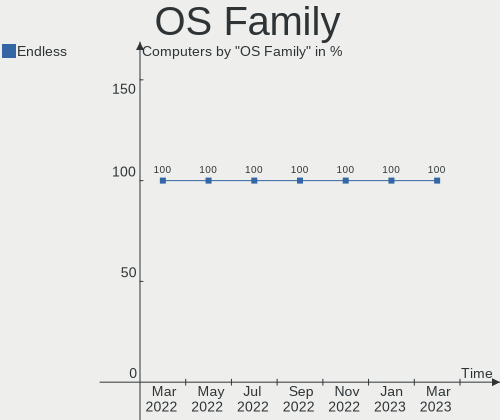
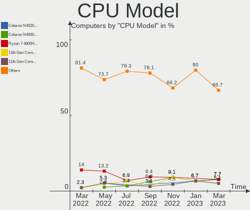
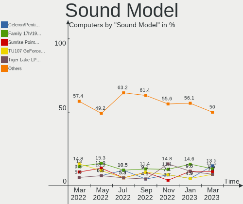
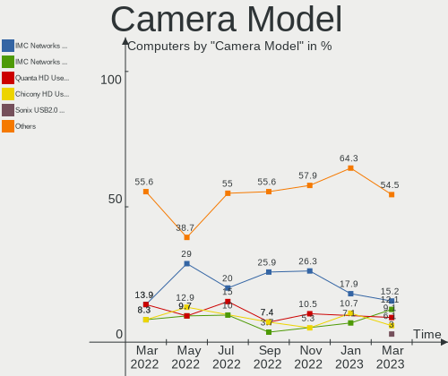

Endless Hardware Trends
-----------------------

A project to identify most popular hardware characteristics and track their change
over time based on data collected by Endless users at https://Linux-Hardware.org.

Anyone can contribute to the study by uploading probes of their computers by
the [hw-probe](https://github.com/linuxhw/hw-probe) tool:

    sudo -E hw-probe -all -upload

This is a report for all computer types. See also reports for [desktops](/Dist/Endless/Desktop/README.md) and [notebooks](/Dist/Endless/Notebook/README.md).

Full-feature report is available here: https://linux-hardware.org/?view=trends

Period: Jan, 2021.

Contents
--------

- [ OS                       ](#os)
- [ OS Family                ](#os-family)
- [ Kernel                   ](#kernel)
- [ Kernel Family            ](#kernel-family)
- [ Kernel Major Ver.        ](#kernel-major-ver)
- [ Arch                     ](#arch)
- [ DE                       ](#de)
- [ Display Server           ](#display-server)
- [ Display Manager          ](#display-manager)
- [ OS Lang                  ](#os-lang)
- [ Boot Mode                ](#boot-mode)
- [ Filesystem               ](#filesystem)
- [ Part. scheme             ](#part-scheme)
- [ Dual Boot with Linux/BSD ](#dual-boot-with-linux/bsd)
- [ Dual Boot (Win)          ](#dual-boot-win)
- [ Country                  ](#country)
- [ City                     ](#city)
- [ Vendor                   ](#vendor)
- [ Model                    ](#model)
- [ Model Family             ](#model-family)
- [ MFG Year                 ](#mfg-year)
- [ Form Factor              ](#form-factor)
- [ Secure Boot              ](#secure-boot)
- [ Coreboot                 ](#coreboot)
- [ RAM Size                 ](#ram-size)
- [ RAM Used                 ](#ram-used)
- [ Has CD-ROM               ](#has-cd-rom)
- [ Total Drives             ](#total-drives)
- [ Has Ethernet             ](#has-ethernet)
- [ Drive Vendor             ](#drive-vendor)
- [ Drive Model              ](#drive-model)
- [ HDD Vendor               ](#hdd-vendor)
- [ SSD Vendor               ](#ssd-vendor)
- [ Drive Kind               ](#drive-kind)
- [ Drive Connector          ](#drive-connector)
- [ Drive Size               ](#drive-size)
- [ Space Total              ](#space-total)
- [ Space Used               ](#space-used)
- [ Malfunc. Drives          ](#malfunc-drives)
- [ Malfunc. Drive Vendor    ](#malfunc-drive-vendor)
- [ Malfunc. HDD Vendor      ](#malfunc-hdd-vendor)
- [ Malfunc. Drive Kind      ](#malfunc-drive-kind)
- [ Failed Drives            ](#failed-drives)
- [ Failed Drive Vendor      ](#failed-drive-vendor)
- [ Drive Status             ](#drive-status)
- [ Storage Vendor           ](#storage-vendor)
- [ Storage Model            ](#storage-model)
- [ Storage Kind             ](#storage-kind)
- [ CPU Vendor               ](#cpu-vendor)
- [ CPU Model                ](#cpu-model)
- [ CPU Model Family         ](#cpu-model-family)
- [ CPU Cores                ](#cpu-cores)
- [ CPU Sockets              ](#cpu-sockets)
- [ CPU Threads              ](#cpu-threads)
- [ CPU Op-Modes             ](#cpu-op-modes)
- [ CPU Microcode            ](#cpu-microcode)
- [ CPU Microarch            ](#cpu-microarch)
- [ GPU Vendor               ](#gpu-vendor)
- [ GPU Model                ](#gpu-model)
- [ GPU Combo                ](#gpu-combo)
- [ GPU Driver               ](#gpu-driver)
- [ GPU Memory               ](#gpu-memory)
- [ Monitor Vendor           ](#monitor-vendor)
- [ Monitor Model            ](#monitor-model)
- [ Monitor Resolution       ](#monitor-resolution)
- [ Monitor Diagonal         ](#monitor-diagonal)
- [ Monitor Width            ](#monitor-width)
- [ Aspect Ratio             ](#aspect-ratio)
- [ Monitor Area             ](#monitor-area)
- [ Pixel Density            ](#pixel-density)
- [ Multiple Monitors        ](#multiple-monitors)
- [ Net Controller Vendor    ](#net-controller-vendor)
- [ Net Controller Model     ](#net-controller-model)
- [ Wireless Vendor          ](#wireless-vendor)
- [ Wireless Model           ](#wireless-model)
- [ Ethernet Vendor          ](#ethernet-vendor)
- [ Ethernet Model           ](#ethernet-model)
- [ Net Controller Kind      ](#net-controller-kind)
- [ Used Controller          ](#used-controller)
- [ NICs                     ](#nics)
- [ Memory Vendor            ](#memory-vendor)
- [ Memory Model             ](#memory-model)
- [ Memory Kind              ](#memory-kind)
- [ Memory Form Factor       ](#memory-form-factor)
- [ Memory Size              ](#memory-size)
- [ Memory Speed             ](#memory-speed)
- [ Sound Vendor             ](#sound-vendor)
- [ Sound Model              ](#sound-model)
- [ Camera Vendor            ](#camera-vendor)
- [ Camera Model             ](#camera-model)
- [ Fingerprint Vendor       ](#fingerprint-vendor)
- [ Fingerprint Model        ](#fingerprint-model)
- [ Chipcard Vendor          ](#chipcard-vendor)
- [ Chipcard Model           ](#chipcard-model)
- [ Printer Vendor           ](#printer-vendor)
- [ Printer Model            ](#printer-model)
- [ Scanner Vendor           ](#scanner-vendor)
- [ Scanner Model            ](#scanner-model)
- [ Bluetooth Vendor         ](#bluetooth-vendor)
- [ Bluetooth Model          ](#bluetooth-model)
- [ Unsupported Devices      ](#unsupported-devices)
- [ Unsupported Device Types ](#unsupported-device-types)

OS
--

Installed operating systems

| Name                  | Computers | Percent |
|-----------------------|-----------|---------|
| Endless 3.9.1         | 81        | 71.68%  |
| Endless 3.9.2         | 16        | 14.16%  |
| Endless 3.7.8         | 5         | 4.42%   |
| Endless 3.7.7         | 2         | 1.77%   |
| Endless 3.7.4         | 2         | 1.77%   |
| Endless 3.9.0         | 1         | 0.88%   |
| Endless 3.8.7         | 1         | 0.88%   |
| Endless 3.8.6         | 1         | 0.88%   |
| Endless 3.8.5         | 1         | 0.88%   |
| Endless 3.8.4         | 1         | 0.88%   |
| Endless 3.6.3-nexthw1 | 1         | 0.88%   |
| Endless 3.4.2-nexthw1 | 1         | 0.88%   |

OS Family
---------

OS without a version

| Name    | Computers | Percent |
|---------|-----------|---------|
| Endless | 113       | 100%    |

Kernel
------

Version of the Linux kernel

| Version          | Computers | Percent |
|------------------|-----------|---------|
| 5.8.0-14-generic | 98        | 86.73%  |
| 5.3.0-28-generic | 7         | 6.19%   |
| 5.4.0-42-generic | 2         | 1.77%   |
| 5.3.0-19-generic | 2         | 1.77%   |
| 5.4.0-39-generic | 1         | 0.88%   |
| 5.4.0-19-generic | 1         | 0.88%   |
| 5.3.0-12-generic | 1         | 0.88%   |
| 4.16.0-4-generic | 1         | 0.88%   |

Kernel Family
-------------

Linux kernel without a distro release

| Version | Computers | Percent |
|---------|-----------|---------|
| 5.8.0   | 98        | 86.73%  |
| 5.3.0   | 10        | 8.85%   |
| 5.4.0   | 4         | 3.54%   |
| 4.16.0  | 1         | 0.88%   |

Kernel Major Ver.
-----------------

Linux kernel major version

| Version | Computers | Percent |
|---------|-----------|---------|
| 5.8     | 98        | 86.73%  |
| 5.3     | 10        | 8.85%   |
| 5.4     | 4         | 3.54%   |
| 4.16    | 1         | 0.88%   |

Arch
----

OS architecture (x86_64, i586, etc.)

| Name   | Computers | Percent |
|--------|-----------|---------|
| x86_64 | 113       | 100%    |

DE
--

Desktop Environment

| Name  | Computers | Percent |
|-------|-----------|---------|
| GNOME | 113       | 100%    |

Display Server
--------------

X11 or Wayland

| Name | Computers | Percent |
|------|-----------|---------|
| X11  | 113       | 100%    |

Display Manager
---------------

SDDM, LightDM, etc.

| Name    | Computers | Percent |
|---------|-----------|---------|
| Unknown | 113       | 100%    |

OS Lang
-------

Language

| Lang        | Computers | Percent |
|-------------|-----------|---------|
| pt_BR       | 37        | 32.74%  |
| en_US       | 28        | 24.78%  |
| ro_RO       | 7         | 6.19%   |
| hu_HU       | 6         | 5.31%   |
| es_ES       | 6         | 5.31%   |
| ru_RU       | 5         | 4.42%   |
| es_MX       | 5         | 4.42%   |
| de_DE       | 5         | 4.42%   |
| tr_TR       | 2         | 1.77%   |
| pl_PL       | 2         | 1.77%   |
| sl_SI       | 1         | 0.88%   |
| ru_RU.UTF_8 | 1         | 0.88%   |
| ko_KR       | 1         | 0.88%   |
| fr_FR       | 1         | 0.88%   |
| fi_FI       | 1         | 0.88%   |
| es_CO       | 1         | 0.88%   |
| es_AR       | 1         | 0.88%   |
| en_GB       | 1         | 0.88%   |
| el_GR       | 1         | 0.88%   |
| de_AT       | 1         | 0.88%   |

Boot Mode
---------

EFI or BIOS

| Mode | Computers | Percent |
|------|-----------|---------|
| EFI  | 80        | 70.8%   |
| BIOS | 33        | 29.2%   |

Filesystem
----------

Type of filesystem

| Type  | Computers | Percent |
|-------|-----------|---------|
| Ext4  | 110       | 97.35%  |
| Tmpfs | 3         | 2.65%   |

Part. scheme
------------

Scheme of partitioning

| Type    | Computers | Percent |
|---------|-----------|---------|
| Unknown | 113       | 100%    |

Dual Boot with Linux/BSD
------------------------

Hosting more than one Linux/BSD

| Dual boot | Computers | Percent |
|-----------|-----------|---------|
| No        | 113       | 100%    |

Dual Boot (Win)
---------------

Hosting Linux and Windows

| Dual boot | Computers | Percent |
|-----------|-----------|---------|
| No        | 113       | 100%    |

Country
-------

Geographic location (country)

| Country            | Computers | Percent |
|--------------------|-----------|---------|
| Brazil             | 36        | 31.86%  |
| Romania            | 12        | 10.62%  |
| USA                | 11        | 9.73%   |
| Spain              | 7         | 6.19%   |
| Hungary            | 6         | 5.31%   |
| Russia             | 5         | 4.42%   |
| Mexico             | 4         | 3.54%   |
| Germany            | 4         | 3.54%   |
| Ukraine            | 2         | 1.77%   |
| UK                 | 2         | 1.77%   |
| Turkey             | 2         | 1.77%   |
| Poland             | 2         | 1.77%   |
| Philippines        | 2         | 1.77%   |
| Greece             | 2         | 1.77%   |
| Colombia           | 2         | 1.77%   |
| Unknown            | 2         | 1.77%   |
| Slovenia           | 1         | 0.88%   |
| Puerto Rico        | 1         | 0.88%   |
| Korea, Republic of | 1         | 0.88%   |
| Kenya              | 1         | 0.88%   |
| Iran               | 1         | 0.88%   |
| France             | 1         | 0.88%   |
| Finland            | 1         | 0.88%   |
| Egypt              | 1         | 0.88%   |
| Bulgaria           | 1         | 0.88%   |
| Belarus            | 1         | 0.88%   |
| Austria            | 1         | 0.88%   |
| Argentina          | 1         | 0.88%   |

City
----

Geographic location (city)

| City                  | Computers | Percent |
|-----------------------|-----------|---------|
| Budapest              | 5         | 4.42%   |
| Rio de Janeiro        | 3         | 2.65%   |
| Moscow                | 2         | 1.77%   |
| Kyiv                  | 2         | 1.77%   |
| Guarulhos             | 2         | 1.77%   |
| Galion                | 2         | 1.77%   |
| Belo Horizonte        | 2         | 1.77%   |
| Americana             | 2         | 1.77%   |
| Unknown               | 2         | 1.77%   |
| Zarnesti              | 1         | 0.88%   |
| Zapopan               | 1         | 0.88%   |
| Weston                | 1         | 0.88%   |
| Vitebsk               | 1         | 0.88%   |
| Vienna                | 1         | 0.88%   |
| Valcea                | 1         | 0.88%   |
| Urussanga             | 1         | 0.88%   |
| Ufa                   | 1         | 0.88%   |
| Trzebownisko          | 1         | 0.88%   |
| Thessaloniki          | 1         | 0.88%   |
| São Paulo            | 1         | 0.88%   |
| Suceava               | 1         | 0.88%   |
| Stuttgart             | 1         | 0.88%   |
| St Petersburg         | 1         | 0.88%   |
| Shelbyville           | 1         | 0.88%   |
| Sector 3              | 1         | 0.88%   |
| Sao Jose do Rio Preto | 1         | 0.88%   |
| Sao Jose              | 1         | 0.88%   |
| Santiago de Cali      | 1         | 0.88%   |
| Santa Luzia           | 1         | 0.88%   |
| Rueil-Malmaison       | 1         | 0.88%   |
| Roznov                | 1         | 0.88%   |
| Royal Tunbridge Wells | 1         | 0.88%   |
| Resende               | 1         | 0.88%   |
| Rasht                 | 1         | 0.88%   |
| Posadas               | 1         | 0.88%   |
| Porto Velho           | 1         | 0.88%   |
| Porto Alegre          | 1         | 0.88%   |
| Pittsburgh            | 1         | 0.88%   |
| Piracicaba            | 1         | 0.88%   |
| Pilis                 | 1         | 0.88%   |
| Perdigao              | 1         | 0.88%   |
| Oulu                  | 1         | 0.88%   |
| Nairobi               | 1         | 0.88%   |
| Mérida               | 1         | 0.88%   |
| Murcia                | 1         | 0.88%   |
| Mentor                | 1         | 0.88%   |
| Mayagüez             | 1         | 0.88%   |
| Mandaluyong City      | 1         | 0.88%   |
| Makati City           | 1         | 0.88%   |
| Londrina              | 1         | 0.88%   |
| Limoeiro do Norte     | 1         | 0.88%   |
| Lichtenstein          | 1         | 0.88%   |
| León                 | 1         | 0.88%   |
| Kütahya              | 1         | 0.88%   |
| Koper                 | 1         | 0.88%   |
| Kilkis                | 1         | 0.88%   |
| Izmir                 | 1         | 0.88%   |
| Iorcani               | 1         | 0.88%   |
| Iasi                  | 1         | 0.88%   |
| House Springs         | 1         | 0.88%   |

Vendor
------

Motherboard manufacturer

| Name                | Computers | Percent |
|---------------------|-----------|---------|
| Acer                | 38        | 33.63%  |
| ASUSTek Computer    | 34        | 30.09%  |
| Lenovo              | 9         | 7.96%   |
| Hewlett-Packard     | 8         | 7.08%   |
| Dell                | 5         | 4.42%   |
| Gigabyte Technology | 4         | 3.54%   |
| Positivo            | 3         | 2.65%   |
| Toshiba             | 2         | 1.77%   |
| MSI                 | 2         | 1.77%   |
| LG Electronics      | 1         | 0.88%   |
| Intel               | 1         | 0.88%   |
| eMachines           | 1         | 0.88%   |
| ECS                 | 1         | 0.88%   |
| Biostar             | 1         | 0.88%   |
| ASRock              | 1         | 0.88%   |
| Apple               | 1         | 0.88%   |
| Unknown             | 1         | 0.88%   |

Model
-----

Motherboard model

| Name                                       | Computers | Percent |
|--------------------------------------------|-----------|---------|
| Acer Nitro AN515-54                        | 8         | 7.08%   |
| Acer Nitro AN517-51                        | 6         | 5.31%   |
| Acer Aspire A315-34                        | 5         | 4.42%   |
| ASUS X540NA                                | 3         | 2.65%   |
| ASUS VivoBook 15_ASUS Laptop X540UAR       | 3         | 2.65%   |
| Acer Aspire A515-54G                       | 3         | 2.65%   |
| Gigabyte GA-E6010N                         | 2         | 1.77%   |
| ASUS X541NA                                | 2         | 1.77%   |
| ASUS VivoBook_ASUSLaptop X509FA_X509FA     | 2         | 1.77%   |
| ASUS VivoBook_ASUSLaptop X430FA_S430FA     | 2         | 1.77%   |
| ASUS VivoBook 15_ASUS Laptop X540MA_R540MA | 2         | 1.77%   |
| Acer Aspire XC-830                         | 2         | 1.77%   |
| Unknown                                    | 2         | 1.77%   |
| Toshiba Satellite P75-A                    | 1         | 0.88%   |
| Toshiba Satellite A300                     | 1         | 0.88%   |
| Positivo Q432A                             | 1         | 0.88%   |
| Positivo CHT12CP                           | 1         | 0.88%   |
| Positivo C14CU51                           | 1         | 0.88%   |
| MSI GP60 2PE                               | 1         | 0.88%   |
| MSI FX610                                  | 1         | 0.88%   |
| LG 10T370-L860K                            | 1         | 0.88%   |
| Lenovo ThinkPad X250 20CLS78300            | 1         | 0.88%   |
| Lenovo ThinkPad T420 4180GC6               | 1         | 0.88%   |
| Lenovo ThinkPad SL410 28423UG              | 1         | 0.88%   |
| Lenovo MIIX 320-10ICR 80XF                 | 1         | 0.88%   |
| Lenovo IdeaPad 330-15IKB 81DE              | 1         | 0.88%   |
| Lenovo G70-35 80Q5                         | 1         | 0.88%   |
| Lenovo G480 20149                          | 1         | 0.88%   |
| Lenovo 70A4001LUX ThinkServer TS140        | 1         | 0.88%   |
| Intel MAGNUM GX                            | 1         | 0.88%   |
| HP ProBook 450 G2                          | 1         | 0.88%   |
| HP Pavilion dv2700                         | 1         | 0.88%   |
| HP ENVY x360 Convertible 15m-ee0xxx        | 1         | 0.88%   |
| HP ENVY x360 Convertible 15-dr1xxx         | 1         | 0.88%   |
| HP 635                                     | 1         | 0.88%   |
| HP 620                                     | 1         | 0.88%   |
| HP 250 G7 Notebook PC                      | 1         | 0.88%   |
| HP 2000                                    | 1         | 0.88%   |
| Gigabyte X570 GAMING X                     | 1         | 0.88%   |
| Gigabyte H77M-D3H                          | 1         | 0.88%   |
| eMachines G640                             | 1         | 0.88%   |
| ECS A320AM4-M3D                            | 1         | 0.88%   |
| Dell Studio 1450                           | 1         | 0.88%   |
| Dell Latitude E6400                        | 1         | 0.88%   |
| Dell Inspiron N5110                        | 1         | 0.88%   |
| Dell Inspiron 3593                         | 1         | 0.88%   |
| Dell Inspiron 1545                         | 1         | 0.88%   |
| Biostar A55MLC2                            | 1         | 0.88%   |
| ASUS ZenBook UX431DA_UM431DA               | 1         | 0.88%   |
| ASUS X705UAR                               | 1         | 0.88%   |
| ASUS X542UN                                | 1         | 0.88%   |
| ASUS X541UAK                               | 1         | 0.88%   |
| ASUS VivoBook_ASUSLaptop X712FA_X712FA     | 1         | 0.88%   |
| ASUS VivoBook_ASUSLaptop X509JP_X509JP     | 1         | 0.88%   |
| ASUS VivoBook_ASUSLaptop X509JA_X509JA     | 1         | 0.88%   |
| ASUS VivoBook_ASUSLaptop X509FA_A509FA     | 1         | 0.88%   |
| ASUS VivoBook 17_ASUS Laptop X705MA_X705MA | 1         | 0.88%   |
| ASUS VivoBook 15_ASUS Laptop X540MA_X540MA | 1         | 0.88%   |
| ASUS VivoBook 15_ASUS Laptop X540MA_A540MA | 1         | 0.88%   |
| ASUS VivoBook 15_ASUS Laptop X540BA        | 1         | 0.88%   |

Model Family
------------

Motherboard model prefix

| Name               | Computers | Percent |
|--------------------|-----------|---------|
| Acer Aspire        | 20        | 17.7%   |
| ASUS VivoBook      | 18        | 15.93%  |
| Acer Nitro         | 15        | 13.27%  |
| Lenovo ThinkPad    | 3         | 2.65%   |
| Dell Inspiron      | 3         | 2.65%   |
| ASUS X540NA        | 3         | 2.65%   |
| Toshiba Satellite  | 2         | 1.77%   |
| HP ENVY            | 2         | 1.77%   |
| Gigabyte GA-E6010N | 2         | 1.77%   |
| ASUS X541NA        | 2         | 1.77%   |
| Acer Veriton       | 2         | 1.77%   |
| Unknown            | 2         | 1.77%   |
| Positivo Q432A     | 1         | 0.88%   |
| Positivo CHT12CP   | 1         | 0.88%   |
| Positivo C14CU51   | 1         | 0.88%   |
| MSI GP60           | 1         | 0.88%   |
| MSI FX610          | 1         | 0.88%   |
| LG 10T370-L860K    | 1         | 0.88%   |
| Lenovo MIIX        | 1         | 0.88%   |
| Lenovo IdeaPad     | 1         | 0.88%   |
| Lenovo G70-35      | 1         | 0.88%   |
| Lenovo G480        | 1         | 0.88%   |
| Lenovo 70A4001LUX  | 1         | 0.88%   |
| Intel MAGNUM       | 1         | 0.88%   |
| HP ProBook         | 1         | 0.88%   |
| HP Pavilion        | 1         | 0.88%   |
| HP 635             | 1         | 0.88%   |
| HP 620             | 1         | 0.88%   |
| HP 250             | 1         | 0.88%   |
| HP 2000            | 1         | 0.88%   |
| Gigabyte X570      | 1         | 0.88%   |
| Gigabyte H77M-D3H  | 1         | 0.88%   |
| eMachines G640     | 1         | 0.88%   |
| ECS A320AM4-M3D    | 1         | 0.88%   |
| Dell Studio        | 1         | 0.88%   |
| Dell Latitude      | 1         | 0.88%   |
| Biostar A55MLC2    | 1         | 0.88%   |
| ASUS ZenBook       | 1         | 0.88%   |
| ASUS X705UAR       | 1         | 0.88%   |
| ASUS X542UN        | 1         | 0.88%   |
| ASUS X541UAK       | 1         | 0.88%   |
| ASUS Vivo          | 1         | 0.88%   |
| ASUS Rampage       | 1         | 0.88%   |
| ASUS M5A78L-M      | 1         | 0.88%   |
| ASUS M2V           | 1         | 0.88%   |
| ASUS M2N-E         | 1         | 0.88%   |
| ASUS E502SA        | 1         | 0.88%   |
| ASUS ASUS          | 1         | 0.88%   |
| ASRock A88M-G      | 1         | 0.88%   |
| Apple MacBookAir7  | 1         | 0.88%   |
| Acer Extensa       | 1         | 0.88%   |

MFG Year
--------

Motherboard manufacture year

| Year | Computers | Percent |
|------|-----------|---------|
| 2020 | 32        | 28.32%  |
| 2019 | 29        | 25.66%  |
| 2018 | 13        | 11.5%   |
| 2017 | 9         | 7.96%   |
| 2011 | 6         | 5.31%   |
| 2014 | 5         | 4.42%   |
| 2013 | 4         | 3.54%   |
| 2010 | 4         | 3.54%   |
| 2016 | 3         | 2.65%   |
| 2012 | 3         | 2.65%   |
| 2008 | 2         | 1.77%   |
| 2015 | 1         | 0.88%   |
| 2009 | 1         | 0.88%   |
| 2007 | 1         | 0.88%   |

Form Factor
-----------

Physical design of the computer

| Name        | Computers | Percent |
|-------------|-----------|---------|
| Notebook    | 87        | 76.99%  |
| Desktop     | 19        | 16.81%  |
| Convertible | 3         | 2.65%   |
| Tablet      | 2         | 1.77%   |
| All in one  | 2         | 1.77%   |

Secure Boot
-----------

Enabled or disabled

| State    | Computers | Percent |
|----------|-----------|---------|
| Disabled | 80        | 70.8%   |
| Enabled  | 33        | 29.2%   |

Coreboot
--------

Have coreboot on board

| Used | Computers | Percent |
|------|-----------|---------|
| No   | 113       | 100%    |

RAM Size
--------

Total RAM memory

| Size in GB | Computers | Percent |
|------------|-----------|---------|
| 3.01-4.0   | 47        | 41.59%  |
| 4.01-8.0   | 37        | 32.74%  |
| 8.01-16.0  | 16        | 14.16%  |
| 1.01-2.0   | 7         | 6.19%   |
| 16.01-24.0 | 5         | 4.42%   |
| 2.01-3.0   | 1         | 0.88%   |

RAM Used
--------

Used RAM memory

| Used GB  | Computers | Percent |
|----------|-----------|---------|
| 1.01-2.0 | 55        | 48.67%  |
| 0.51-1.0 | 25        | 22.12%  |
| 2.01-3.0 | 22        | 19.47%  |
| 3.01-4.0 | 8         | 7.08%   |
| 4.01-8.0 | 3         | 2.65%   |

Has CD-ROM
----------

Has CD-ROM on board

| Presented | Computers | Percent |
|-----------|-----------|---------|
| No        | 79        | 69.91%  |
| Yes       | 34        | 30.09%  |

Total Drives
------------

Number of drives on board

| Drives | Computers | Percent |
|--------|-----------|---------|
| 1      | 90        | 79.65%  |
| 2      | 21        | 18.58%  |
| 4      | 1         | 0.88%   |
| 3      | 1         | 0.88%   |

Has Ethernet
------------

Has Ethernet on board

| Presented | Computers | Percent |
|-----------|-----------|---------|
| Yes       | 85        | 75.22%  |
| No        | 28        | 24.78%  |

Drive Vendor
------------

Hard drive vendors

| Vendor              | Computers | Drives | Percent |
|---------------------|-----------|--------|---------|
| WDC                 | 23        | 25     | 17.56%  |
| Intel               | 21        | 21     | 16.03%  |
| Seagate             | 17        | 19     | 12.98%  |
| Kingston            | 17        | 17     | 12.98%  |
| SanDisk             | 10        | 10     | 7.63%   |
| Toshiba             | 9         | 10     | 6.87%   |
| Unknown             | 8         | 9      | 6.11%   |
| Samsung Electronics | 6         | 6      | 4.58%   |
| SK Hynix            | 5         | 5      | 3.82%   |
| Hitachi             | 2         | 2      | 1.53%   |
| HGST                | 2         | 2      | 1.53%   |
| GOODRAM             | 2         | 2      | 1.53%   |
| A-DATA Technology   | 2         | 2      | 1.53%   |
| Patriot             | 1         | 1      | 0.76%   |
| Micron Technology   | 1         | 1      | 0.76%   |
| Kingmax             | 1         | 1      | 0.76%   |
| Hewlett-Packard     | 1         | 1      | 0.76%   |
| ASMT                | 1         | 1      | 0.76%   |
| Apple               | 1         | 1      | 0.76%   |
| ADATA Technology    | 1         | 1      | 0.76%   |

Drive Model
-----------

Hard drive models

| Model                                 | Computers | Percent |
|---------------------------------------|-----------|---------|
| WDC WD10SPZX-21Z10T0 1TB              | 14        | 10.22%  |
| Intel NVMe SSD Drive 512GB            | 10        | 7.3%    |
| Seagate ST1000LM035-1RK172 1TB        | 7         | 5.11%   |
| Intel NVMe SSD Drive 256GB            | 7         | 5.11%   |
| Unknown MMC Card  32GB                | 5         | 3.65%   |
| Kingston RBUSC180DS37256GJ 256GB SSD  | 4         | 2.92%   |
| Toshiba MQ01ABF050 500GB              | 3         | 2.19%   |
| SK Hynix NVMe SSD Drive 256GB         | 3         | 2.19%   |
| Kingston SV300S37A120G 120GB SSD      | 3         | 2.19%   |
| Kingston SA400S37240G 240GB SSD       | 3         | 2.19%   |
| Intel NVMe SSD Drive 128GB            | 3         | 2.19%   |
| Unknown MMC Card  64GB                | 2         | 1.46%   |
| Toshiba MQ04ABF100 1TB                | 2         | 1.46%   |
| Seagate ST500DM002-1BD142 500GB       | 2         | 1.46%   |
| Seagate ST2000LM007-1R8174 2TB        | 2         | 1.46%   |
| Kingston NVMe SSD Drive 512GB         | 2         | 1.46%   |
| GOODRAM SSDPR-CX400-128 128GB         | 2         | 1.46%   |
| WDC WDS500G2B0A-00SM50 500GB SSD      | 1         | 0.73%   |
| WDC WDS500G2B0A 500GB SSD             | 1         | 0.73%   |
| WDC WDS240G2G0A-00JH30 240GB SSD      | 1         | 0.73%   |
| WDC WD6400BPVT-75HXZT1 640GB          | 1         | 0.73%   |
| WDC WD5000LPCX-24VHAT0 500GB          | 1         | 0.73%   |
| WDC WD5000LPCX-21VHAT0 500GB          | 1         | 0.73%   |
| WDC WD3200AAJS-22L7A0 320GB           | 1         | 0.73%   |
| WDC WD2002FAEX-007BA0 2TB             | 1         | 0.73%   |
| WDC WD10SPZX-80Z10T2 1TB              | 1         | 0.73%   |
| WDC WD10JPCX-24UE4T0 1TB              | 1         | 0.73%   |
| WDC WD10EZRZ-00HTKB0 1TB              | 1         | 0.73%   |
| Unknown MMC Card  16GB                | 1         | 0.73%   |
| Unknown MMC Card  128GB               | 1         | 0.73%   |
| Toshiba TR200 240GB SSD               | 1         | 0.73%   |
| Toshiba MQ01ABD050 500GB              | 1         | 0.73%   |
| Toshiba MK3263GSX 320GB               | 1         | 0.73%   |
| Toshiba MK2552GSX 250GB               | 1         | 0.73%   |
| Toshiba DT01ACA100 1TB                | 1         | 0.73%   |
| SK Hynix NVMe SSD Drive 128GB         | 1         | 0.73%   |
| SK Hynix HFS128G32TND-N210A 128GB SSD | 1         | 0.73%   |
| Seagate ST9640320AS 640GB             | 1         | 0.73%   |
| Seagate ST500LM030-1RK17D 500GB       | 1         | 0.73%   |
| Seagate ST500LM000-1EJ162-SSHD 500GB  | 1         | 0.73%   |
| Seagate ST3300822AS 304GB             | 1         | 0.73%   |
| Seagate ST320LT020-9YG142 320GB       | 1         | 0.73%   |
| Seagate ST320LM001 HN-M320MBB 320GB   | 1         | 0.73%   |
| Seagate ST31000524AS 1TB              | 1         | 0.73%   |
| Seagate ST1000DM003-1CH162 1TB        | 1         | 0.73%   |
| SanDisk Ultra II 240GB SSD            | 1         | 0.73%   |
| SanDisk SSD PLUS 240GB                | 1         | 0.73%   |
| SanDisk SD9SN8W256G1102 256GB SSD     | 1         | 0.73%   |
| SanDisk SD9SN8W256G1014 256GB SSD     | 1         | 0.73%   |
| SanDisk SD9SN8W128G1102 128GB SSD     | 1         | 0.73%   |
| SanDisk SD9SB8W256G1002 256GB SSD     | 1         | 0.73%   |
| SanDisk SD8SBAT128G1002 128GB SSD     | 1         | 0.73%   |
| Sandisk NVMe SSD Drive 512GB          | 1         | 0.73%   |
| Sandisk NVMe SSD Drive 256GB          | 1         | 0.73%   |
| Sandisk NVMe SSD Drive 1024GB         | 1         | 0.73%   |
| Samsung SSD 860 EVO 500GB             | 1         | 0.73%   |
| Samsung SSD 850 PRO 256GB             | 1         | 0.73%   |
| Samsung SP0411N 40GB                  | 1         | 0.73%   |
| Samsung NVMe SSD Drive 256GB          | 1         | 0.73%   |
| Samsung HM320JI 320GB                 | 1         | 0.73%   |

HDD Vendor
----------

Hard disk drive vendors

| Vendor              | Computers | Drives | Percent |
|---------------------|-----------|--------|---------|
| WDC                 | 22        | 22     | 39.29%  |
| Seagate             | 17        | 19     | 30.36%  |
| Toshiba             | 9         | 9      | 16.07%  |
| Samsung Electronics | 3         | 3      | 5.36%   |
| Hitachi             | 2         | 2      | 3.57%   |
| HGST                | 2         | 2      | 3.57%   |
| ASMT                | 1         | 1      | 1.79%   |

SSD Vendor
----------

Solid state drive vendors

| Vendor              | Computers | Drives | Percent |
|---------------------|-----------|--------|---------|
| Kingston            | 14        | 14     | 36.84%  |
| SanDisk             | 7         | 7      | 18.42%  |
| WDC                 | 3         | 3      | 7.89%   |
| Samsung Electronics | 2         | 2      | 5.26%   |
| GOODRAM             | 2         | 2      | 5.26%   |
| A-DATA Technology   | 2         | 2      | 5.26%   |
| Toshiba             | 1         | 1      | 2.63%   |
| SK Hynix            | 1         | 1      | 2.63%   |
| Patriot             | 1         | 1      | 2.63%   |
| Micron Technology   | 1         | 1      | 2.63%   |
| Kingmax             | 1         | 1      | 2.63%   |
| Intel               | 1         | 1      | 2.63%   |
| Hewlett-Packard     | 1         | 1      | 2.63%   |
| Apple               | 1         | 1      | 2.63%   |

Drive Kind
----------

HDD or SSD

| Kind | Computers | Drives | Percent |
|------|-----------|--------|---------|
| HDD  | 55        | 58     | 41.35%  |
| SSD  | 38        | 38     | 28.57%  |
| NVMe | 32        | 32     | 24.06%  |
| MMC  | 8         | 9      | 6.02%   |

Drive Connector
---------------

SATA, SAS, NVMe, etc.

| Type | Computers | Drives | Percent |
|------|-----------|--------|---------|
| SATA | 85        | 95     | 67.46%  |
| NVMe | 32        | 32     | 25.4%   |
| MMC  | 8         | 9      | 6.35%   |
| SAS  | 1         | 1      | 0.79%   |

Drive Size
----------

Size of hard drive

| Size in TB | Computers | Drives | Percent |
|------------|-----------|--------|---------|
| 0.01-0.5   | 56        | 58     | 60.22%  |
| 0.51-1.0   | 32        | 33     | 34.41%  |
| 1.01-2.0   | 5         | 5      | 5.38%   |

Space Total
-----------

Amount of disk space available on the file system

| Size in GB     | Computers | Percent |
|----------------|-----------|---------|
| 101-250        | 39        | 34.51%  |
| 251-500        | 29        | 25.66%  |
| 501-1000       | 23        | 20.35%  |
| 21-50          | 8         | 7.08%   |
| 51-100         | 5         | 4.42%   |
| 1001-2000      | 4         | 3.54%   |
| 1-20           | 3         | 2.65%   |
| More than 3000 | 1         | 0.88%   |
| 2001-3000      | 1         | 0.88%   |

Space Used
----------

Amount of used disk space

| Used GB   | Computers | Percent |
|-----------|-----------|---------|
| 21-50     | 56        | 49.56%  |
| 1-20      | 27        | 23.89%  |
| 51-100    | 16        | 14.16%  |
| 101-250   | 8         | 7.08%   |
| 251-500   | 4         | 3.54%   |
| 2001-3000 | 1         | 0.88%   |
| 1001-2000 | 1         | 0.88%   |

Malfunc. Drives
---------------

Drive models with a malfunction

Zero info for selected period =(

Malfunc. Drive Vendor
---------------------

Vendors of faulty drives

Zero info for selected period =(

Malfunc. HDD Vendor
-------------------

Vendors of faulty HDD drives

Zero info for selected period =(

Malfunc. Drive Kind
-------------------

Kinds of faulty drives

Zero info for selected period =(

Failed Drives
-------------

Failed drive models

Zero info for selected period =(

Failed Drive Vendor
-------------------

Failed drive vendors

Zero info for selected period =(

Drive Status
------------

Number of failed and malfunc. drives

| Status   | Computers | Drives | Percent |
|----------|-----------|--------|---------|
| Detected | 113       | 137    | 100%    |

Storage Vendor
--------------

Storage controller vendors

| Vendor                      | Computers | Percent |
|-----------------------------|-----------|---------|
| Intel                       | 87        | 71.31%  |
| AMD                         | 17        | 13.93%  |
| SK Hynix                    | 4         | 3.28%   |
| Sandisk                     | 3         | 2.46%   |
| Marvell Technology Group    | 3         | 2.46%   |
| Kingston Technology Company | 3         | 2.46%   |
| Samsung Electronics         | 2         | 1.64%   |
| VIA Technologies            | 1         | 0.82%   |
| Nvidia                      | 1         | 0.82%   |
| ADATA Technology            | 1         | 0.82%   |

Storage Model
-------------

Storage controller models

| Model                                                                            | Computers | Percent |
|----------------------------------------------------------------------------------|-----------|---------|
| Intel 82801 Mobile SATA Controller [RAID mode]                                   | 27        | 17.42%  |
| Intel PROSet/Wireless WiFi Software extension                                    | 20        | 12.9%   |
| Intel Celeron/Pentium Silver Processor SATA Controller                           | 13        | 8.39%   |
| AMD FCH SATA Controller [AHCI mode]                                              | 12        | 7.74%   |
| Intel Sunrise Point-LP SATA Controller [AHCI mode]                               | 11        | 7.1%    |
| Intel Celeron N3350/Pentium N4200/Atom E3900 Series SATA AHCI Controller         | 6         | 3.87%   |
| Intel 82801IBM/IEM (ICH9M/ICH9M-E) 4 port SATA Controller [AHCI mode]            | 6         | 3.87%   |
| SK Hynix BC501 NVMe Solid State Drive 512GB                                      | 4         | 2.58%   |
| Intel 8 Series/C220 Series Chipset Family 6-port SATA Controller 1 [AHCI mode]   | 3         | 1.94%   |
| AMD SB7x0/SB8x0/SB9x0 SATA Controller [AHCI mode]                                | 3         | 1.94%   |
| Marvell Group 88SE6111/6121 SATA II / PATA Controller                            | 2         | 1.29%   |
| Kingston Company U-SNS8154P3 NVMe SSD                                            | 2         | 1.29%   |
| Intel Wildcat Point-LP SATA Controller [AHCI Mode]                               | 2         | 1.29%   |
| Intel NM10/ICH7 Family SATA Controller [IDE mode]                                | 2         | 1.29%   |
| Intel Cannon Lake Mobile PCH SATA AHCI Controller                                | 2         | 1.29%   |
| Intel 82801G (ICH7 Family) IDE Controller                                        | 2         | 1.29%   |
| Intel 7 Series Chipset Family 6-port SATA Controller [AHCI mode]                 | 2         | 1.29%   |
| Intel 6 Series/C200 Series Chipset Family 6 port Mobile SATA AHCI Controller     | 2         | 1.29%   |
| AMD SB7x0/SB8x0/SB9x0 IDE Controller                                             | 2         | 1.29%   |
| AMD FCH IDE Controller                                                           | 2         | 1.29%   |
| VIA VT82C586A/B/VT82C686/A/B/VT823x/A/C PIPC Bus Master IDE                      | 1         | 0.65%   |
| VIA VT8237A SATA 2-Port Controller                                               | 1         | 0.65%   |
| Sandisk WD Blue SN550 NVMe SSD                                                   | 1         | 0.65%   |
| Sandisk WD Blue SN500 / PC SN520 NVMe SSD                                        | 1         | 0.65%   |
| Sandisk WD Black 2018 / PC SN720 NVMe SSD                                        | 1         | 0.65%   |
| Samsung Electronics SATA controller                                              | 1         | 0.65%   |
| Samsung Electronics Non-Volatile memory controller                               | 1         | 0.65%   |
| Nvidia CK804 Serial ATA Controller                                               | 1         | 0.65%   |
| Nvidia CK804 IDE                                                                 | 1         | 0.65%   |
| Marvell Group 88SE9123 PCIe SATA 6.0 Gb/s controller                             | 1         | 0.65%   |
| Kingston Company Company Non-Volatile memory controller                          | 1         | 0.65%   |
| Intel Mobile 4 Series Chipset PT IDER Controller                                 | 1         | 0.65%   |
| Intel Ice Lake-LP SATA Controller [AHCI mode]                                    | 1         | 0.65%   |
| Intel Cannon Lake PCH SATA AHCI Controller                                       | 1         | 0.65%   |
| Intel Atom/Celeron/Pentium Processor x5-E8000/J3xxx/N3xxx Series SATA Controller | 1         | 0.65%   |
| Intel Atom Processor E3800 Series SATA AHCI Controller                           | 1         | 0.65%   |
| Intel 82801JI (ICH10 Family) SATA AHCI Controller                                | 1         | 0.65%   |
| Intel 82801JI (ICH10 Family) 4 port SATA IDE Controller #1                       | 1         | 0.65%   |
| Intel 82801JI (ICH10 Family) 2 port SATA IDE Controller #2                       | 1         | 0.65%   |
| Intel 82801HM/HEM (ICH8M/ICH8M-E) SATA Controller [AHCI mode]                    | 1         | 0.65%   |
| Intel 82801HM/HEM (ICH8M/ICH8M-E) IDE Controller                                 | 1         | 0.65%   |
| Intel 8 Series SATA Controller 1 [AHCI mode]                                     | 1         | 0.65%   |
| Intel 7 Series/C210 Series Chipset Family 4-port SATA Controller [IDE mode]      | 1         | 0.65%   |
| Intel 7 Series/C210 Series Chipset Family 2-port SATA Controller [IDE mode]      | 1         | 0.65%   |
| Intel 400 Series Chipset Family SATA AHCI Controller                             | 1         | 0.65%   |
| Intel 200 Series PCH SATA controller [AHCI mode]                                 | 1         | 0.65%   |
| AMD SB7x0/SB8x0/SB9x0 SATA Controller [IDE mode]                                 | 1         | 0.65%   |
| AMD FCH SATA Controller [IDE mode]                                               | 1         | 0.65%   |
| AMD FCH SATA Controller D                                                        | 1         | 0.65%   |
| ADATA Non-Volatile memory controller                                             | 1         | 0.65%   |

Storage Kind
------------

Kind of storage controller (IDE, SATA, NVMe, SAS, ...)

| Kind | Computers | Percent |
|------|-----------|---------|
| SATA | 95        | 65.07%  |
| NVMe | 32        | 21.92%  |
| IDE  | 12        | 8.22%   |
| RAID | 7         | 4.79%   |

CPU Vendor
----------

Processor vendors

| Vendor | Computers | Percent |
|--------|-----------|---------|
| Intel  | 93        | 82.3%   |
| AMD    | 20        | 17.7%   |

CPU Model
---------

Processor models

| Model                                         | Computers | Percent |
|-----------------------------------------------|-----------|---------|
| Intel Core i5-9300H CPU @ 2.40GHz             | 10        | 8.85%   |
| Intel Celeron N4000 CPU @ 1.10GHz             | 7         | 6.19%   |
| Intel Celeron CPU N3350 @ 1.10GHz             | 5         | 4.42%   |
| Intel Core i7-9750H CPU @ 2.60GHz             | 4         | 3.54%   |
| Intel Core i7-10510U CPU @ 1.80GHz            | 4         | 3.54%   |
| Intel Core i3-8145U CPU @ 2.10GHz             | 4         | 3.54%   |
| Intel Atom x5-Z8350 CPU @ 1.44GHz             | 4         | 3.54%   |
| Intel Core i5-1035G1 CPU @ 1.00GHz            | 3         | 2.65%   |
| Intel Celeron N4020 CPU @ 1.10GHz             | 3         | 2.65%   |
| Intel Pentium CPU 4417U @ 2.30GHz             | 2         | 1.77%   |
| Intel Core i5-7200U CPU @ 2.50GHz             | 2         | 1.77%   |
| Intel Core i3-7020U CPU @ 2.30GHz             | 2         | 1.77%   |
| Intel Core i3-1005G1 CPU @ 1.20GHz            | 2         | 1.77%   |
| Intel Core 2 Duo CPU T6600 @ 2.20GHz          | 2         | 1.77%   |
| Intel Celeron N4000C CPU @ 1.10GHz            | 2         | 1.77%   |
| AMD E1-6010 APU with AMD Radeon R2 Graphics   | 2         | 1.77%   |
| Intel Xeon CPU E3-1225 v3 @ 3.20GHz           | 1         | 0.88%   |
| Intel Pentium Silver J5005 CPU @ 1.50GHz      | 1         | 0.88%   |
| Intel Pentium Gold G5420 CPU @ 3.80GHz        | 1         | 0.88%   |
| Intel Pentium Dual-Core CPU E5700 @ 3.00GHz   | 1         | 0.88%   |
| Intel Pentium CPU N3700 @ 1.60GHz             | 1         | 0.88%   |
| Intel Core i7-9700 CPU @ 3.00GHz              | 1         | 0.88%   |
| Intel Core i7-8565U CPU @ 1.80GHz             | 1         | 0.88%   |
| Intel Core i7-8550U CPU @ 1.80GHz             | 1         | 0.88%   |
| Intel Core i7-5500U CPU @ 2.40GHz             | 1         | 0.88%   |
| Intel Core i7-4710HQ CPU @ 2.50GHz            | 1         | 0.88%   |
| Intel Core i7-4700MQ CPU @ 2.40GHz            | 1         | 0.88%   |
| Intel Core i7-2630QM CPU @ 2.00GHz            | 1         | 0.88%   |
| Intel Core i7 CPU 950 @ 3.07GHz               | 1         | 0.88%   |
| Intel Core i7 CPU 920 @ 2.67GHz               | 1         | 0.88%   |
| Intel Core i5-8265U CPU @ 1.60GHz             | 1         | 0.88%   |
| Intel Core i5-8250U CPU @ 1.60GHz             | 1         | 0.88%   |
| Intel Core i5-5350U CPU @ 1.80GHz             | 1         | 0.88%   |
| Intel Core i5-5200U CPU @ 2.20GHz             | 1         | 0.88%   |
| Intel Core i5-4300U CPU @ 1.90GHz             | 1         | 0.88%   |
| Intel Core i5-2520M CPU @ 2.50GHz             | 1         | 0.88%   |
| Intel Core i5-10400 CPU @ 2.90GHz             | 1         | 0.88%   |
| Intel Core i5-10210U CPU @ 1.60GHz            | 1         | 0.88%   |
| Intel Core i3-7130U CPU @ 2.70GHz             | 1         | 0.88%   |
| Intel Core i3-6100U CPU @ 2.30GHz             | 1         | 0.88%   |
| Intel Core i3-6006U CPU @ 2.00GHz             | 1         | 0.88%   |
| Intel Core i3-3220 CPU @ 3.30GHz              | 1         | 0.88%   |
| Intel Core i3-2328M CPU @ 2.20GHz             | 1         | 0.88%   |
| Intel Core 2 Duo CPU T9600 @ 2.80GHz          | 1         | 0.88%   |
| Intel Core 2 Duo CPU T5870 @ 2.00GHz          | 1         | 0.88%   |
| Intel Core 2 Duo CPU T5750 @ 2.00GHz          | 1         | 0.88%   |
| Intel Core 2 Duo CPU P8400 @ 2.26GHz          | 1         | 0.88%   |
| Intel Core 2 CPU 6600 @ 2.40GHz               | 1         | 0.88%   |
| Intel Celeron J4025 CPU @ 2.00GHz             | 1         | 0.88%   |
| Intel Celeron Dual-Core CPU T3100 @ 1.90GHz   | 1         | 0.88%   |
| Intel Celeron CPU N3450 @ 1.10GHz             | 1         | 0.88%   |
| Intel Celeron CPU N2840 @ 2.16GHz             | 1         | 0.88%   |
| Intel Celeron CPU 1007U @ 1.50GHz             | 1         | 0.88%   |
| AMD Ryzen 7 4800H with Radeon Graphics        | 1         | 0.88%   |
| AMD Ryzen 7 3750H with Radeon Vega Mobile Gfx | 1         | 0.88%   |
| AMD Ryzen 7 3700X 8-Core Processor            | 1         | 0.88%   |
| AMD Ryzen 5 4500U with Radeon Graphics        | 1         | 0.88%   |
| AMD Ryzen 5 3500U with Radeon Vega Mobile Gfx | 1         | 0.88%   |
| AMD Phenom II P840 Triple-Core Processor      | 1         | 0.88%   |
| AMD FX-4300 Quad-Core Processor               | 1         | 0.88%   |

CPU Model Family
----------------

Processor model prefix

| Model                   | Computers | Percent |
|-------------------------|-----------|---------|
| Intel Core i5           | 23        | 20.35%  |
| Intel Celeron           | 21        | 18.58%  |
| Intel Core i7           | 17        | 15.04%  |
| Intel Core i3           | 13        | 11.5%   |
| Intel Core 2 Duo        | 6         | 5.31%   |
| Intel Atom              | 4         | 3.54%   |
| Intel Pentium           | 3         | 2.65%   |
| AMD Ryzen 7             | 3         | 2.65%   |
| AMD Ryzen 5             | 2         | 1.77%   |
| AMD E1                  | 2         | 1.77%   |
| AMD E                   | 2         | 1.77%   |
| AMD Athlon 64 X2        | 2         | 1.77%   |
| AMD A8                  | 2         | 1.77%   |
| AMD A4                  | 2         | 1.77%   |
| Other                   | 1         | 0.88%   |
| Intel Xeon              | 1         | 0.88%   |
| Intel Pentium Silver    | 1         | 0.88%   |
| Intel Pentium Gold      | 1         | 0.88%   |
| Intel Pentium Dual-Core | 1         | 0.88%   |
| Intel Core 2            | 1         | 0.88%   |
| Intel Celeron Dual-Core | 1         | 0.88%   |
| AMD Phenom II           | 1         | 0.88%   |
| AMD FX                  | 1         | 0.88%   |
| AMD Athlon II           | 1         | 0.88%   |
| AMD A10                 | 1         | 0.88%   |

CPU Cores
---------

Number of processor cores

| Number | Computers | Percent |
|--------|-----------|---------|
| 2      | 63        | 55.75%  |
| 4      | 39        | 34.51%  |
| 6      | 6         | 5.31%   |
| 8      | 3         | 2.65%   |
| 3      | 1         | 0.88%   |
| 1      | 1         | 0.88%   |

CPU Sockets
-----------

Number of sockets

| Number | Computers | Percent |
|--------|-----------|---------|
| 1      | 113       | 100%    |

CPU Threads
-----------

Threads per core (Hyper-Threading)

| Number | Computers | Percent |
|--------|-----------|---------|
| 2      | 62        | 54.87%  |
| 1      | 51        | 45.13%  |

CPU Op-Modes
------------

CPU Operation Modes (32-bit, 64-bit)

| Op mode        | Computers | Percent |
|----------------|-----------|---------|
| 32-bit, 64-bit | 113       | 100%    |

CPU Microcode
-------------

Microcode number

| Number     | Computers | Percent |
|------------|-----------|---------|
| 0x906ea    | 15        | 13.27%  |
| 0x706a1    | 10        | 8.85%   |
| 0x806ec    | 7         | 6.19%   |
| 0x506c9    | 6         | 5.31%   |
| 0x806e9    | 5         | 4.42%   |
| 0x1067a    | 5         | 4.42%   |
| 0x806eb    | 4         | 3.54%   |
| 0x806ea    | 4         | 3.54%   |
| 0x706e5    | 4         | 3.54%   |
| 0x706a8    | 4         | 3.54%   |
| 0x406c4    | 4         | 3.54%   |
| Unknown    | 4         | 3.54%   |
| 0x306d4    | 3         | 2.65%   |
| 0x306c3    | 3         | 2.65%   |
| 0x206a7    | 3         | 2.65%   |
| 0x6fd      | 2         | 1.77%   |
| 0x406e3    | 2         | 1.77%   |
| 0x306a9    | 2         | 1.77%   |
| 0x08600104 | 2         | 1.77%   |
| 0x07030106 | 2         | 1.77%   |
| 0x06006705 | 2         | 1.77%   |
| 0x010000c8 | 2         | 1.77%   |
| 0xa0653    | 1         | 0.88%   |
| 0x906ed    | 1         | 0.88%   |
| 0x6f6      | 1         | 0.88%   |
| 0x406c3    | 1         | 0.88%   |
| 0x40651    | 1         | 0.88%   |
| 0x30678    | 1         | 0.88%   |
| 0x106a5    | 1         | 0.88%   |
| 0x106a4    | 1         | 0.88%   |
| 0x08701013 | 1         | 0.88%   |
| 0x08108109 | 1         | 0.88%   |
| 0x08108102 | 1         | 0.88%   |
| 0x07030105 | 1         | 0.88%   |
| 0x0600611a | 1         | 0.88%   |
| 0x06003106 | 1         | 0.88%   |
| 0x06000852 | 1         | 0.88%   |
| 0x05000119 | 1         | 0.88%   |
| 0x05000029 | 1         | 0.88%   |
| 0x03000027 | 1         | 0.88%   |

CPU Microarch
-------------

Microarchitecture

| Name          | Computers | Percent |
|---------------|-----------|---------|
| KabyLake      | 36        | 31.86%  |
| Goldmont plus | 14        | 12.39%  |
| Silvermont    | 6         | 5.31%   |
| Penryn        | 6         | 5.31%   |
| Goldmont      | 6         | 5.31%   |
| IceLake       | 5         | 4.42%   |
| Haswell       | 4         | 3.54%   |
| Zen 2         | 3         | 2.65%   |
| SandyBridge   | 3         | 2.65%   |
| Puma          | 3         | 2.65%   |
| Excavator     | 3         | 2.65%   |
| Core          | 3         | 2.65%   |
| Broadwell     | 3         | 2.65%   |
| Zen+          | 2         | 1.77%   |
| Skylake       | 2         | 1.77%   |
| Nehalem       | 2         | 1.77%   |
| K8 Hammer     | 2         | 1.77%   |
| K10           | 2         | 1.77%   |
| IvyBridge     | 2         | 1.77%   |
| Bobcat        | 2         | 1.77%   |
| Steamroller   | 1         | 0.88%   |
| Piledriver    | 1         | 0.88%   |
| K10 Llano     | 1         | 0.88%   |
| CometLake     | 1         | 0.88%   |

GPU Vendor
----------

Vendors of graphics cards

| Vendor | Computers | Percent |
|--------|-----------|---------|
| Intel  | 87        | 60.84%  |
| Nvidia | 36        | 25.17%  |
| AMD    | 20        | 13.99%  |

GPU Model
---------

Graphics card models

| Model                                                                                    | Computers | Percent |
|------------------------------------------------------------------------------------------|-----------|---------|
| Nvidia TU117M [GeForce GTX 1650 Mobile / Max-Q]                                          | 15        | 10.27%  |
| Intel UHD Graphics 630 (Mobile)                                                          | 14        | 9.59%   |
| Intel UHD Graphics 605                                                                   | 14        | 9.59%   |
| Intel UHD Graphics 620 (Whiskey Lake)                                                    | 6         | 4.11%   |
| Intel HD Graphics 500                                                                    | 6         | 4.11%   |
| Intel Iris Plus Graphics G1 (Ice Lake)                                                   | 5         | 3.42%   |
| Intel CometLake-U GT2 [UHD Graphics]                                                     | 5         | 3.42%   |
| Intel Atom/Celeron/Pentium Processor x5-E8000/J3xxx/N3xxx Integrated Graphics Controller | 5         | 3.42%   |
| Nvidia GP108M [GeForce MX250]                                                            | 4         | 2.74%   |
| Intel Mobile 4 Series Chipset Integrated Graphics Controller                             | 4         | 2.74%   |
| Intel HD Graphics 620                                                                    | 3         | 2.05%   |
| Intel 2nd Generation Core Processor Family Integrated Graphics Controller                | 3         | 2.05%   |
| Nvidia GP106 [GeForce GTX 1060 3GB]                                                      | 2         | 1.37%   |
| Nvidia GM108M [GeForce MX130]                                                            | 2         | 1.37%   |
| Intel UHD Graphics 620                                                                   | 2         | 1.37%   |
| Intel Skylake GT2 [HD Graphics 520]                                                      | 2         | 1.37%   |
| Intel Kaby Lake-U GT2f Integrated Graphics Controller                                    | 2         | 1.37%   |
| Intel Kaby Lake-U GT1 Integrated Graphics Controller                                     | 2         | 1.37%   |
| Intel HD Graphics 5500                                                                   | 2         | 1.37%   |
| Intel 4th Gen Core Processor Integrated Graphics Controller                              | 2         | 1.37%   |
| AMD Wrestler [Radeon HD 6310]                                                            | 2         | 1.37%   |
| AMD Stoney [Radeon R2/R3/R4/R5 Graphics]                                                 | 2         | 1.37%   |
| AMD Renoir                                                                               | 2         | 1.37%   |
| AMD Picasso                                                                              | 2         | 1.37%   |
| AMD Park [Mobility Radeon HD 5430/5450/5470]                                             | 2         | 1.37%   |
| AMD Mullins [Radeon R2 Graphics]                                                         | 2         | 1.37%   |
| Nvidia TU117M [GeForce GTX 1650 Ti Mobile]                                               | 1         | 0.68%   |
| Nvidia NV44 [GeForce 7100 GS]                                                            | 1         | 0.68%   |
| Nvidia GP108M [GeForce MX330]                                                            | 1         | 0.68%   |
| Nvidia GP108M [GeForce MX230]                                                            | 1         | 0.68%   |
| Nvidia GP108M [GeForce MX150]                                                            | 1         | 0.68%   |
| Nvidia GM108M [GeForce 840M]                                                             | 1         | 0.68%   |
| Nvidia GK208BM [GeForce 920M]                                                            | 1         | 0.68%   |
| Nvidia GF119 [GeForce GT 610]                                                            | 1         | 0.68%   |
| Nvidia GF114 [GeForce GTX 560 Ti]                                                        | 1         | 0.68%   |
| Nvidia GF108M [GeForce GT 525M]                                                          | 1         | 0.68%   |
| Nvidia G98M [Quadro NVS 160M]                                                            | 1         | 0.68%   |
| Nvidia G92 [GeForce 9800 GT]                                                             | 1         | 0.68%   |
| Nvidia G86 [GeForce 8400 GS]                                                             | 1         | 0.68%   |
| Intel Xeon E3-1200 v3 Processor Integrated Graphics Controller                           | 1         | 0.68%   |
| Intel UHD Graphics 630 (Desktop 9 Series)                                                | 1         | 0.68%   |
| Intel UHD Graphics 610                                                                   | 1         | 0.68%   |
| Intel Mobile GM965/GL960 Integrated Graphics Controller (secondary)                      | 1         | 0.68%   |
| Intel Mobile GM965/GL960 Integrated Graphics Controller (primary)                        | 1         | 0.68%   |
| Intel HD Graphics 6000                                                                   | 1         | 0.68%   |
| Intel Haswell-ULT Integrated Graphics Controller                                         | 1         | 0.68%   |
| Intel CometLake-S GT2 [UHD Graphics 630]                                                 | 1         | 0.68%   |
| Intel Atom Processor Z36xxx/Z37xxx Series Graphics & Display                             | 1         | 0.68%   |
| Intel 4 Series Chipset Integrated Graphics Controller                                    | 1         | 0.68%   |
| Intel 3rd Gen Core processor Graphics Controller                                         | 1         | 0.68%   |
| AMD Wani [Radeon R5/R6/R7 Graphics]                                                      | 1         | 0.68%   |
| AMD Topaz XT [Radeon R7 M260/M265 / M340/M360 / M440/M445 / 530/535 / 620/625 Mobile]    | 1         | 0.68%   |
| AMD Sumo [Radeon HD 6550D]                                                               | 1         | 0.68%   |
| AMD RV710/M92 [Mobility Radeon HD 4530/4570/545v]                                        | 1         | 0.68%   |
| AMD RV515 [Radeon X1300/X1550]                                                           | 1         | 0.68%   |
| AMD RV515 [Radeon X1300/X1550 Series] (Secondary)                                        | 1         | 0.68%   |
| AMD RS880M [Mobility Radeon HD 4225/4250]                                                | 1         | 0.68%   |
| AMD Navi 10 [Radeon RX 5600 OEM/5600 XT / 5700/5700 XT]                                  | 1         | 0.68%   |
| AMD Mullins [Radeon R3 Graphics]                                                         | 1         | 0.68%   |
| AMD Jet PRO [Radeon R5 M230 / R7 M260DX / Radeon 520 Mobile]                             | 1         | 0.68%   |

GPU Combo
---------

Combinations of graphics cards

| Name           | Computers | Percent |
|----------------|-----------|---------|
| 1 x Intel      | 60        | 53.1%   |
| Intel + Nvidia | 25        | 22.12%  |
| 1 x AMD        | 14        | 12.39%  |
| 1 x Nvidia     | 8         | 7.08%   |
| 2 x AMD        | 2         | 1.77%   |
| Intel + AMD    | 2         | 1.77%   |
| AMD + Nvidia   | 2         | 1.77%   |

GPU Driver
----------

Free vs proprietary

| Driver      | Computers | Percent |
|-------------|-----------|---------|
| Free        | 84        | 74.34%  |
| Proprietary | 29        | 25.66%  |

GPU Memory
----------

Total video memory

| Size in GB | Computers | Percent |
|------------|-----------|---------|
| Unknown    | 84        | 74.34%  |
| 0.01-0.5   | 18        | 15.93%  |
| 1.01-2.0   | 5         | 4.42%   |
| 0.51-1.0   | 4         | 3.54%   |
| 7.01-8.0   | 1         | 0.88%   |
| 3.01-4.0   | 1         | 0.88%   |

Monitor Vendor
--------------

Monitor vendors

| Vendor                  | Computers | Percent |
|-------------------------|-----------|---------|
| AU Optronics            | 29        | 25.22%  |
| Chimei Innolux          | 20        | 17.39%  |
| BOE                     | 19        | 16.52%  |
| LG Display              | 12        | 10.43%  |
| Samsung Electronics     | 10        | 8.7%    |
| Goldstar                | 5         | 4.35%   |
| SAC                     | 2         | 1.74%   |
| HSI                     | 2         | 1.74%   |
| AOC                     | 2         | 1.74%   |
| Acer                    | 2         | 1.74%   |
| Vizio                   | 1         | 0.87%   |
| Seiki                   | 1         | 0.87%   |
| S2-Tek                  | 1         | 0.87%   |
| PANDA                   | 1         | 0.87%   |
| MUL                     | 1         | 0.87%   |
| LG Philips              | 1         | 0.87%   |
| Lenovo                  | 1         | 0.87%   |
| Hewlett-Packard         | 1         | 0.87%   |
| eMachines               | 1         | 0.87%   |
| Dell                    | 1         | 0.87%   |
| Chi Mei Optoelectronics | 1         | 0.87%   |
| Apple                   | 1         | 0.87%   |

Monitor Model
-------------

Monitor models

| Model                                                                    | Computers | Percent |
|--------------------------------------------------------------------------|-----------|---------|
| AU Optronics LCD Monitor AUO81EC 1366x768 344x193mm 15.5-inch            | 6         | 5.22%   |
| Chimei Innolux LCD Monitor CMN15DB 1366x768 344x193mm 15.5-inch          | 5         | 4.35%   |
| LG Display LCD Monitor LGD065A 1920x1080 344x194mm 15.5-inch             | 4         | 3.48%   |
| LG Display LCD Monitor LGD0621 1920x1080 382x215mm 17.3-inch             | 4         | 3.48%   |
| AU Optronics LCD Monitor AUO71EC 1366x768 340x190mm 15.3-inch            | 4         | 3.48%   |
| Chimei Innolux LCD Monitor CMN15F5 1920x1080 344x193mm 15.5-inch         | 3         | 2.61%   |
| Chimei Innolux LCD Monitor CMN15E6 1366x768 344x193mm 15.5-inch          | 3         | 2.61%   |
| BOE LCD Monitor BOE0818 1920x1080 344x194mm 15.5-inch                    | 3         | 2.61%   |
| BOE LCD Monitor BOE06A4 1366x768 344x194mm 15.5-inch                     | 3         | 2.61%   |
| AU Optronics LCD Monitor AUO21ED 1920x1080 344x194mm 15.5-inch           | 3         | 2.61%   |
| Samsung Electronics LCD Monitor SEC5441 1366x768 344x194mm 15.5-inch     | 2         | 1.74%   |
| SAC LED MONITOR SAC309A 1920x1080 443x249mm 20.0-inch                    | 2         | 1.74%   |
| HSI HiTV HSI0001 3840x2160 708x398mm 32.0-inch                           | 2         | 1.74%   |
| Chimei Innolux LCD Monitor CMN1745 1600x900 380x210mm 17.1-inch          | 2         | 1.74%   |
| Chimei Innolux LCD Monitor CMN15D5 1920x1080 340x190mm 15.3-inch         | 2         | 1.74%   |
| BOE LCD Monitor BOE0839 1920x1080 382x215mm 17.3-inch                    | 2         | 1.74%   |
| BOE LCD Monitor BOE07F7 1920x1080 309x174mm 14.0-inch                    | 2         | 1.74%   |
| BOE LCD Monitor BOE06BA 1920x1080 344x193mm 15.5-inch                    | 2         | 1.74%   |
| AU Optronics LCD Monitor AUO61ED 1920x1080 340x190mm 15.3-inch           | 2         | 1.74%   |
| Vizio VO370M VIZ0050 1920x1080 820x460mm 37.0-inch                       | 1         | 0.87%   |
| Seiki SE241TS SEK0CF0 1920x1080 520x290mm 23.4-inch                      | 1         | 0.87%   |
| Samsung Electronics SyncMaster SAM0598 1360x768 410x230mm 18.5-inch      | 1         | 0.87%   |
| Samsung Electronics SyncMaster SAM0304 1680x1050 494x320mm 23.2-inch     | 1         | 0.87%   |
| Samsung Electronics SyncMaster SAM01B7 1280x1024 338x270mm 17.0-inch     | 1         | 0.87%   |
| Samsung Electronics SMS27A350H SAM07CE 1920x1080 598x336mm 27.0-inch     | 1         | 0.87%   |
| Samsung Electronics LCD Monitor SEC3651 1366x768 344x194mm 15.5-inch     | 1         | 0.87%   |
| Samsung Electronics LCD Monitor SEC315A 1366x768 344x194mm 15.5-inch     | 1         | 0.87%   |
| Samsung Electronics LCD Monitor SAM0D4F 1920x1080 1210x680mm 54.6-inch   | 1         | 0.87%   |
| Samsung Electronics LCD Monitor SAM029D 1360x768                         | 1         | 0.87%   |
| S2-Tek TV STK531A 1920x1080 930x530mm 42.1-inch                          | 1         | 0.87%   |
| PANDA LCD Monitor NCP0035 1920x1080 309x174mm 14.0-inch                  | 1         | 0.87%   |
| MUL Multilaser MUL3000 1366x768 530x290mm 23.8-inch                      | 1         | 0.87%   |
| LG Philips LP154WX4-TLC8 LPL0120 1280x800 331x207mm 15.4-inch            | 1         | 0.87%   |
| LG Display LCD Monitor LGD0385 1366x768 309x174mm 14.0-inch              | 1         | 0.87%   |
| LG Display LCD Monitor LGD02AD 1366x768 344x194mm 15.5-inch              | 1         | 0.87%   |
| LG Display LCD Monitor LGD0259 1920x1080 350x190mm 15.7-inch             | 1         | 0.87%   |
| LG Display LCD Monitor LGD01F5 1280x800 304x190mm 14.1-inch              | 1         | 0.87%   |
| Lenovo LCD Monitor LEN40A0 1366x768 309x174mm 14.0-inch                  | 1         | 0.87%   |
| Hewlett-Packard 2009 HWP2827 1600x900 442x249mm 20.0-inch                | 1         | 0.87%   |
| Goldstar SIGNAGE GSM9E77 1920x1080 1215x686mm 54.9-inch                  | 1         | 0.87%   |
| Goldstar M2362D GSM5756 1680x1050 510x290mm 23.1-inch                    | 1         | 0.87%   |
| Goldstar L226W GSM566A 1680x1050 474x296mm 22.0-inch                     | 1         | 0.87%   |
| Goldstar L1952HQ GSM4B09 1280x1024 376x301mm 19.0-inch                   | 1         | 0.87%   |
| Goldstar HD GSM5ACB 1366x768 410x230mm 18.5-inch                         | 1         | 0.87%   |
| eMachines E192HQV EMA01E9 1366x768 410x230mm 18.5-inch                   | 1         | 0.87%   |
| Dell E157FP DELA022 1024x768 304x228mm 15.0-inch                         | 1         | 0.87%   |
| Chimei Innolux LCD Monitor CMN15DC 1366x768 344x193mm 15.5-inch          | 1         | 0.87%   |
| Chimei Innolux LCD Monitor CMN15D2 1920x1080 340x190mm 15.3-inch         | 1         | 0.87%   |
| Chimei Innolux LCD Monitor CMN15C2 1920x1080 344x194mm 15.5-inch         | 1         | 0.87%   |
| Chimei Innolux LCD Monitor CMN1132 1366x768 260x140mm 11.6-inch          | 1         | 0.87%   |
| Chimei Innolux LCD Monitor CMN1130 1366x768 256x144mm 11.6-inch          | 1         | 0.87%   |
| Chi Mei Optoelectronics LCD Monitor CMO15A1 1366x768 344x193mm 15.5-inch | 1         | 0.87%   |
| BOE LCD Monitor BOE08A8 1920x1080 344x194mm 15.5-inch                    | 1         | 0.87%   |
| BOE LCD Monitor BOE084E 1920x1080 382x215mm 17.3-inch                    | 1         | 0.87%   |
| BOE LCD Monitor BOE07A3 1920x1080 344x193mm 15.5-inch                    | 1         | 0.87%   |
| BOE LCD Monitor BOE0788 1920x1080 381x214mm 17.2-inch                    | 1         | 0.87%   |
| BOE LCD Monitor BOE0675 1366x768 344x194mm 15.5-inch                     | 1         | 0.87%   |
| BOE LCD Monitor BOE0672 1366x768 344x194mm 15.5-inch                     | 1         | 0.87%   |
| BOE LCD Monitor BOE05B1 1366x768 309x173mm 13.9-inch                     | 1         | 0.87%   |
| AU Optronics LCD Monitor AUO70EC 1366x768 340x190mm 15.3-inch            | 1         | 0.87%   |

Monitor Resolution
------------------

Monitor screen resolution

| Resolution         | Computers | Percent |
|--------------------|-----------|---------|
| 1920x1080 (FHD)    | 52        | 45.61%  |
| 1366x768 (WXGA)    | 44        | 38.6%   |
| 1600x900 (HD+)     | 5         | 4.39%   |
| 1280x800 (WXGA)    | 3         | 2.63%   |
| 3840x2160 (4K)     | 2         | 1.75%   |
| 1680x1050 (WSXGA+) | 2         | 1.75%   |
| 1360x768           | 2         | 1.75%   |
| 1280x1024 (SXGA)   | 2         | 1.75%   |
| 1440x900 (WXGA+)   | 1         | 0.88%   |
| 1024x768 (XGA)     | 1         | 0.88%   |

Monitor Diagonal
----------------

Diagonal size in inches

| Inches  | Computers | Percent |
|---------|-----------|---------|
| 15      | 60        | 52.17%  |
| 17      | 16        | 13.91%  |
| 14      | 6         | 5.22%   |
| 23      | 5         | 4.35%   |
| 13      | 4         | 3.48%   |
| 11      | 4         | 3.48%   |
| 20      | 3         | 2.61%   |
| 18      | 3         | 2.61%   |
| 54      | 2         | 1.74%   |
| 34      | 2         | 1.74%   |
| 27      | 2         | 1.74%   |
| 42      | 1         | 0.87%   |
| 41      | 1         | 0.87%   |
| 26      | 1         | 0.87%   |
| 22      | 1         | 0.87%   |
| 21      | 1         | 0.87%   |
| 19      | 1         | 0.87%   |
| 12      | 1         | 0.87%   |
| Unknown | 1         | 0.87%   |

Monitor Width
-------------

Physical width

| Width in mm | Computers | Percent |
|-------------|-----------|---------|
| 301-350     | 68        | 59.13%  |
| 351-400     | 18        | 15.65%  |
| 401-500     | 9         | 7.83%   |
| 501-600     | 7         | 6.09%   |
| 201-300     | 6         | 5.22%   |
| 701-800     | 2         | 1.74%   |
| 1001-1500   | 2         | 1.74%   |
| 901-1000    | 2         | 1.74%   |
| Unknown     | 1         | 0.87%   |

Aspect Ratio
------------

Proportional relationship between the width and the height

| Ratio | Computers | Percent |
|-------|-----------|---------|
| 16/9  | 99        | 89.19%  |
| 16/10 | 6         | 5.41%   |
| 5/4   | 2         | 1.8%    |
| 21/9  | 2         | 1.8%    |
| 4/3   | 1         | 0.9%    |
| 3/2   | 1         | 0.9%    |

Monitor Area
------------

Area in inch²

| Area in inch² | Computers | Percent |
|----------------|-----------|---------|
| 101-110        | 60        | 52.17%  |
| 121-130        | 15        | 13.04%  |
| 81-90          | 10        | 8.7%    |
| 201-250        | 7         | 6.09%   |
| 51-60          | 4         | 3.48%   |
| 151-200        | 4         | 3.48%   |
| 141-150        | 4         | 3.48%   |
| 301-350        | 3         | 2.61%   |
| More than 1000 | 2         | 1.74%   |
| 351-500        | 2         | 1.74%   |
| 501-1000       | 2         | 1.74%   |
| 61-70          | 1         | 0.87%   |
| Unknown        | 1         | 0.87%   |

Pixel Density
-------------

Pixels per inch

| Density | Computers | Percent |
|---------|-----------|---------|
| 121-160 | 46        | 40.35%  |
| 101-120 | 43        | 37.72%  |
| 51-100  | 22        | 19.3%   |
| 1-50    | 2         | 1.75%   |
| Unknown | 1         | 0.88%   |

Multiple Monitors
-----------------

Total monitors connected

| Total | Computers | Percent |
|-------|-----------|---------|
| 1     | 105       | 92.92%  |
| 2     | 5         | 4.42%   |
| 0     | 3         | 2.65%   |

Net Controller Vendor
---------------------

Controller vendors

| Vendor                         | Computers | Percent |
|--------------------------------|-----------|---------|
| Realtek Semiconductor          | 80        | 47.34%  |
| Intel                          | 41        | 24.26%  |
| Qualcomm Atheros               | 32        | 18.93%  |
| Broadcom Limited               | 3         | 1.78%   |
| Broadcom Inc. and subsidiaries | 3         | 1.78%   |
| Ralink                         | 2         | 1.18%   |
| Marvell Technology Group       | 2         | 1.18%   |
| TP-Link                        | 1         | 0.59%   |
| Samsung Electronics            | 1         | 0.59%   |
| Ralink Technology              | 1         | 0.59%   |
| Nvidia                         | 1         | 0.59%   |
| NetGear                        | 1         | 0.59%   |
| Dell                           | 1         | 0.59%   |

Net Controller Model
--------------------

Controller models

| Model                                                                 | Computers | Percent |
|-----------------------------------------------------------------------|-----------|---------|
| Realtek RTL8111/8168/8411 PCI Express Gigabit Ethernet Controller     | 57        | 31.32%  |
| Qualcomm Atheros QCA9377 802.11ac Wireless Network Adapter            | 21        | 11.54%  |
| Intel Wi-Fi 6 AX200                                                   | 15        | 8.24%   |
| Realtek RTL810xE PCI Express Fast Ethernet controller                 | 12        | 6.59%   |
| Realtek RTL8821CE 802.11ac PCIe Wireless Network Adapter              | 8         | 4.4%    |
| Realtek RTL8822BE 802.11a/b/g/n/ac WiFi adapter                       | 4         | 2.2%    |
| Realtek RTL8723BE PCIe Wireless Network Adapter                       | 4         | 2.2%    |
| Qualcomm Atheros QCA9565 / AR9565 Wireless Network Adapter            | 3         | 1.65%   |
| Intel Wireless 8265 / 8275                                            | 3         | 1.65%   |
| Intel Wireless 3160                                                   | 3         | 1.65%   |
| Intel Dual Band Wireless-AC 3168NGW [Stone Peak]                      | 3         | 1.65%   |
| Ralink RT3090 Wireless 802.11n 1T/1R PCIe                             | 2         | 1.1%    |
| Qualcomm Atheros AR8161 Gigabit Ethernet                              | 2         | 1.1%    |
| Intel Wireless 3165                                                   | 2         | 1.1%    |
| Intel Killer Wi-Fi 6 AX1650i 160MHz Wireless Network Adapter (201NGW) | 2         | 1.1%    |
| Intel AC 1550i Wireless                                               | 2         | 1.1%    |
| Broadcom Limited BCM4312 802.11b/g LP-PHY                             | 2         | 1.1%    |
| TP-Link UE300 10/100/1000 LAN (ethernet mode) [Realtek RTL8153]       | 1         | 0.55%   |
| Samsung Galaxy series, misc. (tethering mode)                         | 1         | 0.55%   |
| Realtek RTL8822CE 802.11ac PCIe Wireless Network Adapter              | 1         | 0.55%   |
| Realtek RTL8188EE Wireless Network Adapter                            | 1         | 0.55%   |
| Realtek RTL8188CE 802.11b/g/n WiFi Adapter                            | 1         | 0.55%   |
| Realtek RTL-8100/8101L/8139 PCI Fast Ethernet Adapter                 | 1         | 0.55%   |
| Ralink RT2870/RT3070 Wireless Adapter                                 | 1         | 0.55%   |
| Qualcomm Atheros QCA6174 802.11ac Wireless Network Adapter            | 1         | 0.55%   |
| Qualcomm Atheros Killer E220x Gigabit Ethernet Controller             | 1         | 0.55%   |
| Qualcomm Atheros Attansic L1 Gigabit Ethernet                         | 1         | 0.55%   |
| Qualcomm Atheros AR9485 Wireless Network Adapter                      | 1         | 0.55%   |
| Qualcomm Atheros AR928X Wireless Network Adapter (PCI-Express)        | 1         | 0.55%   |
| Qualcomm Atheros AR9285 Wireless Network Adapter (PCI-Express)        | 1         | 0.55%   |
| Qualcomm Atheros AR8162 Fast Ethernet                                 | 1         | 0.55%   |
| Nvidia CK804 Ethernet Controller                                      | 1         | 0.55%   |
| NetGear A6210                                                         | 1         | 0.55%   |
| Marvell Group 88E8040 PCI-E Fast Ethernet Controller                  | 1         | 0.55%   |
| Marvell Group 88E8039 PCI-E Fast Ethernet Controller                  | 1         | 0.55%   |
| Intel Wireless 7265                                                   | 1         | 0.55%   |
| Intel WiFi Link 5100                                                  | 1         | 0.55%   |
| Intel Ultimate N WiFi Link 5300                                       | 1         | 0.55%   |
| Intel PRO/Wireless 5100 AGN [Shiloh] Network Connection               | 1         | 0.55%   |
| Intel Ethernet Connection I218-LM                                     | 1         | 0.55%   |
| Intel Comet Lake PCH-LP CNVi WiFi                                     | 1         | 0.55%   |
| Intel Centrino Wireless-N 2230                                        | 1         | 0.55%   |
| Intel Centrino Wireless-N 1030 [Rainbow Peak]                         | 1         | 0.55%   |
| Intel Centrino Advanced-N 6205 [Taylor Peak]                          | 1         | 0.55%   |
| Intel Cannon Point-LP CNVi [Wireless-AC]                              | 1         | 0.55%   |
| Intel 82579LM Gigabit Network Connection (Lewisville)                 | 1         | 0.55%   |
| Intel 82567V-2 Gigabit Network Connection                             | 1         | 0.55%   |
| Intel 82567LM-2 Gigabit Network Connection                            | 1         | 0.55%   |
| Intel 82567LM Gigabit Network Connection                              | 1         | 0.55%   |
| Dell F3507g Mobile Broadband Module                                   | 1         | 0.55%   |
| Broadcom Limited BCM4360 802.11ac Wireless Network Adapter            | 1         | 0.55%   |
| Broadcom Inc. and subsidiaries NetLink BCM5784M Gigabit Ethernet PCIe | 1         | 0.55%   |
| Broadcom Inc. and subsidiaries NetLink BCM57780 Gigabit Ethernet PCIe | 1         | 0.55%   |
| Broadcom Inc. and subsidiaries BCM4312 802.11b/g LP-PHY               | 1         | 0.55%   |

Wireless Vendor
---------------

Wireless vendors

| Vendor                         | Computers | Percent |
|--------------------------------|-----------|---------|
| Intel                          | 39        | 41.49%  |
| Qualcomm Atheros               | 28        | 29.79%  |
| Realtek Semiconductor          | 19        | 20.21%  |
| Broadcom Limited               | 3         | 3.19%   |
| Ralink                         | 2         | 2.13%   |
| Ralink Technology              | 1         | 1.06%   |
| NetGear                        | 1         | 1.06%   |
| Broadcom Inc. and subsidiaries | 1         | 1.06%   |

Wireless Model
--------------

Wireless models

| Model                                                                 | Computers | Percent |
|-----------------------------------------------------------------------|-----------|---------|
| Qualcomm Atheros QCA9377 802.11ac Wireless Network Adapter            | 21        | 22.34%  |
| Intel Wi-Fi 6 AX200                                                   | 15        | 15.96%  |
| Realtek RTL8821CE 802.11ac PCIe Wireless Network Adapter              | 8         | 8.51%   |
| Realtek RTL8822BE 802.11a/b/g/n/ac WiFi adapter                       | 4         | 4.26%   |
| Realtek RTL8723BE PCIe Wireless Network Adapter                       | 4         | 4.26%   |
| Qualcomm Atheros QCA9565 / AR9565 Wireless Network Adapter            | 3         | 3.19%   |
| Intel Wireless 8265 / 8275                                            | 3         | 3.19%   |
| Intel Wireless 3160                                                   | 3         | 3.19%   |
| Intel Dual Band Wireless-AC 3168NGW [Stone Peak]                      | 3         | 3.19%   |
| Ralink RT3090 Wireless 802.11n 1T/1R PCIe                             | 2         | 2.13%   |
| Intel Wireless 3165                                                   | 2         | 2.13%   |
| Intel Killer Wi-Fi 6 AX1650i 160MHz Wireless Network Adapter (201NGW) | 2         | 2.13%   |
| Intel AC 1550i Wireless                                               | 2         | 2.13%   |
| Broadcom Limited BCM4312 802.11b/g LP-PHY                             | 2         | 2.13%   |
| Realtek RTL8822CE 802.11ac PCIe Wireless Network Adapter              | 1         | 1.06%   |
| Realtek RTL8188EE Wireless Network Adapter                            | 1         | 1.06%   |
| Realtek RTL8188CE 802.11b/g/n WiFi Adapter                            | 1         | 1.06%   |
| Ralink RT2870/RT3070 Wireless Adapter                                 | 1         | 1.06%   |
| Qualcomm Atheros QCA6174 802.11ac Wireless Network Adapter            | 1         | 1.06%   |
| Qualcomm Atheros AR9485 Wireless Network Adapter                      | 1         | 1.06%   |
| Qualcomm Atheros AR928X Wireless Network Adapter (PCI-Express)        | 1         | 1.06%   |
| Qualcomm Atheros AR9285 Wireless Network Adapter (PCI-Express)        | 1         | 1.06%   |
| NetGear A6210                                                         | 1         | 1.06%   |
| Intel Wireless 7265                                                   | 1         | 1.06%   |
| Intel WiFi Link 5100                                                  | 1         | 1.06%   |
| Intel Ultimate N WiFi Link 5300                                       | 1         | 1.06%   |
| Intel PRO/Wireless 5100 AGN [Shiloh] Network Connection               | 1         | 1.06%   |
| Intel Comet Lake PCH-LP CNVi WiFi                                     | 1         | 1.06%   |
| Intel Centrino Wireless-N 2230                                        | 1         | 1.06%   |
| Intel Centrino Wireless-N 1030 [Rainbow Peak]                         | 1         | 1.06%   |
| Intel Centrino Advanced-N 6205 [Taylor Peak]                          | 1         | 1.06%   |
| Intel Cannon Point-LP CNVi [Wireless-AC]                              | 1         | 1.06%   |
| Broadcom Limited BCM4360 802.11ac Wireless Network Adapter            | 1         | 1.06%   |
| Broadcom Inc. and subsidiaries BCM4312 802.11b/g LP-PHY               | 1         | 1.06%   |

Ethernet Vendor
---------------

Ethernet vendors

| Vendor                         | Computers | Percent |
|--------------------------------|-----------|---------|
| Realtek Semiconductor          | 70        | 80.46%  |
| Qualcomm Atheros               | 5         | 5.75%   |
| Intel                          | 5         | 5.75%   |
| Marvell Technology Group       | 2         | 2.3%    |
| Broadcom Inc. and subsidiaries | 2         | 2.3%    |
| TP-Link                        | 1         | 1.15%   |
| Samsung Electronics            | 1         | 1.15%   |
| Nvidia                         | 1         | 1.15%   |

Ethernet Model
--------------

Ethernet models

| Model                                                                 | Computers | Percent |
|-----------------------------------------------------------------------|-----------|---------|
| Realtek RTL8111/8168/8411 PCI Express Gigabit Ethernet Controller     | 57        | 65.52%  |
| Realtek RTL810xE PCI Express Fast Ethernet controller                 | 12        | 13.79%  |
| Qualcomm Atheros AR8161 Gigabit Ethernet                              | 2         | 2.3%    |
| TP-Link UE300 10/100/1000 LAN (ethernet mode) [Realtek RTL8153]       | 1         | 1.15%   |
| Samsung Galaxy series, misc. (tethering mode)                         | 1         | 1.15%   |
| Realtek RTL-8100/8101L/8139 PCI Fast Ethernet Adapter                 | 1         | 1.15%   |
| Qualcomm Atheros Killer E220x Gigabit Ethernet Controller             | 1         | 1.15%   |
| Qualcomm Atheros Attansic L1 Gigabit Ethernet                         | 1         | 1.15%   |
| Qualcomm Atheros AR8162 Fast Ethernet                                 | 1         | 1.15%   |
| Nvidia CK804 Ethernet Controller                                      | 1         | 1.15%   |
| Marvell Group 88E8040 PCI-E Fast Ethernet Controller                  | 1         | 1.15%   |
| Marvell Group 88E8039 PCI-E Fast Ethernet Controller                  | 1         | 1.15%   |
| Intel Ethernet Connection I218-LM                                     | 1         | 1.15%   |
| Intel 82579LM Gigabit Network Connection (Lewisville)                 | 1         | 1.15%   |
| Intel 82567V-2 Gigabit Network Connection                             | 1         | 1.15%   |
| Intel 82567LM-2 Gigabit Network Connection                            | 1         | 1.15%   |
| Intel 82567LM Gigabit Network Connection                              | 1         | 1.15%   |
| Broadcom Inc. and subsidiaries NetLink BCM5784M Gigabit Ethernet PCIe | 1         | 1.15%   |
| Broadcom Inc. and subsidiaries NetLink BCM57780 Gigabit Ethernet PCIe | 1         | 1.15%   |

Net Controller Kind
-------------------

Ethernet, WiFi or modem

| Kind     | Computers | Percent |
|----------|-----------|---------|
| WiFi     | 94        | 52.22%  |
| Ethernet | 85        | 47.22%  |
| Modem    | 1         | 0.56%   |

Used Controller
---------------

Currently used network controller

| Kind     | Computers | Percent |
|----------|-----------|---------|
| WiFi     | 93        | 51.96%  |
| Ethernet | 85        | 47.49%  |
| Modem    | 1         | 0.56%   |

NICs
----

Total network controllers on board

| Total | Computers | Percent |
|-------|-----------|---------|
| 2     | 67        | 59.29%  |
| 1     | 43        | 38.05%  |
| 0     | 3         | 2.65%   |

Memory Vendor
-------------

Memory module vendors

Zero info for selected period =(

Memory Model
------------

Memory module models

Zero info for selected period =(

Memory Kind
-----------

Memory module kinds

Zero info for selected period =(

Memory Form Factor
------------------

Physical design of the memory module

Zero info for selected period =(

Memory Size
-----------

Memory module size

Zero info for selected period =(

Memory Speed
------------

Memory module speed

Zero info for selected period =(

Sound Vendor
------------

Sound card vendors

| Vendor              | Computers | Percent |
|---------------------|-----------|---------|
| Intel               | 89        | 66.42%  |
| Nvidia              | 21        | 15.67%  |
| AMD                 | 19        | 14.18%  |
| C-Media Electronics | 3         | 2.24%   |
| Texas Instruments   | 1         | 0.75%   |
| Creative Labs       | 1         | 0.75%   |

Sound Model
-----------

Sound card models

| Model                                                                                             | Computers | Percent |
|---------------------------------------------------------------------------------------------------|-----------|---------|
| Nvidia TU107 GeForce GTX 1650 High Definition Audio Controller                                    | 15        | 9.55%   |
| Intel Cannon Lake PCH cAVS                                                                        | 15        | 9.55%   |
| Intel Celeron/Pentium Silver Processor High Definition Audio                                      | 14        | 8.92%   |
| Intel Sunrise Point-LP HD Audio                                                                   | 11        | 7.01%   |
| Intel Celeron N3350/Pentium N4200/Atom E3900 Series Audio Cluster                                 | 6         | 3.82%   |
| Intel Cannon Point-LP High Definition Audio Controller                                            | 6         | 3.82%   |
| Intel 82801I (ICH9 Family) HD Audio Controller                                                    | 6         | 3.82%   |
| AMD FCH Azalia Controller                                                                         | 6         | 3.82%   |
| Intel Ice Lake-LP Smart Sound Technology Audio Controller                                         | 5         | 3.18%   |
| Intel Comet Lake PCH-LP cAVS                                                                      | 5         | 3.18%   |
| AMD SBx00 Azalia (Intel HDA)                                                                      | 4         | 2.55%   |
| AMD Kabini HDMI/DP Audio                                                                          | 4         | 2.55%   |
| AMD Family 17h (Models 10h-1fh) HD Audio Controller                                               | 4         | 2.55%   |
| Intel Xeon E3-1200 v3/4th Gen Core Processor HD Audio Controller                                  | 3         | 1.91%   |
| Intel Wildcat Point-LP High Definition Audio Controller                                           | 3         | 1.91%   |
| Intel Broadwell-U Audio Controller                                                                | 3         | 1.91%   |
| Intel 8 Series/C220 Series Chipset High Definition Audio Controller                               | 3         | 1.91%   |
| Intel 7 Series/C216 Chipset Family High Definition Audio Controller                               | 3         | 1.91%   |
| AMD Family 15h (Models 60h-6fh) Audio Controller                                                  | 3         | 1.91%   |
| Nvidia GP106 High Definition Audio Controller                                                     | 2         | 1.27%   |
| Intel NM10/ICH7 Family High Definition Audio Controller                                           | 2         | 1.27%   |
| Intel 82801JI (ICH10 Family) HD Audio Controller                                                  | 2         | 1.27%   |
| Intel 6 Series/C200 Series Chipset Family High Definition Audio Controller                        | 2         | 1.27%   |
| AMD Wrestler HDMI Audio                                                                           | 2         | 1.27%   |
| AMD Renoir Radeon High Definition Audio Controller                                                | 2         | 1.27%   |
| AMD Raven/Raven2/Fenghuang HDMI/DP Audio Controller                                               | 2         | 1.27%   |
| AMD High Definition Audio Controller                                                              | 2         | 1.27%   |
| Texas Instruments PCM2900 Audio Codec                                                             | 1         | 0.64%   |
| Nvidia GK208 HDMI/DP Audio Controller                                                             | 1         | 0.64%   |
| Nvidia GF119 HDMI Audio Controller                                                                | 1         | 0.64%   |
| Nvidia GF114 HDMI Audio Controller                                                                | 1         | 0.64%   |
| Nvidia GF108 High Definition Audio Controller                                                     | 1         | 0.64%   |
| Intel Haswell-ULT HD Audio Controller                                                             | 1         | 0.64%   |
| Intel Audio device                                                                                | 1         | 0.64%   |
| Intel Atom/Celeron/Pentium Processor x5-E8000/J3xxx/N3xxx Series High Definition Audio Controller | 1         | 0.64%   |
| Intel Atom Processor Z36xxx/Z37xxx Series High Definition Audio Controller                        | 1         | 0.64%   |
| Intel 82801H (ICH8 Family) HD Audio Controller                                                    | 1         | 0.64%   |
| Intel 8 Series HD Audio Controller                                                                | 1         | 0.64%   |
| Intel 200 Series PCH HD Audio                                                                     | 1         | 0.64%   |
| Creative Labs EMU10k1 [Sound Blaster Live! Series]                                                | 1         | 0.64%   |
| C-Media Electronics TONOR TC-777 Audio Device                                                     | 1         | 0.64%   |
| C-Media Electronics CMI8738/CMI8768 PCI Audio                                                     | 1         | 0.64%   |
| C-Media Electronics CM6501                                                                        | 1         | 0.64%   |
| AMD Starship/Matisse HD Audio Controller                                                          | 1         | 0.64%   |
| AMD RV710/730 HDMI Audio [Radeon HD 4000 series]                                                  | 1         | 0.64%   |
| AMD RS880 HDMI Audio [Radeon HD 4200 Series]                                                      | 1         | 0.64%   |
| AMD Navi 10 HDMI Audio                                                                            | 1         | 0.64%   |
| AMD Cedar HDMI Audio [Radeon HD 5400/6300/7300 Series]                                            | 1         | 0.64%   |
| AMD BeaverCreek HDMI Audio [Radeon HD 6500D and 6400G-6600G series]                               | 1         | 0.64%   |

Camera Vendor
-------------

Camera device vendors

| Vendor                                 | Computers | Percent |
|----------------------------------------|-----------|---------|
| Chicony Electronics                    | 28        | 31.11%  |
| IMC Networks                           | 25        | 27.78%  |
| Quanta                                 | 13        | 14.44%  |
| Acer                                   | 5         | 5.56%   |
| Cheng Uei Precision Industry (Foxlink) | 4         | 4.44%   |
| Realtek Semiconductor                  | 3         | 3.33%   |
| Microdia                               | 3         | 3.33%   |
| Sunplus Innovation Technology          | 2         | 2.22%   |
| Alcor Micro                            | 2         | 2.22%   |
| Suyin                                  | 1         | 1.11%   |
| Logitech                               | 1         | 1.11%   |
| Lite-On Technology                     | 1         | 1.11%   |
| Lenovo                                 | 1         | 1.11%   |
| Huawei Technologies                    | 1         | 1.11%   |

Camera Model
------------

Camera device models

| Model                                                          | Computers | Percent |
|----------------------------------------------------------------|-----------|---------|
| IMC Networks USB2.0 VGA UVC WebCam                             | 19        | 21.11%  |
| Chicony HD User Facing                                         | 12        | 13.33%  |
| Quanta VGA WebCam                                              | 7         | 7.78%   |
| Quanta HD User Facing                                          | 6         | 6.67%   |
| IMC Networks USB2.0 HD UVC WebCam                              | 5         | 5.56%   |
| Chicony USB2.0 VGA UVC WebCam                                  | 5         | 5.56%   |
| Realtek Acer 640 x 480 laptop camera                           | 2         | 2.22%   |
| Chicony VGA WebCam                                             | 2         | 2.22%   |
| Chicony Integrated Camera                                      | 2         | 2.22%   |
| Chicony HD WebCam                                              | 2         | 2.22%   |
| Alcor Micro USB Camera                                         | 2         | 2.22%   |
| Acer Lenovo EasyCamera                                         | 2         | 2.22%   |
| Suyin 1.3M WebCam (notebook emachines E730, Acer sub-brand)    | 1         | 1.11%   |
| Sunplus HD WebCam                                              | 1         | 1.11%   |
| Sunplus Dell HD Webcam                                         | 1         | 1.11%   |
| Realtek HP Truevision HD                                       | 1         | 1.11%   |
| Microdia Lenovo EasyCamera                                     | 1         | 1.11%   |
| Microdia Integrated_Webcam_HD                                  | 1         | 1.11%   |
| Microdia Integrated_Webcam_1.3M                                | 1         | 1.11%   |
| Logitech Webcam C310                                           | 1         | 1.11%   |
| Lite-On TOSHIBA Web Camera - HD                                | 1         | 1.11%   |
| Lenovo Integrated Webcam [R5U877]                              | 1         | 1.11%   |
| IMC Networks EasyCamera                                        | 1         | 1.11%   |
| Huawei UVC Camera                                              | 1         | 1.11%   |
| Chicony VGA 30fps UVC Webcam                                   | 1         | 1.11%   |
| Chicony USB2.0 FHD Camera                                      | 1         | 1.11%   |
| Chicony USB 2.0 Camera                                         | 1         | 1.11%   |
| Chicony HP Wide Vision HD Camera                               | 1         | 1.11%   |
| Chicony HP Webcam-101                                          | 1         | 1.11%   |
| Cheng Uei Precision Industry (Foxlink) Webcam                  | 1         | 1.11%   |
| Cheng Uei Precision Industry (Foxlink) HP TrueVision HD Camera | 1         | 1.11%   |
| Cheng Uei Precision Industry (Foxlink) HP Truevision HD        | 1         | 1.11%   |
| Cheng Uei Precision Industry (Foxlink) HP HD Webcam            | 1         | 1.11%   |
| Acer MSI Integrated Webcam                                     | 1         | 1.11%   |
| Acer HD Webcam                                                 | 1         | 1.11%   |
| Acer BisonCam, NB Pro                                          | 1         | 1.11%   |

Fingerprint Vendor
------------------

Fingerprint sensor vendors

| Vendor    | Computers | Percent |
|-----------|-----------|---------|
| Synaptics | 1         | 100%    |

Fingerprint Model
-----------------

Fingerprint sensor models

| Model   | Computers | Percent |
|---------|-----------|---------|
| Unknown | 1         | 100%    |

Chipcard Vendor
---------------

Chipcard module vendors

| Vendor   | Computers | Percent |
|----------|-----------|---------|
| Broadcom | 1         | 100%    |

Chipcard Model
--------------

Chipcard module models

| Model                                          | Computers | Percent |
|------------------------------------------------|-----------|---------|
| Broadcom BCM5880 Secure Applications Processor | 1         | 100%    |

Printer Vendor
--------------

Printer device vendors

| Vendor                 | Computers | Percent |
|------------------------|-----------|---------|
| Pantum                 | 1         | 33.33%  |
| Panasonic (Matsushita) | 1         | 33.33%  |
| Hewlett-Packard        | 1         | 33.33%  |

Printer Model
-------------

Printer device models

| Model                              | Computers | Percent |
|------------------------------------|-----------|---------|
| Pantum P2200 series                | 1         | 33.33%  |
| Panasonic (Matsushita) KX-MB1500RU | 1         | 33.33%  |
| HP LaserJet 1018                   | 1         | 33.33%  |

Scanner Vendor
--------------

Scanner device vendors

Zero info for selected period =(

Scanner Model
-------------

Scanner device models

Zero info for selected period =(

Bluetooth Vendor
----------------

Controller vendors

| Vendor                          | Computers | Percent |
|---------------------------------|-----------|---------|
| Intel                           | 33        | 40.24%  |
| Lite-On Technology              | 18        | 21.95%  |
| IMC Networks                    | 16        | 19.51%  |
| Realtek Semiconductor           | 5         | 6.1%    |
| Qualcomm Atheros Communications | 2         | 2.44%   |
| Cambridge Silicon Radio         | 2         | 2.44%   |
| Broadcom                        | 2         | 2.44%   |
| Ralink Technology               | 1         | 1.22%   |
| Hewlett-Packard                 | 1         | 1.22%   |
| Dell                            | 1         | 1.22%   |
| Apple                           | 1         | 1.22%   |

Bluetooth Model
---------------

Controller models

| Model                                               | Computers | Percent |
|-----------------------------------------------------|-----------|---------|
| Intel AX200 Bluetooth                               | 15        | 18.29%  |
| Lite-On Qualcomm Atheros QCA9377 Bluetooth          | 14        | 17.07%  |
| IMC Networks Bluetooth Radio                        | 12        | 14.63%  |
| Intel Bluetooth wireless interface                  | 9         | 10.98%  |
| Intel Bluetooth 9460/9560 Jefferson Peak (JfP)      | 6         | 7.32%   |
| Lite-On Bluetooth Device                            | 4         | 4.88%   |
| IMC Networks Bluetooth Device                       | 4         | 4.88%   |
| Realtek Bluetooth Radio                             | 3         | 3.66%   |
| Qualcomm Atheros  Bluetooth Device                  | 2         | 2.44%   |
| Intel Wireless-AC 3168 Bluetooth                    | 2         | 2.44%   |
| Cambridge Silicon Radio Bluetooth Dongle (HCI mode) | 2         | 2.44%   |
| Realtek RTL8723B Bluetooth                          | 1         | 1.22%   |
| Realtek  Bluetooth 4.2 Adapter                      | 1         | 1.22%   |
| Ralink Motorola BC4 Bluetooth 3.0+HS Adapter        | 1         | 1.22%   |
| Intel Centrino Advanced-N 6230 Bluetooth adapter    | 1         | 1.22%   |
| HP Bluetooth 2.0 Interface [Broadcom BCM2045]       | 1         | 1.22%   |
| Dell Wireless 370 Bluetooth Mini-card               | 1         | 1.22%   |
| Broadcom BCM20702A0 Bluetooth 4.0                   | 1         | 1.22%   |
| Broadcom BCM2045B (BDC-2.1)                         | 1         | 1.22%   |
| Apple Bluetooth USB Host Controller                 | 1         | 1.22%   |

Unsupported Devices
-------------------

Total unsupported devices on board

| Total | Computers | Percent |
|-------|-----------|---------|
| 0     | 105       | 92.92%  |
| 1     | 8         | 7.08%   |

Unsupported Device Types
------------------------

Types of unsupported devices

| Type                  | Computers | Percent |
|-----------------------|-----------|---------|
| Multimedia controller | 6         | 75%     |
| Fingerprint reader    | 1         | 12.5%   |
| Chipcard              | 1         | 12.5%   |

