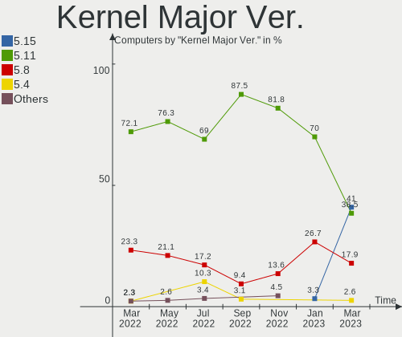
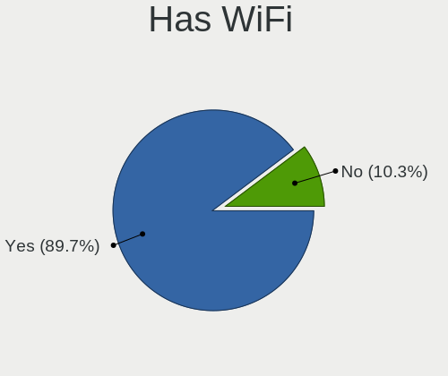
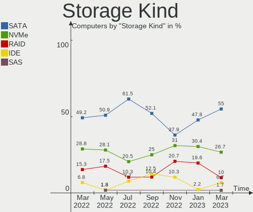
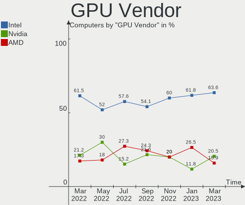
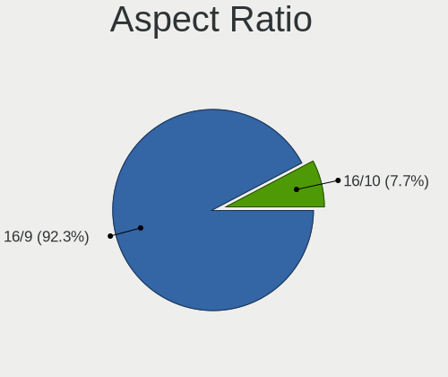
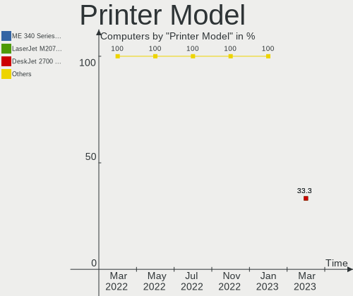

Endless - Hardware Trends
-------------------------

A project to identify most popular hardware characteristics and track their change
over time based on data collected by Linux users at https://Linux-Hardware.org.

Anyone can contribute to this report by the [hw-probe](https://github.com/linuxhw/hw-probe) tool:

    sudo -E hw-probe -all -upload

This is a report for all computer types. See also reports for [desktops](/Dist/Endless/Desktop/README.md) and [notebooks](/Dist/Endless/Notebook/README.md).

This report is for one last month. Overall report since the beginning of time: [TestDays](https://github.com/linuxhw/TestDays)

Period: Mar, 2023.

Contents
--------

* [ System ](#system)
  - [ OS                       ](#os)
  - [ OS Family                ](#os-family)
  - [ Kernel                   ](#kernel)
  - [ Kernel Family            ](#kernel-family)
  - [ Kernel Major Ver.        ](#kernel-major-ver)
  - [ Arch                     ](#arch)
  - [ DE                       ](#de)
  - [ Display Server           ](#display-server)
  - [ Display Manager          ](#display-manager)
  - [ OS Lang                  ](#os-lang)
  - [ Boot Mode                ](#boot-mode)
  - [ Filesystem               ](#filesystem)
  - [ Part. scheme             ](#part-scheme)
  - [ Dual Boot with Linux/BSD ](#dual-boot-with-linuxbsd)
  - [ Dual Boot (Win)          ](#dual-boot-win)

* [ Board ](#board)
  - [ Vendor                   ](#vendor)
  - [ Model                    ](#model)
  - [ Model Family             ](#model-family)
  - [ MFG Year                 ](#mfg-year)
  - [ Form Factor              ](#form-factor)
  - [ Secure Boot              ](#secure-boot)
  - [ Coreboot                 ](#coreboot)
  - [ RAM Size                 ](#ram-size)
  - [ RAM Used                 ](#ram-used)
  - [ Total Drives             ](#total-drives)
  - [ Has CD-ROM               ](#has-cd-rom)
  - [ Has Ethernet             ](#has-ethernet)
  - [ Has WiFi                 ](#has-wifi)
  - [ Has Bluetooth            ](#has-bluetooth)

* [ Location ](#location)
  - [ Country                  ](#country)
  - [ City                     ](#city)

* [ Drives ](#drives)
  - [ Drive Vendor             ](#drive-vendor)
  - [ Drive Model              ](#drive-model)
  - [ HDD Vendor               ](#hdd-vendor)
  - [ SSD Vendor               ](#ssd-vendor)
  - [ Drive Kind               ](#drive-kind)
  - [ Drive Connector          ](#drive-connector)
  - [ Drive Size               ](#drive-size)
  - [ Space Total              ](#space-total)
  - [ Space Used               ](#space-used)
  - [ Malfunc. Drives          ](#malfunc-drives)
  - [ Malfunc. Drive Vendor    ](#malfunc-drive-vendor)
  - [ Malfunc. HDD Vendor      ](#malfunc-hdd-vendor)
  - [ Malfunc. Drive Kind      ](#malfunc-drive-kind)
  - [ Failed Drives            ](#failed-drives)
  - [ Failed Drive Vendor      ](#failed-drive-vendor)
  - [ Drive Status             ](#drive-status)

* [ Storage controller ](#storage-controller)
  - [ Storage Vendor           ](#storage-vendor)
  - [ Storage Model            ](#storage-model)
  - [ Storage Kind             ](#storage-kind)

* [ Processor ](#processor)
  - [ CPU Vendor               ](#cpu-vendor)
  - [ CPU Model                ](#cpu-model)
  - [ CPU Model Family         ](#cpu-model-family)
  - [ CPU Cores                ](#cpu-cores)
  - [ CPU Sockets              ](#cpu-sockets)
  - [ CPU Threads              ](#cpu-threads)
  - [ CPU Op-Modes             ](#cpu-op-modes)
  - [ CPU Microcode            ](#cpu-microcode)
  - [ CPU Microarch            ](#cpu-microarch)

* [ Graphics ](#graphics)
  - [ GPU Vendor               ](#gpu-vendor)
  - [ GPU Model                ](#gpu-model)
  - [ GPU Combo                ](#gpu-combo)
  - [ GPU Driver               ](#gpu-driver)
  - [ GPU Memory               ](#gpu-memory)

* [ Monitor ](#monitor)
  - [ Monitor Vendor           ](#monitor-vendor)
  - [ Monitor Model            ](#monitor-model)
  - [ Monitor Resolution       ](#monitor-resolution)
  - [ Monitor Diagonal         ](#monitor-diagonal)
  - [ Monitor Width            ](#monitor-width)
  - [ Aspect Ratio             ](#aspect-ratio)
  - [ Monitor Area             ](#monitor-area)
  - [ Pixel Density            ](#pixel-density)
  - [ Multiple Monitors        ](#multiple-monitors)

* [ Network ](#network)
  - [ Net Controller Vendor    ](#net-controller-vendor)
  - [ Net Controller Model     ](#net-controller-model)
  - [ Wireless Vendor          ](#wireless-vendor)
  - [ Wireless Model           ](#wireless-model)
  - [ Ethernet Vendor          ](#ethernet-vendor)
  - [ Ethernet Model           ](#ethernet-model)
  - [ Net Controller Kind      ](#net-controller-kind)
  - [ Used Controller          ](#used-controller)
  - [ NICs                     ](#nics)
  - [ IPv6                     ](#ipv6)

* [ Bluetooth ](#bluetooth)
  - [ Bluetooth Vendor         ](#bluetooth-vendor)
  - [ Bluetooth Model          ](#bluetooth-model)

* [ Sound ](#sound)
  - [ Sound Vendor             ](#sound-vendor)
  - [ Sound Model              ](#sound-model)

* [ Memory ](#memory)
  - [ Memory Vendor            ](#memory-vendor)
  - [ Memory Model             ](#memory-model)
  - [ Memory Kind              ](#memory-kind)
  - [ Memory Form Factor       ](#memory-form-factor)
  - [ Memory Size              ](#memory-size)
  - [ Memory Speed             ](#memory-speed)

* [ Printers & scanners ](#printers--scanners)
  - [ Printer Vendor           ](#printer-vendor)
  - [ Printer Model            ](#printer-model)
  - [ Scanner Vendor           ](#scanner-vendor)
  - [ Scanner Model            ](#scanner-model)

* [ Camera ](#camera)
  - [ Camera Vendor            ](#camera-vendor)
  - [ Camera Model             ](#camera-model)

* [ Security ](#security)
  - [ Fingerprint Vendor       ](#fingerprint-vendor)
  - [ Fingerprint Model        ](#fingerprint-model)
  - [ Chipcard Vendor          ](#chipcard-vendor)
  - [ Chipcard Model           ](#chipcard-model)

* [ Unsupported ](#unsupported)
  - [ Unsupported Devices      ](#unsupported-devices)
  - [ Unsupported Device Types ](#unsupported-device-types)

System
------

OS
--

Installed operating systems

| Name                  | Computers | Percent |
|-----------------------|-----------|---------|
| Endless 5.0.1         | 16        | 41.03%  |
| Endless 4.0.14        | 7         | 17.95%  |
| Endless 3.9.7         | 6         | 15.38%  |
| Endless 4.0.13        | 2         | 5.13%   |
| Endless 3.9.3-nexthw1 | 2         | 5.13%   |
| Endless 4.0.9         | 1         | 2.56%   |
| Endless 4.0.4         | 1         | 2.56%   |
| Endless 4.0.12        | 1         | 2.56%   |
| Endless 4.0.10        | 1         | 2.56%   |
| Endless 3.9.4         | 1         | 2.56%   |
| Endless 3.7.7-nexthw1 | 1         | 2.56%   |

OS Family
---------

OS without a version

| Name    | Computers | Percent |
|---------|-----------|---------|
| Endless | 39        | 100%    |

Kernel
------

Version of the Linux kernel

| Version           | Computers | Percent |
|-------------------|-----------|---------|
| 5.15.0-47-generic | 16        | 41.03%  |
| 5.11.0-35-generic | 13        | 33.33%  |
| 5.8.0-14-generic  | 7         | 17.95%  |
| 5.11.0-12-generic | 2         | 5.13%   |
| 5.4.0-7-generic   | 1         | 2.56%   |

Kernel Family
-------------

Linux kernel without a distro release

| Version | Computers | Percent |
|---------|-----------|---------|
| 5.15.0  | 16        | 41.03%  |
| 5.11.0  | 15        | 38.46%  |
| 5.8.0   | 7         | 17.95%  |
| 5.4.0   | 1         | 2.56%   |

Kernel Major Ver.
-----------------

Linux kernel major version

| Version | Computers | Percent |
|---------|-----------|---------|
| 5.15    | 16        | 41.03%  |
| 5.11    | 15        | 38.46%  |
| 5.8     | 7         | 17.95%  |
| 5.4     | 1         | 2.56%   |

Arch
----

OS architecture (x86_64, i586, etc.)

| Name   | Computers | Percent |
|--------|-----------|---------|
| x86_64 | 39        | 100%    |

DE
--

Desktop Environment

| Name  | Computers | Percent |
|-------|-----------|---------|
| GNOME | 39        | 100%    |

Display Server
--------------

X11 or Wayland

| Name    | Computers | Percent |
|---------|-----------|---------|
| X11     | 23        | 58.97%  |
| Wayland | 16        | 41.03%  |

Display Manager
---------------

SDDM, LightDM, etc.

| Name    | Computers | Percent |
|---------|-----------|---------|
| Unknown | 39        | 100%    |

OS Lang
-------

Language

| Lang        | Computers | Percent |
|-------------|-----------|---------|
| pt_BR       | 17        | 43.59%  |
| en_US       | 12        | 30.77%  |
| ru_RU       | 2         | 5.13%   |
| hu_HU       | 2         | 5.13%   |
| sr_RS@latin | 1         | 2.56%   |
| sk_SK       | 1         | 2.56%   |
| is_IS       | 1         | 2.56%   |
| es_MX       | 1         | 2.56%   |
| es_DO       | 1         | 2.56%   |
| es_CO       | 1         | 2.56%   |

Boot Mode
---------

EFI or BIOS

| Mode | Computers | Percent |
|------|-----------|---------|
| EFI  | 31        | 79.49%  |
| BIOS | 8         | 20.51%  |

Filesystem
----------

Type of filesystem

| Type | Computers | Percent |
|------|-----------|---------|
| Ext4 | 39        | 100%    |

Part. scheme
------------

Scheme of partitioning

| Type    | Computers | Percent |
|---------|-----------|---------|
| Unknown | 39        | 100%    |

Dual Boot with Linux/BSD
------------------------

Hosting more than one Linux/BSD

| Dual boot | Computers | Percent |
|-----------|-----------|---------|
| No        | 39        | 100%    |

Dual Boot (Win)
---------------

Hosting Linux and Windows

| Dual boot | Computers | Percent |
|-----------|-----------|---------|
| No        | 39        | 100%    |

Board
-----

Vendor
------

Motherboard manufacturer

| Name                | Computers | Percent |
|---------------------|-----------|---------|
| ASUSTek Computer    | 13        | 33.33%  |
| Acer                | 9         | 23.08%  |
| Dell                | 5         | 12.82%  |
| Lenovo              | 4         | 10.26%  |
| Hewlett-Packard     | 4         | 10.26%  |
| Gigabyte Technology | 3         | 7.69%   |
| VTEX                | 1         | 2.56%   |

Model
-----

Motherboard model

| Name                                       | Computers | Percent |
|--------------------------------------------|-----------|---------|
| Acer Nitro AN515-44                        | 3         | 7.69%   |
| ASUS VivoBook_ASUSLaptop X513EAN_X513EAN   | 2         | 5.13%   |
| ASUS VivoBook 15_ASUS Laptop X540UAR       | 2         | 5.13%   |
| VTEX NOTEBOOK                              | 1         | 2.56%   |
| Lenovo ThinkCentre M91P 4518NR1            | 1         | 2.56%   |
| Lenovo S20-30 20421                        | 1         | 2.56%   |
| Lenovo IdeaPad 110-14IBR 80T6              | 1         | 2.56%   |
| Lenovo G550 20023                          | 1         | 2.56%   |
| HP ProBook 450 15.6 inch G9 Notebook PC    | 1         | 2.56%   |
| HP Pavilion 17                             | 1         | 2.56%   |
| HP EliteBook 840 G3                        | 1         | 2.56%   |
| HP EliteBook 2560p                         | 1         | 2.56%   |
| Gigabyte GA-78LMT-S2P                      | 1         | 2.56%   |
| Gigabyte G5 KD                             | 1         | 2.56%   |
| Gigabyte A520M H                           | 1         | 2.56%   |
| Dell Precision T7600                       | 1         | 2.56%   |
| Dell OptiPlex 330                          | 1         | 2.56%   |
| Dell OptiPlex 3010                         | 1         | 2.56%   |
| Dell Inspiron 5523                         | 1         | 2.56%   |
| Dell Inspiron 531                          | 1         | 2.56%   |
| ASUS X541SA                                | 1         | 2.56%   |
| ASUS VivoBook_ASUSLaptop X515MA_X515MA     | 1         | 2.56%   |
| ASUS VivoBook_ASUSLaptop X515EA_X515EA     | 1         | 2.56%   |
| ASUS VivoBook_ASUSLaptop X515DA_X515DA     | 1         | 2.56%   |
| ASUS VivoBook_ASUSLaptop E410MAB_E410MA    | 1         | 2.56%   |
| ASUS VivoBook 15_ASUS Laptop X540MA_X540MA | 1         | 2.56%   |
| ASUS VivoBook 14_ASUS Laptop X441MA_X441MA | 1         | 2.56%   |
| ASUS Vivo AIO 16 V161GA_V161GA             | 1         | 2.56%   |
| ASUS ASUS EXPERTBOOK B1500CEAEY_B1500CEAE  | 1         | 2.56%   |
| Acer Nitro AN515-54                        | 1         | 2.56%   |
| Acer Aspire C24-420                        | 1         | 2.56%   |
| Acer Aspire A515-54                        | 1         | 2.56%   |
| Acer Aspire A515-51                        | 1         | 2.56%   |
| Acer Aspire A315-53                        | 1         | 2.56%   |
| Acer Aspire A315-34                        | 1         | 2.56%   |

Model Family
------------

Motherboard model prefix

| Name                  | Computers | Percent |
|-----------------------|-----------|---------|
| ASUS VivoBook         | 10        | 25.64%  |
| Acer Aspire           | 5         | 12.82%  |
| Acer Nitro            | 4         | 10.26%  |
| HP EliteBook          | 2         | 5.13%   |
| Dell OptiPlex         | 2         | 5.13%   |
| Dell Inspiron         | 2         | 5.13%   |
| VTEX NOTEBOOK         | 1         | 2.56%   |
| Lenovo ThinkCentre    | 1         | 2.56%   |
| Lenovo S20-30         | 1         | 2.56%   |
| Lenovo IdeaPad        | 1         | 2.56%   |
| Lenovo G550           | 1         | 2.56%   |
| HP ProBook            | 1         | 2.56%   |
| HP Pavilion           | 1         | 2.56%   |
| Gigabyte GA-78LMT-S2P | 1         | 2.56%   |
| Gigabyte G5           | 1         | 2.56%   |
| Gigabyte A520M        | 1         | 2.56%   |
| Dell Precision        | 1         | 2.56%   |
| ASUS X541SA           | 1         | 2.56%   |
| ASUS Vivo             | 1         | 2.56%   |
| ASUS ASUS             | 1         | 2.56%   |

MFG Year
--------

Motherboard manufacture year

| Year | Computers | Percent |
|------|-----------|---------|
| 2021 | 7         | 17.95%  |
| 2020 | 6         | 15.38%  |
| 2018 | 6         | 15.38%  |
| 2019 | 3         | 7.69%   |
| 2016 | 3         | 7.69%   |
| 2011 | 3         | 7.69%   |
| 2022 | 2         | 5.13%   |
| 2017 | 2         | 5.13%   |
| 2012 | 2         | 5.13%   |
| 2014 | 1         | 2.56%   |
| 2013 | 1         | 2.56%   |
| 2009 | 1         | 2.56%   |
| 2008 | 1         | 2.56%   |
| 2007 | 1         | 2.56%   |

Form Factor
-----------

Physical design of the computer

| Name       | Computers | Percent |
|------------|-----------|---------|
| Notebook   | 30        | 76.92%  |
| Desktop    | 7         | 17.95%  |
| All in one | 2         | 5.13%   |

Secure Boot
-----------

Enabled or disabled

| State    | Computers | Percent |
|----------|-----------|---------|
| Disabled | 29        | 74.36%  |
| Enabled  | 10        | 25.64%  |

Coreboot
--------

Have coreboot on board

| Used | Computers | Percent |
|------|-----------|---------|
| No   | 39        | 100%    |

RAM Size
--------

Total RAM memory

| Size in GB | Computers | Percent |
|------------|-----------|---------|
| 3.01-4.0   | 16        | 41.03%  |
| 4.01-8.0   | 12        | 30.77%  |
| 16.01-24.0 | 5         | 12.82%  |
| 8.01-16.0  | 4         | 10.26%  |
| 2.01-3.0   | 1         | 2.56%   |
| 1.01-2.0   | 1         | 2.56%   |

RAM Used
--------

Used RAM memory

| Used GB  | Computers | Percent |
|----------|-----------|---------|
| 1.01-2.0 | 21        | 53.85%  |
| 2.01-3.0 | 12        | 30.77%  |
| 3.01-4.0 | 4         | 10.26%  |
| 4.01-8.0 | 1         | 2.56%   |
| 0.51-1.0 | 1         | 2.56%   |

Total Drives
------------

Number of drives on board

| Drives | Computers | Percent |
|--------|-----------|---------|
| 1      | 35        | 89.74%  |
| 2      | 3         | 7.69%   |
| 3      | 1         | 2.56%   |

Has CD-ROM
----------

Has CD-ROM on board

| Presented | Computers | Percent |
|-----------|-----------|---------|
| No        | 28        | 71.79%  |
| Yes       | 11        | 28.21%  |

Has Ethernet
------------

Has Ethernet on board

| Presented | Computers | Percent |
|-----------|-----------|---------|
| Yes       | 29        | 74.36%  |
| No        | 10        | 25.64%  |

Has WiFi
--------

Has WiFi module

| Presented | Computers | Percent |
|-----------|-----------|---------|
| Yes       | 35        | 89.74%  |
| No        | 4         | 10.26%  |

Has Bluetooth
-------------

Has Bluetooth module

| Presented | Computers | Percent |
|-----------|-----------|---------|
| Yes       | 31        | 79.49%  |
| No        | 8         | 20.51%  |

Location
--------

Country
-------

Geographic location (country)

| Country            | Computers | Percent |
|--------------------|-----------|---------|
| Brazil             | 18        | 46.15%  |
| USA                | 6         | 15.38%  |
| Russia             | 2         | 5.13%   |
| Hungary            | 2         | 5.13%   |
| Colombia           | 2         | 5.13%   |
| UK                 | 1         | 2.56%   |
| Sweden             | 1         | 2.56%   |
| Slovakia           | 1         | 2.56%   |
| Serbia             | 1         | 2.56%   |
| Kenya              | 1         | 2.56%   |
| Iceland            | 1         | 2.56%   |
| Estonia            | 1         | 2.56%   |
| Egypt              | 1         | 2.56%   |
| Dominican Republic | 1         | 2.56%   |

City
----

Geographic location (city)

| City               | Computers | Percent |
|--------------------|-----------|---------|
| Sao Paulo          | 3         | 7.69%   |
| Rio de Janeiro     | 3         | 7.69%   |
| Bogotá            | 2         | 5.13%   |
| Uberlândia        | 1         | 2.56%   |
| Tallinn            | 1         | 2.56%   |
| St Petersburg      | 1         | 2.56%   |
| Seminole           | 1         | 2.56%   |
| Santo Domingo Este | 1         | 2.56%   |
| San Antonio        | 1         | 2.56%   |
| Salvador           | 1         | 2.56%   |
| Safford            | 1         | 2.56%   |
| Reykjavik          | 1         | 2.56%   |
| Recife             | 1         | 2.56%   |
| Ocsa               | 1         | 2.56%   |
| Nairobi            | 1         | 2.56%   |
| Monte Santo        | 1         | 2.56%   |
| McKees Rocks       | 1         | 2.56%   |
| Maracaju           | 1         | 2.56%   |
| Košice            | 1         | 2.56%   |
| Guarulhos          | 1         | 2.56%   |
| Gilbert            | 1         | 2.56%   |
| Curitiba           | 1         | 2.56%   |
| Cuiabá            | 1         | 2.56%   |
| Cherdakly          | 1         | 2.56%   |
| Cascavel           | 1         | 2.56%   |
| Cairo              | 1         | 2.56%   |
| Buffalo            | 1         | 2.56%   |
| Budapest           | 1         | 2.56%   |
| Bristol            | 1         | 2.56%   |
| Brasília          | 1         | 2.56%   |
| Bollnaes           | 1         | 2.56%   |
| Belo Horizonte     | 1         | 2.56%   |
| Arinos             | 1         | 2.56%   |
| Alakince           | 1         | 2.56%   |

Drives
------

Drive Vendor
------------

Hard drive vendors

| Vendor                      | Computers | Drives | Percent |
|-----------------------------|-----------|--------|---------|
| WDC                         | 8         | 8      | 18.18%  |
| Seagate                     | 8         | 8      | 18.18%  |
| Sandisk                     | 5         | 5      | 11.36%  |
| ADATA Technology            | 4         | 4      | 9.09%   |
| Samsung Electronics         | 3         | 3      | 6.82%   |
| Kingston                    | 3         | 3      | 6.82%   |
| Toshiba                     | 2         | 2      | 4.55%   |
| Kingston Technology Company | 2         | 2      | 4.55%   |
| Intel                       | 2         | 2      | 4.55%   |
| Win Memory                  | 1         | 1      | 2.27%   |
| Phison Electronics          | 1         | 1      | 2.27%   |
| LITEONIT                    | 1         | 1      | 2.27%   |
| Hitachi                     | 1         | 1      | 2.27%   |
| HGST                        | 1         | 1      | 2.27%   |
| Crucial                     | 1         | 1      | 2.27%   |
| China                       | 1         | 1      | 2.27%   |

Drive Model
-----------

Hard drive models

| Model                                               | Computers | Percent |
|-----------------------------------------------------|-----------|---------|
| Sandisk WD Blue SN550 NVMe SSD 256GB                | 5         | 11.36%  |
| WDC WD10SPZX-21Z10T0 1TB                            | 4         | 9.09%   |
| ADATA SM2P32A8-256GC1 256GB                         | 4         | 9.09%   |
| Toshiba MQ01ABF050 500GB                            | 2         | 4.55%   |
| Seagate ST500LT012-1DG142 500GB                     | 2         | 4.55%   |
| Kingston Company OM3PDP3 NVMe SSD 256GB             | 2         | 4.55%   |
| Kingston SA400S37240G 240GB SSD                     | 2         | 4.55%   |
| Win Memory SWR256G-301II 256GB                      | 1         | 2.27%   |
| WDC WD40EZAZ-00SF3B0 4TB                            | 1         | 2.27%   |
| WDC WD3200BEVT-22ZCT0 320GB                         | 1         | 2.27%   |
| WDC WD2500BEVT-75ZCT2 250GB                         | 1         | 2.27%   |
| WDC WD10SPZX-80Z10T2 1TB                            | 1         | 2.27%   |
| Seagate ST500LT012-9WS142 500GB                     | 1         | 2.27%   |
| Seagate ST500LM030-1RK17D 500GB                     | 1         | 2.27%   |
| Seagate ST3320620AS 320GB                           | 1         | 2.27%   |
| Seagate ST1000LM035-1RK172 1TB                      | 1         | 2.27%   |
| Seagate ST1000DM010-2EP102 1TB                      | 1         | 2.27%   |
| Seagate ST1000DM003-1SB102 1TB                      | 1         | 2.27%   |
| Samsung SSD SM841 2.5 7mm 256GB                     | 1         | 2.27%   |
| Samsung NVMe SSD Controller SM981/PM981/PM983 250GB | 1         | 2.27%   |
| Samsung MZVL4512HBLU-00BH1 512GB                    | 1         | 2.27%   |
| Phison E16 PCIe4 NVMe Controller 1TB                | 1         | 2.27%   |
| LITEONIT LMT-32L3M mSATA 32GB SSD                   | 1         | 2.27%   |
| Kingston SV300S37A480G 480GB SSD                    | 1         | 2.27%   |
| Intel IM2P33F8BR2-256GB                             | 1         | 2.27%   |
| Intel IM2P33F8BR1-128GB                             | 1         | 2.27%   |
| Hitachi HTS727550A9E364 500GB                       | 1         | 2.27%   |
| HGST HTS721010A9E630 1TB                            | 1         | 2.27%   |
| Crucial M4-CT128M4SSD2 128GB                        | 1         | 2.27%   |
| China SSD 128GB                                     | 1         | 2.27%   |

HDD Vendor
----------

Hard disk drive vendors

| Vendor  | Computers | Drives | Percent |
|---------|-----------|--------|---------|
| WDC     | 8         | 8      | 40%     |
| Seagate | 8         | 8      | 40%     |
| Toshiba | 2         | 2      | 10%     |
| Hitachi | 1         | 1      | 5%      |
| HGST    | 1         | 1      | 5%      |

SSD Vendor
----------

Solid state drive vendors

| Vendor              | Computers | Drives | Percent |
|---------------------|-----------|--------|---------|
| Kingston            | 3         | 3      | 37.5%   |
| Win Memory          | 1         | 1      | 12.5%   |
| Samsung Electronics | 1         | 1      | 12.5%   |
| LITEONIT            | 1         | 1      | 12.5%   |
| Crucial             | 1         | 1      | 12.5%   |
| China               | 1         | 1      | 12.5%   |

Drive Kind
----------

HDD or SSD

| Kind | Computers | Drives | Percent |
|------|-----------|--------|---------|
| HDD  | 18        | 20     | 42.86%  |
| NVMe | 16        | 16     | 38.1%   |
| SSD  | 8         | 8      | 19.05%  |

Drive Connector
---------------

SATA, SAS, NVMe, etc.

| Type | Computers | Drives | Percent |
|------|-----------|--------|---------|
| SATA | 25        | 28     | 60.98%  |
| NVMe | 16        | 16     | 39.02%  |

Drive Size
----------

Size of hard drive

| Size in TB | Computers | Drives | Percent |
|------------|-----------|--------|---------|
| 0.01-0.5   | 17        | 18     | 65.38%  |
| 0.51-1.0   | 8         | 9      | 30.77%  |
| 3.01-4.0   | 1         | 1      | 3.85%   |

Space Total
-----------

Amount of disk space available on the file system

| Size in GB | Computers | Percent |
|------------|-----------|---------|
| 101-250    | 16        | 41.03%  |
| 251-500    | 14        | 35.9%   |
| 501-1000   | 8         | 20.51%  |
| 21-50      | 1         | 2.56%   |

Space Used
----------

Amount of used disk space

| Used GB  | Computers | Percent |
|----------|-----------|---------|
| 21-50    | 19        | 48.72%  |
| 51-100   | 9         | 23.08%  |
| 1-20     | 5         | 12.82%  |
| 101-250  | 4         | 10.26%  |
| 251-500  | 1         | 2.56%   |
| 501-1000 | 1         | 2.56%   |

Malfunc. Drives
---------------

Drive models with a malfunction

Zero info for selected period =(

Malfunc. Drive Vendor
---------------------

Vendors of faulty drives

Zero info for selected period =(

Malfunc. HDD Vendor
-------------------

Vendors of faulty HDD drives

Zero info for selected period =(

Malfunc. Drive Kind
-------------------

Kinds of faulty drives

Zero info for selected period =(

Failed Drives
-------------

Failed drive models

Zero info for selected period =(

Failed Drive Vendor
-------------------

Failed drive vendors

Zero info for selected period =(

Drive Status
------------

Number of failed and malfunc. drives

| Status   | Computers | Drives | Percent |
|----------|-----------|--------|---------|
| Detected | 39        | 44     | 100%    |

Storage controller
------------------

Storage Vendor
--------------

Storage controller vendors

| Vendor                      | Computers | Percent |
|-----------------------------|-----------|---------|
| Intel                       | 29        | 55.77%  |
| AMD                         | 8         | 15.38%  |
| SanDisk                     | 5         | 9.62%   |
| ADATA Technology            | 4         | 7.69%   |
| Samsung Electronics         | 2         | 3.85%   |
| Kingston Technology Company | 2         | 3.85%   |
| Phison Electronics          | 1         | 1.92%   |
| Nvidia                      | 1         | 1.92%   |

Storage Model
-------------

Storage controller models

| Model                                                                            | Computers | Percent |
|----------------------------------------------------------------------------------|-----------|---------|
| Intel Celeron/Pentium Silver Processor SATA Controller                           | 7         | 11.11%  |
| AMD FCH SATA Controller [AHCI mode]                                              | 6         | 9.52%   |
| SanDisk WD Blue SN550 NVMe SSD                                                   | 5         | 7.94%   |
| Intel Sunrise Point-LP SATA Controller [AHCI mode]                               | 5         | 7.94%   |
| Intel Volume Management Device NVMe RAID Controller                              | 4         | 6.35%   |
| Intel Tiger Lake-LP SATA Controller                                              | 4         | 6.35%   |
| ADATA A Non-Volatile memory controller                                           | 4         | 6.35%   |
| Intel 82801 Mobile SATA Controller [RAID mode]                                   | 3         | 4.76%   |
| Kingston Company OM3PDP3 NVMe SSD                                                | 2         | 3.17%   |
| Intel PROSet/Wireless WiFi Software extension                                    | 2         | 3.17%   |
| Intel Atom/Celeron/Pentium Processor x5-E8000/J3xxx/N3xxx Series SATA Controller | 2         | 3.17%   |
| Intel 6 Series/C200 Series Chipset Family 6 port Desktop SATA AHCI Controller    | 2         | 3.17%   |
| Samsung NVMe SSD Controller SM981/PM981/PM983                                    | 1         | 1.59%   |
| Samsung NVMe SSD Controller PM9B1                                                | 1         | 1.59%   |
| Phison E16 PCIe4 NVMe Controller                                                 | 1         | 1.59%   |
| Nvidia MCP61 SATA Controller                                                     | 1         | 1.59%   |
| Nvidia MCP61 IDE                                                                 | 1         | 1.59%   |
| Intel NM10/ICH7 Family SATA Controller [IDE mode]                                | 1         | 1.59%   |
| Intel C606 chipset Dual 4-Port SATA/SAS Storage Control Unit                     | 1         | 1.59%   |
| Intel C600/X79 series chipset 4-Port SATA IDE Controller                         | 1         | 1.59%   |
| Intel C600/X79 series chipset 2-Port SATA IDE Controller                         | 1         | 1.59%   |
| Intel Atom Processor E3800 Series SATA AHCI Controller                           | 1         | 1.59%   |
| Intel 82801IBM/IEM (ICH9M/ICH9M-E) 4 port SATA Controller [AHCI mode]            | 1         | 1.59%   |
| Intel 82801G (ICH7 Family) IDE Controller                                        | 1         | 1.59%   |
| Intel 6 Series/C200 Series Chipset Family 6 port Mobile SATA AHCI Controller     | 1         | 1.59%   |
| Intel 500 Series Chipset Family SATA AHCI Controller                             | 1         | 1.59%   |
| AMD SB7x0/SB8x0/SB9x0 SATA Controller [AHCI mode]                                | 1         | 1.59%   |
| AMD SB7x0/SB8x0/SB9x0 IDE Controller                                             | 1         | 1.59%   |
| AMD 500 Series Chipset SATA Controller                                           | 1         | 1.59%   |

Storage Kind
------------

Kind of storage controller (IDE, SATA, NVMe, SAS, ...)

| Kind | Computers | Percent |
|------|-----------|---------|
| SATA | 33        | 55%     |
| NVMe | 16        | 26.67%  |
| RAID | 6         | 10%     |
| IDE  | 4         | 6.67%   |
| SAS  | 1         | 1.67%   |

Processor
---------

CPU Vendor
----------

Processor vendors

| Vendor | Computers | Percent |
|--------|-----------|---------|
| Intel  | 30        | 76.92%  |
| AMD    | 9         | 23.08%  |

CPU Model
---------

Processor models

| Model                                         | Computers | Percent |
|-----------------------------------------------|-----------|---------|
| Intel Celeron N4020 CPU @ 1.10GHz             | 3         | 7.69%   |
| Intel Celeron N4000 CPU @ 1.10GHz             | 3         | 7.69%   |
| AMD Ryzen 7 4800H with Radeon Graphics        | 3         | 7.69%   |
| Intel 11th Gen Core i7-1165G7 @ 2.80GHz       | 2         | 5.13%   |
| Intel 11th Gen Core i3-1115G4 @ 3.00GHz       | 2         | 5.13%   |
| Intel Xeon CPU E5-2650 0 @ 2.00GHz            | 1         | 2.56%   |
| Intel Pentium CPU N3700 @ 1.60GHz             | 1         | 2.56%   |
| Intel Core i7-3537U CPU @ 2.00GHz             | 1         | 2.56%   |
| Intel Core i7-2620M CPU @ 2.70GHz             | 1         | 2.56%   |
| Intel Core i5-9300H CPU @ 2.40GHz             | 1         | 2.56%   |
| Intel Core i5-7200U CPU @ 2.50GHz             | 1         | 2.56%   |
| Intel Core i5-6200U CPU @ 2.30GHz             | 1         | 2.56%   |
| Intel Core i5-3470 CPU @ 3.20GHz              | 1         | 2.56%   |
| Intel Core i5-10210U CPU @ 1.60GHz            | 1         | 2.56%   |
| Intel Core i3-7020U CPU @ 2.30GHz             | 1         | 2.56%   |
| Intel Core i3-6100U CPU @ 2.30GHz             | 1         | 2.56%   |
| Intel Core i3-6006U CPU @ 2.00GHz             | 1         | 2.56%   |
| Intel Core i3-2100 CPU @ 3.10GHz              | 1         | 2.56%   |
| Intel Core 2 Duo CPU T6600 @ 2.20GHz          | 1         | 2.56%   |
| Intel Core 2 CPU 6600 @ 2.40GHz               | 1         | 2.56%   |
| Intel Celeron N4120 CPU @ 1.10GHz             | 1         | 2.56%   |
| Intel Celeron CPU N3060 @ 1.60GHz             | 1         | 2.56%   |
| Intel Celeron CPU N2830 @ 2.16GHz             | 1         | 2.56%   |
| Intel 12th Gen Core i5-1235U                  | 1         | 2.56%   |
| Intel 11th Gen Core i5-11400H @ 2.70GHz       | 1         | 2.56%   |
| AMD Ryzen 5 3500U with Radeon Vega Mobile Gfx | 1         | 2.56%   |
| AMD Ryzen 3 4100 4-Core Processor             | 1         | 2.56%   |
| AMD Ryzen 3 3250U with Radeon Graphics        | 1         | 2.56%   |
| AMD FX-8120 Eight-Core Processor              | 1         | 2.56%   |
| AMD Athlon 64 X2 Dual Core Processor 4400+    | 1         | 2.56%   |
| AMD A8-6410 APU with AMD Radeon R5 Graphics   | 1         | 2.56%   |

CPU Model Family
----------------

Processor model prefix

| Model            | Computers | Percent |
|------------------|-----------|---------|
| Intel Celeron    | 9         | 23.08%  |
| Other            | 6         | 15.38%  |
| Intel Core i5    | 5         | 12.82%  |
| Intel Core i3    | 4         | 10.26%  |
| AMD Ryzen 7      | 3         | 7.69%   |
| Intel Core i7    | 2         | 5.13%   |
| AMD Ryzen 3      | 2         | 5.13%   |
| Intel Xeon       | 1         | 2.56%   |
| Intel Pentium    | 1         | 2.56%   |
| Intel Core 2 Duo | 1         | 2.56%   |
| Intel Core 2     | 1         | 2.56%   |
| AMD Ryzen 5      | 1         | 2.56%   |
| AMD FX           | 1         | 2.56%   |
| AMD Athlon 64 X2 | 1         | 2.56%   |
| AMD A8           | 1         | 2.56%   |

CPU Cores
---------

Number of processor cores

| Number | Computers | Percent |
|--------|-----------|---------|
| 2      | 22        | 56.41%  |
| 4      | 11        | 28.21%  |
| 8      | 4         | 10.26%  |
| 10     | 1         | 2.56%   |
| 6      | 1         | 2.56%   |

CPU Sockets
-----------

Number of sockets

| Number | Computers | Percent |
|--------|-----------|---------|
| 1      | 39        | 100%    |

CPU Threads
-----------

Threads per core (Hyper-Threading)

| Number | Computers | Percent |
|--------|-----------|---------|
| 2      | 24        | 61.54%  |
| 1      | 15        | 38.46%  |

CPU Op-Modes
------------

CPU Operation Modes (32-bit, 64-bit)

| Op mode        | Computers | Percent |
|----------------|-----------|---------|
| 32-bit, 64-bit | 39        | 100%    |

CPU Microcode
-------------

Microcode number

| Number     | Computers | Percent |
|------------|-----------|---------|
| 0x806c1    | 4         | 10.26%  |
| 0x706a8    | 4         | 10.26%  |
| 0x706a1    | 3         | 7.69%   |
| 0x406e3    | 3         | 7.69%   |
| 0x08600103 | 3         | 7.69%   |
| 0x806e9    | 2         | 5.13%   |
| 0x306a9    | 2         | 5.13%   |
| 0x206a7    | 2         | 5.13%   |
| 0x08108109 | 2         | 5.13%   |
| 0x906ea    | 1         | 2.56%   |
| 0x906a4    | 1         | 2.56%   |
| 0x806ec    | 1         | 2.56%   |
| 0x806d1    | 1         | 2.56%   |
| 0x6f6      | 1         | 2.56%   |
| 0x406c4    | 1         | 2.56%   |
| 0x406c3    | 1         | 2.56%   |
| 0x30678    | 1         | 2.56%   |
| 0x206d7    | 1         | 2.56%   |
| 0x1067a    | 1         | 2.56%   |
| 0x08600106 | 1         | 2.56%   |
| 0x07030105 | 1         | 2.56%   |
| 0x0600063e | 1         | 2.56%   |
| Unknown    | 1         | 2.56%   |

CPU Microarch
-------------

Microarchitecture

| Name             | Computers | Percent |
|------------------|-----------|---------|
| Goldmont plus    | 7         | 17.95%  |
| Zen 2            | 4         | 10.26%  |
| TigerLake        | 4         | 10.26%  |
| KabyLake         | 4         | 10.26%  |
| Skylake          | 3         | 7.69%   |
| Silvermont       | 3         | 7.69%   |
| SandyBridge      | 3         | 7.69%   |
| Zen+             | 2         | 5.13%   |
| IvyBridge        | 2         | 5.13%   |
| Puma             | 1         | 2.56%   |
| Penryn           | 1         | 2.56%   |
| K8 Hammer        | 1         | 2.56%   |
| Icelake          | 1         | 2.56%   |
| Core             | 1         | 2.56%   |
| Bulldozer        | 1         | 2.56%   |
| Alderlake Hybrid | 1         | 2.56%   |

Graphics
--------

GPU Vendor
----------

Vendors of graphics cards

| Vendor | Computers | Percent |
|--------|-----------|---------|
| Intel  | 28        | 63.64%  |
| Nvidia | 9         | 20.45%  |
| AMD    | 7         | 15.91%  |

GPU Model
---------

Graphics card models

| Model                                                                                    | Computers | Percent |
|------------------------------------------------------------------------------------------|-----------|---------|
| Intel GeminiLake [UHD Graphics 600]                                                      | 7         | 15.91%  |
| Nvidia TU117M                                                                            | 3         | 6.82%   |
| Intel Skylake GT2 [HD Graphics 520]                                                      | 3         | 6.82%   |
| AMD Renoir                                                                               | 3         | 6.82%   |
| Intel TigerLake-LP GT2 [Iris Xe Graphics]                                                | 2         | 4.55%   |
| Intel Tiger Lake-LP GT2 [UHD Graphics G4]                                                | 2         | 4.55%   |
| Intel HD Graphics 620                                                                    | 2         | 4.55%   |
| Intel Atom/Celeron/Pentium Processor x5-E8000/J3xxx/N3xxx Integrated Graphics Controller | 2         | 4.55%   |
| Intel 2nd Generation Core Processor Family Integrated Graphics Controller                | 2         | 4.55%   |
| AMD Picasso/Raven 2 [Radeon Vega Series / Radeon Vega Mobile Series]                     | 2         | 4.55%   |
| Nvidia TU117M [GeForce GTX 1650 Mobile / Max-Q]                                          | 1         | 2.27%   |
| Nvidia GT218M [GeForce G210M]                                                            | 1         | 2.27%   |
| Nvidia GP107GL [Quadro P600]                                                             | 1         | 2.27%   |
| Nvidia GK208B [GeForce GT 730]                                                           | 1         | 2.27%   |
| Nvidia GF108 [GeForce GT 630]                                                            | 1         | 2.27%   |
| Nvidia GA106M [GeForce RTX 3060 Mobile / Max-Q]                                          | 1         | 2.27%   |
| Intel Xeon E3-1200 v2/3rd Gen Core processor Graphics Controller                         | 1         | 2.27%   |
| Intel TigerLake-H GT1 [UHD Graphics]                                                     | 1         | 2.27%   |
| Intel CometLake-U GT2 [UHD Graphics]                                                     | 1         | 2.27%   |
| Intel CoffeeLake-H GT2 [UHD Graphics 630]                                                | 1         | 2.27%   |
| Intel Atom Processor Z36xxx/Z37xxx Series Graphics & Display                             | 1         | 2.27%   |
| Intel Alder Lake-UP3 GT2 [UHD Graphics]                                                  | 1         | 2.27%   |
| Intel 82G33/G31 Express Integrated Graphics Controller                                   | 1         | 2.27%   |
| Intel 3rd Gen Core processor Graphics Controller                                         | 1         | 2.27%   |
| AMD RS780L [Radeon 3000]                                                                 | 1         | 2.27%   |
| AMD Mullins [Radeon R4/R5 Graphics]                                                      | 1         | 2.27%   |

GPU Combo
---------

Combinations of graphics cards

| Name           | Computers | Percent |
|----------------|-----------|---------|
| 1 x Intel      | 26        | 66.67%  |
| 1 x Nvidia     | 4         | 10.26%  |
| 1 x AMD        | 4         | 10.26%  |
| AMD + Nvidia   | 3         | 7.69%   |
| Intel + Nvidia | 2         | 5.13%   |

GPU Driver
----------

Free vs proprietary

| Driver      | Computers | Percent |
|-------------|-----------|---------|
| Free        | 33        | 84.62%  |
| Proprietary | 6         | 15.38%  |

GPU Memory
----------

Total video memory

| Size in GB | Computers | Percent |
|------------|-----------|---------|
| Unknown    | 29        | 74.36%  |
| 1.01-2.0   | 4         | 10.26%  |
| 0.01-0.5   | 4         | 10.26%  |
| 0.51-1.0   | 2         | 5.13%   |

Monitor
-------

Monitor Vendor
--------------

Monitor vendors

| Vendor              | Computers | Percent |
|---------------------|-----------|---------|
| BOE                 | 10        | 24.39%  |
| AU Optronics        | 8         | 19.51%  |
| Chimei Innolux      | 7         | 17.07%  |
| Goldstar            | 3         | 7.32%   |
| Samsung Electronics | 2         | 4.88%   |
| PANDA               | 2         | 4.88%   |
| LG Display          | 2         | 4.88%   |
| Dell                | 2         | 4.88%   |
| Acer                | 2         | 4.88%   |
| Lenovo              | 1         | 2.44%   |
| InfoVision          | 1         | 2.44%   |
| BenQ                | 1         | 2.44%   |

Monitor Model
-------------

Monitor models

| Model                                                                | Computers | Percent |
|----------------------------------------------------------------------|-----------|---------|
| Chimei Innolux LCD Monitor CMN15F5 1920x1080 344x193mm 15.5-inch     | 4         | 9.76%   |
| PANDA LCD Monitor NCP004D 1920x1080 344x194mm 15.5-inch              | 2         | 4.88%   |
| BOE LCD Monitor BOE06A5 1366x768 344x194mm 15.5-inch                 | 2         | 4.88%   |
| AU Optronics LCD Monitor AUOAF90 1920x1080 344x193mm 15.5-inch       | 2         | 4.88%   |
| Samsung Electronics SyncMaster SAM047D 1360x768 410x230mm 18.5-inch  | 1         | 2.44%   |
| Samsung Electronics LCD Monitor SEC4149 1366x768 292x174mm 13.4-inch | 1         | 2.44%   |
| LG Display LCD Monitor LGD065A 1920x1080 344x194mm 15.5-inch         | 1         | 2.44%   |
| LG Display LCD Monitor LGD03FB 1920x1080 382x215mm 17.3-inch         | 1         | 2.44%   |
| Lenovo LEN L220xwC LEN1151 1920x1200 474x296mm 22.0-inch             | 1         | 2.44%   |
| InfoVision LCD Monitor IVO0489 1366x768 256x144mm 11.6-inch          | 1         | 2.44%   |
| Goldstar W1542 GSM3BB1 1280x720 332x187mm 15.0-inch                  | 1         | 2.44%   |
| Goldstar FULL HD GSM5B55 1920x1080 480x270mm 21.7-inch               | 1         | 2.44%   |
| Goldstar 24BL550J GSM5B76 1920x1080 480x270mm 21.7-inch              | 1         | 2.44%   |
| Dell S2721D DELA19A 2560x1440 597x336mm 27.0-inch                    | 1         | 2.44%   |
| Dell E207WFP DELD010 1680x1050 430x270mm 20.0-inch                   | 1         | 2.44%   |
| Chimei Innolux LCD Monitor CMN15E6 1366x768 344x193mm 15.5-inch      | 1         | 2.44%   |
| Chimei Innolux LCD Monitor CMN15DC 1366x768 344x193mm 15.5-inch      | 1         | 2.44%   |
| Chimei Innolux LCD Monitor CMN15B6 1366x768 344x193mm 15.5-inch      | 1         | 2.44%   |
| BOE LCD Monitor BOE08B2 1366x768 309x174mm 14.0-inch                 | 1         | 2.44%   |
| BOE LCD Monitor BOE07CE 1366x768 344x193mm 15.5-inch                 | 1         | 2.44%   |
| BOE LCD Monitor BOE07CB 1920x1080 344x193mm 15.5-inch                | 1         | 2.44%   |
| BOE LCD Monitor BOE07AA 1366x768 344x194mm 15.5-inch                 | 1         | 2.44%   |
| BOE LCD Monitor BOE0715 1366x768 256x144mm 11.6-inch                 | 1         | 2.44%   |
| BOE LCD Monitor BOE069C 1920x1080 344x193mm 15.5-inch                | 1         | 2.44%   |
| BOE LCD Monitor BOE0698 1366x768 309x173mm 13.9-inch                 | 1         | 2.44%   |
| BOE LCD Monitor BOE0672 1366x768 344x194mm 15.5-inch                 | 1         | 2.44%   |
| BenQ GW2280 BNQ78E8 1920x1080 476x268mm 21.5-inch                    | 1         | 2.44%   |
| AU Optronics LCD Monitor AUO71EC 1366x768 344x193mm 15.5-inch        | 1         | 2.44%   |
| AU Optronics LCD Monitor AUO3DA3 1920x1080 344x194mm 15.5-inch       | 1         | 2.44%   |
| AU Optronics LCD Monitor AUO38ED 1920x1080 344x193mm 15.5-inch       | 1         | 2.44%   |
| AU Optronics LCD Monitor AUO2D3C 1366x768 309x173mm 13.9-inch        | 1         | 2.44%   |
| AU Optronics LCD Monitor AUO22EC 1366x768 344x193mm 15.5-inch        | 1         | 2.44%   |
| AU Optronics LCD Monitor AUO123D 1920x1080 309x173mm 13.9-inch       | 1         | 2.44%   |
| Acer AL1702W ACRADA7 1440x900 408x255mm 18.9-inch                    | 1         | 2.44%   |
| Acer AIO LCD ACR40B0 1920x1080 527x296mm 23.8-inch                   | 1         | 2.44%   |

Monitor Resolution
------------------

Monitor screen resolution

| Resolution         | Computers | Percent |
|--------------------|-----------|---------|
| 1920x1080 (FHD)    | 17        | 42.5%   |
| 1366x768 (WXGA)    | 16        | 40%     |
| 3840x2160 (4K)     | 1         | 2.5%    |
| 2560x1440 (QHD)    | 1         | 2.5%    |
| 1920x1200 (WUXGA)  | 1         | 2.5%    |
| 1680x1050 (WSXGA+) | 1         | 2.5%    |
| 1440x900 (WXGA+)   | 1         | 2.5%    |
| 1360x768           | 1         | 2.5%    |
| 1280x720 (HD)      | 1         | 2.5%    |

Monitor Diagonal
----------------

Diagonal size in inches

| Inches | Computers | Percent |
|--------|-----------|---------|
| 15     | 25        | 60.98%  |
| 13     | 4         | 9.76%   |
| 21     | 3         | 7.32%   |
| 18     | 2         | 4.88%   |
| 27     | 1         | 2.44%   |
| 23     | 1         | 2.44%   |
| 22     | 1         | 2.44%   |
| 20     | 1         | 2.44%   |
| 17     | 1         | 2.44%   |
| 14     | 1         | 2.44%   |
| 11     | 1         | 2.44%   |

Monitor Width
-------------

Physical width

| Width in mm | Computers | Percent |
|-------------|-----------|---------|
| 301-350     | 29        | 70.73%  |
| 401-500     | 7         | 17.07%  |
| 501-600     | 2         | 4.88%   |
| 201-300     | 2         | 4.88%   |
| 351-400     | 1         | 2.44%   |

Aspect Ratio
------------

Proportional relationship between the width and the height

| Ratio | Computers | Percent |
|-------|-----------|---------|
| 16/9  | 36        | 92.31%  |
| 16/10 | 3         | 7.69%   |

Monitor Area
------------

Area in inch²

| Area in inch² | Computers | Percent |
|----------------|-----------|---------|
| 101-110        | 24        | 58.54%  |
| 201-250        | 5         | 12.2%   |
| 81-90          | 4         | 9.76%   |
| 151-200        | 2         | 4.88%   |
| 71-80          | 1         | 2.44%   |
| 51-60          | 1         | 2.44%   |
| 301-350        | 1         | 2.44%   |
| 141-150        | 1         | 2.44%   |
| 121-130        | 1         | 2.44%   |
| 91-100         | 1         | 2.44%   |

Pixel Density
-------------

Pixels per inch

| Density | Computers | Percent |
|---------|-----------|---------|
| 101-120 | 20        | 48.78%  |
| 121-160 | 16        | 39.02%  |
| 51-100  | 5         | 12.2%   |

Multiple Monitors
-----------------

Total monitors connected

| Total | Computers | Percent |
|-------|-----------|---------|
| 1     | 37        | 94.87%  |
| 2     | 2         | 5.13%   |

Network
-------

Net Controller Vendor
---------------------

Controller vendors

| Vendor                | Computers | Percent |
|-----------------------|-----------|---------|
| Realtek Semiconductor | 23        | 40.35%  |
| Intel                 | 18        | 31.58%  |
| Qualcomm Atheros      | 10        | 17.54%  |
| Broadcom              | 2         | 3.51%   |
| TP-Link               | 1         | 1.75%   |
| Nvidia                | 1         | 1.75%   |
| Broadcom Limited      | 1         | 1.75%   |
| Belkin Components     | 1         | 1.75%   |

Net Controller Model
--------------------

Controller models

| Model                                                                   | Computers | Percent |
|-------------------------------------------------------------------------|-----------|---------|
| Realtek RTL8111/8168/8411 PCI Express Gigabit Ethernet Controller       | 10        | 14.93%  |
| Qualcomm Atheros QCA9377 802.11ac Wireless Network Adapter              | 7         | 10.45%  |
| Realtek RTL810xE PCI Express Fast Ethernet controller                   | 5         | 7.46%   |
| Intel Wi-Fi 6 AX201                                                     | 4         | 5.97%   |
| Intel Wi-Fi 6 AX200                                                     | 4         | 5.97%   |
| Realtek Killer E2600 Gigabit Ethernet Controller                        | 3         | 4.48%   |
| Intel 82579LM Gigabit Network Connection (Lewisville)                   | 3         | 4.48%   |
| Realtek RTL8821CE 802.11ac PCIe Wireless Network Adapter                | 2         | 2.99%   |
| Intel Gemini Lake PCH CNVi WiFi                                         | 2         | 2.99%   |
| TP-Link Archer T3U [Realtek RTL8812BU]                                  | 1         | 1.49%   |
| Realtek RTL8852BE PCIe 802.11ax Wireless Network Controller             | 1         | 1.49%   |
| Realtek RTL8822BE 802.11a/b/g/n/ac WiFi adapter                         | 1         | 1.49%   |
| Realtek RTL8821AE 802.11ac PCIe Wireless Network Adapter                | 1         | 1.49%   |
| Realtek RTL8723BE PCIe Wireless Network Adapter                         | 1         | 1.49%   |
| Realtek RTL8188EUS 802.11n Wireless Network Adapter                     | 1         | 1.49%   |
| Realtek RTL8188ETV Wireless LAN 802.11n Network Adapter                 | 1         | 1.49%   |
| Realtek RTL8188EE Wireless Network Adapter                              | 1         | 1.49%   |
| Realtek 802.11ac NIC                                                    | 1         | 1.49%   |
| Qualcomm Atheros QCA9565 / AR9565 Wireless Network Adapter              | 1         | 1.49%   |
| Qualcomm Atheros AR8161 Gigabit Ethernet                                | 1         | 1.49%   |
| Qualcomm Atheros AR8151 v2.0 Gigabit Ethernet                           | 1         | 1.49%   |
| Nvidia MCP61 Ethernet                                                   | 1         | 1.49%   |
| Intel Wireless 8260                                                     | 1         | 1.49%   |
| Intel Wireless 7265                                                     | 1         | 1.49%   |
| Intel Tiger Lake PCH CNVi WiFi                                          | 1         | 1.49%   |
| Intel PRO/Wireless 5100 AGN [Shiloh] Network Connection                 | 1         | 1.49%   |
| Intel Ethernet Connection I219-V                                        | 1         | 1.49%   |
| Intel Ethernet Connection (14) I219-V                                   | 1         | 1.49%   |
| Intel Ethernet Connection (13) I219-V                                   | 1         | 1.49%   |
| Intel Centrino Wireless-N 2230                                          | 1         | 1.49%   |
| Intel Centrino Ultimate-N 6300                                          | 1         | 1.49%   |
| Intel 82574L Gigabit Network Connection                                 | 1         | 1.49%   |
| Broadcom NetLink BCM5906M Fast Ethernet PCI Express                     | 1         | 1.49%   |
| Broadcom Limited NetLink BCM5787 Gigabit Ethernet PCI Express           | 1         | 1.49%   |
| Broadcom BCM43142 802.11b/g/n                                           | 1         | 1.49%   |
| Belkin Components F7D1101 v1 Basic Wireless Adapter [Realtek RTL8188SU] | 1         | 1.49%   |

Wireless Vendor
---------------

Wireless vendors

| Vendor                | Computers | Percent |
|-----------------------|-----------|---------|
| Intel                 | 16        | 43.24%  |
| Realtek Semiconductor | 10        | 27.03%  |
| Qualcomm Atheros      | 8         | 21.62%  |
| TP-Link               | 1         | 2.7%    |
| Broadcom              | 1         | 2.7%    |
| Belkin Components     | 1         | 2.7%    |

Wireless Model
--------------

Wireless models

| Model                                                                   | Computers | Percent |
|-------------------------------------------------------------------------|-----------|---------|
| Qualcomm Atheros QCA9377 802.11ac Wireless Network Adapter              | 7         | 18.92%  |
| Intel Wi-Fi 6 AX201                                                     | 4         | 10.81%  |
| Intel Wi-Fi 6 AX200                                                     | 4         | 10.81%  |
| Realtek RTL8821CE 802.11ac PCIe Wireless Network Adapter                | 2         | 5.41%   |
| Intel Gemini Lake PCH CNVi WiFi                                         | 2         | 5.41%   |
| TP-Link Archer T3U [Realtek RTL8812BU]                                  | 1         | 2.7%    |
| Realtek RTL8852BE PCIe 802.11ax Wireless Network Controller             | 1         | 2.7%    |
| Realtek RTL8822BE 802.11a/b/g/n/ac WiFi adapter                         | 1         | 2.7%    |
| Realtek RTL8821AE 802.11ac PCIe Wireless Network Adapter                | 1         | 2.7%    |
| Realtek RTL8723BE PCIe Wireless Network Adapter                         | 1         | 2.7%    |
| Realtek RTL8188EUS 802.11n Wireless Network Adapter                     | 1         | 2.7%    |
| Realtek RTL8188ETV Wireless LAN 802.11n Network Adapter                 | 1         | 2.7%    |
| Realtek RTL8188EE Wireless Network Adapter                              | 1         | 2.7%    |
| Realtek 802.11ac NIC                                                    | 1         | 2.7%    |
| Qualcomm Atheros QCA9565 / AR9565 Wireless Network Adapter              | 1         | 2.7%    |
| Intel Wireless 8260                                                     | 1         | 2.7%    |
| Intel Wireless 7265                                                     | 1         | 2.7%    |
| Intel Tiger Lake PCH CNVi WiFi                                          | 1         | 2.7%    |
| Intel PRO/Wireless 5100 AGN [Shiloh] Network Connection                 | 1         | 2.7%    |
| Intel Centrino Wireless-N 2230                                          | 1         | 2.7%    |
| Intel Centrino Ultimate-N 6300                                          | 1         | 2.7%    |
| Broadcom BCM43142 802.11b/g/n                                           | 1         | 2.7%    |
| Belkin Components F7D1101 v1 Basic Wireless Adapter [Realtek RTL8188SU] | 1         | 2.7%    |

Ethernet Vendor
---------------

Ethernet vendors

| Vendor                | Computers | Percent |
|-----------------------|-----------|---------|
| Realtek Semiconductor | 18        | 62.07%  |
| Intel                 | 6         | 20.69%  |
| Qualcomm Atheros      | 2         | 6.9%    |
| Nvidia                | 1         | 3.45%   |
| Broadcom Limited      | 1         | 3.45%   |
| Broadcom              | 1         | 3.45%   |

Ethernet Model
--------------

Ethernet models

| Model                                                             | Computers | Percent |
|-------------------------------------------------------------------|-----------|---------|
| Realtek RTL8111/8168/8411 PCI Express Gigabit Ethernet Controller | 10        | 33.33%  |
| Realtek RTL810xE PCI Express Fast Ethernet controller             | 5         | 16.67%  |
| Realtek Killer E2600 Gigabit Ethernet Controller                  | 3         | 10%     |
| Intel 82579LM Gigabit Network Connection (Lewisville)             | 3         | 10%     |
| Qualcomm Atheros AR8161 Gigabit Ethernet                          | 1         | 3.33%   |
| Qualcomm Atheros AR8151 v2.0 Gigabit Ethernet                     | 1         | 3.33%   |
| Nvidia MCP61 Ethernet                                             | 1         | 3.33%   |
| Intel Ethernet Connection I219-V                                  | 1         | 3.33%   |
| Intel Ethernet Connection (14) I219-V                             | 1         | 3.33%   |
| Intel Ethernet Connection (13) I219-V                             | 1         | 3.33%   |
| Intel 82574L Gigabit Network Connection                           | 1         | 3.33%   |
| Broadcom NetLink BCM5906M Fast Ethernet PCI Express               | 1         | 3.33%   |
| Broadcom Limited NetLink BCM5787 Gigabit Ethernet PCI Express     | 1         | 3.33%   |

Net Controller Kind
-------------------

Ethernet, WiFi or modem

| Kind     | Computers | Percent |
|----------|-----------|---------|
| WiFi     | 35        | 54.69%  |
| Ethernet | 29        | 45.31%  |

Used Controller
---------------

Currently used network controller

| Kind     | Computers | Percent |
|----------|-----------|---------|
| WiFi     | 33        | 82.5%   |
| Ethernet | 7         | 17.5%   |

NICs
----

Total network controllers on board

| Total | Computers | Percent |
|-------|-----------|---------|
| 2     | 23        | 58.97%  |
| 1     | 16        | 41.03%  |

IPv6
----

IPv6 vs IPv4

| Used | Computers | Percent |
|------|-----------|---------|
| No   | 26        | 66.67%  |
| Yes  | 13        | 33.33%  |

Bluetooth
---------

Bluetooth Vendor
----------------

Controller vendors

| Vendor                | Computers | Percent |
|-----------------------|-----------|---------|
| Intel                 | 14        | 45.16%  |
| Lite-On Technology    | 7         | 22.58%  |
| IMC Networks          | 4         | 12.9%   |
| Realtek Semiconductor | 3         | 9.68%   |
| Hewlett-Packard       | 1         | 3.23%   |
| Foxconn International | 1         | 3.23%   |
| Broadcom              | 1         | 3.23%   |

Bluetooth Model
---------------

Controller models

| Model                                             | Computers | Percent |
|---------------------------------------------------|-----------|---------|
| Lite-On Qualcomm Atheros QCA9377 Bluetooth        | 5         | 16.13%  |
| Intel Bluetooth 9460/9560 Jefferson Peak (JfP)    | 5         | 16.13%  |
| Intel AX200 Bluetooth                             | 4         | 12.9%   |
| IMC Networks Bluetooth Radio                      | 3         | 9.68%   |
| Realtek Bluetooth Radio                           | 2         | 6.45%   |
| Lite-On Bluetooth Device                          | 2         | 6.45%   |
| Intel Bluetooth wireless interface                | 2         | 6.45%   |
| Intel AX201 Bluetooth                             | 2         | 6.45%   |
| Realtek RTL8821A Bluetooth                        | 1         | 3.23%   |
| Intel Centrino Bluetooth Wireless Transceiver     | 1         | 3.23%   |
| IMC Networks Bluetooth Device                     | 1         | 3.23%   |
| HP Broadcom 2070 Bluetooth Combo                  | 1         | 3.23%   |
| Foxconn International BCM43142A0 Bluetooth module | 1         | 3.23%   |
| Broadcom BCM2046 Bluetooth Device                 | 1         | 3.23%   |

Sound
-----

Sound Vendor
------------

Sound card vendors

| Vendor | Computers | Percent |
|--------|-----------|---------|
| Intel  | 30        | 63.83%  |
| Nvidia | 9         | 19.15%  |
| AMD    | 8         | 17.02%  |

Sound Model
-----------

Sound card models

| Model                                                                                             | Computers | Percent |
|---------------------------------------------------------------------------------------------------|-----------|---------|
| Intel Celeron/Pentium Silver Processor High Definition Audio                                      | 7         | 13.46%  |
| AMD Family 17h/19h HD Audio Controller                                                            | 6         | 11.54%  |
| Intel Sunrise Point-LP HD Audio                                                                   | 5         | 9.62%   |
| Nvidia TU107 GeForce GTX 1650 High Definition Audio Controller                                    | 4         | 7.69%   |
| Intel Tiger Lake-LP Smart Sound Technology Audio Controller                                       | 4         | 7.69%   |
| Intel 6 Series/C200 Series Chipset Family High Definition Audio Controller                        | 3         | 5.77%   |
| Intel Atom/Celeron/Pentium Processor x5-E8000/J3xxx/N3xxx Series High Definition Audio Controller | 2         | 3.85%   |
| AMD Raven/Raven2/Fenghuang HDMI/DP Audio Controller                                               | 2         | 3.85%   |
| Nvidia MCP61 High Definition Audio                                                                | 1         | 1.92%   |
| Nvidia High Definition Audio Controller                                                           | 1         | 1.92%   |
| Nvidia GP107GL High Definition Audio Controller                                                   | 1         | 1.92%   |
| Nvidia GK208 HDMI/DP Audio Controller                                                             | 1         | 1.92%   |
| Nvidia GF108 High Definition Audio Controller                                                     | 1         | 1.92%   |
| Nvidia GA106 High Definition Audio Controller                                                     | 1         | 1.92%   |
| Intel Tiger Lake-H HD Audio Controller                                                            | 1         | 1.92%   |
| Intel NM10/ICH7 Family High Definition Audio Controller                                           | 1         | 1.92%   |
| Intel Comet Lake PCH-LP cAVS                                                                      | 1         | 1.92%   |
| Intel Cannon Lake PCH cAVS                                                                        | 1         | 1.92%   |
| Intel C600/X79 series chipset High Definition Audio Controller                                    | 1         | 1.92%   |
| Intel Atom Processor Z36xxx/Z37xxx Series High Definition Audio Controller                        | 1         | 1.92%   |
| Intel Alder Lake PCH-P High Definition Audio Controller                                           | 1         | 1.92%   |
| Intel 82801I (ICH9 Family) HD Audio Controller                                                    | 1         | 1.92%   |
| Intel 7 Series/C216 Chipset Family High Definition Audio Controller                               | 1         | 1.92%   |
| AMD SBx00 Azalia (Intel HDA)                                                                      | 1         | 1.92%   |
| AMD Renoir Radeon High Definition Audio Controller                                                | 1         | 1.92%   |
| AMD Kabini HDMI/DP Audio                                                                          | 1         | 1.92%   |
| AMD FCH Azalia Controller                                                                         | 1         | 1.92%   |

Memory
------

Memory Vendor
-------------

Memory module vendors

Zero info for selected period =(

Memory Model
------------

Memory module models

Zero info for selected period =(

Memory Kind
-----------

Memory module kinds

Zero info for selected period =(

Memory Form Factor
------------------

Physical design of the memory module

Zero info for selected period =(

Memory Size
-----------

Memory module size

Zero info for selected period =(

Memory Speed
------------

Memory module speed

Zero info for selected period =(

Printers & scanners
-------------------

Printer Vendor
--------------

Printer device vendors

| Vendor          | Computers | Percent |
|-----------------|-----------|---------|
| Hewlett-Packard | 2         | 66.67%  |
| Seiko Epson     | 1         | 33.33%  |

Printer Model
-------------

Printer device models

| Model                                         | Computers | Percent |
|-----------------------------------------------|-----------|---------|
| Seiko Epson ME 340 Series/Stylus NX130 Series | 1         | 33.33%  |
| HP LaserJet M207-M212                         | 1         | 33.33%  |
| HP DeskJet 2700 series                        | 1         | 33.33%  |

Scanner Vendor
--------------

Scanner device vendors

Zero info for selected period =(

Scanner Model
-------------

Scanner device models

Zero info for selected period =(

Camera
------

Camera Vendor
-------------

Camera device vendors

| Vendor                      | Computers | Percent |
|-----------------------------|-----------|---------|
| IMC Networks                | 10        | 30.3%   |
| Chicony Electronics         | 8         | 24.24%  |
| Quanta                      | 6         | 18.18%  |
| Microdia                    | 3         | 9.09%   |
| Sonix Technology            | 2         | 6.06%   |
| Silicon Motion              | 1         | 3.03%   |
| Microsoft                   | 1         | 3.03%   |
| Luxvisions Innotech Limited | 1         | 3.03%   |
| Aveo Technology             | 1         | 3.03%   |

Camera Model
------------

Camera device models

| Model                                    | Computers | Percent |
|------------------------------------------|-----------|---------|
| IMC Networks USB2.0 VGA UVC WebCam       | 5         | 15.15%  |
| IMC Networks USB2.0 HD UVC WebCam        | 4         | 12.12%  |
| Quanta HD User Facing                    | 3         | 9.09%   |
| Chicony HD User Facing                   | 2         | 6.06%   |
| Sonix USB2.0 VGAUVC WebCam               | 1         | 3.03%   |
| Sonix USB2.0 HD UVC WebCam               | 1         | 3.03%   |
| Silicon Motion Lenovo EasyCamera         | 1         | 3.03%   |
| Quanta VGA WebCam                        | 1         | 3.03%   |
| Quanta USB2.0 HD UVC WebCam              | 1         | 3.03%   |
| Quanta HD Webcam                         | 1         | 3.03%   |
| Microsoft LifeCam VX-2000                | 1         | 3.03%   |
| Microdia USB 2.0 Camera                  | 1         | 3.03%   |
| Microdia Laptop_Integrated_Webcam_HD     | 1         | 3.03%   |
| Microdia HP Integrated Webcam            | 1         | 3.03%   |
| Luxvisions Innotech Limited HP HD Camera | 1         | 3.03%   |
| IMC Networks Lenovo EasyCamera           | 1         | 3.03%   |
| Chicony VGA WebCam                       | 1         | 3.03%   |
| Chicony USB2.0 Camera                    | 1         | 3.03%   |
| Chicony Integrated HP HD Webcam          | 1         | 3.03%   |
| Chicony HP Truevision HD camera          | 1         | 3.03%   |
| Chicony HP HD Camera                     | 1         | 3.03%   |
| Chicony EasyCamera                       | 1         | 3.03%   |
| Aveo USB2.0 Camera                       | 1         | 3.03%   |

Security
--------

Fingerprint Vendor
------------------

Fingerprint sensor vendors

| Vendor           | Computers | Percent |
|------------------|-----------|---------|
| Validity Sensors | 1         | 100%    |

Fingerprint Model
-----------------

Fingerprint sensor models

| Model                                      | Computers | Percent |
|--------------------------------------------|-----------|---------|
| Validity Sensors VFS471 Fingerprint Reader | 1         | 100%    |

Chipcard Vendor
---------------

Chipcard module vendors

Zero info for selected period =(

Chipcard Model
--------------

Chipcard module models

Zero info for selected period =(

Unsupported
-----------

Unsupported Devices
-------------------

Total unsupported devices on board

| Total | Computers | Percent |
|-------|-----------|---------|
| 0     | 29        | 74.36%  |
| 1     | 10        | 25.64%  |

Unsupported Device Types
------------------------

Types of unsupported devices

| Type                     | Computers | Percent |
|--------------------------|-----------|---------|
| Multimedia controller    | 5         | 50%     |
| Net/wireless             | 3         | 30%     |
| Fingerprint reader       | 1         | 10%     |
| Communication controller | 1         | 10%     |

