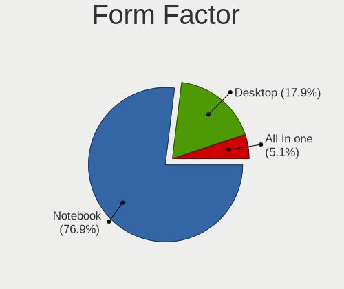
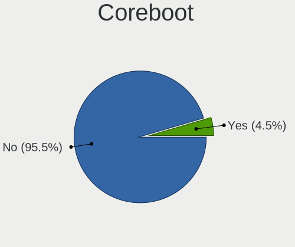
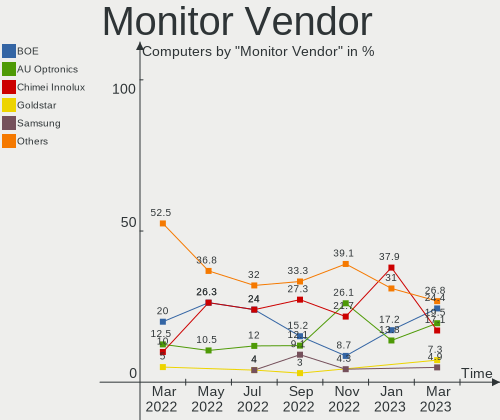

Endless Hardware Trends
-----------------------

A project to identify most popular hardware characteristics and track their change
over time based on data collected by Endless users at https://Linux-Hardware.org.

Anyone can contribute to the study by uploading probes of their computers by
the [hw-probe](https://github.com/linuxhw/hw-probe) tool:

    sudo -E hw-probe -all -upload

This is a report for all computer types. See also reports for [desktops](/Dist/Endless/Desktop/README.md) and [notebooks](/Dist/Endless/Notebook/README.md).

Full-feature report is available here: https://linux-hardware.org/?view=trends

Period: Mar, 2021.

Contents
--------

- [ OS                       ](#os)
- [ OS Family                ](#os-family)
- [ Kernel                   ](#kernel)
- [ Kernel Family            ](#kernel-family)
- [ Kernel Major Ver.        ](#kernel-major-ver)
- [ Arch                     ](#arch)
- [ DE                       ](#de)
- [ Display Server           ](#display-server)
- [ Display Manager          ](#display-manager)
- [ OS Lang                  ](#os-lang)
- [ Boot Mode                ](#boot-mode)
- [ Filesystem               ](#filesystem)
- [ Part. scheme             ](#part-scheme)
- [ Dual Boot with Linux/BSD ](#dual-boot-with-linux/bsd)
- [ Dual Boot (Win)          ](#dual-boot-win)
- [ Country                  ](#country)
- [ City                     ](#city)
- [ Vendor                   ](#vendor)
- [ Model                    ](#model)
- [ Model Family             ](#model-family)
- [ MFG Year                 ](#mfg-year)
- [ Form Factor              ](#form-factor)
- [ Secure Boot              ](#secure-boot)
- [ Coreboot                 ](#coreboot)
- [ RAM Size                 ](#ram-size)
- [ RAM Used                 ](#ram-used)
- [ Has CD-ROM               ](#has-cd-rom)
- [ Total Drives             ](#total-drives)
- [ Has Ethernet             ](#has-ethernet)
- [ Has WiFi                 ](#has-wifi)
- [ Has Bluetooth            ](#has-bluetooth)
- [ Drive Vendor             ](#drive-vendor)
- [ Drive Model              ](#drive-model)
- [ HDD Vendor               ](#hdd-vendor)
- [ SSD Vendor               ](#ssd-vendor)
- [ Drive Kind               ](#drive-kind)
- [ Drive Connector          ](#drive-connector)
- [ Drive Size               ](#drive-size)
- [ Space Total              ](#space-total)
- [ Space Used               ](#space-used)
- [ Malfunc. Drives          ](#malfunc-drives)
- [ Malfunc. Drive Vendor    ](#malfunc-drive-vendor)
- [ Malfunc. HDD Vendor      ](#malfunc-hdd-vendor)
- [ Malfunc. Drive Kind      ](#malfunc-drive-kind)
- [ Failed Drives            ](#failed-drives)
- [ Failed Drive Vendor      ](#failed-drive-vendor)
- [ Drive Status             ](#drive-status)
- [ Storage Vendor           ](#storage-vendor)
- [ Storage Model            ](#storage-model)
- [ Storage Kind             ](#storage-kind)
- [ CPU Vendor               ](#cpu-vendor)
- [ CPU Model                ](#cpu-model)
- [ CPU Model Family         ](#cpu-model-family)
- [ CPU Cores                ](#cpu-cores)
- [ CPU Sockets              ](#cpu-sockets)
- [ CPU Threads              ](#cpu-threads)
- [ CPU Op-Modes             ](#cpu-op-modes)
- [ CPU Microcode            ](#cpu-microcode)
- [ CPU Microarch            ](#cpu-microarch)
- [ GPU Vendor               ](#gpu-vendor)
- [ GPU Model                ](#gpu-model)
- [ GPU Combo                ](#gpu-combo)
- [ GPU Driver               ](#gpu-driver)
- [ GPU Memory               ](#gpu-memory)
- [ Monitor Vendor           ](#monitor-vendor)
- [ Monitor Model            ](#monitor-model)
- [ Monitor Resolution       ](#monitor-resolution)
- [ Monitor Diagonal         ](#monitor-diagonal)
- [ Monitor Width            ](#monitor-width)
- [ Aspect Ratio             ](#aspect-ratio)
- [ Monitor Area             ](#monitor-area)
- [ Pixel Density            ](#pixel-density)
- [ Multiple Monitors        ](#multiple-monitors)
- [ Net Controller Vendor    ](#net-controller-vendor)
- [ Net Controller Model     ](#net-controller-model)
- [ Wireless Vendor          ](#wireless-vendor)
- [ Wireless Model           ](#wireless-model)
- [ Ethernet Vendor          ](#ethernet-vendor)
- [ Ethernet Model           ](#ethernet-model)
- [ Net Controller Kind      ](#net-controller-kind)
- [ Used Controller          ](#used-controller)
- [ NICs                     ](#nics)
- [ IPv6                     ](#ipv6)
- [ Memory Vendor            ](#memory-vendor)
- [ Memory Model             ](#memory-model)
- [ Memory Kind              ](#memory-kind)
- [ Memory Form Factor       ](#memory-form-factor)
- [ Memory Size              ](#memory-size)
- [ Memory Speed             ](#memory-speed)
- [ Sound Vendor             ](#sound-vendor)
- [ Sound Model              ](#sound-model)
- [ Camera Vendor            ](#camera-vendor)
- [ Camera Model             ](#camera-model)
- [ Fingerprint Vendor       ](#fingerprint-vendor)
- [ Fingerprint Model        ](#fingerprint-model)
- [ Chipcard Vendor          ](#chipcard-vendor)
- [ Chipcard Model           ](#chipcard-model)
- [ Printer Vendor           ](#printer-vendor)
- [ Printer Model            ](#printer-model)
- [ Scanner Vendor           ](#scanner-vendor)
- [ Scanner Model            ](#scanner-model)
- [ Bluetooth Vendor         ](#bluetooth-vendor)
- [ Bluetooth Model          ](#bluetooth-model)
- [ Unsupported Devices      ](#unsupported-devices)
- [ Unsupported Device Types ](#unsupported-device-types)

OS
--

Installed operating systems

| Name                  | Computers | Percent |
|-----------------------|-----------|---------|
| Endless 3.9.3         | 77        | 83.7%   |
| Endless 3.7.8         | 7         | 7.61%   |
| Endless 3.9.1         | 2         | 2.17%   |
| Endless 3.9.2         | 1         | 1.09%   |
| Endless 3.8.4         | 1         | 1.09%   |
| Endless 3.7.5-nexthw1 | 1         | 1.09%   |
| Endless 3.7.4         | 1         | 1.09%   |
| Endless 3.6.3-nexthw1 | 1         | 1.09%   |
| Endless 3.4.2-nexthw1 | 1         | 1.09%   |

OS Family
---------

OS without a version

| Name    | Computers | Percent |
|---------|-----------|---------|
| Endless | 92        | 100%    |

Kernel
------

Version of the Linux kernel

| Version          | Computers | Percent |
|------------------|-----------|---------|
| 5.8.0-14-generic | 80        | 86.96%  |
| 5.3.0-28-generic | 7         | 7.61%   |
| 5.4.0-19-generic | 1         | 1.09%   |
| 5.3.0-23-generic | 1         | 1.09%   |
| 5.3.0-19-generic | 1         | 1.09%   |
| 5.3.0-12-generic | 1         | 1.09%   |
| 4.16.0-4-generic | 1         | 1.09%   |

Kernel Family
-------------

Linux kernel without a distro release

| Version | Computers | Percent |
|---------|-----------|---------|
| 5.8.0   | 80        | 86.96%  |
| 5.3.0   | 10        | 10.87%  |
| 5.4.0   | 1         | 1.09%   |
| 4.16.0  | 1         | 1.09%   |

Kernel Major Ver.
-----------------

Linux kernel major version

| Version | Computers | Percent |
|---------|-----------|---------|
| 5.8     | 80        | 86.96%  |
| 5.3     | 10        | 10.87%  |
| 5.4     | 1         | 1.09%   |
| 4.16    | 1         | 1.09%   |

Arch
----

OS architecture (x86_64, i586, etc.)

| Name   | Computers | Percent |
|--------|-----------|---------|
| x86_64 | 92        | 100%    |

DE
--

Desktop Environment

| Name  | Computers | Percent |
|-------|-----------|---------|
| GNOME | 92        | 100%    |

Display Server
--------------

X11 or Wayland

| Name | Computers | Percent |
|------|-----------|---------|
| X11  | 92        | 100%    |

Display Manager
---------------

SDDM, LightDM, etc.

| Name    | Computers | Percent |
|---------|-----------|---------|
| Unknown | 92        | 100%    |

OS Lang
-------

Language

| Lang        | Computers | Percent |
|-------------|-----------|---------|
| pt_BR       | 33        | 35.87%  |
| en_US       | 16        | 17.39%  |
| ro_RO       | 5         | 5.43%   |
| de_DE       | 5         | 5.43%   |
| ru_RU       | 4         | 4.35%   |
| fr_FR       | 4         | 4.35%   |
| ru_RU.UTF_8 | 3         | 3.26%   |
| pl_PL       | 2         | 2.17%   |
| it_IT       | 2         | 2.17%   |
| hu_HU       | 2         | 2.17%   |
| es_ES       | 2         | 2.17%   |
| es_AR       | 2         | 2.17%   |
| tr_TR       | 1         | 1.09%   |
| sk_SK       | 1         | 1.09%   |
| pt_PT       | 1         | 1.09%   |
| fr_CH       | 1         | 1.09%   |
| fr_CA       | 1         | 1.09%   |
| es_MX       | 1         | 1.09%   |
| es_CO       | 1         | 1.09%   |
| en_GB       | 1         | 1.09%   |
| en_CA       | 1         | 1.09%   |
| de_BE       | 1         | 1.09%   |
| ca_ES       | 1         | 1.09%   |
| bg_BG       | 1         | 1.09%   |

Boot Mode
---------

EFI or BIOS

| Mode | Computers | Percent |
|------|-----------|---------|
| EFI  | 64        | 69.57%  |
| BIOS | 28        | 30.43%  |

Filesystem
----------

Type of filesystem

| Type  | Computers | Percent |
|-------|-----------|---------|
| Ext4  | 87        | 94.57%  |
| Tmpfs | 5         | 5.43%   |

Part. scheme
------------

Scheme of partitioning

| Type    | Computers | Percent |
|---------|-----------|---------|
| Unknown | 92        | 100%    |

Dual Boot with Linux/BSD
------------------------

Hosting more than one Linux/BSD

| Dual boot | Computers | Percent |
|-----------|-----------|---------|
| No        | 92        | 100%    |

Dual Boot (Win)
---------------

Hosting Linux and Windows

| Dual boot | Computers | Percent |
|-----------|-----------|---------|
| No        | 92        | 100%    |

Country
-------

Geographic location (country)

| Country     | Computers | Percent |
|-------------|-----------|---------|
| Brazil      | 32        | 34.78%  |
| Russia      | 7         | 7.61%   |
| Germany     | 7         | 7.61%   |
| USA         | 6         | 6.52%   |
| Romania     | 5         | 5.43%   |
| Spain       | 4         | 4.35%   |
| France      | 4         | 4.35%   |
| Canada      | 4         | 4.35%   |
| Turkey      | 2         | 2.17%   |
| Poland      | 2         | 2.17%   |
| Italy       | 2         | 2.17%   |
| Hungary     | 2         | 2.17%   |
| UK          | 1         | 1.09%   |
| Switzerland | 1         | 1.09%   |
| Slovakia    | 1         | 1.09%   |
| Portugal    | 1         | 1.09%   |
| Philippines | 1         | 1.09%   |
| New Zealand | 1         | 1.09%   |
| Mexico      | 1         | 1.09%   |
| Lebanon     | 1         | 1.09%   |
| Kenya       | 1         | 1.09%   |
| Kazakhstan  | 1         | 1.09%   |
| Japan       | 1         | 1.09%   |
| Indonesia   | 1         | 1.09%   |
| Colombia    | 1         | 1.09%   |
| Bulgaria    | 1         | 1.09%   |
| Argentina   | 1         | 1.09%   |

City
----

Geographic location (city)

| City                       | Computers | Percent |
|----------------------------|-----------|---------|
| São Paulo                 | 3         | 3.26%   |
| Moscow                     | 3         | 3.26%   |
| Brasília                  | 3         | 3.26%   |
| Omsk                       | 2         | 2.17%   |
| Essen                      | 2         | 2.17%   |
| Érd                       | 1         | 1.09%   |
| Zalău                     | 1         | 1.09%   |
| Weinsberg                  | 1         | 1.09%   |
| Weiden                     | 1         | 1.09%   |
| Waterford                  | 1         | 1.09%   |
| Warsaw                     | 1         | 1.09%   |
| Vitória                   | 1         | 1.09%   |
| Viamão                    | 1         | 1.09%   |
| Uberlândia                | 1         | 1.09%   |
| Tarragona                  | 1         | 1.09%   |
| Taraz                      | 1         | 1.09%   |
| São Luís                 | 1         | 1.09%   |
| São Carlos                | 1         | 1.09%   |
| Surrey                     | 1         | 1.09%   |
| Sumaré                    | 1         | 1.09%   |
| St Petersburg              | 1         | 1.09%   |
| Sosnowiec                  | 1         | 1.09%   |
| Sofia                      | 1         | 1.09%   |
| Sisli                      | 1         | 1.09%   |
| Sidon                      | 1         | 1.09%   |
| Seyssuel                   | 1         | 1.09%   |
| Santo André               | 1         | 1.09%   |
| San Lorenzo de la Parrilla | 1         | 1.09%   |
| Salvador                   | 1         | 1.09%   |
| Rome                       | 1         | 1.09%   |
| Porto Velho                | 1         | 1.09%   |
| Nantes                     | 1         | 1.09%   |
| Nairobi                    | 1         | 1.09%   |
| Montreal                   | 1         | 1.09%   |
| Montes Claros              | 1         | 1.09%   |
| Miami                      | 1         | 1.09%   |
| Medianeira                 | 1         | 1.09%   |
| Marshall                   | 1         | 1.09%   |
| Lyon                       | 1         | 1.09%   |
| Lisbon                     | 1         | 1.09%   |
| Leopoldina                 | 1         | 1.09%   |
| Lausanne                   | 1         | 1.09%   |
| Lanus                      | 1         | 1.09%   |
| La Baie                    | 1         | 1.09%   |
| Jundiaí                   | 1         | 1.09%   |
| João Pessoa               | 1         | 1.09%   |
| Istanbul                   | 1         | 1.09%   |
| Iasi                       | 1         | 1.09%   |
| Goioere                    | 1         | 1.09%   |
| Fürth                     | 1         | 1.09%   |
| Fuji                       | 1         | 1.09%   |
| Frankfurt am Main          | 1         | 1.09%   |
| Elche                      | 1         | 1.09%   |
| Dzerzhinsk                 | 1         | 1.09%   |
| Dyersburg                  | 1         | 1.09%   |
| Duque de Caxias            | 1         | 1.09%   |
| Dunaújváros              | 1         | 1.09%   |
| Diamantina                 | 1         | 1.09%   |
| Dallas                     | 1         | 1.09%   |
| Curitiba                   | 1         | 1.09%   |

Vendor
------

Motherboard manufacturer

| Name                | Computers | Percent |
|---------------------|-----------|---------|
| ASUSTek Computer    | 34        | 36.96%  |
| Acer                | 25        | 27.17%  |
| Dell                | 11        | 11.96%  |
| Lenovo              | 7         | 7.61%   |
| MSI                 | 3         | 3.26%   |
| Gigabyte Technology | 3         | 3.26%   |
| Pegatron            | 2         | 2.17%   |
| Hewlett-Packard     | 2         | 2.17%   |
| Toshiba             | 1         | 1.09%   |
| Samsung Electronics | 1         | 1.09%   |
| Fujitsu             | 1         | 1.09%   |
| Compal              | 1         | 1.09%   |
| Unknown             | 1         | 1.09%   |

Model
-----

Motherboard model

| Name                                       | Computers | Percent |
|--------------------------------------------|-----------|---------|
| Acer Nitro AN515-43                        | 8         | 8.7%    |
| Acer Nitro AN515-54                        | 5         | 5.43%   |
| ASUS ZenBook UX431DA_UM431DA               | 3         | 3.26%   |
| ASUS VivoBook_ASUSLaptop X509JA_X509JA     | 3         | 3.26%   |
| ASUS VivoBook 15_ASUS Laptop X540UAR       | 3         | 3.26%   |
| Acer Predator PH315-52                     | 3         | 3.26%   |
| Dell Inspiron 5548                         | 2         | 2.17%   |
| ASUS P7H55-M                               | 2         | 2.17%   |
| Acer Nitro AN517-51                        | 2         | 2.17%   |
| Toshiba Satellite P75-A                    | 1         | 1.09%   |
| Samsung 550P5C/550P7C                      | 1         | 1.09%   |
| Pegatron FZ083AA-ABF a6643fr               | 1         | 1.09%   |
| Pegatron 20-b014                           | 1         | 1.09%   |
| MSI MS-7B86                                | 1         | 1.09%   |
| MSI MS-7392                                | 1         | 1.09%   |
| MSI MS-7267                                | 1         | 1.09%   |
| Lenovo ThinkPad X220 4286A35               | 1         | 1.09%   |
| Lenovo ThinkPad L390 20NSS1JP00            | 1         | 1.09%   |
| Lenovo ThinkCentre M91p 7033AP1            | 1         | 1.09%   |
| Lenovo ThinkCentre M90z 3429D6U            | 1         | 1.09%   |
| Lenovo IdeaPad 330-15IKB 81DE              | 1         | 1.09%   |
| Lenovo IdeaPad 320-15IKB 81G3              | 1         | 1.09%   |
| Lenovo G500 20236                          | 1         | 1.09%   |
| HP Pavilion 15                             | 1         | 1.09%   |
| HP EliteDesk 800 G1 SFF                    | 1         | 1.09%   |
| Gigabyte G31M-S2L                          | 1         | 1.09%   |
| Gigabyte B75M-D3H                          | 1         | 1.09%   |
| Gigabyte B550 AORUS ELITE V2               | 1         | 1.09%   |
| Fujitsu ESPRIMO Q556/2                     | 1         | 1.09%   |
| Dell Vostro 1015                           | 1         | 1.09%   |
| Dell OptiPlex 760                          | 1         | 1.09%   |
| Dell OptiPlex 7010                         | 1         | 1.09%   |
| Dell OptiPlex 360                          | 1         | 1.09%   |
| Dell Latitude E6420                        | 1         | 1.09%   |
| Dell Inspiron N5030                        | 1         | 1.09%   |
| Dell Inspiron 7520                         | 1         | 1.09%   |
| Dell Inspiron 11-3162                      | 1         | 1.09%   |
| Dell Inspiron 11 - 3147                    | 1         | 1.09%   |
| Compal NCL60/61                            | 1         | 1.09%   |
| ASUS ZenBook UX431DA_UX431DA               | 1         | 1.09%   |
| ASUS X751SA                                | 1         | 1.09%   |
| ASUS X510UN                                | 1         | 1.09%   |
| ASUS X442URR                               | 1         | 1.09%   |
| ASUS VivoBook_ASUSLaptop X712FA_X712FA     | 1         | 1.09%   |
| ASUS VivoBook_ASUSLaptop X705MAR_X705MA    | 1         | 1.09%   |
| ASUS VivoBook_ASUSLaptop X515MA_X515MA     | 1         | 1.09%   |
| ASUS VivoBook_ASUSLaptop X512FJC_X512FJC   | 1         | 1.09%   |
| ASUS VivoBook_ASUSLaptop X512DA_X512DA     | 1         | 1.09%   |
| ASUS VivoBook_ASUSLaptop X509JA_P1510CJA   | 1         | 1.09%   |
| ASUS VivoBook_ASUSLaptop X509DA_M509DA     | 1         | 1.09%   |
| ASUS VivoBook_ASUSLaptop X430FA_S430FA     | 1         | 1.09%   |
| ASUS VivoBook 15_ASUS Laptop X540MA_R540MA | 1         | 1.09%   |
| ASUS VivoBook 15_ASUS Laptop X540BA        | 1         | 1.09%   |
| ASUS VivoBook 15_ASUS Laptop X507MA_X507MA | 1         | 1.09%   |
| ASUS VivoBook 15_ASUS Laptop X507LA        | 1         | 1.09%   |
| ASUS VivoBook 14_ASUS Laptop X441MA_X441MA | 1         | 1.09%   |
| ASUS Vivo AIO 24 V241FF_V241FF             | 1         | 1.09%   |
| ASUS Vivo AIO 22 V222FB_V222FB             | 1         | 1.09%   |
| ASUS ROG STRIX B360-I GAMING               | 1         | 1.09%   |
| ASUS P8H77-M                               | 1         | 1.09%   |

Model Family
------------

Motherboard model prefix

| Name                 | Computers | Percent |
|----------------------|-----------|---------|
| ASUS VivoBook        | 19        | 20.65%  |
| Acer Nitro           | 15        | 16.3%   |
| Dell Inspiron        | 6         | 6.52%   |
| Acer Aspire          | 5         | 5.43%   |
| ASUS ZenBook         | 4         | 4.35%   |
| Dell OptiPlex        | 3         | 3.26%   |
| Acer Predator        | 3         | 3.26%   |
| Lenovo ThinkPad      | 2         | 2.17%   |
| Lenovo ThinkCentre   | 2         | 2.17%   |
| Lenovo IdeaPad       | 2         | 2.17%   |
| ASUS Vivo            | 2         | 2.17%   |
| ASUS P7H55-M         | 2         | 2.17%   |
| Acer TravelMate      | 2         | 2.17%   |
| Toshiba Satellite    | 1         | 1.09%   |
| Samsung 550P5C       | 1         | 1.09%   |
| Pegatron FZ083AA-ABF | 1         | 1.09%   |
| Pegatron 20-b014     | 1         | 1.09%   |
| MSI MS-7B86          | 1         | 1.09%   |
| MSI MS-7392          | 1         | 1.09%   |
| MSI MS-7267          | 1         | 1.09%   |
| Lenovo G500          | 1         | 1.09%   |
| HP Pavilion          | 1         | 1.09%   |
| HP EliteDesk         | 1         | 1.09%   |
| Gigabyte G31M-S2L    | 1         | 1.09%   |
| Gigabyte B75M-D3H    | 1         | 1.09%   |
| Gigabyte B550        | 1         | 1.09%   |
| Fujitsu ESPRIMO      | 1         | 1.09%   |
| Dell Vostro          | 1         | 1.09%   |
| Dell Latitude        | 1         | 1.09%   |
| Compal NCL60         | 1         | 1.09%   |
| ASUS X751SA          | 1         | 1.09%   |
| ASUS X510UN          | 1         | 1.09%   |
| ASUS X442URR         | 1         | 1.09%   |
| ASUS ROG             | 1         | 1.09%   |
| ASUS P8H77-M         | 1         | 1.09%   |
| ASUS M32CD4-K        | 1         | 1.09%   |
| ASUS All             | 1         | 1.09%   |
| Unknown              | 1         | 1.09%   |

MFG Year
--------

Motherboard manufacture year

| Year | Computers | Percent |
|------|-----------|---------|
| 2020 | 32        | 34.78%  |
| 2019 | 18        | 19.57%  |
| 2018 | 8         | 8.7%    |
| 2010 | 6         | 6.52%   |
| 2013 | 5         | 5.43%   |
| 2014 | 4         | 4.35%   |
| 2012 | 4         | 4.35%   |
| 2021 | 3         | 3.26%   |
| 2011 | 3         | 3.26%   |
| 2017 | 2         | 2.17%   |
| 2015 | 2         | 2.17%   |
| 2008 | 2         | 2.17%   |
| 2016 | 1         | 1.09%   |
| 2009 | 1         | 1.09%   |
| 2007 | 1         | 1.09%   |

Form Factor
-----------

Physical design of the computer

| Name       | Computers | Percent |
|------------|-----------|---------|
| Notebook   | 68        | 73.91%  |
| Desktop    | 21        | 22.83%  |
| All in one | 3         | 3.26%   |

Secure Boot
-----------

Enabled or disabled

| State    | Computers | Percent |
|----------|-----------|---------|
| Disabled | 68        | 73.91%  |
| Enabled  | 24        | 26.09%  |

Coreboot
--------

Have coreboot on board

| Used | Computers | Percent |
|------|-----------|---------|
| No   | 92        | 100%    |

RAM Size
--------

Total RAM memory

| Size in GB | Computers | Percent |
|------------|-----------|---------|
| 4.01-8.0   | 37        | 40.22%  |
| 3.01-4.0   | 21        | 22.83%  |
| 8.01-16.0  | 13        | 14.13%  |
| 16.01-24.0 | 12        | 13.04%  |
| 1.01-2.0   | 6         | 6.52%   |
| 32.01-64.0 | 1         | 1.09%   |
| 24.01-32.0 | 1         | 1.09%   |
| 2.01-3.0   | 1         | 1.09%   |

RAM Used
--------

Used RAM memory

| Used GB  | Computers | Percent |
|----------|-----------|---------|
| 1.01-2.0 | 49        | 53.26%  |
| 2.01-3.0 | 29        | 31.52%  |
| 4.01-8.0 | 5         | 5.43%   |
| 3.01-4.0 | 5         | 5.43%   |
| 0.51-1.0 | 4         | 4.35%   |

Has CD-ROM
----------

Has CD-ROM on board

| Presented | Computers | Percent |
|-----------|-----------|---------|
| No        | 67        | 72.83%  |
| Yes       | 25        | 27.17%  |

Total Drives
------------

Number of drives on board

| Drives | Computers | Percent |
|--------|-----------|---------|
| 1      | 58        | 63.04%  |
| 2      | 29        | 31.52%  |
| 3      | 3         | 3.26%   |
| 4      | 1         | 1.09%   |
| 0      | 1         | 1.09%   |

Has Ethernet
------------

Has Ethernet on board

| Presented | Computers | Percent |
|-----------|-----------|---------|
| Yes       | 69        | 75%     |
| No        | 23        | 25%     |

Has WiFi
--------

Has WiFi module

| Presented | Computers | Percent |
|-----------|-----------|---------|
| Yes       | 78        | 84.78%  |
| No        | 14        | 15.22%  |

Has Bluetooth
-------------

Has Bluetooth module

| Presented | Computers | Percent |
|-----------|-----------|---------|
| Yes       | 64        | 69.57%  |
| No        | 28        | 30.43%  |

Drive Vendor
------------

Hard drive vendors

| Vendor              | Computers | Drives | Percent |
|---------------------|-----------|--------|---------|
| WDC                 | 26        | 26     | 20.63%  |
| Seagate             | 18        | 18     | 14.29%  |
| Intel               | 14        | 14     | 11.11%  |
| Samsung Electronics | 10        | 10     | 7.94%   |
| ADATA Technology    | 10        | 10     | 7.94%   |
| Toshiba             | 9         | 9      | 7.14%   |
| SanDisk             | 7         | 8      | 5.56%   |
| Kingston            | 6         | 6      | 4.76%   |
| SK Hynix            | 4         | 4      | 3.17%   |
| Crucial             | 4         | 4      | 3.17%   |
| A-DATA Technology   | 4         | 4      | 3.17%   |
| Unknown             | 2         | 2      | 1.59%   |
| Hitachi             | 2         | 2      | 1.59%   |
| XPG                 | 1         | 1      | 0.79%   |
| SPCC                | 1         | 1      | 0.79%   |
| Silicon Motion      | 1         | 1      | 0.79%   |
| Phison              | 1         | 1      | 0.79%   |
| Patriot             | 1         | 1      | 0.79%   |
| Micron Technology   | 1         | 1      | 0.79%   |
| HGST                | 1         | 1      | 0.79%   |
| Hewlett-Packard     | 1         | 1      | 0.79%   |
| Corsair             | 1         | 2      | 0.79%   |
| China               | 1         | 1      | 0.79%   |

Drive Model
-----------

Hard drive models

| Model                                 | Computers | Percent |
|---------------------------------------|-----------|---------|
| WDC WD10SPZX-21Z10T0 1TB              | 16        | 12.6%   |
| ADATA NVMe SSD Drive 128GB            | 9         | 7.09%   |
| Intel NVMe SSD Drive 256GB            | 7         | 5.51%   |
| Toshiba MQ04ABF100 1TB                | 5         | 3.94%   |
| Seagate ST1000LM035-1RK172 1TB        | 5         | 3.94%   |
| Intel NVMe SSD Drive 512GB            | 5         | 3.94%   |
| Kingston RBUSC180DS37256GJ 256GB SSD  | 3         | 2.36%   |
| Toshiba MQ01ABF050 500GB              | 2         | 1.57%   |
| SK Hynix NVMe SSD Drive 512GB         | 2         | 1.57%   |
| Seagate ST1000DM010-2EP102 1TB        | 2         | 1.57%   |
| Sandisk NVMe SSD Drive 500GB          | 2         | 1.57%   |
| Samsung NVMe SSD Drive 512GB          | 2         | 1.57%   |
| Crucial CT240BX500SSD1 240GB          | 2         | 1.57%   |
| XPG NVMe SSD Drive 256GB              | 1         | 0.79%   |
| WDC WDS500G2B0A 500GB SSD             | 1         | 0.79%   |
| WDC WDS120G2G0A-00JH30 120GB SSD      | 1         | 0.79%   |
| WDC WD800JD-08LSA0 80GB               | 1         | 0.79%   |
| WDC WD7500AADS-00M2B0 752GB           | 1         | 0.79%   |
| WDC WD5000LPCX-21VHAT0 500GB          | 1         | 0.79%   |
| WDC WD5000BEVT-75A0RT0 500GB          | 1         | 0.79%   |
| WDC WD3200BPVT-24ZEST0 320GB          | 1         | 0.79%   |
| WDC WD3200BEKT-75PVMT0 320GB          | 1         | 0.79%   |
| WDC WD10SPZX-80Z10T2 1TB              | 1         | 0.79%   |
| WDC WD10EZEX-21M2NA0 1TB              | 1         | 0.79%   |
| Unknown Trust HDD 2.5" 120GB          | 1         | 0.79%   |
| Unknown MMC Card  32GB                | 1         | 0.79%   |
| Toshiba TR200 240GB SSD               | 1         | 0.79%   |
| Toshiba THNS128GG4BBAA 128GB SSD      | 1         | 0.79%   |
| SPCC Solid State Disk 128GB           | 1         | 0.79%   |
| SK Hynix NVMe SSD Drive 256GB         | 1         | 0.79%   |
| SK Hynix HFS128G32TND-N210A 128GB SSD | 1         | 0.79%   |
| Silicon Motion NVMe SSD Drive 512GB   | 1         | 0.79%   |
| Seagate ST9500325AS 500GB             | 1         | 0.79%   |
| Seagate ST500LT012-9WS142 500GB       | 1         | 0.79%   |
| Seagate ST500LM030-1RK17D 500GB       | 1         | 0.79%   |
| Seagate ST3500413AS 500GB             | 1         | 0.79%   |
| Seagate ST3320311CS 320GB             | 1         | 0.79%   |
| Seagate ST3160318AS 160GB             | 1         | 0.79%   |
| Seagate ST31000528AS 1TB              | 1         | 0.79%   |
| Seagate ST2000LM007-1R8174 2TB        | 1         | 0.79%   |
| Seagate ST1000LM024 HN-M101MBB 1TB    | 1         | 0.79%   |
| Seagate ST1000LM014-1EJ164 1TB        | 1         | 0.79%   |
| Seagate ST1000DM003-9YN162 1TB        | 1         | 0.79%   |
| SanDisk SSD PLUS 240GB                | 1         | 0.79%   |
| SanDisk SSD PLUS 120 GB               | 1         | 0.79%   |
| SanDisk SD9SN8W512G1102 512GB SSD     | 1         | 0.79%   |
| SanDisk SD9SN8W128G1102 128GB SSD     | 1         | 0.79%   |
| SanDisk SD9SB8W256G1002 256GB SSD     | 1         | 0.79%   |
| SanDisk SD8SBAT-064G-1006 64GB SSD    | 1         | 0.79%   |
| Samsung SSD 860 EVO 250GB             | 1         | 0.79%   |
| Samsung SSD 850 EVO mSATA 120GB       | 1         | 0.79%   |
| Samsung SSD 850 EVO 500GB             | 1         | 0.79%   |
| Samsung SSD 830 Series 256GB          | 1         | 0.79%   |
| Samsung NVMe SSD Drive 250GB          | 1         | 0.79%   |
| Samsung MZMPC032HBCD-000D1 32GB SSD   | 1         | 0.79%   |
| Samsung HM321HI 320GB                 | 1         | 0.79%   |
| Samsung HD502HJ 500GB                 | 1         | 0.79%   |
| Phison NVMe SSD Drive 1024GB          | 1         | 0.79%   |
| Patriot Burst 120GB SSD               | 1         | 0.79%   |
| Micron 1100_MTFDDAV256TBN 256GB SSD   | 1         | 0.79%   |

HDD Vendor
----------

Hard disk drive vendors

| Vendor              | Computers | Drives | Percent |
|---------------------|-----------|--------|---------|
| WDC                 | 24        | 24     | 43.64%  |
| Seagate             | 18        | 18     | 32.73%  |
| Toshiba             | 7         | 7      | 12.73%  |
| Samsung Electronics | 2         | 2      | 3.64%   |
| Hitachi             | 2         | 2      | 3.64%   |
| Unknown             | 1         | 1      | 1.82%   |
| HGST                | 1         | 1      | 1.82%   |

SSD Vendor
----------

Solid state drive vendors

| Vendor              | Computers | Drives | Percent |
|---------------------|-----------|--------|---------|
| SanDisk             | 6         | 6      | 16.67%  |
| Kingston            | 6         | 6      | 16.67%  |
| Samsung Electronics | 5         | 5      | 13.89%  |
| Crucial             | 4         | 4      | 11.11%  |
| A-DATA Technology   | 4         | 4      | 11.11%  |
| WDC                 | 2         | 2      | 5.56%   |
| Toshiba             | 2         | 2      | 5.56%   |
| SPCC                | 1         | 1      | 2.78%   |
| SK Hynix            | 1         | 1      | 2.78%   |
| Patriot             | 1         | 1      | 2.78%   |
| Micron Technology   | 1         | 1      | 2.78%   |
| Hewlett-Packard     | 1         | 1      | 2.78%   |
| Corsair             | 1         | 2      | 2.78%   |
| China               | 1         | 1      | 2.78%   |

Drive Kind
----------

HDD or SSD

| Kind | Computers | Drives | Percent |
|------|-----------|--------|---------|
| HDD  | 53        | 55     | 43.44%  |
| NVMe | 35        | 35     | 28.69%  |
| SSD  | 33        | 37     | 27.05%  |
| MMC  | 1         | 1      | 0.82%   |

Drive Connector
---------------

SATA, SAS, NVMe, etc.

| Type | Computers | Drives | Percent |
|------|-----------|--------|---------|
| SATA | 76        | 91     | 67.26%  |
| NVMe | 35        | 35     | 30.97%  |
| SAS  | 1         | 1      | 0.88%   |
| MMC  | 1         | 1      | 0.88%   |

Drive Size
----------

Size of hard drive

| Size in TB | Computers | Drives | Percent |
|------------|-----------|--------|---------|
| 0.01-0.5   | 47        | 54     | 55.29%  |
| 0.51-1.0   | 37        | 37     | 43.53%  |
| 1.01-2.0   | 1         | 1      | 1.18%   |

Space Total
-----------

Amount of disk space available on the file system

| Size in GB | Computers | Percent |
|------------|-----------|---------|
| 101-250    | 28        | 30.43%  |
| 501-1000   | 26        | 28.26%  |
| 251-500    | 21        | 22.83%  |
| 21-50      | 7         | 7.61%   |
| 51-100     | 5         | 5.43%   |
| 1001-2000  | 2         | 2.17%   |
| 1-20       | 2         | 2.17%   |
| Unknown    | 1         | 1.09%   |

Space Used
----------

Amount of used disk space

| Used GB | Computers | Percent |
|---------|-----------|---------|
| 21-50   | 50        | 54.35%  |
| 1-20    | 17        | 18.48%  |
| 51-100  | 17        | 18.48%  |
| 101-250 | 6         | 6.52%   |
| 251-500 | 1         | 1.09%   |
| Unknown | 1         | 1.09%   |

Malfunc. Drives
---------------

Drive models with a malfunction

Zero info for selected period =(

Malfunc. Drive Vendor
---------------------

Vendors of faulty drives

Zero info for selected period =(

Malfunc. HDD Vendor
-------------------

Vendors of faulty HDD drives

Zero info for selected period =(

Malfunc. Drive Kind
-------------------

Kinds of faulty drives

Zero info for selected period =(

Failed Drives
-------------

Failed drive models

Zero info for selected period =(

Failed Drive Vendor
-------------------

Failed drive vendors

Zero info for selected period =(

Drive Status
------------

Number of failed and malfunc. drives

| Status   | Computers | Drives | Percent |
|----------|-----------|--------|---------|
| Detected | 92        | 128    | 100%    |

Storage Vendor
--------------

Storage controller vendors

| Vendor              | Computers | Percent |
|---------------------|-----------|---------|
| Intel               | 71        | 62.83%  |
| AMD                 | 20        | 17.7%   |
| ADATA Technology    | 11        | 9.73%   |
| SK Hynix            | 3         | 2.65%   |
| Samsung Electronics | 3         | 2.65%   |
| Sandisk             | 2         | 1.77%   |
| VIA Technologies    | 1         | 0.88%   |
| Silicon Motion      | 1         | 0.88%   |
| Phison Electronics  | 1         | 0.88%   |

Storage Model
-------------

Storage controller models

| Model                                                                                   | Computers | Percent |
|-----------------------------------------------------------------------------------------|-----------|---------|
| Intel 82801 Mobile SATA Controller [RAID mode]                                          | 19        | 14.07%  |
| AMD FCH SATA Controller [AHCI mode]                                                     | 19        | 14.07%  |
| Intel PROSet/Wireless WiFi Software extension                                           | 12        | 8.89%   |
| ADATA Non-Volatile memory controller                                                    | 10        | 7.41%   |
| Intel Sunrise Point-LP SATA Controller [AHCI mode]                                      | 7         | 5.19%   |
| Intel Celeron/Pentium Silver Processor SATA Controller                                  | 6         | 4.44%   |
| Intel NM10/ICH7 Family SATA Controller [IDE mode]                                       | 5         | 3.7%    |
| Intel 82801G (ICH7 Family) IDE Controller                                               | 4         | 2.96%   |
| SK Hynix BC501 NVMe Solid State Drive 512GB                                             | 3         | 2.22%   |
| Intel 82801IBM/IEM (ICH9M/ICH9M-E) 4 port SATA Controller [AHCI mode]                   | 3         | 2.22%   |
| Samsung NVMe Controller                                                                 | 2         | 1.48%   |
| Intel Wildcat Point-LP SATA Controller [AHCI Mode]                                      | 2         | 1.48%   |
| Intel Q170/Q150/B150/H170/H110/Z170/CM236 Chipset SATA Controller [AHCI Mode]           | 2         | 1.48%   |
| Intel Atom/Celeron/Pentium Processor x5-E8000/J3xxx/N3xxx Series SATA Controller        | 2         | 1.48%   |
| Intel Atom Processor E3800 Series SATA AHCI Controller                                  | 2         | 1.48%   |
| Intel 8 Series/C220 Series Chipset Family 6-port SATA Controller 1 [AHCI mode]          | 2         | 1.48%   |
| Intel 7 Series/C210 Series Chipset Family 6-port SATA Controller [AHCI mode]            | 2         | 1.48%   |
| Intel 7 Series Chipset Family 6-port SATA Controller [AHCI mode]                        | 2         | 1.48%   |
| Intel 5 Series/3400 Series Chipset 6 port SATA AHCI Controller                          | 2         | 1.48%   |
| Intel 5 Series/3400 Series Chipset 4 port SATA IDE Controller                           | 2         | 1.48%   |
| VIA VT6415 PATA IDE Host Controller                                                     | 1         | 0.74%   |
| Silicon Motion SM2263EN/SM2263XT SSD Controller                                         | 1         | 0.74%   |
| Sandisk WD Blue SN550 NVMe SSD                                                          | 1         | 0.74%   |
| Sandisk WD Black SN750 / PC SN730 NVMe SSD                                              | 1         | 0.74%   |
| Samsung NVMe SSD Controller SM981/PM981/PM983                                           | 1         | 0.74%   |
| Phison E12 NVMe Controller                                                              | 1         | 0.74%   |
| Intel SSD Pro 7600p/760p/E 6100p Series                                                 | 1         | 0.74%   |
| Intel SSD 660P Series                                                                   | 1         | 0.74%   |
| Intel Comet Lake SATA AHCI Controller                                                   | 1         | 0.74%   |
| Intel Comet Lake PCH-LP SATA RAID Premium Controller                                    | 1         | 0.74%   |
| Intel Cannon Lake PCH SATA AHCI Controller                                              | 1         | 0.74%   |
| Intel Cannon Lake Mobile PCH SATA AHCI Controller                                       | 1         | 0.74%   |
| Intel 82801JD/DO (ICH10 Family) SATA AHCI Controller                                    | 1         | 0.74%   |
| Intel 82801IR/IO/IH (ICH9R/DO/DH) 6 port SATA Controller [AHCI mode]                    | 1         | 0.74%   |
| Intel 8 Series SATA Controller 1 [AHCI mode]                                            | 1         | 0.74%   |
| Intel 7 Series/C210 Series Chipset Family 4-port SATA Controller [IDE mode]             | 1         | 0.74%   |
| Intel 7 Series/C210 Series Chipset Family 2-port SATA Controller [IDE mode]             | 1         | 0.74%   |
| Intel 6 Series/C200 Series Chipset Family Mobile SATA Controller (IDE mode, ports 4-5)  | 1         | 0.74%   |
| Intel 6 Series/C200 Series Chipset Family Mobile SATA Controller (IDE mode, ports 0-3)  | 1         | 0.74%   |
| Intel 6 Series/C200 Series Chipset Family Desktop SATA Controller (IDE mode, ports 4-5) | 1         | 0.74%   |
| Intel 6 Series/C200 Series Chipset Family Desktop SATA Controller (IDE mode, ports 0-3) | 1         | 0.74%   |
| Intel 6 Series/C200 Series Chipset Family 6 port Mobile SATA AHCI Controller            | 1         | 0.74%   |
| Intel 5 Series/3400 Series Chipset 2 port SATA IDE Controller                           | 1         | 0.74%   |
| Intel 4 Series Chipset PT IDER Controller                                               | 1         | 0.74%   |
| AMD Starship/Matisse Chipset SATA Controller [AHCI mode]                                | 1         | 0.74%   |
| AMD 400 Series Chipset SATA Controller                                                  | 1         | 0.74%   |
| ADATA XPG SX8200 Pro PCIe Gen3x4 M.2 2280 Solid State Drive                             | 1         | 0.74%   |

Storage Kind
------------

Kind of storage controller (IDE, SATA, NVMe, SAS, ...)

| Kind | Computers | Percent |
|------|-----------|---------|
| SATA | 73        | 58.4%   |
| NVMe | 35        | 28%     |
| IDE  | 11        | 8.8%    |
| RAID | 6         | 4.8%    |

CPU Vendor
----------

Processor vendors

| Vendor | Computers | Percent |
|--------|-----------|---------|
| Intel  | 72        | 78.26%  |
| AMD    | 20        | 21.74%  |

CPU Model
---------

Processor models

| Model                                         | Computers | Percent |
|-----------------------------------------------|-----------|---------|
| AMD Ryzen 7 3750H with Radeon Vega Mobile Gfx | 8         | 8.7%    |
| Intel Core i7-9750H CPU @ 2.60GHz             | 6         | 6.52%   |
| Intel Core i5-9300H CPU @ 2.40GHz             | 4         | 4.35%   |
| AMD Ryzen 5 3500U with Radeon Vega Mobile Gfx | 4         | 4.35%   |
| Intel Core i5-8250U CPU @ 1.60GHz             | 3         | 3.26%   |
| Intel Celeron N4000 CPU @ 1.10GHz             | 3         | 3.26%   |
| Intel Core i7-8565U CPU @ 1.80GHz             | 2         | 2.17%   |
| Intel Core i7-5500U CPU @ 2.40GHz             | 2         | 2.17%   |
| Intel Core i5-1035G1 CPU @ 1.00GHz            | 2         | 2.17%   |
| Intel Core i3-7020U CPU @ 2.30GHz             | 2         | 2.17%   |
| Intel Core i3-1005G1 CPU @ 1.20GHz            | 2         | 2.17%   |
| Intel Celeron N4020 CPU @ 1.10GHz             | 2         | 2.17%   |
| AMD Ryzen 7 3700U with Radeon Vega Mobile Gfx | 2         | 2.17%   |
| Intel Pentium Gold G5420 CPU @ 3.80GHz        | 1         | 1.09%   |
| Intel Pentium Dual-Core CPU T4500 @ 2.30GHz   | 1         | 1.09%   |
| Intel Pentium Dual-Core CPU E5700 @ 3.00GHz   | 1         | 1.09%   |
| Intel Pentium CPU N3700 @ 1.60GHz             | 1         | 1.09%   |
| Intel Pentium CPU N3530 @ 2.16GHz             | 1         | 1.09%   |
| Intel Pentium CPU G6960 @ 2.93GHz             | 1         | 1.09%   |
| Intel Pentium CPU 4417U @ 2.30GHz             | 1         | 1.09%   |
| Intel Core i7-4700MQ CPU @ 2.40GHz            | 1         | 1.09%   |
| Intel Core i7-4510U CPU @ 2.00GHz             | 1         | 1.09%   |
| Intel Core i7-3632QM CPU @ 2.20GHz            | 1         | 1.09%   |
| Intel Core i7-2620M CPU @ 2.70GHz             | 1         | 1.09%   |
| Intel Core i7-1065G7 CPU @ 1.30GHz            | 1         | 1.09%   |
| Intel Core i7-10510U CPU @ 1.80GHz            | 1         | 1.09%   |
| Intel Core i5-8265U CPU @ 1.60GHz             | 1         | 1.09%   |
| Intel Core i5-7400T CPU @ 2.40GHz             | 1         | 1.09%   |
| Intel Core i5-7400 CPU @ 3.00GHz              | 1         | 1.09%   |
| Intel Core i5-4570 CPU @ 3.20GHz              | 1         | 1.09%   |
| Intel Core i5-3350P CPU @ 3.10GHz             | 1         | 1.09%   |
| Intel Core i5-3330 CPU @ 3.00GHz              | 1         | 1.09%   |
| Intel Core i5-3210M CPU @ 2.50GHz             | 1         | 1.09%   |
| Intel Core i5-2400 CPU @ 3.10GHz              | 1         | 1.09%   |
| Intel Core i5-10210U CPU @ 1.60GHz            | 1         | 1.09%   |
| Intel Core i5 CPU M 480 @ 2.67GHz             | 1         | 1.09%   |
| Intel Core i5 CPU 750 @ 2.67GHz               | 1         | 1.09%   |
| Intel Core i3-8145U CPU @ 2.10GHz             | 1         | 1.09%   |
| Intel Core i3-8130U CPU @ 2.20GHz             | 1         | 1.09%   |
| Intel Core i3-7100U CPU @ 2.40GHz             | 1         | 1.09%   |
| Intel Core i3-5005U CPU @ 2.00GHz             | 1         | 1.09%   |
| Intel Core i3-3240 CPU @ 3.40GHz              | 1         | 1.09%   |
| Intel Core i3-3120M CPU @ 2.50GHz             | 1         | 1.09%   |
| Intel Core i3-2310M CPU @ 2.10GHz             | 1         | 1.09%   |
| Intel Core i3 CPU 540 @ 3.07GHz               | 1         | 1.09%   |
| Intel Core 2 Solo CPU U3500 @ 1.40GHz         | 1         | 1.09%   |
| Intel Core 2 Quad CPU Q9400 @ 2.66GHz         | 1         | 1.09%   |
| Intel Core 2 Quad CPU Q6600 @ 2.40GHz         | 1         | 1.09%   |
| Intel Core 2 Duo CPU T6670 @ 2.20GHz          | 1         | 1.09%   |
| Intel Core 2 Duo CPU E8400 @ 3.00GHz          | 1         | 1.09%   |
| Intel Core 2 Duo CPU E7400 @ 2.80GHz          | 1         | 1.09%   |
| Intel Core 2 Duo CPU E7200 @ 2.53GHz          | 1         | 1.09%   |
| Intel Core 2 CPU 4300 @ 1.80GHz               | 1         | 1.09%   |
| Intel Celeron N4120 CPU @ 1.10GHz             | 1         | 1.09%   |
| Intel Celeron CPU N3160 @ 1.60GHz             | 1         | 1.09%   |
| Intel Celeron CPU N3060 @ 1.60GHz             | 1         | 1.09%   |
| Intel Celeron CPU N2840 @ 2.16GHz             | 1         | 1.09%   |
| AMD Sempron 3850 APU with Radeon R3           | 1         | 1.09%   |
| AMD Ryzen 5 3400G with Radeon Vega Graphics   | 1         | 1.09%   |
| AMD Ryzen 3 3200U with Radeon Vega Mobile Gfx | 1         | 1.09%   |

CPU Model Family
----------------

Processor model prefix

| Model                   | Computers | Percent |
|-------------------------|-----------|---------|
| Intel Core i5           | 20        | 21.74%  |
| Intel Core i7           | 16        | 17.39%  |
| Intel Core i3           | 12        | 13.04%  |
| AMD Ryzen 7             | 10        | 10.87%  |
| Intel Celeron           | 9         | 9.78%   |
| AMD Ryzen 5             | 5         | 5.43%   |
| Intel Pentium           | 4         | 4.35%   |
| Intel Core 2 Duo        | 4         | 4.35%   |
| Intel Pentium Dual-Core | 2         | 2.17%   |
| Intel Core 2 Quad       | 2         | 2.17%   |
| AMD Ryzen 3             | 2         | 2.17%   |
| Intel Pentium Gold      | 1         | 1.09%   |
| Intel Core 2 Solo       | 1         | 1.09%   |
| Intel Core 2            | 1         | 1.09%   |
| AMD Sempron             | 1         | 1.09%   |
| AMD E1                  | 1         | 1.09%   |
| AMD A4                  | 1         | 1.09%   |

CPU Cores
---------

Number of processor cores

| Number | Computers | Percent |
|--------|-----------|---------|
| 4      | 47        | 51.09%  |
| 2      | 38        | 41.3%   |
| 6      | 6         | 6.52%   |
| 1      | 1         | 1.09%   |

CPU Sockets
-----------

Number of sockets

| Number | Computers | Percent |
|--------|-----------|---------|
| 1      | 92        | 100%    |

CPU Threads
-----------

Threads per core (Hyper-Threading)

| Number | Computers | Percent |
|--------|-----------|---------|
| 2      | 60        | 65.22%  |
| 1      | 32        | 34.78%  |

CPU Op-Modes
------------

CPU Operation Modes (32-bit, 64-bit)

| Op mode        | Computers | Percent |
|----------------|-----------|---------|
| 32-bit, 64-bit | 92        | 100%    |

CPU Microcode
-------------

Microcode number

| Number     | Computers | Percent |
|------------|-----------|---------|
| 0x08108109 | 11        | 11.96%  |
| 0x906ea    | 10        | 10.87%  |
| 0x1067a    | 7         | 7.61%   |
| 0x306a9    | 6         | 6.52%   |
| 0x806ea    | 5         | 5.43%   |
| 0x706e5    | 5         | 5.43%   |
| 0x806ec    | 4         | 4.35%   |
| 0x08108102 | 4         | 4.35%   |
| 0x706a1    | 3         | 3.26%   |
| 0x306d4    | 3         | 3.26%   |
| 0x206a7    | 3         | 3.26%   |
| 0x20655    | 3         | 3.26%   |
| Unknown    | 3         | 3.26%   |
| 0x906e9    | 2         | 2.17%   |
| 0x806eb    | 2         | 2.17%   |
| 0x806e9    | 2         | 2.17%   |
| 0x706a8    | 2         | 2.17%   |
| 0x406c4    | 2         | 2.17%   |
| 0x306c3    | 2         | 2.17%   |
| 0x30678    | 2         | 2.17%   |
| 0x906ed    | 1         | 1.09%   |
| 0x6fb      | 1         | 1.09%   |
| 0x6f2      | 1         | 1.09%   |
| 0x406c3    | 1         | 1.09%   |
| 0x40651    | 1         | 1.09%   |
| 0x106e5    | 1         | 1.09%   |
| 0x10676    | 1         | 1.09%   |
| 0x08701021 | 1         | 1.09%   |
| 0x0700010f | 1         | 1.09%   |
| 0x06006705 | 1         | 1.09%   |
| 0x05000119 | 1         | 1.09%   |

CPU Microarch
-------------

Microarchitecture

| Name          | Computers | Percent |
|---------------|-----------|---------|
| KabyLake      | 27        | 29.35%  |
| Zen+          | 16        | 17.39%  |
| Penryn        | 8         | 8.7%    |
| IvyBridge     | 6         | 6.52%   |
| Goldmont plus | 6         | 6.52%   |
| Silvermont    | 5         | 5.43%   |
| IceLake       | 5         | 5.43%   |
| Westmere      | 3         | 3.26%   |
| SandyBridge   | 3         | 3.26%   |
| Haswell       | 3         | 3.26%   |
| Broadwell     | 3         | 3.26%   |
| Core          | 2         | 2.17%   |
| Zen 2         | 1         | 1.09%   |
| Nehalem       | 1         | 1.09%   |
| Jaguar        | 1         | 1.09%   |
| Excavator     | 1         | 1.09%   |
| Bobcat        | 1         | 1.09%   |

GPU Vendor
----------

Vendors of graphics cards

| Vendor | Computers | Percent |
|--------|-----------|---------|
| Intel  | 61        | 50.41%  |
| Nvidia | 37        | 30.58%  |
| AMD    | 23        | 19.01%  |

GPU Model
---------

Graphics card models

| Model                                                                                    | Computers | Percent |
|------------------------------------------------------------------------------------------|-----------|---------|
| Nvidia TU117M [GeForce GTX 1650 Mobile / Max-Q]                                          | 15        | 12.3%   |
| AMD Picasso                                                                              | 15        | 12.3%   |
| Intel CoffeeLake-H GT2 [UHD Graphics 630]                                                | 10        | 8.2%    |
| Intel GeminiLake [UHD Graphics 600]                                                      | 6         | 4.92%   |
| Intel WhiskeyLake-U GT2 [UHD Graphics 620]                                               | 4         | 3.28%   |
| Intel UHD Graphics 620                                                                   | 4         | 3.28%   |
| Intel Iris Plus Graphics G1 (Ice Lake)                                                   | 4         | 3.28%   |
| Nvidia TU106M [GeForce RTX 2060 Mobile]                                                  | 3         | 2.46%   |
| Intel Mobile 4 Series Chipset Integrated Graphics Controller                             | 3         | 2.46%   |
| Intel HD Graphics 5500                                                                   | 3         | 2.46%   |
| Intel Atom/Celeron/Pentium Processor x5-E8000/J3xxx/N3xxx Integrated Graphics Controller | 3         | 2.46%   |
| Intel 3rd Gen Core processor Graphics Controller                                         | 3         | 2.46%   |
| Intel 2nd Generation Core Processor Family Integrated Graphics Controller                | 3         | 2.46%   |
| AMD Topaz XT [Radeon R7 M260/M265 / M340/M360 / M440/M445 / 530/535 / 620/625 Mobile]    | 3         | 2.46%   |
| Nvidia GP108M [GeForce MX150]                                                            | 2         | 1.64%   |
| Nvidia GF119 [GeForce GT 610]                                                            | 2         | 1.64%   |
| Intel Kaby Lake-U GT2f HD 620 Graphics Controller                                        | 2         | 1.64%   |
| Intel Core Processor Integrated Graphics Controller                                      | 2         | 1.64%   |
| Intel CometLake-U GT2 [UHD Graphics]                                                     | 2         | 1.64%   |
| Intel Atom Processor Z36xxx/Z37xxx Series Graphics & Display                             | 2         | 1.64%   |
| Nvidia TU117 [GeForce GTX 1650]                                                          | 1         | 0.82%   |
| Nvidia TU116 [GeForce GTX 1650]                                                          | 1         | 0.82%   |
| Nvidia GT218 [NVS 300]                                                                   | 1         | 0.82%   |
| Nvidia GT218 [GeForce 210]                                                               | 1         | 0.82%   |
| Nvidia GT200b [GeForce GTX 275]                                                          | 1         | 0.82%   |
| Nvidia GP108M [GeForce MX230]                                                            | 1         | 0.82%   |
| Nvidia GP107 [GeForce GTX 1050]                                                          | 1         | 0.82%   |
| Nvidia GP106 [GeForce GTX 1060 6GB]                                                      | 1         | 0.82%   |
| Nvidia GM108M [GeForce MX130]                                                            | 1         | 0.82%   |
| Nvidia GM108M [GeForce MX110]                                                            | 1         | 0.82%   |
| Nvidia GM108M [GeForce 930MX]                                                            | 1         | 0.82%   |
| Nvidia GM108M [GeForce 840M]                                                             | 1         | 0.82%   |
| Nvidia GK106 [GeForce GTX 650 OEM]                                                       | 1         | 0.82%   |
| Nvidia GF108M [GeForce GT 620M/630M/635M/640M LE]                                        | 1         | 0.82%   |
| Nvidia G98 [GeForce 9300 GE]                                                             | 1         | 0.82%   |
| Intel Xeon E3-1200 v3/4th Gen Core Processor Integrated Graphics Controller              | 1         | 0.82%   |
| Intel Xeon E3-1200 v2/3rd Gen Core processor Graphics Controller                         | 1         | 0.82%   |
| Intel Kaby Lake-U GT1 Integrated Graphics Controller                                     | 1         | 0.82%   |
| Intel Iris Plus Graphics G7                                                              | 1         | 0.82%   |
| Intel HD Graphics 630                                                                    | 1         | 0.82%   |
| Intel HD Graphics 620                                                                    | 1         | 0.82%   |
| Intel Haswell-ULT Integrated Graphics Controller                                         | 1         | 0.82%   |
| Intel 82945G/GZ Integrated Graphics Controller                                           | 1         | 0.82%   |
| Intel 4th Gen Core Processor Integrated Graphics Controller                              | 1         | 0.82%   |
| Intel 4 Series Chipset Integrated Graphics Controller                                    | 1         | 0.82%   |
| AMD Wrestler [Radeon HD 7310]                                                            | 1         | 0.82%   |
| AMD Stoney [Radeon R2/R3/R4/R5 Graphics]                                                 | 1         | 0.82%   |
| AMD Park [Mobility Radeon HD 5430]                                                       | 1         | 0.82%   |
| AMD Navi 14 [Radeon RX 5500/5500M / Pro 5500M]                                           | 1         | 0.82%   |
| AMD Kabini [Radeon HD 8280 / R3 Series]                                                  | 1         | 0.82%   |
| AMD Chelsea LP [Radeon HD 7730M]                                                         | 1         | 0.82%   |

GPU Combo
---------

Combinations of graphics cards

| Name           | Computers | Percent |
|----------------|-----------|---------|
| 1 x Intel      | 40        | 43.48%  |
| Intel + Nvidia | 18        | 19.57%  |
| 1 x Nvidia     | 11        | 11.96%  |
| 1 x AMD        | 11        | 11.96%  |
| AMD + Nvidia   | 8         | 8.7%    |
| Intel + AMD    | 3         | 3.26%   |
| 2 x AMD        | 1         | 1.09%   |

GPU Driver
----------

Free vs proprietary

| Driver      | Computers | Percent |
|-------------|-----------|---------|
| Free        | 62        | 67.39%  |
| Proprietary | 30        | 32.61%  |

GPU Memory
----------

Total video memory

| Size in GB | Computers | Percent |
|------------|-----------|---------|
| Unknown    | 63        | 68.48%  |
| 1.01-2.0   | 19        | 20.65%  |
| 0.01-0.5   | 5         | 5.43%   |
| 0.51-1.0   | 3         | 3.26%   |
| 7.01-8.0   | 1         | 1.09%   |
| 3.01-4.0   | 1         | 1.09%   |

Monitor Vendor
--------------

Monitor vendors

| Vendor              | Computers | Percent |
|---------------------|-----------|---------|
| BOE                 | 18        | 18.75%  |
| AU Optronics        | 17        | 17.71%  |
| Chimei Innolux      | 12        | 12.5%   |
| LG Display          | 11        | 11.46%  |
| Samsung Electronics | 9         | 9.38%   |
| PANDA               | 4         | 4.17%   |
| Lenovo              | 3         | 3.13%   |
| Hewlett-Packard     | 3         | 3.13%   |
| Goldstar            | 3         | 3.13%   |
| BenQ                | 3         | 3.13%   |
| Dell                | 2         | 2.08%   |
| Vizio               | 1         | 1.04%   |
| Toshiba             | 1         | 1.04%   |
| TCL                 | 1         | 1.04%   |
| Sony                | 1         | 1.04%   |
| Plain Tree Systems  | 1         | 1.04%   |
| NEC Computers       | 1         | 1.04%   |
| LED                 | 1         | 1.04%   |
| Eizo                | 1         | 1.04%   |
| Denver              | 1         | 1.04%   |
| ASUSTek Computer    | 1         | 1.04%   |
| AOC                 | 1         | 1.04%   |

Monitor Model
-------------

Monitor models

| Model                                                                | Computers | Percent |
|----------------------------------------------------------------------|-----------|---------|
| AU Optronics LCD Monitor AUO21ED 1920x1080 344x194mm 15.5-inch       | 7         | 7.29%   |
| LG Display LCD Monitor LGD065A 1920x1080 344x194mm 15.5-inch         | 5         | 5.21%   |
| PANDA LCD Monitor NCP0035 1920x1080 309x174mm 14.0-inch              | 4         | 4.17%   |
| Chimei Innolux LCD Monitor CMN15E6 1366x768 344x193mm 15.5-inch      | 4         | 4.17%   |
| BOE LCD Monitor BOE0818 1920x1080 344x194mm 15.5-inch                | 4         | 4.17%   |
| Chimei Innolux LCD Monitor CMN15E8 1920x1080 344x193mm 15.5-inch     | 3         | 3.13%   |
| Samsung Electronics LCD Monitor SEC5441 1366x768 344x194mm 15.5-inch | 2         | 2.08%   |
| Chimei Innolux LCD Monitor CMN15F5 1920x1080 344x193mm 15.5-inch     | 2         | 2.08%   |
| BOE LCD Monitor BOE0903 1920x1080 344x194mm 15.5-inch                | 2         | 2.08%   |
| BOE LCD Monitor BOE0704 1366x768 344x194mm 15.5-inch                 | 2         | 2.08%   |
| AU Optronics LCD Monitor AUO38ED 1920x1080 340x190mm 15.3-inch       | 2         | 2.08%   |
| AU Optronics LCD Monitor AUO10ED 1920x1080 344x193mm 15.5-inch       | 2         | 2.08%   |
| Vizio VX37L HDTV VIZ2200 1280x720 700x390mm 31.5-inch                | 1         | 1.04%   |
| Toshiba LCD-MONITOR LCDE780 1280x1024 340x270mm 17.1-inch            | 1         | 1.04%   |
| TCL SMART TV TCL6586 3840x2160 1209x680mm 54.6-inch                  | 1         | 1.04%   |
| Sony TV SNYFD00 1360x768 1600x900mm 72.3-inch                        | 1         | 1.04%   |
| Samsung Electronics SyncMaster SAM01B7 1280x1024 338x270mm 17.0-inch | 1         | 1.04%   |
| Samsung Electronics SMB2230 SAM063E 1920x1080 477x268mm 21.5-inch    | 1         | 1.04%   |
| Samsung Electronics LCD Monitor SEC324A 1366x768 344x194mm 15.5-inch | 1         | 1.04%   |
| Samsung Electronics LCD Monitor SEC3047 1366x768 277x156mm 12.5-inch | 1         | 1.04%   |
| Samsung Electronics LCD Monitor SDC4752 1366x768 340x190mm 15.3-inch | 1         | 1.04%   |
| Samsung Electronics C27F390 SAM0D32 1920x1080 600x340mm 27.2-inch    | 1         | 1.04%   |
| Samsung Electronics C24F390 SAM0D2C 1920x1080 520x290mm 23.4-inch    | 1         | 1.04%   |
| Plain Tree Systems FLW-1920B PTS077F 1440x900 410x256mm 19.0-inch    | 1         | 1.04%   |
| NEC Computers EA190M NEC67BE 1280x1024 376x301mm 19.0-inch           | 1         | 1.04%   |
| LG Display LCD Monitor LGD0621 1920x1080 382x215mm 17.3-inch         | 1         | 1.04%   |
| LG Display LCD Monitor LGD053B 1920x1080 294x165mm 13.3-inch         | 1         | 1.04%   |
| LG Display LCD Monitor LGD046A 1366x768 344x194mm 15.5-inch          | 1         | 1.04%   |
| LG Display LCD Monitor LGD044F 1920x1080 350x190mm 15.7-inch         | 1         | 1.04%   |
| LG Display LCD Monitor LGD028A 1366x768 344x194mm 15.5-inch          | 1         | 1.04%   |
| LG Display LCD Monitor LGD0251 1366x768 310x174mm 14.0-inch          | 1         | 1.04%   |
| Lenovo LEN T2424pA LEN60C8 1920x1080 527x296mm 23.8-inch             | 1         | 1.04%   |
| Lenovo LEN L152 LEN24C7 1024x768 304x228mm 15.0-inch                 | 1         | 1.04%   |
| Lenovo AIO LEOF014 1920x1080 518x324mm 24.1-inch                     | 1         | 1.04%   |
| LED Crystal View LED0001 1920x1080 408x255mm 18.9-inch               | 1         | 1.04%   |
| Hewlett-Packard S2231 HWP2905 1920x1080 477x268mm 21.5-inch          | 1         | 1.04%   |
| Hewlett-Packard LP2065 HWP0A72 1600x1200 408x306mm 20.1-inch         | 1         | 1.04%   |
| Hewlett-Packard All-in-One HWP4218 1600x900 443x249mm 20.0-inch      | 1         | 1.04%   |
| Goldstar W1752 GSM4491 1440x900 370x232mm 17.2-inch                  | 1         | 1.04%   |
| Goldstar FULL HD GSM5B54 1920x1080 480x270mm 21.7-inch               | 1         | 1.04%   |
| Goldstar E2060 GSM4EC0 1600x900 443x249mm 20.0-inch                  | 1         | 1.04%   |
| Eizo M1950 ENC1811 1280x1024 377x302mm 19.0-inch                     | 1         | 1.04%   |
| Denver N27QW LHC2700 2560x1440 597x336mm 27.0-inch                   | 1         | 1.04%   |
| Dell U2211H DEL405D 1920x1080 475x267mm 21.5-inch                    | 1         | 1.04%   |
| Dell AW2720HF DELA14A 1920x1080 597x336mm 27.0-inch                  | 1         | 1.04%   |
| Chimei Innolux LCD Monitor CMN1734 1600x900 382x214mm 17.2-inch      | 1         | 1.04%   |
| Chimei Innolux LCD Monitor CMN15DB 1366x768 344x193mm 15.5-inch      | 1         | 1.04%   |
| Chimei Innolux LCD Monitor CMN1132 1366x768 260x140mm 11.6-inch      | 1         | 1.04%   |
| BOE LCD Monitor BOE084E 1920x1080 382x215mm 17.3-inch                | 1         | 1.04%   |
| BOE LCD Monitor BOE0839 1920x1080 382x215mm 17.3-inch                | 1         | 1.04%   |
| BOE LCD Monitor BOE07F7 1920x1080 309x174mm 14.0-inch                | 1         | 1.04%   |
| BOE LCD Monitor BOE06A5 1366x768 344x194mm 15.5-inch                 | 1         | 1.04%   |
| BOE LCD Monitor BOE06A4 1366x768 344x194mm 15.5-inch                 | 1         | 1.04%   |
| BOE LCD Monitor BOE0696 1366x768 309x173mm 13.9-inch                 | 1         | 1.04%   |
| BOE LCD Monitor BOE0685 1600x900 382x215mm 17.3-inch                 | 1         | 1.04%   |
| BOE LCD Monitor BOE0675 1366x768 344x194mm 15.5-inch                 | 1         | 1.04%   |
| BOE LCD Monitor BOE0672 1366x768 344x194mm 15.5-inch                 | 1         | 1.04%   |
| BOE LCD Monitor BOE0623 1366x768 256x144mm 11.6-inch                 | 1         | 1.04%   |
| BenQ GW2450H BNQ78C1 1920x1080 530x300mm 24.0-inch                   | 1         | 1.04%   |
| BenQ GL2240 BNQ7887 1920x1080 480x270mm 21.7-inch                    | 1         | 1.04%   |

Monitor Resolution
------------------

Monitor screen resolution

| Resolution       | Computers | Percent |
|------------------|-----------|---------|
| 1920x1080 (FHD)  | 51        | 54.26%  |
| 1366x768 (WXGA)  | 26        | 27.66%  |
| 1600x900 (HD+)   | 4         | 4.26%   |
| 1280x1024 (SXGA) | 4         | 4.26%   |
| 3840x2160 (4K)   | 2         | 2.13%   |
| 1440x900 (WXGA+) | 2         | 2.13%   |
| 2560x1440 (QHD)  | 1         | 1.06%   |
| 1600x1200        | 1         | 1.06%   |
| 1360x768         | 1         | 1.06%   |
| 1280x720 (HD)    | 1         | 1.06%   |
| 1024x768 (XGA)   | 1         | 1.06%   |

Monitor Diagonal
----------------

Diagonal size in inches

| Inches | Computers | Percent |
|--------|-----------|---------|
| 15     | 53        | 55.21%  |
| 17     | 9         | 9.38%   |
| 21     | 6         | 6.25%   |
| 27     | 3         | 3.13%   |
| 23     | 3         | 3.13%   |
| 20     | 3         | 3.13%   |
| 19     | 3         | 3.13%   |
| 13     | 3         | 3.13%   |
| 11     | 3         | 3.13%   |
| 72     | 2         | 2.08%   |
| 24     | 2         | 2.08%   |
| 14     | 2         | 2.08%   |
| 54     | 1         | 1.04%   |
| 32     | 1         | 1.04%   |
| 31     | 1         | 1.04%   |
| 12     | 1         | 1.04%   |

Monitor Width
-------------

Physical width

| Width in mm | Computers | Percent |
|-------------|-----------|---------|
| 301-350     | 57        | 59.38%  |
| 351-400     | 11        | 11.46%  |
| 401-500     | 10        | 10.42%  |
| 501-600     | 8         | 8.33%   |
| 201-300     | 5         | 5.21%   |
| 1501-2000   | 2         | 2.08%   |
| 701-800     | 1         | 1.04%   |
| 601-700     | 1         | 1.04%   |
| 1001-1500   | 1         | 1.04%   |

Aspect Ratio
------------

Proportional relationship between the width and the height

| Ratio | Computers | Percent |
|-------|-----------|---------|
| 16/9  | 82        | 91.11%  |
| 5/4   | 4         | 4.44%   |
| 4/3   | 2         | 2.22%   |
| 16/10 | 2         | 2.22%   |

Monitor Area
------------

Area in inch²

| Area in inch² | Computers | Percent |
|----------------|-----------|---------|
| 101-110        | 53        | 55.21%  |
| 151-200        | 10        | 10.42%  |
| 201-250        | 6         | 6.25%   |
| 121-130        | 6         | 6.25%   |
| 81-90          | 4         | 4.17%   |
| More than 1000 | 3         | 3.13%   |
| 51-60          | 3         | 3.13%   |
| 301-350        | 3         | 3.13%   |
| 351-500        | 2         | 2.08%   |
| 141-150        | 2         | 2.08%   |
| 71-80          | 1         | 1.04%   |
| 61-70          | 1         | 1.04%   |
| 251-300        | 1         | 1.04%   |
| 131-140        | 1         | 1.04%   |

Pixel Density
-------------

Pixels per inch

| Density | Computers | Percent |
|---------|-----------|---------|
| 121-160 | 43        | 45.26%  |
| 101-120 | 28        | 29.47%  |
| 51-100  | 20        | 21.05%  |
| 1-50    | 3         | 3.16%   |
| 161-240 | 1         | 1.05%   |

Multiple Monitors
-----------------

Total monitors connected

| Total | Computers | Percent |
|-------|-----------|---------|
| 1     | 84        | 91.3%   |
| 2     | 7         | 7.61%   |
| 0     | 1         | 1.09%   |

Net Controller Vendor
---------------------

Controller vendors

| Vendor                         | Computers | Percent |
|--------------------------------|-----------|---------|
| Realtek Semiconductor          | 58        | 40%     |
| Intel                          | 40        | 27.59%  |
| Qualcomm Atheros               | 31        | 21.38%  |
| Ralink                         | 3         | 2.07%   |
| Broadcom Inc. and subsidiaries | 3         | 2.07%   |
| Huawei Technologies            | 2         | 1.38%   |
| VIA Technologies               | 1         | 0.69%   |
| TP-Link                        | 1         | 0.69%   |
| Samsung Electronics            | 1         | 0.69%   |
| LG Electronics                 | 1         | 0.69%   |
| Elecom                         | 1         | 0.69%   |
| Broadcom                       | 1         | 0.69%   |
| ASUSTek Computer               | 1         | 0.69%   |
| ASIX Electronics               | 1         | 0.69%   |

Net Controller Model
--------------------

Controller models

| Model                                                                        | Computers | Percent |
|------------------------------------------------------------------------------|-----------|---------|
| Realtek RTL8111/8168/8411 PCI Express Gigabit Ethernet Controller            | 43        | 27.74%  |
| Qualcomm Atheros QCA9377 802.11ac Wireless Network Adapter                   | 9         | 5.81%   |
| Qualcomm Atheros QCA6174 802.11ac Wireless Network Adapter                   | 8         | 5.16%   |
| Intel Wireless 8265 / 8275                                                   | 7         | 4.52%   |
| Intel Wi-Fi 6 AX200                                                          | 7         | 4.52%   |
| Realtek RTL810xE PCI Express Fast Ethernet controller                        | 6         | 3.87%   |
| Realtek RTL8821CE 802.11ac PCIe Wireless Network Adapter                     | 5         | 3.23%   |
| Qualcomm Atheros QCA9565 / AR9565 Wireless Network Adapter                   | 5         | 3.23%   |
| Intel Wireless-AC 9560 [Jefferson Peak]                                      | 4         | 2.58%   |
| Intel Killer Wi-Fi 6 AX1650i 160MHz Wireless Network Adapter (201NGW)        | 4         | 2.58%   |
| Intel 82579LM Gigabit Network Connection (Lewisville)                        | 4         | 2.58%   |
| Qualcomm Atheros Killer E2500 Gigabit Ethernet Controller                    | 3         | 1.94%   |
| Intel Wireless 7265                                                          | 3         | 1.94%   |
| Intel Cannon Point-LP CNVi [Wireless-AC]                                     | 3         | 1.94%   |
| Realtek RTL88x2bu [AC1200 Techkey]                                           | 2         | 1.29%   |
| Intel Comet Lake PCH-LP CNVi WiFi                                            | 2         | 1.29%   |
| Huawei FLA-LX3                                                               | 2         | 1.29%   |
| VIA VT6105/VT6106S [Rhine-III]                                               | 1         | 0.65%   |
| TP-Link UE300 10/100/1000 LAN (ethernet mode) [Realtek RTL8153]              | 1         | 0.65%   |
| Samsung GT-I9070 (network tethering, USB debugging enabled)                  | 1         | 0.65%   |
| Realtek RTL8822BE 802.11a/b/g/n/ac WiFi adapter                              | 1         | 0.65%   |
| Realtek RTL8192CU 802.11n WLAN Adapter                                       | 1         | 0.65%   |
| Realtek RTL8188FTV 802.11b/g/n 1T1R 2.4G WLAN Adapter                        | 1         | 0.65%   |
| Realtek RTL8188CE 802.11b/g/n WiFi Adapter                                   | 1         | 0.65%   |
| Realtek RTL8153 Gigabit Ethernet Adapter                                     | 1         | 0.65%   |
| Realtek RTL8125 2.5GbE Controller                                            | 1         | 0.65%   |
| Realtek RTL-8100/8101L/8139 PCI Fast Ethernet Adapter                        | 1         | 0.65%   |
| Ralink RT5390R 802.11bgn PCIe Wireless Network Adapter                       | 1         | 0.65%   |
| Ralink RT3060 Wireless 802.11n 1T/1R                                         | 1         | 0.65%   |
| Ralink RT2800 802.11n PCI                                                    | 1         | 0.65%   |
| Qualcomm Atheros QCA8172 Fast Ethernet                                       | 1         | 0.65%   |
| Qualcomm Atheros Osprey Emulation Wireless Network Adapter                   | 1         | 0.65%   |
| Qualcomm Atheros AR9485 Wireless Network Adapter                             | 1         | 0.65%   |
| Qualcomm Atheros AR9287 Wireless Network Adapter (PCI-Express)               | 1         | 0.65%   |
| Qualcomm Atheros AR9285 Wireless Network Adapter (PCI-Express)               | 1         | 0.65%   |
| Qualcomm Atheros AR8161 Gigabit Ethernet                                     | 1         | 0.65%   |
| Qualcomm Atheros AR8152 v2.0 Fast Ethernet                                   | 1         | 0.65%   |
| LG G2 Android Phone [tethering mode]                                         | 1         | 0.65%   |
| Intel WiMAX Connection 2400m                                                 | 1         | 0.65%   |
| Intel WiFi Link 5100                                                         | 1         | 0.65%   |
| Intel Ethernet Connection I217-LM                                            | 1         | 0.65%   |
| Intel Ethernet Connection (7) I219-V                                         | 1         | 0.65%   |
| Intel Ethernet Connection (6) I219-V                                         | 1         | 0.65%   |
| Intel Centrino Wireless-N 2230                                               | 1         | 0.65%   |
| Intel Centrino Advanced-N 6235                                               | 1         | 0.65%   |
| Intel Centrino Advanced-N + WiMAX 6250 [Kilmer Peak]                         | 1         | 0.65%   |
| Intel AC 1550i Wireless                                                      | 1         | 0.65%   |
| Intel 82567LM-3 Gigabit Network Connection                                   | 1         | 0.65%   |
| Elecom 802.11ac WLAN                                                         | 1         | 0.65%   |
| Broadcom NetLink BCM5784M Gigabit Ethernet PCIe                              | 1         | 0.65%   |
| Broadcom Inc. and subsidiaries BCM4322 802.11a/b/g/n Wireless LAN Controller | 1         | 0.65%   |
| Broadcom Inc. and subsidiaries BCM43142 802.11b/g/n                          | 1         | 0.65%   |
| Broadcom Inc. and subsidiaries BCM4313 802.11bgn Wireless Network Adapter    | 1         | 0.65%   |
| ASUS 802.11ac NIC                                                            | 1         | 0.65%   |
| ASIX AX88772                                                                 | 1         | 0.65%   |

Wireless Vendor
---------------

Wireless vendors

| Vendor                         | Computers | Percent |
|--------------------------------|-----------|---------|
| Intel                          | 35        | 44.87%  |
| Qualcomm Atheros               | 25        | 32.05%  |
| Realtek Semiconductor          | 10        | 12.82%  |
| Ralink                         | 3         | 3.85%   |
| Broadcom Inc. and subsidiaries | 3         | 3.85%   |
| Elecom                         | 1         | 1.28%   |
| ASUSTek Computer               | 1         | 1.28%   |

Wireless Model
--------------

Wireless models

| Model                                                                        | Computers | Percent |
|------------------------------------------------------------------------------|-----------|---------|
| Qualcomm Atheros QCA9377 802.11ac Wireless Network Adapter                   | 9         | 11.39%  |
| Qualcomm Atheros QCA6174 802.11ac Wireless Network Adapter                   | 8         | 10.13%  |
| Intel Wireless 8265 / 8275                                                   | 7         | 8.86%   |
| Intel Wi-Fi 6 AX200                                                          | 7         | 8.86%   |
| Realtek RTL8821CE 802.11ac PCIe Wireless Network Adapter                     | 5         | 6.33%   |
| Qualcomm Atheros QCA9565 / AR9565 Wireless Network Adapter                   | 5         | 6.33%   |
| Intel Wireless-AC 9560 [Jefferson Peak]                                      | 4         | 5.06%   |
| Intel Killer Wi-Fi 6 AX1650i 160MHz Wireless Network Adapter (201NGW)        | 4         | 5.06%   |
| Intel Wireless 7265                                                          | 3         | 3.8%    |
| Intel Cannon Point-LP CNVi [Wireless-AC]                                     | 3         | 3.8%    |
| Realtek RTL88x2bu [AC1200 Techkey]                                           | 2         | 2.53%   |
| Intel Comet Lake PCH-LP CNVi WiFi                                            | 2         | 2.53%   |
| Realtek RTL8822BE 802.11a/b/g/n/ac WiFi adapter                              | 1         | 1.27%   |
| Realtek RTL8192CU 802.11n WLAN Adapter                                       | 1         | 1.27%   |
| Realtek RTL8188FTV 802.11b/g/n 1T1R 2.4G WLAN Adapter                        | 1         | 1.27%   |
| Realtek RTL8188CE 802.11b/g/n WiFi Adapter                                   | 1         | 1.27%   |
| Ralink RT5390R 802.11bgn PCIe Wireless Network Adapter                       | 1         | 1.27%   |
| Ralink RT3060 Wireless 802.11n 1T/1R                                         | 1         | 1.27%   |
| Ralink RT2800 802.11n PCI                                                    | 1         | 1.27%   |
| Qualcomm Atheros AR9485 Wireless Network Adapter                             | 1         | 1.27%   |
| Qualcomm Atheros AR9287 Wireless Network Adapter (PCI-Express)               | 1         | 1.27%   |
| Qualcomm Atheros AR9285 Wireless Network Adapter (PCI-Express)               | 1         | 1.27%   |
| Intel WiFi Link 5100                                                         | 1         | 1.27%   |
| Intel Centrino Wireless-N 2230                                               | 1         | 1.27%   |
| Intel Centrino Advanced-N 6235                                               | 1         | 1.27%   |
| Intel Centrino Advanced-N + WiMAX 6250 [Kilmer Peak]                         | 1         | 1.27%   |
| Intel AC 1550i Wireless                                                      | 1         | 1.27%   |
| Elecom 802.11ac WLAN                                                         | 1         | 1.27%   |
| Broadcom Inc. and subsidiaries BCM4322 802.11a/b/g/n Wireless LAN Controller | 1         | 1.27%   |
| Broadcom Inc. and subsidiaries BCM43142 802.11b/g/n                          | 1         | 1.27%   |
| Broadcom Inc. and subsidiaries BCM4313 802.11bgn Wireless Network Adapter    | 1         | 1.27%   |
| ASUS 802.11ac NIC                                                            | 1         | 1.27%   |

Ethernet Vendor
---------------

Ethernet vendors

| Vendor                | Computers | Percent |
|-----------------------|-----------|---------|
| Realtek Semiconductor | 52        | 69.33%  |
| Intel                 | 8         | 10.67%  |
| Qualcomm Atheros      | 7         | 9.33%   |
| Huawei Technologies   | 2         | 2.67%   |
| VIA Technologies      | 1         | 1.33%   |
| TP-Link               | 1         | 1.33%   |
| Samsung Electronics   | 1         | 1.33%   |
| LG Electronics        | 1         | 1.33%   |
| Broadcom              | 1         | 1.33%   |
| ASIX Electronics      | 1         | 1.33%   |

Ethernet Model
--------------

Ethernet models

| Model                                                             | Computers | Percent |
|-------------------------------------------------------------------|-----------|---------|
| Realtek RTL8111/8168/8411 PCI Express Gigabit Ethernet Controller | 43        | 56.58%  |
| Realtek RTL810xE PCI Express Fast Ethernet controller             | 6         | 7.89%   |
| Intel 82579LM Gigabit Network Connection (Lewisville)             | 4         | 5.26%   |
| Qualcomm Atheros Killer E2500 Gigabit Ethernet Controller         | 3         | 3.95%   |
| Huawei FLA-LX3                                                    | 2         | 2.63%   |
| VIA VT6105/VT6106S [Rhine-III]                                    | 1         | 1.32%   |
| TP-Link UE300 10/100/1000 LAN (ethernet mode) [Realtek RTL8153]   | 1         | 1.32%   |
| Samsung GT-I9070 (network tethering, USB debugging enabled)       | 1         | 1.32%   |
| Realtek RTL8153 Gigabit Ethernet Adapter                          | 1         | 1.32%   |
| Realtek RTL8125 2.5GbE Controller                                 | 1         | 1.32%   |
| Realtek RTL-8100/8101L/8139 PCI Fast Ethernet Adapter             | 1         | 1.32%   |
| Qualcomm Atheros QCA8172 Fast Ethernet                            | 1         | 1.32%   |
| Qualcomm Atheros Osprey Emulation Wireless Network Adapter        | 1         | 1.32%   |
| Qualcomm Atheros AR8161 Gigabit Ethernet                          | 1         | 1.32%   |
| Qualcomm Atheros AR8152 v2.0 Fast Ethernet                        | 1         | 1.32%   |
| LG G2 Android Phone [tethering mode]                              | 1         | 1.32%   |
| Intel WiMAX Connection 2400m                                      | 1         | 1.32%   |
| Intel Ethernet Connection I217-LM                                 | 1         | 1.32%   |
| Intel Ethernet Connection (7) I219-V                              | 1         | 1.32%   |
| Intel Ethernet Connection (6) I219-V                              | 1         | 1.32%   |
| Intel 82567LM-3 Gigabit Network Connection                        | 1         | 1.32%   |
| Broadcom NetLink BCM5784M Gigabit Ethernet PCIe                   | 1         | 1.32%   |
| ASIX AX88772                                                      | 1         | 1.32%   |

Net Controller Kind
-------------------

Ethernet, WiFi or modem

| Kind     | Computers | Percent |
|----------|-----------|---------|
| WiFi     | 78        | 53.06%  |
| Ethernet | 69        | 46.94%  |

Used Controller
---------------

Currently used network controller

| Kind     | Computers | Percent |
|----------|-----------|---------|
| WiFi     | 72        | 51.06%  |
| Ethernet | 69        | 48.94%  |

NICs
----

Total network controllers on board

| Total | Computers | Percent |
|-------|-----------|---------|
| 2     | 49        | 53.26%  |
| 1     | 41        | 44.57%  |
| 3     | 1         | 1.09%   |
| 0     | 1         | 1.09%   |

IPv6
----

IPv6 vs IPv4

| Used | Computers | Percent |
|------|-----------|---------|
| No   | 71        | 77.17%  |
| Yes  | 21        | 22.83%  |

Memory Vendor
-------------

Memory module vendors

| Vendor  | Computers | Percent |
|---------|-----------|---------|
| Patriot | 1         | 100%    |

Memory Model
------------

Memory module models

| Model                                              | Computers | Percent |
|----------------------------------------------------|-----------|---------|
| Patriot RAM PSD38G1600L2S 8GB SODIMM DDR3 1600MT/s | 1         | 100%    |

Memory Kind
-----------

Memory module kinds

| Kind | Computers | Percent |
|------|-----------|---------|
| DDR3 | 1         | 100%    |

Memory Form Factor
------------------

Physical design of the memory module

| Name   | Computers | Percent |
|--------|-----------|---------|
| SODIMM | 1         | 100%    |

Memory Size
-----------

Memory module size

| Size | Computers | Percent |
|------|-----------|---------|
| 8192 | 1         | 100%    |

Memory Speed
------------

Memory module speed

| Speed | Computers | Percent |
|-------|-----------|---------|
| 1600  | 1         | 100%    |

Sound Vendor
------------

Sound card vendors

| Vendor | Computers | Percent |
|--------|-----------|---------|
| Intel  | 72        | 63.72%  |
| AMD    | 21        | 18.58%  |
| Nvidia | 20        | 17.7%   |

Sound Model
-----------

Sound card models

| Model                                                                                             | Computers | Percent |
|---------------------------------------------------------------------------------------------------|-----------|---------|
| AMD Family 17h (Models 10h-1fh) HD Audio Controller                                               | 16        | 11.59%  |
| AMD Raven/Raven2/Fenghuang HDMI/DP Audio Controller                                               | 15        | 10.87%  |
| Intel Cannon Lake PCH cAVS                                                                        | 11        | 7.97%   |
| Nvidia TU107 GeForce GTX 1650 High Definition Audio Controller                                    | 8         | 5.8%    |
| Intel Sunrise Point-LP HD Audio                                                                   | 8         | 5.8%    |
| Intel Celeron/Pentium Silver Processor High Definition Audio                                      | 6         | 4.35%   |
| Intel 7 Series/C216 Chipset Family High Definition Audio Controller                               | 6         | 4.35%   |
| Intel NM10/ICH7 Family High Definition Audio Controller                                           | 5         | 3.62%   |
| Intel Ice Lake-LP Smart Sound Technology Audio Controller                                         | 5         | 3.62%   |
| Intel Cannon Point-LP High Definition Audio Controller                                            | 4         | 2.9%    |
| Intel 82801I (ICH9 Family) HD Audio Controller                                                    | 4         | 2.9%    |
| Intel 5 Series/3400 Series Chipset High Definition Audio                                          | 4         | 2.9%    |
| Nvidia TU106 High Definition Audio Controller                                                     | 3         | 2.17%   |
| Intel Wildcat Point-LP High Definition Audio Controller                                           | 3         | 2.17%   |
| Intel Broadwell-U Audio Controller                                                                | 3         | 2.17%   |
| Intel Atom/Celeron/Pentium Processor x5-E8000/J3xxx/N3xxx Series High Definition Audio Controller | 3         | 2.17%   |
| Intel 6 Series/C200 Series Chipset Family High Definition Audio Controller                        | 3         | 2.17%   |
| Nvidia High Definition Audio Controller                                                           | 2         | 1.45%   |
| Nvidia GF119 HDMI Audio Controller                                                                | 2         | 1.45%   |
| Intel Xeon E3-1200 v3/4th Gen Core Processor HD Audio Controller                                  | 2         | 1.45%   |
| Intel Comet Lake PCH-LP cAVS                                                                      | 2         | 1.45%   |
| Intel Atom Processor Z36xxx/Z37xxx Series High Definition Audio Controller                        | 2         | 1.45%   |
| Intel 8 Series/C220 Series Chipset High Definition Audio Controller                               | 2         | 1.45%   |
| Intel 100 Series/C230 Series Chipset Family HD Audio Controller                                   | 2         | 1.45%   |
| AMD FCH Azalia Controller                                                                         | 2         | 1.45%   |
| Nvidia TU116 High Definition Audio Controller                                                     | 1         | 0.72%   |
| Nvidia GP107GL High Definition Audio Controller                                                   | 1         | 0.72%   |
| Nvidia GP106 High Definition Audio Controller                                                     | 1         | 0.72%   |
| Nvidia GK106 HDMI Audio Controller                                                                | 1         | 0.72%   |
| Nvidia GF108 High Definition Audio Controller                                                     | 1         | 0.72%   |
| Intel USB PnP Sound Device                                                                        | 1         | 0.72%   |
| Intel Haswell-ULT HD Audio Controller                                                             | 1         | 0.72%   |
| Intel 82801JD/DO (ICH10 Family) HD Audio Controller                                               | 1         | 0.72%   |
| Intel 8 Series HD Audio Controller                                                                | 1         | 0.72%   |
| AMD Starship/Matisse HD Audio Controller                                                          | 1         | 0.72%   |
| AMD Navi 10 HDMI Audio                                                                            | 1         | 0.72%   |
| AMD Kabini HDMI/DP Audio                                                                          | 1         | 0.72%   |
| AMD High Definition Audio Controller                                                              | 1         | 0.72%   |
| AMD Family 15h (Models 60h-6fh) Audio Controller                                                  | 1         | 0.72%   |
| AMD Cedar HDMI Audio [Radeon HD 5400/6300/7300 Series]                                            | 1         | 0.72%   |

Camera Vendor
-------------

Camera device vendors

| Vendor                        | Computers | Percent |
|-------------------------------|-----------|---------|
| IMC Networks                  | 24        | 32.43%  |
| Chicony Electronics           | 16        | 21.62%  |
| Quanta                        | 15        | 20.27%  |
| Suyin                         | 3         | 4.05%   |
| Realtek Semiconductor         | 3         | 4.05%   |
| Syntek                        | 2         | 2.7%    |
| Sunplus Innovation Technology | 2         | 2.7%    |
| Microdia                      | 2         | 2.7%    |
| Lite-On Technology            | 2         | 2.7%    |
| Z-Star Microelectronics       | 1         | 1.35%   |
| Silicon Motion                | 1         | 1.35%   |
| Ricoh                         | 1         | 1.35%   |
| Microsoft                     | 1         | 1.35%   |
| Apple                         | 1         | 1.35%   |

Camera Model
------------

Camera device models

| Model                                    | Computers | Percent |
|------------------------------------------|-----------|---------|
| IMC Networks USB2.0 VGA UVC WebCam       | 14        | 18.92%  |
| Quanta HD User Facing                    | 11        | 14.86%  |
| IMC Networks USB2.0 HD UVC WebCam        | 10        | 13.51%  |
| Chicony HD User Facing                   | 7         | 9.46%   |
| Quanta VGA WebCam                        | 3         | 4.05%   |
| Chicony USB2.0 VGA UVC WebCam            | 3         | 4.05%   |
| Sunplus Integrated_Webcam_HD             | 2         | 2.7%    |
| Chicony HD WebCam                        | 2         | 2.7%    |
| Z-Star Lenovo ThinkCentre Web Camera     | 1         | 1.35%   |
| Syntek USB Video Device                  | 1         | 1.35%   |
| Syntek EasyCamera                        | 1         | 1.35%   |
| Suyin Integrated_Webcam_2M               | 1         | 1.35%   |
| Suyin HP Truevision HD                   | 1         | 1.35%   |
| Suyin HD Video WebCam                    | 1         | 1.35%   |
| Silicon Motion WebCam SC-13HDL11939N     | 1         | 1.35%   |
| Ricoh Laptop_Integrated_Webcam_FHD       | 1         | 1.35%   |
| Realtek Integrated_Webcam_HD             | 1         | 1.35%   |
| Realtek Integrated Webcam                | 1         | 1.35%   |
| Realtek HP 1.0MP High Definition Webcam  | 1         | 1.35%   |
| Quanta USB2.0 VGA UVC WebCam             | 1         | 1.35%   |
| Microsoft LifeCam HD-3000                | 1         | 1.35%   |
| Microdia Laptop_Integrated_Webcam_HD     | 1         | 1.35%   |
| Microdia Laptop_Integrated_Webcam_0.3M   | 1         | 1.35%   |
| Lite-On TOSHIBA Web Camera - HD          | 1         | 1.35%   |
| Lite-On Integrated Camera                | 1         | 1.35%   |
| Chicony VGA WebCam                       | 1         | 1.35%   |
| Chicony Lenovo Integrated Camera (0.3MP) | 1         | 1.35%   |
| Chicony Lenovo EasyCamera                | 1         | 1.35%   |
| Chicony EasyCamera                       | 1         | 1.35%   |
| Apple iPhone 5/5C/5S/6/SE                | 1         | 1.35%   |

Fingerprint Vendor
------------------

Fingerprint sensor vendors

| Vendor                | Computers | Percent |
|-----------------------|-----------|---------|
| Elan Microelectronics | 2         | 50%     |
| Synaptics             | 1         | 25%     |
| LighTuning Technology | 1         | 25%     |

Fingerprint Model
-----------------

Fingerprint sensor models

| Model                         | Computers | Percent |
|-------------------------------|-----------|---------|
| Elan ELAN:Fingerprint         | 2         | 50%     |
| Synaptics  WBDI               | 1         | 25%     |
| LighTuning Fingerprint Reader | 1         | 25%     |

Chipcard Vendor
---------------

Chipcard module vendors

| Vendor   | Computers | Percent |
|----------|-----------|---------|
| Broadcom | 1         | 100%    |

Chipcard Model
--------------

Chipcard module models

| Model                                                                        | Computers | Percent |
|------------------------------------------------------------------------------|-----------|---------|
| Broadcom BCM5880 Secure Applications Processor with fingerprint swipe sensor | 1         | 100%    |

Printer Vendor
--------------

Printer device vendors

| Vendor          | Computers | Percent |
|-----------------|-----------|---------|
| Hewlett-Packard | 1         | 100%    |

Printer Model
-------------

Printer device models

| Model               | Computers | Percent |
|---------------------|-----------|---------|
| HP ENVY 4520 series | 1         | 100%    |

Scanner Vendor
--------------

Scanner device vendors

Zero info for selected period =(

Scanner Model
-------------

Scanner device models

Zero info for selected period =(

Bluetooth Vendor
----------------

Controller vendors

| Vendor                          | Computers | Percent |
|---------------------------------|-----------|---------|
| Intel                           | 30        | 46.88%  |
| Lite-On Technology              | 12        | 18.75%  |
| IMC Networks                    | 12        | 18.75%  |
| Qualcomm Atheros Communications | 4         | 6.25%   |
| Dell                            | 2         | 3.13%   |
| Unknown                         | 1         | 1.56%   |
| Broadcom                        | 1         | 1.56%   |
| ASUSTek Computer                | 1         | 1.56%   |
| Apple                           | 1         | 1.56%   |

Bluetooth Model
---------------

Controller models

| Model                                          | Computers | Percent |
|------------------------------------------------|-----------|---------|
| Intel Bluetooth 9460/9560 Jefferson Peak (JfP) | 12        | 18.75%  |
| Intel Bluetooth wireless interface             | 10        | 15.63%  |
| Lite-On Bluetooth Device                       | 8         | 12.5%   |
| Intel AX200 Bluetooth                          | 7         | 10.94%  |
| IMC Networks Bluetooth Radio                   | 6         | 9.38%   |
| IMC Networks Bluetooth Device                  | 6         | 9.38%   |
| Lite-On Qualcomm Atheros QCA9377 Bluetooth     | 4         | 6.25%   |
| Qualcomm Atheros  Bluetooth Device             | 2         | 3.13%   |
| Unknown Bluetooth Device                       | 1         | 1.56%   |
| Qualcomm Atheros Bluetooth USB Host Controller | 1         | 1.56%   |
| Qualcomm Atheros Bluetooth                     | 1         | 1.56%   |
| Intel Centrino Bluetooth Wireless Transceiver  | 1         | 1.56%   |
| Dell Wireless 360 Bluetooth                    | 1         | 1.56%   |
| Dell DW375 Bluetooth Module                    | 1         | 1.56%   |
| Broadcom BCM43142A0 Bluetooth Device           | 1         | 1.56%   |
| ASUS Broadcom BCM20702A0 Bluetooth             | 1         | 1.56%   |
| Apple Bluetooth USB Host Controller            | 1         | 1.56%   |

Unsupported Devices
-------------------

Total unsupported devices on board

| Total | Computers | Percent |
|-------|-----------|---------|
| 0     | 74        | 80.43%  |
| 1     | 15        | 16.3%   |
| 2     | 3         | 3.26%   |

Unsupported Device Types
------------------------

Types of unsupported devices

| Type                  | Computers | Percent |
|-----------------------|-----------|---------|
| Multimedia controller | 7         | 33.33%  |
| Net/wireless          | 6         | 28.57%  |
| Fingerprint reader    | 4         | 19.05%  |
| Storage               | 1         | 4.76%   |
| Network               | 1         | 4.76%   |
| Net/ethernet          | 1         | 4.76%   |
| Chipcard              | 1         | 4.76%   |

