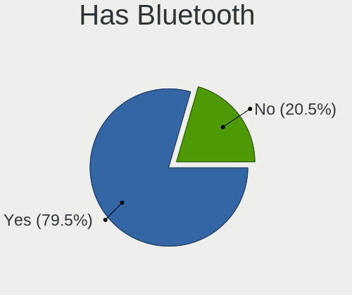
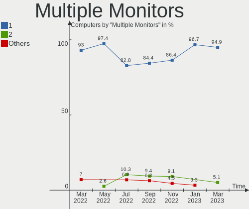
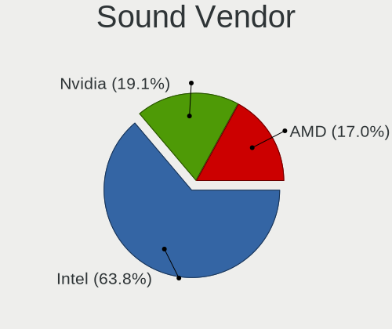

Endless Hardware Trends
-----------------------

A project to identify most popular hardware characteristics and track their change
over time based on data collected by Endless users at https://Linux-Hardware.org.

Anyone can contribute to this report by the [hw-probe](https://github.com/linuxhw/hw-probe) tool:

    sudo -E hw-probe -all -upload

This is a report for all computer types. See also reports for [desktops](/Dist/Endless/Desktop/README.md) and [notebooks](/Dist/Endless/Notebook/README.md).

Full-feature report is available here: https://linux-hardware.org/?view=trends

Period: Dec, 2021.

Contents
--------

* [ System ](#system)
  - [ OS                       ](#os)
  - [ OS Family                ](#os-family)
  - [ Kernel                   ](#kernel)
  - [ Kernel Family            ](#kernel-family)
  - [ Kernel Major Ver.        ](#kernel-major-ver)
  - [ Arch                     ](#arch)
  - [ DE                       ](#de)
  - [ Display Server           ](#display-server)
  - [ Display Manager          ](#display-manager)
  - [ OS Lang                  ](#os-lang)
  - [ Boot Mode                ](#boot-mode)
  - [ Filesystem               ](#filesystem)
  - [ Part. scheme             ](#part-scheme)
  - [ Dual Boot with Linux/BSD ](#dual-boot-with-linuxbsd)
  - [ Dual Boot (Win)          ](#dual-boot-win)

* [ Board ](#board)
  - [ Vendor                   ](#vendor)
  - [ Model                    ](#model)
  - [ Model Family             ](#model-family)
  - [ MFG Year                 ](#mfg-year)
  - [ Form Factor              ](#form-factor)
  - [ Secure Boot              ](#secure-boot)
  - [ Coreboot                 ](#coreboot)
  - [ RAM Size                 ](#ram-size)
  - [ RAM Used                 ](#ram-used)
  - [ Total Drives             ](#total-drives)
  - [ Has CD-ROM               ](#has-cd-rom)
  - [ Has Ethernet             ](#has-ethernet)
  - [ Has WiFi                 ](#has-wifi)
  - [ Has Bluetooth            ](#has-bluetooth)

* [ Location ](#location)
  - [ Country                  ](#country)
  - [ City                     ](#city)

* [ Drives ](#drives)
  - [ Drive Vendor             ](#drive-vendor)
  - [ Drive Model              ](#drive-model)
  - [ HDD Vendor               ](#hdd-vendor)
  - [ SSD Vendor               ](#ssd-vendor)
  - [ Drive Kind               ](#drive-kind)
  - [ Drive Connector          ](#drive-connector)
  - [ Drive Size               ](#drive-size)
  - [ Space Total              ](#space-total)
  - [ Space Used               ](#space-used)
  - [ Malfunc. Drives          ](#malfunc-drives)
  - [ Malfunc. Drive Vendor    ](#malfunc-drive-vendor)
  - [ Malfunc. HDD Vendor      ](#malfunc-hdd-vendor)
  - [ Malfunc. Drive Kind      ](#malfunc-drive-kind)
  - [ Failed Drives            ](#failed-drives)
  - [ Failed Drive Vendor      ](#failed-drive-vendor)
  - [ Drive Status             ](#drive-status)

* [ Storage controller ](#storage-controller)
  - [ Storage Vendor           ](#storage-vendor)
  - [ Storage Model            ](#storage-model)
  - [ Storage Kind             ](#storage-kind)

* [ Processor ](#processor)
  - [ CPU Vendor               ](#cpu-vendor)
  - [ CPU Model                ](#cpu-model)
  - [ CPU Model Family         ](#cpu-model-family)
  - [ CPU Cores                ](#cpu-cores)
  - [ CPU Sockets              ](#cpu-sockets)
  - [ CPU Threads              ](#cpu-threads)
  - [ CPU Op-Modes             ](#cpu-op-modes)
  - [ CPU Microcode            ](#cpu-microcode)
  - [ CPU Microarch            ](#cpu-microarch)

* [ Graphics ](#graphics)
  - [ GPU Vendor               ](#gpu-vendor)
  - [ GPU Model                ](#gpu-model)
  - [ GPU Combo                ](#gpu-combo)
  - [ GPU Driver               ](#gpu-driver)
  - [ GPU Memory               ](#gpu-memory)

* [ Monitor ](#monitor)
  - [ Monitor Vendor           ](#monitor-vendor)
  - [ Monitor Model            ](#monitor-model)
  - [ Monitor Resolution       ](#monitor-resolution)
  - [ Monitor Diagonal         ](#monitor-diagonal)
  - [ Monitor Width            ](#monitor-width)
  - [ Aspect Ratio             ](#aspect-ratio)
  - [ Monitor Area             ](#monitor-area)
  - [ Pixel Density            ](#pixel-density)
  - [ Multiple Monitors        ](#multiple-monitors)

* [ Network ](#network)
  - [ Net Controller Vendor    ](#net-controller-vendor)
  - [ Net Controller Model     ](#net-controller-model)
  - [ Wireless Vendor          ](#wireless-vendor)
  - [ Wireless Model           ](#wireless-model)
  - [ Ethernet Vendor          ](#ethernet-vendor)
  - [ Ethernet Model           ](#ethernet-model)
  - [ Net Controller Kind      ](#net-controller-kind)
  - [ Used Controller          ](#used-controller)
  - [ NICs                     ](#nics)
  - [ IPv6                     ](#ipv6)

* [ Bluetooth ](#bluetooth)
  - [ Bluetooth Vendor         ](#bluetooth-vendor)
  - [ Bluetooth Model          ](#bluetooth-model)

* [ Sound ](#sound)
  - [ Sound Vendor             ](#sound-vendor)
  - [ Sound Model              ](#sound-model)

* [ Memory ](#memory)
  - [ Memory Vendor            ](#memory-vendor)
  - [ Memory Model             ](#memory-model)
  - [ Memory Kind              ](#memory-kind)
  - [ Memory Form Factor       ](#memory-form-factor)
  - [ Memory Size              ](#memory-size)
  - [ Memory Speed             ](#memory-speed)

* [ Printers & scanners ](#printers--scanners)
  - [ Printer Vendor           ](#printer-vendor)
  - [ Printer Model            ](#printer-model)
  - [ Scanner Vendor           ](#scanner-vendor)
  - [ Scanner Model            ](#scanner-model)

* [ Camera ](#camera)
  - [ Camera Vendor            ](#camera-vendor)
  - [ Camera Model             ](#camera-model)

* [ Security ](#security)
  - [ Fingerprint Vendor       ](#fingerprint-vendor)
  - [ Fingerprint Model        ](#fingerprint-model)
  - [ Chipcard Vendor          ](#chipcard-vendor)
  - [ Chipcard Model           ](#chipcard-model)

* [ Unsupported ](#unsupported)
  - [ Unsupported Devices      ](#unsupported-devices)
  - [ Unsupported Device Types ](#unsupported-device-types)

System
------

OS
--

Installed operating systems

| Name                  | Computers | Percent |
|-----------------------|-----------|---------|
| Endless 4.0.0         | 19        | 27.94%  |
| Endless 4.0.2         | 18        | 26.47%  |
| Endless 3.9.6         | 13        | 19.12%  |
| Endless 4.0.1         | 3         | 4.41%   |
| Endless 3.9.5         | 2         | 2.94%   |
| Endless 3.9.3-nexthw1 | 2         | 2.94%   |
| Endless 3.9.1         | 2         | 2.94%   |
| Endless 3.8.7         | 2         | 2.94%   |
| Endless 3.7.7-nexthw1 | 2         | 2.94%   |
| Endless 5.0.0         | 1         | 1.47%   |
| Endless 3.9.4         | 1         | 1.47%   |
| Endless 3.9.1-nexthw2 | 1         | 1.47%   |
| Endless 3.6.3-nexthw1 | 1         | 1.47%   |
| Endless 3.4.2-nexthw1 | 1         | 1.47%   |

OS Family
---------

OS without a version

| Name    | Computers | Percent |
|---------|-----------|---------|
| Endless | 68        | 100%    |

Kernel
------

Version of the Linux kernel

| Version           | Computers | Percent |
|-------------------|-----------|---------|
| 5.11.0-35-generic | 40        | 58.82%  |
| 5.8.0-14-generic  | 18        | 26.47%  |
| 5.4.0-7-generic   | 2         | 2.94%   |
| 5.4.0-42-generic  | 2         | 2.94%   |
| 5.11.0-12-generic | 2         | 2.94%   |
| 5.3.0-12-generic  | 1         | 1.47%   |
| 5.13.0-20-generic | 1         | 1.47%   |
| 5.10.0-10-generic | 1         | 1.47%   |
| 4.16.0-4-generic  | 1         | 1.47%   |

Kernel Family
-------------

Linux kernel without a distro release

| Version | Computers | Percent |
|---------|-----------|---------|
| 5.11.0  | 42        | 61.76%  |
| 5.8.0   | 18        | 26.47%  |
| 5.4.0   | 4         | 5.88%   |
| 5.3.0   | 1         | 1.47%   |
| 5.13.0  | 1         | 1.47%   |
| 5.10.0  | 1         | 1.47%   |
| 4.16.0  | 1         | 1.47%   |

Kernel Major Ver.
-----------------

Linux kernel major version

| Version | Computers | Percent |
|---------|-----------|---------|
| 5.11    | 42        | 61.76%  |
| 5.8     | 18        | 26.47%  |
| 5.4     | 4         | 5.88%   |
| 5.3     | 1         | 1.47%   |
| 5.13    | 1         | 1.47%   |
| 5.10    | 1         | 1.47%   |
| 4.16    | 1         | 1.47%   |

Arch
----

OS architecture (x86_64, i586, etc.)

| Name   | Computers | Percent |
|--------|-----------|---------|
| x86_64 | 68        | 100%    |

DE
--

Desktop Environment

| Name  | Computers | Percent |
|-------|-----------|---------|
| GNOME | 68        | 100%    |

Display Server
--------------

X11 or Wayland

| Name | Computers | Percent |
|------|-----------|---------|
| X11  | 68        | 100%    |

Display Manager
---------------

SDDM, LightDM, etc.

| Name    | Computers | Percent |
|---------|-----------|---------|
| Unknown | 68        | 100%    |

OS Lang
-------

Language

| Lang        | Computers | Percent |
|-------------|-----------|---------|
| pt_BR       | 30        | 44.12%  |
| en_US       | 14        | 20.59%  |
| ru_RU       | 3         | 4.41%   |
| ru_RU.UTF_8 | 2         | 2.94%   |
| ro_RO       | 2         | 2.94%   |
| fr_FR       | 2         | 2.94%   |
| es_ES       | 2         | 2.94%   |
| de_DE       | 2         | 2.94%   |
| de_AT       | 2         | 2.94%   |
| uk_UA       | 1         | 1.47%   |
| tr_TR       | 1         | 1.47%   |
| ru_UA       | 1         | 1.47%   |
| it_IT       | 1         | 1.47%   |
| id_ID       | 1         | 1.47%   |
| es_AR       | 1         | 1.47%   |
| en_GB       | 1         | 1.47%   |
| el_GR       | 1         | 1.47%   |
| cs_CZ       | 1         | 1.47%   |

Boot Mode
---------

EFI or BIOS

| Mode | Computers | Percent |
|------|-----------|---------|
| EFI  | 55        | 80.88%  |
| BIOS | 13        | 19.12%  |

Filesystem
----------

Type of filesystem

| Type | Computers | Percent |
|------|-----------|---------|
| Ext4 | 68        | 100%    |

Part. scheme
------------

Scheme of partitioning

| Type    | Computers | Percent |
|---------|-----------|---------|
| Unknown | 68        | 100%    |

Dual Boot with Linux/BSD
------------------------

Hosting more than one Linux/BSD

| Dual boot | Computers | Percent |
|-----------|-----------|---------|
| No        | 68        | 100%    |

Dual Boot (Win)
---------------

Hosting Linux and Windows

| Dual boot | Computers | Percent |
|-----------|-----------|---------|
| No        | 68        | 100%    |

Board
-----

Vendor
------

Motherboard manufacturer

| Name                | Computers | Percent |
|---------------------|-----------|---------|
| ASUSTek Computer    | 28        | 41.18%  |
| Acer                | 21        | 30.88%  |
| Hewlett-Packard     | 3         | 4.41%   |
| Dell                | 3         | 4.41%   |
| Toshiba             | 2         | 2.94%   |
| Positivo            | 2         | 2.94%   |
| Lenovo              | 2         | 2.94%   |
| Sony                | 1         | 1.47%   |
| Megaware            | 1         | 1.47%   |
| Medion              | 1         | 1.47%   |
| Gigabyte Technology | 1         | 1.47%   |
| Foxconn             | 1         | 1.47%   |
| Chuwi               | 1         | 1.47%   |
| ASRock              | 1         | 1.47%   |

Model
-----

Motherboard model

| Name                                       | Computers | Percent |
|--------------------------------------------|-----------|---------|
| Acer Nitro AN515-44                        | 8         | 11.76%  |
| ASUS VivoBook 15_ASUS Laptop X540UAR       | 7         | 10.29%  |
| Acer Aspire A315-34                        | 6         | 8.82%   |
| ASUS VivoBook_ASUSLaptop X515JA_X515JA     | 3         | 4.41%   |
| ASUS VivoBook 15_ASUS Laptop X540MA_X543MA | 2         | 2.94%   |
| Acer Nitro AN515-54                        | 2         | 2.94%   |
| Toshiba Satellite P75-A                    | 1         | 1.47%   |
| Toshiba Satellite L300                     | 1         | 1.47%   |
| Sony SVF1521A7EB                           | 1         | 1.47%   |
| Positivo V142N_4G                          | 1         | 1.47%   |
| Positivo CHT14B                            | 1         | 1.47%   |
| Megaware G41T-M7                           | 1         | 1.47%   |
| Medion E4110                               | 1         | 1.47%   |
| Lenovo ThinkPad T15g Gen 1 20URS01J00      | 1         | 1.47%   |
| Lenovo IdeaPad 320-15AST 80XV              | 1         | 1.47%   |
| HP Notebook                                | 1         | 1.47%   |
| HP 550-153w                                | 1         | 1.47%   |
| Gigabyte B360M AORUS Gaming 3              | 1         | 1.47%   |
| Foxconn Pro 3330 MT                        | 1         | 1.47%   |
| Dell System Vostro 3450                    | 1         | 1.47%   |
| Dell OptiPlex 9010                         | 1         | 1.47%   |
| Dell Inspiron 3180                         | 1         | 1.47%   |
| Chuwi HeroBook Air                         | 1         | 1.47%   |
| ASUS X705UAR                               | 1         | 1.47%   |
| ASUS X540UA                                | 1         | 1.47%   |
| ASUS VivoBook_ASUSLaptop X540MAR_X543MA    | 1         | 1.47%   |
| ASUS VivoBook_ASUSLaptop X515EA_X515EA     | 1         | 1.47%   |
| ASUS VivoBook_ASUSLaptop X513EAN_X513EA    | 1         | 1.47%   |
| ASUS VivoBook_ASUSLaptop X509JA_X509JA     | 1         | 1.47%   |
| ASUS VivoBook_ASUSLaptop X430FA_S430FA     | 1         | 1.47%   |
| ASUS VivoBook_ASUSLaptop X415EA_X415EA     | 1         | 1.47%   |
| ASUS VivoBook_ASUS Laptop E410MA_E410MA    | 1         | 1.47%   |
| ASUS VivoBook 15_ASUS Laptop X540BA        | 1         | 1.47%   |
| ASUS Vivo AIO 24 V241FA_V241FA             | 1         | 1.47%   |
| ASUS M5A78L-M LX3                          | 1         | 1.47%   |
| ASUS M5A78L-M LX PLUS                      | 1         | 1.47%   |
| ASUS M4A77                                 | 1         | 1.47%   |
| ASUS G74Sx                                 | 1         | 1.47%   |
| ASUS All Series                            | 1         | 1.47%   |
| ASRock A88M-G                              | 1         | 1.47%   |
| Acer Nitro N50-600                         | 1         | 1.47%   |
| Acer Aspire XC-830                         | 1         | 1.47%   |
| Acer Aspire E1-572                         | 1         | 1.47%   |
| Acer Aspire A315-54K                       | 1         | 1.47%   |
| Acer Aspire A315-53                        | 1         | 1.47%   |
| Unknown                                    | 1         | 1.47%   |

Model Family
------------

Motherboard model prefix

| Name              | Computers | Percent |
|-------------------|-----------|---------|
| ASUS VivoBook     | 20        | 29.41%  |
| Acer Nitro        | 11        | 16.18%  |
| Acer Aspire       | 10        | 14.71%  |
| Toshiba Satellite | 2         | 2.94%   |
| ASUS M5A78L-M     | 2         | 2.94%   |
| Sony SVF1521A7EB  | 1         | 1.47%   |
| Positivo V142N    | 1         | 1.47%   |
| Positivo CHT14B   | 1         | 1.47%   |
| Megaware G41T-M7  | 1         | 1.47%   |
| Medion E4110      | 1         | 1.47%   |
| Lenovo ThinkPad   | 1         | 1.47%   |
| Lenovo IdeaPad    | 1         | 1.47%   |
| HP Notebook       | 1         | 1.47%   |
| HP 550-153w       | 1         | 1.47%   |
| Gigabyte B360M    | 1         | 1.47%   |
| Foxconn Pro       | 1         | 1.47%   |
| Dell System       | 1         | 1.47%   |
| Dell OptiPlex     | 1         | 1.47%   |
| Dell Inspiron     | 1         | 1.47%   |
| Chuwi HeroBook    | 1         | 1.47%   |
| ASUS X705UAR      | 1         | 1.47%   |
| ASUS X540UA       | 1         | 1.47%   |
| ASUS Vivo         | 1         | 1.47%   |
| ASUS M4A77        | 1         | 1.47%   |
| ASUS G74Sx        | 1         | 1.47%   |
| ASUS All          | 1         | 1.47%   |
| ASRock A88M-G     | 1         | 1.47%   |
| Unknown           | 1         | 1.47%   |

MFG Year
--------

Motherboard manufacture year

| Year | Computers | Percent |
|------|-----------|---------|
| 2021 | 19        | 27.94%  |
| 2019 | 17        | 25%     |
| 2020 | 7         | 10.29%  |
| 2018 | 7         | 10.29%  |
| 2014 | 4         | 5.88%   |
| 2016 | 3         | 4.41%   |
| 2017 | 2         | 2.94%   |
| 2013 | 2         | 2.94%   |
| 2011 | 2         | 2.94%   |
| 2009 | 2         | 2.94%   |
| 2015 | 1         | 1.47%   |
| 2012 | 1         | 1.47%   |
| 2010 | 1         | 1.47%   |

Form Factor
-----------

Physical design of the computer

| Name       | Computers | Percent |
|------------|-----------|---------|
| Notebook   | 54        | 79.41%  |
| Desktop    | 13        | 19.12%  |
| All in one | 1         | 1.47%   |

Secure Boot
-----------

Enabled or disabled

| State    | Computers | Percent |
|----------|-----------|---------|
| Disabled | 48        | 70.59%  |
| Enabled  | 20        | 29.41%  |

Coreboot
--------

Have coreboot on board

| Used | Computers | Percent |
|------|-----------|---------|
| No   | 68        | 100%    |

RAM Size
--------

Total RAM memory

| Size in GB  | Computers | Percent |
|-------------|-----------|---------|
| 3.01-4.0    | 28        | 41.18%  |
| 4.01-8.0    | 19        | 27.94%  |
| 8.01-16.0   | 13        | 19.12%  |
| 16.01-24.0  | 4         | 5.88%   |
| 24.01-32.0  | 1         | 1.47%   |
| 2.01-3.0    | 1         | 1.47%   |
| 64.01-256.0 | 1         | 1.47%   |
| 1.01-2.0    | 1         | 1.47%   |

RAM Used
--------

Used RAM memory

| Used GB  | Computers | Percent |
|----------|-----------|---------|
| 1.01-2.0 | 38        | 55.88%  |
| 2.01-3.0 | 18        | 26.47%  |
| 3.01-4.0 | 6         | 8.82%   |
| 0.51-1.0 | 4         | 5.88%   |
| 4.01-8.0 | 2         | 2.94%   |

Total Drives
------------

Number of drives on board

| Drives | Computers | Percent |
|--------|-----------|---------|
| 1      | 58        | 85.29%  |
| 2      | 7         | 10.29%  |
| 3      | 3         | 4.41%   |

Has CD-ROM
----------

Has CD-ROM on board

| Presented | Computers | Percent |
|-----------|-----------|---------|
| No        | 54        | 79.41%  |
| Yes       | 14        | 20.59%  |

Has Ethernet
------------

Has Ethernet on board

| Presented | Computers | Percent |
|-----------|-----------|---------|
| Yes       | 49        | 72.06%  |
| No        | 19        | 27.94%  |

Has WiFi
--------

Has WiFi module

| Presented | Computers | Percent |
|-----------|-----------|---------|
| Yes       | 60        | 88.24%  |
| No        | 8         | 11.76%  |

Has Bluetooth
-------------

Has Bluetooth module

| Presented | Computers | Percent |
|-----------|-----------|---------|
| Yes       | 53        | 77.94%  |
| No        | 15        | 22.06%  |

Location
--------

Country
-------

Geographic location (country)

| Country    | Computers | Percent |
|------------|-----------|---------|
| Brazil     | 30        | 44.12%  |
| USA        | 8         | 11.76%  |
| Ukraine    | 3         | 4.41%   |
| Russia     | 3         | 4.41%   |
| Spain      | 2         | 2.94%   |
| Romania    | 2         | 2.94%   |
| Germany    | 2         | 2.94%   |
| France     | 2         | 2.94%   |
| Belarus    | 2         | 2.94%   |
| Austria    | 2         | 2.94%   |
| Turkey     | 1         | 1.47%   |
| Serbia     | 1         | 1.47%   |
| Portugal   | 1         | 1.47%   |
| Poland     | 1         | 1.47%   |
| Kenya      | 1         | 1.47%   |
| Kazakhstan | 1         | 1.47%   |
| Italy      | 1         | 1.47%   |
| Indonesia  | 1         | 1.47%   |
| Greece     | 1         | 1.47%   |
| Czechia    | 1         | 1.47%   |
| Australia  | 1         | 1.47%   |
| Argentina  | 1         | 1.47%   |

City
----

Geographic location (city)

| City                    | Computers | Percent |
|-------------------------|-----------|---------|
| S??o Paulo              | 5         | 7.35%   |
| Bucyrus                 | 3         | 4.41%   |
| Zaporizhzhya            | 2         | 2.94%   |
| Paris                   | 2         | 2.94%   |
| Bras?­lia               | 2         | 2.94%   |
| Viam??o                 | 1         | 1.47%   |
| Varzea Paulista         | 1         | 1.47%   |
| Vargem Grande do Sul    | 1         | 1.47%   |
| Tuban                   | 1         | 1.47%   |
| Teixeira de Freitas     | 1         | 1.47%   |
| Sydney                  | 1         | 1.47%   |
| St Petersburg           | 1         | 1.47%   |
| Sao Vicente             | 1         | 1.47%   |
| Santar?©m               | 1         | 1.47%   |
| Sant Vicen?§ dels Horts | 1         | 1.47%   |
| Salvador                | 1         | 1.47%   |
| Rethymno                | 1         | 1.47%   |
| Nova Lima               | 1         | 1.47%   |
| Nairobi                 | 1         | 1.47%   |
| Moscow                  | 1         | 1.47%   |
| Montijo                 | 1         | 1.47%   |
| Missoula                | 1         | 1.47%   |
| Matos Costa             | 1         | 1.47%   |
| Mason                   | 1         | 1.47%   |
| Maraba                  | 1         | 1.47%   |
| Mafra                   | 1         | 1.47%   |
| Madrid                  | 1         | 1.47%   |
| Lowell                  | 1         | 1.47%   |
| Lovosice                | 1         | 1.47%   |
| Kharkiv                 | 1         | 1.47%   |
| Karaganda               | 1         | 1.47%   |
| Juazeiro do Norte       | 1         | 1.47%   |
| Jacare?­                | 1         | 1.47%   |
| Ivanovo                 | 1         | 1.47%   |
| Istanbul                | 1         | 1.47%   |
| Hamburg                 | 1         | 1.47%   |
| Gomel                   | 1         | 1.47%   |
| Gliwice                 | 1         | 1.47%   |
| Ettlingen               | 1         | 1.47%   |
| Eloi Mendes             | 1         | 1.47%   |
| Curitiba                | 1         | 1.47%   |
| Crici??ma               | 1         | 1.47%   |
| Craiova                 | 1         | 1.47%   |
| Cortoghiana             | 1         | 1.47%   |
| Concord                 | 1         | 1.47%   |
| Concei?§??o do Araguaia | 1         | 1.47%   |
| Campina Grande          | 1         | 1.47%   |
| Camillus                | 1         | 1.47%   |
| Caieiras                | 1         | 1.47%   |
| Cabo Frio               | 1         | 1.47%   |
| Buenos Aires            | 1         | 1.47%   |
| Bucharest               | 1         | 1.47%   |
| Bruck an der Mur        | 1         | 1.47%   |
| Belgrade                | 1         | 1.47%   |
| Bel?©m                  | 1         | 1.47%   |
| Babruysk                | 1         | 1.47%   |
| Aurolzmuenster          | 1         | 1.47%   |
| Aracaju                 | 1         | 1.47%   |
| Angatuba                | 1         | 1.47%   |

Drives
------

Drive Vendor
------------

Hard drive vendors

| Vendor              | Computers | Drives | Percent |
|---------------------|-----------|--------|---------|
| WDC                 | 13        | 13     | 16.67%  |
| Sandisk             | 13        | 13     | 16.67%  |
| Kingston            | 10        | 10     | 12.82%  |
| Unknown             | 6         | 6      | 7.69%   |
| Seagate             | 6         | 6      | 7.69%   |
| Toshiba             | 5         | 5      | 6.41%   |
| Intel               | 4         | 4      | 5.13%   |
| Micron Technology   | 2         | 2      | 2.56%   |
| HGST                | 2         | 2      | 2.56%   |
| Hewlett-Packard     | 2         | 3      | 2.56%   |
| Vaseky              | 1         | 1      | 1.28%   |
| TSA                 | 1         | 1      | 1.28%   |
| Silicon Motion      | 1         | 1      | 1.28%   |
| Samsung Electronics | 1         | 1      | 1.28%   |
| Phison              | 1         | 1      | 1.28%   |
| OCZ                 | 1         | 1      | 1.28%   |
| Netac               | 1         | 1      | 1.28%   |
| LITEONIT            | 1         | 1      | 1.28%   |
| Hitachi             | 1         | 1      | 1.28%   |
| FSPEED              | 1         | 1      | 1.28%   |
| Dell                | 1         | 1      | 1.28%   |
| China               | 1         | 1      | 1.28%   |
| ASMT                | 1         | 1      | 1.28%   |
| ADATA Technology    | 1         | 1      | 1.28%   |
| Unknown             | 1         | 1      | 1.28%   |

Drive Model
-----------

Hard drive models

| Model                                 | Computers | Percent |
|---------------------------------------|-----------|---------|
| WDC WD10SPZX-21Z10T0 1TB              | 9         | 11.54%  |
| Sandisk NVMe SSD Drive 512GB          | 7         | 8.97%   |
| Unknown SWR256G-301II 256GB           | 3         | 3.85%   |
| Sandisk NVMe SSD Drive 256GB          | 3         | 3.85%   |
| Kingston SV300S37A120G 120GB SSD      | 3         | 3.85%   |
| Kingston RBUSC180DS37256GJ 256GB SSD  | 3         | 3.85%   |
| Unknown MMC Card  32GB                | 2         | 2.56%   |
| Seagate ST500LT012-1DG142 500GB       | 2         | 2.56%   |
| Seagate ST1000LM035-1RK172 1TB        | 2         | 2.56%   |
| Micron 1300_MTFDDAK256TDL 256GB SSD   | 2         | 2.56%   |
| Intel NVMe SSD Drive 512GB            | 2         | 2.56%   |
| WDC WD5000LPCX-80VHAT1 500GB          | 1         | 1.28%   |
| WDC WD5000AVDS-63U7B1 500GB           | 1         | 1.28%   |
| WDC WD10JPVX-60JC3T0 1TB              | 1         | 1.28%   |
| WDC WD10JPVX-00JC3T0 1TB              | 1         | 1.28%   |
| Vaseky V800/512G 512GB                | 1         | 1.28%   |
| Unknown MMC Card  64GB                | 1         | 1.28%   |
| TSA SSD 64GB                          | 1         | 1.28%   |
| Toshiba NVMe SSD Drive 1024GB         | 1         | 1.28%   |
| Toshiba MQ04ABF100 1TB                | 1         | 1.28%   |
| Toshiba MQ01ABF050 500GB              | 1         | 1.28%   |
| Toshiba MK2556GSY 250GB               | 1         | 1.28%   |
| Toshiba DT01ACA200 2TB                | 1         | 1.28%   |
| Silicon Motion NVMe SSD Drive 128GB   | 1         | 1.28%   |
| Seagate ST500DM002-1BD142 500GB       | 1         | 1.28%   |
| Seagate BUP SL 4TB                    | 1         | 1.28%   |
| SanDisk SSD PLUS 240GB                | 1         | 1.28%   |
| SanDisk SDSSDA240G 240GB              | 1         | 1.28%   |
| SanDisk SD9SB8W256G1002 256GB SSD     | 1         | 1.28%   |
| Samsung NVMe SSD Drive 256GB          | 1         | 1.28%   |
| Phison NVMe SSD Drive 256GB           | 1         | 1.28%   |
| OCZ VERTEX3 120GB SSD                 | 1         | 1.28%   |
| Netac S535N8/128 128GB                | 1         | 1.28%   |
| LITEONIT E200-080 80GB SSD            | 1         | 1.28%   |
| Kingston SA400S37240G 240GB SSD       | 1         | 1.28%   |
| Kingston RBUSNS8180DS3128GJ 128GB SSD | 1         | 1.28%   |
| Kingston NVMe SSD Drive 512GB         | 1         | 1.28%   |
| Kingston NVMe SSD Drive 128GB         | 1         | 1.28%   |
| Intel SSDSCKKW256G8 256GB             | 1         | 1.28%   |
| Intel NVMe SSD Drive 128GB            | 1         | 1.28%   |
| Hitachi HTS547550A9E384 500GB         | 1         | 1.28%   |
| HGST HTS545050A7E380 500GB            | 1         | 1.28%   |
| HGST HTS541010B7E610 1TB              | 1         | 1.28%   |
| HP SSD S700 1TB                       | 1         | 1.28%   |
| HP SSD S700 120GB                     | 1         | 1.28%   |
| FSPEED 1T                             | 1         | 1.28%   |
| Dell WR202KD032G E70290F5 32GB        | 1         | 1.28%   |
| China SSD 120GB                       | 1         | 1.28%   |
| ASMT 2115 256GB                       | 1         | 1.28%   |
| ADATA NVMe SSD Drive 256GB            | 1         | 1.28%   |
| Unknown                               | 1         | 1.28%   |

HDD Vendor
----------

Hard disk drive vendors

| Vendor  | Computers | Drives | Percent |
|---------|-----------|--------|---------|
| WDC     | 13        | 13     | 50%     |
| Seagate | 6         | 6      | 23.08%  |
| Toshiba | 4         | 4      | 15.38%  |
| HGST    | 2         | 2      | 7.69%   |
| Hitachi | 1         | 1      | 3.85%   |

SSD Vendor
----------

Solid state drive vendors

| Vendor            | Computers | Drives | Percent |
|-------------------|-----------|--------|---------|
| Kingston          | 8         | 8      | 30.77%  |
| Unknown           | 3         | 3      | 11.54%  |
| SanDisk           | 3         | 3      | 11.54%  |
| Micron Technology | 2         | 2      | 7.69%   |
| Hewlett-Packard   | 2         | 3      | 7.69%   |
| TSA               | 1         | 1      | 3.85%   |
| OCZ               | 1         | 1      | 3.85%   |
| Netac             | 1         | 1      | 3.85%   |
| LITEONIT          | 1         | 1      | 3.85%   |
| Intel             | 1         | 1      | 3.85%   |
| Dell              | 1         | 1      | 3.85%   |
| China             | 1         | 1      | 3.85%   |
| ASMT              | 1         | 1      | 3.85%   |

Drive Kind
----------

HDD or SSD

| Kind    | Computers | Drives | Percent |
|---------|-----------|--------|---------|
| SSD     | 26        | 27     | 34.21%  |
| HDD     | 26        | 26     | 34.21%  |
| NVMe    | 20        | 20     | 26.32%  |
| MMC     | 3         | 3      | 3.95%   |
| Unknown | 1         | 3      | 1.32%   |

Drive Connector
---------------

SATA, SAS, NVMe, etc.

| Type | Computers | Drives | Percent |
|------|-----------|--------|---------|
| SATA | 47        | 54     | 65.28%  |
| NVMe | 20        | 20     | 27.78%  |
| MMC  | 3         | 3      | 4.17%   |
| SAS  | 2         | 2      | 2.78%   |

Drive Size
----------

Size of hard drive

| Size in TB | Computers | Drives | Percent |
|------------|-----------|--------|---------|
| 0.01-0.5   | 32        | 35     | 64%     |
| 0.51-1.0   | 16        | 16     | 32%     |
| 3.01-4.0   | 1         | 1      | 2%      |
| 1.01-2.0   | 1         | 1      | 2%      |

Space Total
-----------

Amount of disk space available on the file system

| Size in GB     | Computers | Percent |
|----------------|-----------|---------|
| 101-250        | 27        | 39.71%  |
| 251-500        | 16        | 23.53%  |
| 501-1000       | 13        | 19.12%  |
| 51-100         | 6         | 8.82%   |
| 21-50          | 4         | 5.88%   |
| More than 3000 | 1         | 1.47%   |
| 2001-3000      | 1         | 1.47%   |

Space Used
----------

Amount of used disk space

| Used GB  | Computers | Percent |
|----------|-----------|---------|
| 21-50    | 37        | 54.41%  |
| 51-100   | 14        | 20.59%  |
| 1-20     | 9         | 13.24%  |
| 101-250  | 5         | 7.35%   |
| 251-500  | 2         | 2.94%   |
| 501-1000 | 1         | 1.47%   |

Malfunc. Drives
---------------

Drive models with a malfunction

Zero info for selected period =(

Malfunc. Drive Vendor
---------------------

Vendors of faulty drives

Zero info for selected period =(

Malfunc. HDD Vendor
-------------------

Vendors of faulty HDD drives

Zero info for selected period =(

Malfunc. Drive Kind
-------------------

Kinds of faulty drives

Zero info for selected period =(

Failed Drives
-------------

Failed drive models

Zero info for selected period =(

Failed Drive Vendor
-------------------

Failed drive vendors

Zero info for selected period =(

Drive Status
------------

Number of failed and malfunc. drives

| Status   | Computers | Drives | Percent |
|----------|-----------|--------|---------|
| Detected | 68        | 79     | 100%    |

Storage controller
------------------

Storage Vendor
--------------

Storage controller vendors

| Vendor                       | Computers | Percent |
|------------------------------|-----------|---------|
| Intel                        | 49        | 59.76%  |
| AMD                          | 16        | 19.51%  |
| Sandisk                      | 10        | 12.2%   |
| Kingston Technology Company  | 2         | 2.44%   |
| Toshiba America Info Systems | 1         | 1.22%   |
| Silicon Motion               | 1         | 1.22%   |
| Samsung Electronics          | 1         | 1.22%   |
| Phison Electronics           | 1         | 1.22%   |
| ADATA Technology             | 1         | 1.22%   |

Storage Model
-------------

Storage controller models

| Model                                                                            | Computers | Percent |
|----------------------------------------------------------------------------------|-----------|---------|
| AMD FCH SATA Controller [AHCI mode]                                              | 13        | 13.83%  |
| Intel Celeron/Pentium Silver Processor SATA Controller                           | 12        | 12.77%  |
| Sandisk WD Blue SN550 NVMe SSD                                                   | 10        | 10.64%  |
| Intel Sunrise Point-LP SATA Controller [AHCI mode]                               | 10        | 10.64%  |
| Intel 82801 Mobile SATA Controller [RAID mode]                                   | 9         | 9.57%   |
| Intel Volume Management Device NVMe RAID Controller                              | 3         | 3.19%   |
| Intel Tiger Lake-LP SATA Controller [AHCI mode]                                  | 3         | 3.19%   |
| Intel 8 Series/C220 Series Chipset Family 6-port SATA Controller 1 [AHCI mode]   | 3         | 3.19%   |
| AMD SB7x0/SB8x0/SB9x0 IDE Controller                                             | 3         | 3.19%   |
| Kingston Company U-SNS8154P3 NVMe SSD                                            | 2         | 2.13%   |
| Intel PROSet/Wireless WiFi Software extension                                    | 2         | 2.13%   |
| Intel Cannon Lake PCH SATA AHCI Controller                                       | 2         | 2.13%   |
| Intel 6 Series/C200 Series Chipset Family 6 port Mobile SATA AHCI Controller     | 2         | 2.13%   |
| AMD SB7x0/SB8x0/SB9x0 SATA Controller [IDE mode]                                 | 2         | 2.13%   |
| AMD FCH IDE Controller                                                           | 2         | 2.13%   |
| Toshiba America Info Systems XG6 NVMe SSD Controller                             | 1         | 1.06%   |
| Silicon Motion SM2263EN/SM2263XT SSD Controller                                  | 1         | 1.06%   |
| Samsung NVMe SSD Controller 980                                                  | 1         | 1.06%   |
| Phison PS5013 E13 NVMe Controller                                                | 1         | 1.06%   |
| Intel SSD 660P Series                                                            | 1         | 1.06%   |
| Intel SATA Controller [RAID mode]                                                | 1         | 1.06%   |
| Intel NM10/ICH7 Family SATA Controller [IDE mode]                                | 1         | 1.06%   |
| Intel Atom/Celeron/Pentium Processor x5-E8000/J3xxx/N3xxx Series SATA Controller | 1         | 1.06%   |
| Intel 82801IBM/IEM (ICH9M/ICH9M-E) 4 port SATA Controller [AHCI mode]            | 1         | 1.06%   |
| Intel 82801IBM/IEM (ICH9M/ICH9M-E) 2 port SATA Controller [IDE mode]             | 1         | 1.06%   |
| Intel 82801G (ICH7 Family) IDE Controller                                        | 1         | 1.06%   |
| Intel 8 Series SATA Controller 1 [AHCI mode]                                     | 1         | 1.06%   |
| Intel 7 Series Chipset Family 6-port SATA Controller [AHCI mode]                 | 1         | 1.06%   |
| Intel 6 Series/C200 Series Chipset Family 6 port Desktop SATA AHCI Controller    | 1         | 1.06%   |
| AMD SB7x0/SB8x0/SB9x0 SATA Controller [AHCI mode]                                | 1         | 1.06%   |
| ADATA Non-Volatile memory controller                                             | 1         | 1.06%   |

Storage Kind
------------

Kind of storage controller (IDE, SATA, NVMe, SAS, ...)

| Kind | Computers | Percent |
|------|-----------|---------|
| SATA | 55        | 59.14%  |
| NVMe | 20        | 21.51%  |
| RAID | 11        | 11.83%  |
| IDE  | 7         | 7.53%   |

Processor
---------

CPU Vendor
----------

Processor vendors

| Vendor | Computers | Percent |
|--------|-----------|---------|
| Intel  | 52        | 76.47%  |
| AMD    | 16        | 23.53%  |

CPU Model
---------

Processor models

| Model                                         | Computers | Percent |
|-----------------------------------------------|-----------|---------|
| AMD Ryzen 5 4600H with Radeon Graphics        | 6         | 8.82%   |
| Intel Core i3-7020U CPU @ 2.30GHz             | 4         | 5.88%   |
| Intel Celeron N4020 CPU @ 1.10GHz             | 4         | 5.88%   |
| Intel Core i5-1035G1 CPU @ 1.00GHz            | 3         | 4.41%   |
| Intel Celeron N4000C CPU @ 1.10GHz            | 3         | 4.41%   |
| Intel Celeron N4000 CPU @ 1.10GHz             | 3         | 4.41%   |
| Intel Core i5-7200U CPU @ 2.50GHz             | 2         | 2.94%   |
| Intel Core i3-8130U CPU @ 2.20GHz             | 2         | 2.94%   |
| Intel Core i3-4370 CPU @ 3.80GHz              | 2         | 2.94%   |
| Intel Atom x5-Z8350 CPU @ 1.44GHz             | 2         | 2.94%   |
| Intel 11th Gen Core i3-1115G4 @ 3.00GHz       | 2         | 2.94%   |
| AMD Ryzen 7 4800H with Radeon Graphics        | 2         | 2.94%   |
| Intel Pentium Silver N5030 CPU @ 1.10GHz      | 1         | 1.47%   |
| Intel Pentium CPU 4417U @ 2.30GHz             | 1         | 1.47%   |
| Intel Pentium CPU 2117U @ 1.80GHz             | 1         | 1.47%   |
| Intel Genuine CPU T1600 @ 1.66GHz             | 1         | 1.47%   |
| Intel Core i9-10885H CPU @ 2.40GHz            | 1         | 1.47%   |
| Intel Core i7-9750H CPU @ 2.60GHz             | 1         | 1.47%   |
| Intel Core i7-4700MQ CPU @ 2.40GHz            | 1         | 1.47%   |
| Intel Core i7-2640M CPU @ 2.80GHz             | 1         | 1.47%   |
| Intel Core i7-2630QM CPU @ 2.00GHz            | 1         | 1.47%   |
| Intel Core i7-2600 CPU @ 3.40GHz              | 1         | 1.47%   |
| Intel Core i5-9400F CPU @ 2.90GHz             | 1         | 1.47%   |
| Intel Core i5-9300H CPU @ 2.40GHz             | 1         | 1.47%   |
| Intel Core i5-8265U CPU @ 1.60GHz             | 1         | 1.47%   |
| Intel Core i5-8250U CPU @ 1.60GHz             | 1         | 1.47%   |
| Intel Core i5-2400 CPU @ 3.10GHz              | 1         | 1.47%   |
| Intel Core i3-8145U CPU @ 2.10GHz             | 1         | 1.47%   |
| Intel Core i3-8100 CPU @ 3.60GHz              | 1         | 1.47%   |
| Intel Core i3-6006U CPU @ 2.00GHz             | 1         | 1.47%   |
| Intel Core i3-4010U CPU @ 1.70GHz             | 1         | 1.47%   |
| Intel Core i3-1005G1 CPU @ 1.20GHz            | 1         | 1.47%   |
| Intel Core 2 Duo CPU P8700 @ 2.53GHz          | 1         | 1.47%   |
| Intel Celeron J4025 CPU @ 2.00GHz             | 1         | 1.47%   |
| Intel Celeron CPU N3060 @ 1.60GHz             | 1         | 1.47%   |
| Intel Celeron CPU E3400 @ 2.60GHz             | 1         | 1.47%   |
| Intel 11th Gen Core i5-1135G7 @ 2.40GHz       | 1         | 1.47%   |
| AMD Phenom II X6 1100T Processor              | 1         | 1.47%   |
| AMD FX-4300 Quad-Core Processor               | 1         | 1.47%   |
| AMD E2-9000 RADEON R2, 4 COMPUTE CORES 2C+2G  | 1         | 1.47%   |
| AMD Athlon II X2 270 Processor                | 1         | 1.47%   |
| AMD A8-7600 Radeon R7, 10 Compute Cores 4C+6G | 1         | 1.47%   |
| AMD A8-6500 APU with Radeon HD Graphics       | 1         | 1.47%   |
| AMD A6-9225 RADEON R4, 5 COMPUTE CORES 2C+3G  | 1         | 1.47%   |
| AMD A6-9220e RADEON R4, 5 COMPUTE CORES 2C+3G | 1         | 1.47%   |

CPU Model Family
----------------

Processor model prefix

| Model                | Computers | Percent |
|----------------------|-----------|---------|
| Intel Core i3        | 13        | 19.12%  |
| Intel Celeron        | 13        | 19.12%  |
| Intel Core i5        | 10        | 14.71%  |
| AMD Ryzen 5          | 6         | 8.82%   |
| Intel Core i7        | 5         | 7.35%   |
| Other                | 3         | 4.41%   |
| Intel Pentium        | 2         | 2.94%   |
| Intel Atom           | 2         | 2.94%   |
| AMD Ryzen 7          | 2         | 2.94%   |
| AMD A8               | 2         | 2.94%   |
| AMD A6               | 2         | 2.94%   |
| Intel Pentium Silver | 1         | 1.47%   |
| Intel Genuine        | 1         | 1.47%   |
| Intel Core i9        | 1         | 1.47%   |
| Intel Core 2 Duo     | 1         | 1.47%   |
| AMD Phenom II X6     | 1         | 1.47%   |
| AMD FX               | 1         | 1.47%   |
| AMD E2               | 1         | 1.47%   |
| AMD Athlon II X2     | 1         | 1.47%   |

CPU Cores
---------

Number of processor cores

| Number | Computers | Percent |
|--------|-----------|---------|
| 2      | 41        | 60.29%  |
| 4      | 15        | 22.06%  |
| 6      | 9         | 13.24%  |
| 8      | 3         | 4.41%   |

CPU Sockets
-----------

Number of sockets

| Number | Computers | Percent |
|--------|-----------|---------|
| 1      | 68        | 100%    |

CPU Threads
-----------

Threads per core (Hyper-Threading)

| Number | Computers | Percent |
|--------|-----------|---------|
| 2      | 41        | 60.29%  |
| 1      | 27        | 39.71%  |

CPU Op-Modes
------------

CPU Operation Modes (32-bit, 64-bit)

| Op mode        | Computers | Percent |
|----------------|-----------|---------|
| 32-bit, 64-bit | 68        | 100%    |

CPU Microcode
-------------

Microcode number

| Number     | Computers | Percent |
|------------|-----------|---------|
| 0x08600103 | 8         | 11.76%  |
| 0x806e9    | 6         | 8.82%   |
| 0x706a8    | 6         | 8.82%   |
| 0x706a1    | 6         | 8.82%   |
| 0x806ea    | 4         | 5.88%   |
| 0x706e5    | 4         | 5.88%   |
| 0x806c1    | 3         | 4.41%   |
| 0x406c4    | 3         | 4.41%   |
| 0x306c3    | 3         | 4.41%   |
| 0x206a7    | 3         | 4.41%   |
| 0x906ea    | 2         | 2.94%   |
| 0x1067a    | 2         | 2.94%   |
| 0x06006705 | 2         | 2.94%   |
| Unknown    | 2         | 2.94%   |
| 0xa0652    | 1         | 1.47%   |
| 0x906ed    | 1         | 1.47%   |
| 0x906eb    | 1         | 1.47%   |
| 0x806ec    | 1         | 1.47%   |
| 0x806eb    | 1         | 1.47%   |
| 0x6fd      | 1         | 1.47%   |
| 0x406e3    | 1         | 1.47%   |
| 0x306a9    | 1         | 1.47%   |
| 0x06006704 | 1         | 1.47%   |
| 0x06003104 | 1         | 1.47%   |
| 0x06001119 | 1         | 1.47%   |
| 0x06000852 | 1         | 1.47%   |
| 0x010000dc | 1         | 1.47%   |
| 0x010000c8 | 1         | 1.47%   |

CPU Microarch
-------------

Microarchitecture

| Name          | Computers | Percent |
|---------------|-----------|---------|
| KabyLake      | 16        | 23.53%  |
| Goldmont plus | 12        | 17.65%  |
| Zen 2         | 8         | 11.76%  |
| SandyBridge   | 4         | 5.88%   |
| IceLake       | 4         | 5.88%   |
| Haswell       | 4         | 5.88%   |
| TigerLake     | 3         | 4.41%   |
| Silvermont    | 3         | 4.41%   |
| Excavator     | 3         | 4.41%   |
| Piledriver    | 2         | 2.94%   |
| Penryn        | 2         | 2.94%   |
| K10           | 2         | 2.94%   |
| Steamroller   | 1         | 1.47%   |
| Skylake       | 1         | 1.47%   |
| IvyBridge     | 1         | 1.47%   |
| Core          | 1         | 1.47%   |
| CometLake     | 1         | 1.47%   |

Graphics
--------

GPU Vendor
----------

Vendors of graphics cards

| Vendor | Computers | Percent |
|--------|-----------|---------|
| Intel  | 49        | 60.49%  |
| Nvidia | 16        | 19.75%  |
| AMD    | 16        | 19.75%  |

GPU Model
---------

Graphics card models

| Model                                                                                    | Computers | Percent |
|------------------------------------------------------------------------------------------|-----------|---------|
| Intel GeminiLake [UHD Graphics 600]                                                      | 11        | 13.58%  |
| Nvidia TU117M                                                                            | 8         | 9.88%   |
| AMD Renoir                                                                               | 8         | 9.88%   |
| Intel HD Graphics 620                                                                    | 6         | 7.41%   |
| Intel Iris Plus Graphics G1 (Ice Lake)                                                   | 4         | 4.94%   |
| Intel UHD Graphics 620                                                                   | 3         | 3.7%    |
| Intel Atom/Celeron/Pentium Processor x5-E8000/J3xxx/N3xxx Integrated Graphics Controller | 3         | 3.7%    |
| AMD Stoney [Radeon R2/R3/R4/R5 Graphics]                                                 | 3         | 3.7%    |
| Nvidia TU117M [GeForce GTX 1650 Mobile / Max-Q]                                          | 2         | 2.47%   |
| Intel Xeon E3-1200 v3/4th Gen Core Processor Integrated Graphics Controller              | 2         | 2.47%   |
| Intel WhiskeyLake-U GT2 [UHD Graphics 620]                                               | 2         | 2.47%   |
| Intel Tiger Lake UHD Graphics                                                            | 2         | 2.47%   |
| Intel Mobile 4 Series Chipset Integrated Graphics Controller                             | 2         | 2.47%   |
| Intel CoffeeLake-H GT2 [UHD Graphics 630]                                                | 2         | 2.47%   |
| Intel 2nd Generation Core Processor Family Integrated Graphics Controller                | 2         | 2.47%   |
| AMD Hawaii PRO [Radeon R9 290/390]                                                       | 2         | 2.47%   |
| Nvidia TU117 [GeForce GTX 1650]                                                          | 1         | 1.23%   |
| Nvidia TU104M [GeForce RTX 2080 SUPER Mobile / Max-Q]                                    | 1         | 1.23%   |
| Nvidia GP108 [GeForce GT 1030]                                                           | 1         | 1.23%   |
| Nvidia GF116M [GeForce GT 560M]                                                          | 1         | 1.23%   |
| Nvidia GF108 [GeForce GT 730]                                                            | 1         | 1.23%   |
| Nvidia GF104 [GeForce GTX 460]                                                           | 1         | 1.23%   |
| Intel TigerLake-LP GT2 [Iris Xe Graphics]                                                | 1         | 1.23%   |
| Intel Skylake GT2 [HD Graphics 520]                                                      | 1         | 1.23%   |
| Intel Kaby Lake-U GT1 Integrated Graphics Controller                                     | 1         | 1.23%   |
| Intel Haswell-ULT Integrated Graphics Controller                                         | 1         | 1.23%   |
| Intel GeminiLake [UHD Graphics 605]                                                      | 1         | 1.23%   |
| Intel CometLake-H GT2 [UHD Graphics]                                                     | 1         | 1.23%   |
| Intel CoffeeLake-S GT2 [UHD Graphics 630]                                                | 1         | 1.23%   |
| Intel 4th Gen Core Processor Integrated Graphics Controller                              | 1         | 1.23%   |
| Intel 4 Series Chipset Integrated Graphics Controller                                    | 1         | 1.23%   |
| Intel 3rd Gen Core processor Graphics Controller                                         | 1         | 1.23%   |
| AMD Whistler [Radeon HD 6630M/6650M/6750M/7670M/7690M]                                   | 1         | 1.23%   |
| AMD Pitcairn XT [Radeon HD 7870 GHz Edition]                                             | 1         | 1.23%   |
| AMD Kaveri [Radeon R7 Graphics]                                                          | 1         | 1.23%   |

GPU Combo
---------

Combinations of graphics cards

| Name           | Computers | Percent |
|----------------|-----------|---------|
| 1 x Intel      | 45        | 66.18%  |
| AMD + Nvidia   | 8         | 11.76%  |
| 1 x AMD        | 7         | 10.29%  |
| 1 x Nvidia     | 4         | 5.88%   |
| Intel + Nvidia | 3         | 4.41%   |
| Intel + AMD    | 1         | 1.47%   |

GPU Driver
----------

Free vs proprietary

| Driver      | Computers | Percent |
|-------------|-----------|---------|
| Free        | 55        | 80.88%  |
| Proprietary | 13        | 19.12%  |

GPU Memory
----------

Total video memory

| Size in GB | Computers | Percent |
|------------|-----------|---------|
| Unknown    | 50        | 73.53%  |
| 0.01-0.5   | 11        | 16.18%  |
| 7.01-8.0   | 2         | 2.94%   |
| 1.01-2.0   | 2         | 2.94%   |
| 0.51-1.0   | 2         | 2.94%   |
| 3.01-4.0   | 1         | 1.47%   |

Monitor
-------

Monitor Vendor
--------------

Monitor vendors

| Vendor              | Computers | Percent |
|---------------------|-----------|---------|
| AU Optronics        | 17        | 25%     |
| Chimei Innolux      | 13        | 19.12%  |
| BOE                 | 13        | 19.12%  |
| PANDA               | 8         | 11.76%  |
| Samsung Electronics | 4         | 5.88%   |
| Goldstar            | 3         | 4.41%   |
| LG Display          | 2         | 2.94%   |
| HSI                 | 2         | 2.94%   |
| Acer                | 2         | 2.94%   |
| SGT                 | 1         | 1.47%   |
| Philips             | 1         | 1.47%   |
| Dell                | 1         | 1.47%   |
| ASUSTek Computer    | 1         | 1.47%   |

Monitor Model
-------------

Monitor models

| Model                                                                | Computers | Percent |
|----------------------------------------------------------------------|-----------|---------|
| PANDA LCD Monitor NCP004D 1920x1080 344x194mm 15.5-inch              | 6         | 8.82%   |
| Chimei Innolux LCD Monitor CMN15E6 1366x768 344x193mm 15.5-inch      | 3         | 4.41%   |
| Chimei Innolux LCD Monitor CMN15DB 1366x768 344x193mm 15.5-inch      | 3         | 4.41%   |
| BOE LCD Monitor BOE07CE 1366x768 344x193mm 15.5-inch                 | 3         | 4.41%   |
| BOE LCD Monitor BOE06A5 1366x768 344x194mm 15.5-inch                 | 3         | 4.41%   |
| PANDA LCD Monitor NCP0046 1920x1080 344x194mm 15.5-inch              | 2         | 2.94%   |
| HSI HiTV HSI0001 3840x2160 708x398mm 32.0-inch                       | 2         | 2.94%   |
| Chimei Innolux LCD Monitor CMN15D5 1920x1080 340x190mm 15.3-inch     | 2         | 2.94%   |
| AU Optronics LCD Monitor AUOAF90 1920x1080 344x193mm 15.5-inch       | 2         | 2.94%   |
| AU Optronics LCD Monitor AUO81EC 1366x768 344x193mm 15.5-inch        | 2         | 2.94%   |
| AU Optronics LCD Monitor AUO723C 1366x768 309x173mm 13.9-inch        | 2         | 2.94%   |
| AU Optronics LCD Monitor AUO71EC 1366x768 340x190mm 15.3-inch        | 2         | 2.94%   |
| AU Optronics LCD Monitor AUO38ED 1920x1080 340x190mm 15.3-inch       | 2         | 2.94%   |
| AU Optronics LCD Monitor AUO21ED 1920x1080 344x194mm 15.5-inch       | 2         | 2.94%   |
| SGT MDS-156F13 SGT0173 3840x2160 379x213mm 17.1-inch                 | 1         | 1.47%   |
| Samsung Electronics U28E570 SAM0D71 3840x2160 608x345mm 27.5-inch    | 1         | 1.47%   |
| Samsung Electronics U28D590 SAM0B80 3840x2160 607x345mm 27.5-inch    | 1         | 1.47%   |
| Samsung Electronics S19A10N SAM083E 1366x768 410x230mm 18.5-inch     | 1         | 1.47%   |
| Samsung Electronics LCD Monitor SEC3741 1280x800 331x207mm 15.4-inch | 1         | 1.47%   |
| Philips 190SW PHL086D 1440x900 408x255mm 18.9-inch                   | 1         | 1.47%   |
| LG Display LCD Monitor LGD02D1 1600x900 382x215mm 17.3-inch          | 1         | 1.47%   |
| LG Display LCD Monitor LGD027F 1280x800 304x190mm 14.1-inch          | 1         | 1.47%   |
| Goldstar W2243 GSM56FE 1920x1080 477x269mm 21.6-inch                 | 1         | 1.47%   |
| Goldstar W1752 GSM4490 1440x900 370x232mm 17.2-inch                  | 1         | 1.47%   |
| Goldstar L1953H GSM4B3D 1280x1024 338x270mm 17.0-inch                | 1         | 1.47%   |
| Dell E2011H DEL406C 1600x900 443x249mm 20.0-inch                     | 1         | 1.47%   |
| Chimei Innolux LCD Monitor CMN1745 1600x900 380x210mm 17.1-inch      | 1         | 1.47%   |
| Chimei Innolux LCD Monitor CMN15DC 1366x768 344x193mm 15.5-inch      | 1         | 1.47%   |
| Chimei Innolux LCD Monitor CMN1533 1366x768 344x193mm 15.5-inch      | 1         | 1.47%   |
| Chimei Innolux LCD Monitor CMN150C 1920x1080 344x193mm 15.5-inch     | 1         | 1.47%   |
| Chimei Innolux LCD Monitor CMN1132 1366x768 260x140mm 11.6-inch      | 1         | 1.47%   |
| BOE LCD Monitor BOE097B 1366x768 256x144mm 11.6-inch                 | 1         | 1.47%   |
| BOE LCD Monitor BOE0818 1920x1080 344x194mm 15.5-inch                | 1         | 1.47%   |
| BOE LCD Monitor BOE07F7 1920x1080 309x174mm 14.0-inch                | 1         | 1.47%   |
| BOE LCD Monitor BOE07AA 1366x768 344x194mm 15.5-inch                 | 1         | 1.47%   |
| BOE LCD Monitor BOE06BD 1366x768 309x173mm 13.9-inch                 | 1         | 1.47%   |
| BOE LCD Monitor BOE069C 1920x1080 344x193mm 15.5-inch                | 1         | 1.47%   |
| BOE LCD Monitor BOE05F3 1366x768 309x173mm 13.9-inch                 | 1         | 1.47%   |
| AU Optronics LCD Monitor AUO48EC 1366x768 344x193mm 15.5-inch        | 1         | 1.47%   |
| AU Optronics LCD Monitor AUO45EC 1366x768 340x190mm 15.3-inch        | 1         | 1.47%   |
| AU Optronics LCD Monitor AUO229E 1600x900 382x214mm 17.2-inch        | 1         | 1.47%   |
| AU Optronics LCD Monitor AUO209D 1920x1080 380x210mm 17.1-inch       | 1         | 1.47%   |
| AU Optronics LCD Monitor AUO193C 1366x768 309x173mm 13.9-inch        | 1         | 1.47%   |
| ASUSTek Computer V241FA ASU282C 1920x1080 527x296mm 23.8-inch        | 1         | 1.47%   |
| Acer X193W ACR0006 1440x900 408x255mm 18.9-inch                      | 1         | 1.47%   |
| Acer RG270 ACR061E 1920x1080 598x336mm 27.0-inch                     | 1         | 1.47%   |

Monitor Resolution
------------------

Monitor screen resolution

| Resolution       | Computers | Percent |
|------------------|-----------|---------|
| 1366x768 (WXGA)  | 30        | 44.12%  |
| 1920x1080 (FHD)  | 24        | 35.29%  |
| 3840x2160 (4K)   | 5         | 7.35%   |
| 1600x900 (HD+)   | 4         | 5.88%   |
| 1440x900 (WXGA+) | 3         | 4.41%   |
| 1280x800 (WXGA)  | 1         | 1.47%   |
| 1280x1024 (SXGA) | 1         | 1.47%   |

Monitor Diagonal
----------------

Diagonal size in inches

| Inches | Computers | Percent |
|--------|-----------|---------|
| 15     | 41        | 60.29%  |
| 17     | 7         | 10.29%  |
| 14     | 4         | 5.88%   |
| 27     | 3         | 4.41%   |
| 18     | 3         | 4.41%   |
| 13     | 3         | 4.41%   |
| 34     | 2         | 2.94%   |
| 11     | 2         | 2.94%   |
| 23     | 1         | 1.47%   |
| 21     | 1         | 1.47%   |
| 20     | 1         | 1.47%   |

Monitor Width
-------------

Physical width

| Width in mm | Computers | Percent |
|-------------|-----------|---------|
| 301-350     | 49        | 72.06%  |
| 351-400     | 6         | 8.82%   |
| 401-500     | 5         | 7.35%   |
| 701-800     | 2         | 2.94%   |
| 601-700     | 2         | 2.94%   |
| 501-600     | 2         | 2.94%   |
| 201-300     | 2         | 2.94%   |

Aspect Ratio
------------

Proportional relationship between the width and the height

| Ratio | Computers | Percent |
|-------|-----------|---------|
| 16/9  | 61        | 89.71%  |
| 16/10 | 4         | 5.88%   |
| 21/9  | 2         | 2.94%   |
| 5/4   | 1         | 1.47%   |

Monitor Area
------------

Area in inch²

| Area in inch² | Computers | Percent |
|----------------|-----------|---------|
| 101-110        | 41        | 60.29%  |
| 81-90          | 7         | 10.29%  |
| 121-130        | 5         | 7.35%   |
| 301-350        | 3         | 4.41%   |
| 151-200        | 3         | 4.41%   |
| 51-60          | 2         | 2.94%   |
| 351-500        | 2         | 2.94%   |
| 201-250        | 2         | 2.94%   |
| 141-150        | 2         | 2.94%   |
| 131-140        | 1         | 1.47%   |

Pixel Density
-------------

Pixels per inch

| Density       | Computers | Percent |
|---------------|-----------|---------|
| 101-120       | 31        | 45.59%  |
| 121-160       | 24        | 35.29%  |
| 51-100        | 11        | 16.18%  |
| More than 240 | 1         | 1.47%   |
| 161-240       | 1         | 1.47%   |

Multiple Monitors
-----------------

Total monitors connected

| Total | Computers | Percent |
|-------|-----------|---------|
| 1     | 67        | 98.53%  |
| 2     | 1         | 1.47%   |

Network
-------

Net Controller Vendor
---------------------

Controller vendors

| Vendor                    | Computers | Percent |
|---------------------------|-----------|---------|
| Realtek Semiconductor     | 55        | 51.4%   |
| Intel                     | 24        | 22.43%  |
| Qualcomm Atheros          | 15        | 14.02%  |
| Ralink Technology         | 3         | 2.8%    |
| TP-Link                   | 2         | 1.87%   |
| Broadcom                  | 2         | 1.87%   |
| Spreadtrum Communications | 1         | 0.93%   |
| Qualcomm                  | 1         | 0.93%   |
| Linksys                   | 1         | 0.93%   |
| Broadcom Limited          | 1         | 0.93%   |
| ASIX Electronics          | 1         | 0.93%   |
| Accton Technology         | 1         | 0.93%   |

Net Controller Model
--------------------

Controller models

| Model                                                             | Computers | Percent |
|-------------------------------------------------------------------|-----------|---------|
| Realtek RTL8111/8168/8411 PCI Express Gigabit Ethernet Controller | 24        | 20.51%  |
| Realtek RTL8821CE 802.11ac PCIe Wireless Network Adapter          | 14        | 11.97%  |
| Intel Wi-Fi 6 AX200                                               | 10        | 8.55%   |
| Realtek Killer E2600 Gigabit Ethernet Controller                  | 9         | 7.69%   |
| Qualcomm Atheros QCA9377 802.11ac Wireless Network Adapter        | 9         | 7.69%   |
| Realtek RTL810xE PCI Express Fast Ethernet controller             | 3         | 2.56%   |
| Qualcomm Atheros QCA9565 / AR9565 Wireless Network Adapter        | 3         | 2.56%   |
| Intel Wi-Fi 6 AX201                                               | 3         | 2.56%   |
| Realtek RTL8188CUS 802.11n WLAN Adapter                           | 2         | 1.71%   |
| Realtek RTL8153 Gigabit Ethernet Adapter                          | 2         | 1.71%   |
| Ralink RT5370 Wireless Adapter                                    | 2         | 1.71%   |
| Qualcomm Atheros AR8161 Gigabit Ethernet                          | 2         | 1.71%   |
| Intel Wireless 8265 / 8275                                        | 2         | 1.71%   |
| TP-Link USB 10/100/1000 LAN                                       | 1         | 0.85%   |
| TP-Link 802.11ac WLAN Adapter                                     | 1         | 0.85%   |
| Spreadtrum Nokia C30                                              | 1         | 0.85%   |
| Realtek RTL88x2bu [AC1200 Techkey]                                | 1         | 0.85%   |
| Realtek RTL8822BE 802.11a/b/g/n/ac WiFi adapter                   | 1         | 0.85%   |
| Realtek RTL8723BE PCIe Wireless Network Adapter                   | 1         | 0.85%   |
| Realtek RTL8192EU 802.11b/g/n WLAN Adapter                        | 1         | 0.85%   |
| Realtek RTL8192EE PCIe Wireless Network Adapter                   | 1         | 0.85%   |
| Realtek RTL8188EUS 802.11n Wireless Network Adapter               | 1         | 0.85%   |
| Realtek RTL8187B Wireless Adapter                                 | 1         | 0.85%   |
| Realtek RTL8152 Fast Ethernet Adapter                             | 1         | 0.85%   |
| Realtek 802.11n WLAN Adapter                                      | 1         | 0.85%   |
| Ralink MT7601U Wireless Adapter                                   | 1         | 0.85%   |
| Qualcomm Mobile Router                                            | 1         | 0.85%   |
| Qualcomm Atheros AR9285 Wireless Network Adapter (PCI-Express)    | 1         | 0.85%   |
| Linksys WUSB54GC v1 802.11g Adapter [Ralink RT73]                 | 1         | 0.85%   |
| Intel PRO/Wireless 5100 AGN [Shiloh] Network Connection           | 1         | 0.85%   |
| Intel Ice Lake-LP PCH CNVi WiFi                                   | 1         | 0.85%   |
| Intel Ethernet Connection (7) I219-V                              | 1         | 0.85%   |
| Intel Ethernet Connection (11) I219-LM                            | 1         | 0.85%   |
| Intel Comet Lake PCH CNVi WiFi                                    | 1         | 0.85%   |
| Intel Centrino Wireless-N 6150                                    | 1         | 0.85%   |
| Intel Centrino Wireless-N 2230                                    | 1         | 0.85%   |
| Intel Centrino Wireless-N + WiMAX 6150                            | 1         | 0.85%   |
| Intel Cannon Point-LP CNVi [Wireless-AC]                          | 1         | 0.85%   |
| Intel Cannon Lake PCH CNVi WiFi                                   | 1         | 0.85%   |
| Intel 82579LM Gigabit Network Connection (Lewisville)             | 1         | 0.85%   |
| Broadcom NetXtreme BCM57786 Gigabit Ethernet PCIe                 | 1         | 0.85%   |
| Broadcom Limited NetLink BCM5787M Gigabit Ethernet PCI Express    | 1         | 0.85%   |
| Broadcom BCM43142 802.11b/g/n                                     | 1         | 0.85%   |
| ASIX AX88772B                                                     | 1         | 0.85%   |
| Accton Arcadyan 802.11N Wireless Adapter                          | 1         | 0.85%   |

Wireless Vendor
---------------

Wireless vendors

| Vendor                | Computers | Percent |
|-----------------------|-----------|---------|
| Realtek Semiconductor | 23        | 35.38%  |
| Intel                 | 22        | 33.85%  |
| Qualcomm Atheros      | 13        | 20%     |
| Ralink Technology     | 3         | 4.62%   |
| TP-Link               | 1         | 1.54%   |
| Linksys               | 1         | 1.54%   |
| Broadcom              | 1         | 1.54%   |
| Accton Technology     | 1         | 1.54%   |

Wireless Model
--------------

Wireless models

| Model                                                          | Computers | Percent |
|----------------------------------------------------------------|-----------|---------|
| Realtek RTL8821CE 802.11ac PCIe Wireless Network Adapter       | 14        | 20.9%   |
| Intel Wi-Fi 6 AX200                                            | 10        | 14.93%  |
| Qualcomm Atheros QCA9377 802.11ac Wireless Network Adapter     | 9         | 13.43%  |
| Qualcomm Atheros QCA9565 / AR9565 Wireless Network Adapter     | 3         | 4.48%   |
| Intel Wi-Fi 6 AX201                                            | 3         | 4.48%   |
| Realtek RTL8188CUS 802.11n WLAN Adapter                        | 2         | 2.99%   |
| Ralink RT5370 Wireless Adapter                                 | 2         | 2.99%   |
| Intel Wireless 8265 / 8275                                     | 2         | 2.99%   |
| TP-Link 802.11ac WLAN Adapter                                  | 1         | 1.49%   |
| Realtek RTL88x2bu [AC1200 Techkey]                             | 1         | 1.49%   |
| Realtek RTL8822BE 802.11a/b/g/n/ac WiFi adapter                | 1         | 1.49%   |
| Realtek RTL8723BE PCIe Wireless Network Adapter                | 1         | 1.49%   |
| Realtek RTL8192EU 802.11b/g/n WLAN Adapter                     | 1         | 1.49%   |
| Realtek RTL8192EE PCIe Wireless Network Adapter                | 1         | 1.49%   |
| Realtek RTL8188EUS 802.11n Wireless Network Adapter            | 1         | 1.49%   |
| Realtek RTL8187B Wireless Adapter                              | 1         | 1.49%   |
| Realtek 802.11n WLAN Adapter                                   | 1         | 1.49%   |
| Ralink MT7601U Wireless Adapter                                | 1         | 1.49%   |
| Qualcomm Atheros AR9285 Wireless Network Adapter (PCI-Express) | 1         | 1.49%   |
| Linksys WUSB54GC v1 802.11g Adapter [Ralink RT73]              | 1         | 1.49%   |
| Intel PRO/Wireless 5100 AGN [Shiloh] Network Connection        | 1         | 1.49%   |
| Intel Ice Lake-LP PCH CNVi WiFi                                | 1         | 1.49%   |
| Intel Comet Lake PCH CNVi WiFi                                 | 1         | 1.49%   |
| Intel Centrino Wireless-N 6150                                 | 1         | 1.49%   |
| Intel Centrino Wireless-N 2230                                 | 1         | 1.49%   |
| Intel Centrino Wireless-N + WiMAX 6150                         | 1         | 1.49%   |
| Intel Cannon Point-LP CNVi [Wireless-AC]                       | 1         | 1.49%   |
| Intel Cannon Lake PCH CNVi WiFi                                | 1         | 1.49%   |
| Broadcom BCM43142 802.11b/g/n                                  | 1         | 1.49%   |
| Accton Arcadyan 802.11N Wireless Adapter                       | 1         | 1.49%   |

Ethernet Vendor
---------------

Ethernet vendors

| Vendor                    | Computers | Percent |
|---------------------------|-----------|---------|
| Realtek Semiconductor     | 39        | 78%     |
| Intel                     | 3         | 6%      |
| Qualcomm Atheros          | 2         | 4%      |
| TP-Link                   | 1         | 2%      |
| Spreadtrum Communications | 1         | 2%      |
| Qualcomm                  | 1         | 2%      |
| Broadcom Limited          | 1         | 2%      |
| Broadcom                  | 1         | 2%      |
| ASIX Electronics          | 1         | 2%      |

Ethernet Model
--------------

Ethernet models

| Model                                                             | Computers | Percent |
|-------------------------------------------------------------------|-----------|---------|
| Realtek RTL8111/8168/8411 PCI Express Gigabit Ethernet Controller | 24        | 48%     |
| Realtek Killer E2600 Gigabit Ethernet Controller                  | 9         | 18%     |
| Realtek RTL810xE PCI Express Fast Ethernet controller             | 3         | 6%      |
| Realtek RTL8153 Gigabit Ethernet Adapter                          | 2         | 4%      |
| Qualcomm Atheros AR8161 Gigabit Ethernet                          | 2         | 4%      |
| TP-Link USB 10/100/1000 LAN                                       | 1         | 2%      |
| Spreadtrum Nokia C30                                              | 1         | 2%      |
| Realtek RTL8152 Fast Ethernet Adapter                             | 1         | 2%      |
| Qualcomm Mobile Router                                            | 1         | 2%      |
| Intel Ethernet Connection (7) I219-V                              | 1         | 2%      |
| Intel Ethernet Connection (11) I219-LM                            | 1         | 2%      |
| Intel 82579LM Gigabit Network Connection (Lewisville)             | 1         | 2%      |
| Broadcom NetXtreme BCM57786 Gigabit Ethernet PCIe                 | 1         | 2%      |
| Broadcom Limited NetLink BCM5787M Gigabit Ethernet PCI Express    | 1         | 2%      |
| ASIX AX88772B                                                     | 1         | 2%      |

Net Controller Kind
-------------------

Ethernet, WiFi or modem

| Kind     | Computers | Percent |
|----------|-----------|---------|
| WiFi     | 60        | 55.56%  |
| Ethernet | 48        | 44.44%  |

Used Controller
---------------

Currently used network controller

| Kind     | Computers | Percent |
|----------|-----------|---------|
| WiFi     | 53        | 52.48%  |
| Ethernet | 48        | 47.52%  |

NICs
----

Total network controllers on board

| Total | Computers | Percent |
|-------|-----------|---------|
| 1     | 34        | 50%     |
| 2     | 31        | 45.59%  |
| 0     | 3         | 4.41%   |

IPv6
----

IPv6 vs IPv4

| Used | Computers | Percent |
|------|-----------|---------|
| No   | 39        | 57.35%  |
| Yes  | 29        | 42.65%  |

Bluetooth
---------

Bluetooth Vendor
----------------

Controller vendors

| Vendor                          | Computers | Percent |
|---------------------------------|-----------|---------|
| Intel                           | 19        | 35.85%  |
| IMC Networks                    | 15        | 28.3%   |
| Lite-On Technology              | 10        | 18.87%  |
| Qualcomm Atheros Communications | 3         | 5.66%   |
| Cambridge Silicon Radio         | 2         | 3.77%   |
| Realtek Semiconductor           | 1         | 1.89%   |
| Hewlett-Packard                 | 1         | 1.89%   |
| Foxconn / Hon Hai               | 1         | 1.89%   |
| Broadcom                        | 1         | 1.89%   |

Bluetooth Model
---------------

Controller models

| Model                                               | Computers | Percent |
|-----------------------------------------------------|-----------|---------|
| IMC Networks Bluetooth Radio                        | 15        | 28.3%   |
| Intel AX200 Bluetooth                               | 10        | 18.87%  |
| Intel Bluetooth Device                              | 9         | 16.98%  |
| Lite-On Qualcomm Atheros QCA9377 Bluetooth          | 8         | 15.09%  |
| Qualcomm Atheros  Bluetooth Device                  | 2         | 3.77%   |
| Cambridge Silicon Radio Bluetooth Dongle (HCI mode) | 2         | 3.77%   |
| Realtek Bluetooth Radio                             | 1         | 1.89%   |
| Qualcomm Atheros AR3011 Bluetooth                   | 1         | 1.89%   |
| Lite-On Bluetooth Device                            | 1         | 1.89%   |
| Lite-On Atheros AR3012 Bluetooth                    | 1         | 1.89%   |
| HP Bluetooth 2.0 Interface [Broadcom BCM2045]       | 1         | 1.89%   |
| Foxconn / Hon Hai BCM43142A0                        | 1         | 1.89%   |
| Broadcom BCM43142A0 Bluetooth Device                | 1         | 1.89%   |

Sound
-----

Sound Vendor
------------

Sound card vendors

| Vendor                 | Computers | Percent |
|------------------------|-----------|---------|
| Intel                  | 51        | 60%     |
| Nvidia                 | 16        | 18.82%  |
| AMD                    | 16        | 18.82%  |
| VIA Technologies       | 1         | 1.18%   |
| Generalplus Technology | 1         | 1.18%   |

Sound Model
-----------

Sound card models

| Model                                                                                             | Computers | Percent |
|---------------------------------------------------------------------------------------------------|-----------|---------|
| Intel Celeron/Pentium Silver Processor High Definition Audio                                      | 12        | 12.63%  |
| Nvidia TU107 GeForce GTX 1650 High Definition Audio Controller                                    | 11        | 11.58%  |
| Intel Sunrise Point-LP HD Audio                                                                   | 11        | 11.58%  |
| AMD Family 17h (Models 10h-1fh) HD Audio Controller                                               | 8         | 8.42%   |
| Intel Ice Lake-LP Smart Sound Technology Audio Controller                                         | 4         | 4.21%   |
| Intel Cannon Lake PCH cAVS                                                                        | 4         | 4.21%   |
| Intel Xeon E3-1200 v3/4th Gen Core Processor HD Audio Controller                                  | 3         | 3.16%   |
| Intel Tiger Lake-LP Smart Sound Technology Audio Controller                                       | 3         | 3.16%   |
| Intel 6 Series/C200 Series Chipset Family High Definition Audio Controller                        | 3         | 3.16%   |
| AMD SBx00 Azalia (Intel HDA)                                                                      | 3         | 3.16%   |
| AMD High Definition Audio Controller                                                              | 3         | 3.16%   |
| AMD Family 15h (Models 60h-6fh) Audio Controller                                                  | 3         | 3.16%   |
| Intel Cannon Point-LP High Definition Audio Controller                                            | 2         | 2.11%   |
| Intel 82801I (ICH9 Family) HD Audio Controller                                                    | 2         | 2.11%   |
| Intel 8 Series/C220 Series Chipset High Definition Audio Controller                               | 2         | 2.11%   |
| Intel 7 Series/C216 Chipset Family High Definition Audio Controller                               | 2         | 2.11%   |
| AMD Hawaii HDMI Audio [Radeon R9 290/290X / 390/390X]                                             | 2         | 2.11%   |
| AMD FCH Azalia Controller                                                                         | 2         | 2.11%   |
| VIA Technologies VT1720/24 [Envy24PT/HT] PCI Multi-Channel Audio Controller                       | 1         | 1.05%   |
| Nvidia TU104 HD Audio Controller                                                                  | 1         | 1.05%   |
| Nvidia GP108 High Definition Audio Controller                                                     | 1         | 1.05%   |
| Nvidia GF116 High Definition Audio Controller                                                     | 1         | 1.05%   |
| Nvidia GF108 High Definition Audio Controller                                                     | 1         | 1.05%   |
| Nvidia GF104 High Definition Audio Controller                                                     | 1         | 1.05%   |
| Intel USB PnP Sound Device                                                                        | 1         | 1.05%   |
| Intel NM10/ICH7 Family High Definition Audio Controller                                           | 1         | 1.05%   |
| Intel Haswell-ULT HD Audio Controller                                                             | 1         | 1.05%   |
| Intel Comet Lake PCH cAVS                                                                         | 1         | 1.05%   |
| Intel Atom/Celeron/Pentium Processor x5-E8000/J3xxx/N3xxx Series High Definition Audio Controller | 1         | 1.05%   |
| Intel 8 Series HD Audio Controller                                                                | 1         | 1.05%   |
| Generalplus Technology USB Audio Device                                                           | 1         | 1.05%   |
| AMD Oland/Hainan/Cape Verde/Pitcairn HDMI Audio [Radeon HD 7000 Series]                           | 1         | 1.05%   |
| AMD Kaveri HDMI/DP Audio Controller                                                               | 1         | 1.05%   |

Memory
------

Memory Vendor
-------------

Memory module vendors

Zero info for selected period =(

Memory Model
------------

Memory module models

Zero info for selected period =(

Memory Kind
-----------

Memory module kinds

Zero info for selected period =(

Memory Form Factor
------------------

Physical design of the memory module

Zero info for selected period =(

Memory Size
-----------

Memory module size

Zero info for selected period =(

Memory Speed
------------

Memory module speed

Zero info for selected period =(

Printers & scanners
-------------------

Printer Vendor
--------------

Printer device vendors

| Vendor      | Computers | Percent |
|-------------|-----------|---------|
| Seiko Epson | 1         | 100%    |

Printer Model
-------------

Printer device models

| Model                    | Computers | Percent |
|--------------------------|-----------|---------|
| Seiko Epson L3150 Series | 1         | 100%    |

Scanner Vendor
--------------

Scanner device vendors

Zero info for selected period =(

Scanner Model
-------------

Scanner device models

Zero info for selected period =(

Camera
------

Camera Vendor
-------------

Camera device vendors

| Vendor                                 | Computers | Percent |
|----------------------------------------|-----------|---------|
| IMC Networks                           | 21        | 36.21%  |
| Quanta                                 | 15        | 25.86%  |
| Chicony Electronics                    | 9         | 15.52%  |
| Sunplus Innovation Technology          | 4         | 6.9%    |
| Samsung Electronics                    | 3         | 5.17%   |
| Alcor Micro                            | 2         | 3.45%   |
| USB Camera                             | 1         | 1.72%   |
| Realtek Semiconductor                  | 1         | 1.72%   |
| Lite-On Technology                     | 1         | 1.72%   |
| Cheng Uei Precision Industry (Foxlink) | 1         | 1.72%   |

Camera Model
------------

Camera device models

| Model                                            | Computers | Percent |
|--------------------------------------------------|-----------|---------|
| IMC Networks USB2.0 VGA UVC WebCam               | 18        | 31.03%  |
| Quanta HD User Facing                            | 8         | 13.79%  |
| Quanta VGA WebCam                                | 5         | 8.62%   |
| Samsung Galaxy A5 (MTP)                          | 3         | 5.17%   |
| Chicony VGA WebCam                               | 3         | 5.17%   |
| IMC Networks USB2.0 HD UVC WebCam                | 2         | 3.45%   |
| Chicony HD User Facing                           | 2         | 3.45%   |
| Alcor Micro USB Camera                           | 2         | 3.45%   |
| USB Camera USB Camera                            | 1         | 1.72%   |
| Sunplus Laptop_Integrated_Webcam_FHD             | 1         | 1.72%   |
| Sunplus Integrated_Webcam_HD                     | 1         | 1.72%   |
| Sunplus Full HD webcam                           | 1         | 1.72%   |
| Sunplus ASUS Webcam                              | 1         | 1.72%   |
| Realtek Front Camera                             | 1         | 1.72%   |
| Quanta USB2.0 VGA UVC WebCam                     | 1         | 1.72%   |
| Quanta USB2.0 HD UVC WebCam                      | 1         | 1.72%   |
| Lite-On TOSHIBA Web Camera - HD                  | 1         | 1.72%   |
| IMC Networks Integrated Camera                   | 1         | 1.72%   |
| Chicony USB2.0 VGA UVC WebCam                    | 1         | 1.72%   |
| Chicony HD WebCam (Acer)                         | 1         | 1.72%   |
| Chicony EasyCamera                               | 1         | 1.72%   |
| Chicony CKF7037 HP webcam                        | 1         | 1.72%   |
| Cheng Uei Precision Industry (Foxlink) HP Webcam | 1         | 1.72%   |

Security
--------

Fingerprint Vendor
------------------

Fingerprint sensor vendors

| Vendor           | Computers | Percent |
|------------------|-----------|---------|
| Validity Sensors | 1         | 33.33%  |
| Synaptics        | 1         | 33.33%  |
| AuthenTec        | 1         | 33.33%  |

Fingerprint Model
-----------------

Fingerprint sensor models

| Model                                             | Computers | Percent |
|---------------------------------------------------|-----------|---------|
| Validity Sensors VFS5011 Fingerprint Reader       | 1         | 33.33%  |
| Synaptics Prometheus MIS Touch Fingerprint Reader | 1         | 33.33%  |
| AuthenTec AES2810                                 | 1         | 33.33%  |

Chipcard Vendor
---------------

Chipcard module vendors

| Vendor      | Computers | Percent |
|-------------|-----------|---------|
| Alcor Micro | 1         | 100%    |

Chipcard Model
--------------

Chipcard module models

| Model                               | Computers | Percent |
|-------------------------------------|-----------|---------|
| Alcor Micro AU9540 Smartcard Reader | 1         | 100%    |

Unsupported
-----------

Unsupported Devices
-------------------

Total unsupported devices on board

| Total | Computers | Percent |
|-------|-----------|---------|
| 0     | 40        | 58.82%  |
| 1     | 27        | 39.71%  |
| 2     | 1         | 1.47%   |

Unsupported Device Types
------------------------

Types of unsupported devices

| Type                  | Computers | Percent |
|-----------------------|-----------|---------|
| Net/wireless          | 14        | 48.28%  |
| Multimedia controller | 10        | 34.48%  |
| Fingerprint reader    | 3         | 10.34%  |
| Sound                 | 1         | 3.45%   |
| Chipcard              | 1         | 3.45%   |

