Endless - Hardware Trends
-------------------------

A project to identify most popular hardware characteristics and track their change
over time based on data collected by Linux users at https://Linux-Hardware.org.

Anyone can contribute to this report by the [hw-probe](https://github.com/linuxhw/hw-probe) tool:

    sudo -E hw-probe -all -upload

This is a report for all computer types. See also reports for [desktops](/Dist/Endless/Desktop/README.md) and [notebooks](/Dist/Endless/Notebook/README.md).

This report is for one last month. Overall report since the beginning of time: [TestCoverage](https://github.com/linuxhw/TestCoverage)

Period: May, 2022.

Contents
--------

* [ System ](#system)
  - [ OS                       ](#os)
  - [ OS Family                ](#os-family)
  - [ Kernel                   ](#kernel)
  - [ Kernel Family            ](#kernel-family)
  - [ Kernel Major Ver.        ](#kernel-major-ver)
  - [ Arch                     ](#arch)
  - [ DE                       ](#de)
  - [ Display Server           ](#display-server)
  - [ Display Manager          ](#display-manager)
  - [ OS Lang                  ](#os-lang)
  - [ Boot Mode                ](#boot-mode)
  - [ Filesystem               ](#filesystem)
  - [ Part. scheme             ](#part-scheme)
  - [ Dual Boot with Linux/BSD ](#dual-boot-with-linuxbsd)
  - [ Dual Boot (Win)          ](#dual-boot-win)

* [ Board ](#board)
  - [ Vendor                   ](#vendor)
  - [ Model                    ](#model)
  - [ Model Family             ](#model-family)
  - [ MFG Year                 ](#mfg-year)
  - [ Form Factor              ](#form-factor)
  - [ Secure Boot              ](#secure-boot)
  - [ Coreboot                 ](#coreboot)
  - [ RAM Size                 ](#ram-size)
  - [ RAM Used                 ](#ram-used)
  - [ Total Drives             ](#total-drives)
  - [ Has CD-ROM               ](#has-cd-rom)
  - [ Has Ethernet             ](#has-ethernet)
  - [ Has WiFi                 ](#has-wifi)
  - [ Has Bluetooth            ](#has-bluetooth)

* [ Location ](#location)
  - [ Country                  ](#country)
  - [ City                     ](#city)

* [ Drives ](#drives)
  - [ Drive Vendor             ](#drive-vendor)
  - [ Drive Model              ](#drive-model)
  - [ HDD Vendor               ](#hdd-vendor)
  - [ SSD Vendor               ](#ssd-vendor)
  - [ Drive Kind               ](#drive-kind)
  - [ Drive Connector          ](#drive-connector)
  - [ Drive Size               ](#drive-size)
  - [ Space Total              ](#space-total)
  - [ Space Used               ](#space-used)
  - [ Malfunc. Drives          ](#malfunc-drives)
  - [ Malfunc. Drive Vendor    ](#malfunc-drive-vendor)
  - [ Malfunc. HDD Vendor      ](#malfunc-hdd-vendor)
  - [ Malfunc. Drive Kind      ](#malfunc-drive-kind)
  - [ Failed Drives            ](#failed-drives)
  - [ Failed Drive Vendor      ](#failed-drive-vendor)
  - [ Drive Status             ](#drive-status)

* [ Storage controller ](#storage-controller)
  - [ Storage Vendor           ](#storage-vendor)
  - [ Storage Model            ](#storage-model)
  - [ Storage Kind             ](#storage-kind)

* [ Processor ](#processor)
  - [ CPU Vendor               ](#cpu-vendor)
  - [ CPU Model                ](#cpu-model)
  - [ CPU Model Family         ](#cpu-model-family)
  - [ CPU Cores                ](#cpu-cores)
  - [ CPU Sockets              ](#cpu-sockets)
  - [ CPU Threads              ](#cpu-threads)
  - [ CPU Op-Modes             ](#cpu-op-modes)
  - [ CPU Microcode            ](#cpu-microcode)
  - [ CPU Microarch            ](#cpu-microarch)

* [ Graphics ](#graphics)
  - [ GPU Vendor               ](#gpu-vendor)
  - [ GPU Model                ](#gpu-model)
  - [ GPU Combo                ](#gpu-combo)
  - [ GPU Driver               ](#gpu-driver)
  - [ GPU Memory               ](#gpu-memory)

* [ Monitor ](#monitor)
  - [ Monitor Vendor           ](#monitor-vendor)
  - [ Monitor Model            ](#monitor-model)
  - [ Monitor Resolution       ](#monitor-resolution)
  - [ Monitor Diagonal         ](#monitor-diagonal)
  - [ Monitor Width            ](#monitor-width)
  - [ Aspect Ratio             ](#aspect-ratio)
  - [ Monitor Area             ](#monitor-area)
  - [ Pixel Density            ](#pixel-density)
  - [ Multiple Monitors        ](#multiple-monitors)

* [ Network ](#network)
  - [ Net Controller Vendor    ](#net-controller-vendor)
  - [ Net Controller Model     ](#net-controller-model)
  - [ Wireless Vendor          ](#wireless-vendor)
  - [ Wireless Model           ](#wireless-model)
  - [ Ethernet Vendor          ](#ethernet-vendor)
  - [ Ethernet Model           ](#ethernet-model)
  - [ Net Controller Kind      ](#net-controller-kind)
  - [ Used Controller          ](#used-controller)
  - [ NICs                     ](#nics)
  - [ IPv6                     ](#ipv6)

* [ Bluetooth ](#bluetooth)
  - [ Bluetooth Vendor         ](#bluetooth-vendor)
  - [ Bluetooth Model          ](#bluetooth-model)

* [ Sound ](#sound)
  - [ Sound Vendor             ](#sound-vendor)
  - [ Sound Model              ](#sound-model)

* [ Memory ](#memory)
  - [ Memory Vendor            ](#memory-vendor)
  - [ Memory Model             ](#memory-model)
  - [ Memory Kind              ](#memory-kind)
  - [ Memory Form Factor       ](#memory-form-factor)
  - [ Memory Size              ](#memory-size)
  - [ Memory Speed             ](#memory-speed)

* [ Printers & scanners ](#printers--scanners)
  - [ Printer Vendor           ](#printer-vendor)
  - [ Printer Model            ](#printer-model)
  - [ Scanner Vendor           ](#scanner-vendor)
  - [ Scanner Model            ](#scanner-model)

* [ Camera ](#camera)
  - [ Camera Vendor            ](#camera-vendor)
  - [ Camera Model             ](#camera-model)

* [ Security ](#security)
  - [ Fingerprint Vendor       ](#fingerprint-vendor)
  - [ Fingerprint Model        ](#fingerprint-model)
  - [ Chipcard Vendor          ](#chipcard-vendor)
  - [ Chipcard Model           ](#chipcard-model)

* [ Unsupported ](#unsupported)
  - [ Unsupported Devices      ](#unsupported-devices)
  - [ Unsupported Device Types ](#unsupported-device-types)

System
------

OS
--

Installed operating systems

| Name                  | Computers | Percent |
|-----------------------|-----------|---------|
| Endless 4.0.6         | 21        | 55.26%  |
| Endless 3.9.7         | 6         | 15.79%  |
| Endless 4.0.4         | 5         | 13.16%  |
| Endless 4.0.5         | 1         | 2.63%   |
| Endless 4.0.0         | 1         | 2.63%   |
| Endless 3.9.3-nexthw1 | 1         | 2.63%   |
| Endless 3.9.1         | 1         | 2.63%   |
| Endless 3.8.7-nexthw2 | 1         | 2.63%   |
| Endless 3.8.3-nexthw1 | 1         | 2.63%   |

OS Family
---------

OS without a version

| Name    | Computers | Percent |
|---------|-----------|---------|
| Endless | 38        | 100%    |

Kernel
------

Version of the Linux kernel

| Version           | Computers | Percent |
|-------------------|-----------|---------|
| 5.11.0-35-generic | 28        | 73.68%  |
| 5.8.0-14-generic  | 8         | 21.05%  |
| 5.6.0-7-generic   | 1         | 2.63%   |
| 5.11.0-12-generic | 1         | 2.63%   |

Kernel Family
-------------

Linux kernel without a distro release

| Version | Computers | Percent |
|---------|-----------|---------|
| 5.11.0  | 29        | 76.32%  |
| 5.8.0   | 8         | 21.05%  |
| 5.6.0   | 1         | 2.63%   |

Kernel Major Ver.
-----------------

Linux kernel major version

| Version | Computers | Percent |
|---------|-----------|---------|
| 5.11    | 29        | 76.32%  |
| 5.8     | 8         | 21.05%  |
| 5.6     | 1         | 2.63%   |

Arch
----

OS architecture (x86_64, i586, etc.)

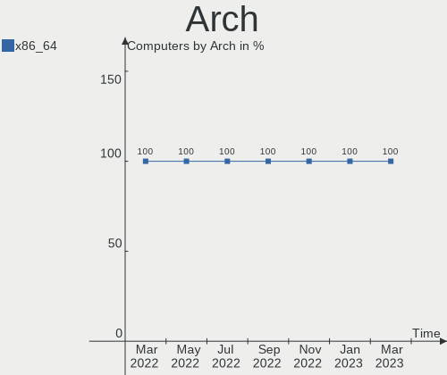

| Name   | Computers | Percent |
|--------|-----------|---------|
| x86_64 | 38        | 100%    |

DE
--

Desktop Environment

| Name    | Computers | Percent |
|---------|-----------|---------|
| GNOME   | 37        | 97.37%  |
| Unknown | 1         | 2.63%   |

Display Server
--------------

X11 or Wayland

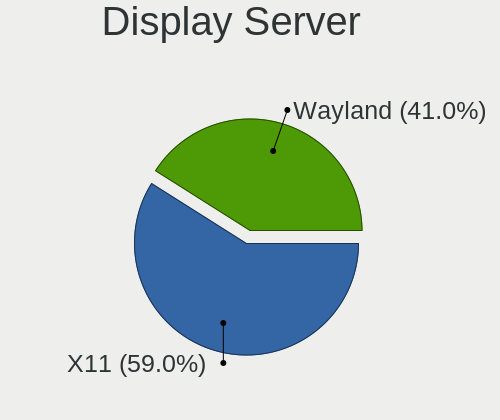

| Name | Computers | Percent |
|------|-----------|---------|
| X11  | 38        | 100%    |

Display Manager
---------------

SDDM, LightDM, etc.

| Name    | Computers | Percent |
|---------|-----------|---------|
| Unknown | 38        | 100%    |

OS Lang
-------

Language

| Lang        | Computers | Percent |
|-------------|-----------|---------|
| en_US       | 14        | 36.84%  |
| pt_BR       | 12        | 31.58%  |
| hu_HU       | 2         | 5.26%   |
| tr_TR       | 1         | 2.63%   |
| sr_RS@latin | 1         | 2.63%   |
| ro_RO       | 1         | 2.63%   |
| pl_PL       | 1         | 2.63%   |
| id_ID       | 1         | 2.63%   |
| fr_FR       | 1         | 2.63%   |
| es_MX       | 1         | 2.63%   |
| es_ES       | 1         | 2.63%   |
| es_CO       | 1         | 2.63%   |
| Unknown     | 1         | 2.63%   |

Boot Mode
---------

EFI or BIOS

| Mode | Computers | Percent |
|------|-----------|---------|
| EFI  | 29        | 76.32%  |
| BIOS | 9         | 23.68%  |

Filesystem
----------

Type of filesystem

| Type | Computers | Percent |
|------|-----------|---------|
| Ext4 | 38        | 100%    |

Part. scheme
------------

Scheme of partitioning

| Type    | Computers | Percent |
|---------|-----------|---------|
| Unknown | 38        | 100%    |

Dual Boot with Linux/BSD
------------------------

Hosting more than one Linux/BSD

| Dual boot | Computers | Percent |
|-----------|-----------|---------|
| No        | 38        | 100%    |

Dual Boot (Win)
---------------

Hosting Linux and Windows

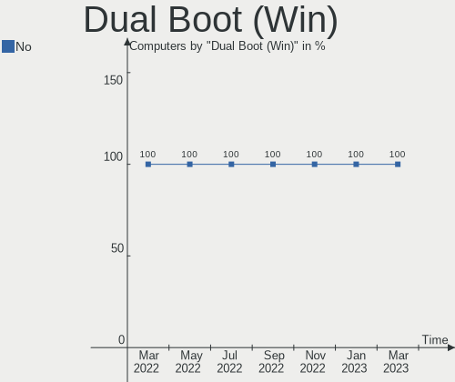

| Dual boot | Computers | Percent |
|-----------|-----------|---------|
| No        | 38        | 100%    |

Board
-----

Vendor
------

Motherboard manufacturer

| Name             | Computers | Percent |
|------------------|-----------|---------|
| ASUSTek Computer | 14        | 36.84%  |
| Acer             | 10        | 26.32%  |
| Dell             | 6         | 15.79%  |
| Lenovo           | 5         | 13.16%  |
| Positivo         | 1         | 2.63%   |
| Microsoft        | 1         | 2.63%   |
| Hewlett-Packard  | 1         | 2.63%   |

Model
-----

Motherboard model

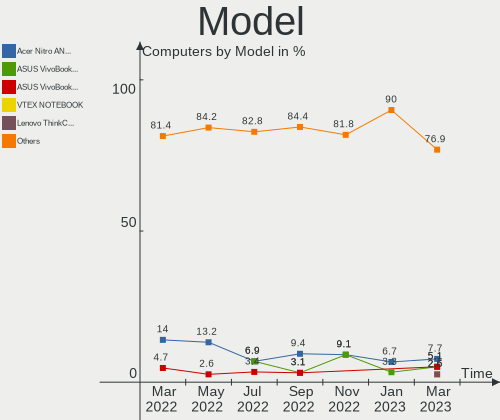

| Name                                       | Computers | Percent |
|--------------------------------------------|-----------|---------|
| Acer Nitro AN515-44                        | 5         | 13.16%  |
| ASUS VivoBook_ASUSLaptop X515JA_X515JA     | 2         | 5.26%   |
| Positivo POS-MI945AA                       | 1         | 2.63%   |
| Microsoft Surface Book 2                   | 1         | 2.63%   |
| Lenovo V14-IGL 82C2                        | 1         | 2.63%   |
| Lenovo ThinkPad X131e 33691J6              | 1         | 2.63%   |
| Lenovo S10-3                               | 1         | 2.63%   |
| Lenovo IdeaPad 3 14ALC6 82KT               | 1         | 2.63%   |
| Lenovo C470 10170                          | 1         | 2.63%   |
| HP 250 G5 Notebook PC                      | 1         | 2.63%   |
| Dell XPS 8930                              | 1         | 2.63%   |
| Dell Precision T7600                       | 1         | 2.63%   |
| Dell OptiPlex 790                          | 1         | 2.63%   |
| Dell OptiPlex 3020                         | 1         | 2.63%   |
| Dell Latitude E6420                        | 1         | 2.63%   |
| Dell Inspiron 5558                         | 1         | 2.63%   |
| ASUS X541UAK                               | 1         | 2.63%   |
| ASUS X540UA                                | 1         | 2.63%   |
| ASUS VivoBook_ASUSLaptop X515DA_X515DA     | 1         | 2.63%   |
| ASUS VivoBook_ASUSLaptop X430FA_S430FA     | 1         | 2.63%   |
| ASUS VivoBook_ASUSLaptop X415EA_X415EA     | 1         | 2.63%   |
| ASUS VivoBook_ASUS Laptop X505ZA_X505ZA    | 1         | 2.63%   |
| ASUS VivoBook 15_ASUS Laptop X540UAR       | 1         | 2.63%   |
| ASUS VivoBook 15_ASUS Laptop X540MA_X540MA | 1         | 2.63%   |
| ASUS VivoBook 12_ASUS Laptop E203MA_E203MA | 1         | 2.63%   |
| ASUS PRIME A320M-K/BR                      | 1         | 2.63%   |
| ASUS ASUS EXPERTBOOK B1500CEAEY_B1500CEAE  | 1         | 2.63%   |
| ASUS ASUS EXPERTBOOK B1400CEAEY_B1400CEAE  | 1         | 2.63%   |
| Acer Swift SF314-54                        | 1         | 2.63%   |
| Acer Nitro AN515-54                        | 1         | 2.63%   |
| Acer Aspire A514-54G                       | 1         | 2.63%   |
| Acer Aspire A315-51                        | 1         | 2.63%   |
| Acer Aspire A315-34                        | 1         | 2.63%   |

Model Family
------------

Motherboard model prefix

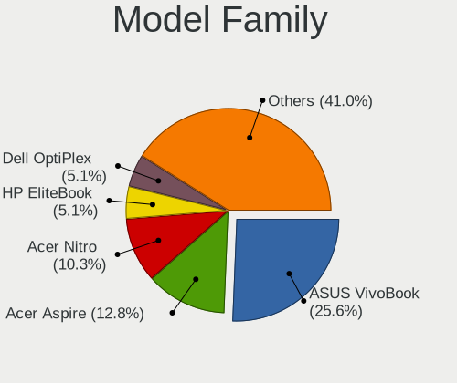

| Name                 | Computers | Percent |
|----------------------|-----------|---------|
| ASUS VivoBook        | 9         | 23.68%  |
| Acer Nitro           | 6         | 15.79%  |
| Acer Aspire          | 3         | 7.89%   |
| Dell OptiPlex        | 2         | 5.26%   |
| ASUS ASUS            | 2         | 5.26%   |
| Positivo POS-MI945AA | 1         | 2.63%   |
| Microsoft Surface    | 1         | 2.63%   |
| Lenovo V14-IGL       | 1         | 2.63%   |
| Lenovo ThinkPad      | 1         | 2.63%   |
| Lenovo S10-3         | 1         | 2.63%   |
| Lenovo IdeaPad       | 1         | 2.63%   |
| Lenovo C470          | 1         | 2.63%   |
| HP 250               | 1         | 2.63%   |
| Dell XPS             | 1         | 2.63%   |
| Dell Precision       | 1         | 2.63%   |
| Dell Latitude        | 1         | 2.63%   |
| Dell Inspiron        | 1         | 2.63%   |
| ASUS X541UAK         | 1         | 2.63%   |
| ASUS X540UA          | 1         | 2.63%   |
| ASUS PRIME           | 1         | 2.63%   |
| Acer Swift           | 1         | 2.63%   |

MFG Year
--------

Motherboard manufacture year

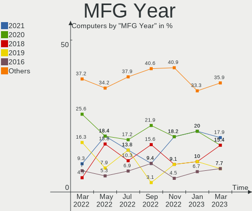

| Year | Computers | Percent |
|------|-----------|---------|
| 2021 | 7         | 18.42%  |
| 2020 | 7         | 18.42%  |
| 2018 | 7         | 18.42%  |
| 2017 | 4         | 10.53%  |
| 2019 | 3         | 7.89%   |
| 2016 | 2         | 5.26%   |
| 2014 | 2         | 5.26%   |
| 2011 | 2         | 5.26%   |
| 2015 | 1         | 2.63%   |
| 2012 | 1         | 2.63%   |
| 2010 | 1         | 2.63%   |
| 2007 | 1         | 2.63%   |

Form Factor
-----------

Physical design of the computer

| Name       | Computers | Percent |
|------------|-----------|---------|
| Notebook   | 30        | 78.95%  |
| Desktop    | 6         | 15.79%  |
| Tablet     | 1         | 2.63%   |
| All in one | 1         | 2.63%   |

Secure Boot
-----------

Enabled or disabled

| State    | Computers | Percent |
|----------|-----------|---------|
| Disabled | 28        | 73.68%  |
| Enabled  | 10        | 26.32%  |

Coreboot
--------

Have coreboot on board

| Used | Computers | Percent |
|------|-----------|---------|
| No   | 38        | 100%    |

RAM Size
--------

Total RAM memory

| Size in GB | Computers | Percent |
|------------|-----------|---------|
| 4.01-8.0   | 14        | 36.84%  |
| 3.01-4.0   | 12        | 31.58%  |
| 16.01-24.0 | 6         | 15.79%  |
| 8.01-16.0  | 3         | 7.89%   |
| 1.01-2.0   | 2         | 5.26%   |
| 24.01-32.0 | 1         | 2.63%   |

RAM Used
--------

Used RAM memory

| Used GB   | Computers | Percent |
|-----------|-----------|---------|
| 1.01-2.0  | 19        | 50%     |
| 2.01-3.0  | 13        | 34.21%  |
| 4.01-8.0  | 3         | 7.89%   |
| 0.51-1.0  | 2         | 5.26%   |
| 8.01-16.0 | 1         | 2.63%   |

Total Drives
------------

Number of drives on board

| Drives | Computers | Percent |
|--------|-----------|---------|
| 1      | 28        | 73.68%  |
| 2      | 7         | 18.42%  |
| 3      | 3         | 7.89%   |

Has CD-ROM
----------

Has CD-ROM on board

| Presented | Computers | Percent |
|-----------|-----------|---------|
| No        | 28        | 73.68%  |
| Yes       | 10        | 26.32%  |

Has Ethernet
------------

Has Ethernet on board

| Presented | Computers | Percent |
|-----------|-----------|---------|
| Yes       | 24        | 63.16%  |
| No        | 14        | 36.84%  |

Has WiFi
--------

Has WiFi module

| Presented | Computers | Percent |
|-----------|-----------|---------|
| Yes       | 35        | 92.11%  |
| No        | 3         | 7.89%   |

Has Bluetooth
-------------

Has Bluetooth module

| Presented | Computers | Percent |
|-----------|-----------|---------|
| Yes       | 30        | 78.95%  |
| No        | 8         | 21.05%  |

Location
--------

Country
-------

Geographic location (country)

| Country   | Computers | Percent |
|-----------|-----------|---------|
| Brazil    | 13        | 34.21%  |
| USA       | 5         | 13.16%  |
| Serbia    | 2         | 5.26%   |
| Indonesia | 2         | 5.26%   |
| Canada    | 2         | 5.26%   |
| Uganda    | 1         | 2.63%   |
| UAE       | 1         | 2.63%   |
| Turkey    | 1         | 2.63%   |
| Spain     | 1         | 2.63%   |
| Romania   | 1         | 2.63%   |
| Poland    | 1         | 2.63%   |
| Mexico    | 1         | 2.63%   |
| Hungary   | 1         | 2.63%   |
| France    | 1         | 2.63%   |
| Czechia   | 1         | 2.63%   |
| Croatia   | 1         | 2.63%   |
| Colombia  | 1         | 2.63%   |
| Bulgaria  | 1         | 2.63%   |
| Australia | 1         | 2.63%   |

City
----

Geographic location (city)

| City                | Computers | Percent |
|---------------------|-----------|---------|
| Sao Paulo           | 2         | 5.26%   |
| Zagreb              | 1         | 2.63%   |
| Venancio Aires      | 1         | 2.63%   |
| Várzea Grande      | 1         | 2.63%   |
| Surrey              | 1         | 2.63%   |
| Sofia               | 1         | 2.63%   |
| Sertaozinho         | 1         | 2.63%   |
| Sao Goncalo         | 1         | 2.63%   |
| Saint-Genest-Lerpt  | 1         | 2.63%   |
| Rio de Janeiro      | 1         | 2.63%   |
| Presidente Prudente | 1         | 2.63%   |
| Phoenix             | 1         | 2.63%   |
| Ostrava             | 1         | 2.63%   |
| Oakville            | 1         | 2.63%   |
| Niš                | 1         | 2.63%   |
| Mezokovacshaza      | 1         | 2.63%   |
| Maringá            | 1         | 2.63%   |
| Lawrenceville       | 1         | 2.63%   |
| Kampala             | 1         | 2.63%   |
| Itajaí             | 1         | 2.63%   |
| Ingenio             | 1         | 2.63%   |
| Gibsonburg          | 1         | 2.63%   |
| Gaziantep           | 1         | 2.63%   |
| Dubai               | 1         | 2.63%   |
| Denpasar            | 1         | 2.63%   |
| Curitiba            | 1         | 2.63%   |
| Cotnari             | 1         | 2.63%   |
| Coraopolis          | 1         | 2.63%   |
| Ciechocinek         | 1         | 2.63%   |
| Campo do Brito      | 1         | 2.63%   |
| Brisbane            | 1         | 2.63%   |
| Bogotá             | 1         | 2.63%   |
| Belgrade            | 1         | 2.63%   |
| Banda Aceh          | 1         | 2.63%   |
| Bagé               | 1         | 2.63%   |
| Apodaca             | 1         | 2.63%   |
| Aliso Viejo         | 1         | 2.63%   |

Drives
------

Drive Vendor
------------

Hard drive vendors

| Vendor              | Computers | Drives | Percent |
|---------------------|-----------|--------|---------|
| Seagate             | 10        | 11     | 20.41%  |
| WDC                 | 7         | 7      | 14.29%  |
| Sandisk             | 7         | 7      | 14.29%  |
| Intel               | 4         | 4      | 8.16%   |
| Unknown             | 2         | 2      | 4.08%   |
| Toshiba             | 2         | 2      | 4.08%   |
| SK Hynix            | 2         | 2      | 4.08%   |
| Samsung Electronics | 2         | 2      | 4.08%   |
| Phison              | 2         | 2      | 4.08%   |
| Verbatim            | 1         | 1      | 2.04%   |
| Silicon Motion      | 1         | 1      | 2.04%   |
| Patriot             | 1         | 1      | 2.04%   |
| MidasForce          | 1         | 1      | 2.04%   |
| Micron Technology   | 1         | 1      | 2.04%   |
| Kingston            | 1         | 1      | 2.04%   |
| Intenso             | 1         | 1      | 2.04%   |
| Hitachi             | 1         | 1      | 2.04%   |
| Crucial             | 1         | 1      | 2.04%   |
| China               | 1         | 1      | 2.04%   |
| A-DATA Technology   | 1         | 1      | 2.04%   |

Drive Model
-----------

Hard drive models

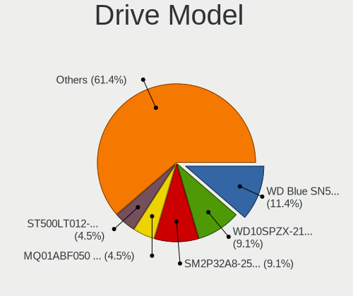

| Model                                    | Computers | Percent |
|------------------------------------------|-----------|---------|
| Sandisk NVMe SSD Drive 512GB             | 5         | 10%     |
| Seagate ST1000DM010-2EP102 1TB           | 3         | 6%      |
| WDC WD10SPZX-21Z10T0 1TB                 | 2         | 4%      |
| Sandisk NVMe SSD Drive 256GB             | 2         | 4%      |
| Phison NVMe SSD Drive 256GB              | 2         | 4%      |
| WDC WDS240G2G0B-00EPW0 240GB SSD         | 1         | 2%      |
| WDC WDS240G1G0A-00SS50 240GB SSD         | 1         | 2%      |
| WDC WD800JD-75MSA1 80GB                  | 1         | 2%      |
| WDC WD10SPZX-08Z10 1TB                   | 1         | 2%      |
| WDC WD1001FALS-00U9B0 1TB                | 1         | 2%      |
| Verbatim Vi500 S3 480GB SSD              | 1         | 2%      |
| Unknown SD/MMC/MS PRO 999GB              | 1         | 2%      |
| Unknown MMC Card  64GB                   | 1         | 2%      |
| Toshiba MQ01ABF050 500GB                 | 1         | 2%      |
| Toshiba MK2555GSX 250GB                  | 1         | 2%      |
| SK Hynix NVMe SSD Drive 256GB            | 1         | 2%      |
| SK Hynix HFS128G32TND-N210A 128GB SSD    | 1         | 2%      |
| Silicon Motion NVMe SSD Drive 256GB      | 1         | 2%      |
| Seagate ST9160314AS 160GB                | 1         | 2%      |
| Seagate ST9160310AS 160GB                | 1         | 2%      |
| Seagate ST500LT012-1DG142 500GB          | 1         | 2%      |
| Seagate ST500DM002-1SB10A 500GB          | 1         | 2%      |
| Seagate ST500DM002-1BD142 500GB          | 1         | 2%      |
| Seagate ST320LT007-9ZV142 320GB          | 1         | 2%      |
| Seagate ST1000LM035-1RK172 1TB           | 1         | 2%      |
| Seagate Backup+ Desk 5TB                 | 1         | 2%      |
| Samsung NVMe SSD Drive 512GB             | 1         | 2%      |
| Samsung NVMe SSD Drive 256GB             | 1         | 2%      |
| Patriot Burst Elite 240GB SSD            | 1         | 2%      |
| MidasForce SSD 256GB                     | 1         | 2%      |
| Micron MTFDDAK256MAY-1AH12ABHA 256GB SSD | 1         | 2%      |
| Kingston RBUSC180DS37256GJ 256GB SSD     | 1         | 2%      |
| Intenso External USB 3.0 4TB             | 1         | 2%      |
| Intel SSDSCKKW256G8 256GB                | 1         | 2%      |
| Intel SSDPEKKW256G7 256GB                | 1         | 2%      |
| Intel Optane Memory M10 16GB             | 1         | 2%      |
| Intel NVMe SSD Drive 512GB               | 1         | 2%      |
| Hitachi HUA722020ALA330 2TB              | 1         | 2%      |
| Crucial CT240BX500SSD1 240GB             | 1         | 2%      |
| China SSD 60GB                           | 1         | 2%      |
| A-DATA SU650 240GB SSD                   | 1         | 2%      |

HDD Vendor
----------

Hard disk drive vendors

| Vendor  | Computers | Drives | Percent |
|---------|-----------|--------|---------|
| Seagate | 10        | 10     | 50%     |
| WDC     | 5         | 5      | 25%     |
| Toshiba | 2         | 2      | 10%     |
| Unknown | 1         | 1      | 5%      |
| Intenso | 1         | 1      | 5%      |
| Hitachi | 1         | 1      | 5%      |

SSD Vendor
----------

Solid state drive vendors

| Vendor            | Computers | Drives | Percent |
|-------------------|-----------|--------|---------|
| WDC               | 2         | 2      | 16.67%  |
| Verbatim          | 1         | 1      | 8.33%   |
| SK Hynix          | 1         | 1      | 8.33%   |
| Patriot           | 1         | 1      | 8.33%   |
| MidasForce        | 1         | 1      | 8.33%   |
| Micron Technology | 1         | 1      | 8.33%   |
| Kingston          | 1         | 1      | 8.33%   |
| Intel             | 1         | 1      | 8.33%   |
| Crucial           | 1         | 1      | 8.33%   |
| China             | 1         | 1      | 8.33%   |
| A-DATA Technology | 1         | 1      | 8.33%   |

Drive Kind
----------

HDD or SSD

| Kind    | Computers | Drives | Percent |
|---------|-----------|--------|---------|
| HDD     | 17        | 20     | 36.96%  |
| NVMe    | 16        | 16     | 34.78%  |
| SSD     | 11        | 12     | 23.91%  |
| MMC     | 1         | 1      | 2.17%   |
| Unknown | 1         | 1      | 2.17%   |

Drive Connector
---------------

SATA, SAS, NVMe, etc.

| Type | Computers | Drives | Percent |
|------|-----------|--------|---------|
| SATA | 25        | 30     | 55.56%  |
| NVMe | 16        | 16     | 35.56%  |
| SAS  | 3         | 3      | 6.67%   |
| MMC  | 1         | 1      | 2.22%   |

Drive Size
----------

Size of hard drive

| Size in TB | Computers | Drives | Percent |
|------------|-----------|--------|---------|
| 0.01-0.5   | 19        | 21     | 63.33%  |
| 0.51-1.0   | 9         | 9      | 30%     |
| 3.01-4.0   | 1         | 1      | 3.33%   |
| 1.01-2.0   | 1         | 1      | 3.33%   |

Space Total
-----------

Amount of disk space available on the file system

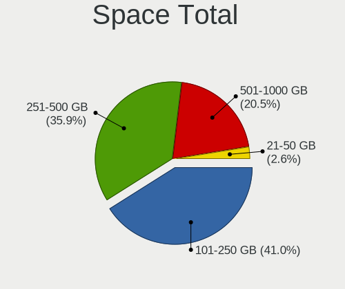

| Size in GB     | Computers | Percent |
|----------------|-----------|---------|
| 101-250        | 16        | 42.11%  |
| 251-500        | 12        | 31.58%  |
| 501-1000       | 4         | 10.53%  |
| 51-100         | 3         | 7.89%   |
| More than 3000 | 2         | 5.26%   |
| 1001-2000      | 1         | 2.63%   |

Space Used
----------

Amount of used disk space

| Used GB        | Computers | Percent |
|----------------|-----------|---------|
| 21-50          | 16        | 42.11%  |
| 101-250        | 7         | 18.42%  |
| 1-20           | 7         | 18.42%  |
| 51-100         | 5         | 13.16%  |
| More than 3000 | 1         | 2.63%   |
| 1001-2000      | 1         | 2.63%   |
| 501-1000       | 1         | 2.63%   |

Malfunc. Drives
---------------

Drive models with a malfunction

Zero info for selected period =(

Malfunc. Drive Vendor
---------------------

Vendors of faulty drives

Zero info for selected period =(

Malfunc. HDD Vendor
-------------------

Vendors of faulty HDD drives

Zero info for selected period =(

Malfunc. Drive Kind
-------------------

Kinds of faulty drives

Zero info for selected period =(

Failed Drives
-------------

Failed drive models

Zero info for selected period =(

Failed Drive Vendor
-------------------

Failed drive vendors

Zero info for selected period =(

Drive Status
------------

Number of failed and malfunc. drives

| Status   | Computers | Drives | Percent |
|----------|-----------|--------|---------|
| Detected | 38        | 50     | 100%    |

Storage controller
------------------

Storage Vendor
--------------

Storage controller vendors

| Vendor              | Computers | Percent |
|---------------------|-----------|---------|
| Intel               | 27        | 55.1%   |
| AMD                 | 9         | 18.37%  |
| Sandisk             | 7         | 14.29%  |
| Samsung Electronics | 2         | 4.08%   |
| Phison Electronics  | 2         | 4.08%   |
| SK Hynix            | 1         | 2.04%   |
| Silicon Motion      | 1         | 2.04%   |

Storage Model
-------------

Storage controller models

| Model                                                                          | Computers | Percent |
|--------------------------------------------------------------------------------|-----------|---------|
| AMD FCH SATA Controller [AHCI mode]                                            | 9         | 15.25%  |
| Sandisk WD Blue SN550 NVMe SSD                                                 | 7         | 11.86%  |
| Intel Sunrise Point-LP SATA Controller [AHCI mode]                             | 6         | 10.17%  |
| Intel 82801 Mobile SATA Controller [RAID mode]                                 | 5         | 8.47%   |
| Intel Volume Management Device NVMe RAID Controller                            | 4         | 6.78%   |
| Intel Tiger Lake-LP SATA Controller [AHCI mode]                                | 4         | 6.78%   |
| Intel Celeron/Pentium Silver Processor SATA Controller                         | 3         | 5.08%   |
| Phison PS5013 E13 NVMe Controller                                              | 2         | 3.39%   |
| Intel PROSet/Wireless WiFi Software extension                                  | 2         | 3.39%   |
| SK Hynix BC511                                                                 | 1         | 1.69%   |
| Silicon Motion SM2263EN/SM2263XT SSD Controller                                | 1         | 1.69%   |
| Samsung NVMe SSD Controller SM961/PM961/SM963                                  | 1         | 1.69%   |
| Samsung NVMe SSD Controller 980                                                | 1         | 1.69%   |
| Intel Wildcat Point-LP SATA Controller [AHCI Mode]                             | 1         | 1.69%   |
| Intel SATA Controller [RAID mode]                                              | 1         | 1.69%   |
| Intel NVMe Optane Memory Series                                                | 1         | 1.69%   |
| Intel NM10/ICH7 Family SATA Controller [IDE mode]                              | 1         | 1.69%   |
| Intel NM10/ICH7 Family SATA Controller [AHCI mode]                             | 1         | 1.69%   |
| Intel C606 chipset Dual 4-Port SATA/SAS Storage Control Unit                   | 1         | 1.69%   |
| Intel C600/X79 series chipset 6-Port SATA AHCI Controller                      | 1         | 1.69%   |
| Intel 82801G (ICH7 Family) IDE Controller                                      | 1         | 1.69%   |
| Intel 8 Series/C220 Series Chipset Family 6-port SATA Controller 1 [AHCI mode] | 1         | 1.69%   |
| Intel 8 Series SATA Controller 1 [AHCI mode]                                   | 1         | 1.69%   |
| Intel 7 Series Chipset Family 6-port SATA Controller [AHCI mode]               | 1         | 1.69%   |
| Intel 6 Series/C200 Series Chipset Family 6 port Desktop SATA AHCI Controller  | 1         | 1.69%   |
| AMD FCH SATA Controller D                                                      | 1         | 1.69%   |

Storage Kind
------------

Kind of storage controller (IDE, SATA, NVMe, SAS, ...)

| Kind | Computers | Percent |
|------|-----------|---------|
| SATA | 31        | 54.39%  |
| NVMe | 16        | 28.07%  |
| RAID | 8         | 14.04%  |
| SAS  | 1         | 1.75%   |
| IDE  | 1         | 1.75%   |

Processor
---------

CPU Vendor
----------

Processor vendors

| Vendor | Computers | Percent |
|--------|-----------|---------|
| Intel  | 29        | 76.32%  |
| AMD    | 9         | 23.68%  |

CPU Model
---------

Processor models

| Model                                         | Computers | Percent |
|-----------------------------------------------|-----------|---------|
| AMD Ryzen 7 4800H with Radeon Graphics        | 5         | 13.16%  |
| Intel Core i3-7020U CPU @ 2.30GHz             | 2         | 5.26%   |
| Intel Core i3-6006U CPU @ 2.00GHz             | 2         | 5.26%   |
| Intel Core i3-1005G1 CPU @ 1.20GHz            | 2         | 5.26%   |
| Intel Celeron N4020 CPU @ 1.10GHz             | 2         | 5.26%   |
| Intel 11th Gen Core i5-1135G7 @ 2.40GHz       | 2         | 5.26%   |
| Intel 11th Gen Core i3-1115G4 @ 3.00GHz       | 2         | 5.26%   |
| Intel Xeon CPU E5-2650 0 @ 2.00GHz            | 1         | 2.63%   |
| Intel Pentium Silver N5000 CPU @ 1.10GHz      | 1         | 2.63%   |
| Intel Core i7-9750H CPU @ 2.60GHz             | 1         | 2.63%   |
| Intel Core i7-9700 CPU @ 3.00GHz              | 1         | 2.63%   |
| Intel Core i7-8650U CPU @ 1.90GHz             | 1         | 2.63%   |
| Intel Core i7-5500U CPU @ 2.40GHz             | 1         | 2.63%   |
| Intel Core i5-8265U CPU @ 1.60GHz             | 1         | 2.63%   |
| Intel Core i5-6200U CPU @ 2.30GHz             | 1         | 2.63%   |
| Intel Core i5-4570 CPU @ 3.20GHz              | 1         | 2.63%   |
| Intel Core i5-2520M CPU @ 2.50GHz             | 1         | 2.63%   |
| Intel Core i5-2400 CPU @ 3.10GHz              | 1         | 2.63%   |
| Intel Core i3-8130U CPU @ 2.20GHz             | 1         | 2.63%   |
| Intel Core i3-4005U CPU @ 1.70GHz             | 1         | 2.63%   |
| Intel Core i3-3227U CPU @ 1.90GHz             | 1         | 2.63%   |
| Intel Core 2 Duo CPU E4500 @ 2.20GHz          | 1         | 2.63%   |
| Intel Celeron N4000 CPU @ 1.10GHz             | 1         | 2.63%   |
| Intel Atom CPU N450 @ 1.66GHz                 | 1         | 2.63%   |
| AMD Ryzen 7 5700U with Radeon Graphics        | 1         | 2.63%   |
| AMD Ryzen 5 3500U with Radeon Vega Mobile Gfx | 1         | 2.63%   |
| AMD Ryzen 3 3200G with Radeon Vega Graphics   | 1         | 2.63%   |
| AMD Ryzen 3 2200U with Radeon Vega Mobile Gfx | 1         | 2.63%   |

CPU Model Family
----------------

Processor model prefix

| Model                | Computers | Percent |
|----------------------|-----------|---------|
| Intel Core i3        | 9         | 23.68%  |
| AMD Ryzen 7          | 6         | 15.79%  |
| Intel Core i5        | 5         | 13.16%  |
| Other                | 4         | 10.53%  |
| Intel Core i7        | 4         | 10.53%  |
| Intel Celeron        | 3         | 7.89%   |
| AMD Ryzen 3          | 2         | 5.26%   |
| Intel Xeon           | 1         | 2.63%   |
| Intel Pentium Silver | 1         | 2.63%   |
| Intel Core 2 Duo     | 1         | 2.63%   |
| Intel Atom           | 1         | 2.63%   |
| AMD Ryzen 5          | 1         | 2.63%   |

CPU Cores
---------

Number of processor cores

| Number | Computers | Percent |
|--------|-----------|---------|
| 2      | 19        | 50%     |
| 4      | 9         | 23.68%  |
| 8      | 8         | 21.05%  |
| 6      | 1         | 2.63%   |
| 1      | 1         | 2.63%   |

CPU Sockets
-----------

Number of sockets

| Number | Computers | Percent |
|--------|-----------|---------|
| 1      | 38        | 100%    |

CPU Threads
-----------

Threads per core (Hyper-Threading)

| Number | Computers | Percent |
|--------|-----------|---------|
| 2      | 28        | 73.68%  |
| 1      | 10        | 26.32%  |

CPU Op-Modes
------------

CPU Operation Modes (32-bit, 64-bit)

| Op mode        | Computers | Percent |
|----------------|-----------|---------|
| 32-bit, 64-bit | 37        | 97.37%  |
| Unknown        | 1         | 2.63%   |

CPU Microcode
-------------

Microcode number

| Number     | Computers | Percent |
|------------|-----------|---------|
| 0x08600103 | 5         | 13.16%  |
| 0x806c1    | 4         | 10.53%  |
| 0x806ea    | 3         | 7.89%   |
| 0x406e3    | 3         | 7.89%   |
| 0x706e5    | 2         | 5.26%   |
| 0x706a8    | 2         | 5.26%   |
| 0x706a1    | 2         | 5.26%   |
| 0x206a7    | 2         | 5.26%   |
| 0x08108109 | 2         | 5.26%   |
| 0x906ed    | 1         | 2.63%   |
| 0x906ea    | 1         | 2.63%   |
| 0x806eb    | 1         | 2.63%   |
| 0x806e9    | 1         | 2.63%   |
| 0x6fd      | 1         | 2.63%   |
| 0x40651    | 1         | 2.63%   |
| 0x306d4    | 1         | 2.63%   |
| 0x306c3    | 1         | 2.63%   |
| 0x306a9    | 1         | 2.63%   |
| 0x206d7    | 1         | 2.63%   |
| 0x106ca    | 1         | 2.63%   |
| 0x08608103 | 1         | 2.63%   |
| 0x08101007 | 1         | 2.63%   |

CPU Microarch
-------------

Microarchitecture

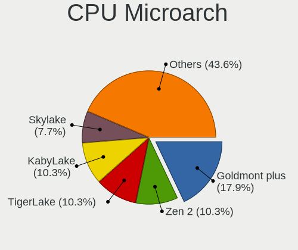

| Name          | Computers | Percent |
|---------------|-----------|---------|
| KabyLake      | 7         | 18.42%  |
| Zen 2         | 5         | 13.16%  |
| TigerLake     | 4         | 10.53%  |
| Goldmont plus | 4         | 10.53%  |
| Skylake       | 3         | 7.89%   |
| SandyBridge   | 3         | 7.89%   |
| Zen+          | 2         | 5.26%   |
| IceLake       | 2         | 5.26%   |
| Haswell       | 2         | 5.26%   |
| Zen           | 1         | 2.63%   |
| IvyBridge     | 1         | 2.63%   |
| Core          | 1         | 2.63%   |
| Broadwell     | 1         | 2.63%   |
| Bonnell       | 1         | 2.63%   |
| Unknown       | 1         | 2.63%   |

Graphics
--------

GPU Vendor
----------

Vendors of graphics cards

| Vendor | Computers | Percent |
|--------|-----------|---------|
| Intel  | 26        | 52%     |
| Nvidia | 15        | 30%     |
| AMD    | 9         | 18%     |

GPU Model
---------

Graphics card models

| Model                                                                       | Computers | Percent |
|-----------------------------------------------------------------------------|-----------|---------|
| Nvidia TU117M                                                               | 5         | 10%     |
| AMD Renoir                                                                  | 5         | 10%     |
| Intel Skylake GT2 [HD Graphics 520]                                         | 3         | 6%      |
| Intel GeminiLake [UHD Graphics 600]                                         | 3         | 6%      |
| Intel UHD Graphics 620                                                      | 2         | 4%      |
| Intel TigerLake-LP GT2 [Iris Xe Graphics]                                   | 2         | 4%      |
| Intel Tiger Lake UHD Graphics                                               | 2         | 4%      |
| Intel Iris Plus Graphics G1 (Ice Lake)                                      | 2         | 4%      |
| AMD Picasso/Raven 2 [Radeon Vega Series / Radeon Vega Mobile Series]        | 2         | 4%      |
| Nvidia TU117M [GeForce GTX 1650 Mobile / Max-Q]                             | 1         | 2%      |
| Nvidia GT218 [GeForce 210]                                                  | 1         | 2%      |
| Nvidia GP108 [GeForce GT 1030]                                              | 1         | 2%      |
| Nvidia GP107M [GeForce MX350]                                               | 1         | 2%      |
| Nvidia GP107M [GeForce GTX 1050 Mobile]                                     | 1         | 2%      |
| Nvidia GP107GL [Quadro P600]                                                | 1         | 2%      |
| Nvidia GP107 [GeForce GTX 1050 Ti]                                          | 1         | 2%      |
| Nvidia GK208BM [GeForce 920M]                                               | 1         | 2%      |
| Nvidia GF119M [NVS 4200M]                                                   | 1         | 2%      |
| Nvidia GF108 [GeForce GT 630]                                               | 1         | 2%      |
| Intel Xeon E3-1200 v3/4th Gen Core Processor Integrated Graphics Controller | 1         | 2%      |
| Intel WhiskeyLake-U GT2 [UHD Graphics 620]                                  | 1         | 2%      |
| Intel Kaby Lake-U GT2f HD 620 Graphics Controller                           | 1         | 2%      |
| Intel HD Graphics 620                                                       | 1         | 2%      |
| Intel HD Graphics 5500                                                      | 1         | 2%      |
| Intel Haswell-ULT Integrated Graphics Controller                            | 1         | 2%      |
| Intel GeminiLake [UHD Graphics 605]                                         | 1         | 2%      |
| Intel CoffeeLake-S GT2 [UHD Graphics 630]                                   | 1         | 2%      |
| Intel CoffeeLake-H GT2 [UHD Graphics 630]                                   | 1         | 2%      |
| Intel Atom Processor D4xx/D5xx/N4xx/N5xx Integrated Graphics Controller     | 1         | 2%      |
| Intel 3rd Gen Core processor Graphics Controller                            | 1         | 2%      |
| Intel 2nd Generation Core Processor Family Integrated Graphics Controller   | 1         | 2%      |
| AMD Raven Ridge [Radeon Vega Series / Radeon Vega Mobile Series]            | 1         | 2%      |
| AMD Lucienne                                                                | 1         | 2%      |

GPU Combo
---------

Combinations of graphics cards

| Name           | Computers | Percent |
|----------------|-----------|---------|
| 1 x Intel      | 20        | 52.63%  |
| AMD + Nvidia   | 6         | 15.79%  |
| Intel + Nvidia | 5         | 13.16%  |
| 1 x Nvidia     | 4         | 10.53%  |
| 1 x AMD        | 3         | 7.89%   |

GPU Driver
----------

Free vs proprietary

| Driver      | Computers | Percent |
|-------------|-----------|---------|
| Free        | 26        | 68.42%  |
| Proprietary | 12        | 31.58%  |

GPU Memory
----------

Total video memory

| Size in GB | Computers | Percent |
|------------|-----------|---------|
| Unknown    | 26        | 68.42%  |
| 0.01-0.5   | 6         | 15.79%  |
| 1.01-2.0   | 4         | 10.53%  |
| 0.51-1.0   | 2         | 5.26%   |

Monitor
-------

Monitor Vendor
--------------

Monitor vendors

| Vendor                  | Computers | Percent |
|-------------------------|-----------|---------|
| Chimei Innolux          | 10        | 26.32%  |
| BOE                     | 10        | 26.32%  |
| AU Optronics            | 4         | 10.53%  |
| PANDA                   | 2         | 5.26%   |
| LG Display              | 2         | 5.26%   |
| Dell                    | 2         | 5.26%   |
| ViewSonic               | 1         | 2.63%   |
| Panasonic               | 1         | 2.63%   |
| Lenovo                  | 1         | 2.63%   |
| InfoVision              | 1         | 2.63%   |
| Hewlett-Packard         | 1         | 2.63%   |
| GDH                     | 1         | 2.63%   |
| Chi Mei Optoelectronics | 1         | 2.63%   |
| Acer                    | 1         | 2.63%   |

Monitor Model
-------------

Monitor models

| Model                                                                    | Computers | Percent |
|--------------------------------------------------------------------------|-----------|---------|
| BOE LCD Monitor BOE07AA 1366x768 344x194mm 15.5-inch                     | 3         | 7.89%   |
| AU Optronics LCD Monitor AUOAF90 1920x1080 344x193mm 15.5-inch           | 3         | 7.89%   |
| PANDA LCD Monitor NCP004D 1920x1080 344x194mm 15.5-inch                  | 2         | 5.26%   |
| Chimei Innolux LCD Monitor CMN14D4 1920x1080 309x173mm 13.9-inch         | 2         | 5.26%   |
| ViewSonic VS2210-FHD VSC1939 1920x1080 476x268mm 21.5-inch               | 1         | 2.63%   |
| Panasonic VVX16T029D00 MEI96A2 2880x1620 344x193mm 15.5-inch             | 1         | 2.63%   |
| LG Display LCD Monitor LGD065A 1920x1080 344x194mm 15.5-inch             | 1         | 2.63%   |
| LG Display LCD Monitor LGD02EB 1366x768 309x174mm 14.0-inch              | 1         | 2.63%   |
| Lenovo LBG AIO PC LEN8000 1920x1080 434x238mm 19.5-inch                  | 1         | 2.63%   |
| InfoVision LCD Monitor IVO0489 1366x768 256x144mm 11.6-inch              | 1         | 2.63%   |
| Hewlett-Packard 32 Display HPN351A 1920x1080 698x393mm 31.5-inch         | 1         | 2.63%   |
| GDH TV PHILCO GDH0030 1920x540                                           | 1         | 2.63%   |
| Dell S2721D DELA19A 2560x1440 597x336mm 27.0-inch                        | 1         | 2.63%   |
| Dell P2210 DEL404C 1680x1050 474x296mm 22.0-inch                         | 1         | 2.63%   |
| Chimei Innolux LCD Monitor CMN15E6 1366x768 344x193mm 15.5-inch          | 1         | 2.63%   |
| Chimei Innolux LCD Monitor CMN15CA 1366x768 344x193mm 15.5-inch          | 1         | 2.63%   |
| Chimei Innolux LCD Monitor CMN15C5 1366x768 344x193mm 15.5-inch          | 1         | 2.63%   |
| Chimei Innolux LCD Monitor CMN1533 1366x768 344x193mm 15.5-inch          | 1         | 2.63%   |
| Chimei Innolux LCD Monitor CMN14D6 1366x768 309x173mm 13.9-inch          | 1         | 2.63%   |
| Chimei Innolux LCD Monitor CMN142E 1366x768 309x173mm 13.9-inch          | 1         | 2.63%   |
| Chimei Innolux LCD Monitor CMN140A 1920x1080 309x173mm 13.9-inch         | 1         | 2.63%   |
| Chimei Innolux LCD Monitor CMN1130 1366x768 256x144mm 11.6-inch          | 1         | 2.63%   |
| Chi Mei Optoelectronics LCD Monitor CMO1018 1024x600 222x125mm 10.0-inch | 1         | 2.63%   |
| BOE LCD Monitor BOE09CC 1920x1080 344x194mm 15.5-inch                    | 1         | 2.63%   |
| BOE LCD Monitor BOE07F7 1920x1080 309x174mm 14.0-inch                    | 1         | 2.63%   |
| BOE LCD Monitor BOE06A5 1366x768 344x194mm 15.5-inch                     | 1         | 2.63%   |
| BOE LCD Monitor BOE06A4 1366x768 344x194mm 15.5-inch                     | 1         | 2.63%   |
| BOE LCD Monitor BOE069C 1920x1080 344x193mm 15.5-inch                    | 1         | 2.63%   |
| BOE LCD Monitor BOE0675 1366x768 344x194mm 15.5-inch                     | 1         | 2.63%   |
| BOE LCD Monitor BOE0615 1366x768 309x173mm 13.9-inch                     | 1         | 2.63%   |
| AU Optronics LCD Monitor AUO403D 1920x1080 309x174mm 14.0-inch           | 1         | 2.63%   |
| Acer Z35P ACR0579 3440x1440 819x346mm 35.0-inch                          | 1         | 2.63%   |

Monitor Resolution
------------------

Monitor screen resolution

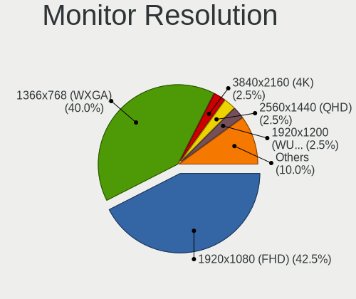

| Resolution         | Computers | Percent |
|--------------------|-----------|---------|
| 1366x768 (WXGA)    | 16        | 43.24%  |
| 1920x1080 (FHD)    | 15        | 40.54%  |
| 3840x2160 (4K)     | 2         | 5.41%   |
| 3440x1440          | 1         | 2.7%    |
| 2560x1440 (QHD)    | 1         | 2.7%    |
| 1680x1050 (WSXGA+) | 1         | 2.7%    |
| 1024x600           | 1         | 2.7%    |

Monitor Diagonal
----------------

Diagonal size in inches

| Inches | Computers | Percent |
|--------|-----------|---------|
| 15     | 18        | 47.37%  |
| 13     | 6         | 15.79%  |
| 14     | 3         | 7.89%   |
| 11     | 2         | 5.26%   |
| 35     | 1         | 2.63%   |
| 32     | 1         | 2.63%   |
| 31     | 1         | 2.63%   |
| 27     | 1         | 2.63%   |
| 23     | 1         | 2.63%   |
| 22     | 1         | 2.63%   |
| 21     | 1         | 2.63%   |
| 17     | 1         | 2.63%   |
| 10     | 1         | 2.63%   |

Monitor Width
-------------

Physical width

| Width in mm | Computers | Percent |
|-------------|-----------|---------|
| 301-350     | 27        | 71.05%  |
| 201-300     | 3         | 7.89%   |
| 501-600     | 2         | 5.26%   |
| 401-500     | 2         | 5.26%   |
| 801-900     | 1         | 2.63%   |
| 701-800     | 1         | 2.63%   |
| 601-700     | 1         | 2.63%   |
| 351-400     | 1         | 2.63%   |

Aspect Ratio
------------

Proportional relationship between the width and the height

| Ratio | Computers | Percent |
|-------|-----------|---------|
| 16/9  | 35        | 94.59%  |
| 21/9  | 1         | 2.7%    |
| 16/10 | 1         | 2.7%    |

Monitor Area
------------

Area in inch²

| Area in inch² | Computers | Percent |
|----------------|-----------|---------|
| 101-110        | 18        | 47.37%  |
| 81-90          | 9         | 23.68%  |
| 351-500        | 3         | 7.89%   |
| 201-250        | 3         | 7.89%   |
| 51-60          | 2         | 5.26%   |
| 41-50          | 1         | 2.63%   |
| 301-350        | 1         | 2.63%   |
| 121-130        | 1         | 2.63%   |

Pixel Density
-------------

Pixels per inch

| Density       | Computers | Percent |
|---------------|-----------|---------|
| 101-120       | 18        | 47.37%  |
| 121-160       | 16        | 42.11%  |
| 51-100        | 3         | 7.89%   |
| More than 240 | 1         | 2.63%   |

Multiple Monitors
-----------------

Total monitors connected

| Total | Computers | Percent |
|-------|-----------|---------|
| 1     | 37        | 97.37%  |
| 2     | 1         | 2.63%   |

Network
-------

Net Controller Vendor
---------------------

Controller vendors

| Vendor                            | Computers | Percent |
|-----------------------------------|-----------|---------|
| Realtek Semiconductor             | 23        | 41.82%  |
| Intel                             | 21        | 38.18%  |
| Qualcomm Atheros                  | 4         | 7.27%   |
| Broadcom                          | 2         | 3.64%   |
| Samsung Electronics               | 1         | 1.82%   |
| MEDIATEK                          | 1         | 1.82%   |
| Marvell Technology Group          | 1         | 1.82%   |
| Ericsson Business Mobile Networks | 1         | 1.82%   |
| ASUSTek Computer                  | 1         | 1.82%   |

Net Controller Model
--------------------

Controller models

| Model                                                              | Computers | Percent |
|--------------------------------------------------------------------|-----------|---------|
| Realtek RTL8111/8168/8411 PCI Express Gigabit Ethernet Controller  | 9         | 13.85%  |
| Intel Wi-Fi 6 AX200                                                | 6         | 9.23%   |
| Realtek Killer E2600 Gigabit Ethernet Controller                   | 5         | 7.69%   |
| Realtek RTL810xE PCI Express Fast Ethernet controller              | 4         | 6.15%   |
| Realtek RTL8821CE 802.11ac PCIe Wireless Network Adapter           | 3         | 4.62%   |
| Intel Wi-Fi 6 AX201                                                | 3         | 4.62%   |
| Intel Gemini Lake PCH CNVi WiFi                                    | 3         | 4.62%   |
| Intel 82579LM Gigabit Network Connection (Lewisville)              | 3         | 4.62%   |
| Realtek RTL8822BE 802.11a/b/g/n/ac WiFi adapter                    | 2         | 3.08%   |
| Realtek RTL8153 Gigabit Ethernet Adapter                           | 2         | 3.08%   |
| Qualcomm Atheros QCA9377 802.11ac Wireless Network Adapter         | 2         | 3.08%   |
| Intel Wireless 8265 / 8275                                         | 2         | 3.08%   |
| Intel Wireless 7265                                                | 2         | 3.08%   |
| Intel Ethernet Connection (13) I219-V                              | 2         | 3.08%   |
| Samsung Galaxy series, misc. (tethering mode)                      | 1         | 1.54%   |
| Realtek RTL8723BE PCIe Wireless Network Adapter                    | 1         | 1.54%   |
| Realtek RTL8191SU 802.11n WLAN Adapter                             | 1         | 1.54%   |
| Realtek RTL8188EE Wireless Network Adapter                         | 1         | 1.54%   |
| Qualcomm Atheros QCA9565 / AR9565 Wireless Network Adapter         | 1         | 1.54%   |
| Qualcomm Atheros QCA6174 802.11ac Wireless Network Adapter         | 1         | 1.54%   |
| Qualcomm Atheros Killer E2400 Gigabit Ethernet Controller          | 1         | 1.54%   |
| MEDIATEK MT7921 802.11ax PCI Express Wireless Network Adapter      | 1         | 1.54%   |
| Marvell Group 88W8897 [AVASTAR] 802.11ac Wireless                  | 1         | 1.54%   |
| Intel Wireless 3165                                                | 1         | 1.54%   |
| Intel Ice Lake-LP PCH CNVi WiFi                                    | 1         | 1.54%   |
| Intel Centrino Advanced-N 6205 [Taylor Peak]                       | 1         | 1.54%   |
| Intel 82574L Gigabit Network Connection                            | 1         | 1.54%   |
| Ericsson Business Mobile Networks H5321 gw Mobile Broadband Module | 1         | 1.54%   |
| Broadcom BCM43228 802.11a/b/g/n                                    | 1         | 1.54%   |
| Broadcom BCM4313 802.11bgn Wireless Network Adapter                | 1         | 1.54%   |
| ASUS USB 10/100/1G/2.5G LAN                                        | 1         | 1.54%   |

Wireless Vendor
---------------

Wireless vendors

| Vendor                   | Computers | Percent |
|--------------------------|-----------|---------|
| Intel                    | 19        | 54.29%  |
| Realtek Semiconductor    | 8         | 22.86%  |
| Qualcomm Atheros         | 4         | 11.43%  |
| Broadcom                 | 2         | 5.71%   |
| MEDIATEK                 | 1         | 2.86%   |
| Marvell Technology Group | 1         | 2.86%   |

Wireless Model
--------------

Wireless models

| Model                                                         | Computers | Percent |
|---------------------------------------------------------------|-----------|---------|
| Intel Wi-Fi 6 AX200                                           | 6         | 17.14%  |
| Realtek RTL8821CE 802.11ac PCIe Wireless Network Adapter      | 3         | 8.57%   |
| Intel Wi-Fi 6 AX201                                           | 3         | 8.57%   |
| Intel Gemini Lake PCH CNVi WiFi                               | 3         | 8.57%   |
| Realtek RTL8822BE 802.11a/b/g/n/ac WiFi adapter               | 2         | 5.71%   |
| Qualcomm Atheros QCA9377 802.11ac Wireless Network Adapter    | 2         | 5.71%   |
| Intel Wireless 8265 / 8275                                    | 2         | 5.71%   |
| Intel Wireless 7265                                           | 2         | 5.71%   |
| Realtek RTL8723BE PCIe Wireless Network Adapter               | 1         | 2.86%   |
| Realtek RTL8191SU 802.11n WLAN Adapter                        | 1         | 2.86%   |
| Realtek RTL8188EE Wireless Network Adapter                    | 1         | 2.86%   |
| Qualcomm Atheros QCA9565 / AR9565 Wireless Network Adapter    | 1         | 2.86%   |
| Qualcomm Atheros QCA6174 802.11ac Wireless Network Adapter    | 1         | 2.86%   |
| MEDIATEK MT7921 802.11ax PCI Express Wireless Network Adapter | 1         | 2.86%   |
| Marvell Group 88W8897 [AVASTAR] 802.11ac Wireless             | 1         | 2.86%   |
| Intel Wireless 3165                                           | 1         | 2.86%   |
| Intel Ice Lake-LP PCH CNVi WiFi                               | 1         | 2.86%   |
| Intel Centrino Advanced-N 6205 [Taylor Peak]                  | 1         | 2.86%   |
| Broadcom BCM43228 802.11a/b/g/n                               | 1         | 2.86%   |
| Broadcom BCM4313 802.11bgn Wireless Network Adapter           | 1         | 2.86%   |

Ethernet Vendor
---------------

Ethernet vendors

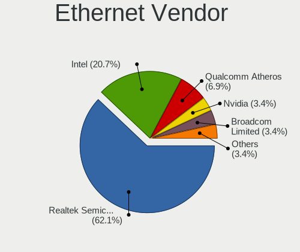

| Vendor                | Computers | Percent |
|-----------------------|-----------|---------|
| Realtek Semiconductor | 18        | 69.23%  |
| Intel                 | 5         | 19.23%  |
| Samsung Electronics   | 1         | 3.85%   |
| Qualcomm Atheros      | 1         | 3.85%   |
| ASUSTek Computer      | 1         | 3.85%   |

Ethernet Model
--------------

Ethernet models

| Model                                                             | Computers | Percent |
|-------------------------------------------------------------------|-----------|---------|
| Realtek RTL8111/8168/8411 PCI Express Gigabit Ethernet Controller | 9         | 31.03%  |
| Realtek Killer E2600 Gigabit Ethernet Controller                  | 5         | 17.24%  |
| Realtek RTL810xE PCI Express Fast Ethernet controller             | 4         | 13.79%  |
| Intel 82579LM Gigabit Network Connection (Lewisville)             | 3         | 10.34%  |
| Realtek RTL8153 Gigabit Ethernet Adapter                          | 2         | 6.9%    |
| Intel Ethernet Connection (13) I219-V                             | 2         | 6.9%    |
| Samsung Galaxy series, misc. (tethering mode)                     | 1         | 3.45%   |
| Qualcomm Atheros Killer E2400 Gigabit Ethernet Controller         | 1         | 3.45%   |
| Intel 82574L Gigabit Network Connection                           | 1         | 3.45%   |
| ASUS USB 10/100/1G/2.5G LAN                                       | 1         | 3.45%   |

Net Controller Kind
-------------------

Ethernet, WiFi or modem

| Kind     | Computers | Percent |
|----------|-----------|---------|
| WiFi     | 35        | 58.33%  |
| Ethernet | 24        | 40%     |
| Modem    | 1         | 1.67%   |

Used Controller
---------------

Currently used network controller

| Kind     | Computers | Percent |
|----------|-----------|---------|
| WiFi     | 32        | 80%     |
| Ethernet | 8         | 20%     |

NICs
----

Total network controllers on board

| Total | Computers | Percent |
|-------|-----------|---------|
| 2     | 21        | 55.26%  |
| 1     | 17        | 44.74%  |

IPv6
----

IPv6 vs IPv4

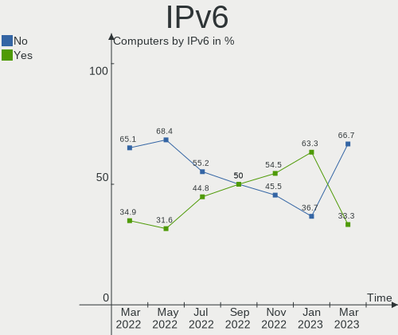

| Used | Computers | Percent |
|------|-----------|---------|
| No   | 26        | 68.42%  |
| Yes  | 12        | 31.58%  |

Bluetooth
---------

Bluetooth Vendor
----------------

Controller vendors

| Vendor                          | Computers | Percent |
|---------------------------------|-----------|---------|
| Intel                           | 18        | 58.06%  |
| IMC Networks                    | 5         | 16.13%  |
| Qualcomm Atheros Communications | 3         | 9.68%   |
| Lite-On Technology              | 2         | 6.45%   |
| Realtek Semiconductor           | 1         | 3.23%   |
| Marvell Semiconductor           | 1         | 3.23%   |
| Cambridge Silicon Radio         | 1         | 3.23%   |

Bluetooth Model
---------------

Controller models

| Model                                               | Computers | Percent |
|-----------------------------------------------------|-----------|---------|
| Intel AX200 Bluetooth                               | 6         | 19.35%  |
| Intel Bluetooth wireless interface                  | 5         | 16.13%  |
| Intel Bluetooth 9460/9560 Jefferson Peak (JfP)      | 5         | 16.13%  |
| IMC Networks Bluetooth Radio                        | 5         | 16.13%  |
| Qualcomm Atheros  Bluetooth Device                  | 2         | 6.45%   |
| Intel AX201 Bluetooth                               | 2         | 6.45%   |
| Realtek Bluetooth Radio                             | 1         | 3.23%   |
| Qualcomm Atheros QCA61x4 Bluetooth 4.0              | 1         | 3.23%   |
| Marvell Bluetooth and Wireless LAN Composite        | 1         | 3.23%   |
| Lite-On Wireless_Device                             | 1         | 3.23%   |
| Lite-On Qualcomm Atheros QCA9377 Bluetooth          | 1         | 3.23%   |
| Cambridge Silicon Radio Bluetooth Dongle (HCI mode) | 1         | 3.23%   |

Sound
-----

Sound Vendor
------------

Sound card vendors

| Vendor                | Computers | Percent |
|-----------------------|-----------|---------|
| Intel                 | 29        | 55.77%  |
| Nvidia                | 13        | 25%     |
| AMD                   | 9         | 17.31%  |
| Realtek Semiconductor | 1         | 1.92%   |

Sound Model
-----------

Sound card models

| Model                                                                      | Computers | Percent |
|----------------------------------------------------------------------------|-----------|---------|
| AMD Family 17h/19h HD Audio Controller                                     | 9         | 15.25%  |
| Intel Sunrise Point-LP HD Audio                                            | 7         | 11.86%  |
| Nvidia TU107 GeForce GTX 1650 High Definition Audio Controller             | 6         | 10.17%  |
| Intel Tiger Lake-LP Smart Sound Technology Audio Controller                | 4         | 6.78%   |
| Intel Celeron/Pentium Silver Processor High Definition Audio               | 4         | 6.78%   |
| AMD Raven/Raven2/Fenghuang HDMI/DP Audio Controller                        | 3         | 5.08%   |
| Nvidia GP107GL High Definition Audio Controller                            | 2         | 3.39%   |
| Intel NM10/ICH7 Family High Definition Audio Controller                    | 2         | 3.39%   |
| Intel Ice Lake-LP Smart Sound Technology Audio Controller                  | 2         | 3.39%   |
| Intel 6 Series/C200 Series Chipset Family High Definition Audio Controller | 2         | 3.39%   |
| Realtek Semiconductor USB Audio                                            | 1         | 1.69%   |
| Nvidia High Definition Audio Controller                                    | 1         | 1.69%   |
| Nvidia GP108 High Definition Audio Controller                              | 1         | 1.69%   |
| Nvidia GK208 HDMI/DP Audio Controller                                      | 1         | 1.69%   |
| Nvidia GF119 HDMI Audio Controller                                         | 1         | 1.69%   |
| Nvidia GF108 High Definition Audio Controller                              | 1         | 1.69%   |
| Intel Xeon E3-1200 v3/4th Gen Core Processor HD Audio Controller           | 1         | 1.69%   |
| Intel Wildcat Point-LP High Definition Audio Controller                    | 1         | 1.69%   |
| Intel Haswell-ULT HD Audio Controller                                      | 1         | 1.69%   |
| Intel Cannon Point-LP High Definition Audio Controller                     | 1         | 1.69%   |
| Intel Cannon Lake PCH cAVS                                                 | 1         | 1.69%   |
| Intel C600/X79 series chipset High Definition Audio Controller             | 1         | 1.69%   |
| Intel Broadwell-U Audio Controller                                         | 1         | 1.69%   |
| Intel 8 Series/C220 Series Chipset High Definition Audio Controller        | 1         | 1.69%   |
| Intel 8 Series HD Audio Controller                                         | 1         | 1.69%   |
| Intel 7 Series/C216 Chipset Family High Definition Audio Controller        | 1         | 1.69%   |
| Intel 200 Series PCH HD Audio                                              | 1         | 1.69%   |
| AMD Renoir Radeon High Definition Audio Controller                         | 1         | 1.69%   |

Memory
------

Memory Vendor
-------------

Memory module vendors

Zero info for selected period =(

Memory Model
------------

Memory module models

Zero info for selected period =(

Memory Kind
-----------

Memory module kinds

Zero info for selected period =(

Memory Form Factor
------------------

Physical design of the memory module

Zero info for selected period =(

Memory Size
-----------

Memory module size

Zero info for selected period =(

Memory Speed
------------

Memory module speed

Zero info for selected period =(

Printers & scanners
-------------------

Printer Vendor
--------------

Printer device vendors

| Vendor          | Computers | Percent |
|-----------------|-----------|---------|
| Hewlett-Packard | 2         | 100%    |

Printer Model
-------------

Printer device models

| Model                | Computers | Percent |
|----------------------|-----------|---------|
| HP OfficeJet 6950    | 1         | 50%     |
| HP Deskjet 2050 J510 | 1         | 50%     |

Scanner Vendor
--------------

Scanner device vendors

Zero info for selected period =(

Scanner Model
-------------

Scanner device models

Zero info for selected period =(

Camera
------

Camera Vendor
-------------

Camera device vendors

| Vendor                        | Computers | Percent |
|-------------------------------|-----------|---------|
| IMC Networks                  | 12        | 38.71%  |
| Chicony Electronics           | 8         | 25.81%  |
| Quanta                        | 5         | 16.13%  |
| Syntek                        | 2         | 6.45%   |
| Suyin                         | 1         | 3.23%   |
| Sunplus Innovation Technology | 1         | 3.23%   |
| Logitech                      | 1         | 3.23%   |
| Apple                         | 1         | 3.23%   |

Camera Model
------------

Camera device models

| Model                              | Computers | Percent |
|------------------------------------|-----------|---------|
| IMC Networks USB2.0 VGA UVC WebCam | 9         | 29.03%  |
| Chicony HD User Facing             | 4         | 12.9%   |
| Quanta HD User Facing              | 3         | 9.68%   |
| IMC Networks USB2.0 HD UVC WebCam  | 3         | 9.68%   |
| Quanta VGA WebCam                  | 2         | 6.45%   |
| Syntek Lenovo USB2.0 UVC Camera    | 1         | 3.23%   |
| Syntek Integrated Camera           | 1         | 3.23%   |
| Suyin Integrated_Webcam_HD         | 1         | 3.23%   |
| Sunplus HD User Facing             | 1         | 3.23%   |
| Logitech Webcam C270               | 1         | 3.23%   |
| Chicony USB2.0 VGA UVC WebCam      | 1         | 3.23%   |
| Chicony Lenovo EasyCamera          | 1         | 3.23%   |
| Chicony Integrated Camera          | 1         | 3.23%   |
| Chicony HP Webcam                  | 1         | 3.23%   |
| Apple iPhone 5/5C/5S/6/SE          | 1         | 3.23%   |

Security
--------

Fingerprint Vendor
------------------

Fingerprint sensor vendors

| Vendor                | Computers | Percent |
|-----------------------|-----------|---------|
| LighTuning Technology | 1         | 100%    |

Fingerprint Model
-----------------

Fingerprint sensor models

| Model                                       | Computers | Percent |
|---------------------------------------------|-----------|---------|
| LighTuning EgisTec Touch Fingerprint Sensor | 1         | 100%    |

Chipcard Vendor
---------------

Chipcard module vendors

| Vendor   | Computers | Percent |
|----------|-----------|---------|
| Broadcom | 1         | 100%    |

Chipcard Model
--------------

Chipcard module models

| Model                                          | Computers | Percent |
|------------------------------------------------|-----------|---------|
| Broadcom BCM5880 Secure Applications Processor | 1         | 100%    |

Unsupported
-----------

Unsupported Devices
-------------------

Total unsupported devices on board

| Total | Computers | Percent |
|-------|-----------|---------|
| 0     | 26        | 68.42%  |
| 1     | 11        | 28.95%  |
| 2     | 1         | 2.63%   |

Unsupported Device Types
------------------------

Types of unsupported devices

| Type                  | Computers | Percent |
|-----------------------|-----------|---------|
| Multimedia controller | 8         | 61.54%  |
| Storage               | 1         | 7.69%   |
| Net/wireless          | 1         | 7.69%   |
| Graphics card         | 1         | 7.69%   |
| Fingerprint reader    | 1         | 7.69%   |
| Chipcard              | 1         | 7.69%   |

