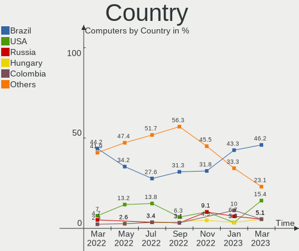
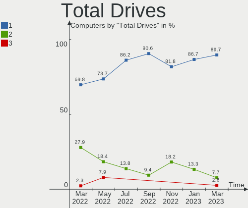
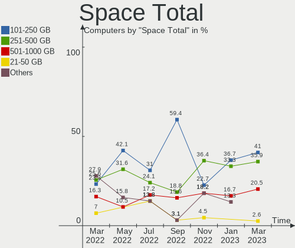
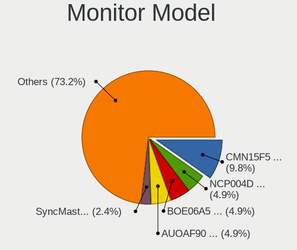

Endless Hardware Trends
-----------------------

A project to identify most popular hardware characteristics and track their change
over time based on data collected by Endless users at https://Linux-Hardware.org.

Anyone can contribute to the study by uploading probes of their computers by
the [hw-probe](https://github.com/linuxhw/hw-probe) tool:

    sudo -E hw-probe -all -upload

This is a report for all computer types. See also reports for [desktops](/Dist/Endless/Desktop/README.md) and [notebooks](/Dist/Endless/Notebook/README.md).

Full-feature report is available here: https://linux-hardware.org/?view=trends

Period: Dec, 2020.

Contents
--------

- [ OS                       ](#os)
- [ OS Family                ](#os-family)
- [ Kernel                   ](#kernel)
- [ Kernel Family            ](#kernel-family)
- [ Kernel Major Ver.        ](#kernel-major-ver)
- [ Arch                     ](#arch)
- [ DE                       ](#de)
- [ Display Server           ](#display-server)
- [ Display Manager          ](#display-manager)
- [ OS Lang                  ](#os-lang)
- [ Boot Mode                ](#boot-mode)
- [ Filesystem               ](#filesystem)
- [ Part. scheme             ](#part-scheme)
- [ Dual Boot with Linux/BSD ](#dual-boot-with-linux/bsd)
- [ Dual Boot (Win)          ](#dual-boot-win)
- [ Country                  ](#country)
- [ City                     ](#city)
- [ Vendor                   ](#vendor)
- [ Model                    ](#model)
- [ Model Family             ](#model-family)
- [ MFG Year                 ](#mfg-year)
- [ Form Factor              ](#form-factor)
- [ Secure Boot              ](#secure-boot)
- [ Coreboot                 ](#coreboot)
- [ RAM Size                 ](#ram-size)
- [ RAM Used                 ](#ram-used)
- [ Has CD-ROM               ](#has-cd-rom)
- [ Total Drives             ](#total-drives)
- [ Has Ethernet             ](#has-ethernet)
- [ Drive Vendor             ](#drive-vendor)
- [ Drive Model              ](#drive-model)
- [ HDD Vendor               ](#hdd-vendor)
- [ SSD Vendor               ](#ssd-vendor)
- [ Drive Kind               ](#drive-kind)
- [ Drive Connector          ](#drive-connector)
- [ Drive Size               ](#drive-size)
- [ Space Total              ](#space-total)
- [ Space Used               ](#space-used)
- [ Malfunc. Drives          ](#malfunc-drives)
- [ Malfunc. Drive Vendor    ](#malfunc-drive-vendor)
- [ Malfunc. HDD Vendor      ](#malfunc-hdd-vendor)
- [ Malfunc. Drive Kind      ](#malfunc-drive-kind)
- [ Failed Drives            ](#failed-drives)
- [ Failed Drive Vendor      ](#failed-drive-vendor)
- [ Drive Status             ](#drive-status)
- [ Storage Vendor           ](#storage-vendor)
- [ Storage Model            ](#storage-model)
- [ Storage Kind             ](#storage-kind)
- [ CPU Vendor               ](#cpu-vendor)
- [ CPU Model                ](#cpu-model)
- [ CPU Model Family         ](#cpu-model-family)
- [ CPU Cores                ](#cpu-cores)
- [ CPU Sockets              ](#cpu-sockets)
- [ CPU Threads              ](#cpu-threads)
- [ CPU Op-Modes             ](#cpu-op-modes)
- [ CPU Microcode            ](#cpu-microcode)
- [ CPU Microarch            ](#cpu-microarch)
- [ GPU Vendor               ](#gpu-vendor)
- [ GPU Model                ](#gpu-model)
- [ GPU Combo                ](#gpu-combo)
- [ GPU Driver               ](#gpu-driver)
- [ GPU Memory               ](#gpu-memory)
- [ Monitor Vendor           ](#monitor-vendor)
- [ Monitor Model            ](#monitor-model)
- [ Monitor Resolution       ](#monitor-resolution)
- [ Monitor Diagonal         ](#monitor-diagonal)
- [ Monitor Width            ](#monitor-width)
- [ Aspect Ratio             ](#aspect-ratio)
- [ Monitor Area             ](#monitor-area)
- [ Pixel Density            ](#pixel-density)
- [ Multiple Monitors        ](#multiple-monitors)
- [ Net Controller Vendor    ](#net-controller-vendor)
- [ Net Controller Model     ](#net-controller-model)
- [ Wireless Vendor          ](#wireless-vendor)
- [ Wireless Model           ](#wireless-model)
- [ Ethernet Vendor          ](#ethernet-vendor)
- [ Ethernet Model           ](#ethernet-model)
- [ Net Controller Kind      ](#net-controller-kind)
- [ Used Controller          ](#used-controller)
- [ NICs                     ](#nics)
- [ Memory Vendor            ](#memory-vendor)
- [ Memory Model             ](#memory-model)
- [ Memory Kind              ](#memory-kind)
- [ Memory Form Factor       ](#memory-form-factor)
- [ Memory Size              ](#memory-size)
- [ Memory Speed             ](#memory-speed)
- [ Sound Vendor             ](#sound-vendor)
- [ Sound Model              ](#sound-model)
- [ Camera Vendor            ](#camera-vendor)
- [ Camera Model             ](#camera-model)
- [ Fingerprint Vendor       ](#fingerprint-vendor)
- [ Fingerprint Model        ](#fingerprint-model)
- [ Chipcard Vendor          ](#chipcard-vendor)
- [ Chipcard Model           ](#chipcard-model)
- [ Printer Vendor           ](#printer-vendor)
- [ Printer Model            ](#printer-model)
- [ Scanner Vendor           ](#scanner-vendor)
- [ Scanner Model            ](#scanner-model)
- [ Bluetooth Vendor         ](#bluetooth-vendor)
- [ Bluetooth Model          ](#bluetooth-model)
- [ Unsupported Devices      ](#unsupported-devices)
- [ Unsupported Device Types ](#unsupported-device-types)

OS
--

Installed operating systems

| Name                  | Computers | Percent |
|-----------------------|-----------|---------|
| Endless 3.9.1         | 70        | 51.47%  |
| Endless 3.9.0         | 37        | 27.21%  |
| Endless 3.8.7         | 7         | 5.15%   |
| Endless 3.7.4         | 6         | 4.41%   |
| Endless 3.7.8         | 5         | 3.68%   |
| Endless 3.8.3         | 2         | 1.47%   |
| Endless 3.4.2-nexthw1 | 2         | 1.47%   |
| Endless 3.8.0         | 1         | 0.74%   |
| Endless 3.7.3         | 1         | 0.74%   |
| Endless 3.6.3-nexthw1 | 1         | 0.74%   |
| Endless 3.4.7         | 1         | 0.74%   |
| Endless 3.4.6-nexthw2 | 1         | 0.74%   |
| Endless 3.4.3-nexthw1 | 1         | 0.74%   |
| Endless 3.3.15        | 1         | 0.74%   |

OS Family
---------

OS without a version

| Name    | Computers | Percent |
|---------|-----------|---------|
| Endless | 136       | 100%    |

Kernel
------

Version of the Linux kernel

| Version           | Computers | Percent |
|-------------------|-----------|---------|
| 5.8.0-14-generic  | 107       | 78.68%  |
| 5.4.0-42-generic  | 7         | 5.15%   |
| 5.3.0-19-generic  | 6         | 4.41%   |
| 5.3.0-28-generic  | 5         | 3.68%   |
| 5.4.0-19-generic  | 3         | 2.21%   |
| 4.16.0-4-generic  | 3         | 2.21%   |
| 5.3.0-12-generic  | 2         | 1.47%   |
| 4.18.0-7-generic  | 1         | 0.74%   |
| 4.15.0-33-generic | 1         | 0.74%   |
| 4.13.0-32-generic | 1         | 0.74%   |

Kernel Family
-------------

Linux kernel without a distro release

| Version | Computers | Percent |
|---------|-----------|---------|
| 5.8.0   | 107       | 78.68%  |
| 5.3.0   | 13        | 9.56%   |
| 5.4.0   | 10        | 7.35%   |
| 4.16.0  | 3         | 2.21%   |
| 4.18.0  | 1         | 0.74%   |
| 4.15.0  | 1         | 0.74%   |
| 4.13.0  | 1         | 0.74%   |

Kernel Major Ver.
-----------------

Linux kernel major version

| Version | Computers | Percent |
|---------|-----------|---------|
| 5.8     | 107       | 78.68%  |
| 5.3     | 13        | 9.56%   |
| 5.4     | 10        | 7.35%   |
| 4.16    | 3         | 2.21%   |
| 4.18    | 1         | 0.74%   |
| 4.15    | 1         | 0.74%   |
| 4.13    | 1         | 0.74%   |

Arch
----

OS architecture (x86_64, i586, etc.)

| Name    | Computers | Percent |
|---------|-----------|---------|
| x86_64  | 135       | 99.26%  |
| aarch64 | 1         | 0.74%   |

DE
--

Desktop Environment

| Name    | Computers | Percent |
|---------|-----------|---------|
| GNOME   | 135       | 99.26%  |
| Unknown | 1         | 0.74%   |

Display Server
--------------

X11 or Wayland

| Name    | Computers | Percent |
|---------|-----------|---------|
| X11     | 135       | 99.26%  |
| Unknown | 1         | 0.74%   |

Display Manager
---------------

SDDM, LightDM, etc.

| Name    | Computers | Percent |
|---------|-----------|---------|
| Unknown | 136       | 100%    |

OS Lang
-------

Language

| Lang        | Computers | Percent |
|-------------|-----------|---------|
| pt_BR.utf8  | 29        | 21.32%  |
| en_US.utf8  | 23        | 16.91%  |
| pt_BR       | 11        | 8.09%   |
| ro_RO       | 10        | 7.35%   |
| en_US       | 10        | 7.35%   |
| ru_RU       | 7         | 5.15%   |
| de_DE       | 7         | 5.15%   |
| es_MX       | 6         | 4.41%   |
| es_ES       | 4         | 2.94%   |
| ru_RU.UTF_8 | 3         | 2.21%   |
| es_MX.utf8  | 3         | 2.21%   |
| en_GB       | 3         | 2.21%   |
| sr_RS@latin | 2         | 1.47%   |
| it_IT       | 2         | 1.47%   |
| hu_HU       | 2         | 1.47%   |
| es_AR       | 2         | 1.47%   |
| tr_TR       | 1         | 0.74%   |
| pl_PL       | 1         | 0.74%   |
| nl_BE       | 1         | 0.74%   |
| hr_HR       | 1         | 0.74%   |
| fr_FR.utf8  | 1         | 0.74%   |
| fi_FI       | 1         | 0.74%   |
| es_CO       | 1         | 0.74%   |
| en_ZA       | 1         | 0.74%   |
| en_GB.utf8  | 1         | 0.74%   |
| en_BW       | 1         | 0.74%   |
| bg_BG       | 1         | 0.74%   |
| Unknown     | 1         | 0.74%   |

Boot Mode
---------

EFI or BIOS

| Mode | Computers | Percent |
|------|-----------|---------|
| EFI  | 97        | 71.32%  |
| BIOS | 39        | 28.68%  |

Filesystem
----------

Type of filesystem

| Type  | Computers | Percent |
|-------|-----------|---------|
| Ext4  | 133       | 97.79%  |
| Tmpfs | 3         | 2.21%   |

Part. scheme
------------

Scheme of partitioning

| Type    | Computers | Percent |
|---------|-----------|---------|
| Unknown | 136       | 100%    |

Dual Boot with Linux/BSD
------------------------

Hosting more than one Linux/BSD

| Dual boot | Computers | Percent |
|-----------|-----------|---------|
| No        | 136       | 100%    |

Dual Boot (Win)
---------------

Hosting Linux and Windows

| Dual boot | Computers | Percent |
|-----------|-----------|---------|
| No        | 136       | 100%    |

Country
-------

Geographic location (country)

| Country      | Computers | Percent |
|--------------|-----------|---------|
| Brazil       | 41        | 30.15%  |
| Romania      | 17        | 12.5%   |
| USA          | 11        | 8.09%   |
| Russia       | 8         | 5.88%   |
| Germany      | 8         | 5.88%   |
| Mexico       | 7         | 5.15%   |
| Spain        | 4         | 2.94%   |
| Ukraine      | 3         | 2.21%   |
| UK           | 3         | 2.21%   |
| Serbia       | 3         | 2.21%   |
| South Africa | 2         | 1.47%   |
| Poland       | 2         | 1.47%   |
| Kenya        | 2         | 1.47%   |
| Italy        | 2         | 1.47%   |
| Hungary      | 2         | 1.47%   |
| Colombia     | 2         | 1.47%   |
| Bulgaria     | 2         | 1.47%   |
| Argentina    | 2         | 1.47%   |
| Uruguay      | 1         | 0.74%   |
| Turkey       | 1         | 0.74%   |
| Thailand     | 1         | 0.74%   |
| Saudi Arabia | 1         | 0.74%   |
| Netherlands  | 1         | 0.74%   |
| Macedonia    | 1         | 0.74%   |
| Luxembourg   | 1         | 0.74%   |
| Indonesia    | 1         | 0.74%   |
| France       | 1         | 0.74%   |
| Finland      | 1         | 0.74%   |
| Croatia      | 1         | 0.74%   |
| Canada       | 1         | 0.74%   |
| Cambodia     | 1         | 0.74%   |
| Bangladesh   | 1         | 0.74%   |
| Angola       | 1         | 0.74%   |

City
----

Geographic location (city)

| City                     | Computers | Percent |
|--------------------------|-----------|---------|
| Bucharest                | 5         | 3.68%   |
| São Paulo               | 3         | 2.21%   |
| Belgrade                 | 3         | 2.21%   |
| Warsaw                   | 2         | 1.47%   |
| San Bartolo Lanzados     | 2         | 1.47%   |
| Nairobi                  | 2         | 1.47%   |
| Moscow                   | 2         | 1.47%   |
| Concord                  | 2         | 1.47%   |
| Belo Horizonte           | 2         | 1.47%   |
| Zapopan                  | 1         | 0.74%   |
| Zalău                   | 1         | 0.74%   |
| Zagreb                   | 1         | 0.74%   |
| York                     | 1         | 0.74%   |
| Xalapa                   | 1         | 0.74%   |
| Vitória                 | 1         | 0.74%   |
| Vantaa                   | 1         | 0.74%   |
| Valcea                   | 1         | 0.74%   |
| Uzyn                     | 1         | 0.74%   |
| Useldange                | 1         | 0.74%   |
| Ulmu                     | 1         | 0.74%   |
| Tucson                   | 1         | 0.74%   |
| Torrelavega              | 1         | 0.74%   |
| Toronto                  | 1         | 0.74%   |
| Timișoara               | 1         | 0.74%   |
| Tijuana                  | 1         | 0.74%   |
| São Bernardo do Campo   | 1         | 0.74%   |
| Sofia                    | 1         | 0.74%   |
| Skopje                   | 1         | 0.74%   |
| Simferopol               | 1         | 0.74%   |
| Serpukhov                | 1         | 0.74%   |
| Sao Pedro                | 1         | 0.74%   |
| Sao Joao de Meriti       | 1         | 0.74%   |
| Santiago                 | 1         | 0.74%   |
| Saki                     | 1         | 0.74%   |
| Ryazan                   | 1         | 0.74%   |
| Roznov                   | 1         | 0.74%   |
| Riyadh                   | 1         | 0.74%   |
| Rivoli                   | 1         | 0.74%   |
| Rio de Janeiro           | 1         | 0.74%   |
| Richland                 | 1         | 0.74%   |
| Ribeirão Preto          | 1         | 0.74%   |
| Ribeirão das Neves      | 1         | 0.74%   |
| Resende                  | 1         | 0.74%   |
| Reinheim                 | 1         | 0.74%   |
| Redditch                 | 1         | 0.74%   |
| Ravenna                  | 1         | 0.74%   |
| Radolfzell               | 1         | 0.74%   |
| Prudentopolis            | 1         | 0.74%   |
| Posadas                  | 1         | 0.74%   |
| Porto Grande             | 1         | 0.74%   |
| Porto Alegre             | 1         | 0.74%   |
| Port Elizabeth           | 1         | 0.74%   |
| Popesti-Leordeni         | 1         | 0.74%   |
| Piteşti                 | 1         | 0.74%   |
| Pipera                   | 1         | 0.74%   |
| Phnom Penh               | 1         | 0.74%   |
| Petropavlovsk-Kamchatsky | 1         | 0.74%   |
| Pereira                  | 1         | 0.74%   |
| Paulista                 | 1         | 0.74%   |
| Pato Branco              | 1         | 0.74%   |

Vendor
------

Motherboard manufacturer

| Name                    | Computers | Percent |
|-------------------------|-----------|---------|
| Acer                    | 47        | 34.56%  |
| ASUSTek Computer        | 41        | 30.15%  |
| Dell                    | 8         | 5.88%   |
| Lenovo                  | 7         | 5.15%   |
| Hewlett-Packard         | 5         | 3.68%   |
| Gigabyte Technology     | 4         | 2.94%   |
| Positivo                | 3         | 2.21%   |
| Toshiba                 | 2         | 1.47%   |
| Samsung Electronics     | 2         | 1.47%   |
| Unknown                 | 2         | 1.47%   |
| Sony                    | 1         | 0.74%   |
| Raspberry Pi Foundation | 1         | 0.74%   |
| PCWare                  | 1         | 0.74%   |
| OEM_MB                  | 1         | 0.74%   |
| Notebook                | 1         | 0.74%   |
| Megaware                | 1         | 0.74%   |
| LORD ELECTRONICS        | 1         | 0.74%   |
| HUAWEI                  | 1         | 0.74%   |
| Fusion5                 | 1         | 0.74%   |
| Fujitsu Siemens         | 1         | 0.74%   |
| Endless                 | 1         | 0.74%   |
| ECS                     | 1         | 0.74%   |
| Apple                   | 1         | 0.74%   |
| AMI                     | 1         | 0.74%   |
| AMD                     | 1         | 0.74%   |

Model
-----

Motherboard model

| Name                                              | Computers | Percent |
|---------------------------------------------------|-----------|---------|
| Acer Nitro AN515-54                               | 11        | 8.09%   |
| Acer Aspire A315-34                               | 5         | 3.68%   |
| ASUS VivoBook 15_ASUS Laptop X540MA_X543MA        | 4         | 2.94%   |
| ASUS VivoBook 15_ASUS Laptop X540BA               | 4         | 2.94%   |
| ASUS X541UAK                                      | 3         | 2.21%   |
| ASUS X541NA                                       | 3         | 2.21%   |
| Acer Nitro AN517-51                               | 3         | 2.21%   |
| Acer Aspire A315-53                               | 3         | 2.21%   |
| Unknown                                           | 3         | 2.21%   |
| Positivo S14CT01                                  | 2         | 1.47%   |
| Dell Vostro 5470                                  | 2         | 1.47%   |
| ASUS X541UVK                                      | 2         | 1.47%   |
| ASUS VivoBook_ASUSLaptop X509FA_X509FA            | 2         | 1.47%   |
| ASUS VivoBook_ASUSLaptop X509FA_A509FA            | 2         | 1.47%   |
| ASUS VivoBook 15_ASUS Laptop X540UAR              | 2         | 1.47%   |
| ASUS VivoBook 15_ASUS Laptop X540MA_X540MA        | 2         | 1.47%   |
| ASUS VivoBook 15_ASUS Laptop X540MA_R540MA        | 2         | 1.47%   |
| Acer Nitro AN515-43                               | 2         | 1.47%   |
| Acer Aspire A515-54G                              | 2         | 1.47%   |
| Acer Aspire A315-31                               | 2         | 1.47%   |
| Acer Aspire A315-21                               | 2         | 1.47%   |
| Toshiba Satellite P75-A                           | 1         | 0.74%   |
| Toshiba Satellite C655                            | 1         | 0.74%   |
| Sony VGN-CR41Z_R                                  | 1         | 0.74%   |
| Samsung 550XCJ/550XCR                             | 1         | 0.74%   |
| Samsung 270E5J/2570EJ                             | 1         | 0.74%   |
| RPi Raspberry Pi 4 Model B                        | 1         | 0.74%   |
| Positivo POS-MIG31AG                              | 1         | 0.74%   |
| PCWare PW-945GCX                                  | 1         | 0.74%   |
| OEM_MB FR650AA-ABF s3642fr                        | 1         | 0.74%   |
| Notebook NB50TJ1_TK1                              | 1         | 0.74%   |
| LORD ELECTRONICS LORD G4x 775 ICH7 8712 As Design | 1         | 0.74%   |
| Lenovo Yoga 900-13ISK 80MK                        | 1         | 0.74%   |
| Lenovo ThinkPad T470 W10DG 20JM0009US             | 1         | 0.74%   |
| Lenovo ThinkCentre M72e 35983V9                   | 1         | 0.74%   |
| Lenovo S10-3                                      | 1         | 0.74%   |
| Lenovo Legion 5 15ARH05 82B5                      | 1         | 0.74%   |
| Lenovo IdeaPad 330-15ARR 81D2                     | 1         | 0.74%   |
| Lenovo G70-35 80Q5                                | 1         | 0.74%   |
| HUAWEI WRTB-WXX9                                  | 1         | 0.74%   |
| HP EliteDesk 800 G1 SFF                           | 1         | 0.74%   |
| HP Compaq Presario A900                           | 1         | 0.74%   |
| HP Compaq 6200 Pro SFF PC                         | 1         | 0.74%   |
| HP All-in-One 24-f0xx                             | 1         | 0.74%   |
| HP 250 G7 Notebook PC                             | 1         | 0.74%   |
| Gigabyte X570 AORUS ELITE                         | 1         | 0.74%   |
| Gigabyte H77M-D3H                                 | 1         | 0.74%   |
| Gigabyte H61M-S2PV                                | 1         | 0.74%   |
| Gigabyte B450M DS3H                               | 1         | 0.74%   |
| Fusion5 Lapbook T90B Pro                          | 1         | 0.74%   |
| Fujitsu Siemens ESPRIMO Mobile V5535              | 1         | 0.74%   |
| Endless EF20EA                                    | 1         | 0.74%   |
| ECS A320AM4-M3D                                   | 1         | 0.74%   |
| Dell OptiPlex 9010                                | 1         | 0.74%   |
| Dell Latitude E5530 non-vPro                      | 1         | 0.74%   |
| Dell Latitude E4310                               | 1         | 0.74%   |
| Dell Latitude 3550                                | 1         | 0.74%   |
| Dell Inspiron N5110                               | 1         | 0.74%   |
| Dell Inspiron 1545                                | 1         | 0.74%   |
| ASUS Z550SA                                       | 1         | 0.74%   |

Model Family
------------

Motherboard model prefix

| Name                    | Computers | Percent |
|-------------------------|-----------|---------|
| ASUS VivoBook           | 25        | 18.38%  |
| Acer Aspire             | 23        | 16.91%  |
| Acer Nitro              | 18        | 13.24%  |
| Dell Latitude           | 3         | 2.21%   |
| ASUS X541UAK            | 3         | 2.21%   |
| ASUS X541NA             | 3         | 2.21%   |
| Unknown                 | 3         | 2.21%   |
| Toshiba Satellite       | 2         | 1.47%   |
| Positivo S14CT01        | 2         | 1.47%   |
| HP Compaq               | 2         | 1.47%   |
| Dell Vostro             | 2         | 1.47%   |
| Dell Inspiron           | 2         | 1.47%   |
| ASUS X541UVK            | 2         | 1.47%   |
| ASUS Vivo               | 2         | 1.47%   |
| ASUS M5A78L-M           | 2         | 1.47%   |
| Acer Extensa            | 2         | 1.47%   |
| Sony VGN-CR41Z          | 1         | 0.74%   |
| Samsung 550XCJ          | 1         | 0.74%   |
| Samsung 270E5J          | 1         | 0.74%   |
| RPi Raspberry           | 1         | 0.74%   |
| Positivo POS-MIG31AG    | 1         | 0.74%   |
| PCWare PW-945GCX        | 1         | 0.74%   |
| OEM_MB FR650AA-ABF      | 1         | 0.74%   |
| Notebook NB50TJ1        | 1         | 0.74%   |
| LORD ELECTRONICS LORD   | 1         | 0.74%   |
| Lenovo Yoga             | 1         | 0.74%   |
| Lenovo ThinkPad         | 1         | 0.74%   |
| Lenovo ThinkCentre      | 1         | 0.74%   |
| Lenovo S10-3            | 1         | 0.74%   |
| Lenovo Legion           | 1         | 0.74%   |
| Lenovo IdeaPad          | 1         | 0.74%   |
| Lenovo G70-35           | 1         | 0.74%   |
| HUAWEI WRTB-WXX9        | 1         | 0.74%   |
| HP EliteDesk            | 1         | 0.74%   |
| HP All-in-One           | 1         | 0.74%   |
| HP 250                  | 1         | 0.74%   |
| Gigabyte X570           | 1         | 0.74%   |
| Gigabyte H77M-D3H       | 1         | 0.74%   |
| Gigabyte H61M-S2PV      | 1         | 0.74%   |
| Gigabyte B450M          | 1         | 0.74%   |
| Fusion5 Lapbook         | 1         | 0.74%   |
| Fujitsu Siemens ESPRIMO | 1         | 0.74%   |
| Endless EF20EA          | 1         | 0.74%   |
| ECS A320AM4-M3D         | 1         | 0.74%   |
| Dell OptiPlex           | 1         | 0.74%   |
| ASUS Z550SA             | 1         | 0.74%   |
| ASUS X705UAR            | 1         | 0.74%   |
| ASUS X541SA             | 1         | 0.74%   |
| ASUS E502SA             | 1         | 0.74%   |
| Apple MacBookPro9       | 1         | 0.74%   |
| AMI EC-200              | 1         | 0.74%   |
| AMD ITX-E21800S         | 1         | 0.74%   |
| Acer Veriton            | 1         | 0.74%   |
| Acer TravelMate         | 1         | 0.74%   |
| Acer C-AXC-780          | 1         | 0.74%   |
| Acer AOD260             | 1         | 0.74%   |

MFG Year
--------

Motherboard manufacture year

| Year    | Computers | Percent |
|---------|-----------|---------|
| 2020    | 35        | 25.74%  |
| 2019    | 35        | 25.74%  |
| 2017    | 17        | 12.5%   |
| 2018    | 15        | 11.03%  |
| 2014    | 6         | 4.41%   |
| 2016    | 5         | 3.68%   |
| 2015    | 4         | 2.94%   |
| 2009    | 4         | 2.94%   |
| 2008    | 4         | 2.94%   |
| 2010    | 3         | 2.21%   |
| 2013    | 2         | 1.47%   |
| 2012    | 2         | 1.47%   |
| 2011    | 2         | 1.47%   |
| 2007    | 1         | 0.74%   |
| Unknown | 1         | 0.74%   |

Form Factor
-----------

Physical design of the computer

| Name           | Computers | Percent |
|----------------|-----------|---------|
| Notebook       | 107       | 78.68%  |
| Desktop        | 23        | 16.91%  |
| All in one     | 4         | 2.94%   |
| System on chip | 1         | 0.74%   |
| Mini pc        | 1         | 0.74%   |

Secure Boot
-----------

Enabled or disabled

| State    | Computers | Percent |
|----------|-----------|---------|
| Disabled | 94        | 69.12%  |
| Enabled  | 42        | 30.88%  |

Coreboot
--------

Have coreboot on board

| Used | Computers | Percent |
|------|-----------|---------|
| No   | 136       | 100%    |

RAM Size
--------

Total RAM memory

| Size in GB | Computers | Percent |
|------------|-----------|---------|
| 3.01-4.0   | 61        | 44.85%  |
| 4.01-8.0   | 44        | 32.35%  |
| 8.01-16.0  | 12        | 8.82%   |
| 16.01-24.0 | 9         | 6.62%   |
| 1.01-2.0   | 8         | 5.88%   |
| 32.01-64.0 | 1         | 0.74%   |
| 0.51-1.0   | 1         | 0.74%   |

RAM Used
--------

Used RAM memory

| Used GB  | Computers | Percent |
|----------|-----------|---------|
| 1.01-2.0 | 71        | 52.21%  |
| 2.01-3.0 | 32        | 23.53%  |
| 0.51-1.0 | 19        | 13.97%  |
| 3.01-4.0 | 8         | 5.88%   |
| 4.01-8.0 | 5         | 3.68%   |
| 0.01-0.5 | 1         | 0.74%   |

Has CD-ROM
----------

Has CD-ROM on board

| Presented | Computers | Percent |
|-----------|-----------|---------|
| No        | 97        | 71.32%  |
| Yes       | 39        | 28.68%  |

Total Drives
------------

Number of drives on board

| Drives | Computers | Percent |
|--------|-----------|---------|
| 1      | 106       | 77.94%  |
| 2      | 28        | 20.59%  |
| 6      | 1         | 0.74%   |
| 4      | 1         | 0.74%   |

Has Ethernet
------------

Has Ethernet on board

| Presented | Computers | Percent |
|-----------|-----------|---------|
| Yes       | 103       | 75.74%  |
| No        | 33        | 24.26%  |

Drive Vendor
------------

Hard drive vendors

| Vendor                | Computers | Drives | Percent |
|-----------------------|-----------|--------|---------|
| Seagate               | 28        | 29     | 17.39%  |
| WDC                   | 26        | 26     | 16.15%  |
| Intel                 | 20        | 20     | 12.42%  |
| Kingston              | 19        | 19     | 11.8%   |
| Unknown               | 15        | 18     | 9.32%   |
| Toshiba               | 12        | 12     | 7.45%   |
| SanDisk               | 9         | 9      | 5.59%   |
| Samsung Electronics   | 5         | 5      | 3.11%   |
| A-DATA Technology     | 5         | 5      | 3.11%   |
| SK Hynix              | 4         | 4      | 2.48%   |
| Hewlett-Packard       | 3         | 3      | 1.86%   |
| Micron Technology     | 2         | 2      | 1.24%   |
| Hitachi               | 2         | 2      | 1.24%   |
| Crucial               | 2         | 2      | 1.24%   |
| ADATA Technology      | 2         | 2      | 1.24%   |
| Transcend             | 1         | 1      | 0.62%   |
| SPCC                  | 1         | 1      | 0.62%   |
| Realtek Semiconductor | 1         | 1      | 0.62%   |
| Phison                | 1         | 1      | 0.62%   |
| HGST                  | 1         | 1      | 0.62%   |
| China                 | 1         | 1      | 0.62%   |
| Apple                 | 1         | 1      | 0.62%   |

Drive Model
-----------

Hard drive models

| Model                                 | Computers | Percent |
|---------------------------------------|-----------|---------|
| WDC WD10SPZX-21Z10T0 1TB              | 17        | 10.49%  |
| Intel NVMe SSD Drive 512GB            | 11        | 6.79%   |
| Toshiba MQ01ABF050 500GB              | 8         | 4.94%   |
| Seagate ST1000LM035-1RK172 1TB        | 8         | 4.94%   |
| Kingston RBUSC180DS37256GJ 256GB SSD  | 6         | 3.7%    |
| Intel NVMe SSD Drive 256GB            | 5         | 3.09%   |
| Unknown SD/MMC/MS PRO 128GB           | 4         | 2.47%   |
| Unknown MMC Card  32GB                | 4         | 2.47%   |
| Seagate ST500LT012-1DG142 500GB       | 4         | 2.47%   |
| Unknown MMC Card  64GB                | 3         | 1.85%   |
| SanDisk SD9SN8W256G1102 256GB SSD     | 3         | 1.85%   |
| Intel NVMe SSD Drive 128GB            | 3         | 1.85%   |
| Toshiba MQ04ABF100 1TB                | 2         | 1.23%   |
| SK Hynix NVMe SSD Drive 256GB         | 2         | 1.23%   |
| Seagate ST500LM030-1RK17D 500GB       | 2         | 1.23%   |
| Seagate ST500DM002-1BD142 500GB       | 2         | 1.23%   |
| Sandisk NVMe SSD Drive 512GB          | 2         | 1.23%   |
| Samsung SSD 860 EVO 250GB             | 2         | 1.23%   |
| Kingston SV300S37A120G 120GB SSD      | 2         | 1.23%   |
| Kingston SA400S37240G 240GB SSD       | 2         | 1.23%   |
| Kingston RBUSNS8180DS3256GJ 256GB SSD | 2         | 1.23%   |
| Kingston NVMe SSD Drive 256GB         | 2         | 1.23%   |
| HP SSD S700 120GB                     | 2         | 1.23%   |
| Crucial CT240BX500SSD1 240GB          | 2         | 1.23%   |
| ADATA NVMe SSD Drive 128GB            | 2         | 1.23%   |
| WDC WD5000LPCX-80VHAT0 500GB          | 1         | 0.62%   |
| WDC WD5000LPCX-21VHAT0 500GB          | 1         | 0.62%   |
| WDC WD5000LPCX-00VHAT0 500GB          | 1         | 0.62%   |
| WDC WD5000BPKT-75PK4T0 500GB          | 1         | 0.62%   |
| WDC WD30EZRX-00D8PB0 3TB              | 1         | 0.62%   |
| WDC WD2503ABYX-01WERA1 256GB          | 1         | 0.62%   |
| WDC WD2500BEVT-22A23T0 250GB          | 1         | 0.62%   |
| WDC WD10SPZX-35Z10T0 1TB              | 1         | 0.62%   |
| WDC WD10EZEX-21WN4A0 1TB              | 1         | 0.62%   |
| Unknown SD/MMC 8GB                    | 1         | 0.62%   |
| Unknown MMC Card  4GB                 | 1         | 0.62%   |
| Unknown MMC Card  16GB                | 1         | 0.62%   |
| Unknown EM200AA001-9VY132 200GB       | 1         | 0.62%   |
| Transcend TS240GSSD220S 240GB         | 1         | 0.62%   |
| Toshiba MQ01ACF032 320GB              | 1         | 0.62%   |
| Toshiba DT01ACA100 1TB                | 1         | 0.62%   |
| SPCC M.2 SSD 128GB                    | 1         | 0.62%   |
| SK Hynix HFS512G39MND-3310A 512GB SSD | 1         | 0.62%   |
| SK Hynix HFS128G32TNF-N3A0A 128GB SSD | 1         | 0.62%   |
| Seagate ST9320423AS 320GB             | 1         | 0.62%   |
| Seagate ST9160821AS 160GB             | 1         | 0.62%   |
| Seagate ST500LT012-9WS142 500GB       | 1         | 0.62%   |
| Seagate ST3808110AS 80GB              | 1         | 0.62%   |
| Seagate ST3750330SV 752GB             | 1         | 0.62%   |
| Seagate ST3250318AS 249GB             | 1         | 0.62%   |
| Seagate ST31000524AS 1TB              | 1         | 0.62%   |
| Seagate ST250DM000-1BD141 250GB       | 1         | 0.62%   |
| Seagate ST2000LM007-1R8174 2TB        | 1         | 0.62%   |
| Seagate ST2000LM003 HN-M201RAD 2TB    | 1         | 0.62%   |
| Seagate ST1000LM024 HN-M101MBB 1TB    | 1         | 0.62%   |
| Seagate ST1000DM010-2EP102 1TB        | 1         | 0.62%   |
| Seagate ST1000DM003-1SB102 1TB        | 1         | 0.62%   |
| SanDisk Ultra II 480GB SSD            | 1         | 0.62%   |
| SanDisk SD9SN8W512G1102 512GB SSD     | 1         | 0.62%   |
| SanDisk SD8SBAT128G1002 128GB SSD     | 1         | 0.62%   |

HDD Vendor
----------

Hard disk drive vendors

| Vendor              | Computers | Drives | Percent |
|---------------------|-----------|--------|---------|
| Seagate             | 28        | 29     | 39.44%  |
| WDC                 | 26        | 26     | 36.62%  |
| Toshiba             | 12        | 12     | 16.9%   |
| Hitachi             | 2         | 2      | 2.82%   |
| Samsung Electronics | 1         | 1      | 1.41%   |
| HGST                | 1         | 1      | 1.41%   |
| Apple               | 1         | 1      | 1.41%   |

SSD Vendor
----------

Solid state drive vendors

| Vendor              | Computers | Drives | Percent |
|---------------------|-----------|--------|---------|
| Kingston            | 15        | 15     | 34.88%  |
| SanDisk             | 7         | 7      | 16.28%  |
| A-DATA Technology   | 5         | 5      | 11.63%  |
| Samsung Electronics | 4         | 4      | 9.3%    |
| Hewlett-Packard     | 3         | 3      | 6.98%   |
| SK Hynix            | 2         | 2      | 4.65%   |
| Crucial             | 2         | 2      | 4.65%   |
| Transcend           | 1         | 1      | 2.33%   |
| SPCC                | 1         | 1      | 2.33%   |
| Micron Technology   | 1         | 1      | 2.33%   |
| Intel               | 1         | 1      | 2.33%   |
| China               | 1         | 1      | 2.33%   |

Drive Kind
----------

HDD or SSD

| Kind    | Computers | Drives | Percent |
|---------|-----------|--------|---------|
| HDD     | 70        | 72     | 44.59%  |
| SSD     | 40        | 43     | 25.48%  |
| NVMe    | 32        | 32     | 20.38%  |
| MMC     | 9         | 11     | 5.73%   |
| Unknown | 6         | 7      | 3.82%   |

Drive Connector
---------------

SATA, SAS, NVMe, etc.

| Type | Computers | Drives | Percent |
|------|-----------|--------|---------|
| SATA | 105       | 115    | 69.08%  |
| NVMe | 32        | 32     | 21.05%  |
| MMC  | 9         | 11     | 5.92%   |
| SAS  | 6         | 7      | 3.95%   |

Drive Size
----------

Size of hard drive

| Size in TB | Computers | Drives | Percent |
|------------|-----------|--------|---------|
| 0.01-0.5   | 65        | 70     | 60.19%  |
| 0.51-1.0   | 40        | 41     | 37.04%  |
| 1.01-2.0   | 2         | 3      | 1.85%   |
| 2.01-3.0   | 1         | 1      | 0.93%   |

Space Total
-----------

Amount of disk space available on the file system

| Size in GB | Computers | Percent |
|------------|-----------|---------|
| 101-250    | 43        | 31.62%  |
| 251-500    | 37        | 27.21%  |
| 501-1000   | 33        | 24.26%  |
| 21-50      | 9         | 6.62%   |
| 51-100     | 6         | 4.41%   |
| 1001-2000  | 3         | 2.21%   |
| 1-20       | 3         | 2.21%   |
| 2001-3000  | 2         | 1.47%   |

Space Used
----------

Amount of used disk space

| Used GB   | Computers | Percent |
|-----------|-----------|---------|
| 21-50     | 69        | 50.74%  |
| 101-250   | 18        | 13.24%  |
| 1-20      | 18        | 13.24%  |
| 51-100    | 18        | 13.24%  |
| 251-500   | 8         | 5.88%   |
| 501-1000  | 3         | 2.21%   |
| 1001-2000 | 2         | 1.47%   |

Malfunc. Drives
---------------

Drive models with a malfunction

Zero info for selected period =(

Malfunc. Drive Vendor
---------------------

Vendors of faulty drives

Zero info for selected period =(

Malfunc. HDD Vendor
-------------------

Vendors of faulty HDD drives

Zero info for selected period =(

Malfunc. Drive Kind
-------------------

Kinds of faulty drives

Zero info for selected period =(

Failed Drives
-------------

Failed drive models

Zero info for selected period =(

Failed Drive Vendor
-------------------

Failed drive vendors

Zero info for selected period =(

Drive Status
------------

Number of failed and malfunc. drives

| Status   | Computers | Drives | Percent |
|----------|-----------|--------|---------|
| Detected | 136       | 165    | 100%    |

Storage Vendor
--------------

Storage controller vendors

| Vendor                           | Computers | Percent |
|----------------------------------|-----------|---------|
| Intel                            | 109       | 75.69%  |
| AMD                              | 20        | 13.89%  |
| Kingston Technology Company      | 4         | 2.78%   |
| SK Hynix                         | 2         | 1.39%   |
| Sandisk                          | 2         | 1.39%   |
| ADATA Technology                 | 2         | 1.39%   |
| Silicon Integrated Systems [SiS] | 1         | 0.69%   |
| Realtek Semiconductor            | 1         | 0.69%   |
| Phison Electronics               | 1         | 0.69%   |
| Nvidia                           | 1         | 0.69%   |
| Micron Technology                | 1         | 0.69%   |

Storage Model
-------------

Storage controller models

| Model                                                                                   | Computers | Percent |
|-----------------------------------------------------------------------------------------|-----------|---------|
| Intel 82801 Mobile SATA Controller [RAID mode]                                          | 30        | 16.76%  |
| Intel PROSet/Wireless WiFi Software extension                                           | 17        | 9.5%    |
| AMD FCH SATA Controller [AHCI mode]                                                     | 17        | 9.5%    |
| Intel Celeron/Pentium Silver Processor SATA Controller                                  | 16        | 8.94%   |
| Intel Sunrise Point-LP SATA Controller [AHCI mode]                                      | 15        | 8.38%   |
| Intel Celeron N3350/Pentium N4200/Atom E3900 Series SATA AHCI Controller                | 5         | 2.79%   |
| Kingston Company U-SNS8154P3 NVMe SSD                                                   | 4         | 2.23%   |
| Intel NM10/ICH7 Family SATA Controller [IDE mode]                                       | 4         | 2.23%   |
| Intel Cannon Lake PCH SATA AHCI Controller                                              | 4         | 2.23%   |
| Intel Atom/Celeron/Pentium Processor x5-E8000/J3xxx/N3xxx Series SATA Controller        | 4         | 2.23%   |
| Intel 82801G (ICH7 Family) IDE Controller                                               | 4         | 2.23%   |
| Intel Comet Lake SATA AHCI Controller                                                   | 3         | 1.68%   |
| Intel 8 Series/C220 Series Chipset Family 6-port SATA Controller 1 [AHCI mode]          | 3         | 1.68%   |
| Intel 7 Series Chipset Family 6-port SATA Controller [AHCI mode]                        | 3         | 1.68%   |
| AMD SB7x0/SB8x0/SB9x0 IDE Controller                                                    | 3         | 1.68%   |
| SK Hynix BC501 NVMe Solid State Drive 512GB                                             | 2         | 1.12%   |
| Intel SSD 600P Series                                                                   | 2         | 1.12%   |
| Intel NM10/ICH7 Family SATA Controller [AHCI mode]                                      | 2         | 1.12%   |
| Intel 82801IBM/IEM (ICH9M/ICH9M-E) 4 port SATA Controller [AHCI mode]                   | 2         | 1.12%   |
| Intel 8 Series SATA Controller 1 [AHCI mode]                                            | 2         | 1.12%   |
| Intel 6 Series/C200 Series Chipset Family Desktop SATA Controller (IDE mode, ports 4-5) | 2         | 1.12%   |
| Intel 6 Series/C200 Series Chipset Family Desktop SATA Controller (IDE mode, ports 0-3) | 2         | 1.12%   |
| AMD SB7x0/SB8x0/SB9x0 SATA Controller [IDE mode]                                        | 2         | 1.12%   |
| ADATA Non-Volatile memory controller                                                    | 2         | 1.12%   |
| Silicon Integrated Systems [SiS] SATA Controller / IDE mode                             | 1         | 0.56%   |
| Silicon Integrated Systems [SiS] 5513 IDE Controller                                    | 1         | 0.56%   |
| Sandisk WD Blue SN500 / PC SN520 NVMe SSD                                               | 1         | 0.56%   |
| Sandisk WD Black SN750 / PC SN730 NVMe SSD                                              | 1         | 0.56%   |
| Realtek Realtek Non-Volatile memory controller                                          | 1         | 0.56%   |
| Phison E16 PCIe4 NVMe Controller                                                        | 1         | 0.56%   |
| Nvidia MCP61 SATA Controller                                                            | 1         | 0.56%   |
| Nvidia MCP61 IDE                                                                        | 1         | 0.56%   |
| Micron Non-Volatile memory controller                                                   | 1         | 0.56%   |
| Intel Wildcat Point-LP SATA Controller [AHCI Mode]                                      | 1         | 0.56%   |
| Intel SATA Controller [RAID mode]                                                       | 1         | 0.56%   |
| Intel Q170/Q150/B150/H170/H110/Z170/CM236 Chipset SATA Controller [AHCI Mode]           | 1         | 0.56%   |
| Intel HM170/QM170 Chipset SATA Controller [AHCI Mode]                                   | 1         | 0.56%   |
| Intel Cannon Point-LP SATA Controller [AHCI Mode]                                       | 1         | 0.56%   |
| Intel Cannon Lake Mobile PCH SATA AHCI Controller                                       | 1         | 0.56%   |
| Intel Atom Processor E3800 Series SATA AHCI Controller                                  | 1         | 0.56%   |
| Intel 82801HM/HEM (ICH8M/ICH8M-E) SATA Controller [IDE mode]                            | 1         | 0.56%   |
| Intel 82801HM/HEM (ICH8M/ICH8M-E) SATA Controller [AHCI mode]                           | 1         | 0.56%   |
| Intel 82801HM/HEM (ICH8M/ICH8M-E) IDE Controller                                        | 1         | 0.56%   |
| Intel 7 Series/C210 Series Chipset Family 4-port SATA Controller [IDE mode]             | 1         | 0.56%   |
| Intel 7 Series/C210 Series Chipset Family 2-port SATA Controller [IDE mode]             | 1         | 0.56%   |
| Intel 6 Series/C200 Series Chipset Family Mobile SATA Controller (IDE mode, ports 4-5)  | 1         | 0.56%   |
| Intel 6 Series/C200 Series Chipset Family Mobile SATA Controller (IDE mode, ports 0-3)  | 1         | 0.56%   |
| Intel 6 Series/C200 Series Chipset Family 6 port Mobile SATA AHCI Controller            | 1         | 0.56%   |
| Intel 6 Series/C200 Series Chipset Family 6 port Desktop SATA AHCI Controller           | 1         | 0.56%   |
| Intel 400 Series Chipset Family SATA AHCI Controller                                    | 1         | 0.56%   |
| AMD SB7x0/SB8x0/SB9x0 SATA Controller [AHCI mode]                                       | 1         | 0.56%   |
| AMD FCH SATA Controller D                                                               | 1         | 0.56%   |
| AMD 400 Series Chipset SATA Controller                                                  | 1         | 0.56%   |

Storage Kind
------------

Kind of storage controller (IDE, SATA, NVMe, SAS, ...)

| Kind | Computers | Percent |
|------|-----------|---------|
| SATA | 105       | 62.87%  |
| NVMe | 32        | 19.16%  |
| RAID | 15        | 8.98%   |
| IDE  | 15        | 8.98%   |

CPU Vendor
----------

Processor vendors

| Vendor | Computers | Percent |
|--------|-----------|---------|
| Intel  | 114       | 83.82%  |
| AMD    | 21        | 15.44%  |
| ARM    | 1         | 0.74%   |

CPU Model
---------

Processor models

| Model                                         | Computers | Percent |
|-----------------------------------------------|-----------|---------|
| Intel Core i7-9750H CPU @ 2.60GHz             | 9         | 6.62%   |
| Intel Celeron N4000 CPU @ 1.10GHz             | 9         | 6.62%   |
| Intel Core i5-9300H CPU @ 2.40GHz             | 5         | 3.68%   |
| Intel Core i3-6006U CPU @ 2.00GHz             | 5         | 3.68%   |
| Intel Celeron N4020 CPU @ 1.10GHz             | 4         | 2.94%   |
| Intel Pentium CPU 4417U @ 2.30GHz             | 3         | 2.21%   |
| Intel Core i7-10510U CPU @ 1.80GHz            | 3         | 2.21%   |
| Intel Core i5-8250U CPU @ 1.60GHz             | 3         | 2.21%   |
| Intel Core i3-8145U CPU @ 2.10GHz             | 3         | 2.21%   |
| Intel Atom x5-Z8350 CPU @ 1.44GHz             | 3         | 2.21%   |
| AMD A9-9425 RADEON R5, 5 COMPUTE CORES 2C+3G  | 3         | 2.21%   |
| Intel Pentium CPU N3700 @ 1.60GHz             | 2         | 1.47%   |
| Intel Core i7-2600 CPU @ 3.40GHz              | 2         | 1.47%   |
| Intel Core i5-8400 CPU @ 2.80GHz              | 2         | 1.47%   |
| Intel Core i5-8265U CPU @ 1.60GHz             | 2         | 1.47%   |
| Intel Core i5-7200U CPU @ 2.50GHz             | 2         | 1.47%   |
| Intel Core i5-6300U CPU @ 2.40GHz             | 2         | 1.47%   |
| Intel Core i5-4210U CPU @ 1.70GHz             | 2         | 1.47%   |
| Intel Core i5-1035G1 CPU @ 1.00GHz            | 2         | 1.47%   |
| Intel Core i5-10210U CPU @ 1.60GHz            | 2         | 1.47%   |
| Intel Core i3-7100U CPU @ 2.40GHz             | 2         | 1.47%   |
| Intel Celeron N4000C CPU @ 1.10GHz            | 2         | 1.47%   |
| Intel Celeron CPU N3450 @ 1.10GHz             | 2         | 1.47%   |
| Intel Celeron CPU N3350 @ 1.10GHz             | 2         | 1.47%   |
| AMD Ryzen 7 3750H with Radeon Vega Mobile Gfx | 2         | 1.47%   |
| AMD Ryzen 5 3500U with Radeon Vega Mobile Gfx | 2         | 1.47%   |
| AMD Ryzen 3 2200U with Radeon Vega Mobile Gfx | 2         | 1.47%   |
| Intel Pentium Silver N5000 CPU @ 1.10GHz      | 1         | 0.74%   |
| Intel Pentium Dual CPU T2370 @ 1.73GHz        | 1         | 0.74%   |
| Intel Pentium Dual CPU E2220 @ 2.40GHz        | 1         | 0.74%   |
| Intel Pentium CPU N4200 @ 1.10GHz             | 1         | 0.74%   |
| Intel Pentium CPU 5405U @ 2.30GHz             | 1         | 0.74%   |
| Intel Core i7-8700 CPU @ 3.20GHz              | 1         | 0.74%   |
| Intel Core i7-8565U CPU @ 1.80GHz             | 1         | 0.74%   |
| Intel Core i7-7700HQ CPU @ 2.80GHz            | 1         | 0.74%   |
| Intel Core i7-6500U CPU @ 2.50GHz             | 1         | 0.74%   |
| Intel Core i7-4700MQ CPU @ 2.40GHz            | 1         | 0.74%   |
| Intel Core i7-3520M CPU @ 2.90GHz             | 1         | 0.74%   |
| Intel Core i5-9400 CPU @ 2.90GHz              | 1         | 0.74%   |
| Intel Core i5-4590 CPU @ 3.30GHz              | 1         | 0.74%   |
| Intel Core i5-3210M CPU @ 2.50GHz             | 1         | 0.74%   |
| Intel Core i5-2410M CPU @ 2.30GHz             | 1         | 0.74%   |
| Intel Core i5-10400F CPU @ 2.90GHz            | 1         | 0.74%   |
| Intel Core i5 CPU M 540 @ 2.53GHz             | 1         | 0.74%   |
| Intel Core i3-8130U CPU @ 2.20GHz             | 1         | 0.74%   |
| Intel Core i3-7100 CPU @ 3.90GHz              | 1         | 0.74%   |
| Intel Core i3-5005U CPU @ 2.00GHz             | 1         | 0.74%   |
| Intel Core i3-4170 CPU @ 3.70GHz              | 1         | 0.74%   |
| Intel Core i3-4010U CPU @ 1.70GHz             | 1         | 0.74%   |
| Intel Core i3-3240 CPU @ 3.40GHz              | 1         | 0.74%   |
| Intel Core i3-3227U CPU @ 1.90GHz             | 1         | 0.74%   |
| Intel Core i3-3220 CPU @ 3.30GHz              | 1         | 0.74%   |
| Intel Core i3-2310M CPU @ 2.10GHz             | 1         | 0.74%   |
| Intel Core i3-2100 CPU @ 3.10GHz              | 1         | 0.74%   |
| Intel Core i3-1005G1 CPU @ 1.20GHz            | 1         | 0.74%   |
| Intel Core 2 Quad CPU Q9000 @ 2.00GHz         | 1         | 0.74%   |
| Intel Core 2 Duo CPU T8300 @ 2.40GHz          | 1         | 0.74%   |
| Intel Core 2 Duo CPU T6600 @ 2.20GHz          | 1         | 0.74%   |
| Intel Core 2 Duo CPU T5550 @ 1.83GHz          | 1         | 0.74%   |
| Intel Core 2 Duo CPU E8400 @ 3.00GHz          | 1         | 0.74%   |

CPU Model Family
----------------

Processor model prefix

| Model                | Computers | Percent |
|----------------------|-----------|---------|
| Intel Core i5        | 28        | 20.59%  |
| Intel Celeron        | 22        | 16.18%  |
| Intel Core i3        | 21        | 15.44%  |
| Intel Core i7        | 20        | 14.71%  |
| Intel Pentium        | 7         | 5.15%   |
| Intel Atom           | 7         | 5.15%   |
| Intel Core 2 Duo     | 5         | 3.68%   |
| Other                | 4         | 2.94%   |
| AMD Ryzen 5          | 4         | 2.94%   |
| Intel Pentium Dual   | 2         | 1.47%   |
| AMD Ryzen 7          | 2         | 1.47%   |
| AMD Ryzen 3          | 2         | 1.47%   |
| AMD FX               | 2         | 1.47%   |
| AMD E2               | 2         | 1.47%   |
| AMD A8               | 2         | 1.47%   |
| Intel Pentium Silver | 1         | 0.74%   |
| Intel Core 2 Quad    | 1         | 0.74%   |
| AMD Ryzen 9          | 1         | 0.74%   |
| AMD Phenom           | 1         | 0.74%   |
| AMD A6               | 1         | 0.74%   |
| AMD A4               | 1         | 0.74%   |

CPU Cores
---------

Number of processor cores

| Number | Computers | Percent |
|--------|-----------|---------|
| 2      | 74        | 54.41%  |
| 4      | 42        | 30.88%  |
| 6      | 16        | 11.76%  |
| 1      | 2         | 1.47%   |
| 12     | 1         | 0.74%   |
| 3      | 1         | 0.74%   |

CPU Sockets
-----------

Number of sockets

| Number | Computers | Percent |
|--------|-----------|---------|
| 1      | 136       | 100%    |

CPU Threads
-----------

Threads per core (Hyper-Threading)

| Number | Computers | Percent |
|--------|-----------|---------|
| 2      | 84        | 61.76%  |
| 1      | 52        | 38.24%  |

CPU Op-Modes
------------

CPU Operation Modes (32-bit, 64-bit)

| Op mode        | Computers | Percent |
|----------------|-----------|---------|
| 32-bit, 64-bit | 134       | 98.53%  |
| 64-bit         | 1         | 0.74%   |
| Unknown        | 1         | 0.74%   |

CPU Microcode
-------------

Microcode number

| Number     | Computers | Percent |
|------------|-----------|---------|
| 0x906ea    | 18        | 13.24%  |
| 0x706a1    | 12        | 8.82%   |
| 0x406e3    | 8         | 5.88%   |
| Unknown    | 8         | 5.88%   |
| 0x806ec    | 7         | 5.15%   |
| 0x806ea    | 7         | 5.15%   |
| 0x506c9    | 5         | 3.68%   |
| 0x406c4    | 5         | 3.68%   |
| 0x306a9    | 5         | 3.68%   |
| 0x06006705 | 5         | 3.68%   |
| 0x806eb    | 4         | 2.94%   |
| 0x806e9    | 4         | 2.94%   |
| 0x706a8    | 4         | 2.94%   |
| 0x206a7    | 4         | 2.94%   |
| 0x6fd      | 3         | 2.21%   |
| 0x406c3    | 3         | 2.21%   |
| 0x40651    | 3         | 2.21%   |
| 0x1067a    | 3         | 2.21%   |
| 0x08108109 | 3         | 2.21%   |
| 0x906e9    | 2         | 1.47%   |
| 0x706e5    | 2         | 1.47%   |
| 0x306c3    | 2         | 1.47%   |
| 0x106ca    | 2         | 1.47%   |
| 0x06000852 | 2         | 1.47%   |
| 0xa0653    | 1         | 0.74%   |
| 0x306d4    | 1         | 0.74%   |
| 0x30678    | 1         | 0.74%   |
| 0x20652    | 1         | 0.74%   |
| 0x106c2    | 1         | 0.74%   |
| 0x10676    | 1         | 0.74%   |
| 0x08701021 | 1         | 0.74%   |
| 0x08600103 | 1         | 0.74%   |
| 0x08108102 | 1         | 0.74%   |
| 0x08101007 | 1         | 0.74%   |
| 0x0800820d | 1         | 0.74%   |
| 0x07030105 | 1         | 0.74%   |
| 0x0600611a | 1         | 0.74%   |
| 0x05000119 | 1         | 0.74%   |
| 0x01000083 | 1         | 0.74%   |

CPU Microarch
-------------

Microarchitecture

| Name          | Computers | Percent |
|---------------|-----------|---------|
| KabyLake      | 43        | 31.62%  |
| Goldmont plus | 16        | 11.76%  |
| Silvermont    | 9         | 6.62%   |
| Skylake       | 8         | 5.88%   |
| Excavator     | 7         | 5.15%   |
| Haswell       | 6         | 4.41%   |
| Zen+          | 5         | 3.68%   |
| SandyBridge   | 5         | 3.68%   |
| IvyBridge     | 5         | 3.68%   |
| Goldmont      | 5         | 3.68%   |
| Penryn        | 4         | 2.94%   |
| Core          | 4         | 2.94%   |
| IceLake       | 3         | 2.21%   |
| Bonnell       | 3         | 2.21%   |
| Zen 2         | 2         | 1.47%   |
| Zen           | 2         | 1.47%   |
| Piledriver    | 2         | 1.47%   |
| Westmere      | 1         | 0.74%   |
| Puma          | 1         | 0.74%   |
| K10           | 1         | 0.74%   |
| CometLake     | 1         | 0.74%   |
| Broadwell     | 1         | 0.74%   |
| Bobcat        | 1         | 0.74%   |
| Unknown       | 1         | 0.74%   |

GPU Vendor
----------

Vendors of graphics cards

| Vendor                           | Computers | Percent |
|----------------------------------|-----------|---------|
| Intel                            | 102       | 61.82%  |
| Nvidia                           | 41        | 24.85%  |
| AMD                              | 21        | 12.73%  |
| Silicon Integrated Systems [SiS] | 1         | 0.61%   |

GPU Model
---------

Graphics card models

| Model                                                                                    | Computers | Percent |
|------------------------------------------------------------------------------------------|-----------|---------|
| Nvidia TU117M [GeForce GTX 1650 Mobile / Max-Q]                                          | 16        | 9.52%   |
| Intel UHD Graphics 605                                                                   | 16        | 9.52%   |
| Intel UHD Graphics 630 (Mobile)                                                          | 14        | 8.33%   |
| Intel Skylake GT2 [HD Graphics 520]                                                      | 8         | 4.76%   |
| Intel Atom/Celeron/Pentium Processor x5-E8000/J3xxx/N3xxx Integrated Graphics Controller | 8         | 4.76%   |
| Intel UHD Graphics 620 (Whiskey Lake)                                                    | 6         | 3.57%   |
| AMD Stoney [Radeon R2/R3/R4/R5 Graphics]                                                 | 6         | 3.57%   |
| Intel UHD Graphics                                                                       | 5         | 2.98%   |
| Intel UHD Graphics 620                                                                   | 4         | 2.38%   |
| Intel HD Graphics 620                                                                    | 4         | 2.38%   |
| Intel HD Graphics 500                                                                    | 4         | 2.38%   |
| AMD Picasso                                                                              | 4         | 2.38%   |
| Intel Kaby Lake-U GT1 Integrated Graphics Controller                                     | 3         | 1.79%   |
| Intel Iris Plus Graphics G1 (Ice Lake)                                                   | 3         | 1.79%   |
| Intel Haswell-ULT Integrated Graphics Controller                                         | 3         | 1.79%   |
| Intel 3rd Gen Core processor Graphics Controller                                         | 3         | 1.79%   |
| Intel 2nd Generation Core Processor Family Integrated Graphics Controller                | 3         | 1.79%   |
| Nvidia GP108M [GeForce MX250]                                                            | 2         | 1.19%   |
| Nvidia GP108 [GeForce GT 1030]                                                           | 2         | 1.19%   |
| Nvidia GM108M [GeForce MX130]                                                            | 2         | 1.19%   |
| Nvidia GM108M [GeForce MX110]                                                            | 2         | 1.19%   |
| Nvidia GM108M [GeForce 920MX]                                                            | 2         | 1.19%   |
| Intel UHD Graphics 630 (Desktop)                                                         | 2         | 1.19%   |
| Intel Atom Processor D4xx/D5xx/N4xx/N5xx Integrated Graphics Controller                  | 2         | 1.19%   |
| Intel 82945G/GZ Integrated Graphics Controller                                           | 2         | 1.19%   |
| AMD Raven Ridge [Radeon Vega Series / Radeon Vega Mobile Series]                         | 2         | 1.19%   |
| Silicon Integrated Systems [SiS] 771/671 PCIE VGA Display Adapter                        | 1         | 0.6%    |
| Nvidia TU117M                                                                            | 1         | 0.6%    |
| Nvidia TU117 [GeForce GTX 1650]                                                          | 1         | 0.6%    |
| Nvidia GP107M [GeForce GTX 1050 Ti Mobile]                                               | 1         | 0.6%    |
| Nvidia GP107M [GeForce GTX 1050 Mobile]                                                  | 1         | 0.6%    |
| Nvidia GP106 [GeForce GTX 1060 6GB]                                                      | 1         | 0.6%    |
| Nvidia GM204 [GeForce GTX 970]                                                           | 1         | 0.6%    |
| Nvidia GK208M [GeForce GT 740M]                                                          | 1         | 0.6%    |
| Nvidia GK208B [GeForce GT 730]                                                           | 1         | 0.6%    |
| Nvidia GK208B [GeForce GT 710]                                                           | 1         | 0.6%    |
| Nvidia GK208 [GeForce GT 710]                                                            | 1         | 0.6%    |
| Nvidia GF119 [GeForce GT 610]                                                            | 1         | 0.6%    |
| Nvidia GF117M [GeForce 610M/710M/810M/820M / GT 620M/625M/630M/720M]                     | 1         | 0.6%    |
| Nvidia GF108M [GeForce GT 525M]                                                          | 1         | 0.6%    |
| Nvidia GF108 [GeForce GT 630]                                                            | 1         | 0.6%    |
| Nvidia G92M [GeForce GTX 260M]                                                           | 1         | 0.6%    |
| Intel Xeon E3-1200 v3/4th Gen Core Processor Integrated Graphics Controller              | 1         | 0.6%    |
| Intel Xeon E3-1200 v2/3rd Gen Core processor Graphics Controller                         | 1         | 0.6%    |
| Intel Mobile GM965/GL960 Integrated Graphics Controller (secondary)                      | 1         | 0.6%    |
| Intel Mobile GM965/GL960 Integrated Graphics Controller (primary)                        | 1         | 0.6%    |
| Intel Mobile 4 Series Chipset Integrated Graphics Controller                             | 1         | 0.6%    |
| Intel HD Graphics 630                                                                    | 1         | 0.6%    |
| Intel HD Graphics 5500                                                                   | 1         | 0.6%    |
| Intel Core Processor Integrated Graphics Controller                                      | 1         | 0.6%    |
| Intel Coffee Lake UHD Graphics                                                           | 1         | 0.6%    |
| Intel Celeron N3350/Pentium N4200/Atom E3900 Series Integrated Graphics Controller       | 1         | 0.6%    |
| Intel Atom Processor Z36xxx/Z37xxx Series Graphics & Display                             | 1         | 0.6%    |
| Intel 4th Gen Core Processor Integrated Graphics Controller                              | 1         | 0.6%    |
| Intel 4 Series Chipset Integrated Graphics Controller                                    | 1         | 0.6%    |
| AMD Wrestler [Radeon HD 7340]                                                            | 1         | 0.6%    |
| AMD Wani [Radeon R5/R6/R7 Graphics]                                                      | 1         | 0.6%    |
| AMD RV516/M64 [Mobility Radeon X2300]                                                    | 1         | 0.6%    |
| AMD RV515 [Radeon X1300/X1550]                                                           | 1         | 0.6%    |
| AMD RV515 [Radeon X1300/X1550 Series] (Secondary)                                        | 1         | 0.6%    |

GPU Combo
---------

Combinations of graphics cards

| Name           | Computers | Percent |
|----------------|-----------|---------|
| 1 x Intel      | 75        | 55.15%  |
| Intel + Nvidia | 27        | 19.85%  |
| 1 x AMD        | 16        | 11.76%  |
| 1 x Nvidia     | 11        | 8.09%   |
| AMD + Nvidia   | 3         | 2.21%   |
| 2 x AMD        | 2         | 1.47%   |
| Other          | 1         | 0.74%   |
| 1 x SiS        | 1         | 0.74%   |

GPU Driver
----------

Free vs proprietary

| Driver      | Computers | Percent |
|-------------|-----------|---------|
| Free        | 98        | 72.06%  |
| Proprietary | 36        | 26.47%  |
| Unknown     | 2         | 1.47%   |

GPU Memory
----------

Total video memory

| Size in GB | Computers | Percent |
|------------|-----------|---------|
| Unknown    | 110       | 80.88%  |
| 0.01-0.5   | 10        | 7.35%   |
| 1.01-2.0   | 6         | 4.41%   |
| 0.51-1.0   | 5         | 3.68%   |
| 3.01-4.0   | 3         | 2.21%   |
| 7.01-8.0   | 2         | 1.47%   |

Monitor Vendor
--------------

Monitor vendors

| Vendor                  | Computers | Percent |
|-------------------------|-----------|---------|
| AU Optronics            | 36        | 25.9%   |
| BOE                     | 26        | 18.71%  |
| Chimei Innolux          | 22        | 15.83%  |
| Samsung Electronics     | 16        | 11.51%  |
| LG Display              | 10        | 7.19%   |
| Goldstar                | 4         | 2.88%   |
| Hewlett-Packard         | 3         | 2.16%   |
| Dell                    | 3         | 2.16%   |
| MStar                   | 2         | 1.44%   |
| Vizio                   | 1         | 0.72%   |
| Vestel Elektronik       | 1         | 0.72%   |
| Unknown                 | 1         | 0.72%   |
| SKY                     | 1         | 0.72%   |
| SAC                     | 1         | 0.72%   |
| PANDA                   | 1         | 0.72%   |
| LG Philips              | 1         | 0.72%   |
| Lenovo                  | 1         | 0.72%   |
| KDC                     | 1         | 0.72%   |
| Gateway                 | 1         | 0.72%   |
| Element                 | 1         | 0.72%   |
| Daewoo                  | 1         | 0.72%   |
| Chi Mei Optoelectronics | 1         | 0.72%   |
| ASUSTek Computer        | 1         | 0.72%   |
| Apple                   | 1         | 0.72%   |
| AOC                     | 1         | 0.72%   |
| AGO                     | 1         | 0.72%   |

Monitor Model
-------------

Monitor models

| Model                                                                   | Computers | Percent |
|-------------------------------------------------------------------------|-----------|---------|
| AU Optronics LCD Monitor AUO21ED 1920x1080 344x194mm 15.5-inch          | 9         | 6.47%   |
| Chimei Innolux LCD Monitor CMN15DB 1366x768 344x193mm 15.5-inch         | 7         | 5.04%   |
| AU Optronics LCD Monitor AUO81EC 1366x768 344x193mm 15.5-inch           | 6         | 4.32%   |
| LG Display LCD Monitor LGD065A 1920x1080 344x194mm 15.5-inch            | 4         | 2.88%   |
| BOE LCD Monitor BOE07CE 1366x768 344x193mm 15.5-inch                    | 4         | 2.88%   |
| BOE LCD Monitor BOE06A5 1366x768 344x194mm 15.5-inch                    | 4         | 2.88%   |
| AU Optronics LCD Monitor AUO70EC 1366x768 340x190mm 15.3-inch           | 4         | 2.88%   |
| AU Optronics LCD Monitor AUO38ED 1920x1080 340x190mm 15.3-inch          | 4         | 2.88%   |
| LG Display LCD Monitor LGD0621 1920x1080 382x215mm 17.3-inch            | 3         | 2.16%   |
| Chimei Innolux LCD Monitor CMN15F5 1920x1080 344x193mm 15.5-inch        | 3         | 2.16%   |
| BOE LCD Monitor BOE0818 1920x1080 344x194mm 15.5-inch                   | 3         | 2.16%   |
| BOE LCD Monitor BOE06A4 1366x768 344x194mm 15.5-inch                    | 3         | 2.16%   |
| BOE LCD Monitor BOE0672 1366x768 344x194mm 15.5-inch                    | 3         | 2.16%   |
| Samsung Electronics SyncMaster SAM0304 1680x1050 494x320mm 23.2-inch    | 2         | 1.44%   |
| Samsung Electronics LCD Monitor SEC5441 1366x768 344x194mm 15.5-inch    | 2         | 1.44%   |
| MStar TV_MONITOR MST0030 1440x900 1150x650mm 52.0-inch                  | 2         | 1.44%   |
| Goldstar LG ULTRAWIDE GSM59F1 1920x1080 580x240mm 24.7-inch             | 2         | 1.44%   |
| Chimei Innolux LCD Monitor CMN1745 1600x900 380x210mm 17.1-inch         | 2         | 1.44%   |
| Chimei Innolux LCD Monitor CMN15E6 1366x768 344x193mm 15.5-inch         | 2         | 1.44%   |
| Chimei Innolux LCD Monitor CMN15DC 1366x768 344x193mm 15.5-inch         | 2         | 1.44%   |
| Chimei Innolux LCD Monitor CMN15D5 1920x1080 340x190mm 15.3-inch        | 2         | 1.44%   |
| Chimei Innolux LCD Monitor CMN15CA 1366x768 340x190mm 15.3-inch         | 2         | 1.44%   |
| BOE LCD Monitor BOE069C 1920x1080 344x193mm 15.5-inch                   | 2         | 1.44%   |
| BOE LCD Monitor BOE0675 1366x768 344x194mm 15.5-inch                    | 2         | 1.44%   |
| AU Optronics LCD Monitor AUO71EC 1366x768 340x190mm 15.3-inch           | 2         | 1.44%   |
| Vizio VO370M VIZ0050 1920x1080 820x460mm 37.0-inch                      | 1         | 0.72%   |
| Vestel Elektronik 50UHD_LCD_TV VES3700 3840x2160 1872x1053mm 84.6-inch  | 1         | 0.72%   |
| Unknown SMART TV 0563 1920x1080 1209x680mm 54.6-inch                    | 1         | 0.72%   |
| SKY TV-monitor SKY0104 1920x1080 885x498mm 40.0-inch                    | 1         | 0.72%   |
| Samsung Electronics SyncMaster SAM04D3 1920x1080 531x298mm 24.0-inch    | 1         | 0.72%   |
| Samsung Electronics SyncMaster SAM036E 1280x1024 376x301mm 19.0-inch    | 1         | 0.72%   |
| Samsung Electronics SyncMaster SAM0321 1440x900 428x255mm 19.6-inch     | 1         | 0.72%   |
| Samsung Electronics SyncMaster SAM0022 1280x1024 312x234mm 15.4-inch    | 1         | 0.72%   |
| Samsung Electronics SME2020 SAM06A0 1600x900 443x249mm 20.0-inch        | 1         | 0.72%   |
| Samsung Electronics LF24T35 SAM707D 1920x1080 528x297mm 23.9-inch       | 1         | 0.72%   |
| Samsung Electronics LCD Monitor SEC5541 1366x768 344x193mm 15.5-inch    | 1         | 0.72%   |
| Samsung Electronics LCD Monitor SEC384A 1366x768 344x194mm 15.5-inch    | 1         | 0.72%   |
| Samsung Electronics LCD Monitor SEC3030 1024x600 223x125mm 10.1-inch    | 1         | 0.72%   |
| Samsung Electronics LCD Monitor SDC454A 3200x1800 293x165mm 13.2-inch   | 1         | 0.72%   |
| Samsung Electronics LCD Monitor SAM7017 3840x2160 1872x1053mm 84.6-inch | 1         | 0.72%   |
| Samsung Electronics C24F390 SAM0D2C 1920x1080 520x290mm 23.4-inch       | 1         | 0.72%   |
| SAC LED MONITOR SAC309A 1920x1080 443x249mm 20.0-inch                   | 1         | 0.72%   |
| PANDA LCD Monitor NCP0035 1920x1080 309x174mm 14.0-inch                 | 1         | 0.72%   |
| LG Philips LCD Monitor LPL0A01 1440x900 367x230mm 17.1-inch             | 1         | 0.72%   |
| LG Display LCD Monitor LGD056D 1920x1080 380x210mm 17.1-inch            | 1         | 0.72%   |
| LG Display LCD Monitor LGD0455 1366x768 310x170mm 13.9-inch             | 1         | 0.72%   |
| LG Display LCD Monitor LGD032C 1920x1080 344x194mm 15.5-inch            | 1         | 0.72%   |
| Lenovo LEN LT2452pwC LEN1144 1920x1200 518x324mm 24.1-inch              | 1         | 0.72%   |
| KDC LCD Monitor KDC0109 1366x768 256x144mm 11.6-inch                    | 1         | 0.72%   |
| Hewlett-Packard P204 HPN3631 1600x900 432x240mm 19.5-inch               | 1         | 0.72%   |
| Hewlett-Packard Gaming 32 HPN3558 2560x1440 708x399mm 32.0-inch         | 1         | 0.72%   |
| Hewlett-Packard ALL-in-One HPN4018 1920x1080 527x297mm 23.8-inch        | 1         | 0.72%   |
| Goldstar L226W GSM566A 1680x1050 474x296mm 22.0-inch                    | 1         | 0.72%   |
| Goldstar L1552S GSM3BAE 1024x768 304x228mm 15.0-inch                    | 1         | 0.72%   |
| Gateway FHX2152L GWY01DC 1920x1080 477x268mm 21.5-inch                  | 1         | 0.72%   |
| Element ELCFT262 ELE0101 1366x768 580x320mm 26.1-inch                   | 1         | 0.72%   |
| Dell E2416H DELA0CA 1920x1080 531x299mm 24.0-inch                       | 1         | 0.72%   |
| Dell E2011H DEL406C 1600x900 443x249mm 20.0-inch                        | 1         | 0.72%   |
| Dell E1911 DELF036 1440x900 408x255mm 18.9-inch                         | 1         | 0.72%   |
| Daewoo LM1610W DWE1610 1360x768 340x190mm 15.3-inch                     | 1         | 0.72%   |

Monitor Resolution
------------------

Monitor screen resolution

| Resolution         | Computers | Percent |
|--------------------|-----------|---------|
| 1366x768 (WXGA)    | 59        | 42.75%  |
| 1920x1080 (FHD)    | 52        | 37.68%  |
| 1600x900 (HD+)     | 6         | 4.35%   |
| 3840x2160 (4K)     | 4         | 2.9%    |
| 1680x1050 (WSXGA+) | 3         | 2.17%   |
| 1440x900 (WXGA+)   | 3         | 2.17%   |
| 2560x1080          | 2         | 1.45%   |
| 1280x1024 (SXGA)   | 2         | 1.45%   |
| 3200x1800 (QHD+)   | 1         | 0.72%   |
| 2560x1440 (QHD)    | 1         | 0.72%   |
| 2160x1440          | 1         | 0.72%   |
| 1360x768           | 1         | 0.72%   |
| 1280x800 (WXGA)    | 1         | 0.72%   |
| 1024x768 (XGA)     | 1         | 0.72%   |
| 1024x600           | 1         | 0.72%   |

Monitor Diagonal
----------------

Diagonal size in inches

| Inches | Computers | Percent |
|--------|-----------|---------|
| 15     | 86        | 61.87%  |
| 17     | 9         | 6.47%   |
| 13     | 9         | 6.47%   |
| 23     | 6         | 4.32%   |
| 24     | 3         | 2.16%   |
| 20     | 3         | 2.16%   |
| 19     | 3         | 2.16%   |
| 14     | 3         | 2.16%   |
| 84     | 2         | 1.44%   |
| 52     | 2         | 1.44%   |
| 34     | 2         | 1.44%   |
| 54     | 1         | 0.72%   |
| 41     | 1         | 0.72%   |
| 40     | 1         | 0.72%   |
| 32     | 1         | 0.72%   |
| 26     | 1         | 0.72%   |
| 22     | 1         | 0.72%   |
| 21     | 1         | 0.72%   |
| 18     | 1         | 0.72%   |
| 12     | 1         | 0.72%   |
| 11     | 1         | 0.72%   |
| 10     | 1         | 0.72%   |

Monitor Width
-------------

Physical width

| Width in mm | Computers | Percent |
|-------------|-----------|---------|
| 301-350     | 93        | 67.39%  |
| 351-400     | 11        | 7.97%   |
| 401-500     | 10        | 7.25%   |
| 501-600     | 8         | 5.8%    |
| 201-300     | 6         | 4.35%   |
| 701-800     | 3         | 2.17%   |
| 1001-1500   | 3         | 2.17%   |
| 1501-2000   | 2         | 1.45%   |
| 801-900     | 1         | 0.72%   |
| 901-1000    | 1         | 0.72%   |

Aspect Ratio
------------

Proportional relationship between the width and the height

| Ratio | Computers | Percent |
|-------|-----------|---------|
| 16/9  | 122       | 89.71%  |
| 16/10 | 5         | 3.68%   |
| 4/3   | 3         | 2.21%   |
| 3/2   | 3         | 2.21%   |
| 21/9  | 2         | 1.47%   |
| 5/4   | 1         | 0.74%   |

Monitor Area
------------

Area in inch²

| Area in inch² | Computers | Percent |
|----------------|-----------|---------|
| 101-110        | 84        | 60.43%  |
| 81-90          | 10        | 7.19%   |
| 201-250        | 9         | 6.47%   |
| 151-200        | 8         | 5.76%   |
| 121-130        | 8         | 5.76%   |
| More than 1000 | 5         | 3.6%    |
| 71-80          | 3         | 2.16%   |
| 351-500        | 3         | 2.16%   |
| 251-300        | 2         | 1.44%   |
| 501-1000       | 2         | 1.44%   |
| 51-60          | 1         | 0.72%   |
| 41-50          | 1         | 0.72%   |
| 131-140        | 1         | 0.72%   |
| 111-120        | 1         | 0.72%   |
| 91-100         | 1         | 0.72%   |

Pixel Density
-------------

Pixels per inch

| Density       | Computers | Percent |
|---------------|-----------|---------|
| 101-120       | 64        | 46.04%  |
| 121-160       | 41        | 29.5%   |
| 51-100        | 28        | 20.14%  |
| 1-50          | 3         | 2.16%   |
| 161-240       | 2         | 1.44%   |
| More than 240 | 1         | 0.72%   |

Multiple Monitors
-----------------

Total monitors connected

| Total | Computers | Percent |
|-------|-----------|---------|
| 1     | 123       | 90.44%  |
| 2     | 9         | 6.62%   |
| 0     | 4         | 2.94%   |

Net Controller Vendor
---------------------

Controller vendors

| Vendor                            | Computers | Percent |
|-----------------------------------|-----------|---------|
| Realtek Semiconductor             | 105       | 51.22%  |
| Intel                             | 45        | 21.95%  |
| Qualcomm Atheros                  | 37        | 18.05%  |
| Ralink Technology                 | 4         | 1.95%   |
| Broadcom Inc. and subsidiaries    | 3         | 1.46%   |
| Broadcom Limited                  | 2         | 0.98%   |
| TP-Link                           | 1         | 0.49%   |
| Silicon Integrated Systems [SiS]  | 1         | 0.49%   |
| Samsung Electronics               | 1         | 0.49%   |
| Nvidia                            | 1         | 0.49%   |
| MediaTek                          | 1         | 0.49%   |
| Marvell Technology Group          | 1         | 0.49%   |
| Huawei Technologies               | 1         | 0.49%   |
| Ericsson Business Mobile Networks | 1         | 0.49%   |
| Android                           | 1         | 0.49%   |

Net Controller Model
--------------------

Controller models

| Model                                                                     | Computers | Percent |
|---------------------------------------------------------------------------|-----------|---------|
| Realtek RTL8111/8168/8411 PCI Express Gigabit Ethernet Controller         | 67        | 29.91%  |
| Qualcomm Atheros QCA9377 802.11ac Wireless Network Adapter                | 23        | 10.27%  |
| Realtek RTL810xE PCI Express Fast Ethernet controller                     | 19        | 8.48%   |
| Intel Wi-Fi 6 AX200                                                       | 16        | 7.14%   |
| Realtek RTL8821CE 802.11ac PCIe Wireless Network Adapter                  | 13        | 5.8%    |
| Realtek RTL8723BE PCIe Wireless Network Adapter                           | 11        | 4.91%   |
| Realtek RTL8822BE 802.11a/b/g/n/ac WiFi adapter                           | 7         | 3.13%   |
| Intel Wireless 8265 / 8275                                                | 5         | 2.23%   |
| Ralink MT7601U Wireless Adapter                                           | 3         | 1.34%   |
| Qualcomm Atheros QCA9565 / AR9565 Wireless Network Adapter                | 3         | 1.34%   |
| Qualcomm Atheros QCA6174 802.11ac Wireless Network Adapter                | 3         | 1.34%   |
| Intel Wireless-AC 9560 [Jefferson Peak]                                   | 3         | 1.34%   |
| Intel Comet Lake PCH-LP CNVi WiFi                                         | 3         | 1.34%   |
| Qualcomm Atheros AR9285 Wireless Network Adapter (PCI-Express)            | 2         | 0.89%   |
| Qualcomm Atheros AR8161 Gigabit Ethernet                                  | 2         | 0.89%   |
| Qualcomm Atheros AR242x / AR542x Wireless Network Adapter (PCI-Express)   | 2         | 0.89%   |
| Intel Wireless 8260                                                       | 2         | 0.89%   |
| Intel Wireless 7260                                                       | 2         | 0.89%   |
| Intel Cannon Point-LP CNVi [Wireless-AC]                                  | 2         | 0.89%   |
| Intel 82579LM Gigabit Network Connection (Lewisville)                     | 2         | 0.89%   |
| TP-Link TL-WN823N v2/v3 [Realtek RTL8192EU]                               | 1         | 0.45%   |
| Silicon Integrated Systems [SiS] 191 Gigabit Ethernet Adapter             | 1         | 0.45%   |
| Samsung Galaxy series, misc. (tethering mode)                             | 1         | 0.45%   |
| Realtek RTL88x2bu [AC1200 Techkey]                                        | 1         | 0.45%   |
| Realtek RTL8188CE 802.11b/g/n WiFi Adapter                                | 1         | 0.45%   |
| Realtek RTL-8100/8101L/8139 PCI Fast Ethernet Adapter                     | 1         | 0.45%   |
| Ralink RT5370 Wireless Adapter                                            | 1         | 0.45%   |
| Qualcomm Atheros AR9462 Wireless Network Adapter                          | 1         | 0.45%   |
| Qualcomm Atheros AR8152 v1.1 Fast Ethernet                                | 1         | 0.45%   |
| Nvidia MCP61 Ethernet                                                     | 1         | 0.45%   |
| MediaTek WiFi                                                             | 1         | 0.45%   |
| Marvell Group 88E8040 PCI-E Fast Ethernet Controller                      | 1         | 0.45%   |
| Intel Wireless 7265                                                       | 1         | 0.45%   |
| Intel WiFi Link 5100                                                      | 1         | 0.45%   |
| Intel PRO/Wireless 4965 AG or AGN [Kedron] Network Connection             | 1         | 0.45%   |
| Intel Killer Wi-Fi 6 AX1650i 160MHz Wireless Network Adapter (201NGW)     | 1         | 0.45%   |
| Intel I211 Gigabit Network Connection                                     | 1         | 0.45%   |
| Intel Ethernet Connection I219-LM                                         | 1         | 0.45%   |
| Intel Ethernet Connection I217-LM                                         | 1         | 0.45%   |
| Intel Dual Band Wireless-AC 3168NGW [Stone Peak]                          | 1         | 0.45%   |
| Intel Comet Lake PCH CNVi WiFi                                            | 1         | 0.45%   |
| Intel Centrino Wireless-N 2230                                            | 1         | 0.45%   |
| Intel Centrino Ultimate-N 6300                                            | 1         | 0.45%   |
| Intel Centrino Advanced-N 6205 [Taylor Peak]                              | 1         | 0.45%   |
| Intel 82577LM Gigabit Network Connection                                  | 1         | 0.45%   |
| Huawei SNE-LX1                                                            | 1         | 0.45%   |
| Ericsson Business Mobile Networks F3607gw                                 | 1         | 0.45%   |
| Broadcom Limited NetLink BCM57780 Gigabit Ethernet PCIe                   | 1         | 0.45%   |
| Broadcom Limited BCM4312 802.11b/g LP-PHY                                 | 1         | 0.45%   |
| Broadcom Inc. and subsidiaries NetXtreme BCM57765 Gigabit Ethernet PCIe   | 1         | 0.45%   |
| Broadcom Inc. and subsidiaries NetXtreme BCM5761 Gigabit Ethernet PCIe    | 1         | 0.45%   |
| Broadcom Inc. and subsidiaries BCM4331 802.11a/b/g/n                      | 1         | 0.45%   |
| Broadcom Inc. and subsidiaries BCM4313 802.11bgn Wireless Network Adapter | 1         | 0.45%   |
| Android Android                                                           | 1         | 0.45%   |

Wireless Vendor
---------------

Wireless vendors

| Vendor                         | Computers | Percent |
|--------------------------------|-----------|---------|
| Intel                          | 42        | 35.59%  |
| Qualcomm Atheros               | 34        | 28.81%  |
| Realtek Semiconductor          | 33        | 27.97%  |
| Ralink Technology              | 4         | 3.39%   |
| Broadcom Inc. and subsidiaries | 2         | 1.69%   |
| TP-Link                        | 1         | 0.85%   |
| MediaTek                       | 1         | 0.85%   |
| Broadcom Limited               | 1         | 0.85%   |

Wireless Model
--------------

Wireless models

| Model                                                                     | Computers | Percent |
|---------------------------------------------------------------------------|-----------|---------|
| Qualcomm Atheros QCA9377 802.11ac Wireless Network Adapter                | 23        | 19.49%  |
| Intel Wi-Fi 6 AX200                                                       | 16        | 13.56%  |
| Realtek RTL8821CE 802.11ac PCIe Wireless Network Adapter                  | 13        | 11.02%  |
| Realtek RTL8723BE PCIe Wireless Network Adapter                           | 11        | 9.32%   |
| Realtek RTL8822BE 802.11a/b/g/n/ac WiFi adapter                           | 7         | 5.93%   |
| Intel Wireless 8265 / 8275                                                | 5         | 4.24%   |
| Ralink MT7601U Wireless Adapter                                           | 3         | 2.54%   |
| Qualcomm Atheros QCA9565 / AR9565 Wireless Network Adapter                | 3         | 2.54%   |
| Qualcomm Atheros QCA6174 802.11ac Wireless Network Adapter                | 3         | 2.54%   |
| Intel Wireless-AC 9560 [Jefferson Peak]                                   | 3         | 2.54%   |
| Intel Comet Lake PCH-LP CNVi WiFi                                         | 3         | 2.54%   |
| Qualcomm Atheros AR9285 Wireless Network Adapter (PCI-Express)            | 2         | 1.69%   |
| Qualcomm Atheros AR242x / AR542x Wireless Network Adapter (PCI-Express)   | 2         | 1.69%   |
| Intel Wireless 8260                                                       | 2         | 1.69%   |
| Intel Wireless 7260                                                       | 2         | 1.69%   |
| Intel Cannon Point-LP CNVi [Wireless-AC]                                  | 2         | 1.69%   |
| TP-Link TL-WN823N v2/v3 [Realtek RTL8192EU]                               | 1         | 0.85%   |
| Realtek RTL88x2bu [AC1200 Techkey]                                        | 1         | 0.85%   |
| Realtek RTL8188CE 802.11b/g/n WiFi Adapter                                | 1         | 0.85%   |
| Ralink RT5370 Wireless Adapter                                            | 1         | 0.85%   |
| Qualcomm Atheros AR9462 Wireless Network Adapter                          | 1         | 0.85%   |
| MediaTek WiFi                                                             | 1         | 0.85%   |
| Intel Wireless 7265                                                       | 1         | 0.85%   |
| Intel WiFi Link 5100                                                      | 1         | 0.85%   |
| Intel PRO/Wireless 4965 AG or AGN [Kedron] Network Connection             | 1         | 0.85%   |
| Intel Killer Wi-Fi 6 AX1650i 160MHz Wireless Network Adapter (201NGW)     | 1         | 0.85%   |
| Intel Dual Band Wireless-AC 3168NGW [Stone Peak]                          | 1         | 0.85%   |
| Intel Comet Lake PCH CNVi WiFi                                            | 1         | 0.85%   |
| Intel Centrino Wireless-N 2230                                            | 1         | 0.85%   |
| Intel Centrino Ultimate-N 6300                                            | 1         | 0.85%   |
| Intel Centrino Advanced-N 6205 [Taylor Peak]                              | 1         | 0.85%   |
| Broadcom Limited BCM4312 802.11b/g LP-PHY                                 | 1         | 0.85%   |
| Broadcom Inc. and subsidiaries BCM4331 802.11a/b/g/n                      | 1         | 0.85%   |
| Broadcom Inc. and subsidiaries BCM4313 802.11bgn Wireless Network Adapter | 1         | 0.85%   |

Ethernet Vendor
---------------

Ethernet vendors

| Vendor                           | Computers | Percent |
|----------------------------------|-----------|---------|
| Realtek Semiconductor            | 87        | 82.86%  |
| Intel                            | 6         | 5.71%   |
| Qualcomm Atheros                 | 3         | 2.86%   |
| Broadcom Inc. and subsidiaries   | 2         | 1.9%    |
| Silicon Integrated Systems [SiS] | 1         | 0.95%   |
| Samsung Electronics              | 1         | 0.95%   |
| Nvidia                           | 1         | 0.95%   |
| Marvell Technology Group         | 1         | 0.95%   |
| Huawei Technologies              | 1         | 0.95%   |
| Broadcom Limited                 | 1         | 0.95%   |
| Android                          | 1         | 0.95%   |

Ethernet Model
--------------

Ethernet models

| Model                                                                   | Computers | Percent |
|-------------------------------------------------------------------------|-----------|---------|
| Realtek RTL8111/8168/8411 PCI Express Gigabit Ethernet Controller       | 67        | 63.81%  |
| Realtek RTL810xE PCI Express Fast Ethernet controller                   | 19        | 18.1%   |
| Qualcomm Atheros AR8161 Gigabit Ethernet                                | 2         | 1.9%    |
| Intel 82579LM Gigabit Network Connection (Lewisville)                   | 2         | 1.9%    |
| Silicon Integrated Systems [SiS] 191 Gigabit Ethernet Adapter           | 1         | 0.95%   |
| Samsung Galaxy series, misc. (tethering mode)                           | 1         | 0.95%   |
| Realtek RTL-8100/8101L/8139 PCI Fast Ethernet Adapter                   | 1         | 0.95%   |
| Qualcomm Atheros AR8152 v1.1 Fast Ethernet                              | 1         | 0.95%   |
| Nvidia MCP61 Ethernet                                                   | 1         | 0.95%   |
| Marvell Group 88E8040 PCI-E Fast Ethernet Controller                    | 1         | 0.95%   |
| Intel I211 Gigabit Network Connection                                   | 1         | 0.95%   |
| Intel Ethernet Connection I219-LM                                       | 1         | 0.95%   |
| Intel Ethernet Connection I217-LM                                       | 1         | 0.95%   |
| Intel 82577LM Gigabit Network Connection                                | 1         | 0.95%   |
| Huawei SNE-LX1                                                          | 1         | 0.95%   |
| Broadcom Limited NetLink BCM57780 Gigabit Ethernet PCIe                 | 1         | 0.95%   |
| Broadcom Inc. and subsidiaries NetXtreme BCM57765 Gigabit Ethernet PCIe | 1         | 0.95%   |
| Broadcom Inc. and subsidiaries NetXtreme BCM5761 Gigabit Ethernet PCIe  | 1         | 0.95%   |
| Android Android                                                         | 1         | 0.95%   |

Net Controller Kind
-------------------

Ethernet, WiFi or modem

| Kind     | Computers | Percent |
|----------|-----------|---------|
| WiFi     | 117       | 52.94%  |
| Ethernet | 103       | 46.61%  |
| Modem    | 1         | 0.45%   |

Used Controller
---------------

Currently used network controller

| Kind     | Computers | Percent |
|----------|-----------|---------|
| WiFi     | 117       | 53.18%  |
| Ethernet | 103       | 46.82%  |

NICs
----

Total network controllers on board

| Total | Computers | Percent |
|-------|-----------|---------|
| 2     | 84        | 61.76%  |
| 1     | 45        | 33.09%  |
| 0     | 7         | 5.15%   |

Memory Vendor
-------------

Memory module vendors

Zero info for selected period =(

Memory Model
------------

Memory module models

Zero info for selected period =(

Memory Kind
-----------

Memory module kinds

Zero info for selected period =(

Memory Form Factor
------------------

Physical design of the memory module

Zero info for selected period =(

Memory Size
-----------

Memory module size

Zero info for selected period =(

Memory Speed
------------

Memory module speed

Zero info for selected period =(

Sound Vendor
------------

Sound card vendors

| Vendor                           | Computers | Percent |
|----------------------------------|-----------|---------|
| Intel                            | 108       | 64.67%  |
| Nvidia                           | 29        | 17.37%  |
| AMD                              | 20        | 11.98%  |
| Texas Instruments                | 2         | 1.2%    |
| C-Media Electronics              | 2         | 1.2%    |
| Silicon Integrated Systems [SiS] | 1         | 0.6%    |
| JMTek                            | 1         | 0.6%    |
| Generalplus Technology           | 1         | 0.6%    |
| EDIFIER Technology               | 1         | 0.6%    |
| Creative Technology              | 1         | 0.6%    |
| Creative Labs                    | 1         | 0.6%    |

Sound Model
-----------

Sound card models

| Model                                                                                             | Computers | Percent |
|---------------------------------------------------------------------------------------------------|-----------|---------|
| Intel Sunrise Point-LP HD Audio                                                                   | 19        | 10%     |
| Intel Cannon Lake PCH cAVS                                                                        | 18        | 9.47%   |
| Nvidia TU107 GeForce GTX 1650 High Definition Audio Controller                                    | 16        | 8.42%   |
| Intel Celeron/Pentium Silver Processor High Definition Audio                                      | 16        | 8.42%   |
| Intel Cannon Point-LP High Definition Audio Controller                                            | 7         | 3.68%   |
| AMD Family 17h (Models 10h-1fh) HD Audio Controller                                               | 7         | 3.68%   |
| AMD Family 15h (Models 60h-6fh) Audio Controller                                                  | 7         | 3.68%   |
| Intel NM10/ICH7 Family High Definition Audio Controller                                           | 6         | 3.16%   |
| AMD Raven/Raven2/Fenghuang HDMI/DP Audio Controller                                               | 6         | 3.16%   |
| AMD High Definition Audio Controller                                                              | 6         | 3.16%   |
| Intel Comet Lake PCH-LP cAVS                                                                      | 5         | 2.63%   |
| Intel Celeron N3350/Pentium N4200/Atom E3900 Series Audio Cluster                                 | 5         | 2.63%   |
| Intel 7 Series/C216 Chipset Family High Definition Audio Controller                               | 5         | 2.63%   |
| Intel 6 Series/C200 Series Chipset Family High Definition Audio Controller                        | 5         | 2.63%   |
| Intel Atom/Celeron/Pentium Processor x5-E8000/J3xxx/N3xxx Series High Definition Audio Controller | 4         | 2.11%   |
| Nvidia GK208 HDMI/DP Audio Controller                                                             | 3         | 1.58%   |
| Intel Ice Lake-LP Smart Sound Technology Audio Controller                                         | 3         | 1.58%   |
| Intel Haswell-ULT HD Audio Controller                                                             | 3         | 1.58%   |
| Intel 8 Series HD Audio Controller                                                                | 3         | 1.58%   |
| AMD SBx00 Azalia (Intel HDA)                                                                      | 3         | 1.58%   |
| Nvidia GP108 High Definition Audio Controller                                                     | 2         | 1.05%   |
| Nvidia GP107GL High Definition Audio Controller                                                   | 2         | 1.05%   |
| Nvidia GF108 High Definition Audio Controller                                                     | 2         | 1.05%   |
| Intel Xeon E3-1200 v3/4th Gen Core Processor HD Audio Controller                                  | 2         | 1.05%   |
| Intel 82801I (ICH9 Family) HD Audio Controller                                                    | 2         | 1.05%   |
| Intel 82801H (ICH8 Family) HD Audio Controller                                                    | 2         | 1.05%   |
| Intel 8 Series/C220 Series Chipset High Definition Audio Controller                               | 2         | 1.05%   |
| AMD Kabini HDMI/DP Audio                                                                          | 2         | 1.05%   |
| Texas Instruments PCM2902 Audio Codec                                                             | 1         | 0.53%   |
| Texas Instruments PCM2704 16-bit stereo audio DAC                                                 | 1         | 0.53%   |
| Silicon Integrated Systems [SiS] Azalia Audio Controller                                          | 1         | 0.53%   |
| Nvidia MCP61 High Definition Audio                                                                | 1         | 0.53%   |
| Nvidia GP106 High Definition Audio Controller                                                     | 1         | 0.53%   |
| Nvidia GM204 High Definition Audio Controller                                                     | 1         | 0.53%   |
| Nvidia GF119 HDMI Audio Controller                                                                | 1         | 0.53%   |
| JMTek audio controller                                                                            | 1         | 0.53%   |
| Intel Wildcat Point-LP High Definition Audio Controller                                           | 1         | 0.53%   |
| Intel Comet Lake PCH cAVS                                                                         | 1         | 0.53%   |
| Intel CM238 HD Audio Controller                                                                   | 1         | 0.53%   |
| Intel Broadwell-U Audio Controller                                                                | 1         | 0.53%   |
| Intel Atom Processor Z36xxx/Z37xxx Series High Definition Audio Controller                        | 1         | 0.53%   |
| Intel 5 Series/3400 Series Chipset High Definition Audio                                          | 1         | 0.53%   |
| Intel 100 Series/C230 Series Chipset Family HD Audio Controller                                   | 1         | 0.53%   |
| Generalplus Technology USB Audio Device                                                           | 1         | 0.53%   |
| EDIFIER Technology G4 PRO GAMING HEADSET                                                          | 1         | 0.53%   |
| Creative Technology SB X-Fi Notebook                                                              | 1         | 0.53%   |
| Creative Labs EMU20k1 [Sound Blaster X-Fi Series]                                                 | 1         | 0.53%   |
| C-Media Electronics CMI8738/CMI8768 PCI Audio                                                     | 1         | 0.53%   |
| C-Media Electronics Audio Adapter (Unitek Y-247A)                                                 | 1         | 0.53%   |
| AMD Wrestler HDMI Audio                                                                           | 1         | 0.53%   |
| AMD Starship/Matisse HD Audio Controller                                                          | 1         | 0.53%   |
| AMD Navi 10 HDMI Audio                                                                            | 1         | 0.53%   |
| AMD FCH Azalia Controller                                                                         | 1         | 0.53%   |
| AMD Family 17h (Models 00h-0fh) HD Audio Controller                                               | 1         | 0.53%   |
| AMD Ellesmere HDMI Audio [Radeon RX 470/480 / 570/580/590]                                        | 1         | 0.53%   |

Camera Vendor
-------------

Camera device vendors

| Vendor                                 | Computers | Percent |
|----------------------------------------|-----------|---------|
| IMC Networks                           | 36        | 31.86%  |
| Chicony Electronics                    | 29        | 25.66%  |
| Quanta                                 | 20        | 17.7%   |
| Microdia                               | 4         | 3.54%   |
| Sunplus Innovation Technology          | 3         | 2.65%   |
| Silicon Motion                         | 2         | 1.77%   |
| Realtek Semiconductor                  | 2         | 1.77%   |
| Cheng Uei Precision Industry (Foxlink) | 2         | 1.77%   |
| Alcor Micro                            | 2         | 1.77%   |
| Acer                                   | 2         | 1.77%   |
| Unknown                                | 1         | 0.88%   |
| Suyin                                  | 1         | 0.88%   |
| Sunplus Technology                     | 1         | 0.88%   |
| Samsung Electronics                    | 1         | 0.88%   |
| Ricoh                                  | 1         | 0.88%   |
| Primax Electronics                     | 1         | 0.88%   |
| Lite-On Technology                     | 1         | 0.88%   |
| Linux Foundation                       | 1         | 0.88%   |
| Importek                               | 1         | 0.88%   |
| Apple                                  | 1         | 0.88%   |
| ALi                                    | 1         | 0.88%   |

Camera Model
------------

Camera device models

| Model                                                          | Computers | Percent |
|----------------------------------------------------------------|-----------|---------|
| IMC Networks USB2.0 VGA UVC WebCam                             | 27        | 23.89%  |
| Quanta VGA WebCam                                              | 11        | 9.73%   |
| Chicony HD User Facing                                         | 11        | 9.73%   |
| Quanta HD User Facing                                          | 8         | 7.08%   |
| Chicony USB2.0 VGA UVC WebCam                                  | 7         | 6.19%   |
| IMC Networks USB2.0 HD UVC WebCam                              | 5         | 4.42%   |
| Chicony VGA Webcam                                             | 5         | 4.42%   |
| IMC Networks Lenovo EasyCamera                                 | 2         | 1.77%   |
| Chicony HD WebCam                                              | 2         | 1.77%   |
| Cheng Uei Precision Industry (Foxlink) HP TrueVision HD Camera | 2         | 1.77%   |
| Acer VGA WebCam                                                | 2         | 1.77%   |
| Unknown USB Camera                                             | 1         | 0.88%   |
| Suyin Webcam-101                                               | 1         | 0.88%   |
| Sunplus USB2.0 2M WebCam                                       | 1         | 0.88%   |
| Sunplus Integrated_Webcam_HD                                   | 1         | 0.88%   |
| Sunplus Full HD webcam                                         | 1         | 0.88%   |
| Sunplus Dell HD Webcam                                         | 1         | 0.88%   |
| Silicon Motion Web Camera                                      | 1         | 0.88%   |
| Silicon Motion Lenovo EasyCamera                               | 1         | 0.88%   |
| Samsung Galaxy A5 (MTP)                                        | 1         | 0.88%   |
| Ricoh Visual Communication Camera VGP-VCC6 [R5U870]            | 1         | 0.88%   |
| Realtek VGA WebCam                                             | 1         | 0.88%   |
| Realtek Integrated_Webcam_HD                                   | 1         | 0.88%   |
| Quanta USB2.0 VGA UVC WebCam                                   | 1         | 0.88%   |
| Primax Dell Laptop Integrated Webcam 2Mpix                     | 1         | 0.88%   |
| Microdia Webcam SC-10HDD12636P                                 | 1         | 0.88%   |
| Microdia Laptop_Integrated_Webcam_HD                           | 1         | 0.88%   |
| Microdia Integrated_Webcam_1.3M                                | 1         | 0.88%   |
| Microdia Integrated Webcam                                     | 1         | 0.88%   |
| Lite-On TOSHIBA Web Camera - HD                                | 1         | 0.88%   |
| Linux Foundation EEM Gadget                                    | 1         | 0.88%   |
| Importek TOSHIBA Web Camera                                    | 1         | 0.88%   |
| IMC Networks Integrated Camera                                 | 1         | 0.88%   |
| IMC Networks HD Camera                                         | 1         | 0.88%   |
| Chicony USB2.0 Camera                                          | 1         | 0.88%   |
| Chicony Integrated Camera                                      | 1         | 0.88%   |
| Chicony EasyCamera                                             | 1         | 0.88%   |
| Chicony CNF7246                                                | 1         | 0.88%   |
| Apple FaceTime HD Camera                                       | 1         | 0.88%   |
| ALi Gateway Webcam                                             | 1         | 0.88%   |
| Alcor Micro USB2.0 Camera                                      | 1         | 0.88%   |
| Alcor Micro USB Camera                                         | 1         | 0.88%   |

Fingerprint Vendor
------------------

Fingerprint sensor vendors

| Vendor                | Computers | Percent |
|-----------------------|-----------|---------|
| Validity Sensors      | 2         | 66.67%  |
| Elan Microelectronics | 1         | 33.33%  |

Fingerprint Model
-----------------

Fingerprint sensor models

| Model                                       | Computers | Percent |
|---------------------------------------------|-----------|---------|
| Validity Sensors VFS5011 Fingerprint Reader | 1         | 33.33%  |
| Validity Sensors Synaptics WBDI             | 1         | 33.33%  |
| Elan ELAN:Fingerprint                       | 1         | 33.33%  |

Chipcard Vendor
---------------

Chipcard module vendors

| Vendor   | Computers | Percent |
|----------|-----------|---------|
| Broadcom | 1         | 100%    |

Chipcard Model
--------------

Chipcard module models

| Model                                          | Computers | Percent |
|------------------------------------------------|-----------|---------|
| Broadcom BCM5880 Secure Applications Processor | 1         | 100%    |

Printer Vendor
--------------

Printer device vendors

| Vendor             | Computers | Percent |
|--------------------|-----------|---------|
| Seiko Epson        | 2         | 50%     |
| Canon              | 1         | 25%     |
| Brother Industries | 1         | 25%     |

Printer Model
-------------

Printer device models

| Model                   | Computers | Percent |
|-------------------------|-----------|---------|
| Seiko Epson L365 Series | 1         | 25%     |
| Seiko Epson L120 Series | 1         | 25%     |
| Canon LiDE 400          | 1         | 25%     |
| Brother MFC-J470DW      | 1         | 25%     |

Scanner Vendor
--------------

Scanner device vendors

Zero info for selected period =(

Scanner Model
-------------

Scanner device models

Zero info for selected period =(

Bluetooth Vendor
----------------

Controller vendors

| Vendor                          | Computers | Percent |
|---------------------------------|-----------|---------|
| Intel                           | 35        | 33.98%  |
| Lite-On Technology              | 23        | 22.33%  |
| IMC Networks                    | 22        | 21.36%  |
| Realtek Semiconductor           | 14        | 13.59%  |
| Qualcomm Atheros Communications | 2         | 1.94%   |
| Foxconn / Hon Hai               | 2         | 1.94%   |
| Dell                            | 1         | 0.97%   |
| Cambridge Silicon Radio         | 1         | 0.97%   |
| ASUSTek Computer                | 1         | 0.97%   |
| Apple                           | 1         | 0.97%   |
| Alps Electric                   | 1         | 0.97%   |

Bluetooth Model
---------------

Controller models

| Model                                               | Computers | Percent |
|-----------------------------------------------------|-----------|---------|
| Intel Bluetooth Device                              | 23        | 22.33%  |
| Lite-On Qualcomm Atheros QCA9377 Bluetooth          | 19        | 18.45%  |
| IMC Networks Bluetooth Radio                        | 17        | 16.5%   |
| Realtek Bluetooth Radio                             | 11        | 10.68%  |
| Intel Bluetooth 9460/9560 Jefferson Peak (JfP)      | 8         | 7.77%   |
| IMC Networks Bluetooth Device                       | 5         | 4.85%   |
| Lite-On Bluetooth Device                            | 4         | 3.88%   |
| Intel Bluetooth wireless interface                  | 3         | 2.91%   |
| Realtek  Bluetooth 4.2 Adapter                      | 2         | 1.94%   |
| Realtek RTL8723B Bluetooth                          | 1         | 0.97%   |
| Qualcomm Atheros AR3012 Bluetooth 4.0               | 1         | 0.97%   |
| Qualcomm Atheros AR3011 Bluetooth                   | 1         | 0.97%   |
| Intel Wireless-AC 3168 Bluetooth                    | 1         | 0.97%   |
| Foxconn / Hon Hai Bluetooth Device                  | 1         | 0.97%   |
| Foxconn / Hon Hai Acer Bluetooth module             | 1         | 0.97%   |
| Dell BCM20702A0 Bluetooth Module                    | 1         | 0.97%   |
| Cambridge Silicon Radio Bluetooth Dongle (HCI mode) | 1         | 0.97%   |
| ASUS BT-253 Bluetooth Adapter                       | 1         | 0.97%   |
| Apple Bluetooth USB Host Controller                 | 1         | 0.97%   |
| Alps Electric Bluetooth Adapter                     | 1         | 0.97%   |

Unsupported Devices
-------------------

Total unsupported devices on board

| Total | Computers | Percent |
|-------|-----------|---------|
| 0     | 123       | 90.44%  |
| 1     | 13        | 9.56%   |

Unsupported Device Types
------------------------

Types of unsupported devices

| Type                  | Computers | Percent |
|-----------------------|-----------|---------|
| Multimedia controller | 6         | 46.15%  |
| Fingerprint reader    | 3         | 23.08%  |
| Net/wireless          | 1         | 7.69%   |
| Graphics card         | 1         | 7.69%   |
| Chipcard              | 1         | 7.69%   |
| Camera                | 1         | 7.69%   |

