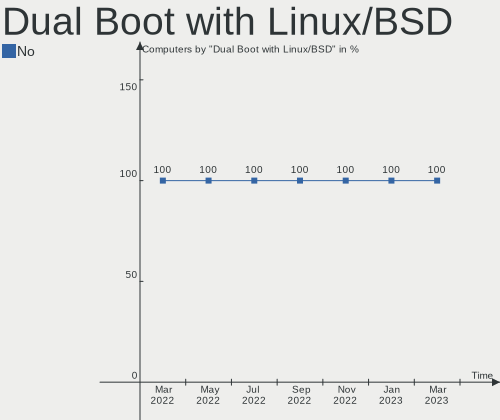
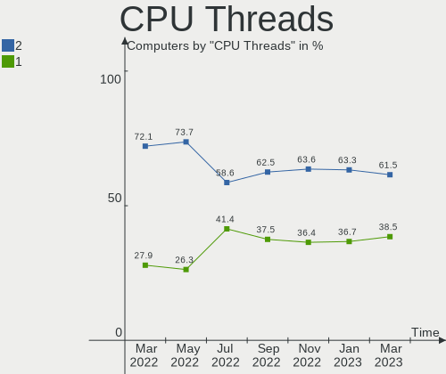
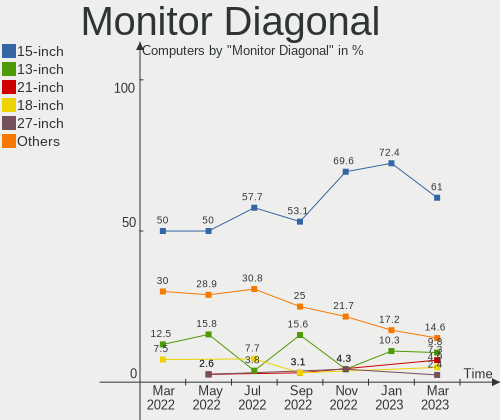
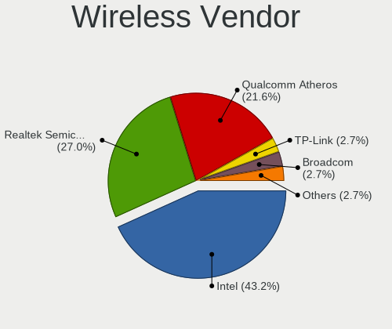
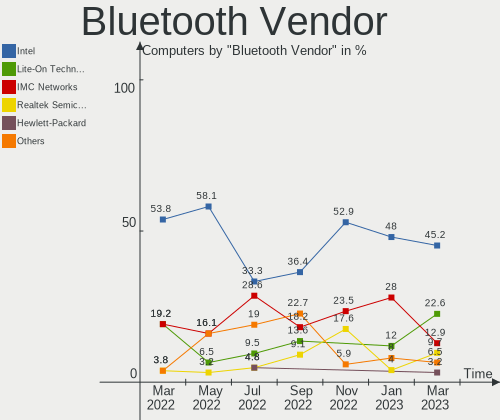

Endless Hardware Trends
-----------------------

A project to identify most popular hardware characteristics and track their change
over time based on data collected by Endless users at https://Linux-Hardware.org.

Anyone can contribute to this report by the [hw-probe](https://github.com/linuxhw/hw-probe) tool:

    sudo -E hw-probe -all -upload

This is a report for all computer types. See also reports for [desktops](/Dist/Endless/Desktop/README.md) and [notebooks](/Dist/Endless/Notebook/README.md).

Full-feature report is available here: https://linux-hardware.org/?view=trends

Period: Jan, 2022.

Contents
--------

* [ System ](#system)
  - [ OS                       ](#os)
  - [ OS Family                ](#os-family)
  - [ Kernel                   ](#kernel)
  - [ Kernel Family            ](#kernel-family)
  - [ Kernel Major Ver.        ](#kernel-major-ver)
  - [ Arch                     ](#arch)
  - [ DE                       ](#de)
  - [ Display Server           ](#display-server)
  - [ Display Manager          ](#display-manager)
  - [ OS Lang                  ](#os-lang)
  - [ Boot Mode                ](#boot-mode)
  - [ Filesystem               ](#filesystem)
  - [ Part. scheme             ](#part-scheme)
  - [ Dual Boot with Linux/BSD ](#dual-boot-with-linuxbsd)
  - [ Dual Boot (Win)          ](#dual-boot-win)

* [ Board ](#board)
  - [ Vendor                   ](#vendor)
  - [ Model                    ](#model)
  - [ Model Family             ](#model-family)
  - [ MFG Year                 ](#mfg-year)
  - [ Form Factor              ](#form-factor)
  - [ Secure Boot              ](#secure-boot)
  - [ Coreboot                 ](#coreboot)
  - [ RAM Size                 ](#ram-size)
  - [ RAM Used                 ](#ram-used)
  - [ Total Drives             ](#total-drives)
  - [ Has CD-ROM               ](#has-cd-rom)
  - [ Has Ethernet             ](#has-ethernet)
  - [ Has WiFi                 ](#has-wifi)
  - [ Has Bluetooth            ](#has-bluetooth)

* [ Location ](#location)
  - [ Country                  ](#country)
  - [ City                     ](#city)

* [ Drives ](#drives)
  - [ Drive Vendor             ](#drive-vendor)
  - [ Drive Model              ](#drive-model)
  - [ HDD Vendor               ](#hdd-vendor)
  - [ SSD Vendor               ](#ssd-vendor)
  - [ Drive Kind               ](#drive-kind)
  - [ Drive Connector          ](#drive-connector)
  - [ Drive Size               ](#drive-size)
  - [ Space Total              ](#space-total)
  - [ Space Used               ](#space-used)
  - [ Malfunc. Drives          ](#malfunc-drives)
  - [ Malfunc. Drive Vendor    ](#malfunc-drive-vendor)
  - [ Malfunc. HDD Vendor      ](#malfunc-hdd-vendor)
  - [ Malfunc. Drive Kind      ](#malfunc-drive-kind)
  - [ Failed Drives            ](#failed-drives)
  - [ Failed Drive Vendor      ](#failed-drive-vendor)
  - [ Drive Status             ](#drive-status)

* [ Storage controller ](#storage-controller)
  - [ Storage Vendor           ](#storage-vendor)
  - [ Storage Model            ](#storage-model)
  - [ Storage Kind             ](#storage-kind)

* [ Processor ](#processor)
  - [ CPU Vendor               ](#cpu-vendor)
  - [ CPU Model                ](#cpu-model)
  - [ CPU Model Family         ](#cpu-model-family)
  - [ CPU Cores                ](#cpu-cores)
  - [ CPU Sockets              ](#cpu-sockets)
  - [ CPU Threads              ](#cpu-threads)
  - [ CPU Op-Modes             ](#cpu-op-modes)
  - [ CPU Microcode            ](#cpu-microcode)
  - [ CPU Microarch            ](#cpu-microarch)

* [ Graphics ](#graphics)
  - [ GPU Vendor               ](#gpu-vendor)
  - [ GPU Model                ](#gpu-model)
  - [ GPU Combo                ](#gpu-combo)
  - [ GPU Driver               ](#gpu-driver)
  - [ GPU Memory               ](#gpu-memory)

* [ Monitor ](#monitor)
  - [ Monitor Vendor           ](#monitor-vendor)
  - [ Monitor Model            ](#monitor-model)
  - [ Monitor Resolution       ](#monitor-resolution)
  - [ Monitor Diagonal         ](#monitor-diagonal)
  - [ Monitor Width            ](#monitor-width)
  - [ Aspect Ratio             ](#aspect-ratio)
  - [ Monitor Area             ](#monitor-area)
  - [ Pixel Density            ](#pixel-density)
  - [ Multiple Monitors        ](#multiple-monitors)

* [ Network ](#network)
  - [ Net Controller Vendor    ](#net-controller-vendor)
  - [ Net Controller Model     ](#net-controller-model)
  - [ Wireless Vendor          ](#wireless-vendor)
  - [ Wireless Model           ](#wireless-model)
  - [ Ethernet Vendor          ](#ethernet-vendor)
  - [ Ethernet Model           ](#ethernet-model)
  - [ Net Controller Kind      ](#net-controller-kind)
  - [ Used Controller          ](#used-controller)
  - [ NICs                     ](#nics)
  - [ IPv6                     ](#ipv6)

* [ Bluetooth ](#bluetooth)
  - [ Bluetooth Vendor         ](#bluetooth-vendor)
  - [ Bluetooth Model          ](#bluetooth-model)

* [ Sound ](#sound)
  - [ Sound Vendor             ](#sound-vendor)
  - [ Sound Model              ](#sound-model)

* [ Memory ](#memory)
  - [ Memory Vendor            ](#memory-vendor)
  - [ Memory Model             ](#memory-model)
  - [ Memory Kind              ](#memory-kind)
  - [ Memory Form Factor       ](#memory-form-factor)
  - [ Memory Size              ](#memory-size)
  - [ Memory Speed             ](#memory-speed)

* [ Printers & scanners ](#printers--scanners)
  - [ Printer Vendor           ](#printer-vendor)
  - [ Printer Model            ](#printer-model)
  - [ Scanner Vendor           ](#scanner-vendor)
  - [ Scanner Model            ](#scanner-model)

* [ Camera ](#camera)
  - [ Camera Vendor            ](#camera-vendor)
  - [ Camera Model             ](#camera-model)

* [ Security ](#security)
  - [ Fingerprint Vendor       ](#fingerprint-vendor)
  - [ Fingerprint Model        ](#fingerprint-model)
  - [ Chipcard Vendor          ](#chipcard-vendor)
  - [ Chipcard Model           ](#chipcard-model)

* [ Unsupported ](#unsupported)
  - [ Unsupported Devices      ](#unsupported-devices)
  - [ Unsupported Device Types ](#unsupported-device-types)

System
------

OS
--

Installed operating systems

| Name                  | Computers | Percent |
|-----------------------|-----------|---------|
| Endless 4.0.2         | 30        | 63.83%  |
| Endless 4.0.1         | 3         | 6.38%   |
| Endless 3.9.5         | 3         | 6.38%   |
| Endless 4.0.0         | 2         | 4.26%   |
| Endless 3.9.6         | 2         | 4.26%   |
| Endless 3.9.3-nexthw1 | 2         | 4.26%   |
| Endless 4.0.3         | 1         | 2.13%   |
| Endless 3.9.0         | 1         | 2.13%   |
| Endless 3.8.0         | 1         | 2.13%   |
| Endless 3.7.8         | 1         | 2.13%   |
| Endless 3.6.3-nexthw1 | 1         | 2.13%   |

OS Family
---------

OS without a version

| Name    | Computers | Percent |
|---------|-----------|---------|
| Endless | 47        | 100%    |

Kernel
------

Version of the Linux kernel

| Version           | Computers | Percent |
|-------------------|-----------|---------|
| 5.11.0-35-generic | 36        | 76.6%   |
| 5.8.0-14-generic  | 6         | 12.77%  |
| 5.11.0-12-generic | 2         | 4.26%   |
| 5.4.0-19-generic  | 1         | 2.13%   |
| 5.3.0-28-generic  | 1         | 2.13%   |
| 5.3.0-12-generic  | 1         | 2.13%   |

Kernel Family
-------------

Linux kernel without a distro release

| Version | Computers | Percent |
|---------|-----------|---------|
| 5.11.0  | 38        | 80.85%  |
| 5.8.0   | 6         | 12.77%  |
| 5.3.0   | 2         | 4.26%   |
| 5.4.0   | 1         | 2.13%   |

Kernel Major Ver.
-----------------

Linux kernel major version

| Version | Computers | Percent |
|---------|-----------|---------|
| 5.11    | 38        | 80.85%  |
| 5.8     | 6         | 12.77%  |
| 5.3     | 2         | 4.26%   |
| 5.4     | 1         | 2.13%   |

Arch
----

OS architecture (x86_64, i586, etc.)

| Name   | Computers | Percent |
|--------|-----------|---------|
| x86_64 | 47        | 100%    |

DE
--

Desktop Environment

| Name  | Computers | Percent |
|-------|-----------|---------|
| GNOME | 47        | 100%    |

Display Server
--------------

X11 or Wayland

| Name | Computers | Percent |
|------|-----------|---------|
| X11  | 47        | 100%    |

Display Manager
---------------

SDDM, LightDM, etc.

| Name    | Computers | Percent |
|---------|-----------|---------|
| Unknown | 47        | 100%    |

OS Lang
-------

Language

| Lang        | Computers | Percent |
|-------------|-----------|---------|
| en_US       | 13        | 27.66%  |
| pt_BR       | 11        | 23.4%   |
| ro_RO       | 4         | 8.51%   |
| es_MX       | 3         | 6.38%   |
| ru_RU.UTF_8 | 2         | 4.26%   |
| ru_RU       | 2         | 4.26%   |
| fr_FR       | 2         | 4.26%   |
| es_ES       | 2         | 4.26%   |
| de_DE       | 2         | 4.26%   |
| pt_PT       | 1         | 2.13%   |
| pl_PL       | 1         | 2.13%   |
| nl_NL       | 1         | 2.13%   |
| hu_HU       | 1         | 2.13%   |
| hr_HR       | 1         | 2.13%   |
| el_GR       | 1         | 2.13%   |

Boot Mode
---------

EFI or BIOS

| Mode | Computers | Percent |
|------|-----------|---------|
| EFI  | 37        | 78.72%  |
| BIOS | 10        | 21.28%  |

Filesystem
----------

Type of filesystem

| Type  | Computers | Percent |
|-------|-----------|---------|
| Ext4  | 46        | 97.87%  |
| Tmpfs | 1         | 2.13%   |

Part. scheme
------------

Scheme of partitioning

| Type    | Computers | Percent |
|---------|-----------|---------|
| Unknown | 47        | 100%    |

Dual Boot with Linux/BSD
------------------------

Hosting more than one Linux/BSD

| Dual boot | Computers | Percent |
|-----------|-----------|---------|
| No        | 47        | 100%    |

Dual Boot (Win)
---------------

Hosting Linux and Windows

| Dual boot | Computers | Percent |
|-----------|-----------|---------|
| No        | 47        | 100%    |

Board
-----

Vendor
------

Motherboard manufacturer

| Name                | Computers | Percent |
|---------------------|-----------|---------|
| ASUSTek Computer    | 22        | 46.81%  |
| Acer                | 15        | 31.91%  |
| Dell                | 3         | 6.38%   |
| Hewlett-Packard     | 2         | 4.26%   |
| Gigabyte Technology | 2         | 4.26%   |
| Intel               | 1         | 2.13%   |
| eMachines           | 1         | 2.13%   |
| ASRock              | 1         | 2.13%   |

Model
-----

Motherboard model

| Name                                       | Computers | Percent |
|--------------------------------------------|-----------|---------|
| ASUS X541UAK                               | 2         | 4.26%   |
| ASUS VivoBook_ASUSLaptop X513EA_K513EA     | 2         | 4.26%   |
| ASUS VivoBook_ASUSLaptop X513EAN_K513EA    | 2         | 4.26%   |
| ASUS VivoBook 15_ASUS Laptop X540UAR       | 2         | 4.26%   |
| ASUS VivoBook 15_ASUS Laptop X540MA_X540MA | 2         | 4.26%   |
| ASUS ASUS EXPERTBOOK B1400CEAEY_B1400CEAE  | 2         | 4.26%   |
| Acer Nitro AN515-44                        | 2         | 4.26%   |
| Acer Aspire A315-34                        | 2         | 4.26%   |
| Intel MAGNUM GX                            | 1         | 2.13%   |
| HP EliteBook 1040 G2                       | 1         | 2.13%   |
| HP Compaq Mini CQ10-400                    | 1         | 2.13%   |
| Gigabyte P41T-D3P                          | 1         | 2.13%   |
| Gigabyte B450M GAMING                      | 1         | 2.13%   |
| eMachines G640                             | 1         | 2.13%   |
| Dell Vostro 2520                           | 1         | 2.13%   |
| Dell OptiPlex 9010                         | 1         | 2.13%   |
| Dell Inspiron 1525                         | 1         | 2.13%   |
| ASUS ZenBook UX431DA_UM431DA               | 1         | 2.13%   |
| ASUS Z550SA                                | 1         | 2.13%   |
| ASUS VivoBook_ASUSLaptop X509JA_P1510CJA   | 1         | 2.13%   |
| ASUS VivoBook_ASUSLaptop X509FA_X509FA     | 1         | 2.13%   |
| ASUS VivoBook_ASUSLaptop X409DA_M409DA     | 1         | 2.13%   |
| ASUS VivoBook 15_ASUS Laptop X540MA_X543MA | 1         | 2.13%   |
| ASUS VivoBook 12_ASUS Laptop E203MA_E203MA | 1         | 2.13%   |
| ASUS P5Q SE2                               | 1         | 2.13%   |
| ASUS N55SF                                 | 1         | 2.13%   |
| ASUS M5A78L-M LX PLUS                      | 1         | 2.13%   |
| ASRock A88M-G                              | 1         | 2.13%   |
| Acer Swift SF113-31                        | 1         | 2.13%   |
| Acer Revo RN86                             | 1         | 2.13%   |
| Acer Nitro AN517-51                        | 1         | 2.13%   |
| Acer Nitro AN515-54                        | 1         | 2.13%   |
| Acer ConceptD CT300-52A                    | 1         | 2.13%   |
| Acer Aspire XC-830                         | 1         | 2.13%   |
| Acer Aspire A517-51                        | 1         | 2.13%   |
| Acer Aspire A515-54                        | 1         | 2.13%   |
| Acer Aspire A315-53                        | 1         | 2.13%   |
| Acer Aspire A315-51                        | 1         | 2.13%   |
| Acer Aspire A315-21                        | 1         | 2.13%   |

Model Family
------------

Motherboard model prefix

| Name              | Computers | Percent |
|-------------------|-----------|---------|
| ASUS VivoBook     | 13        | 27.66%  |
| Acer Aspire       | 8         | 17.02%  |
| Acer Nitro        | 4         | 8.51%   |
| ASUS X541UAK      | 2         | 4.26%   |
| ASUS ASUS         | 2         | 4.26%   |
| Intel MAGNUM      | 1         | 2.13%   |
| HP EliteBook      | 1         | 2.13%   |
| HP Compaq         | 1         | 2.13%   |
| Gigabyte P41T-D3P | 1         | 2.13%   |
| Gigabyte B450M    | 1         | 2.13%   |
| eMachines G640    | 1         | 2.13%   |
| Dell Vostro       | 1         | 2.13%   |
| Dell OptiPlex     | 1         | 2.13%   |
| Dell Inspiron     | 1         | 2.13%   |
| ASUS ZenBook      | 1         | 2.13%   |
| ASUS Z550SA       | 1         | 2.13%   |
| ASUS P5Q          | 1         | 2.13%   |
| ASUS N55SF        | 1         | 2.13%   |
| ASUS M5A78L-M     | 1         | 2.13%   |
| ASRock A88M-G     | 1         | 2.13%   |
| Acer Swift        | 1         | 2.13%   |
| Acer Revo         | 1         | 2.13%   |
| Acer ConceptD     | 1         | 2.13%   |

MFG Year
--------

Motherboard manufacture year

| Year | Computers | Percent |
|------|-----------|---------|
| 2019 | 9         | 19.15%  |
| 2018 | 9         | 19.15%  |
| 2020 | 6         | 12.77%  |
| 2021 | 5         | 10.64%  |
| 2017 | 4         | 8.51%   |
| 2016 | 4         | 8.51%   |
| 2010 | 3         | 6.38%   |
| 2013 | 2         | 4.26%   |
| 2011 | 2         | 4.26%   |
| 2008 | 2         | 4.26%   |
| 2012 | 1         | 2.13%   |

Form Factor
-----------

Physical design of the computer

| Name     | Computers | Percent |
|----------|-----------|---------|
| Notebook | 37        | 78.72%  |
| Desktop  | 10        | 21.28%  |

Secure Boot
-----------

Enabled or disabled

| State    | Computers | Percent |
|----------|-----------|---------|
| Disabled | 38        | 80.85%  |
| Enabled  | 9         | 19.15%  |

Coreboot
--------

Have coreboot on board

| Used | Computers | Percent |
|------|-----------|---------|
| No   | 47        | 100%    |

RAM Size
--------

Total RAM memory

| Size in GB | Computers | Percent |
|------------|-----------|---------|
| 3.01-4.0   | 20        | 42.55%  |
| 4.01-8.0   | 14        | 29.79%  |
| 16.01-24.0 | 6         | 12.77%  |
| 8.01-16.0  | 4         | 8.51%   |
| 1.01-2.0   | 2         | 4.26%   |
| 24.01-32.0 | 1         | 2.13%   |

RAM Used
--------

Used RAM memory

| Used GB  | Computers | Percent |
|----------|-----------|---------|
| 1.01-2.0 | 27        | 57.45%  |
| 2.01-3.0 | 10        | 21.28%  |
| 4.01-8.0 | 4         | 8.51%   |
| 0.51-1.0 | 4         | 8.51%   |
| 3.01-4.0 | 2         | 4.26%   |

Total Drives
------------

Number of drives on board

| Drives | Computers | Percent |
|--------|-----------|---------|
| 1      | 42        | 89.36%  |
| 2      | 3         | 6.38%   |
| 5      | 1         | 2.13%   |
| 3      | 1         | 2.13%   |

Has CD-ROM
----------

Has CD-ROM on board

| Presented | Computers | Percent |
|-----------|-----------|---------|
| No        | 34        | 72.34%  |
| Yes       | 13        | 27.66%  |

Has Ethernet
------------

Has Ethernet on board

| Presented | Computers | Percent |
|-----------|-----------|---------|
| Yes       | 34        | 72.34%  |
| No        | 13        | 27.66%  |

Has WiFi
--------

Has WiFi module

| Presented | Computers | Percent |
|-----------|-----------|---------|
| Yes       | 39        | 82.98%  |
| No        | 8         | 17.02%  |

Has Bluetooth
-------------

Has Bluetooth module

| Presented | Computers | Percent |
|-----------|-----------|---------|
| Yes       | 35        | 74.47%  |
| No        | 12        | 25.53%  |

Location
--------

Country
-------

Geographic location (country)

| Country     | Computers | Percent |
|-------------|-----------|---------|
| Brazil      | 12        | 25.53%  |
| USA         | 3         | 6.38%   |
| Spain       | 3         | 6.38%   |
| Russia      | 3         | 6.38%   |
| Romania     | 3         | 6.38%   |
| Germany     | 3         | 6.38%   |
| Poland      | 2         | 4.26%   |
| Mexico      | 2         | 4.26%   |
| Hungary     | 2         | 4.26%   |
| France      | 2         | 4.26%   |
| Croatia     | 2         | 4.26%   |
| Uzbekistan  | 1         | 2.13%   |
| Ukraine     | 1         | 2.13%   |
| Sweden      | 1         | 2.13%   |
| Portugal    | 1         | 2.13%   |
| Netherlands | 1         | 2.13%   |
| Latvia      | 1         | 2.13%   |
| Iran        | 1         | 2.13%   |
| India       | 1         | 2.13%   |
| Greece      | 1         | 2.13%   |
| Costa Rica  | 1         | 2.13%   |

City
----

Geographic location (city)

| City                       | Computers | Percent |
|----------------------------|-----------|---------|
| Tlaquepaque                | 2         | 4.26%   |
| S??o Paulo                 | 2         | 4.26%   |
| Bucyrus                    | 2         | 4.26%   |
| Zagreb                     | 1         | 2.13%   |
| Xaxim                      | 1         | 2.13%   |
| Warsaw                     | 1         | 2.13%   |
| Ufa                        | 1         | 2.13%   |
| Uda                        | 1         | 2.13%   |
| Tver                       | 1         | 2.13%   |
| Tiruchi                    | 1         | 2.13%   |
| Tehran                     | 1         | 2.13%   |
| T??rgu Mure??              | 1         | 2.13%   |
| Szombathely                | 1         | 2.13%   |
| Sintra                     | 1         | 2.13%   |
| Seville                    | 1         | 2.13%   |
| San Jos?©                  | 1         | 2.13%   |
| Rueil-Malmaison            | 1         | 2.13%   |
| Rijeka                     | 1         | 2.13%   |
| Radolfzell                 | 1         | 2.13%   |
| Purmerend                  | 1         | 2.13%   |
| Presidente Prudente        | 1         | 2.13%   |
| Nyk?¶ping                  | 1         | 2.13%   |
| Nukus                      | 1         | 2.13%   |
| Mutuipe                    | 1         | 2.13%   |
| Moscow                     | 1         | 2.13%   |
| Maua                       | 1         | 2.13%   |
| Mason                      | 1         | 2.13%   |
| Maring??                   | 1         | 2.13%   |
| Malkinia Gorna             | 1         | 2.13%   |
| Liep??ja                   | 1         | 2.13%   |
| Las Palmas de Gran Canaria | 1         | 2.13%   |
| Konigsbach-Stein           | 1         | 2.13%   |
| Jo??o Pessoa               | 1         | 2.13%   |
| Guanambi                   | 1         | 2.13%   |
| Embu                       | 1         | 2.13%   |
| Duna??jv??ros              | 1         | 2.13%   |
| Coburg                     | 1         | 2.13%   |
| Chernihiv                  | 1         | 2.13%   |
| Chaumont-en-Vexin          | 1         | 2.13%   |
| Caiaponia                  | 1         | 2.13%   |
| Bucharest                  | 1         | 2.13%   |
| Barcelona                  | 1         | 2.13%   |
| Athens                     | 1         | 2.13%   |
| Apiai                      | 1         | 2.13%   |

Drives
------

Drive Vendor
------------

Hard drive vendors

| Vendor              | Computers | Drives | Percent |
|---------------------|-----------|--------|---------|
| Sandisk             | 9         | 9      | 17.65%  |
| Seagate             | 7         | 10     | 13.73%  |
| Intel               | 6         | 6      | 11.76%  |
| WDC                 | 5         | 5      | 9.8%    |
| Kingston            | 5         | 5      | 9.8%    |
| Toshiba             | 4         | 4      | 7.84%   |
| Samsung Electronics | 4         | 5      | 7.84%   |
| Unknown             | 3         | 3      | 5.88%   |
| SK Hynix            | 3         | 3      | 5.88%   |
| Micron Technology   | 1         | 1      | 1.96%   |
| Hewlett-Packard     | 1         | 1      | 1.96%   |
| GOODRAM             | 1         | 1      | 1.96%   |
| Crucial             | 1         | 1      | 1.96%   |
| A-DATA Technology   | 1         | 1      | 1.96%   |

Drive Model
-----------

Hard drive models

| Model                                       | Computers | Percent |
|---------------------------------------------|-----------|---------|
| Sandisk NVMe SSD Drive 512GB                | 4         | 7.27%   |
| Intel NVMe SSD Drive 512GB                  | 4         | 7.27%   |
| WDC WD10SPZX-21Z10T0 1TB                    | 3         | 5.45%   |
| Toshiba MQ01ABF050 500GB                    | 3         | 5.45%   |
| Unknown SWR256G-301II 256GB                 | 2         | 3.64%   |
| Sandisk NVMe SSD Drive 256GB                | 2         | 3.64%   |
| Kingston SV300S37A120G 120GB SSD            | 2         | 3.64%   |
| Intel SSDPEKKW256G7 256GB                   | 2         | 3.64%   |
| WDC WD5000LPCX-80VHAT0 500GB                | 1         | 1.82%   |
| WDC WD1200BEVS-75UST0 120GB                 | 1         | 1.82%   |
| Unknown MMC Card  64GB                      | 1         | 1.82%   |
| Toshiba MQ04ABF100 1TB                      | 1         | 1.82%   |
| SK Hynix NVMe SSD Drive 512GB               | 1         | 1.82%   |
| SK Hynix HFS256G39TND-N210A 256GB SSD       | 1         | 1.82%   |
| SK Hynix HFS128G39TND-N210A 128GB SSD       | 1         | 1.82%   |
| Seagate ST9750420AS 752GB                   | 1         | 1.82%   |
| Seagate ST9160314AS 160GB                   | 1         | 1.82%   |
| Seagate ST500LT012-1DG142 500GB             | 1         | 1.82%   |
| Seagate ST3500320AS 500GB                   | 1         | 1.82%   |
| Seagate ST340014AS 40GB                     | 1         | 1.82%   |
| Seagate ST31000524AS 1TB                    | 1         | 1.82%   |
| Seagate ST1000LM035-1RK172 1TB              | 1         | 1.82%   |
| Seagate ST1000DX001-1CM162 1TB              | 1         | 1.82%   |
| Seagate ST1000DM003-1CH162 1TB              | 1         | 1.82%   |
| Seagate BarraCuda Q1 SSD ZA240CV10001 240GB | 1         | 1.82%   |
| SanDisk SDSSDP064G 64GB                     | 1         | 1.82%   |
| SanDisk SD9SN8W256G1014 256GB SSD           | 1         | 1.82%   |
| Sandisk NVMe SSD Drive 1024GB               | 1         | 1.82%   |
| Samsung SSD 870 EVO 1TB                     | 1         | 1.82%   |
| Samsung SSD 860 EVO 500GB                   | 1         | 1.82%   |
| Samsung Portable SSD T5 1TB                 | 1         | 1.82%   |
| Samsung NVMe SSD Drive 256GB                | 1         | 1.82%   |
| Samsung MZNLN256HCHP-000H1 256GB SSD        | 1         | 1.82%   |
| Micron MTFDDAK256MAY-1AH12ABHA 256GB SSD    | 1         | 1.82%   |
| Kingston RBUSC180DS37256GJ 256GB SSD        | 1         | 1.82%   |
| Kingston NVMe SSD Drive 256GB               | 1         | 1.82%   |
| Kingston NVMe SSD Drive 128GB               | 1         | 1.82%   |
| HP SSD S700 1TB                             | 1         | 1.82%   |
| GOODRAM SSD 120GB                           | 1         | 1.82%   |
| Crucial CT120BX500SSD1 120GB                | 1         | 1.82%   |
| A-DATA SU800 1024GB SSD                     | 1         | 1.82%   |

HDD Vendor
----------

Hard disk drive vendors

| Vendor  | Computers | Drives | Percent |
|---------|-----------|--------|---------|
| Seagate | 6         | 9      | 40%     |
| WDC     | 5         | 5      | 33.33%  |
| Toshiba | 4         | 4      | 26.67%  |

SSD Vendor
----------

Solid state drive vendors

| Vendor              | Computers | Drives | Percent |
|---------------------|-----------|--------|---------|
| Samsung Electronics | 3         | 4      | 16.67%  |
| Kingston            | 3         | 3      | 16.67%  |
| Unknown             | 2         | 2      | 11.11%  |
| SK Hynix            | 2         | 2      | 11.11%  |
| SanDisk             | 2         | 2      | 11.11%  |
| Seagate             | 1         | 1      | 5.56%   |
| Micron Technology   | 1         | 1      | 5.56%   |
| Hewlett-Packard     | 1         | 1      | 5.56%   |
| GOODRAM             | 1         | 1      | 5.56%   |
| Crucial             | 1         | 1      | 5.56%   |
| A-DATA Technology   | 1         | 1      | 5.56%   |

Drive Kind
----------

HDD or SSD

| Kind | Computers | Drives | Percent |
|------|-----------|--------|---------|
| NVMe | 17        | 17     | 34.69%  |
| SSD  | 16        | 19     | 32.65%  |
| HDD  | 15        | 18     | 30.61%  |
| MMC  | 1         | 1      | 2.04%   |

Drive Connector
---------------

SATA, SAS, NVMe, etc.

| Type | Computers | Drives | Percent |
|------|-----------|--------|---------|
| SATA | 29        | 36     | 60.42%  |
| NVMe | 17        | 17     | 35.42%  |
| SAS  | 1         | 1      | 2.08%   |
| MMC  | 1         | 1      | 2.08%   |

Drive Size
----------

Size of hard drive

| Size in TB | Computers | Drives | Percent |
|------------|-----------|--------|---------|
| 0.01-0.5   | 22        | 24     | 66.67%  |
| 0.51-1.0   | 10        | 12     | 30.3%   |
| 1.01-2.0   | 1         | 1      | 3.03%   |

Space Total
-----------

Amount of disk space available on the file system

| Size in GB | Computers | Percent |
|------------|-----------|---------|
| 101-250    | 21        | 44.68%  |
| 251-500    | 15        | 31.91%  |
| 501-1000   | 5         | 10.64%  |
| 21-50      | 2         | 4.26%   |
| 51-100     | 2         | 4.26%   |
| 1001-2000  | 1         | 2.13%   |
| 1-20       | 1         | 2.13%   |

Space Used
----------

Amount of used disk space

| Used GB | Computers | Percent |
|---------|-----------|---------|
| 21-50   | 25        | 53.19%  |
| 51-100  | 11        | 23.4%   |
| 101-250 | 4         | 8.51%   |
| 1-20    | 4         | 8.51%   |
| 251-500 | 3         | 6.38%   |

Malfunc. Drives
---------------

Drive models with a malfunction

Zero info for selected period =(

Malfunc. Drive Vendor
---------------------

Vendors of faulty drives

Zero info for selected period =(

Malfunc. HDD Vendor
-------------------

Vendors of faulty HDD drives

Zero info for selected period =(

Malfunc. Drive Kind
-------------------

Kinds of faulty drives

Zero info for selected period =(

Failed Drives
-------------

Failed drive models

Zero info for selected period =(

Failed Drive Vendor
-------------------

Failed drive vendors

Zero info for selected period =(

Drive Status
------------

Number of failed and malfunc. drives

| Status   | Computers | Drives | Percent |
|----------|-----------|--------|---------|
| Detected | 47        | 55     | 100%    |

Storage controller
------------------

Storage Vendor
--------------

Storage controller vendors

| Vendor                      | Computers | Percent |
|-----------------------------|-----------|---------|
| Intel                       | 37        | 62.71%  |
| AMD                         | 9         | 15.25%  |
| Sandisk                     | 7         | 11.86%  |
| Marvell Technology Group    | 2         | 3.39%   |
| Kingston Technology Company | 2         | 3.39%   |
| SK Hynix                    | 1         | 1.69%   |
| Samsung Electronics         | 1         | 1.69%   |

Storage Model
-------------

Storage controller models

| Model                                                                            | Computers | Percent |
|----------------------------------------------------------------------------------|-----------|---------|
| Intel Sunrise Point-LP SATA Controller [AHCI mode]                               | 7         | 9.33%   |
| AMD FCH SATA Controller [AHCI mode]                                              | 7         | 9.33%   |
| Sandisk WD Blue SN550 NVMe SSD                                                   | 6         | 8%      |
| Intel Tiger Lake-LP SATA Controller [AHCI mode]                                  | 6         | 8%      |
| Intel Celeron/Pentium Silver Processor SATA Controller                           | 6         | 8%      |
| Intel Volume Management Device NVMe RAID Controller                              | 5         | 6.67%   |
| Intel 82801 Mobile SATA Controller [RAID mode]                                   | 5         | 6.67%   |
| Intel PROSet/Wireless WiFi Software extension                                    | 4         | 5.33%   |
| Intel SSD 660P Series                                                            | 2         | 2.67%   |
| SK Hynix BC501 NVMe Solid State Drive                                            | 1         | 1.33%   |
| Sandisk WD Blue SN500 / PC SN520 NVMe SSD                                        | 1         | 1.33%   |
| Samsung NVMe SSD Controller 980                                                  | 1         | 1.33%   |
| Marvell Group 88SE6111/6121 SATA II / PATA Controller                            | 1         | 1.33%   |
| Marvell Group 88SE6101/6102 single-port PATA133 interface                        | 1         | 1.33%   |
| Kingston Company U-SNS8154P3 NVMe SSD                                            | 1         | 1.33%   |
| Kingston Company OM3PDP3 NVMe SSD                                                | 1         | 1.33%   |
| Intel Wildcat Point-LP SATA Controller [AHCI Mode]                               | 1         | 1.33%   |
| Intel SATA Controller [RAID mode]                                                | 1         | 1.33%   |
| Intel NM10/ICH7 Family SATA Controller [IDE mode]                                | 1         | 1.33%   |
| Intel NM10/ICH7 Family SATA Controller [AHCI mode]                               | 1         | 1.33%   |
| Intel Celeron N3350/Pentium N4200/Atom E3900 Series SATA AHCI Controller         | 1         | 1.33%   |
| Intel Cannon Lake PCH SATA AHCI Controller                                       | 1         | 1.33%   |
| Intel Atom/Celeron/Pentium Processor x5-E8000/J3xxx/N3xxx Series SATA Controller | 1         | 1.33%   |
| Intel 82801JI (ICH10 Family) SATA AHCI Controller                                | 1         | 1.33%   |
| Intel 82801JI (ICH10 Family) 4 port SATA IDE Controller #1                       | 1         | 1.33%   |
| Intel 82801JI (ICH10 Family) 2 port SATA IDE Controller #2                       | 1         | 1.33%   |
| Intel 82801HM/HEM (ICH8M/ICH8M-E) SATA Controller [IDE mode]                     | 1         | 1.33%   |
| Intel 82801HM/HEM (ICH8M/ICH8M-E) IDE Controller                                 | 1         | 1.33%   |
| Intel 7 Series Chipset Family 6-port SATA Controller [AHCI mode]                 | 1         | 1.33%   |
| Intel 6 Series/C200 Series Chipset Family 6 port Mobile SATA AHCI Controller     | 1         | 1.33%   |
| Intel 500 Series Chipset Family SATA RAID Controller                             | 1         | 1.33%   |
| AMD SB7x0/SB8x0/SB9x0 SATA Controller [IDE mode]                                 | 1         | 1.33%   |
| AMD SB7x0/SB8x0/SB9x0 SATA Controller [AHCI mode]                                | 1         | 1.33%   |
| AMD SB7x0/SB8x0/SB9x0 IDE Controller                                             | 1         | 1.33%   |
| AMD FCH IDE Controller                                                           | 1         | 1.33%   |
| AMD 400 Series Chipset SATA Controller                                           | 1         | 1.33%   |

Storage Kind
------------

Kind of storage controller (IDE, SATA, NVMe, SAS, ...)

| Kind | Computers | Percent |
|------|-----------|---------|
| SATA | 39        | 54.93%  |
| NVMe | 17        | 23.94%  |
| RAID | 10        | 14.08%  |
| IDE  | 5         | 7.04%   |

Processor
---------

CPU Vendor
----------

Processor vendors

| Vendor | Computers | Percent |
|--------|-----------|---------|
| Intel  | 38        | 80.85%  |
| AMD    | 9         | 19.15%  |

CPU Model
---------

Processor models

| Model                                         | Computers | Percent |
|-----------------------------------------------|-----------|---------|
| Intel Core i3-7020U CPU @ 2.30GHz             | 3         | 6.38%   |
| Intel Celeron N4000 CPU @ 1.10GHz             | 3         | 6.38%   |
| Intel 11th Gen Core i3-1115G4 @ 3.00GHz       | 3         | 6.38%   |
| Intel Core i5-9300H CPU @ 2.40GHz             | 2         | 4.26%   |
| Intel Celeron N4020 CPU @ 1.10GHz             | 2         | 4.26%   |
| Intel 11th Gen Core i5-1135G7 @ 2.40GHz       | 2         | 4.26%   |
| AMD Ryzen 7 4800H with Radeon Graphics        | 2         | 4.26%   |
| Intel Pentium CPU N4200 @ 1.10GHz             | 1         | 2.13%   |
| Intel Pentium CPU 4415U @ 2.30GHz             | 1         | 2.13%   |
| Intel Core i7-2630QM CPU @ 2.00GHz            | 1         | 2.13%   |
| Intel Core i7-2600 CPU @ 3.40GHz              | 1         | 2.13%   |
| Intel Core i7 CPU 920 @ 2.67GHz               | 1         | 2.13%   |
| Intel Core i5-9400T CPU @ 1.80GHz             | 1         | 2.13%   |
| Intel Core i5-8250U CPU @ 1.60GHz             | 1         | 2.13%   |
| Intel Core i5-7200U CPU @ 2.50GHz             | 1         | 2.13%   |
| Intel Core i5-5200U CPU @ 2.20GHz             | 1         | 2.13%   |
| Intel Core i5-10210U CPU @ 1.60GHz            | 1         | 2.13%   |
| Intel Core i3-8145U CPU @ 2.10GHz             | 1         | 2.13%   |
| Intel Core i3-6006U CPU @ 2.00GHz             | 1         | 2.13%   |
| Intel Core i3-3110M CPU @ 2.40GHz             | 1         | 2.13%   |
| Intel Core i3-1005G1 CPU @ 1.20GHz            | 1         | 2.13%   |
| Intel Core 2 Quad CPU Q9550 @ 2.83GHz         | 1         | 2.13%   |
| Intel Core 2 Quad CPU Q9500 @ 2.83GHz         | 1         | 2.13%   |
| Intel Core 2 Duo CPU T5550 @ 1.83GHz          | 1         | 2.13%   |
| Intel Celeron N4000C CPU @ 1.10GHz            | 1         | 2.13%   |
| Intel Celeron J4025 CPU @ 2.00GHz             | 1         | 2.13%   |
| Intel Celeron CPU N3160 @ 1.60GHz             | 1         | 2.13%   |
| Intel Atom CPU N450 @ 1.66GHz                 | 1         | 2.13%   |
| Intel 11th Gen Core i7-1165G7 @ 2.80GHz       | 1         | 2.13%   |
| Intel 11th Gen Core i5-11400 @ 2.60GHz        | 1         | 2.13%   |
| AMD Ryzen 7 3700U with Radeon Vega Mobile Gfx | 1         | 2.13%   |
| AMD Ryzen 7 1800X Eight-Core Processor        | 1         | 2.13%   |
| AMD Ryzen 5 3500U with Radeon Vega Mobile Gfx | 1         | 2.13%   |
| AMD FX-4300 Quad-Core Processor               | 1         | 2.13%   |
| AMD Athlon II P320 Dual-Core Processor        | 1         | 2.13%   |
| AMD A9-9420 RADEON R5, 5 COMPUTE CORES 2C+3G  | 1         | 2.13%   |
| AMD A8-6500 APU with Radeon HD Graphics       | 1         | 2.13%   |

CPU Model Family
----------------

Processor model prefix

| Model             | Computers | Percent |
|-------------------|-----------|---------|
| Other             | 8         | 17.02%  |
| Intel Celeron     | 8         | 17.02%  |
| Intel Core i5     | 7         | 14.89%  |
| Intel Core i3     | 7         | 14.89%  |
| AMD Ryzen 7       | 4         | 8.51%   |
| Intel Core i7     | 3         | 6.38%   |
| Intel Pentium     | 2         | 4.26%   |
| Intel Core 2 Quad | 2         | 4.26%   |
| Intel Core 2 Duo  | 1         | 2.13%   |
| Intel Atom        | 1         | 2.13%   |
| AMD Ryzen 5       | 1         | 2.13%   |
| AMD FX            | 1         | 2.13%   |
| AMD Athlon II     | 1         | 2.13%   |
| AMD A8            | 1         | 2.13%   |

CPU Cores
---------

Number of processor cores

| Number | Computers | Percent |
|--------|-----------|---------|
| 2      | 25        | 53.19%  |
| 4      | 16        | 34.04%  |
| 8      | 3         | 6.38%   |
| 6      | 2         | 4.26%   |
| 1      | 1         | 2.13%   |

CPU Sockets
-----------

Number of sockets

| Number | Computers | Percent |
|--------|-----------|---------|
| 1      | 47        | 100%    |

CPU Threads
-----------

Threads per core (Hyper-Threading)

| Number | Computers | Percent |
|--------|-----------|---------|
| 2      | 32        | 68.09%  |
| 1      | 15        | 31.91%  |

CPU Op-Modes
------------

CPU Operation Modes (32-bit, 64-bit)

| Op mode        | Computers | Percent |
|----------------|-----------|---------|
| 32-bit, 64-bit | 47        | 100%    |

CPU Microcode
-------------

Microcode number

| Number     | Computers | Percent |
|------------|-----------|---------|
| 0x806c1    | 6         | 12.77%  |
| 0x806e9    | 5         | 10.64%  |
| 0x706a1    | 4         | 8.51%   |
| 0x706a8    | 3         | 6.38%   |
| 0x906ed    | 2         | 4.26%   |
| 0x806ec    | 2         | 4.26%   |
| 0x206a7    | 2         | 4.26%   |
| 0x1067a    | 2         | 4.26%   |
| 0x08600103 | 2         | 4.26%   |
| 0xa0671    | 1         | 2.13%   |
| 0x906ea    | 1         | 2.13%   |
| 0x806ea    | 1         | 2.13%   |
| 0x706e5    | 1         | 2.13%   |
| 0x6fd      | 1         | 2.13%   |
| 0x506c9    | 1         | 2.13%   |
| 0x406e3    | 1         | 2.13%   |
| 0x406c4    | 1         | 2.13%   |
| 0x306d4    | 1         | 2.13%   |
| 0x306a9    | 1         | 2.13%   |
| 0x106ca    | 1         | 2.13%   |
| 0x106a4    | 1         | 2.13%   |
| 0x08108109 | 1         | 2.13%   |
| 0x08108102 | 1         | 2.13%   |
| 0x08001138 | 1         | 2.13%   |
| 0x06006705 | 1         | 2.13%   |
| 0x06001119 | 1         | 2.13%   |
| 0x06000852 | 1         | 2.13%   |
| 0x010000c8 | 1         | 2.13%   |

CPU Microarch
-------------

Microarchitecture

| Name          | Computers | Percent |
|---------------|-----------|---------|
| KabyLake      | 11        | 23.4%   |
| Goldmont plus | 7         | 14.89%  |
| TigerLake     | 6         | 12.77%  |
| Zen+          | 2         | 4.26%   |
| Zen 2         | 2         | 4.26%   |
| SandyBridge   | 2         | 4.26%   |
| Piledriver    | 2         | 4.26%   |
| Penryn        | 2         | 4.26%   |
| IceLake       | 2         | 4.26%   |
| Zen           | 1         | 2.13%   |
| Skylake       | 1         | 2.13%   |
| Silvermont    | 1         | 2.13%   |
| Nehalem       | 1         | 2.13%   |
| K10           | 1         | 2.13%   |
| IvyBridge     | 1         | 2.13%   |
| Goldmont      | 1         | 2.13%   |
| Excavator     | 1         | 2.13%   |
| Core          | 1         | 2.13%   |
| Broadwell     | 1         | 2.13%   |
| Bonnell       | 1         | 2.13%   |

Graphics
--------

GPU Vendor
----------

Vendors of graphics cards

| Vendor | Computers | Percent |
|--------|-----------|---------|
| Intel  | 33        | 64.71%  |
| Nvidia | 9         | 17.65%  |
| AMD    | 9         | 17.65%  |

GPU Model
---------

Graphics card models

| Model                                                                                    | Computers | Percent |
|------------------------------------------------------------------------------------------|-----------|---------|
| Intel GeminiLake [UHD Graphics 600]                                                      | 7         | 13.46%  |
| Intel TigerLake-LP GT2 [Iris Xe Graphics]                                                | 3         | 5.77%   |
| Intel Tiger Lake UHD Graphics                                                            | 3         | 5.77%   |
| Intel HD Graphics 620                                                                    | 3         | 5.77%   |
| Nvidia TU117M                                                                            | 2         | 3.85%   |
| Intel CoffeeLake-H GT2 [UHD Graphics 630]                                                | 2         | 3.85%   |
| AMD Renoir                                                                               | 2         | 3.85%   |
| AMD Picasso/Raven 2 [Radeon Vega Series / Radeon Vega Mobile Series]                     | 2         | 3.85%   |
| AMD Hawaii PRO [Radeon R9 290/390]                                                       | 2         | 3.85%   |
| Nvidia TU117M [GeForce GTX 1650 Mobile / Max-Q]                                          | 1         | 1.92%   |
| Nvidia TU117 [GeForce GTX 1650]                                                          | 1         | 1.92%   |
| Nvidia GP108 [GeForce GT 1030]                                                           | 1         | 1.92%   |
| Nvidia GF116M [GeForce GT 555M/635M]                                                     | 1         | 1.92%   |
| Nvidia GA104 [GeForce RTX 3060 Ti]                                                       | 1         | 1.92%   |
| Nvidia G92 [GeForce 9800 GT]                                                             | 1         | 1.92%   |
| Nvidia G84GL [Quadro FX 570]                                                             | 1         | 1.92%   |
| Intel WhiskeyLake-U GT2 [UHD Graphics 620]                                               | 1         | 1.92%   |
| Intel UHD Graphics 620                                                                   | 1         | 1.92%   |
| Intel Skylake GT2 [HD Graphics 520]                                                      | 1         | 1.92%   |
| Intel Mobile GM965/GL960 Integrated Graphics Controller (secondary)                      | 1         | 1.92%   |
| Intel Mobile GM965/GL960 Integrated Graphics Controller (primary)                        | 1         | 1.92%   |
| Intel Kaby Lake-U GT2f HD 620 Graphics Controller                                        | 1         | 1.92%   |
| Intel Kaby Lake-U GT1 Integrated Graphics Controller                                     | 1         | 1.92%   |
| Intel Iris Plus Graphics G1 (Ice Lake)                                                   | 1         | 1.92%   |
| Intel HD Graphics 5500                                                                   | 1         | 1.92%   |
| Intel CometLake-U GT2 [UHD Graphics]                                                     | 1         | 1.92%   |
| Intel CoffeeLake-S GT2 [UHD Graphics 630]                                                | 1         | 1.92%   |
| Intel Celeron N3350/Pentium N4200/Atom E3900 Series Integrated Graphics Controller       | 1         | 1.92%   |
| Intel Atom/Celeron/Pentium Processor x5-E8000/J3xxx/N3xxx Integrated Graphics Controller | 1         | 1.92%   |
| Intel Atom Processor D4xx/D5xx/N4xx/N5xx Integrated Graphics Controller                  | 1         | 1.92%   |
| Intel 3rd Gen Core processor Graphics Controller                                         | 1         | 1.92%   |
| Intel 2nd Generation Core Processor Family Integrated Graphics Controller                | 1         | 1.92%   |
| AMD Stoney [Radeon R2/R3/R4/R5 Graphics]                                                 | 1         | 1.92%   |
| AMD Redwood XT [Radeon HD 5670/5690/5730]                                                | 1         | 1.92%   |
| AMD Park [Mobility Radeon HD 5430/5450/5470]                                             | 1         | 1.92%   |

GPU Combo
---------

Combinations of graphics cards

| Name           | Computers | Percent |
|----------------|-----------|---------|
| 1 x Intel      | 31        | 65.96%  |
| 1 x AMD        | 7         | 14.89%  |
| 1 x Nvidia     | 5         | 10.64%  |
| Intel + Nvidia | 2         | 4.26%   |
| AMD + Nvidia   | 2         | 4.26%   |

GPU Driver
----------

Free vs proprietary

| Driver      | Computers | Percent |
|-------------|-----------|---------|
| Free        | 41        | 87.23%  |
| Proprietary | 6         | 12.77%  |

GPU Memory
----------

Total video memory

| Size in GB | Computers | Percent |
|------------|-----------|---------|
| Unknown    | 36        | 76.6%   |
| 0.01-0.5   | 5         | 10.64%  |
| 1.01-2.0   | 3         | 6.38%   |
| 7.01-8.0   | 2         | 4.26%   |
| 3.01-4.0   | 1         | 2.13%   |

Monitor
-------

Monitor Vendor
--------------

Monitor vendors

| Vendor              | Computers | Percent |
|---------------------|-----------|---------|
| AU Optronics        | 13        | 27.08%  |
| Chimei Innolux      | 10        | 20.83%  |
| Samsung Electronics | 5         | 10.42%  |
| PANDA               | 4         | 8.33%   |
| BOE                 | 4         | 8.33%   |
| Goldstar            | 3         | 6.25%   |
| Sony                | 1         | 2.08%   |
| LG Display          | 1         | 2.08%   |
| KDC                 | 1         | 2.08%   |
| Hewlett-Packard     | 1         | 2.08%   |
| HannStar            | 1         | 2.08%   |
| Dell                | 1         | 2.08%   |
| ASUSTek Computer    | 1         | 2.08%   |
| AOC                 | 1         | 2.08%   |
| Acer                | 1         | 2.08%   |

Monitor Model
-------------

Monitor models

| Model                                                                | Computers | Percent |
|----------------------------------------------------------------------|-----------|---------|
| AU Optronics LCD Monitor AUO38ED 1920x1080 344x193mm 15.5-inch       | 5         | 10.42%  |
| Chimei Innolux LCD Monitor CMN15F5 1920x1080 344x193mm 15.5-inch     | 2         | 4.17%   |
| Chimei Innolux LCD Monitor CMN15CA 1366x768 344x193mm 15.5-inch      | 2         | 4.17%   |
| Sony TV SNYD301 1360x768                                             | 1         | 2.08%   |
| Samsung Electronics U28D590 SAM0B81 3840x2160 608x345mm 27.5-inch    | 1         | 2.08%   |
| Samsung Electronics U28D590 SAM0B80 3840x2160 607x345mm 27.5-inch    | 1         | 2.08%   |
| Samsung Electronics LCD Monitor SEC3358 1280x800 331x207mm 15.4-inch | 1         | 2.08%   |
| Samsung Electronics LCD Monitor SEC314B 1600x900 344x194mm 15.5-inch | 1         | 2.08%   |
| Samsung Electronics C49HG9x SAM0E5D 3840x1080 1196x336mm 48.9-inch   | 1         | 2.08%   |
| PANDA LM133LF5L01 NCP0020 1920x1080 294x165mm 13.3-inch              | 1         | 2.08%   |
| PANDA LCD Monitor NCP004D 1920x1080 344x194mm 15.5-inch              | 1         | 2.08%   |
| PANDA LCD Monitor NCP0046 1920x1080 344x194mm 15.5-inch              | 1         | 2.08%   |
| PANDA LCD Monitor NCP0035 1920x1080 309x174mm 14.0-inch              | 1         | 2.08%   |
| LG Display LCD Monitor LGD065A 1920x1080 344x194mm 15.5-inch         | 1         | 2.08%   |
| KDC LCD Monitor KDC0830 1920x1080 344x193mm 15.5-inch                | 1         | 2.08%   |
| Hewlett-Packard 27f HPN354B 1920x1080 598x336mm 27.0-inch            | 1         | 2.08%   |
| HannStar HSD101PFW2A HSD03E9 1024x600 222x125mm 10.0-inch            | 1         | 2.08%   |
| Goldstar W2253 GSM56DC 1920x1080 510x290mm 23.1-inch                 | 1         | 2.08%   |
| Goldstar W2243 GSM56FE 1920x1080 477x268mm 21.5-inch                 | 1         | 2.08%   |
| Goldstar 22MP55 GSM5A24 1920x1080 477x268mm 21.5-inch                | 1         | 2.08%   |
| Dell E2011H DEL406C 1600x900 443x249mm 20.0-inch                     | 1         | 2.08%   |
| Chimei Innolux LCD Monitor CMN15E7 1920x1080 344x193mm 15.5-inch     | 1         | 2.08%   |
| Chimei Innolux LCD Monitor CMN15E6 1366x768 344x193mm 15.5-inch      | 1         | 2.08%   |
| Chimei Innolux LCD Monitor CMN15DB 1366x768 344x193mm 15.5-inch      | 1         | 2.08%   |
| Chimei Innolux LCD Monitor CMN14E5 1920x1080 309x173mm 13.9-inch     | 1         | 2.08%   |
| Chimei Innolux LCD Monitor CMN14D6 1366x768 309x173mm 13.9-inch      | 1         | 2.08%   |
| Chimei Innolux LCD Monitor CMN1130 1366x768 256x144mm 11.6-inch      | 1         | 2.08%   |
| BOE LCD Monitor BOE0839 1920x1080 382x215mm 17.3-inch                | 1         | 2.08%   |
| BOE LCD Monitor BOE06BA 1920x1080 344x193mm 15.5-inch                | 1         | 2.08%   |
| BOE LCD Monitor BOE06A4 1366x768 344x194mm 15.5-inch                 | 1         | 2.08%   |
| BOE LCD Monitor BOE0672 1366x768 344x194mm 15.5-inch                 | 1         | 2.08%   |
| AU Optronics LCD Monitor AUOAF90 1920x1080 344x193mm 15.5-inch       | 1         | 2.08%   |
| AU Optronics LCD Monitor AUO81EC 1366x768 344x193mm 15.5-inch        | 1         | 2.08%   |
| AU Optronics LCD Monitor AUO723C 1366x768 309x173mm 13.9-inch        | 1         | 2.08%   |
| AU Optronics LCD Monitor AUO61ED 1920x1080 344x194mm 15.5-inch       | 1         | 2.08%   |
| AU Optronics LCD Monitor AUO21ED 1920x1080 344x193mm 15.5-inch       | 1         | 2.08%   |
| AU Optronics LCD Monitor AUO21EC 1366x768 344x193mm 15.5-inch        | 1         | 2.08%   |
| AU Optronics LCD Monitor AUO139D 1920x1080 381x214mm 17.2-inch       | 1         | 2.08%   |
| AU Optronics LCD Monitor AUO133D 1920x1080 309x173mm 13.9-inch       | 1         | 2.08%   |
| ASUSTek Computer VG27AQ1A AUS2707 2560x1440 597x336mm 27.0-inch      | 1         | 2.08%   |
| AOC 2343 AOC2343 1920x1080 509x286mm 23.0-inch                       | 1         | 2.08%   |
| Acer SA240Y ACR057F 1920x1080 527x296mm 23.8-inch                    | 1         | 2.08%   |

Monitor Resolution
------------------

Monitor screen resolution

| Resolution      | Computers | Percent |
|-----------------|-----------|---------|
| 1920x1080 (FHD) | 28        | 58.33%  |
| 1366x768 (WXGA) | 11        | 22.92%  |
| 3840x2160 (4K)  | 2         | 4.17%   |
| 3840x1080       | 1         | 2.08%   |
| 2560x1440 (QHD) | 1         | 2.08%   |
| 1680x945        | 1         | 2.08%   |
| 1600x900 (HD+)  | 1         | 2.08%   |
| 1360x768        | 1         | 2.08%   |
| 1280x800 (WXGA) | 1         | 2.08%   |
| 1024x600        | 1         | 2.08%   |

Monitor Diagonal
----------------

Diagonal size in inches

| Inches | Computers | Percent |
|--------|-----------|---------|
| 15     | 26        | 54.17%  |
| 27     | 4         | 8.33%   |
| 13     | 4         | 8.33%   |
| 23     | 2         | 4.17%   |
| 21     | 2         | 4.17%   |
| 17     | 2         | 4.17%   |
| 72     | 1         | 2.08%   |
| 49     | 1         | 2.08%   |
| 24     | 1         | 2.08%   |
| 20     | 1         | 2.08%   |
| 18     | 1         | 2.08%   |
| 14     | 1         | 2.08%   |
| 11     | 1         | 2.08%   |
| 10     | 1         | 2.08%   |

Monitor Width
-------------

Physical width

| Width in mm | Computers | Percent |
|-------------|-----------|---------|
| 301-350     | 30        | 62.5%   |
| 501-600     | 5         | 10.42%  |
| 401-500     | 4         | 8.33%   |
| 201-300     | 3         | 6.25%   |
| 601-700     | 2         | 4.17%   |
| 351-400     | 2         | 4.17%   |
| 1501-2000   | 1         | 2.08%   |
| 1001-1500   | 1         | 2.08%   |

Aspect Ratio
------------

Proportional relationship between the width and the height

| Ratio | Computers | Percent |
|-------|-----------|---------|
| 16/9  | 44        | 95.65%  |
| 32/9  | 1         | 2.17%   |
| 16/10 | 1         | 2.17%   |

Monitor Area
------------

Area in inch²

| Area in inch² | Computers | Percent |
|----------------|-----------|---------|
| 101-110        | 26        | 54.17%  |
| 201-250        | 5         | 10.42%  |
| 81-90          | 4         | 8.33%   |
| 301-350        | 4         | 8.33%   |
| 121-130        | 2         | 4.17%   |
| More than 1000 | 1         | 2.08%   |
| 71-80          | 1         | 2.08%   |
| 51-60          | 1         | 2.08%   |
| 41-50          | 1         | 2.08%   |
| 151-200        | 1         | 2.08%   |
| 141-150        | 1         | 2.08%   |
| 501-1000       | 1         | 2.08%   |

Pixel Density
-------------

Pixels per inch

| Density | Computers | Percent |
|---------|-----------|---------|
| 121-160 | 24        | 50%     |
| 101-120 | 15        | 31.25%  |
| 51-100  | 7         | 14.58%  |
| 1-50    | 1         | 2.08%   |
| 161-240 | 1         | 2.08%   |

Multiple Monitors
-----------------

Total monitors connected

| Total | Computers | Percent |
|-------|-----------|---------|
| 1     | 45        | 95.74%  |
| 2     | 1         | 2.13%   |
| 0     | 1         | 2.13%   |

Network
-------

Net Controller Vendor
---------------------

Controller vendors

| Vendor                   | Computers | Percent |
|--------------------------|-----------|---------|
| Realtek Semiconductor    | 33        | 47.83%  |
| Intel                    | 18        | 26.09%  |
| Qualcomm Atheros         | 8         | 11.59%  |
| Broadcom                 | 3         | 4.35%   |
| Ralink Technology        | 2         | 2.9%    |
| MEDIATEK                 | 2         | 2.9%    |
| TP-Link                  | 1         | 1.45%   |
| Ralink                   | 1         | 1.45%   |
| Marvell Technology Group | 1         | 1.45%   |

Net Controller Model
--------------------

Controller models

| Model                                                             | Computers | Percent |
|-------------------------------------------------------------------|-----------|---------|
| Realtek RTL8111/8168/8411 PCI Express Gigabit Ethernet Controller | 16        | 21.05%  |
| Qualcomm Atheros QCA9377 802.11ac Wireless Network Adapter        | 6         | 7.89%   |
| Realtek RTL8821CE 802.11ac PCIe Wireless Network Adapter          | 5         | 6.58%   |
| Realtek RTL810xE PCI Express Fast Ethernet controller             | 4         | 5.26%   |
| Realtek Killer E2600 Gigabit Ethernet Controller                  | 4         | 5.26%   |
| Intel Wi-Fi 6 AX201                                               | 4         | 5.26%   |
| Realtek RTL8723BE PCIe Wireless Network Adapter                   | 3         | 3.95%   |
| Intel Wi-Fi 6 AX200                                               | 3         | 3.95%   |
| MEDIATEK MT7921 802.11ax PCI Express Wireless Network Adapter     | 2         | 2.63%   |
| Intel Wireless 7265                                               | 2         | 2.63%   |
| Intel Gemini Lake PCH CNVi WiFi                                   | 2         | 2.63%   |
| Intel Ethernet Connection (13) I219-V                             | 2         | 2.63%   |
| TP-Link TL-WN722N v2/v3 [Realtek RTL8188EUS]                      | 1         | 1.32%   |
| Realtek RTL88x2bu [AC1200 Techkey]                                | 1         | 1.32%   |
| Realtek RTL8822BE 802.11a/b/g/n/ac WiFi adapter                   | 1         | 1.32%   |
| Realtek RTL8153 Gigabit Ethernet Adapter                          | 1         | 1.32%   |
| Realtek RTL8152 Fast Ethernet Adapter                             | 1         | 1.32%   |
| Ralink RT5370 Wireless Adapter                                    | 1         | 1.32%   |
| Ralink MT7601U Wireless Adapter                                   | 1         | 1.32%   |
| Ralink RT3090 Wireless 802.11n 1T/1R PCIe                         | 1         | 1.32%   |
| Qualcomm Atheros AR928X Wireless Network Adapter (PCI-Express)    | 1         | 1.32%   |
| Qualcomm Atheros AR9285 Wireless Network Adapter (PCI-Express)    | 1         | 1.32%   |
| Qualcomm Atheros AR8151 v2.0 Gigabit Ethernet                     | 1         | 1.32%   |
| Marvell Group 88E8040 PCI-E Fast Ethernet Controller              | 1         | 1.32%   |
| Intel Wireless 8265 / 8275                                        | 1         | 1.32%   |
| Intel Tiger Lake PCH CNVi WiFi                                    | 1         | 1.32%   |
| Intel Ice Lake-LP PCH CNVi WiFi                                   | 1         | 1.32%   |
| Intel Ethernet Connection (3) I218-LM                             | 1         | 1.32%   |
| Intel Dual Band Wireless-AC 3168NGW [Stone Peak]                  | 1         | 1.32%   |
| Intel Cannon Lake PCH CNVi WiFi                                   | 1         | 1.32%   |
| Intel 82579LM Gigabit Network Connection (Lewisville)             | 1         | 1.32%   |
| Intel 82567LM-2 Gigabit Network Connection                        | 1         | 1.32%   |
| Broadcom NetLink BCM57780 Gigabit Ethernet PCIe                   | 1         | 1.32%   |
| Broadcom BCM43142 802.11b/g/n                                     | 1         | 1.32%   |
| Broadcom BCM4312 802.11b/g LP-PHY                                 | 1         | 1.32%   |

Wireless Vendor
---------------

Wireless vendors

| Vendor                | Computers | Percent |
|-----------------------|-----------|---------|
| Intel                 | 16        | 38.1%   |
| Realtek Semiconductor | 10        | 23.81%  |
| Qualcomm Atheros      | 8         | 19.05%  |
| Ralink Technology     | 2         | 4.76%   |
| MEDIATEK              | 2         | 4.76%   |
| Broadcom              | 2         | 4.76%   |
| TP-Link               | 1         | 2.38%   |
| Ralink                | 1         | 2.38%   |

Wireless Model
--------------

Wireless models

| Model                                                          | Computers | Percent |
|----------------------------------------------------------------|-----------|---------|
| Qualcomm Atheros QCA9377 802.11ac Wireless Network Adapter     | 6         | 14.29%  |
| Realtek RTL8821CE 802.11ac PCIe Wireless Network Adapter       | 5         | 11.9%   |
| Intel Wi-Fi 6 AX201                                            | 4         | 9.52%   |
| Realtek RTL8723BE PCIe Wireless Network Adapter                | 3         | 7.14%   |
| Intel Wi-Fi 6 AX200                                            | 3         | 7.14%   |
| MEDIATEK MT7921 802.11ax PCI Express Wireless Network Adapter  | 2         | 4.76%   |
| Intel Wireless 7265                                            | 2         | 4.76%   |
| Intel Gemini Lake PCH CNVi WiFi                                | 2         | 4.76%   |
| TP-Link TL-WN722N v2/v3 [Realtek RTL8188EUS]                   | 1         | 2.38%   |
| Realtek RTL88x2bu [AC1200 Techkey]                             | 1         | 2.38%   |
| Realtek RTL8822BE 802.11a/b/g/n/ac WiFi adapter                | 1         | 2.38%   |
| Ralink RT5370 Wireless Adapter                                 | 1         | 2.38%   |
| Ralink MT7601U Wireless Adapter                                | 1         | 2.38%   |
| Ralink RT3090 Wireless 802.11n 1T/1R PCIe                      | 1         | 2.38%   |
| Qualcomm Atheros AR928X Wireless Network Adapter (PCI-Express) | 1         | 2.38%   |
| Qualcomm Atheros AR9285 Wireless Network Adapter (PCI-Express) | 1         | 2.38%   |
| Intel Wireless 8265 / 8275                                     | 1         | 2.38%   |
| Intel Tiger Lake PCH CNVi WiFi                                 | 1         | 2.38%   |
| Intel Ice Lake-LP PCH CNVi WiFi                                | 1         | 2.38%   |
| Intel Dual Band Wireless-AC 3168NGW [Stone Peak]               | 1         | 2.38%   |
| Intel Cannon Lake PCH CNVi WiFi                                | 1         | 2.38%   |
| Broadcom BCM43142 802.11b/g/n                                  | 1         | 2.38%   |
| Broadcom BCM4312 802.11b/g LP-PHY                              | 1         | 2.38%   |

Ethernet Vendor
---------------

Ethernet vendors

| Vendor                   | Computers | Percent |
|--------------------------|-----------|---------|
| Realtek Semiconductor    | 26        | 76.47%  |
| Intel                    | 5         | 14.71%  |
| Qualcomm Atheros         | 1         | 2.94%   |
| Marvell Technology Group | 1         | 2.94%   |
| Broadcom                 | 1         | 2.94%   |

Ethernet Model
--------------

Ethernet models

| Model                                                             | Computers | Percent |
|-------------------------------------------------------------------|-----------|---------|
| Realtek RTL8111/8168/8411 PCI Express Gigabit Ethernet Controller | 16        | 47.06%  |
| Realtek RTL810xE PCI Express Fast Ethernet controller             | 4         | 11.76%  |
| Realtek Killer E2600 Gigabit Ethernet Controller                  | 4         | 11.76%  |
| Intel Ethernet Connection (13) I219-V                             | 2         | 5.88%   |
| Realtek RTL8153 Gigabit Ethernet Adapter                          | 1         | 2.94%   |
| Realtek RTL8152 Fast Ethernet Adapter                             | 1         | 2.94%   |
| Qualcomm Atheros AR8151 v2.0 Gigabit Ethernet                     | 1         | 2.94%   |
| Marvell Group 88E8040 PCI-E Fast Ethernet Controller              | 1         | 2.94%   |
| Intel Ethernet Connection (3) I218-LM                             | 1         | 2.94%   |
| Intel 82579LM Gigabit Network Connection (Lewisville)             | 1         | 2.94%   |
| Intel 82567LM-2 Gigabit Network Connection                        | 1         | 2.94%   |
| Broadcom NetLink BCM57780 Gigabit Ethernet PCIe                   | 1         | 2.94%   |

Net Controller Kind
-------------------

Ethernet, WiFi or modem

| Kind     | Computers | Percent |
|----------|-----------|---------|
| WiFi     | 39        | 54.17%  |
| Ethernet | 33        | 45.83%  |

Used Controller
---------------

Currently used network controller

| Kind     | Computers | Percent |
|----------|-----------|---------|
| WiFi     | 37        | 52.86%  |
| Ethernet | 33        | 47.14%  |

NICs
----

Total network controllers on board

| Total | Computers | Percent |
|-------|-----------|---------|
| 1     | 24        | 51.06%  |
| 2     | 23        | 48.94%  |

IPv6
----

IPv6 vs IPv4

| Used | Computers | Percent |
|------|-----------|---------|
| No   | 35        | 74.47%  |
| Yes  | 12        | 25.53%  |

Bluetooth
---------

Bluetooth Vendor
----------------

Controller vendors

| Vendor                          | Computers | Percent |
|---------------------------------|-----------|---------|
| Intel                           | 16        | 45.71%  |
| IMC Networks                    | 8         | 22.86%  |
| Lite-On Technology              | 5         | 14.29%  |
| Realtek Semiconductor           | 3         | 8.57%   |
| Qualcomm Atheros Communications | 1         | 2.86%   |
| Cambridge Silicon Radio         | 1         | 2.86%   |
| Broadcom                        | 1         | 2.86%   |

Bluetooth Model
---------------

Controller models

| Model                                               | Computers | Percent |
|-----------------------------------------------------|-----------|---------|
| Intel Bluetooth Device                              | 10        | 28.57%  |
| IMC Networks Bluetooth Radio                        | 6         | 17.14%  |
| Lite-On Qualcomm Atheros QCA9377 Bluetooth          | 5         | 14.29%  |
| Intel Bluetooth 9460/9560 Jefferson Peak (JfP)      | 4         | 11.43%  |
| Realtek Bluetooth Radio                             | 3         | 8.57%   |
| IMC Networks Wireless_Device                        | 2         | 5.71%   |
| Qualcomm Atheros AR3011 Bluetooth                   | 1         | 2.86%   |
| Intel Wireless-AC 3168 Bluetooth                    | 1         | 2.86%   |
| Intel Bluetooth wireless interface                  | 1         | 2.86%   |
| Cambridge Silicon Radio Bluetooth Dongle (HCI mode) | 1         | 2.86%   |
| Broadcom BCM43142 Bluetooth 4.0                     | 1         | 2.86%   |

Sound
-----

Sound Vendor
------------

Sound card vendors

| Vendor   | Computers | Percent |
|----------|-----------|---------|
| Intel    | 38        | 67.86%  |
| AMD      | 10        | 17.86%  |
| Nvidia   | 7         | 12.5%   |
| Logitech | 1         | 1.79%   |

Sound Model
-----------

Sound card models

| Model                                                                                             | Computers | Percent |
|---------------------------------------------------------------------------------------------------|-----------|---------|
| Intel Sunrise Point-LP HD Audio                                                                   | 7         | 11.11%  |
| Intel Celeron/Pentium Silver Processor High Definition Audio                                      | 7         | 11.11%  |
| Intel Tiger Lake-LP Smart Sound Technology Audio Controller                                       | 6         | 9.52%   |
| Nvidia TU107 GeForce GTX 1650 High Definition Audio Controller                                    | 4         | 6.35%   |
| AMD Family 17h (Models 10h-1fh) HD Audio Controller                                               | 4         | 6.35%   |
| Intel Cannon Lake PCH cAVS                                                                        | 3         | 4.76%   |
| Intel NM10/ICH7 Family High Definition Audio Controller                                           | 2         | 3.17%   |
| Intel 82801JI (ICH10 Family) HD Audio Controller                                                  | 2         | 3.17%   |
| Intel 7 Series/C216 Chipset Family High Definition Audio Controller                               | 2         | 3.17%   |
| AMD SBx00 Azalia (Intel HDA)                                                                      | 2         | 3.17%   |
| AMD Raven/Raven2/Fenghuang HDMI/DP Audio Controller                                               | 2         | 3.17%   |
| AMD Hawaii HDMI Audio [Radeon R9 290/290X / 390/390X]                                             | 2         | 3.17%   |
| Nvidia GP108 High Definition Audio Controller                                                     | 1         | 1.59%   |
| Nvidia GF116 High Definition Audio Controller                                                     | 1         | 1.59%   |
| Nvidia GA104 High Definition Audio Controller                                                     | 1         | 1.59%   |
| Logitech H390 headset with microphone                                                             | 1         | 1.59%   |
| Intel Wildcat Point-LP High Definition Audio Controller                                           | 1         | 1.59%   |
| Intel Tiger Lake-H HD Audio Controller                                                            | 1         | 1.59%   |
| Intel Ice Lake-LP Smart Sound Technology Audio Controller                                         | 1         | 1.59%   |
| Intel Comet Lake PCH-LP cAVS                                                                      | 1         | 1.59%   |
| Intel Celeron N3350/Pentium N4200/Atom E3900 Series Audio Cluster                                 | 1         | 1.59%   |
| Intel Cannon Point-LP High Definition Audio Controller                                            | 1         | 1.59%   |
| Intel Broadwell-U Audio Controller                                                                | 1         | 1.59%   |
| Intel Atom/Celeron/Pentium Processor x5-E8000/J3xxx/N3xxx Series High Definition Audio Controller | 1         | 1.59%   |
| Intel 82801H (ICH8 Family) HD Audio Controller                                                    | 1         | 1.59%   |
| Intel 6 Series/C200 Series Chipset Family High Definition Audio Controller                        | 1         | 1.59%   |
| AMD Redwood HDMI Audio [Radeon HD 5000 Series]                                                    | 1         | 1.59%   |
| AMD High Definition Audio Controller                                                              | 1         | 1.59%   |
| AMD FCH Azalia Controller                                                                         | 1         | 1.59%   |
| AMD Family 17h (Models 00h-0fh) HD Audio Controller                                               | 1         | 1.59%   |
| AMD Family 15h (Models 60h-6fh) Audio Controller                                                  | 1         | 1.59%   |
| AMD Cedar HDMI Audio [Radeon HD 5400/6300/7300 Series]                                            | 1         | 1.59%   |

Memory
------

Memory Vendor
-------------

Memory module vendors

Zero info for selected period =(

Memory Model
------------

Memory module models

Zero info for selected period =(

Memory Kind
-----------

Memory module kinds

Zero info for selected period =(

Memory Form Factor
------------------

Physical design of the memory module

Zero info for selected period =(

Memory Size
-----------

Memory module size

Zero info for selected period =(

Memory Speed
------------

Memory module speed

Zero info for selected period =(

Printers & scanners
-------------------

Printer Vendor
--------------

Printer device vendors

Zero info for selected period =(

Printer Model
-------------

Printer device models

Zero info for selected period =(

Scanner Vendor
--------------

Scanner device vendors

Zero info for selected period =(

Scanner Model
-------------

Scanner device models

Zero info for selected period =(

Camera
------

Camera Vendor
-------------

Camera device vendors

| Vendor                        | Computers | Percent |
|-------------------------------|-----------|---------|
| IMC Networks                  | 19        | 48.72%  |
| Quanta                        | 9         | 23.08%  |
| Chicony Electronics           | 6         | 15.38%  |
| Suyin                         | 1         | 2.56%   |
| Sunplus Innovation Technology | 1         | 2.56%   |
| OmniVision Technologies       | 1         | 2.56%   |
| Microdia                      | 1         | 2.56%   |
| Cubeternet                    | 1         | 2.56%   |

Camera Model
------------

Camera device models

| Model                                                       | Computers | Percent |
|-------------------------------------------------------------|-----------|---------|
| IMC Networks USB2.0 VGA UVC WebCam                          | 11        | 28.21%  |
| IMC Networks USB2.0 HD UVC WebCam                           | 7         | 17.95%  |
| Quanta VGA WebCam                                           | 4         | 10.26%  |
| Quanta HD User Facing                                       | 4         | 10.26%  |
| Suyin 1.3M WebCam (notebook emachines E730, Acer sub-brand) | 1         | 2.56%   |
| Sunplus Full HD webcam                                      | 1         | 2.56%   |
| Quanta HD Webcam                                            | 1         | 2.56%   |
| OmniVision OV2640 Webcam                                    | 1         | 2.56%   |
| Microdia Laptop_Integrated_Webcam_HD                        | 1         | 2.56%   |
| IMC Networks Integrated Webcam                              | 1         | 2.56%   |
| Cubeternet GL-UPC822 UVC WebCam                             | 1         | 2.56%   |
| Chicony VGA WebCam                                          | 1         | 2.56%   |
| Chicony USB2.0 VGA UVC WebCam                               | 1         | 2.56%   |
| Chicony HP Webcam                                           | 1         | 2.56%   |
| Chicony HP HD Webcam                                        | 1         | 2.56%   |
| Chicony HD WebCam                                           | 1         | 2.56%   |
| Chicony HD User Facing                                      | 1         | 2.56%   |

Security
--------

Fingerprint Vendor
------------------

Fingerprint sensor vendors

| Vendor                | Computers | Percent |
|-----------------------|-----------|---------|
| Validity Sensors      | 1         | 33.33%  |
| LighTuning Technology | 1         | 33.33%  |
| Elan Microelectronics | 1         | 33.33%  |

Fingerprint Model
-----------------

Fingerprint sensor models

| Model                                       | Computers | Percent |
|---------------------------------------------|-----------|---------|
| Validity Sensors VFS495 Fingerprint Reader  | 1         | 33.33%  |
| LighTuning EgisTec Touch Fingerprint Sensor | 1         | 33.33%  |
| Elan ELAN:Fingerprint                       | 1         | 33.33%  |

Chipcard Vendor
---------------

Chipcard module vendors

| Vendor      | Computers | Percent |
|-------------|-----------|---------|
| Alcor Micro | 1         | 100%    |

Chipcard Model
--------------

Chipcard module models

| Model                               | Computers | Percent |
|-------------------------------------|-----------|---------|
| Alcor Micro AU9540 Smartcard Reader | 1         | 100%    |

Unsupported
-----------

Unsupported Devices
-------------------

Total unsupported devices on board

| Total | Computers | Percent |
|-------|-----------|---------|
| 0     | 37        | 78.72%  |
| 1     | 9         | 19.15%  |
| 2     | 1         | 2.13%   |

Unsupported Device Types
------------------------

Types of unsupported devices

| Type                  | Computers | Percent |
|-----------------------|-----------|---------|
| Net/wireless          | 5         | 41.67%  |
| Fingerprint reader    | 3         | 25%     |
| Multimedia controller | 2         | 16.67%  |
| Storage/raid          | 1         | 8.33%   |
| Chipcard              | 1         | 8.33%   |

