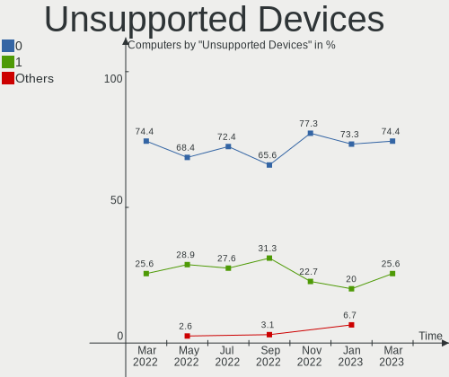

Endless Hardware Trends
-----------------------

A project to identify most popular hardware characteristics and track their change
over time based on data collected by Endless users at https://Linux-Hardware.org.

Anyone can contribute to the study by uploading probes of their computers by
the [hw-probe](https://github.com/linuxhw/hw-probe) tool:

    sudo hw-probe -all -upload

This is a report for all computer types. See also reports for [desktops](/Dist/Endless/Desktop/README.md) and [notebooks](/Dist/Endless/Notebook/README.md).

Full-feature report is available here: https://linux-hardware.org/?view=trends

Period: Jan, 2020.

Contents
--------

- [ OS                       ](#os)
- [ OS Family                ](#os-family)
- [ Kernel                   ](#kernel)
- [ Kernel Family            ](#kernel-family)
- [ Kernel Major Ver.        ](#kernel-major-ver)
- [ Arch                     ](#arch)
- [ DE                       ](#de)
- [ Display Server           ](#display-server)
- [ OS Lang                  ](#os-lang)
- [ Boot Mode                ](#boot-mode)
- [ Filesystem               ](#filesystem)
- [ Dual Boot with Linux     ](#dual-boot-with-linux)
- [ Dual Boot (Win)          ](#dual-boot-win)
- [ Country                  ](#country)
- [ City                     ](#city)
- [ Vendor                   ](#vendor)
- [ Model                    ](#model)
- [ Model Family             ](#model-family)
- [ MFG Year                 ](#mfg-year)
- [ Form Factor              ](#form-factor)
- [ Secure Boot              ](#secure-boot)
- [ Coreboot                 ](#coreboot)
- [ RAM Size                 ](#ram-size)
- [ RAM Used                 ](#ram-used)
- [ Drive Vendor             ](#drive-vendor)
- [ Drive Model              ](#drive-model)
- [ Drive Kind               ](#drive-kind)
- [ Drive Connector          ](#drive-connector)
- [ Drive Size               ](#drive-size)
- [ Space Total              ](#space-total)
- [ Space Used               ](#space-used)
- [ Malfunc. Drives          ](#malfunc-drives)
- [ Malfunc. Drive Vendor    ](#malfunc-drive-vendor)
- [ Malfunc. Drive Kind      ](#malfunc-drive-kind)
- [ Failed Drives            ](#failed-drives)
- [ Failed Drive Vendor      ](#failed-drive-vendor)
- [ Drive Status             ](#drive-status)
- [ CPU Vendor               ](#cpu-vendor)
- [ CPU Model                ](#cpu-model)
- [ CPU Model Family         ](#cpu-model-family)
- [ CPU Cores                ](#cpu-cores)
- [ CPU Sockets              ](#cpu-sockets)
- [ CPU Threads              ](#cpu-threads)
- [ CPU Op-Modes             ](#cpu-op-modes)
- [ CPU Microarch            ](#cpu-microarch)
- [ CPU Microcode            ](#cpu-microcode)
- [ GPU Vendor               ](#gpu-vendor)
- [ GPU Model                ](#gpu-model)
- [ GPU Combo                ](#gpu-combo)
- [ GPU Driver               ](#gpu-driver)
- [ GPU Memory               ](#gpu-memory)
- [ Monitor Vendor           ](#monitor-vendor)
- [ Monitor Model            ](#monitor-model)
- [ Monitor Resolution       ](#monitor-resolution)
- [ Monitor Diagonal         ](#monitor-diagonal)
- [ Monitor Width            ](#monitor-width)
- [ Aspect Ratio             ](#aspect-ratio)
- [ Monitor Area             ](#monitor-area)
- [ Pixel Density            ](#pixel-density)
- [ Multiple Monitors        ](#multiple-monitors)
- [ Net Controller Vendor    ](#net-controller-vendor)
- [ Net Controller Model     ](#net-controller-model)
- [ Net Controller Kind      ](#net-controller-kind)
- [ Used Controller          ](#used-controller)
- [ NICs                     ](#nics)
- [ Unsupported Devices      ](#unsupported-devices)
- [ Unsupported Device Types ](#unsupported-device-types)

OS
--

Installed operating systems

| Name                   | Computers | Percent |
|------------------------|-----------|---------|
| Endless 3.7.6          | 41        | 50.62%  |
| Endless 3.7.5          | 14        | 17.28%  |
| Endless 3.3.19-nexthw1 | 6         | 7.41%   |
| Endless 3.3.20-nexthw1 | 4         | 4.94%   |
| Endless 3.7.3          | 2         | 2.47%   |
| Endless 3.6.1-nexthw1  | 2         | 2.47%   |
| Endless 3.5.8          | 2         | 2.47%   |
| Endless 3.3.20         | 2         | 2.47%   |
| Endless 3.3.16-nexthw1 | 2         | 2.47%   |
| Endless 3.6.4          | 1         | 1.23%   |
| Endless 3.6.3          | 1         | 1.23%   |
| Endless 3.5.7-nexthw1  | 1         | 1.23%   |
| Endless 3.5.7          | 1         | 1.23%   |
| Endless 3.4.4-nexthw1  | 1         | 1.23%   |
| Endless 3.4.3-nexthw1  | 1         | 1.23%   |

OS Family
---------

OS without a version

| Name    | Computers | Percent |
|---------|-----------|---------|
| Endless | 81        | 100%    |

Kernel
------

Version of the Linux kernel

| Version           | Computers | Percent |
|-------------------|-----------|---------|
| 5.3.0-23-generic  | 55        | 67.9%   |
| 4.15.0-15-generic | 10        | 12.35%  |
| 4.18.0-15-generic | 3         | 3.7%    |
| 5.3.0-12-generic  | 2         | 2.47%   |
| 5.1.0-2-generic   | 2         | 2.47%   |
| 5.0.0-25-generic  | 2         | 2.47%   |
| 4.15.0-12-generic | 2         | 2.47%   |
| 4.13.0-32-generic | 2         | 2.47%   |
| 5.0.0-7-generic   | 1         | 1.23%   |
| 4.17.0-4-generic  | 1         | 1.23%   |
| 4.16.0-4-generic  | 1         | 1.23%   |

Kernel Family
-------------

Linux kernel without a distro release

| Version | Computers | Percent |
|---------|-----------|---------|
| 5.3.0   | 57        | 70.37%  |
| 4.15.0  | 12        | 14.81%  |
| 5.0.0   | 3         | 3.7%    |
| 4.18.0  | 3         | 3.7%    |
| 5.1.0   | 2         | 2.47%   |
| 4.13.0  | 2         | 2.47%   |
| 4.17.0  | 1         | 1.23%   |
| 4.16.0  | 1         | 1.23%   |

Kernel Major Ver.
-----------------

Linux kernel major version

| Version | Computers | Percent |
|---------|-----------|---------|
| 5.3     | 57        | 70.37%  |
| 4.15    | 12        | 14.81%  |
| 5.0     | 3         | 3.7%    |
| 4.18    | 3         | 3.7%    |
| 5.1     | 2         | 2.47%   |
| 4.13    | 2         | 2.47%   |
| 4.17    | 1         | 1.23%   |
| 4.16    | 1         | 1.23%   |

Arch
----

OS architecture (x86_64, i586, etc.)

| Name   | Computers | Percent |
|--------|-----------|---------|
| x86_64 | 81        | 100%    |

DE
--

Desktop Environment

| Name    | Computers | Percent |
|---------|-----------|---------|
| GNOME   | 78        | 96.3%   |
| Unknown | 3         | 3.7%    |

Display Server
--------------

X11 or Wayland

| Name    | Computers | Percent |
|---------|-----------|---------|
| X11     | 78        | 96.3%   |
| Unknown | 3         | 3.7%    |

OS Lang
-------

Language

| Lang        | Computers | Percent |
|-------------|-----------|---------|
| en_US.utf8  | 14        | 17.28%  |
| ru_RU       | 10        | 12.35%  |
| pt_BR.utf8  | 10        | 12.35%  |
| pt_BR       | 9         | 11.11%  |
| ro_RO       | 5         | 6.17%   |
| ru_UA       | 4         | 4.94%   |
| es_ES       | 4         | 4.94%   |
| en_PH       | 3         | 3.7%    |
| de_DE       | 3         | 3.7%    |
| Unknown     | 3         | 3.7%    |
| zh_TW       | 2         | 2.47%   |
| uk_UA       | 2         | 2.47%   |
| it_IT       | 2         | 2.47%   |
| en_US       | 2         | 2.47%   |
| sr_RS@latin | 1         | 1.23%   |
| pt_PT       | 1         | 1.23%   |
| lt_LT       | 1         | 1.23%   |
| hu_HU       | 1         | 1.23%   |
| hr_HR       | 1         | 1.23%   |
| es_CO       | 1         | 1.23%   |
| en_IN       | 1         | 1.23%   |
| bg_BG       | 1         | 1.23%   |

Boot Mode
---------

EFI or BIOS

| Mode | Computers | Percent |
|------|-----------|---------|
| EFI  | 51        | 62.96%  |
| BIOS | 30        | 37.04%  |

Filesystem
----------

Type of filesystem

| Type | Computers | Percent |
|------|-----------|---------|
| Ext4 | 81        | 100%    |

Dual Boot with Linux
--------------------

Hosting more than one Linux

| Dual boot | Computers | Percent |
|-----------|-----------|---------|
| No        | 81        | 100%    |

Dual Boot (Win)
---------------

Hosting Linux and Windows

| Dual boot | Computers | Percent |
|-----------|-----------|---------|
| No        | 81        | 100%    |

Country
-------

Geographic location (country)

| Country                   | Computers | Percent |
|---------------------------|-----------|---------|
| Brazil                    | 19        | 23.46%  |
| Romania                   | 9         | 11.11%  |
| Ukraine                   | 8         | 9.88%   |
| Russia                    | 8         | 9.88%   |
| USA                       | 6         | 7.41%   |
| Spain                     | 4         | 4.94%   |
| Philippines               | 4         | 4.94%   |
| Serbia                    | 3         | 3.7%    |
| Germany                   | 3         | 3.7%    |
| Taiwan                    | 2         | 2.47%   |
| Italy                     | 2         | 2.47%   |
| India                     | 2         | 2.47%   |
| Belarus                   | 2         | 2.47%   |
| Trinidad and Tobago       | 1         | 1.23%   |
| Portugal                  | 1         | 1.23%   |
| North Macedonia           | 1         | 1.23%   |
| Lithuania                 | 1         | 1.23%   |
| Iran, Islamic Republic of | 1         | 1.23%   |
| Hungary                   | 1         | 1.23%   |
| Croatia                   | 1         | 1.23%   |
| Colombia                  | 1         | 1.23%   |
| Bulgaria                  | 1         | 1.23%   |

City
----

Geographic location (city)

| City                      | Computers | Percent |
|---------------------------|-----------|---------|
| Kyiv                      | 5         | 6.17%   |
| Bucharest                 | 5         | 6.17%   |
| Moscow                    | 3         | 3.7%    |
| Manila                    | 3         | 3.7%    |
| Curitiba                  | 3         | 3.7%    |
| Belgrade                  | 3         | 3.7%    |
| Taipei                    | 2         | 2.47%   |
| Galion                    | 2         | 2.47%   |
| Zagreb                    | 1         | 1.23%   |
| Vladivostok               | 1         | 1.23%   |
| Vijayawada                | 1         | 1.23%   |
| Vidra                     | 1         | 1.23%   |
| Vespasiano                | 1         | 1.23%   |
| Upper Marlboro            | 1         | 1.23%   |
| Tucson                    | 1         | 1.23%   |
| Torrelavega               | 1         | 1.23%   |
| Torre del Greco           | 1         | 1.23%   |
| Tehran                    | 1         | 1.23%   |
| São Caetano do Sul       | 1         | 1.23%   |
| St Petersburg             | 1         | 1.23%   |
| Skopje                    | 1         | 1.23%   |
| Sete Lagoas               | 1         | 1.23%   |
| San Fernando              | 1         | 1.23%   |
| Salto                     | 1         | 1.23%   |
| Ribeirão das Neves       | 1         | 1.23%   |
| Ribeirao Pires            | 1         | 1.23%   |
| Quezon City               | 1         | 1.23%   |
| Porto Alegre              | 1         | 1.23%   |
| Plungė                   | 1         | 1.23%   |
| Offenbach                 | 1         | 1.23%   |
| Norden                    | 1         | 1.23%   |
| Murmansk                  | 1         | 1.23%   |
| Mozaceni                  | 1         | 1.23%   |
| Minsk                     | 1         | 1.23%   |
| Milan                     | 1         | 1.23%   |
| Maceió                   | 1         | 1.23%   |
| Lviv                      | 1         | 1.23%   |
| Lisbon                    | 1         | 1.23%   |
| Lida                      | 1         | 1.23%   |
| Les Franqueses del Valles | 1         | 1.23%   |
| Kstovo                    | 1         | 1.23%   |
| Korostyshiv               | 1         | 1.23%   |
| João Pessoa              | 1         | 1.23%   |
| Gaesti                    | 1         | 1.23%   |
| Fryazino                  | 1         | 1.23%   |
| Fazenda Rio Grande        | 1         | 1.23%   |
| Elhovo                    | 1         | 1.23%   |
| Criciúma                 | 1         | 1.23%   |
| Contagem                  | 1         | 1.23%   |
| Concord                   | 1         | 1.23%   |
| Cologne                   | 1         | 1.23%   |
| Cheyenne                  | 1         | 1.23%   |
| Budapest                  | 1         | 1.23%   |
| Brasília                 | 1         | 1.23%   |
| Bogotá                   | 1         | 1.23%   |
| Bilbao                    | 1         | 1.23%   |
| Berdyans'k                | 1         | 1.23%   |
| Belém                    | 1         | 1.23%   |
| Belo Horizonte            | 1         | 1.23%   |
| Barcelona                 | 1         | 1.23%   |

Vendor
------

Motherboard manufacturer

| Name                | Computers | Percent |
|---------------------|-----------|---------|
| ASUSTek Computer    | 27        | 33.33%  |
| Acer                | 19        | 23.46%  |
| Hewlett-Packard     | 5         | 6.17%   |
| Lenovo              | 4         | 4.94%   |
| Foxconn             | 4         | 4.94%   |
| Toshiba             | 3         | 3.7%    |
| Semp Toshiba        | 2         | 2.47%   |
| Dell                | 2         | 2.47%   |
| AMI                 | 2         | 2.47%   |
| Unknown             | 2         | 2.47%   |
| Positivo            | 1         | 1.23%   |
| nJoy Romania        | 1         | 1.23%   |
| NEC Computers       | 1         | 1.23%   |
| MSI                 | 1         | 1.23%   |
| LG Electronics      | 1         | 1.23%   |
| Intel               | 1         | 1.23%   |
| Huanan              | 1         | 1.23%   |
| Google              | 1         | 1.23%   |
| Gigabyte Technology | 1         | 1.23%   |
| Digiboard           | 1         | 1.23%   |
| ASRock              | 1         | 1.23%   |

Model
-----

Motherboard model

| Name                                  | Computers | Percent |
|---------------------------------------|-----------|---------|
| VivoBook 15_ASUS Laptop X540UBR       | 3         | 3.7%    |
| VivoBook 15_ASUS Laptop X540UAR       | 3         | 3.7%    |
| Nitro AN515-52                        | 3         | 3.7%    |
| VivoBook 15_ASUS Laptop X540MA_X543MA | 2         | 2.47%   |
| VivoBook 15_ASUS Laptop X540MA_X540MA | 2         | 2.47%   |
| GL553VD                               | 2         | 2.47%   |
| G31MX Series                          | 2         | 2.47%   |
| Aspire TC-885                         | 2         | 2.47%   |
| Aspire A315-31                        | 2         | 2.47%   |
| 500B Microtower                       | 2         | 2.47%   |
| Unknown                               | 2         | 2.47%   |
| X79 VAA1                              | 1         | 1.23%   |
| X705UQR                               | 1         | 1.23%   |
| X705UAR                               | 1         | 1.23%   |
| X541NA                                | 1         | 1.23%   |
| X540NV                                | 1         | 1.23%   |
| X540NA                                | 1         | 1.23%   |
| X510UN                                | 1         | 1.23%   |
| X451CAP                               | 1         | 1.23%   |
| W101 V2                               | 1         | 1.23%   |
| VivoBook_ASUSLaptop X570ZD_X570ZD     | 1         | 1.23%   |
| VivoBook_ASUSLaptop X509FB_X509FB     | 1         | 1.23%   |
| VivoBook_ASUSLaptop X509FA_X509FA     | 1         | 1.23%   |
| VivoBook_ASUSLaptop X430FA_S430FA     | 1         | 1.23%   |
| VivoBook 15_ASUS Laptop X540MA_R540MA | 1         | 1.23%   |
| VivoBook 15_ASUS Laptop X507UAR       | 1         | 1.23%   |
| VivoBook 15_ASUS Laptop X507MA_X507MA | 1         | 1.23%   |
| TravelMate P259-MG                    | 1         | 1.23%   |
| STI                                   | 1         | 1.23%   |
| Satellite P855                        | 1         | 1.23%   |
| Satellite P75-A                       | 1         | 1.23%   |
| Satellite C870-1GU                    | 1         | 1.23%   |
| S14CT01                               | 1         | 1.23%   |
| ProBook 455 G1                        | 1         | 1.23%   |
| Predator PH317-53                     | 1         | 1.23%   |
| Parrot                                | 1         | 1.23%   |
| NUC6CAYB J23203-403                   | 1         | 1.23%   |
| Notebook                              | 1         | 1.23%   |
| Nitro AN515-51                        | 1         | 1.23%   |
| Nitro AN515-31                        | 1         | 1.23%   |
| MS-7C37                               | 1         | 1.23%   |
| MPxx                                  | 1         | 1.23%   |
| Milo3-H                               | 1         | 1.23%   |
| M61SME-S2L                            | 1         | 1.23%   |
| M5A78L-M PLUS/USB3                    | 1         | 1.23%   |
| Legion Y540-15IRH 81SX                | 1         | 1.23%   |
| Latitude E6440                        | 1         | 1.23%   |
| Latitude E6420                        | 1         | 1.23%   |
| IS 1414                               | 1         | 1.23%   |
| IdeaPad 520-15IKB 80YL                | 1         | 1.23%   |
| IdeaPad 330-15ARR 81D2                | 1         | 1.23%   |
| Extensa 2540                          | 1         | 1.23%   |
| ENVY m4                               | 1         | 1.23%   |
| EliteDesk 800 G2 SFF                  | 1         | 1.23%   |
| BT3 Pro                               | 1         | 1.23%   |
| Aspire XC-830                         | 1         | 1.23%   |
| Aspire A715-72G                       | 1         | 1.23%   |
| Aspire A517-51                        | 1         | 1.23%   |
| Aspire A515-52                        | 1         | 1.23%   |
| Aspire A515-51                        | 1         | 1.23%   |

Model Family
------------

Motherboard model prefix

| Name                           | Computers | Percent |
|--------------------------------|-----------|---------|
| ASUS VivoBook                  | 17        | 20.99%  |
| Acer Aspire                    | 11        | 13.58%  |
| Acer Nitro                     | 5         | 6.17%   |
| Toshiba Satellite              | 3         | 3.7%    |
| Lenovo IdeaPad                 | 2         | 2.47%   |
| Foxconn G31MX                  | 2         | 2.47%   |
| Foxconn 500B                   | 2         | 2.47%   |
| Dell Latitude                  | 2         | 2.47%   |
| ASUS GL553VD                   | 2         | 2.47%   |
| Unknown                        | 2         | 2.47%   |
| Semp Toshiba STI               | 1         | 1.23%   |
| Semp Toshiba IS                | 1         | 1.23%   |
| Positivo S14CT01               | 1         | 1.23%   |
| nJoy Romania Aerial            | 1         | 1.23%   |
| NEC Computers Milo3-H          | 1         | 1.23%   |
| MSI MS-7C37                    | 1         | 1.23%   |
| LG Electronics 22V270-L.BJ31P1 | 1         | 1.23%   |
| Lenovo Legion                  | 1         | 1.23%   |
| Lenovo ACLU12                  | 1         | 1.23%   |
| Intel NUC6CAYB                 | 1         | 1.23%   |
| Huanan X79                     | 1         | 1.23%   |
| HP ProBook                     | 1         | 1.23%   |
| HP Notebook                    | 1         | 1.23%   |
| HP ENVY                        | 1         | 1.23%   |
| HP EliteDesk                   | 1         | 1.23%   |
| HP 550-153w                    | 1         | 1.23%   |
| Google Parrot                  | 1         | 1.23%   |
| Gigabyte M61SME-S2L            | 1         | 1.23%   |
| Digiboard MPxx                 | 1         | 1.23%   |
| ASUS X705UQR                   | 1         | 1.23%   |
| ASUS X705UAR                   | 1         | 1.23%   |
| ASUS X541NA                    | 1         | 1.23%   |
| ASUS X540NV                    | 1         | 1.23%   |
| ASUS X540NA                    | 1         | 1.23%   |
| ASUS X510UN                    | 1         | 1.23%   |
| ASUS X451CAP                   | 1         | 1.23%   |
| ASUS M5A78L-M                  | 1         | 1.23%   |
| ASRock A88M-G                  | 1         | 1.23%   |
| AMI W101                       | 1         | 1.23%   |
| AMI BT3                        | 1         | 1.23%   |
| Acer TravelMate                | 1         | 1.23%   |
| Acer Predator                  | 1         | 1.23%   |
| Acer Extensa                   | 1         | 1.23%   |

MFG Year
--------

Motherboard manufacture year

| Year | Computers | Percent |
|------|-----------|---------|
| 2019 | 30        | 37.04%  |
| 2018 | 15        | 18.52%  |
| 2017 | 10        | 12.35%  |
| 2015 | 6         | 7.41%   |
| 2014 | 4         | 4.94%   |
| 2010 | 4         | 4.94%   |
| 2016 | 3         | 3.7%    |
| 2011 | 3         | 3.7%    |
| 2012 | 2         | 2.47%   |
| 2009 | 2         | 2.47%   |
| 2008 | 1         | 1.23%   |
| 2007 | 1         | 1.23%   |

Form Factor
-----------

Physical design of the computer

| Name       | Computers | Percent |
|------------|-----------|---------|
| Notebook   | 59        | 72.84%  |
| Desktop    | 17        | 20.99%  |
| Mini pc    | 3         | 3.7%    |
| All in one | 2         | 2.47%   |

Secure Boot
-----------

Enabled or disabled

| State    | Computers | Percent |
|----------|-----------|---------|
| Disabled | 50        | 61.73%  |
| Unknown  | 17        | 20.99%  |
| Enabled  | 14        | 17.28%  |

Coreboot
--------

Have coreboot on board

| Used | Computers | Percent |
|------|-----------|---------|
| No   | 80        | 98.77%  |
| Yes  | 1         | 1.23%   |

RAM Size
--------

Total RAM memory

| Size in GB | Computers | Percent |
|------------|-----------|---------|
| 3.01-4.0   | 32        | 39.51%  |
| 4.01-8.0   | 28        | 34.57%  |
| 8.01-16.0  | 9         | 11.11%  |
| 1.01-2.0   | 6         | 7.41%   |
| 32.01-64.0 | 2         | 2.47%   |
| 2.01-3.0   | 2         | 2.47%   |
| 16.01-24.0 | 2         | 2.47%   |

RAM Used
--------

Used RAM memory

| Used GB  | Computers | Percent |
|----------|-----------|---------|
| 1.01-2.0 | 39        | 48.15%  |
| 2.01-3.0 | 21        | 25.93%  |
| 0.01-1.0 | 13        | 16.05%  |
| 3.01-4.0 | 6         | 7.41%   |
| 4.01-8.0 | 2         | 2.47%   |

Drive Vendor
------------

Hard drive vendors

| Vendor              | Computers | Drives | Percent |
|---------------------|-----------|--------|---------|
| Seagate             | 18        | 18     | 18.37%  |
| WDC                 | 14        | 14     | 14.29%  |
| Toshiba             | 13        | 13     | 13.27%  |
| Kingston            | 12        | 12     | 12.24%  |
| Unknown             | 6         | 7      | 6.12%   |
| SanDisk             | 6         | 6      | 6.12%   |
| Samsung Electronics | 5         | 5      | 5.1%    |
| HGST                | 5         | 5      | 5.1%    |
| A-DATA Technology   | 5         | 5      | 5.1%    |
| Hitachi             | 3         | 3      | 3.06%   |
| SK Hynix            | 2         | 2      | 2.04%   |
| Micron Technology   | 2         | 2      | 2.04%   |
| Generic             | 2         | 2      | 2.04%   |
| Intel               | 1         | 1      | 1.02%   |
| Hewlett-Packard     | 1         | 1      | 1.02%   |
| FORESEE             | 1         | 1      | 1.02%   |
| faspeed             | 1         | 1      | 1.02%   |
| Crucial             | 1         | 1      | 1.02%   |

Drive Model
-----------

Hard drive models

| Model                        | Computers | Percent |
|------------------------------|-----------|---------|
| WD10SPZX-21Z10T0 1TB         | 7         | 7.14%   |
| ST1000LM035-1RK172 1TB       | 7         | 7.14%   |
| MMC Card  31GB               | 6         | 6.12%   |
| RBUSC180DS37256GJ 256GB SSD  | 5         | 5.1%    |
| MQ04ABF100 1TB               | 5         | 5.1%    |
| IM2S3338-128GD2 128GB SSD    | 4         | 4.08%   |
| MQ01ABF050 500GB             | 3         | 3.06%   |
| WD5000LPCX-80VHAT1 500GB     | 2         | 2.04%   |
| SV300S37A120G 120GB SSD      | 2         | 2.04%   |
| ST3160812AS 160GB            | 2         | 2.04%   |
| SD8SN8U128G1002 128GB SSD    | 2         | 2.04%   |
| SD/MMC/MS PRO 31GB           | 2         | 2.04%   |
| HDT722525DLA380 250GB        | 2         | 2.04%   |
| DT01ACA100 1TB               | 2         | 2.04%   |
| WDS120G2G0B-00EPW0 120GB SSD | 1         | 1.02%   |
| WD5000BPKT-00PK4T0 500GB     | 1         | 1.02%   |
| WD5000BEVT-22A0RT0 500GB     | 1         | 1.02%   |
| WD3200BEKX-75B7WT0 320GB     | 1         | 1.02%   |
| WD10JPVX-75JC3T0 1TB         | 1         | 1.02%   |
| SUV500240G 240GB SSD         | 1         | 1.02%   |
| SUV400S37120G 120GB SSD      | 1         | 1.02%   |
| ST500LM030-1RK17D 500GB      | 1         | 1.02%   |
| ST500LM012 HN-M500MBB 500GB  | 1         | 1.02%   |
| ST500DM002-1BD142 500GB      | 1         | 1.02%   |
| ST320LT012-9WS14C 320GB      | 1         | 1.02%   |
| ST2000LM007-1R8174 2TB       | 1         | 1.02%   |
| ST2000DX002-2DV164 2TB       | 1         | 1.02%   |
| ST2000DM001-1ER164 2TB       | 1         | 1.02%   |
| ST1000DM010-2EP102 1TB       | 1         | 1.02%   |
| SSDSCKKW256G8 256GB          | 1         | 1.02%   |
| SSD S700 120GB               | 1         | 1.02%   |
| SSD PLUS 240GB               | 1         | 1.02%   |
| SP550 120GB SSD              | 1         | 1.02%   |
| SKC400S37256G 256GB SSD      | 1         | 1.02%   |
| SD9SN8W256G1102 256GB SSD    | 1         | 1.02%   |
| SD9SB8W256G1014 256GB SSD    | 1         | 1.02%   |
| SD8SNAT128G1002 128GB SSD    | 1         | 1.02%   |
| SA400S37240G 240GB SSD       | 1         | 1.02%   |
| RBUSNS8180DS3256GJ 256GB SSD | 1         | 1.02%   |
| MZYTN512HDJH-000L2 512GB SSD | 1         | 1.02%   |
| MZNTY128HDHP-00007 128GB SSD | 1         | 1.02%   |
| MQ01ABD100 1TB               | 1         | 1.02%   |
| MQ01ABD075 750GB             | 1         | 1.02%   |
| MQ01ABD032 320GB             | 1         | 1.02%   |
| HTS721010A9E630 1TB          | 1         | 1.02%   |
| HTS547550A9E384 500GB        | 1         | 1.02%   |
| HTS545050B7E660 500GB        | 1         | 1.02%   |
| HTS545050A7E680 500GB        | 1         | 1.02%   |
| HTS541075A9E680 750GB        | 1         | 1.02%   |
| HTS541010A9E680 1TB          | 1         | 1.02%   |
| HM251HX 250GB                | 1         | 1.02%   |
| HFS128G39TND-N210A 128GB SSD | 1         | 1.02%   |
| HFS128G32TNF-N3A0A 128GB SSD | 1         | 1.02%   |
| HD250HJ 250GB                | 1         | 1.02%   |
| HD161GJ 160GB                | 1         | 1.02%   |
| H5-60G PLUS                  | 1         | 1.02%   |
| CT240BX200SSD1 240GB         | 1         | 1.02%   |
| Backup+ Hub BK 160GB         | 1         | 1.02%   |
| 1300_MTFDDAK512TDL 512GB SSD | 1         | 1.02%   |
| 128GB SSD                    | 1         | 1.02%   |

Drive Kind
----------

HDD or SSD

| Kind    | Computers | Drives | Percent |
|---------|-----------|--------|---------|
| HDD     | 54        | 54     | 55.67%  |
| SSD     | 34        | 35     | 35.05%  |
| MMC     | 6         | 7      | 6.19%   |
| Unknown | 3         | 3      | 3.09%   |

Drive Connector
---------------

SATA, SAS, NVMe, etc.

| Type | Computers | Drives | Percent |
|------|-----------|--------|---------|
| SATA | 75        | 89     | 89.29%  |
| MMC  | 6         | 7      | 7.14%   |
| SAS  | 3         | 3      | 3.57%   |

Drive Size
----------

Size of hard drive

| Size in TB | Computers | Drives | Percent |
|------------|-----------|--------|---------|
| 0.01-0.5   | 59        | 66     | 64.13%  |
| 0.51-1.0   | 30        | 30     | 32.61%  |
| 1.01-2.0   | 3         | 3      | 3.26%   |

Space Total
-----------

Amount of disk space available on the file system

| Size in GB     | Computers | Percent |
|----------------|-----------|---------|
| 101-250        | 33        | 40.74%  |
| 501-1000       | 15        | 18.52%  |
| 251-500        | 14        | 17.28%  |
| 51-100         | 6         | 7.41%   |
| 21-50          | 4         | 4.94%   |
| 1-20           | 4         | 4.94%   |
| 1001-2000      | 3         | 3.7%    |
| More than 3000 | 2         | 2.47%   |

Space Used
----------

Amount of used disk space

| Used GB        | Computers | Percent |
|----------------|-----------|---------|
| 21-50          | 39        | 48.15%  |
| 1-20           | 23        | 28.4%   |
| 51-100         | 11        | 13.58%  |
| 101-250        | 4         | 4.94%   |
| 501-1000       | 3         | 3.7%    |
| More than 3000 | 1         | 1.23%   |

Malfunc. Drives
---------------

Drive models with a malfunction

Zero info for selected period =(

Malfunc. Drive Vendor
---------------------

Vendors of faulty drives

Zero info for selected period =(

Malfunc. Drive Kind
-------------------

Kinds of faulty drives

Zero info for selected period =(

Failed Drives
-------------

Failed drive models

Zero info for selected period =(

Failed Drive Vendor
-------------------

Failed drive vendors

Zero info for selected period =(

Drive Status
------------

Number of failed and malfunc. drives

| Status   | Computers | Drives | Percent |
|----------|-----------|--------|---------|
| Detected | 78        | 99     | 100%    |

CPU Vendor
----------

Processor vendors

| Vendor | Computers | Percent |
|--------|-----------|---------|
| Intel  | 72        | 88.89%  |
| AMD    | 9         | 11.11%  |

CPU Model
---------

Processor models

| Model                                           | Computers | Percent |
|-------------------------------------------------|-----------|---------|
| Intel Pentium CPU 4417U @ 2.30GHz               | 6         | 7.41%   |
| Intel Celeron N4000 CPU @ 1.10GHz               | 6         | 7.41%   |
| Intel Core i5-8300H CPU @ 2.30GHz               | 4         | 4.94%   |
| Intel Core i5-8250U CPU @ 1.60GHz               | 4         | 4.94%   |
| Intel Core 2 Duo CPU E7500 @ 2.93GHz            | 4         | 4.94%   |
| Intel Celeron CPU N3350 @ 1.10GHz               | 4         | 4.94%   |
| Intel Pentium CPU N4200 @ 1.10GHz               | 2         | 2.47%   |
| Intel Pentium CPU B960 @ 2.20GHz                | 2         | 2.47%   |
| Intel Core i7-7700HQ CPU @ 2.80GHz              | 2         | 2.47%   |
| Intel Core i5-7200U CPU @ 2.50GHz               | 2         | 2.47%   |
| Intel Core i3-8145U CPU @ 2.10GHz               | 2         | 2.47%   |
| Intel Core i3-6006U CPU @ 2.00GHz               | 2         | 2.47%   |
| Intel Xeon CPU E5-2670 0 @ 2.60GHz              | 1         | 1.23%   |
| Intel Pentium Silver J5005 CPU @ 1.50GHz        | 1         | 1.23%   |
| Intel Pentium 3558U @ 1.70GHz                   | 1         | 1.23%   |
| Intel Core i7-8750H CPU @ 2.20GHz               | 1         | 1.23%   |
| Intel Core i7-8565U CPU @ 1.80GHz               | 1         | 1.23%   |
| Intel Core i7-4700MQ CPU @ 2.40GHz              | 1         | 1.23%   |
| Intel Core i7-4610M CPU @ 3.00GHz               | 1         | 1.23%   |
| Intel Core i7-3632QM CPU @ 2.20GHz              | 1         | 1.23%   |
| Intel Core i7-3610QM CPU @ 2.30GHz              | 1         | 1.23%   |
| Intel Core i5-9400F CPU @ 2.90GHz               | 1         | 1.23%   |
| Intel Core i5-9300H CPU @ 2.40GHz               | 1         | 1.23%   |
| Intel Core i5-8400 CPU @ 2.80GHz                | 1         | 1.23%   |
| Intel Core i5-8265U CPU @ 1.60GHz               | 1         | 1.23%   |
| Intel Core i5-7300HQ CPU @ 2.50GHz              | 1         | 1.23%   |
| Intel Core i5-6400 CPU @ 2.70GHz                | 1         | 1.23%   |
| Intel Core i5-2520M CPU @ 2.50GHz               | 1         | 1.23%   |
| Intel Core i3-7100U CPU @ 2.40GHz               | 1         | 1.23%   |
| Intel Core i3-7020U CPU @ 2.30GHz               | 1         | 1.23%   |
| Intel Core i3-4370 CPU @ 3.80GHz                | 1         | 1.23%   |
| Intel Core i3-2375M CPU @ 1.50GHz               | 1         | 1.23%   |
| Intel Core i3-2310M CPU @ 2.10GHz               | 1         | 1.23%   |
| Intel Core i3 CPU M 370 @ 2.40GHz               | 1         | 1.23%   |
| Intel Core 2 Duo CPU T5800 @ 2.00GHz            | 1         | 1.23%   |
| Intel Core 2 CPU 4300 @ 1.80GHz                 | 1         | 1.23%   |
| Intel Celeron CPU N3450 @ 1.10GHz               | 1         | 1.23%   |
| Intel Celeron CPU J3455 @ 1.50GHz               | 1         | 1.23%   |
| Intel Celeron CPU J1800 @ 2.41GHz               | 1         | 1.23%   |
| Intel Celeron CPU 847 @ 1.10GHz                 | 1         | 1.23%   |
| Intel Atom x5-Z8350 CPU @ 1.44GHz               | 1         | 1.23%   |
| Intel Atom x5-Z8300 CPU @ 1.44GHz               | 1         | 1.23%   |
| Intel Atom CPU Z3735F @ 1.33GHz                 | 1         | 1.23%   |
| Intel Atom CPU N450 @ 1.66GHz                   | 1         | 1.23%   |
| AMD Sempron Processor LE-1150                   | 1         | 1.23%   |
| AMD Ryzen 5 3600 6-Core Processor               | 1         | 1.23%   |
| AMD Ryzen 5 2500U with Radeon Vega Mobile Gfx   | 1         | 1.23%   |
| AMD Ryzen 3 2200U with Radeon Vega Mobile Gfx   | 1         | 1.23%   |
| AMD Phenom II X2 570 Processor                  | 1         | 1.23%   |
| AMD FX-8350 Eight-Core Processor                | 1         | 1.23%   |
| AMD A8-7410 APU with AMD Radeon R5 Graphics     | 1         | 1.23%   |
| AMD A4-4300M APU with Radeon HD Graphics        | 1         | 1.23%   |
| AMD A10-7850K Radeon R7, 12 Compute Cores 4C+8G | 1         | 1.23%   |

CPU Model Family
----------------

Processor model prefix

| Model                | Computers | Percent |
|----------------------|-----------|---------|
| Intel Core i5        | 17        | 20.99%  |
| Intel Celeron        | 14        | 17.28%  |
| Intel Pentium        | 11        | 13.58%  |
| Intel Core i3        | 10        | 12.35%  |
| Intel Core i7        | 8         | 9.88%   |
| Intel Core 2 Duo     | 5         | 6.17%   |
| Intel Atom           | 4         | 4.94%   |
| AMD Ryzen 5          | 2         | 2.47%   |
| Intel Xeon           | 1         | 1.23%   |
| Intel Pentium Silver | 1         | 1.23%   |
| Intel Core 2         | 1         | 1.23%   |
| AMD Sempron          | 1         | 1.23%   |
| AMD Ryzen 3          | 1         | 1.23%   |
| AMD Phenom II X2     | 1         | 1.23%   |
| AMD FX               | 1         | 1.23%   |
| AMD A8               | 1         | 1.23%   |
| AMD A4               | 1         | 1.23%   |
| AMD A10              | 1         | 1.23%   |

CPU Cores
---------

Number of processor cores

| Number | Computers | Percent |
|--------|-----------|---------|
| 2      | 44        | 54.32%  |
| 4      | 29        | 35.8%   |
| 6      | 4         | 4.94%   |
| 1      | 3         | 3.7%    |
| 16     | 1         | 1.23%   |

CPU Sockets
-----------

Number of sockets

| Number | Computers | Percent |
|--------|-----------|---------|
| 1      | 80        | 98.77%  |
| 2      | 1         | 1.23%   |

CPU Threads
-----------

Threads per core (Hyper-Threading)

| Number | Computers | Percent |
|--------|-----------|---------|
| 2      | 45        | 55.56%  |
| 1      | 36        | 44.44%  |

CPU Op-Modes
------------

CPU Operation Modes (32-bit, 64-bit)

| Op mode        | Computers | Percent |
|----------------|-----------|---------|
| 32-bit, 64-bit | 78        | 96.3%   |
| Unknown        | 3         | 3.7%    |

CPU Microarch
-------------

Microarchitecture

| Name          | Computers | Percent |
|---------------|-----------|---------|
| Skylake       | 28        | 34.57%  |
| Goldmont      | 8         | 9.88%   |
| SandyBridge   | 7         | 8.64%   |
| Goldmont plus | 7         | 8.64%   |
| Core          | 6         | 7.41%   |
| Silvermont    | 4         | 4.94%   |
| KabyLake      | 4         | 4.94%   |
| Haswell       | 4         | 4.94%   |
| Zen           | 2         | 2.47%   |
| Piledriver    | 2         | 2.47%   |
| IvyBridge     | 2         | 2.47%   |
| Zen 2         | 1         | 1.23%   |
| Westmere      | 1         | 1.23%   |
| Steamroller   | 1         | 1.23%   |
| Puma          | 1         | 1.23%   |
| K8 Hammer     | 1         | 1.23%   |
| K10           | 1         | 1.23%   |
| Bonnell       | 1         | 1.23%   |

CPU Microcode
-------------

Microcode number

| Number     | Computers | Percent |
|------------|-----------|---------|
| 0x806ea    | 9         | 11.11%  |
| Unknown    | 9         | 11.11%  |
| 0x906ea    | 7         | 8.64%   |
| 0x506c9    | 7         | 8.64%   |
| 0x206a7    | 6         | 7.41%   |
| 0x706a1    | 5         | 6.17%   |
| 0x1067a    | 4         | 4.94%   |
| 0x906e9    | 3         | 3.7%    |
| 0x806e9    | 3         | 3.7%    |
| 0x306c3    | 3         | 3.7%    |
| 0x806ec    | 2         | 2.47%   |
| 0x406e3    | 2         | 2.47%   |
| 0x306a9    | 2         | 2.47%   |
| 0x806eb    | 1         | 1.23%   |
| 0x6fd      | 1         | 1.23%   |
| 0x6f2      | 1         | 1.23%   |
| 0x506e3    | 1         | 1.23%   |
| 0x406c4    | 1         | 1.23%   |
| 0x406c3    | 1         | 1.23%   |
| 0x40651    | 1         | 1.23%   |
| 0x30678    | 1         | 1.23%   |
| 0x30673    | 1         | 1.23%   |
| 0x206d7    | 1         | 1.23%   |
| 0x20655    | 1         | 1.23%   |
| 0x106ca    | 1         | 1.23%   |
| 0x08701013 | 1         | 1.23%   |
| 0x0810100b | 1         | 1.23%   |
| 0x07030105 | 1         | 1.23%   |
| 0x06003106 | 1         | 1.23%   |
| 0x0600111f | 1         | 1.23%   |
| 0x06000852 | 1         | 1.23%   |
| 0x010000c8 | 1         | 1.23%   |

GPU Vendor
----------

Vendors of graphics cards

| Vendor | Computers | Percent |
|--------|-----------|---------|
| Intel  | 65        | 63.11%  |
| Nvidia | 28        | 27.18%  |
| AMD    | 10        | 9.71%   |

GPU Model
---------

Graphics card models

| Model                                                                              | Computers | Percent |
|------------------------------------------------------------------------------------|-----------|---------|
| UHD Graphics 605                                                                   | 7         | 6.73%   |
| GP107M [GeForce GTX 1050 Mobile]                                                   | 7         | 6.73%   |
| Kaby Lake-U GT1 Integrated Graphics Controller                                     | 6         | 5.77%   |
| HD Graphics 500                                                                    | 6         | 5.77%   |
| 2nd Generation Core Processor Family Integrated Graphics Controller                | 6         | 5.77%   |
| UHD Graphics 630 (Mobile)                                                          | 5         | 4.81%   |
| UHD Graphics 620 (Whiskey Lake)                                                    | 4         | 3.85%   |
| UHD Graphics 620                                                                   | 4         | 3.85%   |
| GM108M [GeForce MX110]                                                             | 4         | 3.85%   |
| HD Graphics 630                                                                    | 3         | 2.88%   |
| HD Graphics 620                                                                    | 3         | 2.88%   |
| GM108M [GeForce 940MX]                                                             | 3         | 2.88%   |
| Cape Verde XT [Radeon HD 7770/8760 / R7 250X]                                      | 3         | 2.88%   |
| TU116M [GeForce GTX 1660 Ti Mobile]                                                | 2         | 1.92%   |
| Skylake GT2 [HD Graphics 520]                                                      | 2         | 1.92%   |
| Raven Ridge [Radeon Vega Series / Radeon Vega Mobile Series]                       | 2         | 1.92%   |
| GP108M [GeForce MX150]                                                             | 2         | 1.92%   |
| G72 [GeForce 7200 GS / 7300 SE]                                                    | 2         | 1.92%   |
| Celeron N3350/Pentium N4200/Atom E3900 Series Integrated Graphics Controller       | 2         | 1.92%   |
| Atom/Celeron/Pentium Processor x5-E8000/J3xxx/N3xxx Integrated Graphics Controller | 2         | 1.92%   |
| Atom Processor Z36xxx/Z37xxx Series Graphics & Display                             | 2         | 1.92%   |
| 4th Gen Core Processor Integrated Graphics Controller                              | 2         | 1.92%   |
| 4 Series Chipset Integrated Graphics Controller                                    | 2         | 1.92%   |
| 3rd Gen Core processor Graphics Controller                                         | 2         | 1.92%   |
| TU117 [GeForce GTX 1650]                                                           | 1         | 0.96%   |
| Trinity 2 [Radeon HD 7420G]                                                        | 1         | 0.96%   |
| Sun XT [Radeon HD 8670A/8670M/8690M / R5 M330 / M430 / Radeon 520 Mobile]          | 1         | 0.96%   |
| RV635 [Radeon HD 3650/3750/4570/4580]                                              | 1         | 0.96%   |
| Radeon R7 240 Series                                                               | 1         | 0.96%   |
| Mullins [Radeon R4/R5 Graphics]                                                    | 1         | 0.96%   |
| Mobile 4 Series Chipset Integrated Graphics Controller                             | 1         | 0.96%   |
| Mars [Radeon HD 8670A/8670M/8750M]                                                 | 1         | 0.96%   |
| Kaby Lake-U GT2f Integrated Graphics Controller                                    | 1         | 0.96%   |
| HD Graphics 530                                                                    | 1         | 0.96%   |
| Haswell-ULT Integrated Graphics Controller                                         | 1         | 0.96%   |
| GP107M [GeForce GTX 1050 Ti Mobile]                                                | 1         | 0.96%   |
| GP107 [GeForce GTX 1050]                                                           | 1         | 0.96%   |
| GP104 [GeForce GTX 1080]                                                           | 1         | 0.96%   |
| GP102 [GeForce GTX 1080 Ti]                                                        | 1         | 0.96%   |
| GM108M [GeForce 920MX]                                                             | 1         | 0.96%   |
| GF108M [GeForce GT 620M/630M/635M/640M LE]                                         | 1         | 0.96%   |
| Core Processor Integrated Graphics Controller                                      | 1         | 0.96%   |
| C61 [GeForce 6100 nForce 405]                                                      | 1         | 0.96%   |
| Atom Processor D4xx/D5xx/N4xx/N5xx Integrated Graphics Controller                  | 1         | 0.96%   |
| 82G33/G31 Express Integrated Graphics Controller                                   | 1         | 0.96%   |

GPU Combo
---------

Combinations of graphics cards

| Name           | Computers | Percent |
|----------------|-----------|---------|
| 1 x Intel      | 45        | 55.56%  |
| Intel + Nvidia | 19        | 23.46%  |
| 1 x Nvidia     | 7         | 8.64%   |
| 1 x AMD        | 7         | 8.64%   |
| 2 x AMD        | 1         | 1.23%   |
| Intel + AMD    | 1         | 1.23%   |
| AMD + Nvidia   | 1         | 1.23%   |

GPU Driver
----------

Free vs proprietary

| Driver      | Computers | Percent |
|-------------|-----------|---------|
| Free        | 62        | 76.54%  |
| Proprietary | 19        | 23.46%  |

GPU Memory
----------

Total video memory

| Size in GB | Computers | Percent |
|------------|-----------|---------|
| Unknown    | 59        | 72.84%  |
| 3.01-4.0   | 9         | 11.11%  |
| 0.51-1.0   | 5         | 6.17%   |
| 0.01-0.5   | 5         | 6.17%   |
| 1.01-2.0   | 3         | 3.7%    |

Monitor Vendor
--------------

Monitor vendors

| Vendor                  | Computers | Percent |
|-------------------------|-----------|---------|
| AU Optronics            | 21        | 26.58%  |
| BOE                     | 16        | 20.25%  |
| LG Display              | 8         | 10.13%  |
| Chimei Innolux          | 8         | 10.13%  |
| Samsung Electronics     | 6         | 7.59%   |
| Dell                    | 5         | 6.33%   |
| Goldstar                | 4         | 5.06%   |
| Sony                    | 2         | 2.53%   |
| RTK                     | 2         | 2.53%   |
| Sanyo                   | 1         | 1.27%   |
| Philips                 | 1         | 1.27%   |
| PANDA                   | 1         | 1.27%   |
| Lenovo                  | 1         | 1.27%   |
| InfoVision              | 1         | 1.27%   |
| Chi Mei Optoelectronics | 1         | 1.27%   |
| BenQ                    | 1         | 1.27%   |

Monitor Model
-------------

Monitor models

| Model                                               | Computers | Percent |
|-----------------------------------------------------|-----------|---------|
| LCD Monitor AUO38ED 1920x1080 340x190mm 15.3-inch   | 9         | 11.39%  |
| LCD Monitor AUO61ED 1920x1080 340x190mm 15.3-inch   | 7         | 8.86%   |
| LCD Monitor CMN15DB 1366x768 344x193mm 15.5-inch    | 3         | 3.8%    |
| LCD Monitor BOE06A5 1366x768 344x194mm 15.5-inch    | 3         | 3.8%    |
| LCD Monitor BOE06A4 1366x768 344x194mm 15.5-inch    | 3         | 3.8%    |
| SE177FP DELF001 1280x1024 338x270mm 17.0-inch       | 2         | 2.53%   |
| P170S DEL4058 1280x1024 338x270mm 17.0-inch         | 2         | 2.53%   |
| LCD Monitor LGD0590 1920x1080 344x194mm 15.5-inch   | 2         | 2.53%   |
| LCD Monitor BOE069C 1920x1080 344x193mm 15.5-inch   | 2         | 2.53%   |
| C32F39M SAM100B 1920x1080 698x393mm 31.5-inch       | 2         | 2.53%   |
| TV SNYF600 1360x768 1600x900mm 72.3-inch            | 1         | 1.27%   |
| TV PHL3234 1920x1080 640x360mm 28.9-inch            | 1         | 1.27%   |
| SDM-E76D SNYB200 1280x1024 338x270mm 17.0-inch      | 1         | 1.27%   |
| S22B350 SAM08D3 1920x1080 477x268mm 21.5-inch       | 1         | 1.27%   |
| MP59G GSM5B34 1920x1080 480x270mm 21.7-inch         | 1         | 1.27%   |
| M140NWR2 R1 IVO057A 1366x768 309x174mm 14.0-inch    | 1         | 1.27%   |
| LG FULL HD GSM5ABB 1920x1080 480x270mm 21.7-inch    | 1         | 1.27%   |
| LEN LT2323pwA LEN0BD0 1920x1080 510x287mm 23.0-inch | 1         | 1.27%   |
| LCD SAN0BA2 1360x768 760x450mm 34.8-inch            | 1         | 1.27%   |
| LCD Monitor SEC5441 1366x768 344x194mm 15.5-inch    | 1         | 1.27%   |
| LCD Monitor SEC3150 1366x768 344x193mm 15.5-inch    | 1         | 1.27%   |
| LCD Monitor SDC4E51 1366x768 340x190mm 15.3-inch    | 1         | 1.27%   |
| LCD Monitor RTK2136 1280x800 473x296mm 22.0-inch    | 1         | 1.27%   |
| LCD Monitor RTK1D1A 1920x1080 1020x570mm 46.0-inch  | 1         | 1.27%   |
| LCD Monitor LGD056D 1920x1080 380x210mm 17.1-inch   | 1         | 1.27%   |
| LCD Monitor LGD04E8 1920x1080 382x215mm 17.3-inch   | 1         | 1.27%   |
| LCD Monitor LGD047C 1366x768 310x174mm 14.0-inch    | 1         | 1.27%   |
| LCD Monitor LGD044B 1366x768 340x190mm 15.3-inch    | 1         | 1.27%   |
| LCD Monitor LGD033F 1366x768 309x174mm 14.0-inch    | 1         | 1.27%   |
| LCD Monitor LGD023F 1366x768 293x165mm 13.2-inch    | 1         | 1.27%   |
| LCD Monitor CMO1711 1600x900 382x215mm 17.3-inch    | 1         | 1.27%   |
| LCD Monitor CMN1745 1600x900 380x210mm 17.1-inch    | 1         | 1.27%   |
| LCD Monitor CMN15F5 1920x1080 344x193mm 15.5-inch   | 1         | 1.27%   |
| LCD Monitor CMN15BC 1366x768 350x190mm 15.7-inch    | 1         | 1.27%   |
| LCD Monitor CMN1470 1366x768 309x174mm 14.0-inch    | 1         | 1.27%   |
| LCD Monitor CMN1119 1366x768 260x140mm 11.6-inch    | 1         | 1.27%   |
| LCD Monitor BOE0818 1920x1080 344x194mm 15.5-inch   | 1         | 1.27%   |
| LCD Monitor BOE07F7 1920x1080 309x174mm 14.0-inch   | 1         | 1.27%   |
| LCD Monitor BOE07CE 1366x768 344x193mm 15.5-inch    | 1         | 1.27%   |
| LCD Monitor BOE0739 1920x1080 344x193mm 15.5-inch   | 1         | 1.27%   |
| LCD Monitor BOE06FB 1920x1080 344x194mm 15.5-inch   | 1         | 1.27%   |
| LCD Monitor BOE06BA 1920x1080 344x193mm 15.5-inch   | 1         | 1.27%   |
| LCD Monitor BOE0672 1366x768 344x194mm 15.5-inch    | 1         | 1.27%   |
| LCD Monitor BOE05F3 1366x768 309x173mm 13.9-inch    | 1         | 1.27%   |
| LCD Monitor AUO71EC 1366x768 340x190mm 15.3-inch    | 1         | 1.27%   |
| LCD Monitor AUO26EC 1366x768 344x193mm 15.5-inch    | 1         | 1.27%   |
| LCD Monitor AUO21ED 1920x1080 344x194mm 15.5-inch   | 1         | 1.27%   |
| LCD Monitor AUO209D 1920x1080 380x210mm 17.1-inch   | 1         | 1.27%   |
| LCD Monitor AUO183C 1366x768 309x173mm 13.9-inch    | 1         | 1.27%   |
| LC133LF2L03 NCP0015 1920x1080 294x165mm 13.3-inch   | 1         | 1.27%   |
| L226W GSM566A 1680x1050 474x296mm 22.0-inch         | 1         | 1.27%   |
| L1752S GSM4432 1280x1024 338x270mm 17.0-inch        | 1         | 1.27%   |
| G2010W BNQ7811 1680x1050 474x296mm 22.0-inch        | 1         | 1.27%   |
| E2416H DELA0CA 1920x1080 531x299mm 24.0-inch        | 1         | 1.27%   |

Monitor Resolution
------------------

Monitor screen resolution

| Resolution         | Computers | Percent |
|--------------------|-----------|---------|
| 1920x1080 (FHD)    | 40        | 51.28%  |
| 1366x768 (WXGA)    | 26        | 33.33%  |
| 1280x1024 (SXGA)   | 6         | 7.69%   |
| 1680x1050 (WSXGA+) | 2         | 2.56%   |
| 1600x900 (HD+)     | 2         | 2.56%   |
| 1360x768           | 2         | 2.56%   |

Monitor Diagonal
----------------

Diagonal size in inches

| Inches | Computers | Percent |
|--------|-----------|---------|
| 15     | 43        | 54.43%  |
| 17     | 11        | 13.92%  |
| 14     | 6         | 7.59%   |
| 21     | 4         | 5.06%   |
| 13     | 4         | 5.06%   |
| 31     | 2         | 2.53%   |
| 22     | 2         | 2.53%   |
| 72     | 1         | 1.27%   |
| 46     | 1         | 1.27%   |
| 34     | 1         | 1.27%   |
| 28     | 1         | 1.27%   |
| 24     | 1         | 1.27%   |
| 23     | 1         | 1.27%   |
| 11     | 1         | 1.27%   |

Monitor Width
-------------

Physical width

| Width in mm | Computers | Percent |
|-------------|-----------|---------|
| 301-350     | 57        | 72.15%  |
| 401-500     | 6         | 7.59%   |
| 351-400     | 5         | 6.33%   |
| 601-700     | 3         | 3.8%    |
| 201-300     | 3         | 3.8%    |
| 501-600     | 2         | 2.53%   |
| 701-800     | 1         | 1.27%   |
| 1501-2000   | 1         | 1.27%   |
| 1001-1500   | 1         | 1.27%   |

Aspect Ratio
------------

Proportional relationship between the width and the height

| Ratio | Computers | Percent |
|-------|-----------|---------|
| 16/9  | 69        | 89.61%  |
| 5/4   | 6         | 7.79%   |
| 16/10 | 2         | 2.6%    |

Monitor Area
------------

Area in inch²

| Area in inch² | Computers | Percent |
|----------------|-----------|---------|
| 101-110        | 43        | 54.43%  |
| 81-90          | 8         | 10.13%  |
| 201-250        | 6         | 7.59%   |
| 141-150        | 6         | 7.59%   |
| 121-130        | 5         | 6.33%   |
| 351-500        | 3         | 3.8%    |
| 71-80          | 2         | 2.53%   |
| 151-200        | 2         | 2.53%   |
| 501-1000       | 2         | 2.53%   |
| More than 1000 | 1         | 1.27%   |
| 51-60          | 1         | 1.27%   |

Pixel Density
-------------

Pixels per inch

| Density | Computers | Percent |
|---------|-----------|---------|
| 121-160 | 31        | 39.24%  |
| 101-120 | 31        | 39.24%  |
| 51-100  | 13        | 16.46%  |
| 1-50    | 3         | 3.8%    |
| 161-240 | 1         | 1.27%   |

Multiple Monitors
-----------------

Total monitors connected

| Total | Computers | Percent |
|-------|-----------|---------|
| 1     | 73        | 90.12%  |
| 2     | 4         | 4.94%   |
| 0     | 4         | 4.94%   |

Net Controller Vendor
---------------------

Controller vendors

| Vendor                | Computers | Percent |
|-----------------------|-----------|---------|
| Samsung Electronics   | 2         | 33.33%  |
| Intel                 | 2         | 33.33%  |
| Realtek Semiconductor | 1         | 16.67%  |
| Gemtek                | 1         | 16.67%  |

Net Controller Model
--------------------

Controller models

| Model                                           | Computers | Percent |
|-------------------------------------------------|-----------|---------|
| E2530 Phone (Samsung Kies mode)                 | 2         | 28.57%  |
| Centrino Ultimate-N 6300                        | 2         | 28.57%  |
| WLTUBA-107 [Yota 4G LTE]                        | 1         | 14.29%  |
| RTL8723BU 802.11n WLAN Adapter                  | 1         | 14.29%  |
| 82579LM Gigabit Network Connection (Lewisville) | 1         | 14.29%  |

Net Controller Kind
-------------------

Ethernet, WiFi or modem

| Kind     | Computers | Percent |
|----------|-----------|---------|
| WiFi     | 3         | 42.86%  |
| Modem    | 2         | 28.57%  |
| Ethernet | 2         | 28.57%  |

Used Controller
---------------

Currently used network controller

| Kind     | Computers | Percent |
|----------|-----------|---------|
| WiFi     | 3         | 75%     |
| Ethernet | 1         | 25%     |

NICs
----

Total network controllers on board

| Total | Computers | Percent |
|-------|-----------|---------|
| 2     | 43        | 53.09%  |
| 1     | 35        | 43.21%  |
| 0     | 3         | 3.7%    |

Unsupported Devices
-------------------

Total unsupported devices on board

| Total | Computers | Percent |
|-------|-----------|---------|
| 0     | 74        | 91.36%  |
| 1     | 5         | 6.17%   |
| 2     | 2         | 2.47%   |

Unsupported Device Types
------------------------

Types of unsupported devices

| Type                     | Computers | Percent |
|--------------------------|-----------|---------|
| Storage                  | 2         | 25%     |
| Fingerprint reader       | 2         | 25%     |
| Graphics card            | 1         | 12.5%   |
| Communication controller | 1         | 12.5%   |
| Chipcard                 | 1         | 12.5%   |
| Bluetooth                | 1         | 12.5%   |

