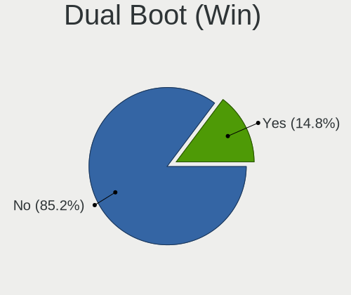
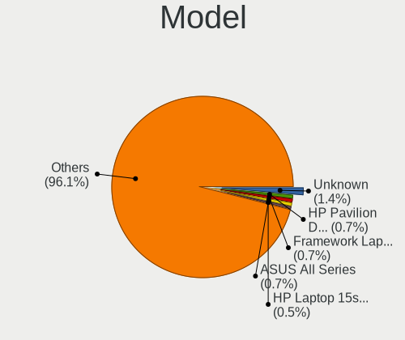
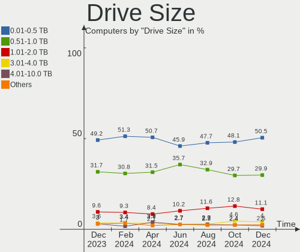
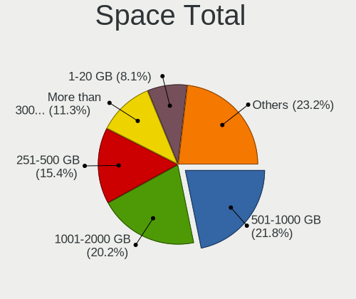
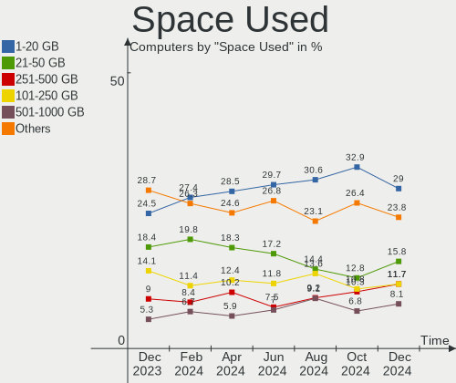
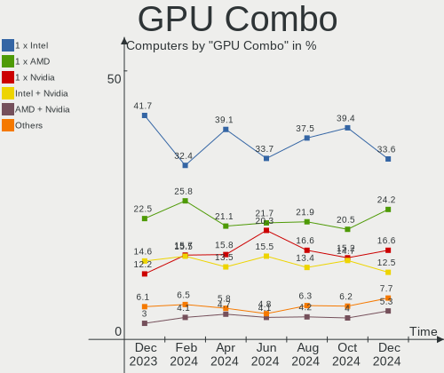
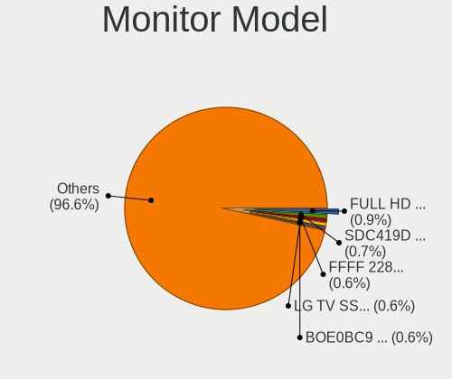
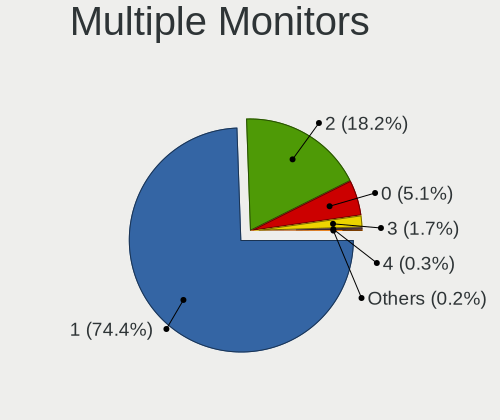
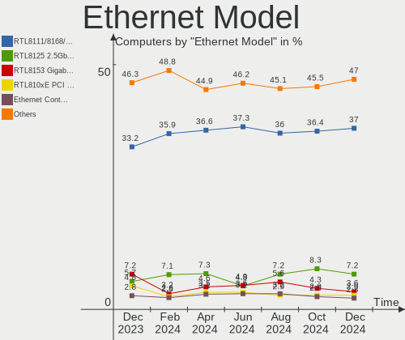
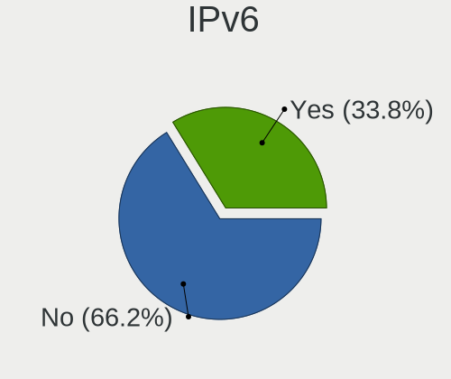

Fedora Hardware Trends
----------------------

A project to identify most popular hardware characteristics and track their change
over time based on data collected by Fedora users at https://Linux-Hardware.org.

Anyone can contribute to this report by the [hw-probe](https://github.com/linuxhw/hw-probe) tool:

    sudo -E hw-probe -all -upload

This is a report for all computer types. See also reports for [desktops](/Dist/Fedora/Desktop/README.md) and [notebooks](/Dist/Fedora/Notebook/README.md).

Full-feature report is available here: https://linux-hardware.org/?view=trends

Period: Jul, 2021.

Contents
--------

* [ System ](#system)
  - [ OS                       ](#os)
  - [ OS Family                ](#os-family)
  - [ Kernel                   ](#kernel)
  - [ Kernel Family            ](#kernel-family)
  - [ Kernel Major Ver.        ](#kernel-major-ver)
  - [ Arch                     ](#arch)
  - [ DE                       ](#de)
  - [ Display Server           ](#display-server)
  - [ Display Manager          ](#display-manager)
  - [ OS Lang                  ](#os-lang)
  - [ Boot Mode                ](#boot-mode)
  - [ Filesystem               ](#filesystem)
  - [ Part. scheme             ](#part-scheme)
  - [ Dual Boot with Linux/BSD ](#dual-boot-with-linuxbsd)
  - [ Dual Boot (Win)          ](#dual-boot-win)

* [ Board ](#board)
  - [ Vendor                   ](#vendor)
  - [ Model                    ](#model)
  - [ Model Family             ](#model-family)
  - [ MFG Year                 ](#mfg-year)
  - [ Form Factor              ](#form-factor)
  - [ Secure Boot              ](#secure-boot)
  - [ Coreboot                 ](#coreboot)
  - [ RAM Size                 ](#ram-size)
  - [ RAM Used                 ](#ram-used)
  - [ Total Drives             ](#total-drives)
  - [ Has CD-ROM               ](#has-cd-rom)
  - [ Has Ethernet             ](#has-ethernet)
  - [ Has WiFi                 ](#has-wifi)
  - [ Has Bluetooth            ](#has-bluetooth)

* [ Location ](#location)
  - [ Country                  ](#country)
  - [ City                     ](#city)

* [ Drives ](#drives)
  - [ Drive Vendor             ](#drive-vendor)
  - [ Drive Model              ](#drive-model)
  - [ HDD Vendor               ](#hdd-vendor)
  - [ SSD Vendor               ](#ssd-vendor)
  - [ Drive Kind               ](#drive-kind)
  - [ Drive Connector          ](#drive-connector)
  - [ Drive Size               ](#drive-size)
  - [ Space Total              ](#space-total)
  - [ Space Used               ](#space-used)
  - [ Malfunc. Drives          ](#malfunc-drives)
  - [ Malfunc. Drive Vendor    ](#malfunc-drive-vendor)
  - [ Malfunc. HDD Vendor      ](#malfunc-hdd-vendor)
  - [ Malfunc. Drive Kind      ](#malfunc-drive-kind)
  - [ Failed Drives            ](#failed-drives)
  - [ Failed Drive Vendor      ](#failed-drive-vendor)
  - [ Drive Status             ](#drive-status)

* [ Storage controller ](#storage-controller)
  - [ Storage Vendor           ](#storage-vendor)
  - [ Storage Model            ](#storage-model)
  - [ Storage Kind             ](#storage-kind)

* [ Processor ](#processor)
  - [ CPU Vendor               ](#cpu-vendor)
  - [ CPU Model                ](#cpu-model)
  - [ CPU Model Family         ](#cpu-model-family)
  - [ CPU Cores                ](#cpu-cores)
  - [ CPU Sockets              ](#cpu-sockets)
  - [ CPU Threads              ](#cpu-threads)
  - [ CPU Op-Modes             ](#cpu-op-modes)
  - [ CPU Microcode            ](#cpu-microcode)
  - [ CPU Microarch            ](#cpu-microarch)

* [ Graphics ](#graphics)
  - [ GPU Vendor               ](#gpu-vendor)
  - [ GPU Model                ](#gpu-model)
  - [ GPU Combo                ](#gpu-combo)
  - [ GPU Driver               ](#gpu-driver)
  - [ GPU Memory               ](#gpu-memory)

* [ Monitor ](#monitor)
  - [ Monitor Vendor           ](#monitor-vendor)
  - [ Monitor Model            ](#monitor-model)
  - [ Monitor Resolution       ](#monitor-resolution)
  - [ Monitor Diagonal         ](#monitor-diagonal)
  - [ Monitor Width            ](#monitor-width)
  - [ Aspect Ratio             ](#aspect-ratio)
  - [ Monitor Area             ](#monitor-area)
  - [ Pixel Density            ](#pixel-density)
  - [ Multiple Monitors        ](#multiple-monitors)

* [ Network ](#network)
  - [ Net Controller Vendor    ](#net-controller-vendor)
  - [ Net Controller Model     ](#net-controller-model)
  - [ Wireless Vendor          ](#wireless-vendor)
  - [ Wireless Model           ](#wireless-model)
  - [ Ethernet Vendor          ](#ethernet-vendor)
  - [ Ethernet Model           ](#ethernet-model)
  - [ Net Controller Kind      ](#net-controller-kind)
  - [ Used Controller          ](#used-controller)
  - [ NICs                     ](#nics)
  - [ IPv6                     ](#ipv6)

* [ Bluetooth ](#bluetooth)
  - [ Bluetooth Vendor         ](#bluetooth-vendor)
  - [ Bluetooth Model          ](#bluetooth-model)

* [ Sound ](#sound)
  - [ Sound Vendor             ](#sound-vendor)
  - [ Sound Model              ](#sound-model)

* [ Memory ](#memory)
  - [ Memory Vendor            ](#memory-vendor)
  - [ Memory Model             ](#memory-model)
  - [ Memory Kind              ](#memory-kind)
  - [ Memory Form Factor       ](#memory-form-factor)
  - [ Memory Size              ](#memory-size)
  - [ Memory Speed             ](#memory-speed)

* [ Printers & scanners ](#printers--scanners)
  - [ Printer Vendor           ](#printer-vendor)
  - [ Printer Model            ](#printer-model)
  - [ Scanner Vendor           ](#scanner-vendor)
  - [ Scanner Model            ](#scanner-model)

* [ Camera ](#camera)
  - [ Camera Vendor            ](#camera-vendor)
  - [ Camera Model             ](#camera-model)

* [ Security ](#security)
  - [ Fingerprint Vendor       ](#fingerprint-vendor)
  - [ Fingerprint Model        ](#fingerprint-model)
  - [ Chipcard Vendor          ](#chipcard-vendor)
  - [ Chipcard Model           ](#chipcard-model)

* [ Unsupported ](#unsupported)
  - [ Unsupported Devices      ](#unsupported-devices)
  - [ Unsupported Device Types ](#unsupported-device-types)

System
------

OS
--

Installed operating systems

| Name      | Computers | Percent |
|-----------|-----------|---------|
| Fedora 34 | 266       | 89.86%  |
| Fedora 33 | 21        | 7.09%   |
| Fedora 32 | 4         | 1.35%   |
| Fedora 35 | 3         | 1.01%   |
| Fedora 31 | 2         | 0.68%   |

OS Family
---------

OS without a version

| Name   | Computers | Percent |
|--------|-----------|---------|
| Fedora | 296       | 100%    |

Kernel
------

Version of the Linux kernel

| Version                                             | Computers | Percent |
|-----------------------------------------------------|-----------|---------|
| 5.12.13-300.fc34.x86_64                             | 76        | 25.68%  |
| 5.12.14-300.fc34.x86_64                             | 53        | 17.91%  |
| 5.13.4-200.fc34.x86_64                              | 38        | 12.84%  |
| 5.12.15-300.fc34.x86_64                             | 35        | 11.82%  |
| 5.11.12-300.fc34.x86_64                             | 16        | 5.41%   |
| 5.12.12-300.fc34.x86_64                             | 10        | 3.38%   |
| 5.13.5-200.fc34.x86_64                              | 9         | 3.04%   |
| 5.12.17-300.fc34.x86_64                             | 8         | 2.7%    |
| 5.13.4-100.fc33.x86_64                              | 5         | 1.69%   |
| 5.13.1-300.fc34.x86_64                              | 5         | 1.69%   |
| 5.12.15-200.fc33.x86_64                             | 5         | 1.69%   |
| 5.12.13-200.fc33.x86_64                             | 4         | 1.35%   |
| 5.11.22-100.fc32.x86_64                             | 4         | 1.35%   |
| 5.12.11-300.fc34.x86_64                             | 2         | 0.68%   |
| 5.12.10-300.fc34.x86_64                             | 2         | 0.68%   |
| 5.9.9-200.fc33.x86_64                               | 1         | 0.34%   |
| 5.9.16-200.fc33.x86_64                              | 1         | 0.34%   |
| 5.8.18-100.fc31.x86_64                              | 1         | 0.34%   |
| 5.8.15-301.fc33.x86_64                              | 1         | 0.34%   |
| 5.3.7-301.fc31.x86_64                               | 1         | 0.34%   |
| 5.14.0-0.rc3.20210728git7d549995d4e0.31.fc35.x86_64 | 1         | 0.34%   |
| 5.14.0-0.rc0.20210701gitdbe69e433722.6.fc35.x86_64  | 1         | 0.34%   |
| 5.13.6-200.fc34.x86_64                              | 1         | 0.34%   |
| 5.13.2-300.fc34.x86_64                              | 1         | 0.34%   |
| 5.13.1-xm1.0.fc34.x86_64                            | 1         | 0.34%   |
| 5.13.0-xm1.1.fc34.x86_64                            | 1         | 0.34%   |
| 5.13.0-bersa1+                                      | 1         | 0.34%   |
| 5.13.0-58.fc35.x86_64                               | 1         | 0.34%   |
| 5.13.0-0.rc7.20210623git0c18f29aae7c.53.fc35.x86_64 | 1         | 0.34%   |
| 5.12.8-300.fc34.x86_64                              | 1         | 0.34%   |
| 5.12.17-200.fc33.x86_64                             | 1         | 0.34%   |
| 5.12.15-350.vanilla.1.fc34.x86_64                   | 1         | 0.34%   |
| 5.12.14-1.surface.fc34.x86_64                       | 1         | 0.34%   |
| 5.12.13                                             | 1         | 0.34%   |
| 5.12.12-200.fc33.x86_64                             | 1         | 0.34%   |
| 5.12.10-300.rog.fc34.x86_64                         | 1         | 0.34%   |
| 5.11.11-200.fc33.x86_64                             | 1         | 0.34%   |
| 5.10.47-1.fc32.qubes.x86_64                         | 1         | 0.34%   |
| 4.14.190+blu-spark-OOS                              | 1         | 0.34%   |

Kernel Family
-------------

Linux kernel without a distro release

| Version  | Computers | Percent |
|----------|-----------|---------|
| 5.12.13  | 81        | 27.36%  |
| 5.12.14  | 54        | 18.24%  |
| 5.13.4   | 43        | 14.53%  |
| 5.12.15  | 41        | 13.85%  |
| 5.11.12  | 16        | 5.41%   |
| 5.12.12  | 11        | 3.72%   |
| 5.13.5   | 9         | 3.04%   |
| 5.12.17  | 9         | 3.04%   |
| 5.13.1   | 6         | 2.03%   |
| 5.13.0   | 4         | 1.35%   |
| 5.11.22  | 4         | 1.35%   |
| 5.12.10  | 3         | 1.01%   |
| 5.14.0   | 2         | 0.68%   |
| 5.12.11  | 2         | 0.68%   |
| 5.9.9    | 1         | 0.34%   |
| 5.9.16   | 1         | 0.34%   |
| 5.8.18   | 1         | 0.34%   |
| 5.8.15   | 1         | 0.34%   |
| 5.3.7    | 1         | 0.34%   |
| 5.13.6   | 1         | 0.34%   |
| 5.13.2   | 1         | 0.34%   |
| 5.12.8   | 1         | 0.34%   |
| 5.11.11  | 1         | 0.34%   |
| 5.10.47  | 1         | 0.34%   |
| 4.14.190 | 1         | 0.34%   |

Kernel Major Ver.
-----------------

Linux kernel major version

| Version | Computers | Percent |
|---------|-----------|---------|
| 5.12    | 202       | 68.24%  |
| 5.13    | 64        | 21.62%  |
| 5.11    | 21        | 7.09%   |
| 5.9     | 2         | 0.68%   |
| 5.8     | 2         | 0.68%   |
| 5.14    | 2         | 0.68%   |
| 5.3     | 1         | 0.34%   |
| 5.10    | 1         | 0.34%   |
| 4.14    | 1         | 0.34%   |

Arch
----

OS architecture (x86_64, i586, etc.)

| Name    | Computers | Percent |
|---------|-----------|---------|
| x86_64  | 295       | 99.66%  |
| aarch64 | 1         | 0.34%   |

DE
--

Desktop Environment

| Name          | Computers | Percent |
|---------------|-----------|---------|
| GNOME         | 226       | 76.35%  |
| KDE5          | 19        | 6.42%   |
| Unknown       | 13        | 4.39%   |
| KDE           | 11        | 3.72%   |
| XFCE          | 5         | 1.69%   |
| X-Cinnamon    | 5         | 1.69%   |
| MATE          | 5         | 1.69%   |
| Cinnamon      | 5         | 1.69%   |
| GNOME Classic | 2         | 0.68%   |
| Deepin        | 2         | 0.68%   |
| LXDE          | 1         | 0.34%   |
| i3            | 1         | 0.34%   |
| dwm           | 1         | 0.34%   |

Display Server
--------------

X11 or Wayland

| Name    | Computers | Percent |
|---------|-----------|---------|
| Wayland | 179       | 60.47%  |
| X11     | 104       | 35.14%  |
| Tty     | 8         | 2.7%    |
| Unknown | 5         | 1.69%   |

Display Manager
---------------

SDDM, LightDM, etc.

| Name    | Computers | Percent |
|---------|-----------|---------|
| Unknown | 159       | 53.72%  |
| GDM     | 108       | 36.49%  |
| SDDM    | 15        | 5.07%   |
| TDM     | 8         | 2.7%    |
| LightDM | 4         | 1.35%   |
| XDM     | 1         | 0.34%   |
| KDM     | 1         | 0.34%   |

OS Lang
-------

Language

| Lang    | Computers | Percent |
|---------|-----------|---------|
| en_US   | 146       | 49.32%  |
| en_GB   | 27        | 9.12%   |
| ru_RU   | 20        | 6.76%   |
| pt_BR   | 14        | 4.73%   |
| fr_FR   | 14        | 4.73%   |
| de_DE   | 11        | 3.72%   |
| en_AU   | 9         | 3.04%   |
| it_IT   | 6         | 2.03%   |
| es_ES   | 6         | 2.03%   |
| en_IN   | 4         | 1.35%   |
| en_CA   | 4         | 1.35%   |
| nl_BE   | 3         | 1.01%   |
| de_AT   | 3         | 1.01%   |
| pl_PL   | 2         | 0.68%   |
| es_MX   | 2         | 0.68%   |
| es_EC   | 2         | 0.68%   |
| en_SG   | 2         | 0.68%   |
| cs_CZ   | 2         | 0.68%   |
| C       | 2         | 0.68%   |
| uk_UA   | 1         | 0.34%   |
| sk_SK   | 1         | 0.34%   |
| ru_UA   | 1         | 0.34%   |
| pt_PT   | 1         | 0.34%   |
| nl_NL   | 1         | 0.34%   |
| ms_MY   | 1         | 0.34%   |
| ja_JP   | 1         | 0.34%   |
| fr_BE   | 1         | 0.34%   |
| es_NI   | 1         | 0.34%   |
| es_DO   | 1         | 0.34%   |
| es_CO   | 1         | 0.34%   |
| es_CL   | 1         | 0.34%   |
| en_ZA   | 1         | 0.34%   |
| en_NZ   | 1         | 0.34%   |
| de_CH   | 1         | 0.34%   |
| da_DK   | 1         | 0.34%   |
| Unknown | 1         | 0.34%   |

Boot Mode
---------

EFI or BIOS

| Mode | Computers | Percent |
|------|-----------|---------|
| EFI  | 220       | 74.32%  |
| BIOS | 76        | 25.68%  |

Filesystem
----------

Type of filesystem

| Type    | Computers | Percent |
|---------|-----------|---------|
| Btrfs   | 201       | 67.91%  |
| Ext4    | 81        | 27.36%  |
| Xfs     | 13        | 4.39%   |
| Unknown | 1         | 0.34%   |

Part. scheme
------------

Scheme of partitioning

| Type    | Computers | Percent |
|---------|-----------|---------|
| Unknown | 153       | 51.69%  |
| GPT     | 119       | 40.2%   |
| MBR     | 24        | 8.11%   |

Dual Boot with Linux/BSD
------------------------

Hosting more than one Linux/BSD

| Dual boot | Computers | Percent |
|-----------|-----------|---------|
| No        | 265       | 89.53%  |
| Yes       | 31        | 10.47%  |

Dual Boot (Win)
---------------

Hosting Linux and Windows

| Dual boot | Computers | Percent |
|-----------|-----------|---------|
| No        | 240       | 81.08%  |
| Yes       | 56        | 18.92%  |

Board
-----

Vendor
------

Motherboard manufacturer

| Name                             | Computers | Percent |
|----------------------------------|-----------|---------|
| Lenovo                           | 63        | 21.28%  |
| Dell                             | 42        | 14.19%  |
| ASUSTek Computer                 | 40        | 13.51%  |
| Hewlett-Packard                  | 32        | 10.81%  |
| Gigabyte Technology              | 22        | 7.43%   |
| Acer                             | 16        | 5.41%   |
| MSI                              | 12        | 4.05%   |
| ASRock                           | 11        | 3.72%   |
| Apple                            | 6         | 2.03%   |
| Fujitsu                          | 5         | 1.69%   |
| Unknown                          | 5         | 1.69%   |
| Timi                             | 4         | 1.35%   |
| Toshiba                          | 3         | 1.01%   |
| Samsung Electronics              | 2         | 0.68%   |
| Notebook                         | 2         | 0.68%   |
| Intel                            | 2         | 0.68%   |
| HUAWEI                           | 2         | 0.68%   |
| EVGA                             | 2         | 0.68%   |
| TUXEDO                           | 1         | 0.34%   |
| SYWZ                             | 1         | 0.34%   |
| System76                         | 1         | 0.34%   |
| Sony                             | 1         | 0.34%   |
| Razer                            | 1         | 0.34%   |
| Purism                           | 1         | 0.34%   |
| Prestigio                        | 1         | 0.34%   |
| Positivo                         | 1         | 0.34%   |
| PC Specialist                    | 1         | 0.34%   |
| Microsoft                        | 1         | 0.34%   |
| Medion                           | 1         | 0.34%   |
| Login Informatica                | 1         | 0.34%   |
| Linx                             | 1         | 0.34%   |
| Intel Client Systems             | 1         | 0.34%   |
| HONOR                            | 1         | 0.34%   |
| HASEE Computer                   | 1         | 0.34%   |
| Google                           | 1         | 0.34%   |
| FUJITSU CLIENT COMPUTING LIMITED | 1         | 0.34%   |
| eMachines                        | 1         | 0.34%   |
| CompuLab                         | 1         | 0.34%   |
| Chuwi                            | 1         | 0.34%   |
| Biostar                          | 1         | 0.34%   |
| Avell High Performance           | 1         | 0.34%   |
| AMD                              | 1         | 0.34%   |
| Alienware                        | 1         | 0.34%   |

Model
-----

Motherboard model

| Name                                                                                     | Computers | Percent |
|------------------------------------------------------------------------------------------|-----------|---------|
| Unknown                                                                                  | 5         | 1.69%   |
| ASUS All Series                                                                          | 4         | 1.35%   |
| MSI MS-7C37                                                                              | 2         | 0.68%   |
| Lenovo Yoga 7 14ITL5 82BH                                                                | 2         | 0.68%   |
| HP Laptop 15s-eq2xxx                                                                     | 2         | 0.68%   |
| Dell OptiPlex 9020                                                                       | 2         | 0.68%   |
| ASUS TUF GAMING B550-PLUS                                                                | 2         | 0.68%   |
| ASUS ROG STRIX X570-F GAMING                                                             | 2         | 0.68%   |
| ASUS ROG STRIX X570-E GAMING                                                             | 2         | 0.68%   |
| Apple MacBookPro11,5                                                                     | 2         | 0.68%   |
| Acer Aspire E5-573G                                                                      | 2         | 0.68%   |
| TUXEDO InfinityBook S 15 Gen6                                                            | 1         | 0.34%   |
| Toshiba Satellite P50-C                                                                  | 1         | 0.34%   |
| Toshiba Satellite L750                                                                   | 1         | 0.34%   |
| Toshiba PORTEGE M800                                                                     | 1         | 0.34%   |
| Timi TM1707                                                                              | 1         | 0.34%   |
| Timi TM1701                                                                              | 1         | 0.34%   |
| Timi TM1604                                                                              | 1         | 0.34%   |
| Timi A35S                                                                                | 1         | 0.34%   |
| SYWZ S200 Series                                                                         | 1         | 0.34%   |
| System76 Oryx Pro                                                                        | 1         | 0.34%   |
| Sony VPCEB3PGX                                                                           | 1         | 0.34%   |
| Samsung 355V4C/355V4X/355V5C/355V5X/356V4C/356V4X/356V5C/356V5X/3445VC/3445VX/3545VC/354 | 1         | 0.34%   |
| Samsung 305V4A/305V5A/3415VA                                                             | 1         | 0.34%   |
| Razer Blade 15 Mid 2019-Base                                                             | 1         | 0.34%   |
| Purism Librem 15 v4                                                                      | 1         | 0.34%   |
| Prestigio PSB141C03                                                                      | 1         | 0.34%   |
| Positivo C41TB                                                                           | 1         | 0.34%   |
| PC Specialist N85_N87,HJ,HJ1,HK1                                                         | 1         | 0.34%   |
| Notebook NH55RGQ                                                                         | 1         | 0.34%   |
| Notebook L14xMU                                                                          | 1         | 0.34%   |
| MSI MS-7C36                                                                              | 1         | 0.34%   |
| MSI MS-7C02                                                                              | 1         | 0.34%   |
| MSI MS-7B98                                                                              | 1         | 0.34%   |
| MSI MS-7B89                                                                              | 1         | 0.34%   |
| MSI MS-7A38                                                                              | 1         | 0.34%   |
| MSI MS-7996                                                                              | 1         | 0.34%   |
| MSI MPG H410 Trident 3 (MS-B932)                                                         | 1         | 0.34%   |
| MSI Modern 14 A10M                                                                       | 1         | 0.34%   |
| MSI Cubi N 8GL (MS-B171)                                                                 | 1         | 0.34%   |
| MSI Bravo 17 A4DDR                                                                       | 1         | 0.34%   |
| Microsoft Surface Book 2                                                                 | 1         | 0.34%   |
| Medion E15301                                                                            | 1         | 0.34%   |
| Login Informatica LOG-QAL30                                                              | 1         | 0.34%   |
| Linx VISION004                                                                           | 1         | 0.34%   |
| Lenovo Yoga Slim 7 Pro 14ACH5 82MS                                                       | 1         | 0.34%   |
| Lenovo Yoga Slim 7 15IIL05 82AA                                                          | 1         | 0.34%   |
| Lenovo Yoga 920-13IKB 80Y7                                                               | 1         | 0.34%   |
| Lenovo Yoga 9 14ITL5 82BG                                                                | 1         | 0.34%   |
| Lenovo Yoga 700-14ISK 80QD                                                               | 1         | 0.34%   |
| Lenovo Yoga 510-15ISK 80S8                                                               | 1         | 0.34%   |
| Lenovo Yoga 2 Pro 20266                                                                  | 1         | 0.34%   |
| Lenovo V330-15IKB 81AX                                                                   | 1         | 0.34%   |
| Lenovo ThinkPad X61 7676A12                                                              | 1         | 0.34%   |
| Lenovo ThinkPad X250 20CLS4NUSA                                                          | 1         | 0.34%   |
| Lenovo ThinkPad X220 42914CG                                                             | 1         | 0.34%   |
| Lenovo ThinkPad X220 4289A92                                                             | 1         | 0.34%   |
| Lenovo ThinkPad X220 4286CTO                                                             | 1         | 0.34%   |
| Lenovo ThinkPad X1 Extreme 2nd 20QVCTO1WW                                                | 1         | 0.34%   |
| Lenovo ThinkPad X1 Carbon Gen 9 20XWCTO1WW                                               | 1         | 0.34%   |

Model Family
------------

Motherboard model prefix

| Name                | Computers | Percent |
|---------------------|-----------|---------|
| Lenovo ThinkPad     | 31        | 10.47%  |
| Lenovo IdeaPad      | 13        | 4.39%   |
| Dell Inspiron       | 13        | 4.39%   |
| Acer Aspire         | 12        | 4.05%   |
| ASUS ROG            | 10        | 3.38%   |
| Lenovo Yoga         | 9         | 3.04%   |
| HP Laptop           | 8         | 2.7%    |
| Dell XPS            | 7         | 2.36%   |
| Dell Latitude       | 7         | 2.36%   |
| Dell Vostro         | 6         | 2.03%   |
| HP EliteBook        | 5         | 1.69%   |
| Unknown             | 5         | 1.69%   |
| HP ProBook          | 4         | 1.35%   |
| HP Pavilion         | 4         | 1.35%   |
| Dell OptiPlex       | 4         | 1.35%   |
| ASUS All            | 4         | 1.35%   |
| Apple MacBookPro11  | 4         | 1.35%   |
| HP EliteDesk        | 3         | 1.01%   |
| Fujitsu LIFEBOOK    | 3         | 1.01%   |
| ASUS TUF            | 3         | 1.01%   |
| Toshiba Satellite   | 2         | 0.68%   |
| MSI MS-7C37         | 2         | 0.68%   |
| Lenovo ThinkCentre  | 2         | 0.68%   |
| Lenovo Legion       | 2         | 0.68%   |
| HP ENVY             | 2         | 0.68%   |
| HP Compaq           | 2         | 0.68%   |
| Gigabyte X570       | 2         | 0.68%   |
| Gigabyte B450       | 2         | 0.68%   |
| Fujitsu ESPRIMO     | 2         | 0.68%   |
| Dell Precision      | 2         | 0.68%   |
| ASUS ZenBook        | 2         | 0.68%   |
| ASUS VivoBook       | 2         | 0.68%   |
| ASUS PRIME          | 2         | 0.68%   |
| ASRock X399         | 2         | 0.68%   |
| Acer Swift          | 2         | 0.68%   |
| TUXEDO InfinityBook | 1         | 0.34%   |
| Toshiba PORTEGE     | 1         | 0.34%   |
| Timi TM1707         | 1         | 0.34%   |
| Timi TM1701         | 1         | 0.34%   |
| Timi TM1604         | 1         | 0.34%   |
| Timi A35S           | 1         | 0.34%   |
| SYWZ S200           | 1         | 0.34%   |
| System76 Oryx       | 1         | 0.34%   |
| Sony VPCEB3PGX      | 1         | 0.34%   |
| Samsung 355V4C      | 1         | 0.34%   |
| Samsung 305V4A      | 1         | 0.34%   |
| Razer Blade         | 1         | 0.34%   |
| Purism Librem       | 1         | 0.34%   |
| Prestigio PSB141C03 | 1         | 0.34%   |
| Positivo C41TB      | 1         | 0.34%   |
| PC Specialist N85   | 1         | 0.34%   |
| Notebook NH55RGQ    | 1         | 0.34%   |
| Notebook L14xMU     | 1         | 0.34%   |
| MSI MS-7C36         | 1         | 0.34%   |
| MSI MS-7C02         | 1         | 0.34%   |
| MSI MS-7B98         | 1         | 0.34%   |
| MSI MS-7B89         | 1         | 0.34%   |
| MSI MS-7A38         | 1         | 0.34%   |
| MSI MS-7996         | 1         | 0.34%   |
| MSI MPG             | 1         | 0.34%   |

MFG Year
--------

Motherboard manufacture year

| Year    | Computers | Percent |
|---------|-----------|---------|
| 2020    | 61        | 20.61%  |
| 2021    | 60        | 20.27%  |
| 2019    | 39        | 13.18%  |
| 2018    | 37        | 12.5%   |
| 2015    | 13        | 4.39%   |
| 2014    | 13        | 4.39%   |
| 2013    | 12        | 4.05%   |
| 2017    | 11        | 3.72%   |
| 2012    | 11        | 3.72%   |
| 2011    | 10        | 3.38%   |
| 2010    | 10        | 3.38%   |
| 2016    | 7         | 2.36%   |
| 2009    | 5         | 1.69%   |
| 2008    | 3         | 1.01%   |
| Unknown | 2         | 0.68%   |
| 2007    | 1         | 0.34%   |
| 2006    | 1         | 0.34%   |

Form Factor
-----------

Physical design of the computer

| Name        | Computers | Percent |
|-------------|-----------|---------|
| Notebook    | 172       | 58.11%  |
| Desktop     | 101       | 34.12%  |
| Convertible | 15        | 5.07%   |
| Tablet      | 3         | 1.01%   |
| Mini pc     | 3         | 1.01%   |
| All in one  | 1         | 0.34%   |
| Server      | 1         | 0.34%   |

Secure Boot
-----------

Enabled or disabled

| State    | Computers | Percent |
|----------|-----------|---------|
| Disabled | 257       | 86.82%  |
| Enabled  | 39        | 13.18%  |

Coreboot
--------

Have coreboot on board

| Used | Computers | Percent |
|------|-----------|---------|
| No   | 294       | 99.32%  |
| Yes  | 2         | 0.68%   |

RAM Size
--------

Total RAM memory

| Size in GB  | Computers | Percent |
|-------------|-----------|---------|
| 4.01-8.0    | 77        | 26.01%  |
| 16.01-24.0  | 75        | 25.34%  |
| 8.01-16.0   | 55        | 18.58%  |
| 32.01-64.0  | 38        | 12.84%  |
| 3.01-4.0    | 24        | 8.11%   |
| 64.01-256.0 | 12        | 4.05%   |
| 1.01-2.0    | 9         | 3.04%   |
| 24.01-32.0  | 4         | 1.35%   |
| 2.01-3.0    | 2         | 0.68%   |

RAM Used
--------

Used RAM memory

| Used GB    | Computers | Percent |
|------------|-----------|---------|
| 4.01-8.0   | 88        | 29.73%  |
| 2.01-3.0   | 78        | 26.35%  |
| 3.01-4.0   | 51        | 17.23%  |
| 1.01-2.0   | 46        | 15.54%  |
| 8.01-16.0  | 16        | 5.41%   |
| 0.51-1.0   | 12        | 4.05%   |
| 16.01-24.0 | 2         | 0.68%   |
| 0.01-0.5   | 2         | 0.68%   |
| 32.01-64.0 | 1         | 0.34%   |

Total Drives
------------

Number of drives on board

| Drives | Computers | Percent |
|--------|-----------|---------|
| 1      | 171       | 57.77%  |
| 2      | 70        | 23.65%  |
| 3      | 27        | 9.12%   |
| 4      | 15        | 5.07%   |
| 6      | 4         | 1.35%   |
| 5      | 4         | 1.35%   |
| 0      | 3         | 1.01%   |
| 8      | 1         | 0.34%   |
| 7      | 1         | 0.34%   |

Has CD-ROM
----------

Has CD-ROM on board

| Presented | Computers | Percent |
|-----------|-----------|---------|
| No        | 221       | 74.66%  |
| Yes       | 75        | 25.34%  |

Has Ethernet
------------

Has Ethernet on board

| Presented | Computers | Percent |
|-----------|-----------|---------|
| Yes       | 226       | 76.35%  |
| No        | 70        | 23.65%  |

Has WiFi
--------

Has WiFi module

| Presented | Computers | Percent |
|-----------|-----------|---------|
| Yes       | 235       | 79.39%  |
| No        | 61        | 20.61%  |

Has Bluetooth
-------------

Has Bluetooth module

| Presented | Computers | Percent |
|-----------|-----------|---------|
| Yes       | 204       | 68.92%  |
| No        | 92        | 31.08%  |

Location
--------

Country
-------

Geographic location (country)

| Country            | Computers | Percent |
|--------------------|-----------|---------|
| USA                | 64        | 21.62%  |
| Germany            | 21        | 7.09%   |
| Russia             | 20        | 6.76%   |
| Brazil             | 20        | 6.76%   |
| UK                 | 10        | 3.38%   |
| India              | 10        | 3.38%   |
| France             | 10        | 3.38%   |
| Belgium            | 9         | 3.04%   |
| Australia          | 9         | 3.04%   |
| Sweden             | 7         | 2.36%   |
| Netherlands        | 7         | 2.36%   |
| Italy              | 7         | 2.36%   |
| Ukraine            | 6         | 2.03%   |
| Spain              | 6         | 2.03%   |
| Canada             | 6         | 2.03%   |
| Poland             | 5         | 1.69%   |
| Switzerland        | 4         | 1.35%   |
| Portugal           | 4         | 1.35%   |
| Indonesia          | 4         | 1.35%   |
| Czechia            | 4         | 1.35%   |
| Austria            | 4         | 1.35%   |
| Slovakia           | 3         | 1.01%   |
| Mexico             | 3         | 1.01%   |
| Malaysia           | 3         | 1.01%   |
| Greece             | 3         | 1.01%   |
| Denmark            | 3         | 1.01%   |
| Belarus            | 3         | 1.01%   |
| Turkey             | 2         | 0.68%   |
| Norway             | 2         | 0.68%   |
| New Zealand        | 2         | 0.68%   |
| Latvia             | 2         | 0.68%   |
| Iran               | 2         | 0.68%   |
| Finland            | 2         | 0.68%   |
| Colombia           | 2         | 0.68%   |
| Chile              | 2         | 0.68%   |
| Vietnam            | 1         | 0.34%   |
| Uzbekistan         | 1         | 0.34%   |
| UAE                | 1         | 0.34%   |
| Thailand           | 1         | 0.34%   |
| Sri Lanka          | 1         | 0.34%   |
| South Africa       | 1         | 0.34%   |
| Serbia             | 1         | 0.34%   |
| Saudi Arabia       | 1         | 0.34%   |
| Romania            | 1         | 0.34%   |
| Pakistan           | 1         | 0.34%   |
| Nicaragua          | 1         | 0.34%   |
| Myanmar            | 1         | 0.34%   |
| Martinique         | 1         | 0.34%   |
| Madagascar         | 1         | 0.34%   |
| Kuwait             | 1         | 0.34%   |
| Japan              | 1         | 0.34%   |
| Hungary            | 1         | 0.34%   |
| Estonia            | 1         | 0.34%   |
| El Salvador        | 1         | 0.34%   |
| Egypt              | 1         | 0.34%   |
| Ecuador            | 1         | 0.34%   |
| Dominican Republic | 1         | 0.34%   |
| China              | 1         | 0.34%   |
| Bulgaria           | 1         | 0.34%   |
| Argentina          | 1         | 0.34%   |

City
----

Geographic location (city)

| City                    | Computers | Percent |
|-------------------------|-----------|---------|
| Sydney                  | 8         | 2.7%    |
| Moscow                  | 5         | 1.69%   |
| Zurich                  | 3         | 1.01%   |
| Riverside               | 3         | 1.01%   |
| Prague                  | 3         | 1.01%   |
| Minsk                   | 3         | 1.01%   |
| Kyiv                    | 3         | 1.01%   |
| Jambes                  | 3         | 1.01%   |
| Brussels                | 3         | 1.01%   |
| Athens                  | 3         | 1.01%   |
| Wroclaw                 | 2         | 0.68%   |
| São Paulo              | 2         | 0.68%   |
| Stuttgart               | 2         | 0.68%   |
| St Petersburg           | 2         | 0.68%   |
| Spalding                | 2         | 0.68%   |
| Salvador                | 2         | 0.68%   |
| Riga                    | 2         | 0.68%   |
| Reutov                  | 2         | 0.68%   |
| Remilly                 | 2         | 0.68%   |
| Overland Park           | 2         | 0.68%   |
| New York                | 2         | 0.68%   |
| Mumbai                  | 2         | 0.68%   |
| Madrid                  | 2         | 0.68%   |
| London                  | 2         | 0.68%   |
| Lebanon                 | 2         | 0.68%   |
| Kota Kinabalu           | 2         | 0.68%   |
| Hohenau                 | 2         | 0.68%   |
| Fort Worth              | 2         | 0.68%   |
| Feeding Hills           | 2         | 0.68%   |
| Bratislava              | 2         | 0.68%   |
| Biysk                   | 2         | 0.68%   |
| Berlin                  | 2         | 0.68%   |
| Amsterdam               | 2         | 0.68%   |
| Zuidwolde               | 1         | 0.34%   |
| Zhukovskiy              | 1         | 0.34%   |
| Yekaterinburg           | 1         | 0.34%   |
| Yangon                  | 1         | 0.34%   |
| Worms                   | 1         | 0.34%   |
| Winnipeg                | 1         | 0.34%   |
| Willingboro             | 1         | 0.34%   |
| Wiesloch                | 1         | 0.34%   |
| Westminster             | 1         | 0.34%   |
| Weiterstadt             | 1         | 0.34%   |
| Wałbrzych              | 1         | 0.34%   |
| Waterloo                | 1         | 0.34%   |
| Wallingford             | 1         | 0.34%   |
| Vitrolles               | 1         | 0.34%   |
| Villefranche-sur-Saône | 1         | 0.34%   |
| Vila Nova de Famalicao  | 1         | 0.34%   |
| Ven                     | 1         | 0.34%   |
| Vechta                  | 1         | 0.34%   |
| Vaxjo                   | 1         | 0.34%   |
| Varna                   | 1         | 0.34%   |
| Valbom                  | 1         | 0.34%   |
| Urgench                 | 1         | 0.34%   |
| Ufa                     | 1         | 0.34%   |
| Turin                   | 1         | 0.34%   |
| Trieste                 | 1         | 0.34%   |
| Thanjavur               | 1         | 0.34%   |
| Temuco                  | 1         | 0.34%   |

Drives
------

Drive Vendor
------------

Hard drive vendors

| Vendor                    | Computers | Drives | Percent |
|---------------------------|-----------|--------|---------|
| Samsung Electronics       | 91        | 123    | 20.68%  |
| WDC                       | 62        | 74     | 14.09%  |
| Seagate                   | 58        | 75     | 13.18%  |
| Toshiba                   | 25        | 27     | 5.68%   |
| SK Hynix                  | 19        | 19     | 4.32%   |
| Kingston                  | 19        | 21     | 4.32%   |
| Crucial                   | 18        | 22     | 4.09%   |
| Unknown                   | 16        | 17     | 3.64%   |
| SanDisk                   | 14        | 14     | 3.18%   |
| Intel                     | 12        | 13     | 2.73%   |
| Micron Technology         | 10        | 10     | 2.27%   |
| KIOXIA                    | 9         | 10     | 2.05%   |
| Hitachi                   | 7         | 7      | 1.59%   |
| Union Memory              | 5         | 5      | 1.14%   |
| SPCC                      | 5         | 5      | 1.14%   |
| Phison                    | 5         | 5      | 1.14%   |
| PNY                       | 4         | 5      | 0.91%   |
| LITEON                    | 4         | 4      | 0.91%   |
| HGST                      | 4         | 4      | 0.91%   |
| Apple                     | 4         | 4      | 0.91%   |
| Gigabyte Technology       | 3         | 3      | 0.68%   |
| Corsair                   | 3         | 3      | 0.68%   |
| A-DATA Technology         | 3         | 3      | 0.68%   |
| LITEONIT                  | 2         | 2      | 0.45%   |
| Lexar                     | 2         | 2      | 0.45%   |
| JMicron                   | 2         | 2      | 0.45%   |
| Intenso                   | 2         | 2      | 0.45%   |
| XrayDisk                  | 1         | 1      | 0.23%   |
| XPG                       | 1         | 1      | 0.23%   |
| WDC WDS2                  | 1         | 1      | 0.23%   |
| Verbatim                  | 1         | 1      | 0.23%   |
| USB 3.0                   | 1         | 1      | 0.23%   |
| Transcend                 | 1         | 1      | 0.23%   |
| Team                      | 1         | 1      | 0.23%   |
| Solid State Storage       | 1         | 1      | 0.23%   |
| Silicon Motion            | 1         | 1      | 0.23%   |
| Realtek Semiconductor     | 1         | 1      | 0.23%   |
| Phison Electronics        | 1         | 1      | 0.23%   |
| Patriot                   | 1         | 1      | 0.23%   |
| OWC                       | 1         | 1      | 0.23%   |
| OCZ-ARC1                  | 1         | 1      | 0.23%   |
| OCZ                       | 1         | 1      | 0.23%   |
| MTFDDAK1                  | 1         | 1      | 0.23%   |
| Micron/Crucial Technology | 1         | 1      | 0.23%   |
| Maxtor                    | 1         | 1      | 0.23%   |
| Lenovo                    | 1         | 1      | 0.23%   |
| KLEVV                     | 1         | 1      | 0.23%   |
| KIOXIA-EXCERIA            | 1         | 1      | 0.23%   |
| KingSpec                  | 1         | 1      | 0.23%   |
| KingFast                  | 1         | 1      | 0.23%   |
| Inateck                   | 1         | 1      | 0.23%   |
| HS-SSD-E100               | 1         | 1      | 0.23%   |
| Hoodisk                   | 1         | 1      | 0.23%   |
| Hewlett-Packard           | 1         | 1      | 0.23%   |
| GALAX                     | 1         | 1      | 0.23%   |
| EMTEC                     | 1         | 1      | 0.23%   |
| DOGFISH                   | 1         | 1      | 0.23%   |
| CT1000P1                  | 1         | 1      | 0.23%   |
| China                     | 1         | 1      | 0.23%   |

Drive Model
-----------

Hard drive models

| Model                                    | Computers | Percent |
|------------------------------------------|-----------|---------|
| Samsung SSD 860 EVO 500GB                | 8         | 1.62%   |
| Samsung NVMe SSD Drive 512GB             | 8         | 1.62%   |
| Samsung NVMe SSD Drive 256GB             | 7         | 1.42%   |
| Samsung SSD 860 EVO 1TB                  | 6         | 1.21%   |
| Toshiba MQ01ABD100 1TB                   | 5         | 1.01%   |
| Seagate ST2000DM008-2FR102 2TB           | 5         | 1.01%   |
| Seagate ST1000LM035-1RK172 1TB           | 5         | 1.01%   |
| Samsung NVMe SSD Drive 500GB             | 5         | 1.01%   |
| Samsung NVMe SSD Drive 1TB               | 5         | 1.01%   |
| Toshiba NVMe SSD Drive 512GB             | 4         | 0.81%   |
| Seagate ST500DM002-1BD142 500GB          | 4         | 0.81%   |
| Seagate ST1000LM024 HN-M101MBB 1TB       | 4         | 0.81%   |
| Samsung SSD 860 EVO 250GB                | 4         | 0.81%   |
| Samsung SSD 850 EVO 500GB                | 4         | 0.81%   |
| Samsung SSD 850 EVO 250GB                | 4         | 0.81%   |
| Samsung SSD 840 EVO 250GB                | 4         | 0.81%   |
| Kingston SA400S37480G 480GB SSD          | 4         | 0.81%   |
| WDC WD10SPZX-21Z10T0 1TB                 | 3         | 0.61%   |
| Unknown MMC Card  32GB                   | 3         | 0.61%   |
| Seagate ST1000LM049-2GH172 1TB           | 3         | 0.61%   |
| Samsung SSD 970 PRO 512GB                | 3         | 0.61%   |
| Samsung MZVLB512HBJQ-000L7 512GB         | 3         | 0.61%   |
| Samsung HD501LJ 500GB                    | 3         | 0.61%   |
| KIOXIA NVMe SSD Drive 512GB              | 3         | 0.61%   |
| KIOXIA KBG40ZNV512G 512GB                | 3         | 0.61%   |
| HGST HTS541010A9E680 1TB                 | 3         | 0.61%   |
| Crucial CT500MX500SSD1 500GB             | 3         | 0.61%   |
| WDC WDS500G2B0A-00SM50 500GB SSD         | 2         | 0.4%    |
| WDC WD40EZRZ-00GXCB0 4TB                 | 2         | 0.4%    |
| WDC WD20EZRZ-00Z5HB0 2TB                 | 2         | 0.4%    |
| WDC WD10JPVX-75JC3T0 1TB                 | 2         | 0.4%    |
| WDC WD10EZEX-08M2NA0 1TB                 | 2         | 0.4%    |
| WDC PC SN730 SDBPNTY-512G-1027 512GB     | 2         | 0.4%    |
| Unknown SD/MMC/MS PRO 128GB              | 2         | 0.4%    |
| Union Memory UMIS RPJTJ512MEE1OWX 512GB  | 2         | 0.4%    |
| Toshiba NVMe SSD Drive 256GB             | 2         | 0.4%    |
| Toshiba KXG60ZNV1T02 NVMe KIOXIA 1024GB  | 2         | 0.4%    |
| SK Hynix NVMe SSD Drive 512GB            | 2         | 0.4%    |
| SK Hynix NVMe SSD Drive 1TB              | 2         | 0.4%    |
| SK Hynix NVMe SSD Drive 1024GB           | 2         | 0.4%    |
| Seagate ST4000DM004-2CV104 4TB           | 2         | 0.4%    |
| Seagate ST3500630AS 500GB                | 2         | 0.4%    |
| Seagate ST3500418AS 500GB                | 2         | 0.4%    |
| Seagate ST3160812AS 160GB                | 2         | 0.4%    |
| Seagate ST2000LM007-1R8174 2TB           | 2         | 0.4%    |
| Seagate ST1000LM048-2E7172 1TB           | 2         | 0.4%    |
| Seagate BUP BK 4TB                       | 2         | 0.4%    |
| Sandisk NVMe SSD Drive 500GB             | 2         | 0.4%    |
| Samsung SSD 970 EVO Plus 500GB           | 2         | 0.4%    |
| Samsung SSD 970 EVO 1TB                  | 2         | 0.4%    |
| Samsung SSD 850 PRO 1TB                  | 2         | 0.4%    |
| Samsung SSD 840 EVO 120GB                | 2         | 0.4%    |
| Samsung MZVLQ512HALU-000H1 512GB         | 2         | 0.4%    |
| Samsung HD502HI 500GB                    | 2         | 0.4%    |
| PNY CS900 240GB SSD                      | 2         | 0.4%    |
| Micron MTFDDAV256TBN-1AR15ABHA 256GB SSD | 2         | 0.4%    |
| KIOXIA NVMe SSD Drive 256GB              | 2         | 0.4%    |
| Kingston SA400S37240G 240GB SSD          | 2         | 0.4%    |
| Kingston SA400S37120G 120GB SSD          | 2         | 0.4%    |
| Intel SSDSC2CT120A3 120GB                | 2         | 0.4%    |

HDD Vendor
----------

Hard disk drive vendors

| Vendor              | Computers | Drives | Percent |
|---------------------|-----------|--------|---------|
| Seagate             | 58        | 74     | 41.13%  |
| WDC                 | 48        | 57     | 34.04%  |
| Toshiba             | 14        | 15     | 9.93%   |
| Samsung Electronics | 7         | 8      | 4.96%   |
| Hitachi             | 7         | 7      | 4.96%   |
| HGST                | 4         | 4      | 2.84%   |
| Unknown             | 1         | 1      | 0.71%   |
| Inateck             | 1         | 1      | 0.71%   |
| Hewlett-Packard     | 1         | 1      | 0.71%   |

SSD Vendor
----------

Solid state drive vendors

| Vendor              | Computers | Drives | Percent |
|---------------------|-----------|--------|---------|
| Samsung Electronics | 48        | 62     | 30.38%  |
| Crucial             | 16        | 20     | 10.13%  |
| Kingston            | 14        | 15     | 8.86%   |
| WDC                 | 9         | 10     | 5.7%    |
| SanDisk             | 8         | 8      | 5.06%   |
| Micron Technology   | 8         | 8      | 5.06%   |
| Intel               | 5         | 5      | 3.16%   |
| SPCC                | 4         | 4      | 2.53%   |
| PNY                 | 4         | 5      | 2.53%   |
| LITEON              | 4         | 4      | 2.53%   |
| Apple               | 4         | 4      | 2.53%   |
| SK Hynix            | 3         | 3      | 1.9%    |
| A-DATA Technology   | 3         | 3      | 1.9%    |
| LITEONIT            | 2         | 2      | 1.27%   |
| Lexar               | 2         | 2      | 1.27%   |
| Intenso             | 2         | 2      | 1.27%   |
| Gigabyte Technology | 2         | 2      | 1.27%   |
| WDC WDS2            | 1         | 1      | 0.63%   |
| Verbatim            | 1         | 1      | 0.63%   |
| Unknown             | 1         | 1      | 0.63%   |
| Transcend           | 1         | 1      | 0.63%   |
| Team                | 1         | 1      | 0.63%   |
| Patriot             | 1         | 1      | 0.63%   |
| OWC                 | 1         | 1      | 0.63%   |
| OCZ-ARC1            | 1         | 1      | 0.63%   |
| OCZ                 | 1         | 1      | 0.63%   |
| Maxtor              | 1         | 1      | 0.63%   |
| KLEVV               | 1         | 1      | 0.63%   |
| KIOXIA-EXCERIA      | 1         | 1      | 0.63%   |
| KingSpec            | 1         | 1      | 0.63%   |
| JMicron             | 1         | 1      | 0.63%   |
| Hoodisk             | 1         | 1      | 0.63%   |
| GALAX               | 1         | 1      | 0.63%   |
| EMTEC               | 1         | 1      | 0.63%   |
| DOGFISH             | 1         | 1      | 0.63%   |
| CT1000P1            | 1         | 1      | 0.63%   |
| China               | 1         | 1      | 0.63%   |

Drive Kind
----------

HDD or SSD

| Kind    | Computers | Drives | Percent |
|---------|-----------|--------|---------|
| SSD     | 138       | 179    | 34.76%  |
| NVMe    | 123       | 144    | 30.98%  |
| HDD     | 115       | 168    | 28.97%  |
| MMC     | 13        | 14     | 3.27%   |
| Unknown | 8         | 8      | 2.02%   |

Drive Connector
---------------

SATA, SAS, NVMe, etc.

| Type | Computers | Drives | Percent |
|------|-----------|--------|---------|
| SATA | 200       | 330    | 56.18%  |
| NVMe | 123       | 144    | 34.55%  |
| SAS  | 20        | 25     | 5.62%   |
| MMC  | 13        | 14     | 3.65%   |

Drive Size
----------

Size of hard drive

| Size in TB | Computers | Drives | Percent |
|------------|-----------|--------|---------|
| 0.01-0.5   | 134       | 174    | 48.03%  |
| 0.51-1.0   | 92        | 110    | 32.97%  |
| 1.01-2.0   | 29        | 33     | 10.39%  |
| 3.01-4.0   | 12        | 14     | 4.3%    |
| 2.01-3.0   | 5         | 7      | 1.79%   |
| 4.01-10.0  | 4         | 5      | 1.43%   |
| 10.01-20.0 | 2         | 3      | 0.72%   |
| 0          | 1         | 1      | 0.36%   |

Space Total
-----------

Amount of disk space available on the file system

| Size in GB     | Computers | Percent |
|----------------|-----------|---------|
| 501-1000       | 63        | 21.28%  |
| 251-500        | 50        | 16.89%  |
| 101-250        | 41        | 13.85%  |
| 1001-2000      | 36        | 12.16%  |
| Unknown        | 31        | 10.47%  |
| 1-20           | 28        | 9.46%   |
| More than 3000 | 21        | 7.09%   |
| 51-100         | 12        | 4.05%   |
| 2001-3000      | 8         | 2.7%    |
| 21-50          | 6         | 2.03%   |

Space Used
----------

Amount of used disk space

| Used GB        | Computers | Percent |
|----------------|-----------|---------|
| 1-20           | 80        | 27.03%  |
| 101-250        | 47        | 15.88%  |
| 21-50          | 34        | 11.49%  |
| Unknown        | 31        | 10.47%  |
| 51-100         | 30        | 10.14%  |
| 251-500        | 27        | 9.12%   |
| 501-1000       | 26        | 8.78%   |
| 1001-2000      | 11        | 3.72%   |
| More than 3000 | 6         | 2.03%   |
| 2001-3000      | 4         | 1.35%   |

Malfunc. Drives
---------------

Drive models with a malfunction

| Model                                   | Computers | Drives | Percent |
|-----------------------------------------|-----------|--------|---------|
| Seagate ST1000LM035-1RK172 1TB          | 3         | 3      | 8.82%   |
| Seagate ST3500630AS 500GB               | 2         | 2      | 5.88%   |
| Intel SSDSC2CT120A3 120GB               | 2         | 2      | 5.88%   |
| WDC WD60EFAX-68SHWN0 6TB                | 1         | 1      | 2.94%   |
| WDC WD3200BPVT-75ZEST0 320GB            | 1         | 1      | 2.94%   |
| WDC WD30EZRX-00MMMB0 3TB                | 1         | 1      | 2.94%   |
| WDC WD20EFRX-68AX9N0 2TB                | 1         | 1      | 2.94%   |
| WDC WD10SPZX-24Z10 1TB                  | 1         | 1      | 2.94%   |
| WDC WD10JPVX-75JC3T0 1TB                | 1         | 1      | 2.94%   |
| WDC WD1003FBYX-01Y7B1 1TB               | 1         | 1      | 2.94%   |
| Verbatim SATA-III SSD 256GB             | 1         | 1      | 2.94%   |
| Union Memory UMIS RPJTJ128MED1MWX 128GB | 1         | 1      | 2.94%   |
| Toshiba MQ01ABD100 1TB                  | 1         | 1      | 2.94%   |
| Toshiba MK5061GSY 500GB                 | 1         | 1      | 2.94%   |
| Toshiba HDWQ140 4TB                     | 1         | 1      | 2.94%   |
| SPCC Solid State Disk 256GB             | 1         | 1      | 2.94%   |
| SK Hynix PC401 NVMe 1TB                 | 1         | 1      | 2.94%   |
| Seagate ST500DM002-1BD142 500GB         | 1         | 1      | 2.94%   |
| Seagate ST3160812AS 160GB               | 1         | 1      | 2.94%   |
| Seagate ST1000LM049-2GH172 1TB          | 1         | 1      | 2.94%   |
| Seagate ST1000LM024 HN-M101MBB 1TB      | 1         | 1      | 2.94%   |
| Seagate ST1000DX001-1CM162 1TB          | 1         | 1      | 2.94%   |
| SanDisk SSD U100 64GB                   | 1         | 1      | 2.94%   |
| Samsung Electronics SSD 970 EVO 1TB     | 1         | 1      | 2.94%   |
| Samsung Electronics SP2004C 200GB       | 1         | 1      | 2.94%   |
| Samsung Electronics HD501LJ 500GB       | 1         | 2      | 2.94%   |
| LITEON LGH-512V2G-11 M.2 2280 512GB SSD | 1         | 1      | 2.94%   |
| Intel SSDSC2KF480H6L 480GB              | 1         | 1      | 2.94%   |
| Crucial CT275MX300SSD1 275GB            | 1         | 1      | 2.94%   |
| Crucial CT128MX100SSD1 128GB            | 1         | 1      | 2.94%   |

Malfunc. Drive Vendor
---------------------

Vendors of faulty drives

| Vendor              | Computers | Drives | Percent |
|---------------------|-----------|--------|---------|
| Seagate             | 10        | 10     | 29.41%  |
| WDC                 | 7         | 7      | 20.59%  |
| Toshiba             | 3         | 3      | 8.82%   |
| Samsung Electronics | 3         | 4      | 8.82%   |
| Intel               | 3         | 3      | 8.82%   |
| Crucial             | 2         | 2      | 5.88%   |
| Verbatim            | 1         | 1      | 2.94%   |
| Union Memory        | 1         | 1      | 2.94%   |
| SPCC                | 1         | 1      | 2.94%   |
| SK Hynix            | 1         | 1      | 2.94%   |
| SanDisk             | 1         | 1      | 2.94%   |
| LITEON              | 1         | 1      | 2.94%   |

Malfunc. HDD Vendor
-------------------

Vendors of faulty HDD drives

| Vendor              | Computers | Drives | Percent |
|---------------------|-----------|--------|---------|
| Seagate             | 10        | 10     | 45.45%  |
| WDC                 | 7         | 7      | 31.82%  |
| Toshiba             | 3         | 3      | 13.64%  |
| Samsung Electronics | 2         | 3      | 9.09%   |

Malfunc. Drive Kind
-------------------

Kinds of faulty drives

| Kind | Computers | Drives | Percent |
|------|-----------|--------|---------|
| HDD  | 21        | 23     | 63.64%  |
| SSD  | 9         | 9      | 27.27%  |
| NVMe | 3         | 3      | 9.09%   |

Failed Drives
-------------

Failed drive models

Zero info for selected period =(

Failed Drive Vendor
-------------------

Failed drive vendors

Zero info for selected period =(

Drive Status
------------

Number of failed and malfunc. drives

| Status   | Computers | Drives | Percent |
|----------|-----------|--------|---------|
| Detected | 167       | 278    | 51.38%  |
| Works    | 127       | 200    | 39.08%  |
| Malfunc  | 31        | 35     | 9.54%   |

Storage controller
------------------

Storage Vendor
--------------

Storage controller vendors

| Vendor                         | Computers | Percent |
|--------------------------------|-----------|---------|
| Intel                          | 169       | 44.59%  |
| AMD                            | 64        | 16.89%  |
| Samsung Electronics            | 47        | 12.4%   |
| SK Hynix                       | 15        | 3.96%   |
| Sandisk                        | 13        | 3.43%   |
| Toshiba America Info Systems   | 11        | 2.9%    |
| Phison Electronics             | 11        | 2.9%    |
| KIOXIA                         | 9         | 2.37%   |
| ASMedia Technology             | 8         | 2.11%   |
| Union Memory (Shenzhen)        | 5         | 1.32%   |
| Kingston Technology Company    | 5         | 1.32%   |
| Micron/Crucial Technology      | 3         | 0.79%   |
| Marvell Technology Group       | 3         | 0.79%   |
| JMicron Technology             | 3         | 0.79%   |
| Silicon Motion                 | 2         | 0.53%   |
| Micron Technology              | 2         | 0.53%   |
| ULi Electronics                | 1         | 0.26%   |
| Solid State Storage Technology | 1         | 0.26%   |
| Silicon Image                  | 1         | 0.26%   |
| Realtek Semiconductor          | 1         | 0.26%   |
| Nvidia                         | 1         | 0.26%   |
| LSI Logic / Symbios Logic      | 1         | 0.26%   |
| Lenovo                         | 1         | 0.26%   |
| Broadcom / LSI                 | 1         | 0.26%   |
| ADATA Technology               | 1         | 0.26%   |

Storage Model
-------------

Storage controller models

| Model                                                                          | Computers | Percent |
|--------------------------------------------------------------------------------|-----------|---------|
| AMD FCH SATA Controller [AHCI mode]                                            | 46        | 10.8%   |
| Intel Sunrise Point-LP SATA Controller [AHCI mode]                             | 31        | 7.28%   |
| Samsung NVMe SSD Controller SM981/PM981/PM983                                  | 28        | 6.57%   |
| Intel 8 Series/C220 Series Chipset Family 6-port SATA Controller 1 [AHCI mode] | 11        | 2.58%   |
| Intel 7 Series Chipset Family 6-port SATA Controller [AHCI mode]               | 10        | 2.35%   |
| KIOXIA Non-Volatile memory controller                                          | 9         | 2.11%   |
| Intel Cannon Lake Mobile PCH SATA AHCI Controller                              | 9         | 2.11%   |
| Intel 82801 Mobile SATA Controller [RAID mode]                                 | 9         | 2.11%   |
| Samsung NVMe SSD Controller SM961/PM961/SM963                                  | 8         | 1.88%   |
| Samsung NVMe Controller                                                        | 8         | 1.88%   |
| Intel Volume Management Device NVMe RAID Controller                            | 8         | 1.88%   |
| Intel 6 Series/C200 Series Chipset Family 6 port Mobile SATA AHCI Controller   | 8         | 1.88%   |
| ASMedia ASM1062 Serial ATA Controller                                          | 8         | 1.88%   |
| AMD 400 Series Chipset SATA Controller                                         | 8         | 1.88%   |
| Intel Wildcat Point-LP SATA Controller [AHCI Mode]                             | 7         | 1.64%   |
| AMD Starship/Matisse Chipset SATA Controller [AHCI mode]                       | 7         | 1.64%   |
| AMD SB7x0/SB8x0/SB9x0 SATA Controller [AHCI mode]                              | 7         | 1.64%   |
| SK Hynix NVMe SSD Controller                                                   | 6         | 1.41%   |
| Intel Q170/Q150/B150/H170/H110/Z170/CM236 Chipset SATA Controller [AHCI Mode]  | 6         | 1.41%   |
| Intel 6 Series/C200 Series Chipset Family 6 port Desktop SATA AHCI Controller  | 6         | 1.41%   |
| AMD SB7x0/SB8x0/SB9x0 IDE Controller                                           | 6         | 1.41%   |
| Toshiba America Info Systems XG6 NVMe SSD Controller                           | 5         | 1.17%   |
| Phison E16 PCIe4 NVMe Controller                                               | 5         | 1.17%   |
| Intel Celeron/Pentium Silver Processor SATA Controller                         | 5         | 1.17%   |
| Intel 200 Series PCH SATA controller [AHCI mode]                               | 5         | 1.17%   |
| Union Memory (Shenzhen) Non-Volatile memory controller                         | 4         | 0.94%   |
| Sandisk WD Blue SN550 NVMe SSD                                                 | 4         | 0.94%   |
| Sandisk WD Black SN750 / PC SN730 NVMe SSD                                     | 4         | 0.94%   |
| Intel SATA Controller [RAID mode]                                              | 4         | 0.94%   |
| Intel NM10/ICH7 Family SATA Controller [IDE mode]                              | 4         | 0.94%   |
| Intel 8 Series SATA Controller 1 [AHCI mode]                                   | 4         | 0.94%   |
| AMD X399 Series Chipset SATA Controller                                        | 4         | 0.94%   |
| AMD FCH SATA Controller D                                                      | 4         | 0.94%   |
| SK Hynix BC501 NVMe Solid State Drive                                          | 3         | 0.7%    |
| Sandisk WD Black 2018/SN750 / PC SN720 NVMe SSD                                | 3         | 0.7%    |
| Phison E12 NVMe Controller                                                     | 3         | 0.7%    |
| Intel Tiger Lake-LP SATA Controller [AHCI mode]                                | 3         | 0.7%    |
| Intel SSD 660P Series                                                          | 3         | 0.7%    |
| Intel Cannon Point-LP SATA Controller [AHCI Mode]                              | 3         | 0.7%    |
| Intel 7 Series/C210 Series Chipset Family 6-port SATA Controller [AHCI mode]   | 3         | 0.7%    |
| AMD SB7x0/SB8x0/SB9x0 SATA Controller [IDE mode]                               | 3         | 0.7%    |
| Toshiba America Info Systems XG4 NVMe SSD Controller                           | 2         | 0.47%   |
| Toshiba America Info Systems BG3 NVMe SSD Controller                           | 2         | 0.47%   |
| SK Hynix PC401 NVMe Solid State Drive 256GB                                    | 2         | 0.47%   |
| SK Hynix Non-Volatile memory controller                                        | 2         | 0.47%   |
| SK Hynix BC511                                                                 | 2         | 0.47%   |
| Silicon Motion SM2263EN/SM2263XT SSD Controller                                | 2         | 0.47%   |
| Samsung NVMe SSD Controller SM951/PM951                                        | 2         | 0.47%   |
| Samsung NVMe SSD Controller PM9A1/PM9A3/980PRO                                 | 2         | 0.47%   |
| Samsung Electronics SATA controller                                            | 2         | 0.47%   |
| Samsung Apple PCIe SSD                                                         | 2         | 0.47%   |
| Phison PS5013 E13 NVMe Controller                                              | 2         | 0.47%   |
| Micron/Crucial P2 NVMe PCIe SSD                                                | 2         | 0.47%   |
| Micron Non-Volatile memory controller                                          | 2         | 0.47%   |
| Kingston Company Company Non-Volatile memory controller                        | 2         | 0.47%   |
| Kingston Company A2000 NVMe SSD                                                | 2         | 0.47%   |
| JMicron JMB368 IDE controller                                                  | 2         | 0.47%   |
| Intel NVMe Optane Memory Series                                                | 2         | 0.47%   |
| Intel Comet Lake SATA AHCI Controller                                          | 2         | 0.47%   |
| Intel Cannon Lake PCH SATA AHCI Controller                                     | 2         | 0.47%   |

Storage Kind
------------

Kind of storage controller (IDE, SATA, NVMe, SAS, ...)

| Kind | Computers | Percent |
|------|-----------|---------|
| SATA | 206       | 54.93%  |
| NVMe | 123       | 32.8%   |
| RAID | 22        | 5.87%   |
| IDE  | 22        | 5.87%   |
| SAS  | 2         | 0.53%   |

Processor
---------

CPU Vendor
----------

Processor vendors

| Vendor   | Computers | Percent |
|----------|-----------|---------|
| Intel    | 213       | 71.96%  |
| AMD      | 82        | 27.7%   |
| QUALCOMM | 1         | 0.34%   |

CPU Model
---------

Processor models

| Model                                          | Computers | Percent |
|------------------------------------------------|-----------|---------|
| Intel Core i7-8550U CPU @ 1.80GHz              | 9         | 3.04%   |
| Intel Core i5-8250U CPU @ 1.60GHz              | 8         | 2.7%    |
| Intel 11th Gen Core i5-1135G7 @ 2.40GHz        | 8         | 2.7%    |
| Intel 11th Gen Core i7-1165G7 @ 2.80GHz        | 7         | 2.36%   |
| Intel Core i5-6200U CPU @ 2.30GHz              | 6         | 2.03%   |
| Intel Core i7-8665U CPU @ 1.90GHz              | 4         | 1.35%   |
| Intel Core i5-8265U CPU @ 1.60GHz              | 4         | 1.35%   |
| Intel Core i5-7200U CPU @ 2.50GHz              | 4         | 1.35%   |
| AMD Ryzen 5 3500U with Radeon Vega Mobile Gfx  | 4         | 1.35%   |
| Intel Core i7-9750H CPU @ 2.60GHz              | 3         | 1.01%   |
| Intel Core i7-7500U CPU @ 2.70GHz              | 3         | 1.01%   |
| Intel Core i7-6600U CPU @ 2.60GHz              | 3         | 1.01%   |
| Intel Core i7-4790 CPU @ 3.60GHz               | 3         | 1.01%   |
| Intel Core i7-2640M CPU @ 2.80GHz              | 3         | 1.01%   |
| Intel Atom x5-Z8350 CPU @ 1.44GHz              | 3         | 1.01%   |
| AMD Ryzen Threadripper 1950X 16-Core Processor | 3         | 1.01%   |
| AMD Ryzen 9 3900X 12-Core Processor            | 3         | 1.01%   |
| AMD Ryzen 7 PRO 4750U with Radeon Graphics     | 3         | 1.01%   |
| AMD Ryzen 7 5800X 8-Core Processor             | 3         | 1.01%   |
| AMD Ryzen 7 3700X 8-Core Processor             | 3         | 1.01%   |
| AMD Ryzen 5 4500U with Radeon Graphics         | 3         | 1.01%   |
| AMD Ryzen 5 3400G with Radeon Vega Graphics    | 3         | 1.01%   |
| Intel Core i7-8750H CPU @ 2.20GHz              | 2         | 0.68%   |
| Intel Core i7-8700 CPU @ 3.20GHz               | 2         | 0.68%   |
| Intel Core i7-8650U CPU @ 1.90GHz              | 2         | 0.68%   |
| Intel Core i7-8565U CPU @ 1.80GHz              | 2         | 0.68%   |
| Intel Core i7-7600U CPU @ 2.80GHz              | 2         | 0.68%   |
| Intel Core i7-6700K CPU @ 4.00GHz              | 2         | 0.68%   |
| Intel Core i7-6700HQ CPU @ 2.60GHz             | 2         | 0.68%   |
| Intel Core i7-5500U CPU @ 2.40GHz              | 2         | 0.68%   |
| Intel Core i7-4980HQ CPU @ 2.80GHz             | 2         | 0.68%   |
| Intel Core i7-10750H CPU @ 2.60GHz             | 2         | 0.68%   |
| Intel Core i7-1065G7 CPU @ 1.30GHz             | 2         | 0.68%   |
| Intel Core i7-10510U CPU @ 1.80GHz             | 2         | 0.68%   |
| Intel Core i5-5300U CPU @ 2.30GHz              | 2         | 0.68%   |
| Intel Core i5-5200U CPU @ 2.20GHz              | 2         | 0.68%   |
| Intel Core i5-1035G1 CPU @ 1.00GHz             | 2         | 0.68%   |
| Intel Core i5-10210U CPU @ 1.60GHz             | 2         | 0.68%   |
| Intel Core i3-7100U CPU @ 2.40GHz              | 2         | 0.68%   |
| Intel Core i3-2350M CPU @ 2.30GHz              | 2         | 0.68%   |
| Intel Core i3-2310M CPU @ 2.10GHz              | 2         | 0.68%   |
| Intel Core i3 CPU M 370 @ 2.40GHz              | 2         | 0.68%   |
| Intel Celeron N4000 CPU @ 1.10GHz              | 2         | 0.68%   |
| Intel Atom CPU Z3736F @ 1.33GHz                | 2         | 0.68%   |
| AMD Ryzen 9 5900HX with Radeon Graphics        | 2         | 0.68%   |
| AMD Ryzen 9 3900XT 12-Core Processor           | 2         | 0.68%   |
| AMD Ryzen 7 4800H with Radeon Graphics         | 2         | 0.68%   |
| AMD Ryzen 7 3700U with Radeon Vega Mobile Gfx  | 2         | 0.68%   |
| AMD Ryzen 5 5600X 6-Core Processor             | 2         | 0.68%   |
| AMD Ryzen 5 4600H with Radeon Graphics         | 2         | 0.68%   |
| AMD Ryzen 5 3600 6-Core Processor              | 2         | 0.68%   |
| AMD Ryzen 5 2600 Six-Core Processor            | 2         | 0.68%   |
| AMD FX-8320 Eight-Core Processor               | 2         | 0.68%   |
| QUALCOMM AArch64 Processor rev 14 (aarch64)    | 1         | 0.34%   |
| Intel Xeon CPU E3-1245 v3 @ 3.40GHz            | 1         | 0.34%   |
| Intel Xeon CPU E3-1230 V2 @ 3.30GHz            | 1         | 0.34%   |
| Intel Xeon CPU E3-1220 V2 @ 3.10GHz            | 1         | 0.34%   |
| Intel Pentium Silver N5030 CPU @ 1.10GHz       | 1         | 0.34%   |
| Intel Pentium Silver N5000 CPU @ 1.10GHz       | 1         | 0.34%   |
| Intel Pentium Dual-Core CPU E5700 @ 3.00GHz    | 1         | 0.34%   |

CPU Model Family
----------------

Processor model prefix

| Model                   | Computers | Percent |
|-------------------------|-----------|---------|
| Intel Core i7           | 83        | 28.04%  |
| Intel Core i5           | 54        | 18.24%  |
| AMD Ryzen 5             | 23        | 7.77%   |
| Intel Core i3           | 21        | 7.09%   |
| Other                   | 17        | 5.74%   |
| AMD Ryzen 7             | 15        | 5.07%   |
| AMD Ryzen 9             | 12        | 4.05%   |
| Intel Core 2 Duo        | 7         | 2.36%   |
| Intel Celeron           | 7         | 2.36%   |
| Intel Atom              | 7         | 2.36%   |
| AMD FX                  | 6         | 2.03%   |
| Intel Core i9           | 4         | 1.35%   |
| AMD Ryzen Threadripper  | 4         | 1.35%   |
| AMD Ryzen 7 PRO         | 4         | 1.35%   |
| Intel Xeon              | 3         | 1.01%   |
| Intel Pentium           | 3         | 1.01%   |
| Intel Core 2 Quad       | 3         | 1.01%   |
| AMD Ryzen 3             | 3         | 1.01%   |
| Intel Pentium Silver    | 2         | 0.68%   |
| AMD Phenom II X2        | 2         | 0.68%   |
| AMD A6                  | 2         | 0.68%   |
| AMD A4                  | 2         | 0.68%   |
| AMD A10                 | 2         | 0.68%   |
| QUALCOMM AArch64        | 1         | 0.34%   |
| Intel Pentium Dual-Core | 1         | 0.34%   |
| Intel Pentium D         | 1         | 0.34%   |
| AMD Phenom II X6        | 1         | 0.34%   |
| AMD E1                  | 1         | 0.34%   |
| AMD E                   | 1         | 0.34%   |
| AMD Athlon X2           | 1         | 0.34%   |
| AMD Athlon 64 X2        | 1         | 0.34%   |
| AMD Athlon              | 1         | 0.34%   |
| AMD A8                  | 1         | 0.34%   |

CPU Cores
---------

Number of processor cores

| Number | Computers | Percent |
|--------|-----------|---------|
| 4      | 129       | 43.58%  |
| 2      | 93        | 31.42%  |
| 6      | 31        | 10.47%  |
| 8      | 29        | 9.8%    |
| 12     | 6         | 2.03%   |
| 16     | 5         | 1.69%   |
| 1      | 2         | 0.68%   |
| 3      | 1         | 0.34%   |

CPU Sockets
-----------

Number of sockets

| Number | Computers | Percent |
|--------|-----------|---------|
| 1      | 295       | 99.66%  |
| 3      | 1         | 0.34%   |

CPU Threads
-----------

Threads per core (Hyper-Threading)

| Number | Computers | Percent |
|--------|-----------|---------|
| 2      | 235       | 79.39%  |
| 1      | 61        | 20.61%  |

CPU Op-Modes
------------

CPU Operation Modes (32-bit, 64-bit)

| Op mode        | Computers | Percent |
|----------------|-----------|---------|
| 32-bit, 64-bit | 296       | 100%    |

CPU Microcode
-------------

Microcode number

| Number     | Computers | Percent |
|------------|-----------|---------|
| 0x806ea    | 20        | 6.76%   |
| 0x806c1    | 17        | 5.74%   |
| 0x306a9    | 14        | 4.73%   |
| 0x206a7    | 14        | 4.73%   |
| Unknown    | 14        | 4.73%   |
| 0x306c3    | 13        | 4.39%   |
| 0x806e9    | 12        | 4.05%   |
| 0x906ea    | 11        | 3.72%   |
| 0x406e3    | 11        | 3.72%   |
| 0x08701021 | 10        | 3.38%   |
| 0x806ec    | 9         | 3.04%   |
| 0x506e3    | 9         | 3.04%   |
| 0x08600106 | 8         | 2.7%    |
| 0x306d4    | 7         | 2.36%   |
| 0x1067a    | 6         | 2.03%   |
| 0x08108109 | 6         | 2.03%   |
| 0xa0652    | 5         | 1.69%   |
| 0x906e9    | 5         | 1.69%   |
| 0x20655    | 5         | 1.69%   |
| 0x0a201009 | 5         | 1.69%   |
| 0x08600104 | 5         | 1.69%   |
| 0x08108102 | 5         | 1.69%   |
| 0x806eb    | 4         | 1.35%   |
| 0x706e5    | 4         | 1.35%   |
| 0x406c4    | 4         | 1.35%   |
| 0x40661    | 4         | 1.35%   |
| 0x40651    | 4         | 1.35%   |
| 0x30678    | 4         | 1.35%   |
| 0x0a50000c | 4         | 1.35%   |
| 0x0800820d | 4         | 1.35%   |
| 0x906ed    | 3         | 1.01%   |
| 0x706a1    | 3         | 1.01%   |
| 0x6fb      | 3         | 1.01%   |
| 0x08608102 | 3         | 1.01%   |
| 0xa0655    | 2         | 0.68%   |
| 0x706a8    | 2         | 0.68%   |
| 0x0a201016 | 2         | 0.68%   |
| 0x08001137 | 2         | 0.68%   |
| 0x08001129 | 2         | 0.68%   |
| 0x06000817 | 2         | 0.68%   |
| 0x00000000 | 2         | 0.68%   |
| 0xf47      | 1         | 0.34%   |
| 0x6fd      | 1         | 0.34%   |
| 0x50654    | 1         | 0.34%   |
| 0x406f1    | 1         | 0.34%   |
| 0x406c3    | 1         | 0.34%   |
| 0x30661    | 1         | 0.34%   |
| 0x106e5    | 1         | 0.34%   |
| 0x106a5    | 1         | 0.34%   |
| 0x10676    | 1         | 0.34%   |
| 0x0a50000b | 1         | 0.34%   |
| 0x08701013 | 1         | 0.34%   |
| 0x08600102 | 1         | 0.34%   |
| 0x08101016 | 1         | 0.34%   |
| 0x0800820b | 1         | 0.34%   |
| 0x07030105 | 1         | 0.34%   |
| 0x07000106 | 1         | 0.34%   |
| 0x06001119 | 1         | 0.34%   |
| 0x0600110f | 1         | 0.34%   |
| 0x06000852 | 1         | 0.34%   |

CPU Microarch
-------------

Microarchitecture

| Name          | Computers | Percent |
|---------------|-----------|---------|
| KabyLake      | 68        | 22.97%  |
| Zen 2         | 26        | 8.78%   |
| Haswell       | 23        | 7.77%   |
| Skylake       | 21        | 7.09%   |
| TigerLake     | 17        | 5.74%   |
| Zen+          | 16        | 5.41%   |
| IvyBridge     | 16        | 5.41%   |
| SandyBridge   | 15        | 5.07%   |
| Zen 3         | 12        | 4.05%   |
| Silvermont    | 9         | 3.04%   |
| Broadwell     | 8         | 2.7%    |
| Piledriver    | 7         | 2.36%   |
| Penryn        | 7         | 2.36%   |
| CometLake     | 7         | 2.36%   |
| Zen           | 5         | 1.69%   |
| Westmere      | 5         | 1.69%   |
| Goldmont plus | 5         | 1.69%   |
| K10           | 4         | 1.35%   |
| IceLake       | 4         | 1.35%   |
| Core          | 4         | 1.35%   |
| Unknown       | 4         | 1.35%   |
| K10 Llano     | 3         | 1.01%   |
| Nehalem       | 2         | 0.68%   |
| Puma          | 1         | 0.34%   |
| NetBurst      | 1         | 0.34%   |
| K8 Hammer     | 1         | 0.34%   |
| Jaguar        | 1         | 0.34%   |
| Excavator     | 1         | 0.34%   |
| Bulldozer     | 1         | 0.34%   |
| Bonnell       | 1         | 0.34%   |
| Bobcat        | 1         | 0.34%   |

Graphics
--------

GPU Vendor
----------

Vendors of graphics cards

| Vendor                     | Computers | Percent |
|----------------------------|-----------|---------|
| Intel                      | 182       | 50.28%  |
| Nvidia                     | 90        | 24.86%  |
| AMD                        | 88        | 24.31%  |
| Matrox Electronics Systems | 1         | 0.28%   |
| ATI Technologies           | 1         | 0.28%   |

GPU Model
---------

Graphics card models

| Model                                                                                    | Computers | Percent |
|------------------------------------------------------------------------------------------|-----------|---------|
| Intel UHD Graphics 620                                                                   | 20        | 5.41%   |
| Intel TigerLake-LP GT2 [Iris Xe Graphics]                                                | 17        | 4.59%   |
| AMD Renoir                                                                               | 14        | 3.78%   |
| Intel HD Graphics 620                                                                    | 13        | 3.51%   |
| Intel 2nd Generation Core Processor Family Integrated Graphics Controller                | 12        | 3.24%   |
| Intel WhiskeyLake-U GT2 [UHD Graphics 620]                                               | 11        | 2.97%   |
| AMD Picasso                                                                              | 11        | 2.97%   |
| Intel Skylake GT2 [HD Graphics 520]                                                      | 10        | 2.7%    |
| Intel CoffeeLake-H GT2 [UHD Graphics 630]                                                | 9         | 2.43%   |
| Intel 3rd Gen Core processor Graphics Controller                                         | 9         | 2.43%   |
| Intel Xeon E3-1200 v3/4th Gen Core Processor Integrated Graphics Controller              | 7         | 1.89%   |
| Intel HD Graphics 5500                                                                   | 7         | 1.89%   |
| AMD Topaz XT [Radeon R7 M260/M265 / M340/M360 / M440/M445 / 530/535 / 620/625 Mobile]    | 7         | 1.89%   |
| AMD Ellesmere [Radeon RX 470/480/570/570X/580/580X/590]                                  | 7         | 1.89%   |
| Intel HD Graphics 530                                                                    | 6         | 1.62%   |
| AMD Navi 10 [Radeon RX 5600 OEM/5600 XT / 5700/5700 XT]                                  | 6         | 1.62%   |
| Nvidia GP108M [GeForce MX150]                                                            | 5         | 1.35%   |
| Nvidia GK208B [GeForce GT 710]                                                           | 5         | 1.35%   |
| Intel CometLake-H GT2 [UHD Graphics]                                                     | 5         | 1.35%   |
| Intel Atom/Celeron/Pentium Processor x5-E8000/J3xxx/N3xxx Integrated Graphics Controller | 5         | 1.35%   |
| AMD Cezanne                                                                              | 5         | 1.35%   |
| Nvidia GP107 [GeForce GTX 1050 Ti]                                                       | 4         | 1.08%   |
| Intel HD Graphics 630                                                                    | 4         | 1.08%   |
| Intel Haswell-ULT Integrated Graphics Controller                                         | 4         | 1.08%   |
| Intel Core Processor Integrated Graphics Controller                                      | 4         | 1.08%   |
| Intel CometLake-S GT2 [UHD Graphics 630]                                                 | 4         | 1.08%   |
| Intel Atom Processor Z36xxx/Z37xxx Series Graphics & Display                             | 4         | 1.08%   |
| Nvidia TU117M [GeForce GTX 1650 Ti Mobile]                                               | 3         | 0.81%   |
| Nvidia GP108M [GeForce MX250]                                                            | 3         | 0.81%   |
| Nvidia GP107M [GeForce GTX 1050 Ti Mobile]                                               | 3         | 0.81%   |
| Nvidia GP106 [GeForce GTX 1060 6GB]                                                      | 3         | 0.81%   |
| Nvidia GA104 [GeForce RTX 3070]                                                          | 3         | 0.81%   |
| Intel GeminiLake [UHD Graphics 600]                                                      | 3         | 0.81%   |
| Intel CometLake-U GT2 [UHD Graphics]                                                     | 3         | 0.81%   |
| Intel 4th Gen Core Processor Integrated Graphics Controller                              | 3         | 0.81%   |
| AMD Lucienne                                                                             | 3         | 0.81%   |
| Nvidia TU117M [GeForce GTX 1650 Mobile / Max-Q]                                          | 2         | 0.54%   |
| Nvidia TU116 [GeForce GTX 1660 SUPER]                                                    | 2         | 0.54%   |
| Nvidia TU106M [GeForce RTX 2060 Max-Q]                                                   | 2         | 0.54%   |
| Nvidia TU102 [GeForce RTX 2080 Ti Rev. A]                                                | 2         | 0.54%   |
| Nvidia GP107M [GeForce MX350]                                                            | 2         | 0.54%   |
| Nvidia GP106M [GeForce GTX 1060 Mobile]                                                  | 2         | 0.54%   |
| Nvidia GM108M [GeForce MX110]                                                            | 2         | 0.54%   |
| Nvidia GM108M [GeForce 940M]                                                             | 2         | 0.54%   |
| Nvidia GM108M [GeForce 930MX]                                                            | 2         | 0.54%   |
| Nvidia GM107 [GeForce GTX 750 Ti]                                                        | 2         | 0.54%   |
| Nvidia GM107 [GeForce GTX 745]                                                           | 2         | 0.54%   |
| Nvidia GK208B [GeForce GT 730]                                                           | 2         | 0.54%   |
| Nvidia GA106 [GeForce RTX 3060]                                                          | 2         | 0.54%   |
| Intel Xeon E3-1200 v2/3rd Gen Core processor Graphics Controller                         | 2         | 0.54%   |
| Intel Mobile GM965/GL960 Integrated Graphics Controller (secondary)                      | 2         | 0.54%   |
| Intel Mobile GM965/GL960 Integrated Graphics Controller (primary)                        | 2         | 0.54%   |
| Intel Mobile 4 Series Chipset Integrated Graphics Controller                             | 2         | 0.54%   |
| Intel Iris Plus Graphics G7                                                              | 2         | 0.54%   |
| Intel Iris Plus Graphics G1 (Ice Lake)                                                   | 2         | 0.54%   |
| Intel GeminiLake [UHD Graphics 605]                                                      | 2         | 0.54%   |
| Intel Crystal Well Integrated Graphics Controller                                        | 2         | 0.54%   |
| Intel 4 Series Chipset Integrated Graphics Controller                                    | 2         | 0.54%   |
| AMD Venus XT [Radeon HD 8870M / R9 M270X/M370X]                                          | 2         | 0.54%   |
| AMD Lexa [Radeon 540X/550X/630 / RX 640 / E9171 MCM]                                     | 2         | 0.54%   |

GPU Combo
---------

Combinations of graphics cards

| Name           | Computers | Percent |
|----------------|-----------|---------|
| 1 x Intel      | 120       | 40.54%  |
| 1 x AMD        | 63        | 21.28%  |
| Intel + Nvidia | 43        | 14.53%  |
| 1 x Nvidia     | 41        | 13.85%  |
| Intel + AMD    | 14        | 4.73%   |
| 2 x AMD        | 6         | 2.03%   |
| AMD + Nvidia   | 5         | 1.69%   |
| Other          | 2         | 0.68%   |
| 2 x Nvidia     | 1         | 0.34%   |
| 1 x Matrox     | 1         | 0.34%   |

GPU Driver
----------

Free vs proprietary

| Driver      | Computers | Percent |
|-------------|-----------|---------|
| Free        | 264       | 89.19%  |
| Proprietary | 23        | 7.77%   |
| Unknown     | 9         | 3.04%   |

GPU Memory
----------

Total video memory

| Size in GB | Computers | Percent |
|------------|-----------|---------|
| Unknown    | 163       | 55.07%  |
| 1.01-2.0   | 52        | 17.57%  |
| 0.01-0.5   | 26        | 8.78%   |
| 3.01-4.0   | 19        | 6.42%   |
| 7.01-8.0   | 13        | 4.39%   |
| 0.51-1.0   | 11        | 3.72%   |
| 5.01-6.0   | 6         | 2.03%   |
| 8.01-16.0  | 5         | 1.69%   |
| 16.01-24.0 | 1         | 0.34%   |

Monitor
-------

Monitor Vendor
--------------

Monitor vendors

| Vendor                  | Computers | Percent |
|-------------------------|-----------|---------|
| AU Optronics            | 38        | 11.11%  |
| LG Display              | 37        | 10.82%  |
| Samsung Electronics     | 36        | 10.53%  |
| BOE                     | 35        | 10.23%  |
| Dell                    | 34        | 9.94%   |
| Chimei Innolux          | 31        | 9.06%   |
| Goldstar                | 27        | 7.89%   |
| Hewlett-Packard         | 14        | 4.09%   |
| Sharp                   | 9         | 2.63%   |
| Lenovo                  | 8         | 2.34%   |
| BenQ                    | 8         | 2.34%   |
| Ancor Communications    | 8         | 2.34%   |
| AOC                     | 7         | 2.05%   |
| Acer                    | 6         | 1.75%   |
| Sceptre Tech            | 5         | 1.46%   |
| Apple                   | 5         | 1.46%   |
| Philips                 | 4         | 1.17%   |
| PANDA                   | 3         | 0.88%   |
| ViewSonic               | 2         | 0.58%   |
| Pixio                   | 2         | 0.58%   |
| MSI                     | 2         | 0.58%   |
| InfoVision              | 2         | 0.58%   |
| Iiyama                  | 2         | 0.58%   |
| CSO                     | 2         | 0.58%   |
| ___                     | 1         | 0.29%   |
| Unknown                 | 1         | 0.29%   |
| SKY                     | 1         | 0.29%   |
| QCM                     | 1         | 0.29%   |
| NEC Computers           | 1         | 0.29%   |
| Mitsubishi              | 1         | 0.29%   |
| Mi                      | 1         | 0.29%   |
| Insignia                | 1         | 0.29%   |
| HYO                     | 1         | 0.29%   |
| Hitachi                 | 1         | 0.29%   |
| HannStar                | 1         | 0.29%   |
| GKK                     | 1         | 0.29%   |
| Chi Mei Optoelectronics | 1         | 0.29%   |
| CHE                     | 1         | 0.29%   |
| ASUSTek Computer        | 1         | 0.29%   |

Monitor Model
-------------

Monitor models

| Model                                                                | Computers | Percent |
|----------------------------------------------------------------------|-----------|---------|
| Lenovo LCD Monitor LEN40BA 1920x1080 344x194mm 15.5-inch             | 4         | 1.12%   |
| AU Optronics LCD Monitor AUO21ED 1920x1080 344x194mm 15.5-inch       | 4         | 1.12%   |
| LG Display LCD Monitor LGD05E5 1920x1080 344x194mm 15.5-inch         | 3         | 0.84%   |
| Goldstar LG ULTRAWIDE GSM59F1 1920x1080 580x240mm 24.7-inch          | 3         | 0.84%   |
| Goldstar LG FULL HD GSM5ABB 1920x1080 480x270mm 21.7-inch            | 3         | 0.84%   |
| Goldstar FULL HD GSM5B55 1920x1080 480x270mm 21.7-inch               | 3         | 0.84%   |
| Dell P2419H DELD0DA 1920x1080 527x296mm 23.8-inch                    | 3         | 0.84%   |
| Chimei Innolux LCD Monitor CMN15F5 1920x1080 344x193mm 15.5-inch     | 3         | 0.84%   |
| AU Optronics LCD Monitor AUO38ED 1920x1080 340x190mm 15.3-inch       | 3         | 0.84%   |
| Sceptre Tech E275W-1920 SPT0ABF 1920x1080 443x249mm 20.0-inch        | 2         | 0.56%   |
| Sceptre Tech E248W-1920 SPT099D 1920x1080 443x249mm 20.0-inch        | 2         | 0.56%   |
| Samsung Electronics C49RG9x SAM0F9C 3840x1080 1190x340mm 48.7-inch   | 2         | 0.56%   |
| MSI G27C5 MSI3CA9 1920x1080 598x336mm 27.0-inch                      | 2         | 0.56%   |
| LG Display LCD Monitor LGD062E 1920x1080 344x194mm 15.5-inch         | 2         | 0.56%   |
| LG Display LCD Monitor LGD062C 1920x1080 309x174mm 14.0-inch         | 2         | 0.56%   |
| LG Display LCD Monitor LGD05C0 1920x1080 344x194mm 15.5-inch         | 2         | 0.56%   |
| LG Display LCD Monitor LGD02EB 1366x768 309x174mm 14.0-inch          | 2         | 0.56%   |
| LG Display LCD Monitor LGD02D8 1366x768 277x156mm 12.5-inch          | 2         | 0.56%   |
| Dell U2412M DELA07A 1920x1200 518x324mm 24.1-inch                    | 2         | 0.56%   |
| Dell SE2717H/HX DELD0A1 1920x1080 600x340mm 27.2-inch                | 2         | 0.56%   |
| Dell S2716DG DELA0D1 2560x1440 598x336mm 27.0-inch                   | 2         | 0.56%   |
| Dell 2408WFP DELA02C 1920x1200 519x324mm 24.1-inch                   | 2         | 0.56%   |
| Chimei Innolux LCD Monitor CMN1738 1920x1080 381x214mm 17.2-inch     | 2         | 0.56%   |
| Chimei Innolux LCD Monitor CMN15E6 1366x768 344x193mm 15.5-inch      | 2         | 0.56%   |
| Chimei Innolux LCD Monitor CMN14D6 1366x768 309x173mm 13.9-inch      | 2         | 0.56%   |
| BOE LCD Monitor BOE0747 1920x1080 344x194mm 15.5-inch                | 2         | 0.56%   |
| BOE LCD Monitor BOE06FB 1920x1080 344x194mm 15.5-inch                | 2         | 0.56%   |
| BOE LCD Monitor BOE0690 1920x1080 344x193mm 15.5-inch                | 2         | 0.56%   |
| AU Optronics LCD Monitor AUO26EC 1366x768 344x193mm 15.5-inch        | 2         | 0.56%   |
| AU Optronics LCD Monitor AUO229E 1600x900 382x214mm 17.2-inch        | 2         | 0.56%   |
| AU Optronics LCD Monitor AUO21EC 1366x768 340x190mm 15.3-inch        | 2         | 0.56%   |
| Apple Color LCD APPA02E 2880x1800 331x207mm 15.4-inch                | 2         | 0.56%   |
| AOC 24B1W AOC2401 1920x1080 521x293mm 23.5-inch                      | 2         | 0.56%   |
| AOC 2460 AOC2460 1920x1080 531x299mm 24.0-inch                       | 2         | 0.56%   |
| ___ LCDTV16 ___0101 1600x1200 1600x900mm 72.3-inch                   | 1         | 0.28%   |
| ViewSonic VA2226w-3 VSC2051 1680x1050 495x291mm 22.6-inch            | 1         | 0.28%   |
| ViewSonic VA1938 Series VSC0626 1366x768 410x230mm 18.5-inch         | 1         | 0.28%   |
| Unknown LCDTV16 0101 1920x1080 1600x900mm 72.3-inch                  | 1         | 0.28%   |
| SKY TV-monitor SKY0104 1920x1080 885x498mm 40.0-inch                 | 1         | 0.28%   |
| Sharp LQ156M1JW16 SHP14F4 1920x1080 344x194mm 15.5-inch              | 1         | 0.28%   |
| Sharp LQ140M1JW49 SHP1523 1920x1080 309x174mm 14.0-inch              | 1         | 0.28%   |
| Sharp LCD Monitor SHP14F7 1920x1200 288x180mm 13.4-inch              | 1         | 0.28%   |
| Sharp LCD Monitor SHP14D7 1920x1200 366x229mm 17.0-inch              | 1         | 0.28%   |
| Sharp LCD Monitor SHP14D1 1920x1200 336x210mm 15.6-inch              | 1         | 0.28%   |
| Sharp LCD Monitor SHP14AF 1920x1200 288x180mm 13.4-inch              | 1         | 0.28%   |
| Sharp LCD Monitor SHP148D 3840x2160 344x194mm 15.5-inch              | 1         | 0.28%   |
| Sharp LCD Monitor SHP1453 1920x1080 346x194mm 15.6-inch              | 1         | 0.28%   |
| Sharp LCD Monitor SHP144A 3200x1800 294x165mm 13.3-inch              | 1         | 0.28%   |
| Sceptre Tech Sceptre L24 SPT098C 1920x1080 530x300mm 24.0-inch       | 1         | 0.28%   |
| Samsung Electronics U32R59x SAM0F96 3840x2160 697x392mm 31.5-inch    | 1         | 0.28%   |
| Samsung Electronics U28H75x SAM0DFE 3840x2160 608x345mm 27.5-inch    | 1         | 0.28%   |
| Samsung Electronics T27B350 SAM0945 1920x1080 598x336mm 27.0-inch    | 1         | 0.28%   |
| Samsung Electronics SyncMaster SAM060D 1920x1080 531x299mm 24.0-inch | 1         | 0.28%   |
| Samsung Electronics SyncMaster SAM0593 1920x1080 477x268mm 21.5-inch | 1         | 0.28%   |
| Samsung Electronics SyncMaster SAM037C 1680x1050 474x296mm 22.0-inch | 1         | 0.28%   |
| Samsung Electronics SyncMaster SAM036F 1440x900 428x255mm 19.6-inch  | 1         | 0.28%   |
| Samsung Electronics SyncMaster SAM01D3 1440x900 410x260mm 19.1-inch  | 1         | 0.28%   |
| Samsung Electronics SyncMaster SAM0108 1280x1024 312x234mm 15.4-inch | 1         | 0.28%   |
| Samsung Electronics SMS27A850 SAM083C 2560x1440 518x324mm 24.1-inch  | 1         | 0.28%   |
| Samsung Electronics SME1920N SAM06A3 1366x768 410x230mm 18.5-inch    | 1         | 0.28%   |

Monitor Resolution
------------------

Monitor screen resolution

| Resolution         | Computers | Percent |
|--------------------|-----------|---------|
| 1920x1080 (FHD)    | 159       | 50.48%  |
| 1366x768 (WXGA)    | 47        | 14.92%  |
| 3840x2160 (4K)     | 22        | 6.98%   |
| 2560x1440 (QHD)    | 20        | 6.35%   |
| 1920x1200 (WUXGA)  | 14        | 4.44%   |
| 1600x900 (HD+)     | 7         | 2.22%   |
| 1440x900 (WXGA+)   | 6         | 1.9%    |
| 2880x1800          | 5         | 1.59%   |
| 2560x1080          | 5         | 1.59%   |
| 3440x1440          | 4         | 1.27%   |
| 1680x1050 (WSXGA+) | 4         | 1.27%   |
| 1280x1024 (SXGA)   | 4         | 1.27%   |
| 1280x800 (WXGA)    | 3         | 0.95%   |
| 3840x1080          | 2         | 0.63%   |
| 3200x1800 (QHD+)   | 2         | 0.63%   |
| 1360x768           | 2         | 0.63%   |
| 1024x768 (XGA)     | 2         | 0.63%   |
| 3840x1600          | 1         | 0.32%   |
| 3456x2160          | 1         | 0.32%   |
| 3240x2160          | 1         | 0.32%   |
| 2560x1600          | 1         | 0.32%   |
| 2160x1440          | 1         | 0.32%   |
| 1600x1200          | 1         | 0.32%   |
| 1440x2560          | 1         | 0.32%   |

Monitor Diagonal
----------------

Diagonal size in inches

| Inches  | Computers | Percent |
|---------|-----------|---------|
| 15      | 95        | 27.22%  |
| 24      | 35        | 10.03%  |
| 13      | 35        | 10.03%  |
| 14      | 33        | 9.46%   |
| 27      | 30        | 8.6%    |
| 23      | 24        | 6.88%   |
| 21      | 22        | 6.3%    |
| 17      | 10        | 2.87%   |
| 34      | 9         | 2.58%   |
| 18      | 8         | 2.29%   |
| 19      | 7         | 2.01%   |
| 31      | 6         | 1.72%   |
| 12      | 6         | 1.72%   |
| 22      | 4         | 1.15%   |
| 32      | 3         | 0.86%   |
| 20      | 3         | 0.86%   |
| Unknown | 3         | 0.86%   |
| 48      | 2         | 0.57%   |
| 29      | 2         | 0.57%   |
| 25      | 2         | 0.57%   |
| 11      | 2         | 0.57%   |
| 84      | 1         | 0.29%   |
| 72      | 1         | 0.29%   |
| 54      | 1         | 0.29%   |
| 40      | 1         | 0.29%   |
| 37      | 1         | 0.29%   |
| 36      | 1         | 0.29%   |
| 33      | 1         | 0.29%   |
| 16      | 1         | 0.29%   |

Monitor Width
-------------

Physical width

| Width in mm | Computers | Percent |
|-------------|-----------|---------|
| 301-350     | 144       | 42.99%  |
| 501-600     | 80        | 23.88%  |
| 401-500     | 36        | 10.75%  |
| 201-300     | 26        | 7.76%   |
| 351-400     | 16        | 4.78%   |
| 701-800     | 14        | 4.18%   |
| 601-700     | 9         | 2.69%   |
| 1001-1500   | 3         | 0.9%    |
| Unknown     | 3         | 0.9%    |
| 801-900     | 2         | 0.6%    |
| 1501-2000   | 2         | 0.6%    |

Aspect Ratio
------------

Proportional relationship between the width and the height

| Ratio   | Computers | Percent |
|---------|-----------|---------|
| 16/9    | 236       | 79.46%  |
| 16/10   | 38        | 12.79%  |
| 21/9    | 10        | 3.37%   |
| 5/4     | 4         | 1.35%   |
| 4/3     | 3         | 1.01%   |
| 32/9    | 2         | 0.67%   |
| 3/2     | 2         | 0.67%   |
| 6/5     | 1         | 0.34%   |
| Unknown | 1         | 0.34%   |

Monitor Area
------------

Area in inch²

| Area in inch² | Computers | Percent |
|----------------|-----------|---------|
| 101-110        | 94        | 27.41%  |
| 201-250        | 60        | 17.49%  |
| 81-90          | 51        | 14.87%  |
| 301-350        | 30        | 8.75%   |
| 351-500        | 20        | 5.83%   |
| 251-300        | 18        | 5.25%   |
| 71-80          | 17        | 4.96%   |
| 151-200        | 17        | 4.96%   |
| 121-130        | 9         | 2.62%   |
| 61-70          | 6         | 1.75%   |
| 141-150        | 5         | 1.46%   |
| 501-1000       | 5         | 1.46%   |
| More than 1000 | 3         | 0.87%   |
| Unknown        | 3         | 0.87%   |
| 51-60          | 2         | 0.58%   |
| 131-140        | 1         | 0.29%   |
| 111-120        | 1         | 0.29%   |
| 91-100         | 1         | 0.29%   |

Pixel Density
-------------

Pixels per inch

| Density       | Computers | Percent |
|---------------|-----------|---------|
| 121-160       | 110       | 33.54%  |
| 51-100        | 98        | 29.88%  |
| 101-120       | 78        | 23.78%  |
| 161-240       | 26        | 7.93%   |
| More than 240 | 10        | 3.05%   |
| 1-50          | 3         | 0.91%   |
| Unknown       | 3         | 0.91%   |

Multiple Monitors
-----------------

Total monitors connected

| Total | Computers | Percent |
|-------|-----------|---------|
| 1     | 195       | 65.88%  |
| 2     | 76        | 25.68%  |
| 0     | 19        | 6.42%   |
| 3     | 6         | 2.03%   |

Network
-------

Net Controller Vendor
---------------------

Controller vendors

| Vendor                            | Computers | Percent |
|-----------------------------------|-----------|---------|
| Intel                             | 171       | 39.04%  |
| Realtek Semiconductor             | 145       | 33.11%  |
| Qualcomm Atheros                  | 53        | 12.1%   |
| Broadcom                          | 19        | 4.34%   |
| TP-Link                           | 6         | 1.37%   |
| Marvell Technology Group          | 6         | 1.37%   |
| Ralink Technology                 | 5         | 1.14%   |
| Broadcom Limited                  | 5         | 1.14%   |
| DisplayLink                       | 4         | 0.91%   |
| Samsung Electronics               | 2         | 0.46%   |
| Ralink                            | 2         | 0.46%   |
| NetGear                           | 2         | 0.46%   |
| MEDIATEK                          | 2         | 0.46%   |
| Lenovo                            | 2         | 0.46%   |
| Ericsson Business Mobile Networks | 2         | 0.46%   |
| Aquantia                          | 2         | 0.46%   |
| Xiaomi                            | 1         | 0.23%   |
| Wilocity                          | 1         | 0.23%   |
| MosChip Semiconductor             | 1         | 0.23%   |
| MicroPython                       | 1         | 0.23%   |
| Linksys                           | 1         | 0.23%   |
| InterBiometrics                   | 1         | 0.23%   |
| Huawei Technologies               | 1         | 0.23%   |
| Fibocom                           | 1         | 0.23%   |
| D-Link System                     | 1         | 0.23%   |
| Apple                             | 1         | 0.23%   |

Net Controller Model
--------------------

Controller models

| Model                                                             | Computers | Percent |
|-------------------------------------------------------------------|-----------|---------|
| Realtek RTL8111/8168/8411 PCI Express Gigabit Ethernet Controller | 110       | 21.44%  |
| Intel Wi-Fi 6 AX200                                               | 30        | 5.85%   |
| Qualcomm Atheros QCA9377 802.11ac Wireless Network Adapter        | 17        | 3.31%   |
| Intel Wireless 8265 / 8275                                        | 15        | 2.92%   |
| Intel Wi-Fi 6 AX201                                               | 14        | 2.73%   |
| Intel I211 Gigabit Network Connection                             | 14        | 2.73%   |
| Realtek RTL8153 Gigabit Ethernet Adapter                          | 13        | 2.53%   |
| Intel Wireless 8260                                               | 12        | 2.34%   |
| Intel 82579LM Gigabit Network Connection (Lewisville)             | 11        | 2.14%   |
| Realtek RTL8125 2.5GbE Controller                                 | 10        | 1.95%   |
| Intel Cannon Point-LP CNVi [Wireless-AC]                          | 9         | 1.75%   |
| Realtek RTL8822CE 802.11ac PCIe Wireless Network Adapter          | 8         | 1.56%   |
| Qualcomm Atheros AR9485 Wireless Network Adapter                  | 8         | 1.56%   |
| Intel Dual Band Wireless-AC 3168NGW [Stone Peak]                  | 7         | 1.36%   |
| Realtek RTL810xE PCI Express Fast Ethernet controller             | 6         | 1.17%   |
| Qualcomm Atheros QCA6174 802.11ac Wireless Network Adapter        | 6         | 1.17%   |
| Intel Wireless 3165                                               | 6         | 1.17%   |
| Intel Ethernet Connection (2) I219-V                              | 6         | 1.17%   |
| Intel Cannon Lake PCH CNVi WiFi                                   | 6         | 1.17%   |
| Qualcomm Atheros QCA9565 / AR9565 Wireless Network Adapter        | 5         | 0.97%   |
| Intel Ethernet Connection I217-LM                                 | 5         | 0.97%   |
| Intel Comet Lake PCH CNVi WiFi                                    | 5         | 0.97%   |
| Realtek RTL8723DE Wireless Network Adapter                        | 4         | 0.78%   |
| Qualcomm Atheros AR8152 v2.0 Fast Ethernet                        | 4         | 0.78%   |
| Intel Wireless 7260                                               | 4         | 0.78%   |
| Intel Ethernet Connection (6) I219-LM                             | 4         | 0.78%   |
| Intel Centrino Advanced-N 6205 [Taylor Peak]                      | 4         | 0.78%   |
| Broadcom BCM4313 802.11bgn Wireless Network Adapter               | 4         | 0.78%   |
| Realtek RTL8188CE 802.11b/g/n WiFi Adapter                        | 3         | 0.58%   |
| Qualcomm Atheros AR9462 Wireless Network Adapter                  | 3         | 0.58%   |
| Qualcomm Atheros AR9287 Wireless Network Adapter (PCI-Express)    | 3         | 0.58%   |
| Intel Wireless 7265                                               | 3         | 0.58%   |
| Intel Ice Lake-LP PCH CNVi WiFi                                   | 3         | 0.58%   |
| Intel Ethernet Connection I219-LM                                 | 3         | 0.58%   |
| Intel Ethernet Connection (7) I219-LM                             | 3         | 0.58%   |
| Intel Ethernet Connection (6) I219-V                              | 3         | 0.58%   |
| Intel Ethernet Connection (4) I219-V                              | 3         | 0.58%   |
| Intel Comet Lake PCH-LP CNVi WiFi                                 | 3         | 0.58%   |
| TP-Link Archer T4U ver.3                                          | 2         | 0.39%   |
| Realtek RTL88x2bu [AC1200 Techkey]                                | 2         | 0.39%   |
| Realtek RTL8821CE 802.11ac PCIe Wireless Network Adapter          | 2         | 0.39%   |
| Realtek Realtek Network controller                                | 2         | 0.39%   |
| Qualcomm Atheros Killer E2500 Gigabit Ethernet Controller         | 2         | 0.39%   |
| Qualcomm Atheros Killer E2400 Gigabit Ethernet Controller         | 2         | 0.39%   |
| Qualcomm Atheros AR93xx Wireless Network Adapter                  | 2         | 0.39%   |
| Qualcomm Atheros AR9285 Wireless Network Adapter (PCI-Express)    | 2         | 0.39%   |
| MEDIATEK Network controller                                       | 2         | 0.39%   |
| Marvell Group 88E8053 PCI-E Gigabit Ethernet Controller           | 2         | 0.39%   |
| Intel Wireless 3160                                               | 2         | 0.39%   |
| Intel Ethernet Connection I217-V                                  | 2         | 0.39%   |
| Intel Ethernet Connection (7) I219-V                              | 2         | 0.39%   |
| Intel Ethernet Connection (3) I218-LM                             | 2         | 0.39%   |
| Intel Ethernet Connection (2) I219-LM                             | 2         | 0.39%   |
| Intel Dual Band Wireless-AC 3165 Plus Bluetooth                   | 2         | 0.39%   |
| Intel Centrino Wireless-N 2230                                    | 2         | 0.39%   |
| Intel 82579V Gigabit Network Connection                           | 2         | 0.39%   |
| Intel 82574L Gigabit Network Connection                           | 2         | 0.39%   |
| DisplayLink USB-C Triple-4K Dock                                  | 2         | 0.39%   |
| DisplayLink Dell Universal Dock D6000                             | 2         | 0.39%   |
| Broadcom NetXtreme BCM57765 Gigabit Ethernet PCIe                 | 2         | 0.39%   |

Wireless Vendor
---------------

Wireless vendors

| Vendor                   | Computers | Percent |
|--------------------------|-----------|---------|
| Intel                    | 135       | 55.1%   |
| Qualcomm Atheros         | 47        | 19.18%  |
| Realtek Semiconductor    | 28        | 11.43%  |
| Broadcom                 | 14        | 5.71%   |
| Ralink Technology        | 5         | 2.04%   |
| TP-Link                  | 4         | 1.63%   |
| Ralink                   | 2         | 0.82%   |
| NetGear                  | 2         | 0.82%   |
| MEDIATEK                 | 2         | 0.82%   |
| Broadcom Limited         | 2         | 0.82%   |
| Wilocity                 | 1         | 0.41%   |
| Marvell Technology Group | 1         | 0.41%   |
| Fibocom                  | 1         | 0.41%   |
| D-Link System            | 1         | 0.41%   |

Wireless Model
--------------

Wireless models

| Model                                                          | Computers | Percent |
|----------------------------------------------------------------|-----------|---------|
| Intel Wi-Fi 6 AX200                                            | 30        | 12.24%  |
| Qualcomm Atheros QCA9377 802.11ac Wireless Network Adapter     | 17        | 6.94%   |
| Intel Wireless 8265 / 8275                                     | 15        | 6.12%   |
| Intel Wi-Fi 6 AX201                                            | 14        | 5.71%   |
| Intel Wireless 8260                                            | 12        | 4.9%    |
| Intel Cannon Point-LP CNVi [Wireless-AC]                       | 9         | 3.67%   |
| Realtek RTL8822CE 802.11ac PCIe Wireless Network Adapter       | 8         | 3.27%   |
| Qualcomm Atheros AR9485 Wireless Network Adapter               | 8         | 3.27%   |
| Intel Dual Band Wireless-AC 3168NGW [Stone Peak]               | 7         | 2.86%   |
| Qualcomm Atheros QCA6174 802.11ac Wireless Network Adapter     | 6         | 2.45%   |
| Intel Wireless 3165                                            | 6         | 2.45%   |
| Intel Cannon Lake PCH CNVi WiFi                                | 6         | 2.45%   |
| Qualcomm Atheros QCA9565 / AR9565 Wireless Network Adapter     | 5         | 2.04%   |
| Intel Comet Lake PCH CNVi WiFi                                 | 5         | 2.04%   |
| Realtek RTL8723DE Wireless Network Adapter                     | 4         | 1.63%   |
| Intel Wireless 7260                                            | 4         | 1.63%   |
| Intel Centrino Advanced-N 6205 [Taylor Peak]                   | 4         | 1.63%   |
| Broadcom BCM4313 802.11bgn Wireless Network Adapter            | 4         | 1.63%   |
| Realtek RTL8188CE 802.11b/g/n WiFi Adapter                     | 3         | 1.22%   |
| Qualcomm Atheros AR9462 Wireless Network Adapter               | 3         | 1.22%   |
| Qualcomm Atheros AR9287 Wireless Network Adapter (PCI-Express) | 3         | 1.22%   |
| Intel Wireless 7265                                            | 3         | 1.22%   |
| Intel Ice Lake-LP PCH CNVi WiFi                                | 3         | 1.22%   |
| Intel Comet Lake PCH-LP CNVi WiFi                              | 3         | 1.22%   |
| TP-Link Archer T4U ver.3                                       | 2         | 0.82%   |
| Realtek RTL88x2bu [AC1200 Techkey]                             | 2         | 0.82%   |
| Realtek RTL8821CE 802.11ac PCIe Wireless Network Adapter       | 2         | 0.82%   |
| Realtek Realtek Network controller                             | 2         | 0.82%   |
| Qualcomm Atheros AR93xx Wireless Network Adapter               | 2         | 0.82%   |
| Qualcomm Atheros AR9285 Wireless Network Adapter (PCI-Express) | 2         | 0.82%   |
| MEDIATEK Network controller                                    | 2         | 0.82%   |
| Intel Wireless 3160                                            | 2         | 0.82%   |
| Intel Dual Band Wireless-AC 3165 Plus Bluetooth                | 2         | 0.82%   |
| Intel Centrino Wireless-N 2230                                 | 2         | 0.82%   |
| Broadcom BCM43602 802.11ac Wireless LAN SoC                    | 2         | 0.82%   |
| Broadcom BCM4360 802.11ac Wireless Network Adapter             | 2         | 0.82%   |
| Broadcom BCM4352 802.11ac Wireless Network Adapter             | 2         | 0.82%   |
| Broadcom BCM43228 802.11a/b/g/n                                | 2         | 0.82%   |
| Wilocity Wil6200 802.11ad Wireless Network Adapter             | 1         | 0.41%   |
| TP-Link TL-WN823N v2/v3 [Realtek RTL8192EU]                    | 1         | 0.41%   |
| TP-Link AC600 wireless Realtek RTL8811AU [Archer T2U Nano]     | 1         | 0.41%   |
| Realtek RTL8822BE 802.11a/b/g/n/ac WiFi adapter                | 1         | 0.41%   |
| Realtek RTL8812AE 802.11ac PCIe Wireless Network Adapter       | 1         | 0.41%   |
| Realtek RTL8811AU 802.11a/b/g/n/ac WLAN Adapter                | 1         | 0.41%   |
| Realtek RTL8723BE PCIe Wireless Network Adapter                | 1         | 0.41%   |
| Realtek RTL8192EE PCIe Wireless Network Adapter                | 1         | 0.41%   |
| Realtek RTL8192CE PCIe Wireless Network Adapter                | 1         | 0.41%   |
| Realtek RTL8191SU 802.11n WLAN Adapter                         | 1         | 0.41%   |
| Ralink RT5572 Wireless Adapter                                 | 1         | 0.41%   |
| Ralink RT5372 Wireless Adapter                                 | 1         | 0.41%   |
| Ralink RT5370 Wireless Adapter                                 | 1         | 0.41%   |
| Ralink MT7610U ("Archer T2U" 2.4G+5G WLAN Adapter              | 1         | 0.41%   |
| Ralink MT7601U Wireless Adapter                                | 1         | 0.41%   |
| Ralink RT3290 Wireless 802.11n 1T/1R PCIe                      | 1         | 0.41%   |
| Ralink RT2760 Wireless 802.11n 1T/2R                           | 1         | 0.41%   |
| Qualcomm Atheros AR928X Wireless Network Adapter (PCI-Express) | 1         | 0.41%   |
| NetGear WNA1000Mv2 802.11bgn [Realtek RTL8188CUS?]             | 1         | 0.41%   |
| NetGear A6210                                                  | 1         | 0.41%   |
| Marvell Group 88W8897 [AVASTAR] 802.11ac Wireless              | 1         | 0.41%   |
| Intel Wireless-AC 9260                                         | 1         | 0.41%   |

Ethernet Vendor
---------------

Ethernet vendors

| Vendor                   | Computers | Percent |
|--------------------------|-----------|---------|
| Realtek Semiconductor    | 131       | 51.57%  |
| Intel                    | 79        | 31.1%   |
| Qualcomm Atheros         | 13        | 5.12%   |
| Broadcom                 | 6         | 2.36%   |
| Marvell Technology Group | 5         | 1.97%   |
| DisplayLink              | 4         | 1.57%   |
| Broadcom Limited         | 3         | 1.18%   |
| TP-Link                  | 2         | 0.79%   |
| Samsung Electronics      | 2         | 0.79%   |
| Lenovo                   | 2         | 0.79%   |
| Aquantia                 | 2         | 0.79%   |
| Xiaomi                   | 1         | 0.39%   |
| MosChip Semiconductor    | 1         | 0.39%   |
| Linksys                  | 1         | 0.39%   |
| Huawei Technologies      | 1         | 0.39%   |
| Apple                    | 1         | 0.39%   |

Ethernet Model
--------------

Ethernet models

| Model                                                                          | Computers | Percent |
|--------------------------------------------------------------------------------|-----------|---------|
| Realtek RTL8111/8168/8411 PCI Express Gigabit Ethernet Controller              | 110       | 41.67%  |
| Intel I211 Gigabit Network Connection                                          | 14        | 5.3%    |
| Realtek RTL8153 Gigabit Ethernet Adapter                                       | 13        | 4.92%   |
| Intel 82579LM Gigabit Network Connection (Lewisville)                          | 11        | 4.17%   |
| Realtek RTL8125 2.5GbE Controller                                              | 10        | 3.79%   |
| Realtek RTL810xE PCI Express Fast Ethernet controller                          | 6         | 2.27%   |
| Intel Ethernet Connection (2) I219-V                                           | 6         | 2.27%   |
| Intel Ethernet Connection I217-LM                                              | 5         | 1.89%   |
| Qualcomm Atheros AR8152 v2.0 Fast Ethernet                                     | 4         | 1.52%   |
| Intel Ethernet Connection (6) I219-LM                                          | 4         | 1.52%   |
| Intel Ethernet Connection I219-LM                                              | 3         | 1.14%   |
| Intel Ethernet Connection (7) I219-LM                                          | 3         | 1.14%   |
| Intel Ethernet Connection (6) I219-V                                           | 3         | 1.14%   |
| Intel Ethernet Connection (4) I219-V                                           | 3         | 1.14%   |
| Qualcomm Atheros Killer E2500 Gigabit Ethernet Controller                      | 2         | 0.76%   |
| Qualcomm Atheros Killer E2400 Gigabit Ethernet Controller                      | 2         | 0.76%   |
| Marvell Group 88E8053 PCI-E Gigabit Ethernet Controller                        | 2         | 0.76%   |
| Intel Ethernet Connection I217-V                                               | 2         | 0.76%   |
| Intel Ethernet Connection (7) I219-V                                           | 2         | 0.76%   |
| Intel Ethernet Connection (3) I218-LM                                          | 2         | 0.76%   |
| Intel Ethernet Connection (2) I219-LM                                          | 2         | 0.76%   |
| Intel 82579V Gigabit Network Connection                                        | 2         | 0.76%   |
| Intel 82574L Gigabit Network Connection                                        | 2         | 0.76%   |
| DisplayLink USB-C Triple-4K Dock                                               | 2         | 0.76%   |
| DisplayLink Dell Universal Dock D6000                                          | 2         | 0.76%   |
| Broadcom NetXtreme BCM57765 Gigabit Ethernet PCIe                              | 2         | 0.76%   |
| Aquantia AQC107 NBase-T/IEEE 802.3bz Ethernet Controller [AQtion]              | 2         | 0.76%   |
| Xiaomi Mi/Redmi series (RNDIS)                                                 | 1         | 0.38%   |
| TP-Link USB 10/100 LAN                                                         | 1         | 0.38%   |
| TP-Link UE300 10/100/1000 LAN (ethernet mode) [Realtek RTL8153]                | 1         | 0.38%   |
| Samsung GT-I9070 (network tethering, USB debugging enabled)                    | 1         | 0.38%   |
| Samsung Galaxy series, misc. (tethering mode)                                  | 1         | 0.38%   |
| Realtek RTL8152 Fast Ethernet Adapter                                          | 1         | 0.38%   |
| Qualcomm Atheros QCA8172 Fast Ethernet                                         | 1         | 0.38%   |
| Qualcomm Atheros AR8162 Fast Ethernet                                          | 1         | 0.38%   |
| Qualcomm Atheros AR8161 Gigabit Ethernet                                       | 1         | 0.38%   |
| Qualcomm Atheros AR8151 v2.0 Gigabit Ethernet                                  | 1         | 0.38%   |
| Qualcomm Atheros AR8151 v1.0 Gigabit Ethernet                                  | 1         | 0.38%   |
| MosChip MCS7830 10/100 Mbps Ethernet adapter                                   | 1         | 0.38%   |
| Marvell Group Yukon Optima 88E8059 [PCIe Gigabit Ethernet Controller with AVB] | 1         | 0.38%   |
| Marvell Group 88E8056 PCI-E Gigabit Ethernet Controller                        | 1         | 0.38%   |
| Marvell Group 88E8040T PCI-E Fast Ethernet Controller                          | 1         | 0.38%   |
| Marvell Group 88E8001 Gigabit Ethernet Controller                              | 1         | 0.38%   |
| Linksys Gigabit Ethernet Adapter                                               | 1         | 0.38%   |
| Lenovo USB-C Hub                                                               | 1         | 0.38%   |
| Lenovo ThinkPad TBT 3 Dock                                                     | 1         | 0.38%   |
| Intel Ethernet Controller I225-V                                               | 1         | 0.38%   |
| Intel Ethernet Connection I219-V                                               | 1         | 0.38%   |
| Intel Ethernet Connection (4) I219-LM                                          | 1         | 0.38%   |
| Intel Ethernet Connection (2) I218-V                                           | 1         | 0.38%   |
| Intel Ethernet Connection (13) I219-LM                                         | 1         | 0.38%   |
| Intel Ethernet Connection (12) I219-V                                          | 1         | 0.38%   |
| Intel Ethernet Connection (10) I219-V                                          | 1         | 0.38%   |
| Intel 82583V Gigabit Network Connection                                        | 1         | 0.38%   |
| Intel 82577LM Gigabit Network Connection                                       | 1         | 0.38%   |
| Intel 82567V-2 Gigabit Network Connection                                      | 1         | 0.38%   |
| Intel 82567LM-3 Gigabit Network Connection                                     | 1         | 0.38%   |
| Intel 82567LM Gigabit Network Connection                                       | 1         | 0.38%   |
| Intel 82566MM Gigabit Network Connection                                       | 1         | 0.38%   |
| Intel 82546GB Gigabit Ethernet Controller                                      | 1         | 0.38%   |

Net Controller Kind
-------------------

Ethernet, WiFi or modem

| Kind     | Computers | Percent |
|----------|-----------|---------|
| WiFi     | 236       | 50.54%  |
| Ethernet | 227       | 48.61%  |
| Modem    | 4         | 0.86%   |

Used Controller
---------------

Currently used network controller

| Kind     | Computers | Percent |
|----------|-----------|---------|
| WiFi     | 210       | 54.97%  |
| Ethernet | 172       | 45.03%  |

NICs
----

Total network controllers on board

| Total | Computers | Percent |
|-------|-----------|---------|
| 2     | 154       | 52.03%  |
| 1     | 123       | 41.55%  |
| 3     | 8         | 2.7%    |
| 0     | 8         | 2.7%    |
| 6     | 1         | 0.34%   |
| 5     | 1         | 0.34%   |
| 4     | 1         | 0.34%   |

IPv6
----

IPv6 vs IPv4

| Used | Computers | Percent |
|------|-----------|---------|
| No   | 225       | 76.01%  |
| Yes  | 71        | 23.99%  |

Bluetooth
---------

Bluetooth Vendor
----------------

Controller vendors

| Vendor                          | Computers | Percent |
|---------------------------------|-----------|---------|
| Intel                           | 122       | 58.94%  |
| Qualcomm Atheros Communications | 19        | 9.18%   |
| Realtek Semiconductor           | 15        | 7.25%   |
| Lite-On Technology              | 9         | 4.35%   |
| Cambridge Silicon Radio         | 8         | 3.86%   |
| IMC Networks                    | 6         | 2.9%    |
| Broadcom                        | 6         | 2.9%    |
| Apple                           | 6         | 2.9%    |
| ASUSTek Computer                | 5         | 2.42%   |
| Foxconn / Hon Hai               | 3         | 1.45%   |
| Realtek                         | 2         | 0.97%   |
| Dell                            | 2         | 0.97%   |
| Unknown                         | 1         | 0.48%   |
| Toshiba                         | 1         | 0.48%   |
| Ralink                          | 1         | 0.48%   |
| Marvell Semiconductor           | 1         | 0.48%   |

Bluetooth Model
---------------

Controller models

| Model                                                | Computers | Percent |
|------------------------------------------------------|-----------|---------|
| Intel Bluetooth wireless interface                   | 41        | 19.81%  |
| Intel AX200 Bluetooth                                | 31        | 14.98%  |
| Intel AX201 Bluetooth                                | 20        | 9.66%   |
| Intel Bluetooth 9460/9560 Jefferson Peak (JfP)       | 19        | 9.18%   |
| Qualcomm Atheros  Bluetooth Device                   | 11        | 5.31%   |
| Realtek Bluetooth Radio                              | 9         | 4.35%   |
| Cambridge Silicon Radio Bluetooth Dongle (HCI mode)  | 8         | 3.86%   |
| Intel Wireless-AC 3168 Bluetooth                     | 7         | 3.38%   |
| Realtek  Bluetooth 4.2 Adapter                       | 5         | 2.42%   |
| Lite-On Qualcomm Atheros QCA9377 Bluetooth           | 5         | 2.42%   |
| Apple Bluetooth Host Controller                      | 5         | 2.42%   |
| Qualcomm Atheros AR3012 Bluetooth 4.0                | 3         | 1.45%   |
| Intel Centrino Bluetooth Wireless Transceiver        | 3         | 1.45%   |
| Realtek Bluetooth Radio                              | 2         | 0.97%   |
| Qualcomm Atheros QCA61x4 Bluetooth 4.0               | 2         | 0.97%   |
| Lite-On Bluetooth Device                             | 2         | 0.97%   |
| Lite-On Atheros AR3012 Bluetooth                     | 2         | 0.97%   |
| IMC Networks Wireless_Device                         | 2         | 0.97%   |
| IMC Networks Bluetooth Device                        | 2         | 0.97%   |
| IMC Networks Atheros AR3012 Bluetooth 4.0 Adapter    | 2         | 0.97%   |
| Foxconn / Hon Hai Bluetooth Device                   | 2         | 0.97%   |
| Broadcom BCM20702A0 Bluetooth 4.0                    | 2         | 0.97%   |
| ASUS BCM20702A0                                      | 2         | 0.97%   |
| Unknown Bluetooth Device                             | 1         | 0.48%   |
| Toshiba Integrated Bluetooth (Taiyo Yuden)           | 1         | 0.48%   |
| Realtek RTL8723B Bluetooth                           | 1         | 0.48%   |
| Ralink RT3290 Bluetooth                              | 1         | 0.48%   |
| Qualcomm Atheros Dell Wireless 1802 Bluetooth 4.0 LE | 1         | 0.48%   |
| Qualcomm Atheros Bluetooth USB Host Controller       | 1         | 0.48%   |
| Qualcomm Atheros AR9462 Bluetooth                    | 1         | 0.48%   |
| Marvell Bluetooth and Wireless LAN Composite Device  | 1         | 0.48%   |
| Intel Wireless-AC 9260 Bluetooth Adapter             | 1         | 0.48%   |
| Foxconn / Hon Hai BCM20702A0                         | 1         | 0.48%   |
| Dell Wireless 360 Bluetooth                          | 1         | 0.48%   |
| Dell BCM20702A0 Bluetooth Module                     | 1         | 0.48%   |
| Broadcom HP Portable Bumble Bee                      | 1         | 0.48%   |
| Broadcom BCM43142 Bluetooth 4.0                      | 1         | 0.48%   |
| Broadcom BCM2045B (BDC-2.1)                          | 1         | 0.48%   |
| Broadcom BCM2045 Bluetooth                           | 1         | 0.48%   |
| ASUS Broadcom BCM20702A0 Bluetooth                   | 1         | 0.48%   |
| ASUS Bluetooth Device                                | 1         | 0.48%   |
| ASUS ASUS USB-BT500                                  | 1         | 0.48%   |
| Apple Bluetooth USB Host Controller                  | 1         | 0.48%   |

Sound
-----

Sound Vendor
------------

Sound card vendors

| Vendor                   | Computers | Percent |
|--------------------------|-----------|---------|
| Intel                    | 203       | 50.12%  |
| AMD                      | 91        | 22.47%  |
| Nvidia                   | 64        | 15.8%   |
| C-Media Electronics      | 7         | 1.73%   |
| Kingston Technology      | 4         | 0.99%   |
| Logitech                 | 3         | 0.74%   |
| GN Netcom                | 3         | 0.74%   |
| Focusrite-Novation       | 3         | 0.74%   |
| Plantronics              | 2         | 0.49%   |
| JMTek                    | 2         | 0.49%   |
| Xilinx                   | 1         | 0.25%   |
| ULi Electronics          | 1         | 0.25%   |
| Trust                    | 1         | 0.25%   |
| Texas Instruments        | 1         | 0.25%   |
| Sony                     | 1         | 0.25%   |
| Signalpath International | 1         | 0.25%   |
| Schiit Audio             | 1         | 0.25%   |
| Razer USA                | 1         | 0.25%   |
| Quanta                   | 1         | 0.25%   |
| Meridian                 | 1         | 0.25%   |
| Lenovo                   | 1         | 0.25%   |
| GYROCOM C&C              | 1         | 0.25%   |
| Griffin Technology       | 1         | 0.25%   |
| Generalplus Technology   | 1         | 0.25%   |
| Fujitsu                  | 1         | 0.25%   |
| FIFINE Microphones       | 1         | 0.25%   |
| Dell                     | 1         | 0.25%   |
| Creative Technology      | 1         | 0.25%   |
| Creative Labs            | 1         | 0.25%   |
| Conexant Systems         | 1         | 0.25%   |
| CMX Systems              | 1         | 0.25%   |
| BEHRINGER International  | 1         | 0.25%   |
| Apogee Electronics       | 1         | 0.25%   |

Sound Model
-----------

Sound card models

| Model                                                                      | Computers | Percent |
|----------------------------------------------------------------------------|-----------|---------|
| Intel Sunrise Point-LP HD Audio                                            | 44        | 8.91%   |
| AMD Family 17h (Models 10h-1fh) HD Audio Controller                        | 34        | 6.88%   |
| AMD Renoir Radeon High Definition Audio Controller                         | 20        | 4.05%   |
| AMD Starship/Matisse HD Audio Controller                                   | 19        | 3.85%   |
| Intel 8 Series/C220 Series Chipset High Definition Audio Controller        | 18        | 3.64%   |
| Intel Tiger Lake-LP Smart Sound Technology Audio Controller                | 17        | 3.44%   |
| Intel 7 Series/C216 Chipset Family High Definition Audio Controller        | 15        | 3.04%   |
| Intel 6 Series/C200 Series Chipset Family High Definition Audio Controller | 15        | 3.04%   |
| Intel Cannon Lake PCH cAVS                                                 | 13        | 2.63%   |
| Intel Xeon E3-1200 v3/4th Gen Core Processor HD Audio Controller           | 12        | 2.43%   |
| AMD Raven/Raven2/Fenghuang HDMI/DP Audio Controller                        | 12        | 2.43%   |
| Intel Cannon Point-LP High Definition Audio Controller                     | 11        | 2.23%   |
| AMD SBx00 Azalia (Intel HDA)                                               | 10        | 2.02%   |
| Nvidia GK208 HDMI/DP Audio Controller                                      | 9         | 1.82%   |
| Nvidia GP107GL High Definition Audio Controller                            | 8         | 1.62%   |
| Intel 100 Series/C230 Series Chipset Family HD Audio Controller            | 8         | 1.62%   |
| AMD Family 17h (Models 00h-0fh) HD Audio Controller                        | 8         | 1.62%   |
| AMD Ellesmere HDMI Audio [Radeon RX 470/480 / 570/580/590]                 | 8         | 1.62%   |
| Intel Wildcat Point-LP High Definition Audio Controller                    | 7         | 1.42%   |
| Intel Broadwell-U Audio Controller                                         | 7         | 1.42%   |
| Intel 200 Series PCH HD Audio                                              | 7         | 1.42%   |
| AMD Navi 10 HDMI Audio                                                     | 7         | 1.42%   |
| AMD FCH Azalia Controller                                                  | 7         | 1.42%   |
| Nvidia TU107 GeForce GTX 1650 High Definition Audio Controller             | 6         | 1.21%   |
| Nvidia GM107 High Definition Audio Controller [GeForce 940MX]              | 6         | 1.21%   |
| Intel 5 Series/3400 Series Chipset High Definition Audio                   | 6         | 1.21%   |
| Intel Comet Lake PCH cAVS                                                  | 5         | 1.01%   |
| Intel Celeron/Pentium Silver Processor High Definition Audio               | 5         | 1.01%   |
| Nvidia GP106 High Definition Audio Controller                              | 4         | 0.81%   |
| Nvidia GF108 High Definition Audio Controller                              | 4         | 0.81%   |
| Nvidia GA104 High Definition Audio Controller                              | 4         | 0.81%   |
| Intel NM10/ICH7 Family High Definition Audio Controller                    | 4         | 0.81%   |
| Intel Ice Lake-LP Smart Sound Technology Audio Controller                  | 4         | 0.81%   |
| Intel Haswell-ULT HD Audio Controller                                      | 4         | 0.81%   |
| Intel 8 Series HD Audio Controller                                         | 4         | 0.81%   |
| AMD Oland/Hainan/Cape Verde/Pitcairn HDMI Audio [Radeon HD 7000 Series]    | 4         | 0.81%   |
| Nvidia TU116 High Definition Audio Controller                              | 3         | 0.61%   |
| Nvidia TU106 High Definition Audio Controller                              | 3         | 0.61%   |
| Nvidia GP104 High Definition Audio Controller                              | 3         | 0.61%   |
| Intel Comet Lake PCH-LP cAVS                                               | 3         | 0.61%   |
| Intel 82801JI (ICH10 Family) HD Audio Controller                           | 3         | 0.61%   |
| Intel 82801I (ICH9 Family) HD Audio Controller                             | 3         | 0.61%   |
| AMD BeaverCreek HDMI Audio [Radeon HD 6500D and 6400G-6600G series]        | 3         | 0.61%   |
| AMD Baffin HDMI/DP Audio [Radeon RX 550 640SP / RX 560/560X]               | 3         | 0.61%   |
| Nvidia TU102 High Definition Audio Controller                              | 2         | 0.4%    |
| Nvidia GK104 HDMI Audio Controller                                         | 2         | 0.4%    |
| Nvidia Audio device                                                        | 2         | 0.4%    |
| Kingston Technology HyperX 7.1 Audio                                       | 2         | 0.4%    |
| JMTek USB PnP Audio Device                                                 | 2         | 0.4%    |
| Intel Crystal Well HD Audio Controller                                     | 2         | 0.4%    |
| Intel CM238 HD Audio Controller                                            | 2         | 0.4%    |
| Intel Atom Processor Z36xxx/Z37xxx Series High Definition Audio Controller | 2         | 0.4%    |
| Intel 82801H (ICH8 Family) HD Audio Controller                             | 2         | 0.4%    |
| C-Media Electronics USB Audio Device                                       | 2         | 0.4%    |
| C-Media Electronics Audio Adapter (Unitek Y-247A)                          | 2         | 0.4%    |
| AMD Turks HDMI Audio [Radeon HD 6500/6600 / 6700M Series]                  | 2         | 0.4%    |
| AMD Trinity HDMI Audio Controller                                          | 2         | 0.4%    |
| AMD Navi 21 HDMI Audio [Radeon RX 6800/6800 XT / 6900 XT]                  | 2         | 0.4%    |
| AMD Kabini HDMI/DP Audio                                                   | 2         | 0.4%    |
| AMD Cedar HDMI Audio [Radeon HD 5400/6300/7300 Series]                     | 2         | 0.4%    |

Memory
------

Memory Vendor
-------------

Memory module vendors

| Vendor              | Computers | Percent |
|---------------------|-----------|---------|
| Samsung Electronics | 42        | 23.6%   |
| SK Hynix            | 31        | 17.42%  |
| Corsair             | 20        | 11.24%  |
| Micron Technology   | 18        | 10.11%  |
| Kingston            | 17        | 9.55%   |
| Unknown             | 15        | 8.43%   |
| G.Skill             | 6         | 3.37%   |
| Nanya Technology    | 5         | 2.81%   |
| A-DATA Technology   | 4         | 2.25%   |
| Teikon              | 3         | 1.69%   |
| Crucial             | 3         | 1.69%   |
| Team                | 2         | 1.12%   |
| Silicon Power       | 2         | 1.12%   |
| Unknown (ABCD)      | 1         | 0.56%   |
| Ramaxel Technology  | 1         | 0.56%   |
| OnBoard             | 1         | 0.56%   |
| Kllisre             | 1         | 0.56%   |
| GOODRAM             | 1         | 0.56%   |
| Goldkey             | 1         | 0.56%   |
| Golden Empire       | 1         | 0.56%   |
| Elpida              | 1         | 0.56%   |
| Avant               | 1         | 0.56%   |
| 0898000080AD        | 1         | 0.56%   |

Memory Model
------------

Memory module models

| Model                                                          | Computers | Percent |
|----------------------------------------------------------------|-----------|---------|
| Samsung RAM M471A1K43DB1-CWE 8GB SODIMM DDR4 3200MT/s          | 4         | 2.12%   |
| Unknown RAM Module 2GB DIMM 667MT/s                            | 3         | 1.59%   |
| Samsung RAM M471A2K43DB1-CTD 16GB SODIMM DDR4 2667MT/s         | 3         | 1.59%   |
| Samsung RAM M471A1G44AB0-CWE 8192MB Row Of Chips DDR4 3200MT/s | 3         | 1.59%   |
| Nanya RAM NT2GC64B88B0NS-CG 2048MB SODIMM DDR3 1334MT/s        | 3         | 1.59%   |
| Corsair RAM CMK16GX4M2B3200C16 8GB DIMM DDR4 3600MT/s          | 3         | 1.59%   |
| Unknown RAM Module 2GB SODIMM DDR3 1600MT/s                    | 2         | 1.06%   |
| SK Hynix RAM HMA81GS6AFR8N-UH 8GB SODIMM DDR4 2667MT/s         | 2         | 1.06%   |
| Samsung RAM Module 8GB SODIMM DDR4 2667MT/s                    | 2         | 1.06%   |
| Samsung RAM M471B5173QH0-YK0 4GB SODIMM DDR3 1600MT/s          | 2         | 1.06%   |
| Samsung RAM M471A5244CB0-CWE 4GB SODIMM DDR4 3200MT/s          | 2         | 1.06%   |
| Samsung RAM M471A5244CB0-CTD 4GB SODIMM DDR4 2667MT/s          | 2         | 1.06%   |
| Samsung RAM M471A2G44AM0-CTD 16384MB SODIMM DDR4 2667MT/s      | 2         | 1.06%   |
| Micron RAM 8ATF2G64HZ-3G2E1 16384MB SODIMM DDR4 3200MT/s       | 2         | 1.06%   |
| Micron RAM 53E1G32D2NP-046 2GB Row Of Chips LPDDR4 4267MT/s    | 2         | 1.06%   |
| Micron RAM 4ATF51264HZ-2G6E1 4GB SODIMM DDR4 2667MT/s          | 2         | 1.06%   |
| Unknown RAM Module 8GB DIMM                                    | 1         | 0.53%   |
| Unknown RAM Module 512MB DIMM SDRAM                            | 1         | 0.53%   |
| Unknown RAM Module 4GB DIMM DDR3 1067MT/s                      | 1         | 0.53%   |
| Unknown RAM Module 4GB DIMM 400MT/s                            | 1         | 0.53%   |
| Unknown RAM Module 4096MB SODIMM DDR2 667MT/s                  | 1         | 0.53%   |
| Unknown RAM Module 4096MB SODIMM                               | 1         | 0.53%   |
| Unknown RAM Module 2GB SODIMM 667MT/s                          | 1         | 0.53%   |
| Unknown RAM Module 2GB DIMM SDRAM                              | 1         | 0.53%   |
| Unknown RAM Module 2GB DIMM DDR3 1333MT/s                      | 1         | 0.53%   |
| Unknown RAM Module 2GB DIMM 800MT/s                            | 1         | 0.53%   |
| Unknown RAM Module 2GB DIMM 400MT/s                            | 1         | 0.53%   |
| Unknown RAM Module 2048MB SODIMM DDR2 667MT/s                  | 1         | 0.53%   |
| Unknown RAM Module 1GB DIMM DDR 333MT/s                        | 1         | 0.53%   |
| Unknown (ABCD) RAM 123456789012345678 2GB DIMM LPDDR4 2133MT/s | 1         | 0.53%   |
| Teikon RAM TMT351U6EFR8C-PBHJ 4GB DIMM DDR3 1600MT/s           | 1         | 0.53%   |
| Teikon RAM TMT251S6CFR8C-PBHC 4GB SODIMM DDR3 1600MT/s         | 1         | 0.53%   |
| Teikon RAM TMA451S6AFR8N-TFSC 4GB SODIMM DDR4 2133MT/s         | 1         | 0.53%   |
| Team RAM TEAMGROUP-SD4-2666 32GB SODIMM DDR4 2667MT/s          | 1         | 0.53%   |
| Team RAM TEAMGROUP-SD4-2133 4GB SODIMM DDR4 2133MT/s           | 1         | 0.53%   |
| SK Hynix RAM Module 8GB SODIMM DDR4 2400MT/s                   | 1         | 0.53%   |
| SK Hynix RAM Module 8GB SODIMM DDR4 2133MT/s                   | 1         | 0.53%   |
| SK Hynix RAM Module 8GB SODIMM DDR3 1600MT/s                   | 1         | 0.53%   |
| SK Hynix RAM Module 2GB SODIMM DDR3 1066MT/s                   | 1         | 0.53%   |
| SK Hynix RAM HMT851S6AMR6R-PB 4GB Chip DDR3 1600MT/s           | 1         | 0.53%   |
| SK Hynix RAM HMT451U6AFR8C-PB 4096MB DIMM DDR3 1600MT/s        | 1         | 0.53%   |
| SK Hynix RAM HMT451S6BFR8A-PB 4096MB SODIMM DDR3 1600MT/s      | 1         | 0.53%   |
| SK Hynix RAM HMT41GS6MFR8C-PB 8GB SODIMM DDR3 1600MT/s         | 1         | 0.53%   |
| SK Hynix RAM HMT41GS6BFR8A-PB 8GB SODIMM DDR3 1600MT/s         | 1         | 0.53%   |
| SK Hynix RAM HMT41GS6AFR8A-PB 8GB SODIMM DDR3 1600MT/s         | 1         | 0.53%   |
| SK Hynix RAM HMT351U6CFR8C-PB 4096MB DIMM DDR3 1800MT/s        | 1         | 0.53%   |
| SK Hynix RAM HMT351S6EFR8C-PB 4GB SODIMM DDR3 1600MT/s         | 1         | 0.53%   |
| SK Hynix RAM HMT351S6EFR8A-PB 4GB SODIMM DDR3 1600MT/s         | 1         | 0.53%   |
| SK Hynix RAM HMT351S6CFR8C-PB 4GB SODIMM DDR3 1600MT/s         | 1         | 0.53%   |
| SK Hynix RAM HMT325U7BFR8C-H9 2GB DIMM DDR3 1333MT/s           | 1         | 0.53%   |
| SK Hynix RAM HMT325S6BFR8C-H9 2GB SODIMM DDR3 1600MT/s         | 1         | 0.53%   |
| SK Hynix RAM HMT125U7TFR8C-H9 2GB DIMM DDR3 1333MT/s           | 1         | 0.53%   |
| SK Hynix RAM HMAA51S6AMR6N-UH 16GB Row Of Chips DDR4 2400MT/s  | 1         | 0.53%   |
| SK Hynix RAM HMAA1GS6CMR6N-XN 8GB Row Of Chips DDR4 3200MT/s   | 1         | 0.53%   |
| SK Hynix RAM HMA851S6CJR6N-XN 4096MB SODIMM DDR4 3200MT/s      | 1         | 0.53%   |
| SK Hynix RAM HMA851S6CJR6N-VK 4096MB SODIMM DDR4 2667MT/s      | 1         | 0.53%   |
| SK Hynix RAM HMA851S6AFR6N-UH 4GB SODIMM DDR4 2400MT/s         | 1         | 0.53%   |
| SK Hynix RAM HMA851S6AFR6N-UH 4096MB SODIMM DDR4 2667MT/s      | 1         | 0.53%   |
| SK Hynix RAM HMA82GS6DJR8N-XN 16GB SODIMM DDR4 3200MT/s        | 1         | 0.53%   |
| SK Hynix RAM HMA82GS6AFR8N-UH 16GB SODIMM DDR4 2667MT/s        | 1         | 0.53%   |

Memory Kind
-----------

Memory module kinds

| Kind    | Computers | Percent |
|---------|-----------|---------|
| DDR4    | 82        | 53.95%  |
| DDR3    | 49        | 32.24%  |
| Unknown | 8         | 5.26%   |
| LPDDR4  | 7         | 4.61%   |
| LPDDR3  | 2         | 1.32%   |
| DDR2    | 2         | 1.32%   |
| SDRAM   | 1         | 0.66%   |
| DDR     | 1         | 0.66%   |

Memory Form Factor
------------------

Physical design of the memory module

| Name         | Computers | Percent |
|--------------|-----------|---------|
| SODIMM       | 87        | 56.49%  |
| DIMM         | 50        | 32.47%  |
| Row Of Chips | 14        | 9.09%   |
| Chip         | 3         | 1.95%   |

Memory Size
-----------

Memory module size

| Size  | Computers | Percent |
|-------|-----------|---------|
| 8192  | 61        | 36.75%  |
| 4096  | 45        | 27.11%  |
| 16384 | 27        | 16.27%  |
| 2048  | 25        | 15.06%  |
| 32768 | 6         | 3.61%   |
| 1024  | 1         | 0.6%    |
| 512   | 1         | 0.6%    |

Memory Speed
------------

Memory module speed

| Speed   | Computers | Percent |
|---------|-----------|---------|
| 1600    | 34        | 20.86%  |
| 3200    | 30        | 18.4%   |
| 2667    | 29        | 17.79%  |
| 2400    | 11        | 6.75%   |
| 2133    | 8         | 4.91%   |
| 1333    | 8         | 4.91%   |
| 3600    | 7         | 4.29%   |
| 667     | 6         | 3.68%   |
| 4267    | 5         | 3.07%   |
| 1867    | 5         | 3.07%   |
| 1334    | 5         | 3.07%   |
| 3000    | 4         | 2.45%   |
| Unknown | 3         | 1.84%   |
| 3466    | 1         | 0.61%   |
| 2800    | 1         | 0.61%   |
| 1800    | 1         | 0.61%   |
| 1067    | 1         | 0.61%   |
| 1066    | 1         | 0.61%   |
| 800     | 1         | 0.61%   |
| 400     | 1         | 0.61%   |
| 333     | 1         | 0.61%   |

Printers & scanners
-------------------

Printer Vendor
--------------

Printer device vendors

| Vendor              | Computers | Percent |
|---------------------|-----------|---------|
| Hewlett-Packard     | 3         | 42.86%  |
| Prolific Technology | 1         | 14.29%  |
| Dymo-CoStar         | 1         | 14.29%  |
| Canon               | 1         | 14.29%  |
| Brother Industries  | 1         | 14.29%  |

Printer Model
-------------

Printer device models

| Model                            | Computers | Percent |
|----------------------------------|-----------|---------|
| Prolific PL2305 Parallel Port    | 1         | 14.29%  |
| HP Ink Tank 310 series           | 1         | 14.29%  |
| HP DeskJet 5150c                 | 1         | 14.29%  |
| HP DeskJet 4530 series           | 1         | 14.29%  |
| Dymo-CoStar DYMO LabelWriter 4XL | 1         | 14.29%  |
| Canon TR8500 series              | 1         | 14.29%  |
| Brother MFC-9330CDW              | 1         | 14.29%  |

Scanner Vendor
--------------

Scanner device vendors

| Vendor      | Computers | Percent |
|-------------|-----------|---------|
| Seiko Epson | 2         | 100%    |

Scanner Model
-------------

Scanner device models

| Model                                       | Computers | Percent |
|---------------------------------------------|-----------|---------|
| Seiko Epson GT-X820 [Perfection V600 Photo] | 1         | 50%     |
| Seiko Epson GT-F670 [Perfection V200 Photo] | 1         | 50%     |

Camera
------

Camera Vendor
-------------

Camera device vendors

| Vendor                                 | Computers | Percent |
|----------------------------------------|-----------|---------|
| Chicony Electronics                    | 53        | 28.04%  |
| IMC Networks                           | 20        | 10.58%  |
| Acer                                   | 14        | 7.41%   |
| Microdia                               | 13        | 6.88%   |
| Logitech                               | 13        | 6.88%   |
| Sunplus Innovation Technology          | 12        | 6.35%   |
| Realtek Semiconductor                  | 10        | 5.29%   |
| Syntek                                 | 9         | 4.76%   |
| Cheng Uei Precision Industry (Foxlink) | 8         | 4.23%   |
| Quanta                                 | 6         | 3.17%   |
| Suyin                                  | 4         | 2.12%   |
| Lite-On Technology                     | 4         | 2.12%   |
| Silicon Motion                         | 3         | 1.59%   |
| Apple                                  | 3         | 1.59%   |
| Samsung Electronics                    | 2         | 1.06%   |
| Microsoft                              | 2         | 1.06%   |
| ALi                                    | 2         | 1.06%   |
| Alcor Micro                            | 2         | 1.06%   |
| Z-Star Microelectronics                | 1         | 0.53%   |
| Y Media                                | 1         | 0.53%   |
| Sony                                   | 1         | 0.53%   |
| KYE Systems (Mouse Systems)            | 1         | 0.53%   |
| Hewlett-Packard                        | 1         | 0.53%   |
| GEMBIRD                                | 1         | 0.53%   |
| DJKANA1RSEXXVE                         | 1         | 0.53%   |
| ARC International                      | 1         | 0.53%   |
| Alcorlink                              | 1         | 0.53%   |

Camera Model
------------

Camera device models

| Model                                                        | Computers | Percent |
|--------------------------------------------------------------|-----------|---------|
| Chicony Integrated Camera                                    | 21        | 10.94%  |
| IMC Networks Integrated Camera                               | 8         | 4.17%   |
| Syntek Integrated Camera                                     | 7         | 3.65%   |
| Realtek Integrated_Webcam_HD                                 | 6         | 3.13%   |
| Sunplus Integrated_Webcam_HD                                 | 5         | 2.6%    |
| Logitech Webcam C270                                         | 5         | 2.6%    |
| IMC Networks USB2.0 HD UVC WebCam                            | 5         | 2.6%    |
| Chicony HP TrueVision HD Camera                              | 5         | 2.6%    |
| Microdia Integrated_Webcam_HD                                | 4         | 2.08%   |
| Chicony USB2.0 Camera                                        | 4         | 2.08%   |
| Chicony HD WebCam                                            | 4         | 2.08%   |
| Realtek Integrated Webcam                                    | 3         | 1.56%   |
| Microdia Integrated Webcam                                   | 3         | 1.56%   |
| Chicony HP HD Camera                                         | 3         | 1.56%   |
| Chicony FJ Camera                                            | 3         | 1.56%   |
| Acer Integrated Camera                                       | 3         | 1.56%   |
| Suyin Integrated_Webcam_HD                                   | 2         | 1.04%   |
| Sunplus Laptop_Integrated_Webcam_FHD                         | 2         | 1.04%   |
| Sunplus HD WebCam                                            | 2         | 1.04%   |
| Samsung Galaxy A5 (MTP)                                      | 2         | 1.04%   |
| Quanta HP TrueVision HD Camera                               | 2         | 1.04%   |
| Microsoft LifeCam Cinema                                     | 2         | 1.04%   |
| Microdia USB Live camera                                     | 2         | 1.04%   |
| Logitech HD Pro Webcam C920                                  | 2         | 1.04%   |
| Lite-On Integrated Camera                                    | 2         | 1.04%   |
| Lite-On HP HD Camera                                         | 2         | 1.04%   |
| IMC Networks USB Camera                                      | 2         | 1.04%   |
| IMC Networks HD Camera                                       | 2         | 1.04%   |
| Chicony USB2.0 VGA UVC WebCam                                | 2         | 1.04%   |
| Cheng Uei Precision Industry (Foxlink) XiaoMi USB 2.0 Webcam | 2         | 1.04%   |
| Apple iPhone 5/5C/5S/6/SE                                    | 2         | 1.04%   |
| ALi Gateway Webcam                                           | 2         | 1.04%   |
| Acer ThinkPad P50 Integrated Camera                          | 2         | 1.04%   |
| Acer SunplusIT Integrated Camera                             | 2         | 1.04%   |
| Acer Lenovo EasyCamera                                       | 2         | 1.04%   |
| Acer HD Webcam                                               | 2         | 1.04%   |
| Z-Star Vimicro USB Camera (Altair)                           | 1         | 0.52%   |
| Y Media USB Camera                                           | 1         | 0.52%   |
| Syntek Lenovo EasyCamera                                     | 1         | 0.52%   |
| Syntek EasyCamera                                            | 1         | 0.52%   |
| Suyin Laptop_Integrated_Webcam_HD                            | 1         | 0.52%   |
| Suyin HP TrueVision HD Integrated Webcam                     | 1         | 0.52%   |
| Sunplus Lenovo EasyCamera                                    | 1         | 0.52%   |
| Sunplus Integrated_Webcam_FHD                                | 1         | 0.52%   |
| Sunplus Dell Integrated Webcam                               | 1         | 0.52%   |
| Sony CEVCECM                                                 | 1         | 0.52%   |
| Silicon Motion WebCam SCB-1100N                              | 1         | 0.52%   |
| Silicon Motion WebCam SC-03FFL11939N                         | 1         | 0.52%   |
| Silicon Motion HD WebCam                                     | 1         | 0.52%   |
| Realtek Lenovo EasyCamera                                    | 1         | 0.52%   |
| Quanta ov9734_techfront_camera                               | 1         | 0.52%   |
| Quanta HD Webcam                                             | 1         | 0.52%   |
| Quanta HD User Facing                                        | 1         | 0.52%   |
| Quanta FV TouchCam N1 (Video)                                | 1         | 0.52%   |
| Microdia Webcam                                              | 1         | 0.52%   |
| Microdia Laptop_Integrated_Webcam_2M                         | 1         | 0.52%   |
| Microdia Laptop_Integrated_Webcam_0.3M                       | 1         | 0.52%   |
| Microdia Integrated Webcam HD                                | 1         | 0.52%   |
| Logitech Webcam C120                                         | 1         | 0.52%   |
| Logitech QuickCam Pro for Notebooks                          | 1         | 0.52%   |

Security
--------

Fingerprint Vendor
------------------

Fingerprint sensor vendors

| Vendor                     | Computers | Percent |
|----------------------------|-----------|---------|
| Validity Sensors           | 17        | 32.08%  |
| Synaptics                  | 15        | 28.3%   |
| Shenzhen Goodix Technology | 11        | 20.75%  |
| Elan Microelectronics      | 4         | 7.55%   |
| AuthenTec                  | 3         | 5.66%   |
| LighTuning Technology      | 2         | 3.77%   |
| STMicroelectronics         | 1         | 1.89%   |

Fingerprint Model
-----------------

Fingerprint sensor models

| Model                                                                      | Computers | Percent |
|----------------------------------------------------------------------------|-----------|---------|
| Shenzhen Goodix Fingerprint Reader                                         | 8         | 15.09%  |
| Synaptics Prometheus MIS Touch Fingerprint Reader                          | 5         | 9.43%   |
| Elan ELAN:Fingerprint                                                      | 4         | 7.55%   |
| Validity Sensors VFS 5011 fingerprint sensor                               | 3         | 5.66%   |
| Validity Sensors VFS7500 Touch Fingerprint Sensor                          | 2         | 3.77%   |
| Validity Sensors VFS Fingerprint sensor                                    | 2         | 3.77%   |
| Validity Sensors Synaptics VFS7552 Touch Fingerprint Sensor                | 2         | 3.77%   |
| Validity Sensors Swipe Fingerprint Sensor                                  | 2         | 3.77%   |
| Synaptics  WBDI                                                            | 2         | 3.77%   |
| Synaptics  VFS7552 Touch Fingerprint Sensor with PurePrint                 | 2         | 3.77%   |
| Synaptics Metallica MOH Touch Fingerprint Reader                           | 2         | 3.77%   |
| Shenzhen Goodix FingerPrint                                                | 2         | 3.77%   |
| LighTuning EgisTec Touch Fingerprint Sensor                                | 2         | 3.77%   |
| Unknown                                                                    | 2         | 3.77%   |
| Validity Sensors VFS5011 Fingerprint Reader                                | 1         | 1.89%   |
| Validity Sensors VFS495 Fingerprint Reader                                 | 1         | 1.89%   |
| Validity Sensors VFS471 Fingerprint Reader                                 | 1         | 1.89%   |
| Validity Sensors VFS451 Fingerprint Reader                                 | 1         | 1.89%   |
| Validity Sensors Synaptics WBDI                                            | 1         | 1.89%   |
| Validity Sensors Synaptics VFS7552 Touch Fingerprint Sensor with PurePrint | 1         | 1.89%   |
| Synaptics WBDI Device                                                      | 1         | 1.89%   |
| Synaptics Metallica MIS Touch Fingerprint Reader                           | 1         | 1.89%   |
| STMicroelectronics Fingerprint Reader                                      | 1         | 1.89%   |
| Shenzhen Goodix  Fingerprint Device                                        | 1         | 1.89%   |
| AuthenTec Fingerprint Sensor                                               | 1         | 1.89%   |
| AuthenTec AES2550 Fingerprint Sensor                                       | 1         | 1.89%   |
| AuthenTec AES1600                                                          | 1         | 1.89%   |

Chipcard Vendor
---------------

Chipcard module vendors

| Vendor                | Computers | Percent |
|-----------------------|-----------|---------|
| Alcor Micro           | 8         | 44.44%  |
| Broadcom              | 5         | 27.78%  |
| Upek                  | 1         | 5.56%   |
| Realtek Semiconductor | 1         | 5.56%   |
| O2 Micro              | 1         | 5.56%   |
| Lenovo                | 1         | 5.56%   |
| Hewlett-Packard       | 1         | 5.56%   |

Chipcard Model
--------------

Chipcard module models

| Model                                                                        | Computers | Percent |
|------------------------------------------------------------------------------|-----------|---------|
| Alcor Micro AU9540 Smartcard Reader                                          | 8         | 44.44%  |
| Broadcom BCM5880 Secure Applications Processor with fingerprint swipe sensor | 2         | 11.11%  |
| Broadcom 58200                                                               | 2         | 11.11%  |
| Upek TouchChip Fingerprint Coprocessor (WBF advanced mode)                   | 1         | 5.56%   |
| Realtek Semiconductor Smart Card Reader Interface                            | 1         | 5.56%   |
| O2 Micro OZ776 CCID Smartcard Reader                                         | 1         | 5.56%   |
| Lenovo Integrated Smart Card Reader                                          | 1         | 5.56%   |
| Hewlett-Packard SC Keyboard - Apollo (Liteon)                                | 1         | 5.56%   |
| Broadcom BCM5880 Secure Applications Processor                               | 1         | 5.56%   |

Unsupported
-----------

Unsupported Devices
-------------------

Total unsupported devices on board

| Total | Computers | Percent |
|-------|-----------|---------|
| 0     | 202       | 68.24%  |
| 1     | 88        | 29.73%  |
| 2     | 5         | 1.69%   |
| 3     | 1         | 0.34%   |

Unsupported Device Types
------------------------

Types of unsupported devices

| Type                     | Computers | Percent |
|--------------------------|-----------|---------|
| Fingerprint reader       | 52        | 52.53%  |
| Multimedia controller    | 11        | 11.11%  |
| Graphics card            | 11        | 11.11%  |
| Net/wireless             | 9         | 9.09%   |
| Storage                  | 5         | 5.05%   |
| Unassigned class         | 2         | 2.02%   |
| Chipcard                 | 2         | 2.02%   |
| Bluetooth                | 2         | 2.02%   |
| Video                    | 1         | 1.01%   |
| Sound                    | 1         | 1.01%   |
| Network                  | 1         | 1.01%   |
| Net/ethernet             | 1         | 1.01%   |
| Communication controller | 1         | 1.01%   |

