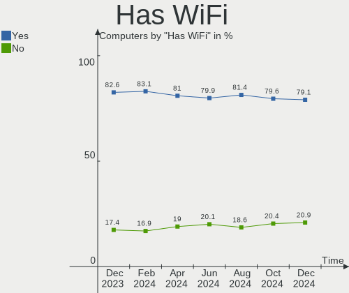
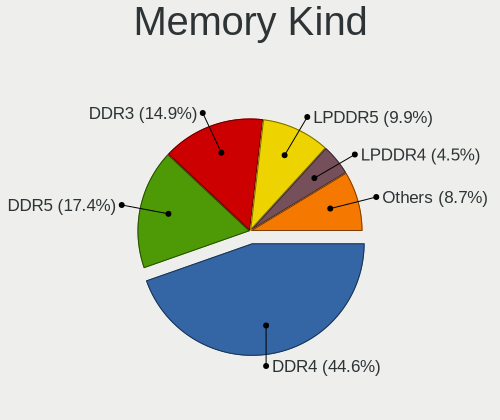

Fedora - Hardware Trends
------------------------

A project to identify most popular hardware characteristics and track their change
over time based on data collected by Linux users at https://Linux-Hardware.org.

Anyone can contribute to this report by the [hw-probe](https://github.com/linuxhw/hw-probe) tool:

    sudo -E hw-probe -all -upload

This is a report for all computer types. See also reports for [desktops](/Dist/Fedora/Desktop/README.md) and [notebooks](/Dist/Fedora/Notebook/README.md).

This report is for one last month. Overall report since the beginning of time: [TestDays](https://github.com/linuxhw/TestDays)

Period: Mar, 2023.

Contents
--------

* [ System ](#system)
  - [ OS                       ](#os)
  - [ OS Family                ](#os-family)
  - [ Kernel                   ](#kernel)
  - [ Kernel Family            ](#kernel-family)
  - [ Kernel Major Ver.        ](#kernel-major-ver)
  - [ Arch                     ](#arch)
  - [ DE                       ](#de)
  - [ Display Server           ](#display-server)
  - [ Display Manager          ](#display-manager)
  - [ OS Lang                  ](#os-lang)
  - [ Boot Mode                ](#boot-mode)
  - [ Filesystem               ](#filesystem)
  - [ Part. scheme             ](#part-scheme)
  - [ Dual Boot with Linux/BSD ](#dual-boot-with-linuxbsd)
  - [ Dual Boot (Win)          ](#dual-boot-win)

* [ Board ](#board)
  - [ Vendor                   ](#vendor)
  - [ Model                    ](#model)
  - [ Model Family             ](#model-family)
  - [ MFG Year                 ](#mfg-year)
  - [ Form Factor              ](#form-factor)
  - [ Secure Boot              ](#secure-boot)
  - [ Coreboot                 ](#coreboot)
  - [ RAM Size                 ](#ram-size)
  - [ RAM Used                 ](#ram-used)
  - [ Total Drives             ](#total-drives)
  - [ Has CD-ROM               ](#has-cd-rom)
  - [ Has Ethernet             ](#has-ethernet)
  - [ Has WiFi                 ](#has-wifi)
  - [ Has Bluetooth            ](#has-bluetooth)

* [ Location ](#location)
  - [ Country                  ](#country)
  - [ City                     ](#city)

* [ Drives ](#drives)
  - [ Drive Vendor             ](#drive-vendor)
  - [ Drive Model              ](#drive-model)
  - [ HDD Vendor               ](#hdd-vendor)
  - [ SSD Vendor               ](#ssd-vendor)
  - [ Drive Kind               ](#drive-kind)
  - [ Drive Connector          ](#drive-connector)
  - [ Drive Size               ](#drive-size)
  - [ Space Total              ](#space-total)
  - [ Space Used               ](#space-used)
  - [ Malfunc. Drives          ](#malfunc-drives)
  - [ Malfunc. Drive Vendor    ](#malfunc-drive-vendor)
  - [ Malfunc. HDD Vendor      ](#malfunc-hdd-vendor)
  - [ Malfunc. Drive Kind      ](#malfunc-drive-kind)
  - [ Failed Drives            ](#failed-drives)
  - [ Failed Drive Vendor      ](#failed-drive-vendor)
  - [ Drive Status             ](#drive-status)

* [ Storage controller ](#storage-controller)
  - [ Storage Vendor           ](#storage-vendor)
  - [ Storage Model            ](#storage-model)
  - [ Storage Kind             ](#storage-kind)

* [ Processor ](#processor)
  - [ CPU Vendor               ](#cpu-vendor)
  - [ CPU Model                ](#cpu-model)
  - [ CPU Model Family         ](#cpu-model-family)
  - [ CPU Cores                ](#cpu-cores)
  - [ CPU Sockets              ](#cpu-sockets)
  - [ CPU Threads              ](#cpu-threads)
  - [ CPU Op-Modes             ](#cpu-op-modes)
  - [ CPU Microcode            ](#cpu-microcode)
  - [ CPU Microarch            ](#cpu-microarch)

* [ Graphics ](#graphics)
  - [ GPU Vendor               ](#gpu-vendor)
  - [ GPU Model                ](#gpu-model)
  - [ GPU Combo                ](#gpu-combo)
  - [ GPU Driver               ](#gpu-driver)
  - [ GPU Memory               ](#gpu-memory)

* [ Monitor ](#monitor)
  - [ Monitor Vendor           ](#monitor-vendor)
  - [ Monitor Model            ](#monitor-model)
  - [ Monitor Resolution       ](#monitor-resolution)
  - [ Monitor Diagonal         ](#monitor-diagonal)
  - [ Monitor Width            ](#monitor-width)
  - [ Aspect Ratio             ](#aspect-ratio)
  - [ Monitor Area             ](#monitor-area)
  - [ Pixel Density            ](#pixel-density)
  - [ Multiple Monitors        ](#multiple-monitors)

* [ Network ](#network)
  - [ Net Controller Vendor    ](#net-controller-vendor)
  - [ Net Controller Model     ](#net-controller-model)
  - [ Wireless Vendor          ](#wireless-vendor)
  - [ Wireless Model           ](#wireless-model)
  - [ Ethernet Vendor          ](#ethernet-vendor)
  - [ Ethernet Model           ](#ethernet-model)
  - [ Net Controller Kind      ](#net-controller-kind)
  - [ Used Controller          ](#used-controller)
  - [ NICs                     ](#nics)
  - [ IPv6                     ](#ipv6)

* [ Bluetooth ](#bluetooth)
  - [ Bluetooth Vendor         ](#bluetooth-vendor)
  - [ Bluetooth Model          ](#bluetooth-model)

* [ Sound ](#sound)
  - [ Sound Vendor             ](#sound-vendor)
  - [ Sound Model              ](#sound-model)

* [ Memory ](#memory)
  - [ Memory Vendor            ](#memory-vendor)
  - [ Memory Model             ](#memory-model)
  - [ Memory Kind              ](#memory-kind)
  - [ Memory Form Factor       ](#memory-form-factor)
  - [ Memory Size              ](#memory-size)
  - [ Memory Speed             ](#memory-speed)

* [ Printers & scanners ](#printers--scanners)
  - [ Printer Vendor           ](#printer-vendor)
  - [ Printer Model            ](#printer-model)
  - [ Scanner Vendor           ](#scanner-vendor)
  - [ Scanner Model            ](#scanner-model)

* [ Camera ](#camera)
  - [ Camera Vendor            ](#camera-vendor)
  - [ Camera Model             ](#camera-model)

* [ Security ](#security)
  - [ Fingerprint Vendor       ](#fingerprint-vendor)
  - [ Fingerprint Model        ](#fingerprint-model)
  - [ Chipcard Vendor          ](#chipcard-vendor)
  - [ Chipcard Model           ](#chipcard-model)

* [ Unsupported ](#unsupported)
  - [ Unsupported Devices      ](#unsupported-devices)
  - [ Unsupported Device Types ](#unsupported-device-types)

System
------

OS
--

Installed operating systems

| Name      | Computers | Percent |
|-----------|-----------|---------|
| Fedora 37 | 392       | 84.48%  |
| Fedora 38 | 38        | 8.19%   |
| Fedora 36 | 18        | 3.88%   |
| Fedora 34 | 6         | 1.29%   |
| Fedora 39 | 5         | 1.08%   |
| Fedora 35 | 3         | 0.65%   |
| Fedora 33 | 2         | 0.43%   |

OS Family
---------

OS without a version

| Name   | Computers | Percent |
|--------|-----------|---------|
| Fedora | 464       | 100%    |

Kernel
------

Version of the Linux kernel

| Version                                            | Computers | Percent |
|----------------------------------------------------|-----------|---------|
| 6.1.14-200.fc37.x86_64                             | 96        | 20.69%  |
| 6.1.18-200.fc37.x86_64                             | 88        | 18.97%  |
| 6.2.7-200.fc37.x86_64                              | 64        | 13.79%  |
| 6.1.15-200.fc37.x86_64                             | 50        | 10.78%  |
| 6.2.8-200.fc37.x86_64                              | 25        | 5.39%   |
| 6.0.7-301.fc37.x86_64                              | 20        | 4.31%   |
| 6.1.13-200.fc37.x86_64                             | 14        | 3.02%   |
| 6.2.6-300.fc38.x86_64                              | 11        | 2.37%   |
| 6.2.8-300.fc38.x86_64                              | 10        | 2.16%   |
| 6.2.7-300.fc38.x86_64                              | 6         | 1.29%   |
| 5.17.12-100.fc34.x86_64                            | 5         | 1.08%   |
| 6.1.14-100.fc36.x86_64                             | 4         | 0.86%   |
| 6.2.2-300.fc38.x86_64                              | 3         | 0.65%   |
| 6.1.8-200.fc37.x86_64                              | 3         | 0.65%   |
| 6.1.14-603.inttf.fc37.x86_64                       | 3         | 0.65%   |
| 6.1.12-200.fc37.x86_64                             | 3         | 0.65%   |
| 6.1.11-200.fc37.x86_64                             | 3         | 0.65%   |
| 6.1.10-200.fc37.x86_64                             | 3         | 0.65%   |
| 6.2.8-100.fc36.x86_64                              | 2         | 0.43%   |
| 6.2.6-200.fc37.x86_64                              | 2         | 0.43%   |
| 6.2.5-300.rog.fc37.x86_64                          | 2         | 0.43%   |
| 6.2.5-300.fc38.x86_64                              | 2         | 0.43%   |
| 6.2.2-301.fc38.x86_64                              | 2         | 0.43%   |
| 6.1.7-200.fc37.x86_64                              | 2         | 0.43%   |
| 6.0.12-100.fc35.x86_64                             | 2         | 0.43%   |
| 6.0.11-300.fc37.x86_64                             | 2         | 0.43%   |
| 5.17.5-300.fc36.x86_64                             | 2         | 0.43%   |
| 6.3.0-0.rc3.20230322gita1effab7a3a3.31.fc39.x86_64 | 1         | 0.22%   |
| 6.3.0-0.rc2.20230317git38e04b3e4240.27.fc39.x86_64 | 1         | 0.22%   |
| 6.3.0-0.rc2.20230315git6015b1aca1a2.25.fc39.x86_64 | 1         | 0.22%   |
| 6.3.0-0.rc0.20230303git2eb29d59ddf0.13.fc39.x86_64 | 1         | 0.22%   |
| 6.3.0-0.rc0.20230223gita5c95ca18a98.4.fc39.x86_64  | 1         | 0.22%   |
| 6.2.8-300.fc37.x86_64                              | 1         | 0.22%   |
| 6.2.7_tkg_pds                                      | 1         | 0.22%   |
| 6.2.7-250.vanilla.fc37.x86_64                      | 1         | 0.22%   |
| 6.2.7-100.fc36.x86_64                              | 1         | 0.22%   |
| 6.2.6-201.fsync.fc37.x86_64                        | 1         | 0.22%   |
| 6.2.6-1.surface.fc37.x86_64                        | 1         | 0.22%   |
| 6.2.3-300.fc38.x86_64                              | 1         | 0.22%   |
| 6.2.2-300.fc37.x86_64                              | 1         | 0.22%   |

Kernel Family
-------------

Linux kernel without a distro release

| Version | Computers | Percent |
|---------|-----------|---------|
| 6.1.14  | 103       | 22.2%   |
| 6.1.18  | 91        | 19.61%  |
| 6.2.7   | 73        | 15.73%  |
| 6.1.15  | 51        | 10.99%  |
| 6.2.8   | 38        | 8.19%   |
| 6.0.7   | 21        | 4.53%   |
| 6.2.6   | 15        | 3.23%   |
| 6.1.13  | 15        | 3.23%   |
| 6.2.2   | 6         | 1.29%   |
| 6.3.0   | 5         | 1.08%   |
| 6.1.11  | 5         | 1.08%   |
| 5.17.12 | 5         | 1.08%   |
| 6.2.5   | 4         | 0.86%   |
| 6.1.12  | 4         | 0.86%   |
| 6.1.8   | 3         | 0.65%   |
| 6.1.10  | 3         | 0.65%   |
| 6.2.1   | 2         | 0.43%   |
| 6.2.0   | 2         | 0.43%   |
| 6.1.7   | 2         | 0.43%   |
| 6.0.12  | 2         | 0.43%   |
| 6.0.11  | 2         | 0.43%   |
| 5.17.5  | 2         | 0.43%   |
| 6.2.3   | 1         | 0.22%   |
| 6.1.9   | 1         | 0.22%   |
| 6.0.18  | 1         | 0.22%   |
| 5.19.16 | 1         | 0.22%   |
| 5.18.19 | 1         | 0.22%   |
| 5.18.15 | 1         | 0.22%   |
| 5.14.18 | 1         | 0.22%   |
| 5.14.10 | 1         | 0.22%   |
| 5.11.12 | 1         | 0.22%   |
| 5.10.21 | 1         | 0.22%   |

Kernel Major Ver.
-----------------

Linux kernel major version

| Version | Computers | Percent |
|---------|-----------|---------|
| 6.1     | 278       | 59.91%  |
| 6.2     | 141       | 30.39%  |
| 6.0     | 26        | 5.6%    |
| 5.17    | 7         | 1.51%   |
| 6.3     | 5         | 1.08%   |
| 5.18    | 2         | 0.43%   |
| 5.14    | 2         | 0.43%   |
| 5.19    | 1         | 0.22%   |
| 5.11    | 1         | 0.22%   |
| 5.10    | 1         | 0.22%   |

Arch
----

OS architecture (x86_64, i586, etc.)

| Name    | Computers | Percent |
|---------|-----------|---------|
| x86_64  | 463       | 99.78%  |
| aarch64 | 1         | 0.22%   |

DE
--

Desktop Environment

| Name          | Computers | Percent |
|---------------|-----------|---------|
| GNOME         | 326       | 70.26%  |
| KDE5          | 84        | 18.1%   |
| XFCE          | 14        | 3.02%   |
| Unknown       | 11        | 2.37%   |
| Cinnamon      | 8         | 1.72%   |
| X-Cinnamon    | 7         | 1.51%   |
| MATE          | 5         | 1.08%   |
| sway          | 2         | 0.43%   |
| GNOME Classic | 2         | 0.43%   |
| xinit-compat  | 1         | 0.22%   |
| qtile         | 1         | 0.22%   |
| LXQt          | 1         | 0.22%   |
| dwm           | 1         | 0.22%   |
| bspwm         | 1         | 0.22%   |

Display Server
--------------

X11 or Wayland

| Name    | Computers | Percent |
|---------|-----------|---------|
| Wayland | 328       | 70.69%  |
| X11     | 117       | 25.22%  |
| Tty     | 13        | 2.8%    |
| Unknown | 6         | 1.29%   |

Display Manager
---------------

SDDM, LightDM, etc.

| Name    | Computers | Percent |
|---------|-----------|---------|
| Unknown | 242       | 52.16%  |
| GDM     | 153       | 32.97%  |
| SDDM    | 37        | 7.97%   |
| LightDM | 32        | 6.9%    |

OS Lang
-------

Language

| Lang        | Computers | Percent |
|-------------|-----------|---------|
| en_US       | 234       | 50.43%  |
| en_GB       | 33        | 7.11%   |
| ru_RU       | 28        | 6.03%   |
| de_DE       | 24        | 5.17%   |
| pt_BR       | 22        | 4.74%   |
| en_AU       | 15        | 3.23%   |
| it_IT       | 14        | 3.02%   |
| fr_FR       | 11        | 2.37%   |
| es_ES       | 11        | 2.37%   |
| en_CA       | 8         | 1.72%   |
| en_IN       | 7         | 1.51%   |
| pl_PL       | 4         | 0.86%   |
| Unknown     | 4         | 0.86%   |
| zh_CN       | 3         | 0.65%   |
| tr_TR       | 3         | 0.65%   |
| nl_NL       | 3         | 0.65%   |
| es_MX       | 3         | 0.65%   |
| es_CL       | 3         | 0.65%   |
| sv_SE       | 2         | 0.43%   |
| fr_CH       | 2         | 0.43%   |
| fr_CA       | 2         | 0.43%   |
| es_AR       | 2         | 0.43%   |
| en_PH       | 2         | 0.43%   |
| en_NZ       | 2         | 0.43%   |
| en_IL       | 2         | 0.43%   |
| de_CH       | 2         | 0.43%   |
| de_AT       | 2         | 0.43%   |
| cs_CZ       | 2         | 0.43%   |
| th_TH       | 1         | 0.22%   |
| nl_BE       | 1         | 0.22%   |
| lt_LT       | 1         | 0.22%   |
| ko_KR       | 1         | 0.22%   |
| fr_BE       | 1         | 0.22%   |
| fi_FI       | 1         | 0.22%   |
| es_GT       | 1         | 0.22%   |
| es_CO       | 1         | 0.22%   |
| en_ZA       | 1         | 0.22%   |
| en_US.utf-8 | 1         | 0.22%   |
| en_SG       | 1         | 0.22%   |
| en_DK       | 1         | 0.22%   |

Boot Mode
---------

EFI or BIOS

| Mode | Computers | Percent |
|------|-----------|---------|
| EFI  | 385       | 82.97%  |
| BIOS | 79        | 17.03%  |

Filesystem
----------

Type of filesystem

| Type  | Computers | Percent |
|-------|-----------|---------|
| Btrfs | 370       | 79.74%  |
| Ext4  | 80        | 17.24%  |
| Xfs   | 12        | 2.59%   |
| Ext3  | 2         | 0.43%   |

Part. scheme
------------

Scheme of partitioning

| Type    | Computers | Percent |
|---------|-----------|---------|
| Unknown | 232       | 50%     |
| GPT     | 216       | 46.55%  |
| MBR     | 16        | 3.45%   |

Dual Boot with Linux/BSD
------------------------

Hosting more than one Linux/BSD

| Dual boot | Computers | Percent |
|-----------|-----------|---------|
| No        | 418       | 90.09%  |
| Yes       | 46        | 9.91%   |

Dual Boot (Win)
---------------

Hosting Linux and Windows

| Dual boot | Computers | Percent |
|-----------|-----------|---------|
| No        | 382       | 82.33%  |
| Yes       | 82        | 17.67%  |

Board
-----

Vendor
------

Motherboard manufacturer

| Name                | Computers | Percent |
|---------------------|-----------|---------|
| Lenovo              | 81        | 17.46%  |
| ASUSTek Computer    | 76        | 16.38%  |
| Hewlett-Packard     | 62        | 13.36%  |
| Dell                | 55        | 11.85%  |
| MSI                 | 43        | 9.27%   |
| Gigabyte Technology | 24        | 5.17%   |
| Acer                | 21        | 4.53%   |
| ASRock              | 16        | 3.45%   |
| HUAWEI              | 9         | 1.94%   |
| Intel               | 8         | 1.72%   |
| Toshiba             | 6         | 1.29%   |
| Unknown             | 5         | 1.08%   |
| Samsung Electronics | 4         | 0.86%   |
| Microsoft           | 4         | 0.86%   |
| Apple               | 4         | 0.86%   |
| Huanan              | 3         | 0.65%   |
| HONOR               | 3         | 0.65%   |
| Google              | 3         | 0.65%   |
| System76            | 2         | 0.43%   |
| Notebook            | 2         | 0.43%   |
| Medion              | 2         | 0.43%   |
| Exo                 | 2         | 0.43%   |
| Clevo               | 2         | 0.43%   |
| BESSTAR Tech        | 2         | 0.43%   |
| AZW                 | 2         | 0.43%   |
| ZOTAC               | 1         | 0.22%   |
| Win element         | 1         | 0.22%   |
| TUXEDO              | 1         | 0.22%   |
| TECNO               | 1         | 0.22%   |
| Shuttle             | 1         | 0.22%   |
| Purism              | 1         | 0.22%   |
| Proline             | 1         | 0.22%   |
| Prestigio           | 1         | 0.22%   |
| Pegatron            | 1         | 0.22%   |
| PCWare              | 1         | 0.22%   |
| Packard Bell        | 1         | 0.22%   |
| NZXT                | 1         | 0.22%   |
| LG Electronics      | 1         | 0.22%   |
| Itautec             | 1         | 0.22%   |
| Insyde              | 1         | 0.22%   |

Model
-----

Motherboard model

| Name                                   | Computers | Percent |
|----------------------------------------|-----------|---------|
| Unknown                                | 5         | 1.08%   |
| Dell XPS 13 9310                       | 3         | 0.65%   |
| Dell OptiPlex 7010                     | 3         | 0.65%   |
| ASUS All Series                        | 3         | 0.65%   |
| MSI MS-7C82                            | 2         | 0.43%   |
| MSI MS-7C52                            | 2         | 0.43%   |
| MSI MS-7B89                            | 2         | 0.43%   |
| MSI MS-7A34                            | 2         | 0.43%   |
| HUAWEI CREM-WXX9                       | 2         | 0.43%   |
| HUAWEI BOD-WXX9                        | 2         | 0.43%   |
| HP OMEN by Laptop 16-c0xxx             | 2         | 0.43%   |
| HP ENVY x360 Convertible 15-eu0xxx     | 2         | 0.43%   |
| HP ENVY x360 Convertible 13-ay0xxx     | 2         | 0.43%   |
| HP EliteBook 850 G8 Notebook PC        | 2         | 0.43%   |
| Google Cave                            | 2         | 0.43%   |
| Dell OptiPlex 7060                     | 2         | 0.43%   |
| Dell Latitude 7430                     | 2         | 0.43%   |
| Dell Latitude 5290 2-in-1              | 2         | 0.43%   |
| ASUS Z170 PRO GAMING                   | 2         | 0.43%   |
| ASUS TUF Gaming X570-PLUS              | 2         | 0.43%   |
| ASUS TUF Gaming B550M-PLUS             | 2         | 0.43%   |
| ASUS PRIME B550M-A                     | 2         | 0.43%   |
| ASUS ASUS TUF Dash F15 FX516PM_FX516PM | 2         | 0.43%   |
| ASRock X570 Phantom Gaming 4           | 2         | 0.43%   |
| ASRock B450M-HDV R4.0                  | 2         | 0.43%   |
| Acer Nitro AN515-54                    | 2         | 0.43%   |
| ZOTAC H67ITX-C-E                       | 1         | 0.22%   |
| Win element M600                       | 1         | 0.22%   |
| TUXEDO InfinityBook S 15/17 Gen7       | 1         | 0.22%   |
| Toshiba Satellite U940                 | 1         | 0.22%   |
| Toshiba Satellite P870                 | 1         | 0.22%   |
| Toshiba Satellite P55t-B               | 1         | 0.22%   |
| Toshiba Satellite L40                  | 1         | 0.22%   |
| Toshiba Satellite C850-C5K             | 1         | 0.22%   |
| Toshiba Satellite C75D-B               | 1         | 0.22%   |
| TECNO MEGABOOK T1                      | 1         | 0.22%   |
| System76 Thelio Mira                   | 1         | 0.22%   |
| System76 Gazelle                       | 1         | 0.22%   |
| Shuttle SH570                          | 1         | 0.22%   |
| Samsung 950QED                         | 1         | 0.22%   |

Model Family
------------

Motherboard model prefix

| Name               | Computers | Percent |
|--------------------|-----------|---------|
| Lenovo ThinkPad    | 52        | 11.21%  |
| Dell Latitude      | 21        | 4.53%   |
| Dell Inspiron      | 14        | 3.02%   |
| ASUS TUF           | 13        | 2.8%    |
| ASUS ROG           | 13        | 2.8%    |
| HP Pavilion        | 10        | 2.16%   |
| HP EliteBook       | 10        | 2.16%   |
| ASUS PRIME         | 10        | 2.16%   |
| HP ENVY            | 9         | 1.94%   |
| Acer Aspire        | 9         | 1.94%   |
| HP Laptop          | 7         | 1.51%   |
| Dell XPS           | 7         | 1.51%   |
| Toshiba Satellite  | 6         | 1.29%   |
| HP ProBook         | 6         | 1.29%   |
| Dell OptiPlex      | 6         | 1.29%   |
| ASUS VivoBook      | 6         | 1.29%   |
| ASUS ASUS          | 6         | 1.29%   |
| Lenovo Yoga        | 5         | 1.08%   |
| Lenovo ThinkBook   | 5         | 1.08%   |
| HP 250             | 5         | 1.08%   |
| Unknown            | 5         | 1.08%   |
| Microsoft Surface  | 4         | 0.86%   |
| Lenovo Legion      | 4         | 0.86%   |
| Lenovo IdeaPad     | 4         | 0.86%   |
| HP OMEN            | 4         | 0.86%   |
| MSI Modern         | 3         | 0.65%   |
| Lenovo ThinkCentre | 3         | 0.65%   |
| Dell Vostro        | 3         | 0.65%   |
| Dell Precision     | 3         | 0.65%   |
| ASUS Zenbook       | 3         | 0.65%   |
| ASUS All           | 3         | 0.65%   |
| Acer Veriton       | 3         | 0.65%   |
| Acer Swift         | 3         | 0.65%   |
| Acer Nitro         | 3         | 0.65%   |
| MSI MS-7C82        | 2         | 0.43%   |
| MSI MS-7C52        | 2         | 0.43%   |
| MSI MS-7B89        | 2         | 0.43%   |
| MSI MS-7A34        | 2         | 0.43%   |
| HUAWEI CREM-WXX9   | 2         | 0.43%   |
| HUAWEI BOD-WXX9    | 2         | 0.43%   |

MFG Year
--------

Motherboard manufacture year

| Year    | Computers | Percent |
|---------|-----------|---------|
| 2021    | 70        | 15.09%  |
| 2020    | 65        | 14.01%  |
| 2019    | 60        | 12.93%  |
| 2022    | 59        | 12.72%  |
| 2018    | 36        | 7.76%   |
| 2017    | 35        | 7.54%   |
| 2014    | 23        | 4.96%   |
| 2012    | 22        | 4.74%   |
| 2015    | 20        | 4.31%   |
| 2013    | 17        | 3.66%   |
| 2016    | 16        | 3.45%   |
| 2011    | 11        | 2.37%   |
| 2010    | 8         | 1.72%   |
| 2023    | 6         | 1.29%   |
| 2007    | 4         | 0.86%   |
| 2009    | 3         | 0.65%   |
| 2008    | 3         | 0.65%   |
| 2006    | 3         | 0.65%   |
| Unknown | 3         | 0.65%   |

Form Factor
-----------

Physical design of the computer

| Name        | Computers | Percent |
|-------------|-----------|---------|
| Notebook    | 261       | 56.25%  |
| Desktop     | 155       | 33.41%  |
| Convertible | 23        | 4.96%   |
| Tablet      | 13        | 2.8%    |
| Mini pc     | 8         | 1.72%   |
| Server      | 3         | 0.65%   |
| All in one  | 1         | 0.22%   |

Secure Boot
-----------

Enabled or disabled

| State    | Computers | Percent |
|----------|-----------|---------|
| Disabled | 363       | 78.23%  |
| Enabled  | 101       | 21.77%  |

Coreboot
--------

Have coreboot on board

| Used | Computers | Percent |
|------|-----------|---------|
| No   | 460       | 99.14%  |
| Yes  | 4         | 0.86%   |

RAM Size
--------

Total RAM memory

| Size in GB      | Computers | Percent |
|-----------------|-----------|---------|
| 16.01-24.0      | 104       | 22.41%  |
| 4.01-8.0        | 93        | 20.04%  |
| 8.01-16.0       | 90        | 19.4%   |
| 32.01-64.0      | 88        | 18.97%  |
| 3.01-4.0        | 34        | 7.33%   |
| 64.01-256.0     | 23        | 4.96%   |
| 24.01-32.0      | 21        | 4.53%   |
| 1.01-2.0        | 9         | 1.94%   |
| More than 256.0 | 1         | 0.22%   |
| 2.01-3.0        | 1         | 0.22%   |

RAM Used
--------

Used RAM memory

| Used GB     | Computers | Percent |
|-------------|-----------|---------|
| 4.01-8.0    | 165       | 35.56%  |
| 2.01-3.0    | 104       | 22.41%  |
| 3.01-4.0    | 100       | 21.55%  |
| 1.01-2.0    | 42        | 9.05%   |
| 8.01-16.0   | 36        | 7.76%   |
| 24.01-32.0  | 6         | 1.29%   |
| 16.01-24.0  | 4         | 0.86%   |
| 0.51-1.0    | 4         | 0.86%   |
| 32.01-64.0  | 1         | 0.22%   |
| 64.01-256.0 | 1         | 0.22%   |
| 0.01-0.5    | 1         | 0.22%   |

Total Drives
------------

Number of drives on board

| Drives | Computers | Percent |
|--------|-----------|---------|
| 1      | 269       | 57.97%  |
| 2      | 121       | 26.08%  |
| 3      | 39        | 8.41%   |
| 4      | 17        | 3.66%   |
| 5      | 10        | 2.16%   |
| 6      | 4         | 0.86%   |
| 17     | 1         | 0.22%   |
| 10     | 1         | 0.22%   |
| 8      | 1         | 0.22%   |
| 0      | 1         | 0.22%   |

Has CD-ROM
----------

Has CD-ROM on board

| Presented | Computers | Percent |
|-----------|-----------|---------|
| No        | 368       | 79.31%  |
| Yes       | 96        | 20.69%  |

Has Ethernet
------------

Has Ethernet on board

| Presented | Computers | Percent |
|-----------|-----------|---------|
| Yes       | 356       | 76.72%  |
| No        | 108       | 23.28%  |

Has WiFi
--------

Has WiFi module

| Presented | Computers | Percent |
|-----------|-----------|---------|
| Yes       | 368       | 79.31%  |
| No        | 96        | 20.69%  |

Has Bluetooth
-------------

Has Bluetooth module

| Presented | Computers | Percent |
|-----------|-----------|---------|
| Yes       | 342       | 73.71%  |
| No        | 122       | 26.29%  |

Location
--------

Country
-------

Geographic location (country)

| Country      | Computers | Percent |
|--------------|-----------|---------|
| USA          | 76        | 16.38%  |
| Germany      | 41        | 8.84%   |
| Russia       | 31        | 6.68%   |
| Brazil       | 31        | 6.68%   |
| Italy        | 25        | 5.39%   |
| UK           | 18        | 3.88%   |
| Poland       | 17        | 3.66%   |
| Spain        | 15        | 3.23%   |
| France       | 14        | 3.02%   |
| Australia    | 14        | 3.02%   |
| Netherlands  | 10        | 2.16%   |
| Canada       | 10        | 2.16%   |
| India        | 9         | 1.94%   |
| Switzerland  | 8         | 1.72%   |
| Sweden       | 8         | 1.72%   |
| Austria      | 8         | 1.72%   |
| Turkey       | 7         | 1.51%   |
| Finland      | 7         | 1.51%   |
| Belarus      | 7         | 1.51%   |
| Israel       | 6         | 1.29%   |
| Colombia     | 5         | 1.08%   |
| Belgium      | 5         | 1.08%   |
| Thailand     | 4         | 0.86%   |
| South Africa | 4         | 0.86%   |
| Portugal     | 4         | 0.86%   |
| New Zealand  | 4         | 0.86%   |
| Argentina    | 4         | 0.86%   |
| Slovenia     | 3         | 0.65%   |
| Norway       | 3         | 0.65%   |
| Mexico       | 3         | 0.65%   |
| Japan        | 3         | 0.65%   |
| Indonesia    | 3         | 0.65%   |
| Hungary      | 3         | 0.65%   |
| Denmark      | 3         | 0.65%   |
| Czechia      | 3         | 0.65%   |
| Chile        | 3         | 0.65%   |
| Vietnam      | 2         | 0.43%   |
| South Korea  | 2         | 0.43%   |
| Singapore    | 2         | 0.43%   |
| Philippines  | 2         | 0.43%   |

City
----

Geographic location (city)

| City          | Computers | Percent |
|---------------|-----------|---------|
| Moscow        | 9         | 1.94%   |
| Sydney        | 8         | 1.72%   |
| Berlin        | 7         | 1.51%   |
| St Petersburg | 6         | 1.29%   |
| Munich        | 6         | 1.29%   |
| Vienna        | 5         | 1.08%   |
| London        | 5         | 1.08%   |
| Tel Aviv      | 4         | 0.86%   |
| Minsk         | 4         | 0.86%   |
| Madrid        | 4         | 0.86%   |
| Helsinki      | 4         | 0.86%   |
| Zurich        | 3         | 0.65%   |
| Wroclaw       | 3         | 0.65%   |
| Sao Paulo     | 3         | 0.65%   |
| Paris         | 3         | 0.65%   |
| Milano        | 3         | 0.65%   |
| Milan         | 3         | 0.65%   |
| Melbourne     | 3         | 0.65%   |
| Lisbon        | 3         | 0.65%   |
| Istanbul      | 3         | 0.65%   |
| Chennai       | 3         | 0.65%   |
| Bangkok       | 3         | 0.65%   |
| Auckland      | 3         | 0.65%   |
| Yekaterinburg | 2         | 0.43%   |
| Winsted       | 2         | 0.43%   |
| Ulm           | 2         | 0.43%   |
| Tokyo         | 2         | 0.43%   |
| Stockholm     | 2         | 0.43%   |
| Singapore     | 2         | 0.43%   |
| Rome          | 2         | 0.43%   |
| Prague        | 2         | 0.43%   |
| Porto Alegre  | 2         | 0.43%   |
| Palmas        | 2         | 0.43%   |
| Palermo       | 2         | 0.43%   |
| Niterói      | 2         | 0.43%   |
| Mexico City   | 2         | 0.43%   |
| Los Alamos    | 2         | 0.43%   |
| Kristiansand  | 2         | 0.43%   |
| Krakow        | 2         | 0.43%   |
| Kochi         | 2         | 0.43%   |

Drives
------

Drive Vendor
------------

Hard drive vendors

| Vendor                      | Computers | Drives | Percent |
|-----------------------------|-----------|--------|---------|
| Samsung Electronics         | 137       | 165    | 19.74%  |
| WDC                         | 87        | 108    | 12.54%  |
| Seagate                     | 59        | 69     | 8.5%    |
| Sandisk                     | 47        | 59     | 6.77%   |
| Kingston                    | 39        | 43     | 5.62%   |
| SK hynix                    | 33        | 33     | 4.76%   |
| Toshiba                     | 32        | 36     | 4.61%   |
| Crucial                     | 28        | 29     | 4.03%   |
| Unknown                     | 27        | 30     | 3.89%   |
| Micron Technology           | 23        | 23     | 3.31%   |
| KIOXIA                      | 19        | 19     | 2.74%   |
| Intel                       | 18        | 19     | 2.59%   |
| Phison Electronics          | 10        | 10     | 1.44%   |
| HGST                        | 9         | 9      | 1.3%    |
| A-DATA Technology           | 9         | 9      | 1.3%    |
| Micron/Crucial Technology   | 8         | 8      | 1.15%   |
| PNY                         | 6         | 6      | 0.86%   |
| Kingston Technology Company | 6         | 6      | 0.86%   |
| Realtek Semiconductor       | 5         | 6      | 0.72%   |
| Phison                      | 5         | 5      | 0.72%   |
| ADATA Technology            | 5         | 5      | 0.72%   |
| Unknown                     | 5         | 5      | 0.72%   |
| Netac                       | 4         | 4      | 0.58%   |
| Hitachi                     | 4         | 4      | 0.58%   |
| Corsair                     | 4         | 4      | 0.58%   |
| China                       | 4         | 7      | 0.58%   |
| SPCC                        | 3         | 3      | 0.43%   |
| Silicon Motion              | 3         | 3      | 0.43%   |
| JMicron Technology          | 3         | 3      | 0.43%   |
| Apacer                      | 3         | 3      | 0.43%   |
| SABRENT                     | 2         | 2      | 0.29%   |
| Patriot                     | 2         | 2      | 0.29%   |
| MAXIO Technology (Hangzhou) | 2         | 2      | 0.29%   |
| LITEON                      | 2         | 2      | 0.29%   |
| Intenso                     | 2         | 2      | 0.29%   |
| HS-SSD-C100                 | 2         | 2      | 0.29%   |
| Hewlett-Packard             | 2         | 13     | 0.29%   |
| ASMT                        | 2         | 2      | 0.29%   |
| Apple                       | 2         | 4      | 0.29%   |
| 2.5"                        | 2         | 3      | 0.29%   |

Drive Model
-----------

Hard drive models

| Model                                               | Computers | Percent |
|-----------------------------------------------------|-----------|---------|
| Samsung NVMe SSD Controller SM981/PM981/PM983 250GB | 21        | 2.76%   |
| Samsung NVMe SSD Controller PM9A1/PM9A3/980PRO 1TB  | 13        | 1.71%   |
| Samsung SSD 850 EVO 250GB                           | 8         | 1.05%   |
| Sandisk WD Black SN750 / PC SN730 NVMe SSD 1TB      | 7         | 0.92%   |
| Kingston SA400S37480G 480GB SSD                     | 7         | 0.92%   |
| Micron/Crucial P2 NVMe PCIe SSD 1TB                 | 6         | 0.79%   |
| Kingston SA400S37120G 120GB SSD                     | 6         | 0.79%   |
| Unknown MMC Card  128GB                             | 5         | 0.66%   |
| Seagate ST1000DM010-2EP102 1TB                      | 5         | 0.66%   |
| Samsung SSD 860 EVO 500GB                           | 5         | 0.66%   |
| Phison E12 NVMe Controller 256GB                    | 5         | 0.66%   |
| Crucial CT1000MX500SSD1 1TB                         | 5         | 0.66%   |
| Unknown                                             | 5         | 0.66%   |
| WDC WDS500G2B0A-00SM50 500GB SSD                    | 4         | 0.53%   |
| Unknown MMC Card  32GB                              | 4         | 0.53%   |
| Samsung SSD 980 500GB                               | 4         | 0.53%   |
| Samsung SSD 860 EVO 250GB                           | 4         | 0.53%   |
| Kingston SA400S37240G 240GB SSD                     | 4         | 0.53%   |
| Intel SSD 660P Series 512GB                         | 4         | 0.53%   |
| Crucial CT500MX500SSD1 500GB                        | 4         | 0.53%   |
| WDC WDS100T2B0A-00SM50 1TB SSD                      | 3         | 0.39%   |
| WDC WD40EZRZ-00GXCB0 4TB                            | 3         | 0.39%   |
| WDC WD40EZAZ-00SF3B0 4TB                            | 3         | 0.39%   |
| WDC WD10SPZX-60Z10T0 1TB                            | 3         | 0.39%   |
| WDC WD10EZEX-08WN4A0 1TB                            | 3         | 0.39%   |
| Unknown MMC Card  64GB                              | 3         | 0.39%   |
| Toshiba MQ01ABD100 1TB                              | 3         | 0.39%   |
| Toshiba KXG50ZNV256G 256GB                          | 3         | 0.39%   |
| SK hynix SKHynix_HFS512GDE9X081N 512GB              | 3         | 0.39%   |
| Seagate ST500DM002-1BD142 500GB                     | 3         | 0.39%   |
| Seagate ST2000LX001-1RG174 2TB                      | 3         | 0.39%   |
| Seagate ST2000DM008-2FR102 2TB                      | 3         | 0.39%   |
| Seagate ST2000DM001-1ER164 2TB                      | 3         | 0.39%   |
| Sandisk PC SN520 NVMe SSD 128GB                     | 3         | 0.39%   |
| SanDisk NVMe SSD Drive 500GB                        | 3         | 0.39%   |
| Samsung SSD 980 1TB                                 | 3         | 0.39%   |
| Samsung SSD 970 EVO Plus 500GB                      | 3         | 0.39%   |
| Samsung SSD 970 EVO Plus 1TB                        | 3         | 0.39%   |
| Samsung SSD 870 EVO 500GB                           | 3         | 0.39%   |
| Samsung SSD 870 EVO 1TB                             | 3         | 0.39%   |

HDD Vendor
----------

Hard disk drive vendors

| Vendor              | Computers | Drives | Percent |
|---------------------|-----------|--------|---------|
| Seagate             | 58        | 66     | 35.58%  |
| WDC                 | 57        | 73     | 34.97%  |
| Toshiba             | 22        | 25     | 13.5%   |
| HGST                | 9         | 9      | 5.52%   |
| Hitachi             | 4         | 4      | 2.45%   |
| Samsung Electronics | 3         | 3      | 1.84%   |
| SABRENT             | 2         | 2      | 1.23%   |
| ASMT                | 2         | 2      | 1.23%   |
| Unknown             | 1         | 1      | 0.61%   |
| Maxtor              | 1         | 1      | 0.61%   |
| Intenso             | 1         | 1      | 0.61%   |
| IET                 | 1         | 1      | 0.61%   |
| Hewlett-Packard     | 1         | 12     | 0.61%   |
| Fujitsu             | 1         | 1      | 0.61%   |

SSD Vendor
----------

Solid state drive vendors

| Vendor              | Computers | Drives | Percent |
|---------------------|-----------|--------|---------|
| Samsung Electronics | 54        | 61     | 25.23%  |
| Kingston            | 26        | 28     | 12.15%  |
| Crucial             | 26        | 27     | 12.15%  |
| SanDisk             | 19        | 20     | 8.88%   |
| WDC                 | 17        | 19     | 7.94%   |
| A-DATA Technology   | 8         | 8      | 3.74%   |
| SK hynix            | 5         | 5      | 2.34%   |
| PNY                 | 5         | 5      | 2.34%   |
| Toshiba             | 4         | 4      | 1.87%   |
| Micron Technology   | 4         | 4      | 1.87%   |
| Corsair             | 4         | 4      | 1.87%   |
| China               | 4         | 7      | 1.87%   |
| Netac               | 3         | 3      | 1.4%    |
| JMicron Technology  | 3         | 3      | 1.4%    |
| Apacer              | 3         | 3      | 1.4%    |
| Patriot             | 2         | 2      | 0.93%   |
| LITEON              | 2         | 2      | 0.93%   |
| Intel               | 2         | 2      | 0.93%   |
| 2.5"                | 2         | 3      | 0.93%   |
| WDC WDS2            | 1         | 1      | 0.47%   |
| Verbatim            | 1         | 1      | 0.47%   |
| Vaseky              | 1         | 1      | 0.47%   |
| TO Exter            | 1         | 1      | 0.47%   |
| StoreJet            | 1         | 1      | 0.47%   |
| SPCC                | 1         | 1      | 0.47%   |
| Seagate             | 1         | 1      | 0.47%   |
| Ramsta              | 1         | 1      | 0.47%   |
| Plextor             | 1         | 1      | 0.47%   |
| Mushkin             | 1         | 1      | 0.47%   |
| Lenovo              | 1         | 1      | 0.47%   |
| KUIJIA              | 1         | 1      | 0.47%   |
| KIOXIA-EXCERIA      | 1         | 1      | 0.47%   |
| KingSpec            | 1         | 2      | 0.47%   |
| KingFast            | 1         | 1      | 0.47%   |
| KingDian            | 1         | 1      | 0.47%   |
| Intenso             | 1         | 1      | 0.47%   |
| HS-SSD-C100         | 1         | 1      | 0.47%   |
| GOODRAM             | 1         | 1      | 0.47%   |
| Gigabyte Technology | 1         | 1      | 0.47%   |
| Apple               | 1         | 1      | 0.47%   |

Drive Kind
----------

HDD or SSD

| Kind    | Computers | Drives | Percent |
|---------|-----------|--------|---------|
| NVMe    | 272       | 322    | 42.43%  |
| SSD     | 191       | 232    | 29.8%   |
| HDD     | 140       | 201    | 21.84%  |
| MMC     | 26        | 29     | 4.06%   |
| Unknown | 12        | 13     | 1.87%   |

Drive Connector
---------------

SATA, SAS, NVMe, etc.

| Type | Computers | Drives | Percent |
|------|-----------|--------|---------|
| NVMe | 271       | 320    | 46.97%  |
| SATA | 253       | 417    | 43.85%  |
| SAS  | 27        | 31     | 4.68%   |
| MMC  | 26        | 29     | 4.51%   |

Drive Size
----------

Size of hard drive

| Size in TB | Computers | Drives | Percent |
|------------|-----------|--------|---------|
| 0.01-0.5   | 173       | 217    | 49.86%  |
| 0.51-1.0   | 111       | 138    | 31.99%  |
| 1.01-2.0   | 35        | 40     | 10.09%  |
| 3.01-4.0   | 12        | 15     | 3.46%   |
| 4.01-10.0  | 8         | 11     | 2.31%   |
| 2.01-3.0   | 6         | 7      | 1.73%   |
| 10.01-20.0 | 2         | 5      | 0.58%   |

Space Total
-----------

Amount of disk space available on the file system

| Size in GB     | Computers | Percent |
|----------------|-----------|---------|
| 501-1000       | 95        | 20.47%  |
| 1001-2000      | 80        | 17.24%  |
| 101-250        | 66        | 14.22%  |
| 251-500        | 64        | 13.79%  |
| 1-20           | 41        | 8.84%   |
| Unknown        | 39        | 8.41%   |
| More than 3000 | 33        | 7.11%   |
| 2001-3000      | 24        | 5.17%   |
| 51-100         | 14        | 3.02%   |
| 21-50          | 8         | 1.72%   |

Space Used
----------

Amount of used disk space

| Used GB        | Computers | Percent |
|----------------|-----------|---------|
| 1-20           | 107       | 23.06%  |
| 21-50          | 71        | 15.3%   |
| 51-100         | 58        | 12.5%   |
| 251-500        | 55        | 11.85%  |
| 101-250        | 51        | 10.99%  |
| 501-1000       | 42        | 9.05%   |
| Unknown        | 39        | 8.41%   |
| 1001-2000      | 25        | 5.39%   |
| More than 3000 | 8         | 1.72%   |
| 2001-3000      | 8         | 1.72%   |

Malfunc. Drives
---------------

Drive models with a malfunction

| Model                                               | Computers | Drives | Percent |
|-----------------------------------------------------|-----------|--------|---------|
| WDC WD10EZEX-00BN5A0 1TB                            | 2         | 2      | 6.67%   |
| WDC WDS480G2G0A-00JH30 480GB SSD                    | 1         | 1      | 3.33%   |
| WDC WDS240G2G0B-00EPW0 240GB SSD                    | 1         | 1      | 3.33%   |
| WDC WD5000AAKX-603CA0 500GB                         | 1         | 1      | 3.33%   |
| WDC WD10EADS-00L5B1 1TB                             | 1         | 1      | 3.33%   |
| Toshiba MQ01ABF050 500GB                            | 1         | 1      | 3.33%   |
| Toshiba MQ01ABD050 500GB                            | 1         | 1      | 3.33%   |
| Toshiba HDWL110 1TB                                 | 1         | 1      | 3.33%   |
| Toshiba HDWA120 2TB                                 | 1         | 1      | 3.33%   |
| SK hynix SC308 SATA 128GB SSD                       | 1         | 1      | 3.33%   |
| Seagate ST500LM000-1EJ162 500GB                     | 1         | 1      | 3.33%   |
| Seagate ST500DM002-1BD142 500GB                     | 1         | 1      | 3.33%   |
| Seagate ST3320620AS 320GB                           | 1         | 1      | 3.33%   |
| Seagate ST3000DM008-2DM166 3TB                      | 1         | 1      | 3.33%   |
| Seagate ST3000DM001-1CH166 3TB                      | 1         | 1      | 3.33%   |
| Seagate ST2000LM003 HN-M201RAD 2TB                  | 1         | 1      | 3.33%   |
| Seagate ST1000LX015-1U7172 1TB                      | 1         | 1      | 3.33%   |
| Seagate ST1000DX002-2DV162 1TB                      | 1         | 1      | 3.33%   |
| SanDisk SSD PLUS 240 GB                             | 1         | 1      | 3.33%   |
| Samsung Electronics SSD 980 1TB                     | 1         | 1      | 3.33%   |
| Micron Technology MTFDDAK256MAY-1AH1ZABHA 256GB SSD | 1         | 1      | 3.33%   |
| Micron Technology 1100 SATA 512GB SSD               | 1         | 1      | 3.33%   |
| Kingston SV300S37A120G 120GB SSD                    | 1         | 1      | 3.33%   |
| Intel SSDSC2CT120A3 120GB                           | 1         | 1      | 3.33%   |
| Hitachi HDT725050VLA380 500GB                       | 1         | 1      | 3.33%   |
| HGST HTS721010A9E630 1TB                            | 1         | 1      | 3.33%   |
| Crucial CT750MX300SSD1 752GB                        | 1         | 1      | 3.33%   |
| Crucial CT1050MX300SSD1 1TB                         | 1         | 1      | 3.33%   |
| Corsair Force GS 240GB SSD                          | 1         | 1      | 3.33%   |

Malfunc. Drive Vendor
---------------------

Vendors of faulty drives

| Vendor              | Computers | Drives | Percent |
|---------------------|-----------|--------|---------|
| Seagate             | 7         | 8      | 24.14%  |
| WDC                 | 6         | 6      | 20.69%  |
| Toshiba             | 4         | 4      | 13.79%  |
| Micron Technology   | 2         | 2      | 6.9%    |
| Crucial             | 2         | 2      | 6.9%    |
| SK hynix            | 1         | 1      | 3.45%   |
| SanDisk             | 1         | 1      | 3.45%   |
| Samsung Electronics | 1         | 1      | 3.45%   |
| Kingston            | 1         | 1      | 3.45%   |
| Intel               | 1         | 1      | 3.45%   |
| Hitachi             | 1         | 1      | 3.45%   |
| HGST                | 1         | 1      | 3.45%   |
| Corsair             | 1         | 1      | 3.45%   |

Malfunc. HDD Vendor
-------------------

Vendors of faulty HDD drives

| Vendor  | Computers | Drives | Percent |
|---------|-----------|--------|---------|
| Seagate | 7         | 8      | 41.18%  |
| WDC     | 4         | 4      | 23.53%  |
| Toshiba | 4         | 4      | 23.53%  |
| Hitachi | 1         | 1      | 5.88%   |
| HGST    | 1         | 1      | 5.88%   |

Malfunc. Drive Kind
-------------------

Kinds of faulty drives

| Kind | Computers | Drives | Percent |
|------|-----------|--------|---------|
| HDD  | 16        | 18     | 57.14%  |
| SSD  | 11        | 11     | 39.29%  |
| NVMe | 1         | 1      | 3.57%   |

Failed Drives
-------------

Failed drive models

Zero info for selected period =(

Failed Drive Vendor
-------------------

Failed drive vendors

Zero info for selected period =(

Drive Status
------------

Number of failed and malfunc. drives

| Status   | Computers | Drives | Percent |
|----------|-----------|--------|---------|
| Detected | 270       | 457    | 53.68%  |
| Works    | 208       | 310    | 41.35%  |
| Malfunc  | 25        | 30     | 4.97%   |

Storage controller
------------------

Storage Vendor
--------------

Storage controller vendors

| Vendor                       | Computers | Percent |
|------------------------------|-----------|---------|
| Intel                        | 237       | 36.52%  |
| AMD                          | 95        | 14.64%  |
| Samsung Electronics          | 94        | 14.48%  |
| SanDisk                      | 46        | 7.09%   |
| SK hynix                     | 28        | 4.31%   |
| Kingston Technology Company  | 21        | 3.24%   |
| Micron Technology            | 19        | 2.93%   |
| Phison Electronics           | 17        | 2.62%   |
| KIOXIA                       | 16        | 2.47%   |
| Toshiba America Info Systems | 10        | 1.54%   |
| Micron/Crucial Technology    | 10        | 1.54%   |
| ASMedia Technology           | 10        | 1.54%   |
| Marvell Technology Group     | 9         | 1.39%   |
| ADATA Technology             | 6         | 0.92%   |
| Realtek Semiconductor        | 5         | 0.77%   |
| JMicron Technology           | 5         | 0.77%   |
| MAXIO Technology (Hangzhou)  | 4         | 0.62%   |
| Silicon Motion               | 3         | 0.46%   |
| Nvidia                       | 3         | 0.46%   |
| Shenzhen Longsys Electronics | 2         | 0.31%   |
| Union Memory (Shenzhen)      | 1         | 0.15%   |
| ULi Electronics              | 1         | 0.15%   |
| Silicon Image                | 1         | 0.15%   |
| Seagate Technology           | 1         | 0.15%   |
| LSI Logic / Symbios Logic    | 1         | 0.15%   |
| Hewlett-Packard              | 1         | 0.15%   |
| Broadcom / LSI               | 1         | 0.15%   |
| Adaptec                      | 1         | 0.15%   |
| 3ware                        | 1         | 0.15%   |

Storage Model
-------------

Storage controller models

| Model                                                                          | Computers | Percent |
|--------------------------------------------------------------------------------|-----------|---------|
| AMD FCH SATA Controller [AHCI mode]                                            | 68        | 9.63%   |
| Samsung NVMe SSD Controller SM981/PM981/PM983                                  | 42        | 5.95%   |
| Intel Volume Management Device NVMe RAID Controller                            | 25        | 3.54%   |
| Intel Sunrise Point-LP SATA Controller [AHCI mode]                             | 25        | 3.54%   |
| Samsung NVMe SSD Controller 980                                                | 24        | 3.4%    |
| Samsung NVMe SSD Controller PM9A1/PM9A3/980PRO                                 | 22        | 3.12%   |
| Intel 82801 Mobile SATA Controller [RAID mode]                                 | 21        | 2.97%   |
| Micron NVMe Storage Controller                                                 | 18        | 2.55%   |
| SK hynix Gold P31/PC711 NVMe Solid State Drive                                 | 16        | 2.27%   |
| AMD 500 Series Chipset SATA Controller                                         | 16        | 2.27%   |
| SanDisk WD Black SN750 / PC SN730 NVMe SSD                                     | 14        | 1.98%   |
| Kingston Company Company Non-Volatile memory controller                        | 13        | 1.84%   |
| Intel Q170/Q150/B150/H170/H110/Z170/CM236 Chipset SATA Controller [AHCI Mode]  | 13        | 1.84%   |
| Intel 8 Series/C220 Series Chipset Family 6-port SATA Controller 1 [AHCI mode] | 13        | 1.84%   |
| Intel 7 Series Chipset Family 6-port SATA Controller [AHCI mode]               | 11        | 1.56%   |
| Intel 200 Series PCH SATA controller [AHCI mode]                               | 11        | 1.56%   |
| Phison E12 NVMe Controller                                                     | 10        | 1.42%   |
| KIOXIA NVMe SSD Controller BG4                                                 | 10        | 1.42%   |
| Intel 7 Series/C210 Series Chipset Family 6-port SATA Controller [AHCI mode]   | 9         | 1.27%   |
| ASMedia ASM1062 Serial ATA Controller                                          | 9         | 1.27%   |
| AMD 400 Series Chipset SATA Controller                                         | 9         | 1.27%   |
| Intel Wildcat Point-LP SATA Controller [AHCI Mode]                             | 8         | 1.13%   |
| Intel 500 Series Chipset Family SATA AHCI Controller                           | 8         | 1.13%   |
| SanDisk WD Blue SN550 NVMe SSD                                                 | 7         | 0.99%   |
| Samsung NVMe SSD Controller SM961/PM961/SM963                                  | 7         | 0.99%   |
| Micron/Crucial P2 NVMe PCIe SSD                                                | 7         | 0.99%   |
| Intel SSD 660P Series                                                          | 7         | 0.99%   |
| Intel Cannon Lake PCH SATA AHCI Controller                                     | 6         | 0.85%   |
| Intel 6 Series/C200 Series Chipset Family 6 port Mobile SATA AHCI Controller   | 6         | 0.85%   |
| Toshiba America Info Systems XG6 NVMe SSD Controller                           | 5         | 0.71%   |
| SK hynix BC501 NVMe Solid State Drive                                          | 5         | 0.71%   |
| SanDisk NVMe Controller                                                        | 5         | 0.71%   |
| SanDisk Non-Volatile memory controller                                         | 5         | 0.71%   |
| Marvell Group 88SE9172 SATA 6Gb/s Controller                                   | 5         | 0.71%   |
| KIOXIA Non-Volatile memory controller                                          | 5         | 0.71%   |
| Intel HM170/QM170 Chipset SATA Controller [AHCI Mode]                          | 5         | 0.71%   |
| Intel C600/X79 series chipset 6-Port SATA AHCI Controller                      | 5         | 0.71%   |
| Intel Atom Processor E3800 Series SATA AHCI Controller                         | 5         | 0.71%   |
| Intel Alder Lake-S PCH SATA Controller [AHCI Mode]                             | 5         | 0.71%   |
| Intel 6 Series/C200 Series Chipset Family 6 port Desktop SATA AHCI Controller  | 5         | 0.71%   |

Storage Kind
------------

Kind of storage controller (IDE, SATA, NVMe, SAS, ...)

| Kind | Computers | Percent |
|------|-----------|---------|
| SATA | 275       | 43.93%  |
| NVMe | 270       | 43.13%  |
| RAID | 56        | 8.95%   |
| IDE  | 21        | 3.35%   |
| SAS  | 4         | 0.64%   |

Processor
---------

CPU Vendor
----------

Processor vendors

| Vendor  | Computers | Percent |
|---------|-----------|---------|
| Intel   | 320       | 68.97%  |
| AMD     | 143       | 30.82%  |
| Unknown | 1         | 0.22%   |

CPU Model
---------

Processor models

| Model                                      | Computers | Percent |
|--------------------------------------------|-----------|---------|
| Intel 11th Gen Core i5-1135G7 @ 2.40GHz    | 11        | 2.37%   |
| Intel 11th Gen Core i7-1165G7 @ 2.80GHz    | 9         | 1.94%   |
| Intel Core i7-8550U CPU @ 1.80GHz          | 7         | 1.51%   |
| AMD Ryzen 5 5600G with Radeon Graphics     | 7         | 1.51%   |
| AMD Ryzen 5 3600 6-Core Processor          | 7         | 1.51%   |
| Intel Core i5-7300U CPU @ 2.60GHz          | 6         | 1.29%   |
| Intel Core i5-1035G1 CPU @ 1.00GHz         | 6         | 1.29%   |
| Intel Core i5-10210U CPU @ 1.60GHz         | 6         | 1.29%   |
| AMD Ryzen 5 5500U with Radeon Graphics     | 6         | 1.29%   |
| Intel Core i7-9750H CPU @ 2.60GHz          | 5         | 1.08%   |
| Intel Core i7-10510U CPU @ 1.80GHz         | 5         | 1.08%   |
| Intel Core i5-5200U CPU @ 2.20GHz          | 5         | 1.08%   |
| Intel 12th Gen Core i7-1260P               | 5         | 1.08%   |
| Intel 11th Gen Core i7-1185G7 @ 3.00GHz    | 5         | 1.08%   |
| Intel Core i7-8650U CPU @ 1.90GHz          | 4         | 0.86%   |
| Intel Core i7-8565U CPU @ 1.80GHz          | 4         | 0.86%   |
| Intel Core i7-6700HQ CPU @ 2.60GHz         | 4         | 0.86%   |
| Intel Core i7-3770 CPU @ 3.40GHz           | 4         | 0.86%   |
| Intel Core i7-10750H CPU @ 2.60GHz         | 4         | 0.86%   |
| Intel Core i5-8265U CPU @ 1.60GHz          | 4         | 0.86%   |
| Intel Core i5-8250U CPU @ 1.60GHz          | 4         | 0.86%   |
| Intel 12th Gen Core i5-1235U               | 4         | 0.86%   |
| AMD Ryzen 5 5600U with Radeon Graphics     | 4         | 0.86%   |
| AMD Ryzen 5 5600H with Radeon Graphics     | 4         | 0.86%   |
| Intel Core i7-8700 CPU @ 3.20GHz           | 3         | 0.65%   |
| Intel Core i7-7700K CPU @ 4.20GHz          | 3         | 0.65%   |
| Intel Core i7-7700HQ CPU @ 2.80GHz         | 3         | 0.65%   |
| Intel Core i5-8350U CPU @ 1.70GHz          | 3         | 0.65%   |
| Intel Core i5-6300U CPU @ 2.40GHz          | 3         | 0.65%   |
| Intel Atom x5-Z8350 CPU @ 1.44GHz          | 3         | 0.65%   |
| Intel Atom CPU Z3735F @ 1.33GHz            | 3         | 0.65%   |
| Intel 12th Gen Core i7-12700H              | 3         | 0.65%   |
| Intel 11th Gen Core i7-11800H @ 2.30GHz    | 3         | 0.65%   |
| Intel 11th Gen Core i7-11700K @ 3.60GHz    | 3         | 0.65%   |
| Intel 11th Gen Core i7-11370H @ 3.30GHz    | 3         | 0.65%   |
| AMD Ryzen 9 6900HX with Radeon Graphics    | 3         | 0.65%   |
| AMD Ryzen 9 6900HS with Radeon Graphics    | 3         | 0.65%   |
| AMD Ryzen 9 5900X 12-Core Processor        | 3         | 0.65%   |
| AMD Ryzen 7 PRO 4750U with Radeon Graphics | 3         | 0.65%   |
| AMD Ryzen 7 5800X 8-Core Processor         | 3         | 0.65%   |

CPU Model Family
----------------

Processor model prefix

| Model                  | Computers | Percent |
|------------------------|-----------|---------|
| Intel Core i7          | 88        | 18.97%  |
| Intel Core i5          | 84        | 18.1%   |
| Other                  | 71        | 15.3%   |
| AMD Ryzen 5            | 53        | 11.42%  |
| AMD Ryzen 7            | 38        | 8.19%   |
| Intel Core i3          | 26        | 5.6%    |
| AMD Ryzen 9            | 15        | 3.23%   |
| Intel Xeon             | 12        | 2.59%   |
| Intel Atom             | 9         | 1.94%   |
| Intel Celeron          | 8         | 1.72%   |
| AMD Ryzen 7 PRO        | 7         | 1.51%   |
| AMD Ryzen 3            | 7         | 1.51%   |
| Intel Pentium          | 5         | 1.08%   |
| Intel Core i9          | 5         | 1.08%   |
| AMD Ryzen 5 PRO        | 5         | 1.08%   |
| Intel Core 2 Duo       | 4         | 0.86%   |
| AMD FX                 | 4         | 0.86%   |
| AMD A4                 | 3         | 0.65%   |
| Intel Pentium Dual     | 2         | 0.43%   |
| Intel Core 2 Quad      | 2         | 0.43%   |
| Intel Core 2           | 2         | 0.43%   |
| AMD Athlon II          | 2         | 0.43%   |
| AMD Athlon 64 X2       | 2         | 0.43%   |
| AMD A6                 | 2         | 0.43%   |
| Intel Xeon Platinum    | 1         | 0.22%   |
| Intel Core m7          | 1         | 0.22%   |
| Intel Core m3          | 1         | 0.22%   |
| AMD Ryzen Threadripper | 1         | 0.22%   |
| AMD Athlon             | 1         | 0.22%   |
| AMD A8                 | 1         | 0.22%   |
| AMD A12                | 1         | 0.22%   |
| AMD A10                | 1         | 0.22%   |

CPU Cores
---------

Number of processor cores

| Number | Computers | Percent |
|--------|-----------|---------|
| 4      | 170       | 36.64%  |
| 2      | 94        | 20.26%  |
| 6      | 84        | 18.1%   |
| 8      | 71        | 15.3%   |
| 12     | 19        | 4.09%   |
| 16     | 7         | 1.51%   |
| 14     | 6         | 1.29%   |
| 10     | 6         | 1.29%   |
| 1      | 3         | 0.65%   |
| 3      | 2         | 0.43%   |
| 96     | 1         | 0.22%   |
| 24     | 1         | 0.22%   |

CPU Sockets
-----------

Number of sockets

| Number | Computers | Percent |
|--------|-----------|---------|
| 1      | 459       | 98.92%  |
| 2      | 5         | 1.08%   |

CPU Threads
-----------

Threads per core (Hyper-Threading)

| Number | Computers | Percent |
|--------|-----------|---------|
| 2      | 395       | 85.13%  |
| 1      | 69        | 14.87%  |

CPU Op-Modes
------------

CPU Operation Modes (32-bit, 64-bit)

| Op mode        | Computers | Percent |
|----------------|-----------|---------|
| 32-bit, 64-bit | 463       | 99.78%  |
| 64-bit         | 1         | 0.22%   |

CPU Microcode
-------------

Microcode number

| Number     | Computers | Percent |
|------------|-----------|---------|
| Unknown    | 122       | 26.29%  |
| 0x806c1    | 24        | 5.17%   |
| 0x0a50000c | 22        | 4.74%   |
| 0x806ea    | 18        | 3.88%   |
| 0x806ec    | 14        | 3.02%   |
| 0x08701021 | 14        | 3.02%   |
| 0x0a50000d | 13        | 2.8%    |
| 0x306a9    | 12        | 2.59%   |
| 0x906ea    | 11        | 2.37%   |
| 0x306c3    | 11        | 2.37%   |
| 0x506e3    | 10        | 2.16%   |
| 0x08108109 | 9         | 1.94%   |
| 0x906a3    | 8         | 1.72%   |
| 0x0a404102 | 8         | 1.72%   |
| 0x08608103 | 8         | 1.72%   |
| 0x806e9    | 7         | 1.51%   |
| 0x406e3    | 7         | 1.51%   |
| 0x306d4    | 7         | 1.51%   |
| 0xa0652    | 6         | 1.29%   |
| 0x906a4    | 6         | 1.29%   |
| 0x30678    | 6         | 1.29%   |
| 0x906e9    | 5         | 1.08%   |
| 0x706e5    | 5         | 1.08%   |
| 0x206a7    | 5         | 1.08%   |
| 0x08600106 | 5         | 1.08%   |
| 0x08600104 | 5         | 1.08%   |
| 0x90672    | 4         | 0.86%   |
| 0x806d1    | 4         | 0.86%   |
| 0x406c4    | 4         | 0.86%   |
| 0x0a20120a | 4         | 0.86%   |
| 0x0a201016 | 4         | 0.86%   |
| 0xa0655    | 3         | 0.65%   |
| 0x906ed    | 3         | 0.65%   |
| 0x6fd      | 3         | 0.65%   |
| 0x306f2    | 3         | 0.65%   |
| 0x0a601203 | 3         | 0.65%   |
| 0x0800820d | 3         | 0.65%   |
| 0xa0660    | 2         | 0.43%   |
| 0xa0653    | 2         | 0.43%   |
| 0x806eb    | 2         | 0.43%   |

CPU Microarch
-------------

Microarchitecture

| Name             | Computers | Percent |
|------------------|-----------|---------|
| KabyLake         | 92        | 19.83%  |
| Zen 3            | 47        | 10.13%  |
| TigerLake        | 33        | 7.11%   |
| Zen 2            | 31        | 6.68%   |
| Alderlake Hybrid | 29        | 6.25%   |
| Unknown          | 28        | 6.03%   |
| IvyBridge        | 27        | 5.82%   |
| Skylake          | 24        | 5.17%   |
| Haswell          | 23        | 4.96%   |
| CometLake        | 18        | 3.88%   |
| Icelake          | 17        | 3.66%   |
| Zen+             | 14        | 3.02%   |
| Silvermont       | 13        | 2.8%    |
| SandyBridge      | 13        | 2.8%    |
| Broadwell        | 11        | 2.37%   |
| Zen              | 9         | 1.94%   |
| Piledriver       | 7         | 1.51%   |
| Core             | 6         | 1.29%   |
| Penryn           | 4         | 0.86%   |
| Puma             | 2         | 0.43%   |
| Nehalem          | 2         | 0.43%   |
| K8 Hammer        | 2         | 0.43%   |
| K10              | 2         | 0.43%   |
| Goldmont plus    | 2         | 0.43%   |
| Goldmont         | 2         | 0.43%   |
| Bonnell          | 2         | 0.43%   |
| Westmere         | 1         | 0.22%   |
| Steamroller      | 1         | 0.22%   |
| K10 Llano        | 1         | 0.22%   |
| Excavator        | 1         | 0.22%   |

Graphics
--------

GPU Vendor
----------

Vendors of graphics cards

| Vendor                     | Computers | Percent |
|----------------------------|-----------|---------|
| Intel                      | 251       | 44.98%  |
| AMD                        | 168       | 30.11%  |
| Nvidia                     | 137       | 24.55%  |
| Matrox Electronics Systems | 1         | 0.18%   |
| ASPEED Technology          | 1         | 0.18%   |

GPU Model
---------

Graphics card models

| Model                                                                                    | Computers | Percent |
|------------------------------------------------------------------------------------------|-----------|---------|
| Intel TigerLake-LP GT2 [Iris Xe Graphics]                                                | 30        | 5.2%    |
| AMD Cezanne [Radeon Vega Series / Radeon Vega Mobile Series]                             | 29        | 5.03%   |
| Intel UHD Graphics 620                                                                   | 18        | 3.12%   |
| AMD Ellesmere [Radeon RX 470/480/570/570X/580/580X/590]                                  | 16        | 2.77%   |
| Intel Alder Lake-P Integrated Graphics Controller                                        | 14        | 2.43%   |
| AMD Renoir                                                                               | 14        | 2.43%   |
| Intel CometLake-U GT2 [UHD Graphics]                                                     | 13        | 2.25%   |
| Intel HD Graphics 620                                                                    | 12        | 2.08%   |
| Intel WhiskeyLake-U GT2 [UHD Graphics 620]                                               | 11        | 1.91%   |
| AMD Rembrandt [Radeon 680M]                                                              | 11        | 1.91%   |
| Intel CoffeeLake-H GT2 [UHD Graphics 630]                                                | 10        | 1.73%   |
| Intel 3rd Gen Core processor Graphics Controller                                         | 10        | 1.73%   |
| AMD Navi 22 [Radeon RX 6700/6700 XT/6750 XT / 6800M/6850M XT]                            | 10        | 1.73%   |
| AMD Lucienne                                                                             | 10        | 1.73%   |
| Nvidia GA106M [GeForce RTX 3060 Mobile / Max-Q]                                          | 9         | 1.56%   |
| Intel Skylake GT2 [HD Graphics 520]                                                      | 9         | 1.56%   |
| Intel CometLake-H GT2 [UHD Graphics]                                                     | 9         | 1.56%   |
| Intel Atom Processor Z36xxx/Z37xxx Series Graphics & Display                             | 9         | 1.56%   |
| AMD Picasso/Raven 2 [Radeon Vega Series / Radeon Vega Mobile Series]                     | 9         | 1.56%   |
| AMD Navi 23 [Radeon RX 6600/6600 XT/6600M]                                               | 9         | 1.56%   |
| Intel HD Graphics 5500                                                                   | 8         | 1.39%   |
| Nvidia TU117M [GeForce GTX 1650 Mobile / Max-Q]                                          | 7         | 1.21%   |
| Intel Iris Plus Graphics G1 (Ice Lake)                                                   | 7         | 1.21%   |
| Intel HD Graphics 530                                                                    | 6         | 1.04%   |
| Intel 2nd Generation Core Processor Family Integrated Graphics Controller                | 6         | 1.04%   |
| AMD Raven Ridge [Radeon Vega Series / Radeon Vega Mobile Series]                         | 6         | 1.04%   |
| Intel Xeon E3-1200 v3/4th Gen Core Processor Integrated Graphics Controller              | 5         | 0.87%   |
| Intel TigerLake-H GT1 [UHD Graphics]                                                     | 5         | 0.87%   |
| Intel HD Graphics 630                                                                    | 5         | 0.87%   |
| Intel CoffeeLake-S GT2 [UHD Graphics 630]                                                | 5         | 0.87%   |
| Intel Alder Lake-UP3 GT2 [Iris Xe Graphics]                                              | 5         | 0.87%   |
| Intel 4th Gen Core Processor Integrated Graphics Controller                              | 5         | 0.87%   |
| AMD Navi 24 [Radeon RX 6400/6500 XT/6500M]                                               | 5         | 0.87%   |
| AMD Navi 10 [Radeon RX 5600 OEM/5600 XT / 5700/5700 XT]                                  | 5         | 0.87%   |
| AMD Barcelo                                                                              | 5         | 0.87%   |
| Nvidia GA107M [GeForce RTX 3050 Ti Mobile]                                               | 4         | 0.69%   |
| Nvidia GA107M [GeForce RTX 3050 Mobile]                                                  | 4         | 0.69%   |
| Intel Atom/Celeron/Pentium Processor x5-E8000/J3xxx/N3xxx Integrated Graphics Controller | 4         | 0.69%   |
| AMD Raphael                                                                              | 4         | 0.69%   |
| Nvidia GP107M [GeForce GTX 1050 Ti Mobile]                                               | 3         | 0.52%   |

GPU Combo
---------

Combinations of graphics cards

| Name                     | Computers | Percent |
|--------------------------|-----------|---------|
| 1 x Intel                | 176       | 37.93%  |
| 1 x AMD                  | 127       | 27.37%  |
| Intel + Nvidia           | 63        | 13.58%  |
| 1 x Nvidia               | 53        | 11.42%  |
| AMD + Nvidia             | 19        | 4.09%   |
| 2 x AMD                  | 13        | 2.8%    |
| Intel + AMD              | 7         | 1.51%   |
| Other                    | 1         | 0.22%   |
| 3 x AMD                  | 1         | 0.22%   |
| 2 x Nvidia               | 1         | 0.22%   |
| 1 x Matrox               | 1         | 0.22%   |
| Intel + AMD + 1 x Nvidia | 1         | 0.22%   |
| 1 x ASPEED               | 1         | 0.22%   |

GPU Driver
----------

Free vs proprietary

| Driver      | Computers | Percent |
|-------------|-----------|---------|
| Free        | 380       | 81.9%   |
| Proprietary | 74        | 15.95%  |
| Unknown     | 10        | 2.16%   |

GPU Memory
----------

Total video memory

| Size in GB | Computers | Percent |
|------------|-----------|---------|
| Unknown    | 233       | 50.22%  |
| 0.01-0.5   | 49        | 10.56%  |
| 1.01-2.0   | 48        | 10.34%  |
| 3.01-4.0   | 42        | 9.05%   |
| 7.01-8.0   | 35        | 7.54%   |
| 0.51-1.0   | 23        | 4.96%   |
| 8.01-16.0  | 17        | 3.66%   |
| 5.01-6.0   | 12        | 2.59%   |
| 2.01-3.0   | 3         | 0.65%   |
| 16.01-24.0 | 2         | 0.43%   |

Monitor
-------

Monitor Vendor
--------------

Monitor vendors

| Vendor                  | Computers | Percent |
|-------------------------|-----------|---------|
| AU Optronics            | 64        | 11.85%  |
| BOE                     | 58        | 10.74%  |
| Chimei Innolux          | 54        | 10%     |
| Samsung Electronics     | 50        | 9.26%   |
| LG Display              | 43        | 7.96%   |
| Dell                    | 39        | 7.22%   |
| Goldstar                | 32        | 5.93%   |
| Hewlett-Packard         | 19        | 3.52%   |
| AOC                     | 17        | 3.15%   |
| Sharp                   | 16        | 2.96%   |
| BenQ                    | 13        | 2.41%   |
| Lenovo                  | 12        | 2.22%   |
| Acer                    | 11        | 2.04%   |
| Philips                 | 10        | 1.85%   |
| Ancor Communications    | 10        | 1.85%   |
| ASUSTek Computer        | 9         | 1.67%   |
| ViewSonic               | 6         | 1.11%   |
| PANDA                   | 6         | 1.11%   |
| Chi Mei Optoelectronics | 6         | 1.11%   |
| InfoVision              | 5         | 0.93%   |
| Apple                   | 5         | 0.93%   |
| MSI                     | 4         | 0.74%   |
| CSO                     | 4         | 0.74%   |
| Sony                    | 3         | 0.56%   |
| NEC Computers           | 3         | 0.56%   |
| LG Philips              | 3         | 0.56%   |
| Iiyama                  | 3         | 0.56%   |
| Gigabyte Technology     | 3         | 0.56%   |
| TMX                     | 2         | 0.37%   |
| RTK                     | 2         | 0.37%   |
| Vizio                   | 1         | 0.19%   |
| Unknown (XXX)           | 1         | 0.19%   |
| Unknown                 | 1         | 0.19%   |
| Toshiba                 | 1         | 0.19%   |
| STD                     | 1         | 0.19%   |
| Sceptre Tech            | 1         | 0.19%   |
| Panasonic               | 1         | 0.19%   |
| NCS                     | 1         | 0.19%   |
| MSW                     | 1         | 0.19%   |
| Mi                      | 1         | 0.19%   |

Monitor Model
-------------

Monitor models

| Model                                                             | Computers | Percent |
|-------------------------------------------------------------------|-----------|---------|
| AU Optronics LCD Monitor AUO21ED 1920x1080 344x194mm 15.5-inch    | 6         | 1.09%   |
| AOC 27B2G5 AOC2702 1920x1080 598x336mm 27.0-inch                  | 6         | 1.09%   |
| Chimei Innolux LCD Monitor CMN1521 1920x1080 344x193mm 15.5-inch  | 4         | 0.73%   |
| AU Optronics LCD Monitor AUO403D 1920x1080 309x173mm 13.9-inch    | 4         | 0.73%   |
| Sharp LCD Monitor SHP14FA 3840x2400 288x180mm 13.4-inch           | 3         | 0.54%   |
| Sharp LCD Monitor SHP1479 1920x1280 259x173mm 12.3-inch           | 3         | 0.54%   |
| Samsung Electronics S24F350 SAM0D20 1920x1080 521x293mm 23.5-inch | 3         | 0.54%   |
| Samsung Electronics C34H89x SAM0E25 3440x1440 797x333mm 34.0-inch | 3         | 0.54%   |
| PANDA LCD Monitor NCP004D 1920x1080 344x194mm 15.5-inch           | 3         | 0.54%   |
| Goldstar HDR 4K GSM7706 3840x2160 600x340mm 27.2-inch             | 3         | 0.54%   |
| Chimei Innolux LCD Monitor CMN14D5 1920x1080 309x173mm 13.9-inch  | 3         | 0.54%   |
| BOE LCD Monitor BOE08D7 1920x1080 309x174mm 14.0-inch             | 3         | 0.54%   |
| BOE LCD Monitor BOE0893 2160x1440 296x197mm 14.0-inch             | 3         | 0.54%   |
| AU Optronics LCD Monitor AUO61ED 1920x1080 344x194mm 15.5-inch    | 3         | 0.54%   |
| AU Optronics LCD Monitor AUO21EC 1366x768 344x193mm 15.5-inch     | 3         | 0.54%   |
| AOC 2460G5 AOC2460 1920x1080 531x299mm 24.0-inch                  | 3         | 0.54%   |
| Samsung Electronics S24D390 SAM0B65 1920x1080 521x293mm 23.5-inch | 2         | 0.36%   |
| Samsung Electronics S24D332 SAM0F5E 1920x1080 531x299mm 24.0-inch | 2         | 0.36%   |
| Samsung Electronics C27F390 SAM0D32 1920x1080 598x336mm 27.0-inch | 2         | 0.36%   |
| Samsung Electronics C24F390 SAM0D2C 1920x1080 521x293mm 23.5-inch | 2         | 0.36%   |
| LG Display LCD Monitor LGD0555 2736x1824 260x173mm 12.3-inch      | 2         | 0.36%   |
| LG Display LCD Monitor LGD04A7 1920x1080 344x194mm 15.5-inch      | 2         | 0.36%   |
| LG Display LCD Monitor LGD033A 1366x768 344x194mm 15.5-inch       | 2         | 0.36%   |
| Lenovo E27q-20 LEN62D0 2560x1440 597x336mm 27.0-inch              | 2         | 0.36%   |
| Goldstar ULTRAWIDE GSM59F1 2560x1080 673x284mm 28.8-inch          | 2         | 0.36%   |
| Goldstar ULTRAGEAR GSM5B71 1920x1080 597x336mm 27.0-inch          | 2         | 0.36%   |
| Goldstar IPS FULLHD GSM5AB8 1920x1080 480x270mm 21.7-inch         | 2         | 0.36%   |
| Goldstar HDR 4K GSM7707 3840x2160 600x340mm 27.2-inch             | 2         | 0.36%   |
| Goldstar FULL HD GSM5B55 1920x1080 480x270mm 21.7-inch            | 2         | 0.36%   |
| Goldstar 23MP55 GSM5A23 1920x1080 510x290mm 23.1-inch             | 2         | 0.36%   |
| Gigabyte Technology M27Q GBT270D 2560x1440 596x335mm 26.9-inch    | 2         | 0.36%   |
| Dell U2515H DELD070 2560x1440 553x311mm 25.0-inch                 | 2         | 0.36%   |
| Dell P2422H DELA1C4 1920x1080 527x296mm 23.8-inch                 | 2         | 0.36%   |
| Dell P2419H DELD0D9 1920x1080 527x296mm 23.8-inch                 | 2         | 0.36%   |
| Chimei Innolux LCD Monitor CMN15F5 1920x1080 344x193mm 15.5-inch  | 2         | 0.36%   |
| Chimei Innolux LCD Monitor CMN15E8 1920x1080 344x193mm 15.5-inch  | 2         | 0.36%   |
| Chimei Innolux LCD Monitor CMN15DB 1366x768 344x193mm 15.5-inch   | 2         | 0.36%   |
| Chimei Innolux LCD Monitor CMN150C 1920x1080 344x193mm 15.5-inch  | 2         | 0.36%   |
| Chimei Innolux LCD Monitor CMN14F5 1920x1080 309x173mm 13.9-inch  | 2         | 0.36%   |
| Chimei Innolux LCD Monitor CMN14B1 1920x1080 308x173mm 13.9-inch  | 2         | 0.36%   |

Monitor Resolution
------------------

Monitor screen resolution

| Resolution         | Computers | Percent |
|--------------------|-----------|---------|
| 1920x1080 (FHD)    | 252       | 50.5%   |
| 1366x768 (WXGA)    | 47        | 9.42%   |
| 3840x2160 (4K)     | 42        | 8.42%   |
| 2560x1440 (QHD)    | 38        | 7.62%   |
| 1600x900 (HD+)     | 18        | 3.61%   |
| 3440x1440          | 17        | 3.41%   |
| 1920x1200 (WUXGA)  | 17        | 3.41%   |
| 2560x1600          | 7         | 1.4%    |
| 1440x900 (WXGA+)   | 7         | 1.4%    |
| 3840x2400          | 6         | 1.2%    |
| 2560x1080          | 6         | 1.2%    |
| 1920x1280          | 6         | 1.2%    |
| 1680x1050 (WSXGA+) | 5         | 1%      |
| 2160x1440          | 4         | 0.8%    |
| 1280x800 (WXGA)    | 4         | 0.8%    |
| 1280x1024 (SXGA)   | 4         | 0.8%    |
| 2880x1800          | 3         | 0.6%    |
| 2736x1824          | 3         | 0.6%    |
| 3840x1080          | 2         | 0.4%    |
| 2520x1680          | 2         | 0.4%    |
| 3200x1800 (QHD+)   | 1         | 0.2%    |
| 3200x1080          | 1         | 0.2%    |
| 2880x1620          | 1         | 0.2%    |
| 2288x1287          | 1         | 0.2%    |
| 2256x1504          | 1         | 0.2%    |
| 1920x540           | 1         | 0.2%    |
| 1280x960           | 1         | 0.2%    |
| 1024x600           | 1         | 0.2%    |
| Unknown            | 1         | 0.2%    |

Monitor Diagonal
----------------

Diagonal size in inches

| Inches  | Computers | Percent |
|---------|-----------|---------|
| 15      | 129       | 23.98%  |
| 27      | 62        | 11.52%  |
| 13      | 60        | 11.15%  |
| 24      | 45        | 8.36%   |
| 14      | 45        | 8.36%   |
| 23      | 35        | 6.51%   |
| 34      | 19        | 3.53%   |
| 17      | 18        | 3.35%   |
| 12      | 16        | 2.97%   |
| 21      | 15        | 2.79%   |
| 16      | 13        | 2.42%   |
| 31      | 12        | 2.23%   |
| 19      | 7         | 1.3%    |
| 22      | 5         | 0.93%   |
| 20      | 5         | 0.93%   |
| 18      | 5         | 0.93%   |
| Unknown | 5         | 0.93%   |
| 48      | 4         | 0.74%   |
| 40      | 4         | 0.74%   |
| 25      | 4         | 0.74%   |
| 11      | 4         | 0.74%   |
| 32      | 3         | 0.56%   |
| 84      | 2         | 0.37%   |
| 65      | 2         | 0.37%   |
| 54      | 2         | 0.37%   |
| 42      | 2         | 0.37%   |
| 35      | 2         | 0.37%   |
| 29      | 2         | 0.37%   |
| 10      | 2         | 0.37%   |
| 142     | 1         | 0.19%   |
| 74      | 1         | 0.19%   |
| 72      | 1         | 0.19%   |
| 69      | 1         | 0.19%   |
| 52      | 1         | 0.19%   |
| 43      | 1         | 0.19%   |
| 39      | 1         | 0.19%   |
| 38      | 1         | 0.19%   |
| 26      | 1         | 0.19%   |

Monitor Width
-------------

Physical width

| Width in mm    | Computers | Percent |
|----------------|-----------|---------|
| 301-350        | 207       | 39.35%  |
| 501-600        | 132       | 25.1%   |
| 201-300        | 59        | 11.22%  |
| 401-500        | 35        | 6.65%   |
| 351-400        | 23        | 4.37%   |
| 701-800        | 22        | 4.18%   |
| 601-700        | 17        | 3.23%   |
| 1001-1500      | 9         | 1.71%   |
| 801-900        | 7         | 1.33%   |
| 1501-2000      | 5         | 0.95%   |
| Unknown        | 5         | 0.95%   |
| 901-1000       | 4         | 0.76%   |
| More than 2000 | 1         | 0.19%   |

Aspect Ratio
------------

Proportional relationship between the width and the height

| Ratio   | Computers | Percent |
|---------|-----------|---------|
| 16/9    | 363       | 77.07%  |
| 16/10   | 56        | 11.89%  |
| 21/9    | 23        | 4.88%   |
| 3/2     | 16        | 3.4%    |
| Unknown | 4         | 0.85%   |
| 5/4     | 3         | 0.64%   |
| 4/3     | 2         | 0.42%   |
| 32/9    | 2         | 0.42%   |
| 1.96    | 1         | 0.21%   |
| 1.00    | 1         | 0.21%   |

Monitor Area
------------

Area in inch²

| Area in inch² | Computers | Percent |
|----------------|-----------|---------|
| 101-110        | 132       | 24.91%  |
| 201-250        | 77        | 14.53%  |
| 81-90          | 73        | 13.77%  |
| 301-350        | 63        | 11.89%  |
| 351-500        | 36        | 6.79%   |
| 71-80          | 35        | 6.6%    |
| 251-300        | 18        | 3.4%    |
| 121-130        | 17        | 3.21%   |
| 151-200        | 16        | 3.02%   |
| 61-70          | 13        | 2.45%   |
| More than 1000 | 12        | 2.26%   |
| 501-1000       | 12        | 2.26%   |
| 111-120        | 10        | 1.89%   |
| 51-60          | 5         | 0.94%   |
| 141-150        | 5         | 0.94%   |
| Unknown        | 5         | 0.94%   |
| 41-50          | 1         | 0.19%   |

Pixel Density
-------------

Pixels per inch

| Density       | Computers | Percent |
|---------------|-----------|---------|
| 121-160       | 175       | 34.05%  |
| 51-100        | 139       | 27.04%  |
| 101-120       | 101       | 19.65%  |
| 161-240       | 66        | 12.84%  |
| More than 240 | 16        | 3.11%   |
| 1-50          | 12        | 2.33%   |
| Unknown       | 5         | 0.97%   |

Multiple Monitors
-----------------

Total monitors connected

| Total | Computers | Percent |
|-------|-----------|---------|
| 1     | 344       | 74.14%  |
| 2     | 84        | 18.1%   |
| 0     | 19        | 4.09%   |
| 3     | 16        | 3.45%   |
| 4     | 1         | 0.22%   |

Network
-------

Net Controller Vendor
---------------------

Controller vendors

| Vendor                                | Computers | Percent |
|---------------------------------------|-----------|---------|
| Intel                                 | 275       | 40.8%   |
| Realtek Semiconductor                 | 237       | 35.16%  |
| Qualcomm Atheros                      | 32        | 4.75%   |
| MediaTek                              | 32        | 4.75%   |
| Broadcom                              | 19        | 2.82%   |
| Lenovo                                | 10        | 1.48%   |
| ASIX Electronics                      | 7         | 1.04%   |
| TP-Link                               | 5         | 0.74%   |
| Samsung Electronics                   | 5         | 0.74%   |
| Qualcomm                              | 5         | 0.74%   |
| Ralink Technology                     | 4         | 0.59%   |
| Ralink                                | 4         | 0.59%   |
| Dell                                  | 4         | 0.59%   |
| Sierra Wireless                       | 3         | 0.45%   |
| Xiaomi                                | 2         | 0.3%    |
| Qualcomm Atheros Communications       | 2         | 0.3%    |
| Nvidia                                | 2         | 0.3%    |
| NetGear                               | 2         | 0.3%    |
| Marvell Technology Group              | 2         | 0.3%    |
| JMicron Technology                    | 2         | 0.3%    |
| Huawei Technologies                   | 2         | 0.3%    |
| Hewlett-Packard                       | 2         | 0.3%    |
| DisplayLink                           | 2         | 0.3%    |
| ZTE WCDMA Technologies MSM            | 1         | 0.15%   |
| Zoom Telephonics                      | 1         | 0.15%   |
| OPPO Electronics                      | 1         | 0.15%   |
| Microsoft                             | 1         | 0.15%   |
| Mellanox Technologies                 | 1         | 0.15%   |
| Linksys                               | 1         | 0.15%   |
| InterBiometrics                       | 1         | 0.15%   |
| ICS Advent                            | 1         | 0.15%   |
| HMD Global                            | 1         | 0.15%   |
| D-Link                                | 1         | 0.15%   |
| Arduino SA                            | 1         | 0.15%   |
| Aquantia                              | 1         | 0.15%   |
| Adafruit                              | 1         | 0.15%   |
| 802.11g Adapter [Linksys WUSB54GC v3] | 1         | 0.15%   |

Net Controller Model
--------------------

Controller models

| Model                                                             | Computers | Percent |
|-------------------------------------------------------------------|-----------|---------|
| Realtek RTL8111/8168/8411 PCI Express Gigabit Ethernet Controller | 149       | 18.79%  |
| Intel Wi-Fi 6 AX200                                               | 36        | 4.54%   |
| Intel Wi-Fi 6 AX201                                               | 30        | 3.78%   |
| Intel Wireless 8265 / 8275                                        | 28        | 3.53%   |
| Realtek RTL8125 2.5GbE Controller                                 | 21        | 2.65%   |
| Realtek RTL8822CE 802.11ac PCIe Wireless Network Adapter          | 18        | 2.27%   |
| Realtek RTL8153 Gigabit Ethernet Adapter                          | 18        | 2.27%   |
| MediaTek MT7921 802.11ax PCI Express Wireless Network Adapter     | 18        | 2.27%   |
| Intel Wireless 7265                                               | 16        | 2.02%   |
| Intel Wi-Fi 6 AX210/AX211/AX411 160MHz                            | 15        | 1.89%   |
| Intel Ethernet Connection (2) I219-V                              | 15        | 1.89%   |
| Realtek RTL810xE PCI Express Fast Ethernet controller             | 14        | 1.77%   |
| Intel 82579LM Gigabit Network Connection (Lewisville)             | 13        | 1.64%   |
| Intel Alder Lake-P PCH CNVi WiFi                                  | 12        | 1.51%   |
| Realtek RTL8821CE 802.11ac PCIe Wireless Network Adapter          | 11        | 1.39%   |
| Intel Comet Lake PCH CNVi WiFi                                    | 11        | 1.39%   |
| Intel I211 Gigabit Network Connection                             | 10        | 1.26%   |
| Intel Ethernet Controller I225-V                                  | 10        | 1.26%   |
| Intel Ethernet Connection (4) I219-LM                             | 10        | 1.26%   |
| Intel Comet Lake PCH-LP CNVi WiFi                                 | 8         | 1.01%   |
| Realtek RTL8852AE 802.11ax PCIe Wireless Network Adapter          | 7         | 0.88%   |
| Qualcomm Atheros QCA9377 802.11ac Wireless Network Adapter        | 7         | 0.88%   |
| Intel Cannon Point-LP CNVi [Wireless-AC]                          | 7         | 0.88%   |
| ASIX AX88179 Gigabit Ethernet                                     | 7         | 0.88%   |
| MediaTek MT7922 802.11ax PCI Express Wireless Network Adapter     | 6         | 0.76%   |
| Intel Ice Lake-LP PCH CNVi WiFi                                   | 6         | 0.76%   |
| Samsung Galaxy series, misc. (tethering mode)                     | 5         | 0.63%   |
| Qualcomm Atheros AR9485 Wireless Network Adapter                  | 5         | 0.63%   |
| MediaTek MT7921K (RZ608) Wi-Fi 6E 80MHz                           | 5         | 0.63%   |
| Intel Wireless-AC 9260                                            | 5         | 0.63%   |
| Intel Wireless 8260                                               | 5         | 0.63%   |
| Intel Wireless 7260                                               | 5         | 0.63%   |
| Intel Tiger Lake PCH CNVi WiFi                                    | 5         | 0.63%   |
| Intel Ethernet Connection I217-LM                                 | 5         | 0.63%   |
| Intel Ethernet Connection (7) I219-LM                             | 5         | 0.63%   |
| Intel Ethernet Connection (4) I219-V                              | 5         | 0.63%   |
| Intel Ethernet Connection (10) I219-V                             | 5         | 0.63%   |
| Intel Dual Band Wireless-AC 3168NGW [Stone Peak]                  | 5         | 0.63%   |
| Qualcomm QCNFA765 Wireless Network Adapter                        | 4         | 0.5%    |
| Lenovo ThinkPad TBT 3 Dock                                        | 4         | 0.5%    |

Wireless Vendor
---------------

Wireless vendors

| Vendor                                | Computers | Percent |
|---------------------------------------|-----------|---------|
| Intel                                 | 221       | 57.85%  |
| Realtek Semiconductor                 | 64        | 16.75%  |
| MediaTek                              | 32        | 8.38%   |
| Qualcomm Atheros                      | 20        | 5.24%   |
| Broadcom                              | 15        | 3.93%   |
| TP-Link                               | 4         | 1.05%   |
| Ralink Technology                     | 4         | 1.05%   |
| Ralink                                | 4         | 1.05%   |
| Qualcomm                              | 4         | 1.05%   |
| Sierra Wireless                       | 3         | 0.79%   |
| Dell                                  | 3         | 0.79%   |
| Qualcomm Atheros Communications       | 2         | 0.52%   |
| NetGear                               | 2         | 0.52%   |
| Microsoft                             | 1         | 0.26%   |
| Marvell Technology Group              | 1         | 0.26%   |
| Hewlett-Packard                       | 1         | 0.26%   |
| 802.11g Adapter [Linksys WUSB54GC v3] | 1         | 0.26%   |

Wireless Model
--------------

Wireless models

| Model                                                         | Computers | Percent |
|---------------------------------------------------------------|-----------|---------|
| Intel Wi-Fi 6 AX200                                           | 36        | 9.42%   |
| Intel Wi-Fi 6 AX201                                           | 30        | 7.85%   |
| Intel Wireless 8265 / 8275                                    | 28        | 7.33%   |
| Realtek RTL8822CE 802.11ac PCIe Wireless Network Adapter      | 18        | 4.71%   |
| MediaTek MT7921 802.11ax PCI Express Wireless Network Adapter | 18        | 4.71%   |
| Intel Wireless 7265                                           | 16        | 4.19%   |
| Intel Wi-Fi 6 AX210/AX211/AX411 160MHz                        | 15        | 3.93%   |
| Intel Alder Lake-P PCH CNVi WiFi                              | 12        | 3.14%   |
| Realtek RTL8821CE 802.11ac PCIe Wireless Network Adapter      | 11        | 2.88%   |
| Intel Comet Lake PCH CNVi WiFi                                | 11        | 2.88%   |
| Intel Comet Lake PCH-LP CNVi WiFi                             | 8         | 2.09%   |
| Realtek RTL8852AE 802.11ax PCIe Wireless Network Adapter      | 7         | 1.83%   |
| Qualcomm Atheros QCA9377 802.11ac Wireless Network Adapter    | 7         | 1.83%   |
| Intel Cannon Point-LP CNVi [Wireless-AC]                      | 7         | 1.83%   |
| MediaTek MT7922 802.11ax PCI Express Wireless Network Adapter | 6         | 1.57%   |
| Intel Ice Lake-LP PCH CNVi WiFi                               | 6         | 1.57%   |
| Qualcomm Atheros AR9485 Wireless Network Adapter              | 5         | 1.31%   |
| MediaTek MT7921K (RZ608) Wi-Fi 6E 80MHz                       | 5         | 1.31%   |
| Intel Wireless-AC 9260                                        | 5         | 1.31%   |
| Intel Wireless 8260                                           | 5         | 1.31%   |
| Intel Wireless 7260                                           | 5         | 1.31%   |
| Intel Tiger Lake PCH CNVi WiFi                                | 5         | 1.31%   |
| Intel Dual Band Wireless-AC 3168NGW [Stone Peak]              | 5         | 1.31%   |
| Qualcomm QCNFA765 Wireless Network Adapter                    | 4         | 1.05%   |
| Intel Cannon Lake PCH CNVi WiFi                               | 4         | 1.05%   |
| Intel Alder Lake-S PCH CNVi WiFi                              | 4         | 1.05%   |
| Sierra Wireless EM7455                                        | 3         | 0.79%   |
| Realtek RTL8723BU 802.11b/g/n WLAN Adapter                    | 3         | 0.79%   |
| Ralink RT5390 Wireless 802.11n 1T/1R PCIe                     | 3         | 0.79%   |
| Qualcomm Atheros QCA9565 / AR9565 Wireless Network Adapter    | 3         | 0.79%   |
| Qualcomm Atheros QCA6174 802.11ac Wireless Network Adapter    | 3         | 0.79%   |
| MediaTek Wi-Fi 6E MT7922 160MHz Wireless Network Adapter      | 3         | 0.79%   |
| Intel Wireless 3165                                           | 3         | 0.79%   |
| Intel Centrino Advanced-N 6205 [Taylor Peak]                  | 3         | 0.79%   |
| Dell DW5811e Snapdragon™ X7 LTE                          | 3         | 0.79%   |
| Broadcom BCM43228 802.11a/b/g/n                               | 3         | 0.79%   |
| Broadcom BCM43142 802.11b/g/n                                 | 3         | 0.79%   |
| Realtek RTL8852BE PCIe 802.11ax Wireless Network Controller   | 2         | 0.52%   |
| Realtek RTL8821AE 802.11ac PCIe Wireless Network Adapter      | 2         | 0.52%   |
| Realtek RTL8723DE Wireless Network Adapter                    | 2         | 0.52%   |

Ethernet Vendor
---------------

Ethernet vendors

| Vendor                     | Computers | Percent |
|----------------------------|-----------|---------|
| Realtek Semiconductor      | 205       | 52.43%  |
| Intel                      | 125       | 31.97%  |
| Qualcomm Atheros           | 12        | 3.07%   |
| Lenovo                     | 9         | 2.3%    |
| Broadcom                   | 7         | 1.79%   |
| ASIX Electronics           | 7         | 1.79%   |
| Samsung Electronics        | 5         | 1.28%   |
| Xiaomi                     | 2         | 0.51%   |
| Nvidia                     | 2         | 0.51%   |
| JMicron Technology         | 2         | 0.51%   |
| Huawei Technologies        | 2         | 0.51%   |
| DisplayLink                | 2         | 0.51%   |
| ZTE WCDMA Technologies MSM | 1         | 0.26%   |
| TP-Link                    | 1         | 0.26%   |
| Qualcomm                   | 1         | 0.26%   |
| OPPO Electronics           | 1         | 0.26%   |
| Mellanox Technologies      | 1         | 0.26%   |
| Marvell Technology Group   | 1         | 0.26%   |
| Linksys                    | 1         | 0.26%   |
| ICS Advent                 | 1         | 0.26%   |
| HMD Global                 | 1         | 0.26%   |
| D-Link                     | 1         | 0.26%   |
| Aquantia                   | 1         | 0.26%   |

Ethernet Model
--------------

Ethernet models

| Model                                                             | Computers | Percent |
|-------------------------------------------------------------------|-----------|---------|
| Realtek RTL8111/8168/8411 PCI Express Gigabit Ethernet Controller | 149       | 36.97%  |
| Realtek RTL8125 2.5GbE Controller                                 | 21        | 5.21%   |
| Realtek RTL8153 Gigabit Ethernet Adapter                          | 18        | 4.47%   |
| Intel Ethernet Connection (2) I219-V                              | 15        | 3.72%   |
| Realtek RTL810xE PCI Express Fast Ethernet controller             | 14        | 3.47%   |
| Intel 82579LM Gigabit Network Connection (Lewisville)             | 13        | 3.23%   |
| Intel I211 Gigabit Network Connection                             | 10        | 2.48%   |
| Intel Ethernet Controller I225-V                                  | 10        | 2.48%   |
| Intel Ethernet Connection (4) I219-LM                             | 10        | 2.48%   |
| ASIX AX88179 Gigabit Ethernet                                     | 7         | 1.74%   |
| Samsung Galaxy series, misc. (tethering mode)                     | 5         | 1.24%   |
| Intel Ethernet Connection I217-LM                                 | 5         | 1.24%   |
| Intel Ethernet Connection (7) I219-LM                             | 5         | 1.24%   |
| Intel Ethernet Connection (4) I219-V                              | 5         | 1.24%   |
| Intel Ethernet Connection (10) I219-V                             | 5         | 1.24%   |
| Lenovo ThinkPad TBT 3 Dock                                        | 4         | 0.99%   |
| Intel 82579V Gigabit Network Connection                           | 4         | 0.99%   |
| Qualcomm Atheros AR8151 v2.0 Gigabit Ethernet                     | 3         | 0.74%   |
| Intel Ethernet Connection I219-LM                                 | 3         | 0.74%   |
| Intel Ethernet Connection (2) I218-V                              | 3         | 0.74%   |
| Intel Ethernet Connection (11) I219-LM                            | 3         | 0.74%   |
| Xiaomi Mi/Redmi series (RNDIS)                                    | 2         | 0.5%    |
| Realtek RTL8152 Fast Ethernet Adapter                             | 2         | 0.5%    |
| Realtek RTL-8100/8101L/8139 PCI Fast Ethernet Adapter             | 2         | 0.5%    |
| Realtek Killer E3000 2.5GbE Controller                            | 2         | 0.5%    |
| Qualcomm Atheros Killer E2500 Gigabit Ethernet Controller         | 2         | 0.5%    |
| Qualcomm Atheros Killer E2400 Gigabit Ethernet Controller         | 2         | 0.5%    |
| Qualcomm Atheros AR8161 Gigabit Ethernet                          | 2         | 0.5%    |
| Intel I350 Gigabit Network Connection                             | 2         | 0.5%    |
| Intel I210 Gigabit Network Connection                             | 2         | 0.5%    |
| Intel Ethernet Connection I217-V                                  | 2         | 0.5%    |
| Intel Ethernet Connection (6) I219-LM                             | 2         | 0.5%    |
| Intel Ethernet Connection (3) I218-V                              | 2         | 0.5%    |
| Intel Ethernet Connection (3) I218-LM                             | 2         | 0.5%    |
| Intel Ethernet Connection (14) I219-V                             | 2         | 0.5%    |
| Intel Ethernet Connection (14) I219-LM                            | 2         | 0.5%    |
| Intel Ethernet Connection (13) I219-V                             | 2         | 0.5%    |
| Intel 82574L Gigabit Network Connection                           | 2         | 0.5%    |
| Broadcom NetXtreme BCM5764M Gigabit Ethernet PCIe                 | 2         | 0.5%    |
| ZTE WCDMA MSM USB SCSI CD-ROM                                     | 1         | 0.25%   |

Net Controller Kind
-------------------

Ethernet, WiFi or modem

| Kind     | Computers | Percent |
|----------|-----------|---------|
| WiFi     | 368       | 50.27%  |
| Ethernet | 356       | 48.63%  |
| Modem    | 6         | 0.82%   |
| Unknown  | 2         | 0.27%   |

Used Controller
---------------

Currently used network controller

| Kind     | Computers | Percent |
|----------|-----------|---------|
| WiFi     | 289       | 60.71%  |
| Ethernet | 187       | 39.29%  |

NICs
----

Total network controllers on board

| Total | Computers | Percent |
|-------|-----------|---------|
| 2     | 230       | 49.57%  |
| 1     | 206       | 44.4%   |
| 3     | 12        | 2.59%   |
| 0     | 12        | 2.59%   |
| 4     | 3         | 0.65%   |
| 5     | 1         | 0.22%   |

IPv6
----

IPv6 vs IPv4

| Used | Computers | Percent |
|------|-----------|---------|
| No   | 349       | 75.22%  |
| Yes  | 115       | 24.78%  |

Bluetooth
---------

Bluetooth Vendor
----------------

Controller vendors

| Vendor                          | Computers | Percent |
|---------------------------------|-----------|---------|
| Intel                           | 194       | 56.23%  |
| Realtek Semiconductor           | 38        | 11.01%  |
| IMC Networks                    | 19        | 5.51%   |
| Cambridge Silicon Radio         | 18        | 5.22%   |
| Foxconn / Hon Hai               | 14        | 4.06%   |
| Broadcom                        | 12        | 3.48%   |
| Qualcomm Atheros Communications | 10        | 2.9%    |
| MediaTek                        | 7         | 2.03%   |
| Lite-On Technology              | 7         | 2.03%   |
| Realtek                         | 4         | 1.16%   |
| ASUSTek Computer                | 4         | 1.16%   |
| Apple                           | 4         | 1.16%   |
| Dell                            | 3         | 0.87%   |
| USI                             | 2         | 0.58%   |
| TP-Link                         | 2         | 0.58%   |
| Toshiba                         | 2         | 0.58%   |
| Hewlett-Packard                 | 2         | 0.58%   |
| Ralink                          | 1         | 0.29%   |
| Marvell Semiconductor           | 1         | 0.29%   |
| Chicony Electronics             | 1         | 0.29%   |

Bluetooth Model
---------------

Controller models

| Model                                               | Computers | Percent |
|-----------------------------------------------------|-----------|---------|
| Intel AX201 Bluetooth                               | 55        | 15.94%  |
| Intel Bluetooth wireless interface                  | 51        | 14.78%  |
| Intel AX200 Bluetooth                               | 34        | 9.86%   |
| Realtek Bluetooth Radio                             | 29        | 8.41%   |
| Intel Bluetooth 9460/9560 Jefferson Peak (JfP)      | 18        | 5.22%   |
| Cambridge Silicon Radio Bluetooth Dongle (HCI mode) | 18        | 5.22%   |
| Intel AX210 Bluetooth                               | 14        | 4.06%   |
| Intel Bluetooth Device                              | 12        | 3.48%   |
| IMC Networks Wireless_Device                        | 12        | 3.48%   |
| Foxconn / Hon Hai Wireless_Device                   | 10        | 2.9%    |
| Realtek  Bluetooth 4.2 Adapter                      | 8         | 2.32%   |
| MediaTek Wireless_Device                            | 7         | 2.03%   |
| Qualcomm Atheros  Bluetooth Device                  | 6         | 1.74%   |
| IMC Networks Bluetooth Radio                        | 5         | 1.45%   |
| Broadcom BCM20702A0 Bluetooth 4.0                   | 5         | 1.45%   |
| Realtek Bluetooth Radio                             | 4         | 1.16%   |
| Intel Wireless-AC 3168 Bluetooth                    | 4         | 1.16%   |
| Intel Wireless-AC 9260 Bluetooth Adapter            | 3         | 0.87%   |
| Foxconn / Hon Hai Bluetooth Device                  | 3         | 0.87%   |
| ASUS ASUS USB-BT500                                 | 3         | 0.87%   |
| Apple Bluetooth Host Controller                     | 3         | 0.87%   |
| USI Bluetooth Device                                | 2         | 0.58%   |
| TP-Link UB500 Adapter                               | 2         | 0.58%   |
| Lite-On Wireless_Device                             | 2         | 0.58%   |
| Lite-On Qualcomm Atheros QCA9377 Bluetooth          | 2         | 0.58%   |
| Intel Centrino Bluetooth Wireless Transceiver       | 2         | 0.58%   |
| HP Bluetooth 2.0 Interface [Broadcom BCM2045]       | 2         | 0.58%   |
| Dell BCM20702A0 Bluetooth Module                    | 2         | 0.58%   |
| Broadcom HP Portable SoftSailing                    | 2         | 0.58%   |
| Toshiba BCM43142A0                                  | 1         | 0.29%   |
| Toshiba Atheros AR3012 Bluetooth                    | 1         | 0.29%   |
| Realtek RTL8821A Bluetooth                          | 1         | 0.29%   |
| Ralink RT3290 Bluetooth                             | 1         | 0.29%   |
| Qualcomm Atheros QCA61x4 Bluetooth 4.0              | 1         | 0.29%   |
| Qualcomm Atheros AR9462 Bluetooth                   | 1         | 0.29%   |
| Qualcomm Atheros AR3012 Bluetooth 4.0               | 1         | 0.29%   |
| Qualcomm Atheros AR3011 Bluetooth                   | 1         | 0.29%   |
| Marvell Bluetooth and Wireless LAN Composite        | 1         | 0.29%   |
| Lite-On Broadcom BCM43142A0 Bluetooth Device        | 1         | 0.29%   |
| Lite-On Bluetooth Radio                             | 1         | 0.29%   |

Sound
-----

Sound Vendor
------------

Sound card vendors

| Vendor                                          | Computers | Percent |
|-------------------------------------------------|-----------|---------|
| Intel                                           | 308       | 45.49%  |
| AMD                                             | 168       | 24.82%  |
| Nvidia                                          | 100       | 14.77%  |
| C-Media Electronics                             | 14        | 2.07%   |
| Lenovo                                          | 10        | 1.48%   |
| Logitech                                        | 9         | 1.33%   |
| JMTek                                           | 7         | 1.03%   |
| Texas Instruments                               | 5         | 0.74%   |
| Realtek Semiconductor                           | 4         | 0.59%   |
| Kingston Technology                             | 4         | 0.59%   |
| Creative Labs                                   | 4         | 0.59%   |
| Corsair                                         | 4         | 0.59%   |
| Razer USA                                       | 3         | 0.44%   |
| Plantronics                                     | 3         | 0.44%   |
| ASUSTek Computer                                | 3         | 0.44%   |
| Yamaha                                          | 2         | 0.3%    |
| Thesycon Systemsoftware & Consulting            | 2         | 0.3%    |
| M-Audio                                         | 2         | 0.3%    |
| GN Netcom                                       | 2         | 0.3%    |
| Generalplus Technology                          | 2         | 0.3%    |
| Creative Technology                             | 2         | 0.3%    |
| USB Audio                                       | 1         | 0.15%   |
| ULi Electronics                                 | 1         | 0.15%   |
| SteelSeries ApS                                 | 1         | 0.15%   |
| Samsung Electronics                             | 1         | 0.15%   |
| Samson Technologies                             | 1         | 0.15%   |
| PAAD cubik                                      | 1         | 0.15%   |
| NZXT                                            | 1         | 0.15%   |
| No brand                                        | 1         | 0.15%   |
| Native Instruments                              | 1         | 0.15%   |
| Microsoft                                       | 1         | 0.15%   |
| Licensed by Sony Computer Entertainment America | 1         | 0.15%   |
| KTMicro                                         | 1         | 0.15%   |
| Huawei Technologies                             | 1         | 0.15%   |
| Hewlett-Packard                                 | 1         | 0.15%   |
| GYROCOM C&C                                     | 1         | 0.15%   |
| Focusrite-Novation                              | 1         | 0.15%   |
| Cambridge Silicon Radio                         | 1         | 0.15%   |
| BR36                                            | 1         | 0.15%   |
| Apogee Electronics                              | 1         | 0.15%   |

Sound Model
-----------

Sound card models

| Model                                                                      | Computers | Percent |
|----------------------------------------------------------------------------|-----------|---------|
| AMD Family 17h/19h HD Audio Controller                                     | 88        | 10.62%  |
| AMD Renoir Radeon High Definition Audio Controller                         | 57        | 6.88%   |
| Intel Sunrise Point-LP HD Audio                                            | 45        | 5.43%   |
| Intel Tiger Lake-LP Smart Sound Technology Audio Controller                | 33        | 3.98%   |
| AMD Starship/Matisse HD Audio Controller                                   | 29        | 3.5%    |
| AMD Navi 21/23 HDMI/DP Audio Controller                                    | 26        | 3.14%   |
| Intel 7 Series/C216 Chipset Family High Definition Audio Controller        | 23        | 2.77%   |
| Intel Alder Lake PCH-P High Definition Audio Controller                    | 20        | 2.41%   |
| AMD Ellesmere HDMI Audio [Radeon RX 470/480 / 570/580/590]                 | 18        | 2.17%   |
| Intel 8 Series/C220 Series Chipset High Definition Audio Controller        | 17        | 2.05%   |
| Intel Cannon Lake PCH cAVS                                                 | 16        | 1.93%   |
| Intel Comet Lake PCH-LP cAVS                                               | 15        | 1.81%   |
| Intel 100 Series/C230 Series Chipset Family HD Audio Controller            | 15        | 1.81%   |
| AMD Rembrandt Radeon High Definition Audio Controller                      | 14        | 1.69%   |
| AMD Raven/Raven2/Fenghuang HDMI/DP Audio Controller                        | 14        | 1.69%   |
| Nvidia GA106 High Definition Audio Controller                              | 13        | 1.57%   |
| Intel Xeon E3-1200 v3/4th Gen Core Processor HD Audio Controller           | 11        | 1.33%   |
| Intel Comet Lake PCH cAVS                                                  | 11        | 1.33%   |
| Intel Cannon Point-LP High Definition Audio Controller                     | 11        | 1.33%   |
| Intel 6 Series/C200 Series Chipset Family High Definition Audio Controller | 11        | 1.33%   |
| Intel 200 Series PCH HD Audio                                              | 11        | 1.33%   |
| Nvidia TU107 GeForce GTX 1650 High Definition Audio Controller             | 9         | 1.09%   |
| Intel Ice Lake-LP Smart Sound Technology Audio Controller                  | 9         | 1.09%   |
| Intel Broadwell-U Audio Controller                                         | 9         | 1.09%   |
| Intel Wildcat Point-LP High Definition Audio Controller                    | 8         | 0.97%   |
| Intel Tiger Lake-H HD Audio Controller                                     | 8         | 0.97%   |
| Nvidia TU106 High Definition Audio Controller                              | 7         | 0.84%   |
| Nvidia GP104 High Definition Audio Controller                              | 7         | 0.84%   |
| Nvidia Audio device                                                        | 7         | 0.84%   |
| AMD Navi 10 HDMI Audio                                                     | 7         | 0.84%   |
| AMD FCH Azalia Controller                                                  | 7         | 0.84%   |
| AMD Family 17h (Models 00h-0fh) HD Audio Controller                        | 7         | 0.84%   |
| Nvidia TU116 High Definition Audio Controller                              | 6         | 0.72%   |
| Nvidia GP106 High Definition Audio Controller                              | 6         | 0.72%   |
| JMTek USB PnP Audio Device                                                 | 6         | 0.72%   |
| Intel Alder Lake-S HD Audio Controller                                     | 6         | 0.72%   |
| Nvidia GP107GL High Definition Audio Controller                            | 5         | 0.6%    |
| Nvidia GF108 High Definition Audio Controller                              | 5         | 0.6%    |
| Lenovo ThinkPad Thunderbolt 3 Dock USB Audio                               | 5         | 0.6%    |
| Intel CM238 HD Audio Controller                                            | 5         | 0.6%    |

Memory
------

Memory Vendor
-------------

Memory module vendors

| Vendor              | Computers | Percent |
|---------------------|-----------|---------|
| Samsung Electronics | 73        | 27.24%  |
| SK hynix            | 51        | 19.03%  |
| Micron Technology   | 26        | 9.7%    |
| Crucial             | 23        | 8.58%   |
| Corsair             | 19        | 7.09%   |
| Kingston            | 15        | 5.6%    |
| Unknown             | 12        | 4.48%   |
| G.Skill             | 10        | 3.73%   |
| Ramaxel Technology  | 8         | 2.99%   |
| Unknown             | 4         | 1.49%   |
| Smart               | 3         | 1.12%   |
| A-DATA Technology   | 3         | 1.12%   |
| Patriot             | 2         | 0.75%   |
| GOODRAM             | 2         | 0.75%   |
| GeIL                | 2         | 0.75%   |
| Elpida              | 2         | 0.75%   |
| AMD                 | 2         | 0.75%   |
| Unknown (F288)      | 1         | 0.37%   |
| Unknown (ABCD)      | 1         | 0.37%   |
| Unknown (0x0C97)    | 1         | 0.37%   |
| Unifosa             | 1         | 0.37%   |
| Team                | 1         | 0.37%   |
| PNY                 | 1         | 0.37%   |
| Nanya Technology    | 1         | 0.37%   |
| Micron/Elpida       | 1         | 0.37%   |
| Hewlett-Packard     | 1         | 0.37%   |
| EVGA                | 1         | 0.37%   |
| Apacer              | 1         | 0.37%   |

Memory Model
------------

Memory module models

| Model                                                            | Computers | Percent |
|------------------------------------------------------------------|-----------|---------|
| SK hynix RAM HMA81GS6AFR8N-UH 8GB SODIMM DDR4 2667MT/s           | 5         | 1.77%   |
| Samsung RAM M471A1K43EB1-CWE 8GB SODIMM DDR4 3200MT/s            | 5         | 1.77%   |
| Samsung RAM M471A1K43DB1-CWE 8GB SODIMM DDR4 3200MT/s            | 4         | 1.42%   |
| Unknown                                                          | 4         | 1.42%   |
| SK hynix RAM HMT351S6EFR8A-PB 4GB SODIMM DDR3 1600MT/s           | 3         | 1.06%   |
| SK hynix RAM HMAA1GS6CJR6N-XN 8GB SODIMM DDR4 3200MT/s           | 3         | 1.06%   |
| SK hynix RAM HMA81GS6DJR8N-XN 8GB SODIMM DDR4 3200MT/s           | 3         | 1.06%   |
| Samsung RAM M471A5244CB0-CWE 4GB SODIMM DDR4 3200MT/s            | 3         | 1.06%   |
| Samsung RAM M471A5244CB0-CTD 4GB SODIMM DDR4 3266MT/s            | 3         | 1.06%   |
| Samsung RAM M471A1K43BB1-CRC 8GB SODIMM DDR4 2667MT/s            | 3         | 1.06%   |
| Samsung RAM M471A1G44AB0-CWE 8GB SODIMM DDR4 3200MT/s            | 3         | 1.06%   |
| Samsung RAM M471A1G44AB0-CWE 8GB Row Of Chips DDR4 3200MT/s      | 3         | 1.06%   |
| Micron RAM 4ATF1G64HZ-3G2E1 8GB SODIMM DDR4 3200MT/s             | 3         | 1.06%   |
| Corsair RAM CMK16GX4M2A2666C16 8GB DIMM DDR4 3400MT/s            | 3         | 1.06%   |
| Unknown RAM Module 2GB SODIMM DDR3 1333MT/s                      | 2         | 0.71%   |
| Unknown RAM Module 2GB Row Of Chips LPDDR4 4267MT/s              | 2         | 0.71%   |
| SK hynix RAM Module 8GB SODIMM DDR4 2133MT/s                     | 2         | 0.71%   |
| SK hynix RAM Module 2GB SODIMM DDR3 1600MT/s                     | 2         | 0.71%   |
| SK hynix RAM HMT351S6CFR8C-PB 4GB SODIMM DDR3 1600MT/s           | 2         | 0.71%   |
| SK hynix RAM HMAA4GS6AJR8N-XN 32GB SODIMM DDR4 3200MT/s          | 2         | 0.71%   |
| SK hynix RAM HMAA2GS6CJR8N-XN 16384MB SODIMM DDR4 3200MT/s       | 2         | 0.71%   |
| SK hynix RAM HMA851S6JJR6N-VK 4GB SODIMM DDR4 2667MT/s           | 2         | 0.71%   |
| SK hynix RAM H9CCNNNCLGALAR-NVD 8GB Row Of Chips LPDDR3 2133MT/s | 2         | 0.71%   |
| SK hynix RAM H5ANAG6NCMR-XNC 8GB Row Of Chips DDR4 3200MT/s      | 2         | 0.71%   |
| Samsung RAM M471B1G73EB0-YK0 8GB SODIMM DDR3 1600MT/s            | 2         | 0.71%   |
| Samsung RAM M471A2K43EB1-CWE 16GB SODIMM DDR4 3200MT/s           | 2         | 0.71%   |
| Samsung RAM M471A2K43DB1-CWE 16GB SODIMM DDR4 3200MT/s           | 2         | 0.71%   |
| Samsung RAM M471A2K43CB1-CRC 16GB SODIMM DDR4 2667MT/s           | 2         | 0.71%   |
| Samsung RAM M471A2G44AM0-CWE 16GB SODIMM DDR4 3200MT/s           | 2         | 0.71%   |
| Samsung RAM M471A1K43DB1-CTD 8GB SODIMM DDR4 2667MT/s            | 2         | 0.71%   |
| Samsung RAM M471A1G44BB0-CWE 8GB SODIMM DDR4 3200MT/s            | 2         | 0.71%   |
| Samsung RAM M378A2K43CB1-CTD 16GB DIMM DDR4 3200MT/s             | 2         | 0.71%   |
| Ramaxel RAM RMSA3260NA78HAF-2666 8GB SODIMM DDR4 2667MT/s        | 2         | 0.71%   |
| Micron RAM 4ATF1G64HZ-3G2E1 8GB Row Of Chips DDR4 3200MT/s       | 2         | 0.71%   |
| G.Skill RAM F4-3200C16-8GVKB 8GB DIMM DDR4 3866MT/s              | 2         | 0.71%   |
| G.Skill RAM F4-3200C16-16GVK 16GB DIMM DDR4 3600MT/s             | 2         | 0.71%   |
| Crucial RAM CT16G4SFRA32A.M8FF 16GB SODIMM DDR4 3200MT/s         | 2         | 0.71%   |
| Corsair RAM CMK16GX4M2B3000C15 8GB DIMM DDR4 3200MT/s            | 2         | 0.71%   |
| A-DATA RAM Module 32GB SODIMM DDR4 3200MT/s                      | 2         | 0.71%   |
| Unknown RAM Module 8GB SODIMM DDR3 1067MT/s                      | 1         | 0.35%   |

Memory Kind
-----------

Memory module kinds

| Kind    | Computers | Percent |
|---------|-----------|---------|
| DDR4    | 151       | 64.53%  |
| DDR3    | 41        | 17.52%  |
| LPDDR4  | 13        | 5.56%   |
| DDR5    | 8         | 3.42%   |
| LPDDR5  | 7         | 2.99%   |
| LPDDR3  | 7         | 2.99%   |
| DDR2    | 3         | 1.28%   |
| SDRAM   | 2         | 0.85%   |
| DDR     | 1         | 0.43%   |
| Unknown | 1         | 0.43%   |

Memory Form Factor
------------------

Physical design of the memory module

| Name         | Computers | Percent |
|--------------|-----------|---------|
| SODIMM       | 131       | 55.74%  |
| DIMM         | 68        | 28.94%  |
| Row Of Chips | 36        | 15.32%  |

Memory Size
-----------

Memory module size

| Size  | Computers | Percent |
|-------|-----------|---------|
| 8192  | 112       | 44.98%  |
| 16384 | 57        | 22.89%  |
| 4096  | 43        | 17.27%  |
| 2048  | 18        | 7.23%   |
| 32768 | 15        | 6.02%   |
| 1024  | 3         | 1.2%    |
| 32767 | 1         | 0.4%    |

Memory Speed
------------

Memory module speed

| Speed | Computers | Percent |
|-------|-----------|---------|
| 3200  | 77        | 31.3%   |
| 2667  | 41        | 16.67%  |
| 1600  | 30        | 12.2%   |
| 2133  | 13        | 5.28%   |
| 4800  | 8         | 3.25%   |
| 4267  | 8         | 3.25%   |
| 2400  | 8         | 3.25%   |
| 6400  | 7         | 2.85%   |
| 3600  | 6         | 2.44%   |
| 1867  | 6         | 2.44%   |
| 1333  | 6         | 2.44%   |
| 3400  | 4         | 1.63%   |
| 3866  | 3         | 1.22%   |
| 3733  | 3         | 1.22%   |
| 3266  | 3         | 1.22%   |
| 3666  | 2         | 0.81%   |
| 3466  | 2         | 0.81%   |
| 4266  | 1         | 0.41%   |
| 4199  | 1         | 0.41%   |
| 3800  | 1         | 0.41%   |
| 3066  | 1         | 0.41%   |
| 3000  | 1         | 0.41%   |
| 2934  | 1         | 0.41%   |
| 2933  | 1         | 0.41%   |
| 2800  | 1         | 0.41%   |
| 2666  | 1         | 0.41%   |
| 1866  | 1         | 0.41%   |
| 1777  | 1         | 0.41%   |
| 1334  | 1         | 0.41%   |
| 1067  | 1         | 0.41%   |
| 1066  | 1         | 0.41%   |
| 975   | 1         | 0.41%   |
| 800   | 1         | 0.41%   |
| 667   | 1         | 0.41%   |
| 400   | 1         | 0.41%   |
| 333   | 1         | 0.41%   |

Printers & scanners
-------------------

Printer Vendor
--------------

Printer device vendors

| Vendor              | Computers | Percent |
|---------------------|-----------|---------|
| Brother Industries  | 3         | 30%     |
| Seiko Epson         | 2         | 20%     |
| Hewlett-Packard     | 2         | 20%     |
| Canon               | 2         | 20%     |
| Samsung Electronics | 1         | 10%     |

Printer Model
-------------

Printer device models

| Model                           | Computers | Percent |
|---------------------------------|-----------|---------|
| Seiko Epson WP-4020 Series      | 1         | 10%     |
| Seiko Epson WF-2860 Series      | 1         | 10%     |
| Samsung M2070 Series            | 1         | 10%     |
| HP DeskJet F300 series          | 1         | 10%     |
| HP DeskJet 5650c                | 1         | 10%     |
| Canon TS5300 series             | 1         | 10%     |
| Canon TS5100 series             | 1         | 10%     |
| Brother HL-L2320D series        | 1         | 10%     |
| Brother HL-2270DW Laser Printer | 1         | 10%     |
| Brother HL-2030 Laser Printer   | 1         | 10%     |

Scanner Vendor
--------------

Scanner device vendors

| Vendor      | Computers | Percent |
|-------------|-----------|---------|
| Seiko Epson | 4         | 100%    |

Scanner Model
-------------

Scanner device models

| Model                                                    | Computers | Percent |
|----------------------------------------------------------|-----------|---------|
| Seiko Epson GT-X770 [Perfection V500]                    | 2         | 50%     |
| Seiko Epson GT-F500/GT-F550 [Perfection 2480/2580 PHOTO] | 1         | 25%     |
| Seiko Epson GT-6600U [Perfection 610]                    | 1         | 25%     |

Camera
------

Camera Vendor
-------------

Camera device vendors

| Vendor                                 | Computers | Percent |
|----------------------------------------|-----------|---------|
| Chicony Electronics                    | 63        | 20.59%  |
| IMC Networks                           | 41        | 13.4%   |
| Logitech                               | 32        | 10.46%  |
| Microdia                               | 31        | 10.13%  |
| Quanta                                 | 19        | 6.21%   |
| Acer                                   | 19        | 6.21%   |
| Realtek Semiconductor                  | 15        | 4.9%    |
| Sunplus Innovation Technology          | 12        | 3.92%   |
| Luxvisions Innotech Limited            | 11        | 3.59%   |
| Syntek                                 | 9         | 2.94%   |
| Sonix Technology                       | 6         | 1.96%   |
| Lite-On Technology                     | 6         | 1.96%   |
| Cheng Uei Precision Industry (Foxlink) | 5         | 1.63%   |
| Bison Electronics                      | 4         | 1.31%   |
| Suyin                                  | 3         | 0.98%   |
| Microsoft                              | 3         | 0.98%   |
| Samsung Electronics                    | 2         | 0.65%   |
| Primax Electronics                     | 2         | 0.65%   |
| AVerMedia Technologies                 | 2         | 0.65%   |
| Apple                                  | 2         | 0.65%   |
| Alcor Micro                            | 2         | 0.65%   |
| Z-Star Microelectronics                | 1         | 0.33%   |
| Y Media                                | 1         | 0.33%   |
| webcam                                 | 1         | 0.33%   |
| WaveRider Communications               | 1         | 0.33%   |
| USB Camera                             | 1         | 0.33%   |
| Tobii Technology AB                    | 1         | 0.33%   |
| SunplusIT                              | 1         | 0.33%   |
| Sony Ericsson Mobile Communications AB | 1         | 0.33%   |
| Silicon Motion                         | 1         | 0.33%   |
| Ricoh                                  | 1         | 0.33%   |
| kingcome                               | 1         | 0.33%   |
| Intel                                  | 1         | 0.33%   |
| Hewlett-Packard                        | 1         | 0.33%   |
| DigitalPersona                         | 1         | 0.33%   |
| Cubeternet                             | 1         | 0.33%   |
| BRS 2Mp Camera                         | 1         | 0.33%   |
| Anker PowerConf C200                   | 1         | 0.33%   |

Camera Model
------------

Camera device models

| Model                                                | Computers | Percent |
|------------------------------------------------------|-----------|---------|
| Chicony Integrated Camera                            | 25        | 8.14%   |
| IMC Networks Integrated Camera                       | 14        | 4.56%   |
| Microdia Integrated_Webcam_HD                        | 13        | 4.23%   |
| IMC Networks USB2.0 HD UVC WebCam                    | 11        | 3.58%   |
| Realtek Integrated_Webcam_HD                         | 8         | 2.61%   |
| Syntek Integrated Camera                             | 7         | 2.28%   |
| Microdia Integrated_Webcam_FHD                       | 7         | 2.28%   |
| IMC Networks HD Camera                               | 7         | 2.28%   |
| Acer Integrated Camera                               | 7         | 2.28%   |
| Sunplus Integrated_Webcam_HD                         | 6         | 1.95%   |
| Logitech Webcam C270                                 | 6         | 1.95%   |
| Chicony HD WebCam                                    | 6         | 1.95%   |
| Chicony HP Wide Vision HD Camera                     | 5         | 1.63%   |
| IMC Networks USB2.0 VGA UVC WebCam                   | 4         | 1.3%    |
| Sonix USB2.0 HD UVC WebCam                           | 3         | 0.98%   |
| Quanta HP Wide Vision HD Camera                      | 3         | 0.98%   |
| Quanta HD User Facing                                | 3         | 0.98%   |
| Luxvisions Innotech Limited Integrated Camera        | 3         | 0.98%   |
| Luxvisions Innotech Limited HP HD Camera             | 3         | 0.98%   |
| Logitech Webcam C310                                 | 3         | 0.98%   |
| Logitech HD Pro Webcam C920                          | 3         | 0.98%   |
| Logitech C922 Pro Stream Webcam                      | 3         | 0.98%   |
| Logitech C920 PRO HD Webcam                          | 3         | 0.98%   |
| Logitech BRIO Ultra HD Webcam                        | 3         | 0.98%   |
| Chicony USB2.0 Camera                                | 3         | 0.98%   |
| Chicony HP HD Camera                                 | 3         | 0.98%   |
| Acer SunplusIT Integrated Camera                     | 3         | 0.98%   |
| Sonix USB2.0 FHD UVC WebCam                          | 2         | 0.65%   |
| Samsung Galaxy A5 (MTP)                              | 2         | 0.65%   |
| Realtek USB Camera                                   | 2         | 0.65%   |
| Realtek Integrated Webcam_HD                         | 2         | 0.65%   |
| Quanta ov9734_techfront_camera                       | 2         | 0.65%   |
| Quanta HP Webcam                                     | 2         | 0.65%   |
| Microdia Lenovo EasyCamera                           | 2         | 0.65%   |
| Microdia Laptop_Integrated_Webcam_HD                 | 2         | 0.65%   |
| Luxvisions Innotech Limited HP Wide Vision HD Camera | 2         | 0.65%   |
| Luxvisions Innotech Limited HP TrueVision HD Camera  | 2         | 0.65%   |
| Logitech HD Webcam C615                              | 2         | 0.65%   |
| Lite-On HP Wide Vision HD Camera                     | 2         | 0.65%   |
| Lite-On HP HD Camera                                 | 2         | 0.65%   |

Security
--------

Fingerprint Vendor
------------------

Fingerprint sensor vendors

| Vendor                             | Computers | Percent |
|------------------------------------|-----------|---------|
| Synaptics                          | 39        | 48.75%  |
| Validity Sensors                   | 17        | 21.25%  |
| Shenzhen Goodix Technology         | 14        | 17.5%   |
| Elan Microelectronics              | 3         | 3.75%   |
| Realtek USB2.0 Finger Print Bridge | 2         | 2.5%    |
| LighTuning Technology              | 2         | 2.5%    |
| Upek                               | 1         | 1.25%   |
| DigitalPersona                     | 1         | 1.25%   |
| AuthenTec                          | 1         | 1.25%   |

Fingerprint Model
-----------------

Fingerprint sensor models

| Model                                                                      | Computers | Percent |
|----------------------------------------------------------------------------|-----------|---------|
| Synaptics Prometheus MIS Touch Fingerprint Reader                          | 20        | 25%     |
| Shenzhen Goodix  Fingerprint Device                                        | 9         | 11.25%  |
| Validity Sensors Synaptics WBDI                                            | 4         | 5%      |
| Synaptics UWP WBDI                                                         | 4         | 5%      |
| Shenzhen Goodix FingerPrint                                                | 4         | 5%      |
| Validity Sensors VFS495 Fingerprint Reader                                 | 3         | 3.75%   |
| Elan ELAN:ARM-M4                                                           | 3         | 3.75%   |
| Validity Sensors VFS491                                                    | 2         | 2.5%    |
| Validity Sensors VFS 5011 fingerprint sensor                               | 2         | 2.5%    |
| Validity Sensors Synaptics VFS7552 Touch Fingerprint Sensor                | 2         | 2.5%    |
| Synaptics WBDI                                                             | 2         | 2.5%    |
| Synaptics UWP WBDI Device                                                  | 2         | 2.5%    |
| Synaptics  WBDI                                                            | 2         | 2.5%    |
| Synaptics  VFS7552 Touch Fingerprint Sensor with PurePrint                 | 2         | 2.5%    |
| Synaptics  FS7604 Touch Fingerprint Sensor with PurePrint                  | 2         | 2.5%    |
| Synaptics Metallica MIS Touch Fingerprint Reader                           | 2         | 2.5%    |
| Synaptics FS7604 Touch Fingerprint Sensor with PurePrint                   | 2         | 2.5%    |
| Realtek USB2.0 Finger Print Bridge FocalTech Fingerprint Device            | 2         | 2.5%    |
| Validity Sensors VFS7500 Touch Fingerprint Sensor                          | 1         | 1.25%   |
| Validity Sensors VFS5011 Fingerprint Reader                                | 1         | 1.25%   |
| Validity Sensors VFS471 Fingerprint Reader                                 | 1         | 1.25%   |
| Validity Sensors Synaptics VFS7552 Touch Fingerprint Sensor with PurePrint | 1         | 1.25%   |
| Upek Biometric Touchchip/Touchstrip Fingerprint Sensor                     | 1         | 1.25%   |
| Synaptics Metallica MOH Touch Fingerprint Reader                           | 1         | 1.25%   |
| Shenzhen Goodix Fingerprint Reader                                         | 1         | 1.25%   |
| LighTuning Fingerprint Sensor                                              | 1         | 1.25%   |
| LighTuning EgisTec Touch Fingerprint Sensor                                | 1         | 1.25%   |
| DigitalPersona Fingerprint Reader                                          | 1         | 1.25%   |
| AuthenTec AES2810                                                          | 1         | 1.25%   |

Chipcard Vendor
---------------

Chipcard module vendors

| Vendor                   | Computers | Percent |
|--------------------------|-----------|---------|
| Alcor Micro              | 14        | 45.16%  |
| Broadcom                 | 13        | 41.94%  |
| Reiner SCT Kartensysteme | 1         | 3.23%   |
| Purism, SPC              | 1         | 3.23%   |
| O2 Micro                 | 1         | 3.23%   |
| Gemalto (was Gemplus)    | 1         | 3.23%   |

Chipcard Model
--------------

Chipcard module models

| Model                                                                        | Computers | Percent |
|------------------------------------------------------------------------------|-----------|---------|
| Alcor Micro AU9540 Smartcard Reader                                          | 14        | 45.16%  |
| Broadcom 5880                                                                | 6         | 19.35%  |
| Broadcom 58200                                                               | 6         | 19.35%  |
| Reiner SCT Kartensysteme cyberJack RFID basis contactless smartcard reader   | 1         | 3.23%   |
| Purism, SPC Librem Key                                                       | 1         | 3.23%   |
| O2 Micro Oz776 SmartCard Reader                                              | 1         | 3.23%   |
| Gemalto (was Gemplus) Compact Smart Card Reader Writer                       | 1         | 3.23%   |
| Broadcom BCM5880 Secure Applications Processor with fingerprint swipe sensor | 1         | 3.23%   |

Unsupported
-----------

Unsupported Devices
-------------------

Total unsupported devices on board

| Total | Computers | Percent |
|-------|-----------|---------|
| 0     | 321       | 69.18%  |
| 1     | 120       | 25.86%  |
| 2     | 18        | 3.88%   |
| 3     | 3         | 0.65%   |
| 7     | 1         | 0.22%   |
| 5     | 1         | 0.22%   |

Unsupported Device Types
------------------------

Types of unsupported devices

| Type                     | Computers | Percent |
|--------------------------|-----------|---------|
| Fingerprint reader       | 79        | 47.02%  |
| Graphics card            | 33        | 19.64%  |
| Multimedia controller    | 18        | 10.71%  |
| Net/wireless             | 11        | 6.55%   |
| Chipcard                 | 6         | 3.57%   |
| Unassigned class         | 5         | 2.98%   |
| Sound                    | 4         | 2.38%   |
| Communication controller | 3         | 1.79%   |
| Bluetooth                | 3         | 1.79%   |
| Card reader              | 2         | 1.19%   |
| Camera                   | 2         | 1.19%   |
| Network                  | 1         | 0.6%    |
| Net/ethernet             | 1         | 0.6%    |

